<div align="center">


</div>

# PMax24h Station (Rain): 21201980

Maximum Precipitation in 24 hours (PMax24h) is the greatest amount of rainfall for a specific duration that is meteorologically possible for a given location, acting as a "worst-case" scenario for extreme storms, crucial for designing safety-critical infrastructure like bridges, river deviations, dams, spillways, and nuclear plants to prevent catastrophic failure. The PMax24h is related with the Probable Maximum Precipitation (PMP) and it is calculated by hydrologists using meteorological data to determine the upper limit of extreme rainfall, often leading to the Probable Maximum Flood (PMF) for flood control design, and is increasingly being studied for climate change impacts. Probable Maximum Precipitation (PMP) is the theoretical upper limit of rainfall, a deterministic estimate for extreme events, while probability distributions (like GEV, Gumbel) describe the likelihood and frequency of various precipitation amounts, including rare ones, showing how often events occur, with PMP representing the extreme end of these distributions, used for critical infrastructure design to ensure safety against the worst conceivable weather, unlike standard statistical forecasts which cover typical probabilities.

The most common probability distributions in hydrology, used for analyzing floods, rainfall, and streamflow, include the Normal, Log-Normal, Gumbel, Gamma (including Log-Pearson Type III), and Generalized Extreme Value (GEV) distributions, often chosen based on the data´s skewness and whether modeling extremes or general conditions, with Gumbel and GEV popular for extreme events like floods, while the Normal distribution serves as a baseline, though often requiring transformations for skewed hydrological data. These distributions help in designing water infrastructure, managing water resources, and forecasting hydrologic events.

> Hydrological data often isn´t perfectly normal (it´s skewed), so different distributions are needed for different applications, such as: **Flood Frequency Analysis**: Using Gumbel, GEV, or Log-Pearson Type III for predicting extreme flood magnitudes and their return periods, **Rainfall Analysis**: Normal for annual totals, but Log-Normal, Weibull, or GEV for intensity or extreme daily rainfall, **Streamflow Modeling**: Gamma and Log-Normal for maximum flows, GEV for minimum flows, and Kappa for daily flows.

<div align="center">

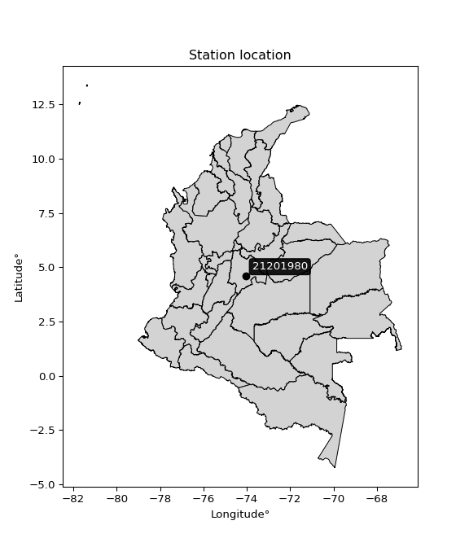</img>

</div>


## A. General information


### 1. General running parameters

• app_version: _v20260312_. • runtime: _2026-03-12 07:15:23.203550_. • Python version: _3.14.0_. • SciPy version: _1.16.3_. • Pandas version: _2.3.3_. • NumPy version: _2.3.5_. • Stations dataset (station_dataset_file): _dataset/pmax24h_in/automatic_colombia_2003_2025.csv_. • Stations catalog (station_catalog_file): _dataset/CNE.xls_. • Minimum year to eval til year_max (date_min): _1900_. • Maximum year to eval since year_min (date_max): _2025_. • Creates, save and include plots into reports (create_plot): _True_. • Plot only fit distributions with Δo > Δ (plot_only_fit): _True_. • Plot only simple graphs avoiding multiple CDFs and multiple Extreme values plots (plot_only_simple): _True_. • Eval low extreme values, if False, evaluates high extreme values (low_extreme): _False_. • Eval every SciPy distribution as logarithmic (pdist_logarithmic_on): _True_. • Standard deviation normalized (ddof): _1.0_. • Return periods to eval in years (Tr): _[2, 2.33, 5, 10, 15, 20, 25, 50, 75, 100, 200, 250, 500, 750, 1000]_. • Minimum data sample per station, 0 means any (minimum_sample): _5_. • Z-Score maximum threshold to adjust a value, 0 means disable (zscore_max): _3.5_. • Z-Score minimum threshold to adjust a value, 0 means disable (zscore_min): _-2.5_. • Avoid zeros, e.g. rain = 0 (avoid_zeros): _True_. • Avoid null values (avoid_nans): _True_. 

:file_folder:Table: [dataset.csv](../../dataset/pmax24h_in/automatic_colombia_2003_2025.csv)

> Delta Degrees of Freedom (DDOF): is a parameter used in the formulas for calculating variance and standard deviation. When ddof=0, the divisor is $N$ (the total number of observations) and this is used when your data set is the entire population. When ddof=1, the divisor is $N-1$ and this is used when your data set is a sample drawn from a larger population. Using $N-1$ provides an unbiased estimate of the population variance (known as Bessel´s correction).


### 2. Station info and location

|   id |   CODIGO | NOMBRE                     | CATEGORIA               | TECNOLOGIA                | ESTADO   | FECHA_INSTALACION   |   FECHA_SUSPENSION |   ALTITUD |   LATITUD |   LONGITUD | DEPARTAMENTO   | MUNICIPIO   | AREA_OPERATIVA                            | ENTIDAD                                                          | AREA_HIDROGRAFICA   | ZONA_HIDROGRAFICA   | SUBZONA_HIDROGRAFICA   |   CORRIENTE | Catalogo   |   Version |
|-----:|---------:|:---------------------------|:------------------------|:--------------------------|:---------|:--------------------|-------------------:|----------:|----------:|-----------:|:---------------|:------------|:------------------------------------------|:-----------------------------------------------------------------|:--------------------|:--------------------|:-----------------------|------------:|:-----------|----------:|
|    0 | 21201980 | GUADALUPE - AUT [21201980] | Climatológica Ordinaria | Automática con Telemetría | Activa   | 01/09/2007          |                nan |      3227 |   4.59157 |   -74.0547 | Bogotá         | Bogotá, D.C | Area Operativa 11 - Cundinamarca-Amazonas | FONDO DE PREVENCION Y ATENCION DE DESASTRES DE BOGOTA DC - FOPAE | Magdalena Cauca     | Alto Magdalena      | Río Bogotá             |         nan | CNE_OE     |  20251226 |

<div align="center">

Dynamic map: [:earth_americas:Google](http://maps.google.com/maps?q=4.59157,-74.05471) [:earth_americas:OSM](https://www.openstreetmap.org/#map=18/4.59157/-74.05471&layers=P) [:earth_americas:Bing](https://www.bing.com/maps?cp=4.59157~-74.05471&lvl=18) [:earth_americas:Apple](https://maps.apple.com/frame?center=4.59157%2C-74.05471&span=0.003%2C0.006)

</div>


<div align="center">

```geojson
{
  "type": "Feature",
  "geometry": {
    "type": "Point", 
    "coordinates": [-74.05471, 4.59157]
  }, 
  "properties": {
    "Name": "21201980"
  }
}
```

</div>


### 3. Discrete values table and plot

<div align="center">

|               |           0 |           1 |           2 |           3 |            4 |           5 |           6 |           7 |           8 |          9 |         10 |          11 |
|:--------------|------------:|------------:|------------:|------------:|-------------:|------------:|------------:|------------:|------------:|-----------:|-----------:|------------:|
| Date          | 2007        | 2008        | 2009        | 2010        | 2011         | 2012        | 2013        | 2014        | 2015        | 2016       | 2024       | 2025        |
| Value         |   49.8      |   16.5      |   26.7      |   35.1      |   43.7       |   37.7      |   49.8      |   29.9      |   20.1      |   26.6     |  172.4     |   25.8      |
| Value_initial |   49.8      |   16.5      |   26.7      |   35.1      |   43.7       |   37.7      |   49.8      |   29.9      |   20.1      |   26.6     |  172.4     |   25.8      |
| count         |   12        |   12        |   12        |   12        |   12         |   12        |   12        |   12        |   12        |   12       |   12       |   12        |
| mean          |   44.5083   |   44.5083   |   44.5083   |   44.5083   |   44.5083    |   44.5083   |   44.5083   |   44.5083   |   44.5083   |   44.5083  |   44.5083  |   44.5083   |
| std           |   41.7016   |   41.7016   |   41.7016   |   41.7016   |   41.7016    |   41.7016   |   41.7016   |   41.7016   |   41.7016   |   41.7016  |   41.7016  |   41.7016   |
| zscore        |    0.126894 |   -0.671636 |   -0.427042 |   -0.225611 |   -0.0193837 |   -0.163263 |    0.126894 |   -0.350306 |   -0.585309 |   -0.42944 |    3.06683 |   -0.448624 |


</div>


<div align="center">

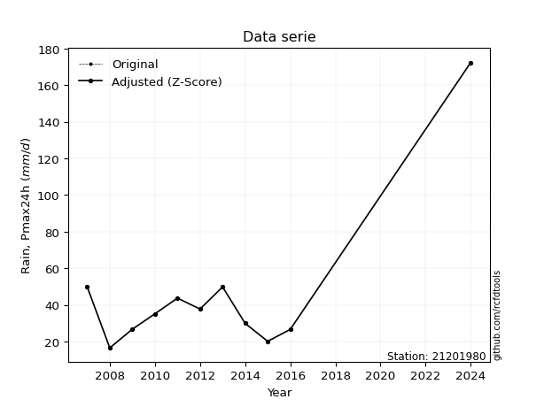</img>

</div>


> The initial value (value_initial) correspond to the initial obtained or null completed value, and value (value) is adjusted only when the initial value is outside the valid range (outlier) definite through the Z-Score value. If Z-Score is active, values out of range or outliers are replaced with the station mean value. A Z-Score (or standard score) measures how many standard deviations a data point is from the mean of a dataset, indicating its relative position; positive scores mean above the mean, negative mean below, and a score of zero is exactly at the mean, allowing for comparison of values from different distributions. It´s calculated using the formula $z=(x–μ)/σ$, where $x$ is the data point, $μ$ is the mean, and $σ$ is the standard deviation, helping identify outliers and understand probability.
>
> <sub>**Note**: In this study, "completing" (filling gaps in) and "extending" (forecasting or lengthening the historical record) rainfall data series are avoided for certain critical analyses because they introduce artificial bias and uncertainty, which can distort the statistics of rare events (extremes), alter day-to-day variability, and compromise the integrity and homogeneity of the original data. Some reasons against Completing/Extending rainfall data are: **Distortion of Extremes and Variability**: The primary issue is that most gap-filling or extension methods rely on averaging or regression with nearby stations, which inherently smooths the data. Rainfall is highly variable in space and time, with a large percentage of zero values and occasional large storms. Infilling methods often underestimate the highest values and overestimate the lowest (zero) values, which severely distorts analyses focused on flood frequency, drought severity, and intensity-duration-frequency (IDF) curves, **Loss of Data Homogeneity**: Infilled or extended data are synthetic estimates, not actual measurements. Combining these estimates with observed data can violate the assumption of data homogeneity, which requires that the data properties do not change over time. Inhomogeneity can lead to incorrect conclusions about long-term trends or changes in climate patterns, **Propagation of Errors**: Errors and biases from the original data (e.g., wind-induced undercatch, instrument errors, site changes) or the data used for imputation can propagate through the analysis, leading to unreliable hydrological models and inaccurate predictions, **Compromised Statistical Integrity**: For statistical analyses, especially those involving the frequency of events, using artificial data can introduce time bias or autocorrelation that doesn´t exist in reality, making it difficult to assess the true probability of events, **Difficulty in Validation**: It is difficult to accurately validate the quality of filled or extended data, especially for past periods where ground-truth measurements are unavailable. The reliability of imputation techniques heavily depends on the density of the surrounding station network and the complexity of the local topography.</sub>


### 4. Active continuous probability distributions from SciPy (80 of 104 available)

A Probability Density Function (PDF) describes the relative likelihood of a continuous random variable falling within a specific range, where the total area under its curve equals 1, and the area over any interval gives the actual probability for that range. Unlike discrete probabilities (like rolling a die), a PDF shows density, not direct probability for a single point (which is zero), with higher points indicating higher likelihood, often visualized as a bell curve for normal distributions.

A log of a probability density function (log-PDF) is simply the logarithm of the PDF´s value, denoted as $log(f(x))$, useful for converting multiplication of probabilities into addition, improving numerical stability with tiny numbers, and connecting to information theory concepts like entropy. Instead of dealing with very small probabilities (e.g., 0.000001), log-PDFs use negative numbers (e.g., $log(0.00001) ≈ -11.51$ that are easier for computers to handle, preventing underflow errors and simplifying complex calculations. In this study, each active probability distribution from SciPy is also evaluated in the $log$ form.

[scipy.stats](https://docs.scipy.org/doc/scipy/reference/stats.html) is a Python´s powerful submodule within the SciPy library for comprehensive statistical analysis, offering over 130 probability distributions (like Normal, Poisson, etc.), functions for descriptive stats (mean, variance), hypothesis testing (t-tests, chi-square), random variable generation, and statistical tests, making it essential for data science, modeling, and research. It provides tools to explore, model, and draw conclusions from data efficiently, working seamlessly with [NumPy](https://numpy.org/).

<div align="center">

|   id | p_dist           |   n_parameter | fit_method   | label                                                                       | active   | ref                                                                                                      |
|-----:|:-----------------|--------------:|:-------------|:----------------------------------------------------------------------------|:---------|:---------------------------------------------------------------------------------------------------------|
|    0 | alpha            |             3 | MLE          | Alpha                                                                       | True     | [:mortar_board:](https://docs.scipy.org/doc/scipy/reference/generated/scipy.stats.alpha.html)            |
|    1 | anglit           |             2 | MM           | Anglit                                                                      | True     | [:mortar_board:](https://docs.scipy.org/doc/scipy/reference/generated/scipy.stats.anglit.html)           |
|    2 | arcsine          |             2 | MM           | Arcsine                                                                     | True     | [:mortar_board:](https://docs.scipy.org/doc/scipy/reference/generated/scipy.stats.arcsine.html)          |
|    3 | argus            |             3 | MLE          | Argus                                                                       | True     | [:mortar_board:](https://docs.scipy.org/doc/scipy/reference/generated/scipy.stats.argus.html)            |
|    4 | beta             |             4 | MLE          | Beta                                                                        | True     | [:mortar_board:](https://docs.scipy.org/doc/scipy/reference/generated/scipy.stats.beta.html)             |
|    5 | betaprime        |             4 | MLE          | Beta prime                                                                  | True     | [:mortar_board:](https://docs.scipy.org/doc/scipy/reference/generated/scipy.stats.betaprime.html)        |
|    6 | bradford         |             3 | MLE          | Bradford                                                                    | True     | [:mortar_board:](https://docs.scipy.org/doc/scipy/reference/generated/scipy.stats.bradford.html)         |
|    7 | burr             |             4 | MLE          | Burr (Type III)                                                             | True     | [:mortar_board:](https://docs.scipy.org/doc/scipy/reference/generated/scipy.stats.burr.html)             |
|    8 | burr12           |             4 | MLE          | Burr (Type III) 12                                                          | True     | [:mortar_board:](https://docs.scipy.org/doc/scipy/reference/generated/scipy.stats.burr12.html)           |
|    9 | cosine           |             2 | MLE          | Cosine                                                                      | True     | [:mortar_board:](https://docs.scipy.org/doc/scipy/reference/generated/scipy.stats.cosine.html)           |
|   10 | crystalball      |             4 | MLE          | Crystalball                                                                 | True     | [:mortar_board:](https://docs.scipy.org/doc/scipy/reference/generated/scipy.stats.crystalball.html)      |
|   11 | dgamma           |             3 | MLE          | Double gamma                                                                | True     | [:mortar_board:](https://docs.scipy.org/doc/scipy/reference/generated/scipy.stats.dgamma.html)           |
|   12 | dweibull         |             3 | MLE          | Double Weibull                                                              | True     | [:mortar_board:](https://docs.scipy.org/doc/scipy/reference/generated/scipy.stats.dweibull.html)         |
|   13 | erlang           |             3 | MLE          | Erlang                                                                      | True     | [:mortar_board:](https://docs.scipy.org/doc/scipy/reference/generated/scipy.stats.erlang.html)           |
|   14 | exponnorm        |             3 | MLE          | Exponentially modified Normal                                               | True     | [:mortar_board:](https://docs.scipy.org/doc/scipy/reference/generated/scipy.stats.exponnorm.html)        |
|   15 | exponpow         |             3 | MLE          | Exponential power                                                           | True     | [:mortar_board:](https://docs.scipy.org/doc/scipy/reference/generated/scipy.stats.exponpow.html)         |
|   16 | exponweib        |             4 | MLE          | Exponentiated Weibull                                                       | True     | [:mortar_board:](https://docs.scipy.org/doc/scipy/reference/generated/scipy.stats.exponweib.html)        |
|   17 | f                |             4 | MLE          | F                                                                           | True     | [:mortar_board:](https://docs.scipy.org/doc/scipy/reference/generated/scipy.stats.f.html)                |
|   18 | fatiguelife      |             3 | MLE          | Fatigue-life (Birnbaum-Saunders)                                            | True     | [:mortar_board:](https://docs.scipy.org/doc/scipy/reference/generated/scipy.stats.fatiguelife.html)      |
|   19 | foldnorm         |             3 | MM           | Fold Normal                                                                 | True     | [:mortar_board:](https://docs.scipy.org/doc/scipy/reference/generated/scipy.stats.foldnorm.html)         |
|   20 | gamma            |             3 | MLE          | Gamma                                                                       | True     | [:mortar_board:](https://docs.scipy.org/doc/scipy/reference/generated/scipy.stats.gamma.html)            |
|   21 | gausshyper       |             6 | MLE          | Gauss hypergeometric                                                        | True     | [:mortar_board:](https://docs.scipy.org/doc/scipy/reference/generated/scipy.stats.gausshyper.html)       |
|   22 | genexpon         |             5 | MLE          | Generalized exponential                                                     | True     | [:mortar_board:](https://docs.scipy.org/doc/scipy/reference/generated/scipy.stats.genexpon.html)         |
|   23 | genextreme       |             3 | MLE          | Generalized exponential                                                     | True     | [:mortar_board:](https://docs.scipy.org/doc/scipy/reference/generated/scipy.stats.genextreme.html)       |
|   24 | gengamma         |             4 | MLE          | Generalized gamma                                                           | True     | [:mortar_board:](https://docs.scipy.org/doc/scipy/reference/generated/scipy.stats.gengamma.html)         |
|   25 | genhalflogistic  |             3 | MLE          | Generalized half-logistic                                                   | True     | [:mortar_board:](https://docs.scipy.org/doc/scipy/reference/generated/scipy.stats.genhalflogistic.html)  |
|   26 | genlogistic      |             3 | MLE          | Generalized logistic                                                        | True     | [:mortar_board:](https://docs.scipy.org/doc/scipy/reference/generated/scipy.stats.genlogistic.html)      |
|   27 | gennorm          |             3 | MLE          | Generalized Normal                                                          | True     | [:mortar_board:](https://docs.scipy.org/doc/scipy/reference/generated/scipy.stats.gennorm.html)          |
|   28 | genpareto        |             3 | MLE          | Generalized Pareto                                                          | True     | [:mortar_board:](https://docs.scipy.org/doc/scipy/reference/generated/scipy.stats.genpareto.html)        |
|   29 | gompertz         |             3 | MLE          | Gompertz (or truncated Gumbel)                                              | True     | [:mortar_board:](https://docs.scipy.org/doc/scipy/reference/generated/scipy.stats.gompertz.html)         |
|   30 | gumbel_l         |             2 | MM           | Gumbel Left Skew                                                            | True     | [:mortar_board:](https://docs.scipy.org/doc/scipy/reference/generated/scipy.stats.gumbel_l.html)         |
|   31 | gumbel_r         |             2 | MM           | Gumbel Right Skew                                                           | True     | [:mortar_board:](https://docs.scipy.org/doc/scipy/reference/generated/scipy.stats.gumbel_r.html)         |
|   32 | halfgennorm      |             3 | MLE          | Upper half of a generalized normal                                          | True     | [:mortar_board:](https://docs.scipy.org/doc/scipy/reference/generated/scipy.stats.halfgennorm.html)      |
|   33 | halflogistic     |             2 | MM           | Half-logistic                                                               | True     | [:mortar_board:](https://docs.scipy.org/doc/scipy/reference/generated/scipy.stats.halflogistic.html)     |
|   34 | halfnorm         |             2 | MM           | Half Normal                                                                 | True     | [:mortar_board:](https://docs.scipy.org/doc/scipy/reference/generated/scipy.stats.halfnorm.html)         |
|   35 | hypsecant        |             2 | MM           | hyperbolic secant                                                           | True     | [:mortar_board:](https://docs.scipy.org/doc/scipy/reference/generated/scipy.stats.hypsecant.html)        |
|   36 | invgamma         |             3 | MLE          | Inverted gamma                                                              | True     | [:mortar_board:](https://docs.scipy.org/doc/scipy/reference/generated/scipy.stats.invgamma.html)         |
|   37 | invgauss         |             3 | MLE          | Inverse Gaussian                                                            | True     | [:mortar_board:](https://docs.scipy.org/doc/scipy/reference/generated/scipy.stats.invgauss.html)         |
|   38 | invweibull       |             3 | MLE          | Inverted Weibull                                                            | True     | [:mortar_board:](https://docs.scipy.org/doc/scipy/reference/generated/scipy.stats.invweibull.html)       |
|   39 | johnsonsb        |             4 | MLE          | Johnson SB                                                                  | True     | [:mortar_board:](https://docs.scipy.org/doc/scipy/reference/generated/scipy.stats.johnsonsb.html)        |
|   40 | johnsonsu        |             4 | MLE          | Johnson Su                                                                  | True     | [:mortar_board:](https://docs.scipy.org/doc/scipy/reference/generated/scipy.stats.johnsonsu.html)        |
|   41 | kappa3           |             3 | MLE          | Kappa 3                                                                     | True     | [:mortar_board:](https://docs.scipy.org/doc/scipy/reference/generated/scipy.stats.kappa3.html)           |
|   42 | kappa4           |             4 | MLE          | Kappa 4                                                                     | True     | [:mortar_board:](https://docs.scipy.org/doc/scipy/reference/generated/scipy.stats.kappa4.html)           |
|   43 | ksone            |             3 | MLE          | Kolmogorov-Smirnov one-sided test statistic distribution                    | True     | [:mortar_board:](https://docs.scipy.org/doc/scipy/reference/generated/scipy.stats.ksone.html)            |
|   44 | kstwobign        |             2 | MLE          | Limiting distribution of scaled Kolmogorov-Smirnov two-sided test statistic | True     | [:mortar_board:](https://docs.scipy.org/doc/scipy/reference/generated/scipy.stats.kstwobign.html)        |
|   45 | laplace          |             2 | MM           | Laplace                                                                     | True     | [:mortar_board:](https://docs.scipy.org/doc/scipy/reference/generated/scipy.stats.laplace.html)          |
|   46 | levy_l           |             2 | MLE          | Left-skewed Levy                                                            | True     | [:mortar_board:](https://docs.scipy.org/doc/scipy/reference/generated/scipy.stats.levy_l.html)           |
|   47 | loggamma         |             3 | MLE          | Log gamma                                                                   | True     | [:mortar_board:](https://docs.scipy.org/doc/scipy/reference/generated/scipy.stats.loggamma.html)         |
|   48 | logistic         |             2 | MM           | Logistic (or Sech-squared)                                                  | True     | [:mortar_board:](https://docs.scipy.org/doc/scipy/reference/generated/scipy.stats.logistic.html)         |
|   49 | loglaplace       |             3 | MLE          | Log-Laplace                                                                 | True     | [:mortar_board:](https://docs.scipy.org/doc/scipy/reference/generated/scipy.stats.loglaplace.html)       |
|   50 | lomax            |             3 | MLE          | Lomax (Pareto of the second kind)                                           | True     | [:mortar_board:](https://docs.scipy.org/doc/scipy/reference/generated/scipy.stats.lomax.html)            |
|   51 | maxwell          |             2 | MM           | Maxwell                                                                     | True     | [:mortar_board:](https://docs.scipy.org/doc/scipy/reference/generated/scipy.stats.maxwell.html)          |
|   52 | mielke           |             4 | MLE          | Mielke Beta-Kappa / Dagum                                                   | True     | [:mortar_board:](https://docs.scipy.org/doc/scipy/reference/generated/scipy.stats.mielke.html)           |
|   53 | moyal            |             2 | MM           | Moyal                                                                       | True     | [:mortar_board:](https://docs.scipy.org/doc/scipy/reference/generated/scipy.stats.moyal.html)            |
|   54 | nakagami         |             3 | MLE          | Nakagami                                                                    | True     | [:mortar_board:](https://docs.scipy.org/doc/scipy/reference/generated/scipy.stats.nakagami.html)         |
|   55 | ncf              |             5 | MLE          | Non-central F distribution                                                  | True     | [:mortar_board:](https://docs.scipy.org/doc/scipy/reference/generated/scipy.stats.ncf.html)              |
|   56 | nct              |             4 | MLE          | Non-central Student’s t                                                     | True     | [:mortar_board:](https://docs.scipy.org/doc/scipy/reference/generated/scipy.stats.nct.html)              |
|   57 | norm             |             2 | MM           | Normal                                                                      | True     | [:mortar_board:](https://docs.scipy.org/doc/scipy/reference/generated/scipy.stats.norm.html)             |
|   58 | pearson3         |             3 | MM           | Pearson type III                                                            | True     | [:mortar_board:](https://docs.scipy.org/doc/scipy/reference/generated/scipy.stats.pearson3.html)         |
|   59 | powerlaw         |             3 | MLE          | Power-function                                                              | True     | [:mortar_board:](https://docs.scipy.org/doc/scipy/reference/generated/scipy.stats.powerlaw.html)         |
|   60 | rayleigh         |             2 | MM           | Rayleigh                                                                    | True     | [:mortar_board:](https://docs.scipy.org/doc/scipy/reference/generated/scipy.stats.rayleigh.html)         |
|   61 | rdist            |             3 | MLE          | R-distributed (symmetric beta)                                              | True     | [:mortar_board:](https://docs.scipy.org/doc/scipy/reference/generated/scipy.stats.rdist.html)            |
|   62 | rice             |             3 | MLE          | Rice                                                                        | True     | [:mortar_board:](https://docs.scipy.org/doc/scipy/reference/generated/scipy.stats.rice.html)             |
|   63 | semicircular     |             2 | MM           | Semicircular                                                                | True     | [:mortar_board:](https://docs.scipy.org/doc/scipy/reference/generated/scipy.stats.semicircular.html)     |
|   64 | skewnorm         |             3 | MLE          | Skew normal                                                                 | True     | [:mortar_board:](https://docs.scipy.org/doc/scipy/reference/generated/scipy.stats.skewnorm.html)         |
|   65 | t                |             3 | MLE          | Student’s t                                                                 | True     | [:mortar_board:](https://docs.scipy.org/doc/scipy/reference/generated/scipy.stats.t.html)                |
|   66 | trapezoid        |             4 | MLE          | Trapezoid                                                                   | True     | [:mortar_board:](https://docs.scipy.org/doc/scipy/reference/generated/scipy.stats.trapezoid.html)        |
|   67 | triang           |             3 | MLE          | Triangular                                                                  | True     | [:mortar_board:](https://docs.scipy.org/doc/scipy/reference/generated/scipy.stats.triang.html)           |
|   68 | truncexpon       |             3 | MLE          | Truncated exponential                                                       | True     | [:mortar_board:](https://docs.scipy.org/doc/scipy/reference/generated/scipy.stats.truncexpon.html)       |
|   69 | truncnorm        |             4 | MLE          | Truncated normal                                                            | True     | [:mortar_board:](https://docs.scipy.org/doc/scipy/reference/generated/scipy.stats.truncnorm.html)        |
|   70 | truncpareto      |             4 | MLE          | Upper truncated Pareto                                                      | True     | [:mortar_board:](https://docs.scipy.org/doc/scipy/reference/generated/scipy.stats.truncpareto.html)      |
|   71 | truncweibull_min |             5 | MLE          | Doubly truncated Weibull minimum                                            | True     | [:mortar_board:](https://docs.scipy.org/doc/scipy/reference/generated/scipy.stats.truncweibull_min.html) |
|   72 | tukeylambda      |             3 | MLE          | Tukey-Lamdba                                                                | True     | [:mortar_board:](https://docs.scipy.org/doc/scipy/reference/generated/scipy.stats.tukeylambda.html)      |
|   73 | uniform          |             2 | MLE          | Uniform                                                                     | True     | [:mortar_board:](https://docs.scipy.org/doc/scipy/reference/generated/scipy.stats.uniform.html)          |
|   74 | vonmises         |             3 | MLE          | Von Mises                                                                   | True     | [:mortar_board:](https://docs.scipy.org/doc/scipy/reference/generated/scipy.stats.vonmises.html)         |
|   75 | vonmises_line    |             3 | MLE          | Von Mises line                                                              | True     | [:mortar_board:](https://docs.scipy.org/doc/scipy/reference/generated/scipy.stats.vonmises_line.html)    |
|   76 | wald             |             2 | MM           | Wald                                                                        | True     | [:mortar_board:](https://docs.scipy.org/doc/scipy/reference/generated/scipy.stats.wald.html)             |
|   77 | weibull_max      |             3 | MLE          | Weibull maximum                                                             | True     | [:mortar_board:](https://docs.scipy.org/doc/scipy/reference/generated/scipy.stats.weibull_max.html)      |
|   78 | weibull_min      |             3 | MLE          | Weibull minimum                                                             | True     | [:mortar_board:](https://docs.scipy.org/doc/scipy/reference/generated/scipy.stats.weibull_min.html)      |
|   79 | wrapcauchy       |             3 | MLE          | Wrapped  Cauchy                                                             | True     | [:mortar_board:](https://docs.scipy.org/doc/scipy/reference/generated/scipy.stats.wrapcauchy.html)       |

</div>

> **n_parameter:** # arguments & localization & scale.
>
> **Fit methods:** (MLE) maximum likelihood, (MM) L-moments.
>
>**Inactive** (With the only purpose of prevent loops, zero divisions, infinite values, over high estimated values or horizontal trending for recurrence intervals estimations, the follow distributions were disabled.)**:** lognorm, norminvgauss, powernorm, powerlognorm, cauchy, halfcauchy, foldcauchy, skewcauchy, chi2, expon, fisk, genhyperbolic, geninvgauss, gibrat, kstwo, laplace_asymmetric, levy, levy_stable, ncx2, pareto, rel_breitwigner, recipinvgauss, studentized_range, loguniform, 


## B. Probability (PDF) vs. Empirical (EDF) distributions functions

A continuous probability distribution (CPD) describes probabilities for variables that can take any value within a range (like rain any time), unlike discrete variables with specific outcomes (like temperature). It uses a Probability Density Function (PDF), a curve where the total area under it equals 1, and the probability of the variable falling within an interval (a to b) is found by calculating the area under the curve between those points. A key feature is that the probability of hitting any single exact value is zero, so probabilities are always expressed for ranges, e.g., $P(a ≤ X ≤ b)$.

<div align="center">

Distributions parameters from station values
|     |   station | p_dist              |   n |            loc |           scale | shape                  | shape1                | shape2                | shape3             |
|----:|----------:|:--------------------|----:|---------------:|----------------:|:-----------------------|:----------------------|:----------------------|:-------------------|
|   0 |  21201980 | alpha               |  12 |     -1.69586   |    77.0518      | 2.271907300235241      |                       |                       |                    |
|   1 |  21201980 | anglit              |  12 |     44.5083    |   116.8         |                        |                       |                       |                    |
|   2 |  21201980 | arcsine             |  12 |    -11.956     |   112.929       |                        |                       |                       |                    |
|   3 |  21201980 | argus               |  12 |    -70.656     |   248.61        | 2.5214588762651703e-08 |                       |                       |                    |
|   4 |  21201980 | beta                |  12 |     16.5       |  4102.15        | 0.5033631694181218     | 127.40141567136334    |                       |                    |
|   5 |  21201980 | betaprime           |  12 |     -0.440778  |     0.933664    | 142.17640842145659     | 4.128753125738925     |                       |                    |
|   6 |  21201980 | bradford            |  12 |     -1.97977   |   174.38        | 2.9087978885524786     |                       |                       |                    |
|   7 |  21201980 | burr                |  12 |      0.0558307 |     3.44827     | 2.3995019233589376     | 149.6563682931224     |                       |                    |
|   8 |  21201980 | burr12              |  12 |     -0.438172  |    16.7763      | 304.3160969338263      | 0.004251310831551474  |                       |                    |
|   9 |  21201980 | cosine              |  12 |     33.2871    |     8.58826     |                        |                       |                       |                    |
|  10 |  21201980 | crystalball         |  12 |     44.5084    |    39.9263      | 5991.144369932503      | 786.6584779247689     |                       |                    |
|  11 |  21201980 | dgamma              |  12 |     26.6       |    36.7694      | 0.6208294485595383     |                       |                       |                    |
|  12 |  21201980 | dweibull            |  12 |     26.6       |    10.853       | 0.662189178422086      |                       |                       |                    |
|  13 |  21201980 | erlang              |  12 |     16.5       |    18.725       | 0.8424832640359421     |                       |                       |                    |
|  14 |  21201980 | exponnorm           |  12 |     16.4596    |     0.0129819   | 2144.427297959852      |                       |                       |                    |
|  15 |  21201980 | exponpow            |  12 |     16.5       |   121.014       | 0.4822918697146471     |                       |                       |                    |
|  16 |  21201980 | exponweib           |  12 |     12.122     |     0.068797    | 90.75870855004948      | 0.27941050285059743   |                       |                    |
|  17 |  21201980 | f                   |  12 |      9.40385   |    19.4075      | 1373.1903042790677     | 4.474415209160275     |                       |                    |
|  18 |  21201980 | fatiguelife         |  12 |     13.4816    |    19.8671      | 1.0716223581862847     |                       |                       |                    |
|  19 |  21201980 | foldnorm            |  12 |    -17.0424    |    75.3636      | 0.0024758175078591887  |                       |                       |                    |
|  20 |  21201980 | gamma               |  12 |     16.5       |    51.516       | 0.5919947557013945     |                       |                       |                    |
|  21 |  21201980 | gausshyper          |  12 |      0.509519  |   171.89        | 0.7249270103784506     | 0.9367625331741926    | 2.3816559377457547    | 0.660616534176123  |
|  22 |  21201980 | genexpon            |  12 |     11.9345    |     0.0760772   | 4.450595848038441e-08  | 0.0027553816989816134 | 0.014611063025533694  |                    |
|  23 |  21201980 | genextreme          |  12 |     27.5171    |    11.3584      | -0.4941864655822049    |                       |                       |                    |
|  24 |  21201980 | gengamma            |  12 |     16.5       |     6.29762     | 1.8045318710527738     | 0.5051165442234176    |                       |                    |
|  25 |  21201980 | genhalflogistic     |  12 |      2.55314   |    28.5844      | 4.846409568833963e-10  |                       |                       |                    |
|  26 |  21201980 | genlogistic         |  12 |   -102.749     |    17.4092      | 2206.163629706792      |                       |                       |                    |
|  27 |  21201980 | gennorm             |  12 |     26.6       |     0.4979      | 0.3621558865885729     |                       |                       |                    |
|  28 |  21201980 | genpareto           |  12 |     16.483     |    19.5011      | 0.30403655128833984    |                       |                       |                    |
|  29 |  21201980 | gompertz            |  12 |     16.5       |     2.11865e+12 | 79416941090.83948      |                       |                       |                    |
|  30 |  21201980 | gumbel_l            |  12 |     62.4773    |    31.1304      |                        |                       |                       |                    |
|  31 |  21201980 | gumbel_r            |  12 |     26.5394    |    31.1304      |                        |                       |                       |                    |
|  32 |  21201980 | halfgennorm         |  12 |     16.5       |     2.97331     | 0.44634061585278606    |                       |                       |                    |
|  33 |  21201980 | halflogistic        |  12 |     -2.81358   |    34.1355      |                        |                       |                       |                    |
|  34 |  21201980 | halfnorm            |  12 |     -8.33841   |    66.2336      |                        |                       |                       |                    |
|  35 |  21201980 | hypsecant           |  12 |     44.5083    |    25.4179      |                        |                       |                       |                    |
|  36 |  21201980 | invgamma            |  12 |      9.37228   |    43.4575      | 2.237206640199928      |                       |                       |                    |
|  37 |  21201980 | invgauss            |  12 |     12.7288    |    25.0583      | 1.268225324440956      |                       |                       |                    |
|  38 |  21201980 | invweibull          |  12 |      4.53289   |    22.9841      | 2.0235308531208966     |                       |                       |                    |
|  39 |  21201980 | johnsonsb           |  12 |     14.2121    | 21364.1         | 7.079691762092331      | 0.9995586802117342    |                       |                    |
|  40 |  21201980 | johnsonsu           |  12 |     14.1834    |     0.149829    | -5.504000322709176     | 1.0043007570053795    |                       |                    |
|  41 |  21201980 | kappa3              |  12 |     16.5       |    18.9014      | 2.019612180564552      |                       |                       |                    |
|  42 |  21201980 | kappa4              |  12 |      0.898045  |   170.057       | 1.100755291971144      | 0.9508520934065868    |                       |                    |
|  43 |  21201980 | ksone               |  12 |      0.91      |   187.08        | 1.0                    |                       |                       |                    |
|  44 |  21201980 | kstwobign           |  12 |    -46.6453    |   108.779       |                        |                       |                       |                    |
|  45 |  21201980 | laplace             |  12 |     44.5083    |    28.2321      |                        |                       |                       |                    |
|  46 |  21201980 | levy_l              |  12 |    187.964     |    88.5378      |                        |                       |                       |                    |
|  47 |  21201980 | loggamma            |  12 | -11189.1       |  1552.23        | 1389.4960705849326     |                       |                       |                    |
|  48 |  21201980 | logistic            |  12 |     44.5083    |    22.0125      |                        |                       |                       |                    |
|  49 |  21201980 | loglaplace          |  12 |     -0.0797948 |    29.9798      | 2.447753064558288      |                       |                       |                    |
|  50 |  21201980 | lomax               |  12 |     16.5       |   729.678       | 29.147933607413844     |                       |                       |                    |
|  51 |  21201980 | maxwell             |  12 |    -50.1002    |    59.2871      |                        |                       |                       |                    |
|  52 |  21201980 | mielke              |  12 |     -0.400746  |     5.49866     | 139.71443597285474     | 2.452631829146391     |                       |                    |
|  53 |  21201980 | moyal               |  12 |     21.6759    |    17.9731      |                        |                       |                       |                    |
|  54 |  21201980 | nakagami            |  12 |     16.5       |    67.4556      | 0.20790248793718613    |                       |                       |                    |
|  55 |  21201980 | ncf                 |  12 |      9.37553   |    17.5294      | 13281.227512288502     | 4.474409990978485     | 1434.746306380181     |                    |
|  56 |  21201980 | nct                 |  12 |     -0.132188  |     0.791651    | 2.645775921488964      | 36.68234681007988     |                       |                    |
|  57 |  21201980 | norm                |  12 |     44.5083    |    39.9263      |                        |                       |                       |                    |
|  58 |  21201980 | pearson3            |  12 |     44.5084    |    39.9262      | 2.662363943779054      |                       |                       |                    |
|  59 |  21201980 | powerlaw            |  12 |     16.5       |   155.9         | 0.1942382254791712     |                       |                       |                    |
|  60 |  21201980 | rayleigh            |  12 |    -31.873     |    60.9435      |                        |                       |                       |                    |
|  61 |  21201980 | rdist               |  12 |      2.20886   |    47.5911      | 1.2896993107284342     |                       |                       |                    |
|  62 |  21201980 | rice                |  12 |     -8.77569   |    47.0813      | 9.566366384684125e-05  |                       |                       |                    |
|  63 |  21201980 | semicircular        |  12 |     44.5083    |    79.8525      |                        |                       |                       |                    |
|  64 |  21201980 | skewnorm            |  12 |     16.5       |    48.7705      | 37359447.64888117      |                       |                       |                    |
|  65 |  21201980 | t                   |  12 |     31.2623    |     9.45432     | 1.4016820784157658     |                       |                       |                    |
|  66 |  21201980 | trapezoid           |  12 |      0.91      |   187.08        | 1.0                    | 1.0                   |                       |                    |
|  67 |  21201980 | triang              |  12 |      0.879889  |   171.52        | 0.9999999493345852     |                       |                       |                    |
|  68 |  21201980 | truncexpon          |  12 |      0.980647  |   149.653       | 1.1454482987559034     |                       |                       |                    |
|  69 |  21201980 | truncnorm           |  12 | -10973.4       |   665.646       | 16.51017958470394      | 16.744399555007938    |                       |                    |
|  70 |  21201980 | truncpareto         |  12 |    -46.7097    |    63.2097      | 2.9493864138084684     | 3.4663942420160314    |                       |                    |
|  71 |  21201980 | truncweibull_min    |  12 |      0.91577   |   118.15        | 0.9048866267004838     | 6.39072630145264e-05  | 1.451406908691216     |                    |
|  72 |  21201980 | tukeylambda         |  12 |      2.1131    |    58.3345      | 1.2232816089310137     |                       |                       |                    |
|  73 |  21201980 | uniform             |  12 |     16.5       |   155.9         |                        |                       |                       |                    |
|  74 |  21201980 | vonmises            |  12 |      0.21016   |     1           | 0.4406867910066986     |                       |                       |                    |
|  75 |  21201980 | vonmises_line       |  12 |      8.89075   |    13.0219      | 1.5850539079290571e-06 |                       |                       |                    |
|  76 |  21201980 | wald                |  12 |      4.58206   |    39.9263      |                        |                       |                       |                    |
|  77 |  21201980 | weibull_max         |  12 |    172.4       |     1.5914      | 0.19114721546906477    |                       |                       |                    |
|  78 |  21201980 | weibull_min         |  12 |     16.5       |    34.2538      | 0.8890171668201663     |                       |                       |                    |
|  79 |  21201980 | wrapcauchy          |  12 |     16.5       |    24.8123      | 0.6029992966166007     |                       |                       |                    |
|  80 |  21201980 | logalpha            |  12 |      1.17343   |    11.1345      | 4.855872195680746      |                       |                       |                    |
|  81 |  21201980 | loganglit           |  12 |      3.57908   |     1.68444     |                        |                       |                       |                    |
|  82 |  21201980 | logarcsine          |  12 |      2.76476   |     1.62863     |                        |                       |                       |                    |
|  83 |  21201980 | logargus            |  12 |      2.03054   |     3.19281     | 4.1712341236199436e-05 |                       |                       |                    |
|  84 |  21201980 | logbeta             |  12 |      2.80336   |     4.67905     | 0.332791706624675      | 5.356144345084251     |                       |                    |
|  85 |  21201980 | logbetaprime        |  12 |      2.64593   |    46.4919      | 2.7618433794520603     | 138.5451162590447     |                       |                    |
|  86 |  21201980 | logbradford         |  12 |      2.80336   |     2.34646     | 4.356258025139525      |                       |                       |                    |
|  87 |  21201980 | logburr             |  12 |     -0.0185131 |     2.80069     | 9.206971605042789      | 5.5522207585409555    |                       |                    |
|  88 |  21201980 | logburr12           |  12 |     -0.0454201 |     3.2851      | 18.358430149320416     | 0.46080660936693046   |                       |                    |
|  89 |  21201980 | logcosine           |  12 |      3.71949   |     0.565214    |                        |                       |                       |                    |
|  90 |  21201980 | logcrystalball      |  12 |      3.57908   |     0.575806    | 113.5564230238376      | 3.265238331693907     |                       |                    |
|  91 |  21201980 | logdgamma           |  12 |      3.48465   |     0.275244    | 1.4875235440896684     |                       |                       |                    |
|  92 |  21201980 | logdweibull         |  12 |      3.49074   |     0.43425     | 1.1563153341995798     |                       |                       |                    |
|  93 |  21201980 | logerlang           |  12 |      2.66243   |     0.355663    | 2.5773020362894927     |                       |                       |                    |
|  94 |  21201980 | logexponnorm        |  12 |      3.08558   |     0.256253    | 1.9258341457018981     |                       |                       |                    |
|  95 |  21201980 | logexponpow         |  12 |      2.80336   |     1.96109     | 0.30254260636734365    |                       |                       |                    |
|  96 |  21201980 | logexponweib        |  12 |      2.80336   |     1.29368     | 0.15066879487469825    | 1.7670531987556048    |                       |                    |
|  97 |  21201980 | logf                |  12 |      1.99865   |     1.42184     | 318.78559289081        | 19.98640500825471     |                       |                    |
|  98 |  21201980 | logfatiguelife      |  12 |      2.30645   |     1.16194     | 0.43654504886937784    |                       |                       |                    |
|  99 |  21201980 | logfoldnorm         |  12 |      2.80307   |     0.917711    | 0.3440035519661001     |                       |                       |                    |
| 100 |  21201980 | loggamma            |  12 |      2.66242   |     0.355669    | 2.5772848988202295     |                       |                       |                    |
| 101 |  21201980 | loggausshyper       |  12 |      2.80336   |     2.35748     | 0.25258994588129946    | 1.0581283903213405    | 0.3248033407256394    | 1.9406142889981384 |
| 102 |  21201980 | loggenexpon         |  12 |      2.80336   |     1.05205     | 0.9757265905869978     | 1.1522375531369753    | 0.8613299385837294    |                    |
| 103 |  21201980 | loggenextreme       |  12 |      3.31577   |     0.406145    | -0.06767219660532328   |                       |                       |                    |
| 104 |  21201980 | loggengamma         |  12 |      2.80336   |     1.19899     | 0.525969523651244      | 1.661630750905835     |                       |                    |
| 105 |  21201980 | loggenhalflogistic  |  12 |      2.70702   |     2.58516     | 1.0582773621091275     |                       |                       |                    |
| 106 |  21201980 | loggenlogistic      |  12 |      0.871522  |     0.415158    | 373.81662327534843     |                       |                       |                    |
| 107 |  21201980 | loggennorm          |  12 |      3.50974   |     0.470244    | 1.112883085948308      |                       |                       |                    |
| 108 |  21201980 | loggenpareto        |  12 |     -0.123812  |     8.32155     | -1.5779541021018813    |                       |                       |                    |
| 109 |  21201980 | loggompertz         |  12 |      2.80336   |     1.39911     | 1.044816166253673      |                       |                       |                    |
| 110 |  21201980 | loggumbel_l         |  12 |      3.83822   |     0.448954    |                        |                       |                       |                    |
| 111 |  21201980 | loggumbel_r         |  12 |      3.31994   |     0.448954    |                        |                       |                       |                    |
| 112 |  21201980 | loghalfgennorm      |  12 |      2.80336   |     1.32861     | 1.9002338173831919     |                       |                       |                    |
| 113 |  21201980 | loghalflogistic     |  12 |      2.89663   |     0.492283    |                        |                       |                       |                    |
| 114 |  21201980 | loghalfnorm         |  12 |      2.81699   |     0.955147    |                        |                       |                       |                    |
| 115 |  21201980 | loghypsecant        |  12 |      3.57908   |     0.36657     |                        |                       |                       |                    |
| 116 |  21201980 | loginvgamma         |  12 |      1.95544   |    14.5852      | 9.985748039008316      |                       |                       |                    |
| 117 |  21201980 | loginvgauss         |  12 |      2.28281   |     6.81        | 0.19034731120087442    |                       |                       |                    |
| 118 |  21201980 | loginvweibull       |  12 |     -2.68876   |     6.00453     | 14.78355726587737      |                       |                       |                    |
| 119 |  21201980 | logjohnsonsb        |  12 |      2.34052   |    77.743       | 9.439410148303264      | 2.2361103815923524    |                       |                    |
| 120 |  21201980 | logjohnsonsu        |  12 |      2.33255   |     0.107667    | -7.030563521906835     | 2.305542586910313     |                       |                    |
| 121 |  21201980 | logkappa3           |  12 |      2.80336   |     0.871255    | 3.999008427217964      |                       |                       |                    |
| 122 |  21201980 | logkappa4           |  12 |      2.3234    |     2.95044     | 1.1950234891692355     | 1.037160215180017     |                       |                    |
| 123 |  21201980 | logksone            |  12 |      2.56871   |     2.81575     | 1.0                    |                       |                       |                    |
| 124 |  21201980 | logkstwobign        |  12 |      1.79584   |     2.06557     |                        |                       |                       |                    |
| 125 |  21201980 | loglaplace          |  12 |      3.57908   |     0.407156    |                        |                       |                       |                    |
| 126 |  21201980 | loglevy_l           |  12 |      5.33586   |     1.05645     |                        |                       |                       |                    |
| 127 |  21201980 | logloggamma         |  12 |   -180.525     |    24.6892      | 1731.7262987544518     |                       |                       |                    |
| 128 |  21201980 | loglogistic         |  12 |      3.57908   |     0.317459    |                        |                       |                       |                    |
| 129 |  21201980 | logloglaplace       |  12 |      2.56668   |     0.843055    | 2.268927500668081      |                       |                       |                    |
| 130 |  21201980 | loglomax            |  12 |      2.80336   |    19.9157      | 26.403823865249983     |                       |                       |                    |
| 131 |  21201980 | logmaxwell          |  12 |      2.21466   |     0.855023    |                        |                       |                       |                    |
| 132 |  21201980 | logmielke           |  12 |      1.18083   |     1.89379     | 17.82243036186705      | 6.572985078731557     |                       |                    |
| 133 |  21201980 | logmoyal            |  12 |      3.2498    |     0.259204    |                        |                       |                       |                    |
| 134 |  21201980 | lognakagami         |  12 |      2.80336   |     0.473236    | 0.12737555386451266    |                       |                       |                    |
| 135 |  21201980 | logncf              |  12 |     -2.65621   |     6.21146     | 384.5777747648569      | 422.93516935624154    | 3.902660584158227e-06 |                    |
| 136 |  21201980 | lognct              |  12 |     -0.184798  |     0.0867763   | 27.703254584316213     | 42.15609530507058     |                       |                    |
| 137 |  21201980 | lognorm             |  12 |      3.57908   |     0.575806    |                        |                       |                       |                    |
| 138 |  21201980 | logpearson3         |  12 |      3.57908   |     0.575806    | 1.3971186136971276     |                       |                       |                    |
| 139 |  21201980 | logpowerlaw         |  12 |      2.80336   |     2.34646     | 0.24266892424025444    |                       |                       |                    |
| 140 |  21201980 | lograyleigh         |  12 |      2.47753   |     0.87891     |                        |                       |                       |                    |
| 141 |  21201980 | logrdist            |  12 |      4.07215   |     1.26879     | 0.9799945724811392     |                       |                       |                    |
| 142 |  21201980 | logrice             |  12 |      2.60843   |     0.798032    | 0.0002708509066419192  |                       |                       |                    |
| 143 |  21201980 | logsemicircular     |  12 |      3.57908   |     1.1516      |                        |                       |                       |                    |
| 144 |  21201980 | logskewnorm         |  12 |      2.80336   |     0.966056    | 75935945.10381755      |                       |                       |                    |
| 145 |  21201980 | logt                |  12 |      3.47703   |     0.352561    | 2.737009802145127      |                       |                       |                    |
| 146 |  21201980 | logtrapezoid        |  12 |      2.56871   |     2.81575     | 1.0                    | 1.0                   |                       |                    |
| 147 |  21201980 | logtriang           |  12 |      2.59765   |     2.80484     | 0.23271380027137437    |                       |                       |                    |
| 148 |  21201980 | logtruncexpon       |  12 |      2.80336   |     2.64851     | 0.8859636222912357     |                       |                       |                    |
| 149 |  21201980 | logtruncnorm        |  12 |     -0.336587  |     2.01981     | 1.5545758789364927     | 2.723667979527484     |                       |                    |
| 150 |  21201980 | logtruncpareto      |  12 |      2.80336   |     4.32865e-06 | 0.09091722852427975    | 542077.1701197654     |                       |                    |
| 151 |  21201980 | logtruncweibull_min |  12 |      2.80336   |     2.73629     | 0.9342676325177829     | 7.378773291038641e-17 | 0.8581571598688167    |                    |
| 152 |  21201980 | logtukeylambda      |  12 |      3.97677   |     1.22947     | 1.0477765533371377     |                       |                       |                    |
| 153 |  21201980 | loguniform          |  12 |      2.80336   |     2.34646     |                        |                       |                       |                    |
| 154 |  21201980 | logvonmises         |  12 |     -2.749     |     1           | 3.8231141329055585     |                       |                       |                    |
| 155 |  21201980 | logvonmises_line    |  12 |      3.49622   |     0.526358    | 1.7359843307345653     |                       |                       |                    |
| 156 |  21201980 | logwald             |  12 |      3.00329   |     0.575795    |                        |                       |                       |                    |
| 157 |  21201980 | logweibull_max      |  12 |      5.14982   |     1.14342     | 0.9581708996247276     |                       |                       |                    |
| 158 |  21201980 | logweibull_min      |  12 |      3.00072   |     0.63176     | 0.7974272948215149     |                       |                       |                    |
| 159 |  21201980 | logwrapcauchy       |  12 |      2.80336   |     0.37345     | 0.5                    |                       |                       |                    |

</div>

> **loc** (Location parameter): This shifts the distribution along the x-axis. For many common distributions, like the normal (Gaussian) distribution, loc represents the mean $μ$. For others, like the uniform distribution, it might represent the minimum value, or for the beta distribution, the left end of the support interval.
>
> **scale** (Scale parameter): This determines the width or spread of the distribution. For the normal distribution, scale represents the standard deviation $σ$. For a uniform distribution, it defines the length of the interval (from $loc$ to $loc + scale$).
>
> **shape** (Shape parameters): Refers to parameters that define the specific form of a probability distribution, distinct from its location (loc) and scale (scale). These parameters are required arguments for most distribution functions. For example, a normal (Gaussian) distribution is fully defined by its location (mean) and scale (standard deviation), so it has no specific shape parameters beyond loc and scale. However, other distributions have intrinsic properties that need specification, as Gamma distribution that takes a shape parameter, often named $a$ or $alpha$.


### 0. Cumulative distribution values - CDF (160 evaluated)

Cumulative Distribution Function (CDF), denoted as $F$<sub>$X$</sub>$(x)$, is a function that gives the probability that a random variable $X$ will take a value less than or equal to a specific value, $x$ (i.e., $(P(X≥x)$. It essentially "accumulates" probabilities from a given point up to the far right (positive infinity), providing a complete picture of the distribution´s probabilities for both discrete (like rain) and continuous (like temperature) variables, helping to find probabilities over ranges or above certain values. Each station is evaluated separately ordering the $x$ values ascending, calculating the CDF and PDF values for the activated distributions and their logarithmic forms.

<div align="center">

CDF ordered by x ascending and calculating $log(f(x))$ separately
|   id |   Station |   date |     x |   count |    mean |     std |     zscore |   Value_initial |   station |   m |     alpha |   alpha_pdf |   anglit |   anglit_pdf |   arcsine |   arcsine_pdf |    argus |   argus_pdf |        beta |    beta_pdf |   betaprime |   betaprime_pdf |   bradford |   bradford_pdf |      burr |    burr_pdf |    burr12 |   burr12_pdf |    cosine |   cosine_pdf |   crystalball |   crystalball_pdf |   dgamma |     dgamma_pdf |   dweibull |   dweibull_pdf |      erlang |   erlang_pdf |   exponnorm |   exponnorm_pdf |    exponpow |   exponpow_pdf |   exponweib |   exponweib_pdf |         f |       f_pdf |   fatiguelife |   fatiguelife_pdf |   foldnorm |   foldnorm_pdf |       gamma |       gamma_pdf |   gausshyper |   gausshyper_pdf |   genexpon |   genexpon_pdf |   genextreme |   genextreme_pdf |    gengamma |   gengamma_pdf |   genhalflogistic |   genhalflogistic_pdf |   genlogistic |   genlogistic_pdf |   gennorm |   gennorm_pdf |   genpareto |   genpareto_pdf |    gompertz |   gompertz_pdf |   gumbel_l |   gumbel_l_pdf |   gumbel_r |   gumbel_r_pdf |   halfgennorm |   halfgennorm_pdf |   halflogistic |   halflogistic_pdf |   halfnorm |   halfnorm_pdf |   hypsecant |   hypsecant_pdf |   invgamma |   invgamma_pdf |   invgauss |   invgauss_pdf |   invweibull |   invweibull_pdf |   johnsonsb |   johnsonsb_pdf |   johnsonsu |   johnsonsu_pdf |      kappa3 |   kappa3_pdf |      kappa4 |   kappa4_pdf |     ksone |   ksone_pdf |   kstwobign |   kstwobign_pdf |   laplace |   laplace_pdf |   levy_l |   levy_l_pdf |   loggamma |   loggamma_pdf |   logistic |   logistic_pdf |   loglaplace |   loglaplace_pdf |       lomax |   lomax_pdf |   maxwell |   maxwell_pdf |   mielke |   mielke_pdf |    moyal |   moyal_pdf |    nakagami |   nakagami_pdf |       ncf |     ncf_pdf |       nct |     nct_pdf |     norm |    norm_pdf |   pearson3 |   pearson3_pdf |    powerlaw |   powerlaw_pdf |   rayleigh |   rayleigh_pdf |    rdist |     rdist_pdf |     rice |   rice_pdf |   semicircular |   semicircular_pdf |   skewnorm |   skewnorm_pdf |        t |      t_pdf |   trapezoid |   trapezoid_pdf |     triang |   triang_pdf |   truncexpon |   truncexpon_pdf |   truncnorm |   truncnorm_pdf |   truncpareto |   truncpareto_pdf |   truncweibull_min |   truncweibull_min_pdf |   tukeylambda |   tukeylambda_pdf |   uniform |   uniform_pdf |   vonmises |   vonmises_pdf |   vonmises_line |   vonmises_line_pdf |     wald |    wald_pdf |   weibull_max |   weibull_max_pdf |   weibull_min |   weibull_min_pdf |   wrapcauchy |   wrapcauchy_pdf |   logalpha |   logalpha_pdf |   loganglit |   loganglit_pdf |   logarcsine |   logarcsine_pdf |   logargus |   logargus_pdf |     logbeta |   logbeta_pdf |   logbetaprime |   logbetaprime_pdf |   logbradford |   logbradford_pdf |   logburr |   logburr_pdf |   logburr12 |   logburr12_pdf |   logcosine |   logcosine_pdf |   logcrystalball |   logcrystalball_pdf |   logdgamma |   logdgamma_pdf |   logdweibull |   logdweibull_pdf |   logerlang |   logerlang_pdf |   logexponnorm |   logexponnorm_pdf |   logexponpow |   logexponpow_pdf |   logexponweib |   logexponweib_pdf |      logf |   logf_pdf |   logfatiguelife |   logfatiguelife_pdf |   logfoldnorm |   logfoldnorm_pdf |   loggausshyper |   loggausshyper_pdf |   loggenexpon |   loggenexpon_pdf |   loggenextreme |   loggenextreme_pdf |   loggengamma |   loggengamma_pdf |   loggenhalflogistic |   loggenhalflogistic_pdf |   loggenlogistic |   loggenlogistic_pdf |   loggennorm |   loggennorm_pdf |   loggenpareto |   loggenpareto_pdf |   loggompertz |   loggompertz_pdf |   loggumbel_l |   loggumbel_l_pdf |   loggumbel_r |   loggumbel_r_pdf |   loghalfgennorm |   loghalfgennorm_pdf |   loghalflogistic |   loghalflogistic_pdf |   loghalfnorm |   loghalfnorm_pdf |   loghypsecant |   loghypsecant_pdf |   loginvgamma |   loginvgamma_pdf |   loginvgauss |   loginvgauss_pdf |   loginvweibull |   loginvweibull_pdf |   logjohnsonsb |   logjohnsonsb_pdf |   logjohnsonsu |   logjohnsonsu_pdf |   logkappa3 |   logkappa3_pdf |   logkappa4 |   logkappa4_pdf |   logksone |   logksone_pdf |   logkstwobign |   logkstwobign_pdf |   loglevy_l |   loglevy_l_pdf |   logloggamma |   logloggamma_pdf |   loglogistic |   loglogistic_pdf |   logloglaplace |   logloglaplace_pdf |    loglomax |   loglomax_pdf |   logmaxwell |   logmaxwell_pdf |   logmielke |   logmielke_pdf |   logmoyal |   logmoyal_pdf |   lognakagami |   lognakagami_pdf |    logncf |   logncf_pdf |    lognct |   lognct_pdf |   lognorm |   lognorm_pdf |   logpearson3 |   logpearson3_pdf |   logpowerlaw |   logpowerlaw_pdf |   lograyleigh |   lograyleigh_pdf |    logrdist |   logrdist_pdf |   logrice |   logrice_pdf |   logsemicircular |   logsemicircular_pdf |   logskewnorm |   logskewnorm_pdf |      logt |   logt_pdf |   logtrapezoid |   logtrapezoid_pdf |   logtriang |   logtriang_pdf |   logtruncexpon |   logtruncexpon_pdf |   logtruncnorm |   logtruncnorm_pdf |   logtruncpareto |   logtruncpareto_pdf |   logtruncweibull_min |   logtruncweibull_min_pdf |   logtukeylambda |   logtukeylambda_pdf |   loguniform |   loguniform_pdf |   logvonmises |   logvonmises_pdf |   logvonmises_line |   logvonmises_line_pdf |   logwald |   logwald_pdf |   logweibull_max |   logweibull_max_pdf |   logweibull_min |   logweibull_min_pdf |   logwrapcauchy |   logwrapcauchy_pdf |
|-----:|----------:|-------:|------:|--------:|--------:|--------:|-----------:|----------------:|----------:|----:|----------:|------------:|---------:|-------------:|----------:|--------------:|---------:|------------:|------------:|------------:|------------:|----------------:|-----------:|---------------:|----------:|------------:|----------:|-------------:|----------:|-------------:|--------------:|------------------:|---------:|---------------:|-----------:|---------------:|------------:|-------------:|------------:|----------------:|------------:|---------------:|------------:|----------------:|----------:|------------:|--------------:|------------------:|-----------:|---------------:|------------:|----------------:|-------------:|-----------------:|-----------:|---------------:|-------------:|-----------------:|------------:|---------------:|------------------:|----------------------:|--------------:|------------------:|----------:|--------------:|------------:|----------------:|------------:|---------------:|-----------:|---------------:|-----------:|---------------:|--------------:|------------------:|---------------:|-------------------:|-----------:|---------------:|------------:|----------------:|-----------:|---------------:|-----------:|---------------:|-------------:|-----------------:|------------:|----------------:|------------:|----------------:|------------:|-------------:|------------:|-------------:|----------:|------------:|------------:|----------------:|----------:|--------------:|---------:|-------------:|-----------:|---------------:|-----------:|---------------:|-------------:|-----------------:|------------:|------------:|----------:|--------------:|---------:|-------------:|---------:|------------:|------------:|---------------:|----------:|------------:|----------:|------------:|---------:|------------:|-----------:|---------------:|------------:|---------------:|-----------:|---------------:|---------:|--------------:|---------:|-----------:|---------------:|-------------------:|-----------:|---------------:|---------:|-----------:|------------:|----------------:|-----------:|-------------:|-------------:|-----------------:|------------:|----------------:|--------------:|------------------:|-------------------:|-----------------------:|--------------:|------------------:|----------:|--------------:|-----------:|---------------:|----------------:|--------------------:|---------:|------------:|--------------:|------------------:|--------------:|------------------:|-------------:|-----------------:|-----------:|---------------:|------------:|----------------:|-------------:|-----------------:|-----------:|---------------:|------------:|--------------:|---------------:|-------------------:|--------------:|------------------:|----------:|--------------:|------------:|----------------:|------------:|----------------:|-----------------:|---------------------:|------------:|----------------:|--------------:|------------------:|------------:|----------------:|---------------:|-------------------:|--------------:|------------------:|---------------:|-------------------:|----------:|-----------:|-----------------:|---------------------:|--------------:|------------------:|----------------:|--------------------:|--------------:|------------------:|----------------:|--------------------:|--------------:|------------------:|---------------------:|-------------------------:|-----------------:|---------------------:|-------------:|-----------------:|---------------:|-------------------:|--------------:|------------------:|--------------:|------------------:|--------------:|------------------:|-----------------:|---------------------:|------------------:|----------------------:|--------------:|------------------:|---------------:|-------------------:|--------------:|------------------:|--------------:|------------------:|----------------:|--------------------:|---------------:|-------------------:|---------------:|-------------------:|------------:|----------------:|------------:|----------------:|-----------:|---------------:|---------------:|-------------------:|------------:|----------------:|--------------:|------------------:|--------------:|------------------:|----------------:|--------------------:|------------:|---------------:|-------------:|-----------------:|------------:|----------------:|-----------:|---------------:|--------------:|------------------:|----------:|-------------:|----------:|-------------:|----------:|--------------:|--------------:|------------------:|--------------:|------------------:|--------------:|------------------:|------------:|---------------:|----------:|--------------:|------------------:|----------------------:|--------------:|------------------:|----------:|-----------:|---------------:|-------------------:|------------:|----------------:|----------------:|--------------------:|---------------:|-------------------:|-----------------:|---------------------:|----------------------:|--------------------------:|-----------------:|---------------------:|-------------:|-----------------:|--------------:|------------------:|-------------------:|-----------------------:|----------:|--------------:|-----------------:|---------------------:|-----------------:|---------------------:|----------------:|--------------------:|
|    0 |  21201980 |   2008 |  16.5 |      12 | 44.5083 | 41.7016 | -0.671636  |            16.5 |  21201980 |   1 | 0.0251324 | 0.0136875   | 0.269291 |   0.00759572 |  0.334788 |    0.0064924  | 0.178566 |  0.00396192 | 1.04633e-08 | 1.48248e+06 |    0.057983 |       0.0167457 |   0.197103 |     0.00935309 | 0.0306591 | 0.01541     | 0.0125638 |  0.0715667   | 0.0413342 |    0.0115915 |      0.241495 |       0.00781253  | 0.274043 |    0.0116847   |   0.192695 |    0.0120462   | 1.57159e-12 |  7.76426     |  0.00144969 |     0.0358355   | 1.06321e-08 |    1.44333e+06 |   0.0221362 |     0.0175461   | 0.0226563 | 0.0160162   |     0.0211612 |        0.023202   |   0.343733 |    0.00958876  | 3.03299e-10 | 50539.2         |     0.266017 |       0.011145   |  0.0537461 |    0.0200118   |    0.0236156 |      0.0149579   | 7.49627e-15 |    1.92327     |          0.239232 |           0.016491    |      0.096657 |       0.012966    |  0.186114 |   0.0114434   | 0.000872021 |     0.0512209   | 1.08935e-12 |    0.0374847   |   0.204145 |    0.00583752  |   0.251436 |    0.0111507   |   1.31572e-13 |       0.133217    |       0.275583 |        0.0135351   |   0.292349 |    0.0112285   |    0.204203 |     0.007494    |  0.0226565 |    0.0160162   |  0.0210639 |    0.0206504   |    0.0236161 |      0.0149581   |    0.019796 |     0.020972    |   0.0198588 |     0.0208208   | 8.03115e-09 |   0.0373555  | 3.20464e-15 |   0.168938   | 0.0833333 |  0.00534531 |    0.110985 |      0.0111123  |  0.185404 |   0.00656711  | 0.527603 |   0.00129148 |   0.01916  |      0.312532  |   0.21885  |    0.00776624  |    0.0743957 |        0.18272   | 1.41918e-15 | 0.0399463   |  0.261804 |   0.00903626  | 0.029703 |  0.0146995   | 0.248142 | 0.0131584   | 1.34144e-07 |    1.57e+07    | 0.0226565 | 0.0160162   | 0.0338734 | 0.0151816   | 0.241495 | 0.00781254  |   0.173402 |    0.0481378   | 0.000585372 |    3.20042e+10 |   0.270217 |    0.00950479  | 0.614812 |    0.00821688 | 0.134203 | 0.00987239 |       0.281372 |         0.00746595 |  0         |    0.01636     | 0.153555 | 0.0106386  |  0.00694444 |     0.000890884 | 0.00829351 |   0.0010619  |     0.144455 |       0.00883376 | 0.000184737 |     0.0253989   |   4.19182e-11 |       0.0478847   |           0.195943 |             0.0105031  |      0.64431  |         0.0100814 | 0         |    0.00641437 |    3.05823 |       0.104977 |        0.593001 |           0.0122221 | 0.164116 | 0.0268689   |     0.0905299 |       0.000266625 |   6.16335e-15 |       1.54229     |  2.20047e-07 |       0.0258998  |  0.0241107 |      0.237618  |    0.101884 |        0.359165 |    0.0983992 |         1.28486  |  0.0865821 |       0.22067  | 8.92036e-06 |   6.68474e+09 |      0.0198478 |          0.305236  |   4.54096e-06 |          1.10621  | 0.0257517 |     0.225163  |   0.0319801 |       0.195773  |   0.0830765 |       0.267492  |        0.0889605 |            0.279597  |   0.0864138 |       0.268411  |     0.0912749 |         0.261135  |   0.0191591 |       0.312526  |      0.0288371 |          0.215882  |   1.84805e-05 |       1.25901e+10 |    7.63437e-05 |        4.57695e+10 | 0.0232934 |  0.247442  |        0.0224884 |            0.269047  |     0.0002363 |         0.819478  |     0.000117915 |         6.70681e+10 |   4.05805e-11 |         0.927454  |       0.0237826 |           0.23937   |   3.67637e-14 |        72.351     |            0.0190093 |                 0.20128  |         0.028846 |            0.245203  |    0.0886842 |        0.229485  |       0.401425 |           0.161663 |   5.16906e-09 |         0.74677   |     0.0949398 |       0.201097    |     0.0424195 |         0.298587  |      5.39971e-10 |            0.848208  |          0        |             0         |      0        |         0         |      0.0763408 |          0.206267  |     0.0232976 |         0.247401  |     0.0225102 |         0.266356  |       0.0237902 |           0.239404  |      0.0225044 |          0.260016  |      0.0226817 |          0.257082  | 7.32469e-10 |        0.811576 | 4.45801e-14 |      137        |  0.0833333 |       0.355145 |      0.0287677 |          0.26756   |    0.481641 |       0.0825898 |     0.0979533 |         0.28833   |     0.0799133 |         0.231612  |       0.0280025 |           0.26845   | 7.00393e-12 |      1.32578   |    0.0754478 |        0.349024  |   0.0275165 |       0.221921  |  0.0179854 |      0.221703  |   0.000121388 |       6.96342e+10 | 0.0984036 |    0.317642  | 0.0478078 |    0.277126  | 0.0889601 |     0.279596  |    0.00578512 |          0.234574 |   0.000152943 |       8.35746e+10 |     0.0664099 |         0.393787  | 1.17251e-08 |    1.35954e+07 | 0.0293918 |     0.297086  |          0.106274 |              0.408582 |      0        |         0.82592   | 0.0803898 |  0.21232   |     0.00694444 |          0.0591909 |   0.0231141 |       0.224724  |     2.26363e-06 |            0.642473 |    1.29556e-06 |          1.03873   |         0        |        30051.3       |            7.0859e-15 |                  5.97893  |      7.10543e-15 |             0.671707 |    0         |         0.426174 |       1.09033 |         0.282535  |          0.0771204 |              0.245361  |  0        |      0        |         0.136511 |             0.111006 |      0           |            0         |        0        |            1.27852  |
|    1 |  21201980 |   2015 |  20.1 |      12 | 44.5083 | 41.7016 | -0.585309  |            20.1 |  21201980 |   2 | 0.104456  | 0.0294758   | 0.297056 |   0.00782466 |  0.35771  |    0.00625165 | 0.193081 |  0.00410112 | 0.360668    | 0.0468153   |    0.132365 |       0.0239372 |   0.230024 |     0.00894261 | 0.113423  | 0.0293403   | 0.230292  |  0.0484855   | 0.0965652 |    0.019186  |      0.270489 |       0.00828888  | 0.321915 |    0.0152305   |   0.245294 |    0.0177962   | 0.242398    |  0.0510237   |  0.122577   |     0.031518    | 0.18248     |    0.0241539   |   0.121449  |     0.0342385   | 0.115385  | 0.0329873   |     0.140479  |        0.0363267  |   0.377875 |    0.00937634  | 0.225944    |     0.0355515   |     0.304439 |       0.0102345  |  0.136245  |    0.0247642   |    0.110802  |      0.0316866   | 0.223635    |    0.0425204   |          0.297642 |           0.0159424   |      0.149526 |       0.0163144   |  0.237302 |   0.0177471   | 0.165094    |     0.0405278   | 0.126236    |    0.0327528   |   0.226115 |    0.00637227  |   0.292351 |    0.0115493   |   0.233048    |       0.0448295   |       0.323567 |        0.013114    |   0.332343 |    0.0109858   |    0.232734 |     0.00836204  |  0.115385  |    0.0329873   |  0.134331  |    0.0366115   |    0.110803  |      0.0316867   |    0.13286  |     0.0364663   |   0.132238  |     0.0363223   | 0.133337    |   0.036405   | 0.0327151   |   0.00825095 | 0.102576  |  0.00534531 |    0.154199 |      0.0128307  |  0.210619 |   0.00746025  | 0.532314 |   0.00132589 |   0.124848 |      0.714009  |   0.248087 |    0.00847427  |    0.120799  |        0.296688  | 0.133639    | 0.034438    |  0.29494  |   0.0093603   | 0.109124 |  0.0283657   | 0.296108 | 0.0134363   | 0.232803    |    0.0268758   | 0.115385  | 0.0329873   | 0.112081  | 0.027283    | 0.270489 | 0.0082889   |   0.303515 |    0.0286627   | 0.480973    |    0.0259509   |   0.304858 |    0.0097274   | 0.644684 |    0.00838749 | 0.17145  | 0.0107933  |       0.30848  |         0.00759087 |  0.0588426 |    0.0163155   | 0.200117 | 0.0155737  |  0.0105219  |     0.00109661  | 0.0125569  |   0.00130664 |     0.175877 |       0.00862379 | 0.0876569   |     0.0232289   |   0.154676    |       0.0384761   |           0.232758 |             0.00996238 |      0.680682 |         0.0101273 | 0.0230917 |    0.00641437 |    3.7279  |       0.189593 |        0.637    |           0.0122221 | 0.259145 | 0.0254968   |     0.091504  |       0.000274635 |   0.126242    |       0.0291191   |  0.090853    |       0.0239724  |  0.107934  |      0.618554  |    0.183002 |        0.459106 |    0.248588  |         0.555274 |  0.135252  |       0.272013 | 0.638958    |   0.93418     |      0.123204  |          0.703499  |   0.186017    |          0.809577 | 0.105004  |     0.593151  |   0.0977024 |       0.501103  |   0.145517  |       0.364559  |        0.157586  |            0.418368  |   0.157384  |       0.465352  |     0.158327  |         0.429628  |   0.124847  |       0.714014  |      0.101789  |          0.544013  |   0.476614    |       0.65986     |    0.604534    |        0.800905    | 0.110813  |  0.639117  |        0.116477  |            0.667812  |     0.160871  |         0.80289   |     0.584301    |         0.716424    |   0.180943    |         0.893482  |       0.10878   |           0.627091  |   0.22892     |         0.981012  |            0.0604479 |                 0.219041 |         0.109901 |            0.582826  |    0.146919  |        0.371079  |       0.433842 |           0.16695  |   0.146392    |         0.734018  |     0.143436  |       0.295395    |     0.130541  |         0.592021  |      0.165874    |            0.82587   |          0.105328 |             1.00441   |      0.15254  |         0.820039  |      0.129601  |          0.343864  |     0.110803  |         0.639048  |     0.115859  |         0.665776  |       0.108791  |           0.627081  |      0.114164  |          0.659623  |      0.113354  |          0.654469  | 0.160146    |        0.810908 | 0.121557    |        0.51622  |  0.153425  |       0.355145 |      0.11443   |          0.593716  |    0.498809 |       0.0916484 |     0.167604  |         0.419364  |     0.139213  |         0.377476  |       0.110858  |           0.579513  | 0.229231    |      1.01184   |    0.16137   |        0.516877  |   0.104631  |       0.578982  |  0.105916  |      0.673415  |   0.652582    |       0.825951    | 0.174778  |    0.455724  | 0.126086  |    0.51915   | 0.157585  |     0.418366  |    0.11674    |          0.787792 |   0.548395    |       0.674295    |     0.162367  |         0.567317  | 0.183184    |    0.467652    | 0.113808  |     0.545876  |          0.194276 |              0.47804  |      0.161876 |         0.808863  | 0.138758  |  0.398256  |     0.0235391  |          0.108976  |   0.0887408 |       0.440324  |     0.122191    |            0.596338 |    0.189904    |          0.8881    |         0.891266 |            0.248526  |            0.141728   |                  0.642566 |      0.0869045   |             0.431374 |    0.0841095 |         0.426174 |       1.16127 |         0.440942  |          0.143499  |              0.44039   |  0        |      0        |         0.160322 |             0.130848 |      8.25123e-13 |         1481.63      |        0.217033 |            0.827152 |
|    2 |  21201980 |   2025 |  25.8 |      12 | 44.5083 | 41.7016 | -0.448624  |            25.8 |  21201980 |   3 | 0.301398  | 0.0357366   | 0.342552 |   0.00812606 |  0.392503 |    0.00597486 | 0.217071 |  0.00431507 | 0.549976    | 0.0245068   |    0.282666 |       0.0273221 |   0.279304 |     0.00836158 | 0.301841  | 0.0335651   | 0.439329  |  0.0276454   | 0.239422  |    0.0304561 |      0.319687 |       0.00895311  | 0.448599 |    0.0393565   |   0.418527 |    0.0616186   | 0.473443    |  0.0324074   |  0.285032   |     0.0256825   | 0.285783    |    0.0143616   |   0.321287  |     0.0329004   | 0.315774  | 0.0338588   |     0.326253  |        0.0280913  |   0.430287 |    0.00900747  | 0.380783    |     0.0216089   |     0.359436 |       0.00911479 |  0.278745  |    0.0243011   |    0.310326  |      0.0345505   | 0.405731    |    0.024588    |          0.385612 |           0.0148911   |      0.254142 |       0.0199912   |  0.422697 |   0.0683381   | 0.359881    |     0.0286614   | 0.29433     |    0.0264518   |   0.264965 |    0.0072685   |   0.359143 |    0.011814    |   0.422654    |       0.025239    |       0.396186 |        0.0123484   |   0.393744 |    0.0105481   |    0.284388 |     0.00975833  |  0.315775  |    0.0338588   |  0.330199  |    0.0303141   |    0.310327  |      0.0345505   |    0.331437 |     0.0313097   |   0.33054   |     0.031327    | 0.328708    |   0.0316084  | 0.0774168   |   0.00755086 | 0.133045  |  0.00534531 |    0.233145 |      0.0146849  |  0.257739 |   0.00912927  | 0.540034 |   0.00138352 |   0.327062 |      0.846208  |   0.299455 |    0.00953011  |    0.223027  |        0.547767  | 0.30868     | 0.0272681   |  0.349409 |   0.00971968  | 0.293946 |  0.0333301   | 0.372603 | 0.0132995   | 0.345242    |    0.0153854   | 0.315775  | 0.0338589   | 0.288764  | 0.0320022   | 0.319688 | 0.00895312  |   0.434938 |    0.0189516   | 0.578338    |    0.0120791   |   0.360952 |    0.0099232   | 0.693535 |    0.00878265 | 0.23636  | 0.0119114  |       0.352225 |         0.00775055 |  0.151231  |    0.0160652   | 0.321201 | 0.0276081  |  0.0177009  |     0.00142233  | 0.0211091  |   0.00169414 |     0.224108 |       0.00830151 | 0.211124    |     0.0201648   |   0.341652    |       0.0278461   |           0.287405 |             0.00923353 |      0.738681 |         0.0102301 | 0.0596536 |    0.00641437 |    4.60613 |       0.225281 |        0.706666 |           0.0122221 | 0.391945 | 0.0209783   |     0.0931076 |       0.000288204 |   0.269315    |       0.0219166   |  0.208006    |       0.0169144  |  0.306731  |      0.906407  |    0.309774 |        0.549026 |    0.36774   |         0.427246 |  0.210755  |       0.331751 | 0.794165    |   0.421787    |      0.32451   |          0.848686  |   0.360051    |          0.604522 | 0.301643  |     0.915844  |   0.283488  |       0.947004  |   0.25046   |       0.471621  |        0.284048  |            0.588668  |   0.315913  |       0.809283  |     0.301861  |         0.732809  |   0.327062  |       0.846216  |      0.289808  |          0.912069  |   0.591466    |       0.33501     |    0.745057    |        0.410685    | 0.31106   |  0.895333  |        0.316723  |            0.868765  |     0.354146  |         0.737949  |     0.709221    |         0.366209    |   0.389926    |         0.770598  |       0.308594  |           0.903174  |   0.445746    |         0.766126  |            0.118309  |                 0.245258 |         0.297645 |            0.867424  |    0.272678  |        0.66042   |       0.476459 |           0.174675 |   0.325178    |         0.693636  |     0.236613  |       0.459082    |     0.311117  |         0.809116  |      0.363273    |            0.747647  |          0.344588 |             0.895075  |      0.349983 |         0.753639  |      0.246568  |          0.607359  |     0.311046  |         0.895368  |     0.316393  |         0.872349  |       0.308597  |           0.903131  |      0.315539  |          0.884033  |      0.314232  |          0.885337  | 0.36123     |        0.794322 | 0.241356    |        0.453571 |  0.242088  |       0.355145 |      0.295739  |          0.808381  |    0.523374 |       0.105687  |     0.292721  |         0.576904  |     0.262034  |         0.609126  |       0.310817  |           1.03149   | 0.4435      |      0.721599  |    0.310167  |        0.65745   |   0.300489  |       0.926849  |  0.317851  |      0.933514  |   0.795652    |       0.409833    | 0.307497  |    0.596346  | 0.288801  |    0.756819  | 0.284048  |     0.588667  |    0.334203   |          0.883409 |   0.668738    |       0.363036    |     0.320641  |         0.679679  | 0.278476    |    0.326457    | 0.276415  |     0.729367  |          0.320786 |              0.529817 |      0.356436 |         0.742069  | 0.285033  |  0.795537  |     0.0586068  |          0.171953  |   0.232714  |       0.713053  |     0.264268    |            0.542694 |    0.389963    |          0.718537  |         0.929913 |            0.101867  |            0.289944   |                  0.551939 |      0.193656    |             0.424878 |    0.190506  |         0.426174 |       1.29752 |         0.643676  |          0.291961  |              0.746778  |  0.299401 |      1.68599  |         0.196656 |             0.161333 |      0.379323    |            0.94555   |        0.355278 |            0.361233 |
|    3 |  21201980 |   2016 |  26.6 |      12 | 44.5083 | 41.7016 | -0.42944   |            26.6 |  21201980 |   4 | 0.329741  | 0.0350824   | 0.349067 |   0.00816223 |  0.39727  |    0.00594426 | 0.220535 |  0.00434443 | 0.568946    | 0.0229486   |    0.304474 |       0.0271796 |   0.285963 |     0.00828602 | 0.328452  | 0.0329342   | 0.460697  |  0.025805    | 0.264301  |    0.0317239 |      0.326883 |       0.00903575  | 0.5      | 8558.15        |   0.5      | 5192.77        | 0.498658    |  0.030651    |  0.305285   |     0.0249549   | 0.297004    |    0.0137053   |   0.347164  |     0.0317819   | 0.342455  | 0.0328225   |     0.348233  |        0.0268676  |   0.437471 |    0.00895278  | 0.397648    |     0.0205716   |     0.366674 |       0.00898012 |  0.29803   |    0.0239039   |    0.337603  |      0.0336167   | 0.424827    |    0.0231763   |          0.39746  |           0.0147288   |      0.270264 |       0.0203052   |  0.5      |   0.223957    | 0.382285    |     0.0273603   | 0.315177    |    0.0256704   |   0.270832 |    0.00739819  |   0.368596 |    0.0118174   |   0.442223    |       0.0237118   |       0.406019 |        0.0122328   |   0.402156 |    0.0104819   |    0.292272 |     0.0099497   |  0.342455  |    0.0328225   |  0.35393   |    0.0290165   |    0.337605  |      0.0336167   |    0.355996 |     0.0300867   |   0.355117  |     0.0301136   | 0.353643    |   0.0307235  | 0.0834337   |   0.00749212 | 0.137321  |  0.00534531 |    0.244963 |      0.0148565  |  0.265147 |   0.00939167  | 0.541144 |   0.00139194 |   0.352833 |      0.841151  |   0.307134 |    0.00966735  |    0.240397  |        0.590429  | 0.330143    | 0.026393    |  0.357199 |   0.00975478  | 0.320409 |  0.0327968   | 0.383217 | 0.0132338   | 0.35725     |    0.0146509   | 0.342455  | 0.0328225   | 0.314212  | 0.0315896   | 0.326884 | 0.00903576  |   0.449762 |    0.0181196   | 0.587683    |    0.011302    |   0.368896 |    0.00993578  | 0.700589 |    0.00885383 | 0.245939 | 0.0120341  |       0.358433 |         0.00776937 |  0.164063  |    0.0160129   | 0.344027 | 0.0294444  |  0.018857   |     0.00146805  | 0.0224862  |   0.00174853 |     0.230732 |       0.00825725 | 0.227097    |     0.0197683   |   0.363452    |       0.0266651   |           0.294754 |             0.0091407  |      0.746872 |         0.0102482 | 0.0647851 |    0.00641437 |    4.7673  |       0.173797 |        0.716444 |           0.0122221 | 0.408468 | 0.0203308   |     0.0933389 |       0.000290202 |   0.28656     |       0.0212042   |  0.221144    |       0.0159361  |  0.334523  |      0.912802  |    0.326661 |        0.556852 |    0.380674  |         0.420064 |  0.22099   |       0.33858  | 0.806567    |   0.391062    |      0.350373  |          0.844657  |   0.378231    |          0.586356 | 0.329772  |     0.925333  |   0.312835  |       0.973428  |   0.26503   |       0.482564  |        0.302291  |            0.60591   |   0.341183  |       0.84472   |     0.32484   |         0.772024  |   0.352834  |       0.84116   |      0.317956  |          0.930268  |   0.601403    |       0.316195    |    0.757228    |        0.386923    | 0.338461  |  0.898404  |        0.343248  |            0.867806  |     0.376517  |         0.727103  |     0.720093    |         0.346182    |   0.413179    |         0.752233  |       0.336257  |           0.907608  |   0.468785    |         0.742849  |            0.125852  |                 0.248799 |         0.324313 |            0.878321  |    0.293539  |        0.70626   |       0.481809 |           0.175715 |   0.346256    |         0.686798  |     0.250982  |       0.482144    |     0.335944  |         0.816233  |      0.385914    |            0.73513   |          0.371623 |             0.875408  |      0.372827 |         0.742406  |      0.265667  |          0.64348   |     0.338449  |         0.898448  |     0.343032  |         0.871633  |       0.336258  |           0.907567  |      0.342553  |          0.884449  |      0.341296  |          0.886368  | 0.38541     |        0.789232 | 0.255135    |        0.448945 |  0.252933  |       0.355145 |      0.320527  |          0.814408  |    0.526631 |       0.107646  |     0.310582  |         0.592724  |     0.281055  |         0.636503  |       0.343211  |           1.0903    | 0.465089    |      0.692566  |    0.330392  |        0.666863  |   0.328998  |       0.939111  |  0.346323  |      0.930288  |   0.807764    |       0.383924    | 0.325891  |    0.608155  | 0.312162  |    0.77264   | 0.30229   |     0.605909  |    0.36101    |          0.871843 |   0.679548    |       0.345315    |     0.341479  |         0.684862  | 0.288314    |    0.318016    | 0.298861  |     0.74036   |          0.337029 |              0.533964 |      0.378927 |         0.730929  | 0.310118  |  0.846965  |     0.0639753  |          0.179656  |   0.254334  |       0.702935  |     0.280745    |            0.536472 |    0.411612    |          0.699422  |         0.932913 |            0.0947821 |            0.306664   |                  0.543144 |      0.206623    |             0.424412 |    0.20352   |         0.426174 |       1.31749 |         0.663926  |          0.31527   |              0.779368  |  0.349087 |      1.56707  |         0.201646 |             0.16554  |      0.40721     |            0.882202  |        0.365856 |            0.332225 |
|    4 |  21201980 |   2009 |  26.7 |      12 | 44.5083 | 41.7016 | -0.427042  |            26.7 |  21201980 |   5 | 0.333245  | 0.0349852   | 0.349884 |   0.00816664 |  0.397864 |    0.00594056 | 0.220969 |  0.00434809 | 0.571232    | 0.0227661   |    0.30719  |       0.0271541 |   0.286791 |     0.00827667 | 0.331741  | 0.0328436   | 0.463267  |  0.0255874   | 0.267481  |    0.0318746 |      0.327787 |       0.00904588  | 0.514239 |    0.0882489   |   0.521945 |    0.142082    | 0.501712    |  0.0304405   |  0.307776   |     0.0248654   | 0.298371    |    0.0136286   |   0.350335  |     0.0316377   | 0.34573   | 0.0326857   |     0.350913  |        0.0267184  |   0.438366 |    0.00894589  | 0.399699    |     0.0204493   |     0.367571 |       0.00896361 |  0.300418  |    0.0238514   |    0.340958  |      0.0334898   | 0.427136    |    0.0230099   |          0.398932 |           0.0147083   |      0.272296 |       0.0203408   |  0.51496  |   0.128084    | 0.385013    |     0.0272029   | 0.31774     |    0.0255743   |   0.271573 |    0.00741446  |   0.369777 |    0.0118172   |   0.444585    |       0.0235321   |       0.407242 |        0.0122183   |   0.403203 |    0.0104735   |    0.293268 |     0.00997345  |  0.34573   |    0.0326857   |  0.356824  |    0.0288559   |    0.34096   |      0.0334898   |    0.358997 |     0.0299337   |   0.358121  |     0.0299616   | 0.35671     |   0.0306108  | 0.0841825   |   0.00748512 | 0.137855  |  0.00534531 |    0.24645  |      0.0148765  |  0.266088 |   0.00942499  | 0.541283 |   0.00139299 |   0.355988 |      0.840302  |   0.308102 |    0.00968427  |    0.242623  |        0.595895  | 0.332777    | 0.0262857   |  0.358175 |   0.0097589   | 0.323684 |  0.0327178   | 0.38454  | 0.0132249   | 0.358711    |    0.0145655   | 0.34573   | 0.0326857   | 0.317368  | 0.0315266   | 0.327788 | 0.00904589  |   0.451569 |    0.0180207   | 0.588809    |    0.0112127   |   0.369889 |    0.0099371   | 0.701475 |    0.00886305 | 0.247143 | 0.0120489  |       0.35921  |         0.00777166 |  0.165663  |    0.0160061   | 0.346983 | 0.0296678  |  0.0190041  |     0.00147376  | 0.0226614  |   0.00175533 |     0.231557 |       0.00825173 | 0.229071    |     0.0197192   |   0.366112    |       0.026522    |           0.295668 |             0.00912924 |      0.747897 |         0.0102505 | 0.0654266 |    0.00641437 |    4.78432 |       0.166561 |        0.717666 |           0.0122221 | 0.410497 | 0.0202507   |     0.093368  |       0.000290453 |   0.288676    |       0.0211182   |  0.222731    |       0.0158167  |  0.337948  |      0.913178  |    0.328752 |        0.557764 |    0.382249  |         0.419253 |  0.222262  |       0.339411 | 0.808028    |   0.387514    |      0.353541  |          0.843922  |   0.380427    |          0.584199 | 0.333246  |     0.92604   |   0.316492  |       0.976013  |   0.266844  |       0.483869  |        0.304568  |            0.607945  |   0.34436   |       0.848589  |     0.327746  |         0.776736  |   0.355989  |       0.840311  |      0.32145   |          0.931991  |   0.602586    |       0.314026    |    0.758675    |        0.384166    | 0.341832  |  0.898409  |        0.346504  |            0.867388  |     0.379242  |         0.725732  |     0.721387    |         0.343875    |   0.415997    |         0.749947  |       0.339663  |           0.907752  |   0.471567    |         0.740015  |            0.126786  |                 0.24924  |         0.327611 |            0.879292  |    0.2962    |        0.71206   |       0.482469 |           0.175844 |   0.348832    |         0.685929  |     0.252797  |       0.485013    |     0.339008  |         0.816822  |      0.38867     |            0.733555  |          0.374903 |             0.872921  |      0.37561  |         0.740985  |      0.26809   |          0.647899  |     0.34182   |         0.898454  |     0.346302  |         0.871237  |       0.339664  |           0.907712  |      0.345871  |          0.884167  |      0.344621  |          0.886155  | 0.388371    |        0.78854  | 0.256818    |        0.448401 |  0.254266  |       0.355145 |      0.323584  |          0.81488   |    0.527035 |       0.107891  |     0.31281   |         0.59459   |     0.28345   |         0.639788  |       0.347316  |           1.09757   | 0.467681    |      0.689083  |    0.332896  |        0.667893  |   0.332524  |       0.940118  |  0.349813  |      0.929484  |   0.809199    |       0.380911    | 0.328176  |    0.609506  | 0.315064  |    0.774348  | 0.304567  |     0.607944  |    0.364279   |          0.870213 |   0.68084     |       0.343274    |     0.34405   |         0.685374  | 0.289505    |    0.317044    | 0.301642  |     0.741539  |          0.339034 |              0.534443 |      0.381667 |         0.729521  | 0.313308  |  0.853091  |     0.0646512  |          0.180603  |   0.256969  |       0.701692  |     0.282757    |            0.535713 |    0.414233    |          0.697097  |         0.933267 |            0.0939763 |            0.3087     |                  0.542086 |      0.208216    |             0.424358 |    0.205119  |         0.426174 |       1.31999 |         0.666299  |          0.318201  |              0.783182  |  0.354939 |      1.55215  |         0.202269 |             0.166064 |      0.410506    |            0.874935  |        0.367096 |            0.32893  |
|    5 |  21201980 |   2014 |  29.9 |      12 | 44.5083 | 41.7016 | -0.350306  |            29.9 |  21201980 |   6 | 0.438847  | 0.0307211   | 0.376229 |   0.00829516 |  0.4167   |    0.00583607 | 0.235069 |  0.00446375 | 0.635976    | 0.018009    |    0.391976 |       0.0256354 |   0.312809 |     0.00798825 | 0.431175  | 0.0290814   | 0.535346  |  0.0198147   | 0.376077  |    0.0356407 |      0.357226 |       0.00934504  | 0.620749 |    0.0214851   |   0.682647 |    0.028949    | 0.589324    |  0.0245791   |  0.382943   |     0.0221654   | 0.338591    |    0.0116411   |   0.443963  |     0.0268683   | 0.442816  | 0.0279186   |     0.429287  |        0.0224188  |   0.466634 |    0.00872025  | 0.459625    |     0.017193    |     0.395446 |       0.00846893 |  0.373804  |    0.0219604   |    0.440852  |      0.0288032   | 0.493287    |    0.0186014   |          0.444924 |           0.0140294   |      0.33875  |       0.0210581   |  0.688388 |   0.0308207   | 0.464599    |     0.0227054   | 0.39486     |    0.0226835   |   0.296137 |    0.00794005  |   0.407518 |    0.0117511   |   0.511842    |       0.0187995   |       0.44558  |        0.0117394   |   0.436281 |    0.0101973   |    0.326371 |     0.0107058   |  0.442816  |    0.0279186   |  0.441287  |    0.0240561   |    0.440854  |      0.0288031   |    0.447111 |     0.0252135   |   0.446362  |     0.0252607   | 0.448703    |   0.0268487  | 0.107813    |   0.00729287 | 0.15496   |  0.00534531 |    0.29489  |      0.0153447  |  0.298023 |   0.0105562   | 0.545796 |   0.00142755 |   0.448895 |      0.795621  |   0.339923 |    0.0101931   |    0.320384  |        0.786882  | 0.411645    | 0.0230788   |  0.38958  |   0.00985963  | 0.423207 |  0.029235    | 0.426324 | 0.012868    | 0.401571    |    0.0123765   | 0.442816  | 0.0279186   | 0.413943  | 0.0285842   | 0.357226 | 0.00934505  |   0.504706 |    0.0153286   | 0.620858    |    0.00899958  |   0.401724 |    0.00995052  | 0.730355 |    0.00920201 | 0.286379 | 0.0124511  |       0.384189 |         0.0078379  |  0.216497  |    0.015754    | 0.451677 | 0.0350567  |  0.0240127  |     0.00165662  | 0.0286265  |   0.00197287 |     0.257682 |       0.00807716 | 0.289731    |     0.0182131   |   0.44417     |       0.022409    |           0.324311 |             0.00877748 |      0.780827 |         0.0103343 | 0.0859525 |    0.00641437 |    5.15892 |       0.141705 |        0.756777 |           0.0122221 | 0.471321 | 0.0178055   |     0.0943105 |       0.000298703 |   0.35218     |       0.0186592   |  0.26766     |       0.0123981  |  0.440503  |      0.887726  |    0.393243 |        0.579979 |    0.428565  |         0.400947 |  0.262068  |       0.363622 | 0.846569    |   0.298791    |      0.447008  |          0.801541  |   0.443136    |          0.525841 | 0.437627  |     0.905567  |   0.428784  |       0.987097  |   0.323675  |       0.518794  |        0.376487  |            0.659364  |   0.443362  |       0.852233  |     0.422646  |         0.884327  |   0.448897  |       0.795629  |      0.427917  |          0.933309  |   0.634885    |       0.259961    |    0.797978    |        0.314045    | 0.442244  |  0.865994  |        0.442953  |            0.829158  |     0.458912  |         0.680814  |     0.756865    |         0.28652     |   0.496899    |         0.678943  |       0.441264  |           0.876859  |   0.550593    |         0.657065  |            0.155774  |                 0.263135 |         0.427448 |            0.874089  |    0.387348  |        0.903502  |       0.502601 |           0.179923 |   0.424883    |         0.65687   |     0.312701  |       0.574062    |     0.431425  |         0.807838  |      0.468888    |            0.682786  |          0.469232 |             0.792046  |      0.456911 |         0.694319  |      0.348682  |          0.772064  |     0.442238  |         0.866054  |     0.443196  |         0.832962  |       0.441261  |           0.876829  |      0.444332  |          0.846993  |      0.443397  |          0.850351  | 0.476151    |        0.75973  | 0.30673     |        0.434099 |  0.294467  |       0.355145 |      0.415673  |          0.804836  |    0.539683 |       0.115726  |     0.382957  |         0.641688  |     0.361041  |         0.726679  |       0.484154  |           1.32164   | 0.54005     |      0.592116  |    0.409757  |        0.685952  |   0.438836  |       0.924133  |  0.452319  |      0.872122  |   0.847719    |       0.303655    | 0.39906   |    0.63934   | 0.404697  |    0.801529  | 0.376485  |     0.659364  |    0.459338   |          0.804704 |   0.716648    |       0.292529    |     0.422032  |         0.688586  | 0.323945    |    0.293006    | 0.38693   |     0.759944  |          0.400234 |              0.545927 |      0.461701 |         0.683446  | 0.419011  |  0.999926  |     0.0867106  |          0.209157  |   0.334274  |       0.664187  |     0.342119    |            0.513299 |    0.489267    |          0.62947   |         0.94273  |            0.0746358 |            0.36833    |                  0.512102 |      0.256168    |             0.422971 |    0.25336   |         0.426174 |       1.39894 |         0.723911  |          0.412424  |              0.872602  |  0.506212 |      1.13623  |         0.221994 |             0.182737 |      0.498728    |            0.695109  |        0.399583 |            0.251458 |
|    6 |  21201980 |   2010 |  35.1 |      12 | 44.5083 | 41.7016 | -0.225611  |            35.1 |  21201980 |   7 | 0.577254  | 0.0226083   | 0.419797 |   0.00845076 |  0.446713 |    0.00571729 | 0.258757 |  0.00464561 | 0.715623    | 0.0130288   |    0.515247 |       0.0216092 |   0.353215 |     0.00756014 | 0.563998  | 0.0220741   | 0.621346  |  0.0137846   | 0.566944  |    0.036652  |      0.406855 |       0.00971836  | 0.706224 |    0.0130291   |   0.786419 |    0.0141529   | 0.698067    |  0.0176819   |  0.488078   |     0.0183888   | 0.393288    |    0.00956147  |   0.564981  |     0.0199572   | 0.568353  | 0.0206195   |     0.531427  |        0.0171823  |   0.510984 |    0.00833356  | 0.53902     |     0.013596    |     0.437639 |       0.00778    |  0.479336  |    0.0186374   |    0.570289  |      0.0212025   | 0.576776    |    0.0138798   |          0.514854 |           0.0128554   |      0.447969 |       0.0206596   |  0.793857 |   0.0137016   | 0.567505    |     0.0171889   | 0.50203     |    0.0186663   |   0.33967  |    0.00880321  |   0.467864 |    0.0114158   |   0.595563    |       0.0138074   |       0.504511 |        0.0109192   |   0.488071 |    0.00971543  |    0.38478  |     0.0117116   |  0.568353  |    0.0206195   |  0.549647  |    0.0179694   |    0.570291  |      0.0212024   |    0.560972 |     0.0188858   |   0.56048   |     0.018934    | 0.572349    |   0.0208009  | 0.145109    |   0.00706489 | 0.182756  |  0.00534531 |    0.37532  |      0.0154694  |  0.358296 |   0.0126911   | 0.553371 |   0.00148678 |   0.568565 |      0.691865  |   0.394745 |    0.0108539   |    0.475008  |        1.16665   | 0.519866    | 0.0187028   |  0.441014 |   0.00989668  | 0.557377 |  0.022393    | 0.491228 | 0.0120561   | 0.459632    |    0.0101415   | 0.568353  | 0.0206195   | 0.546626  | 0.0224061   | 0.406855 | 0.00971837  |   0.575875 |    0.0122438   | 0.661688    |    0.00690995  |   0.453286 |    0.00985837  | 0.780127 |    0.0100068  | 0.352238 | 0.0128216  |       0.425166 |         0.00791691 |  0.297078  |    0.0152124   | 0.63095  | 0.0312232  |  0.0333998  |     0.00195377  | 0.0398045  |   0.00232638 |     0.298962 |       0.00780132 | 0.378578    |     0.0160062   |   0.546665    |       0.0172895   |           0.368581 |             0.00825929 |      0.835019 |         0.0105214 | 0.119307  |    0.00641437 |    6.03271 |       0.100016 |        0.820332 |           0.0122221 | 0.55478  | 0.0144189   |     0.0959004 |       0.00031301  |   0.440706    |       0.0155336   |  0.32116     |       0.00848857 |  0.574115  |      0.767549  |    0.487606 |        0.593487 |    0.491839  |         0.391021 |  0.322922  |       0.394773 | 0.887197    |   0.213999    |      0.567687  |          0.698068  |   0.521995    |          0.460657 | 0.573841  |     0.780713  |   0.576953  |       0.839582  |   0.40978   |       0.55178   |        0.485539  |            0.692386  |   0.545529  |       0.824917  |     0.554814  |         0.886066  |   0.568568  |       0.69187   |      0.568919  |          0.807523  |   0.672132    |       0.20822     |    0.842336    |        0.243443    | 0.572401  |  0.748069  |        0.567721  |            0.720024  |     0.562336  |         0.607695  |     0.798119    |         0.231878    |   0.59753     |         0.576471  |       0.572921  |           0.755225  |   0.647055    |         0.54778   |            0.199683  |                 0.28501  |         0.561112 |            0.780376  |    0.55163   |        1.02134   |       0.531955 |           0.186361 |   0.52632     |         0.606708  |     0.414886  |       0.698492    |     0.555334  |         0.727556  |      0.572052    |            0.602814  |          0.586255 |             0.666593  |      0.562263 |         0.618161  |      0.481881  |          0.866941  |     0.572404  |         0.748119  |     0.568465  |         0.722303  |       0.572915  |           0.755213  |      0.571585  |          0.732247  |      0.571213  |          0.735617  | 0.592745    |        0.688272 | 0.375049    |        0.418827 |  0.351412  |       0.355145 |      0.539546  |          0.731533  |    0.559236 |       0.128533  |     0.488895  |         0.67196   |     0.483565  |         0.786653  |       0.653951  |           0.791879  | 0.625533    |      0.47833   |    0.519107  |        0.670411  |   0.577693  |       0.793425  |  0.581214  |      0.729172  |   0.889716    |       0.224726    | 0.502527  |    0.643835  | 0.531417  |    0.766114  | 0.485538  |     0.692386  |    0.578797   |          0.68227  |   0.759402    |       0.244135    |     0.530416  |         0.656928  | 0.36902     |    0.271059    | 0.507479  |     0.734519  |          0.488459 |              0.552724 |      0.565411 |         0.608644  | 0.582984  |  0.998202  |     0.12349    |          0.249604  |   0.436513  |       0.611062  |     0.421981    |            0.483146 |    0.583046    |          0.541829  |         0.953211 |            0.0575195 |            0.447379   |                  0.474753 |      0.323873    |             0.421639 |    0.321694  |         0.426174 |       1.518   |         0.749225  |          0.555526  |              0.888626  |  0.653232 |      0.731827 |         0.253382 |             0.209414 |      0.595486    |            0.523692  |        0.434399 |            0.189649 |
|    7 |  21201980 |   2012 |  37.7 |      12 | 44.5083 | 41.7016 | -0.163263  |            37.7 |  21201980 |   8 | 0.631316  | 0.0190608   | 0.441842 |   0.00850351 |  0.461525 |    0.0056788  | 0.27095  |  0.00473358 | 0.747127    | 0.0112647   |    0.568585 |       0.0194244 |   0.372612 |     0.00736285 | 0.61725   | 0.0189524   | 0.654403  |  0.0117235   | 0.660006  |    0.0346703 |      0.432299 |       0.00984774  | 0.737278 |    0.0109713   |   0.818801 |    0.010972    | 0.740552    |  0.0150757   |  0.533724   |     0.0167491   | 0.417145    |    0.00881351  |   0.613147  |     0.0171681   | 0.617976  | 0.0176303   |     0.57343   |        0.0151847  |   0.532391 |    0.00813215  | 0.572576    |     0.0122548   |     0.457469 |       0.00747763 |  0.525718  |    0.0170561   |    0.621203  |      0.0180439   | 0.610596    |    0.0121921   |          0.547491 |           0.0122489   |      0.500752 |       0.0198911   |  0.824752 |   0.0103187   | 0.609344    |     0.0150531   | 0.548272    |    0.0169329   |   0.363115 |    0.00923024  |   0.497224 |    0.0111601   |   0.629095    |       0.0120478   |       0.532352 |        0.0104964   |   0.513002 |    0.00946121  |    0.41574  |     0.0120869   |  0.617976  |    0.0176303   |  0.593249  |    0.0156396   |    0.621205  |      0.0180439   |    0.606735 |     0.0163842   |   0.606362  |     0.0164277   | 0.622845    |   0.0180875  | 0.163358    |   0.00697453 | 0.196654  |  0.00534531 |    0.415332 |      0.0152849  |  0.39286  |   0.0139153   | 0.557277 |   0.00151791 |   0.61612  |      0.638764  |   0.423287 |    0.0110898   |    0.558412  |        1.08457   | 0.566036    | 0.0168458   |  0.466703 |   0.00985852  | 0.611474 |  0.0192781   | 0.521961 | 0.0115785   | 0.484939    |    0.00935086  | 0.617976  | 0.0176303   | 0.601018  | 0.0194782   | 0.4323   | 0.00984775  |   0.606143 |    0.0110705   | 0.67872     |    0.00621855  |   0.478801 |    0.00976315  | 0.806881 |    0.0106026  | 0.385668 | 0.0128805  |       0.445787 |         0.00794341 |  0.336212  |    0.0148851   | 0.704612 | 0.0253165  |  0.0386727  |     0.00210235  | 0.0460829  |   0.00250314 |     0.319071 |       0.00766695 | 0.418878    |     0.0150048   |   0.588938    |       0.0152799   |           0.389742 |             0.00802081 |      0.862536 |         0.0106503 | 0.135985  |    0.00641437 |    6.45083 |       0.233452 |        0.852109 |           0.0122221 | 0.590383 | 0.0129967   |     0.0967241 |       0.000320618 |   0.479392    |       0.0142507   |  0.341406    |       0.00714046 |  0.626538  |      0.698926  |    0.53001  |        0.592599 |    0.519785  |         0.391649 |  0.351586  |       0.407324 | 0.901459    |   0.185966    |      0.615666  |          0.644409  |   0.554036    |          0.43654  | 0.627073  |     0.708379  |   0.6337    |       0.74782   |   0.449515  |       0.559618  |        0.535001  |            0.690173  |   0.607775  |       0.885891  |     0.617431  |         0.852458  |   0.616123  |       0.638767  |      0.623821  |          0.728083  |   0.686377    |       0.190924    |    0.858831    |        0.218775    | 0.623558  |  0.683153  |        0.617118  |            0.662059  |     0.604516  |         0.572656  |     0.81402     |         0.213659    |   0.637126    |         0.531931  |       0.624505  |           0.687935  |   0.684563    |         0.502351  |            0.220428  |                 0.295699 |         0.61476  |            0.719968  |    0.619853  |        0.888953  |       0.545384 |           0.189523 |   0.568776    |         0.581271  |     0.466565  |       0.746669    |     0.605539  |         0.676595  |      0.613796    |            0.565417  |          0.631869 |             0.61016   |      0.605139 |         0.581664  |      0.543784  |          0.860146  |     0.623564  |         0.683193  |     0.617994  |         0.663491  |       0.624498  |           0.687931  |      0.621726  |          0.670648  |      0.621581  |          0.673589  | 0.640408    |        0.644613 | 0.404777    |        0.413315 |  0.37679   |       0.355145 |      0.590215  |          0.685706  |    0.568649 |       0.135001  |     0.536901  |         0.669988  |     0.539749  |         0.782527  |       0.704496  |           0.630755  | 0.658147    |      0.435167  |    0.566323  |        0.649832  |   0.63167   |       0.71648   |  0.630812  |      0.659001  |   0.904762    |       0.197001    | 0.54816   |    0.631994  | 0.584879  |    0.728361  | 0.535     |     0.690173  |    0.625492   |          0.624641 |   0.776255    |       0.227972    |     0.576492  |         0.631648  | 0.388139    |    0.264296    | 0.559038  |     0.707104  |          0.527953 |              0.552282 |      0.607633 |         0.572894  | 0.651552  |  0.914192  |     0.141971   |          0.26763   |   0.479333  |       0.587386  |     0.456045    |            0.470284 |    0.620465    |          0.505781  |         0.957122 |            0.0521148 |            0.480759   |                  0.459608 |      0.353988    |             0.421224 |    0.352148  |         0.426174 |       1.57119 |         0.737106  |          0.617829  |              0.850826  |  0.700955 |      0.608491 |         0.268813 |             0.222594 |      0.630808    |            0.466428  |        0.447323 |            0.1729   |
|    8 |  21201980 |   2011 |  43.7 |      12 | 44.5083 | 41.7016 | -0.0193837 |            43.7 |  21201980 |   9 | 0.725589  | 0.0127943   | 0.49308  |   0.0085608  |  0.495443 |    0.00563794 | 0.299942 |  0.00492857 | 0.805102    | 0.00826418  |    0.670799 |       0.0147787 |   0.41551  |     0.00694462 | 0.712831  | 0.0132514   | 0.713927  |  0.00838514  | 0.842014  |    0.0250311 |      0.491923 |       0.00998992  | 0.793095 |    0.00791098  |   0.870546 |    0.00677404  | 0.816463    |  0.0105213   |  0.624127   |     0.0135018   | 0.465857    |    0.00750164  |   0.700457  |     0.0122548   | 0.706949  | 0.0123771   |     0.653295  |        0.01165    |   0.57975  |    0.00765093  | 0.638498    |     0.00985294  |     0.500437 |       0.00686257 |  0.618006  |    0.0138044   |    0.711721  |      0.0125045   | 0.674521    |    0.00930976  |          0.616751 |           0.0108384   |      0.612606 |       0.0172417   |  0.872425 |   0.00612593  | 0.687565    |     0.0112483   | 0.639255    |    0.0135224   |   0.421356 |    0.0101688   |   0.562014 |    0.010403    |   0.691857    |       0.00908062  |       0.592369 |        0.00950768  |   0.567945 |    0.00884745  |    0.489879 |     0.0125168   |  0.706949  |    0.0123771   |  0.674123  |    0.0115834   |    0.711722  |      0.0125045   |    0.690932 |     0.0119595   |   0.690782  |     0.0119904   | 0.715122    |   0.012934   | 0.204668    |   0.0068027  | 0.228726  |  0.00534531 |    0.50465  |      0.0143948  |  0.485887 |   0.0172104   | 0.56661  |   0.00159393 |   0.702219 |      0.527646  |   0.490821 |    0.0113534   |    0.692755  |        0.754613  | 0.655884    | 0.0132521   |  0.525278 |   0.0096364   | 0.708876 |  0.0135238   | 0.587895 | 0.0103856   | 0.536672    |    0.00797737  | 0.70695   | 0.0123771   | 0.700289  | 0.0139004   | 0.491924 | 0.00998993  |   0.665848 |    0.00894521  | 0.712383    |    0.00508721  |   0.53646  |    0.00943191  | 0.876996 |    0.0131917  | 0.462669 | 0.0127205  |       0.493556 |         0.00797204 |  0.422961  |    0.0140036   | 0.818448 | 0.0135855  |  0.0523154  |     0.00244522  | 0.0623255  |   0.00291104 |     0.364162 |       0.00736564 | 0.502515    |     0.0129258   |   0.669113    |       0.0116503   |           0.436317 |             0.00751347 |      0.927708 |         0.0111343 | 0.174471  |    0.00641437 |    7.38593 |       0.223682 |        0.925441 |           0.0122221 | 0.659901 | 0.0103011   |     0.0987034 |       0.000339462 |   0.557208    |       0.01179     |  0.377331    |       0.0050239  |  0.718978  |      0.553767  |    0.616622 |        0.577295 |    0.57829   |         0.403021 |  0.413491  |       0.430307 | 0.925392    |   0.140552    |      0.702479  |          0.53159   |   0.615252    |          0.393918 | 0.720381  |     0.556474  |   0.730171  |       0.562334  |   0.532554  |       0.561694  |        0.634703  |            0.652961  |   0.729094  |       0.729547  |     0.730623  |         0.672184  |   0.702223  |       0.527647  |      0.718953  |          0.56246   |   0.712364    |       0.162383    |    0.887899    |        0.176591    | 0.714325  |  0.546881  |        0.705866  |            0.540348  |     0.683593  |         0.497894  |     0.843249    |         0.183624    |   0.709156    |         0.444786  |       0.715647  |           0.547424  |   0.752217    |         0.415426  |            0.26585   |                 0.319915 |         0.711093 |            0.583724  |    0.732713  |        0.648468  |       0.573896 |           0.196752 |   0.650444    |         0.523643  |     0.582387  |       0.812243    |     0.69697   |         0.560448  |      0.691529    |            0.487262  |          0.713621 |             0.498438  |      0.685324 |         0.503901  |      0.664338  |          0.755167  |     0.714335  |         0.546898  |     0.706835  |         0.540227  |       0.71564   |           0.54743   |      0.711194  |          0.541702  |      0.711399  |          0.543484  | 0.727914    |        0.537468 | 0.465084    |        0.403727 |  0.429241  |       0.355145 |      0.683805  |          0.580324  |    0.589675 |       0.150167  |     0.633814  |         0.635921  |     0.651253  |         0.71544   |       0.780027  |           0.412255  | 0.716547    |      0.358274  |    0.657931  |        0.58669   |   0.725497  |       0.555814  |  0.717765  |      0.521128  |   0.930224    |       0.14982     | 0.638333  |    0.584419  | 0.685075  |    0.624043  | 0.634702  |     0.652962  |    0.70914    |          0.509627 |   0.807857    |       0.201278    |     0.664982  |         0.563718  | 0.426386    |    0.254483    | 0.657932  |     0.627849  |          0.609063 |              0.54456  |      0.686647 |         0.496833  | 0.76883   |  0.666747  |     0.184247   |          0.304886  |   0.562469  |       0.538453  |     0.523599    |            0.444778 |    0.689988    |          0.436962  |         0.964151 |            0.0435565 |            0.546463   |                  0.430657 |      0.41615     |             0.420645 |    0.415089  |         0.426174 |       1.67576 |         0.670266  |          0.733686  |              0.706212  |  0.776302 |      0.425333 |         0.30386  |             0.252694 |      0.692401    |            0.372359  |        0.471085 |            0.15141  |
|    9 |  21201980 |   2007 |  49.8 |      12 | 44.5083 | 41.7016 |  0.126894  |            49.8 |  21201980 |  10 | 0.790141  | 0.00868067  | 0.545243 |   0.0085265  |  0.529875 |    0.00566229 | 0.33058  |  0.0051146  | 0.848792    | 0.00618472  |    0.748907 |       0.0109981 |   0.456694 |     0.00656547 | 0.780839  | 0.00931015  | 0.75804   |  0.00623099  | 0.955412  |    0.0121436 |      0.552719 |       0.00990459  | 0.83503  |    0.00596959  |   0.904338 |    0.00451557  | 0.870392    |  0.00735778  |  0.698089   |     0.010845    | 0.508525    |    0.00653398  |   0.764265  |     0.00888602  | 0.770872  | 0.00882318  |     0.716175  |        0.00910497 |   0.624883 |    0.0071443   | 0.692871    |     0.00805912  |     0.540635 |       0.00633064 |  0.693639  |    0.0110883   |    0.775904  |      0.00880037  | 0.724822    |    0.0072997   |          0.678563 |           0.00943789  |      0.708081 |       0.014039    |  0.902724 |   0.00402315  | 0.747401    |     0.00852491  | 0.712991    |    0.0107585   |   0.485978 |    0.0109885   |   0.6227   |    0.00947522  |   0.740661    |       0.00704478  |       0.647311 |        0.00851002  |   0.619936 |    0.00819504  |    0.565794 |     0.0122565   |  0.770872  |    0.00882318  |  0.735662  |    0.00876518  |    0.775905  |      0.00880035  |    0.753871 |     0.00886616  |   0.753875  |     0.00888607  | 0.781923    |   0.00919381 | 0.245724    |   0.00666273 | 0.261332  |  0.00534531 |    0.588524 |      0.0130521  |  0.585458 |   0.0146833   | 0.576585 |   0.00167776 |   0.765034 |      0.435216  |   0.559811 |    0.0111947   |    0.7771    |        0.547454  | 0.727673    | 0.0104037   |  0.58293  |   0.00923942  | 0.778319 |  0.00950909  | 0.647448 | 0.00914292  | 0.582113    |    0.00696948  | 0.770872  | 0.00882318  | 0.772064  | 0.00987996  | 0.55272  | 0.0099046   |   0.7153   |    0.0073423   | 0.740939    |    0.00432188  |   0.592613 |    0.00895842  | 1        | 1760.66       | 0.538808 | 0.0121872  |       0.542157 |         0.00795492 |  0.505261  |    0.0129583   | 0.879854 | 0.00731331 |  0.0682944  |     0.0027938   | 0.0813476  |   0.00332573 |     0.408189 |       0.00707145 | 0.575673    |     0.0111062   |   0.731668    |       0.00900222  |           0.480709 |             0.00704907 |      1        |         0.0171306 | 0.213598  |    0.00641437 |    8.34582 |       0.213957 |        0.999996 |           0.0122221 | 0.716119 | 0.00822631  |     0.100838  |       0.000360695 |   0.622885    |       0.00981829  |  0.403752    |       0.0037444  |  0.783519  |      0.436801  |    0.690352 |        0.548964 |    0.632361  |         0.427306 |  0.470843  |       0.4469   | 0.94171     |   0.110518    |      0.765704  |          0.437575  |   0.664621    |          0.362595 | 0.785018  |     0.435971  |   0.794388  |       0.425763  |   0.605191  |       0.547649  |        0.71609   |            0.588531  |   0.812114  |       0.543285  |     0.807581  |         0.509186  |   0.765037  |       0.435215  |      0.783942  |          0.436459  |   0.732259    |       0.142864    |    0.908949    |        0.146561    | 0.778425  |  0.43662   |        0.769808  |            0.440116  |     0.744302  |         0.431499  |     0.865851    |         0.163073    |   0.762628    |         0.374895  |       0.779653  |           0.434894  |   0.801929    |         0.346788  |            0.309201  |                 0.344093 |         0.779644 |            0.467299  |    0.806095  |        0.481733  |       0.600074 |           0.204095 |   0.715285    |         0.468263  |     0.689071  |       0.809045    |     0.763494  |         0.458909  |      0.750742    |            0.41947   |          0.772799 |             0.409097  |      0.746655 |         0.435055  |      0.753573  |          0.607085  |     0.778437  |         0.436622  |     0.770694  |         0.439068  |       0.779648  |           0.434904  |      0.774978  |          0.436668  |      0.775351  |          0.437484  | 0.791464    |        0.435271 | 0.517372    |        0.396825 |  0.475646  |       0.355145 |      0.753408  |          0.485538  |    0.610304 |       0.166015  |     0.713281  |         0.576417  |     0.738107  |         0.608914  |       0.825669  |           0.294889  | 0.759576    |      0.301998  |    0.730022  |        0.514976  |   0.789693  |       0.43038   |  0.778774  |      0.415634  |   0.947571    |       0.116879    | 0.710819  |    0.52266   | 0.759772  |    0.518605  | 0.716089  |     0.588532  |    0.76961    |          0.417801 |   0.832918    |       0.182974    |     0.734061  |         0.492466  | 0.459281    |    0.24952     | 0.734458  |     0.541871  |          0.679337 |              0.529784 |      0.747156 |         0.42955   | 0.841853  |  0.458411  |     0.226239   |          0.337847  |   0.629998  |       0.495159  |     0.580306    |            0.423367 |    0.743447    |          0.382217  |         0.969461 |            0.0379673 |            0.601187   |                  0.407275 |      0.471096    |             0.420404 |    0.470776  |         0.426174 |       1.75745 |         0.575999  |          0.815403  |              0.542924  |  0.824382 |      0.317078 |         0.338816 |             0.282944 |      0.736738    |            0.308805  |        0.490234 |            0.143128 |
|   10 |  21201980 |   2013 |  49.8 |      12 | 44.5083 | 41.7016 |  0.126894  |            49.8 |  21201980 |  11 | 0.790141  | 0.00868067  | 0.545243 |   0.0085265  |  0.529875 |    0.00566229 | 0.33058  |  0.0051146  | 0.848792    | 0.00618472  |    0.748907 |       0.0109981 |   0.456694 |     0.00656547 | 0.780839  | 0.00931015  | 0.75804   |  0.00623099  | 0.955412  |    0.0121436 |      0.552719 |       0.00990459  | 0.83503  |    0.00596959  |   0.904338 |    0.00451557  | 0.870392    |  0.00735778  |  0.698089   |     0.010845    | 0.508525    |    0.00653398  |   0.764265  |     0.00888602  | 0.770872  | 0.00882318  |     0.716175  |        0.00910497 |   0.624883 |    0.0071443   | 0.692871    |     0.00805912  |     0.540635 |       0.00633064 |  0.693639  |    0.0110883   |    0.775904  |      0.00880037  | 0.724822    |    0.0072997   |          0.678563 |           0.00943789  |      0.708081 |       0.014039    |  0.902724 |   0.00402315  | 0.747401    |     0.00852491  | 0.712991    |    0.0107585   |   0.485978 |    0.0109885   |   0.6227   |    0.00947522  |   0.740661    |       0.00704478  |       0.647311 |        0.00851002  |   0.619936 |    0.00819504  |    0.565794 |     0.0122565   |  0.770872  |    0.00882318  |  0.735662  |    0.00876518  |    0.775905  |      0.00880035  |    0.753871 |     0.00886616  |   0.753875  |     0.00888607  | 0.781923    |   0.00919381 | 0.245724    |   0.00666273 | 0.261332  |  0.00534531 |    0.588524 |      0.0130521  |  0.585458 |   0.0146833   | 0.576585 |   0.00167776 |   0.765034 |      0.435216  |   0.559811 |    0.0111947   |    0.7771    |        0.547454  | 0.727673    | 0.0104037   |  0.58293  |   0.00923942  | 0.778319 |  0.00950909  | 0.647448 | 0.00914292  | 0.582113    |    0.00696948  | 0.770872  | 0.00882318  | 0.772064  | 0.00987996  | 0.55272  | 0.0099046   |   0.7153   |    0.0073423   | 0.740939    |    0.00432188  |   0.592613 |    0.00895842  | 1        | 1760.66       | 0.538808 | 0.0121872  |       0.542157 |         0.00795492 |  0.505261  |    0.0129583   | 0.879854 | 0.00731331 |  0.0682944  |     0.0027938   | 0.0813476  |   0.00332573 |     0.408189 |       0.00707145 | 0.575673    |     0.0111062   |   0.731668    |       0.00900222  |           0.480709 |             0.00704907 |      1        |         0.0171306 | 0.213598  |    0.00641437 |    8.34582 |       0.213957 |        0.999996 |           0.0122221 | 0.716119 | 0.00822631  |     0.100838  |       0.000360695 |   0.622885    |       0.00981829  |  0.403752    |       0.0037444  |  0.783519  |      0.436801  |    0.690352 |        0.548964 |    0.632361  |         0.427306 |  0.470843  |       0.4469   | 0.94171     |   0.110518    |      0.765704  |          0.437575  |   0.664621    |          0.362595 | 0.785018  |     0.435971  |   0.794388  |       0.425763  |   0.605191  |       0.547649  |        0.71609   |            0.588531  |   0.812114  |       0.543285  |     0.807581  |         0.509186  |   0.765037  |       0.435215  |      0.783942  |          0.436459  |   0.732259    |       0.142864    |    0.908949    |        0.146561    | 0.778425  |  0.43662   |        0.769808  |            0.440116  |     0.744302  |         0.431499  |     0.865851    |         0.163073    |   0.762628    |         0.374895  |       0.779653  |           0.434894  |   0.801929    |         0.346788  |            0.309201  |                 0.344093 |         0.779644 |            0.467299  |    0.806095  |        0.481733  |       0.600074 |           0.204095 |   0.715285    |         0.468263  |     0.689071  |       0.809045    |     0.763494  |         0.458909  |      0.750742    |            0.41947   |          0.772799 |             0.409097  |      0.746655 |         0.435055  |      0.753573  |          0.607085  |     0.778437  |         0.436622  |     0.770694  |         0.439068  |       0.779648  |           0.434904  |      0.774978  |          0.436668  |      0.775351  |          0.437484  | 0.791464    |        0.435271 | 0.517372    |        0.396825 |  0.475646  |       0.355145 |      0.753408  |          0.485538  |    0.610304 |       0.166015  |     0.713281  |         0.576417  |     0.738107  |         0.608914  |       0.825669  |           0.294889  | 0.759576    |      0.301998  |    0.730022  |        0.514976  |   0.789693  |       0.43038   |  0.778774  |      0.415634  |   0.947571    |       0.116879    | 0.710819  |    0.52266   | 0.759772  |    0.518605  | 0.716089  |     0.588532  |    0.76961    |          0.417801 |   0.832918    |       0.182974    |     0.734061  |         0.492466  | 0.459281    |    0.24952     | 0.734458  |     0.541871  |          0.679337 |              0.529784 |      0.747156 |         0.42955   | 0.841853  |  0.458411  |     0.226239   |          0.337847  |   0.629998  |       0.495159  |     0.580306    |            0.423367 |    0.743447    |          0.382217  |         0.969461 |            0.0379673 |            0.601187   |                  0.407275 |      0.471096    |             0.420404 |    0.470776  |         0.426174 |       1.75745 |         0.575999  |          0.815403  |              0.542924  |  0.824382 |      0.317078 |         0.338816 |             0.282944 |      0.736738    |            0.308805  |        0.490234 |            0.143128 |
|   11 |  21201980 |   2024 | 172.4 |      12 | 44.5083 | 41.7016 |  3.06683   |           172.4 |  21201980 |  12 | 0.977612  | 0.000192527 | 1        |   0          |  1        |    0          | 0.990713 |  0.00247976 | 0.998283    | 6.00991e-05 |    0.993558 |       0.0001309 |   1        |     0.00313044 | 0.987524  | 0.000172611 | 0.951077  |  0.000366203 | 1         |    0         |      0.99932  |       5.91053e-05 | 0.996391 |    0.000105973 |   0.998125 |    4.75766e-05 | 0.999848    |  8.27265e-06 |  0.996308   |     0.000132625 | 0.876989    |    0.00133105  |   0.985389  |     0.000220673 | 0.982805  | 0.000216923 |     0.989536  |        0.00025902 |   0.988053 |    0.000449457 | 0.981522    |     0.000397382 |     1        |       0.0202629  |  0.996387  |    0.000130849 |    0.982269  |      0.000211828 | 0.971009    |    0.000411706 |          0.99476  |           0.000182839 |      0.999698 |       1.73292e-05 |  0.994237 |   8.98304e-05 | 0.982661    |     0.000259152 | 0.997102    |    0.000108616 |   1        |    1.60333e-15 |   0.990814 |    0.000293719 |   0.972226    |       0.000381723 |       0.98827  |        0.000341612 |   0.993644 |    0.000291007 |    0.995844 |     0.000163509 |  0.982805  |    0.000216923 |  0.985721  |    0.000277739 |    0.982269  |      0.000211826 |    0.985504 |     0.000234093 |   0.98553   |     0.000233067 | 0.98619     |   0.00017519 | 0.965119    |   0.00500373 | 0.916667  |  0.00534531 |    0.999399 |      4.4518e-05 |  0.99461  |   0.000190929 | 0.982925 |   0.00355652 |   0.982552 |      0.0394594 |   0.997011 |    0.000135363 |    0.989443  |        0.0259284 | 0.996462    | 0.000116458 |  0.997208 |   0.000165698 | 0.98796  |  0.000169842 | 0.987952 | 0.000335138 | 0.953604    |    0.000980118 | 0.982805  | 0.000216923 | 0.989243  | 0.000162291 | 0.99932  | 5.91045e-05 |   0.98189  |    0.000380642 | 1           |    0.00124592  |   0.996366 |    0.000199866 | 1        |    0          | 0.999391 | 4.9755e-05 |       1        |         0          |  0.998609  |    9.88346e-05 | 0.991861 | 8.0476e-05 |  0.840278   |     0.00979973  | 1          |   0.0116604  |     1        |       0.00311689 | 1           |     0.000517085 |   1           |       0.000353191 |           1        |             0.00241722 |      1        |         0         | 1         |    0.00641437 |   27.9401  |       0.105386 |        1        |           0         | 0.982101 | 0.000342138 |     0.997647  |       1.58044e+10 |   0.978651    |       0.000468309 |  0.999999    |       0.0258998  |  0.980095  |      0.0339588 |    1        |        0        |    1         |         0        |  0.990284  |       0.195879 | 0.995856    |   0.0104151   |      0.982709  |          0.0388864 |   1           |          0.206528 | 0.98052   |     0.0343015 |   0.979299  |       0.0337015 |   0.994061  |       0.0509459 |        0.996813  |            0.0167783 |   0.996559  |       0.0116305 |     0.995503  |         0.0147673 |   0.982553  |       0.0394578 |      0.982543  |          0.0353735 |   0.846524    |       0.060049    |    0.991188    |        0.0194874   | 0.981093  |  0.0357067 |        0.982956  |            0.0375047 |     0.984698  |         0.0440125 |     0.999362    |         0.0613592   |   0.972794    |         0.0506657 |       0.980747  |           0.0359561 |   0.985316    |         0.0356898 |            1         |                 5.84968  |         0.987571 |            0.0297508 |    0.992833  |        0.0199393 |       1        |       83840.1      |   0.98938     |         0.0424311 |     1         |       3.56893e-07 |     0.983166  |         0.0371787 |      0.983466    |            0.0445266 |          0.979638 |             0.0409406 |      0.985409 |         0.0423195 |      0.991232  |          0.0239168 |     0.981092  |         0.0357032 |     0.982662  |         0.0374971 |       0.980749  |           0.0359564 |      0.981993  |          0.0365695 |      0.981904  |          0.0363659 | 0.98183     |        0.029586 | 0.992282    |        0.406708 |  0.916667  |       0.355145 |      0.989745  |          0.0322447 |    0.982827 |       0.298766  |     0.996354  |         0.0187744 |     0.992951  |         0.0220467 |       0.96059   |           0.0346167 | 0.947179    |      0.0626475 |    0.991841  |        0.0303613 |   0.979356  |       0.0337037 |  0.979575  |      0.0393903 |   0.998222    |       0.00582526  | 0.989131  |    0.0368353 | 0.99131   |    0.0258093 | 0.996813  |     0.0167785 |    0.980562   |          0.041041 |   1           |       0.103419    |     0.990169  |         0.0340097 | 0.819758    |    0.474738    | 0.993722  |     0.0250518 |          1        |              0        |      0.984855 |         0.0432375 | 0.98911   |  0.0162832 |     0.840278   |          0.6511    |   0.989423  |       0.0837173 |     0.999994    |            0.264905 |    0.998719    |          0.0869186 |         1        |            0.0166908 |            0.999572   |                  0.250194 |      0.999819    |             0.489225 |    1         |         0.426174 |       1.99605 |         0.0138141 |          1         |              0.0279308 |  0.97412  |      0.035479 |         1        |             3.59139  |      0.929671    |            0.0692727 |        1        |            1.27852  |


</div>

An Empirical Distribution Function (EDF) is a step-function estimate of a true cumulative distribution function (CDF) based on observed sample data, representing the proportion of data points less than or equal to a given value. It is calculated by ordering your data and jumping up by $1/n$ (where $n$ is sample size) at each unique data point, allowing analysis without assuming an underlying population distribution, and it gets closer to the true CDF as the sample size grows. For the empirical probability calculations, the parameter $m$ correspond to the order number which means the position of the $x$ values in an ascending order list.

The Kolmogorov-Smirnov (K-S) test is a non-parametric statistical test used to determine if a sample data set comes from a specific theoretical distribution (one-sample) or if two different samples come from the same underlying distribution (two-sample), by comparing their cumulative distribution functions (CDFs). It calculates the maximum vertical difference (D statistic) between these functions, with a small p-value indicating a significant difference and rejection of the null hypothesis (that the data/samples match).


### 1. EDF California (1923)

California´s estimates the true probability distribution of water-related data (like rainfall, streamflow) using observed samples, crucial for risk assessment.

<div align="center">


$P=m/n$


</div>


**1.1. Empirical values**

<div align="center">

|                | 0                   | 1                   | 2                  | 3                  | 4                  | 5              | 6                  | 7                  | 8              | 9                  | 10                 | 11             |
|:---------------|:--------------------|:--------------------|:-------------------|:-------------------|:-------------------|:---------------|:-------------------|:-------------------|:---------------|:-------------------|:-------------------|:---------------|
| date           | 2008                | 2015                | 2025               | 2016               | 2009               | 2014           | 2010               | 2012               | 2011           | 2007               | 2013               | 2024           |
| x              | 16.5                | 20.1                | 25.8               | 26.6               | 26.7               | 29.9           | 35.1               | 37.7               | 43.7           | 49.8               | 49.8               | 172.4          |
| m              | 1                   | 2                   | 3                  | 4                  | 5                  | 6              | 7                  | 8                  | 9              | 10                 | 11                 | 12             |
| empirical_dist | edf_california      | edf_california      | edf_california     | edf_california     | edf_california     | edf_california | edf_california     | edf_california     | edf_california | edf_california     | edf_california     | edf_california |
| empirical      | 0.08333333333333333 | 0.16666666666666666 | 0.25               | 0.3333333333333333 | 0.4166666666666667 | 0.5            | 0.5833333333333334 | 0.6666666666666666 | 0.75           | 0.8333333333333334 | 0.9166666666666666 | 1.0            |
| empirical_tr   | 1.090909090909091   | 1.2                 | 1.3333333333333333 | 1.4999999999999998 | 1.7142857142857144 | 2.0            | 2.4000000000000004 | 2.9999999999999996 | 4.0            | 6.000000000000002  | 11.999999999999995 | inf            |

</div>


**1.2. Kolmogorov-Smirnov fit test (sorted by Δ)**


<div align="center">

|                | 0                   | 1                   | 2                   | 3                   | 4                   | 5                   | 6                   | 7                   | 8                   | 9                   | 10                  | 11                  | 12                  | 13                  | 14                  | 15                  | 16                  | 17                  | 18                  | 19                  | 20                  | 21                  | 22                  | 23                  | 24                  | 25                  | 26                  | 27                  | 28                  | 29                  | 30                  | 31                  | 32                  | 33                  | 34                  | 35                  | 36                  | 37                  | 38                  | 39                  | 40                  | 41                  | 42                  | 43                  | 44                  | 45                  | 46                  | 47                  | 48                  | 49                  | 50                  | 51                  | 52                  | 53                  | 54                  | 55                  | 56                  | 57                  | 58                  | 59                  | 60                  | 61                  | 62                  | 63                  | 64                  | 65                  | 66                  | 67                  | 68                  | 69                  | 70                  | 71                  | 72                  | 73                  | 74                  | 75                  | 76                  | 77                  | 78                  | 79                  | 80                  | 81                  | 82                  | 83                  | 84                  | 85                  | 86                  | 87                  | 88                  | 89                  | 90                  | 91                  | 92                  | 93                  | 94                  | 95                  | 96                  | 97                  | 98                  | 99                  | 100                 | 101                 | 102                 | 103                 | 104                 | 105                 | 106                 | 107                 | 108                 | 109                 | 110                 | 111                 | 112                 | 113                 | 114                 | 115                 | 116                 | 117                 | 118                 | 119                 | 120                 | 121                 | 122                 | 123                 | 124                 | 125                 | 126                 | 127                 | 128                 | 129                 | 130                 | 131                 | 132                 | 133                 | 134                 | 135                 | 136                 | 137                 | 138                 | 139                 | 140                 | 141                 | 142                 | 143                 | 144                 | 145                 | 146                 | 147                 | 148                 | 149                 | 150                 | 151                 | 152                 | 153                 | 154                 | 155                 | 156                 | 157                 | 158                 | 159                 |
|:---------------|:--------------------|:--------------------|:--------------------|:--------------------|:--------------------|:--------------------|:--------------------|:--------------------|:--------------------|:--------------------|:--------------------|:--------------------|:--------------------|:--------------------|:--------------------|:--------------------|:--------------------|:--------------------|:--------------------|:--------------------|:--------------------|:--------------------|:--------------------|:--------------------|:--------------------|:--------------------|:--------------------|:--------------------|:--------------------|:--------------------|:--------------------|:--------------------|:--------------------|:--------------------|:--------------------|:--------------------|:--------------------|:--------------------|:--------------------|:--------------------|:--------------------|:--------------------|:--------------------|:--------------------|:--------------------|:--------------------|:--------------------|:--------------------|:--------------------|:--------------------|:--------------------|:--------------------|:--------------------|:--------------------|:--------------------|:--------------------|:--------------------|:--------------------|:--------------------|:--------------------|:--------------------|:--------------------|:--------------------|:--------------------|:--------------------|:--------------------|:--------------------|:--------------------|:--------------------|:--------------------|:--------------------|:--------------------|:--------------------|:--------------------|:--------------------|:--------------------|:--------------------|:--------------------|:--------------------|:--------------------|:--------------------|:--------------------|:--------------------|:--------------------|:--------------------|:--------------------|:--------------------|:--------------------|:--------------------|:--------------------|:--------------------|:--------------------|:--------------------|:--------------------|:--------------------|:--------------------|:--------------------|:--------------------|:--------------------|:--------------------|:--------------------|:--------------------|:--------------------|:--------------------|:--------------------|:--------------------|:--------------------|:--------------------|:--------------------|:--------------------|:--------------------|:--------------------|:--------------------|:--------------------|:--------------------|:--------------------|:--------------------|:--------------------|:--------------------|:--------------------|:--------------------|:--------------------|:--------------------|:--------------------|:--------------------|:--------------------|:--------------------|:--------------------|:--------------------|:--------------------|:--------------------|:--------------------|:--------------------|:--------------------|:--------------------|:--------------------|:--------------------|:--------------------|:--------------------|:--------------------|:--------------------|:--------------------|:--------------------|:--------------------|:--------------------|:--------------------|:--------------------|:--------------------|:--------------------|:--------------------|:--------------------|:--------------------|:--------------------|:--------------------|:--------------------|:--------------------|:--------------------|:--------------------|:--------------------|:--------------------|
| station        | 21201980            | 21201980            | 21201980            | 21201980            | 21201980            | 21201980            | 21201980            | 21201980            | 21201980            | 21201980            | 21201980            | 21201980            | 21201980            | 21201980            | 21201980            | 21201980            | 21201980            | 21201980            | 21201980            | 21201980            | 21201980            | 21201980            | 21201980            | 21201980            | 21201980            | 21201980            | 21201980            | 21201980            | 21201980            | 21201980            | 21201980            | 21201980            | 21201980            | 21201980            | 21201980            | 21201980            | 21201980            | 21201980            | 21201980            | 21201980            | 21201980            | 21201980            | 21201980            | 21201980            | 21201980            | 21201980            | 21201980            | 21201980            | 21201980            | 21201980            | 21201980            | 21201980            | 21201980            | 21201980            | 21201980            | 21201980            | 21201980            | 21201980            | 21201980            | 21201980            | 21201980            | 21201980            | 21201980            | 21201980            | 21201980            | 21201980            | 21201980            | 21201980            | 21201980            | 21201980            | 21201980            | 21201980            | 21201980            | 21201980            | 21201980            | 21201980            | 21201980            | 21201980            | 21201980            | 21201980            | 21201980            | 21201980            | 21201980            | 21201980            | 21201980            | 21201980            | 21201980            | 21201980            | 21201980            | 21201980            | 21201980            | 21201980            | 21201980            | 21201980            | 21201980            | 21201980            | 21201980            | 21201980            | 21201980            | 21201980            | 21201980            | 21201980            | 21201980            | 21201980            | 21201980            | 21201980            | 21201980            | 21201980            | 21201980            | 21201980            | 21201980            | 21201980            | 21201980            | 21201980            | 21201980            | 21201980            | 21201980            | 21201980            | 21201980            | 21201980            | 21201980            | 21201980            | 21201980            | 21201980            | 21201980            | 21201980            | 21201980            | 21201980            | 21201980            | 21201980            | 21201980            | 21201980            | 21201980            | 21201980            | 21201980            | 21201980            | 21201980            | 21201980            | 21201980            | 21201980            | 21201980            | 21201980            | 21201980            | 21201980            | 21201980            | 21201980            | 21201980            | 21201980            | 21201980            | 21201980            | 21201980            | 21201980            | 21201980            | 21201980            | 21201980            | 21201980            | 21201980            | 21201980            | 21201980            | 21201980            |
| empirical_dist | edf_california      | edf_california      | edf_california      | edf_california      | edf_california      | edf_california      | edf_california      | edf_california      | edf_california      | edf_california      | edf_california      | edf_california      | edf_california      | edf_california      | edf_california      | edf_california      | edf_california      | edf_california      | edf_california      | edf_california      | edf_california      | edf_california      | edf_california      | edf_california      | edf_california      | edf_california      | edf_california      | edf_california      | edf_california      | edf_california      | edf_california      | edf_california      | edf_california      | edf_california      | edf_california      | edf_california      | edf_california      | edf_california      | edf_california      | edf_california      | edf_california      | edf_california      | edf_california      | edf_california      | edf_california      | edf_california      | edf_california      | edf_california      | edf_california      | edf_california      | edf_california      | edf_california      | edf_california      | edf_california      | edf_california      | edf_california      | edf_california      | edf_california      | edf_california      | edf_california      | edf_california      | edf_california      | edf_california      | edf_california      | edf_california      | edf_california      | edf_california      | edf_california      | edf_california      | edf_california      | edf_california      | edf_california      | edf_california      | edf_california      | edf_california      | edf_california      | edf_california      | edf_california      | edf_california      | edf_california      | edf_california      | edf_california      | edf_california      | edf_california      | edf_california      | edf_california      | edf_california      | edf_california      | edf_california      | edf_california      | edf_california      | edf_california      | edf_california      | edf_california      | edf_california      | edf_california      | edf_california      | edf_california      | edf_california      | edf_california      | edf_california      | edf_california      | edf_california      | edf_california      | edf_california      | edf_california      | edf_california      | edf_california      | edf_california      | edf_california      | edf_california      | edf_california      | edf_california      | edf_california      | edf_california      | edf_california      | edf_california      | edf_california      | edf_california      | edf_california      | edf_california      | edf_california      | edf_california      | edf_california      | edf_california      | edf_california      | edf_california      | edf_california      | edf_california      | edf_california      | edf_california      | edf_california      | edf_california      | edf_california      | edf_california      | edf_california      | edf_california      | edf_california      | edf_california      | edf_california      | edf_california      | edf_california      | edf_california      | edf_california      | edf_california      | edf_california      | edf_california      | edf_california      | edf_california      | edf_california      | edf_california      | edf_california      | edf_california      | edf_california      | edf_california      | edf_california      | edf_california      | edf_california      | edf_california      | edf_california      |
| p_dist         | t                   | logloglaplace       | logvonmises_line    | logt                | logdgamma           | logdweibull         | loggennorm          | logburr12           | logkappa3           | alpha               | logmielke           | logburr             | logexponnorm        | logalpha            | kappa3              | burr                | loggenextreme       | loginvweibull       | loggenlogistic      | logmoyal            | loginvgamma         | logf                | mielke              | invweibull          | genextreme          | logjohnsonsu        | logjohnsonsb        | loghalflogistic     | nct                 | ncf                 | invgamma            | f                   | loginvgauss         | logfatiguelife      | logpearson3         | cosine              | logbetaprime        | logerlang           | loggamma            | loggamma            | exponweib           | loggumbel_r         | loggenexpon         | lognct              | johnsonsu           | johnsonsb           | loghypsecant        | logkstwobign        | loghalfgennorm      | logwald             | betaprime           | genpareto           | logskewnorm         | loghalfnorm         | logfoldnorm         | logtruncnorm        | halfgennorm         | loglogistic         | loglaplace          | loglaplace          | logweibull_min      | invgauss            | logrice             | lograyleigh         | truncpareto         | logmaxwell          | lomax               | burr12              | gengamma            | loglomax            | loggengamma         | dgamma              | fatiguelife         | wald                | logcrystalball      | lognorm             | pearson3            | loggompertz         | dweibull            | logloggamma         | gompertz            | logncf              | genlogistic         | gennorm             | exponnorm           | genexpon            | erlang              | gamma               | loganglit           | loggumbel_l         | logsemicircular     | genhalflogistic     | logbradford         | moyal               | halflogistic        | logarcsine          | logtriang           | foldnorm            | weibull_min         | gumbel_r            | halfnorm            | beta                | logcosine           | logtruncweibull_min | loggenpareto        | rayleigh            | kstwobign           | powerlaw            | laplace             | maxwell             | nakagami            | logtruncexpon       | truncnorm           | logexponpow         | hypsecant           | logistic            | norm                | crystalball         | anglit              | semicircular        | gausshyper          | rice                | arcsine             | loglevy_l           | logkappa4           | exponpow            | skewnorm            | logpowerlaw         | logwrapcauchy       | gumbel_l            | truncweibull_min    | logksone            | levy_l              | logtukeylambda      | logargus            | loguniform          | logrdist            | loggausshyper       | bradford            | logexponweib        | truncexpon          | vonmises_line       | wrapcauchy          | rdist               | logbeta             | lognakagami         | tukeylambda         | logweibull_max      | argus               | loggenhalflogistic  | ksone               | kappa4              | logtrapezoid        | uniform             | logtruncpareto      | weibull_max         | triang              | trapezoid           | logvonmises         | vonmises            |
| delta          | 0.0712010057742905  | 0.09099723486454714 | 0.10126365532701576 | 0.10335913111899914 | 0.10455287037314254 | 0.10908559215276459 | 0.12046649362184114 | 0.12227877137172205 | 0.12520264615705579 | 0.12652559692098975 | 0.1269740567238825  | 0.13164837269251628 | 0.13272486581788712 | 0.13314810884297512 | 0.13474404166122356 | 0.13582744147268544 | 0.1370132360934424  | 0.13701907278465253 | 0.1370228269271908  | 0.1378930053892049  | 0.13822991487106429 | 0.138241690243459   | 0.1383480759142185  | 0.14076208020381686 | 0.14076294285514834 | 0.14131609327687378 | 0.14168905739270865 | 0.14386802629581208 | 0.14460228428374056 | 0.14579486423086574 | 0.14579490134475925 | 0.1457951108801282  | 0.1459722568570695  | 0.14685909735066804 | 0.14705623026604597 | 0.1491853511879388  | 0.15096257056986018 | 0.15162923558328445 | 0.15163300188605366 | 0.15163300188605366 | 0.15240133017956636 | 0.15317289456913308 | 0.1540389513023005  | 0.15689468000699136 | 0.1627917951003809  | 0.1627955396428441  | 0.16309401824145797 | 0.1632582668031256  | 0.16592453131949558 | 0.16666666666666666 | 0.16775986607276427 | 0.169265482157697   | 0.16951060141393703 | 0.17001188995457683 | 0.17236448616854216 | 0.17321962072231845 | 0.17600522909142324 | 0.1785592413015762  | 0.17961589873617506 | 0.17961589873617506 | 0.17992886887788873 | 0.18100515452294574 | 0.18220823848711598 | 0.18260520548799564 | 0.18499820981395598 | 0.1866441678503682  | 0.18899360953462685 | 0.18932894223318053 | 0.19184476982709053 | 0.19349995801955777 | 0.19574602045091816 | 0.19859884752167783 | 0.20049189731514716 | 0.20054810411760826 | 0.20057661585116537 | 0.20057763407396323 | 0.2013669064958663  | 0.2013819854595379  | 0.20308543456808026 | 0.20338588350558418 | 0.2036759745652582  | 0.20584719416965946 | 0.20858594518317086 | 0.21052394348625825 | 0.2185775333227139  | 0.22302718240800423 | 0.22344309788941707 | 0.22379548036604224 | 0.22631478997948629 | 0.22759551621948526 | 0.23732941382516282 | 0.2381039457293429  | 0.2520452783570457  | 0.2692190591625887  | 0.26935545720162224 | 0.2843056119944187  | 0.28666831070125065 | 0.2917838037575773  | 0.293781512414254   | 0.2939671615296343  | 0.29673055124178915 | 0.29997600793431134 | 0.3114759820605225  | 0.31547926038758867 | 0.31809197221470276 | 0.324053548465982   | 0.3281431465790564  | 0.3283381896091109  | 0.3312085290678257  | 0.33373689983860944 | 0.33455386278532884 | 0.33636024792030794 | 0.34099349697242487 | 0.3414660969668242  | 0.350872266354609   | 0.3568560190223776  | 0.3639468626961485  | 0.3639474578180315  | 0.37142340017743336 | 0.37451004729320314 | 0.37603169438397455 | 0.37785825669913664 | 0.3867917151119694  | 0.39830746424513536 | 0.3992942899623636  | 0.4081419938593043  | 0.4114060072019097  | 0.418738310421389   | 0.42643254447262435 | 0.43068827602785187 | 0.4359572476325     | 0.44102036467469097 | 0.4442697700502209  | 0.44557033193767615 | 0.4458236093322805  | 0.44589110427629575 | 0.4573860886567308  | 0.45922144386995145 | 0.45997232738905985 | 0.49505652026085245 | 0.5084772398846267  | 0.5096676320210651  | 0.5129144866451564  | 0.5314784514375933  | 0.5441652195455536  | 0.545651537493826   | 0.5609763062751535  | 0.5778511324971529  | 0.586086281188141   | 0.6074655816542155  | 0.6553346162069702  | 0.6709427845059103  | 0.690427262068025   | 0.703068206115031   | 0.7245994454675241  | 0.8158289343228644  | 0.8353190654666643  | 0.8483722260691974  | 1.0475243914010477  | 26.940099367094827  |
| deltao         | 0.36218414519599995 | 0.36218414519599995 | 0.36218414519599995 | 0.36218414519599995 | 0.36218414519599995 | 0.36218414519599995 | 0.36218414519599995 | 0.36218414519599995 | 0.36218414519599995 | 0.36218414519599995 | 0.36218414519599995 | 0.36218414519599995 | 0.36218414519599995 | 0.36218414519599995 | 0.36218414519599995 | 0.36218414519599995 | 0.36218414519599995 | 0.36218414519599995 | 0.36218414519599995 | 0.36218414519599995 | 0.36218414519599995 | 0.36218414519599995 | 0.36218414519599995 | 0.36218414519599995 | 0.36218414519599995 | 0.36218414519599995 | 0.36218414519599995 | 0.36218414519599995 | 0.36218414519599995 | 0.36218414519599995 | 0.36218414519599995 | 0.36218414519599995 | 0.36218414519599995 | 0.36218414519599995 | 0.36218414519599995 | 0.36218414519599995 | 0.36218414519599995 | 0.36218414519599995 | 0.36218414519599995 | 0.36218414519599995 | 0.36218414519599995 | 0.36218414519599995 | 0.36218414519599995 | 0.36218414519599995 | 0.36218414519599995 | 0.36218414519599995 | 0.36218414519599995 | 0.36218414519599995 | 0.36218414519599995 | 0.36218414519599995 | 0.36218414519599995 | 0.36218414519599995 | 0.36218414519599995 | 0.36218414519599995 | 0.36218414519599995 | 0.36218414519599995 | 0.36218414519599995 | 0.36218414519599995 | 0.36218414519599995 | 0.36218414519599995 | 0.36218414519599995 | 0.36218414519599995 | 0.36218414519599995 | 0.36218414519599995 | 0.36218414519599995 | 0.36218414519599995 | 0.36218414519599995 | 0.36218414519599995 | 0.36218414519599995 | 0.36218414519599995 | 0.36218414519599995 | 0.36218414519599995 | 0.36218414519599995 | 0.36218414519599995 | 0.36218414519599995 | 0.36218414519599995 | 0.36218414519599995 | 0.36218414519599995 | 0.36218414519599995 | 0.36218414519599995 | 0.36218414519599995 | 0.36218414519599995 | 0.36218414519599995 | 0.36218414519599995 | 0.36218414519599995 | 0.36218414519599995 | 0.36218414519599995 | 0.36218414519599995 | 0.36218414519599995 | 0.36218414519599995 | 0.36218414519599995 | 0.36218414519599995 | 0.36218414519599995 | 0.36218414519599995 | 0.36218414519599995 | 0.36218414519599995 | 0.36218414519599995 | 0.36218414519599995 | 0.36218414519599995 | 0.36218414519599995 | 0.36218414519599995 | 0.36218414519599995 | 0.36218414519599995 | 0.36218414519599995 | 0.36218414519599995 | 0.36218414519599995 | 0.36218414519599995 | 0.36218414519599995 | 0.36218414519599995 | 0.36218414519599995 | 0.36218414519599995 | 0.36218414519599995 | 0.36218414519599995 | 0.36218414519599995 | 0.36218414519599995 | 0.36218414519599995 | 0.36218414519599995 | 0.36218414519599995 | 0.36218414519599995 | 0.36218414519599995 | 0.36218414519599995 | 0.36218414519599995 | 0.36218414519599995 | 0.36218414519599995 | 0.36218414519599995 | 0.36218414519599995 | 0.36218414519599995 | 0.36218414519599995 | 0.36218414519599995 | 0.36218414519599995 | 0.36218414519599995 | 0.36218414519599995 | 0.36218414519599995 | 0.36218414519599995 | 0.36218414519599995 | 0.36218414519599995 | 0.36218414519599995 | 0.36218414519599995 | 0.36218414519599995 | 0.36218414519599995 | 0.36218414519599995 | 0.36218414519599995 | 0.36218414519599995 | 0.36218414519599995 | 0.36218414519599995 | 0.36218414519599995 | 0.36218414519599995 | 0.36218414519599995 | 0.36218414519599995 | 0.36218414519599995 | 0.36218414519599995 | 0.36218414519599995 | 0.36218414519599995 | 0.36218414519599995 | 0.36218414519599995 | 0.36218414519599995 | 0.36218414519599995 | 0.36218414519599995 | 0.36218414519599995 | 0.36218414519599995 |
| eval           | Δo > Δ              | Δo > Δ              | Δo > Δ              | Δo > Δ              | Δo > Δ              | Δo > Δ              | Δo > Δ              | Δo > Δ              | Δo > Δ              | Δo > Δ              | Δo > Δ              | Δo > Δ              | Δo > Δ              | Δo > Δ              | Δo > Δ              | Δo > Δ              | Δo > Δ              | Δo > Δ              | Δo > Δ              | Δo > Δ              | Δo > Δ              | Δo > Δ              | Δo > Δ              | Δo > Δ              | Δo > Δ              | Δo > Δ              | Δo > Δ              | Δo > Δ              | Δo > Δ              | Δo > Δ              | Δo > Δ              | Δo > Δ              | Δo > Δ              | Δo > Δ              | Δo > Δ              | Δo > Δ              | Δo > Δ              | Δo > Δ              | Δo > Δ              | Δo > Δ              | Δo > Δ              | Δo > Δ              | Δo > Δ              | Δo > Δ              | Δo > Δ              | Δo > Δ              | Δo > Δ              | Δo > Δ              | Δo > Δ              | Δo > Δ              | Δo > Δ              | Δo > Δ              | Δo > Δ              | Δo > Δ              | Δo > Δ              | Δo > Δ              | Δo > Δ              | Δo > Δ              | Δo > Δ              | Δo > Δ              | Δo > Δ              | Δo > Δ              | Δo > Δ              | Δo > Δ              | Δo > Δ              | Δo > Δ              | Δo > Δ              | Δo > Δ              | Δo > Δ              | Δo > Δ              | Δo > Δ              | Δo > Δ              | Δo > Δ              | Δo > Δ              | Δo > Δ              | Δo > Δ              | Δo > Δ              | Δo > Δ              | Δo > Δ              | Δo > Δ              | Δo > Δ              | Δo > Δ              | Δo > Δ              | Δo > Δ              | Δo > Δ              | Δo > Δ              | Δo > Δ              | Δo > Δ              | Δo > Δ              | Δo > Δ              | Δo > Δ              | Δo > Δ              | Δo > Δ              | Δo > Δ              | Δo > Δ              | Δo > Δ              | Δo > Δ              | Δo > Δ              | Δo > Δ              | Δo > Δ              | Δo > Δ              | Δo > Δ              | Δo > Δ              | Δo > Δ              | Δo > Δ              | Δo > Δ              | Δo > Δ              | Δo > Δ              | Δo > Δ              | Δo > Δ              | Δo > Δ              | Δo > Δ              | Δo > Δ              | Δo > Δ              | Δo > Δ              | Δo > Δ              | Δo <= Δ             | Δo <= Δ             | Δo <= Δ             | Δo <= Δ             | Δo <= Δ             | Δo <= Δ             | Δo <= Δ             | Δo <= Δ             | Δo <= Δ             | Δo <= Δ             | Δo <= Δ             | Δo <= Δ             | Δo <= Δ             | Δo <= Δ             | Δo <= Δ             | Δo <= Δ             | Δo <= Δ             | Δo <= Δ             | Δo <= Δ             | Δo <= Δ             | Δo <= Δ             | Δo <= Δ             | Δo <= Δ             | Δo <= Δ             | Δo <= Δ             | Δo <= Δ             | Δo <= Δ             | Δo <= Δ             | Δo <= Δ             | Δo <= Δ             | Δo <= Δ             | Δo <= Δ             | Δo <= Δ             | Δo <= Δ             | Δo <= Δ             | Δo <= Δ             | Δo <= Δ             | Δo <= Δ             | Δo <= Δ             | Δo <= Δ             | Δo <= Δ             | Δo <= Δ             | Δo <= Δ             | Δo <= Δ             |
| fit            | 1                   | 1                   | 1                   | 1                   | 1                   | 1                   | 1                   | 1                   | 1                   | 1                   | 1                   | 1                   | 1                   | 1                   | 1                   | 1                   | 1                   | 1                   | 1                   | 1                   | 1                   | 1                   | 1                   | 1                   | 1                   | 1                   | 1                   | 1                   | 1                   | 1                   | 1                   | 1                   | 1                   | 1                   | 1                   | 1                   | 1                   | 1                   | 1                   | 1                   | 1                   | 1                   | 1                   | 1                   | 1                   | 1                   | 1                   | 1                   | 1                   | 1                   | 1                   | 1                   | 1                   | 1                   | 1                   | 1                   | 1                   | 1                   | 1                   | 1                   | 1                   | 1                   | 1                   | 1                   | 1                   | 1                   | 1                   | 1                   | 1                   | 1                   | 1                   | 1                   | 1                   | 1                   | 1                   | 1                   | 1                   | 1                   | 1                   | 1                   | 1                   | 1                   | 1                   | 1                   | 1                   | 1                   | 1                   | 1                   | 1                   | 1                   | 1                   | 1                   | 1                   | 1                   | 1                   | 1                   | 1                   | 1                   | 1                   | 1                   | 1                   | 1                   | 1                   | 1                   | 1                   | 1                   | 1                   | 1                   | 1                   | 1                   | 1                   | 1                   | 1                   | 1                   | 1                   | 1                   | 0                   | 0                   | 0                   | 0                   | 0                   | 0                   | 0                   | 0                   | 0                   | 0                   | 0                   | 0                   | 0                   | 0                   | 0                   | 0                   | 0                   | 0                   | 0                   | 0                   | 0                   | 0                   | 0                   | 0                   | 0                   | 0                   | 0                   | 0                   | 0                   | 0                   | 0                   | 0                   | 0                   | 0                   | 0                   | 0                   | 0                   | 0                   | 0                   | 0                   | 0                   | 0                   | 0                   | 0                   |
| n              | 12                  | 12                  | 12                  | 12                  | 12                  | 12                  | 12                  | 12                  | 12                  | 12                  | 12                  | 12                  | 12                  | 12                  | 12                  | 12                  | 12                  | 12                  | 12                  | 12                  | 12                  | 12                  | 12                  | 12                  | 12                  | 12                  | 12                  | 12                  | 12                  | 12                  | 12                  | 12                  | 12                  | 12                  | 12                  | 12                  | 12                  | 12                  | 12                  | 12                  | 12                  | 12                  | 12                  | 12                  | 12                  | 12                  | 12                  | 12                  | 12                  | 12                  | 12                  | 12                  | 12                  | 12                  | 12                  | 12                  | 12                  | 12                  | 12                  | 12                  | 12                  | 12                  | 12                  | 12                  | 12                  | 12                  | 12                  | 12                  | 12                  | 12                  | 12                  | 12                  | 12                  | 12                  | 12                  | 12                  | 12                  | 12                  | 12                  | 12                  | 12                  | 12                  | 12                  | 12                  | 12                  | 12                  | 12                  | 12                  | 12                  | 12                  | 12                  | 12                  | 12                  | 12                  | 12                  | 12                  | 12                  | 12                  | 12                  | 12                  | 12                  | 12                  | 12                  | 12                  | 12                  | 12                  | 12                  | 12                  | 12                  | 12                  | 12                  | 12                  | 12                  | 12                  | 12                  | 12                  | 12                  | 12                  | 12                  | 12                  | 12                  | 12                  | 12                  | 12                  | 12                  | 12                  | 12                  | 12                  | 12                  | 12                  | 12                  | 12                  | 12                  | 12                  | 12                  | 12                  | 12                  | 12                  | 12                  | 12                  | 12                  | 12                  | 12                  | 12                  | 12                  | 12                  | 12                  | 12                  | 12                  | 12                  | 12                  | 12                  | 12                  | 12                  | 12                  | 12                  | 12                  | 12                  | 12                  | 12                  |
| best_fit       | 1                   | 0                   | 0                   | 0                   | 0                   | 0                   | 0                   | 0                   | 0                   | 0                   | 0                   | 0                   | 0                   | 0                   | 0                   | 0                   | 0                   | 0                   | 0                   | 0                   | 0                   | 0                   | 0                   | 0                   | 0                   | 0                   | 0                   | 0                   | 0                   | 0                   | 0                   | 0                   | 0                   | 0                   | 0                   | 0                   | 0                   | 0                   | 0                   | 0                   | 0                   | 0                   | 0                   | 0                   | 0                   | 0                   | 0                   | 0                   | 0                   | 0                   | 0                   | 0                   | 0                   | 0                   | 0                   | 0                   | 0                   | 0                   | 0                   | 0                   | 0                   | 0                   | 0                   | 0                   | 0                   | 0                   | 0                   | 0                   | 0                   | 0                   | 0                   | 0                   | 0                   | 0                   | 0                   | 0                   | 0                   | 0                   | 0                   | 0                   | 0                   | 0                   | 0                   | 0                   | 0                   | 0                   | 0                   | 0                   | 0                   | 0                   | 0                   | 0                   | 0                   | 0                   | 0                   | 0                   | 0                   | 0                   | 0                   | 0                   | 0                   | 0                   | 0                   | 0                   | 0                   | 0                   | 0                   | 0                   | 0                   | 0                   | 0                   | 0                   | 0                   | 0                   | 0                   | 0                   | 0                   | 0                   | 0                   | 0                   | 0                   | 0                   | 0                   | 0                   | 0                   | 0                   | 0                   | 0                   | 0                   | 0                   | 0                   | 0                   | 0                   | 0                   | 0                   | 0                   | 0                   | 0                   | 0                   | 0                   | 0                   | 0                   | 0                   | 0                   | 0                   | 0                   | 0                   | 0                   | 0                   | 0                   | 0                   | 0                   | 0                   | 0                   | 0                   | 0                   | 0                   | 0                   | 0                   | 0                   |
| best_fit_sort  | 1                   | 2                   | 3                   | 4                   | 5                   | 6                   | 7                   | 8                   | 9                   | 10                  | 11                  | 12                  | 13                  | 14                  | 15                  | 16                  | 17                  | 18                  | 19                  | 20                  | 21                  | 22                  | 23                  | 24                  | 25                  | 26                  | 27                  | 28                  | 29                  | 30                  | 31                  | 32                  | 33                  | 34                  | 35                  | 36                  | 37                  | 38                  | 39                  | 40                  | 41                  | 42                  | 43                  | 44                  | 45                  | 46                  | 47                  | 48                  | 49                  | 50                  | 51                  | 52                  | 53                  | 54                  | 55                  | 56                  | 57                  | 58                  | 59                  | 60                  | 61                  | 62                  | 63                  | 64                  | 65                  | 66                  | 67                  | 68                  | 69                  | 70                  | 71                  | 72                  | 73                  | 74                  | 75                  | 76                  | 77                  | 78                  | 79                  | 80                  | 81                  | 82                  | 83                  | 84                  | 85                  | 86                  | 87                  | 88                  | 89                  | 90                  | 91                  | 92                  | 93                  | 94                  | 95                  | 96                  | 97                  | 98                  | 99                  | 100                 | 101                 | 102                 | 103                 | 104                 | 105                 | 106                 | 107                 | 108                 | 109                 | 110                 | 111                 | 112                 | 113                 | 114                 | 115                 | 116                 | 117                 | 118                 | 119                 | 120                 | 121                 | 122                 | 123                 | 124                 | 125                 | 126                 | 127                 | 128                 | 129                 | 130                 | 131                 | 132                 | 133                 | 134                 | 135                 | 136                 | 137                 | 138                 | 139                 | 140                 | 141                 | 142                 | 143                 | 144                 | 145                 | 146                 | 147                 | 148                 | 149                 | 150                 | 151                 | 152                 | 153                 | 154                 | 155                 | 156                 | 157                 | 158                 | 159                 | 160                 |

</div>


**1.3. Best fit**

<div align="center">

|   id |   station | empirical_dist   | p_dist   |    delta |   deltao | eval   |   fit |   n |   best_fit |   best_fit_sort |
|-----:|----------:|:-----------------|:---------|---------:|---------:|:-------|------:|----:|-----------:|----------------:|
|    0 |  21201980 | edf_california   | t        | 0.071201 | 0.362184 | Δo > Δ |     1 |  12 |          1 |               1 |

</div>


<div align="center">

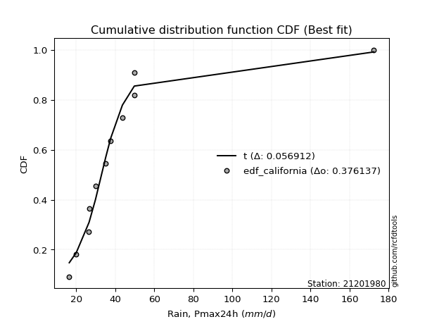</img>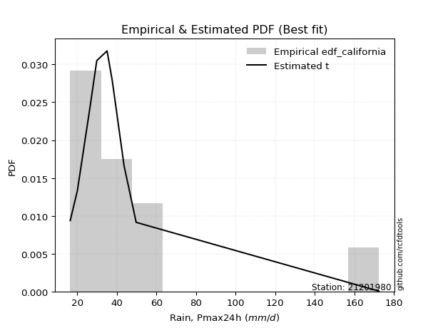</img>

</div>


### 2. EDF Hazen (1930)

Hazen method for plotting positions is a formula used to estimate the empirical cumulative probability distribution of flood events or other hydrological data. This formula often results in biased estimations, particularly when extrapolating to extreme events (high return periods).

<div align="center">


$P=(m-0.5)/n$


</div>


**2.1. Empirical values**

<div align="center">

|                | 0                    | 1                  | 2                   | 3                  | 4         | 5                  | 6                  | 7                  | 8                  | 9                  | 10        | 11                 |
|:---------------|:---------------------|:-------------------|:--------------------|:-------------------|:----------|:-------------------|:-------------------|:-------------------|:-------------------|:-------------------|:----------|:-------------------|
| date           | 2008                 | 2015               | 2025                | 2016               | 2009      | 2014               | 2010               | 2012               | 2011               | 2007               | 2013      | 2024               |
| x              | 16.5                 | 20.1               | 25.8                | 26.6               | 26.7      | 29.9               | 35.1               | 37.7               | 43.7               | 49.8               | 49.8      | 172.4              |
| m              | 1                    | 2                  | 3                   | 4                  | 5         | 6                  | 7                  | 8                  | 9                  | 10                 | 11        | 12                 |
| empirical_dist | edf_hazen            | edf_hazen          | edf_hazen           | edf_hazen          | edf_hazen | edf_hazen          | edf_hazen          | edf_hazen          | edf_hazen          | edf_hazen          | edf_hazen | edf_hazen          |
| empirical      | 0.041666666666666664 | 0.125              | 0.20833333333333334 | 0.2916666666666667 | 0.375     | 0.4583333333333333 | 0.5416666666666666 | 0.625              | 0.7083333333333334 | 0.7916666666666666 | 0.875     | 0.9583333333333334 |
| empirical_tr   | 1.0434782608695652   | 1.1428571428571428 | 1.2631578947368423  | 1.411764705882353  | 1.6       | 1.8461538461538458 | 2.1818181818181817 | 2.6666666666666665 | 3.428571428571429  | 4.799999999999999  | 8.0       | 24.00000000000002  |

</div>


**2.2. Kolmogorov-Smirnov fit test (sorted by Δ)**


<div align="center">

|                | 0                   | 1                   | 2                   | 3                   | 4                   | 5                   | 6                   | 7                   | 8                   | 9                   | 10                  | 11                  | 12                  | 13                  | 14                  | 15                  | 16                  | 17                  | 18                  | 19                  | 20                  | 21                  | 22                  | 23                  | 24                  | 25                  | 26                  | 27                  | 28                  | 29                  | 30                  | 31                  | 32                  | 33                  | 34                  | 35                  | 36                  | 37                  | 38                  | 39                  | 40                  | 41                  | 42                  | 43                  | 44                  | 45                  | 46                  | 47                  | 48                  | 49                  | 50                  | 51                  | 52                  | 53                  | 54                  | 55                  | 56                  | 57                  | 58                  | 59                  | 60                  | 61                  | 62                  | 63                  | 64                  | 65                  | 66                  | 67                  | 68                  | 69                  | 70                  | 71                  | 72                  | 73                  | 74                  | 75                  | 76                  | 77                  | 78                  | 79                  | 80                  | 81                  | 82                  | 83                  | 84                  | 85                  | 86                  | 87                  | 88                  | 89                  | 90                  | 91                  | 92                  | 93                  | 94                  | 95                  | 96                  | 97                  | 98                  | 99                  | 100                 | 101                 | 102                 | 103                 | 104                 | 105                 | 106                 | 107                 | 108                 | 109                 | 110                 | 111                 | 112                 | 113                 | 114                 | 115                 | 116                 | 117                 | 118                 | 119                 | 120                 | 121                 | 122                 | 123                 | 124                 | 125                 | 126                 | 127                 | 128                 | 129                 | 130                 | 131                 | 132                 | 133                 | 134                 | 135                 | 136                 | 137                 | 138                 | 139                 | 140                 | 141                 | 142                 | 143                 | 144                 | 145                 | 146                 | 147                 | 148                 | 149                 | 150                 | 151                 | 152                 | 153                 | 154                 | 155                 | 156                 | 157                 | 158                 | 159                 |
|:---------------|:--------------------|:--------------------|:--------------------|:--------------------|:--------------------|:--------------------|:--------------------|:--------------------|:--------------------|:--------------------|:--------------------|:--------------------|:--------------------|:--------------------|:--------------------|:--------------------|:--------------------|:--------------------|:--------------------|:--------------------|:--------------------|:--------------------|:--------------------|:--------------------|:--------------------|:--------------------|:--------------------|:--------------------|:--------------------|:--------------------|:--------------------|:--------------------|:--------------------|:--------------------|:--------------------|:--------------------|:--------------------|:--------------------|:--------------------|:--------------------|:--------------------|:--------------------|:--------------------|:--------------------|:--------------------|:--------------------|:--------------------|:--------------------|:--------------------|:--------------------|:--------------------|:--------------------|:--------------------|:--------------------|:--------------------|:--------------------|:--------------------|:--------------------|:--------------------|:--------------------|:--------------------|:--------------------|:--------------------|:--------------------|:--------------------|:--------------------|:--------------------|:--------------------|:--------------------|:--------------------|:--------------------|:--------------------|:--------------------|:--------------------|:--------------------|:--------------------|:--------------------|:--------------------|:--------------------|:--------------------|:--------------------|:--------------------|:--------------------|:--------------------|:--------------------|:--------------------|:--------------------|:--------------------|:--------------------|:--------------------|:--------------------|:--------------------|:--------------------|:--------------------|:--------------------|:--------------------|:--------------------|:--------------------|:--------------------|:--------------------|:--------------------|:--------------------|:--------------------|:--------------------|:--------------------|:--------------------|:--------------------|:--------------------|:--------------------|:--------------------|:--------------------|:--------------------|:--------------------|:--------------------|:--------------------|:--------------------|:--------------------|:--------------------|:--------------------|:--------------------|:--------------------|:--------------------|:--------------------|:--------------------|:--------------------|:--------------------|:--------------------|:--------------------|:--------------------|:--------------------|:--------------------|:--------------------|:--------------------|:--------------------|:--------------------|:--------------------|:--------------------|:--------------------|:--------------------|:--------------------|:--------------------|:--------------------|:--------------------|:--------------------|:--------------------|:--------------------|:--------------------|:--------------------|:--------------------|:--------------------|:--------------------|:--------------------|:--------------------|:--------------------|:--------------------|:--------------------|:--------------------|:--------------------|:--------------------|:--------------------|
| station        | 21201980            | 21201980            | 21201980            | 21201980            | 21201980            | 21201980            | 21201980            | 21201980            | 21201980            | 21201980            | 21201980            | 21201980            | 21201980            | 21201980            | 21201980            | 21201980            | 21201980            | 21201980            | 21201980            | 21201980            | 21201980            | 21201980            | 21201980            | 21201980            | 21201980            | 21201980            | 21201980            | 21201980            | 21201980            | 21201980            | 21201980            | 21201980            | 21201980            | 21201980            | 21201980            | 21201980            | 21201980            | 21201980            | 21201980            | 21201980            | 21201980            | 21201980            | 21201980            | 21201980            | 21201980            | 21201980            | 21201980            | 21201980            | 21201980            | 21201980            | 21201980            | 21201980            | 21201980            | 21201980            | 21201980            | 21201980            | 21201980            | 21201980            | 21201980            | 21201980            | 21201980            | 21201980            | 21201980            | 21201980            | 21201980            | 21201980            | 21201980            | 21201980            | 21201980            | 21201980            | 21201980            | 21201980            | 21201980            | 21201980            | 21201980            | 21201980            | 21201980            | 21201980            | 21201980            | 21201980            | 21201980            | 21201980            | 21201980            | 21201980            | 21201980            | 21201980            | 21201980            | 21201980            | 21201980            | 21201980            | 21201980            | 21201980            | 21201980            | 21201980            | 21201980            | 21201980            | 21201980            | 21201980            | 21201980            | 21201980            | 21201980            | 21201980            | 21201980            | 21201980            | 21201980            | 21201980            | 21201980            | 21201980            | 21201980            | 21201980            | 21201980            | 21201980            | 21201980            | 21201980            | 21201980            | 21201980            | 21201980            | 21201980            | 21201980            | 21201980            | 21201980            | 21201980            | 21201980            | 21201980            | 21201980            | 21201980            | 21201980            | 21201980            | 21201980            | 21201980            | 21201980            | 21201980            | 21201980            | 21201980            | 21201980            | 21201980            | 21201980            | 21201980            | 21201980            | 21201980            | 21201980            | 21201980            | 21201980            | 21201980            | 21201980            | 21201980            | 21201980            | 21201980            | 21201980            | 21201980            | 21201980            | 21201980            | 21201980            | 21201980            | 21201980            | 21201980            | 21201980            | 21201980            | 21201980            | 21201980            |
| empirical_dist | edf_hazen           | edf_hazen           | edf_hazen           | edf_hazen           | edf_hazen           | edf_hazen           | edf_hazen           | edf_hazen           | edf_hazen           | edf_hazen           | edf_hazen           | edf_hazen           | edf_hazen           | edf_hazen           | edf_hazen           | edf_hazen           | edf_hazen           | edf_hazen           | edf_hazen           | edf_hazen           | edf_hazen           | edf_hazen           | edf_hazen           | edf_hazen           | edf_hazen           | edf_hazen           | edf_hazen           | edf_hazen           | edf_hazen           | edf_hazen           | edf_hazen           | edf_hazen           | edf_hazen           | edf_hazen           | edf_hazen           | edf_hazen           | edf_hazen           | edf_hazen           | edf_hazen           | edf_hazen           | edf_hazen           | edf_hazen           | edf_hazen           | edf_hazen           | edf_hazen           | edf_hazen           | edf_hazen           | edf_hazen           | edf_hazen           | edf_hazen           | edf_hazen           | edf_hazen           | edf_hazen           | edf_hazen           | edf_hazen           | edf_hazen           | edf_hazen           | edf_hazen           | edf_hazen           | edf_hazen           | edf_hazen           | edf_hazen           | edf_hazen           | edf_hazen           | edf_hazen           | edf_hazen           | edf_hazen           | edf_hazen           | edf_hazen           | edf_hazen           | edf_hazen           | edf_hazen           | edf_hazen           | edf_hazen           | edf_hazen           | edf_hazen           | edf_hazen           | edf_hazen           | edf_hazen           | edf_hazen           | edf_hazen           | edf_hazen           | edf_hazen           | edf_hazen           | edf_hazen           | edf_hazen           | edf_hazen           | edf_hazen           | edf_hazen           | edf_hazen           | edf_hazen           | edf_hazen           | edf_hazen           | edf_hazen           | edf_hazen           | edf_hazen           | edf_hazen           | edf_hazen           | edf_hazen           | edf_hazen           | edf_hazen           | edf_hazen           | edf_hazen           | edf_hazen           | edf_hazen           | edf_hazen           | edf_hazen           | edf_hazen           | edf_hazen           | edf_hazen           | edf_hazen           | edf_hazen           | edf_hazen           | edf_hazen           | edf_hazen           | edf_hazen           | edf_hazen           | edf_hazen           | edf_hazen           | edf_hazen           | edf_hazen           | edf_hazen           | edf_hazen           | edf_hazen           | edf_hazen           | edf_hazen           | edf_hazen           | edf_hazen           | edf_hazen           | edf_hazen           | edf_hazen           | edf_hazen           | edf_hazen           | edf_hazen           | edf_hazen           | edf_hazen           | edf_hazen           | edf_hazen           | edf_hazen           | edf_hazen           | edf_hazen           | edf_hazen           | edf_hazen           | edf_hazen           | edf_hazen           | edf_hazen           | edf_hazen           | edf_hazen           | edf_hazen           | edf_hazen           | edf_hazen           | edf_hazen           | edf_hazen           | edf_hazen           | edf_hazen           | edf_hazen           | edf_hazen           | edf_hazen           | edf_hazen           | edf_hazen           |
| p_dist         | logt                | loggennorm          | logburr12           | logvonmises_line    | logexponnorm        | logmielke           | alpha               | logburr             | logdweibull         | burr                | loggenlogistic      | mielke              | logalpha            | loggenextreme       | loginvweibull       | genextreme          | invweibull          | loginvgamma         | logf                | nct                 | logjohnsonsu        | logjohnsonsb        | f                   | invgamma            | ncf                 | logdgamma           | loginvgauss         | logfatiguelife      | logmoyal            | loggumbel_r         | logloglaplace       | t                   | exponweib           | lognct              | logbetaprime        | loggamma            | loggamma            | logerlang           | kappa3              | loghypsecant        | logkstwobign        | johnsonsu           | johnsonsb           | logwald             | logpearson3         | betaprime           | loghalflogistic     | loglogistic         | loglaplace          | loglaplace          | invgauss            | logrice             | lograyleigh         | loghalfnorm         | truncpareto         | logmaxwell          | logfoldnorm         | lomax               | logskewnorm         | genpareto           | logkappa3           | loghalfgennorm      | fatiguelife         | logcrystalball      | lognorm             | loggompertz         | logloggamma         | gompertz            | cosine              | logncf              | genlogistic         | logweibull_min      | exponnorm           | genexpon            | loggenexpon         | logtruncnorm        | gamma               | wald                | loganglit           | loggumbel_l         | logsemicircular     | gengamma            | genhalflogistic     | logbradford         | halfgennorm         | pearson3            | moyal               | burr12              | halflogistic        | loglomax            | loggengamma         | dgamma              | logarcsine          | dweibull            | logtriang           | weibull_min         | gennorm             | gumbel_r            | halfnorm            | erlang              | logcosine           | logtruncweibull_min | rayleigh            | kstwobign           | laplace             | maxwell             | nakagami            | logtruncexpon       | truncnorm           | foldnorm            | hypsecant           | logistic            | norm                | crystalball         | anglit              | semicircular        | gausshyper          | rice                | beta                | arcsine             | logkappa4           | loggenpareto        | exponpow            | skewnorm            | powerlaw            | logexponpow         | logwrapcauchy       | gumbel_l            | truncweibull_min    | logksone            | logtukeylambda      | logargus            | loguniform          | logrdist            | bradford            | loglevy_l           | logpowerlaw         | truncexpon          | wrapcauchy          | levy_l              | loggausshyper       | logweibull_max      | logexponweib        | argus               | vonmises_line       | loggenhalflogistic  | rdist               | logbeta             | lognakagami         | tukeylambda         | ksone               | kappa4              | logtrapezoid        | uniform             | logtruncpareto      | weibull_max         | triang              | trapezoid           | logvonmises         | vonmises            |
| delta          | 0.07669994902442398 | 0.07879982695517446 | 0.08061210470505542 | 0.08362794099222778 | 0.09105819915122049 | 0.09215613850913593 | 0.09306488470452709 | 0.09331008864516457 | 0.09352742912582648 | 0.09416077480601881 | 0.09535616026052418 | 0.09668140924755186 | 0.09839754134917164 | 0.10026083225154611 | 0.10026319776852963 | 0.10199257568514    | 0.10199415828191963 | 0.10271275795441706 | 0.10272643846767662 | 0.10293561761707393 | 0.10589844122427147 | 0.10720537802036947 | 0.10744112751319904 | 0.10744121439473167 | 0.10744129643302033 | 0.10757968478620697 | 0.10805951833736419 | 0.10838923046316354 | 0.10951738889889931 | 0.11150622790246645 | 0.11228393750428867 | 0.11286767244095716 | 0.11295335419205074 | 0.11522801334032473 | 0.11617644744283054 | 0.1187281713471687  | 0.1187281713471687  | 0.11872907123528345 | 0.12037482258083768 | 0.12142735157479134 | 0.12159160013645898 | 0.1222068483755395  | 0.1231036760409169  | 0.125               | 0.1258691748982351  | 0.12609319940609764 | 0.1362542612873602  | 0.13689257463490956 | 0.13794923206950838 | 0.13794923206950838 | 0.13933848785627911 | 0.14054157182044935 | 0.140938538821329   | 0.14165006669141925 | 0.14333154314728935 | 0.14497750118370156 | 0.145812913027438   | 0.14732694286796022 | 0.1481022556308795  | 0.15154751525717394 | 0.15289640997288848 | 0.15494007741049967 | 0.15882523064848053 | 0.15890994918449874 | 0.1589109674072966  | 0.15971531879287126 | 0.16171921683891755 | 0.16200930789859158 | 0.16374537961879854 | 0.16418052750299283 | 0.16691927851650423 | 0.17098933842425537 | 0.17691086665604727 | 0.1813605157413376  | 0.18159296285229684 | 0.18163005579313532 | 0.1821288136993756  | 0.18361173692132823 | 0.18464812331281966 | 0.18592884955281863 | 0.1956627471584962  | 0.197397470773958   | 0.19756547570742763 | 0.21037861169037908 | 0.21432030539214972 | 0.22660488008272964 | 0.22755239249592207 | 0.2309956088998472  | 0.23391609041145264 | 0.23516662468622443 | 0.23741268711758481 | 0.2402655141883445  | 0.2426389453277521  | 0.244752101234747   | 0.24500164403458402 | 0.25211484574758736 | 0.252190610152925   | 0.2523004948629677  | 0.2550638845751225  | 0.2651097645560837  | 0.2698093153938559  | 0.27381259372092204 | 0.28238688179931537 | 0.2864764799123898  | 0.2895418624011591  | 0.2920702331719428  | 0.2928871961186622  | 0.2946935812536413  | 0.29932683030575824 | 0.302066107318448   | 0.30920559968794237 | 0.315189352355711   | 0.3222801960294819  | 0.3222807911513649  | 0.32975673351076673 | 0.3328433806265365  | 0.3343650277173079  | 0.33619159003247    | 0.34164267460097797 | 0.3451250484453028  | 0.357627623295697   | 0.3597586388813694  | 0.36647532719263765 | 0.36973934053524304 | 0.3700048562757775  | 0.3831327636334908  | 0.3847658778059577  | 0.38902160936118524 | 0.39429058096583336 | 0.39935369800802434 | 0.4039036652710095  | 0.40415694266561386 | 0.4042244376096291  | 0.4157194219900642  | 0.4183056607223932  | 0.439974130911802   | 0.4604049770880556  | 0.4668105732179601  | 0.47124781997848975 | 0.4859364367168875  | 0.5008881105366181  | 0.5361844658304862  | 0.5367231869275191  | 0.5444196145214744  | 0.5513342986877319  | 0.5657989149875489  | 0.57314511810426    | 0.5858318862122203  | 0.5873182041604926  | 0.6026429729418202  | 0.6136679495403037  | 0.6292761178392436  | 0.6487605954013583  | 0.6614015394483643  | 0.7662661121341907  | 0.7741622676561978  | 0.7936523987999977  | 0.8067055594025307  | 1.0891910580677144  | 26.981766033761495  |
| deltao         | 0.36218414519599995 | 0.36218414519599995 | 0.36218414519599995 | 0.36218414519599995 | 0.36218414519599995 | 0.36218414519599995 | 0.36218414519599995 | 0.36218414519599995 | 0.36218414519599995 | 0.36218414519599995 | 0.36218414519599995 | 0.36218414519599995 | 0.36218414519599995 | 0.36218414519599995 | 0.36218414519599995 | 0.36218414519599995 | 0.36218414519599995 | 0.36218414519599995 | 0.36218414519599995 | 0.36218414519599995 | 0.36218414519599995 | 0.36218414519599995 | 0.36218414519599995 | 0.36218414519599995 | 0.36218414519599995 | 0.36218414519599995 | 0.36218414519599995 | 0.36218414519599995 | 0.36218414519599995 | 0.36218414519599995 | 0.36218414519599995 | 0.36218414519599995 | 0.36218414519599995 | 0.36218414519599995 | 0.36218414519599995 | 0.36218414519599995 | 0.36218414519599995 | 0.36218414519599995 | 0.36218414519599995 | 0.36218414519599995 | 0.36218414519599995 | 0.36218414519599995 | 0.36218414519599995 | 0.36218414519599995 | 0.36218414519599995 | 0.36218414519599995 | 0.36218414519599995 | 0.36218414519599995 | 0.36218414519599995 | 0.36218414519599995 | 0.36218414519599995 | 0.36218414519599995 | 0.36218414519599995 | 0.36218414519599995 | 0.36218414519599995 | 0.36218414519599995 | 0.36218414519599995 | 0.36218414519599995 | 0.36218414519599995 | 0.36218414519599995 | 0.36218414519599995 | 0.36218414519599995 | 0.36218414519599995 | 0.36218414519599995 | 0.36218414519599995 | 0.36218414519599995 | 0.36218414519599995 | 0.36218414519599995 | 0.36218414519599995 | 0.36218414519599995 | 0.36218414519599995 | 0.36218414519599995 | 0.36218414519599995 | 0.36218414519599995 | 0.36218414519599995 | 0.36218414519599995 | 0.36218414519599995 | 0.36218414519599995 | 0.36218414519599995 | 0.36218414519599995 | 0.36218414519599995 | 0.36218414519599995 | 0.36218414519599995 | 0.36218414519599995 | 0.36218414519599995 | 0.36218414519599995 | 0.36218414519599995 | 0.36218414519599995 | 0.36218414519599995 | 0.36218414519599995 | 0.36218414519599995 | 0.36218414519599995 | 0.36218414519599995 | 0.36218414519599995 | 0.36218414519599995 | 0.36218414519599995 | 0.36218414519599995 | 0.36218414519599995 | 0.36218414519599995 | 0.36218414519599995 | 0.36218414519599995 | 0.36218414519599995 | 0.36218414519599995 | 0.36218414519599995 | 0.36218414519599995 | 0.36218414519599995 | 0.36218414519599995 | 0.36218414519599995 | 0.36218414519599995 | 0.36218414519599995 | 0.36218414519599995 | 0.36218414519599995 | 0.36218414519599995 | 0.36218414519599995 | 0.36218414519599995 | 0.36218414519599995 | 0.36218414519599995 | 0.36218414519599995 | 0.36218414519599995 | 0.36218414519599995 | 0.36218414519599995 | 0.36218414519599995 | 0.36218414519599995 | 0.36218414519599995 | 0.36218414519599995 | 0.36218414519599995 | 0.36218414519599995 | 0.36218414519599995 | 0.36218414519599995 | 0.36218414519599995 | 0.36218414519599995 | 0.36218414519599995 | 0.36218414519599995 | 0.36218414519599995 | 0.36218414519599995 | 0.36218414519599995 | 0.36218414519599995 | 0.36218414519599995 | 0.36218414519599995 | 0.36218414519599995 | 0.36218414519599995 | 0.36218414519599995 | 0.36218414519599995 | 0.36218414519599995 | 0.36218414519599995 | 0.36218414519599995 | 0.36218414519599995 | 0.36218414519599995 | 0.36218414519599995 | 0.36218414519599995 | 0.36218414519599995 | 0.36218414519599995 | 0.36218414519599995 | 0.36218414519599995 | 0.36218414519599995 | 0.36218414519599995 | 0.36218414519599995 | 0.36218414519599995 | 0.36218414519599995 | 0.36218414519599995 |
| eval           | Δo > Δ              | Δo > Δ              | Δo > Δ              | Δo > Δ              | Δo > Δ              | Δo > Δ              | Δo > Δ              | Δo > Δ              | Δo > Δ              | Δo > Δ              | Δo > Δ              | Δo > Δ              | Δo > Δ              | Δo > Δ              | Δo > Δ              | Δo > Δ              | Δo > Δ              | Δo > Δ              | Δo > Δ              | Δo > Δ              | Δo > Δ              | Δo > Δ              | Δo > Δ              | Δo > Δ              | Δo > Δ              | Δo > Δ              | Δo > Δ              | Δo > Δ              | Δo > Δ              | Δo > Δ              | Δo > Δ              | Δo > Δ              | Δo > Δ              | Δo > Δ              | Δo > Δ              | Δo > Δ              | Δo > Δ              | Δo > Δ              | Δo > Δ              | Δo > Δ              | Δo > Δ              | Δo > Δ              | Δo > Δ              | Δo > Δ              | Δo > Δ              | Δo > Δ              | Δo > Δ              | Δo > Δ              | Δo > Δ              | Δo > Δ              | Δo > Δ              | Δo > Δ              | Δo > Δ              | Δo > Δ              | Δo > Δ              | Δo > Δ              | Δo > Δ              | Δo > Δ              | Δo > Δ              | Δo > Δ              | Δo > Δ              | Δo > Δ              | Δo > Δ              | Δo > Δ              | Δo > Δ              | Δo > Δ              | Δo > Δ              | Δo > Δ              | Δo > Δ              | Δo > Δ              | Δo > Δ              | Δo > Δ              | Δo > Δ              | Δo > Δ              | Δo > Δ              | Δo > Δ              | Δo > Δ              | Δo > Δ              | Δo > Δ              | Δo > Δ              | Δo > Δ              | Δo > Δ              | Δo > Δ              | Δo > Δ              | Δo > Δ              | Δo > Δ              | Δo > Δ              | Δo > Δ              | Δo > Δ              | Δo > Δ              | Δo > Δ              | Δo > Δ              | Δo > Δ              | Δo > Δ              | Δo > Δ              | Δo > Δ              | Δo > Δ              | Δo > Δ              | Δo > Δ              | Δo > Δ              | Δo > Δ              | Δo > Δ              | Δo > Δ              | Δo > Δ              | Δo > Δ              | Δo > Δ              | Δo > Δ              | Δo > Δ              | Δo > Δ              | Δo > Δ              | Δo > Δ              | Δo > Δ              | Δo > Δ              | Δo > Δ              | Δo > Δ              | Δo > Δ              | Δo > Δ              | Δo > Δ              | Δo > Δ              | Δo > Δ              | Δo > Δ              | Δo > Δ              | Δo <= Δ             | Δo <= Δ             | Δo <= Δ             | Δo <= Δ             | Δo <= Δ             | Δo <= Δ             | Δo <= Δ             | Δo <= Δ             | Δo <= Δ             | Δo <= Δ             | Δo <= Δ             | Δo <= Δ             | Δo <= Δ             | Δo <= Δ             | Δo <= Δ             | Δo <= Δ             | Δo <= Δ             | Δo <= Δ             | Δo <= Δ             | Δo <= Δ             | Δo <= Δ             | Δo <= Δ             | Δo <= Δ             | Δo <= Δ             | Δo <= Δ             | Δo <= Δ             | Δo <= Δ             | Δo <= Δ             | Δo <= Δ             | Δo <= Δ             | Δo <= Δ             | Δo <= Δ             | Δo <= Δ             | Δo <= Δ             | Δo <= Δ             | Δo <= Δ             | Δo <= Δ             | Δo <= Δ             |
| fit            | 1                   | 1                   | 1                   | 1                   | 1                   | 1                   | 1                   | 1                   | 1                   | 1                   | 1                   | 1                   | 1                   | 1                   | 1                   | 1                   | 1                   | 1                   | 1                   | 1                   | 1                   | 1                   | 1                   | 1                   | 1                   | 1                   | 1                   | 1                   | 1                   | 1                   | 1                   | 1                   | 1                   | 1                   | 1                   | 1                   | 1                   | 1                   | 1                   | 1                   | 1                   | 1                   | 1                   | 1                   | 1                   | 1                   | 1                   | 1                   | 1                   | 1                   | 1                   | 1                   | 1                   | 1                   | 1                   | 1                   | 1                   | 1                   | 1                   | 1                   | 1                   | 1                   | 1                   | 1                   | 1                   | 1                   | 1                   | 1                   | 1                   | 1                   | 1                   | 1                   | 1                   | 1                   | 1                   | 1                   | 1                   | 1                   | 1                   | 1                   | 1                   | 1                   | 1                   | 1                   | 1                   | 1                   | 1                   | 1                   | 1                   | 1                   | 1                   | 1                   | 1                   | 1                   | 1                   | 1                   | 1                   | 1                   | 1                   | 1                   | 1                   | 1                   | 1                   | 1                   | 1                   | 1                   | 1                   | 1                   | 1                   | 1                   | 1                   | 1                   | 1                   | 1                   | 1                   | 1                   | 1                   | 1                   | 1                   | 1                   | 1                   | 1                   | 0                   | 0                   | 0                   | 0                   | 0                   | 0                   | 0                   | 0                   | 0                   | 0                   | 0                   | 0                   | 0                   | 0                   | 0                   | 0                   | 0                   | 0                   | 0                   | 0                   | 0                   | 0                   | 0                   | 0                   | 0                   | 0                   | 0                   | 0                   | 0                   | 0                   | 0                   | 0                   | 0                   | 0                   | 0                   | 0                   | 0                   | 0                   |
| n              | 12                  | 12                  | 12                  | 12                  | 12                  | 12                  | 12                  | 12                  | 12                  | 12                  | 12                  | 12                  | 12                  | 12                  | 12                  | 12                  | 12                  | 12                  | 12                  | 12                  | 12                  | 12                  | 12                  | 12                  | 12                  | 12                  | 12                  | 12                  | 12                  | 12                  | 12                  | 12                  | 12                  | 12                  | 12                  | 12                  | 12                  | 12                  | 12                  | 12                  | 12                  | 12                  | 12                  | 12                  | 12                  | 12                  | 12                  | 12                  | 12                  | 12                  | 12                  | 12                  | 12                  | 12                  | 12                  | 12                  | 12                  | 12                  | 12                  | 12                  | 12                  | 12                  | 12                  | 12                  | 12                  | 12                  | 12                  | 12                  | 12                  | 12                  | 12                  | 12                  | 12                  | 12                  | 12                  | 12                  | 12                  | 12                  | 12                  | 12                  | 12                  | 12                  | 12                  | 12                  | 12                  | 12                  | 12                  | 12                  | 12                  | 12                  | 12                  | 12                  | 12                  | 12                  | 12                  | 12                  | 12                  | 12                  | 12                  | 12                  | 12                  | 12                  | 12                  | 12                  | 12                  | 12                  | 12                  | 12                  | 12                  | 12                  | 12                  | 12                  | 12                  | 12                  | 12                  | 12                  | 12                  | 12                  | 12                  | 12                  | 12                  | 12                  | 12                  | 12                  | 12                  | 12                  | 12                  | 12                  | 12                  | 12                  | 12                  | 12                  | 12                  | 12                  | 12                  | 12                  | 12                  | 12                  | 12                  | 12                  | 12                  | 12                  | 12                  | 12                  | 12                  | 12                  | 12                  | 12                  | 12                  | 12                  | 12                  | 12                  | 12                  | 12                  | 12                  | 12                  | 12                  | 12                  | 12                  | 12                  |
| best_fit       | 1                   | 0                   | 0                   | 0                   | 0                   | 0                   | 0                   | 0                   | 0                   | 0                   | 0                   | 0                   | 0                   | 0                   | 0                   | 0                   | 0                   | 0                   | 0                   | 0                   | 0                   | 0                   | 0                   | 0                   | 0                   | 0                   | 0                   | 0                   | 0                   | 0                   | 0                   | 0                   | 0                   | 0                   | 0                   | 0                   | 0                   | 0                   | 0                   | 0                   | 0                   | 0                   | 0                   | 0                   | 0                   | 0                   | 0                   | 0                   | 0                   | 0                   | 0                   | 0                   | 0                   | 0                   | 0                   | 0                   | 0                   | 0                   | 0                   | 0                   | 0                   | 0                   | 0                   | 0                   | 0                   | 0                   | 0                   | 0                   | 0                   | 0                   | 0                   | 0                   | 0                   | 0                   | 0                   | 0                   | 0                   | 0                   | 0                   | 0                   | 0                   | 0                   | 0                   | 0                   | 0                   | 0                   | 0                   | 0                   | 0                   | 0                   | 0                   | 0                   | 0                   | 0                   | 0                   | 0                   | 0                   | 0                   | 0                   | 0                   | 0                   | 0                   | 0                   | 0                   | 0                   | 0                   | 0                   | 0                   | 0                   | 0                   | 0                   | 0                   | 0                   | 0                   | 0                   | 0                   | 0                   | 0                   | 0                   | 0                   | 0                   | 0                   | 0                   | 0                   | 0                   | 0                   | 0                   | 0                   | 0                   | 0                   | 0                   | 0                   | 0                   | 0                   | 0                   | 0                   | 0                   | 0                   | 0                   | 0                   | 0                   | 0                   | 0                   | 0                   | 0                   | 0                   | 0                   | 0                   | 0                   | 0                   | 0                   | 0                   | 0                   | 0                   | 0                   | 0                   | 0                   | 0                   | 0                   | 0                   |
| best_fit_sort  | 1                   | 2                   | 3                   | 4                   | 5                   | 6                   | 7                   | 8                   | 9                   | 10                  | 11                  | 12                  | 13                  | 14                  | 15                  | 16                  | 17                  | 18                  | 19                  | 20                  | 21                  | 22                  | 23                  | 24                  | 25                  | 26                  | 27                  | 28                  | 29                  | 30                  | 31                  | 32                  | 33                  | 34                  | 35                  | 36                  | 37                  | 38                  | 39                  | 40                  | 41                  | 42                  | 43                  | 44                  | 45                  | 46                  | 47                  | 48                  | 49                  | 50                  | 51                  | 52                  | 53                  | 54                  | 55                  | 56                  | 57                  | 58                  | 59                  | 60                  | 61                  | 62                  | 63                  | 64                  | 65                  | 66                  | 67                  | 68                  | 69                  | 70                  | 71                  | 72                  | 73                  | 74                  | 75                  | 76                  | 77                  | 78                  | 79                  | 80                  | 81                  | 82                  | 83                  | 84                  | 85                  | 86                  | 87                  | 88                  | 89                  | 90                  | 91                  | 92                  | 93                  | 94                  | 95                  | 96                  | 97                  | 98                  | 99                  | 100                 | 101                 | 102                 | 103                 | 104                 | 105                 | 106                 | 107                 | 108                 | 109                 | 110                 | 111                 | 112                 | 113                 | 114                 | 115                 | 116                 | 117                 | 118                 | 119                 | 120                 | 121                 | 122                 | 123                 | 124                 | 125                 | 126                 | 127                 | 128                 | 129                 | 130                 | 131                 | 132                 | 133                 | 134                 | 135                 | 136                 | 137                 | 138                 | 139                 | 140                 | 141                 | 142                 | 143                 | 144                 | 145                 | 146                 | 147                 | 148                 | 149                 | 150                 | 151                 | 152                 | 153                 | 154                 | 155                 | 156                 | 157                 | 158                 | 159                 | 160                 |

</div>


**2.3. Best fit**

<div align="center">

|   id |   station | empirical_dist   | p_dist   |     delta |   deltao | eval   |   fit |   n |   best_fit |   best_fit_sort |
|-----:|----------:|:-----------------|:---------|----------:|---------:|:-------|------:|----:|-----------:|----------------:|
|    0 |  21201980 | edf_hazen        | logt     | 0.0766999 | 0.362184 | Δo > Δ |     1 |  12 |          1 |               1 |

</div>


<div align="center">

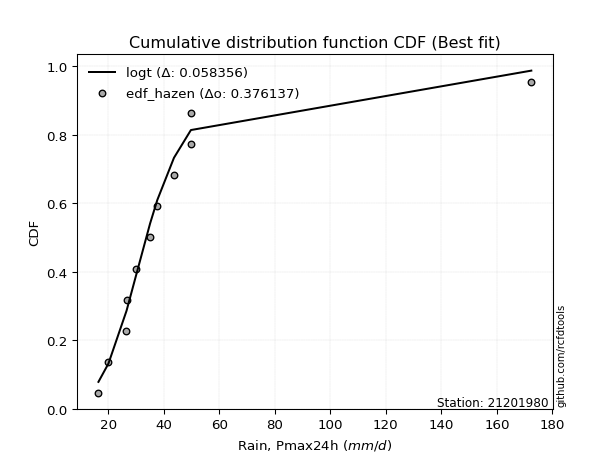</img>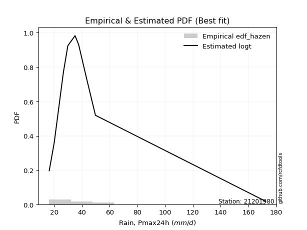</img>

</div>


### 3. EDF Weibull (1939)

Weibull plotting position formula is an empirical method used to estimate the non-exceedance probability or plotting position for a set of observed data, is often recommended or widely used in practice, particularly in flood frequency analysis.

<div align="center">


$P=m/(n+1)$


</div>


**3.1. Empirical values**

<div align="center">

|                | 0                   | 1                   | 2                   | 3                  | 4                   | 5                   | 6                  | 7                  | 8                  | 9                  | 10                 | 11                 |
|:---------------|:--------------------|:--------------------|:--------------------|:-------------------|:--------------------|:--------------------|:-------------------|:-------------------|:-------------------|:-------------------|:-------------------|:-------------------|
| date           | 2008                | 2015                | 2025                | 2016               | 2009                | 2014                | 2010               | 2012               | 2011               | 2007               | 2013               | 2024               |
| x              | 16.5                | 20.1                | 25.8                | 26.6               | 26.7                | 29.9                | 35.1               | 37.7               | 43.7               | 49.8               | 49.8               | 172.4              |
| m              | 1                   | 2                   | 3                   | 4                  | 5                   | 6                   | 7                  | 8                  | 9                  | 10                 | 11                 | 12                 |
| empirical_dist | edf_weibull         | edf_weibull         | edf_weibull         | edf_weibull        | edf_weibull         | edf_weibull         | edf_weibull        | edf_weibull        | edf_weibull        | edf_weibull        | edf_weibull        | edf_weibull        |
| empirical      | 0.07692307692307693 | 0.15384615384615385 | 0.23076923076923078 | 0.3076923076923077 | 0.38461538461538464 | 0.46153846153846156 | 0.5384615384615384 | 0.6153846153846154 | 0.6923076923076923 | 0.7692307692307693 | 0.8461538461538461 | 0.9230769230769231 |
| empirical_tr   | 1.0833333333333333  | 1.1818181818181819  | 1.3                 | 1.4444444444444444 | 1.625               | 1.8571428571428572  | 2.1666666666666665 | 2.6                | 3.25               | 4.333333333333334  | 6.5                | 13.000000000000009 |

</div>


**3.2. Kolmogorov-Smirnov fit test (sorted by Δ)**


<div align="center">

|                | 0                   | 1                   | 2                   | 3                   | 4                   | 5                   | 6                   | 7                   | 8                   | 9                   | 10                  | 11                  | 12                  | 13                  | 14                  | 15                  | 16                  | 17                  | 18                  | 19                  | 20                  | 21                  | 22                  | 23                  | 24                  | 25                  | 26                  | 27                  | 28                  | 29                  | 30                  | 31                  | 32                  | 33                  | 34                  | 35                  | 36                  | 37                  | 38                  | 39                  | 40                  | 41                  | 42                  | 43                  | 44                  | 45                  | 46                  | 47                  | 48                  | 49                  | 50                  | 51                  | 52                  | 53                  | 54                  | 55                  | 56                  | 57                  | 58                  | 59                  | 60                  | 61                  | 62                  | 63                  | 64                  | 65                  | 66                  | 67                  | 68                  | 69                  | 70                  | 71                  | 72                  | 73                  | 74                  | 75                  | 76                  | 77                  | 78                  | 79                  | 80                  | 81                  | 82                  | 83                  | 84                  | 85                  | 86                  | 87                  | 88                  | 89                  | 90                  | 91                  | 92                  | 93                  | 94                  | 95                  | 96                  | 97                  | 98                  | 99                  | 100                 | 101                 | 102                 | 103                 | 104                 | 105                 | 106                 | 107                 | 108                 | 109                 | 110                 | 111                 | 112                 | 113                 | 114                 | 115                 | 116                 | 117                 | 118                 | 119                 | 120                 | 121                 | 122                 | 123                 | 124                 | 125                 | 126                 | 127                 | 128                 | 129                 | 130                 | 131                 | 132                 | 133                 | 134                 | 135                 | 136                 | 137                 | 138                 | 139                 | 140                 | 141                 | 142                 | 143                 | 144                 | 145                 | 146                 | 147                 | 148                 | 149                 | 150                 | 151                 | 152                 | 153                 | 154                 | 155                 | 156                 | 157                 | 158                 | 159                 |
|:---------------|:--------------------|:--------------------|:--------------------|:--------------------|:--------------------|:--------------------|:--------------------|:--------------------|:--------------------|:--------------------|:--------------------|:--------------------|:--------------------|:--------------------|:--------------------|:--------------------|:--------------------|:--------------------|:--------------------|:--------------------|:--------------------|:--------------------|:--------------------|:--------------------|:--------------------|:--------------------|:--------------------|:--------------------|:--------------------|:--------------------|:--------------------|:--------------------|:--------------------|:--------------------|:--------------------|:--------------------|:--------------------|:--------------------|:--------------------|:--------------------|:--------------------|:--------------------|:--------------------|:--------------------|:--------------------|:--------------------|:--------------------|:--------------------|:--------------------|:--------------------|:--------------------|:--------------------|:--------------------|:--------------------|:--------------------|:--------------------|:--------------------|:--------------------|:--------------------|:--------------------|:--------------------|:--------------------|:--------------------|:--------------------|:--------------------|:--------------------|:--------------------|:--------------------|:--------------------|:--------------------|:--------------------|:--------------------|:--------------------|:--------------------|:--------------------|:--------------------|:--------------------|:--------------------|:--------------------|:--------------------|:--------------------|:--------------------|:--------------------|:--------------------|:--------------------|:--------------------|:--------------------|:--------------------|:--------------------|:--------------------|:--------------------|:--------------------|:--------------------|:--------------------|:--------------------|:--------------------|:--------------------|:--------------------|:--------------------|:--------------------|:--------------------|:--------------------|:--------------------|:--------------------|:--------------------|:--------------------|:--------------------|:--------------------|:--------------------|:--------------------|:--------------------|:--------------------|:--------------------|:--------------------|:--------------------|:--------------------|:--------------------|:--------------------|:--------------------|:--------------------|:--------------------|:--------------------|:--------------------|:--------------------|:--------------------|:--------------------|:--------------------|:--------------------|:--------------------|:--------------------|:--------------------|:--------------------|:--------------------|:--------------------|:--------------------|:--------------------|:--------------------|:--------------------|:--------------------|:--------------------|:--------------------|:--------------------|:--------------------|:--------------------|:--------------------|:--------------------|:--------------------|:--------------------|:--------------------|:--------------------|:--------------------|:--------------------|:--------------------|:--------------------|:--------------------|:--------------------|:--------------------|:--------------------|:--------------------|:--------------------|
| station        | 21201980            | 21201980            | 21201980            | 21201980            | 21201980            | 21201980            | 21201980            | 21201980            | 21201980            | 21201980            | 21201980            | 21201980            | 21201980            | 21201980            | 21201980            | 21201980            | 21201980            | 21201980            | 21201980            | 21201980            | 21201980            | 21201980            | 21201980            | 21201980            | 21201980            | 21201980            | 21201980            | 21201980            | 21201980            | 21201980            | 21201980            | 21201980            | 21201980            | 21201980            | 21201980            | 21201980            | 21201980            | 21201980            | 21201980            | 21201980            | 21201980            | 21201980            | 21201980            | 21201980            | 21201980            | 21201980            | 21201980            | 21201980            | 21201980            | 21201980            | 21201980            | 21201980            | 21201980            | 21201980            | 21201980            | 21201980            | 21201980            | 21201980            | 21201980            | 21201980            | 21201980            | 21201980            | 21201980            | 21201980            | 21201980            | 21201980            | 21201980            | 21201980            | 21201980            | 21201980            | 21201980            | 21201980            | 21201980            | 21201980            | 21201980            | 21201980            | 21201980            | 21201980            | 21201980            | 21201980            | 21201980            | 21201980            | 21201980            | 21201980            | 21201980            | 21201980            | 21201980            | 21201980            | 21201980            | 21201980            | 21201980            | 21201980            | 21201980            | 21201980            | 21201980            | 21201980            | 21201980            | 21201980            | 21201980            | 21201980            | 21201980            | 21201980            | 21201980            | 21201980            | 21201980            | 21201980            | 21201980            | 21201980            | 21201980            | 21201980            | 21201980            | 21201980            | 21201980            | 21201980            | 21201980            | 21201980            | 21201980            | 21201980            | 21201980            | 21201980            | 21201980            | 21201980            | 21201980            | 21201980            | 21201980            | 21201980            | 21201980            | 21201980            | 21201980            | 21201980            | 21201980            | 21201980            | 21201980            | 21201980            | 21201980            | 21201980            | 21201980            | 21201980            | 21201980            | 21201980            | 21201980            | 21201980            | 21201980            | 21201980            | 21201980            | 21201980            | 21201980            | 21201980            | 21201980            | 21201980            | 21201980            | 21201980            | 21201980            | 21201980            | 21201980            | 21201980            | 21201980            | 21201980            | 21201980            | 21201980            |
| empirical_dist | edf_weibull         | edf_weibull         | edf_weibull         | edf_weibull         | edf_weibull         | edf_weibull         | edf_weibull         | edf_weibull         | edf_weibull         | edf_weibull         | edf_weibull         | edf_weibull         | edf_weibull         | edf_weibull         | edf_weibull         | edf_weibull         | edf_weibull         | edf_weibull         | edf_weibull         | edf_weibull         | edf_weibull         | edf_weibull         | edf_weibull         | edf_weibull         | edf_weibull         | edf_weibull         | edf_weibull         | edf_weibull         | edf_weibull         | edf_weibull         | edf_weibull         | edf_weibull         | edf_weibull         | edf_weibull         | edf_weibull         | edf_weibull         | edf_weibull         | edf_weibull         | edf_weibull         | edf_weibull         | edf_weibull         | edf_weibull         | edf_weibull         | edf_weibull         | edf_weibull         | edf_weibull         | edf_weibull         | edf_weibull         | edf_weibull         | edf_weibull         | edf_weibull         | edf_weibull         | edf_weibull         | edf_weibull         | edf_weibull         | edf_weibull         | edf_weibull         | edf_weibull         | edf_weibull         | edf_weibull         | edf_weibull         | edf_weibull         | edf_weibull         | edf_weibull         | edf_weibull         | edf_weibull         | edf_weibull         | edf_weibull         | edf_weibull         | edf_weibull         | edf_weibull         | edf_weibull         | edf_weibull         | edf_weibull         | edf_weibull         | edf_weibull         | edf_weibull         | edf_weibull         | edf_weibull         | edf_weibull         | edf_weibull         | edf_weibull         | edf_weibull         | edf_weibull         | edf_weibull         | edf_weibull         | edf_weibull         | edf_weibull         | edf_weibull         | edf_weibull         | edf_weibull         | edf_weibull         | edf_weibull         | edf_weibull         | edf_weibull         | edf_weibull         | edf_weibull         | edf_weibull         | edf_weibull         | edf_weibull         | edf_weibull         | edf_weibull         | edf_weibull         | edf_weibull         | edf_weibull         | edf_weibull         | edf_weibull         | edf_weibull         | edf_weibull         | edf_weibull         | edf_weibull         | edf_weibull         | edf_weibull         | edf_weibull         | edf_weibull         | edf_weibull         | edf_weibull         | edf_weibull         | edf_weibull         | edf_weibull         | edf_weibull         | edf_weibull         | edf_weibull         | edf_weibull         | edf_weibull         | edf_weibull         | edf_weibull         | edf_weibull         | edf_weibull         | edf_weibull         | edf_weibull         | edf_weibull         | edf_weibull         | edf_weibull         | edf_weibull         | edf_weibull         | edf_weibull         | edf_weibull         | edf_weibull         | edf_weibull         | edf_weibull         | edf_weibull         | edf_weibull         | edf_weibull         | edf_weibull         | edf_weibull         | edf_weibull         | edf_weibull         | edf_weibull         | edf_weibull         | edf_weibull         | edf_weibull         | edf_weibull         | edf_weibull         | edf_weibull         | edf_weibull         | edf_weibull         | edf_weibull         | edf_weibull         | edf_weibull         |
| p_dist         | logexponnorm        | loggenlogistic      | mielke              | logburr12           | logmielke           | alpha               | logburr             | burr                | logdweibull         | nct                 | logalpha            | logt                | logvonmises_line    | loggenextreme       | loginvweibull       | genextreme          | invweibull          | loginvgamma         | logf                | loggumbel_r         | logjohnsonsu        | logjohnsonsb        | f                   | invgamma            | ncf                 | logdgamma           | loginvgauss         | logfatiguelife      | lognct              | logmoyal            | loggennorm          | exponweib           | logkstwobign        | logbetaprime        | loggamma            | loggamma            | logerlang           | betaprime           | kappa3              | johnsonsu           | johnsonsb           | logpearson3         | loglogistic         | invgauss            | logrice             | lograyleigh         | loghalflogistic     | truncpareto         | logloglaplace       | logmaxwell          | loghypsecant        | lomax               | loghalfnorm         | logfoldnorm         | logskewnorm         | t                   | genpareto           | fatiguelife         | logcrystalball      | lognorm             | logkappa3           | loggompertz         | loghalfgennorm      | logloggamma         | gompertz            | logncf              | genlogistic         | loglaplace          | loglaplace          | exponnorm           | genexpon            | gamma               | logweibull_min      | logwald             | loganglit           | loggumbel_l         | loggenexpon         | logtruncnorm        | wald                | logsemicircular     | genhalflogistic     | gengamma            | logbradford         | cosine              | halfgennorm         | moyal               | halflogistic        | pearson3            | burr12              | loglomax            | logarcsine          | loggengamma         | logtriang           | dgamma              | weibull_min         | gumbel_r            | halfnorm            | logcosine           | erlang              | logtruncweibull_min | dweibull            | rayleigh            | gennorm             | kstwobign           | laplace             | maxwell             | nakagami            | logtruncexpon       | foldnorm            | truncnorm           | hypsecant           | logistic            | norm                | crystalball         | anglit              | semicircular        | gausshyper          | rice                | arcsine             | beta                | loggenpareto        | logkappa4           | exponpow            | skewnorm            | powerlaw            | logwrapcauchy       | gumbel_l            | logexponpow         | truncweibull_min    | logksone            | logtukeylambda      | logargus            | loguniform          | logrdist            | bradford            | loglevy_l           | truncexpon          | logpowerlaw         | wrapcauchy          | levy_l              | loggausshyper       | logweibull_max      | logexponweib        | argus               | vonmises_line       | loggenhalflogistic  | rdist               | logbeta             | lognakagami         | tukeylambda         | ksone               | kappa4              | logtrapezoid        | uniform             | logtruncpareto      | weibull_max         | triang              | trapezoid           | logvonmises         | vonmises            |
| delta          | 0.06316494889661145 | 0.06687534264150341 | 0.06783525540139801 | 0.0681232682218279  | 0.06972024107323849 | 0.07062898726862965 | 0.07087419120926713 | 0.07107164769211705 | 0.07242558832119927 | 0.07408946377092007 | 0.0759616439132742  | 0.07652229642733577 | 0.07692307676407406 | 0.07782493481564867 | 0.07782730033263219 | 0.07955667824924256 | 0.07955826084602219 | 0.08027686051851962 | 0.08029054103177918 | 0.0826600740563126  | 0.08346254378837403 | 0.08476948058447203 | 0.0850052300773016  | 0.08500531695883423 | 0.0850053989971229  | 0.08514378735030953 | 0.08562362090146675 | 0.0859533330272661  | 0.08638185949417088 | 0.08708149146300187 | 0.0884152115705591  | 0.0905174567561533  | 0.09274544629030512 | 0.0937405500069331  | 0.09629227391127126 | 0.09629227391127126 | 0.09629317379938601 | 0.09724704555994379 | 0.09793892514494024 | 0.09977095093964206 | 0.10066777860501946 | 0.10343327746233766 | 0.1080464207887557  | 0.11049233401012526 | 0.1116954179742955  | 0.11209238497517515 | 0.11381836385146277 | 0.1144853893011355  | 0.11548906570941686 | 0.11613134733754771 | 0.11652558646458766 | 0.11848078902180637 | 0.1192141692555218  | 0.12337701559154057 | 0.12566635819498206 | 0.12614009843362584 | 0.1291116178212765  | 0.12997907680232668 | 0.1300637953383449  | 0.13006481356114274 | 0.13046051253699104 | 0.1308691649467174  | 0.13250417997460223 | 0.1328730629927637  | 0.13316315405243773 | 0.13533437365683898 | 0.13807312467035038 | 0.14199275857006163 | 0.14199275857006163 | 0.14806471280989342 | 0.15251436189518375 | 0.15328265985322176 | 0.15384615384532874 | 0.15384615384615385 | 0.1558019694666658  | 0.15708269570666478 | 0.1591570654163994  | 0.15919415835723788 | 0.1611758394854308  | 0.16681659331234233 | 0.16759112521652242 | 0.17496157333806056 | 0.18153245784422523 | 0.1861812770546959  | 0.19188440795625228 | 0.19870623864976822 | 0.19884263668880175 | 0.2041689826468322  | 0.20855971146394975 | 0.212730727250327   | 0.21379279148159824 | 0.21497678968168737 | 0.21615549018843017 | 0.21782961675244705 | 0.2232686919014335  | 0.22345434101681383 | 0.22621773072896867 | 0.24096316154770203 | 0.2426738671201863  | 0.24496643987476818 | 0.2479572294398752  | 0.2535407279531615  | 0.2553957383580532  | 0.2576303260662359  | 0.26069570855500523 | 0.26322407932578895 | 0.26404104227250835 | 0.26584742740748746 | 0.2668096970620378  | 0.2704806764596044  | 0.2803594458417885  | 0.28634319850955714 | 0.293434042183328   | 0.293434637305211   | 0.3009105796646129  | 0.30399722678038266 | 0.30551887387115406 | 0.30734543618631616 | 0.31627889459914893 | 0.31920677716508056 | 0.32450222862495914 | 0.3287814694495431  | 0.3376291733464838  | 0.3408931866890892  | 0.3475689588398801  | 0.35591972395980387 | 0.3601754555150314  | 0.3606968661975934  | 0.3654444271196795  | 0.3705075441618705  | 0.37505751142485566 | 0.37531078881946    | 0.37537828376347526 | 0.3868732681439103  | 0.38945950687623937 | 0.40471772065539174 | 0.43796441937180625 | 0.4379690796521582  | 0.4424016661323359  | 0.4506800264604773  | 0.47845221310072067 | 0.5073383119843324  | 0.5142872894916217  | 0.5155734606753205  | 0.5160778884313215  | 0.536952761141395   | 0.5378887078478498  | 0.5633959887763229  | 0.5648823067245952  | 0.56738656268541    | 0.5848217956941497  | 0.6004299639930898  | 0.6199144415552045  | 0.6325553856022105  | 0.7374199582880369  | 0.7453161138100439  | 0.7648062449538439  | 0.7778594055563769  | 1.0729765764688708  | 27.017022444017904  |
| deltao         | 0.36218414519599995 | 0.36218414519599995 | 0.36218414519599995 | 0.36218414519599995 | 0.36218414519599995 | 0.36218414519599995 | 0.36218414519599995 | 0.36218414519599995 | 0.36218414519599995 | 0.36218414519599995 | 0.36218414519599995 | 0.36218414519599995 | 0.36218414519599995 | 0.36218414519599995 | 0.36218414519599995 | 0.36218414519599995 | 0.36218414519599995 | 0.36218414519599995 | 0.36218414519599995 | 0.36218414519599995 | 0.36218414519599995 | 0.36218414519599995 | 0.36218414519599995 | 0.36218414519599995 | 0.36218414519599995 | 0.36218414519599995 | 0.36218414519599995 | 0.36218414519599995 | 0.36218414519599995 | 0.36218414519599995 | 0.36218414519599995 | 0.36218414519599995 | 0.36218414519599995 | 0.36218414519599995 | 0.36218414519599995 | 0.36218414519599995 | 0.36218414519599995 | 0.36218414519599995 | 0.36218414519599995 | 0.36218414519599995 | 0.36218414519599995 | 0.36218414519599995 | 0.36218414519599995 | 0.36218414519599995 | 0.36218414519599995 | 0.36218414519599995 | 0.36218414519599995 | 0.36218414519599995 | 0.36218414519599995 | 0.36218414519599995 | 0.36218414519599995 | 0.36218414519599995 | 0.36218414519599995 | 0.36218414519599995 | 0.36218414519599995 | 0.36218414519599995 | 0.36218414519599995 | 0.36218414519599995 | 0.36218414519599995 | 0.36218414519599995 | 0.36218414519599995 | 0.36218414519599995 | 0.36218414519599995 | 0.36218414519599995 | 0.36218414519599995 | 0.36218414519599995 | 0.36218414519599995 | 0.36218414519599995 | 0.36218414519599995 | 0.36218414519599995 | 0.36218414519599995 | 0.36218414519599995 | 0.36218414519599995 | 0.36218414519599995 | 0.36218414519599995 | 0.36218414519599995 | 0.36218414519599995 | 0.36218414519599995 | 0.36218414519599995 | 0.36218414519599995 | 0.36218414519599995 | 0.36218414519599995 | 0.36218414519599995 | 0.36218414519599995 | 0.36218414519599995 | 0.36218414519599995 | 0.36218414519599995 | 0.36218414519599995 | 0.36218414519599995 | 0.36218414519599995 | 0.36218414519599995 | 0.36218414519599995 | 0.36218414519599995 | 0.36218414519599995 | 0.36218414519599995 | 0.36218414519599995 | 0.36218414519599995 | 0.36218414519599995 | 0.36218414519599995 | 0.36218414519599995 | 0.36218414519599995 | 0.36218414519599995 | 0.36218414519599995 | 0.36218414519599995 | 0.36218414519599995 | 0.36218414519599995 | 0.36218414519599995 | 0.36218414519599995 | 0.36218414519599995 | 0.36218414519599995 | 0.36218414519599995 | 0.36218414519599995 | 0.36218414519599995 | 0.36218414519599995 | 0.36218414519599995 | 0.36218414519599995 | 0.36218414519599995 | 0.36218414519599995 | 0.36218414519599995 | 0.36218414519599995 | 0.36218414519599995 | 0.36218414519599995 | 0.36218414519599995 | 0.36218414519599995 | 0.36218414519599995 | 0.36218414519599995 | 0.36218414519599995 | 0.36218414519599995 | 0.36218414519599995 | 0.36218414519599995 | 0.36218414519599995 | 0.36218414519599995 | 0.36218414519599995 | 0.36218414519599995 | 0.36218414519599995 | 0.36218414519599995 | 0.36218414519599995 | 0.36218414519599995 | 0.36218414519599995 | 0.36218414519599995 | 0.36218414519599995 | 0.36218414519599995 | 0.36218414519599995 | 0.36218414519599995 | 0.36218414519599995 | 0.36218414519599995 | 0.36218414519599995 | 0.36218414519599995 | 0.36218414519599995 | 0.36218414519599995 | 0.36218414519599995 | 0.36218414519599995 | 0.36218414519599995 | 0.36218414519599995 | 0.36218414519599995 | 0.36218414519599995 | 0.36218414519599995 | 0.36218414519599995 | 0.36218414519599995 | 0.36218414519599995 |
| eval           | Δo > Δ              | Δo > Δ              | Δo > Δ              | Δo > Δ              | Δo > Δ              | Δo > Δ              | Δo > Δ              | Δo > Δ              | Δo > Δ              | Δo > Δ              | Δo > Δ              | Δo > Δ              | Δo > Δ              | Δo > Δ              | Δo > Δ              | Δo > Δ              | Δo > Δ              | Δo > Δ              | Δo > Δ              | Δo > Δ              | Δo > Δ              | Δo > Δ              | Δo > Δ              | Δo > Δ              | Δo > Δ              | Δo > Δ              | Δo > Δ              | Δo > Δ              | Δo > Δ              | Δo > Δ              | Δo > Δ              | Δo > Δ              | Δo > Δ              | Δo > Δ              | Δo > Δ              | Δo > Δ              | Δo > Δ              | Δo > Δ              | Δo > Δ              | Δo > Δ              | Δo > Δ              | Δo > Δ              | Δo > Δ              | Δo > Δ              | Δo > Δ              | Δo > Δ              | Δo > Δ              | Δo > Δ              | Δo > Δ              | Δo > Δ              | Δo > Δ              | Δo > Δ              | Δo > Δ              | Δo > Δ              | Δo > Δ              | Δo > Δ              | Δo > Δ              | Δo > Δ              | Δo > Δ              | Δo > Δ              | Δo > Δ              | Δo > Δ              | Δo > Δ              | Δo > Δ              | Δo > Δ              | Δo > Δ              | Δo > Δ              | Δo > Δ              | Δo > Δ              | Δo > Δ              | Δo > Δ              | Δo > Δ              | Δo > Δ              | Δo > Δ              | Δo > Δ              | Δo > Δ              | Δo > Δ              | Δo > Δ              | Δo > Δ              | Δo > Δ              | Δo > Δ              | Δo > Δ              | Δo > Δ              | Δo > Δ              | Δo > Δ              | Δo > Δ              | Δo > Δ              | Δo > Δ              | Δo > Δ              | Δo > Δ              | Δo > Δ              | Δo > Δ              | Δo > Δ              | Δo > Δ              | Δo > Δ              | Δo > Δ              | Δo > Δ              | Δo > Δ              | Δo > Δ              | Δo > Δ              | Δo > Δ              | Δo > Δ              | Δo > Δ              | Δo > Δ              | Δo > Δ              | Δo > Δ              | Δo > Δ              | Δo > Δ              | Δo > Δ              | Δo > Δ              | Δo > Δ              | Δo > Δ              | Δo > Δ              | Δo > Δ              | Δo > Δ              | Δo > Δ              | Δo > Δ              | Δo > Δ              | Δo > Δ              | Δo > Δ              | Δo > Δ              | Δo > Δ              | Δo > Δ              | Δo > Δ              | Δo > Δ              | Δo > Δ              | Δo > Δ              | Δo > Δ              | Δo <= Δ             | Δo <= Δ             | Δo <= Δ             | Δo <= Δ             | Δo <= Δ             | Δo <= Δ             | Δo <= Δ             | Δo <= Δ             | Δo <= Δ             | Δo <= Δ             | Δo <= Δ             | Δo <= Δ             | Δo <= Δ             | Δo <= Δ             | Δo <= Δ             | Δo <= Δ             | Δo <= Δ             | Δo <= Δ             | Δo <= Δ             | Δo <= Δ             | Δo <= Δ             | Δo <= Δ             | Δo <= Δ             | Δo <= Δ             | Δo <= Δ             | Δo <= Δ             | Δo <= Δ             | Δo <= Δ             | Δo <= Δ             | Δo <= Δ             | Δo <= Δ             | Δo <= Δ             |
| fit            | 1                   | 1                   | 1                   | 1                   | 1                   | 1                   | 1                   | 1                   | 1                   | 1                   | 1                   | 1                   | 1                   | 1                   | 1                   | 1                   | 1                   | 1                   | 1                   | 1                   | 1                   | 1                   | 1                   | 1                   | 1                   | 1                   | 1                   | 1                   | 1                   | 1                   | 1                   | 1                   | 1                   | 1                   | 1                   | 1                   | 1                   | 1                   | 1                   | 1                   | 1                   | 1                   | 1                   | 1                   | 1                   | 1                   | 1                   | 1                   | 1                   | 1                   | 1                   | 1                   | 1                   | 1                   | 1                   | 1                   | 1                   | 1                   | 1                   | 1                   | 1                   | 1                   | 1                   | 1                   | 1                   | 1                   | 1                   | 1                   | 1                   | 1                   | 1                   | 1                   | 1                   | 1                   | 1                   | 1                   | 1                   | 1                   | 1                   | 1                   | 1                   | 1                   | 1                   | 1                   | 1                   | 1                   | 1                   | 1                   | 1                   | 1                   | 1                   | 1                   | 1                   | 1                   | 1                   | 1                   | 1                   | 1                   | 1                   | 1                   | 1                   | 1                   | 1                   | 1                   | 1                   | 1                   | 1                   | 1                   | 1                   | 1                   | 1                   | 1                   | 1                   | 1                   | 1                   | 1                   | 1                   | 1                   | 1                   | 1                   | 1                   | 1                   | 1                   | 1                   | 1                   | 1                   | 1                   | 1                   | 0                   | 0                   | 0                   | 0                   | 0                   | 0                   | 0                   | 0                   | 0                   | 0                   | 0                   | 0                   | 0                   | 0                   | 0                   | 0                   | 0                   | 0                   | 0                   | 0                   | 0                   | 0                   | 0                   | 0                   | 0                   | 0                   | 0                   | 0                   | 0                   | 0                   | 0                   | 0                   |
| n              | 12                  | 12                  | 12                  | 12                  | 12                  | 12                  | 12                  | 12                  | 12                  | 12                  | 12                  | 12                  | 12                  | 12                  | 12                  | 12                  | 12                  | 12                  | 12                  | 12                  | 12                  | 12                  | 12                  | 12                  | 12                  | 12                  | 12                  | 12                  | 12                  | 12                  | 12                  | 12                  | 12                  | 12                  | 12                  | 12                  | 12                  | 12                  | 12                  | 12                  | 12                  | 12                  | 12                  | 12                  | 12                  | 12                  | 12                  | 12                  | 12                  | 12                  | 12                  | 12                  | 12                  | 12                  | 12                  | 12                  | 12                  | 12                  | 12                  | 12                  | 12                  | 12                  | 12                  | 12                  | 12                  | 12                  | 12                  | 12                  | 12                  | 12                  | 12                  | 12                  | 12                  | 12                  | 12                  | 12                  | 12                  | 12                  | 12                  | 12                  | 12                  | 12                  | 12                  | 12                  | 12                  | 12                  | 12                  | 12                  | 12                  | 12                  | 12                  | 12                  | 12                  | 12                  | 12                  | 12                  | 12                  | 12                  | 12                  | 12                  | 12                  | 12                  | 12                  | 12                  | 12                  | 12                  | 12                  | 12                  | 12                  | 12                  | 12                  | 12                  | 12                  | 12                  | 12                  | 12                  | 12                  | 12                  | 12                  | 12                  | 12                  | 12                  | 12                  | 12                  | 12                  | 12                  | 12                  | 12                  | 12                  | 12                  | 12                  | 12                  | 12                  | 12                  | 12                  | 12                  | 12                  | 12                  | 12                  | 12                  | 12                  | 12                  | 12                  | 12                  | 12                  | 12                  | 12                  | 12                  | 12                  | 12                  | 12                  | 12                  | 12                  | 12                  | 12                  | 12                  | 12                  | 12                  | 12                  | 12                  |
| best_fit       | 1                   | 0                   | 0                   | 0                   | 0                   | 0                   | 0                   | 0                   | 0                   | 0                   | 0                   | 0                   | 0                   | 0                   | 0                   | 0                   | 0                   | 0                   | 0                   | 0                   | 0                   | 0                   | 0                   | 0                   | 0                   | 0                   | 0                   | 0                   | 0                   | 0                   | 0                   | 0                   | 0                   | 0                   | 0                   | 0                   | 0                   | 0                   | 0                   | 0                   | 0                   | 0                   | 0                   | 0                   | 0                   | 0                   | 0                   | 0                   | 0                   | 0                   | 0                   | 0                   | 0                   | 0                   | 0                   | 0                   | 0                   | 0                   | 0                   | 0                   | 0                   | 0                   | 0                   | 0                   | 0                   | 0                   | 0                   | 0                   | 0                   | 0                   | 0                   | 0                   | 0                   | 0                   | 0                   | 0                   | 0                   | 0                   | 0                   | 0                   | 0                   | 0                   | 0                   | 0                   | 0                   | 0                   | 0                   | 0                   | 0                   | 0                   | 0                   | 0                   | 0                   | 0                   | 0                   | 0                   | 0                   | 0                   | 0                   | 0                   | 0                   | 0                   | 0                   | 0                   | 0                   | 0                   | 0                   | 0                   | 0                   | 0                   | 0                   | 0                   | 0                   | 0                   | 0                   | 0                   | 0                   | 0                   | 0                   | 0                   | 0                   | 0                   | 0                   | 0                   | 0                   | 0                   | 0                   | 0                   | 0                   | 0                   | 0                   | 0                   | 0                   | 0                   | 0                   | 0                   | 0                   | 0                   | 0                   | 0                   | 0                   | 0                   | 0                   | 0                   | 0                   | 0                   | 0                   | 0                   | 0                   | 0                   | 0                   | 0                   | 0                   | 0                   | 0                   | 0                   | 0                   | 0                   | 0                   | 0                   |
| best_fit_sort  | 1                   | 2                   | 3                   | 4                   | 5                   | 6                   | 7                   | 8                   | 9                   | 10                  | 11                  | 12                  | 13                  | 14                  | 15                  | 16                  | 17                  | 18                  | 19                  | 20                  | 21                  | 22                  | 23                  | 24                  | 25                  | 26                  | 27                  | 28                  | 29                  | 30                  | 31                  | 32                  | 33                  | 34                  | 35                  | 36                  | 37                  | 38                  | 39                  | 40                  | 41                  | 42                  | 43                  | 44                  | 45                  | 46                  | 47                  | 48                  | 49                  | 50                  | 51                  | 52                  | 53                  | 54                  | 55                  | 56                  | 57                  | 58                  | 59                  | 60                  | 61                  | 62                  | 63                  | 64                  | 65                  | 66                  | 67                  | 68                  | 69                  | 70                  | 71                  | 72                  | 73                  | 74                  | 75                  | 76                  | 77                  | 78                  | 79                  | 80                  | 81                  | 82                  | 83                  | 84                  | 85                  | 86                  | 87                  | 88                  | 89                  | 90                  | 91                  | 92                  | 93                  | 94                  | 95                  | 96                  | 97                  | 98                  | 99                  | 100                 | 101                 | 102                 | 103                 | 104                 | 105                 | 106                 | 107                 | 108                 | 109                 | 110                 | 111                 | 112                 | 113                 | 114                 | 115                 | 116                 | 117                 | 118                 | 119                 | 120                 | 121                 | 122                 | 123                 | 124                 | 125                 | 126                 | 127                 | 128                 | 129                 | 130                 | 131                 | 132                 | 133                 | 134                 | 135                 | 136                 | 137                 | 138                 | 139                 | 140                 | 141                 | 142                 | 143                 | 144                 | 145                 | 146                 | 147                 | 148                 | 149                 | 150                 | 151                 | 152                 | 153                 | 154                 | 155                 | 156                 | 157                 | 158                 | 159                 | 160                 |

</div>


**3.3. Best fit**

<div align="center">

|   id |   station | empirical_dist   | p_dist       |     delta |   deltao | eval   |   fit |   n |   best_fit |   best_fit_sort |
|-----:|----------:|:-----------------|:-------------|----------:|---------:|:-------|------:|----:|-----------:|----------------:|
|    0 |  21201980 | edf_weibull      | logexponnorm | 0.0631649 | 0.362184 | Δo > Δ |     1 |  12 |          1 |               1 |

</div>


<div align="center">

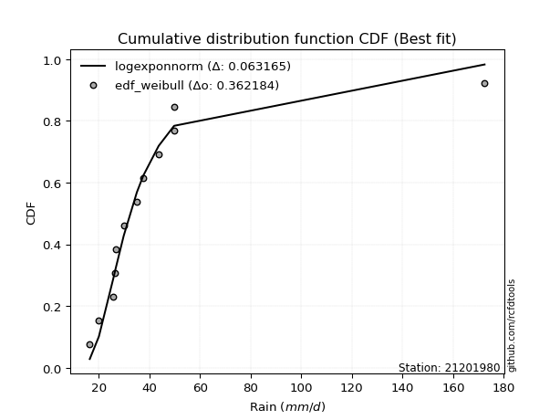</img>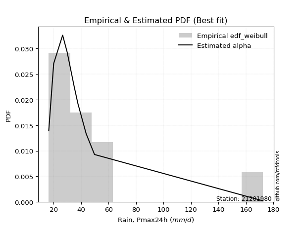</img>

</div>


### 4. EDF Beard (1943)

The Beard formula (or Beard´s plotting position formula) in hydrology is used to estimate the empirical non-exceedance probability _(P)_ of a flood event (or other extreme hydrological data point) within a given dataset.

<div align="center">


$P=(m-0.31)/(n+0.38)$


</div>


**4.1. Empirical values**

<div align="center">

|                | 0                    | 1                   | 2                   | 3                  | 4                  | 5                  | 6                  | 7                  | 8                  | 9                  | 10                 | 11                 |
|:---------------|:---------------------|:--------------------|:--------------------|:-------------------|:-------------------|:-------------------|:-------------------|:-------------------|:-------------------|:-------------------|:-------------------|:-------------------|
| date           | 2008                 | 2015                | 2025                | 2016               | 2009               | 2014               | 2010               | 2012               | 2011               | 2007               | 2013               | 2024               |
| x              | 16.5                 | 20.1                | 25.8                | 26.6               | 26.7               | 29.9               | 35.1               | 37.7               | 43.7               | 49.8               | 49.8               | 172.4              |
| m              | 1                    | 2                   | 3                   | 4                  | 5                  | 6                  | 7                  | 8                  | 9                  | 10                 | 11                 | 12                 |
| empirical_dist | edf_beard            | edf_beard           | edf_beard           | edf_beard          | edf_beard          | edf_beard          | edf_beard          | edf_beard          | edf_beard          | edf_beard          | edf_beard          | edf_beard          |
| empirical      | 0.055735056542810975 | 0.13651050080775443 | 0.21728594507269788 | 0.2980613893376413 | 0.3788368336025848 | 0.4596122778675283 | 0.5403877221324718 | 0.6211631663974152 | 0.7019386106623585 | 0.7827140549273021 | 0.8634894991922455 | 0.9442649434571889 |
| empirical_tr   | 1.0590248075278015   | 1.1580916744621141  | 1.2776057791537667  | 1.424626006904488  | 1.6098829648894668 | 1.850523168908819  | 2.1757469244288226 | 2.6396588486140726 | 3.3550135501355    | 4.6022304832713745 | 7.325443786982245  | 17.942028985507218 |

</div>


**4.2. Kolmogorov-Smirnov fit test (sorted by Δ)**


<div align="center">

|                | 0                   | 1                   | 2                   | 3                   | 4                   | 5                   | 6                   | 7                   | 8                   | 9                   | 10                  | 11                  | 12                  | 13                  | 14                  | 15                  | 16                  | 17                  | 18                  | 19                  | 20                  | 21                  | 22                  | 23                  | 24                  | 25                  | 26                  | 27                  | 28                  | 29                  | 30                  | 31                  | 32                  | 33                  | 34                  | 35                  | 36                  | 37                  | 38                  | 39                  | 40                  | 41                  | 42                  | 43                  | 44                  | 45                  | 46                  | 47                  | 48                  | 49                  | 50                  | 51                  | 52                  | 53                  | 54                  | 55                  | 56                  | 57                  | 58                  | 59                  | 60                  | 61                  | 62                  | 63                  | 64                  | 65                  | 66                  | 67                  | 68                  | 69                  | 70                  | 71                  | 72                  | 73                  | 74                  | 75                  | 76                  | 77                  | 78                  | 79                  | 80                  | 81                  | 82                  | 83                  | 84                  | 85                  | 86                  | 87                  | 88                  | 89                  | 90                  | 91                  | 92                  | 93                  | 94                  | 95                  | 96                  | 97                  | 98                  | 99                  | 100                 | 101                 | 102                 | 103                 | 104                 | 105                 | 106                 | 107                 | 108                 | 109                 | 110                 | 111                 | 112                 | 113                 | 114                 | 115                 | 116                 | 117                 | 118                 | 119                 | 120                 | 121                 | 122                 | 123                 | 124                 | 125                 | 126                 | 127                 | 128                 | 129                 | 130                 | 131                 | 132                 | 133                 | 134                 | 135                 | 136                 | 137                 | 138                 | 139                 | 140                 | 141                 | 142                 | 143                 | 144                 | 145                 | 146                 | 147                 | 148                 | 149                 | 150                 | 151                 | 152                 | 153                 | 154                 | 155                 | 156                 | 157                 | 158                 | 159                 |
|:---------------|:--------------------|:--------------------|:--------------------|:--------------------|:--------------------|:--------------------|:--------------------|:--------------------|:--------------------|:--------------------|:--------------------|:--------------------|:--------------------|:--------------------|:--------------------|:--------------------|:--------------------|:--------------------|:--------------------|:--------------------|:--------------------|:--------------------|:--------------------|:--------------------|:--------------------|:--------------------|:--------------------|:--------------------|:--------------------|:--------------------|:--------------------|:--------------------|:--------------------|:--------------------|:--------------------|:--------------------|:--------------------|:--------------------|:--------------------|:--------------------|:--------------------|:--------------------|:--------------------|:--------------------|:--------------------|:--------------------|:--------------------|:--------------------|:--------------------|:--------------------|:--------------------|:--------------------|:--------------------|:--------------------|:--------------------|:--------------------|:--------------------|:--------------------|:--------------------|:--------------------|:--------------------|:--------------------|:--------------------|:--------------------|:--------------------|:--------------------|:--------------------|:--------------------|:--------------------|:--------------------|:--------------------|:--------------------|:--------------------|:--------------------|:--------------------|:--------------------|:--------------------|:--------------------|:--------------------|:--------------------|:--------------------|:--------------------|:--------------------|:--------------------|:--------------------|:--------------------|:--------------------|:--------------------|:--------------------|:--------------------|:--------------------|:--------------------|:--------------------|:--------------------|:--------------------|:--------------------|:--------------------|:--------------------|:--------------------|:--------------------|:--------------------|:--------------------|:--------------------|:--------------------|:--------------------|:--------------------|:--------------------|:--------------------|:--------------------|:--------------------|:--------------------|:--------------------|:--------------------|:--------------------|:--------------------|:--------------------|:--------------------|:--------------------|:--------------------|:--------------------|:--------------------|:--------------------|:--------------------|:--------------------|:--------------------|:--------------------|:--------------------|:--------------------|:--------------------|:--------------------|:--------------------|:--------------------|:--------------------|:--------------------|:--------------------|:--------------------|:--------------------|:--------------------|:--------------------|:--------------------|:--------------------|:--------------------|:--------------------|:--------------------|:--------------------|:--------------------|:--------------------|:--------------------|:--------------------|:--------------------|:--------------------|:--------------------|:--------------------|:--------------------|:--------------------|:--------------------|:--------------------|:--------------------|:--------------------|:--------------------|
| station        | 21201980            | 21201980            | 21201980            | 21201980            | 21201980            | 21201980            | 21201980            | 21201980            | 21201980            | 21201980            | 21201980            | 21201980            | 21201980            | 21201980            | 21201980            | 21201980            | 21201980            | 21201980            | 21201980            | 21201980            | 21201980            | 21201980            | 21201980            | 21201980            | 21201980            | 21201980            | 21201980            | 21201980            | 21201980            | 21201980            | 21201980            | 21201980            | 21201980            | 21201980            | 21201980            | 21201980            | 21201980            | 21201980            | 21201980            | 21201980            | 21201980            | 21201980            | 21201980            | 21201980            | 21201980            | 21201980            | 21201980            | 21201980            | 21201980            | 21201980            | 21201980            | 21201980            | 21201980            | 21201980            | 21201980            | 21201980            | 21201980            | 21201980            | 21201980            | 21201980            | 21201980            | 21201980            | 21201980            | 21201980            | 21201980            | 21201980            | 21201980            | 21201980            | 21201980            | 21201980            | 21201980            | 21201980            | 21201980            | 21201980            | 21201980            | 21201980            | 21201980            | 21201980            | 21201980            | 21201980            | 21201980            | 21201980            | 21201980            | 21201980            | 21201980            | 21201980            | 21201980            | 21201980            | 21201980            | 21201980            | 21201980            | 21201980            | 21201980            | 21201980            | 21201980            | 21201980            | 21201980            | 21201980            | 21201980            | 21201980            | 21201980            | 21201980            | 21201980            | 21201980            | 21201980            | 21201980            | 21201980            | 21201980            | 21201980            | 21201980            | 21201980            | 21201980            | 21201980            | 21201980            | 21201980            | 21201980            | 21201980            | 21201980            | 21201980            | 21201980            | 21201980            | 21201980            | 21201980            | 21201980            | 21201980            | 21201980            | 21201980            | 21201980            | 21201980            | 21201980            | 21201980            | 21201980            | 21201980            | 21201980            | 21201980            | 21201980            | 21201980            | 21201980            | 21201980            | 21201980            | 21201980            | 21201980            | 21201980            | 21201980            | 21201980            | 21201980            | 21201980            | 21201980            | 21201980            | 21201980            | 21201980            | 21201980            | 21201980            | 21201980            | 21201980            | 21201980            | 21201980            | 21201980            | 21201980            | 21201980            |
| empirical_dist | edf_beard           | edf_beard           | edf_beard           | edf_beard           | edf_beard           | edf_beard           | edf_beard           | edf_beard           | edf_beard           | edf_beard           | edf_beard           | edf_beard           | edf_beard           | edf_beard           | edf_beard           | edf_beard           | edf_beard           | edf_beard           | edf_beard           | edf_beard           | edf_beard           | edf_beard           | edf_beard           | edf_beard           | edf_beard           | edf_beard           | edf_beard           | edf_beard           | edf_beard           | edf_beard           | edf_beard           | edf_beard           | edf_beard           | edf_beard           | edf_beard           | edf_beard           | edf_beard           | edf_beard           | edf_beard           | edf_beard           | edf_beard           | edf_beard           | edf_beard           | edf_beard           | edf_beard           | edf_beard           | edf_beard           | edf_beard           | edf_beard           | edf_beard           | edf_beard           | edf_beard           | edf_beard           | edf_beard           | edf_beard           | edf_beard           | edf_beard           | edf_beard           | edf_beard           | edf_beard           | edf_beard           | edf_beard           | edf_beard           | edf_beard           | edf_beard           | edf_beard           | edf_beard           | edf_beard           | edf_beard           | edf_beard           | edf_beard           | edf_beard           | edf_beard           | edf_beard           | edf_beard           | edf_beard           | edf_beard           | edf_beard           | edf_beard           | edf_beard           | edf_beard           | edf_beard           | edf_beard           | edf_beard           | edf_beard           | edf_beard           | edf_beard           | edf_beard           | edf_beard           | edf_beard           | edf_beard           | edf_beard           | edf_beard           | edf_beard           | edf_beard           | edf_beard           | edf_beard           | edf_beard           | edf_beard           | edf_beard           | edf_beard           | edf_beard           | edf_beard           | edf_beard           | edf_beard           | edf_beard           | edf_beard           | edf_beard           | edf_beard           | edf_beard           | edf_beard           | edf_beard           | edf_beard           | edf_beard           | edf_beard           | edf_beard           | edf_beard           | edf_beard           | edf_beard           | edf_beard           | edf_beard           | edf_beard           | edf_beard           | edf_beard           | edf_beard           | edf_beard           | edf_beard           | edf_beard           | edf_beard           | edf_beard           | edf_beard           | edf_beard           | edf_beard           | edf_beard           | edf_beard           | edf_beard           | edf_beard           | edf_beard           | edf_beard           | edf_beard           | edf_beard           | edf_beard           | edf_beard           | edf_beard           | edf_beard           | edf_beard           | edf_beard           | edf_beard           | edf_beard           | edf_beard           | edf_beard           | edf_beard           | edf_beard           | edf_beard           | edf_beard           | edf_beard           | edf_beard           | edf_beard           | edf_beard           | edf_beard           |
| p_dist         | logt                | logburr12           | logvonmises_line    | logexponnorm        | loggennorm          | logmielke           | loggenlogistic      | alpha               | logburr             | burr                | logdweibull         | mielke              | logalpha            | loggenextreme       | loginvweibull       | nct                 | genextreme          | invweibull          | loginvgamma         | logf                | logjohnsonsu        | logjohnsonsb        | f                   | invgamma            | ncf                 | logdgamma           | loginvgauss         | logfatiguelife      | loggumbel_r         | logmoyal            | lognct              | exponweib           | logbetaprime        | loggamma            | loggamma            | logerlang           | logkstwobign        | loghypsecant        | kappa3              | johnsonsu           | logloglaplace       | johnsonsb           | betaprime           | t                   | logpearson3         | loglogistic         | loghalflogistic     | invgauss            | logrice             | lograyleigh         | truncpareto         | loghalfnorm         | logmaxwell          | lomax               | logwald             | logfoldnorm         | logskewnorm         | loglaplace          | loglaplace          | genpareto           | logkappa3           | loghalfgennorm      | fatiguelife         | logcrystalball      | lognorm             | loggompertz         | logloggamma         | gompertz            | logncf              | genlogistic         | logweibull_min      | exponnorm           | genexpon            | gamma               | loggenexpon         | logtruncnorm        | cosine              | loganglit           | loggumbel_l         | wald                | logsemicircular     | genhalflogistic     | gengamma            | logbradford         | halfgennorm         | moyal               | pearson3            | halflogistic        | burr12              | loglomax            | loggengamma         | logarcsine          | dgamma              | logtriang           | weibull_min         | gumbel_r            | halfnorm            | dweibull            | gennorm             | erlang              | logcosine           | logtruncweibull_min | rayleigh            | kstwobign           | laplace             | maxwell             | nakagami            | logtruncexpon       | truncnorm           | foldnorm            | hypsecant           | logistic            | norm                | crystalball         | anglit              | semicircular        | gausshyper          | rice                | beta                | arcsine             | loggenpareto        | logkappa4           | exponpow            | skewnorm            | powerlaw            | logwrapcauchy       | logexponpow         | gumbel_l            | truncweibull_min    | logksone            | logtukeylambda      | logargus            | loguniform          | logrdist            | bradford            | loglevy_l           | logpowerlaw         | truncexpon          | wrapcauchy          | levy_l              | loggausshyper       | logweibull_max      | logexponweib        | argus               | vonmises_line       | loggenhalflogistic  | rdist               | logbeta             | lognakagami         | tukeylambda         | ksone               | kappa4              | logtrapezoid        | uniform             | logtruncpareto      | weibull_max         | triang              | trapezoid           | logvonmises         | vonmises            |
| delta          | 0.06774733728505944 | 0.06910160389730091 | 0.07467532925286324 | 0.07954769834346598 | 0.08263666055775926 | 0.08320352676977139 | 0.08384565945276967 | 0.08411227296516255 | 0.08435747690580003 | 0.08455493338864994 | 0.08457481738646194 | 0.08517090843979735 | 0.0894449296098071  | 0.09130822051218157 | 0.09131058602916509 | 0.09142511680931942 | 0.09303996394577546 | 0.09304154654255509 | 0.09376014621505252 | 0.09377382672831208 | 0.09694582948490693 | 0.09825276628100493 | 0.0984885157738345  | 0.09848860265536713 | 0.09848868469365579 | 0.09862707304684243 | 0.09910690659799964 | 0.099436618723799   | 0.09999572709471194 | 0.10056477715953477 | 0.10371751253257022 | 0.1040007424526862  | 0.107223835703466   | 0.10977555960780416 | 0.10977555960780416 | 0.10977645949591891 | 0.11008109932870447 | 0.11093041918229435 | 0.11142221084147313 | 0.11325423663617495 | 0.11356288203848353 | 0.11415106430155236 | 0.11458269859834314 | 0.1165091800789596  | 0.11691656315887056 | 0.12538207382715505 | 0.12730164954799567 | 0.1278279870485246  | 0.12903107101269484 | 0.1294280380135745  | 0.13182104233953484 | 0.1326974549520547  | 0.13346700037594705 | 0.1358164420602057  | 0.13651050080775443 | 0.13686030128807347 | 0.13914964389151496 | 0.13922817660370335 | 0.13922817660370335 | 0.1425949035178094  | 0.14394379823352393 | 0.14598746567113513 | 0.14731472984072602 | 0.14739944837674424 | 0.1474004665995421  | 0.14820481798511675 | 0.15020871603116304 | 0.15049880709083707 | 0.15267002669523833 | 0.15540877770874972 | 0.16203672668489083 | 0.16540036584829276 | 0.1698500149335831  | 0.1706183128916211  | 0.1726403511129323  | 0.17267744405377078 | 0.1726979913581631  | 0.17313762250506515 | 0.17441834874506412 | 0.1746591251819637  | 0.18415224635074168 | 0.18492677825492176 | 0.18844485903459346 | 0.19886811088262457 | 0.20536769365278518 | 0.21604189168816756 | 0.2176522683433651  | 0.21984770053530833 | 0.22204299716048265 | 0.2262140129468599  | 0.22846007537822027 | 0.2311284445199976  | 0.23131290244897995 | 0.2334911432268295  | 0.24060434493983285 | 0.24078999405521317 | 0.24355338376736801 | 0.24603104576894186 | 0.25346955468711985 | 0.2561571528167192  | 0.2582988145861014  | 0.26230209291316753 | 0.27087638099156086 | 0.27496597910463527 | 0.2780313615934046  | 0.2805597323641883  | 0.2813766953109077  | 0.2831830804458868  | 0.28781632949800373 | 0.28799771744230374 | 0.29769509888018786 | 0.3036788515479565  | 0.31076969522172737 | 0.31077029034361037 | 0.3182462327030122  | 0.321332879818782   | 0.3228545269095534  | 0.3246810892247155  | 0.33269006286161346 | 0.3336145476375483  | 0.3456902490052251  | 0.34611712248794246 | 0.35496482638488314 | 0.35822883972748853 | 0.361052244536413   | 0.3732553769982032  | 0.3741801518941263  | 0.37751110855343073 | 0.38278008015807885 | 0.38784319720026983 | 0.392393164463255   | 0.39264644185785935 | 0.3927139368018746  | 0.40420892118230967 | 0.4067951599146387  | 0.4259057410356577  | 0.4514523653486911  | 0.4553000724102056  | 0.45973731917073524 | 0.47186804684074324 | 0.49193549879725357 | 0.5246739650227317  | 0.5277705751881545  | 0.5329091137137199  | 0.5372659088115875  | 0.5542884141797944  | 0.5590767282281157  | 0.5768792744728557  | 0.5783655924211282  | 0.5885745830656759  | 0.6021574487325492  | 0.6177656170314891  | 0.6372500945936038  | 0.6498910386406098  | 0.7547556113264363  | 0.7626517668484433  | 0.7821418979922432  | 0.7951950585947762  | 1.0802384463283499  | 26.99583442363764   |
| deltao         | 0.36218414519599995 | 0.36218414519599995 | 0.36218414519599995 | 0.36218414519599995 | 0.36218414519599995 | 0.36218414519599995 | 0.36218414519599995 | 0.36218414519599995 | 0.36218414519599995 | 0.36218414519599995 | 0.36218414519599995 | 0.36218414519599995 | 0.36218414519599995 | 0.36218414519599995 | 0.36218414519599995 | 0.36218414519599995 | 0.36218414519599995 | 0.36218414519599995 | 0.36218414519599995 | 0.36218414519599995 | 0.36218414519599995 | 0.36218414519599995 | 0.36218414519599995 | 0.36218414519599995 | 0.36218414519599995 | 0.36218414519599995 | 0.36218414519599995 | 0.36218414519599995 | 0.36218414519599995 | 0.36218414519599995 | 0.36218414519599995 | 0.36218414519599995 | 0.36218414519599995 | 0.36218414519599995 | 0.36218414519599995 | 0.36218414519599995 | 0.36218414519599995 | 0.36218414519599995 | 0.36218414519599995 | 0.36218414519599995 | 0.36218414519599995 | 0.36218414519599995 | 0.36218414519599995 | 0.36218414519599995 | 0.36218414519599995 | 0.36218414519599995 | 0.36218414519599995 | 0.36218414519599995 | 0.36218414519599995 | 0.36218414519599995 | 0.36218414519599995 | 0.36218414519599995 | 0.36218414519599995 | 0.36218414519599995 | 0.36218414519599995 | 0.36218414519599995 | 0.36218414519599995 | 0.36218414519599995 | 0.36218414519599995 | 0.36218414519599995 | 0.36218414519599995 | 0.36218414519599995 | 0.36218414519599995 | 0.36218414519599995 | 0.36218414519599995 | 0.36218414519599995 | 0.36218414519599995 | 0.36218414519599995 | 0.36218414519599995 | 0.36218414519599995 | 0.36218414519599995 | 0.36218414519599995 | 0.36218414519599995 | 0.36218414519599995 | 0.36218414519599995 | 0.36218414519599995 | 0.36218414519599995 | 0.36218414519599995 | 0.36218414519599995 | 0.36218414519599995 | 0.36218414519599995 | 0.36218414519599995 | 0.36218414519599995 | 0.36218414519599995 | 0.36218414519599995 | 0.36218414519599995 | 0.36218414519599995 | 0.36218414519599995 | 0.36218414519599995 | 0.36218414519599995 | 0.36218414519599995 | 0.36218414519599995 | 0.36218414519599995 | 0.36218414519599995 | 0.36218414519599995 | 0.36218414519599995 | 0.36218414519599995 | 0.36218414519599995 | 0.36218414519599995 | 0.36218414519599995 | 0.36218414519599995 | 0.36218414519599995 | 0.36218414519599995 | 0.36218414519599995 | 0.36218414519599995 | 0.36218414519599995 | 0.36218414519599995 | 0.36218414519599995 | 0.36218414519599995 | 0.36218414519599995 | 0.36218414519599995 | 0.36218414519599995 | 0.36218414519599995 | 0.36218414519599995 | 0.36218414519599995 | 0.36218414519599995 | 0.36218414519599995 | 0.36218414519599995 | 0.36218414519599995 | 0.36218414519599995 | 0.36218414519599995 | 0.36218414519599995 | 0.36218414519599995 | 0.36218414519599995 | 0.36218414519599995 | 0.36218414519599995 | 0.36218414519599995 | 0.36218414519599995 | 0.36218414519599995 | 0.36218414519599995 | 0.36218414519599995 | 0.36218414519599995 | 0.36218414519599995 | 0.36218414519599995 | 0.36218414519599995 | 0.36218414519599995 | 0.36218414519599995 | 0.36218414519599995 | 0.36218414519599995 | 0.36218414519599995 | 0.36218414519599995 | 0.36218414519599995 | 0.36218414519599995 | 0.36218414519599995 | 0.36218414519599995 | 0.36218414519599995 | 0.36218414519599995 | 0.36218414519599995 | 0.36218414519599995 | 0.36218414519599995 | 0.36218414519599995 | 0.36218414519599995 | 0.36218414519599995 | 0.36218414519599995 | 0.36218414519599995 | 0.36218414519599995 | 0.36218414519599995 | 0.36218414519599995 | 0.36218414519599995 | 0.36218414519599995 |
| eval           | Δo > Δ              | Δo > Δ              | Δo > Δ              | Δo > Δ              | Δo > Δ              | Δo > Δ              | Δo > Δ              | Δo > Δ              | Δo > Δ              | Δo > Δ              | Δo > Δ              | Δo > Δ              | Δo > Δ              | Δo > Δ              | Δo > Δ              | Δo > Δ              | Δo > Δ              | Δo > Δ              | Δo > Δ              | Δo > Δ              | Δo > Δ              | Δo > Δ              | Δo > Δ              | Δo > Δ              | Δo > Δ              | Δo > Δ              | Δo > Δ              | Δo > Δ              | Δo > Δ              | Δo > Δ              | Δo > Δ              | Δo > Δ              | Δo > Δ              | Δo > Δ              | Δo > Δ              | Δo > Δ              | Δo > Δ              | Δo > Δ              | Δo > Δ              | Δo > Δ              | Δo > Δ              | Δo > Δ              | Δo > Δ              | Δo > Δ              | Δo > Δ              | Δo > Δ              | Δo > Δ              | Δo > Δ              | Δo > Δ              | Δo > Δ              | Δo > Δ              | Δo > Δ              | Δo > Δ              | Δo > Δ              | Δo > Δ              | Δo > Δ              | Δo > Δ              | Δo > Δ              | Δo > Δ              | Δo > Δ              | Δo > Δ              | Δo > Δ              | Δo > Δ              | Δo > Δ              | Δo > Δ              | Δo > Δ              | Δo > Δ              | Δo > Δ              | Δo > Δ              | Δo > Δ              | Δo > Δ              | Δo > Δ              | Δo > Δ              | Δo > Δ              | Δo > Δ              | Δo > Δ              | Δo > Δ              | Δo > Δ              | Δo > Δ              | Δo > Δ              | Δo > Δ              | Δo > Δ              | Δo > Δ              | Δo > Δ              | Δo > Δ              | Δo > Δ              | Δo > Δ              | Δo > Δ              | Δo > Δ              | Δo > Δ              | Δo > Δ              | Δo > Δ              | Δo > Δ              | Δo > Δ              | Δo > Δ              | Δo > Δ              | Δo > Δ              | Δo > Δ              | Δo > Δ              | Δo > Δ              | Δo > Δ              | Δo > Δ              | Δo > Δ              | Δo > Δ              | Δo > Δ              | Δo > Δ              | Δo > Δ              | Δo > Δ              | Δo > Δ              | Δo > Δ              | Δo > Δ              | Δo > Δ              | Δo > Δ              | Δo > Δ              | Δo > Δ              | Δo > Δ              | Δo > Δ              | Δo > Δ              | Δo > Δ              | Δo > Δ              | Δo > Δ              | Δo > Δ              | Δo > Δ              | Δo > Δ              | Δo > Δ              | Δo <= Δ             | Δo <= Δ             | Δo <= Δ             | Δo <= Δ             | Δo <= Δ             | Δo <= Δ             | Δo <= Δ             | Δo <= Δ             | Δo <= Δ             | Δo <= Δ             | Δo <= Δ             | Δo <= Δ             | Δo <= Δ             | Δo <= Δ             | Δo <= Δ             | Δo <= Δ             | Δo <= Δ             | Δo <= Δ             | Δo <= Δ             | Δo <= Δ             | Δo <= Δ             | Δo <= Δ             | Δo <= Δ             | Δo <= Δ             | Δo <= Δ             | Δo <= Δ             | Δo <= Δ             | Δo <= Δ             | Δo <= Δ             | Δo <= Δ             | Δo <= Δ             | Δo <= Δ             | Δo <= Δ             | Δo <= Δ             | Δo <= Δ             |
| fit            | 1                   | 1                   | 1                   | 1                   | 1                   | 1                   | 1                   | 1                   | 1                   | 1                   | 1                   | 1                   | 1                   | 1                   | 1                   | 1                   | 1                   | 1                   | 1                   | 1                   | 1                   | 1                   | 1                   | 1                   | 1                   | 1                   | 1                   | 1                   | 1                   | 1                   | 1                   | 1                   | 1                   | 1                   | 1                   | 1                   | 1                   | 1                   | 1                   | 1                   | 1                   | 1                   | 1                   | 1                   | 1                   | 1                   | 1                   | 1                   | 1                   | 1                   | 1                   | 1                   | 1                   | 1                   | 1                   | 1                   | 1                   | 1                   | 1                   | 1                   | 1                   | 1                   | 1                   | 1                   | 1                   | 1                   | 1                   | 1                   | 1                   | 1                   | 1                   | 1                   | 1                   | 1                   | 1                   | 1                   | 1                   | 1                   | 1                   | 1                   | 1                   | 1                   | 1                   | 1                   | 1                   | 1                   | 1                   | 1                   | 1                   | 1                   | 1                   | 1                   | 1                   | 1                   | 1                   | 1                   | 1                   | 1                   | 1                   | 1                   | 1                   | 1                   | 1                   | 1                   | 1                   | 1                   | 1                   | 1                   | 1                   | 1                   | 1                   | 1                   | 1                   | 1                   | 1                   | 1                   | 1                   | 1                   | 1                   | 1                   | 1                   | 1                   | 1                   | 1                   | 1                   | 0                   | 0                   | 0                   | 0                   | 0                   | 0                   | 0                   | 0                   | 0                   | 0                   | 0                   | 0                   | 0                   | 0                   | 0                   | 0                   | 0                   | 0                   | 0                   | 0                   | 0                   | 0                   | 0                   | 0                   | 0                   | 0                   | 0                   | 0                   | 0                   | 0                   | 0                   | 0                   | 0                   | 0                   | 0                   |
| n              | 12                  | 12                  | 12                  | 12                  | 12                  | 12                  | 12                  | 12                  | 12                  | 12                  | 12                  | 12                  | 12                  | 12                  | 12                  | 12                  | 12                  | 12                  | 12                  | 12                  | 12                  | 12                  | 12                  | 12                  | 12                  | 12                  | 12                  | 12                  | 12                  | 12                  | 12                  | 12                  | 12                  | 12                  | 12                  | 12                  | 12                  | 12                  | 12                  | 12                  | 12                  | 12                  | 12                  | 12                  | 12                  | 12                  | 12                  | 12                  | 12                  | 12                  | 12                  | 12                  | 12                  | 12                  | 12                  | 12                  | 12                  | 12                  | 12                  | 12                  | 12                  | 12                  | 12                  | 12                  | 12                  | 12                  | 12                  | 12                  | 12                  | 12                  | 12                  | 12                  | 12                  | 12                  | 12                  | 12                  | 12                  | 12                  | 12                  | 12                  | 12                  | 12                  | 12                  | 12                  | 12                  | 12                  | 12                  | 12                  | 12                  | 12                  | 12                  | 12                  | 12                  | 12                  | 12                  | 12                  | 12                  | 12                  | 12                  | 12                  | 12                  | 12                  | 12                  | 12                  | 12                  | 12                  | 12                  | 12                  | 12                  | 12                  | 12                  | 12                  | 12                  | 12                  | 12                  | 12                  | 12                  | 12                  | 12                  | 12                  | 12                  | 12                  | 12                  | 12                  | 12                  | 12                  | 12                  | 12                  | 12                  | 12                  | 12                  | 12                  | 12                  | 12                  | 12                  | 12                  | 12                  | 12                  | 12                  | 12                  | 12                  | 12                  | 12                  | 12                  | 12                  | 12                  | 12                  | 12                  | 12                  | 12                  | 12                  | 12                  | 12                  | 12                  | 12                  | 12                  | 12                  | 12                  | 12                  | 12                  |
| best_fit       | 1                   | 0                   | 0                   | 0                   | 0                   | 0                   | 0                   | 0                   | 0                   | 0                   | 0                   | 0                   | 0                   | 0                   | 0                   | 0                   | 0                   | 0                   | 0                   | 0                   | 0                   | 0                   | 0                   | 0                   | 0                   | 0                   | 0                   | 0                   | 0                   | 0                   | 0                   | 0                   | 0                   | 0                   | 0                   | 0                   | 0                   | 0                   | 0                   | 0                   | 0                   | 0                   | 0                   | 0                   | 0                   | 0                   | 0                   | 0                   | 0                   | 0                   | 0                   | 0                   | 0                   | 0                   | 0                   | 0                   | 0                   | 0                   | 0                   | 0                   | 0                   | 0                   | 0                   | 0                   | 0                   | 0                   | 0                   | 0                   | 0                   | 0                   | 0                   | 0                   | 0                   | 0                   | 0                   | 0                   | 0                   | 0                   | 0                   | 0                   | 0                   | 0                   | 0                   | 0                   | 0                   | 0                   | 0                   | 0                   | 0                   | 0                   | 0                   | 0                   | 0                   | 0                   | 0                   | 0                   | 0                   | 0                   | 0                   | 0                   | 0                   | 0                   | 0                   | 0                   | 0                   | 0                   | 0                   | 0                   | 0                   | 0                   | 0                   | 0                   | 0                   | 0                   | 0                   | 0                   | 0                   | 0                   | 0                   | 0                   | 0                   | 0                   | 0                   | 0                   | 0                   | 0                   | 0                   | 0                   | 0                   | 0                   | 0                   | 0                   | 0                   | 0                   | 0                   | 0                   | 0                   | 0                   | 0                   | 0                   | 0                   | 0                   | 0                   | 0                   | 0                   | 0                   | 0                   | 0                   | 0                   | 0                   | 0                   | 0                   | 0                   | 0                   | 0                   | 0                   | 0                   | 0                   | 0                   | 0                   |
| best_fit_sort  | 1                   | 2                   | 3                   | 4                   | 5                   | 6                   | 7                   | 8                   | 9                   | 10                  | 11                  | 12                  | 13                  | 14                  | 15                  | 16                  | 17                  | 18                  | 19                  | 20                  | 21                  | 22                  | 23                  | 24                  | 25                  | 26                  | 27                  | 28                  | 29                  | 30                  | 31                  | 32                  | 33                  | 34                  | 35                  | 36                  | 37                  | 38                  | 39                  | 40                  | 41                  | 42                  | 43                  | 44                  | 45                  | 46                  | 47                  | 48                  | 49                  | 50                  | 51                  | 52                  | 53                  | 54                  | 55                  | 56                  | 57                  | 58                  | 59                  | 60                  | 61                  | 62                  | 63                  | 64                  | 65                  | 66                  | 67                  | 68                  | 69                  | 70                  | 71                  | 72                  | 73                  | 74                  | 75                  | 76                  | 77                  | 78                  | 79                  | 80                  | 81                  | 82                  | 83                  | 84                  | 85                  | 86                  | 87                  | 88                  | 89                  | 90                  | 91                  | 92                  | 93                  | 94                  | 95                  | 96                  | 97                  | 98                  | 99                  | 100                 | 101                 | 102                 | 103                 | 104                 | 105                 | 106                 | 107                 | 108                 | 109                 | 110                 | 111                 | 112                 | 113                 | 114                 | 115                 | 116                 | 117                 | 118                 | 119                 | 120                 | 121                 | 122                 | 123                 | 124                 | 125                 | 126                 | 127                 | 128                 | 129                 | 130                 | 131                 | 132                 | 133                 | 134                 | 135                 | 136                 | 137                 | 138                 | 139                 | 140                 | 141                 | 142                 | 143                 | 144                 | 145                 | 146                 | 147                 | 148                 | 149                 | 150                 | 151                 | 152                 | 153                 | 154                 | 155                 | 156                 | 157                 | 158                 | 159                 | 160                 |

</div>


**4.3. Best fit**

<div align="center">

|   id |   station | empirical_dist   | p_dist   |     delta |   deltao | eval   |   fit |   n |   best_fit |   best_fit_sort |
|-----:|----------:|:-----------------|:---------|----------:|---------:|:-------|------:|----:|-----------:|----------------:|
|    0 |  21201980 | edf_beard        | logt     | 0.0677473 | 0.362184 | Δo > Δ |     1 |  12 |          1 |               1 |

</div>


<div align="center">

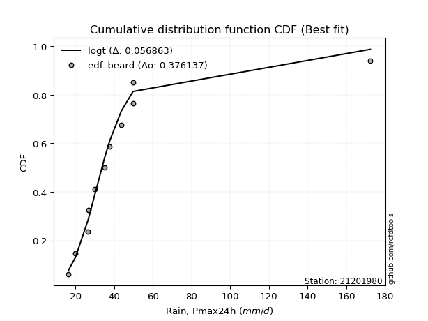</img>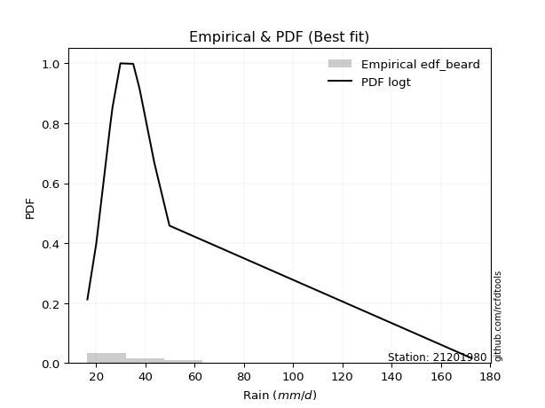</img>

</div>


### 5. EDF Chegodayev (1955)

The Chegodayev formula is an empirical plotting position formula used in hydrological frequency analysis to estimate the exceedance probability or return period of a specific event from a set of observed data. It is primarily used for plotting observed data points on probability paper to fit a theoretical distribution, particularly for analyzing extreme events like maximum flood flows or rainfall intensities. The constant _b_ value in the generalized plotting position formula is 0.3.

<div align="center">


$P=(m-b)/(n+1-2b)$


</div>


**5.1. Empirical values**

<div align="center">

|                | 0                  | 1                   | 2                   | 3                   | 4                  | 5                  | 6                  | 7                  | 8                  | 9                 | 10                 | 11                 |
|:---------------|:-------------------|:--------------------|:--------------------|:--------------------|:-------------------|:-------------------|:-------------------|:-------------------|:-------------------|:------------------|:-------------------|:-------------------|
| date           | 2008               | 2015                | 2025                | 2016                | 2009               | 2014               | 2010               | 2012               | 2011               | 2007              | 2013               | 2024               |
| x              | 16.5               | 20.1                | 25.8                | 26.6                | 26.7               | 29.9               | 35.1               | 37.7               | 43.7               | 49.8              | 49.8               | 172.4              |
| m              | 1                  | 2                   | 3                   | 4                   | 5                  | 6                  | 7                  | 8                  | 9                  | 10                | 11                 | 12                 |
| empirical_dist | edf_chegodayev     | edf_chegodayev      | edf_chegodayev      | edf_chegodayev      | edf_chegodayev     | edf_chegodayev     | edf_chegodayev     | edf_chegodayev     | edf_chegodayev     | edf_chegodayev    | edf_chegodayev     | edf_chegodayev     |
| empirical      | 0.0564516129032258 | 0.13709677419354838 | 0.21774193548387097 | 0.29838709677419356 | 0.3790322580645161 | 0.4596774193548387 | 0.5403225806451613 | 0.6209677419354839 | 0.7016129032258064 | 0.782258064516129 | 0.8629032258064515 | 0.9435483870967741 |
| empirical_tr   | 1.0598290598290598 | 1.158878504672897   | 1.2783505154639176  | 1.425287356321839   | 1.6103896103896105 | 1.8507462686567164 | 2.1754385964912277 | 2.6382978723404253 | 3.3513513513513504 | 4.592592592592592 | 7.294117647058818  | 17.714285714285694 |

</div>


**5.2. Kolmogorov-Smirnov fit test (sorted by Δ)**


<div align="center">

|                | 0                   | 1                   | 2                   | 3                   | 4                   | 5                   | 6                   | 7                   | 8                   | 9                   | 10                  | 11                  | 12                  | 13                  | 14                  | 15                  | 16                  | 17                  | 18                  | 19                  | 20                  | 21                  | 22                  | 23                  | 24                  | 25                  | 26                  | 27                  | 28                  | 29                  | 30                  | 31                  | 32                  | 33                  | 34                  | 35                  | 36                  | 37                  | 38                  | 39                  | 40                  | 41                  | 42                  | 43                  | 44                  | 45                  | 46                  | 47                  | 48                  | 49                  | 50                  | 51                  | 52                  | 53                  | 54                  | 55                  | 56                  | 57                  | 58                  | 59                  | 60                  | 61                  | 62                  | 63                  | 64                  | 65                  | 66                  | 67                  | 68                  | 69                  | 70                  | 71                  | 72                  | 73                  | 74                  | 75                  | 76                  | 77                  | 78                  | 79                  | 80                  | 81                  | 82                  | 83                  | 84                  | 85                  | 86                  | 87                  | 88                  | 89                  | 90                  | 91                  | 92                  | 93                  | 94                  | 95                  | 96                  | 97                  | 98                  | 99                  | 100                 | 101                 | 102                 | 103                 | 104                 | 105                 | 106                 | 107                 | 108                 | 109                 | 110                 | 111                 | 112                 | 113                 | 114                 | 115                 | 116                 | 117                 | 118                 | 119                 | 120                 | 121                 | 122                 | 123                 | 124                 | 125                 | 126                 | 127                 | 128                 | 129                 | 130                 | 131                 | 132                 | 133                 | 134                 | 135                 | 136                 | 137                 | 138                 | 139                 | 140                 | 141                 | 142                 | 143                 | 144                 | 145                 | 146                 | 147                 | 148                 | 149                 | 150                 | 151                 | 152                 | 153                 | 154                 | 155                 | 156                 | 157                 | 158                 | 159                 |
|:---------------|:--------------------|:--------------------|:--------------------|:--------------------|:--------------------|:--------------------|:--------------------|:--------------------|:--------------------|:--------------------|:--------------------|:--------------------|:--------------------|:--------------------|:--------------------|:--------------------|:--------------------|:--------------------|:--------------------|:--------------------|:--------------------|:--------------------|:--------------------|:--------------------|:--------------------|:--------------------|:--------------------|:--------------------|:--------------------|:--------------------|:--------------------|:--------------------|:--------------------|:--------------------|:--------------------|:--------------------|:--------------------|:--------------------|:--------------------|:--------------------|:--------------------|:--------------------|:--------------------|:--------------------|:--------------------|:--------------------|:--------------------|:--------------------|:--------------------|:--------------------|:--------------------|:--------------------|:--------------------|:--------------------|:--------------------|:--------------------|:--------------------|:--------------------|:--------------------|:--------------------|:--------------------|:--------------------|:--------------------|:--------------------|:--------------------|:--------------------|:--------------------|:--------------------|:--------------------|:--------------------|:--------------------|:--------------------|:--------------------|:--------------------|:--------------------|:--------------------|:--------------------|:--------------------|:--------------------|:--------------------|:--------------------|:--------------------|:--------------------|:--------------------|:--------------------|:--------------------|:--------------------|:--------------------|:--------------------|:--------------------|:--------------------|:--------------------|:--------------------|:--------------------|:--------------------|:--------------------|:--------------------|:--------------------|:--------------------|:--------------------|:--------------------|:--------------------|:--------------------|:--------------------|:--------------------|:--------------------|:--------------------|:--------------------|:--------------------|:--------------------|:--------------------|:--------------------|:--------------------|:--------------------|:--------------------|:--------------------|:--------------------|:--------------------|:--------------------|:--------------------|:--------------------|:--------------------|:--------------------|:--------------------|:--------------------|:--------------------|:--------------------|:--------------------|:--------------------|:--------------------|:--------------------|:--------------------|:--------------------|:--------------------|:--------------------|:--------------------|:--------------------|:--------------------|:--------------------|:--------------------|:--------------------|:--------------------|:--------------------|:--------------------|:--------------------|:--------------------|:--------------------|:--------------------|:--------------------|:--------------------|:--------------------|:--------------------|:--------------------|:--------------------|:--------------------|:--------------------|:--------------------|:--------------------|:--------------------|:--------------------|
| station        | 21201980            | 21201980            | 21201980            | 21201980            | 21201980            | 21201980            | 21201980            | 21201980            | 21201980            | 21201980            | 21201980            | 21201980            | 21201980            | 21201980            | 21201980            | 21201980            | 21201980            | 21201980            | 21201980            | 21201980            | 21201980            | 21201980            | 21201980            | 21201980            | 21201980            | 21201980            | 21201980            | 21201980            | 21201980            | 21201980            | 21201980            | 21201980            | 21201980            | 21201980            | 21201980            | 21201980            | 21201980            | 21201980            | 21201980            | 21201980            | 21201980            | 21201980            | 21201980            | 21201980            | 21201980            | 21201980            | 21201980            | 21201980            | 21201980            | 21201980            | 21201980            | 21201980            | 21201980            | 21201980            | 21201980            | 21201980            | 21201980            | 21201980            | 21201980            | 21201980            | 21201980            | 21201980            | 21201980            | 21201980            | 21201980            | 21201980            | 21201980            | 21201980            | 21201980            | 21201980            | 21201980            | 21201980            | 21201980            | 21201980            | 21201980            | 21201980            | 21201980            | 21201980            | 21201980            | 21201980            | 21201980            | 21201980            | 21201980            | 21201980            | 21201980            | 21201980            | 21201980            | 21201980            | 21201980            | 21201980            | 21201980            | 21201980            | 21201980            | 21201980            | 21201980            | 21201980            | 21201980            | 21201980            | 21201980            | 21201980            | 21201980            | 21201980            | 21201980            | 21201980            | 21201980            | 21201980            | 21201980            | 21201980            | 21201980            | 21201980            | 21201980            | 21201980            | 21201980            | 21201980            | 21201980            | 21201980            | 21201980            | 21201980            | 21201980            | 21201980            | 21201980            | 21201980            | 21201980            | 21201980            | 21201980            | 21201980            | 21201980            | 21201980            | 21201980            | 21201980            | 21201980            | 21201980            | 21201980            | 21201980            | 21201980            | 21201980            | 21201980            | 21201980            | 21201980            | 21201980            | 21201980            | 21201980            | 21201980            | 21201980            | 21201980            | 21201980            | 21201980            | 21201980            | 21201980            | 21201980            | 21201980            | 21201980            | 21201980            | 21201980            | 21201980            | 21201980            | 21201980            | 21201980            | 21201980            | 21201980            |
| empirical_dist | edf_chegodayev      | edf_chegodayev      | edf_chegodayev      | edf_chegodayev      | edf_chegodayev      | edf_chegodayev      | edf_chegodayev      | edf_chegodayev      | edf_chegodayev      | edf_chegodayev      | edf_chegodayev      | edf_chegodayev      | edf_chegodayev      | edf_chegodayev      | edf_chegodayev      | edf_chegodayev      | edf_chegodayev      | edf_chegodayev      | edf_chegodayev      | edf_chegodayev      | edf_chegodayev      | edf_chegodayev      | edf_chegodayev      | edf_chegodayev      | edf_chegodayev      | edf_chegodayev      | edf_chegodayev      | edf_chegodayev      | edf_chegodayev      | edf_chegodayev      | edf_chegodayev      | edf_chegodayev      | edf_chegodayev      | edf_chegodayev      | edf_chegodayev      | edf_chegodayev      | edf_chegodayev      | edf_chegodayev      | edf_chegodayev      | edf_chegodayev      | edf_chegodayev      | edf_chegodayev      | edf_chegodayev      | edf_chegodayev      | edf_chegodayev      | edf_chegodayev      | edf_chegodayev      | edf_chegodayev      | edf_chegodayev      | edf_chegodayev      | edf_chegodayev      | edf_chegodayev      | edf_chegodayev      | edf_chegodayev      | edf_chegodayev      | edf_chegodayev      | edf_chegodayev      | edf_chegodayev      | edf_chegodayev      | edf_chegodayev      | edf_chegodayev      | edf_chegodayev      | edf_chegodayev      | edf_chegodayev      | edf_chegodayev      | edf_chegodayev      | edf_chegodayev      | edf_chegodayev      | edf_chegodayev      | edf_chegodayev      | edf_chegodayev      | edf_chegodayev      | edf_chegodayev      | edf_chegodayev      | edf_chegodayev      | edf_chegodayev      | edf_chegodayev      | edf_chegodayev      | edf_chegodayev      | edf_chegodayev      | edf_chegodayev      | edf_chegodayev      | edf_chegodayev      | edf_chegodayev      | edf_chegodayev      | edf_chegodayev      | edf_chegodayev      | edf_chegodayev      | edf_chegodayev      | edf_chegodayev      | edf_chegodayev      | edf_chegodayev      | edf_chegodayev      | edf_chegodayev      | edf_chegodayev      | edf_chegodayev      | edf_chegodayev      | edf_chegodayev      | edf_chegodayev      | edf_chegodayev      | edf_chegodayev      | edf_chegodayev      | edf_chegodayev      | edf_chegodayev      | edf_chegodayev      | edf_chegodayev      | edf_chegodayev      | edf_chegodayev      | edf_chegodayev      | edf_chegodayev      | edf_chegodayev      | edf_chegodayev      | edf_chegodayev      | edf_chegodayev      | edf_chegodayev      | edf_chegodayev      | edf_chegodayev      | edf_chegodayev      | edf_chegodayev      | edf_chegodayev      | edf_chegodayev      | edf_chegodayev      | edf_chegodayev      | edf_chegodayev      | edf_chegodayev      | edf_chegodayev      | edf_chegodayev      | edf_chegodayev      | edf_chegodayev      | edf_chegodayev      | edf_chegodayev      | edf_chegodayev      | edf_chegodayev      | edf_chegodayev      | edf_chegodayev      | edf_chegodayev      | edf_chegodayev      | edf_chegodayev      | edf_chegodayev      | edf_chegodayev      | edf_chegodayev      | edf_chegodayev      | edf_chegodayev      | edf_chegodayev      | edf_chegodayev      | edf_chegodayev      | edf_chegodayev      | edf_chegodayev      | edf_chegodayev      | edf_chegodayev      | edf_chegodayev      | edf_chegodayev      | edf_chegodayev      | edf_chegodayev      | edf_chegodayev      | edf_chegodayev      | edf_chegodayev      | edf_chegodayev      | edf_chegodayev      | edf_chegodayev      |
| p_dist         | logt                | logburr12           | logvonmises_line    | logexponnorm        | logmielke           | loggennorm          | loggenlogistic      | alpha               | logburr             | burr                | logdweibull         | mielke              | logalpha            | nct                 | loggenextreme       | loginvweibull       | genextreme          | invweibull          | loginvgamma         | logf                | logjohnsonsu        | logjohnsonsb        | f                   | invgamma            | ncf                 | logdgamma           | loginvgauss         | logfatiguelife      | loggumbel_r         | logmoyal            | lognct              | exponweib           | logbetaprime        | loggamma            | loggamma            | logerlang           | logkstwobign        | kappa3              | loghypsecant        | johnsonsu           | logloglaplace       | johnsonsb           | betaprime           | logpearson3         | t                   | loglogistic         | loghalflogistic     | invgauss            | logrice             | lograyleigh         | truncpareto         | loghalfnorm         | logmaxwell          | lomax               | logfoldnorm         | logwald             | logskewnorm         | loglaplace          | loglaplace          | genpareto           | logkappa3           | loghalfgennorm      | fatiguelife         | logcrystalball      | lognorm             | loggompertz         | logloggamma         | gompertz            | logncf              | genlogistic         | logweibull_min      | exponnorm           | genexpon            | gamma               | loggenexpon         | logtruncnorm        | loganglit           | cosine              | loggumbel_l         | wald                | logsemicircular     | genhalflogistic     | gengamma            | logbradford         | halfgennorm         | moyal               | pearson3            | halflogistic        | burr12              | loglomax            | loggengamma         | logarcsine          | dgamma              | logtriang           | weibull_min         | gumbel_r            | halfnorm            | dweibull            | gennorm             | erlang              | logcosine           | logtruncweibull_min | rayleigh            | kstwobign           | laplace             | maxwell             | nakagami            | logtruncexpon       | truncnorm           | foldnorm            | hypsecant           | logistic            | norm                | crystalball         | anglit              | semicircular        | gausshyper          | rice                | beta                | arcsine             | loggenpareto        | logkappa4           | exponpow            | skewnorm            | powerlaw            | logwrapcauchy       | logexponpow         | gumbel_l            | truncweibull_min    | logksone            | logtukeylambda      | logargus            | loguniform          | logrdist            | bradford            | loglevy_l           | logpowerlaw         | truncexpon          | wrapcauchy          | levy_l              | loggausshyper       | logweibull_max      | logexponweib        | argus               | vonmises_line       | loggenhalflogistic  | rdist               | logbeta             | lognakagami         | tukeylambda         | ksone               | kappa4              | logtrapezoid        | uniform             | logtruncpareto      | weibull_max         | triang              | trapezoid           | logvonmises         | vonmises            |
| delta          | 0.06729134687388635 | 0.06851533051150693 | 0.07421933884169016 | 0.078961424957672   | 0.0827475363585983  | 0.08283208501969058 | 0.0832593860669757  | 0.08365628255398946 | 0.08390148649462695 | 0.08409894297747686 | 0.08411882697528886 | 0.08458463505400338 | 0.08898893919863402 | 0.09083884342352544 | 0.09085223010100849 | 0.090854595617992   | 0.09258397353460238 | 0.092585556131382   | 0.09330415580387943 | 0.093317836317139   | 0.09648983907373385 | 0.09779677586983185 | 0.09803252536266141 | 0.09803261224419405 | 0.09803269428248271 | 0.09817108263566934 | 0.09865091618682656 | 0.09898062831262591 | 0.09940945370891796 | 0.10010878674836168 | 0.10313123914677624 | 0.10354475204151312 | 0.10676784529229291 | 0.10931956919663108 | 0.10931956919663108 | 0.10932046908474582 | 0.10949482594291049 | 0.11096622043030005 | 0.11099556066960475 | 0.11279824622500187 | 0.11362802352579404 | 0.11369507389037928 | 0.11399642521254916 | 0.11646057274769747 | 0.11683488751551174 | 0.12479580044136107 | 0.12684565913682258 | 0.12724171366273063 | 0.12844479762690086 | 0.12884176462778052 | 0.13123476895374087 | 0.13224146454088162 | 0.13288072699015308 | 0.13523016867441173 | 0.1364043108769004  | 0.13709677419354838 | 0.13869365348034188 | 0.13929331809101375 | 0.13929331809101375 | 0.14213891310663632 | 0.14348780782235085 | 0.14553147525996205 | 0.14672845645493204 | 0.14681317499095026 | 0.1468141932137481  | 0.14761854459932278 | 0.14962244264536906 | 0.1499125337050431  | 0.15208375330944435 | 0.15482250432295575 | 0.16158073627371775 | 0.16481409246249878 | 0.16926374154778911 | 0.17003203950582713 | 0.17218436070175921 | 0.1722214536425977  | 0.17255134911927117 | 0.17315398176933616 | 0.17383207535927014 | 0.1742031347707906  | 0.1835659729649477  | 0.18434050486912779 | 0.18798886862342037 | 0.1982818374968306  | 0.2049117032416121  | 0.21545561830237359 | 0.217196277932192   | 0.2191311441748935  | 0.22158700674930956 | 0.2257580225356868  | 0.2280040849670472  | 0.2305421711342036  | 0.23085691203780687 | 0.23290486984103553 | 0.24001807155403887 | 0.2402037206694192  | 0.24296711038157404 | 0.24609618725625237 | 0.25353469617443036 | 0.2557011624055461  | 0.2577125412003074  | 0.26171581952737355 | 0.2702901076057669  | 0.2743797057188413  | 0.2774450882076106  | 0.2799734589783943  | 0.2807904219251137  | 0.2825968070600928  | 0.28723005611220975 | 0.2872811610818889  | 0.2971088254943939  | 0.3030925781621625  | 0.3101834218359334  | 0.3101840169578164  | 0.31765995931721824 | 0.320746606432988   | 0.32226825352375943 | 0.3240948158389215  | 0.33223407245044034 | 0.3330282742517543  | 0.34497369264481026 | 0.3455308491021485  | 0.35437855299908916 | 0.35764256634169456 | 0.3605962541252399  | 0.37266910361240924 | 0.3737241614829532  | 0.37692483516763675 | 0.38219380677228487 | 0.38725692381447585 | 0.39180689107746103 | 0.3920601684720654  | 0.39212766341608063 | 0.4036226477965157  | 0.40620888652884474 | 0.42518918467524286 | 0.450996374937518   | 0.4547137990244116  | 0.45915104578494126 | 0.4711514904803284  | 0.49147950838608045 | 0.5240876916369377  | 0.5273145847769815  | 0.5323228403279259  | 0.5365493524511727  | 0.5537021407940004  | 0.5583601718677009  | 0.5764232840616826  | 0.577909602009955   | 0.5878580267052611  | 0.6015711753467552  | 0.6171793436456952  | 0.6366638212078098  | 0.6493047652548158  | 0.7541693379406423  | 0.7620654934626493  | 0.7815556246064492  | 0.7946087852089823  | 1.0797824559171767  | 26.99655097999805   |
| deltao         | 0.36218414519599995 | 0.36218414519599995 | 0.36218414519599995 | 0.36218414519599995 | 0.36218414519599995 | 0.36218414519599995 | 0.36218414519599995 | 0.36218414519599995 | 0.36218414519599995 | 0.36218414519599995 | 0.36218414519599995 | 0.36218414519599995 | 0.36218414519599995 | 0.36218414519599995 | 0.36218414519599995 | 0.36218414519599995 | 0.36218414519599995 | 0.36218414519599995 | 0.36218414519599995 | 0.36218414519599995 | 0.36218414519599995 | 0.36218414519599995 | 0.36218414519599995 | 0.36218414519599995 | 0.36218414519599995 | 0.36218414519599995 | 0.36218414519599995 | 0.36218414519599995 | 0.36218414519599995 | 0.36218414519599995 | 0.36218414519599995 | 0.36218414519599995 | 0.36218414519599995 | 0.36218414519599995 | 0.36218414519599995 | 0.36218414519599995 | 0.36218414519599995 | 0.36218414519599995 | 0.36218414519599995 | 0.36218414519599995 | 0.36218414519599995 | 0.36218414519599995 | 0.36218414519599995 | 0.36218414519599995 | 0.36218414519599995 | 0.36218414519599995 | 0.36218414519599995 | 0.36218414519599995 | 0.36218414519599995 | 0.36218414519599995 | 0.36218414519599995 | 0.36218414519599995 | 0.36218414519599995 | 0.36218414519599995 | 0.36218414519599995 | 0.36218414519599995 | 0.36218414519599995 | 0.36218414519599995 | 0.36218414519599995 | 0.36218414519599995 | 0.36218414519599995 | 0.36218414519599995 | 0.36218414519599995 | 0.36218414519599995 | 0.36218414519599995 | 0.36218414519599995 | 0.36218414519599995 | 0.36218414519599995 | 0.36218414519599995 | 0.36218414519599995 | 0.36218414519599995 | 0.36218414519599995 | 0.36218414519599995 | 0.36218414519599995 | 0.36218414519599995 | 0.36218414519599995 | 0.36218414519599995 | 0.36218414519599995 | 0.36218414519599995 | 0.36218414519599995 | 0.36218414519599995 | 0.36218414519599995 | 0.36218414519599995 | 0.36218414519599995 | 0.36218414519599995 | 0.36218414519599995 | 0.36218414519599995 | 0.36218414519599995 | 0.36218414519599995 | 0.36218414519599995 | 0.36218414519599995 | 0.36218414519599995 | 0.36218414519599995 | 0.36218414519599995 | 0.36218414519599995 | 0.36218414519599995 | 0.36218414519599995 | 0.36218414519599995 | 0.36218414519599995 | 0.36218414519599995 | 0.36218414519599995 | 0.36218414519599995 | 0.36218414519599995 | 0.36218414519599995 | 0.36218414519599995 | 0.36218414519599995 | 0.36218414519599995 | 0.36218414519599995 | 0.36218414519599995 | 0.36218414519599995 | 0.36218414519599995 | 0.36218414519599995 | 0.36218414519599995 | 0.36218414519599995 | 0.36218414519599995 | 0.36218414519599995 | 0.36218414519599995 | 0.36218414519599995 | 0.36218414519599995 | 0.36218414519599995 | 0.36218414519599995 | 0.36218414519599995 | 0.36218414519599995 | 0.36218414519599995 | 0.36218414519599995 | 0.36218414519599995 | 0.36218414519599995 | 0.36218414519599995 | 0.36218414519599995 | 0.36218414519599995 | 0.36218414519599995 | 0.36218414519599995 | 0.36218414519599995 | 0.36218414519599995 | 0.36218414519599995 | 0.36218414519599995 | 0.36218414519599995 | 0.36218414519599995 | 0.36218414519599995 | 0.36218414519599995 | 0.36218414519599995 | 0.36218414519599995 | 0.36218414519599995 | 0.36218414519599995 | 0.36218414519599995 | 0.36218414519599995 | 0.36218414519599995 | 0.36218414519599995 | 0.36218414519599995 | 0.36218414519599995 | 0.36218414519599995 | 0.36218414519599995 | 0.36218414519599995 | 0.36218414519599995 | 0.36218414519599995 | 0.36218414519599995 | 0.36218414519599995 | 0.36218414519599995 | 0.36218414519599995 | 0.36218414519599995 |
| eval           | Δo > Δ              | Δo > Δ              | Δo > Δ              | Δo > Δ              | Δo > Δ              | Δo > Δ              | Δo > Δ              | Δo > Δ              | Δo > Δ              | Δo > Δ              | Δo > Δ              | Δo > Δ              | Δo > Δ              | Δo > Δ              | Δo > Δ              | Δo > Δ              | Δo > Δ              | Δo > Δ              | Δo > Δ              | Δo > Δ              | Δo > Δ              | Δo > Δ              | Δo > Δ              | Δo > Δ              | Δo > Δ              | Δo > Δ              | Δo > Δ              | Δo > Δ              | Δo > Δ              | Δo > Δ              | Δo > Δ              | Δo > Δ              | Δo > Δ              | Δo > Δ              | Δo > Δ              | Δo > Δ              | Δo > Δ              | Δo > Δ              | Δo > Δ              | Δo > Δ              | Δo > Δ              | Δo > Δ              | Δo > Δ              | Δo > Δ              | Δo > Δ              | Δo > Δ              | Δo > Δ              | Δo > Δ              | Δo > Δ              | Δo > Δ              | Δo > Δ              | Δo > Δ              | Δo > Δ              | Δo > Δ              | Δo > Δ              | Δo > Δ              | Δo > Δ              | Δo > Δ              | Δo > Δ              | Δo > Δ              | Δo > Δ              | Δo > Δ              | Δo > Δ              | Δo > Δ              | Δo > Δ              | Δo > Δ              | Δo > Δ              | Δo > Δ              | Δo > Δ              | Δo > Δ              | Δo > Δ              | Δo > Δ              | Δo > Δ              | Δo > Δ              | Δo > Δ              | Δo > Δ              | Δo > Δ              | Δo > Δ              | Δo > Δ              | Δo > Δ              | Δo > Δ              | Δo > Δ              | Δo > Δ              | Δo > Δ              | Δo > Δ              | Δo > Δ              | Δo > Δ              | Δo > Δ              | Δo > Δ              | Δo > Δ              | Δo > Δ              | Δo > Δ              | Δo > Δ              | Δo > Δ              | Δo > Δ              | Δo > Δ              | Δo > Δ              | Δo > Δ              | Δo > Δ              | Δo > Δ              | Δo > Δ              | Δo > Δ              | Δo > Δ              | Δo > Δ              | Δo > Δ              | Δo > Δ              | Δo > Δ              | Δo > Δ              | Δo > Δ              | Δo > Δ              | Δo > Δ              | Δo > Δ              | Δo > Δ              | Δo > Δ              | Δo > Δ              | Δo > Δ              | Δo > Δ              | Δo > Δ              | Δo > Δ              | Δo > Δ              | Δo > Δ              | Δo > Δ              | Δo > Δ              | Δo > Δ              | Δo > Δ              | Δo <= Δ             | Δo <= Δ             | Δo <= Δ             | Δo <= Δ             | Δo <= Δ             | Δo <= Δ             | Δo <= Δ             | Δo <= Δ             | Δo <= Δ             | Δo <= Δ             | Δo <= Δ             | Δo <= Δ             | Δo <= Δ             | Δo <= Δ             | Δo <= Δ             | Δo <= Δ             | Δo <= Δ             | Δo <= Δ             | Δo <= Δ             | Δo <= Δ             | Δo <= Δ             | Δo <= Δ             | Δo <= Δ             | Δo <= Δ             | Δo <= Δ             | Δo <= Δ             | Δo <= Δ             | Δo <= Δ             | Δo <= Δ             | Δo <= Δ             | Δo <= Δ             | Δo <= Δ             | Δo <= Δ             | Δo <= Δ             | Δo <= Δ             |
| fit            | 1                   | 1                   | 1                   | 1                   | 1                   | 1                   | 1                   | 1                   | 1                   | 1                   | 1                   | 1                   | 1                   | 1                   | 1                   | 1                   | 1                   | 1                   | 1                   | 1                   | 1                   | 1                   | 1                   | 1                   | 1                   | 1                   | 1                   | 1                   | 1                   | 1                   | 1                   | 1                   | 1                   | 1                   | 1                   | 1                   | 1                   | 1                   | 1                   | 1                   | 1                   | 1                   | 1                   | 1                   | 1                   | 1                   | 1                   | 1                   | 1                   | 1                   | 1                   | 1                   | 1                   | 1                   | 1                   | 1                   | 1                   | 1                   | 1                   | 1                   | 1                   | 1                   | 1                   | 1                   | 1                   | 1                   | 1                   | 1                   | 1                   | 1                   | 1                   | 1                   | 1                   | 1                   | 1                   | 1                   | 1                   | 1                   | 1                   | 1                   | 1                   | 1                   | 1                   | 1                   | 1                   | 1                   | 1                   | 1                   | 1                   | 1                   | 1                   | 1                   | 1                   | 1                   | 1                   | 1                   | 1                   | 1                   | 1                   | 1                   | 1                   | 1                   | 1                   | 1                   | 1                   | 1                   | 1                   | 1                   | 1                   | 1                   | 1                   | 1                   | 1                   | 1                   | 1                   | 1                   | 1                   | 1                   | 1                   | 1                   | 1                   | 1                   | 1                   | 1                   | 1                   | 0                   | 0                   | 0                   | 0                   | 0                   | 0                   | 0                   | 0                   | 0                   | 0                   | 0                   | 0                   | 0                   | 0                   | 0                   | 0                   | 0                   | 0                   | 0                   | 0                   | 0                   | 0                   | 0                   | 0                   | 0                   | 0                   | 0                   | 0                   | 0                   | 0                   | 0                   | 0                   | 0                   | 0                   | 0                   |
| n              | 12                  | 12                  | 12                  | 12                  | 12                  | 12                  | 12                  | 12                  | 12                  | 12                  | 12                  | 12                  | 12                  | 12                  | 12                  | 12                  | 12                  | 12                  | 12                  | 12                  | 12                  | 12                  | 12                  | 12                  | 12                  | 12                  | 12                  | 12                  | 12                  | 12                  | 12                  | 12                  | 12                  | 12                  | 12                  | 12                  | 12                  | 12                  | 12                  | 12                  | 12                  | 12                  | 12                  | 12                  | 12                  | 12                  | 12                  | 12                  | 12                  | 12                  | 12                  | 12                  | 12                  | 12                  | 12                  | 12                  | 12                  | 12                  | 12                  | 12                  | 12                  | 12                  | 12                  | 12                  | 12                  | 12                  | 12                  | 12                  | 12                  | 12                  | 12                  | 12                  | 12                  | 12                  | 12                  | 12                  | 12                  | 12                  | 12                  | 12                  | 12                  | 12                  | 12                  | 12                  | 12                  | 12                  | 12                  | 12                  | 12                  | 12                  | 12                  | 12                  | 12                  | 12                  | 12                  | 12                  | 12                  | 12                  | 12                  | 12                  | 12                  | 12                  | 12                  | 12                  | 12                  | 12                  | 12                  | 12                  | 12                  | 12                  | 12                  | 12                  | 12                  | 12                  | 12                  | 12                  | 12                  | 12                  | 12                  | 12                  | 12                  | 12                  | 12                  | 12                  | 12                  | 12                  | 12                  | 12                  | 12                  | 12                  | 12                  | 12                  | 12                  | 12                  | 12                  | 12                  | 12                  | 12                  | 12                  | 12                  | 12                  | 12                  | 12                  | 12                  | 12                  | 12                  | 12                  | 12                  | 12                  | 12                  | 12                  | 12                  | 12                  | 12                  | 12                  | 12                  | 12                  | 12                  | 12                  | 12                  |
| best_fit       | 1                   | 0                   | 0                   | 0                   | 0                   | 0                   | 0                   | 0                   | 0                   | 0                   | 0                   | 0                   | 0                   | 0                   | 0                   | 0                   | 0                   | 0                   | 0                   | 0                   | 0                   | 0                   | 0                   | 0                   | 0                   | 0                   | 0                   | 0                   | 0                   | 0                   | 0                   | 0                   | 0                   | 0                   | 0                   | 0                   | 0                   | 0                   | 0                   | 0                   | 0                   | 0                   | 0                   | 0                   | 0                   | 0                   | 0                   | 0                   | 0                   | 0                   | 0                   | 0                   | 0                   | 0                   | 0                   | 0                   | 0                   | 0                   | 0                   | 0                   | 0                   | 0                   | 0                   | 0                   | 0                   | 0                   | 0                   | 0                   | 0                   | 0                   | 0                   | 0                   | 0                   | 0                   | 0                   | 0                   | 0                   | 0                   | 0                   | 0                   | 0                   | 0                   | 0                   | 0                   | 0                   | 0                   | 0                   | 0                   | 0                   | 0                   | 0                   | 0                   | 0                   | 0                   | 0                   | 0                   | 0                   | 0                   | 0                   | 0                   | 0                   | 0                   | 0                   | 0                   | 0                   | 0                   | 0                   | 0                   | 0                   | 0                   | 0                   | 0                   | 0                   | 0                   | 0                   | 0                   | 0                   | 0                   | 0                   | 0                   | 0                   | 0                   | 0                   | 0                   | 0                   | 0                   | 0                   | 0                   | 0                   | 0                   | 0                   | 0                   | 0                   | 0                   | 0                   | 0                   | 0                   | 0                   | 0                   | 0                   | 0                   | 0                   | 0                   | 0                   | 0                   | 0                   | 0                   | 0                   | 0                   | 0                   | 0                   | 0                   | 0                   | 0                   | 0                   | 0                   | 0                   | 0                   | 0                   | 0                   |
| best_fit_sort  | 1                   | 2                   | 3                   | 4                   | 5                   | 6                   | 7                   | 8                   | 9                   | 10                  | 11                  | 12                  | 13                  | 14                  | 15                  | 16                  | 17                  | 18                  | 19                  | 20                  | 21                  | 22                  | 23                  | 24                  | 25                  | 26                  | 27                  | 28                  | 29                  | 30                  | 31                  | 32                  | 33                  | 34                  | 35                  | 36                  | 37                  | 38                  | 39                  | 40                  | 41                  | 42                  | 43                  | 44                  | 45                  | 46                  | 47                  | 48                  | 49                  | 50                  | 51                  | 52                  | 53                  | 54                  | 55                  | 56                  | 57                  | 58                  | 59                  | 60                  | 61                  | 62                  | 63                  | 64                  | 65                  | 66                  | 67                  | 68                  | 69                  | 70                  | 71                  | 72                  | 73                  | 74                  | 75                  | 76                  | 77                  | 78                  | 79                  | 80                  | 81                  | 82                  | 83                  | 84                  | 85                  | 86                  | 87                  | 88                  | 89                  | 90                  | 91                  | 92                  | 93                  | 94                  | 95                  | 96                  | 97                  | 98                  | 99                  | 100                 | 101                 | 102                 | 103                 | 104                 | 105                 | 106                 | 107                 | 108                 | 109                 | 110                 | 111                 | 112                 | 113                 | 114                 | 115                 | 116                 | 117                 | 118                 | 119                 | 120                 | 121                 | 122                 | 123                 | 124                 | 125                 | 126                 | 127                 | 128                 | 129                 | 130                 | 131                 | 132                 | 133                 | 134                 | 135                 | 136                 | 137                 | 138                 | 139                 | 140                 | 141                 | 142                 | 143                 | 144                 | 145                 | 146                 | 147                 | 148                 | 149                 | 150                 | 151                 | 152                 | 153                 | 154                 | 155                 | 156                 | 157                 | 158                 | 159                 | 160                 |

</div>


**5.3. Best fit**

<div align="center">

|   id |   station | empirical_dist   | p_dist   |     delta |   deltao | eval   |   fit |   n |   best_fit |   best_fit_sort |
|-----:|----------:|:-----------------|:---------|----------:|---------:|:-------|------:|----:|-----------:|----------------:|
|    0 |  21201980 | edf_chegodayev   | logt     | 0.0672913 | 0.362184 | Δo > Δ |     1 |  12 |          1 |               1 |

</div>


<div align="center">

</img></img>

</div>


### 6. EDF Blom (1958)

The Blom formula is a specific "plotting position" formula used in hydrology and statistical analysis to estimate the empirical cumulative probability (or non-exceedance probability) of a data series. It is particularly recommended for data that are approximately normally distributed. The constant _a_ is set to 0.375 (or 3/8).

<div align="center">


$P=(m-a)/(n+1-2a)$


</div>


**6.1. Empirical values**

<div align="center">

|                | 0                   | 1                  | 2                   | 3                   | 4                   | 5                   | 6                  | 7                  | 8                  | 9                  | 10                 | 11                 |
|:---------------|:--------------------|:-------------------|:--------------------|:--------------------|:--------------------|:--------------------|:-------------------|:-------------------|:-------------------|:-------------------|:-------------------|:-------------------|
| date           | 2008                | 2015               | 2025                | 2016                | 2009                | 2014                | 2010               | 2012               | 2011               | 2007               | 2013               | 2024               |
| x              | 16.5                | 20.1               | 25.8                | 26.6                | 26.7                | 29.9                | 35.1               | 37.7               | 43.7               | 49.8               | 49.8               | 172.4              |
| m              | 1                   | 2                  | 3                   | 4                   | 5                   | 6                   | 7                  | 8                  | 9                  | 10                 | 11                 | 12                 |
| empirical_dist | edf_blom            | edf_blom           | edf_blom            | edf_blom            | edf_blom            | edf_blom            | edf_blom           | edf_blom           | edf_blom           | edf_blom           | edf_blom           | edf_blom           |
| empirical      | 0.05102040816326531 | 0.1326530612244898 | 0.21428571428571427 | 0.29591836734693877 | 0.37755102040816324 | 0.45918367346938777 | 0.5408163265306123 | 0.6224489795918368 | 0.7040816326530612 | 0.7857142857142857 | 0.8673469387755102 | 0.9489795918367347 |
| empirical_tr   | 1.053763440860215   | 1.1529411764705884 | 1.2727272727272727  | 1.4202898550724639  | 1.6065573770491803  | 1.8490566037735847  | 2.177777777777778  | 2.6486486486486487 | 3.3793103448275863 | 4.666666666666666  | 7.5384615384615365 | 19.60000000000002  |

</div>


**6.2. Kolmogorov-Smirnov fit test (sorted by Δ)**


<div align="center">

|                | 0                   | 1                   | 2                   | 3                   | 4                   | 5                   | 6                   | 7                   | 8                   | 9                   | 10                  | 11                  | 12                  | 13                  | 14                  | 15                  | 16                  | 17                  | 18                  | 19                  | 20                  | 21                  | 22                  | 23                  | 24                  | 25                  | 26                  | 27                  | 28                  | 29                  | 30                  | 31                  | 32                  | 33                  | 34                  | 35                  | 36                  | 37                  | 38                  | 39                  | 40                  | 41                  | 42                  | 43                  | 44                  | 45                  | 46                  | 47                  | 48                  | 49                  | 50                  | 51                  | 52                  | 53                  | 54                  | 55                  | 56                  | 57                  | 58                  | 59                  | 60                  | 61                  | 62                  | 63                  | 64                  | 65                  | 66                  | 67                  | 68                  | 69                  | 70                  | 71                  | 72                  | 73                  | 74                  | 75                  | 76                  | 77                  | 78                  | 79                  | 80                  | 81                  | 82                  | 83                  | 84                  | 85                  | 86                  | 87                  | 88                  | 89                  | 90                  | 91                  | 92                  | 93                  | 94                  | 95                  | 96                  | 97                  | 98                  | 99                  | 100                 | 101                 | 102                 | 103                 | 104                 | 105                 | 106                 | 107                 | 108                 | 109                 | 110                 | 111                 | 112                 | 113                 | 114                 | 115                 | 116                 | 117                 | 118                 | 119                 | 120                 | 121                 | 122                 | 123                 | 124                 | 125                 | 126                 | 127                 | 128                 | 129                 | 130                 | 131                 | 132                 | 133                 | 134                 | 135                 | 136                 | 137                 | 138                 | 139                 | 140                 | 141                 | 142                 | 143                 | 144                 | 145                 | 146                 | 147                 | 148                 | 149                 | 150                 | 151                 | 152                 | 153                 | 154                 | 155                 | 156                 | 157                 | 158                 | 159                 |
|:---------------|:--------------------|:--------------------|:--------------------|:--------------------|:--------------------|:--------------------|:--------------------|:--------------------|:--------------------|:--------------------|:--------------------|:--------------------|:--------------------|:--------------------|:--------------------|:--------------------|:--------------------|:--------------------|:--------------------|:--------------------|:--------------------|:--------------------|:--------------------|:--------------------|:--------------------|:--------------------|:--------------------|:--------------------|:--------------------|:--------------------|:--------------------|:--------------------|:--------------------|:--------------------|:--------------------|:--------------------|:--------------------|:--------------------|:--------------------|:--------------------|:--------------------|:--------------------|:--------------------|:--------------------|:--------------------|:--------------------|:--------------------|:--------------------|:--------------------|:--------------------|:--------------------|:--------------------|:--------------------|:--------------------|:--------------------|:--------------------|:--------------------|:--------------------|:--------------------|:--------------------|:--------------------|:--------------------|:--------------------|:--------------------|:--------------------|:--------------------|:--------------------|:--------------------|:--------------------|:--------------------|:--------------------|:--------------------|:--------------------|:--------------------|:--------------------|:--------------------|:--------------------|:--------------------|:--------------------|:--------------------|:--------------------|:--------------------|:--------------------|:--------------------|:--------------------|:--------------------|:--------------------|:--------------------|:--------------------|:--------------------|:--------------------|:--------------------|:--------------------|:--------------------|:--------------------|:--------------------|:--------------------|:--------------------|:--------------------|:--------------------|:--------------------|:--------------------|:--------------------|:--------------------|:--------------------|:--------------------|:--------------------|:--------------------|:--------------------|:--------------------|:--------------------|:--------------------|:--------------------|:--------------------|:--------------------|:--------------------|:--------------------|:--------------------|:--------------------|:--------------------|:--------------------|:--------------------|:--------------------|:--------------------|:--------------------|:--------------------|:--------------------|:--------------------|:--------------------|:--------------------|:--------------------|:--------------------|:--------------------|:--------------------|:--------------------|:--------------------|:--------------------|:--------------------|:--------------------|:--------------------|:--------------------|:--------------------|:--------------------|:--------------------|:--------------------|:--------------------|:--------------------|:--------------------|:--------------------|:--------------------|:--------------------|:--------------------|:--------------------|:--------------------|:--------------------|:--------------------|:--------------------|:--------------------|:--------------------|:--------------------|
| station        | 21201980            | 21201980            | 21201980            | 21201980            | 21201980            | 21201980            | 21201980            | 21201980            | 21201980            | 21201980            | 21201980            | 21201980            | 21201980            | 21201980            | 21201980            | 21201980            | 21201980            | 21201980            | 21201980            | 21201980            | 21201980            | 21201980            | 21201980            | 21201980            | 21201980            | 21201980            | 21201980            | 21201980            | 21201980            | 21201980            | 21201980            | 21201980            | 21201980            | 21201980            | 21201980            | 21201980            | 21201980            | 21201980            | 21201980            | 21201980            | 21201980            | 21201980            | 21201980            | 21201980            | 21201980            | 21201980            | 21201980            | 21201980            | 21201980            | 21201980            | 21201980            | 21201980            | 21201980            | 21201980            | 21201980            | 21201980            | 21201980            | 21201980            | 21201980            | 21201980            | 21201980            | 21201980            | 21201980            | 21201980            | 21201980            | 21201980            | 21201980            | 21201980            | 21201980            | 21201980            | 21201980            | 21201980            | 21201980            | 21201980            | 21201980            | 21201980            | 21201980            | 21201980            | 21201980            | 21201980            | 21201980            | 21201980            | 21201980            | 21201980            | 21201980            | 21201980            | 21201980            | 21201980            | 21201980            | 21201980            | 21201980            | 21201980            | 21201980            | 21201980            | 21201980            | 21201980            | 21201980            | 21201980            | 21201980            | 21201980            | 21201980            | 21201980            | 21201980            | 21201980            | 21201980            | 21201980            | 21201980            | 21201980            | 21201980            | 21201980            | 21201980            | 21201980            | 21201980            | 21201980            | 21201980            | 21201980            | 21201980            | 21201980            | 21201980            | 21201980            | 21201980            | 21201980            | 21201980            | 21201980            | 21201980            | 21201980            | 21201980            | 21201980            | 21201980            | 21201980            | 21201980            | 21201980            | 21201980            | 21201980            | 21201980            | 21201980            | 21201980            | 21201980            | 21201980            | 21201980            | 21201980            | 21201980            | 21201980            | 21201980            | 21201980            | 21201980            | 21201980            | 21201980            | 21201980            | 21201980            | 21201980            | 21201980            | 21201980            | 21201980            | 21201980            | 21201980            | 21201980            | 21201980            | 21201980            | 21201980            |
| empirical_dist | edf_blom            | edf_blom            | edf_blom            | edf_blom            | edf_blom            | edf_blom            | edf_blom            | edf_blom            | edf_blom            | edf_blom            | edf_blom            | edf_blom            | edf_blom            | edf_blom            | edf_blom            | edf_blom            | edf_blom            | edf_blom            | edf_blom            | edf_blom            | edf_blom            | edf_blom            | edf_blom            | edf_blom            | edf_blom            | edf_blom            | edf_blom            | edf_blom            | edf_blom            | edf_blom            | edf_blom            | edf_blom            | edf_blom            | edf_blom            | edf_blom            | edf_blom            | edf_blom            | edf_blom            | edf_blom            | edf_blom            | edf_blom            | edf_blom            | edf_blom            | edf_blom            | edf_blom            | edf_blom            | edf_blom            | edf_blom            | edf_blom            | edf_blom            | edf_blom            | edf_blom            | edf_blom            | edf_blom            | edf_blom            | edf_blom            | edf_blom            | edf_blom            | edf_blom            | edf_blom            | edf_blom            | edf_blom            | edf_blom            | edf_blom            | edf_blom            | edf_blom            | edf_blom            | edf_blom            | edf_blom            | edf_blom            | edf_blom            | edf_blom            | edf_blom            | edf_blom            | edf_blom            | edf_blom            | edf_blom            | edf_blom            | edf_blom            | edf_blom            | edf_blom            | edf_blom            | edf_blom            | edf_blom            | edf_blom            | edf_blom            | edf_blom            | edf_blom            | edf_blom            | edf_blom            | edf_blom            | edf_blom            | edf_blom            | edf_blom            | edf_blom            | edf_blom            | edf_blom            | edf_blom            | edf_blom            | edf_blom            | edf_blom            | edf_blom            | edf_blom            | edf_blom            | edf_blom            | edf_blom            | edf_blom            | edf_blom            | edf_blom            | edf_blom            | edf_blom            | edf_blom            | edf_blom            | edf_blom            | edf_blom            | edf_blom            | edf_blom            | edf_blom            | edf_blom            | edf_blom            | edf_blom            | edf_blom            | edf_blom            | edf_blom            | edf_blom            | edf_blom            | edf_blom            | edf_blom            | edf_blom            | edf_blom            | edf_blom            | edf_blom            | edf_blom            | edf_blom            | edf_blom            | edf_blom            | edf_blom            | edf_blom            | edf_blom            | edf_blom            | edf_blom            | edf_blom            | edf_blom            | edf_blom            | edf_blom            | edf_blom            | edf_blom            | edf_blom            | edf_blom            | edf_blom            | edf_blom            | edf_blom            | edf_blom            | edf_blom            | edf_blom            | edf_blom            | edf_blom            | edf_blom            | edf_blom            | edf_blom            |
| p_dist         | logt                | logburr12           | logvonmises_line    | loggennorm          | logexponnorm        | logmielke           | alpha               | logburr             | burr                | logdweibull         | loggenlogistic      | mielke              | logalpha            | loggenextreme       | loginvweibull       | nct                 | genextreme          | invweibull          | loginvgamma         | logf                | logjohnsonsu        | logjohnsonsb        | f                   | invgamma            | ncf                 | logdgamma           | loginvgauss         | logfatiguelife      | logmoyal            | loggumbel_r         | exponweib           | lognct              | logbetaprime        | loggamma            | loggamma            | logerlang           | logloglaplace       | loghypsecant        | logkstwobign        | t                   | kappa3              | johnsonsu           | johnsonsb           | betaprime           | logpearson3         | loglogistic         | loghalflogistic     | invgauss            | logwald             | logrice             | lograyleigh         | truncpareto         | loghalfnorm         | logmaxwell          | loglaplace          | loglaplace          | lomax               | logfoldnorm         | logskewnorm         | genpareto           | logkappa3           | loghalfgennorm      | fatiguelife         | logcrystalball      | lognorm             | loggompertz         | logloggamma         | gompertz            | logncf              | genlogistic         | logweibull_min      | exponnorm           | cosine              | genexpon            | gamma               | loggenexpon         | logtruncnorm        | loganglit           | wald                | loggumbel_l         | logsemicircular     | genhalflogistic     | gengamma            | logbradford         | halfgennorm         | moyal               | pearson3            | halflogistic        | burr12              | loglomax            | loggengamma         | dgamma              | logarcsine          | logtriang           | weibull_min         | gumbel_r            | dweibull            | halfnorm            | gennorm             | erlang              | logcosine           | logtruncweibull_min | rayleigh            | kstwobign           | laplace             | maxwell             | nakagami            | logtruncexpon       | truncnorm           | foldnorm            | hypsecant           | logistic            | norm                | crystalball         | anglit              | semicircular        | gausshyper          | rice                | beta                | arcsine             | logkappa4           | loggenpareto        | exponpow            | skewnorm            | powerlaw            | logwrapcauchy       | logexponpow         | gumbel_l            | truncweibull_min    | logksone            | logtukeylambda      | logargus            | loguniform          | logrdist            | bradford            | loglevy_l           | logpowerlaw         | truncexpon          | wrapcauchy          | levy_l              | loggausshyper       | logweibull_max      | logexponweib        | argus               | vonmises_line       | loggenhalflogistic  | rdist               | logbeta             | lognakagami         | tukeylambda         | ksone               | kappa4              | logtrapezoid        | uniform             | logtruncpareto      | weibull_max         | triang              | trapezoid           | logvonmises         | vonmises            |
| delta          | 0.07074756807204305 | 0.07295904348056559 | 0.07767556003984685 | 0.0813508473633377  | 0.08340513792673065 | 0.086203757556755   | 0.08711250375214616 | 0.08735770769278364 | 0.08755516417563355 | 0.08757504817344555 | 0.08770309903603435 | 0.08902834802306203 | 0.09244516039679071 | 0.09430845129916518 | 0.0943108168161487  | 0.0952825563925841  | 0.09604019473275907 | 0.0960417773295387  | 0.09676037700203613 | 0.09677405751529569 | 0.09994606027189054 | 0.10125299706798854 | 0.1014887465608181  | 0.10148883344235074 | 0.1014889154806394  | 0.10162730383382604 | 0.10210713738498325 | 0.10243684951078261 | 0.10356500794651838 | 0.10385316667797662 | 0.10700097323966981 | 0.1075749521158349  | 0.11022406649044961 | 0.11277579039478777 | 0.11277579039478777 | 0.11277669028290252 | 0.113134277640343   | 0.11377429035030151 | 0.11393853891196914 | 0.1143661580882569  | 0.11442244162845674 | 0.11625446742315856 | 0.11715129508853597 | 0.11844013818160781 | 0.11991679394585417 | 0.12923951341041973 | 0.13030188033497928 | 0.13168542663178928 | 0.1326530612244898  | 0.13288851059595952 | 0.13328547759683917 | 0.13567848192279952 | 0.13569768573903832 | 0.13732443995921173 | 0.13879957220556283 | 0.13879957220556283 | 0.1396738816434704  | 0.13986053207505708 | 0.14214987467849857 | 0.145595134304793   | 0.14694402902050754 | 0.14898769645811874 | 0.1511721694239907  | 0.1512568879600089  | 0.15125790618280677 | 0.15206225756838143 | 0.1540661556144277  | 0.15435624667410175 | 0.156527466278503   | 0.1592662172920144  | 0.16503695747187444 | 0.16925780543155744 | 0.16969776057117947 | 0.17370745451684777 | 0.17447575247488578 | 0.1756405818999159  | 0.1756776748407544  | 0.17699506208832982 | 0.1776593559689473  | 0.1782757883283288  | 0.18800968593400635 | 0.18878421783818644 | 0.19144508982157707 | 0.20272555046588925 | 0.2083679244397688  | 0.21989933127143224 | 0.2206524991303487  | 0.224562348914854   | 0.22504322794746626 | 0.2292142437338435  | 0.23146030616520388 | 0.23431313323596356 | 0.23498588410326227 | 0.2373485828100942  | 0.24446178452309753 | 0.24464743363847785 | 0.24560244137080134 | 0.2474108233506327  | 0.2530409502889793  | 0.2591573836037028  | 0.26215625416936605 | 0.2661595324964322  | 0.27473382057482554 | 0.27882341868789995 | 0.28188880117666926 | 0.284417171947453   | 0.2852341348941724  | 0.2870405200291515  | 0.2916737690812684  | 0.2927123658218494  | 0.30155253846345254 | 0.30753629113122116 | 0.31462713480499205 | 0.31462772992687504 | 0.3221036722862769  | 0.3251903194020467  | 0.3267119664928181  | 0.3285385288079802  | 0.33569029364859704 | 0.33747198722081295 | 0.34997456207120714 | 0.35040489738477076 | 0.3588222659681478  | 0.3620862793107532  | 0.3640524753233966  | 0.3771128165814679  | 0.37718038268110987 | 0.3813685481366954  | 0.3866375197413435  | 0.3917006367835345  | 0.3962506040465197  | 0.39650388144112403 | 0.3965713763851393  | 0.40806636076557434 | 0.4106525994979034  | 0.43062038941520336 | 0.4544525961356747  | 0.45915751199347027 | 0.4635947587539999  | 0.4765826952202889  | 0.49493572958423715 | 0.5285314046059963  | 0.5307708059751381  | 0.5367665532969845  | 0.5419805571911331  | 0.558145853763059   | 0.5637913766076614  | 0.5798795052598393  | 0.5813658232081117  | 0.5932892314452216  | 0.6060148883158138  | 0.6216230566147538  | 0.6411075341768685  | 0.6537484782238745  | 0.7586130509097009  | 0.766509206431708   | 0.7859993375755079  | 0.7990524981780409  | 1.0832386771153335  | 26.991119775258092  |
| deltao         | 0.36218414519599995 | 0.36218414519599995 | 0.36218414519599995 | 0.36218414519599995 | 0.36218414519599995 | 0.36218414519599995 | 0.36218414519599995 | 0.36218414519599995 | 0.36218414519599995 | 0.36218414519599995 | 0.36218414519599995 | 0.36218414519599995 | 0.36218414519599995 | 0.36218414519599995 | 0.36218414519599995 | 0.36218414519599995 | 0.36218414519599995 | 0.36218414519599995 | 0.36218414519599995 | 0.36218414519599995 | 0.36218414519599995 | 0.36218414519599995 | 0.36218414519599995 | 0.36218414519599995 | 0.36218414519599995 | 0.36218414519599995 | 0.36218414519599995 | 0.36218414519599995 | 0.36218414519599995 | 0.36218414519599995 | 0.36218414519599995 | 0.36218414519599995 | 0.36218414519599995 | 0.36218414519599995 | 0.36218414519599995 | 0.36218414519599995 | 0.36218414519599995 | 0.36218414519599995 | 0.36218414519599995 | 0.36218414519599995 | 0.36218414519599995 | 0.36218414519599995 | 0.36218414519599995 | 0.36218414519599995 | 0.36218414519599995 | 0.36218414519599995 | 0.36218414519599995 | 0.36218414519599995 | 0.36218414519599995 | 0.36218414519599995 | 0.36218414519599995 | 0.36218414519599995 | 0.36218414519599995 | 0.36218414519599995 | 0.36218414519599995 | 0.36218414519599995 | 0.36218414519599995 | 0.36218414519599995 | 0.36218414519599995 | 0.36218414519599995 | 0.36218414519599995 | 0.36218414519599995 | 0.36218414519599995 | 0.36218414519599995 | 0.36218414519599995 | 0.36218414519599995 | 0.36218414519599995 | 0.36218414519599995 | 0.36218414519599995 | 0.36218414519599995 | 0.36218414519599995 | 0.36218414519599995 | 0.36218414519599995 | 0.36218414519599995 | 0.36218414519599995 | 0.36218414519599995 | 0.36218414519599995 | 0.36218414519599995 | 0.36218414519599995 | 0.36218414519599995 | 0.36218414519599995 | 0.36218414519599995 | 0.36218414519599995 | 0.36218414519599995 | 0.36218414519599995 | 0.36218414519599995 | 0.36218414519599995 | 0.36218414519599995 | 0.36218414519599995 | 0.36218414519599995 | 0.36218414519599995 | 0.36218414519599995 | 0.36218414519599995 | 0.36218414519599995 | 0.36218414519599995 | 0.36218414519599995 | 0.36218414519599995 | 0.36218414519599995 | 0.36218414519599995 | 0.36218414519599995 | 0.36218414519599995 | 0.36218414519599995 | 0.36218414519599995 | 0.36218414519599995 | 0.36218414519599995 | 0.36218414519599995 | 0.36218414519599995 | 0.36218414519599995 | 0.36218414519599995 | 0.36218414519599995 | 0.36218414519599995 | 0.36218414519599995 | 0.36218414519599995 | 0.36218414519599995 | 0.36218414519599995 | 0.36218414519599995 | 0.36218414519599995 | 0.36218414519599995 | 0.36218414519599995 | 0.36218414519599995 | 0.36218414519599995 | 0.36218414519599995 | 0.36218414519599995 | 0.36218414519599995 | 0.36218414519599995 | 0.36218414519599995 | 0.36218414519599995 | 0.36218414519599995 | 0.36218414519599995 | 0.36218414519599995 | 0.36218414519599995 | 0.36218414519599995 | 0.36218414519599995 | 0.36218414519599995 | 0.36218414519599995 | 0.36218414519599995 | 0.36218414519599995 | 0.36218414519599995 | 0.36218414519599995 | 0.36218414519599995 | 0.36218414519599995 | 0.36218414519599995 | 0.36218414519599995 | 0.36218414519599995 | 0.36218414519599995 | 0.36218414519599995 | 0.36218414519599995 | 0.36218414519599995 | 0.36218414519599995 | 0.36218414519599995 | 0.36218414519599995 | 0.36218414519599995 | 0.36218414519599995 | 0.36218414519599995 | 0.36218414519599995 | 0.36218414519599995 | 0.36218414519599995 | 0.36218414519599995 | 0.36218414519599995 | 0.36218414519599995 |
| eval           | Δo > Δ              | Δo > Δ              | Δo > Δ              | Δo > Δ              | Δo > Δ              | Δo > Δ              | Δo > Δ              | Δo > Δ              | Δo > Δ              | Δo > Δ              | Δo > Δ              | Δo > Δ              | Δo > Δ              | Δo > Δ              | Δo > Δ              | Δo > Δ              | Δo > Δ              | Δo > Δ              | Δo > Δ              | Δo > Δ              | Δo > Δ              | Δo > Δ              | Δo > Δ              | Δo > Δ              | Δo > Δ              | Δo > Δ              | Δo > Δ              | Δo > Δ              | Δo > Δ              | Δo > Δ              | Δo > Δ              | Δo > Δ              | Δo > Δ              | Δo > Δ              | Δo > Δ              | Δo > Δ              | Δo > Δ              | Δo > Δ              | Δo > Δ              | Δo > Δ              | Δo > Δ              | Δo > Δ              | Δo > Δ              | Δo > Δ              | Δo > Δ              | Δo > Δ              | Δo > Δ              | Δo > Δ              | Δo > Δ              | Δo > Δ              | Δo > Δ              | Δo > Δ              | Δo > Δ              | Δo > Δ              | Δo > Δ              | Δo > Δ              | Δo > Δ              | Δo > Δ              | Δo > Δ              | Δo > Δ              | Δo > Δ              | Δo > Δ              | Δo > Δ              | Δo > Δ              | Δo > Δ              | Δo > Δ              | Δo > Δ              | Δo > Δ              | Δo > Δ              | Δo > Δ              | Δo > Δ              | Δo > Δ              | Δo > Δ              | Δo > Δ              | Δo > Δ              | Δo > Δ              | Δo > Δ              | Δo > Δ              | Δo > Δ              | Δo > Δ              | Δo > Δ              | Δo > Δ              | Δo > Δ              | Δo > Δ              | Δo > Δ              | Δo > Δ              | Δo > Δ              | Δo > Δ              | Δo > Δ              | Δo > Δ              | Δo > Δ              | Δo > Δ              | Δo > Δ              | Δo > Δ              | Δo > Δ              | Δo > Δ              | Δo > Δ              | Δo > Δ              | Δo > Δ              | Δo > Δ              | Δo > Δ              | Δo > Δ              | Δo > Δ              | Δo > Δ              | Δo > Δ              | Δo > Δ              | Δo > Δ              | Δo > Δ              | Δo > Δ              | Δo > Δ              | Δo > Δ              | Δo > Δ              | Δo > Δ              | Δo > Δ              | Δo > Δ              | Δo > Δ              | Δo > Δ              | Δo > Δ              | Δo > Δ              | Δo > Δ              | Δo > Δ              | Δo > Δ              | Δo > Δ              | Δo > Δ              | Δo <= Δ             | Δo <= Δ             | Δo <= Δ             | Δo <= Δ             | Δo <= Δ             | Δo <= Δ             | Δo <= Δ             | Δo <= Δ             | Δo <= Δ             | Δo <= Δ             | Δo <= Δ             | Δo <= Δ             | Δo <= Δ             | Δo <= Δ             | Δo <= Δ             | Δo <= Δ             | Δo <= Δ             | Δo <= Δ             | Δo <= Δ             | Δo <= Δ             | Δo <= Δ             | Δo <= Δ             | Δo <= Δ             | Δo <= Δ             | Δo <= Δ             | Δo <= Δ             | Δo <= Δ             | Δo <= Δ             | Δo <= Δ             | Δo <= Δ             | Δo <= Δ             | Δo <= Δ             | Δo <= Δ             | Δo <= Δ             | Δo <= Δ             | Δo <= Δ             |
| fit            | 1                   | 1                   | 1                   | 1                   | 1                   | 1                   | 1                   | 1                   | 1                   | 1                   | 1                   | 1                   | 1                   | 1                   | 1                   | 1                   | 1                   | 1                   | 1                   | 1                   | 1                   | 1                   | 1                   | 1                   | 1                   | 1                   | 1                   | 1                   | 1                   | 1                   | 1                   | 1                   | 1                   | 1                   | 1                   | 1                   | 1                   | 1                   | 1                   | 1                   | 1                   | 1                   | 1                   | 1                   | 1                   | 1                   | 1                   | 1                   | 1                   | 1                   | 1                   | 1                   | 1                   | 1                   | 1                   | 1                   | 1                   | 1                   | 1                   | 1                   | 1                   | 1                   | 1                   | 1                   | 1                   | 1                   | 1                   | 1                   | 1                   | 1                   | 1                   | 1                   | 1                   | 1                   | 1                   | 1                   | 1                   | 1                   | 1                   | 1                   | 1                   | 1                   | 1                   | 1                   | 1                   | 1                   | 1                   | 1                   | 1                   | 1                   | 1                   | 1                   | 1                   | 1                   | 1                   | 1                   | 1                   | 1                   | 1                   | 1                   | 1                   | 1                   | 1                   | 1                   | 1                   | 1                   | 1                   | 1                   | 1                   | 1                   | 1                   | 1                   | 1                   | 1                   | 1                   | 1                   | 1                   | 1                   | 1                   | 1                   | 1                   | 1                   | 1                   | 1                   | 0                   | 0                   | 0                   | 0                   | 0                   | 0                   | 0                   | 0                   | 0                   | 0                   | 0                   | 0                   | 0                   | 0                   | 0                   | 0                   | 0                   | 0                   | 0                   | 0                   | 0                   | 0                   | 0                   | 0                   | 0                   | 0                   | 0                   | 0                   | 0                   | 0                   | 0                   | 0                   | 0                   | 0                   | 0                   | 0                   |
| n              | 12                  | 12                  | 12                  | 12                  | 12                  | 12                  | 12                  | 12                  | 12                  | 12                  | 12                  | 12                  | 12                  | 12                  | 12                  | 12                  | 12                  | 12                  | 12                  | 12                  | 12                  | 12                  | 12                  | 12                  | 12                  | 12                  | 12                  | 12                  | 12                  | 12                  | 12                  | 12                  | 12                  | 12                  | 12                  | 12                  | 12                  | 12                  | 12                  | 12                  | 12                  | 12                  | 12                  | 12                  | 12                  | 12                  | 12                  | 12                  | 12                  | 12                  | 12                  | 12                  | 12                  | 12                  | 12                  | 12                  | 12                  | 12                  | 12                  | 12                  | 12                  | 12                  | 12                  | 12                  | 12                  | 12                  | 12                  | 12                  | 12                  | 12                  | 12                  | 12                  | 12                  | 12                  | 12                  | 12                  | 12                  | 12                  | 12                  | 12                  | 12                  | 12                  | 12                  | 12                  | 12                  | 12                  | 12                  | 12                  | 12                  | 12                  | 12                  | 12                  | 12                  | 12                  | 12                  | 12                  | 12                  | 12                  | 12                  | 12                  | 12                  | 12                  | 12                  | 12                  | 12                  | 12                  | 12                  | 12                  | 12                  | 12                  | 12                  | 12                  | 12                  | 12                  | 12                  | 12                  | 12                  | 12                  | 12                  | 12                  | 12                  | 12                  | 12                  | 12                  | 12                  | 12                  | 12                  | 12                  | 12                  | 12                  | 12                  | 12                  | 12                  | 12                  | 12                  | 12                  | 12                  | 12                  | 12                  | 12                  | 12                  | 12                  | 12                  | 12                  | 12                  | 12                  | 12                  | 12                  | 12                  | 12                  | 12                  | 12                  | 12                  | 12                  | 12                  | 12                  | 12                  | 12                  | 12                  | 12                  |
| best_fit       | 1                   | 0                   | 0                   | 0                   | 0                   | 0                   | 0                   | 0                   | 0                   | 0                   | 0                   | 0                   | 0                   | 0                   | 0                   | 0                   | 0                   | 0                   | 0                   | 0                   | 0                   | 0                   | 0                   | 0                   | 0                   | 0                   | 0                   | 0                   | 0                   | 0                   | 0                   | 0                   | 0                   | 0                   | 0                   | 0                   | 0                   | 0                   | 0                   | 0                   | 0                   | 0                   | 0                   | 0                   | 0                   | 0                   | 0                   | 0                   | 0                   | 0                   | 0                   | 0                   | 0                   | 0                   | 0                   | 0                   | 0                   | 0                   | 0                   | 0                   | 0                   | 0                   | 0                   | 0                   | 0                   | 0                   | 0                   | 0                   | 0                   | 0                   | 0                   | 0                   | 0                   | 0                   | 0                   | 0                   | 0                   | 0                   | 0                   | 0                   | 0                   | 0                   | 0                   | 0                   | 0                   | 0                   | 0                   | 0                   | 0                   | 0                   | 0                   | 0                   | 0                   | 0                   | 0                   | 0                   | 0                   | 0                   | 0                   | 0                   | 0                   | 0                   | 0                   | 0                   | 0                   | 0                   | 0                   | 0                   | 0                   | 0                   | 0                   | 0                   | 0                   | 0                   | 0                   | 0                   | 0                   | 0                   | 0                   | 0                   | 0                   | 0                   | 0                   | 0                   | 0                   | 0                   | 0                   | 0                   | 0                   | 0                   | 0                   | 0                   | 0                   | 0                   | 0                   | 0                   | 0                   | 0                   | 0                   | 0                   | 0                   | 0                   | 0                   | 0                   | 0                   | 0                   | 0                   | 0                   | 0                   | 0                   | 0                   | 0                   | 0                   | 0                   | 0                   | 0                   | 0                   | 0                   | 0                   | 0                   |
| best_fit_sort  | 1                   | 2                   | 3                   | 4                   | 5                   | 6                   | 7                   | 8                   | 9                   | 10                  | 11                  | 12                  | 13                  | 14                  | 15                  | 16                  | 17                  | 18                  | 19                  | 20                  | 21                  | 22                  | 23                  | 24                  | 25                  | 26                  | 27                  | 28                  | 29                  | 30                  | 31                  | 32                  | 33                  | 34                  | 35                  | 36                  | 37                  | 38                  | 39                  | 40                  | 41                  | 42                  | 43                  | 44                  | 45                  | 46                  | 47                  | 48                  | 49                  | 50                  | 51                  | 52                  | 53                  | 54                  | 55                  | 56                  | 57                  | 58                  | 59                  | 60                  | 61                  | 62                  | 63                  | 64                  | 65                  | 66                  | 67                  | 68                  | 69                  | 70                  | 71                  | 72                  | 73                  | 74                  | 75                  | 76                  | 77                  | 78                  | 79                  | 80                  | 81                  | 82                  | 83                  | 84                  | 85                  | 86                  | 87                  | 88                  | 89                  | 90                  | 91                  | 92                  | 93                  | 94                  | 95                  | 96                  | 97                  | 98                  | 99                  | 100                 | 101                 | 102                 | 103                 | 104                 | 105                 | 106                 | 107                 | 108                 | 109                 | 110                 | 111                 | 112                 | 113                 | 114                 | 115                 | 116                 | 117                 | 118                 | 119                 | 120                 | 121                 | 122                 | 123                 | 124                 | 125                 | 126                 | 127                 | 128                 | 129                 | 130                 | 131                 | 132                 | 133                 | 134                 | 135                 | 136                 | 137                 | 138                 | 139                 | 140                 | 141                 | 142                 | 143                 | 144                 | 145                 | 146                 | 147                 | 148                 | 149                 | 150                 | 151                 | 152                 | 153                 | 154                 | 155                 | 156                 | 157                 | 158                 | 159                 | 160                 |

</div>


**6.3. Best fit**

<div align="center">

|   id |   station | empirical_dist   | p_dist   |     delta |   deltao | eval   |   fit |   n |   best_fit |   best_fit_sort |
|-----:|----------:|:-----------------|:---------|----------:|---------:|:-------|------:|----:|-----------:|----------------:|
|    0 |  21201980 | edf_blom         | logt     | 0.0707476 | 0.362184 | Δo > Δ |     1 |  12 |          1 |               1 |

</div>


<div align="center">

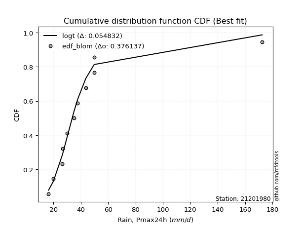</img>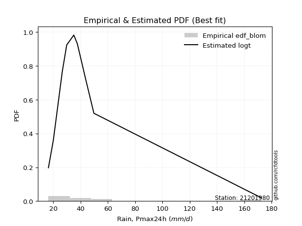</img>

</div>


### 7. EDF Tukey (1962)

In hydrology, the Tukey formula is used as a plotting position formula to estimate the empirical probability or frequency of a flood event (or other hydrological data). The formula parameter is given as _c=0.333_ (or 1/3).

<div align="center">


$P=(m-c)/(n+1-2c)$


</div>


**7.1. Empirical values**

<div align="center">

|                | 0                   | 1                   | 2                   | 3                  | 4                  | 5                  | 6                  | 7                  | 8                  | 9                  | 10                 | 11                 |
|:---------------|:--------------------|:--------------------|:--------------------|:-------------------|:-------------------|:-------------------|:-------------------|:-------------------|:-------------------|:-------------------|:-------------------|:-------------------|
| date           | 2008                | 2015                | 2025                | 2016               | 2009               | 2014               | 2010               | 2012               | 2011               | 2007               | 2013               | 2024               |
| x              | 16.5                | 20.1                | 25.8                | 26.6               | 26.7               | 29.9               | 35.1               | 37.7               | 43.7               | 49.8               | 49.8               | 172.4              |
| m              | 1                   | 2                   | 3                   | 4                  | 5                  | 6                  | 7                  | 8                  | 9                  | 10                 | 11                 | 12                 |
| empirical_dist | edf_tukey           | edf_tukey           | edf_tukey           | edf_tukey          | edf_tukey          | edf_tukey          | edf_tukey          | edf_tukey          | edf_tukey          | edf_tukey          | edf_tukey          | edf_tukey          |
| empirical      | 0.05405405405405406 | 0.13513513513513514 | 0.21621621621621623 | 0.2972972972972973 | 0.3783783783783784 | 0.4594594594594595 | 0.5405405405405406 | 0.6216216216216216 | 0.7027027027027027 | 0.7837837837837838 | 0.8648648648648649 | 0.9459459459459459 |
| empirical_tr   | 1.0571428571428572  | 1.15625             | 1.2758620689655173  | 1.4230769230769231 | 1.608695652173913  | 1.8499999999999999 | 2.1764705882352944 | 2.642857142857143  | 3.363636363636364  | 4.625              | 7.400000000000003  | 18.5               |

</div>


**7.2. Kolmogorov-Smirnov fit test (sorted by Δ)**


<div align="center">

|                | 0                   | 1                   | 2                   | 3                   | 4                   | 5                   | 6                   | 7                   | 8                   | 9                   | 10                  | 11                  | 12                  | 13                  | 14                  | 15                  | 16                  | 17                  | 18                  | 19                  | 20                  | 21                  | 22                  | 23                  | 24                  | 25                  | 26                  | 27                  | 28                  | 29                  | 30                  | 31                  | 32                  | 33                  | 34                  | 35                  | 36                  | 37                  | 38                  | 39                  | 40                  | 41                  | 42                  | 43                  | 44                  | 45                  | 46                  | 47                  | 48                  | 49                  | 50                  | 51                  | 52                  | 53                  | 54                  | 55                  | 56                  | 57                  | 58                  | 59                  | 60                  | 61                  | 62                  | 63                  | 64                  | 65                  | 66                  | 67                  | 68                  | 69                  | 70                  | 71                  | 72                  | 73                  | 74                  | 75                  | 76                  | 77                  | 78                  | 79                  | 80                  | 81                  | 82                  | 83                  | 84                  | 85                  | 86                  | 87                  | 88                  | 89                  | 90                  | 91                  | 92                  | 93                  | 94                  | 95                  | 96                  | 97                  | 98                  | 99                  | 100                 | 101                 | 102                 | 103                 | 104                 | 105                 | 106                 | 107                 | 108                 | 109                 | 110                 | 111                 | 112                 | 113                 | 114                 | 115                 | 116                 | 117                 | 118                 | 119                 | 120                 | 121                 | 122                 | 123                 | 124                 | 125                 | 126                 | 127                 | 128                 | 129                 | 130                 | 131                 | 132                 | 133                 | 134                 | 135                 | 136                 | 137                 | 138                 | 139                 | 140                 | 141                 | 142                 | 143                 | 144                 | 145                 | 146                 | 147                 | 148                 | 149                 | 150                 | 151                 | 152                 | 153                 | 154                 | 155                 | 156                 | 157                 | 158                 | 159                 |
|:---------------|:--------------------|:--------------------|:--------------------|:--------------------|:--------------------|:--------------------|:--------------------|:--------------------|:--------------------|:--------------------|:--------------------|:--------------------|:--------------------|:--------------------|:--------------------|:--------------------|:--------------------|:--------------------|:--------------------|:--------------------|:--------------------|:--------------------|:--------------------|:--------------------|:--------------------|:--------------------|:--------------------|:--------------------|:--------------------|:--------------------|:--------------------|:--------------------|:--------------------|:--------------------|:--------------------|:--------------------|:--------------------|:--------------------|:--------------------|:--------------------|:--------------------|:--------------------|:--------------------|:--------------------|:--------------------|:--------------------|:--------------------|:--------------------|:--------------------|:--------------------|:--------------------|:--------------------|:--------------------|:--------------------|:--------------------|:--------------------|:--------------------|:--------------------|:--------------------|:--------------------|:--------------------|:--------------------|:--------------------|:--------------------|:--------------------|:--------------------|:--------------------|:--------------------|:--------------------|:--------------------|:--------------------|:--------------------|:--------------------|:--------------------|:--------------------|:--------------------|:--------------------|:--------------------|:--------------------|:--------------------|:--------------------|:--------------------|:--------------------|:--------------------|:--------------------|:--------------------|:--------------------|:--------------------|:--------------------|:--------------------|:--------------------|:--------------------|:--------------------|:--------------------|:--------------------|:--------------------|:--------------------|:--------------------|:--------------------|:--------------------|:--------------------|:--------------------|:--------------------|:--------------------|:--------------------|:--------------------|:--------------------|:--------------------|:--------------------|:--------------------|:--------------------|:--------------------|:--------------------|:--------------------|:--------------------|:--------------------|:--------------------|:--------------------|:--------------------|:--------------------|:--------------------|:--------------------|:--------------------|:--------------------|:--------------------|:--------------------|:--------------------|:--------------------|:--------------------|:--------------------|:--------------------|:--------------------|:--------------------|:--------------------|:--------------------|:--------------------|:--------------------|:--------------------|:--------------------|:--------------------|:--------------------|:--------------------|:--------------------|:--------------------|:--------------------|:--------------------|:--------------------|:--------------------|:--------------------|:--------------------|:--------------------|:--------------------|:--------------------|:--------------------|:--------------------|:--------------------|:--------------------|:--------------------|:--------------------|:--------------------|
| station        | 21201980            | 21201980            | 21201980            | 21201980            | 21201980            | 21201980            | 21201980            | 21201980            | 21201980            | 21201980            | 21201980            | 21201980            | 21201980            | 21201980            | 21201980            | 21201980            | 21201980            | 21201980            | 21201980            | 21201980            | 21201980            | 21201980            | 21201980            | 21201980            | 21201980            | 21201980            | 21201980            | 21201980            | 21201980            | 21201980            | 21201980            | 21201980            | 21201980            | 21201980            | 21201980            | 21201980            | 21201980            | 21201980            | 21201980            | 21201980            | 21201980            | 21201980            | 21201980            | 21201980            | 21201980            | 21201980            | 21201980            | 21201980            | 21201980            | 21201980            | 21201980            | 21201980            | 21201980            | 21201980            | 21201980            | 21201980            | 21201980            | 21201980            | 21201980            | 21201980            | 21201980            | 21201980            | 21201980            | 21201980            | 21201980            | 21201980            | 21201980            | 21201980            | 21201980            | 21201980            | 21201980            | 21201980            | 21201980            | 21201980            | 21201980            | 21201980            | 21201980            | 21201980            | 21201980            | 21201980            | 21201980            | 21201980            | 21201980            | 21201980            | 21201980            | 21201980            | 21201980            | 21201980            | 21201980            | 21201980            | 21201980            | 21201980            | 21201980            | 21201980            | 21201980            | 21201980            | 21201980            | 21201980            | 21201980            | 21201980            | 21201980            | 21201980            | 21201980            | 21201980            | 21201980            | 21201980            | 21201980            | 21201980            | 21201980            | 21201980            | 21201980            | 21201980            | 21201980            | 21201980            | 21201980            | 21201980            | 21201980            | 21201980            | 21201980            | 21201980            | 21201980            | 21201980            | 21201980            | 21201980            | 21201980            | 21201980            | 21201980            | 21201980            | 21201980            | 21201980            | 21201980            | 21201980            | 21201980            | 21201980            | 21201980            | 21201980            | 21201980            | 21201980            | 21201980            | 21201980            | 21201980            | 21201980            | 21201980            | 21201980            | 21201980            | 21201980            | 21201980            | 21201980            | 21201980            | 21201980            | 21201980            | 21201980            | 21201980            | 21201980            | 21201980            | 21201980            | 21201980            | 21201980            | 21201980            | 21201980            |
| empirical_dist | edf_tukey           | edf_tukey           | edf_tukey           | edf_tukey           | edf_tukey           | edf_tukey           | edf_tukey           | edf_tukey           | edf_tukey           | edf_tukey           | edf_tukey           | edf_tukey           | edf_tukey           | edf_tukey           | edf_tukey           | edf_tukey           | edf_tukey           | edf_tukey           | edf_tukey           | edf_tukey           | edf_tukey           | edf_tukey           | edf_tukey           | edf_tukey           | edf_tukey           | edf_tukey           | edf_tukey           | edf_tukey           | edf_tukey           | edf_tukey           | edf_tukey           | edf_tukey           | edf_tukey           | edf_tukey           | edf_tukey           | edf_tukey           | edf_tukey           | edf_tukey           | edf_tukey           | edf_tukey           | edf_tukey           | edf_tukey           | edf_tukey           | edf_tukey           | edf_tukey           | edf_tukey           | edf_tukey           | edf_tukey           | edf_tukey           | edf_tukey           | edf_tukey           | edf_tukey           | edf_tukey           | edf_tukey           | edf_tukey           | edf_tukey           | edf_tukey           | edf_tukey           | edf_tukey           | edf_tukey           | edf_tukey           | edf_tukey           | edf_tukey           | edf_tukey           | edf_tukey           | edf_tukey           | edf_tukey           | edf_tukey           | edf_tukey           | edf_tukey           | edf_tukey           | edf_tukey           | edf_tukey           | edf_tukey           | edf_tukey           | edf_tukey           | edf_tukey           | edf_tukey           | edf_tukey           | edf_tukey           | edf_tukey           | edf_tukey           | edf_tukey           | edf_tukey           | edf_tukey           | edf_tukey           | edf_tukey           | edf_tukey           | edf_tukey           | edf_tukey           | edf_tukey           | edf_tukey           | edf_tukey           | edf_tukey           | edf_tukey           | edf_tukey           | edf_tukey           | edf_tukey           | edf_tukey           | edf_tukey           | edf_tukey           | edf_tukey           | edf_tukey           | edf_tukey           | edf_tukey           | edf_tukey           | edf_tukey           | edf_tukey           | edf_tukey           | edf_tukey           | edf_tukey           | edf_tukey           | edf_tukey           | edf_tukey           | edf_tukey           | edf_tukey           | edf_tukey           | edf_tukey           | edf_tukey           | edf_tukey           | edf_tukey           | edf_tukey           | edf_tukey           | edf_tukey           | edf_tukey           | edf_tukey           | edf_tukey           | edf_tukey           | edf_tukey           | edf_tukey           | edf_tukey           | edf_tukey           | edf_tukey           | edf_tukey           | edf_tukey           | edf_tukey           | edf_tukey           | edf_tukey           | edf_tukey           | edf_tukey           | edf_tukey           | edf_tukey           | edf_tukey           | edf_tukey           | edf_tukey           | edf_tukey           | edf_tukey           | edf_tukey           | edf_tukey           | edf_tukey           | edf_tukey           | edf_tukey           | edf_tukey           | edf_tukey           | edf_tukey           | edf_tukey           | edf_tukey           | edf_tukey           | edf_tukey           | edf_tukey           |
| p_dist         | logt                | logburr12           | logvonmises_line    | logexponnorm        | loggennorm          | logmielke           | alpha               | loggenlogistic      | logburr             | burr                | logdweibull         | mielke              | logalpha            | loggenextreme       | loginvweibull       | nct                 | genextreme          | invweibull          | loginvgamma         | logf                | logjohnsonsu        | logjohnsonsb        | f                   | invgamma            | ncf                 | logdgamma           | loginvgauss         | logfatiguelife      | loggumbel_r         | logmoyal            | exponweib           | lognct              | logbetaprime        | loggamma            | loggamma            | logerlang           | loghypsecant        | logkstwobign        | kappa3              | logloglaplace       | johnsonsu           | johnsonsb           | t                   | betaprime           | logpearson3         | loglogistic         | loghalflogistic     | invgauss            | logrice             | lograyleigh         | truncpareto         | loghalfnorm         | logmaxwell          | logwald             | lomax               | logfoldnorm         | loglaplace          | loglaplace          | logskewnorm         | genpareto           | logkappa3           | loghalfgennorm      | fatiguelife         | logcrystalball      | lognorm             | loggompertz         | logloggamma         | gompertz            | logncf              | genlogistic         | logweibull_min      | exponnorm           | genexpon            | cosine              | gamma               | loggenexpon         | logtruncnorm        | loganglit           | wald                | loggumbel_l         | logsemicircular     | genhalflogistic     | gengamma            | logbradford         | halfgennorm         | moyal               | pearson3            | halflogistic        | burr12              | loglomax            | loggengamma         | dgamma              | logarcsine          | logtriang           | weibull_min         | gumbel_r            | halfnorm            | dweibull            | gennorm             | erlang              | logcosine           | logtruncweibull_min | rayleigh            | kstwobign           | laplace             | maxwell             | nakagami            | logtruncexpon       | truncnorm           | foldnorm            | hypsecant           | logistic            | norm                | crystalball         | anglit              | semicircular        | gausshyper          | rice                | beta                | arcsine             | loggenpareto        | logkappa4           | exponpow            | skewnorm            | powerlaw            | logwrapcauchy       | logexponpow         | gumbel_l            | truncweibull_min    | logksone            | logtukeylambda      | logargus            | loguniform          | logrdist            | bradford            | loglevy_l           | logpowerlaw         | truncexpon          | wrapcauchy          | levy_l              | loggausshyper       | logweibull_max      | logexponweib        | argus               | vonmises_line       | loggenhalflogistic  | rdist               | logbeta             | lognakagami         | tukeylambda         | ksone               | kappa4              | logtrapezoid        | uniform             | logtruncpareto      | weibull_max         | triang              | trapezoid           | logvonmises         | vonmises            |
| delta          | 0.0688170661415411  | 0.07047696956992033 | 0.0757450581093449  | 0.0809230640160854  | 0.08217820533355286 | 0.08427325562625304 | 0.0851820018216442  | 0.0852210251253891  | 0.08542720576228169 | 0.0856246622451316  | 0.0856445462429436  | 0.08654627411241678 | 0.09051465846628876 | 0.09237794936866323 | 0.09238031488564674 | 0.09280048248193884 | 0.09410969280225712 | 0.09411127539903674 | 0.09482987507153418 | 0.09484355558479374 | 0.09801555834138859 | 0.09932249513748659 | 0.09955824463031615 | 0.09955833151184879 | 0.09955841355013745 | 0.09969680190332408 | 0.1001766354544813  | 0.10050634758028065 | 0.10137109276733136 | 0.10163450601601642 | 0.10507047130916786 | 0.10509287820518964 | 0.10829356455994765 | 0.11084528846428582 | 0.11084528846428582 | 0.11084618835240057 | 0.11129221643965626 | 0.11145646500132389 | 0.11249193969795479 | 0.11341006363041473 | 0.11432396549265661 | 0.11522079315803402 | 0.11574508803861538 | 0.11595806427096256 | 0.11798629201535221 | 0.12675743949977447 | 0.12837137840447732 | 0.12920335272114403 | 0.13040643668531426 | 0.13080340368619392 | 0.13319640801215427 | 0.13376718380853636 | 0.13484236604856648 | 0.13513513513513514 | 0.13719180773282513 | 0.13793003014455513 | 0.13907535819563455 | 0.13907535819563455 | 0.14021937274799662 | 0.14366463237429106 | 0.1450135270900056  | 0.14705719452761679 | 0.14869009551334544 | 0.14877481404936366 | 0.1487758322721615  | 0.14958018365773618 | 0.15158408170378246 | 0.1518741727634565  | 0.15404539236785775 | 0.15678414338136915 | 0.16310645554137249 | 0.16677573152091218 | 0.17122538060620252 | 0.1716282625016814  | 0.17199367856424053 | 0.17371007996941396 | 0.17374717291025243 | 0.17451298817768457 | 0.17572885403844535 | 0.17579371441768354 | 0.1855276120233611  | 0.1863021439275412  | 0.18951458789107511 | 0.200243476555244   | 0.20643742250926683 | 0.217417257360787   | 0.21872199719984675 | 0.22152870302406524 | 0.2231127260169643  | 0.22728374180334154 | 0.22952980423470193 | 0.2323826313054616  | 0.232503810192617   | 0.23486650889944893 | 0.24197971061245227 | 0.2421653597278326  | 0.24492874943998744 | 0.24587822736087306 | 0.25331673627905105 | 0.25722688167320085 | 0.2596741802587208  | 0.26367745858578695 | 0.2722517466641803  | 0.2763413447772547  | 0.279406727266024   | 0.2819350980368077  | 0.2827520609835271  | 0.2845584461185062  | 0.28919169517062315 | 0.28967871993106065 | 0.2990704645528073  | 0.3050542172205759  | 0.3121450608943468  | 0.3121456560162298  | 0.31962159837563164 | 0.3227082454914014  | 0.32422989258217283 | 0.3260564548973349  | 0.3337597917180951  | 0.3349899133101677  | 0.347371251493982   | 0.3474924881605619  | 0.35634019205750256 | 0.35960420540010796 | 0.36212197339289465 | 0.37463074267082264 | 0.37524988075060794 | 0.37888647422605015 | 0.38415544583069827 | 0.38921856287288925 | 0.39376853013587443 | 0.3940218075304788  | 0.39408930247449403 | 0.4055842868549291  | 0.40817052558725814 | 0.4275867435244146  | 0.45252209420517275 | 0.456675438082825   | 0.46111268484335466 | 0.47354904932950015 | 0.4930052276537352  | 0.5260493306953511  | 0.5288403040446362  | 0.5342844793863393  | 0.5389469113003444  | 0.5556637798524138  | 0.5607577307168726  | 0.5779490033293374  | 0.5794353212776098  | 0.5902555855544328  | 0.6035328144051686  | 0.6191409827041086  | 0.6386254602662232  | 0.6512664043132292  | 0.7561309769990556  | 0.7640271325210627  | 0.7835172636648626  | 0.7965704242673957  | 1.0813081751848315  | 26.99415342114888   |
| deltao         | 0.36218414519599995 | 0.36218414519599995 | 0.36218414519599995 | 0.36218414519599995 | 0.36218414519599995 | 0.36218414519599995 | 0.36218414519599995 | 0.36218414519599995 | 0.36218414519599995 | 0.36218414519599995 | 0.36218414519599995 | 0.36218414519599995 | 0.36218414519599995 | 0.36218414519599995 | 0.36218414519599995 | 0.36218414519599995 | 0.36218414519599995 | 0.36218414519599995 | 0.36218414519599995 | 0.36218414519599995 | 0.36218414519599995 | 0.36218414519599995 | 0.36218414519599995 | 0.36218414519599995 | 0.36218414519599995 | 0.36218414519599995 | 0.36218414519599995 | 0.36218414519599995 | 0.36218414519599995 | 0.36218414519599995 | 0.36218414519599995 | 0.36218414519599995 | 0.36218414519599995 | 0.36218414519599995 | 0.36218414519599995 | 0.36218414519599995 | 0.36218414519599995 | 0.36218414519599995 | 0.36218414519599995 | 0.36218414519599995 | 0.36218414519599995 | 0.36218414519599995 | 0.36218414519599995 | 0.36218414519599995 | 0.36218414519599995 | 0.36218414519599995 | 0.36218414519599995 | 0.36218414519599995 | 0.36218414519599995 | 0.36218414519599995 | 0.36218414519599995 | 0.36218414519599995 | 0.36218414519599995 | 0.36218414519599995 | 0.36218414519599995 | 0.36218414519599995 | 0.36218414519599995 | 0.36218414519599995 | 0.36218414519599995 | 0.36218414519599995 | 0.36218414519599995 | 0.36218414519599995 | 0.36218414519599995 | 0.36218414519599995 | 0.36218414519599995 | 0.36218414519599995 | 0.36218414519599995 | 0.36218414519599995 | 0.36218414519599995 | 0.36218414519599995 | 0.36218414519599995 | 0.36218414519599995 | 0.36218414519599995 | 0.36218414519599995 | 0.36218414519599995 | 0.36218414519599995 | 0.36218414519599995 | 0.36218414519599995 | 0.36218414519599995 | 0.36218414519599995 | 0.36218414519599995 | 0.36218414519599995 | 0.36218414519599995 | 0.36218414519599995 | 0.36218414519599995 | 0.36218414519599995 | 0.36218414519599995 | 0.36218414519599995 | 0.36218414519599995 | 0.36218414519599995 | 0.36218414519599995 | 0.36218414519599995 | 0.36218414519599995 | 0.36218414519599995 | 0.36218414519599995 | 0.36218414519599995 | 0.36218414519599995 | 0.36218414519599995 | 0.36218414519599995 | 0.36218414519599995 | 0.36218414519599995 | 0.36218414519599995 | 0.36218414519599995 | 0.36218414519599995 | 0.36218414519599995 | 0.36218414519599995 | 0.36218414519599995 | 0.36218414519599995 | 0.36218414519599995 | 0.36218414519599995 | 0.36218414519599995 | 0.36218414519599995 | 0.36218414519599995 | 0.36218414519599995 | 0.36218414519599995 | 0.36218414519599995 | 0.36218414519599995 | 0.36218414519599995 | 0.36218414519599995 | 0.36218414519599995 | 0.36218414519599995 | 0.36218414519599995 | 0.36218414519599995 | 0.36218414519599995 | 0.36218414519599995 | 0.36218414519599995 | 0.36218414519599995 | 0.36218414519599995 | 0.36218414519599995 | 0.36218414519599995 | 0.36218414519599995 | 0.36218414519599995 | 0.36218414519599995 | 0.36218414519599995 | 0.36218414519599995 | 0.36218414519599995 | 0.36218414519599995 | 0.36218414519599995 | 0.36218414519599995 | 0.36218414519599995 | 0.36218414519599995 | 0.36218414519599995 | 0.36218414519599995 | 0.36218414519599995 | 0.36218414519599995 | 0.36218414519599995 | 0.36218414519599995 | 0.36218414519599995 | 0.36218414519599995 | 0.36218414519599995 | 0.36218414519599995 | 0.36218414519599995 | 0.36218414519599995 | 0.36218414519599995 | 0.36218414519599995 | 0.36218414519599995 | 0.36218414519599995 | 0.36218414519599995 | 0.36218414519599995 | 0.36218414519599995 |
| eval           | Δo > Δ              | Δo > Δ              | Δo > Δ              | Δo > Δ              | Δo > Δ              | Δo > Δ              | Δo > Δ              | Δo > Δ              | Δo > Δ              | Δo > Δ              | Δo > Δ              | Δo > Δ              | Δo > Δ              | Δo > Δ              | Δo > Δ              | Δo > Δ              | Δo > Δ              | Δo > Δ              | Δo > Δ              | Δo > Δ              | Δo > Δ              | Δo > Δ              | Δo > Δ              | Δo > Δ              | Δo > Δ              | Δo > Δ              | Δo > Δ              | Δo > Δ              | Δo > Δ              | Δo > Δ              | Δo > Δ              | Δo > Δ              | Δo > Δ              | Δo > Δ              | Δo > Δ              | Δo > Δ              | Δo > Δ              | Δo > Δ              | Δo > Δ              | Δo > Δ              | Δo > Δ              | Δo > Δ              | Δo > Δ              | Δo > Δ              | Δo > Δ              | Δo > Δ              | Δo > Δ              | Δo > Δ              | Δo > Δ              | Δo > Δ              | Δo > Δ              | Δo > Δ              | Δo > Δ              | Δo > Δ              | Δo > Δ              | Δo > Δ              | Δo > Δ              | Δo > Δ              | Δo > Δ              | Δo > Δ              | Δo > Δ              | Δo > Δ              | Δo > Δ              | Δo > Δ              | Δo > Δ              | Δo > Δ              | Δo > Δ              | Δo > Δ              | Δo > Δ              | Δo > Δ              | Δo > Δ              | Δo > Δ              | Δo > Δ              | Δo > Δ              | Δo > Δ              | Δo > Δ              | Δo > Δ              | Δo > Δ              | Δo > Δ              | Δo > Δ              | Δo > Δ              | Δo > Δ              | Δo > Δ              | Δo > Δ              | Δo > Δ              | Δo > Δ              | Δo > Δ              | Δo > Δ              | Δo > Δ              | Δo > Δ              | Δo > Δ              | Δo > Δ              | Δo > Δ              | Δo > Δ              | Δo > Δ              | Δo > Δ              | Δo > Δ              | Δo > Δ              | Δo > Δ              | Δo > Δ              | Δo > Δ              | Δo > Δ              | Δo > Δ              | Δo > Δ              | Δo > Δ              | Δo > Δ              | Δo > Δ              | Δo > Δ              | Δo > Δ              | Δo > Δ              | Δo > Δ              | Δo > Δ              | Δo > Δ              | Δo > Δ              | Δo > Δ              | Δo > Δ              | Δo > Δ              | Δo > Δ              | Δo > Δ              | Δo > Δ              | Δo > Δ              | Δo > Δ              | Δo > Δ              | Δo > Δ              | Δo > Δ              | Δo <= Δ             | Δo <= Δ             | Δo <= Δ             | Δo <= Δ             | Δo <= Δ             | Δo <= Δ             | Δo <= Δ             | Δo <= Δ             | Δo <= Δ             | Δo <= Δ             | Δo <= Δ             | Δo <= Δ             | Δo <= Δ             | Δo <= Δ             | Δo <= Δ             | Δo <= Δ             | Δo <= Δ             | Δo <= Δ             | Δo <= Δ             | Δo <= Δ             | Δo <= Δ             | Δo <= Δ             | Δo <= Δ             | Δo <= Δ             | Δo <= Δ             | Δo <= Δ             | Δo <= Δ             | Δo <= Δ             | Δo <= Δ             | Δo <= Δ             | Δo <= Δ             | Δo <= Δ             | Δo <= Δ             | Δo <= Δ             | Δo <= Δ             |
| fit            | 1                   | 1                   | 1                   | 1                   | 1                   | 1                   | 1                   | 1                   | 1                   | 1                   | 1                   | 1                   | 1                   | 1                   | 1                   | 1                   | 1                   | 1                   | 1                   | 1                   | 1                   | 1                   | 1                   | 1                   | 1                   | 1                   | 1                   | 1                   | 1                   | 1                   | 1                   | 1                   | 1                   | 1                   | 1                   | 1                   | 1                   | 1                   | 1                   | 1                   | 1                   | 1                   | 1                   | 1                   | 1                   | 1                   | 1                   | 1                   | 1                   | 1                   | 1                   | 1                   | 1                   | 1                   | 1                   | 1                   | 1                   | 1                   | 1                   | 1                   | 1                   | 1                   | 1                   | 1                   | 1                   | 1                   | 1                   | 1                   | 1                   | 1                   | 1                   | 1                   | 1                   | 1                   | 1                   | 1                   | 1                   | 1                   | 1                   | 1                   | 1                   | 1                   | 1                   | 1                   | 1                   | 1                   | 1                   | 1                   | 1                   | 1                   | 1                   | 1                   | 1                   | 1                   | 1                   | 1                   | 1                   | 1                   | 1                   | 1                   | 1                   | 1                   | 1                   | 1                   | 1                   | 1                   | 1                   | 1                   | 1                   | 1                   | 1                   | 1                   | 1                   | 1                   | 1                   | 1                   | 1                   | 1                   | 1                   | 1                   | 1                   | 1                   | 1                   | 1                   | 1                   | 0                   | 0                   | 0                   | 0                   | 0                   | 0                   | 0                   | 0                   | 0                   | 0                   | 0                   | 0                   | 0                   | 0                   | 0                   | 0                   | 0                   | 0                   | 0                   | 0                   | 0                   | 0                   | 0                   | 0                   | 0                   | 0                   | 0                   | 0                   | 0                   | 0                   | 0                   | 0                   | 0                   | 0                   | 0                   |
| n              | 12                  | 12                  | 12                  | 12                  | 12                  | 12                  | 12                  | 12                  | 12                  | 12                  | 12                  | 12                  | 12                  | 12                  | 12                  | 12                  | 12                  | 12                  | 12                  | 12                  | 12                  | 12                  | 12                  | 12                  | 12                  | 12                  | 12                  | 12                  | 12                  | 12                  | 12                  | 12                  | 12                  | 12                  | 12                  | 12                  | 12                  | 12                  | 12                  | 12                  | 12                  | 12                  | 12                  | 12                  | 12                  | 12                  | 12                  | 12                  | 12                  | 12                  | 12                  | 12                  | 12                  | 12                  | 12                  | 12                  | 12                  | 12                  | 12                  | 12                  | 12                  | 12                  | 12                  | 12                  | 12                  | 12                  | 12                  | 12                  | 12                  | 12                  | 12                  | 12                  | 12                  | 12                  | 12                  | 12                  | 12                  | 12                  | 12                  | 12                  | 12                  | 12                  | 12                  | 12                  | 12                  | 12                  | 12                  | 12                  | 12                  | 12                  | 12                  | 12                  | 12                  | 12                  | 12                  | 12                  | 12                  | 12                  | 12                  | 12                  | 12                  | 12                  | 12                  | 12                  | 12                  | 12                  | 12                  | 12                  | 12                  | 12                  | 12                  | 12                  | 12                  | 12                  | 12                  | 12                  | 12                  | 12                  | 12                  | 12                  | 12                  | 12                  | 12                  | 12                  | 12                  | 12                  | 12                  | 12                  | 12                  | 12                  | 12                  | 12                  | 12                  | 12                  | 12                  | 12                  | 12                  | 12                  | 12                  | 12                  | 12                  | 12                  | 12                  | 12                  | 12                  | 12                  | 12                  | 12                  | 12                  | 12                  | 12                  | 12                  | 12                  | 12                  | 12                  | 12                  | 12                  | 12                  | 12                  | 12                  |
| best_fit       | 1                   | 0                   | 0                   | 0                   | 0                   | 0                   | 0                   | 0                   | 0                   | 0                   | 0                   | 0                   | 0                   | 0                   | 0                   | 0                   | 0                   | 0                   | 0                   | 0                   | 0                   | 0                   | 0                   | 0                   | 0                   | 0                   | 0                   | 0                   | 0                   | 0                   | 0                   | 0                   | 0                   | 0                   | 0                   | 0                   | 0                   | 0                   | 0                   | 0                   | 0                   | 0                   | 0                   | 0                   | 0                   | 0                   | 0                   | 0                   | 0                   | 0                   | 0                   | 0                   | 0                   | 0                   | 0                   | 0                   | 0                   | 0                   | 0                   | 0                   | 0                   | 0                   | 0                   | 0                   | 0                   | 0                   | 0                   | 0                   | 0                   | 0                   | 0                   | 0                   | 0                   | 0                   | 0                   | 0                   | 0                   | 0                   | 0                   | 0                   | 0                   | 0                   | 0                   | 0                   | 0                   | 0                   | 0                   | 0                   | 0                   | 0                   | 0                   | 0                   | 0                   | 0                   | 0                   | 0                   | 0                   | 0                   | 0                   | 0                   | 0                   | 0                   | 0                   | 0                   | 0                   | 0                   | 0                   | 0                   | 0                   | 0                   | 0                   | 0                   | 0                   | 0                   | 0                   | 0                   | 0                   | 0                   | 0                   | 0                   | 0                   | 0                   | 0                   | 0                   | 0                   | 0                   | 0                   | 0                   | 0                   | 0                   | 0                   | 0                   | 0                   | 0                   | 0                   | 0                   | 0                   | 0                   | 0                   | 0                   | 0                   | 0                   | 0                   | 0                   | 0                   | 0                   | 0                   | 0                   | 0                   | 0                   | 0                   | 0                   | 0                   | 0                   | 0                   | 0                   | 0                   | 0                   | 0                   | 0                   |
| best_fit_sort  | 1                   | 2                   | 3                   | 4                   | 5                   | 6                   | 7                   | 8                   | 9                   | 10                  | 11                  | 12                  | 13                  | 14                  | 15                  | 16                  | 17                  | 18                  | 19                  | 20                  | 21                  | 22                  | 23                  | 24                  | 25                  | 26                  | 27                  | 28                  | 29                  | 30                  | 31                  | 32                  | 33                  | 34                  | 35                  | 36                  | 37                  | 38                  | 39                  | 40                  | 41                  | 42                  | 43                  | 44                  | 45                  | 46                  | 47                  | 48                  | 49                  | 50                  | 51                  | 52                  | 53                  | 54                  | 55                  | 56                  | 57                  | 58                  | 59                  | 60                  | 61                  | 62                  | 63                  | 64                  | 65                  | 66                  | 67                  | 68                  | 69                  | 70                  | 71                  | 72                  | 73                  | 74                  | 75                  | 76                  | 77                  | 78                  | 79                  | 80                  | 81                  | 82                  | 83                  | 84                  | 85                  | 86                  | 87                  | 88                  | 89                  | 90                  | 91                  | 92                  | 93                  | 94                  | 95                  | 96                  | 97                  | 98                  | 99                  | 100                 | 101                 | 102                 | 103                 | 104                 | 105                 | 106                 | 107                 | 108                 | 109                 | 110                 | 111                 | 112                 | 113                 | 114                 | 115                 | 116                 | 117                 | 118                 | 119                 | 120                 | 121                 | 122                 | 123                 | 124                 | 125                 | 126                 | 127                 | 128                 | 129                 | 130                 | 131                 | 132                 | 133                 | 134                 | 135                 | 136                 | 137                 | 138                 | 139                 | 140                 | 141                 | 142                 | 143                 | 144                 | 145                 | 146                 | 147                 | 148                 | 149                 | 150                 | 151                 | 152                 | 153                 | 154                 | 155                 | 156                 | 157                 | 158                 | 159                 | 160                 |

</div>


**7.3. Best fit**

<div align="center">

|   id |   station | empirical_dist   | p_dist   |     delta |   deltao | eval   |   fit |   n |   best_fit |   best_fit_sort |
|-----:|----------:|:-----------------|:---------|----------:|---------:|:-------|------:|----:|-----------:|----------------:|
|    0 |  21201980 | edf_tukey        | logt     | 0.0688171 | 0.362184 | Δo > Δ |     1 |  12 |          1 |               1 |

</div>


<div align="center">

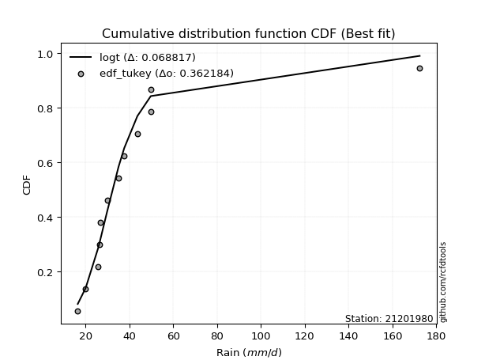</img>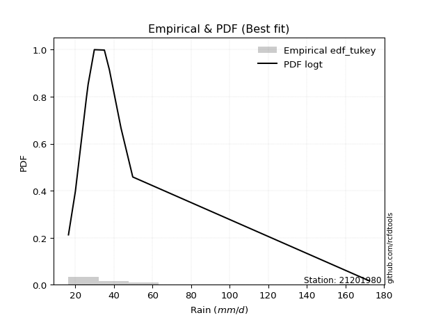</img>

</div>


### 8. EDF Gringorten (1963)

Gringorten plotting position formula is essential for estimating the probability and return periods of extreme events like floods and heavy rainfall. The constant _a=0.44_.

<div align="center">


$P=(m-a)/(n+1-2a)$


</div>


**8.1. Empirical values**

<div align="center">

|                | 0                   | 1                   | 2                   | 3                   | 4                   | 5                   | 6                  | 7                  | 8                  | 9                  | 10                 | 11                 |
|:---------------|:--------------------|:--------------------|:--------------------|:--------------------|:--------------------|:--------------------|:-------------------|:-------------------|:-------------------|:-------------------|:-------------------|:-------------------|
| date           | 2008                | 2015                | 2025                | 2016                | 2009                | 2014                | 2010               | 2012               | 2011               | 2007               | 2013               | 2024               |
| x              | 16.5                | 20.1                | 25.8                | 26.6                | 26.7                | 29.9                | 35.1               | 37.7               | 43.7               | 49.8               | 49.8               | 172.4              |
| m              | 1                   | 2                   | 3                   | 4                   | 5                   | 6                   | 7                  | 8                  | 9                  | 10                 | 11                 | 12                 |
| empirical_dist | edf_gringorten      | edf_gringorten      | edf_gringorten      | edf_gringorten      | edf_gringorten      | edf_gringorten      | edf_gringorten     | edf_gringorten     | edf_gringorten     | edf_gringorten     | edf_gringorten     | edf_gringorten     |
| empirical      | 0.04620462046204621 | 0.12871287128712872 | 0.21122112211221125 | 0.29372937293729373 | 0.37623762376237624 | 0.45874587458745875 | 0.5412541254125413 | 0.6237623762376238 | 0.7062706270627064 | 0.7887788778877889 | 0.8712871287128714 | 0.9537953795379539 |
| empirical_tr   | 1.0484429065743945  | 1.1477272727272727  | 1.2677824267782427  | 1.4158878504672898  | 1.6031746031746033  | 1.8475609756097562  | 2.179856115107914  | 2.6578947368421053 | 3.4044943820224733 | 4.734375000000003  | 7.769230769230775  | 21.642857142857192 |

</div>


**8.2. Kolmogorov-Smirnov fit test (sorted by Δ)**


<div align="center">

|                | 0                   | 1                   | 2                   | 3                   | 4                   | 5                   | 6                   | 7                   | 8                   | 9                   | 10                  | 11                  | 12                  | 13                  | 14                  | 15                  | 16                  | 17                  | 18                  | 19                  | 20                  | 21                  | 22                  | 23                  | 24                  | 25                  | 26                  | 27                  | 28                  | 29                  | 30                  | 31                  | 32                  | 33                  | 34                  | 35                  | 36                  | 37                  | 38                  | 39                  | 40                  | 41                  | 42                  | 43                  | 44                  | 45                  | 46                  | 47                  | 48                  | 49                  | 50                  | 51                  | 52                  | 53                  | 54                  | 55                  | 56                  | 57                  | 58                  | 59                  | 60                  | 61                  | 62                  | 63                  | 64                  | 65                  | 66                  | 67                  | 68                  | 69                  | 70                  | 71                  | 72                  | 73                  | 74                  | 75                  | 76                  | 77                  | 78                  | 79                  | 80                  | 81                  | 82                  | 83                  | 84                  | 85                  | 86                  | 87                  | 88                  | 89                  | 90                  | 91                  | 92                  | 93                  | 94                  | 95                  | 96                  | 97                  | 98                  | 99                  | 100                 | 101                 | 102                 | 103                 | 104                 | 105                 | 106                 | 107                 | 108                 | 109                 | 110                 | 111                 | 112                 | 113                 | 114                 | 115                 | 116                 | 117                 | 118                 | 119                 | 120                 | 121                 | 122                 | 123                 | 124                 | 125                 | 126                 | 127                 | 128                 | 129                 | 130                 | 131                 | 132                 | 133                 | 134                 | 135                 | 136                 | 137                 | 138                 | 139                 | 140                 | 141                 | 142                 | 143                 | 144                 | 145                 | 146                 | 147                 | 148                 | 149                 | 150                 | 151                 | 152                 | 153                 | 154                 | 155                 | 156                 | 157                 | 158                 | 159                 |
|:---------------|:--------------------|:--------------------|:--------------------|:--------------------|:--------------------|:--------------------|:--------------------|:--------------------|:--------------------|:--------------------|:--------------------|:--------------------|:--------------------|:--------------------|:--------------------|:--------------------|:--------------------|:--------------------|:--------------------|:--------------------|:--------------------|:--------------------|:--------------------|:--------------------|:--------------------|:--------------------|:--------------------|:--------------------|:--------------------|:--------------------|:--------------------|:--------------------|:--------------------|:--------------------|:--------------------|:--------------------|:--------------------|:--------------------|:--------------------|:--------------------|:--------------------|:--------------------|:--------------------|:--------------------|:--------------------|:--------------------|:--------------------|:--------------------|:--------------------|:--------------------|:--------------------|:--------------------|:--------------------|:--------------------|:--------------------|:--------------------|:--------------------|:--------------------|:--------------------|:--------------------|:--------------------|:--------------------|:--------------------|:--------------------|:--------------------|:--------------------|:--------------------|:--------------------|:--------------------|:--------------------|:--------------------|:--------------------|:--------------------|:--------------------|:--------------------|:--------------------|:--------------------|:--------------------|:--------------------|:--------------------|:--------------------|:--------------------|:--------------------|:--------------------|:--------------------|:--------------------|:--------------------|:--------------------|:--------------------|:--------------------|:--------------------|:--------------------|:--------------------|:--------------------|:--------------------|:--------------------|:--------------------|:--------------------|:--------------------|:--------------------|:--------------------|:--------------------|:--------------------|:--------------------|:--------------------|:--------------------|:--------------------|:--------------------|:--------------------|:--------------------|:--------------------|:--------------------|:--------------------|:--------------------|:--------------------|:--------------------|:--------------------|:--------------------|:--------------------|:--------------------|:--------------------|:--------------------|:--------------------|:--------------------|:--------------------|:--------------------|:--------------------|:--------------------|:--------------------|:--------------------|:--------------------|:--------------------|:--------------------|:--------------------|:--------------------|:--------------------|:--------------------|:--------------------|:--------------------|:--------------------|:--------------------|:--------------------|:--------------------|:--------------------|:--------------------|:--------------------|:--------------------|:--------------------|:--------------------|:--------------------|:--------------------|:--------------------|:--------------------|:--------------------|:--------------------|:--------------------|:--------------------|:--------------------|:--------------------|:--------------------|
| station        | 21201980            | 21201980            | 21201980            | 21201980            | 21201980            | 21201980            | 21201980            | 21201980            | 21201980            | 21201980            | 21201980            | 21201980            | 21201980            | 21201980            | 21201980            | 21201980            | 21201980            | 21201980            | 21201980            | 21201980            | 21201980            | 21201980            | 21201980            | 21201980            | 21201980            | 21201980            | 21201980            | 21201980            | 21201980            | 21201980            | 21201980            | 21201980            | 21201980            | 21201980            | 21201980            | 21201980            | 21201980            | 21201980            | 21201980            | 21201980            | 21201980            | 21201980            | 21201980            | 21201980            | 21201980            | 21201980            | 21201980            | 21201980            | 21201980            | 21201980            | 21201980            | 21201980            | 21201980            | 21201980            | 21201980            | 21201980            | 21201980            | 21201980            | 21201980            | 21201980            | 21201980            | 21201980            | 21201980            | 21201980            | 21201980            | 21201980            | 21201980            | 21201980            | 21201980            | 21201980            | 21201980            | 21201980            | 21201980            | 21201980            | 21201980            | 21201980            | 21201980            | 21201980            | 21201980            | 21201980            | 21201980            | 21201980            | 21201980            | 21201980            | 21201980            | 21201980            | 21201980            | 21201980            | 21201980            | 21201980            | 21201980            | 21201980            | 21201980            | 21201980            | 21201980            | 21201980            | 21201980            | 21201980            | 21201980            | 21201980            | 21201980            | 21201980            | 21201980            | 21201980            | 21201980            | 21201980            | 21201980            | 21201980            | 21201980            | 21201980            | 21201980            | 21201980            | 21201980            | 21201980            | 21201980            | 21201980            | 21201980            | 21201980            | 21201980            | 21201980            | 21201980            | 21201980            | 21201980            | 21201980            | 21201980            | 21201980            | 21201980            | 21201980            | 21201980            | 21201980            | 21201980            | 21201980            | 21201980            | 21201980            | 21201980            | 21201980            | 21201980            | 21201980            | 21201980            | 21201980            | 21201980            | 21201980            | 21201980            | 21201980            | 21201980            | 21201980            | 21201980            | 21201980            | 21201980            | 21201980            | 21201980            | 21201980            | 21201980            | 21201980            | 21201980            | 21201980            | 21201980            | 21201980            | 21201980            | 21201980            |
| empirical_dist | edf_gringorten      | edf_gringorten      | edf_gringorten      | edf_gringorten      | edf_gringorten      | edf_gringorten      | edf_gringorten      | edf_gringorten      | edf_gringorten      | edf_gringorten      | edf_gringorten      | edf_gringorten      | edf_gringorten      | edf_gringorten      | edf_gringorten      | edf_gringorten      | edf_gringorten      | edf_gringorten      | edf_gringorten      | edf_gringorten      | edf_gringorten      | edf_gringorten      | edf_gringorten      | edf_gringorten      | edf_gringorten      | edf_gringorten      | edf_gringorten      | edf_gringorten      | edf_gringorten      | edf_gringorten      | edf_gringorten      | edf_gringorten      | edf_gringorten      | edf_gringorten      | edf_gringorten      | edf_gringorten      | edf_gringorten      | edf_gringorten      | edf_gringorten      | edf_gringorten      | edf_gringorten      | edf_gringorten      | edf_gringorten      | edf_gringorten      | edf_gringorten      | edf_gringorten      | edf_gringorten      | edf_gringorten      | edf_gringorten      | edf_gringorten      | edf_gringorten      | edf_gringorten      | edf_gringorten      | edf_gringorten      | edf_gringorten      | edf_gringorten      | edf_gringorten      | edf_gringorten      | edf_gringorten      | edf_gringorten      | edf_gringorten      | edf_gringorten      | edf_gringorten      | edf_gringorten      | edf_gringorten      | edf_gringorten      | edf_gringorten      | edf_gringorten      | edf_gringorten      | edf_gringorten      | edf_gringorten      | edf_gringorten      | edf_gringorten      | edf_gringorten      | edf_gringorten      | edf_gringorten      | edf_gringorten      | edf_gringorten      | edf_gringorten      | edf_gringorten      | edf_gringorten      | edf_gringorten      | edf_gringorten      | edf_gringorten      | edf_gringorten      | edf_gringorten      | edf_gringorten      | edf_gringorten      | edf_gringorten      | edf_gringorten      | edf_gringorten      | edf_gringorten      | edf_gringorten      | edf_gringorten      | edf_gringorten      | edf_gringorten      | edf_gringorten      | edf_gringorten      | edf_gringorten      | edf_gringorten      | edf_gringorten      | edf_gringorten      | edf_gringorten      | edf_gringorten      | edf_gringorten      | edf_gringorten      | edf_gringorten      | edf_gringorten      | edf_gringorten      | edf_gringorten      | edf_gringorten      | edf_gringorten      | edf_gringorten      | edf_gringorten      | edf_gringorten      | edf_gringorten      | edf_gringorten      | edf_gringorten      | edf_gringorten      | edf_gringorten      | edf_gringorten      | edf_gringorten      | edf_gringorten      | edf_gringorten      | edf_gringorten      | edf_gringorten      | edf_gringorten      | edf_gringorten      | edf_gringorten      | edf_gringorten      | edf_gringorten      | edf_gringorten      | edf_gringorten      | edf_gringorten      | edf_gringorten      | edf_gringorten      | edf_gringorten      | edf_gringorten      | edf_gringorten      | edf_gringorten      | edf_gringorten      | edf_gringorten      | edf_gringorten      | edf_gringorten      | edf_gringorten      | edf_gringorten      | edf_gringorten      | edf_gringorten      | edf_gringorten      | edf_gringorten      | edf_gringorten      | edf_gringorten      | edf_gringorten      | edf_gringorten      | edf_gringorten      | edf_gringorten      | edf_gringorten      | edf_gringorten      | edf_gringorten      | edf_gringorten      |
| p_dist         | logt                | logburr12           | loggennorm          | logvonmises_line    | logexponnorm        | logmielke           | alpha               | logburr             | burr                | logdweibull         | loggenlogistic      | mielke              | logalpha            | loggenextreme       | loginvweibull       | genextreme          | invweibull          | nct                 | loginvgamma         | logf                | logjohnsonsu        | logjohnsonsb        | f                   | invgamma            | ncf                 | logdgamma           | loginvgauss         | logfatiguelife      | logmoyal            | loggumbel_r         | exponweib           | lognct              | t                   | logloglaplace       | logbetaprime        | loggamma            | loggamma            | logerlang           | kappa3              | loghypsecant        | logkstwobign        | johnsonsu           | johnsonsb           | betaprime           | logpearson3         | logwald             | loglogistic         | loghalflogistic     | invgauss            | logrice             | lograyleigh         | loglaplace          | loglaplace          | loghalfnorm         | truncpareto         | logmaxwell          | logfoldnorm         | lomax               | logskewnorm         | genpareto           | logkappa3           | loghalfgennorm      | fatiguelife         | logcrystalball      | lognorm             | loggompertz         | logloggamma         | gompertz            | logncf              | genlogistic         | cosine              | logweibull_min      | exponnorm           | genexpon            | gamma               | loggenexpon         | logtruncnorm        | wald                | loganglit           | loggumbel_l         | logsemicircular     | genhalflogistic     | gengamma            | logbradford         | halfgennorm         | pearson3            | moyal               | burr12              | halflogistic        | loglomax            | loggengamma         | dgamma              | logarcsine          | logtriang           | dweibull            | weibull_min         | gumbel_r            | halfnorm            | gennorm             | erlang              | logcosine           | logtruncweibull_min | rayleigh            | kstwobign           | laplace             | maxwell             | nakagami            | logtruncexpon       | truncnorm           | foldnorm            | hypsecant           | logistic            | norm                | crystalball         | anglit              | semicircular        | gausshyper          | rice                | beta                | arcsine             | logkappa4           | loggenpareto        | exponpow            | skewnorm            | powerlaw            | logexponpow         | logwrapcauchy       | gumbel_l            | truncweibull_min    | logksone            | logtukeylambda      | logargus            | loguniform          | logrdist            | bradford            | loglevy_l           | logpowerlaw         | truncexpon          | wrapcauchy          | levy_l              | loggausshyper       | logweibull_max      | logexponweib        | argus               | vonmises_line       | loggenhalflogistic  | rdist               | logbeta             | lognakagami         | tukeylambda         | ksone               | kappa4              | logtrapezoid        | uniform             | logtruncpareto      | weibull_max         | triang              | trapezoid           | logvonmises         | vonmises            |
| delta          | 0.07381216024554607 | 0.07689923341792682 | 0.0800374507175507  | 0.08074015221334988 | 0.08734532786409188 | 0.08926834973025802 | 0.09017709592564918 | 0.09042229986628667 | 0.09061975634913658 | 0.09063964034694857 | 0.09164328897339558 | 0.09296853796042326 | 0.09550975257029373 | 0.0973730434726682  | 0.09737540898965172 | 0.0991047869062621  | 0.09910636950304172 | 0.09922274632994532 | 0.09982496917553915 | 0.09983864968879871 | 0.10301065244539356 | 0.10431758924149157 | 0.10455333873432113 | 0.10455342561585376 | 0.10455350765414242 | 0.10469189600732906 | 0.10517172955848628 | 0.10550144168428563 | 0.1066296001200214  | 0.10779335661533784 | 0.11006556541317283 | 0.11151514205319613 | 0.11217716367861175 | 0.11269647875841404 | 0.11328865866395263 | 0.1158403825682908  | 0.1158403825682908  | 0.11584128245640554 | 0.11748703380195977 | 0.11771448028766274 | 0.11787872884933037 | 0.11931905959666159 | 0.120215887262039   | 0.12238032811896904 | 0.12298138611935719 | 0.12871287128712872 | 0.13317970334778095 | 0.1333664725084823  | 0.1356256165691505  | 0.13682870053332075 | 0.1372256675342004  | 0.1383617733236338  | 0.1383617733236338  | 0.13876227791254134 | 0.13961867186016075 | 0.14126462989657296 | 0.1429251242485601  | 0.14361407158083161 | 0.1452144668520016  | 0.14865972647829603 | 0.15000862119401057 | 0.15205228863162176 | 0.15511235936135193 | 0.15519707789737014 | 0.155198096120168   | 0.15600244750574266 | 0.15800634555178894 | 0.15829643661146298 | 0.16046765621586423 | 0.16320640722937563 | 0.16663316839767628 | 0.16810154964537746 | 0.17319799536891867 | 0.177647644454209   | 0.178415942412247   | 0.17870517407341893 | 0.1787422670142574  | 0.18072394814245032 | 0.18093525202569105 | 0.18221597826569003 | 0.19194987587136758 | 0.19302752191204808 | 0.1945096819950801  | 0.20666574040325048 | 0.2114325166132718  | 0.22371709130385173 | 0.22383952120879347 | 0.22810782012096928 | 0.2293781366160731  | 0.23227883590734652 | 0.2345248983387069  | 0.23737772540946658 | 0.2389260740406235  | 0.24128877274745542 | 0.24516464248887238 | 0.24840197446045875 | 0.24858762357583908 | 0.2513510132879939  | 0.25260315140705036 | 0.26222197577720585 | 0.2660964441067273  | 0.27009972243379343 | 0.27867401051218676 | 0.2827636086252612  | 0.2858289911140305  | 0.2883573618848142  | 0.2891743248315336  | 0.2909807099665127  | 0.29561395901862964 | 0.2975281535230685  | 0.30549272840081376 | 0.3114764810685824  | 0.3185673247423533  | 0.31856791986423627 | 0.3260438622236381  | 0.3291305093394079  | 0.3306521564301793  | 0.3324787187453414  | 0.3387548858221001  | 0.3414121771581742  | 0.35391475200856837 | 0.35522068508598986 | 0.36276245590550904 | 0.36602646924811444 | 0.36711706749689965 | 0.38024497485461295 | 0.3810530065188291  | 0.38530873807405663 | 0.39057770967870475 | 0.39564082672089573 | 0.4001907939838809  | 0.40044407137848526 | 0.4005115663225005  | 0.41200655070293557 | 0.4145927894352646  | 0.43543617711642246 | 0.45751718830917776 | 0.4630977019308315  | 0.46753494869136114 | 0.481398482921508   | 0.4980003217577402  | 0.5324715945433576  | 0.5338353981486412  | 0.5407067432343458  | 0.5467963448923523  | 0.5620860437004203  | 0.5686071643088805  | 0.5829440974333424  | 0.5844304153816148  | 0.5981050191464407  | 0.6099550782531751  | 0.625563246552115   | 0.6450477241142297  | 0.6576886681612357  | 0.762553240847062   | 0.7704493963690692  | 0.7899395275128691  | 0.8029926881154021  | 1.0863032692888364  | 26.986303987556873  |
| deltao         | 0.36218414519599995 | 0.36218414519599995 | 0.36218414519599995 | 0.36218414519599995 | 0.36218414519599995 | 0.36218414519599995 | 0.36218414519599995 | 0.36218414519599995 | 0.36218414519599995 | 0.36218414519599995 | 0.36218414519599995 | 0.36218414519599995 | 0.36218414519599995 | 0.36218414519599995 | 0.36218414519599995 | 0.36218414519599995 | 0.36218414519599995 | 0.36218414519599995 | 0.36218414519599995 | 0.36218414519599995 | 0.36218414519599995 | 0.36218414519599995 | 0.36218414519599995 | 0.36218414519599995 | 0.36218414519599995 | 0.36218414519599995 | 0.36218414519599995 | 0.36218414519599995 | 0.36218414519599995 | 0.36218414519599995 | 0.36218414519599995 | 0.36218414519599995 | 0.36218414519599995 | 0.36218414519599995 | 0.36218414519599995 | 0.36218414519599995 | 0.36218414519599995 | 0.36218414519599995 | 0.36218414519599995 | 0.36218414519599995 | 0.36218414519599995 | 0.36218414519599995 | 0.36218414519599995 | 0.36218414519599995 | 0.36218414519599995 | 0.36218414519599995 | 0.36218414519599995 | 0.36218414519599995 | 0.36218414519599995 | 0.36218414519599995 | 0.36218414519599995 | 0.36218414519599995 | 0.36218414519599995 | 0.36218414519599995 | 0.36218414519599995 | 0.36218414519599995 | 0.36218414519599995 | 0.36218414519599995 | 0.36218414519599995 | 0.36218414519599995 | 0.36218414519599995 | 0.36218414519599995 | 0.36218414519599995 | 0.36218414519599995 | 0.36218414519599995 | 0.36218414519599995 | 0.36218414519599995 | 0.36218414519599995 | 0.36218414519599995 | 0.36218414519599995 | 0.36218414519599995 | 0.36218414519599995 | 0.36218414519599995 | 0.36218414519599995 | 0.36218414519599995 | 0.36218414519599995 | 0.36218414519599995 | 0.36218414519599995 | 0.36218414519599995 | 0.36218414519599995 | 0.36218414519599995 | 0.36218414519599995 | 0.36218414519599995 | 0.36218414519599995 | 0.36218414519599995 | 0.36218414519599995 | 0.36218414519599995 | 0.36218414519599995 | 0.36218414519599995 | 0.36218414519599995 | 0.36218414519599995 | 0.36218414519599995 | 0.36218414519599995 | 0.36218414519599995 | 0.36218414519599995 | 0.36218414519599995 | 0.36218414519599995 | 0.36218414519599995 | 0.36218414519599995 | 0.36218414519599995 | 0.36218414519599995 | 0.36218414519599995 | 0.36218414519599995 | 0.36218414519599995 | 0.36218414519599995 | 0.36218414519599995 | 0.36218414519599995 | 0.36218414519599995 | 0.36218414519599995 | 0.36218414519599995 | 0.36218414519599995 | 0.36218414519599995 | 0.36218414519599995 | 0.36218414519599995 | 0.36218414519599995 | 0.36218414519599995 | 0.36218414519599995 | 0.36218414519599995 | 0.36218414519599995 | 0.36218414519599995 | 0.36218414519599995 | 0.36218414519599995 | 0.36218414519599995 | 0.36218414519599995 | 0.36218414519599995 | 0.36218414519599995 | 0.36218414519599995 | 0.36218414519599995 | 0.36218414519599995 | 0.36218414519599995 | 0.36218414519599995 | 0.36218414519599995 | 0.36218414519599995 | 0.36218414519599995 | 0.36218414519599995 | 0.36218414519599995 | 0.36218414519599995 | 0.36218414519599995 | 0.36218414519599995 | 0.36218414519599995 | 0.36218414519599995 | 0.36218414519599995 | 0.36218414519599995 | 0.36218414519599995 | 0.36218414519599995 | 0.36218414519599995 | 0.36218414519599995 | 0.36218414519599995 | 0.36218414519599995 | 0.36218414519599995 | 0.36218414519599995 | 0.36218414519599995 | 0.36218414519599995 | 0.36218414519599995 | 0.36218414519599995 | 0.36218414519599995 | 0.36218414519599995 | 0.36218414519599995 | 0.36218414519599995 | 0.36218414519599995 |
| eval           | Δo > Δ              | Δo > Δ              | Δo > Δ              | Δo > Δ              | Δo > Δ              | Δo > Δ              | Δo > Δ              | Δo > Δ              | Δo > Δ              | Δo > Δ              | Δo > Δ              | Δo > Δ              | Δo > Δ              | Δo > Δ              | Δo > Δ              | Δo > Δ              | Δo > Δ              | Δo > Δ              | Δo > Δ              | Δo > Δ              | Δo > Δ              | Δo > Δ              | Δo > Δ              | Δo > Δ              | Δo > Δ              | Δo > Δ              | Δo > Δ              | Δo > Δ              | Δo > Δ              | Δo > Δ              | Δo > Δ              | Δo > Δ              | Δo > Δ              | Δo > Δ              | Δo > Δ              | Δo > Δ              | Δo > Δ              | Δo > Δ              | Δo > Δ              | Δo > Δ              | Δo > Δ              | Δo > Δ              | Δo > Δ              | Δo > Δ              | Δo > Δ              | Δo > Δ              | Δo > Δ              | Δo > Δ              | Δo > Δ              | Δo > Δ              | Δo > Δ              | Δo > Δ              | Δo > Δ              | Δo > Δ              | Δo > Δ              | Δo > Δ              | Δo > Δ              | Δo > Δ              | Δo > Δ              | Δo > Δ              | Δo > Δ              | Δo > Δ              | Δo > Δ              | Δo > Δ              | Δo > Δ              | Δo > Δ              | Δo > Δ              | Δo > Δ              | Δo > Δ              | Δo > Δ              | Δo > Δ              | Δo > Δ              | Δo > Δ              | Δo > Δ              | Δo > Δ              | Δo > Δ              | Δo > Δ              | Δo > Δ              | Δo > Δ              | Δo > Δ              | Δo > Δ              | Δo > Δ              | Δo > Δ              | Δo > Δ              | Δo > Δ              | Δo > Δ              | Δo > Δ              | Δo > Δ              | Δo > Δ              | Δo > Δ              | Δo > Δ              | Δo > Δ              | Δo > Δ              | Δo > Δ              | Δo > Δ              | Δo > Δ              | Δo > Δ              | Δo > Δ              | Δo > Δ              | Δo > Δ              | Δo > Δ              | Δo > Δ              | Δo > Δ              | Δo > Δ              | Δo > Δ              | Δo > Δ              | Δo > Δ              | Δo > Δ              | Δo > Δ              | Δo > Δ              | Δo > Δ              | Δo > Δ              | Δo > Δ              | Δo > Δ              | Δo > Δ              | Δo > Δ              | Δo > Δ              | Δo > Δ              | Δo > Δ              | Δo > Δ              | Δo > Δ              | Δo > Δ              | Δo <= Δ             | Δo <= Δ             | Δo <= Δ             | Δo <= Δ             | Δo <= Δ             | Δo <= Δ             | Δo <= Δ             | Δo <= Δ             | Δo <= Δ             | Δo <= Δ             | Δo <= Δ             | Δo <= Δ             | Δo <= Δ             | Δo <= Δ             | Δo <= Δ             | Δo <= Δ             | Δo <= Δ             | Δo <= Δ             | Δo <= Δ             | Δo <= Δ             | Δo <= Δ             | Δo <= Δ             | Δo <= Δ             | Δo <= Δ             | Δo <= Δ             | Δo <= Δ             | Δo <= Δ             | Δo <= Δ             | Δo <= Δ             | Δo <= Δ             | Δo <= Δ             | Δo <= Δ             | Δo <= Δ             | Δo <= Δ             | Δo <= Δ             | Δo <= Δ             | Δo <= Δ             | Δo <= Δ             |
| fit            | 1                   | 1                   | 1                   | 1                   | 1                   | 1                   | 1                   | 1                   | 1                   | 1                   | 1                   | 1                   | 1                   | 1                   | 1                   | 1                   | 1                   | 1                   | 1                   | 1                   | 1                   | 1                   | 1                   | 1                   | 1                   | 1                   | 1                   | 1                   | 1                   | 1                   | 1                   | 1                   | 1                   | 1                   | 1                   | 1                   | 1                   | 1                   | 1                   | 1                   | 1                   | 1                   | 1                   | 1                   | 1                   | 1                   | 1                   | 1                   | 1                   | 1                   | 1                   | 1                   | 1                   | 1                   | 1                   | 1                   | 1                   | 1                   | 1                   | 1                   | 1                   | 1                   | 1                   | 1                   | 1                   | 1                   | 1                   | 1                   | 1                   | 1                   | 1                   | 1                   | 1                   | 1                   | 1                   | 1                   | 1                   | 1                   | 1                   | 1                   | 1                   | 1                   | 1                   | 1                   | 1                   | 1                   | 1                   | 1                   | 1                   | 1                   | 1                   | 1                   | 1                   | 1                   | 1                   | 1                   | 1                   | 1                   | 1                   | 1                   | 1                   | 1                   | 1                   | 1                   | 1                   | 1                   | 1                   | 1                   | 1                   | 1                   | 1                   | 1                   | 1                   | 1                   | 1                   | 1                   | 1                   | 1                   | 1                   | 1                   | 1                   | 1                   | 0                   | 0                   | 0                   | 0                   | 0                   | 0                   | 0                   | 0                   | 0                   | 0                   | 0                   | 0                   | 0                   | 0                   | 0                   | 0                   | 0                   | 0                   | 0                   | 0                   | 0                   | 0                   | 0                   | 0                   | 0                   | 0                   | 0                   | 0                   | 0                   | 0                   | 0                   | 0                   | 0                   | 0                   | 0                   | 0                   | 0                   | 0                   |
| n              | 12                  | 12                  | 12                  | 12                  | 12                  | 12                  | 12                  | 12                  | 12                  | 12                  | 12                  | 12                  | 12                  | 12                  | 12                  | 12                  | 12                  | 12                  | 12                  | 12                  | 12                  | 12                  | 12                  | 12                  | 12                  | 12                  | 12                  | 12                  | 12                  | 12                  | 12                  | 12                  | 12                  | 12                  | 12                  | 12                  | 12                  | 12                  | 12                  | 12                  | 12                  | 12                  | 12                  | 12                  | 12                  | 12                  | 12                  | 12                  | 12                  | 12                  | 12                  | 12                  | 12                  | 12                  | 12                  | 12                  | 12                  | 12                  | 12                  | 12                  | 12                  | 12                  | 12                  | 12                  | 12                  | 12                  | 12                  | 12                  | 12                  | 12                  | 12                  | 12                  | 12                  | 12                  | 12                  | 12                  | 12                  | 12                  | 12                  | 12                  | 12                  | 12                  | 12                  | 12                  | 12                  | 12                  | 12                  | 12                  | 12                  | 12                  | 12                  | 12                  | 12                  | 12                  | 12                  | 12                  | 12                  | 12                  | 12                  | 12                  | 12                  | 12                  | 12                  | 12                  | 12                  | 12                  | 12                  | 12                  | 12                  | 12                  | 12                  | 12                  | 12                  | 12                  | 12                  | 12                  | 12                  | 12                  | 12                  | 12                  | 12                  | 12                  | 12                  | 12                  | 12                  | 12                  | 12                  | 12                  | 12                  | 12                  | 12                  | 12                  | 12                  | 12                  | 12                  | 12                  | 12                  | 12                  | 12                  | 12                  | 12                  | 12                  | 12                  | 12                  | 12                  | 12                  | 12                  | 12                  | 12                  | 12                  | 12                  | 12                  | 12                  | 12                  | 12                  | 12                  | 12                  | 12                  | 12                  | 12                  |
| best_fit       | 1                   | 0                   | 0                   | 0                   | 0                   | 0                   | 0                   | 0                   | 0                   | 0                   | 0                   | 0                   | 0                   | 0                   | 0                   | 0                   | 0                   | 0                   | 0                   | 0                   | 0                   | 0                   | 0                   | 0                   | 0                   | 0                   | 0                   | 0                   | 0                   | 0                   | 0                   | 0                   | 0                   | 0                   | 0                   | 0                   | 0                   | 0                   | 0                   | 0                   | 0                   | 0                   | 0                   | 0                   | 0                   | 0                   | 0                   | 0                   | 0                   | 0                   | 0                   | 0                   | 0                   | 0                   | 0                   | 0                   | 0                   | 0                   | 0                   | 0                   | 0                   | 0                   | 0                   | 0                   | 0                   | 0                   | 0                   | 0                   | 0                   | 0                   | 0                   | 0                   | 0                   | 0                   | 0                   | 0                   | 0                   | 0                   | 0                   | 0                   | 0                   | 0                   | 0                   | 0                   | 0                   | 0                   | 0                   | 0                   | 0                   | 0                   | 0                   | 0                   | 0                   | 0                   | 0                   | 0                   | 0                   | 0                   | 0                   | 0                   | 0                   | 0                   | 0                   | 0                   | 0                   | 0                   | 0                   | 0                   | 0                   | 0                   | 0                   | 0                   | 0                   | 0                   | 0                   | 0                   | 0                   | 0                   | 0                   | 0                   | 0                   | 0                   | 0                   | 0                   | 0                   | 0                   | 0                   | 0                   | 0                   | 0                   | 0                   | 0                   | 0                   | 0                   | 0                   | 0                   | 0                   | 0                   | 0                   | 0                   | 0                   | 0                   | 0                   | 0                   | 0                   | 0                   | 0                   | 0                   | 0                   | 0                   | 0                   | 0                   | 0                   | 0                   | 0                   | 0                   | 0                   | 0                   | 0                   | 0                   |
| best_fit_sort  | 1                   | 2                   | 3                   | 4                   | 5                   | 6                   | 7                   | 8                   | 9                   | 10                  | 11                  | 12                  | 13                  | 14                  | 15                  | 16                  | 17                  | 18                  | 19                  | 20                  | 21                  | 22                  | 23                  | 24                  | 25                  | 26                  | 27                  | 28                  | 29                  | 30                  | 31                  | 32                  | 33                  | 34                  | 35                  | 36                  | 37                  | 38                  | 39                  | 40                  | 41                  | 42                  | 43                  | 44                  | 45                  | 46                  | 47                  | 48                  | 49                  | 50                  | 51                  | 52                  | 53                  | 54                  | 55                  | 56                  | 57                  | 58                  | 59                  | 60                  | 61                  | 62                  | 63                  | 64                  | 65                  | 66                  | 67                  | 68                  | 69                  | 70                  | 71                  | 72                  | 73                  | 74                  | 75                  | 76                  | 77                  | 78                  | 79                  | 80                  | 81                  | 82                  | 83                  | 84                  | 85                  | 86                  | 87                  | 88                  | 89                  | 90                  | 91                  | 92                  | 93                  | 94                  | 95                  | 96                  | 97                  | 98                  | 99                  | 100                 | 101                 | 102                 | 103                 | 104                 | 105                 | 106                 | 107                 | 108                 | 109                 | 110                 | 111                 | 112                 | 113                 | 114                 | 115                 | 116                 | 117                 | 118                 | 119                 | 120                 | 121                 | 122                 | 123                 | 124                 | 125                 | 126                 | 127                 | 128                 | 129                 | 130                 | 131                 | 132                 | 133                 | 134                 | 135                 | 136                 | 137                 | 138                 | 139                 | 140                 | 141                 | 142                 | 143                 | 144                 | 145                 | 146                 | 147                 | 148                 | 149                 | 150                 | 151                 | 152                 | 153                 | 154                 | 155                 | 156                 | 157                 | 158                 | 159                 | 160                 |

</div>


**8.3. Best fit**

<div align="center">

|   id |   station | empirical_dist   | p_dist   |     delta |   deltao | eval   |   fit |   n |   best_fit |   best_fit_sort |
|-----:|----------:|:-----------------|:---------|----------:|---------:|:-------|------:|----:|-----------:|----------------:|
|    0 |  21201980 | edf_gringorten   | logt     | 0.0738122 | 0.362184 | Δo > Δ |     1 |  12 |          1 |               1 |

</div>


<div align="center">

</img>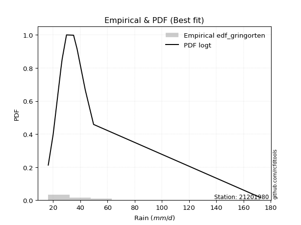</img>

</div>


### 9. EDF Filliben (1975)

The specific values of the constants (0.3175) (often denoted as $alpha$) and (0.365) are derived from a method proposed by James J. Filliben in a 1975 paper. This particular formula is the mean value of the $i$-th order statistic of the normal distribution and is considered a robust and effective plotting position formula for the normal probability plot correlation coefficient test for normality.

<div align="center">


$P=(m-0.3175)/(n+0.365)$


</div>


**9.1. Empirical values**

<div align="center">

|                | 0                   | 1                   | 2                   | 3                   | 4                  | 5                  | 6                  | 7                  | 8                  | 9                  | 10                 | 11                 |
|:---------------|:--------------------|:--------------------|:--------------------|:--------------------|:-------------------|:-------------------|:-------------------|:-------------------|:-------------------|:-------------------|:-------------------|:-------------------|
| date           | 2008                | 2015                | 2025                | 2016                | 2009               | 2014               | 2010               | 2012               | 2011               | 2007               | 2013               | 2024               |
| x              | 16.5                | 20.1                | 25.8                | 26.6                | 26.7               | 29.9               | 35.1               | 37.7               | 43.7               | 49.8               | 49.8               | 172.4              |
| m              | 1                   | 2                   | 3                   | 4                   | 5                  | 6                  | 7                  | 8                  | 9                  | 10                 | 11                 | 12                 |
| empirical_dist | edf_filliben        | edf_filliben        | edf_filliben        | edf_filliben        | edf_filliben       | edf_filliben       | edf_filliben       | edf_filliben       | edf_filliben       | edf_filliben       | edf_filliben       | edf_filliben       |
| empirical      | 0.05519611807521229 | 0.13606955115244643 | 0.21694298422968056 | 0.29781641730691466 | 0.3786898503841488 | 0.4595632834613829 | 0.540436716538617  | 0.6213101496158512 | 0.7021835826930852 | 0.7830570157703194 | 0.8639304488475535 | 0.9448038819247876 |
| empirical_tr   | 1.0584207147442757  | 1.1575005850690383  | 1.2770462174025305  | 1.4241289951050964  | 1.609502115196876  | 1.8503554059109617 | 2.1759788825340958 | 2.6406833956219966 | 3.357773251866937  | 4.6095060577819185 | 7.349182763744426  | 18.117216117216078 |

</div>


**9.2. Kolmogorov-Smirnov fit test (sorted by Δ)**


<div align="center">

|                | 0                   | 1                   | 2                   | 3                   | 4                   | 5                   | 6                   | 7                   | 8                   | 9                   | 10                  | 11                  | 12                  | 13                  | 14                  | 15                  | 16                  | 17                  | 18                  | 19                  | 20                  | 21                  | 22                  | 23                  | 24                  | 25                  | 26                  | 27                  | 28                  | 29                  | 30                  | 31                  | 32                  | 33                  | 34                  | 35                  | 36                  | 37                  | 38                  | 39                  | 40                  | 41                  | 42                  | 43                  | 44                  | 45                  | 46                  | 47                  | 48                  | 49                  | 50                  | 51                  | 52                  | 53                  | 54                  | 55                  | 56                  | 57                  | 58                  | 59                  | 60                  | 61                  | 62                  | 63                  | 64                  | 65                  | 66                  | 67                  | 68                  | 69                  | 70                  | 71                  | 72                  | 73                  | 74                  | 75                  | 76                  | 77                  | 78                  | 79                  | 80                  | 81                  | 82                  | 83                  | 84                  | 85                  | 86                  | 87                  | 88                  | 89                  | 90                  | 91                  | 92                  | 93                  | 94                  | 95                  | 96                  | 97                  | 98                  | 99                  | 100                 | 101                 | 102                 | 103                 | 104                 | 105                 | 106                 | 107                 | 108                 | 109                 | 110                 | 111                 | 112                 | 113                 | 114                 | 115                 | 116                 | 117                 | 118                 | 119                 | 120                 | 121                 | 122                 | 123                 | 124                 | 125                 | 126                 | 127                 | 128                 | 129                 | 130                 | 131                 | 132                 | 133                 | 134                 | 135                 | 136                 | 137                 | 138                 | 139                 | 140                 | 141                 | 142                 | 143                 | 144                 | 145                 | 146                 | 147                 | 148                 | 149                 | 150                 | 151                 | 152                 | 153                 | 154                 | 155                 | 156                 | 157                 | 158                 | 159                 |
|:---------------|:--------------------|:--------------------|:--------------------|:--------------------|:--------------------|:--------------------|:--------------------|:--------------------|:--------------------|:--------------------|:--------------------|:--------------------|:--------------------|:--------------------|:--------------------|:--------------------|:--------------------|:--------------------|:--------------------|:--------------------|:--------------------|:--------------------|:--------------------|:--------------------|:--------------------|:--------------------|:--------------------|:--------------------|:--------------------|:--------------------|:--------------------|:--------------------|:--------------------|:--------------------|:--------------------|:--------------------|:--------------------|:--------------------|:--------------------|:--------------------|:--------------------|:--------------------|:--------------------|:--------------------|:--------------------|:--------------------|:--------------------|:--------------------|:--------------------|:--------------------|:--------------------|:--------------------|:--------------------|:--------------------|:--------------------|:--------------------|:--------------------|:--------------------|:--------------------|:--------------------|:--------------------|:--------------------|:--------------------|:--------------------|:--------------------|:--------------------|:--------------------|:--------------------|:--------------------|:--------------------|:--------------------|:--------------------|:--------------------|:--------------------|:--------------------|:--------------------|:--------------------|:--------------------|:--------------------|:--------------------|:--------------------|:--------------------|:--------------------|:--------------------|:--------------------|:--------------------|:--------------------|:--------------------|:--------------------|:--------------------|:--------------------|:--------------------|:--------------------|:--------------------|:--------------------|:--------------------|:--------------------|:--------------------|:--------------------|:--------------------|:--------------------|:--------------------|:--------------------|:--------------------|:--------------------|:--------------------|:--------------------|:--------------------|:--------------------|:--------------------|:--------------------|:--------------------|:--------------------|:--------------------|:--------------------|:--------------------|:--------------------|:--------------------|:--------------------|:--------------------|:--------------------|:--------------------|:--------------------|:--------------------|:--------------------|:--------------------|:--------------------|:--------------------|:--------------------|:--------------------|:--------------------|:--------------------|:--------------------|:--------------------|:--------------------|:--------------------|:--------------------|:--------------------|:--------------------|:--------------------|:--------------------|:--------------------|:--------------------|:--------------------|:--------------------|:--------------------|:--------------------|:--------------------|:--------------------|:--------------------|:--------------------|:--------------------|:--------------------|:--------------------|:--------------------|:--------------------|:--------------------|:--------------------|:--------------------|:--------------------|
| station        | 21201980            | 21201980            | 21201980            | 21201980            | 21201980            | 21201980            | 21201980            | 21201980            | 21201980            | 21201980            | 21201980            | 21201980            | 21201980            | 21201980            | 21201980            | 21201980            | 21201980            | 21201980            | 21201980            | 21201980            | 21201980            | 21201980            | 21201980            | 21201980            | 21201980            | 21201980            | 21201980            | 21201980            | 21201980            | 21201980            | 21201980            | 21201980            | 21201980            | 21201980            | 21201980            | 21201980            | 21201980            | 21201980            | 21201980            | 21201980            | 21201980            | 21201980            | 21201980            | 21201980            | 21201980            | 21201980            | 21201980            | 21201980            | 21201980            | 21201980            | 21201980            | 21201980            | 21201980            | 21201980            | 21201980            | 21201980            | 21201980            | 21201980            | 21201980            | 21201980            | 21201980            | 21201980            | 21201980            | 21201980            | 21201980            | 21201980            | 21201980            | 21201980            | 21201980            | 21201980            | 21201980            | 21201980            | 21201980            | 21201980            | 21201980            | 21201980            | 21201980            | 21201980            | 21201980            | 21201980            | 21201980            | 21201980            | 21201980            | 21201980            | 21201980            | 21201980            | 21201980            | 21201980            | 21201980            | 21201980            | 21201980            | 21201980            | 21201980            | 21201980            | 21201980            | 21201980            | 21201980            | 21201980            | 21201980            | 21201980            | 21201980            | 21201980            | 21201980            | 21201980            | 21201980            | 21201980            | 21201980            | 21201980            | 21201980            | 21201980            | 21201980            | 21201980            | 21201980            | 21201980            | 21201980            | 21201980            | 21201980            | 21201980            | 21201980            | 21201980            | 21201980            | 21201980            | 21201980            | 21201980            | 21201980            | 21201980            | 21201980            | 21201980            | 21201980            | 21201980            | 21201980            | 21201980            | 21201980            | 21201980            | 21201980            | 21201980            | 21201980            | 21201980            | 21201980            | 21201980            | 21201980            | 21201980            | 21201980            | 21201980            | 21201980            | 21201980            | 21201980            | 21201980            | 21201980            | 21201980            | 21201980            | 21201980            | 21201980            | 21201980            | 21201980            | 21201980            | 21201980            | 21201980            | 21201980            | 21201980            |
| empirical_dist | edf_filliben        | edf_filliben        | edf_filliben        | edf_filliben        | edf_filliben        | edf_filliben        | edf_filliben        | edf_filliben        | edf_filliben        | edf_filliben        | edf_filliben        | edf_filliben        | edf_filliben        | edf_filliben        | edf_filliben        | edf_filliben        | edf_filliben        | edf_filliben        | edf_filliben        | edf_filliben        | edf_filliben        | edf_filliben        | edf_filliben        | edf_filliben        | edf_filliben        | edf_filliben        | edf_filliben        | edf_filliben        | edf_filliben        | edf_filliben        | edf_filliben        | edf_filliben        | edf_filliben        | edf_filliben        | edf_filliben        | edf_filliben        | edf_filliben        | edf_filliben        | edf_filliben        | edf_filliben        | edf_filliben        | edf_filliben        | edf_filliben        | edf_filliben        | edf_filliben        | edf_filliben        | edf_filliben        | edf_filliben        | edf_filliben        | edf_filliben        | edf_filliben        | edf_filliben        | edf_filliben        | edf_filliben        | edf_filliben        | edf_filliben        | edf_filliben        | edf_filliben        | edf_filliben        | edf_filliben        | edf_filliben        | edf_filliben        | edf_filliben        | edf_filliben        | edf_filliben        | edf_filliben        | edf_filliben        | edf_filliben        | edf_filliben        | edf_filliben        | edf_filliben        | edf_filliben        | edf_filliben        | edf_filliben        | edf_filliben        | edf_filliben        | edf_filliben        | edf_filliben        | edf_filliben        | edf_filliben        | edf_filliben        | edf_filliben        | edf_filliben        | edf_filliben        | edf_filliben        | edf_filliben        | edf_filliben        | edf_filliben        | edf_filliben        | edf_filliben        | edf_filliben        | edf_filliben        | edf_filliben        | edf_filliben        | edf_filliben        | edf_filliben        | edf_filliben        | edf_filliben        | edf_filliben        | edf_filliben        | edf_filliben        | edf_filliben        | edf_filliben        | edf_filliben        | edf_filliben        | edf_filliben        | edf_filliben        | edf_filliben        | edf_filliben        | edf_filliben        | edf_filliben        | edf_filliben        | edf_filliben        | edf_filliben        | edf_filliben        | edf_filliben        | edf_filliben        | edf_filliben        | edf_filliben        | edf_filliben        | edf_filliben        | edf_filliben        | edf_filliben        | edf_filliben        | edf_filliben        | edf_filliben        | edf_filliben        | edf_filliben        | edf_filliben        | edf_filliben        | edf_filliben        | edf_filliben        | edf_filliben        | edf_filliben        | edf_filliben        | edf_filliben        | edf_filliben        | edf_filliben        | edf_filliben        | edf_filliben        | edf_filliben        | edf_filliben        | edf_filliben        | edf_filliben        | edf_filliben        | edf_filliben        | edf_filliben        | edf_filliben        | edf_filliben        | edf_filliben        | edf_filliben        | edf_filliben        | edf_filliben        | edf_filliben        | edf_filliben        | edf_filliben        | edf_filliben        | edf_filliben        | edf_filliben        | edf_filliben        |
| p_dist         | logt                | logburr12           | logvonmises_line    | logexponnorm        | loggennorm          | logmielke           | loggenlogistic      | alpha               | logburr             | burr                | logdweibull         | mielke              | logalpha            | loggenextreme       | loginvweibull       | nct                 | genextreme          | invweibull          | loginvgamma         | logf                | logjohnsonsu        | logjohnsonsb        | f                   | invgamma            | ncf                 | logdgamma           | loginvgauss         | logfatiguelife      | loggumbel_r         | logmoyal            | lognct              | exponweib           | logbetaprime        | loggamma            | loggamma            | logerlang           | logkstwobign        | loghypsecant        | kappa3              | logloglaplace       | johnsonsu           | johnsonsb           | betaprime           | t                   | logpearson3         | loglogistic         | loghalflogistic     | invgauss            | logrice             | lograyleigh         | truncpareto         | loghalfnorm         | logmaxwell          | logwald             | lomax               | logfoldnorm         | loglaplace          | loglaplace          | logskewnorm         | genpareto           | logkappa3           | loghalfgennorm      | fatiguelife         | logcrystalball      | lognorm             | loggompertz         | logloggamma         | gompertz            | logncf              | genlogistic         | logweibull_min      | exponnorm           | genexpon            | gamma               | cosine              | loggenexpon         | logtruncnorm        | loganglit           | loggumbel_l         | wald                | logsemicircular     | genhalflogistic     | gengamma            | logbradford         | halfgennorm         | moyal               | pearson3            | halflogistic        | burr12              | loglomax            | loggengamma         | logarcsine          | dgamma              | logtriang           | weibull_min         | gumbel_r            | halfnorm            | dweibull            | gennorm             | erlang              | logcosine           | logtruncweibull_min | rayleigh            | kstwobign           | laplace             | maxwell             | nakagami            | logtruncexpon       | truncnorm           | foldnorm            | hypsecant           | logistic            | norm                | crystalball         | anglit              | semicircular        | gausshyper          | rice                | beta                | arcsine             | loggenpareto        | logkappa4           | exponpow            | skewnorm            | powerlaw            | logwrapcauchy       | logexponpow         | gumbel_l            | truncweibull_min    | logksone            | logtukeylambda      | logargus            | loguniform          | logrdist            | bradford            | loglevy_l           | logpowerlaw         | truncexpon          | wrapcauchy          | levy_l              | loggausshyper       | logweibull_max      | logexponweib        | argus               | vonmises_line       | loggenhalflogistic  | rdist               | logbeta             | lognakagami         | tukeylambda         | ksone               | kappa4              | logtrapezoid        | uniform             | logtruncpareto      | weibull_max         | triang              | trapezoid           | logvonmises         | vonmises            |
| delta          | 0.06809029812807676 | 0.06954255355260897 | 0.07501829009588057 | 0.07998864799877403 | 0.08248967733932328 | 0.08354648761278871 | 0.08428660910807773 | 0.08445523380817987 | 0.08470043774881736 | 0.08489789423166727 | 0.08491777822947927 | 0.08561185809510541 | 0.08978789045282443 | 0.0916511813551989  | 0.09165354687218241 | 0.09186606646462747 | 0.09338292478879279 | 0.09338450738557241 | 0.09410310705806985 | 0.09411678757132941 | 0.09728879032792426 | 0.09859572712402226 | 0.09883147661685182 | 0.09883156349838446 | 0.09883164553667312 | 0.09897003388985975 | 0.09944986744101697 | 0.09977957956681632 | 0.10043667675002    | 0.1009077380025521  | 0.10415846218787828 | 0.10434370329570353 | 0.10756679654648332 | 0.11011852045082149 | 0.11011852045082149 | 0.11011942033893624 | 0.11052204898401252 | 0.11088142477614898 | 0.11176517168449046 | 0.11351388763233827 | 0.11359719747919228 | 0.11449402514456969 | 0.11502364825365119 | 0.1162642080482329  | 0.11725952400188788 | 0.1258230234824631  | 0.127644610391013   | 0.12826893670383266 | 0.1294720206680029  | 0.12986898766888255 | 0.1322619919948429  | 0.13304041579507203 | 0.1339079500312551  | 0.13606955115244643 | 0.13625739171551376 | 0.1372032621310908  | 0.13917918219755798 | 0.13917918219755798 | 0.1394926047345323  | 0.14293786436082673 | 0.14428675907654126 | 0.14633042651415246 | 0.14775567949603408 | 0.1478403980320523  | 0.14784141625485014 | 0.1486457676404248  | 0.1506496656864711  | 0.15093975674614513 | 0.15311097635054638 | 0.15584972736405778 | 0.16237968752790816 | 0.16584131550360082 | 0.17029096458889115 | 0.17105926254692916 | 0.17235503051514578 | 0.17298331195594963 | 0.1730204048967881  | 0.1735785721603732  | 0.17485929840037218 | 0.17500208602498102 | 0.18459319600604973 | 0.18536772791022982 | 0.18878781987761079 | 0.19930906053793263 | 0.2057106544958025  | 0.21648284134347562 | 0.21799522918638242 | 0.220386639002907   | 0.22238595800349997 | 0.22655697378987721 | 0.2288030362212376  | 0.23156939417530564 | 0.23165586329199728 | 0.23393209288213757 | 0.2410452945951409  | 0.24123094371052123 | 0.24399433342267607 | 0.2459820513627966  | 0.2534205602809746  | 0.2565001136597365  | 0.25873976424140943 | 0.2627430425684756  | 0.2713173306468689  | 0.2754069287599433  | 0.27847231124871263 | 0.28100068201949635 | 0.28181764496621575 | 0.28362403010119486 | 0.2882572791533118  | 0.2885366559099024  | 0.2981360485354959  | 0.30411980120326454 | 0.3112106448770354  | 0.3112112399989184  | 0.3186871823583203  | 0.32177382947409006 | 0.32329547656486146 | 0.32512203888002356 | 0.3330330237046308  | 0.33405549729285633 | 0.3462291874728238  | 0.3465580721432505  | 0.3554057760401912  | 0.3586697893827966  | 0.3613952053794303  | 0.37369632665351127 | 0.3745231127371436  | 0.3779520582087388  | 0.3832210298133869  | 0.3882841468555779  | 0.39283411411856306 | 0.3930873915131674  | 0.39315488645718266 | 0.4046498708376177  | 0.40723610956994677 | 0.4264446795032564  | 0.4517953261917084  | 0.45574102206551365 | 0.4601782688260433  | 0.4724069853083419  | 0.4922784596402709  | 0.5251149146780398  | 0.528113536031172   | 0.5333500633690279  | 0.5378048472791862  | 0.5547293638351024  | 0.5596156666957144  | 0.5772222353158731  | 0.5787085532641454  | 0.5891135215332746  | 0.6025983983878571  | 0.6182065666867972  | 0.6376910442489119  | 0.6503319882959179  | 0.7551965609817443  | 0.7630927165037513  | 0.7825828476475513  | 0.7956360082500843  | 1.080581407171367   | 26.99529548517004   |
| deltao         | 0.36218414519599995 | 0.36218414519599995 | 0.36218414519599995 | 0.36218414519599995 | 0.36218414519599995 | 0.36218414519599995 | 0.36218414519599995 | 0.36218414519599995 | 0.36218414519599995 | 0.36218414519599995 | 0.36218414519599995 | 0.36218414519599995 | 0.36218414519599995 | 0.36218414519599995 | 0.36218414519599995 | 0.36218414519599995 | 0.36218414519599995 | 0.36218414519599995 | 0.36218414519599995 | 0.36218414519599995 | 0.36218414519599995 | 0.36218414519599995 | 0.36218414519599995 | 0.36218414519599995 | 0.36218414519599995 | 0.36218414519599995 | 0.36218414519599995 | 0.36218414519599995 | 0.36218414519599995 | 0.36218414519599995 | 0.36218414519599995 | 0.36218414519599995 | 0.36218414519599995 | 0.36218414519599995 | 0.36218414519599995 | 0.36218414519599995 | 0.36218414519599995 | 0.36218414519599995 | 0.36218414519599995 | 0.36218414519599995 | 0.36218414519599995 | 0.36218414519599995 | 0.36218414519599995 | 0.36218414519599995 | 0.36218414519599995 | 0.36218414519599995 | 0.36218414519599995 | 0.36218414519599995 | 0.36218414519599995 | 0.36218414519599995 | 0.36218414519599995 | 0.36218414519599995 | 0.36218414519599995 | 0.36218414519599995 | 0.36218414519599995 | 0.36218414519599995 | 0.36218414519599995 | 0.36218414519599995 | 0.36218414519599995 | 0.36218414519599995 | 0.36218414519599995 | 0.36218414519599995 | 0.36218414519599995 | 0.36218414519599995 | 0.36218414519599995 | 0.36218414519599995 | 0.36218414519599995 | 0.36218414519599995 | 0.36218414519599995 | 0.36218414519599995 | 0.36218414519599995 | 0.36218414519599995 | 0.36218414519599995 | 0.36218414519599995 | 0.36218414519599995 | 0.36218414519599995 | 0.36218414519599995 | 0.36218414519599995 | 0.36218414519599995 | 0.36218414519599995 | 0.36218414519599995 | 0.36218414519599995 | 0.36218414519599995 | 0.36218414519599995 | 0.36218414519599995 | 0.36218414519599995 | 0.36218414519599995 | 0.36218414519599995 | 0.36218414519599995 | 0.36218414519599995 | 0.36218414519599995 | 0.36218414519599995 | 0.36218414519599995 | 0.36218414519599995 | 0.36218414519599995 | 0.36218414519599995 | 0.36218414519599995 | 0.36218414519599995 | 0.36218414519599995 | 0.36218414519599995 | 0.36218414519599995 | 0.36218414519599995 | 0.36218414519599995 | 0.36218414519599995 | 0.36218414519599995 | 0.36218414519599995 | 0.36218414519599995 | 0.36218414519599995 | 0.36218414519599995 | 0.36218414519599995 | 0.36218414519599995 | 0.36218414519599995 | 0.36218414519599995 | 0.36218414519599995 | 0.36218414519599995 | 0.36218414519599995 | 0.36218414519599995 | 0.36218414519599995 | 0.36218414519599995 | 0.36218414519599995 | 0.36218414519599995 | 0.36218414519599995 | 0.36218414519599995 | 0.36218414519599995 | 0.36218414519599995 | 0.36218414519599995 | 0.36218414519599995 | 0.36218414519599995 | 0.36218414519599995 | 0.36218414519599995 | 0.36218414519599995 | 0.36218414519599995 | 0.36218414519599995 | 0.36218414519599995 | 0.36218414519599995 | 0.36218414519599995 | 0.36218414519599995 | 0.36218414519599995 | 0.36218414519599995 | 0.36218414519599995 | 0.36218414519599995 | 0.36218414519599995 | 0.36218414519599995 | 0.36218414519599995 | 0.36218414519599995 | 0.36218414519599995 | 0.36218414519599995 | 0.36218414519599995 | 0.36218414519599995 | 0.36218414519599995 | 0.36218414519599995 | 0.36218414519599995 | 0.36218414519599995 | 0.36218414519599995 | 0.36218414519599995 | 0.36218414519599995 | 0.36218414519599995 | 0.36218414519599995 | 0.36218414519599995 | 0.36218414519599995 |
| eval           | Δo > Δ              | Δo > Δ              | Δo > Δ              | Δo > Δ              | Δo > Δ              | Δo > Δ              | Δo > Δ              | Δo > Δ              | Δo > Δ              | Δo > Δ              | Δo > Δ              | Δo > Δ              | Δo > Δ              | Δo > Δ              | Δo > Δ              | Δo > Δ              | Δo > Δ              | Δo > Δ              | Δo > Δ              | Δo > Δ              | Δo > Δ              | Δo > Δ              | Δo > Δ              | Δo > Δ              | Δo > Δ              | Δo > Δ              | Δo > Δ              | Δo > Δ              | Δo > Δ              | Δo > Δ              | Δo > Δ              | Δo > Δ              | Δo > Δ              | Δo > Δ              | Δo > Δ              | Δo > Δ              | Δo > Δ              | Δo > Δ              | Δo > Δ              | Δo > Δ              | Δo > Δ              | Δo > Δ              | Δo > Δ              | Δo > Δ              | Δo > Δ              | Δo > Δ              | Δo > Δ              | Δo > Δ              | Δo > Δ              | Δo > Δ              | Δo > Δ              | Δo > Δ              | Δo > Δ              | Δo > Δ              | Δo > Δ              | Δo > Δ              | Δo > Δ              | Δo > Δ              | Δo > Δ              | Δo > Δ              | Δo > Δ              | Δo > Δ              | Δo > Δ              | Δo > Δ              | Δo > Δ              | Δo > Δ              | Δo > Δ              | Δo > Δ              | Δo > Δ              | Δo > Δ              | Δo > Δ              | Δo > Δ              | Δo > Δ              | Δo > Δ              | Δo > Δ              | Δo > Δ              | Δo > Δ              | Δo > Δ              | Δo > Δ              | Δo > Δ              | Δo > Δ              | Δo > Δ              | Δo > Δ              | Δo > Δ              | Δo > Δ              | Δo > Δ              | Δo > Δ              | Δo > Δ              | Δo > Δ              | Δo > Δ              | Δo > Δ              | Δo > Δ              | Δo > Δ              | Δo > Δ              | Δo > Δ              | Δo > Δ              | Δo > Δ              | Δo > Δ              | Δo > Δ              | Δo > Δ              | Δo > Δ              | Δo > Δ              | Δo > Δ              | Δo > Δ              | Δo > Δ              | Δo > Δ              | Δo > Δ              | Δo > Δ              | Δo > Δ              | Δo > Δ              | Δo > Δ              | Δo > Δ              | Δo > Δ              | Δo > Δ              | Δo > Δ              | Δo > Δ              | Δo > Δ              | Δo > Δ              | Δo > Δ              | Δo > Δ              | Δo > Δ              | Δo > Δ              | Δo > Δ              | Δo > Δ              | Δo > Δ              | Δo <= Δ             | Δo <= Δ             | Δo <= Δ             | Δo <= Δ             | Δo <= Δ             | Δo <= Δ             | Δo <= Δ             | Δo <= Δ             | Δo <= Δ             | Δo <= Δ             | Δo <= Δ             | Δo <= Δ             | Δo <= Δ             | Δo <= Δ             | Δo <= Δ             | Δo <= Δ             | Δo <= Δ             | Δo <= Δ             | Δo <= Δ             | Δo <= Δ             | Δo <= Δ             | Δo <= Δ             | Δo <= Δ             | Δo <= Δ             | Δo <= Δ             | Δo <= Δ             | Δo <= Δ             | Δo <= Δ             | Δo <= Δ             | Δo <= Δ             | Δo <= Δ             | Δo <= Δ             | Δo <= Δ             | Δo <= Δ             | Δo <= Δ             |
| fit            | 1                   | 1                   | 1                   | 1                   | 1                   | 1                   | 1                   | 1                   | 1                   | 1                   | 1                   | 1                   | 1                   | 1                   | 1                   | 1                   | 1                   | 1                   | 1                   | 1                   | 1                   | 1                   | 1                   | 1                   | 1                   | 1                   | 1                   | 1                   | 1                   | 1                   | 1                   | 1                   | 1                   | 1                   | 1                   | 1                   | 1                   | 1                   | 1                   | 1                   | 1                   | 1                   | 1                   | 1                   | 1                   | 1                   | 1                   | 1                   | 1                   | 1                   | 1                   | 1                   | 1                   | 1                   | 1                   | 1                   | 1                   | 1                   | 1                   | 1                   | 1                   | 1                   | 1                   | 1                   | 1                   | 1                   | 1                   | 1                   | 1                   | 1                   | 1                   | 1                   | 1                   | 1                   | 1                   | 1                   | 1                   | 1                   | 1                   | 1                   | 1                   | 1                   | 1                   | 1                   | 1                   | 1                   | 1                   | 1                   | 1                   | 1                   | 1                   | 1                   | 1                   | 1                   | 1                   | 1                   | 1                   | 1                   | 1                   | 1                   | 1                   | 1                   | 1                   | 1                   | 1                   | 1                   | 1                   | 1                   | 1                   | 1                   | 1                   | 1                   | 1                   | 1                   | 1                   | 1                   | 1                   | 1                   | 1                   | 1                   | 1                   | 1                   | 1                   | 1                   | 1                   | 0                   | 0                   | 0                   | 0                   | 0                   | 0                   | 0                   | 0                   | 0                   | 0                   | 0                   | 0                   | 0                   | 0                   | 0                   | 0                   | 0                   | 0                   | 0                   | 0                   | 0                   | 0                   | 0                   | 0                   | 0                   | 0                   | 0                   | 0                   | 0                   | 0                   | 0                   | 0                   | 0                   | 0                   | 0                   |
| n              | 12                  | 12                  | 12                  | 12                  | 12                  | 12                  | 12                  | 12                  | 12                  | 12                  | 12                  | 12                  | 12                  | 12                  | 12                  | 12                  | 12                  | 12                  | 12                  | 12                  | 12                  | 12                  | 12                  | 12                  | 12                  | 12                  | 12                  | 12                  | 12                  | 12                  | 12                  | 12                  | 12                  | 12                  | 12                  | 12                  | 12                  | 12                  | 12                  | 12                  | 12                  | 12                  | 12                  | 12                  | 12                  | 12                  | 12                  | 12                  | 12                  | 12                  | 12                  | 12                  | 12                  | 12                  | 12                  | 12                  | 12                  | 12                  | 12                  | 12                  | 12                  | 12                  | 12                  | 12                  | 12                  | 12                  | 12                  | 12                  | 12                  | 12                  | 12                  | 12                  | 12                  | 12                  | 12                  | 12                  | 12                  | 12                  | 12                  | 12                  | 12                  | 12                  | 12                  | 12                  | 12                  | 12                  | 12                  | 12                  | 12                  | 12                  | 12                  | 12                  | 12                  | 12                  | 12                  | 12                  | 12                  | 12                  | 12                  | 12                  | 12                  | 12                  | 12                  | 12                  | 12                  | 12                  | 12                  | 12                  | 12                  | 12                  | 12                  | 12                  | 12                  | 12                  | 12                  | 12                  | 12                  | 12                  | 12                  | 12                  | 12                  | 12                  | 12                  | 12                  | 12                  | 12                  | 12                  | 12                  | 12                  | 12                  | 12                  | 12                  | 12                  | 12                  | 12                  | 12                  | 12                  | 12                  | 12                  | 12                  | 12                  | 12                  | 12                  | 12                  | 12                  | 12                  | 12                  | 12                  | 12                  | 12                  | 12                  | 12                  | 12                  | 12                  | 12                  | 12                  | 12                  | 12                  | 12                  | 12                  |
| best_fit       | 1                   | 0                   | 0                   | 0                   | 0                   | 0                   | 0                   | 0                   | 0                   | 0                   | 0                   | 0                   | 0                   | 0                   | 0                   | 0                   | 0                   | 0                   | 0                   | 0                   | 0                   | 0                   | 0                   | 0                   | 0                   | 0                   | 0                   | 0                   | 0                   | 0                   | 0                   | 0                   | 0                   | 0                   | 0                   | 0                   | 0                   | 0                   | 0                   | 0                   | 0                   | 0                   | 0                   | 0                   | 0                   | 0                   | 0                   | 0                   | 0                   | 0                   | 0                   | 0                   | 0                   | 0                   | 0                   | 0                   | 0                   | 0                   | 0                   | 0                   | 0                   | 0                   | 0                   | 0                   | 0                   | 0                   | 0                   | 0                   | 0                   | 0                   | 0                   | 0                   | 0                   | 0                   | 0                   | 0                   | 0                   | 0                   | 0                   | 0                   | 0                   | 0                   | 0                   | 0                   | 0                   | 0                   | 0                   | 0                   | 0                   | 0                   | 0                   | 0                   | 0                   | 0                   | 0                   | 0                   | 0                   | 0                   | 0                   | 0                   | 0                   | 0                   | 0                   | 0                   | 0                   | 0                   | 0                   | 0                   | 0                   | 0                   | 0                   | 0                   | 0                   | 0                   | 0                   | 0                   | 0                   | 0                   | 0                   | 0                   | 0                   | 0                   | 0                   | 0                   | 0                   | 0                   | 0                   | 0                   | 0                   | 0                   | 0                   | 0                   | 0                   | 0                   | 0                   | 0                   | 0                   | 0                   | 0                   | 0                   | 0                   | 0                   | 0                   | 0                   | 0                   | 0                   | 0                   | 0                   | 0                   | 0                   | 0                   | 0                   | 0                   | 0                   | 0                   | 0                   | 0                   | 0                   | 0                   | 0                   |
| best_fit_sort  | 1                   | 2                   | 3                   | 4                   | 5                   | 6                   | 7                   | 8                   | 9                   | 10                  | 11                  | 12                  | 13                  | 14                  | 15                  | 16                  | 17                  | 18                  | 19                  | 20                  | 21                  | 22                  | 23                  | 24                  | 25                  | 26                  | 27                  | 28                  | 29                  | 30                  | 31                  | 32                  | 33                  | 34                  | 35                  | 36                  | 37                  | 38                  | 39                  | 40                  | 41                  | 42                  | 43                  | 44                  | 45                  | 46                  | 47                  | 48                  | 49                  | 50                  | 51                  | 52                  | 53                  | 54                  | 55                  | 56                  | 57                  | 58                  | 59                  | 60                  | 61                  | 62                  | 63                  | 64                  | 65                  | 66                  | 67                  | 68                  | 69                  | 70                  | 71                  | 72                  | 73                  | 74                  | 75                  | 76                  | 77                  | 78                  | 79                  | 80                  | 81                  | 82                  | 83                  | 84                  | 85                  | 86                  | 87                  | 88                  | 89                  | 90                  | 91                  | 92                  | 93                  | 94                  | 95                  | 96                  | 97                  | 98                  | 99                  | 100                 | 101                 | 102                 | 103                 | 104                 | 105                 | 106                 | 107                 | 108                 | 109                 | 110                 | 111                 | 112                 | 113                 | 114                 | 115                 | 116                 | 117                 | 118                 | 119                 | 120                 | 121                 | 122                 | 123                 | 124                 | 125                 | 126                 | 127                 | 128                 | 129                 | 130                 | 131                 | 132                 | 133                 | 134                 | 135                 | 136                 | 137                 | 138                 | 139                 | 140                 | 141                 | 142                 | 143                 | 144                 | 145                 | 146                 | 147                 | 148                 | 149                 | 150                 | 151                 | 152                 | 153                 | 154                 | 155                 | 156                 | 157                 | 158                 | 159                 | 160                 |

</div>


**9.3. Best fit**

<div align="center">

|   id |   station | empirical_dist   | p_dist   |     delta |   deltao | eval   |   fit |   n |   best_fit |   best_fit_sort |
|-----:|----------:|:-----------------|:---------|----------:|---------:|:-------|------:|----:|-----------:|----------------:|
|    0 |  21201980 | edf_filliben     | logt     | 0.0680903 | 0.362184 | Δo > Δ |     1 |  12 |          1 |               1 |

</div>


<div align="center">

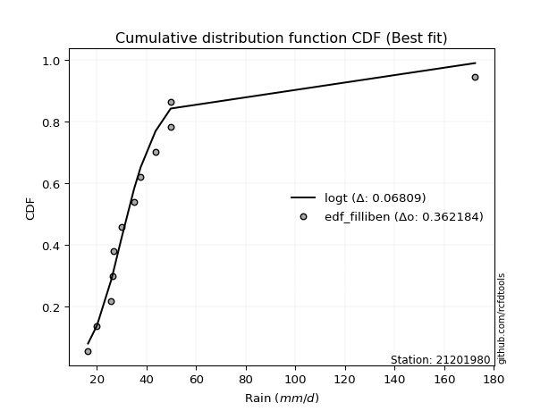</img></img>

</div>


### 10. EDF Jenkinson (1977)

The Jenkinson formula in hydrology is an empirical plotting position formula used to estimate the non-exceedance probability _(P)_ or return period _(T)_ of a given ordered observation within a sample. It is a widely used method in the frequency analysis of extreme events such as floods and rainfall, as it provides a distribution-free way to plot data. _a≈0.31_ and _b≈0.38_ are constants derived to approximate the median of the probability distribution for the given rank.

<div align="center">


$P=(m-a)/(n+b)$


</div>


**10.1. Empirical values**

<div align="center">

|                | 0                    | 1                   | 2                   | 3                  | 4                  | 5                  | 6                  | 7                  | 8                  | 9                  | 10                 | 11                 |
|:---------------|:---------------------|:--------------------|:--------------------|:-------------------|:-------------------|:-------------------|:-------------------|:-------------------|:-------------------|:-------------------|:-------------------|:-------------------|
| date           | 2008                 | 2015                | 2025                | 2016               | 2009               | 2014               | 2010               | 2012               | 2011               | 2007               | 2013               | 2024               |
| x              | 16.5                 | 20.1                | 25.8                | 26.6               | 26.7               | 29.9               | 35.1               | 37.7               | 43.7               | 49.8               | 49.8               | 172.4              |
| m              | 1                    | 2                   | 3                   | 4                  | 5                  | 6                  | 7                  | 8                  | 9                  | 10                 | 11                 | 12                 |
| empirical_dist | edf_jenkinson        | edf_jenkinson       | edf_jenkinson       | edf_jenkinson      | edf_jenkinson      | edf_jenkinson      | edf_jenkinson      | edf_jenkinson      | edf_jenkinson      | edf_jenkinson      | edf_jenkinson      | edf_jenkinson      |
| empirical      | 0.055735056542810975 | 0.13651050080775443 | 0.21728594507269788 | 0.2980613893376413 | 0.3788368336025848 | 0.4596122778675283 | 0.5403877221324718 | 0.6211631663974152 | 0.7019386106623585 | 0.7827140549273021 | 0.8634894991922455 | 0.9442649434571889 |
| empirical_tr   | 1.0590248075278015   | 1.1580916744621141  | 1.2776057791537667  | 1.424626006904488  | 1.6098829648894668 | 1.850523168908819  | 2.1757469244288226 | 2.6396588486140726 | 3.3550135501355    | 4.6022304832713745 | 7.325443786982245  | 17.942028985507218 |

</div>


**10.2. Kolmogorov-Smirnov fit test (sorted by Δ)**


<div align="center">

|                | 0                   | 1                   | 2                   | 3                   | 4                   | 5                   | 6                   | 7                   | 8                   | 9                   | 10                  | 11                  | 12                  | 13                  | 14                  | 15                  | 16                  | 17                  | 18                  | 19                  | 20                  | 21                  | 22                  | 23                  | 24                  | 25                  | 26                  | 27                  | 28                  | 29                  | 30                  | 31                  | 32                  | 33                  | 34                  | 35                  | 36                  | 37                  | 38                  | 39                  | 40                  | 41                  | 42                  | 43                  | 44                  | 45                  | 46                  | 47                  | 48                  | 49                  | 50                  | 51                  | 52                  | 53                  | 54                  | 55                  | 56                  | 57                  | 58                  | 59                  | 60                  | 61                  | 62                  | 63                  | 64                  | 65                  | 66                  | 67                  | 68                  | 69                  | 70                  | 71                  | 72                  | 73                  | 74                  | 75                  | 76                  | 77                  | 78                  | 79                  | 80                  | 81                  | 82                  | 83                  | 84                  | 85                  | 86                  | 87                  | 88                  | 89                  | 90                  | 91                  | 92                  | 93                  | 94                  | 95                  | 96                  | 97                  | 98                  | 99                  | 100                 | 101                 | 102                 | 103                 | 104                 | 105                 | 106                 | 107                 | 108                 | 109                 | 110                 | 111                 | 112                 | 113                 | 114                 | 115                 | 116                 | 117                 | 118                 | 119                 | 120                 | 121                 | 122                 | 123                 | 124                 | 125                 | 126                 | 127                 | 128                 | 129                 | 130                 | 131                 | 132                 | 133                 | 134                 | 135                 | 136                 | 137                 | 138                 | 139                 | 140                 | 141                 | 142                 | 143                 | 144                 | 145                 | 146                 | 147                 | 148                 | 149                 | 150                 | 151                 | 152                 | 153                 | 154                 | 155                 | 156                 | 157                 | 158                 | 159                 |
|:---------------|:--------------------|:--------------------|:--------------------|:--------------------|:--------------------|:--------------------|:--------------------|:--------------------|:--------------------|:--------------------|:--------------------|:--------------------|:--------------------|:--------------------|:--------------------|:--------------------|:--------------------|:--------------------|:--------------------|:--------------------|:--------------------|:--------------------|:--------------------|:--------------------|:--------------------|:--------------------|:--------------------|:--------------------|:--------------------|:--------------------|:--------------------|:--------------------|:--------------------|:--------------------|:--------------------|:--------------------|:--------------------|:--------------------|:--------------------|:--------------------|:--------------------|:--------------------|:--------------------|:--------------------|:--------------------|:--------------------|:--------------------|:--------------------|:--------------------|:--------------------|:--------------------|:--------------------|:--------------------|:--------------------|:--------------------|:--------------------|:--------------------|:--------------------|:--------------------|:--------------------|:--------------------|:--------------------|:--------------------|:--------------------|:--------------------|:--------------------|:--------------------|:--------------------|:--------------------|:--------------------|:--------------------|:--------------------|:--------------------|:--------------------|:--------------------|:--------------------|:--------------------|:--------------------|:--------------------|:--------------------|:--------------------|:--------------------|:--------------------|:--------------------|:--------------------|:--------------------|:--------------------|:--------------------|:--------------------|:--------------------|:--------------------|:--------------------|:--------------------|:--------------------|:--------------------|:--------------------|:--------------------|:--------------------|:--------------------|:--------------------|:--------------------|:--------------------|:--------------------|:--------------------|:--------------------|:--------------------|:--------------------|:--------------------|:--------------------|:--------------------|:--------------------|:--------------------|:--------------------|:--------------------|:--------------------|:--------------------|:--------------------|:--------------------|:--------------------|:--------------------|:--------------------|:--------------------|:--------------------|:--------------------|:--------------------|:--------------------|:--------------------|:--------------------|:--------------------|:--------------------|:--------------------|:--------------------|:--------------------|:--------------------|:--------------------|:--------------------|:--------------------|:--------------------|:--------------------|:--------------------|:--------------------|:--------------------|:--------------------|:--------------------|:--------------------|:--------------------|:--------------------|:--------------------|:--------------------|:--------------------|:--------------------|:--------------------|:--------------------|:--------------------|:--------------------|:--------------------|:--------------------|:--------------------|:--------------------|:--------------------|
| station        | 21201980            | 21201980            | 21201980            | 21201980            | 21201980            | 21201980            | 21201980            | 21201980            | 21201980            | 21201980            | 21201980            | 21201980            | 21201980            | 21201980            | 21201980            | 21201980            | 21201980            | 21201980            | 21201980            | 21201980            | 21201980            | 21201980            | 21201980            | 21201980            | 21201980            | 21201980            | 21201980            | 21201980            | 21201980            | 21201980            | 21201980            | 21201980            | 21201980            | 21201980            | 21201980            | 21201980            | 21201980            | 21201980            | 21201980            | 21201980            | 21201980            | 21201980            | 21201980            | 21201980            | 21201980            | 21201980            | 21201980            | 21201980            | 21201980            | 21201980            | 21201980            | 21201980            | 21201980            | 21201980            | 21201980            | 21201980            | 21201980            | 21201980            | 21201980            | 21201980            | 21201980            | 21201980            | 21201980            | 21201980            | 21201980            | 21201980            | 21201980            | 21201980            | 21201980            | 21201980            | 21201980            | 21201980            | 21201980            | 21201980            | 21201980            | 21201980            | 21201980            | 21201980            | 21201980            | 21201980            | 21201980            | 21201980            | 21201980            | 21201980            | 21201980            | 21201980            | 21201980            | 21201980            | 21201980            | 21201980            | 21201980            | 21201980            | 21201980            | 21201980            | 21201980            | 21201980            | 21201980            | 21201980            | 21201980            | 21201980            | 21201980            | 21201980            | 21201980            | 21201980            | 21201980            | 21201980            | 21201980            | 21201980            | 21201980            | 21201980            | 21201980            | 21201980            | 21201980            | 21201980            | 21201980            | 21201980            | 21201980            | 21201980            | 21201980            | 21201980            | 21201980            | 21201980            | 21201980            | 21201980            | 21201980            | 21201980            | 21201980            | 21201980            | 21201980            | 21201980            | 21201980            | 21201980            | 21201980            | 21201980            | 21201980            | 21201980            | 21201980            | 21201980            | 21201980            | 21201980            | 21201980            | 21201980            | 21201980            | 21201980            | 21201980            | 21201980            | 21201980            | 21201980            | 21201980            | 21201980            | 21201980            | 21201980            | 21201980            | 21201980            | 21201980            | 21201980            | 21201980            | 21201980            | 21201980            | 21201980            |
| empirical_dist | edf_jenkinson       | edf_jenkinson       | edf_jenkinson       | edf_jenkinson       | edf_jenkinson       | edf_jenkinson       | edf_jenkinson       | edf_jenkinson       | edf_jenkinson       | edf_jenkinson       | edf_jenkinson       | edf_jenkinson       | edf_jenkinson       | edf_jenkinson       | edf_jenkinson       | edf_jenkinson       | edf_jenkinson       | edf_jenkinson       | edf_jenkinson       | edf_jenkinson       | edf_jenkinson       | edf_jenkinson       | edf_jenkinson       | edf_jenkinson       | edf_jenkinson       | edf_jenkinson       | edf_jenkinson       | edf_jenkinson       | edf_jenkinson       | edf_jenkinson       | edf_jenkinson       | edf_jenkinson       | edf_jenkinson       | edf_jenkinson       | edf_jenkinson       | edf_jenkinson       | edf_jenkinson       | edf_jenkinson       | edf_jenkinson       | edf_jenkinson       | edf_jenkinson       | edf_jenkinson       | edf_jenkinson       | edf_jenkinson       | edf_jenkinson       | edf_jenkinson       | edf_jenkinson       | edf_jenkinson       | edf_jenkinson       | edf_jenkinson       | edf_jenkinson       | edf_jenkinson       | edf_jenkinson       | edf_jenkinson       | edf_jenkinson       | edf_jenkinson       | edf_jenkinson       | edf_jenkinson       | edf_jenkinson       | edf_jenkinson       | edf_jenkinson       | edf_jenkinson       | edf_jenkinson       | edf_jenkinson       | edf_jenkinson       | edf_jenkinson       | edf_jenkinson       | edf_jenkinson       | edf_jenkinson       | edf_jenkinson       | edf_jenkinson       | edf_jenkinson       | edf_jenkinson       | edf_jenkinson       | edf_jenkinson       | edf_jenkinson       | edf_jenkinson       | edf_jenkinson       | edf_jenkinson       | edf_jenkinson       | edf_jenkinson       | edf_jenkinson       | edf_jenkinson       | edf_jenkinson       | edf_jenkinson       | edf_jenkinson       | edf_jenkinson       | edf_jenkinson       | edf_jenkinson       | edf_jenkinson       | edf_jenkinson       | edf_jenkinson       | edf_jenkinson       | edf_jenkinson       | edf_jenkinson       | edf_jenkinson       | edf_jenkinson       | edf_jenkinson       | edf_jenkinson       | edf_jenkinson       | edf_jenkinson       | edf_jenkinson       | edf_jenkinson       | edf_jenkinson       | edf_jenkinson       | edf_jenkinson       | edf_jenkinson       | edf_jenkinson       | edf_jenkinson       | edf_jenkinson       | edf_jenkinson       | edf_jenkinson       | edf_jenkinson       | edf_jenkinson       | edf_jenkinson       | edf_jenkinson       | edf_jenkinson       | edf_jenkinson       | edf_jenkinson       | edf_jenkinson       | edf_jenkinson       | edf_jenkinson       | edf_jenkinson       | edf_jenkinson       | edf_jenkinson       | edf_jenkinson       | edf_jenkinson       | edf_jenkinson       | edf_jenkinson       | edf_jenkinson       | edf_jenkinson       | edf_jenkinson       | edf_jenkinson       | edf_jenkinson       | edf_jenkinson       | edf_jenkinson       | edf_jenkinson       | edf_jenkinson       | edf_jenkinson       | edf_jenkinson       | edf_jenkinson       | edf_jenkinson       | edf_jenkinson       | edf_jenkinson       | edf_jenkinson       | edf_jenkinson       | edf_jenkinson       | edf_jenkinson       | edf_jenkinson       | edf_jenkinson       | edf_jenkinson       | edf_jenkinson       | edf_jenkinson       | edf_jenkinson       | edf_jenkinson       | edf_jenkinson       | edf_jenkinson       | edf_jenkinson       | edf_jenkinson       | edf_jenkinson       |
| p_dist         | logt                | logburr12           | logvonmises_line    | logexponnorm        | loggennorm          | logmielke           | loggenlogistic      | alpha               | logburr             | burr                | logdweibull         | mielke              | logalpha            | loggenextreme       | loginvweibull       | nct                 | genextreme          | invweibull          | loginvgamma         | logf                | logjohnsonsu        | logjohnsonsb        | f                   | invgamma            | ncf                 | logdgamma           | loginvgauss         | logfatiguelife      | loggumbel_r         | logmoyal            | lognct              | exponweib           | logbetaprime        | loggamma            | loggamma            | logerlang           | logkstwobign        | loghypsecant        | kappa3              | johnsonsu           | logloglaplace       | johnsonsb           | betaprime           | t                   | logpearson3         | loglogistic         | loghalflogistic     | invgauss            | logrice             | lograyleigh         | truncpareto         | loghalfnorm         | logmaxwell          | lomax               | logwald             | logfoldnorm         | logskewnorm         | loglaplace          | loglaplace          | genpareto           | logkappa3           | loghalfgennorm      | fatiguelife         | logcrystalball      | lognorm             | loggompertz         | logloggamma         | gompertz            | logncf              | genlogistic         | logweibull_min      | exponnorm           | genexpon            | gamma               | loggenexpon         | logtruncnorm        | cosine              | loganglit           | loggumbel_l         | wald                | logsemicircular     | genhalflogistic     | gengamma            | logbradford         | halfgennorm         | moyal               | pearson3            | halflogistic        | burr12              | loglomax            | loggengamma         | logarcsine          | dgamma              | logtriang           | weibull_min         | gumbel_r            | halfnorm            | dweibull            | gennorm             | erlang              | logcosine           | logtruncweibull_min | rayleigh            | kstwobign           | laplace             | maxwell             | nakagami            | logtruncexpon       | truncnorm           | foldnorm            | hypsecant           | logistic            | norm                | crystalball         | anglit              | semicircular        | gausshyper          | rice                | beta                | arcsine             | loggenpareto        | logkappa4           | exponpow            | skewnorm            | powerlaw            | logwrapcauchy       | logexponpow         | gumbel_l            | truncweibull_min    | logksone            | logtukeylambda      | logargus            | loguniform          | logrdist            | bradford            | loglevy_l           | logpowerlaw         | truncexpon          | wrapcauchy          | levy_l              | loggausshyper       | logweibull_max      | logexponweib        | argus               | vonmises_line       | loggenhalflogistic  | rdist               | logbeta             | lognakagami         | tukeylambda         | ksone               | kappa4              | logtrapezoid        | uniform             | logtruncpareto      | weibull_max         | triang              | trapezoid           | logvonmises         | vonmises            |
| delta          | 0.06774733728505944 | 0.06910160389730091 | 0.07467532925286324 | 0.07954769834346598 | 0.08263666055775926 | 0.08320352676977139 | 0.08384565945276967 | 0.08411227296516255 | 0.08435747690580003 | 0.08455493338864994 | 0.08457481738646194 | 0.08517090843979735 | 0.0894449296098071  | 0.09130822051218157 | 0.09131058602916509 | 0.09142511680931942 | 0.09303996394577546 | 0.09304154654255509 | 0.09376014621505252 | 0.09377382672831208 | 0.09694582948490693 | 0.09825276628100493 | 0.0984885157738345  | 0.09848860265536713 | 0.09848868469365579 | 0.09862707304684243 | 0.09910690659799964 | 0.099436618723799   | 0.09999572709471194 | 0.10056477715953477 | 0.10371751253257022 | 0.1040007424526862  | 0.107223835703466   | 0.10977555960780416 | 0.10977555960780416 | 0.10977645949591891 | 0.11008109932870447 | 0.11093041918229435 | 0.11142221084147313 | 0.11325423663617495 | 0.11356288203848353 | 0.11415106430155236 | 0.11458269859834314 | 0.1165091800789596  | 0.11691656315887056 | 0.12538207382715505 | 0.12730164954799567 | 0.1278279870485246  | 0.12903107101269484 | 0.1294280380135745  | 0.13182104233953484 | 0.1326974549520547  | 0.13346700037594705 | 0.1358164420602057  | 0.13651050080775443 | 0.13686030128807347 | 0.13914964389151496 | 0.13922817660370335 | 0.13922817660370335 | 0.1425949035178094  | 0.14394379823352393 | 0.14598746567113513 | 0.14731472984072602 | 0.14739944837674424 | 0.1474004665995421  | 0.14820481798511675 | 0.15020871603116304 | 0.15049880709083707 | 0.15267002669523833 | 0.15540877770874972 | 0.16203672668489083 | 0.16540036584829276 | 0.1698500149335831  | 0.1706183128916211  | 0.1726403511129323  | 0.17267744405377078 | 0.1726979913581631  | 0.17313762250506515 | 0.17441834874506412 | 0.1746591251819637  | 0.18415224635074168 | 0.18492677825492176 | 0.18844485903459346 | 0.19886811088262457 | 0.20536769365278518 | 0.21604189168816756 | 0.2176522683433651  | 0.21984770053530833 | 0.22204299716048265 | 0.2262140129468599  | 0.22846007537822027 | 0.2311284445199976  | 0.23131290244897995 | 0.2334911432268295  | 0.24060434493983285 | 0.24078999405521317 | 0.24355338376736801 | 0.24603104576894186 | 0.25346955468711985 | 0.2561571528167192  | 0.2582988145861014  | 0.26230209291316753 | 0.27087638099156086 | 0.27496597910463527 | 0.2780313615934046  | 0.2805597323641883  | 0.2813766953109077  | 0.2831830804458868  | 0.28781632949800373 | 0.28799771744230374 | 0.29769509888018786 | 0.3036788515479565  | 0.31076969522172737 | 0.31077029034361037 | 0.3182462327030122  | 0.321332879818782   | 0.3228545269095534  | 0.3246810892247155  | 0.33269006286161346 | 0.3336145476375483  | 0.3456902490052251  | 0.34611712248794246 | 0.35496482638488314 | 0.35822883972748853 | 0.361052244536413   | 0.3732553769982032  | 0.3741801518941263  | 0.37751110855343073 | 0.38278008015807885 | 0.38784319720026983 | 0.392393164463255   | 0.39264644185785935 | 0.3927139368018746  | 0.40420892118230967 | 0.4067951599146387  | 0.4259057410356577  | 0.4514523653486911  | 0.4553000724102056  | 0.45973731917073524 | 0.47186804684074324 | 0.49193549879725357 | 0.5246739650227317  | 0.5277705751881545  | 0.5329091137137199  | 0.5372659088115875  | 0.5542884141797944  | 0.5590767282281157  | 0.5768792744728557  | 0.5783655924211282  | 0.5885745830656759  | 0.6021574487325492  | 0.6177656170314891  | 0.6372500945936038  | 0.6498910386406098  | 0.7547556113264363  | 0.7626517668484433  | 0.7821418979922432  | 0.7951950585947762  | 1.0802384463283499  | 26.99583442363764   |
| deltao         | 0.36218414519599995 | 0.36218414519599995 | 0.36218414519599995 | 0.36218414519599995 | 0.36218414519599995 | 0.36218414519599995 | 0.36218414519599995 | 0.36218414519599995 | 0.36218414519599995 | 0.36218414519599995 | 0.36218414519599995 | 0.36218414519599995 | 0.36218414519599995 | 0.36218414519599995 | 0.36218414519599995 | 0.36218414519599995 | 0.36218414519599995 | 0.36218414519599995 | 0.36218414519599995 | 0.36218414519599995 | 0.36218414519599995 | 0.36218414519599995 | 0.36218414519599995 | 0.36218414519599995 | 0.36218414519599995 | 0.36218414519599995 | 0.36218414519599995 | 0.36218414519599995 | 0.36218414519599995 | 0.36218414519599995 | 0.36218414519599995 | 0.36218414519599995 | 0.36218414519599995 | 0.36218414519599995 | 0.36218414519599995 | 0.36218414519599995 | 0.36218414519599995 | 0.36218414519599995 | 0.36218414519599995 | 0.36218414519599995 | 0.36218414519599995 | 0.36218414519599995 | 0.36218414519599995 | 0.36218414519599995 | 0.36218414519599995 | 0.36218414519599995 | 0.36218414519599995 | 0.36218414519599995 | 0.36218414519599995 | 0.36218414519599995 | 0.36218414519599995 | 0.36218414519599995 | 0.36218414519599995 | 0.36218414519599995 | 0.36218414519599995 | 0.36218414519599995 | 0.36218414519599995 | 0.36218414519599995 | 0.36218414519599995 | 0.36218414519599995 | 0.36218414519599995 | 0.36218414519599995 | 0.36218414519599995 | 0.36218414519599995 | 0.36218414519599995 | 0.36218414519599995 | 0.36218414519599995 | 0.36218414519599995 | 0.36218414519599995 | 0.36218414519599995 | 0.36218414519599995 | 0.36218414519599995 | 0.36218414519599995 | 0.36218414519599995 | 0.36218414519599995 | 0.36218414519599995 | 0.36218414519599995 | 0.36218414519599995 | 0.36218414519599995 | 0.36218414519599995 | 0.36218414519599995 | 0.36218414519599995 | 0.36218414519599995 | 0.36218414519599995 | 0.36218414519599995 | 0.36218414519599995 | 0.36218414519599995 | 0.36218414519599995 | 0.36218414519599995 | 0.36218414519599995 | 0.36218414519599995 | 0.36218414519599995 | 0.36218414519599995 | 0.36218414519599995 | 0.36218414519599995 | 0.36218414519599995 | 0.36218414519599995 | 0.36218414519599995 | 0.36218414519599995 | 0.36218414519599995 | 0.36218414519599995 | 0.36218414519599995 | 0.36218414519599995 | 0.36218414519599995 | 0.36218414519599995 | 0.36218414519599995 | 0.36218414519599995 | 0.36218414519599995 | 0.36218414519599995 | 0.36218414519599995 | 0.36218414519599995 | 0.36218414519599995 | 0.36218414519599995 | 0.36218414519599995 | 0.36218414519599995 | 0.36218414519599995 | 0.36218414519599995 | 0.36218414519599995 | 0.36218414519599995 | 0.36218414519599995 | 0.36218414519599995 | 0.36218414519599995 | 0.36218414519599995 | 0.36218414519599995 | 0.36218414519599995 | 0.36218414519599995 | 0.36218414519599995 | 0.36218414519599995 | 0.36218414519599995 | 0.36218414519599995 | 0.36218414519599995 | 0.36218414519599995 | 0.36218414519599995 | 0.36218414519599995 | 0.36218414519599995 | 0.36218414519599995 | 0.36218414519599995 | 0.36218414519599995 | 0.36218414519599995 | 0.36218414519599995 | 0.36218414519599995 | 0.36218414519599995 | 0.36218414519599995 | 0.36218414519599995 | 0.36218414519599995 | 0.36218414519599995 | 0.36218414519599995 | 0.36218414519599995 | 0.36218414519599995 | 0.36218414519599995 | 0.36218414519599995 | 0.36218414519599995 | 0.36218414519599995 | 0.36218414519599995 | 0.36218414519599995 | 0.36218414519599995 | 0.36218414519599995 | 0.36218414519599995 | 0.36218414519599995 | 0.36218414519599995 |
| eval           | Δo > Δ              | Δo > Δ              | Δo > Δ              | Δo > Δ              | Δo > Δ              | Δo > Δ              | Δo > Δ              | Δo > Δ              | Δo > Δ              | Δo > Δ              | Δo > Δ              | Δo > Δ              | Δo > Δ              | Δo > Δ              | Δo > Δ              | Δo > Δ              | Δo > Δ              | Δo > Δ              | Δo > Δ              | Δo > Δ              | Δo > Δ              | Δo > Δ              | Δo > Δ              | Δo > Δ              | Δo > Δ              | Δo > Δ              | Δo > Δ              | Δo > Δ              | Δo > Δ              | Δo > Δ              | Δo > Δ              | Δo > Δ              | Δo > Δ              | Δo > Δ              | Δo > Δ              | Δo > Δ              | Δo > Δ              | Δo > Δ              | Δo > Δ              | Δo > Δ              | Δo > Δ              | Δo > Δ              | Δo > Δ              | Δo > Δ              | Δo > Δ              | Δo > Δ              | Δo > Δ              | Δo > Δ              | Δo > Δ              | Δo > Δ              | Δo > Δ              | Δo > Δ              | Δo > Δ              | Δo > Δ              | Δo > Δ              | Δo > Δ              | Δo > Δ              | Δo > Δ              | Δo > Δ              | Δo > Δ              | Δo > Δ              | Δo > Δ              | Δo > Δ              | Δo > Δ              | Δo > Δ              | Δo > Δ              | Δo > Δ              | Δo > Δ              | Δo > Δ              | Δo > Δ              | Δo > Δ              | Δo > Δ              | Δo > Δ              | Δo > Δ              | Δo > Δ              | Δo > Δ              | Δo > Δ              | Δo > Δ              | Δo > Δ              | Δo > Δ              | Δo > Δ              | Δo > Δ              | Δo > Δ              | Δo > Δ              | Δo > Δ              | Δo > Δ              | Δo > Δ              | Δo > Δ              | Δo > Δ              | Δo > Δ              | Δo > Δ              | Δo > Δ              | Δo > Δ              | Δo > Δ              | Δo > Δ              | Δo > Δ              | Δo > Δ              | Δo > Δ              | Δo > Δ              | Δo > Δ              | Δo > Δ              | Δo > Δ              | Δo > Δ              | Δo > Δ              | Δo > Δ              | Δo > Δ              | Δo > Δ              | Δo > Δ              | Δo > Δ              | Δo > Δ              | Δo > Δ              | Δo > Δ              | Δo > Δ              | Δo > Δ              | Δo > Δ              | Δo > Δ              | Δo > Δ              | Δo > Δ              | Δo > Δ              | Δo > Δ              | Δo > Δ              | Δo > Δ              | Δo > Δ              | Δo > Δ              | Δo > Δ              | Δo <= Δ             | Δo <= Δ             | Δo <= Δ             | Δo <= Δ             | Δo <= Δ             | Δo <= Δ             | Δo <= Δ             | Δo <= Δ             | Δo <= Δ             | Δo <= Δ             | Δo <= Δ             | Δo <= Δ             | Δo <= Δ             | Δo <= Δ             | Δo <= Δ             | Δo <= Δ             | Δo <= Δ             | Δo <= Δ             | Δo <= Δ             | Δo <= Δ             | Δo <= Δ             | Δo <= Δ             | Δo <= Δ             | Δo <= Δ             | Δo <= Δ             | Δo <= Δ             | Δo <= Δ             | Δo <= Δ             | Δo <= Δ             | Δo <= Δ             | Δo <= Δ             | Δo <= Δ             | Δo <= Δ             | Δo <= Δ             | Δo <= Δ             |
| fit            | 1                   | 1                   | 1                   | 1                   | 1                   | 1                   | 1                   | 1                   | 1                   | 1                   | 1                   | 1                   | 1                   | 1                   | 1                   | 1                   | 1                   | 1                   | 1                   | 1                   | 1                   | 1                   | 1                   | 1                   | 1                   | 1                   | 1                   | 1                   | 1                   | 1                   | 1                   | 1                   | 1                   | 1                   | 1                   | 1                   | 1                   | 1                   | 1                   | 1                   | 1                   | 1                   | 1                   | 1                   | 1                   | 1                   | 1                   | 1                   | 1                   | 1                   | 1                   | 1                   | 1                   | 1                   | 1                   | 1                   | 1                   | 1                   | 1                   | 1                   | 1                   | 1                   | 1                   | 1                   | 1                   | 1                   | 1                   | 1                   | 1                   | 1                   | 1                   | 1                   | 1                   | 1                   | 1                   | 1                   | 1                   | 1                   | 1                   | 1                   | 1                   | 1                   | 1                   | 1                   | 1                   | 1                   | 1                   | 1                   | 1                   | 1                   | 1                   | 1                   | 1                   | 1                   | 1                   | 1                   | 1                   | 1                   | 1                   | 1                   | 1                   | 1                   | 1                   | 1                   | 1                   | 1                   | 1                   | 1                   | 1                   | 1                   | 1                   | 1                   | 1                   | 1                   | 1                   | 1                   | 1                   | 1                   | 1                   | 1                   | 1                   | 1                   | 1                   | 1                   | 1                   | 0                   | 0                   | 0                   | 0                   | 0                   | 0                   | 0                   | 0                   | 0                   | 0                   | 0                   | 0                   | 0                   | 0                   | 0                   | 0                   | 0                   | 0                   | 0                   | 0                   | 0                   | 0                   | 0                   | 0                   | 0                   | 0                   | 0                   | 0                   | 0                   | 0                   | 0                   | 0                   | 0                   | 0                   | 0                   |
| n              | 12                  | 12                  | 12                  | 12                  | 12                  | 12                  | 12                  | 12                  | 12                  | 12                  | 12                  | 12                  | 12                  | 12                  | 12                  | 12                  | 12                  | 12                  | 12                  | 12                  | 12                  | 12                  | 12                  | 12                  | 12                  | 12                  | 12                  | 12                  | 12                  | 12                  | 12                  | 12                  | 12                  | 12                  | 12                  | 12                  | 12                  | 12                  | 12                  | 12                  | 12                  | 12                  | 12                  | 12                  | 12                  | 12                  | 12                  | 12                  | 12                  | 12                  | 12                  | 12                  | 12                  | 12                  | 12                  | 12                  | 12                  | 12                  | 12                  | 12                  | 12                  | 12                  | 12                  | 12                  | 12                  | 12                  | 12                  | 12                  | 12                  | 12                  | 12                  | 12                  | 12                  | 12                  | 12                  | 12                  | 12                  | 12                  | 12                  | 12                  | 12                  | 12                  | 12                  | 12                  | 12                  | 12                  | 12                  | 12                  | 12                  | 12                  | 12                  | 12                  | 12                  | 12                  | 12                  | 12                  | 12                  | 12                  | 12                  | 12                  | 12                  | 12                  | 12                  | 12                  | 12                  | 12                  | 12                  | 12                  | 12                  | 12                  | 12                  | 12                  | 12                  | 12                  | 12                  | 12                  | 12                  | 12                  | 12                  | 12                  | 12                  | 12                  | 12                  | 12                  | 12                  | 12                  | 12                  | 12                  | 12                  | 12                  | 12                  | 12                  | 12                  | 12                  | 12                  | 12                  | 12                  | 12                  | 12                  | 12                  | 12                  | 12                  | 12                  | 12                  | 12                  | 12                  | 12                  | 12                  | 12                  | 12                  | 12                  | 12                  | 12                  | 12                  | 12                  | 12                  | 12                  | 12                  | 12                  | 12                  |
| best_fit       | 1                   | 0                   | 0                   | 0                   | 0                   | 0                   | 0                   | 0                   | 0                   | 0                   | 0                   | 0                   | 0                   | 0                   | 0                   | 0                   | 0                   | 0                   | 0                   | 0                   | 0                   | 0                   | 0                   | 0                   | 0                   | 0                   | 0                   | 0                   | 0                   | 0                   | 0                   | 0                   | 0                   | 0                   | 0                   | 0                   | 0                   | 0                   | 0                   | 0                   | 0                   | 0                   | 0                   | 0                   | 0                   | 0                   | 0                   | 0                   | 0                   | 0                   | 0                   | 0                   | 0                   | 0                   | 0                   | 0                   | 0                   | 0                   | 0                   | 0                   | 0                   | 0                   | 0                   | 0                   | 0                   | 0                   | 0                   | 0                   | 0                   | 0                   | 0                   | 0                   | 0                   | 0                   | 0                   | 0                   | 0                   | 0                   | 0                   | 0                   | 0                   | 0                   | 0                   | 0                   | 0                   | 0                   | 0                   | 0                   | 0                   | 0                   | 0                   | 0                   | 0                   | 0                   | 0                   | 0                   | 0                   | 0                   | 0                   | 0                   | 0                   | 0                   | 0                   | 0                   | 0                   | 0                   | 0                   | 0                   | 0                   | 0                   | 0                   | 0                   | 0                   | 0                   | 0                   | 0                   | 0                   | 0                   | 0                   | 0                   | 0                   | 0                   | 0                   | 0                   | 0                   | 0                   | 0                   | 0                   | 0                   | 0                   | 0                   | 0                   | 0                   | 0                   | 0                   | 0                   | 0                   | 0                   | 0                   | 0                   | 0                   | 0                   | 0                   | 0                   | 0                   | 0                   | 0                   | 0                   | 0                   | 0                   | 0                   | 0                   | 0                   | 0                   | 0                   | 0                   | 0                   | 0                   | 0                   | 0                   |
| best_fit_sort  | 1                   | 2                   | 3                   | 4                   | 5                   | 6                   | 7                   | 8                   | 9                   | 10                  | 11                  | 12                  | 13                  | 14                  | 15                  | 16                  | 17                  | 18                  | 19                  | 20                  | 21                  | 22                  | 23                  | 24                  | 25                  | 26                  | 27                  | 28                  | 29                  | 30                  | 31                  | 32                  | 33                  | 34                  | 35                  | 36                  | 37                  | 38                  | 39                  | 40                  | 41                  | 42                  | 43                  | 44                  | 45                  | 46                  | 47                  | 48                  | 49                  | 50                  | 51                  | 52                  | 53                  | 54                  | 55                  | 56                  | 57                  | 58                  | 59                  | 60                  | 61                  | 62                  | 63                  | 64                  | 65                  | 66                  | 67                  | 68                  | 69                  | 70                  | 71                  | 72                  | 73                  | 74                  | 75                  | 76                  | 77                  | 78                  | 79                  | 80                  | 81                  | 82                  | 83                  | 84                  | 85                  | 86                  | 87                  | 88                  | 89                  | 90                  | 91                  | 92                  | 93                  | 94                  | 95                  | 96                  | 97                  | 98                  | 99                  | 100                 | 101                 | 102                 | 103                 | 104                 | 105                 | 106                 | 107                 | 108                 | 109                 | 110                 | 111                 | 112                 | 113                 | 114                 | 115                 | 116                 | 117                 | 118                 | 119                 | 120                 | 121                 | 122                 | 123                 | 124                 | 125                 | 126                 | 127                 | 128                 | 129                 | 130                 | 131                 | 132                 | 133                 | 134                 | 135                 | 136                 | 137                 | 138                 | 139                 | 140                 | 141                 | 142                 | 143                 | 144                 | 145                 | 146                 | 147                 | 148                 | 149                 | 150                 | 151                 | 152                 | 153                 | 154                 | 155                 | 156                 | 157                 | 158                 | 159                 | 160                 |

</div>


**10.3. Best fit**

<div align="center">

|   id |   station | empirical_dist   | p_dist   |     delta |   deltao | eval   |   fit |   n |   best_fit |   best_fit_sort |
|-----:|----------:|:-----------------|:---------|----------:|---------:|:-------|------:|----:|-----------:|----------------:|
|    0 |  21201980 | edf_jenkinson    | logt     | 0.0677473 | 0.362184 | Δo > Δ |     1 |  12 |          1 |               1 |

</div>


<div align="center">

</img>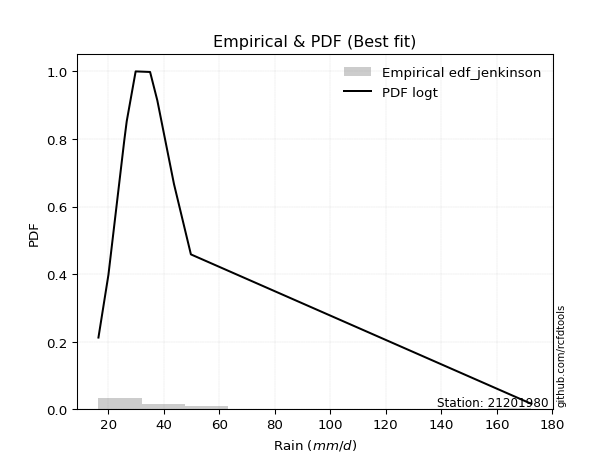</img>

</div>


### 11. EDF Cunnane (1978)

Cunnane´s work in statistical hydrology has focused on the performance and evaluation of different probability distributions (such as GEV, Gumbel, Lognormal) for flood frequency estimation. _b_ is a constant, typically set to 0.4.

<div align="center">


$P=(m-b)/(n+1-2b)$


</div>


**11.1. Empirical values**

<div align="center">

|                | 0                   | 1                   | 2                   | 3                  | 4                  | 5                   | 6                  | 7                  | 8                  | 9                  | 10                 | 11                 |
|:---------------|:--------------------|:--------------------|:--------------------|:-------------------|:-------------------|:--------------------|:-------------------|:-------------------|:-------------------|:-------------------|:-------------------|:-------------------|
| date           | 2008                | 2015                | 2025                | 2016               | 2009               | 2014                | 2010               | 2012               | 2011               | 2007               | 2013               | 2024               |
| x              | 16.5                | 20.1                | 25.8                | 26.6               | 26.7               | 29.9                | 35.1               | 37.7               | 43.7               | 49.8               | 49.8               | 172.4              |
| m              | 1                   | 2                   | 3                   | 4                  | 5                  | 6                   | 7                  | 8                  | 9                  | 10                 | 11                 | 12                 |
| empirical_dist | edf_cunnane         | edf_cunnane         | edf_cunnane         | edf_cunnane        | edf_cunnane        | edf_cunnane         | edf_cunnane        | edf_cunnane        | edf_cunnane        | edf_cunnane        | edf_cunnane        | edf_cunnane        |
| empirical      | 0.04918032786885246 | 0.13114754098360656 | 0.21311475409836067 | 0.2950819672131148 | 0.3770491803278688 | 0.45901639344262296 | 0.5409836065573771 | 0.6229508196721312 | 0.7049180327868853 | 0.7868852459016393 | 0.8688524590163935 | 0.9508196721311476 |
| empirical_tr   | 1.0517241379310345  | 1.150943396226415   | 1.2708333333333333  | 1.418604651162791  | 1.6052631578947367 | 1.8484848484848486  | 2.178571428571429  | 2.6521739130434785 | 3.388888888888889  | 4.692307692307692  | 7.625000000000004  | 20.333333333333357 |

</div>


**11.2. Kolmogorov-Smirnov fit test (sorted by Δ)**


<div align="center">

|                | 0                   | 1                   | 2                   | 3                   | 4                   | 5                   | 6                   | 7                   | 8                   | 9                   | 10                  | 11                  | 12                  | 13                  | 14                  | 15                  | 16                  | 17                  | 18                  | 19                  | 20                  | 21                  | 22                  | 23                  | 24                  | 25                  | 26                  | 27                  | 28                  | 29                  | 30                  | 31                  | 32                  | 33                  | 34                  | 35                  | 36                  | 37                  | 38                  | 39                  | 40                  | 41                  | 42                  | 43                  | 44                  | 45                  | 46                  | 47                  | 48                  | 49                  | 50                  | 51                  | 52                  | 53                  | 54                  | 55                  | 56                  | 57                  | 58                  | 59                  | 60                  | 61                  | 62                  | 63                  | 64                  | 65                  | 66                  | 67                  | 68                  | 69                  | 70                  | 71                  | 72                  | 73                  | 74                  | 75                  | 76                  | 77                  | 78                  | 79                  | 80                  | 81                  | 82                  | 83                  | 84                  | 85                  | 86                  | 87                  | 88                  | 89                  | 90                  | 91                  | 92                  | 93                  | 94                  | 95                  | 96                  | 97                  | 98                  | 99                  | 100                 | 101                 | 102                 | 103                 | 104                 | 105                 | 106                 | 107                 | 108                 | 109                 | 110                 | 111                 | 112                 | 113                 | 114                 | 115                 | 116                 | 117                 | 118                 | 119                 | 120                 | 121                 | 122                 | 123                 | 124                 | 125                 | 126                 | 127                 | 128                 | 129                 | 130                 | 131                 | 132                 | 133                 | 134                 | 135                 | 136                 | 137                 | 138                 | 139                 | 140                 | 141                 | 142                 | 143                 | 144                 | 145                 | 146                 | 147                 | 148                 | 149                 | 150                 | 151                 | 152                 | 153                 | 154                 | 155                 | 156                 | 157                 | 158                 | 159                 |
|:---------------|:--------------------|:--------------------|:--------------------|:--------------------|:--------------------|:--------------------|:--------------------|:--------------------|:--------------------|:--------------------|:--------------------|:--------------------|:--------------------|:--------------------|:--------------------|:--------------------|:--------------------|:--------------------|:--------------------|:--------------------|:--------------------|:--------------------|:--------------------|:--------------------|:--------------------|:--------------------|:--------------------|:--------------------|:--------------------|:--------------------|:--------------------|:--------------------|:--------------------|:--------------------|:--------------------|:--------------------|:--------------------|:--------------------|:--------------------|:--------------------|:--------------------|:--------------------|:--------------------|:--------------------|:--------------------|:--------------------|:--------------------|:--------------------|:--------------------|:--------------------|:--------------------|:--------------------|:--------------------|:--------------------|:--------------------|:--------------------|:--------------------|:--------------------|:--------------------|:--------------------|:--------------------|:--------------------|:--------------------|:--------------------|:--------------------|:--------------------|:--------------------|:--------------------|:--------------------|:--------------------|:--------------------|:--------------------|:--------------------|:--------------------|:--------------------|:--------------------|:--------------------|:--------------------|:--------------------|:--------------------|:--------------------|:--------------------|:--------------------|:--------------------|:--------------------|:--------------------|:--------------------|:--------------------|:--------------------|:--------------------|:--------------------|:--------------------|:--------------------|:--------------------|:--------------------|:--------------------|:--------------------|:--------------------|:--------------------|:--------------------|:--------------------|:--------------------|:--------------------|:--------------------|:--------------------|:--------------------|:--------------------|:--------------------|:--------------------|:--------------------|:--------------------|:--------------------|:--------------------|:--------------------|:--------------------|:--------------------|:--------------------|:--------------------|:--------------------|:--------------------|:--------------------|:--------------------|:--------------------|:--------------------|:--------------------|:--------------------|:--------------------|:--------------------|:--------------------|:--------------------|:--------------------|:--------------------|:--------------------|:--------------------|:--------------------|:--------------------|:--------------------|:--------------------|:--------------------|:--------------------|:--------------------|:--------------------|:--------------------|:--------------------|:--------------------|:--------------------|:--------------------|:--------------------|:--------------------|:--------------------|:--------------------|:--------------------|:--------------------|:--------------------|:--------------------|:--------------------|:--------------------|:--------------------|:--------------------|:--------------------|
| station        | 21201980            | 21201980            | 21201980            | 21201980            | 21201980            | 21201980            | 21201980            | 21201980            | 21201980            | 21201980            | 21201980            | 21201980            | 21201980            | 21201980            | 21201980            | 21201980            | 21201980            | 21201980            | 21201980            | 21201980            | 21201980            | 21201980            | 21201980            | 21201980            | 21201980            | 21201980            | 21201980            | 21201980            | 21201980            | 21201980            | 21201980            | 21201980            | 21201980            | 21201980            | 21201980            | 21201980            | 21201980            | 21201980            | 21201980            | 21201980            | 21201980            | 21201980            | 21201980            | 21201980            | 21201980            | 21201980            | 21201980            | 21201980            | 21201980            | 21201980            | 21201980            | 21201980            | 21201980            | 21201980            | 21201980            | 21201980            | 21201980            | 21201980            | 21201980            | 21201980            | 21201980            | 21201980            | 21201980            | 21201980            | 21201980            | 21201980            | 21201980            | 21201980            | 21201980            | 21201980            | 21201980            | 21201980            | 21201980            | 21201980            | 21201980            | 21201980            | 21201980            | 21201980            | 21201980            | 21201980            | 21201980            | 21201980            | 21201980            | 21201980            | 21201980            | 21201980            | 21201980            | 21201980            | 21201980            | 21201980            | 21201980            | 21201980            | 21201980            | 21201980            | 21201980            | 21201980            | 21201980            | 21201980            | 21201980            | 21201980            | 21201980            | 21201980            | 21201980            | 21201980            | 21201980            | 21201980            | 21201980            | 21201980            | 21201980            | 21201980            | 21201980            | 21201980            | 21201980            | 21201980            | 21201980            | 21201980            | 21201980            | 21201980            | 21201980            | 21201980            | 21201980            | 21201980            | 21201980            | 21201980            | 21201980            | 21201980            | 21201980            | 21201980            | 21201980            | 21201980            | 21201980            | 21201980            | 21201980            | 21201980            | 21201980            | 21201980            | 21201980            | 21201980            | 21201980            | 21201980            | 21201980            | 21201980            | 21201980            | 21201980            | 21201980            | 21201980            | 21201980            | 21201980            | 21201980            | 21201980            | 21201980            | 21201980            | 21201980            | 21201980            | 21201980            | 21201980            | 21201980            | 21201980            | 21201980            | 21201980            |
| empirical_dist | edf_cunnane         | edf_cunnane         | edf_cunnane         | edf_cunnane         | edf_cunnane         | edf_cunnane         | edf_cunnane         | edf_cunnane         | edf_cunnane         | edf_cunnane         | edf_cunnane         | edf_cunnane         | edf_cunnane         | edf_cunnane         | edf_cunnane         | edf_cunnane         | edf_cunnane         | edf_cunnane         | edf_cunnane         | edf_cunnane         | edf_cunnane         | edf_cunnane         | edf_cunnane         | edf_cunnane         | edf_cunnane         | edf_cunnane         | edf_cunnane         | edf_cunnane         | edf_cunnane         | edf_cunnane         | edf_cunnane         | edf_cunnane         | edf_cunnane         | edf_cunnane         | edf_cunnane         | edf_cunnane         | edf_cunnane         | edf_cunnane         | edf_cunnane         | edf_cunnane         | edf_cunnane         | edf_cunnane         | edf_cunnane         | edf_cunnane         | edf_cunnane         | edf_cunnane         | edf_cunnane         | edf_cunnane         | edf_cunnane         | edf_cunnane         | edf_cunnane         | edf_cunnane         | edf_cunnane         | edf_cunnane         | edf_cunnane         | edf_cunnane         | edf_cunnane         | edf_cunnane         | edf_cunnane         | edf_cunnane         | edf_cunnane         | edf_cunnane         | edf_cunnane         | edf_cunnane         | edf_cunnane         | edf_cunnane         | edf_cunnane         | edf_cunnane         | edf_cunnane         | edf_cunnane         | edf_cunnane         | edf_cunnane         | edf_cunnane         | edf_cunnane         | edf_cunnane         | edf_cunnane         | edf_cunnane         | edf_cunnane         | edf_cunnane         | edf_cunnane         | edf_cunnane         | edf_cunnane         | edf_cunnane         | edf_cunnane         | edf_cunnane         | edf_cunnane         | edf_cunnane         | edf_cunnane         | edf_cunnane         | edf_cunnane         | edf_cunnane         | edf_cunnane         | edf_cunnane         | edf_cunnane         | edf_cunnane         | edf_cunnane         | edf_cunnane         | edf_cunnane         | edf_cunnane         | edf_cunnane         | edf_cunnane         | edf_cunnane         | edf_cunnane         | edf_cunnane         | edf_cunnane         | edf_cunnane         | edf_cunnane         | edf_cunnane         | edf_cunnane         | edf_cunnane         | edf_cunnane         | edf_cunnane         | edf_cunnane         | edf_cunnane         | edf_cunnane         | edf_cunnane         | edf_cunnane         | edf_cunnane         | edf_cunnane         | edf_cunnane         | edf_cunnane         | edf_cunnane         | edf_cunnane         | edf_cunnane         | edf_cunnane         | edf_cunnane         | edf_cunnane         | edf_cunnane         | edf_cunnane         | edf_cunnane         | edf_cunnane         | edf_cunnane         | edf_cunnane         | edf_cunnane         | edf_cunnane         | edf_cunnane         | edf_cunnane         | edf_cunnane         | edf_cunnane         | edf_cunnane         | edf_cunnane         | edf_cunnane         | edf_cunnane         | edf_cunnane         | edf_cunnane         | edf_cunnane         | edf_cunnane         | edf_cunnane         | edf_cunnane         | edf_cunnane         | edf_cunnane         | edf_cunnane         | edf_cunnane         | edf_cunnane         | edf_cunnane         | edf_cunnane         | edf_cunnane         | edf_cunnane         | edf_cunnane         | edf_cunnane         |
| p_dist         | logt                | logburr12           | logvonmises_line    | loggennorm          | logexponnorm        | logmielke           | alpha               | logburr             | burr                | logdweibull         | loggenlogistic      | mielke              | logalpha            | loggenextreme       | loginvweibull       | nct                 | genextreme          | invweibull          | loginvgamma         | logf                | logjohnsonsu        | logjohnsonsb        | f                   | invgamma            | ncf                 | logdgamma           | loginvgauss         | logfatiguelife      | logmoyal            | loggumbel_r         | exponweib           | lognct              | logbetaprime        | logloglaplace       | t                   | loggamma            | loggamma            | logerlang           | loghypsecant        | logkstwobign        | kappa3              | johnsonsu           | johnsonsb           | betaprime           | logpearson3         | loglogistic         | logwald             | loghalflogistic     | invgauss            | logrice             | lograyleigh         | loghalfnorm         | truncpareto         | loglaplace          | loglaplace          | logmaxwell          | logfoldnorm         | lomax               | logskewnorm         | genpareto           | logkappa3           | loghalfgennorm      | fatiguelife         | logcrystalball      | lognorm             | loggompertz         | logloggamma         | gompertz            | logncf              | genlogistic         | logweibull_min      | cosine              | exponnorm           | genexpon            | gamma               | loggenexpon         | logtruncnorm        | loganglit           | wald                | loggumbel_l         | logsemicircular     | genhalflogistic     | gengamma            | logbradford         | halfgennorm         | moyal               | pearson3            | burr12              | halflogistic        | loglomax            | loggengamma         | dgamma              | logarcsine          | logtriang           | dweibull            | weibull_min         | gumbel_r            | halfnorm            | gennorm             | erlang              | logcosine           | logtruncweibull_min | rayleigh            | kstwobign           | laplace             | maxwell             | nakagami            | logtruncexpon       | truncnorm           | foldnorm            | hypsecant           | logistic            | norm                | crystalball         | anglit              | semicircular        | gausshyper          | rice                | beta                | arcsine             | logkappa4           | loggenpareto        | exponpow            | skewnorm            | powerlaw            | logexponpow         | logwrapcauchy       | gumbel_l            | truncweibull_min    | logksone            | logtukeylambda      | logargus            | loguniform          | logrdist            | bradford            | loglevy_l           | logpowerlaw         | truncexpon          | wrapcauchy          | levy_l              | loggausshyper       | logweibull_max      | logexponweib        | argus               | vonmises_line       | loggenhalflogistic  | rdist               | logbeta             | lognakagami         | tukeylambda         | ksone               | kappa4              | logtrapezoid        | uniform             | logtruncpareto      | weibull_max         | triang              | trapezoid           | logvonmises         | vonmises            |
| delta          | 0.07191852825939665 | 0.07446456372144894 | 0.07884652022720046 | 0.08084900728304328 | 0.084910658167614   | 0.0873747177441086  | 0.08828346393949976 | 0.08852866788013725 | 0.08872612436298716 | 0.08874600836079916 | 0.0892086192769177  | 0.09053386826394538 | 0.09361612058414431 | 0.09547941148651878 | 0.0954817770035023  | 0.09678807663346745 | 0.09721115492011267 | 0.0972127375168923  | 0.09793133718938973 | 0.0979450177026493  | 0.10111702045924414 | 0.10242395725534215 | 0.10265970674817171 | 0.10265979362970434 | 0.102659875667993   | 0.10279826402117964 | 0.10327809757233686 | 0.10360780969813621 | 0.10473596813387198 | 0.10535868691885997 | 0.10817193342702341 | 0.10908047235671825 | 0.11139502667780321 | 0.1129669976135782  | 0.11352975795443287 | 0.11394675058214138 | 0.11394675058214138 | 0.11394765047025612 | 0.11527981059118486 | 0.1154440591528525  | 0.11559340181581035 | 0.11742542761051217 | 0.11832225527588958 | 0.11994565842249116 | 0.12108775413320777 | 0.13074503365130308 | 0.13114754098360656 | 0.13147284052233288 | 0.13319094687267263 | 0.13439403083684287 | 0.13479099783772253 | 0.13686864592639192 | 0.13718400216368287 | 0.13863229217879802 | 0.13863229217879802 | 0.13882996020009508 | 0.14103149226241068 | 0.14117940188435374 | 0.14332083486585218 | 0.14676609449214661 | 0.14811498920786115 | 0.15015865664547234 | 0.15267768966487405 | 0.15276240820089226 | 0.15276342642369012 | 0.15356777780926478 | 0.15557167585531106 | 0.1558617669149851  | 0.15803298651938635 | 0.16077173753289775 | 0.16620791765922804 | 0.16852680038382584 | 0.1707633256724408  | 0.17521297475773112 | 0.17598127271576913 | 0.1768115420872695  | 0.176848635028108   | 0.17850058232921318 | 0.1788303161563009  | 0.17978130856921215 | 0.1895152061748897  | 0.1902897380790698  | 0.19261605000893067 | 0.2042310707067726  | 0.2095388846271224  | 0.2214048515123156  | 0.2218234593177023  | 0.22621418813481986 | 0.22640242920926684 | 0.2303852039211971  | 0.2326312663525575  | 0.23548409342331716 | 0.23649140434414562 | 0.23885410305097754 | 0.24543516134403653 | 0.24596730476398088 | 0.2461529538793612  | 0.24891634359151604 | 0.2528736702622145  | 0.2603283437910564  | 0.2636617744102494  | 0.26766505273731556 | 0.2762393408157089  | 0.2803289389287833  | 0.2833943214175526  | 0.2859226921883363  | 0.2867396551350557  | 0.28854604027003483 | 0.29317928932215176 | 0.29455244611626225 | 0.3030580587043359  | 0.3090418113721045  | 0.3161326550458754  | 0.3161332501677584  | 0.32360919252716025 | 0.32669583964293003 | 0.32821748673370144 | 0.33004404904886353 | 0.33686125383595067 | 0.3389775074616963  | 0.3514800823120905  | 0.3522449776791836  | 0.36032778620903116 | 0.36359179955163656 | 0.3652234355107502  | 0.3783513428684635  | 0.37861833682235124 | 0.38287406837757876 | 0.3881430399822269  | 0.39320615702441786 | 0.39775612428740303 | 0.3980094016820074  | 0.39807689662602264 | 0.4095718810064577  | 0.41215811973878674 | 0.4324604697096162  | 0.4556235563230283  | 0.4606630322343536  | 0.46510027899488326 | 0.47842277551470175 | 0.4961066897715908  | 0.5300369248468797  | 0.5319417661624918  | 0.5382720735378679  | 0.5438206374855461  | 0.5596513740039424  | 0.5656314569020742  | 0.581050465447193   | 0.5825367833954653  | 0.5951293117396343  | 0.6075204085566972  | 0.6231285768556372  | 0.6426130544177518  | 0.6552539984647578  | 0.7601185711505841  | 0.7680147266725913  | 0.7875048578163912  | 0.8005580184189243  | 1.084409637302687   | 26.98927969496368   |
| deltao         | 0.36218414519599995 | 0.36218414519599995 | 0.36218414519599995 | 0.36218414519599995 | 0.36218414519599995 | 0.36218414519599995 | 0.36218414519599995 | 0.36218414519599995 | 0.36218414519599995 | 0.36218414519599995 | 0.36218414519599995 | 0.36218414519599995 | 0.36218414519599995 | 0.36218414519599995 | 0.36218414519599995 | 0.36218414519599995 | 0.36218414519599995 | 0.36218414519599995 | 0.36218414519599995 | 0.36218414519599995 | 0.36218414519599995 | 0.36218414519599995 | 0.36218414519599995 | 0.36218414519599995 | 0.36218414519599995 | 0.36218414519599995 | 0.36218414519599995 | 0.36218414519599995 | 0.36218414519599995 | 0.36218414519599995 | 0.36218414519599995 | 0.36218414519599995 | 0.36218414519599995 | 0.36218414519599995 | 0.36218414519599995 | 0.36218414519599995 | 0.36218414519599995 | 0.36218414519599995 | 0.36218414519599995 | 0.36218414519599995 | 0.36218414519599995 | 0.36218414519599995 | 0.36218414519599995 | 0.36218414519599995 | 0.36218414519599995 | 0.36218414519599995 | 0.36218414519599995 | 0.36218414519599995 | 0.36218414519599995 | 0.36218414519599995 | 0.36218414519599995 | 0.36218414519599995 | 0.36218414519599995 | 0.36218414519599995 | 0.36218414519599995 | 0.36218414519599995 | 0.36218414519599995 | 0.36218414519599995 | 0.36218414519599995 | 0.36218414519599995 | 0.36218414519599995 | 0.36218414519599995 | 0.36218414519599995 | 0.36218414519599995 | 0.36218414519599995 | 0.36218414519599995 | 0.36218414519599995 | 0.36218414519599995 | 0.36218414519599995 | 0.36218414519599995 | 0.36218414519599995 | 0.36218414519599995 | 0.36218414519599995 | 0.36218414519599995 | 0.36218414519599995 | 0.36218414519599995 | 0.36218414519599995 | 0.36218414519599995 | 0.36218414519599995 | 0.36218414519599995 | 0.36218414519599995 | 0.36218414519599995 | 0.36218414519599995 | 0.36218414519599995 | 0.36218414519599995 | 0.36218414519599995 | 0.36218414519599995 | 0.36218414519599995 | 0.36218414519599995 | 0.36218414519599995 | 0.36218414519599995 | 0.36218414519599995 | 0.36218414519599995 | 0.36218414519599995 | 0.36218414519599995 | 0.36218414519599995 | 0.36218414519599995 | 0.36218414519599995 | 0.36218414519599995 | 0.36218414519599995 | 0.36218414519599995 | 0.36218414519599995 | 0.36218414519599995 | 0.36218414519599995 | 0.36218414519599995 | 0.36218414519599995 | 0.36218414519599995 | 0.36218414519599995 | 0.36218414519599995 | 0.36218414519599995 | 0.36218414519599995 | 0.36218414519599995 | 0.36218414519599995 | 0.36218414519599995 | 0.36218414519599995 | 0.36218414519599995 | 0.36218414519599995 | 0.36218414519599995 | 0.36218414519599995 | 0.36218414519599995 | 0.36218414519599995 | 0.36218414519599995 | 0.36218414519599995 | 0.36218414519599995 | 0.36218414519599995 | 0.36218414519599995 | 0.36218414519599995 | 0.36218414519599995 | 0.36218414519599995 | 0.36218414519599995 | 0.36218414519599995 | 0.36218414519599995 | 0.36218414519599995 | 0.36218414519599995 | 0.36218414519599995 | 0.36218414519599995 | 0.36218414519599995 | 0.36218414519599995 | 0.36218414519599995 | 0.36218414519599995 | 0.36218414519599995 | 0.36218414519599995 | 0.36218414519599995 | 0.36218414519599995 | 0.36218414519599995 | 0.36218414519599995 | 0.36218414519599995 | 0.36218414519599995 | 0.36218414519599995 | 0.36218414519599995 | 0.36218414519599995 | 0.36218414519599995 | 0.36218414519599995 | 0.36218414519599995 | 0.36218414519599995 | 0.36218414519599995 | 0.36218414519599995 | 0.36218414519599995 | 0.36218414519599995 | 0.36218414519599995 |
| eval           | Δo > Δ              | Δo > Δ              | Δo > Δ              | Δo > Δ              | Δo > Δ              | Δo > Δ              | Δo > Δ              | Δo > Δ              | Δo > Δ              | Δo > Δ              | Δo > Δ              | Δo > Δ              | Δo > Δ              | Δo > Δ              | Δo > Δ              | Δo > Δ              | Δo > Δ              | Δo > Δ              | Δo > Δ              | Δo > Δ              | Δo > Δ              | Δo > Δ              | Δo > Δ              | Δo > Δ              | Δo > Δ              | Δo > Δ              | Δo > Δ              | Δo > Δ              | Δo > Δ              | Δo > Δ              | Δo > Δ              | Δo > Δ              | Δo > Δ              | Δo > Δ              | Δo > Δ              | Δo > Δ              | Δo > Δ              | Δo > Δ              | Δo > Δ              | Δo > Δ              | Δo > Δ              | Δo > Δ              | Δo > Δ              | Δo > Δ              | Δo > Δ              | Δo > Δ              | Δo > Δ              | Δo > Δ              | Δo > Δ              | Δo > Δ              | Δo > Δ              | Δo > Δ              | Δo > Δ              | Δo > Δ              | Δo > Δ              | Δo > Δ              | Δo > Δ              | Δo > Δ              | Δo > Δ              | Δo > Δ              | Δo > Δ              | Δo > Δ              | Δo > Δ              | Δo > Δ              | Δo > Δ              | Δo > Δ              | Δo > Δ              | Δo > Δ              | Δo > Δ              | Δo > Δ              | Δo > Δ              | Δo > Δ              | Δo > Δ              | Δo > Δ              | Δo > Δ              | Δo > Δ              | Δo > Δ              | Δo > Δ              | Δo > Δ              | Δo > Δ              | Δo > Δ              | Δo > Δ              | Δo > Δ              | Δo > Δ              | Δo > Δ              | Δo > Δ              | Δo > Δ              | Δo > Δ              | Δo > Δ              | Δo > Δ              | Δo > Δ              | Δo > Δ              | Δo > Δ              | Δo > Δ              | Δo > Δ              | Δo > Δ              | Δo > Δ              | Δo > Δ              | Δo > Δ              | Δo > Δ              | Δo > Δ              | Δo > Δ              | Δo > Δ              | Δo > Δ              | Δo > Δ              | Δo > Δ              | Δo > Δ              | Δo > Δ              | Δo > Δ              | Δo > Δ              | Δo > Δ              | Δo > Δ              | Δo > Δ              | Δo > Δ              | Δo > Δ              | Δo > Δ              | Δo > Δ              | Δo > Δ              | Δo > Δ              | Δo > Δ              | Δo > Δ              | Δo > Δ              | Δo > Δ              | Δo <= Δ             | Δo <= Δ             | Δo <= Δ             | Δo <= Δ             | Δo <= Δ             | Δo <= Δ             | Δo <= Δ             | Δo <= Δ             | Δo <= Δ             | Δo <= Δ             | Δo <= Δ             | Δo <= Δ             | Δo <= Δ             | Δo <= Δ             | Δo <= Δ             | Δo <= Δ             | Δo <= Δ             | Δo <= Δ             | Δo <= Δ             | Δo <= Δ             | Δo <= Δ             | Δo <= Δ             | Δo <= Δ             | Δo <= Δ             | Δo <= Δ             | Δo <= Δ             | Δo <= Δ             | Δo <= Δ             | Δo <= Δ             | Δo <= Δ             | Δo <= Δ             | Δo <= Δ             | Δo <= Δ             | Δo <= Δ             | Δo <= Δ             | Δo <= Δ             | Δo <= Δ             |
| fit            | 1                   | 1                   | 1                   | 1                   | 1                   | 1                   | 1                   | 1                   | 1                   | 1                   | 1                   | 1                   | 1                   | 1                   | 1                   | 1                   | 1                   | 1                   | 1                   | 1                   | 1                   | 1                   | 1                   | 1                   | 1                   | 1                   | 1                   | 1                   | 1                   | 1                   | 1                   | 1                   | 1                   | 1                   | 1                   | 1                   | 1                   | 1                   | 1                   | 1                   | 1                   | 1                   | 1                   | 1                   | 1                   | 1                   | 1                   | 1                   | 1                   | 1                   | 1                   | 1                   | 1                   | 1                   | 1                   | 1                   | 1                   | 1                   | 1                   | 1                   | 1                   | 1                   | 1                   | 1                   | 1                   | 1                   | 1                   | 1                   | 1                   | 1                   | 1                   | 1                   | 1                   | 1                   | 1                   | 1                   | 1                   | 1                   | 1                   | 1                   | 1                   | 1                   | 1                   | 1                   | 1                   | 1                   | 1                   | 1                   | 1                   | 1                   | 1                   | 1                   | 1                   | 1                   | 1                   | 1                   | 1                   | 1                   | 1                   | 1                   | 1                   | 1                   | 1                   | 1                   | 1                   | 1                   | 1                   | 1                   | 1                   | 1                   | 1                   | 1                   | 1                   | 1                   | 1                   | 1                   | 1                   | 1                   | 1                   | 1                   | 1                   | 1                   | 1                   | 0                   | 0                   | 0                   | 0                   | 0                   | 0                   | 0                   | 0                   | 0                   | 0                   | 0                   | 0                   | 0                   | 0                   | 0                   | 0                   | 0                   | 0                   | 0                   | 0                   | 0                   | 0                   | 0                   | 0                   | 0                   | 0                   | 0                   | 0                   | 0                   | 0                   | 0                   | 0                   | 0                   | 0                   | 0                   | 0                   | 0                   |
| n              | 12                  | 12                  | 12                  | 12                  | 12                  | 12                  | 12                  | 12                  | 12                  | 12                  | 12                  | 12                  | 12                  | 12                  | 12                  | 12                  | 12                  | 12                  | 12                  | 12                  | 12                  | 12                  | 12                  | 12                  | 12                  | 12                  | 12                  | 12                  | 12                  | 12                  | 12                  | 12                  | 12                  | 12                  | 12                  | 12                  | 12                  | 12                  | 12                  | 12                  | 12                  | 12                  | 12                  | 12                  | 12                  | 12                  | 12                  | 12                  | 12                  | 12                  | 12                  | 12                  | 12                  | 12                  | 12                  | 12                  | 12                  | 12                  | 12                  | 12                  | 12                  | 12                  | 12                  | 12                  | 12                  | 12                  | 12                  | 12                  | 12                  | 12                  | 12                  | 12                  | 12                  | 12                  | 12                  | 12                  | 12                  | 12                  | 12                  | 12                  | 12                  | 12                  | 12                  | 12                  | 12                  | 12                  | 12                  | 12                  | 12                  | 12                  | 12                  | 12                  | 12                  | 12                  | 12                  | 12                  | 12                  | 12                  | 12                  | 12                  | 12                  | 12                  | 12                  | 12                  | 12                  | 12                  | 12                  | 12                  | 12                  | 12                  | 12                  | 12                  | 12                  | 12                  | 12                  | 12                  | 12                  | 12                  | 12                  | 12                  | 12                  | 12                  | 12                  | 12                  | 12                  | 12                  | 12                  | 12                  | 12                  | 12                  | 12                  | 12                  | 12                  | 12                  | 12                  | 12                  | 12                  | 12                  | 12                  | 12                  | 12                  | 12                  | 12                  | 12                  | 12                  | 12                  | 12                  | 12                  | 12                  | 12                  | 12                  | 12                  | 12                  | 12                  | 12                  | 12                  | 12                  | 12                  | 12                  | 12                  |
| best_fit       | 1                   | 0                   | 0                   | 0                   | 0                   | 0                   | 0                   | 0                   | 0                   | 0                   | 0                   | 0                   | 0                   | 0                   | 0                   | 0                   | 0                   | 0                   | 0                   | 0                   | 0                   | 0                   | 0                   | 0                   | 0                   | 0                   | 0                   | 0                   | 0                   | 0                   | 0                   | 0                   | 0                   | 0                   | 0                   | 0                   | 0                   | 0                   | 0                   | 0                   | 0                   | 0                   | 0                   | 0                   | 0                   | 0                   | 0                   | 0                   | 0                   | 0                   | 0                   | 0                   | 0                   | 0                   | 0                   | 0                   | 0                   | 0                   | 0                   | 0                   | 0                   | 0                   | 0                   | 0                   | 0                   | 0                   | 0                   | 0                   | 0                   | 0                   | 0                   | 0                   | 0                   | 0                   | 0                   | 0                   | 0                   | 0                   | 0                   | 0                   | 0                   | 0                   | 0                   | 0                   | 0                   | 0                   | 0                   | 0                   | 0                   | 0                   | 0                   | 0                   | 0                   | 0                   | 0                   | 0                   | 0                   | 0                   | 0                   | 0                   | 0                   | 0                   | 0                   | 0                   | 0                   | 0                   | 0                   | 0                   | 0                   | 0                   | 0                   | 0                   | 0                   | 0                   | 0                   | 0                   | 0                   | 0                   | 0                   | 0                   | 0                   | 0                   | 0                   | 0                   | 0                   | 0                   | 0                   | 0                   | 0                   | 0                   | 0                   | 0                   | 0                   | 0                   | 0                   | 0                   | 0                   | 0                   | 0                   | 0                   | 0                   | 0                   | 0                   | 0                   | 0                   | 0                   | 0                   | 0                   | 0                   | 0                   | 0                   | 0                   | 0                   | 0                   | 0                   | 0                   | 0                   | 0                   | 0                   | 0                   |
| best_fit_sort  | 1                   | 2                   | 3                   | 4                   | 5                   | 6                   | 7                   | 8                   | 9                   | 10                  | 11                  | 12                  | 13                  | 14                  | 15                  | 16                  | 17                  | 18                  | 19                  | 20                  | 21                  | 22                  | 23                  | 24                  | 25                  | 26                  | 27                  | 28                  | 29                  | 30                  | 31                  | 32                  | 33                  | 34                  | 35                  | 36                  | 37                  | 38                  | 39                  | 40                  | 41                  | 42                  | 43                  | 44                  | 45                  | 46                  | 47                  | 48                  | 49                  | 50                  | 51                  | 52                  | 53                  | 54                  | 55                  | 56                  | 57                  | 58                  | 59                  | 60                  | 61                  | 62                  | 63                  | 64                  | 65                  | 66                  | 67                  | 68                  | 69                  | 70                  | 71                  | 72                  | 73                  | 74                  | 75                  | 76                  | 77                  | 78                  | 79                  | 80                  | 81                  | 82                  | 83                  | 84                  | 85                  | 86                  | 87                  | 88                  | 89                  | 90                  | 91                  | 92                  | 93                  | 94                  | 95                  | 96                  | 97                  | 98                  | 99                  | 100                 | 101                 | 102                 | 103                 | 104                 | 105                 | 106                 | 107                 | 108                 | 109                 | 110                 | 111                 | 112                 | 113                 | 114                 | 115                 | 116                 | 117                 | 118                 | 119                 | 120                 | 121                 | 122                 | 123                 | 124                 | 125                 | 126                 | 127                 | 128                 | 129                 | 130                 | 131                 | 132                 | 133                 | 134                 | 135                 | 136                 | 137                 | 138                 | 139                 | 140                 | 141                 | 142                 | 143                 | 144                 | 145                 | 146                 | 147                 | 148                 | 149                 | 150                 | 151                 | 152                 | 153                 | 154                 | 155                 | 156                 | 157                 | 158                 | 159                 | 160                 |

</div>


**11.3. Best fit**

<div align="center">

|   id |   station | empirical_dist   | p_dist   |     delta |   deltao | eval   |   fit |   n |   best_fit |   best_fit_sort |
|-----:|----------:|:-----------------|:---------|----------:|---------:|:-------|------:|----:|-----------:|----------------:|
|    0 |  21201980 | edf_cunnane      | logt     | 0.0719185 | 0.362184 | Δo > Δ |     1 |  12 |          1 |               1 |

</div>


<div align="center">

</img>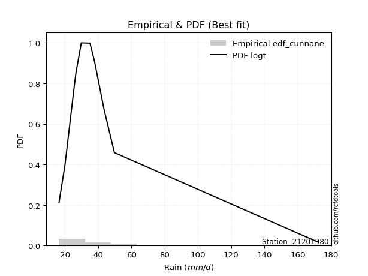</img>

</div>


### 12. EDF Adamowski (1981)

The Adamowski formula in hydrology refers to a specific plotting position formula used for estimating the non-parametric empirical distribution of hydrological events (like flood peaks) to calculate their return periods. This formula provides an alternative to traditional parametric methods (like the Gumbel or Log Pearson Type III distributions). 

<div align="center">


$P=(m-0.25)/(n+0.5)$


</div>


**12.1. Empirical values**

<div align="center">

|                | 0                  | 1                  | 2                 | 3                  | 4                  | 5                  | 6                 | 7                  | 8                 | 9                 | 10                | 11                 |
|:---------------|:-------------------|:-------------------|:------------------|:-------------------|:-------------------|:-------------------|:------------------|:-------------------|:------------------|:------------------|:------------------|:-------------------|
| date           | 2008               | 2015               | 2025              | 2016               | 2009               | 2014               | 2010              | 2012               | 2011              | 2007              | 2013              | 2024               |
| x              | 16.5               | 20.1               | 25.8              | 26.6               | 26.7               | 29.9               | 35.1              | 37.7               | 43.7              | 49.8              | 49.8              | 172.4              |
| m              | 1                  | 2                  | 3                 | 4                  | 5                  | 6                  | 7                 | 8                  | 9                 | 10                | 11                | 12                 |
| empirical_dist | edf_adamowski      | edf_adamowski      | edf_adamowski     | edf_adamowski      | edf_adamowski      | edf_adamowski      | edf_adamowski     | edf_adamowski      | edf_adamowski     | edf_adamowski     | edf_adamowski     | edf_adamowski      |
| empirical      | 0.06               | 0.14               | 0.22              | 0.3                | 0.38               | 0.46               | 0.54              | 0.62               | 0.7               | 0.78              | 0.86              | 0.94               |
| empirical_tr   | 1.0638297872340425 | 1.1627906976744187 | 1.282051282051282 | 1.4285714285714286 | 1.6129032258064517 | 1.8518518518518516 | 2.173913043478261 | 2.6315789473684212 | 3.333333333333333 | 4.545454545454546 | 7.142857142857142 | 16.666666666666654 |

</div>


**12.2. Kolmogorov-Smirnov fit test (sorted by Δ)**


<div align="center">

|                | 0                   | 1                   | 2                   | 3                   | 4                   | 5                   | 6                   | 7                   | 8                   | 9                   | 10                  | 11                  | 12                  | 13                  | 14                  | 15                  | 16                  | 17                  | 18                  | 19                  | 20                  | 21                  | 22                  | 23                  | 24                  | 25                  | 26                  | 27                  | 28                  | 29                  | 30                  | 31                  | 32                  | 33                  | 34                  | 35                  | 36                  | 37                  | 38                  | 39                  | 40                  | 41                  | 42                  | 43                  | 44                  | 45                  | 46                  | 47                  | 48                  | 49                  | 50                  | 51                  | 52                  | 53                  | 54                  | 55                  | 56                  | 57                  | 58                  | 59                  | 60                  | 61                  | 62                  | 63                  | 64                  | 65                  | 66                  | 67                  | 68                  | 69                  | 70                  | 71                  | 72                  | 73                  | 74                  | 75                  | 76                  | 77                  | 78                  | 79                  | 80                  | 81                  | 82                  | 83                  | 84                  | 85                  | 86                  | 87                  | 88                  | 89                  | 90                  | 91                  | 92                  | 93                  | 94                  | 95                  | 96                  | 97                  | 98                  | 99                  | 100                 | 101                 | 102                 | 103                 | 104                 | 105                 | 106                 | 107                 | 108                 | 109                 | 110                 | 111                 | 112                 | 113                 | 114                 | 115                 | 116                 | 117                 | 118                 | 119                 | 120                 | 121                 | 122                 | 123                 | 124                 | 125                 | 126                 | 127                 | 128                 | 129                 | 130                 | 131                 | 132                 | 133                 | 134                 | 135                 | 136                 | 137                 | 138                 | 139                 | 140                 | 141                 | 142                 | 143                 | 144                 | 145                 | 146                 | 147                 | 148                 | 149                 | 150                 | 151                 | 152                 | 153                 | 154                 | 155                 | 156                 | 157                 | 158                 | 159                 |
|:---------------|:--------------------|:--------------------|:--------------------|:--------------------|:--------------------|:--------------------|:--------------------|:--------------------|:--------------------|:--------------------|:--------------------|:--------------------|:--------------------|:--------------------|:--------------------|:--------------------|:--------------------|:--------------------|:--------------------|:--------------------|:--------------------|:--------------------|:--------------------|:--------------------|:--------------------|:--------------------|:--------------------|:--------------------|:--------------------|:--------------------|:--------------------|:--------------------|:--------------------|:--------------------|:--------------------|:--------------------|:--------------------|:--------------------|:--------------------|:--------------------|:--------------------|:--------------------|:--------------------|:--------------------|:--------------------|:--------------------|:--------------------|:--------------------|:--------------------|:--------------------|:--------------------|:--------------------|:--------------------|:--------------------|:--------------------|:--------------------|:--------------------|:--------------------|:--------------------|:--------------------|:--------------------|:--------------------|:--------------------|:--------------------|:--------------------|:--------------------|:--------------------|:--------------------|:--------------------|:--------------------|:--------------------|:--------------------|:--------------------|:--------------------|:--------------------|:--------------------|:--------------------|:--------------------|:--------------------|:--------------------|:--------------------|:--------------------|:--------------------|:--------------------|:--------------------|:--------------------|:--------------------|:--------------------|:--------------------|:--------------------|:--------------------|:--------------------|:--------------------|:--------------------|:--------------------|:--------------------|:--------------------|:--------------------|:--------------------|:--------------------|:--------------------|:--------------------|:--------------------|:--------------------|:--------------------|:--------------------|:--------------------|:--------------------|:--------------------|:--------------------|:--------------------|:--------------------|:--------------------|:--------------------|:--------------------|:--------------------|:--------------------|:--------------------|:--------------------|:--------------------|:--------------------|:--------------------|:--------------------|:--------------------|:--------------------|:--------------------|:--------------------|:--------------------|:--------------------|:--------------------|:--------------------|:--------------------|:--------------------|:--------------------|:--------------------|:--------------------|:--------------------|:--------------------|:--------------------|:--------------------|:--------------------|:--------------------|:--------------------|:--------------------|:--------------------|:--------------------|:--------------------|:--------------------|:--------------------|:--------------------|:--------------------|:--------------------|:--------------------|:--------------------|:--------------------|:--------------------|:--------------------|:--------------------|:--------------------|:--------------------|
| station        | 21201980            | 21201980            | 21201980            | 21201980            | 21201980            | 21201980            | 21201980            | 21201980            | 21201980            | 21201980            | 21201980            | 21201980            | 21201980            | 21201980            | 21201980            | 21201980            | 21201980            | 21201980            | 21201980            | 21201980            | 21201980            | 21201980            | 21201980            | 21201980            | 21201980            | 21201980            | 21201980            | 21201980            | 21201980            | 21201980            | 21201980            | 21201980            | 21201980            | 21201980            | 21201980            | 21201980            | 21201980            | 21201980            | 21201980            | 21201980            | 21201980            | 21201980            | 21201980            | 21201980            | 21201980            | 21201980            | 21201980            | 21201980            | 21201980            | 21201980            | 21201980            | 21201980            | 21201980            | 21201980            | 21201980            | 21201980            | 21201980            | 21201980            | 21201980            | 21201980            | 21201980            | 21201980            | 21201980            | 21201980            | 21201980            | 21201980            | 21201980            | 21201980            | 21201980            | 21201980            | 21201980            | 21201980            | 21201980            | 21201980            | 21201980            | 21201980            | 21201980            | 21201980            | 21201980            | 21201980            | 21201980            | 21201980            | 21201980            | 21201980            | 21201980            | 21201980            | 21201980            | 21201980            | 21201980            | 21201980            | 21201980            | 21201980            | 21201980            | 21201980            | 21201980            | 21201980            | 21201980            | 21201980            | 21201980            | 21201980            | 21201980            | 21201980            | 21201980            | 21201980            | 21201980            | 21201980            | 21201980            | 21201980            | 21201980            | 21201980            | 21201980            | 21201980            | 21201980            | 21201980            | 21201980            | 21201980            | 21201980            | 21201980            | 21201980            | 21201980            | 21201980            | 21201980            | 21201980            | 21201980            | 21201980            | 21201980            | 21201980            | 21201980            | 21201980            | 21201980            | 21201980            | 21201980            | 21201980            | 21201980            | 21201980            | 21201980            | 21201980            | 21201980            | 21201980            | 21201980            | 21201980            | 21201980            | 21201980            | 21201980            | 21201980            | 21201980            | 21201980            | 21201980            | 21201980            | 21201980            | 21201980            | 21201980            | 21201980            | 21201980            | 21201980            | 21201980            | 21201980            | 21201980            | 21201980            | 21201980            |
| empirical_dist | edf_adamowski       | edf_adamowski       | edf_adamowski       | edf_adamowski       | edf_adamowski       | edf_adamowski       | edf_adamowski       | edf_adamowski       | edf_adamowski       | edf_adamowski       | edf_adamowski       | edf_adamowski       | edf_adamowski       | edf_adamowski       | edf_adamowski       | edf_adamowski       | edf_adamowski       | edf_adamowski       | edf_adamowski       | edf_adamowski       | edf_adamowski       | edf_adamowski       | edf_adamowski       | edf_adamowski       | edf_adamowski       | edf_adamowski       | edf_adamowski       | edf_adamowski       | edf_adamowski       | edf_adamowski       | edf_adamowski       | edf_adamowski       | edf_adamowski       | edf_adamowski       | edf_adamowski       | edf_adamowski       | edf_adamowski       | edf_adamowski       | edf_adamowski       | edf_adamowski       | edf_adamowski       | edf_adamowski       | edf_adamowski       | edf_adamowski       | edf_adamowski       | edf_adamowski       | edf_adamowski       | edf_adamowski       | edf_adamowski       | edf_adamowski       | edf_adamowski       | edf_adamowski       | edf_adamowski       | edf_adamowski       | edf_adamowski       | edf_adamowski       | edf_adamowski       | edf_adamowski       | edf_adamowski       | edf_adamowski       | edf_adamowski       | edf_adamowski       | edf_adamowski       | edf_adamowski       | edf_adamowski       | edf_adamowski       | edf_adamowski       | edf_adamowski       | edf_adamowski       | edf_adamowski       | edf_adamowski       | edf_adamowski       | edf_adamowski       | edf_adamowski       | edf_adamowski       | edf_adamowski       | edf_adamowski       | edf_adamowski       | edf_adamowski       | edf_adamowski       | edf_adamowski       | edf_adamowski       | edf_adamowski       | edf_adamowski       | edf_adamowski       | edf_adamowski       | edf_adamowski       | edf_adamowski       | edf_adamowski       | edf_adamowski       | edf_adamowski       | edf_adamowski       | edf_adamowski       | edf_adamowski       | edf_adamowski       | edf_adamowski       | edf_adamowski       | edf_adamowski       | edf_adamowski       | edf_adamowski       | edf_adamowski       | edf_adamowski       | edf_adamowski       | edf_adamowski       | edf_adamowski       | edf_adamowski       | edf_adamowski       | edf_adamowski       | edf_adamowski       | edf_adamowski       | edf_adamowski       | edf_adamowski       | edf_adamowski       | edf_adamowski       | edf_adamowski       | edf_adamowski       | edf_adamowski       | edf_adamowski       | edf_adamowski       | edf_adamowski       | edf_adamowski       | edf_adamowski       | edf_adamowski       | edf_adamowski       | edf_adamowski       | edf_adamowski       | edf_adamowski       | edf_adamowski       | edf_adamowski       | edf_adamowski       | edf_adamowski       | edf_adamowski       | edf_adamowski       | edf_adamowski       | edf_adamowski       | edf_adamowski       | edf_adamowski       | edf_adamowski       | edf_adamowski       | edf_adamowski       | edf_adamowski       | edf_adamowski       | edf_adamowski       | edf_adamowski       | edf_adamowski       | edf_adamowski       | edf_adamowski       | edf_adamowski       | edf_adamowski       | edf_adamowski       | edf_adamowski       | edf_adamowski       | edf_adamowski       | edf_adamowski       | edf_adamowski       | edf_adamowski       | edf_adamowski       | edf_adamowski       | edf_adamowski       | edf_adamowski       |
| p_dist         | logburr12           | logt                | logvonmises_line    | logexponnorm        | loggenlogistic      | logmielke           | alpha               | logburr             | mielke              | burr                | logdweibull         | loggennorm          | logalpha            | nct                 | loggenextreme       | loginvweibull       | genextreme          | invweibull          | loginvgamma         | logf                | logjohnsonsu        | logjohnsonsb        | f                   | invgamma            | ncf                 | logdgamma           | loginvgauss         | loggumbel_r         | logfatiguelife      | logmoyal            | lognct              | exponweib           | logbetaprime        | logkstwobign        | loggamma            | loggamma            | logerlang           | kappa3              | johnsonsu           | betaprime           | johnsonsb           | loghypsecant        | logloglaplace       | logpearson3         | t                   | loglogistic         | invgauss            | loghalflogistic     | logrice             | lograyleigh         | truncpareto         | logmaxwell          | loghalfnorm         | lomax               | logfoldnorm         | logskewnorm         | loglaplace          | loglaplace          | genpareto           | logwald             | logkappa3           | loghalfgennorm      | fatiguelife         | logcrystalball      | lognorm             | loggompertz         | logloggamma         | gompertz            | logncf              | genlogistic         | logweibull_min      | exponnorm           | genexpon            | gamma               | loganglit           | loggenexpon         | logtruncnorm        | loggumbel_l         | wald                | cosine              | logsemicircular     | genhalflogistic     | gengamma            | logbradford         | halfgennorm         | moyal               | pearson3            | halflogistic        | burr12              | loglomax            | loggengamma         | logarcsine          | dgamma              | logtriang           | weibull_min         | gumbel_r            | halfnorm            | dweibull            | erlang              | gennorm             | logcosine           | logtruncweibull_min | rayleigh            | kstwobign           | laplace             | maxwell             | nakagami            | logtruncexpon       | foldnorm            | truncnorm           | hypsecant           | logistic            | norm                | crystalball         | anglit              | semicircular        | gausshyper          | rice                | beta                | arcsine             | loggenpareto        | logkappa4           | exponpow            | skewnorm            | powerlaw            | logwrapcauchy       | logexponpow         | gumbel_l            | truncweibull_min    | logksone            | logtukeylambda      | logargus            | loguniform          | logrdist            | bradford            | loglevy_l           | logpowerlaw         | truncexpon          | wrapcauchy          | levy_l              | loggausshyper       | logweibull_max      | logexponweib        | argus               | vonmises_line       | loggenhalflogistic  | rdist               | logbeta             | lognakagami         | tukeylambda         | ksone               | kappa4              | logtrapezoid        | uniform             | logtruncpareto      | weibull_max         | triang              | trapezoid           | logvonmises         | vonmises            |
| delta          | 0.06561210470505541 | 0.0688299887350281  | 0.07196127432556113 | 0.07605819915122047 | 0.08035616026052417 | 0.08048947184246927 | 0.08139821803786043 | 0.08164342197849792 | 0.08168140924755185 | 0.08184087846134783 | 0.08186076245915982 | 0.08379982695517446 | 0.08673087468250498 | 0.08793561761707391 | 0.08859416558487945 | 0.08859653110186297 | 0.09032590901847334 | 0.09032749161525297 | 0.0910460912877504  | 0.09105977180100996 | 0.09423177455760481 | 0.09553871135370282 | 0.09577446084653238 | 0.09577454772806501 | 0.09577462976635367 | 0.09591301811954031 | 0.09639285167069753 | 0.09650622790246643 | 0.09672256379649688 | 0.09785072223223265 | 0.10022801334032472 | 0.10128668752538408 | 0.10450978077616388 | 0.10659160013645896 | 0.10706150468050205 | 0.10706150468050205 | 0.10706240456861679 | 0.10870815591417102 | 0.11054018170887284 | 0.11109319940609763 | 0.11143700937425025 | 0.11191020184920303 | 0.11395060417095526 | 0.11420250823156844 | 0.11844779074131817 | 0.12189257463490955 | 0.1243384878562791  | 0.12458759462069355 | 0.12554157182044934 | 0.125938538821329   | 0.12833154314728934 | 0.12997750118370155 | 0.1299834000247526  | 0.1323269428679602  | 0.13414624636077135 | 0.13643558896421284 | 0.13961589873617508 | 0.13961589873617508 | 0.13988084859050728 | 0.14                | 0.14122974330622182 | 0.143273410743833   | 0.14382523064848052 | 0.14390994918449873 | 0.14391096740729659 | 0.14471531879287125 | 0.14671921683891753 | 0.14700930789859157 | 0.14918052750299282 | 0.15191927851650422 | 0.1593226717575887  | 0.16191086665604726 | 0.1663605157413376  | 0.1671288136993756  | 0.16964812331281964 | 0.16992629618563018 | 0.16996338912646866 | 0.17092884955281862 | 0.17194507025466158 | 0.17541204628546514 | 0.18066274715849617 | 0.18143727906267626 | 0.18573080410729134 | 0.19537861169037907 | 0.20265363872548306 | 0.21255239249592206 | 0.21493821341606298 | 0.2155827570781193  | 0.21932894223318053 | 0.22349995801955777 | 0.22574602045091816 | 0.22763894532775208 | 0.22859884752167783 | 0.230001644034584   | 0.23711484574758734 | 0.23730049486296767 | 0.2400638845751225  | 0.2464187679014136  | 0.2534430978894171  | 0.2538572768195916  | 0.2548093153938559  | 0.258812593720922   | 0.26738688179931536 | 0.27147647991238977 | 0.2745418624011591  | 0.2770702331719428  | 0.2778871961186622  | 0.2796935812536413  | 0.2837327739851147  | 0.2843268303057582  | 0.29420559968794235 | 0.300189352355711   | 0.30728019602948187 | 0.30728079115136486 | 0.3147567335107667  | 0.3178433806265365  | 0.3193650277173079  | 0.32119159003247    | 0.32997600793431137 | 0.33012504844530277 | 0.3414253055480361  | 0.34262762329569696 | 0.35147532719263763 | 0.35473934053524303 | 0.3583381896091109  | 0.3697658778059577  | 0.3714660969668242  | 0.3740216093611852  | 0.37929058096583335 | 0.3843536980080243  | 0.3889036652710095  | 0.38915694266561385 | 0.3892244376096291  | 0.40071942199006416 | 0.4033056607223932  | 0.4216407975784687  | 0.448738310421389   | 0.4518105732179601  | 0.45624781997848973 | 0.4676031033835542  | 0.4892214438699515  | 0.5211844658304863  | 0.5250565202608525  | 0.5294196145214743  | 0.5330009653543986  | 0.5507989149875488  | 0.5548117847709266  | 0.5741652195455537  | 0.575651537493826   | 0.5843096396084868  | 0.5986679495403036  | 0.6142761178392436  | 0.6337605954013583  | 0.6464015394483643  | 0.7512661121341907  | 0.7591622676561978  | 0.7786523987999977  | 0.7917055594025307  | 1.0775243914010477  | 27.000099367094826  |
| deltao         | 0.36218414519599995 | 0.36218414519599995 | 0.36218414519599995 | 0.36218414519599995 | 0.36218414519599995 | 0.36218414519599995 | 0.36218414519599995 | 0.36218414519599995 | 0.36218414519599995 | 0.36218414519599995 | 0.36218414519599995 | 0.36218414519599995 | 0.36218414519599995 | 0.36218414519599995 | 0.36218414519599995 | 0.36218414519599995 | 0.36218414519599995 | 0.36218414519599995 | 0.36218414519599995 | 0.36218414519599995 | 0.36218414519599995 | 0.36218414519599995 | 0.36218414519599995 | 0.36218414519599995 | 0.36218414519599995 | 0.36218414519599995 | 0.36218414519599995 | 0.36218414519599995 | 0.36218414519599995 | 0.36218414519599995 | 0.36218414519599995 | 0.36218414519599995 | 0.36218414519599995 | 0.36218414519599995 | 0.36218414519599995 | 0.36218414519599995 | 0.36218414519599995 | 0.36218414519599995 | 0.36218414519599995 | 0.36218414519599995 | 0.36218414519599995 | 0.36218414519599995 | 0.36218414519599995 | 0.36218414519599995 | 0.36218414519599995 | 0.36218414519599995 | 0.36218414519599995 | 0.36218414519599995 | 0.36218414519599995 | 0.36218414519599995 | 0.36218414519599995 | 0.36218414519599995 | 0.36218414519599995 | 0.36218414519599995 | 0.36218414519599995 | 0.36218414519599995 | 0.36218414519599995 | 0.36218414519599995 | 0.36218414519599995 | 0.36218414519599995 | 0.36218414519599995 | 0.36218414519599995 | 0.36218414519599995 | 0.36218414519599995 | 0.36218414519599995 | 0.36218414519599995 | 0.36218414519599995 | 0.36218414519599995 | 0.36218414519599995 | 0.36218414519599995 | 0.36218414519599995 | 0.36218414519599995 | 0.36218414519599995 | 0.36218414519599995 | 0.36218414519599995 | 0.36218414519599995 | 0.36218414519599995 | 0.36218414519599995 | 0.36218414519599995 | 0.36218414519599995 | 0.36218414519599995 | 0.36218414519599995 | 0.36218414519599995 | 0.36218414519599995 | 0.36218414519599995 | 0.36218414519599995 | 0.36218414519599995 | 0.36218414519599995 | 0.36218414519599995 | 0.36218414519599995 | 0.36218414519599995 | 0.36218414519599995 | 0.36218414519599995 | 0.36218414519599995 | 0.36218414519599995 | 0.36218414519599995 | 0.36218414519599995 | 0.36218414519599995 | 0.36218414519599995 | 0.36218414519599995 | 0.36218414519599995 | 0.36218414519599995 | 0.36218414519599995 | 0.36218414519599995 | 0.36218414519599995 | 0.36218414519599995 | 0.36218414519599995 | 0.36218414519599995 | 0.36218414519599995 | 0.36218414519599995 | 0.36218414519599995 | 0.36218414519599995 | 0.36218414519599995 | 0.36218414519599995 | 0.36218414519599995 | 0.36218414519599995 | 0.36218414519599995 | 0.36218414519599995 | 0.36218414519599995 | 0.36218414519599995 | 0.36218414519599995 | 0.36218414519599995 | 0.36218414519599995 | 0.36218414519599995 | 0.36218414519599995 | 0.36218414519599995 | 0.36218414519599995 | 0.36218414519599995 | 0.36218414519599995 | 0.36218414519599995 | 0.36218414519599995 | 0.36218414519599995 | 0.36218414519599995 | 0.36218414519599995 | 0.36218414519599995 | 0.36218414519599995 | 0.36218414519599995 | 0.36218414519599995 | 0.36218414519599995 | 0.36218414519599995 | 0.36218414519599995 | 0.36218414519599995 | 0.36218414519599995 | 0.36218414519599995 | 0.36218414519599995 | 0.36218414519599995 | 0.36218414519599995 | 0.36218414519599995 | 0.36218414519599995 | 0.36218414519599995 | 0.36218414519599995 | 0.36218414519599995 | 0.36218414519599995 | 0.36218414519599995 | 0.36218414519599995 | 0.36218414519599995 | 0.36218414519599995 | 0.36218414519599995 | 0.36218414519599995 | 0.36218414519599995 |
| eval           | Δo > Δ              | Δo > Δ              | Δo > Δ              | Δo > Δ              | Δo > Δ              | Δo > Δ              | Δo > Δ              | Δo > Δ              | Δo > Δ              | Δo > Δ              | Δo > Δ              | Δo > Δ              | Δo > Δ              | Δo > Δ              | Δo > Δ              | Δo > Δ              | Δo > Δ              | Δo > Δ              | Δo > Δ              | Δo > Δ              | Δo > Δ              | Δo > Δ              | Δo > Δ              | Δo > Δ              | Δo > Δ              | Δo > Δ              | Δo > Δ              | Δo > Δ              | Δo > Δ              | Δo > Δ              | Δo > Δ              | Δo > Δ              | Δo > Δ              | Δo > Δ              | Δo > Δ              | Δo > Δ              | Δo > Δ              | Δo > Δ              | Δo > Δ              | Δo > Δ              | Δo > Δ              | Δo > Δ              | Δo > Δ              | Δo > Δ              | Δo > Δ              | Δo > Δ              | Δo > Δ              | Δo > Δ              | Δo > Δ              | Δo > Δ              | Δo > Δ              | Δo > Δ              | Δo > Δ              | Δo > Δ              | Δo > Δ              | Δo > Δ              | Δo > Δ              | Δo > Δ              | Δo > Δ              | Δo > Δ              | Δo > Δ              | Δo > Δ              | Δo > Δ              | Δo > Δ              | Δo > Δ              | Δo > Δ              | Δo > Δ              | Δo > Δ              | Δo > Δ              | Δo > Δ              | Δo > Δ              | Δo > Δ              | Δo > Δ              | Δo > Δ              | Δo > Δ              | Δo > Δ              | Δo > Δ              | Δo > Δ              | Δo > Δ              | Δo > Δ              | Δo > Δ              | Δo > Δ              | Δo > Δ              | Δo > Δ              | Δo > Δ              | Δo > Δ              | Δo > Δ              | Δo > Δ              | Δo > Δ              | Δo > Δ              | Δo > Δ              | Δo > Δ              | Δo > Δ              | Δo > Δ              | Δo > Δ              | Δo > Δ              | Δo > Δ              | Δo > Δ              | Δo > Δ              | Δo > Δ              | Δo > Δ              | Δo > Δ              | Δo > Δ              | Δo > Δ              | Δo > Δ              | Δo > Δ              | Δo > Δ              | Δo > Δ              | Δo > Δ              | Δo > Δ              | Δo > Δ              | Δo > Δ              | Δo > Δ              | Δo > Δ              | Δo > Δ              | Δo > Δ              | Δo > Δ              | Δo > Δ              | Δo > Δ              | Δo > Δ              | Δo > Δ              | Δo > Δ              | Δo > Δ              | Δo > Δ              | Δo > Δ              | Δo <= Δ             | Δo <= Δ             | Δo <= Δ             | Δo <= Δ             | Δo <= Δ             | Δo <= Δ             | Δo <= Δ             | Δo <= Δ             | Δo <= Δ             | Δo <= Δ             | Δo <= Δ             | Δo <= Δ             | Δo <= Δ             | Δo <= Δ             | Δo <= Δ             | Δo <= Δ             | Δo <= Δ             | Δo <= Δ             | Δo <= Δ             | Δo <= Δ             | Δo <= Δ             | Δo <= Δ             | Δo <= Δ             | Δo <= Δ             | Δo <= Δ             | Δo <= Δ             | Δo <= Δ             | Δo <= Δ             | Δo <= Δ             | Δo <= Δ             | Δo <= Δ             | Δo <= Δ             | Δo <= Δ             | Δo <= Δ             | Δo <= Δ             |
| fit            | 1                   | 1                   | 1                   | 1                   | 1                   | 1                   | 1                   | 1                   | 1                   | 1                   | 1                   | 1                   | 1                   | 1                   | 1                   | 1                   | 1                   | 1                   | 1                   | 1                   | 1                   | 1                   | 1                   | 1                   | 1                   | 1                   | 1                   | 1                   | 1                   | 1                   | 1                   | 1                   | 1                   | 1                   | 1                   | 1                   | 1                   | 1                   | 1                   | 1                   | 1                   | 1                   | 1                   | 1                   | 1                   | 1                   | 1                   | 1                   | 1                   | 1                   | 1                   | 1                   | 1                   | 1                   | 1                   | 1                   | 1                   | 1                   | 1                   | 1                   | 1                   | 1                   | 1                   | 1                   | 1                   | 1                   | 1                   | 1                   | 1                   | 1                   | 1                   | 1                   | 1                   | 1                   | 1                   | 1                   | 1                   | 1                   | 1                   | 1                   | 1                   | 1                   | 1                   | 1                   | 1                   | 1                   | 1                   | 1                   | 1                   | 1                   | 1                   | 1                   | 1                   | 1                   | 1                   | 1                   | 1                   | 1                   | 1                   | 1                   | 1                   | 1                   | 1                   | 1                   | 1                   | 1                   | 1                   | 1                   | 1                   | 1                   | 1                   | 1                   | 1                   | 1                   | 1                   | 1                   | 1                   | 1                   | 1                   | 1                   | 1                   | 1                   | 1                   | 1                   | 1                   | 0                   | 0                   | 0                   | 0                   | 0                   | 0                   | 0                   | 0                   | 0                   | 0                   | 0                   | 0                   | 0                   | 0                   | 0                   | 0                   | 0                   | 0                   | 0                   | 0                   | 0                   | 0                   | 0                   | 0                   | 0                   | 0                   | 0                   | 0                   | 0                   | 0                   | 0                   | 0                   | 0                   | 0                   | 0                   |
| n              | 12                  | 12                  | 12                  | 12                  | 12                  | 12                  | 12                  | 12                  | 12                  | 12                  | 12                  | 12                  | 12                  | 12                  | 12                  | 12                  | 12                  | 12                  | 12                  | 12                  | 12                  | 12                  | 12                  | 12                  | 12                  | 12                  | 12                  | 12                  | 12                  | 12                  | 12                  | 12                  | 12                  | 12                  | 12                  | 12                  | 12                  | 12                  | 12                  | 12                  | 12                  | 12                  | 12                  | 12                  | 12                  | 12                  | 12                  | 12                  | 12                  | 12                  | 12                  | 12                  | 12                  | 12                  | 12                  | 12                  | 12                  | 12                  | 12                  | 12                  | 12                  | 12                  | 12                  | 12                  | 12                  | 12                  | 12                  | 12                  | 12                  | 12                  | 12                  | 12                  | 12                  | 12                  | 12                  | 12                  | 12                  | 12                  | 12                  | 12                  | 12                  | 12                  | 12                  | 12                  | 12                  | 12                  | 12                  | 12                  | 12                  | 12                  | 12                  | 12                  | 12                  | 12                  | 12                  | 12                  | 12                  | 12                  | 12                  | 12                  | 12                  | 12                  | 12                  | 12                  | 12                  | 12                  | 12                  | 12                  | 12                  | 12                  | 12                  | 12                  | 12                  | 12                  | 12                  | 12                  | 12                  | 12                  | 12                  | 12                  | 12                  | 12                  | 12                  | 12                  | 12                  | 12                  | 12                  | 12                  | 12                  | 12                  | 12                  | 12                  | 12                  | 12                  | 12                  | 12                  | 12                  | 12                  | 12                  | 12                  | 12                  | 12                  | 12                  | 12                  | 12                  | 12                  | 12                  | 12                  | 12                  | 12                  | 12                  | 12                  | 12                  | 12                  | 12                  | 12                  | 12                  | 12                  | 12                  | 12                  |
| best_fit       | 1                   | 0                   | 0                   | 0                   | 0                   | 0                   | 0                   | 0                   | 0                   | 0                   | 0                   | 0                   | 0                   | 0                   | 0                   | 0                   | 0                   | 0                   | 0                   | 0                   | 0                   | 0                   | 0                   | 0                   | 0                   | 0                   | 0                   | 0                   | 0                   | 0                   | 0                   | 0                   | 0                   | 0                   | 0                   | 0                   | 0                   | 0                   | 0                   | 0                   | 0                   | 0                   | 0                   | 0                   | 0                   | 0                   | 0                   | 0                   | 0                   | 0                   | 0                   | 0                   | 0                   | 0                   | 0                   | 0                   | 0                   | 0                   | 0                   | 0                   | 0                   | 0                   | 0                   | 0                   | 0                   | 0                   | 0                   | 0                   | 0                   | 0                   | 0                   | 0                   | 0                   | 0                   | 0                   | 0                   | 0                   | 0                   | 0                   | 0                   | 0                   | 0                   | 0                   | 0                   | 0                   | 0                   | 0                   | 0                   | 0                   | 0                   | 0                   | 0                   | 0                   | 0                   | 0                   | 0                   | 0                   | 0                   | 0                   | 0                   | 0                   | 0                   | 0                   | 0                   | 0                   | 0                   | 0                   | 0                   | 0                   | 0                   | 0                   | 0                   | 0                   | 0                   | 0                   | 0                   | 0                   | 0                   | 0                   | 0                   | 0                   | 0                   | 0                   | 0                   | 0                   | 0                   | 0                   | 0                   | 0                   | 0                   | 0                   | 0                   | 0                   | 0                   | 0                   | 0                   | 0                   | 0                   | 0                   | 0                   | 0                   | 0                   | 0                   | 0                   | 0                   | 0                   | 0                   | 0                   | 0                   | 0                   | 0                   | 0                   | 0                   | 0                   | 0                   | 0                   | 0                   | 0                   | 0                   | 0                   |
| best_fit_sort  | 1                   | 2                   | 3                   | 4                   | 5                   | 6                   | 7                   | 8                   | 9                   | 10                  | 11                  | 12                  | 13                  | 14                  | 15                  | 16                  | 17                  | 18                  | 19                  | 20                  | 21                  | 22                  | 23                  | 24                  | 25                  | 26                  | 27                  | 28                  | 29                  | 30                  | 31                  | 32                  | 33                  | 34                  | 35                  | 36                  | 37                  | 38                  | 39                  | 40                  | 41                  | 42                  | 43                  | 44                  | 45                  | 46                  | 47                  | 48                  | 49                  | 50                  | 51                  | 52                  | 53                  | 54                  | 55                  | 56                  | 57                  | 58                  | 59                  | 60                  | 61                  | 62                  | 63                  | 64                  | 65                  | 66                  | 67                  | 68                  | 69                  | 70                  | 71                  | 72                  | 73                  | 74                  | 75                  | 76                  | 77                  | 78                  | 79                  | 80                  | 81                  | 82                  | 83                  | 84                  | 85                  | 86                  | 87                  | 88                  | 89                  | 90                  | 91                  | 92                  | 93                  | 94                  | 95                  | 96                  | 97                  | 98                  | 99                  | 100                 | 101                 | 102                 | 103                 | 104                 | 105                 | 106                 | 107                 | 108                 | 109                 | 110                 | 111                 | 112                 | 113                 | 114                 | 115                 | 116                 | 117                 | 118                 | 119                 | 120                 | 121                 | 122                 | 123                 | 124                 | 125                 | 126                 | 127                 | 128                 | 129                 | 130                 | 131                 | 132                 | 133                 | 134                 | 135                 | 136                 | 137                 | 138                 | 139                 | 140                 | 141                 | 142                 | 143                 | 144                 | 145                 | 146                 | 147                 | 148                 | 149                 | 150                 | 151                 | 152                 | 153                 | 154                 | 155                 | 156                 | 157                 | 158                 | 159                 | 160                 |

</div>


**12.3. Best fit**

<div align="center">

|   id |   station | empirical_dist   | p_dist    |     delta |   deltao | eval   |   fit |   n |   best_fit |   best_fit_sort |
|-----:|----------:|:-----------------|:----------|----------:|---------:|:-------|------:|----:|-----------:|----------------:|
|    0 |  21201980 | edf_adamowski    | logburr12 | 0.0656121 | 0.362184 | Δo > Δ |     1 |  12 |          1 |               1 |

</div>


<div align="center">

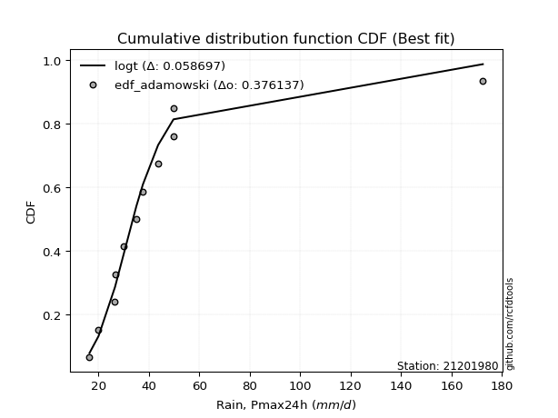</img>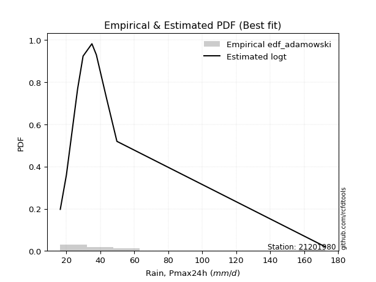</img>

</div>


## C. Best fit & Estimate extreme values for specific return periods - Tr

Best fit in probability distribution analysis means finding the theoretical distribution (like Normal, Poisson, Exponential, etc.) that most accurately mirrors your real-world data´s patterns (shape, center, spread) for better predictions, using methods like visual checks (Q-Q plots), goodness-of-fit tests (Kolmogorov-Smirnov, Chi-Squared), and information criteria (AIC) to score and select the simplest, most representative model.


### 1. Best fit (ordered by delta Δ)

:file_folder:Table: [bestfit_21201980.csv](table/bestfit_21201980.csv)

<div align="center">

|   id |   station | empirical_dist   | p_dist       |     delta |   deltao | eval   |   fit |   n |   best_fit |   best_fit_sort |
|-----:|----------:|:-----------------|:-------------|----------:|---------:|:-------|------:|----:|-----------:|----------------:|
|    0 |  21201980 | edf_weibull      | logexponnorm | 0.0631649 | 0.362184 | Δo > Δ |     1 |  12 |          1 |               1 |
|    1 |  21201980 | edf_adamowski    | logburr12    | 0.0656121 | 0.362184 | Δo > Δ |     1 |  12 |          1 |               2 |
|    2 |  21201980 | edf_chegodayev   | logt         | 0.0672913 | 0.362184 | Δo > Δ |     1 |  12 |          1 |               3 |
|    3 |  21201980 | edf_jenkinson    | logt         | 0.0677473 | 0.362184 | Δo > Δ |     1 |  12 |          1 |               4 |
|    4 |  21201980 | edf_beard        | logt         | 0.0677473 | 0.362184 | Δo > Δ |     1 |  12 |          1 |               5 |
|    5 |  21201980 | edf_filliben     | logt         | 0.0680903 | 0.362184 | Δo > Δ |     1 |  12 |          1 |               6 |
|    6 |  21201980 | edf_tukey        | logt         | 0.0688171 | 0.362184 | Δo > Δ |     1 |  12 |          1 |               7 |
|    7 |  21201980 | edf_blom         | logt         | 0.0707476 | 0.362184 | Δo > Δ |     1 |  12 |          1 |               8 |
|    8 |  21201980 | edf_california   | t            | 0.071201  | 0.362184 | Δo > Δ |     1 |  12 |          1 |               9 |
|    9 |  21201980 | edf_cunnane      | logt         | 0.0719185 | 0.362184 | Δo > Δ |     1 |  12 |          1 |              10 |
|   10 |  21201980 | edf_gringorten   | logt         | 0.0738122 | 0.362184 | Δo > Δ |     1 |  12 |          1 |              11 |
|   11 |  21201980 | edf_hazen        | logt         | 0.0766999 | 0.362184 | Δo > Δ |     1 |  12 |          1 |              12 |

</div>


### 2. Extreme values and % difference analysis

In hydrology, a return period (or recurrence interval $Tr$) is the statistical average time between extreme events like floods or droughts of a specific magnitude, indicating how rare an event is, with a 100-year flood, for example, having a 1% chance of occurring in any given year, not that it happens exactly every century. It is a key tool for infrastructure design (like bridges or dams) and risk assessment, calculated from historical data to determine the probability of future events, although it is important to remember it is statistical average, and events can cluster or be missed.

The extreme value porcentage difference is evaluated as $pdiff = 1 - (ETrBf / ETr) * 100$, where _ETrBf_ correspond to the bestfit extreme value for a specific recurrence interval and _ETr_ correspond to the extreme value for one of the most used PDFsused in hydrology.

> risk_rate: assuming the return period as the project useful life.

:file_folder:Table: [extreme_21201980.csv](table/extreme_21201980.csv), all PDFs.  
:file_folder:Table: [extremepdiff_21201980.csv](table/extremepdiff_21201980.csv), % difference between bestfit and most used PDFs in Hydrology.

<div align="center">

Extreme values table for only best fit PDFs
|   id |      tr |   prob_l |     prob_g |     alpha |   anglit |   arcsine |    argus |     beta |   betaprime |   bradford |     burr |   burr12 |   cosine |   crystalball |   dgamma |   dweibull |   erlang |   exponnorm |   exponpow |   exponweib |        f |   fatiguelife |   foldnorm |    gamma |   gausshyper |   genexpon |   genextreme |   gengamma |   genhalflogistic |   genlogistic |   gennorm |   genpareto |   gompertz |   gumbel_l |   gumbel_r |   halfgennorm |   halflogistic |   halfnorm |   hypsecant |   invgamma |   invgauss |   invweibull |   johnsonsb |   johnsonsu |   kappa3 |   kappa4 |   ksone |   kstwobign |   laplace |   levy_l |   loggamma |   logistic |   loglaplace |    lomax |   maxwell |   mielke |    moyal |   nakagami |      ncf |      nct |     norm |   pearson3 |   powerlaw |   rayleigh |    rdist |     rice |   semicircular |   skewnorm |        t |   trapezoid |   triang |   truncexpon |   truncnorm |   truncpareto |   truncweibull_min |   tukeylambda |   uniform |   vonmises |   vonmises_line |     wald |   weibull_max |   weibull_min |   wrapcauchy |   logalpha |   loganglit |   logarcsine |   logargus |   logbeta |   logbetaprime |   logbradford |   logburr |   logburr12 |   logcosine |   logcrystalball |   logdgamma |   logdweibull |   logerlang |   logexponnorm |      logexponpow |   logexponweib |     logf |   logfatiguelife |   logfoldnorm |   loggausshyper |   loggenexpon |   loggenextreme |   loggengamma |   loggenhalflogistic |   loggenlogistic |   loggennorm |   loggenpareto |   loggompertz |   loggumbel_l |   loggumbel_r |   loghalfgennorm |   loghalflogistic |   loghalfnorm |   loghypsecant |   loginvgamma |   loginvgauss |   loginvweibull |   logjohnsonsb |   logjohnsonsu |   logkappa3 |   logkappa4 |   logksone |   logkstwobign |   loglevy_l |   logloggamma |   loglogistic |    logloglaplace |   loglomax |   logmaxwell |   logmielke |   logmoyal |   lognakagami |   logncf |   lognct |   lognorm |   logpearson3 |   logpowerlaw |   lograyleigh |   logrdist |   logrice |   logsemicircular |   logskewnorm |      logt |   logtrapezoid |   logtriang |   logtruncexpon |   logtruncnorm |   logtruncpareto |   logtruncweibull_min |   logtukeylambda |   loguniform |   logvonmises |   logvonmises_line |   logwald |   logweibull_max |   logweibull_min |   logwrapcauchy |   station |   n |   risk_rate |
|-----:|--------:|---------:|-----------:|----------:|---------:|----------:|---------:|---------:|------------:|-----------:|---------:|---------:|---------:|--------------:|---------:|-----------:|---------:|------------:|-----------:|------------:|---------:|--------------:|-----------:|---------:|-------------:|-----------:|-------------:|-----------:|------------------:|--------------:|----------:|------------:|-----------:|-----------:|-----------:|--------------:|---------------:|-----------:|------------:|-----------:|-----------:|-------------:|------------:|------------:|---------:|---------:|--------:|------------:|----------:|---------:|-----------:|-----------:|-------------:|---------:|----------:|---------:|---------:|-----------:|---------:|---------:|---------:|-----------:|-----------:|-----------:|---------:|---------:|---------------:|-----------:|---------:|------------:|---------:|-------------:|------------:|--------------:|-------------------:|--------------:|----------:|-----------:|----------------:|---------:|--------------:|--------------:|-------------:|-----------:|------------:|-------------:|-----------:|----------:|---------------:|--------------:|----------:|------------:|------------:|-----------------:|------------:|--------------:|------------:|---------------:|-----------------:|---------------:|---------:|-----------------:|--------------:|----------------:|--------------:|----------------:|--------------:|---------------------:|-----------------:|-------------:|---------------:|--------------:|--------------:|--------------:|-----------------:|------------------:|--------------:|---------------:|--------------:|--------------:|----------------:|---------------:|---------------:|------------:|------------:|-----------:|---------------:|------------:|--------------:|--------------:|-----------------:|-----------:|-------------:|------------:|-----------:|--------------:|---------:|---------:|----------:|--------------:|--------------:|--------------:|-----------:|----------:|------------------:|--------------:|----------:|---------------:|------------:|----------------:|---------------:|-----------------:|----------------------:|-----------------:|-------------:|--------------:|-------------------:|----------:|-----------------:|-----------------:|----------------:|----------:|----:|------------:|
|    0 |    2    | 0.5      | 0.5        |   32.0045 |  44.5083 |   44.5083 |  80.5756 |  23.925  |     34.4038 |    56.5946 |  32.4149 |  28.2286 |  33.2871 |       44.5084 |  26.6    |    26.6    |  26.6439 |     35.756  |    48.5131 |     32.1175 |  32.0756 |       33.3487 |    33.7898 |  32.3921 |      43.6363 |    36.23   |      32.0809 |    30.2649 |           33.9563 |       37.6622 |   26.6    |     31.53   |    34.9915 |    51.0676 |    37.9491 |       29.2828 |        34.6881 |    36.3355 |     44.5083 |    32.0756 |    32.5281 |      32.0809 |     32.1301 |     32.1588 |  31.8997 |  89.8859 |  94.45  |     43.3777 |   44.5083 |  -6.6518 |    31.9331 |    44.5083 |      35.8405 |  34.0599 |   41.0936 |  32.7035 |  35.8315 |    39.3493 |  32.0756 |  33.1228 |  44.5083 |    29.5952 |    20.8959 |    39.8825 |  2.20886 |  46.6583 |        44.5083 |    49.3952 |  31.2623 |     133.196 |  122.163 |      63.3813 |     43.5059 |       32.5644 |            52.5756 |        2.1131 |    94.45  |   0.21016  |         8.89075 |  31.5659 |       172.166 |       39.1811 |       94.45  |    32.0223 |     35.8405 |      35.8404 |    53.1307 |   18.0117 |        31.995  |       33.4926 |   32.0845 |     32.1917 |     41.2435 |          35.8404 |     32.6109 |       32.8103 |     31.933  |        32.3597 |     20.8801      |        18.163  |  32.0137 |          32.0853 |       31.7984 |         18.3153 |       30.0372 |         32.024  |       27.7674 |              80.3225 |          32.5441 |      33.4396 |        29.4702 |       33.6271 |       39.3964 |       32.6056 |          31.3175 |           31.1078 |       31.8559 |        35.8405 |       32.0138 |       32.0652 |         32.0242 |        31.9823 |        32.01   |     30.8605 |     47.6725 |    53.3348 |        33.2896 |     20.362  |       35.6847 |       35.8405 |     30.2574      |    28.0253 |      34.1182 |     31.9937 |    31.6249 |       17.6749 |  34.9625 |  33.7047 |   35.8405 |       31.4868 |       18.8824 |       33.5275 |    58.6828 |   34.7452 |           35.8405 |       31.6569 |   32.3635 |        95.5595 |     39.064  |         41.4635 |        30.4183 |          16.508  |               39.3274 |          53.3445 |      53.3348 |     0.0639921 |            32.9904 |   29.7382 |          79.0309 |          29.9549 |         53.3348 |  21201980 |  12 |    0.75     |
|    1 |    2.33 | 0.570815 | 0.429185   |   34.8178 |  52.8075 |   56.9668 |  92.5619 |  26.6817 |     37.8151 |    68.607  |  35.4116 |  31.8204 |  35.2057 |       51.6333 |  27.9528 |    27.2355 |  29.1649 |     40.0076 |    60.3609 |     35.3949 |  35.2199 |       37.5285 |    42.5394 |  37.5567 |      54.7158 |    40.4739 |      35.1248 |    34.6753 |           39.6403 |       41.3548 |   27.3075 |     35.2936 |    39.0657 |    57.2663 |    44.5511 |       33.3911 |        41.476  |    44.025  |     50.2104 |    35.2198 |    36.3173 |      35.1248 |     35.6288 |     35.6543 |  35.0264 | 101.644  | 107.698 |     48.4598 |   48.82   |  46.3101 |    35.2145 |    50.7858 |      38.1399 |  37.9854 |   48.4958 |  35.7105 |  42.0811 |    48.2058 |  35.2198 |  36.2116 |  51.6332 |    34.6901 |    25.1938 |    47.3942 | 11.0842  |  52.4614 |        53.4093 |    55.0573 |  33.2724 |     142.253 |  130.467 |      74.7694 |     49.365  |       36.5458 |            63.4815 |        9.1863 |   105.49  |   0.512609 |        14.6848  |  36.2377 |       172.323 |       44.8751 |      131.181 |    34.9498 |     40.3974 |      42.8948 |    61.9726 |   18.881  |        35.258  |       39.1987 |   34.9645 |     34.8457 |     46.7943 |          39.719  |     36.1561 |       35.739  |     35.2144 |        35.1826 |     24.3441      |        19.3353 |  35.0258 |          35.2515 |       35.596  |         19.739  |       33.5482 |         35.0024 |       30.8508 |              92.8505 |          35.542  |      35.7776 |        43.0198 |       37.8326 |       43.0805 |       35.8626 |          35.0281 |           34.307  |       35.5918 |        38.9124 |       35.0256 |       35.2146 |         35.0027 |        35.0632 |        35.0811 |     34.0127 |     57.0393 |    65.1041 |        36.6623 |     38.3065 |       39.6673 |       39.2366 |     32.0866      |    31.5542 |      37.962  |     34.7987 |    34.6076 |       18.5285 |  39.0856 |  36.9845 |   39.7191 |       34.6945 |       20.825  |       37.3636 |    77.9398 |   38.3366 |           40.7495 |       35.4142 |   34.6768 |       109.517  |     44.386  |         48.7006 |        34.3248 |          16.5192 |               46.2747 |          63.1305 |      62.976  |     0.0703664 |            35.7114 |   31.8109 |          92.2687 |          33.544  |         83.257  |  21201980 |  12 |    0.729209 |
|    2 |    5    | 0.8      | 0.2        |   50.977  |  82.0889 |   90.1889 | 131.01   |  43.0919 |     55.0711 |   116.48   |  51.9865 |  57.7677 |  42.1197 |       78.1112 |  44.592  |    36.1108 |  42.2036 |     61.2644 |   127.485  |     54.2888 |  53.4269 |       61.0847 |    79.5403 |  66.7695 |     104.194  |    61.5774 |      52.7665 |    62.6351 |           65.3594 |       57.3961 |   35.5606 |     56.9698 |    59.4359 |    77.2918 |    73.2331 |       59.9214 |        72.1899 |    76.5433 |     73.0825 |    53.4268 |    58.583  |      52.7664 |     55.7536 |     55.7392 |  51.8808 | 141.427  | 150.574 |     70.0477 |   70.3772 | 134.056  |    54.2665 |    75.0242 |      52.0473 |  57.9231 |   77.6305 |  52.2391 |  71.03   |    94.6994 |  53.4268 |  52.8713 |  78.1111 |    63.9386 |    65.9223 |    77.4671 | 37.0458  |  75.6939 |        83.7847 |    79.0019 |  42.4321 |     168.239 |  154.292 |     119.002  |     77.873  |       58.8344 |           109.136  |       31.7502 |   141.22  |   1.66338  |        33.4365  |  62.3908 |       172.399 |       75.0038 |      163.565 |    51.789  |     61.6239 |      69.2603 |   101.542  |   26.1658 |        54.1483 |       75.7313 |   51.6034 |     50.4705 |     73.758  |          58.1885 |     48.7306 |       49.0761 |     54.266  |        51.7396 |     91.0873      |        30.0942 |  52.4463 |          53.5636 |       57.3063 |         35.3873 |       55.4345 |         52.2976 |       49.5249 |             135.777  |          52.1127 |      49.1828 |       113.721  |       60.812  |       57.505  |       54.2357 |          56.5447 |           53.4254 |       56.8865 |        54.1181 |       52.4448 |       53.4537 |         52.2983 |        52.8992 |        52.844  |     50.8042 |    103.927  |   124.128  |        55.2391 |    109.138  |       58.6982 |       55.6549 |     46.0265      |    57.6898 |      57.7867 |     51.0379 |    52.5396 |       26.0784 |  60.1979 |  54.1057 |   58.1886 |       53.8031 |       42.0517 |       57.6506 |   165.026  |   56.8376 |           63.1495 |       56.9066 |   45.9385 |       161.935  |     73.9754 |         88.7275 |        58.4905 |          17.0941 |               85.8685 |         108.661  |     107.827  |     0.100569  |            48.4497 |   46.3849 |         135.754  |          63.3171 |        144.366  |  21201980 |  12 |    0.67232  |
|    3 |   10    | 0.9      | 0.1        |   71.8648 |  98.6625 |   98.2091 | 149.551  |  60.1409 |     72.3797 |   142.537  |  71.0655 |  99.0219 |  46.2969 |       95.676  |  64.2196 |    48.8668 |  54.3818 |     80.5608 |   191.498  |     76.3498 |  75.4131 |       85.1815 |   106.92   |  96.0575 |     135.045  |    80.7155 |      74.4217 |    95.8585 |           86.7181 |       70.4609 |   49.1369 |     81.5148 |    77.9273 |    88.441  |    96.5942 |       92.2956 |        97.6964 |   100.606  |     91.3466 |    75.4131 |    83.4814 |      74.4216 |     78.6527 |     78.5816 |  71.0915 | 159.816  | 169.282 |     86.4841 |   89.9462 | 155.239  |    77.0281 |    92.8748 |      69.0183 |  76.4799 |   98.134  |  71.1111 |  96.2344 |   133.809  |  75.4131 |  71.3475 |  95.6759 |    93.5921 |   107.13   |    98.9096 | 45.3579  |  92.2591 |        99.3709 |    96.7203 |  52.9795 |     178.39  |  163.598 |     143.332  |    101.989  |       81.9201 |           136.688  |       41.1817 |   156.81  |   2.39302  |        41.6184  |  90.1454 |       172.4   |      104.027  |      168.415 |    72.8624 |     78.2623 |      77.753  |   128.841  |   37.4075 |        76.6971 |      110.396  |   72.6047 |     71.2187 |     97.096  |          74.9636 |     61.4794 |       63.1868 |     77.027  |        72.8528 |    563.48        |        46.9679 |  74.0066 |          75.584  |       81.418  |         62.6628 |       83.7845 |         73.9217 |       71.9878 |             154.705  |          71.1664 |      64.6893 |       149.972  |       84.1339 |       67.5362 |       75.9631 |          80.9995 |           77.179  |       80.4845 |        70.4263 |       74.0037 |       75.4903 |         73.9223 |        74.6901 |        74.5683 |     70.2212 |    135.599  |   164.496  |        75.4731 |    140.525  |       76.0378 |       71.9957 |     72.2634      |   101.304  |      77.6688 |     71.9289 |    75.5699 |       36.8188 |  81.4661 |  72.1249 |   74.9637 |       77.3839 |       75.4443 |       78.5425 |   196.847  |   75.2624 |           79.0659 |       80.8326 |   58.5417 |       188.664  |    102.059  |        121.138  |        85.5603 |          20.8954 |              118.977  |         137.335  |     136.343  |     0.128606  |            60.7816 |   69.2162 |         154.566  |         121.351  |        159.053  |  21201980 |  12 |    0.651322 |
|    4 |   15    | 0.933333 | 0.0666667  |   89.0148 | 105.74   |   99.7387 | 156.599  |  70.6452 |     83.6213 |   152.043  |  84.7726 | 135.631  |  48.1997 |      104.441  |  76.5354 |    57.8621 |  61.5908 |     91.8484 |   228.502  |     91.9423 |  91.6225 |      100.065  |   121.169  | 113.892  |     146.956  |    91.9104 |      90.6869 |   118.549  |           98.8052 |       77.8319 |   59.8383 |     98.4618 |    88.7441 |    93.4903 |   109.774  |      114.813  |       112.131  |   113.128  |    101.77   |    91.6224 |    99.9016 |      90.6867 |     94.4211 |     94.3158 |  85.0959 | 166.168  | 175.518 |     95.2099 |  101.393  | 161.639  |    93.5777 |   102.601  |      81.4069 |  87.5413 |  108.654  |  84.5964 | 110.862  |   154.762  |  91.6224 |  84.278  | 104.441  |   111.727  |   125.791  |   109.958  | 47.4199  | 100.794  |       105.449  |   105.941  |  61.3963 |     181.646 |  166.584 |     152.408  |    114.892  |       96.0111 |           147.482  |       44.2039 |   162.007 |   2.69032  |        44.3457  | 107.968  |       172.4   |      121.546  |      169.79  |    89.3377 |     86.6721 |      79.4874 |   141.048  |   46.3877 |        93.1126 |      127.03   |   89.0464 |     88.0934 |    110.049  |          85.0646 |     70.0248 |       72.7226 |     93.5761 |        88.9914 |   1992.34        |        60.2198 |  90.4806 |          91.7539 |       97.6994 |         82.0847 |      105.508  |         90.5718 |       88.043  |             160.869  |          84.8439 |      75.6235 |       160.183  |       98.729  |       72.6376 |       91.8657 |          97.8062 |           95.0395 |       96.4134 |        81.8499 |       90.4773 |       91.7526 |         90.5721 |        91.0291 |        90.896  |     85.1718 |    148.089  |   180.683  |        89.0738 |    151.675  |       86.4917 |       82.8366 |    101.05        |   141.797  |      90.3934 |     88.6747 |    93.318  |       44.6349 |  95.2203 |  84.2557 |   85.0648 |       94.9065 |       96.4621 |       92.1091 |   203.414  |   86.9778 |           86.3092 |       97.0304 |   68.2364 |       198.142  |    117.698  |        135.561  |       102.015  |          26.7188 |              133.941  |         148.356  |     147.435  |     0.146089  |            69.0541 |   89.5024 |         160.713  |         182.043  |        163.528  |  21201980 |  12 |    0.644736 |
|    5 |   20    | 0.95     | 0.05       |  104.551  | 109.903  |  100.277  | 160.468  |  78.2636 |     92.1969 |   156.96   |  95.9151 | 169.515  |  49.3699 |      110.181  |  85.5145 |    64.8426 |  66.7332 |     99.8572 |   254.333  |    104.37   | 104.987  |      110.89   |   130.668  | 126.772  |     153.214  |    99.8533 |     104.28   |   136.063  |          107.274  |       82.9928 |   68.7152 |    111.818  |    96.4188 |    96.6332 |   119.003  |      132.384  |       122.244  |   121.477  |    109.123  |   104.986  |   112.296  |     104.279  |    106.775  |    106.649  |  96.6615 | 169.409  | 178.636 |    101.088  |  109.515  | 164.916  |   107.08   |   109.323  |      91.5231 |  95.4833 |  115.636  |  95.5225 | 121.221  |   168.839  | 104.987  |  94.6214 | 110.181  |   124.848  |   136.218  |   117.301  | 48.2735  | 106.467  |       108.82   |   112.088  |  68.8513 |     183.253 |  168.057 |     157.161  |    123.34   |      105.906  |           153.258  |       45.6783 |   164.605 |   2.849    |        45.7094  | 121.25   |       172.4   |      134.179  |      170.454 |   103.65   |     92.0353 |      80.1073 |   148.234  |   53.9825 |       106.525  |      136.674  |  103.282  |    103.05   |    118.859  |          92.4062 |     76.6738 |       80.1602 |    107.078  |       102.566  |   5225.64        |        71.2686 | 104.481  |         105.049  |      110.305  |         95.9289 |      123.815  |        104.782  |      100.924  |             163.895  |          95.9564 |      84.361  |       164.537  |      109.477  |       76.0058 |      104.943  |         110.966  |          109.962  |      108.749  |        91.0066 |      104.478  |      105.173  |        104.781  |       104.694  |       104.582  |     98.2295 |    154.706  |   189.365  |        99.5918 |    157.724  |       94.0933 |       91.2694 |    133.299       |   180.574  |      99.9692 |    103.454  |   108.355  |       50.8678 | 105.66   |  93.7266 |   92.4063 |      109.397  |      110.25   |      102.399  |   205.743  |   95.7568 |           90.6092 |      109.595  |   76.7281 |       202.992  |    128.138  |        143.669  |       113.233  |          33.267  |              142.407  |         154.151  |     153.315  |     0.159181  |            75.6377 |  108.397  |         163.743  |         245.098  |        165.74   |  21201980 |  12 |    0.641514 |
|    6 |   25    | 0.96     | 0.04       |  119.174  | 112.724  |  100.527  | 162.963  |  84.2494 |     99.2273 |   159.964  | 105.487  | inf      |  50.1905 |      114.407  |  92.5881 |    70.5756 |  70.735  |    106.069  |   274.086  |    114.851  | 116.579  |      119.415  |   137.736  | 136.87   |     157.053  |   106.014  |     116.195  |   150.444  |          113.798  |       86.968  |   76.3548 |    123.013  |   102.372  |    98.8697 |   126.111  |      146.922  |       130.036  |   127.689  |    114.814  |   116.579  |   122.304  |     116.195  |    117.063  |    116.924  | 106.735  | 171.381  | 180.507 |    105.491  |  115.815  | 166.973  |   118.694  |   114.465  |     100.228  | 101.698  |  120.819  | 104.886  | 129.251  |   179.345  | 116.579  | 103.404  | 114.407  |   135.147  |   142.849  |   122.757  | 48.7189  | 110.682  |       111.007  |   116.662  |  75.7075 |     184.21  |  168.935 |     160.087  |    129.427  |      113.358  |           156.858  |       46.5475 |   166.164 |   2.94694  |        46.5276  | 131.888  |       172.4   |      144.083  |      170.848 |   116.653  |     95.8573 |      80.3966 |   153.06   |   60.6293 |       118.079  |      142.95   |  116.148  |    116.801  |    125.454  |          98.2124 |     82.2028 |       86.3509 |    118.692  |       114.507  |  11410.5         |        80.8391 | 116.946  |         116.557  |      120.717  |        106.176  |      139.941  |        117.465  |      111.843  |             165.684  |         105.498  |      91.7598 |       166.833  |      118.029  |       78.4973 |      116.272  |         121.925  |          123.04   |      118.94   |        98.7905 |      116.943  |      116.823  |        117.465  |       116.692  |       116.622  |    110.206  |    158.79   |   194.773  |       108.276  |    161.643  |      100.107  |       98.2956 |    169.52        |   218.213  |     107.728  |    117.03   |   121.658  |       56.1046 | 114.179  | 101.627  |   98.2126 |      121.985  |      119.882  |      110.782  |   206.821  |  102.848  |           93.5126 |      119.989  |   84.5468 |       205.938  |    135.79   |        148.857  |       121.412  |          39.923  |              147.844  |         157.717  |     156.955  |     0.169804  |            81.2439 |  126.371  |         165.542  |         310.268  |        167.065  |  21201980 |  12 |    0.639603 |
|    7 |   50    | 0.98     | 0.02       |  186.189  | 119.669  |  100.861  | 168.62   | 103.173  |    123.445  |   166.097  | 141.405  | inf      |  52.3392 |      126.507  | 115.028  |    90.0244 |  83.2248 |    125.366  |   333.731  |    152.541  | 160.816  |      146.479  |   158.28   | 168.724  |     164.856  |   125.152  |     162.611  |   199.481  |          133.902  |       99.2138 |  104.438  |    163.051  |   120.863  |   104.941  |   148.008  |      197.154  |       154.043  |   145.744  |    132.457  |   160.816  |   155.365  |     162.611  |    153.254  |    153.114  | 145.669  | 175.414  | 184.248 |    118.42   |  135.384  | 171.604  |   162.275  |   130.177  |     132.909  | 121.308  |  135.852  | 139.867  | 154.178  |   209.956  | 160.816  | 135.673  | 126.507  |   167.683  |   157      |   138.595  | 49.4304  | 122.918  |       116.004  |   129.957  | 105.149  |     186.11  |  170.676 |     166.117  |    145.38   |      134.105  |           164.387  |       48.2377 |   169.282 |   3.14753  |        48.164   | 166.622  |       172.4   |      175.378  |      171.627 |   171.918  |    105.955  |      80.7846 |   164.593  |   85.8774 |       161.574  |      156.74   |  169.844  |    176.096  |    144.511  |         116.937  |    101.731  |      108.225  |    162.271  |       161.209  | 149820           |       116.634  | 167.355  |         160.295  |      156.826  |        132.934  |      203.189  |        168.924  |      151.546  |             169.176  |         141.278  |     118.716  |       170.515  |      145.719  |       85.6801 |      159.449  |         160.512  |          173.943  |      154.314  |       127.415  |      167.356  |      161.37   |        168.918  |       163.726  |       164.041  |    162.633  |    167.173  |   206.056  |       138.405  |    170.827  |      119.503  |      123.294  |    424.069       |   396.986  |     133.808  |    175.789  |   174.289  |       74.7157 | 143.228  | 129.748  |  116.938  |      170.088  |      142.934  |      139.208  |   208.247  |  126.551  |          100.499  |      156.138  |  119.231  |       211.91   |    156.81   |        160.035  |       142.654  |          68.5622 |              159.607  |         165.031  |     164.496  |     0.206048  |           101.769  |  208.54   |         169.074  |         662.279  |        169.721  |  21201980 |  12 |    0.63583  |
|    8 |   75    | 0.986667 | 0.0133333  |  249.104  | 122.726  |  100.923  | 170.863  | 114.42   |    139.498  |   168.179  | 167.664  | inf      |  53.3654 |      133      | 128.409  |   102.469  |  90.5644 |    136.653  |   367.385  |    178.541  | 193.748  |      162.642  |   169.464  | 187.632  |     167.458  |   136.347  |     198.005  |   231.181  |          145.588  |      106.331  |  124.035  |    190.695  |   131.68   |   108.011  |   160.736  |      230.103  |       167.999  |   155.572  |    142.768  |   193.748  |   175.935  |     198.005  |    177.63   |    177.533  | 175.193  | 176.798  | 185.496 |    125.533  |  146.831  | 173.507  |   194.058  |   139.252  |     156.766  | 132.997  |  144.025  | 165.315  | 168.756  |   226.625  | 193.748  | 158.719  | 132.999  |   187.024  |   161.99   |   147.211  | 49.6028  | 129.574  |       117.999  |   137.194  | 130.284  |     186.739 |  171.253 |     168.182  |    152.523  |      143.906  |           167.002  |       48.7809 |   170.321 |   3.21537  |        48.7094  | 187.995  |       172.4   |      194.018  |      171.885 |   219.601  |    110.73   |      80.8567 |   169.404  |  104.136  |       193.44   |      161.738  |  214.699  |    227.505  |    154.608  |         128.416  |    115.043  |      123.121  |    194.053  |       196.92   | 734099           |       142.252  | 207.871  |         192.701  |      180.782  |        144.43   |      251.692  |        210.334  |      179.35   |             170.301  |         167.414  |     137.717  |       171.403  |      162.664  |       89.5588 |      191.575  |         186.561  |          212.722  |      177.812  |       147.843  |      207.878  |      194.62   |        210.324  |       199.995  |       200.841  |    209.874  |    170.011  |   209.961  |       158.421  |    174.75   |      131.394  |      140.533  |    838.355       |   567.54   |     150.547  |    227.251  |   215.065  |       87.3453 | 162.217  | 149.131  |  128.416  |      205.903  |      151.95   |      157.628  |   208.506  |  141.666  |          103.434  |      180.205  |  151.239  |       213.926  |    167.133  |        164.018  |       151.804  |          88.3577 |              163.813  |         167.513  |     167.09   |     0.230111  |           115.429  |  283.828  |         170.222  |        1049.2    |        170.611  |  21201980 |  12 |    0.634587 |
|    9 |  100    | 0.99     | 0.01       |  310.448  | 124.543  |  100.945  | 172.116  | 122.459  |    151.842  |   169.227  | 189.147  | inf      |  54.0086 |      137.391  | 137.992  |   111.745  |  95.7842 |    144.662  |   390.713  |    198.923  | 220.991  |      174.232  |   177.082  | 201.147  |     168.747  |   144.29   |     227.748  |   255.004  |          153.859  |      111.369  |  139.414  |    212.482  |   139.355  |   110.019  |   169.744  |      255.082  |       177.876  |   162.268  |    150.082  |   220.991  |   191.016  |     227.747  |    196.476  |    196.439  | 199.95   | 177.503  | 186.119 |    130.407  |  154.953  | 174.62   |   219.987  |   145.658  |     176.247  | 141.39   |  149.591  | 186.069  | 179.097  |   237.972  | 220.991  | 177.3    | 137.391  |   200.859  |   164.539  |   153.082  | 49.6738  | 134.109  |       119.117  |   142.124  | 153.027  |     187.052 |  171.54  |     169.226  |    156.64   |      149.679  |           168.33   |       49.0468 |   170.841 |   3.24941  |        48.9822  | 203.578  |       172.4   |      207.377  |      172.014 |   263.807  |    113.671  |      80.882  |   172.151  |  118.752  |       219.526  |      164.318  |  255.046  |    274.922  |    161.293  |         136.811  |    125.455  |      134.756  |    219.981  |       226.959  |      2.33371e+06 |       162.746  | 243.341  |         219.426  |      199.14   |        150.845  |      292.56   |        246.554  |      201.395  |             170.852  |         188.784  |     152.884  |       171.766  |      175.003  |       92.1904 |      218.152  |         206.744  |          245.288  |      195.837  |       164.289  |      243.355  |      222.18   |        246.538  |       230.779  |       232.228  |    255.187  |    171.431  |   211.94   |       173.782  |    177.085  |      140.09   |      154.137  |   1472.09        |   733.807  |     163.132  |    275.211  |   249.656  |       97.1394 | 176.674  | 164.423  |  136.812  |      235.508  |      156.745  |      171.553  |   208.595  |  152.985  |          105.115  |      198.692  |  182.663  |       214.938  |    173.608  |        166.061  |       156.912  |         102.143  |              165.974  |         168.759  |     168.402  |     0.248812  |           125.093  |  355.35   |         170.787  |        1464.12   |        171.056  |  21201980 |  12 |    0.633968 |
|   10 |  200    | 0.995    | 0.005      |  550.489  | 127.977  |  100.966  | 174.292  | 141.987  |    185.248  |   170.808  | 252.743  | inf      |  55.3163 |      147.352  | 161.327  |   135.53   | 108.396  |    163.958  |   445.105  |    255.215  | 302.935  |      202.502  |   194.507  | 233.995  |     170.645  |   163.428  |     319.328  |   316.893  |          173.744  |      123.48   |  181.677  |    273.509  |   157.846  |   114.384  |   191.4    |      320.747  |       201.623  |   177.581  |    167.701  |   302.934  |   228.821  |     319.327  |    247.584  |    247.833  | 276.042  | 178.585  | 187.055 |    141.632  |  174.522  | 176.728  |   296.318  |   161.027  |     233.715  | 161.956  |  162.328  | 247.227  | 204.014  |   263.882  | 302.935  | 231.167  | 147.352  |   234.511  |   168.428  |   166.513  | 49.7569  | 144.486  |       121.066  |   153.4    | 231.292  |     187.522 |  171.971 |     170.804  |    163.745  |      159.818  |           170.348  |       49.4354 |   171.62  |   3.30055  |        49.3913  | 242.395  |       172.4   |      239.984  |      172.207 |   427.013  |    119.442  |      80.9063 |   177.031  |  159.833  |       296.766  |      168.294  |  394.696  |    445.833  |    175.789  |         157.946  |    154.32   |      166.919  |    296.308  |       319.527  |      4.09293e+07 |       220.888  | 360.785  |         299.437  |      248.353  |        161.528  |      418.778  |        365.961  |      263.442  |             171.657  |         251.997  |     196.131  |       172.187  |      205.76   |       98.1801 |      298.125  |         261.701  |          345.466  |      244.232  |       211.82   |      360.834  |      305.347  |        365.924  |       327.414  |       331.6    |    432.948  |    173.548  |   214.945  |       215.069  |    181.595  |      161.976  |      192.382  |   7971.69        |  1378.75   |     196.024  |    451.941  |   357.605  |      123.783  | 215.187  | 207.433  |  157.947  |      324.371  |      164.325  |      208.221  |   208.68   |  182.404  |          108.111  |      248.418  |  312.705  |       216.462  |    186.562  |        169.191  |       165.374  |         130.335  |              169.289  |         170.627  |     170.389  |     0.301106  |           144.948  |  621.97   |         171.618  |        3338.77   |        171.727  |  21201980 |  12 |    0.633042 |
|   11 |  250    | 0.996    | 0.004      |  669.304  | 128.851  |  100.968  | 174.802  | 148.31   |    197.223  |   171.126  | 277.428  | inf      |  55.6748 |      150.396  | 168.901  |   143.598  | 112.465  |    170.17   |   462.089  |    275.652  | 335.181  |      211.692  |   199.867  | 244.643  |     171.015  |   169.589  |     356.116  |   338.155  |          180.137  |      127.374  |  196.897  |    296.054  |   163.799  |   115.668  |   198.362  |      343.542  |       209.257  |   182.293  |    173.373  |   335.181  |   241.389  |     356.114  |    265.862  |    266.261  | 306.581  | 178.806  | 187.242 |    145.106  |  180.822  | 177.276  |   325.771  |   165.961  |     255.944  | 168.681  |  166.248  | 270.87   | 212.035  |   271.839  | 335.181  | 251.698  | 150.396  |   245.427  |   169.216  |   170.648  | 49.7695  | 147.68   |       121.523  |   156.869  | 265.882  |     187.615 |  172.057 |     171.122  |    165.332  |      162.109  |           170.756  |       49.5112 |   171.776 |   3.31079  |        49.4731  | 255.236  |       172.4   |      250.599  |      172.246 |   505.593  |    120.957  |      80.9093 |   178.193  |  174.845  |       326.739  |      169.104  |  457.43   |    525.422  |    179.986  |         165.035  |    164.888  |      178.656  |    325.76   |       356.724  |      1.0488e+08  |       242.491  | 411.458  |         330.793  |      265.785  |        163.855  |      469.587  |        417.172  |      286.395  |             171.813  |         276.515  |     212.354  |       172.251  |      215.957  |      100.015  |      329.613  |         281.444  |          385.673  |      261.401  |       229.875  |      411.526  |      338.178  |        417.122  |       367.021  |       372.671  |    523.368  |    173.967  |   215.552  |       229.734  |    182.788  |      169.314  |      206.57   |  15472.5         |  1695.14   |     207.427  |    536.152  |   401.461  |      133.333  | 228.783  | 223.409  |  165.035  |      359.251  |      165.899  |      221.014  |   208.69   |  192.551  |          108.826  |      266.087  |  382.79   |       216.768  |    190.015  |        169.827  |       167.197  |         137.414  |              169.963  |         170.999  |     170.789  |     0.320712  |           149.835  |  748.511  |         171.78   |        4380.03   |        171.861  |  21201980 |  12 |    0.632858 |
|   12 |  500    | 0.998    | 0.002      | 1260.35   | 131.018  |  100.972  | 175.973  | 168.037  |    238.752  |   171.762  | 370.481  | inf      |  56.6288 |      159.423  | 192.587  |   169.871  | 125.128  |    189.467  |   513.299  |    346.982  | 458.522  |      240.471  |   215.849  | 277.91   |     171.737  |   188.726  |     499.992  |   408.319  |          199.978  |      139.458  |  249.391  |    376.687  |   182.291  |   119.349  |   219.971  |      419.519  |       232.952  |   196.339  |    190.992  |   458.522  |   281.512  |     499.99   |    328.795  |    329.905  | 425.972  | 179.259  | 187.616 |    155.517  |  200.391  | 178.693  |   435.984  |   181.263  |     339.399  | 189.903  |  177.947  | 359.614  | 236.952  |   295.514  | 458.522  | 327.632  | 159.423  |   279.549  |   170.801  |   182.984  | 49.7896  | 157.21   |       122.575  |   167.212  | 416.161  |     187.803 |  172.228 |     171.76   |    168.709  |      167.01   |           171.575  |       49.6595 |   172.088 |   3.33127  |        49.6367  | 296.068  |       172.4   |      283.906  |      172.323 |   900.699  |    124.796  |      80.9132 |   180.894  |  226.956  |       439.662  |      170.742  |  740.181  |    900.503  |    191.649  |         187.981  |    202.335  |      220.065  |    435.967  |       502.217  |      2.03712e+09 |       319.71   | 628.795  |         450.186  |      325.276  |        168.767  |      668.645  |        634.514  |      368.305  |             172.118  |         368.872  |     271.27   |       172.35   |      248.511  |      105.469  |      450.141  |         349.792  |          542.781  |      320.094  |       296.376  |      628.97   |      464.229  |        634.405  |       526.139  |       539.453  |   1012.02   |    174.795  |   216.769  |       279.95   |    185.904  |      193.056  |      257.578  | 194179           |  3256.73   |     245.55   |    946.904  |   575.042  |      166.279  | 275.136  | 281.006  |  187.981  |      492.184  |      169.108  |      264.049  |   208.703  |  226.309  |          110.49   |      326.587  |  801.907  |       217.38   |    198.863  |        171.109  |       170.987  |         153.433  |              171.322  |         171.739  |     171.593  |     0.393887  |           160.548  | 1348.76   |         172.099  |       10358.1    |        172.131  |  21201980 |  12 |    0.632489 |
|   13 |  750    | 0.998667 | 0.00133333 | 1849.88   | 131.977  |  100.972  | 176.444  | 179.621  |    266.434  |   171.974  | 438.736  | inf      |  57.0911 |      164.437  | 206.537  |   186.053  | 132.55   |    200.754  |   542.225  |    394.598  | 550.492  |      257.447  |   224.778  | 297.487  |     171.97   |   199.921  |     610.015  |   452.229  |          211.578  |      146.523  |  283.867  |    432.36   |   193.107  |   121.317  |   232.604  |      467.607  |       246.804  |   204.186  |    201.298  |   550.492  |   305.663  |     610.012  |    370.212  |    371.964  | 517.262  | 179.414  | 187.741 |    161.366  |  211.838  | 179.365  |   516.07   |   190.203  |     400.32   | 202.553  |  184.491  | 424.393  | 251.527  |   308.709  | 550.493  | 382.142  | 164.437  |   299.64   |   171.333  |   189.882  | 49.7945  | 162.539  |       122.999  |   172.99   | 545.344  |     187.865 |  172.286 |     171.973  |    169.902  |      168.748  |           171.85   |       49.7077 |   172.192 |   3.3381   |        49.6913  | 320.55   |       172.4   |      303.609  |      172.349 |  1319.2    |    126.535  |      80.9139 |   181.99   |  261.147  |       522.418  |      171.292  |  997.734  |   1260.4    |    197.57   |         202.079  |    227.916  |      248.193  |    516.05   |       613.469  |      1.18285e+10 |       372.715  | 815.494  |         538.751  |      364.068  |        170.505  |      821.107  |        818.358  |      424.531  |             172.217  |         436.558  |     312.639  |       172.374  |      268.145  |      108.505  |      540.095  |         395.104  |          662.801  |      358.445  |       343.868  |      815.787  |      558.654  |        818.186  |       652.14   |       673.329  |   1573.19   |    175.066  |   217.176  |       312.832  |    187.4    |      207.634  |      293.024  |      1.27296e+06 |  4810.02   |     269.85   |   1359.05   |   709.557  |      188.01   | 305.393  | 321.227  |  202.08   |      590.823  |      170.196  |      291.669  |   208.705  |  247.703  |          111.167  |      366.189  | 1355.48   |       217.584  |    202.913  |        171.539  |       172.296  |         159.397  |              171.778  |         171.984  |     171.861  |     0.448522  |           164.382  | 1919.86   |         172.203  |       17337.6    |        172.22   |  21201980 |  12 |    0.632366 |
|   14 | 1000    | 0.999    | 0.001      | 2438.99   | 132.549  |  100.972  | 176.708  | 187.855  |    287.775  |   172.081  | 494.648  | inf      |  57.3828 |      167.89   | 216.472  |   197.885  | 137.822  |    208.763  |   562.311  |    431.205  | 626.622  |      269.546  |   230.944  | 311.422  |     172.083  |   207.864  |     702.573  |   484.659  |          219.806  |      151.534  |  310.068  |    476.236  |   200.782  |   122.641  |   241.565  |      503.367  |       256.63   |   209.605  |    208.61   |   626.622  |   323.071  |     702.569  |    401.798  |    404.135  | 594.067  | 179.493  | 187.803 |    165.417  |  219.96   | 179.787  |   581.246  |   196.543  |     450.067  | 211.636  |  189.013  | 477.292  | 261.868  |   317.808  | 626.623  | 426.19   | 167.89   |   313.945  |   171.599  |   194.649  | 49.7964  | 166.222  |       123.237  |   176.981  | 662.498  |     187.896 |  172.314 |     172.08   |    170.512  |      169.639  |           171.987  |       49.7315 |   172.244 |   3.34151  |        49.7185  | 338.161  |       172.4   |      317.681  |      172.361 |  1770.51   |    127.582  |      80.9141 |   182.609  |  286.969  |       590.164  |      171.568  | 1243.15   |   1616      |    201.399  |         212.396  |    247.941  |      270.121  |    581.222  |       707.05   |      4.15315e+10 |       414.209  | 986.293  |         611.816  |      393.498  |        171.401  |      949.473  |        984.434  |      468.59   |             172.265  |         491.973  |     345.578  |       172.383  |      282.331  |      110.597  |      614.603  |         429.84   |          763.702  |      387.581  |       382.112  |      986.71   |      637.064  |        984.199  |       760.876  |       789.997  |   2212.38   |    175.2    |   217.38   |       337.851  |    188.347  |      218.297  |      321.079  |      6.01707e+06 |  6366.5    |     288.037  |   1780.6    |   823.676  |      204.609  | 328.394  | 353.197  |  212.396  |      672.182  |      170.744  |      312.427  |   208.706  |  263.658  |          111.549  |      396.308  | 2066.03   |       217.686  |    205.367  |        171.754  |       172.959  |         162.508  |              172.007  |         172.106  |     171.996  |     0.49467   |           166.345  | 2474.95   |         172.254  |       25110.2    |        172.265  |  21201980 |  12 |    0.632305 |


</div>


<div align="center">

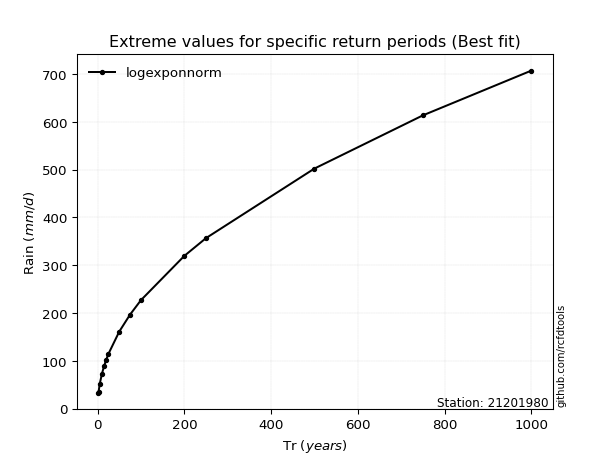</img>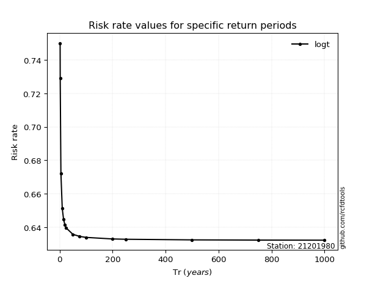</img>

</div>


<sub>**APP DISCLAIMER**: NO WARRANTY - This software is provided by [github.com/rcfdtools](https://github.com/rcfdtools) "as is", without any express or implied warranty, including warranties of merchantability, fitness for a particular purpose, or non-infringement. There is no guarantee that the software will be error-free or operate without interruption. LIMITATION OF LIABILITY - Neither the authors nor copyright holders will be liable for claims or damages arising from the software or its use. You are responsible for determining if the software is appropriate for your use and assume all associated risks, including errors, legal compliance, and data loss. NO PROFESSIONAL ADVICE - The software provides general information and does not offer professional advice. It should not replace consultation with professional advisors.</sub>