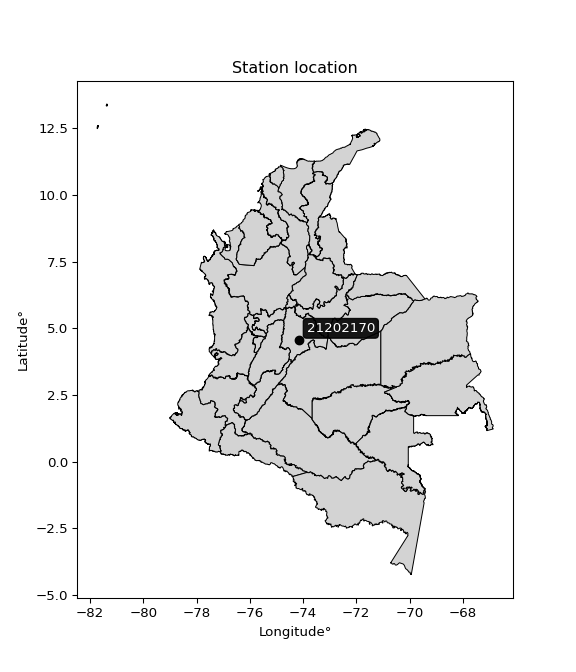

<div align="center">


</div>

# PMP Station (rain, Pmax24h): 21202170

Probable Maximum Precipitation (PMP) is the greatest amount of rainfall for a specific duration that is meteorologically possible for a given location, acting as a "worst-case" scenario for extreme storms, crucial for designing safety-critical infrastructure like bridges, river deviations, dams, spillways, and nuclear plants to prevent catastrophic failure. PMP is calculated by hydrologists using meteorological data to determine the upper limit of extreme rainfall, often leading to the Probable Maximum Flood (PMF) for flood control design, and is increasingly being studied for climate change impacts.

<div align="center">

</img>

</div>


## A. General information


### 1. General running parameters

• app_version: _v20251227_. • runtime: _2025-12-27 09:02:11.367833_. • Python version: _3.14.0_. • SciPy version: _1.16.3_. • Pandas version: _2.3.3_. • NumPy version: _2.3.5_. • Stations dataset (station_dataset_file): _dataset/pmax24h_in/automatic_colombia_2003_2024_filter.csv_. • Stations catalog (station_catalog_file): _dataset/CNE_IDEAM.xls_. • Minimum year to eval til year_max (date_min): _2003_. • Maximum year to eval since year_min (date_max): _2024_. • Creates, save and include plots into reports (create_plot): _False_. • Plot only fit distributions with Δo > Δ (plot_only_fit): _True_. • Eval low extreme values, if False, evaluates high extreme values (low_extreme): _False_. • Eval every SciPy distribution as logarithmic (pdist_logarithmic_on): _True_. • Standard deviation normalized (ddof): _1.0_. • Return periods to eval in years (Tr): _[2, 2.33, 5, 10, 15, 20, 25, 50, 75, 100, 200, 250, 500, 750, 1000]_. • Minimum data sample per station, 0 means any (minimum_sample): _5_. • Z-Score threshold to adjust a value, 0 means disable (zscore): _3.5_. • Avoid zeros, e.g. rain = 0 (avoid_zeros): _True_. • Avoid null values (avoid_nans): _True_. [:file_folder:Dataset file.](../../dataset/pmax24h_in/automatic_colombia_2003_2024_filter.csv)

> Delta Degrees of Freedom (DDOF): is a parameter used in the formulas for calculating variance and standard deviation. When ddof=0, the divisor is $N$ (the total number of observations) and this is used when your data set is the entire population. When ddof=1, the divisor is $N-1$ and this is used when your data set is a sample drawn from a larger population. Using $N-1$ provides an unbiased estimate of the population variance (known as Bessel´s correction).


### 2. Station info and location

|   id |   CODIGO | NOMBRE                           | CATEGORIA     | TECNOLOGIA                | ESTADO   | FECHA_INSTALACION   |   FECHA_SUSPENSION |   ALTITUD |   LATITUD |   LONGITUD | DEPARTAMENTO   | MUNICIPIO   | AREA_OPERATIVA                            | ENTIDAD                                                          | AREA_HIDROGRAFICA   | ZONA_HIDROGRAFICA   | SUBZONA_HIDROGRAFICA   |   CORRIENTE | Catalogo   |
|-----:|---------:|:---------------------------------|:--------------|:--------------------------|:---------|:--------------------|-------------------:|----------:|----------:|-----------:|:---------------|:------------|:------------------------------------------|:-----------------------------------------------------------------|:--------------------|:--------------------|:-----------------------|------------:|:-----------|
|    0 | 21202170 | SIERRA MORENA  - AUT  [21202170] | Pluviométrica | Automática con Telemetría | Activa   | 01/09/1999          |                nan |      2682 |   4.56667 |   -74.1667 | Bogotá         | Bogotá, D.C | Area Operativa 11 - Cundinamarca-Amazonas | FONDO DE PREVENCION Y ATENCION DE DESASTRES DE BOGOTA DC - FOPAE | Magdalena Cauca     | Alto Magdalena      | Río Bogotá             |         nan | CNE_OE     |

<div align="center">

Map location in: [:earth_americas:Google](http://maps.google.com/maps?q=4.566666667,-74.16666667) [:earth_americas:OSM](https://www.openstreetmap.org/#map=18/4.566666667/-74.16666667&layers=P) [:earth_americas:Bing](https://www.bing.com/maps?cp=4.566666667~-74.16666667&lvl=18) [:earth_americas:Apple](https://maps.apple.com/frame?center=4.566666667%2C-74.16666667&span=0.003%2C0.006)

</div>


<div align="center">

```geojson
{
  "type": "Feature",
  "geometry": {
    "type": "Point", 
    "coordinates": [-74.16666667, 4.566666667]
  }, 
  "properties": {
    "Name": "21202170"
  }
}
```

</div>


### 3. Discrete values table and plot

|               |           0 |            1 |          2 |           3 |          4 |           5 |           6 |          7 |           8 |
|:--------------|------------:|-------------:|-----------:|------------:|-----------:|------------:|------------:|-----------:|------------:|
| Date          | 2008        | 2009         | 2010       | 2011        | 2012       | 2013        | 2014        | 2015       | 2016        |
| Value         |   26.7      |   22.6       |   31.6     |   21.9      |   31.4     |   21.5      |   24.8      |    6.8     |   22.5      |
| Value_initial |   26.7      |   22.6       |   31.6     |   21.9      |   31.4     |   21.5      |   24.8      |    6.8     |   22.5      |
| count         |    9        |    9         |    9       |    9        |    9       |    9        |    9        |    9       |    9        |
| mean          |   23.3111   |   23.3111    |   23.3111  |   23.3111   |   23.3111  |   23.3111   |   23.3111   |   23.3111  |   23.3111   |
| std           |    7.30487  |    7.30487   |    7.30487 |    7.30487  |    7.30487 |    7.30487  |    7.30487  |    7.30487 |    7.30487  |
| zscore        |    0.463922 |   -0.0973476 |    1.13471 |   -0.193174 |    1.10733 |   -0.247932 |    0.203821 |   -2.26029 |   -0.111037 |

> The initial value (value_initial) correspond to the initial obtained or null completed value, and value (value) is adjusted only when the initial value is outside the valid range definite through the Z-Score value. If Z-Score is active, values out of range or outliers are replaced with the station mean value


### 4. Active continuous probability distributions from SciPy (45 of 104 available)

[scipy.stats](https://docs.scipy.org/doc/scipy/reference/stats.html) is a Python´s powerful submodule within the SciPy library for comprehensive statistical analysis, offering over 130 probability distributions (like Normal, Poisson), functions for descriptive stats (mean, variance), hypothesis testing (t-tests, chi-square), random variable generation, and statistical tests, making it essential for data science, modeling, and research. It provides tools to explore, model, and draw conclusions from data efficiently, working seamlessly with NumPy.

<div align="center">

|   id | p_dist             |   n_parameter | fit_method   | label                                                                       | active   | ref                                                                                                        |
|-----:|:-------------------|--------------:|:-------------|:----------------------------------------------------------------------------|:---------|:-----------------------------------------------------------------------------------------------------------|
|    0 | alpha              |             3 | MLE          | Alpha                                                                       | True     | [:mortar_board:](https://docs.scipy.org/doc/scipy/reference/generated/scipy.stats.alpha.html)              |
|    1 | betaprime          |             4 | MLE          | Beta prime                                                                  | True     | [:mortar_board:](https://docs.scipy.org/doc/scipy/reference/generated/scipy.stats.betaprime.html)          |
|    2 | chi2               |             3 | MLE          | Chi²                                                                        | True     | [:mortar_board:](https://docs.scipy.org/doc/scipy/reference/generated/scipy.stats.chi2.html)               |
|    3 | crystalball        |             4 | MLE          | Crystalball                                                                 | True     | [:mortar_board:](https://docs.scipy.org/doc/scipy/reference/generated/scipy.stats.crystalball.html)        |
|    4 | erlang             |             3 | MLE          | Erlang                                                                      | True     | [:mortar_board:](https://docs.scipy.org/doc/scipy/reference/generated/scipy.stats.erlang.html)             |
|    5 | expon              |             2 | MLE          | Exponential                                                                 | True     | [:mortar_board:](https://docs.scipy.org/doc/scipy/reference/generated/scipy.stats.expon.html)              |
|    6 | exponnorm          |             3 | MLE          | Exponentially modified Normal                                               | True     | [:mortar_board:](https://docs.scipy.org/doc/scipy/reference/generated/scipy.stats.exponnorm.html)          |
|    7 | f                  |             4 | MLE          | F                                                                           | True     | [:mortar_board:](https://docs.scipy.org/doc/scipy/reference/generated/scipy.stats.f.html)                  |
|    8 | fatiguelife        |             3 | MLE          | Fatigue-life (Birnbaum-Saunders)                                            | True     | [:mortar_board:](https://docs.scipy.org/doc/scipy/reference/generated/scipy.stats.fatiguelife.html)        |
|    9 | fisk               |             3 | MLE          | Fisk                                                                        | True     | [:mortar_board:](https://docs.scipy.org/doc/scipy/reference/generated/scipy.stats.fisk.html)               |
|   10 | gamma              |             3 | MLE          | Gamma                                                                       | True     | [:mortar_board:](https://docs.scipy.org/doc/scipy/reference/generated/scipy.stats.gamma.html)              |
|   11 | genexpon           |             5 | MLE          | Generalized exponential                                                     | True     | [:mortar_board:](https://docs.scipy.org/doc/scipy/reference/generated/scipy.stats.genexpon.html)           |
|   12 | genlogistic        |             3 | MLE          | Generalized logistic                                                        | True     | [:mortar_board:](https://docs.scipy.org/doc/scipy/reference/generated/scipy.stats.genlogistic.html)        |
|   13 | gibrat             |             2 | MM           | Gibrat                                                                      | True     | [:mortar_board:](https://docs.scipy.org/doc/scipy/reference/generated/scipy.stats.gibrat.html)             |
|   14 | gompertz           |             3 | MLE          | Gompertz (or truncated Gumbel)                                              | True     | [:mortar_board:](https://docs.scipy.org/doc/scipy/reference/generated/scipy.stats.gompertz.html)           |
|   15 | gumbel_l           |             2 | MM           | Gumbel Left Skew                                                            | True     | [:mortar_board:](https://docs.scipy.org/doc/scipy/reference/generated/scipy.stats.gumbel_l.html)           |
|   16 | gumbel_r           |             2 | MM           | Gumbel Right Skew                                                           | True     | [:mortar_board:](https://docs.scipy.org/doc/scipy/reference/generated/scipy.stats.gumbel_r.html)           |
|   17 | halflogistic       |             2 | MM           | Half-logistic                                                               | True     | [:mortar_board:](https://docs.scipy.org/doc/scipy/reference/generated/scipy.stats.halflogistic.html)       |
|   18 | halfnorm           |             2 | MM           | Half Normal                                                                 | True     | [:mortar_board:](https://docs.scipy.org/doc/scipy/reference/generated/scipy.stats.halfnorm.html)           |
|   19 | hypsecant          |             2 | MM           | hyperbolic secant                                                           | True     | [:mortar_board:](https://docs.scipy.org/doc/scipy/reference/generated/scipy.stats.hypsecant.html)          |
|   20 | invgamma           |             3 | MLE          | Inverted gamma                                                              | True     | [:mortar_board:](https://docs.scipy.org/doc/scipy/reference/generated/scipy.stats.invgamma.html)           |
|   21 | invgauss           |             3 | MLE          | Inverse Gaussian                                                            | True     | [:mortar_board:](https://docs.scipy.org/doc/scipy/reference/generated/scipy.stats.invgauss.html)           |
|   22 | invweibull         |             3 | MLE          | Inverted Weibull                                                            | True     | [:mortar_board:](https://docs.scipy.org/doc/scipy/reference/generated/scipy.stats.invweibull.html)         |
|   23 | johnsonsu          |             4 | MLE          | Johnson Su                                                                  | True     | [:mortar_board:](https://docs.scipy.org/doc/scipy/reference/generated/scipy.stats.johnsonsu.html)          |
|   24 | kstwobign          |             2 | MLE          | Limiting distribution of scaled Kolmogorov-Smirnov two-sided test statistic | True     | [:mortar_board:](https://docs.scipy.org/doc/scipy/reference/generated/scipy.stats.kstwobign.html)          |
|   25 | laplace            |             2 | MM           | Laplace                                                                     | True     | [:mortar_board:](https://docs.scipy.org/doc/scipy/reference/generated/scipy.stats.laplace.html)            |
|   26 | laplace_asymmetric |             3 | MLE          | Asymmetric Laplace                                                          | True     | [:mortar_board:](https://docs.scipy.org/doc/scipy/reference/generated/scipy.stats.laplace_asymmetric.html) |
|   27 | loggamma           |             3 | MLE          | Log gamma                                                                   | True     | [:mortar_board:](https://docs.scipy.org/doc/scipy/reference/generated/scipy.stats.loggamma.html)           |
|   28 | logistic           |             2 | MM           | Logistic (or Sech-squared)                                                  | True     | [:mortar_board:](https://docs.scipy.org/doc/scipy/reference/generated/scipy.stats.logistic.html)           |
|   29 | lognorm            |             3 | MLE          | Log Normal                                                                  | True     | [:mortar_board:](https://docs.scipy.org/doc/scipy/reference/generated/scipy.stats.lognorm.html)            |
|   30 | maxwell            |             2 | MM           | Maxwell                                                                     | True     | [:mortar_board:](https://docs.scipy.org/doc/scipy/reference/generated/scipy.stats.maxwell.html)            |
|   31 | mielke             |             4 | MLE          | Mielke Beta-Kappa / Dagum                                                   | True     | [:mortar_board:](https://docs.scipy.org/doc/scipy/reference/generated/scipy.stats.mielke.html)             |
|   32 | moyal              |             2 | MM           | Moyal                                                                       | True     | [:mortar_board:](https://docs.scipy.org/doc/scipy/reference/generated/scipy.stats.moyal.html)              |
|   33 | nakagami           |             3 | MLE          | Nakagami                                                                    | True     | [:mortar_board:](https://docs.scipy.org/doc/scipy/reference/generated/scipy.stats.nakagami.html)           |
|   34 | ncf                |             5 | MLE          | Non-central F distribution                                                  | True     | [:mortar_board:](https://docs.scipy.org/doc/scipy/reference/generated/scipy.stats.ncf.html)                |
|   35 | nct                |             4 | MLE          | Non-central Student’s t                                                     | True     | [:mortar_board:](https://docs.scipy.org/doc/scipy/reference/generated/scipy.stats.nct.html)                |
|   36 | norm               |             2 | MM           | Normal                                                                      | True     | [:mortar_board:](https://docs.scipy.org/doc/scipy/reference/generated/scipy.stats.norm.html)               |
|   37 | pareto             |             3 | MLE          | Pareto                                                                      | True     | [:mortar_board:](https://docs.scipy.org/doc/scipy/reference/generated/scipy.stats.pareto.html)             |
|   38 | pearson3           |             3 | MM           | Pearson type III                                                            | True     | [:mortar_board:](https://docs.scipy.org/doc/scipy/reference/generated/scipy.stats.pearson3.html)           |
|   39 | rayleigh           |             2 | MM           | Rayleigh                                                                    | True     | [:mortar_board:](https://docs.scipy.org/doc/scipy/reference/generated/scipy.stats.rayleigh.html)           |
|   40 | rice               |             3 | MLE          | Rice                                                                        | True     | [:mortar_board:](https://docs.scipy.org/doc/scipy/reference/generated/scipy.stats.rice.html)               |
|   41 | t                  |             3 | MLE          | Student’s t                                                                 | True     | [:mortar_board:](https://docs.scipy.org/doc/scipy/reference/generated/scipy.stats.t.html)                  |
|   42 | truncnorm          |             4 | MLE          | Truncated normal                                                            | True     | [:mortar_board:](https://docs.scipy.org/doc/scipy/reference/generated/scipy.stats.truncnorm.html)          |
|   43 | wald               |             2 | MM           | Wald                                                                        | True     | [:mortar_board:](https://docs.scipy.org/doc/scipy/reference/generated/scipy.stats.wald.html)               |
|   44 | weibull_min        |             3 | MLE          | Weibull minimum                                                             | True     | [:mortar_board:](https://docs.scipy.org/doc/scipy/reference/generated/scipy.stats.weibull_min.html)        |

</div>

> **n_parameter:** # arguments & localization & scale.
>
> **Fit methods:** (MLE) maximum likelihood, (MM) L-moments.
>
>**Inactive:** foldnorm, gennorm, norminvgauss, powernorm, powerlognorm, skewnorm, genextreme, anglit, arcsine, argus, beta, bradford, burr, burr12, cauchy, cosine, halfcauchy, foldcauchy, skewcauchy, wrapcauchy, dgamma, gengamma, exponweib, exponpow, truncexpon, gausshyper, genhalflogistic, genhyperbolic, geninvgauss, halfgennorm, johnsonsb, kappa4, kappa3, ksone, kstwo, loglaplace, levy, levy_l, levy_stable, ncx2, genpareto, truncpareto, lomax, powerlaw, rdist, rel_breitwigner, recipinvgauss, semicircular, studentized_range, trapezoid, triang, truncweibull_min, tukeylambda, uniform, loguniform, vonmises, vonmises_line, weibull_max, dweibull, 


## B. Probability distributions vs. Empirical distributions

A continuous probability distribution (CPD) describes probabilities for variables that can take any value within a range (like rain any time), unlike discrete variables with specific outcomes (like temperature). It uses a Probability Density Function (PDF), a curve where the total area under it equals 1, and the probability of the variable falling within an interval (a to b) is found by calculating the area under the curve between those points. A key feature is that the probability of hitting any single exact value is zero, so probabilities are always expressed for ranges, e.g., $P(a ≤ X ≤ b)$.

<div align="center">

Distributions parameters from station values
|    |   station | p_dist                |   n |               loc |            scale | shape                  | shape1                 | shape2                 | shape3   |
|---:|----------:|:----------------------|----:|------------------:|-----------------:|:-----------------------|:-----------------------|:-----------------------|:---------|
|  0 |  21202170 | alpha                 |   9 |    -151.536       |   4223.56        | 24.212241605879058     |                        |                        |          |
|  1 |  21202170 | betaprime             |   9 |    -127.123       |   3557.75        | 451.3054298672604      | 10681.581694233548     |                        |          |
|  2 |  21202170 | chi2                  |   9 |     -80.8367      |      0.244891    | 424.70367613647056     |                        |                        |          |
|  3 |  21202170 | crystalball           |   9 |      23.3111      |      6.8871      | 1322.682437876606      | 2032.459676883502      |                        |          |
|  4 |  21202170 | erlang                |   9 |    -100.028       |      0.421882    | 292.0484453118887      |                        |                        |          |
|  5 |  21202170 | expon                 |   9 |       6.8         |     16.5111      |                        |                        |                        |          |
|  6 |  21202170 | exponnorm             |   9 |      23.3061      |      6.88711     | 0.0007313693536597453  |                        |                        |          |
|  7 |  21202170 | f                     |   9 |   -6475.06        |   6498.39        | 11867965.420870151     | 2063809.9039496034     |                        |          |
|  8 |  21202170 | fatiguelife           |   9 |       6.8         |      0.00052127  | 163.98527492901394     |                        |                        |          |
|  9 |  21202170 | fisk                  |   9 |      -2.9654e+08  |      2.9654e+08  | 85258397.93589824      |                        |                        |          |
| 10 |  21202170 | gamma                 |   9 |    -110.176       |      0.389455    | 342.8224036512064      |                        |                        |          |
| 11 |  21202170 | genexpon              |   9 |       6.8         |      1.71463     | 0.10385962250807648    | 5.6142100543294575e-06 | 0.9180468506443671     |          |
| 12 |  21202170 | genlogistic           |   9 |      27.4382      |      2.43033     | 0.44451617430316426    |                        |                        |          |
| 13 |  21202170 | gibrat                |   9 |      18.0571      |      3.18671     |                        |                        |                        |          |
| 14 |  21202170 | gompertz              |   9 |       6.8         |      5.62048     | 0.032788254031375794   |                        |                        |          |
| 15 |  21202170 | gumbel_l              |   9 |      26.4107      |      5.36985     |                        |                        |                        |          |
| 16 |  21202170 | gumbel_r              |   9 |      20.2116      |      5.36985     |                        |                        |                        |          |
| 17 |  21202170 | halflogistic          |   9 |      15.1483      |      5.88822     |                        |                        |                        |          |
| 18 |  21202170 | halfnorm              |   9 |      14.1954      |     11.4249      |                        |                        |                        |          |
| 19 |  21202170 | hypsecant             |   9 |      23.3111      |      4.38446     |                        |                        |                        |          |
| 20 |  21202170 | invgamma              |   9 |    -113.56        |  46376.3         | 339.9306280831843      |                        |                        |          |
| 21 |  21202170 | invgauss              |   9 |     -44.363       |   5189.19        | 0.012995155804521905   |                        |                        |          |
| 22 |  21202170 | invweibull            |   9 | -586936           | 586955           | 70996.15500607213      |                        |                        |          |
| 23 |  21202170 | johnsonsu             |   9 |      37.937       |      0.592469    | 8.217637298407766      | 2.165782632100682      |                        |          |
| 24 |  21202170 | kstwobign             |   9 |     -10.8545      |     39.2128      |                        |                        |                        |          |
| 25 |  21202170 | laplace               |   9 |      23.3111      |      4.86991     |                        |                        |                        |          |
| 26 |  21202170 | laplace_asymmetric    |   9 |      22.6         |      4.60326     | 0.925725066223853      |                        |                        |          |
| 27 |  21202170 | loggamma              |   9 |      28.3235      |      4.13021     | 0.7022786863237231     |                        |                        |          |
| 28 |  21202170 | logistic              |   9 |      23.3111      |      3.79706     |                        |                        |                        |          |
| 29 |  21202170 | lognorm               |   9 |       6.8         |      0.280318    | 11.80505886736634      |                        |                        |          |
| 30 |  21202170 | maxwell               |   9 |       6.9916      |     10.2267      |                        |                        |                        |          |
| 31 |  21202170 | mielke                |   9 |     -15.4383      |     47.0965      | 4.660020510402099      | 3586.6840900670177     |                        |          |
| 32 |  21202170 | moyal                 |   9 |      19.3726      |      3.10028     |                        |                        |                        |          |
| 33 |  21202170 | nakagami              |   9 |      21.5         |      5.5001      | 0.20483246414116635    |                        |                        |          |
| 34 |  21202170 | ncf                   |   9 |    -254.015       |    243.846       | 3300.212187131201      | 33888.403263902175     | 452.11688348972166     |          |
| 35 |  21202170 | nct                   |   9 |    -450.76        |      6.83997     | 162930.2767400528      | 69.30844793692285      |                        |          |
| 36 |  21202170 | norm                  |   9 |      23.3111      |      6.8871      |                        |                        |                        |          |
| 37 |  21202170 | pareto                |   9 |       6.79773     |      0.00226943  | 0.1251429788073457     |                        |                        |          |
| 38 |  21202170 | pearson3              |   9 |      23.3111      |      6.88709     | -1.146197073339051     |                        |                        |          |
| 39 |  21202170 | rayleigh              |   9 |      10.1357      |     10.5125      |                        |                        |                        |          |
| 40 |  21202170 | rice                  |   9 |   -1910.77        |      6.88597     | 280.8707580414665      |                        |                        |          |
| 41 |  21202170 | t                     |   9 |      23.3117      |      6.88619     | 11883.99832056643      |                        |                        |          |
| 42 |  21202170 | truncnorm             |   9 |       8.19611     |      3.97019     | -2.6994192523499434    | 5.894907947357932      |                        |          |
| 43 |  21202170 | wald                  |   9 |      16.424       |      6.8871      |                        |                        |                        |          |
| 44 |  21202170 | weibull_min           |   9 |       6.8         |      1.26661     | 0.3174970920627457     |                        |                        |          |
| 45 |  21202170 | logalpha              |   9 |     -12.7743      |    545.137       | 34.45786641294893      |                        |                        |          |
| 46 |  21202170 | logbetaprime          |   9 |      -7.88241     |      6.60208     | 1306.3356103101778     | 787.9761801867087      |                        |          |
| 47 |  21202170 | logchi2               |   9 |       1.91692     |      0.934721    | 1.0796991774717621     |                        |                        |          |
| 48 |  21202170 | logcrystalball        |   9 |       3.0776      |      0.433108    | 1211.6370993800274     | 80.2660557319127       |                        |          |
| 49 |  21202170 | logerlang             |   9 |      -3.31825     |      0.0348805   | 183.04734591451756     |                        |                        |          |
| 50 |  21202170 | logexpon              |   9 |       1.91692     |      1.16068     |                        |                        |                        |          |
| 51 |  21202170 | logexponnorm          |   9 |       3.07736     |      0.433107    | 0.0005532219477422044  |                        |                        |          |
| 52 |  21202170 | logf                  |   9 |   -1051.96        |   1055.03        | 33055659.33279825      | 18366784.414008286     |                        |          |
| 53 |  21202170 | logfatiguelife        |   9 |    -409.248       |    412.327       | 0.0010502092401566921  |                        |                        |          |
| 54 |  21202170 | logfisk               |   9 |      -1.26341e+08 |      1.26341e+08 | 560571754.0101907      |                        |                        |          |
| 55 |  21202170 | loggamma              |   9 |      -3.6012      |      0.0326519   | 204.2081098389445      |                        |                        |          |
| 56 |  21202170 | loggenexpon           |   9 |       1.66957     |      0.0247298   | 3.1938458714938396e-08 | 4.223679319905846      | 0.00013359072237325963 |          |
| 57 |  21202170 | loggenlogistic        |   9 |       3.45316     |      2.2584e-07  | 5.995515236398374e-07  |                        |                        |          |
| 58 |  21202170 | loggibrat             |   9 |       2.7472      |      0.200401    |                        |                        |                        |          |
| 59 |  21202170 | loggompertz           |   9 |       1.83941     |      0.244352    | 0.003233223335374059   |                        |                        |          |
| 60 |  21202170 | loggumbel_l           |   9 |       3.27252     |      0.337693    |                        |                        |                        |          |
| 61 |  21202170 | loggumbel_r           |   9 |       2.88268     |      0.337693    |                        |                        |                        |          |
| 62 |  21202170 | loghalflogistic       |   9 |       2.56432     |      0.370256    |                        |                        |                        |          |
| 63 |  21202170 | loghalfnorm           |   9 |       2.50431     |      0.718506    |                        |                        |                        |          |
| 64 |  21202170 | loghypsecant          |   9 |       3.0776      |      0.275725    |                        |                        |                        |          |
| 65 |  21202170 | loginvgamma           |   9 |     -10.1382      |  11066.6         | 839.1586199455026      |                        |                        |          |
| 66 |  21202170 | loginvgauss           |   9 |      -2.90557     |    931.644       | 0.006416823164536593   |                        |                        |          |
| 67 |  21202170 | loginvweibull         |   9 |      -4.34738e+07 |      4.34738e+07 | 75508945.44504711      |                        |                        |          |
| 68 |  21202170 | logjohnsonsu          |   9 |       3.50365     |      0.00115818  | 6.114549435805051      | 0.9942369114573348     |                        |          |
| 69 |  21202170 | logkstwobign          |   9 |       0.699022    |      2.73077     |                        |                        |                        |          |
| 70 |  21202170 | loglaplace            |   9 |       3.0776      |      0.306254    |                        |                        |                        |          |
| 71 |  21202170 | loglaplace_asymmetric |   9 |       3.28466     |      0.210916    | 1.6057131750451652     |                        |                        |          |
| 72 |  21202170 | logloggamma           |   9 |       3.45319     |      1.42096e-06 | 3.788998371788976e-06  |                        |                        |          |
| 73 |  21202170 | loglogistic           |   9 |       3.0776      |      0.238785    |                        |                        |                        |          |
| 74 |  21202170 | loglognorm            |   9 |       1.91692     |      0.0229798   | 11.409817353111652     |                        |                        |          |
| 75 |  21202170 | logmaxwell            |   9 |       2.05134     |      0.643113    |                        |                        |                        |          |
| 76 |  21202170 | logmielke             |   9 |      -3.24238e+07 |      3.24239e+07 | 83229973.21258955      | 4736932289.788832      |                        |          |
| 77 |  21202170 | logmoyal              |   9 |       2.82992     |      0.194967    |                        |                        |                        |          |
| 78 |  21202170 | lognakagami           |   9 |       3.06805     |      0.173045    | 0.2670873552781585     |                        |                        |          |
| 79 |  21202170 | logncf                |   9 |      -3.33465     |      6.3986      | 264.17157998191647     | 1268.5924265391607     | 0.39792526641324755    |          |
| 80 |  21202170 | lognct                |   9 |      17.1103      |      0.391541    | 3413.87754292135       | -35.83356450739258     |                        |          |
| 81 |  21202170 | lognorm               |   9 |       3.0776      |      0.433109    |                        |                        |                        |          |
| 82 |  21202170 | logpareto             |   9 |       1.91676     |      0.000161816 | 0.12514109698275222    |                        |                        |          |
| 83 |  21202170 | logpearson3           |   9 |       3.0776      |      0.433109    | -1.9816923784067662    |                        |                        |          |
| 84 |  21202170 | lograyleigh           |   9 |       2.24907     |      0.661077    |                        |                        |                        |          |
| 85 |  21202170 | logrice               |   9 |    -245.349       |      0.43309     | 573.6150245179842      |                        |                        |          |
| 86 |  21202170 | logt                  |   9 |       3.15812     |      0.116787    | 1.2192705990848904     |                        |                        |          |
| 87 |  21202170 | logtruncnorm          |   9 |      -0.157289    |      1.35025     | 2.3886971363148337     | 2.6739082418681726     |                        |          |
| 88 |  21202170 | logwald               |   9 |       2.64441     |      0.43318     |                        |                        |                        |          |
| 89 |  21202170 | logweibull_min        |   9 |      -4.79671e+07 |      4.79671e+07 | 195957232.70985192     |                        |                        |          |

</div>

> **loc** (Location parameter): This shifts the distribution along the x-axis. For many common distributions, like the normal (Gaussian) distribution, loc represents the mean $μ$. For others, like the uniform distribution, it might represent the minimum value, or for the beta distribution, the left end of the support interval.
>
> **scale** (Scale parameter): This determines the width or spread of the distribution. For the normal distribution, scale represents the standard deviation $σ$. For a uniform distribution, it defines the length of the interval (from $loc$ to $loc + scale$).
>
> **shape** (Shape parameters): Refers to parameters that define the specific form of a probability distribution, distinct from its location (loc) and scale (scale). These parameters are required arguments for most distribution functions. For example, a normal (Gaussian) distribution is fully defined by its location (mean) and scale (standard deviation), so it has no specific shape parameters beyond loc and scale. However, other distributions have intrinsic properties that need specification, as Gamma distribution that takes a shape parameter, often named $a$ or $alpha$.


### 0. Cumulative distribution values - CDF (90 evaluated)

Cumulative Distribution Function (CDF), denoted as $F$<sub>$X$</sub>$(x)$, is a function that gives the probability that a random variable $X$ will take a value less than or equal to a specific value, $x$ (i.e., $(P(X≥x)$. It essentially "accumulates" probabilities from a given point up to the far right (positive infinity), providing a complete picture of the distribution´s probabilities for both discrete (like rain) and continuous (like temperature) variables, helping to find probabilities over ranges or above certain values.

<div align="center">

CDF ordered by x ascending and calculating $log(f(x))$ separately
|   id |   Station |   date |    x |   count |    mean |     std |     zscore |   Value_initial |   station |   m |      alpha |   alpha_pdf |   betaprime |   betaprime_pdf |       chi2 |   chi2_pdf |   crystalball |   crystalball_pdf |     erlang |   erlang_pdf |    expon |   expon_pdf |   exponnorm |   exponnorm_pdf |          f |      f_pdf |   fatiguelife |   fatiguelife_pdf |       fisk |   fisk_pdf |      gamma |   gamma_pdf |    genexpon |   genexpon_pdf |   genlogistic |   genlogistic_pdf |   gibrat |   gibrat_pdf |    gompertz |   gompertz_pdf |   gumbel_l |   gumbel_l_pdf |    gumbel_r |   gumbel_r_pdf |   halflogistic |   halflogistic_pdf |   halfnorm |   halfnorm_pdf |   hypsecant |   hypsecant_pdf |   invgamma |   invgamma_pdf |   invgauss |   invgauss_pdf |   invweibull |   invweibull_pdf |   johnsonsu |   johnsonsu_pdf |   kstwobign |   kstwobign_pdf |   laplace |   laplace_pdf |   laplace_asymmetric |   laplace_asymmetric_pdf |   loggamma |   loggamma_pdf |   logistic |   logistic_pdf |    lognorm |   lognorm_pdf |   maxwell |   maxwell_pdf |    mielke |   mielke_pdf |       moyal |   moyal_pdf |   nakagami |   nakagami_pdf |        ncf |    ncf_pdf |       nct |    nct_pdf |       norm |   norm_pdf |   pareto |   pareto_pdf |   pearson3 |   pearson3_pdf |   rayleigh |   rayleigh_pdf |       rice |   rice_pdf |          t |     t_pdf |   truncnorm |   truncnorm_pdf |     wald |   wald_pdf |   weibull_min |   weibull_min_pdf |   logalpha |   logalpha_pdf |   logbetaprime |   logbetaprime_pdf |     logchi2 |   logchi2_pdf |   logcrystalball |   logcrystalball_pdf |   logerlang |   logerlang_pdf |   logexpon |   logexpon_pdf |   logexponnorm |   logexponnorm_pdf |       logf |   logf_pdf |   logfatiguelife |   logfatiguelife_pdf |    logfisk |   logfisk_pdf |   loggenexpon |   loggenexpon_pdf |   loggenlogistic |   loggenlogistic_pdf |   loggibrat |   loggibrat_pdf |   loggompertz |   loggompertz_pdf |   loggumbel_l |   loggumbel_l_pdf |   loggumbel_r |   loggumbel_r_pdf |   loghalflogistic |   loghalflogistic_pdf |   loghalfnorm |   loghalfnorm_pdf |   loghypsecant |   loghypsecant_pdf |   loginvgamma |   loginvgamma_pdf |   loginvgauss |   loginvgauss_pdf |   loginvweibull |   loginvweibull_pdf |   logjohnsonsu |   logjohnsonsu_pdf |   logkstwobign |   logkstwobign_pdf |   loglaplace |   loglaplace_pdf |   loglaplace_asymmetric |   loglaplace_asymmetric_pdf |   logloggamma |   logloggamma_pdf |   loglogistic |   loglogistic_pdf |   loglognorm |   loglognorm_pdf |   logmaxwell |   logmaxwell_pdf |   logmielke |   logmielke_pdf |    logmoyal |   logmoyal_pdf |   lognakagami |   lognakagami_pdf |    logncf |   logncf_pdf |     lognct |   lognct_pdf |   logpareto |   logpareto_pdf |   logpearson3 |   logpearson3_pdf |   lograyleigh |   lograyleigh_pdf |    logrice |   logrice_pdf |      logt |   logt_pdf |   logtruncnorm |   logtruncnorm_pdf |   logwald |   logwald_pdf |   logweibull_min |   logweibull_min_pdf |
|-----:|----------:|-------:|-----:|--------:|--------:|--------:|-----------:|----------------:|----------:|----:|-----------:|------------:|------------:|----------------:|-----------:|-----------:|--------------:|------------------:|-----------:|-------------:|---------:|------------:|------------:|----------------:|-----------:|-----------:|--------------:|------------------:|-----------:|-----------:|-----------:|------------:|------------:|---------------:|--------------:|------------------:|---------:|-------------:|------------:|---------------:|-----------:|---------------:|------------:|---------------:|---------------:|-------------------:|-----------:|---------------:|------------:|----------------:|-----------:|---------------:|-----------:|---------------:|-------------:|-----------------:|------------:|----------------:|------------:|----------------:|----------:|--------------:|---------------------:|-------------------------:|-----------:|---------------:|-----------:|---------------:|-----------:|--------------:|----------:|--------------:|----------:|-------------:|------------:|------------:|-----------:|---------------:|-----------:|-----------:|----------:|-----------:|-----------:|-----------:|---------:|-------------:|-----------:|---------------:|-----------:|---------------:|-----------:|-----------:|-----------:|----------:|------------:|----------------:|---------:|-----------:|--------------:|------------------:|-----------:|---------------:|---------------:|-------------------:|------------:|--------------:|-----------------:|---------------------:|------------:|----------------:|-----------:|---------------:|---------------:|-------------------:|-----------:|-----------:|-----------------:|---------------------:|-----------:|--------------:|--------------:|------------------:|-----------------:|---------------------:|------------:|----------------:|--------------:|------------------:|--------------:|------------------:|--------------:|------------------:|------------------:|----------------------:|--------------:|------------------:|---------------:|-------------------:|--------------:|------------------:|--------------:|------------------:|----------------:|--------------------:|---------------:|-------------------:|---------------:|-------------------:|-------------:|-----------------:|------------------------:|----------------------------:|--------------:|------------------:|--------------:|------------------:|-------------:|-----------------:|-------------:|-----------------:|------------:|----------------:|------------:|---------------:|--------------:|------------------:|----------:|-------------:|-----------:|-------------:|------------:|----------------:|--------------:|------------------:|--------------:|------------------:|-----------:|--------------:|----------:|-----------:|---------------:|-------------------:|----------:|--------------:|-----------------:|---------------------:|
|    0 |  21202170 |   2015 |  6.8 |       9 | 23.3111 | 7.30487 | -2.26029   |             6.8 |  21202170 |   1 | 0.00690042 |  0.00324167 |    0.00948  |      0.00381549 | 0.00812898 | 0.00349371 |    0.00825599 |        0.00327202 | 0.00909556 |   0.00374396 | 0        |   0.0605653 |  0.00825604 |      0.00327203 | 0.00846493 | 0.00333386 |     0.0414486 |       1.19313e+07 | 0.00699101 | 0.00199594 | 0.00871728 |  0.00358133 | 4.44718e-08 |      0.0605724 |     0.0229397 |        0.00419488 | 0        |    0         | 4.20743e-11 |     0.00583371 |  0.0256057 |     0.00470685 | 5.27313e-06 |     1.1934e-05 |       0        |          0         |   0        |      0         |   0.0147342 |      0.00335935 | 0.00871327 |     0.00377489 | 0.00872086 |     0.00409973 |   0.00946251 |       0.00533422 |   0.0311414 |      0.00488054 |   0.0126588 |      0.00801119 |  0.016847 |    0.00345941 |            0.0113216 |               0.00265682 | 0.00468792 |      0.0332226 |  0.0127625 |     0.00331826 | 0.00368247 |     0.0253991 |  0        |     0         | 0.0302941 |   0.00634812 | 3.04773e-14 | 2.88385e-13 | 0          |    0           | 0.00917448 | 0.00363682 | 0.0082623 | 0.00327596 | 0.00825599 | 0.00327202 | 0        |  55.143      |  0.0263116 |     0.00503495 |   0        |      0         | 0.00824703 | 0.00326945 | 0.00825454 | 0.0032707 |    0.36033  |     0.0947891   | 0        |  0         |   1.54383e-05 |        5.5187e+09 | 0.00404296 |      0.0302103 |     0.00683767 |          0.0435427 | 2.84612e-09 |   6.91968e+06 |       0.00368246 |            0.0253991 |  0.00501467 |       0.0351009 |   0        |       0.861566 |     0.00368237 |          0.0253986 | 0.00375015 |  0.0257819 |       0.00360186 |            0.0249746 | 0.00404589 |     0.0178789 |     0.0278185 |          0.22172  |         0        |            0.0449595 |    0        |        0        |    0.00120624 |         0.0181494 |     0.0178937 |         0.0525112 |    2.6159e-08 |       1.35245e-06 |          0        |              0        |      0        |          0        |     0.00945514 |          0.0342868 |    0.00399902 |         0.0293323 |    0.00403401 |         0.0311056 |      0.00779404 |           0.0657156 |      0.0395821 |           0.053537 |      0.0113792 |           0.106558 |    0.0112987 |        0.0368933 |               0.0126978 |                   0.0374933 |     0.0166317 |         0.0443485 |    0.00768509 |         0.0319368 |   0.00233972 |      2.88507e+12 |     0        |         0        |   0.0186801 |       0.0479507 | 2.58791e-25 |    7.23789e-23 |   0           |        0          | 0.0219887 |    0.0998793 | 0.00360266 |    0.0246118 |    0        |     773.356     |     0.0251152 |         0.0582859 |      0        |          0        | 0.00368129 |      0.025393 | 0.0188085 |   0.01834  |    0           |            0       |  0        |      0        |       0.00446281 |            0.0181909 |
|    1 |  21202170 |   2013 | 21.5 |       9 | 23.3111 | 7.30487 | -0.247932  |            21.5 |  21202170 |   2 | 0.422185   |  0.055201   |    0.41265  |      0.0543189  | 0.415953   | 0.0552367  |    0.396286   |        0.0559574  | 0.414981   |   0.0545653  | 0.589471 |   0.0248638 |  0.396285   |      0.0559572  | 0.396028   | 0.0556118  |     0.847086  |       0.00822617  | 0.325258   | 0.0630985  | 0.405936   |  0.0542746  | 0.589532    |      0.0248644 |     0.325255  |        0.0547355  | 0.530816 |    0.115528  | 0.34001     |     0.0526443  |  0.330163  |     0.0499861  | 0.455357    |     0.066709   |       0.4925   |          0.0643185 |   0.477411 |      0.0569275 |   0.372101  |      0.0668175  | 0.41908    |     0.0535111  | 0.440258   |     0.052627   |   0.455011   |       0.0433376  |   0.315205  |      0.0467897  |   0.496102  |      0.04024    |  0.344712 |    0.0707841  |            0.356495  |               0.0836577  | 0.510565   |      0.854456  |  0.382966  |     0.0622332  | 0.491207   |     0.92089   |  0.430211 |     0.0574024 | 0.322338  |   0.0406652  | 0.47797     | 0.0709861   | 6.2693e-07 |    3.61458e+07 | 0.405848   | 0.0548444  | 0.396475  | 0.0559454  | 0.396286   | 0.0559574  | 0.666557 |   0.0028382  |  0.329641  |     0.0474683  |   0.442513 |      0.0573282 | 0.396271   | 0.0559661  | 0.396241   | 0.0559616 |    0.999596 |     0.000367533 | 0.538696 |  0.0873518 |   0.886717    |        0.00532867 | 0.51904    |      0.86553   |     0.502794   |          0.807531  | 0.709859    |   0.219556    |       0.491207   |            0.92089   |  0.511111   |       0.844777  |   0.629082 |       0.31957  |     0.491206   |          0.920893  | 0.481723   |  0.918541  |       0.48996    |            0.921015  | 0.401685   |     1.06636   |     0.593411  |          0.522637 |         0        |            0.955032  |    0.681061 |        1.11301  |    0.387575   |         1.23703   |     0.420627  |         0.936432  |    0.561267   |       0.959938    |          0.591681 |              0.877655 |      0.567312 |          0.816271 |     0.488981   |          1.15375   |    0.511643   |         0.874277  |    0.512139   |         0.833986  |      0.518208   |           0.591685  |      0.31907   |           0.815235 |      0.560916  |           0.539483 |    0.484654  |        1.58252   |               0.38009   |                   1.1223    |     0.358095  |         0.954861  |    0.490006   |         1.04655   |   0.634211   |      0.0286389   |     0.524585 |         0.888699 |   0.358647  |       0.920624  | 0.587149    |    0.958753    |   1.25078e-08 |        1.5045e+07 | 0.504737  |    0.651024  | 0.489843   |    0.934177  |    0.670439 |       0.035822  |     0.361017  |         0.832209  |      0.53578  |          0.869955 | 0.491211   |      0.920931 | 0.280997  |   1.81773  |    1.88713e-06 |            3.62141 |  0.659174 |      0.951991 |       0.389254   |            1.23024   |
|    2 |  21202170 |   2011 | 21.9 |       9 | 23.3111 | 7.30487 | -0.193174  |            21.9 |  21202170 |   3 | 0.444325   |  0.0554693  |    0.43448  |      0.0548038  | 0.43814    | 0.0556694  |    0.418828   |        0.0567228  | 0.436903   |   0.0550175  | 0.599297 |   0.0242687 |  0.418827   |      0.0567227  | 0.418429   | 0.0563663  |     0.850332  |       0.00800149  | 0.350986   | 0.0654934  | 0.427757   |  0.0548049  | 0.599358    |      0.0242692 |     0.347742  |        0.0576947  | 0.574262 |    0.102009  | 0.361478    |     0.0546887  |  0.350603  |     0.0522085  | 0.481811    |     0.0655177  |       0.517795 |          0.0621485 |   0.499925 |      0.0556332 |   0.399278  |      0.0689952  | 0.440552   |     0.0538185  | 0.461319   |     0.052653   |   0.472251   |       0.0428552  |   0.334388  |      0.0491315  |   0.512082  |      0.0396535  |  0.374221 |    0.0768435  |            0.391579  |               0.0918907  | 0.526289   |      0.851332  |  0.408146  |     0.0636185  | 0.508185   |     0.92092   |  0.453157 |     0.0572957 | 0.33893   |   0.0423003  | 0.505895    | 0.0686105   | 0.269292   |    0.275551    | 0.427911   | 0.0554415  | 0.419011  | 0.0567075  | 0.418828   | 0.0567228  | 0.667675 |   0.00275376 |  0.349029  |     0.0494711  |   0.465366 |      0.0569132 | 0.418816   | 0.056732   | 0.418785   | 0.0567277 |    0.99972  |     0.000260897 | 0.572054 |  0.0795735 |   0.888809    |        0.00513528 | 0.534957   |      0.861183  |     0.517661   |          0.805292  | 0.713872    |   0.215818    |       0.508185   |            0.92092   |  0.526656   |       0.841599  |   0.634926 |       0.314535 |     0.508185   |          0.920923  | 0.512826   |  0.918522  |       0.506941   |            0.921126  | 0.42149    |     1.0819    |     0.602993  |          0.517021 |         0        |            1.00293   |    0.70074  |        1.02362  |    0.410808   |         1.28335   |     0.4381    |         0.959144  |    0.578754   |       0.937263    |          0.607621 |              0.851839 |      0.582207 |          0.799741 |     0.510257   |          1.15385   |    0.527731   |         0.870915  |    0.527476   |         0.829832  |      0.529054   |           0.585035  |      0.334577  |           0.867842 |      0.570799  |           0.532695 |    0.5143    |        1.58594   |               0.401351  |                   1.18508   |     0.376137  |         1.00297   |    0.509303   |         1.0466    |   0.634735   |      0.028174    |     0.540889 |         0.880042 |   0.376025  |       0.965233  | 0.604527    |    0.926726    |   0.235164    |        6.79833    | 0.51672   |    0.649038  | 0.507071   |    0.934711  |    0.671093 |       0.0351875 |     0.376686  |         0.868056  |      0.551717 |          0.858998 | 0.50819    |      0.920961 | 0.317051  |   2.09601  |    0.0656791   |            3.50489 |  0.676173 |      0.893109 |       0.41236    |            1.27628   |
|    3 |  21202170 |   2016 | 22.5 |       9 | 23.3111 | 7.30487 | -0.111037  |            22.5 |  21202170 |   4 | 0.477648   |  0.0555427  |    0.467506 |      0.0552162  | 0.471657   | 0.055988   |    0.453124   |        0.0575257  | 0.47004    |   0.055377   | 0.613597 |   0.0234026 |  0.453123   |      0.0575255  | 0.452505   | 0.0571591  |     0.855035  |       0.00768094  | 0.391217   | 0.0684752  | 0.460803   |  0.0552844  | 0.613658    |      0.0234029 |     0.383672  |        0.062042   | 0.630174 |    0.0849697 | 0.395185    |     0.0576377  |  0.382913  |     0.0554757  | 0.520478    |     0.0632934  |       0.554095 |          0.0588445 |   0.532706 |      0.0536234 |   0.441447  |      0.0713747  | 0.472909   |     0.0539792  | 0.492856   |     0.0524169  |   0.497717   |       0.0420043  |   0.364934  |      0.0526928  |   0.535593  |      0.0387036  |  0.423288 |    0.086919   |            0.450784  |               0.105784   | 0.549212   |      0.844412  |  0.446798  |     0.0650951  | 0.533044   |     0.917952  |  0.48741  |     0.0568202 | 0.365067  |   0.0448418  | 0.545919    | 0.0647553   | 0.391586   |    0.15952     | 0.461367   | 0.056012   | 0.453296  | 0.0575055  | 0.453124   | 0.0575257  | 0.669292 |   0.00263566 |  0.379608  |     0.0524542  |   0.499262 |      0.0560235 | 0.453117   | 0.0575352  | 0.453084   | 0.0575314 |    0.999842 |     0.000153096 | 0.616651 |  0.0693566 |   0.891808    |        0.00486563 | 0.558122   |      0.852405  |     0.539361   |          0.80002   | 0.719633    |   0.210496    |       0.533044   |            0.917952  |  0.549316   |       0.834684  |   0.64333  |       0.307295 |     0.533044   |          0.917955  | 0.533781   |  0.915506  |       0.531808   |            0.918275  | 0.450975   |     1.09858   |     0.616853  |          0.508453 |         0        |            1.07754   |    0.726805 |        0.907925 |    0.446368   |         1.34694   |     0.464452  |         0.990339  |    0.603619   |       0.902339    |          0.630136 |              0.814206 |      0.603492 |          0.775184 |     0.541346   |          1.14472   |    0.551177   |         0.863478  |    0.5498     |         0.821613  |      0.544729   |           0.574743  |      0.359158  |           0.952639 |      0.585059  |           0.522482 |    0.555329  |        1.45197   |               0.434695  |                   1.28354   |     0.404246  |         1.07792   |    0.537531   |         1.04107   |   0.635487   |      0.0275185   |     0.564481 |         0.865226 |   0.403041  |       1.03458   | 0.628941    |    0.879807    |   0.37965     |        4.39633    | 0.534212  |    0.645096  | 0.532311   |    0.932343  |    0.672032 |       0.0342946 |     0.400888  |         0.923369  |      0.574699 |          0.841263 | 0.533051   |      0.917992 | 0.379178  |   2.49193  |    0.158164    |            3.33966 |  0.699232 |      0.814622 |       0.447724   |            1.33951   |
|    4 |  21202170 |   2009 | 22.6 |       9 | 23.3111 | 7.30487 | -0.0973476 |            22.6 |  21202170 |   5 | 0.483201   |  0.0555169  |    0.473029 |      0.0552478  | 0.477257   | 0.0560023  |    0.458881   |        0.0576181  | 0.475579   |   0.0553995  | 0.61593  |   0.0232613 |  0.45888    |      0.0576179  | 0.458223   | 0.0572506  |     0.855801  |       0.00762933  | 0.398085   | 0.0688913  | 0.466334   |  0.055327   | 0.615991    |      0.0232616 |     0.389911  |        0.0627455  | 0.638545 |    0.0824665 | 0.400972    |     0.0581109  |  0.388488  |     0.0560079  | 0.526787    |     0.0628787  |       0.559952 |          0.0582905 |   0.538051 |      0.0532813 |   0.448599  |      0.071655   | 0.478306   |     0.0539711  | 0.498094   |     0.0523462  |   0.501909   |       0.0418489  |   0.370233  |      0.0532888  |   0.539455  |      0.038538   |  0.43207  |    0.0887223  |            0.461487  |               0.108296   | 0.552953   |      0.843017  |  0.453316  |     0.0652665  | 0.537113   |     0.917125  |  0.493086 |     0.0567054 | 0.369573  |   0.0452759  | 0.552361    | 0.0640891   | 0.407079   |    0.150578    | 0.466971   | 0.0560685  | 0.459052  | 0.0575971  | 0.458881   | 0.0576181  | 0.669554 |   0.0026169  |  0.384878  |     0.0529461  |   0.504856 |      0.0558457 | 0.458876   | 0.0576276  | 0.458842   | 0.0576239 |    0.999857 |     0.00013977  | 0.623508 |  0.0678088 |   0.892293    |        0.0048229  | 0.561898   |      0.850699  |     0.542907   |          0.798933  | 0.720565    |   0.20964     |       0.537113   |            0.917125  |  0.553014   |       0.833299  |   0.64469  |       0.306123 |     0.537113   |          0.917128  | 0.537689   |  0.914673  |       0.535878   |            0.917467  | 0.455851   |     1.1006    |     0.619104  |          0.507011 |         0        |            1.0903    |    0.730792 |        0.890513 |    0.452363   |         1.35676   |     0.468854  |         0.995181  |    0.607608   |       0.896452    |          0.633733 |              0.808066 |      0.60692  |          0.771123 |     0.546416   |          1.14219   |    0.555002   |         0.861979  |    0.55344    |         0.82003   |      0.547274   |           0.572998  |      0.363415  |           0.967488 |      0.587373  |           0.520779 |    0.561721  |        1.4311    |               0.440425  |                   1.30045   |     0.409055  |         1.09074   |    0.542145   |         1.03953   |   0.635609   |      0.0274139   |     0.568312 |         0.862565 |   0.407655  |       1.04642   | 0.632826    |    0.872145    |   0.398688    |        4.19394    | 0.537071  |    0.644335  | 0.536444   |    0.931598  |    0.672184 |       0.0341522 |     0.405004  |         0.932767  |      0.578423 |          0.838175 | 0.53712    |      0.917165 | 0.390356  |   2.54898  |    0.172915    |            3.31318 |  0.702817 |      0.802567 |       0.453686   |            1.34927   |
|    5 |  21202170 |   2014 | 24.8 |       9 | 23.3111 | 7.30487 |  0.203821  |            24.8 |  21202170 |   6 | 0.602754   |  0.0523808  |    0.593348 |      0.0533094  | 0.598755   | 0.0536088  |    0.585578   |        0.0565881  | 0.596003   |   0.0532537  | 0.663842 |   0.0203595 |  0.585577   |      0.056588   | 0.584138   | 0.0562578  |     0.871424  |       0.00660841  | 0.55455    | 0.0710221  | 0.587077   |  0.0536065  | 0.663903    |      0.0203593 |     0.542333  |        0.0741517  | 0.773222 |    0.0446768 | 0.53868     |     0.0661922  |  0.523295  |     0.0657692  | 0.653441    |     0.0517782  |       0.674839 |          0.0462442 |   0.646698 |      0.0453944 |   0.606073  |      0.0686057  | 0.595026   |     0.0514003  | 0.609976   |     0.0487463  |   0.589618   |       0.0376757  |   0.50152   |      0.0657029  |   0.61992   |      0.0345066  |  0.631708 |    0.075626   |            0.654018  |               0.0695776  | 0.6294     |      0.798047  |  0.596792  |     0.0633731  | 0.620824   |     0.87854   |  0.613332 |     0.0519419 | 0.480276  |   0.0556211  | 0.676872    | 0.0491652   | 0.6315     |    0.0737283   | 0.589589   | 0.0545248  | 0.585686  | 0.056554   | 0.585578   | 0.0565881  | 0.674901 |   0.00225993 |  0.512588  |     0.0627191  |   0.622028 |      0.0501546 | 0.585594   | 0.0565971  | 0.585553   | 0.056595  |    0.999986 |     1.60559e-05 | 0.742022 |  0.0423671 |   0.901972    |        0.00401581 | 0.638751   |      0.799095  |     0.61563    |          0.76261   | 0.73924     |   0.192755    |       0.620824   |            0.87854   |  0.628587   |       0.789109  |   0.672019 |       0.282578 |     0.620824   |          0.878542  | 0.620819   |  0.876156  |       0.619638   |            0.879257  | 0.558509   |     1.09406   |     0.664734  |          0.474777 |         0        |            1.39524   |    0.799209 |        0.605261 |    0.586105   |         1.49969   |     0.565284  |         1.07241   |    0.684952   |       0.767532    |          0.702934 |              0.683156 |      0.674557 |          0.684763 |     0.648163   |          1.03163   |    0.633076   |         0.813776  |    0.627623   |         0.772877  |      0.598705   |           0.533445  |      0.469954  |           1.35076  |      0.634049  |           0.483776 |    0.676392  |        1.05666   |               0.579421  |                   1.71087   |     0.524031  |         1.39733   |    0.635991   |         0.969517  |   0.638059   |      0.0253877   |     0.645428 |         0.793879 |   0.517429  |       1.32821   | 0.70656     |    0.71765     |   0.676773    |        2.19068    | 0.595959  |    0.621333  | 0.621542   |    0.893556  |    0.675226 |       0.0314065 |     0.501508  |         1.15247   |      0.65296  |          0.763748 | 0.620834   |      0.878572 | 0.640591  |   2.37969  |    0.456165    |            2.79732 |  0.767086 |      0.594023 |       0.586704   |            1.49187   |
|    6 |  21202170 |   2008 | 26.7 |       9 | 23.3111 | 7.30487 |  0.463922  |            26.7 |  21202170 |   7 | 0.697005   |  0.0464327  |    0.690092 |      0.0480538  | 0.695672   | 0.0479455  |    0.688663   |        0.0513212  | 0.692493   |   0.0478501  | 0.700383 |   0.0181464 |  0.688661   |      0.0513212  | 0.686691   | 0.051102   |     0.883263  |       0.00587317  | 0.682512   | 0.0623004  | 0.684521   |  0.0484819  | 0.700443    |      0.0181459 |     0.683361  |        0.0719134  | 0.840799 |    0.0280596 | 0.666471    |     0.0671044  |  0.651932  |     0.0684072  | 0.741781    |     0.041262   |       0.753462 |          0.0367085 |   0.726267 |      0.038367  |   0.724658  |      0.0552557  | 0.688002   |     0.046074   | 0.697567   |     0.0431598  |   0.657169   |       0.0333702  |   0.63373   |      0.0724287  |   0.681886  |      0.0306964  |  0.750683 |    0.0511954  |            0.763891  |               0.0474819  | 0.686394   |      0.743677  |  0.709407  |     0.0542918  | 0.683706   |     0.821638  |  0.705937 |     0.0452451 | 0.595478  |   0.0658532  | 0.759035    | 0.0376582   | 0.747452   |    0.050531    | 0.688733   | 0.0493161  | 0.688702  | 0.0512845  | 0.688663   | 0.0513212  | 0.678957 |   0.00201868 |  0.637141  |     0.067567   |   0.711017 |      0.0433147 | 0.688693   | 0.0513276  | 0.68865    | 0.051327  |    0.999998 |     1.93505e-06 | 0.809174 |  0.0293059 |   0.909072    |        0.00347837 | 0.695634   |      0.739747  |     0.670336   |          0.717383  | 0.753014    |   0.180621    |       0.683706   |            0.821638  |  0.684965   |       0.736031  |   0.692229 |       0.265165 |     0.683706   |          0.82164   | 0.683534   |  0.819532  |       0.682583   |            0.822613  | 0.637066   |     1.02589   |     0.698764  |          0.446929 |         0        |            1.6973    |    0.838067 |        0.456265 |    0.69712    |         1.48452   |     0.645345  |         1.08868   |    0.737784   |       0.664399    |          0.749916 |              0.590978 |      0.722554 |          0.615704 |     0.719302   |          0.891128  |    0.691098   |         0.755709  |    0.682772   |         0.719221  |      0.636828   |           0.499132  |      0.584507  |           1.77044  |      0.668636  |           0.453196 |    0.745706  |        0.830337  |               0.720539  |                   2.12755   |     0.638034  |         1.70132   |    0.704153   |         0.872422  |   0.63988    |      0.0239759   |     0.701567 |         0.725479 |   0.625383  |       1.60532   | 0.755384    |    0.60729     |   0.80834     |        1.42398    | 0.640874  |    0.594369  | 0.685498   |    0.835484  |    0.677473 |       0.0295061 |     0.594104  |         1.36174   |      0.706832 |          0.69471  | 0.683718   |      0.821661 | 0.776164  |   1.33658  |    0.649108    |            2.43706 |  0.806317 |      0.474396 |       0.697175   |            1.47786   |
|    7 |  21202170 |   2012 | 31.4 |       9 | 23.3111 | 7.30487 |  1.10733   |            31.4 |  21202170 |   8 | 0.869624   |  0.0267516  |    0.870702 |      0.0281179  | 0.874274   | 0.0275262  |    0.879902   |        0.0290623  | 0.871798   |   0.0278358  | 0.774606 |   0.013651  |  0.879901   |      0.0290625  | 0.87776    | 0.0291946  |     0.907367  |       0.00446705  | 0.89251    | 0.0275825  | 0.867409   |  0.0285996  | 0.774663    |      0.01365   |     0.923556  |        0.0276711  | 0.923927 |    0.0107245 | 0.923978    |     0.0352962  |  0.920526  |     0.0374785  | 0.882951    |     0.0204688  |       0.880955 |          0.0190141 |   0.867904 |      0.0224731 |   0.900213  |      0.0223883  | 0.861921   |     0.0274834  | 0.860067   |     0.0258462  |   0.78838    |       0.0226737  |   0.934745  |      0.0419641  |   0.80409   |      0.0214735  |  0.905025 |    0.0195024  |            0.908246  |               0.018452   | 0.794779   |      0.587171  |  0.893814  |     0.0249958  | 0.803021   |     0.640494  |  0.872651 |     0.0257536 | 0.974705  |   0.096975   | 0.885703    | 0.0183068   | 0.907385   |    0.021369    | 0.873726   | 0.0285848  | 0.879815  | 0.0290496  | 0.879902   | 0.0290623  | 0.687363 |   0.00159027 |  0.925164  |     0.0444825  |   0.870723 |      0.0248749 | 0.879942   | 0.0290604  | 0.879904   | 0.0290627 |    1        |     3.85632e-09 | 0.9029   |  0.0131547 |   0.923054    |        0.00254694 | 0.802672   |      0.575335  |     0.77627    |          0.583235  | 0.780353    |   0.157294    |       0.803021   |            0.640494  |  0.792424   |       0.583558  |   0.732356 |       0.230593 |     0.803021   |          0.640495  | 0.802588   |  0.639446  |       0.802092   |            0.641864  | 0.782804   |     0.754385  |     0.766002  |          0.381857 |         0        |            2.61038   |    0.894387 |        0.261007 |    0.901948   |         0.933157  |     0.812784  |         0.928887  |    0.828494   |       0.461595    |          0.831114 |              0.417617 |      0.810393 |          0.469755 |     0.836815   |          0.566254  |    0.800681   |         0.589887  |    0.787737   |         0.570647  |      0.711416   |           0.420735  |      0.939941  |           2.08472  |      0.736619  |           0.385516 |    0.850238  |        0.489012  |               0.918675  |                   0.61913   |     0.983137  |         2.62153   |    0.824363   |         0.606355  |   0.643548   |      0.0213586   |     0.805554 |         0.554782 |   0.947424  |       2.31952   | 0.837136    |    0.41182     |   0.950853    |        0.463997   | 0.731111  |    0.514802  | 0.806591   |    0.647909  |    0.681962 |       0.026012  |     0.859803  |         1.94244   |      0.806275 |          0.530939 | 0.803035   |      0.640495 | 0.896472  |   0.386028 |    0.988756    |            1.78153 |  0.867814 |      0.300256 |       0.901417   |            0.93308   |
|    8 |  21202170 |   2010 | 31.6 |       9 | 23.3111 | 7.30487 |  1.13471   |            31.6 |  21202170 |   9 | 0.874893   |  0.0259387  |    0.876239 |      0.0272498  | 0.879692   | 0.0266576  |    0.885616   |        0.028076   | 0.877279   |   0.0269725  | 0.77732  |   0.0134867 |  0.885615   |      0.0280761  | 0.883501   | 0.0282191  |     0.908255  |       0.00441738  | 0.897903   | 0.0263569  | 0.873042   |  0.0277267  | 0.777376    |      0.0134856 |     0.928919  |        0.0259692  | 0.926034 |    0.0103422 | 0.930835    |     0.0332758  |  0.927808  |     0.0353366  | 0.886979    |     0.0198104  |       0.884702 |          0.0184524 |   0.87234  |      0.021885  |   0.904595  |      0.0214355  | 0.867338   |     0.0266907  | 0.865165   |     0.025135   |   0.792873   |       0.0222579  |   0.942844  |      0.039019   |   0.808348  |      0.02111    |  0.908846 |    0.0187177  |            0.911863  |               0.0177245  | 0.798486   |      0.580473  |  0.89871   |     0.0239738  | 0.807062   |     0.632471  |  0.877724 |     0.0249788 | 0.994237  |   0.0973458  | 0.889307    | 0.0177371   | 0.911577   |    0.0205539   | 0.879352   | 0.0276727  | 0.885526  | 0.0280646  | 0.885616   | 0.028076   | 0.687679 |   0.00157585 |  0.933819  |     0.0420529  |   0.875626 |      0.0241566 | 0.885656   | 0.0280737  | 0.885618   | 0.0280762 |    1        |     2.86917e-09 | 0.90549  |  0.0127482 |   0.923561    |        0.00251623 | 0.806303   |      0.568437  |     0.779955   |          0.577379  | 0.781349    |   0.156462    |       0.807062   |            0.632471  |  0.796109   |       0.577029  |   0.733816 |       0.229335 |     0.807062   |          0.632472  | 0.806622   |  0.631471  |       0.806141   |            0.633851  | 0.787556   |     0.74236   |     0.768419  |          0.379257 |         0.999994 |            2.65452   |    0.896027 |        0.255744 |    0.907771   |         0.900851  |     0.818644  |         0.916891  |    0.831403   |       0.454588    |          0.833746 |              0.411698 |      0.813358 |          0.464323 |     0.840374   |          0.554969  |    0.804404   |         0.582837  |    0.79134    |         0.564385  |      0.714078   |           0.417677  |      0.952739  |           1.9408   |      0.739059  |           0.382902 |    0.853311  |        0.478978  |               0.922513  |                   0.589914  |     0.999924  |         2.6663    |    0.82818    |         0.595925  |   0.643683   |      0.0212675   |     0.809055 |         0.547949 |   0.961837  |       2.19936   | 0.839731    |    0.405443    |   0.953726    |        0.440926   | 0.734368  |    0.51127   | 0.810678   |    0.63957   |    0.682127 |       0.0258911 |     0.872217  |         1.9678    |      0.809626 |          0.524522 | 0.807076   |      0.632472 | 0.898874  |   0.370746 |    0.999996    |            1.75929 |  0.869704 |      0.295185 |       0.90724    |            0.901039  |


</div>

An Empirical Distribution Function (EDF) is a step-function estimate of a true cumulative distribution function (CDF) based on observed sample data, representing the proportion of data points less than or equal to a given value. It is calculated by ordering your data and jumping up by $1/n$ (where $n$ is sample size) at each unique data point, allowing analysis without assuming an underlying population distribution, and it gets closer to the true CDF as the sample size grows.


### 1. Empirical - EDF California (1923)

California´s estimates the true probability distribution of water-related data (like rainfall, streamflow) using observed samples, crucial for risk assessment.

<div align="center">


$P=m/n$


</div>


**1.1. Empirical values**

<div align="center">

|                | 0                  | 1                  | 2                  | 3                  | 4                  | 5                  | 6                  | 7                  | 8              |
|:---------------|:-------------------|:-------------------|:-------------------|:-------------------|:-------------------|:-------------------|:-------------------|:-------------------|:---------------|
| date           | 2015               | 2013               | 2011               | 2016               | 2009               | 2014               | 2008               | 2012               | 2010           |
| x              | 6.8                | 21.5               | 21.9               | 22.5               | 22.6               | 24.8               | 26.7               | 31.4               | 31.6           |
| m              | 1                  | 2                  | 3                  | 4                  | 5                  | 6                  | 7                  | 8                  | 9              |
| empirical_dist | edf_california     | edf_california     | edf_california     | edf_california     | edf_california     | edf_california     | edf_california     | edf_california     | edf_california |
| empirical      | 0.1111111111111111 | 0.2222222222222222 | 0.3333333333333333 | 0.4444444444444444 | 0.5555555555555556 | 0.6666666666666666 | 0.7777777777777778 | 0.8888888888888888 | 1.0            |
| empirical_tr   | 1.125              | 1.2857142857142856 | 1.4999999999999998 | 1.7999999999999998 | 2.25               | 2.9999999999999996 | 4.5                | 8.999999999999996  | inf            |

</div>


**1.2. Kolmogorov-Smirnov fit test (sorted by Δ)**


<div align="center">

|                | 0                   | 1                   | 2                   | 3                   | 4                   | 5                   | 6                   | 7                     | 8                   | 9                   | 10                  | 11                  | 12                  | 13                  | 14                  | 15                  | 16                  | 17                  | 18                  | 19                  | 20                  | 21                  | 22                  | 23                  | 24                  | 25                  | 26                  | 27                  | 28                  | 29                  | 30                  | 31                  | 32                  | 33                  | 34                  | 35                  | 36                  | 37                  | 38                  | 39                  | 40                  | 41                  | 42                  | 43                  | 44                  | 45                  | 46                  | 47                  | 48                  | 49                  | 50                  | 51                  | 52                  | 53                  | 54                  | 55                  | 56                  | 57                  | 58                  | 59                  | 60                  | 61                  | 62                  | 63                  | 64                  | 65                  | 66                  | 67                  | 68                  | 69                  | 70                  | 71                  | 72                  | 73                  | 74                  | 75                  | 76                  | 77                  | 78                  | 79                  | 80                  | 81                  | 82                  | 83                  | 84                  | 85                  | 86                  | 87                  | 88                  | 89                  |
|:---------------|:--------------------|:--------------------|:--------------------|:--------------------|:--------------------|:--------------------|:--------------------|:----------------------|:--------------------|:--------------------|:--------------------|:--------------------|:--------------------|:--------------------|:--------------------|:--------------------|:--------------------|:--------------------|:--------------------|:--------------------|:--------------------|:--------------------|:--------------------|:--------------------|:--------------------|:--------------------|:--------------------|:--------------------|:--------------------|:--------------------|:--------------------|:--------------------|:--------------------|:--------------------|:--------------------|:--------------------|:--------------------|:--------------------|:--------------------|:--------------------|:--------------------|:--------------------|:--------------------|:--------------------|:--------------------|:--------------------|:--------------------|:--------------------|:--------------------|:--------------------|:--------------------|:--------------------|:--------------------|:--------------------|:--------------------|:--------------------|:--------------------|:--------------------|:--------------------|:--------------------|:--------------------|:--------------------|:--------------------|:--------------------|:--------------------|:--------------------|:--------------------|:--------------------|:--------------------|:--------------------|:--------------------|:--------------------|:--------------------|:--------------------|:--------------------|:--------------------|:--------------------|:--------------------|:--------------------|:--------------------|:--------------------|:--------------------|:--------------------|:--------------------|:--------------------|:--------------------|:--------------------|:--------------------|:--------------------|:--------------------|
| station        | 21202170            | 21202170            | 21202170            | 21202170            | 21202170            | 21202170            | 21202170            | 21202170              | 21202170            | 21202170            | 21202170            | 21202170            | 21202170            | 21202170            | 21202170            | 21202170            | 21202170            | 21202170            | 21202170            | 21202170            | 21202170            | 21202170            | 21202170            | 21202170            | 21202170            | 21202170            | 21202170            | 21202170            | 21202170            | 21202170            | 21202170            | 21202170            | 21202170            | 21202170            | 21202170            | 21202170            | 21202170            | 21202170            | 21202170            | 21202170            | 21202170            | 21202170            | 21202170            | 21202170            | 21202170            | 21202170            | 21202170            | 21202170            | 21202170            | 21202170            | 21202170            | 21202170            | 21202170            | 21202170            | 21202170            | 21202170            | 21202170            | 21202170            | 21202170            | 21202170            | 21202170            | 21202170            | 21202170            | 21202170            | 21202170            | 21202170            | 21202170            | 21202170            | 21202170            | 21202170            | 21202170            | 21202170            | 21202170            | 21202170            | 21202170            | 21202170            | 21202170            | 21202170            | 21202170            | 21202170            | 21202170            | 21202170            | 21202170            | 21202170            | 21202170            | 21202170            | 21202170            | 21202170            | 21202170            | 21202170            |
| empirical_dist | edf_california      | edf_california      | edf_california      | edf_california      | edf_california      | edf_california      | edf_california      | edf_california        | edf_california      | edf_california      | edf_california      | edf_california      | edf_california      | edf_california      | edf_california      | edf_california      | edf_california      | edf_california      | edf_california      | edf_california      | edf_california      | edf_california      | edf_california      | edf_california      | edf_california      | edf_california      | edf_california      | edf_california      | edf_california      | edf_california      | edf_california      | edf_california      | edf_california      | edf_california      | edf_california      | edf_california      | edf_california      | edf_california      | edf_california      | edf_california      | edf_california      | edf_california      | edf_california      | edf_california      | edf_california      | edf_california      | edf_california      | edf_california      | edf_california      | edf_california      | edf_california      | edf_california      | edf_california      | edf_california      | edf_california      | edf_california      | edf_california      | edf_california      | edf_california      | edf_california      | edf_california      | edf_california      | edf_california      | edf_california      | edf_california      | edf_california      | edf_california      | edf_california      | edf_california      | edf_california      | edf_california      | edf_california      | edf_california      | edf_california      | edf_california      | edf_california      | edf_california      | edf_california      | edf_california      | edf_california      | edf_california      | edf_california      | edf_california      | edf_california      | edf_california      | edf_california      | edf_california      | edf_california      | edf_california      | edf_california      |
| p_dist         | laplace             | laplace_asymmetric  | logloggamma         | hypsecant           | logmielke           | gompertz            | fisk                | loglaplace_asymmetric | logistic            | logt                | loggompertz         | genlogistic         | logweibull_min      | gumbel_l            | pearson3            | f                   | t                   | rice                | exponnorm           | crystalball         | norm                | nct                 | ncf                 | logpearson3         | gamma               | johnsonsu           | mielke              | betaprime           | erlang              | chi2                | logjohnsonsu        | invgamma            | loggumbel_l         | alpha               | maxwell             | logfisk             | invgauss            | rayleigh            | nakagami            | lognakagami         | invweibull          | gumbel_r            | halfnorm            | moyal               | logf                | loglaplace          | loghypsecant        | lognct              | logfatiguelife      | loglogistic         | logexponnorm        | logcrystalball      | lognorm             | lognorm             | logrice             | halflogistic        | kstwobign           | logbetaprime        | logncf              | loggamma            | loggamma            | logerlang           | loginvgamma         | loginvgauss         | loginvweibull       | logalpha            | logmaxwell          | gibrat              | lograyleigh         | wald                | logkstwobign        | loggumbel_r         | loghalfnorm         | logmoyal            | expon               | genexpon            | loghalflogistic     | loggenexpon         | logtruncnorm        | logexpon            | loglognorm          | logwald             | pareto              | logpareto           | loggibrat           | logchi2             | fatiguelife         | weibull_min         | truncnorm           | loggenlogistic      |
| delta          | 0.1234859189103642  | 0.13427310135822723 | 0.1465006241136172  | 0.14987920673745114 | 0.15239490805672018 | 0.1545833488441274  | 0.1574705066997008  | 0.1578673300290953    | 0.1607438041630514  | 0.16519941058219795 | 0.16535275275619    | 0.16564443900441217 | 0.16703215544614808 | 0.1670679467445222  | 0.17067730364509454 | 0.1738058207921463  | 0.17401909195039683 | 0.1740483720428006  | 0.17406280637343707 | 0.17406398993034383 | 0.17406399460331218 | 0.17425267496193209 | 0.1836260078081639  | 0.18367416415071902 | 0.18371376762603608 | 0.18532260383127708 | 0.1863903616364111  | 0.19042812203543885 | 0.19275834254386703 | 0.19373084244871275 | 0.19671308051957098 | 0.19685806106654202 | 0.19840465413605257 | 0.19996295465890157 | 0.2079892011836338  | 0.21244425099735864 | 0.2180358241325695  | 0.22029050415544105 | 0.22222159529272179 | 0.2222222097144366  | 0.23278831338718292 | 0.2331346017827673  | 0.2551892318635677  | 0.2557473904013362  | 0.2595003042181081  | 0.2624314448400894  | 0.26675846470920295 | 0.26762065803556173 | 0.26773776816085504 | 0.2677837008956225  | 0.2689842200491999  | 0.2689845322566987  | 0.268984593471768   | 0.268984593471768   | 0.26898912637249256 | 0.27027797184396674 | 0.2738795630774481  | 0.2805722209348086  | 0.28251458039396127 | 0.28834240962506386 | 0.28834240962506386 | 0.2888887870754846  | 0.28942119557217305 | 0.2899167048034401  | 0.2959855729984878  | 0.2968181815958886  | 0.3023631959217371  | 0.30859389235715984 | 0.31355754780168643 | 0.31647397254939647 | 0.3386942206840732  | 0.3390444297387736  | 0.3450899387894777  | 0.3649269512367944  | 0.3672491262444616  | 0.36730964338219196 | 0.36945887384177556 | 0.3711883041740617  | 0.38264057676640684 | 0.40685990568821506 | 0.4119889907215474  | 0.4369516346133535  | 0.44433486261632793 | 0.44821674510810705 | 0.4588384684141845  | 0.4876372386808673  | 0.6248640770317924  | 0.6644946716027735  | 0.7773736988970485  | 0.8888888888888888  |
| deltao         | 0.41761268023100007 | 0.41761268023100007 | 0.41761268023100007 | 0.41761268023100007 | 0.41761268023100007 | 0.41761268023100007 | 0.41761268023100007 | 0.41761268023100007   | 0.41761268023100007 | 0.41761268023100007 | 0.41761268023100007 | 0.41761268023100007 | 0.41761268023100007 | 0.41761268023100007 | 0.41761268023100007 | 0.41761268023100007 | 0.41761268023100007 | 0.41761268023100007 | 0.41761268023100007 | 0.41761268023100007 | 0.41761268023100007 | 0.41761268023100007 | 0.41761268023100007 | 0.41761268023100007 | 0.41761268023100007 | 0.41761268023100007 | 0.41761268023100007 | 0.41761268023100007 | 0.41761268023100007 | 0.41761268023100007 | 0.41761268023100007 | 0.41761268023100007 | 0.41761268023100007 | 0.41761268023100007 | 0.41761268023100007 | 0.41761268023100007 | 0.41761268023100007 | 0.41761268023100007 | 0.41761268023100007 | 0.41761268023100007 | 0.41761268023100007 | 0.41761268023100007 | 0.41761268023100007 | 0.41761268023100007 | 0.41761268023100007 | 0.41761268023100007 | 0.41761268023100007 | 0.41761268023100007 | 0.41761268023100007 | 0.41761268023100007 | 0.41761268023100007 | 0.41761268023100007 | 0.41761268023100007 | 0.41761268023100007 | 0.41761268023100007 | 0.41761268023100007 | 0.41761268023100007 | 0.41761268023100007 | 0.41761268023100007 | 0.41761268023100007 | 0.41761268023100007 | 0.41761268023100007 | 0.41761268023100007 | 0.41761268023100007 | 0.41761268023100007 | 0.41761268023100007 | 0.41761268023100007 | 0.41761268023100007 | 0.41761268023100007 | 0.41761268023100007 | 0.41761268023100007 | 0.41761268023100007 | 0.41761268023100007 | 0.41761268023100007 | 0.41761268023100007 | 0.41761268023100007 | 0.41761268023100007 | 0.41761268023100007 | 0.41761268023100007 | 0.41761268023100007 | 0.41761268023100007 | 0.41761268023100007 | 0.41761268023100007 | 0.41761268023100007 | 0.41761268023100007 | 0.41761268023100007 | 0.41761268023100007 | 0.41761268023100007 | 0.41761268023100007 | 0.41761268023100007 |
| eval           | Δo > Δ              | Δo > Δ              | Δo > Δ              | Δo > Δ              | Δo > Δ              | Δo > Δ              | Δo > Δ              | Δo > Δ                | Δo > Δ              | Δo > Δ              | Δo > Δ              | Δo > Δ              | Δo > Δ              | Δo > Δ              | Δo > Δ              | Δo > Δ              | Δo > Δ              | Δo > Δ              | Δo > Δ              | Δo > Δ              | Δo > Δ              | Δo > Δ              | Δo > Δ              | Δo > Δ              | Δo > Δ              | Δo > Δ              | Δo > Δ              | Δo > Δ              | Δo > Δ              | Δo > Δ              | Δo > Δ              | Δo > Δ              | Δo > Δ              | Δo > Δ              | Δo > Δ              | Δo > Δ              | Δo > Δ              | Δo > Δ              | Δo > Δ              | Δo > Δ              | Δo > Δ              | Δo > Δ              | Δo > Δ              | Δo > Δ              | Δo > Δ              | Δo > Δ              | Δo > Δ              | Δo > Δ              | Δo > Δ              | Δo > Δ              | Δo > Δ              | Δo > Δ              | Δo > Δ              | Δo > Δ              | Δo > Δ              | Δo > Δ              | Δo > Δ              | Δo > Δ              | Δo > Δ              | Δo > Δ              | Δo > Δ              | Δo > Δ              | Δo > Δ              | Δo > Δ              | Δo > Δ              | Δo > Δ              | Δo > Δ              | Δo > Δ              | Δo > Δ              | Δo > Δ              | Δo > Δ              | Δo > Δ              | Δo > Δ              | Δo > Δ              | Δo > Δ              | Δo > Δ              | Δo > Δ              | Δo > Δ              | Δo > Δ              | Δo > Δ              | Δo > Δ              | Δo <= Δ             | Δo <= Δ             | Δo <= Δ             | Δo <= Δ             | Δo <= Δ             | Δo <= Δ             | Δo <= Δ             | Δo <= Δ             | Δo <= Δ             |
| fit            | 1                   | 1                   | 1                   | 1                   | 1                   | 1                   | 1                   | 1                     | 1                   | 1                   | 1                   | 1                   | 1                   | 1                   | 1                   | 1                   | 1                   | 1                   | 1                   | 1                   | 1                   | 1                   | 1                   | 1                   | 1                   | 1                   | 1                   | 1                   | 1                   | 1                   | 1                   | 1                   | 1                   | 1                   | 1                   | 1                   | 1                   | 1                   | 1                   | 1                   | 1                   | 1                   | 1                   | 1                   | 1                   | 1                   | 1                   | 1                   | 1                   | 1                   | 1                   | 1                   | 1                   | 1                   | 1                   | 1                   | 1                   | 1                   | 1                   | 1                   | 1                   | 1                   | 1                   | 1                   | 1                   | 1                   | 1                   | 1                   | 1                   | 1                   | 1                   | 1                   | 1                   | 1                   | 1                   | 1                   | 1                   | 1                   | 1                   | 1                   | 1                   | 0                   | 0                   | 0                   | 0                   | 0                   | 0                   | 0                   | 0                   | 0                   |
| n              | 9                   | 9                   | 9                   | 9                   | 9                   | 9                   | 9                   | 9                     | 9                   | 9                   | 9                   | 9                   | 9                   | 9                   | 9                   | 9                   | 9                   | 9                   | 9                   | 9                   | 9                   | 9                   | 9                   | 9                   | 9                   | 9                   | 9                   | 9                   | 9                   | 9                   | 9                   | 9                   | 9                   | 9                   | 9                   | 9                   | 9                   | 9                   | 9                   | 9                   | 9                   | 9                   | 9                   | 9                   | 9                   | 9                   | 9                   | 9                   | 9                   | 9                   | 9                   | 9                   | 9                   | 9                   | 9                   | 9                   | 9                   | 9                   | 9                   | 9                   | 9                   | 9                   | 9                   | 9                   | 9                   | 9                   | 9                   | 9                   | 9                   | 9                   | 9                   | 9                   | 9                   | 9                   | 9                   | 9                   | 9                   | 9                   | 9                   | 9                   | 9                   | 9                   | 9                   | 9                   | 9                   | 9                   | 9                   | 9                   | 9                   | 9                   |
| best_fit       | 1                   | 0                   | 0                   | 0                   | 0                   | 0                   | 0                   | 0                     | 0                   | 0                   | 0                   | 0                   | 0                   | 0                   | 0                   | 0                   | 0                   | 0                   | 0                   | 0                   | 0                   | 0                   | 0                   | 0                   | 0                   | 0                   | 0                   | 0                   | 0                   | 0                   | 0                   | 0                   | 0                   | 0                   | 0                   | 0                   | 0                   | 0                   | 0                   | 0                   | 0                   | 0                   | 0                   | 0                   | 0                   | 0                   | 0                   | 0                   | 0                   | 0                   | 0                   | 0                   | 0                   | 0                   | 0                   | 0                   | 0                   | 0                   | 0                   | 0                   | 0                   | 0                   | 0                   | 0                   | 0                   | 0                   | 0                   | 0                   | 0                   | 0                   | 0                   | 0                   | 0                   | 0                   | 0                   | 0                   | 0                   | 0                   | 0                   | 0                   | 0                   | 0                   | 0                   | 0                   | 0                   | 0                   | 0                   | 0                   | 0                   | 0                   |
| best_fit_sort  | 1                   | 2                   | 3                   | 4                   | 5                   | 6                   | 7                   | 8                     | 9                   | 10                  | 11                  | 12                  | 13                  | 14                  | 15                  | 16                  | 17                  | 18                  | 19                  | 20                  | 21                  | 22                  | 23                  | 24                  | 25                  | 26                  | 27                  | 28                  | 29                  | 30                  | 31                  | 32                  | 33                  | 34                  | 35                  | 36                  | 37                  | 38                  | 39                  | 40                  | 41                  | 42                  | 43                  | 44                  | 45                  | 46                  | 47                  | 48                  | 49                  | 50                  | 51                  | 52                  | 53                  | 54                  | 55                  | 56                  | 57                  | 58                  | 59                  | 60                  | 61                  | 62                  | 63                  | 64                  | 65                  | 66                  | 67                  | 68                  | 69                  | 70                  | 71                  | 72                  | 73                  | 74                  | 75                  | 76                  | 77                  | 78                  | 79                  | 80                  | 81                  | 82                  | 83                  | 84                  | 85                  | 86                  | 87                  | 88                  | 89                  | 90                  |

</div>


**1.3. Best fit**

<div align="center">

|   id |   station | empirical_dist   | p_dist   |    delta |   deltao | eval   |   fit |   n |   best_fit |   best_fit_sort |
|-----:|----------:|:-----------------|:---------|---------:|---------:|:-------|------:|----:|-----------:|----------------:|
|    0 |  21202170 | edf_california   | laplace  | 0.123486 | 0.417613 | Δo > Δ |     1 |   9 |          1 |               1 |

</div>


### 2. Empirical - EDF Hazen (1930)

Hazen method for plotting positions is a formula used to estimate the empirical cumulative probability distribution of flood events or other hydrological data. This formula often results in biased estimations, particularly when extrapolating to extreme events (high return periods).

<div align="center">


$P=(m-0.5)/n$


</div>


**2.1. Empirical values**

<div align="center">

|                | 0                   | 1                   | 2                  | 3                  | 4         | 5                  | 6                  | 7                  | 8                  |
|:---------------|:--------------------|:--------------------|:-------------------|:-------------------|:----------|:-------------------|:-------------------|:-------------------|:-------------------|
| date           | 2015                | 2013                | 2011               | 2016               | 2009      | 2014               | 2008               | 2012               | 2010               |
| x              | 6.8                 | 21.5                | 21.9               | 22.5               | 22.6      | 24.8               | 26.7               | 31.4               | 31.6               |
| m              | 1                   | 2                   | 3                  | 4                  | 5         | 6                  | 7                  | 8                  | 9                  |
| empirical_dist | edf_hazen           | edf_hazen           | edf_hazen          | edf_hazen          | edf_hazen | edf_hazen          | edf_hazen          | edf_hazen          | edf_hazen          |
| empirical      | 0.05555555555555555 | 0.16666666666666666 | 0.2777777777777778 | 0.3888888888888889 | 0.5       | 0.6111111111111112 | 0.7222222222222222 | 0.8333333333333334 | 0.9444444444444444 |
| empirical_tr   | 1.0588235294117647  | 1.2                 | 1.3846153846153846 | 1.6363636363636362 | 2.0       | 2.5714285714285716 | 3.5999999999999996 | 6.000000000000002  | 17.999999999999993 |

</div>


**2.2. Kolmogorov-Smirnov fit test (sorted by Δ)**


<div align="center">

|                | 0                   | 1                   | 2                   | 3                   | 4                   | 5                   | 6                   | 7                   | 8                   | 9                   | 10                  | 11                  | 12                  | 13                  | 14                  | 15                  | 16                  | 17                    | 18                  | 19                  | 20                  | 21                  | 22                  | 23                  | 24                  | 25                  | 26                  | 27                  | 28                  | 29                  | 30                  | 31                  | 32                  | 33                  | 34                  | 35                  | 36                  | 37                  | 38                  | 39                  | 40                  | 41                  | 42                  | 43                  | 44                  | 45                  | 46                  | 47                  | 48                  | 49                  | 50                  | 51                  | 52                  | 53                  | 54                  | 55                  | 56                  | 57                  | 58                  | 59                  | 60                  | 61                  | 62                  | 63                  | 64                  | 65                  | 66                  | 67                  | 68                  | 69                  | 70                  | 71                  | 72                  | 73                  | 74                  | 75                  | 76                  | 77                  | 78                  | 79                  | 80                  | 81                  | 82                  | 83                  | 84                  | 85                  | 86                  | 87                  | 88                  | 89                  |
|:---------------|:--------------------|:--------------------|:--------------------|:--------------------|:--------------------|:--------------------|:--------------------|:--------------------|:--------------------|:--------------------|:--------------------|:--------------------|:--------------------|:--------------------|:--------------------|:--------------------|:--------------------|:----------------------|:--------------------|:--------------------|:--------------------|:--------------------|:--------------------|:--------------------|:--------------------|:--------------------|:--------------------|:--------------------|:--------------------|:--------------------|:--------------------|:--------------------|:--------------------|:--------------------|:--------------------|:--------------------|:--------------------|:--------------------|:--------------------|:--------------------|:--------------------|:--------------------|:--------------------|:--------------------|:--------------------|:--------------------|:--------------------|:--------------------|:--------------------|:--------------------|:--------------------|:--------------------|:--------------------|:--------------------|:--------------------|:--------------------|:--------------------|:--------------------|:--------------------|:--------------------|:--------------------|:--------------------|:--------------------|:--------------------|:--------------------|:--------------------|:--------------------|:--------------------|:--------------------|:--------------------|:--------------------|:--------------------|:--------------------|:--------------------|:--------------------|:--------------------|:--------------------|:--------------------|:--------------------|:--------------------|:--------------------|:--------------------|:--------------------|:--------------------|:--------------------|:--------------------|:--------------------|:--------------------|:--------------------|:--------------------|
| station        | 21202170            | 21202170            | 21202170            | 21202170            | 21202170            | 21202170            | 21202170            | 21202170            | 21202170            | 21202170            | 21202170            | 21202170            | 21202170            | 21202170            | 21202170            | 21202170            | 21202170            | 21202170              | 21202170            | 21202170            | 21202170            | 21202170            | 21202170            | 21202170            | 21202170            | 21202170            | 21202170            | 21202170            | 21202170            | 21202170            | 21202170            | 21202170            | 21202170            | 21202170            | 21202170            | 21202170            | 21202170            | 21202170            | 21202170            | 21202170            | 21202170            | 21202170            | 21202170            | 21202170            | 21202170            | 21202170            | 21202170            | 21202170            | 21202170            | 21202170            | 21202170            | 21202170            | 21202170            | 21202170            | 21202170            | 21202170            | 21202170            | 21202170            | 21202170            | 21202170            | 21202170            | 21202170            | 21202170            | 21202170            | 21202170            | 21202170            | 21202170            | 21202170            | 21202170            | 21202170            | 21202170            | 21202170            | 21202170            | 21202170            | 21202170            | 21202170            | 21202170            | 21202170            | 21202170            | 21202170            | 21202170            | 21202170            | 21202170            | 21202170            | 21202170            | 21202170            | 21202170            | 21202170            | 21202170            | 21202170            |
| empirical_dist | edf_hazen           | edf_hazen           | edf_hazen           | edf_hazen           | edf_hazen           | edf_hazen           | edf_hazen           | edf_hazen           | edf_hazen           | edf_hazen           | edf_hazen           | edf_hazen           | edf_hazen           | edf_hazen           | edf_hazen           | edf_hazen           | edf_hazen           | edf_hazen             | edf_hazen           | edf_hazen           | edf_hazen           | edf_hazen           | edf_hazen           | edf_hazen           | edf_hazen           | edf_hazen           | edf_hazen           | edf_hazen           | edf_hazen           | edf_hazen           | edf_hazen           | edf_hazen           | edf_hazen           | edf_hazen           | edf_hazen           | edf_hazen           | edf_hazen           | edf_hazen           | edf_hazen           | edf_hazen           | edf_hazen           | edf_hazen           | edf_hazen           | edf_hazen           | edf_hazen           | edf_hazen           | edf_hazen           | edf_hazen           | edf_hazen           | edf_hazen           | edf_hazen           | edf_hazen           | edf_hazen           | edf_hazen           | edf_hazen           | edf_hazen           | edf_hazen           | edf_hazen           | edf_hazen           | edf_hazen           | edf_hazen           | edf_hazen           | edf_hazen           | edf_hazen           | edf_hazen           | edf_hazen           | edf_hazen           | edf_hazen           | edf_hazen           | edf_hazen           | edf_hazen           | edf_hazen           | edf_hazen           | edf_hazen           | edf_hazen           | edf_hazen           | edf_hazen           | edf_hazen           | edf_hazen           | edf_hazen           | edf_hazen           | edf_hazen           | edf_hazen           | edf_hazen           | edf_hazen           | edf_hazen           | edf_hazen           | edf_hazen           | edf_hazen           | edf_hazen           |
| p_dist         | logt                | johnsonsu           | logjohnsonsu        | mielke              | genlogistic         | fisk                | pearson3            | gumbel_l            | nakagami            | lognakagami         | gompertz            | laplace             | laplace_asymmetric  | logloggamma         | logmielke           | logpearson3         | hypsecant           | loglaplace_asymmetric | logistic            | loggompertz         | logweibull_min      | f                   | t                   | rice                | exponnorm           | crystalball         | norm                | nct                 | logfisk             | ncf                 | gamma               | betaprime           | erlang              | chi2                | invgamma            | loggumbel_l         | alpha               | maxwell             | invgauss            | rayleigh            | invweibull          | gumbel_r            | halfnorm            | moyal               | logf                | loglaplace          | loghypsecant        | lognct              | logfatiguelife      | loglogistic         | logexponnorm        | logcrystalball      | lognorm             | lognorm             | logrice             | halflogistic        | logtruncnorm        | kstwobign           | logbetaprime        | logncf              | loggamma            | loggamma            | logerlang           | loginvgamma         | loginvgauss         | loginvweibull       | logalpha            | logmaxwell          | gibrat              | lograyleigh         | wald                | logkstwobign        | loggumbel_r         | loghalfnorm         | logmoyal            | expon               | genexpon            | loghalflogistic     | loggenexpon         | logexpon            | loglognorm          | logwald             | pareto              | logpareto           | loggibrat           | logchi2             | fatiguelife         | weibull_min         | truncnorm           | loggenlogistic      |
| delta          | 0.11433003190102584 | 0.14853877573933624 | 0.15240383259163134 | 0.15567179172592602 | 0.1585885959067336  | 0.15859127541265214 | 0.16297388275328553 | 0.16349640045984185 | 0.16666603973716623 | 0.16666665415888104 | 0.17334344521972525 | 0.17804559008650758 | 0.18982865691378278 | 0.1914286632023426  | 0.19198020919402228 | 0.19435016157629284 | 0.2054347622930067  | 0.21342288558465086   | 0.21629935971860695 | 0.22090830831174554 | 0.22258771100170363 | 0.22936137634770185 | 0.22957464750595238 | 0.22960392759835616 | 0.22961836192899263 | 0.22961954548589938 | 0.22961955015886773 | 0.22980823051748764 | 0.23501851546808886 | 0.23918156336371946 | 0.23926932318159164 | 0.2459836775909944  | 0.2483138980994226  | 0.2492863980042683  | 0.2524136166220976  | 0.25396020969160815 | 0.25551851021445715 | 0.2635447567391893  | 0.2735913796881251  | 0.2758460597109966  | 0.28834386894273845 | 0.2886901573383228  | 0.31074478741912326 | 0.3113029459568918  | 0.3150558597736637  | 0.317987000395645   | 0.3223140202647585  | 0.32317621359111726 | 0.3232933237164106  | 0.323339256451178   | 0.32453977560475544 | 0.3245400878122543  | 0.32454014902732353 | 0.32454014902732353 | 0.3245446819280481  | 0.3258335273995223  | 0.32708502121085126 | 0.3294351186330037  | 0.3361277764903642  | 0.33807013594951685 | 0.34389796518061944 | 0.34389796518061944 | 0.3444443426310402  | 0.34497675112772863 | 0.3454722603589957  | 0.3515411285540434  | 0.35237373715144416 | 0.3579187514772927  | 0.3641494479127154  | 0.369113103357242   | 0.37202952810495205 | 0.39424977623962876 | 0.39459998529432916 | 0.40064549434503327 | 0.42048250679235    | 0.4228046818000172  | 0.42286519893774754 | 0.42501442939733114 | 0.42674385972961726 | 0.46241546124377064 | 0.46754454627710296 | 0.4925071901689091  | 0.4998904181718835  | 0.5037723006636626  | 0.5143940239697401  | 0.5431927942364229  | 0.680419632587348   | 0.7200502271583291  | 0.8329292544526041  | 0.8333333333333334  |
| deltao         | 0.41761268023100007 | 0.41761268023100007 | 0.41761268023100007 | 0.41761268023100007 | 0.41761268023100007 | 0.41761268023100007 | 0.41761268023100007 | 0.41761268023100007 | 0.41761268023100007 | 0.41761268023100007 | 0.41761268023100007 | 0.41761268023100007 | 0.41761268023100007 | 0.41761268023100007 | 0.41761268023100007 | 0.41761268023100007 | 0.41761268023100007 | 0.41761268023100007   | 0.41761268023100007 | 0.41761268023100007 | 0.41761268023100007 | 0.41761268023100007 | 0.41761268023100007 | 0.41761268023100007 | 0.41761268023100007 | 0.41761268023100007 | 0.41761268023100007 | 0.41761268023100007 | 0.41761268023100007 | 0.41761268023100007 | 0.41761268023100007 | 0.41761268023100007 | 0.41761268023100007 | 0.41761268023100007 | 0.41761268023100007 | 0.41761268023100007 | 0.41761268023100007 | 0.41761268023100007 | 0.41761268023100007 | 0.41761268023100007 | 0.41761268023100007 | 0.41761268023100007 | 0.41761268023100007 | 0.41761268023100007 | 0.41761268023100007 | 0.41761268023100007 | 0.41761268023100007 | 0.41761268023100007 | 0.41761268023100007 | 0.41761268023100007 | 0.41761268023100007 | 0.41761268023100007 | 0.41761268023100007 | 0.41761268023100007 | 0.41761268023100007 | 0.41761268023100007 | 0.41761268023100007 | 0.41761268023100007 | 0.41761268023100007 | 0.41761268023100007 | 0.41761268023100007 | 0.41761268023100007 | 0.41761268023100007 | 0.41761268023100007 | 0.41761268023100007 | 0.41761268023100007 | 0.41761268023100007 | 0.41761268023100007 | 0.41761268023100007 | 0.41761268023100007 | 0.41761268023100007 | 0.41761268023100007 | 0.41761268023100007 | 0.41761268023100007 | 0.41761268023100007 | 0.41761268023100007 | 0.41761268023100007 | 0.41761268023100007 | 0.41761268023100007 | 0.41761268023100007 | 0.41761268023100007 | 0.41761268023100007 | 0.41761268023100007 | 0.41761268023100007 | 0.41761268023100007 | 0.41761268023100007 | 0.41761268023100007 | 0.41761268023100007 | 0.41761268023100007 | 0.41761268023100007 |
| eval           | Δo > Δ              | Δo > Δ              | Δo > Δ              | Δo > Δ              | Δo > Δ              | Δo > Δ              | Δo > Δ              | Δo > Δ              | Δo > Δ              | Δo > Δ              | Δo > Δ              | Δo > Δ              | Δo > Δ              | Δo > Δ              | Δo > Δ              | Δo > Δ              | Δo > Δ              | Δo > Δ                | Δo > Δ              | Δo > Δ              | Δo > Δ              | Δo > Δ              | Δo > Δ              | Δo > Δ              | Δo > Δ              | Δo > Δ              | Δo > Δ              | Δo > Δ              | Δo > Δ              | Δo > Δ              | Δo > Δ              | Δo > Δ              | Δo > Δ              | Δo > Δ              | Δo > Δ              | Δo > Δ              | Δo > Δ              | Δo > Δ              | Δo > Δ              | Δo > Δ              | Δo > Δ              | Δo > Δ              | Δo > Δ              | Δo > Δ              | Δo > Δ              | Δo > Δ              | Δo > Δ              | Δo > Δ              | Δo > Δ              | Δo > Δ              | Δo > Δ              | Δo > Δ              | Δo > Δ              | Δo > Δ              | Δo > Δ              | Δo > Δ              | Δo > Δ              | Δo > Δ              | Δo > Δ              | Δo > Δ              | Δo > Δ              | Δo > Δ              | Δo > Δ              | Δo > Δ              | Δo > Δ              | Δo > Δ              | Δo > Δ              | Δo > Δ              | Δo > Δ              | Δo > Δ              | Δo > Δ              | Δo > Δ              | Δo > Δ              | Δo > Δ              | Δo <= Δ             | Δo <= Δ             | Δo <= Δ             | Δo <= Δ             | Δo <= Δ             | Δo <= Δ             | Δo <= Δ             | Δo <= Δ             | Δo <= Δ             | Δo <= Δ             | Δo <= Δ             | Δo <= Δ             | Δo <= Δ             | Δo <= Δ             | Δo <= Δ             | Δo <= Δ             |
| fit            | 1                   | 1                   | 1                   | 1                   | 1                   | 1                   | 1                   | 1                   | 1                   | 1                   | 1                   | 1                   | 1                   | 1                   | 1                   | 1                   | 1                   | 1                     | 1                   | 1                   | 1                   | 1                   | 1                   | 1                   | 1                   | 1                   | 1                   | 1                   | 1                   | 1                   | 1                   | 1                   | 1                   | 1                   | 1                   | 1                   | 1                   | 1                   | 1                   | 1                   | 1                   | 1                   | 1                   | 1                   | 1                   | 1                   | 1                   | 1                   | 1                   | 1                   | 1                   | 1                   | 1                   | 1                   | 1                   | 1                   | 1                   | 1                   | 1                   | 1                   | 1                   | 1                   | 1                   | 1                   | 1                   | 1                   | 1                   | 1                   | 1                   | 1                   | 1                   | 1                   | 1                   | 1                   | 0                   | 0                   | 0                   | 0                   | 0                   | 0                   | 0                   | 0                   | 0                   | 0                   | 0                   | 0                   | 0                   | 0                   | 0                   | 0                   |
| n              | 9                   | 9                   | 9                   | 9                   | 9                   | 9                   | 9                   | 9                   | 9                   | 9                   | 9                   | 9                   | 9                   | 9                   | 9                   | 9                   | 9                   | 9                     | 9                   | 9                   | 9                   | 9                   | 9                   | 9                   | 9                   | 9                   | 9                   | 9                   | 9                   | 9                   | 9                   | 9                   | 9                   | 9                   | 9                   | 9                   | 9                   | 9                   | 9                   | 9                   | 9                   | 9                   | 9                   | 9                   | 9                   | 9                   | 9                   | 9                   | 9                   | 9                   | 9                   | 9                   | 9                   | 9                   | 9                   | 9                   | 9                   | 9                   | 9                   | 9                   | 9                   | 9                   | 9                   | 9                   | 9                   | 9                   | 9                   | 9                   | 9                   | 9                   | 9                   | 9                   | 9                   | 9                   | 9                   | 9                   | 9                   | 9                   | 9                   | 9                   | 9                   | 9                   | 9                   | 9                   | 9                   | 9                   | 9                   | 9                   | 9                   | 9                   |
| best_fit       | 1                   | 0                   | 0                   | 0                   | 0                   | 0                   | 0                   | 0                   | 0                   | 0                   | 0                   | 0                   | 0                   | 0                   | 0                   | 0                   | 0                   | 0                     | 0                   | 0                   | 0                   | 0                   | 0                   | 0                   | 0                   | 0                   | 0                   | 0                   | 0                   | 0                   | 0                   | 0                   | 0                   | 0                   | 0                   | 0                   | 0                   | 0                   | 0                   | 0                   | 0                   | 0                   | 0                   | 0                   | 0                   | 0                   | 0                   | 0                   | 0                   | 0                   | 0                   | 0                   | 0                   | 0                   | 0                   | 0                   | 0                   | 0                   | 0                   | 0                   | 0                   | 0                   | 0                   | 0                   | 0                   | 0                   | 0                   | 0                   | 0                   | 0                   | 0                   | 0                   | 0                   | 0                   | 0                   | 0                   | 0                   | 0                   | 0                   | 0                   | 0                   | 0                   | 0                   | 0                   | 0                   | 0                   | 0                   | 0                   | 0                   | 0                   |
| best_fit_sort  | 1                   | 2                   | 3                   | 4                   | 5                   | 6                   | 7                   | 8                   | 9                   | 10                  | 11                  | 12                  | 13                  | 14                  | 15                  | 16                  | 17                  | 18                    | 19                  | 20                  | 21                  | 22                  | 23                  | 24                  | 25                  | 26                  | 27                  | 28                  | 29                  | 30                  | 31                  | 32                  | 33                  | 34                  | 35                  | 36                  | 37                  | 38                  | 39                  | 40                  | 41                  | 42                  | 43                  | 44                  | 45                  | 46                  | 47                  | 48                  | 49                  | 50                  | 51                  | 52                  | 53                  | 54                  | 55                  | 56                  | 57                  | 58                  | 59                  | 60                  | 61                  | 62                  | 63                  | 64                  | 65                  | 66                  | 67                  | 68                  | 69                  | 70                  | 71                  | 72                  | 73                  | 74                  | 75                  | 76                  | 77                  | 78                  | 79                  | 80                  | 81                  | 82                  | 83                  | 84                  | 85                  | 86                  | 87                  | 88                  | 89                  | 90                  |

</div>


**2.3. Best fit**

<div align="center">

|   id |   station | empirical_dist   | p_dist   |   delta |   deltao | eval   |   fit |   n |   best_fit |   best_fit_sort |
|-----:|----------:|:-----------------|:---------|--------:|---------:|:-------|------:|----:|-----------:|----------------:|
|    0 |  21202170 | edf_hazen        | logt     | 0.11433 | 0.417613 | Δo > Δ |     1 |   9 |          1 |               1 |

</div>


### 3. Empirical - EDF Weibull (1939)

Weibull plotting position formula is an empirical method used to estimate the non-exceedance probability or plotting position for a set of observed data, is often recommended or widely used in practice, particularly in flood frequency analysis.

<div align="center">


$P=m/(n+1)$


</div>


**3.1. Empirical values**

<div align="center">

|                | 0                  | 1           | 2                  | 3                  | 4           | 5           | 6                 | 7                 | 8                  |
|:---------------|:-------------------|:------------|:-------------------|:-------------------|:------------|:------------|:------------------|:------------------|:-------------------|
| date           | 2015               | 2013        | 2011               | 2016               | 2009        | 2014        | 2008              | 2012              | 2010               |
| x              | 6.8                | 21.5        | 21.9               | 22.5               | 22.6        | 24.8        | 26.7              | 31.4              | 31.6               |
| m              | 1                  | 2           | 3                  | 4                  | 5           | 6           | 7                 | 8                 | 9                  |
| empirical_dist | edf_weibull        | edf_weibull | edf_weibull        | edf_weibull        | edf_weibull | edf_weibull | edf_weibull       | edf_weibull       | edf_weibull        |
| empirical      | 0.1                | 0.2         | 0.3                | 0.4                | 0.5         | 0.6         | 0.7               | 0.8               | 0.9                |
| empirical_tr   | 1.1111111111111112 | 1.25        | 1.4285714285714286 | 1.6666666666666667 | 2.0         | 2.5         | 3.333333333333333 | 5.000000000000001 | 10.000000000000002 |

</div>


**3.2. Kolmogorov-Smirnov fit test (sorted by Δ)**


<div align="center">

|                | 0                   | 1                   | 2                   | 3                   | 4                   | 5                   | 6                   | 7                   | 8                   | 9                   | 10                  | 11                  | 12                  | 13                  | 14                    | 15                  | 16                  | 17                  | 18                  | 19                  | 20                  | 21                  | 22                  | 23                  | 24                  | 25                  | 26                  | 27                  | 28                  | 29                  | 30                  | 31                  | 32                  | 33                  | 34                  | 35                  | 36                  | 37                  | 38                  | 39                  | 40                  | 41                  | 42                  | 43                  | 44                  | 45                  | 46                  | 47                  | 48                  | 49                  | 50                  | 51                  | 52                  | 53                  | 54                  | 55                  | 56                  | 57                  | 58                  | 59                  | 60                  | 61                  | 62                  | 63                  | 64                  | 65                  | 66                  | 67                  | 68                  | 69                  | 70                  | 71                  | 72                  | 73                  | 74                  | 75                  | 76                  | 77                  | 78                  | 79                  | 80                  | 81                  | 82                  | 83                  | 84                  | 85                  | 86                  | 87                  | 88                  | 89                  |
|:---------------|:--------------------|:--------------------|:--------------------|:--------------------|:--------------------|:--------------------|:--------------------|:--------------------|:--------------------|:--------------------|:--------------------|:--------------------|:--------------------|:--------------------|:----------------------|:--------------------|:--------------------|:--------------------|:--------------------|:--------------------|:--------------------|:--------------------|:--------------------|:--------------------|:--------------------|:--------------------|:--------------------|:--------------------|:--------------------|:--------------------|:--------------------|:--------------------|:--------------------|:--------------------|:--------------------|:--------------------|:--------------------|:--------------------|:--------------------|:--------------------|:--------------------|:--------------------|:--------------------|:--------------------|:--------------------|:--------------------|:--------------------|:--------------------|:--------------------|:--------------------|:--------------------|:--------------------|:--------------------|:--------------------|:--------------------|:--------------------|:--------------------|:--------------------|:--------------------|:--------------------|:--------------------|:--------------------|:--------------------|:--------------------|:--------------------|:--------------------|:--------------------|:--------------------|:--------------------|:--------------------|:--------------------|:--------------------|:--------------------|:--------------------|:--------------------|:--------------------|:--------------------|:--------------------|:--------------------|:--------------------|:--------------------|:--------------------|:--------------------|:--------------------|:--------------------|:--------------------|:--------------------|:--------------------|:--------------------|:--------------------|
| station        | 21202170            | 21202170            | 21202170            | 21202170            | 21202170            | 21202170            | 21202170            | 21202170            | 21202170            | 21202170            | 21202170            | 21202170            | 21202170            | 21202170            | 21202170              | 21202170            | 21202170            | 21202170            | 21202170            | 21202170            | 21202170            | 21202170            | 21202170            | 21202170            | 21202170            | 21202170            | 21202170            | 21202170            | 21202170            | 21202170            | 21202170            | 21202170            | 21202170            | 21202170            | 21202170            | 21202170            | 21202170            | 21202170            | 21202170            | 21202170            | 21202170            | 21202170            | 21202170            | 21202170            | 21202170            | 21202170            | 21202170            | 21202170            | 21202170            | 21202170            | 21202170            | 21202170            | 21202170            | 21202170            | 21202170            | 21202170            | 21202170            | 21202170            | 21202170            | 21202170            | 21202170            | 21202170            | 21202170            | 21202170            | 21202170            | 21202170            | 21202170            | 21202170            | 21202170            | 21202170            | 21202170            | 21202170            | 21202170            | 21202170            | 21202170            | 21202170            | 21202170            | 21202170            | 21202170            | 21202170            | 21202170            | 21202170            | 21202170            | 21202170            | 21202170            | 21202170            | 21202170            | 21202170            | 21202170            | 21202170            |
| empirical_dist | edf_weibull         | edf_weibull         | edf_weibull         | edf_weibull         | edf_weibull         | edf_weibull         | edf_weibull         | edf_weibull         | edf_weibull         | edf_weibull         | edf_weibull         | edf_weibull         | edf_weibull         | edf_weibull         | edf_weibull           | edf_weibull         | edf_weibull         | edf_weibull         | edf_weibull         | edf_weibull         | edf_weibull         | edf_weibull         | edf_weibull         | edf_weibull         | edf_weibull         | edf_weibull         | edf_weibull         | edf_weibull         | edf_weibull         | edf_weibull         | edf_weibull         | edf_weibull         | edf_weibull         | edf_weibull         | edf_weibull         | edf_weibull         | edf_weibull         | edf_weibull         | edf_weibull         | edf_weibull         | edf_weibull         | edf_weibull         | edf_weibull         | edf_weibull         | edf_weibull         | edf_weibull         | edf_weibull         | edf_weibull         | edf_weibull         | edf_weibull         | edf_weibull         | edf_weibull         | edf_weibull         | edf_weibull         | edf_weibull         | edf_weibull         | edf_weibull         | edf_weibull         | edf_weibull         | edf_weibull         | edf_weibull         | edf_weibull         | edf_weibull         | edf_weibull         | edf_weibull         | edf_weibull         | edf_weibull         | edf_weibull         | edf_weibull         | edf_weibull         | edf_weibull         | edf_weibull         | edf_weibull         | edf_weibull         | edf_weibull         | edf_weibull         | edf_weibull         | edf_weibull         | edf_weibull         | edf_weibull         | edf_weibull         | edf_weibull         | edf_weibull         | edf_weibull         | edf_weibull         | edf_weibull         | edf_weibull         | edf_weibull         | edf_weibull         | edf_weibull         |
| p_dist         | logt                | genlogistic         | fisk                | pearson3            | gumbel_l            | johnsonsu           | logjohnsonsu        | gompertz            | laplace             | laplace_asymmetric  | logmielke           | logpearson3         | hypsecant           | mielke              | loglaplace_asymmetric | logistic            | logloggamma         | loggompertz         | logweibull_min      | f                   | t                   | rice                | exponnorm           | crystalball         | norm                | nct                 | nakagami            | lognakagami         | logfisk             | ncf                 | gamma               | betaprime           | erlang              | chi2                | invgamma            | loggumbel_l         | alpha               | maxwell             | invgauss            | rayleigh            | invweibull          | gumbel_r            | halfnorm            | moyal               | logf                | loglaplace          | loghypsecant        | lognct              | logfatiguelife      | loglogistic         | logexponnorm        | logcrystalball      | lognorm             | lognorm             | logrice             | halflogistic        | kstwobign           | logbetaprime        | logncf              | loggamma            | loggamma            | logerlang           | loginvgamma         | loginvgauss         | loginvweibull       | logalpha            | logmaxwell          | logtruncnorm        | gibrat              | lograyleigh         | wald                | logkstwobign        | loggumbel_r         | loghalfnorm         | logmoyal            | expon               | genexpon            | loghalflogistic     | loggenexpon         | logexpon            | loglognorm          | logwald             | pareto              | logpareto           | loggibrat           | logchi2             | fatiguelife         | weibull_min         | truncnorm           | loggenlogistic      |
| delta          | 0.10964385502664237 | 0.12525526257340025 | 0.12525794207931878 | 0.12964054941995218 | 0.1301630671265085  | 0.1347451373840295  | 0.13994086289746344 | 0.1400101118863919  | 0.14471225675317423 | 0.15649532358044943 | 0.15864687586068893 | 0.1610168282429595  | 0.17210142895967334 | 0.1747047890373814  | 0.1800895522513175    | 0.1829660263852736  | 0.18313742343619466 | 0.1875749749784122  | 0.18925437766837028 | 0.1960280430143685  | 0.19624131417261903 | 0.1962705942650228  | 0.19628502859565927 | 0.19628621215256603 | 0.19628621682553438 | 0.19647489718415428 | 0.1999993730704996  | 0.1999999874922144  | 0.2016851821347555  | 0.2058482300303861  | 0.20593598984825828 | 0.21265034425766105 | 0.21498056476608923 | 0.21595306467093495 | 0.21908028328876422 | 0.22062687635827477 | 0.22218517688112377 | 0.23021142340585599 | 0.2402580463547917  | 0.24251272637766325 | 0.2550105356094051  | 0.2553568240049895  | 0.2774114540857899  | 0.2779696126235584  | 0.2817225264403303  | 0.2846536670623116  | 0.28898068693142515 | 0.28984288025778393 | 0.28995999038307724 | 0.2900059231178447  | 0.2912064422714221  | 0.2912067544789209  | 0.2912068156939902  | 0.2912068156939902  | 0.29121134859471476 | 0.29250019406618893 | 0.2961017852996703  | 0.3027944431570308  | 0.30473680261618347 | 0.31056463184728605 | 0.31056463184728605 | 0.3111110092977068  | 0.31164341779439525 | 0.3121389270256623  | 0.31820779522071    | 0.3190404038181108  | 0.3245854181439593  | 0.32708502121085126 | 0.33081611457938204 | 0.33577977002390863 | 0.33869619477161866 | 0.3609164429062954  | 0.3612666519609958  | 0.3673121610116999  | 0.3871491734590166  | 0.3894713484666838  | 0.38953186560441416 | 0.39168109606399776 | 0.3934105263962839  | 0.42908212791043726 | 0.4342112129437696  | 0.4591738568355757  | 0.46655708483855013 | 0.47043896733032925 | 0.4810606906364067  | 0.5098594609030895  | 0.6470862992540145  | 0.6867168938249957  | 0.7995959211192707  | 0.8                 |
| deltao         | 0.41761268023100007 | 0.41761268023100007 | 0.41761268023100007 | 0.41761268023100007 | 0.41761268023100007 | 0.41761268023100007 | 0.41761268023100007 | 0.41761268023100007 | 0.41761268023100007 | 0.41761268023100007 | 0.41761268023100007 | 0.41761268023100007 | 0.41761268023100007 | 0.41761268023100007 | 0.41761268023100007   | 0.41761268023100007 | 0.41761268023100007 | 0.41761268023100007 | 0.41761268023100007 | 0.41761268023100007 | 0.41761268023100007 | 0.41761268023100007 | 0.41761268023100007 | 0.41761268023100007 | 0.41761268023100007 | 0.41761268023100007 | 0.41761268023100007 | 0.41761268023100007 | 0.41761268023100007 | 0.41761268023100007 | 0.41761268023100007 | 0.41761268023100007 | 0.41761268023100007 | 0.41761268023100007 | 0.41761268023100007 | 0.41761268023100007 | 0.41761268023100007 | 0.41761268023100007 | 0.41761268023100007 | 0.41761268023100007 | 0.41761268023100007 | 0.41761268023100007 | 0.41761268023100007 | 0.41761268023100007 | 0.41761268023100007 | 0.41761268023100007 | 0.41761268023100007 | 0.41761268023100007 | 0.41761268023100007 | 0.41761268023100007 | 0.41761268023100007 | 0.41761268023100007 | 0.41761268023100007 | 0.41761268023100007 | 0.41761268023100007 | 0.41761268023100007 | 0.41761268023100007 | 0.41761268023100007 | 0.41761268023100007 | 0.41761268023100007 | 0.41761268023100007 | 0.41761268023100007 | 0.41761268023100007 | 0.41761268023100007 | 0.41761268023100007 | 0.41761268023100007 | 0.41761268023100007 | 0.41761268023100007 | 0.41761268023100007 | 0.41761268023100007 | 0.41761268023100007 | 0.41761268023100007 | 0.41761268023100007 | 0.41761268023100007 | 0.41761268023100007 | 0.41761268023100007 | 0.41761268023100007 | 0.41761268023100007 | 0.41761268023100007 | 0.41761268023100007 | 0.41761268023100007 | 0.41761268023100007 | 0.41761268023100007 | 0.41761268023100007 | 0.41761268023100007 | 0.41761268023100007 | 0.41761268023100007 | 0.41761268023100007 | 0.41761268023100007 | 0.41761268023100007 |
| eval           | Δo > Δ              | Δo > Δ              | Δo > Δ              | Δo > Δ              | Δo > Δ              | Δo > Δ              | Δo > Δ              | Δo > Δ              | Δo > Δ              | Δo > Δ              | Δo > Δ              | Δo > Δ              | Δo > Δ              | Δo > Δ              | Δo > Δ                | Δo > Δ              | Δo > Δ              | Δo > Δ              | Δo > Δ              | Δo > Δ              | Δo > Δ              | Δo > Δ              | Δo > Δ              | Δo > Δ              | Δo > Δ              | Δo > Δ              | Δo > Δ              | Δo > Δ              | Δo > Δ              | Δo > Δ              | Δo > Δ              | Δo > Δ              | Δo > Δ              | Δo > Δ              | Δo > Δ              | Δo > Δ              | Δo > Δ              | Δo > Δ              | Δo > Δ              | Δo > Δ              | Δo > Δ              | Δo > Δ              | Δo > Δ              | Δo > Δ              | Δo > Δ              | Δo > Δ              | Δo > Δ              | Δo > Δ              | Δo > Δ              | Δo > Δ              | Δo > Δ              | Δo > Δ              | Δo > Δ              | Δo > Δ              | Δo > Δ              | Δo > Δ              | Δo > Δ              | Δo > Δ              | Δo > Δ              | Δo > Δ              | Δo > Δ              | Δo > Δ              | Δo > Δ              | Δo > Δ              | Δo > Δ              | Δo > Δ              | Δo > Δ              | Δo > Δ              | Δo > Δ              | Δo > Δ              | Δo > Δ              | Δo > Δ              | Δo > Δ              | Δo > Δ              | Δo > Δ              | Δo > Δ              | Δo > Δ              | Δo > Δ              | Δo > Δ              | Δo <= Δ             | Δo <= Δ             | Δo <= Δ             | Δo <= Δ             | Δo <= Δ             | Δo <= Δ             | Δo <= Δ             | Δo <= Δ             | Δo <= Δ             | Δo <= Δ             | Δo <= Δ             |
| fit            | 1                   | 1                   | 1                   | 1                   | 1                   | 1                   | 1                   | 1                   | 1                   | 1                   | 1                   | 1                   | 1                   | 1                   | 1                     | 1                   | 1                   | 1                   | 1                   | 1                   | 1                   | 1                   | 1                   | 1                   | 1                   | 1                   | 1                   | 1                   | 1                   | 1                   | 1                   | 1                   | 1                   | 1                   | 1                   | 1                   | 1                   | 1                   | 1                   | 1                   | 1                   | 1                   | 1                   | 1                   | 1                   | 1                   | 1                   | 1                   | 1                   | 1                   | 1                   | 1                   | 1                   | 1                   | 1                   | 1                   | 1                   | 1                   | 1                   | 1                   | 1                   | 1                   | 1                   | 1                   | 1                   | 1                   | 1                   | 1                   | 1                   | 1                   | 1                   | 1                   | 1                   | 1                   | 1                   | 1                   | 1                   | 1                   | 1                   | 0                   | 0                   | 0                   | 0                   | 0                   | 0                   | 0                   | 0                   | 0                   | 0                   | 0                   |
| n              | 9                   | 9                   | 9                   | 9                   | 9                   | 9                   | 9                   | 9                   | 9                   | 9                   | 9                   | 9                   | 9                   | 9                   | 9                     | 9                   | 9                   | 9                   | 9                   | 9                   | 9                   | 9                   | 9                   | 9                   | 9                   | 9                   | 9                   | 9                   | 9                   | 9                   | 9                   | 9                   | 9                   | 9                   | 9                   | 9                   | 9                   | 9                   | 9                   | 9                   | 9                   | 9                   | 9                   | 9                   | 9                   | 9                   | 9                   | 9                   | 9                   | 9                   | 9                   | 9                   | 9                   | 9                   | 9                   | 9                   | 9                   | 9                   | 9                   | 9                   | 9                   | 9                   | 9                   | 9                   | 9                   | 9                   | 9                   | 9                   | 9                   | 9                   | 9                   | 9                   | 9                   | 9                   | 9                   | 9                   | 9                   | 9                   | 9                   | 9                   | 9                   | 9                   | 9                   | 9                   | 9                   | 9                   | 9                   | 9                   | 9                   | 9                   |
| best_fit       | 1                   | 0                   | 0                   | 0                   | 0                   | 0                   | 0                   | 0                   | 0                   | 0                   | 0                   | 0                   | 0                   | 0                   | 0                     | 0                   | 0                   | 0                   | 0                   | 0                   | 0                   | 0                   | 0                   | 0                   | 0                   | 0                   | 0                   | 0                   | 0                   | 0                   | 0                   | 0                   | 0                   | 0                   | 0                   | 0                   | 0                   | 0                   | 0                   | 0                   | 0                   | 0                   | 0                   | 0                   | 0                   | 0                   | 0                   | 0                   | 0                   | 0                   | 0                   | 0                   | 0                   | 0                   | 0                   | 0                   | 0                   | 0                   | 0                   | 0                   | 0                   | 0                   | 0                   | 0                   | 0                   | 0                   | 0                   | 0                   | 0                   | 0                   | 0                   | 0                   | 0                   | 0                   | 0                   | 0                   | 0                   | 0                   | 0                   | 0                   | 0                   | 0                   | 0                   | 0                   | 0                   | 0                   | 0                   | 0                   | 0                   | 0                   |
| best_fit_sort  | 1                   | 2                   | 3                   | 4                   | 5                   | 6                   | 7                   | 8                   | 9                   | 10                  | 11                  | 12                  | 13                  | 14                  | 15                    | 16                  | 17                  | 18                  | 19                  | 20                  | 21                  | 22                  | 23                  | 24                  | 25                  | 26                  | 27                  | 28                  | 29                  | 30                  | 31                  | 32                  | 33                  | 34                  | 35                  | 36                  | 37                  | 38                  | 39                  | 40                  | 41                  | 42                  | 43                  | 44                  | 45                  | 46                  | 47                  | 48                  | 49                  | 50                  | 51                  | 52                  | 53                  | 54                  | 55                  | 56                  | 57                  | 58                  | 59                  | 60                  | 61                  | 62                  | 63                  | 64                  | 65                  | 66                  | 67                  | 68                  | 69                  | 70                  | 71                  | 72                  | 73                  | 74                  | 75                  | 76                  | 77                  | 78                  | 79                  | 80                  | 81                  | 82                  | 83                  | 84                  | 85                  | 86                  | 87                  | 88                  | 89                  | 90                  |

</div>


**3.3. Best fit**

<div align="center">

|   id |   station | empirical_dist   | p_dist   |    delta |   deltao | eval   |   fit |   n |   best_fit |   best_fit_sort |
|-----:|----------:|:-----------------|:---------|---------:|---------:|:-------|------:|----:|-----------:|----------------:|
|    0 |  21202170 | edf_weibull      | logt     | 0.109644 | 0.417613 | Δo > Δ |     1 |   9 |          1 |               1 |

</div>


### 4. Empirical - EDF Beard (1943)

The Beard formula (or Beard´s plotting position formula) in hydrology is used to estimate the empirical non-exceedance probability _(P)_ of a flood event (or other extreme hydrological data point) within a given dataset.

<div align="center">


$P=(m-0.31)/(n+0.38)$


</div>


**4.1. Empirical values**

<div align="center">

|                | 0                   | 1                   | 2                  | 3                   | 4         | 5                  | 6                  | 7                  | 8                  |
|:---------------|:--------------------|:--------------------|:-------------------|:--------------------|:----------|:-------------------|:-------------------|:-------------------|:-------------------|
| date           | 2015                | 2013                | 2011               | 2016                | 2009      | 2014               | 2008               | 2012               | 2010               |
| x              | 6.8                 | 21.5                | 21.9               | 22.5                | 22.6      | 24.8               | 26.7               | 31.4               | 31.6               |
| m              | 1                   | 2                   | 3                  | 4                   | 5         | 6                  | 7                  | 8                  | 9                  |
| empirical_dist | edf_beard           | edf_beard           | edf_beard          | edf_beard           | edf_beard | edf_beard          | edf_beard          | edf_beard          | edf_beard          |
| empirical      | 0.07356076759061833 | 0.18017057569296374 | 0.2867803837953091 | 0.39339019189765456 | 0.5       | 0.6066098081023454 | 0.7132196162046908 | 0.8198294243070362 | 0.9264392324093815 |
| empirical_tr   | 1.0794016110471807  | 1.2197659297789336  | 1.4020926756352765 | 1.6485061511423549  | 2.0       | 2.542005420054201  | 3.486988847583642  | 5.550295857988164  | 13.5942028985507   |

</div>


**4.2. Kolmogorov-Smirnov fit test (sorted by Δ)**


<div align="center">

|                | 0                   | 1                   | 2                   | 3                   | 4                   | 5                   | 6                   | 7                   | 8                   | 9                   | 10                  | 11                  | 12                  | 13                  | 14                  | 15                  | 16                  | 17                    | 18                  | 19                  | 20                  | 21                  | 22                  | 23                  | 24                  | 25                  | 26                  | 27                  | 28                  | 29                  | 30                  | 31                  | 32                  | 33                  | 34                  | 35                  | 36                  | 37                  | 38                  | 39                  | 40                  | 41                  | 42                  | 43                  | 44                  | 45                  | 46                  | 47                  | 48                  | 49                  | 50                  | 51                  | 52                  | 53                  | 54                  | 55                  | 56                  | 57                  | 58                  | 59                  | 60                  | 61                  | 62                  | 63                  | 64                  | 65                  | 66                  | 67                  | 68                  | 69                  | 70                  | 71                  | 72                  | 73                  | 74                  | 75                  | 76                  | 77                  | 78                  | 79                  | 80                  | 81                  | 82                  | 83                  | 84                  | 85                  | 86                  | 87                  | 88                  | 89                  |
|:---------------|:--------------------|:--------------------|:--------------------|:--------------------|:--------------------|:--------------------|:--------------------|:--------------------|:--------------------|:--------------------|:--------------------|:--------------------|:--------------------|:--------------------|:--------------------|:--------------------|:--------------------|:----------------------|:--------------------|:--------------------|:--------------------|:--------------------|:--------------------|:--------------------|:--------------------|:--------------------|:--------------------|:--------------------|:--------------------|:--------------------|:--------------------|:--------------------|:--------------------|:--------------------|:--------------------|:--------------------|:--------------------|:--------------------|:--------------------|:--------------------|:--------------------|:--------------------|:--------------------|:--------------------|:--------------------|:--------------------|:--------------------|:--------------------|:--------------------|:--------------------|:--------------------|:--------------------|:--------------------|:--------------------|:--------------------|:--------------------|:--------------------|:--------------------|:--------------------|:--------------------|:--------------------|:--------------------|:--------------------|:--------------------|:--------------------|:--------------------|:--------------------|:--------------------|:--------------------|:--------------------|:--------------------|:--------------------|:--------------------|:--------------------|:--------------------|:--------------------|:--------------------|:--------------------|:--------------------|:--------------------|:--------------------|:--------------------|:--------------------|:--------------------|:--------------------|:--------------------|:--------------------|:--------------------|:--------------------|:--------------------|
| station        | 21202170            | 21202170            | 21202170            | 21202170            | 21202170            | 21202170            | 21202170            | 21202170            | 21202170            | 21202170            | 21202170            | 21202170            | 21202170            | 21202170            | 21202170            | 21202170            | 21202170            | 21202170              | 21202170            | 21202170            | 21202170            | 21202170            | 21202170            | 21202170            | 21202170            | 21202170            | 21202170            | 21202170            | 21202170            | 21202170            | 21202170            | 21202170            | 21202170            | 21202170            | 21202170            | 21202170            | 21202170            | 21202170            | 21202170            | 21202170            | 21202170            | 21202170            | 21202170            | 21202170            | 21202170            | 21202170            | 21202170            | 21202170            | 21202170            | 21202170            | 21202170            | 21202170            | 21202170            | 21202170            | 21202170            | 21202170            | 21202170            | 21202170            | 21202170            | 21202170            | 21202170            | 21202170            | 21202170            | 21202170            | 21202170            | 21202170            | 21202170            | 21202170            | 21202170            | 21202170            | 21202170            | 21202170            | 21202170            | 21202170            | 21202170            | 21202170            | 21202170            | 21202170            | 21202170            | 21202170            | 21202170            | 21202170            | 21202170            | 21202170            | 21202170            | 21202170            | 21202170            | 21202170            | 21202170            | 21202170            |
| empirical_dist | edf_beard           | edf_beard           | edf_beard           | edf_beard           | edf_beard           | edf_beard           | edf_beard           | edf_beard           | edf_beard           | edf_beard           | edf_beard           | edf_beard           | edf_beard           | edf_beard           | edf_beard           | edf_beard           | edf_beard           | edf_beard             | edf_beard           | edf_beard           | edf_beard           | edf_beard           | edf_beard           | edf_beard           | edf_beard           | edf_beard           | edf_beard           | edf_beard           | edf_beard           | edf_beard           | edf_beard           | edf_beard           | edf_beard           | edf_beard           | edf_beard           | edf_beard           | edf_beard           | edf_beard           | edf_beard           | edf_beard           | edf_beard           | edf_beard           | edf_beard           | edf_beard           | edf_beard           | edf_beard           | edf_beard           | edf_beard           | edf_beard           | edf_beard           | edf_beard           | edf_beard           | edf_beard           | edf_beard           | edf_beard           | edf_beard           | edf_beard           | edf_beard           | edf_beard           | edf_beard           | edf_beard           | edf_beard           | edf_beard           | edf_beard           | edf_beard           | edf_beard           | edf_beard           | edf_beard           | edf_beard           | edf_beard           | edf_beard           | edf_beard           | edf_beard           | edf_beard           | edf_beard           | edf_beard           | edf_beard           | edf_beard           | edf_beard           | edf_beard           | edf_beard           | edf_beard           | edf_beard           | edf_beard           | edf_beard           | edf_beard           | edf_beard           | edf_beard           | edf_beard           | edf_beard           |
| p_dist         | logt                | johnsonsu           | logjohnsonsu        | genlogistic         | fisk                | pearson3            | gumbel_l            | mielke              | gompertz            | laplace             | laplace_asymmetric  | logloggamma         | logmielke           | nakagami            | lognakagami         | logpearson3         | hypsecant           | loglaplace_asymmetric | logistic            | loggompertz         | logweibull_min      | f                   | t                   | rice                | exponnorm           | crystalball         | norm                | nct                 | logfisk             | ncf                 | gamma               | betaprime           | erlang              | chi2                | invgamma            | loggumbel_l         | alpha               | maxwell             | invgauss            | rayleigh            | invweibull          | gumbel_r            | halfnorm            | moyal               | logf                | loglaplace          | loghypsecant        | lognct              | logfatiguelife      | loglogistic         | logexponnorm        | logcrystalball      | lognorm             | lognorm             | logrice             | halflogistic        | kstwobign           | logbetaprime        | logncf              | logtruncnorm        | loggamma            | loggamma            | logerlang           | loginvgamma         | loginvgauss         | loginvweibull       | logalpha            | logmaxwell          | gibrat              | lograyleigh         | wald                | logkstwobign        | loggumbel_r         | loghalfnorm         | logmoyal            | expon               | genexpon            | loghalflogistic     | loggenexpon         | logexpon            | loglognorm          | logwald             | pareto              | logpareto           | loggibrat           | logchi2             | fatiguelife         | weibull_min         | truncnorm           | loggenlogistic      |
| delta          | 0.10964385502664237 | 0.13503486671303916 | 0.13889992356533426 | 0.14508468688043652 | 0.14508736638635505 | 0.14946997372698845 | 0.14999249143354476 | 0.15487536473034524 | 0.15983953619342817 | 0.1645416810602105  | 0.1763247478874857  | 0.17792475417604553 | 0.1784763001677252  | 0.18016994876346332 | 0.18017056318517813 | 0.18084625254999576 | 0.1919308532667096  | 0.19991897655835378   | 0.20279545069230986 | 0.20740439928544846 | 0.20908380197540655 | 0.21585746732140476 | 0.2160707384796553  | 0.21610001857205907 | 0.21611445290269554 | 0.2161156364596023  | 0.21611564113257065 | 0.21630432149119055 | 0.22151460644179177 | 0.22567765433742237 | 0.22576541415529455 | 0.23247976856469732 | 0.2348099890731255  | 0.23578248897797122 | 0.2389097075958005  | 0.24045630066531104 | 0.24201460118816004 | 0.25004084771289226 | 0.26008747066182797 | 0.2623421506846995  | 0.2748399599164414  | 0.27518624831202576 | 0.29724087839282615 | 0.2977990369305947  | 0.30155195074736657 | 0.30448309136934787 | 0.3088101112384614  | 0.3096723045648202  | 0.3097894146901135  | 0.30983534742488095 | 0.3110358665784584  | 0.3110361787859572  | 0.3110362400010265  | 0.3110362400010265  | 0.31104077290175103 | 0.3123296183732252  | 0.31593120960670656 | 0.32262386746406707 | 0.32456622692321974 | 0.32708502121085126 | 0.3303940561543223  | 0.3303940561543223  | 0.33094043360474307 | 0.3314728421014315  | 0.3319683513326986  | 0.3380372195277463  | 0.33886982812514704 | 0.3444148424509956  | 0.3506455388864183  | 0.3556091943309449  | 0.35852561907865493 | 0.38074586721333165 | 0.38109607626803205 | 0.38714158531873616 | 0.4069785977660529  | 0.40930077277372007 | 0.40936128991145043 | 0.411510520371034   | 0.41323995070332015 | 0.44891155221747353 | 0.45404063725080585 | 0.479003281142612   | 0.4863865091455864  | 0.4902683916373655  | 0.500890114943443   | 0.5296888852101258  | 0.6669157235610508  | 0.706546318132032   | 0.819425345426307   | 0.8198294243070362  |
| deltao         | 0.41761268023100007 | 0.41761268023100007 | 0.41761268023100007 | 0.41761268023100007 | 0.41761268023100007 | 0.41761268023100007 | 0.41761268023100007 | 0.41761268023100007 | 0.41761268023100007 | 0.41761268023100007 | 0.41761268023100007 | 0.41761268023100007 | 0.41761268023100007 | 0.41761268023100007 | 0.41761268023100007 | 0.41761268023100007 | 0.41761268023100007 | 0.41761268023100007   | 0.41761268023100007 | 0.41761268023100007 | 0.41761268023100007 | 0.41761268023100007 | 0.41761268023100007 | 0.41761268023100007 | 0.41761268023100007 | 0.41761268023100007 | 0.41761268023100007 | 0.41761268023100007 | 0.41761268023100007 | 0.41761268023100007 | 0.41761268023100007 | 0.41761268023100007 | 0.41761268023100007 | 0.41761268023100007 | 0.41761268023100007 | 0.41761268023100007 | 0.41761268023100007 | 0.41761268023100007 | 0.41761268023100007 | 0.41761268023100007 | 0.41761268023100007 | 0.41761268023100007 | 0.41761268023100007 | 0.41761268023100007 | 0.41761268023100007 | 0.41761268023100007 | 0.41761268023100007 | 0.41761268023100007 | 0.41761268023100007 | 0.41761268023100007 | 0.41761268023100007 | 0.41761268023100007 | 0.41761268023100007 | 0.41761268023100007 | 0.41761268023100007 | 0.41761268023100007 | 0.41761268023100007 | 0.41761268023100007 | 0.41761268023100007 | 0.41761268023100007 | 0.41761268023100007 | 0.41761268023100007 | 0.41761268023100007 | 0.41761268023100007 | 0.41761268023100007 | 0.41761268023100007 | 0.41761268023100007 | 0.41761268023100007 | 0.41761268023100007 | 0.41761268023100007 | 0.41761268023100007 | 0.41761268023100007 | 0.41761268023100007 | 0.41761268023100007 | 0.41761268023100007 | 0.41761268023100007 | 0.41761268023100007 | 0.41761268023100007 | 0.41761268023100007 | 0.41761268023100007 | 0.41761268023100007 | 0.41761268023100007 | 0.41761268023100007 | 0.41761268023100007 | 0.41761268023100007 | 0.41761268023100007 | 0.41761268023100007 | 0.41761268023100007 | 0.41761268023100007 | 0.41761268023100007 |
| eval           | Δo > Δ              | Δo > Δ              | Δo > Δ              | Δo > Δ              | Δo > Δ              | Δo > Δ              | Δo > Δ              | Δo > Δ              | Δo > Δ              | Δo > Δ              | Δo > Δ              | Δo > Δ              | Δo > Δ              | Δo > Δ              | Δo > Δ              | Δo > Δ              | Δo > Δ              | Δo > Δ                | Δo > Δ              | Δo > Δ              | Δo > Δ              | Δo > Δ              | Δo > Δ              | Δo > Δ              | Δo > Δ              | Δo > Δ              | Δo > Δ              | Δo > Δ              | Δo > Δ              | Δo > Δ              | Δo > Δ              | Δo > Δ              | Δo > Δ              | Δo > Δ              | Δo > Δ              | Δo > Δ              | Δo > Δ              | Δo > Δ              | Δo > Δ              | Δo > Δ              | Δo > Δ              | Δo > Δ              | Δo > Δ              | Δo > Δ              | Δo > Δ              | Δo > Δ              | Δo > Δ              | Δo > Δ              | Δo > Δ              | Δo > Δ              | Δo > Δ              | Δo > Δ              | Δo > Δ              | Δo > Δ              | Δo > Δ              | Δo > Δ              | Δo > Δ              | Δo > Δ              | Δo > Δ              | Δo > Δ              | Δo > Δ              | Δo > Δ              | Δo > Δ              | Δo > Δ              | Δo > Δ              | Δo > Δ              | Δo > Δ              | Δo > Δ              | Δo > Δ              | Δo > Δ              | Δo > Δ              | Δo > Δ              | Δo > Δ              | Δo > Δ              | Δo > Δ              | Δo > Δ              | Δo > Δ              | Δo > Δ              | Δo > Δ              | Δo <= Δ             | Δo <= Δ             | Δo <= Δ             | Δo <= Δ             | Δo <= Δ             | Δo <= Δ             | Δo <= Δ             | Δo <= Δ             | Δo <= Δ             | Δo <= Δ             | Δo <= Δ             |
| fit            | 1                   | 1                   | 1                   | 1                   | 1                   | 1                   | 1                   | 1                   | 1                   | 1                   | 1                   | 1                   | 1                   | 1                   | 1                   | 1                   | 1                   | 1                     | 1                   | 1                   | 1                   | 1                   | 1                   | 1                   | 1                   | 1                   | 1                   | 1                   | 1                   | 1                   | 1                   | 1                   | 1                   | 1                   | 1                   | 1                   | 1                   | 1                   | 1                   | 1                   | 1                   | 1                   | 1                   | 1                   | 1                   | 1                   | 1                   | 1                   | 1                   | 1                   | 1                   | 1                   | 1                   | 1                   | 1                   | 1                   | 1                   | 1                   | 1                   | 1                   | 1                   | 1                   | 1                   | 1                   | 1                   | 1                   | 1                   | 1                   | 1                   | 1                   | 1                   | 1                   | 1                   | 1                   | 1                   | 1                   | 1                   | 1                   | 1                   | 0                   | 0                   | 0                   | 0                   | 0                   | 0                   | 0                   | 0                   | 0                   | 0                   | 0                   |
| n              | 9                   | 9                   | 9                   | 9                   | 9                   | 9                   | 9                   | 9                   | 9                   | 9                   | 9                   | 9                   | 9                   | 9                   | 9                   | 9                   | 9                   | 9                     | 9                   | 9                   | 9                   | 9                   | 9                   | 9                   | 9                   | 9                   | 9                   | 9                   | 9                   | 9                   | 9                   | 9                   | 9                   | 9                   | 9                   | 9                   | 9                   | 9                   | 9                   | 9                   | 9                   | 9                   | 9                   | 9                   | 9                   | 9                   | 9                   | 9                   | 9                   | 9                   | 9                   | 9                   | 9                   | 9                   | 9                   | 9                   | 9                   | 9                   | 9                   | 9                   | 9                   | 9                   | 9                   | 9                   | 9                   | 9                   | 9                   | 9                   | 9                   | 9                   | 9                   | 9                   | 9                   | 9                   | 9                   | 9                   | 9                   | 9                   | 9                   | 9                   | 9                   | 9                   | 9                   | 9                   | 9                   | 9                   | 9                   | 9                   | 9                   | 9                   |
| best_fit       | 1                   | 0                   | 0                   | 0                   | 0                   | 0                   | 0                   | 0                   | 0                   | 0                   | 0                   | 0                   | 0                   | 0                   | 0                   | 0                   | 0                   | 0                     | 0                   | 0                   | 0                   | 0                   | 0                   | 0                   | 0                   | 0                   | 0                   | 0                   | 0                   | 0                   | 0                   | 0                   | 0                   | 0                   | 0                   | 0                   | 0                   | 0                   | 0                   | 0                   | 0                   | 0                   | 0                   | 0                   | 0                   | 0                   | 0                   | 0                   | 0                   | 0                   | 0                   | 0                   | 0                   | 0                   | 0                   | 0                   | 0                   | 0                   | 0                   | 0                   | 0                   | 0                   | 0                   | 0                   | 0                   | 0                   | 0                   | 0                   | 0                   | 0                   | 0                   | 0                   | 0                   | 0                   | 0                   | 0                   | 0                   | 0                   | 0                   | 0                   | 0                   | 0                   | 0                   | 0                   | 0                   | 0                   | 0                   | 0                   | 0                   | 0                   |
| best_fit_sort  | 1                   | 2                   | 3                   | 4                   | 5                   | 6                   | 7                   | 8                   | 9                   | 10                  | 11                  | 12                  | 13                  | 14                  | 15                  | 16                  | 17                  | 18                    | 19                  | 20                  | 21                  | 22                  | 23                  | 24                  | 25                  | 26                  | 27                  | 28                  | 29                  | 30                  | 31                  | 32                  | 33                  | 34                  | 35                  | 36                  | 37                  | 38                  | 39                  | 40                  | 41                  | 42                  | 43                  | 44                  | 45                  | 46                  | 47                  | 48                  | 49                  | 50                  | 51                  | 52                  | 53                  | 54                  | 55                  | 56                  | 57                  | 58                  | 59                  | 60                  | 61                  | 62                  | 63                  | 64                  | 65                  | 66                  | 67                  | 68                  | 69                  | 70                  | 71                  | 72                  | 73                  | 74                  | 75                  | 76                  | 77                  | 78                  | 79                  | 80                  | 81                  | 82                  | 83                  | 84                  | 85                  | 86                  | 87                  | 88                  | 89                  | 90                  |

</div>


**4.3. Best fit**

<div align="center">

|   id |   station | empirical_dist   | p_dist   |    delta |   deltao | eval   |   fit |   n |   best_fit |   best_fit_sort |
|-----:|----------:|:-----------------|:---------|---------:|---------:|:-------|------:|----:|-----------:|----------------:|
|    0 |  21202170 | edf_beard        | logt     | 0.109644 | 0.417613 | Δo > Δ |     1 |   9 |          1 |               1 |

</div>


### 5. Empirical - EDF Chegodayev (1955)

The Chegodayev formula is an empirical plotting position formula used in hydrological frequency analysis to estimate the exceedance probability or return period of a specific event from a set of observed data. It is primarily used for plotting observed data points on probability paper to fit a theoretical distribution, particularly for analyzing extreme events like maximum flood flows or rainfall intensities. The constant _b_ value in the generalized plotting position formula is 0.3.

<div align="center">


$P=(m-b)/(n+1-2b)$


</div>


**5.1. Empirical values**

<div align="center">

|                | 0                   | 1                   | 2                  | 3                   | 4              | 5                  | 6                  | 7                  | 8                  |
|:---------------|:--------------------|:--------------------|:-------------------|:--------------------|:---------------|:-------------------|:-------------------|:-------------------|:-------------------|
| date           | 2015                | 2013                | 2011               | 2016                | 2009           | 2014               | 2008               | 2012               | 2010               |
| x              | 6.8                 | 21.5                | 21.9               | 22.5                | 22.6           | 24.8               | 26.7               | 31.4               | 31.6               |
| m              | 1                   | 2                   | 3                  | 4                   | 5              | 6                  | 7                  | 8                  | 9                  |
| empirical_dist | edf_chegodayev      | edf_chegodayev      | edf_chegodayev     | edf_chegodayev      | edf_chegodayev | edf_chegodayev     | edf_chegodayev     | edf_chegodayev     | edf_chegodayev     |
| empirical      | 0.07446808510638298 | 0.18085106382978722 | 0.2872340425531915 | 0.39361702127659576 | 0.5            | 0.6063829787234043 | 0.7127659574468085 | 0.8191489361702128 | 0.9255319148936169 |
| empirical_tr   | 1.0804597701149425  | 1.2207792207792207  | 1.4029850746268657 | 1.6491228070175437  | 2.0            | 2.540540540540541  | 3.481481481481481  | 5.529411764705883  | 13.428571428571399 |

</div>


**5.2. Kolmogorov-Smirnov fit test (sorted by Δ)**


<div align="center">

|                | 0                   | 1                   | 2                   | 3                   | 4                   | 5                   | 6                   | 7                   | 8                   | 9                   | 10                  | 11                  | 12                  | 13                  | 14                  | 15                  | 16                  | 17                    | 18                  | 19                  | 20                  | 21                  | 22                  | 23                  | 24                  | 25                  | 26                  | 27                  | 28                  | 29                  | 30                  | 31                  | 32                  | 33                  | 34                  | 35                  | 36                  | 37                  | 38                  | 39                  | 40                  | 41                  | 42                  | 43                  | 44                  | 45                  | 46                  | 47                  | 48                  | 49                  | 50                  | 51                  | 52                  | 53                  | 54                  | 55                  | 56                  | 57                  | 58                  | 59                  | 60                  | 61                  | 62                  | 63                  | 64                  | 65                  | 66                  | 67                  | 68                  | 69                  | 70                  | 71                  | 72                  | 73                  | 74                  | 75                  | 76                  | 77                  | 78                  | 79                  | 80                  | 81                  | 82                  | 83                  | 84                  | 85                  | 86                  | 87                  | 88                  | 89                  |
|:---------------|:--------------------|:--------------------|:--------------------|:--------------------|:--------------------|:--------------------|:--------------------|:--------------------|:--------------------|:--------------------|:--------------------|:--------------------|:--------------------|:--------------------|:--------------------|:--------------------|:--------------------|:----------------------|:--------------------|:--------------------|:--------------------|:--------------------|:--------------------|:--------------------|:--------------------|:--------------------|:--------------------|:--------------------|:--------------------|:--------------------|:--------------------|:--------------------|:--------------------|:--------------------|:--------------------|:--------------------|:--------------------|:--------------------|:--------------------|:--------------------|:--------------------|:--------------------|:--------------------|:--------------------|:--------------------|:--------------------|:--------------------|:--------------------|:--------------------|:--------------------|:--------------------|:--------------------|:--------------------|:--------------------|:--------------------|:--------------------|:--------------------|:--------------------|:--------------------|:--------------------|:--------------------|:--------------------|:--------------------|:--------------------|:--------------------|:--------------------|:--------------------|:--------------------|:--------------------|:--------------------|:--------------------|:--------------------|:--------------------|:--------------------|:--------------------|:--------------------|:--------------------|:--------------------|:--------------------|:--------------------|:--------------------|:--------------------|:--------------------|:--------------------|:--------------------|:--------------------|:--------------------|:--------------------|:--------------------|:--------------------|
| station        | 21202170            | 21202170            | 21202170            | 21202170            | 21202170            | 21202170            | 21202170            | 21202170            | 21202170            | 21202170            | 21202170            | 21202170            | 21202170            | 21202170            | 21202170            | 21202170            | 21202170            | 21202170              | 21202170            | 21202170            | 21202170            | 21202170            | 21202170            | 21202170            | 21202170            | 21202170            | 21202170            | 21202170            | 21202170            | 21202170            | 21202170            | 21202170            | 21202170            | 21202170            | 21202170            | 21202170            | 21202170            | 21202170            | 21202170            | 21202170            | 21202170            | 21202170            | 21202170            | 21202170            | 21202170            | 21202170            | 21202170            | 21202170            | 21202170            | 21202170            | 21202170            | 21202170            | 21202170            | 21202170            | 21202170            | 21202170            | 21202170            | 21202170            | 21202170            | 21202170            | 21202170            | 21202170            | 21202170            | 21202170            | 21202170            | 21202170            | 21202170            | 21202170            | 21202170            | 21202170            | 21202170            | 21202170            | 21202170            | 21202170            | 21202170            | 21202170            | 21202170            | 21202170            | 21202170            | 21202170            | 21202170            | 21202170            | 21202170            | 21202170            | 21202170            | 21202170            | 21202170            | 21202170            | 21202170            | 21202170            |
| empirical_dist | edf_chegodayev      | edf_chegodayev      | edf_chegodayev      | edf_chegodayev      | edf_chegodayev      | edf_chegodayev      | edf_chegodayev      | edf_chegodayev      | edf_chegodayev      | edf_chegodayev      | edf_chegodayev      | edf_chegodayev      | edf_chegodayev      | edf_chegodayev      | edf_chegodayev      | edf_chegodayev      | edf_chegodayev      | edf_chegodayev        | edf_chegodayev      | edf_chegodayev      | edf_chegodayev      | edf_chegodayev      | edf_chegodayev      | edf_chegodayev      | edf_chegodayev      | edf_chegodayev      | edf_chegodayev      | edf_chegodayev      | edf_chegodayev      | edf_chegodayev      | edf_chegodayev      | edf_chegodayev      | edf_chegodayev      | edf_chegodayev      | edf_chegodayev      | edf_chegodayev      | edf_chegodayev      | edf_chegodayev      | edf_chegodayev      | edf_chegodayev      | edf_chegodayev      | edf_chegodayev      | edf_chegodayev      | edf_chegodayev      | edf_chegodayev      | edf_chegodayev      | edf_chegodayev      | edf_chegodayev      | edf_chegodayev      | edf_chegodayev      | edf_chegodayev      | edf_chegodayev      | edf_chegodayev      | edf_chegodayev      | edf_chegodayev      | edf_chegodayev      | edf_chegodayev      | edf_chegodayev      | edf_chegodayev      | edf_chegodayev      | edf_chegodayev      | edf_chegodayev      | edf_chegodayev      | edf_chegodayev      | edf_chegodayev      | edf_chegodayev      | edf_chegodayev      | edf_chegodayev      | edf_chegodayev      | edf_chegodayev      | edf_chegodayev      | edf_chegodayev      | edf_chegodayev      | edf_chegodayev      | edf_chegodayev      | edf_chegodayev      | edf_chegodayev      | edf_chegodayev      | edf_chegodayev      | edf_chegodayev      | edf_chegodayev      | edf_chegodayev      | edf_chegodayev      | edf_chegodayev      | edf_chegodayev      | edf_chegodayev      | edf_chegodayev      | edf_chegodayev      | edf_chegodayev      | edf_chegodayev      |
| p_dist         | logt                | johnsonsu           | logjohnsonsu        | genlogistic         | fisk                | pearson3            | gumbel_l            | mielke              | gompertz            | laplace             | laplace_asymmetric  | logloggamma         | logmielke           | logpearson3         | nakagami            | lognakagami         | hypsecant           | loglaplace_asymmetric | logistic            | loggompertz         | logweibull_min      | f                   | t                   | rice                | exponnorm           | crystalball         | norm                | nct                 | logfisk             | ncf                 | gamma               | betaprime           | erlang              | chi2                | invgamma            | loggumbel_l         | alpha               | maxwell             | invgauss            | rayleigh            | invweibull          | gumbel_r            | halfnorm            | moyal               | logf                | loglaplace          | loghypsecant        | lognct              | logfatiguelife      | loglogistic         | logexponnorm        | logcrystalball      | lognorm             | lognorm             | logrice             | halflogistic        | kstwobign           | logbetaprime        | logncf              | logtruncnorm        | loggamma            | loggamma            | logerlang           | loginvgamma         | loginvgauss         | loginvweibull       | logalpha            | logmaxwell          | gibrat              | lograyleigh         | wald                | logkstwobign        | loggumbel_r         | loghalfnorm         | logmoyal            | expon               | genexpon            | loghalflogistic     | loggenexpon         | logexpon            | loglognorm          | logwald             | pareto              | logpareto           | loggibrat           | logchi2             | fatiguelife         | weibull_min         | truncnorm           | loggenlogistic      |
| delta          | 0.10964385502664237 | 0.13435437857621568 | 0.13821943542851078 | 0.14440419874361304 | 0.14440687824953158 | 0.14878948559016497 | 0.14931200329672129 | 0.15555585286716866 | 0.1591590480566047  | 0.16386119292338702 | 0.17564425975066222 | 0.17724426603922205 | 0.17779581203090172 | 0.18016576441317228 | 0.1808504369002868  | 0.1808510513220016  | 0.19125036512988614 | 0.1992384884215303    | 0.2021149625554864  | 0.20672391114862498 | 0.20840331383858307 | 0.21517697918458129 | 0.21539025034283182 | 0.2154195304352356  | 0.21543396476587207 | 0.21543514832277882 | 0.21543515299574717 | 0.21562383335436708 | 0.2208341183049683  | 0.2249971662005989  | 0.22508492601847108 | 0.23179928042787384 | 0.23412950093630203 | 0.23510200084114774 | 0.23822921945897702 | 0.23977581252848756 | 0.24133411305133656 | 0.24936035957606878 | 0.2594069825250045  | 0.26166166254787604 | 0.2741594717796179  | 0.2745057601752023  | 0.29656039025600267 | 0.2971185487937712  | 0.3008714626105431  | 0.3038026032325244  | 0.30812962310163794 | 0.3089918164279967  | 0.30910892655329003 | 0.30915485928805747 | 0.3103553784416349  | 0.3103556906491337  | 0.310355751864203   | 0.310355751864203   | 0.31036028476492755 | 0.31164913023640173 | 0.3152507214698831  | 0.3219433793272436  | 0.32388573878639626 | 0.32708502121085126 | 0.32971356801749885 | 0.32971356801749885 | 0.3302599454679196  | 0.33079235396460804 | 0.3312878631958751  | 0.3373567313909228  | 0.33818933998832357 | 0.3437343543141721  | 0.34996505074959483 | 0.3549287061941214  | 0.35784513094183146 | 0.38006537907650817 | 0.38041558813120857 | 0.3864610971819127  | 0.4062981096292294  | 0.4086202846368966  | 0.40868080177462696 | 0.41083003223421055 | 0.41255946256649667 | 0.44823106408065005 | 0.45336014911398237 | 0.4783227930057885  | 0.4857060210087629  | 0.48958790350054204 | 0.5002096268066195  | 0.5290083970733023  | 0.6662352354242274  | 0.7058658299952085  | 0.8187448572894835  | 0.8191489361702128  |
| deltao         | 0.41761268023100007 | 0.41761268023100007 | 0.41761268023100007 | 0.41761268023100007 | 0.41761268023100007 | 0.41761268023100007 | 0.41761268023100007 | 0.41761268023100007 | 0.41761268023100007 | 0.41761268023100007 | 0.41761268023100007 | 0.41761268023100007 | 0.41761268023100007 | 0.41761268023100007 | 0.41761268023100007 | 0.41761268023100007 | 0.41761268023100007 | 0.41761268023100007   | 0.41761268023100007 | 0.41761268023100007 | 0.41761268023100007 | 0.41761268023100007 | 0.41761268023100007 | 0.41761268023100007 | 0.41761268023100007 | 0.41761268023100007 | 0.41761268023100007 | 0.41761268023100007 | 0.41761268023100007 | 0.41761268023100007 | 0.41761268023100007 | 0.41761268023100007 | 0.41761268023100007 | 0.41761268023100007 | 0.41761268023100007 | 0.41761268023100007 | 0.41761268023100007 | 0.41761268023100007 | 0.41761268023100007 | 0.41761268023100007 | 0.41761268023100007 | 0.41761268023100007 | 0.41761268023100007 | 0.41761268023100007 | 0.41761268023100007 | 0.41761268023100007 | 0.41761268023100007 | 0.41761268023100007 | 0.41761268023100007 | 0.41761268023100007 | 0.41761268023100007 | 0.41761268023100007 | 0.41761268023100007 | 0.41761268023100007 | 0.41761268023100007 | 0.41761268023100007 | 0.41761268023100007 | 0.41761268023100007 | 0.41761268023100007 | 0.41761268023100007 | 0.41761268023100007 | 0.41761268023100007 | 0.41761268023100007 | 0.41761268023100007 | 0.41761268023100007 | 0.41761268023100007 | 0.41761268023100007 | 0.41761268023100007 | 0.41761268023100007 | 0.41761268023100007 | 0.41761268023100007 | 0.41761268023100007 | 0.41761268023100007 | 0.41761268023100007 | 0.41761268023100007 | 0.41761268023100007 | 0.41761268023100007 | 0.41761268023100007 | 0.41761268023100007 | 0.41761268023100007 | 0.41761268023100007 | 0.41761268023100007 | 0.41761268023100007 | 0.41761268023100007 | 0.41761268023100007 | 0.41761268023100007 | 0.41761268023100007 | 0.41761268023100007 | 0.41761268023100007 | 0.41761268023100007 |
| eval           | Δo > Δ              | Δo > Δ              | Δo > Δ              | Δo > Δ              | Δo > Δ              | Δo > Δ              | Δo > Δ              | Δo > Δ              | Δo > Δ              | Δo > Δ              | Δo > Δ              | Δo > Δ              | Δo > Δ              | Δo > Δ              | Δo > Δ              | Δo > Δ              | Δo > Δ              | Δo > Δ                | Δo > Δ              | Δo > Δ              | Δo > Δ              | Δo > Δ              | Δo > Δ              | Δo > Δ              | Δo > Δ              | Δo > Δ              | Δo > Δ              | Δo > Δ              | Δo > Δ              | Δo > Δ              | Δo > Δ              | Δo > Δ              | Δo > Δ              | Δo > Δ              | Δo > Δ              | Δo > Δ              | Δo > Δ              | Δo > Δ              | Δo > Δ              | Δo > Δ              | Δo > Δ              | Δo > Δ              | Δo > Δ              | Δo > Δ              | Δo > Δ              | Δo > Δ              | Δo > Δ              | Δo > Δ              | Δo > Δ              | Δo > Δ              | Δo > Δ              | Δo > Δ              | Δo > Δ              | Δo > Δ              | Δo > Δ              | Δo > Δ              | Δo > Δ              | Δo > Δ              | Δo > Δ              | Δo > Δ              | Δo > Δ              | Δo > Δ              | Δo > Δ              | Δo > Δ              | Δo > Δ              | Δo > Δ              | Δo > Δ              | Δo > Δ              | Δo > Δ              | Δo > Δ              | Δo > Δ              | Δo > Δ              | Δo > Δ              | Δo > Δ              | Δo > Δ              | Δo > Δ              | Δo > Δ              | Δo > Δ              | Δo > Δ              | Δo <= Δ             | Δo <= Δ             | Δo <= Δ             | Δo <= Δ             | Δo <= Δ             | Δo <= Δ             | Δo <= Δ             | Δo <= Δ             | Δo <= Δ             | Δo <= Δ             | Δo <= Δ             |
| fit            | 1                   | 1                   | 1                   | 1                   | 1                   | 1                   | 1                   | 1                   | 1                   | 1                   | 1                   | 1                   | 1                   | 1                   | 1                   | 1                   | 1                   | 1                     | 1                   | 1                   | 1                   | 1                   | 1                   | 1                   | 1                   | 1                   | 1                   | 1                   | 1                   | 1                   | 1                   | 1                   | 1                   | 1                   | 1                   | 1                   | 1                   | 1                   | 1                   | 1                   | 1                   | 1                   | 1                   | 1                   | 1                   | 1                   | 1                   | 1                   | 1                   | 1                   | 1                   | 1                   | 1                   | 1                   | 1                   | 1                   | 1                   | 1                   | 1                   | 1                   | 1                   | 1                   | 1                   | 1                   | 1                   | 1                   | 1                   | 1                   | 1                   | 1                   | 1                   | 1                   | 1                   | 1                   | 1                   | 1                   | 1                   | 1                   | 1                   | 0                   | 0                   | 0                   | 0                   | 0                   | 0                   | 0                   | 0                   | 0                   | 0                   | 0                   |
| n              | 9                   | 9                   | 9                   | 9                   | 9                   | 9                   | 9                   | 9                   | 9                   | 9                   | 9                   | 9                   | 9                   | 9                   | 9                   | 9                   | 9                   | 9                     | 9                   | 9                   | 9                   | 9                   | 9                   | 9                   | 9                   | 9                   | 9                   | 9                   | 9                   | 9                   | 9                   | 9                   | 9                   | 9                   | 9                   | 9                   | 9                   | 9                   | 9                   | 9                   | 9                   | 9                   | 9                   | 9                   | 9                   | 9                   | 9                   | 9                   | 9                   | 9                   | 9                   | 9                   | 9                   | 9                   | 9                   | 9                   | 9                   | 9                   | 9                   | 9                   | 9                   | 9                   | 9                   | 9                   | 9                   | 9                   | 9                   | 9                   | 9                   | 9                   | 9                   | 9                   | 9                   | 9                   | 9                   | 9                   | 9                   | 9                   | 9                   | 9                   | 9                   | 9                   | 9                   | 9                   | 9                   | 9                   | 9                   | 9                   | 9                   | 9                   |
| best_fit       | 1                   | 0                   | 0                   | 0                   | 0                   | 0                   | 0                   | 0                   | 0                   | 0                   | 0                   | 0                   | 0                   | 0                   | 0                   | 0                   | 0                   | 0                     | 0                   | 0                   | 0                   | 0                   | 0                   | 0                   | 0                   | 0                   | 0                   | 0                   | 0                   | 0                   | 0                   | 0                   | 0                   | 0                   | 0                   | 0                   | 0                   | 0                   | 0                   | 0                   | 0                   | 0                   | 0                   | 0                   | 0                   | 0                   | 0                   | 0                   | 0                   | 0                   | 0                   | 0                   | 0                   | 0                   | 0                   | 0                   | 0                   | 0                   | 0                   | 0                   | 0                   | 0                   | 0                   | 0                   | 0                   | 0                   | 0                   | 0                   | 0                   | 0                   | 0                   | 0                   | 0                   | 0                   | 0                   | 0                   | 0                   | 0                   | 0                   | 0                   | 0                   | 0                   | 0                   | 0                   | 0                   | 0                   | 0                   | 0                   | 0                   | 0                   |
| best_fit_sort  | 1                   | 2                   | 3                   | 4                   | 5                   | 6                   | 7                   | 8                   | 9                   | 10                  | 11                  | 12                  | 13                  | 14                  | 15                  | 16                  | 17                  | 18                    | 19                  | 20                  | 21                  | 22                  | 23                  | 24                  | 25                  | 26                  | 27                  | 28                  | 29                  | 30                  | 31                  | 32                  | 33                  | 34                  | 35                  | 36                  | 37                  | 38                  | 39                  | 40                  | 41                  | 42                  | 43                  | 44                  | 45                  | 46                  | 47                  | 48                  | 49                  | 50                  | 51                  | 52                  | 53                  | 54                  | 55                  | 56                  | 57                  | 58                  | 59                  | 60                  | 61                  | 62                  | 63                  | 64                  | 65                  | 66                  | 67                  | 68                  | 69                  | 70                  | 71                  | 72                  | 73                  | 74                  | 75                  | 76                  | 77                  | 78                  | 79                  | 80                  | 81                  | 82                  | 83                  | 84                  | 85                  | 86                  | 87                  | 88                  | 89                  | 90                  |

</div>


**5.3. Best fit**

<div align="center">

|   id |   station | empirical_dist   | p_dist   |    delta |   deltao | eval   |   fit |   n |   best_fit |   best_fit_sort |
|-----:|----------:|:-----------------|:---------|---------:|---------:|:-------|------:|----:|-----------:|----------------:|
|    0 |  21202170 | edf_chegodayev   | logt     | 0.109644 | 0.417613 | Δo > Δ |     1 |   9 |          1 |               1 |

</div>


### 6. Empirical - EDF Blom (1958)

The Blom formula is a specific "plotting position" formula used in hydrology and statistical analysis to estimate the empirical cumulative probability (or non-exceedance probability) of a data series. It is particularly recommended for data that are approximately normally distributed. The constant _a_ is set to 0.375 (or 3/8).

<div align="center">


$P=(m-a)/(n+1-2a)$


</div>


**6.1. Empirical values**

<div align="center">

|                | 0                   | 1                   | 2                   | 3                  | 4        | 5                  | 6                  | 7                  | 8                  |
|:---------------|:--------------------|:--------------------|:--------------------|:-------------------|:---------|:-------------------|:-------------------|:-------------------|:-------------------|
| date           | 2015                | 2013                | 2011                | 2016               | 2009     | 2014               | 2008               | 2012               | 2010               |
| x              | 6.8                 | 21.5                | 21.9                | 22.5               | 22.6     | 24.8               | 26.7               | 31.4               | 31.6               |
| m              | 1                   | 2                   | 3                   | 4                  | 5        | 6                  | 7                  | 8                  | 9                  |
| empirical_dist | edf_blom            | edf_blom            | edf_blom            | edf_blom           | edf_blom | edf_blom           | edf_blom           | edf_blom           | edf_blom           |
| empirical      | 0.06756756756756757 | 0.17567567567567569 | 0.28378378378378377 | 0.3918918918918919 | 0.5      | 0.6081081081081081 | 0.7162162162162162 | 0.8243243243243243 | 0.9324324324324325 |
| empirical_tr   | 1.072463768115942   | 1.2131147540983607  | 1.3962264150943395  | 1.6444444444444444 | 2.0      | 2.5517241379310347 | 3.523809523809524  | 5.6923076923076925 | 14.800000000000006 |

</div>


**6.2. Kolmogorov-Smirnov fit test (sorted by Δ)**


<div align="center">

|                | 0                   | 1                   | 2                   | 3                   | 4                   | 5                   | 6                   | 7                   | 8                   | 9                   | 10                  | 11                  | 12                  | 13                  | 14                  | 15                  | 16                  | 17                    | 18                  | 19                  | 20                  | 21                  | 22                  | 23                  | 24                  | 25                  | 26                  | 27                  | 28                  | 29                  | 30                  | 31                  | 32                  | 33                  | 34                  | 35                  | 36                  | 37                  | 38                  | 39                  | 40                  | 41                  | 42                  | 43                  | 44                  | 45                  | 46                  | 47                  | 48                  | 49                  | 50                  | 51                  | 52                  | 53                  | 54                  | 55                  | 56                  | 57                  | 58                  | 59                  | 60                  | 61                  | 62                  | 63                  | 64                  | 65                  | 66                  | 67                  | 68                  | 69                  | 70                  | 71                  | 72                  | 73                  | 74                  | 75                  | 76                  | 77                  | 78                  | 79                  | 80                  | 81                  | 82                  | 83                  | 84                  | 85                  | 86                  | 87                  | 88                  | 89                  |
|:---------------|:--------------------|:--------------------|:--------------------|:--------------------|:--------------------|:--------------------|:--------------------|:--------------------|:--------------------|:--------------------|:--------------------|:--------------------|:--------------------|:--------------------|:--------------------|:--------------------|:--------------------|:----------------------|:--------------------|:--------------------|:--------------------|:--------------------|:--------------------|:--------------------|:--------------------|:--------------------|:--------------------|:--------------------|:--------------------|:--------------------|:--------------------|:--------------------|:--------------------|:--------------------|:--------------------|:--------------------|:--------------------|:--------------------|:--------------------|:--------------------|:--------------------|:--------------------|:--------------------|:--------------------|:--------------------|:--------------------|:--------------------|:--------------------|:--------------------|:--------------------|:--------------------|:--------------------|:--------------------|:--------------------|:--------------------|:--------------------|:--------------------|:--------------------|:--------------------|:--------------------|:--------------------|:--------------------|:--------------------|:--------------------|:--------------------|:--------------------|:--------------------|:--------------------|:--------------------|:--------------------|:--------------------|:--------------------|:--------------------|:--------------------|:--------------------|:--------------------|:--------------------|:--------------------|:--------------------|:--------------------|:--------------------|:--------------------|:--------------------|:--------------------|:--------------------|:--------------------|:--------------------|:--------------------|:--------------------|:--------------------|
| station        | 21202170            | 21202170            | 21202170            | 21202170            | 21202170            | 21202170            | 21202170            | 21202170            | 21202170            | 21202170            | 21202170            | 21202170            | 21202170            | 21202170            | 21202170            | 21202170            | 21202170            | 21202170              | 21202170            | 21202170            | 21202170            | 21202170            | 21202170            | 21202170            | 21202170            | 21202170            | 21202170            | 21202170            | 21202170            | 21202170            | 21202170            | 21202170            | 21202170            | 21202170            | 21202170            | 21202170            | 21202170            | 21202170            | 21202170            | 21202170            | 21202170            | 21202170            | 21202170            | 21202170            | 21202170            | 21202170            | 21202170            | 21202170            | 21202170            | 21202170            | 21202170            | 21202170            | 21202170            | 21202170            | 21202170            | 21202170            | 21202170            | 21202170            | 21202170            | 21202170            | 21202170            | 21202170            | 21202170            | 21202170            | 21202170            | 21202170            | 21202170            | 21202170            | 21202170            | 21202170            | 21202170            | 21202170            | 21202170            | 21202170            | 21202170            | 21202170            | 21202170            | 21202170            | 21202170            | 21202170            | 21202170            | 21202170            | 21202170            | 21202170            | 21202170            | 21202170            | 21202170            | 21202170            | 21202170            | 21202170            |
| empirical_dist | edf_blom            | edf_blom            | edf_blom            | edf_blom            | edf_blom            | edf_blom            | edf_blom            | edf_blom            | edf_blom            | edf_blom            | edf_blom            | edf_blom            | edf_blom            | edf_blom            | edf_blom            | edf_blom            | edf_blom            | edf_blom              | edf_blom            | edf_blom            | edf_blom            | edf_blom            | edf_blom            | edf_blom            | edf_blom            | edf_blom            | edf_blom            | edf_blom            | edf_blom            | edf_blom            | edf_blom            | edf_blom            | edf_blom            | edf_blom            | edf_blom            | edf_blom            | edf_blom            | edf_blom            | edf_blom            | edf_blom            | edf_blom            | edf_blom            | edf_blom            | edf_blom            | edf_blom            | edf_blom            | edf_blom            | edf_blom            | edf_blom            | edf_blom            | edf_blom            | edf_blom            | edf_blom            | edf_blom            | edf_blom            | edf_blom            | edf_blom            | edf_blom            | edf_blom            | edf_blom            | edf_blom            | edf_blom            | edf_blom            | edf_blom            | edf_blom            | edf_blom            | edf_blom            | edf_blom            | edf_blom            | edf_blom            | edf_blom            | edf_blom            | edf_blom            | edf_blom            | edf_blom            | edf_blom            | edf_blom            | edf_blom            | edf_blom            | edf_blom            | edf_blom            | edf_blom            | edf_blom            | edf_blom            | edf_blom            | edf_blom            | edf_blom            | edf_blom            | edf_blom            | edf_blom            |
| p_dist         | logt                | johnsonsu           | logjohnsonsu        | genlogistic         | fisk                | mielke              | pearson3            | gumbel_l            | gompertz            | laplace             | nakagami            | lognakagami         | laplace_asymmetric  | logloggamma         | logmielke           | logpearson3         | hypsecant           | loglaplace_asymmetric | logistic            | loggompertz         | logweibull_min      | f                   | t                   | rice                | exponnorm           | crystalball         | norm                | nct                 | logfisk             | ncf                 | gamma               | betaprime           | erlang              | chi2                | invgamma            | loggumbel_l         | alpha               | maxwell             | invgauss            | rayleigh            | invweibull          | gumbel_r            | halfnorm            | moyal               | logf                | loglaplace          | loghypsecant        | lognct              | logfatiguelife      | loglogistic         | logexponnorm        | logcrystalball      | lognorm             | lognorm             | logrice             | halflogistic        | kstwobign           | logtruncnorm        | logbetaprime        | logncf              | loggamma            | loggamma            | logerlang           | loginvgamma         | loginvgauss         | loginvweibull       | logalpha            | logmaxwell          | gibrat              | lograyleigh         | wald                | logkstwobign        | loggumbel_r         | loghalfnorm         | logmoyal            | expon               | genexpon            | loghalflogistic     | loggenexpon         | logexpon            | loglognorm          | logwald             | pareto              | logpareto           | loggibrat           | logchi2             | fatiguelife         | weibull_min         | truncnorm           | loggenlogistic      |
| delta          | 0.10964385502664237 | 0.13952976673032721 | 0.14339482358262232 | 0.14957958689772458 | 0.1495822664036431  | 0.1503804647130571  | 0.1539648737442765  | 0.15448739145083282 | 0.16433443621071622 | 0.16903658107749855 | 0.17567504874617526 | 0.17567566316789007 | 0.18081964790477376 | 0.18241965419333359 | 0.18297120018501326 | 0.1853411525672838  | 0.19642575328399767 | 0.20441387657564183   | 0.20729035070959792 | 0.21189929930273652 | 0.2135787019926946  | 0.22035236733869282 | 0.22056563849694336 | 0.22059491858934713 | 0.2206093529199836  | 0.22061053647689036 | 0.2206105411498587  | 0.2207992215084786  | 0.22600950645907983 | 0.23017255435471043 | 0.2302603141725826  | 0.23697466858198538 | 0.23930488909041356 | 0.24027738899525927 | 0.24340460761308855 | 0.2449512006825991  | 0.2465095012054481  | 0.2545357477301803  | 0.26458237067911605 | 0.2668370507019876  | 0.2793348599337294  | 0.2796811483293138  | 0.30173577841011423 | 0.30229393694788276 | 0.30604685076465465 | 0.30897799138663595 | 0.3133050112557495  | 0.31416720458210823 | 0.3142843147074016  | 0.314330247442169   | 0.3155307665957464  | 0.31553107880324527 | 0.3155311400183145  | 0.3155311400183145  | 0.31553567291903906 | 0.3168245183905133  | 0.32042610962399465 | 0.32708502121085126 | 0.32711876748135515 | 0.3290611269405078  | 0.3348889561716104  | 0.3348889561716104  | 0.33543533362203115 | 0.3359677421187196  | 0.33646325134998667 | 0.3425321195450344  | 0.3433647281424351  | 0.34890974246828366 | 0.3551404389037064  | 0.360104094348233   | 0.363020519095943   | 0.38524076723061973 | 0.38559097628532013 | 0.39163648533602424 | 0.41147349778334097 | 0.41379567279100815 | 0.4138561899287385  | 0.4160054203883221  | 0.41773485072060823 | 0.4534064522347616  | 0.45853553726809393 | 0.48349818115990006 | 0.4908814091628745  | 0.4947632916546536  | 0.5053850149607311  | 0.5341837852274138  | 0.6714106235783389  | 0.7110412181493201  | 0.8239202454435951  | 0.8243243243243243  |
| deltao         | 0.41761268023100007 | 0.41761268023100007 | 0.41761268023100007 | 0.41761268023100007 | 0.41761268023100007 | 0.41761268023100007 | 0.41761268023100007 | 0.41761268023100007 | 0.41761268023100007 | 0.41761268023100007 | 0.41761268023100007 | 0.41761268023100007 | 0.41761268023100007 | 0.41761268023100007 | 0.41761268023100007 | 0.41761268023100007 | 0.41761268023100007 | 0.41761268023100007   | 0.41761268023100007 | 0.41761268023100007 | 0.41761268023100007 | 0.41761268023100007 | 0.41761268023100007 | 0.41761268023100007 | 0.41761268023100007 | 0.41761268023100007 | 0.41761268023100007 | 0.41761268023100007 | 0.41761268023100007 | 0.41761268023100007 | 0.41761268023100007 | 0.41761268023100007 | 0.41761268023100007 | 0.41761268023100007 | 0.41761268023100007 | 0.41761268023100007 | 0.41761268023100007 | 0.41761268023100007 | 0.41761268023100007 | 0.41761268023100007 | 0.41761268023100007 | 0.41761268023100007 | 0.41761268023100007 | 0.41761268023100007 | 0.41761268023100007 | 0.41761268023100007 | 0.41761268023100007 | 0.41761268023100007 | 0.41761268023100007 | 0.41761268023100007 | 0.41761268023100007 | 0.41761268023100007 | 0.41761268023100007 | 0.41761268023100007 | 0.41761268023100007 | 0.41761268023100007 | 0.41761268023100007 | 0.41761268023100007 | 0.41761268023100007 | 0.41761268023100007 | 0.41761268023100007 | 0.41761268023100007 | 0.41761268023100007 | 0.41761268023100007 | 0.41761268023100007 | 0.41761268023100007 | 0.41761268023100007 | 0.41761268023100007 | 0.41761268023100007 | 0.41761268023100007 | 0.41761268023100007 | 0.41761268023100007 | 0.41761268023100007 | 0.41761268023100007 | 0.41761268023100007 | 0.41761268023100007 | 0.41761268023100007 | 0.41761268023100007 | 0.41761268023100007 | 0.41761268023100007 | 0.41761268023100007 | 0.41761268023100007 | 0.41761268023100007 | 0.41761268023100007 | 0.41761268023100007 | 0.41761268023100007 | 0.41761268023100007 | 0.41761268023100007 | 0.41761268023100007 | 0.41761268023100007 |
| eval           | Δo > Δ              | Δo > Δ              | Δo > Δ              | Δo > Δ              | Δo > Δ              | Δo > Δ              | Δo > Δ              | Δo > Δ              | Δo > Δ              | Δo > Δ              | Δo > Δ              | Δo > Δ              | Δo > Δ              | Δo > Δ              | Δo > Δ              | Δo > Δ              | Δo > Δ              | Δo > Δ                | Δo > Δ              | Δo > Δ              | Δo > Δ              | Δo > Δ              | Δo > Δ              | Δo > Δ              | Δo > Δ              | Δo > Δ              | Δo > Δ              | Δo > Δ              | Δo > Δ              | Δo > Δ              | Δo > Δ              | Δo > Δ              | Δo > Δ              | Δo > Δ              | Δo > Δ              | Δo > Δ              | Δo > Δ              | Δo > Δ              | Δo > Δ              | Δo > Δ              | Δo > Δ              | Δo > Δ              | Δo > Δ              | Δo > Δ              | Δo > Δ              | Δo > Δ              | Δo > Δ              | Δo > Δ              | Δo > Δ              | Δo > Δ              | Δo > Δ              | Δo > Δ              | Δo > Δ              | Δo > Δ              | Δo > Δ              | Δo > Δ              | Δo > Δ              | Δo > Δ              | Δo > Δ              | Δo > Δ              | Δo > Δ              | Δo > Δ              | Δo > Δ              | Δo > Δ              | Δo > Δ              | Δo > Δ              | Δo > Δ              | Δo > Δ              | Δo > Δ              | Δo > Δ              | Δo > Δ              | Δo > Δ              | Δo > Δ              | Δo > Δ              | Δo > Δ              | Δo > Δ              | Δo > Δ              | Δo > Δ              | Δo <= Δ             | Δo <= Δ             | Δo <= Δ             | Δo <= Δ             | Δo <= Δ             | Δo <= Δ             | Δo <= Δ             | Δo <= Δ             | Δo <= Δ             | Δo <= Δ             | Δo <= Δ             | Δo <= Δ             |
| fit            | 1                   | 1                   | 1                   | 1                   | 1                   | 1                   | 1                   | 1                   | 1                   | 1                   | 1                   | 1                   | 1                   | 1                   | 1                   | 1                   | 1                   | 1                     | 1                   | 1                   | 1                   | 1                   | 1                   | 1                   | 1                   | 1                   | 1                   | 1                   | 1                   | 1                   | 1                   | 1                   | 1                   | 1                   | 1                   | 1                   | 1                   | 1                   | 1                   | 1                   | 1                   | 1                   | 1                   | 1                   | 1                   | 1                   | 1                   | 1                   | 1                   | 1                   | 1                   | 1                   | 1                   | 1                   | 1                   | 1                   | 1                   | 1                   | 1                   | 1                   | 1                   | 1                   | 1                   | 1                   | 1                   | 1                   | 1                   | 1                   | 1                   | 1                   | 1                   | 1                   | 1                   | 1                   | 1                   | 1                   | 1                   | 1                   | 0                   | 0                   | 0                   | 0                   | 0                   | 0                   | 0                   | 0                   | 0                   | 0                   | 0                   | 0                   |
| n              | 9                   | 9                   | 9                   | 9                   | 9                   | 9                   | 9                   | 9                   | 9                   | 9                   | 9                   | 9                   | 9                   | 9                   | 9                   | 9                   | 9                   | 9                     | 9                   | 9                   | 9                   | 9                   | 9                   | 9                   | 9                   | 9                   | 9                   | 9                   | 9                   | 9                   | 9                   | 9                   | 9                   | 9                   | 9                   | 9                   | 9                   | 9                   | 9                   | 9                   | 9                   | 9                   | 9                   | 9                   | 9                   | 9                   | 9                   | 9                   | 9                   | 9                   | 9                   | 9                   | 9                   | 9                   | 9                   | 9                   | 9                   | 9                   | 9                   | 9                   | 9                   | 9                   | 9                   | 9                   | 9                   | 9                   | 9                   | 9                   | 9                   | 9                   | 9                   | 9                   | 9                   | 9                   | 9                   | 9                   | 9                   | 9                   | 9                   | 9                   | 9                   | 9                   | 9                   | 9                   | 9                   | 9                   | 9                   | 9                   | 9                   | 9                   |
| best_fit       | 1                   | 0                   | 0                   | 0                   | 0                   | 0                   | 0                   | 0                   | 0                   | 0                   | 0                   | 0                   | 0                   | 0                   | 0                   | 0                   | 0                   | 0                     | 0                   | 0                   | 0                   | 0                   | 0                   | 0                   | 0                   | 0                   | 0                   | 0                   | 0                   | 0                   | 0                   | 0                   | 0                   | 0                   | 0                   | 0                   | 0                   | 0                   | 0                   | 0                   | 0                   | 0                   | 0                   | 0                   | 0                   | 0                   | 0                   | 0                   | 0                   | 0                   | 0                   | 0                   | 0                   | 0                   | 0                   | 0                   | 0                   | 0                   | 0                   | 0                   | 0                   | 0                   | 0                   | 0                   | 0                   | 0                   | 0                   | 0                   | 0                   | 0                   | 0                   | 0                   | 0                   | 0                   | 0                   | 0                   | 0                   | 0                   | 0                   | 0                   | 0                   | 0                   | 0                   | 0                   | 0                   | 0                   | 0                   | 0                   | 0                   | 0                   |
| best_fit_sort  | 1                   | 2                   | 3                   | 4                   | 5                   | 6                   | 7                   | 8                   | 9                   | 10                  | 11                  | 12                  | 13                  | 14                  | 15                  | 16                  | 17                  | 18                    | 19                  | 20                  | 21                  | 22                  | 23                  | 24                  | 25                  | 26                  | 27                  | 28                  | 29                  | 30                  | 31                  | 32                  | 33                  | 34                  | 35                  | 36                  | 37                  | 38                  | 39                  | 40                  | 41                  | 42                  | 43                  | 44                  | 45                  | 46                  | 47                  | 48                  | 49                  | 50                  | 51                  | 52                  | 53                  | 54                  | 55                  | 56                  | 57                  | 58                  | 59                  | 60                  | 61                  | 62                  | 63                  | 64                  | 65                  | 66                  | 67                  | 68                  | 69                  | 70                  | 71                  | 72                  | 73                  | 74                  | 75                  | 76                  | 77                  | 78                  | 79                  | 80                  | 81                  | 82                  | 83                  | 84                  | 85                  | 86                  | 87                  | 88                  | 89                  | 90                  |

</div>


**6.3. Best fit**

<div align="center">

|   id |   station | empirical_dist   | p_dist   |    delta |   deltao | eval   |   fit |   n |   best_fit |   best_fit_sort |
|-----:|----------:|:-----------------|:---------|---------:|---------:|:-------|------:|----:|-----------:|----------------:|
|    0 |  21202170 | edf_blom         | logt     | 0.109644 | 0.417613 | Δo > Δ |     1 |   9 |          1 |               1 |

</div>


### 7. Empirical - EDF Tukey (1962)

In hydrology, the Tukey formula is used as a plotting position formula to estimate the empirical probability or frequency of a flood event (or other hydrological data). The formula parameter is given as _c=0.333_ (or 1/3).

<div align="center">


$P=(m-c)/(n+1-2c)$


</div>


**7.1. Empirical values**

<div align="center">

|                | 0                   | 1                   | 2                  | 3                   | 4         | 5                  | 6                  | 7                  | 8                  |
|:---------------|:--------------------|:--------------------|:-------------------|:--------------------|:----------|:-------------------|:-------------------|:-------------------|:-------------------|
| date           | 2015                | 2013                | 2011               | 2016                | 2009      | 2014               | 2008               | 2012               | 2010               |
| x              | 6.8                 | 21.5                | 21.9               | 22.5                | 22.6      | 24.8               | 26.7               | 31.4               | 31.6               |
| m              | 1                   | 2                   | 3                  | 4                   | 5         | 6                  | 7                  | 8                  | 9                  |
| empirical_dist | edf_tukey           | edf_tukey           | edf_tukey          | edf_tukey           | edf_tukey | edf_tukey          | edf_tukey          | edf_tukey          | edf_tukey          |
| empirical      | 0.07142857142857142 | 0.17857142857142858 | 0.2857142857142857 | 0.39285714285714285 | 0.5       | 0.6071428571428571 | 0.7142857142857143 | 0.8214285714285714 | 0.9285714285714286 |
| empirical_tr   | 1.0769230769230769  | 1.2173913043478262  | 1.4                | 1.6470588235294117  | 2.0       | 2.545454545454545  | 3.5                | 5.599999999999999  | 14.000000000000007 |

</div>


**7.2. Kolmogorov-Smirnov fit test (sorted by Δ)**


<div align="center">

|                | 0                   | 1                   | 2                   | 3                   | 4                   | 5                   | 6                   | 7                   | 8                   | 9                   | 10                  | 11                  | 12                  | 13                  | 14                  | 15                  | 16                  | 17                    | 18                  | 19                  | 20                  | 21                  | 22                  | 23                  | 24                  | 25                  | 26                  | 27                  | 28                  | 29                  | 30                  | 31                  | 32                  | 33                  | 34                  | 35                  | 36                  | 37                  | 38                  | 39                  | 40                  | 41                  | 42                  | 43                  | 44                  | 45                  | 46                  | 47                  | 48                  | 49                  | 50                  | 51                  | 52                  | 53                  | 54                  | 55                  | 56                  | 57                  | 58                  | 59                  | 60                  | 61                  | 62                  | 63                  | 64                  | 65                  | 66                  | 67                  | 68                  | 69                  | 70                  | 71                  | 72                  | 73                  | 74                  | 75                  | 76                  | 77                  | 78                  | 79                  | 80                  | 81                  | 82                  | 83                  | 84                  | 85                  | 86                  | 87                  | 88                  | 89                  |
|:---------------|:--------------------|:--------------------|:--------------------|:--------------------|:--------------------|:--------------------|:--------------------|:--------------------|:--------------------|:--------------------|:--------------------|:--------------------|:--------------------|:--------------------|:--------------------|:--------------------|:--------------------|:----------------------|:--------------------|:--------------------|:--------------------|:--------------------|:--------------------|:--------------------|:--------------------|:--------------------|:--------------------|:--------------------|:--------------------|:--------------------|:--------------------|:--------------------|:--------------------|:--------------------|:--------------------|:--------------------|:--------------------|:--------------------|:--------------------|:--------------------|:--------------------|:--------------------|:--------------------|:--------------------|:--------------------|:--------------------|:--------------------|:--------------------|:--------------------|:--------------------|:--------------------|:--------------------|:--------------------|:--------------------|:--------------------|:--------------------|:--------------------|:--------------------|:--------------------|:--------------------|:--------------------|:--------------------|:--------------------|:--------------------|:--------------------|:--------------------|:--------------------|:--------------------|:--------------------|:--------------------|:--------------------|:--------------------|:--------------------|:--------------------|:--------------------|:--------------------|:--------------------|:--------------------|:--------------------|:--------------------|:--------------------|:--------------------|:--------------------|:--------------------|:--------------------|:--------------------|:--------------------|:--------------------|:--------------------|:--------------------|
| station        | 21202170            | 21202170            | 21202170            | 21202170            | 21202170            | 21202170            | 21202170            | 21202170            | 21202170            | 21202170            | 21202170            | 21202170            | 21202170            | 21202170            | 21202170            | 21202170            | 21202170            | 21202170              | 21202170            | 21202170            | 21202170            | 21202170            | 21202170            | 21202170            | 21202170            | 21202170            | 21202170            | 21202170            | 21202170            | 21202170            | 21202170            | 21202170            | 21202170            | 21202170            | 21202170            | 21202170            | 21202170            | 21202170            | 21202170            | 21202170            | 21202170            | 21202170            | 21202170            | 21202170            | 21202170            | 21202170            | 21202170            | 21202170            | 21202170            | 21202170            | 21202170            | 21202170            | 21202170            | 21202170            | 21202170            | 21202170            | 21202170            | 21202170            | 21202170            | 21202170            | 21202170            | 21202170            | 21202170            | 21202170            | 21202170            | 21202170            | 21202170            | 21202170            | 21202170            | 21202170            | 21202170            | 21202170            | 21202170            | 21202170            | 21202170            | 21202170            | 21202170            | 21202170            | 21202170            | 21202170            | 21202170            | 21202170            | 21202170            | 21202170            | 21202170            | 21202170            | 21202170            | 21202170            | 21202170            | 21202170            |
| empirical_dist | edf_tukey           | edf_tukey           | edf_tukey           | edf_tukey           | edf_tukey           | edf_tukey           | edf_tukey           | edf_tukey           | edf_tukey           | edf_tukey           | edf_tukey           | edf_tukey           | edf_tukey           | edf_tukey           | edf_tukey           | edf_tukey           | edf_tukey           | edf_tukey             | edf_tukey           | edf_tukey           | edf_tukey           | edf_tukey           | edf_tukey           | edf_tukey           | edf_tukey           | edf_tukey           | edf_tukey           | edf_tukey           | edf_tukey           | edf_tukey           | edf_tukey           | edf_tukey           | edf_tukey           | edf_tukey           | edf_tukey           | edf_tukey           | edf_tukey           | edf_tukey           | edf_tukey           | edf_tukey           | edf_tukey           | edf_tukey           | edf_tukey           | edf_tukey           | edf_tukey           | edf_tukey           | edf_tukey           | edf_tukey           | edf_tukey           | edf_tukey           | edf_tukey           | edf_tukey           | edf_tukey           | edf_tukey           | edf_tukey           | edf_tukey           | edf_tukey           | edf_tukey           | edf_tukey           | edf_tukey           | edf_tukey           | edf_tukey           | edf_tukey           | edf_tukey           | edf_tukey           | edf_tukey           | edf_tukey           | edf_tukey           | edf_tukey           | edf_tukey           | edf_tukey           | edf_tukey           | edf_tukey           | edf_tukey           | edf_tukey           | edf_tukey           | edf_tukey           | edf_tukey           | edf_tukey           | edf_tukey           | edf_tukey           | edf_tukey           | edf_tukey           | edf_tukey           | edf_tukey           | edf_tukey           | edf_tukey           | edf_tukey           | edf_tukey           | edf_tukey           |
| p_dist         | logt                | johnsonsu           | logjohnsonsu        | genlogistic         | fisk                | pearson3            | gumbel_l            | mielke              | gompertz            | laplace             | laplace_asymmetric  | nakagami            | lognakagami         | logloggamma         | logmielke           | logpearson3         | hypsecant           | loglaplace_asymmetric | logistic            | loggompertz         | logweibull_min      | f                   | t                   | rice                | exponnorm           | crystalball         | norm                | nct                 | logfisk             | ncf                 | gamma               | betaprime           | erlang              | chi2                | invgamma            | loggumbel_l         | alpha               | maxwell             | invgauss            | rayleigh            | invweibull          | gumbel_r            | halfnorm            | moyal               | logf                | loglaplace          | loghypsecant        | lognct              | logfatiguelife      | loglogistic         | logexponnorm        | logcrystalball      | lognorm             | lognorm             | logrice             | halflogistic        | kstwobign           | logbetaprime        | logncf              | logtruncnorm        | loggamma            | loggamma            | logerlang           | loginvgamma         | loginvgauss         | loginvweibull       | logalpha            | logmaxwell          | gibrat              | lograyleigh         | wald                | logkstwobign        | loggumbel_r         | loghalfnorm         | logmoyal            | expon               | genexpon            | loghalflogistic     | loggenexpon         | logexpon            | loglognorm          | logwald             | pareto              | logpareto           | loggibrat           | logchi2             | fatiguelife         | weibull_min         | truncnorm           | loggenlogistic      |
| delta          | 0.10964385502664237 | 0.13663401383457432 | 0.14049907068686943 | 0.14668383400197169 | 0.14668651350789022 | 0.1510691208485236  | 0.15159163855507993 | 0.15327621760881005 | 0.16143868331496333 | 0.16614082818174566 | 0.17792389500902087 | 0.17857080164192815 | 0.17857141606364296 | 0.1795239012975807  | 0.18007544728926037 | 0.18244539967153092 | 0.19353000038824478 | 0.20151812367988894   | 0.20439459781384503 | 0.20900354640698363 | 0.2106829490969417  | 0.21745661444293993 | 0.21766988560119047 | 0.21769916569359424 | 0.2177136000242307  | 0.21771478358113747 | 0.2177147882541058  | 0.21790346861272572 | 0.22311375356332694 | 0.22727680145895754 | 0.22736456127682972 | 0.23407891568623249 | 0.23640913619466067 | 0.23738163609950638 | 0.24050885471733566 | 0.2420554477868462  | 0.2436137483096952  | 0.25163999483442745 | 0.2616866177833631  | 0.26394129780623465 | 0.2764391070379766  | 0.27678539543356095 | 0.2988400255143613  | 0.2993981840521298  | 0.3031510978689017  | 0.306082238490883   | 0.31040925835999655 | 0.3112714516863554  | 0.31138856181164865 | 0.31143449454641614 | 0.3126350136999936  | 0.3126353259074923  | 0.31263538712256167 | 0.31263538712256167 | 0.3126399200232862  | 0.31392876549476034 | 0.3175303567282417  | 0.3242230145856022  | 0.3261653740447549  | 0.32708502121085126 | 0.33199320327585746 | 0.33199320327585746 | 0.3325395807262782  | 0.33307198922296666 | 0.3335674984542337  | 0.33963636664928143 | 0.3404689752466822  | 0.3460139895725307  | 0.35224468600795344 | 0.35720834145248004 | 0.36012476620019007 | 0.3823450143348668  | 0.3826952233895672  | 0.3887407324402713  | 0.408577744887588   | 0.4108999198952552  | 0.41096043703298557 | 0.41310966749256917 | 0.4148390978248553  | 0.45051069933900867 | 0.455639784372341   | 0.4806024282641471  | 0.48798565626712154 | 0.49186753875890066 | 0.5024892620649781  | 0.5312880323316609  | 0.668514870682586   | 0.7081454652535671  | 0.8210244925478422  | 0.8214285714285714  |
| deltao         | 0.41761268023100007 | 0.41761268023100007 | 0.41761268023100007 | 0.41761268023100007 | 0.41761268023100007 | 0.41761268023100007 | 0.41761268023100007 | 0.41761268023100007 | 0.41761268023100007 | 0.41761268023100007 | 0.41761268023100007 | 0.41761268023100007 | 0.41761268023100007 | 0.41761268023100007 | 0.41761268023100007 | 0.41761268023100007 | 0.41761268023100007 | 0.41761268023100007   | 0.41761268023100007 | 0.41761268023100007 | 0.41761268023100007 | 0.41761268023100007 | 0.41761268023100007 | 0.41761268023100007 | 0.41761268023100007 | 0.41761268023100007 | 0.41761268023100007 | 0.41761268023100007 | 0.41761268023100007 | 0.41761268023100007 | 0.41761268023100007 | 0.41761268023100007 | 0.41761268023100007 | 0.41761268023100007 | 0.41761268023100007 | 0.41761268023100007 | 0.41761268023100007 | 0.41761268023100007 | 0.41761268023100007 | 0.41761268023100007 | 0.41761268023100007 | 0.41761268023100007 | 0.41761268023100007 | 0.41761268023100007 | 0.41761268023100007 | 0.41761268023100007 | 0.41761268023100007 | 0.41761268023100007 | 0.41761268023100007 | 0.41761268023100007 | 0.41761268023100007 | 0.41761268023100007 | 0.41761268023100007 | 0.41761268023100007 | 0.41761268023100007 | 0.41761268023100007 | 0.41761268023100007 | 0.41761268023100007 | 0.41761268023100007 | 0.41761268023100007 | 0.41761268023100007 | 0.41761268023100007 | 0.41761268023100007 | 0.41761268023100007 | 0.41761268023100007 | 0.41761268023100007 | 0.41761268023100007 | 0.41761268023100007 | 0.41761268023100007 | 0.41761268023100007 | 0.41761268023100007 | 0.41761268023100007 | 0.41761268023100007 | 0.41761268023100007 | 0.41761268023100007 | 0.41761268023100007 | 0.41761268023100007 | 0.41761268023100007 | 0.41761268023100007 | 0.41761268023100007 | 0.41761268023100007 | 0.41761268023100007 | 0.41761268023100007 | 0.41761268023100007 | 0.41761268023100007 | 0.41761268023100007 | 0.41761268023100007 | 0.41761268023100007 | 0.41761268023100007 | 0.41761268023100007 |
| eval           | Δo > Δ              | Δo > Δ              | Δo > Δ              | Δo > Δ              | Δo > Δ              | Δo > Δ              | Δo > Δ              | Δo > Δ              | Δo > Δ              | Δo > Δ              | Δo > Δ              | Δo > Δ              | Δo > Δ              | Δo > Δ              | Δo > Δ              | Δo > Δ              | Δo > Δ              | Δo > Δ                | Δo > Δ              | Δo > Δ              | Δo > Δ              | Δo > Δ              | Δo > Δ              | Δo > Δ              | Δo > Δ              | Δo > Δ              | Δo > Δ              | Δo > Δ              | Δo > Δ              | Δo > Δ              | Δo > Δ              | Δo > Δ              | Δo > Δ              | Δo > Δ              | Δo > Δ              | Δo > Δ              | Δo > Δ              | Δo > Δ              | Δo > Δ              | Δo > Δ              | Δo > Δ              | Δo > Δ              | Δo > Δ              | Δo > Δ              | Δo > Δ              | Δo > Δ              | Δo > Δ              | Δo > Δ              | Δo > Δ              | Δo > Δ              | Δo > Δ              | Δo > Δ              | Δo > Δ              | Δo > Δ              | Δo > Δ              | Δo > Δ              | Δo > Δ              | Δo > Δ              | Δo > Δ              | Δo > Δ              | Δo > Δ              | Δo > Δ              | Δo > Δ              | Δo > Δ              | Δo > Δ              | Δo > Δ              | Δo > Δ              | Δo > Δ              | Δo > Δ              | Δo > Δ              | Δo > Δ              | Δo > Δ              | Δo > Δ              | Δo > Δ              | Δo > Δ              | Δo > Δ              | Δo > Δ              | Δo > Δ              | Δo > Δ              | Δo <= Δ             | Δo <= Δ             | Δo <= Δ             | Δo <= Δ             | Δo <= Δ             | Δo <= Δ             | Δo <= Δ             | Δo <= Δ             | Δo <= Δ             | Δo <= Δ             | Δo <= Δ             |
| fit            | 1                   | 1                   | 1                   | 1                   | 1                   | 1                   | 1                   | 1                   | 1                   | 1                   | 1                   | 1                   | 1                   | 1                   | 1                   | 1                   | 1                   | 1                     | 1                   | 1                   | 1                   | 1                   | 1                   | 1                   | 1                   | 1                   | 1                   | 1                   | 1                   | 1                   | 1                   | 1                   | 1                   | 1                   | 1                   | 1                   | 1                   | 1                   | 1                   | 1                   | 1                   | 1                   | 1                   | 1                   | 1                   | 1                   | 1                   | 1                   | 1                   | 1                   | 1                   | 1                   | 1                   | 1                   | 1                   | 1                   | 1                   | 1                   | 1                   | 1                   | 1                   | 1                   | 1                   | 1                   | 1                   | 1                   | 1                   | 1                   | 1                   | 1                   | 1                   | 1                   | 1                   | 1                   | 1                   | 1                   | 1                   | 1                   | 1                   | 0                   | 0                   | 0                   | 0                   | 0                   | 0                   | 0                   | 0                   | 0                   | 0                   | 0                   |
| n              | 9                   | 9                   | 9                   | 9                   | 9                   | 9                   | 9                   | 9                   | 9                   | 9                   | 9                   | 9                   | 9                   | 9                   | 9                   | 9                   | 9                   | 9                     | 9                   | 9                   | 9                   | 9                   | 9                   | 9                   | 9                   | 9                   | 9                   | 9                   | 9                   | 9                   | 9                   | 9                   | 9                   | 9                   | 9                   | 9                   | 9                   | 9                   | 9                   | 9                   | 9                   | 9                   | 9                   | 9                   | 9                   | 9                   | 9                   | 9                   | 9                   | 9                   | 9                   | 9                   | 9                   | 9                   | 9                   | 9                   | 9                   | 9                   | 9                   | 9                   | 9                   | 9                   | 9                   | 9                   | 9                   | 9                   | 9                   | 9                   | 9                   | 9                   | 9                   | 9                   | 9                   | 9                   | 9                   | 9                   | 9                   | 9                   | 9                   | 9                   | 9                   | 9                   | 9                   | 9                   | 9                   | 9                   | 9                   | 9                   | 9                   | 9                   |
| best_fit       | 1                   | 0                   | 0                   | 0                   | 0                   | 0                   | 0                   | 0                   | 0                   | 0                   | 0                   | 0                   | 0                   | 0                   | 0                   | 0                   | 0                   | 0                     | 0                   | 0                   | 0                   | 0                   | 0                   | 0                   | 0                   | 0                   | 0                   | 0                   | 0                   | 0                   | 0                   | 0                   | 0                   | 0                   | 0                   | 0                   | 0                   | 0                   | 0                   | 0                   | 0                   | 0                   | 0                   | 0                   | 0                   | 0                   | 0                   | 0                   | 0                   | 0                   | 0                   | 0                   | 0                   | 0                   | 0                   | 0                   | 0                   | 0                   | 0                   | 0                   | 0                   | 0                   | 0                   | 0                   | 0                   | 0                   | 0                   | 0                   | 0                   | 0                   | 0                   | 0                   | 0                   | 0                   | 0                   | 0                   | 0                   | 0                   | 0                   | 0                   | 0                   | 0                   | 0                   | 0                   | 0                   | 0                   | 0                   | 0                   | 0                   | 0                   |
| best_fit_sort  | 1                   | 2                   | 3                   | 4                   | 5                   | 6                   | 7                   | 8                   | 9                   | 10                  | 11                  | 12                  | 13                  | 14                  | 15                  | 16                  | 17                  | 18                    | 19                  | 20                  | 21                  | 22                  | 23                  | 24                  | 25                  | 26                  | 27                  | 28                  | 29                  | 30                  | 31                  | 32                  | 33                  | 34                  | 35                  | 36                  | 37                  | 38                  | 39                  | 40                  | 41                  | 42                  | 43                  | 44                  | 45                  | 46                  | 47                  | 48                  | 49                  | 50                  | 51                  | 52                  | 53                  | 54                  | 55                  | 56                  | 57                  | 58                  | 59                  | 60                  | 61                  | 62                  | 63                  | 64                  | 65                  | 66                  | 67                  | 68                  | 69                  | 70                  | 71                  | 72                  | 73                  | 74                  | 75                  | 76                  | 77                  | 78                  | 79                  | 80                  | 81                  | 82                  | 83                  | 84                  | 85                  | 86                  | 87                  | 88                  | 89                  | 90                  |

</div>


**7.3. Best fit**

<div align="center">

|   id |   station | empirical_dist   | p_dist   |    delta |   deltao | eval   |   fit |   n |   best_fit |   best_fit_sort |
|-----:|----------:|:-----------------|:---------|---------:|---------:|:-------|------:|----:|-----------:|----------------:|
|    0 |  21202170 | edf_tukey        | logt     | 0.109644 | 0.417613 | Δo > Δ |     1 |   9 |          1 |               1 |

</div>


### 8. Empirical - EDF Gringorten (1963)

Gringorten plotting position formula is essential for estimating the probability and return periods of extreme events like floods and heavy rainfall. The constant _a=0.44_.

<div align="center">


$P=(m-a)/(n+1-2a)$


</div>


**8.1. Empirical values**

<div align="center">

|                | 0                    | 1                  | 2                   | 3                  | 4              | 5                  | 6                  | 7                  | 8                  |
|:---------------|:---------------------|:-------------------|:--------------------|:-------------------|:---------------|:-------------------|:-------------------|:-------------------|:-------------------|
| date           | 2015                 | 2013               | 2011                | 2016               | 2009           | 2014               | 2008               | 2012               | 2010               |
| x              | 6.8                  | 21.5               | 21.9                | 22.5               | 22.6           | 24.8               | 26.7               | 31.4               | 31.6               |
| m              | 1                    | 2                  | 3                   | 4                  | 5              | 6                  | 7                  | 8                  | 9                  |
| empirical_dist | edf_gringorten       | edf_gringorten     | edf_gringorten      | edf_gringorten     | edf_gringorten | edf_gringorten     | edf_gringorten     | edf_gringorten     | edf_gringorten     |
| empirical      | 0.061403508771929835 | 0.1710526315789474 | 0.28070175438596495 | 0.3903508771929825 | 0.5            | 0.6096491228070176 | 0.7192982456140351 | 0.8289473684210527 | 0.9385964912280703 |
| empirical_tr   | 1.0654205607476634   | 1.2063492063492063 | 1.3902439024390243  | 1.6402877697841727 | 2.0            | 2.561797752808989  | 3.5625             | 5.846153846153847  | 16.285714285714324 |

</div>


**8.2. Kolmogorov-Smirnov fit test (sorted by Δ)**


<div align="center">

|                | 0                   | 1                   | 2                   | 3                   | 4                   | 5                   | 6                   | 7                   | 8                   | 9                   | 10                  | 11                  | 12                  | 13                  | 14                  | 15                  | 16                  | 17                    | 18                  | 19                  | 20                  | 21                  | 22                  | 23                  | 24                  | 25                  | 26                  | 27                  | 28                  | 29                  | 30                  | 31                  | 32                  | 33                  | 34                  | 35                  | 36                  | 37                  | 38                  | 39                  | 40                  | 41                  | 42                  | 43                  | 44                  | 45                  | 46                  | 47                  | 48                  | 49                  | 50                  | 51                  | 52                  | 53                  | 54                  | 55                  | 56                  | 57                  | 58                  | 59                  | 60                  | 61                  | 62                  | 63                  | 64                  | 65                  | 66                  | 67                  | 68                  | 69                  | 70                  | 71                  | 72                  | 73                  | 74                  | 75                  | 76                  | 77                  | 78                  | 79                  | 80                  | 81                  | 82                  | 83                  | 84                  | 85                  | 86                  | 87                  | 88                  | 89                  |
|:---------------|:--------------------|:--------------------|:--------------------|:--------------------|:--------------------|:--------------------|:--------------------|:--------------------|:--------------------|:--------------------|:--------------------|:--------------------|:--------------------|:--------------------|:--------------------|:--------------------|:--------------------|:----------------------|:--------------------|:--------------------|:--------------------|:--------------------|:--------------------|:--------------------|:--------------------|:--------------------|:--------------------|:--------------------|:--------------------|:--------------------|:--------------------|:--------------------|:--------------------|:--------------------|:--------------------|:--------------------|:--------------------|:--------------------|:--------------------|:--------------------|:--------------------|:--------------------|:--------------------|:--------------------|:--------------------|:--------------------|:--------------------|:--------------------|:--------------------|:--------------------|:--------------------|:--------------------|:--------------------|:--------------------|:--------------------|:--------------------|:--------------------|:--------------------|:--------------------|:--------------------|:--------------------|:--------------------|:--------------------|:--------------------|:--------------------|:--------------------|:--------------------|:--------------------|:--------------------|:--------------------|:--------------------|:--------------------|:--------------------|:--------------------|:--------------------|:--------------------|:--------------------|:--------------------|:--------------------|:--------------------|:--------------------|:--------------------|:--------------------|:--------------------|:--------------------|:--------------------|:--------------------|:--------------------|:--------------------|:--------------------|
| station        | 21202170            | 21202170            | 21202170            | 21202170            | 21202170            | 21202170            | 21202170            | 21202170            | 21202170            | 21202170            | 21202170            | 21202170            | 21202170            | 21202170            | 21202170            | 21202170            | 21202170            | 21202170              | 21202170            | 21202170            | 21202170            | 21202170            | 21202170            | 21202170            | 21202170            | 21202170            | 21202170            | 21202170            | 21202170            | 21202170            | 21202170            | 21202170            | 21202170            | 21202170            | 21202170            | 21202170            | 21202170            | 21202170            | 21202170            | 21202170            | 21202170            | 21202170            | 21202170            | 21202170            | 21202170            | 21202170            | 21202170            | 21202170            | 21202170            | 21202170            | 21202170            | 21202170            | 21202170            | 21202170            | 21202170            | 21202170            | 21202170            | 21202170            | 21202170            | 21202170            | 21202170            | 21202170            | 21202170            | 21202170            | 21202170            | 21202170            | 21202170            | 21202170            | 21202170            | 21202170            | 21202170            | 21202170            | 21202170            | 21202170            | 21202170            | 21202170            | 21202170            | 21202170            | 21202170            | 21202170            | 21202170            | 21202170            | 21202170            | 21202170            | 21202170            | 21202170            | 21202170            | 21202170            | 21202170            | 21202170            |
| empirical_dist | edf_gringorten      | edf_gringorten      | edf_gringorten      | edf_gringorten      | edf_gringorten      | edf_gringorten      | edf_gringorten      | edf_gringorten      | edf_gringorten      | edf_gringorten      | edf_gringorten      | edf_gringorten      | edf_gringorten      | edf_gringorten      | edf_gringorten      | edf_gringorten      | edf_gringorten      | edf_gringorten        | edf_gringorten      | edf_gringorten      | edf_gringorten      | edf_gringorten      | edf_gringorten      | edf_gringorten      | edf_gringorten      | edf_gringorten      | edf_gringorten      | edf_gringorten      | edf_gringorten      | edf_gringorten      | edf_gringorten      | edf_gringorten      | edf_gringorten      | edf_gringorten      | edf_gringorten      | edf_gringorten      | edf_gringorten      | edf_gringorten      | edf_gringorten      | edf_gringorten      | edf_gringorten      | edf_gringorten      | edf_gringorten      | edf_gringorten      | edf_gringorten      | edf_gringorten      | edf_gringorten      | edf_gringorten      | edf_gringorten      | edf_gringorten      | edf_gringorten      | edf_gringorten      | edf_gringorten      | edf_gringorten      | edf_gringorten      | edf_gringorten      | edf_gringorten      | edf_gringorten      | edf_gringorten      | edf_gringorten      | edf_gringorten      | edf_gringorten      | edf_gringorten      | edf_gringorten      | edf_gringorten      | edf_gringorten      | edf_gringorten      | edf_gringorten      | edf_gringorten      | edf_gringorten      | edf_gringorten      | edf_gringorten      | edf_gringorten      | edf_gringorten      | edf_gringorten      | edf_gringorten      | edf_gringorten      | edf_gringorten      | edf_gringorten      | edf_gringorten      | edf_gringorten      | edf_gringorten      | edf_gringorten      | edf_gringorten      | edf_gringorten      | edf_gringorten      | edf_gringorten      | edf_gringorten      | edf_gringorten      | edf_gringorten      |
| p_dist         | logt                | johnsonsu           | logjohnsonsu        | mielke              | genlogistic         | fisk                | pearson3            | gumbel_l            | gompertz            | nakagami            | lognakagami         | laplace             | laplace_asymmetric  | logloggamma         | logmielke           | logpearson3         | hypsecant           | loglaplace_asymmetric | logistic            | loggompertz         | logweibull_min      | f                   | t                   | rice                | exponnorm           | crystalball         | norm                | nct                 | logfisk             | ncf                 | gamma               | betaprime           | erlang              | chi2                | invgamma            | loggumbel_l         | alpha               | maxwell             | invgauss            | rayleigh            | invweibull          | gumbel_r            | halfnorm            | moyal               | logf                | loglaplace          | loghypsecant        | lognct              | logfatiguelife      | loglogistic         | logexponnorm        | logcrystalball      | lognorm             | lognorm             | logrice             | halflogistic        | kstwobign           | logtruncnorm        | logbetaprime        | logncf              | loggamma            | loggamma            | logerlang           | loginvgamma         | loginvgauss         | loginvweibull       | logalpha            | logmaxwell          | gibrat              | lograyleigh         | wald                | logkstwobign        | loggumbel_r         | loghalfnorm         | logmoyal            | expon               | genexpon            | loghalflogistic     | loggenexpon         | logexpon            | loglognorm          | logwald             | pareto              | logpareto           | loggibrat           | logchi2             | fatiguelife         | weibull_min         | truncnorm           | loggenlogistic      |
| delta          | 0.10994406698874509 | 0.1441528108270555  | 0.1480178676793506  | 0.15128582681364527 | 0.15420263099445286 | 0.1542053105003714  | 0.1585879178410048  | 0.1591104355475611  | 0.1689574803074445  | 0.17105200464944698 | 0.1710526190711618  | 0.17365962517422684 | 0.18544269200150204 | 0.18704269829006187 | 0.18759424428174154 | 0.1899641966640121  | 0.20104879738072595 | 0.20903692067237012   | 0.2119133948063262  | 0.2165223433994648  | 0.2182017460894229  | 0.2249754114354211  | 0.22518868259367164 | 0.2252179626860754  | 0.22523239701671188 | 0.22523358057361864 | 0.225233585246587   | 0.2254222656052069  | 0.2306325505558081  | 0.23479559845143871 | 0.2348833582693109  | 0.24159771267871366 | 0.24392793318714184 | 0.24490043309198756 | 0.24802765170981683 | 0.24957424477932738 | 0.2511325453021764  | 0.2591587918269086  | 0.2692054147758443  | 0.27146009479871586 | 0.28395790403045773 | 0.2843041924260421  | 0.3063588225068425  | 0.306916981044611   | 0.3106698948613829  | 0.3136010354833642  | 0.31792805535247776 | 0.31879024867883654 | 0.31890735880412985 | 0.3189532915388973  | 0.3201538106924747  | 0.3201541228999735  | 0.3201541841150428  | 0.3201541841150428  | 0.32015871701576737 | 0.32144756248724154 | 0.3250491537207229  | 0.32708502121085126 | 0.3317418115780834  | 0.3336841710372361  | 0.33951200026833867 | 0.33951200026833867 | 0.3400583777187594  | 0.34059078621544786 | 0.3410862954467149  | 0.34715516364176263 | 0.3479877722391634  | 0.3535327865650119  | 0.35976348300043465 | 0.36472713844496124 | 0.3676435631926713  | 0.389863811327348   | 0.3902140203820484  | 0.3962595294327525  | 0.4160965418800692  | 0.4184187168877364  | 0.4184792340254668  | 0.42062846448505037 | 0.4223578948173365  | 0.45802949633148987 | 0.4631585813648222  | 0.4881212252566283  | 0.49550445325960274 | 0.49938633575138186 | 0.5100080590574594  | 0.5388068293241421  | 0.6760336676750671  | 0.7156642622460483  | 0.8285432895403233  | 0.8289473684210527  |
| deltao         | 0.41761268023100007 | 0.41761268023100007 | 0.41761268023100007 | 0.41761268023100007 | 0.41761268023100007 | 0.41761268023100007 | 0.41761268023100007 | 0.41761268023100007 | 0.41761268023100007 | 0.41761268023100007 | 0.41761268023100007 | 0.41761268023100007 | 0.41761268023100007 | 0.41761268023100007 | 0.41761268023100007 | 0.41761268023100007 | 0.41761268023100007 | 0.41761268023100007   | 0.41761268023100007 | 0.41761268023100007 | 0.41761268023100007 | 0.41761268023100007 | 0.41761268023100007 | 0.41761268023100007 | 0.41761268023100007 | 0.41761268023100007 | 0.41761268023100007 | 0.41761268023100007 | 0.41761268023100007 | 0.41761268023100007 | 0.41761268023100007 | 0.41761268023100007 | 0.41761268023100007 | 0.41761268023100007 | 0.41761268023100007 | 0.41761268023100007 | 0.41761268023100007 | 0.41761268023100007 | 0.41761268023100007 | 0.41761268023100007 | 0.41761268023100007 | 0.41761268023100007 | 0.41761268023100007 | 0.41761268023100007 | 0.41761268023100007 | 0.41761268023100007 | 0.41761268023100007 | 0.41761268023100007 | 0.41761268023100007 | 0.41761268023100007 | 0.41761268023100007 | 0.41761268023100007 | 0.41761268023100007 | 0.41761268023100007 | 0.41761268023100007 | 0.41761268023100007 | 0.41761268023100007 | 0.41761268023100007 | 0.41761268023100007 | 0.41761268023100007 | 0.41761268023100007 | 0.41761268023100007 | 0.41761268023100007 | 0.41761268023100007 | 0.41761268023100007 | 0.41761268023100007 | 0.41761268023100007 | 0.41761268023100007 | 0.41761268023100007 | 0.41761268023100007 | 0.41761268023100007 | 0.41761268023100007 | 0.41761268023100007 | 0.41761268023100007 | 0.41761268023100007 | 0.41761268023100007 | 0.41761268023100007 | 0.41761268023100007 | 0.41761268023100007 | 0.41761268023100007 | 0.41761268023100007 | 0.41761268023100007 | 0.41761268023100007 | 0.41761268023100007 | 0.41761268023100007 | 0.41761268023100007 | 0.41761268023100007 | 0.41761268023100007 | 0.41761268023100007 | 0.41761268023100007 |
| eval           | Δo > Δ              | Δo > Δ              | Δo > Δ              | Δo > Δ              | Δo > Δ              | Δo > Δ              | Δo > Δ              | Δo > Δ              | Δo > Δ              | Δo > Δ              | Δo > Δ              | Δo > Δ              | Δo > Δ              | Δo > Δ              | Δo > Δ              | Δo > Δ              | Δo > Δ              | Δo > Δ                | Δo > Δ              | Δo > Δ              | Δo > Δ              | Δo > Δ              | Δo > Δ              | Δo > Δ              | Δo > Δ              | Δo > Δ              | Δo > Δ              | Δo > Δ              | Δo > Δ              | Δo > Δ              | Δo > Δ              | Δo > Δ              | Δo > Δ              | Δo > Δ              | Δo > Δ              | Δo > Δ              | Δo > Δ              | Δo > Δ              | Δo > Δ              | Δo > Δ              | Δo > Δ              | Δo > Δ              | Δo > Δ              | Δo > Δ              | Δo > Δ              | Δo > Δ              | Δo > Δ              | Δo > Δ              | Δo > Δ              | Δo > Δ              | Δo > Δ              | Δo > Δ              | Δo > Δ              | Δo > Δ              | Δo > Δ              | Δo > Δ              | Δo > Δ              | Δo > Δ              | Δo > Δ              | Δo > Δ              | Δo > Δ              | Δo > Δ              | Δo > Δ              | Δo > Δ              | Δo > Δ              | Δo > Δ              | Δo > Δ              | Δo > Δ              | Δo > Δ              | Δo > Δ              | Δo > Δ              | Δo > Δ              | Δo > Δ              | Δo > Δ              | Δo > Δ              | Δo <= Δ             | Δo <= Δ             | Δo <= Δ             | Δo <= Δ             | Δo <= Δ             | Δo <= Δ             | Δo <= Δ             | Δo <= Δ             | Δo <= Δ             | Δo <= Δ             | Δo <= Δ             | Δo <= Δ             | Δo <= Δ             | Δo <= Δ             | Δo <= Δ             |
| fit            | 1                   | 1                   | 1                   | 1                   | 1                   | 1                   | 1                   | 1                   | 1                   | 1                   | 1                   | 1                   | 1                   | 1                   | 1                   | 1                   | 1                   | 1                     | 1                   | 1                   | 1                   | 1                   | 1                   | 1                   | 1                   | 1                   | 1                   | 1                   | 1                   | 1                   | 1                   | 1                   | 1                   | 1                   | 1                   | 1                   | 1                   | 1                   | 1                   | 1                   | 1                   | 1                   | 1                   | 1                   | 1                   | 1                   | 1                   | 1                   | 1                   | 1                   | 1                   | 1                   | 1                   | 1                   | 1                   | 1                   | 1                   | 1                   | 1                   | 1                   | 1                   | 1                   | 1                   | 1                   | 1                   | 1                   | 1                   | 1                   | 1                   | 1                   | 1                   | 1                   | 1                   | 1                   | 1                   | 0                   | 0                   | 0                   | 0                   | 0                   | 0                   | 0                   | 0                   | 0                   | 0                   | 0                   | 0                   | 0                   | 0                   | 0                   |
| n              | 9                   | 9                   | 9                   | 9                   | 9                   | 9                   | 9                   | 9                   | 9                   | 9                   | 9                   | 9                   | 9                   | 9                   | 9                   | 9                   | 9                   | 9                     | 9                   | 9                   | 9                   | 9                   | 9                   | 9                   | 9                   | 9                   | 9                   | 9                   | 9                   | 9                   | 9                   | 9                   | 9                   | 9                   | 9                   | 9                   | 9                   | 9                   | 9                   | 9                   | 9                   | 9                   | 9                   | 9                   | 9                   | 9                   | 9                   | 9                   | 9                   | 9                   | 9                   | 9                   | 9                   | 9                   | 9                   | 9                   | 9                   | 9                   | 9                   | 9                   | 9                   | 9                   | 9                   | 9                   | 9                   | 9                   | 9                   | 9                   | 9                   | 9                   | 9                   | 9                   | 9                   | 9                   | 9                   | 9                   | 9                   | 9                   | 9                   | 9                   | 9                   | 9                   | 9                   | 9                   | 9                   | 9                   | 9                   | 9                   | 9                   | 9                   |
| best_fit       | 1                   | 0                   | 0                   | 0                   | 0                   | 0                   | 0                   | 0                   | 0                   | 0                   | 0                   | 0                   | 0                   | 0                   | 0                   | 0                   | 0                   | 0                     | 0                   | 0                   | 0                   | 0                   | 0                   | 0                   | 0                   | 0                   | 0                   | 0                   | 0                   | 0                   | 0                   | 0                   | 0                   | 0                   | 0                   | 0                   | 0                   | 0                   | 0                   | 0                   | 0                   | 0                   | 0                   | 0                   | 0                   | 0                   | 0                   | 0                   | 0                   | 0                   | 0                   | 0                   | 0                   | 0                   | 0                   | 0                   | 0                   | 0                   | 0                   | 0                   | 0                   | 0                   | 0                   | 0                   | 0                   | 0                   | 0                   | 0                   | 0                   | 0                   | 0                   | 0                   | 0                   | 0                   | 0                   | 0                   | 0                   | 0                   | 0                   | 0                   | 0                   | 0                   | 0                   | 0                   | 0                   | 0                   | 0                   | 0                   | 0                   | 0                   |
| best_fit_sort  | 1                   | 2                   | 3                   | 4                   | 5                   | 6                   | 7                   | 8                   | 9                   | 10                  | 11                  | 12                  | 13                  | 14                  | 15                  | 16                  | 17                  | 18                    | 19                  | 20                  | 21                  | 22                  | 23                  | 24                  | 25                  | 26                  | 27                  | 28                  | 29                  | 30                  | 31                  | 32                  | 33                  | 34                  | 35                  | 36                  | 37                  | 38                  | 39                  | 40                  | 41                  | 42                  | 43                  | 44                  | 45                  | 46                  | 47                  | 48                  | 49                  | 50                  | 51                  | 52                  | 53                  | 54                  | 55                  | 56                  | 57                  | 58                  | 59                  | 60                  | 61                  | 62                  | 63                  | 64                  | 65                  | 66                  | 67                  | 68                  | 69                  | 70                  | 71                  | 72                  | 73                  | 74                  | 75                  | 76                  | 77                  | 78                  | 79                  | 80                  | 81                  | 82                  | 83                  | 84                  | 85                  | 86                  | 87                  | 88                  | 89                  | 90                  |

</div>


**8.3. Best fit**

<div align="center">

|   id |   station | empirical_dist   | p_dist   |    delta |   deltao | eval   |   fit |   n |   best_fit |   best_fit_sort |
|-----:|----------:|:-----------------|:---------|---------:|---------:|:-------|------:|----:|-----------:|----------------:|
|    0 |  21202170 | edf_gringorten   | logt     | 0.109944 | 0.417613 | Δo > Δ |     1 |   9 |          1 |               1 |

</div>


### 9. Empirical - EDF Filliben (1975)

The specific values of the constants (0.3175) (often denoted as $alpha$) and (0.365) are derived from a method proposed by James J. Filliben in a 1975 paper. This particular formula is the mean value of the $i$-th order statistic of the normal distribution and is considered a robust and effective plotting position formula for the normal probability plot correlation coefficient test for normality.

<div align="center">


$P=(m-0.3175)/(n+0.365)$


</div>


**9.1. Empirical values**

<div align="center">

|                | 0                   | 1                  | 2                   | 3                   | 4            | 5                  | 6                  | 7                  | 8                  |
|:---------------|:--------------------|:-------------------|:--------------------|:--------------------|:-------------|:-------------------|:-------------------|:-------------------|:-------------------|
| date           | 2015                | 2013               | 2011                | 2016                | 2009         | 2014               | 2008               | 2012               | 2010               |
| x              | 6.8                 | 21.5               | 21.9                | 22.5                | 22.6         | 24.8               | 26.7               | 31.4               | 31.6               |
| m              | 1                   | 2                  | 3                   | 4                   | 5            | 6                  | 7                  | 8                  | 9                  |
| empirical_dist | edf_filliben        | edf_filliben       | edf_filliben        | edf_filliben        | edf_filliben | edf_filliben       | edf_filliben       | edf_filliben       | edf_filliben       |
| empirical      | 0.07287773625200214 | 0.1796583021890016 | 0.28643886812600106 | 0.39321943406300053 | 0.5          | 0.6067805659369995 | 0.7135611318739989 | 0.8203416978109984 | 0.9271222637479978 |
| empirical_tr   | 1.0786063921681543  | 1.219004230393752  | 1.401421623643846   | 1.6480422349318082  | 2.0          | 2.5431093007467753 | 3.491146318732526  | 5.566121842496286  | 13.721611721611705 |

</div>


**9.2. Kolmogorov-Smirnov fit test (sorted by Δ)**


<div align="center">

|                | 0                   | 1                   | 2                   | 3                   | 4                   | 5                   | 6                   | 7                   | 8                   | 9                   | 10                  | 11                  | 12                  | 13                  | 14                  | 15                  | 16                  | 17                    | 18                  | 19                  | 20                  | 21                  | 22                  | 23                  | 24                  | 25                  | 26                  | 27                  | 28                  | 29                  | 30                  | 31                  | 32                  | 33                  | 34                  | 35                  | 36                  | 37                  | 38                  | 39                  | 40                  | 41                  | 42                  | 43                  | 44                  | 45                  | 46                  | 47                  | 48                  | 49                  | 50                  | 51                  | 52                  | 53                  | 54                  | 55                  | 56                  | 57                  | 58                  | 59                  | 60                  | 61                  | 62                  | 63                  | 64                  | 65                  | 66                  | 67                  | 68                  | 69                  | 70                  | 71                  | 72                  | 73                  | 74                  | 75                  | 76                  | 77                  | 78                  | 79                  | 80                  | 81                  | 82                  | 83                  | 84                  | 85                  | 86                  | 87                  | 88                  | 89                  |
|:---------------|:--------------------|:--------------------|:--------------------|:--------------------|:--------------------|:--------------------|:--------------------|:--------------------|:--------------------|:--------------------|:--------------------|:--------------------|:--------------------|:--------------------|:--------------------|:--------------------|:--------------------|:----------------------|:--------------------|:--------------------|:--------------------|:--------------------|:--------------------|:--------------------|:--------------------|:--------------------|:--------------------|:--------------------|:--------------------|:--------------------|:--------------------|:--------------------|:--------------------|:--------------------|:--------------------|:--------------------|:--------------------|:--------------------|:--------------------|:--------------------|:--------------------|:--------------------|:--------------------|:--------------------|:--------------------|:--------------------|:--------------------|:--------------------|:--------------------|:--------------------|:--------------------|:--------------------|:--------------------|:--------------------|:--------------------|:--------------------|:--------------------|:--------------------|:--------------------|:--------------------|:--------------------|:--------------------|:--------------------|:--------------------|:--------------------|:--------------------|:--------------------|:--------------------|:--------------------|:--------------------|:--------------------|:--------------------|:--------------------|:--------------------|:--------------------|:--------------------|:--------------------|:--------------------|:--------------------|:--------------------|:--------------------|:--------------------|:--------------------|:--------------------|:--------------------|:--------------------|:--------------------|:--------------------|:--------------------|:--------------------|
| station        | 21202170            | 21202170            | 21202170            | 21202170            | 21202170            | 21202170            | 21202170            | 21202170            | 21202170            | 21202170            | 21202170            | 21202170            | 21202170            | 21202170            | 21202170            | 21202170            | 21202170            | 21202170              | 21202170            | 21202170            | 21202170            | 21202170            | 21202170            | 21202170            | 21202170            | 21202170            | 21202170            | 21202170            | 21202170            | 21202170            | 21202170            | 21202170            | 21202170            | 21202170            | 21202170            | 21202170            | 21202170            | 21202170            | 21202170            | 21202170            | 21202170            | 21202170            | 21202170            | 21202170            | 21202170            | 21202170            | 21202170            | 21202170            | 21202170            | 21202170            | 21202170            | 21202170            | 21202170            | 21202170            | 21202170            | 21202170            | 21202170            | 21202170            | 21202170            | 21202170            | 21202170            | 21202170            | 21202170            | 21202170            | 21202170            | 21202170            | 21202170            | 21202170            | 21202170            | 21202170            | 21202170            | 21202170            | 21202170            | 21202170            | 21202170            | 21202170            | 21202170            | 21202170            | 21202170            | 21202170            | 21202170            | 21202170            | 21202170            | 21202170            | 21202170            | 21202170            | 21202170            | 21202170            | 21202170            | 21202170            |
| empirical_dist | edf_filliben        | edf_filliben        | edf_filliben        | edf_filliben        | edf_filliben        | edf_filliben        | edf_filliben        | edf_filliben        | edf_filliben        | edf_filliben        | edf_filliben        | edf_filliben        | edf_filliben        | edf_filliben        | edf_filliben        | edf_filliben        | edf_filliben        | edf_filliben          | edf_filliben        | edf_filliben        | edf_filliben        | edf_filliben        | edf_filliben        | edf_filliben        | edf_filliben        | edf_filliben        | edf_filliben        | edf_filliben        | edf_filliben        | edf_filliben        | edf_filliben        | edf_filliben        | edf_filliben        | edf_filliben        | edf_filliben        | edf_filliben        | edf_filliben        | edf_filliben        | edf_filliben        | edf_filliben        | edf_filliben        | edf_filliben        | edf_filliben        | edf_filliben        | edf_filliben        | edf_filliben        | edf_filliben        | edf_filliben        | edf_filliben        | edf_filliben        | edf_filliben        | edf_filliben        | edf_filliben        | edf_filliben        | edf_filliben        | edf_filliben        | edf_filliben        | edf_filliben        | edf_filliben        | edf_filliben        | edf_filliben        | edf_filliben        | edf_filliben        | edf_filliben        | edf_filliben        | edf_filliben        | edf_filliben        | edf_filliben        | edf_filliben        | edf_filliben        | edf_filliben        | edf_filliben        | edf_filliben        | edf_filliben        | edf_filliben        | edf_filliben        | edf_filliben        | edf_filliben        | edf_filliben        | edf_filliben        | edf_filliben        | edf_filliben        | edf_filliben        | edf_filliben        | edf_filliben        | edf_filliben        | edf_filliben        | edf_filliben        | edf_filliben        | edf_filliben        |
| p_dist         | logt                | johnsonsu           | logjohnsonsu        | genlogistic         | fisk                | pearson3            | gumbel_l            | mielke              | gompertz            | laplace             | laplace_asymmetric  | logloggamma         | logmielke           | nakagami            | lognakagami         | logpearson3         | hypsecant           | loglaplace_asymmetric | logistic            | loggompertz         | logweibull_min      | f                   | t                   | rice                | exponnorm           | crystalball         | norm                | nct                 | logfisk             | ncf                 | gamma               | betaprime           | erlang              | chi2                | invgamma            | loggumbel_l         | alpha               | maxwell             | invgauss            | rayleigh            | invweibull          | gumbel_r            | halfnorm            | moyal               | logf                | loglaplace          | loghypsecant        | lognct              | logfatiguelife      | loglogistic         | logexponnorm        | logcrystalball      | lognorm             | lognorm             | logrice             | halflogistic        | kstwobign           | logbetaprime        | logncf              | logtruncnorm        | loggamma            | loggamma            | logerlang           | loginvgamma         | loginvgauss         | loginvweibull       | logalpha            | logmaxwell          | gibrat              | lograyleigh         | wald                | logkstwobign        | loggumbel_r         | loghalfnorm         | logmoyal            | expon               | genexpon            | loghalflogistic     | loggenexpon         | logexpon            | loglognorm          | logwald             | pareto              | logpareto           | loggibrat           | logchi2             | fatiguelife         | weibull_min         | truncnorm           | loggenlogistic      |
| delta          | 0.10964385502664237 | 0.1355471402170013  | 0.1394121970692964  | 0.14559696038439865 | 0.14559963989031718 | 0.14998224723095058 | 0.1505047649375069  | 0.15436309122638303 | 0.1603518096973903  | 0.16505395456417263 | 0.17683702139144783 | 0.17843702768000766 | 0.17898857367168733 | 0.1796576752595012  | 0.179658289681216   | 0.18135852605395789 | 0.19244312677067174 | 0.2004312500623159    | 0.203307724196272   | 0.2079166727894106  | 0.20959607547936868 | 0.2163697408253669  | 0.21658301198361743 | 0.2166122920760212  | 0.21662672640665767 | 0.21662790996356443 | 0.21662791463653278 | 0.21681659499515268 | 0.2220268799457539  | 0.2261899278413845  | 0.22627768765925668 | 0.23299204206865945 | 0.23532226257708763 | 0.23629476248193335 | 0.23942198109976262 | 0.24096857416927317 | 0.24252687469212217 | 0.25055312121685436 | 0.2605997441657901  | 0.2628544241886617  | 0.2753522334204035  | 0.27569852181598786 | 0.2977531518967883  | 0.29831131043455683 | 0.30206422425132873 | 0.30499536487331    | 0.3093223847424236  | 0.3101845780687823  | 0.31030168819407566 | 0.31034762092884305 | 0.3115481400824205  | 0.31154845228991934 | 0.3115485135049886  | 0.3115485135049886  | 0.31155304640571313 | 0.31284189187718736 | 0.3164434831106687  | 0.32313614096802923 | 0.3250785004271819  | 0.32708502121085126 | 0.3309063296582845  | 0.3309063296582845  | 0.3314527071087052  | 0.3319851156053937  | 0.33248062483666074 | 0.33854949303170845 | 0.3393821016291092  | 0.34492711595495773 | 0.35115781239038046 | 0.35612146783490706 | 0.3590378925826171  | 0.3812581407172938  | 0.3816083497719942  | 0.3876538588226983  | 0.40749087127001504 | 0.4098130462776822  | 0.4098735634154126  | 0.4120227938749962  | 0.4137522242072823  | 0.4494238257214357  | 0.454552910754768   | 0.47951555464657414 | 0.48689878264954856 | 0.4907806651413277  | 0.5014023884474051  | 0.5302011587140879  | 0.667427997065013   | 0.7070585916359942  | 0.8199376189302692  | 0.8203416978109984  |
| deltao         | 0.41761268023100007 | 0.41761268023100007 | 0.41761268023100007 | 0.41761268023100007 | 0.41761268023100007 | 0.41761268023100007 | 0.41761268023100007 | 0.41761268023100007 | 0.41761268023100007 | 0.41761268023100007 | 0.41761268023100007 | 0.41761268023100007 | 0.41761268023100007 | 0.41761268023100007 | 0.41761268023100007 | 0.41761268023100007 | 0.41761268023100007 | 0.41761268023100007   | 0.41761268023100007 | 0.41761268023100007 | 0.41761268023100007 | 0.41761268023100007 | 0.41761268023100007 | 0.41761268023100007 | 0.41761268023100007 | 0.41761268023100007 | 0.41761268023100007 | 0.41761268023100007 | 0.41761268023100007 | 0.41761268023100007 | 0.41761268023100007 | 0.41761268023100007 | 0.41761268023100007 | 0.41761268023100007 | 0.41761268023100007 | 0.41761268023100007 | 0.41761268023100007 | 0.41761268023100007 | 0.41761268023100007 | 0.41761268023100007 | 0.41761268023100007 | 0.41761268023100007 | 0.41761268023100007 | 0.41761268023100007 | 0.41761268023100007 | 0.41761268023100007 | 0.41761268023100007 | 0.41761268023100007 | 0.41761268023100007 | 0.41761268023100007 | 0.41761268023100007 | 0.41761268023100007 | 0.41761268023100007 | 0.41761268023100007 | 0.41761268023100007 | 0.41761268023100007 | 0.41761268023100007 | 0.41761268023100007 | 0.41761268023100007 | 0.41761268023100007 | 0.41761268023100007 | 0.41761268023100007 | 0.41761268023100007 | 0.41761268023100007 | 0.41761268023100007 | 0.41761268023100007 | 0.41761268023100007 | 0.41761268023100007 | 0.41761268023100007 | 0.41761268023100007 | 0.41761268023100007 | 0.41761268023100007 | 0.41761268023100007 | 0.41761268023100007 | 0.41761268023100007 | 0.41761268023100007 | 0.41761268023100007 | 0.41761268023100007 | 0.41761268023100007 | 0.41761268023100007 | 0.41761268023100007 | 0.41761268023100007 | 0.41761268023100007 | 0.41761268023100007 | 0.41761268023100007 | 0.41761268023100007 | 0.41761268023100007 | 0.41761268023100007 | 0.41761268023100007 | 0.41761268023100007 |
| eval           | Δo > Δ              | Δo > Δ              | Δo > Δ              | Δo > Δ              | Δo > Δ              | Δo > Δ              | Δo > Δ              | Δo > Δ              | Δo > Δ              | Δo > Δ              | Δo > Δ              | Δo > Δ              | Δo > Δ              | Δo > Δ              | Δo > Δ              | Δo > Δ              | Δo > Δ              | Δo > Δ                | Δo > Δ              | Δo > Δ              | Δo > Δ              | Δo > Δ              | Δo > Δ              | Δo > Δ              | Δo > Δ              | Δo > Δ              | Δo > Δ              | Δo > Δ              | Δo > Δ              | Δo > Δ              | Δo > Δ              | Δo > Δ              | Δo > Δ              | Δo > Δ              | Δo > Δ              | Δo > Δ              | Δo > Δ              | Δo > Δ              | Δo > Δ              | Δo > Δ              | Δo > Δ              | Δo > Δ              | Δo > Δ              | Δo > Δ              | Δo > Δ              | Δo > Δ              | Δo > Δ              | Δo > Δ              | Δo > Δ              | Δo > Δ              | Δo > Δ              | Δo > Δ              | Δo > Δ              | Δo > Δ              | Δo > Δ              | Δo > Δ              | Δo > Δ              | Δo > Δ              | Δo > Δ              | Δo > Δ              | Δo > Δ              | Δo > Δ              | Δo > Δ              | Δo > Δ              | Δo > Δ              | Δo > Δ              | Δo > Δ              | Δo > Δ              | Δo > Δ              | Δo > Δ              | Δo > Δ              | Δo > Δ              | Δo > Δ              | Δo > Δ              | Δo > Δ              | Δo > Δ              | Δo > Δ              | Δo > Δ              | Δo > Δ              | Δo <= Δ             | Δo <= Δ             | Δo <= Δ             | Δo <= Δ             | Δo <= Δ             | Δo <= Δ             | Δo <= Δ             | Δo <= Δ             | Δo <= Δ             | Δo <= Δ             | Δo <= Δ             |
| fit            | 1                   | 1                   | 1                   | 1                   | 1                   | 1                   | 1                   | 1                   | 1                   | 1                   | 1                   | 1                   | 1                   | 1                   | 1                   | 1                   | 1                   | 1                     | 1                   | 1                   | 1                   | 1                   | 1                   | 1                   | 1                   | 1                   | 1                   | 1                   | 1                   | 1                   | 1                   | 1                   | 1                   | 1                   | 1                   | 1                   | 1                   | 1                   | 1                   | 1                   | 1                   | 1                   | 1                   | 1                   | 1                   | 1                   | 1                   | 1                   | 1                   | 1                   | 1                   | 1                   | 1                   | 1                   | 1                   | 1                   | 1                   | 1                   | 1                   | 1                   | 1                   | 1                   | 1                   | 1                   | 1                   | 1                   | 1                   | 1                   | 1                   | 1                   | 1                   | 1                   | 1                   | 1                   | 1                   | 1                   | 1                   | 1                   | 1                   | 0                   | 0                   | 0                   | 0                   | 0                   | 0                   | 0                   | 0                   | 0                   | 0                   | 0                   |
| n              | 9                   | 9                   | 9                   | 9                   | 9                   | 9                   | 9                   | 9                   | 9                   | 9                   | 9                   | 9                   | 9                   | 9                   | 9                   | 9                   | 9                   | 9                     | 9                   | 9                   | 9                   | 9                   | 9                   | 9                   | 9                   | 9                   | 9                   | 9                   | 9                   | 9                   | 9                   | 9                   | 9                   | 9                   | 9                   | 9                   | 9                   | 9                   | 9                   | 9                   | 9                   | 9                   | 9                   | 9                   | 9                   | 9                   | 9                   | 9                   | 9                   | 9                   | 9                   | 9                   | 9                   | 9                   | 9                   | 9                   | 9                   | 9                   | 9                   | 9                   | 9                   | 9                   | 9                   | 9                   | 9                   | 9                   | 9                   | 9                   | 9                   | 9                   | 9                   | 9                   | 9                   | 9                   | 9                   | 9                   | 9                   | 9                   | 9                   | 9                   | 9                   | 9                   | 9                   | 9                   | 9                   | 9                   | 9                   | 9                   | 9                   | 9                   |
| best_fit       | 1                   | 0                   | 0                   | 0                   | 0                   | 0                   | 0                   | 0                   | 0                   | 0                   | 0                   | 0                   | 0                   | 0                   | 0                   | 0                   | 0                   | 0                     | 0                   | 0                   | 0                   | 0                   | 0                   | 0                   | 0                   | 0                   | 0                   | 0                   | 0                   | 0                   | 0                   | 0                   | 0                   | 0                   | 0                   | 0                   | 0                   | 0                   | 0                   | 0                   | 0                   | 0                   | 0                   | 0                   | 0                   | 0                   | 0                   | 0                   | 0                   | 0                   | 0                   | 0                   | 0                   | 0                   | 0                   | 0                   | 0                   | 0                   | 0                   | 0                   | 0                   | 0                   | 0                   | 0                   | 0                   | 0                   | 0                   | 0                   | 0                   | 0                   | 0                   | 0                   | 0                   | 0                   | 0                   | 0                   | 0                   | 0                   | 0                   | 0                   | 0                   | 0                   | 0                   | 0                   | 0                   | 0                   | 0                   | 0                   | 0                   | 0                   |
| best_fit_sort  | 1                   | 2                   | 3                   | 4                   | 5                   | 6                   | 7                   | 8                   | 9                   | 10                  | 11                  | 12                  | 13                  | 14                  | 15                  | 16                  | 17                  | 18                    | 19                  | 20                  | 21                  | 22                  | 23                  | 24                  | 25                  | 26                  | 27                  | 28                  | 29                  | 30                  | 31                  | 32                  | 33                  | 34                  | 35                  | 36                  | 37                  | 38                  | 39                  | 40                  | 41                  | 42                  | 43                  | 44                  | 45                  | 46                  | 47                  | 48                  | 49                  | 50                  | 51                  | 52                  | 53                  | 54                  | 55                  | 56                  | 57                  | 58                  | 59                  | 60                  | 61                  | 62                  | 63                  | 64                  | 65                  | 66                  | 67                  | 68                  | 69                  | 70                  | 71                  | 72                  | 73                  | 74                  | 75                  | 76                  | 77                  | 78                  | 79                  | 80                  | 81                  | 82                  | 83                  | 84                  | 85                  | 86                  | 87                  | 88                  | 89                  | 90                  |

</div>


**9.3. Best fit**

<div align="center">

|   id |   station | empirical_dist   | p_dist   |    delta |   deltao | eval   |   fit |   n |   best_fit |   best_fit_sort |
|-----:|----------:|:-----------------|:---------|---------:|---------:|:-------|------:|----:|-----------:|----------------:|
|    0 |  21202170 | edf_filliben     | logt     | 0.109644 | 0.417613 | Δo > Δ |     1 |   9 |          1 |               1 |

</div>


### 10. Empirical - EDF Jenkinson (1977)

The Jenkinson formula in hydrology is an empirical plotting position formula used to estimate the non-exceedance probability _(P)_ or return period _(T)_ of a given ordered observation within a sample. It is a widely used method in the frequency analysis of extreme events such as floods and rainfall, as it provides a distribution-free way to plot data. _a≈0.31_ and _b≈0.38_ are constants derived to approximate the median of the probability distribution for the given rank.

<div align="center">


$P=(m-a)/(n+b)$


</div>


**10.1. Empirical values**

<div align="center">

|                | 0                   | 1                   | 2                  | 3                   | 4             | 5                  | 6                  | 7                  | 8                  |
|:---------------|:--------------------|:--------------------|:-------------------|:--------------------|:--------------|:-------------------|:-------------------|:-------------------|:-------------------|
| date           | 2015                | 2013                | 2011               | 2016                | 2009          | 2014               | 2008               | 2012               | 2010               |
| x              | 6.8                 | 21.5                | 21.9               | 22.5                | 22.6          | 24.8               | 26.7               | 31.4               | 31.6               |
| m              | 1                   | 2                   | 3                  | 4                   | 5             | 6                  | 7                  | 8                  | 9                  |
| empirical_dist | edf_jenkinson       | edf_jenkinson       | edf_jenkinson      | edf_jenkinson       | edf_jenkinson | edf_jenkinson      | edf_jenkinson      | edf_jenkinson      | edf_jenkinson      |
| empirical      | 0.07356076759061833 | 0.18017057569296374 | 0.2867803837953091 | 0.39339019189765456 | 0.5           | 0.6066098081023454 | 0.7132196162046908 | 0.8198294243070362 | 0.9264392324093815 |
| empirical_tr   | 1.0794016110471807  | 1.2197659297789336  | 1.4020926756352765 | 1.6485061511423549  | 2.0           | 2.542005420054201  | 3.486988847583642  | 5.550295857988164  | 13.5942028985507   |

</div>


**10.2. Kolmogorov-Smirnov fit test (sorted by Δ)**


<div align="center">

|                | 0                   | 1                   | 2                   | 3                   | 4                   | 5                   | 6                   | 7                   | 8                   | 9                   | 10                  | 11                  | 12                  | 13                  | 14                  | 15                  | 16                  | 17                    | 18                  | 19                  | 20                  | 21                  | 22                  | 23                  | 24                  | 25                  | 26                  | 27                  | 28                  | 29                  | 30                  | 31                  | 32                  | 33                  | 34                  | 35                  | 36                  | 37                  | 38                  | 39                  | 40                  | 41                  | 42                  | 43                  | 44                  | 45                  | 46                  | 47                  | 48                  | 49                  | 50                  | 51                  | 52                  | 53                  | 54                  | 55                  | 56                  | 57                  | 58                  | 59                  | 60                  | 61                  | 62                  | 63                  | 64                  | 65                  | 66                  | 67                  | 68                  | 69                  | 70                  | 71                  | 72                  | 73                  | 74                  | 75                  | 76                  | 77                  | 78                  | 79                  | 80                  | 81                  | 82                  | 83                  | 84                  | 85                  | 86                  | 87                  | 88                  | 89                  |
|:---------------|:--------------------|:--------------------|:--------------------|:--------------------|:--------------------|:--------------------|:--------------------|:--------------------|:--------------------|:--------------------|:--------------------|:--------------------|:--------------------|:--------------------|:--------------------|:--------------------|:--------------------|:----------------------|:--------------------|:--------------------|:--------------------|:--------------------|:--------------------|:--------------------|:--------------------|:--------------------|:--------------------|:--------------------|:--------------------|:--------------------|:--------------------|:--------------------|:--------------------|:--------------------|:--------------------|:--------------------|:--------------------|:--------------------|:--------------------|:--------------------|:--------------------|:--------------------|:--------------------|:--------------------|:--------------------|:--------------------|:--------------------|:--------------------|:--------------------|:--------------------|:--------------------|:--------------------|:--------------------|:--------------------|:--------------------|:--------------------|:--------------------|:--------------------|:--------------------|:--------------------|:--------------------|:--------------------|:--------------------|:--------------------|:--------------------|:--------------------|:--------------------|:--------------------|:--------------------|:--------------------|:--------------------|:--------------------|:--------------------|:--------------------|:--------------------|:--------------------|:--------------------|:--------------------|:--------------------|:--------------------|:--------------------|:--------------------|:--------------------|:--------------------|:--------------------|:--------------------|:--------------------|:--------------------|:--------------------|:--------------------|
| station        | 21202170            | 21202170            | 21202170            | 21202170            | 21202170            | 21202170            | 21202170            | 21202170            | 21202170            | 21202170            | 21202170            | 21202170            | 21202170            | 21202170            | 21202170            | 21202170            | 21202170            | 21202170              | 21202170            | 21202170            | 21202170            | 21202170            | 21202170            | 21202170            | 21202170            | 21202170            | 21202170            | 21202170            | 21202170            | 21202170            | 21202170            | 21202170            | 21202170            | 21202170            | 21202170            | 21202170            | 21202170            | 21202170            | 21202170            | 21202170            | 21202170            | 21202170            | 21202170            | 21202170            | 21202170            | 21202170            | 21202170            | 21202170            | 21202170            | 21202170            | 21202170            | 21202170            | 21202170            | 21202170            | 21202170            | 21202170            | 21202170            | 21202170            | 21202170            | 21202170            | 21202170            | 21202170            | 21202170            | 21202170            | 21202170            | 21202170            | 21202170            | 21202170            | 21202170            | 21202170            | 21202170            | 21202170            | 21202170            | 21202170            | 21202170            | 21202170            | 21202170            | 21202170            | 21202170            | 21202170            | 21202170            | 21202170            | 21202170            | 21202170            | 21202170            | 21202170            | 21202170            | 21202170            | 21202170            | 21202170            |
| empirical_dist | edf_jenkinson       | edf_jenkinson       | edf_jenkinson       | edf_jenkinson       | edf_jenkinson       | edf_jenkinson       | edf_jenkinson       | edf_jenkinson       | edf_jenkinson       | edf_jenkinson       | edf_jenkinson       | edf_jenkinson       | edf_jenkinson       | edf_jenkinson       | edf_jenkinson       | edf_jenkinson       | edf_jenkinson       | edf_jenkinson         | edf_jenkinson       | edf_jenkinson       | edf_jenkinson       | edf_jenkinson       | edf_jenkinson       | edf_jenkinson       | edf_jenkinson       | edf_jenkinson       | edf_jenkinson       | edf_jenkinson       | edf_jenkinson       | edf_jenkinson       | edf_jenkinson       | edf_jenkinson       | edf_jenkinson       | edf_jenkinson       | edf_jenkinson       | edf_jenkinson       | edf_jenkinson       | edf_jenkinson       | edf_jenkinson       | edf_jenkinson       | edf_jenkinson       | edf_jenkinson       | edf_jenkinson       | edf_jenkinson       | edf_jenkinson       | edf_jenkinson       | edf_jenkinson       | edf_jenkinson       | edf_jenkinson       | edf_jenkinson       | edf_jenkinson       | edf_jenkinson       | edf_jenkinson       | edf_jenkinson       | edf_jenkinson       | edf_jenkinson       | edf_jenkinson       | edf_jenkinson       | edf_jenkinson       | edf_jenkinson       | edf_jenkinson       | edf_jenkinson       | edf_jenkinson       | edf_jenkinson       | edf_jenkinson       | edf_jenkinson       | edf_jenkinson       | edf_jenkinson       | edf_jenkinson       | edf_jenkinson       | edf_jenkinson       | edf_jenkinson       | edf_jenkinson       | edf_jenkinson       | edf_jenkinson       | edf_jenkinson       | edf_jenkinson       | edf_jenkinson       | edf_jenkinson       | edf_jenkinson       | edf_jenkinson       | edf_jenkinson       | edf_jenkinson       | edf_jenkinson       | edf_jenkinson       | edf_jenkinson       | edf_jenkinson       | edf_jenkinson       | edf_jenkinson       | edf_jenkinson       |
| p_dist         | logt                | johnsonsu           | logjohnsonsu        | genlogistic         | fisk                | pearson3            | gumbel_l            | mielke              | gompertz            | laplace             | laplace_asymmetric  | logloggamma         | logmielke           | nakagami            | lognakagami         | logpearson3         | hypsecant           | loglaplace_asymmetric | logistic            | loggompertz         | logweibull_min      | f                   | t                   | rice                | exponnorm           | crystalball         | norm                | nct                 | logfisk             | ncf                 | gamma               | betaprime           | erlang              | chi2                | invgamma            | loggumbel_l         | alpha               | maxwell             | invgauss            | rayleigh            | invweibull          | gumbel_r            | halfnorm            | moyal               | logf                | loglaplace          | loghypsecant        | lognct              | logfatiguelife      | loglogistic         | logexponnorm        | logcrystalball      | lognorm             | lognorm             | logrice             | halflogistic        | kstwobign           | logbetaprime        | logncf              | logtruncnorm        | loggamma            | loggamma            | logerlang           | loginvgamma         | loginvgauss         | loginvweibull       | logalpha            | logmaxwell          | gibrat              | lograyleigh         | wald                | logkstwobign        | loggumbel_r         | loghalfnorm         | logmoyal            | expon               | genexpon            | loghalflogistic     | loggenexpon         | logexpon            | loglognorm          | logwald             | pareto              | logpareto           | loggibrat           | logchi2             | fatiguelife         | weibull_min         | truncnorm           | loggenlogistic      |
| delta          | 0.10964385502664237 | 0.13503486671303916 | 0.13889992356533426 | 0.14508468688043652 | 0.14508736638635505 | 0.14946997372698845 | 0.14999249143354476 | 0.15487536473034524 | 0.15983953619342817 | 0.1645416810602105  | 0.1763247478874857  | 0.17792475417604553 | 0.1784763001677252  | 0.18016994876346332 | 0.18017056318517813 | 0.18084625254999576 | 0.1919308532667096  | 0.19991897655835378   | 0.20279545069230986 | 0.20740439928544846 | 0.20908380197540655 | 0.21585746732140476 | 0.2160707384796553  | 0.21610001857205907 | 0.21611445290269554 | 0.2161156364596023  | 0.21611564113257065 | 0.21630432149119055 | 0.22151460644179177 | 0.22567765433742237 | 0.22576541415529455 | 0.23247976856469732 | 0.2348099890731255  | 0.23578248897797122 | 0.2389097075958005  | 0.24045630066531104 | 0.24201460118816004 | 0.25004084771289226 | 0.26008747066182797 | 0.2623421506846995  | 0.2748399599164414  | 0.27518624831202576 | 0.29724087839282615 | 0.2977990369305947  | 0.30155195074736657 | 0.30448309136934787 | 0.3088101112384614  | 0.3096723045648202  | 0.3097894146901135  | 0.30983534742488095 | 0.3110358665784584  | 0.3110361787859572  | 0.3110362400010265  | 0.3110362400010265  | 0.31104077290175103 | 0.3123296183732252  | 0.31593120960670656 | 0.32262386746406707 | 0.32456622692321974 | 0.32708502121085126 | 0.3303940561543223  | 0.3303940561543223  | 0.33094043360474307 | 0.3314728421014315  | 0.3319683513326986  | 0.3380372195277463  | 0.33886982812514704 | 0.3444148424509956  | 0.3506455388864183  | 0.3556091943309449  | 0.35852561907865493 | 0.38074586721333165 | 0.38109607626803205 | 0.38714158531873616 | 0.4069785977660529  | 0.40930077277372007 | 0.40936128991145043 | 0.411510520371034   | 0.41323995070332015 | 0.44891155221747353 | 0.45404063725080585 | 0.479003281142612   | 0.4863865091455864  | 0.4902683916373655  | 0.500890114943443   | 0.5296888852101258  | 0.6669157235610508  | 0.706546318132032   | 0.819425345426307   | 0.8198294243070362  |
| deltao         | 0.41761268023100007 | 0.41761268023100007 | 0.41761268023100007 | 0.41761268023100007 | 0.41761268023100007 | 0.41761268023100007 | 0.41761268023100007 | 0.41761268023100007 | 0.41761268023100007 | 0.41761268023100007 | 0.41761268023100007 | 0.41761268023100007 | 0.41761268023100007 | 0.41761268023100007 | 0.41761268023100007 | 0.41761268023100007 | 0.41761268023100007 | 0.41761268023100007   | 0.41761268023100007 | 0.41761268023100007 | 0.41761268023100007 | 0.41761268023100007 | 0.41761268023100007 | 0.41761268023100007 | 0.41761268023100007 | 0.41761268023100007 | 0.41761268023100007 | 0.41761268023100007 | 0.41761268023100007 | 0.41761268023100007 | 0.41761268023100007 | 0.41761268023100007 | 0.41761268023100007 | 0.41761268023100007 | 0.41761268023100007 | 0.41761268023100007 | 0.41761268023100007 | 0.41761268023100007 | 0.41761268023100007 | 0.41761268023100007 | 0.41761268023100007 | 0.41761268023100007 | 0.41761268023100007 | 0.41761268023100007 | 0.41761268023100007 | 0.41761268023100007 | 0.41761268023100007 | 0.41761268023100007 | 0.41761268023100007 | 0.41761268023100007 | 0.41761268023100007 | 0.41761268023100007 | 0.41761268023100007 | 0.41761268023100007 | 0.41761268023100007 | 0.41761268023100007 | 0.41761268023100007 | 0.41761268023100007 | 0.41761268023100007 | 0.41761268023100007 | 0.41761268023100007 | 0.41761268023100007 | 0.41761268023100007 | 0.41761268023100007 | 0.41761268023100007 | 0.41761268023100007 | 0.41761268023100007 | 0.41761268023100007 | 0.41761268023100007 | 0.41761268023100007 | 0.41761268023100007 | 0.41761268023100007 | 0.41761268023100007 | 0.41761268023100007 | 0.41761268023100007 | 0.41761268023100007 | 0.41761268023100007 | 0.41761268023100007 | 0.41761268023100007 | 0.41761268023100007 | 0.41761268023100007 | 0.41761268023100007 | 0.41761268023100007 | 0.41761268023100007 | 0.41761268023100007 | 0.41761268023100007 | 0.41761268023100007 | 0.41761268023100007 | 0.41761268023100007 | 0.41761268023100007 |
| eval           | Δo > Δ              | Δo > Δ              | Δo > Δ              | Δo > Δ              | Δo > Δ              | Δo > Δ              | Δo > Δ              | Δo > Δ              | Δo > Δ              | Δo > Δ              | Δo > Δ              | Δo > Δ              | Δo > Δ              | Δo > Δ              | Δo > Δ              | Δo > Δ              | Δo > Δ              | Δo > Δ                | Δo > Δ              | Δo > Δ              | Δo > Δ              | Δo > Δ              | Δo > Δ              | Δo > Δ              | Δo > Δ              | Δo > Δ              | Δo > Δ              | Δo > Δ              | Δo > Δ              | Δo > Δ              | Δo > Δ              | Δo > Δ              | Δo > Δ              | Δo > Δ              | Δo > Δ              | Δo > Δ              | Δo > Δ              | Δo > Δ              | Δo > Δ              | Δo > Δ              | Δo > Δ              | Δo > Δ              | Δo > Δ              | Δo > Δ              | Δo > Δ              | Δo > Δ              | Δo > Δ              | Δo > Δ              | Δo > Δ              | Δo > Δ              | Δo > Δ              | Δo > Δ              | Δo > Δ              | Δo > Δ              | Δo > Δ              | Δo > Δ              | Δo > Δ              | Δo > Δ              | Δo > Δ              | Δo > Δ              | Δo > Δ              | Δo > Δ              | Δo > Δ              | Δo > Δ              | Δo > Δ              | Δo > Δ              | Δo > Δ              | Δo > Δ              | Δo > Δ              | Δo > Δ              | Δo > Δ              | Δo > Δ              | Δo > Δ              | Δo > Δ              | Δo > Δ              | Δo > Δ              | Δo > Δ              | Δo > Δ              | Δo > Δ              | Δo <= Δ             | Δo <= Δ             | Δo <= Δ             | Δo <= Δ             | Δo <= Δ             | Δo <= Δ             | Δo <= Δ             | Δo <= Δ             | Δo <= Δ             | Δo <= Δ             | Δo <= Δ             |
| fit            | 1                   | 1                   | 1                   | 1                   | 1                   | 1                   | 1                   | 1                   | 1                   | 1                   | 1                   | 1                   | 1                   | 1                   | 1                   | 1                   | 1                   | 1                     | 1                   | 1                   | 1                   | 1                   | 1                   | 1                   | 1                   | 1                   | 1                   | 1                   | 1                   | 1                   | 1                   | 1                   | 1                   | 1                   | 1                   | 1                   | 1                   | 1                   | 1                   | 1                   | 1                   | 1                   | 1                   | 1                   | 1                   | 1                   | 1                   | 1                   | 1                   | 1                   | 1                   | 1                   | 1                   | 1                   | 1                   | 1                   | 1                   | 1                   | 1                   | 1                   | 1                   | 1                   | 1                   | 1                   | 1                   | 1                   | 1                   | 1                   | 1                   | 1                   | 1                   | 1                   | 1                   | 1                   | 1                   | 1                   | 1                   | 1                   | 1                   | 0                   | 0                   | 0                   | 0                   | 0                   | 0                   | 0                   | 0                   | 0                   | 0                   | 0                   |
| n              | 9                   | 9                   | 9                   | 9                   | 9                   | 9                   | 9                   | 9                   | 9                   | 9                   | 9                   | 9                   | 9                   | 9                   | 9                   | 9                   | 9                   | 9                     | 9                   | 9                   | 9                   | 9                   | 9                   | 9                   | 9                   | 9                   | 9                   | 9                   | 9                   | 9                   | 9                   | 9                   | 9                   | 9                   | 9                   | 9                   | 9                   | 9                   | 9                   | 9                   | 9                   | 9                   | 9                   | 9                   | 9                   | 9                   | 9                   | 9                   | 9                   | 9                   | 9                   | 9                   | 9                   | 9                   | 9                   | 9                   | 9                   | 9                   | 9                   | 9                   | 9                   | 9                   | 9                   | 9                   | 9                   | 9                   | 9                   | 9                   | 9                   | 9                   | 9                   | 9                   | 9                   | 9                   | 9                   | 9                   | 9                   | 9                   | 9                   | 9                   | 9                   | 9                   | 9                   | 9                   | 9                   | 9                   | 9                   | 9                   | 9                   | 9                   |
| best_fit       | 1                   | 0                   | 0                   | 0                   | 0                   | 0                   | 0                   | 0                   | 0                   | 0                   | 0                   | 0                   | 0                   | 0                   | 0                   | 0                   | 0                   | 0                     | 0                   | 0                   | 0                   | 0                   | 0                   | 0                   | 0                   | 0                   | 0                   | 0                   | 0                   | 0                   | 0                   | 0                   | 0                   | 0                   | 0                   | 0                   | 0                   | 0                   | 0                   | 0                   | 0                   | 0                   | 0                   | 0                   | 0                   | 0                   | 0                   | 0                   | 0                   | 0                   | 0                   | 0                   | 0                   | 0                   | 0                   | 0                   | 0                   | 0                   | 0                   | 0                   | 0                   | 0                   | 0                   | 0                   | 0                   | 0                   | 0                   | 0                   | 0                   | 0                   | 0                   | 0                   | 0                   | 0                   | 0                   | 0                   | 0                   | 0                   | 0                   | 0                   | 0                   | 0                   | 0                   | 0                   | 0                   | 0                   | 0                   | 0                   | 0                   | 0                   |
| best_fit_sort  | 1                   | 2                   | 3                   | 4                   | 5                   | 6                   | 7                   | 8                   | 9                   | 10                  | 11                  | 12                  | 13                  | 14                  | 15                  | 16                  | 17                  | 18                    | 19                  | 20                  | 21                  | 22                  | 23                  | 24                  | 25                  | 26                  | 27                  | 28                  | 29                  | 30                  | 31                  | 32                  | 33                  | 34                  | 35                  | 36                  | 37                  | 38                  | 39                  | 40                  | 41                  | 42                  | 43                  | 44                  | 45                  | 46                  | 47                  | 48                  | 49                  | 50                  | 51                  | 52                  | 53                  | 54                  | 55                  | 56                  | 57                  | 58                  | 59                  | 60                  | 61                  | 62                  | 63                  | 64                  | 65                  | 66                  | 67                  | 68                  | 69                  | 70                  | 71                  | 72                  | 73                  | 74                  | 75                  | 76                  | 77                  | 78                  | 79                  | 80                  | 81                  | 82                  | 83                  | 84                  | 85                  | 86                  | 87                  | 88                  | 89                  | 90                  |

</div>


**10.3. Best fit**

<div align="center">

|   id |   station | empirical_dist   | p_dist   |    delta |   deltao | eval   |   fit |   n |   best_fit |   best_fit_sort |
|-----:|----------:|:-----------------|:---------|---------:|---------:|:-------|------:|----:|-----------:|----------------:|
|    0 |  21202170 | edf_jenkinson    | logt     | 0.109644 | 0.417613 | Δo > Δ |     1 |   9 |          1 |               1 |

</div>


### 11. Empirical - EDF Cunnane (1978)

Cunnane´s work in statistical hydrology has focused on the performance and evaluation of different probability distributions (such as GEV, Gumbel, Lognormal) for flood frequency estimation. _b_ is a constant, typically set to 0.4.

<div align="center">


$P=(m-b)/(n+1-2b)$


</div>


**11.1. Empirical values**

<div align="center">

|                | 0                   | 1                  | 2                   | 3                  | 4           | 5                  | 6                 | 7                  | 8                  |
|:---------------|:--------------------|:-------------------|:--------------------|:-------------------|:------------|:-------------------|:------------------|:-------------------|:-------------------|
| date           | 2015                | 2013               | 2011                | 2016               | 2009        | 2014               | 2008              | 2012               | 2010               |
| x              | 6.8                 | 21.5               | 21.9                | 22.5               | 22.6        | 24.8               | 26.7              | 31.4               | 31.6               |
| m              | 1                   | 2                  | 3                   | 4                  | 5           | 6                  | 7                 | 8                  | 9                  |
| empirical_dist | edf_cunnane         | edf_cunnane        | edf_cunnane         | edf_cunnane        | edf_cunnane | edf_cunnane        | edf_cunnane       | edf_cunnane        | edf_cunnane        |
| empirical      | 0.06521739130434782 | 0.1739130434782609 | 0.28260869565217395 | 0.391304347826087  | 0.5         | 0.6086956521739131 | 0.717391304347826 | 0.8260869565217391 | 0.9347826086956522 |
| empirical_tr   | 1.069767441860465   | 1.2105263157894737 | 1.393939393939394   | 1.6428571428571428 | 2.0         | 2.555555555555556  | 3.538461538461538 | 5.75               | 15.333333333333343 |

</div>


**11.2. Kolmogorov-Smirnov fit test (sorted by Δ)**


<div align="center">

|                | 0                   | 1                   | 2                   | 3                   | 4                   | 5                   | 6                   | 7                   | 8                   | 9                   | 10                  | 11                  | 12                  | 13                  | 14                  | 15                  | 16                  | 17                    | 18                  | 19                  | 20                  | 21                  | 22                  | 23                  | 24                  | 25                  | 26                  | 27                  | 28                  | 29                  | 30                  | 31                  | 32                  | 33                  | 34                  | 35                  | 36                  | 37                  | 38                  | 39                  | 40                  | 41                  | 42                  | 43                  | 44                  | 45                  | 46                  | 47                  | 48                  | 49                  | 50                  | 51                  | 52                  | 53                  | 54                  | 55                  | 56                  | 57                  | 58                  | 59                  | 60                  | 61                  | 62                  | 63                  | 64                  | 65                  | 66                  | 67                  | 68                  | 69                  | 70                  | 71                  | 72                  | 73                  | 74                  | 75                  | 76                  | 77                  | 78                  | 79                  | 80                  | 81                  | 82                  | 83                  | 84                  | 85                  | 86                  | 87                  | 88                  | 89                  |
|:---------------|:--------------------|:--------------------|:--------------------|:--------------------|:--------------------|:--------------------|:--------------------|:--------------------|:--------------------|:--------------------|:--------------------|:--------------------|:--------------------|:--------------------|:--------------------|:--------------------|:--------------------|:----------------------|:--------------------|:--------------------|:--------------------|:--------------------|:--------------------|:--------------------|:--------------------|:--------------------|:--------------------|:--------------------|:--------------------|:--------------------|:--------------------|:--------------------|:--------------------|:--------------------|:--------------------|:--------------------|:--------------------|:--------------------|:--------------------|:--------------------|:--------------------|:--------------------|:--------------------|:--------------------|:--------------------|:--------------------|:--------------------|:--------------------|:--------------------|:--------------------|:--------------------|:--------------------|:--------------------|:--------------------|:--------------------|:--------------------|:--------------------|:--------------------|:--------------------|:--------------------|:--------------------|:--------------------|:--------------------|:--------------------|:--------------------|:--------------------|:--------------------|:--------------------|:--------------------|:--------------------|:--------------------|:--------------------|:--------------------|:--------------------|:--------------------|:--------------------|:--------------------|:--------------------|:--------------------|:--------------------|:--------------------|:--------------------|:--------------------|:--------------------|:--------------------|:--------------------|:--------------------|:--------------------|:--------------------|:--------------------|
| station        | 21202170            | 21202170            | 21202170            | 21202170            | 21202170            | 21202170            | 21202170            | 21202170            | 21202170            | 21202170            | 21202170            | 21202170            | 21202170            | 21202170            | 21202170            | 21202170            | 21202170            | 21202170              | 21202170            | 21202170            | 21202170            | 21202170            | 21202170            | 21202170            | 21202170            | 21202170            | 21202170            | 21202170            | 21202170            | 21202170            | 21202170            | 21202170            | 21202170            | 21202170            | 21202170            | 21202170            | 21202170            | 21202170            | 21202170            | 21202170            | 21202170            | 21202170            | 21202170            | 21202170            | 21202170            | 21202170            | 21202170            | 21202170            | 21202170            | 21202170            | 21202170            | 21202170            | 21202170            | 21202170            | 21202170            | 21202170            | 21202170            | 21202170            | 21202170            | 21202170            | 21202170            | 21202170            | 21202170            | 21202170            | 21202170            | 21202170            | 21202170            | 21202170            | 21202170            | 21202170            | 21202170            | 21202170            | 21202170            | 21202170            | 21202170            | 21202170            | 21202170            | 21202170            | 21202170            | 21202170            | 21202170            | 21202170            | 21202170            | 21202170            | 21202170            | 21202170            | 21202170            | 21202170            | 21202170            | 21202170            |
| empirical_dist | edf_cunnane         | edf_cunnane         | edf_cunnane         | edf_cunnane         | edf_cunnane         | edf_cunnane         | edf_cunnane         | edf_cunnane         | edf_cunnane         | edf_cunnane         | edf_cunnane         | edf_cunnane         | edf_cunnane         | edf_cunnane         | edf_cunnane         | edf_cunnane         | edf_cunnane         | edf_cunnane           | edf_cunnane         | edf_cunnane         | edf_cunnane         | edf_cunnane         | edf_cunnane         | edf_cunnane         | edf_cunnane         | edf_cunnane         | edf_cunnane         | edf_cunnane         | edf_cunnane         | edf_cunnane         | edf_cunnane         | edf_cunnane         | edf_cunnane         | edf_cunnane         | edf_cunnane         | edf_cunnane         | edf_cunnane         | edf_cunnane         | edf_cunnane         | edf_cunnane         | edf_cunnane         | edf_cunnane         | edf_cunnane         | edf_cunnane         | edf_cunnane         | edf_cunnane         | edf_cunnane         | edf_cunnane         | edf_cunnane         | edf_cunnane         | edf_cunnane         | edf_cunnane         | edf_cunnane         | edf_cunnane         | edf_cunnane         | edf_cunnane         | edf_cunnane         | edf_cunnane         | edf_cunnane         | edf_cunnane         | edf_cunnane         | edf_cunnane         | edf_cunnane         | edf_cunnane         | edf_cunnane         | edf_cunnane         | edf_cunnane         | edf_cunnane         | edf_cunnane         | edf_cunnane         | edf_cunnane         | edf_cunnane         | edf_cunnane         | edf_cunnane         | edf_cunnane         | edf_cunnane         | edf_cunnane         | edf_cunnane         | edf_cunnane         | edf_cunnane         | edf_cunnane         | edf_cunnane         | edf_cunnane         | edf_cunnane         | edf_cunnane         | edf_cunnane         | edf_cunnane         | edf_cunnane         | edf_cunnane         | edf_cunnane         |
| p_dist         | logt                | johnsonsu           | logjohnsonsu        | mielke              | genlogistic         | fisk                | pearson3            | gumbel_l            | gompertz            | laplace             | nakagami            | lognakagami         | laplace_asymmetric  | logloggamma         | logmielke           | logpearson3         | hypsecant           | loglaplace_asymmetric | logistic            | loggompertz         | logweibull_min      | f                   | t                   | rice                | exponnorm           | crystalball         | norm                | nct                 | logfisk             | ncf                 | gamma               | betaprime           | erlang              | chi2                | invgamma            | loggumbel_l         | alpha               | maxwell             | invgauss            | rayleigh            | invweibull          | gumbel_r            | halfnorm            | moyal               | logf                | loglaplace          | loghypsecant        | lognct              | logfatiguelife      | loglogistic         | logexponnorm        | logcrystalball      | lognorm             | lognorm             | logrice             | halflogistic        | kstwobign           | logtruncnorm        | logbetaprime        | logncf              | loggamma            | loggamma            | logerlang           | loginvgamma         | loginvgauss         | loginvweibull       | logalpha            | logmaxwell          | gibrat              | lograyleigh         | wald                | logkstwobign        | loggumbel_r         | loghalfnorm         | logmoyal            | expon               | genexpon            | loghalflogistic     | loggenexpon         | logexpon            | loglognorm          | logwald             | pareto              | logpareto           | loggibrat           | logchi2             | fatiguelife         | weibull_min         | truncnorm           | loggenlogistic      |
| delta          | 0.10964385502664237 | 0.141292398927742   | 0.1451574557800371  | 0.1486178325156423  | 0.15134221909513937 | 0.1513448986010579  | 0.1557275059416913  | 0.1562500236482476  | 0.16609706840813102 | 0.17079921327491335 | 0.17391241654876047 | 0.17391303097047528 | 0.18258228010218855 | 0.18418228639074838 | 0.18473383238242805 | 0.1871037847646986  | 0.19818838548141246 | 0.20617650877305663   | 0.2090529829070127  | 0.2136619315001513  | 0.2153413341901094  | 0.2221149995361076  | 0.22232827069435815 | 0.22235755078676192 | 0.2223719851173984  | 0.22237316867430515 | 0.2223731733472735  | 0.2225618537058934  | 0.22777213865649462 | 0.23193518655212522 | 0.2320229463699974  | 0.23873730077940017 | 0.24106752128782835 | 0.24204002119267407 | 0.24516723981050334 | 0.2467138328800139  | 0.2482721334028629  | 0.2562983799275951  | 0.26634500287653085 | 0.2685996828994024  | 0.2810974921311442  | 0.2814437805267286  | 0.303498410607529   | 0.30405656914529755 | 0.30780948296206945 | 0.31074062358405075 | 0.3150676434531643  | 0.315929836779523   | 0.3160469469048164  | 0.31609287963958377 | 0.3172933987931612  | 0.31729371100066006 | 0.3172937722157293  | 0.3172937722157293  | 0.31729830511645385 | 0.3185871505879281  | 0.32218874182140944 | 0.32708502121085126 | 0.32888139967876995 | 0.3308237591379226  | 0.3366515883690252  | 0.3366515883690252  | 0.33719796581944594 | 0.3377303743161344  | 0.33822588354740146 | 0.34429475174244917 | 0.3451273603398499  | 0.35067237466569845 | 0.3569030711011212  | 0.3618667265456478  | 0.3647831512933578  | 0.3870033994280345  | 0.3873536084827349  | 0.39339911753343904 | 0.41323612998075576 | 0.41555830498842294 | 0.4156188221261533  | 0.4177680525857369  | 0.419497482918023   | 0.4551690844321764  | 0.4602981694655087  | 0.48526081335731486 | 0.4926440413602893  | 0.4965259238520684  | 0.5071476471581459  | 0.5359464174248286  | 0.6731732557757537  | 0.7128038503467349  | 0.8256828776410099  | 0.8260869565217391  |
| deltao         | 0.41761268023100007 | 0.41761268023100007 | 0.41761268023100007 | 0.41761268023100007 | 0.41761268023100007 | 0.41761268023100007 | 0.41761268023100007 | 0.41761268023100007 | 0.41761268023100007 | 0.41761268023100007 | 0.41761268023100007 | 0.41761268023100007 | 0.41761268023100007 | 0.41761268023100007 | 0.41761268023100007 | 0.41761268023100007 | 0.41761268023100007 | 0.41761268023100007   | 0.41761268023100007 | 0.41761268023100007 | 0.41761268023100007 | 0.41761268023100007 | 0.41761268023100007 | 0.41761268023100007 | 0.41761268023100007 | 0.41761268023100007 | 0.41761268023100007 | 0.41761268023100007 | 0.41761268023100007 | 0.41761268023100007 | 0.41761268023100007 | 0.41761268023100007 | 0.41761268023100007 | 0.41761268023100007 | 0.41761268023100007 | 0.41761268023100007 | 0.41761268023100007 | 0.41761268023100007 | 0.41761268023100007 | 0.41761268023100007 | 0.41761268023100007 | 0.41761268023100007 | 0.41761268023100007 | 0.41761268023100007 | 0.41761268023100007 | 0.41761268023100007 | 0.41761268023100007 | 0.41761268023100007 | 0.41761268023100007 | 0.41761268023100007 | 0.41761268023100007 | 0.41761268023100007 | 0.41761268023100007 | 0.41761268023100007 | 0.41761268023100007 | 0.41761268023100007 | 0.41761268023100007 | 0.41761268023100007 | 0.41761268023100007 | 0.41761268023100007 | 0.41761268023100007 | 0.41761268023100007 | 0.41761268023100007 | 0.41761268023100007 | 0.41761268023100007 | 0.41761268023100007 | 0.41761268023100007 | 0.41761268023100007 | 0.41761268023100007 | 0.41761268023100007 | 0.41761268023100007 | 0.41761268023100007 | 0.41761268023100007 | 0.41761268023100007 | 0.41761268023100007 | 0.41761268023100007 | 0.41761268023100007 | 0.41761268023100007 | 0.41761268023100007 | 0.41761268023100007 | 0.41761268023100007 | 0.41761268023100007 | 0.41761268023100007 | 0.41761268023100007 | 0.41761268023100007 | 0.41761268023100007 | 0.41761268023100007 | 0.41761268023100007 | 0.41761268023100007 | 0.41761268023100007 |
| eval           | Δo > Δ              | Δo > Δ              | Δo > Δ              | Δo > Δ              | Δo > Δ              | Δo > Δ              | Δo > Δ              | Δo > Δ              | Δo > Δ              | Δo > Δ              | Δo > Δ              | Δo > Δ              | Δo > Δ              | Δo > Δ              | Δo > Δ              | Δo > Δ              | Δo > Δ              | Δo > Δ                | Δo > Δ              | Δo > Δ              | Δo > Δ              | Δo > Δ              | Δo > Δ              | Δo > Δ              | Δo > Δ              | Δo > Δ              | Δo > Δ              | Δo > Δ              | Δo > Δ              | Δo > Δ              | Δo > Δ              | Δo > Δ              | Δo > Δ              | Δo > Δ              | Δo > Δ              | Δo > Δ              | Δo > Δ              | Δo > Δ              | Δo > Δ              | Δo > Δ              | Δo > Δ              | Δo > Δ              | Δo > Δ              | Δo > Δ              | Δo > Δ              | Δo > Δ              | Δo > Δ              | Δo > Δ              | Δo > Δ              | Δo > Δ              | Δo > Δ              | Δo > Δ              | Δo > Δ              | Δo > Δ              | Δo > Δ              | Δo > Δ              | Δo > Δ              | Δo > Δ              | Δo > Δ              | Δo > Δ              | Δo > Δ              | Δo > Δ              | Δo > Δ              | Δo > Δ              | Δo > Δ              | Δo > Δ              | Δo > Δ              | Δo > Δ              | Δo > Δ              | Δo > Δ              | Δo > Δ              | Δo > Δ              | Δo > Δ              | Δo > Δ              | Δo > Δ              | Δo > Δ              | Δo > Δ              | Δo <= Δ             | Δo <= Δ             | Δo <= Δ             | Δo <= Δ             | Δo <= Δ             | Δo <= Δ             | Δo <= Δ             | Δo <= Δ             | Δo <= Δ             | Δo <= Δ             | Δo <= Δ             | Δo <= Δ             | Δo <= Δ             |
| fit            | 1                   | 1                   | 1                   | 1                   | 1                   | 1                   | 1                   | 1                   | 1                   | 1                   | 1                   | 1                   | 1                   | 1                   | 1                   | 1                   | 1                   | 1                     | 1                   | 1                   | 1                   | 1                   | 1                   | 1                   | 1                   | 1                   | 1                   | 1                   | 1                   | 1                   | 1                   | 1                   | 1                   | 1                   | 1                   | 1                   | 1                   | 1                   | 1                   | 1                   | 1                   | 1                   | 1                   | 1                   | 1                   | 1                   | 1                   | 1                   | 1                   | 1                   | 1                   | 1                   | 1                   | 1                   | 1                   | 1                   | 1                   | 1                   | 1                   | 1                   | 1                   | 1                   | 1                   | 1                   | 1                   | 1                   | 1                   | 1                   | 1                   | 1                   | 1                   | 1                   | 1                   | 1                   | 1                   | 1                   | 1                   | 0                   | 0                   | 0                   | 0                   | 0                   | 0                   | 0                   | 0                   | 0                   | 0                   | 0                   | 0                   | 0                   |
| n              | 9                   | 9                   | 9                   | 9                   | 9                   | 9                   | 9                   | 9                   | 9                   | 9                   | 9                   | 9                   | 9                   | 9                   | 9                   | 9                   | 9                   | 9                     | 9                   | 9                   | 9                   | 9                   | 9                   | 9                   | 9                   | 9                   | 9                   | 9                   | 9                   | 9                   | 9                   | 9                   | 9                   | 9                   | 9                   | 9                   | 9                   | 9                   | 9                   | 9                   | 9                   | 9                   | 9                   | 9                   | 9                   | 9                   | 9                   | 9                   | 9                   | 9                   | 9                   | 9                   | 9                   | 9                   | 9                   | 9                   | 9                   | 9                   | 9                   | 9                   | 9                   | 9                   | 9                   | 9                   | 9                   | 9                   | 9                   | 9                   | 9                   | 9                   | 9                   | 9                   | 9                   | 9                   | 9                   | 9                   | 9                   | 9                   | 9                   | 9                   | 9                   | 9                   | 9                   | 9                   | 9                   | 9                   | 9                   | 9                   | 9                   | 9                   |
| best_fit       | 1                   | 0                   | 0                   | 0                   | 0                   | 0                   | 0                   | 0                   | 0                   | 0                   | 0                   | 0                   | 0                   | 0                   | 0                   | 0                   | 0                   | 0                     | 0                   | 0                   | 0                   | 0                   | 0                   | 0                   | 0                   | 0                   | 0                   | 0                   | 0                   | 0                   | 0                   | 0                   | 0                   | 0                   | 0                   | 0                   | 0                   | 0                   | 0                   | 0                   | 0                   | 0                   | 0                   | 0                   | 0                   | 0                   | 0                   | 0                   | 0                   | 0                   | 0                   | 0                   | 0                   | 0                   | 0                   | 0                   | 0                   | 0                   | 0                   | 0                   | 0                   | 0                   | 0                   | 0                   | 0                   | 0                   | 0                   | 0                   | 0                   | 0                   | 0                   | 0                   | 0                   | 0                   | 0                   | 0                   | 0                   | 0                   | 0                   | 0                   | 0                   | 0                   | 0                   | 0                   | 0                   | 0                   | 0                   | 0                   | 0                   | 0                   |
| best_fit_sort  | 1                   | 2                   | 3                   | 4                   | 5                   | 6                   | 7                   | 8                   | 9                   | 10                  | 11                  | 12                  | 13                  | 14                  | 15                  | 16                  | 17                  | 18                    | 19                  | 20                  | 21                  | 22                  | 23                  | 24                  | 25                  | 26                  | 27                  | 28                  | 29                  | 30                  | 31                  | 32                  | 33                  | 34                  | 35                  | 36                  | 37                  | 38                  | 39                  | 40                  | 41                  | 42                  | 43                  | 44                  | 45                  | 46                  | 47                  | 48                  | 49                  | 50                  | 51                  | 52                  | 53                  | 54                  | 55                  | 56                  | 57                  | 58                  | 59                  | 60                  | 61                  | 62                  | 63                  | 64                  | 65                  | 66                  | 67                  | 68                  | 69                  | 70                  | 71                  | 72                  | 73                  | 74                  | 75                  | 76                  | 77                  | 78                  | 79                  | 80                  | 81                  | 82                  | 83                  | 84                  | 85                  | 86                  | 87                  | 88                  | 89                  | 90                  |

</div>


**11.3. Best fit**

<div align="center">

|   id |   station | empirical_dist   | p_dist   |    delta |   deltao | eval   |   fit |   n |   best_fit |   best_fit_sort |
|-----:|----------:|:-----------------|:---------|---------:|---------:|:-------|------:|----:|-----------:|----------------:|
|    0 |  21202170 | edf_cunnane      | logt     | 0.109644 | 0.417613 | Δo > Δ |     1 |   9 |          1 |               1 |

</div>


### 12. Empirical - EDF Adamowski (1981)

The Adamowski formula in hydrology refers to a specific plotting position formula used for estimating the non-parametric empirical distribution of hydrological events (like flood peaks) to calculate their return periods. This formula provides an alternative to traditional parametric methods (like the Gumbel or Log Pearson Type III distributions). 

<div align="center">


$P=(m-0.25)/(n+0.5)$


</div>


**12.1. Empirical values**

<div align="center">

|                | 0                   | 1                   | 2                  | 3                   | 4             | 5                  | 6                  | 7                  | 8                  |
|:---------------|:--------------------|:--------------------|:-------------------|:--------------------|:--------------|:-------------------|:-------------------|:-------------------|:-------------------|
| date           | 2015                | 2013                | 2011               | 2016                | 2009          | 2014               | 2008               | 2012               | 2010               |
| x              | 6.8                 | 21.5                | 21.9               | 22.5                | 22.6          | 24.8               | 26.7               | 31.4               | 31.6               |
| m              | 1                   | 2                   | 3                  | 4                   | 5             | 6                  | 7                  | 8                  | 9                  |
| empirical_dist | edf_adamowski       | edf_adamowski       | edf_adamowski      | edf_adamowski       | edf_adamowski | edf_adamowski      | edf_adamowski      | edf_adamowski      | edf_adamowski      |
| empirical      | 0.07894736842105263 | 0.18421052631578946 | 0.2894736842105263 | 0.39473684210526316 | 0.5           | 0.6052631578947368 | 0.7105263157894737 | 0.8157894736842105 | 0.9210526315789473 |
| empirical_tr   | 1.0857142857142856  | 1.2258064516129032  | 1.4074074074074074 | 1.6521739130434783  | 2.0           | 2.533333333333333  | 3.4545454545454546 | 5.428571428571428  | 12.666666666666663 |

</div>


**12.2. Kolmogorov-Smirnov fit test (sorted by Δ)**


<div align="center">

|                | 0                   | 1                   | 2                   | 3                   | 4                   | 5                   | 6                   | 7                   | 8                   | 9                   | 10                  | 11                  | 12                  | 13                  | 14                  | 15                  | 16                  | 17                    | 18                  | 19                  | 20                  | 21                  | 22                  | 23                  | 24                  | 25                  | 26                  | 27                  | 28                  | 29                  | 30                  | 31                  | 32                  | 33                  | 34                  | 35                  | 36                  | 37                  | 38                  | 39                  | 40                  | 41                  | 42                  | 43                  | 44                  | 45                  | 46                  | 47                  | 48                  | 49                  | 50                  | 51                  | 52                  | 53                  | 54                  | 55                  | 56                  | 57                  | 58                  | 59                  | 60                  | 61                  | 62                  | 63                  | 64                  | 65                  | 66                  | 67                  | 68                  | 69                  | 70                  | 71                  | 72                  | 73                  | 74                  | 75                  | 76                  | 77                  | 78                  | 79                  | 80                  | 81                  | 82                  | 83                  | 84                  | 85                  | 86                  | 87                  | 88                  | 89                  |
|:---------------|:--------------------|:--------------------|:--------------------|:--------------------|:--------------------|:--------------------|:--------------------|:--------------------|:--------------------|:--------------------|:--------------------|:--------------------|:--------------------|:--------------------|:--------------------|:--------------------|:--------------------|:----------------------|:--------------------|:--------------------|:--------------------|:--------------------|:--------------------|:--------------------|:--------------------|:--------------------|:--------------------|:--------------------|:--------------------|:--------------------|:--------------------|:--------------------|:--------------------|:--------------------|:--------------------|:--------------------|:--------------------|:--------------------|:--------------------|:--------------------|:--------------------|:--------------------|:--------------------|:--------------------|:--------------------|:--------------------|:--------------------|:--------------------|:--------------------|:--------------------|:--------------------|:--------------------|:--------------------|:--------------------|:--------------------|:--------------------|:--------------------|:--------------------|:--------------------|:--------------------|:--------------------|:--------------------|:--------------------|:--------------------|:--------------------|:--------------------|:--------------------|:--------------------|:--------------------|:--------------------|:--------------------|:--------------------|:--------------------|:--------------------|:--------------------|:--------------------|:--------------------|:--------------------|:--------------------|:--------------------|:--------------------|:--------------------|:--------------------|:--------------------|:--------------------|:--------------------|:--------------------|:--------------------|:--------------------|:--------------------|
| station        | 21202170            | 21202170            | 21202170            | 21202170            | 21202170            | 21202170            | 21202170            | 21202170            | 21202170            | 21202170            | 21202170            | 21202170            | 21202170            | 21202170            | 21202170            | 21202170            | 21202170            | 21202170              | 21202170            | 21202170            | 21202170            | 21202170            | 21202170            | 21202170            | 21202170            | 21202170            | 21202170            | 21202170            | 21202170            | 21202170            | 21202170            | 21202170            | 21202170            | 21202170            | 21202170            | 21202170            | 21202170            | 21202170            | 21202170            | 21202170            | 21202170            | 21202170            | 21202170            | 21202170            | 21202170            | 21202170            | 21202170            | 21202170            | 21202170            | 21202170            | 21202170            | 21202170            | 21202170            | 21202170            | 21202170            | 21202170            | 21202170            | 21202170            | 21202170            | 21202170            | 21202170            | 21202170            | 21202170            | 21202170            | 21202170            | 21202170            | 21202170            | 21202170            | 21202170            | 21202170            | 21202170            | 21202170            | 21202170            | 21202170            | 21202170            | 21202170            | 21202170            | 21202170            | 21202170            | 21202170            | 21202170            | 21202170            | 21202170            | 21202170            | 21202170            | 21202170            | 21202170            | 21202170            | 21202170            | 21202170            |
| empirical_dist | edf_adamowski       | edf_adamowski       | edf_adamowski       | edf_adamowski       | edf_adamowski       | edf_adamowski       | edf_adamowski       | edf_adamowski       | edf_adamowski       | edf_adamowski       | edf_adamowski       | edf_adamowski       | edf_adamowski       | edf_adamowski       | edf_adamowski       | edf_adamowski       | edf_adamowski       | edf_adamowski         | edf_adamowski       | edf_adamowski       | edf_adamowski       | edf_adamowski       | edf_adamowski       | edf_adamowski       | edf_adamowski       | edf_adamowski       | edf_adamowski       | edf_adamowski       | edf_adamowski       | edf_adamowski       | edf_adamowski       | edf_adamowski       | edf_adamowski       | edf_adamowski       | edf_adamowski       | edf_adamowski       | edf_adamowski       | edf_adamowski       | edf_adamowski       | edf_adamowski       | edf_adamowski       | edf_adamowski       | edf_adamowski       | edf_adamowski       | edf_adamowski       | edf_adamowski       | edf_adamowski       | edf_adamowski       | edf_adamowski       | edf_adamowski       | edf_adamowski       | edf_adamowski       | edf_adamowski       | edf_adamowski       | edf_adamowski       | edf_adamowski       | edf_adamowski       | edf_adamowski       | edf_adamowski       | edf_adamowski       | edf_adamowski       | edf_adamowski       | edf_adamowski       | edf_adamowski       | edf_adamowski       | edf_adamowski       | edf_adamowski       | edf_adamowski       | edf_adamowski       | edf_adamowski       | edf_adamowski       | edf_adamowski       | edf_adamowski       | edf_adamowski       | edf_adamowski       | edf_adamowski       | edf_adamowski       | edf_adamowski       | edf_adamowski       | edf_adamowski       | edf_adamowski       | edf_adamowski       | edf_adamowski       | edf_adamowski       | edf_adamowski       | edf_adamowski       | edf_adamowski       | edf_adamowski       | edf_adamowski       | edf_adamowski       |
| p_dist         | logt                | johnsonsu           | logjohnsonsu        | genlogistic         | fisk                | pearson3            | gumbel_l            | gompertz            | mielke              | laplace             | laplace_asymmetric  | logloggamma         | logmielke           | logpearson3         | nakagami            | lognakagami         | hypsecant           | loglaplace_asymmetric | logistic            | loggompertz         | logweibull_min      | f                   | t                   | rice                | exponnorm           | crystalball         | norm                | nct                 | logfisk             | ncf                 | gamma               | betaprime           | erlang              | chi2                | invgamma            | loggumbel_l         | alpha               | maxwell             | invgauss            | rayleigh            | invweibull          | gumbel_r            | halfnorm            | moyal               | logf                | loglaplace          | loghypsecant        | lognct              | logfatiguelife      | loglogistic         | logexponnorm        | logcrystalball      | lognorm             | lognorm             | logrice             | halflogistic        | kstwobign           | logbetaprime        | logncf              | loggamma            | loggamma            | logerlang           | logtruncnorm        | loginvgamma         | loginvgauss         | loginvweibull       | logalpha            | logmaxwell          | gibrat              | lograyleigh         | wald                | logkstwobign        | loggumbel_r         | loghalfnorm         | logmoyal            | expon               | genexpon            | loghalflogistic     | loggenexpon         | logexpon            | loglognorm          | logwald             | pareto              | logpareto           | loggibrat           | logchi2             | fatiguelife         | weibull_min         | truncnorm           | loggenlogistic      |
| delta          | 0.10964385502664237 | 0.13099491609021344 | 0.13658451825265827 | 0.1410447362576108  | 0.14104741576352933 | 0.14543002310416273 | 0.14595254081071904 | 0.15579958557060244 | 0.15891531535317094 | 0.16050173043738478 | 0.17228479726465998 | 0.1738848035532198  | 0.17443634954489948 | 0.17680630192717003 | 0.18420989938628904 | 0.18421051380800385 | 0.1878909026438839  | 0.19587902593552806   | 0.19875550006948414 | 0.20336444866262274 | 0.20504385135258082 | 0.21181751669857904 | 0.21203078785682958 | 0.21206006794923335 | 0.21207450227986982 | 0.21207568583677658 | 0.21207569050974492 | 0.21226437086836483 | 0.21747465581896605 | 0.22163770371459665 | 0.22172546353246883 | 0.2284398179418716  | 0.23077003845029978 | 0.2317425383551455  | 0.23486975697297477 | 0.23641635004248532 | 0.23797465056533432 | 0.24600089709006653 | 0.2560475200390022  | 0.25830220006187377 | 0.2708000092936157  | 0.27114629768920007 | 0.2932009277700004  | 0.2937590863077689  | 0.2975120001245408  | 0.3004431407465221  | 0.30477016061563567 | 0.3056323539419945  | 0.30574946406728776 | 0.30579539680205525 | 0.3069959159556327  | 0.30699622816313143 | 0.3069962893782008  | 0.3069962893782008  | 0.30700082227892533 | 0.30828966775039945 | 0.3118912589838808  | 0.3185839168412413  | 0.320526276300394   | 0.3263541055314966  | 0.3263541055314966  | 0.3269004829819173  | 0.32708502121085126 | 0.32743289147860577 | 0.32792840070987284 | 0.33399726890492054 | 0.3348298775023213  | 0.3403748918281698  | 0.34660558826359256 | 0.35156924370811915 | 0.3544856684558292  | 0.3767059165905059  | 0.3770561256452063  | 0.3831016346959104  | 0.40293864714322714 | 0.4052608221508943  | 0.4053213392886247  | 0.4074705697482083  | 0.4092000000804944  | 0.4448716015946478  | 0.4500006866279801  | 0.47496333051978623 | 0.48234655852276065 | 0.48622844101453977 | 0.49685016432061724 | 0.5256489345873     | 0.6628757729382251  | 0.7025063675092063  | 0.8153853948034813  | 0.8157894736842105  |
| deltao         | 0.41761268023100007 | 0.41761268023100007 | 0.41761268023100007 | 0.41761268023100007 | 0.41761268023100007 | 0.41761268023100007 | 0.41761268023100007 | 0.41761268023100007 | 0.41761268023100007 | 0.41761268023100007 | 0.41761268023100007 | 0.41761268023100007 | 0.41761268023100007 | 0.41761268023100007 | 0.41761268023100007 | 0.41761268023100007 | 0.41761268023100007 | 0.41761268023100007   | 0.41761268023100007 | 0.41761268023100007 | 0.41761268023100007 | 0.41761268023100007 | 0.41761268023100007 | 0.41761268023100007 | 0.41761268023100007 | 0.41761268023100007 | 0.41761268023100007 | 0.41761268023100007 | 0.41761268023100007 | 0.41761268023100007 | 0.41761268023100007 | 0.41761268023100007 | 0.41761268023100007 | 0.41761268023100007 | 0.41761268023100007 | 0.41761268023100007 | 0.41761268023100007 | 0.41761268023100007 | 0.41761268023100007 | 0.41761268023100007 | 0.41761268023100007 | 0.41761268023100007 | 0.41761268023100007 | 0.41761268023100007 | 0.41761268023100007 | 0.41761268023100007 | 0.41761268023100007 | 0.41761268023100007 | 0.41761268023100007 | 0.41761268023100007 | 0.41761268023100007 | 0.41761268023100007 | 0.41761268023100007 | 0.41761268023100007 | 0.41761268023100007 | 0.41761268023100007 | 0.41761268023100007 | 0.41761268023100007 | 0.41761268023100007 | 0.41761268023100007 | 0.41761268023100007 | 0.41761268023100007 | 0.41761268023100007 | 0.41761268023100007 | 0.41761268023100007 | 0.41761268023100007 | 0.41761268023100007 | 0.41761268023100007 | 0.41761268023100007 | 0.41761268023100007 | 0.41761268023100007 | 0.41761268023100007 | 0.41761268023100007 | 0.41761268023100007 | 0.41761268023100007 | 0.41761268023100007 | 0.41761268023100007 | 0.41761268023100007 | 0.41761268023100007 | 0.41761268023100007 | 0.41761268023100007 | 0.41761268023100007 | 0.41761268023100007 | 0.41761268023100007 | 0.41761268023100007 | 0.41761268023100007 | 0.41761268023100007 | 0.41761268023100007 | 0.41761268023100007 | 0.41761268023100007 |
| eval           | Δo > Δ              | Δo > Δ              | Δo > Δ              | Δo > Δ              | Δo > Δ              | Δo > Δ              | Δo > Δ              | Δo > Δ              | Δo > Δ              | Δo > Δ              | Δo > Δ              | Δo > Δ              | Δo > Δ              | Δo > Δ              | Δo > Δ              | Δo > Δ              | Δo > Δ              | Δo > Δ                | Δo > Δ              | Δo > Δ              | Δo > Δ              | Δo > Δ              | Δo > Δ              | Δo > Δ              | Δo > Δ              | Δo > Δ              | Δo > Δ              | Δo > Δ              | Δo > Δ              | Δo > Δ              | Δo > Δ              | Δo > Δ              | Δo > Δ              | Δo > Δ              | Δo > Δ              | Δo > Δ              | Δo > Δ              | Δo > Δ              | Δo > Δ              | Δo > Δ              | Δo > Δ              | Δo > Δ              | Δo > Δ              | Δo > Δ              | Δo > Δ              | Δo > Δ              | Δo > Δ              | Δo > Δ              | Δo > Δ              | Δo > Δ              | Δo > Δ              | Δo > Δ              | Δo > Δ              | Δo > Δ              | Δo > Δ              | Δo > Δ              | Δo > Δ              | Δo > Δ              | Δo > Δ              | Δo > Δ              | Δo > Δ              | Δo > Δ              | Δo > Δ              | Δo > Δ              | Δo > Δ              | Δo > Δ              | Δo > Δ              | Δo > Δ              | Δo > Δ              | Δo > Δ              | Δo > Δ              | Δo > Δ              | Δo > Δ              | Δo > Δ              | Δo > Δ              | Δo > Δ              | Δo > Δ              | Δo > Δ              | Δo > Δ              | Δo <= Δ             | Δo <= Δ             | Δo <= Δ             | Δo <= Δ             | Δo <= Δ             | Δo <= Δ             | Δo <= Δ             | Δo <= Δ             | Δo <= Δ             | Δo <= Δ             | Δo <= Δ             |
| fit            | 1                   | 1                   | 1                   | 1                   | 1                   | 1                   | 1                   | 1                   | 1                   | 1                   | 1                   | 1                   | 1                   | 1                   | 1                   | 1                   | 1                   | 1                     | 1                   | 1                   | 1                   | 1                   | 1                   | 1                   | 1                   | 1                   | 1                   | 1                   | 1                   | 1                   | 1                   | 1                   | 1                   | 1                   | 1                   | 1                   | 1                   | 1                   | 1                   | 1                   | 1                   | 1                   | 1                   | 1                   | 1                   | 1                   | 1                   | 1                   | 1                   | 1                   | 1                   | 1                   | 1                   | 1                   | 1                   | 1                   | 1                   | 1                   | 1                   | 1                   | 1                   | 1                   | 1                   | 1                   | 1                   | 1                   | 1                   | 1                   | 1                   | 1                   | 1                   | 1                   | 1                   | 1                   | 1                   | 1                   | 1                   | 1                   | 1                   | 0                   | 0                   | 0                   | 0                   | 0                   | 0                   | 0                   | 0                   | 0                   | 0                   | 0                   |
| n              | 9                   | 9                   | 9                   | 9                   | 9                   | 9                   | 9                   | 9                   | 9                   | 9                   | 9                   | 9                   | 9                   | 9                   | 9                   | 9                   | 9                   | 9                     | 9                   | 9                   | 9                   | 9                   | 9                   | 9                   | 9                   | 9                   | 9                   | 9                   | 9                   | 9                   | 9                   | 9                   | 9                   | 9                   | 9                   | 9                   | 9                   | 9                   | 9                   | 9                   | 9                   | 9                   | 9                   | 9                   | 9                   | 9                   | 9                   | 9                   | 9                   | 9                   | 9                   | 9                   | 9                   | 9                   | 9                   | 9                   | 9                   | 9                   | 9                   | 9                   | 9                   | 9                   | 9                   | 9                   | 9                   | 9                   | 9                   | 9                   | 9                   | 9                   | 9                   | 9                   | 9                   | 9                   | 9                   | 9                   | 9                   | 9                   | 9                   | 9                   | 9                   | 9                   | 9                   | 9                   | 9                   | 9                   | 9                   | 9                   | 9                   | 9                   |
| best_fit       | 1                   | 0                   | 0                   | 0                   | 0                   | 0                   | 0                   | 0                   | 0                   | 0                   | 0                   | 0                   | 0                   | 0                   | 0                   | 0                   | 0                   | 0                     | 0                   | 0                   | 0                   | 0                   | 0                   | 0                   | 0                   | 0                   | 0                   | 0                   | 0                   | 0                   | 0                   | 0                   | 0                   | 0                   | 0                   | 0                   | 0                   | 0                   | 0                   | 0                   | 0                   | 0                   | 0                   | 0                   | 0                   | 0                   | 0                   | 0                   | 0                   | 0                   | 0                   | 0                   | 0                   | 0                   | 0                   | 0                   | 0                   | 0                   | 0                   | 0                   | 0                   | 0                   | 0                   | 0                   | 0                   | 0                   | 0                   | 0                   | 0                   | 0                   | 0                   | 0                   | 0                   | 0                   | 0                   | 0                   | 0                   | 0                   | 0                   | 0                   | 0                   | 0                   | 0                   | 0                   | 0                   | 0                   | 0                   | 0                   | 0                   | 0                   |
| best_fit_sort  | 1                   | 2                   | 3                   | 4                   | 5                   | 6                   | 7                   | 8                   | 9                   | 10                  | 11                  | 12                  | 13                  | 14                  | 15                  | 16                  | 17                  | 18                    | 19                  | 20                  | 21                  | 22                  | 23                  | 24                  | 25                  | 26                  | 27                  | 28                  | 29                  | 30                  | 31                  | 32                  | 33                  | 34                  | 35                  | 36                  | 37                  | 38                  | 39                  | 40                  | 41                  | 42                  | 43                  | 44                  | 45                  | 46                  | 47                  | 48                  | 49                  | 50                  | 51                  | 52                  | 53                  | 54                  | 55                  | 56                  | 57                  | 58                  | 59                  | 60                  | 61                  | 62                  | 63                  | 64                  | 65                  | 66                  | 67                  | 68                  | 69                  | 70                  | 71                  | 72                  | 73                  | 74                  | 75                  | 76                  | 77                  | 78                  | 79                  | 80                  | 81                  | 82                  | 83                  | 84                  | 85                  | 86                  | 87                  | 88                  | 89                  | 90                  |

</div>


**12.3. Best fit**

<div align="center">

|   id |   station | empirical_dist   | p_dist   |    delta |   deltao | eval   |   fit |   n |   best_fit |   best_fit_sort |
|-----:|----------:|:-----------------|:---------|---------:|---------:|:-------|------:|----:|-----------:|----------------:|
|    0 |  21202170 | edf_adamowski    | logt     | 0.109644 | 0.417613 | Δo > Δ |     1 |   9 |          1 |               1 |

</div>


## C. Best fit & Estimate extreme values for specific return periods - Tr


### 1. Best fit (ordered by delta Δ)

<div align="center">

|   id |   station | empirical_dist   | p_dist   |    delta |   deltao | eval   |   fit |   n |   best_fit |   best_fit_sort |
|-----:|----------:|:-----------------|:---------|---------:|---------:|:-------|------:|----:|-----------:|----------------:|
|    0 |  21202170 | edf_adamowski    | logt     | 0.109644 | 0.417613 | Δo > Δ |     1 |   9 |          1 |               1 |
|    1 |  21202170 | edf_cunnane      | logt     | 0.109644 | 0.417613 | Δo > Δ |     1 |   9 |          1 |               2 |
|    2 |  21202170 | edf_jenkinson    | logt     | 0.109644 | 0.417613 | Δo > Δ |     1 |   9 |          1 |               3 |
|    3 |  21202170 | edf_filliben     | logt     | 0.109644 | 0.417613 | Δo > Δ |     1 |   9 |          1 |               4 |
|    4 |  21202170 | edf_tukey        | logt     | 0.109644 | 0.417613 | Δo > Δ |     1 |   9 |          1 |               5 |
|    5 |  21202170 | edf_blom         | logt     | 0.109644 | 0.417613 | Δo > Δ |     1 |   9 |          1 |               6 |
|    6 |  21202170 | edf_chegodayev   | logt     | 0.109644 | 0.417613 | Δo > Δ |     1 |   9 |          1 |               7 |
|    7 |  21202170 | edf_beard        | logt     | 0.109644 | 0.417613 | Δo > Δ |     1 |   9 |          1 |               8 |
|    8 |  21202170 | edf_weibull      | logt     | 0.109644 | 0.417613 | Δo > Δ |     1 |   9 |          1 |               9 |
|    9 |  21202170 | edf_gringorten   | logt     | 0.109944 | 0.417613 | Δo > Δ |     1 |   9 |          1 |              10 |
|   10 |  21202170 | edf_hazen        | logt     | 0.11433  | 0.417613 | Δo > Δ |     1 |   9 |          1 |              11 |
|   11 |  21202170 | edf_california   | laplace  | 0.123486 | 0.417613 | Δo > Δ |     1 |   9 |          1 |              12 |

</div>

:file_folder:Tables: [bestfit_21202170.csv](table/bestfit_21202170.csv) | [extreme_21202170.csv](table/extreme_21202170.csv)


### 2. Extreme values

In hydrology, a return period (or recurrence interval $Tr$) is the statistical average time between extreme events like floods or droughts of a specific magnitude, indicating how rare an event is, with a 100-year flood, for example, having a 1% chance of occurring in any given year, not that it happens exactly every century. It is a key tool for infrastructure design (like bridges or dams) and risk assessment, calculated from historical data to determine the probability of future events, although it is important to remember it is statistical average, and events can cluster or be missed.

> risk_rate: assuming the return period as the project useful life.

|   id |      tr |   prob_l |     prob_g |   alpha |   betaprime |    chi2 |   crystalball |   erlang |    expon |   exponnorm |       f |   fatiguelife |    fisk |   gamma |   genexpon |   genlogistic |   gibrat |   gompertz |   gumbel_l |   gumbel_r |   halflogistic |   halfnorm |   hypsecant |   invgamma |   invgauss |   invweibull |   johnsonsu |   kstwobign |   laplace |   laplace_asymmetric |   loggamma |   logistic |   lognorm |   maxwell |   mielke |   moyal |   nakagami |     ncf |     nct |    norm |           pareto |   pearson3 |   rayleigh |    rice |       t |   truncnorm |    wald |   weibull_min |   logalpha |   logbetaprime |     logchi2 |   logcrystalball |   logerlang |   logexpon |   logexponnorm |    logf |   logfatiguelife |   logfisk |   loggenexpon |   loggenlogistic |   loggibrat |   loggompertz |   loggumbel_l |   loggumbel_r |   loghalflogistic |   loghalfnorm |   loghypsecant |   loginvgamma |   loginvgauss |   loginvweibull |   logjohnsonsu |   logkstwobign |   loglaplace |   loglaplace_asymmetric |   logloggamma |   loglogistic |     loglognorm |   logmaxwell |   logmielke |   logmoyal |   lognakagami |   logncf |   lognct |     logpareto |   logpearson3 |   lograyleigh |   logrice |            logt |   logtruncnorm |   logwald |   logweibull_min |   station |   n |   risk_rate |
|-----:|--------:|---------:|-----------:|--------:|------------:|--------:|--------------:|---------:|---------:|------------:|--------:|--------------:|--------:|--------:|-----------:|--------------:|---------:|-----------:|-----------:|-----------:|---------------:|-----------:|------------:|-----------:|-----------:|-------------:|------------:|------------:|----------:|---------------------:|-----------:|-----------:|----------:|----------:|---------:|--------:|-----------:|--------:|--------:|--------:|-----------------:|-----------:|-----------:|--------:|--------:|------------:|--------:|--------------:|-----------:|---------------:|------------:|-----------------:|------------:|-----------:|---------------:|--------:|-----------------:|----------:|--------------:|-----------------:|------------:|--------------:|--------------:|--------------:|------------------:|--------------:|---------------:|--------------:|--------------:|----------------:|---------------:|---------------:|-------------:|------------------------:|--------------:|--------------:|---------------:|-------------:|------------:|-----------:|--------------:|---------:|---------:|--------------:|--------------:|--------------:|----------:|----------------:|---------------:|----------:|-----------------:|----------:|----:|------------:|
|    0 |    2    | 0.5      | 0.5        | 22.9029 |     23.088  | 23.0062 |       23.3111 |  23.0408 |  18.2446 |     23.3111 | 23.327  |       6.80052 | 24.038  | 23.208  |    18.2428 |       24.2222 |  21.2438 |    24.2088 |    24.4426 |    22.1797 |        21.6172 |    21.9014 |     23.3111 |    23.0023 |    22.6364 |      22.5544 |     24.7768 |     21.597  |   23.3111 |              22.969  |    21.236  |    23.3111 |   21.7062 |   22.7221 |  25.149  | 21.8144 |    23.3278 | 23.1882 | 23.3085 | 23.3111 |      7.37503     |    24.5981 |    22.5132 | 23.3111 | 23.3117 |     8.21339 | 21.0786 |       7.1993  |    21.0332 |        21.4257 |     11.0994 |          21.7062 |     21.2193 |    15.2022 |        21.7063 | 21.6983 |          21.7356 |   23.5201 |       18.1144 |              inf |     19.0601 |       23.3868 |       23.307  |       20.2154 |           19.5131 |       19.8646 |        21.7062 |       21.2158 |       21.1898 |         20.8541 |        25.336  |        19.2775 |      21.7062 |                 23.5922 |       24.3672 |       21.7062 |   6.95807      |      20.9169 |     24.4712 |    19.7564 |       23.2246 |  21.3442 |  21.735  |   7.08463     |       24.7675 |       20.644  |   21.7061 |    23.5264      |        25.1975 |   18.8624 |          23.3693 |  21202170 |   9 |    0.75     |
|    1 |    2.33 | 0.570815 | 0.429185   | 24.1981 |     24.3804 | 24.2839 |       24.5401 |  24.331  |  20.7662 |     24.5401 | 24.564  |       7.24743 | 25.0299 | 24.4982 |    20.7639 |       25.1821 |  21.8664 |    25.282  |    25.5118 |    23.3185 |        22.7881 |    23.2278 |     24.2947 |    24.3332 |    24.0111 |      24.3077 |     25.8188 |     23.4291 |   24.0548 |              23.7284 |    23.0861 |    24.394  |   23.4504 |   23.9989 |  26.3192 | 22.8924 |    24.0477 | 24.4576 | 24.5381 | 24.5401 |      8.7539      |    25.7061 |    23.8089 | 24.5399 | 24.5406 |     8.91967 | 21.8845 |       7.54761 |    22.8388 |        23.4086 |     13.1787 |          23.4504 |     23.0902 |    18.1506 |        23.4504 | 23.4465 |          23.482  |   25.0814 |       20.6008 |              inf |     19.8212 |       24.5478 |       24.9281 |       21.7163 |           21.004  |       21.5927 |        23.0913 |       23.0201 |       23.0865 |         23.5624 |        26.4914 |        21.9007 |      22.7456 |                 24.6746 |       25.6082 |       23.2359 |   8.10889      |      22.6658 |     25.7671 |    21.1422 |       23.7677 |  23.8256 |  23.4536 |   7.81664     |       26.2384 |       22.3966 |   23.4502 |    24.1322      |        25.88   |   19.8431 |          24.5365 |  21202170 |   9 |    0.729209 |
|    2 |    5    | 0.8      | 0.2        | 29.1848 |     29.2508 | 29.1237 |       29.1074 |  29.2046 |  33.3736 |     29.1075 | 29.1636 |      16.7301  | 28.8598 | 29.3657 |    33.3691 |       28.4776 |  25.4507 |    28.7971 |    28.9661 |    28.266  |        28.0861 |    28.837  |     28.24   |    29.4334 |    29.3695 |      31.9251 |     29.0196 |     31.2111 |   27.7734 |              27.5253 |    31.6827 |    28.5749 |   31.2529 |   29.0245 |  29.4562 | 27.886  |    27.8525 | 29.2117 | 29.1084 | 29.1074 |    880.347       |    29.1387 |    28.9963 | 29.1064 | 29.1075 |    11.5474  | 26.3958 |      12.4701  |    31.2551 |        32.7501 |     35.8251 |          31.2529 |     31.8151 |    44.0339 |        31.2529 | 31.2737 |          31.2982 |   32.1462 |       34.4859 |              inf |     24.8325 |       28.7134 |       30.9764 |       29.6422 |           29.3079 |       30.7262 |        29.5938 |       31.3638 |       32.0954 |         40.0494 |        29.584  |        37.6546 |      28.7379 |                 27.8995 |       29.064  |       30.2237 |   3.89043e+148 |      31.0902 |     29.3882 |    28.9421 |       26.5467 |  36.3255 |  31.0854 |   7.73089e+27 |       30.4165 |       31.0351 |   31.2523 |    27.2219      |        28.5179 |   26.3536 |          28.721  |  21202170 |   9 |    0.67232  |
|    3 |   10    | 0.9      | 0.1        | 32.652  |     32.5409 | 32.4146 |       32.1373 |  32.5066 |  44.8182 |     32.1373 | 32.217  |      29.8231  | 31.6803 | 32.6583 |    44.8118 |       30.6432 |  29.5364 |    30.7762 |    30.8893 |    32.2957 |        32.4858 |    32.9877 |     31.3905 |    32.9559 |    33.149  |      38.1293 |     30.6629 |     37.1361 |   31.1489 |              30.9721 |    39.2954 |    31.6541 |   37.8129 |   32.5613 |  30.6053 | 32.2336 |    31.0654 | 32.3975 | 32.141  | 32.1373 | 222223           |    30.8702 |    32.6951 | 32.1358 | 32.1372 |    13.292   | 31.1833 |      24.3182  |    38.7534 |        41.173  |     99.8331 |          37.8129 |     39.5789 |    98.4433 |        37.8129 | 37.8601 |          37.8744 |   38.5926 |       49.8096 |              inf |     32.1075 |       31.3349 |       34.9588 |       38.1915 |           38.6488 |       39.891  |        36.0782 |       38.7116 |       40.3251 |         61.6928 |        30.8416 |        56.8873 |      35.5342 |                 30.5589 |       30.3766 |       36.6812 | inf            |      38.8342 |     30.7686 |    38.0427 |       28.9931 |  48.6155 |  37.4379 | inf           |       32.043  |       39.1623 |   37.8118 |    31.697       |        29.9426 |   35.6136 |          31.3525 |  21202170 |   9 |    0.651322 |
|    4 |   15    | 0.933333 | 0.0666667  | 34.4324 |     34.2005 | 34.081  |       33.6492 |  34.1751 |  51.5129 |     33.6493 | 33.7414 |      38.3862  | 33.217  | 34.3205 |    51.5053 |       31.7748 |  32.3545 |    31.676  |    31.7603 |    34.5692 |        34.9757 |    35.1477 |     33.1884 |    34.7569 |    35.1046 |      41.6297 |     31.3666 |     40.2815 |   33.1235 |              32.9883 |    43.8236 |    33.3318 |   41.5847 |   34.3759 |  30.9661 | 34.7568 |    32.7881 | 33.997  | 33.6546 | 33.6492 |      5.6741e+06  |    31.5885 |    34.6009 | 33.6475 | 33.6492 |    14.1628  | 34.2576 |      35.998   |    43.236  |        46.2411 |    187.322  |          41.5847 |     44.2113 |   157.606  |        41.5847 | 41.6494 |          41.6574 |   42.6335 |       60.2038 |              inf |     38.3329 |       32.6    |       36.927  |       44.0615 |           45.1993 |       45.6951 |        40.397  |       43.0689 |       45.3245 |         78.7224 |        31.302  |        70.8185 |      40.2324 |                 32.2305 |       30.7937 |       40.7627 | inf            |      43.5286 |     31.2114 |    44.5844 |       30.3782 |  56.4261 |  41.0668 | inf           |       32.5672 |       44.1485 |   41.5833 |    36.1017      |        30.4661 |   43.211  |          32.6224 |  21202170 |   9 |    0.644736 |
|    5 |   20    | 0.95     | 0.05       | 35.6172 |     35.2938 | 35.1809 |       34.6394 |  35.2753 |  56.2629 |     34.6394 | 34.74   |      44.7262  | 34.2792 | 35.416  |    56.2544 |       32.5448 |  34.5651 |    32.2369 |    32.3024 |    36.161  |        36.7202 |    36.5878 |     34.4568 |    35.9524 |    36.4108 |      44.0807 |     31.7903 |     42.4004 |   34.5245 |              34.4188 |    47.0956 |    34.4913 |   44.2564 |   35.5803 |  31.1427 | 36.5438 |    33.9458 | 35.0479 | 34.6458 | 34.6394 |      5.65281e+07 |    32.0103 |    35.8676 | 34.6375 | 34.6394 |    14.7332  | 36.5486 |      46.9286  |    46.4858 |        49.9277 |    295.593  |          44.2564 |     47.5645 |   220.082  |        44.2563 | 44.3343 |          44.3378 |   45.6711 |       68.2888 |              inf |     44.0501 |       33.4133 |       38.2076 |       48.7007 |           50.4395 |       50.0268 |        43.7512 |       46.2124 |       48.983  |         93.3731 |        31.5558 |        82.0788 |      43.9378 |                 33.4717 |       30.9988 |       43.8462 | inf            |      46.9533 |     31.435  |    49.887  |       31.3427 |  62.2905 |  43.6276 | inf           |       32.8269 |       47.8091 |   44.2548 |    40.7129      |        30.7382 |   49.9086 |          33.4386 |  21202170 |   9 |    0.641514 |
|    6 |   25    | 0.96     | 0.04       | 36.499  |     36.1018 | 35.9951 |       35.3683 |  36.0889 |  59.9472 |     35.3683 | 35.4752 |      49.7635  | 35.0917 | 36.2259 |    59.9382 |       33.1288 |  36.408  |    32.6365 |    32.6882 |    37.3872 |        38.0642 |    37.6592 |     35.4384 |    36.8405 |    37.3855 |      45.9685 |     32.0848 |     43.9876 |   35.6112 |              35.5284 |    49.674  |    35.3784 |   46.3322 |   36.4744 |  31.2475 | 37.9288 |    34.8099 | 35.8232 | 35.3756 | 35.3683 |      3.36247e+08 |    32.2974 |    36.8087 | 35.3662 | 35.3683 |    15.1531  | 38.3837 |      57.1183  |    49.0532 |        52.8466 |    423.004  |          46.3322 |     50.2103 |   285.145  |        46.3321 | 46.4209 |          46.4208 |   48.1402 |       74.9924 |              inf |     49.4627 |       34.0045 |       39.1459 |       52.6045 |           54.8877 |       53.514  |        46.5371 |       48.6868 |       51.8923 |        106.492  |        31.7217 |        91.6711 |      47.0455 |                 34.4673 |       31.1208 |       46.3616 | inf            |      49.6688 |     31.5738 |    54.4272 |       32.0816 |  67.0382 |  45.612  | inf           |       32.9821 |       50.724  |   46.3304 |    45.6264      |        30.905  |   56.0146 |          34.0319 |  21202170 |   9 |    0.639603 |
|    7 |   50    | 0.98     | 0.02       | 39.0707 |     38.4312 | 38.3474 |       37.4555 |  38.4368 |  71.3918 |     37.4555 | 37.581  |      65.9255  | 37.5743 | 38.5615 |    71.3808 |       34.8953 |  42.9042 |    33.7226 |    33.7354 |    41.1644 |        42.2054 |    40.7737 |     38.4818 |    39.423  |    40.2388 |      51.7841 |     32.8532 |     48.6481 |   38.9868 |              38.9752 |    57.9458 |    38.0886 |   52.8309 |   39.0674 |  31.4545 | 42.2287 |    37.3277 | 38.0519 | 37.4654 | 37.4555 |      8.55356e+10 |    33.0173 |    39.5407 | 37.4531 | 37.4558 |    16.3556  | 44.3751 |      99.8018  |    57.3278 |        62.2872 |   1314.59   |          52.8309 |     58.7166 |   637.478  |        52.8308 | 52.956  |          52.9445 |   56.5421 |       98.4254 |              inf |     74.4212 |       35.6626 |       41.8108 |       66.7088 |           71.214  |       65.0924 |        56.3533 |       56.6118 |       61.3759 |        159.66   |        32.113  |       126.82   |      58.1714 |                 37.7528 |       31.3624 |       54.9767 | inf            |      58.4658 |     31.889  |    71.3266 |       34.3329 |  82.9942 |  51.7962 | inf           |       33.2921 |       60.2316 |   52.8285 |    76.5451      |        31.2468 |   81.6511 |          35.6959 |  21202170 |   9 |    0.63583  |
|    8 |   75    | 0.986667 | 0.0133333  | 40.4799 |     39.6905 | 39.6223 |       38.5754 |  39.7076 |  78.0865 |     38.5755 | 38.7112 |      75.659   | 39.0082 | 39.8249 |    78.0743 |       35.9076 |  47.2917 |    34.2725 |    34.265  |    43.3598 |        44.6126 |    42.469  |     40.2604 |    40.833  |    41.8083 |      55.1644 |     33.2236 |     51.2124 |   40.9613 |              40.9914 |    62.9919 |    39.6539 |   56.6859 |   40.4772 |  31.5228 | 44.7432 |    38.6987 | 39.2527 | 38.5869 | 38.5754 |      2.18408e+12 |    33.3455 |    41.0269 | 38.5728 | 38.5759 |    17.0009  | 48.0619 |     133.679   |    62.4044 |        68.0998 |   2581.81   |          56.6859 |     63.9185 |  1020.59   |        56.6858 | 56.8343 |          56.8161 |   62.0473 |      114.124  |              inf |     98.0678 |       36.5317 |       43.2266 |       76.585  |           82.8524 |       72.416  |        63.0223 |       61.4379 |       67.269  |        202.035  |        32.2802 |       151.614  |      65.8625 |                 39.818  |       31.4422 |       60.6638 | inf            |      63.8858 |     32.0272 |    83.546  |       35.6243 |  93.2504 |  55.4455 | inf           |       33.3957 |       66.1327 |   56.6832 |   122.314       |        31.3632 |  102.961  |          36.5681 |  21202170 |   9 |    0.634587 |
|    9 |  100    | 0.99     | 0.01       | 41.4448 |     40.546  | 40.4897 |       39.3329 |  40.5714 |  82.8365 |     39.333  | 39.4758 |      82.6626  | 40.0205 | 40.6834 |    82.8235 |       36.6201 |  50.6906 |    34.6324 |    34.6114 |    44.9136 |        46.3165 |    43.624  |     41.522  |    41.7964 |    42.8854 |      57.5569 |     33.4588 |     52.9693 |   42.3623 |              42.4219 |    66.6742 |    40.759  |   59.4515 |   41.4374 |  31.5568 | 46.5271 |    39.6321 | 40.067  | 39.3455 | 39.3329 |      2.17588e+13 |    33.5463 |    42.0395 | 39.3302 | 39.3335 |    17.4373  | 50.75   |     162.262   |    66.1226 |        72.3653 |   4185.48   |          59.4515 |     67.7202 |  1425.16   |        59.4514 | 59.6174 |          59.5943 |   66.2539 |      126.233  |              inf |    121.438  |       37.1117 |       44.1786 |       84.4465 |           92.2218 |       77.8716 |        68.2261 |       64.9563 |       71.6189 |        238.66   |        32.3791 |       171.347  |      71.9285 |                 41.3514 |       31.482  |       65.0299 | inf            |      67.8625 |     32.1142 |    93.4645 |       36.5314 | 100.976  |  58.0554 | inf           |       33.4476 |       70.4807 |   59.4485 |   189.98        |        31.422  |  121.927  |          37.1501 |  21202170 |   9 |    0.633968 |
|   10 |  200    | 0.995    | 0.005      | 43.67   |     42.4977 | 42.4724 |       41.0511 |  42.5439 |  94.2811 |     41.0512 | 41.2106 |      99.8061  | 42.4489 | 42.6427 |    94.2661 |       38.3246 |  59.9376 |    35.4152 |    35.3643 |    48.6493 |        50.4126 |    46.2655 |     44.5613 |    44.0115 |    45.3753 |      63.3086 |     33.9506 |     57.0158 |   45.7379 |              45.8687 |    75.9217 |    43.4101 |   66.2353 |   43.6344 |  31.6079 | 50.8251 |    41.7631 | 41.92   | 41.0663 | 41.0511 |      5.53508e+15 |    33.9433 |    44.3564 | 41.0481 | 41.0522 |    18.4274  | 57.4456 |     248.576   |    75.5104 |        83.1609 |  13568      |          66.2353 |     77.2868 |  3186.12   |        66.2351 | 66.4467 |          66.4116 |   77.5443 |      159.005  |              inf |    217.22   |       38.4043 |       46.3207 |      106.809  |          119.315  |       91.9443 |        82.5961 |       73.7815 |       82.7187 |        356.225  |        32.5677 |       227.123  |      88.9391 |                 45.293  |       31.5416 |       76.8275 | inf            |      77.9166 |     32.3014 |   122.471  |       38.6914 | 121.242  |  64.4295 | inf           |       33.526  |       81.5353 |   66.2317 |   943.31        |        31.5106 |  185.779  |          38.4473 |  21202170 |   9 |    0.633042 |
|   11 |  250    | 0.996    | 0.004      | 44.3603 |     43.0972 | 43.0825 |       41.5762 |  43.1503 |  97.9655 |     41.5762 | 41.7409 |     105.393   | 43.2285 | 43.2448 |    97.9498 |       38.8709 |  63.2554 |    35.6457 |    35.5858 |    49.8502 |        51.7295 |    47.0781 |     45.5397 |    44.6968 |    46.1494 |      65.1577 |     34.09   |     58.2681 |   46.8246 |              46.9783 |    79.018  |    44.2612 |   68.4589 |   44.3107 |  31.6183 | 52.2087 |    42.4175 | 42.4879 | 41.5922 | 41.5762 |      3.29244e+16 |    34.0496 |    45.0696 | 41.5731 | 41.5774 |    18.73    | 59.6607 |     282.123   |    78.6696 |        86.8008 |  19874.7    |          68.4589 |     80.4959 |  4128.04   |        68.4587 | 68.686  |          68.6469 |   81.5623 |      170.716  |              inf |    267.618  |       38.7932 |       46.9705 |      115.188  |          129.616  |       96.7654 |        87.8377 |       76.7336 |       86.4896 |        405.178  |        32.6167 |       247.82   |      95.2295 |                 46.6403 |       31.5534 |       81.0516 | inf            |      81.3017 |     32.3575 |   133.605  |       39.3804 | 128.297  |  66.5107 | inf           |       33.5418 |       85.2752 |   68.4551 |  1980.87        |        31.5285 |  213.552  |          38.8375 |  21202170 |   9 |    0.632858 |
|   12 |  500    | 0.998    | 0.002      | 46.4364 |     44.8838 | 44.9035 |       43.1333 |  44.9585 | 109.41   |     43.1334 | 43.3136 |     122.92    | 45.6463 | 45.0394 |   109.392  |       40.5634 |  74.7218 |    36.3067 |    36.2209 |    53.5777 |        55.8168 |    49.501  |     48.5789 |    46.7523 |    48.4813 |      70.897  |     34.4761 |     62.0211 |   50.2001 |              50.425  |    89.032  |    46.9007 |   75.5018 |   46.3287 |  31.6412 | 56.5067 |    44.3646 | 44.1768 | 43.1519 | 43.1333 |      8.37543e+18 |    34.3273 |    47.1975 | 43.13   | 43.1351 |    19.6273  | 66.7041 |     406.383   |    88.9403 |        98.6543 |  65579.7    |          75.5018 |     90.893  |  9228.74   |        75.5015 | 75.7806 |          75.7293 |   95.3963 |      211.051  |              inf |    550.398  |       39.9299 |       48.8842 |      145.616  |          167.601  |      112.693  |       106.337  |       86.2729 |       98.8634 |        604.244  |        32.7421 |       321.84   |     117.751  |                 51.086  |       31.5772 |       95.6866 | inf            |      92.3025 |     32.5246 |   175.067  |       41.5055 | 152.005  |  73.0775 | inf           |       33.5736 |       97.4851 |   75.4972 | 59094.5         |        31.5642 |  332.583  |          39.9782 |  21202170 |   9 |    0.632489 |
|   13 |  750    | 0.998667 | 0.00133333 | 47.6088 |     45.8818 | 45.9226 |       43.9983 |  45.9695 | 116.105  |     43.9984 | 44.1875 |     133.275   | 47.0589 | 46.0423 |   116.086  |       41.5515 |  82.305  |    36.6601 |    36.5603 |    55.7568 |        58.2062 |    50.8545 |     50.3566 |    47.9094 |    49.8005 |      74.2523 |     34.674  |     64.1293 |   52.1747 |              52.4412 |    95.1812 |    48.4428 |   79.7226 |   47.4574 |  31.6506 | 59.0208 |    45.4497 | 45.118  | 44.0184 | 43.9983 |      2.13859e+20 |    34.4592 |    48.3875 | 43.9948 | 44.0005 |    20.1258  | 70.9271 |     494.397   |    95.2871 |       105.991  | 132492      |          79.7226 |     97.2908 | 14775      |        79.7223 | 80.0341 |          79.9755 |  104.54   |      237.635  |              inf |    886.713  |       40.5511 |       49.9388 |      167.002  |          194.773  |      122.706  |       118.915  |       92.1257 |      106.592  |        763.272  |        32.8006 |       372.738  |     133.319  |                 53.8806 |       31.5851 |      105.431  | inf            |      99.0921 |     32.6194 |   205.054  |       42.7403 | 167.221  |  76.9956 | inf           |       33.5843 |      105.06   |   79.7176 |     1.29752e+06 |        31.5761 |  433.766  |          40.6015 |  21202170 |   9 |    0.632366 |
|   14 | 1000    | 0.999    | 0.001      | 48.4241 |     46.5713 | 46.6274 |       44.5938 |  46.6682 | 120.855  |     44.5939 | 44.7893 |     140.662   | 48.0607 | 46.7353 |   120.835  |       42.252  |  88.1081 |    36.898  |    36.7887 |    57.3025 |        59.9012 |    51.7893 |     51.6179 |    48.7126 |    50.7188 |      76.6323 |     34.8039 |     65.5899 |   53.5757 |              53.8718 |    99.681  |    49.5364 |   82.7651 |   48.2375 |  31.6563 | 60.8046 |    46.198  | 45.7672 | 44.615  | 44.5938 |      2.13057e+21 |    34.5416 |    49.2098 | 44.5903 | 44.5964 |    20.469   | 73.9648 |     564.304   |    99.9502 |       111.387  | 218635      |          82.765  |    101.978  | 20632      |        82.7647 | 83.1007 |          83.037  |  111.551  |      257.942  |              inf |   1277.24   |       40.9746 |       50.6613 |      184.051  |          216.678  |      130.135  |       128.732  |       96.4064 |      112.308  |        900.852  |        32.8368 |       412.647  |     145.598  |                 55.9556 |       31.589  |      112.937  | inf            |     104.074  |     32.6859 |   229.396  |       43.6136 | 178.663  |  79.8122 | inf           |       33.5897 |      110.635  |   82.7597 |     2.37126e+07 |        31.5821 |  525.09   |          41.0265 |  21202170 |   9 |    0.632305 |

<sub>**APP DISCLAIMER**: NO WARRANTY - This software is provided by [github.com/rcfdtools](https://github.com/rcfdtools) "as is", without any express or implied warranty, including warranties of merchantability, fitness for a particular purpose, or non-infringement. There is no guarantee that the software will be error-free or operate without interruption. LIMITATION OF LIABILITY - Neither the authors nor copyright holders will be liable for claims or damages arising from the software or its use. You are responsible for determining if the software is appropriate for your use and assume all associated risks, including errors, legal compliance, and data loss. NO PROFESSIONAL ADVICE - The software provides general information and does not offer professional advice. It should not replace consultation with professional advisors.</sub>