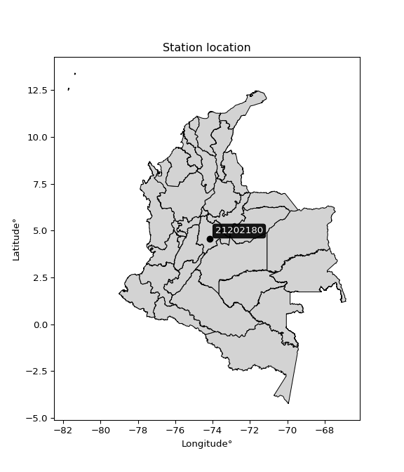

<div align="center">


</div>

# Station (rain, Pmax24h): 21202180

Probable Maximum Precipitation (PMP) is the greatest amount of rainfall for a specific duration that is meteorologically possible for a given location, acting as a "worst-case" scenario for extreme storms, crucial for designing safety-critical infrastructure like bridges, river deviations, dams, spillways, and nuclear plants to prevent catastrophic failure. PMP is calculated by hydrologists using meteorological data to determine the upper limit of extreme rainfall, often leading to the Probable Maximum Flood (PMF) for flood control design, and is increasingly being studied for climate change impacts.

<div align="center">

</img>

</div>


## A. General information


### 1. General running parameters

• app_version: _v20251226_. • runtime: _2025-12-26 15:38:16.554582_. • Python version: _3.14.0_. • SciPy version: _1.16.3_. • Pandas version: _2.3.3_. • NumPy version: _2.3.5_. • Stations dataset (station_dataset_file): _dataset/pmax24h_in/automatic_colombia_2003_2024.csv_. • Stations catalog (station_catalog_file): _dataset/CNE_IDEAM.xls_. • Minimum year to eval til year_max (date_min): _2003_. • Maximum year to eval since year_min (date_max): _2024_. • Creates, save and include plots into reports (create_plot): _False_. • Plot only fit distributions with Δo > Δ (plot_only_fit): _True_. • Eval low extreme values, if False, evaluates high extreme values (low_extreme): _False_. • Eval every SciPy distribution as logarithmic (pdist_logarithmic_on): _True_. • Standard deviation normalized (ddof): _1.0_. • Return periods to eval in years (Tr): _[2, 2.33, 5, 10, 15, 20, 25, 50, 75, 100, 200, 250, 500, 750, 1000]_. • Minimum data sample per station, 0 means any (minimum_sample): _5_. • Z-Score threshold to adjust a value, 0 means disable (zscore): _3.5_. • Avoid zeros, e.g. rain = 0 (avoid_zeros): _True_. • Avoid null values (avoid_nans): _True_. [:file_folder:Dataset file.](../../dataset/pmax24h_in/automatic_colombia_2003_2024.csv)


### 2. Station info and location

|   id |   CODIGO | NOMBRE                   | CATEGORIA               | TECNOLOGIA                | ESTADO   | FECHA_INSTALACION   |   FECHA_SUSPENSION |   ALTITUD |   LATITUD |   LONGITUD | DEPARTAMENTO   | MUNICIPIO   | AREA_OPERATIVA                            | ENTIDAD                                                          | AREA_HIDROGRAFICA   | ZONA_HIDROGRAFICA   | SUBZONA_HIDROGRAFICA   |   CORRIENTE | OBSERVACION                                                                                         |   SUBRED | Catalogo   |
|-----:|---------:|:-------------------------|:------------------------|:--------------------------|:---------|:--------------------|-------------------:|----------:|----------:|-----------:|:---------------|:------------|:------------------------------------------|:-----------------------------------------------------------------|:--------------------|:--------------------|:-----------------------|------------:|:----------------------------------------------------------------------------------------------------|---------:|:-----------|
|    0 | 21202180 | QUIBA  - AUT  [21202180] | Climatológica Ordinaria | Automática con Telemetría | Activa   | 01/10/2000          |                nan |      2916 |   4.54311 |    -74.156 | Bogotá         | Bogotá, D.C | Area Operativa 11 - Cundinamarca-Amazonas | FONDO DE PREVENCION Y ATENCION DE DESASTRES DE BOGOTA DC - FOPAE | Magdalena Cauca     | Alto Magdalena      | Río Bogotá             |         nan | 03/11/2022$Migracion$DATOS ACTUALIZADOS A LA FECHA 03/11/2022, SEGÚN INFORMACIÓN ENVIADA POR IDIGER |      nan | CNE_OE     |

<div align="center">

Map location in: [:earth_americas:Google](http://maps.google.com/maps?q=4.54311,-74.15601) [:earth_americas:OSM](https://www.openstreetmap.org/#map=18/4.54311/-74.15601&layers=P) [:earth_americas:Bing](https://www.bing.com/maps?cp=4.54311~-74.15601&lvl=18) [:earth_americas:Apple](https://maps.apple.com/frame?center=4.54311%2C-74.15601&span=0.003%2C0.006)

</div>


<div align="center">

```geojson
{
  "type": "Feature",
  "geometry": {
    "type": "Point", 
    "coordinates": [-74.15601, 4.54311]
  }, 
  "properties": {
    "Name": "21202180"
  }
}
```

</div>


### 3. Discrete values table and plot

|               |           0 |           1 |          2 |           3 |           4 |           5 |           6 |          7 |           8 |           9 |
|:--------------|------------:|------------:|-----------:|------------:|------------:|------------:|------------:|-----------:|------------:|------------:|
| Date          | 2008        | 2009        | 2010       | 2011        | 2012        | 2013        | 2014        | 2015       | 2016        | 2024        |
| Value         |   29.8      |   28.6      |   33       |   27.9      |   22.7      |   20.9      |   22.3      |   15.3     |   19.7      |   27        |
| Value_initial |   29.8      |   28.6      |   33       |   27.9      |   22.7      |   20.9      |   22.3      |   15.3     |   19.7      |   27        |
| count         |   10        |   10        |   10       |   10        |   10        |   10        |   10        |   10       |   10        |   10        |
| mean          |   24.72     |   24.72     |   24.72    |   24.72     |   24.72     |   24.72     |   24.72     |   24.72    |   24.72     |   24.72     |
| std           |    5.40777  |    5.40777  |    5.40777 |    5.40777  |    5.40777  |    5.40777  |    5.40777  |    5.40777 |    5.40777  |    5.40777  |
| zscore        |    0.939389 |    0.717486 |    1.53113 |    0.588043 |   -0.373536 |   -0.706391 |   -0.447504 |   -1.74194 |   -0.928294 |    0.421615 |
> If Z-Score is active, values out of range or outliers are replaced with the station mean value.


### 4. Active continuous probability distributions from SciPy (45 of 104 available)

[scipy.stats](https://docs.scipy.org/doc/scipy/reference/stats.html) is a Python´s powerful submodule within the SciPy library for comprehensive statistical analysis, offering over 130 probability distributions (like Normal, Poisson), functions for descriptive stats (mean, variance), hypothesis testing (t-tests, chi-square), random variable generation, and statistical tests, making it essential for data science, modeling, and research. It provides tools to explore, model, and draw conclusions from data efficiently, working seamlessly with NumPy.

<div align="center">

|   id | p_dist             |   n_parameter | fit_method   | label                                                                       | active   | ref                                                                                                        |
|-----:|:-------------------|--------------:|:-------------|:----------------------------------------------------------------------------|:---------|:-----------------------------------------------------------------------------------------------------------|
|    0 | alpha              |             3 | MLE          | Alpha                                                                       | True     | [:mortar_board:](https://docs.scipy.org/doc/scipy/reference/generated/scipy.stats.alpha.html)              |
|    1 | betaprime          |             4 | MLE          | Beta prime                                                                  | True     | [:mortar_board:](https://docs.scipy.org/doc/scipy/reference/generated/scipy.stats.betaprime.html)          |
|    2 | chi2               |             3 | MLE          | Chi²                                                                        | True     | [:mortar_board:](https://docs.scipy.org/doc/scipy/reference/generated/scipy.stats.chi2.html)               |
|    3 | crystalball        |             4 | MLE          | Crystalball                                                                 | True     | [:mortar_board:](https://docs.scipy.org/doc/scipy/reference/generated/scipy.stats.crystalball.html)        |
|    4 | erlang             |             3 | MLE          | Erlang                                                                      | True     | [:mortar_board:](https://docs.scipy.org/doc/scipy/reference/generated/scipy.stats.erlang.html)             |
|    5 | expon              |             2 | MLE          | Exponential                                                                 | True     | [:mortar_board:](https://docs.scipy.org/doc/scipy/reference/generated/scipy.stats.expon.html)              |
|    6 | exponnorm          |             3 | MLE          | Exponentially modified Normal                                               | True     | [:mortar_board:](https://docs.scipy.org/doc/scipy/reference/generated/scipy.stats.exponnorm.html)          |
|    7 | f                  |             4 | MLE          | F                                                                           | True     | [:mortar_board:](https://docs.scipy.org/doc/scipy/reference/generated/scipy.stats.f.html)                  |
|    8 | fatiguelife        |             3 | MLE          | Fatigue-life (Birnbaum-Saunders)                                            | True     | [:mortar_board:](https://docs.scipy.org/doc/scipy/reference/generated/scipy.stats.fatiguelife.html)        |
|    9 | fisk               |             3 | MLE          | Fisk                                                                        | True     | [:mortar_board:](https://docs.scipy.org/doc/scipy/reference/generated/scipy.stats.fisk.html)               |
|   10 | gamma              |             3 | MLE          | Gamma                                                                       | True     | [:mortar_board:](https://docs.scipy.org/doc/scipy/reference/generated/scipy.stats.gamma.html)              |
|   11 | genexpon           |             5 | MLE          | Generalized exponential                                                     | True     | [:mortar_board:](https://docs.scipy.org/doc/scipy/reference/generated/scipy.stats.genexpon.html)           |
|   12 | genlogistic        |             3 | MLE          | Generalized logistic                                                        | True     | [:mortar_board:](https://docs.scipy.org/doc/scipy/reference/generated/scipy.stats.genlogistic.html)        |
|   13 | gibrat             |             2 | MM           | Gibrat                                                                      | True     | [:mortar_board:](https://docs.scipy.org/doc/scipy/reference/generated/scipy.stats.gibrat.html)             |
|   14 | gompertz           |             3 | MLE          | Gompertz (or truncated Gumbel)                                              | True     | [:mortar_board:](https://docs.scipy.org/doc/scipy/reference/generated/scipy.stats.gompertz.html)           |
|   15 | gumbel_l           |             2 | MM           | Gumbel Left Skew                                                            | True     | [:mortar_board:](https://docs.scipy.org/doc/scipy/reference/generated/scipy.stats.gumbel_l.html)           |
|   16 | gumbel_r           |             2 | MM           | Gumbel Right Skew                                                           | True     | [:mortar_board:](https://docs.scipy.org/doc/scipy/reference/generated/scipy.stats.gumbel_r.html)           |
|   17 | halflogistic       |             2 | MM           | Half-logistic                                                               | True     | [:mortar_board:](https://docs.scipy.org/doc/scipy/reference/generated/scipy.stats.halflogistic.html)       |
|   18 | halfnorm           |             2 | MM           | Half Normal                                                                 | True     | [:mortar_board:](https://docs.scipy.org/doc/scipy/reference/generated/scipy.stats.halfnorm.html)           |
|   19 | hypsecant          |             2 | MM           | hyperbolic secant                                                           | True     | [:mortar_board:](https://docs.scipy.org/doc/scipy/reference/generated/scipy.stats.hypsecant.html)          |
|   20 | invgamma           |             3 | MLE          | Inverted gamma                                                              | True     | [:mortar_board:](https://docs.scipy.org/doc/scipy/reference/generated/scipy.stats.invgamma.html)           |
|   21 | invgauss           |             3 | MLE          | Inverse Gaussian                                                            | True     | [:mortar_board:](https://docs.scipy.org/doc/scipy/reference/generated/scipy.stats.invgauss.html)           |
|   22 | invweibull         |             3 | MLE          | Inverted Weibull                                                            | True     | [:mortar_board:](https://docs.scipy.org/doc/scipy/reference/generated/scipy.stats.invweibull.html)         |
|   23 | johnsonsu          |             4 | MLE          | Johnson Su                                                                  | True     | [:mortar_board:](https://docs.scipy.org/doc/scipy/reference/generated/scipy.stats.johnsonsu.html)          |
|   24 | kstwobign          |             2 | MLE          | Limiting distribution of scaled Kolmogorov-Smirnov two-sided test statistic | True     | [:mortar_board:](https://docs.scipy.org/doc/scipy/reference/generated/scipy.stats.kstwobign.html)          |
|   25 | laplace            |             2 | MM           | Laplace                                                                     | True     | [:mortar_board:](https://docs.scipy.org/doc/scipy/reference/generated/scipy.stats.laplace.html)            |
|   26 | laplace_asymmetric |             3 | MLE          | Asymmetric Laplace                                                          | True     | [:mortar_board:](https://docs.scipy.org/doc/scipy/reference/generated/scipy.stats.laplace_asymmetric.html) |
|   27 | loggamma           |             3 | MLE          | Log gamma                                                                   | True     | [:mortar_board:](https://docs.scipy.org/doc/scipy/reference/generated/scipy.stats.loggamma.html)           |
|   28 | logistic           |             2 | MM           | Logistic (or Sech-squared)                                                  | True     | [:mortar_board:](https://docs.scipy.org/doc/scipy/reference/generated/scipy.stats.logistic.html)           |
|   29 | lognorm            |             3 | MLE          | Log Normal                                                                  | True     | [:mortar_board:](https://docs.scipy.org/doc/scipy/reference/generated/scipy.stats.lognorm.html)            |
|   30 | maxwell            |             2 | MM           | Maxwell                                                                     | True     | [:mortar_board:](https://docs.scipy.org/doc/scipy/reference/generated/scipy.stats.maxwell.html)            |
|   31 | mielke             |             4 | MLE          | Mielke Beta-Kappa / Dagum                                                   | True     | [:mortar_board:](https://docs.scipy.org/doc/scipy/reference/generated/scipy.stats.mielke.html)             |
|   32 | moyal              |             2 | MM           | Moyal                                                                       | True     | [:mortar_board:](https://docs.scipy.org/doc/scipy/reference/generated/scipy.stats.moyal.html)              |
|   33 | nakagami           |             3 | MLE          | Nakagami                                                                    | True     | [:mortar_board:](https://docs.scipy.org/doc/scipy/reference/generated/scipy.stats.nakagami.html)           |
|   34 | ncf                |             5 | MLE          | Non-central F distribution                                                  | True     | [:mortar_board:](https://docs.scipy.org/doc/scipy/reference/generated/scipy.stats.ncf.html)                |
|   35 | nct                |             4 | MLE          | Non-central Student’s t                                                     | True     | [:mortar_board:](https://docs.scipy.org/doc/scipy/reference/generated/scipy.stats.nct.html)                |
|   36 | norm               |             2 | MM           | Normal                                                                      | True     | [:mortar_board:](https://docs.scipy.org/doc/scipy/reference/generated/scipy.stats.norm.html)               |
|   37 | pareto             |             3 | MLE          | Pareto                                                                      | True     | [:mortar_board:](https://docs.scipy.org/doc/scipy/reference/generated/scipy.stats.pareto.html)             |
|   38 | pearson3           |             3 | MM           | Pearson type III                                                            | True     | [:mortar_board:](https://docs.scipy.org/doc/scipy/reference/generated/scipy.stats.pearson3.html)           |
|   39 | rayleigh           |             2 | MM           | Rayleigh                                                                    | True     | [:mortar_board:](https://docs.scipy.org/doc/scipy/reference/generated/scipy.stats.rayleigh.html)           |
|   40 | rice               |             3 | MLE          | Rice                                                                        | True     | [:mortar_board:](https://docs.scipy.org/doc/scipy/reference/generated/scipy.stats.rice.html)               |
|   41 | t                  |             3 | MLE          | Student’s t                                                                 | True     | [:mortar_board:](https://docs.scipy.org/doc/scipy/reference/generated/scipy.stats.t.html)                  |
|   42 | truncnorm          |             4 | MLE          | Truncated normal                                                            | True     | [:mortar_board:](https://docs.scipy.org/doc/scipy/reference/generated/scipy.stats.truncnorm.html)          |
|   43 | wald               |             2 | MM           | Wald                                                                        | True     | [:mortar_board:](https://docs.scipy.org/doc/scipy/reference/generated/scipy.stats.wald.html)               |
|   44 | weibull_min        |             3 | MLE          | Weibull minimum                                                             | True     | [:mortar_board:](https://docs.scipy.org/doc/scipy/reference/generated/scipy.stats.weibull_min.html)        |

</div>

> **n_parameter:** # arguments & localization & scale.
>
> **Fit methods:** (MLE) maximum likelihood, (MM) L-moments.
>
>**Inactive:** foldnorm, gennorm, norminvgauss, powernorm, powerlognorm, skewnorm, genextreme, anglit, arcsine, argus, beta, bradford, burr, burr12, cauchy, cosine, halfcauchy, foldcauchy, skewcauchy, wrapcauchy, dgamma, gengamma, exponweib, exponpow, truncexpon, gausshyper, genhalflogistic, genhyperbolic, geninvgauss, halfgennorm, johnsonsb, kappa4, kappa3, ksone, kstwo, loglaplace, levy, levy_l, levy_stable, ncx2, genpareto, truncpareto, lomax, powerlaw, rdist, rel_breitwigner, recipinvgauss, semicircular, studentized_range, trapezoid, triang, truncweibull_min, tukeylambda, uniform, loguniform, vonmises, vonmises_line, weibull_max, dweibull, 


## B. Probability distributions vs. Empirical distributions

A continuous probability distribution (CPD) describes probabilities for variables that can take any value within a range (like rain any time), unlike discrete variables with specific outcomes (like temperature). It uses a Probability Density Function (PDF), a curve where the total area under it equals 1, and the probability of the variable falling within an interval (a to b) is found by calculating the area under the curve between those points. A key feature is that the probability of hitting any single exact value is zero, so probabilities are always expressed for ranges, e.g., $P(a ≤ X ≤ b)$.

<div align="center">

Distributions parameters
|    |   station | p_dist                |   n |            loc |           scale | shape                  | shape1              | shape2                 | shape3   |
|---:|----------:|:----------------------|----:|---------------:|----------------:|:-----------------------|:--------------------|:-----------------------|:---------|
|  0 |  21202180 | alpha                 |  10 |  -64.9968      |  1536.51        | 17.179312959640477     |                     |                        |          |
|  1 |  21202180 | betaprime             |  10 |  -11.3203      |   717.654       | 49.455343318459455     | 984.8020988185381   |                        |          |
|  2 |  21202180 | chi2                  |  10 |  -22.2715      |     0.29095     | 161.40415481894308     |                     |                        |          |
|  3 |  21202180 | crystalball           |  10 |   24.72        |     5.13026     | 613.9808944920451      | 359.90546289629356  |                        |          |
|  4 |  21202180 | erlang                |  10 |  -80.2696      |     0.251996    | 416.51582662178885     |                     |                        |          |
|  5 |  21202180 | expon                 |  10 |   15.3         |     9.42        |                        |                     |                        |          |
|  6 |  21202180 | exponnorm             |  10 |   24.7152      |     5.13024     | 0.0009297031328023111  |                     |                        |          |
|  7 |  21202180 | f                     |  10 | -594.611       |   619.324       | 39885.21414944474      | 107362.57677804057  |                        |          |
|  8 |  21202180 | fatiguelife           |  10 | -466.355       |   491.057       | 0.01043299802008514    |                     |                        |          |
|  9 |  21202180 | fisk                  |  10 |   -2.58102e+08 |     2.58102e+08 | 83648160.37583978      |                     |                        |          |
| 10 |  21202180 | gamma                 |  10 |  -86.1068      |     0.241575    | 458.74095010028327     |                     |                        |          |
| 11 |  21202180 | genexpon              |  10 |   15.3         |     2.31994     | 0.1963205118097791     | 0.05854168823613229 | 1.5291340327881846     |          |
| 12 |  21202180 | genlogistic           |  10 |   25.2246      |     2.9874      | 0.922398054924835      |                     |                        |          |
| 13 |  21202180 | gibrat                |  10 |   20.8063      |     2.3738      |                        |                     |                        |          |
| 14 |  21202180 | gompertz              |  10 |   15.2168      |     6.02353     | 0.15643886450287936    |                     |                        |          |
| 15 |  21202180 | gumbel_l              |  10 |   27.0289      |     4.00005     |                        |                     |                        |          |
| 16 |  21202180 | gumbel_r              |  10 |   22.4111      |     4.00005     |                        |                     |                        |          |
| 17 |  21202180 | halflogistic          |  10 |   18.6394      |     4.38621     |                        |                     |                        |          |
| 18 |  21202180 | halfnorm              |  10 |   17.9295      |     8.5106      |                        |                     |                        |          |
| 19 |  21202180 | hypsecant             |  10 |   24.72        |     3.26603     |                        |                     |                        |          |
| 20 |  21202180 | invgamma              |  10 |  -60.5765      | 22778.1         | 268.03049965270986     |                     |                        |          |
| 21 |  21202180 | invgauss              |  10 |  -15.2278      |  2317.02        | 0.01719140249900672    |                     |                        |          |
| 22 |  21202180 | invweibull            |  10 |   -4.70565e+08 |     4.70565e+08 | 94963029.434939        |                     |                        |          |
| 23 |  21202180 | johnsonsu             |  10 |   -1.03113e+08 |     1.0131e+08  | -25116177.58732386     | 28097236.55095517   |                        |          |
| 24 |  21202180 | kstwobign             |  10 |    4.48942     |    23.1496      |                        |                     |                        |          |
| 25 |  21202180 | laplace               |  10 |   24.72        |     3.62764     |                        |                     |                        |          |
| 26 |  21202180 | laplace_asymmetric    |  10 |   22.3         |     4.10302     | 0.7476701947431136     |                     |                        |          |
| 27 |  21202180 | loggamma              |  10 |   -6.10825     |    14.7079      | 8.628715068736877      |                     |                        |          |
| 28 |  21202180 | logistic              |  10 |   24.72        |     2.82846     |                        |                     |                        |          |
| 29 |  21202180 | lognorm               |  10 |   15.3         |     0.254522    | 10.873698015673076     |                     |                        |          |
| 30 |  21202180 | maxwell               |  10 |   12.5634      |     7.618       |                        |                     |                        |          |
| 31 |  21202180 | mielke                |  10 |   -0.255898    |    30.7933      | 4.082700873350376      | 21.171294310791467  |                        |          |
| 32 |  21202180 | moyal                 |  10 |   21.7862      |     2.30943     |                        |                     |                        |          |
| 33 |  21202180 | nakagami              |  10 |   19.7         |     6.94665     | 0.09636145201812986    |                     |                        |          |
| 34 |  21202180 | ncf                   |  10 |   -1.28813     |     0.172538    | 0.7490369241624166     | 377.4469552129424   | 111.59411329302336     |          |
| 35 |  21202180 | nct                   |  10 | -256.397       |     5.06302     | 57279.41984384721      | 55.522803442534766  |                        |          |
| 36 |  21202180 | norm                  |  10 |   24.72        |     5.13026     |                        |                     |                        |          |
| 37 |  21202180 | pareto                |  10 |   15.2996      |     0.000434421 | 0.11116738802378238    |                     |                        |          |
| 38 |  21202180 | pearson3              |  10 |   24.72        |     5.13025     | -0.17726692702540736   |                     |                        |          |
| 39 |  21202180 | rayleigh              |  10 |   14.9055      |     7.83083     |                        |                     |                        |          |
| 40 |  21202180 | rice                  |  10 |   12.7621      |     5.70361     | 1.790132206165492      |                     |                        |          |
| 41 |  21202180 | t                     |  10 |   24.7203      |     5.13002     | 8467176.679117914      |                     |                        |          |
| 42 |  21202180 | truncnorm             |  10 |   19.3513      |    24.9655      | -202.18624225460644    | 0.5467009423359346  |                        |          |
| 43 |  21202180 | wald                  |  10 |   19.5898      |     5.13024     |                        |                     |                        |          |
| 44 |  21202180 | weibull_min           |  10 |    6.87706     |    19.732       | 4.014340110796494      |                     |                        |          |
| 45 |  21202180 | logalpha              |  10 |   -3.9876      |   226.577       | 31.626891441417108     |                     |                        |          |
| 46 |  21202180 | logbetaprime          |  10 |    1.21837     |    96.8766      | 72.24060761859951      | 3556.1752915114976  |                        |          |
| 47 |  21202180 | logchi2               |  10 |    2.72785     |     0.964949    | 1.0714858030689025     |                     |                        |          |
| 48 |  21202180 | logcrystalball        |  10 |    3.18441     |     0.220101    | 27.99546281181324      | 7361.646747621523   |                        |          |
| 49 |  21202180 | logerlang             |  10 |   -0.300151    |     0.0145467   | 239.40930892347245     |                     |                        |          |
| 50 |  21202180 | logexpon              |  10 |    2.72785     |     0.456553    |                        |                     |                        |          |
| 51 |  21202180 | logexponnorm          |  10 |    3.18421     |     0.220102    | 0.0008654638024082892  |                     |                        |          |
| 52 |  21202180 | logf                  |  10 | -286.383       |   289.568       | 8848221.24149122       | 5697019.410589885   |                        |          |
| 53 |  21202180 | logfatiguelife        |  10 |  -67.1013      |    70.2849      | 0.0031308850514307606  |                     |                        |          |
| 54 |  21202180 | logfisk               |  10 |   -1.11824e+07 |     1.11824e+07 | 86822032.61662328      |                     |                        |          |
| 55 |  21202180 | loggamma              |  10 |   -0.50662     |     0.0138655   | 266.02724925134993     |                     |                        |          |
| 56 |  21202180 | loggenexpon           |  10 |    2.61963     |     0.0174921   | 1.0827340519197797e-07 | 3.82934158495822    | 0.00043705751511665455 |          |
| 57 |  21202180 | loggenlogistic        |  10 |    3.41946     |     0.0474418   | 0.19139414574820773    |                     |                        |          |
| 58 |  21202180 | loggibrat             |  10 |    3.01647     |     0.101859    |                        |                     |                        |          |
| 59 |  21202180 | loggompertz           |  10 |    2.72785     |     0.73145     | 1.1449092756573052     |                     |                        |          |
| 60 |  21202180 | loggumbel_l           |  10 |    3.28346     |     0.171612    |                        |                     |                        |          |
| 61 |  21202180 | loggumbel_r           |  10 |    3.08535     |     0.171612    |                        |                     |                        |          |
| 62 |  21202180 | loghalflogistic       |  10 |    2.92357     |     0.188157    |                        |                     |                        |          |
| 63 |  21202180 | loghalfnorm           |  10 |    2.89307     |     0.365137    |                        |                     |                        |          |
| 64 |  21202180 | loghypsecant          |  10 |    3.18441     |     0.140121    |                        |                     |                        |          |
| 65 |  21202180 | loginvgamma           |  10 |   -3.80319     |  6923.68        | 991.9732840731599      |                     |                        |          |
| 66 |  21202180 | loginvgauss           |  10 |    0.814892    |   252.599       | 0.009376912766949866   |                     |                        |          |
| 67 |  21202180 | loginvweibull         |  10 |   -2.03014e+07 |     2.03015e+07 | 87723969.36805874      |                     |                        |          |
| 68 |  21202180 | logjohnsonsu          |  10 |    3.74885     |     0.0292786   | 8.966334876584675      | 2.5084743985486537  |                        |          |
| 69 |  21202180 | logkstwobign          |  10 |    2.23128     |     1.09164     |                        |                     |                        |          |
| 70 |  21202180 | loglaplace            |  10 |    3.18441     |     0.155635    |                        |                     |                        |          |
| 71 |  21202180 | loglaplace_asymmetric |  10 |    3.35341     |     0.137874    | 1.7856891459343063     |                     |                        |          |
| 72 |  21202180 | logloggamma           |  10 |    3.34667     |     0.146926    | 0.742767899751305      |                     |                        |          |
| 73 |  21202180 | loglogistic           |  10 |    3.18441     |     0.121348    |                        |                     |                        |          |
| 74 |  21202180 | loglognorm            |  10 |    2.72785     |     0.0149804   | 10.388809200687755     |                     |                        |          |
| 75 |  21202180 | logmaxwell            |  10 |    2.66286     |     0.326831    |                        |                     |                        |          |
| 76 |  21202180 | logmielke             |  10 |    2.63296     |     0.874523    | 1.6060932905215224     | 378.7063216040859   |                        |          |
| 77 |  21202180 | logmoyal              |  10 |    3.05854     |     0.0990802   |                        |                     |                        |          |
| 78 |  21202180 | lognakagami           |  10 |    2.98062     |     0.262254    | 0.2361678255799447     |                     |                        |          |
| 79 |  21202180 | logncf                |  10 |   -3.14195     |     6.32332     | 313.3696361910406      | 424.91204133894274  | 1.116189214538784e-12  |          |
| 80 |  21202180 | lognct                |  10 |   -1.40656     |     0.0177761   | 199.62364945772708     | 257.1537582272957   |                        |          |
| 81 |  21202180 | lognorm               |  10 |    3.18441     |     0.220101    |                        |                     |                        |          |
| 82 |  21202180 | logpareto             |  10 |    2.72783     |     2.17689e-05 | 0.11116533482690492    |                     |                        |          |
| 83 |  21202180 | logpearson3           |  10 |    3.18441     |     0.220101    | -0.5487435727616856    |                     |                        |          |
| 84 |  21202180 | lograyleigh           |  10 |    2.76338     |     0.335928    |                        |                     |                        |          |
| 85 |  21202180 | logrice               |  10 |    2.58588     |     0.23494     | 2.3168660142385464     |                     |                        |          |
| 86 |  21202180 | logt                  |  10 |    3.1844      |     0.2201      | 731222206.8090518      |                     |                        |          |
| 87 |  21202180 | logtruncnorm          |  10 |   -0.0902408   |     1.03405     | 2.7252999287274777     | 3.4686547586085275  |                        |          |
| 88 |  21202180 | logwald               |  10 |    2.96428     |     0.220129    |                        |                     |                        |          |
| 89 |  21202180 | logweibull_min        |  10 |   -3.37514     |     6.66062     | 36.95544464916139      |                     |                        |          |

</div>

> **loc** (Location parameter): This shifts the distribution along the x-axis. For many common distributions, like the normal (Gaussian) distribution, loc represents the mean $μ$. For others, like the uniform distribution, it might represent the minimum value, or for the beta distribution, the left end of the support interval.
>
> **scale** (Scale parameter): This determines the width or spread of the distribution. For the normal distribution, scale represents the standard deviation $σ$. For a uniform distribution, it defines the length of the interval (from $loc$ to $loc + scale$).
>
> **shape** (Shape parameters): Refers to parameters that define the specific form of a probability distribution, distinct from its location (loc) and scale (scale). These parameters are required arguments for most distribution functions. For example, a normal (Gaussian) distribution is fully defined by its location (mean) and scale (standard deviation), so it has no specific shape parameters beyond loc and scale. However, other distributions have intrinsic properties that need specification, as Gamma distribution that takes a shape parameter, often named $a$ or $alpha$.


### 0. Cumulative distribution values - CDF (90 evaluated)

> Ordered by x ascending and calculating $log(f(x))$ separately. 

|   id |   Station |   date |    x |   count |   mean |     std |    zscore |   Value_initial |   station |   m |     alpha |   alpha_pdf |   betaprime |   betaprime_pdf |     chi2 |   chi2_pdf |   crystalball |   crystalball_pdf |    erlang |   erlang_pdf |    expon |   expon_pdf |   exponnorm |   exponnorm_pdf |         f |     f_pdf |   fatiguelife |   fatiguelife_pdf |      fisk |   fisk_pdf |    gamma |   gamma_pdf |    genexpon |   genexpon_pdf |   genlogistic |   genlogistic_pdf |      gibrat |   gibrat_pdf |   gompertz |   gompertz_pdf |   gumbel_l |   gumbel_l_pdf |   gumbel_r |   gumbel_r_pdf |   halflogistic |   halflogistic_pdf |   halfnorm |   halfnorm_pdf |   hypsecant |   hypsecant_pdf |   invgamma |   invgamma_pdf |   invgauss |   invgauss_pdf |   invweibull |   invweibull_pdf |   johnsonsu |   johnsonsu_pdf |   kstwobign |   kstwobign_pdf |   laplace |   laplace_pdf |   laplace_asymmetric |   laplace_asymmetric_pdf |   loggamma |   loggamma_pdf |   logistic |   logistic_pdf |   lognorm |   lognorm_pdf |   maxwell |   maxwell_pdf |    mielke |   mielke_pdf |       moyal |   moyal_pdf |    nakagami |   nakagami_pdf |       ncf |   ncf_pdf |       nct |   nct_pdf |      norm |   norm_pdf |   pareto |   pareto_pdf |   pearson3 |   pearson3_pdf |   rayleigh |   rayleigh_pdf |      rice |   rice_pdf |         t |     t_pdf |   truncnorm |   truncnorm_pdf |        wald |    wald_pdf |   weibull_min |   weibull_min_pdf |   logalpha |   logalpha_pdf |   logbetaprime |   logbetaprime_pdf |     logchi2 |   logchi2_pdf |   logcrystalball |   logcrystalball_pdf |   logerlang |   logerlang_pdf |   logexpon |   logexpon_pdf |   logexponnorm |   logexponnorm_pdf |      logf |   logf_pdf |   logfatiguelife |   logfatiguelife_pdf |   logfisk |   logfisk_pdf |   loggenexpon |   loggenexpon_pdf |   loggenlogistic |   loggenlogistic_pdf |   loggibrat |   loggibrat_pdf |   loggompertz |   loggompertz_pdf |   loggumbel_l |   loggumbel_l_pdf |   loggumbel_r |   loggumbel_r_pdf |   loghalflogistic |   loghalflogistic_pdf |   loghalfnorm |   loghalfnorm_pdf |   loghypsecant |   loghypsecant_pdf |   loginvgamma |   loginvgamma_pdf |   loginvgauss |   loginvgauss_pdf |   loginvweibull |   loginvweibull_pdf |   logjohnsonsu |   logjohnsonsu_pdf |   logkstwobign |   logkstwobign_pdf |   loglaplace |   loglaplace_pdf |   loglaplace_asymmetric |   loglaplace_asymmetric_pdf |   logloggamma |   logloggamma_pdf |   loglogistic |   loglogistic_pdf |   loglognorm |   loglognorm_pdf |   logmaxwell |   logmaxwell_pdf |   logmielke |   logmielke_pdf |    logmoyal |   logmoyal_pdf |   lognakagami |   lognakagami_pdf |   logncf |   logncf_pdf |    lognct |   lognct_pdf |   logpareto |   logpareto_pdf |   logpearson3 |   logpearson3_pdf |   lograyleigh |   lograyleigh_pdf |   logrice |   logrice_pdf |      logt |   logt_pdf |   logtruncnorm |   logtruncnorm_pdf |     logwald |   logwald_pdf |   logweibull_min |   logweibull_min_pdf |
|-----:|----------:|-------:|-----:|--------:|-------:|--------:|----------:|----------------:|----------:|----:|----------:|------------:|------------:|----------------:|---------:|-----------:|--------------:|------------------:|----------:|-------------:|---------:|------------:|------------:|----------------:|----------:|----------:|--------------:|------------------:|----------:|-----------:|---------:|------------:|------------:|---------------:|--------------:|------------------:|------------:|-------------:|-----------:|---------------:|-----------:|---------------:|-----------:|---------------:|---------------:|-------------------:|-----------:|---------------:|------------:|----------------:|-----------:|---------------:|-----------:|---------------:|-------------:|-----------------:|------------:|----------------:|------------:|----------------:|----------:|--------------:|---------------------:|-------------------------:|-----------:|---------------:|-----------:|---------------:|----------:|--------------:|----------:|--------------:|----------:|-------------:|------------:|------------:|------------:|---------------:|----------:|----------:|----------:|----------:|----------:|-----------:|---------:|-------------:|-----------:|---------------:|-----------:|---------------:|----------:|-----------:|----------:|----------:|------------:|----------------:|------------:|------------:|--------------:|------------------:|-----------:|---------------:|---------------:|-------------------:|------------:|--------------:|-----------------:|---------------------:|------------:|----------------:|-----------:|---------------:|---------------:|-------------------:|----------:|-----------:|-----------------:|---------------------:|----------:|--------------:|--------------:|------------------:|-----------------:|---------------------:|------------:|----------------:|--------------:|------------------:|--------------:|------------------:|--------------:|------------------:|------------------:|----------------------:|--------------:|------------------:|---------------:|-------------------:|--------------:|------------------:|--------------:|------------------:|----------------:|--------------------:|---------------:|-------------------:|---------------:|-------------------:|-------------:|-----------------:|------------------------:|----------------------------:|--------------:|------------------:|--------------:|------------------:|-------------:|-----------------:|-------------:|-----------------:|------------:|----------------:|------------:|---------------:|--------------:|------------------:|---------:|-------------:|----------:|-------------:|------------:|----------------:|--------------:|------------------:|--------------:|------------------:|----------:|--------------:|----------:|-----------:|---------------:|-------------------:|------------:|--------------:|-----------------:|---------------------:|
|    0 |  21202180 |   2015 | 15.3 |      10 |  24.72 | 5.40777 | -1.74194  |            15.3 |  21202180 |   1 | 0.0252287 |   0.0140346 |   0.0260602 |       0.0142448 | 0.029095 |  0.0147395 |     0.0331667 |         0.0144098 | 0.0309503 |    0.0144544 | 0        |   0.106157  |   0.0331664 |       0.0144098 | 0.0326374 | 0.0143894 |      0.031934 |         0.0142596 | 0.0435775 |  0.0135076 | 0.031588 |   0.0145632 | 6.22839e-09 |      0.0846232 |     0.0451825 |         0.0134649 | 0           |    0         | 0.00217403 |      0.0262754 |  0.0518859 |      0.0126288 | 0.00269446 |     0.00398543 |       0        |          0         |   0        |      0         |   0.0355484 |       0.0108617 |  0.0279674 |      0.0143866 |  0.0241726 |      0.0143531 |    0.0190745 |        0.0152412 |   0.0335525 |       0.0145066 |   0.0187459 |       0.0178854 | 0.0372585 |     0.0102707 |            0.0366085 |                0.0119335 |  0.0189308 |       0.223122 |  0.0345418 |      0.0117904 | 0.0190262 |      0.21085  | 0.0118622 |     0.0126709 | 0.0615501 |    0.016154  | 4.64901e-05 | 0.000176055 | 0           |    0           | 0.0239863 | 0.014064  | 0.0331036 | 0.0144105 | 0.0331668 |  0.0144099 | 0        | 255.898      |  0.0380126 |      0.0145793 | 0.00126811 |     0.00642499 | 0.0205067 |  0.0165827 | 0.0331564 | 0.0144068 |    0.615429 |       0.0222842 | 0           | 0           |     0.0322673 |         0.0151277 |  0.0173083 |       0.215097 |      0.0177874 |           0.224641 | 4.71683e-09 |   5.69031e+06 |        0.0190262 |             0.21085  |   0.0181645 |        0.217676 |   0        |       2.19033  |      0.0190271 |           0.210857 | 0.0188516 |   0.209677 |        0.0188689 |             0.210779 | 0.0252039 |      0.190756 |     0.0314973 |          0.572552 |        0.0614118 |             0.247753 |   0         |        0        |   1.03414e-08 |          1.56526  |     0.0384976 |          0.219955 |   0.000325601 |         0.0152351 |          0        |              0        |      0        |          0        |      0.0244687 |           0.174454 |     0.0167294 |          0.205053 |      0.0152   |          0.208216 |       0.0127677 |            0.240588 |      0.0462626 |           0.23802  |      0.0141878 |           0.312111 |    0.0266055 |         0.170948 |               0.0599877 |                    0.243654 |     0.0474305 |          0.237746 |     0.0227018 |          0.182833 |   0.00135714 |      9.65321e+11 |   0.00206688 |        0.0946511 |   0.0282419 |        0.477982 | 1.12263e-07 |    1.64797e-05 |   0           |       0           | 0.2421   |     0.502922 | 0.0177907 |     0.225792 |    0        |    5106.62      |     0.0312271 |          0.237493 |      0        |          0        | 0.0143322 |      0.227345 | 0.0190262 |    0.21085 |    1.57871e-06 |           3.18894  | 0           |      0        |        0.0387432 |             0.229997 |
|    1 |  21202180 |   2016 | 19.7 |      10 |  24.72 | 5.40777 | -0.928294 |            19.7 |  21202180 |   2 | 0.168029  |   0.0537973 |   0.168112  |       0.0530996 | 0.170299 |  0.0522318 |     0.163912  |         0.0481789 | 0.166059  |    0.0500671 | 0.373177 |   0.0665417 |   0.163911  |       0.048179  | 0.164004  | 0.048475  |      0.163186 |         0.0486023 | 0.159405  |  0.0434264 | 0.166422 |   0.0497551 | 0.360581    |      0.0693573 |     0.158724  |         0.0423451 | 0           |    0         | 0.15874    |      0.0459899 |  0.147908  |      0.0340962 | 0.13953    |     0.0686993  |       0.120314 |          0.112344  |   0.164796 |      0.091745  |   0.134832  |       0.0400595 |  0.168028  |      0.0522039 |  0.173655  |      0.0562579 |    0.196069  |        0.0644677 |   0.164598  |       0.0481732 |   0.218996  |       0.0678883 | 0.12531   |     0.0345431 |            0.153635  |                0.0500813 |  0.187636  |       1.23609  |  0.144944  |      0.0438173 | 0.177254  |      1.18069  | 0.16917   |     0.059269  | 0.170165  |    0.0348099 | 0.116199    | 0.07901     | 0.000946467 |    5.13427e+10 | 0.169479  | 0.0547817 | 0.163961  | 0.0482283 | 0.163912  |  0.0481789 | 0.641318 |   0.00906132 |  0.163318  |      0.0454717 | 0.170913   |     0.0648227  | 0.171248  |  0.0530261 | 0.163887  | 0.0481764 |    0.714379 |       0.0225774 | 2.41788e-11 | 5.20683e-09 |     0.162427  |         0.0464759 |  0.187018  |       1.25398  |      0.19094   |           1.25431  | 0.362375    |   0.704736    |        0.177254  |             1.18069  |   0.185919  |        1.23787  |   0.425146 |       1.25912  |      0.177257  |           1.1807   | 0.176809  |   1.18038  |        0.177841  |             1.18684  | 0.15542   |      1.01917  |     0.299058  |          1.37783  |        0.170258  |             0.686807 |   0         |        0        |   0.376627    |          1.37852  |     0.157379  |          0.840783 |   0.158669    |         1.70209   |          0.150456 |              2.5972   |      0.189493 |          2.12324  |      0.146063  |           1.00621  |     0.181027  |          1.23427  |      0.190032 |          1.29694  |       0.231556  |            1.46377  |      0.166247  |           0.813906 |      0.266325  |           1.50568  |    0.134992  |         0.867363 |               0.167471  |                    0.680223 |     0.165408  |          0.797161 |     0.15718   |          1.09169  |   0.607188   |      0.146407    |   0.185506   |        1.43849   |   0.227289  |        1.05     | 0.138411    |    1.99039     |   8.24609e-08 |       8.77059e+07 | 0.381855 |     0.590032 | 0.19414   |     1.28267  |    0.646718 |       0.155359  |     0.171767  |          0.994561 |      0.188679 |          1.56182  | 0.1834    |      1.22688  | 0.177255  |    1.1807  |    0.583576    |           1.58984  | 0.000637833 |      0.279008 |        0.162253  |             0.86237  |
|    2 |  21202180 |   2013 | 20.9 |      10 |  24.72 | 5.40777 | -0.706391 |            20.9 |  21202180 |   3 | 0.239303  |   0.0646362 |   0.238415  |       0.0637436 | 0.239499 |  0.0628191 |     0.228256  |         0.0589355 | 0.232761  |    0.06091   | 0.44815  |   0.0585828 |   0.228256  |       0.0589358 | 0.228719  | 0.0592456 |      0.228107 |         0.0594559 | 0.218615  |  0.0553618 | 0.232662 |   0.0604574 | 0.438909    |      0.0612868 |     0.21652   |         0.0541265 | 0.000614956 |    0.0229598 | 0.217645   |      0.0521982 |  0.194312  |      0.0435185 | 0.232461   |     0.0847911  |       0.252135 |          0.106747  |   0.272935 |      0.0882117 |   0.191654  |       0.0551992 |  0.237294  |      0.0629542 |  0.247875  |      0.0670072 |    0.278352  |        0.0718382 |   0.228895  |       0.0588615 |   0.303614  |       0.0723389 | 0.17444   |     0.0480864 |            0.227182  |                0.0740559 |  0.268704  |       1.49718  |  0.205779  |      0.057782  | 0.255517  |      1.46047  | 0.246407  |     0.0689204 | 0.215967  |    0.041663  | 0.225702    | 0.100465    | 0.597027    |    0.0956328   | 0.241872  | 0.0654789 | 0.228367  | 0.0589878 | 0.228256  |  0.0589355 | 0.650805 |   0.00693144 |  0.224161  |      0.0558966 | 0.253974   |     0.0729274  | 0.240682  |  0.0624493 | 0.228229  | 0.0589344 |    0.741452 |       0.0225362 | 0.118302    | 0.203493    |     0.224176  |         0.0563742 |  0.269166  |       1.51469  |      0.272582  |           1.49677  | 0.401418    |   0.619922    |        0.255517  |             1.46047  |   0.267202  |        1.50259  |   0.494979 |       1.10616  |      0.25552   |           1.46046  | 0.255071  |   1.46075  |        0.256475  |             1.46664  | 0.225551  |      1.35623  |     0.381856  |          1.41307  |        0.216117  |             0.87159  |   0.0699848 |        5.76602  |   0.455997    |          1.30429  |     0.214692  |          1.10594  |   0.271346    |         2.0624    |          0.299289 |              2.41933  |      0.312104 |          2.01577  |      0.217821  |           1.43601  |     0.262416  |          1.50995  |      0.274563 |          1.55016  |       0.322041  |            1.57675  |      0.22114   |           1.04965  |      0.357004  |           1.54484  |    0.197383  |         1.26824  |               0.212934  |                    0.864882 |     0.219255  |          1.0317   |     0.232887  |          1.47222  |   0.614945   |      0.117975    |   0.277928   |        1.6697    |   0.292509  |        1.15488  | 0.271569    |    2.41887     |   0.386086    |       3.05424     | 0.417016 |     0.598432 | 0.277605  |     1.52925  |    0.654877 |       0.122999  |     0.238311  |          1.25808  |      0.287098 |          1.74591  | 0.263867  |      1.48708  | 0.255518  |    1.46047 |    0.66999     |           1.33934  | 0.211515    |      4.80905  |        0.220642  |             1.11924  |
|    3 |  21202180 |   2014 | 22.3 |      10 |  24.72 | 5.40777 | -0.447504 |            22.3 |  21202180 |   4 | 0.336632  |   0.0735933 |   0.334477  |       0.0727259 | 0.334429 |  0.0720934 |     0.318567  |         0.0695749 | 0.3256    |    0.0711158 | 0.524363 |   0.0504923 |   0.318567  |       0.0695752 | 0.31942   | 0.0698056 |      0.319145 |         0.070067  | 0.305757  |  0.0687945 | 0.324789 |   0.0705672 | 0.51862     |      0.0527628 |     0.302032  |         0.0677886 | 0.321604    |    0.239908  | 0.295736   |      0.0592826 |  0.264056  |      0.0564096 | 0.357662   |     0.0919329  |       0.394639 |          0.0962403 |   0.392422 |      0.0821703 |   0.283167  |       0.0757093 |  0.332512  |      0.0723531 |  0.348134  |      0.0753266 |    0.381324  |        0.0741915 |   0.319045  |       0.0694223 |   0.405317  |       0.0721041 | 0.256597  |     0.0707339 |            0.358568  |                0.116885  |  0.372886  |       1.6974   |  0.298262  |      0.0739984 | 0.358434  |      1.69719  | 0.348191  |     0.075598  | 0.280491  |    0.0507003 | 0.370936    | 0.103576    | 0.692317    |    0.0506893   | 0.340125  | 0.0740405 | 0.318745  | 0.0696162 | 0.318567  |  0.0695749 | 0.65936  |   0.00540938 |  0.310391  |      0.0669401 | 0.359708   |     0.0772094  | 0.334394  |  0.0708396 | 0.318539  | 0.0695757 |    0.772931 |       0.0224226 | 0.389308    | 0.164061    |     0.310589  |         0.0667378 |  0.374266  |       1.70707  |      0.375856  |           1.66932  | 0.439218    |   0.549118    |        0.358434  |             1.69719  |   0.371832  |        1.70553  |   0.561839 |       0.959714 |      0.358436  |           1.69718  | 0.358024  |   1.69798  |        0.359746  |             1.70162  | 0.325152  |      1.70368  |     0.473036  |          1.38942  |        0.280678  |             1.13086  |   0.442396  |        4.48     |   0.537612    |          1.21137  |     0.297164  |          1.4442   |   0.409035    |         2.13073   |          0.447072 |              2.12622  |      0.437601 |          1.84763  |      0.327755  |           1.94713  |     0.367906  |          1.72421  |      0.381333 |          1.72137  |       0.424765  |            1.57154  |      0.298736  |           1.34977  |      0.45586   |           1.49044  |    0.29939   |         1.92367  |               0.277088  |                    1.12546  |     0.295806  |          1.33683  |     0.341241  |          1.85249  |   0.621876   |      0.0971374   |   0.390854   |        1.78904   |   0.370933  |        1.26318  | 0.427985    |    2.33115     |   0.543496    |       1.98407     | 0.455965 |     0.602002 | 0.382956  |     1.69964  |    0.662047 |       0.0997163 |     0.329186  |          1.54019  |      0.402992 |          1.8051   | 0.367565  |      1.69391  | 0.358436  |    1.6972  |    0.749037    |           1.10563  | 0.47365     |      3.21233  |        0.303364  |             1.43624  |
|    4 |  21202180 |   2012 | 22.7 |      10 |  24.72 | 5.40777 | -0.373536 |            22.7 |  21202180 |   5 | 0.366404  |   0.0751917 |   0.363914  |       0.0743865 | 0.36364  |  0.0738947 |     0.346886  |         0.0719624 | 0.354492  |    0.0732778 | 0.544137 |   0.0483931 |   0.346886  |       0.0719627 | 0.347824  | 0.0721521 |      0.347654 |         0.0724159 | 0.333945  |  0.0720859 | 0.353459 |   0.0727213 | 0.539274    |      0.0505256 |     0.329849  |         0.0712444 | 0.410622    |    0.205356  | 0.319832   |      0.0611854 |  0.287408  |      0.060364  | 0.394426   |     0.0917348  |       0.432429 |          0.0926774 |   0.424885 |      0.0801222 |   0.314599  |       0.0813911 |  0.361831  |      0.0741704 |  0.378549  |      0.0766646 |    0.410927  |        0.0737509 |   0.347299  |       0.0717908 |   0.433987  |       0.0711924 | 0.28651   |     0.0789796 |            0.403658  |                0.108668  |  0.403373  |       1.73058  |  0.328678  |      0.0780102 | 0.38902   |      1.74195  | 0.378628  |     0.0765132 | 0.301325  |    0.053484  | 0.411932    | 0.101227    | 0.711398    |    0.0449576   | 0.370049  | 0.0755019 | 0.347079  | 0.0719977 | 0.346886  |  0.0719624 | 0.661458 |   0.00508549 |  0.337711  |      0.0696125 | 0.390655   |     0.0774525  | 0.363079  |  0.0725271 | 0.346859  | 0.0719637 |    0.781892 |       0.0223773 | 0.45106     | 0.144963    |     0.337795  |         0.0692478 |  0.404896  |       1.73705  |      0.405776  |           1.69494  | 0.448832    |   0.53256     |        0.38902   |             1.74195  |   0.402467  |        1.7391   |   0.578574 |       0.923061 |      0.389022  |           1.74194  | 0.388625  |   1.74284  |        0.390404  |             1.7456   | 0.356139  |      1.78036  |     0.497596  |          1.37292  |        0.301514  |             1.21408  |   0.515508  |        3.76439  |   0.558906    |          1.18401  |     0.323703  |          1.54136  |   0.44665     |         2.0977    |          0.484064 |              2.03469  |      0.469977 |          1.79412  |      0.363454  |           2.06586  |     0.398895  |          1.76022  |      0.412155 |          1.74417  |       0.452528  |            1.55045  |      0.323505  |           1.43681  |      0.482115  |           1.46244  |    0.335619  |         2.15645  |               0.297837  |                    1.20974  |     0.320369  |          1.42677  |     0.374897  |          1.93122  |   0.623562   |      0.0926314   |   0.422738   |        1.79607   |   0.393646  |        1.29183  | 0.46868     |    2.24397     |   0.577259    |       1.81886     | 0.466667 |     0.601956 | 0.413399  |     1.72334  |    0.663775 |       0.0947361 |     0.357195  |          1.6099   |      0.435028 |          1.79724  | 0.398017  |      1.73018  | 0.389022  |    1.74196 |    0.768179    |           1.04828  | 0.527173    |      2.81759  |        0.329689  |             1.52504  |
|    5 |  21202180 |   2024 | 27   |      10 |  24.72 | 5.40777 |  0.421615 |            27   |  21202180 |   6 | 0.683511  |   0.0646221 |   0.680345  |       0.0651611 | 0.68154  |  0.0661013 |     0.671631  |         0.0704501 | 0.677976  |    0.0687097 | 0.711205 |   0.0306576 |   0.671633  |       0.0704502 | 0.672154  | 0.0701065 |      0.672711 |         0.0701254 | 0.668895  |  0.0717776 | 0.675226 |   0.068597  | 0.712653    |      0.031564  |     0.666703  |         0.0732122 | 0.831232    |    0.0406661 | 0.613243   |      0.0710392 |  0.629463  |      0.0919663 | 0.727951   |     0.0577844  |       0.741162 |          0.0513745 |   0.71348  |      0.0531279 |   0.706091  |       0.0777369 |  0.680562  |      0.0661317 |  0.695546  |      0.0633734 |    0.688374  |        0.0518753 |   0.671181  |       0.0702901 |   0.699227  |       0.0500129 | 0.733306  |     0.0735171 |            0.727606  |                0.0496368 |  0.698015  |       1.51095  |  0.691276  |      0.0754521 | 0.693667  |      1.59452  | 0.690882  |     0.0624474 | 0.599152  |    0.0834467 | 0.746379    | 0.053022    | 0.838023    |    0.0200734   | 0.685878  | 0.0639754 | 0.671786  | 0.0704004 | 0.671631  |  0.0704501 | 0.678267 |   0.00305683 |  0.66303   |      0.0730955 | 0.696598   |     0.0598399  | 0.677597  |  0.0664874 | 0.671619  | 0.0704545 |    0.876546 |       0.0215444 | 0.799258    | 0.0418348   |     0.66106   |         0.0731553 |  0.697878  |       1.48977  |      0.690571  |           1.4522   | 0.529802    |   0.411008    |        0.693667  |             1.59452  |   0.698416  |        1.51558  |   0.711791 |       0.631271 |      0.693668  |           1.59451  | 0.693438  |   1.5953   |        0.694891  |             1.5895   | 0.680204  |      1.68892  |     0.711643  |          1.05761  |        0.599073  |             2.25064  |   0.843499  |        0.858384 |   0.739199    |          0.887429 |     0.658623  |          2.13797  |   0.745793    |         1.27466   |          0.757045 |              1.13438  |      0.729998 |          1.18925  |      0.730026  |           1.70389  |     0.699086  |          1.53596  |      0.701069 |          1.44697  |       0.687497  |            1.11312  |      0.638362  |           2.0705   |      0.702459  |           1.05257  |    0.755643  |         1.57007  |               0.602534  |                    2.44734  |     0.637278  |          2.10037  |     0.714691  |          1.68036  |   0.636804   |      0.0635943   |   0.710346   |        1.40365   |   0.640811  |        1.55262  | 0.762694    |    1.16159     |   0.802297    |       0.908727    | 0.569705 |     0.579582 | 0.700254  |     1.44492  |    0.677124 |       0.0631907 |     0.669707  |          1.81593  |      0.715251 |          1.34354  | 0.695635  |      1.54216  | 0.69367   |    1.59452 |    0.909322    |           0.613777 | 0.812004    |      0.900451 |        0.653242  |             2.03453  |
|    6 |  21202180 |   2011 | 27.9 |      10 |  24.72 | 5.40777 |  0.588043 |            27.9 |  21202180 |   7 | 0.738702  |   0.0579004 |   0.736112  |       0.0586255 | 0.738167 |  0.0595753 |     0.732322  |         0.0641711 | 0.736971  |    0.0621826 | 0.73752  |   0.0278641 |   0.732324  |       0.0641711 | 0.732518  | 0.0637973 |      0.733064 |         0.0637548 | 0.730049  |  0.0638707 | 0.734186 |   0.0622136 | 0.739702    |      0.028594  |     0.729155  |         0.0652818 | 0.86318     |    0.030889  | 0.676403   |      0.0690166 |  0.711571  |      0.0896503 | 0.776043   |     0.0491903  |       0.783992 |          0.0439282 |   0.758617 |      0.0472004 |   0.770095  |       0.0644302 |  0.737187  |      0.0595445 |  0.749496  |      0.0564177 |    0.732419  |        0.0460274 |   0.731749  |       0.0640589 |   0.741889  |       0.0448082 | 0.791903  |     0.0573643 |            0.768808  |                0.0421288 |  0.74549   |       1.38198  |  0.754783  |      0.0654369 | 0.743846  |      1.46237  | 0.7442    |     0.0559474 | 0.675328  |    0.0851363 | 0.790117    | 0.0443775   | 0.855022    |    0.0177731   | 0.740489  | 0.0572682 | 0.732429  | 0.0641143 | 0.732322  |  0.064171  | 0.680906 |   0.00281521 |  0.726378  |      0.067361  | 0.747617   |     0.0534816  | 0.734793  |  0.0604308 | 0.732314  | 0.0641751 |    0.895825 |       0.0212939 | 0.832989    | 0.0335006   |     0.72464   |         0.0678113 |  0.744644  |       1.36023  |      0.736253  |           1.33189  | 0.542991    |   0.393691    |        0.743846  |             1.46237  |   0.746017  |        1.38508  |   0.731765 |       0.587523 |      0.743846  |           1.46236  | 0.743641  |   1.46303  |        0.744891  |             1.45655  | 0.732882  |      1.51996  |     0.745055  |          0.980001 |        0.675186  |             2.37399  |   0.868627  |        0.682624 |   0.767324    |          0.828026 |     0.727755  |          2.06399  |   0.784826    |         1.10807   |          0.791856 |              0.991097 |      0.767076 |          1.07276  |      0.781552  |           1.43947  |     0.747289  |          1.40127  |      0.746423 |          1.3174   |       0.722385  |            1.0151   |      0.706136  |           2.05099  |      0.735569  |           0.967189 |    0.802063  |         1.2718   |               0.68837   |                    2.79598  |     0.705992  |          2.0771   |     0.766471  |          1.47504  |   0.63883    |      0.060009    |   0.754236   |        1.2722    |   0.692479  |        1.59872  | 0.79803     |    0.99717     |   0.830286    |       0.800433    | 0.588576 |     0.571251 | 0.745588  |     1.31813  |    0.679132 |       0.0593703 |     0.727801  |          1.71976  |      0.757226 |          1.21603  | 0.744159  |      1.41437  | 0.743849  |    1.46236 |    0.928435    |           0.552963 | 0.838928    |      0.747575 |        0.719037  |             1.96631  |
|    7 |  21202180 |   2009 | 28.6 |      10 |  24.72 | 5.40777 |  0.717486 |            28.6 |  21202180 |   8 | 0.777283  |   0.0522987 |   0.775232  |       0.053105  | 0.77793  |  0.0539799 |     0.775264  |         0.0584206 | 0.778503  |    0.0564034 | 0.756318 |   0.0258686 |   0.775266  |       0.0584205 | 0.7752    | 0.0580558 |      0.775702 |         0.0579766 | 0.772369  |  0.0569799 | 0.775775 |   0.0565349 | 0.758968    |      0.0264782 |     0.772414  |         0.0582365 | 0.882746    |    0.0252504 | 0.723785   |      0.0661709 |  0.772608  |      0.0841953 | 0.808284   |     0.0430087  |       0.812874 |          0.0386708 |   0.790081 |      0.0427197 |   0.811633  |       0.0543668 |  0.776916  |      0.0539183 |  0.787006  |      0.0507319 |    0.763091  |        0.0416373 |   0.774626  |       0.0583492 |   0.771869  |       0.040871  | 0.828421  |     0.0472976 |            0.796495  |                0.0370836 |  0.778427  |       1.27535  |  0.797666  |      0.057061  | 0.778707  |      1.34979  | 0.781509  |     0.050626  | 0.734367  |    0.0829467 | 0.819079    | 0.0384917   | 0.866916    |    0.0162429   | 0.778644  | 0.0517164 | 0.775331  | 0.0583631 | 0.775264  |  0.0584205 | 0.682818 |   0.00265106 |  0.771614  |      0.0617405 | 0.783277   |     0.0483988  | 0.77525   |  0.0550906 | 0.775258  | 0.0584241 |    0.910657 |       0.0210821 | 0.85459     | 0.0283893   |     0.770283  |         0.0624416 |  0.77705   |       1.25442  |      0.768051  |           1.23377  | 0.552594    |   0.381443    |        0.778707  |             1.34979  |   0.779017  |        1.27734  |   0.745935 |       0.556484 |      0.778707  |           1.34978  | 0.778517  |   1.35037  |        0.779604  |             1.34369  | 0.768826  |      1.37995  |     0.768601  |          0.920296 |        0.73421   |             2.37247  |   0.884212  |        0.578875 |   0.787286    |          0.783073 |     0.777574  |          1.94825  |   0.810814    |         0.990845  |          0.815167 |              0.891552 |      0.792592 |          0.987061 |      0.814827  |           1.24824  |     0.780647  |          1.29006  |      0.777788 |          1.21356  |       0.746637  |            0.942639 |      0.756222  |           1.98334  |      0.758749  |           0.903873 |    0.831198  |         1.0846   |               0.761262  |                    3.09205  |     0.756633  |          2.00123  |     0.801022  |          1.31346  |   0.640286   |      0.0575518   |   0.784492   |        1.16943   |   0.732522  |        1.633    | 0.821344    |    0.886353    |   0.849186    |       0.725982    | 0.602645 |     0.564194 | 0.776992  |     1.21587  |    0.68057  |       0.056763  |     0.7692    |          1.61764  |      0.786147 |          1.11813  | 0.777893  |      1.30709  | 0.778709  |    1.34978 |    0.941607    |           0.510694 | 0.856245    |      0.652681 |        0.766597  |             1.86519  |
|    8 |  21202180 |   2008 | 29.8 |      10 |  24.72 | 5.40777 |  0.939389 |            29.8 |  21202180 |   9 | 0.83419   |   0.0425778 |   0.83313   |       0.0433973 | 0.836739 |  0.0440202 |     0.838963  |         0.0476274 | 0.839894  |    0.045854  | 0.785464 |   0.0227745 |   0.838964  |       0.0476273 | 0.838498  | 0.0473343 |      0.83888  |         0.0472195 | 0.833501  |  0.0449763 | 0.83741  |   0.0461192 | 0.788737    |      0.0232084 |     0.834818  |         0.0458212 | 0.908576    |    0.0182676 | 0.799047   |      0.0587534 |  0.864562  |      0.0676924 | 0.854125   |     0.0336688  |       0.854402 |          0.0307779 |   0.83692  |      0.0354433 |   0.867552  |       0.0393931 |  0.835638  |      0.043944  |  0.842026  |      0.0410298 |    0.808782  |        0.034639  |   0.838281  |       0.047624  |   0.817031  |       0.0344866 | 0.876746  |     0.0339764 |            0.836466  |                0.0297999 |  0.827054  |       1.08982  |  0.857665  |      0.0431598 | 0.830103  |      1.14927  | 0.836741  |     0.0414623 | 0.827433  |    0.0703092 | 0.859982    | 0.0300012   | 0.885027    |    0.0140134   | 0.834927  | 0.0421272 | 0.838964  | 0.0475776 | 0.838962  |  0.0476274 | 0.68585  |   0.00240843 |  0.839152  |      0.0505972 | 0.83616    |     0.0397952  | 0.83553   |  0.0453067 | 0.83896   | 0.0476301 |    0.935722 |       0.0206861 | 0.884394    | 0.0216493   |     0.838826  |         0.0515188 |  0.824877  |       1.07223  |      0.815298  |           1.06458  | 0.567877    |   0.362535    |        0.830103  |             1.14927  |   0.827691  |        1.09019  |   0.767809 |       0.508575 |      0.830103  |           1.14926  | 0.829935  |   1.14976  |        0.83075   |             1.14328  | 0.820658  |      1.14272  |     0.804386  |          0.821133 |        0.827339  |             2.0979   |   0.905141  |        0.446602 |   0.817945    |          0.708945 |     0.851911  |          1.64814  |   0.847851    |         0.815434  |          0.848693 |              0.743318 |      0.830338 |          0.851061 |      0.860165  |           0.966173 |     0.829725  |          1.09715  |      0.824054 |          1.03759  |       0.782993  |            0.827679 |      0.833641  |           1.76063  |      0.793798  |           0.802465 |    0.870376  |         0.832872 |               0.859805  |                    1.81575  |     0.834368  |          1.75701  |     0.849592  |          1.05305  |   0.642574   |      0.0538838   |   0.829036   |        0.998536  |   0.800793  |        1.68885  | 0.854392    |    0.726586    |   0.87669     |       0.614807    | 0.625572 |     0.55114  | 0.82339   |     1.04157  |    0.682822 |       0.052888  |     0.831415  |          1.40097  |      0.828788 |          0.957543 | 0.827758  |      1.11784  | 0.830106  |    1.14926 |    0.961263    |           0.447023 | 0.880341    |      0.525388 |        0.838334  |             1.60817  |
|    9 |  21202180 |   2010 | 33   |      10 |  24.72 | 5.40777 |  1.53113  |            33   |  21202180 |  10 | 0.93321   |   0.0207184 |   0.93417   |       0.0210953 | 0.93838  |  0.0208805 |     0.946731  |         0.0211415 | 0.944207  |    0.0207945 | 0.847254 |   0.016215  |   0.946732  |       0.0211413 | 0.945831  | 0.0211602 |      0.945873 |         0.021085  | 0.933871  |  0.0200145 | 0.942796 |   0.0211373 | 0.851355    |      0.0163298 |     0.936213  |         0.0199352 | 0.949125    |    0.0085758 | 0.941535   |      0.0290771 |  0.988314  |      0.0129988 | 0.931602   |     0.0165008  |       0.927054 |          0.0160242 |   0.923404 |      0.0195466 |   0.949655  |       0.0153505 |  0.937188  |      0.0209209 |  0.936885  |      0.0197265 |    0.894706  |        0.0200889 |   0.946236  |       0.0212369 |   0.903724  |       0.020481  | 0.948984  |     0.0140631 |            0.908723  |                0.016633  |  0.915179  |       0.650567 |  0.949184  |      0.0170531 | 0.921904  |      0.663237 | 0.934115  |     0.0206294 | 0.966048  |    0.0194494 | 0.929696    | 0.0151817   | 0.922415    |    0.009663    | 0.933111  | 0.02062   | 0.94664   | 0.021135  | 0.946731  |  0.0211415 | 0.692737 |   0.00192976 |  0.952355  |      0.0214493 | 0.93072    |     0.0204426  | 0.940443  |  0.0214531 | 0.946733  | 0.0211418 |    1        |       0.0194453 | 0.934758    | 0.0111798   |     0.954235  |         0.0216906 |  0.911879  |       0.646661 |      0.902945  |           0.664597 | 0.602714    |   0.321878    |        0.921904  |             0.663237 |   0.915714  |        0.648623 |   0.814297 |       0.406751 |      0.921903  |           0.663238 | 0.92178   |   0.663646 |        0.92204   |             0.659563 | 0.909928  |      0.636347 |     0.876023  |          0.588177 |        0.966153  |             0.641766 |   0.939463  |        0.24989  |   0.881123    |          0.53219  |     0.968588  |          0.633424 |   0.912932    |         0.484597  |          0.909134 |              0.460986 |      0.901595 |          0.557714 |      0.93163   |           0.484196 |     0.917846  |          0.644744 |      0.908635 |          0.634318 |       0.854333  |            0.58119  |      0.965321  |           0.75725  |      0.863828  |           0.577763 |    0.932693  |         0.432466 |               0.962588  |                    0.484541 |     0.963716  |          0.734496 |     0.929035  |          0.543307 |   0.647675   |      0.0464957   |   0.910577   |        0.613986  |   0.979893  |        1.80731  | 0.912662    |    0.438979    |   0.927572    |       0.395211    | 0.679885 |     0.512466 | 0.908419  |     0.638367 |    0.687802 |       0.0451498 |     0.941186  |          0.743602 |      0.907579 |          0.600422 | 0.917902  |      0.66108  | 0.921905  |    0.66323 |    0.999997    |           0.319043 | 0.922314    |      0.318097 |        0.957861  |             0.717661 |

An Empirical Distribution Function (EDF) is a step-function estimate of a true cumulative distribution function (CDF) based on observed sample data, representing the proportion of data points less than or equal to a given value. It is calculated by ordering your data and jumping up by $1/n$ (where $n$ is sample size) at each unique data point, allowing analysis without assuming an underlying population distribution, and it gets closer to the true CDF as the sample size grows.


### 1. Empirical - EDF California (1923)

California´s estimates the true probability distribution of water-related data (like rainfall, streamflow) using observed samples, crucial for risk assessment.

<div align="center">


$P=m/n$


</div>


**1.1. Empirical values**

<div align="center">

|                | 0                  | 1              | 2                  | 3                  | 4              | 5              | 6                 | 7                 | 8                  | 9              |
|:---------------|:-------------------|:---------------|:-------------------|:-------------------|:---------------|:---------------|:------------------|:------------------|:-------------------|:---------------|
| date           | 2015               | 2016           | 2013               | 2014               | 2012           | 2024           | 2011              | 2009              | 2008               | 2010           |
| x              | 15.3               | 19.7           | 20.9               | 22.3               | 22.7           | 27.0           | 27.9              | 28.6              | 29.8               | 33.0           |
| m              | 1                  | 2              | 3                  | 4                  | 5              | 6              | 7                 | 8                 | 9                  | 10             |
| empirical_dist | edf_california     | edf_california | edf_california     | edf_california     | edf_california | edf_california | edf_california    | edf_california    | edf_california     | edf_california |
| empirical      | 0.1                | 0.2            | 0.3                | 0.4                | 0.5            | 0.6            | 0.7               | 0.8               | 0.9                | 1.0            |
| empirical_tr   | 1.1111111111111112 | 1.25           | 1.4285714285714286 | 1.6666666666666667 | 2.0            | 2.5            | 3.333333333333333 | 5.000000000000001 | 10.000000000000002 | inf            |

</div>


**1.2. Kolmogorov-Smirnov fit test (sorted by Δ)**


<div align="center">

|                | 0                  | 1                   | 2                   | 3                   | 4                   | 5                   | 6                   | 7                   | 8                   | 9                  | 10                  | 11                  | 12                  | 13                  | 14                  | 15                  | 16                  | 17                  | 18                  | 19                  | 20                  | 21                  | 22                  | 23                  | 24                  | 25                  | 26                  | 27                  | 28                  | 29                  | 30                  | 31                  | 32                  | 33                  | 34                  | 35                  | 36                  | 37                  | 38                  | 39                  | 40                 | 41                 | 42                  | 43                  | 44                  | 45                 | 46                  | 47                  | 48                  | 49                  | 50                  | 51                  | 52                 | 53                  | 54                  | 55                 | 56                 | 57                  | 58                  | 59                  | 60                  | 61                  | 62                  | 63                 | 64                  | 65                  | 66                 | 67                  | 68                 | 69                  | 70                  | 71                  | 72                  | 73                  | 74                    | 75                  | 76                  | 77                  | 78                  | 79                  | 80                  | 81                  | 82                  | 83                  | 84                  | 85                  | 86                  | 87                 | 88                 | 89                 |
|:---------------|:-------------------|:--------------------|:--------------------|:--------------------|:--------------------|:--------------------|:--------------------|:--------------------|:--------------------|:-------------------|:--------------------|:--------------------|:--------------------|:--------------------|:--------------------|:--------------------|:--------------------|:--------------------|:--------------------|:--------------------|:--------------------|:--------------------|:--------------------|:--------------------|:--------------------|:--------------------|:--------------------|:--------------------|:--------------------|:--------------------|:--------------------|:--------------------|:--------------------|:--------------------|:--------------------|:--------------------|:--------------------|:--------------------|:--------------------|:--------------------|:-------------------|:-------------------|:--------------------|:--------------------|:--------------------|:-------------------|:--------------------|:--------------------|:--------------------|:--------------------|:--------------------|:--------------------|:-------------------|:--------------------|:--------------------|:-------------------|:-------------------|:--------------------|:--------------------|:--------------------|:--------------------|:--------------------|:--------------------|:-------------------|:--------------------|:--------------------|:-------------------|:--------------------|:-------------------|:--------------------|:--------------------|:--------------------|:--------------------|:--------------------|:----------------------|:--------------------|:--------------------|:--------------------|:--------------------|:--------------------|:--------------------|:--------------------|:--------------------|:--------------------|:--------------------|:--------------------|:--------------------|:-------------------|:-------------------|:-------------------|
| station        | 21202180           | 21202180            | 21202180            | 21202180            | 21202180            | 21202180            | 21202180            | 21202180            | 21202180            | 21202180           | 21202180            | 21202180            | 21202180            | 21202180            | 21202180            | 21202180            | 21202180            | 21202180            | 21202180            | 21202180            | 21202180            | 21202180            | 21202180            | 21202180            | 21202180            | 21202180            | 21202180            | 21202180            | 21202180            | 21202180            | 21202180            | 21202180            | 21202180            | 21202180            | 21202180            | 21202180            | 21202180            | 21202180            | 21202180            | 21202180            | 21202180           | 21202180           | 21202180            | 21202180            | 21202180            | 21202180           | 21202180            | 21202180            | 21202180            | 21202180            | 21202180            | 21202180            | 21202180           | 21202180            | 21202180            | 21202180           | 21202180           | 21202180            | 21202180            | 21202180            | 21202180            | 21202180            | 21202180            | 21202180           | 21202180            | 21202180            | 21202180           | 21202180            | 21202180           | 21202180            | 21202180            | 21202180            | 21202180            | 21202180            | 21202180              | 21202180            | 21202180            | 21202180            | 21202180            | 21202180            | 21202180            | 21202180            | 21202180            | 21202180            | 21202180            | 21202180            | 21202180            | 21202180           | 21202180           | 21202180           |
| empirical_dist | edf_california     | edf_california      | edf_california      | edf_california      | edf_california      | edf_california      | edf_california      | edf_california      | edf_california      | edf_california     | edf_california      | edf_california      | edf_california      | edf_california      | edf_california      | edf_california      | edf_california      | edf_california      | edf_california      | edf_california      | edf_california      | edf_california      | edf_california      | edf_california      | edf_california      | edf_california      | edf_california      | edf_california      | edf_california      | edf_california      | edf_california      | edf_california      | edf_california      | edf_california      | edf_california      | edf_california      | edf_california      | edf_california      | edf_california      | edf_california      | edf_california     | edf_california     | edf_california      | edf_california      | edf_california      | edf_california     | edf_california      | edf_california      | edf_california      | edf_california      | edf_california      | edf_california      | edf_california     | edf_california      | edf_california      | edf_california     | edf_california     | edf_california      | edf_california      | edf_california      | edf_california      | edf_california      | edf_california      | edf_california     | edf_california      | edf_california      | edf_california     | edf_california      | edf_california     | edf_california      | edf_california      | edf_california      | edf_california      | edf_california      | edf_california        | edf_california      | edf_california      | edf_california      | edf_california      | edf_california      | edf_california      | edf_california      | edf_california      | edf_california      | edf_california      | edf_california      | edf_california      | edf_california     | edf_california     | edf_california     |
| p_dist         | logbetaprime       | logalpha            | loggamma            | loggamma            | logerlang           | kstwobign           | lognct              | loginvgauss         | loginvgamma         | logrice            | invweibull          | logmielke           | rayleigh            | logfatiguelife      | logmaxwell          | logexponnorm        | logt                | lognorm             | lognorm             | logcrystalball      | logf                | halfnorm            | lograyleigh         | maxwell             | invgauss            | loggenexpon         | loglogistic         | laplace_asymmetric  | gumbel_r            | ncf                 | loghalfnorm         | alpha               | betaprime           | logkstwobign        | chi2                | loghypsecant        | rice                | invgamma            | halflogistic        | logpearson3         | logfisk            | erlang             | loginvweibull       | loggumbel_r         | moyal               | gamma              | f                   | fatiguelife         | johnsonsu           | nct                 | exponnorm           | norm                | crystalball        | t                   | loghalflogistic     | genexpon           | weibull_min        | pearson3            | logmoyal            | loglaplace          | fisk                | genlogistic         | logweibull_min      | logistic           | expon               | loggumbel_l         | logjohnsonsu       | loggompertz         | logloggamma        | gompertz            | hypsecant           | loggenlogistic      | mielke              | wald                | loglaplace_asymmetric | lognakagami         | logwald             | gumbel_l            | laplace             | logexpon            | loggibrat           | nakagami            | gibrat              | logncf              | logtruncnorm        | logchi2             | loglognorm          | pareto             | logpareto          | truncnorm          |
| delta          | 0.0970553857739146 | 0.09787798495268629 | 0.09801512899901776 | 0.09801512899901776 | 0.09841556242464644 | 0.09922713108292103 | 0.10025429563928401 | 0.10106927585835312 | 0.10110467924913003 | 0.1019832428202071 | 0.10529416958005222 | 0.10635432740314221 | 0.10934528192020837 | 0.10959643343361031 | 0.11034579286007262 | 0.11097786285030292 | 0.11097848703511481 | 0.11098029199975973 | 0.11098029199975973 | 0.11098033231781496 | 0.11137533213896467 | 0.11347985313287356 | 0.11525072628471211 | 0.12137173464702283 | 0.12145149661359506 | 0.12397695400280262 | 0.12510287063815195 | 0.12760618950611302 | 0.12795075843466452 | 0.12995131568315743 | 0.12999810976712622 | 0.13359577594671812 | 0.13608636339769226 | 0.13617191512882132 | 0.13635963822638936 | 0.13654607025870413 | 0.13692070757970404 | 0.13816901956665545 | 0.14116210933079065 | 0.14280468857994216 | 0.1438607892222188 | 0.1455082974028411 | 0.14566709342352413 | 0.14579312708770698 | 0.14637872054302137 | 0.1465407313469742 | 0.15217607603597605 | 0.15234634480210263 | 0.15270058904691286 | 0.15292070478560815 | 0.15311394744598272 | 0.15311422995352308 | 0.1531142889442763 | 0.15314128729356102 | 0.15704469802352639 | 0.1605805551934537 | 0.1622054258878407 | 0.16228913564759956 | 0.16269361414547923 | 0.16438094415712107 | 0.16605455466816005 | 0.17015084993793367 | 0.17031132686505385 | 0.1713216930087394 | 0.17317713806629953 | 0.17629726096573883 | 0.1764952276101347 | 0.17662660184757456 | 0.1796310703313177 | 0.18016814136863013 | 0.18540077862811388 | 0.19848581139486682 | 0.19867508389558358 | 0.19999999997582116 | 0.20216337581762484   | 0.20229670097371977 | 0.21200397745689192 | 0.21259213869362792 | 0.21349017113484298 | 0.22514621130344908 | 0.24349927754447376 | 0.29702702665275976 | 0.29938504412899836 | 0.32011519450521886 | 0.38357616647654497 | 0.39728647134194683 | 0.40718764349725783 | 0.441317938731373  | 0.4467177632315951 | 0.5154289179578528 |
| deltao         | 0.3942745923300002 | 0.3942745923300002  | 0.3942745923300002  | 0.3942745923300002  | 0.3942745923300002  | 0.3942745923300002  | 0.3942745923300002  | 0.3942745923300002  | 0.3942745923300002  | 0.3942745923300002 | 0.3942745923300002  | 0.3942745923300002  | 0.3942745923300002  | 0.3942745923300002  | 0.3942745923300002  | 0.3942745923300002  | 0.3942745923300002  | 0.3942745923300002  | 0.3942745923300002  | 0.3942745923300002  | 0.3942745923300002  | 0.3942745923300002  | 0.3942745923300002  | 0.3942745923300002  | 0.3942745923300002  | 0.3942745923300002  | 0.3942745923300002  | 0.3942745923300002  | 0.3942745923300002  | 0.3942745923300002  | 0.3942745923300002  | 0.3942745923300002  | 0.3942745923300002  | 0.3942745923300002  | 0.3942745923300002  | 0.3942745923300002  | 0.3942745923300002  | 0.3942745923300002  | 0.3942745923300002  | 0.3942745923300002  | 0.3942745923300002 | 0.3942745923300002 | 0.3942745923300002  | 0.3942745923300002  | 0.3942745923300002  | 0.3942745923300002 | 0.3942745923300002  | 0.3942745923300002  | 0.3942745923300002  | 0.3942745923300002  | 0.3942745923300002  | 0.3942745923300002  | 0.3942745923300002 | 0.3942745923300002  | 0.3942745923300002  | 0.3942745923300002 | 0.3942745923300002 | 0.3942745923300002  | 0.3942745923300002  | 0.3942745923300002  | 0.3942745923300002  | 0.3942745923300002  | 0.3942745923300002  | 0.3942745923300002 | 0.3942745923300002  | 0.3942745923300002  | 0.3942745923300002 | 0.3942745923300002  | 0.3942745923300002 | 0.3942745923300002  | 0.3942745923300002  | 0.3942745923300002  | 0.3942745923300002  | 0.3942745923300002  | 0.3942745923300002    | 0.3942745923300002  | 0.3942745923300002  | 0.3942745923300002  | 0.3942745923300002  | 0.3942745923300002  | 0.3942745923300002  | 0.3942745923300002  | 0.3942745923300002  | 0.3942745923300002  | 0.3942745923300002  | 0.3942745923300002  | 0.3942745923300002  | 0.3942745923300002 | 0.3942745923300002 | 0.3942745923300002 |
| eval           | Δo > Δ             | Δo > Δ              | Δo > Δ              | Δo > Δ              | Δo > Δ              | Δo > Δ              | Δo > Δ              | Δo > Δ              | Δo > Δ              | Δo > Δ             | Δo > Δ              | Δo > Δ              | Δo > Δ              | Δo > Δ              | Δo > Δ              | Δo > Δ              | Δo > Δ              | Δo > Δ              | Δo > Δ              | Δo > Δ              | Δo > Δ              | Δo > Δ              | Δo > Δ              | Δo > Δ              | Δo > Δ              | Δo > Δ              | Δo > Δ              | Δo > Δ              | Δo > Δ              | Δo > Δ              | Δo > Δ              | Δo > Δ              | Δo > Δ              | Δo > Δ              | Δo > Δ              | Δo > Δ              | Δo > Δ              | Δo > Δ              | Δo > Δ              | Δo > Δ              | Δo > Δ             | Δo > Δ             | Δo > Δ              | Δo > Δ              | Δo > Δ              | Δo > Δ             | Δo > Δ              | Δo > Δ              | Δo > Δ              | Δo > Δ              | Δo > Δ              | Δo > Δ              | Δo > Δ             | Δo > Δ              | Δo > Δ              | Δo > Δ             | Δo > Δ             | Δo > Δ              | Δo > Δ              | Δo > Δ              | Δo > Δ              | Δo > Δ              | Δo > Δ              | Δo > Δ             | Δo > Δ              | Δo > Δ              | Δo > Δ             | Δo > Δ              | Δo > Δ             | Δo > Δ              | Δo > Δ              | Δo > Δ              | Δo > Δ              | Δo > Δ              | Δo > Δ                | Δo > Δ              | Δo > Δ              | Δo > Δ              | Δo > Δ              | Δo > Δ              | Δo > Δ              | Δo > Δ              | Δo > Δ              | Δo > Δ              | Δo > Δ              | Δo <= Δ             | Δo <= Δ             | Δo <= Δ            | Δo <= Δ            | Δo <= Δ            |
| fit            | 1                  | 1                   | 1                   | 1                   | 1                   | 1                   | 1                   | 1                   | 1                   | 1                  | 1                   | 1                   | 1                   | 1                   | 1                   | 1                   | 1                   | 1                   | 1                   | 1                   | 1                   | 1                   | 1                   | 1                   | 1                   | 1                   | 1                   | 1                   | 1                   | 1                   | 1                   | 1                   | 1                   | 1                   | 1                   | 1                   | 1                   | 1                   | 1                   | 1                   | 1                  | 1                  | 1                   | 1                   | 1                   | 1                  | 1                   | 1                   | 1                   | 1                   | 1                   | 1                   | 1                  | 1                   | 1                   | 1                  | 1                  | 1                   | 1                   | 1                   | 1                   | 1                   | 1                   | 1                  | 1                   | 1                   | 1                  | 1                   | 1                  | 1                   | 1                   | 1                   | 1                   | 1                   | 1                     | 1                   | 1                   | 1                   | 1                   | 1                   | 1                   | 1                   | 1                   | 1                   | 1                   | 0                   | 0                   | 0                  | 0                  | 0                  |
| n              | 10                 | 10                  | 10                  | 10                  | 10                  | 10                  | 10                  | 10                  | 10                  | 10                 | 10                  | 10                  | 10                  | 10                  | 10                  | 10                  | 10                  | 10                  | 10                  | 10                  | 10                  | 10                  | 10                  | 10                  | 10                  | 10                  | 10                  | 10                  | 10                  | 10                  | 10                  | 10                  | 10                  | 10                  | 10                  | 10                  | 10                  | 10                  | 10                  | 10                  | 10                 | 10                 | 10                  | 10                  | 10                  | 10                 | 10                  | 10                  | 10                  | 10                  | 10                  | 10                  | 10                 | 10                  | 10                  | 10                 | 10                 | 10                  | 10                  | 10                  | 10                  | 10                  | 10                  | 10                 | 10                  | 10                  | 10                 | 10                  | 10                 | 10                  | 10                  | 10                  | 10                  | 10                  | 10                    | 10                  | 10                  | 10                  | 10                  | 10                  | 10                  | 10                  | 10                  | 10                  | 10                  | 10                  | 10                  | 10                 | 10                 | 10                 |
| best_fit       | 1                  | 0                   | 0                   | 0                   | 0                   | 0                   | 0                   | 0                   | 0                   | 0                  | 0                   | 0                   | 0                   | 0                   | 0                   | 0                   | 0                   | 0                   | 0                   | 0                   | 0                   | 0                   | 0                   | 0                   | 0                   | 0                   | 0                   | 0                   | 0                   | 0                   | 0                   | 0                   | 0                   | 0                   | 0                   | 0                   | 0                   | 0                   | 0                   | 0                   | 0                  | 0                  | 0                   | 0                   | 0                   | 0                  | 0                   | 0                   | 0                   | 0                   | 0                   | 0                   | 0                  | 0                   | 0                   | 0                  | 0                  | 0                   | 0                   | 0                   | 0                   | 0                   | 0                   | 0                  | 0                   | 0                   | 0                  | 0                   | 0                  | 0                   | 0                   | 0                   | 0                   | 0                   | 0                     | 0                   | 0                   | 0                   | 0                   | 0                   | 0                   | 0                   | 0                   | 0                   | 0                   | 0                   | 0                   | 0                  | 0                  | 0                  |
| best_fit_sort  | 1                  | 2                   | 3                   | 4                   | 5                   | 6                   | 7                   | 8                   | 9                   | 10                 | 11                  | 12                  | 13                  | 14                  | 15                  | 16                  | 17                  | 18                  | 19                  | 20                  | 21                  | 22                  | 23                  | 24                  | 25                  | 26                  | 27                  | 28                  | 29                  | 30                  | 31                  | 32                  | 33                  | 34                  | 35                  | 36                  | 37                  | 38                  | 39                  | 40                  | 41                 | 42                 | 43                  | 44                  | 45                  | 46                 | 47                  | 48                  | 49                  | 50                  | 51                  | 52                  | 53                 | 54                  | 55                  | 56                 | 57                 | 58                  | 59                  | 60                  | 61                  | 62                  | 63                  | 64                 | 65                  | 66                  | 67                 | 68                  | 69                 | 70                  | 71                  | 72                  | 73                  | 74                  | 75                    | 76                  | 77                  | 78                  | 79                  | 80                  | 81                  | 82                  | 83                  | 84                  | 85                  | 86                  | 87                  | 88                 | 89                 | 90                 |

</div>


**1.3. Best fit**

<div align="center">

|   id |   station | empirical_dist   | p_dist       |     delta |   deltao | eval   |   fit |   n |   best_fit |   best_fit_sort |
|-----:|----------:|:-----------------|:-------------|----------:|---------:|:-------|------:|----:|-----------:|----------------:|
|    0 |  21202180 | edf_california   | logbetaprime | 0.0970554 | 0.394275 | Δo > Δ |     1 |  10 |          1 |               1 |

</div>


### 2. Empirical - EDF Hazen (1930)

Hazen method for plotting positions is a formula used to estimate the empirical cumulative probability distribution of flood events or other hydrological data. This formula often results in biased estimations, particularly when extrapolating to extreme events (high return periods).

<div align="center">


$P=(m-0.5)/n$


</div>


**2.1. Empirical values**

<div align="center">

|                | 0                  | 1                  | 2                  | 3                  | 4                  | 5                  | 6                 | 7         | 8                 | 9                  |
|:---------------|:-------------------|:-------------------|:-------------------|:-------------------|:-------------------|:-------------------|:------------------|:----------|:------------------|:-------------------|
| date           | 2015               | 2016               | 2013               | 2014               | 2012               | 2024               | 2011              | 2009      | 2008              | 2010               |
| x              | 15.3               | 19.7               | 20.9               | 22.3               | 22.7               | 27.0               | 27.9              | 28.6      | 29.8              | 33.0               |
| m              | 1                  | 2                  | 3                  | 4                  | 5                  | 6                  | 7                 | 8         | 9                 | 10                 |
| empirical_dist | edf_hazen          | edf_hazen          | edf_hazen          | edf_hazen          | edf_hazen          | edf_hazen          | edf_hazen         | edf_hazen | edf_hazen         | edf_hazen          |
| empirical      | 0.05               | 0.15               | 0.25               | 0.35               | 0.45               | 0.55               | 0.65              | 0.75      | 0.85              | 0.95               |
| empirical_tr   | 1.0526315789473684 | 1.1764705882352942 | 1.3333333333333333 | 1.5384615384615383 | 1.8181818181818181 | 2.2222222222222223 | 2.857142857142857 | 4.0       | 6.666666666666666 | 19.999999999999982 |

</div>


**2.2. Kolmogorov-Smirnov fit test (sorted by Δ)**


<div align="center">

|                | 0                   | 1                   | 2                   | 3                  | 4                   | 5                   | 6                   | 7                   | 8                   | 9                   | 10                 | 11                  | 12                  | 13                  | 14                  | 15                  | 16                  | 17                 | 18                  | 19                  | 20                 | 21                  | 22                 | 23                  | 24                 | 25                 | 26                 | 27                 | 28                 | 29                  | 30                  | 31                  | 32                  | 33                  | 34                  | 35                 | 36                 | 37                  | 38                  | 39                  | 40                  | 41                  | 42                  | 43                  | 44                 | 45                 | 46                  | 47                  | 48                 | 49                 | 50                  | 51                  | 52                  | 53                    | 54                  | 55                  | 56                  | 57                  | 58                  | 59                 | 60                 | 61                  | 62                  | 63                  | 64                  | 65                  | 66                  | 67                  | 68                 | 69                 | 70                 | 71                  | 72                  | 73                  | 74                  | 75                  | 76                  | 77                 | 78                  | 79                 | 80                 | 81                  | 82                 | 83                  | 84                 | 85                  | 86                 | 87                  | 88                 | 89                 |
|:---------------|:--------------------|:--------------------|:--------------------|:-------------------|:--------------------|:--------------------|:--------------------|:--------------------|:--------------------|:--------------------|:-------------------|:--------------------|:--------------------|:--------------------|:--------------------|:--------------------|:--------------------|:-------------------|:--------------------|:--------------------|:-------------------|:--------------------|:-------------------|:--------------------|:-------------------|:-------------------|:-------------------|:-------------------|:-------------------|:--------------------|:--------------------|:--------------------|:--------------------|:--------------------|:--------------------|:-------------------|:-------------------|:--------------------|:--------------------|:--------------------|:--------------------|:--------------------|:--------------------|:--------------------|:-------------------|:-------------------|:--------------------|:--------------------|:-------------------|:-------------------|:--------------------|:--------------------|:--------------------|:----------------------|:--------------------|:--------------------|:--------------------|:--------------------|:--------------------|:-------------------|:-------------------|:--------------------|:--------------------|:--------------------|:--------------------|:--------------------|:--------------------|:--------------------|:-------------------|:-------------------|:-------------------|:--------------------|:--------------------|:--------------------|:--------------------|:--------------------|:--------------------|:-------------------|:--------------------|:-------------------|:-------------------|:--------------------|:-------------------|:--------------------|:-------------------|:--------------------|:-------------------|:--------------------|:-------------------|:-------------------|
| station        | 21202180            | 21202180            | 21202180            | 21202180           | 21202180            | 21202180            | 21202180            | 21202180            | 21202180            | 21202180            | 21202180           | 21202180            | 21202180            | 21202180            | 21202180            | 21202180            | 21202180            | 21202180           | 21202180            | 21202180            | 21202180           | 21202180            | 21202180           | 21202180            | 21202180           | 21202180           | 21202180           | 21202180           | 21202180           | 21202180            | 21202180            | 21202180            | 21202180            | 21202180            | 21202180            | 21202180           | 21202180           | 21202180            | 21202180            | 21202180            | 21202180            | 21202180            | 21202180            | 21202180            | 21202180           | 21202180           | 21202180            | 21202180            | 21202180           | 21202180           | 21202180            | 21202180            | 21202180            | 21202180              | 21202180            | 21202180            | 21202180            | 21202180            | 21202180            | 21202180           | 21202180           | 21202180            | 21202180            | 21202180            | 21202180            | 21202180            | 21202180            | 21202180            | 21202180           | 21202180           | 21202180           | 21202180            | 21202180            | 21202180            | 21202180            | 21202180            | 21202180            | 21202180           | 21202180            | 21202180           | 21202180           | 21202180            | 21202180           | 21202180            | 21202180           | 21202180            | 21202180           | 21202180            | 21202180           | 21202180           |
| empirical_dist | edf_hazen           | edf_hazen           | edf_hazen           | edf_hazen          | edf_hazen           | edf_hazen           | edf_hazen           | edf_hazen           | edf_hazen           | edf_hazen           | edf_hazen          | edf_hazen           | edf_hazen           | edf_hazen           | edf_hazen           | edf_hazen           | edf_hazen           | edf_hazen          | edf_hazen           | edf_hazen           | edf_hazen          | edf_hazen           | edf_hazen          | edf_hazen           | edf_hazen          | edf_hazen          | edf_hazen          | edf_hazen          | edf_hazen          | edf_hazen           | edf_hazen           | edf_hazen           | edf_hazen           | edf_hazen           | edf_hazen           | edf_hazen          | edf_hazen          | edf_hazen           | edf_hazen           | edf_hazen           | edf_hazen           | edf_hazen           | edf_hazen           | edf_hazen           | edf_hazen          | edf_hazen          | edf_hazen           | edf_hazen           | edf_hazen          | edf_hazen          | edf_hazen           | edf_hazen           | edf_hazen           | edf_hazen             | edf_hazen           | edf_hazen           | edf_hazen           | edf_hazen           | edf_hazen           | edf_hazen          | edf_hazen          | edf_hazen           | edf_hazen           | edf_hazen           | edf_hazen           | edf_hazen           | edf_hazen           | edf_hazen           | edf_hazen          | edf_hazen          | edf_hazen          | edf_hazen           | edf_hazen           | edf_hazen           | edf_hazen           | edf_hazen           | edf_hazen           | edf_hazen          | edf_hazen           | edf_hazen          | edf_hazen          | edf_hazen           | edf_hazen          | edf_hazen           | edf_hazen          | edf_hazen           | edf_hazen          | edf_hazen           | edf_hazen          | edf_hazen          |
| p_dist         | logmielke           | weibull_min         | pearson3            | fisk               | logpearson3         | genlogistic         | logweibull_min      | johnsonsu           | t                   | norm                | crystalball        | exponnorm           | nct                 | f                   | fatiguelife         | gamma               | loggumbel_l         | logjohnsonsu       | rice                | erlang              | logloggamma        | gompertz            | logfisk            | betaprime           | invgamma           | chi2               | alpha              | ncf                | loginvweibull      | invweibull          | logbetaprime        | maxwell             | logistic            | logf                | logcrystalball      | lognorm            | lognorm            | logexponnorm        | logt                | logfatiguelife      | invgauss            | logrice             | rayleigh            | logalpha            | loggamma           | loggamma           | logerlang           | loggenlogistic      | mielke             | loginvgamma        | kstwobign           | lognct              | loginvgauss         | loglaplace_asymmetric | logkstwobign        | hypsecant           | logmaxwell          | loggenexpon         | gumbel_l            | halfnorm           | loglogistic        | lograyleigh         | laplace_asymmetric  | gumbel_r            | loghalfnorm         | loghypsecant        | laplace             | halflogistic        | loggumbel_r        | moyal              | loglaplace         | loghalflogistic     | genexpon            | logmoyal            | expon               | loggompertz         | wald                | lognakagami        | logwald             | logncf             | logexpon           | gibrat              | loggibrat          | nakagami            | logchi2            | logtruncnorm        | loglognorm         | pareto              | logpareto          | truncnorm          |
| delta          | 0.09081105273140477 | 0.11220542588784072 | 0.11303014793932831 | 0.1188950837909577 | 0.11970718576698236 | 0.12015084993793368 | 0.12031132686505386 | 0.12118060688467103 | 0.12161884501720088 | 0.12163111719478081 | 0.1216311365617685 | 0.12163264966306497 | 0.12178618690027787 | 0.12215368267986415 | 0.12271060483471496 | 0.12522637804359604 | 0.12629726096573884 | 0.1264952276101347 | 0.12759703760846886 | 0.12797616681452173 | 0.1296310703313177 | 0.13016814136863014 | 0.1302038122329292 | 0.13034520757466117 | 0.1305619649710723 | 0.1315403740574358 | 0.1335107587036255 | 0.1358784969065766 | 0.1374968678153845 | 0.13837404122619124 | 0.14057146013315502 | 0.14088171297600227 | 0.14127604477263966 | 0.14343818573962697 | 0.14366727067641993 | 0.1436673095734139 | 0.1436673095734139 | 0.14366756404526537 | 0.14366985775746666 | 0.14489112508505164 | 0.14554559889134955 | 0.14563459195957962 | 0.14659757508179194 | 0.14787798495268623 | 0.1480151289990177 | 0.1480151289990177 | 0.14841556242464637 | 0.14848581139486683 | 0.1486750838955836 | 0.1490855726492344 | 0.14922713108292096 | 0.15025429563928394 | 0.15106927585835306 | 0.15216337581762485   | 0.15245913499055685 | 0.15609107113405796 | 0.16034579286007256 | 0.16164257644900093 | 0.16259213869362793 | 0.1634798531328735 | 0.1646908411286091 | 0.16525072628471205 | 0.17760618950611295 | 0.17795075843466446 | 0.17999810976712616 | 0.18002611732625662 | 0.18330625499981235 | 0.19116210933079059 | 0.1957931270877069 | 0.1963787205430213 | 0.2056428966514563 | 0.20704469802352632 | 0.21058055519345373 | 0.21269361414547916 | 0.22317713806629955 | 0.22662660184757458 | 0.24925802738487768 | 0.2522967009737197 | 0.26200397745689186 | 0.2701151945052188 | 0.2751462113034491 | 0.28123200610221244 | 0.2934992775444737 | 0.34702702665275975 | 0.3472864713419468 | 0.43357616647654496 | 0.4571876434972578 | 0.49131793873137297 | 0.4967177632315951 | 0.5654289179578528 |
| deltao         | 0.3942745923300002  | 0.3942745923300002  | 0.3942745923300002  | 0.3942745923300002 | 0.3942745923300002  | 0.3942745923300002  | 0.3942745923300002  | 0.3942745923300002  | 0.3942745923300002  | 0.3942745923300002  | 0.3942745923300002 | 0.3942745923300002  | 0.3942745923300002  | 0.3942745923300002  | 0.3942745923300002  | 0.3942745923300002  | 0.3942745923300002  | 0.3942745923300002 | 0.3942745923300002  | 0.3942745923300002  | 0.3942745923300002 | 0.3942745923300002  | 0.3942745923300002 | 0.3942745923300002  | 0.3942745923300002 | 0.3942745923300002 | 0.3942745923300002 | 0.3942745923300002 | 0.3942745923300002 | 0.3942745923300002  | 0.3942745923300002  | 0.3942745923300002  | 0.3942745923300002  | 0.3942745923300002  | 0.3942745923300002  | 0.3942745923300002 | 0.3942745923300002 | 0.3942745923300002  | 0.3942745923300002  | 0.3942745923300002  | 0.3942745923300002  | 0.3942745923300002  | 0.3942745923300002  | 0.3942745923300002  | 0.3942745923300002 | 0.3942745923300002 | 0.3942745923300002  | 0.3942745923300002  | 0.3942745923300002 | 0.3942745923300002 | 0.3942745923300002  | 0.3942745923300002  | 0.3942745923300002  | 0.3942745923300002    | 0.3942745923300002  | 0.3942745923300002  | 0.3942745923300002  | 0.3942745923300002  | 0.3942745923300002  | 0.3942745923300002 | 0.3942745923300002 | 0.3942745923300002  | 0.3942745923300002  | 0.3942745923300002  | 0.3942745923300002  | 0.3942745923300002  | 0.3942745923300002  | 0.3942745923300002  | 0.3942745923300002 | 0.3942745923300002 | 0.3942745923300002 | 0.3942745923300002  | 0.3942745923300002  | 0.3942745923300002  | 0.3942745923300002  | 0.3942745923300002  | 0.3942745923300002  | 0.3942745923300002 | 0.3942745923300002  | 0.3942745923300002 | 0.3942745923300002 | 0.3942745923300002  | 0.3942745923300002 | 0.3942745923300002  | 0.3942745923300002 | 0.3942745923300002  | 0.3942745923300002 | 0.3942745923300002  | 0.3942745923300002 | 0.3942745923300002 |
| eval           | Δo > Δ              | Δo > Δ              | Δo > Δ              | Δo > Δ             | Δo > Δ              | Δo > Δ              | Δo > Δ              | Δo > Δ              | Δo > Δ              | Δo > Δ              | Δo > Δ             | Δo > Δ              | Δo > Δ              | Δo > Δ              | Δo > Δ              | Δo > Δ              | Δo > Δ              | Δo > Δ             | Δo > Δ              | Δo > Δ              | Δo > Δ             | Δo > Δ              | Δo > Δ             | Δo > Δ              | Δo > Δ             | Δo > Δ             | Δo > Δ             | Δo > Δ             | Δo > Δ             | Δo > Δ              | Δo > Δ              | Δo > Δ              | Δo > Δ              | Δo > Δ              | Δo > Δ              | Δo > Δ             | Δo > Δ             | Δo > Δ              | Δo > Δ              | Δo > Δ              | Δo > Δ              | Δo > Δ              | Δo > Δ              | Δo > Δ              | Δo > Δ             | Δo > Δ             | Δo > Δ              | Δo > Δ              | Δo > Δ             | Δo > Δ             | Δo > Δ              | Δo > Δ              | Δo > Δ              | Δo > Δ                | Δo > Δ              | Δo > Δ              | Δo > Δ              | Δo > Δ              | Δo > Δ              | Δo > Δ             | Δo > Δ             | Δo > Δ              | Δo > Δ              | Δo > Δ              | Δo > Δ              | Δo > Δ              | Δo > Δ              | Δo > Δ              | Δo > Δ             | Δo > Δ             | Δo > Δ             | Δo > Δ              | Δo > Δ              | Δo > Δ              | Δo > Δ              | Δo > Δ              | Δo > Δ              | Δo > Δ             | Δo > Δ              | Δo > Δ             | Δo > Δ             | Δo > Δ              | Δo > Δ             | Δo > Δ              | Δo > Δ             | Δo <= Δ             | Δo <= Δ            | Δo <= Δ             | Δo <= Δ            | Δo <= Δ            |
| fit            | 1                   | 1                   | 1                   | 1                  | 1                   | 1                   | 1                   | 1                   | 1                   | 1                   | 1                  | 1                   | 1                   | 1                   | 1                   | 1                   | 1                   | 1                  | 1                   | 1                   | 1                  | 1                   | 1                  | 1                   | 1                  | 1                  | 1                  | 1                  | 1                  | 1                   | 1                   | 1                   | 1                   | 1                   | 1                   | 1                  | 1                  | 1                   | 1                   | 1                   | 1                   | 1                   | 1                   | 1                   | 1                  | 1                  | 1                   | 1                   | 1                  | 1                  | 1                   | 1                   | 1                   | 1                     | 1                   | 1                   | 1                   | 1                   | 1                   | 1                  | 1                  | 1                   | 1                   | 1                   | 1                   | 1                   | 1                   | 1                   | 1                  | 1                  | 1                  | 1                   | 1                   | 1                   | 1                   | 1                   | 1                   | 1                  | 1                   | 1                  | 1                  | 1                   | 1                  | 1                   | 1                  | 0                   | 0                  | 0                   | 0                  | 0                  |
| n              | 10                  | 10                  | 10                  | 10                 | 10                  | 10                  | 10                  | 10                  | 10                  | 10                  | 10                 | 10                  | 10                  | 10                  | 10                  | 10                  | 10                  | 10                 | 10                  | 10                  | 10                 | 10                  | 10                 | 10                  | 10                 | 10                 | 10                 | 10                 | 10                 | 10                  | 10                  | 10                  | 10                  | 10                  | 10                  | 10                 | 10                 | 10                  | 10                  | 10                  | 10                  | 10                  | 10                  | 10                  | 10                 | 10                 | 10                  | 10                  | 10                 | 10                 | 10                  | 10                  | 10                  | 10                    | 10                  | 10                  | 10                  | 10                  | 10                  | 10                 | 10                 | 10                  | 10                  | 10                  | 10                  | 10                  | 10                  | 10                  | 10                 | 10                 | 10                 | 10                  | 10                  | 10                  | 10                  | 10                  | 10                  | 10                 | 10                  | 10                 | 10                 | 10                  | 10                 | 10                  | 10                 | 10                  | 10                 | 10                  | 10                 | 10                 |
| best_fit       | 1                   | 0                   | 0                   | 0                  | 0                   | 0                   | 0                   | 0                   | 0                   | 0                   | 0                  | 0                   | 0                   | 0                   | 0                   | 0                   | 0                   | 0                  | 0                   | 0                   | 0                  | 0                   | 0                  | 0                   | 0                  | 0                  | 0                  | 0                  | 0                  | 0                   | 0                   | 0                   | 0                   | 0                   | 0                   | 0                  | 0                  | 0                   | 0                   | 0                   | 0                   | 0                   | 0                   | 0                   | 0                  | 0                  | 0                   | 0                   | 0                  | 0                  | 0                   | 0                   | 0                   | 0                     | 0                   | 0                   | 0                   | 0                   | 0                   | 0                  | 0                  | 0                   | 0                   | 0                   | 0                   | 0                   | 0                   | 0                   | 0                  | 0                  | 0                  | 0                   | 0                   | 0                   | 0                   | 0                   | 0                   | 0                  | 0                   | 0                  | 0                  | 0                   | 0                  | 0                   | 0                  | 0                   | 0                  | 0                   | 0                  | 0                  |
| best_fit_sort  | 1                   | 2                   | 3                   | 4                  | 5                   | 6                   | 7                   | 8                   | 9                   | 10                  | 11                 | 12                  | 13                  | 14                  | 15                  | 16                  | 17                  | 18                 | 19                  | 20                  | 21                 | 22                  | 23                 | 24                  | 25                 | 26                 | 27                 | 28                 | 29                 | 30                  | 31                  | 32                  | 33                  | 34                  | 35                  | 36                 | 37                 | 38                  | 39                  | 40                  | 41                  | 42                  | 43                  | 44                  | 45                 | 46                 | 47                  | 48                  | 49                 | 50                 | 51                  | 52                  | 53                  | 54                    | 55                  | 56                  | 57                  | 58                  | 59                  | 60                 | 61                 | 62                  | 63                  | 64                  | 65                  | 66                  | 67                  | 68                  | 69                 | 70                 | 71                 | 72                  | 73                  | 74                  | 75                  | 76                  | 77                  | 78                 | 79                  | 80                 | 81                 | 82                  | 83                 | 84                  | 85                 | 86                  | 87                 | 88                  | 89                 | 90                 |

</div>


**2.3. Best fit**

<div align="center">

|   id |   station | empirical_dist   | p_dist    |     delta |   deltao | eval   |   fit |   n |   best_fit |   best_fit_sort |
|-----:|----------:|:-----------------|:----------|----------:|---------:|:-------|------:|----:|-----------:|----------------:|
|    0 |  21202180 | edf_hazen        | logmielke | 0.0908111 | 0.394275 | Δo > Δ |     1 |  10 |          1 |               1 |

</div>


### 3. Empirical - EDF Weibull (1939)

Weibull plotting position formula is an empirical method used to estimate the non-exceedance probability or plotting position for a set of observed data, is often recommended or widely used in practice, particularly in flood frequency analysis.

<div align="center">


$P=m/(n+1)$


</div>


**3.1. Empirical values**

<div align="center">

|                | 0                   | 1                   | 2                  | 3                   | 4                   | 5                  | 6                  | 7                  | 8                  | 9                  |
|:---------------|:--------------------|:--------------------|:-------------------|:--------------------|:--------------------|:-------------------|:-------------------|:-------------------|:-------------------|:-------------------|
| date           | 2015                | 2016                | 2013               | 2014                | 2012                | 2024               | 2011               | 2009               | 2008               | 2010               |
| x              | 15.3                | 19.7                | 20.9               | 22.3                | 22.7                | 27.0               | 27.9               | 28.6               | 29.8               | 33.0               |
| m              | 1                   | 2                   | 3                  | 4                   | 5                   | 6                  | 7                  | 8                  | 9                  | 10                 |
| empirical_dist | edf_weibull         | edf_weibull         | edf_weibull        | edf_weibull         | edf_weibull         | edf_weibull        | edf_weibull        | edf_weibull        | edf_weibull        | edf_weibull        |
| empirical      | 0.09090909090909091 | 0.18181818181818182 | 0.2727272727272727 | 0.36363636363636365 | 0.45454545454545453 | 0.5454545454545454 | 0.6363636363636364 | 0.7272727272727273 | 0.8181818181818182 | 0.9090909090909091 |
| empirical_tr   | 1.1                 | 1.2222222222222223  | 1.375              | 1.5714285714285714  | 1.8333333333333335  | 2.1999999999999997 | 2.75               | 3.666666666666667  | 5.500000000000002  | 10.999999999999996 |

</div>


**3.2. Kolmogorov-Smirnov fit test (sorted by Δ)**


<div align="center">

|                | 0                  | 1                   | 2                   | 3                   | 4                   | 5                  | 6                   | 7                   | 8                  | 9                   | 10                  | 11                 | 12                 | 13                  | 14                 | 15                  | 16                  | 17                  | 18                  | 19                  | 20                  | 21                  | 22                  | 23                 | 24                  | 25                  | 26                  | 27                  | 28                  | 29                  | 30                  | 31                 | 32                 | 33                 | 34                  | 35                  | 36                  | 37                 | 38                 | 39                  | 40                  | 41                  | 42                  | 43                  | 44                  | 45                  | 46                 | 47                  | 48                 | 49                  | 50                 | 51                  | 52                 | 53                    | 54                  | 55                 | 56                  | 57                  | 58                  | 59                  | 60                  | 61                  | 62                 | 63                  | 64                 | 65                 | 66                  | 67                  | 68                  | 69                  | 70                  | 71                  | 72                  | 73                  | 74                  | 75                 | 76                  | 77                  | 78                 | 79                  | 80                 | 81                  | 82                 | 83                 | 84                  | 85                  | 86                 | 87                  | 88                 | 89                 |
|:---------------|:-------------------|:--------------------|:--------------------|:--------------------|:--------------------|:-------------------|:--------------------|:--------------------|:-------------------|:--------------------|:--------------------|:-------------------|:-------------------|:--------------------|:-------------------|:--------------------|:--------------------|:--------------------|:--------------------|:--------------------|:--------------------|:--------------------|:--------------------|:-------------------|:--------------------|:--------------------|:--------------------|:--------------------|:--------------------|:--------------------|:--------------------|:-------------------|:-------------------|:-------------------|:--------------------|:--------------------|:--------------------|:-------------------|:-------------------|:--------------------|:--------------------|:--------------------|:--------------------|:--------------------|:--------------------|:--------------------|:-------------------|:--------------------|:-------------------|:--------------------|:-------------------|:--------------------|:-------------------|:----------------------|:--------------------|:-------------------|:--------------------|:--------------------|:--------------------|:--------------------|:--------------------|:--------------------|:-------------------|:--------------------|:-------------------|:-------------------|:--------------------|:--------------------|:--------------------|:--------------------|:--------------------|:--------------------|:--------------------|:--------------------|:--------------------|:-------------------|:--------------------|:--------------------|:-------------------|:--------------------|:-------------------|:--------------------|:-------------------|:-------------------|:--------------------|:--------------------|:-------------------|:--------------------|:-------------------|:-------------------|
| station        | 21202180           | 21202180            | 21202180            | 21202180            | 21202180            | 21202180           | 21202180            | 21202180            | 21202180           | 21202180            | 21202180            | 21202180           | 21202180           | 21202180            | 21202180           | 21202180            | 21202180            | 21202180            | 21202180            | 21202180            | 21202180            | 21202180            | 21202180            | 21202180           | 21202180            | 21202180            | 21202180            | 21202180            | 21202180            | 21202180            | 21202180            | 21202180           | 21202180           | 21202180           | 21202180            | 21202180            | 21202180            | 21202180           | 21202180           | 21202180            | 21202180            | 21202180            | 21202180            | 21202180            | 21202180            | 21202180            | 21202180           | 21202180            | 21202180           | 21202180            | 21202180           | 21202180            | 21202180           | 21202180              | 21202180            | 21202180           | 21202180            | 21202180            | 21202180            | 21202180            | 21202180            | 21202180            | 21202180           | 21202180            | 21202180           | 21202180           | 21202180            | 21202180            | 21202180            | 21202180            | 21202180            | 21202180            | 21202180            | 21202180            | 21202180            | 21202180           | 21202180            | 21202180            | 21202180           | 21202180            | 21202180           | 21202180            | 21202180           | 21202180           | 21202180            | 21202180            | 21202180           | 21202180            | 21202180           | 21202180           |
| empirical_dist | edf_weibull        | edf_weibull         | edf_weibull         | edf_weibull         | edf_weibull         | edf_weibull        | edf_weibull         | edf_weibull         | edf_weibull        | edf_weibull         | edf_weibull         | edf_weibull        | edf_weibull        | edf_weibull         | edf_weibull        | edf_weibull         | edf_weibull         | edf_weibull         | edf_weibull         | edf_weibull         | edf_weibull         | edf_weibull         | edf_weibull         | edf_weibull        | edf_weibull         | edf_weibull         | edf_weibull         | edf_weibull         | edf_weibull         | edf_weibull         | edf_weibull         | edf_weibull        | edf_weibull        | edf_weibull        | edf_weibull         | edf_weibull         | edf_weibull         | edf_weibull        | edf_weibull        | edf_weibull         | edf_weibull         | edf_weibull         | edf_weibull         | edf_weibull         | edf_weibull         | edf_weibull         | edf_weibull        | edf_weibull         | edf_weibull        | edf_weibull         | edf_weibull        | edf_weibull         | edf_weibull        | edf_weibull           | edf_weibull         | edf_weibull        | edf_weibull         | edf_weibull         | edf_weibull         | edf_weibull         | edf_weibull         | edf_weibull         | edf_weibull        | edf_weibull         | edf_weibull        | edf_weibull        | edf_weibull         | edf_weibull         | edf_weibull         | edf_weibull         | edf_weibull         | edf_weibull         | edf_weibull         | edf_weibull         | edf_weibull         | edf_weibull        | edf_weibull         | edf_weibull         | edf_weibull        | edf_weibull         | edf_weibull        | edf_weibull         | edf_weibull        | edf_weibull        | edf_weibull         | edf_weibull         | edf_weibull        | edf_weibull         | edf_weibull        | edf_weibull        |
| p_dist         | logmielke          | weibull_min         | pearson3            | fisk                | logpearson3         | genlogistic        | logweibull_min      | johnsonsu           | t                  | norm                | crystalball         | exponnorm          | nct                | f                   | fatiguelife        | gamma               | loggumbel_l         | logjohnsonsu        | rice                | erlang              | logloggamma         | gompertz            | logfisk             | betaprime          | invgamma            | chi2                | alpha               | ncf                 | loginvweibull       | invweibull          | logbetaprime        | maxwell            | logistic           | logf               | logcrystalball      | lognorm             | lognorm             | logexponnorm       | logt               | logfatiguelife      | invgauss            | logrice             | rayleigh            | logalpha            | loggamma            | loggamma            | logerlang          | loggenlogistic      | mielke             | loginvgamma         | kstwobign          | lognct              | loginvgauss        | loglaplace_asymmetric | logkstwobign        | hypsecant          | logmaxwell          | loggenexpon         | gumbel_l            | halfnorm            | loglogistic         | lograyleigh         | genexpon           | laplace_asymmetric  | gumbel_r           | loghalfnorm        | loghypsecant        | laplace             | expon               | loggompertz         | halflogistic        | loggumbel_r         | moyal               | loglaplace          | loghalflogistic     | logmoyal           | logncf              | logexpon            | wald               | lognakagami         | logwald            | gibrat              | loggibrat          | logchi2            | nakagami            | logtruncnorm        | loglognorm         | pareto              | logpareto          | truncnorm          |
| delta          | 0.0953565072768594 | 0.11675088043329523 | 0.11757560248478294 | 0.12344053833641233 | 0.12425264031243699 | 0.1246963044833882 | 0.12485678141050838 | 0.12572606143012566 | 0.1261642995626555 | 0.12617657174023544 | 0.12617659110722312 | 0.1261781042085196 | 0.1263316414457325 | 0.12669913722531878 | 0.1272560593801696 | 0.12977183258905067 | 0.13084271551119336 | 0.13104068215558923 | 0.13214249215392349 | 0.13252162135997636 | 0.13417652487677223 | 0.13471359591408466 | 0.13474926677838384 | 0.1348906621201158 | 0.13510741951652694 | 0.13608582860289042 | 0.13805621324908013 | 0.14042395145203124 | 0.14204232236083913 | 0.14291949577164587 | 0.14511691467860965 | 0.1454271675214569 | 0.1458214993180943 | 0.1479836402850816 | 0.14821272522187456 | 0.14821276411886852 | 0.14821276411886852 | 0.14821301859072   | 0.1482153123029213 | 0.14943657963050627 | 0.15009105343680418 | 0.15018004650503425 | 0.15114302962724657 | 0.15242343949814086 | 0.15256058354447233 | 0.15256058354447233 | 0.152961016970101  | 0.15303126594032135 | 0.1532205384410381 | 0.15363102719468902 | 0.1537725856283756 | 0.15479975018473857 | 0.1556147304038077 | 0.15670883036307937   | 0.15700458953601149 | 0.1606365256795126 | 0.16489124740552719 | 0.16618803099445556 | 0.16713759323908245 | 0.16802530767832813 | 0.16923629567406373 | 0.16979618083016668 | 0.1787623733752719 | 0.18215164405156758 | 0.1824962129801191 | 0.1845435643125808 | 0.18457157187171125 | 0.18785170954526698 | 0.19135895624811772 | 0.19480842002939275 | 0.19570756387624522 | 0.20033858163316154 | 0.20092417508847593 | 0.21018835119691093 | 0.21159015256898095 | 0.2172390686909338 | 0.22920610359612792 | 0.24332802948526727 | 0.2538034819303323 | 0.25684215551917433 | 0.2665494320023465 | 0.28577746064766707 | 0.2980447320899283 | 0.3063773804328559 | 0.32868025167795656 | 0.40175798465836315 | 0.425369461679076  | 0.45949975691319117 | 0.4648995814134133 | 0.5325606216623937 |
| deltao         | 0.3942745923300002 | 0.3942745923300002  | 0.3942745923300002  | 0.3942745923300002  | 0.3942745923300002  | 0.3942745923300002 | 0.3942745923300002  | 0.3942745923300002  | 0.3942745923300002 | 0.3942745923300002  | 0.3942745923300002  | 0.3942745923300002 | 0.3942745923300002 | 0.3942745923300002  | 0.3942745923300002 | 0.3942745923300002  | 0.3942745923300002  | 0.3942745923300002  | 0.3942745923300002  | 0.3942745923300002  | 0.3942745923300002  | 0.3942745923300002  | 0.3942745923300002  | 0.3942745923300002 | 0.3942745923300002  | 0.3942745923300002  | 0.3942745923300002  | 0.3942745923300002  | 0.3942745923300002  | 0.3942745923300002  | 0.3942745923300002  | 0.3942745923300002 | 0.3942745923300002 | 0.3942745923300002 | 0.3942745923300002  | 0.3942745923300002  | 0.3942745923300002  | 0.3942745923300002 | 0.3942745923300002 | 0.3942745923300002  | 0.3942745923300002  | 0.3942745923300002  | 0.3942745923300002  | 0.3942745923300002  | 0.3942745923300002  | 0.3942745923300002  | 0.3942745923300002 | 0.3942745923300002  | 0.3942745923300002 | 0.3942745923300002  | 0.3942745923300002 | 0.3942745923300002  | 0.3942745923300002 | 0.3942745923300002    | 0.3942745923300002  | 0.3942745923300002 | 0.3942745923300002  | 0.3942745923300002  | 0.3942745923300002  | 0.3942745923300002  | 0.3942745923300002  | 0.3942745923300002  | 0.3942745923300002 | 0.3942745923300002  | 0.3942745923300002 | 0.3942745923300002 | 0.3942745923300002  | 0.3942745923300002  | 0.3942745923300002  | 0.3942745923300002  | 0.3942745923300002  | 0.3942745923300002  | 0.3942745923300002  | 0.3942745923300002  | 0.3942745923300002  | 0.3942745923300002 | 0.3942745923300002  | 0.3942745923300002  | 0.3942745923300002 | 0.3942745923300002  | 0.3942745923300002 | 0.3942745923300002  | 0.3942745923300002 | 0.3942745923300002 | 0.3942745923300002  | 0.3942745923300002  | 0.3942745923300002 | 0.3942745923300002  | 0.3942745923300002 | 0.3942745923300002 |
| eval           | Δo > Δ             | Δo > Δ              | Δo > Δ              | Δo > Δ              | Δo > Δ              | Δo > Δ             | Δo > Δ              | Δo > Δ              | Δo > Δ             | Δo > Δ              | Δo > Δ              | Δo > Δ             | Δo > Δ             | Δo > Δ              | Δo > Δ             | Δo > Δ              | Δo > Δ              | Δo > Δ              | Δo > Δ              | Δo > Δ              | Δo > Δ              | Δo > Δ              | Δo > Δ              | Δo > Δ             | Δo > Δ              | Δo > Δ              | Δo > Δ              | Δo > Δ              | Δo > Δ              | Δo > Δ              | Δo > Δ              | Δo > Δ             | Δo > Δ             | Δo > Δ             | Δo > Δ              | Δo > Δ              | Δo > Δ              | Δo > Δ             | Δo > Δ             | Δo > Δ              | Δo > Δ              | Δo > Δ              | Δo > Δ              | Δo > Δ              | Δo > Δ              | Δo > Δ              | Δo > Δ             | Δo > Δ              | Δo > Δ             | Δo > Δ              | Δo > Δ             | Δo > Δ              | Δo > Δ             | Δo > Δ                | Δo > Δ              | Δo > Δ             | Δo > Δ              | Δo > Δ              | Δo > Δ              | Δo > Δ              | Δo > Δ              | Δo > Δ              | Δo > Δ             | Δo > Δ              | Δo > Δ             | Δo > Δ             | Δo > Δ              | Δo > Δ              | Δo > Δ              | Δo > Δ              | Δo > Δ              | Δo > Δ              | Δo > Δ              | Δo > Δ              | Δo > Δ              | Δo > Δ             | Δo > Δ              | Δo > Δ              | Δo > Δ             | Δo > Δ              | Δo > Δ             | Δo > Δ              | Δo > Δ             | Δo > Δ             | Δo > Δ              | Δo <= Δ             | Δo <= Δ            | Δo <= Δ             | Δo <= Δ            | Δo <= Δ            |
| fit            | 1                  | 1                   | 1                   | 1                   | 1                   | 1                  | 1                   | 1                   | 1                  | 1                   | 1                   | 1                  | 1                  | 1                   | 1                  | 1                   | 1                   | 1                   | 1                   | 1                   | 1                   | 1                   | 1                   | 1                  | 1                   | 1                   | 1                   | 1                   | 1                   | 1                   | 1                   | 1                  | 1                  | 1                  | 1                   | 1                   | 1                   | 1                  | 1                  | 1                   | 1                   | 1                   | 1                   | 1                   | 1                   | 1                   | 1                  | 1                   | 1                  | 1                   | 1                  | 1                   | 1                  | 1                     | 1                   | 1                  | 1                   | 1                   | 1                   | 1                   | 1                   | 1                   | 1                  | 1                   | 1                  | 1                  | 1                   | 1                   | 1                   | 1                   | 1                   | 1                   | 1                   | 1                   | 1                   | 1                  | 1                   | 1                   | 1                  | 1                   | 1                  | 1                   | 1                  | 1                  | 1                   | 0                   | 0                  | 0                   | 0                  | 0                  |
| n              | 10                 | 10                  | 10                  | 10                  | 10                  | 10                 | 10                  | 10                  | 10                 | 10                  | 10                  | 10                 | 10                 | 10                  | 10                 | 10                  | 10                  | 10                  | 10                  | 10                  | 10                  | 10                  | 10                  | 10                 | 10                  | 10                  | 10                  | 10                  | 10                  | 10                  | 10                  | 10                 | 10                 | 10                 | 10                  | 10                  | 10                  | 10                 | 10                 | 10                  | 10                  | 10                  | 10                  | 10                  | 10                  | 10                  | 10                 | 10                  | 10                 | 10                  | 10                 | 10                  | 10                 | 10                    | 10                  | 10                 | 10                  | 10                  | 10                  | 10                  | 10                  | 10                  | 10                 | 10                  | 10                 | 10                 | 10                  | 10                  | 10                  | 10                  | 10                  | 10                  | 10                  | 10                  | 10                  | 10                 | 10                  | 10                  | 10                 | 10                  | 10                 | 10                  | 10                 | 10                 | 10                  | 10                  | 10                 | 10                  | 10                 | 10                 |
| best_fit       | 1                  | 0                   | 0                   | 0                   | 0                   | 0                  | 0                   | 0                   | 0                  | 0                   | 0                   | 0                  | 0                  | 0                   | 0                  | 0                   | 0                   | 0                   | 0                   | 0                   | 0                   | 0                   | 0                   | 0                  | 0                   | 0                   | 0                   | 0                   | 0                   | 0                   | 0                   | 0                  | 0                  | 0                  | 0                   | 0                   | 0                   | 0                  | 0                  | 0                   | 0                   | 0                   | 0                   | 0                   | 0                   | 0                   | 0                  | 0                   | 0                  | 0                   | 0                  | 0                   | 0                  | 0                     | 0                   | 0                  | 0                   | 0                   | 0                   | 0                   | 0                   | 0                   | 0                  | 0                   | 0                  | 0                  | 0                   | 0                   | 0                   | 0                   | 0                   | 0                   | 0                   | 0                   | 0                   | 0                  | 0                   | 0                   | 0                  | 0                   | 0                  | 0                   | 0                  | 0                  | 0                   | 0                   | 0                  | 0                   | 0                  | 0                  |
| best_fit_sort  | 1                  | 2                   | 3                   | 4                   | 5                   | 6                  | 7                   | 8                   | 9                  | 10                  | 11                  | 12                 | 13                 | 14                  | 15                 | 16                  | 17                  | 18                  | 19                  | 20                  | 21                  | 22                  | 23                  | 24                 | 25                  | 26                  | 27                  | 28                  | 29                  | 30                  | 31                  | 32                 | 33                 | 34                 | 35                  | 36                  | 37                  | 38                 | 39                 | 40                  | 41                  | 42                  | 43                  | 44                  | 45                  | 46                  | 47                 | 48                  | 49                 | 50                  | 51                 | 52                  | 53                 | 54                    | 55                  | 56                 | 57                  | 58                  | 59                  | 60                  | 61                  | 62                  | 63                 | 64                  | 65                 | 66                 | 67                  | 68                  | 69                  | 70                  | 71                  | 72                  | 73                  | 74                  | 75                  | 76                 | 77                  | 78                  | 79                 | 80                  | 81                 | 82                  | 83                 | 84                 | 85                  | 86                  | 87                 | 88                  | 89                 | 90                 |

</div>


**3.3. Best fit**

<div align="center">

|   id |   station | empirical_dist   | p_dist    |     delta |   deltao | eval   |   fit |   n |   best_fit |   best_fit_sort |
|-----:|----------:|:-----------------|:----------|----------:|---------:|:-------|------:|----:|-----------:|----------------:|
|    0 |  21202180 | edf_weibull      | logmielke | 0.0953565 | 0.394275 | Δo > Δ |     1 |  10 |          1 |               1 |

</div>


### 4. Empirical - EDF Beard (1943)

The Beard formula (or Beard´s plotting position formula) in hydrology is used to estimate the empirical non-exceedance probability _(P)_ of a flood event (or other extreme hydrological data point) within a given dataset.

<div align="center">


$P=(m-0.31)/(n+0.38)$


</div>


**4.1. Empirical values**

<div align="center">

|                | 0                   | 1                   | 2                  | 3                   | 4                   | 5                  | 6                  | 7                  | 8                  | 9                  |
|:---------------|:--------------------|:--------------------|:-------------------|:--------------------|:--------------------|:-------------------|:-------------------|:-------------------|:-------------------|:-------------------|
| date           | 2015                | 2016                | 2013               | 2014                | 2012                | 2024               | 2011               | 2009               | 2008               | 2010               |
| x              | 15.3                | 19.7                | 20.9               | 22.3                | 22.7                | 27.0               | 27.9               | 28.6               | 29.8               | 33.0               |
| m              | 1                   | 2                   | 3                  | 4                   | 5                   | 6                  | 7                  | 8                  | 9                  | 10                 |
| empirical_dist | edf_beard           | edf_beard           | edf_beard          | edf_beard           | edf_beard           | edf_beard          | edf_beard          | edf_beard          | edf_beard          | edf_beard          |
| empirical      | 0.06647398843930635 | 0.16281310211946048 | 0.2591522157996146 | 0.35549132947976875 | 0.45183044315992293 | 0.5481695568400771 | 0.6445086705202312 | 0.7408477842003853 | 0.8371868978805393 | 0.9335260115606935 |
| empirical_tr   | 1.0712074303405574  | 1.1944764096662832  | 1.3498049414824447 | 1.5515695067264574  | 1.8242530755711774  | 2.213219616204691  | 2.813008130081301  | 3.8587360594795537 | 6.142011834319521  | 15.043478260869529 |

</div>


**4.2. Kolmogorov-Smirnov fit test (sorted by Δ)**


<div align="center">

|                | 0                   | 1                   | 2                   | 3                   | 4                   | 5                  | 6                   | 7                  | 8                   | 9                   | 10                  | 11                  | 12                  | 13                  | 14                  | 15                  | 16                  | 17                  | 18                  | 19                 | 20                  | 21                  | 22                  | 23                  | 24                 | 25                  | 26                  | 27                  | 28                  | 29                  | 30                 | 31                  | 32                  | 33                  | 34                 | 35                  | 36                  | 37                  | 38                  | 39                  | 40                  | 41                 | 42                  | 43                 | 44                  | 45                  | 46                  | 47                  | 48                  | 49                  | 50                  | 51                  | 52                  | 53                    | 54                  | 55                  | 56                  | 57                 | 58                  | 59                  | 60                  | 61                  | 62                  | 63                  | 64                  | 65                 | 66                  | 67                  | 68                 | 69                  | 70                  | 71                  | 72                 | 73                  | 74                 | 75                  | 76                  | 77                  | 78                 | 79                 | 80                  | 81                 | 82                  | 83                 | 84                  | 85                 | 86                  | 87                 | 88                  | 89                 |
|:---------------|:--------------------|:--------------------|:--------------------|:--------------------|:--------------------|:-------------------|:--------------------|:-------------------|:--------------------|:--------------------|:--------------------|:--------------------|:--------------------|:--------------------|:--------------------|:--------------------|:--------------------|:--------------------|:--------------------|:-------------------|:--------------------|:--------------------|:--------------------|:--------------------|:-------------------|:--------------------|:--------------------|:--------------------|:--------------------|:--------------------|:-------------------|:--------------------|:--------------------|:--------------------|:-------------------|:--------------------|:--------------------|:--------------------|:--------------------|:--------------------|:--------------------|:-------------------|:--------------------|:-------------------|:--------------------|:--------------------|:--------------------|:--------------------|:--------------------|:--------------------|:--------------------|:--------------------|:--------------------|:----------------------|:--------------------|:--------------------|:--------------------|:-------------------|:--------------------|:--------------------|:--------------------|:--------------------|:--------------------|:--------------------|:--------------------|:-------------------|:--------------------|:--------------------|:-------------------|:--------------------|:--------------------|:--------------------|:-------------------|:--------------------|:-------------------|:--------------------|:--------------------|:--------------------|:-------------------|:-------------------|:--------------------|:-------------------|:--------------------|:-------------------|:--------------------|:-------------------|:--------------------|:-------------------|:--------------------|:-------------------|
| station        | 21202180            | 21202180            | 21202180            | 21202180            | 21202180            | 21202180           | 21202180            | 21202180           | 21202180            | 21202180            | 21202180            | 21202180            | 21202180            | 21202180            | 21202180            | 21202180            | 21202180            | 21202180            | 21202180            | 21202180           | 21202180            | 21202180            | 21202180            | 21202180            | 21202180           | 21202180            | 21202180            | 21202180            | 21202180            | 21202180            | 21202180           | 21202180            | 21202180            | 21202180            | 21202180           | 21202180            | 21202180            | 21202180            | 21202180            | 21202180            | 21202180            | 21202180           | 21202180            | 21202180           | 21202180            | 21202180            | 21202180            | 21202180            | 21202180            | 21202180            | 21202180            | 21202180            | 21202180            | 21202180              | 21202180            | 21202180            | 21202180            | 21202180           | 21202180            | 21202180            | 21202180            | 21202180            | 21202180            | 21202180            | 21202180            | 21202180           | 21202180            | 21202180            | 21202180           | 21202180            | 21202180            | 21202180            | 21202180           | 21202180            | 21202180           | 21202180            | 21202180            | 21202180            | 21202180           | 21202180           | 21202180            | 21202180           | 21202180            | 21202180           | 21202180            | 21202180           | 21202180            | 21202180           | 21202180            | 21202180           |
| empirical_dist | edf_beard           | edf_beard           | edf_beard           | edf_beard           | edf_beard           | edf_beard          | edf_beard           | edf_beard          | edf_beard           | edf_beard           | edf_beard           | edf_beard           | edf_beard           | edf_beard           | edf_beard           | edf_beard           | edf_beard           | edf_beard           | edf_beard           | edf_beard          | edf_beard           | edf_beard           | edf_beard           | edf_beard           | edf_beard          | edf_beard           | edf_beard           | edf_beard           | edf_beard           | edf_beard           | edf_beard          | edf_beard           | edf_beard           | edf_beard           | edf_beard          | edf_beard           | edf_beard           | edf_beard           | edf_beard           | edf_beard           | edf_beard           | edf_beard          | edf_beard           | edf_beard          | edf_beard           | edf_beard           | edf_beard           | edf_beard           | edf_beard           | edf_beard           | edf_beard           | edf_beard           | edf_beard           | edf_beard             | edf_beard           | edf_beard           | edf_beard           | edf_beard          | edf_beard           | edf_beard           | edf_beard           | edf_beard           | edf_beard           | edf_beard           | edf_beard           | edf_beard          | edf_beard           | edf_beard           | edf_beard          | edf_beard           | edf_beard           | edf_beard           | edf_beard          | edf_beard           | edf_beard          | edf_beard           | edf_beard           | edf_beard           | edf_beard          | edf_beard          | edf_beard           | edf_beard          | edf_beard           | edf_beard          | edf_beard           | edf_beard          | edf_beard           | edf_beard          | edf_beard           | edf_beard          |
| p_dist         | logmielke           | weibull_min         | pearson3            | fisk                | logpearson3         | genlogistic        | logweibull_min      | johnsonsu          | t                   | norm                | crystalball         | exponnorm           | nct                 | f                   | fatiguelife         | gamma               | loggumbel_l         | logjohnsonsu        | rice                | erlang             | logloggamma         | gompertz            | logfisk             | betaprime           | invgamma           | chi2                | alpha               | ncf                 | loginvweibull       | invweibull          | logbetaprime       | maxwell             | logistic            | logf                | logcrystalball     | lognorm             | lognorm             | logexponnorm        | logt                | logfatiguelife      | invgauss            | logrice            | rayleigh            | logalpha           | loggamma            | loggamma            | logerlang           | loggenlogistic      | mielke              | loginvgamma         | kstwobign           | lognct              | loginvgauss         | loglaplace_asymmetric | logkstwobign        | hypsecant           | logmaxwell          | loggenexpon        | gumbel_l            | halfnorm            | loglogistic         | lograyleigh         | laplace_asymmetric  | gumbel_r            | loghalfnorm         | loghypsecant       | laplace             | halflogistic        | loggumbel_r        | genexpon            | moyal               | loglaplace          | loghalflogistic    | expon               | loggompertz        | logmoyal            | wald                | logncf              | lognakagami        | logexpon           | logwald             | gibrat             | loggibrat           | logchi2            | nakagami            | logtruncnorm       | loglognorm          | pareto             | logpareto           | truncnorm          |
| delta          | 0.09264149589132775 | 0.11403586904776364 | 0.11486059109925129 | 0.12072552695088068 | 0.12153762892690534 | 0.1219812930978566 | 0.12214177002497678 | 0.123011050044594  | 0.12344928817712386 | 0.12346156035470379 | 0.12346157972169147 | 0.12346309282298795 | 0.12361663006020085 | 0.12398412583978713 | 0.12454104799463794 | 0.12705682120351902 | 0.12812770412566177 | 0.12832567077005763 | 0.12942748076839183 | 0.1298066099744447 | 0.13146151349124063 | 0.13199858452855306 | 0.13203425539285218 | 0.13217565073458415 | 0.1323924081309953 | 0.13337081721735877 | 0.13534120186354848 | 0.13770894006649959 | 0.13932731097530748 | 0.14020448438611421 | 0.142401903293078  | 0.14271215613592525 | 0.14310648793256264 | 0.14526862889954995 | 0.1454977138363429 | 0.14549775273333687 | 0.14549775273333687 | 0.14549800720518835 | 0.14550030091738964 | 0.14672156824497462 | 0.14737604205127253 | 0.1474650351195026 | 0.14842801824171492 | 0.1497084281126092 | 0.14984557215894068 | 0.14984557215894068 | 0.15024600558456935 | 0.15031625455478975 | 0.15050552705550652 | 0.15091601580915737 | 0.15105757424284394 | 0.15208473879920692 | 0.15289971901827604 | 0.15399381897754777   | 0.15428957815047983 | 0.15792151429398094 | 0.16217623601999553 | 0.1634730196089239 | 0.16442258185355085 | 0.16531029629279648 | 0.16652128428853208 | 0.16708116944463502 | 0.17943663266603593 | 0.17978120159458744 | 0.18182855292704914 | 0.1818565604861796 | 0.18513669815973532 | 0.19299255249071356 | 0.1976235702476299 | 0.19776745307399324 | 0.19820916370294428 | 0.20747333981137928 | 0.2088751411834493 | 0.21036403594683906 | 0.2138134997281141 | 0.21452405730540214 | 0.25108847054480066 | 0.25364120606591234 | 0.2541271441336427 | 0.2623331091839886 | 0.26383442061681484 | 0.2830624492621354 | 0.29532972070439667 | 0.3308124829026403 | 0.33787481085314514 | 0.4207630643570845 | 0.44437454137779736 | 0.4785048366119125 | 0.48390466111213465 | 0.551565701361115  |
| deltao         | 0.3942745923300002  | 0.3942745923300002  | 0.3942745923300002  | 0.3942745923300002  | 0.3942745923300002  | 0.3942745923300002 | 0.3942745923300002  | 0.3942745923300002 | 0.3942745923300002  | 0.3942745923300002  | 0.3942745923300002  | 0.3942745923300002  | 0.3942745923300002  | 0.3942745923300002  | 0.3942745923300002  | 0.3942745923300002  | 0.3942745923300002  | 0.3942745923300002  | 0.3942745923300002  | 0.3942745923300002 | 0.3942745923300002  | 0.3942745923300002  | 0.3942745923300002  | 0.3942745923300002  | 0.3942745923300002 | 0.3942745923300002  | 0.3942745923300002  | 0.3942745923300002  | 0.3942745923300002  | 0.3942745923300002  | 0.3942745923300002 | 0.3942745923300002  | 0.3942745923300002  | 0.3942745923300002  | 0.3942745923300002 | 0.3942745923300002  | 0.3942745923300002  | 0.3942745923300002  | 0.3942745923300002  | 0.3942745923300002  | 0.3942745923300002  | 0.3942745923300002 | 0.3942745923300002  | 0.3942745923300002 | 0.3942745923300002  | 0.3942745923300002  | 0.3942745923300002  | 0.3942745923300002  | 0.3942745923300002  | 0.3942745923300002  | 0.3942745923300002  | 0.3942745923300002  | 0.3942745923300002  | 0.3942745923300002    | 0.3942745923300002  | 0.3942745923300002  | 0.3942745923300002  | 0.3942745923300002 | 0.3942745923300002  | 0.3942745923300002  | 0.3942745923300002  | 0.3942745923300002  | 0.3942745923300002  | 0.3942745923300002  | 0.3942745923300002  | 0.3942745923300002 | 0.3942745923300002  | 0.3942745923300002  | 0.3942745923300002 | 0.3942745923300002  | 0.3942745923300002  | 0.3942745923300002  | 0.3942745923300002 | 0.3942745923300002  | 0.3942745923300002 | 0.3942745923300002  | 0.3942745923300002  | 0.3942745923300002  | 0.3942745923300002 | 0.3942745923300002 | 0.3942745923300002  | 0.3942745923300002 | 0.3942745923300002  | 0.3942745923300002 | 0.3942745923300002  | 0.3942745923300002 | 0.3942745923300002  | 0.3942745923300002 | 0.3942745923300002  | 0.3942745923300002 |
| eval           | Δo > Δ              | Δo > Δ              | Δo > Δ              | Δo > Δ              | Δo > Δ              | Δo > Δ             | Δo > Δ              | Δo > Δ             | Δo > Δ              | Δo > Δ              | Δo > Δ              | Δo > Δ              | Δo > Δ              | Δo > Δ              | Δo > Δ              | Δo > Δ              | Δo > Δ              | Δo > Δ              | Δo > Δ              | Δo > Δ             | Δo > Δ              | Δo > Δ              | Δo > Δ              | Δo > Δ              | Δo > Δ             | Δo > Δ              | Δo > Δ              | Δo > Δ              | Δo > Δ              | Δo > Δ              | Δo > Δ             | Δo > Δ              | Δo > Δ              | Δo > Δ              | Δo > Δ             | Δo > Δ              | Δo > Δ              | Δo > Δ              | Δo > Δ              | Δo > Δ              | Δo > Δ              | Δo > Δ             | Δo > Δ              | Δo > Δ             | Δo > Δ              | Δo > Δ              | Δo > Δ              | Δo > Δ              | Δo > Δ              | Δo > Δ              | Δo > Δ              | Δo > Δ              | Δo > Δ              | Δo > Δ                | Δo > Δ              | Δo > Δ              | Δo > Δ              | Δo > Δ             | Δo > Δ              | Δo > Δ              | Δo > Δ              | Δo > Δ              | Δo > Δ              | Δo > Δ              | Δo > Δ              | Δo > Δ             | Δo > Δ              | Δo > Δ              | Δo > Δ             | Δo > Δ              | Δo > Δ              | Δo > Δ              | Δo > Δ             | Δo > Δ              | Δo > Δ             | Δo > Δ              | Δo > Δ              | Δo > Δ              | Δo > Δ             | Δo > Δ             | Δo > Δ              | Δo > Δ             | Δo > Δ              | Δo > Δ             | Δo > Δ              | Δo <= Δ            | Δo <= Δ             | Δo <= Δ            | Δo <= Δ             | Δo <= Δ            |
| fit            | 1                   | 1                   | 1                   | 1                   | 1                   | 1                  | 1                   | 1                  | 1                   | 1                   | 1                   | 1                   | 1                   | 1                   | 1                   | 1                   | 1                   | 1                   | 1                   | 1                  | 1                   | 1                   | 1                   | 1                   | 1                  | 1                   | 1                   | 1                   | 1                   | 1                   | 1                  | 1                   | 1                   | 1                   | 1                  | 1                   | 1                   | 1                   | 1                   | 1                   | 1                   | 1                  | 1                   | 1                  | 1                   | 1                   | 1                   | 1                   | 1                   | 1                   | 1                   | 1                   | 1                   | 1                     | 1                   | 1                   | 1                   | 1                  | 1                   | 1                   | 1                   | 1                   | 1                   | 1                   | 1                   | 1                  | 1                   | 1                   | 1                  | 1                   | 1                   | 1                   | 1                  | 1                   | 1                  | 1                   | 1                   | 1                   | 1                  | 1                  | 1                   | 1                  | 1                   | 1                  | 1                   | 0                  | 0                   | 0                  | 0                   | 0                  |
| n              | 10                  | 10                  | 10                  | 10                  | 10                  | 10                 | 10                  | 10                 | 10                  | 10                  | 10                  | 10                  | 10                  | 10                  | 10                  | 10                  | 10                  | 10                  | 10                  | 10                 | 10                  | 10                  | 10                  | 10                  | 10                 | 10                  | 10                  | 10                  | 10                  | 10                  | 10                 | 10                  | 10                  | 10                  | 10                 | 10                  | 10                  | 10                  | 10                  | 10                  | 10                  | 10                 | 10                  | 10                 | 10                  | 10                  | 10                  | 10                  | 10                  | 10                  | 10                  | 10                  | 10                  | 10                    | 10                  | 10                  | 10                  | 10                 | 10                  | 10                  | 10                  | 10                  | 10                  | 10                  | 10                  | 10                 | 10                  | 10                  | 10                 | 10                  | 10                  | 10                  | 10                 | 10                  | 10                 | 10                  | 10                  | 10                  | 10                 | 10                 | 10                  | 10                 | 10                  | 10                 | 10                  | 10                 | 10                  | 10                 | 10                  | 10                 |
| best_fit       | 1                   | 0                   | 0                   | 0                   | 0                   | 0                  | 0                   | 0                  | 0                   | 0                   | 0                   | 0                   | 0                   | 0                   | 0                   | 0                   | 0                   | 0                   | 0                   | 0                  | 0                   | 0                   | 0                   | 0                   | 0                  | 0                   | 0                   | 0                   | 0                   | 0                   | 0                  | 0                   | 0                   | 0                   | 0                  | 0                   | 0                   | 0                   | 0                   | 0                   | 0                   | 0                  | 0                   | 0                  | 0                   | 0                   | 0                   | 0                   | 0                   | 0                   | 0                   | 0                   | 0                   | 0                     | 0                   | 0                   | 0                   | 0                  | 0                   | 0                   | 0                   | 0                   | 0                   | 0                   | 0                   | 0                  | 0                   | 0                   | 0                  | 0                   | 0                   | 0                   | 0                  | 0                   | 0                  | 0                   | 0                   | 0                   | 0                  | 0                  | 0                   | 0                  | 0                   | 0                  | 0                   | 0                  | 0                   | 0                  | 0                   | 0                  |
| best_fit_sort  | 1                   | 2                   | 3                   | 4                   | 5                   | 6                  | 7                   | 8                  | 9                   | 10                  | 11                  | 12                  | 13                  | 14                  | 15                  | 16                  | 17                  | 18                  | 19                  | 20                 | 21                  | 22                  | 23                  | 24                  | 25                 | 26                  | 27                  | 28                  | 29                  | 30                  | 31                 | 32                  | 33                  | 34                  | 35                 | 36                  | 37                  | 38                  | 39                  | 40                  | 41                  | 42                 | 43                  | 44                 | 45                  | 46                  | 47                  | 48                  | 49                  | 50                  | 51                  | 52                  | 53                  | 54                    | 55                  | 56                  | 57                  | 58                 | 59                  | 60                  | 61                  | 62                  | 63                  | 64                  | 65                  | 66                 | 67                  | 68                  | 69                 | 70                  | 71                  | 72                  | 73                 | 74                  | 75                 | 76                  | 77                  | 78                  | 79                 | 80                 | 81                  | 82                 | 83                  | 84                 | 85                  | 86                 | 87                  | 88                 | 89                  | 90                 |

</div>


**4.3. Best fit**

<div align="center">

|   id |   station | empirical_dist   | p_dist    |     delta |   deltao | eval   |   fit |   n |   best_fit |   best_fit_sort |
|-----:|----------:|:-----------------|:----------|----------:|---------:|:-------|------:|----:|-----------:|----------------:|
|    0 |  21202180 | edf_beard        | logmielke | 0.0926415 | 0.394275 | Δo > Δ |     1 |  10 |          1 |               1 |

</div>


### 5. Empirical - EDF Chegodayev (1955)

The Chegodayev formula is an empirical plotting position formula used in hydrological frequency analysis to estimate the exceedance probability or return period of a specific event from a set of observed data. It is primarily used for plotting observed data points on probability paper to fit a theoretical distribution, particularly for analyzing extreme events like maximum flood flows or rainfall intensities. The constant _b_ value in the generalized plotting position formula is 0.3.

<div align="center">


$P=(m-b)/(n+1-2b)$


</div>


**5.1. Empirical values**

<div align="center">

|                | 0                  | 1                   | 2                   | 3                  | 4                  | 5                  | 6                  | 7                  | 8                  | 9                  |
|:---------------|:-------------------|:--------------------|:--------------------|:-------------------|:-------------------|:-------------------|:-------------------|:-------------------|:-------------------|:-------------------|
| date           | 2015               | 2016                | 2013                | 2014               | 2012               | 2024               | 2011               | 2009               | 2008               | 2010               |
| x              | 15.3               | 19.7                | 20.9                | 22.3               | 22.7               | 27.0               | 27.9               | 28.6               | 29.8               | 33.0               |
| m              | 1                  | 2                   | 3                   | 4                  | 5                  | 6                  | 7                  | 8                  | 9                  | 10                 |
| empirical_dist | edf_chegodayev     | edf_chegodayev      | edf_chegodayev      | edf_chegodayev     | edf_chegodayev     | edf_chegodayev     | edf_chegodayev     | edf_chegodayev     | edf_chegodayev     | edf_chegodayev     |
| empirical      | 0.0673076923076923 | 0.16346153846153846 | 0.25961538461538464 | 0.3557692307692308 | 0.4519230769230769 | 0.5480769230769231 | 0.6442307692307693 | 0.7403846153846154 | 0.8365384615384615 | 0.9326923076923076 |
| empirical_tr   | 1.0721649484536082 | 1.1954022988505746  | 1.3506493506493507  | 1.5522388059701495 | 1.8245614035087718 | 2.2127659574468086 | 2.810810810810811  | 3.8518518518518525 | 6.117647058823526  | 14.857142857142836 |

</div>


**5.2. Kolmogorov-Smirnov fit test (sorted by Δ)**


<div align="center">

|                | 0                   | 1                   | 2                   | 3                   | 4                   | 5                  | 6                   | 7                   | 8                  | 9                   | 10                  | 11                  | 12                  | 13                  | 14                  | 15                  | 16                  | 17                  | 18                  | 19                  | 20                  | 21                  | 22                  | 23                 | 24                  | 25                 | 26                  | 27                  | 28                  | 29                  | 30                  | 31                 | 32                  | 33                  | 34                  | 35                 | 36                 | 37                 | 38                  | 39                  | 40                  | 41                  | 42                  | 43                  | 44                  | 45                  | 46                 | 47                  | 48                 | 49                 | 50                  | 51                  | 52                  | 53                    | 54                  | 55                  | 56                  | 57                  | 58                  | 59                  | 60                  | 61                  | 62                  | 63                  | 64                  | 65                  | 66                  | 67                 | 68                  | 69                  | 70                  | 71                 | 72                  | 73                  | 74                 | 75                  | 76                 | 77                  | 78                 | 79                  | 80                 | 81                  | 82                 | 83                  | 84                 | 85                  | 86                 | 87                  | 88                 | 89                 |
|:---------------|:--------------------|:--------------------|:--------------------|:--------------------|:--------------------|:-------------------|:--------------------|:--------------------|:-------------------|:--------------------|:--------------------|:--------------------|:--------------------|:--------------------|:--------------------|:--------------------|:--------------------|:--------------------|:--------------------|:--------------------|:--------------------|:--------------------|:--------------------|:-------------------|:--------------------|:-------------------|:--------------------|:--------------------|:--------------------|:--------------------|:--------------------|:-------------------|:--------------------|:--------------------|:--------------------|:-------------------|:-------------------|:-------------------|:--------------------|:--------------------|:--------------------|:--------------------|:--------------------|:--------------------|:--------------------|:--------------------|:-------------------|:--------------------|:-------------------|:-------------------|:--------------------|:--------------------|:--------------------|:----------------------|:--------------------|:--------------------|:--------------------|:--------------------|:--------------------|:--------------------|:--------------------|:--------------------|:--------------------|:--------------------|:--------------------|:--------------------|:--------------------|:-------------------|:--------------------|:--------------------|:--------------------|:-------------------|:--------------------|:--------------------|:-------------------|:--------------------|:-------------------|:--------------------|:-------------------|:--------------------|:-------------------|:--------------------|:-------------------|:--------------------|:-------------------|:--------------------|:-------------------|:--------------------|:-------------------|:-------------------|
| station        | 21202180            | 21202180            | 21202180            | 21202180            | 21202180            | 21202180           | 21202180            | 21202180            | 21202180           | 21202180            | 21202180            | 21202180            | 21202180            | 21202180            | 21202180            | 21202180            | 21202180            | 21202180            | 21202180            | 21202180            | 21202180            | 21202180            | 21202180            | 21202180           | 21202180            | 21202180           | 21202180            | 21202180            | 21202180            | 21202180            | 21202180            | 21202180           | 21202180            | 21202180            | 21202180            | 21202180           | 21202180           | 21202180           | 21202180            | 21202180            | 21202180            | 21202180            | 21202180            | 21202180            | 21202180            | 21202180            | 21202180           | 21202180            | 21202180           | 21202180           | 21202180            | 21202180            | 21202180            | 21202180              | 21202180            | 21202180            | 21202180            | 21202180            | 21202180            | 21202180            | 21202180            | 21202180            | 21202180            | 21202180            | 21202180            | 21202180            | 21202180            | 21202180           | 21202180            | 21202180            | 21202180            | 21202180           | 21202180            | 21202180            | 21202180           | 21202180            | 21202180           | 21202180            | 21202180           | 21202180            | 21202180           | 21202180            | 21202180           | 21202180            | 21202180           | 21202180            | 21202180           | 21202180            | 21202180           | 21202180           |
| empirical_dist | edf_chegodayev      | edf_chegodayev      | edf_chegodayev      | edf_chegodayev      | edf_chegodayev      | edf_chegodayev     | edf_chegodayev      | edf_chegodayev      | edf_chegodayev     | edf_chegodayev      | edf_chegodayev      | edf_chegodayev      | edf_chegodayev      | edf_chegodayev      | edf_chegodayev      | edf_chegodayev      | edf_chegodayev      | edf_chegodayev      | edf_chegodayev      | edf_chegodayev      | edf_chegodayev      | edf_chegodayev      | edf_chegodayev      | edf_chegodayev     | edf_chegodayev      | edf_chegodayev     | edf_chegodayev      | edf_chegodayev      | edf_chegodayev      | edf_chegodayev      | edf_chegodayev      | edf_chegodayev     | edf_chegodayev      | edf_chegodayev      | edf_chegodayev      | edf_chegodayev     | edf_chegodayev     | edf_chegodayev     | edf_chegodayev      | edf_chegodayev      | edf_chegodayev      | edf_chegodayev      | edf_chegodayev      | edf_chegodayev      | edf_chegodayev      | edf_chegodayev      | edf_chegodayev     | edf_chegodayev      | edf_chegodayev     | edf_chegodayev     | edf_chegodayev      | edf_chegodayev      | edf_chegodayev      | edf_chegodayev        | edf_chegodayev      | edf_chegodayev      | edf_chegodayev      | edf_chegodayev      | edf_chegodayev      | edf_chegodayev      | edf_chegodayev      | edf_chegodayev      | edf_chegodayev      | edf_chegodayev      | edf_chegodayev      | edf_chegodayev      | edf_chegodayev      | edf_chegodayev     | edf_chegodayev      | edf_chegodayev      | edf_chegodayev      | edf_chegodayev     | edf_chegodayev      | edf_chegodayev      | edf_chegodayev     | edf_chegodayev      | edf_chegodayev     | edf_chegodayev      | edf_chegodayev     | edf_chegodayev      | edf_chegodayev     | edf_chegodayev      | edf_chegodayev     | edf_chegodayev      | edf_chegodayev     | edf_chegodayev      | edf_chegodayev     | edf_chegodayev      | edf_chegodayev     | edf_chegodayev     |
| p_dist         | logmielke           | weibull_min         | pearson3            | fisk                | logpearson3         | genlogistic        | logweibull_min      | johnsonsu           | t                  | norm                | crystalball         | exponnorm           | nct                 | f                   | fatiguelife         | gamma               | loggumbel_l         | logjohnsonsu        | rice                | erlang              | logloggamma         | gompertz            | logfisk             | betaprime          | invgamma            | chi2               | alpha               | ncf                 | loginvweibull       | invweibull          | logbetaprime        | maxwell            | logistic            | logf                | logcrystalball      | lognorm            | lognorm            | logexponnorm       | logt                | logfatiguelife      | invgauss            | logrice             | rayleigh            | logalpha            | loggamma            | loggamma            | logerlang          | loggenlogistic      | mielke             | loginvgamma        | kstwobign           | lognct              | loginvgauss         | loglaplace_asymmetric | logkstwobign        | hypsecant           | logmaxwell          | loggenexpon         | gumbel_l            | halfnorm            | loglogistic         | lograyleigh         | laplace_asymmetric  | gumbel_r            | loghalfnorm         | loghypsecant        | laplace             | halflogistic       | genexpon            | loggumbel_r         | moyal               | loglaplace         | loghalflogistic     | expon               | loggompertz        | logmoyal            | wald               | logncf              | lognakagami        | logexpon            | logwald            | gibrat              | loggibrat          | logchi2             | nakagami           | logtruncnorm        | loglognorm         | pareto              | logpareto          | truncnorm          |
| delta          | 0.09273412965448169 | 0.11412850281091763 | 0.11495322486240522 | 0.12081816071403462 | 0.12163026269005928 | 0.1220739268610106 | 0.12223440378813077 | 0.12310368380774794 | 0.1235419219402778 | 0.12355419411785773 | 0.12355421348484541 | 0.12355572658614189 | 0.12370926382335479 | 0.12407675960294107 | 0.12463368175779188 | 0.12714945496667296 | 0.12822033788881576 | 0.12841830453321162 | 0.12952011453154577 | 0.12989924373759865 | 0.13155414725439463 | 0.13209121829170706 | 0.13212688915600612 | 0.1322682844977381 | 0.13248504189414922 | 0.1334634509805127 | 0.13543383562670241 | 0.13780157382965352 | 0.13941994473846142 | 0.14029711814926815 | 0.14249453705623194 | 0.1428047898990792 | 0.14319912169571658 | 0.14536126266270388 | 0.14559034759949685 | 0.1455903864964908 | 0.1455903864964908 | 0.1455906409683423 | 0.14559293468054357 | 0.14681420200812856 | 0.14746867581442646 | 0.14755766888265653 | 0.14852065200486886 | 0.14980106187576314 | 0.14993820592209461 | 0.14993820592209461 | 0.1503386393477233 | 0.15040888831794375 | 0.1505981608186605 | 0.1510086495723113 | 0.15115020800599788 | 0.15217737256236086 | 0.15299235278142997 | 0.15408645274070176   | 0.15438221191363377 | 0.15801414805713487 | 0.16226886978314947 | 0.16356565337207785 | 0.16451521561670485 | 0.16540293005595041 | 0.16661391805168602 | 0.16717380320778896 | 0.17952926642918987 | 0.17987383535774137 | 0.18192118669020307 | 0.18194919424933353 | 0.18522933192288926 | 0.1930851862538675 | 0.19711901673191526 | 0.19771620401078382 | 0.19830179746609822 | 0.2075659735745332 | 0.20896777494660324 | 0.20971559960476108 | 0.2131650633860361 | 0.21461669106855608 | 0.2511811043079546 | 0.25280750219752646 | 0.2542197778967966 | 0.26168467284191066 | 0.2639270543799688 | 0.28315508302528936 | 0.2954223544675506 | 0.32997877903425443 | 0.3374116420373751 | 0.42011462801500654 | 0.4437261050357194 | 0.47785640026983456 | 0.4832562247700567 | 0.550917265019037  |
| deltao         | 0.3942745923300002  | 0.3942745923300002  | 0.3942745923300002  | 0.3942745923300002  | 0.3942745923300002  | 0.3942745923300002 | 0.3942745923300002  | 0.3942745923300002  | 0.3942745923300002 | 0.3942745923300002  | 0.3942745923300002  | 0.3942745923300002  | 0.3942745923300002  | 0.3942745923300002  | 0.3942745923300002  | 0.3942745923300002  | 0.3942745923300002  | 0.3942745923300002  | 0.3942745923300002  | 0.3942745923300002  | 0.3942745923300002  | 0.3942745923300002  | 0.3942745923300002  | 0.3942745923300002 | 0.3942745923300002  | 0.3942745923300002 | 0.3942745923300002  | 0.3942745923300002  | 0.3942745923300002  | 0.3942745923300002  | 0.3942745923300002  | 0.3942745923300002 | 0.3942745923300002  | 0.3942745923300002  | 0.3942745923300002  | 0.3942745923300002 | 0.3942745923300002 | 0.3942745923300002 | 0.3942745923300002  | 0.3942745923300002  | 0.3942745923300002  | 0.3942745923300002  | 0.3942745923300002  | 0.3942745923300002  | 0.3942745923300002  | 0.3942745923300002  | 0.3942745923300002 | 0.3942745923300002  | 0.3942745923300002 | 0.3942745923300002 | 0.3942745923300002  | 0.3942745923300002  | 0.3942745923300002  | 0.3942745923300002    | 0.3942745923300002  | 0.3942745923300002  | 0.3942745923300002  | 0.3942745923300002  | 0.3942745923300002  | 0.3942745923300002  | 0.3942745923300002  | 0.3942745923300002  | 0.3942745923300002  | 0.3942745923300002  | 0.3942745923300002  | 0.3942745923300002  | 0.3942745923300002  | 0.3942745923300002 | 0.3942745923300002  | 0.3942745923300002  | 0.3942745923300002  | 0.3942745923300002 | 0.3942745923300002  | 0.3942745923300002  | 0.3942745923300002 | 0.3942745923300002  | 0.3942745923300002 | 0.3942745923300002  | 0.3942745923300002 | 0.3942745923300002  | 0.3942745923300002 | 0.3942745923300002  | 0.3942745923300002 | 0.3942745923300002  | 0.3942745923300002 | 0.3942745923300002  | 0.3942745923300002 | 0.3942745923300002  | 0.3942745923300002 | 0.3942745923300002 |
| eval           | Δo > Δ              | Δo > Δ              | Δo > Δ              | Δo > Δ              | Δo > Δ              | Δo > Δ             | Δo > Δ              | Δo > Δ              | Δo > Δ             | Δo > Δ              | Δo > Δ              | Δo > Δ              | Δo > Δ              | Δo > Δ              | Δo > Δ              | Δo > Δ              | Δo > Δ              | Δo > Δ              | Δo > Δ              | Δo > Δ              | Δo > Δ              | Δo > Δ              | Δo > Δ              | Δo > Δ             | Δo > Δ              | Δo > Δ             | Δo > Δ              | Δo > Δ              | Δo > Δ              | Δo > Δ              | Δo > Δ              | Δo > Δ             | Δo > Δ              | Δo > Δ              | Δo > Δ              | Δo > Δ             | Δo > Δ             | Δo > Δ             | Δo > Δ              | Δo > Δ              | Δo > Δ              | Δo > Δ              | Δo > Δ              | Δo > Δ              | Δo > Δ              | Δo > Δ              | Δo > Δ             | Δo > Δ              | Δo > Δ             | Δo > Δ             | Δo > Δ              | Δo > Δ              | Δo > Δ              | Δo > Δ                | Δo > Δ              | Δo > Δ              | Δo > Δ              | Δo > Δ              | Δo > Δ              | Δo > Δ              | Δo > Δ              | Δo > Δ              | Δo > Δ              | Δo > Δ              | Δo > Δ              | Δo > Δ              | Δo > Δ              | Δo > Δ             | Δo > Δ              | Δo > Δ              | Δo > Δ              | Δo > Δ             | Δo > Δ              | Δo > Δ              | Δo > Δ             | Δo > Δ              | Δo > Δ             | Δo > Δ              | Δo > Δ             | Δo > Δ              | Δo > Δ             | Δo > Δ              | Δo > Δ             | Δo > Δ              | Δo > Δ             | Δo <= Δ             | Δo <= Δ            | Δo <= Δ             | Δo <= Δ            | Δo <= Δ            |
| fit            | 1                   | 1                   | 1                   | 1                   | 1                   | 1                  | 1                   | 1                   | 1                  | 1                   | 1                   | 1                   | 1                   | 1                   | 1                   | 1                   | 1                   | 1                   | 1                   | 1                   | 1                   | 1                   | 1                   | 1                  | 1                   | 1                  | 1                   | 1                   | 1                   | 1                   | 1                   | 1                  | 1                   | 1                   | 1                   | 1                  | 1                  | 1                  | 1                   | 1                   | 1                   | 1                   | 1                   | 1                   | 1                   | 1                   | 1                  | 1                   | 1                  | 1                  | 1                   | 1                   | 1                   | 1                     | 1                   | 1                   | 1                   | 1                   | 1                   | 1                   | 1                   | 1                   | 1                   | 1                   | 1                   | 1                   | 1                   | 1                  | 1                   | 1                   | 1                   | 1                  | 1                   | 1                   | 1                  | 1                   | 1                  | 1                   | 1                  | 1                   | 1                  | 1                   | 1                  | 1                   | 1                  | 0                   | 0                  | 0                   | 0                  | 0                  |
| n              | 10                  | 10                  | 10                  | 10                  | 10                  | 10                 | 10                  | 10                  | 10                 | 10                  | 10                  | 10                  | 10                  | 10                  | 10                  | 10                  | 10                  | 10                  | 10                  | 10                  | 10                  | 10                  | 10                  | 10                 | 10                  | 10                 | 10                  | 10                  | 10                  | 10                  | 10                  | 10                 | 10                  | 10                  | 10                  | 10                 | 10                 | 10                 | 10                  | 10                  | 10                  | 10                  | 10                  | 10                  | 10                  | 10                  | 10                 | 10                  | 10                 | 10                 | 10                  | 10                  | 10                  | 10                    | 10                  | 10                  | 10                  | 10                  | 10                  | 10                  | 10                  | 10                  | 10                  | 10                  | 10                  | 10                  | 10                  | 10                 | 10                  | 10                  | 10                  | 10                 | 10                  | 10                  | 10                 | 10                  | 10                 | 10                  | 10                 | 10                  | 10                 | 10                  | 10                 | 10                  | 10                 | 10                  | 10                 | 10                  | 10                 | 10                 |
| best_fit       | 1                   | 0                   | 0                   | 0                   | 0                   | 0                  | 0                   | 0                   | 0                  | 0                   | 0                   | 0                   | 0                   | 0                   | 0                   | 0                   | 0                   | 0                   | 0                   | 0                   | 0                   | 0                   | 0                   | 0                  | 0                   | 0                  | 0                   | 0                   | 0                   | 0                   | 0                   | 0                  | 0                   | 0                   | 0                   | 0                  | 0                  | 0                  | 0                   | 0                   | 0                   | 0                   | 0                   | 0                   | 0                   | 0                   | 0                  | 0                   | 0                  | 0                  | 0                   | 0                   | 0                   | 0                     | 0                   | 0                   | 0                   | 0                   | 0                   | 0                   | 0                   | 0                   | 0                   | 0                   | 0                   | 0                   | 0                   | 0                  | 0                   | 0                   | 0                   | 0                  | 0                   | 0                   | 0                  | 0                   | 0                  | 0                   | 0                  | 0                   | 0                  | 0                   | 0                  | 0                   | 0                  | 0                   | 0                  | 0                   | 0                  | 0                  |
| best_fit_sort  | 1                   | 2                   | 3                   | 4                   | 5                   | 6                  | 7                   | 8                   | 9                  | 10                  | 11                  | 12                  | 13                  | 14                  | 15                  | 16                  | 17                  | 18                  | 19                  | 20                  | 21                  | 22                  | 23                  | 24                 | 25                  | 26                 | 27                  | 28                  | 29                  | 30                  | 31                  | 32                 | 33                  | 34                  | 35                  | 36                 | 37                 | 38                 | 39                  | 40                  | 41                  | 42                  | 43                  | 44                  | 45                  | 46                  | 47                 | 48                  | 49                 | 50                 | 51                  | 52                  | 53                  | 54                    | 55                  | 56                  | 57                  | 58                  | 59                  | 60                  | 61                  | 62                  | 63                  | 64                  | 65                  | 66                  | 67                  | 68                 | 69                  | 70                  | 71                  | 72                 | 73                  | 74                  | 75                 | 76                  | 77                 | 78                  | 79                 | 80                  | 81                 | 82                  | 83                 | 84                  | 85                 | 86                  | 87                 | 88                  | 89                 | 90                 |

</div>


**5.3. Best fit**

<div align="center">

|   id |   station | empirical_dist   | p_dist    |     delta |   deltao | eval   |   fit |   n |   best_fit |   best_fit_sort |
|-----:|----------:|:-----------------|:----------|----------:|---------:|:-------|------:|----:|-----------:|----------------:|
|    0 |  21202180 | edf_chegodayev   | logmielke | 0.0927341 | 0.394275 | Δo > Δ |     1 |  10 |          1 |               1 |

</div>


### 6. Empirical - EDF Blom (1958)

The Blom formula is a specific "plotting position" formula used in hydrology and statistical analysis to estimate the empirical cumulative probability (or non-exceedance probability) of a data series. It is particularly recommended for data that are approximately normally distributed. The constant _a_ is set to 0.375 (or 3/8).

<div align="center">


$P=(m-a)/(n+1-2a)$


</div>


**6.1. Empirical values**

<div align="center">

|                | 0                   | 1                   | 2                   | 3                   | 4                   | 5                  | 6                  | 7                  | 8                  | 9                  |
|:---------------|:--------------------|:--------------------|:--------------------|:--------------------|:--------------------|:-------------------|:-------------------|:-------------------|:-------------------|:-------------------|
| date           | 2015                | 2016                | 2013                | 2014                | 2012                | 2024               | 2011               | 2009               | 2008               | 2010               |
| x              | 15.3                | 19.7                | 20.9                | 22.3                | 22.7                | 27.0               | 27.9               | 28.6               | 29.8               | 33.0               |
| m              | 1                   | 2                   | 3                   | 4                   | 5                   | 6                  | 7                  | 8                  | 9                  | 10                 |
| empirical_dist | edf_blom            | edf_blom            | edf_blom            | edf_blom            | edf_blom            | edf_blom           | edf_blom           | edf_blom           | edf_blom           | edf_blom           |
| empirical      | 0.06097560975609756 | 0.15853658536585366 | 0.25609756097560976 | 0.35365853658536583 | 0.45121951219512196 | 0.5487804878048781 | 0.6463414634146342 | 0.7439024390243902 | 0.8414634146341463 | 0.9390243902439024 |
| empirical_tr   | 1.064935064935065   | 1.1884057971014492  | 1.3442622950819672  | 1.5471698113207546  | 1.8222222222222222  | 2.2162162162162162 | 2.827586206896552  | 3.9047619047619047 | 6.307692307692307  | 16.399999999999984 |

</div>


**6.2. Kolmogorov-Smirnov fit test (sorted by Δ)**


<div align="center">

|                | 0                   | 1                   | 2                   | 3                   | 4                   | 5                   | 6                   | 7                   | 8                   | 9                   | 10                  | 11                  | 12                  | 13                 | 14                  | 15                 | 16                 | 17                  | 18                 | 19                  | 20                  | 21                 | 22                  | 23                  | 24                  | 25                  | 26                  | 27                  | 28                  | 29                 | 30                  | 31                  | 32                  | 33                  | 34                  | 35                  | 36                  | 37                  | 38                 | 39                 | 40                 | 41                  | 42                 | 43                  | 44                  | 45                  | 46                  | 47                  | 48                  | 49                  | 50                 | 51                 | 52                 | 53                    | 54                 | 55                 | 56                 | 57                  | 58                  | 59                  | 60                  | 61                 | 62                 | 63                 | 64                 | 65                  | 66                 | 67                  | 68                  | 69                  | 70                  | 71                  | 72                  | 73                 | 74                  | 75                 | 76                  | 77                  | 78                  | 79                 | 80                 | 81                 | 82                  | 83                 | 84                 | 85                 | 86                  | 87                 | 88                  | 89                 |
|:---------------|:--------------------|:--------------------|:--------------------|:--------------------|:--------------------|:--------------------|:--------------------|:--------------------|:--------------------|:--------------------|:--------------------|:--------------------|:--------------------|:-------------------|:--------------------|:-------------------|:-------------------|:--------------------|:-------------------|:--------------------|:--------------------|:-------------------|:--------------------|:--------------------|:--------------------|:--------------------|:--------------------|:--------------------|:--------------------|:-------------------|:--------------------|:--------------------|:--------------------|:--------------------|:--------------------|:--------------------|:--------------------|:--------------------|:-------------------|:-------------------|:-------------------|:--------------------|:-------------------|:--------------------|:--------------------|:--------------------|:--------------------|:--------------------|:--------------------|:--------------------|:-------------------|:-------------------|:-------------------|:----------------------|:-------------------|:-------------------|:-------------------|:--------------------|:--------------------|:--------------------|:--------------------|:-------------------|:-------------------|:-------------------|:-------------------|:--------------------|:-------------------|:--------------------|:--------------------|:--------------------|:--------------------|:--------------------|:--------------------|:-------------------|:--------------------|:-------------------|:--------------------|:--------------------|:--------------------|:-------------------|:-------------------|:-------------------|:--------------------|:-------------------|:-------------------|:-------------------|:--------------------|:-------------------|:--------------------|:-------------------|
| station        | 21202180            | 21202180            | 21202180            | 21202180            | 21202180            | 21202180            | 21202180            | 21202180            | 21202180            | 21202180            | 21202180            | 21202180            | 21202180            | 21202180           | 21202180            | 21202180           | 21202180           | 21202180            | 21202180           | 21202180            | 21202180            | 21202180           | 21202180            | 21202180            | 21202180            | 21202180            | 21202180            | 21202180            | 21202180            | 21202180           | 21202180            | 21202180            | 21202180            | 21202180            | 21202180            | 21202180            | 21202180            | 21202180            | 21202180           | 21202180           | 21202180           | 21202180            | 21202180           | 21202180            | 21202180            | 21202180            | 21202180            | 21202180            | 21202180            | 21202180            | 21202180           | 21202180           | 21202180           | 21202180              | 21202180           | 21202180           | 21202180           | 21202180            | 21202180            | 21202180            | 21202180            | 21202180           | 21202180           | 21202180           | 21202180           | 21202180            | 21202180           | 21202180            | 21202180            | 21202180            | 21202180            | 21202180            | 21202180            | 21202180           | 21202180            | 21202180           | 21202180            | 21202180            | 21202180            | 21202180           | 21202180           | 21202180           | 21202180            | 21202180           | 21202180           | 21202180           | 21202180            | 21202180           | 21202180            | 21202180           |
| empirical_dist | edf_blom            | edf_blom            | edf_blom            | edf_blom            | edf_blom            | edf_blom            | edf_blom            | edf_blom            | edf_blom            | edf_blom            | edf_blom            | edf_blom            | edf_blom            | edf_blom           | edf_blom            | edf_blom           | edf_blom           | edf_blom            | edf_blom           | edf_blom            | edf_blom            | edf_blom           | edf_blom            | edf_blom            | edf_blom            | edf_blom            | edf_blom            | edf_blom            | edf_blom            | edf_blom           | edf_blom            | edf_blom            | edf_blom            | edf_blom            | edf_blom            | edf_blom            | edf_blom            | edf_blom            | edf_blom           | edf_blom           | edf_blom           | edf_blom            | edf_blom           | edf_blom            | edf_blom            | edf_blom            | edf_blom            | edf_blom            | edf_blom            | edf_blom            | edf_blom           | edf_blom           | edf_blom           | edf_blom              | edf_blom           | edf_blom           | edf_blom           | edf_blom            | edf_blom            | edf_blom            | edf_blom            | edf_blom           | edf_blom           | edf_blom           | edf_blom           | edf_blom            | edf_blom           | edf_blom            | edf_blom            | edf_blom            | edf_blom            | edf_blom            | edf_blom            | edf_blom           | edf_blom            | edf_blom           | edf_blom            | edf_blom            | edf_blom            | edf_blom           | edf_blom           | edf_blom           | edf_blom            | edf_blom           | edf_blom           | edf_blom           | edf_blom            | edf_blom           | edf_blom            | edf_blom           |
| p_dist         | logmielke           | weibull_min         | pearson3            | fisk                | logpearson3         | genlogistic         | logweibull_min      | johnsonsu           | t                   | norm                | crystalball         | exponnorm           | nct                 | f                  | fatiguelife         | gamma              | loggumbel_l        | logjohnsonsu        | rice               | erlang              | logloggamma         | gompertz           | logfisk             | betaprime           | invgamma            | chi2                | alpha               | ncf                 | loginvweibull       | invweibull         | logbetaprime        | maxwell             | logistic            | logf                | logcrystalball      | lognorm             | lognorm             | logexponnorm        | logt               | logfatiguelife     | invgauss           | logrice             | rayleigh           | logalpha            | loggamma            | loggamma            | logerlang           | loggenlogistic      | mielke              | loginvgamma         | kstwobign          | lognct             | loginvgauss        | loglaplace_asymmetric | logkstwobign       | hypsecant          | logmaxwell         | loggenexpon         | gumbel_l            | halfnorm            | loglogistic         | lograyleigh        | laplace_asymmetric | gumbel_r           | loghalfnorm        | loghypsecant        | laplace            | halflogistic        | loggumbel_r         | moyal               | genexpon            | loglaplace          | loghalflogistic     | logmoyal           | expon               | loggompertz        | wald                | lognakagami         | logncf              | logwald            | logexpon           | gibrat             | loggibrat           | logchi2            | nakagami           | logtruncnorm       | loglognorm          | pareto             | logpareto           | truncnorm          |
| delta          | 0.09203056492652673 | 0.11342493808296267 | 0.11424966013445026 | 0.12011459598607965 | 0.12092669796210431 | 0.12137036213305563 | 0.12153083906017581 | 0.12240011907979298 | 0.12283835721232284 | 0.12285062938990277 | 0.12285064875689045 | 0.12285216185818693 | 0.12300569909539982 | 0.1233731948749861 | 0.12393011702983692 | 0.126445890238718  | 0.1275167731608608 | 0.12771473980525666 | 0.1288165498035908 | 0.12919567900964368 | 0.13085058252643966 | 0.1313876535637521 | 0.13142332442805116 | 0.13156471976978312 | 0.13178147716619426 | 0.13275988625255775 | 0.13473027089874745 | 0.13709800910169856 | 0.13871638001050646 | 0.1395935534213132 | 0.14179097232827698 | 0.14210122517112422 | 0.14249555696776162 | 0.14465769793474892 | 0.14488678287154189 | 0.14488682176853585 | 0.14488682176853585 | 0.14488707624038732 | 0.1448893699525886 | 0.1461106372801736 | 0.1467651110864715 | 0.14685410415470157 | 0.1478170872769139 | 0.14909749714780818 | 0.14923464119413965 | 0.14923464119413965 | 0.14963507461976833 | 0.14970532358998878 | 0.14989459609070555 | 0.15030508484435634 | 0.1504466432780429 | 0.1514738078344059 | 0.152288788053475  | 0.1533828880127468    | 0.1536786471856788 | 0.1573105833291799 | 0.1615653050551945 | 0.16286208864412288 | 0.16381165088874988 | 0.16469936532799545 | 0.16591035332373105 | 0.166470238479834  | 0.1788257017012349 | 0.1791702706297864 | 0.1812176219622481 | 0.18124562952137857 | 0.1845257671949343 | 0.19238162152591254 | 0.19701263928282886 | 0.19759823273814325 | 0.20204396982760006 | 0.20686240884657825 | 0.20826421021864827 | 0.2139131263406011 | 0.21464055270044588 | 0.2180900164817209 | 0.25047753957999963 | 0.25351621316884165 | 0.25913958474912124 | 0.2632234896520138 | 0.2666096259375954 | 0.2824515182973344 | 0.29471878973959564 | 0.3363108615858492 | 0.34092946567715   | 0.4250395811106913 | 0.44865105813140416 | 0.4827813533655193 | 0.48818117786574144 | 0.5558422181147218 |
| deltao         | 0.3942745923300002  | 0.3942745923300002  | 0.3942745923300002  | 0.3942745923300002  | 0.3942745923300002  | 0.3942745923300002  | 0.3942745923300002  | 0.3942745923300002  | 0.3942745923300002  | 0.3942745923300002  | 0.3942745923300002  | 0.3942745923300002  | 0.3942745923300002  | 0.3942745923300002 | 0.3942745923300002  | 0.3942745923300002 | 0.3942745923300002 | 0.3942745923300002  | 0.3942745923300002 | 0.3942745923300002  | 0.3942745923300002  | 0.3942745923300002 | 0.3942745923300002  | 0.3942745923300002  | 0.3942745923300002  | 0.3942745923300002  | 0.3942745923300002  | 0.3942745923300002  | 0.3942745923300002  | 0.3942745923300002 | 0.3942745923300002  | 0.3942745923300002  | 0.3942745923300002  | 0.3942745923300002  | 0.3942745923300002  | 0.3942745923300002  | 0.3942745923300002  | 0.3942745923300002  | 0.3942745923300002 | 0.3942745923300002 | 0.3942745923300002 | 0.3942745923300002  | 0.3942745923300002 | 0.3942745923300002  | 0.3942745923300002  | 0.3942745923300002  | 0.3942745923300002  | 0.3942745923300002  | 0.3942745923300002  | 0.3942745923300002  | 0.3942745923300002 | 0.3942745923300002 | 0.3942745923300002 | 0.3942745923300002    | 0.3942745923300002 | 0.3942745923300002 | 0.3942745923300002 | 0.3942745923300002  | 0.3942745923300002  | 0.3942745923300002  | 0.3942745923300002  | 0.3942745923300002 | 0.3942745923300002 | 0.3942745923300002 | 0.3942745923300002 | 0.3942745923300002  | 0.3942745923300002 | 0.3942745923300002  | 0.3942745923300002  | 0.3942745923300002  | 0.3942745923300002  | 0.3942745923300002  | 0.3942745923300002  | 0.3942745923300002 | 0.3942745923300002  | 0.3942745923300002 | 0.3942745923300002  | 0.3942745923300002  | 0.3942745923300002  | 0.3942745923300002 | 0.3942745923300002 | 0.3942745923300002 | 0.3942745923300002  | 0.3942745923300002 | 0.3942745923300002 | 0.3942745923300002 | 0.3942745923300002  | 0.3942745923300002 | 0.3942745923300002  | 0.3942745923300002 |
| eval           | Δo > Δ              | Δo > Δ              | Δo > Δ              | Δo > Δ              | Δo > Δ              | Δo > Δ              | Δo > Δ              | Δo > Δ              | Δo > Δ              | Δo > Δ              | Δo > Δ              | Δo > Δ              | Δo > Δ              | Δo > Δ             | Δo > Δ              | Δo > Δ             | Δo > Δ             | Δo > Δ              | Δo > Δ             | Δo > Δ              | Δo > Δ              | Δo > Δ             | Δo > Δ              | Δo > Δ              | Δo > Δ              | Δo > Δ              | Δo > Δ              | Δo > Δ              | Δo > Δ              | Δo > Δ             | Δo > Δ              | Δo > Δ              | Δo > Δ              | Δo > Δ              | Δo > Δ              | Δo > Δ              | Δo > Δ              | Δo > Δ              | Δo > Δ             | Δo > Δ             | Δo > Δ             | Δo > Δ              | Δo > Δ             | Δo > Δ              | Δo > Δ              | Δo > Δ              | Δo > Δ              | Δo > Δ              | Δo > Δ              | Δo > Δ              | Δo > Δ             | Δo > Δ             | Δo > Δ             | Δo > Δ                | Δo > Δ             | Δo > Δ             | Δo > Δ             | Δo > Δ              | Δo > Δ              | Δo > Δ              | Δo > Δ              | Δo > Δ             | Δo > Δ             | Δo > Δ             | Δo > Δ             | Δo > Δ              | Δo > Δ             | Δo > Δ              | Δo > Δ              | Δo > Δ              | Δo > Δ              | Δo > Δ              | Δo > Δ              | Δo > Δ             | Δo > Δ              | Δo > Δ             | Δo > Δ              | Δo > Δ              | Δo > Δ              | Δo > Δ             | Δo > Δ             | Δo > Δ             | Δo > Δ              | Δo > Δ             | Δo > Δ             | Δo <= Δ            | Δo <= Δ             | Δo <= Δ            | Δo <= Δ             | Δo <= Δ            |
| fit            | 1                   | 1                   | 1                   | 1                   | 1                   | 1                   | 1                   | 1                   | 1                   | 1                   | 1                   | 1                   | 1                   | 1                  | 1                   | 1                  | 1                  | 1                   | 1                  | 1                   | 1                   | 1                  | 1                   | 1                   | 1                   | 1                   | 1                   | 1                   | 1                   | 1                  | 1                   | 1                   | 1                   | 1                   | 1                   | 1                   | 1                   | 1                   | 1                  | 1                  | 1                  | 1                   | 1                  | 1                   | 1                   | 1                   | 1                   | 1                   | 1                   | 1                   | 1                  | 1                  | 1                  | 1                     | 1                  | 1                  | 1                  | 1                   | 1                   | 1                   | 1                   | 1                  | 1                  | 1                  | 1                  | 1                   | 1                  | 1                   | 1                   | 1                   | 1                   | 1                   | 1                   | 1                  | 1                   | 1                  | 1                   | 1                   | 1                   | 1                  | 1                  | 1                  | 1                   | 1                  | 1                  | 0                  | 0                   | 0                  | 0                   | 0                  |
| n              | 10                  | 10                  | 10                  | 10                  | 10                  | 10                  | 10                  | 10                  | 10                  | 10                  | 10                  | 10                  | 10                  | 10                 | 10                  | 10                 | 10                 | 10                  | 10                 | 10                  | 10                  | 10                 | 10                  | 10                  | 10                  | 10                  | 10                  | 10                  | 10                  | 10                 | 10                  | 10                  | 10                  | 10                  | 10                  | 10                  | 10                  | 10                  | 10                 | 10                 | 10                 | 10                  | 10                 | 10                  | 10                  | 10                  | 10                  | 10                  | 10                  | 10                  | 10                 | 10                 | 10                 | 10                    | 10                 | 10                 | 10                 | 10                  | 10                  | 10                  | 10                  | 10                 | 10                 | 10                 | 10                 | 10                  | 10                 | 10                  | 10                  | 10                  | 10                  | 10                  | 10                  | 10                 | 10                  | 10                 | 10                  | 10                  | 10                  | 10                 | 10                 | 10                 | 10                  | 10                 | 10                 | 10                 | 10                  | 10                 | 10                  | 10                 |
| best_fit       | 1                   | 0                   | 0                   | 0                   | 0                   | 0                   | 0                   | 0                   | 0                   | 0                   | 0                   | 0                   | 0                   | 0                  | 0                   | 0                  | 0                  | 0                   | 0                  | 0                   | 0                   | 0                  | 0                   | 0                   | 0                   | 0                   | 0                   | 0                   | 0                   | 0                  | 0                   | 0                   | 0                   | 0                   | 0                   | 0                   | 0                   | 0                   | 0                  | 0                  | 0                  | 0                   | 0                  | 0                   | 0                   | 0                   | 0                   | 0                   | 0                   | 0                   | 0                  | 0                  | 0                  | 0                     | 0                  | 0                  | 0                  | 0                   | 0                   | 0                   | 0                   | 0                  | 0                  | 0                  | 0                  | 0                   | 0                  | 0                   | 0                   | 0                   | 0                   | 0                   | 0                   | 0                  | 0                   | 0                  | 0                   | 0                   | 0                   | 0                  | 0                  | 0                  | 0                   | 0                  | 0                  | 0                  | 0                   | 0                  | 0                   | 0                  |
| best_fit_sort  | 1                   | 2                   | 3                   | 4                   | 5                   | 6                   | 7                   | 8                   | 9                   | 10                  | 11                  | 12                  | 13                  | 14                 | 15                  | 16                 | 17                 | 18                  | 19                 | 20                  | 21                  | 22                 | 23                  | 24                  | 25                  | 26                  | 27                  | 28                  | 29                  | 30                 | 31                  | 32                  | 33                  | 34                  | 35                  | 36                  | 37                  | 38                  | 39                 | 40                 | 41                 | 42                  | 43                 | 44                  | 45                  | 46                  | 47                  | 48                  | 49                  | 50                  | 51                 | 52                 | 53                 | 54                    | 55                 | 56                 | 57                 | 58                  | 59                  | 60                  | 61                  | 62                 | 63                 | 64                 | 65                 | 66                  | 67                 | 68                  | 69                  | 70                  | 71                  | 72                  | 73                  | 74                 | 75                  | 76                 | 77                  | 78                  | 79                  | 80                 | 81                 | 82                 | 83                  | 84                 | 85                 | 86                 | 87                  | 88                 | 89                  | 90                 |

</div>


**6.3. Best fit**

<div align="center">

|   id |   station | empirical_dist   | p_dist    |     delta |   deltao | eval   |   fit |   n |   best_fit |   best_fit_sort |
|-----:|----------:|:-----------------|:----------|----------:|---------:|:-------|------:|----:|-----------:|----------------:|
|    0 |  21202180 | edf_blom         | logmielke | 0.0920306 | 0.394275 | Δo > Δ |     1 |  10 |          1 |               1 |

</div>


### 7. Empirical - EDF Tukey (1962)

In hydrology, the Tukey formula is used as a plotting position formula to estimate the empirical probability or frequency of a flood event (or other hydrological data). The formula parameter is given as _c=0.333_ (or 1/3).

<div align="center">


$P=(m-c)/(n+1-2c)$


</div>


**7.1. Empirical values**

<div align="center">

|                | 0                   | 1                   | 2                   | 3                  | 4                   | 5                  | 6                  | 7                  | 8                  | 9                  |
|:---------------|:--------------------|:--------------------|:--------------------|:-------------------|:--------------------|:-------------------|:-------------------|:-------------------|:-------------------|:-------------------|
| date           | 2015                | 2016                | 2013                | 2014               | 2012                | 2024               | 2011               | 2009               | 2008               | 2010               |
| x              | 15.3                | 19.7                | 20.9                | 22.3               | 22.7                | 27.0               | 27.9               | 28.6               | 29.8               | 33.0               |
| m              | 1                   | 2                   | 3                   | 4                  | 5                   | 6                  | 7                  | 8                  | 9                  | 10                 |
| empirical_dist | edf_tukey           | edf_tukey           | edf_tukey           | edf_tukey          | edf_tukey           | edf_tukey          | edf_tukey          | edf_tukey          | edf_tukey          | edf_tukey          |
| empirical      | 0.06451612903225806 | 0.16129032258064516 | 0.25806451612903225 | 0.3548387096774194 | 0.45161290322580644 | 0.5483870967741935 | 0.6451612903225806 | 0.7419354838709677 | 0.8387096774193549 | 0.9354838709677419 |
| empirical_tr   | 1.0689655172413792  | 1.1923076923076923  | 1.3478260869565217  | 1.55               | 1.823529411764706   | 2.214285714285714  | 2.818181818181818  | 3.875              | 6.200000000000001  | 15.499999999999988 |

</div>


**7.2. Kolmogorov-Smirnov fit test (sorted by Δ)**


<div align="center">

|                | 0                   | 1                   | 2                   | 3                   | 4                  | 5                   | 6                   | 7                   | 8                   | 9                   | 10                  | 11                  | 12                  | 13                  | 14                 | 15                  | 16                  | 17                  | 18                 | 19                  | 20                  | 21                  | 22                  | 23                 | 24                  | 25                  | 26                  | 27                  | 28                  | 29                  | 30                  | 31                 | 32                 | 33                 | 34                  | 35                  | 36                  | 37                 | 38                 | 39                  | 40                 | 41                  | 42                  | 43                  | 44                  | 45                  | 46                 | 47                  | 48                  | 49                  | 50                 | 51                  | 52                 | 53                    | 54                 | 55                 | 56                 | 57                  | 58                  | 59                  | 60                  | 61                  | 62                 | 63                 | 64                 | 65                  | 66                  | 67                  | 68                  | 69                  | 70                  | 71                  | 72                  | 73                  | 74                 | 75                  | 76                 | 77                  | 78                  | 79                 | 80                  | 81                 | 82                  | 83                 | 84                 | 85                  | 86                 | 87                  | 88                 | 89                 |
|:---------------|:--------------------|:--------------------|:--------------------|:--------------------|:-------------------|:--------------------|:--------------------|:--------------------|:--------------------|:--------------------|:--------------------|:--------------------|:--------------------|:--------------------|:-------------------|:--------------------|:--------------------|:--------------------|:-------------------|:--------------------|:--------------------|:--------------------|:--------------------|:-------------------|:--------------------|:--------------------|:--------------------|:--------------------|:--------------------|:--------------------|:--------------------|:-------------------|:-------------------|:-------------------|:--------------------|:--------------------|:--------------------|:-------------------|:-------------------|:--------------------|:-------------------|:--------------------|:--------------------|:--------------------|:--------------------|:--------------------|:-------------------|:--------------------|:--------------------|:--------------------|:-------------------|:--------------------|:-------------------|:----------------------|:-------------------|:-------------------|:-------------------|:--------------------|:--------------------|:--------------------|:--------------------|:--------------------|:-------------------|:-------------------|:-------------------|:--------------------|:--------------------|:--------------------|:--------------------|:--------------------|:--------------------|:--------------------|:--------------------|:--------------------|:-------------------|:--------------------|:-------------------|:--------------------|:--------------------|:-------------------|:--------------------|:-------------------|:--------------------|:-------------------|:-------------------|:--------------------|:-------------------|:--------------------|:-------------------|:-------------------|
| station        | 21202180            | 21202180            | 21202180            | 21202180            | 21202180           | 21202180            | 21202180            | 21202180            | 21202180            | 21202180            | 21202180            | 21202180            | 21202180            | 21202180            | 21202180           | 21202180            | 21202180            | 21202180            | 21202180           | 21202180            | 21202180            | 21202180            | 21202180            | 21202180           | 21202180            | 21202180            | 21202180            | 21202180            | 21202180            | 21202180            | 21202180            | 21202180           | 21202180           | 21202180           | 21202180            | 21202180            | 21202180            | 21202180           | 21202180           | 21202180            | 21202180           | 21202180            | 21202180            | 21202180            | 21202180            | 21202180            | 21202180           | 21202180            | 21202180            | 21202180            | 21202180           | 21202180            | 21202180           | 21202180              | 21202180           | 21202180           | 21202180           | 21202180            | 21202180            | 21202180            | 21202180            | 21202180            | 21202180           | 21202180           | 21202180           | 21202180            | 21202180            | 21202180            | 21202180            | 21202180            | 21202180            | 21202180            | 21202180            | 21202180            | 21202180           | 21202180            | 21202180           | 21202180            | 21202180            | 21202180           | 21202180            | 21202180           | 21202180            | 21202180           | 21202180           | 21202180            | 21202180           | 21202180            | 21202180           | 21202180           |
| empirical_dist | edf_tukey           | edf_tukey           | edf_tukey           | edf_tukey           | edf_tukey          | edf_tukey           | edf_tukey           | edf_tukey           | edf_tukey           | edf_tukey           | edf_tukey           | edf_tukey           | edf_tukey           | edf_tukey           | edf_tukey          | edf_tukey           | edf_tukey           | edf_tukey           | edf_tukey          | edf_tukey           | edf_tukey           | edf_tukey           | edf_tukey           | edf_tukey          | edf_tukey           | edf_tukey           | edf_tukey           | edf_tukey           | edf_tukey           | edf_tukey           | edf_tukey           | edf_tukey          | edf_tukey          | edf_tukey          | edf_tukey           | edf_tukey           | edf_tukey           | edf_tukey          | edf_tukey          | edf_tukey           | edf_tukey          | edf_tukey           | edf_tukey           | edf_tukey           | edf_tukey           | edf_tukey           | edf_tukey          | edf_tukey           | edf_tukey           | edf_tukey           | edf_tukey          | edf_tukey           | edf_tukey          | edf_tukey             | edf_tukey          | edf_tukey          | edf_tukey          | edf_tukey           | edf_tukey           | edf_tukey           | edf_tukey           | edf_tukey           | edf_tukey          | edf_tukey          | edf_tukey          | edf_tukey           | edf_tukey           | edf_tukey           | edf_tukey           | edf_tukey           | edf_tukey           | edf_tukey           | edf_tukey           | edf_tukey           | edf_tukey          | edf_tukey           | edf_tukey          | edf_tukey           | edf_tukey           | edf_tukey          | edf_tukey           | edf_tukey          | edf_tukey           | edf_tukey          | edf_tukey          | edf_tukey           | edf_tukey          | edf_tukey           | edf_tukey          | edf_tukey          |
| p_dist         | logmielke           | weibull_min         | pearson3            | fisk                | logpearson3        | genlogistic         | logweibull_min      | johnsonsu           | t                   | norm                | crystalball         | exponnorm           | nct                 | f                   | fatiguelife        | gamma               | loggumbel_l         | logjohnsonsu        | rice               | erlang              | logloggamma         | gompertz            | logfisk             | betaprime          | invgamma            | chi2                | alpha               | ncf                 | loginvweibull       | invweibull          | logbetaprime        | maxwell            | logistic           | logf               | logcrystalball      | lognorm             | lognorm             | logexponnorm       | logt               | logfatiguelife      | invgauss           | logrice             | rayleigh            | logalpha            | loggamma            | loggamma            | logerlang          | loggenlogistic      | mielke              | loginvgamma         | kstwobign          | lognct              | loginvgauss        | loglaplace_asymmetric | logkstwobign       | hypsecant          | logmaxwell         | loggenexpon         | gumbel_l            | halfnorm            | loglogistic         | lograyleigh         | laplace_asymmetric | gumbel_r           | loghalfnorm        | loghypsecant        | laplace             | halflogistic        | loggumbel_r         | moyal               | genexpon            | loglaplace          | loghalflogistic     | expon               | logmoyal           | loggompertz         | wald               | lognakagami         | logncf              | logwald            | logexpon            | gibrat             | loggibrat           | logchi2            | nakagami           | logtruncnorm        | loglognorm         | pareto              | logpareto          | truncnorm          |
| delta          | 0.09242395595721131 | 0.11381832911364714 | 0.11464305116513485 | 0.12050798701676424 | 0.1213200889927889 | 0.12176375316374011 | 0.12192423009086029 | 0.12279351011047757 | 0.12323174824300742 | 0.12324402042058735 | 0.12324403978757503 | 0.12324555288887151 | 0.12339909012608441 | 0.12376658590567069 | 0.1243235080605215 | 0.12683928126940258 | 0.12791016419154527 | 0.12810813083594114 | 0.1292099408342754 | 0.12958907004032827 | 0.13124397355712414 | 0.13178104459443657 | 0.13181671545873574 | 0.1319581108004677 | 0.13217486819687885 | 0.13315327728324233 | 0.13512366192943204 | 0.13749140013238315 | 0.13910977104119104 | 0.13998694445199777 | 0.14218436335896156 | 0.1424946162018088 | 0.1428889479984462 | 0.1450510889654335 | 0.14528017390222647 | 0.14528021279922043 | 0.14528021279922043 | 0.1452804672710719 | 0.1452827609832732 | 0.14650402831085818 | 0.1471585021171561 | 0.14724749518538616 | 0.14821047830759848 | 0.14949088817849276 | 0.14962803222482424 | 0.14962803222482424 | 0.1500284656504529 | 0.15009871462067326 | 0.15028798712139002 | 0.15069847587504093 | 0.1508400343087275 | 0.15186719886509048 | 0.1526821790841596 | 0.15377627904343127   | 0.1540720382163634 | 0.1577039743598645 | 0.1619586960858791 | 0.16325547967480747 | 0.16420504191943436 | 0.16509275635868004 | 0.16630374435441564 | 0.16686362951051859 | 0.1792190927319195 | 0.179563661660471  | 0.1816110129929327 | 0.18163902055206316 | 0.18491915822561888 | 0.19277501255659713 | 0.19740603031351345 | 0.19799162376882784 | 0.19929023261280857 | 0.20725579987726284 | 0.20865760124933286 | 0.21188681548565438 | 0.2143065173712857 | 0.21533627926692941 | 0.2508709306106842 | 0.25390960419952624 | 0.25559906547296074 | 0.2636168806826984 | 0.26385588872280397 | 0.282844909328019  | 0.29511218077028023 | 0.3327703423096887 | 0.3389625105237275 | 0.42228584389589985 | 0.4458973209166127 | 0.48002761615072786 | 0.48542744065095   | 0.5530884808999303 |
| deltao         | 0.3942745923300002  | 0.3942745923300002  | 0.3942745923300002  | 0.3942745923300002  | 0.3942745923300002 | 0.3942745923300002  | 0.3942745923300002  | 0.3942745923300002  | 0.3942745923300002  | 0.3942745923300002  | 0.3942745923300002  | 0.3942745923300002  | 0.3942745923300002  | 0.3942745923300002  | 0.3942745923300002 | 0.3942745923300002  | 0.3942745923300002  | 0.3942745923300002  | 0.3942745923300002 | 0.3942745923300002  | 0.3942745923300002  | 0.3942745923300002  | 0.3942745923300002  | 0.3942745923300002 | 0.3942745923300002  | 0.3942745923300002  | 0.3942745923300002  | 0.3942745923300002  | 0.3942745923300002  | 0.3942745923300002  | 0.3942745923300002  | 0.3942745923300002 | 0.3942745923300002 | 0.3942745923300002 | 0.3942745923300002  | 0.3942745923300002  | 0.3942745923300002  | 0.3942745923300002 | 0.3942745923300002 | 0.3942745923300002  | 0.3942745923300002 | 0.3942745923300002  | 0.3942745923300002  | 0.3942745923300002  | 0.3942745923300002  | 0.3942745923300002  | 0.3942745923300002 | 0.3942745923300002  | 0.3942745923300002  | 0.3942745923300002  | 0.3942745923300002 | 0.3942745923300002  | 0.3942745923300002 | 0.3942745923300002    | 0.3942745923300002 | 0.3942745923300002 | 0.3942745923300002 | 0.3942745923300002  | 0.3942745923300002  | 0.3942745923300002  | 0.3942745923300002  | 0.3942745923300002  | 0.3942745923300002 | 0.3942745923300002 | 0.3942745923300002 | 0.3942745923300002  | 0.3942745923300002  | 0.3942745923300002  | 0.3942745923300002  | 0.3942745923300002  | 0.3942745923300002  | 0.3942745923300002  | 0.3942745923300002  | 0.3942745923300002  | 0.3942745923300002 | 0.3942745923300002  | 0.3942745923300002 | 0.3942745923300002  | 0.3942745923300002  | 0.3942745923300002 | 0.3942745923300002  | 0.3942745923300002 | 0.3942745923300002  | 0.3942745923300002 | 0.3942745923300002 | 0.3942745923300002  | 0.3942745923300002 | 0.3942745923300002  | 0.3942745923300002 | 0.3942745923300002 |
| eval           | Δo > Δ              | Δo > Δ              | Δo > Δ              | Δo > Δ              | Δo > Δ             | Δo > Δ              | Δo > Δ              | Δo > Δ              | Δo > Δ              | Δo > Δ              | Δo > Δ              | Δo > Δ              | Δo > Δ              | Δo > Δ              | Δo > Δ             | Δo > Δ              | Δo > Δ              | Δo > Δ              | Δo > Δ             | Δo > Δ              | Δo > Δ              | Δo > Δ              | Δo > Δ              | Δo > Δ             | Δo > Δ              | Δo > Δ              | Δo > Δ              | Δo > Δ              | Δo > Δ              | Δo > Δ              | Δo > Δ              | Δo > Δ             | Δo > Δ             | Δo > Δ             | Δo > Δ              | Δo > Δ              | Δo > Δ              | Δo > Δ             | Δo > Δ             | Δo > Δ              | Δo > Δ             | Δo > Δ              | Δo > Δ              | Δo > Δ              | Δo > Δ              | Δo > Δ              | Δo > Δ             | Δo > Δ              | Δo > Δ              | Δo > Δ              | Δo > Δ             | Δo > Δ              | Δo > Δ             | Δo > Δ                | Δo > Δ             | Δo > Δ             | Δo > Δ             | Δo > Δ              | Δo > Δ              | Δo > Δ              | Δo > Δ              | Δo > Δ              | Δo > Δ             | Δo > Δ             | Δo > Δ             | Δo > Δ              | Δo > Δ              | Δo > Δ              | Δo > Δ              | Δo > Δ              | Δo > Δ              | Δo > Δ              | Δo > Δ              | Δo > Δ              | Δo > Δ             | Δo > Δ              | Δo > Δ             | Δo > Δ              | Δo > Δ              | Δo > Δ             | Δo > Δ              | Δo > Δ             | Δo > Δ              | Δo > Δ             | Δo > Δ             | Δo <= Δ             | Δo <= Δ            | Δo <= Δ             | Δo <= Δ            | Δo <= Δ            |
| fit            | 1                   | 1                   | 1                   | 1                   | 1                  | 1                   | 1                   | 1                   | 1                   | 1                   | 1                   | 1                   | 1                   | 1                   | 1                  | 1                   | 1                   | 1                   | 1                  | 1                   | 1                   | 1                   | 1                   | 1                  | 1                   | 1                   | 1                   | 1                   | 1                   | 1                   | 1                   | 1                  | 1                  | 1                  | 1                   | 1                   | 1                   | 1                  | 1                  | 1                   | 1                  | 1                   | 1                   | 1                   | 1                   | 1                   | 1                  | 1                   | 1                   | 1                   | 1                  | 1                   | 1                  | 1                     | 1                  | 1                  | 1                  | 1                   | 1                   | 1                   | 1                   | 1                   | 1                  | 1                  | 1                  | 1                   | 1                   | 1                   | 1                   | 1                   | 1                   | 1                   | 1                   | 1                   | 1                  | 1                   | 1                  | 1                   | 1                   | 1                  | 1                   | 1                  | 1                   | 1                  | 1                  | 0                   | 0                  | 0                   | 0                  | 0                  |
| n              | 10                  | 10                  | 10                  | 10                  | 10                 | 10                  | 10                  | 10                  | 10                  | 10                  | 10                  | 10                  | 10                  | 10                  | 10                 | 10                  | 10                  | 10                  | 10                 | 10                  | 10                  | 10                  | 10                  | 10                 | 10                  | 10                  | 10                  | 10                  | 10                  | 10                  | 10                  | 10                 | 10                 | 10                 | 10                  | 10                  | 10                  | 10                 | 10                 | 10                  | 10                 | 10                  | 10                  | 10                  | 10                  | 10                  | 10                 | 10                  | 10                  | 10                  | 10                 | 10                  | 10                 | 10                    | 10                 | 10                 | 10                 | 10                  | 10                  | 10                  | 10                  | 10                  | 10                 | 10                 | 10                 | 10                  | 10                  | 10                  | 10                  | 10                  | 10                  | 10                  | 10                  | 10                  | 10                 | 10                  | 10                 | 10                  | 10                  | 10                 | 10                  | 10                 | 10                  | 10                 | 10                 | 10                  | 10                 | 10                  | 10                 | 10                 |
| best_fit       | 1                   | 0                   | 0                   | 0                   | 0                  | 0                   | 0                   | 0                   | 0                   | 0                   | 0                   | 0                   | 0                   | 0                   | 0                  | 0                   | 0                   | 0                   | 0                  | 0                   | 0                   | 0                   | 0                   | 0                  | 0                   | 0                   | 0                   | 0                   | 0                   | 0                   | 0                   | 0                  | 0                  | 0                  | 0                   | 0                   | 0                   | 0                  | 0                  | 0                   | 0                  | 0                   | 0                   | 0                   | 0                   | 0                   | 0                  | 0                   | 0                   | 0                   | 0                  | 0                   | 0                  | 0                     | 0                  | 0                  | 0                  | 0                   | 0                   | 0                   | 0                   | 0                   | 0                  | 0                  | 0                  | 0                   | 0                   | 0                   | 0                   | 0                   | 0                   | 0                   | 0                   | 0                   | 0                  | 0                   | 0                  | 0                   | 0                   | 0                  | 0                   | 0                  | 0                   | 0                  | 0                  | 0                   | 0                  | 0                   | 0                  | 0                  |
| best_fit_sort  | 1                   | 2                   | 3                   | 4                   | 5                  | 6                   | 7                   | 8                   | 9                   | 10                  | 11                  | 12                  | 13                  | 14                  | 15                 | 16                  | 17                  | 18                  | 19                 | 20                  | 21                  | 22                  | 23                  | 24                 | 25                  | 26                  | 27                  | 28                  | 29                  | 30                  | 31                  | 32                 | 33                 | 34                 | 35                  | 36                  | 37                  | 38                 | 39                 | 40                  | 41                 | 42                  | 43                  | 44                  | 45                  | 46                  | 47                 | 48                  | 49                  | 50                  | 51                 | 52                  | 53                 | 54                    | 55                 | 56                 | 57                 | 58                  | 59                  | 60                  | 61                  | 62                  | 63                 | 64                 | 65                 | 66                  | 67                  | 68                  | 69                  | 70                  | 71                  | 72                  | 73                  | 74                  | 75                 | 76                  | 77                 | 78                  | 79                  | 80                 | 81                  | 82                 | 83                  | 84                 | 85                 | 86                  | 87                 | 88                  | 89                 | 90                 |

</div>


**7.3. Best fit**

<div align="center">

|   id |   station | empirical_dist   | p_dist    |    delta |   deltao | eval   |   fit |   n |   best_fit |   best_fit_sort |
|-----:|----------:|:-----------------|:----------|---------:|---------:|:-------|------:|----:|-----------:|----------------:|
|    0 |  21202180 | edf_tukey        | logmielke | 0.092424 | 0.394275 | Δo > Δ |     1 |  10 |          1 |               1 |

</div>


### 8. Empirical - EDF Gringorten (1963)

Gringorten plotting position formula is essential for estimating the probability and return periods of extreme events like floods and heavy rainfall. The constant _a=0.44_.

<div align="center">


$P=(m-a)/(n+1-2a)$


</div>


**8.1. Empirical values**

<div align="center">

|                | 0                   | 1                   | 2                  | 3                   | 4                  | 5                 | 6                  | 7                  | 8                  | 9                  |
|:---------------|:--------------------|:--------------------|:-------------------|:--------------------|:-------------------|:------------------|:-------------------|:-------------------|:-------------------|:-------------------|
| date           | 2015                | 2016                | 2013               | 2014                | 2012               | 2024              | 2011               | 2009               | 2008               | 2010               |
| x              | 15.3                | 19.7                | 20.9               | 22.3                | 22.7               | 27.0              | 27.9               | 28.6               | 29.8               | 33.0               |
| m              | 1                   | 2                   | 3                  | 4                   | 5                  | 6                 | 7                  | 8                  | 9                  | 10                 |
| empirical_dist | edf_gringorten      | edf_gringorten      | edf_gringorten     | edf_gringorten      | edf_gringorten     | edf_gringorten    | edf_gringorten     | edf_gringorten     | edf_gringorten     | edf_gringorten     |
| empirical      | 0.05533596837944665 | 0.15415019762845852 | 0.2529644268774704 | 0.35177865612648224 | 0.4505928853754941 | 0.549407114624506 | 0.6482213438735178 | 0.7470355731225297 | 0.8458498023715416 | 0.9446640316205535 |
| empirical_tr   | 1.0585774058577406  | 1.1822429906542056  | 1.3386243386243388 | 1.542682926829268   | 1.8201438848920866 | 2.219298245614035 | 2.842696629213483  | 3.9531250000000004 | 6.487179487179492  | 18.071428571428605 |

</div>


**8.2. Kolmogorov-Smirnov fit test (sorted by Δ)**


<div align="center">

|                | 0                   | 1                   | 2                   | 3                   | 4                   | 5                   | 6                   | 7                  | 8                   | 9                   | 10                  | 11                  | 12                  | 13                  | 14                  | 15                 | 16                 | 17                  | 18                  | 19                 | 20                  | 21                 | 22                  | 23                  | 24                  | 25                  | 26                  | 27                  | 28                  | 29                 | 30                 | 31                  | 32                  | 33                  | 34                 | 35                  | 36                  | 37                  | 38                  | 39                 | 40                  | 41                  | 42                 | 43                 | 44                  | 45                  | 46                  | 47                 | 48                  | 49                  | 50                  | 51                 | 52                  | 53                    | 54                  | 55                  | 56                  | 57                 | 58                 | 59                  | 60                  | 61                  | 62                  | 63                  | 64                  | 65                  | 66                 | 67                  | 68                  | 69                  | 70                  | 71                 | 72                 | 73                  | 74                  | 75                  | 76                  | 77                  | 78                 | 79                 | 80                 | 81                 | 82                  | 83                 | 84                  | 85                 | 86                  | 87                 | 88                  | 89                 |
|:---------------|:--------------------|:--------------------|:--------------------|:--------------------|:--------------------|:--------------------|:--------------------|:-------------------|:--------------------|:--------------------|:--------------------|:--------------------|:--------------------|:--------------------|:--------------------|:-------------------|:-------------------|:--------------------|:--------------------|:-------------------|:--------------------|:-------------------|:--------------------|:--------------------|:--------------------|:--------------------|:--------------------|:--------------------|:--------------------|:-------------------|:-------------------|:--------------------|:--------------------|:--------------------|:-------------------|:--------------------|:--------------------|:--------------------|:--------------------|:-------------------|:--------------------|:--------------------|:-------------------|:-------------------|:--------------------|:--------------------|:--------------------|:-------------------|:--------------------|:--------------------|:--------------------|:-------------------|:--------------------|:----------------------|:--------------------|:--------------------|:--------------------|:-------------------|:-------------------|:--------------------|:--------------------|:--------------------|:--------------------|:--------------------|:--------------------|:--------------------|:-------------------|:--------------------|:--------------------|:--------------------|:--------------------|:-------------------|:-------------------|:--------------------|:--------------------|:--------------------|:--------------------|:--------------------|:-------------------|:-------------------|:-------------------|:-------------------|:--------------------|:-------------------|:--------------------|:-------------------|:--------------------|:-------------------|:--------------------|:-------------------|
| station        | 21202180            | 21202180            | 21202180            | 21202180            | 21202180            | 21202180            | 21202180            | 21202180           | 21202180            | 21202180            | 21202180            | 21202180            | 21202180            | 21202180            | 21202180            | 21202180           | 21202180           | 21202180            | 21202180            | 21202180           | 21202180            | 21202180           | 21202180            | 21202180            | 21202180            | 21202180            | 21202180            | 21202180            | 21202180            | 21202180           | 21202180           | 21202180            | 21202180            | 21202180            | 21202180           | 21202180            | 21202180            | 21202180            | 21202180            | 21202180           | 21202180            | 21202180            | 21202180           | 21202180           | 21202180            | 21202180            | 21202180            | 21202180           | 21202180            | 21202180            | 21202180            | 21202180           | 21202180            | 21202180              | 21202180            | 21202180            | 21202180            | 21202180           | 21202180           | 21202180            | 21202180            | 21202180            | 21202180            | 21202180            | 21202180            | 21202180            | 21202180           | 21202180            | 21202180            | 21202180            | 21202180            | 21202180           | 21202180           | 21202180            | 21202180            | 21202180            | 21202180            | 21202180            | 21202180           | 21202180           | 21202180           | 21202180           | 21202180            | 21202180           | 21202180            | 21202180           | 21202180            | 21202180           | 21202180            | 21202180           |
| empirical_dist | edf_gringorten      | edf_gringorten      | edf_gringorten      | edf_gringorten      | edf_gringorten      | edf_gringorten      | edf_gringorten      | edf_gringorten     | edf_gringorten      | edf_gringorten      | edf_gringorten      | edf_gringorten      | edf_gringorten      | edf_gringorten      | edf_gringorten      | edf_gringorten     | edf_gringorten     | edf_gringorten      | edf_gringorten      | edf_gringorten     | edf_gringorten      | edf_gringorten     | edf_gringorten      | edf_gringorten      | edf_gringorten      | edf_gringorten      | edf_gringorten      | edf_gringorten      | edf_gringorten      | edf_gringorten     | edf_gringorten     | edf_gringorten      | edf_gringorten      | edf_gringorten      | edf_gringorten     | edf_gringorten      | edf_gringorten      | edf_gringorten      | edf_gringorten      | edf_gringorten     | edf_gringorten      | edf_gringorten      | edf_gringorten     | edf_gringorten     | edf_gringorten      | edf_gringorten      | edf_gringorten      | edf_gringorten     | edf_gringorten      | edf_gringorten      | edf_gringorten      | edf_gringorten     | edf_gringorten      | edf_gringorten        | edf_gringorten      | edf_gringorten      | edf_gringorten      | edf_gringorten     | edf_gringorten     | edf_gringorten      | edf_gringorten      | edf_gringorten      | edf_gringorten      | edf_gringorten      | edf_gringorten      | edf_gringorten      | edf_gringorten     | edf_gringorten      | edf_gringorten      | edf_gringorten      | edf_gringorten      | edf_gringorten     | edf_gringorten     | edf_gringorten      | edf_gringorten      | edf_gringorten      | edf_gringorten      | edf_gringorten      | edf_gringorten     | edf_gringorten     | edf_gringorten     | edf_gringorten     | edf_gringorten      | edf_gringorten     | edf_gringorten      | edf_gringorten     | edf_gringorten      | edf_gringorten     | edf_gringorten      | edf_gringorten     |
| p_dist         | logmielke           | weibull_min         | pearson3            | fisk                | logpearson3         | genlogistic         | logweibull_min      | johnsonsu          | t                   | norm                | crystalball         | exponnorm           | nct                 | f                   | fatiguelife         | gamma              | loggumbel_l        | logjohnsonsu        | rice                | erlang             | logloggamma         | gompertz           | logfisk             | betaprime           | invgamma            | chi2                | alpha               | ncf                 | loginvweibull       | invweibull         | logbetaprime       | maxwell             | logistic            | logf                | logcrystalball     | lognorm             | lognorm             | logexponnorm        | logt                | logfatiguelife     | invgauss            | logrice             | rayleigh           | logalpha           | loggamma            | loggamma            | logerlang           | loggenlogistic     | mielke              | loginvgamma         | kstwobign           | lognct             | loginvgauss         | loglaplace_asymmetric | logkstwobign        | hypsecant           | logmaxwell          | loggenexpon        | gumbel_l           | halfnorm            | loglogistic         | lograyleigh         | laplace_asymmetric  | gumbel_r            | loghalfnorm         | loghypsecant        | laplace            | halflogistic        | loggumbel_r         | moyal               | loglaplace          | genexpon           | loghalflogistic    | logmoyal            | expon               | loggompertz         | wald                | lognakagami         | logwald            | logncf             | logexpon           | gibrat             | loggibrat           | logchi2            | nakagami            | logtruncnorm       | loglognorm          | pareto             | logpareto           | truncnorm          |
| delta          | 0.09140393810689884 | 0.11279831126333478 | 0.11362303331482237 | 0.11948796916645177 | 0.12030007114247643 | 0.12074373531342775 | 0.12090421224054793 | 0.1217734922601651 | 0.12221173039269495 | 0.12222400257027488 | 0.12222402193726256 | 0.12222553503855904 | 0.12237907227577194 | 0.12274656805535822 | 0.12330349021020903 | 0.1258192634190901 | 0.1268901463412329 | 0.12708811298562878 | 0.12818992298396292 | 0.1285690521900158 | 0.13022395570681178 | 0.1307610267441242 | 0.13079669760842327 | 0.13093809295015524 | 0.13115485034656638 | 0.13213325943292986 | 0.13410364407911957 | 0.13647138228207067 | 0.13808975319087857 | 0.1389669266016853 | 0.1411643455086491 | 0.14147459835149634 | 0.14186893014813373 | 0.14403107111512103 | 0.144260156051914  | 0.14426019494890796 | 0.14426019494890796 | 0.14426044942075944 | 0.14426274313296072 | 0.1454840104605457 | 0.14613848426684362 | 0.14622747733507369 | 0.147190460457286  | 0.1484708703281803 | 0.14860801437451177 | 0.14860801437451177 | 0.14900844780014044 | 0.1490786967703609 | 0.14926796927107766 | 0.14967845802472846 | 0.14982001645841503 | 0.150847181014778  | 0.15166216123384713 | 0.15275626119311891   | 0.15305202036605092 | 0.15668395650955202 | 0.16093867823556662 | 0.162235461824495  | 0.163185024069122  | 0.16407273850836757 | 0.16528372650410317 | 0.16584361166020611 | 0.17819907488160702 | 0.17854364381015853 | 0.18059099514262023 | 0.18061900270175069 | 0.1838991403753064 | 0.19175499470628465 | 0.19638601246320098 | 0.19697160591851537 | 0.20623578202695036 | 0.2064303575649952 | 0.2076375833990204 | 0.21328649952097323 | 0.21902694043784102 | 0.22247640421911605 | 0.24985091276037175 | 0.25288958634921377 | 0.2625968628323859 | 0.2647792261257723 | 0.2709960136749906 | 0.2818248914777065 | 0.29409216291996776 | 0.3419505029625003 | 0.34406259977528936 | 0.4294259688480865 | 0.45303744586879935 | 0.4871677411029145 | 0.49256756560313664 | 0.560228605852117  |
| deltao         | 0.3942745923300002  | 0.3942745923300002  | 0.3942745923300002  | 0.3942745923300002  | 0.3942745923300002  | 0.3942745923300002  | 0.3942745923300002  | 0.3942745923300002 | 0.3942745923300002  | 0.3942745923300002  | 0.3942745923300002  | 0.3942745923300002  | 0.3942745923300002  | 0.3942745923300002  | 0.3942745923300002  | 0.3942745923300002 | 0.3942745923300002 | 0.3942745923300002  | 0.3942745923300002  | 0.3942745923300002 | 0.3942745923300002  | 0.3942745923300002 | 0.3942745923300002  | 0.3942745923300002  | 0.3942745923300002  | 0.3942745923300002  | 0.3942745923300002  | 0.3942745923300002  | 0.3942745923300002  | 0.3942745923300002 | 0.3942745923300002 | 0.3942745923300002  | 0.3942745923300002  | 0.3942745923300002  | 0.3942745923300002 | 0.3942745923300002  | 0.3942745923300002  | 0.3942745923300002  | 0.3942745923300002  | 0.3942745923300002 | 0.3942745923300002  | 0.3942745923300002  | 0.3942745923300002 | 0.3942745923300002 | 0.3942745923300002  | 0.3942745923300002  | 0.3942745923300002  | 0.3942745923300002 | 0.3942745923300002  | 0.3942745923300002  | 0.3942745923300002  | 0.3942745923300002 | 0.3942745923300002  | 0.3942745923300002    | 0.3942745923300002  | 0.3942745923300002  | 0.3942745923300002  | 0.3942745923300002 | 0.3942745923300002 | 0.3942745923300002  | 0.3942745923300002  | 0.3942745923300002  | 0.3942745923300002  | 0.3942745923300002  | 0.3942745923300002  | 0.3942745923300002  | 0.3942745923300002 | 0.3942745923300002  | 0.3942745923300002  | 0.3942745923300002  | 0.3942745923300002  | 0.3942745923300002 | 0.3942745923300002 | 0.3942745923300002  | 0.3942745923300002  | 0.3942745923300002  | 0.3942745923300002  | 0.3942745923300002  | 0.3942745923300002 | 0.3942745923300002 | 0.3942745923300002 | 0.3942745923300002 | 0.3942745923300002  | 0.3942745923300002 | 0.3942745923300002  | 0.3942745923300002 | 0.3942745923300002  | 0.3942745923300002 | 0.3942745923300002  | 0.3942745923300002 |
| eval           | Δo > Δ              | Δo > Δ              | Δo > Δ              | Δo > Δ              | Δo > Δ              | Δo > Δ              | Δo > Δ              | Δo > Δ             | Δo > Δ              | Δo > Δ              | Δo > Δ              | Δo > Δ              | Δo > Δ              | Δo > Δ              | Δo > Δ              | Δo > Δ             | Δo > Δ             | Δo > Δ              | Δo > Δ              | Δo > Δ             | Δo > Δ              | Δo > Δ             | Δo > Δ              | Δo > Δ              | Δo > Δ              | Δo > Δ              | Δo > Δ              | Δo > Δ              | Δo > Δ              | Δo > Δ             | Δo > Δ             | Δo > Δ              | Δo > Δ              | Δo > Δ              | Δo > Δ             | Δo > Δ              | Δo > Δ              | Δo > Δ              | Δo > Δ              | Δo > Δ             | Δo > Δ              | Δo > Δ              | Δo > Δ             | Δo > Δ             | Δo > Δ              | Δo > Δ              | Δo > Δ              | Δo > Δ             | Δo > Δ              | Δo > Δ              | Δo > Δ              | Δo > Δ             | Δo > Δ              | Δo > Δ                | Δo > Δ              | Δo > Δ              | Δo > Δ              | Δo > Δ             | Δo > Δ             | Δo > Δ              | Δo > Δ              | Δo > Δ              | Δo > Δ              | Δo > Δ              | Δo > Δ              | Δo > Δ              | Δo > Δ             | Δo > Δ              | Δo > Δ              | Δo > Δ              | Δo > Δ              | Δo > Δ             | Δo > Δ             | Δo > Δ              | Δo > Δ              | Δo > Δ              | Δo > Δ              | Δo > Δ              | Δo > Δ             | Δo > Δ             | Δo > Δ             | Δo > Δ             | Δo > Δ              | Δo > Δ             | Δo > Δ              | Δo <= Δ            | Δo <= Δ             | Δo <= Δ            | Δo <= Δ             | Δo <= Δ            |
| fit            | 1                   | 1                   | 1                   | 1                   | 1                   | 1                   | 1                   | 1                  | 1                   | 1                   | 1                   | 1                   | 1                   | 1                   | 1                   | 1                  | 1                  | 1                   | 1                   | 1                  | 1                   | 1                  | 1                   | 1                   | 1                   | 1                   | 1                   | 1                   | 1                   | 1                  | 1                  | 1                   | 1                   | 1                   | 1                  | 1                   | 1                   | 1                   | 1                   | 1                  | 1                   | 1                   | 1                  | 1                  | 1                   | 1                   | 1                   | 1                  | 1                   | 1                   | 1                   | 1                  | 1                   | 1                     | 1                   | 1                   | 1                   | 1                  | 1                  | 1                   | 1                   | 1                   | 1                   | 1                   | 1                   | 1                   | 1                  | 1                   | 1                   | 1                   | 1                   | 1                  | 1                  | 1                   | 1                   | 1                   | 1                   | 1                   | 1                  | 1                  | 1                  | 1                  | 1                   | 1                  | 1                   | 0                  | 0                   | 0                  | 0                   | 0                  |
| n              | 10                  | 10                  | 10                  | 10                  | 10                  | 10                  | 10                  | 10                 | 10                  | 10                  | 10                  | 10                  | 10                  | 10                  | 10                  | 10                 | 10                 | 10                  | 10                  | 10                 | 10                  | 10                 | 10                  | 10                  | 10                  | 10                  | 10                  | 10                  | 10                  | 10                 | 10                 | 10                  | 10                  | 10                  | 10                 | 10                  | 10                  | 10                  | 10                  | 10                 | 10                  | 10                  | 10                 | 10                 | 10                  | 10                  | 10                  | 10                 | 10                  | 10                  | 10                  | 10                 | 10                  | 10                    | 10                  | 10                  | 10                  | 10                 | 10                 | 10                  | 10                  | 10                  | 10                  | 10                  | 10                  | 10                  | 10                 | 10                  | 10                  | 10                  | 10                  | 10                 | 10                 | 10                  | 10                  | 10                  | 10                  | 10                  | 10                 | 10                 | 10                 | 10                 | 10                  | 10                 | 10                  | 10                 | 10                  | 10                 | 10                  | 10                 |
| best_fit       | 1                   | 0                   | 0                   | 0                   | 0                   | 0                   | 0                   | 0                  | 0                   | 0                   | 0                   | 0                   | 0                   | 0                   | 0                   | 0                  | 0                  | 0                   | 0                   | 0                  | 0                   | 0                  | 0                   | 0                   | 0                   | 0                   | 0                   | 0                   | 0                   | 0                  | 0                  | 0                   | 0                   | 0                   | 0                  | 0                   | 0                   | 0                   | 0                   | 0                  | 0                   | 0                   | 0                  | 0                  | 0                   | 0                   | 0                   | 0                  | 0                   | 0                   | 0                   | 0                  | 0                   | 0                     | 0                   | 0                   | 0                   | 0                  | 0                  | 0                   | 0                   | 0                   | 0                   | 0                   | 0                   | 0                   | 0                  | 0                   | 0                   | 0                   | 0                   | 0                  | 0                  | 0                   | 0                   | 0                   | 0                   | 0                   | 0                  | 0                  | 0                  | 0                  | 0                   | 0                  | 0                   | 0                  | 0                   | 0                  | 0                   | 0                  |
| best_fit_sort  | 1                   | 2                   | 3                   | 4                   | 5                   | 6                   | 7                   | 8                  | 9                   | 10                  | 11                  | 12                  | 13                  | 14                  | 15                  | 16                 | 17                 | 18                  | 19                  | 20                 | 21                  | 22                 | 23                  | 24                  | 25                  | 26                  | 27                  | 28                  | 29                  | 30                 | 31                 | 32                  | 33                  | 34                  | 35                 | 36                  | 37                  | 38                  | 39                  | 40                 | 41                  | 42                  | 43                 | 44                 | 45                  | 46                  | 47                  | 48                 | 49                  | 50                  | 51                  | 52                 | 53                  | 54                    | 55                  | 56                  | 57                  | 58                 | 59                 | 60                  | 61                  | 62                  | 63                  | 64                  | 65                  | 66                  | 67                 | 68                  | 69                  | 70                  | 71                  | 72                 | 73                 | 74                  | 75                  | 76                  | 77                  | 78                  | 79                 | 80                 | 81                 | 82                 | 83                  | 84                 | 85                  | 86                 | 87                  | 88                 | 89                  | 90                 |

</div>


**8.3. Best fit**

<div align="center">

|   id |   station | empirical_dist   | p_dist    |     delta |   deltao | eval   |   fit |   n |   best_fit |   best_fit_sort |
|-----:|----------:|:-----------------|:----------|----------:|---------:|:-------|------:|----:|-----------:|----------------:|
|    0 |  21202180 | edf_gringorten   | logmielke | 0.0914039 | 0.394275 | Δo > Δ |     1 |  10 |          1 |               1 |

</div>


### 9. Empirical - EDF Filliben (1975)

The specific values of the constants (0.3175) (often denoted as $alpha$) and (0.365) are derived from a method proposed by James J. Filliben in a 1975 paper. This particular formula is the mean value of the $i$-th order statistic of the normal distribution and is considered a robust and effective plotting position formula for the normal probability plot correlation coefficient test for normality.

<div align="center">


$P=(m-0.3175)/(n+0.365)$


</div>


**9.1. Empirical values**

<div align="center">

|                | 0                   | 1                  | 2                   | 3                  | 4                  | 5                  | 6                  | 7                  | 8                  | 9                  |
|:---------------|:--------------------|:-------------------|:--------------------|:-------------------|:-------------------|:-------------------|:-------------------|:-------------------|:-------------------|:-------------------|
| date           | 2015                | 2016               | 2013                | 2014               | 2012               | 2024               | 2011               | 2009               | 2008               | 2010               |
| x              | 15.3                | 19.7               | 20.9                | 22.3               | 22.7               | 27.0               | 27.9               | 28.6               | 29.8               | 33.0               |
| m              | 1                   | 2                  | 3                   | 4                  | 5                  | 6                  | 7                  | 8                  | 9                  | 10                 |
| empirical_dist | edf_filliben        | edf_filliben       | edf_filliben        | edf_filliben       | edf_filliben       | edf_filliben       | edf_filliben       | edf_filliben       | edf_filliben       | edf_filliben       |
| empirical      | 0.06584659913169319 | 0.1623251326579836 | 0.25880366618427403 | 0.3552821997105644 | 0.4517607332368548 | 0.5482392667631452 | 0.6447178002894356 | 0.741196333815726  | 0.8376748673420163 | 0.9341534008683067 |
| empirical_tr   | 1.0704879938032532  | 1.193780593147135  | 1.3491701919947936  | 1.5510662177328844 | 1.8240211174659038 | 2.2135611318739987 | 2.814663951120163  | 3.8639328984156576 | 6.1604754829123305 | 15.186813186813156 |

</div>


**9.2. Kolmogorov-Smirnov fit test (sorted by Δ)**


<div align="center">

|                | 0                   | 1                   | 2                   | 3                   | 4                   | 5                   | 6                   | 7                   | 8                   | 9                  | 10                  | 11                  | 12                  | 13                  | 14                  | 15                  | 16                  | 17                  | 18                  | 19                 | 20                  | 21                 | 22                 | 23                  | 24                 | 25                  | 26                  | 27                 | 28                 | 29                  | 30                 | 31                  | 32                  | 33                  | 34                  | 35                  | 36                  | 37                  | 38                  | 39                  | 40                  | 41                 | 42                  | 43                 | 44                  | 45                  | 46                  | 47                 | 48                  | 49                  | 50                  | 51                  | 52                  | 53                    | 54                  | 55                  | 56                  | 57                 | 58                 | 59                  | 60                  | 61                  | 62                  | 63                  | 64                  | 65                 | 66                  | 67                  | 68                 | 69                  | 70                  | 71                  | 72                 | 73                  | 74                  | 75                  | 76                  | 77                 | 78                  | 79                 | 80                  | 81                 | 82                 | 83                 | 84                 | 85                 | 86                  | 87                 | 88                  | 89                 |
|:---------------|:--------------------|:--------------------|:--------------------|:--------------------|:--------------------|:--------------------|:--------------------|:--------------------|:--------------------|:-------------------|:--------------------|:--------------------|:--------------------|:--------------------|:--------------------|:--------------------|:--------------------|:--------------------|:--------------------|:-------------------|:--------------------|:-------------------|:-------------------|:--------------------|:-------------------|:--------------------|:--------------------|:-------------------|:-------------------|:--------------------|:-------------------|:--------------------|:--------------------|:--------------------|:--------------------|:--------------------|:--------------------|:--------------------|:--------------------|:--------------------|:--------------------|:-------------------|:--------------------|:-------------------|:--------------------|:--------------------|:--------------------|:-------------------|:--------------------|:--------------------|:--------------------|:--------------------|:--------------------|:----------------------|:--------------------|:--------------------|:--------------------|:-------------------|:-------------------|:--------------------|:--------------------|:--------------------|:--------------------|:--------------------|:--------------------|:-------------------|:--------------------|:--------------------|:-------------------|:--------------------|:--------------------|:--------------------|:-------------------|:--------------------|:--------------------|:--------------------|:--------------------|:-------------------|:--------------------|:-------------------|:--------------------|:-------------------|:-------------------|:-------------------|:-------------------|:-------------------|:--------------------|:-------------------|:--------------------|:-------------------|
| station        | 21202180            | 21202180            | 21202180            | 21202180            | 21202180            | 21202180            | 21202180            | 21202180            | 21202180            | 21202180           | 21202180            | 21202180            | 21202180            | 21202180            | 21202180            | 21202180            | 21202180            | 21202180            | 21202180            | 21202180           | 21202180            | 21202180           | 21202180           | 21202180            | 21202180           | 21202180            | 21202180            | 21202180           | 21202180           | 21202180            | 21202180           | 21202180            | 21202180            | 21202180            | 21202180            | 21202180            | 21202180            | 21202180            | 21202180            | 21202180            | 21202180            | 21202180           | 21202180            | 21202180           | 21202180            | 21202180            | 21202180            | 21202180           | 21202180            | 21202180            | 21202180            | 21202180            | 21202180            | 21202180              | 21202180            | 21202180            | 21202180            | 21202180           | 21202180           | 21202180            | 21202180            | 21202180            | 21202180            | 21202180            | 21202180            | 21202180           | 21202180            | 21202180            | 21202180           | 21202180            | 21202180            | 21202180            | 21202180           | 21202180            | 21202180            | 21202180            | 21202180            | 21202180           | 21202180            | 21202180           | 21202180            | 21202180           | 21202180           | 21202180           | 21202180           | 21202180           | 21202180            | 21202180           | 21202180            | 21202180           |
| empirical_dist | edf_filliben        | edf_filliben        | edf_filliben        | edf_filliben        | edf_filliben        | edf_filliben        | edf_filliben        | edf_filliben        | edf_filliben        | edf_filliben       | edf_filliben        | edf_filliben        | edf_filliben        | edf_filliben        | edf_filliben        | edf_filliben        | edf_filliben        | edf_filliben        | edf_filliben        | edf_filliben       | edf_filliben        | edf_filliben       | edf_filliben       | edf_filliben        | edf_filliben       | edf_filliben        | edf_filliben        | edf_filliben       | edf_filliben       | edf_filliben        | edf_filliben       | edf_filliben        | edf_filliben        | edf_filliben        | edf_filliben        | edf_filliben        | edf_filliben        | edf_filliben        | edf_filliben        | edf_filliben        | edf_filliben        | edf_filliben       | edf_filliben        | edf_filliben       | edf_filliben        | edf_filliben        | edf_filliben        | edf_filliben       | edf_filliben        | edf_filliben        | edf_filliben        | edf_filliben        | edf_filliben        | edf_filliben          | edf_filliben        | edf_filliben        | edf_filliben        | edf_filliben       | edf_filliben       | edf_filliben        | edf_filliben        | edf_filliben        | edf_filliben        | edf_filliben        | edf_filliben        | edf_filliben       | edf_filliben        | edf_filliben        | edf_filliben       | edf_filliben        | edf_filliben        | edf_filliben        | edf_filliben       | edf_filliben        | edf_filliben        | edf_filliben        | edf_filliben        | edf_filliben       | edf_filliben        | edf_filliben       | edf_filliben        | edf_filliben       | edf_filliben       | edf_filliben       | edf_filliben       | edf_filliben       | edf_filliben        | edf_filliben       | edf_filliben        | edf_filliben       |
| p_dist         | logmielke           | weibull_min         | pearson3            | fisk                | logpearson3         | genlogistic         | logweibull_min      | johnsonsu           | t                   | norm               | crystalball         | exponnorm           | nct                 | f                   | fatiguelife         | gamma               | loggumbel_l         | logjohnsonsu        | rice                | erlang             | logloggamma         | gompertz           | logfisk            | betaprime           | invgamma           | chi2                | alpha               | ncf                | loginvweibull      | invweibull          | logbetaprime       | maxwell             | logistic            | logf                | logcrystalball      | lognorm             | lognorm             | logexponnorm        | logt                | logfatiguelife      | invgauss            | logrice            | rayleigh            | logalpha           | loggamma            | loggamma            | logerlang           | loggenlogistic     | mielke              | loginvgamma         | kstwobign           | lognct              | loginvgauss         | loglaplace_asymmetric | logkstwobign        | hypsecant           | logmaxwell          | loggenexpon        | gumbel_l           | halfnorm            | loglogistic         | lograyleigh         | laplace_asymmetric  | gumbel_r            | loghalfnorm         | loghypsecant       | laplace             | halflogistic        | loggumbel_r        | moyal               | genexpon            | loglaplace          | loghalflogistic    | expon               | loggompertz         | logmoyal            | wald                | lognakagami        | logncf              | logexpon           | logwald             | gibrat             | loggibrat          | logchi2            | nakagami           | logtruncnorm       | loglognorm          | pareto             | logpareto           | truncnorm          |
| delta          | 0.09257178596825966 | 0.11396615912469549 | 0.11479088117618319 | 0.12065581702781258 | 0.12146791900383724 | 0.12191158317478845 | 0.12207206010190863 | 0.12294134012152591 | 0.12337957825405577 | 0.1233918504316357 | 0.12339186979862338 | 0.12339338289991986 | 0.12354692013713275 | 0.12391441591671903 | 0.12447133807156985 | 0.12698711128045093 | 0.12805799420259362 | 0.12825596084698948 | 0.12935777084532374 | 0.1297369000513766 | 0.13139180356817248 | 0.1319288746054849 | 0.1319645454697841 | 0.13210594081151605 | 0.1323226982079272 | 0.13330110729429068 | 0.13527149194048038 | 0.1376392301434315 | 0.1392576010522394 | 0.14013477446304612 | 0.1423321933700099 | 0.14264244621285715 | 0.14303677800949455 | 0.14519891897648185 | 0.14542800391327482 | 0.14542804281026878 | 0.14542804281026878 | 0.14542829728212026 | 0.14543059099432154 | 0.14665185832190653 | 0.14730633212820443 | 0.1473953251964345 | 0.14835830831864683 | 0.1496387181895411 | 0.14977586223587258 | 0.14977586223587258 | 0.15017629566150126 | 0.1502465446317216 | 0.15043581713243837 | 0.15084630588608927 | 0.15098786431977584 | 0.15201502887613882 | 0.15283000909520794 | 0.15392410905447962   | 0.15421986822741174 | 0.15785180437091284 | 0.16210652609692744 | 0.1634033096858558 | 0.1643528719304827 | 0.16524058636972838 | 0.16645157436546398 | 0.16701145952156693 | 0.17936692274296784 | 0.17971149167151934 | 0.18175884300398104 | 0.1817868505631115 | 0.18506698823666723 | 0.19292284256764547 | 0.1975538603245618 | 0.19813945377987618 | 0.19825542253547013 | 0.20740362988831118 | 0.2088054312603812 | 0.21085200540831595 | 0.21430146918959098 | 0.21445434738233404 | 0.25101876062173256 | 0.2540574342105746 | 0.25426859537352553 | 0.2628210786454655 | 0.26376471069374674 | 0.2829927393390673 | 0.2952600107813286 | 0.3314398722102535 | 0.3382233604684857 | 0.4212510338185614 | 0.44486251083927425 | 0.4789928060733894 | 0.48439263057361154 | 0.5520536708225918 |
| deltao         | 0.3942745923300002  | 0.3942745923300002  | 0.3942745923300002  | 0.3942745923300002  | 0.3942745923300002  | 0.3942745923300002  | 0.3942745923300002  | 0.3942745923300002  | 0.3942745923300002  | 0.3942745923300002 | 0.3942745923300002  | 0.3942745923300002  | 0.3942745923300002  | 0.3942745923300002  | 0.3942745923300002  | 0.3942745923300002  | 0.3942745923300002  | 0.3942745923300002  | 0.3942745923300002  | 0.3942745923300002 | 0.3942745923300002  | 0.3942745923300002 | 0.3942745923300002 | 0.3942745923300002  | 0.3942745923300002 | 0.3942745923300002  | 0.3942745923300002  | 0.3942745923300002 | 0.3942745923300002 | 0.3942745923300002  | 0.3942745923300002 | 0.3942745923300002  | 0.3942745923300002  | 0.3942745923300002  | 0.3942745923300002  | 0.3942745923300002  | 0.3942745923300002  | 0.3942745923300002  | 0.3942745923300002  | 0.3942745923300002  | 0.3942745923300002  | 0.3942745923300002 | 0.3942745923300002  | 0.3942745923300002 | 0.3942745923300002  | 0.3942745923300002  | 0.3942745923300002  | 0.3942745923300002 | 0.3942745923300002  | 0.3942745923300002  | 0.3942745923300002  | 0.3942745923300002  | 0.3942745923300002  | 0.3942745923300002    | 0.3942745923300002  | 0.3942745923300002  | 0.3942745923300002  | 0.3942745923300002 | 0.3942745923300002 | 0.3942745923300002  | 0.3942745923300002  | 0.3942745923300002  | 0.3942745923300002  | 0.3942745923300002  | 0.3942745923300002  | 0.3942745923300002 | 0.3942745923300002  | 0.3942745923300002  | 0.3942745923300002 | 0.3942745923300002  | 0.3942745923300002  | 0.3942745923300002  | 0.3942745923300002 | 0.3942745923300002  | 0.3942745923300002  | 0.3942745923300002  | 0.3942745923300002  | 0.3942745923300002 | 0.3942745923300002  | 0.3942745923300002 | 0.3942745923300002  | 0.3942745923300002 | 0.3942745923300002 | 0.3942745923300002 | 0.3942745923300002 | 0.3942745923300002 | 0.3942745923300002  | 0.3942745923300002 | 0.3942745923300002  | 0.3942745923300002 |
| eval           | Δo > Δ              | Δo > Δ              | Δo > Δ              | Δo > Δ              | Δo > Δ              | Δo > Δ              | Δo > Δ              | Δo > Δ              | Δo > Δ              | Δo > Δ             | Δo > Δ              | Δo > Δ              | Δo > Δ              | Δo > Δ              | Δo > Δ              | Δo > Δ              | Δo > Δ              | Δo > Δ              | Δo > Δ              | Δo > Δ             | Δo > Δ              | Δo > Δ             | Δo > Δ             | Δo > Δ              | Δo > Δ             | Δo > Δ              | Δo > Δ              | Δo > Δ             | Δo > Δ             | Δo > Δ              | Δo > Δ             | Δo > Δ              | Δo > Δ              | Δo > Δ              | Δo > Δ              | Δo > Δ              | Δo > Δ              | Δo > Δ              | Δo > Δ              | Δo > Δ              | Δo > Δ              | Δo > Δ             | Δo > Δ              | Δo > Δ             | Δo > Δ              | Δo > Δ              | Δo > Δ              | Δo > Δ             | Δo > Δ              | Δo > Δ              | Δo > Δ              | Δo > Δ              | Δo > Δ              | Δo > Δ                | Δo > Δ              | Δo > Δ              | Δo > Δ              | Δo > Δ             | Δo > Δ             | Δo > Δ              | Δo > Δ              | Δo > Δ              | Δo > Δ              | Δo > Δ              | Δo > Δ              | Δo > Δ             | Δo > Δ              | Δo > Δ              | Δo > Δ             | Δo > Δ              | Δo > Δ              | Δo > Δ              | Δo > Δ             | Δo > Δ              | Δo > Δ              | Δo > Δ              | Δo > Δ              | Δo > Δ             | Δo > Δ              | Δo > Δ             | Δo > Δ              | Δo > Δ             | Δo > Δ             | Δo > Δ             | Δo > Δ             | Δo <= Δ            | Δo <= Δ             | Δo <= Δ            | Δo <= Δ             | Δo <= Δ            |
| fit            | 1                   | 1                   | 1                   | 1                   | 1                   | 1                   | 1                   | 1                   | 1                   | 1                  | 1                   | 1                   | 1                   | 1                   | 1                   | 1                   | 1                   | 1                   | 1                   | 1                  | 1                   | 1                  | 1                  | 1                   | 1                  | 1                   | 1                   | 1                  | 1                  | 1                   | 1                  | 1                   | 1                   | 1                   | 1                   | 1                   | 1                   | 1                   | 1                   | 1                   | 1                   | 1                  | 1                   | 1                  | 1                   | 1                   | 1                   | 1                  | 1                   | 1                   | 1                   | 1                   | 1                   | 1                     | 1                   | 1                   | 1                   | 1                  | 1                  | 1                   | 1                   | 1                   | 1                   | 1                   | 1                   | 1                  | 1                   | 1                   | 1                  | 1                   | 1                   | 1                   | 1                  | 1                   | 1                   | 1                   | 1                   | 1                  | 1                   | 1                  | 1                   | 1                  | 1                  | 1                  | 1                  | 0                  | 0                   | 0                  | 0                   | 0                  |
| n              | 10                  | 10                  | 10                  | 10                  | 10                  | 10                  | 10                  | 10                  | 10                  | 10                 | 10                  | 10                  | 10                  | 10                  | 10                  | 10                  | 10                  | 10                  | 10                  | 10                 | 10                  | 10                 | 10                 | 10                  | 10                 | 10                  | 10                  | 10                 | 10                 | 10                  | 10                 | 10                  | 10                  | 10                  | 10                  | 10                  | 10                  | 10                  | 10                  | 10                  | 10                  | 10                 | 10                  | 10                 | 10                  | 10                  | 10                  | 10                 | 10                  | 10                  | 10                  | 10                  | 10                  | 10                    | 10                  | 10                  | 10                  | 10                 | 10                 | 10                  | 10                  | 10                  | 10                  | 10                  | 10                  | 10                 | 10                  | 10                  | 10                 | 10                  | 10                  | 10                  | 10                 | 10                  | 10                  | 10                  | 10                  | 10                 | 10                  | 10                 | 10                  | 10                 | 10                 | 10                 | 10                 | 10                 | 10                  | 10                 | 10                  | 10                 |
| best_fit       | 1                   | 0                   | 0                   | 0                   | 0                   | 0                   | 0                   | 0                   | 0                   | 0                  | 0                   | 0                   | 0                   | 0                   | 0                   | 0                   | 0                   | 0                   | 0                   | 0                  | 0                   | 0                  | 0                  | 0                   | 0                  | 0                   | 0                   | 0                  | 0                  | 0                   | 0                  | 0                   | 0                   | 0                   | 0                   | 0                   | 0                   | 0                   | 0                   | 0                   | 0                   | 0                  | 0                   | 0                  | 0                   | 0                   | 0                   | 0                  | 0                   | 0                   | 0                   | 0                   | 0                   | 0                     | 0                   | 0                   | 0                   | 0                  | 0                  | 0                   | 0                   | 0                   | 0                   | 0                   | 0                   | 0                  | 0                   | 0                   | 0                  | 0                   | 0                   | 0                   | 0                  | 0                   | 0                   | 0                   | 0                   | 0                  | 0                   | 0                  | 0                   | 0                  | 0                  | 0                  | 0                  | 0                  | 0                   | 0                  | 0                   | 0                  |
| best_fit_sort  | 1                   | 2                   | 3                   | 4                   | 5                   | 6                   | 7                   | 8                   | 9                   | 10                 | 11                  | 12                  | 13                  | 14                  | 15                  | 16                  | 17                  | 18                  | 19                  | 20                 | 21                  | 22                 | 23                 | 24                  | 25                 | 26                  | 27                  | 28                 | 29                 | 30                  | 31                 | 32                  | 33                  | 34                  | 35                  | 36                  | 37                  | 38                  | 39                  | 40                  | 41                  | 42                 | 43                  | 44                 | 45                  | 46                  | 47                  | 48                 | 49                  | 50                  | 51                  | 52                  | 53                  | 54                    | 55                  | 56                  | 57                  | 58                 | 59                 | 60                  | 61                  | 62                  | 63                  | 64                  | 65                  | 66                 | 67                  | 68                  | 69                 | 70                  | 71                  | 72                  | 73                 | 74                  | 75                  | 76                  | 77                  | 78                 | 79                  | 80                 | 81                  | 82                 | 83                 | 84                 | 85                 | 86                 | 87                  | 88                 | 89                  | 90                 |

</div>


**9.3. Best fit**

<div align="center">

|   id |   station | empirical_dist   | p_dist    |     delta |   deltao | eval   |   fit |   n |   best_fit |   best_fit_sort |
|-----:|----------:|:-----------------|:----------|----------:|---------:|:-------|------:|----:|-----------:|----------------:|
|    0 |  21202180 | edf_filliben     | logmielke | 0.0925718 | 0.394275 | Δo > Δ |     1 |  10 |          1 |               1 |

</div>


### 10. Empirical - EDF Jenkinson (1977)

The Jenkinson formula in hydrology is an empirical plotting position formula used to estimate the non-exceedance probability _(P)_ or return period _(T)_ of a given ordered observation within a sample. It is a widely used method in the frequency analysis of extreme events such as floods and rainfall, as it provides a distribution-free way to plot data. _a≈0.31_ and _b≈0.38_ are constants derived to approximate the median of the probability distribution for the given rank.

<div align="center">


$P=(m-a)/(n+b)$


</div>


**10.1. Empirical values**

<div align="center">

|                | 0                   | 1                   | 2                  | 3                   | 4                   | 5                  | 6                  | 7                  | 8                  | 9                  |
|:---------------|:--------------------|:--------------------|:-------------------|:--------------------|:--------------------|:-------------------|:-------------------|:-------------------|:-------------------|:-------------------|
| date           | 2015                | 2016                | 2013               | 2014                | 2012                | 2024               | 2011               | 2009               | 2008               | 2010               |
| x              | 15.3                | 19.7                | 20.9               | 22.3                | 22.7                | 27.0               | 27.9               | 28.6               | 29.8               | 33.0               |
| m              | 1                   | 2                   | 3                  | 4                   | 5                   | 6                  | 7                  | 8                  | 9                  | 10                 |
| empirical_dist | edf_jenkinson       | edf_jenkinson       | edf_jenkinson      | edf_jenkinson       | edf_jenkinson       | edf_jenkinson      | edf_jenkinson      | edf_jenkinson      | edf_jenkinson      | edf_jenkinson      |
| empirical      | 0.06647398843930635 | 0.16281310211946048 | 0.2591522157996146 | 0.35549132947976875 | 0.45183044315992293 | 0.5481695568400771 | 0.6445086705202312 | 0.7408477842003853 | 0.8371868978805393 | 0.9335260115606935 |
| empirical_tr   | 1.0712074303405574  | 1.1944764096662832  | 1.3498049414824447 | 1.5515695067264574  | 1.8242530755711774  | 2.213219616204691  | 2.813008130081301  | 3.8587360594795537 | 6.142011834319521  | 15.043478260869529 |

</div>


**10.2. Kolmogorov-Smirnov fit test (sorted by Δ)**


<div align="center">

|                | 0                   | 1                   | 2                   | 3                   | 4                   | 5                  | 6                   | 7                  | 8                   | 9                   | 10                  | 11                  | 12                  | 13                  | 14                  | 15                  | 16                  | 17                  | 18                  | 19                 | 20                  | 21                  | 22                  | 23                  | 24                 | 25                  | 26                  | 27                  | 28                  | 29                  | 30                 | 31                  | 32                  | 33                  | 34                 | 35                  | 36                  | 37                  | 38                  | 39                  | 40                  | 41                 | 42                  | 43                 | 44                  | 45                  | 46                  | 47                  | 48                  | 49                  | 50                  | 51                  | 52                  | 53                    | 54                  | 55                  | 56                  | 57                 | 58                  | 59                  | 60                  | 61                  | 62                  | 63                  | 64                  | 65                 | 66                  | 67                  | 68                 | 69                  | 70                  | 71                  | 72                 | 73                  | 74                 | 75                  | 76                  | 77                  | 78                 | 79                 | 80                  | 81                 | 82                  | 83                 | 84                  | 85                 | 86                  | 87                 | 88                  | 89                 |
|:---------------|:--------------------|:--------------------|:--------------------|:--------------------|:--------------------|:-------------------|:--------------------|:-------------------|:--------------------|:--------------------|:--------------------|:--------------------|:--------------------|:--------------------|:--------------------|:--------------------|:--------------------|:--------------------|:--------------------|:-------------------|:--------------------|:--------------------|:--------------------|:--------------------|:-------------------|:--------------------|:--------------------|:--------------------|:--------------------|:--------------------|:-------------------|:--------------------|:--------------------|:--------------------|:-------------------|:--------------------|:--------------------|:--------------------|:--------------------|:--------------------|:--------------------|:-------------------|:--------------------|:-------------------|:--------------------|:--------------------|:--------------------|:--------------------|:--------------------|:--------------------|:--------------------|:--------------------|:--------------------|:----------------------|:--------------------|:--------------------|:--------------------|:-------------------|:--------------------|:--------------------|:--------------------|:--------------------|:--------------------|:--------------------|:--------------------|:-------------------|:--------------------|:--------------------|:-------------------|:--------------------|:--------------------|:--------------------|:-------------------|:--------------------|:-------------------|:--------------------|:--------------------|:--------------------|:-------------------|:-------------------|:--------------------|:-------------------|:--------------------|:-------------------|:--------------------|:-------------------|:--------------------|:-------------------|:--------------------|:-------------------|
| station        | 21202180            | 21202180            | 21202180            | 21202180            | 21202180            | 21202180           | 21202180            | 21202180           | 21202180            | 21202180            | 21202180            | 21202180            | 21202180            | 21202180            | 21202180            | 21202180            | 21202180            | 21202180            | 21202180            | 21202180           | 21202180            | 21202180            | 21202180            | 21202180            | 21202180           | 21202180            | 21202180            | 21202180            | 21202180            | 21202180            | 21202180           | 21202180            | 21202180            | 21202180            | 21202180           | 21202180            | 21202180            | 21202180            | 21202180            | 21202180            | 21202180            | 21202180           | 21202180            | 21202180           | 21202180            | 21202180            | 21202180            | 21202180            | 21202180            | 21202180            | 21202180            | 21202180            | 21202180            | 21202180              | 21202180            | 21202180            | 21202180            | 21202180           | 21202180            | 21202180            | 21202180            | 21202180            | 21202180            | 21202180            | 21202180            | 21202180           | 21202180            | 21202180            | 21202180           | 21202180            | 21202180            | 21202180            | 21202180           | 21202180            | 21202180           | 21202180            | 21202180            | 21202180            | 21202180           | 21202180           | 21202180            | 21202180           | 21202180            | 21202180           | 21202180            | 21202180           | 21202180            | 21202180           | 21202180            | 21202180           |
| empirical_dist | edf_jenkinson       | edf_jenkinson       | edf_jenkinson       | edf_jenkinson       | edf_jenkinson       | edf_jenkinson      | edf_jenkinson       | edf_jenkinson      | edf_jenkinson       | edf_jenkinson       | edf_jenkinson       | edf_jenkinson       | edf_jenkinson       | edf_jenkinson       | edf_jenkinson       | edf_jenkinson       | edf_jenkinson       | edf_jenkinson       | edf_jenkinson       | edf_jenkinson      | edf_jenkinson       | edf_jenkinson       | edf_jenkinson       | edf_jenkinson       | edf_jenkinson      | edf_jenkinson       | edf_jenkinson       | edf_jenkinson       | edf_jenkinson       | edf_jenkinson       | edf_jenkinson      | edf_jenkinson       | edf_jenkinson       | edf_jenkinson       | edf_jenkinson      | edf_jenkinson       | edf_jenkinson       | edf_jenkinson       | edf_jenkinson       | edf_jenkinson       | edf_jenkinson       | edf_jenkinson      | edf_jenkinson       | edf_jenkinson      | edf_jenkinson       | edf_jenkinson       | edf_jenkinson       | edf_jenkinson       | edf_jenkinson       | edf_jenkinson       | edf_jenkinson       | edf_jenkinson       | edf_jenkinson       | edf_jenkinson         | edf_jenkinson       | edf_jenkinson       | edf_jenkinson       | edf_jenkinson      | edf_jenkinson       | edf_jenkinson       | edf_jenkinson       | edf_jenkinson       | edf_jenkinson       | edf_jenkinson       | edf_jenkinson       | edf_jenkinson      | edf_jenkinson       | edf_jenkinson       | edf_jenkinson      | edf_jenkinson       | edf_jenkinson       | edf_jenkinson       | edf_jenkinson      | edf_jenkinson       | edf_jenkinson      | edf_jenkinson       | edf_jenkinson       | edf_jenkinson       | edf_jenkinson      | edf_jenkinson      | edf_jenkinson       | edf_jenkinson      | edf_jenkinson       | edf_jenkinson      | edf_jenkinson       | edf_jenkinson      | edf_jenkinson       | edf_jenkinson      | edf_jenkinson       | edf_jenkinson      |
| p_dist         | logmielke           | weibull_min         | pearson3            | fisk                | logpearson3         | genlogistic        | logweibull_min      | johnsonsu          | t                   | norm                | crystalball         | exponnorm           | nct                 | f                   | fatiguelife         | gamma               | loggumbel_l         | logjohnsonsu        | rice                | erlang             | logloggamma         | gompertz            | logfisk             | betaprime           | invgamma           | chi2                | alpha               | ncf                 | loginvweibull       | invweibull          | logbetaprime       | maxwell             | logistic            | logf                | logcrystalball     | lognorm             | lognorm             | logexponnorm        | logt                | logfatiguelife      | invgauss            | logrice            | rayleigh            | logalpha           | loggamma            | loggamma            | logerlang           | loggenlogistic      | mielke              | loginvgamma         | kstwobign           | lognct              | loginvgauss         | loglaplace_asymmetric | logkstwobign        | hypsecant           | logmaxwell          | loggenexpon        | gumbel_l            | halfnorm            | loglogistic         | lograyleigh         | laplace_asymmetric  | gumbel_r            | loghalfnorm         | loghypsecant       | laplace             | halflogistic        | loggumbel_r        | genexpon            | moyal               | loglaplace          | loghalflogistic    | expon               | loggompertz        | logmoyal            | wald                | logncf              | lognakagami        | logexpon           | logwald             | gibrat             | loggibrat           | logchi2            | nakagami            | logtruncnorm       | loglognorm          | pareto             | logpareto           | truncnorm          |
| delta          | 0.09264149589132775 | 0.11403586904776364 | 0.11486059109925129 | 0.12072552695088068 | 0.12153762892690534 | 0.1219812930978566 | 0.12214177002497678 | 0.123011050044594  | 0.12344928817712386 | 0.12346156035470379 | 0.12346157972169147 | 0.12346309282298795 | 0.12361663006020085 | 0.12398412583978713 | 0.12454104799463794 | 0.12705682120351902 | 0.12812770412566177 | 0.12832567077005763 | 0.12942748076839183 | 0.1298066099744447 | 0.13146151349124063 | 0.13199858452855306 | 0.13203425539285218 | 0.13217565073458415 | 0.1323924081309953 | 0.13337081721735877 | 0.13534120186354848 | 0.13770894006649959 | 0.13932731097530748 | 0.14020448438611421 | 0.142401903293078  | 0.14271215613592525 | 0.14310648793256264 | 0.14526862889954995 | 0.1454977138363429 | 0.14549775273333687 | 0.14549775273333687 | 0.14549800720518835 | 0.14550030091738964 | 0.14672156824497462 | 0.14737604205127253 | 0.1474650351195026 | 0.14842801824171492 | 0.1497084281126092 | 0.14984557215894068 | 0.14984557215894068 | 0.15024600558456935 | 0.15031625455478975 | 0.15050552705550652 | 0.15091601580915737 | 0.15105757424284394 | 0.15208473879920692 | 0.15289971901827604 | 0.15399381897754777   | 0.15428957815047983 | 0.15792151429398094 | 0.16217623601999553 | 0.1634730196089239 | 0.16442258185355085 | 0.16531029629279648 | 0.16652128428853208 | 0.16708116944463502 | 0.17943663266603593 | 0.17978120159458744 | 0.18182855292704914 | 0.1818565604861796 | 0.18513669815973532 | 0.19299255249071356 | 0.1976235702476299 | 0.19776745307399324 | 0.19820916370294428 | 0.20747333981137928 | 0.2088751411834493 | 0.21036403594683906 | 0.2138134997281141 | 0.21452405730540214 | 0.25108847054480066 | 0.25364120606591234 | 0.2541271441336427 | 0.2623331091839886 | 0.26383442061681484 | 0.2830624492621354 | 0.29532972070439667 | 0.3308124829026403 | 0.33787481085314514 | 0.4207630643570845 | 0.44437454137779736 | 0.4785048366119125 | 0.48390466111213465 | 0.551565701361115  |
| deltao         | 0.3942745923300002  | 0.3942745923300002  | 0.3942745923300002  | 0.3942745923300002  | 0.3942745923300002  | 0.3942745923300002 | 0.3942745923300002  | 0.3942745923300002 | 0.3942745923300002  | 0.3942745923300002  | 0.3942745923300002  | 0.3942745923300002  | 0.3942745923300002  | 0.3942745923300002  | 0.3942745923300002  | 0.3942745923300002  | 0.3942745923300002  | 0.3942745923300002  | 0.3942745923300002  | 0.3942745923300002 | 0.3942745923300002  | 0.3942745923300002  | 0.3942745923300002  | 0.3942745923300002  | 0.3942745923300002 | 0.3942745923300002  | 0.3942745923300002  | 0.3942745923300002  | 0.3942745923300002  | 0.3942745923300002  | 0.3942745923300002 | 0.3942745923300002  | 0.3942745923300002  | 0.3942745923300002  | 0.3942745923300002 | 0.3942745923300002  | 0.3942745923300002  | 0.3942745923300002  | 0.3942745923300002  | 0.3942745923300002  | 0.3942745923300002  | 0.3942745923300002 | 0.3942745923300002  | 0.3942745923300002 | 0.3942745923300002  | 0.3942745923300002  | 0.3942745923300002  | 0.3942745923300002  | 0.3942745923300002  | 0.3942745923300002  | 0.3942745923300002  | 0.3942745923300002  | 0.3942745923300002  | 0.3942745923300002    | 0.3942745923300002  | 0.3942745923300002  | 0.3942745923300002  | 0.3942745923300002 | 0.3942745923300002  | 0.3942745923300002  | 0.3942745923300002  | 0.3942745923300002  | 0.3942745923300002  | 0.3942745923300002  | 0.3942745923300002  | 0.3942745923300002 | 0.3942745923300002  | 0.3942745923300002  | 0.3942745923300002 | 0.3942745923300002  | 0.3942745923300002  | 0.3942745923300002  | 0.3942745923300002 | 0.3942745923300002  | 0.3942745923300002 | 0.3942745923300002  | 0.3942745923300002  | 0.3942745923300002  | 0.3942745923300002 | 0.3942745923300002 | 0.3942745923300002  | 0.3942745923300002 | 0.3942745923300002  | 0.3942745923300002 | 0.3942745923300002  | 0.3942745923300002 | 0.3942745923300002  | 0.3942745923300002 | 0.3942745923300002  | 0.3942745923300002 |
| eval           | Δo > Δ              | Δo > Δ              | Δo > Δ              | Δo > Δ              | Δo > Δ              | Δo > Δ             | Δo > Δ              | Δo > Δ             | Δo > Δ              | Δo > Δ              | Δo > Δ              | Δo > Δ              | Δo > Δ              | Δo > Δ              | Δo > Δ              | Δo > Δ              | Δo > Δ              | Δo > Δ              | Δo > Δ              | Δo > Δ             | Δo > Δ              | Δo > Δ              | Δo > Δ              | Δo > Δ              | Δo > Δ             | Δo > Δ              | Δo > Δ              | Δo > Δ              | Δo > Δ              | Δo > Δ              | Δo > Δ             | Δo > Δ              | Δo > Δ              | Δo > Δ              | Δo > Δ             | Δo > Δ              | Δo > Δ              | Δo > Δ              | Δo > Δ              | Δo > Δ              | Δo > Δ              | Δo > Δ             | Δo > Δ              | Δo > Δ             | Δo > Δ              | Δo > Δ              | Δo > Δ              | Δo > Δ              | Δo > Δ              | Δo > Δ              | Δo > Δ              | Δo > Δ              | Δo > Δ              | Δo > Δ                | Δo > Δ              | Δo > Δ              | Δo > Δ              | Δo > Δ             | Δo > Δ              | Δo > Δ              | Δo > Δ              | Δo > Δ              | Δo > Δ              | Δo > Δ              | Δo > Δ              | Δo > Δ             | Δo > Δ              | Δo > Δ              | Δo > Δ             | Δo > Δ              | Δo > Δ              | Δo > Δ              | Δo > Δ             | Δo > Δ              | Δo > Δ             | Δo > Δ              | Δo > Δ              | Δo > Δ              | Δo > Δ             | Δo > Δ             | Δo > Δ              | Δo > Δ             | Δo > Δ              | Δo > Δ             | Δo > Δ              | Δo <= Δ            | Δo <= Δ             | Δo <= Δ            | Δo <= Δ             | Δo <= Δ            |
| fit            | 1                   | 1                   | 1                   | 1                   | 1                   | 1                  | 1                   | 1                  | 1                   | 1                   | 1                   | 1                   | 1                   | 1                   | 1                   | 1                   | 1                   | 1                   | 1                   | 1                  | 1                   | 1                   | 1                   | 1                   | 1                  | 1                   | 1                   | 1                   | 1                   | 1                   | 1                  | 1                   | 1                   | 1                   | 1                  | 1                   | 1                   | 1                   | 1                   | 1                   | 1                   | 1                  | 1                   | 1                  | 1                   | 1                   | 1                   | 1                   | 1                   | 1                   | 1                   | 1                   | 1                   | 1                     | 1                   | 1                   | 1                   | 1                  | 1                   | 1                   | 1                   | 1                   | 1                   | 1                   | 1                   | 1                  | 1                   | 1                   | 1                  | 1                   | 1                   | 1                   | 1                  | 1                   | 1                  | 1                   | 1                   | 1                   | 1                  | 1                  | 1                   | 1                  | 1                   | 1                  | 1                   | 0                  | 0                   | 0                  | 0                   | 0                  |
| n              | 10                  | 10                  | 10                  | 10                  | 10                  | 10                 | 10                  | 10                 | 10                  | 10                  | 10                  | 10                  | 10                  | 10                  | 10                  | 10                  | 10                  | 10                  | 10                  | 10                 | 10                  | 10                  | 10                  | 10                  | 10                 | 10                  | 10                  | 10                  | 10                  | 10                  | 10                 | 10                  | 10                  | 10                  | 10                 | 10                  | 10                  | 10                  | 10                  | 10                  | 10                  | 10                 | 10                  | 10                 | 10                  | 10                  | 10                  | 10                  | 10                  | 10                  | 10                  | 10                  | 10                  | 10                    | 10                  | 10                  | 10                  | 10                 | 10                  | 10                  | 10                  | 10                  | 10                  | 10                  | 10                  | 10                 | 10                  | 10                  | 10                 | 10                  | 10                  | 10                  | 10                 | 10                  | 10                 | 10                  | 10                  | 10                  | 10                 | 10                 | 10                  | 10                 | 10                  | 10                 | 10                  | 10                 | 10                  | 10                 | 10                  | 10                 |
| best_fit       | 1                   | 0                   | 0                   | 0                   | 0                   | 0                  | 0                   | 0                  | 0                   | 0                   | 0                   | 0                   | 0                   | 0                   | 0                   | 0                   | 0                   | 0                   | 0                   | 0                  | 0                   | 0                   | 0                   | 0                   | 0                  | 0                   | 0                   | 0                   | 0                   | 0                   | 0                  | 0                   | 0                   | 0                   | 0                  | 0                   | 0                   | 0                   | 0                   | 0                   | 0                   | 0                  | 0                   | 0                  | 0                   | 0                   | 0                   | 0                   | 0                   | 0                   | 0                   | 0                   | 0                   | 0                     | 0                   | 0                   | 0                   | 0                  | 0                   | 0                   | 0                   | 0                   | 0                   | 0                   | 0                   | 0                  | 0                   | 0                   | 0                  | 0                   | 0                   | 0                   | 0                  | 0                   | 0                  | 0                   | 0                   | 0                   | 0                  | 0                  | 0                   | 0                  | 0                   | 0                  | 0                   | 0                  | 0                   | 0                  | 0                   | 0                  |
| best_fit_sort  | 1                   | 2                   | 3                   | 4                   | 5                   | 6                  | 7                   | 8                  | 9                   | 10                  | 11                  | 12                  | 13                  | 14                  | 15                  | 16                  | 17                  | 18                  | 19                  | 20                 | 21                  | 22                  | 23                  | 24                  | 25                 | 26                  | 27                  | 28                  | 29                  | 30                  | 31                 | 32                  | 33                  | 34                  | 35                 | 36                  | 37                  | 38                  | 39                  | 40                  | 41                  | 42                 | 43                  | 44                 | 45                  | 46                  | 47                  | 48                  | 49                  | 50                  | 51                  | 52                  | 53                  | 54                    | 55                  | 56                  | 57                  | 58                 | 59                  | 60                  | 61                  | 62                  | 63                  | 64                  | 65                  | 66                 | 67                  | 68                  | 69                 | 70                  | 71                  | 72                  | 73                 | 74                  | 75                 | 76                  | 77                  | 78                  | 79                 | 80                 | 81                  | 82                 | 83                  | 84                 | 85                  | 86                 | 87                  | 88                 | 89                  | 90                 |

</div>


**10.3. Best fit**

<div align="center">

|   id |   station | empirical_dist   | p_dist    |     delta |   deltao | eval   |   fit |   n |   best_fit |   best_fit_sort |
|-----:|----------:|:-----------------|:----------|----------:|---------:|:-------|------:|----:|-----------:|----------------:|
|    0 |  21202180 | edf_jenkinson    | logmielke | 0.0926415 | 0.394275 | Δo > Δ |     1 |  10 |          1 |               1 |

</div>


### 11. Empirical - EDF Cunnane (1978)

Cunnane´s work in statistical hydrology has focused on the performance and evaluation of different probability distributions (such as GEV, Gumbel, Lognormal) for flood frequency estimation. _b_ is a constant, typically set to 0.4.

<div align="center">


$P=(m-b)/(n+1-2b)$


</div>


**11.1. Empirical values**

<div align="center">

|                | 0                    | 1                   | 2                   | 3                   | 4                   | 5                  | 6                  | 7                  | 8                  | 9                  |
|:---------------|:---------------------|:--------------------|:--------------------|:--------------------|:--------------------|:-------------------|:-------------------|:-------------------|:-------------------|:-------------------|
| date           | 2015                 | 2016                | 2013                | 2014                | 2012                | 2024               | 2011               | 2009               | 2008               | 2010               |
| x              | 15.3                 | 19.7                | 20.9                | 22.3                | 22.7                | 27.0               | 27.9               | 28.6               | 29.8               | 33.0               |
| m              | 1                    | 2                   | 3                   | 4                   | 5                   | 6                  | 7                  | 8                  | 9                  | 10                 |
| empirical_dist | edf_cunnane          | edf_cunnane         | edf_cunnane         | edf_cunnane         | edf_cunnane         | edf_cunnane        | edf_cunnane        | edf_cunnane        | edf_cunnane        | edf_cunnane        |
| empirical      | 0.058823529411764705 | 0.15686274509803924 | 0.25490196078431376 | 0.35294117647058826 | 0.45098039215686275 | 0.5490196078431373 | 0.6470588235294118 | 0.7450980392156863 | 0.8431372549019608 | 0.9411764705882353 |
| empirical_tr   | 1.0625               | 1.1860465116279069  | 1.3421052631578947  | 1.5454545454545456  | 1.8214285714285712  | 2.217391304347826  | 2.8333333333333335 | 3.9230769230769234 | 6.375              | 16.999999999999996 |

</div>


**11.2. Kolmogorov-Smirnov fit test (sorted by Δ)**


<div align="center">

|                | 0                   | 1                   | 2                   | 3                   | 4                  | 5                   | 6                  | 7                   | 8                   | 9                   | 10                  | 11                  | 12                  | 13                  | 14                 | 15                  | 16                 | 17                  | 18                 | 19                  | 20                  | 21                  | 22                  | 23                 | 24                  | 25                  | 26                  | 27                  | 28                  | 29                  | 30                  | 31                 | 32                 | 33                 | 34                  | 35                  | 36                  | 37                  | 38                 | 39                  | 40                 | 41                  | 42                  | 43                  | 44                  | 45                  | 46                  | 47                  | 48                  | 49                  | 50                 | 51                  | 52                 | 53                    | 54                 | 55                 | 56                 | 57                  | 58                  | 59                  | 60                  | 61                 | 62                 | 63                 | 64                 | 65                  | 66                 | 67                  | 68                  | 69                  | 70                  | 71                  | 72                  | 73                 | 74                 | 75                  | 76                 | 77                  | 78                  | 79                 | 80                 | 81                 | 82                  | 83                 | 84                 | 85                  | 86                  | 87                 | 88                 | 89                 |
|:---------------|:--------------------|:--------------------|:--------------------|:--------------------|:-------------------|:--------------------|:-------------------|:--------------------|:--------------------|:--------------------|:--------------------|:--------------------|:--------------------|:--------------------|:-------------------|:--------------------|:-------------------|:--------------------|:-------------------|:--------------------|:--------------------|:--------------------|:--------------------|:-------------------|:--------------------|:--------------------|:--------------------|:--------------------|:--------------------|:--------------------|:--------------------|:-------------------|:-------------------|:-------------------|:--------------------|:--------------------|:--------------------|:--------------------|:-------------------|:--------------------|:-------------------|:--------------------|:--------------------|:--------------------|:--------------------|:--------------------|:--------------------|:--------------------|:--------------------|:--------------------|:-------------------|:--------------------|:-------------------|:----------------------|:-------------------|:-------------------|:-------------------|:--------------------|:--------------------|:--------------------|:--------------------|:-------------------|:-------------------|:-------------------|:-------------------|:--------------------|:-------------------|:--------------------|:--------------------|:--------------------|:--------------------|:--------------------|:--------------------|:-------------------|:-------------------|:--------------------|:-------------------|:--------------------|:--------------------|:-------------------|:-------------------|:-------------------|:--------------------|:-------------------|:-------------------|:--------------------|:--------------------|:-------------------|:-------------------|:-------------------|
| station        | 21202180            | 21202180            | 21202180            | 21202180            | 21202180           | 21202180            | 21202180           | 21202180            | 21202180            | 21202180            | 21202180            | 21202180            | 21202180            | 21202180            | 21202180           | 21202180            | 21202180           | 21202180            | 21202180           | 21202180            | 21202180            | 21202180            | 21202180            | 21202180           | 21202180            | 21202180            | 21202180            | 21202180            | 21202180            | 21202180            | 21202180            | 21202180           | 21202180           | 21202180           | 21202180            | 21202180            | 21202180            | 21202180            | 21202180           | 21202180            | 21202180           | 21202180            | 21202180            | 21202180            | 21202180            | 21202180            | 21202180            | 21202180            | 21202180            | 21202180            | 21202180           | 21202180            | 21202180           | 21202180              | 21202180           | 21202180           | 21202180           | 21202180            | 21202180            | 21202180            | 21202180            | 21202180           | 21202180           | 21202180           | 21202180           | 21202180            | 21202180           | 21202180            | 21202180            | 21202180            | 21202180            | 21202180            | 21202180            | 21202180           | 21202180           | 21202180            | 21202180           | 21202180            | 21202180            | 21202180           | 21202180           | 21202180           | 21202180            | 21202180           | 21202180           | 21202180            | 21202180            | 21202180           | 21202180           | 21202180           |
| empirical_dist | edf_cunnane         | edf_cunnane         | edf_cunnane         | edf_cunnane         | edf_cunnane        | edf_cunnane         | edf_cunnane        | edf_cunnane         | edf_cunnane         | edf_cunnane         | edf_cunnane         | edf_cunnane         | edf_cunnane         | edf_cunnane         | edf_cunnane        | edf_cunnane         | edf_cunnane        | edf_cunnane         | edf_cunnane        | edf_cunnane         | edf_cunnane         | edf_cunnane         | edf_cunnane         | edf_cunnane        | edf_cunnane         | edf_cunnane         | edf_cunnane         | edf_cunnane         | edf_cunnane         | edf_cunnane         | edf_cunnane         | edf_cunnane        | edf_cunnane        | edf_cunnane        | edf_cunnane         | edf_cunnane         | edf_cunnane         | edf_cunnane         | edf_cunnane        | edf_cunnane         | edf_cunnane        | edf_cunnane         | edf_cunnane         | edf_cunnane         | edf_cunnane         | edf_cunnane         | edf_cunnane         | edf_cunnane         | edf_cunnane         | edf_cunnane         | edf_cunnane        | edf_cunnane         | edf_cunnane        | edf_cunnane           | edf_cunnane        | edf_cunnane        | edf_cunnane        | edf_cunnane         | edf_cunnane         | edf_cunnane         | edf_cunnane         | edf_cunnane        | edf_cunnane        | edf_cunnane        | edf_cunnane        | edf_cunnane         | edf_cunnane        | edf_cunnane         | edf_cunnane         | edf_cunnane         | edf_cunnane         | edf_cunnane         | edf_cunnane         | edf_cunnane        | edf_cunnane        | edf_cunnane         | edf_cunnane        | edf_cunnane         | edf_cunnane         | edf_cunnane        | edf_cunnane        | edf_cunnane        | edf_cunnane         | edf_cunnane        | edf_cunnane        | edf_cunnane         | edf_cunnane         | edf_cunnane        | edf_cunnane        | edf_cunnane        |
| p_dist         | logmielke           | weibull_min         | pearson3            | fisk                | logpearson3        | genlogistic         | logweibull_min     | johnsonsu           | t                   | norm                | crystalball         | exponnorm           | nct                 | f                   | fatiguelife        | gamma               | loggumbel_l        | logjohnsonsu        | rice               | erlang              | logloggamma         | gompertz            | logfisk             | betaprime          | invgamma            | chi2                | alpha               | ncf                 | loginvweibull       | invweibull          | logbetaprime        | maxwell            | logistic           | logf               | logcrystalball      | lognorm             | lognorm             | logexponnorm        | logt               | logfatiguelife      | invgauss           | logrice             | rayleigh            | logalpha            | loggamma            | loggamma            | logerlang           | loggenlogistic      | mielke              | loginvgamma         | kstwobign          | lognct              | loginvgauss        | loglaplace_asymmetric | logkstwobign       | hypsecant          | logmaxwell         | loggenexpon         | gumbel_l            | halfnorm            | loglogistic         | lograyleigh        | laplace_asymmetric | gumbel_r           | loghalfnorm        | loghypsecant        | laplace            | halflogistic        | loggumbel_r         | moyal               | genexpon            | loglaplace          | loghalflogistic     | logmoyal           | expon              | loggompertz         | wald               | lognakagami         | logncf              | logwald            | logexpon           | gibrat             | loggibrat           | logchi2            | nakagami           | logtruncnorm        | loglognorm          | pareto             | logpareto          | truncnorm          |
| delta          | 0.09179144488826751 | 0.11318581804470346 | 0.11401054009619105 | 0.11987547594782044 | 0.1206875779238451 | 0.12113124209479642 | 0.1212917190219166 | 0.12216099904153377 | 0.12259923717406362 | 0.12261150935164356 | 0.12261152871863124 | 0.12261304181992772 | 0.12276657905714061 | 0.12313407483672689 | 0.1236909969915777 | 0.12620677020045878 | 0.1272776531226016 | 0.12747561976699745 | 0.1285774297653316 | 0.12895655897138447 | 0.13061146248818045 | 0.13114853352549288 | 0.13118420438979195 | 0.1313255997315239 | 0.13154235712793505 | 0.13252076621429854 | 0.13449115086048824 | 0.13685888906343935 | 0.13847725997224725 | 0.13935443338305398 | 0.14155185229001777 | 0.141862105132865  | 0.1422564369295024 | 0.1444185778964897 | 0.14464766283328268 | 0.14464770173027663 | 0.14464770173027663 | 0.14464795620212811 | 0.1446502499143294 | 0.14587151724191438 | 0.1465259910482123 | 0.14661498411644236 | 0.14757796723865468 | 0.14885837710954897 | 0.14899552115588044 | 0.14899552115588044 | 0.14939595458150912 | 0.14946620355172957 | 0.14965547605244633 | 0.15006596480609713 | 0.1502075232397837 | 0.15123468779614668 | 0.1520496680152158 | 0.1531437679744876    | 0.1534395271474196 | 0.1570714632909207 | 0.1613261850169353 | 0.16262296860586367 | 0.16357253085049067 | 0.16446024528973624 | 0.16567123328547184 | 0.1662311184415748 | 0.1785865816629757 | 0.1789311505915272 | 0.1809785019239889 | 0.18100650948311936 | 0.1842866471566751 | 0.19214250148765333 | 0.19677351924456965 | 0.19735911269988404 | 0.20371781009541448 | 0.20662328880831904 | 0.20802509018038906 | 0.2136740063023419 | 0.2163143929682603 | 0.21976385674953533 | 0.2502384195417404 | 0.25327709313058244 | 0.26129166509345414 | 0.2629843696137546 | 0.2682834662054099 | 0.2822123982590752 | 0.29447966970133643 | 0.3384629419301821 | 0.342125065868446  | 0.42671342137850576 | 0.45032489839921863 | 0.4844551936333338 | 0.4898550181335559 | 0.5575160583825363 |
| deltao         | 0.3942745923300002  | 0.3942745923300002  | 0.3942745923300002  | 0.3942745923300002  | 0.3942745923300002 | 0.3942745923300002  | 0.3942745923300002 | 0.3942745923300002  | 0.3942745923300002  | 0.3942745923300002  | 0.3942745923300002  | 0.3942745923300002  | 0.3942745923300002  | 0.3942745923300002  | 0.3942745923300002 | 0.3942745923300002  | 0.3942745923300002 | 0.3942745923300002  | 0.3942745923300002 | 0.3942745923300002  | 0.3942745923300002  | 0.3942745923300002  | 0.3942745923300002  | 0.3942745923300002 | 0.3942745923300002  | 0.3942745923300002  | 0.3942745923300002  | 0.3942745923300002  | 0.3942745923300002  | 0.3942745923300002  | 0.3942745923300002  | 0.3942745923300002 | 0.3942745923300002 | 0.3942745923300002 | 0.3942745923300002  | 0.3942745923300002  | 0.3942745923300002  | 0.3942745923300002  | 0.3942745923300002 | 0.3942745923300002  | 0.3942745923300002 | 0.3942745923300002  | 0.3942745923300002  | 0.3942745923300002  | 0.3942745923300002  | 0.3942745923300002  | 0.3942745923300002  | 0.3942745923300002  | 0.3942745923300002  | 0.3942745923300002  | 0.3942745923300002 | 0.3942745923300002  | 0.3942745923300002 | 0.3942745923300002    | 0.3942745923300002 | 0.3942745923300002 | 0.3942745923300002 | 0.3942745923300002  | 0.3942745923300002  | 0.3942745923300002  | 0.3942745923300002  | 0.3942745923300002 | 0.3942745923300002 | 0.3942745923300002 | 0.3942745923300002 | 0.3942745923300002  | 0.3942745923300002 | 0.3942745923300002  | 0.3942745923300002  | 0.3942745923300002  | 0.3942745923300002  | 0.3942745923300002  | 0.3942745923300002  | 0.3942745923300002 | 0.3942745923300002 | 0.3942745923300002  | 0.3942745923300002 | 0.3942745923300002  | 0.3942745923300002  | 0.3942745923300002 | 0.3942745923300002 | 0.3942745923300002 | 0.3942745923300002  | 0.3942745923300002 | 0.3942745923300002 | 0.3942745923300002  | 0.3942745923300002  | 0.3942745923300002 | 0.3942745923300002 | 0.3942745923300002 |
| eval           | Δo > Δ              | Δo > Δ              | Δo > Δ              | Δo > Δ              | Δo > Δ             | Δo > Δ              | Δo > Δ             | Δo > Δ              | Δo > Δ              | Δo > Δ              | Δo > Δ              | Δo > Δ              | Δo > Δ              | Δo > Δ              | Δo > Δ             | Δo > Δ              | Δo > Δ             | Δo > Δ              | Δo > Δ             | Δo > Δ              | Δo > Δ              | Δo > Δ              | Δo > Δ              | Δo > Δ             | Δo > Δ              | Δo > Δ              | Δo > Δ              | Δo > Δ              | Δo > Δ              | Δo > Δ              | Δo > Δ              | Δo > Δ             | Δo > Δ             | Δo > Δ             | Δo > Δ              | Δo > Δ              | Δo > Δ              | Δo > Δ              | Δo > Δ             | Δo > Δ              | Δo > Δ             | Δo > Δ              | Δo > Δ              | Δo > Δ              | Δo > Δ              | Δo > Δ              | Δo > Δ              | Δo > Δ              | Δo > Δ              | Δo > Δ              | Δo > Δ             | Δo > Δ              | Δo > Δ             | Δo > Δ                | Δo > Δ             | Δo > Δ             | Δo > Δ             | Δo > Δ              | Δo > Δ              | Δo > Δ              | Δo > Δ              | Δo > Δ             | Δo > Δ             | Δo > Δ             | Δo > Δ             | Δo > Δ              | Δo > Δ             | Δo > Δ              | Δo > Δ              | Δo > Δ              | Δo > Δ              | Δo > Δ              | Δo > Δ              | Δo > Δ             | Δo > Δ             | Δo > Δ              | Δo > Δ             | Δo > Δ              | Δo > Δ              | Δo > Δ             | Δo > Δ             | Δo > Δ             | Δo > Δ              | Δo > Δ             | Δo > Δ             | Δo <= Δ             | Δo <= Δ             | Δo <= Δ            | Δo <= Δ            | Δo <= Δ            |
| fit            | 1                   | 1                   | 1                   | 1                   | 1                  | 1                   | 1                  | 1                   | 1                   | 1                   | 1                   | 1                   | 1                   | 1                   | 1                  | 1                   | 1                  | 1                   | 1                  | 1                   | 1                   | 1                   | 1                   | 1                  | 1                   | 1                   | 1                   | 1                   | 1                   | 1                   | 1                   | 1                  | 1                  | 1                  | 1                   | 1                   | 1                   | 1                   | 1                  | 1                   | 1                  | 1                   | 1                   | 1                   | 1                   | 1                   | 1                   | 1                   | 1                   | 1                   | 1                  | 1                   | 1                  | 1                     | 1                  | 1                  | 1                  | 1                   | 1                   | 1                   | 1                   | 1                  | 1                  | 1                  | 1                  | 1                   | 1                  | 1                   | 1                   | 1                   | 1                   | 1                   | 1                   | 1                  | 1                  | 1                   | 1                  | 1                   | 1                   | 1                  | 1                  | 1                  | 1                   | 1                  | 1                  | 0                   | 0                   | 0                  | 0                  | 0                  |
| n              | 10                  | 10                  | 10                  | 10                  | 10                 | 10                  | 10                 | 10                  | 10                  | 10                  | 10                  | 10                  | 10                  | 10                  | 10                 | 10                  | 10                 | 10                  | 10                 | 10                  | 10                  | 10                  | 10                  | 10                 | 10                  | 10                  | 10                  | 10                  | 10                  | 10                  | 10                  | 10                 | 10                 | 10                 | 10                  | 10                  | 10                  | 10                  | 10                 | 10                  | 10                 | 10                  | 10                  | 10                  | 10                  | 10                  | 10                  | 10                  | 10                  | 10                  | 10                 | 10                  | 10                 | 10                    | 10                 | 10                 | 10                 | 10                  | 10                  | 10                  | 10                  | 10                 | 10                 | 10                 | 10                 | 10                  | 10                 | 10                  | 10                  | 10                  | 10                  | 10                  | 10                  | 10                 | 10                 | 10                  | 10                 | 10                  | 10                  | 10                 | 10                 | 10                 | 10                  | 10                 | 10                 | 10                  | 10                  | 10                 | 10                 | 10                 |
| best_fit       | 1                   | 0                   | 0                   | 0                   | 0                  | 0                   | 0                  | 0                   | 0                   | 0                   | 0                   | 0                   | 0                   | 0                   | 0                  | 0                   | 0                  | 0                   | 0                  | 0                   | 0                   | 0                   | 0                   | 0                  | 0                   | 0                   | 0                   | 0                   | 0                   | 0                   | 0                   | 0                  | 0                  | 0                  | 0                   | 0                   | 0                   | 0                   | 0                  | 0                   | 0                  | 0                   | 0                   | 0                   | 0                   | 0                   | 0                   | 0                   | 0                   | 0                   | 0                  | 0                   | 0                  | 0                     | 0                  | 0                  | 0                  | 0                   | 0                   | 0                   | 0                   | 0                  | 0                  | 0                  | 0                  | 0                   | 0                  | 0                   | 0                   | 0                   | 0                   | 0                   | 0                   | 0                  | 0                  | 0                   | 0                  | 0                   | 0                   | 0                  | 0                  | 0                  | 0                   | 0                  | 0                  | 0                   | 0                   | 0                  | 0                  | 0                  |
| best_fit_sort  | 1                   | 2                   | 3                   | 4                   | 5                  | 6                   | 7                  | 8                   | 9                   | 10                  | 11                  | 12                  | 13                  | 14                  | 15                 | 16                  | 17                 | 18                  | 19                 | 20                  | 21                  | 22                  | 23                  | 24                 | 25                  | 26                  | 27                  | 28                  | 29                  | 30                  | 31                  | 32                 | 33                 | 34                 | 35                  | 36                  | 37                  | 38                  | 39                 | 40                  | 41                 | 42                  | 43                  | 44                  | 45                  | 46                  | 47                  | 48                  | 49                  | 50                  | 51                 | 52                  | 53                 | 54                    | 55                 | 56                 | 57                 | 58                  | 59                  | 60                  | 61                  | 62                 | 63                 | 64                 | 65                 | 66                  | 67                 | 68                  | 69                  | 70                  | 71                  | 72                  | 73                  | 74                 | 75                 | 76                  | 77                 | 78                  | 79                  | 80                 | 81                 | 82                 | 83                  | 84                 | 85                 | 86                  | 87                  | 88                 | 89                 | 90                 |

</div>


**11.3. Best fit**

<div align="center">

|   id |   station | empirical_dist   | p_dist    |     delta |   deltao | eval   |   fit |   n |   best_fit |   best_fit_sort |
|-----:|----------:|:-----------------|:----------|----------:|---------:|:-------|------:|----:|-----------:|----------------:|
|    0 |  21202180 | edf_cunnane      | logmielke | 0.0917914 | 0.394275 | Δo > Δ |     1 |  10 |          1 |               1 |

</div>


### 12. Empirical - EDF Adamowski (1981)

The Adamowski formula in hydrology refers to a specific plotting position formula used for estimating the non-parametric empirical distribution of hydrological events (like flood peaks) to calculate their return periods. This formula provides an alternative to traditional parametric methods (like the Gumbel or Log Pearson Type III distributions). 

<div align="center">


$P=(m-0.25)/(n+0.5)$


</div>


**12.1. Empirical values**

<div align="center">

|                | 0                   | 1                   | 2                  | 3                   | 4                  | 5                  | 6                  | 7                  | 8                  | 9                  |
|:---------------|:--------------------|:--------------------|:-------------------|:--------------------|:-------------------|:-------------------|:-------------------|:-------------------|:-------------------|:-------------------|
| date           | 2015                | 2016                | 2013               | 2014                | 2012               | 2024               | 2011               | 2009               | 2008               | 2010               |
| x              | 15.3                | 19.7                | 20.9               | 22.3                | 22.7               | 27.0               | 27.9               | 28.6               | 29.8               | 33.0               |
| m              | 1                   | 2                   | 3                  | 4                   | 5                  | 6                  | 7                  | 8                  | 9                  | 10                 |
| empirical_dist | edf_adamowski       | edf_adamowski       | edf_adamowski      | edf_adamowski       | edf_adamowski      | edf_adamowski      | edf_adamowski      | edf_adamowski      | edf_adamowski      | edf_adamowski      |
| empirical      | 0.07142857142857142 | 0.16666666666666666 | 0.2619047619047619 | 0.35714285714285715 | 0.4523809523809524 | 0.5476190476190477 | 0.6428571428571429 | 0.7380952380952381 | 0.8333333333333334 | 0.9285714285714286 |
| empirical_tr   | 1.0769230769230769  | 1.2                 | 1.3548387096774193 | 1.5555555555555558  | 1.826086956521739  | 2.210526315789474  | 2.8000000000000003 | 3.818181818181819  | 6.000000000000002  | 14.000000000000007 |

</div>


**12.2. Kolmogorov-Smirnov fit test (sorted by Δ)**


<div align="center">

|                | 0                   | 1                   | 2                   | 3                   | 4                   | 5                   | 6                   | 7                  | 8                   | 9                   | 10                  | 11                  | 12                  | 13                  | 14                  | 15                  | 16                  | 17                  | 18                  | 19                 | 20                  | 21                  | 22                  | 23                  | 24                  | 25                  | 26                  | 27                  | 28                  | 29                 | 30                 | 31                  | 32                  | 33                  | 34                 | 35                  | 36                  | 37                  | 38                  | 39                  | 40                  | 41                 | 42                  | 43                 | 44                  | 45                  | 46                  | 47                 | 48                  | 49                  | 50                  | 51                 | 52                  | 53                    | 54                  | 55                  | 56                  | 57                 | 58                 | 59                  | 60                  | 61                  | 62                  | 63                  | 64                  | 65                 | 66                  | 67                  | 68                  | 69                  | 70                  | 71                  | 72                  | 73                 | 74                  | 75                  | 76                  | 77                  | 78                 | 79                  | 80                  | 81                 | 82                  | 83                  | 84                  | 85                  | 86                 | 87                  | 88                 | 89                 |
|:---------------|:--------------------|:--------------------|:--------------------|:--------------------|:--------------------|:--------------------|:--------------------|:-------------------|:--------------------|:--------------------|:--------------------|:--------------------|:--------------------|:--------------------|:--------------------|:--------------------|:--------------------|:--------------------|:--------------------|:-------------------|:--------------------|:--------------------|:--------------------|:--------------------|:--------------------|:--------------------|:--------------------|:--------------------|:--------------------|:-------------------|:-------------------|:--------------------|:--------------------|:--------------------|:-------------------|:--------------------|:--------------------|:--------------------|:--------------------|:--------------------|:--------------------|:-------------------|:--------------------|:-------------------|:--------------------|:--------------------|:--------------------|:-------------------|:--------------------|:--------------------|:--------------------|:-------------------|:--------------------|:----------------------|:--------------------|:--------------------|:--------------------|:-------------------|:-------------------|:--------------------|:--------------------|:--------------------|:--------------------|:--------------------|:--------------------|:-------------------|:--------------------|:--------------------|:--------------------|:--------------------|:--------------------|:--------------------|:--------------------|:-------------------|:--------------------|:--------------------|:--------------------|:--------------------|:-------------------|:--------------------|:--------------------|:-------------------|:--------------------|:--------------------|:--------------------|:--------------------|:-------------------|:--------------------|:-------------------|:-------------------|
| station        | 21202180            | 21202180            | 21202180            | 21202180            | 21202180            | 21202180            | 21202180            | 21202180           | 21202180            | 21202180            | 21202180            | 21202180            | 21202180            | 21202180            | 21202180            | 21202180            | 21202180            | 21202180            | 21202180            | 21202180           | 21202180            | 21202180            | 21202180            | 21202180            | 21202180            | 21202180            | 21202180            | 21202180            | 21202180            | 21202180           | 21202180           | 21202180            | 21202180            | 21202180            | 21202180           | 21202180            | 21202180            | 21202180            | 21202180            | 21202180            | 21202180            | 21202180           | 21202180            | 21202180           | 21202180            | 21202180            | 21202180            | 21202180           | 21202180            | 21202180            | 21202180            | 21202180           | 21202180            | 21202180              | 21202180            | 21202180            | 21202180            | 21202180           | 21202180           | 21202180            | 21202180            | 21202180            | 21202180            | 21202180            | 21202180            | 21202180           | 21202180            | 21202180            | 21202180            | 21202180            | 21202180            | 21202180            | 21202180            | 21202180           | 21202180            | 21202180            | 21202180            | 21202180            | 21202180           | 21202180            | 21202180            | 21202180           | 21202180            | 21202180            | 21202180            | 21202180            | 21202180           | 21202180            | 21202180           | 21202180           |
| empirical_dist | edf_adamowski       | edf_adamowski       | edf_adamowski       | edf_adamowski       | edf_adamowski       | edf_adamowski       | edf_adamowski       | edf_adamowski      | edf_adamowski       | edf_adamowski       | edf_adamowski       | edf_adamowski       | edf_adamowski       | edf_adamowski       | edf_adamowski       | edf_adamowski       | edf_adamowski       | edf_adamowski       | edf_adamowski       | edf_adamowski      | edf_adamowski       | edf_adamowski       | edf_adamowski       | edf_adamowski       | edf_adamowski       | edf_adamowski       | edf_adamowski       | edf_adamowski       | edf_adamowski       | edf_adamowski      | edf_adamowski      | edf_adamowski       | edf_adamowski       | edf_adamowski       | edf_adamowski      | edf_adamowski       | edf_adamowski       | edf_adamowski       | edf_adamowski       | edf_adamowski       | edf_adamowski       | edf_adamowski      | edf_adamowski       | edf_adamowski      | edf_adamowski       | edf_adamowski       | edf_adamowski       | edf_adamowski      | edf_adamowski       | edf_adamowski       | edf_adamowski       | edf_adamowski      | edf_adamowski       | edf_adamowski         | edf_adamowski       | edf_adamowski       | edf_adamowski       | edf_adamowski      | edf_adamowski      | edf_adamowski       | edf_adamowski       | edf_adamowski       | edf_adamowski       | edf_adamowski       | edf_adamowski       | edf_adamowski      | edf_adamowski       | edf_adamowski       | edf_adamowski       | edf_adamowski       | edf_adamowski       | edf_adamowski       | edf_adamowski       | edf_adamowski      | edf_adamowski       | edf_adamowski       | edf_adamowski       | edf_adamowski       | edf_adamowski      | edf_adamowski       | edf_adamowski       | edf_adamowski      | edf_adamowski       | edf_adamowski       | edf_adamowski       | edf_adamowski       | edf_adamowski      | edf_adamowski       | edf_adamowski      | edf_adamowski      |
| p_dist         | logmielke           | weibull_min         | pearson3            | fisk                | logpearson3         | genlogistic         | logweibull_min      | johnsonsu          | t                   | norm                | crystalball         | exponnorm           | nct                 | f                   | fatiguelife         | gamma               | loggumbel_l         | logjohnsonsu        | rice                | erlang             | logloggamma         | gompertz            | logfisk             | betaprime           | invgamma            | chi2                | alpha               | ncf                 | loginvweibull       | invweibull         | logbetaprime       | maxwell             | logistic            | logf                | logcrystalball     | lognorm             | lognorm             | logexponnorm        | logt                | logfatiguelife      | invgauss            | logrice            | rayleigh            | logalpha           | loggamma            | loggamma            | logerlang           | loggenlogistic     | mielke              | loginvgamma         | kstwobign           | lognct             | loginvgauss         | loglaplace_asymmetric | logkstwobign        | hypsecant           | logmaxwell          | loggenexpon        | gumbel_l           | halfnorm            | loglogistic         | lograyleigh         | laplace_asymmetric  | gumbel_r            | loghalfnorm         | loghypsecant       | laplace             | halflogistic        | genexpon            | loggumbel_r         | moyal               | expon               | loglaplace          | loghalflogistic    | loggompertz         | logmoyal            | logncf              | wald                | lognakagami        | logexpon            | logwald             | gibrat             | loggibrat           | logchi2             | nakagami            | logtruncnorm        | loglognorm         | pareto              | logpareto          | truncnorm          |
| delta          | 0.09319200511235715 | 0.11458637826879309 | 0.11541110032028068 | 0.12127603617191007 | 0.12208813814793473 | 0.12253180231888605 | 0.12269227924600623 | 0.1235615592656234 | 0.12399979739815326 | 0.12401206957573319 | 0.12401208894272087 | 0.12401360204401735 | 0.12416713928123024 | 0.12453463506081652 | 0.12509155721566734 | 0.12760733042454842 | 0.12867821334669122 | 0.12887617999108708 | 0.12997798998942123 | 0.1303571191954741 | 0.13201202271227008 | 0.13254909374958251 | 0.13258476461388158 | 0.13272615995561354 | 0.13294291735202468 | 0.13392132643838817 | 0.13589171108457787 | 0.13825944928752898 | 0.13987782019633688 | 0.1407549936071436 | 0.1429524125141074 | 0.14326266535695464 | 0.14365699715359204 | 0.14581913812057934 | 0.1460482230573723 | 0.14604826195436627 | 0.14604826195436627 | 0.14604851642621774 | 0.14605081013841903 | 0.14727207746600401 | 0.14792655127230192 | 0.148015544340532  | 0.14897852746274431 | 0.1502589373336386 | 0.15039608137997007 | 0.15039608137997007 | 0.15079651480559875 | 0.1508667637758192 | 0.15105603627653597 | 0.15146652503018676 | 0.15160808346387333 | 0.1526352480202363 | 0.15345022823930543 | 0.15454432819857722   | 0.15484008737150923 | 0.15847202351501033 | 0.16272674524102493 | 0.1640235288299533 | 0.1649730910745803 | 0.16586080551382587 | 0.16707179350956147 | 0.16763167866566442 | 0.17998714188706533 | 0.18033171081561683 | 0.18237906214807853 | 0.182407069707209  | 0.18568720738076472 | 0.19354306171174296 | 0.19391388852678706 | 0.19817407946865928 | 0.19875967292397367 | 0.20651047139963288 | 0.20802384903240867 | 0.2094256504044787 | 0.20995993518090791 | 0.21507456652643153 | 0.24868662307664746 | 0.25163897976583005 | 0.2546776533546721 | 0.25847954463678247 | 0.26438492983784423 | 0.2836129584831648 | 0.29588022992542606 | 0.32585789991337544 | 0.33517375817146305 | 0.41690949980987835 | 0.4405209768305912 | 0.47465127206470636 | 0.4800510965649285 | 0.5477121368139088 |
| deltao         | 0.3942745923300002  | 0.3942745923300002  | 0.3942745923300002  | 0.3942745923300002  | 0.3942745923300002  | 0.3942745923300002  | 0.3942745923300002  | 0.3942745923300002 | 0.3942745923300002  | 0.3942745923300002  | 0.3942745923300002  | 0.3942745923300002  | 0.3942745923300002  | 0.3942745923300002  | 0.3942745923300002  | 0.3942745923300002  | 0.3942745923300002  | 0.3942745923300002  | 0.3942745923300002  | 0.3942745923300002 | 0.3942745923300002  | 0.3942745923300002  | 0.3942745923300002  | 0.3942745923300002  | 0.3942745923300002  | 0.3942745923300002  | 0.3942745923300002  | 0.3942745923300002  | 0.3942745923300002  | 0.3942745923300002 | 0.3942745923300002 | 0.3942745923300002  | 0.3942745923300002  | 0.3942745923300002  | 0.3942745923300002 | 0.3942745923300002  | 0.3942745923300002  | 0.3942745923300002  | 0.3942745923300002  | 0.3942745923300002  | 0.3942745923300002  | 0.3942745923300002 | 0.3942745923300002  | 0.3942745923300002 | 0.3942745923300002  | 0.3942745923300002  | 0.3942745923300002  | 0.3942745923300002 | 0.3942745923300002  | 0.3942745923300002  | 0.3942745923300002  | 0.3942745923300002 | 0.3942745923300002  | 0.3942745923300002    | 0.3942745923300002  | 0.3942745923300002  | 0.3942745923300002  | 0.3942745923300002 | 0.3942745923300002 | 0.3942745923300002  | 0.3942745923300002  | 0.3942745923300002  | 0.3942745923300002  | 0.3942745923300002  | 0.3942745923300002  | 0.3942745923300002 | 0.3942745923300002  | 0.3942745923300002  | 0.3942745923300002  | 0.3942745923300002  | 0.3942745923300002  | 0.3942745923300002  | 0.3942745923300002  | 0.3942745923300002 | 0.3942745923300002  | 0.3942745923300002  | 0.3942745923300002  | 0.3942745923300002  | 0.3942745923300002 | 0.3942745923300002  | 0.3942745923300002  | 0.3942745923300002 | 0.3942745923300002  | 0.3942745923300002  | 0.3942745923300002  | 0.3942745923300002  | 0.3942745923300002 | 0.3942745923300002  | 0.3942745923300002 | 0.3942745923300002 |
| eval           | Δo > Δ              | Δo > Δ              | Δo > Δ              | Δo > Δ              | Δo > Δ              | Δo > Δ              | Δo > Δ              | Δo > Δ             | Δo > Δ              | Δo > Δ              | Δo > Δ              | Δo > Δ              | Δo > Δ              | Δo > Δ              | Δo > Δ              | Δo > Δ              | Δo > Δ              | Δo > Δ              | Δo > Δ              | Δo > Δ             | Δo > Δ              | Δo > Δ              | Δo > Δ              | Δo > Δ              | Δo > Δ              | Δo > Δ              | Δo > Δ              | Δo > Δ              | Δo > Δ              | Δo > Δ             | Δo > Δ             | Δo > Δ              | Δo > Δ              | Δo > Δ              | Δo > Δ             | Δo > Δ              | Δo > Δ              | Δo > Δ              | Δo > Δ              | Δo > Δ              | Δo > Δ              | Δo > Δ             | Δo > Δ              | Δo > Δ             | Δo > Δ              | Δo > Δ              | Δo > Δ              | Δo > Δ             | Δo > Δ              | Δo > Δ              | Δo > Δ              | Δo > Δ             | Δo > Δ              | Δo > Δ                | Δo > Δ              | Δo > Δ              | Δo > Δ              | Δo > Δ             | Δo > Δ             | Δo > Δ              | Δo > Δ              | Δo > Δ              | Δo > Δ              | Δo > Δ              | Δo > Δ              | Δo > Δ             | Δo > Δ              | Δo > Δ              | Δo > Δ              | Δo > Δ              | Δo > Δ              | Δo > Δ              | Δo > Δ              | Δo > Δ             | Δo > Δ              | Δo > Δ              | Δo > Δ              | Δo > Δ              | Δo > Δ             | Δo > Δ              | Δo > Δ              | Δo > Δ             | Δo > Δ              | Δo > Δ              | Δo > Δ              | Δo <= Δ             | Δo <= Δ            | Δo <= Δ             | Δo <= Δ            | Δo <= Δ            |
| fit            | 1                   | 1                   | 1                   | 1                   | 1                   | 1                   | 1                   | 1                  | 1                   | 1                   | 1                   | 1                   | 1                   | 1                   | 1                   | 1                   | 1                   | 1                   | 1                   | 1                  | 1                   | 1                   | 1                   | 1                   | 1                   | 1                   | 1                   | 1                   | 1                   | 1                  | 1                  | 1                   | 1                   | 1                   | 1                  | 1                   | 1                   | 1                   | 1                   | 1                   | 1                   | 1                  | 1                   | 1                  | 1                   | 1                   | 1                   | 1                  | 1                   | 1                   | 1                   | 1                  | 1                   | 1                     | 1                   | 1                   | 1                   | 1                  | 1                  | 1                   | 1                   | 1                   | 1                   | 1                   | 1                   | 1                  | 1                   | 1                   | 1                   | 1                   | 1                   | 1                   | 1                   | 1                  | 1                   | 1                   | 1                   | 1                   | 1                  | 1                   | 1                   | 1                  | 1                   | 1                   | 1                   | 0                   | 0                  | 0                   | 0                  | 0                  |
| n              | 10                  | 10                  | 10                  | 10                  | 10                  | 10                  | 10                  | 10                 | 10                  | 10                  | 10                  | 10                  | 10                  | 10                  | 10                  | 10                  | 10                  | 10                  | 10                  | 10                 | 10                  | 10                  | 10                  | 10                  | 10                  | 10                  | 10                  | 10                  | 10                  | 10                 | 10                 | 10                  | 10                  | 10                  | 10                 | 10                  | 10                  | 10                  | 10                  | 10                  | 10                  | 10                 | 10                  | 10                 | 10                  | 10                  | 10                  | 10                 | 10                  | 10                  | 10                  | 10                 | 10                  | 10                    | 10                  | 10                  | 10                  | 10                 | 10                 | 10                  | 10                  | 10                  | 10                  | 10                  | 10                  | 10                 | 10                  | 10                  | 10                  | 10                  | 10                  | 10                  | 10                  | 10                 | 10                  | 10                  | 10                  | 10                  | 10                 | 10                  | 10                  | 10                 | 10                  | 10                  | 10                  | 10                  | 10                 | 10                  | 10                 | 10                 |
| best_fit       | 1                   | 0                   | 0                   | 0                   | 0                   | 0                   | 0                   | 0                  | 0                   | 0                   | 0                   | 0                   | 0                   | 0                   | 0                   | 0                   | 0                   | 0                   | 0                   | 0                  | 0                   | 0                   | 0                   | 0                   | 0                   | 0                   | 0                   | 0                   | 0                   | 0                  | 0                  | 0                   | 0                   | 0                   | 0                  | 0                   | 0                   | 0                   | 0                   | 0                   | 0                   | 0                  | 0                   | 0                  | 0                   | 0                   | 0                   | 0                  | 0                   | 0                   | 0                   | 0                  | 0                   | 0                     | 0                   | 0                   | 0                   | 0                  | 0                  | 0                   | 0                   | 0                   | 0                   | 0                   | 0                   | 0                  | 0                   | 0                   | 0                   | 0                   | 0                   | 0                   | 0                   | 0                  | 0                   | 0                   | 0                   | 0                   | 0                  | 0                   | 0                   | 0                  | 0                   | 0                   | 0                   | 0                   | 0                  | 0                   | 0                  | 0                  |
| best_fit_sort  | 1                   | 2                   | 3                   | 4                   | 5                   | 6                   | 7                   | 8                  | 9                   | 10                  | 11                  | 12                  | 13                  | 14                  | 15                  | 16                  | 17                  | 18                  | 19                  | 20                 | 21                  | 22                  | 23                  | 24                  | 25                  | 26                  | 27                  | 28                  | 29                  | 30                 | 31                 | 32                  | 33                  | 34                  | 35                 | 36                  | 37                  | 38                  | 39                  | 40                  | 41                  | 42                 | 43                  | 44                 | 45                  | 46                  | 47                  | 48                 | 49                  | 50                  | 51                  | 52                 | 53                  | 54                    | 55                  | 56                  | 57                  | 58                 | 59                 | 60                  | 61                  | 62                  | 63                  | 64                  | 65                  | 66                 | 67                  | 68                  | 69                  | 70                  | 71                  | 72                  | 73                  | 74                 | 75                  | 76                  | 77                  | 78                  | 79                 | 80                  | 81                  | 82                 | 83                  | 84                  | 85                  | 86                  | 87                 | 88                  | 89                 | 90                 |

</div>


**12.3. Best fit**

<div align="center">

|   id |   station | empirical_dist   | p_dist    |    delta |   deltao | eval   |   fit |   n |   best_fit |   best_fit_sort |
|-----:|----------:|:-----------------|:----------|---------:|---------:|:-------|------:|----:|-----------:|----------------:|
|    0 |  21202180 | edf_adamowski    | logmielke | 0.093192 | 0.394275 | Δo > Δ |     1 |  10 |          1 |               1 |

</div>


## C. Best fit & Estimate extreme values for specific return periods - Tr


### 1. Best fit (ordered by delta Δ)

<div align="center">

|   id |   station | empirical_dist   | p_dist       |     delta |   deltao | eval   |   fit |   n |   best_fit |   best_fit_sort |
|-----:|----------:|:-----------------|:-------------|----------:|---------:|:-------|------:|----:|-----------:|----------------:|
|    0 |  21202180 | edf_hazen        | logmielke    | 0.0908111 | 0.394275 | Δo > Δ |     1 |  10 |          1 |               1 |
|    1 |  21202180 | edf_gringorten   | logmielke    | 0.0914039 | 0.394275 | Δo > Δ |     1 |  10 |          1 |               2 |
|    2 |  21202180 | edf_cunnane      | logmielke    | 0.0917914 | 0.394275 | Δo > Δ |     1 |  10 |          1 |               3 |
|    3 |  21202180 | edf_blom         | logmielke    | 0.0920306 | 0.394275 | Δo > Δ |     1 |  10 |          1 |               4 |
|    4 |  21202180 | edf_tukey        | logmielke    | 0.092424  | 0.394275 | Δo > Δ |     1 |  10 |          1 |               5 |
|    5 |  21202180 | edf_filliben     | logmielke    | 0.0925718 | 0.394275 | Δo > Δ |     1 |  10 |          1 |               6 |
|    6 |  21202180 | edf_beard        | logmielke    | 0.0926415 | 0.394275 | Δo > Δ |     1 |  10 |          1 |               7 |
|    7 |  21202180 | edf_jenkinson    | logmielke    | 0.0926415 | 0.394275 | Δo > Δ |     1 |  10 |          1 |               8 |
|    8 |  21202180 | edf_chegodayev   | logmielke    | 0.0927341 | 0.394275 | Δo > Δ |     1 |  10 |          1 |               9 |
|    9 |  21202180 | edf_adamowski    | logmielke    | 0.093192  | 0.394275 | Δo > Δ |     1 |  10 |          1 |              10 |
|   10 |  21202180 | edf_weibull      | logmielke    | 0.0953565 | 0.394275 | Δo > Δ |     1 |  10 |          1 |              11 |
|   11 |  21202180 | edf_california   | logbetaprime | 0.0970554 | 0.394275 | Δo > Δ |     1 |  10 |          1 |              12 |

</div>

:file_folder:Tables: [bestfit_21202180.csv](table/bestfit_21202180.csv) | [extreme_21202180.csv](table/extreme_21202180.csv)


### 2. Extreme values

In hydrology, a return period (or recurrence interval $Tr$) is the statistical average time between extreme events like floods or droughts of a specific magnitude, indicating how rare an event is, with a 100-year flood, for example, having a 1% chance of occurring in any given year, not that it happens exactly every century. It is a key tool for infrastructure design (like bridges or dams) and risk assessment, calculated from historical data to determine the probability of future events, although it is important to remember it is statistical average, and events can cluster or be missed.

> risk_rate: assuming the return period as the project useful life.

|   id |      tr |   prob_l |     prob_g |   alpha |   betaprime |    chi2 |   crystalball |   erlang |   expon |   exponnorm |       f |   fatiguelife |    fisk |   gamma |   genexpon |   genlogistic |   gibrat |   gompertz |   gumbel_l |   gumbel_r |   halflogistic |   halfnorm |   hypsecant |   invgamma |   invgauss |   invweibull |   johnsonsu |   kstwobign |   laplace |   laplace_asymmetric |   loggamma |   logistic |   lognorm |   maxwell |   mielke |   moyal |   nakagami |     ncf |     nct |    norm |           pareto |   pearson3 |   rayleigh |    rice |       t |   truncnorm |    wald |   weibull_min |   logalpha |   logbetaprime |     logchi2 |   logcrystalball |   logerlang |   logexpon |   logexponnorm |    logf |   logfatiguelife |   logfisk |   loggenexpon |   loggenlogistic |   loggibrat |   loggompertz |   loggumbel_l |   loggumbel_r |   loghalflogistic |   loghalfnorm |   loghypsecant |   loginvgamma |   loginvgauss |   loginvweibull |   logjohnsonsu |   logkstwobign |   loglaplace |   loglaplace_asymmetric |   logloggamma |   loglogistic |    loglognorm |   logmaxwell |   logmielke |   logmoyal |   lognakagami |   logncf |   lognct |    logpareto |   logpearson3 |   lograyleigh |   logrice |    logt |   logtruncnorm |   logwald |   logweibull_min |   station |   n |   risk_rate |
|-----:|--------:|---------:|-----------:|--------:|------------:|--------:|--------------:|---------:|--------:|------------:|--------:|--------------:|--------:|--------:|-----------:|--------------:|---------:|-----------:|-----------:|-----------:|---------------:|-----------:|------------:|-----------:|-----------:|-------------:|------------:|------------:|----------:|---------------------:|-----------:|-----------:|----------:|----------:|---------:|--------:|-----------:|--------:|--------:|--------:|-----------------:|-----------:|-----------:|--------:|--------:|------------:|--------:|--------------:|-----------:|---------------:|------------:|-----------------:|------------:|-----------:|---------------:|--------:|-----------------:|----------:|--------------:|-----------------:|------------:|--------------:|--------------:|--------------:|------------------:|--------------:|---------------:|--------------:|--------------:|----------------:|---------------:|---------------:|-------------:|------------------------:|--------------:|--------------:|--------------:|-------------:|------------:|-----------:|--------------:|---------:|---------:|-------------:|--------------:|--------------:|----------:|--------:|---------------:|----------:|-----------------:|----------:|----:|------------:|
|    0 |    2    | 0.5      | 0.5        | 24.4427 |     24.4887 | 24.4951 |       24.72   |  24.6069 | 21.8294 |     24.72   | 24.7064 |       24.7025 | 24.8303 | 24.6333 |    21.9537 |       24.8858 |  23.1801 |    25.4091 |    25.5628 |    23.8772 |        23.4582 |    23.6698 |     24.72   |    24.5124 |    24.2661 |      23.935  |     24.72   |     23.6474 |   24.72   |              23.667  |    23.9836 |    24.72   |   24.1529 |   24.2812 |  25.7634 | 23.6051 |    20.1776 | 24.3947 | 24.7171 | 24.72   |     15.5213      |    24.8715 |    24.1256 | 24.5344 | 24.7203 |     9.99085 | 23.057  |       24.8873 |    23.9621 |        23.9854 |     25.1966 |          24.1529 |     23.9894 |    20.9956 |        24.1529 | 24.1571 |          24.1328 |   24.499  |       22.7398 |          25.7628 |     22.6085 |       21.6306 |       25.0423 |       23.2952 |           22.8803 |       23.0889 |        24.1529 |       24.0194 |       23.8658 |         23.4175 |        25.2045 |        22.9814 |      24.1529 |                 25.7881 |       25.2415 |       24.1529 |  15.5309      |      23.7025 |     24.5558 |    23.0248 |       21.8424 |  23.9949 |  23.8616 |  15.4706     |       24.6418 |       23.5449 |   24.0522 | 24.1529 |        18.7584 |   22.4895 |          25.0217 |  21202180 |  10 |    0.75     |
|    1 |    2.33 | 0.570815 | 0.429185   | 25.3815 |     25.4309 | 25.4319 |       25.6355 |  25.5269 | 23.2681 |     25.6355 | 25.6235 |       25.6176 | 25.7102 | 25.5588 |    23.3464 |       25.758  |  23.6438 |    26.4049 |    26.3593 |    24.7255 |        24.3304 |    24.6579 |     25.4527 |    25.4471 |    25.199  |      24.9859 |     25.638  |     24.729  |   25.274  |              24.5051 |    24.9743 |    25.5266 |   25.1205 |   25.2324 |  26.6573 | 24.4081 |    20.6502 | 25.3364 | 25.6328 | 25.6355 |     16.1754      |    25.7808 |    25.0908 | 25.4832 | 25.6357 |    13.2826  | 23.6573 |       25.8032 |    24.9563 |        25.0124 |     30.0437 |          25.1205 |     24.9756 |    22.5117 |        25.1205 | 25.1246 |          25.0996 |   25.4156 |       23.976  |          26.6579 |     23.0629 |       22.931  |       25.9128 |       24.1586 |           23.7526 |       24.0887 |        24.9242 |       24.9926 |       24.8657 |         24.5955 |        26.1256 |        24.1839 |      24.7339 |                 26.6429 |       26.1515 |       25.0034 |  16.8356      |      24.6897 |     25.7846 |    23.8319 |       22.6204 |  27.0518 |  24.8698 |  15.9862     |       25.5978 |       24.5402 |   25.038  | 25.1204 |        19.5443 |   23.0763 |          25.9293 |  21202180 |  10 |    0.729209 |
|    2 |    5    | 0.8      | 0.2        | 29.0501 |     29.0842 | 29.0225 |       29.0377 |  28.9929 | 30.4609 |     29.0377 | 29.0418 |       29.0332 | 29.1078 | 29.0433 |    30.2987 |       29.0956 |  26.3138 |    29.8162 |    28.9325 |    28.4109 |        28.2769 |    28.8363 |     28.3916 |    29.0432 |    28.8617 |      29.5514 |     29.0499 |     29.3232 |   28.044  |              28.6953 |    29.1034 |    28.6411 |   29.0683 |   28.976  |  29.424  | 28.1279 |    25.3292 | 29.0271 | 29.037  | 29.0377 |    857.58        |    29.076  |    28.955  | 29.0649 | 29.0378 |    23.5111  | 27.0178 |       29.0925 |    29.1463 |        29.386  |     83.9278 |          29.0683 |     29.0884 |    31.9013 |        29.0683 | 29.0724 |          29.05   |   29.2881 |       29.6425 |          29.4256 |     25.8625 |       29.0774 |       28.9373 |       28.297  |           28.1343 |       28.8183 |        28.2735 |       29.0447 |       29.1467 |         30.4408 |        29.2547 |        30.0339 |      27.855  |                 28.9937 |       29.2439 |       28.5778 |   9.39979e+41 |      28.9914 |     29.786  |    27.9554 |       26.9322 |  43.0637 |  29.1658 |   3.3091e+19 |       29.1665 |       28.9648 |   29.1031 | 29.0682 |        23.4343 |   26.6556 |          29.1309 |  21202180 |  10 |    0.67232  |
|    3 |   10    | 0.9      | 0.1        | 31.6526 |     31.6427 | 31.5004 |       31.2947 |  31.3334 | 36.9904 |     31.2947 | 31.3182 |       31.3122 | 31.6099 | 31.3943 |    36.6082 |       31.5338 |  29.3572 |    31.8107 |    30.3651 |    31.4127 |        31.5543 |    31.9282 |     30.7384 |    31.5398 |    31.4684 |      33.27   |     31.3133 |     32.821  |   30.5585 |              32.4991 |    32.2857 |    30.9348 |   32.0237 |   31.6105 |  31.0048 | 31.3665 |    30.9428 | 31.6486 | 31.2964 | 31.2947 | 429903           |    31.1897 |    31.7102 | 31.4741 | 31.2947 |    28.0963  | 30.584  |       31.1656 |    32.4282 |        32.8558 |    240.985  |          32.0237 |     32.2605 |    43.7768 |        32.0237 | 32.0292 |          32.0132 |   32.5126 |       34.4913 |          31.0043 |     29.4704 |       34.2658 |       30.7716 |       32.1862 |           32.3814 |       32.9064 |        31.2685 |       32.1651 |       32.5695 |         36.2142 |        31.0691 |        35.4199 |      31.028  |                 30.5876 |       31.0669 |       31.533  | inf           |      32.4606 |     31.5619 |    32.1225 |       31.0556 |  59.6617 |  32.5824 | inf          |       31.5132 |       32.5987 |   32.1817 | 32.0236 |        26.6024 |   31.0631 |          31.1092 |  21202180 |  10 |    0.651322 |
|    4 |   15    | 0.933333 | 0.0666667  | 33.006  |     32.9606 | 32.766  |       32.421  |  32.5136 | 40.8098 |     32.4209 | 32.4568 |       32.4533 | 32.9732 | 32.5793 |    40.2991 |       32.8585 |  31.4565 |    32.7301 |    31.0139 |    33.1063 |        33.4091 |    33.5372 |     32.0777 |    32.8202 |    32.8241 |      35.368  |     32.4427 |     34.678  |   32.0294 |              34.7242 |    34.0247 |    32.1845 |   33.6091 |   32.9623 |  31.7893 | 33.246  |    34.2093 | 33.0108 | 32.4243 | 32.421  |      1.64958e+07 |    32.2231 |    33.1298 | 32.6831 | 32.4209 |    29.6846  | 32.8741 |       32.1671 |    34.2416 |        34.7872 |    460.774  |          33.6091 |     33.9949 |    52.6792 |        33.6091 | 33.6157 |          33.6048 |   34.4164 |       37.2944 |          31.7871 |     32.2483 |       37.1692 |       31.6402 |       34.6119 |           35.063  |       35.2583 |        33.1178 |       33.87   |       34.485  |         39.9422 |        31.8976 |        38.6613 |      33.0491 |                 31.5603 |       31.9166 |       33.2698 | inf           |      34.3988 |     32.1595 |    34.82   |       33.5017 |  70.5896 |  34.489  | inf          |       32.6677 |       34.6457 |   33.8434 | 33.609  |        28.1519 |   34.2705 |          32.0556 |  21202180 |  10 |    0.644736 |
|    5 |   20    | 0.95     | 0.05       | 33.913  |     33.8387 | 33.6053 |       33.1585 |  33.291  | 43.5198 |     33.1585 | 33.2034 |       33.202  | 33.9155 | 33.3596 |    42.9178 |       33.773  |  33.1032 |    33.3065 |    31.4177 |    34.292  |        34.7086 |    34.61   |     33.0225 |    33.6716 |    33.7322 |      36.8369 |     33.1824 |     35.9289 |   33.073  |              36.303  |    35.2228 |    33.0482 |   34.6896 |   33.8594 |  32.3153 | 34.5771 |    36.4516 | 33.9229 | 33.1631 | 33.1585 |      2.19409e+08 |    32.8922 |    34.0734 | 33.477  | 33.1584 |    30.4943  | 34.5807 |       32.8112 |    35.499  |        36.1318 |    737.205  |          34.6896 |     35.1901 |    60.0732 |        34.6896 | 34.6972 |          34.6904 |   35.7971 |       39.2835 |          32.3118 |     34.6093 |       39.1794 |       32.1931 |       36.4182 |           37.0731 |       36.919  |        34.4878 |       35.0445 |       35.823  |         42.7786 |        32.4132 |        41.0104 |      34.5625 |                 32.2692 |       32.4533 |       34.5258 | inf           |      35.7485 |     32.4594 |    36.8664 |       35.2494 |  78.9705 |  35.8188 | inf          |       33.4154 |       36.0768 |   34.9795 | 34.6895 |        29.087  |   36.8741 |          32.6613 |  21202180 |  10 |    0.641514 |
|    6 |   25    | 0.96     | 0.04       | 34.5914 |     34.4927 | 34.2284 |       33.7015 |  33.8656 | 45.6218 |     33.7014 | 33.7534 |       33.7539 | 34.6363 | 33.9361 |    44.949  |       34.4723 |  34.4759 |    33.7185 |    31.7051 |    35.2054 |        35.7098 |    35.4081 |     33.7538 |    34.3049 |    34.4111 |      37.9684 |     33.7269 |     36.8659 |   33.8824 |              37.5275 |    36.1361 |    33.709  |   35.5071 |   34.5254 |  32.7124 | 35.6089 |    38.1401 | 34.6045 | 33.707  | 33.7015 |      1.63306e+09 |    33.3809 |    34.7745 | 34.0622 | 33.7013 |    30.9858  | 35.9476 |       33.2795 |    36.4622 |        37.1646 |   1066.54   |          35.5071 |     36.1014 |    66.5159 |        35.5072 | 35.5156 |          35.5121 |   36.8905 |       40.8303 |          32.7078 |     36.7093 |       40.7129 |       32.5925 |       37.8736 |           38.7    |       38.2051 |        35.5868 |       35.9398 |       36.853  |         45.0999 |        32.7794 |        42.863  |      35.7839 |                 32.83   |       32.8389 |       35.5186 | inf           |      36.7847 |     32.6398 |    38.535  |       36.6121 |  85.8599 |  36.8416 | inf          |       33.9611 |       37.1783 |   35.841  | 35.507  |        29.7163 |   39.1016 |          33.1003 |  21202180 |  10 |    0.639603 |
|    7 |   50    | 0.98     | 0.02       | 36.5868 |     36.4021 | 36.0382 |       35.2563 |  35.5214 | 52.1513 |     35.2562 | 35.3309 |       35.3376 | 36.8387 | 35.5974 |    51.2585 |       36.6072 |  39.315  |    34.8436 |    32.4852 |    38.0191 |        38.7946 |    37.7281 |     36.0208 |    36.15   |    36.4047 |      41.4539 |     35.2861 |     39.6173 |   36.3969 |              41.3313 |    38.9074 |    35.7279 |   37.9564 |   36.457  |  33.9146 | 38.8119 |    43.0955 | 36.6058 | 35.2648 | 35.2563 |      8.3349e+11  |    34.7624 |    36.8095 | 35.7422 | 35.2561 |    31.9826  | 40.4107 |       34.5939 |    39.409  |        40.3384 |   3431.98   |          37.9564 |     38.8677 |    91.277  |        37.9565 | 37.968  |          37.9763 |   40.4427 |       45.6775 |          33.9066 |     45.1808 |       45.3484 |       33.7018 |       42.7329 |           44.1755 |       42.2036 |        39.222  |       38.657  |       40.0312 |         53.0729 |        33.7669 |        48.8012 |      39.8601 |                 34.6349 |       33.9013 |       38.7322 | inf           |      39.9629 |     33.0019 |    44.2114 |       40.8874 | 109.648  |  39.9933 | inf          |       35.4979 |       40.5698 |   38.4309 | 37.9563 |        31.1743 |   47.3546 |          34.3265 |  21202180 |  10 |    0.63583  |
|    8 |   75    | 0.986667 | 0.0133333  | 37.6908 |     37.4491 | 37.0247 |       36.0905 |  36.4164 | 55.9707 |     36.0905 | 36.1787 |       36.1894 | 38.1107 | 36.495  |    54.9493 |       37.8396 |  42.5833 |    35.4158 |    32.8797 |    39.6545 |        40.5878 |    38.991  |     37.3457 |    37.1597 |    37.5051 |      43.4798 |     36.1227 |     41.1311 |   37.8678 |              43.5564 |    40.4956 |    36.8939 |   39.3395 |   37.5072 |  34.6103 | 40.6849 |    45.8017 | 37.7102 | 36.1009 | 36.0905 |      3.1983e+13  |    35.4928 |    37.9167 | 36.6457 | 36.0903 |    32.3193  | 43.157  |       35.2832 |    41.1143 |        42.1839 |   6882.54   |          39.3395 |     40.4537 |   109.839  |        39.3396 | 39.3531 |          39.3693 |   42.648  |       48.5541 |          34.6001 |     51.9829 |       47.9803 |       34.277  |       45.8388 |           47.7077 |       44.5534 |        41.516  |       40.2145 |       41.8882 |         58.3397 |        34.2607 |        52.4122 |      42.4565 |                 35.7363 |       34.4473 |       40.719  | inf           |      41.8046 |     33.1254 |    47.9108 |       43.4217 | 125.418  |  41.8322 | inf          |       36.3046 |       42.5432 |   39.8991 | 39.3394 |        31.7343 |   53.277  |          34.9663 |  21202180 |  10 |    0.634587 |
|    9 |  100    | 0.99     | 0.01       | 38.4512 |     38.1661 | 37.698  |       36.6548 |  37.0243 | 58.6807 |     36.6547 | 36.7527 |       36.7663 | 39.0088 | 37.1046 |    57.568  |       38.7095 |  45.1151 |    35.7912 |    33.1377 |    40.8119 |        41.857  |    39.8514 |     38.2855 |    37.8505 |    38.2617 |      44.9137 |     36.6885 |     42.1683 |   38.9114 |              45.1351 |    41.6123 |    37.7171 |   40.3034 |   38.2225 |  35.1049 | 42.0138 |    47.6433 | 38.4696 | 36.6664 | 36.6548 |      4.25402e+14 |    35.9824 |    38.6709 | 37.2575 | 36.6545 |    32.4886  | 45.1594 |       35.7433 |    42.3206 |        43.493  |  11326.3    |          40.3035 |     41.5692 |   125.256  |        40.3036 | 40.3187 |          40.3407 |   44.2771 |       50.6179 |          35.0932 |     57.9485 |       49.8158 |       34.6586 |       48.1725 |           50.3771 |       46.2287 |        43.2241 |       41.3099 |       43.2094 |         62.3803 |        34.5809 |        55.0394 |      44.4006 |                 36.5389 |       34.8077 |       42.1829 | inf           |      43.1074 |     33.19   |    50.7216 |       45.2364 | 137.526  |  43.1395 | inf          |       36.8424 |       43.9422 |   40.9246 | 40.3033 |        32.0312 |   58.0568 |          35.3922 |  21202180 |  10 |    0.633968 |
|   10 |  200    | 0.995    | 0.005      | 40.2185 |     39.8197 | 39.2439 |       37.9347 |  38.411  | 65.2101 |     37.9346 | 38.0562 |       38.0775 | 41.1631 | 38.4948 |    63.8775 |       40.7959 |  52.0033 |    36.6098 |    33.6985 |    43.5946 |        44.9083 |    41.8191 |     40.5495 |    39.4417 |    40.0154 |      48.3609 |     37.9721 |     44.5572 |   41.4259 |              48.9389 |    44.2799 |    39.6919 |   42.5784 |   39.859  |  36.3088 | 45.2154 |    51.8406 | 40.2299 | 37.9496 | 37.9347 |      2.17119e+17 |    37.0803 |    40.3968 | 38.6474 | 37.9343 |    32.7436  | 50.147  |       36.7694 |    45.2264 |        46.6578 |  38088.9    |          42.5784 |     44.2347 |   171.883  |        42.5786 | 42.5979 |          42.6353 |   48.4432 |       55.679  |          36.2935 |     77.8764 |       54.1405 |       35.5026 |       54.281  |           57.4221 |       50.3009 |        47.6332 |       43.9274 |       46.4165 |         73.2766 |        35.2677 |        61.6024 |      49.4583 |                 38.5477 |       35.6003 |       45.9125 | inf           |      46.2428 |     33.3013 |    58.1898 |       49.6708 | 170.161  |  46.3106 | inf          |       38.0369 |       47.319  |   43.3518 | 42.5783 |        32.5001 |   71.9112 |          36.3385 |  21202180 |  10 |    0.633042 |
|   11 |  250    | 0.996    | 0.004      | 40.7707 |     40.3325 | 39.7215 |       38.3258 |  38.837  | 67.3122 |     38.3257 | 38.4551 |       38.4788 | 41.8547 | 38.9217 |    65.9087 |       41.4657 |  54.4747 |    36.8513 |    33.8635 |    44.4892 |        45.8892 |    42.4244 |     41.2783 |    39.9348 |    40.5618 |      49.4691 |     38.3643 |     45.2965 |   42.2354 |              50.1635 |    45.1341 |    40.3259 |   43.299  |   40.3628 |  36.7016 | 46.2461 |    53.1265 | 40.7785 | 38.3417 | 38.3258 |      1.61602e+18 |    37.4122 |    40.9281 | 39.0727 | 38.3255 |    32.7948  | 51.797  |       37.0782 |    46.1642 |        47.6823 |  56464.3    |          43.299  |     45.0885 |   190.317  |        43.2991 | 43.3199 |          43.3626 |   49.8621 |       57.3375 |          36.6853 |     86.5892 |       55.5057 |       35.7549 |       56.4048 |           59.89   |       51.6244 |        49.1461 |       44.7658 |       47.4587 |         77.1691 |        35.467  |        63.7879 |      51.2061 |                 39.2176 |       35.8358 |       47.1785 | inf           |      47.2531 |     33.3292 |    60.8206 |       51.1184 | 181.801  |  47.3404 | inf          |       38.3944 |       48.4098 |   44.1225 | 43.2988 |        32.5975 |   77.1871 |          36.6224 |  21202180 |  10 |    0.632858 |
|   12 |  500    | 0.998    | 0.002      | 42.4428 |     41.8744 | 41.1518 |       39.4857 |  40.1059 | 73.8416 |     39.4857 | 39.639  |       39.6709 | 43.9997 | 40.1933 |    72.2183 |       43.5426 |  63.0161 |    37.5451 |    34.3366 |    47.2658 |        48.9339 |    44.2292 |     43.5422 |    41.416  |    42.2114 |      52.9088 |     39.5275 |     47.5121 |   44.7499 |              53.9673 |    47.7811 |    42.2921 |   45.5082 |   41.866  |  37.9429 | 49.4477 |    56.9433 | 42.4351 | 39.5049 | 39.4857 |      8.24792e+20 |    38.387  |    42.5132 | 40.3351 | 39.4853 |    32.8973  | 57.0437 |       37.9811 |    49.0923 |        50.8905 | 193430      |          45.5082 |     47.7352 |   261.165  |        45.5083 | 45.5339 |          45.5943 |   54.5324 |       62.5877 |          37.9229 |    124.921  |       59.6706 |       36.4879 |       63.5405 |           68.246  |       55.7807 |        54.159  |       47.3651 |       50.7346 |         90.617  |        36.03   |        70.8128 |      57.0391 |                 41.3736 |       36.5173 |       51.3309 | inf           |      50.4011 |     33.403  |    69.7756 |       55.6819 | 221.896  |  50.5759 | inf          |       39.4329 |       51.8161 |   46.4911 | 45.508  |        32.7962 |   96.675  |          37.4505 |  21202180 |  10 |    0.632489 |
|   13 |  750    | 0.998667 | 0.00133333 | 43.3947 |     42.7445 | 41.9556 |       40.1301 |  40.8147 | 77.6611 |     40.13   | 40.2975 |       40.3343 | 45.2528 | 40.9033 |    75.9091 |       44.756  |  68.6649 |    37.9168 |    34.5894 |    48.8891 |        50.7138 |    45.2375 |     44.8665 |    42.2513 |    43.1469 |      54.9196 |     40.1737 |     48.7567 |   46.2208 |              56.1924 |    49.3285 |    43.4409 |   46.7837 |   42.7068 |  38.6853 | 51.3205 |    59.0638 | 43.375  | 40.1512 | 40.1301 |      3.16493e+22 |    38.9222 |    43.3996 | 41.0372 | 40.1296 |    32.9315  | 60.1894 |       38.4747 |    50.8197 |        52.7893 | 399541      |          46.7837 |     49.283  |   314.275  |        46.7839 | 46.8126 |          46.884  |   57.4608 |       65.7323 |          38.6633 |    159.186  |       62.0579 |       36.8858 |       68.1232 |           73.6609 |       58.2467 |        57.3251 |       48.8854 |       52.6822 |         99.5394 |        36.3253 |        75.0934 |      60.7545 |                 42.6894 |       36.8854 |       53.924  | inf           |      52.2523 |     33.4409 |    75.6132 |       58.4009 | 248.375  |  52.4986 | inf          |       39.9949 |       53.8243 |   47.8625 | 46.7836 |        32.8637 |  110.646  |          37.9018 |  21202180 |  10 |    0.632366 |
|   14 | 1000    | 0.999    | 0.001      | 44.06   |     43.3493 | 42.5128 |       40.5737 |  41.3043 | 80.3711 |     40.5736 | 40.7513 |       40.7916 | 46.1415 | 41.3937 |    78.5278 |       45.6165 |  72.9876 |    38.1672 |    34.7596 |    50.0405 |        51.9764 |    45.9339 |     45.806  |    42.8317 |    43.799  |      56.346  |     40.6185 |     49.619  |   47.2644 |              57.7711 |    50.4274 |    44.2555 |   47.6827 |   43.2879 |  39.22   | 52.6492 |    60.5232 | 44.0303 | 40.5962 | 40.5737 |      4.20962e+23 |    39.2881 |    44.0121 | 41.5209 | 40.5732 |    32.9486  | 62.4522 |       38.8113 |    52.0535 |        54.1479 | 669813      |          47.6827 |     50.3824 |   358.386  |        47.6829 | 47.7139 |          47.7934 |   59.6324 |       67.998  |          39.1965 |    191.628  |       63.7313 |       37.1561 |       71.5729 |           77.7605 |       60.0131 |        59.6831 |       49.9654 |       54.0796 |        106.396  |        36.5217 |        78.2097 |      63.5365 |                 43.6482 |       37.1346 |       55.842  | inf           |      53.5714 |     33.4664 |    80.049  |       60.3533 | 268.65   |  53.8781 | inf          |       40.3755 |       55.2574 |   48.8305 | 47.6825 |        32.8976 |  121.928  |          38.209  |  21202180 |  10 |    0.632305 |

<sub>**APP DISCLAIMER**: NO WARRANTY - This software is provided by [github.com/rcfdtools](https://github.com/rcfdtools) "as is", without any express or implied warranty, including warranties of merchantability, fitness for a particular purpose, or non-infringement. There is no guarantee that the software will be error-free or operate without interruption. LIMITATION OF LIABILITY - Neither the authors nor copyright holders will be liable for claims or damages arising from the software or its use. You are responsible for determining if the software is appropriate for your use and assume all associated risks, including errors, legal compliance, and data loss. NO PROFESSIONAL ADVICE - The software provides general information and does not offer professional advice. It should not replace consultation with professional advisors.</sub>