<div align="center">


</div>

# Station (rain, Pmax24h): 21202200

Probable Maximum Precipitation (PMP) is the greatest amount of rainfall for a specific duration that is meteorologically possible for a given location, acting as a "worst-case" scenario for extreme storms, crucial for designing safety-critical infrastructure like bridges, river deviations, dams, spillways, and nuclear plants to prevent catastrophic failure. PMP is calculated by hydrologists using meteorological data to determine the upper limit of extreme rainfall, often leading to the Probable Maximum Flood (PMF) for flood control design, and is increasingly being studied for climate change impacts.

<div align="center">

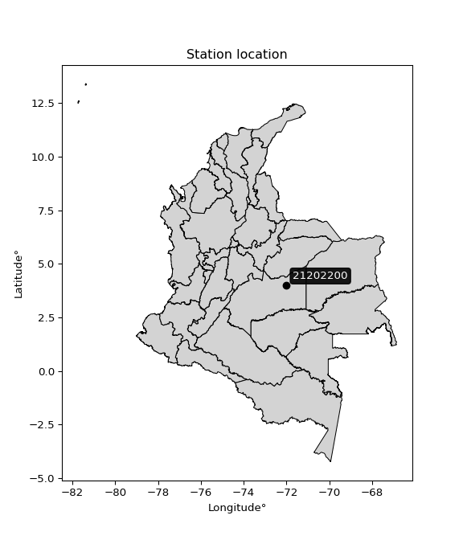</img>

</div>


## A. General information


### 1. General running parameters

• app_version: _v20251225_. • runtime: _2025-12-26 14:29:50.888910_. • Python version: _3.14.0_. • SciPy version: _1.16.3_. • Pandas version: _2.3.3_. • NumPy version: _2.3.5_. • Stations dataset (station_dataset_file): _dataset/pmax24h_in/automatic_colombia.csv_. • Stations catalog (station_catalog_file): _dataset/CNE_IDEAM.xls_. • Plot only fit distributions with Δo > Δ (plot_only_fit): _True_. • Eval low extreme values, if False, evaluates high extreme values (low_extreme): _False_. • Eval every SciPy distribution as logarithmic (pdist_logarithmic_on): _True_. • Standard deviation normalized (ddof): _1.0_. • Return periods to eval in years (Tr): _[2, 2.33, 5, 10, 15, 20, 25, 50, 75, 100, 200, 250, 500, 750, 1000]_. • Minimum data sample per station, 0 means any (minimum_sample): _5_. • Z-Score threshold to adjust a value, 0 means disable (zscore): _3.5_. • Avoid zeros, e.g. rain = 0 (avoid_zeros): _True_. • Avoid null values (avoid_nans): _True_. [:file_folder:Dataset file.](../../dataset/pmax24h_in/automatic_colombia.csv)


### 2. Station info and location

|   id |   CODIGO | NOMBRE   | CATEGORIA   | TECNOLOGIA   | ESTADO   | FECHA_INSTALACION   |   FECHA_SUSPENSION |   ALTITUD |   LATITUD |   LONGITUD | DEPARTAMENTO   | MUNICIPIO   | AREA_OPERATIVA   | ENTIDAD   | AREA_HIDROGRAFICA   | ZONA_HIDROGRAFICA   | SUBZONA_HIDROGRAFICA   | CORRIENTE   | OBSERVACION   | SUBRED   | Catalogo   |
|-----:|---------:|:---------|:------------|:-------------|:---------|:--------------------|-------------------:|----------:|----------:|-----------:|:---------------|:------------|:-----------------|:----------|:--------------------|:--------------------|:-----------------------|:------------|:--------------|:---------|:-----------|
|    0 | 21202200 | No data  | No data     | No data      | No data  | 01/01/2000          |                nan |         0 |         4 |        -72 | No data        | No data     | No data          | No data   | No data             | No data             | No data                | No data     | No data       | No data  | No data    |

<div align="center">

Map location in: [:earth_americas:Google](http://maps.google.com/maps?q=4.0,-72.0) [:earth_americas:OSM](https://www.openstreetmap.org/#map=18/4.0/-72.0&layers=P) [:earth_americas:Bing](https://www.bing.com/maps?cp=4.0~-72.0&lvl=18) [:earth_americas:Apple](https://maps.apple.com/frame?center=4.0%2C-72.0&span=0.003%2C0.006)

</div>


<div align="center">

```geojson
{
  "type": "Feature",
  "geometry": {
    "type": "Point", 
    "coordinates": [-72.0, 4.0]
  }, 
  "properties": {
    "Name": "21202200"
  }
}
```

</div>


### 3. Discrete values table and plot

|               |           0 |           1 |           2 |           3 |           4 |         5 |           6 |           7 |          8 |
|:--------------|------------:|------------:|------------:|------------:|------------:|----------:|------------:|------------:|-----------:|
| Date          | 2008        | 2009        | 2010        | 2011        | 2012        | 2013      | 2014        | 2015        | 2016       |
| Value         |   44.4      |   33.2      |   43.3      |   45        |   43.6      |   94.4    |   22.4      |   24.7      |   14.1     |
| Value_initial |   44.4      |   33.2      |   43.3      |   45        |   43.6      |   94.4    |   22.4      |   24.7      |   14.1     |
| count         |    9        |    9        |    9        |    9        |    9        |    9      |    9        |    9        |    9       |
| mean          |   40.5667   |   40.5667   |   40.5667   |   40.5667   |   40.5667   |   40.5667 |   40.5667   |   40.5667   |   40.5667  |
| std           |   23.1451   |   23.1451   |   23.1451   |   23.1451   |   23.1451   |   23.1451 |   23.1451   |   23.1451   |   23.1451  |
| zscore        |    0.165622 |   -0.318281 |    0.118095 |    0.191545 |    0.131057 |    2.3259 |   -0.784902 |   -0.685529 |   -1.14351 |

<div align="center">

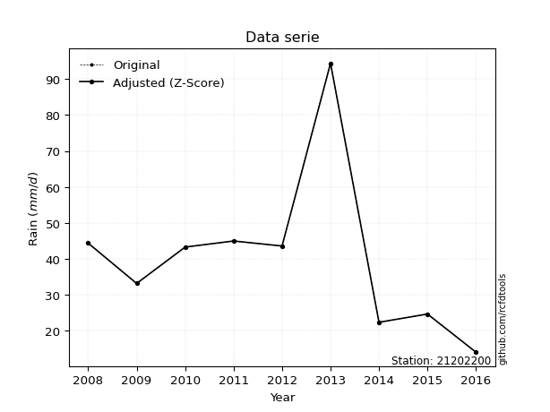</img>

</div>

> If Z-Score is active, values out of range or outliers are replaced with the station mean value.


### 4. Active continuous probability distributions from SciPy (45 of 104 available)

[scipy.stats](https://docs.scipy.org/doc/scipy/reference/stats.html) is a Python´s powerful submodule within the SciPy library for comprehensive statistical analysis, offering over 130 probability distributions (like Normal, Poisson), functions for descriptive stats (mean, variance), hypothesis testing (t-tests, chi-square), random variable generation, and statistical tests, making it essential for data science, modeling, and research. It provides tools to explore, model, and draw conclusions from data efficiently, working seamlessly with NumPy.

<div align="center">

|   id | p_dist             |   n_parameter | fit_method   | label                                                                       | active   | ref                                                                                                        |
|-----:|:-------------------|--------------:|:-------------|:----------------------------------------------------------------------------|:---------|:-----------------------------------------------------------------------------------------------------------|
|    0 | alpha              |             3 | MLE          | Alpha                                                                       | True     | [:mortar_board:](https://docs.scipy.org/doc/scipy/reference/generated/scipy.stats.alpha.html)              |
|    1 | betaprime          |             4 | MLE          | Beta prime                                                                  | True     | [:mortar_board:](https://docs.scipy.org/doc/scipy/reference/generated/scipy.stats.betaprime.html)          |
|    2 | chi2               |             3 | MLE          | Chi²                                                                        | True     | [:mortar_board:](https://docs.scipy.org/doc/scipy/reference/generated/scipy.stats.chi2.html)               |
|    3 | crystalball        |             4 | MLE          | Crystalball                                                                 | True     | [:mortar_board:](https://docs.scipy.org/doc/scipy/reference/generated/scipy.stats.crystalball.html)        |
|    4 | erlang             |             3 | MLE          | Erlang                                                                      | True     | [:mortar_board:](https://docs.scipy.org/doc/scipy/reference/generated/scipy.stats.erlang.html)             |
|    5 | expon              |             2 | MLE          | Exponential                                                                 | True     | [:mortar_board:](https://docs.scipy.org/doc/scipy/reference/generated/scipy.stats.expon.html)              |
|    6 | exponnorm          |             3 | MLE          | Exponentially modified Normal                                               | True     | [:mortar_board:](https://docs.scipy.org/doc/scipy/reference/generated/scipy.stats.exponnorm.html)          |
|    7 | f                  |             4 | MLE          | F                                                                           | True     | [:mortar_board:](https://docs.scipy.org/doc/scipy/reference/generated/scipy.stats.f.html)                  |
|    8 | fatiguelife        |             3 | MLE          | Fatigue-life (Birnbaum-Saunders)                                            | True     | [:mortar_board:](https://docs.scipy.org/doc/scipy/reference/generated/scipy.stats.fatiguelife.html)        |
|    9 | fisk               |             3 | MLE          | Fisk                                                                        | True     | [:mortar_board:](https://docs.scipy.org/doc/scipy/reference/generated/scipy.stats.fisk.html)               |
|   10 | gamma              |             3 | MLE          | Gamma                                                                       | True     | [:mortar_board:](https://docs.scipy.org/doc/scipy/reference/generated/scipy.stats.gamma.html)              |
|   11 | genexpon           |             5 | MLE          | Generalized exponential                                                     | True     | [:mortar_board:](https://docs.scipy.org/doc/scipy/reference/generated/scipy.stats.genexpon.html)           |
|   12 | genlogistic        |             3 | MLE          | Generalized logistic                                                        | True     | [:mortar_board:](https://docs.scipy.org/doc/scipy/reference/generated/scipy.stats.genlogistic.html)        |
|   13 | gibrat             |             2 | MM           | Gibrat                                                                      | True     | [:mortar_board:](https://docs.scipy.org/doc/scipy/reference/generated/scipy.stats.gibrat.html)             |
|   14 | gompertz           |             3 | MLE          | Gompertz (or truncated Gumbel)                                              | True     | [:mortar_board:](https://docs.scipy.org/doc/scipy/reference/generated/scipy.stats.gompertz.html)           |
|   15 | gumbel_l           |             2 | MM           | Gumbel Left Skew                                                            | True     | [:mortar_board:](https://docs.scipy.org/doc/scipy/reference/generated/scipy.stats.gumbel_l.html)           |
|   16 | gumbel_r           |             2 | MM           | Gumbel Right Skew                                                           | True     | [:mortar_board:](https://docs.scipy.org/doc/scipy/reference/generated/scipy.stats.gumbel_r.html)           |
|   17 | halflogistic       |             2 | MM           | Half-logistic                                                               | True     | [:mortar_board:](https://docs.scipy.org/doc/scipy/reference/generated/scipy.stats.halflogistic.html)       |
|   18 | halfnorm           |             2 | MM           | Half Normal                                                                 | True     | [:mortar_board:](https://docs.scipy.org/doc/scipy/reference/generated/scipy.stats.halfnorm.html)           |
|   19 | hypsecant          |             2 | MM           | hyperbolic secant                                                           | True     | [:mortar_board:](https://docs.scipy.org/doc/scipy/reference/generated/scipy.stats.hypsecant.html)          |
|   20 | invgamma           |             3 | MLE          | Inverted gamma                                                              | True     | [:mortar_board:](https://docs.scipy.org/doc/scipy/reference/generated/scipy.stats.invgamma.html)           |
|   21 | invgauss           |             3 | MLE          | Inverse Gaussian                                                            | True     | [:mortar_board:](https://docs.scipy.org/doc/scipy/reference/generated/scipy.stats.invgauss.html)           |
|   22 | invweibull         |             3 | MLE          | Inverted Weibull                                                            | True     | [:mortar_board:](https://docs.scipy.org/doc/scipy/reference/generated/scipy.stats.invweibull.html)         |
|   23 | johnsonsu          |             4 | MLE          | Johnson Su                                                                  | True     | [:mortar_board:](https://docs.scipy.org/doc/scipy/reference/generated/scipy.stats.johnsonsu.html)          |
|   24 | kstwobign          |             2 | MLE          | Limiting distribution of scaled Kolmogorov-Smirnov two-sided test statistic | True     | [:mortar_board:](https://docs.scipy.org/doc/scipy/reference/generated/scipy.stats.kstwobign.html)          |
|   25 | laplace            |             2 | MM           | Laplace                                                                     | True     | [:mortar_board:](https://docs.scipy.org/doc/scipy/reference/generated/scipy.stats.laplace.html)            |
|   26 | laplace_asymmetric |             3 | MLE          | Asymmetric Laplace                                                          | True     | [:mortar_board:](https://docs.scipy.org/doc/scipy/reference/generated/scipy.stats.laplace_asymmetric.html) |
|   27 | loggamma           |             3 | MLE          | Log gamma                                                                   | True     | [:mortar_board:](https://docs.scipy.org/doc/scipy/reference/generated/scipy.stats.loggamma.html)           |
|   28 | logistic           |             2 | MM           | Logistic (or Sech-squared)                                                  | True     | [:mortar_board:](https://docs.scipy.org/doc/scipy/reference/generated/scipy.stats.logistic.html)           |
|   29 | lognorm            |             3 | MLE          | Log Normal                                                                  | True     | [:mortar_board:](https://docs.scipy.org/doc/scipy/reference/generated/scipy.stats.lognorm.html)            |
|   30 | maxwell            |             2 | MM           | Maxwell                                                                     | True     | [:mortar_board:](https://docs.scipy.org/doc/scipy/reference/generated/scipy.stats.maxwell.html)            |
|   31 | mielke             |             4 | MLE          | Mielke Beta-Kappa / Dagum                                                   | True     | [:mortar_board:](https://docs.scipy.org/doc/scipy/reference/generated/scipy.stats.mielke.html)             |
|   32 | moyal              |             2 | MM           | Moyal                                                                       | True     | [:mortar_board:](https://docs.scipy.org/doc/scipy/reference/generated/scipy.stats.moyal.html)              |
|   33 | nakagami           |             3 | MLE          | Nakagami                                                                    | True     | [:mortar_board:](https://docs.scipy.org/doc/scipy/reference/generated/scipy.stats.nakagami.html)           |
|   34 | ncf                |             5 | MLE          | Non-central F distribution                                                  | True     | [:mortar_board:](https://docs.scipy.org/doc/scipy/reference/generated/scipy.stats.ncf.html)                |
|   35 | nct                |             4 | MLE          | Non-central Student’s t                                                     | True     | [:mortar_board:](https://docs.scipy.org/doc/scipy/reference/generated/scipy.stats.nct.html)                |
|   36 | norm               |             2 | MM           | Normal                                                                      | True     | [:mortar_board:](https://docs.scipy.org/doc/scipy/reference/generated/scipy.stats.norm.html)               |
|   37 | pareto             |             3 | MLE          | Pareto                                                                      | True     | [:mortar_board:](https://docs.scipy.org/doc/scipy/reference/generated/scipy.stats.pareto.html)             |
|   38 | pearson3           |             3 | MM           | Pearson type III                                                            | True     | [:mortar_board:](https://docs.scipy.org/doc/scipy/reference/generated/scipy.stats.pearson3.html)           |
|   39 | rayleigh           |             2 | MM           | Rayleigh                                                                    | True     | [:mortar_board:](https://docs.scipy.org/doc/scipy/reference/generated/scipy.stats.rayleigh.html)           |
|   40 | rice               |             3 | MLE          | Rice                                                                        | True     | [:mortar_board:](https://docs.scipy.org/doc/scipy/reference/generated/scipy.stats.rice.html)               |
|   41 | t                  |             3 | MLE          | Student’s t                                                                 | True     | [:mortar_board:](https://docs.scipy.org/doc/scipy/reference/generated/scipy.stats.t.html)                  |
|   42 | truncnorm          |             4 | MLE          | Truncated normal                                                            | True     | [:mortar_board:](https://docs.scipy.org/doc/scipy/reference/generated/scipy.stats.truncnorm.html)          |
|   43 | wald               |             2 | MM           | Wald                                                                        | True     | [:mortar_board:](https://docs.scipy.org/doc/scipy/reference/generated/scipy.stats.wald.html)               |
|   44 | weibull_min        |             3 | MLE          | Weibull minimum                                                             | True     | [:mortar_board:](https://docs.scipy.org/doc/scipy/reference/generated/scipy.stats.weibull_min.html)        |

</div>

> **n_parameter:** # arguments & localization & scale.
>
> **Fit methods:** (MLE) maximum likelihood, (MM) L-moments.
>
>**Inactive:** foldnorm, gennorm, norminvgauss, powernorm, powerlognorm, skewnorm, genextreme, anglit, arcsine, argus, beta, bradford, burr, burr12, cauchy, cosine, halfcauchy, foldcauchy, skewcauchy, wrapcauchy, dgamma, gengamma, exponweib, exponpow, truncexpon, gausshyper, genhalflogistic, genhyperbolic, geninvgauss, halfgennorm, johnsonsb, kappa4, kappa3, ksone, kstwo, loglaplace, levy, levy_l, levy_stable, ncx2, genpareto, truncpareto, lomax, powerlaw, rdist, rel_breitwigner, recipinvgauss, semicircular, studentized_range, trapezoid, triang, truncweibull_min, tukeylambda, uniform, loguniform, vonmises, vonmises_line, weibull_max, dweibull, 


## B. Probability distributions vs. Empirical distributions

A continuous probability distribution (CPD) describes probabilities for variables that can take any value within a range (like rain any time), unlike discrete variables with specific outcomes (like temperature). It uses a Probability Density Function (PDF), a curve where the total area under it equals 1, and the probability of the variable falling within an interval (a to b) is found by calculating the area under the curve between those points. A key feature is that the probability of hitting any single exact value is zero, so probabilities are always expressed for ranges, e.g., $P(a ≤ X ≤ b)$.

<div align="center">

Distributions parameters
|    |   station | p_dist                |   n |             loc |          scale | shape                  | shape1               | shape2                 | shape3   |
|---:|----------:|:----------------------|----:|----------------:|---------------:|:-----------------------|:---------------------|:-----------------------|:---------|
|  0 |  21202200 | alpha                 |   9 |   -36.2822      |  301.056       | 4.185043754140673      |                      |                        |          |
|  1 |  21202200 | betaprime             |   9 |     7.07909     |   96.0126      | 3.3375464809187942     | 10.663845358446679   |                        |          |
|  2 |  21202200 | chi2                  |   9 |    14.1         |   13.8134      | 1.773817113964221      |                      |                        |          |
|  3 |  21202200 | crystalball           |   9 |    40.5667      |   21.8214      | 2450.76151924238       | 3358.743334560909    |                        |          |
|  4 |  21202200 | erlang                |   9 |    14.1         |   34.5081      | 0.40925211876615963    |                      |                        |          |
|  5 |  21202200 | expon                 |   9 |    14.1         |   26.4667      |                        |                      |                        |          |
|  6 |  21202200 | exponnorm             |   9 |    21.666       |    9.20243     | 2.053880440662337      |                      |                        |          |
|  7 |  21202200 | f                     |   9 |    14.1         |   24.4475      | 1.844991767845478      | 27.750229332639897   |                        |          |
|  8 |  21202200 | fatiguelife           |   9 |    14.1         |    0.0004678   | 204.48445687953307     |                      |                        |          |
|  9 |  21202200 | fisk                  |   9 |     2.01528     |   33.7346      | 3.2498343530578557     |                      |                        |          |
| 10 |  21202200 | gamma                 |   9 |    14.1         |   21.8419      | 0.947120124299223      |                      |                        |          |
| 11 |  21202200 | genexpon              |   9 |    14.1         |    2.70952     | 0.09419238628328302    | 0.009819974031751912 | 0.5600591448377221     |          |
| 12 |  21202200 | genlogistic           |   9 |   -69.0293      |   15.2658      | 710.8649552655188      |                      |                        |          |
| 13 |  21202200 | gibrat                |   9 |    23.9196      |   10.097       |                        |                      |                        |          |
| 14 |  21202200 | gompertz              |   9 |    14.1         |  104.461       | 3.128661449095058      |                      |                        |          |
| 15 |  21202200 | gumbel_l              |   9 |    50.3875      |   17.0141      |                        |                      |                        |          |
| 16 |  21202200 | gumbel_r              |   9 |    30.7459      |   17.0141      |                        |                      |                        |          |
| 17 |  21202200 | halflogistic          |   9 |    14.7033      |   18.6565      |                        |                      |                        |          |
| 18 |  21202200 | halfnorm              |   9 |    11.6836      |   36.1995      |                        |                      |                        |          |
| 19 |  21202200 | hypsecant             |   9 |    40.5667      |   13.892       |                        |                      |                        |          |
| 20 |  21202200 | invgamma              |   9 |   -10.1354      |  300.465       | 6.915489192898583      |                      |                        |          |
| 21 |  21202200 | invgauss              |   9 |     0.433096    |  131.412       | 0.3054023199309298     |                      |                        |          |
| 22 |  21202200 | invweibull            |   9 |    14.1         |    1.00007     | 0.06630221356244312    |                      |                        |          |
| 23 |  21202200 | johnsonsu             |   9 |     1.85566     |    1.40409     | -7.138162832183564     | 1.8467416705967388   |                        |          |
| 24 |  21202200 | kstwobign             |   9 |   -24.9486      |   75.9036      |                        |                      |                        |          |
| 25 |  21202200 | laplace               |   9 |    40.5667      |   15.4301      |                        |                      |                        |          |
| 26 |  21202200 | laplace_asymmetric    |   9 |    43.3         |   14.5864      | 1.0980815052413715     |                      |                        |          |
| 27 |  21202200 | loggamma              |   9 | -7749.52        | 1020.58        | 2065.6066184871597     |                      |                        |          |
| 28 |  21202200 | logistic              |   9 |    40.5667      |   12.0308      |                        |                      |                        |          |
| 29 |  21202200 | lognorm               |   9 |    14.1         |    0.38669     | 11.68891153331989      |                      |                        |          |
| 30 |  21202200 | maxwell               |   9 |   -11.141       |   32.403       |                        |                      |                        |          |
| 31 |  21202200 | mielke                |   9 |    -0.102913    |   38.9546      | 3.114446277378135      | 3.763560376378581    |                        |          |
| 32 |  21202200 | moyal                 |   9 |    28.0878      |    9.8231      |                        |                      |                        |          |
| 33 |  21202200 | nakagami              |   9 |    14.1         |   34.6326      | 0.39313941660351825    |                      |                        |          |
| 34 |  21202200 | ncf                   |   9 |    -0.00187837  |   31.9021      | 16.373593888422242     | 15.960738604805478   | 1.8612405310887512     |          |
| 35 |  21202200 | nct                   |   9 |    -0.0840767   |    9.97442     | 4.2825519456055545     | 3.3235932887955273   |                        |          |
| 36 |  21202200 | norm                  |   9 |    40.5667      |   21.8214      |                        |                      |                        |          |
| 37 |  21202200 | pareto                |   9 |    14.097       |    0.00299532  | 0.12517401009924234    |                      |                        |          |
| 38 |  21202200 | pearson3              |   9 |    40.5667      |   21.8215      | 1.3609519872103157     |                      |                        |          |
| 39 |  21202200 | rayleigh              |   9 |    -1.17904     |   33.3083      |                        |                      |                        |          |
| 40 |  21202200 | rice                  |   9 |     5.02993     |   29.4876      | 0.00036492633715456177 |                      |                        |          |
| 41 |  21202200 | t                     |   9 |    38.8259      |   20.8281      | 7.0701724146973035     |                      |                        |          |
| 42 |  21202200 | truncnorm             |   9 |    40.5667      |   21.8214      | -152.14939386310346    | 515.294395711134     |                        |          |
| 43 |  21202200 | wald                  |   9 |    18.7452      |   21.8214      |                        |                      |                        |          |
| 44 |  21202200 | weibull_min           |   9 |    14.1         |   24.1254      | 0.527885325649631      |                      |                        |          |
| 45 |  21202200 | logalpha              |   9 |    -6.47851     |  195.055       | 19.460956186696897     |                      |                        |          |
| 46 |  21202200 | logbetaprime          |   9 |    -8.19522     |   19.2313      | 845.6520653322261      | 1382.9427199110023   |                        |          |
| 47 |  21202200 | logchi2               |   9 |     2.64617     |    0.93937     | 1.069486565518952      |                      |                        |          |
| 48 |  21202200 | logcrystalball        |   9 |     3.57281     |    0.510452    | 5.408437015228133      | 64.2203737594437     |                        |          |
| 49 |  21202200 | logerlang             |   9 |   -54.721       |    0.00446975  | 13041.858288752239     |                      |                        |          |
| 50 |  21202200 | logexpon              |   9 |     2.64617     |    0.92663     |                        |                      |                        |          |
| 51 |  21202200 | logexponnorm          |   9 |     3.52813     |    0.508493    | 0.087855983938705      |                      |                        |          |
| 52 |  21202200 | logf                  |   9 |   -57.9678      |   61.5374      | 85340.24058064885      | 44064.32621457572    |                        |          |
| 53 |  21202200 | logfatiguelife        |   9 |   -41.9421      |   45.5119      | 0.011205459324626448   |                      |                        |          |
| 54 |  21202200 | logfisk               |   9 |    -9.68878e+06 |    9.68879e+06 | 33650188.34034928      |                      |                        |          |
| 55 |  21202200 | loggamma              |   9 |   -54.8122      |    0.00446274  | 13082.777229151237     |                      |                        |          |
| 56 |  21202200 | loggenexpon           |   9 |     2.63592     |    0.0162415   | 0.005277066614307751   | 2.205070739888554    | 0.0001460808287096211  |          |
| 57 |  21202200 | loggenlogistic        |   9 |     3.66239     |    0.265776    | 0.8218954820564688     |                      |                        |          |
| 58 |  21202200 | loggibrat             |   9 |     3.18335     |    0.236212    |                        |                      |                        |          |
| 59 |  21202200 | loggompertz           |   9 |     2.64617     |    1.1724      | 0.7277677956364523     |                      |                        |          |
| 60 |  21202200 | loggumbel_l           |   9 |     3.80254     |    0.397998    |                        |                      |                        |          |
| 61 |  21202200 | loggumbel_r           |   9 |     3.34307     |    0.397998    |                        |                      |                        |          |
| 62 |  21202200 | loghalflogistic       |   9 |     2.96776     |    0.436445    |                        |                      |                        |          |
| 63 |  21202200 | loghalfnorm           |   9 |     2.89716     |    0.846796    |                        |                      |                        |          |
| 64 |  21202200 | loghypsecant          |   9 |     3.5728      |    0.324964    |                        |                      |                        |          |
| 65 |  21202200 | loginvgamma           |   9 |    -5.67453     | 2980.97        | 323.35977004537347     |                      |                        |          |
| 66 |  21202200 | loginvgauss           |   9 |    -0.505393    |  242.431       | 0.01679175831445881    |                      |                        |          |
| 67 |  21202200 | loginvweibull         |   9 |    -4.05994e+07 |    4.05994e+07 | 84546015.74404317      |                      |                        |          |
| 68 |  21202200 | logjohnsonsu          |   9 |     3.79207     |    0.0130679   | 0.5323326419096579     | 0.32489356306930195  |                        |          |
| 69 |  21202200 | logkstwobign          |   9 |     1.55478     |    2.31316     |                        |                      |                        |          |
| 70 |  21202200 | loglaplace            |   9 |     3.5728      |    0.360944    |                        |                      |                        |          |
| 71 |  21202200 | loglaplace_asymmetric |   9 |     3.77506     |    0.341642    | 1.3390131727248646     |                      |                        |          |
| 72 |  21202200 | logloggamma           |   9 |   -92.3741      |   14.3884      | 787.5435458914299      |                      |                        |          |
| 73 |  21202200 | loglogistic           |   9 |     3.5728      |    0.281427    |                        |                      |                        |          |
| 74 |  21202200 | loglognorm            |   9 |     2.64617     |    0.0189584   | 11.103377798141446     |                      |                        |          |
| 75 |  21202200 | logmaxwell            |   9 |     2.36325     |    0.757978    |                        |                      |                        |          |
| 76 |  21202200 | logmielke             |   9 |    -0.0648815   |    3.88871     | 8.778870854887897      | 17.145897070759048   |                        |          |
| 77 |  21202200 | logmoyal              |   9 |     3.2809      |    0.229784    |                        |                      |                        |          |
| 78 |  21202200 | lognakagami           |   9 |     3.10906     |    0.920275    | 0.08911615186180075    |                      |                        |          |
| 79 |  21202200 | logncf                |   9 |    -3.69082     |    7.24946     | 545.0841293470514      | 822.2617971522527    | 3.0279520881026163e-05 |          |
| 80 |  21202200 | lognct                |   9 |     2.05172     |    0.509816    | 2541.013733640527      | 2.9827018238140304   |                        |          |
| 81 |  21202200 | lognorm               |   9 |     3.5728      |    0.510452    |                        |                      |                        |          |
| 82 |  21202200 | logpareto             |   9 |     2.64606     |    0.000119621 | 0.12515388637276323    |                      |                        |          |
| 83 |  21202200 | logpearson3           |   9 |     3.5728      |    0.510452    | 0.017197125891864694   |                      |                        |          |
| 84 |  21202200 | lograyleigh           |   9 |     2.59628     |    0.779154    |                        |                      |                        |          |
| 85 |  21202200 | logrice               |   9 |     2.38247     |    0.566125    | 1.7983227320218702     |                      |                        |          |
| 86 |  21202200 | logt                  |   9 |     3.5728      |    0.510452    | 85458318.02060154      |                      |                        |          |
| 87 |  21202200 | logtruncnorm          |   9 |    -0.0085054   |    1.48724     | 2.09621065848511       | 6.448329138938045    |                        |          |
| 88 |  21202200 | logwald               |   9 |     3.06238     |    0.510425    |                        |                      |                        |          |
| 89 |  21202200 | logweibull_min        |   9 |     2.13146     |    1.61139     | 3.1132837418590302     |                      |                        |          |

</div>

> **loc** (Location parameter): This shifts the distribution along the x-axis. For many common distributions, like the normal (Gaussian) distribution, loc represents the mean $μ$. For others, like the uniform distribution, it might represent the minimum value, or for the beta distribution, the left end of the support interval.
>
> **scale** (Scale parameter): This determines the width or spread of the distribution. For the normal distribution, scale represents the standard deviation $σ$. For a uniform distribution, it defines the length of the interval (from $loc$ to $loc + scale$).
>
> **shape** (Shape parameters): Refers to parameters that define the specific form of a probability distribution, distinct from its location (loc) and scale (scale). These parameters are required arguments for most distribution functions. For example, a normal (Gaussian) distribution is fully defined by its location (mean) and scale (standard deviation), so it has no specific shape parameters beyond loc and scale. However, other distributions have intrinsic properties that need specification, as Gamma distribution that takes a shape parameter, often named $a$ or $alpha$.


### 0. Cumulative distribution values - CDF (90 evaluated)

> Ordered by x ascending and calculating $log(f(x))$ separately. 

|   id |   Station |   date |    x |   count |    mean |     std |    zscore |   Value_initial |   station |   m |    alpha |   alpha_pdf |   betaprime |   betaprime_pdf |        chi2 |   chi2_pdf |   crystalball |   crystalball_pdf |      erlang |   erlang_pdf |    expon |   expon_pdf |   exponnorm |   exponnorm_pdf |           f |      f_pdf |   fatiguelife |   fatiguelife_pdf |      fisk |   fisk_pdf |       gamma |   gamma_pdf |    genexpon |   genexpon_pdf |   genlogistic |   genlogistic_pdf |     gibrat |   gibrat_pdf |    gompertz |   gompertz_pdf |   gumbel_l |   gumbel_l_pdf |   gumbel_r |   gumbel_r_pdf |   halflogistic |   halflogistic_pdf |   halfnorm |   halfnorm_pdf |   hypsecant |   hypsecant_pdf |   invgamma |   invgamma_pdf |   invgauss |   invgauss_pdf |   invweibull |   invweibull_pdf |   johnsonsu |   johnsonsu_pdf |   kstwobign |   kstwobign_pdf |   laplace |   laplace_pdf |   laplace_asymmetric |   laplace_asymmetric_pdf |   loggamma |   loggamma_pdf |   logistic |   logistic_pdf |   lognorm |   lognorm_pdf |   maxwell |   maxwell_pdf |    mielke |   mielke_pdf |     moyal |   moyal_pdf |    nakagami |   nakagami_pdf |       ncf |    ncf_pdf |       nct |    nct_pdf |     norm |    norm_pdf |   pareto |   pareto_pdf |   pearson3 |   pearson3_pdf |   rayleigh |   rayleigh_pdf |      rice |   rice_pdf |        t |      t_pdf |   truncnorm |   truncnorm_pdf |      wald |   wald_pdf |   weibull_min |   weibull_min_pdf |   logalpha |   logalpha_pdf |   logbetaprime |   logbetaprime_pdf |    logchi2 |   logchi2_pdf |   logcrystalball |   logcrystalball_pdf |   logerlang |   logerlang_pdf |   logexpon |   logexpon_pdf |   logexponnorm |   logexponnorm_pdf |      logf |   logf_pdf |   logfatiguelife |   logfatiguelife_pdf |   logfisk |   logfisk_pdf |   loggenexpon |   loggenexpon_pdf |   loggenlogistic |   loggenlogistic_pdf |   loggibrat |   loggibrat_pdf |   loggompertz |   loggompertz_pdf |   loggumbel_l |   loggumbel_l_pdf |   loggumbel_r |   loggumbel_r_pdf |   loghalflogistic |   loghalflogistic_pdf |   loghalfnorm |   loghalfnorm_pdf |   loghypsecant |   loghypsecant_pdf |   loginvgamma |   loginvgamma_pdf |   loginvgauss |   loginvgauss_pdf |   loginvweibull |   loginvweibull_pdf |   logjohnsonsu |   logjohnsonsu_pdf |   logkstwobign |   logkstwobign_pdf |   loglaplace |   loglaplace_pdf |   loglaplace_asymmetric |   loglaplace_asymmetric_pdf |   logloggamma |   logloggamma_pdf |   loglogistic |   loglogistic_pdf |   loglognorm |   loglognorm_pdf |   logmaxwell |   logmaxwell_pdf |   logmielke |   logmielke_pdf |    logmoyal |   logmoyal_pdf |   lognakagami |   lognakagami_pdf |    logncf |   logncf_pdf |   lognct |   lognct_pdf |   logpareto |   logpareto_pdf |   logpearson3 |   logpearson3_pdf |   lograyleigh |   lograyleigh_pdf |   logrice |   logrice_pdf |      logt |   logt_pdf |   logtruncnorm |   logtruncnorm_pdf |    logwald |   logwald_pdf |   logweibull_min |   logweibull_min_pdf |
|-----:|----------:|-------:|-----:|--------:|--------:|--------:|----------:|----------------:|----------:|----:|---------:|------------:|------------:|----------------:|------------:|-----------:|--------------:|------------------:|------------:|-------------:|---------:|------------:|------------:|----------------:|------------:|-----------:|--------------:|------------------:|----------:|-----------:|------------:|------------:|------------:|---------------:|--------------:|------------------:|-----------:|-------------:|------------:|---------------:|-----------:|---------------:|-----------:|---------------:|---------------:|-------------------:|-----------:|---------------:|------------:|----------------:|-----------:|---------------:|-----------:|---------------:|-------------:|-----------------:|------------:|----------------:|------------:|----------------:|----------:|--------------:|---------------------:|-------------------------:|-----------:|---------------:|-----------:|---------------:|----------:|--------------:|----------:|--------------:|----------:|-------------:|----------:|------------:|------------:|---------------:|----------:|-----------:|----------:|-----------:|---------:|------------:|---------:|-------------:|-----------:|---------------:|-----------:|---------------:|----------:|-----------:|---------:|-----------:|------------:|----------------:|----------:|-----------:|--------------:|------------------:|-----------:|---------------:|---------------:|-------------------:|-----------:|--------------:|-----------------:|---------------------:|------------:|----------------:|-----------:|---------------:|---------------:|-------------------:|----------:|-----------:|-----------------:|---------------------:|----------:|--------------:|--------------:|------------------:|-----------------:|---------------------:|------------:|----------------:|--------------:|------------------:|--------------:|------------------:|--------------:|------------------:|------------------:|----------------------:|--------------:|------------------:|---------------:|-------------------:|--------------:|------------------:|--------------:|------------------:|----------------:|--------------------:|---------------:|-------------------:|---------------:|-------------------:|-------------:|-----------------:|------------------------:|----------------------------:|--------------:|------------------:|--------------:|------------------:|-------------:|-----------------:|-------------:|-----------------:|------------:|----------------:|------------:|---------------:|--------------:|------------------:|----------:|-------------:|---------:|-------------:|------------:|----------------:|--------------:|------------------:|--------------:|------------------:|----------:|--------------:|----------:|-----------:|---------------:|-------------------:|-----------:|--------------:|-----------------:|---------------------:|
|    0 |  21202200 |   2016 | 14.1 |       9 | 40.5667 | 23.1451 | -1.14351  |            14.1 |  21202200 |   1 | 0.036696 |   0.0095267 |    0.031018 |      0.0116042  | 4.55284e-15 | 2.27317    |      0.112589 |       0.00876172  | 2.43286e-07 |  5.60502e+07 | 0        |  0.0377834  |   0.0454503 |      0.0084673  | 1.14439e-07 | 0.137462   |      0.10999  |       1.55081e+07 | 0.0343494 | 0.00891999 | 5.89356e-16 |  0.314234   | 1.90315e-08 |     0.0347635  |     0.0468243 |        0.00936982 | 0          |  0           | 2.18131e-15 |      0.0299505 |   0.111754 |    0.0061868   |  0.0699427 |      0.0109352 |       0        |         0          |  0.0532206 |     0.0219922  |   0.0940366 |     0.0066711   |  0.0343326 |     0.0100795  |  0.0317004 |     0.0111863  |  7.44156e-05 |      2.64029e+10 |   0.0319682 |       0.0107461 |    0.046057 |      0.00981672 | 0.0899582 |   0.00583005  |            0.0883003 |              0.0055129   |  0.0342222 |       0.150203 |  0.0997586 |    0.00746474  |  0.034738 |      0.150445 |  0.105125 |    0.0110315  | 0.0423969 |   0.00909292 | 0.0415471 |  0.0103738  | 1.21313e-13 |    53.6974     | 0.0352155 | 0.010428   | 0.0373516 | 0.00883979 | 0.112589 | 0.00876172  | 0        | 41.7899      |  0.0405629 |     0.0138271  |  0.0998648 |     0.0123965  | 0.0462042 | 0.00994919 | 0.136761 | 0.0088803  |    0.112589 |     0.00876172  | 0         | 0          |   3.04548e-09 |   905033          |  0.0277035 |       0.149192 |      0.0319728 |           0.150492 | 4.9608e-09 |   5.97347e+06 |        0.0347378 |             0.150444 |   0.0342217 |        0.150203 |   0        |       1.07918  |      0.0346996 |           0.150416 | 0.0340186 |   0.150353 |        0.0336379 |             0.149698 | 0.0375597 |      0.125549 |    0.00338926 |          0.336287 |        0.0424106 |             0.128348 |   0         |       0         |   2.06038e-07 |          0.620748 |     0.0532541 |         0.130177  |    0.00314976 |         0.0455881 |          0        |              0        |      0        |          0        |      0.0367294 |          0.112775  |     0.0291513 |          0.148608 |     0.0274119 |          0.156179 |       0.0184027 |            0.153109 |       0.125818 |          0.0586277 |      0.0208221 |           0.19238  |    0.0383736 |        0.106314  |               0.0544249 |                   0.118971  |     0.0365599 |          0.152856 |     0.0358255 |          0.122739 |   0.00235213 |      1.48946e+12 |    0.0132677 |         0.136794 |   0.0420902 |        0.136015 | 6.90988e-05 |      0.0025165 |    0          |       0           | 0.0438315 |     0.185514 | 0.034642 |     0.150318 |    0        |    1046.25      |     0.0342295 |          0.150201 |    0.00204829 |          0.08202  |  0.022216 |      0.173383 | 0.0347384 |   0.150446 |    0           |           0        | 0          |     0         |        0.0282333 |             0.168336 |
|    1 |  21202200 |   2014 | 22.4 |       9 | 40.5667 | 23.1451 | -0.784902 |            22.4 |  21202200 |   2 | 0.172274 |   0.022312  |    0.189947 |      0.024304   | 0.313397    | 0.0284488  |      0.202559 |       0.0129278   | 0.588343    |  0.0243987   | 0.26919  |  0.0276125  |   0.16146   |      0.0195932  | 0.302048    | 0.0281574  |      0.742594 |       0.0126632   | 0.162865  | 0.021736   | 0.34174     |  0.0318871  | 0.262315    |     0.0278372  |     0.168804  |        0.0196472  | 0          |  0           | 0.22797     |      0.0250348 |   0.175535 |    0.00935335  |  0.195309  |      0.0187476 |       0.203398 |         0.0256915  |  0.232798  |     0.0210963  |   0.168144  |     0.0115486   |  0.177974  |     0.0231508  |  0.187875  |     0.0240661  |  0.419333    |      0.00291121  |   0.183852  |       0.0238461 |    0.16871  |      0.0190303  | 0.154047  |   0.00998352  |            0.148256  |              0.00925615  |  0.181947  |       0.520294 |  0.180937  |    0.0123183   |  0.181808 |      0.517284 |  0.216036 |    0.0154408  | 0.164008  |   0.0201449  | 0.181624  |  0.0222301  | 0.252222    |     0.0235089  | 0.180036  | 0.0229879  | 0.168522  | 0.0223102  | 0.202559 | 0.0129278   | 0.629275 |  0.00558896  |  0.201107  |     0.0226858  |  0.221638  |     0.0165426  | 0.159281  | 0.0167948  | 0.227973 | 0.0131584  |    0.202559 |     0.0129278   | 0.0369767 | 0.0336878  |   0.434107    |        0.0204916  |  0.188453  |       0.572938 |      0.184129  |           0.537519 | 0.490015   |   0.480836    |        0.181807  |             0.517283 |   0.181947  |        0.520297 |   0.393189 |       0.654858 |      0.181812  |           0.517502 | 0.182297  |   0.52241  |        0.181907  |             0.523242 | 0.163025  |      0.473899 |    0.251898   |          0.674377 |        0.164027  |             0.451008 |   0         |       0         |   0.296947    |          0.647695 |     0.160626  |         0.369281  |    0.165243   |         0.747474  |          0.160481 |              1.11612  |      0.197601 |          0.913194 |      0.14996   |          0.444586  |     0.185391  |          0.556067 |     0.196126  |          0.593037 |       0.217894  |            0.691403 |       0.163965 |          0.117576  |      0.242693  |           0.697184 |    0.138352  |        0.383306  |               0.149706  |                   0.327253  |     0.183043  |          0.511555 |     0.161403  |          0.480948 |   0.613239   |      0.0744729   |    0.191045  |         0.628055 |   0.165544  |        0.444229 | 0.146113    |      0.877567  |    0.00157093 |       6.30484e+11 | 0.208339  |     0.537406 | 0.18179  |     0.517819 |    0.644389 |       0.0961244 |     0.181938  |          0.520228 |    0.194719   |          0.680194 |  0.190188 |      0.562139 | 0.18181   |   0.517288 |    2.48756e-10 |           1.6532   | 0.00246593 |     0.309904  |        0.190235  |             0.544151 |
|    2 |  21202200 |   2015 | 24.7 |       9 | 40.5667 | 23.1451 | -0.685529 |            24.7 |  21202200 |   3 | 0.226109 |   0.024347  |    0.247188 |      0.0253122  | 0.375297    | 0.0254621  |      0.233578 |       0.0140353   | 0.638782    |  0.0197545   | 0.330018 |  0.0253142  |   0.209631  |      0.0221978  | 0.363373    | 0.0252446  |      0.769168 |       0.0105656   | 0.215915  | 0.0242534  | 0.410893    |  0.0283313  | 0.323848    |     0.025682   |     0.216435  |        0.0216753  | 0.00523113 |  0.0192888   | 0.284048    |      0.0237332 |   0.198251 |    0.0104122   |  0.240107  |      0.0201335 |       0.261684 |         0.024965   |  0.280834  |     0.0206615  |   0.196662  |     0.0132729   |  0.233316  |     0.0248063  |  0.244554  |     0.025056   |  0.425236    |      0.00227444  |   0.240336  |       0.0251029 |    0.214366 |      0.0205823  | 0.178808  |   0.0115883   |            0.17115   |              0.0106855   |  0.237127  |       0.60756  |  0.211012  |    0.0138383   |  0.236683 |      0.60439  |  0.252617 |    0.0163408  | 0.213323  |   0.0226454  | 0.234755  |  0.023822   | 0.304493    |     0.0219959  | 0.234842  | 0.0245129  | 0.222765  | 0.0246899  | 0.233578 | 0.0140353   | 0.64045  |  0.00424468  |  0.254     |     0.0232056  |  0.260536  |     0.0172489  | 0.199474  | 0.0181094  | 0.259605 | 0.0143384  |    0.233578 |     0.0140353   | 0.136738  | 0.0486799  |   0.476816    |        0.0168789  |  0.248791  |       0.659072 |      0.240992  |           0.624321 | 0.533785   |   0.417535    |        0.236682  |             0.604389 |   0.237128  |        0.607563 |   0.453936 |       0.589301 |      0.236709  |           0.60463  | 0.237687  |   0.609695 |        0.237394  |             0.610824 | 0.214768  |      0.585715 |    0.318959   |          0.694831 |        0.213312  |             0.558978 |   0.0104512 |       1.18101   |   0.359963    |          0.640906 |     0.200557  |         0.449619  |    0.244556   |         0.865359  |          0.267209 |              1.06382  |      0.285388 |          0.881303 |      0.199606  |          0.574769  |     0.244105  |          0.643161 |     0.258203  |          0.674046 |       0.288481  |            0.746803 |       0.176671 |          0.143923  |      0.312493  |           0.725881 |    0.181381  |        0.502517  |               0.185367  |                   0.405206  |     0.237287  |          0.597355 |     0.214078  |          0.59784  |   0.619827   |      0.0611753   |    0.256227  |         0.701859 |   0.213833  |        0.545571 | 0.240017    |      1.02291   |    0.565508   |       1.03025     | 0.264251  |     0.604704 | 0.236722 |     0.605028 |    0.652812 |       0.0774893 |     0.237112  |          0.607491 |    0.264344   |          0.739827 |  0.24891  |      0.637539 | 0.236685  |   0.604394 |    0.150846    |           1.43733  | 0.147458   |     2.09327   |        0.247151  |             0.618768 |
|    3 |  21202200 |   2009 | 33.2 |       9 | 40.5667 | 23.1451 | -0.318281 |            33.2 |  21202200 |   4 | 0.441256 |   0.0246078 |    0.457985 |      0.0231374  | 0.555249    | 0.0175127  |      0.367837 |       0.0172695   | 0.763243    |  0.0109049   | 0.514056 |  0.0183606  |   0.418969  |      0.0251839  | 0.541849    | 0.0173602  |      0.838456 |       0.00633373  | 0.43649   | 0.0256328  | 0.607205    |  0.0186094  | 0.511302    |     0.0187258  |     0.415855  |        0.023887   | 0.466398   |  0.042835    | 0.466177    |      0.0191959 |   0.305213 |    0.0148704   |  0.420766  |      0.0214086 |       0.458743 |         0.0211603  |  0.447744  |     0.0184723  |   0.338602  |     0.0200304   |  0.446713  |     0.0239188  |  0.452657  |     0.0227894  |  0.43939     |      0.00125433  |   0.451506  |       0.0233076 |    0.399832 |      0.0220324  | 0.31019   |   0.0201029   |            0.290971  |              0.0181663   |  0.446408  |       0.775111 |  0.351531  |    0.0189478   |  0.445265 |      0.774179 |  0.400731 |    0.0180788  | 0.426055  |   0.0256338  | 0.440775  |  0.0232599  | 0.472873    |     0.0178546  | 0.445271  | 0.0236166  | 0.442968  | 0.0251865  | 0.367837 | 0.0172695   | 0.665993 |  0.00218861  |  0.446531  |     0.0213498  |  0.412961  |     0.018191   | 0.366388  | 0.0205274  | 0.397395 | 0.0177404  |    0.367837 |     0.0172695   | 0.49098   | 0.0311154  |   0.586871    |        0.0100935  |  0.4675    |       0.778519 |      0.453256  |           0.77546  | 0.637032   |   0.292904    |        0.445264  |             0.774179 |   0.446409  |        0.77511  |   0.603144 |       0.428279 |      0.44535   |           0.774282 | 0.44741   |   0.775583 |        0.447478  |             0.776627 | 0.433089  |      0.852727 |    0.522386   |          0.658663 |        0.425937  |             0.850877 |   0.618325  |       1.19444   |   0.543003    |          0.58892  |     0.375376  |         0.738575  |    0.511783   |         0.861362  |          0.546003 |              0.804088 |      0.525343 |          0.72975  |      0.431714  |          0.95707   |     0.46016   |          0.778923 |     0.477734  |          0.768575 |       0.510943  |            0.71448  |       0.242095 |          0.350146  |      0.522511  |           0.66528  |    0.411565  |        1.14024   |               0.353834  |                   0.77347   |     0.443831  |          0.768945 |     0.437913  |          0.874632 |   0.634269   |      0.0395564   |    0.479629  |         0.768525 |   0.422245  |        0.846172 | 0.537       |      0.885858  |    0.723938   |       0.32304     | 0.462517  |     0.706231 | 0.445479 |     0.774569 |    0.670738 |       0.0481129 |     0.446377  |          0.775086 |    0.491584   |          0.75898  |  0.460228 |      0.759156 | 0.445268  |   0.774181 |    0.494332    |           0.916771 | 0.607011   |     0.96533   |        0.453852  |             0.750102 |
|    4 |  21202200 |   2010 | 43.3 |       9 | 40.5667 | 23.1451 |  0.118095 |            43.3 |  21202200 |   5 | 0.656201 |   0.0174913 |    0.657992 |      0.0163319  | 0.699865    | 0.0115807  |      0.549841 |       0.0181393   | 0.847464    |  0.00633295  | 0.668217 |  0.0125359  |   0.643397  |      0.0183718  | 0.685117    | 0.0114714  |      0.889105 |       0.00395693  | 0.658444  | 0.0177032  | 0.756028    |  0.0114594  | 0.668269    |     0.0127315  |     0.635782  |        0.0188562  | 0.742809   |  0.0166429   | 0.635423    |      0.0144408 |   0.482791 |    0.0200422   |  0.61994   |      0.0174216 |       0.644832 |         0.0156565  |  0.617551  |     0.015052   |   0.562229  |     0.0224768   |  0.654224  |     0.0168923  |  0.64993   |     0.0161792  |  0.449533    |      0.000816113 |   0.653053  |       0.0164424 |    0.606093 |      0.0182237  | 0.58117   |   0.0271437   |            0.546646  |              0.034129    |  0.649963  |       0.724048 |  0.556556  |    0.0205141   |  0.649027 |      0.726361 |  0.580242 |    0.0169462  | 0.655583  |   0.0188002  | 0.644783  |  0.0168357  | 0.632759    |     0.0138966  | 0.651313  | 0.0168928  | 0.660521  | 0.0174503  | 0.549841 | 0.0181393   | 0.683275 |  0.00135759  |  0.636515  |     0.0160928  |  0.590007  |     0.0164372  | 0.569234  | 0.0189593  | 0.58201  | 0.0180117  |    0.549841 |     0.0181393   | 0.713716  | 0.0152097  |   0.669129    |        0.00661578 |  0.664583  |       0.677141 |      0.654338  |           0.706881 | 0.705114   |   0.224256    |        0.649026  |             0.726362 |   0.649963  |        0.724043 |   0.702046 |       0.321546 |      0.649104  |           0.72621  | 0.650786  |   0.722363 |        0.651002  |             0.722393 | 0.657733  |      0.781867 |    0.68271    |          0.539552 |        0.655517  |             0.81453  |   0.817676  |       0.452319  |   0.688771    |          0.503049 |     0.600378  |         0.920979  |    0.709155   |         0.612372  |          0.724451 |              0.544366 |      0.696322 |          0.555169 |      0.680767  |          0.825773  |     0.659581  |          0.692492 |     0.670174  |          0.655355 |       0.679621  |            0.546606 |       0.535374 |          4.73627   |      0.680868  |           0.521509 |    0.708979  |        0.806276  |               0.63234   |                   1.38227   |     0.647063  |          0.727735 |     0.666886  |          0.789367 |   0.643381   |      0.0299324   |    0.670767  |         0.649038 |   0.655667  |        0.843202 | 0.729065    |      0.566341  |    0.791766   |       0.205302    | 0.644394  |     0.640328 | 0.649251 |     0.726034 |    0.681682 |       0.0355038 |     0.649934  |          0.72409  |    0.677308   |          0.622906 |  0.656127 |      0.688177 | 0.64903   |   0.726359 |    0.692069    |           0.591879 | 0.785465   |     0.455907  |        0.649964  |             0.698934 |
|    5 |  21202200 |   2012 | 43.6 |       9 | 40.5667 | 23.1451 |  0.131057 |            43.6 |  21202200 |   6 | 0.661414 |   0.0172596 |    0.662861 |      0.0161299  | 0.703319    | 0.0114423  |      0.555278 |       0.0181063   | 0.84935     |  0.00624033  | 0.671957 |  0.0123946  |   0.648871  |      0.0181239  | 0.688538    | 0.0113349  |      0.890285 |       0.00390668  | 0.663716  | 0.0174428  | 0.759441    |  0.0112969  | 0.672067    |     0.012586   |     0.641408  |        0.0186531  | 0.747739   |  0.0162239   | 0.639736    |      0.014311  |   0.488821 |    0.0201609   |  0.625142  |      0.0172608 |       0.649504 |         0.0154944  |  0.62205   |     0.0149429  |   0.568958  |     0.0223777   |  0.659259  |     0.0166754  |  0.654754  |     0.0159855  |  0.449776    |      0.000807704 |   0.657955  |       0.0162376 |    0.611537 |      0.0180692  | 0.589234  |   0.0266211   |            0.55677   |              0.0333669   |  0.654948  |       0.720171 |  0.562701  |    0.0204532   |  0.654029 |      0.722545 |  0.585314 |    0.0168683  | 0.661184  |   0.0185384  | 0.649803  |  0.0166336  | 0.636912    |     0.0137865  | 0.656349  | 0.0166828  | 0.665719  | 0.0172053  | 0.555278 | 0.0181063   | 0.68368  |  0.00134207  |  0.641318  |     0.0159287  |  0.594925  |     0.0163496  | 0.574906  | 0.0188563  | 0.587404 | 0.0179465  |    0.555278 |     0.0181063   | 0.718234  | 0.0149126  |   0.671103    |        0.00654465 |  0.669242  |       0.672501 |      0.659204  |           0.702741 | 0.706657   |   0.222796    |        0.654029  |             0.722545 |   0.654949  |        0.720166 |   0.704258 |       0.319159 |      0.654105  |           0.722388 | 0.65576   |   0.718447 |        0.655976  |             0.718451 | 0.663111  |      0.775874 |    0.686423   |          0.535856 |        0.661121  |             0.808761 |   0.820764  |       0.442279  |   0.692235    |          0.500388 |     0.606742  |         0.922174  |    0.713359   |         0.605408  |          0.728188 |              0.538146 |      0.700139 |          0.550514 |      0.686435  |          0.81626   |     0.664347  |          0.68806  |     0.674683  |          0.650671 |       0.683379  |            0.541782 |       0.572016 |          5.94221   |      0.684455  |           0.517476 |    0.714493  |        0.790999  |               0.641956  |                   1.40329   |     0.652075  |          0.72408  |     0.672314  |          0.782825 |   0.643587   |      0.0297433   |    0.675232  |         0.644434 |   0.66147   |        0.837624 | 0.73295     |      0.558887  |    0.793176   |       0.203356    | 0.648804  |     0.636926 | 0.65425  |     0.7222   |    0.681927 |       0.0352596 |     0.65492   |          0.720215 |    0.681593   |          0.618256 |  0.660865 |      0.684262 | 0.654032  |   0.722543 |    0.696132    |           0.584936 | 0.788585   |     0.447836  |        0.654778  |             0.695482 |
|    6 |  21202200 |   2008 | 44.4 |       9 | 40.5667 | 23.1451 |  0.165622 |            44.4 |  21202200 |   7 | 0.674976 |   0.0166462 |    0.675551 |      0.0155968  | 0.712328    | 0.0110822  |      0.569723 |       0.0180022   | 0.854246    |  0.00600171  | 0.681724 |  0.0120255  |   0.663107  |      0.0174674  | 0.697463    | 0.0109796  |      0.893358 |       0.00377673  | 0.677395  | 0.0167558  | 0.768309    |  0.0108753  | 0.681983    |     0.0122058  |     0.656113  |        0.0181071  | 0.76029    |  0.015169    | 0.651047    |      0.0139682 |   0.505071 |    0.0204597   |  0.638778  |      0.0168272 |       0.661728 |         0.0150649  |  0.633887  |     0.014651   |   0.58674   |     0.0220677   |  0.67237   |     0.0161027  |  0.667338  |     0.0154745  |  0.450414    |      0.000786097 |   0.670728  |       0.0156975 |    0.625826 |      0.0176522  | 0.609989  |   0.025276    |            0.582676  |              0.0314167   |  0.667946  |       0.709445 |  0.57899   |    0.0202614   |  0.667072 |      0.711967 |  0.598723 |    0.0166504  | 0.675736  |   0.0178412  | 0.662896  |  0.0160992  | 0.647824    |     0.0134946  | 0.669473  | 0.0161275  | 0.679224  | 0.0165591  | 0.569723 | 0.0180022   | 0.684737 |  0.00130227  |  0.653887  |     0.0154929  |  0.607909  |     0.0161083  | 0.589878  | 0.0185695  | 0.601686 | 0.0177538  |    0.569723 |     0.0180022   | 0.729858  | 0.0141547  |   0.676265    |        0.00636107 |  0.681356  |       0.659941 |      0.671879  |           0.691386 | 0.710674   |   0.219016    |        0.667071  |             0.711968 |   0.667947  |        0.70944  |   0.710004 |       0.312958 |      0.667145  |           0.711797 | 0.668725  |   0.707624 |        0.668941  |             0.70756  | 0.67707   |      0.759382 |    0.696077   |          0.526038 |        0.675682  |             0.79265  |   0.828574  |       0.417141  |   0.701269    |          0.493291 |     0.623529  |         0.924075  |    0.724201   |         0.587163  |          0.737825 |              0.521961 |      0.710037 |          0.53827  |      0.701044  |          0.790558  |     0.676749  |          0.675995 |     0.6864    |          0.638059 |       0.693114  |            0.529083 |       0.712689 |          8.43966   |      0.693767  |           0.506852 |    0.728519  |        0.75214   |               0.666584  |                   1.30677   |     0.665149  |          0.713913 |     0.686386  |          0.764889 |   0.644123   |      0.0292563   |    0.686837  |         0.632068 |   0.676558  |        0.821765 | 0.742935    |      0.539591  |    0.796828   |       0.198391    | 0.660301  |     0.627643 | 0.667286 |     0.71158  |    0.682562 |       0.0346314 |     0.667919  |          0.709492 |    0.692722   |          0.60585  |  0.67321  |      0.673546 | 0.667075  |   0.711965 |    0.706603    |           0.566981 | 0.796541   |     0.427406  |        0.667338  |             0.685943 |
|    7 |  21202200 |   2011 | 45   |       9 | 40.5667 | 23.1451 |  0.191545 |            45   |  21202200 |   8 | 0.684827 |   0.0161915 |    0.68479  |      0.0152028  | 0.718898    | 0.0108201  |      0.580497 |       0.0179087   | 0.857795    |  0.00583033  | 0.688858 |  0.011756   |   0.673441  |      0.0169807  | 0.703973    | 0.0107213  |      0.895595 |       0.00368296  | 0.687296  | 0.0162489  | 0.774742    |  0.0105696  | 0.689222    |     0.0119282  |     0.666853  |        0.0176946  | 0.769168   |  0.0144334   | 0.659352    |      0.0137144 |   0.51741  |    0.0206657   |  0.648776  |      0.0164983 |       0.670671 |         0.0147455  |  0.642612  |     0.0144312  |   0.5999    |     0.021794    |  0.681904  |     0.0156791  |  0.676509  |     0.0150972  |  0.450881    |      0.000770629 |   0.680027  |       0.0152985 |    0.636322 |      0.0173353  | 0.624863  |   0.024312    |            0.601106  |              0.0300292   |  0.677413  |       0.701062 |  0.591096  |    0.0200902   |  0.676574 |      0.703684 |  0.608662 |    0.0164778  | 0.686284  |   0.017321   | 0.672436  |  0.0157031  | 0.655855    |     0.0132774  | 0.679025  | 0.0157161  | 0.689016  | 0.0160822  | 0.580497 | 0.0179087   | 0.68551  |  0.00127386  |  0.663085  |     0.0151681  |  0.617517  |     0.0159204  | 0.600952  | 0.0183435  | 0.61229  | 0.0175917  |    0.580497 |     0.0179087   | 0.738188  | 0.0136173  |   0.680042    |        0.00622893 |  0.690151  |       0.650373 |      0.681101  |           0.682601 | 0.713595   |   0.216283    |        0.676573  |             0.703685 |   0.677414  |        0.701057 |   0.714175 |       0.308457 |      0.676644  |           0.703505 | 0.678168  |   0.699176 |        0.678382  |             0.699064 | 0.687178  |      0.746595 |    0.703089   |          0.518717 |        0.686237  |             0.779957 |   0.834056  |       0.399721  |   0.707855    |          0.487971 |     0.635935  |         0.924275  |    0.731993   |         0.573798  |          0.744752 |              0.510195 |      0.717202 |          0.52925  |      0.711526  |          0.771089  |     0.685761  |          0.666742 |     0.6949    |          0.628509 |       0.700153  |            0.519724 |       0.800846 |          4.6324    |      0.700518  |           0.499012 |    0.73843   |        0.724683  |               0.683671  |                   1.2398    |     0.674679  |          0.70592  |     0.69656   |          0.751044 |   0.644513   |      0.0289067   |    0.695259  |         0.622732 |   0.687504  |        0.809023 | 0.750085    |      0.525661  |    0.799468   |       0.194868    | 0.668678  |     0.620504 | 0.676782 |     0.703267 |    0.683024 |       0.0341811 |     0.677387  |          0.701111 |    0.700792   |          0.596554 |  0.682196 |      0.665274 | 0.676576  |   0.703682 |    0.714127    |           0.554028 | 0.802181   |     0.413057  |        0.676496  |             0.678498 |
|    8 |  21202200 |   2013 | 94.4 |       9 | 40.5667 | 23.1451 |  2.3259   |            94.4 |  21202200 |   9 | 0.97005  |   0.0011983 |    0.971777 |      0.00131689 | 0.956447    | 0.00162464 |      0.993187 |       0.000871882 | 0.977133    |  0.000792432 | 0.951877 |  0.00181823 |   0.976     |      0.00126981 | 0.944018    | 0.00176717 |      0.978624 |       0.000646265 | 0.963526  | 0.00123624 | 0.9774      |  0.00104684 | 0.953346    |     0.00179093 |     0.98419   |        0.00102743 | 0.973998   |  0.000856981 | 0.973211    |      0.0017306 |   0.999998 |    1.32417e-06 |  0.976555  |      0.0013617 |       0.972471 |         0.00145528 |  0.977688  |     0.00161976 |   0.986791  |     0.000950554 |  0.969973  |     0.00130189 |  0.970787  |     0.00142684 |  0.473464    |      0.000292291 |   0.969721  |       0.0013681 |    0.985758 |      0.00118012 | 0.984732  |   0.000989491 |            0.990323  |              0.000728532 |  0.971414  |       0.126655 |  0.988734  |    0.000925887 |  0.971905 |      0.126226 |  0.98596  |    0.00129814 | 0.971467  |   0.0011006  | 0.972712  |  0.00138843 | 0.972102    |     0.00178853 | 0.970975  | 0.00131029 | 0.968931  | 0.00121536 | 0.993187 | 0.000871882 | 0.720943 |  0.000434986 |  0.973701  |     0.00146934 |  0.983708  |     0.00140354 | 0.989875  | 0.00104062 | 0.984106 | 0.00111218 |    0.993187 |     0.000871882 | 0.968132  | 0.00117736 |   0.848416    |        0.00188001 |  0.961685  |       0.1335   |      0.967708  |           0.130778 | 0.831677   |   0.115877    |        0.971905  |             0.126227 |   0.971412  |        0.126658 |   0.871511 |       0.138662 |      0.971866  |           0.126247 | 0.971161  |   0.126751 |        0.971078  |             0.126715 | 0.966434  |      0.112664 |    0.941549   |          0.15427  |        0.971521  |             0.103777 |   0.960249  |       0.0628483 |   0.947984    |          0.163446 |     0.998497  |         0.0245428 |    0.952663   |         0.116077  |          0.947815 |              0.116449 |      0.948702 |          0.141035 |      0.968316  |          0.0973404 |     0.964668  |          0.132378 |     0.95898   |          0.135368 |       0.92663   |            0.147041 |       0.98104  |          0.0198966 |      0.929683  |           0.1573   |    0.966415  |        0.0930486 |               0.98266   |                   0.0679621 |     0.972445  |          0.126462 |     0.969633  |          0.104628 |   0.660935   |      0.0173376   |    0.959878  |         0.137503 |   0.973625  |        0.094258 | 0.94934     |      0.110085  |    0.897918   |       0.0910205   | 0.950354  |     0.160531 | 0.971794 |     0.126254 |    0.702016 |       0.019613  |     0.971419  |          0.126659 |    0.956537   |          0.139698 |  0.966781 |      0.134609 | 0.971905  |   0.126224 |    0.939324    |           0.13635  | 0.94947    |     0.0841505 |        0.970669  |             0.133381 |

An Empirical Distribution Function (EDF) is a step-function estimate of a true cumulative distribution function (CDF) based on observed sample data, representing the proportion of data points less than or equal to a given value. It is calculated by ordering your data and jumping up by $1/n$ (where $n$ is sample size) at each unique data point, allowing analysis without assuming an underlying population distribution, and it gets closer to the true CDF as the sample size grows.


### 1. Empirical - EDF California (1923)

California´s estimates the true probability distribution of water-related data (like rainfall, streamflow) using observed samples, crucial for risk assessment.

<div align="center">


$P=m/n$


</div>


**1.1. Empirical values**

<div align="center">

|                | 0                  | 1                  | 2                  | 3                  | 4                  | 5                  | 6                  | 7                  | 8              |
|:---------------|:-------------------|:-------------------|:-------------------|:-------------------|:-------------------|:-------------------|:-------------------|:-------------------|:---------------|
| date           | 2016               | 2014               | 2015               | 2009               | 2010               | 2012               | 2008               | 2011               | 2013           |
| x              | 14.1               | 22.4               | 24.7               | 33.2               | 43.3               | 43.6               | 44.4               | 45.0               | 94.4           |
| m              | 1                  | 2                  | 3                  | 4                  | 5                  | 6                  | 7                  | 8                  | 9              |
| empirical_dist | edf_california     | edf_california     | edf_california     | edf_california     | edf_california     | edf_california     | edf_california     | edf_california     | edf_california |
| empirical      | 0.1111111111111111 | 0.2222222222222222 | 0.3333333333333333 | 0.4444444444444444 | 0.5555555555555556 | 0.6666666666666666 | 0.7777777777777778 | 0.8888888888888888 | 1.0            |
| empirical_tr   | 1.125              | 1.2857142857142856 | 1.4999999999999998 | 1.7999999999999998 | 2.25               | 2.9999999999999996 | 4.5                | 8.999999999999996  | inf            |

</div>


**1.2. Kolmogorov-Smirnov fit test (sorted by Δ)**


<div align="center">

|                | 0                   | 1                   | 2                   | 3                   | 4                   | 5                   | 6                   | 7                   | 8                   | 9                   | 10                  | 11                  | 12                  | 13                  | 14                  | 15                  | 16                  | 17                  | 18                  | 19                  | 20                  | 21                  | 22                  | 23                  | 24                  | 25                  | 26                  | 27                  | 28                  | 29                  | 30                  | 31                  | 32                    | 33                  | 34                  | 35                  | 36                  | 37                  | 38                  | 39                  | 40                  | 41                  | 42                  | 43                  | 44                  | 45                  | 46                  | 47                  | 48                  | 49                  | 50                  | 51                  | 52                  | 53                  | 54                  | 55                  | 56                  | 57                  | 58                  | 59                  | 60                  | 61                  | 62                  | 63                  | 64                  | 65                  | 66                  | 67                  | 68                  | 69                  | 70                  | 71                  | 72                  | 73                  | 74                  | 75                  | 76                  | 77                  | 78                  | 79                  | 80                  | 81                  | 82                  | 83                  | 84                  | 85                  | 86                  | 87                  | 88                  | 89                  |
|:---------------|:--------------------|:--------------------|:--------------------|:--------------------|:--------------------|:--------------------|:--------------------|:--------------------|:--------------------|:--------------------|:--------------------|:--------------------|:--------------------|:--------------------|:--------------------|:--------------------|:--------------------|:--------------------|:--------------------|:--------------------|:--------------------|:--------------------|:--------------------|:--------------------|:--------------------|:--------------------|:--------------------|:--------------------|:--------------------|:--------------------|:--------------------|:--------------------|:----------------------|:--------------------|:--------------------|:--------------------|:--------------------|:--------------------|:--------------------|:--------------------|:--------------------|:--------------------|:--------------------|:--------------------|:--------------------|:--------------------|:--------------------|:--------------------|:--------------------|:--------------------|:--------------------|:--------------------|:--------------------|:--------------------|:--------------------|:--------------------|:--------------------|:--------------------|:--------------------|:--------------------|:--------------------|:--------------------|:--------------------|:--------------------|:--------------------|:--------------------|:--------------------|:--------------------|:--------------------|:--------------------|:--------------------|:--------------------|:--------------------|:--------------------|:--------------------|:--------------------|:--------------------|:--------------------|:--------------------|:--------------------|:--------------------|:--------------------|:--------------------|:--------------------|:--------------------|:--------------------|:--------------------|:--------------------|:--------------------|:--------------------|
| station        | 21202200            | 21202200            | 21202200            | 21202200            | 21202200            | 21202200            | 21202200            | 21202200            | 21202200            | 21202200            | 21202200            | 21202200            | 21202200            | 21202200            | 21202200            | 21202200            | 21202200            | 21202200            | 21202200            | 21202200            | 21202200            | 21202200            | 21202200            | 21202200            | 21202200            | 21202200            | 21202200            | 21202200            | 21202200            | 21202200            | 21202200            | 21202200            | 21202200              | 21202200            | 21202200            | 21202200            | 21202200            | 21202200            | 21202200            | 21202200            | 21202200            | 21202200            | 21202200            | 21202200            | 21202200            | 21202200            | 21202200            | 21202200            | 21202200            | 21202200            | 21202200            | 21202200            | 21202200            | 21202200            | 21202200            | 21202200            | 21202200            | 21202200            | 21202200            | 21202200            | 21202200            | 21202200            | 21202200            | 21202200            | 21202200            | 21202200            | 21202200            | 21202200            | 21202200            | 21202200            | 21202200            | 21202200            | 21202200            | 21202200            | 21202200            | 21202200            | 21202200            | 21202200            | 21202200            | 21202200            | 21202200            | 21202200            | 21202200            | 21202200            | 21202200            | 21202200            | 21202200            | 21202200            | 21202200            | 21202200            |
| empirical_dist | edf_california      | edf_california      | edf_california      | edf_california      | edf_california      | edf_california      | edf_california      | edf_california      | edf_california      | edf_california      | edf_california      | edf_california      | edf_california      | edf_california      | edf_california      | edf_california      | edf_california      | edf_california      | edf_california      | edf_california      | edf_california      | edf_california      | edf_california      | edf_california      | edf_california      | edf_california      | edf_california      | edf_california      | edf_california      | edf_california      | edf_california      | edf_california      | edf_california        | edf_california      | edf_california      | edf_california      | edf_california      | edf_california      | edf_california      | edf_california      | edf_california      | edf_california      | edf_california      | edf_california      | edf_california      | edf_california      | edf_california      | edf_california      | edf_california      | edf_california      | edf_california      | edf_california      | edf_california      | edf_california      | edf_california      | edf_california      | edf_california      | edf_california      | edf_california      | edf_california      | edf_california      | edf_california      | edf_california      | edf_california      | edf_california      | edf_california      | edf_california      | edf_california      | edf_california      | edf_california      | edf_california      | edf_california      | edf_california      | edf_california      | edf_california      | edf_california      | edf_california      | edf_california      | edf_california      | edf_california      | edf_california      | edf_california      | edf_california      | edf_california      | edf_california      | edf_california      | edf_california      | edf_california      | edf_california      | edf_california      |
| p_dist         | loglaplace          | loggumbel_r         | loghalflogistic     | chi2                | loghalfnorm         | logmoyal            | logexpon            | loghypsecant        | loggompertz         | f                   | loggenexpon         | lograyleigh         | logkstwobign        | loginvweibull       | loglogistic         | logmaxwell          | loginvgauss         | wald                | logalpha            | genexpon            | nct                 | expon               | gamma               | logmielke           | fisk                | logfisk             | logjohnsonsu        | mielke              | loggenlogistic      | loginvgamma         | alpha               | betaprime           | loglaplace_asymmetric | logrice             | invgamma            | logbetaprime        | johnsonsu           | ncf                 | logfatiguelife      | logf                | logerlang           | loggamma            | loggamma            | logpearson3         | weibull_min         | lognct              | logexponnorm        | logt                | lognorm             | lognorm             | logcrystalball      | invgauss            | logweibull_min      | logloggamma         | exponnorm           | moyal               | halflogistic        | logncf              | genlogistic         | logtruncnorm        | pearson3            | gompertz            | logwald             | nakagami            | gumbel_r            | halfnorm            | kstwobign           | loggumbel_l         | laplace             | logchi2             | rayleigh            | t                   | lognakagami         | maxwell             | laplace_asymmetric  | rice                | hypsecant           | logistic            | truncnorm           | norm                | crystalball         | loggibrat           | gibrat              | erlang              | gumbel_l            | loglognorm          | pareto              | logpareto           | fatiguelife         | invweibull          |
| delta          | 0.1534237906438588  | 0.15689612883507598 | 0.16889505516695436 | 0.16999082752373007 | 0.17168673392020595 | 0.17350965424230713 | 0.17471415144197766 | 0.17736299774923592 | 0.18103413203417085 | 0.18491632050663753 | 0.185799990389671   | 0.18809728652839752 | 0.1883710375001617  | 0.18873573376891206 | 0.19232857213460375 | 0.19362974384325482 | 0.1939884584683842  | 0.1965956370522674  | 0.1987382831198362  | 0.19966645998129828 | 0.19987264629764911 | 0.20003075887513755 | 0.2004720933649573  | 0.20138503720498657 | 0.20159310096537364 | 0.20171123112841527 | 0.2023495679139744  | 0.20260469927493485 | 0.20265147538555706 | 0.20312792577311733 | 0.2040621751123305  | 0.2040984295373055  | 0.20521787920671142   | 0.20669326280365297 | 0.20698491372963546 | 0.20778767120056463 | 0.2088623181049234  | 0.20986348382825815 | 0.21050679601630573 | 0.21072124826368976 | 0.21147534197680506 | 0.21147544094239057 | 0.21147544094239057 | 0.21150213871307133 | 0.21188474501873034 | 0.21210648233642992 | 0.21224469827333003 | 0.21231266592015574 | 0.21231531642245882 | 0.21231531642245882 | 0.21231622170936937 | 0.21238001960462383 | 0.2123932881491244  | 0.2142102476588219  | 0.21544784635116543 | 0.21645266564254584 | 0.21821798480761367 | 0.2202107004437417  | 0.22203565452905227 | 0.22222222197346653 | 0.22580399494897996 | 0.2295371538374844  | 0.22990992497165763 | 0.23303348507766242 | 0.2401132976269441  | 0.24627672365849596 | 0.2525666887538742  | 0.2529535097714246  | 0.2640256888909409  | 0.26779291684697426 | 0.27137142218279875 | 0.27659850038243095 | 0.2794936699208538  | 0.28022728635677707 | 0.2877824323698347  | 0.28793669469724403 | 0.2889884722731034  | 0.29779270200510066 | 0.30839229216900554 | 0.30839229867710327 | 0.3083922993243128  | 0.32288217722453505 | 0.3281021999919437  | 0.36612041772805126 | 0.3714790953465985  | 0.39101693264152004 | 0.4070527398897269  | 0.4221664878497938  | 0.520372230401316   | 0.5265357392000871  |
| deltao         | 0.41761268023100007 | 0.41761268023100007 | 0.41761268023100007 | 0.41761268023100007 | 0.41761268023100007 | 0.41761268023100007 | 0.41761268023100007 | 0.41761268023100007 | 0.41761268023100007 | 0.41761268023100007 | 0.41761268023100007 | 0.41761268023100007 | 0.41761268023100007 | 0.41761268023100007 | 0.41761268023100007 | 0.41761268023100007 | 0.41761268023100007 | 0.41761268023100007 | 0.41761268023100007 | 0.41761268023100007 | 0.41761268023100007 | 0.41761268023100007 | 0.41761268023100007 | 0.41761268023100007 | 0.41761268023100007 | 0.41761268023100007 | 0.41761268023100007 | 0.41761268023100007 | 0.41761268023100007 | 0.41761268023100007 | 0.41761268023100007 | 0.41761268023100007 | 0.41761268023100007   | 0.41761268023100007 | 0.41761268023100007 | 0.41761268023100007 | 0.41761268023100007 | 0.41761268023100007 | 0.41761268023100007 | 0.41761268023100007 | 0.41761268023100007 | 0.41761268023100007 | 0.41761268023100007 | 0.41761268023100007 | 0.41761268023100007 | 0.41761268023100007 | 0.41761268023100007 | 0.41761268023100007 | 0.41761268023100007 | 0.41761268023100007 | 0.41761268023100007 | 0.41761268023100007 | 0.41761268023100007 | 0.41761268023100007 | 0.41761268023100007 | 0.41761268023100007 | 0.41761268023100007 | 0.41761268023100007 | 0.41761268023100007 | 0.41761268023100007 | 0.41761268023100007 | 0.41761268023100007 | 0.41761268023100007 | 0.41761268023100007 | 0.41761268023100007 | 0.41761268023100007 | 0.41761268023100007 | 0.41761268023100007 | 0.41761268023100007 | 0.41761268023100007 | 0.41761268023100007 | 0.41761268023100007 | 0.41761268023100007 | 0.41761268023100007 | 0.41761268023100007 | 0.41761268023100007 | 0.41761268023100007 | 0.41761268023100007 | 0.41761268023100007 | 0.41761268023100007 | 0.41761268023100007 | 0.41761268023100007 | 0.41761268023100007 | 0.41761268023100007 | 0.41761268023100007 | 0.41761268023100007 | 0.41761268023100007 | 0.41761268023100007 | 0.41761268023100007 | 0.41761268023100007 |
| eval           | Δo > Δ              | Δo > Δ              | Δo > Δ              | Δo > Δ              | Δo > Δ              | Δo > Δ              | Δo > Δ              | Δo > Δ              | Δo > Δ              | Δo > Δ              | Δo > Δ              | Δo > Δ              | Δo > Δ              | Δo > Δ              | Δo > Δ              | Δo > Δ              | Δo > Δ              | Δo > Δ              | Δo > Δ              | Δo > Δ              | Δo > Δ              | Δo > Δ              | Δo > Δ              | Δo > Δ              | Δo > Δ              | Δo > Δ              | Δo > Δ              | Δo > Δ              | Δo > Δ              | Δo > Δ              | Δo > Δ              | Δo > Δ              | Δo > Δ                | Δo > Δ              | Δo > Δ              | Δo > Δ              | Δo > Δ              | Δo > Δ              | Δo > Δ              | Δo > Δ              | Δo > Δ              | Δo > Δ              | Δo > Δ              | Δo > Δ              | Δo > Δ              | Δo > Δ              | Δo > Δ              | Δo > Δ              | Δo > Δ              | Δo > Δ              | Δo > Δ              | Δo > Δ              | Δo > Δ              | Δo > Δ              | Δo > Δ              | Δo > Δ              | Δo > Δ              | Δo > Δ              | Δo > Δ              | Δo > Δ              | Δo > Δ              | Δo > Δ              | Δo > Δ              | Δo > Δ              | Δo > Δ              | Δo > Δ              | Δo > Δ              | Δo > Δ              | Δo > Δ              | Δo > Δ              | Δo > Δ              | Δo > Δ              | Δo > Δ              | Δo > Δ              | Δo > Δ              | Δo > Δ              | Δo > Δ              | Δo > Δ              | Δo > Δ              | Δo > Δ              | Δo > Δ              | Δo > Δ              | Δo > Δ              | Δo > Δ              | Δo > Δ              | Δo > Δ              | Δo > Δ              | Δo <= Δ             | Δo <= Δ             | Δo <= Δ             |
| fit            | 1                   | 1                   | 1                   | 1                   | 1                   | 1                   | 1                   | 1                   | 1                   | 1                   | 1                   | 1                   | 1                   | 1                   | 1                   | 1                   | 1                   | 1                   | 1                   | 1                   | 1                   | 1                   | 1                   | 1                   | 1                   | 1                   | 1                   | 1                   | 1                   | 1                   | 1                   | 1                   | 1                     | 1                   | 1                   | 1                   | 1                   | 1                   | 1                   | 1                   | 1                   | 1                   | 1                   | 1                   | 1                   | 1                   | 1                   | 1                   | 1                   | 1                   | 1                   | 1                   | 1                   | 1                   | 1                   | 1                   | 1                   | 1                   | 1                   | 1                   | 1                   | 1                   | 1                   | 1                   | 1                   | 1                   | 1                   | 1                   | 1                   | 1                   | 1                   | 1                   | 1                   | 1                   | 1                   | 1                   | 1                   | 1                   | 1                   | 1                   | 1                   | 1                   | 1                   | 1                   | 1                   | 1                   | 1                   | 0                   | 0                   | 0                   |
| n              | 9                   | 9                   | 9                   | 9                   | 9                   | 9                   | 9                   | 9                   | 9                   | 9                   | 9                   | 9                   | 9                   | 9                   | 9                   | 9                   | 9                   | 9                   | 9                   | 9                   | 9                   | 9                   | 9                   | 9                   | 9                   | 9                   | 9                   | 9                   | 9                   | 9                   | 9                   | 9                   | 9                     | 9                   | 9                   | 9                   | 9                   | 9                   | 9                   | 9                   | 9                   | 9                   | 9                   | 9                   | 9                   | 9                   | 9                   | 9                   | 9                   | 9                   | 9                   | 9                   | 9                   | 9                   | 9                   | 9                   | 9                   | 9                   | 9                   | 9                   | 9                   | 9                   | 9                   | 9                   | 9                   | 9                   | 9                   | 9                   | 9                   | 9                   | 9                   | 9                   | 9                   | 9                   | 9                   | 9                   | 9                   | 9                   | 9                   | 9                   | 9                   | 9                   | 9                   | 9                   | 9                   | 9                   | 9                   | 9                   | 9                   | 9                   |
| best_fit       | 1                   | 0                   | 0                   | 0                   | 0                   | 0                   | 0                   | 0                   | 0                   | 0                   | 0                   | 0                   | 0                   | 0                   | 0                   | 0                   | 0                   | 0                   | 0                   | 0                   | 0                   | 0                   | 0                   | 0                   | 0                   | 0                   | 0                   | 0                   | 0                   | 0                   | 0                   | 0                   | 0                     | 0                   | 0                   | 0                   | 0                   | 0                   | 0                   | 0                   | 0                   | 0                   | 0                   | 0                   | 0                   | 0                   | 0                   | 0                   | 0                   | 0                   | 0                   | 0                   | 0                   | 0                   | 0                   | 0                   | 0                   | 0                   | 0                   | 0                   | 0                   | 0                   | 0                   | 0                   | 0                   | 0                   | 0                   | 0                   | 0                   | 0                   | 0                   | 0                   | 0                   | 0                   | 0                   | 0                   | 0                   | 0                   | 0                   | 0                   | 0                   | 0                   | 0                   | 0                   | 0                   | 0                   | 0                   | 0                   | 0                   | 0                   |
| best_fit_sort  | 1                   | 2                   | 3                   | 4                   | 5                   | 6                   | 7                   | 8                   | 9                   | 10                  | 11                  | 12                  | 13                  | 14                  | 15                  | 16                  | 17                  | 18                  | 19                  | 20                  | 21                  | 22                  | 23                  | 24                  | 25                  | 26                  | 27                  | 28                  | 29                  | 30                  | 31                  | 32                  | 33                    | 34                  | 35                  | 36                  | 37                  | 38                  | 39                  | 40                  | 41                  | 42                  | 43                  | 44                  | 45                  | 46                  | 47                  | 48                  | 49                  | 50                  | 51                  | 52                  | 53                  | 54                  | 55                  | 56                  | 57                  | 58                  | 59                  | 60                  | 61                  | 62                  | 63                  | 64                  | 65                  | 66                  | 67                  | 68                  | 69                  | 70                  | 71                  | 72                  | 73                  | 74                  | 75                  | 76                  | 77                  | 78                  | 79                  | 80                  | 81                  | 82                  | 83                  | 84                  | 85                  | 86                  | 87                  | 88                  | 89                  | 90                  |

</div>


<div align="center">

</img>

</div>


**1.3. Best fit**

<div align="center">

|   id |   station | empirical_dist   | p_dist     |    delta |   deltao | eval   |   fit |   n |   best_fit |   best_fit_sort |
|-----:|----------:|:-----------------|:-----------|---------:|---------:|:-------|------:|----:|-----------:|----------------:|
|    0 |  21202200 | edf_california   | loglaplace | 0.153424 | 0.417613 | Δo > Δ |     1 |   9 |          1 |               1 |

</div>


<div align="center">

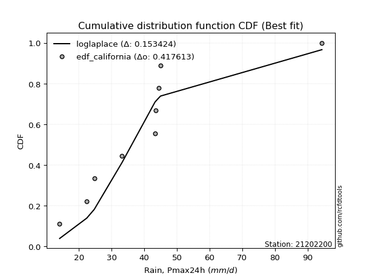</img>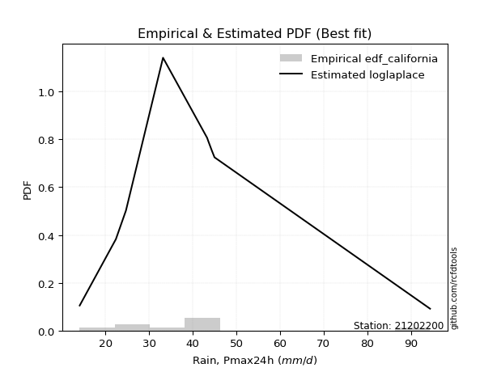</img>

</div>


### 2. Empirical - EDF Hazen (1930)

Hazen method for plotting positions is a formula used to estimate the empirical cumulative probability distribution of flood events or other hydrological data. This formula often results in biased estimations, particularly when extrapolating to extreme events (high return periods).

<div align="center">


$P=(m-0.5)/n$


</div>


**2.1. Empirical values**

<div align="center">

|                | 0                   | 1                   | 2                  | 3                  | 4         | 5                  | 6                  | 7                  | 8                  |
|:---------------|:--------------------|:--------------------|:-------------------|:-------------------|:----------|:-------------------|:-------------------|:-------------------|:-------------------|
| date           | 2016                | 2014                | 2015               | 2009               | 2010      | 2012               | 2008               | 2011               | 2013               |
| x              | 14.1                | 22.4                | 24.7               | 33.2               | 43.3      | 43.6               | 44.4               | 45.0               | 94.4               |
| m              | 1                   | 2                   | 3                  | 4                  | 5         | 6                  | 7                  | 8                  | 9                  |
| empirical_dist | edf_hazen           | edf_hazen           | edf_hazen          | edf_hazen          | edf_hazen | edf_hazen          | edf_hazen          | edf_hazen          | edf_hazen          |
| empirical      | 0.05555555555555555 | 0.16666666666666666 | 0.2777777777777778 | 0.3888888888888889 | 0.5       | 0.6111111111111112 | 0.7222222222222222 | 0.8333333333333334 | 0.9444444444444444 |
| empirical_tr   | 1.0588235294117647  | 1.2                 | 1.3846153846153846 | 1.6363636363636362 | 2.0       | 2.5714285714285716 | 3.5999999999999996 | 6.000000000000002  | 17.999999999999993 |

</div>


**2.2. Kolmogorov-Smirnov fit test (sorted by Δ)**


<div align="center">

|                | 0                   | 1                     | 2                   | 3                   | 4                   | 5                   | 6                   | 7                   | 8                   | 9                   | 10                  | 11                  | 12                  | 13                  | 14                  | 15                  | 16                  | 17                  | 18                  | 19                  | 20                  | 21                  | 22                  | 23                  | 24                  | 25                  | 26                  | 27                  | 28                  | 29                  | 30                  | 31                  | 32                  | 33                  | 34                  | 35                  | 36                  | 37                  | 38                  | 39                  | 40                  | 41                  | 42                  | 43                  | 44                  | 45                  | 46                  | 47                  | 48                  | 49                  | 50                  | 51                  | 52                  | 53                  | 54                  | 55                  | 56                  | 57                  | 58                  | 59                  | 60                  | 61                  | 62                  | 63                  | 64                  | 65                  | 66                  | 67                  | 68                  | 69                  | 70                  | 71                  | 72                  | 73                  | 74                  | 75                  | 76                  | 77                  | 78                  | 79                  | 80                  | 81                  | 82                  | 83                  | 84                  | 85                  | 86                  | 87                  | 88                  | 89                  |
|:---------------|:--------------------|:----------------------|:--------------------|:--------------------|:--------------------|:--------------------|:--------------------|:--------------------|:--------------------|:--------------------|:--------------------|:--------------------|:--------------------|:--------------------|:--------------------|:--------------------|:--------------------|:--------------------|:--------------------|:--------------------|:--------------------|:--------------------|:--------------------|:--------------------|:--------------------|:--------------------|:--------------------|:--------------------|:--------------------|:--------------------|:--------------------|:--------------------|:--------------------|:--------------------|:--------------------|:--------------------|:--------------------|:--------------------|:--------------------|:--------------------|:--------------------|:--------------------|:--------------------|:--------------------|:--------------------|:--------------------|:--------------------|:--------------------|:--------------------|:--------------------|:--------------------|:--------------------|:--------------------|:--------------------|:--------------------|:--------------------|:--------------------|:--------------------|:--------------------|:--------------------|:--------------------|:--------------------|:--------------------|:--------------------|:--------------------|:--------------------|:--------------------|:--------------------|:--------------------|:--------------------|:--------------------|:--------------------|:--------------------|:--------------------|:--------------------|:--------------------|:--------------------|:--------------------|:--------------------|:--------------------|:--------------------|:--------------------|:--------------------|:--------------------|:--------------------|:--------------------|:--------------------|:--------------------|:--------------------|:--------------------|
| station        | 21202200            | 21202200              | 21202200            | 21202200            | 21202200            | 21202200            | 21202200            | 21202200            | 21202200            | 21202200            | 21202200            | 21202200            | 21202200            | 21202200            | 21202200            | 21202200            | 21202200            | 21202200            | 21202200            | 21202200            | 21202200            | 21202200            | 21202200            | 21202200            | 21202200            | 21202200            | 21202200            | 21202200            | 21202200            | 21202200            | 21202200            | 21202200            | 21202200            | 21202200            | 21202200            | 21202200            | 21202200            | 21202200            | 21202200            | 21202200            | 21202200            | 21202200            | 21202200            | 21202200            | 21202200            | 21202200            | 21202200            | 21202200            | 21202200            | 21202200            | 21202200            | 21202200            | 21202200            | 21202200            | 21202200            | 21202200            | 21202200            | 21202200            | 21202200            | 21202200            | 21202200            | 21202200            | 21202200            | 21202200            | 21202200            | 21202200            | 21202200            | 21202200            | 21202200            | 21202200            | 21202200            | 21202200            | 21202200            | 21202200            | 21202200            | 21202200            | 21202200            | 21202200            | 21202200            | 21202200            | 21202200            | 21202200            | 21202200            | 21202200            | 21202200            | 21202200            | 21202200            | 21202200            | 21202200            | 21202200            |
| empirical_dist | edf_hazen           | edf_hazen             | edf_hazen           | edf_hazen           | edf_hazen           | edf_hazen           | edf_hazen           | edf_hazen           | edf_hazen           | edf_hazen           | edf_hazen           | edf_hazen           | edf_hazen           | edf_hazen           | edf_hazen           | edf_hazen           | edf_hazen           | edf_hazen           | edf_hazen           | edf_hazen           | edf_hazen           | edf_hazen           | edf_hazen           | edf_hazen           | edf_hazen           | edf_hazen           | edf_hazen           | edf_hazen           | edf_hazen           | edf_hazen           | edf_hazen           | edf_hazen           | edf_hazen           | edf_hazen           | edf_hazen           | edf_hazen           | edf_hazen           | edf_hazen           | edf_hazen           | edf_hazen           | edf_hazen           | edf_hazen           | edf_hazen           | edf_hazen           | edf_hazen           | edf_hazen           | edf_hazen           | edf_hazen           | edf_hazen           | edf_hazen           | edf_hazen           | edf_hazen           | edf_hazen           | edf_hazen           | edf_hazen           | edf_hazen           | edf_hazen           | edf_hazen           | edf_hazen           | edf_hazen           | edf_hazen           | edf_hazen           | edf_hazen           | edf_hazen           | edf_hazen           | edf_hazen           | edf_hazen           | edf_hazen           | edf_hazen           | edf_hazen           | edf_hazen           | edf_hazen           | edf_hazen           | edf_hazen           | edf_hazen           | edf_hazen           | edf_hazen           | edf_hazen           | edf_hazen           | edf_hazen           | edf_hazen           | edf_hazen           | edf_hazen           | edf_hazen           | edf_hazen           | edf_hazen           | edf_hazen           | edf_hazen           | edf_hazen           | edf_hazen           |
| p_dist         | logjohnsonsu        | loglaplace_asymmetric | johnsonsu           | invgamma            | ncf                 | logbetaprime        | logfatiguelife      | logf                | loggenlogistic      | mielke              | logmielke           | logerlang           | loggamma            | loggamma            | logpearson3         | logrice             | alpha               | lognct              | logexponnorm        | logt                | lognorm             | lognorm             | logcrystalball      | invgauss            | logweibull_min      | logfisk             | betaprime           | fisk                | logloggamma         | loginvgamma         | exponnorm           | nct                 | moyal               | halflogistic        | logalpha            | logncf              | genlogistic         | loglogistic         | expon               | genexpon            | loginvgauss         | pearson3            | logmaxwell          | gompertz            | lograyleigh         | nakagami            | loginvweibull       | loghypsecant        | logkstwobign        | loggenexpon         | gumbel_r            | f                   | loggompertz         | halfnorm            | logtruncnorm        | loghalfnorm         | kstwobign           | loggumbel_l         | chi2                | laplace             | loglaplace          | loggumbel_r         | wald                | rayleigh            | t                   | loghalflogistic     | maxwell             | logexpon            | logmoyal            | laplace_asymmetric  | rice                | hypsecant           | logistic            | truncnorm           | norm                | crystalball         | gamma               | weibull_min         | gibrat              | logwald             | gumbel_l            | loggibrat           | logchi2             | lognakagami         | erlang              | loglognorm          | pareto              | invweibull          | logpareto           | fatiguelife         |
| delta          | 0.14679401235841888 | 0.14966232365115595   | 0.15330676254936793 | 0.15422394873332412 | 0.15430792827270268 | 0.15433767411375143 | 0.15495124046075026 | 0.1551656927081343  | 0.15551733248596222 | 0.15558329035459018 | 0.1556667774339393  | 0.1559197864212496  | 0.1559198853868351  | 0.1559198853868351  | 0.15594658315751586 | 0.15612679837349108 | 0.15620119730227122 | 0.15655092678087446 | 0.15668914271777457 | 0.15675711036460027 | 0.15675976086690335 | 0.15675976086690335 | 0.1567606661538139  | 0.15682446404906836 | 0.15683773259356892 | 0.15773314435235963 | 0.1579915123993424  | 0.15844424248503386 | 0.15865469210326644 | 0.1595810870594888  | 0.15989229079560996 | 0.16052084193557015 | 0.16089711008699037 | 0.1626624292520582  | 0.16458264045087134 | 0.16465514488818622 | 0.1664800989734968  | 0.16688586655157556 | 0.16821713967113183 | 0.16826905476799936 | 0.1701742174293983  | 0.1702484393934245  | 0.17076652925764246 | 0.17398159828192894 | 0.17730782592934813 | 0.17747792952210695 | 0.17962130390540187 | 0.18076651990322123 | 0.18086782566304205 | 0.18271032876903726 | 0.18455774207138864 | 0.1851167775021869  | 0.18877089722721085 | 0.19072116810294049 | 0.19206921353893947 | 0.19632212482033473 | 0.19701113319831876 | 0.19739795421586914 | 0.19986534090179597 | 0.20847013333538544 | 0.20897934619941438 | 0.20915534733253538 | 0.21371599686098197 | 0.21581586662724328 | 0.22104294482687548 | 0.22445061072250994 | 0.2246717308012216  | 0.2265219639924342  | 0.2290652097978627  | 0.23222687681427923 | 0.23238113914168856 | 0.23343291671754796 | 0.2422371464495452  | 0.2528367366134501  | 0.2528367431215478  | 0.2528367437687573  | 0.2560276489205129  | 0.2674403005742859  | 0.27254664443638815 | 0.2854654805272132  | 0.31592353979104304 | 0.3176757475983266  | 0.32334847240252984 | 0.3350492254764093  | 0.42167597328360684 | 0.4465724881970756  | 0.4626082954452825  | 0.47098018364453154 | 0.4777220434053494  | 0.5759277859568716  |
| deltao         | 0.41761268023100007 | 0.41761268023100007   | 0.41761268023100007 | 0.41761268023100007 | 0.41761268023100007 | 0.41761268023100007 | 0.41761268023100007 | 0.41761268023100007 | 0.41761268023100007 | 0.41761268023100007 | 0.41761268023100007 | 0.41761268023100007 | 0.41761268023100007 | 0.41761268023100007 | 0.41761268023100007 | 0.41761268023100007 | 0.41761268023100007 | 0.41761268023100007 | 0.41761268023100007 | 0.41761268023100007 | 0.41761268023100007 | 0.41761268023100007 | 0.41761268023100007 | 0.41761268023100007 | 0.41761268023100007 | 0.41761268023100007 | 0.41761268023100007 | 0.41761268023100007 | 0.41761268023100007 | 0.41761268023100007 | 0.41761268023100007 | 0.41761268023100007 | 0.41761268023100007 | 0.41761268023100007 | 0.41761268023100007 | 0.41761268023100007 | 0.41761268023100007 | 0.41761268023100007 | 0.41761268023100007 | 0.41761268023100007 | 0.41761268023100007 | 0.41761268023100007 | 0.41761268023100007 | 0.41761268023100007 | 0.41761268023100007 | 0.41761268023100007 | 0.41761268023100007 | 0.41761268023100007 | 0.41761268023100007 | 0.41761268023100007 | 0.41761268023100007 | 0.41761268023100007 | 0.41761268023100007 | 0.41761268023100007 | 0.41761268023100007 | 0.41761268023100007 | 0.41761268023100007 | 0.41761268023100007 | 0.41761268023100007 | 0.41761268023100007 | 0.41761268023100007 | 0.41761268023100007 | 0.41761268023100007 | 0.41761268023100007 | 0.41761268023100007 | 0.41761268023100007 | 0.41761268023100007 | 0.41761268023100007 | 0.41761268023100007 | 0.41761268023100007 | 0.41761268023100007 | 0.41761268023100007 | 0.41761268023100007 | 0.41761268023100007 | 0.41761268023100007 | 0.41761268023100007 | 0.41761268023100007 | 0.41761268023100007 | 0.41761268023100007 | 0.41761268023100007 | 0.41761268023100007 | 0.41761268023100007 | 0.41761268023100007 | 0.41761268023100007 | 0.41761268023100007 | 0.41761268023100007 | 0.41761268023100007 | 0.41761268023100007 | 0.41761268023100007 | 0.41761268023100007 |
| eval           | Δo > Δ              | Δo > Δ                | Δo > Δ              | Δo > Δ              | Δo > Δ              | Δo > Δ              | Δo > Δ              | Δo > Δ              | Δo > Δ              | Δo > Δ              | Δo > Δ              | Δo > Δ              | Δo > Δ              | Δo > Δ              | Δo > Δ              | Δo > Δ              | Δo > Δ              | Δo > Δ              | Δo > Δ              | Δo > Δ              | Δo > Δ              | Δo > Δ              | Δo > Δ              | Δo > Δ              | Δo > Δ              | Δo > Δ              | Δo > Δ              | Δo > Δ              | Δo > Δ              | Δo > Δ              | Δo > Δ              | Δo > Δ              | Δo > Δ              | Δo > Δ              | Δo > Δ              | Δo > Δ              | Δo > Δ              | Δo > Δ              | Δo > Δ              | Δo > Δ              | Δo > Δ              | Δo > Δ              | Δo > Δ              | Δo > Δ              | Δo > Δ              | Δo > Δ              | Δo > Δ              | Δo > Δ              | Δo > Δ              | Δo > Δ              | Δo > Δ              | Δo > Δ              | Δo > Δ              | Δo > Δ              | Δo > Δ              | Δo > Δ              | Δo > Δ              | Δo > Δ              | Δo > Δ              | Δo > Δ              | Δo > Δ              | Δo > Δ              | Δo > Δ              | Δo > Δ              | Δo > Δ              | Δo > Δ              | Δo > Δ              | Δo > Δ              | Δo > Δ              | Δo > Δ              | Δo > Δ              | Δo > Δ              | Δo > Δ              | Δo > Δ              | Δo > Δ              | Δo > Δ              | Δo > Δ              | Δo > Δ              | Δo > Δ              | Δo > Δ              | Δo > Δ              | Δo > Δ              | Δo > Δ              | Δo > Δ              | Δo <= Δ             | Δo <= Δ             | Δo <= Δ             | Δo <= Δ             | Δo <= Δ             | Δo <= Δ             |
| fit            | 1                   | 1                     | 1                   | 1                   | 1                   | 1                   | 1                   | 1                   | 1                   | 1                   | 1                   | 1                   | 1                   | 1                   | 1                   | 1                   | 1                   | 1                   | 1                   | 1                   | 1                   | 1                   | 1                   | 1                   | 1                   | 1                   | 1                   | 1                   | 1                   | 1                   | 1                   | 1                   | 1                   | 1                   | 1                   | 1                   | 1                   | 1                   | 1                   | 1                   | 1                   | 1                   | 1                   | 1                   | 1                   | 1                   | 1                   | 1                   | 1                   | 1                   | 1                   | 1                   | 1                   | 1                   | 1                   | 1                   | 1                   | 1                   | 1                   | 1                   | 1                   | 1                   | 1                   | 1                   | 1                   | 1                   | 1                   | 1                   | 1                   | 1                   | 1                   | 1                   | 1                   | 1                   | 1                   | 1                   | 1                   | 1                   | 1                   | 1                   | 1                   | 1                   | 1                   | 1                   | 0                   | 0                   | 0                   | 0                   | 0                   | 0                   |
| n              | 9                   | 9                     | 9                   | 9                   | 9                   | 9                   | 9                   | 9                   | 9                   | 9                   | 9                   | 9                   | 9                   | 9                   | 9                   | 9                   | 9                   | 9                   | 9                   | 9                   | 9                   | 9                   | 9                   | 9                   | 9                   | 9                   | 9                   | 9                   | 9                   | 9                   | 9                   | 9                   | 9                   | 9                   | 9                   | 9                   | 9                   | 9                   | 9                   | 9                   | 9                   | 9                   | 9                   | 9                   | 9                   | 9                   | 9                   | 9                   | 9                   | 9                   | 9                   | 9                   | 9                   | 9                   | 9                   | 9                   | 9                   | 9                   | 9                   | 9                   | 9                   | 9                   | 9                   | 9                   | 9                   | 9                   | 9                   | 9                   | 9                   | 9                   | 9                   | 9                   | 9                   | 9                   | 9                   | 9                   | 9                   | 9                   | 9                   | 9                   | 9                   | 9                   | 9                   | 9                   | 9                   | 9                   | 9                   | 9                   | 9                   | 9                   |
| best_fit       | 1                   | 0                     | 0                   | 0                   | 0                   | 0                   | 0                   | 0                   | 0                   | 0                   | 0                   | 0                   | 0                   | 0                   | 0                   | 0                   | 0                   | 0                   | 0                   | 0                   | 0                   | 0                   | 0                   | 0                   | 0                   | 0                   | 0                   | 0                   | 0                   | 0                   | 0                   | 0                   | 0                   | 0                   | 0                   | 0                   | 0                   | 0                   | 0                   | 0                   | 0                   | 0                   | 0                   | 0                   | 0                   | 0                   | 0                   | 0                   | 0                   | 0                   | 0                   | 0                   | 0                   | 0                   | 0                   | 0                   | 0                   | 0                   | 0                   | 0                   | 0                   | 0                   | 0                   | 0                   | 0                   | 0                   | 0                   | 0                   | 0                   | 0                   | 0                   | 0                   | 0                   | 0                   | 0                   | 0                   | 0                   | 0                   | 0                   | 0                   | 0                   | 0                   | 0                   | 0                   | 0                   | 0                   | 0                   | 0                   | 0                   | 0                   |
| best_fit_sort  | 1                   | 2                     | 3                   | 4                   | 5                   | 6                   | 7                   | 8                   | 9                   | 10                  | 11                  | 12                  | 13                  | 14                  | 15                  | 16                  | 17                  | 18                  | 19                  | 20                  | 21                  | 22                  | 23                  | 24                  | 25                  | 26                  | 27                  | 28                  | 29                  | 30                  | 31                  | 32                  | 33                  | 34                  | 35                  | 36                  | 37                  | 38                  | 39                  | 40                  | 41                  | 42                  | 43                  | 44                  | 45                  | 46                  | 47                  | 48                  | 49                  | 50                  | 51                  | 52                  | 53                  | 54                  | 55                  | 56                  | 57                  | 58                  | 59                  | 60                  | 61                  | 62                  | 63                  | 64                  | 65                  | 66                  | 67                  | 68                  | 69                  | 70                  | 71                  | 72                  | 73                  | 74                  | 75                  | 76                  | 77                  | 78                  | 79                  | 80                  | 81                  | 82                  | 83                  | 84                  | 85                  | 86                  | 87                  | 88                  | 89                  | 90                  |

</div>


<div align="center">

</img>

</div>


**2.3. Best fit**

<div align="center">

|   id |   station | empirical_dist   | p_dist       |    delta |   deltao | eval   |   fit |   n |   best_fit |   best_fit_sort |
|-----:|----------:|:-----------------|:-------------|---------:|---------:|:-------|------:|----:|-----------:|----------------:|
|    0 |  21202200 | edf_hazen        | logjohnsonsu | 0.146794 | 0.417613 | Δo > Δ |     1 |   9 |          1 |               1 |

</div>


<div align="center">

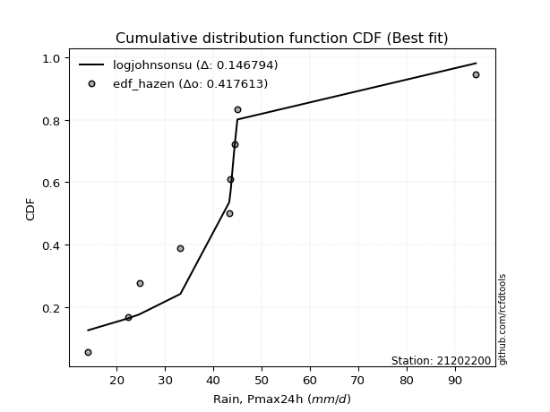</img>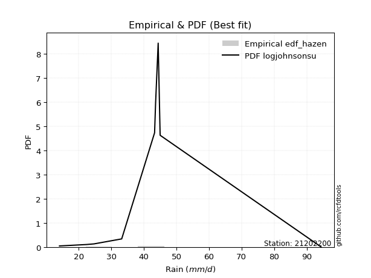</img>

</div>


### 3. Empirical - EDF Weibull (1939)

Weibull plotting position formula is an empirical method used to estimate the non-exceedance probability or plotting position for a set of observed data, is often recommended or widely used in practice, particularly in flood frequency analysis.

<div align="center">


$P=m/(n+1)$


</div>


**3.1. Empirical values**

<div align="center">

|                | 0                  | 1           | 2                  | 3                  | 4           | 5           | 6                 | 7                 | 8                  |
|:---------------|:-------------------|:------------|:-------------------|:-------------------|:------------|:------------|:------------------|:------------------|:-------------------|
| date           | 2016               | 2014        | 2015               | 2009               | 2010        | 2012        | 2008              | 2011              | 2013               |
| x              | 14.1               | 22.4        | 24.7               | 33.2               | 43.3        | 43.6        | 44.4              | 45.0              | 94.4               |
| m              | 1                  | 2           | 3                  | 4                  | 5           | 6           | 7                 | 8                 | 9                  |
| empirical_dist | edf_weibull        | edf_weibull | edf_weibull        | edf_weibull        | edf_weibull | edf_weibull | edf_weibull       | edf_weibull       | edf_weibull        |
| empirical      | 0.1                | 0.2         | 0.3                | 0.4                | 0.5         | 0.6         | 0.7               | 0.8               | 0.9                |
| empirical_tr   | 1.1111111111111112 | 1.25        | 1.4285714285714286 | 1.6666666666666667 | 2.0         | 2.5         | 3.333333333333333 | 5.000000000000001 | 10.000000000000002 |

</div>


**3.2. Kolmogorov-Smirnov fit test (sorted by Δ)**


<div align="center">

|                | 0                     | 1                   | 2                   | 3                   | 4                   | 5                   | 6                   | 7                   | 8                   | 9                   | 10                  | 11                  | 12                  | 13                  | 14                  | 15                  | 16                  | 17                  | 18                  | 19                  | 20                  | 21                  | 22                  | 23                  | 24                  | 25                  | 26                  | 27                  | 28                  | 29                  | 30                  | 31                  | 32                  | 33                  | 34                  | 35                  | 36                  | 37                  | 38                  | 39                  | 40                  | 41                  | 42                  | 43                  | 44                  | 45                  | 46                  | 47                  | 48                  | 49                  | 50                  | 51                  | 52                  | 53                  | 54                  | 55                  | 56                  | 57                  | 58                  | 59                  | 60                  | 61                  | 62                  | 63                  | 64                  | 65                  | 66                  | 67                  | 68                  | 69                  | 70                  | 71                  | 72                  | 73                  | 74                  | 75                  | 76                  | 77                  | 78                  | 79                  | 80                  | 81                  | 82                  | 83                  | 84                  | 85                  | 86                  | 87                  | 88                  | 89                  |
|:---------------|:----------------------|:--------------------|:--------------------|:--------------------|:--------------------|:--------------------|:--------------------|:--------------------|:--------------------|:--------------------|:--------------------|:--------------------|:--------------------|:--------------------|:--------------------|:--------------------|:--------------------|:--------------------|:--------------------|:--------------------|:--------------------|:--------------------|:--------------------|:--------------------|:--------------------|:--------------------|:--------------------|:--------------------|:--------------------|:--------------------|:--------------------|:--------------------|:--------------------|:--------------------|:--------------------|:--------------------|:--------------------|:--------------------|:--------------------|:--------------------|:--------------------|:--------------------|:--------------------|:--------------------|:--------------------|:--------------------|:--------------------|:--------------------|:--------------------|:--------------------|:--------------------|:--------------------|:--------------------|:--------------------|:--------------------|:--------------------|:--------------------|:--------------------|:--------------------|:--------------------|:--------------------|:--------------------|:--------------------|:--------------------|:--------------------|:--------------------|:--------------------|:--------------------|:--------------------|:--------------------|:--------------------|:--------------------|:--------------------|:--------------------|:--------------------|:--------------------|:--------------------|:--------------------|:--------------------|:--------------------|:--------------------|:--------------------|:--------------------|:--------------------|:--------------------|:--------------------|:--------------------|:--------------------|:--------------------|:--------------------|
| station        | 21202200              | 21202200            | 21202200            | 21202200            | 21202200            | 21202200            | 21202200            | 21202200            | 21202200            | 21202200            | 21202200            | 21202200            | 21202200            | 21202200            | 21202200            | 21202200            | 21202200            | 21202200            | 21202200            | 21202200            | 21202200            | 21202200            | 21202200            | 21202200            | 21202200            | 21202200            | 21202200            | 21202200            | 21202200            | 21202200            | 21202200            | 21202200            | 21202200            | 21202200            | 21202200            | 21202200            | 21202200            | 21202200            | 21202200            | 21202200            | 21202200            | 21202200            | 21202200            | 21202200            | 21202200            | 21202200            | 21202200            | 21202200            | 21202200            | 21202200            | 21202200            | 21202200            | 21202200            | 21202200            | 21202200            | 21202200            | 21202200            | 21202200            | 21202200            | 21202200            | 21202200            | 21202200            | 21202200            | 21202200            | 21202200            | 21202200            | 21202200            | 21202200            | 21202200            | 21202200            | 21202200            | 21202200            | 21202200            | 21202200            | 21202200            | 21202200            | 21202200            | 21202200            | 21202200            | 21202200            | 21202200            | 21202200            | 21202200            | 21202200            | 21202200            | 21202200            | 21202200            | 21202200            | 21202200            | 21202200            |
| empirical_dist | edf_weibull           | edf_weibull         | edf_weibull         | edf_weibull         | edf_weibull         | edf_weibull         | edf_weibull         | edf_weibull         | edf_weibull         | edf_weibull         | edf_weibull         | edf_weibull         | edf_weibull         | edf_weibull         | edf_weibull         | edf_weibull         | edf_weibull         | edf_weibull         | edf_weibull         | edf_weibull         | edf_weibull         | edf_weibull         | edf_weibull         | edf_weibull         | edf_weibull         | edf_weibull         | edf_weibull         | edf_weibull         | edf_weibull         | edf_weibull         | edf_weibull         | edf_weibull         | edf_weibull         | edf_weibull         | edf_weibull         | edf_weibull         | edf_weibull         | edf_weibull         | edf_weibull         | edf_weibull         | edf_weibull         | edf_weibull         | edf_weibull         | edf_weibull         | edf_weibull         | edf_weibull         | edf_weibull         | edf_weibull         | edf_weibull         | edf_weibull         | edf_weibull         | edf_weibull         | edf_weibull         | edf_weibull         | edf_weibull         | edf_weibull         | edf_weibull         | edf_weibull         | edf_weibull         | edf_weibull         | edf_weibull         | edf_weibull         | edf_weibull         | edf_weibull         | edf_weibull         | edf_weibull         | edf_weibull         | edf_weibull         | edf_weibull         | edf_weibull         | edf_weibull         | edf_weibull         | edf_weibull         | edf_weibull         | edf_weibull         | edf_weibull         | edf_weibull         | edf_weibull         | edf_weibull         | edf_weibull         | edf_weibull         | edf_weibull         | edf_weibull         | edf_weibull         | edf_weibull         | edf_weibull         | edf_weibull         | edf_weibull         | edf_weibull         | edf_weibull         |
| p_dist         | loglaplace_asymmetric | genlogistic         | pearson3            | gompertz            | exponnorm           | nakagami            | logncf              | moyal               | halflogistic        | logloggamma         | logcrystalball      | lognorm             | lognorm             | logt                | logexponnorm        | lognct              | invgauss            | logpearson3         | loggamma            | loggamma            | logerlang           | logweibull_min      | logf                | logfatiguelife      | gumbel_r            | ncf                 | johnsonsu           | invgamma            | logbetaprime        | loggenlogistic      | mielke              | logmielke           | logrice             | alpha               | halfnorm            | logfisk             | logjohnsonsu        | betaprime           | fisk                | loginvgamma         | nct                 | kstwobign           | loggumbel_l         | logalpha            | loglogistic         | expon               | genexpon            | loginvgauss         | logmaxwell          | laplace             | lograyleigh         | loginvweibull       | loghypsecant        | logkstwobign        | rayleigh            | loggenexpon         | f                   | t                   | loggompertz         | maxwell             | loghalfnorm         | laplace_asymmetric  | rice                | chi2                | logtruncnorm        | hypsecant           | logexpon            | logistic            | loglaplace          | loggumbel_r         | wald                | truncnorm           | norm                | crystalball         | loghalflogistic     | logmoyal            | weibull_min         | gamma               | gumbel_l            | logwald             | logchi2             | gibrat              | loggibrat           | lognakagami         | erlang              | loglognorm          | invweibull          | pareto              | logpareto           | fatiguelife         |
| delta          | 0.13234005198111587   | 0.1357817499530286  | 0.13691510606009116 | 0.1406482649485956  | 0.14339653660724627 | 0.14414459618877362 | 0.14439443618583958 | 0.14478272579566243 | 0.14483183686570988 | 0.14706267007430884 | 0.14902646733792269 | 0.14902740576232898 | 0.14902740576232898 | 0.149030116288706   | 0.14910439410884158 | 0.14925061095208492 | 0.1499295068530262  | 0.1499340644969337  | 0.14996251132545835 | 0.14996251132545835 | 0.1499628132409555  | 0.14996411116060981 | 0.15078560395236007 | 0.15100168469914144 | 0.15122440873805532 | 0.1513125994097434  | 0.15305263074889197 | 0.15422394873332412 | 0.15433767411375143 | 0.15551733248596222 | 0.15558329035459018 | 0.1556667774339393  | 0.15612679837349108 | 0.15620119730227122 | 0.15738783476960716 | 0.15773314435235963 | 0.15790512346953    | 0.1579915123993424  | 0.15844424248503386 | 0.1595810870594888  | 0.16052084193557015 | 0.16367779986498543 | 0.16406462088253582 | 0.16458264045087134 | 0.16688586655157556 | 0.16821713967113183 | 0.16826905476799936 | 0.1701742174293983  | 0.17076652925764246 | 0.17513680000205212 | 0.17730782592934813 | 0.17962130390540187 | 0.18076651990322123 | 0.18086782566304205 | 0.18248253329390995 | 0.18271032876903726 | 0.1851167775021869  | 0.18770961149354215 | 0.18877089722721085 | 0.19133839746788828 | 0.19632212482033473 | 0.1988935434809459  | 0.19904780580835524 | 0.19986534090179597 | 0.19999999975124433 | 0.20009958338421463 | 0.20314428431181109 | 0.20890381311621187 | 0.20897934619941438 | 0.20915534733253538 | 0.21371599686098197 | 0.21950340328011675 | 0.21950340978821448 | 0.21950341043542398 | 0.22445061072250994 | 0.2290652097978627  | 0.23410696724095253 | 0.2560276489205129  | 0.2825902064577097  | 0.2854654805272132  | 0.29001513906919646 | 0.29476886665861035 | 0.3176757475983266  | 0.3239381143652982  | 0.38834263995027346 | 0.41323915486374224 | 0.42653573920008714 | 0.4292749621119491  | 0.444388710072016   | 0.5425944526235382  |
| deltao         | 0.41761268023100007   | 0.41761268023100007 | 0.41761268023100007 | 0.41761268023100007 | 0.41761268023100007 | 0.41761268023100007 | 0.41761268023100007 | 0.41761268023100007 | 0.41761268023100007 | 0.41761268023100007 | 0.41761268023100007 | 0.41761268023100007 | 0.41761268023100007 | 0.41761268023100007 | 0.41761268023100007 | 0.41761268023100007 | 0.41761268023100007 | 0.41761268023100007 | 0.41761268023100007 | 0.41761268023100007 | 0.41761268023100007 | 0.41761268023100007 | 0.41761268023100007 | 0.41761268023100007 | 0.41761268023100007 | 0.41761268023100007 | 0.41761268023100007 | 0.41761268023100007 | 0.41761268023100007 | 0.41761268023100007 | 0.41761268023100007 | 0.41761268023100007 | 0.41761268023100007 | 0.41761268023100007 | 0.41761268023100007 | 0.41761268023100007 | 0.41761268023100007 | 0.41761268023100007 | 0.41761268023100007 | 0.41761268023100007 | 0.41761268023100007 | 0.41761268023100007 | 0.41761268023100007 | 0.41761268023100007 | 0.41761268023100007 | 0.41761268023100007 | 0.41761268023100007 | 0.41761268023100007 | 0.41761268023100007 | 0.41761268023100007 | 0.41761268023100007 | 0.41761268023100007 | 0.41761268023100007 | 0.41761268023100007 | 0.41761268023100007 | 0.41761268023100007 | 0.41761268023100007 | 0.41761268023100007 | 0.41761268023100007 | 0.41761268023100007 | 0.41761268023100007 | 0.41761268023100007 | 0.41761268023100007 | 0.41761268023100007 | 0.41761268023100007 | 0.41761268023100007 | 0.41761268023100007 | 0.41761268023100007 | 0.41761268023100007 | 0.41761268023100007 | 0.41761268023100007 | 0.41761268023100007 | 0.41761268023100007 | 0.41761268023100007 | 0.41761268023100007 | 0.41761268023100007 | 0.41761268023100007 | 0.41761268023100007 | 0.41761268023100007 | 0.41761268023100007 | 0.41761268023100007 | 0.41761268023100007 | 0.41761268023100007 | 0.41761268023100007 | 0.41761268023100007 | 0.41761268023100007 | 0.41761268023100007 | 0.41761268023100007 | 0.41761268023100007 | 0.41761268023100007 |
| eval           | Δo > Δ                | Δo > Δ              | Δo > Δ              | Δo > Δ              | Δo > Δ              | Δo > Δ              | Δo > Δ              | Δo > Δ              | Δo > Δ              | Δo > Δ              | Δo > Δ              | Δo > Δ              | Δo > Δ              | Δo > Δ              | Δo > Δ              | Δo > Δ              | Δo > Δ              | Δo > Δ              | Δo > Δ              | Δo > Δ              | Δo > Δ              | Δo > Δ              | Δo > Δ              | Δo > Δ              | Δo > Δ              | Δo > Δ              | Δo > Δ              | Δo > Δ              | Δo > Δ              | Δo > Δ              | Δo > Δ              | Δo > Δ              | Δo > Δ              | Δo > Δ              | Δo > Δ              | Δo > Δ              | Δo > Δ              | Δo > Δ              | Δo > Δ              | Δo > Δ              | Δo > Δ              | Δo > Δ              | Δo > Δ              | Δo > Δ              | Δo > Δ              | Δo > Δ              | Δo > Δ              | Δo > Δ              | Δo > Δ              | Δo > Δ              | Δo > Δ              | Δo > Δ              | Δo > Δ              | Δo > Δ              | Δo > Δ              | Δo > Δ              | Δo > Δ              | Δo > Δ              | Δo > Δ              | Δo > Δ              | Δo > Δ              | Δo > Δ              | Δo > Δ              | Δo > Δ              | Δo > Δ              | Δo > Δ              | Δo > Δ              | Δo > Δ              | Δo > Δ              | Δo > Δ              | Δo > Δ              | Δo > Δ              | Δo > Δ              | Δo > Δ              | Δo > Δ              | Δo > Δ              | Δo > Δ              | Δo > Δ              | Δo > Δ              | Δo > Δ              | Δo > Δ              | Δo > Δ              | Δo > Δ              | Δo > Δ              | Δo > Δ              | Δo > Δ              | Δo <= Δ             | Δo <= Δ             | Δo <= Δ             | Δo <= Δ             |
| fit            | 1                     | 1                   | 1                   | 1                   | 1                   | 1                   | 1                   | 1                   | 1                   | 1                   | 1                   | 1                   | 1                   | 1                   | 1                   | 1                   | 1                   | 1                   | 1                   | 1                   | 1                   | 1                   | 1                   | 1                   | 1                   | 1                   | 1                   | 1                   | 1                   | 1                   | 1                   | 1                   | 1                   | 1                   | 1                   | 1                   | 1                   | 1                   | 1                   | 1                   | 1                   | 1                   | 1                   | 1                   | 1                   | 1                   | 1                   | 1                   | 1                   | 1                   | 1                   | 1                   | 1                   | 1                   | 1                   | 1                   | 1                   | 1                   | 1                   | 1                   | 1                   | 1                   | 1                   | 1                   | 1                   | 1                   | 1                   | 1                   | 1                   | 1                   | 1                   | 1                   | 1                   | 1                   | 1                   | 1                   | 1                   | 1                   | 1                   | 1                   | 1                   | 1                   | 1                   | 1                   | 1                   | 1                   | 0                   | 0                   | 0                   | 0                   |
| n              | 9                     | 9                   | 9                   | 9                   | 9                   | 9                   | 9                   | 9                   | 9                   | 9                   | 9                   | 9                   | 9                   | 9                   | 9                   | 9                   | 9                   | 9                   | 9                   | 9                   | 9                   | 9                   | 9                   | 9                   | 9                   | 9                   | 9                   | 9                   | 9                   | 9                   | 9                   | 9                   | 9                   | 9                   | 9                   | 9                   | 9                   | 9                   | 9                   | 9                   | 9                   | 9                   | 9                   | 9                   | 9                   | 9                   | 9                   | 9                   | 9                   | 9                   | 9                   | 9                   | 9                   | 9                   | 9                   | 9                   | 9                   | 9                   | 9                   | 9                   | 9                   | 9                   | 9                   | 9                   | 9                   | 9                   | 9                   | 9                   | 9                   | 9                   | 9                   | 9                   | 9                   | 9                   | 9                   | 9                   | 9                   | 9                   | 9                   | 9                   | 9                   | 9                   | 9                   | 9                   | 9                   | 9                   | 9                   | 9                   | 9                   | 9                   |
| best_fit       | 1                     | 0                   | 0                   | 0                   | 0                   | 0                   | 0                   | 0                   | 0                   | 0                   | 0                   | 0                   | 0                   | 0                   | 0                   | 0                   | 0                   | 0                   | 0                   | 0                   | 0                   | 0                   | 0                   | 0                   | 0                   | 0                   | 0                   | 0                   | 0                   | 0                   | 0                   | 0                   | 0                   | 0                   | 0                   | 0                   | 0                   | 0                   | 0                   | 0                   | 0                   | 0                   | 0                   | 0                   | 0                   | 0                   | 0                   | 0                   | 0                   | 0                   | 0                   | 0                   | 0                   | 0                   | 0                   | 0                   | 0                   | 0                   | 0                   | 0                   | 0                   | 0                   | 0                   | 0                   | 0                   | 0                   | 0                   | 0                   | 0                   | 0                   | 0                   | 0                   | 0                   | 0                   | 0                   | 0                   | 0                   | 0                   | 0                   | 0                   | 0                   | 0                   | 0                   | 0                   | 0                   | 0                   | 0                   | 0                   | 0                   | 0                   |
| best_fit_sort  | 1                     | 2                   | 3                   | 4                   | 5                   | 6                   | 7                   | 8                   | 9                   | 10                  | 11                  | 12                  | 13                  | 14                  | 15                  | 16                  | 17                  | 18                  | 19                  | 20                  | 21                  | 22                  | 23                  | 24                  | 25                  | 26                  | 27                  | 28                  | 29                  | 30                  | 31                  | 32                  | 33                  | 34                  | 35                  | 36                  | 37                  | 38                  | 39                  | 40                  | 41                  | 42                  | 43                  | 44                  | 45                  | 46                  | 47                  | 48                  | 49                  | 50                  | 51                  | 52                  | 53                  | 54                  | 55                  | 56                  | 57                  | 58                  | 59                  | 60                  | 61                  | 62                  | 63                  | 64                  | 65                  | 66                  | 67                  | 68                  | 69                  | 70                  | 71                  | 72                  | 73                  | 74                  | 75                  | 76                  | 77                  | 78                  | 79                  | 80                  | 81                  | 82                  | 83                  | 84                  | 85                  | 86                  | 87                  | 88                  | 89                  | 90                  |

</div>


<div align="center">

</img>

</div>


**3.3. Best fit**

<div align="center">

|   id |   station | empirical_dist   | p_dist                |   delta |   deltao | eval   |   fit |   n |   best_fit |   best_fit_sort |
|-----:|----------:|:-----------------|:----------------------|--------:|---------:|:-------|------:|----:|-----------:|----------------:|
|    0 |  21202200 | edf_weibull      | loglaplace_asymmetric | 0.13234 | 0.417613 | Δo > Δ |     1 |   9 |          1 |               1 |

</div>


<div align="center">

</img>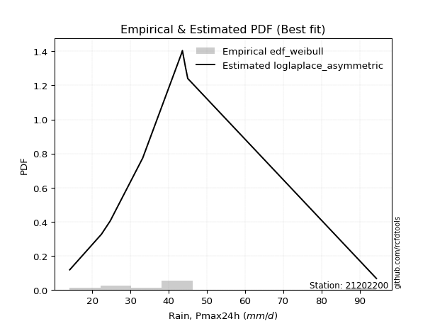</img>

</div>


### 4. Empirical - EDF Beard (1943)

The Beard formula (or Beard´s plotting position formula) in hydrology is used to estimate the empirical non-exceedance probability _(P)_ of a flood event (or other extreme hydrological data point) within a given dataset.

<div align="center">


$P=(m-0.31)/(n+0.38)$


</div>


**4.1. Empirical values**

<div align="center">

|                | 0                   | 1                   | 2                  | 3                   | 4         | 5                  | 6                  | 7                  | 8                  |
|:---------------|:--------------------|:--------------------|:-------------------|:--------------------|:----------|:-------------------|:-------------------|:-------------------|:-------------------|
| date           | 2016                | 2014                | 2015               | 2009                | 2010      | 2012               | 2008               | 2011               | 2013               |
| x              | 14.1                | 22.4                | 24.7               | 33.2                | 43.3      | 43.6               | 44.4               | 45.0               | 94.4               |
| m              | 1                   | 2                   | 3                  | 4                   | 5         | 6                  | 7                  | 8                  | 9                  |
| empirical_dist | edf_beard           | edf_beard           | edf_beard          | edf_beard           | edf_beard | edf_beard          | edf_beard          | edf_beard          | edf_beard          |
| empirical      | 0.07356076759061833 | 0.18017057569296374 | 0.2867803837953091 | 0.39339019189765456 | 0.5       | 0.6066098081023454 | 0.7132196162046908 | 0.8198294243070362 | 0.9264392324093815 |
| empirical_tr   | 1.0794016110471807  | 1.2197659297789336  | 1.4020926756352765 | 1.6485061511423549  | 2.0       | 2.542005420054201  | 3.486988847583642  | 5.550295857988164  | 13.5942028985507   |

</div>


**4.2. Kolmogorov-Smirnov fit test (sorted by Δ)**


<div align="center">

|                | 0                     | 1                   | 2                   | 3                   | 4                   | 5                   | 6                   | 7                   | 8                   | 9                   | 10                  | 11                  | 12                  | 13                  | 14                  | 15                  | 16                  | 17                  | 18                  | 19                  | 20                  | 21                  | 22                  | 23                  | 24                  | 25                  | 26                  | 27                  | 28                  | 29                  | 30                  | 31                  | 32                  | 33                  | 34                  | 35                  | 36                  | 37                  | 38                  | 39                  | 40                  | 41                  | 42                  | 43                  | 44                  | 45                  | 46                  | 47                  | 48                  | 49                  | 50                  | 51                  | 52                  | 53                  | 54                  | 55                  | 56                  | 57                  | 58                  | 59                  | 60                  | 61                  | 62                  | 63                  | 64                  | 65                  | 66                  | 67                  | 68                  | 69                  | 70                  | 71                  | 72                  | 73                  | 74                  | 75                  | 76                  | 77                  | 78                  | 79                  | 80                  | 81                  | 82                  | 83                  | 84                  | 85                  | 86                  | 87                  | 88                  | 89                  |
|:---------------|:----------------------|:--------------------|:--------------------|:--------------------|:--------------------|:--------------------|:--------------------|:--------------------|:--------------------|:--------------------|:--------------------|:--------------------|:--------------------|:--------------------|:--------------------|:--------------------|:--------------------|:--------------------|:--------------------|:--------------------|:--------------------|:--------------------|:--------------------|:--------------------|:--------------------|:--------------------|:--------------------|:--------------------|:--------------------|:--------------------|:--------------------|:--------------------|:--------------------|:--------------------|:--------------------|:--------------------|:--------------------|:--------------------|:--------------------|:--------------------|:--------------------|:--------------------|:--------------------|:--------------------|:--------------------|:--------------------|:--------------------|:--------------------|:--------------------|:--------------------|:--------------------|:--------------------|:--------------------|:--------------------|:--------------------|:--------------------|:--------------------|:--------------------|:--------------------|:--------------------|:--------------------|:--------------------|:--------------------|:--------------------|:--------------------|:--------------------|:--------------------|:--------------------|:--------------------|:--------------------|:--------------------|:--------------------|:--------------------|:--------------------|:--------------------|:--------------------|:--------------------|:--------------------|:--------------------|:--------------------|:--------------------|:--------------------|:--------------------|:--------------------|:--------------------|:--------------------|:--------------------|:--------------------|:--------------------|:--------------------|
| station        | 21202200              | 21202200            | 21202200            | 21202200            | 21202200            | 21202200            | 21202200            | 21202200            | 21202200            | 21202200            | 21202200            | 21202200            | 21202200            | 21202200            | 21202200            | 21202200            | 21202200            | 21202200            | 21202200            | 21202200            | 21202200            | 21202200            | 21202200            | 21202200            | 21202200            | 21202200            | 21202200            | 21202200            | 21202200            | 21202200            | 21202200            | 21202200            | 21202200            | 21202200            | 21202200            | 21202200            | 21202200            | 21202200            | 21202200            | 21202200            | 21202200            | 21202200            | 21202200            | 21202200            | 21202200            | 21202200            | 21202200            | 21202200            | 21202200            | 21202200            | 21202200            | 21202200            | 21202200            | 21202200            | 21202200            | 21202200            | 21202200            | 21202200            | 21202200            | 21202200            | 21202200            | 21202200            | 21202200            | 21202200            | 21202200            | 21202200            | 21202200            | 21202200            | 21202200            | 21202200            | 21202200            | 21202200            | 21202200            | 21202200            | 21202200            | 21202200            | 21202200            | 21202200            | 21202200            | 21202200            | 21202200            | 21202200            | 21202200            | 21202200            | 21202200            | 21202200            | 21202200            | 21202200            | 21202200            | 21202200            |
| empirical_dist | edf_beard             | edf_beard           | edf_beard           | edf_beard           | edf_beard           | edf_beard           | edf_beard           | edf_beard           | edf_beard           | edf_beard           | edf_beard           | edf_beard           | edf_beard           | edf_beard           | edf_beard           | edf_beard           | edf_beard           | edf_beard           | edf_beard           | edf_beard           | edf_beard           | edf_beard           | edf_beard           | edf_beard           | edf_beard           | edf_beard           | edf_beard           | edf_beard           | edf_beard           | edf_beard           | edf_beard           | edf_beard           | edf_beard           | edf_beard           | edf_beard           | edf_beard           | edf_beard           | edf_beard           | edf_beard           | edf_beard           | edf_beard           | edf_beard           | edf_beard           | edf_beard           | edf_beard           | edf_beard           | edf_beard           | edf_beard           | edf_beard           | edf_beard           | edf_beard           | edf_beard           | edf_beard           | edf_beard           | edf_beard           | edf_beard           | edf_beard           | edf_beard           | edf_beard           | edf_beard           | edf_beard           | edf_beard           | edf_beard           | edf_beard           | edf_beard           | edf_beard           | edf_beard           | edf_beard           | edf_beard           | edf_beard           | edf_beard           | edf_beard           | edf_beard           | edf_beard           | edf_beard           | edf_beard           | edf_beard           | edf_beard           | edf_beard           | edf_beard           | edf_beard           | edf_beard           | edf_beard           | edf_beard           | edf_beard           | edf_beard           | edf_beard           | edf_beard           | edf_beard           | edf_beard           |
| p_dist         | loglaplace_asymmetric | exponnorm           | logloggamma         | moyal               | logcrystalball      | lognorm             | lognorm             | logt                | logexponnorm        | halflogistic        | lognct              | invgauss            | logpearson3         | loggamma            | loggamma            | logerlang           | logweibull_min      | logf                | logfatiguelife      | logncf              | logjohnsonsu        | ncf                 | genlogistic         | johnsonsu           | invgamma            | logbetaprime        | loggenlogistic      | mielke              | logmielke           | logrice             | alpha               | pearson3            | logfisk             | betaprime           | fisk                | loginvgamma         | gompertz            | nct                 | nakagami            | logalpha            | loglogistic         | expon               | genexpon            | loginvgauss         | logmaxwell          | gumbel_r            | halfnorm            | lograyleigh         | loginvweibull       | loghypsecant        | logkstwobign        | loggenexpon         | kstwobign           | loggumbel_l         | f                   | loggompertz         | logtruncnorm        | laplace             | loghalfnorm         | chi2                | rayleigh            | t                   | loglaplace          | loggumbel_r         | maxwell             | logexpon            | wald                | laplace_asymmetric  | rice                | hypsecant           | loghalflogistic     | logistic            | logmoyal            | truncnorm           | norm                | crystalball         | weibull_min         | gamma               | gibrat              | logwald             | gumbel_l            | logchi2             | loggibrat           | lognakagami         | erlang              | loglognorm          | pareto              | invweibull          | logpareto           | fatiguelife         |
| delta          | 0.13615841462485878   | 0.1463883817693128  | 0.14706267007430884 | 0.1473932010606932  | 0.14902646733792269 | 0.14902740576232898 | 0.14902740576232898 | 0.149030116288706   | 0.14910439410884158 | 0.14915852022576104 | 0.14925061095208492 | 0.1499295068530262  | 0.1499340644969337  | 0.14996251132545835 | 0.14996251132545835 | 0.1499628132409555  | 0.14996411116060981 | 0.15078560395236007 | 0.15100168469914144 | 0.15115123586188906 | 0.15129531536718455 | 0.1513125994097434  | 0.15297618994719964 | 0.15305263074889197 | 0.15422394873332412 | 0.15433767411375143 | 0.15551733248596222 | 0.15558329035459018 | 0.1556667774339393  | 0.15612679837349108 | 0.15620119730227122 | 0.15674453036712732 | 0.15773314435235963 | 0.1579915123993424  | 0.15844424248503386 | 0.1595810870594888  | 0.16047768925563177 | 0.16052084193557015 | 0.16397402049580978 | 0.16458264045087134 | 0.16688586655157556 | 0.16821713967113183 | 0.16826905476799936 | 0.1701742174293983  | 0.17076652925764246 | 0.17105383304509147 | 0.17721725907664332 | 0.17730782592934813 | 0.17962130390540187 | 0.18076651990322123 | 0.18086782566304205 | 0.18271032876903726 | 0.1835072241720216  | 0.18389404518957198 | 0.1851167775021869  | 0.18877089722721085 | 0.19206921353893947 | 0.19496622430908828 | 0.19632212482033473 | 0.19986534090179597 | 0.2023119576009461  | 0.2075390358005783  | 0.20897934619941438 | 0.20915534733253538 | 0.21116782177492444 | 0.21301805496613713 | 0.21371599686098197 | 0.21872296778798206 | 0.2188772301153914  | 0.2199290076912508  | 0.22445061072250994 | 0.22873323742324803 | 0.2290652097978627  | 0.2393328275871529  | 0.23933283409525064 | 0.23933283474246014 | 0.2539363915479888  | 0.2560276489205129  | 0.2815492504539195  | 0.2854654805272132  | 0.3024196307647459  | 0.30984456337623273 | 0.3176757475983266  | 0.33054792246764364 | 0.40817206425730973 | 0.4330685791707785  | 0.44910438641898537 | 0.45297497160946865 | 0.4642181343790523  | 0.5624238769305745  |
| deltao         | 0.41761268023100007   | 0.41761268023100007 | 0.41761268023100007 | 0.41761268023100007 | 0.41761268023100007 | 0.41761268023100007 | 0.41761268023100007 | 0.41761268023100007 | 0.41761268023100007 | 0.41761268023100007 | 0.41761268023100007 | 0.41761268023100007 | 0.41761268023100007 | 0.41761268023100007 | 0.41761268023100007 | 0.41761268023100007 | 0.41761268023100007 | 0.41761268023100007 | 0.41761268023100007 | 0.41761268023100007 | 0.41761268023100007 | 0.41761268023100007 | 0.41761268023100007 | 0.41761268023100007 | 0.41761268023100007 | 0.41761268023100007 | 0.41761268023100007 | 0.41761268023100007 | 0.41761268023100007 | 0.41761268023100007 | 0.41761268023100007 | 0.41761268023100007 | 0.41761268023100007 | 0.41761268023100007 | 0.41761268023100007 | 0.41761268023100007 | 0.41761268023100007 | 0.41761268023100007 | 0.41761268023100007 | 0.41761268023100007 | 0.41761268023100007 | 0.41761268023100007 | 0.41761268023100007 | 0.41761268023100007 | 0.41761268023100007 | 0.41761268023100007 | 0.41761268023100007 | 0.41761268023100007 | 0.41761268023100007 | 0.41761268023100007 | 0.41761268023100007 | 0.41761268023100007 | 0.41761268023100007 | 0.41761268023100007 | 0.41761268023100007 | 0.41761268023100007 | 0.41761268023100007 | 0.41761268023100007 | 0.41761268023100007 | 0.41761268023100007 | 0.41761268023100007 | 0.41761268023100007 | 0.41761268023100007 | 0.41761268023100007 | 0.41761268023100007 | 0.41761268023100007 | 0.41761268023100007 | 0.41761268023100007 | 0.41761268023100007 | 0.41761268023100007 | 0.41761268023100007 | 0.41761268023100007 | 0.41761268023100007 | 0.41761268023100007 | 0.41761268023100007 | 0.41761268023100007 | 0.41761268023100007 | 0.41761268023100007 | 0.41761268023100007 | 0.41761268023100007 | 0.41761268023100007 | 0.41761268023100007 | 0.41761268023100007 | 0.41761268023100007 | 0.41761268023100007 | 0.41761268023100007 | 0.41761268023100007 | 0.41761268023100007 | 0.41761268023100007 | 0.41761268023100007 |
| eval           | Δo > Δ                | Δo > Δ              | Δo > Δ              | Δo > Δ              | Δo > Δ              | Δo > Δ              | Δo > Δ              | Δo > Δ              | Δo > Δ              | Δo > Δ              | Δo > Δ              | Δo > Δ              | Δo > Δ              | Δo > Δ              | Δo > Δ              | Δo > Δ              | Δo > Δ              | Δo > Δ              | Δo > Δ              | Δo > Δ              | Δo > Δ              | Δo > Δ              | Δo > Δ              | Δo > Δ              | Δo > Δ              | Δo > Δ              | Δo > Δ              | Δo > Δ              | Δo > Δ              | Δo > Δ              | Δo > Δ              | Δo > Δ              | Δo > Δ              | Δo > Δ              | Δo > Δ              | Δo > Δ              | Δo > Δ              | Δo > Δ              | Δo > Δ              | Δo > Δ              | Δo > Δ              | Δo > Δ              | Δo > Δ              | Δo > Δ              | Δo > Δ              | Δo > Δ              | Δo > Δ              | Δo > Δ              | Δo > Δ              | Δo > Δ              | Δo > Δ              | Δo > Δ              | Δo > Δ              | Δo > Δ              | Δo > Δ              | Δo > Δ              | Δo > Δ              | Δo > Δ              | Δo > Δ              | Δo > Δ              | Δo > Δ              | Δo > Δ              | Δo > Δ              | Δo > Δ              | Δo > Δ              | Δo > Δ              | Δo > Δ              | Δo > Δ              | Δo > Δ              | Δo > Δ              | Δo > Δ              | Δo > Δ              | Δo > Δ              | Δo > Δ              | Δo > Δ              | Δo > Δ              | Δo > Δ              | Δo > Δ              | Δo > Δ              | Δo > Δ              | Δo > Δ              | Δo > Δ              | Δo > Δ              | Δo > Δ              | Δo > Δ              | Δo <= Δ             | Δo <= Δ             | Δo <= Δ             | Δo <= Δ             | Δo <= Δ             |
| fit            | 1                     | 1                   | 1                   | 1                   | 1                   | 1                   | 1                   | 1                   | 1                   | 1                   | 1                   | 1                   | 1                   | 1                   | 1                   | 1                   | 1                   | 1                   | 1                   | 1                   | 1                   | 1                   | 1                   | 1                   | 1                   | 1                   | 1                   | 1                   | 1                   | 1                   | 1                   | 1                   | 1                   | 1                   | 1                   | 1                   | 1                   | 1                   | 1                   | 1                   | 1                   | 1                   | 1                   | 1                   | 1                   | 1                   | 1                   | 1                   | 1                   | 1                   | 1                   | 1                   | 1                   | 1                   | 1                   | 1                   | 1                   | 1                   | 1                   | 1                   | 1                   | 1                   | 1                   | 1                   | 1                   | 1                   | 1                   | 1                   | 1                   | 1                   | 1                   | 1                   | 1                   | 1                   | 1                   | 1                   | 1                   | 1                   | 1                   | 1                   | 1                   | 1                   | 1                   | 1                   | 1                   | 0                   | 0                   | 0                   | 0                   | 0                   |
| n              | 9                     | 9                   | 9                   | 9                   | 9                   | 9                   | 9                   | 9                   | 9                   | 9                   | 9                   | 9                   | 9                   | 9                   | 9                   | 9                   | 9                   | 9                   | 9                   | 9                   | 9                   | 9                   | 9                   | 9                   | 9                   | 9                   | 9                   | 9                   | 9                   | 9                   | 9                   | 9                   | 9                   | 9                   | 9                   | 9                   | 9                   | 9                   | 9                   | 9                   | 9                   | 9                   | 9                   | 9                   | 9                   | 9                   | 9                   | 9                   | 9                   | 9                   | 9                   | 9                   | 9                   | 9                   | 9                   | 9                   | 9                   | 9                   | 9                   | 9                   | 9                   | 9                   | 9                   | 9                   | 9                   | 9                   | 9                   | 9                   | 9                   | 9                   | 9                   | 9                   | 9                   | 9                   | 9                   | 9                   | 9                   | 9                   | 9                   | 9                   | 9                   | 9                   | 9                   | 9                   | 9                   | 9                   | 9                   | 9                   | 9                   | 9                   |
| best_fit       | 1                     | 0                   | 0                   | 0                   | 0                   | 0                   | 0                   | 0                   | 0                   | 0                   | 0                   | 0                   | 0                   | 0                   | 0                   | 0                   | 0                   | 0                   | 0                   | 0                   | 0                   | 0                   | 0                   | 0                   | 0                   | 0                   | 0                   | 0                   | 0                   | 0                   | 0                   | 0                   | 0                   | 0                   | 0                   | 0                   | 0                   | 0                   | 0                   | 0                   | 0                   | 0                   | 0                   | 0                   | 0                   | 0                   | 0                   | 0                   | 0                   | 0                   | 0                   | 0                   | 0                   | 0                   | 0                   | 0                   | 0                   | 0                   | 0                   | 0                   | 0                   | 0                   | 0                   | 0                   | 0                   | 0                   | 0                   | 0                   | 0                   | 0                   | 0                   | 0                   | 0                   | 0                   | 0                   | 0                   | 0                   | 0                   | 0                   | 0                   | 0                   | 0                   | 0                   | 0                   | 0                   | 0                   | 0                   | 0                   | 0                   | 0                   |
| best_fit_sort  | 1                     | 2                   | 3                   | 4                   | 5                   | 6                   | 7                   | 8                   | 9                   | 10                  | 11                  | 12                  | 13                  | 14                  | 15                  | 16                  | 17                  | 18                  | 19                  | 20                  | 21                  | 22                  | 23                  | 24                  | 25                  | 26                  | 27                  | 28                  | 29                  | 30                  | 31                  | 32                  | 33                  | 34                  | 35                  | 36                  | 37                  | 38                  | 39                  | 40                  | 41                  | 42                  | 43                  | 44                  | 45                  | 46                  | 47                  | 48                  | 49                  | 50                  | 51                  | 52                  | 53                  | 54                  | 55                  | 56                  | 57                  | 58                  | 59                  | 60                  | 61                  | 62                  | 63                  | 64                  | 65                  | 66                  | 67                  | 68                  | 69                  | 70                  | 71                  | 72                  | 73                  | 74                  | 75                  | 76                  | 77                  | 78                  | 79                  | 80                  | 81                  | 82                  | 83                  | 84                  | 85                  | 86                  | 87                  | 88                  | 89                  | 90                  |

</div>


<div align="center">

</img>

</div>


**4.3. Best fit**

<div align="center">

|   id |   station | empirical_dist   | p_dist                |    delta |   deltao | eval   |   fit |   n |   best_fit |   best_fit_sort |
|-----:|----------:|:-----------------|:----------------------|---------:|---------:|:-------|------:|----:|-----------:|----------------:|
|    0 |  21202200 | edf_beard        | loglaplace_asymmetric | 0.136158 | 0.417613 | Δo > Δ |     1 |   9 |          1 |               1 |

</div>


<div align="center">

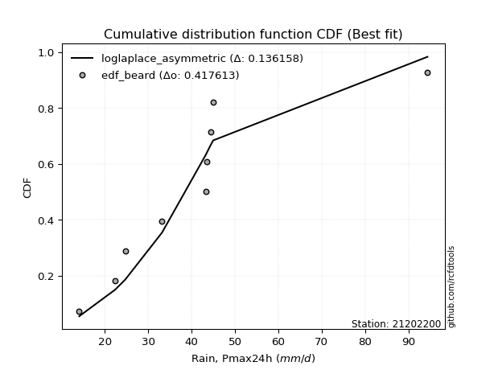</img></img>

</div>


### 5. Empirical - EDF Chegodayev (1955)

The Chegodayev formula is an empirical plotting position formula used in hydrological frequency analysis to estimate the exceedance probability or return period of a specific event from a set of observed data. It is primarily used for plotting observed data points on probability paper to fit a theoretical distribution, particularly for analyzing extreme events like maximum flood flows or rainfall intensities. The constant _b_ value in the generalized plotting position formula is 0.3.

<div align="center">


$P=(m-b)/(n+1-2b)$


</div>


**5.1. Empirical values**

<div align="center">

|                | 0                   | 1                   | 2                  | 3                   | 4              | 5                  | 6                  | 7                  | 8                  |
|:---------------|:--------------------|:--------------------|:-------------------|:--------------------|:---------------|:-------------------|:-------------------|:-------------------|:-------------------|
| date           | 2016                | 2014                | 2015               | 2009                | 2010           | 2012               | 2008               | 2011               | 2013               |
| x              | 14.1                | 22.4                | 24.7               | 33.2                | 43.3           | 43.6               | 44.4               | 45.0               | 94.4               |
| m              | 1                   | 2                   | 3                  | 4                   | 5              | 6                  | 7                  | 8                  | 9                  |
| empirical_dist | edf_chegodayev      | edf_chegodayev      | edf_chegodayev     | edf_chegodayev      | edf_chegodayev | edf_chegodayev     | edf_chegodayev     | edf_chegodayev     | edf_chegodayev     |
| empirical      | 0.07446808510638298 | 0.18085106382978722 | 0.2872340425531915 | 0.39361702127659576 | 0.5            | 0.6063829787234043 | 0.7127659574468085 | 0.8191489361702128 | 0.9255319148936169 |
| empirical_tr   | 1.0804597701149425  | 1.2207792207792207  | 1.4029850746268657 | 1.6491228070175437  | 2.0            | 2.540540540540541  | 3.481481481481481  | 5.529411764705883  | 13.428571428571399 |

</div>


**5.2. Kolmogorov-Smirnov fit test (sorted by Δ)**


<div align="center">

|                | 0                     | 1                   | 2                   | 3                   | 4                   | 5                   | 6                   | 7                   | 8                   | 9                   | 10                  | 11                  | 12                  | 13                  | 14                  | 15                  | 16                  | 17                  | 18                  | 19                  | 20                  | 21                  | 22                  | 23                  | 24                  | 25                  | 26                  | 27                  | 28                  | 29                  | 30                  | 31                  | 32                  | 33                  | 34                  | 35                  | 36                  | 37                  | 38                  | 39                  | 40                  | 41                  | 42                  | 43                  | 44                  | 45                  | 46                  | 47                  | 48                  | 49                  | 50                  | 51                  | 52                  | 53                  | 54                  | 55                  | 56                  | 57                  | 58                  | 59                  | 60                  | 61                  | 62                  | 63                  | 64                  | 65                  | 66                  | 67                  | 68                  | 69                  | 70                  | 71                  | 72                  | 73                  | 74                  | 75                  | 76                  | 77                  | 78                  | 79                  | 80                  | 81                  | 82                  | 83                  | 84                  | 85                  | 86                  | 87                  | 88                  | 89                  |
|:---------------|:----------------------|:--------------------|:--------------------|:--------------------|:--------------------|:--------------------|:--------------------|:--------------------|:--------------------|:--------------------|:--------------------|:--------------------|:--------------------|:--------------------|:--------------------|:--------------------|:--------------------|:--------------------|:--------------------|:--------------------|:--------------------|:--------------------|:--------------------|:--------------------|:--------------------|:--------------------|:--------------------|:--------------------|:--------------------|:--------------------|:--------------------|:--------------------|:--------------------|:--------------------|:--------------------|:--------------------|:--------------------|:--------------------|:--------------------|:--------------------|:--------------------|:--------------------|:--------------------|:--------------------|:--------------------|:--------------------|:--------------------|:--------------------|:--------------------|:--------------------|:--------------------|:--------------------|:--------------------|:--------------------|:--------------------|:--------------------|:--------------------|:--------------------|:--------------------|:--------------------|:--------------------|:--------------------|:--------------------|:--------------------|:--------------------|:--------------------|:--------------------|:--------------------|:--------------------|:--------------------|:--------------------|:--------------------|:--------------------|:--------------------|:--------------------|:--------------------|:--------------------|:--------------------|:--------------------|:--------------------|:--------------------|:--------------------|:--------------------|:--------------------|:--------------------|:--------------------|:--------------------|:--------------------|:--------------------|:--------------------|
| station        | 21202200              | 21202200            | 21202200            | 21202200            | 21202200            | 21202200            | 21202200            | 21202200            | 21202200            | 21202200            | 21202200            | 21202200            | 21202200            | 21202200            | 21202200            | 21202200            | 21202200            | 21202200            | 21202200            | 21202200            | 21202200            | 21202200            | 21202200            | 21202200            | 21202200            | 21202200            | 21202200            | 21202200            | 21202200            | 21202200            | 21202200            | 21202200            | 21202200            | 21202200            | 21202200            | 21202200            | 21202200            | 21202200            | 21202200            | 21202200            | 21202200            | 21202200            | 21202200            | 21202200            | 21202200            | 21202200            | 21202200            | 21202200            | 21202200            | 21202200            | 21202200            | 21202200            | 21202200            | 21202200            | 21202200            | 21202200            | 21202200            | 21202200            | 21202200            | 21202200            | 21202200            | 21202200            | 21202200            | 21202200            | 21202200            | 21202200            | 21202200            | 21202200            | 21202200            | 21202200            | 21202200            | 21202200            | 21202200            | 21202200            | 21202200            | 21202200            | 21202200            | 21202200            | 21202200            | 21202200            | 21202200            | 21202200            | 21202200            | 21202200            | 21202200            | 21202200            | 21202200            | 21202200            | 21202200            | 21202200            |
| empirical_dist | edf_chegodayev        | edf_chegodayev      | edf_chegodayev      | edf_chegodayev      | edf_chegodayev      | edf_chegodayev      | edf_chegodayev      | edf_chegodayev      | edf_chegodayev      | edf_chegodayev      | edf_chegodayev      | edf_chegodayev      | edf_chegodayev      | edf_chegodayev      | edf_chegodayev      | edf_chegodayev      | edf_chegodayev      | edf_chegodayev      | edf_chegodayev      | edf_chegodayev      | edf_chegodayev      | edf_chegodayev      | edf_chegodayev      | edf_chegodayev      | edf_chegodayev      | edf_chegodayev      | edf_chegodayev      | edf_chegodayev      | edf_chegodayev      | edf_chegodayev      | edf_chegodayev      | edf_chegodayev      | edf_chegodayev      | edf_chegodayev      | edf_chegodayev      | edf_chegodayev      | edf_chegodayev      | edf_chegodayev      | edf_chegodayev      | edf_chegodayev      | edf_chegodayev      | edf_chegodayev      | edf_chegodayev      | edf_chegodayev      | edf_chegodayev      | edf_chegodayev      | edf_chegodayev      | edf_chegodayev      | edf_chegodayev      | edf_chegodayev      | edf_chegodayev      | edf_chegodayev      | edf_chegodayev      | edf_chegodayev      | edf_chegodayev      | edf_chegodayev      | edf_chegodayev      | edf_chegodayev      | edf_chegodayev      | edf_chegodayev      | edf_chegodayev      | edf_chegodayev      | edf_chegodayev      | edf_chegodayev      | edf_chegodayev      | edf_chegodayev      | edf_chegodayev      | edf_chegodayev      | edf_chegodayev      | edf_chegodayev      | edf_chegodayev      | edf_chegodayev      | edf_chegodayev      | edf_chegodayev      | edf_chegodayev      | edf_chegodayev      | edf_chegodayev      | edf_chegodayev      | edf_chegodayev      | edf_chegodayev      | edf_chegodayev      | edf_chegodayev      | edf_chegodayev      | edf_chegodayev      | edf_chegodayev      | edf_chegodayev      | edf_chegodayev      | edf_chegodayev      | edf_chegodayev      | edf_chegodayev      |
| p_dist         | loglaplace_asymmetric | exponnorm           | moyal               | logloggamma         | halflogistic        | logcrystalball      | lognorm             | lognorm             | logt                | logexponnorm        | lognct              | invgauss            | logpearson3         | loggamma            | loggamma            | logerlang           | logweibull_min      | logncf              | logf                | logfatiguelife      | ncf                 | logjohnsonsu        | genlogistic         | johnsonsu           | invgamma            | logbetaprime        | loggenlogistic      | mielke              | logmielke           | pearson3            | logrice             | alpha               | logfisk             | betaprime           | fisk                | loginvgamma         | gompertz            | nct                 | nakagami            | logalpha            | loglogistic         | expon               | genexpon            | loginvgauss         | gumbel_r            | logmaxwell          | halfnorm            | lograyleigh         | loginvweibull       | loghypsecant        | logkstwobign        | loggenexpon         | kstwobign           | loggumbel_l         | f                   | loggompertz         | logtruncnorm        | laplace             | loghalfnorm         | chi2                | rayleigh            | t                   | loglaplace          | loggumbel_r         | maxwell             | logexpon            | wald                | laplace_asymmetric  | rice                | hypsecant           | loghalflogistic     | logistic            | logmoyal            | truncnorm           | norm                | crystalball         | weibull_min         | gamma               | gibrat              | logwald             | gumbel_l            | logchi2             | loggibrat           | lognakagami         | erlang              | loglognorm          | pareto              | invweibull          | logpareto           | fatiguelife         |
| delta          | 0.13547792648803536   | 0.14570789363248937 | 0.14671271292386978 | 0.14706267007430884 | 0.14847803208893762 | 0.14902646733792269 | 0.14902740576232898 | 0.14902740576232898 | 0.149030116288706   | 0.14910439410884158 | 0.14925061095208492 | 0.1499295068530262  | 0.1499340644969337  | 0.14996251132545835 | 0.14996251132545835 | 0.1499628132409555  | 0.14996411116060981 | 0.15047074772506563 | 0.15078560395236007 | 0.15100168469914144 | 0.1513125994097434  | 0.15152214474612574 | 0.15229570181037622 | 0.15305263074889197 | 0.15422394873332412 | 0.15433767411375143 | 0.15551733248596222 | 0.15558329035459018 | 0.1556667774339393  | 0.1560640422303039  | 0.15612679837349108 | 0.15620119730227122 | 0.15773314435235963 | 0.1579915123993424  | 0.15844424248503386 | 0.1595810870594888  | 0.15979720111880835 | 0.16052084193557015 | 0.16329353235898636 | 0.16458264045087134 | 0.16688586655157556 | 0.16821713967113183 | 0.16826905476799936 | 0.1701742174293983  | 0.17037334490826805 | 0.17076652925764246 | 0.1765367709398199  | 0.17730782592934813 | 0.17962130390540187 | 0.18076651990322123 | 0.18086782566304205 | 0.18271032876903726 | 0.18282673603519817 | 0.18321355705274855 | 0.1851167775021869  | 0.18877089722721085 | 0.19206921353893947 | 0.19428573617226486 | 0.19632212482033473 | 0.19986534090179597 | 0.2016314694641227  | 0.2068585476637549  | 0.20897934619941438 | 0.20915534733253538 | 0.21048733363810102 | 0.21233756682931365 | 0.21371599686098197 | 0.21804247965115864 | 0.21819674197856798 | 0.21924851955442737 | 0.22445061072250994 | 0.2280527492864246  | 0.2290652097978627  | 0.2386523394503295  | 0.23865234595842721 | 0.23865234660563672 | 0.25325590341116533 | 0.2560276489205129  | 0.2820029092118019  | 0.2854654805272132  | 0.30173914262792245 | 0.30916407523940925 | 0.3176757475983266  | 0.33032109308870244 | 0.40749157612048625 | 0.43238809103395504 | 0.4484238982821619  | 0.452067654093704   | 0.4635376462422288  | 0.561743388793751   |
| deltao         | 0.41761268023100007   | 0.41761268023100007 | 0.41761268023100007 | 0.41761268023100007 | 0.41761268023100007 | 0.41761268023100007 | 0.41761268023100007 | 0.41761268023100007 | 0.41761268023100007 | 0.41761268023100007 | 0.41761268023100007 | 0.41761268023100007 | 0.41761268023100007 | 0.41761268023100007 | 0.41761268023100007 | 0.41761268023100007 | 0.41761268023100007 | 0.41761268023100007 | 0.41761268023100007 | 0.41761268023100007 | 0.41761268023100007 | 0.41761268023100007 | 0.41761268023100007 | 0.41761268023100007 | 0.41761268023100007 | 0.41761268023100007 | 0.41761268023100007 | 0.41761268023100007 | 0.41761268023100007 | 0.41761268023100007 | 0.41761268023100007 | 0.41761268023100007 | 0.41761268023100007 | 0.41761268023100007 | 0.41761268023100007 | 0.41761268023100007 | 0.41761268023100007 | 0.41761268023100007 | 0.41761268023100007 | 0.41761268023100007 | 0.41761268023100007 | 0.41761268023100007 | 0.41761268023100007 | 0.41761268023100007 | 0.41761268023100007 | 0.41761268023100007 | 0.41761268023100007 | 0.41761268023100007 | 0.41761268023100007 | 0.41761268023100007 | 0.41761268023100007 | 0.41761268023100007 | 0.41761268023100007 | 0.41761268023100007 | 0.41761268023100007 | 0.41761268023100007 | 0.41761268023100007 | 0.41761268023100007 | 0.41761268023100007 | 0.41761268023100007 | 0.41761268023100007 | 0.41761268023100007 | 0.41761268023100007 | 0.41761268023100007 | 0.41761268023100007 | 0.41761268023100007 | 0.41761268023100007 | 0.41761268023100007 | 0.41761268023100007 | 0.41761268023100007 | 0.41761268023100007 | 0.41761268023100007 | 0.41761268023100007 | 0.41761268023100007 | 0.41761268023100007 | 0.41761268023100007 | 0.41761268023100007 | 0.41761268023100007 | 0.41761268023100007 | 0.41761268023100007 | 0.41761268023100007 | 0.41761268023100007 | 0.41761268023100007 | 0.41761268023100007 | 0.41761268023100007 | 0.41761268023100007 | 0.41761268023100007 | 0.41761268023100007 | 0.41761268023100007 | 0.41761268023100007 |
| eval           | Δo > Δ                | Δo > Δ              | Δo > Δ              | Δo > Δ              | Δo > Δ              | Δo > Δ              | Δo > Δ              | Δo > Δ              | Δo > Δ              | Δo > Δ              | Δo > Δ              | Δo > Δ              | Δo > Δ              | Δo > Δ              | Δo > Δ              | Δo > Δ              | Δo > Δ              | Δo > Δ              | Δo > Δ              | Δo > Δ              | Δo > Δ              | Δo > Δ              | Δo > Δ              | Δo > Δ              | Δo > Δ              | Δo > Δ              | Δo > Δ              | Δo > Δ              | Δo > Δ              | Δo > Δ              | Δo > Δ              | Δo > Δ              | Δo > Δ              | Δo > Δ              | Δo > Δ              | Δo > Δ              | Δo > Δ              | Δo > Δ              | Δo > Δ              | Δo > Δ              | Δo > Δ              | Δo > Δ              | Δo > Δ              | Δo > Δ              | Δo > Δ              | Δo > Δ              | Δo > Δ              | Δo > Δ              | Δo > Δ              | Δo > Δ              | Δo > Δ              | Δo > Δ              | Δo > Δ              | Δo > Δ              | Δo > Δ              | Δo > Δ              | Δo > Δ              | Δo > Δ              | Δo > Δ              | Δo > Δ              | Δo > Δ              | Δo > Δ              | Δo > Δ              | Δo > Δ              | Δo > Δ              | Δo > Δ              | Δo > Δ              | Δo > Δ              | Δo > Δ              | Δo > Δ              | Δo > Δ              | Δo > Δ              | Δo > Δ              | Δo > Δ              | Δo > Δ              | Δo > Δ              | Δo > Δ              | Δo > Δ              | Δo > Δ              | Δo > Δ              | Δo > Δ              | Δo > Δ              | Δo > Δ              | Δo > Δ              | Δo > Δ              | Δo <= Δ             | Δo <= Δ             | Δo <= Δ             | Δo <= Δ             | Δo <= Δ             |
| fit            | 1                     | 1                   | 1                   | 1                   | 1                   | 1                   | 1                   | 1                   | 1                   | 1                   | 1                   | 1                   | 1                   | 1                   | 1                   | 1                   | 1                   | 1                   | 1                   | 1                   | 1                   | 1                   | 1                   | 1                   | 1                   | 1                   | 1                   | 1                   | 1                   | 1                   | 1                   | 1                   | 1                   | 1                   | 1                   | 1                   | 1                   | 1                   | 1                   | 1                   | 1                   | 1                   | 1                   | 1                   | 1                   | 1                   | 1                   | 1                   | 1                   | 1                   | 1                   | 1                   | 1                   | 1                   | 1                   | 1                   | 1                   | 1                   | 1                   | 1                   | 1                   | 1                   | 1                   | 1                   | 1                   | 1                   | 1                   | 1                   | 1                   | 1                   | 1                   | 1                   | 1                   | 1                   | 1                   | 1                   | 1                   | 1                   | 1                   | 1                   | 1                   | 1                   | 1                   | 1                   | 1                   | 0                   | 0                   | 0                   | 0                   | 0                   |
| n              | 9                     | 9                   | 9                   | 9                   | 9                   | 9                   | 9                   | 9                   | 9                   | 9                   | 9                   | 9                   | 9                   | 9                   | 9                   | 9                   | 9                   | 9                   | 9                   | 9                   | 9                   | 9                   | 9                   | 9                   | 9                   | 9                   | 9                   | 9                   | 9                   | 9                   | 9                   | 9                   | 9                   | 9                   | 9                   | 9                   | 9                   | 9                   | 9                   | 9                   | 9                   | 9                   | 9                   | 9                   | 9                   | 9                   | 9                   | 9                   | 9                   | 9                   | 9                   | 9                   | 9                   | 9                   | 9                   | 9                   | 9                   | 9                   | 9                   | 9                   | 9                   | 9                   | 9                   | 9                   | 9                   | 9                   | 9                   | 9                   | 9                   | 9                   | 9                   | 9                   | 9                   | 9                   | 9                   | 9                   | 9                   | 9                   | 9                   | 9                   | 9                   | 9                   | 9                   | 9                   | 9                   | 9                   | 9                   | 9                   | 9                   | 9                   |
| best_fit       | 1                     | 0                   | 0                   | 0                   | 0                   | 0                   | 0                   | 0                   | 0                   | 0                   | 0                   | 0                   | 0                   | 0                   | 0                   | 0                   | 0                   | 0                   | 0                   | 0                   | 0                   | 0                   | 0                   | 0                   | 0                   | 0                   | 0                   | 0                   | 0                   | 0                   | 0                   | 0                   | 0                   | 0                   | 0                   | 0                   | 0                   | 0                   | 0                   | 0                   | 0                   | 0                   | 0                   | 0                   | 0                   | 0                   | 0                   | 0                   | 0                   | 0                   | 0                   | 0                   | 0                   | 0                   | 0                   | 0                   | 0                   | 0                   | 0                   | 0                   | 0                   | 0                   | 0                   | 0                   | 0                   | 0                   | 0                   | 0                   | 0                   | 0                   | 0                   | 0                   | 0                   | 0                   | 0                   | 0                   | 0                   | 0                   | 0                   | 0                   | 0                   | 0                   | 0                   | 0                   | 0                   | 0                   | 0                   | 0                   | 0                   | 0                   |
| best_fit_sort  | 1                     | 2                   | 3                   | 4                   | 5                   | 6                   | 7                   | 8                   | 9                   | 10                  | 11                  | 12                  | 13                  | 14                  | 15                  | 16                  | 17                  | 18                  | 19                  | 20                  | 21                  | 22                  | 23                  | 24                  | 25                  | 26                  | 27                  | 28                  | 29                  | 30                  | 31                  | 32                  | 33                  | 34                  | 35                  | 36                  | 37                  | 38                  | 39                  | 40                  | 41                  | 42                  | 43                  | 44                  | 45                  | 46                  | 47                  | 48                  | 49                  | 50                  | 51                  | 52                  | 53                  | 54                  | 55                  | 56                  | 57                  | 58                  | 59                  | 60                  | 61                  | 62                  | 63                  | 64                  | 65                  | 66                  | 67                  | 68                  | 69                  | 70                  | 71                  | 72                  | 73                  | 74                  | 75                  | 76                  | 77                  | 78                  | 79                  | 80                  | 81                  | 82                  | 83                  | 84                  | 85                  | 86                  | 87                  | 88                  | 89                  | 90                  |

</div>


<div align="center">

</img>

</div>


**5.3. Best fit**

<div align="center">

|   id |   station | empirical_dist   | p_dist                |    delta |   deltao | eval   |   fit |   n |   best_fit |   best_fit_sort |
|-----:|----------:|:-----------------|:----------------------|---------:|---------:|:-------|------:|----:|-----------:|----------------:|
|    0 |  21202200 | edf_chegodayev   | loglaplace_asymmetric | 0.135478 | 0.417613 | Δo > Δ |     1 |   9 |          1 |               1 |

</div>


<div align="center">

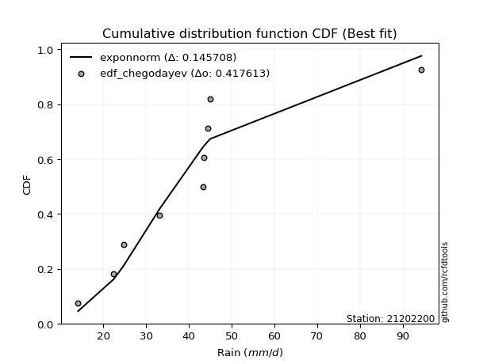</img></img>

</div>


### 6. Empirical - EDF Blom (1958)

The Blom formula is a specific "plotting position" formula used in hydrology and statistical analysis to estimate the empirical cumulative probability (or non-exceedance probability) of a data series. It is particularly recommended for data that are approximately normally distributed. The constant _a_ is set to 0.375 (or 3/8).

<div align="center">


$P=(m-a)/(n+1-2a)$


</div>


**6.1. Empirical values**

<div align="center">

|                | 0                   | 1                   | 2                   | 3                  | 4        | 5                  | 6                  | 7                  | 8                  |
|:---------------|:--------------------|:--------------------|:--------------------|:-------------------|:---------|:-------------------|:-------------------|:-------------------|:-------------------|
| date           | 2016                | 2014                | 2015                | 2009               | 2010     | 2012               | 2008               | 2011               | 2013               |
| x              | 14.1                | 22.4                | 24.7                | 33.2               | 43.3     | 43.6               | 44.4               | 45.0               | 94.4               |
| m              | 1                   | 2                   | 3                   | 4                  | 5        | 6                  | 7                  | 8                  | 9                  |
| empirical_dist | edf_blom            | edf_blom            | edf_blom            | edf_blom           | edf_blom | edf_blom           | edf_blom           | edf_blom           | edf_blom           |
| empirical      | 0.06756756756756757 | 0.17567567567567569 | 0.28378378378378377 | 0.3918918918918919 | 0.5      | 0.6081081081081081 | 0.7162162162162162 | 0.8243243243243243 | 0.9324324324324325 |
| empirical_tr   | 1.072463768115942   | 1.2131147540983607  | 1.3962264150943395  | 1.6444444444444444 | 2.0      | 2.5517241379310347 | 3.523809523809524  | 5.6923076923076925 | 14.800000000000006 |

</div>


**6.2. Kolmogorov-Smirnov fit test (sorted by Δ)**


<div align="center">

|                | 0                     | 1                   | 2                   | 3                   | 4                   | 5                   | 6                   | 7                   | 8                   | 9                   | 10                  | 11                  | 12                  | 13                  | 14                  | 15                  | 16                  | 17                  | 18                  | 19                  | 20                  | 21                  | 22                  | 23                  | 24                  | 25                  | 26                  | 27                  | 28                  | 29                  | 30                  | 31                  | 32                  | 33                  | 34                  | 35                  | 36                  | 37                  | 38                  | 39                  | 40                  | 41                  | 42                  | 43                  | 44                  | 45                  | 46                  | 47                  | 48                  | 49                  | 50                  | 51                  | 52                  | 53                  | 54                  | 55                  | 56                  | 57                  | 58                  | 59                  | 60                  | 61                  | 62                  | 63                  | 64                  | 65                  | 66                  | 67                  | 68                  | 69                  | 70                  | 71                  | 72                  | 73                  | 74                  | 75                  | 76                  | 77                  | 78                  | 79                  | 80                  | 81                  | 82                  | 83                  | 84                  | 85                  | 86                  | 87                  | 88                  | 89                  |
|:---------------|:----------------------|:--------------------|:--------------------|:--------------------|:--------------------|:--------------------|:--------------------|:--------------------|:--------------------|:--------------------|:--------------------|:--------------------|:--------------------|:--------------------|:--------------------|:--------------------|:--------------------|:--------------------|:--------------------|:--------------------|:--------------------|:--------------------|:--------------------|:--------------------|:--------------------|:--------------------|:--------------------|:--------------------|:--------------------|:--------------------|:--------------------|:--------------------|:--------------------|:--------------------|:--------------------|:--------------------|:--------------------|:--------------------|:--------------------|:--------------------|:--------------------|:--------------------|:--------------------|:--------------------|:--------------------|:--------------------|:--------------------|:--------------------|:--------------------|:--------------------|:--------------------|:--------------------|:--------------------|:--------------------|:--------------------|:--------------------|:--------------------|:--------------------|:--------------------|:--------------------|:--------------------|:--------------------|:--------------------|:--------------------|:--------------------|:--------------------|:--------------------|:--------------------|:--------------------|:--------------------|:--------------------|:--------------------|:--------------------|:--------------------|:--------------------|:--------------------|:--------------------|:--------------------|:--------------------|:--------------------|:--------------------|:--------------------|:--------------------|:--------------------|:--------------------|:--------------------|:--------------------|:--------------------|:--------------------|:--------------------|
| station        | 21202200              | 21202200            | 21202200            | 21202200            | 21202200            | 21202200            | 21202200            | 21202200            | 21202200            | 21202200            | 21202200            | 21202200            | 21202200            | 21202200            | 21202200            | 21202200            | 21202200            | 21202200            | 21202200            | 21202200            | 21202200            | 21202200            | 21202200            | 21202200            | 21202200            | 21202200            | 21202200            | 21202200            | 21202200            | 21202200            | 21202200            | 21202200            | 21202200            | 21202200            | 21202200            | 21202200            | 21202200            | 21202200            | 21202200            | 21202200            | 21202200            | 21202200            | 21202200            | 21202200            | 21202200            | 21202200            | 21202200            | 21202200            | 21202200            | 21202200            | 21202200            | 21202200            | 21202200            | 21202200            | 21202200            | 21202200            | 21202200            | 21202200            | 21202200            | 21202200            | 21202200            | 21202200            | 21202200            | 21202200            | 21202200            | 21202200            | 21202200            | 21202200            | 21202200            | 21202200            | 21202200            | 21202200            | 21202200            | 21202200            | 21202200            | 21202200            | 21202200            | 21202200            | 21202200            | 21202200            | 21202200            | 21202200            | 21202200            | 21202200            | 21202200            | 21202200            | 21202200            | 21202200            | 21202200            | 21202200            |
| empirical_dist | edf_blom              | edf_blom            | edf_blom            | edf_blom            | edf_blom            | edf_blom            | edf_blom            | edf_blom            | edf_blom            | edf_blom            | edf_blom            | edf_blom            | edf_blom            | edf_blom            | edf_blom            | edf_blom            | edf_blom            | edf_blom            | edf_blom            | edf_blom            | edf_blom            | edf_blom            | edf_blom            | edf_blom            | edf_blom            | edf_blom            | edf_blom            | edf_blom            | edf_blom            | edf_blom            | edf_blom            | edf_blom            | edf_blom            | edf_blom            | edf_blom            | edf_blom            | edf_blom            | edf_blom            | edf_blom            | edf_blom            | edf_blom            | edf_blom            | edf_blom            | edf_blom            | edf_blom            | edf_blom            | edf_blom            | edf_blom            | edf_blom            | edf_blom            | edf_blom            | edf_blom            | edf_blom            | edf_blom            | edf_blom            | edf_blom            | edf_blom            | edf_blom            | edf_blom            | edf_blom            | edf_blom            | edf_blom            | edf_blom            | edf_blom            | edf_blom            | edf_blom            | edf_blom            | edf_blom            | edf_blom            | edf_blom            | edf_blom            | edf_blom            | edf_blom            | edf_blom            | edf_blom            | edf_blom            | edf_blom            | edf_blom            | edf_blom            | edf_blom            | edf_blom            | edf_blom            | edf_blom            | edf_blom            | edf_blom            | edf_blom            | edf_blom            | edf_blom            | edf_blom            | edf_blom            |
| p_dist         | loglaplace_asymmetric | logcrystalball      | lognorm             | lognorm             | logt                | logexponnorm        | lognct              | logloggamma         | logjohnsonsu        | invgauss            | logpearson3         | loggamma            | loggamma            | logerlang           | logweibull_min      | logf                | exponnorm           | logfatiguelife      | ncf                 | moyal               | johnsonsu           | halflogistic        | invgamma            | logbetaprime        | loggenlogistic      | mielke              | logncf              | logmielke           | logrice             | alpha               | genlogistic         | logfisk             | betaprime           | fisk                | loginvgamma         | nct                 | pearson3            | logalpha            | gompertz            | loglogistic         | expon               | genexpon            | nakagami            | loginvgauss         | logmaxwell          | gumbel_r            | lograyleigh         | loginvweibull       | loghypsecant        | logkstwobign        | halfnorm            | loggenexpon         | f                   | kstwobign           | loggumbel_l         | loggompertz         | logtruncnorm        | loghalfnorm         | laplace             | chi2                | rayleigh            | loglaplace          | loggumbel_r         | t                   | wald                | maxwell             | logexpon            | laplace_asymmetric  | rice                | hypsecant           | loghalflogistic     | logmoyal            | logistic            | truncnorm           | norm                | crystalball         | gamma               | weibull_min         | gibrat              | logwald             | gumbel_l            | logchi2             | loggibrat           | lognakagami         | erlang              | loglognorm          | pareto              | invweibull          | logpareto           | fatiguelife         |
| delta          | 0.14065331464214692   | 0.14902646733792269 | 0.14902740576232898 | 0.14902740576232898 | 0.149030116288706   | 0.14910439410884158 | 0.14925061095208492 | 0.1496456830942574  | 0.14979701536142187 | 0.1499295068530262  | 0.1499340644969337  | 0.14996251132545835 | 0.14996251132545835 | 0.1499628132409555  | 0.14996411116060981 | 0.15078560395236007 | 0.15088328178660093 | 0.15100168469914144 | 0.1513125994097434  | 0.15188810107798134 | 0.15305263074889197 | 0.15365342024304918 | 0.15422394873332412 | 0.15433767411375143 | 0.15551733248596222 | 0.15558329035459018 | 0.1556461358791772  | 0.1556667774339393  | 0.15612679837349108 | 0.15620119730227122 | 0.15747108996448778 | 0.15773314435235963 | 0.1579915123993424  | 0.15844424248503386 | 0.1595810870594888  | 0.16052084193557015 | 0.16123943038441546 | 0.16458264045087134 | 0.1649725892729199  | 0.16688586655157556 | 0.16821713967113183 | 0.16826905476799936 | 0.16846892051309792 | 0.1701742174293983  | 0.17076652925764246 | 0.1755487330623796  | 0.17730782592934813 | 0.17962130390540187 | 0.18076651990322123 | 0.18086782566304205 | 0.18171215909393146 | 0.18271032876903726 | 0.1851167775021869  | 0.18800212418930973 | 0.18838894520686011 | 0.18877089722721085 | 0.19206921353893947 | 0.19632212482033473 | 0.19946112432637642 | 0.19986534090179597 | 0.20680685761823425 | 0.20897934619941438 | 0.20915534733253538 | 0.21203393581786645 | 0.21371599686098197 | 0.21566272179221257 | 0.21751295498342518 | 0.2232178678052702  | 0.22337213013267954 | 0.22442390770853893 | 0.22445061072250994 | 0.2290652097978627  | 0.23322813744053617 | 0.24382772760444105 | 0.24382773411253877 | 0.24382773475974828 | 0.2560276489205129  | 0.2584312915652769  | 0.27855265044239413 | 0.2854654805272132  | 0.306914530782034   | 0.3143394633935208  | 0.3176757475983266  | 0.3320462224734063  | 0.4126669642745978  | 0.4375634791880666  | 0.45359928643627345 | 0.4589681716325196  | 0.4687130343963404  | 0.5669187769478625  |
| deltao         | 0.41761268023100007   | 0.41761268023100007 | 0.41761268023100007 | 0.41761268023100007 | 0.41761268023100007 | 0.41761268023100007 | 0.41761268023100007 | 0.41761268023100007 | 0.41761268023100007 | 0.41761268023100007 | 0.41761268023100007 | 0.41761268023100007 | 0.41761268023100007 | 0.41761268023100007 | 0.41761268023100007 | 0.41761268023100007 | 0.41761268023100007 | 0.41761268023100007 | 0.41761268023100007 | 0.41761268023100007 | 0.41761268023100007 | 0.41761268023100007 | 0.41761268023100007 | 0.41761268023100007 | 0.41761268023100007 | 0.41761268023100007 | 0.41761268023100007 | 0.41761268023100007 | 0.41761268023100007 | 0.41761268023100007 | 0.41761268023100007 | 0.41761268023100007 | 0.41761268023100007 | 0.41761268023100007 | 0.41761268023100007 | 0.41761268023100007 | 0.41761268023100007 | 0.41761268023100007 | 0.41761268023100007 | 0.41761268023100007 | 0.41761268023100007 | 0.41761268023100007 | 0.41761268023100007 | 0.41761268023100007 | 0.41761268023100007 | 0.41761268023100007 | 0.41761268023100007 | 0.41761268023100007 | 0.41761268023100007 | 0.41761268023100007 | 0.41761268023100007 | 0.41761268023100007 | 0.41761268023100007 | 0.41761268023100007 | 0.41761268023100007 | 0.41761268023100007 | 0.41761268023100007 | 0.41761268023100007 | 0.41761268023100007 | 0.41761268023100007 | 0.41761268023100007 | 0.41761268023100007 | 0.41761268023100007 | 0.41761268023100007 | 0.41761268023100007 | 0.41761268023100007 | 0.41761268023100007 | 0.41761268023100007 | 0.41761268023100007 | 0.41761268023100007 | 0.41761268023100007 | 0.41761268023100007 | 0.41761268023100007 | 0.41761268023100007 | 0.41761268023100007 | 0.41761268023100007 | 0.41761268023100007 | 0.41761268023100007 | 0.41761268023100007 | 0.41761268023100007 | 0.41761268023100007 | 0.41761268023100007 | 0.41761268023100007 | 0.41761268023100007 | 0.41761268023100007 | 0.41761268023100007 | 0.41761268023100007 | 0.41761268023100007 | 0.41761268023100007 | 0.41761268023100007 |
| eval           | Δo > Δ                | Δo > Δ              | Δo > Δ              | Δo > Δ              | Δo > Δ              | Δo > Δ              | Δo > Δ              | Δo > Δ              | Δo > Δ              | Δo > Δ              | Δo > Δ              | Δo > Δ              | Δo > Δ              | Δo > Δ              | Δo > Δ              | Δo > Δ              | Δo > Δ              | Δo > Δ              | Δo > Δ              | Δo > Δ              | Δo > Δ              | Δo > Δ              | Δo > Δ              | Δo > Δ              | Δo > Δ              | Δo > Δ              | Δo > Δ              | Δo > Δ              | Δo > Δ              | Δo > Δ              | Δo > Δ              | Δo > Δ              | Δo > Δ              | Δo > Δ              | Δo > Δ              | Δo > Δ              | Δo > Δ              | Δo > Δ              | Δo > Δ              | Δo > Δ              | Δo > Δ              | Δo > Δ              | Δo > Δ              | Δo > Δ              | Δo > Δ              | Δo > Δ              | Δo > Δ              | Δo > Δ              | Δo > Δ              | Δo > Δ              | Δo > Δ              | Δo > Δ              | Δo > Δ              | Δo > Δ              | Δo > Δ              | Δo > Δ              | Δo > Δ              | Δo > Δ              | Δo > Δ              | Δo > Δ              | Δo > Δ              | Δo > Δ              | Δo > Δ              | Δo > Δ              | Δo > Δ              | Δo > Δ              | Δo > Δ              | Δo > Δ              | Δo > Δ              | Δo > Δ              | Δo > Δ              | Δo > Δ              | Δo > Δ              | Δo > Δ              | Δo > Δ              | Δo > Δ              | Δo > Δ              | Δo > Δ              | Δo > Δ              | Δo > Δ              | Δo > Δ              | Δo > Δ              | Δo > Δ              | Δo > Δ              | Δo > Δ              | Δo <= Δ             | Δo <= Δ             | Δo <= Δ             | Δo <= Δ             | Δo <= Δ             |
| fit            | 1                     | 1                   | 1                   | 1                   | 1                   | 1                   | 1                   | 1                   | 1                   | 1                   | 1                   | 1                   | 1                   | 1                   | 1                   | 1                   | 1                   | 1                   | 1                   | 1                   | 1                   | 1                   | 1                   | 1                   | 1                   | 1                   | 1                   | 1                   | 1                   | 1                   | 1                   | 1                   | 1                   | 1                   | 1                   | 1                   | 1                   | 1                   | 1                   | 1                   | 1                   | 1                   | 1                   | 1                   | 1                   | 1                   | 1                   | 1                   | 1                   | 1                   | 1                   | 1                   | 1                   | 1                   | 1                   | 1                   | 1                   | 1                   | 1                   | 1                   | 1                   | 1                   | 1                   | 1                   | 1                   | 1                   | 1                   | 1                   | 1                   | 1                   | 1                   | 1                   | 1                   | 1                   | 1                   | 1                   | 1                   | 1                   | 1                   | 1                   | 1                   | 1                   | 1                   | 1                   | 1                   | 0                   | 0                   | 0                   | 0                   | 0                   |
| n              | 9                     | 9                   | 9                   | 9                   | 9                   | 9                   | 9                   | 9                   | 9                   | 9                   | 9                   | 9                   | 9                   | 9                   | 9                   | 9                   | 9                   | 9                   | 9                   | 9                   | 9                   | 9                   | 9                   | 9                   | 9                   | 9                   | 9                   | 9                   | 9                   | 9                   | 9                   | 9                   | 9                   | 9                   | 9                   | 9                   | 9                   | 9                   | 9                   | 9                   | 9                   | 9                   | 9                   | 9                   | 9                   | 9                   | 9                   | 9                   | 9                   | 9                   | 9                   | 9                   | 9                   | 9                   | 9                   | 9                   | 9                   | 9                   | 9                   | 9                   | 9                   | 9                   | 9                   | 9                   | 9                   | 9                   | 9                   | 9                   | 9                   | 9                   | 9                   | 9                   | 9                   | 9                   | 9                   | 9                   | 9                   | 9                   | 9                   | 9                   | 9                   | 9                   | 9                   | 9                   | 9                   | 9                   | 9                   | 9                   | 9                   | 9                   |
| best_fit       | 1                     | 0                   | 0                   | 0                   | 0                   | 0                   | 0                   | 0                   | 0                   | 0                   | 0                   | 0                   | 0                   | 0                   | 0                   | 0                   | 0                   | 0                   | 0                   | 0                   | 0                   | 0                   | 0                   | 0                   | 0                   | 0                   | 0                   | 0                   | 0                   | 0                   | 0                   | 0                   | 0                   | 0                   | 0                   | 0                   | 0                   | 0                   | 0                   | 0                   | 0                   | 0                   | 0                   | 0                   | 0                   | 0                   | 0                   | 0                   | 0                   | 0                   | 0                   | 0                   | 0                   | 0                   | 0                   | 0                   | 0                   | 0                   | 0                   | 0                   | 0                   | 0                   | 0                   | 0                   | 0                   | 0                   | 0                   | 0                   | 0                   | 0                   | 0                   | 0                   | 0                   | 0                   | 0                   | 0                   | 0                   | 0                   | 0                   | 0                   | 0                   | 0                   | 0                   | 0                   | 0                   | 0                   | 0                   | 0                   | 0                   | 0                   |
| best_fit_sort  | 1                     | 2                   | 3                   | 4                   | 5                   | 6                   | 7                   | 8                   | 9                   | 10                  | 11                  | 12                  | 13                  | 14                  | 15                  | 16                  | 17                  | 18                  | 19                  | 20                  | 21                  | 22                  | 23                  | 24                  | 25                  | 26                  | 27                  | 28                  | 29                  | 30                  | 31                  | 32                  | 33                  | 34                  | 35                  | 36                  | 37                  | 38                  | 39                  | 40                  | 41                  | 42                  | 43                  | 44                  | 45                  | 46                  | 47                  | 48                  | 49                  | 50                  | 51                  | 52                  | 53                  | 54                  | 55                  | 56                  | 57                  | 58                  | 59                  | 60                  | 61                  | 62                  | 63                  | 64                  | 65                  | 66                  | 67                  | 68                  | 69                  | 70                  | 71                  | 72                  | 73                  | 74                  | 75                  | 76                  | 77                  | 78                  | 79                  | 80                  | 81                  | 82                  | 83                  | 84                  | 85                  | 86                  | 87                  | 88                  | 89                  | 90                  |

</div>


<div align="center">

</img>

</div>


**6.3. Best fit**

<div align="center">

|   id |   station | empirical_dist   | p_dist                |    delta |   deltao | eval   |   fit |   n |   best_fit |   best_fit_sort |
|-----:|----------:|:-----------------|:----------------------|---------:|---------:|:-------|------:|----:|-----------:|----------------:|
|    0 |  21202200 | edf_blom         | loglaplace_asymmetric | 0.140653 | 0.417613 | Δo > Δ |     1 |   9 |          1 |               1 |

</div>


<div align="center">

</img>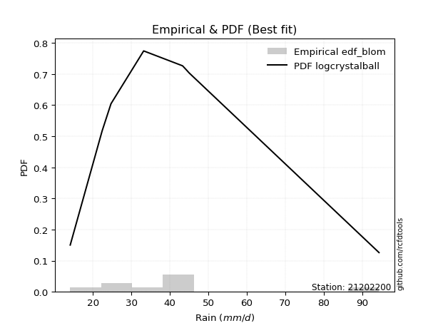</img>

</div>


### 7. Empirical - EDF Tukey (1962)

In hydrology, the Tukey formula is used as a plotting position formula to estimate the empirical probability or frequency of a flood event (or other hydrological data). The formula parameter is given as _c=0.333_ (or 1/3).

<div align="center">


$P=(m-c)/(n+1-2c)$


</div>


**7.1. Empirical values**

<div align="center">

|                | 0                   | 1                   | 2                  | 3                   | 4         | 5                  | 6                  | 7                  | 8                  |
|:---------------|:--------------------|:--------------------|:-------------------|:--------------------|:----------|:-------------------|:-------------------|:-------------------|:-------------------|
| date           | 2016                | 2014                | 2015               | 2009                | 2010      | 2012               | 2008               | 2011               | 2013               |
| x              | 14.1                | 22.4                | 24.7               | 33.2                | 43.3      | 43.6               | 44.4               | 45.0               | 94.4               |
| m              | 1                   | 2                   | 3                  | 4                   | 5         | 6                  | 7                  | 8                  | 9                  |
| empirical_dist | edf_tukey           | edf_tukey           | edf_tukey          | edf_tukey           | edf_tukey | edf_tukey          | edf_tukey          | edf_tukey          | edf_tukey          |
| empirical      | 0.07142857142857142 | 0.17857142857142858 | 0.2857142857142857 | 0.39285714285714285 | 0.5       | 0.6071428571428571 | 0.7142857142857143 | 0.8214285714285714 | 0.9285714285714286 |
| empirical_tr   | 1.0769230769230769  | 1.2173913043478262  | 1.4                | 1.6470588235294117  | 2.0       | 2.545454545454545  | 3.5                | 5.599999999999999  | 14.000000000000007 |

</div>


**7.2. Kolmogorov-Smirnov fit test (sorted by Δ)**


<div align="center">

|                | 0                     | 1                   | 2                   | 3                   | 4                   | 5                   | 6                   | 7                   | 8                   | 9                   | 10                  | 11                  | 12                  | 13                  | 14                  | 15                  | 16                  | 17                  | 18                  | 19                  | 20                  | 21                  | 22                  | 23                  | 24                  | 25                  | 26                  | 27                  | 28                  | 29                  | 30                  | 31                  | 32                  | 33                  | 34                  | 35                  | 36                  | 37                  | 38                  | 39                  | 40                  | 41                  | 42                  | 43                  | 44                  | 45                  | 46                  | 47                  | 48                  | 49                  | 50                  | 51                  | 52                  | 53                  | 54                  | 55                  | 56                  | 57                  | 58                  | 59                  | 60                  | 61                  | 62                  | 63                  | 64                  | 65                  | 66                  | 67                  | 68                  | 69                  | 70                  | 71                  | 72                  | 73                  | 74                  | 75                  | 76                  | 77                  | 78                  | 79                  | 80                  | 81                  | 82                  | 83                  | 84                  | 85                  | 86                  | 87                  | 88                  | 89                  |
|:---------------|:----------------------|:--------------------|:--------------------|:--------------------|:--------------------|:--------------------|:--------------------|:--------------------|:--------------------|:--------------------|:--------------------|:--------------------|:--------------------|:--------------------|:--------------------|:--------------------|:--------------------|:--------------------|:--------------------|:--------------------|:--------------------|:--------------------|:--------------------|:--------------------|:--------------------|:--------------------|:--------------------|:--------------------|:--------------------|:--------------------|:--------------------|:--------------------|:--------------------|:--------------------|:--------------------|:--------------------|:--------------------|:--------------------|:--------------------|:--------------------|:--------------------|:--------------------|:--------------------|:--------------------|:--------------------|:--------------------|:--------------------|:--------------------|:--------------------|:--------------------|:--------------------|:--------------------|:--------------------|:--------------------|:--------------------|:--------------------|:--------------------|:--------------------|:--------------------|:--------------------|:--------------------|:--------------------|:--------------------|:--------------------|:--------------------|:--------------------|:--------------------|:--------------------|:--------------------|:--------------------|:--------------------|:--------------------|:--------------------|:--------------------|:--------------------|:--------------------|:--------------------|:--------------------|:--------------------|:--------------------|:--------------------|:--------------------|:--------------------|:--------------------|:--------------------|:--------------------|:--------------------|:--------------------|:--------------------|:--------------------|
| station        | 21202200              | 21202200            | 21202200            | 21202200            | 21202200            | 21202200            | 21202200            | 21202200            | 21202200            | 21202200            | 21202200            | 21202200            | 21202200            | 21202200            | 21202200            | 21202200            | 21202200            | 21202200            | 21202200            | 21202200            | 21202200            | 21202200            | 21202200            | 21202200            | 21202200            | 21202200            | 21202200            | 21202200            | 21202200            | 21202200            | 21202200            | 21202200            | 21202200            | 21202200            | 21202200            | 21202200            | 21202200            | 21202200            | 21202200            | 21202200            | 21202200            | 21202200            | 21202200            | 21202200            | 21202200            | 21202200            | 21202200            | 21202200            | 21202200            | 21202200            | 21202200            | 21202200            | 21202200            | 21202200            | 21202200            | 21202200            | 21202200            | 21202200            | 21202200            | 21202200            | 21202200            | 21202200            | 21202200            | 21202200            | 21202200            | 21202200            | 21202200            | 21202200            | 21202200            | 21202200            | 21202200            | 21202200            | 21202200            | 21202200            | 21202200            | 21202200            | 21202200            | 21202200            | 21202200            | 21202200            | 21202200            | 21202200            | 21202200            | 21202200            | 21202200            | 21202200            | 21202200            | 21202200            | 21202200            | 21202200            |
| empirical_dist | edf_tukey             | edf_tukey           | edf_tukey           | edf_tukey           | edf_tukey           | edf_tukey           | edf_tukey           | edf_tukey           | edf_tukey           | edf_tukey           | edf_tukey           | edf_tukey           | edf_tukey           | edf_tukey           | edf_tukey           | edf_tukey           | edf_tukey           | edf_tukey           | edf_tukey           | edf_tukey           | edf_tukey           | edf_tukey           | edf_tukey           | edf_tukey           | edf_tukey           | edf_tukey           | edf_tukey           | edf_tukey           | edf_tukey           | edf_tukey           | edf_tukey           | edf_tukey           | edf_tukey           | edf_tukey           | edf_tukey           | edf_tukey           | edf_tukey           | edf_tukey           | edf_tukey           | edf_tukey           | edf_tukey           | edf_tukey           | edf_tukey           | edf_tukey           | edf_tukey           | edf_tukey           | edf_tukey           | edf_tukey           | edf_tukey           | edf_tukey           | edf_tukey           | edf_tukey           | edf_tukey           | edf_tukey           | edf_tukey           | edf_tukey           | edf_tukey           | edf_tukey           | edf_tukey           | edf_tukey           | edf_tukey           | edf_tukey           | edf_tukey           | edf_tukey           | edf_tukey           | edf_tukey           | edf_tukey           | edf_tukey           | edf_tukey           | edf_tukey           | edf_tukey           | edf_tukey           | edf_tukey           | edf_tukey           | edf_tukey           | edf_tukey           | edf_tukey           | edf_tukey           | edf_tukey           | edf_tukey           | edf_tukey           | edf_tukey           | edf_tukey           | edf_tukey           | edf_tukey           | edf_tukey           | edf_tukey           | edf_tukey           | edf_tukey           | edf_tukey           |
| p_dist         | loglaplace_asymmetric | logloggamma         | exponnorm           | moyal               | logcrystalball      | lognorm             | lognorm             | logt                | logexponnorm        | lognct              | invgauss            | logpearson3         | loggamma            | loggamma            | logerlang           | logweibull_min      | halflogistic        | logjohnsonsu        | logf                | logfatiguelife      | ncf                 | logncf              | johnsonsu           | invgamma            | logbetaprime        | genlogistic         | loggenlogistic      | mielke              | logmielke           | logrice             | alpha               | logfisk             | betaprime           | pearson3            | fisk                | loginvgamma         | nct                 | gompertz            | logalpha            | nakagami            | loglogistic         | expon               | genexpon            | loginvgauss         | logmaxwell          | gumbel_r            | lograyleigh         | halfnorm            | loginvweibull       | loghypsecant        | logkstwobign        | loggenexpon         | kstwobign           | f                   | loggumbel_l         | loggompertz         | logtruncnorm        | loghalfnorm         | laplace             | chi2                | rayleigh            | loglaplace          | t                   | loggumbel_r         | maxwell             | wald                | logexpon            | laplace_asymmetric  | rice                | hypsecant           | loghalflogistic     | logmoyal            | logistic            | truncnorm           | norm                | crystalball         | weibull_min         | gamma               | gibrat              | logwald             | gumbel_l            | logchi2             | loggibrat           | lognakagami         | erlang              | loglognorm          | pareto              | invweibull          | logpareto           | fatiguelife         |
| delta          | 0.13775756174639397   | 0.14706267007430884 | 0.14798752889084799 | 0.1489923481822284  | 0.14902646733792269 | 0.14902740576232898 | 0.14902740576232898 | 0.149030116288706   | 0.14910439410884158 | 0.14925061095208492 | 0.1499295068530262  | 0.1499340644969337  | 0.14996251132545835 | 0.14996251132545835 | 0.1499628132409555  | 0.14996411116060981 | 0.15075766734729623 | 0.15076226632667283 | 0.15078560395236007 | 0.15100168469914144 | 0.1513125994097434  | 0.15275038298342425 | 0.15305263074889197 | 0.15422394873332412 | 0.15433767411375143 | 0.15457533706873483 | 0.15551733248596222 | 0.15558329035459018 | 0.1556667774339393  | 0.15612679837349108 | 0.15620119730227122 | 0.15773314435235963 | 0.1579915123993424  | 0.15834367748866252 | 0.15844424248503386 | 0.1595810870594888  | 0.16052084193557015 | 0.16207683637716697 | 0.16458264045087134 | 0.16557316761734497 | 0.16688586655157556 | 0.16821713967113183 | 0.16826905476799936 | 0.1701742174293983  | 0.17076652925764246 | 0.17265298016662667 | 0.17730782592934813 | 0.1788164061981785  | 0.17962130390540187 | 0.18076651990322123 | 0.18086782566304205 | 0.18271032876903726 | 0.18510637129355678 | 0.1851167775021869  | 0.18549319231110717 | 0.18877089722721085 | 0.19206921353893947 | 0.19632212482033473 | 0.19656537143062347 | 0.19986534090179597 | 0.2039111047224813  | 0.20897934619941438 | 0.2091381829221135  | 0.20915534733253538 | 0.21276696889645963 | 0.21371599686098197 | 0.2146172020876723  | 0.22032211490951725 | 0.2204763772369266  | 0.22152815481278598 | 0.22445061072250994 | 0.2290652097978627  | 0.23033238454478322 | 0.2409319747086881  | 0.24093198121678583 | 0.24093198186399534 | 0.25553553866952394 | 0.2560276489205129  | 0.28048315237289606 | 0.2854654805272132  | 0.30401877788628107 | 0.31144371049776787 | 0.3176757475983266  | 0.33108097150815535 | 0.40977121137884487 | 0.43466772629231365 | 0.4507035335405205  | 0.4551071677715157  | 0.46581728150058743 | 0.5640230240521096  |
| deltao         | 0.41761268023100007   | 0.41761268023100007 | 0.41761268023100007 | 0.41761268023100007 | 0.41761268023100007 | 0.41761268023100007 | 0.41761268023100007 | 0.41761268023100007 | 0.41761268023100007 | 0.41761268023100007 | 0.41761268023100007 | 0.41761268023100007 | 0.41761268023100007 | 0.41761268023100007 | 0.41761268023100007 | 0.41761268023100007 | 0.41761268023100007 | 0.41761268023100007 | 0.41761268023100007 | 0.41761268023100007 | 0.41761268023100007 | 0.41761268023100007 | 0.41761268023100007 | 0.41761268023100007 | 0.41761268023100007 | 0.41761268023100007 | 0.41761268023100007 | 0.41761268023100007 | 0.41761268023100007 | 0.41761268023100007 | 0.41761268023100007 | 0.41761268023100007 | 0.41761268023100007 | 0.41761268023100007 | 0.41761268023100007 | 0.41761268023100007 | 0.41761268023100007 | 0.41761268023100007 | 0.41761268023100007 | 0.41761268023100007 | 0.41761268023100007 | 0.41761268023100007 | 0.41761268023100007 | 0.41761268023100007 | 0.41761268023100007 | 0.41761268023100007 | 0.41761268023100007 | 0.41761268023100007 | 0.41761268023100007 | 0.41761268023100007 | 0.41761268023100007 | 0.41761268023100007 | 0.41761268023100007 | 0.41761268023100007 | 0.41761268023100007 | 0.41761268023100007 | 0.41761268023100007 | 0.41761268023100007 | 0.41761268023100007 | 0.41761268023100007 | 0.41761268023100007 | 0.41761268023100007 | 0.41761268023100007 | 0.41761268023100007 | 0.41761268023100007 | 0.41761268023100007 | 0.41761268023100007 | 0.41761268023100007 | 0.41761268023100007 | 0.41761268023100007 | 0.41761268023100007 | 0.41761268023100007 | 0.41761268023100007 | 0.41761268023100007 | 0.41761268023100007 | 0.41761268023100007 | 0.41761268023100007 | 0.41761268023100007 | 0.41761268023100007 | 0.41761268023100007 | 0.41761268023100007 | 0.41761268023100007 | 0.41761268023100007 | 0.41761268023100007 | 0.41761268023100007 | 0.41761268023100007 | 0.41761268023100007 | 0.41761268023100007 | 0.41761268023100007 | 0.41761268023100007 |
| eval           | Δo > Δ                | Δo > Δ              | Δo > Δ              | Δo > Δ              | Δo > Δ              | Δo > Δ              | Δo > Δ              | Δo > Δ              | Δo > Δ              | Δo > Δ              | Δo > Δ              | Δo > Δ              | Δo > Δ              | Δo > Δ              | Δo > Δ              | Δo > Δ              | Δo > Δ              | Δo > Δ              | Δo > Δ              | Δo > Δ              | Δo > Δ              | Δo > Δ              | Δo > Δ              | Δo > Δ              | Δo > Δ              | Δo > Δ              | Δo > Δ              | Δo > Δ              | Δo > Δ              | Δo > Δ              | Δo > Δ              | Δo > Δ              | Δo > Δ              | Δo > Δ              | Δo > Δ              | Δo > Δ              | Δo > Δ              | Δo > Δ              | Δo > Δ              | Δo > Δ              | Δo > Δ              | Δo > Δ              | Δo > Δ              | Δo > Δ              | Δo > Δ              | Δo > Δ              | Δo > Δ              | Δo > Δ              | Δo > Δ              | Δo > Δ              | Δo > Δ              | Δo > Δ              | Δo > Δ              | Δo > Δ              | Δo > Δ              | Δo > Δ              | Δo > Δ              | Δo > Δ              | Δo > Δ              | Δo > Δ              | Δo > Δ              | Δo > Δ              | Δo > Δ              | Δo > Δ              | Δo > Δ              | Δo > Δ              | Δo > Δ              | Δo > Δ              | Δo > Δ              | Δo > Δ              | Δo > Δ              | Δo > Δ              | Δo > Δ              | Δo > Δ              | Δo > Δ              | Δo > Δ              | Δo > Δ              | Δo > Δ              | Δo > Δ              | Δo > Δ              | Δo > Δ              | Δo > Δ              | Δo > Δ              | Δo > Δ              | Δo > Δ              | Δo <= Δ             | Δo <= Δ             | Δo <= Δ             | Δo <= Δ             | Δo <= Δ             |
| fit            | 1                     | 1                   | 1                   | 1                   | 1                   | 1                   | 1                   | 1                   | 1                   | 1                   | 1                   | 1                   | 1                   | 1                   | 1                   | 1                   | 1                   | 1                   | 1                   | 1                   | 1                   | 1                   | 1                   | 1                   | 1                   | 1                   | 1                   | 1                   | 1                   | 1                   | 1                   | 1                   | 1                   | 1                   | 1                   | 1                   | 1                   | 1                   | 1                   | 1                   | 1                   | 1                   | 1                   | 1                   | 1                   | 1                   | 1                   | 1                   | 1                   | 1                   | 1                   | 1                   | 1                   | 1                   | 1                   | 1                   | 1                   | 1                   | 1                   | 1                   | 1                   | 1                   | 1                   | 1                   | 1                   | 1                   | 1                   | 1                   | 1                   | 1                   | 1                   | 1                   | 1                   | 1                   | 1                   | 1                   | 1                   | 1                   | 1                   | 1                   | 1                   | 1                   | 1                   | 1                   | 1                   | 0                   | 0                   | 0                   | 0                   | 0                   |
| n              | 9                     | 9                   | 9                   | 9                   | 9                   | 9                   | 9                   | 9                   | 9                   | 9                   | 9                   | 9                   | 9                   | 9                   | 9                   | 9                   | 9                   | 9                   | 9                   | 9                   | 9                   | 9                   | 9                   | 9                   | 9                   | 9                   | 9                   | 9                   | 9                   | 9                   | 9                   | 9                   | 9                   | 9                   | 9                   | 9                   | 9                   | 9                   | 9                   | 9                   | 9                   | 9                   | 9                   | 9                   | 9                   | 9                   | 9                   | 9                   | 9                   | 9                   | 9                   | 9                   | 9                   | 9                   | 9                   | 9                   | 9                   | 9                   | 9                   | 9                   | 9                   | 9                   | 9                   | 9                   | 9                   | 9                   | 9                   | 9                   | 9                   | 9                   | 9                   | 9                   | 9                   | 9                   | 9                   | 9                   | 9                   | 9                   | 9                   | 9                   | 9                   | 9                   | 9                   | 9                   | 9                   | 9                   | 9                   | 9                   | 9                   | 9                   |
| best_fit       | 1                     | 0                   | 0                   | 0                   | 0                   | 0                   | 0                   | 0                   | 0                   | 0                   | 0                   | 0                   | 0                   | 0                   | 0                   | 0                   | 0                   | 0                   | 0                   | 0                   | 0                   | 0                   | 0                   | 0                   | 0                   | 0                   | 0                   | 0                   | 0                   | 0                   | 0                   | 0                   | 0                   | 0                   | 0                   | 0                   | 0                   | 0                   | 0                   | 0                   | 0                   | 0                   | 0                   | 0                   | 0                   | 0                   | 0                   | 0                   | 0                   | 0                   | 0                   | 0                   | 0                   | 0                   | 0                   | 0                   | 0                   | 0                   | 0                   | 0                   | 0                   | 0                   | 0                   | 0                   | 0                   | 0                   | 0                   | 0                   | 0                   | 0                   | 0                   | 0                   | 0                   | 0                   | 0                   | 0                   | 0                   | 0                   | 0                   | 0                   | 0                   | 0                   | 0                   | 0                   | 0                   | 0                   | 0                   | 0                   | 0                   | 0                   |
| best_fit_sort  | 1                     | 2                   | 3                   | 4                   | 5                   | 6                   | 7                   | 8                   | 9                   | 10                  | 11                  | 12                  | 13                  | 14                  | 15                  | 16                  | 17                  | 18                  | 19                  | 20                  | 21                  | 22                  | 23                  | 24                  | 25                  | 26                  | 27                  | 28                  | 29                  | 30                  | 31                  | 32                  | 33                  | 34                  | 35                  | 36                  | 37                  | 38                  | 39                  | 40                  | 41                  | 42                  | 43                  | 44                  | 45                  | 46                  | 47                  | 48                  | 49                  | 50                  | 51                  | 52                  | 53                  | 54                  | 55                  | 56                  | 57                  | 58                  | 59                  | 60                  | 61                  | 62                  | 63                  | 64                  | 65                  | 66                  | 67                  | 68                  | 69                  | 70                  | 71                  | 72                  | 73                  | 74                  | 75                  | 76                  | 77                  | 78                  | 79                  | 80                  | 81                  | 82                  | 83                  | 84                  | 85                  | 86                  | 87                  | 88                  | 89                  | 90                  |

</div>


<div align="center">

</img>

</div>


**7.3. Best fit**

<div align="center">

|   id |   station | empirical_dist   | p_dist                |    delta |   deltao | eval   |   fit |   n |   best_fit |   best_fit_sort |
|-----:|----------:|:-----------------|:----------------------|---------:|---------:|:-------|------:|----:|-----------:|----------------:|
|    0 |  21202200 | edf_tukey        | loglaplace_asymmetric | 0.137758 | 0.417613 | Δo > Δ |     1 |   9 |          1 |               1 |

</div>


<div align="center">

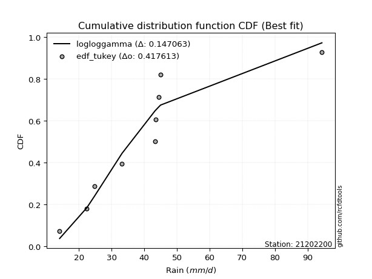</img></img>

</div>


### 8. Empirical - EDF Gringorten (1963)

Gringorten plotting position formula is essential for estimating the probability and return periods of extreme events like floods and heavy rainfall. The constant _a=0.44_.

<div align="center">


$P=(m-a)/(n+1-2a)$


</div>


**8.1. Empirical values**

<div align="center">

|                | 0                    | 1                  | 2                   | 3                  | 4              | 5                  | 6                  | 7                  | 8                  |
|:---------------|:---------------------|:-------------------|:--------------------|:-------------------|:---------------|:-------------------|:-------------------|:-------------------|:-------------------|
| date           | 2016                 | 2014               | 2015                | 2009               | 2010           | 2012               | 2008               | 2011               | 2013               |
| x              | 14.1                 | 22.4               | 24.7                | 33.2               | 43.3           | 43.6               | 44.4               | 45.0               | 94.4               |
| m              | 1                    | 2                  | 3                   | 4                  | 5              | 6                  | 7                  | 8                  | 9                  |
| empirical_dist | edf_gringorten       | edf_gringorten     | edf_gringorten      | edf_gringorten     | edf_gringorten | edf_gringorten     | edf_gringorten     | edf_gringorten     | edf_gringorten     |
| empirical      | 0.061403508771929835 | 0.1710526315789474 | 0.28070175438596495 | 0.3903508771929825 | 0.5            | 0.6096491228070176 | 0.7192982456140351 | 0.8289473684210527 | 0.9385964912280703 |
| empirical_tr   | 1.0654205607476634   | 1.2063492063492063 | 1.3902439024390243  | 1.6402877697841727 | 2.0            | 2.561797752808989  | 3.5625             | 5.846153846153847  | 16.285714285714324 |

</div>


**8.2. Kolmogorov-Smirnov fit test (sorted by Δ)**


<div align="center">

|                | 0                     | 1                   | 2                   | 3                   | 4                   | 5                   | 6                   | 7                   | 8                   | 9                   | 10                  | 11                  | 12                  | 13                  | 14                  | 15                  | 16                  | 17                  | 18                  | 19                  | 20                  | 21                  | 22                  | 23                  | 24                  | 25                  | 26                  | 27                  | 28                  | 29                  | 30                  | 31                  | 32                  | 33                  | 34                  | 35                  | 36                  | 37                  | 38                  | 39                  | 40                  | 41                  | 42                  | 43                  | 44                  | 45                  | 46                  | 47                  | 48                  | 49                  | 50                  | 51                  | 52                  | 53                  | 54                  | 55                  | 56                  | 57                  | 58                  | 59                  | 60                  | 61                  | 62                  | 63                  | 64                  | 65                  | 66                  | 67                  | 68                  | 69                  | 70                  | 71                  | 72                  | 73                  | 74                  | 75                  | 76                  | 77                  | 78                  | 79                  | 80                  | 81                  | 82                  | 83                  | 84                  | 85                  | 86                  | 87                  | 88                  | 89                  |
|:---------------|:----------------------|:--------------------|:--------------------|:--------------------|:--------------------|:--------------------|:--------------------|:--------------------|:--------------------|:--------------------|:--------------------|:--------------------|:--------------------|:--------------------|:--------------------|:--------------------|:--------------------|:--------------------|:--------------------|:--------------------|:--------------------|:--------------------|:--------------------|:--------------------|:--------------------|:--------------------|:--------------------|:--------------------|:--------------------|:--------------------|:--------------------|:--------------------|:--------------------|:--------------------|:--------------------|:--------------------|:--------------------|:--------------------|:--------------------|:--------------------|:--------------------|:--------------------|:--------------------|:--------------------|:--------------------|:--------------------|:--------------------|:--------------------|:--------------------|:--------------------|:--------------------|:--------------------|:--------------------|:--------------------|:--------------------|:--------------------|:--------------------|:--------------------|:--------------------|:--------------------|:--------------------|:--------------------|:--------------------|:--------------------|:--------------------|:--------------------|:--------------------|:--------------------|:--------------------|:--------------------|:--------------------|:--------------------|:--------------------|:--------------------|:--------------------|:--------------------|:--------------------|:--------------------|:--------------------|:--------------------|:--------------------|:--------------------|:--------------------|:--------------------|:--------------------|:--------------------|:--------------------|:--------------------|:--------------------|:--------------------|
| station        | 21202200              | 21202200            | 21202200            | 21202200            | 21202200            | 21202200            | 21202200            | 21202200            | 21202200            | 21202200            | 21202200            | 21202200            | 21202200            | 21202200            | 21202200            | 21202200            | 21202200            | 21202200            | 21202200            | 21202200            | 21202200            | 21202200            | 21202200            | 21202200            | 21202200            | 21202200            | 21202200            | 21202200            | 21202200            | 21202200            | 21202200            | 21202200            | 21202200            | 21202200            | 21202200            | 21202200            | 21202200            | 21202200            | 21202200            | 21202200            | 21202200            | 21202200            | 21202200            | 21202200            | 21202200            | 21202200            | 21202200            | 21202200            | 21202200            | 21202200            | 21202200            | 21202200            | 21202200            | 21202200            | 21202200            | 21202200            | 21202200            | 21202200            | 21202200            | 21202200            | 21202200            | 21202200            | 21202200            | 21202200            | 21202200            | 21202200            | 21202200            | 21202200            | 21202200            | 21202200            | 21202200            | 21202200            | 21202200            | 21202200            | 21202200            | 21202200            | 21202200            | 21202200            | 21202200            | 21202200            | 21202200            | 21202200            | 21202200            | 21202200            | 21202200            | 21202200            | 21202200            | 21202200            | 21202200            | 21202200            |
| empirical_dist | edf_gringorten        | edf_gringorten      | edf_gringorten      | edf_gringorten      | edf_gringorten      | edf_gringorten      | edf_gringorten      | edf_gringorten      | edf_gringorten      | edf_gringorten      | edf_gringorten      | edf_gringorten      | edf_gringorten      | edf_gringorten      | edf_gringorten      | edf_gringorten      | edf_gringorten      | edf_gringorten      | edf_gringorten      | edf_gringorten      | edf_gringorten      | edf_gringorten      | edf_gringorten      | edf_gringorten      | edf_gringorten      | edf_gringorten      | edf_gringorten      | edf_gringorten      | edf_gringorten      | edf_gringorten      | edf_gringorten      | edf_gringorten      | edf_gringorten      | edf_gringorten      | edf_gringorten      | edf_gringorten      | edf_gringorten      | edf_gringorten      | edf_gringorten      | edf_gringorten      | edf_gringorten      | edf_gringorten      | edf_gringorten      | edf_gringorten      | edf_gringorten      | edf_gringorten      | edf_gringorten      | edf_gringorten      | edf_gringorten      | edf_gringorten      | edf_gringorten      | edf_gringorten      | edf_gringorten      | edf_gringorten      | edf_gringorten      | edf_gringorten      | edf_gringorten      | edf_gringorten      | edf_gringorten      | edf_gringorten      | edf_gringorten      | edf_gringorten      | edf_gringorten      | edf_gringorten      | edf_gringorten      | edf_gringorten      | edf_gringorten      | edf_gringorten      | edf_gringorten      | edf_gringorten      | edf_gringorten      | edf_gringorten      | edf_gringorten      | edf_gringorten      | edf_gringorten      | edf_gringorten      | edf_gringorten      | edf_gringorten      | edf_gringorten      | edf_gringorten      | edf_gringorten      | edf_gringorten      | edf_gringorten      | edf_gringorten      | edf_gringorten      | edf_gringorten      | edf_gringorten      | edf_gringorten      | edf_gringorten      | edf_gringorten      |
| p_dist         | loglaplace_asymmetric | logjohnsonsu        | logf                | logfatiguelife      | ncf                 | logerlang           | loggamma            | loggamma            | logpearson3         | lognct              | logexponnorm        | logt                | lognorm             | lognorm             | logcrystalball      | invgauss            | logweibull_min      | johnsonsu           | invgamma            | logloggamma         | logbetaprime        | exponnorm           | loggenlogistic      | mielke              | logmielke           | logrice             | alpha               | moyal               | logfisk             | betaprime           | halflogistic        | fisk                | loginvgamma         | logncf              | nct                 | genlogistic         | logalpha            | pearson3            | loglogistic         | expon               | genexpon            | gompertz            | loginvgauss         | logmaxwell          | nakagami            | lograyleigh         | loginvweibull       | gumbel_r            | loghypsecant        | logkstwobign        | loggenexpon         | f                   | halfnorm            | loggompertz         | logtruncnorm        | kstwobign           | loggumbel_l         | loghalfnorm         | chi2                | laplace             | loglaplace          | loggumbel_r         | rayleigh            | wald                | t                   | maxwell             | logexpon            | loghalflogistic     | laplace_asymmetric  | rice                | hypsecant           | logmoyal            | logistic            | truncnorm           | norm                | crystalball         | gamma               | weibull_min         | gibrat              | logwald             | gumbel_l            | loggibrat           | logchi2             | lognakagami         | erlang              | loglognorm          | pareto              | invweibull          | logpareto           | fatiguelife         |
| delta          | 0.14527635873887523   | 0.1482560006625125  | 0.15078560395236007 | 0.15100168469914144 | 0.1513125994097434  | 0.15153382150896888 | 0.15153392047455438 | 0.15153392047455438 | 0.15156061824523515 | 0.15216496186859374 | 0.15230317780549385 | 0.15237114545231956 | 0.15237379595462264 | 0.15237379595462264 | 0.15237470124153318 | 0.15243849913678764 | 0.1524517676812882  | 0.15305263074889197 | 0.15422394873332412 | 0.15426872719098572 | 0.15433767411375143 | 0.15550632588332924 | 0.15551733248596222 | 0.15558329035459018 | 0.1556667774339393  | 0.15612679837349108 | 0.15620119730227122 | 0.15651114517470965 | 0.15773314435235963 | 0.1579915123993424  | 0.1582764643397775  | 0.15844424248503386 | 0.1595810870594888  | 0.1602691799759055  | 0.16052084193557015 | 0.1620941340612161  | 0.16458264045087134 | 0.16586247448114377 | 0.16688586655157556 | 0.16821713967113183 | 0.16826905476799936 | 0.16959563336964822 | 0.1701742174293983  | 0.17076652925764246 | 0.17309196460982623 | 0.17730782592934813 | 0.17962130390540187 | 0.18017177715910793 | 0.18076651990322123 | 0.18086782566304205 | 0.18271032876903726 | 0.1851167775021869  | 0.18633520319065977 | 0.18877089722721085 | 0.19206921353893947 | 0.19262516828603804 | 0.19301198930358843 | 0.19632212482033473 | 0.19986534090179597 | 0.20408416842310473 | 0.20897934619941438 | 0.20915534733253538 | 0.21142990171496256 | 0.21371599686098197 | 0.21665697991459476 | 0.2202857658889409  | 0.22213599908015347 | 0.22445061072250994 | 0.2278409119019985  | 0.22799517422940785 | 0.22904695180526724 | 0.2290652097978627  | 0.23785118153726448 | 0.24845077170116936 | 0.2484507782092671  | 0.2484507788564766  | 0.2560276489205129  | 0.26305433566200515 | 0.2754706210445753  | 0.2854654805272132  | 0.3115375748787623  | 0.3176757475983266  | 0.31896250749024907 | 0.3335872371723157  | 0.41729000837132607 | 0.44218652328479485 | 0.4582223305330017  | 0.46513223042815743 | 0.47333607849306863 | 0.5715418210445908  |
| deltao         | 0.41761268023100007   | 0.41761268023100007 | 0.41761268023100007 | 0.41761268023100007 | 0.41761268023100007 | 0.41761268023100007 | 0.41761268023100007 | 0.41761268023100007 | 0.41761268023100007 | 0.41761268023100007 | 0.41761268023100007 | 0.41761268023100007 | 0.41761268023100007 | 0.41761268023100007 | 0.41761268023100007 | 0.41761268023100007 | 0.41761268023100007 | 0.41761268023100007 | 0.41761268023100007 | 0.41761268023100007 | 0.41761268023100007 | 0.41761268023100007 | 0.41761268023100007 | 0.41761268023100007 | 0.41761268023100007 | 0.41761268023100007 | 0.41761268023100007 | 0.41761268023100007 | 0.41761268023100007 | 0.41761268023100007 | 0.41761268023100007 | 0.41761268023100007 | 0.41761268023100007 | 0.41761268023100007 | 0.41761268023100007 | 0.41761268023100007 | 0.41761268023100007 | 0.41761268023100007 | 0.41761268023100007 | 0.41761268023100007 | 0.41761268023100007 | 0.41761268023100007 | 0.41761268023100007 | 0.41761268023100007 | 0.41761268023100007 | 0.41761268023100007 | 0.41761268023100007 | 0.41761268023100007 | 0.41761268023100007 | 0.41761268023100007 | 0.41761268023100007 | 0.41761268023100007 | 0.41761268023100007 | 0.41761268023100007 | 0.41761268023100007 | 0.41761268023100007 | 0.41761268023100007 | 0.41761268023100007 | 0.41761268023100007 | 0.41761268023100007 | 0.41761268023100007 | 0.41761268023100007 | 0.41761268023100007 | 0.41761268023100007 | 0.41761268023100007 | 0.41761268023100007 | 0.41761268023100007 | 0.41761268023100007 | 0.41761268023100007 | 0.41761268023100007 | 0.41761268023100007 | 0.41761268023100007 | 0.41761268023100007 | 0.41761268023100007 | 0.41761268023100007 | 0.41761268023100007 | 0.41761268023100007 | 0.41761268023100007 | 0.41761268023100007 | 0.41761268023100007 | 0.41761268023100007 | 0.41761268023100007 | 0.41761268023100007 | 0.41761268023100007 | 0.41761268023100007 | 0.41761268023100007 | 0.41761268023100007 | 0.41761268023100007 | 0.41761268023100007 | 0.41761268023100007 |
| eval           | Δo > Δ                | Δo > Δ              | Δo > Δ              | Δo > Δ              | Δo > Δ              | Δo > Δ              | Δo > Δ              | Δo > Δ              | Δo > Δ              | Δo > Δ              | Δo > Δ              | Δo > Δ              | Δo > Δ              | Δo > Δ              | Δo > Δ              | Δo > Δ              | Δo > Δ              | Δo > Δ              | Δo > Δ              | Δo > Δ              | Δo > Δ              | Δo > Δ              | Δo > Δ              | Δo > Δ              | Δo > Δ              | Δo > Δ              | Δo > Δ              | Δo > Δ              | Δo > Δ              | Δo > Δ              | Δo > Δ              | Δo > Δ              | Δo > Δ              | Δo > Δ              | Δo > Δ              | Δo > Δ              | Δo > Δ              | Δo > Δ              | Δo > Δ              | Δo > Δ              | Δo > Δ              | Δo > Δ              | Δo > Δ              | Δo > Δ              | Δo > Δ              | Δo > Δ              | Δo > Δ              | Δo > Δ              | Δo > Δ              | Δo > Δ              | Δo > Δ              | Δo > Δ              | Δo > Δ              | Δo > Δ              | Δo > Δ              | Δo > Δ              | Δo > Δ              | Δo > Δ              | Δo > Δ              | Δo > Δ              | Δo > Δ              | Δo > Δ              | Δo > Δ              | Δo > Δ              | Δo > Δ              | Δo > Δ              | Δo > Δ              | Δo > Δ              | Δo > Δ              | Δo > Δ              | Δo > Δ              | Δo > Δ              | Δo > Δ              | Δo > Δ              | Δo > Δ              | Δo > Δ              | Δo > Δ              | Δo > Δ              | Δo > Δ              | Δo > Δ              | Δo > Δ              | Δo > Δ              | Δo > Δ              | Δo > Δ              | Δo > Δ              | Δo <= Δ             | Δo <= Δ             | Δo <= Δ             | Δo <= Δ             | Δo <= Δ             |
| fit            | 1                     | 1                   | 1                   | 1                   | 1                   | 1                   | 1                   | 1                   | 1                   | 1                   | 1                   | 1                   | 1                   | 1                   | 1                   | 1                   | 1                   | 1                   | 1                   | 1                   | 1                   | 1                   | 1                   | 1                   | 1                   | 1                   | 1                   | 1                   | 1                   | 1                   | 1                   | 1                   | 1                   | 1                   | 1                   | 1                   | 1                   | 1                   | 1                   | 1                   | 1                   | 1                   | 1                   | 1                   | 1                   | 1                   | 1                   | 1                   | 1                   | 1                   | 1                   | 1                   | 1                   | 1                   | 1                   | 1                   | 1                   | 1                   | 1                   | 1                   | 1                   | 1                   | 1                   | 1                   | 1                   | 1                   | 1                   | 1                   | 1                   | 1                   | 1                   | 1                   | 1                   | 1                   | 1                   | 1                   | 1                   | 1                   | 1                   | 1                   | 1                   | 1                   | 1                   | 1                   | 1                   | 0                   | 0                   | 0                   | 0                   | 0                   |
| n              | 9                     | 9                   | 9                   | 9                   | 9                   | 9                   | 9                   | 9                   | 9                   | 9                   | 9                   | 9                   | 9                   | 9                   | 9                   | 9                   | 9                   | 9                   | 9                   | 9                   | 9                   | 9                   | 9                   | 9                   | 9                   | 9                   | 9                   | 9                   | 9                   | 9                   | 9                   | 9                   | 9                   | 9                   | 9                   | 9                   | 9                   | 9                   | 9                   | 9                   | 9                   | 9                   | 9                   | 9                   | 9                   | 9                   | 9                   | 9                   | 9                   | 9                   | 9                   | 9                   | 9                   | 9                   | 9                   | 9                   | 9                   | 9                   | 9                   | 9                   | 9                   | 9                   | 9                   | 9                   | 9                   | 9                   | 9                   | 9                   | 9                   | 9                   | 9                   | 9                   | 9                   | 9                   | 9                   | 9                   | 9                   | 9                   | 9                   | 9                   | 9                   | 9                   | 9                   | 9                   | 9                   | 9                   | 9                   | 9                   | 9                   | 9                   |
| best_fit       | 1                     | 0                   | 0                   | 0                   | 0                   | 0                   | 0                   | 0                   | 0                   | 0                   | 0                   | 0                   | 0                   | 0                   | 0                   | 0                   | 0                   | 0                   | 0                   | 0                   | 0                   | 0                   | 0                   | 0                   | 0                   | 0                   | 0                   | 0                   | 0                   | 0                   | 0                   | 0                   | 0                   | 0                   | 0                   | 0                   | 0                   | 0                   | 0                   | 0                   | 0                   | 0                   | 0                   | 0                   | 0                   | 0                   | 0                   | 0                   | 0                   | 0                   | 0                   | 0                   | 0                   | 0                   | 0                   | 0                   | 0                   | 0                   | 0                   | 0                   | 0                   | 0                   | 0                   | 0                   | 0                   | 0                   | 0                   | 0                   | 0                   | 0                   | 0                   | 0                   | 0                   | 0                   | 0                   | 0                   | 0                   | 0                   | 0                   | 0                   | 0                   | 0                   | 0                   | 0                   | 0                   | 0                   | 0                   | 0                   | 0                   | 0                   |
| best_fit_sort  | 1                     | 2                   | 3                   | 4                   | 5                   | 6                   | 7                   | 8                   | 9                   | 10                  | 11                  | 12                  | 13                  | 14                  | 15                  | 16                  | 17                  | 18                  | 19                  | 20                  | 21                  | 22                  | 23                  | 24                  | 25                  | 26                  | 27                  | 28                  | 29                  | 30                  | 31                  | 32                  | 33                  | 34                  | 35                  | 36                  | 37                  | 38                  | 39                  | 40                  | 41                  | 42                  | 43                  | 44                  | 45                  | 46                  | 47                  | 48                  | 49                  | 50                  | 51                  | 52                  | 53                  | 54                  | 55                  | 56                  | 57                  | 58                  | 59                  | 60                  | 61                  | 62                  | 63                  | 64                  | 65                  | 66                  | 67                  | 68                  | 69                  | 70                  | 71                  | 72                  | 73                  | 74                  | 75                  | 76                  | 77                  | 78                  | 79                  | 80                  | 81                  | 82                  | 83                  | 84                  | 85                  | 86                  | 87                  | 88                  | 89                  | 90                  |

</div>


<div align="center">

</img>

</div>


**8.3. Best fit**

<div align="center">

|   id |   station | empirical_dist   | p_dist                |    delta |   deltao | eval   |   fit |   n |   best_fit |   best_fit_sort |
|-----:|----------:|:-----------------|:----------------------|---------:|---------:|:-------|------:|----:|-----------:|----------------:|
|    0 |  21202200 | edf_gringorten   | loglaplace_asymmetric | 0.145276 | 0.417613 | Δo > Δ |     1 |   9 |          1 |               1 |

</div>


<div align="center">

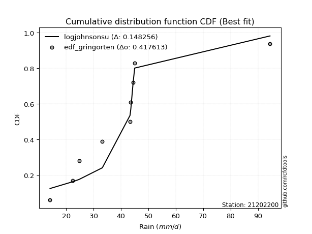</img>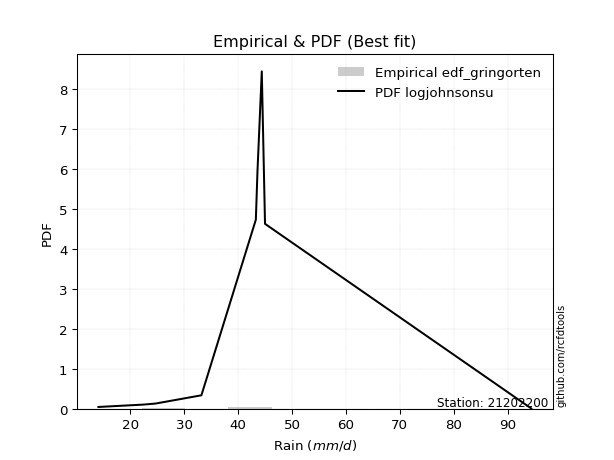</img>

</div>


### 9. Empirical - EDF Filliben (1975)

The specific values of the constants (0.3175) (often denoted as $alpha$) and (0.365) are derived from a method proposed by James J. Filliben in a 1975 paper. This particular formula is the mean value of the $i$-th order statistic of the normal distribution and is considered a robust and effective plotting position formula for the normal probability plot correlation coefficient test for normality.

<div align="center">


$P=(m-0.3175)/(n+0.365)$


</div>


**9.1. Empirical values**

<div align="center">

|                | 0                   | 1                  | 2                   | 3                   | 4            | 5                  | 6                  | 7                  | 8                  |
|:---------------|:--------------------|:-------------------|:--------------------|:--------------------|:-------------|:-------------------|:-------------------|:-------------------|:-------------------|
| date           | 2016                | 2014               | 2015                | 2009                | 2010         | 2012               | 2008               | 2011               | 2013               |
| x              | 14.1                | 22.4               | 24.7                | 33.2                | 43.3         | 43.6               | 44.4               | 45.0               | 94.4               |
| m              | 1                   | 2                  | 3                   | 4                   | 5            | 6                  | 7                  | 8                  | 9                  |
| empirical_dist | edf_filliben        | edf_filliben       | edf_filliben        | edf_filliben        | edf_filliben | edf_filliben       | edf_filliben       | edf_filliben       | edf_filliben       |
| empirical      | 0.07287773625200214 | 0.1796583021890016 | 0.28643886812600106 | 0.39321943406300053 | 0.5          | 0.6067805659369995 | 0.7135611318739989 | 0.8203416978109984 | 0.9271222637479978 |
| empirical_tr   | 1.0786063921681543  | 1.219004230393752  | 1.401421623643846   | 1.6480422349318082  | 2.0          | 2.5431093007467753 | 3.491146318732526  | 5.566121842496286  | 13.721611721611705 |

</div>


**9.2. Kolmogorov-Smirnov fit test (sorted by Δ)**


<div align="center">

|                | 0                     | 1                   | 2                   | 3                   | 4                   | 5                   | 6                   | 7                   | 8                   | 9                   | 10                  | 11                  | 12                  | 13                  | 14                  | 15                  | 16                  | 17                  | 18                  | 19                  | 20                  | 21                  | 22                  | 23                  | 24                  | 25                  | 26                  | 27                  | 28                  | 29                  | 30                  | 31                  | 32                  | 33                  | 34                  | 35                  | 36                  | 37                  | 38                  | 39                  | 40                  | 41                  | 42                  | 43                  | 44                  | 45                  | 46                  | 47                  | 48                  | 49                  | 50                  | 51                  | 52                  | 53                  | 54                  | 55                  | 56                  | 57                  | 58                  | 59                  | 60                  | 61                  | 62                  | 63                  | 64                  | 65                  | 66                  | 67                  | 68                  | 69                  | 70                  | 71                  | 72                  | 73                  | 74                  | 75                  | 76                  | 77                  | 78                  | 79                  | 80                  | 81                  | 82                  | 83                  | 84                  | 85                  | 86                  | 87                  | 88                  | 89                  |
|:---------------|:----------------------|:--------------------|:--------------------|:--------------------|:--------------------|:--------------------|:--------------------|:--------------------|:--------------------|:--------------------|:--------------------|:--------------------|:--------------------|:--------------------|:--------------------|:--------------------|:--------------------|:--------------------|:--------------------|:--------------------|:--------------------|:--------------------|:--------------------|:--------------------|:--------------------|:--------------------|:--------------------|:--------------------|:--------------------|:--------------------|:--------------------|:--------------------|:--------------------|:--------------------|:--------------------|:--------------------|:--------------------|:--------------------|:--------------------|:--------------------|:--------------------|:--------------------|:--------------------|:--------------------|:--------------------|:--------------------|:--------------------|:--------------------|:--------------------|:--------------------|:--------------------|:--------------------|:--------------------|:--------------------|:--------------------|:--------------------|:--------------------|:--------------------|:--------------------|:--------------------|:--------------------|:--------------------|:--------------------|:--------------------|:--------------------|:--------------------|:--------------------|:--------------------|:--------------------|:--------------------|:--------------------|:--------------------|:--------------------|:--------------------|:--------------------|:--------------------|:--------------------|:--------------------|:--------------------|:--------------------|:--------------------|:--------------------|:--------------------|:--------------------|:--------------------|:--------------------|:--------------------|:--------------------|:--------------------|:--------------------|
| station        | 21202200              | 21202200            | 21202200            | 21202200            | 21202200            | 21202200            | 21202200            | 21202200            | 21202200            | 21202200            | 21202200            | 21202200            | 21202200            | 21202200            | 21202200            | 21202200            | 21202200            | 21202200            | 21202200            | 21202200            | 21202200            | 21202200            | 21202200            | 21202200            | 21202200            | 21202200            | 21202200            | 21202200            | 21202200            | 21202200            | 21202200            | 21202200            | 21202200            | 21202200            | 21202200            | 21202200            | 21202200            | 21202200            | 21202200            | 21202200            | 21202200            | 21202200            | 21202200            | 21202200            | 21202200            | 21202200            | 21202200            | 21202200            | 21202200            | 21202200            | 21202200            | 21202200            | 21202200            | 21202200            | 21202200            | 21202200            | 21202200            | 21202200            | 21202200            | 21202200            | 21202200            | 21202200            | 21202200            | 21202200            | 21202200            | 21202200            | 21202200            | 21202200            | 21202200            | 21202200            | 21202200            | 21202200            | 21202200            | 21202200            | 21202200            | 21202200            | 21202200            | 21202200            | 21202200            | 21202200            | 21202200            | 21202200            | 21202200            | 21202200            | 21202200            | 21202200            | 21202200            | 21202200            | 21202200            | 21202200            |
| empirical_dist | edf_filliben          | edf_filliben        | edf_filliben        | edf_filliben        | edf_filliben        | edf_filliben        | edf_filliben        | edf_filliben        | edf_filliben        | edf_filliben        | edf_filliben        | edf_filliben        | edf_filliben        | edf_filliben        | edf_filliben        | edf_filliben        | edf_filliben        | edf_filliben        | edf_filliben        | edf_filliben        | edf_filliben        | edf_filliben        | edf_filliben        | edf_filliben        | edf_filliben        | edf_filliben        | edf_filliben        | edf_filliben        | edf_filliben        | edf_filliben        | edf_filliben        | edf_filliben        | edf_filliben        | edf_filliben        | edf_filliben        | edf_filliben        | edf_filliben        | edf_filliben        | edf_filliben        | edf_filliben        | edf_filliben        | edf_filliben        | edf_filliben        | edf_filliben        | edf_filliben        | edf_filliben        | edf_filliben        | edf_filliben        | edf_filliben        | edf_filliben        | edf_filliben        | edf_filliben        | edf_filliben        | edf_filliben        | edf_filliben        | edf_filliben        | edf_filliben        | edf_filliben        | edf_filliben        | edf_filliben        | edf_filliben        | edf_filliben        | edf_filliben        | edf_filliben        | edf_filliben        | edf_filliben        | edf_filliben        | edf_filliben        | edf_filliben        | edf_filliben        | edf_filliben        | edf_filliben        | edf_filliben        | edf_filliben        | edf_filliben        | edf_filliben        | edf_filliben        | edf_filliben        | edf_filliben        | edf_filliben        | edf_filliben        | edf_filliben        | edf_filliben        | edf_filliben        | edf_filliben        | edf_filliben        | edf_filliben        | edf_filliben        | edf_filliben        | edf_filliben        |
| p_dist         | loglaplace_asymmetric | exponnorm           | logloggamma         | moyal               | logcrystalball      | lognorm             | lognorm             | logt                | logexponnorm        | lognct              | halflogistic        | invgauss            | logpearson3         | loggamma            | loggamma            | logerlang           | logweibull_min      | logf                | logfatiguelife      | logjohnsonsu        | ncf                 | logncf              | johnsonsu           | genlogistic         | invgamma            | logbetaprime        | loggenlogistic      | mielke              | logmielke           | logrice             | alpha               | pearson3            | logfisk             | betaprime           | fisk                | loginvgamma         | nct                 | gompertz            | nakagami            | logalpha            | loglogistic         | expon               | genexpon            | loginvgauss         | logmaxwell          | gumbel_r            | lograyleigh         | halfnorm            | loginvweibull       | loghypsecant        | logkstwobign        | loggenexpon         | kstwobign           | loggumbel_l         | f                   | loggompertz         | logtruncnorm        | laplace             | loghalfnorm         | chi2                | rayleigh            | t                   | loglaplace          | loggumbel_r         | maxwell             | logexpon            | wald                | laplace_asymmetric  | rice                | hypsecant           | loghalflogistic     | logmoyal            | logistic            | truncnorm           | norm                | crystalball         | weibull_min         | gamma               | gibrat              | logwald             | gumbel_l            | logchi2             | loggibrat           | lognakagami         | erlang              | loglognorm          | pareto              | invweibull          | logpareto           | fatiguelife         |
| delta          | 0.136670688128821     | 0.146900655273275   | 0.14706267007430884 | 0.14790547456465541 | 0.14902646733792269 | 0.14902740576232898 | 0.14902740576232898 | 0.149030116288706   | 0.14910439410884158 | 0.14925061095208492 | 0.14967079372972325 | 0.1499295068530262  | 0.1499340644969337  | 0.14996251132545835 | 0.14996251132545835 | 0.1499628132409555  | 0.14996411116060981 | 0.15078560395236007 | 0.15100168469914144 | 0.1511245575325305  | 0.1513125994097434  | 0.15166350936585127 | 0.15305263074889197 | 0.15348846345116185 | 0.15422394873332412 | 0.15433767411375143 | 0.15551733248596222 | 0.15558329035459018 | 0.1556667774339393  | 0.15612679837349108 | 0.15620119730227122 | 0.15725680387108953 | 0.15773314435235963 | 0.1579915123993424  | 0.15844424248503386 | 0.1595810870594888  | 0.16052084193557015 | 0.16098996275959399 | 0.164486293999772   | 0.16458264045087134 | 0.16688586655157556 | 0.16821713967113183 | 0.16826905476799936 | 0.1701742174293983  | 0.17076652925764246 | 0.1715661065490537  | 0.17730782592934813 | 0.17772953258060553 | 0.17962130390540187 | 0.18076651990322123 | 0.18086782566304205 | 0.18271032876903726 | 0.1840194976759838  | 0.1844063186935342  | 0.1851167775021869  | 0.18877089722721085 | 0.19206921353893947 | 0.1954784978130505  | 0.19632212482033473 | 0.19986534090179597 | 0.20282423110490833 | 0.20805130930454052 | 0.20897934619941438 | 0.20915534733253538 | 0.21168009527888665 | 0.21353032847009926 | 0.21371599686098197 | 0.21923524129194427 | 0.2193895036193536  | 0.220441281195213   | 0.22445061072250994 | 0.2290652097978627  | 0.22924551092721024 | 0.23984510109111512 | 0.23984510759921285 | 0.23984510824642236 | 0.25444866505195096 | 0.2560276489205129  | 0.2812077347846114  | 0.2854654805272132  | 0.3029319042687081  | 0.3103568368801949  | 0.3176757475983266  | 0.3307186803022977  | 0.4086843377612719  | 0.43358085267474067 | 0.4496166599229475  | 0.4536580029480849  | 0.46473040788301445 | 0.5629361504345366  |
| deltao         | 0.41761268023100007   | 0.41761268023100007 | 0.41761268023100007 | 0.41761268023100007 | 0.41761268023100007 | 0.41761268023100007 | 0.41761268023100007 | 0.41761268023100007 | 0.41761268023100007 | 0.41761268023100007 | 0.41761268023100007 | 0.41761268023100007 | 0.41761268023100007 | 0.41761268023100007 | 0.41761268023100007 | 0.41761268023100007 | 0.41761268023100007 | 0.41761268023100007 | 0.41761268023100007 | 0.41761268023100007 | 0.41761268023100007 | 0.41761268023100007 | 0.41761268023100007 | 0.41761268023100007 | 0.41761268023100007 | 0.41761268023100007 | 0.41761268023100007 | 0.41761268023100007 | 0.41761268023100007 | 0.41761268023100007 | 0.41761268023100007 | 0.41761268023100007 | 0.41761268023100007 | 0.41761268023100007 | 0.41761268023100007 | 0.41761268023100007 | 0.41761268023100007 | 0.41761268023100007 | 0.41761268023100007 | 0.41761268023100007 | 0.41761268023100007 | 0.41761268023100007 | 0.41761268023100007 | 0.41761268023100007 | 0.41761268023100007 | 0.41761268023100007 | 0.41761268023100007 | 0.41761268023100007 | 0.41761268023100007 | 0.41761268023100007 | 0.41761268023100007 | 0.41761268023100007 | 0.41761268023100007 | 0.41761268023100007 | 0.41761268023100007 | 0.41761268023100007 | 0.41761268023100007 | 0.41761268023100007 | 0.41761268023100007 | 0.41761268023100007 | 0.41761268023100007 | 0.41761268023100007 | 0.41761268023100007 | 0.41761268023100007 | 0.41761268023100007 | 0.41761268023100007 | 0.41761268023100007 | 0.41761268023100007 | 0.41761268023100007 | 0.41761268023100007 | 0.41761268023100007 | 0.41761268023100007 | 0.41761268023100007 | 0.41761268023100007 | 0.41761268023100007 | 0.41761268023100007 | 0.41761268023100007 | 0.41761268023100007 | 0.41761268023100007 | 0.41761268023100007 | 0.41761268023100007 | 0.41761268023100007 | 0.41761268023100007 | 0.41761268023100007 | 0.41761268023100007 | 0.41761268023100007 | 0.41761268023100007 | 0.41761268023100007 | 0.41761268023100007 | 0.41761268023100007 |
| eval           | Δo > Δ                | Δo > Δ              | Δo > Δ              | Δo > Δ              | Δo > Δ              | Δo > Δ              | Δo > Δ              | Δo > Δ              | Δo > Δ              | Δo > Δ              | Δo > Δ              | Δo > Δ              | Δo > Δ              | Δo > Δ              | Δo > Δ              | Δo > Δ              | Δo > Δ              | Δo > Δ              | Δo > Δ              | Δo > Δ              | Δo > Δ              | Δo > Δ              | Δo > Δ              | Δo > Δ              | Δo > Δ              | Δo > Δ              | Δo > Δ              | Δo > Δ              | Δo > Δ              | Δo > Δ              | Δo > Δ              | Δo > Δ              | Δo > Δ              | Δo > Δ              | Δo > Δ              | Δo > Δ              | Δo > Δ              | Δo > Δ              | Δo > Δ              | Δo > Δ              | Δo > Δ              | Δo > Δ              | Δo > Δ              | Δo > Δ              | Δo > Δ              | Δo > Δ              | Δo > Δ              | Δo > Δ              | Δo > Δ              | Δo > Δ              | Δo > Δ              | Δo > Δ              | Δo > Δ              | Δo > Δ              | Δo > Δ              | Δo > Δ              | Δo > Δ              | Δo > Δ              | Δo > Δ              | Δo > Δ              | Δo > Δ              | Δo > Δ              | Δo > Δ              | Δo > Δ              | Δo > Δ              | Δo > Δ              | Δo > Δ              | Δo > Δ              | Δo > Δ              | Δo > Δ              | Δo > Δ              | Δo > Δ              | Δo > Δ              | Δo > Δ              | Δo > Δ              | Δo > Δ              | Δo > Δ              | Δo > Δ              | Δo > Δ              | Δo > Δ              | Δo > Δ              | Δo > Δ              | Δo > Δ              | Δo > Δ              | Δo > Δ              | Δo <= Δ             | Δo <= Δ             | Δo <= Δ             | Δo <= Δ             | Δo <= Δ             |
| fit            | 1                     | 1                   | 1                   | 1                   | 1                   | 1                   | 1                   | 1                   | 1                   | 1                   | 1                   | 1                   | 1                   | 1                   | 1                   | 1                   | 1                   | 1                   | 1                   | 1                   | 1                   | 1                   | 1                   | 1                   | 1                   | 1                   | 1                   | 1                   | 1                   | 1                   | 1                   | 1                   | 1                   | 1                   | 1                   | 1                   | 1                   | 1                   | 1                   | 1                   | 1                   | 1                   | 1                   | 1                   | 1                   | 1                   | 1                   | 1                   | 1                   | 1                   | 1                   | 1                   | 1                   | 1                   | 1                   | 1                   | 1                   | 1                   | 1                   | 1                   | 1                   | 1                   | 1                   | 1                   | 1                   | 1                   | 1                   | 1                   | 1                   | 1                   | 1                   | 1                   | 1                   | 1                   | 1                   | 1                   | 1                   | 1                   | 1                   | 1                   | 1                   | 1                   | 1                   | 1                   | 1                   | 0                   | 0                   | 0                   | 0                   | 0                   |
| n              | 9                     | 9                   | 9                   | 9                   | 9                   | 9                   | 9                   | 9                   | 9                   | 9                   | 9                   | 9                   | 9                   | 9                   | 9                   | 9                   | 9                   | 9                   | 9                   | 9                   | 9                   | 9                   | 9                   | 9                   | 9                   | 9                   | 9                   | 9                   | 9                   | 9                   | 9                   | 9                   | 9                   | 9                   | 9                   | 9                   | 9                   | 9                   | 9                   | 9                   | 9                   | 9                   | 9                   | 9                   | 9                   | 9                   | 9                   | 9                   | 9                   | 9                   | 9                   | 9                   | 9                   | 9                   | 9                   | 9                   | 9                   | 9                   | 9                   | 9                   | 9                   | 9                   | 9                   | 9                   | 9                   | 9                   | 9                   | 9                   | 9                   | 9                   | 9                   | 9                   | 9                   | 9                   | 9                   | 9                   | 9                   | 9                   | 9                   | 9                   | 9                   | 9                   | 9                   | 9                   | 9                   | 9                   | 9                   | 9                   | 9                   | 9                   |
| best_fit       | 1                     | 0                   | 0                   | 0                   | 0                   | 0                   | 0                   | 0                   | 0                   | 0                   | 0                   | 0                   | 0                   | 0                   | 0                   | 0                   | 0                   | 0                   | 0                   | 0                   | 0                   | 0                   | 0                   | 0                   | 0                   | 0                   | 0                   | 0                   | 0                   | 0                   | 0                   | 0                   | 0                   | 0                   | 0                   | 0                   | 0                   | 0                   | 0                   | 0                   | 0                   | 0                   | 0                   | 0                   | 0                   | 0                   | 0                   | 0                   | 0                   | 0                   | 0                   | 0                   | 0                   | 0                   | 0                   | 0                   | 0                   | 0                   | 0                   | 0                   | 0                   | 0                   | 0                   | 0                   | 0                   | 0                   | 0                   | 0                   | 0                   | 0                   | 0                   | 0                   | 0                   | 0                   | 0                   | 0                   | 0                   | 0                   | 0                   | 0                   | 0                   | 0                   | 0                   | 0                   | 0                   | 0                   | 0                   | 0                   | 0                   | 0                   |
| best_fit_sort  | 1                     | 2                   | 3                   | 4                   | 5                   | 6                   | 7                   | 8                   | 9                   | 10                  | 11                  | 12                  | 13                  | 14                  | 15                  | 16                  | 17                  | 18                  | 19                  | 20                  | 21                  | 22                  | 23                  | 24                  | 25                  | 26                  | 27                  | 28                  | 29                  | 30                  | 31                  | 32                  | 33                  | 34                  | 35                  | 36                  | 37                  | 38                  | 39                  | 40                  | 41                  | 42                  | 43                  | 44                  | 45                  | 46                  | 47                  | 48                  | 49                  | 50                  | 51                  | 52                  | 53                  | 54                  | 55                  | 56                  | 57                  | 58                  | 59                  | 60                  | 61                  | 62                  | 63                  | 64                  | 65                  | 66                  | 67                  | 68                  | 69                  | 70                  | 71                  | 72                  | 73                  | 74                  | 75                  | 76                  | 77                  | 78                  | 79                  | 80                  | 81                  | 82                  | 83                  | 84                  | 85                  | 86                  | 87                  | 88                  | 89                  | 90                  |

</div>


<div align="center">

</img>

</div>


**9.3. Best fit**

<div align="center">

|   id |   station | empirical_dist   | p_dist                |    delta |   deltao | eval   |   fit |   n |   best_fit |   best_fit_sort |
|-----:|----------:|:-----------------|:----------------------|---------:|---------:|:-------|------:|----:|-----------:|----------------:|
|    0 |  21202200 | edf_filliben     | loglaplace_asymmetric | 0.136671 | 0.417613 | Δo > Δ |     1 |   9 |          1 |               1 |

</div>


<div align="center">

</img></img>

</div>


### 10. Empirical - EDF Jenkinson (1977)

The Jenkinson formula in hydrology is an empirical plotting position formula used to estimate the non-exceedance probability _(P)_ or return period _(T)_ of a given ordered observation within a sample. It is a widely used method in the frequency analysis of extreme events such as floods and rainfall, as it provides a distribution-free way to plot data. _a≈0.31_ and _b≈0.38_ are constants derived to approximate the median of the probability distribution for the given rank.

<div align="center">


$P=(m-a)/(n+b)$


</div>


**10.1. Empirical values**

<div align="center">

|                | 0                   | 1                   | 2                  | 3                   | 4             | 5                  | 6                  | 7                  | 8                  |
|:---------------|:--------------------|:--------------------|:-------------------|:--------------------|:--------------|:-------------------|:-------------------|:-------------------|:-------------------|
| date           | 2016                | 2014                | 2015               | 2009                | 2010          | 2012               | 2008               | 2011               | 2013               |
| x              | 14.1                | 22.4                | 24.7               | 33.2                | 43.3          | 43.6               | 44.4               | 45.0               | 94.4               |
| m              | 1                   | 2                   | 3                  | 4                   | 5             | 6                  | 7                  | 8                  | 9                  |
| empirical_dist | edf_jenkinson       | edf_jenkinson       | edf_jenkinson      | edf_jenkinson       | edf_jenkinson | edf_jenkinson      | edf_jenkinson      | edf_jenkinson      | edf_jenkinson      |
| empirical      | 0.07356076759061833 | 0.18017057569296374 | 0.2867803837953091 | 0.39339019189765456 | 0.5           | 0.6066098081023454 | 0.7132196162046908 | 0.8198294243070362 | 0.9264392324093815 |
| empirical_tr   | 1.0794016110471807  | 1.2197659297789336  | 1.4020926756352765 | 1.6485061511423549  | 2.0           | 2.542005420054201  | 3.486988847583642  | 5.550295857988164  | 13.5942028985507   |

</div>


**10.2. Kolmogorov-Smirnov fit test (sorted by Δ)**


<div align="center">

|                | 0                     | 1                   | 2                   | 3                   | 4                   | 5                   | 6                   | 7                   | 8                   | 9                   | 10                  | 11                  | 12                  | 13                  | 14                  | 15                  | 16                  | 17                  | 18                  | 19                  | 20                  | 21                  | 22                  | 23                  | 24                  | 25                  | 26                  | 27                  | 28                  | 29                  | 30                  | 31                  | 32                  | 33                  | 34                  | 35                  | 36                  | 37                  | 38                  | 39                  | 40                  | 41                  | 42                  | 43                  | 44                  | 45                  | 46                  | 47                  | 48                  | 49                  | 50                  | 51                  | 52                  | 53                  | 54                  | 55                  | 56                  | 57                  | 58                  | 59                  | 60                  | 61                  | 62                  | 63                  | 64                  | 65                  | 66                  | 67                  | 68                  | 69                  | 70                  | 71                  | 72                  | 73                  | 74                  | 75                  | 76                  | 77                  | 78                  | 79                  | 80                  | 81                  | 82                  | 83                  | 84                  | 85                  | 86                  | 87                  | 88                  | 89                  |
|:---------------|:----------------------|:--------------------|:--------------------|:--------------------|:--------------------|:--------------------|:--------------------|:--------------------|:--------------------|:--------------------|:--------------------|:--------------------|:--------------------|:--------------------|:--------------------|:--------------------|:--------------------|:--------------------|:--------------------|:--------------------|:--------------------|:--------------------|:--------------------|:--------------------|:--------------------|:--------------------|:--------------------|:--------------------|:--------------------|:--------------------|:--------------------|:--------------------|:--------------------|:--------------------|:--------------------|:--------------------|:--------------------|:--------------------|:--------------------|:--------------------|:--------------------|:--------------------|:--------------------|:--------------------|:--------------------|:--------------------|:--------------------|:--------------------|:--------------------|:--------------------|:--------------------|:--------------------|:--------------------|:--------------------|:--------------------|:--------------------|:--------------------|:--------------------|:--------------------|:--------------------|:--------------------|:--------------------|:--------------------|:--------------------|:--------------------|:--------------------|:--------------------|:--------------------|:--------------------|:--------------------|:--------------------|:--------------------|:--------------------|:--------------------|:--------------------|:--------------------|:--------------------|:--------------------|:--------------------|:--------------------|:--------------------|:--------------------|:--------------------|:--------------------|:--------------------|:--------------------|:--------------------|:--------------------|:--------------------|:--------------------|
| station        | 21202200              | 21202200            | 21202200            | 21202200            | 21202200            | 21202200            | 21202200            | 21202200            | 21202200            | 21202200            | 21202200            | 21202200            | 21202200            | 21202200            | 21202200            | 21202200            | 21202200            | 21202200            | 21202200            | 21202200            | 21202200            | 21202200            | 21202200            | 21202200            | 21202200            | 21202200            | 21202200            | 21202200            | 21202200            | 21202200            | 21202200            | 21202200            | 21202200            | 21202200            | 21202200            | 21202200            | 21202200            | 21202200            | 21202200            | 21202200            | 21202200            | 21202200            | 21202200            | 21202200            | 21202200            | 21202200            | 21202200            | 21202200            | 21202200            | 21202200            | 21202200            | 21202200            | 21202200            | 21202200            | 21202200            | 21202200            | 21202200            | 21202200            | 21202200            | 21202200            | 21202200            | 21202200            | 21202200            | 21202200            | 21202200            | 21202200            | 21202200            | 21202200            | 21202200            | 21202200            | 21202200            | 21202200            | 21202200            | 21202200            | 21202200            | 21202200            | 21202200            | 21202200            | 21202200            | 21202200            | 21202200            | 21202200            | 21202200            | 21202200            | 21202200            | 21202200            | 21202200            | 21202200            | 21202200            | 21202200            |
| empirical_dist | edf_jenkinson         | edf_jenkinson       | edf_jenkinson       | edf_jenkinson       | edf_jenkinson       | edf_jenkinson       | edf_jenkinson       | edf_jenkinson       | edf_jenkinson       | edf_jenkinson       | edf_jenkinson       | edf_jenkinson       | edf_jenkinson       | edf_jenkinson       | edf_jenkinson       | edf_jenkinson       | edf_jenkinson       | edf_jenkinson       | edf_jenkinson       | edf_jenkinson       | edf_jenkinson       | edf_jenkinson       | edf_jenkinson       | edf_jenkinson       | edf_jenkinson       | edf_jenkinson       | edf_jenkinson       | edf_jenkinson       | edf_jenkinson       | edf_jenkinson       | edf_jenkinson       | edf_jenkinson       | edf_jenkinson       | edf_jenkinson       | edf_jenkinson       | edf_jenkinson       | edf_jenkinson       | edf_jenkinson       | edf_jenkinson       | edf_jenkinson       | edf_jenkinson       | edf_jenkinson       | edf_jenkinson       | edf_jenkinson       | edf_jenkinson       | edf_jenkinson       | edf_jenkinson       | edf_jenkinson       | edf_jenkinson       | edf_jenkinson       | edf_jenkinson       | edf_jenkinson       | edf_jenkinson       | edf_jenkinson       | edf_jenkinson       | edf_jenkinson       | edf_jenkinson       | edf_jenkinson       | edf_jenkinson       | edf_jenkinson       | edf_jenkinson       | edf_jenkinson       | edf_jenkinson       | edf_jenkinson       | edf_jenkinson       | edf_jenkinson       | edf_jenkinson       | edf_jenkinson       | edf_jenkinson       | edf_jenkinson       | edf_jenkinson       | edf_jenkinson       | edf_jenkinson       | edf_jenkinson       | edf_jenkinson       | edf_jenkinson       | edf_jenkinson       | edf_jenkinson       | edf_jenkinson       | edf_jenkinson       | edf_jenkinson       | edf_jenkinson       | edf_jenkinson       | edf_jenkinson       | edf_jenkinson       | edf_jenkinson       | edf_jenkinson       | edf_jenkinson       | edf_jenkinson       | edf_jenkinson       |
| p_dist         | loglaplace_asymmetric | exponnorm           | logloggamma         | moyal               | logcrystalball      | lognorm             | lognorm             | logt                | logexponnorm        | halflogistic        | lognct              | invgauss            | logpearson3         | loggamma            | loggamma            | logerlang           | logweibull_min      | logf                | logfatiguelife      | logncf              | logjohnsonsu        | ncf                 | genlogistic         | johnsonsu           | invgamma            | logbetaprime        | loggenlogistic      | mielke              | logmielke           | logrice             | alpha               | pearson3            | logfisk             | betaprime           | fisk                | loginvgamma         | gompertz            | nct                 | nakagami            | logalpha            | loglogistic         | expon               | genexpon            | loginvgauss         | logmaxwell          | gumbel_r            | halfnorm            | lograyleigh         | loginvweibull       | loghypsecant        | logkstwobign        | loggenexpon         | kstwobign           | loggumbel_l         | f                   | loggompertz         | logtruncnorm        | laplace             | loghalfnorm         | chi2                | rayleigh            | t                   | loglaplace          | loggumbel_r         | maxwell             | logexpon            | wald                | laplace_asymmetric  | rice                | hypsecant           | loghalflogistic     | logistic            | logmoyal            | truncnorm           | norm                | crystalball         | weibull_min         | gamma               | gibrat              | logwald             | gumbel_l            | logchi2             | loggibrat           | lognakagami         | erlang              | loglognorm          | pareto              | invweibull          | logpareto           | fatiguelife         |
| delta          | 0.13615841462485878   | 0.1463883817693128  | 0.14706267007430884 | 0.1473932010606932  | 0.14902646733792269 | 0.14902740576232898 | 0.14902740576232898 | 0.149030116288706   | 0.14910439410884158 | 0.14915852022576104 | 0.14925061095208492 | 0.1499295068530262  | 0.1499340644969337  | 0.14996251132545835 | 0.14996251132545835 | 0.1499628132409555  | 0.14996411116060981 | 0.15078560395236007 | 0.15100168469914144 | 0.15115123586188906 | 0.15129531536718455 | 0.1513125994097434  | 0.15297618994719964 | 0.15305263074889197 | 0.15422394873332412 | 0.15433767411375143 | 0.15551733248596222 | 0.15558329035459018 | 0.1556667774339393  | 0.15612679837349108 | 0.15620119730227122 | 0.15674453036712732 | 0.15773314435235963 | 0.1579915123993424  | 0.15844424248503386 | 0.1595810870594888  | 0.16047768925563177 | 0.16052084193557015 | 0.16397402049580978 | 0.16458264045087134 | 0.16688586655157556 | 0.16821713967113183 | 0.16826905476799936 | 0.1701742174293983  | 0.17076652925764246 | 0.17105383304509147 | 0.17721725907664332 | 0.17730782592934813 | 0.17962130390540187 | 0.18076651990322123 | 0.18086782566304205 | 0.18271032876903726 | 0.1835072241720216  | 0.18389404518957198 | 0.1851167775021869  | 0.18877089722721085 | 0.19206921353893947 | 0.19496622430908828 | 0.19632212482033473 | 0.19986534090179597 | 0.2023119576009461  | 0.2075390358005783  | 0.20897934619941438 | 0.20915534733253538 | 0.21116782177492444 | 0.21301805496613713 | 0.21371599686098197 | 0.21872296778798206 | 0.2188772301153914  | 0.2199290076912508  | 0.22445061072250994 | 0.22873323742324803 | 0.2290652097978627  | 0.2393328275871529  | 0.23933283409525064 | 0.23933283474246014 | 0.2539363915479888  | 0.2560276489205129  | 0.2815492504539195  | 0.2854654805272132  | 0.3024196307647459  | 0.30984456337623273 | 0.3176757475983266  | 0.33054792246764364 | 0.40817206425730973 | 0.4330685791707785  | 0.44910438641898537 | 0.45297497160946865 | 0.4642181343790523  | 0.5624238769305745  |
| deltao         | 0.41761268023100007   | 0.41761268023100007 | 0.41761268023100007 | 0.41761268023100007 | 0.41761268023100007 | 0.41761268023100007 | 0.41761268023100007 | 0.41761268023100007 | 0.41761268023100007 | 0.41761268023100007 | 0.41761268023100007 | 0.41761268023100007 | 0.41761268023100007 | 0.41761268023100007 | 0.41761268023100007 | 0.41761268023100007 | 0.41761268023100007 | 0.41761268023100007 | 0.41761268023100007 | 0.41761268023100007 | 0.41761268023100007 | 0.41761268023100007 | 0.41761268023100007 | 0.41761268023100007 | 0.41761268023100007 | 0.41761268023100007 | 0.41761268023100007 | 0.41761268023100007 | 0.41761268023100007 | 0.41761268023100007 | 0.41761268023100007 | 0.41761268023100007 | 0.41761268023100007 | 0.41761268023100007 | 0.41761268023100007 | 0.41761268023100007 | 0.41761268023100007 | 0.41761268023100007 | 0.41761268023100007 | 0.41761268023100007 | 0.41761268023100007 | 0.41761268023100007 | 0.41761268023100007 | 0.41761268023100007 | 0.41761268023100007 | 0.41761268023100007 | 0.41761268023100007 | 0.41761268023100007 | 0.41761268023100007 | 0.41761268023100007 | 0.41761268023100007 | 0.41761268023100007 | 0.41761268023100007 | 0.41761268023100007 | 0.41761268023100007 | 0.41761268023100007 | 0.41761268023100007 | 0.41761268023100007 | 0.41761268023100007 | 0.41761268023100007 | 0.41761268023100007 | 0.41761268023100007 | 0.41761268023100007 | 0.41761268023100007 | 0.41761268023100007 | 0.41761268023100007 | 0.41761268023100007 | 0.41761268023100007 | 0.41761268023100007 | 0.41761268023100007 | 0.41761268023100007 | 0.41761268023100007 | 0.41761268023100007 | 0.41761268023100007 | 0.41761268023100007 | 0.41761268023100007 | 0.41761268023100007 | 0.41761268023100007 | 0.41761268023100007 | 0.41761268023100007 | 0.41761268023100007 | 0.41761268023100007 | 0.41761268023100007 | 0.41761268023100007 | 0.41761268023100007 | 0.41761268023100007 | 0.41761268023100007 | 0.41761268023100007 | 0.41761268023100007 | 0.41761268023100007 |
| eval           | Δo > Δ                | Δo > Δ              | Δo > Δ              | Δo > Δ              | Δo > Δ              | Δo > Δ              | Δo > Δ              | Δo > Δ              | Δo > Δ              | Δo > Δ              | Δo > Δ              | Δo > Δ              | Δo > Δ              | Δo > Δ              | Δo > Δ              | Δo > Δ              | Δo > Δ              | Δo > Δ              | Δo > Δ              | Δo > Δ              | Δo > Δ              | Δo > Δ              | Δo > Δ              | Δo > Δ              | Δo > Δ              | Δo > Δ              | Δo > Δ              | Δo > Δ              | Δo > Δ              | Δo > Δ              | Δo > Δ              | Δo > Δ              | Δo > Δ              | Δo > Δ              | Δo > Δ              | Δo > Δ              | Δo > Δ              | Δo > Δ              | Δo > Δ              | Δo > Δ              | Δo > Δ              | Δo > Δ              | Δo > Δ              | Δo > Δ              | Δo > Δ              | Δo > Δ              | Δo > Δ              | Δo > Δ              | Δo > Δ              | Δo > Δ              | Δo > Δ              | Δo > Δ              | Δo > Δ              | Δo > Δ              | Δo > Δ              | Δo > Δ              | Δo > Δ              | Δo > Δ              | Δo > Δ              | Δo > Δ              | Δo > Δ              | Δo > Δ              | Δo > Δ              | Δo > Δ              | Δo > Δ              | Δo > Δ              | Δo > Δ              | Δo > Δ              | Δo > Δ              | Δo > Δ              | Δo > Δ              | Δo > Δ              | Δo > Δ              | Δo > Δ              | Δo > Δ              | Δo > Δ              | Δo > Δ              | Δo > Δ              | Δo > Δ              | Δo > Δ              | Δo > Δ              | Δo > Δ              | Δo > Δ              | Δo > Δ              | Δo > Δ              | Δo <= Δ             | Δo <= Δ             | Δo <= Δ             | Δo <= Δ             | Δo <= Δ             |
| fit            | 1                     | 1                   | 1                   | 1                   | 1                   | 1                   | 1                   | 1                   | 1                   | 1                   | 1                   | 1                   | 1                   | 1                   | 1                   | 1                   | 1                   | 1                   | 1                   | 1                   | 1                   | 1                   | 1                   | 1                   | 1                   | 1                   | 1                   | 1                   | 1                   | 1                   | 1                   | 1                   | 1                   | 1                   | 1                   | 1                   | 1                   | 1                   | 1                   | 1                   | 1                   | 1                   | 1                   | 1                   | 1                   | 1                   | 1                   | 1                   | 1                   | 1                   | 1                   | 1                   | 1                   | 1                   | 1                   | 1                   | 1                   | 1                   | 1                   | 1                   | 1                   | 1                   | 1                   | 1                   | 1                   | 1                   | 1                   | 1                   | 1                   | 1                   | 1                   | 1                   | 1                   | 1                   | 1                   | 1                   | 1                   | 1                   | 1                   | 1                   | 1                   | 1                   | 1                   | 1                   | 1                   | 0                   | 0                   | 0                   | 0                   | 0                   |
| n              | 9                     | 9                   | 9                   | 9                   | 9                   | 9                   | 9                   | 9                   | 9                   | 9                   | 9                   | 9                   | 9                   | 9                   | 9                   | 9                   | 9                   | 9                   | 9                   | 9                   | 9                   | 9                   | 9                   | 9                   | 9                   | 9                   | 9                   | 9                   | 9                   | 9                   | 9                   | 9                   | 9                   | 9                   | 9                   | 9                   | 9                   | 9                   | 9                   | 9                   | 9                   | 9                   | 9                   | 9                   | 9                   | 9                   | 9                   | 9                   | 9                   | 9                   | 9                   | 9                   | 9                   | 9                   | 9                   | 9                   | 9                   | 9                   | 9                   | 9                   | 9                   | 9                   | 9                   | 9                   | 9                   | 9                   | 9                   | 9                   | 9                   | 9                   | 9                   | 9                   | 9                   | 9                   | 9                   | 9                   | 9                   | 9                   | 9                   | 9                   | 9                   | 9                   | 9                   | 9                   | 9                   | 9                   | 9                   | 9                   | 9                   | 9                   |
| best_fit       | 1                     | 0                   | 0                   | 0                   | 0                   | 0                   | 0                   | 0                   | 0                   | 0                   | 0                   | 0                   | 0                   | 0                   | 0                   | 0                   | 0                   | 0                   | 0                   | 0                   | 0                   | 0                   | 0                   | 0                   | 0                   | 0                   | 0                   | 0                   | 0                   | 0                   | 0                   | 0                   | 0                   | 0                   | 0                   | 0                   | 0                   | 0                   | 0                   | 0                   | 0                   | 0                   | 0                   | 0                   | 0                   | 0                   | 0                   | 0                   | 0                   | 0                   | 0                   | 0                   | 0                   | 0                   | 0                   | 0                   | 0                   | 0                   | 0                   | 0                   | 0                   | 0                   | 0                   | 0                   | 0                   | 0                   | 0                   | 0                   | 0                   | 0                   | 0                   | 0                   | 0                   | 0                   | 0                   | 0                   | 0                   | 0                   | 0                   | 0                   | 0                   | 0                   | 0                   | 0                   | 0                   | 0                   | 0                   | 0                   | 0                   | 0                   |
| best_fit_sort  | 1                     | 2                   | 3                   | 4                   | 5                   | 6                   | 7                   | 8                   | 9                   | 10                  | 11                  | 12                  | 13                  | 14                  | 15                  | 16                  | 17                  | 18                  | 19                  | 20                  | 21                  | 22                  | 23                  | 24                  | 25                  | 26                  | 27                  | 28                  | 29                  | 30                  | 31                  | 32                  | 33                  | 34                  | 35                  | 36                  | 37                  | 38                  | 39                  | 40                  | 41                  | 42                  | 43                  | 44                  | 45                  | 46                  | 47                  | 48                  | 49                  | 50                  | 51                  | 52                  | 53                  | 54                  | 55                  | 56                  | 57                  | 58                  | 59                  | 60                  | 61                  | 62                  | 63                  | 64                  | 65                  | 66                  | 67                  | 68                  | 69                  | 70                  | 71                  | 72                  | 73                  | 74                  | 75                  | 76                  | 77                  | 78                  | 79                  | 80                  | 81                  | 82                  | 83                  | 84                  | 85                  | 86                  | 87                  | 88                  | 89                  | 90                  |

</div>


<div align="center">

</img>

</div>


**10.3. Best fit**

<div align="center">

|   id |   station | empirical_dist   | p_dist                |    delta |   deltao | eval   |   fit |   n |   best_fit |   best_fit_sort |
|-----:|----------:|:-----------------|:----------------------|---------:|---------:|:-------|------:|----:|-----------:|----------------:|
|    0 |  21202200 | edf_jenkinson    | loglaplace_asymmetric | 0.136158 | 0.417613 | Δo > Δ |     1 |   9 |          1 |               1 |

</div>


<div align="center">

</img>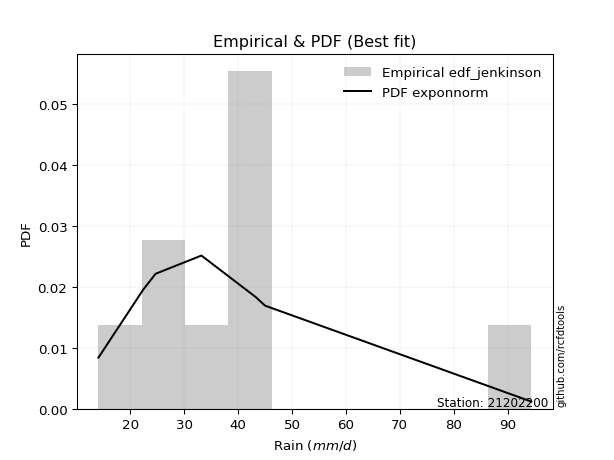</img>

</div>


### 11. Empirical - EDF Cunnane (1978)

Cunnane´s work in statistical hydrology has focused on the performance and evaluation of different probability distributions (such as GEV, Gumbel, Lognormal) for flood frequency estimation. _b_ is a constant, typically set to 0.4.

<div align="center">


$P=(m-b)/(n+1-2b)$


</div>


**11.1. Empirical values**

<div align="center">

|                | 0                   | 1                  | 2                   | 3                  | 4           | 5                  | 6                 | 7                  | 8                  |
|:---------------|:--------------------|:-------------------|:--------------------|:-------------------|:------------|:-------------------|:------------------|:-------------------|:-------------------|
| date           | 2016                | 2014               | 2015                | 2009               | 2010        | 2012               | 2008              | 2011               | 2013               |
| x              | 14.1                | 22.4               | 24.7                | 33.2               | 43.3        | 43.6               | 44.4              | 45.0               | 94.4               |
| m              | 1                   | 2                  | 3                   | 4                  | 5           | 6                  | 7                 | 8                  | 9                  |
| empirical_dist | edf_cunnane         | edf_cunnane        | edf_cunnane         | edf_cunnane        | edf_cunnane | edf_cunnane        | edf_cunnane       | edf_cunnane        | edf_cunnane        |
| empirical      | 0.06521739130434782 | 0.1739130434782609 | 0.28260869565217395 | 0.391304347826087  | 0.5         | 0.6086956521739131 | 0.717391304347826 | 0.8260869565217391 | 0.9347826086956522 |
| empirical_tr   | 1.069767441860465   | 1.2105263157894737 | 1.393939393939394   | 1.6428571428571428 | 2.0         | 2.555555555555556  | 3.538461538461538 | 5.75               | 15.333333333333343 |

</div>


**11.2. Kolmogorov-Smirnov fit test (sorted by Δ)**


<div align="center">

|                | 0                     | 1                   | 2                   | 3                   | 4                   | 5                   | 6                   | 7                   | 8                   | 9                   | 10                  | 11                  | 12                  | 13                  | 14                  | 15                  | 16                  | 17                  | 18                  | 19                  | 20                  | 21                  | 22                  | 23                  | 24                  | 25                  | 26                  | 27                  | 28                  | 29                  | 30                  | 31                  | 32                  | 33                  | 34                  | 35                  | 36                  | 37                  | 38                  | 39                  | 40                  | 41                  | 42                  | 43                  | 44                  | 45                  | 46                  | 47                  | 48                  | 49                  | 50                  | 51                  | 52                  | 53                  | 54                  | 55                  | 56                  | 57                  | 58                  | 59                  | 60                  | 61                  | 62                  | 63                  | 64                  | 65                  | 66                  | 67                  | 68                  | 69                  | 70                  | 71                  | 72                  | 73                  | 74                  | 75                  | 76                  | 77                  | 78                  | 79                  | 80                  | 81                  | 82                  | 83                  | 84                  | 85                  | 86                  | 87                  | 88                  | 89                  |
|:---------------|:----------------------|:--------------------|:--------------------|:--------------------|:--------------------|:--------------------|:--------------------|:--------------------|:--------------------|:--------------------|:--------------------|:--------------------|:--------------------|:--------------------|:--------------------|:--------------------|:--------------------|:--------------------|:--------------------|:--------------------|:--------------------|:--------------------|:--------------------|:--------------------|:--------------------|:--------------------|:--------------------|:--------------------|:--------------------|:--------------------|:--------------------|:--------------------|:--------------------|:--------------------|:--------------------|:--------------------|:--------------------|:--------------------|:--------------------|:--------------------|:--------------------|:--------------------|:--------------------|:--------------------|:--------------------|:--------------------|:--------------------|:--------------------|:--------------------|:--------------------|:--------------------|:--------------------|:--------------------|:--------------------|:--------------------|:--------------------|:--------------------|:--------------------|:--------------------|:--------------------|:--------------------|:--------------------|:--------------------|:--------------------|:--------------------|:--------------------|:--------------------|:--------------------|:--------------------|:--------------------|:--------------------|:--------------------|:--------------------|:--------------------|:--------------------|:--------------------|:--------------------|:--------------------|:--------------------|:--------------------|:--------------------|:--------------------|:--------------------|:--------------------|:--------------------|:--------------------|:--------------------|:--------------------|:--------------------|:--------------------|
| station        | 21202200              | 21202200            | 21202200            | 21202200            | 21202200            | 21202200            | 21202200            | 21202200            | 21202200            | 21202200            | 21202200            | 21202200            | 21202200            | 21202200            | 21202200            | 21202200            | 21202200            | 21202200            | 21202200            | 21202200            | 21202200            | 21202200            | 21202200            | 21202200            | 21202200            | 21202200            | 21202200            | 21202200            | 21202200            | 21202200            | 21202200            | 21202200            | 21202200            | 21202200            | 21202200            | 21202200            | 21202200            | 21202200            | 21202200            | 21202200            | 21202200            | 21202200            | 21202200            | 21202200            | 21202200            | 21202200            | 21202200            | 21202200            | 21202200            | 21202200            | 21202200            | 21202200            | 21202200            | 21202200            | 21202200            | 21202200            | 21202200            | 21202200            | 21202200            | 21202200            | 21202200            | 21202200            | 21202200            | 21202200            | 21202200            | 21202200            | 21202200            | 21202200            | 21202200            | 21202200            | 21202200            | 21202200            | 21202200            | 21202200            | 21202200            | 21202200            | 21202200            | 21202200            | 21202200            | 21202200            | 21202200            | 21202200            | 21202200            | 21202200            | 21202200            | 21202200            | 21202200            | 21202200            | 21202200            | 21202200            |
| empirical_dist | edf_cunnane           | edf_cunnane         | edf_cunnane         | edf_cunnane         | edf_cunnane         | edf_cunnane         | edf_cunnane         | edf_cunnane         | edf_cunnane         | edf_cunnane         | edf_cunnane         | edf_cunnane         | edf_cunnane         | edf_cunnane         | edf_cunnane         | edf_cunnane         | edf_cunnane         | edf_cunnane         | edf_cunnane         | edf_cunnane         | edf_cunnane         | edf_cunnane         | edf_cunnane         | edf_cunnane         | edf_cunnane         | edf_cunnane         | edf_cunnane         | edf_cunnane         | edf_cunnane         | edf_cunnane         | edf_cunnane         | edf_cunnane         | edf_cunnane         | edf_cunnane         | edf_cunnane         | edf_cunnane         | edf_cunnane         | edf_cunnane         | edf_cunnane         | edf_cunnane         | edf_cunnane         | edf_cunnane         | edf_cunnane         | edf_cunnane         | edf_cunnane         | edf_cunnane         | edf_cunnane         | edf_cunnane         | edf_cunnane         | edf_cunnane         | edf_cunnane         | edf_cunnane         | edf_cunnane         | edf_cunnane         | edf_cunnane         | edf_cunnane         | edf_cunnane         | edf_cunnane         | edf_cunnane         | edf_cunnane         | edf_cunnane         | edf_cunnane         | edf_cunnane         | edf_cunnane         | edf_cunnane         | edf_cunnane         | edf_cunnane         | edf_cunnane         | edf_cunnane         | edf_cunnane         | edf_cunnane         | edf_cunnane         | edf_cunnane         | edf_cunnane         | edf_cunnane         | edf_cunnane         | edf_cunnane         | edf_cunnane         | edf_cunnane         | edf_cunnane         | edf_cunnane         | edf_cunnane         | edf_cunnane         | edf_cunnane         | edf_cunnane         | edf_cunnane         | edf_cunnane         | edf_cunnane         | edf_cunnane         | edf_cunnane         |
| p_dist         | loglaplace_asymmetric | logjohnsonsu        | lognct              | logexponnorm        | logt                | lognorm             | lognorm             | logcrystalball      | invgauss            | logpearson3         | loggamma            | loggamma            | logerlang           | logweibull_min      | logf                | logfatiguelife      | ncf                 | logloggamma         | exponnorm           | johnsonsu           | moyal               | invgamma            | logbetaprime        | halflogistic        | loggenlogistic      | mielke              | logmielke           | logrice             | alpha               | logncf              | logfisk             | betaprime           | fisk                | genlogistic         | loginvgamma         | nct                 | pearson3            | logalpha            | gompertz            | loglogistic         | expon               | genexpon            | loginvgauss         | nakagami            | logmaxwell          | lograyleigh         | gumbel_r            | loginvweibull       | loghypsecant        | logkstwobign        | loggenexpon         | halfnorm            | f                   | loggompertz         | kstwobign           | loggumbel_l         | logtruncnorm        | loghalfnorm         | chi2                | laplace             | rayleigh            | loglaplace          | loggumbel_r         | wald                | t                   | maxwell             | logexpon            | loghalflogistic     | laplace_asymmetric  | rice                | hypsecant           | logmoyal            | logistic            | truncnorm           | norm                | crystalball         | gamma               | weibull_min         | gibrat              | logwald             | gumbel_l            | logchi2             | loggibrat           | lognakagami         | erlang              | loglognorm          | pareto              | invweibull          | logpareto           | fatiguelife         |
| delta          | 0.1424159468395617    | 0.14920947129561696 | 0.14930454996928022 | 0.14944276590618033 | 0.14951073355300604 | 0.14951338405530912 | 0.14951338405530912 | 0.14951428934221966 | 0.1499295068530262  | 0.1499340644969337  | 0.14996251132545835 | 0.14996251132545835 | 0.1499628132409555  | 0.14996411116060981 | 0.15078560395236007 | 0.15100168469914144 | 0.1513125994097434  | 0.1514083152916722  | 0.15264591398401572 | 0.15305263074889197 | 0.15365073327539613 | 0.15422394873332412 | 0.15433767411375143 | 0.15541605244046397 | 0.15551733248596222 | 0.15558329035459018 | 0.1556667774339393  | 0.15612679837349108 | 0.15620119730227122 | 0.157408768076592   | 0.15773314435235963 | 0.1579915123993424  | 0.15844424248503386 | 0.15923372216190257 | 0.1595810870594888  | 0.16052084193557015 | 0.16300206258183025 | 0.16458264045087134 | 0.1667352214703347  | 0.16688586655157556 | 0.16821713967113183 | 0.16826905476799936 | 0.1701742174293983  | 0.1702315527105127  | 0.17076652925764246 | 0.17730782592934813 | 0.1773113652597944  | 0.17962130390540187 | 0.18076651990322123 | 0.18086782566304205 | 0.18271032876903726 | 0.18347479129134625 | 0.1851167775021869  | 0.18877089722721085 | 0.18976475638672452 | 0.1901515774042749  | 0.19206921353893947 | 0.19632212482033473 | 0.19986534090179597 | 0.2012237565237912  | 0.20856948981564905 | 0.20897934619941438 | 0.20915534733253538 | 0.21371599686098197 | 0.21379656801528124 | 0.21742535398962737 | 0.21927558718083998 | 0.22445061072250994 | 0.224980500002685   | 0.22513476233009433 | 0.22618653990595372 | 0.2290652097978627  | 0.23499076963795096 | 0.24559035980185584 | 0.24559036630995357 | 0.24559036695716308 | 0.2560276489205129  | 0.2601939237626917  | 0.2773775623107843  | 0.2854654805272132  | 0.3086771629794488  | 0.3161020955909356  | 0.3176757475983266  | 0.33263376653921123 | 0.4144295964720126  | 0.4393261113854814  | 0.45536191863368825 | 0.46131834789573933 | 0.47047566659375517 | 0.5686814091452773  |
| deltao         | 0.41761268023100007   | 0.41761268023100007 | 0.41761268023100007 | 0.41761268023100007 | 0.41761268023100007 | 0.41761268023100007 | 0.41761268023100007 | 0.41761268023100007 | 0.41761268023100007 | 0.41761268023100007 | 0.41761268023100007 | 0.41761268023100007 | 0.41761268023100007 | 0.41761268023100007 | 0.41761268023100007 | 0.41761268023100007 | 0.41761268023100007 | 0.41761268023100007 | 0.41761268023100007 | 0.41761268023100007 | 0.41761268023100007 | 0.41761268023100007 | 0.41761268023100007 | 0.41761268023100007 | 0.41761268023100007 | 0.41761268023100007 | 0.41761268023100007 | 0.41761268023100007 | 0.41761268023100007 | 0.41761268023100007 | 0.41761268023100007 | 0.41761268023100007 | 0.41761268023100007 | 0.41761268023100007 | 0.41761268023100007 | 0.41761268023100007 | 0.41761268023100007 | 0.41761268023100007 | 0.41761268023100007 | 0.41761268023100007 | 0.41761268023100007 | 0.41761268023100007 | 0.41761268023100007 | 0.41761268023100007 | 0.41761268023100007 | 0.41761268023100007 | 0.41761268023100007 | 0.41761268023100007 | 0.41761268023100007 | 0.41761268023100007 | 0.41761268023100007 | 0.41761268023100007 | 0.41761268023100007 | 0.41761268023100007 | 0.41761268023100007 | 0.41761268023100007 | 0.41761268023100007 | 0.41761268023100007 | 0.41761268023100007 | 0.41761268023100007 | 0.41761268023100007 | 0.41761268023100007 | 0.41761268023100007 | 0.41761268023100007 | 0.41761268023100007 | 0.41761268023100007 | 0.41761268023100007 | 0.41761268023100007 | 0.41761268023100007 | 0.41761268023100007 | 0.41761268023100007 | 0.41761268023100007 | 0.41761268023100007 | 0.41761268023100007 | 0.41761268023100007 | 0.41761268023100007 | 0.41761268023100007 | 0.41761268023100007 | 0.41761268023100007 | 0.41761268023100007 | 0.41761268023100007 | 0.41761268023100007 | 0.41761268023100007 | 0.41761268023100007 | 0.41761268023100007 | 0.41761268023100007 | 0.41761268023100007 | 0.41761268023100007 | 0.41761268023100007 | 0.41761268023100007 |
| eval           | Δo > Δ                | Δo > Δ              | Δo > Δ              | Δo > Δ              | Δo > Δ              | Δo > Δ              | Δo > Δ              | Δo > Δ              | Δo > Δ              | Δo > Δ              | Δo > Δ              | Δo > Δ              | Δo > Δ              | Δo > Δ              | Δo > Δ              | Δo > Δ              | Δo > Δ              | Δo > Δ              | Δo > Δ              | Δo > Δ              | Δo > Δ              | Δo > Δ              | Δo > Δ              | Δo > Δ              | Δo > Δ              | Δo > Δ              | Δo > Δ              | Δo > Δ              | Δo > Δ              | Δo > Δ              | Δo > Δ              | Δo > Δ              | Δo > Δ              | Δo > Δ              | Δo > Δ              | Δo > Δ              | Δo > Δ              | Δo > Δ              | Δo > Δ              | Δo > Δ              | Δo > Δ              | Δo > Δ              | Δo > Δ              | Δo > Δ              | Δo > Δ              | Δo > Δ              | Δo > Δ              | Δo > Δ              | Δo > Δ              | Δo > Δ              | Δo > Δ              | Δo > Δ              | Δo > Δ              | Δo > Δ              | Δo > Δ              | Δo > Δ              | Δo > Δ              | Δo > Δ              | Δo > Δ              | Δo > Δ              | Δo > Δ              | Δo > Δ              | Δo > Δ              | Δo > Δ              | Δo > Δ              | Δo > Δ              | Δo > Δ              | Δo > Δ              | Δo > Δ              | Δo > Δ              | Δo > Δ              | Δo > Δ              | Δo > Δ              | Δo > Δ              | Δo > Δ              | Δo > Δ              | Δo > Δ              | Δo > Δ              | Δo > Δ              | Δo > Δ              | Δo > Δ              | Δo > Δ              | Δo > Δ              | Δo > Δ              | Δo > Δ              | Δo <= Δ             | Δo <= Δ             | Δo <= Δ             | Δo <= Δ             | Δo <= Δ             |
| fit            | 1                     | 1                   | 1                   | 1                   | 1                   | 1                   | 1                   | 1                   | 1                   | 1                   | 1                   | 1                   | 1                   | 1                   | 1                   | 1                   | 1                   | 1                   | 1                   | 1                   | 1                   | 1                   | 1                   | 1                   | 1                   | 1                   | 1                   | 1                   | 1                   | 1                   | 1                   | 1                   | 1                   | 1                   | 1                   | 1                   | 1                   | 1                   | 1                   | 1                   | 1                   | 1                   | 1                   | 1                   | 1                   | 1                   | 1                   | 1                   | 1                   | 1                   | 1                   | 1                   | 1                   | 1                   | 1                   | 1                   | 1                   | 1                   | 1                   | 1                   | 1                   | 1                   | 1                   | 1                   | 1                   | 1                   | 1                   | 1                   | 1                   | 1                   | 1                   | 1                   | 1                   | 1                   | 1                   | 1                   | 1                   | 1                   | 1                   | 1                   | 1                   | 1                   | 1                   | 1                   | 1                   | 0                   | 0                   | 0                   | 0                   | 0                   |
| n              | 9                     | 9                   | 9                   | 9                   | 9                   | 9                   | 9                   | 9                   | 9                   | 9                   | 9                   | 9                   | 9                   | 9                   | 9                   | 9                   | 9                   | 9                   | 9                   | 9                   | 9                   | 9                   | 9                   | 9                   | 9                   | 9                   | 9                   | 9                   | 9                   | 9                   | 9                   | 9                   | 9                   | 9                   | 9                   | 9                   | 9                   | 9                   | 9                   | 9                   | 9                   | 9                   | 9                   | 9                   | 9                   | 9                   | 9                   | 9                   | 9                   | 9                   | 9                   | 9                   | 9                   | 9                   | 9                   | 9                   | 9                   | 9                   | 9                   | 9                   | 9                   | 9                   | 9                   | 9                   | 9                   | 9                   | 9                   | 9                   | 9                   | 9                   | 9                   | 9                   | 9                   | 9                   | 9                   | 9                   | 9                   | 9                   | 9                   | 9                   | 9                   | 9                   | 9                   | 9                   | 9                   | 9                   | 9                   | 9                   | 9                   | 9                   |
| best_fit       | 1                     | 0                   | 0                   | 0                   | 0                   | 0                   | 0                   | 0                   | 0                   | 0                   | 0                   | 0                   | 0                   | 0                   | 0                   | 0                   | 0                   | 0                   | 0                   | 0                   | 0                   | 0                   | 0                   | 0                   | 0                   | 0                   | 0                   | 0                   | 0                   | 0                   | 0                   | 0                   | 0                   | 0                   | 0                   | 0                   | 0                   | 0                   | 0                   | 0                   | 0                   | 0                   | 0                   | 0                   | 0                   | 0                   | 0                   | 0                   | 0                   | 0                   | 0                   | 0                   | 0                   | 0                   | 0                   | 0                   | 0                   | 0                   | 0                   | 0                   | 0                   | 0                   | 0                   | 0                   | 0                   | 0                   | 0                   | 0                   | 0                   | 0                   | 0                   | 0                   | 0                   | 0                   | 0                   | 0                   | 0                   | 0                   | 0                   | 0                   | 0                   | 0                   | 0                   | 0                   | 0                   | 0                   | 0                   | 0                   | 0                   | 0                   |
| best_fit_sort  | 1                     | 2                   | 3                   | 4                   | 5                   | 6                   | 7                   | 8                   | 9                   | 10                  | 11                  | 12                  | 13                  | 14                  | 15                  | 16                  | 17                  | 18                  | 19                  | 20                  | 21                  | 22                  | 23                  | 24                  | 25                  | 26                  | 27                  | 28                  | 29                  | 30                  | 31                  | 32                  | 33                  | 34                  | 35                  | 36                  | 37                  | 38                  | 39                  | 40                  | 41                  | 42                  | 43                  | 44                  | 45                  | 46                  | 47                  | 48                  | 49                  | 50                  | 51                  | 52                  | 53                  | 54                  | 55                  | 56                  | 57                  | 58                  | 59                  | 60                  | 61                  | 62                  | 63                  | 64                  | 65                  | 66                  | 67                  | 68                  | 69                  | 70                  | 71                  | 72                  | 73                  | 74                  | 75                  | 76                  | 77                  | 78                  | 79                  | 80                  | 81                  | 82                  | 83                  | 84                  | 85                  | 86                  | 87                  | 88                  | 89                  | 90                  |

</div>


<div align="center">

</img>

</div>


**11.3. Best fit**

<div align="center">

|   id |   station | empirical_dist   | p_dist                |    delta |   deltao | eval   |   fit |   n |   best_fit |   best_fit_sort |
|-----:|----------:|:-----------------|:----------------------|---------:|---------:|:-------|------:|----:|-----------:|----------------:|
|    0 |  21202200 | edf_cunnane      | loglaplace_asymmetric | 0.142416 | 0.417613 | Δo > Δ |     1 |   9 |          1 |               1 |

</div>


<div align="center">

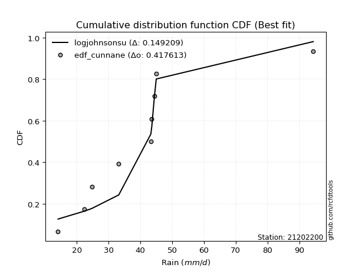</img>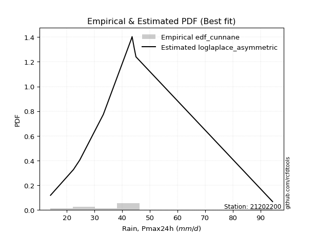</img>

</div>


### 12. Empirical - EDF Adamowski (1981)

The Adamowski formula in hydrology refers to a specific plotting position formula used for estimating the non-parametric empirical distribution of hydrological events (like flood peaks) to calculate their return periods. This formula provides an alternative to traditional parametric methods (like the Gumbel or Log Pearson Type III distributions). 

<div align="center">


$P=(m-0.25)/(n+0.5)$


</div>


**12.1. Empirical values**

<div align="center">

|                | 0                   | 1                   | 2                  | 3                   | 4             | 5                  | 6                  | 7                  | 8                  |
|:---------------|:--------------------|:--------------------|:-------------------|:--------------------|:--------------|:-------------------|:-------------------|:-------------------|:-------------------|
| date           | 2016                | 2014                | 2015               | 2009                | 2010          | 2012               | 2008               | 2011               | 2013               |
| x              | 14.1                | 22.4                | 24.7               | 33.2                | 43.3          | 43.6               | 44.4               | 45.0               | 94.4               |
| m              | 1                   | 2                   | 3                  | 4                   | 5             | 6                  | 7                  | 8                  | 9                  |
| empirical_dist | edf_adamowski       | edf_adamowski       | edf_adamowski      | edf_adamowski       | edf_adamowski | edf_adamowski      | edf_adamowski      | edf_adamowski      | edf_adamowski      |
| empirical      | 0.07894736842105263 | 0.18421052631578946 | 0.2894736842105263 | 0.39473684210526316 | 0.5           | 0.6052631578947368 | 0.7105263157894737 | 0.8157894736842105 | 0.9210526315789473 |
| empirical_tr   | 1.0857142857142856  | 1.2258064516129032  | 1.4074074074074074 | 1.6521739130434783  | 2.0           | 2.533333333333333  | 3.4545454545454546 | 5.428571428571428  | 12.666666666666663 |

</div>


**12.2. Kolmogorov-Smirnov fit test (sorted by Δ)**


<div align="center">

|                | 0                     | 1                   | 2                   | 3                   | 4                   | 5                   | 6                   | 7                   | 8                   | 9                   | 10                  | 11                  | 12                  | 13                  | 14                  | 15                  | 16                  | 17                  | 18                  | 19                  | 20                  | 21                  | 22                  | 23                  | 24                  | 25                  | 26                  | 27                  | 28                  | 29                  | 30                  | 31                  | 32                  | 33                  | 34                  | 35                  | 36                  | 37                  | 38                  | 39                  | 40                  | 41                  | 42                  | 43                  | 44                  | 45                  | 46                  | 47                  | 48                  | 49                  | 50                  | 51                  | 52                  | 53                  | 54                  | 55                  | 56                  | 57                  | 58                  | 59                  | 60                  | 61                  | 62                  | 63                  | 64                  | 65                  | 66                  | 67                  | 68                  | 69                  | 70                  | 71                  | 72                  | 73                  | 74                  | 75                  | 76                  | 77                  | 78                  | 79                  | 80                  | 81                  | 82                  | 83                  | 84                  | 85                  | 86                  | 87                  | 88                  | 89                  |
|:---------------|:----------------------|:--------------------|:--------------------|:--------------------|:--------------------|:--------------------|:--------------------|:--------------------|:--------------------|:--------------------|:--------------------|:--------------------|:--------------------|:--------------------|:--------------------|:--------------------|:--------------------|:--------------------|:--------------------|:--------------------|:--------------------|:--------------------|:--------------------|:--------------------|:--------------------|:--------------------|:--------------------|:--------------------|:--------------------|:--------------------|:--------------------|:--------------------|:--------------------|:--------------------|:--------------------|:--------------------|:--------------------|:--------------------|:--------------------|:--------------------|:--------------------|:--------------------|:--------------------|:--------------------|:--------------------|:--------------------|:--------------------|:--------------------|:--------------------|:--------------------|:--------------------|:--------------------|:--------------------|:--------------------|:--------------------|:--------------------|:--------------------|:--------------------|:--------------------|:--------------------|:--------------------|:--------------------|:--------------------|:--------------------|:--------------------|:--------------------|:--------------------|:--------------------|:--------------------|:--------------------|:--------------------|:--------------------|:--------------------|:--------------------|:--------------------|:--------------------|:--------------------|:--------------------|:--------------------|:--------------------|:--------------------|:--------------------|:--------------------|:--------------------|:--------------------|:--------------------|:--------------------|:--------------------|:--------------------|:--------------------|
| station        | 21202200              | 21202200            | 21202200            | 21202200            | 21202200            | 21202200            | 21202200            | 21202200            | 21202200            | 21202200            | 21202200            | 21202200            | 21202200            | 21202200            | 21202200            | 21202200            | 21202200            | 21202200            | 21202200            | 21202200            | 21202200            | 21202200            | 21202200            | 21202200            | 21202200            | 21202200            | 21202200            | 21202200            | 21202200            | 21202200            | 21202200            | 21202200            | 21202200            | 21202200            | 21202200            | 21202200            | 21202200            | 21202200            | 21202200            | 21202200            | 21202200            | 21202200            | 21202200            | 21202200            | 21202200            | 21202200            | 21202200            | 21202200            | 21202200            | 21202200            | 21202200            | 21202200            | 21202200            | 21202200            | 21202200            | 21202200            | 21202200            | 21202200            | 21202200            | 21202200            | 21202200            | 21202200            | 21202200            | 21202200            | 21202200            | 21202200            | 21202200            | 21202200            | 21202200            | 21202200            | 21202200            | 21202200            | 21202200            | 21202200            | 21202200            | 21202200            | 21202200            | 21202200            | 21202200            | 21202200            | 21202200            | 21202200            | 21202200            | 21202200            | 21202200            | 21202200            | 21202200            | 21202200            | 21202200            | 21202200            |
| empirical_dist | edf_adamowski         | edf_adamowski       | edf_adamowski       | edf_adamowski       | edf_adamowski       | edf_adamowski       | edf_adamowski       | edf_adamowski       | edf_adamowski       | edf_adamowski       | edf_adamowski       | edf_adamowski       | edf_adamowski       | edf_adamowski       | edf_adamowski       | edf_adamowski       | edf_adamowski       | edf_adamowski       | edf_adamowski       | edf_adamowski       | edf_adamowski       | edf_adamowski       | edf_adamowski       | edf_adamowski       | edf_adamowski       | edf_adamowski       | edf_adamowski       | edf_adamowski       | edf_adamowski       | edf_adamowski       | edf_adamowski       | edf_adamowski       | edf_adamowski       | edf_adamowski       | edf_adamowski       | edf_adamowski       | edf_adamowski       | edf_adamowski       | edf_adamowski       | edf_adamowski       | edf_adamowski       | edf_adamowski       | edf_adamowski       | edf_adamowski       | edf_adamowski       | edf_adamowski       | edf_adamowski       | edf_adamowski       | edf_adamowski       | edf_adamowski       | edf_adamowski       | edf_adamowski       | edf_adamowski       | edf_adamowski       | edf_adamowski       | edf_adamowski       | edf_adamowski       | edf_adamowski       | edf_adamowski       | edf_adamowski       | edf_adamowski       | edf_adamowski       | edf_adamowski       | edf_adamowski       | edf_adamowski       | edf_adamowski       | edf_adamowski       | edf_adamowski       | edf_adamowski       | edf_adamowski       | edf_adamowski       | edf_adamowski       | edf_adamowski       | edf_adamowski       | edf_adamowski       | edf_adamowski       | edf_adamowski       | edf_adamowski       | edf_adamowski       | edf_adamowski       | edf_adamowski       | edf_adamowski       | edf_adamowski       | edf_adamowski       | edf_adamowski       | edf_adamowski       | edf_adamowski       | edf_adamowski       | edf_adamowski       | edf_adamowski       |
| p_dist         | loglaplace_asymmetric | exponnorm           | moyal               | halflogistic        | logloggamma         | logncf              | genlogistic         | logcrystalball      | lognorm             | lognorm             | logt                | logexponnorm        | lognct              | invgauss            | logpearson3         | loggamma            | loggamma            | logerlang           | logweibull_min      | logf                | logfatiguelife      | ncf                 | logjohnsonsu        | pearson3            | johnsonsu           | invgamma            | logbetaprime        | loggenlogistic      | mielke              | logmielke           | logrice             | alpha               | gompertz            | logfisk             | betaprime           | fisk                | loginvgamma         | nakagami            | nct                 | logalpha            | loglogistic         | gumbel_r            | expon               | genexpon            | loginvgauss         | logmaxwell          | halfnorm            | lograyleigh         | kstwobign           | loginvweibull       | loggumbel_l         | loghypsecant        | logkstwobign        | loggenexpon         | f                   | loggompertz         | laplace             | logtruncnorm        | loghalfnorm         | rayleigh            | chi2                | t                   | maxwell             | logexpon            | loglaplace          | loggumbel_r         | wald                | laplace_asymmetric  | rice                | hypsecant           | loghalflogistic     | logistic            | logmoyal            | truncnorm           | norm                | crystalball         | weibull_min         | gamma               | gibrat              | logwald             | gumbel_l            | logchi2             | loggibrat           | lognakagami         | erlang              | loglognorm          | pareto              | invweibull          | logpareto           | fatiguelife         |
| delta          | 0.13234005198111587   | 0.14339653660724627 | 0.14478272579566243 | 0.14511856960293534 | 0.14706267007430884 | 0.14711128523906336 | 0.14893623932437394 | 0.14902646733792269 | 0.14902740576232898 | 0.14902740576232898 | 0.149030116288706   | 0.14910439410884158 | 0.14925061095208492 | 0.1499295068530262  | 0.1499340644969337  | 0.14996251132545835 | 0.14996251132545835 | 0.1499628132409555  | 0.14996411116060981 | 0.15078560395236007 | 0.15100168469914144 | 0.1513125994097434  | 0.15264196557479315 | 0.15270457974430163 | 0.15305263074889197 | 0.15422394873332412 | 0.15433767411375143 | 0.15551733248596222 | 0.15558329035459018 | 0.1556667774339393  | 0.15612679837349108 | 0.15620119730227122 | 0.15643773863280608 | 0.15773314435235963 | 0.1579915123993424  | 0.15844424248503386 | 0.1595810870594888  | 0.15993406987298409 | 0.16052084193557015 | 0.16458264045087134 | 0.16688586655157556 | 0.16701388242226578 | 0.16821713967113183 | 0.16826905476799936 | 0.1701742174293983  | 0.17076652925764246 | 0.17317730845381762 | 0.17730782592934813 | 0.1794672735491959  | 0.17962130390540187 | 0.17985409456674628 | 0.18076651990322123 | 0.18086782566304205 | 0.18271032876903726 | 0.1851167775021869  | 0.18877089722721085 | 0.19092627368626258 | 0.19206921353893947 | 0.19632212482033473 | 0.19827200697812042 | 0.19986534090179597 | 0.20349908517775261 | 0.20712787115209874 | 0.2089781043433114  | 0.20897934619941438 | 0.20915534733253538 | 0.21371599686098197 | 0.21468301716515636 | 0.2148372794925657  | 0.2158890570684251  | 0.22445061072250994 | 0.22469328680042233 | 0.2290652097978627  | 0.2352928769643272  | 0.23529288347242494 | 0.23529288411963445 | 0.24989644092516308 | 0.2560276489205129  | 0.2842425508691367  | 0.2854654805272132  | 0.2983796801419202  | 0.305804612753407   | 0.3176757475983266  | 0.32920127226003504 | 0.404132113634484   | 0.42902862854795276 | 0.4450644357961596  | 0.44758837077903446 | 0.46017818375622654 | 0.5583839263077487  |
| deltao         | 0.41761268023100007   | 0.41761268023100007 | 0.41761268023100007 | 0.41761268023100007 | 0.41761268023100007 | 0.41761268023100007 | 0.41761268023100007 | 0.41761268023100007 | 0.41761268023100007 | 0.41761268023100007 | 0.41761268023100007 | 0.41761268023100007 | 0.41761268023100007 | 0.41761268023100007 | 0.41761268023100007 | 0.41761268023100007 | 0.41761268023100007 | 0.41761268023100007 | 0.41761268023100007 | 0.41761268023100007 | 0.41761268023100007 | 0.41761268023100007 | 0.41761268023100007 | 0.41761268023100007 | 0.41761268023100007 | 0.41761268023100007 | 0.41761268023100007 | 0.41761268023100007 | 0.41761268023100007 | 0.41761268023100007 | 0.41761268023100007 | 0.41761268023100007 | 0.41761268023100007 | 0.41761268023100007 | 0.41761268023100007 | 0.41761268023100007 | 0.41761268023100007 | 0.41761268023100007 | 0.41761268023100007 | 0.41761268023100007 | 0.41761268023100007 | 0.41761268023100007 | 0.41761268023100007 | 0.41761268023100007 | 0.41761268023100007 | 0.41761268023100007 | 0.41761268023100007 | 0.41761268023100007 | 0.41761268023100007 | 0.41761268023100007 | 0.41761268023100007 | 0.41761268023100007 | 0.41761268023100007 | 0.41761268023100007 | 0.41761268023100007 | 0.41761268023100007 | 0.41761268023100007 | 0.41761268023100007 | 0.41761268023100007 | 0.41761268023100007 | 0.41761268023100007 | 0.41761268023100007 | 0.41761268023100007 | 0.41761268023100007 | 0.41761268023100007 | 0.41761268023100007 | 0.41761268023100007 | 0.41761268023100007 | 0.41761268023100007 | 0.41761268023100007 | 0.41761268023100007 | 0.41761268023100007 | 0.41761268023100007 | 0.41761268023100007 | 0.41761268023100007 | 0.41761268023100007 | 0.41761268023100007 | 0.41761268023100007 | 0.41761268023100007 | 0.41761268023100007 | 0.41761268023100007 | 0.41761268023100007 | 0.41761268023100007 | 0.41761268023100007 | 0.41761268023100007 | 0.41761268023100007 | 0.41761268023100007 | 0.41761268023100007 | 0.41761268023100007 | 0.41761268023100007 |
| eval           | Δo > Δ                | Δo > Δ              | Δo > Δ              | Δo > Δ              | Δo > Δ              | Δo > Δ              | Δo > Δ              | Δo > Δ              | Δo > Δ              | Δo > Δ              | Δo > Δ              | Δo > Δ              | Δo > Δ              | Δo > Δ              | Δo > Δ              | Δo > Δ              | Δo > Δ              | Δo > Δ              | Δo > Δ              | Δo > Δ              | Δo > Δ              | Δo > Δ              | Δo > Δ              | Δo > Δ              | Δo > Δ              | Δo > Δ              | Δo > Δ              | Δo > Δ              | Δo > Δ              | Δo > Δ              | Δo > Δ              | Δo > Δ              | Δo > Δ              | Δo > Δ              | Δo > Δ              | Δo > Δ              | Δo > Δ              | Δo > Δ              | Δo > Δ              | Δo > Δ              | Δo > Δ              | Δo > Δ              | Δo > Δ              | Δo > Δ              | Δo > Δ              | Δo > Δ              | Δo > Δ              | Δo > Δ              | Δo > Δ              | Δo > Δ              | Δo > Δ              | Δo > Δ              | Δo > Δ              | Δo > Δ              | Δo > Δ              | Δo > Δ              | Δo > Δ              | Δo > Δ              | Δo > Δ              | Δo > Δ              | Δo > Δ              | Δo > Δ              | Δo > Δ              | Δo > Δ              | Δo > Δ              | Δo > Δ              | Δo > Δ              | Δo > Δ              | Δo > Δ              | Δo > Δ              | Δo > Δ              | Δo > Δ              | Δo > Δ              | Δo > Δ              | Δo > Δ              | Δo > Δ              | Δo > Δ              | Δo > Δ              | Δo > Δ              | Δo > Δ              | Δo > Δ              | Δo > Δ              | Δo > Δ              | Δo > Δ              | Δo > Δ              | Δo <= Δ             | Δo <= Δ             | Δo <= Δ             | Δo <= Δ             | Δo <= Δ             |
| fit            | 1                     | 1                   | 1                   | 1                   | 1                   | 1                   | 1                   | 1                   | 1                   | 1                   | 1                   | 1                   | 1                   | 1                   | 1                   | 1                   | 1                   | 1                   | 1                   | 1                   | 1                   | 1                   | 1                   | 1                   | 1                   | 1                   | 1                   | 1                   | 1                   | 1                   | 1                   | 1                   | 1                   | 1                   | 1                   | 1                   | 1                   | 1                   | 1                   | 1                   | 1                   | 1                   | 1                   | 1                   | 1                   | 1                   | 1                   | 1                   | 1                   | 1                   | 1                   | 1                   | 1                   | 1                   | 1                   | 1                   | 1                   | 1                   | 1                   | 1                   | 1                   | 1                   | 1                   | 1                   | 1                   | 1                   | 1                   | 1                   | 1                   | 1                   | 1                   | 1                   | 1                   | 1                   | 1                   | 1                   | 1                   | 1                   | 1                   | 1                   | 1                   | 1                   | 1                   | 1                   | 1                   | 0                   | 0                   | 0                   | 0                   | 0                   |
| n              | 9                     | 9                   | 9                   | 9                   | 9                   | 9                   | 9                   | 9                   | 9                   | 9                   | 9                   | 9                   | 9                   | 9                   | 9                   | 9                   | 9                   | 9                   | 9                   | 9                   | 9                   | 9                   | 9                   | 9                   | 9                   | 9                   | 9                   | 9                   | 9                   | 9                   | 9                   | 9                   | 9                   | 9                   | 9                   | 9                   | 9                   | 9                   | 9                   | 9                   | 9                   | 9                   | 9                   | 9                   | 9                   | 9                   | 9                   | 9                   | 9                   | 9                   | 9                   | 9                   | 9                   | 9                   | 9                   | 9                   | 9                   | 9                   | 9                   | 9                   | 9                   | 9                   | 9                   | 9                   | 9                   | 9                   | 9                   | 9                   | 9                   | 9                   | 9                   | 9                   | 9                   | 9                   | 9                   | 9                   | 9                   | 9                   | 9                   | 9                   | 9                   | 9                   | 9                   | 9                   | 9                   | 9                   | 9                   | 9                   | 9                   | 9                   |
| best_fit       | 1                     | 0                   | 0                   | 0                   | 0                   | 0                   | 0                   | 0                   | 0                   | 0                   | 0                   | 0                   | 0                   | 0                   | 0                   | 0                   | 0                   | 0                   | 0                   | 0                   | 0                   | 0                   | 0                   | 0                   | 0                   | 0                   | 0                   | 0                   | 0                   | 0                   | 0                   | 0                   | 0                   | 0                   | 0                   | 0                   | 0                   | 0                   | 0                   | 0                   | 0                   | 0                   | 0                   | 0                   | 0                   | 0                   | 0                   | 0                   | 0                   | 0                   | 0                   | 0                   | 0                   | 0                   | 0                   | 0                   | 0                   | 0                   | 0                   | 0                   | 0                   | 0                   | 0                   | 0                   | 0                   | 0                   | 0                   | 0                   | 0                   | 0                   | 0                   | 0                   | 0                   | 0                   | 0                   | 0                   | 0                   | 0                   | 0                   | 0                   | 0                   | 0                   | 0                   | 0                   | 0                   | 0                   | 0                   | 0                   | 0                   | 0                   |
| best_fit_sort  | 1                     | 2                   | 3                   | 4                   | 5                   | 6                   | 7                   | 8                   | 9                   | 10                  | 11                  | 12                  | 13                  | 14                  | 15                  | 16                  | 17                  | 18                  | 19                  | 20                  | 21                  | 22                  | 23                  | 24                  | 25                  | 26                  | 27                  | 28                  | 29                  | 30                  | 31                  | 32                  | 33                  | 34                  | 35                  | 36                  | 37                  | 38                  | 39                  | 40                  | 41                  | 42                  | 43                  | 44                  | 45                  | 46                  | 47                  | 48                  | 49                  | 50                  | 51                  | 52                  | 53                  | 54                  | 55                  | 56                  | 57                  | 58                  | 59                  | 60                  | 61                  | 62                  | 63                  | 64                  | 65                  | 66                  | 67                  | 68                  | 69                  | 70                  | 71                  | 72                  | 73                  | 74                  | 75                  | 76                  | 77                  | 78                  | 79                  | 80                  | 81                  | 82                  | 83                  | 84                  | 85                  | 86                  | 87                  | 88                  | 89                  | 90                  |

</div>


<div align="center">

</img>

</div>


**12.3. Best fit**

<div align="center">

|   id |   station | empirical_dist   | p_dist                |   delta |   deltao | eval   |   fit |   n |   best_fit |   best_fit_sort |
|-----:|----------:|:-----------------|:----------------------|--------:|---------:|:-------|------:|----:|-----------:|----------------:|
|    0 |  21202200 | edf_adamowski    | loglaplace_asymmetric | 0.13234 | 0.417613 | Δo > Δ |     1 |   9 |          1 |               1 |

</div>


<div align="center">

</img>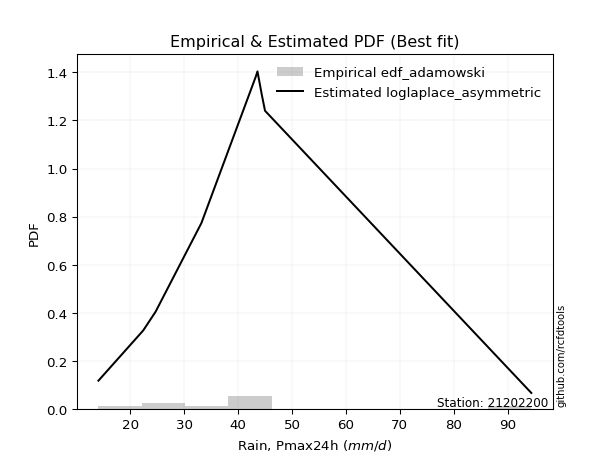</img>

</div>


## C. Best fit & Estimate extreme values for specific return periods - Tr


### 1. Best fit (ordered by delta Δ)

<div align="center">

|   id |   station | empirical_dist   | p_dist                |    delta |   deltao | eval   |   fit |   n |   best_fit |   best_fit_sort |
|-----:|----------:|:-----------------|:----------------------|---------:|---------:|:-------|------:|----:|-----------:|----------------:|
|    0 |  21202200 | edf_adamowski    | loglaplace_asymmetric | 0.13234  | 0.417613 | Δo > Δ |     1 |   9 |          1 |               1 |
|    1 |  21202200 | edf_weibull      | loglaplace_asymmetric | 0.13234  | 0.417613 | Δo > Δ |     1 |   9 |          1 |               2 |
|    2 |  21202200 | edf_chegodayev   | loglaplace_asymmetric | 0.135478 | 0.417613 | Δo > Δ |     1 |   9 |          1 |               3 |
|    3 |  21202200 | edf_jenkinson    | loglaplace_asymmetric | 0.136158 | 0.417613 | Δo > Δ |     1 |   9 |          1 |               4 |
|    4 |  21202200 | edf_beard        | loglaplace_asymmetric | 0.136158 | 0.417613 | Δo > Δ |     1 |   9 |          1 |               5 |
|    5 |  21202200 | edf_filliben     | loglaplace_asymmetric | 0.136671 | 0.417613 | Δo > Δ |     1 |   9 |          1 |               6 |
|    6 |  21202200 | edf_tukey        | loglaplace_asymmetric | 0.137758 | 0.417613 | Δo > Δ |     1 |   9 |          1 |               7 |
|    7 |  21202200 | edf_blom         | loglaplace_asymmetric | 0.140653 | 0.417613 | Δo > Δ |     1 |   9 |          1 |               8 |
|    8 |  21202200 | edf_cunnane      | loglaplace_asymmetric | 0.142416 | 0.417613 | Δo > Δ |     1 |   9 |          1 |               9 |
|    9 |  21202200 | edf_gringorten   | loglaplace_asymmetric | 0.145276 | 0.417613 | Δo > Δ |     1 |   9 |          1 |              10 |
|   10 |  21202200 | edf_hazen        | logjohnsonsu          | 0.146794 | 0.417613 | Δo > Δ |     1 |   9 |          1 |              11 |
|   11 |  21202200 | edf_california   | loglaplace            | 0.153424 | 0.417613 | Δo > Δ |     1 |   9 |          1 |              12 |

</div>

:file_folder:Tables: [bestfit_21202200.csv](table/bestfit_21202200.csv) | [extreme_21202200.csv](table/extreme_21202200.csv)


### 2. Extreme values

In hydrology, a return period (or recurrence interval $Tr$) is the statistical average time between extreme events like floods or droughts of a specific magnitude, indicating how rare an event is, with a 100-year flood, for example, having a 1% chance of occurring in any given year, not that it happens exactly every century. It is a key tool for infrastructure design (like bridges or dams) and risk assessment, calculated from historical data to determine the probability of future events, although it is important to remember it is statistical average, and events can cluster or be missed.

> risk_rate: assuming the return period as the project useful life.

|   id |      tr |   prob_l |     prob_g |    alpha |   betaprime |     chi2 |   crystalball |   erlang |    expon |   exponnorm |        f |   fatiguelife |     fisk |    gamma |   genexpon |   genlogistic |   gibrat |   gompertz |   gumbel_l |   gumbel_r |   halflogistic |   halfnorm |   hypsecant |   invgamma |   invgauss |     invweibull |   johnsonsu |   kstwobign |   laplace |   laplace_asymmetric |   loggamma |   logistic |   lognorm |   maxwell |   mielke |    moyal |   nakagami |      ncf |      nct |     norm |           pareto |   pearson3 |   rayleigh |     rice |        t |   truncnorm |     wald |   weibull_min |   logalpha |   logbetaprime |     logchi2 |   logcrystalball |   logerlang |   logexpon |   logexponnorm |     logf |   logfatiguelife |   logfisk |   loggenexpon |   loggenlogistic |   loggibrat |   loggompertz |   loggumbel_l |   loggumbel_r |   loghalflogistic |   loghalfnorm |   loghypsecant |   loginvgamma |   loginvgauss |   loginvweibull |     logjohnsonsu |   logkstwobign |   loglaplace |   loglaplace_asymmetric |   logloggamma |   loglogistic |    loglognorm |   logmaxwell |   logmielke |   logmoyal |   lognakagami |   logncf |   lognct |     logpareto |   logpearson3 |   lograyleigh |   logrice |     logt |   logtruncnorm |   logwald |   logweibull_min |   station |   n |   risk_rate |
|-----:|--------:|---------:|-----------:|---------:|------------:|---------:|--------------:|---------:|---------:|------------:|---------:|--------------:|---------:|---------:|-----------:|--------------:|---------:|-----------:|-----------:|-----------:|---------------:|-----------:|------------:|-----------:|-----------:|---------------:|------------:|------------:|----------:|---------------------:|-----------:|-----------:|----------:|----------:|---------:|---------:|-----------:|---------:|---------:|---------:|-----------------:|-----------:|-----------:|---------:|---------:|------------:|---------:|--------------:|-----------:|---------------:|------------:|-----------------:|------------:|-----------:|---------------:|---------:|-----------------:|----------:|--------------:|-----------------:|------------:|--------------:|--------------:|--------------:|------------------:|--------------:|---------------:|--------------:|--------------:|----------------:|-----------------:|---------------:|-------------:|------------------------:|--------------:|--------------:|--------------:|-------------:|------------:|-----------:|--------------:|---------:|---------:|--------------:|--------------:|--------------:|----------:|---------:|---------------:|----------:|-----------------:|----------:|----:|------------:|
|    0 |    2    | 0.5      | 0.5        |  35.6536 |     35.0612 |  30.2393 |       40.5667 |  19.3575 |  32.4453 |     36.5074 |  30.9052 |       14.1005 |  35.7498 |  28.1239 |    32.6032 |       36.8008 |  34.0165 |    35.0046 |    44.1516 |    36.9817 |        35.1995 |    36.0998 |     40.5667 |    35.4921 |    35.3378 |  265.735       |     35.3401 |     37.8672 |   40.5667 |              41.8714 |    35.5628 |    40.5667 |   35.6163 |   38.7004 |  36.1485 |  35.8244 |    34.7474 |  35.5845 |  35.5287 |  40.5667 |     14.8579      |    35.7759 |    38.0384 |  39.7489 |  38.8259 |     40.5667 |  33.4931 |       26.1488 |    34.6182 |        35.2581 |     22.8777 |          35.6164 |     35.5628 |    26.8017 |        35.6123 |  35.5167 |          35.5108 |   35.8763 |       32.0994 |          36.1535 |     30.5561 |       30.8952 |       38.7319 |       32.7514 |           31.4136 |       32.0825 |        35.6163 |       34.9429 |       34.1785 |         32.6979 |     42.936       |        32.1073 |      35.6163 |                 38.8898 |       35.6965 |       35.6163 |  14.3699      |      34.0949 |     36.2981 |    31.8766 |       23.5242 |  35.0106 |  35.6056 |  14.5337      |       35.5643 |       33.571  |   34.9847 |  35.6162 |        33.4069 |   30.185  |          35.2999 |  21202200 |   9 |    0.75     |
|    1 |    2.33 | 0.570815 | 0.429185   |  38.8575 |     38.4571 |  34.1059 |       44.4607 |  21.7068 |  36.4873 |     39.649  |  34.9301 |       14.7238 |  38.8439 |  31.3321 |    36.5872 |       40.0397 |  35.9891 |    39.0977 |    47.5395 |    40.59   |        38.9094 |    40.3025 |     43.6831 |    38.8026 |    38.8206 | 6178.82        |     38.74   |     41.4134 |   42.9232 |              44.0277 |    38.9561 |    43.9976 |   39.013  |   42.746  |  39.1785 |  39.2401 |    39.0817 |  38.9347 |  38.67   |  44.4607 |     16.6745      |    39.468  |    42.1439 |  43.3835 |  42.6806 |     44.4607 |  36.0464 |       31.6696 |    37.9829 |        38.6532 |     27.1432 |          39.0131 |     38.9561 |    30.8761 |        39.0085 |  38.9072 |          38.8976 |   38.9464 |       35.7877 |          39.1833 |     31.9992 |       34.8234 |       41.9263 |       35.6358 |           34.2617 |       35.3969 |        38.3097 |       38.3189 |       37.5561 |         36.2033 |     43.5912      |        35.7716 |      37.6348 |                 41.3191 |       39.1134 |       38.5926 |  16.1784      |      37.4791 |     39.2879 |    34.5281 |       24.8304 |  38.7589 |  39.0007 |  15.6286      |       38.9577 |       36.955  |   38.4418 |  39.0129 |        36.3102 |   32.0428 |          38.8027 |  21202200 |   9 |    0.729209 |
|    2 |    5    | 0.8      | 0.2        |  53.7609 |     54.2671 |  53.8907 |       58.9321 |  36.9513 |  56.6965 |     54.3233 |  56.0228 |       27.9562 |  53.6966 |  47.5364 |    56.4825 |       54.1084 |  47.3458 |    57.4546 |    58.4842 |    56.266  |        55.6958 |    58.0752 |     56.1837 |    54.3005 |    55.0974 |    6.68306e+09 |     54.6855 |     56.4769 |   54.7051 |              54.1706 |    54.7048 |    57.2449 |   54.73   |   58.6694 |  53.0945 |  55.0619 |    58.0519 |  54.4951 |  53.5234 |  58.9321 |   1163.39        |    56.0746 |    58.5801 |  57.9343 |  57.4766 |     58.9321 |  50.3402 |       73.5277 |    54.4579 |        54.7138 |     73.699  |          54.7301 |     54.7049 |    62.6478 |        54.7273 |  54.671  |          54.6569 |   53.4757 |       55.5602 |          53.0916 |     41.7372 |       55.3709 |       54.1597 |       51.421  |           50.7405 |       53.644  |        51.3221 |       54.5789 |       54.3573 |         56.3504 |     44.9918      |        56.6116 |      49.5774 |                 50.5841 |       54.844  |       52.6121 |   2.17568e+95 |      54.3947 |     52.6375 |    49.9929 |       45.1234 |  57.2349 |  54.7204 |   1.32951e+21 |       54.7064 |       54.2812 |   54.8614 |  54.7298 |        53.9199 |   44.7646 |          55.0903 |  21202200 |   9 |    0.67232  |
|    3 |   10    | 0.9      | 0.1        |  67.4026 |     68.1933 |  72.2061 |       68.532  |  53.8278 |  75.0418 |     67.4267 |  76.4295 |       46.2267 |  68.3442 |  62.3744 |    74.539  |       65.5655 |  60.2911 |    71.717  |    64.5778 |    69.0339 |        69.6362 |    71.2265 |     66.1658 |    68.2901 |    69.3031 |    5.50103e+14 |     68.9006 |     67.9458 |   65.4004 |              63.3781 |    68.5732 |    67.001  |   68.5097 |   69.8754 |  66.1141 |  68.8372 |    72.394  |  68.3353 |  67.4463 |  68.532  | 291973           |    69.7572 |    70.2993 |  68.3093 |  68.2658 |     68.532  |  65.5093 |      131.222  |    70.1713 |        69.2551 |    205.622  |          68.5098 |     68.5735 |   119.083  |        68.5135 |  68.5887 |          68.5877 |   67.5397 |       76.2242 |          66.0982 |     56.5    |       75.08   |       62.457  |       69.3188 |           70.305  |       72.9674 |        64.8207 |       69.6998 |       70.7048 |         80.7976 |     47.3227      |        80.2968 |      63.6705 |                 60.3699 |       68.5301 |       66.0996 | inf           |      70.6969 |     64.9421 |    69.0006 |       96.6065 |  74.9169 |  68.5178 | inf           |       68.5736 |       71.4014 |   69.686  |  68.5094 |        75.2174 |   63.8309 |          69.2605 |  21202200 |   9 |    0.651322 |
|    4 |   15    | 0.933333 | 0.0666667  |  75.882  |     76.4256 |  83.0084 |       73.3225 |  64.4919 |  85.7731 |     75.0903 |  88.9036 |       58.1759 |  78.0037 |  71.0859 |    85.1014 |       72.0292 |  69.2201 |    79.238  |    67.3374 |    76.2374 |        77.5253 |    78.0705 |     71.8625 |    76.7615 |    77.5612 |    3.2637e+17  |     77.3655 |     74.0345 |   71.6568 |              68.7641 |    76.7744 |    72.3166 |   76.6337 |   75.6251 |  74.4399 |  76.8318 |    79.8959 |  76.6198 |  76.1965 |  73.3225 |      7.44893e+06 |    77.4221 |    76.3376 |  73.655  |  74.1444 |     73.3225 |  75.2502 |      173.35   |    80.0052 |        78.0209 |    386.323  |          76.6338 |     76.7748 |   173.389  |        76.6436 |  76.8339 |          76.8479 |   76.7023 |       89.7594 |          74.4145 |     69.6255 |       86.9888 |       66.6218 |       82.0412 |           84.5546 |       85.6362 |        74.0606 |       78.9891 |       81.061  |         99.0137 |     50.4311      |        96.6677 |      73.7051 |                 66.9498 |       76.5554 |       74.8515 | inf           |      80.8746 |     72.8732 |    83.19   |      151.48   |  85.9707 |  76.6594 | inf           |       76.7738 |       82.2339 |   78.5735 |  76.6334 |        90.5113 |   80.165  |          77.5191 |  21202200 |   9 |    0.644736 |
|    5 |   20    | 0.95     | 0.05       |  82.2286 |     82.35   |  90.7013 |       76.4598 |  72.3148 |  93.387  |     80.5277 |  97.9955 |       67.0228 |  85.4905 |  77.2771 |    92.5955 |       76.5548 |  76.2243 |    84.2639 |    69.0552 |    81.2811 |        83.0526 |    82.6334 |     75.8813 |    82.9589 |    83.4223 |    2.85417e+19 |     83.4797 |     78.136  |   76.0958 |              72.5855 |    82.676  |    75.9906 |   82.4691 |   79.441  |  80.7811 |  82.4937 |    84.9047 |  82.636  |  82.7644 |  76.4598 |      7.41675e+07 |    82.7514 |    80.3511 |  77.2081 |  78.2275 |     76.4598 |  82.5091 |      206.914  |    87.3333 |        84.4025 |    610.298  |          82.4692 |     82.6766 |   226.356  |        82.4843 |  82.7738 |          82.8016 |   83.7519 |      100.076  |          80.7481 |     82.0221 |       95.5884 |       69.3533 |       92.3149 |           96.2261 |       95.2826 |        81.3607 |       85.8311 |       88.8311 |        114.161  |     54.1877      |       109.538  |      81.7699 |                 72.0488 |       82.3008 |       81.569  | inf           |      88.4256 |     78.9805 |    94.971  |      206.534  |  94.1929 |  82.5106 | inf           |       82.6745 |       90.3284 |   85.0163 |  82.4688 |       102.819  |   95.0003 |          83.4014 |  21202200 |   9 |    0.641514 |
|    6 |   25    | 0.96     | 0.04       |  87.3792 |     87.005  |  96.6819 |       78.7692 |  78.5044 |  99.2929 |     84.7453 | 105.187  |       74.052  |  91.7121 |  82.0843 |    98.4084 |       80.0407 |  82.0634 |    88.0023 |    70.2775 |    85.1661 |        87.3111 |    86.0284 |     78.9915 |    87.8893 |    87.9747 |    8.93617e+20 |     88.2947 |     81.2081 |   79.5389 |              75.5496 |    87.3118 |    78.8012 |   87.0468 |   82.2739 |  85.9863 |  86.8823 |    88.6337 |  87.3965 |  88.0936 |  78.7692 |      4.40977e+08 |    86.8331 |    83.3331 |  79.848  |  81.37   |     78.7692 |  88.3233 |      235.025  |    93.238  |        89.4576 |    874.197  |          87.0469 |     87.3126 |   278.351  |        87.0668 |  87.4433 |          87.4838 |   89.5792 |      108.51   |          85.947  |     94.0278 |      102.339  |       71.365  |      101.097  |          106.306  |      103.158  |        87.5007 |       91.297  |       95.1216 |        127.391  |     58.5425      |       120.289  |      88.6283 |                 76.2698 |       86.7972 |       87.112  | inf           |      94.4838 |     84.0463 |   105.239  |      260.943  | 100.806  |  87.1027 | inf           |       87.3096 |       96.8541 |   90.1025 |  87.0464 |       113.277  |  108.84   |          87.9858 |  21202200 |   9 |    0.639603 |
|    7 |   50    | 0.98     | 0.02       | 104.953  |    101.865  | 115.321  |       85.3824 |  98.2786 | 117.638  |     97.8462 | 128.316  |       96.605  | 113.743  |  97.0386 |   116.465  |       90.779  | 102.646  |    98.8285 |    73.5957 |    97.1339 |       100.432  |    95.8963 |     88.6344 |   103.995  |   102.172  |    3.61917e+25 |    103.712  |     90.2296 |   90.2342 |              84.7571 |   102.095  |    87.3884 |  101.61   |   90.4898 | 104.024  | 100.506  |    99.4773 | 102.796  | 106.16   |  85.3824 |      1.12023e+11 |    99.277  |    91.9891 |  87.5111 |  91.1305 |     85.3824 | 107.307  |      333.762  |   112.946  |       105.817  |   2726.03   |         101.61   |    102.096  |   529.097  |       101.649  | 102.354  |         102.446  |  110.017  |      137.281  |         103.963  |    152.188  |      123.716  |       77.1249 |      133.759  |          144.499  |      129.943  |       109.642  |      109.256  |      116.282  |        178.581  |     89.8517      |       158.353  |     113.822  |                 91.0247 |      101.042  |      106.492  | inf           |     114.505  |    102.025  |   144.738  |      518.837  | 122.788  | 101.723  | inf           |      102.089  |      118.592  |  106.455  | 101.61   |       151.47   |  169.681  |         102.393  |  21202200 |   9 |    0.63583  |
|    8 |   75    | 0.986667 | 0.0133333  | 116.608  |    110.88   | 126.258  |       88.9309 | 110.155  | 128.37   |    105.51   | 142.413  |      110.187  | 128.854  | 105.799  |   127.027  |       97.0204 | 116.548  |   104.677  |    75.2736 |   104.09   |       108.059  |   101.268  |     94.2697 |   114.042  |   110.525  |    1.72441e+28 |    113.089  |     95.1931 |   96.4906 |              90.1431 |   111.046  |    92.348  |  110.405  |   94.9566 | 116.1    | 108.473  |   105.381  | 112.292  | 117.949  |  88.9309 |      2.85812e+12 |   106.422  |    96.6984 |  91.6802 |  96.9204 |     88.9309 | 118.988  |      399.424  |   125.533  |       115.894  |   5365.71   |         110.405  |    111.047  |   770.383  |       110.457  | 111.397  |         111.527  |  123.882  |      156.046  |         116.024  |    210.68   |      136.484  |       80.2123 |      157.395  |          172.726  |      147.342  |       125.09   |      120.516  |      129.911  |        217.32   |    142.149       |       184.212  |     131.761  |                100.946  |      109.601  |      119.592  | inf           |     127.117  |    114.465  |   174.389  |      755.351  | 136.748  | 110.56   | inf           |      111.038  |      132.403  |  116.444  | 110.404  |       178.351  |  222.999  |         110.962  |  21202200 |   9 |    0.634587 |
|    9 |  100    | 0.99     | 0.01       | 125.643  |    117.439  | 134.032  |       91.3309 | 118.693  | 135.984  |    110.947  | 152.676  |      119.96   | 140.738  | 112.019  |   134.521  |      101.438  | 127.317  |   108.637  |    76.3711 |   109.013  |       113.458  |   104.927  |     98.267  |   121.482  |   116.476  |    1.35533e+30 |    119.915  |     98.5939 |  100.93   |              93.9645 |   117.546  |    95.8496 |  116.78   |   97.9992 | 125.455  | 114.125  |   109.401  | 119.273  | 126.936  |  91.3309 |      2.84577e+13 |   111.442  |    99.9067 |  94.5205 | 101.095  |     91.3309 | 127.505  |      449.507  |   134.987  |       123.29   |   8713.02   |         116.78   |    117.547  |  1005.72   |       116.843  | 117.971  |         118.131  |  134.711  |      170.29   |         125.367  |    271.042  |      145.653  |       82.2982 |      176.606  |          195.976  |      160.51   |       137.352  |      128.872  |      140.197  |        249.716  |    227.278       |       204.328  |     146.178  |                108.634  |      115.788  |      129.8    | inf           |     136.494  |    124.336  |   199.04   |      975.34   | 147.186  | 116.971  | inf           |      117.536  |      142.722  |  123.736  | 116.78   |       199.731  |  272.159  |         117.115  |  21202200 |   9 |    0.633968 |
|   10 |  200    | 0.995    | 0.005      | 150.686  |    133.845  | 152.797  |       96.775  | 139.581  | 154.329  |    124.048  | 178.317  |      143.883  | 173.984  | 127.019  |   152.578  |      112.058  | 156.616  |   117.604  |    78.7566 |   120.849  |       126.436  |   113.297  |    107.897  |   140.575  |   130.9    |    4.88423e+34 |    136.993  |    106.427  |  111.625  |             103.172  |   133.753  |   104.249  |  132.64   |  104.96   | 151.069  | 127.744  |   118.595  | 137.007  | 151.003  |  96.775  |      7.22924e+15 |   123.395  |   107.248  | 101.019  | 111.468  |     96.775  | 148.72   |      581.967  |   159.712  |       142.009  |  28364.7    |         132.641  |    133.756  |  1911.71   |       132.735  | 134.385  |         134.634  |  164.706  |      208.002  |         150.951  |    537.915  |      168.088  |       87.0213 |      232.944  |          265.499  |      195.223  |       172.055  |      150.357  |      167.27   |        348.76   |   1501.08        |       259.416  |     187.732  |                129.65   |      131.111  |      157.982  | inf           |     160.631  |    152.452  |   273.709  |     1746.34   | 174.302  | 132.931  | inf           |      133.738  |      169.46   |  142.043  | 132.64   |       260.177  |  447.028  |         132.21   |  21202200 |   9 |    0.633042 |
|   11 |  250    | 0.996    | 0.004      | 159.951  |    139.321  | 158.847  |       98.4387 | 146.387  | 160.235  |    128.266  | 186.853  |      151.679  | 186.264  | 131.851  |   158.391  |      115.472  | 167.128  |   120.334  |    79.4585 |   124.655  |       130.609  |   115.872  |    110.997  |   147.099  |   135.569  |    1.4247e+36  |    142.689  |    108.851  |  115.068  |             106.136  |   139.144  |   106.946  |  137.904  |  107.103  | 160.351  | 132.127  |   121.422  | 143.01   | 159.555  |  98.4387 |      4.29828e+16 |   127.206  |   109.507  | 103.02   | 114.921  |     98.4387 | 155.739  |      628.125  |   168.303  |       148.32   |  41608.4    |         137.904  |    139.146  |  2350.83   |       138.01   | 139.851  |         140.133  |  175.686  |      221.224  |         160.221  |    687.894  |      175.408  |       88.4619 |      254.629  |          292.721  |      207.343  |       184.995  |      157.706  |      176.728  |        388.301  |   3810.13        |       279.305  |     203.478  |                137.245  |      136.177  |      168.269  | inf           |     168.888  |    163.04   |   303.268  |     2087.44   | 183.66   | 138.232  | inf           |      139.127  |      178.659  |  148.167  | 137.904  |       282.628  |  526.784  |         137.155  |  21202200 |   9 |    0.632858 |
|   12 |  500    | 0.998    | 0.002      | 193.686  |    156.984  | 177.666  |      103.372  | 167.739  | 178.58   |    141.367  | 214.278  |      176.137  | 230.208  | 146.871  |   176.447  |      126.069  | 203.459  |   128.386  |    81.4706 |   136.465  |       143.559  |   123.549  |    120.626  |   168.658  |   150.15   |    5.01835e+40 |    161.031  |    116.115  |  125.763  |             115.343  |   156.457  |   115.309  |  154.774  |  113.497  | 192.912  | 145.745  |   129.847  | 162.659  | 188.984  | 103.372  |      1.09191e+19 |   138.947  |   116.25   | 108.989  | 126.081  |    103.372  | 178.055  |      782.309  |   197.154  |       168.866  | 137924      |         154.775  |    156.46   |  4468.54   |       154.922  | 157.429  |         157.828  |  214.616  |      265.913  |         192.745  |   1609.33   |      198.43   |       92.7251 |      335.653  |          396.302  |      248.13   |       231.731  |      181.982  |      208.644  |        541.918  | 335470           |       348.518  |     261.32   |                163.796  |      152.35   |      204.629  | inf           |     196.135  |    201.896  |   417.033  |     3544.35   | 214.847  | 155.236  | inf           |      156.433  |      209.18   |  167.949  | 154.774  |       363.065  |  887.842  |         152.798  |  21202200 |   9 |    0.632489 |
|   13 |  750    | 0.998667 | 0.00133333 | 217.877  |    167.801  | 188.69   |      106.113  | 180.357  | 189.311  |    149.03   | 230.977  |      190.587  | 260.584  | 155.662  |   187.009  |      132.263  | 227.486  |   132.823  |    82.546  |   143.369  |       151.13   |   127.837  |    126.259  |   182.243  |   158.733  |    2.28368e+43 |    172.234  |    120.196  |  132.02   |             120.729  |   167      |   120.195  |  165.022  |  117.073  | 214.91   | 153.711  |   134.552  | 174.903  | 208.439  | 106.113  |      2.78586e+20 |   145.755  |   120.02   | 112.326  | 132.954  |    106.113  | 191.435  |      880.019  |   215.67   |       181.578  | 279425      |         165.022  |    167.004  |  6506.34   |       165.197  | 168.15   |         168.628  |  241.239  |      294.753  |         214.719  |   2823.31   |      212.085  |       95.0871 |      394.486  |          473.09   |      274.315  |       264.368  |      197.263  |      229.238  |        658.511  |      2.27087e+07 |       394.673  |     302.504  |                181.649  |      162.13   |      229.407  | inf           |     213.249  |    229.668  |   502.455  |     4755.84   | 234.673  | 165.575  | inf           |      166.972  |      228.466  |  180.072  | 165.021  |       418.528  | 1214.12   |         162.153  |  21202200 |   9 |    0.632366 |
|   14 | 1000    | 0.999    | 0.001      | 237.65   |    175.707  | 196.517  |      108      | 189.359  | 196.925  |    154.468  | 243.128  |      200.895  | 284.546  | 161.901  |   194.504  |      136.658  | 245.873  |   135.861  |    83.2697 |   148.267  |       156.5    |   130.799  |    130.256  |   192.351  |   164.846  |    1.75433e+45 |    180.402  |    123.024  |  136.459  |             124.551  |   174.673  |   123.66   |  172.47   |  119.545  | 232.012  | 159.363  |   137.8    | 183.951  | 223.364  | 108      |      2.77383e+21 |   150.562  |   122.625  | 114.633  | 138.004  |    108      | 201.06   |      952.685  |   229.604  |       190.924  | 462027      |         172.47   |    174.678  |  8493.93   |       172.666  | 175.96   |         176.5    |  262.097  |      316.5    |         231.803  |   4340.78   |      221.852  |       96.7107 |      442.37   |          536.419  |      293.995  |       290.275  |      208.62   |      244.781  |        756.125  |      1.25087e+09 |       430.186  |     335.604  |                195.484  |      169.217  |      248.776  | inf           |     225.942  |    252.114  |   573.475  |     5822.25   | 249.496  | 173.094  | inf           |      174.642  |      242.824  |  188.929  | 172.469  |       462.11   | 1520.68   |         168.886  |  21202200 |   9 |    0.632305 |

<div align="center">

</img>

</div>


<div align="center">

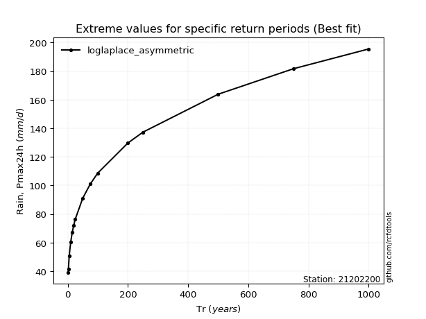</img>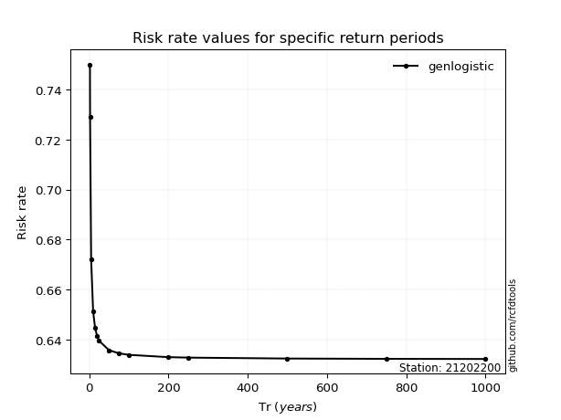</img>

</div>


<sub>**APP DISCLAIMER**: NO WARRANTY - This software is provided by [github.com/rcfdtools](https://github.com/rcfdtools) "as is", without any express or implied warranty, including warranties of merchantability, fitness for a particular purpose, or non-infringement. There is no guarantee that the software will be error-free or operate without interruption. LIMITATION OF LIABILITY - Neither the authors nor copyright holders will be liable for claims or damages arising from the software or its use. You are responsible for determining if the software is appropriate for your use and assume all associated risks, including errors, legal compliance, and data loss. NO PROFESSIONAL ADVICE - The software provides general information and does not offer professional advice. It should not replace consultation with professional advisors.</sub>