<div align="center">


</div>

# PMax24h Station (Rain): 21202210

Maximum Precipitation in 24 hours (PMax24h) is the greatest amount of rainfall for a specific duration that is meteorologically possible for a given location, acting as a "worst-case" scenario for extreme storms, crucial for designing safety-critical infrastructure like bridges, river deviations, dams, spillways, and nuclear plants to prevent catastrophic failure. The PMax24h is related with the Probable Maximum Precipitation (PMP) and it is calculated by hydrologists using meteorological data to determine the upper limit of extreme rainfall, often leading to the Probable Maximum Flood (PMF) for flood control design, and is increasingly being studied for climate change impacts. Probable Maximum Precipitation (PMP) is the theoretical upper limit of rainfall, a deterministic estimate for extreme events, while probability distributions (like GEV, Gumbel) describe the likelihood and frequency of various precipitation amounts, including rare ones, showing how often events occur, with PMP representing the extreme end of these distributions, used for critical infrastructure design to ensure safety against the worst conceivable weather, unlike standard statistical forecasts which cover typical probabilities.

The most common probability distributions in hydrology, used for analyzing floods, rainfall, and streamflow, include the Normal, Log-Normal, Gumbel, Gamma (including Log-Pearson Type III), and Generalized Extreme Value (GEV) distributions, often chosen based on the data´s skewness and whether modeling extremes or general conditions, with Gumbel and GEV popular for extreme events like floods, while the Normal distribution serves as a baseline, though often requiring transformations for skewed hydrological data. These distributions help in designing water infrastructure, managing water resources, and forecasting hydrologic events.

> Hydrological data often isn´t perfectly normal (it´s skewed), so different distributions are needed for different applications, such as: **Flood Frequency Analysis**: Using Gumbel, GEV, or Log-Pearson Type III for predicting extreme flood magnitudes and their return periods, **Rainfall Analysis**: Normal for annual totals, but Log-Normal, Weibull, or GEV for intensity or extreme daily rainfall, **Streamflow Modeling**: Gamma and Log-Normal for maximum flows, GEV for minimum flows, and Kappa for daily flows.

<div align="center">

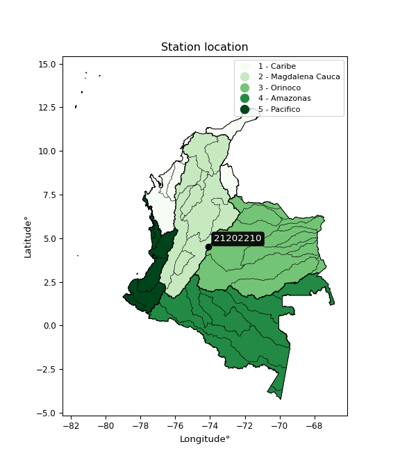</img>

</div>


## A. General information


### 1. General running parameters

• app_version: _v20260312_. • runtime: _2026-03-12 07:15:23.203550_. • Python version: _3.14.0_. • SciPy version: _1.16.3_. • Pandas version: _2.3.3_. • NumPy version: _2.3.5_. • Stations dataset (station_dataset_file): _dataset/pmax24h_in/automatic_colombia_2003_2025.csv_. • Stations catalog (station_catalog_file): _dataset/CNE.xls_. • Minimum year to eval til year_max (date_min): _1900_. • Maximum year to eval since year_min (date_max): _2025_. • Creates, save and include plots into reports (create_plot): _True_. • Plot only fit distributions with Δo > Δ (plot_only_fit): _True_. • Plot only simple graphs avoiding multiple CDFs and multiple Extreme values plots (plot_only_simple): _True_. • Eval low extreme values, if False, evaluates high extreme values (low_extreme): _False_. • Eval every SciPy distribution as logarithmic (pdist_logarithmic_on): _True_. • Standard deviation normalized (ddof): _1.0_. • Return periods to eval in years (Tr): _[2, 2.33, 5, 10, 15, 20, 25, 50, 75, 100, 200, 250, 500, 750, 1000]_. • Minimum data sample per station, 0 means any (minimum_sample): _5_. • Z-Score maximum threshold to adjust a value, 0 means disable (zscore_max): _3.5_. • Z-Score minimum threshold to adjust a value, 0 means disable (zscore_min): _-2.5_. • Avoid zeros, e.g. rain = 0 (avoid_zeros): _True_. • Avoid null values (avoid_nans): _True_. 

:file_folder:Table: [dataset.csv](../../dataset/pmax24h_in/automatic_colombia_2003_2025.csv)

> Delta Degrees of Freedom (DDOF): is a parameter used in the formulas for calculating variance and standard deviation. When ddof=0, the divisor is $N$ (the total number of observations) and this is used when your data set is the entire population. When ddof=1, the divisor is $N-1$ and this is used when your data set is a sample drawn from a larger population. Using $N-1$ provides an unbiased estimate of the population variance (known as Bessel´s correction).


### 2. Station info and location

|   id |   CODIGO | NOMBRE                   | CATEGORIA               | TECNOLOGIA                | ESTADO   | FECHA_INSTALACION   |   FECHA_SUSPENSION |   ALTITUD |   LATITUD |   LONGITUD | DEPARTAMENTO   | MUNICIPIO   | AREA_OPERATIVA                            | ENTIDAD                                                          | AREA_HIDROGRAFICA   | ZONA_HIDROGRAFICA   | SUBZONA_HIDROGRAFICA   |   CORRIENTE | Catalogo   |   Version |
|-----:|---------:|:-------------------------|:------------------------|:--------------------------|:---------|:--------------------|-------------------:|----------:|----------:|-----------:|:---------------|:------------|:------------------------------------------|:-----------------------------------------------------------------|:--------------------|:--------------------|:-----------------------|------------:|:-----------|----------:|
|    0 | 21202210 | MICAELA - AUT [21202210] | Climatológica Ordinaria | Automática con Telemetría | Activa   | 01/10/2000          |                nan |      3062 |   4.50069 |   -74.0865 | Bogotá         | Bogotá, D.C | Area Operativa 11 - Cundinamarca-Amazonas | FONDO DE PREVENCION Y ATENCION DE DESASTRES DE BOGOTA DC - FOPAE | Magdalena Cauca     | Alto Magdalena      | Río Bogotá             |         nan | CNE_OE     |  20251226 |

<div align="center">

Dynamic map: [:earth_americas:Google](http://maps.google.com/maps?q=4.50069,-74.0865) [:earth_americas:OSM](https://www.openstreetmap.org/#map=18/4.50069/-74.0865&layers=P) [:earth_americas:Bing](https://www.bing.com/maps?cp=4.50069~-74.0865&lvl=18) [:earth_americas:Apple](https://maps.apple.com/frame?center=4.50069%2C-74.0865&span=0.003%2C0.006)

</div>


<div align="center">

```geojson
{
  "type": "Feature",
  "geometry": {
    "type": "Point", 
    "coordinates": [-74.0865, 4.50069]
  }, 
  "properties": {
    "Name": "21202210"
  }
}
```

</div>


### 3. Discrete values table and plot

<div align="center">

|               |          0 |          1 |            2 |           3 |           4 |
|:--------------|-----------:|-----------:|-------------:|------------:|------------:|
| Date          | 2012       | 2013       | 2014         | 2015        | 2016        |
| Value         |   16.8     |   43.9     |   33.1       |   24.3      |   41.9      |
| Value_initial |   16.8     |   43.9     |   33.1       |   24.3      |   41.9      |
| count         |    5       |    5       |    5         |    5        |    5        |
| mean          |   32       |   32       |   32         |   32        |   32        |
| std           |   11.5235  |   11.5235  |   11.5235    |   11.5235   |   11.5235   |
| zscore        |   -1.31905 |    1.03268 |    0.0954575 |   -0.668202 |    0.859117 |


</div>


<div align="center">

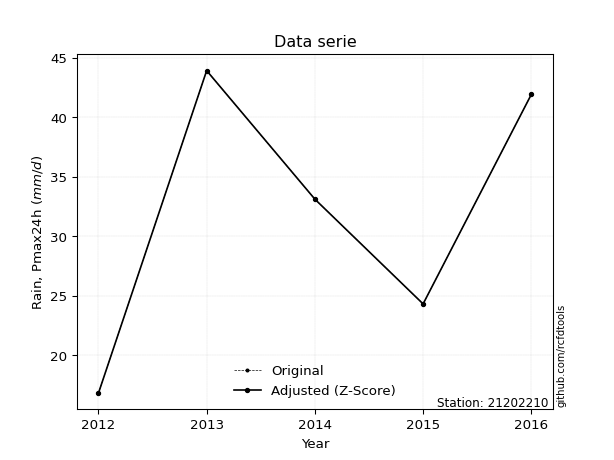</img>

</div>


> The initial value (value_initial) correspond to the initial obtained or null completed value, and value (value) is adjusted only when the initial value is outside the valid range (outlier) definite through the Z-Score value. If Z-Score is active, values out of range or outliers are replaced with the station mean value. A Z-Score (or standard score) measures how many standard deviations a data point is from the mean of a dataset, indicating its relative position; positive scores mean above the mean, negative mean below, and a score of zero is exactly at the mean, allowing for comparison of values from different distributions. It´s calculated using the formula $z=(x–μ)/σ$, where $x$ is the data point, $μ$ is the mean, and $σ$ is the standard deviation, helping identify outliers and understand probability.
>
> <sub>**Note**: In this study, "completing" (filling gaps in) and "extending" (forecasting or lengthening the historical record) rainfall data series are avoided for certain critical analyses because they introduce artificial bias and uncertainty, which can distort the statistics of rare events (extremes), alter day-to-day variability, and compromise the integrity and homogeneity of the original data. Some reasons against Completing/Extending rainfall data are: **Distortion of Extremes and Variability**: The primary issue is that most gap-filling or extension methods rely on averaging or regression with nearby stations, which inherently smooths the data. Rainfall is highly variable in space and time, with a large percentage of zero values and occasional large storms. Infilling methods often underestimate the highest values and overestimate the lowest (zero) values, which severely distorts analyses focused on flood frequency, drought severity, and intensity-duration-frequency (IDF) curves, **Loss of Data Homogeneity**: Infilled or extended data are synthetic estimates, not actual measurements. Combining these estimates with observed data can violate the assumption of data homogeneity, which requires that the data properties do not change over time. Inhomogeneity can lead to incorrect conclusions about long-term trends or changes in climate patterns, **Propagation of Errors**: Errors and biases from the original data (e.g., wind-induced undercatch, instrument errors, site changes) or the data used for imputation can propagate through the analysis, leading to unreliable hydrological models and inaccurate predictions, **Compromised Statistical Integrity**: For statistical analyses, especially those involving the frequency of events, using artificial data can introduce time bias or autocorrelation that doesn´t exist in reality, making it difficult to assess the true probability of events, **Difficulty in Validation**: It is difficult to accurately validate the quality of filled or extended data, especially for past periods where ground-truth measurements are unavailable. The reliability of imputation techniques heavily depends on the density of the surrounding station network and the complexity of the local topography.</sub>


### 4. Active continuous probability distributions from SciPy (80 of 104 available)

A Probability Density Function (PDF) describes the relative likelihood of a continuous random variable falling within a specific range, where the total area under its curve equals 1, and the area over any interval gives the actual probability for that range. Unlike discrete probabilities (like rolling a die), a PDF shows density, not direct probability for a single point (which is zero), with higher points indicating higher likelihood, often visualized as a bell curve for normal distributions.

A log of a probability density function (log-PDF) is simply the logarithm of the PDF´s value, denoted as $log(f(x))$, useful for converting multiplication of probabilities into addition, improving numerical stability with tiny numbers, and connecting to information theory concepts like entropy. Instead of dealing with very small probabilities (e.g., 0.000001), log-PDFs use negative numbers (e.g., $log(0.00001) ≈ -11.51$ that are easier for computers to handle, preventing underflow errors and simplifying complex calculations. In this study, each active probability distribution from SciPy is also evaluated in the $log$ form.

[scipy.stats](https://docs.scipy.org/doc/scipy/reference/stats.html) is a Python´s powerful submodule within the SciPy library for comprehensive statistical analysis, offering over 130 probability distributions (like Normal, Poisson, etc.), functions for descriptive stats (mean, variance), hypothesis testing (t-tests, chi-square), random variable generation, and statistical tests, making it essential for data science, modeling, and research. It provides tools to explore, model, and draw conclusions from data efficiently, working seamlessly with [NumPy](https://numpy.org/).

<div align="center">

|   id | p_dist           |   n_parameter | fit_method   | label                                                                       | active   | ref                                                                                                      |
|-----:|:-----------------|--------------:|:-------------|:----------------------------------------------------------------------------|:---------|:---------------------------------------------------------------------------------------------------------|
|    0 | alpha            |             3 | MLE          | Alpha                                                                       | True     | [:mortar_board:](https://docs.scipy.org/doc/scipy/reference/generated/scipy.stats.alpha.html)            |
|    1 | anglit           |             2 | MM           | Anglit                                                                      | True     | [:mortar_board:](https://docs.scipy.org/doc/scipy/reference/generated/scipy.stats.anglit.html)           |
|    2 | arcsine          |             2 | MM           | Arcsine                                                                     | True     | [:mortar_board:](https://docs.scipy.org/doc/scipy/reference/generated/scipy.stats.arcsine.html)          |
|    3 | argus            |             3 | MLE          | Argus                                                                       | True     | [:mortar_board:](https://docs.scipy.org/doc/scipy/reference/generated/scipy.stats.argus.html)            |
|    4 | beta             |             4 | MLE          | Beta                                                                        | True     | [:mortar_board:](https://docs.scipy.org/doc/scipy/reference/generated/scipy.stats.beta.html)             |
|    5 | betaprime        |             4 | MLE          | Beta prime                                                                  | True     | [:mortar_board:](https://docs.scipy.org/doc/scipy/reference/generated/scipy.stats.betaprime.html)        |
|    6 | bradford         |             3 | MLE          | Bradford                                                                    | True     | [:mortar_board:](https://docs.scipy.org/doc/scipy/reference/generated/scipy.stats.bradford.html)         |
|    7 | burr             |             4 | MLE          | Burr (Type III)                                                             | True     | [:mortar_board:](https://docs.scipy.org/doc/scipy/reference/generated/scipy.stats.burr.html)             |
|    8 | burr12           |             4 | MLE          | Burr (Type III) 12                                                          | True     | [:mortar_board:](https://docs.scipy.org/doc/scipy/reference/generated/scipy.stats.burr12.html)           |
|    9 | cosine           |             2 | MLE          | Cosine                                                                      | True     | [:mortar_board:](https://docs.scipy.org/doc/scipy/reference/generated/scipy.stats.cosine.html)           |
|   10 | crystalball      |             4 | MLE          | Crystalball                                                                 | True     | [:mortar_board:](https://docs.scipy.org/doc/scipy/reference/generated/scipy.stats.crystalball.html)      |
|   11 | dgamma           |             3 | MLE          | Double gamma                                                                | True     | [:mortar_board:](https://docs.scipy.org/doc/scipy/reference/generated/scipy.stats.dgamma.html)           |
|   12 | dweibull         |             3 | MLE          | Double Weibull                                                              | True     | [:mortar_board:](https://docs.scipy.org/doc/scipy/reference/generated/scipy.stats.dweibull.html)         |
|   13 | erlang           |             3 | MLE          | Erlang                                                                      | True     | [:mortar_board:](https://docs.scipy.org/doc/scipy/reference/generated/scipy.stats.erlang.html)           |
|   14 | exponnorm        |             3 | MLE          | Exponentially modified Normal                                               | True     | [:mortar_board:](https://docs.scipy.org/doc/scipy/reference/generated/scipy.stats.exponnorm.html)        |
|   15 | exponpow         |             3 | MLE          | Exponential power                                                           | True     | [:mortar_board:](https://docs.scipy.org/doc/scipy/reference/generated/scipy.stats.exponpow.html)         |
|   16 | exponweib        |             4 | MLE          | Exponentiated Weibull                                                       | True     | [:mortar_board:](https://docs.scipy.org/doc/scipy/reference/generated/scipy.stats.exponweib.html)        |
|   17 | f                |             4 | MLE          | F                                                                           | True     | [:mortar_board:](https://docs.scipy.org/doc/scipy/reference/generated/scipy.stats.f.html)                |
|   18 | fatiguelife      |             3 | MLE          | Fatigue-life (Birnbaum-Saunders)                                            | True     | [:mortar_board:](https://docs.scipy.org/doc/scipy/reference/generated/scipy.stats.fatiguelife.html)      |
|   19 | foldnorm         |             3 | MM           | Fold Normal                                                                 | True     | [:mortar_board:](https://docs.scipy.org/doc/scipy/reference/generated/scipy.stats.foldnorm.html)         |
|   20 | gamma            |             3 | MLE          | Gamma                                                                       | True     | [:mortar_board:](https://docs.scipy.org/doc/scipy/reference/generated/scipy.stats.gamma.html)            |
|   21 | gausshyper       |             6 | MLE          | Gauss hypergeometric                                                        | True     | [:mortar_board:](https://docs.scipy.org/doc/scipy/reference/generated/scipy.stats.gausshyper.html)       |
|   22 | genexpon         |             5 | MLE          | Generalized exponential                                                     | True     | [:mortar_board:](https://docs.scipy.org/doc/scipy/reference/generated/scipy.stats.genexpon.html)         |
|   23 | genextreme       |             3 | MLE          | Generalized exponential                                                     | True     | [:mortar_board:](https://docs.scipy.org/doc/scipy/reference/generated/scipy.stats.genextreme.html)       |
|   24 | gengamma         |             4 | MLE          | Generalized gamma                                                           | True     | [:mortar_board:](https://docs.scipy.org/doc/scipy/reference/generated/scipy.stats.gengamma.html)         |
|   25 | genhalflogistic  |             3 | MLE          | Generalized half-logistic                                                   | True     | [:mortar_board:](https://docs.scipy.org/doc/scipy/reference/generated/scipy.stats.genhalflogistic.html)  |
|   26 | genlogistic      |             3 | MLE          | Generalized logistic                                                        | True     | [:mortar_board:](https://docs.scipy.org/doc/scipy/reference/generated/scipy.stats.genlogistic.html)      |
|   27 | gennorm          |             3 | MLE          | Generalized Normal                                                          | True     | [:mortar_board:](https://docs.scipy.org/doc/scipy/reference/generated/scipy.stats.gennorm.html)          |
|   28 | genpareto        |             3 | MLE          | Generalized Pareto                                                          | True     | [:mortar_board:](https://docs.scipy.org/doc/scipy/reference/generated/scipy.stats.genpareto.html)        |
|   29 | gompertz         |             3 | MLE          | Gompertz (or truncated Gumbel)                                              | True     | [:mortar_board:](https://docs.scipy.org/doc/scipy/reference/generated/scipy.stats.gompertz.html)         |
|   30 | gumbel_l         |             2 | MM           | Gumbel Left Skew                                                            | True     | [:mortar_board:](https://docs.scipy.org/doc/scipy/reference/generated/scipy.stats.gumbel_l.html)         |
|   31 | gumbel_r         |             2 | MM           | Gumbel Right Skew                                                           | True     | [:mortar_board:](https://docs.scipy.org/doc/scipy/reference/generated/scipy.stats.gumbel_r.html)         |
|   32 | halfgennorm      |             3 | MLE          | Upper half of a generalized normal                                          | True     | [:mortar_board:](https://docs.scipy.org/doc/scipy/reference/generated/scipy.stats.halfgennorm.html)      |
|   33 | halflogistic     |             2 | MM           | Half-logistic                                                               | True     | [:mortar_board:](https://docs.scipy.org/doc/scipy/reference/generated/scipy.stats.halflogistic.html)     |
|   34 | halfnorm         |             2 | MM           | Half Normal                                                                 | True     | [:mortar_board:](https://docs.scipy.org/doc/scipy/reference/generated/scipy.stats.halfnorm.html)         |
|   35 | hypsecant        |             2 | MM           | hyperbolic secant                                                           | True     | [:mortar_board:](https://docs.scipy.org/doc/scipy/reference/generated/scipy.stats.hypsecant.html)        |
|   36 | invgamma         |             3 | MLE          | Inverted gamma                                                              | True     | [:mortar_board:](https://docs.scipy.org/doc/scipy/reference/generated/scipy.stats.invgamma.html)         |
|   37 | invgauss         |             3 | MLE          | Inverse Gaussian                                                            | True     | [:mortar_board:](https://docs.scipy.org/doc/scipy/reference/generated/scipy.stats.invgauss.html)         |
|   38 | invweibull       |             3 | MLE          | Inverted Weibull                                                            | True     | [:mortar_board:](https://docs.scipy.org/doc/scipy/reference/generated/scipy.stats.invweibull.html)       |
|   39 | johnsonsb        |             4 | MLE          | Johnson SB                                                                  | True     | [:mortar_board:](https://docs.scipy.org/doc/scipy/reference/generated/scipy.stats.johnsonsb.html)        |
|   40 | johnsonsu        |             4 | MLE          | Johnson Su                                                                  | True     | [:mortar_board:](https://docs.scipy.org/doc/scipy/reference/generated/scipy.stats.johnsonsu.html)        |
|   41 | kappa3           |             3 | MLE          | Kappa 3                                                                     | True     | [:mortar_board:](https://docs.scipy.org/doc/scipy/reference/generated/scipy.stats.kappa3.html)           |
|   42 | kappa4           |             4 | MLE          | Kappa 4                                                                     | True     | [:mortar_board:](https://docs.scipy.org/doc/scipy/reference/generated/scipy.stats.kappa4.html)           |
|   43 | ksone            |             3 | MLE          | Kolmogorov-Smirnov one-sided test statistic distribution                    | True     | [:mortar_board:](https://docs.scipy.org/doc/scipy/reference/generated/scipy.stats.ksone.html)            |
|   44 | kstwobign        |             2 | MLE          | Limiting distribution of scaled Kolmogorov-Smirnov two-sided test statistic | True     | [:mortar_board:](https://docs.scipy.org/doc/scipy/reference/generated/scipy.stats.kstwobign.html)        |
|   45 | laplace          |             2 | MM           | Laplace                                                                     | True     | [:mortar_board:](https://docs.scipy.org/doc/scipy/reference/generated/scipy.stats.laplace.html)          |
|   46 | levy_l           |             2 | MLE          | Left-skewed Levy                                                            | True     | [:mortar_board:](https://docs.scipy.org/doc/scipy/reference/generated/scipy.stats.levy_l.html)           |
|   47 | loggamma         |             3 | MLE          | Log gamma                                                                   | True     | [:mortar_board:](https://docs.scipy.org/doc/scipy/reference/generated/scipy.stats.loggamma.html)         |
|   48 | logistic         |             2 | MM           | Logistic (or Sech-squared)                                                  | True     | [:mortar_board:](https://docs.scipy.org/doc/scipy/reference/generated/scipy.stats.logistic.html)         |
|   49 | loglaplace       |             3 | MLE          | Log-Laplace                                                                 | True     | [:mortar_board:](https://docs.scipy.org/doc/scipy/reference/generated/scipy.stats.loglaplace.html)       |
|   50 | lomax            |             3 | MLE          | Lomax (Pareto of the second kind)                                           | True     | [:mortar_board:](https://docs.scipy.org/doc/scipy/reference/generated/scipy.stats.lomax.html)            |
|   51 | maxwell          |             2 | MM           | Maxwell                                                                     | True     | [:mortar_board:](https://docs.scipy.org/doc/scipy/reference/generated/scipy.stats.maxwell.html)          |
|   52 | mielke           |             4 | MLE          | Mielke Beta-Kappa / Dagum                                                   | True     | [:mortar_board:](https://docs.scipy.org/doc/scipy/reference/generated/scipy.stats.mielke.html)           |
|   53 | moyal            |             2 | MM           | Moyal                                                                       | True     | [:mortar_board:](https://docs.scipy.org/doc/scipy/reference/generated/scipy.stats.moyal.html)            |
|   54 | nakagami         |             3 | MLE          | Nakagami                                                                    | True     | [:mortar_board:](https://docs.scipy.org/doc/scipy/reference/generated/scipy.stats.nakagami.html)         |
|   55 | ncf              |             5 | MLE          | Non-central F distribution                                                  | True     | [:mortar_board:](https://docs.scipy.org/doc/scipy/reference/generated/scipy.stats.ncf.html)              |
|   56 | nct              |             4 | MLE          | Non-central Student’s t                                                     | True     | [:mortar_board:](https://docs.scipy.org/doc/scipy/reference/generated/scipy.stats.nct.html)              |
|   57 | norm             |             2 | MM           | Normal                                                                      | True     | [:mortar_board:](https://docs.scipy.org/doc/scipy/reference/generated/scipy.stats.norm.html)             |
|   58 | pearson3         |             3 | MM           | Pearson type III                                                            | True     | [:mortar_board:](https://docs.scipy.org/doc/scipy/reference/generated/scipy.stats.pearson3.html)         |
|   59 | powerlaw         |             3 | MLE          | Power-function                                                              | True     | [:mortar_board:](https://docs.scipy.org/doc/scipy/reference/generated/scipy.stats.powerlaw.html)         |
|   60 | rayleigh         |             2 | MM           | Rayleigh                                                                    | True     | [:mortar_board:](https://docs.scipy.org/doc/scipy/reference/generated/scipy.stats.rayleigh.html)         |
|   61 | rdist            |             3 | MLE          | R-distributed (symmetric beta)                                              | True     | [:mortar_board:](https://docs.scipy.org/doc/scipy/reference/generated/scipy.stats.rdist.html)            |
|   62 | rice             |             3 | MLE          | Rice                                                                        | True     | [:mortar_board:](https://docs.scipy.org/doc/scipy/reference/generated/scipy.stats.rice.html)             |
|   63 | semicircular     |             2 | MM           | Semicircular                                                                | True     | [:mortar_board:](https://docs.scipy.org/doc/scipy/reference/generated/scipy.stats.semicircular.html)     |
|   64 | skewnorm         |             3 | MLE          | Skew normal                                                                 | True     | [:mortar_board:](https://docs.scipy.org/doc/scipy/reference/generated/scipy.stats.skewnorm.html)         |
|   65 | t                |             3 | MLE          | Student’s t                                                                 | True     | [:mortar_board:](https://docs.scipy.org/doc/scipy/reference/generated/scipy.stats.t.html)                |
|   66 | trapezoid        |             4 | MLE          | Trapezoid                                                                   | True     | [:mortar_board:](https://docs.scipy.org/doc/scipy/reference/generated/scipy.stats.trapezoid.html)        |
|   67 | triang           |             3 | MLE          | Triangular                                                                  | True     | [:mortar_board:](https://docs.scipy.org/doc/scipy/reference/generated/scipy.stats.triang.html)           |
|   68 | truncexpon       |             3 | MLE          | Truncated exponential                                                       | True     | [:mortar_board:](https://docs.scipy.org/doc/scipy/reference/generated/scipy.stats.truncexpon.html)       |
|   69 | truncnorm        |             4 | MLE          | Truncated normal                                                            | True     | [:mortar_board:](https://docs.scipy.org/doc/scipy/reference/generated/scipy.stats.truncnorm.html)        |
|   70 | truncpareto      |             4 | MLE          | Upper truncated Pareto                                                      | True     | [:mortar_board:](https://docs.scipy.org/doc/scipy/reference/generated/scipy.stats.truncpareto.html)      |
|   71 | truncweibull_min |             5 | MLE          | Doubly truncated Weibull minimum                                            | True     | [:mortar_board:](https://docs.scipy.org/doc/scipy/reference/generated/scipy.stats.truncweibull_min.html) |
|   72 | tukeylambda      |             3 | MLE          | Tukey-Lamdba                                                                | True     | [:mortar_board:](https://docs.scipy.org/doc/scipy/reference/generated/scipy.stats.tukeylambda.html)      |
|   73 | uniform          |             2 | MLE          | Uniform                                                                     | True     | [:mortar_board:](https://docs.scipy.org/doc/scipy/reference/generated/scipy.stats.uniform.html)          |
|   74 | vonmises         |             3 | MLE          | Von Mises                                                                   | True     | [:mortar_board:](https://docs.scipy.org/doc/scipy/reference/generated/scipy.stats.vonmises.html)         |
|   75 | vonmises_line    |             3 | MLE          | Von Mises line                                                              | True     | [:mortar_board:](https://docs.scipy.org/doc/scipy/reference/generated/scipy.stats.vonmises_line.html)    |
|   76 | wald             |             2 | MM           | Wald                                                                        | True     | [:mortar_board:](https://docs.scipy.org/doc/scipy/reference/generated/scipy.stats.wald.html)             |
|   77 | weibull_max      |             3 | MLE          | Weibull maximum                                                             | True     | [:mortar_board:](https://docs.scipy.org/doc/scipy/reference/generated/scipy.stats.weibull_max.html)      |
|   78 | weibull_min      |             3 | MLE          | Weibull minimum                                                             | True     | [:mortar_board:](https://docs.scipy.org/doc/scipy/reference/generated/scipy.stats.weibull_min.html)      |
|   79 | wrapcauchy       |             3 | MLE          | Wrapped  Cauchy                                                             | True     | [:mortar_board:](https://docs.scipy.org/doc/scipy/reference/generated/scipy.stats.wrapcauchy.html)       |

</div>

> **n_parameter:** # arguments & localization & scale.
>
> **Fit methods:** (MLE) maximum likelihood, (MM) L-moments.
>
>**Inactive** (With the only purpose of prevent loops, zero divisions, infinite values, over high estimated values or horizontal trending for recurrence intervals estimations, the follow distributions were disabled.)**:** lognorm, norminvgauss, powernorm, powerlognorm, cauchy, halfcauchy, foldcauchy, skewcauchy, chi2, expon, fisk, genhyperbolic, geninvgauss, gibrat, kstwo, laplace_asymmetric, levy, levy_stable, ncx2, pareto, rel_breitwigner, recipinvgauss, studentized_range, loguniform, 


## B. Probability (PDF) vs. Empirical (EDF) distributions functions

A continuous probability distribution (CPD) describes probabilities for variables that can take any value within a range (like rain any time), unlike discrete variables with specific outcomes (like temperature). It uses a Probability Density Function (PDF), a curve where the total area under it equals 1, and the probability of the variable falling within an interval (a to b) is found by calculating the area under the curve between those points. A key feature is that the probability of hitting any single exact value is zero, so probabilities are always expressed for ranges, e.g., $P(a ≤ X ≤ b)$.

<div align="center">

Distributions parameters from station values
|     |   station | p_dist              |   n |              loc |           scale | shape                  | shape1                | shape2                | shape3             |
|----:|----------:|:--------------------|----:|-----------------:|----------------:|:-----------------------|:----------------------|:----------------------|:-------------------|
|   0 |  21202210 | alpha               |   5 |   -179.978       |  4285.07        | 20.26642280684154      |                       |                       |                    |
|   1 |  21202210 | anglit              |   5 |     32           |    30.1518      |                        |                       |                       |                    |
|   2 |  21202210 | arcsine             |   5 |     17.4239      |    29.1523      |                        |                       |                       |                    |
|   3 |  21202210 | argus               |   5 |      7.31819     |    38.2879      | 1.5738805872901342     |                       |                       |                    |
|   4 |  21202210 | beta                |   5 |     16.2349      |    27.6651      | 0.5343849393504547     | 0.42426797852718084   |                       |                    |
|   5 |  21202210 | betaprime           |   5 |   -189.509       | 11303.3         | 465.98111326318144     | 23783.62648744769     |                       |                    |
|   6 |  21202210 | bradford            |   5 |     16.8         |    27.1         | 1.0735977898364306     |                       |                       |                    |
|   7 |  21202210 | burr                |   5 |     -4.05947     |    48.2328      | 659.6524625585114      | 0.004395657322893971  |                       |                    |
|   8 |  21202210 | burr12              |   5 |     -4.20368     |    20.8948      | 851.2024497379343      | 0.0023304253018633704 |                       |                    |
|   9 |  21202210 | cosine              |   5 |     31.6143      |     8.22369     |                        |                       |                       |                    |
|  10 |  21202210 | crystalball         |   5 |     32           |    10.3069      | 1960.4407015478423     | 516.2267072812857     |                       |                    |
|  11 |  21202210 | dgamma              |   5 |     29.3666      |     2.51818     | 3.8466902116808925     |                       |                       |                    |
|  12 |  21202210 | dweibull            |   5 |     29.708       |    10.8774      | 2.4496752889265867     |                       |                       |                    |
|  13 |  21202210 | erlang              |   5 |   -145.61        |     0.603124    | 294.5399908560148      |                       |                       |                    |
|  14 |  21202210 | exponnorm           |   5 |     31.9906      |    10.3069      | 0.0009155105535564936  |                       |                       |                    |
|  15 |  21202210 | exponpow            |   5 |     16.8         |     1.49329     | 0.11618836017400948    |                       |                       |                    |
|  16 |  21202210 | exponweib           |   5 |     16.8         |     1.24282     | 1.259546721890231      | 0.2587499722832024    |                       |                    |
|  17 |  21202210 | f                   |   5 |  -1632.28        |  1664.29        | 56490.97414119395      | 608343.5490037603     |                       |                    |
|  18 |  21202210 | fatiguelife         |   5 |     16.8         |     6.08727e-07 | 4606.735286717387      |                       |                       |                    |
|  19 |  21202210 | foldnorm            |   5 |     33.0206      |     1.5601      | 3.332645776473424e-07  |                       |                       |                    |
|  20 |  21202210 | gamma               |   5 |   -131.617       |     0.662515    | 246.92551363545704     |                       |                       |                    |
|  21 |  21202210 | gausshyper          |   5 |     16.2985      |    27.6015      | 1.204566766756797      | 0.8956243617427324    | 1.0662421539811577    | 1.0395090464830252 |
|  22 |  21202210 | genexpon            |   5 |     16.8         |     1.82493     | 0.12020910138741497    | 8.030138754348381e-08 | 1.8488262810735367    |                    |
|  23 |  21202210 | genextreme          |   5 |     33.6061      |    12.3851      | 1.2031464757861183     |                       |                       |                    |
|  24 |  21202210 | gengamma            |   5 |     16.8         |     1.33992     | 1.190090441629546      | 0.2625757525467543    |                       |                    |
|  25 |  21202210 | genhalflogistic     |   5 |      9.37609     |    36.1491      | 1.0470735531550805     |                       |                       |                    |
|  26 |  21202210 | genlogistic         |   5 |     43.9003      |     5.41514e-06 | 4.549345996649589e-07  |                       |                       |                    |
|  27 |  21202210 | gennorm             |   5 |     30.35        |    13.55        | 4502298.290306316      |                       |                       |                    |
|  28 |  21202210 | genpareto           |   5 |     -0.0980664   |    68.0874      | -1.547509784282337     |                       |                       |                    |
|  29 |  21202210 | gompertz            |   5 |     24.3         |     2.92087     | 0.003193865897538759   |                       |                       |                    |
|  30 |  21202210 | gumbel_l            |   5 |     36.6386      |     8.03625     |                        |                       |                       |                    |
|  31 |  21202210 | gumbel_r            |   5 |     27.3614      |     8.03625     |                        |                       |                       |                    |
|  32 |  21202210 | halfgennorm         |   5 |     16.8         |     1.29499     | 0.4132875182443044     |                       |                       |                    |
|  33 |  21202210 | halflogistic        |   5 |     19.7839      |     8.81205     |                        |                       |                       |                    |
|  34 |  21202210 | halfnorm            |   5 |     18.3577      |    17.0981      |                        |                       |                       |                    |
|  35 |  21202210 | hypsecant           |   5 |     32           |     6.56157     |                        |                       |                       |                    |
|  36 |  21202210 | invgamma            |   5 |    -74.6437      | 10764.8         | 102.0927192536985      |                       |                       |                    |
|  37 |  21202210 | invgauss            |   5 |    -20.4974      |  1209.07        | 0.04329811638694343    |                       |                       |                    |
|  38 |  21202210 | invweibull          |   5 |     16.8         |     1.78269     | 0.043575209514099045   |                       |                       |                    |
|  39 |  21202210 | johnsonsb           |   5 |     13.4219      |    30.4781      | -0.548979342059464     | 0.08547643659874812   |                       |                    |
|  40 |  21202210 | johnsonsu           |   5 |     43.9         |     9.77096e-13 | 2.531863052749527      | 0.11129747314456595   |                       |                    |
|  41 |  21202210 | kappa3              |   5 |     16.8         |    27.8618      | 528.1606468295256      |                       |                       |                    |
|  42 |  21202210 | kappa4              |   5 |     14.5473      |    31.2502      | 1.0778858254910266     | 1.064199994771844     |                       |                    |
|  43 |  21202210 | ksone               |   5 |     14.1479      |    35.7041      | 1.0                    |                       |                       |                    |
|  44 |  21202210 | kstwobign           |   5 |     -6.24878     |    43.5706      |                        |                       |                       |                    |
|  45 |  21202210 | laplace             |   5 |     32           |     7.28807     |                        |                       |                       |                    |
|  46 |  21202210 | levy_l              |   5 |     44.4805      |     2.18933     |                        |                       |                       |                    |
|  47 |  21202210 | loggamma            |   5 |     43.9001      |     7.44549e-06 | 6.251820760415819e-07  |                       |                       |                    |
|  48 |  21202210 | logistic            |   5 |     32           |     5.68249     |                        |                       |                       |                    |
|  49 |  21202210 | loglaplace          |   5 |     -0.0876548   |    33.1877      | 3.3319331554151193     |                       |                       |                    |
|  50 |  21202210 | lomax               |   5 |     16.8         |  3488.33        | 229.63655821800893     |                       |                       |                    |
|  51 |  21202210 | maxwell             |   5 |      7.577       |    15.3048      |                        |                       |                       |                    |
|  52 |  21202210 | mielke              |   5 |     -6.21119     |    50.2528      | 3.1666952033727016     | 1694.8851411369994    |                       |                    |
|  53 |  21202210 | moyal               |   5 |     26.1059      |     4.63973     |                        |                       |                       |                    |
|  54 |  21202210 | nakagami            |   5 |     24.3         |    11.4349      | 0.21228759296191224    |                       |                       |                    |
|  55 |  21202210 | ncf                 |   5 |     -0.503458    |     3.54505e-05 | 4.2713722107333234e-05 | 299.2475901186099     | 38.93768587053434     |                    |
|  56 |  21202210 | nct                 |   5 |   -483.776       |    10.2095      | 60586.16621885465      | 50.51824194189833     |                       |                    |
|  57 |  21202210 | norm                |   5 |     32           |    10.3069      |                        |                       |                       |                    |
|  58 |  21202210 | pearson3            |   5 |     32           |    10.3069      | -0.23959945960505216   |                       |                       |                    |
|  59 |  21202210 | powerlaw            |   5 |     16.8         |    27.1         | 0.13007194881694753    |                       |                       |                    |
|  60 |  21202210 | rayleigh            |   5 |     12.2823      |    15.7324      |                        |                       |                       |                    |
|  61 |  21202210 | rdist               |   5 |     17.7976      |     6.50235     | 1.3300513739409632     |                       |                       |                    |
|  62 |  21202210 | rice                |   5 |     11.0002      |    12.0949      | 1.3193733306841398     |                       |                       |                    |
|  63 |  21202210 | semicircular        |   5 |     32           |    20.6138      |                        |                       |                       |                    |
|  64 |  21202210 | skewnorm            |   5 |     43.9         |    15.7422      | -13792152.22754813     |                       |                       |                    |
|  65 |  21202210 | t                   |   5 |     32           |    10.3068      | 265911290.33768278     |                       |                       |                    |
|  66 |  21202210 | trapezoid           |   5 |      2.84771     |    43.7284      | 1.0                    | 1.0                   |                       |                    |
|  67 |  21202210 | triang              |   5 |      2.80349     |    41.0966      | 0.9999993962528304     |                       |                       |                    |
|  68 |  21202210 | truncexpon          |   5 |     16.7999      |    33.2725      | 0.8144899986076652     |                       |                       |                    |
|  69 |  21202210 | truncnorm           |   5 |     32           |    10.3069      | -362.46224778209785    | 1642.8174178590107    |                       |                    |
|  70 |  21202210 | truncpareto         |   5 |     16.6537      |     0.146261    | 0.2623658937468209     | 186.28499724304174    |                       |                    |
|  71 |  21202210 | truncweibull_min    |   5 |     16.7315      |    38.1459      | 0.7685280303266997     | 0.0015046109995036578 | 0.7122257919733797    |                    |
|  72 |  21202210 | tukeylambda         |   5 |     30.3475      |    16.1746      | 1.1934787554377664     |                       |                       |                    |
|  73 |  21202210 | uniform             |   5 |     16.8         |    27.1         |                        |                       |                       |                    |
|  74 |  21202210 | vonmises            |   5 |     -1.20609     |     1           | 0.7234481991541998     |                       |                       |                    |
|  75 |  21202210 | vonmises_line       |   5 |     29.6998      |     4.5201      | 0.00015381321339975385 |                       |                       |                    |
|  76 |  21202210 | wald                |   5 |     21.6931      |    10.3069      |                        |                       |                       |                    |
|  77 |  21202210 | weibull_max         |   5 |     43.9         |     1.34878     | 0.31552826878697804    |                       |                       |                    |
|  78 |  21202210 | weibull_min         |   5 |  -1746.1         |  1783.07        | 210.47995489519099     |                       |                       |                    |
|  79 |  21202210 | wrapcauchy          |   5 |     16.7998      |     4.31313     | 0.6415746749086937     |                       |                       |                    |
|  80 |  21202210 | logalpha            |   5 |     -5.63534     |   218.625       | 24.23274751472507      |                       |                       |                    |
|  81 |  21202210 | loganglit           |   5 |      3.40572     |     1.0521      |                        |                       |                       |                    |
|  82 |  21202210 | logarcsine          |   5 |      2.89709     |     1.01726     |                        |                       |                       |                    |
|  83 |  21202210 | logargus            |   5 |      2.44206     |     1.39024     | 2.0351765648919367     |                       |                       |                    |
|  84 |  21202210 | logbeta             |   5 |      2.73701     |     1.0449      | 0.6483617453764895     | 0.3775193114328574    |                       |                    |
|  85 |  21202210 | logbetaprime        |   5 |     -1.19001     |    18.7484      | 124.03358404675862     | 511.0282941036385     |                       |                    |
|  86 |  21202210 | logbradford         |   5 |      2.82138     |     0.960549    | 1.0381547424601365     |                       |                       |                    |
|  87 |  21202210 | logburr             |   5 | -54302.1         | 54305.9         | 12783943.05198729      | 0.010936466773539322  |                       |                    |
|  88 |  21202210 | logburr12           |   5 |   -138.96        |   145.357       | 520.9100691268121      | 27230.577371651103    |                       |                    |
|  89 |  21202210 | logcosine           |   5 |      3.37801     |     0.291754    |                        |                       |                       |                    |
|  90 |  21202210 | logcrystalball      |   5 |      3.40572     |     0.359645    | 7.65659615451307       | 6538.05563397967      |                       |                    |
|  91 |  21202210 | logdgamma           |   5 |      3.35586     |     0.0813857   | 4.052361713450952      |                       |                       |                    |
|  92 |  21202210 | logdweibull         |   5 |      3.34595     |     0.375961    | 2.4314050998647323     |                       |                       |                    |
|  93 |  21202210 | logerlang           |   5 |     -2.26083     |     0.0235151   | 240.92394856765503     |                       |                       |                    |
|  94 |  21202210 | logexponnorm        |   5 |      3.40548     |     0.359642    | 0.0006515421261453955  |                       |                       |                    |
|  95 |  21202210 | logexponpow         |   5 |      2.82138     |     0.930548    | 0.2481805310215255     |                       |                       |                    |
|  96 |  21202210 | logexponweib        |   5 |      2.82138     |     1.00355     | 0.46167176755540196    | 1.1247031711849966    |                       |                    |
|  97 |  21202210 | logf                |   5 |   -248.171       |   251.577       | 3208925.644075538      | 1388984.7541378993    |                       |                    |
|  98 |  21202210 | logfatiguelife      |   5 |   -138.632       |   142.038       | 0.0025252935138530015  |                       |                       |                    |
|  99 |  21202210 | logfoldnorm         |   5 |      2.92589     |     0.473619    | 0.7545527424995746     |                       |                       |                    |
| 100 |  21202210 | loggamma            |   5 |     -2.22423     |     0.0235316   | 239.20278159442796     |                       |                       |                    |
| 101 |  21202210 | loggausshyper       |   5 |      2.81519     |     0.96672     | 1.066046253780833      | 0.9536565196915684    | 1.0387319975403266    | 1.1046418210779987 |
| 102 |  21202210 | loggenexpon         |   5 |      2.81069     |     0.00526448  | 0.00418862754356524    | 3.200138504488856     | 1.887871456480295e-05 |                    |
| 103 |  21202210 | loggenextreme       |   5 |      3.44285     |     0.409954    | 1.2090923866985603     |                       |                       |                    |
| 104 |  21202210 | loggengamma         |   5 |      2.82138     |     0.73704     | 0.565363024067457      | 1.3807931420212909    |                       |                    |
| 105 |  21202210 | loggenhalflogistic  |   5 |      2.69856     |     1.17665     | 1.0861105173788834     |                       |                       |                    |
| 106 |  21202210 | loggenlogistic      |   5 |      3.78194     |     1.01349e-06 | 2.68741350846485e-06   |                       |                       |                    |
| 107 |  21202210 | loggennorm          |   5 |      3.49951     |     0.264055    | 0.9731307346879954     |                       |                       |                    |
| 108 |  21202210 | loggenpareto        |   5 |      0.00238013  |     3.99272     | -1.0564040918977415    |                       |                       |                    |
| 109 |  21202210 | loggompertz         |   5 |      2.82138     |     0.377852    | 0.17475465612566926    |                       |                       |                    |
| 110 |  21202210 | loggumbel_l         |   5 |      3.56758     |     0.280414    |                        |                       |                       |                    |
| 111 |  21202210 | loggumbel_r         |   5 |      3.24386     |     0.280414    |                        |                       |                       |                    |
| 112 |  21202210 | loghalfgennorm      |   5 |      2.82138     |     0.740323    | 1.3261987485756        |                       |                       |                    |
| 113 |  21202210 | loghalflogistic     |   5 |      2.97945     |     0.307486    |                        |                       |                       |                    |
| 114 |  21202210 | loghalfnorm         |   5 |      2.9297      |     0.596603    |                        |                       |                       |                    |
| 115 |  21202210 | loghypsecant        |   5 |      3.40572     |     0.228957    |                        |                       |                       |                    |
| 116 |  21202210 | loginvgamma         |   5 |     -6.69878     |  7643.6         | 757.509326170536       |                       |                       |                    |
| 117 |  21202210 | loginvgauss         |   5 |      0.276725    |   207.378       | 0.015054331342948181   |                       |                       |                    |
| 118 |  21202210 | loginvweibull       |   5 |     -2.24708e+07 |     2.24708e+07 | 62006909.734253585     |                       |                       |                    |
| 119 |  21202210 | logjohnsonsb        |   5 |      2.82138     |     0.961168    | 0.04189907214311147    | 0.14518979523407183   |                       |                    |
| 120 |  21202210 | logjohnsonsu        |   5 |      3.78191     |     3.5431e-13  | 3.537445489223882      | 0.1365181630715521    |                       |                    |
| 121 |  21202210 | logkappa3           |   5 |      2.82138     |     1.09327     | 70.44595985050907      |                       |                       |                    |
| 122 |  21202210 | logkappa4           |   5 |      2.70502     |     1.1691      | 1.1110770953055018     | 1.0856179366386858    |                       |                    |
| 123 |  21202210 | logksone            |   5 |      2.7828      |     1.24585     | 1.0                    |                       |                       |                    |
| 124 |  21202210 | logkstwobign        |   5 |      1.97631     |     1.62836     |                        |                       |                       |                    |
| 125 |  21202210 | loglaplace          |   5 |      3.40572     |     0.254307    |                        |                       |                       |                    |
| 126 |  21202210 | loglevy_l           |   5 |      3.79668     |     0.0555247   |                        |                       |                       |                    |
| 127 |  21202210 | logloggamma         |   5 |      3.78193     |     1.14107e-06 | 3.052622743671545e-06  |                       |                       |                    |
| 128 |  21202210 | loglogistic         |   5 |      3.40572     |     0.198282    |                        |                       |                       |                    |
| 129 |  21202210 | logloglaplace       |   5 |     -0.0257574   |     3.52529     | 11.18203544317814      |                       |                       |                    |
| 130 |  21202210 | loglomax            |   5 |      2.82138     |     1.87101e+12 | 430196485125.10266     |                       |                       |                    |
| 131 |  21202210 | logmaxwell          |   5 |      2.55351     |     0.534041    |                        |                       |                       |                    |
| 132 |  21202210 | logmielke           |   5 |     -3.13358e+07 |     3.13358e+07 | 79361649.06276736      | 5005942507.891398     |                       |                    |
| 133 |  21202210 | logmoyal            |   5 |      3.20005     |     0.161897    |                        |                       |                       |                    |
| 134 |  21202210 | lognakagami         |   5 |      3.19048     |     0.375244    | 0.05085593573041328    |                       |                       |                    |
| 135 |  21202210 | logncf              |   5 |     -0.603327    |     0.000464715 | 0.05068442402797013    | 332.09309193788033    | 435.3209896852925     |                    |
| 136 |  21202210 | lognct              |   5 |    -16.5187      |     0.326677    | 8235.612667677415      | 60.98566034487999     |                       |                    |
| 137 |  21202210 | lognorm             |   5 |      3.40572     |     0.359645    |                        |                       |                       |                    |
| 138 |  21202210 | logpearson3         |   5 |      3.40572     |     0.359645    | -0.5143772395073851    |                       |                       |                    |
| 139 |  21202210 | logpowerlaw         |   5 |      2.82138     |     0.960535    | 0.13637150892452587    |                       |                       |                    |
| 140 |  21202210 | lograyleigh         |   5 |      2.7177      |     0.548961    |                        |                       |                       |                    |
| 141 |  21202210 | logrdist            |   5 |      3.76663     |     0.576153    | 1.0212616324507633     |                       |                       |                    |
| 142 |  21202210 | logrice             |   5 |      2.59858     |     0.403937    | 1.668964220492197      |                       |                       |                    |
| 143 |  21202210 | logsemicircular     |   5 |      3.40572     |     0.719289    |                        |                       |                       |                    |
| 144 |  21202210 | logskewnorm         |   5 |      3.78191     |     0.520483    | -64176836.29958132     |                       |                       |                    |
| 145 |  21202210 | logt                |   5 |      3.40572     |     0.359643    | 1372106897.768962      |                       |                       |                    |
| 146 |  21202210 | logtrapezoid        |   5 |      2.38849     |     1.52584     | 1.0                    | 1.0                   |                       |                    |
| 147 |  21202210 | logtriang           |   5 |      2.5627      |     1.21921     | 0.9999999626787114     |                       |                       |                    |
| 148 |  21202210 | logtruncexpon       |   5 |      2.82137     |     1.13741     | 0.8445264653096696     |                       |                       |                    |
| 149 |  21202210 | logtruncnorm        |   5 |     -0.0934637   |     1.05802     | 3.3959497481724066     | 3.6628449241890815    |                       |                    |
| 150 |  21202210 | logtruncpareto      |   5 |      2.81559     |     0.00579156  | 0.26141811262787595    | 166.85080933844216    |                       |                    |
| 151 |  21202210 | logtruncweibull_min |   5 |      2.82033     |     1.23666     | 0.6572403837386117     | 0.0008504194459498786 | 0.7775649674156637    |                    |
| 152 |  21202210 | logtukeylambda      |   5 |      3.30155     |     0.664719    | 1.3837779475336554     |                       |                       |                    |
| 153 |  21202210 | loguniform          |   5 |      2.82138     |     0.960535    |                        |                       |                       |                    |
| 154 |  21202210 | logvonmises         |   5 |     -2.87331     |     1           | 8.162786364418215      |                       |                       |                    |
| 155 |  21202210 | logvonmises_line    |   5 |      3.24428     |     0.171134    | 0.00010827127458707672 |                       |                       |                    |
| 156 |  21202210 | logwald             |   5 |      3.04605     |     0.359672    |                        |                       |                       |                    |
| 157 |  21202210 | logweibull_max      |   5 |      3.78191     |     0.288352    | 0.722160629880461      |                       |                       |                    |
| 158 |  21202210 | logweibull_min      |   5 |     -1.73978e+07 |     1.73978e+07 | 61068688.07498649      |                       |                       |                    |
| 159 |  21202210 | logwrapcauchy       |   5 |      2.82138     |     0.152874    | 0.7415523518423666     |                       |                       |                    |

</div>

> **loc** (Location parameter): This shifts the distribution along the x-axis. For many common distributions, like the normal (Gaussian) distribution, loc represents the mean $μ$. For others, like the uniform distribution, it might represent the minimum value, or for the beta distribution, the left end of the support interval.
>
> **scale** (Scale parameter): This determines the width or spread of the distribution. For the normal distribution, scale represents the standard deviation $σ$. For a uniform distribution, it defines the length of the interval (from $loc$ to $loc + scale$).
>
> **shape** (Shape parameters): Refers to parameters that define the specific form of a probability distribution, distinct from its location (loc) and scale (scale). These parameters are required arguments for most distribution functions. For example, a normal (Gaussian) distribution is fully defined by its location (mean) and scale (standard deviation), so it has no specific shape parameters beyond loc and scale. However, other distributions have intrinsic properties that need specification, as Gamma distribution that takes a shape parameter, often named $a$ or $alpha$.


### 0. Cumulative distribution values - CDF (160 evaluated)

Cumulative Distribution Function (CDF), denoted as $F$<sub>$X$</sub>$(x)$, is a function that gives the probability that a random variable $X$ will take a value less than or equal to a specific value, $x$ (i.e., $(P(X≥x)$. It essentially "accumulates" probabilities from a given point up to the far right (positive infinity), providing a complete picture of the distribution´s probabilities for both discrete (like rain) and continuous (like temperature) variables, helping to find probabilities over ranges or above certain values. Each station is evaluated separately ordering the $x$ values ascending, calculating the CDF and PDF values for the activated distributions and their logarithmic forms.

<div align="center">

CDF ordered by x ascending and calculating $log(f(x))$ separately
|   id |   Station |   date |    x |   count |   mean |     std |     zscore |   Value_initial |   station |   m |     alpha |   alpha_pdf |    anglit |   anglit_pdf |   arcsine |   arcsine_pdf |     argus |   argus_pdf |      beta |    beta_pdf |   betaprime |   betaprime_pdf |    bradford |   bradford_pdf |      burr |   burr_pdf |    burr12 |   burr12_pdf |    cosine |   cosine_pdf |   crystalball |   crystalball_pdf |   dgamma |   dgamma_pdf |   dweibull |   dweibull_pdf |    erlang |   erlang_pdf |   exponnorm |   exponnorm_pdf |   exponpow |   exponpow_pdf |   exponweib |   exponweib_pdf |         f |     f_pdf |   fatiguelife |   fatiguelife_pdf |   foldnorm |   foldnorm_pdf |     gamma |   gamma_pdf |   gausshyper |   gausshyper_pdf |    genexpon |   genexpon_pdf |   genextreme |   genextreme_pdf |    gengamma |   gengamma_pdf |   genhalflogistic |   genhalflogistic_pdf |   genlogistic |   genlogistic_pdf |     gennorm |   gennorm_pdf |   genpareto |   genpareto_pdf |    gompertz |   gompertz_pdf |   gumbel_l |   gumbel_l_pdf |   gumbel_r |   gumbel_r_pdf |   halfgennorm |   halfgennorm_pdf |   halflogistic |   halflogistic_pdf |   halfnorm |   halfnorm_pdf |   hypsecant |   hypsecant_pdf |   invgamma |   invgamma_pdf |   invgauss |   invgauss_pdf |   invweibull |   invweibull_pdf |   johnsonsb |   johnsonsb_pdf |   johnsonsu |   johnsonsu_pdf |      kappa3 |   kappa3_pdf |   kappa4 |   kappa4_pdf |     ksone |   ksone_pdf |   kstwobign |   kstwobign_pdf |   laplace |   laplace_pdf |   levy_l |   levy_l_pdf |   loggamma |   loggamma_pdf |   logistic |   logistic_pdf |   loglaplace |   loglaplace_pdf |       lomax |   lomax_pdf |   maxwell |   maxwell_pdf |    mielke |   mielke_pdf |      moyal |   moyal_pdf |   nakagami |   nakagami_pdf |      ncf |   ncf_pdf |       nct |   nct_pdf |     norm |   norm_pdf |   pearson3 |   pearson3_pdf |   powerlaw |   powerlaw_pdf |   rayleigh |   rayleigh_pdf |    rdist |    rdist_pdf |      rice |   rice_pdf |   semicircular |   semicircular_pdf |   skewnorm |   skewnorm_pdf |         t |     t_pdf |   trapezoid |   trapezoid_pdf |   triang |   triang_pdf |   truncexpon |   truncexpon_pdf |   truncnorm |   truncnorm_pdf |   truncpareto |   truncpareto_pdf |   truncweibull_min |   truncweibull_min_pdf |   tukeylambda |   tukeylambda_pdf |   uniform |   uniform_pdf |   vonmises |   vonmises_pdf |   vonmises_line |   vonmises_line_pdf |     wald |   wald_pdf |   weibull_max |   weibull_max_pdf |   weibull_min |   weibull_min_pdf |   wrapcauchy |   wrapcauchy_pdf |   logalpha |   logalpha_pdf |   loganglit |   loganglit_pdf |   logarcsine |   logarcsine_pdf |   logargus |   logargus_pdf |   logbeta |   logbeta_pdf |   logbetaprime |   logbetaprime_pdf |   logbradford |   logbradford_pdf |   logburr |   logburr_pdf |   logburr12 |   logburr12_pdf |   logcosine |   logcosine_pdf |   logcrystalball |   logcrystalball_pdf |   logdgamma |   logdgamma_pdf |   logdweibull |   logdweibull_pdf |   logerlang |   logerlang_pdf |   logexponnorm |   logexponnorm_pdf |   logexponpow |   logexponpow_pdf |   logexponweib |   logexponweib_pdf |      logf |   logf_pdf |   logfatiguelife |   logfatiguelife_pdf |   logfoldnorm |   logfoldnorm_pdf |   loggausshyper |   loggausshyper_pdf |   loggenexpon |   loggenexpon_pdf |   loggenextreme |   loggenextreme_pdf |   loggengamma |   loggengamma_pdf |   loggenhalflogistic |   loggenhalflogistic_pdf |   loggenlogistic |   loggenlogistic_pdf |   loggennorm |   loggennorm_pdf |   loggenpareto |   loggenpareto_pdf |   loggompertz |   loggompertz_pdf |   loggumbel_l |   loggumbel_l_pdf |   loggumbel_r |   loggumbel_r_pdf |   loghalfgennorm |   loghalfgennorm_pdf |   loghalflogistic |   loghalflogistic_pdf |   loghalfnorm |   loghalfnorm_pdf |   loghypsecant |   loghypsecant_pdf |   loginvgamma |   loginvgamma_pdf |   loginvgauss |   loginvgauss_pdf |   loginvweibull |   loginvweibull_pdf |   logjohnsonsb |   logjohnsonsb_pdf |   logjohnsonsu |   logjohnsonsu_pdf |   logkappa3 |   logkappa3_pdf |   logkappa4 |   logkappa4_pdf |   logksone |   logksone_pdf |   logkstwobign |   logkstwobign_pdf |   loglevy_l |   loglevy_l_pdf |   logloggamma |   logloggamma_pdf |   loglogistic |   loglogistic_pdf |   logloglaplace |   logloglaplace_pdf |    loglomax |   loglomax_pdf |   logmaxwell |   logmaxwell_pdf |   logmielke |   logmielke_pdf |   logmoyal |   logmoyal_pdf |   lognakagami |   lognakagami_pdf |   logncf |   logncf_pdf |    lognct |   lognct_pdf |   lognorm |   lognorm_pdf |   logpearson3 |   logpearson3_pdf |   logpowerlaw |   logpowerlaw_pdf |   lograyleigh |   lograyleigh_pdf |    logrdist |   logrdist_pdf |   logrice |   logrice_pdf |   logsemicircular |   logsemicircular_pdf |   logskewnorm |   logskewnorm_pdf |      logt |   logt_pdf |   logtrapezoid |   logtrapezoid_pdf |   logtriang |   logtriang_pdf |   logtruncexpon |   logtruncexpon_pdf |   logtruncnorm |   logtruncnorm_pdf |   logtruncpareto |   logtruncpareto_pdf |   logtruncweibull_min |   logtruncweibull_min_pdf |   logtukeylambda |   logtukeylambda_pdf |   loguniform |   loguniform_pdf |   logvonmises |   logvonmises_pdf |   logvonmises_line |   logvonmises_line_pdf |   logwald |   logwald_pdf |   logweibull_max |   logweibull_max_pdf |   logweibull_min |   logweibull_min_pdf |   logwrapcauchy |   logwrapcauchy_pdf |
|-----:|----------:|-------:|-----:|--------:|-------:|--------:|-----------:|----------------:|----------:|----:|----------:|------------:|----------:|-------------:|----------:|--------------:|----------:|------------:|----------:|------------:|------------:|----------------:|------------:|---------------:|----------:|-----------:|----------:|-------------:|----------:|-------------:|--------------:|------------------:|---------:|-------------:|-----------:|---------------:|----------:|-------------:|------------:|----------------:|-----------:|---------------:|------------:|----------------:|----------:|----------:|--------------:|------------------:|-----------:|---------------:|----------:|------------:|-------------:|-----------------:|------------:|---------------:|-------------:|-----------------:|------------:|---------------:|------------------:|----------------------:|--------------:|------------------:|------------:|--------------:|------------:|----------------:|------------:|---------------:|-----------:|---------------:|-----------:|---------------:|--------------:|------------------:|---------------:|-------------------:|-----------:|---------------:|------------:|----------------:|-----------:|---------------:|-----------:|---------------:|-------------:|-----------------:|------------:|----------------:|------------:|----------------:|------------:|-------------:|---------:|-------------:|----------:|------------:|------------:|----------------:|----------:|--------------:|---------:|-------------:|-----------:|---------------:|-----------:|---------------:|-------------:|-----------------:|------------:|------------:|----------:|--------------:|----------:|-------------:|-----------:|------------:|-----------:|---------------:|---------:|----------:|----------:|----------:|---------:|-----------:|-----------:|---------------:|-----------:|---------------:|-----------:|---------------:|---------:|-------------:|----------:|-----------:|---------------:|-------------------:|-----------:|---------------:|----------:|----------:|------------:|----------------:|---------:|-------------:|-------------:|-----------------:|------------:|----------------:|--------------:|------------------:|-------------------:|-----------------------:|--------------:|------------------:|----------:|--------------:|-----------:|---------------:|----------------:|--------------------:|---------:|-----------:|--------------:|------------------:|--------------:|------------------:|-------------:|-----------------:|-----------:|---------------:|------------:|----------------:|-------------:|-----------------:|-----------:|---------------:|----------:|--------------:|---------------:|-------------------:|--------------:|------------------:|----------:|--------------:|------------:|----------------:|------------:|----------------:|-----------------:|---------------------:|------------:|----------------:|--------------:|------------------:|------------:|----------------:|---------------:|-------------------:|--------------:|------------------:|---------------:|-------------------:|----------:|-----------:|-----------------:|---------------------:|--------------:|------------------:|----------------:|--------------------:|--------------:|------------------:|----------------:|--------------------:|--------------:|------------------:|---------------------:|-------------------------:|-----------------:|---------------------:|-------------:|-----------------:|---------------:|-------------------:|--------------:|------------------:|--------------:|------------------:|--------------:|------------------:|-----------------:|---------------------:|------------------:|----------------------:|--------------:|------------------:|---------------:|-------------------:|--------------:|------------------:|--------------:|------------------:|----------------:|--------------------:|---------------:|-------------------:|---------------:|-------------------:|------------:|----------------:|------------:|----------------:|-----------:|---------------:|---------------:|-------------------:|------------:|----------------:|--------------:|------------------:|--------------:|------------------:|----------------:|--------------------:|------------:|---------------:|-------------:|-----------------:|------------:|----------------:|-----------:|---------------:|--------------:|------------------:|---------:|-------------:|----------:|-------------:|----------:|--------------:|--------------:|------------------:|--------------:|------------------:|--------------:|------------------:|------------:|---------------:|----------:|--------------:|------------------:|----------------------:|--------------:|------------------:|----------:|-----------:|---------------:|-------------------:|------------:|----------------:|----------------:|--------------------:|---------------:|-------------------:|-----------------:|---------------------:|----------------------:|--------------------------:|-----------------:|---------------------:|-------------:|-----------------:|--------------:|------------------:|-------------------:|-----------------------:|----------:|--------------:|-----------------:|---------------------:|-----------------:|---------------------:|----------------:|--------------------:|
|    0 |  21202210 |   2012 | 16.8 |       5 |     32 | 11.5235 | -1.31905   |            16.8 |  21202210 |   1 | 0.0655632 |   0.0141256 | 0.0770547 |    0.0176891 |  0        |     0         | 0.0543065 |   0.0117086 | 0.0694309 | 0.0661675   |   0.0690349 |       0.0134566 | 6.24509e-07 |      0.0543218 | 0.0879893 |  0.0122311 | 0.0102855 |   0.0923657  | 0.0583536 |    0.0149293 |      0.070141 |         0.0130472 | 0.12086  |    0.0264227 |   0.109261 |      0.031536  | 0.0672562 |    0.0133541 |   0.0701417 |       0.0130473 |  0.0199931 |     6.5377e+11 | 1.81971e-05 |     1.66916e+09 | 0.0705275 | 0.0131318 |     0.0504502 |       7.99425e+12 |  0         |    0           | 0.0689094 |   0.0135986 |    0.0110698 |        0.0263722 | 9.47447e-07 |      0.0658704 |     0.106921 |       0.00733131 | 2.54209e-05 |    2.23582e+09 |          0.115104 |             0.0173873 |      0        |        0.00862113 | 1.45862e-06 |     0.0369002 |    0.268864 |       0.0174339 | 0           |     0          |  0.0812117 |     0.00968374 |  0.0241898 |      0.011203  |   5.67673e-14 |        0.253628   |       0        |          0         |   0        |      0         |   0.0625788 |      0.00947584 |  0.0659438 |      0.0148608 |  0.0614023 |      0.0159442 |    0.0126389 |      6.77592e+11 |    0.233625 |     0.00871663  |    0.161001 |     0.00100334  | 1.60218e-12 |    0.0354679 | 0        |    0.457177  | 0.0742788 |    0.028008 |   0.0576767 |       0.0195616 | 0.0621163 |    0.00852301 | 0.22147  |   0.00389611 |   0.050537 |       0.307494 |  0.0644717 |      0.0106142 |    0.0502414 |         0.197562 | 9.44832e-12 |   0.06583   |  0.052255 |     0.0157885 | 0.0842927 |    0.0116    | 0.00641021 |  0.00570532 | 0          |    0           | 0.05968  | 0.0154036 | 0.0703207 | 0.0130762 | 0.070141 |  0.0130472 |  0.0756067 |      0.0124024 | 0.00859299 |    3.14606e+11 |  0.0403913 |      0.0175153 | 0.440634 |    0.0598241 | 0.0477547 |  0.0163192 |      0.0775216 |          0.0208612 |  0.0851626 |      0.0115174 | 0.0701395 | 0.0130471 |    0.101804 |       0.0145931 | 0.115992 |    0.0165745 |  7.83186e-06 |        0.0539451 |    0.070141 |       0.0130472 |   1.48771e-16 |        2.40373    |         0.00184207 |              0.162858  |   0.000262422 |         0.0514017 |  0        |     0.0369004 |    3.27499 |      0.226804  |       0.0457861 |           0.0352053 | 0        | 0          |     0.075989  |       0.00228014  |     0.0872197 |        0.00994558 |  3.50701e-05 |       0.169001   |  0.0526789 |       0.328651 |   0.0519728 |        0.421959 |     0        |         0        |  0.0444113 |       0.247886 | 0.0928988 |   0.737139    |       0.110735 |           0.458224 |   1.01776e-06 |          1.51787  | 0.0817366 |      0.210436 |   0.0613638 |        0.218388 |   0.0461552 |        0.365099 |         0.052106 |             0.296344 |   0.0559799 |        0.421086 |     0.0528256 |          0.550329 |   0.0510909 |        0.309123 |      0.0521061 |           0.296346 |   0.000157601 |       8.80759e+10 |    1.06536e-08 |        1.24565e+07 | 0.0526908 |   0.298348 |        0.0511682 |             0.294086 |      0        |          0        |       0.0066884 |            1.149    |    0.00858885 |          0.811897 |       0.0938474 |            0.191196 |   1.47594e-12 |       2594.5      |            0.0553384 |                 0.477805 |          0       |             0.207655 |    0.0429393 |         0.152996 |       0.726574 |           0.269461 |    9.1307e-09 |          0.462495 |     0.0674887 |          0.232365 |      0.010982 |          0.176686 |      4.53543e-09 |             1.46824  |          0        |              0        |      0        |          0        |      0.0495001 |           0.215328 |      0.051668 |          0.31207  |     0.0535524 |          0.351369 |       0.0497223 |            0.411796 |    1.83926e-07 |        3.16817e+08 |       0.320797 |        0.0508791   | 1.13572e-13 |        0.86108  | 4.36948e-15 |       33.9692   |   0.03097  |       0.802668 |      0.0495012 |           0.478055 |    0.188585 |       0.0948597 |     0.0765592 |          0.204813 |     0.0498784 |          0.239005 |       0.0458592 |            0.18011  | 6.03001e-12 |       0.229928 |    0.0311396 |         0.331455 |   0.0844297 |        0.213828 | 0.00128046 |      0.0444273 |     0         |       0           | 0.110723 |     0.43673  | 0.0525486 |     0.299725 |  0.052106 |      0.296344 |     0.0636754 |          0.275325 |     0.0081047 |        2.4888e+12 |     0.0176778 |          0.337967 | 0           |    0           | 0.0387997 |      0.356391 |         0.0473798 |              0.516104 |     0.0649691 |          0.279243 | 0.0521053 |   0.296342 |      0.0804887 |           0.371867 |   0.0450155 |        0.348041 |     6.32608e-06 |            1.54178  |    0           |            0       |      1.50528e-16 |           61.1994    |            8.2664e-11 |                 10.5672   |      0.000284866 |             1.44171  |     0        |          1.04109 |       1.05166 |          0.284017 |           0.106687 |               0.929924 |  0        |      0        |        0.0921369 |             0.165176 |        0.0695932 |             0.235577 |     1.36643e-05 |            7.01536  |
|    1 |  21202210 |   2015 | 24.3 |       5 |     32 | 11.5235 | -0.668202  |            24.3 |  21202210 |   2 | 0.238798  |   0.031835  | 0.255584  |    0.0289329 |  0.322844 |     0.0257192 | 0.182652  |   0.0229404 | 0.305802  | 0.0231267   |   0.23193   |       0.0301599 | 0.356716    |      0.0418788 | 0.214399  |  0.0219212 | 0.459896  |   0.0375876  | 0.234827  |    0.031543  |      0.22751  |         0.0292812 | 0.416841 |    0.0391231 |   0.417414 |      0.0341341 | 0.229997  |    0.0302177 |   0.227511  |       0.0292812 |  0.903763  |     0.00600828 | 0.750849    |     0.013271    | 0.228508  | 0.0293229 |     0.776955  |       0.0151592   |  0         |    0           | 0.233365  |   0.0303598 |    0.273555  |        0.0370339 | 0.389837    |      0.0401917 |     0.181253 |       0.0131269  | 0.732622    |    0.013524    |          0.263937 |             0.0226661 |      0        |        0.0161885  | 0.5         |     0.0369003 |    0.40698  |       0.0195515 | 1.73379e-08 |     0.00109347 |  0.193761  |     0.0216076  |  0.231387  |      0.0421431 |   0.49183     |        0.0321137  |       0.250781 |          0.053172  |   0.271816 |      0.0439303 |   0.190955  |      0.0273876  |  0.247512  |      0.0329652 |  0.257684  |      0.0349348 |    0.390897  |      0.00213329  |    0.274484 |     0.00407327  |    0.169968 |     0.00143677  | 0.266009    |    0.0354679 | 0.28899  |    0.0361171 | 0.284339  |    0.028008 |   0.29065   |       0.0382405 | 0.173832  |    0.0238515  | 0.258127 |   0.00616753 |   0.28288  |       0.953785 |  0.205048  |      0.0286852 |    0.214482  |         0.843396 | 0.389328    |   0.0401143 |  0.245534 |     0.0342632 | 0.205956  |    0.0213757 | 0.224429   |  0.0499417  | 2.0489e-07 |    2.44859e+07 | 0.2497   | 0.0340749 | 0.227906  | 0.0293003 | 0.22751  |  0.0292812 |  0.221976  |      0.0272659 | 0.84612    |    0.0146742   |  0.253049  |      0.0362678 | 1        | 8243.54      | 0.238894  |  0.033273  |      0.267851  |          0.0286477 |  0.21311   |      0.0233484 | 0.227508  | 0.0292813 |    0.240669 |       0.0224376 | 0.273606 |    0.0254558 |  0.362238    |        0.0430583 |    0.22751  |       0.0292812 |   0.865462    |        0.0162831  |         0.459751   |              0.0413883 |   0.285141    |         0.0359122 |  0.276753 |     0.0369004 |    4.60613 |      0.274978  |       0.309849  |           0.0352125 | 0.115728 | 0.100954   |     0.0976157 |       0.00365633  |     0.199903  |        0.0212143  |  0.441954    |       0.0133499  |  0.295194  |       0.968686 |   0.301079  |        0.872018 |     0.360914 |         0.690717 |  0.204628  |       0.669237 | 0.308454  |   0.551849    |       0.360029 |           0.846234 |   0.471458    |          1.08503  | 0.211402  |      0.544263 |   0.217558  |        0.703433 |   0.302301  |        0.982158 |         0.274759 |             0.927381 |   0.429077  |        1.09386  |     0.444867  |          0.812837 |   0.283513  |        0.951888 |      0.274761  |           0.92739  |   0.703081    |       0.351424    |    0.553062    |        0.658565    | 0.275572  |   0.925225 |        0.273687  |             0.929472 |      0.32778  |          1.18196  |       0.443257  |            1.07161  |    0.368278   |          1.02526  |       0.205084  |            0.454371 |   0.573546    |          0.942501 |            0.271644  |                 0.720935 |          0       |             0.552577 |    0.161359  |         0.583408 |       0.827225 |           0.276529 |    0.251286   |          0.919721 |     0.229404  |          0.716123 |      0.298288 |          1.2868   |      0.460023    |             0.986854 |          0.330284 |              1.4487   |      0.337966 |          1.21553  |      0.237057  |           0.942289 |      0.284942 |          0.951115 |     0.307665  |          0.986024 |       0.338282  |            1.01176  |    0.489344    |        0.254669    |       0.344848 |        0.0850305   | 0.317822    |        0.86108  | 0.398969    |        0.993119 |   0.327233 |       0.802668 |      0.36549   |           1.03489  |    0.237839 |       0.190254  |     0.205507  |          0.549777 |     0.252461  |          0.951796 |       0.179224  |            0.623116 | 0.0813644   |       0.211229 |    0.299753  |         1.0436   |   0.215014  |        0.544549 | 0.303006   |      1.49327   |     0.0267806 |       6.13368e+12 | 0.34244  |     0.77884  | 0.276617  |     0.928718 |  0.274759 |      0.927381 |     0.256206  |          0.812546 |     0.877718  |        0.324293   |     0.309856  |          1.08272  | 4.57677e-09 |    1.82679e+07 | 0.289863  |      0.97203  |         0.312379  |              0.844512 |     0.25582   |          0.803795 | 0.274758  |   0.927383 |      0.276258  |           0.688934 |   0.265125  |        0.844646 |     0.485969    |            1.11453  |    0           |            0       |      0.900061    |            0.317822  |            0.630706   |                  0.909378 |      0.390782    |             0.987098 |     0.384262 |          1.04109 |       1.26917 |          0.921989 |           0.449954 |               0.930099 |  0.272184 |      2.7907   |        0.186378  |             0.382316 |        0.231651  |             0.710692 |     0.482045    |            0.176305 |
|    2 |  21202210 |   2014 | 33.1 |       5 |     32 | 11.5235 |  0.0954575 |            33.1 |  21202210 |   3 | 0.562041  |   0.0371958 | 0.53645   |    0.0330773 |  0.524044 |     0.0219002 | 0.455138  |   0.0394822 | 0.501747  | 0.0231185   |   0.549968  |       0.038072  | 0.683124    |      0.0330075 | 0.469411  |  0.0366288 | 0.683273  |   0.0168423  | 0.557348  |    0.0383915 |      0.542496 |         0.0384866 | 0.537954 |    0.0278519 |   0.527978 |      0.0196293 | 0.548611  |    0.0380995 |   0.542497  |       0.0384864 |  0.935676  |     0.00226607 | 0.823606    |     0.00533909  | 0.542807  | 0.0382963 |     0.869341  |       0.00731464  |  0.0405683 |    0.51077     | 0.551317  |   0.0378256 |    0.595477  |        0.0360133 | 0.658255    |      0.0225109 |     0.35321  |       0.0282887  | 0.80753     |    0.00555894  |          0.504206 |             0.0329744 |      0        |        0.0339065  | 0.5         |     0.0369003 |    0.596529 |       0.024141  | 0.0599137   |     0.0209131  |  0.474718  |     0.0420827  |  0.61285   |      0.0373399 |   0.682227    |        0.0146961  |       0.638456 |          0.0336116 |   0.611433 |      0.0321781 |   0.553114  |      0.0478374  |  0.573165  |      0.0365081 |  0.585844  |      0.035127  |    0.403302  |      0.000979042 |    0.309349 |     0.00432066  |    0.187281 |     0.00277176  | 0.578127    |    0.0354679 | 0.601801 |    0.0353591 | 0.530809  |    0.028008 |   0.611539  |       0.031478  | 0.570047  |    0.0589941  | 0.339054 |   0.0139653  |   0.610629 |       1.04195  |  0.548244  |      0.0435852 |    0.654255  |         1.35956  | 0.657173    |   0.0224633 |  0.573368 |     0.0360931 | 0.459506  |    0.0370153 | 0.637918   |  0.0362232  | 0.688743   |    0.0299411   | 0.575777 | 0.0355809 | 0.542789  | 0.0384443 | 0.542496 |  0.0384866 |  0.526786  |      0.0389364 | 0.936014   |    0.00746928  |  0.583335  |      0.0350451 | 1        |    0         | 0.56273   |  0.0366372 |      0.533955  |          0.0308392 |  0.492679  |      0.0400562 | 0.542498  | 0.0384869 |    0.478618 |       0.0316417 | 0.543469 |    0.0358767 |  0.695183    |        0.0330517 |    0.542496 |       0.0384866 |   0.951848    |        0.0061923  |         0.753864   |              0.0274132 |   0.597395    |         0.0354559 |  0.601476 |     0.0369004 |    5.98277 |      0.0695732 |       0.619741  |           0.0352144 | 0.707481 | 0.0330742  |     0.14546   |       0.00819279  |     0.469147  |        0.0397694  |  0.5229      |       0.00888842 |  0.617833  |       0.99928  |   0.588698  |        0.935402 |     0.55905  |         0.636747 |  0.504765  |       1.32465  | 0.498073  |   0.728308    |       0.626209 |           0.811523 |   0.772174    |          0.875892 | 0.468455  |      1.20605  |   0.532547  |        1.2998   |   0.630688  |        1.04438  |         0.602898 |             1.07216  |   0.5489    |        0.929557 |     0.553613  |          0.801517 |   0.610383  |        1.0392   |      0.602903  |           1.07217  |   0.78141     |       0.186408    |    0.708849    |        0.386713    | 0.602357  |   1.06702  |        0.602685  |             1.07447  |      0.651367 |          0.880944 |       0.748659  |            0.917301 |    0.655209   |          0.791422 |       0.423331  |            1.06582  |   0.7893      |          0.496982 |            0.550418  |                 1.13637  |          0       |             1.25401  |    0.500044  |         1.8709   |       0.914188 |           0.287663 |    0.583941   |          1.15803  |     0.543672  |          1.27672  |      0.669108 |          0.958776 |      0.702757    |             0.602829 |          0.688818 |              0.854561 |      0.66049  |          0.84753  |      0.626924  |           1.28119  |      0.610288 |          1.03155  |     0.625829  |          0.960179 |       0.630048  |            0.803152 |    0.567014    |        0.285972    |       0.382722 |        0.184475    | 0.583945    |        0.86108  | 0.703191    |        0.988515 |   0.575303 |       0.802668 |      0.654305  |           0.7818   |    0.334456 |       0.528589  |     0.469785  |          1.25678  |     0.616127  |          1.19282  |       0.5       |            1.58597  | 0.144378    |       0.196738 |    0.629166  |         0.97636  |   0.470327  |        1.19116  | 0.69169    |      0.903306  |     0.864501  |       0.275319    | 0.589936 |     0.770018 | 0.603513  |     1.06381  |  0.602898 |      1.07216  |     0.571652  |          1.14112  |     0.953636  |        0.191769   |     0.637303  |          0.940971 | 0.344445    |    0.63104     | 0.614002  |      1.01559  |         0.582797  |              0.877507 |     0.587449  |          1.32318  | 0.602899  |   1.07217  |      0.530204  |           0.954425 |   0.590425  |        1.26047  |     0.787591    |            0.849349 |    2.32918e-06 |            5.43537 |      0.966352    |            0.148869  |            0.855892   |                  0.591592 |      0.695528    |             1.00059  |     0.706017 |          1.04109 |       1.59944 |          1.08509  |           0.737401 |               0.930011 |  0.754656 |      0.7626   |        0.373439  |             0.940707 |        0.541463  |             1.25497  |     0.535555    |            0.239743 |
|    3 |  21202210 |   2016 | 41.9 |       5 |     32 | 11.5235 |  0.859117  |            41.9 |  21202210 |   4 | 0.829894  |   0.022035  | 0.805245  |    0.0262679 |  0.73767  |     0.0297533 | 0.862404  |   0.0481605 | 0.769111  | 0.0502013   |   0.831704  |       0.0235559 | 0.946579    |      0.0272377 | 0.869367  |  0.0548488 | 0.791925  |   0.00895266 | 0.850133  |    0.0254422 |      0.831604 |         0.0244029 | 0.87826  |    0.0265725 |   0.866759 |      0.0354039 | 0.8303    |    0.0235552 |   0.831603  |       0.0244029 |  0.950554  |     0.00127298 | 0.859271    |     0.00310734  | 0.830347  | 0.0243077 |     0.918326  |       0.00419305  |  1         |    4.72761e-08 | 0.830415  |   0.0233342 |    0.91528   |        0.0384372 | 0.808592    |      0.0126081 |     0.773982 |       0.0824087  | 0.844902    |    0.00327818  |          0.876445 |             0.0553555 |      0        |        0.0710163  | 0.5         |     0.0369003 |    0.864313 |       0.0438406 | 0.732526    |     0.121053   |  0.854061  |     0.0349502  |  0.848915  |      0.0173027 |   0.780262    |        0.00842534 |       0.849646 |          0.0157796 |   0.831456 |      0.0180848 |   0.861424  |      0.0204585  |  0.831898  |      0.0210669 |  0.829527  |      0.0196974 |    0.410185  |      0.000634592 |    0.373743 |     0.0173259   |    0.241879 |     0.0173733   | 0.890245    |    0.0354679 | 0.919186 |    0.0378641 | 0.777279  |    0.028008 |   0.826206  |       0.0175968 | 0.871462  |    0.0176368  | 0.643001 |   0.0931719  |   0.819353 |       0.695613 |  0.850966  |      0.0223182 |    0.86318   |         0.538009 | 0.807261    |   0.0125974 |  0.83034  |     0.0212086 | 0.871174  |    0.057341  | 0.85534    |  0.0154173  | 0.87159    |    0.0137797   | 0.825933 | 0.0204461 | 0.831495  | 0.0243708 | 0.831604 |  0.0244029 |  0.831399  |      0.0264961 | 0.990077   |    0.00513073  |  0.830019  |      0.0203404 | 1        |    0         | 0.829732  |  0.0224064 |      0.793546  |          0.0270885 |  0.898903  |      0.050277  | 0.831607  | 0.0244029 |    0.797563 |       0.0408459 | 0.905035 |    0.0462975 |  0.950753    |        0.0253706 |    0.831604 |       0.0244029 |   0.993131    |        0.00360485 |         0.960779   |              0.0202248 |   0.918021    |         0.0386424 |  0.926199 |     0.0369004 |    7.26763 |      0.222769  |       0.929587  |           0.0352056 | 0.881041 | 0.0111439  |     0.322272  |       0.0575725   |     0.832861  |        0.0351977  |  0.737571    |       0.082251   |  0.816449  |       0.661352 |   0.793154  |        0.76997  |     0.724376 |         0.821636 |  0.87524   |       1.65849  | 0.751855  |   2.03268     |       0.793044 |           0.588563 |   0.964828    |          0.763615 | 0.859533  |      2.21288  |   0.834607  |        1.0864   |   0.844611  |        0.730619 |         0.820264 |             0.728937 |   0.83744   |        0.994415 |     0.831679  |          1.14443  |   0.818729  |        0.695268 |      0.820268  |           0.728931 |   0.818439    |       0.13283     |    0.785935    |        0.275319    | 0.818916  |   0.727812 |        0.820321  |             0.729046 |      0.82318  |          0.574697 |       0.957558  |            0.878503 |    0.811068   |          0.530483 |       0.823813  |            2.83202  |   0.88091     |          0.295508 |            0.895318  |                 1.95884  |          0       |             2.34311  |    0.78959   |         0.764071 |       0.9844   |           0.316699 |    0.832696   |          0.869037 |     0.83775   |          1.05227  |      0.840853 |          0.519776 |      0.818558    |             0.391328 |          0.842306 |              0.472414 |      0.823078 |          0.537442 |      0.851817  |           0.624084 |      0.817121 |          0.691303 |     0.815309  |          0.630332 |       0.785816  |            0.522657 |    0.681521    |        1.15311     |       0.479079 |        1.16641     | 0.786947    |        0.86108  | 0.944361    |        1.10267  |   0.764534 |       0.802668 |      0.806311  |           0.512551 |    0.658389 |       3.93156   |     0.882682  |          2.36137  |     0.840522  |          0.676031 |       0.75756   |            0.720805 | 0.189523    |       0.186348 |    0.820494  |         0.632325 |   0.854484  |        2.16398  | 0.848156   |      0.46325   |     0.912701  |       0.15385     | 0.752679 |     0.595739 | 0.81905   |     0.723534 |  0.820264 |      0.728937 |     0.819266  |          0.875219 |     0.993237  |        0.148209   |     0.820581  |          0.605839 | 0.482421    |    0.561388    | 0.818161  |      0.686355 |         0.781136  |              0.786698 |     0.928615  |          1.52683  | 0.820265  |   0.728938 |      0.779084  |           1.15694  |   0.924973  |        1.57766  |     0.968438    |            0.69035  |    0.892808    |            2.48782 |      0.99537     |            0.10246   |            0.978946   |                  0.461644 |      0.942955    |             1.14762  |     0.951456 |          1.04109 |       1.81868 |          0.730565 |           0.956639 |               0.929906 |  0.875832 |      0.335866 |        0.7647    |             3.17723  |        0.831986  |             1.05194  |     0.744418    |            3.46463  |
|    4 |  21202210 |   2013 | 43.9 |       5 |     32 | 11.5235 |  1.03268   |            43.9 |  21202210 |   5 | 0.869975  |   0.0180881 | 0.854944  |    0.023359  |  0.804035 |     0.0378154 | 0.951959  |   0.0395145 | 1         | 1.63778e+07 |   0.874465  |       0.0192317 | 1           |      0.0261969 | 0.983557  |  0.0580971 | 0.808735  |   0.00788724 | 0.896452  |    0.0208393 |      0.875866 |         0.0198756 | 0.922855 |    0.0183039 |   0.926592 |      0.0243101 | 0.873081  |    0.0192523 |   0.875866  |       0.0198756 |  0.952968  |     0.00114562 | 0.865184    |     0.00281439  | 0.874479  | 0.0198402 |     0.926243  |       0.00373477  |  1         |    1.40932e-11 | 0.872818  |   0.0190967 |    1         |        1.31917   | 0.832218    |      0.0110519 |     1        |      39.8996     | 0.851149    |    0.00297632  |          1        |             0.288541  |      0.999977 |        0.0840098  | 0.999999    |     0.0369002 |    1        |    6481.5       | 0.927087    |     0.0654444  |  0.915281  |     0.0260224  |  0.88011   |      0.0139863 |   0.796216    |        0.0075507  |       0.878318 |          0.0129685 |   0.86479  |      0.0152896 |   0.897094  |      0.0154114  |  0.870237  |      0.0173207 |  0.8655    |      0.016328  |    0.411406  |      0.000587542 |    0.995217 |     3.51089e+11 |    0.991934 |     1.46938e+09 | 0.961181    |    0.0354679 | 0.999333 |    0.0511745 | 0.833295  |    0.028008 |   0.858676  |       0.0149172 | 0.90231   |    0.0134041  | 0.947872 |   0.202484   |   0.849879 |       0.613854 |  0.890334  |      0.0171826 |    0.886101  |         0.447878 | 0.830872    |   0.0110479 |  0.869078 |     0.017568  | 0.991089  |    0.0621101 | 0.883162   |  0.0125006  | 0.896791   |    0.0114785   | 0.8633   | 0.0169689 | 0.875705  | 0.0198559 | 0.875866 |  0.0198756 |  0.879427  |      0.0215102 | 1          |    0.0047997   |  0.867275  |      0.0169548 | 1        |    0         | 0.87064   |  0.0185263 |      0.845931  |          0.0252175 |  1         |      0.0506844 | 0.875869  | 0.0198755 |    0.881347 |       0.0429378 | 0.999999 |    0.0486659 |  1           |        0.0238905 |    0.875866 |       0.0198756 |   1           |        0.00327409 |         1          |              0.0190152 |   1           |         0.0617124 |  1        |     0.0369004 |    7.78368 |      0.191675  |       0.999997  |           0.0352051 | 0.901075 | 0.00898243 |     0.999969  |       1.38743e+09 |     0.896016  |        0.0276763  |  1           |       0.169001   |  0.845527  |       0.586103 |   0.827859  |        0.717616 |     0.765001 |         0.929882 |  0.948246  |       1.42464  | 0.999999  |   1.60148e+09 |       0.819303 |           0.537738 |   0.99999     |          0.744734 | 0.968578  |      2.35903  |   0.88155   |        0.922088 |   0.876734  |        0.646597 |         0.852225 |             0.641862 |   0.879221  |        0.798722 |     0.880752  |          0.953282 |   0.84925   |        0.613954 |      0.852229  |           0.641855 |   0.824453    |       0.125254    |    0.79837     |        0.258273    | 0.850847  |   0.64171  |        0.852281  |             0.641713 |      0.848591 |          0.515559 |       1         |            4.09229  |    0.834643   |          0.481037 |       1         |         1400.7      |   0.893981    |          0.265618 |            1         |                31.2837   |          0.99994 |             2.65148  |    0.822321  |         0.643373 |       1        |           1.78069  |    0.870714   |          0.759762 |     0.883239  |          0.894248 |      0.86348  |          0.451993 |      0.836008    |             0.357573 |          0.862974 |              0.415102 |      0.846838 |          0.482139 |      0.87839   |           0.518319 |      0.847487 |          0.611312 |     0.843066  |          0.560549 |       0.80902   |            0.473124 |    0.865507    |       49.7112      |       0.999684 |        3.16746e+08 | 0.827098    |        0.861078 | 1           |        6.24207  |   0.801961 |       0.802668 |      0.829084  |           0.464676 |    0.947508 |       7.99339   |     0.999952  |          2.67509  |     0.869583  |          0.571954 |       0.788764  |            0.620339 | 0.198166    |       0.184365 |    0.848308  |         0.56103  |   0.960356  |        2.2426   | 0.868321   |      0.402964  |     0.91955   |       0.1402      | 0.779482 |     0.55375  | 0.850794  |     0.637979 |  0.852225 |      0.641862 |     0.857706  |          0.771871 |     1         |        0.141974   |     0.847271  |          0.539348 | 0.50857     |    0.560768    | 0.848352  |      0.608644 |         0.817087  |              0.754366 |     1         |          1.53297  | 0.852226  |   0.641862 |      0.833965  |           1.197    |   1         |        1.6404   |     0.999977    |            0.662621 |    1           |            2.11901 |      1           |            0.0962636 |            1          |                  0.441648 |      1           |             1.50425  |     1        |          1.04109 |       1.85067 |          0.641477 |           0.999999 |               0.929903 |  0.890395 |      0.290102 |        1         |         32673.3      |        0.877654  |             0.902233 |     1           |            7.01536  |


</div>

An Empirical Distribution Function (EDF) is a step-function estimate of a true cumulative distribution function (CDF) based on observed sample data, representing the proportion of data points less than or equal to a given value. It is calculated by ordering your data and jumping up by $1/n$ (where $n$ is sample size) at each unique data point, allowing analysis without assuming an underlying population distribution, and it gets closer to the true CDF as the sample size grows. For the empirical probability calculations, the parameter $m$ correspond to the order number which means the position of the $x$ values in an ascending order list.

The Kolmogorov-Smirnov (K-S) test is a non-parametric statistical test used to determine if a sample data set comes from a specific theoretical distribution (one-sample) or if two different samples come from the same underlying distribution (two-sample), by comparing their cumulative distribution functions (CDFs). It calculates the maximum vertical difference (D statistic) between these functions, with a small p-value indicating a significant difference and rejection of the null hypothesis (that the data/samples match).


### 1. EDF California (1923)

California´s estimates the true probability distribution of water-related data (like rainfall, streamflow) using observed samples, crucial for risk assessment.

<div align="center">


$P=m/n$


</div>


**1.1. Empirical values**

<div align="center">

|                | 0              | 1                  | 2              | 3                 | 4              |
|:---------------|:---------------|:-------------------|:---------------|:------------------|:---------------|
| date           | 2012           | 2015               | 2014           | 2016              | 2013           |
| x              | 16.8           | 24.3               | 33.1           | 41.9              | 43.9           |
| m              | 1              | 2                  | 3              | 4                 | 5              |
| empirical_dist | edf_california | edf_california     | edf_california | edf_california    | edf_california |
| empirical      | 0.2            | 0.4                | 0.6            | 0.8               | 1.0            |
| empirical_tr   | 1.25           | 1.6666666666666667 | 2.5            | 5.000000000000001 | inf            |

</div>


**1.2. Kolmogorov-Smirnov fit test (sorted by Δ)**


<div align="center">

|                | 0                   | 1                  | 2                   | 3                   | 4                  | 5                   | 6                   | 7                   | 8                   | 9                   | 10                  | 11                  | 12                  | 13                 | 14                  | 15                  | 16                 | 17                  | 18                  | 19                  | 20                  | 21                  | 22                 | 23                 | 24                 | 25                 | 26                  | 27                  | 28                  | 29                  | 30                 | 31                  | 32                 | 33                  | 34                  | 35                 | 36                  | 37                  | 38                  | 39                  | 40                  | 41                  | 42                  | 43                  | 44                 | 45                  | 46                 | 47                  | 48                 | 49                  | 50                 | 51                  | 52                 | 53                 | 54                  | 55                 | 56                  | 57                  | 58                 | 59                  | 60                 | 61                  | 62                  | 63                  | 64                 | 65                 | 66                  | 67                  | 68                  | 69                  | 70                  | 71                  | 72                  | 73                 | 74                 | 75                  | 76                  | 77                  | 78                  | 79                  | 80                 | 81                 | 82                  | 83                  | 84                 | 85                 | 86                  | 87                  | 88                  | 89                 | 90                  | 91                 | 92                  | 93                 | 94                 | 95                  | 96                 | 97                  | 98                  | 99                  | 100                 | 101                 | 102                 | 103                 | 104                 | 105                | 106                | 107                | 108                | 109                | 110                | 111                | 112                | 113                | 114                | 115                 | 116                 | 117                 | 118                 | 119                 | 120                | 121                 | 122                 | 123                 | 124                 | 125                | 126                 | 127                 | 128                 | 129                | 130                 | 131                | 132                 | 133                | 134                | 135                 | 136                | 137                 | 138                | 139                 | 140                | 141                 | 142                | 143                | 144                 | 145                 | 146                | 147                | 148                | 149                | 150                | 151                | 152                | 153                | 154                | 155                | 156                | 157                | 158                | 159                |
|:---------------|:--------------------|:-------------------|:--------------------|:--------------------|:-------------------|:--------------------|:--------------------|:--------------------|:--------------------|:--------------------|:--------------------|:--------------------|:--------------------|:-------------------|:--------------------|:--------------------|:-------------------|:--------------------|:--------------------|:--------------------|:--------------------|:--------------------|:-------------------|:-------------------|:-------------------|:-------------------|:--------------------|:--------------------|:--------------------|:--------------------|:-------------------|:--------------------|:-------------------|:--------------------|:--------------------|:-------------------|:--------------------|:--------------------|:--------------------|:--------------------|:--------------------|:--------------------|:--------------------|:--------------------|:-------------------|:--------------------|:-------------------|:--------------------|:-------------------|:--------------------|:-------------------|:--------------------|:-------------------|:-------------------|:--------------------|:-------------------|:--------------------|:--------------------|:-------------------|:--------------------|:-------------------|:--------------------|:--------------------|:--------------------|:-------------------|:-------------------|:--------------------|:--------------------|:--------------------|:--------------------|:--------------------|:--------------------|:--------------------|:-------------------|:-------------------|:--------------------|:--------------------|:--------------------|:--------------------|:--------------------|:-------------------|:-------------------|:--------------------|:--------------------|:-------------------|:-------------------|:--------------------|:--------------------|:--------------------|:-------------------|:--------------------|:-------------------|:--------------------|:-------------------|:-------------------|:--------------------|:-------------------|:--------------------|:--------------------|:--------------------|:--------------------|:--------------------|:--------------------|:--------------------|:--------------------|:-------------------|:-------------------|:-------------------|:-------------------|:-------------------|:-------------------|:-------------------|:-------------------|:-------------------|:-------------------|:--------------------|:--------------------|:--------------------|:--------------------|:--------------------|:-------------------|:--------------------|:--------------------|:--------------------|:--------------------|:-------------------|:--------------------|:--------------------|:--------------------|:-------------------|:--------------------|:-------------------|:--------------------|:-------------------|:-------------------|:--------------------|:-------------------|:--------------------|:-------------------|:--------------------|:-------------------|:--------------------|:-------------------|:-------------------|:--------------------|:--------------------|:-------------------|:-------------------|:-------------------|:-------------------|:-------------------|:-------------------|:-------------------|:-------------------|:-------------------|:-------------------|:-------------------|:-------------------|:-------------------|:-------------------|
| station        | 21202210            | 21202210           | 21202210            | 21202210            | 21202210           | 21202210            | 21202210            | 21202210            | 21202210            | 21202210            | 21202210            | 21202210            | 21202210            | 21202210           | 21202210            | 21202210            | 21202210           | 21202210            | 21202210            | 21202210            | 21202210            | 21202210            | 21202210           | 21202210           | 21202210           | 21202210           | 21202210            | 21202210            | 21202210            | 21202210            | 21202210           | 21202210            | 21202210           | 21202210            | 21202210            | 21202210           | 21202210            | 21202210            | 21202210            | 21202210            | 21202210            | 21202210            | 21202210            | 21202210            | 21202210           | 21202210            | 21202210           | 21202210            | 21202210           | 21202210            | 21202210           | 21202210            | 21202210           | 21202210           | 21202210            | 21202210           | 21202210            | 21202210            | 21202210           | 21202210            | 21202210           | 21202210            | 21202210            | 21202210            | 21202210           | 21202210           | 21202210            | 21202210            | 21202210            | 21202210            | 21202210            | 21202210            | 21202210            | 21202210           | 21202210           | 21202210            | 21202210            | 21202210            | 21202210            | 21202210            | 21202210           | 21202210           | 21202210            | 21202210            | 21202210           | 21202210           | 21202210            | 21202210            | 21202210            | 21202210           | 21202210            | 21202210           | 21202210            | 21202210           | 21202210           | 21202210            | 21202210           | 21202210            | 21202210            | 21202210            | 21202210            | 21202210            | 21202210            | 21202210            | 21202210            | 21202210           | 21202210           | 21202210           | 21202210           | 21202210           | 21202210           | 21202210           | 21202210           | 21202210           | 21202210           | 21202210            | 21202210            | 21202210            | 21202210            | 21202210            | 21202210           | 21202210            | 21202210            | 21202210            | 21202210            | 21202210           | 21202210            | 21202210            | 21202210            | 21202210           | 21202210            | 21202210           | 21202210            | 21202210           | 21202210           | 21202210            | 21202210           | 21202210            | 21202210           | 21202210            | 21202210           | 21202210            | 21202210           | 21202210           | 21202210            | 21202210            | 21202210           | 21202210           | 21202210           | 21202210           | 21202210           | 21202210           | 21202210           | 21202210           | 21202210           | 21202210           | 21202210           | 21202210           | 21202210           | 21202210           |
| empirical_dist | edf_california      | edf_california     | edf_california      | edf_california      | edf_california     | edf_california      | edf_california      | edf_california      | edf_california      | edf_california      | edf_california      | edf_california      | edf_california      | edf_california     | edf_california      | edf_california      | edf_california     | edf_california      | edf_california      | edf_california      | edf_california      | edf_california      | edf_california     | edf_california     | edf_california     | edf_california     | edf_california      | edf_california      | edf_california      | edf_california      | edf_california     | edf_california      | edf_california     | edf_california      | edf_california      | edf_california     | edf_california      | edf_california      | edf_california      | edf_california      | edf_california      | edf_california      | edf_california      | edf_california      | edf_california     | edf_california      | edf_california     | edf_california      | edf_california     | edf_california      | edf_california     | edf_california      | edf_california     | edf_california     | edf_california      | edf_california     | edf_california      | edf_california      | edf_california     | edf_california      | edf_california     | edf_california      | edf_california      | edf_california      | edf_california     | edf_california     | edf_california      | edf_california      | edf_california      | edf_california      | edf_california      | edf_california      | edf_california      | edf_california     | edf_california     | edf_california      | edf_california      | edf_california      | edf_california      | edf_california      | edf_california     | edf_california     | edf_california      | edf_california      | edf_california     | edf_california     | edf_california      | edf_california      | edf_california      | edf_california     | edf_california      | edf_california     | edf_california      | edf_california     | edf_california     | edf_california      | edf_california     | edf_california      | edf_california      | edf_california      | edf_california      | edf_california      | edf_california      | edf_california      | edf_california      | edf_california     | edf_california     | edf_california     | edf_california     | edf_california     | edf_california     | edf_california     | edf_california     | edf_california     | edf_california     | edf_california      | edf_california      | edf_california      | edf_california      | edf_california      | edf_california     | edf_california      | edf_california      | edf_california      | edf_california      | edf_california     | edf_california      | edf_california      | edf_california      | edf_california     | edf_california      | edf_california     | edf_california      | edf_california     | edf_california     | edf_california      | edf_california     | edf_california      | edf_california     | edf_california      | edf_california     | edf_california      | edf_california     | edf_california     | edf_california      | edf_california      | edf_california     | edf_california     | edf_california     | edf_california     | edf_california     | edf_california     | edf_california     | edf_california     | edf_california     | edf_california     | edf_california     | edf_california     | edf_california     | edf_california     |
| p_dist         | genpareto           | dgamma             | dweibull            | logbeta             | triang             | beta                | genhalflogistic     | invgauss            | kstwobign           | logpearson3         | logdgamma           | logskewnorm         | loggenhalflogistic  | anglit             | logdweibull         | logexponnorm        | logcrystalball     | lognorm             | logt                | logfatiguelife      | logf                | lognct              | loggamma           | loggamma           | loglogistic        | ncf                | logerlang           | invgamma            | loginvgamma         | logcosine           | semicircular       | vonmises_line       | maxwell            | logalpha            | logtriang           | logvonmises_line   | loginvgauss         | trapezoid           | rayleigh            | rice                | logrice             | alpha               | loghypsecant        | cosine              | logtrapezoid       | gamma               | ksone              | betaprime           | logweibull_min     | logmaxwell          | erlang             | loggumbel_l         | logkstwobign       | f                  | nct                 | loganglit          | exponnorm           | truncnorm           | norm               | crystalball         | t                  | gumbel_r            | pearson3            | logbetaprime        | lograyleigh        | logburr12          | logsemicircular     | logmielke           | loglaplace          | loglaplace          | burr                | skewnorm            | logburr             | gausshyper         | loggumbel_r        | loginvweibull       | burr12              | loggenexpon         | loggausshyper       | moyal               | mielke             | logloggamma        | loggenextreme       | logistic            | logargus           | logksone           | truncweibull_min    | logmoyal            | logtukeylambda      | tukeylambda        | wrapcauchy          | logwrapcauchy      | truncexpon          | logtruncexpon      | logbradford        | genexpon            | bradford           | logjohnsonsb        | loggompertz         | loghalfgennorm      | lomax               | kappa3              | loggengamma         | logkappa3           | logkappa4           | halflogistic       | logfoldnorm        | loguniform         | logwald            | loghalfnorm        | loghalflogistic    | halfnorm           | kappa4             | arcsine            | uniform            | weibull_min         | logexponweib        | halfgennorm         | gumbel_l            | hypsecant           | argus              | logncf              | logloglaplace       | laplace             | logweibull_max      | logarcsine         | loggennorm          | genextreme          | logtruncweibull_min | levy_l             | loglevy_l           | wald               | gennorm             | logexponpow        | logjohnsonsu       | gengamma            | exponweib          | lognakagami         | fatiguelife        | nakagami            | johnsonsb          | powerlaw            | truncpareto        | logpowerlaw        | weibull_max         | logrdist            | logtruncpareto     | exponpow           | loggenpareto       | gompertz           | johnsonsu          | foldnorm           | invweibull         | logtruncnorm       | rdist              | genlogistic        | loggenlogistic     | loglomax           | logvonmises        | vonmises           |
| delta          | 0.06886414697299009 | 0.0791403383620095 | 0.09073901355321524 | 0.10710119883178912 | 0.1263941003906338 | 0.13056914272291634 | 0.13606287839291414 | 0.14231618524598133 | 0.14232332853798887 | 0.14379444017101645 | 0.14402006515342086 | 0.14417989965990202 | 0.14466156963656102 | 0.1450556868522399 | 0.14717441316523455 | 0.14789394639167203 | 0.1478939550056999 | 0.14789395502268032 | 0.14789472925961694 | 0.14883175771172813 | 0.14915317242582837 | 0.14920605233820616 | 0.1501207385572224 | 0.1501207385572224 | 0.1501216228948803 | 0.150299960555236  | 0.15074967822203023 | 0.15248833181806265 | 0.15251273159498702 | 0.15384483970623936 | 0.1540686138728613 | 0.15421394713390563 | 0.1544660065732967 | 0.15447288758460687 | 0.15498448470883883 | 0.156638967365481  | 0.15693397753272798 | 0.15933139144407404 | 0.15960871866370685 | 0.16110615421965657 | 0.16120030387594558 | 0.16120195199347032 | 0.16294290052496563 | 0.16517326477528288 | 0.1660352378146821 | 0.16663475926289062 | 0.1667051067675075 | 0.16806980886770642 | 0.1683487135920669 | 0.16886039355692264 | 0.170002836016843  | 0.17059554020860357 | 0.1709156782814959 | 0.1714916172267398 | 0.17209449724223946 | 0.1721414634706897 | 0.17248929527303142 | 0.17249023116877915 | 0.1724902542306171 | 0.17249026799650125 | 0.1724917116155224 | 0.17581019071224102 | 0.17802386129614148 | 0.18069654687762893 | 0.1823222201356769 | 0.1824424633918235 | 0.18291346524850127 | 0.18498594025608173 | 0.18551829124376934 | 0.18551829124376934 | 0.18560105485765052 | 0.18689048558906635 | 0.18859794456859053 | 0.1889301728332983 | 0.1890180268970752 | 0.19097968776886587 | 0.19126495888794182 | 0.19141115133551803 | 0.19331159773910386 | 0.19358978903101348 | 0.1940442953409806 | 0.1944928920931984 | 0.19491561227762585 | 0.19495247464090387 | 0.1953716326494357 | 0.1980390970339584 | 0.19815792782504377 | 0.19871953705573236 | 0.19971513435271931 | 0.199737578205945  | 0.19996492990081313 | 0.1999863357260514 | 0.19999216813697404 | 0.1999936739150488 | 0.1999989822358636 | 0.19999905255273487 | 0.1999993754911908 | 0.19999981607395154 | 0.19999999086930423 | 0.19999999546456854 | 0.19999999999055168 | 0.19999999999839782 | 0.19999999999852408 | 0.19999999999988644 | 0.19999999999999565 | 0.2                | 0.2                | 0.2                | 0.2                | 0.2                | 0.2                | 0.2                | 0.2                | 0.2                | 0.2                | 0.20009730370581677 | 0.20163024047667666 | 0.20378424169823128 | 0.20623894693407174 | 0.20904518321634005 | 0.2173481622656348 | 0.22051836735441988 | 0.22077616581359424 | 0.22616834747808331 | 0.22656135606167027 | 0.2349994118145715 | 0.23864093223942714 | 0.24679043368905818 | 0.25589246217042805 | 0.2609462328718143 | 0.26554419419684827 | 0.2842724305701634 | 0.30000000000000004 | 0.3030808842057734 | 0.3209207369876614 | 0.33262198919967545 | 0.3508490724204918 | 0.37321944874409124 | 0.3769548072412158 | 0.39999979510994155 | 0.4262566033440163 | 0.44611971726815147 | 0.4654621498878164 | 0.4777180886383178 | 0.47772757447134584 | 0.49143036958837594 | 0.5000607672667848 | 0.5037631543595965 | 0.5265740940607735 | 0.5400862689389588 | 0.5581205289137965 | 0.5594317156823317 | 0.5885943032558352 | 0.5999976708195044 | 0.5999999999821027 | 0.8                | 0.8                | 0.8018339930899995 | 1.0186796016376454 | 6.783677666189743  |
| deltao         | 0.5865427407550001  | 0.5865427407550001 | 0.5865427407550001  | 0.5865427407550001  | 0.5865427407550001 | 0.5865427407550001  | 0.5865427407550001  | 0.5865427407550001  | 0.5865427407550001  | 0.5865427407550001  | 0.5865427407550001  | 0.5865427407550001  | 0.5865427407550001  | 0.5865427407550001 | 0.5865427407550001  | 0.5865427407550001  | 0.5865427407550001 | 0.5865427407550001  | 0.5865427407550001  | 0.5865427407550001  | 0.5865427407550001  | 0.5865427407550001  | 0.5865427407550001 | 0.5865427407550001 | 0.5865427407550001 | 0.5865427407550001 | 0.5865427407550001  | 0.5865427407550001  | 0.5865427407550001  | 0.5865427407550001  | 0.5865427407550001 | 0.5865427407550001  | 0.5865427407550001 | 0.5865427407550001  | 0.5865427407550001  | 0.5865427407550001 | 0.5865427407550001  | 0.5865427407550001  | 0.5865427407550001  | 0.5865427407550001  | 0.5865427407550001  | 0.5865427407550001  | 0.5865427407550001  | 0.5865427407550001  | 0.5865427407550001 | 0.5865427407550001  | 0.5865427407550001 | 0.5865427407550001  | 0.5865427407550001 | 0.5865427407550001  | 0.5865427407550001 | 0.5865427407550001  | 0.5865427407550001 | 0.5865427407550001 | 0.5865427407550001  | 0.5865427407550001 | 0.5865427407550001  | 0.5865427407550001  | 0.5865427407550001 | 0.5865427407550001  | 0.5865427407550001 | 0.5865427407550001  | 0.5865427407550001  | 0.5865427407550001  | 0.5865427407550001 | 0.5865427407550001 | 0.5865427407550001  | 0.5865427407550001  | 0.5865427407550001  | 0.5865427407550001  | 0.5865427407550001  | 0.5865427407550001  | 0.5865427407550001  | 0.5865427407550001 | 0.5865427407550001 | 0.5865427407550001  | 0.5865427407550001  | 0.5865427407550001  | 0.5865427407550001  | 0.5865427407550001  | 0.5865427407550001 | 0.5865427407550001 | 0.5865427407550001  | 0.5865427407550001  | 0.5865427407550001 | 0.5865427407550001 | 0.5865427407550001  | 0.5865427407550001  | 0.5865427407550001  | 0.5865427407550001 | 0.5865427407550001  | 0.5865427407550001 | 0.5865427407550001  | 0.5865427407550001 | 0.5865427407550001 | 0.5865427407550001  | 0.5865427407550001 | 0.5865427407550001  | 0.5865427407550001  | 0.5865427407550001  | 0.5865427407550001  | 0.5865427407550001  | 0.5865427407550001  | 0.5865427407550001  | 0.5865427407550001  | 0.5865427407550001 | 0.5865427407550001 | 0.5865427407550001 | 0.5865427407550001 | 0.5865427407550001 | 0.5865427407550001 | 0.5865427407550001 | 0.5865427407550001 | 0.5865427407550001 | 0.5865427407550001 | 0.5865427407550001  | 0.5865427407550001  | 0.5865427407550001  | 0.5865427407550001  | 0.5865427407550001  | 0.5865427407550001 | 0.5865427407550001  | 0.5865427407550001  | 0.5865427407550001  | 0.5865427407550001  | 0.5865427407550001 | 0.5865427407550001  | 0.5865427407550001  | 0.5865427407550001  | 0.5865427407550001 | 0.5865427407550001  | 0.5865427407550001 | 0.5865427407550001  | 0.5865427407550001 | 0.5865427407550001 | 0.5865427407550001  | 0.5865427407550001 | 0.5865427407550001  | 0.5865427407550001 | 0.5865427407550001  | 0.5865427407550001 | 0.5865427407550001  | 0.5865427407550001 | 0.5865427407550001 | 0.5865427407550001  | 0.5865427407550001  | 0.5865427407550001 | 0.5865427407550001 | 0.5865427407550001 | 0.5865427407550001 | 0.5865427407550001 | 0.5865427407550001 | 0.5865427407550001 | 0.5865427407550001 | 0.5865427407550001 | 0.5865427407550001 | 0.5865427407550001 | 0.5865427407550001 | 0.5865427407550001 | 0.5865427407550001 |
| eval           | Δo > Δ              | Δo > Δ             | Δo > Δ              | Δo > Δ              | Δo > Δ             | Δo > Δ              | Δo > Δ              | Δo > Δ              | Δo > Δ              | Δo > Δ              | Δo > Δ              | Δo > Δ              | Δo > Δ              | Δo > Δ             | Δo > Δ              | Δo > Δ              | Δo > Δ             | Δo > Δ              | Δo > Δ              | Δo > Δ              | Δo > Δ              | Δo > Δ              | Δo > Δ             | Δo > Δ             | Δo > Δ             | Δo > Δ             | Δo > Δ              | Δo > Δ              | Δo > Δ              | Δo > Δ              | Δo > Δ             | Δo > Δ              | Δo > Δ             | Δo > Δ              | Δo > Δ              | Δo > Δ             | Δo > Δ              | Δo > Δ              | Δo > Δ              | Δo > Δ              | Δo > Δ              | Δo > Δ              | Δo > Δ              | Δo > Δ              | Δo > Δ             | Δo > Δ              | Δo > Δ             | Δo > Δ              | Δo > Δ             | Δo > Δ              | Δo > Δ             | Δo > Δ              | Δo > Δ             | Δo > Δ             | Δo > Δ              | Δo > Δ             | Δo > Δ              | Δo > Δ              | Δo > Δ             | Δo > Δ              | Δo > Δ             | Δo > Δ              | Δo > Δ              | Δo > Δ              | Δo > Δ             | Δo > Δ             | Δo > Δ              | Δo > Δ              | Δo > Δ              | Δo > Δ              | Δo > Δ              | Δo > Δ              | Δo > Δ              | Δo > Δ             | Δo > Δ             | Δo > Δ              | Δo > Δ              | Δo > Δ              | Δo > Δ              | Δo > Δ              | Δo > Δ             | Δo > Δ             | Δo > Δ              | Δo > Δ              | Δo > Δ             | Δo > Δ             | Δo > Δ              | Δo > Δ              | Δo > Δ              | Δo > Δ             | Δo > Δ              | Δo > Δ             | Δo > Δ              | Δo > Δ             | Δo > Δ             | Δo > Δ              | Δo > Δ             | Δo > Δ              | Δo > Δ              | Δo > Δ              | Δo > Δ              | Δo > Δ              | Δo > Δ              | Δo > Δ              | Δo > Δ              | Δo > Δ             | Δo > Δ             | Δo > Δ             | Δo > Δ             | Δo > Δ             | Δo > Δ             | Δo > Δ             | Δo > Δ             | Δo > Δ             | Δo > Δ             | Δo > Δ              | Δo > Δ              | Δo > Δ              | Δo > Δ              | Δo > Δ              | Δo > Δ             | Δo > Δ              | Δo > Δ              | Δo > Δ              | Δo > Δ              | Δo > Δ             | Δo > Δ              | Δo > Δ              | Δo > Δ              | Δo > Δ             | Δo > Δ              | Δo > Δ             | Δo > Δ              | Δo > Δ             | Δo > Δ             | Δo > Δ              | Δo > Δ             | Δo > Δ              | Δo > Δ             | Δo > Δ              | Δo > Δ             | Δo > Δ              | Δo > Δ             | Δo > Δ             | Δo > Δ              | Δo > Δ              | Δo > Δ             | Δo > Δ             | Δo > Δ             | Δo > Δ             | Δo > Δ             | Δo > Δ             | Δo <= Δ            | Δo <= Δ            | Δo <= Δ            | Δo <= Δ            | Δo <= Δ            | Δo <= Δ            | Δo <= Δ            | Δo <= Δ            |
| fit            | 1                   | 1                  | 1                   | 1                   | 1                  | 1                   | 1                   | 1                   | 1                   | 1                   | 1                   | 1                   | 1                   | 1                  | 1                   | 1                   | 1                  | 1                   | 1                   | 1                   | 1                   | 1                   | 1                  | 1                  | 1                  | 1                  | 1                   | 1                   | 1                   | 1                   | 1                  | 1                   | 1                  | 1                   | 1                   | 1                  | 1                   | 1                   | 1                   | 1                   | 1                   | 1                   | 1                   | 1                   | 1                  | 1                   | 1                  | 1                   | 1                  | 1                   | 1                  | 1                   | 1                  | 1                  | 1                   | 1                  | 1                   | 1                   | 1                  | 1                   | 1                  | 1                   | 1                   | 1                   | 1                  | 1                  | 1                   | 1                   | 1                   | 1                   | 1                   | 1                   | 1                   | 1                  | 1                  | 1                   | 1                   | 1                   | 1                   | 1                   | 1                  | 1                  | 1                   | 1                   | 1                  | 1                  | 1                   | 1                   | 1                   | 1                  | 1                   | 1                  | 1                   | 1                  | 1                  | 1                   | 1                  | 1                   | 1                   | 1                   | 1                   | 1                   | 1                   | 1                   | 1                   | 1                  | 1                  | 1                  | 1                  | 1                  | 1                  | 1                  | 1                  | 1                  | 1                  | 1                   | 1                   | 1                   | 1                   | 1                   | 1                  | 1                   | 1                   | 1                   | 1                   | 1                  | 1                   | 1                   | 1                   | 1                  | 1                   | 1                  | 1                   | 1                  | 1                  | 1                   | 1                  | 1                   | 1                  | 1                   | 1                  | 1                   | 1                  | 1                  | 1                   | 1                   | 1                  | 1                  | 1                  | 1                  | 1                  | 1                  | 0                  | 0                  | 0                  | 0                  | 0                  | 0                  | 0                  | 0                  |
| n              | 5                   | 5                  | 5                   | 5                   | 5                  | 5                   | 5                   | 5                   | 5                   | 5                   | 5                   | 5                   | 5                   | 5                  | 5                   | 5                   | 5                  | 5                   | 5                   | 5                   | 5                   | 5                   | 5                  | 5                  | 5                  | 5                  | 5                   | 5                   | 5                   | 5                   | 5                  | 5                   | 5                  | 5                   | 5                   | 5                  | 5                   | 5                   | 5                   | 5                   | 5                   | 5                   | 5                   | 5                   | 5                  | 5                   | 5                  | 5                   | 5                  | 5                   | 5                  | 5                   | 5                  | 5                  | 5                   | 5                  | 5                   | 5                   | 5                  | 5                   | 5                  | 5                   | 5                   | 5                   | 5                  | 5                  | 5                   | 5                   | 5                   | 5                   | 5                   | 5                   | 5                   | 5                  | 5                  | 5                   | 5                   | 5                   | 5                   | 5                   | 5                  | 5                  | 5                   | 5                   | 5                  | 5                  | 5                   | 5                   | 5                   | 5                  | 5                   | 5                  | 5                   | 5                  | 5                  | 5                   | 5                  | 5                   | 5                   | 5                   | 5                   | 5                   | 5                   | 5                   | 5                   | 5                  | 5                  | 5                  | 5                  | 5                  | 5                  | 5                  | 5                  | 5                  | 5                  | 5                   | 5                   | 5                   | 5                   | 5                   | 5                  | 5                   | 5                   | 5                   | 5                   | 5                  | 5                   | 5                   | 5                   | 5                  | 5                   | 5                  | 5                   | 5                  | 5                  | 5                   | 5                  | 5                   | 5                  | 5                   | 5                  | 5                   | 5                  | 5                  | 5                   | 5                   | 5                  | 5                  | 5                  | 5                  | 5                  | 5                  | 5                  | 5                  | 5                  | 5                  | 5                  | 5                  | 5                  | 5                  |
| best_fit       | 1                   | 0                  | 0                   | 0                   | 0                  | 0                   | 0                   | 0                   | 0                   | 0                   | 0                   | 0                   | 0                   | 0                  | 0                   | 0                   | 0                  | 0                   | 0                   | 0                   | 0                   | 0                   | 0                  | 0                  | 0                  | 0                  | 0                   | 0                   | 0                   | 0                   | 0                  | 0                   | 0                  | 0                   | 0                   | 0                  | 0                   | 0                   | 0                   | 0                   | 0                   | 0                   | 0                   | 0                   | 0                  | 0                   | 0                  | 0                   | 0                  | 0                   | 0                  | 0                   | 0                  | 0                  | 0                   | 0                  | 0                   | 0                   | 0                  | 0                   | 0                  | 0                   | 0                   | 0                   | 0                  | 0                  | 0                   | 0                   | 0                   | 0                   | 0                   | 0                   | 0                   | 0                  | 0                  | 0                   | 0                   | 0                   | 0                   | 0                   | 0                  | 0                  | 0                   | 0                   | 0                  | 0                  | 0                   | 0                   | 0                   | 0                  | 0                   | 0                  | 0                   | 0                  | 0                  | 0                   | 0                  | 0                   | 0                   | 0                   | 0                   | 0                   | 0                   | 0                   | 0                   | 0                  | 0                  | 0                  | 0                  | 0                  | 0                  | 0                  | 0                  | 0                  | 0                  | 0                   | 0                   | 0                   | 0                   | 0                   | 0                  | 0                   | 0                   | 0                   | 0                   | 0                  | 0                   | 0                   | 0                   | 0                  | 0                   | 0                  | 0                   | 0                  | 0                  | 0                   | 0                  | 0                   | 0                  | 0                   | 0                  | 0                   | 0                  | 0                  | 0                   | 0                   | 0                  | 0                  | 0                  | 0                  | 0                  | 0                  | 0                  | 0                  | 0                  | 0                  | 0                  | 0                  | 0                  | 0                  |
| best_fit_sort  | 1                   | 2                  | 3                   | 4                   | 5                  | 6                   | 7                   | 8                   | 9                   | 10                  | 11                  | 12                  | 13                  | 14                 | 15                  | 16                  | 17                 | 18                  | 19                  | 20                  | 21                  | 22                  | 23                 | 24                 | 25                 | 26                 | 27                  | 28                  | 29                  | 30                  | 31                 | 32                  | 33                 | 34                  | 35                  | 36                 | 37                  | 38                  | 39                  | 40                  | 41                  | 42                  | 43                  | 44                  | 45                 | 46                  | 47                 | 48                  | 49                 | 50                  | 51                 | 52                  | 53                 | 54                 | 55                  | 56                 | 57                  | 58                  | 59                 | 60                  | 61                 | 62                  | 63                  | 64                  | 65                 | 66                 | 67                  | 68                  | 69                  | 70                  | 71                  | 72                  | 73                  | 74                 | 75                 | 76                  | 77                  | 78                  | 79                  | 80                  | 81                 | 82                 | 83                  | 84                  | 85                 | 86                 | 87                  | 88                  | 89                  | 90                 | 91                  | 92                 | 93                  | 94                 | 95                 | 96                  | 97                 | 98                  | 99                  | 100                 | 101                 | 102                 | 103                 | 104                 | 105                 | 106                | 107                | 108                | 109                | 110                | 111                | 112                | 113                | 114                | 115                | 116                 | 117                 | 118                 | 119                 | 120                 | 121                | 122                 | 123                 | 124                 | 125                 | 126                | 127                 | 128                 | 129                 | 130                | 131                 | 132                | 133                 | 134                | 135                | 136                 | 137                | 138                 | 139                | 140                 | 141                | 142                 | 143                | 144                | 145                 | 146                 | 147                | 148                | 149                | 150                | 151                | 152                | 153                | 154                | 155                | 156                | 157                | 158                | 159                | 160                |

</div>


**1.3. Best fit**

<div align="center">

|   id |   station | empirical_dist   | p_dist    |     delta |   deltao | eval   |   fit |   n |   best_fit |   best_fit_sort |
|-----:|----------:|:-----------------|:----------|----------:|---------:|:-------|------:|----:|-----------:|----------------:|
|    0 |  21202210 | edf_california   | genpareto | 0.0688641 | 0.586543 | Δo > Δ |     1 |   5 |          1 |               1 |

</div>


<div align="center">

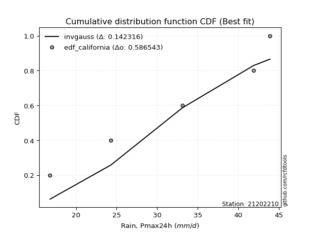</img>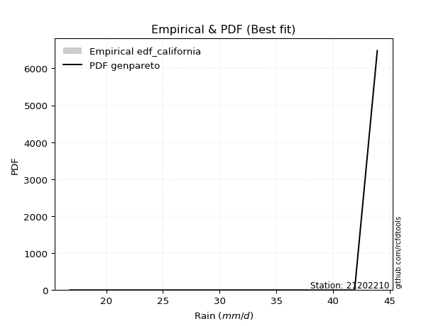</img>

</div>


### 2. EDF Hazen (1930)

Hazen method for plotting positions is a formula used to estimate the empirical cumulative probability distribution of flood events or other hydrological data. This formula often results in biased estimations, particularly when extrapolating to extreme events (high return periods).

<div align="center">


$P=(m-0.5)/n$


</div>


**2.1. Empirical values**

<div align="center">

|                | 0                  | 1                  | 2         | 3                 | 4                  |
|:---------------|:-------------------|:-------------------|:----------|:------------------|:-------------------|
| date           | 2012               | 2015               | 2014      | 2016              | 2013               |
| x              | 16.8               | 24.3               | 33.1      | 41.9              | 43.9               |
| m              | 1                  | 2                  | 3         | 4                 | 5                  |
| empirical_dist | edf_hazen          | edf_hazen          | edf_hazen | edf_hazen         | edf_hazen          |
| empirical      | 0.1                | 0.3                | 0.5       | 0.7               | 0.9                |
| empirical_tr   | 1.1111111111111112 | 1.4285714285714286 | 2.0       | 3.333333333333333 | 10.000000000000002 |

</div>


**2.2. Kolmogorov-Smirnov fit test (sorted by Δ)**


<div align="center">

|                | 0                   | 1                   | 2                  | 3                   | 4                   | 5                  | 6                   | 7                   | 8                  | 9                   | 10                 | 11                  | 12                  | 13                  | 14                  | 15                  | 16                  | 17                  | 18                  | 19                  | 20                  | 21                  | 22                  | 23                  | 24                  | 25                  | 26                 | 27                  | 28                 | 29                  | 30                  | 31                 | 32                  | 33                 | 34                 | 35                  | 36                 | 37                  | 38                  | 39                  | 40                  | 41                  | 42                  | 43                 | 44                  | 45                  | 46                  | 47                  | 48                 | 49                  | 50                  | 51                  | 52                 | 53                  | 54                  | 55                  | 56                 | 57                 | 58                  | 59                 | 60                  | 61                  | 62                 | 63                  | 64                  | 65                  | 66                  | 67                 | 68                  | 69                  | 70                 | 71                  | 72                 | 73                 | 74                 | 75                  | 76                  | 77                  | 78                  | 79                  | 80                  | 81                  | 82                 | 83                 | 84                  | 85                 | 86                  | 87                  | 88                 | 89                 | 90                 | 91                  | 92                  | 93                 | 94                 | 95                  | 96                 | 97                  | 98                  | 99                  | 100                 | 101                | 102                | 103                 | 104                 | 105                 | 106                 | 107                | 108                | 109                 | 110                 | 111                | 112                 | 113                | 114                 | 115                | 116                | 117                 | 118                 | 119                 | 120                | 121                 | 122                 | 123                | 124                 | 125                 | 126                 | 127                | 128                 | 129                | 130                | 131                 | 132                | 133                | 134                 | 135                 | 136                 | 137                 | 138                 | 139                | 140                | 141                | 142                | 143                 | 144                 | 145                | 146                 | 147                 | 148                | 149                | 150                | 151                | 152                | 153                | 154                | 155                | 156                | 157                | 158                | 159                |
|:---------------|:--------------------|:--------------------|:-------------------|:--------------------|:--------------------|:-------------------|:--------------------|:--------------------|:-------------------|:--------------------|:-------------------|:--------------------|:--------------------|:--------------------|:--------------------|:--------------------|:--------------------|:--------------------|:--------------------|:--------------------|:--------------------|:--------------------|:--------------------|:--------------------|:--------------------|:--------------------|:-------------------|:--------------------|:-------------------|:--------------------|:--------------------|:-------------------|:--------------------|:-------------------|:-------------------|:--------------------|:-------------------|:--------------------|:--------------------|:--------------------|:--------------------|:--------------------|:--------------------|:-------------------|:--------------------|:--------------------|:--------------------|:--------------------|:-------------------|:--------------------|:--------------------|:--------------------|:-------------------|:--------------------|:--------------------|:--------------------|:-------------------|:-------------------|:--------------------|:-------------------|:--------------------|:--------------------|:-------------------|:--------------------|:--------------------|:--------------------|:--------------------|:-------------------|:--------------------|:--------------------|:-------------------|:--------------------|:-------------------|:-------------------|:-------------------|:--------------------|:--------------------|:--------------------|:--------------------|:--------------------|:--------------------|:--------------------|:-------------------|:-------------------|:--------------------|:-------------------|:--------------------|:--------------------|:-------------------|:-------------------|:-------------------|:--------------------|:--------------------|:-------------------|:-------------------|:--------------------|:-------------------|:--------------------|:--------------------|:--------------------|:--------------------|:-------------------|:-------------------|:--------------------|:--------------------|:--------------------|:--------------------|:-------------------|:-------------------|:--------------------|:--------------------|:-------------------|:--------------------|:-------------------|:--------------------|:-------------------|:-------------------|:--------------------|:--------------------|:--------------------|:-------------------|:--------------------|:--------------------|:-------------------|:--------------------|:--------------------|:--------------------|:-------------------|:--------------------|:-------------------|:-------------------|:--------------------|:-------------------|:-------------------|:--------------------|:--------------------|:--------------------|:--------------------|:--------------------|:-------------------|:-------------------|:-------------------|:-------------------|:--------------------|:--------------------|:-------------------|:--------------------|:--------------------|:-------------------|:-------------------|:-------------------|:-------------------|:-------------------|:-------------------|:-------------------|:-------------------|:-------------------|:-------------------|:-------------------|:-------------------|
| station        | 21202210            | 21202210            | 21202210           | 21202210            | 21202210            | 21202210           | 21202210            | 21202210            | 21202210           | 21202210            | 21202210           | 21202210            | 21202210            | 21202210            | 21202210            | 21202210            | 21202210            | 21202210            | 21202210            | 21202210            | 21202210            | 21202210            | 21202210            | 21202210            | 21202210            | 21202210            | 21202210           | 21202210            | 21202210           | 21202210            | 21202210            | 21202210           | 21202210            | 21202210           | 21202210           | 21202210            | 21202210           | 21202210            | 21202210            | 21202210            | 21202210            | 21202210            | 21202210            | 21202210           | 21202210            | 21202210            | 21202210            | 21202210            | 21202210           | 21202210            | 21202210            | 21202210            | 21202210           | 21202210            | 21202210            | 21202210            | 21202210           | 21202210           | 21202210            | 21202210           | 21202210            | 21202210            | 21202210           | 21202210            | 21202210            | 21202210            | 21202210            | 21202210           | 21202210            | 21202210            | 21202210           | 21202210            | 21202210           | 21202210           | 21202210           | 21202210            | 21202210            | 21202210            | 21202210            | 21202210            | 21202210            | 21202210            | 21202210           | 21202210           | 21202210            | 21202210           | 21202210            | 21202210            | 21202210           | 21202210           | 21202210           | 21202210            | 21202210            | 21202210           | 21202210           | 21202210            | 21202210           | 21202210            | 21202210            | 21202210            | 21202210            | 21202210           | 21202210           | 21202210            | 21202210            | 21202210            | 21202210            | 21202210           | 21202210           | 21202210            | 21202210            | 21202210           | 21202210            | 21202210           | 21202210            | 21202210           | 21202210           | 21202210            | 21202210            | 21202210            | 21202210           | 21202210            | 21202210            | 21202210           | 21202210            | 21202210            | 21202210            | 21202210           | 21202210            | 21202210           | 21202210           | 21202210            | 21202210           | 21202210           | 21202210            | 21202210            | 21202210            | 21202210            | 21202210            | 21202210           | 21202210           | 21202210           | 21202210           | 21202210            | 21202210            | 21202210           | 21202210            | 21202210            | 21202210           | 21202210           | 21202210           | 21202210           | 21202210           | 21202210           | 21202210           | 21202210           | 21202210           | 21202210           | 21202210           | 21202210           |
| empirical_dist | edf_hazen           | edf_hazen           | edf_hazen          | edf_hazen           | edf_hazen           | edf_hazen          | edf_hazen           | edf_hazen           | edf_hazen          | edf_hazen           | edf_hazen          | edf_hazen           | edf_hazen           | edf_hazen           | edf_hazen           | edf_hazen           | edf_hazen           | edf_hazen           | edf_hazen           | edf_hazen           | edf_hazen           | edf_hazen           | edf_hazen           | edf_hazen           | edf_hazen           | edf_hazen           | edf_hazen          | edf_hazen           | edf_hazen          | edf_hazen           | edf_hazen           | edf_hazen          | edf_hazen           | edf_hazen          | edf_hazen          | edf_hazen           | edf_hazen          | edf_hazen           | edf_hazen           | edf_hazen           | edf_hazen           | edf_hazen           | edf_hazen           | edf_hazen          | edf_hazen           | edf_hazen           | edf_hazen           | edf_hazen           | edf_hazen          | edf_hazen           | edf_hazen           | edf_hazen           | edf_hazen          | edf_hazen           | edf_hazen           | edf_hazen           | edf_hazen          | edf_hazen          | edf_hazen           | edf_hazen          | edf_hazen           | edf_hazen           | edf_hazen          | edf_hazen           | edf_hazen           | edf_hazen           | edf_hazen           | edf_hazen          | edf_hazen           | edf_hazen           | edf_hazen          | edf_hazen           | edf_hazen          | edf_hazen          | edf_hazen          | edf_hazen           | edf_hazen           | edf_hazen           | edf_hazen           | edf_hazen           | edf_hazen           | edf_hazen           | edf_hazen          | edf_hazen          | edf_hazen           | edf_hazen          | edf_hazen           | edf_hazen           | edf_hazen          | edf_hazen          | edf_hazen          | edf_hazen           | edf_hazen           | edf_hazen          | edf_hazen          | edf_hazen           | edf_hazen          | edf_hazen           | edf_hazen           | edf_hazen           | edf_hazen           | edf_hazen          | edf_hazen          | edf_hazen           | edf_hazen           | edf_hazen           | edf_hazen           | edf_hazen          | edf_hazen          | edf_hazen           | edf_hazen           | edf_hazen          | edf_hazen           | edf_hazen          | edf_hazen           | edf_hazen          | edf_hazen          | edf_hazen           | edf_hazen           | edf_hazen           | edf_hazen          | edf_hazen           | edf_hazen           | edf_hazen          | edf_hazen           | edf_hazen           | edf_hazen           | edf_hazen          | edf_hazen           | edf_hazen          | edf_hazen          | edf_hazen           | edf_hazen          | edf_hazen          | edf_hazen           | edf_hazen           | edf_hazen           | edf_hazen           | edf_hazen           | edf_hazen          | edf_hazen          | edf_hazen          | edf_hazen          | edf_hazen           | edf_hazen           | edf_hazen          | edf_hazen           | edf_hazen           | edf_hazen          | edf_hazen          | edf_hazen          | edf_hazen          | edf_hazen          | edf_hazen          | edf_hazen          | edf_hazen          | edf_hazen          | edf_hazen          | edf_hazen          | edf_hazen          |
| p_dist         | ksone               | logtrapezoid        | logsemicircular    | loganglit           | semicircular        | trapezoid          | logksone            | logbeta             | beta               | logkappa3           | arcsine            | anglit              | loginvgamma         | logalpha            | logrice             | logerlang           | logf                | lognct              | logpearson3         | loggamma            | loggamma            | logcrystalball      | lognorm             | logt                | logexponnorm        | logfatiguelife      | logncf             | logloglaplace       | loggenextreme      | loginvgauss         | ncf                 | kstwobign          | logbetaprime        | logweibull_max     | logmaxwell         | invgauss            | rice               | alpha               | rayleigh            | loginvweibull       | erlang              | maxwell             | f                   | gamma              | pearson3            | halfnorm            | nct                 | exponnorm           | norm               | crystalball         | truncnorm           | t                   | betaprime          | invgamma            | logweibull_min      | loggompertz         | weibull_min        | logburr12          | logarcsine          | lograyleigh        | logdgamma           | loggumbel_l         | loggennorm         | loglogistic         | wrapcauchy          | logcosine           | logdweibull         | genextreme         | gumbel_r            | halflogistic        | cosine             | logistic            | logfoldnorm        | loghypsecant       | gumbel_l           | logkstwobign        | logmielke           | loggenexpon         | moyal               | lomax               | genexpon            | logburr             | loghalfnorm        | levy_l             | hypsecant           | argus              | loglaplace          | loglaplace          | loglevy_l          | dweibull           | genpareto          | loggumbel_r         | burr                | mielke             | laplace            | logargus            | genhalflogistic    | dgamma              | logwrapcauchy       | logloggamma         | burr12              | loghalflogistic    | logjohnsonsb       | kappa3              | logmoyal            | halfgennorm         | loggenhalflogistic  | skewnorm           | gennorm            | loghalfgennorm      | triang              | wald               | gausshyper          | tukeylambda        | kappa4              | logjohnsonsu       | logtriang          | uniform             | logskewnorm         | vonmises_line       | logtukeylambda     | logkappa4           | bradford            | truncexpon         | loguniform          | logexponweib        | logwald             | logvonmises_line   | loggausshyper       | truncweibull_min   | logbradford        | logtruncexpon       | loggengamma        | nakagami           | johnsonsb           | logtruncweibull_min | lognakagami         | weibull_max         | logrdist            | logexponpow        | gengamma           | gompertz           | exponweib          | johnsonsu           | foldnorm            | fatiguelife        | invweibull          | logtruncnorm        | powerlaw           | truncpareto        | logpowerlaw        | logtruncpareto     | exponpow           | loggenpareto       | rdist              | genlogistic        | loggenlogistic     | loglomax           | logvonmises        | vonmises           |
| delta          | 0.07727894479005681 | 0.07908432795400722 | 0.0829134652485013 | 0.09315386344721388 | 0.09354597223662175 | 0.0975632671061415 | 0.09803909703395841 | 0.09999901576345382 | 0.0999998814347175 | 0.09999999999988643 | 0.1                | 0.10524450828788734 | 0.11712063977058251 | 0.11783338391194054 | 0.11816073395681426 | 0.11872949483917117 | 0.11891550951637064 | 0.11905001525370706 | 0.11926575927175131 | 0.11935295448420691 | 0.11935295448420691 | 0.12026400140940063 | 0.12026400163741924 | 0.12026492875532102 | 0.12026795765702325 | 0.12032128328855818 | 0.1205183673544199 | 0.12077616581359421 | 0.1238134108425758 | 0.12582888765188516 | 0.12593289002945707 | 0.1262064196936753 | 0.12620947126969995 | 0.1265613560616703 | 0.1291662094165944 | 0.12952701945548584 | 0.1297319640223752 | 0.12989389504036053 | 0.13001881536640836 | 0.13004838584063394 | 0.13030045749292862 | 0.13034000147950953 | 0.13034712665296988 | 0.1304148776087043 | 0.13139922433668205 | 0.13145575324363468 | 0.13149482802897738 | 0.13160334025493914 | 0.1316038287570791 | 0.13160384049247664 | 0.13160385085955417 | 0.13160655549594624 | 0.131703953900967  | 0.13189765629890882 | 0.13198614291863098 | 0.13269623314229162 | 0.1328608344818778 | 0.1346071777880734 | 0.13499941181457153 | 0.1373031402849667 | 0.13743964422300103 | 0.13775010799496956 | 0.1386409322394271 | 0.14052162200593266 | 0.14195388025237726 | 0.14461130429246283 | 0.14486746538949014 | 0.1467904336890582 | 0.14891518707679507 | 0.14964598158140652 | 0.1501329704975548 | 0.15096565566929876 | 0.1513671038385711 | 0.1518170569738514 | 0.1540614081051096 | 0.15430494105798798 | 0.15448416863263814 | 0.15520869361745748 | 0.15534043407156584 | 0.15717321745652346 | 0.15825482115541245 | 0.15953336653909944 | 0.1604904929188532 | 0.1609462328718143 | 0.16142433893551955 | 0.1624037414004298 | 0.16318045397293446 | 0.16318045397293446 | 0.1655441941968483 | 0.1667585120158731 | 0.1688641469729901 | 0.16910811033479745 | 0.16936697772893805 | 0.1711739756750189 | 0.1714620442616568 | 0.17524026817322147 | 0.1764445491624782 | 0.17826036114283705 | 0.18204451435538743 | 0.18268248941116028 | 0.18327329747225818 | 0.1888175118187223 | 0.1893444682972918 | 0.19024508698331644 | 0.19168961064954748 | 0.19183016184168272 | 0.19531800290207102 | 0.1989029514858186 | 0.2                | 0.20275704777194303 | 0.20503527991155823 | 0.2074814828955147 | 0.21527977754102645 | 0.2180207317730336 | 0.21918599682671136 | 0.2209207369876613 | 0.2249732134121235 | 0.22619926199261997 | 0.22861532453501743 | 0.22958682697362365 | 0.2429549750043336 | 0.24436101029575918 | 0.24657856404560075 | 0.2507534734987975 | 0.25145572821318696 | 0.25306220741956204 | 0.25465556659575606 | 0.2566389673654811 | 0.25755772676628697 | 0.2607793832179863 | 0.2721738359424313 | 0.28759092241462336 | 0.2893002596822716 | 0.2999997951099415 | 0.32625660334401624 | 0.355892462170428   | 0.36450122634640003 | 0.37772757447134575 | 0.39143036958837596 | 0.4030808842057734 | 0.4326219891996755 | 0.4400862689389589 | 0.4508490724204918 | 0.45812052891379645 | 0.45943171568233176 | 0.4769548072412158 | 0.48859430325583525 | 0.49999767081950447 | 0.5461197172681516 | 0.5654621498878165 | 0.5777180886383178 | 0.6000607672667848 | 0.6037631543595965 | 0.6265740940607735 | 0.6999999999821027 | 0.7                | 0.7                | 0.7018339930899995 | 1.1186796016376455 | 6.883677666189743  |
| deltao         | 0.5865427407550001  | 0.5865427407550001  | 0.5865427407550001 | 0.5865427407550001  | 0.5865427407550001  | 0.5865427407550001 | 0.5865427407550001  | 0.5865427407550001  | 0.5865427407550001 | 0.5865427407550001  | 0.5865427407550001 | 0.5865427407550001  | 0.5865427407550001  | 0.5865427407550001  | 0.5865427407550001  | 0.5865427407550001  | 0.5865427407550001  | 0.5865427407550001  | 0.5865427407550001  | 0.5865427407550001  | 0.5865427407550001  | 0.5865427407550001  | 0.5865427407550001  | 0.5865427407550001  | 0.5865427407550001  | 0.5865427407550001  | 0.5865427407550001 | 0.5865427407550001  | 0.5865427407550001 | 0.5865427407550001  | 0.5865427407550001  | 0.5865427407550001 | 0.5865427407550001  | 0.5865427407550001 | 0.5865427407550001 | 0.5865427407550001  | 0.5865427407550001 | 0.5865427407550001  | 0.5865427407550001  | 0.5865427407550001  | 0.5865427407550001  | 0.5865427407550001  | 0.5865427407550001  | 0.5865427407550001 | 0.5865427407550001  | 0.5865427407550001  | 0.5865427407550001  | 0.5865427407550001  | 0.5865427407550001 | 0.5865427407550001  | 0.5865427407550001  | 0.5865427407550001  | 0.5865427407550001 | 0.5865427407550001  | 0.5865427407550001  | 0.5865427407550001  | 0.5865427407550001 | 0.5865427407550001 | 0.5865427407550001  | 0.5865427407550001 | 0.5865427407550001  | 0.5865427407550001  | 0.5865427407550001 | 0.5865427407550001  | 0.5865427407550001  | 0.5865427407550001  | 0.5865427407550001  | 0.5865427407550001 | 0.5865427407550001  | 0.5865427407550001  | 0.5865427407550001 | 0.5865427407550001  | 0.5865427407550001 | 0.5865427407550001 | 0.5865427407550001 | 0.5865427407550001  | 0.5865427407550001  | 0.5865427407550001  | 0.5865427407550001  | 0.5865427407550001  | 0.5865427407550001  | 0.5865427407550001  | 0.5865427407550001 | 0.5865427407550001 | 0.5865427407550001  | 0.5865427407550001 | 0.5865427407550001  | 0.5865427407550001  | 0.5865427407550001 | 0.5865427407550001 | 0.5865427407550001 | 0.5865427407550001  | 0.5865427407550001  | 0.5865427407550001 | 0.5865427407550001 | 0.5865427407550001  | 0.5865427407550001 | 0.5865427407550001  | 0.5865427407550001  | 0.5865427407550001  | 0.5865427407550001  | 0.5865427407550001 | 0.5865427407550001 | 0.5865427407550001  | 0.5865427407550001  | 0.5865427407550001  | 0.5865427407550001  | 0.5865427407550001 | 0.5865427407550001 | 0.5865427407550001  | 0.5865427407550001  | 0.5865427407550001 | 0.5865427407550001  | 0.5865427407550001 | 0.5865427407550001  | 0.5865427407550001 | 0.5865427407550001 | 0.5865427407550001  | 0.5865427407550001  | 0.5865427407550001  | 0.5865427407550001 | 0.5865427407550001  | 0.5865427407550001  | 0.5865427407550001 | 0.5865427407550001  | 0.5865427407550001  | 0.5865427407550001  | 0.5865427407550001 | 0.5865427407550001  | 0.5865427407550001 | 0.5865427407550001 | 0.5865427407550001  | 0.5865427407550001 | 0.5865427407550001 | 0.5865427407550001  | 0.5865427407550001  | 0.5865427407550001  | 0.5865427407550001  | 0.5865427407550001  | 0.5865427407550001 | 0.5865427407550001 | 0.5865427407550001 | 0.5865427407550001 | 0.5865427407550001  | 0.5865427407550001  | 0.5865427407550001 | 0.5865427407550001  | 0.5865427407550001  | 0.5865427407550001 | 0.5865427407550001 | 0.5865427407550001 | 0.5865427407550001 | 0.5865427407550001 | 0.5865427407550001 | 0.5865427407550001 | 0.5865427407550001 | 0.5865427407550001 | 0.5865427407550001 | 0.5865427407550001 | 0.5865427407550001 |
| eval           | Δo > Δ              | Δo > Δ              | Δo > Δ             | Δo > Δ              | Δo > Δ              | Δo > Δ             | Δo > Δ              | Δo > Δ              | Δo > Δ             | Δo > Δ              | Δo > Δ             | Δo > Δ              | Δo > Δ              | Δo > Δ              | Δo > Δ              | Δo > Δ              | Δo > Δ              | Δo > Δ              | Δo > Δ              | Δo > Δ              | Δo > Δ              | Δo > Δ              | Δo > Δ              | Δo > Δ              | Δo > Δ              | Δo > Δ              | Δo > Δ             | Δo > Δ              | Δo > Δ             | Δo > Δ              | Δo > Δ              | Δo > Δ             | Δo > Δ              | Δo > Δ             | Δo > Δ             | Δo > Δ              | Δo > Δ             | Δo > Δ              | Δo > Δ              | Δo > Δ              | Δo > Δ              | Δo > Δ              | Δo > Δ              | Δo > Δ             | Δo > Δ              | Δo > Δ              | Δo > Δ              | Δo > Δ              | Δo > Δ             | Δo > Δ              | Δo > Δ              | Δo > Δ              | Δo > Δ             | Δo > Δ              | Δo > Δ              | Δo > Δ              | Δo > Δ             | Δo > Δ             | Δo > Δ              | Δo > Δ             | Δo > Δ              | Δo > Δ              | Δo > Δ             | Δo > Δ              | Δo > Δ              | Δo > Δ              | Δo > Δ              | Δo > Δ             | Δo > Δ              | Δo > Δ              | Δo > Δ             | Δo > Δ              | Δo > Δ             | Δo > Δ             | Δo > Δ             | Δo > Δ              | Δo > Δ              | Δo > Δ              | Δo > Δ              | Δo > Δ              | Δo > Δ              | Δo > Δ              | Δo > Δ             | Δo > Δ             | Δo > Δ              | Δo > Δ             | Δo > Δ              | Δo > Δ              | Δo > Δ             | Δo > Δ             | Δo > Δ             | Δo > Δ              | Δo > Δ              | Δo > Δ             | Δo > Δ             | Δo > Δ              | Δo > Δ             | Δo > Δ              | Δo > Δ              | Δo > Δ              | Δo > Δ              | Δo > Δ             | Δo > Δ             | Δo > Δ              | Δo > Δ              | Δo > Δ              | Δo > Δ              | Δo > Δ             | Δo > Δ             | Δo > Δ              | Δo > Δ              | Δo > Δ             | Δo > Δ              | Δo > Δ             | Δo > Δ              | Δo > Δ             | Δo > Δ             | Δo > Δ              | Δo > Δ              | Δo > Δ              | Δo > Δ             | Δo > Δ              | Δo > Δ              | Δo > Δ             | Δo > Δ              | Δo > Δ              | Δo > Δ              | Δo > Δ             | Δo > Δ              | Δo > Δ             | Δo > Δ             | Δo > Δ              | Δo > Δ             | Δo > Δ             | Δo > Δ              | Δo > Δ              | Δo > Δ              | Δo > Δ              | Δo > Δ              | Δo > Δ             | Δo > Δ             | Δo > Δ             | Δo > Δ             | Δo > Δ              | Δo > Δ              | Δo > Δ             | Δo > Δ              | Δo > Δ              | Δo > Δ             | Δo > Δ             | Δo > Δ             | Δo <= Δ            | Δo <= Δ            | Δo <= Δ            | Δo <= Δ            | Δo <= Δ            | Δo <= Δ            | Δo <= Δ            | Δo <= Δ            | Δo <= Δ            |
| fit            | 1                   | 1                   | 1                  | 1                   | 1                   | 1                  | 1                   | 1                   | 1                  | 1                   | 1                  | 1                   | 1                   | 1                   | 1                   | 1                   | 1                   | 1                   | 1                   | 1                   | 1                   | 1                   | 1                   | 1                   | 1                   | 1                   | 1                  | 1                   | 1                  | 1                   | 1                   | 1                  | 1                   | 1                  | 1                  | 1                   | 1                  | 1                   | 1                   | 1                   | 1                   | 1                   | 1                   | 1                  | 1                   | 1                   | 1                   | 1                   | 1                  | 1                   | 1                   | 1                   | 1                  | 1                   | 1                   | 1                   | 1                  | 1                  | 1                   | 1                  | 1                   | 1                   | 1                  | 1                   | 1                   | 1                   | 1                   | 1                  | 1                   | 1                   | 1                  | 1                   | 1                  | 1                  | 1                  | 1                   | 1                   | 1                   | 1                   | 1                   | 1                   | 1                   | 1                  | 1                  | 1                   | 1                  | 1                   | 1                   | 1                  | 1                  | 1                  | 1                   | 1                   | 1                  | 1                  | 1                   | 1                  | 1                   | 1                   | 1                   | 1                   | 1                  | 1                  | 1                   | 1                   | 1                   | 1                   | 1                  | 1                  | 1                   | 1                   | 1                  | 1                   | 1                  | 1                   | 1                  | 1                  | 1                   | 1                   | 1                   | 1                  | 1                   | 1                   | 1                  | 1                   | 1                   | 1                   | 1                  | 1                   | 1                  | 1                  | 1                   | 1                  | 1                  | 1                   | 1                   | 1                   | 1                   | 1                   | 1                  | 1                  | 1                  | 1                  | 1                   | 1                   | 1                  | 1                   | 1                   | 1                  | 1                  | 1                  | 0                  | 0                  | 0                  | 0                  | 0                  | 0                  | 0                  | 0                  | 0                  |
| n              | 5                   | 5                   | 5                  | 5                   | 5                   | 5                  | 5                   | 5                   | 5                  | 5                   | 5                  | 5                   | 5                   | 5                   | 5                   | 5                   | 5                   | 5                   | 5                   | 5                   | 5                   | 5                   | 5                   | 5                   | 5                   | 5                   | 5                  | 5                   | 5                  | 5                   | 5                   | 5                  | 5                   | 5                  | 5                  | 5                   | 5                  | 5                   | 5                   | 5                   | 5                   | 5                   | 5                   | 5                  | 5                   | 5                   | 5                   | 5                   | 5                  | 5                   | 5                   | 5                   | 5                  | 5                   | 5                   | 5                   | 5                  | 5                  | 5                   | 5                  | 5                   | 5                   | 5                  | 5                   | 5                   | 5                   | 5                   | 5                  | 5                   | 5                   | 5                  | 5                   | 5                  | 5                  | 5                  | 5                   | 5                   | 5                   | 5                   | 5                   | 5                   | 5                   | 5                  | 5                  | 5                   | 5                  | 5                   | 5                   | 5                  | 5                  | 5                  | 5                   | 5                   | 5                  | 5                  | 5                   | 5                  | 5                   | 5                   | 5                   | 5                   | 5                  | 5                  | 5                   | 5                   | 5                   | 5                   | 5                  | 5                  | 5                   | 5                   | 5                  | 5                   | 5                  | 5                   | 5                  | 5                  | 5                   | 5                   | 5                   | 5                  | 5                   | 5                   | 5                  | 5                   | 5                   | 5                   | 5                  | 5                   | 5                  | 5                  | 5                   | 5                  | 5                  | 5                   | 5                   | 5                   | 5                   | 5                   | 5                  | 5                  | 5                  | 5                  | 5                   | 5                   | 5                  | 5                   | 5                   | 5                  | 5                  | 5                  | 5                  | 5                  | 5                  | 5                  | 5                  | 5                  | 5                  | 5                  | 5                  |
| best_fit       | 1                   | 0                   | 0                  | 0                   | 0                   | 0                  | 0                   | 0                   | 0                  | 0                   | 0                  | 0                   | 0                   | 0                   | 0                   | 0                   | 0                   | 0                   | 0                   | 0                   | 0                   | 0                   | 0                   | 0                   | 0                   | 0                   | 0                  | 0                   | 0                  | 0                   | 0                   | 0                  | 0                   | 0                  | 0                  | 0                   | 0                  | 0                   | 0                   | 0                   | 0                   | 0                   | 0                   | 0                  | 0                   | 0                   | 0                   | 0                   | 0                  | 0                   | 0                   | 0                   | 0                  | 0                   | 0                   | 0                   | 0                  | 0                  | 0                   | 0                  | 0                   | 0                   | 0                  | 0                   | 0                   | 0                   | 0                   | 0                  | 0                   | 0                   | 0                  | 0                   | 0                  | 0                  | 0                  | 0                   | 0                   | 0                   | 0                   | 0                   | 0                   | 0                   | 0                  | 0                  | 0                   | 0                  | 0                   | 0                   | 0                  | 0                  | 0                  | 0                   | 0                   | 0                  | 0                  | 0                   | 0                  | 0                   | 0                   | 0                   | 0                   | 0                  | 0                  | 0                   | 0                   | 0                   | 0                   | 0                  | 0                  | 0                   | 0                   | 0                  | 0                   | 0                  | 0                   | 0                  | 0                  | 0                   | 0                   | 0                   | 0                  | 0                   | 0                   | 0                  | 0                   | 0                   | 0                   | 0                  | 0                   | 0                  | 0                  | 0                   | 0                  | 0                  | 0                   | 0                   | 0                   | 0                   | 0                   | 0                  | 0                  | 0                  | 0                  | 0                   | 0                   | 0                  | 0                   | 0                   | 0                  | 0                  | 0                  | 0                  | 0                  | 0                  | 0                  | 0                  | 0                  | 0                  | 0                  | 0                  |
| best_fit_sort  | 1                   | 2                   | 3                  | 4                   | 5                   | 6                  | 7                   | 8                   | 9                  | 10                  | 11                 | 12                  | 13                  | 14                  | 15                  | 16                  | 17                  | 18                  | 19                  | 20                  | 21                  | 22                  | 23                  | 24                  | 25                  | 26                  | 27                 | 28                  | 29                 | 30                  | 31                  | 32                 | 33                  | 34                 | 35                 | 36                  | 37                 | 38                  | 39                  | 40                  | 41                  | 42                  | 43                  | 44                 | 45                  | 46                  | 47                  | 48                  | 49                 | 50                  | 51                  | 52                  | 53                 | 54                  | 55                  | 56                  | 57                 | 58                 | 59                  | 60                 | 61                  | 62                  | 63                 | 64                  | 65                  | 66                  | 67                  | 68                 | 69                  | 70                  | 71                 | 72                  | 73                 | 74                 | 75                 | 76                  | 77                  | 78                  | 79                  | 80                  | 81                  | 82                  | 83                 | 84                 | 85                  | 86                 | 87                  | 88                  | 89                 | 90                 | 91                 | 92                  | 93                  | 94                 | 95                 | 96                  | 97                 | 98                  | 99                  | 100                 | 101                 | 102                | 103                | 104                 | 105                 | 106                 | 107                 | 108                | 109                | 110                 | 111                 | 112                | 113                 | 114                | 115                 | 116                | 117                | 118                 | 119                 | 120                 | 121                | 122                 | 123                 | 124                | 125                 | 126                 | 127                 | 128                | 129                 | 130                | 131                | 132                 | 133                | 134                | 135                 | 136                 | 137                 | 138                 | 139                 | 140                | 141                | 142                | 143                | 144                 | 145                 | 146                | 147                 | 148                 | 149                | 150                | 151                | 152                | 153                | 154                | 155                | 156                | 157                | 158                | 159                | 160                |

</div>


**2.3. Best fit**

<div align="center">

|   id |   station | empirical_dist   | p_dist   |     delta |   deltao | eval   |   fit |   n |   best_fit |   best_fit_sort |
|-----:|----------:|:-----------------|:---------|----------:|---------:|:-------|------:|----:|-----------:|----------------:|
|    0 |  21202210 | edf_hazen        | ksone    | 0.0772789 | 0.586543 | Δo > Δ |     1 |   5 |          1 |               1 |

</div>


<div align="center">

</img>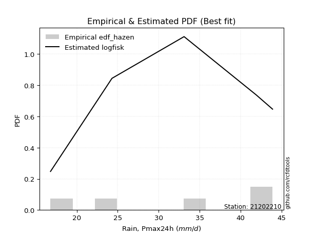</img>

</div>


### 3. EDF Weibull (1939)

Weibull plotting position formula is an empirical method used to estimate the non-exceedance probability or plotting position for a set of observed data, is often recommended or widely used in practice, particularly in flood frequency analysis.

<div align="center">


$P=m/(n+1)$


</div>


**3.1. Empirical values**

<div align="center">

|                | 0                   | 1                  | 2           | 3                  | 4                  |
|:---------------|:--------------------|:-------------------|:------------|:-------------------|:-------------------|
| date           | 2012                | 2015               | 2014        | 2016               | 2013               |
| x              | 16.8                | 24.3               | 33.1        | 41.9               | 43.9               |
| m              | 1                   | 2                  | 3           | 4                  | 5                  |
| empirical_dist | edf_weibull         | edf_weibull        | edf_weibull | edf_weibull        | edf_weibull        |
| empirical      | 0.16666666666666666 | 0.3333333333333333 | 0.5         | 0.6666666666666666 | 0.8333333333333334 |
| empirical_tr   | 1.2                 | 1.4999999999999998 | 2.0         | 2.9999999999999996 | 6.000000000000002  |

</div>


**3.2. Kolmogorov-Smirnov fit test (sorted by Δ)**


<div align="center">

|                | 0                   | 1                   | 2                   | 3                   | 4                   | 5                  | 6                   | 7                   | 8                   | 9                   | 10                  | 11                  | 12                  | 13                  | 14                  | 15                 | 16                  | 17                 | 18                  | 19                  | 20                  | 21                  | 22                  | 23                  | 24                  | 25                 | 26                  | 27                 | 28                  | 29                  | 30                  | 31                 | 32                  | 33                 | 34                  | 35                  | 36                  | 37                  | 38                  | 39                  | 40                 | 41                  | 42                  | 43                 | 44                  | 45                  | 46                  | 47                 | 48                  | 49                  | 50                  | 51                  | 52                 | 53                 | 54                  | 55                  | 56                  | 57                  | 58                  | 59                 | 60                  | 61                  | 62                  | 63                  | 64                  | 65                 | 66                  | 67                  | 68                  | 69                  | 70                  | 71                  | 72                  | 73                  | 74                  | 75                 | 76                  | 77                  | 78                  | 79                  | 80                 | 81                 | 82                  | 83                  | 84                  | 85                  | 86                  | 87                  | 88                  | 89                  | 90                  | 91                 | 92                  | 93                  | 94                  | 95                  | 96                  | 97                  | 98                  | 99                  | 100                 | 101                 | 102                 | 103                | 104                | 105                 | 106                 | 107                | 108                 | 109                | 110                 | 111                 | 112                 | 113                 | 114                 | 115                 | 116                | 117                 | 118                 | 119                | 120                 | 121                | 122                 | 123                | 124                 | 125                 | 126                | 127                | 128                | 129                | 130                | 131                 | 132                 | 133                 | 134                 | 135                | 136                 | 137                 | 138                 | 139                | 140                 | 141                | 142                | 143                 | 144                | 145                | 146                 | 147                 | 148                | 149                | 150                | 151                | 152                | 153                | 154                | 155                | 156                | 157                | 158                | 159                |
|:---------------|:--------------------|:--------------------|:--------------------|:--------------------|:--------------------|:-------------------|:--------------------|:--------------------|:--------------------|:--------------------|:--------------------|:--------------------|:--------------------|:--------------------|:--------------------|:-------------------|:--------------------|:-------------------|:--------------------|:--------------------|:--------------------|:--------------------|:--------------------|:--------------------|:--------------------|:-------------------|:--------------------|:-------------------|:--------------------|:--------------------|:--------------------|:-------------------|:--------------------|:-------------------|:--------------------|:--------------------|:--------------------|:--------------------|:--------------------|:--------------------|:-------------------|:--------------------|:--------------------|:-------------------|:--------------------|:--------------------|:--------------------|:-------------------|:--------------------|:--------------------|:--------------------|:--------------------|:-------------------|:-------------------|:--------------------|:--------------------|:--------------------|:--------------------|:--------------------|:-------------------|:--------------------|:--------------------|:--------------------|:--------------------|:--------------------|:-------------------|:--------------------|:--------------------|:--------------------|:--------------------|:--------------------|:--------------------|:--------------------|:--------------------|:--------------------|:-------------------|:--------------------|:--------------------|:--------------------|:--------------------|:-------------------|:-------------------|:--------------------|:--------------------|:--------------------|:--------------------|:--------------------|:--------------------|:--------------------|:--------------------|:--------------------|:-------------------|:--------------------|:--------------------|:--------------------|:--------------------|:--------------------|:--------------------|:--------------------|:--------------------|:--------------------|:--------------------|:--------------------|:-------------------|:-------------------|:--------------------|:--------------------|:-------------------|:--------------------|:-------------------|:--------------------|:--------------------|:--------------------|:--------------------|:--------------------|:--------------------|:-------------------|:--------------------|:--------------------|:-------------------|:--------------------|:-------------------|:--------------------|:-------------------|:--------------------|:--------------------|:-------------------|:-------------------|:-------------------|:-------------------|:-------------------|:--------------------|:--------------------|:--------------------|:--------------------|:-------------------|:--------------------|:--------------------|:--------------------|:-------------------|:--------------------|:-------------------|:-------------------|:--------------------|:-------------------|:-------------------|:--------------------|:--------------------|:-------------------|:-------------------|:-------------------|:-------------------|:-------------------|:-------------------|:-------------------|:-------------------|:-------------------|:-------------------|:-------------------|:-------------------|
| station        | 21202210            | 21202210            | 21202210            | 21202210            | 21202210            | 21202210           | 21202210            | 21202210            | 21202210            | 21202210            | 21202210            | 21202210            | 21202210            | 21202210            | 21202210            | 21202210           | 21202210            | 21202210           | 21202210            | 21202210            | 21202210            | 21202210            | 21202210            | 21202210            | 21202210            | 21202210           | 21202210            | 21202210           | 21202210            | 21202210            | 21202210            | 21202210           | 21202210            | 21202210           | 21202210            | 21202210            | 21202210            | 21202210            | 21202210            | 21202210            | 21202210           | 21202210            | 21202210            | 21202210           | 21202210            | 21202210            | 21202210            | 21202210           | 21202210            | 21202210            | 21202210            | 21202210            | 21202210           | 21202210           | 21202210            | 21202210            | 21202210            | 21202210            | 21202210            | 21202210           | 21202210            | 21202210            | 21202210            | 21202210            | 21202210            | 21202210           | 21202210            | 21202210            | 21202210            | 21202210            | 21202210            | 21202210            | 21202210            | 21202210            | 21202210            | 21202210           | 21202210            | 21202210            | 21202210            | 21202210            | 21202210           | 21202210           | 21202210            | 21202210            | 21202210            | 21202210            | 21202210            | 21202210            | 21202210            | 21202210            | 21202210            | 21202210           | 21202210            | 21202210            | 21202210            | 21202210            | 21202210            | 21202210            | 21202210            | 21202210            | 21202210            | 21202210            | 21202210            | 21202210           | 21202210           | 21202210            | 21202210            | 21202210           | 21202210            | 21202210           | 21202210            | 21202210            | 21202210            | 21202210            | 21202210            | 21202210            | 21202210           | 21202210            | 21202210            | 21202210           | 21202210            | 21202210           | 21202210            | 21202210           | 21202210            | 21202210            | 21202210           | 21202210           | 21202210           | 21202210           | 21202210           | 21202210            | 21202210            | 21202210            | 21202210            | 21202210           | 21202210            | 21202210            | 21202210            | 21202210           | 21202210            | 21202210           | 21202210           | 21202210            | 21202210           | 21202210           | 21202210            | 21202210            | 21202210           | 21202210           | 21202210           | 21202210           | 21202210           | 21202210           | 21202210           | 21202210           | 21202210           | 21202210           | 21202210           | 21202210           |
| empirical_dist | edf_weibull         | edf_weibull         | edf_weibull         | edf_weibull         | edf_weibull         | edf_weibull        | edf_weibull         | edf_weibull         | edf_weibull         | edf_weibull         | edf_weibull         | edf_weibull         | edf_weibull         | edf_weibull         | edf_weibull         | edf_weibull        | edf_weibull         | edf_weibull        | edf_weibull         | edf_weibull         | edf_weibull         | edf_weibull         | edf_weibull         | edf_weibull         | edf_weibull         | edf_weibull        | edf_weibull         | edf_weibull        | edf_weibull         | edf_weibull         | edf_weibull         | edf_weibull        | edf_weibull         | edf_weibull        | edf_weibull         | edf_weibull         | edf_weibull         | edf_weibull         | edf_weibull         | edf_weibull         | edf_weibull        | edf_weibull         | edf_weibull         | edf_weibull        | edf_weibull         | edf_weibull         | edf_weibull         | edf_weibull        | edf_weibull         | edf_weibull         | edf_weibull         | edf_weibull         | edf_weibull        | edf_weibull        | edf_weibull         | edf_weibull         | edf_weibull         | edf_weibull         | edf_weibull         | edf_weibull        | edf_weibull         | edf_weibull         | edf_weibull         | edf_weibull         | edf_weibull         | edf_weibull        | edf_weibull         | edf_weibull         | edf_weibull         | edf_weibull         | edf_weibull         | edf_weibull         | edf_weibull         | edf_weibull         | edf_weibull         | edf_weibull        | edf_weibull         | edf_weibull         | edf_weibull         | edf_weibull         | edf_weibull        | edf_weibull        | edf_weibull         | edf_weibull         | edf_weibull         | edf_weibull         | edf_weibull         | edf_weibull         | edf_weibull         | edf_weibull         | edf_weibull         | edf_weibull        | edf_weibull         | edf_weibull         | edf_weibull         | edf_weibull         | edf_weibull         | edf_weibull         | edf_weibull         | edf_weibull         | edf_weibull         | edf_weibull         | edf_weibull         | edf_weibull        | edf_weibull        | edf_weibull         | edf_weibull         | edf_weibull        | edf_weibull         | edf_weibull        | edf_weibull         | edf_weibull         | edf_weibull         | edf_weibull         | edf_weibull         | edf_weibull         | edf_weibull        | edf_weibull         | edf_weibull         | edf_weibull        | edf_weibull         | edf_weibull        | edf_weibull         | edf_weibull        | edf_weibull         | edf_weibull         | edf_weibull        | edf_weibull        | edf_weibull        | edf_weibull        | edf_weibull        | edf_weibull         | edf_weibull         | edf_weibull         | edf_weibull         | edf_weibull        | edf_weibull         | edf_weibull         | edf_weibull         | edf_weibull        | edf_weibull         | edf_weibull        | edf_weibull        | edf_weibull         | edf_weibull        | edf_weibull        | edf_weibull         | edf_weibull         | edf_weibull        | edf_weibull        | edf_weibull        | edf_weibull        | edf_weibull        | edf_weibull        | edf_weibull        | edf_weibull        | edf_weibull        | edf_weibull        | edf_weibull        | edf_weibull        |
| p_dist         | logncf              | ksone               | logtrapezoid        | logsemicircular     | logbetaprime        | loganglit          | semicircular        | loginvweibull       | trapezoid           | logksone            | anglit              | loginvgauss         | logalpha            | loginvgamma         | logrice             | logerlang          | logf                | lognct             | logpearson3         | loggamma            | loggamma            | logcrystalball      | lognorm             | logt                | logexponnorm        | logfatiguelife     | logmaxwell          | lograyleigh        | logloglaplace       | logkstwobign        | loggenexpon         | ncf                | kstwobign           | levy_l             | invgauss            | rice                | alpha               | rayleigh            | erlang              | maxwell             | f                  | gamma               | pearson3            | nct                | exponnorm           | norm                | crystalball         | truncnorm          | t                   | logdweibull         | betaprime           | invgamma            | logweibull_min     | loglevy_l          | weibull_min         | logbeta             | genexpon            | logjohnsonsb        | beta                | wrapcauchy         | loggompertz         | logwrapcauchy       | logweibull_max      | lomax               | logkappa3           | loggenextreme      | genextreme          | arcsine             | halfnorm            | logfoldnorm         | logarcsine          | loghalfnorm         | gennorm             | logburr12           | logdgamma           | loggumbel_l        | loggennorm          | loglogistic         | loggumbel_r         | logcosine           | halfgennorm        | gumbel_r           | halflogistic        | burr12              | cosine              | logistic            | loghypsecant        | gumbel_l            | logjohnsonsu        | logmielke           | moyal               | loghalflogistic    | logmoyal            | logburr             | hypsecant           | argus               | loglaplace          | loglaplace          | genpareto           | dweibull            | burr                | loghalfgennorm      | mielke              | laplace            | logargus           | genhalflogistic     | dgamma              | logloggamma        | wald                | logexponweib       | kappa3              | loggenhalflogistic  | skewnorm            | triang              | gausshyper          | tukeylambda         | kappa4             | logwald             | logtriang           | uniform            | logskewnorm         | vonmises_line      | logtukeylambda      | logkappa4          | bradford            | truncexpon          | loguniform         | loggengamma        | logvonmises_line   | loggausshyper      | johnsonsb          | truncweibull_min    | logbradford         | logtruncexpon       | nakagami            | logrdist           | weibull_max         | logtruncweibull_min | lognakagami         | logexponpow        | gengamma            | exponweib          | invweibull         | johnsonsu           | gompertz           | fatiguelife        | foldnorm            | logtruncnorm        | powerlaw           | truncpareto        | logpowerlaw        | loggenpareto       | logtruncpareto     | exponpow           | loglomax           | rdist              | genlogistic        | loggenlogistic     | logvonmises        | vonmises           |
| delta          | 0.08993631177099093 | 0.11061227812339014 | 0.11241766128734054 | 0.11928686793180268 | 0.12637726303818742 | 0.1264871967805472 | 0.12687930556995508 | 0.13004838584063394 | 0.13089660043947482 | 0.13569666850889658 | 0.13857784162122067 | 0.14864259211285247 | 0.14978275029678834 | 0.15045397310391584 | 0.15149406729014758 | 0.1520628281725045 | 0.15224884284970397 | 0.1523833485870404 | 0.15259909260508464 | 0.15268628781754023 | 0.15268628781754023 | 0.15359733474273396 | 0.15359733497075256 | 0.15359826208865435 | 0.15360129099035658 | 0.1536546166218915 | 0.15382781636747145 | 0.1539145104706907 | 0.15410949914692754 | 0.15430494105798798 | 0.15807781800218468 | 0.1592662233627904 | 0.15953975302700862 | 0.1609462328718143 | 0.16286035278881916 | 0.16306529735570852 | 0.16322722837369386 | 0.16335214869974168 | 0.16363379082626195 | 0.16367333481284285 | 0.1636804599863032 | 0.16374821094203762 | 0.16473255767001538 | 0.1648281613623107 | 0.16493667358827246 | 0.16493716209041243 | 0.16493717382580997 | 0.1649371841928875 | 0.16493988882927957 | 0.16501259988252281 | 0.16503728723430033 | 0.16523098963224214 | 0.1653194762519643 | 0.1655441941968483 | 0.16619416781521112 | 0.16666568243012048 | 0.16666571921940151 | 0.16666648274061818 | 0.16666654810138415 | 0.1666666381893228 | 0.16666665753597087 | 0.16666666308081046 | 0.16666666664657437 | 0.16666666665721833 | 0.16666666666655308 | 0.1666666666666029 | 0.16666666666666663 | 0.16666666666666666 | 0.16666666666666666 | 0.16666666666666666 | 0.16666666666666666 | 0.16666666666666666 | 0.16666666666666669 | 0.16794051112140673 | 0.17077297755633436 | 0.1710834413283029 | 0.17197426557276044 | 0.17385495533926598 | 0.17418612945807377 | 0.17794463762579615 | 0.1822268826002129 | 0.1822485204101284 | 0.18297931491473984 | 0.18327329747225818 | 0.18346630383088813 | 0.18429898900263209 | 0.18515039030718472 | 0.18739474143844292 | 0.18758740365432797 | 0.18781750196597147 | 0.18867376740489916 | 0.1888175118187223 | 0.19168961064954748 | 0.19286669987243277 | 0.19475767226885288 | 0.19573707473376312 | 0.19651378730626778 | 0.19651378730626778 | 0.19764593660744512 | 0.20009184534920643 | 0.20270031106227138 | 0.20275704777194303 | 0.20450730900835223 | 0.2047953775949901 | 0.2085736015065548 | 0.20977788249581153 | 0.21159369447617038 | 0.2160158227444936 | 0.21760576390349667 | 0.2197288740862287 | 0.22357842031664976 | 0.22865133623540435 | 0.23223628481915193 | 0.23836861324489156 | 0.24861311087435978 | 0.25135406510636693 | 0.2525193301600447 | 0.25465556659575606 | 0.25830654674545683 | 0.2595325953259533 | 0.26194865786835075 | 0.262920160306957  | 0.27628830833766693 | 0.2776943436290925 | 0.27991189737893407 | 0.28408680683213083 | 0.2847890615465203 | 0.2893002596822716 | 0.2899723006988144 | 0.2908910600996203 | 0.2929232700106829 | 0.29411271655131965 | 0.29816130424553655 | 0.30177121667825013 | 0.33333312844327484 | 0.3333333287565623 | 0.35454034432645737 | 0.355892462170428   | 0.36450122634640003 | 0.3697475508724401 | 0.39928865586634216 | 0.4175157390871585 | 0.4219276365891686 | 0.42478719558046313 | 0.4400862689389589 | 0.4436214739078825 | 0.45943171568233176 | 0.49999767081950447 | 0.5127863839348181 | 0.5321288165544831 | 0.5443847553049845 | 0.5599074273941068 | 0.5667274339334516 | 0.5704298210262633 | 0.6351673264233328 | 0.6666666666487695 | 0.6666666666666666 | 0.6666666666666666 | 1.152012934970979  | 6.95034433285641   |
| deltao         | 0.5865427407550001  | 0.5865427407550001  | 0.5865427407550001  | 0.5865427407550001  | 0.5865427407550001  | 0.5865427407550001 | 0.5865427407550001  | 0.5865427407550001  | 0.5865427407550001  | 0.5865427407550001  | 0.5865427407550001  | 0.5865427407550001  | 0.5865427407550001  | 0.5865427407550001  | 0.5865427407550001  | 0.5865427407550001 | 0.5865427407550001  | 0.5865427407550001 | 0.5865427407550001  | 0.5865427407550001  | 0.5865427407550001  | 0.5865427407550001  | 0.5865427407550001  | 0.5865427407550001  | 0.5865427407550001  | 0.5865427407550001 | 0.5865427407550001  | 0.5865427407550001 | 0.5865427407550001  | 0.5865427407550001  | 0.5865427407550001  | 0.5865427407550001 | 0.5865427407550001  | 0.5865427407550001 | 0.5865427407550001  | 0.5865427407550001  | 0.5865427407550001  | 0.5865427407550001  | 0.5865427407550001  | 0.5865427407550001  | 0.5865427407550001 | 0.5865427407550001  | 0.5865427407550001  | 0.5865427407550001 | 0.5865427407550001  | 0.5865427407550001  | 0.5865427407550001  | 0.5865427407550001 | 0.5865427407550001  | 0.5865427407550001  | 0.5865427407550001  | 0.5865427407550001  | 0.5865427407550001 | 0.5865427407550001 | 0.5865427407550001  | 0.5865427407550001  | 0.5865427407550001  | 0.5865427407550001  | 0.5865427407550001  | 0.5865427407550001 | 0.5865427407550001  | 0.5865427407550001  | 0.5865427407550001  | 0.5865427407550001  | 0.5865427407550001  | 0.5865427407550001 | 0.5865427407550001  | 0.5865427407550001  | 0.5865427407550001  | 0.5865427407550001  | 0.5865427407550001  | 0.5865427407550001  | 0.5865427407550001  | 0.5865427407550001  | 0.5865427407550001  | 0.5865427407550001 | 0.5865427407550001  | 0.5865427407550001  | 0.5865427407550001  | 0.5865427407550001  | 0.5865427407550001 | 0.5865427407550001 | 0.5865427407550001  | 0.5865427407550001  | 0.5865427407550001  | 0.5865427407550001  | 0.5865427407550001  | 0.5865427407550001  | 0.5865427407550001  | 0.5865427407550001  | 0.5865427407550001  | 0.5865427407550001 | 0.5865427407550001  | 0.5865427407550001  | 0.5865427407550001  | 0.5865427407550001  | 0.5865427407550001  | 0.5865427407550001  | 0.5865427407550001  | 0.5865427407550001  | 0.5865427407550001  | 0.5865427407550001  | 0.5865427407550001  | 0.5865427407550001 | 0.5865427407550001 | 0.5865427407550001  | 0.5865427407550001  | 0.5865427407550001 | 0.5865427407550001  | 0.5865427407550001 | 0.5865427407550001  | 0.5865427407550001  | 0.5865427407550001  | 0.5865427407550001  | 0.5865427407550001  | 0.5865427407550001  | 0.5865427407550001 | 0.5865427407550001  | 0.5865427407550001  | 0.5865427407550001 | 0.5865427407550001  | 0.5865427407550001 | 0.5865427407550001  | 0.5865427407550001 | 0.5865427407550001  | 0.5865427407550001  | 0.5865427407550001 | 0.5865427407550001 | 0.5865427407550001 | 0.5865427407550001 | 0.5865427407550001 | 0.5865427407550001  | 0.5865427407550001  | 0.5865427407550001  | 0.5865427407550001  | 0.5865427407550001 | 0.5865427407550001  | 0.5865427407550001  | 0.5865427407550001  | 0.5865427407550001 | 0.5865427407550001  | 0.5865427407550001 | 0.5865427407550001 | 0.5865427407550001  | 0.5865427407550001 | 0.5865427407550001 | 0.5865427407550001  | 0.5865427407550001  | 0.5865427407550001 | 0.5865427407550001 | 0.5865427407550001 | 0.5865427407550001 | 0.5865427407550001 | 0.5865427407550001 | 0.5865427407550001 | 0.5865427407550001 | 0.5865427407550001 | 0.5865427407550001 | 0.5865427407550001 | 0.5865427407550001 |
| eval           | Δo > Δ              | Δo > Δ              | Δo > Δ              | Δo > Δ              | Δo > Δ              | Δo > Δ             | Δo > Δ              | Δo > Δ              | Δo > Δ              | Δo > Δ              | Δo > Δ              | Δo > Δ              | Δo > Δ              | Δo > Δ              | Δo > Δ              | Δo > Δ             | Δo > Δ              | Δo > Δ             | Δo > Δ              | Δo > Δ              | Δo > Δ              | Δo > Δ              | Δo > Δ              | Δo > Δ              | Δo > Δ              | Δo > Δ             | Δo > Δ              | Δo > Δ             | Δo > Δ              | Δo > Δ              | Δo > Δ              | Δo > Δ             | Δo > Δ              | Δo > Δ             | Δo > Δ              | Δo > Δ              | Δo > Δ              | Δo > Δ              | Δo > Δ              | Δo > Δ              | Δo > Δ             | Δo > Δ              | Δo > Δ              | Δo > Δ             | Δo > Δ              | Δo > Δ              | Δo > Δ              | Δo > Δ             | Δo > Δ              | Δo > Δ              | Δo > Δ              | Δo > Δ              | Δo > Δ             | Δo > Δ             | Δo > Δ              | Δo > Δ              | Δo > Δ              | Δo > Δ              | Δo > Δ              | Δo > Δ             | Δo > Δ              | Δo > Δ              | Δo > Δ              | Δo > Δ              | Δo > Δ              | Δo > Δ             | Δo > Δ              | Δo > Δ              | Δo > Δ              | Δo > Δ              | Δo > Δ              | Δo > Δ              | Δo > Δ              | Δo > Δ              | Δo > Δ              | Δo > Δ             | Δo > Δ              | Δo > Δ              | Δo > Δ              | Δo > Δ              | Δo > Δ             | Δo > Δ             | Δo > Δ              | Δo > Δ              | Δo > Δ              | Δo > Δ              | Δo > Δ              | Δo > Δ              | Δo > Δ              | Δo > Δ              | Δo > Δ              | Δo > Δ             | Δo > Δ              | Δo > Δ              | Δo > Δ              | Δo > Δ              | Δo > Δ              | Δo > Δ              | Δo > Δ              | Δo > Δ              | Δo > Δ              | Δo > Δ              | Δo > Δ              | Δo > Δ             | Δo > Δ             | Δo > Δ              | Δo > Δ              | Δo > Δ             | Δo > Δ              | Δo > Δ             | Δo > Δ              | Δo > Δ              | Δo > Δ              | Δo > Δ              | Δo > Δ              | Δo > Δ              | Δo > Δ             | Δo > Δ              | Δo > Δ              | Δo > Δ             | Δo > Δ              | Δo > Δ             | Δo > Δ              | Δo > Δ             | Δo > Δ              | Δo > Δ              | Δo > Δ             | Δo > Δ             | Δo > Δ             | Δo > Δ             | Δo > Δ             | Δo > Δ              | Δo > Δ              | Δo > Δ              | Δo > Δ              | Δo > Δ             | Δo > Δ              | Δo > Δ              | Δo > Δ              | Δo > Δ             | Δo > Δ              | Δo > Δ             | Δo > Δ             | Δo > Δ              | Δo > Δ             | Δo > Δ             | Δo > Δ              | Δo > Δ              | Δo > Δ             | Δo > Δ             | Δo > Δ             | Δo > Δ             | Δo > Δ             | Δo > Δ             | Δo <= Δ            | Δo <= Δ            | Δo <= Δ            | Δo <= Δ            | Δo <= Δ            | Δo <= Δ            |
| fit            | 1                   | 1                   | 1                   | 1                   | 1                   | 1                  | 1                   | 1                   | 1                   | 1                   | 1                   | 1                   | 1                   | 1                   | 1                   | 1                  | 1                   | 1                  | 1                   | 1                   | 1                   | 1                   | 1                   | 1                   | 1                   | 1                  | 1                   | 1                  | 1                   | 1                   | 1                   | 1                  | 1                   | 1                  | 1                   | 1                   | 1                   | 1                   | 1                   | 1                   | 1                  | 1                   | 1                   | 1                  | 1                   | 1                   | 1                   | 1                  | 1                   | 1                   | 1                   | 1                   | 1                  | 1                  | 1                   | 1                   | 1                   | 1                   | 1                   | 1                  | 1                   | 1                   | 1                   | 1                   | 1                   | 1                  | 1                   | 1                   | 1                   | 1                   | 1                   | 1                   | 1                   | 1                   | 1                   | 1                  | 1                   | 1                   | 1                   | 1                   | 1                  | 1                  | 1                   | 1                   | 1                   | 1                   | 1                   | 1                   | 1                   | 1                   | 1                   | 1                  | 1                   | 1                   | 1                   | 1                   | 1                   | 1                   | 1                   | 1                   | 1                   | 1                   | 1                   | 1                  | 1                  | 1                   | 1                   | 1                  | 1                   | 1                  | 1                   | 1                   | 1                   | 1                   | 1                   | 1                   | 1                  | 1                   | 1                   | 1                  | 1                   | 1                  | 1                   | 1                  | 1                   | 1                   | 1                  | 1                  | 1                  | 1                  | 1                  | 1                   | 1                   | 1                   | 1                   | 1                  | 1                   | 1                   | 1                   | 1                  | 1                   | 1                  | 1                  | 1                   | 1                  | 1                  | 1                   | 1                   | 1                  | 1                  | 1                  | 1                  | 1                  | 1                  | 0                  | 0                  | 0                  | 0                  | 0                  | 0                  |
| n              | 5                   | 5                   | 5                   | 5                   | 5                   | 5                  | 5                   | 5                   | 5                   | 5                   | 5                   | 5                   | 5                   | 5                   | 5                   | 5                  | 5                   | 5                  | 5                   | 5                   | 5                   | 5                   | 5                   | 5                   | 5                   | 5                  | 5                   | 5                  | 5                   | 5                   | 5                   | 5                  | 5                   | 5                  | 5                   | 5                   | 5                   | 5                   | 5                   | 5                   | 5                  | 5                   | 5                   | 5                  | 5                   | 5                   | 5                   | 5                  | 5                   | 5                   | 5                   | 5                   | 5                  | 5                  | 5                   | 5                   | 5                   | 5                   | 5                   | 5                  | 5                   | 5                   | 5                   | 5                   | 5                   | 5                  | 5                   | 5                   | 5                   | 5                   | 5                   | 5                   | 5                   | 5                   | 5                   | 5                  | 5                   | 5                   | 5                   | 5                   | 5                  | 5                  | 5                   | 5                   | 5                   | 5                   | 5                   | 5                   | 5                   | 5                   | 5                   | 5                  | 5                   | 5                   | 5                   | 5                   | 5                   | 5                   | 5                   | 5                   | 5                   | 5                   | 5                   | 5                  | 5                  | 5                   | 5                   | 5                  | 5                   | 5                  | 5                   | 5                   | 5                   | 5                   | 5                   | 5                   | 5                  | 5                   | 5                   | 5                  | 5                   | 5                  | 5                   | 5                  | 5                   | 5                   | 5                  | 5                  | 5                  | 5                  | 5                  | 5                   | 5                   | 5                   | 5                   | 5                  | 5                   | 5                   | 5                   | 5                  | 5                   | 5                  | 5                  | 5                   | 5                  | 5                  | 5                   | 5                   | 5                  | 5                  | 5                  | 5                  | 5                  | 5                  | 5                  | 5                  | 5                  | 5                  | 5                  | 5                  |
| best_fit       | 1                   | 0                   | 0                   | 0                   | 0                   | 0                  | 0                   | 0                   | 0                   | 0                   | 0                   | 0                   | 0                   | 0                   | 0                   | 0                  | 0                   | 0                  | 0                   | 0                   | 0                   | 0                   | 0                   | 0                   | 0                   | 0                  | 0                   | 0                  | 0                   | 0                   | 0                   | 0                  | 0                   | 0                  | 0                   | 0                   | 0                   | 0                   | 0                   | 0                   | 0                  | 0                   | 0                   | 0                  | 0                   | 0                   | 0                   | 0                  | 0                   | 0                   | 0                   | 0                   | 0                  | 0                  | 0                   | 0                   | 0                   | 0                   | 0                   | 0                  | 0                   | 0                   | 0                   | 0                   | 0                   | 0                  | 0                   | 0                   | 0                   | 0                   | 0                   | 0                   | 0                   | 0                   | 0                   | 0                  | 0                   | 0                   | 0                   | 0                   | 0                  | 0                  | 0                   | 0                   | 0                   | 0                   | 0                   | 0                   | 0                   | 0                   | 0                   | 0                  | 0                   | 0                   | 0                   | 0                   | 0                   | 0                   | 0                   | 0                   | 0                   | 0                   | 0                   | 0                  | 0                  | 0                   | 0                   | 0                  | 0                   | 0                  | 0                   | 0                   | 0                   | 0                   | 0                   | 0                   | 0                  | 0                   | 0                   | 0                  | 0                   | 0                  | 0                   | 0                  | 0                   | 0                   | 0                  | 0                  | 0                  | 0                  | 0                  | 0                   | 0                   | 0                   | 0                   | 0                  | 0                   | 0                   | 0                   | 0                  | 0                   | 0                  | 0                  | 0                   | 0                  | 0                  | 0                   | 0                   | 0                  | 0                  | 0                  | 0                  | 0                  | 0                  | 0                  | 0                  | 0                  | 0                  | 0                  | 0                  |
| best_fit_sort  | 1                   | 2                   | 3                   | 4                   | 5                   | 6                  | 7                   | 8                   | 9                   | 10                  | 11                  | 12                  | 13                  | 14                  | 15                  | 16                 | 17                  | 18                 | 19                  | 20                  | 21                  | 22                  | 23                  | 24                  | 25                  | 26                 | 27                  | 28                 | 29                  | 30                  | 31                  | 32                 | 33                  | 34                 | 35                  | 36                  | 37                  | 38                  | 39                  | 40                  | 41                 | 42                  | 43                  | 44                 | 45                  | 46                  | 47                  | 48                 | 49                  | 50                  | 51                  | 52                  | 53                 | 54                 | 55                  | 56                  | 57                  | 58                  | 59                  | 60                 | 61                  | 62                  | 63                  | 64                  | 65                  | 66                 | 67                  | 68                  | 69                  | 70                  | 71                  | 72                  | 73                  | 74                  | 75                  | 76                 | 77                  | 78                  | 79                  | 80                  | 81                 | 82                 | 83                  | 84                  | 85                  | 86                  | 87                  | 88                  | 89                  | 90                  | 91                  | 92                 | 93                  | 94                  | 95                  | 96                  | 97                  | 98                  | 99                  | 100                 | 101                 | 102                 | 103                 | 104                | 105                | 106                 | 107                 | 108                | 109                 | 110                | 111                 | 112                 | 113                 | 114                 | 115                 | 116                 | 117                | 118                 | 119                 | 120                | 121                 | 122                | 123                 | 124                | 125                 | 126                 | 127                | 128                | 129                | 130                | 131                | 132                 | 133                 | 134                 | 135                 | 136                | 137                 | 138                 | 139                 | 140                | 141                 | 142                | 143                | 144                 | 145                | 146                | 147                 | 148                 | 149                | 150                | 151                | 152                | 153                | 154                | 155                | 156                | 157                | 158                | 159                | 160                |

</div>


**3.3. Best fit**

<div align="center">

|   id |   station | empirical_dist   | p_dist   |     delta |   deltao | eval   |   fit |   n |   best_fit |   best_fit_sort |
|-----:|----------:|:-----------------|:---------|----------:|---------:|:-------|------:|----:|-----------:|----------------:|
|    0 |  21202210 | edf_weibull      | logncf   | 0.0899363 | 0.586543 | Δo > Δ |     1 |   5 |          1 |               1 |

</div>


<div align="center">

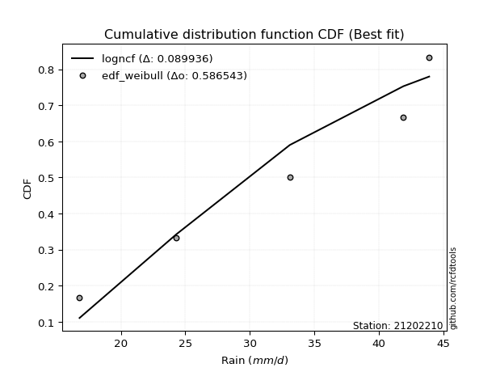</img>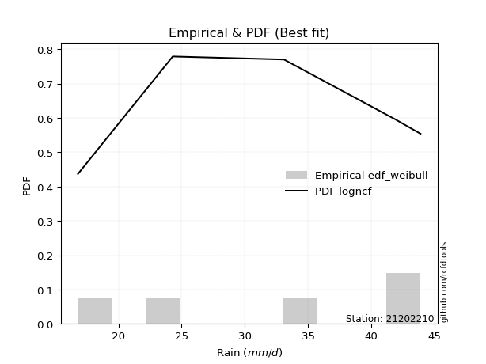</img>

</div>


### 4. EDF Beard (1943)

The Beard formula (or Beard´s plotting position formula) in hydrology is used to estimate the empirical non-exceedance probability _(P)_ of a flood event (or other extreme hydrological data point) within a given dataset.

<div align="center">


$P=(m-0.31)/(n+0.38)$


</div>


**4.1. Empirical values**

<div align="center">

|                | 0                   | 1                  | 2         | 3                  | 4                  |
|:---------------|:--------------------|:-------------------|:----------|:-------------------|:-------------------|
| date           | 2012                | 2015               | 2014      | 2016               | 2013               |
| x              | 16.8                | 24.3               | 33.1      | 41.9               | 43.9               |
| m              | 1                   | 2                  | 3         | 4                  | 5                  |
| empirical_dist | edf_beard           | edf_beard          | edf_beard | edf_beard          | edf_beard          |
| empirical      | 0.12825278810408922 | 0.3141263940520446 | 0.5       | 0.6858736059479554 | 0.8717472118959109 |
| empirical_tr   | 1.1471215351812367  | 1.4579945799457996 | 2.0       | 3.183431952662722  | 7.797101449275368  |

</div>


**4.2. Kolmogorov-Smirnov fit test (sorted by Δ)**


<div align="center">

|                | 0                   | 1                   | 2                   | 3                   | 4                   | 5                  | 6                   | 7                   | 8                   | 9                   | 10                  | 11                  | 12                  | 13                  | 14                  | 15                  | 16                  | 17                  | 18                  | 19                  | 20                  | 21                  | 22                 | 23                  | 24                 | 25                  | 26                  | 27                  | 28                  | 29                  | 30                  | 31                  | 32                 | 33                  | 34                  | 35                 | 36                  | 37                 | 38                  | 39                  | 40                 | 41                  | 42                  | 43                  | 44                  | 45                 | 46                  | 47                  | 48                 | 49                 | 50                  | 51                  | 52                  | 53                 | 54                  | 55                 | 56                  | 57                  | 58                 | 59                 | 60                  | 61                  | 62                  | 63                 | 64                  | 65                  | 66                  | 67                  | 68                  | 69                  | 70                  | 71                  | 72                  | 73                 | 74                 | 75                 | 76                  | 77                  | 78                  | 79                 | 80                  | 81                 | 82                  | 83                  | 84                  | 85                  | 86                  | 87                  | 88                  | 89                 | 90                  | 91                  | 92                 | 93                  | 94                 | 95                  | 96                  | 97                  | 98                 | 99                  | 100                | 101                | 102                 | 103                 | 104                 | 105                | 106                 | 107                 | 108                 | 109                | 110                 | 111                 | 112                 | 113                 | 114                 | 115                 | 116                | 117                 | 118                | 119                 | 120                 | 121                 | 122                 | 123                | 124                 | 125                 | 126                | 127                | 128                | 129                 | 130                 | 131                 | 132                | 133                | 134                 | 135                 | 136                | 137                 | 138                 | 139                | 140                 | 141                | 142                | 143                 | 144                 | 145                | 146                | 147                 | 148                | 149                | 150                | 151                | 152                | 153                | 154                | 155                | 156                | 157                | 158                | 159                |
|:---------------|:--------------------|:--------------------|:--------------------|:--------------------|:--------------------|:-------------------|:--------------------|:--------------------|:--------------------|:--------------------|:--------------------|:--------------------|:--------------------|:--------------------|:--------------------|:--------------------|:--------------------|:--------------------|:--------------------|:--------------------|:--------------------|:--------------------|:-------------------|:--------------------|:-------------------|:--------------------|:--------------------|:--------------------|:--------------------|:--------------------|:--------------------|:--------------------|:-------------------|:--------------------|:--------------------|:-------------------|:--------------------|:-------------------|:--------------------|:--------------------|:-------------------|:--------------------|:--------------------|:--------------------|:--------------------|:-------------------|:--------------------|:--------------------|:-------------------|:-------------------|:--------------------|:--------------------|:--------------------|:-------------------|:--------------------|:-------------------|:--------------------|:--------------------|:-------------------|:-------------------|:--------------------|:--------------------|:--------------------|:-------------------|:--------------------|:--------------------|:--------------------|:--------------------|:--------------------|:--------------------|:--------------------|:--------------------|:--------------------|:-------------------|:-------------------|:-------------------|:--------------------|:--------------------|:--------------------|:-------------------|:--------------------|:-------------------|:--------------------|:--------------------|:--------------------|:--------------------|:--------------------|:--------------------|:--------------------|:-------------------|:--------------------|:--------------------|:-------------------|:--------------------|:-------------------|:--------------------|:--------------------|:--------------------|:-------------------|:--------------------|:-------------------|:-------------------|:--------------------|:--------------------|:--------------------|:-------------------|:--------------------|:--------------------|:--------------------|:-------------------|:--------------------|:--------------------|:--------------------|:--------------------|:--------------------|:--------------------|:-------------------|:--------------------|:-------------------|:--------------------|:--------------------|:--------------------|:--------------------|:-------------------|:--------------------|:--------------------|:-------------------|:-------------------|:-------------------|:--------------------|:--------------------|:--------------------|:-------------------|:-------------------|:--------------------|:--------------------|:-------------------|:--------------------|:--------------------|:-------------------|:--------------------|:-------------------|:-------------------|:--------------------|:--------------------|:-------------------|:-------------------|:--------------------|:-------------------|:-------------------|:-------------------|:-------------------|:-------------------|:-------------------|:-------------------|:-------------------|:-------------------|:-------------------|:-------------------|:-------------------|
| station        | 21202210            | 21202210            | 21202210            | 21202210            | 21202210            | 21202210           | 21202210            | 21202210            | 21202210            | 21202210            | 21202210            | 21202210            | 21202210            | 21202210            | 21202210            | 21202210            | 21202210            | 21202210            | 21202210            | 21202210            | 21202210            | 21202210            | 21202210           | 21202210            | 21202210           | 21202210            | 21202210            | 21202210            | 21202210            | 21202210            | 21202210            | 21202210            | 21202210           | 21202210            | 21202210            | 21202210           | 21202210            | 21202210           | 21202210            | 21202210            | 21202210           | 21202210            | 21202210            | 21202210            | 21202210            | 21202210           | 21202210            | 21202210            | 21202210           | 21202210           | 21202210            | 21202210            | 21202210            | 21202210           | 21202210            | 21202210           | 21202210            | 21202210            | 21202210           | 21202210           | 21202210            | 21202210            | 21202210            | 21202210           | 21202210            | 21202210            | 21202210            | 21202210            | 21202210            | 21202210            | 21202210            | 21202210            | 21202210            | 21202210           | 21202210           | 21202210           | 21202210            | 21202210            | 21202210            | 21202210           | 21202210            | 21202210           | 21202210            | 21202210            | 21202210            | 21202210            | 21202210            | 21202210            | 21202210            | 21202210           | 21202210            | 21202210            | 21202210           | 21202210            | 21202210           | 21202210            | 21202210            | 21202210            | 21202210           | 21202210            | 21202210           | 21202210           | 21202210            | 21202210            | 21202210            | 21202210           | 21202210            | 21202210            | 21202210            | 21202210           | 21202210            | 21202210            | 21202210            | 21202210            | 21202210            | 21202210            | 21202210           | 21202210            | 21202210           | 21202210            | 21202210            | 21202210            | 21202210            | 21202210           | 21202210            | 21202210            | 21202210           | 21202210           | 21202210           | 21202210            | 21202210            | 21202210            | 21202210           | 21202210           | 21202210            | 21202210            | 21202210           | 21202210            | 21202210            | 21202210           | 21202210            | 21202210           | 21202210           | 21202210            | 21202210            | 21202210           | 21202210           | 21202210            | 21202210           | 21202210           | 21202210           | 21202210           | 21202210           | 21202210           | 21202210           | 21202210           | 21202210           | 21202210           | 21202210           | 21202210           |
| empirical_dist | edf_beard           | edf_beard           | edf_beard           | edf_beard           | edf_beard           | edf_beard          | edf_beard           | edf_beard           | edf_beard           | edf_beard           | edf_beard           | edf_beard           | edf_beard           | edf_beard           | edf_beard           | edf_beard           | edf_beard           | edf_beard           | edf_beard           | edf_beard           | edf_beard           | edf_beard           | edf_beard          | edf_beard           | edf_beard          | edf_beard           | edf_beard           | edf_beard           | edf_beard           | edf_beard           | edf_beard           | edf_beard           | edf_beard          | edf_beard           | edf_beard           | edf_beard          | edf_beard           | edf_beard          | edf_beard           | edf_beard           | edf_beard          | edf_beard           | edf_beard           | edf_beard           | edf_beard           | edf_beard          | edf_beard           | edf_beard           | edf_beard          | edf_beard          | edf_beard           | edf_beard           | edf_beard           | edf_beard          | edf_beard           | edf_beard          | edf_beard           | edf_beard           | edf_beard          | edf_beard          | edf_beard           | edf_beard           | edf_beard           | edf_beard          | edf_beard           | edf_beard           | edf_beard           | edf_beard           | edf_beard           | edf_beard           | edf_beard           | edf_beard           | edf_beard           | edf_beard          | edf_beard          | edf_beard          | edf_beard           | edf_beard           | edf_beard           | edf_beard          | edf_beard           | edf_beard          | edf_beard           | edf_beard           | edf_beard           | edf_beard           | edf_beard           | edf_beard           | edf_beard           | edf_beard          | edf_beard           | edf_beard           | edf_beard          | edf_beard           | edf_beard          | edf_beard           | edf_beard           | edf_beard           | edf_beard          | edf_beard           | edf_beard          | edf_beard          | edf_beard           | edf_beard           | edf_beard           | edf_beard          | edf_beard           | edf_beard           | edf_beard           | edf_beard          | edf_beard           | edf_beard           | edf_beard           | edf_beard           | edf_beard           | edf_beard           | edf_beard          | edf_beard           | edf_beard          | edf_beard           | edf_beard           | edf_beard           | edf_beard           | edf_beard          | edf_beard           | edf_beard           | edf_beard          | edf_beard          | edf_beard          | edf_beard           | edf_beard           | edf_beard           | edf_beard          | edf_beard          | edf_beard           | edf_beard           | edf_beard          | edf_beard           | edf_beard           | edf_beard          | edf_beard           | edf_beard          | edf_beard          | edf_beard           | edf_beard           | edf_beard          | edf_beard          | edf_beard           | edf_beard          | edf_beard          | edf_beard          | edf_beard          | edf_beard          | edf_beard          | edf_beard          | edf_beard          | edf_beard          | edf_beard          | edf_beard          | edf_beard          |
| p_dist         | ksone               | logncf              | logtrapezoid        | logsemicircular     | logksone            | loganglit          | semicircular        | trapezoid           | anglit              | logbetaprime        | logbeta             | beta                | wrapcauchy          | logweibull_max      | logkappa3           | logarcsine          | arcsine             | loginvgauss         | loginvweibull       | logalpha            | loginvgamma         | logrice             | logerlang          | logf                | lognct             | logpearson3         | loggamma            | loggamma            | logcrystalball      | lognorm             | logt                | logexponnorm        | logfatiguelife     | logmaxwell          | logloglaplace       | lograyleigh        | loggenextreme       | ncf                | kstwobign           | invgauss            | rice               | alpha               | rayleigh            | erlang              | maxwell             | f                  | gamma               | pearson3            | halfnorm           | nct                | exponnorm           | norm                | crystalball         | truncnorm          | t                   | logdweibull        | betaprime           | invgamma            | logweibull_min     | genextreme         | loggompertz         | weibull_min         | logburr12           | logfoldnorm        | logdgamma           | loggumbel_l         | loggennorm          | logkstwobign        | loglogistic         | loggenexpon         | lomax               | genexpon            | logcosine           | loghalfnorm        | levy_l             | gumbel_r           | halflogistic        | cosine              | logistic            | loglevy_l          | loghypsecant        | logwrapcauchy      | gumbel_l            | logmielke           | loggumbel_r         | moyal               | logburr             | logjohnsonsb        | hypsecant           | argus              | loglaplace          | loglaplace          | genpareto          | dweibull            | halfgennorm        | burr12              | burr                | mielke              | laplace            | gennorm             | loghalflogistic    | logargus           | genhalflogistic     | logmoyal            | dgamma              | logloggamma        | loghalfgennorm      | kappa3              | logjohnsonsu        | wald               | loggenhalflogistic  | skewnorm            | triang              | gausshyper          | tukeylambda         | kappa4              | logexponweib       | logtriang           | uniform            | logskewnorm         | vonmises_line       | logwald             | logtukeylambda      | logkappa4          | bradford            | truncexpon          | loguniform         | logvonmises_line   | loggausshyper      | truncweibull_min    | logbradford         | logtruncexpon       | loggengamma        | johnsonsb          | nakagami            | logtruncweibull_min | logrdist           | weibull_max         | lognakagami         | logexponpow        | gengamma            | exponweib          | gompertz           | johnsonsu           | foldnorm            | invweibull         | fatiguelife        | logtruncnorm        | powerlaw           | truncpareto        | logpowerlaw        | logtruncpareto     | exponpow           | loggenpareto       | loglomax           | rdist              | genlogistic        | loggenlogistic     | logvonmises        | vonmises           |
| delta          | 0.09140533884210134 | 0.09226557925033074 | 0.09321072200605174 | 0.09526230784052092 | 0.09728278994631914 | 0.1072802574992584 | 0.10767236628866628 | 0.11168966115818602 | 0.11937090233993186 | 0.12620947126969995 | 0.12825180386754298 | 0.12825266953880665 | 0.12825275962674532 | 0.12825278808399687 | 0.12825278810397564 | 0.12825278810408922 | 0.12825278810408922 | 0.12943565283156366 | 0.13004838584063394 | 0.13057581101549953 | 0.13124703382262703 | 0.13228712800885878 | 0.1328558888912157 | 0.13304190356841517 | 0.1331764093057516 | 0.13339215332379584 | 0.13347934853625143 | 0.13347934853625143 | 0.13439039546144516 | 0.13439039568946376 | 0.13439132280736554 | 0.13439435170906777 | 0.1344476773406027 | 0.13462087708618264 | 0.13490255986563884 | 0.1373031402849667 | 0.13793980489462032 | 0.1400592840815016 | 0.14033281374571982 | 0.14365341350753036 | 0.1438583580744197 | 0.14402028909240505 | 0.14414520941845288 | 0.14442685154497314 | 0.14446639553155405 | 0.1444735207050144 | 0.14454127166074882 | 0.14552561838872657 | 0.1455821472956792 | 0.1456212220810219 | 0.14572973430698366 | 0.14573022280912362 | 0.14573023454452116 | 0.1457302449115987 | 0.14573294954799076 | 0.145805660601234  | 0.14583034795301153 | 0.14602405035095334 | 0.1461125369706755 | 0.1467904336890582 | 0.14682262719433614 | 0.14698722853392232 | 0.14873357184011793 | 0.1513671038385711 | 0.15156603827504556 | 0.15187650204701408 | 0.15276732629147174 | 0.15430494105798798 | 0.15464801605797718 | 0.15520869361745748 | 0.15717321745652346 | 0.15825482115541245 | 0.15873769834450735 | 0.1604904929188532 | 0.1609462328718143 | 0.1630415811288396 | 0.16377237563345104 | 0.16425936454959933 | 0.16509204972134328 | 0.1655441941968483 | 0.16594345102589592 | 0.1679181203033428 | 0.16818780215715412 | 0.16861056268468266 | 0.16910811033479745 | 0.16946682812361036 | 0.17365976059114396 | 0.17521807424524716 | 0.17555073298756407 | 0.1765301354524743 | 0.17730684802497898 | 0.17730684802497898 | 0.1784389973261563 | 0.18088490606791763 | 0.1822268826002129 | 0.18327329747225818 | 0.18349337178098257 | 0.18530036972706343 | 0.1855884383137013 | 0.18587360594795543 | 0.1888175118187223 | 0.189366662225266  | 0.19057094321452273 | 0.19168961064954748 | 0.19238675519488158 | 0.1968088834632048 | 0.20275704777194303 | 0.20437148103536096 | 0.20679434293561677 | 0.2074814828955147 | 0.20944439695411554 | 0.21302934553786312 | 0.21916167396360275 | 0.22940617159307097 | 0.23214712582507813 | 0.23331239087875588 | 0.2389358133675174 | 0.23909960746416803 | 0.2403256560446645 | 0.24274171858706195 | 0.24371322102566817 | 0.25465556659575606 | 0.25708136905637813 | 0.2584874043478037 | 0.26070495809764527 | 0.26487986755084203 | 0.2655821222652315 | 0.2707653614175256 | 0.2716841208183315 | 0.27490577727003085 | 0.27895436496424775 | 0.28759092241462336 | 0.2893002596822716 | 0.3121302092919717 | 0.31412618916198615 | 0.355892462170428   | 0.3631775814842868 | 0.36360118041930123 | 0.36450122634640003 | 0.3889544901537288 | 0.41849559514763085 | 0.4367226783684472 | 0.4400862689389589 | 0.44399413486175193 | 0.45943171568233176 | 0.4603415151517461 | 0.4628284131891712 | 0.49999767081950447 | 0.5319933232161069 | 0.5513357558357719 | 0.5635916945862731 | 0.5859343732147402 | 0.5896367603075519 | 0.5983213059566842 | 0.6735812049859103 | 0.6858736059300581 | 0.6858736059479554 | 0.6858736059479554 | 1.13280599568969   | 6.911930454293833  |
| deltao         | 0.5865427407550001  | 0.5865427407550001  | 0.5865427407550001  | 0.5865427407550001  | 0.5865427407550001  | 0.5865427407550001 | 0.5865427407550001  | 0.5865427407550001  | 0.5865427407550001  | 0.5865427407550001  | 0.5865427407550001  | 0.5865427407550001  | 0.5865427407550001  | 0.5865427407550001  | 0.5865427407550001  | 0.5865427407550001  | 0.5865427407550001  | 0.5865427407550001  | 0.5865427407550001  | 0.5865427407550001  | 0.5865427407550001  | 0.5865427407550001  | 0.5865427407550001 | 0.5865427407550001  | 0.5865427407550001 | 0.5865427407550001  | 0.5865427407550001  | 0.5865427407550001  | 0.5865427407550001  | 0.5865427407550001  | 0.5865427407550001  | 0.5865427407550001  | 0.5865427407550001 | 0.5865427407550001  | 0.5865427407550001  | 0.5865427407550001 | 0.5865427407550001  | 0.5865427407550001 | 0.5865427407550001  | 0.5865427407550001  | 0.5865427407550001 | 0.5865427407550001  | 0.5865427407550001  | 0.5865427407550001  | 0.5865427407550001  | 0.5865427407550001 | 0.5865427407550001  | 0.5865427407550001  | 0.5865427407550001 | 0.5865427407550001 | 0.5865427407550001  | 0.5865427407550001  | 0.5865427407550001  | 0.5865427407550001 | 0.5865427407550001  | 0.5865427407550001 | 0.5865427407550001  | 0.5865427407550001  | 0.5865427407550001 | 0.5865427407550001 | 0.5865427407550001  | 0.5865427407550001  | 0.5865427407550001  | 0.5865427407550001 | 0.5865427407550001  | 0.5865427407550001  | 0.5865427407550001  | 0.5865427407550001  | 0.5865427407550001  | 0.5865427407550001  | 0.5865427407550001  | 0.5865427407550001  | 0.5865427407550001  | 0.5865427407550001 | 0.5865427407550001 | 0.5865427407550001 | 0.5865427407550001  | 0.5865427407550001  | 0.5865427407550001  | 0.5865427407550001 | 0.5865427407550001  | 0.5865427407550001 | 0.5865427407550001  | 0.5865427407550001  | 0.5865427407550001  | 0.5865427407550001  | 0.5865427407550001  | 0.5865427407550001  | 0.5865427407550001  | 0.5865427407550001 | 0.5865427407550001  | 0.5865427407550001  | 0.5865427407550001 | 0.5865427407550001  | 0.5865427407550001 | 0.5865427407550001  | 0.5865427407550001  | 0.5865427407550001  | 0.5865427407550001 | 0.5865427407550001  | 0.5865427407550001 | 0.5865427407550001 | 0.5865427407550001  | 0.5865427407550001  | 0.5865427407550001  | 0.5865427407550001 | 0.5865427407550001  | 0.5865427407550001  | 0.5865427407550001  | 0.5865427407550001 | 0.5865427407550001  | 0.5865427407550001  | 0.5865427407550001  | 0.5865427407550001  | 0.5865427407550001  | 0.5865427407550001  | 0.5865427407550001 | 0.5865427407550001  | 0.5865427407550001 | 0.5865427407550001  | 0.5865427407550001  | 0.5865427407550001  | 0.5865427407550001  | 0.5865427407550001 | 0.5865427407550001  | 0.5865427407550001  | 0.5865427407550001 | 0.5865427407550001 | 0.5865427407550001 | 0.5865427407550001  | 0.5865427407550001  | 0.5865427407550001  | 0.5865427407550001 | 0.5865427407550001 | 0.5865427407550001  | 0.5865427407550001  | 0.5865427407550001 | 0.5865427407550001  | 0.5865427407550001  | 0.5865427407550001 | 0.5865427407550001  | 0.5865427407550001 | 0.5865427407550001 | 0.5865427407550001  | 0.5865427407550001  | 0.5865427407550001 | 0.5865427407550001 | 0.5865427407550001  | 0.5865427407550001 | 0.5865427407550001 | 0.5865427407550001 | 0.5865427407550001 | 0.5865427407550001 | 0.5865427407550001 | 0.5865427407550001 | 0.5865427407550001 | 0.5865427407550001 | 0.5865427407550001 | 0.5865427407550001 | 0.5865427407550001 |
| eval           | Δo > Δ              | Δo > Δ              | Δo > Δ              | Δo > Δ              | Δo > Δ              | Δo > Δ             | Δo > Δ              | Δo > Δ              | Δo > Δ              | Δo > Δ              | Δo > Δ              | Δo > Δ              | Δo > Δ              | Δo > Δ              | Δo > Δ              | Δo > Δ              | Δo > Δ              | Δo > Δ              | Δo > Δ              | Δo > Δ              | Δo > Δ              | Δo > Δ              | Δo > Δ             | Δo > Δ              | Δo > Δ             | Δo > Δ              | Δo > Δ              | Δo > Δ              | Δo > Δ              | Δo > Δ              | Δo > Δ              | Δo > Δ              | Δo > Δ             | Δo > Δ              | Δo > Δ              | Δo > Δ             | Δo > Δ              | Δo > Δ             | Δo > Δ              | Δo > Δ              | Δo > Δ             | Δo > Δ              | Δo > Δ              | Δo > Δ              | Δo > Δ              | Δo > Δ             | Δo > Δ              | Δo > Δ              | Δo > Δ             | Δo > Δ             | Δo > Δ              | Δo > Δ              | Δo > Δ              | Δo > Δ             | Δo > Δ              | Δo > Δ             | Δo > Δ              | Δo > Δ              | Δo > Δ             | Δo > Δ             | Δo > Δ              | Δo > Δ              | Δo > Δ              | Δo > Δ             | Δo > Δ              | Δo > Δ              | Δo > Δ              | Δo > Δ              | Δo > Δ              | Δo > Δ              | Δo > Δ              | Δo > Δ              | Δo > Δ              | Δo > Δ             | Δo > Δ             | Δo > Δ             | Δo > Δ              | Δo > Δ              | Δo > Δ              | Δo > Δ             | Δo > Δ              | Δo > Δ             | Δo > Δ              | Δo > Δ              | Δo > Δ              | Δo > Δ              | Δo > Δ              | Δo > Δ              | Δo > Δ              | Δo > Δ             | Δo > Δ              | Δo > Δ              | Δo > Δ             | Δo > Δ              | Δo > Δ             | Δo > Δ              | Δo > Δ              | Δo > Δ              | Δo > Δ             | Δo > Δ              | Δo > Δ             | Δo > Δ             | Δo > Δ              | Δo > Δ              | Δo > Δ              | Δo > Δ             | Δo > Δ              | Δo > Δ              | Δo > Δ              | Δo > Δ             | Δo > Δ              | Δo > Δ              | Δo > Δ              | Δo > Δ              | Δo > Δ              | Δo > Δ              | Δo > Δ             | Δo > Δ              | Δo > Δ             | Δo > Δ              | Δo > Δ              | Δo > Δ              | Δo > Δ              | Δo > Δ             | Δo > Δ              | Δo > Δ              | Δo > Δ             | Δo > Δ             | Δo > Δ             | Δo > Δ              | Δo > Δ              | Δo > Δ              | Δo > Δ             | Δo > Δ             | Δo > Δ              | Δo > Δ              | Δo > Δ             | Δo > Δ              | Δo > Δ              | Δo > Δ             | Δo > Δ              | Δo > Δ             | Δo > Δ             | Δo > Δ              | Δo > Δ              | Δo > Δ             | Δo > Δ             | Δo > Δ              | Δo > Δ             | Δo > Δ             | Δo > Δ             | Δo > Δ             | Δo <= Δ            | Δo <= Δ            | Δo <= Δ            | Δo <= Δ            | Δo <= Δ            | Δo <= Δ            | Δo <= Δ            | Δo <= Δ            |
| fit            | 1                   | 1                   | 1                   | 1                   | 1                   | 1                  | 1                   | 1                   | 1                   | 1                   | 1                   | 1                   | 1                   | 1                   | 1                   | 1                   | 1                   | 1                   | 1                   | 1                   | 1                   | 1                   | 1                  | 1                   | 1                  | 1                   | 1                   | 1                   | 1                   | 1                   | 1                   | 1                   | 1                  | 1                   | 1                   | 1                  | 1                   | 1                  | 1                   | 1                   | 1                  | 1                   | 1                   | 1                   | 1                   | 1                  | 1                   | 1                   | 1                  | 1                  | 1                   | 1                   | 1                   | 1                  | 1                   | 1                  | 1                   | 1                   | 1                  | 1                  | 1                   | 1                   | 1                   | 1                  | 1                   | 1                   | 1                   | 1                   | 1                   | 1                   | 1                   | 1                   | 1                   | 1                  | 1                  | 1                  | 1                   | 1                   | 1                   | 1                  | 1                   | 1                  | 1                   | 1                   | 1                   | 1                   | 1                   | 1                   | 1                   | 1                  | 1                   | 1                   | 1                  | 1                   | 1                  | 1                   | 1                   | 1                   | 1                  | 1                   | 1                  | 1                  | 1                   | 1                   | 1                   | 1                  | 1                   | 1                   | 1                   | 1                  | 1                   | 1                   | 1                   | 1                   | 1                   | 1                   | 1                  | 1                   | 1                  | 1                   | 1                   | 1                   | 1                   | 1                  | 1                   | 1                   | 1                  | 1                  | 1                  | 1                   | 1                   | 1                   | 1                  | 1                  | 1                   | 1                   | 1                  | 1                   | 1                   | 1                  | 1                   | 1                  | 1                  | 1                   | 1                   | 1                  | 1                  | 1                   | 1                  | 1                  | 1                  | 1                  | 0                  | 0                  | 0                  | 0                  | 0                  | 0                  | 0                  | 0                  |
| n              | 5                   | 5                   | 5                   | 5                   | 5                   | 5                  | 5                   | 5                   | 5                   | 5                   | 5                   | 5                   | 5                   | 5                   | 5                   | 5                   | 5                   | 5                   | 5                   | 5                   | 5                   | 5                   | 5                  | 5                   | 5                  | 5                   | 5                   | 5                   | 5                   | 5                   | 5                   | 5                   | 5                  | 5                   | 5                   | 5                  | 5                   | 5                  | 5                   | 5                   | 5                  | 5                   | 5                   | 5                   | 5                   | 5                  | 5                   | 5                   | 5                  | 5                  | 5                   | 5                   | 5                   | 5                  | 5                   | 5                  | 5                   | 5                   | 5                  | 5                  | 5                   | 5                   | 5                   | 5                  | 5                   | 5                   | 5                   | 5                   | 5                   | 5                   | 5                   | 5                   | 5                   | 5                  | 5                  | 5                  | 5                   | 5                   | 5                   | 5                  | 5                   | 5                  | 5                   | 5                   | 5                   | 5                   | 5                   | 5                   | 5                   | 5                  | 5                   | 5                   | 5                  | 5                   | 5                  | 5                   | 5                   | 5                   | 5                  | 5                   | 5                  | 5                  | 5                   | 5                   | 5                   | 5                  | 5                   | 5                   | 5                   | 5                  | 5                   | 5                   | 5                   | 5                   | 5                   | 5                   | 5                  | 5                   | 5                  | 5                   | 5                   | 5                   | 5                   | 5                  | 5                   | 5                   | 5                  | 5                  | 5                  | 5                   | 5                   | 5                   | 5                  | 5                  | 5                   | 5                   | 5                  | 5                   | 5                   | 5                  | 5                   | 5                  | 5                  | 5                   | 5                   | 5                  | 5                  | 5                   | 5                  | 5                  | 5                  | 5                  | 5                  | 5                  | 5                  | 5                  | 5                  | 5                  | 5                  | 5                  |
| best_fit       | 1                   | 0                   | 0                   | 0                   | 0                   | 0                  | 0                   | 0                   | 0                   | 0                   | 0                   | 0                   | 0                   | 0                   | 0                   | 0                   | 0                   | 0                   | 0                   | 0                   | 0                   | 0                   | 0                  | 0                   | 0                  | 0                   | 0                   | 0                   | 0                   | 0                   | 0                   | 0                   | 0                  | 0                   | 0                   | 0                  | 0                   | 0                  | 0                   | 0                   | 0                  | 0                   | 0                   | 0                   | 0                   | 0                  | 0                   | 0                   | 0                  | 0                  | 0                   | 0                   | 0                   | 0                  | 0                   | 0                  | 0                   | 0                   | 0                  | 0                  | 0                   | 0                   | 0                   | 0                  | 0                   | 0                   | 0                   | 0                   | 0                   | 0                   | 0                   | 0                   | 0                   | 0                  | 0                  | 0                  | 0                   | 0                   | 0                   | 0                  | 0                   | 0                  | 0                   | 0                   | 0                   | 0                   | 0                   | 0                   | 0                   | 0                  | 0                   | 0                   | 0                  | 0                   | 0                  | 0                   | 0                   | 0                   | 0                  | 0                   | 0                  | 0                  | 0                   | 0                   | 0                   | 0                  | 0                   | 0                   | 0                   | 0                  | 0                   | 0                   | 0                   | 0                   | 0                   | 0                   | 0                  | 0                   | 0                  | 0                   | 0                   | 0                   | 0                   | 0                  | 0                   | 0                   | 0                  | 0                  | 0                  | 0                   | 0                   | 0                   | 0                  | 0                  | 0                   | 0                   | 0                  | 0                   | 0                   | 0                  | 0                   | 0                  | 0                  | 0                   | 0                   | 0                  | 0                  | 0                   | 0                  | 0                  | 0                  | 0                  | 0                  | 0                  | 0                  | 0                  | 0                  | 0                  | 0                  | 0                  |
| best_fit_sort  | 1                   | 2                   | 3                   | 4                   | 5                   | 6                  | 7                   | 8                   | 9                   | 10                  | 11                  | 12                  | 13                  | 14                  | 15                  | 16                  | 17                  | 18                  | 19                  | 20                  | 21                  | 22                  | 23                 | 24                  | 25                 | 26                  | 27                  | 28                  | 29                  | 30                  | 31                  | 32                  | 33                 | 34                  | 35                  | 36                 | 37                  | 38                 | 39                  | 40                  | 41                 | 42                  | 43                  | 44                  | 45                  | 46                 | 47                  | 48                  | 49                 | 50                 | 51                  | 52                  | 53                  | 54                 | 55                  | 56                 | 57                  | 58                  | 59                 | 60                 | 61                  | 62                  | 63                  | 64                 | 65                  | 66                  | 67                  | 68                  | 69                  | 70                  | 71                  | 72                  | 73                  | 74                 | 75                 | 76                 | 77                  | 78                  | 79                  | 80                 | 81                  | 82                 | 83                  | 84                  | 85                  | 86                  | 87                  | 88                  | 89                  | 90                 | 91                  | 92                  | 93                 | 94                  | 95                 | 96                  | 97                  | 98                  | 99                 | 100                 | 101                | 102                | 103                 | 104                 | 105                 | 106                | 107                 | 108                 | 109                 | 110                | 111                 | 112                 | 113                 | 114                 | 115                 | 116                 | 117                | 118                 | 119                | 120                 | 121                 | 122                 | 123                 | 124                | 125                 | 126                 | 127                | 128                | 129                | 130                 | 131                 | 132                 | 133                | 134                | 135                 | 136                 | 137                | 138                 | 139                 | 140                | 141                 | 142                | 143                | 144                 | 145                 | 146                | 147                | 148                 | 149                | 150                | 151                | 152                | 153                | 154                | 155                | 156                | 157                | 158                | 159                | 160                |

</div>


**4.3. Best fit**

<div align="center">

|   id |   station | empirical_dist   | p_dist   |     delta |   deltao | eval   |   fit |   n |   best_fit |   best_fit_sort |
|-----:|----------:|:-----------------|:---------|----------:|---------:|:-------|------:|----:|-----------:|----------------:|
|    0 |  21202210 | edf_beard        | ksone    | 0.0914053 | 0.586543 | Δo > Δ |     1 |   5 |          1 |               1 |

</div>


<div align="center">

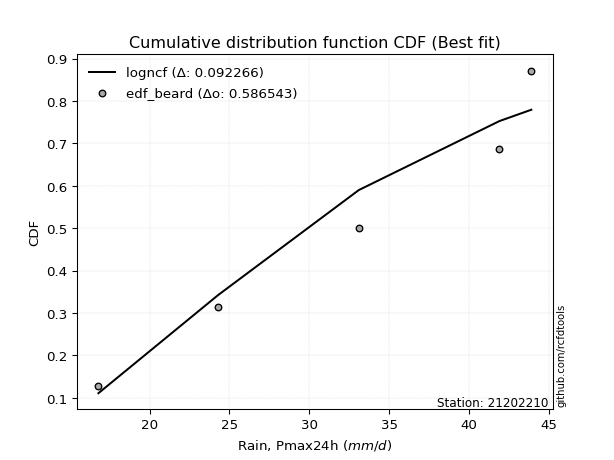</img></img>

</div>


### 5. EDF Chegodayev (1955)

The Chegodayev formula is an empirical plotting position formula used in hydrological frequency analysis to estimate the exceedance probability or return period of a specific event from a set of observed data. It is primarily used for plotting observed data points on probability paper to fit a theoretical distribution, particularly for analyzing extreme events like maximum flood flows or rainfall intensities. The constant _b_ value in the generalized plotting position formula is 0.3.

<div align="center">


$P=(m-b)/(n+1-2b)$


</div>


**5.1. Empirical values**

<div align="center">

|                | 0                   | 1                   | 2              | 3                  | 4                  |
|:---------------|:--------------------|:--------------------|:---------------|:-------------------|:-------------------|
| date           | 2012                | 2015                | 2014           | 2016               | 2013               |
| x              | 16.8                | 24.3                | 33.1           | 41.9               | 43.9               |
| m              | 1                   | 2                   | 3              | 4                  | 5                  |
| empirical_dist | edf_chegodayev      | edf_chegodayev      | edf_chegodayev | edf_chegodayev     | edf_chegodayev     |
| empirical      | 0.12962962962962962 | 0.31481481481481477 | 0.5            | 0.6851851851851851 | 0.8703703703703703 |
| empirical_tr   | 1.148936170212766   | 1.4594594594594594  | 2.0            | 3.1764705882352935 | 7.714285714285713  |

</div>


**5.2. Kolmogorov-Smirnov fit test (sorted by Δ)**


<div align="center">

|                | 0                   | 1                   | 2                   | 3                   | 4                   | 5                   | 6                   | 7                   | 8                   | 9                   | 10                 | 11                  | 12                  | 13                 | 14                  | 15                  | 16                  | 17                  | 18                  | 19                  | 20                  | 21                 | 22                 | 23                  | 24                 | 25                  | 26                  | 27                  | 28                  | 29                  | 30                  | 31                 | 32                  | 33                  | 34                 | 35                 | 36                  | 37                 | 38                  | 39                  | 40                  | 41                  | 42                 | 43                  | 44                  | 45                  | 46                  | 47                 | 48                 | 49                  | 50                  | 51                  | 52                  | 53                 | 54                  | 55                  | 56                  | 57                  | 58                 | 59                 | 60                  | 61                  | 62                  | 63                 | 64                  | 65                 | 66                 | 67                  | 68                  | 69                 | 70                  | 71                  | 72                  | 73                 | 74                 | 75                 | 76                  | 77                  | 78                 | 79                 | 80                  | 81                  | 82                  | 83                  | 84                  | 85                  | 86                  | 87                 | 88                 | 89                  | 90                 | 91                 | 92                  | 93                  | 94                 | 95                  | 96                 | 97                  | 98                  | 99                  | 100                | 101                | 102                 | 103                 | 104                | 105                | 106                 | 107                 | 108                 | 109                | 110                 | 111                 | 112                 | 113                | 114                 | 115                | 116                 | 117                 | 118                | 119                 | 120                 | 121                 | 122                 | 123                | 124                | 125                 | 126                | 127                | 128                | 129                 | 130                 | 131                 | 132                | 133                | 134                | 135                 | 136                | 137                | 138                 | 139                 | 140                | 141                 | 142                | 143                | 144                | 145                 | 146                | 147                 | 148                | 149                | 150                | 151                | 152                | 153                | 154                | 155                | 156                | 157                | 158                | 159                |
|:---------------|:--------------------|:--------------------|:--------------------|:--------------------|:--------------------|:--------------------|:--------------------|:--------------------|:--------------------|:--------------------|:-------------------|:--------------------|:--------------------|:-------------------|:--------------------|:--------------------|:--------------------|:--------------------|:--------------------|:--------------------|:--------------------|:-------------------|:-------------------|:--------------------|:-------------------|:--------------------|:--------------------|:--------------------|:--------------------|:--------------------|:--------------------|:-------------------|:--------------------|:--------------------|:-------------------|:-------------------|:--------------------|:-------------------|:--------------------|:--------------------|:--------------------|:--------------------|:-------------------|:--------------------|:--------------------|:--------------------|:--------------------|:-------------------|:-------------------|:--------------------|:--------------------|:--------------------|:--------------------|:-------------------|:--------------------|:--------------------|:--------------------|:--------------------|:-------------------|:-------------------|:--------------------|:--------------------|:--------------------|:-------------------|:--------------------|:-------------------|:-------------------|:--------------------|:--------------------|:-------------------|:--------------------|:--------------------|:--------------------|:-------------------|:-------------------|:-------------------|:--------------------|:--------------------|:-------------------|:-------------------|:--------------------|:--------------------|:--------------------|:--------------------|:--------------------|:--------------------|:--------------------|:-------------------|:-------------------|:--------------------|:-------------------|:-------------------|:--------------------|:--------------------|:-------------------|:--------------------|:-------------------|:--------------------|:--------------------|:--------------------|:-------------------|:-------------------|:--------------------|:--------------------|:-------------------|:-------------------|:--------------------|:--------------------|:--------------------|:-------------------|:--------------------|:--------------------|:--------------------|:-------------------|:--------------------|:-------------------|:--------------------|:--------------------|:-------------------|:--------------------|:--------------------|:--------------------|:--------------------|:-------------------|:-------------------|:--------------------|:-------------------|:-------------------|:-------------------|:--------------------|:--------------------|:--------------------|:-------------------|:-------------------|:-------------------|:--------------------|:-------------------|:-------------------|:--------------------|:--------------------|:-------------------|:--------------------|:-------------------|:-------------------|:-------------------|:--------------------|:-------------------|:--------------------|:-------------------|:-------------------|:-------------------|:-------------------|:-------------------|:-------------------|:-------------------|:-------------------|:-------------------|:-------------------|:-------------------|:-------------------|
| station        | 21202210            | 21202210            | 21202210            | 21202210            | 21202210            | 21202210            | 21202210            | 21202210            | 21202210            | 21202210            | 21202210           | 21202210            | 21202210            | 21202210           | 21202210            | 21202210            | 21202210            | 21202210            | 21202210            | 21202210            | 21202210            | 21202210           | 21202210           | 21202210            | 21202210           | 21202210            | 21202210            | 21202210            | 21202210            | 21202210            | 21202210            | 21202210           | 21202210            | 21202210            | 21202210           | 21202210           | 21202210            | 21202210           | 21202210            | 21202210            | 21202210            | 21202210            | 21202210           | 21202210            | 21202210            | 21202210            | 21202210            | 21202210           | 21202210           | 21202210            | 21202210            | 21202210            | 21202210            | 21202210           | 21202210            | 21202210            | 21202210            | 21202210            | 21202210           | 21202210           | 21202210            | 21202210            | 21202210            | 21202210           | 21202210            | 21202210           | 21202210           | 21202210            | 21202210            | 21202210           | 21202210            | 21202210            | 21202210            | 21202210           | 21202210           | 21202210           | 21202210            | 21202210            | 21202210           | 21202210           | 21202210            | 21202210            | 21202210            | 21202210            | 21202210            | 21202210            | 21202210            | 21202210           | 21202210           | 21202210            | 21202210           | 21202210           | 21202210            | 21202210            | 21202210           | 21202210            | 21202210           | 21202210            | 21202210            | 21202210            | 21202210           | 21202210           | 21202210            | 21202210            | 21202210           | 21202210           | 21202210            | 21202210            | 21202210            | 21202210           | 21202210            | 21202210            | 21202210            | 21202210           | 21202210            | 21202210           | 21202210            | 21202210            | 21202210           | 21202210            | 21202210            | 21202210            | 21202210            | 21202210           | 21202210           | 21202210            | 21202210           | 21202210           | 21202210           | 21202210            | 21202210            | 21202210            | 21202210           | 21202210           | 21202210           | 21202210            | 21202210           | 21202210           | 21202210            | 21202210            | 21202210           | 21202210            | 21202210           | 21202210           | 21202210           | 21202210            | 21202210           | 21202210            | 21202210           | 21202210           | 21202210           | 21202210           | 21202210           | 21202210           | 21202210           | 21202210           | 21202210           | 21202210           | 21202210           | 21202210           |
| empirical_dist | edf_chegodayev      | edf_chegodayev      | edf_chegodayev      | edf_chegodayev      | edf_chegodayev      | edf_chegodayev      | edf_chegodayev      | edf_chegodayev      | edf_chegodayev      | edf_chegodayev      | edf_chegodayev     | edf_chegodayev      | edf_chegodayev      | edf_chegodayev     | edf_chegodayev      | edf_chegodayev      | edf_chegodayev      | edf_chegodayev      | edf_chegodayev      | edf_chegodayev      | edf_chegodayev      | edf_chegodayev     | edf_chegodayev     | edf_chegodayev      | edf_chegodayev     | edf_chegodayev      | edf_chegodayev      | edf_chegodayev      | edf_chegodayev      | edf_chegodayev      | edf_chegodayev      | edf_chegodayev     | edf_chegodayev      | edf_chegodayev      | edf_chegodayev     | edf_chegodayev     | edf_chegodayev      | edf_chegodayev     | edf_chegodayev      | edf_chegodayev      | edf_chegodayev      | edf_chegodayev      | edf_chegodayev     | edf_chegodayev      | edf_chegodayev      | edf_chegodayev      | edf_chegodayev      | edf_chegodayev     | edf_chegodayev     | edf_chegodayev      | edf_chegodayev      | edf_chegodayev      | edf_chegodayev      | edf_chegodayev     | edf_chegodayev      | edf_chegodayev      | edf_chegodayev      | edf_chegodayev      | edf_chegodayev     | edf_chegodayev     | edf_chegodayev      | edf_chegodayev      | edf_chegodayev      | edf_chegodayev     | edf_chegodayev      | edf_chegodayev     | edf_chegodayev     | edf_chegodayev      | edf_chegodayev      | edf_chegodayev     | edf_chegodayev      | edf_chegodayev      | edf_chegodayev      | edf_chegodayev     | edf_chegodayev     | edf_chegodayev     | edf_chegodayev      | edf_chegodayev      | edf_chegodayev     | edf_chegodayev     | edf_chegodayev      | edf_chegodayev      | edf_chegodayev      | edf_chegodayev      | edf_chegodayev      | edf_chegodayev      | edf_chegodayev      | edf_chegodayev     | edf_chegodayev     | edf_chegodayev      | edf_chegodayev     | edf_chegodayev     | edf_chegodayev      | edf_chegodayev      | edf_chegodayev     | edf_chegodayev      | edf_chegodayev     | edf_chegodayev      | edf_chegodayev      | edf_chegodayev      | edf_chegodayev     | edf_chegodayev     | edf_chegodayev      | edf_chegodayev      | edf_chegodayev     | edf_chegodayev     | edf_chegodayev      | edf_chegodayev      | edf_chegodayev      | edf_chegodayev     | edf_chegodayev      | edf_chegodayev      | edf_chegodayev      | edf_chegodayev     | edf_chegodayev      | edf_chegodayev     | edf_chegodayev      | edf_chegodayev      | edf_chegodayev     | edf_chegodayev      | edf_chegodayev      | edf_chegodayev      | edf_chegodayev      | edf_chegodayev     | edf_chegodayev     | edf_chegodayev      | edf_chegodayev     | edf_chegodayev     | edf_chegodayev     | edf_chegodayev      | edf_chegodayev      | edf_chegodayev      | edf_chegodayev     | edf_chegodayev     | edf_chegodayev     | edf_chegodayev      | edf_chegodayev     | edf_chegodayev     | edf_chegodayev      | edf_chegodayev      | edf_chegodayev     | edf_chegodayev      | edf_chegodayev     | edf_chegodayev     | edf_chegodayev     | edf_chegodayev      | edf_chegodayev     | edf_chegodayev      | edf_chegodayev     | edf_chegodayev     | edf_chegodayev     | edf_chegodayev     | edf_chegodayev     | edf_chegodayev     | edf_chegodayev     | edf_chegodayev     | edf_chegodayev     | edf_chegodayev     | edf_chegodayev     | edf_chegodayev     |
| p_dist         | logncf              | ksone               | logtrapezoid        | logsemicircular     | logksone            | loganglit           | semicircular        | trapezoid           | anglit              | logbetaprime        | logbeta            | beta                | wrapcauchy          | logweibull_max     | logkappa3           | logarcsine          | arcsine             | loginvweibull       | loginvgauss         | logalpha            | loginvgamma         | logrice            | logerlang          | logf                | lognct             | logpearson3         | loggamma            | loggamma            | logcrystalball      | lognorm             | logt                | logexponnorm       | logfatiguelife      | logmaxwell          | logloglaplace      | lograyleigh        | loggenextreme       | ncf                | kstwobign           | invgauss            | rice                | alpha               | rayleigh           | erlang              | maxwell             | f                   | gamma               | pearson3           | halfnorm           | nct                 | exponnorm           | norm                | crystalball         | truncnorm          | t                   | logdweibull         | betaprime           | invgamma            | genextreme         | logweibull_min     | loggompertz         | weibull_min         | logburr12           | logfoldnorm        | logdgamma           | loggumbel_l        | loggennorm         | logkstwobign        | loggenexpon         | loglogistic        | lomax               | genexpon            | logcosine           | loghalfnorm        | levy_l             | gumbel_r           | halflogistic        | cosine              | loglevy_l          | logistic           | loghypsecant        | logwrapcauchy       | gumbel_l            | loggumbel_r         | logmielke           | moyal               | logburr             | logjohnsonsb       | hypsecant          | argus               | loglaplace         | loglaplace         | genpareto           | dweibull            | halfgennorm        | burr12              | burr               | gennorm             | mielke              | laplace             | loghalflogistic    | logargus           | genhalflogistic     | logmoyal            | dgamma             | logloggamma        | loghalfgennorm      | kappa3              | logjohnsonsu        | wald               | loggenhalflogistic  | skewnorm            | triang              | gausshyper         | tukeylambda         | kappa4             | logexponweib        | logtriang           | uniform            | logskewnorm         | vonmises_line       | logwald             | logtukeylambda      | logkappa4          | bradford           | truncexpon          | loguniform         | logvonmises_line   | loggausshyper      | truncweibull_min    | logbradford         | logtruncexpon       | loggengamma        | johnsonsb          | nakagami           | logtruncweibull_min | logrdist           | weibull_max        | lognakagami         | logexponpow         | gengamma           | exponweib           | gompertz           | johnsonsu          | invweibull         | foldnorm            | fatiguelife        | logtruncnorm        | powerlaw           | truncpareto        | logpowerlaw        | logtruncpareto     | exponpow           | loggenpareto       | loglomax           | rdist              | genlogistic        | loggenlogistic     | logvonmises        | vonmises           |
| delta          | 0.09088873772479023 | 0.09209375960487165 | 0.09389914276882205 | 0.09595072860329124 | 0.09865963147185955 | 0.10796867826202872 | 0.10836078705143659 | 0.11237808192095633 | 0.12005932310270218 | 0.12620947126969995 | 0.1296286453930835 | 0.12962951106434717 | 0.12962960115228583 | 0.1296296296095374 | 0.12962962962951605 | 0.12962962962962962 | 0.12962962962962962 | 0.13004838584063394 | 0.13012407359433398 | 0.13126423177826985 | 0.13193545458539735 | 0.1329755487716291 | 0.133544309653986  | 0.13373032433118548 | 0.1338648300685219 | 0.13408057408656615 | 0.13416776929902174 | 0.13416776929902174 | 0.13507881622421547 | 0.13507881645223407 | 0.13507974357013586 | 0.1350827724718381 | 0.13513609810337301 | 0.13530929784895296 | 0.135590980628409  | 0.1373031402849667 | 0.13862822565739064 | 0.1407477048442719 | 0.14102123450849013 | 0.14434183427030067 | 0.14454677883719003 | 0.14470870985517537 | 0.1448336301812232 | 0.14511527230774346 | 0.14515481629432436 | 0.14516194146778472 | 0.14522969242351913 | 0.1462140391514969 | 0.1462705680584495 | 0.14630964284379222 | 0.14641815506975397 | 0.14641864357189394 | 0.14641865530729148 | 0.146418665674369  | 0.14642137031076108 | 0.14649408136400432 | 0.14651876871578184 | 0.14671247111372365 | 0.1467904336890582 | 0.1468009577334458 | 0.14751104795710646 | 0.14767564929669263 | 0.14942199260288824 | 0.1513671038385711 | 0.15225445903781587 | 0.1525649228097844 | 0.1534557470542419 | 0.15430494105798798 | 0.15520869361745748 | 0.1553364368207475 | 0.15717321745652346 | 0.15825482115541245 | 0.15942611910727766 | 0.1604904929188532 | 0.1609462328718143 | 0.1637300018916099 | 0.16446079639622135 | 0.16494778531236964 | 0.1655441941968483 | 0.1657804704841136 | 0.16663187178866623 | 0.16722969954057265 | 0.16887622291992443 | 0.16910811033479745 | 0.16929898344745298 | 0.17015524888638067 | 0.17434818135391428 | 0.174529653482477  | 0.1762391537503344 | 0.17721855621524463 | 0.1779952687877493 | 0.1779952687877493 | 0.17912741808892663 | 0.18157332683068794 | 0.1822268826002129 | 0.18327329747225818 | 0.1841817925437529 | 0.18518518518518523 | 0.18598879048983374 | 0.18627685907647162 | 0.1888175118187223 | 0.1900550829880363 | 0.19125936397729304 | 0.19168961064954748 | 0.1930751759576519 | 0.1974973042259751 | 0.20275704777194303 | 0.20505990179813127 | 0.20610592217284646 | 0.2074814828955147 | 0.21013281771688586 | 0.21371776630063344 | 0.21985009472637307 | 0.2300945923558413 | 0.23283554658784844 | 0.2340008116415262 | 0.23824739260474725 | 0.23978802822693834 | 0.2410140768074348 | 0.24343013934983226 | 0.24440164178843848 | 0.25465556659575606 | 0.25776978981914844 | 0.259175825110574  | 0.2613933788604156 | 0.26556828831361234 | 0.2662705430280018 | 0.2714537821802959 | 0.2723725415811018 | 0.27559419803280116 | 0.27964278572701806 | 0.28759092241462336 | 0.2893002596822716 | 0.3114417885292014 | 0.3148146099247563 | 0.355892462170428   | 0.3618007399587463 | 0.3629127596565309 | 0.36450122634640003 | 0.38826606939095865 | 0.4178071743848607 | 0.43603425760567704 | 0.4400862689389589 | 0.4433057140989816 | 0.4589646736262056 | 0.45943171568233176 | 0.462139992426401  | 0.49999767081950447 | 0.5313049024533367 | 0.5506473350730017 | 0.562903273823503  | 0.5852459524519701 | 0.5889483395447818 | 0.5969444644311438 | 0.6722043634603698 | 0.685185185167288  | 0.6851851851851851 | 0.6851851851851851 | 1.1334944164524603 | 6.913307295819373  |
| deltao         | 0.5865427407550001  | 0.5865427407550001  | 0.5865427407550001  | 0.5865427407550001  | 0.5865427407550001  | 0.5865427407550001  | 0.5865427407550001  | 0.5865427407550001  | 0.5865427407550001  | 0.5865427407550001  | 0.5865427407550001 | 0.5865427407550001  | 0.5865427407550001  | 0.5865427407550001 | 0.5865427407550001  | 0.5865427407550001  | 0.5865427407550001  | 0.5865427407550001  | 0.5865427407550001  | 0.5865427407550001  | 0.5865427407550001  | 0.5865427407550001 | 0.5865427407550001 | 0.5865427407550001  | 0.5865427407550001 | 0.5865427407550001  | 0.5865427407550001  | 0.5865427407550001  | 0.5865427407550001  | 0.5865427407550001  | 0.5865427407550001  | 0.5865427407550001 | 0.5865427407550001  | 0.5865427407550001  | 0.5865427407550001 | 0.5865427407550001 | 0.5865427407550001  | 0.5865427407550001 | 0.5865427407550001  | 0.5865427407550001  | 0.5865427407550001  | 0.5865427407550001  | 0.5865427407550001 | 0.5865427407550001  | 0.5865427407550001  | 0.5865427407550001  | 0.5865427407550001  | 0.5865427407550001 | 0.5865427407550001 | 0.5865427407550001  | 0.5865427407550001  | 0.5865427407550001  | 0.5865427407550001  | 0.5865427407550001 | 0.5865427407550001  | 0.5865427407550001  | 0.5865427407550001  | 0.5865427407550001  | 0.5865427407550001 | 0.5865427407550001 | 0.5865427407550001  | 0.5865427407550001  | 0.5865427407550001  | 0.5865427407550001 | 0.5865427407550001  | 0.5865427407550001 | 0.5865427407550001 | 0.5865427407550001  | 0.5865427407550001  | 0.5865427407550001 | 0.5865427407550001  | 0.5865427407550001  | 0.5865427407550001  | 0.5865427407550001 | 0.5865427407550001 | 0.5865427407550001 | 0.5865427407550001  | 0.5865427407550001  | 0.5865427407550001 | 0.5865427407550001 | 0.5865427407550001  | 0.5865427407550001  | 0.5865427407550001  | 0.5865427407550001  | 0.5865427407550001  | 0.5865427407550001  | 0.5865427407550001  | 0.5865427407550001 | 0.5865427407550001 | 0.5865427407550001  | 0.5865427407550001 | 0.5865427407550001 | 0.5865427407550001  | 0.5865427407550001  | 0.5865427407550001 | 0.5865427407550001  | 0.5865427407550001 | 0.5865427407550001  | 0.5865427407550001  | 0.5865427407550001  | 0.5865427407550001 | 0.5865427407550001 | 0.5865427407550001  | 0.5865427407550001  | 0.5865427407550001 | 0.5865427407550001 | 0.5865427407550001  | 0.5865427407550001  | 0.5865427407550001  | 0.5865427407550001 | 0.5865427407550001  | 0.5865427407550001  | 0.5865427407550001  | 0.5865427407550001 | 0.5865427407550001  | 0.5865427407550001 | 0.5865427407550001  | 0.5865427407550001  | 0.5865427407550001 | 0.5865427407550001  | 0.5865427407550001  | 0.5865427407550001  | 0.5865427407550001  | 0.5865427407550001 | 0.5865427407550001 | 0.5865427407550001  | 0.5865427407550001 | 0.5865427407550001 | 0.5865427407550001 | 0.5865427407550001  | 0.5865427407550001  | 0.5865427407550001  | 0.5865427407550001 | 0.5865427407550001 | 0.5865427407550001 | 0.5865427407550001  | 0.5865427407550001 | 0.5865427407550001 | 0.5865427407550001  | 0.5865427407550001  | 0.5865427407550001 | 0.5865427407550001  | 0.5865427407550001 | 0.5865427407550001 | 0.5865427407550001 | 0.5865427407550001  | 0.5865427407550001 | 0.5865427407550001  | 0.5865427407550001 | 0.5865427407550001 | 0.5865427407550001 | 0.5865427407550001 | 0.5865427407550001 | 0.5865427407550001 | 0.5865427407550001 | 0.5865427407550001 | 0.5865427407550001 | 0.5865427407550001 | 0.5865427407550001 | 0.5865427407550001 |
| eval           | Δo > Δ              | Δo > Δ              | Δo > Δ              | Δo > Δ              | Δo > Δ              | Δo > Δ              | Δo > Δ              | Δo > Δ              | Δo > Δ              | Δo > Δ              | Δo > Δ             | Δo > Δ              | Δo > Δ              | Δo > Δ             | Δo > Δ              | Δo > Δ              | Δo > Δ              | Δo > Δ              | Δo > Δ              | Δo > Δ              | Δo > Δ              | Δo > Δ             | Δo > Δ             | Δo > Δ              | Δo > Δ             | Δo > Δ              | Δo > Δ              | Δo > Δ              | Δo > Δ              | Δo > Δ              | Δo > Δ              | Δo > Δ             | Δo > Δ              | Δo > Δ              | Δo > Δ             | Δo > Δ             | Δo > Δ              | Δo > Δ             | Δo > Δ              | Δo > Δ              | Δo > Δ              | Δo > Δ              | Δo > Δ             | Δo > Δ              | Δo > Δ              | Δo > Δ              | Δo > Δ              | Δo > Δ             | Δo > Δ             | Δo > Δ              | Δo > Δ              | Δo > Δ              | Δo > Δ              | Δo > Δ             | Δo > Δ              | Δo > Δ              | Δo > Δ              | Δo > Δ              | Δo > Δ             | Δo > Δ             | Δo > Δ              | Δo > Δ              | Δo > Δ              | Δo > Δ             | Δo > Δ              | Δo > Δ             | Δo > Δ             | Δo > Δ              | Δo > Δ              | Δo > Δ             | Δo > Δ              | Δo > Δ              | Δo > Δ              | Δo > Δ             | Δo > Δ             | Δo > Δ             | Δo > Δ              | Δo > Δ              | Δo > Δ             | Δo > Δ             | Δo > Δ              | Δo > Δ              | Δo > Δ              | Δo > Δ              | Δo > Δ              | Δo > Δ              | Δo > Δ              | Δo > Δ             | Δo > Δ             | Δo > Δ              | Δo > Δ             | Δo > Δ             | Δo > Δ              | Δo > Δ              | Δo > Δ             | Δo > Δ              | Δo > Δ             | Δo > Δ              | Δo > Δ              | Δo > Δ              | Δo > Δ             | Δo > Δ             | Δo > Δ              | Δo > Δ              | Δo > Δ             | Δo > Δ             | Δo > Δ              | Δo > Δ              | Δo > Δ              | Δo > Δ             | Δo > Δ              | Δo > Δ              | Δo > Δ              | Δo > Δ             | Δo > Δ              | Δo > Δ             | Δo > Δ              | Δo > Δ              | Δo > Δ             | Δo > Δ              | Δo > Δ              | Δo > Δ              | Δo > Δ              | Δo > Δ             | Δo > Δ             | Δo > Δ              | Δo > Δ             | Δo > Δ             | Δo > Δ             | Δo > Δ              | Δo > Δ              | Δo > Δ              | Δo > Δ             | Δo > Δ             | Δo > Δ             | Δo > Δ              | Δo > Δ             | Δo > Δ             | Δo > Δ              | Δo > Δ              | Δo > Δ             | Δo > Δ              | Δo > Δ             | Δo > Δ             | Δo > Δ             | Δo > Δ              | Δo > Δ             | Δo > Δ              | Δo > Δ             | Δo > Δ             | Δo > Δ             | Δo > Δ             | Δo <= Δ            | Δo <= Δ            | Δo <= Δ            | Δo <= Δ            | Δo <= Δ            | Δo <= Δ            | Δo <= Δ            | Δo <= Δ            |
| fit            | 1                   | 1                   | 1                   | 1                   | 1                   | 1                   | 1                   | 1                   | 1                   | 1                   | 1                  | 1                   | 1                   | 1                  | 1                   | 1                   | 1                   | 1                   | 1                   | 1                   | 1                   | 1                  | 1                  | 1                   | 1                  | 1                   | 1                   | 1                   | 1                   | 1                   | 1                   | 1                  | 1                   | 1                   | 1                  | 1                  | 1                   | 1                  | 1                   | 1                   | 1                   | 1                   | 1                  | 1                   | 1                   | 1                   | 1                   | 1                  | 1                  | 1                   | 1                   | 1                   | 1                   | 1                  | 1                   | 1                   | 1                   | 1                   | 1                  | 1                  | 1                   | 1                   | 1                   | 1                  | 1                   | 1                  | 1                  | 1                   | 1                   | 1                  | 1                   | 1                   | 1                   | 1                  | 1                  | 1                  | 1                   | 1                   | 1                  | 1                  | 1                   | 1                   | 1                   | 1                   | 1                   | 1                   | 1                   | 1                  | 1                  | 1                   | 1                  | 1                  | 1                   | 1                   | 1                  | 1                   | 1                  | 1                   | 1                   | 1                   | 1                  | 1                  | 1                   | 1                   | 1                  | 1                  | 1                   | 1                   | 1                   | 1                  | 1                   | 1                   | 1                   | 1                  | 1                   | 1                  | 1                   | 1                   | 1                  | 1                   | 1                   | 1                   | 1                   | 1                  | 1                  | 1                   | 1                  | 1                  | 1                  | 1                   | 1                   | 1                   | 1                  | 1                  | 1                  | 1                   | 1                  | 1                  | 1                   | 1                   | 1                  | 1                   | 1                  | 1                  | 1                  | 1                   | 1                  | 1                   | 1                  | 1                  | 1                  | 1                  | 0                  | 0                  | 0                  | 0                  | 0                  | 0                  | 0                  | 0                  |
| n              | 5                   | 5                   | 5                   | 5                   | 5                   | 5                   | 5                   | 5                   | 5                   | 5                   | 5                  | 5                   | 5                   | 5                  | 5                   | 5                   | 5                   | 5                   | 5                   | 5                   | 5                   | 5                  | 5                  | 5                   | 5                  | 5                   | 5                   | 5                   | 5                   | 5                   | 5                   | 5                  | 5                   | 5                   | 5                  | 5                  | 5                   | 5                  | 5                   | 5                   | 5                   | 5                   | 5                  | 5                   | 5                   | 5                   | 5                   | 5                  | 5                  | 5                   | 5                   | 5                   | 5                   | 5                  | 5                   | 5                   | 5                   | 5                   | 5                  | 5                  | 5                   | 5                   | 5                   | 5                  | 5                   | 5                  | 5                  | 5                   | 5                   | 5                  | 5                   | 5                   | 5                   | 5                  | 5                  | 5                  | 5                   | 5                   | 5                  | 5                  | 5                   | 5                   | 5                   | 5                   | 5                   | 5                   | 5                   | 5                  | 5                  | 5                   | 5                  | 5                  | 5                   | 5                   | 5                  | 5                   | 5                  | 5                   | 5                   | 5                   | 5                  | 5                  | 5                   | 5                   | 5                  | 5                  | 5                   | 5                   | 5                   | 5                  | 5                   | 5                   | 5                   | 5                  | 5                   | 5                  | 5                   | 5                   | 5                  | 5                   | 5                   | 5                   | 5                   | 5                  | 5                  | 5                   | 5                  | 5                  | 5                  | 5                   | 5                   | 5                   | 5                  | 5                  | 5                  | 5                   | 5                  | 5                  | 5                   | 5                   | 5                  | 5                   | 5                  | 5                  | 5                  | 5                   | 5                  | 5                   | 5                  | 5                  | 5                  | 5                  | 5                  | 5                  | 5                  | 5                  | 5                  | 5                  | 5                  | 5                  |
| best_fit       | 1                   | 0                   | 0                   | 0                   | 0                   | 0                   | 0                   | 0                   | 0                   | 0                   | 0                  | 0                   | 0                   | 0                  | 0                   | 0                   | 0                   | 0                   | 0                   | 0                   | 0                   | 0                  | 0                  | 0                   | 0                  | 0                   | 0                   | 0                   | 0                   | 0                   | 0                   | 0                  | 0                   | 0                   | 0                  | 0                  | 0                   | 0                  | 0                   | 0                   | 0                   | 0                   | 0                  | 0                   | 0                   | 0                   | 0                   | 0                  | 0                  | 0                   | 0                   | 0                   | 0                   | 0                  | 0                   | 0                   | 0                   | 0                   | 0                  | 0                  | 0                   | 0                   | 0                   | 0                  | 0                   | 0                  | 0                  | 0                   | 0                   | 0                  | 0                   | 0                   | 0                   | 0                  | 0                  | 0                  | 0                   | 0                   | 0                  | 0                  | 0                   | 0                   | 0                   | 0                   | 0                   | 0                   | 0                   | 0                  | 0                  | 0                   | 0                  | 0                  | 0                   | 0                   | 0                  | 0                   | 0                  | 0                   | 0                   | 0                   | 0                  | 0                  | 0                   | 0                   | 0                  | 0                  | 0                   | 0                   | 0                   | 0                  | 0                   | 0                   | 0                   | 0                  | 0                   | 0                  | 0                   | 0                   | 0                  | 0                   | 0                   | 0                   | 0                   | 0                  | 0                  | 0                   | 0                  | 0                  | 0                  | 0                   | 0                   | 0                   | 0                  | 0                  | 0                  | 0                   | 0                  | 0                  | 0                   | 0                   | 0                  | 0                   | 0                  | 0                  | 0                  | 0                   | 0                  | 0                   | 0                  | 0                  | 0                  | 0                  | 0                  | 0                  | 0                  | 0                  | 0                  | 0                  | 0                  | 0                  |
| best_fit_sort  | 1                   | 2                   | 3                   | 4                   | 5                   | 6                   | 7                   | 8                   | 9                   | 10                  | 11                 | 12                  | 13                  | 14                 | 15                  | 16                  | 17                  | 18                  | 19                  | 20                  | 21                  | 22                 | 23                 | 24                  | 25                 | 26                  | 27                  | 28                  | 29                  | 30                  | 31                  | 32                 | 33                  | 34                  | 35                 | 36                 | 37                  | 38                 | 39                  | 40                  | 41                  | 42                  | 43                 | 44                  | 45                  | 46                  | 47                  | 48                 | 49                 | 50                  | 51                  | 52                  | 53                  | 54                 | 55                  | 56                  | 57                  | 58                  | 59                 | 60                 | 61                  | 62                  | 63                  | 64                 | 65                  | 66                 | 67                 | 68                  | 69                  | 70                 | 71                  | 72                  | 73                  | 74                 | 75                 | 76                 | 77                  | 78                  | 79                 | 80                 | 81                  | 82                  | 83                  | 84                  | 85                  | 86                  | 87                  | 88                 | 89                 | 90                  | 91                 | 92                 | 93                  | 94                  | 95                 | 96                  | 97                 | 98                  | 99                  | 100                 | 101                | 102                | 103                 | 104                 | 105                | 106                | 107                 | 108                 | 109                 | 110                | 111                 | 112                 | 113                 | 114                | 115                 | 116                | 117                 | 118                 | 119                | 120                 | 121                 | 122                 | 123                 | 124                | 125                | 126                 | 127                | 128                | 129                | 130                 | 131                 | 132                 | 133                | 134                | 135                | 136                 | 137                | 138                | 139                 | 140                 | 141                | 142                 | 143                | 144                | 145                | 146                 | 147                | 148                 | 149                | 150                | 151                | 152                | 153                | 154                | 155                | 156                | 157                | 158                | 159                | 160                |

</div>


**5.3. Best fit**

<div align="center">

|   id |   station | empirical_dist   | p_dist   |     delta |   deltao | eval   |   fit |   n |   best_fit |   best_fit_sort |
|-----:|----------:|:-----------------|:---------|----------:|---------:|:-------|------:|----:|-----------:|----------------:|
|    0 |  21202210 | edf_chegodayev   | logncf   | 0.0908887 | 0.586543 | Δo > Δ |     1 |   5 |          1 |               1 |

</div>


<div align="center">

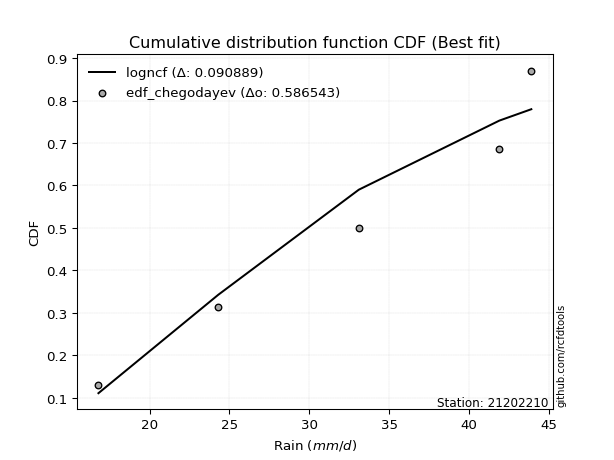</img></img>

</div>


### 6. EDF Blom (1958)

The Blom formula is a specific "plotting position" formula used in hydrology and statistical analysis to estimate the empirical cumulative probability (or non-exceedance probability) of a data series. It is particularly recommended for data that are approximately normally distributed. The constant _a_ is set to 0.375 (or 3/8).

<div align="center">


$P=(m-a)/(n+1-2a)$


</div>


**6.1. Empirical values**

<div align="center">

|                | 0                   | 1                   | 2        | 3                  | 4                  |
|:---------------|:--------------------|:--------------------|:---------|:-------------------|:-------------------|
| date           | 2012                | 2015                | 2014     | 2016               | 2013               |
| x              | 16.8                | 24.3                | 33.1     | 41.9               | 43.9               |
| m              | 1                   | 2                   | 3        | 4                  | 5                  |
| empirical_dist | edf_blom            | edf_blom            | edf_blom | edf_blom           | edf_blom           |
| empirical      | 0.11904761904761904 | 0.30952380952380953 | 0.5      | 0.6904761904761905 | 0.8809523809523809 |
| empirical_tr   | 1.135135135135135   | 1.4482758620689655  | 2.0      | 3.230769230769231  | 8.399999999999999  |

</div>


**6.2. Kolmogorov-Smirnov fit test (sorted by Δ)**


<div align="center">

|                | 0                  | 1                   | 2                  | 3                   | 4                  | 5                   | 6                   | 7                   | 8                   | 9                   | 10                  | 11                  | 12                  | 13                  | 14                  | 15                 | 16                  | 17                 | 18                 | 19                  | 20                  | 21                  | 22                  | 23                 | 24                 | 25                 | 26                  | 27                  | 28                 | 29                  | 30                  | 31                 | 32                  | 33                  | 34                  | 35                 | 36                  | 37                 | 38                 | 39                  | 40                  | 41                  | 42                  | 43                 | 44                  | 45                  | 46                  | 47                  | 48                  | 49                  | 50                  | 51                 | 52                  | 53                  | 54                  | 55                  | 56                 | 57                 | 58                  | 59                 | 60                 | 61                 | 62                 | 63                  | 64                  | 65                  | 66                  | 67                 | 68                  | 69                  | 70                  | 71                  | 72                  | 73                  | 74                 | 75                 | 76                  | 77                 | 78                 | 79                  | 80                 | 81                  | 82                  | 83                 | 84                  | 85                  | 86                  | 87                  | 88                 | 89                  | 90                  | 91                  | 92                 | 93                  | 94                  | 95                 | 96                  | 97                  | 98                  | 99                  | 100                | 101                 | 102                | 103                 | 104                 | 105                 | 106                 | 107                 | 108                | 109                | 110                | 111                | 112                 | 113                 | 114                | 115                 | 116                | 117                 | 118                 | 119                 | 120                | 121                | 122                | 123                 | 124                 | 125                | 126                 | 127                | 128                 | 129                | 130                | 131                 | 132                | 133                 | 134                 | 135                 | 136                 | 137                 | 138                 | 139                | 140                 | 141                | 142                | 143                 | 144                 | 145                 | 146                 | 147                 | 148                | 149                | 150                | 151                | 152                | 153                | 154                | 155                | 156                | 157                | 158                | 159                |
|:---------------|:-------------------|:--------------------|:-------------------|:--------------------|:-------------------|:--------------------|:--------------------|:--------------------|:--------------------|:--------------------|:--------------------|:--------------------|:--------------------|:--------------------|:--------------------|:-------------------|:--------------------|:-------------------|:-------------------|:--------------------|:--------------------|:--------------------|:--------------------|:-------------------|:-------------------|:-------------------|:--------------------|:--------------------|:-------------------|:--------------------|:--------------------|:-------------------|:--------------------|:--------------------|:--------------------|:-------------------|:--------------------|:-------------------|:-------------------|:--------------------|:--------------------|:--------------------|:--------------------|:-------------------|:--------------------|:--------------------|:--------------------|:--------------------|:--------------------|:--------------------|:--------------------|:-------------------|:--------------------|:--------------------|:--------------------|:--------------------|:-------------------|:-------------------|:--------------------|:-------------------|:-------------------|:-------------------|:-------------------|:--------------------|:--------------------|:--------------------|:--------------------|:-------------------|:--------------------|:--------------------|:--------------------|:--------------------|:--------------------|:--------------------|:-------------------|:-------------------|:--------------------|:-------------------|:-------------------|:--------------------|:-------------------|:--------------------|:--------------------|:-------------------|:--------------------|:--------------------|:--------------------|:--------------------|:-------------------|:--------------------|:--------------------|:--------------------|:-------------------|:--------------------|:--------------------|:-------------------|:--------------------|:--------------------|:--------------------|:--------------------|:-------------------|:--------------------|:-------------------|:--------------------|:--------------------|:--------------------|:--------------------|:--------------------|:-------------------|:-------------------|:-------------------|:-------------------|:--------------------|:--------------------|:-------------------|:--------------------|:-------------------|:--------------------|:--------------------|:--------------------|:-------------------|:-------------------|:-------------------|:--------------------|:--------------------|:-------------------|:--------------------|:-------------------|:--------------------|:-------------------|:-------------------|:--------------------|:-------------------|:--------------------|:--------------------|:--------------------|:--------------------|:--------------------|:--------------------|:-------------------|:--------------------|:-------------------|:-------------------|:--------------------|:--------------------|:--------------------|:--------------------|:--------------------|:-------------------|:-------------------|:-------------------|:-------------------|:-------------------|:-------------------|:-------------------|:-------------------|:-------------------|:-------------------|:-------------------|:-------------------|
| station        | 21202210           | 21202210            | 21202210           | 21202210            | 21202210           | 21202210            | 21202210            | 21202210            | 21202210            | 21202210            | 21202210            | 21202210            | 21202210            | 21202210            | 21202210            | 21202210           | 21202210            | 21202210           | 21202210           | 21202210            | 21202210            | 21202210            | 21202210            | 21202210           | 21202210           | 21202210           | 21202210            | 21202210            | 21202210           | 21202210            | 21202210            | 21202210           | 21202210            | 21202210            | 21202210            | 21202210           | 21202210            | 21202210           | 21202210           | 21202210            | 21202210            | 21202210            | 21202210            | 21202210           | 21202210            | 21202210            | 21202210            | 21202210            | 21202210            | 21202210            | 21202210            | 21202210           | 21202210            | 21202210            | 21202210            | 21202210            | 21202210           | 21202210           | 21202210            | 21202210           | 21202210           | 21202210           | 21202210           | 21202210            | 21202210            | 21202210            | 21202210            | 21202210           | 21202210            | 21202210            | 21202210            | 21202210            | 21202210            | 21202210            | 21202210           | 21202210           | 21202210            | 21202210           | 21202210           | 21202210            | 21202210           | 21202210            | 21202210            | 21202210           | 21202210            | 21202210            | 21202210            | 21202210            | 21202210           | 21202210            | 21202210            | 21202210            | 21202210           | 21202210            | 21202210            | 21202210           | 21202210            | 21202210            | 21202210            | 21202210            | 21202210           | 21202210            | 21202210           | 21202210            | 21202210            | 21202210            | 21202210            | 21202210            | 21202210           | 21202210           | 21202210           | 21202210           | 21202210            | 21202210            | 21202210           | 21202210            | 21202210           | 21202210            | 21202210            | 21202210            | 21202210           | 21202210           | 21202210           | 21202210            | 21202210            | 21202210           | 21202210            | 21202210           | 21202210            | 21202210           | 21202210           | 21202210            | 21202210           | 21202210            | 21202210            | 21202210            | 21202210            | 21202210            | 21202210            | 21202210           | 21202210            | 21202210           | 21202210           | 21202210            | 21202210            | 21202210            | 21202210            | 21202210            | 21202210           | 21202210           | 21202210           | 21202210           | 21202210           | 21202210           | 21202210           | 21202210           | 21202210           | 21202210           | 21202210           | 21202210           |
| empirical_dist | edf_blom           | edf_blom            | edf_blom           | edf_blom            | edf_blom           | edf_blom            | edf_blom            | edf_blom            | edf_blom            | edf_blom            | edf_blom            | edf_blom            | edf_blom            | edf_blom            | edf_blom            | edf_blom           | edf_blom            | edf_blom           | edf_blom           | edf_blom            | edf_blom            | edf_blom            | edf_blom            | edf_blom           | edf_blom           | edf_blom           | edf_blom            | edf_blom            | edf_blom           | edf_blom            | edf_blom            | edf_blom           | edf_blom            | edf_blom            | edf_blom            | edf_blom           | edf_blom            | edf_blom           | edf_blom           | edf_blom            | edf_blom            | edf_blom            | edf_blom            | edf_blom           | edf_blom            | edf_blom            | edf_blom            | edf_blom            | edf_blom            | edf_blom            | edf_blom            | edf_blom           | edf_blom            | edf_blom            | edf_blom            | edf_blom            | edf_blom           | edf_blom           | edf_blom            | edf_blom           | edf_blom           | edf_blom           | edf_blom           | edf_blom            | edf_blom            | edf_blom            | edf_blom            | edf_blom           | edf_blom            | edf_blom            | edf_blom            | edf_blom            | edf_blom            | edf_blom            | edf_blom           | edf_blom           | edf_blom            | edf_blom           | edf_blom           | edf_blom            | edf_blom           | edf_blom            | edf_blom            | edf_blom           | edf_blom            | edf_blom            | edf_blom            | edf_blom            | edf_blom           | edf_blom            | edf_blom            | edf_blom            | edf_blom           | edf_blom            | edf_blom            | edf_blom           | edf_blom            | edf_blom            | edf_blom            | edf_blom            | edf_blom           | edf_blom            | edf_blom           | edf_blom            | edf_blom            | edf_blom            | edf_blom            | edf_blom            | edf_blom           | edf_blom           | edf_blom           | edf_blom           | edf_blom            | edf_blom            | edf_blom           | edf_blom            | edf_blom           | edf_blom            | edf_blom            | edf_blom            | edf_blom           | edf_blom           | edf_blom           | edf_blom            | edf_blom            | edf_blom           | edf_blom            | edf_blom           | edf_blom            | edf_blom           | edf_blom           | edf_blom            | edf_blom           | edf_blom            | edf_blom            | edf_blom            | edf_blom            | edf_blom            | edf_blom            | edf_blom           | edf_blom            | edf_blom           | edf_blom           | edf_blom            | edf_blom            | edf_blom            | edf_blom            | edf_blom            | edf_blom           | edf_blom           | edf_blom           | edf_blom           | edf_blom           | edf_blom           | edf_blom           | edf_blom           | edf_blom           | edf_blom           | edf_blom           | edf_blom           |
| p_dist         | ksone              | logksone            | logtrapezoid       | logsemicircular     | logncf             | loganglit           | semicircular        | trapezoid           | anglit              | logbeta             | beta                | logkappa3           | logarcsine          | arcsine             | loginvgauss         | logalpha           | logbetaprime        | logweibull_max     | loginvgamma        | logrice             | logerlang           | logf                | lognct              | logpearson3        | loggamma           | loggamma           | logcrystalball      | lognorm             | logt               | logexponnorm        | logfatiguelife      | logmaxwell         | loginvweibull       | logloglaplace       | wrapcauchy          | loggenextreme      | ncf                 | kstwobign          | lograyleigh        | invgauss            | rice                | alpha               | rayleigh            | erlang             | maxwell             | f                   | gamma               | pearson3            | halfnorm            | nct                 | exponnorm           | norm               | crystalball         | truncnorm           | t                   | logdweibull         | betaprime          | invgamma           | logweibull_min      | loggompertz        | weibull_min        | logburr12          | genextreme         | logdgamma           | loggumbel_l         | loggennorm          | loglogistic         | logfoldnorm        | logcosine           | logkstwobign        | loggenexpon         | lomax               | genexpon            | gumbel_r            | halflogistic       | cosine             | logistic            | loghalfnorm        | levy_l             | loghypsecant        | gumbel_l           | logmielke           | moyal               | loglevy_l          | logburr             | loggumbel_r         | hypsecant           | argus               | logwrapcauchy      | loglaplace          | loglaplace          | genpareto           | dweibull           | burr                | logjohnsonsb        | mielke             | laplace             | halfgennorm         | burr12              | logargus            | genhalflogistic    | dgamma              | loghalflogistic    | gennorm             | logmoyal            | logloggamma         | kappa3              | loghalfgennorm      | loggenhalflogistic | wald               | skewnorm           | logjohnsonsu       | triang              | gausshyper          | tukeylambda        | kappa4              | logtriang          | uniform             | logskewnorm         | vonmises_line       | logexponweib       | logtukeylambda     | logkappa4          | logwald             | bradford            | truncexpon         | loguniform          | logvonmises_line   | loggausshyper       | truncweibull_min   | logbradford        | logtruncexpon       | loggengamma        | nakagami            | johnsonsb           | logtruncweibull_min | lognakagami         | weibull_max         | logrdist            | logexponpow        | gengamma            | gompertz           | exponweib          | johnsonsu           | foldnorm            | fatiguelife         | invweibull          | logtruncnorm        | powerlaw           | truncpareto        | logpowerlaw        | logtruncpareto     | exponpow           | loggenpareto       | loglomax           | rdist              | genlogistic        | loggenlogistic     | logvonmises        | vonmises           |
| delta          | 0.0868027543138663 | 0.08807762088984897 | 0.0886081374778167 | 0.09065972331228589 | 0.1014707483068008 | 0.10267767297102337 | 0.10306978176043124 | 0.10708707662995098 | 0.11476831781169683 | 0.11904663481107292 | 0.11904750048233659 | 0.11904761904750547 | 0.11904761904761904 | 0.11904761904761904 | 0.12582888765188516 | 0.1259732264872645 | 0.12620947126969995 | 0.1265613560616703 | 0.126644449294392  | 0.12768454348062375 | 0.12825330436298066 | 0.12843931904018013 | 0.12857382477751655 | 0.1287895687955608 | 0.1288767640080164 | 0.1288767640080164 | 0.12978781093321012 | 0.12978781116122873 | 0.1297887382791305 | 0.12979176718083274 | 0.12984509281236767 | 0.1300182925579476 | 0.13004838584063394 | 0.13029997533740376 | 0.13243007072856772 | 0.1333372203663853 | 0.13545669955326656 | 0.1357302292174848 | 0.1373031402849667 | 0.13905082897929533 | 0.13925577354618468 | 0.13941770456417002 | 0.13954262489021785 | 0.1398242670167381 | 0.13986381100331902 | 0.13987093617677937 | 0.13993868713251378 | 0.14092303386049154 | 0.14097956276744417 | 0.14101863755278687 | 0.14112714977874863 | 0.1411276382808886 | 0.14112765001628613 | 0.14112766038336366 | 0.14113036501975573 | 0.14120307607299898 | 0.1412277634247765 | 0.1414214658227183 | 0.14150995244244047 | 0.1422200426661011 | 0.1423846440056873 | 0.1441309873118829 | 0.1467904336890582 | 0.14696345374681052 | 0.14727391751877905 | 0.14816474176323666 | 0.15004543152974215 | 0.1513671038385711 | 0.15413511381627232 | 0.15430494105798798 | 0.15520869361745748 | 0.15717321745652346 | 0.15825482115541245 | 0.15843899660060456 | 0.159169791105216  | 0.1596567800213643 | 0.16048946519310825 | 0.1604904929188532 | 0.1609462328718143 | 0.16134086649766088 | 0.1635852176289191 | 0.16400797815644763 | 0.16486424359537533 | 0.1655441941968483 | 0.16905717606290893 | 0.16910811033479745 | 0.17094814845932904 | 0.17192755092423928 | 0.1725207048315779 | 0.17270426349674395 | 0.17270426349674395 | 0.17383641279792128 | 0.1762823215396826 | 0.17889078725274754 | 0.17982065877348224 | 0.1806977851988284 | 0.18098585378546628 | 0.18230635231787318 | 0.18327329747225818 | 0.18476407769703096 | 0.1859683586862877 | 0.18778417066664654 | 0.1888175118187223 | 0.19047619047619047 | 0.19168961064954748 | 0.19220629893496977 | 0.19976889650712593 | 0.20275704777194303 | 0.2048418124258805 | 0.2074814828955147 | 0.2084267610096281 | 0.2113969274638518 | 0.21455908943536772 | 0.22480358706483594 | 0.2275445412968431 | 0.22870980635052085 | 0.234497022935933  | 0.23572307151642946 | 0.23813913405882692 | 0.23911063649743314 | 0.2435383978957525 | 0.2524787845281431 | 0.2538848198195687 | 0.25465556659575606 | 0.25610237356941024 | 0.260277283022607  | 0.26097953773699645 | 0.2661627768892906 | 0.26708153629009646 | 0.2703031927417958 | 0.2743517804360127 | 0.28759092241462336 | 0.2893002596822716 | 0.30952360463375106 | 0.31673279382020675 | 0.355892462170428   | 0.36450122634640003 | 0.36820376494753626 | 0.37238275054075687 | 0.3935570746819639 | 0.42309817967586594 | 0.4400862689389589 | 0.4413252628966823 | 0.44859671938998696 | 0.45943171568233176 | 0.46743099771740626 | 0.46954668420821616 | 0.49999767081950447 | 0.536595907744342  | 0.5559383403640069 | 0.5681942791145083 | 0.5905369577429753 | 0.594239344835787  | 0.6075264750131544 | 0.6827863740423804 | 0.6904761904582932 | 0.6904761904761905 | 0.6904761904761905 | 1.128203411161455  | 6.902725285237363  |
| deltao         | 0.5865427407550001 | 0.5865427407550001  | 0.5865427407550001 | 0.5865427407550001  | 0.5865427407550001 | 0.5865427407550001  | 0.5865427407550001  | 0.5865427407550001  | 0.5865427407550001  | 0.5865427407550001  | 0.5865427407550001  | 0.5865427407550001  | 0.5865427407550001  | 0.5865427407550001  | 0.5865427407550001  | 0.5865427407550001 | 0.5865427407550001  | 0.5865427407550001 | 0.5865427407550001 | 0.5865427407550001  | 0.5865427407550001  | 0.5865427407550001  | 0.5865427407550001  | 0.5865427407550001 | 0.5865427407550001 | 0.5865427407550001 | 0.5865427407550001  | 0.5865427407550001  | 0.5865427407550001 | 0.5865427407550001  | 0.5865427407550001  | 0.5865427407550001 | 0.5865427407550001  | 0.5865427407550001  | 0.5865427407550001  | 0.5865427407550001 | 0.5865427407550001  | 0.5865427407550001 | 0.5865427407550001 | 0.5865427407550001  | 0.5865427407550001  | 0.5865427407550001  | 0.5865427407550001  | 0.5865427407550001 | 0.5865427407550001  | 0.5865427407550001  | 0.5865427407550001  | 0.5865427407550001  | 0.5865427407550001  | 0.5865427407550001  | 0.5865427407550001  | 0.5865427407550001 | 0.5865427407550001  | 0.5865427407550001  | 0.5865427407550001  | 0.5865427407550001  | 0.5865427407550001 | 0.5865427407550001 | 0.5865427407550001  | 0.5865427407550001 | 0.5865427407550001 | 0.5865427407550001 | 0.5865427407550001 | 0.5865427407550001  | 0.5865427407550001  | 0.5865427407550001  | 0.5865427407550001  | 0.5865427407550001 | 0.5865427407550001  | 0.5865427407550001  | 0.5865427407550001  | 0.5865427407550001  | 0.5865427407550001  | 0.5865427407550001  | 0.5865427407550001 | 0.5865427407550001 | 0.5865427407550001  | 0.5865427407550001 | 0.5865427407550001 | 0.5865427407550001  | 0.5865427407550001 | 0.5865427407550001  | 0.5865427407550001  | 0.5865427407550001 | 0.5865427407550001  | 0.5865427407550001  | 0.5865427407550001  | 0.5865427407550001  | 0.5865427407550001 | 0.5865427407550001  | 0.5865427407550001  | 0.5865427407550001  | 0.5865427407550001 | 0.5865427407550001  | 0.5865427407550001  | 0.5865427407550001 | 0.5865427407550001  | 0.5865427407550001  | 0.5865427407550001  | 0.5865427407550001  | 0.5865427407550001 | 0.5865427407550001  | 0.5865427407550001 | 0.5865427407550001  | 0.5865427407550001  | 0.5865427407550001  | 0.5865427407550001  | 0.5865427407550001  | 0.5865427407550001 | 0.5865427407550001 | 0.5865427407550001 | 0.5865427407550001 | 0.5865427407550001  | 0.5865427407550001  | 0.5865427407550001 | 0.5865427407550001  | 0.5865427407550001 | 0.5865427407550001  | 0.5865427407550001  | 0.5865427407550001  | 0.5865427407550001 | 0.5865427407550001 | 0.5865427407550001 | 0.5865427407550001  | 0.5865427407550001  | 0.5865427407550001 | 0.5865427407550001  | 0.5865427407550001 | 0.5865427407550001  | 0.5865427407550001 | 0.5865427407550001 | 0.5865427407550001  | 0.5865427407550001 | 0.5865427407550001  | 0.5865427407550001  | 0.5865427407550001  | 0.5865427407550001  | 0.5865427407550001  | 0.5865427407550001  | 0.5865427407550001 | 0.5865427407550001  | 0.5865427407550001 | 0.5865427407550001 | 0.5865427407550001  | 0.5865427407550001  | 0.5865427407550001  | 0.5865427407550001  | 0.5865427407550001  | 0.5865427407550001 | 0.5865427407550001 | 0.5865427407550001 | 0.5865427407550001 | 0.5865427407550001 | 0.5865427407550001 | 0.5865427407550001 | 0.5865427407550001 | 0.5865427407550001 | 0.5865427407550001 | 0.5865427407550001 | 0.5865427407550001 |
| eval           | Δo > Δ             | Δo > Δ              | Δo > Δ             | Δo > Δ              | Δo > Δ             | Δo > Δ              | Δo > Δ              | Δo > Δ              | Δo > Δ              | Δo > Δ              | Δo > Δ              | Δo > Δ              | Δo > Δ              | Δo > Δ              | Δo > Δ              | Δo > Δ             | Δo > Δ              | Δo > Δ             | Δo > Δ             | Δo > Δ              | Δo > Δ              | Δo > Δ              | Δo > Δ              | Δo > Δ             | Δo > Δ             | Δo > Δ             | Δo > Δ              | Δo > Δ              | Δo > Δ             | Δo > Δ              | Δo > Δ              | Δo > Δ             | Δo > Δ              | Δo > Δ              | Δo > Δ              | Δo > Δ             | Δo > Δ              | Δo > Δ             | Δo > Δ             | Δo > Δ              | Δo > Δ              | Δo > Δ              | Δo > Δ              | Δo > Δ             | Δo > Δ              | Δo > Δ              | Δo > Δ              | Δo > Δ              | Δo > Δ              | Δo > Δ              | Δo > Δ              | Δo > Δ             | Δo > Δ              | Δo > Δ              | Δo > Δ              | Δo > Δ              | Δo > Δ             | Δo > Δ             | Δo > Δ              | Δo > Δ             | Δo > Δ             | Δo > Δ             | Δo > Δ             | Δo > Δ              | Δo > Δ              | Δo > Δ              | Δo > Δ              | Δo > Δ             | Δo > Δ              | Δo > Δ              | Δo > Δ              | Δo > Δ              | Δo > Δ              | Δo > Δ              | Δo > Δ             | Δo > Δ             | Δo > Δ              | Δo > Δ             | Δo > Δ             | Δo > Δ              | Δo > Δ             | Δo > Δ              | Δo > Δ              | Δo > Δ             | Δo > Δ              | Δo > Δ              | Δo > Δ              | Δo > Δ              | Δo > Δ             | Δo > Δ              | Δo > Δ              | Δo > Δ              | Δo > Δ             | Δo > Δ              | Δo > Δ              | Δo > Δ             | Δo > Δ              | Δo > Δ              | Δo > Δ              | Δo > Δ              | Δo > Δ             | Δo > Δ              | Δo > Δ             | Δo > Δ              | Δo > Δ              | Δo > Δ              | Δo > Δ              | Δo > Δ              | Δo > Δ             | Δo > Δ             | Δo > Δ             | Δo > Δ             | Δo > Δ              | Δo > Δ              | Δo > Δ             | Δo > Δ              | Δo > Δ             | Δo > Δ              | Δo > Δ              | Δo > Δ              | Δo > Δ             | Δo > Δ             | Δo > Δ             | Δo > Δ              | Δo > Δ              | Δo > Δ             | Δo > Δ              | Δo > Δ             | Δo > Δ              | Δo > Δ             | Δo > Δ             | Δo > Δ              | Δo > Δ             | Δo > Δ              | Δo > Δ              | Δo > Δ              | Δo > Δ              | Δo > Δ              | Δo > Δ              | Δo > Δ             | Δo > Δ              | Δo > Δ             | Δo > Δ             | Δo > Δ              | Δo > Δ              | Δo > Δ              | Δo > Δ              | Δo > Δ              | Δo > Δ             | Δo > Δ             | Δo > Δ             | Δo <= Δ            | Δo <= Δ            | Δo <= Δ            | Δo <= Δ            | Δo <= Δ            | Δo <= Δ            | Δo <= Δ            | Δo <= Δ            | Δo <= Δ            |
| fit            | 1                  | 1                   | 1                  | 1                   | 1                  | 1                   | 1                   | 1                   | 1                   | 1                   | 1                   | 1                   | 1                   | 1                   | 1                   | 1                  | 1                   | 1                  | 1                  | 1                   | 1                   | 1                   | 1                   | 1                  | 1                  | 1                  | 1                   | 1                   | 1                  | 1                   | 1                   | 1                  | 1                   | 1                   | 1                   | 1                  | 1                   | 1                  | 1                  | 1                   | 1                   | 1                   | 1                   | 1                  | 1                   | 1                   | 1                   | 1                   | 1                   | 1                   | 1                   | 1                  | 1                   | 1                   | 1                   | 1                   | 1                  | 1                  | 1                   | 1                  | 1                  | 1                  | 1                  | 1                   | 1                   | 1                   | 1                   | 1                  | 1                   | 1                   | 1                   | 1                   | 1                   | 1                   | 1                  | 1                  | 1                   | 1                  | 1                  | 1                   | 1                  | 1                   | 1                   | 1                  | 1                   | 1                   | 1                   | 1                   | 1                  | 1                   | 1                   | 1                   | 1                  | 1                   | 1                   | 1                  | 1                   | 1                   | 1                   | 1                   | 1                  | 1                   | 1                  | 1                   | 1                   | 1                   | 1                   | 1                   | 1                  | 1                  | 1                  | 1                  | 1                   | 1                   | 1                  | 1                   | 1                  | 1                   | 1                   | 1                   | 1                  | 1                  | 1                  | 1                   | 1                   | 1                  | 1                   | 1                  | 1                   | 1                  | 1                  | 1                   | 1                  | 1                   | 1                   | 1                   | 1                   | 1                   | 1                   | 1                  | 1                   | 1                  | 1                  | 1                   | 1                   | 1                   | 1                   | 1                   | 1                  | 1                  | 1                  | 0                  | 0                  | 0                  | 0                  | 0                  | 0                  | 0                  | 0                  | 0                  |
| n              | 5                  | 5                   | 5                  | 5                   | 5                  | 5                   | 5                   | 5                   | 5                   | 5                   | 5                   | 5                   | 5                   | 5                   | 5                   | 5                  | 5                   | 5                  | 5                  | 5                   | 5                   | 5                   | 5                   | 5                  | 5                  | 5                  | 5                   | 5                   | 5                  | 5                   | 5                   | 5                  | 5                   | 5                   | 5                   | 5                  | 5                   | 5                  | 5                  | 5                   | 5                   | 5                   | 5                   | 5                  | 5                   | 5                   | 5                   | 5                   | 5                   | 5                   | 5                   | 5                  | 5                   | 5                   | 5                   | 5                   | 5                  | 5                  | 5                   | 5                  | 5                  | 5                  | 5                  | 5                   | 5                   | 5                   | 5                   | 5                  | 5                   | 5                   | 5                   | 5                   | 5                   | 5                   | 5                  | 5                  | 5                   | 5                  | 5                  | 5                   | 5                  | 5                   | 5                   | 5                  | 5                   | 5                   | 5                   | 5                   | 5                  | 5                   | 5                   | 5                   | 5                  | 5                   | 5                   | 5                  | 5                   | 5                   | 5                   | 5                   | 5                  | 5                   | 5                  | 5                   | 5                   | 5                   | 5                   | 5                   | 5                  | 5                  | 5                  | 5                  | 5                   | 5                   | 5                  | 5                   | 5                  | 5                   | 5                   | 5                   | 5                  | 5                  | 5                  | 5                   | 5                   | 5                  | 5                   | 5                  | 5                   | 5                  | 5                  | 5                   | 5                  | 5                   | 5                   | 5                   | 5                   | 5                   | 5                   | 5                  | 5                   | 5                  | 5                  | 5                   | 5                   | 5                   | 5                   | 5                   | 5                  | 5                  | 5                  | 5                  | 5                  | 5                  | 5                  | 5                  | 5                  | 5                  | 5                  | 5                  |
| best_fit       | 1                  | 0                   | 0                  | 0                   | 0                  | 0                   | 0                   | 0                   | 0                   | 0                   | 0                   | 0                   | 0                   | 0                   | 0                   | 0                  | 0                   | 0                  | 0                  | 0                   | 0                   | 0                   | 0                   | 0                  | 0                  | 0                  | 0                   | 0                   | 0                  | 0                   | 0                   | 0                  | 0                   | 0                   | 0                   | 0                  | 0                   | 0                  | 0                  | 0                   | 0                   | 0                   | 0                   | 0                  | 0                   | 0                   | 0                   | 0                   | 0                   | 0                   | 0                   | 0                  | 0                   | 0                   | 0                   | 0                   | 0                  | 0                  | 0                   | 0                  | 0                  | 0                  | 0                  | 0                   | 0                   | 0                   | 0                   | 0                  | 0                   | 0                   | 0                   | 0                   | 0                   | 0                   | 0                  | 0                  | 0                   | 0                  | 0                  | 0                   | 0                  | 0                   | 0                   | 0                  | 0                   | 0                   | 0                   | 0                   | 0                  | 0                   | 0                   | 0                   | 0                  | 0                   | 0                   | 0                  | 0                   | 0                   | 0                   | 0                   | 0                  | 0                   | 0                  | 0                   | 0                   | 0                   | 0                   | 0                   | 0                  | 0                  | 0                  | 0                  | 0                   | 0                   | 0                  | 0                   | 0                  | 0                   | 0                   | 0                   | 0                  | 0                  | 0                  | 0                   | 0                   | 0                  | 0                   | 0                  | 0                   | 0                  | 0                  | 0                   | 0                  | 0                   | 0                   | 0                   | 0                   | 0                   | 0                   | 0                  | 0                   | 0                  | 0                  | 0                   | 0                   | 0                   | 0                   | 0                   | 0                  | 0                  | 0                  | 0                  | 0                  | 0                  | 0                  | 0                  | 0                  | 0                  | 0                  | 0                  |
| best_fit_sort  | 1                  | 2                   | 3                  | 4                   | 5                  | 6                   | 7                   | 8                   | 9                   | 10                  | 11                  | 12                  | 13                  | 14                  | 15                  | 16                 | 17                  | 18                 | 19                 | 20                  | 21                  | 22                  | 23                  | 24                 | 25                 | 26                 | 27                  | 28                  | 29                 | 30                  | 31                  | 32                 | 33                  | 34                  | 35                  | 36                 | 37                  | 38                 | 39                 | 40                  | 41                  | 42                  | 43                  | 44                 | 45                  | 46                  | 47                  | 48                  | 49                  | 50                  | 51                  | 52                 | 53                  | 54                  | 55                  | 56                  | 57                 | 58                 | 59                  | 60                 | 61                 | 62                 | 63                 | 64                  | 65                  | 66                  | 67                  | 68                 | 69                  | 70                  | 71                  | 72                  | 73                  | 74                  | 75                 | 76                 | 77                  | 78                 | 79                 | 80                  | 81                 | 82                  | 83                  | 84                 | 85                  | 86                  | 87                  | 88                  | 89                 | 90                  | 91                  | 92                  | 93                 | 94                  | 95                  | 96                 | 97                  | 98                  | 99                  | 100                 | 101                | 102                 | 103                | 104                 | 105                 | 106                 | 107                 | 108                 | 109                | 110                | 111                | 112                | 113                 | 114                 | 115                | 116                 | 117                | 118                 | 119                 | 120                 | 121                | 122                | 123                | 124                 | 125                 | 126                | 127                 | 128                | 129                 | 130                | 131                | 132                 | 133                | 134                 | 135                 | 136                 | 137                 | 138                 | 139                 | 140                | 141                 | 142                | 143                | 144                 | 145                 | 146                 | 147                 | 148                 | 149                | 150                | 151                | 152                | 153                | 154                | 155                | 156                | 157                | 158                | 159                | 160                |

</div>


**6.3. Best fit**

<div align="center">

|   id |   station | empirical_dist   | p_dist   |     delta |   deltao | eval   |   fit |   n |   best_fit |   best_fit_sort |
|-----:|----------:|:-----------------|:---------|----------:|---------:|:-------|------:|----:|-----------:|----------------:|
|    0 |  21202210 | edf_blom         | ksone    | 0.0868028 | 0.586543 | Δo > Δ |     1 |   5 |          1 |               1 |

</div>


<div align="center">

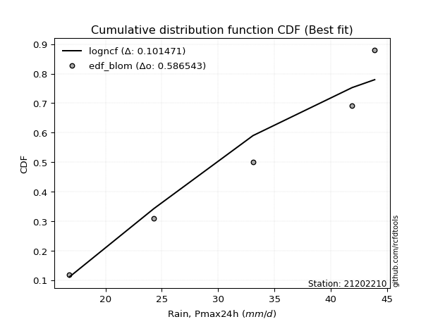</img>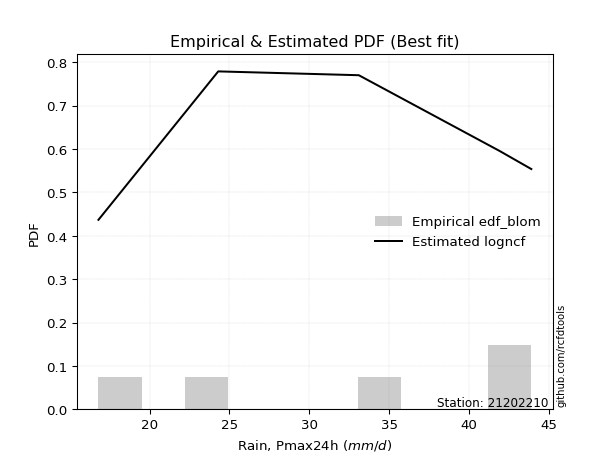</img>

</div>


### 7. EDF Tukey (1962)

In hydrology, the Tukey formula is used as a plotting position formula to estimate the empirical probability or frequency of a flood event (or other hydrological data). The formula parameter is given as _c=0.333_ (or 1/3).

<div align="center">


$P=(m-c)/(n+1-2c)$


</div>


**7.1. Empirical values**

<div align="center">

|                | 0                  | 1                  | 2         | 3         | 4         |
|:---------------|:-------------------|:-------------------|:----------|:----------|:----------|
| date           | 2012               | 2015               | 2014      | 2016      | 2013      |
| x              | 16.8               | 24.3               | 33.1      | 41.9      | 43.9      |
| m              | 1                  | 2                  | 3         | 4         | 5         |
| empirical_dist | edf_tukey          | edf_tukey          | edf_tukey | edf_tukey | edf_tukey |
| empirical      | 0.125              | 0.3125             | 0.5       | 0.6875    | 0.875     |
| empirical_tr   | 1.1428571428571428 | 1.4545454545454546 | 2.0       | 3.2       | 8.0       |

</div>


**7.2. Kolmogorov-Smirnov fit test (sorted by Δ)**


<div align="center">

|                | 0                   | 1                   | 2                   | 3                   | 4                   | 5                   | 6                   | 7                   | 8                  | 9                   | 10                  | 11                  | 12                 | 13                 | 14                  | 15                 | 16                 | 17                  | 18                  | 19                  | 20                  | 21                 | 22                  | 23                 | 24                  | 25                  | 26                  | 27                  | 28                 | 29                 | 30                  | 31                 | 32                  | 33                  | 34                  | 35                  | 36                 | 37                  | 38                  | 39                 | 40                  | 41                  | 42                 | 43                  | 44                  | 45                  | 46                  | 47                 | 48                  | 49                  | 50                 | 51                  | 52                 | 53                  | 54                 | 55                  | 56                  | 57                  | 58                  | 59                  | 60                  | 61                 | 62                  | 63                 | 64                  | 65                  | 66                 | 67                 | 68                  | 69                  | 70                  | 71                  | 72                  | 73                 | 74                 | 75                  | 76                  | 77                  | 78                  | 79                  | 80                 | 81                  | 82                 | 83                 | 84                  | 85                  | 86                 | 87                 | 88                  | 89                  | 90                  | 91                  | 92                  | 93                  | 94                 | 95                 | 96                  | 97                  | 98                  | 99                 | 100                 | 101                | 102                 | 103                | 104                 | 105                 | 106                | 107                 | 108                | 109                 | 110                 | 111                 | 112                | 113                | 114                 | 115                 | 116                 | 117                 | 118                 | 119                 | 120                | 121                 | 122                 | 123                 | 124                | 125                 | 126                | 127                 | 128                | 129                | 130                | 131                 | 132                | 133                | 134                | 135                 | 136                 | 137                | 138                 | 139                | 140                 | 141                | 142                | 143                | 144                 | 145                | 146                | 147                 | 148                | 149                | 150                | 151                | 152                | 153                | 154                | 155                | 156                | 157                | 158                | 159                |
|:---------------|:--------------------|:--------------------|:--------------------|:--------------------|:--------------------|:--------------------|:--------------------|:--------------------|:-------------------|:--------------------|:--------------------|:--------------------|:-------------------|:-------------------|:--------------------|:-------------------|:-------------------|:--------------------|:--------------------|:--------------------|:--------------------|:-------------------|:--------------------|:-------------------|:--------------------|:--------------------|:--------------------|:--------------------|:-------------------|:-------------------|:--------------------|:-------------------|:--------------------|:--------------------|:--------------------|:--------------------|:-------------------|:--------------------|:--------------------|:-------------------|:--------------------|:--------------------|:-------------------|:--------------------|:--------------------|:--------------------|:--------------------|:-------------------|:--------------------|:--------------------|:-------------------|:--------------------|:-------------------|:--------------------|:-------------------|:--------------------|:--------------------|:--------------------|:--------------------|:--------------------|:--------------------|:-------------------|:--------------------|:-------------------|:--------------------|:--------------------|:-------------------|:-------------------|:--------------------|:--------------------|:--------------------|:--------------------|:--------------------|:-------------------|:-------------------|:--------------------|:--------------------|:--------------------|:--------------------|:--------------------|:-------------------|:--------------------|:-------------------|:-------------------|:--------------------|:--------------------|:-------------------|:-------------------|:--------------------|:--------------------|:--------------------|:--------------------|:--------------------|:--------------------|:-------------------|:-------------------|:--------------------|:--------------------|:--------------------|:-------------------|:--------------------|:-------------------|:--------------------|:-------------------|:--------------------|:--------------------|:-------------------|:--------------------|:-------------------|:--------------------|:--------------------|:--------------------|:-------------------|:-------------------|:--------------------|:--------------------|:--------------------|:--------------------|:--------------------|:--------------------|:-------------------|:--------------------|:--------------------|:--------------------|:-------------------|:--------------------|:-------------------|:--------------------|:-------------------|:-------------------|:-------------------|:--------------------|:-------------------|:-------------------|:-------------------|:--------------------|:--------------------|:-------------------|:--------------------|:-------------------|:--------------------|:-------------------|:-------------------|:-------------------|:--------------------|:-------------------|:-------------------|:--------------------|:-------------------|:-------------------|:-------------------|:-------------------|:-------------------|:-------------------|:-------------------|:-------------------|:-------------------|:-------------------|:-------------------|:-------------------|
| station        | 21202210            | 21202210            | 21202210            | 21202210            | 21202210            | 21202210            | 21202210            | 21202210            | 21202210           | 21202210            | 21202210            | 21202210            | 21202210           | 21202210           | 21202210            | 21202210           | 21202210           | 21202210            | 21202210            | 21202210            | 21202210            | 21202210           | 21202210            | 21202210           | 21202210            | 21202210            | 21202210            | 21202210            | 21202210           | 21202210           | 21202210            | 21202210           | 21202210            | 21202210            | 21202210            | 21202210            | 21202210           | 21202210            | 21202210            | 21202210           | 21202210            | 21202210            | 21202210           | 21202210            | 21202210            | 21202210            | 21202210            | 21202210           | 21202210            | 21202210            | 21202210           | 21202210            | 21202210           | 21202210            | 21202210           | 21202210            | 21202210            | 21202210            | 21202210            | 21202210            | 21202210            | 21202210           | 21202210            | 21202210           | 21202210            | 21202210            | 21202210           | 21202210           | 21202210            | 21202210            | 21202210            | 21202210            | 21202210            | 21202210           | 21202210           | 21202210            | 21202210            | 21202210            | 21202210            | 21202210            | 21202210           | 21202210            | 21202210           | 21202210           | 21202210            | 21202210            | 21202210           | 21202210           | 21202210            | 21202210            | 21202210            | 21202210            | 21202210            | 21202210            | 21202210           | 21202210           | 21202210            | 21202210            | 21202210            | 21202210           | 21202210            | 21202210           | 21202210            | 21202210           | 21202210            | 21202210            | 21202210           | 21202210            | 21202210           | 21202210            | 21202210            | 21202210            | 21202210           | 21202210           | 21202210            | 21202210            | 21202210            | 21202210            | 21202210            | 21202210            | 21202210           | 21202210            | 21202210            | 21202210            | 21202210           | 21202210            | 21202210           | 21202210            | 21202210           | 21202210           | 21202210           | 21202210            | 21202210           | 21202210           | 21202210           | 21202210            | 21202210            | 21202210           | 21202210            | 21202210           | 21202210            | 21202210           | 21202210           | 21202210           | 21202210            | 21202210           | 21202210           | 21202210            | 21202210           | 21202210           | 21202210           | 21202210           | 21202210           | 21202210           | 21202210           | 21202210           | 21202210           | 21202210           | 21202210           | 21202210           |
| empirical_dist | edf_tukey           | edf_tukey           | edf_tukey           | edf_tukey           | edf_tukey           | edf_tukey           | edf_tukey           | edf_tukey           | edf_tukey          | edf_tukey           | edf_tukey           | edf_tukey           | edf_tukey          | edf_tukey          | edf_tukey           | edf_tukey          | edf_tukey          | edf_tukey           | edf_tukey           | edf_tukey           | edf_tukey           | edf_tukey          | edf_tukey           | edf_tukey          | edf_tukey           | edf_tukey           | edf_tukey           | edf_tukey           | edf_tukey          | edf_tukey          | edf_tukey           | edf_tukey          | edf_tukey           | edf_tukey           | edf_tukey           | edf_tukey           | edf_tukey          | edf_tukey           | edf_tukey           | edf_tukey          | edf_tukey           | edf_tukey           | edf_tukey          | edf_tukey           | edf_tukey           | edf_tukey           | edf_tukey           | edf_tukey          | edf_tukey           | edf_tukey           | edf_tukey          | edf_tukey           | edf_tukey          | edf_tukey           | edf_tukey          | edf_tukey           | edf_tukey           | edf_tukey           | edf_tukey           | edf_tukey           | edf_tukey           | edf_tukey          | edf_tukey           | edf_tukey          | edf_tukey           | edf_tukey           | edf_tukey          | edf_tukey          | edf_tukey           | edf_tukey           | edf_tukey           | edf_tukey           | edf_tukey           | edf_tukey          | edf_tukey          | edf_tukey           | edf_tukey           | edf_tukey           | edf_tukey           | edf_tukey           | edf_tukey          | edf_tukey           | edf_tukey          | edf_tukey          | edf_tukey           | edf_tukey           | edf_tukey          | edf_tukey          | edf_tukey           | edf_tukey           | edf_tukey           | edf_tukey           | edf_tukey           | edf_tukey           | edf_tukey          | edf_tukey          | edf_tukey           | edf_tukey           | edf_tukey           | edf_tukey          | edf_tukey           | edf_tukey          | edf_tukey           | edf_tukey          | edf_tukey           | edf_tukey           | edf_tukey          | edf_tukey           | edf_tukey          | edf_tukey           | edf_tukey           | edf_tukey           | edf_tukey          | edf_tukey          | edf_tukey           | edf_tukey           | edf_tukey           | edf_tukey           | edf_tukey           | edf_tukey           | edf_tukey          | edf_tukey           | edf_tukey           | edf_tukey           | edf_tukey          | edf_tukey           | edf_tukey          | edf_tukey           | edf_tukey          | edf_tukey          | edf_tukey          | edf_tukey           | edf_tukey          | edf_tukey          | edf_tukey          | edf_tukey           | edf_tukey           | edf_tukey          | edf_tukey           | edf_tukey          | edf_tukey           | edf_tukey          | edf_tukey          | edf_tukey          | edf_tukey           | edf_tukey          | edf_tukey          | edf_tukey           | edf_tukey          | edf_tukey          | edf_tukey          | edf_tukey          | edf_tukey          | edf_tukey          | edf_tukey          | edf_tukey          | edf_tukey          | edf_tukey          | edf_tukey          | edf_tukey          |
| p_dist         | ksone               | logtrapezoid        | logsemicircular     | logksone            | logncf              | loganglit           | semicircular        | trapezoid           | anglit             | logbeta             | beta                | logkappa3           | logarcsine         | arcsine            | logbetaprime        | logweibull_max     | loginvgauss        | logalpha            | wrapcauchy          | loginvgamma         | loginvweibull       | logrice            | logerlang           | logf               | lognct              | logpearson3         | loggamma            | loggamma            | logcrystalball     | lognorm            | logt                | logexponnorm       | logfatiguelife      | logmaxwell          | logloglaplace       | loggenextreme       | lograyleigh        | ncf                 | kstwobign           | invgauss           | rice                | alpha               | rayleigh           | erlang              | maxwell             | f                   | gamma               | pearson3           | halfnorm            | nct                 | exponnorm          | norm                | crystalball        | truncnorm           | t                  | logdweibull         | betaprime           | invgamma            | logweibull_min      | loggompertz         | weibull_min         | genextreme         | logburr12           | logdgamma          | loggumbel_l         | loggennorm          | logfoldnorm        | loglogistic        | logkstwobign        | loggenexpon         | logcosine           | lomax               | genexpon            | loghalfnorm        | levy_l             | gumbel_r            | halflogistic        | cosine              | logistic            | loghypsecant        | loglevy_l          | gumbel_l            | logmielke          | moyal              | loggumbel_r         | logwrapcauchy       | logburr            | hypsecant          | argus               | loglaplace          | loglaplace          | genpareto           | logjohnsonsb        | dweibull            | burr               | halfgennorm        | burr12              | mielke              | laplace             | gennorm            | logargus            | loghalflogistic    | genhalflogistic     | dgamma             | logmoyal            | logloggamma         | kappa3             | loghalfgennorm      | wald               | loggenhalflogistic  | logjohnsonsu        | skewnorm            | triang             | gausshyper         | tukeylambda         | kappa4              | logtriang           | uniform             | logexponweib        | logskewnorm         | vonmises_line      | logwald             | logtukeylambda      | logkappa4           | bradford           | truncexpon          | loguniform         | logvonmises_line    | loggausshyper      | truncweibull_min   | logbradford        | logtruncexpon       | loggengamma        | nakagami           | johnsonsb          | logtruncweibull_min | lognakagami         | weibull_max        | logrdist            | logexponpow        | gengamma            | exponweib          | gompertz           | johnsonsu          | foldnorm            | invweibull         | fatiguelife        | logtruncnorm        | powerlaw           | truncpareto        | logpowerlaw        | logtruncpareto     | exponpow           | loggenpareto       | loglomax           | rdist              | genlogistic        | loggenlogistic     | logvonmises        | vonmises           |
| delta          | 0.08977894479005677 | 0.09158432795400717 | 0.09363591378847635 | 0.09403000184222993 | 0.09551836735441988 | 0.10565386344721384 | 0.10604597223662171 | 0.11006326710614145 | 0.1177445082878873 | 0.12499901576345385 | 0.12499988143471752 | 0.12499999999988642 | 0.125              | 0.125              | 0.12620947126969995 | 0.1265613560616703 | 0.1278092587795191 | 0.12894941696345497 | 0.12945388025237725 | 0.12962063977058247 | 0.13004838584063394 | 0.1306607339568142 | 0.13122949483917112 | 0.1314155095163706 | 0.13155001525370702 | 0.13176575927175127 | 0.13185295448420686 | 0.13185295448420686 | 0.1327640014094006 | 0.1327640016374192 | 0.13276492875532098 | 0.1327679576570232 | 0.13282128328855813 | 0.13299448303413808 | 0.13327616581359422 | 0.13631341084257576 | 0.1373031402849667 | 0.13843289002945702 | 0.13870641969367525 | 0.1420270194554858 | 0.14223196402237515 | 0.14239389504036049 | 0.1425188153664083 | 0.14280045749292858 | 0.14284000147950948 | 0.14284712665296984 | 0.14291487760870425 | 0.143899224336682  | 0.14395575324363463 | 0.14399482802897734 | 0.1441033402549391 | 0.14410382875707906 | 0.1441038404924766 | 0.14410385085955413 | 0.1441065554959462 | 0.14417926654918944 | 0.14420395390096696 | 0.14439765629890877 | 0.14448614291863093 | 0.14519623314229158 | 0.14536083448187775 | 0.1467904336890582 | 0.14710717778807336 | 0.149939644223001  | 0.15025010799496952 | 0.15114093223942712 | 0.1513671038385711 | 0.1530216220059326 | 0.15430494105798798 | 0.15520869361745748 | 0.15711130429246278 | 0.15717321745652346 | 0.15825482115541245 | 0.1604904929188532 | 0.1609462328718143 | 0.16141518707679503 | 0.16214598158140647 | 0.16263297049755476 | 0.16346565566929872 | 0.16431705697385135 | 0.1655441941968483 | 0.16656140810510955 | 0.1669841686326381 | 0.1678404340715658 | 0.16910811033479745 | 0.16954451435538742 | 0.1720333665390994 | 0.1739243389355195 | 0.17490374140042975 | 0.17568045397293441 | 0.17568045397293441 | 0.17681260327411175 | 0.17684446829729178 | 0.17925851201587306 | 0.181866977728938  | 0.1822268826002129 | 0.18327329747225818 | 0.18367397567501886 | 0.18396204426165674 | 0.1875             | 0.18774026817322143 | 0.1888175118187223 | 0.18894454916247816 | 0.190760361142837  | 0.19168961064954748 | 0.19518248941116023 | 0.2027450869833164 | 0.20275704777194303 | 0.2074814828955147 | 0.20781800290207098 | 0.20842073698766134 | 0.21140295148581856 | 0.2175352799115582 | 0.2277797775410264 | 0.23052073177303356 | 0.23168599682671132 | 0.23747321341212346 | 0.23869926199261993 | 0.24056220741956202 | 0.24111532453501738 | 0.2420868269736236 | 0.25465556659575606 | 0.25545497500433356 | 0.25686101029575914 | 0.2590785640456007 | 0.26325347349879746 | 0.2639557282131869 | 0.26913896736548104 | 0.2700577267662869 | 0.2732793832179863 | 0.2773279709122032 | 0.28759092241462336 | 0.2893002596822716 | 0.3124997951099415 | 0.3137566033440163 | 0.355892462170428   | 0.36450122634640003 | 0.3652275744713458 | 0.36643036958837594 | 0.3905808842057734 | 0.42012198919967547 | 0.4383490724204918 | 0.4400862689389589 | 0.4456205289137965 | 0.45943171568233176 | 0.4635943032558352 | 0.4644548072412158 | 0.49999767081950447 | 0.5336197172681515 | 0.5529621498878164 | 0.5652180886383178 | 0.5875607672667849 | 0.5912631543595965 | 0.6015740940607734 | 0.6768339930899995 | 0.6874999999821028 | 0.6875             | 0.6875             | 1.1311796016376454 | 6.908677666189743  |
| deltao         | 0.5865427407550001  | 0.5865427407550001  | 0.5865427407550001  | 0.5865427407550001  | 0.5865427407550001  | 0.5865427407550001  | 0.5865427407550001  | 0.5865427407550001  | 0.5865427407550001 | 0.5865427407550001  | 0.5865427407550001  | 0.5865427407550001  | 0.5865427407550001 | 0.5865427407550001 | 0.5865427407550001  | 0.5865427407550001 | 0.5865427407550001 | 0.5865427407550001  | 0.5865427407550001  | 0.5865427407550001  | 0.5865427407550001  | 0.5865427407550001 | 0.5865427407550001  | 0.5865427407550001 | 0.5865427407550001  | 0.5865427407550001  | 0.5865427407550001  | 0.5865427407550001  | 0.5865427407550001 | 0.5865427407550001 | 0.5865427407550001  | 0.5865427407550001 | 0.5865427407550001  | 0.5865427407550001  | 0.5865427407550001  | 0.5865427407550001  | 0.5865427407550001 | 0.5865427407550001  | 0.5865427407550001  | 0.5865427407550001 | 0.5865427407550001  | 0.5865427407550001  | 0.5865427407550001 | 0.5865427407550001  | 0.5865427407550001  | 0.5865427407550001  | 0.5865427407550001  | 0.5865427407550001 | 0.5865427407550001  | 0.5865427407550001  | 0.5865427407550001 | 0.5865427407550001  | 0.5865427407550001 | 0.5865427407550001  | 0.5865427407550001 | 0.5865427407550001  | 0.5865427407550001  | 0.5865427407550001  | 0.5865427407550001  | 0.5865427407550001  | 0.5865427407550001  | 0.5865427407550001 | 0.5865427407550001  | 0.5865427407550001 | 0.5865427407550001  | 0.5865427407550001  | 0.5865427407550001 | 0.5865427407550001 | 0.5865427407550001  | 0.5865427407550001  | 0.5865427407550001  | 0.5865427407550001  | 0.5865427407550001  | 0.5865427407550001 | 0.5865427407550001 | 0.5865427407550001  | 0.5865427407550001  | 0.5865427407550001  | 0.5865427407550001  | 0.5865427407550001  | 0.5865427407550001 | 0.5865427407550001  | 0.5865427407550001 | 0.5865427407550001 | 0.5865427407550001  | 0.5865427407550001  | 0.5865427407550001 | 0.5865427407550001 | 0.5865427407550001  | 0.5865427407550001  | 0.5865427407550001  | 0.5865427407550001  | 0.5865427407550001  | 0.5865427407550001  | 0.5865427407550001 | 0.5865427407550001 | 0.5865427407550001  | 0.5865427407550001  | 0.5865427407550001  | 0.5865427407550001 | 0.5865427407550001  | 0.5865427407550001 | 0.5865427407550001  | 0.5865427407550001 | 0.5865427407550001  | 0.5865427407550001  | 0.5865427407550001 | 0.5865427407550001  | 0.5865427407550001 | 0.5865427407550001  | 0.5865427407550001  | 0.5865427407550001  | 0.5865427407550001 | 0.5865427407550001 | 0.5865427407550001  | 0.5865427407550001  | 0.5865427407550001  | 0.5865427407550001  | 0.5865427407550001  | 0.5865427407550001  | 0.5865427407550001 | 0.5865427407550001  | 0.5865427407550001  | 0.5865427407550001  | 0.5865427407550001 | 0.5865427407550001  | 0.5865427407550001 | 0.5865427407550001  | 0.5865427407550001 | 0.5865427407550001 | 0.5865427407550001 | 0.5865427407550001  | 0.5865427407550001 | 0.5865427407550001 | 0.5865427407550001 | 0.5865427407550001  | 0.5865427407550001  | 0.5865427407550001 | 0.5865427407550001  | 0.5865427407550001 | 0.5865427407550001  | 0.5865427407550001 | 0.5865427407550001 | 0.5865427407550001 | 0.5865427407550001  | 0.5865427407550001 | 0.5865427407550001 | 0.5865427407550001  | 0.5865427407550001 | 0.5865427407550001 | 0.5865427407550001 | 0.5865427407550001 | 0.5865427407550001 | 0.5865427407550001 | 0.5865427407550001 | 0.5865427407550001 | 0.5865427407550001 | 0.5865427407550001 | 0.5865427407550001 | 0.5865427407550001 |
| eval           | Δo > Δ              | Δo > Δ              | Δo > Δ              | Δo > Δ              | Δo > Δ              | Δo > Δ              | Δo > Δ              | Δo > Δ              | Δo > Δ             | Δo > Δ              | Δo > Δ              | Δo > Δ              | Δo > Δ             | Δo > Δ             | Δo > Δ              | Δo > Δ             | Δo > Δ             | Δo > Δ              | Δo > Δ              | Δo > Δ              | Δo > Δ              | Δo > Δ             | Δo > Δ              | Δo > Δ             | Δo > Δ              | Δo > Δ              | Δo > Δ              | Δo > Δ              | Δo > Δ             | Δo > Δ             | Δo > Δ              | Δo > Δ             | Δo > Δ              | Δo > Δ              | Δo > Δ              | Δo > Δ              | Δo > Δ             | Δo > Δ              | Δo > Δ              | Δo > Δ             | Δo > Δ              | Δo > Δ              | Δo > Δ             | Δo > Δ              | Δo > Δ              | Δo > Δ              | Δo > Δ              | Δo > Δ             | Δo > Δ              | Δo > Δ              | Δo > Δ             | Δo > Δ              | Δo > Δ             | Δo > Δ              | Δo > Δ             | Δo > Δ              | Δo > Δ              | Δo > Δ              | Δo > Δ              | Δo > Δ              | Δo > Δ              | Δo > Δ             | Δo > Δ              | Δo > Δ             | Δo > Δ              | Δo > Δ              | Δo > Δ             | Δo > Δ             | Δo > Δ              | Δo > Δ              | Δo > Δ              | Δo > Δ              | Δo > Δ              | Δo > Δ             | Δo > Δ             | Δo > Δ              | Δo > Δ              | Δo > Δ              | Δo > Δ              | Δo > Δ              | Δo > Δ             | Δo > Δ              | Δo > Δ             | Δo > Δ             | Δo > Δ              | Δo > Δ              | Δo > Δ             | Δo > Δ             | Δo > Δ              | Δo > Δ              | Δo > Δ              | Δo > Δ              | Δo > Δ              | Δo > Δ              | Δo > Δ             | Δo > Δ             | Δo > Δ              | Δo > Δ              | Δo > Δ              | Δo > Δ             | Δo > Δ              | Δo > Δ             | Δo > Δ              | Δo > Δ             | Δo > Δ              | Δo > Δ              | Δo > Δ             | Δo > Δ              | Δo > Δ             | Δo > Δ              | Δo > Δ              | Δo > Δ              | Δo > Δ             | Δo > Δ             | Δo > Δ              | Δo > Δ              | Δo > Δ              | Δo > Δ              | Δo > Δ              | Δo > Δ              | Δo > Δ             | Δo > Δ              | Δo > Δ              | Δo > Δ              | Δo > Δ             | Δo > Δ              | Δo > Δ             | Δo > Δ              | Δo > Δ             | Δo > Δ             | Δo > Δ             | Δo > Δ              | Δo > Δ             | Δo > Δ             | Δo > Δ             | Δo > Δ              | Δo > Δ              | Δo > Δ             | Δo > Δ              | Δo > Δ             | Δo > Δ              | Δo > Δ             | Δo > Δ             | Δo > Δ             | Δo > Δ              | Δo > Δ             | Δo > Δ             | Δo > Δ              | Δo > Δ             | Δo > Δ             | Δo > Δ             | Δo <= Δ            | Δo <= Δ            | Δo <= Δ            | Δo <= Δ            | Δo <= Δ            | Δo <= Δ            | Δo <= Δ            | Δo <= Δ            | Δo <= Δ            |
| fit            | 1                   | 1                   | 1                   | 1                   | 1                   | 1                   | 1                   | 1                   | 1                  | 1                   | 1                   | 1                   | 1                  | 1                  | 1                   | 1                  | 1                  | 1                   | 1                   | 1                   | 1                   | 1                  | 1                   | 1                  | 1                   | 1                   | 1                   | 1                   | 1                  | 1                  | 1                   | 1                  | 1                   | 1                   | 1                   | 1                   | 1                  | 1                   | 1                   | 1                  | 1                   | 1                   | 1                  | 1                   | 1                   | 1                   | 1                   | 1                  | 1                   | 1                   | 1                  | 1                   | 1                  | 1                   | 1                  | 1                   | 1                   | 1                   | 1                   | 1                   | 1                   | 1                  | 1                   | 1                  | 1                   | 1                   | 1                  | 1                  | 1                   | 1                   | 1                   | 1                   | 1                   | 1                  | 1                  | 1                   | 1                   | 1                   | 1                   | 1                   | 1                  | 1                   | 1                  | 1                  | 1                   | 1                   | 1                  | 1                  | 1                   | 1                   | 1                   | 1                   | 1                   | 1                   | 1                  | 1                  | 1                   | 1                   | 1                   | 1                  | 1                   | 1                  | 1                   | 1                  | 1                   | 1                   | 1                  | 1                   | 1                  | 1                   | 1                   | 1                   | 1                  | 1                  | 1                   | 1                   | 1                   | 1                   | 1                   | 1                   | 1                  | 1                   | 1                   | 1                   | 1                  | 1                   | 1                  | 1                   | 1                  | 1                  | 1                  | 1                   | 1                  | 1                  | 1                  | 1                   | 1                   | 1                  | 1                   | 1                  | 1                   | 1                  | 1                  | 1                  | 1                   | 1                  | 1                  | 1                   | 1                  | 1                  | 1                  | 0                  | 0                  | 0                  | 0                  | 0                  | 0                  | 0                  | 0                  | 0                  |
| n              | 5                   | 5                   | 5                   | 5                   | 5                   | 5                   | 5                   | 5                   | 5                  | 5                   | 5                   | 5                   | 5                  | 5                  | 5                   | 5                  | 5                  | 5                   | 5                   | 5                   | 5                   | 5                  | 5                   | 5                  | 5                   | 5                   | 5                   | 5                   | 5                  | 5                  | 5                   | 5                  | 5                   | 5                   | 5                   | 5                   | 5                  | 5                   | 5                   | 5                  | 5                   | 5                   | 5                  | 5                   | 5                   | 5                   | 5                   | 5                  | 5                   | 5                   | 5                  | 5                   | 5                  | 5                   | 5                  | 5                   | 5                   | 5                   | 5                   | 5                   | 5                   | 5                  | 5                   | 5                  | 5                   | 5                   | 5                  | 5                  | 5                   | 5                   | 5                   | 5                   | 5                   | 5                  | 5                  | 5                   | 5                   | 5                   | 5                   | 5                   | 5                  | 5                   | 5                  | 5                  | 5                   | 5                   | 5                  | 5                  | 5                   | 5                   | 5                   | 5                   | 5                   | 5                   | 5                  | 5                  | 5                   | 5                   | 5                   | 5                  | 5                   | 5                  | 5                   | 5                  | 5                   | 5                   | 5                  | 5                   | 5                  | 5                   | 5                   | 5                   | 5                  | 5                  | 5                   | 5                   | 5                   | 5                   | 5                   | 5                   | 5                  | 5                   | 5                   | 5                   | 5                  | 5                   | 5                  | 5                   | 5                  | 5                  | 5                  | 5                   | 5                  | 5                  | 5                  | 5                   | 5                   | 5                  | 5                   | 5                  | 5                   | 5                  | 5                  | 5                  | 5                   | 5                  | 5                  | 5                   | 5                  | 5                  | 5                  | 5                  | 5                  | 5                  | 5                  | 5                  | 5                  | 5                  | 5                  | 5                  |
| best_fit       | 1                   | 0                   | 0                   | 0                   | 0                   | 0                   | 0                   | 0                   | 0                  | 0                   | 0                   | 0                   | 0                  | 0                  | 0                   | 0                  | 0                  | 0                   | 0                   | 0                   | 0                   | 0                  | 0                   | 0                  | 0                   | 0                   | 0                   | 0                   | 0                  | 0                  | 0                   | 0                  | 0                   | 0                   | 0                   | 0                   | 0                  | 0                   | 0                   | 0                  | 0                   | 0                   | 0                  | 0                   | 0                   | 0                   | 0                   | 0                  | 0                   | 0                   | 0                  | 0                   | 0                  | 0                   | 0                  | 0                   | 0                   | 0                   | 0                   | 0                   | 0                   | 0                  | 0                   | 0                  | 0                   | 0                   | 0                  | 0                  | 0                   | 0                   | 0                   | 0                   | 0                   | 0                  | 0                  | 0                   | 0                   | 0                   | 0                   | 0                   | 0                  | 0                   | 0                  | 0                  | 0                   | 0                   | 0                  | 0                  | 0                   | 0                   | 0                   | 0                   | 0                   | 0                   | 0                  | 0                  | 0                   | 0                   | 0                   | 0                  | 0                   | 0                  | 0                   | 0                  | 0                   | 0                   | 0                  | 0                   | 0                  | 0                   | 0                   | 0                   | 0                  | 0                  | 0                   | 0                   | 0                   | 0                   | 0                   | 0                   | 0                  | 0                   | 0                   | 0                   | 0                  | 0                   | 0                  | 0                   | 0                  | 0                  | 0                  | 0                   | 0                  | 0                  | 0                  | 0                   | 0                   | 0                  | 0                   | 0                  | 0                   | 0                  | 0                  | 0                  | 0                   | 0                  | 0                  | 0                   | 0                  | 0                  | 0                  | 0                  | 0                  | 0                  | 0                  | 0                  | 0                  | 0                  | 0                  | 0                  |
| best_fit_sort  | 1                   | 2                   | 3                   | 4                   | 5                   | 6                   | 7                   | 8                   | 9                  | 10                  | 11                  | 12                  | 13                 | 14                 | 15                  | 16                 | 17                 | 18                  | 19                  | 20                  | 21                  | 22                 | 23                  | 24                 | 25                  | 26                  | 27                  | 28                  | 29                 | 30                 | 31                  | 32                 | 33                  | 34                  | 35                  | 36                  | 37                 | 38                  | 39                  | 40                 | 41                  | 42                  | 43                 | 44                  | 45                  | 46                  | 47                  | 48                 | 49                  | 50                  | 51                 | 52                  | 53                 | 54                  | 55                 | 56                  | 57                  | 58                  | 59                  | 60                  | 61                  | 62                 | 63                  | 64                 | 65                  | 66                  | 67                 | 68                 | 69                  | 70                  | 71                  | 72                  | 73                  | 74                 | 75                 | 76                  | 77                  | 78                  | 79                  | 80                  | 81                 | 82                  | 83                 | 84                 | 85                  | 86                  | 87                 | 88                 | 89                  | 90                  | 91                  | 92                  | 93                  | 94                  | 95                 | 96                 | 97                  | 98                  | 99                  | 100                | 101                 | 102                | 103                 | 104                | 105                 | 106                 | 107                | 108                 | 109                | 110                 | 111                 | 112                 | 113                | 114                | 115                 | 116                 | 117                 | 118                 | 119                 | 120                 | 121                | 122                 | 123                 | 124                 | 125                | 126                 | 127                | 128                 | 129                | 130                | 131                | 132                 | 133                | 134                | 135                | 136                 | 137                 | 138                | 139                 | 140                | 141                 | 142                | 143                | 144                | 145                 | 146                | 147                | 148                 | 149                | 150                | 151                | 152                | 153                | 154                | 155                | 156                | 157                | 158                | 159                | 160                |

</div>


**7.3. Best fit**

<div align="center">

|   id |   station | empirical_dist   | p_dist   |     delta |   deltao | eval   |   fit |   n |   best_fit |   best_fit_sort |
|-----:|----------:|:-----------------|:---------|----------:|---------:|:-------|------:|----:|-----------:|----------------:|
|    0 |  21202210 | edf_tukey        | ksone    | 0.0897789 | 0.586543 | Δo > Δ |     1 |   5 |          1 |               1 |

</div>


<div align="center">

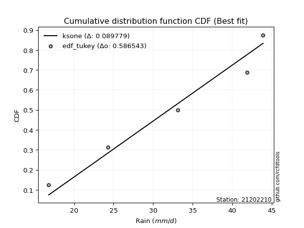</img></img>

</div>


### 8. EDF Gringorten (1963)

Gringorten plotting position formula is essential for estimating the probability and return periods of extreme events like floods and heavy rainfall. The constant _a=0.44_.

<div align="center">


$P=(m-a)/(n+1-2a)$


</div>


**8.1. Empirical values**

<div align="center">

|                | 0                   | 1                  | 2              | 3                 | 4                  |
|:---------------|:--------------------|:-------------------|:---------------|:------------------|:-------------------|
| date           | 2012                | 2015               | 2014           | 2016              | 2013               |
| x              | 16.8                | 24.3               | 33.1           | 41.9              | 43.9               |
| m              | 1                   | 2                  | 3              | 4                 | 5                  |
| empirical_dist | edf_gringorten      | edf_gringorten     | edf_gringorten | edf_gringorten    | edf_gringorten     |
| empirical      | 0.10937500000000001 | 0.3046875          | 0.5            | 0.6953125         | 0.8906249999999999 |
| empirical_tr   | 1.1228070175438596  | 1.4382022471910112 | 2.0            | 3.282051282051282 | 9.142857142857133  |

</div>


**8.2. Kolmogorov-Smirnov fit test (sorted by Δ)**


<div align="center">

|                | 0                   | 1                   | 2                   | 3                   | 4                   | 5                   | 6                   | 7                   | 8                   | 9                   | 10                  | 11                 | 12                  | 13                  | 14                  | 15                  | 16                  | 17                 | 18                  | 19                  | 20                  | 21                  | 22                  | 23                 | 24                  | 25                 | 26                  | 27                  | 28                 | 29                  | 30                  | 31                 | 32                  | 33                 | 34                  | 35                  | 36                  | 37                 | 38                  | 39                  | 40                 | 41                  | 42                  | 43                  | 44                  | 45                 | 46                  | 47                  | 48                 | 49                  | 50                 | 51                  | 52                 | 53                  | 54                  | 55                  | 56                  | 57                 | 58                  | 59                  | 60                  | 61                  | 62                 | 63                  | 64                  | 65                 | 66                 | 67                  | 68                 | 69                  | 70                  | 71                  | 72                  | 73                  | 74                  | 75                  | 76                  | 77                  | 78                  | 79                 | 80                 | 81                 | 82                 | 83                 | 84                 | 85                 | 86                  | 87                  | 88                  | 89                  | 90                  | 91                  | 92                 | 93                  | 94                  | 95                  | 96                  | 97                  | 98                 | 99                  | 100                 | 101                | 102                 | 103                | 104                 | 105                | 106                | 107                 | 108                 | 109                 | 110                | 111                | 112                 | 113                | 114                 | 115                 | 116                 | 117                 | 118                 | 119                | 120                 | 121                 | 122                 | 123                | 124                 | 125                 | 126                | 127                 | 128                | 129                | 130                | 131                 | 132                | 133                | 134                | 135                 | 136                 | 137                | 138                | 139                | 140                 | 141                | 142                | 143                | 144                 | 145                | 146                | 147                 | 148                | 149                | 150                | 151                | 152                | 153                | 154                | 155                | 156                | 157                | 158                | 159                |
|:---------------|:--------------------|:--------------------|:--------------------|:--------------------|:--------------------|:--------------------|:--------------------|:--------------------|:--------------------|:--------------------|:--------------------|:-------------------|:--------------------|:--------------------|:--------------------|:--------------------|:--------------------|:-------------------|:--------------------|:--------------------|:--------------------|:--------------------|:--------------------|:-------------------|:--------------------|:-------------------|:--------------------|:--------------------|:-------------------|:--------------------|:--------------------|:-------------------|:--------------------|:-------------------|:--------------------|:--------------------|:--------------------|:-------------------|:--------------------|:--------------------|:-------------------|:--------------------|:--------------------|:--------------------|:--------------------|:-------------------|:--------------------|:--------------------|:-------------------|:--------------------|:-------------------|:--------------------|:-------------------|:--------------------|:--------------------|:--------------------|:--------------------|:-------------------|:--------------------|:--------------------|:--------------------|:--------------------|:-------------------|:--------------------|:--------------------|:-------------------|:-------------------|:--------------------|:-------------------|:--------------------|:--------------------|:--------------------|:--------------------|:--------------------|:--------------------|:--------------------|:--------------------|:--------------------|:--------------------|:-------------------|:-------------------|:-------------------|:-------------------|:-------------------|:-------------------|:-------------------|:--------------------|:--------------------|:--------------------|:--------------------|:--------------------|:--------------------|:-------------------|:--------------------|:--------------------|:--------------------|:--------------------|:--------------------|:-------------------|:--------------------|:--------------------|:-------------------|:--------------------|:-------------------|:--------------------|:-------------------|:-------------------|:--------------------|:--------------------|:--------------------|:-------------------|:-------------------|:--------------------|:-------------------|:--------------------|:--------------------|:--------------------|:--------------------|:--------------------|:-------------------|:--------------------|:--------------------|:--------------------|:-------------------|:--------------------|:--------------------|:-------------------|:--------------------|:-------------------|:-------------------|:-------------------|:--------------------|:-------------------|:-------------------|:-------------------|:--------------------|:--------------------|:-------------------|:-------------------|:-------------------|:--------------------|:-------------------|:-------------------|:-------------------|:--------------------|:-------------------|:-------------------|:--------------------|:-------------------|:-------------------|:-------------------|:-------------------|:-------------------|:-------------------|:-------------------|:-------------------|:-------------------|:-------------------|:-------------------|:-------------------|
| station        | 21202210            | 21202210            | 21202210            | 21202210            | 21202210            | 21202210            | 21202210            | 21202210            | 21202210            | 21202210            | 21202210            | 21202210           | 21202210            | 21202210            | 21202210            | 21202210            | 21202210            | 21202210           | 21202210            | 21202210            | 21202210            | 21202210            | 21202210            | 21202210           | 21202210            | 21202210           | 21202210            | 21202210            | 21202210           | 21202210            | 21202210            | 21202210           | 21202210            | 21202210           | 21202210            | 21202210            | 21202210            | 21202210           | 21202210            | 21202210            | 21202210           | 21202210            | 21202210            | 21202210            | 21202210            | 21202210           | 21202210            | 21202210            | 21202210           | 21202210            | 21202210           | 21202210            | 21202210           | 21202210            | 21202210            | 21202210            | 21202210            | 21202210           | 21202210            | 21202210            | 21202210            | 21202210            | 21202210           | 21202210            | 21202210            | 21202210           | 21202210           | 21202210            | 21202210           | 21202210            | 21202210            | 21202210            | 21202210            | 21202210            | 21202210            | 21202210            | 21202210            | 21202210            | 21202210            | 21202210           | 21202210           | 21202210           | 21202210           | 21202210           | 21202210           | 21202210           | 21202210            | 21202210            | 21202210            | 21202210            | 21202210            | 21202210            | 21202210           | 21202210            | 21202210            | 21202210            | 21202210            | 21202210            | 21202210           | 21202210            | 21202210            | 21202210           | 21202210            | 21202210           | 21202210            | 21202210           | 21202210           | 21202210            | 21202210            | 21202210            | 21202210           | 21202210           | 21202210            | 21202210           | 21202210            | 21202210            | 21202210            | 21202210            | 21202210            | 21202210           | 21202210            | 21202210            | 21202210            | 21202210           | 21202210            | 21202210            | 21202210           | 21202210            | 21202210           | 21202210           | 21202210           | 21202210            | 21202210           | 21202210           | 21202210           | 21202210            | 21202210            | 21202210           | 21202210           | 21202210           | 21202210            | 21202210           | 21202210           | 21202210           | 21202210            | 21202210           | 21202210           | 21202210            | 21202210           | 21202210           | 21202210           | 21202210           | 21202210           | 21202210           | 21202210           | 21202210           | 21202210           | 21202210           | 21202210           | 21202210           |
| empirical_dist | edf_gringorten      | edf_gringorten      | edf_gringorten      | edf_gringorten      | edf_gringorten      | edf_gringorten      | edf_gringorten      | edf_gringorten      | edf_gringorten      | edf_gringorten      | edf_gringorten      | edf_gringorten     | edf_gringorten      | edf_gringorten      | edf_gringorten      | edf_gringorten      | edf_gringorten      | edf_gringorten     | edf_gringorten      | edf_gringorten      | edf_gringorten      | edf_gringorten      | edf_gringorten      | edf_gringorten     | edf_gringorten      | edf_gringorten     | edf_gringorten      | edf_gringorten      | edf_gringorten     | edf_gringorten      | edf_gringorten      | edf_gringorten     | edf_gringorten      | edf_gringorten     | edf_gringorten      | edf_gringorten      | edf_gringorten      | edf_gringorten     | edf_gringorten      | edf_gringorten      | edf_gringorten     | edf_gringorten      | edf_gringorten      | edf_gringorten      | edf_gringorten      | edf_gringorten     | edf_gringorten      | edf_gringorten      | edf_gringorten     | edf_gringorten      | edf_gringorten     | edf_gringorten      | edf_gringorten     | edf_gringorten      | edf_gringorten      | edf_gringorten      | edf_gringorten      | edf_gringorten     | edf_gringorten      | edf_gringorten      | edf_gringorten      | edf_gringorten      | edf_gringorten     | edf_gringorten      | edf_gringorten      | edf_gringorten     | edf_gringorten     | edf_gringorten      | edf_gringorten     | edf_gringorten      | edf_gringorten      | edf_gringorten      | edf_gringorten      | edf_gringorten      | edf_gringorten      | edf_gringorten      | edf_gringorten      | edf_gringorten      | edf_gringorten      | edf_gringorten     | edf_gringorten     | edf_gringorten     | edf_gringorten     | edf_gringorten     | edf_gringorten     | edf_gringorten     | edf_gringorten      | edf_gringorten      | edf_gringorten      | edf_gringorten      | edf_gringorten      | edf_gringorten      | edf_gringorten     | edf_gringorten      | edf_gringorten      | edf_gringorten      | edf_gringorten      | edf_gringorten      | edf_gringorten     | edf_gringorten      | edf_gringorten      | edf_gringorten     | edf_gringorten      | edf_gringorten     | edf_gringorten      | edf_gringorten     | edf_gringorten     | edf_gringorten      | edf_gringorten      | edf_gringorten      | edf_gringorten     | edf_gringorten     | edf_gringorten      | edf_gringorten     | edf_gringorten      | edf_gringorten      | edf_gringorten      | edf_gringorten      | edf_gringorten      | edf_gringorten     | edf_gringorten      | edf_gringorten      | edf_gringorten      | edf_gringorten     | edf_gringorten      | edf_gringorten      | edf_gringorten     | edf_gringorten      | edf_gringorten     | edf_gringorten     | edf_gringorten     | edf_gringorten      | edf_gringorten     | edf_gringorten     | edf_gringorten     | edf_gringorten      | edf_gringorten      | edf_gringorten     | edf_gringorten     | edf_gringorten     | edf_gringorten      | edf_gringorten     | edf_gringorten     | edf_gringorten     | edf_gringorten      | edf_gringorten     | edf_gringorten     | edf_gringorten      | edf_gringorten     | edf_gringorten     | edf_gringorten     | edf_gringorten     | edf_gringorten     | edf_gringorten     | edf_gringorten     | edf_gringorten     | edf_gringorten     | edf_gringorten     | edf_gringorten     | edf_gringorten     |
| p_dist         | ksone               | logtrapezoid        | logsemicircular     | logksone            | loganglit           | semicircular        | trapezoid           | logbeta             | beta                | logkappa3           | arcsine             | anglit             | logncf              | logalpha            | loginvgamma         | logrice             | logerlang           | logf               | lognct              | logpearson3         | loggamma            | loggamma            | logcrystalball      | lognorm            | logt                | logexponnorm       | logfatiguelife      | logloglaplace       | logarcsine         | loginvgauss         | logbetaprime        | logweibull_max     | loggenextreme       | logmaxwell         | loginvweibull       | ncf                 | kstwobign           | invgauss           | rice                | alpha               | rayleigh           | erlang              | maxwell             | f                   | gamma               | pearson3           | halfnorm            | nct                 | exponnorm          | norm                | crystalball        | truncnorm           | t                  | betaprime           | invgamma            | logweibull_min      | wrapcauchy          | lograyleigh        | loggompertz         | weibull_min         | logburr12           | logdweibull         | logdgamma          | loggumbel_l         | loggennorm          | loglogistic        | genextreme         | logcosine           | logfoldnorm        | gumbel_r            | logkstwobign        | halflogistic        | cosine              | loggenexpon         | logistic            | loghypsecant        | lomax               | genexpon            | gumbel_l            | logmielke          | moyal              | loghalfnorm        | levy_l             | logburr            | loglevy_l          | hypsecant          | argus               | loglaplace          | loglaplace          | genpareto           | loggumbel_r         | dweibull            | burr               | mielke              | laplace             | logwrapcauchy       | logargus            | genhalflogistic     | dgamma             | burr12              | logjohnsonsb        | halfgennorm        | logloggamma         | loghalflogistic    | logmoyal            | kappa3             | gennorm            | loggenhalflogistic  | loghalfgennorm      | skewnorm            | wald               | triang             | logjohnsonsu        | gausshyper         | tukeylambda         | kappa4              | logtriang           | uniform             | logskewnorm         | vonmises_line      | logtukeylambda      | logexponweib        | logkappa4           | bradford           | logwald             | truncexpon          | loguniform         | logvonmises_line    | loggausshyper      | truncweibull_min   | logbradford        | logtruncexpon       | loggengamma        | nakagami           | johnsonsb          | logtruncweibull_min | lognakagami         | weibull_max        | logrdist           | logexponpow        | gengamma            | gompertz           | exponweib          | johnsonsu          | foldnorm            | fatiguelife        | invweibull         | logtruncnorm        | powerlaw           | truncpareto        | logpowerlaw        | logtruncpareto     | exponpow           | loggenpareto       | loglomax           | rdist              | genlogistic        | loggenlogistic     | logvonmises        | vonmises           |
| delta          | 0.08196644479005677 | 0.08377182795400717 | 0.08582341378847635 | 0.08866409703395828 | 0.09784136344721384 | 0.09823347223662171 | 0.10225076710614145 | 0.10937401576345396 | 0.10937488143471763 | 0.10937499999988644 | 0.10937500000000001 | 0.1099320082878873 | 0.11114336735441976 | 0.12113691696345497 | 0.12180813977058247 | 0.12284823395681421 | 0.12341699483917112 | 0.1236030095163706 | 0.12373751525370702 | 0.12395325927175127 | 0.12404045448420686 | 0.12404045448420686 | 0.12495150140940059 | 0.1249515016374192 | 0.12495242875532098 | 0.1249554576570232 | 0.12500878328855813 | 0.12546366581359422 | 0.1256244118145714 | 0.12582888765188516 | 0.12620947126969995 | 0.1265613560616703 | 0.12850091084257576 | 0.1291662094165944 | 0.13004838584063394 | 0.13062039002945702 | 0.13089391969367525 | 0.1342145194554858 | 0.13441946402237515 | 0.13458139504036049 | 0.1347063153664083 | 0.13498795749292858 | 0.13502750147950948 | 0.13503462665296984 | 0.13510237760870425 | 0.136086724336682  | 0.13614325324363463 | 0.13618232802897734 | 0.1362908402549391 | 0.13629132875707906 | 0.1362913404924766 | 0.13629135085955413 | 0.1362940554959462 | 0.13639145390096696 | 0.13658515629890877 | 0.13667364291863093 | 0.13726638025237725 | 0.1373031402849667 | 0.13738373314229158 | 0.13754833448187775 | 0.13929467778807336 | 0.14017996538949012 | 0.142127144223001  | 0.14243760799496952 | 0.14332843223942712 | 0.1452091220059326 | 0.1467904336890582 | 0.14929880429246278 | 0.1513671038385711 | 0.15360268707679503 | 0.15430494105798798 | 0.15433348158140647 | 0.15482047049755476 | 0.15520869361745748 | 0.15565315566929872 | 0.15650455697385135 | 0.15717321745652346 | 0.15825482115541245 | 0.15874890810510955 | 0.1591716686326381 | 0.1600279340715658 | 0.1604904929188532 | 0.1609462328718143 | 0.1642208665390994 | 0.1655441941968483 | 0.1661118389355195 | 0.16709124140042975 | 0.16786795397293441 | 0.16786795397293441 | 0.16900010327411175 | 0.16910811033479745 | 0.17144601201587306 | 0.174054477728938  | 0.17586147567501886 | 0.17614954426165674 | 0.17735701435538742 | 0.17992776817322143 | 0.18113204916247816 | 0.182947861142837  | 0.18327329747225818 | 0.18465696829729178 | 0.1871426618416827 | 0.18736998941116023 | 0.1888175118187223 | 0.19168961064954748 | 0.1949325869833164 | 0.1953125          | 0.20000550290207098 | 0.20275704777194303 | 0.20359045148581856 | 0.2074814828955147 | 0.2097227799115582 | 0.21623323698766134 | 0.2199672775410264 | 0.22270823177303356 | 0.22387349682671132 | 0.22966071341212346 | 0.23088676199261993 | 0.23330282453501738 | 0.2342743269736236 | 0.24764247500433356 | 0.24837470741956202 | 0.24904851029575914 | 0.2512660640456007 | 0.25465556659575606 | 0.25544097349879746 | 0.2561432282131869 | 0.26132646736548104 | 0.2622452267662869 | 0.2654668832179863 | 0.2721738359424313 | 0.28759092241462336 | 0.2893002596822716 | 0.3046872951099415 | 0.3215691033440163 | 0.355892462170428   | 0.36450122634640003 | 0.3730400744713458 | 0.3820553695883758 | 0.3983933842057734 | 0.42793448919967547 | 0.4400862689389589 | 0.4461615724204918 | 0.4534330289137965 | 0.45943171568233176 | 0.4722673072412158 | 0.4792193032558351 | 0.49999767081950447 | 0.5414322172681515 | 0.5607746498878164 | 0.5730305886383178 | 0.5953732672667849 | 0.5990756543595965 | 0.6171990940607734 | 0.6924589930899994 | 0.6953124999821028 | 0.6953125          | 0.6953125          | 1.1233671016376454 | 6.893052666189743  |
| deltao         | 0.5865427407550001  | 0.5865427407550001  | 0.5865427407550001  | 0.5865427407550001  | 0.5865427407550001  | 0.5865427407550001  | 0.5865427407550001  | 0.5865427407550001  | 0.5865427407550001  | 0.5865427407550001  | 0.5865427407550001  | 0.5865427407550001 | 0.5865427407550001  | 0.5865427407550001  | 0.5865427407550001  | 0.5865427407550001  | 0.5865427407550001  | 0.5865427407550001 | 0.5865427407550001  | 0.5865427407550001  | 0.5865427407550001  | 0.5865427407550001  | 0.5865427407550001  | 0.5865427407550001 | 0.5865427407550001  | 0.5865427407550001 | 0.5865427407550001  | 0.5865427407550001  | 0.5865427407550001 | 0.5865427407550001  | 0.5865427407550001  | 0.5865427407550001 | 0.5865427407550001  | 0.5865427407550001 | 0.5865427407550001  | 0.5865427407550001  | 0.5865427407550001  | 0.5865427407550001 | 0.5865427407550001  | 0.5865427407550001  | 0.5865427407550001 | 0.5865427407550001  | 0.5865427407550001  | 0.5865427407550001  | 0.5865427407550001  | 0.5865427407550001 | 0.5865427407550001  | 0.5865427407550001  | 0.5865427407550001 | 0.5865427407550001  | 0.5865427407550001 | 0.5865427407550001  | 0.5865427407550001 | 0.5865427407550001  | 0.5865427407550001  | 0.5865427407550001  | 0.5865427407550001  | 0.5865427407550001 | 0.5865427407550001  | 0.5865427407550001  | 0.5865427407550001  | 0.5865427407550001  | 0.5865427407550001 | 0.5865427407550001  | 0.5865427407550001  | 0.5865427407550001 | 0.5865427407550001 | 0.5865427407550001  | 0.5865427407550001 | 0.5865427407550001  | 0.5865427407550001  | 0.5865427407550001  | 0.5865427407550001  | 0.5865427407550001  | 0.5865427407550001  | 0.5865427407550001  | 0.5865427407550001  | 0.5865427407550001  | 0.5865427407550001  | 0.5865427407550001 | 0.5865427407550001 | 0.5865427407550001 | 0.5865427407550001 | 0.5865427407550001 | 0.5865427407550001 | 0.5865427407550001 | 0.5865427407550001  | 0.5865427407550001  | 0.5865427407550001  | 0.5865427407550001  | 0.5865427407550001  | 0.5865427407550001  | 0.5865427407550001 | 0.5865427407550001  | 0.5865427407550001  | 0.5865427407550001  | 0.5865427407550001  | 0.5865427407550001  | 0.5865427407550001 | 0.5865427407550001  | 0.5865427407550001  | 0.5865427407550001 | 0.5865427407550001  | 0.5865427407550001 | 0.5865427407550001  | 0.5865427407550001 | 0.5865427407550001 | 0.5865427407550001  | 0.5865427407550001  | 0.5865427407550001  | 0.5865427407550001 | 0.5865427407550001 | 0.5865427407550001  | 0.5865427407550001 | 0.5865427407550001  | 0.5865427407550001  | 0.5865427407550001  | 0.5865427407550001  | 0.5865427407550001  | 0.5865427407550001 | 0.5865427407550001  | 0.5865427407550001  | 0.5865427407550001  | 0.5865427407550001 | 0.5865427407550001  | 0.5865427407550001  | 0.5865427407550001 | 0.5865427407550001  | 0.5865427407550001 | 0.5865427407550001 | 0.5865427407550001 | 0.5865427407550001  | 0.5865427407550001 | 0.5865427407550001 | 0.5865427407550001 | 0.5865427407550001  | 0.5865427407550001  | 0.5865427407550001 | 0.5865427407550001 | 0.5865427407550001 | 0.5865427407550001  | 0.5865427407550001 | 0.5865427407550001 | 0.5865427407550001 | 0.5865427407550001  | 0.5865427407550001 | 0.5865427407550001 | 0.5865427407550001  | 0.5865427407550001 | 0.5865427407550001 | 0.5865427407550001 | 0.5865427407550001 | 0.5865427407550001 | 0.5865427407550001 | 0.5865427407550001 | 0.5865427407550001 | 0.5865427407550001 | 0.5865427407550001 | 0.5865427407550001 | 0.5865427407550001 |
| eval           | Δo > Δ              | Δo > Δ              | Δo > Δ              | Δo > Δ              | Δo > Δ              | Δo > Δ              | Δo > Δ              | Δo > Δ              | Δo > Δ              | Δo > Δ              | Δo > Δ              | Δo > Δ             | Δo > Δ              | Δo > Δ              | Δo > Δ              | Δo > Δ              | Δo > Δ              | Δo > Δ             | Δo > Δ              | Δo > Δ              | Δo > Δ              | Δo > Δ              | Δo > Δ              | Δo > Δ             | Δo > Δ              | Δo > Δ             | Δo > Δ              | Δo > Δ              | Δo > Δ             | Δo > Δ              | Δo > Δ              | Δo > Δ             | Δo > Δ              | Δo > Δ             | Δo > Δ              | Δo > Δ              | Δo > Δ              | Δo > Δ             | Δo > Δ              | Δo > Δ              | Δo > Δ             | Δo > Δ              | Δo > Δ              | Δo > Δ              | Δo > Δ              | Δo > Δ             | Δo > Δ              | Δo > Δ              | Δo > Δ             | Δo > Δ              | Δo > Δ             | Δo > Δ              | Δo > Δ             | Δo > Δ              | Δo > Δ              | Δo > Δ              | Δo > Δ              | Δo > Δ             | Δo > Δ              | Δo > Δ              | Δo > Δ              | Δo > Δ              | Δo > Δ             | Δo > Δ              | Δo > Δ              | Δo > Δ             | Δo > Δ             | Δo > Δ              | Δo > Δ             | Δo > Δ              | Δo > Δ              | Δo > Δ              | Δo > Δ              | Δo > Δ              | Δo > Δ              | Δo > Δ              | Δo > Δ              | Δo > Δ              | Δo > Δ              | Δo > Δ             | Δo > Δ             | Δo > Δ             | Δo > Δ             | Δo > Δ             | Δo > Δ             | Δo > Δ             | Δo > Δ              | Δo > Δ              | Δo > Δ              | Δo > Δ              | Δo > Δ              | Δo > Δ              | Δo > Δ             | Δo > Δ              | Δo > Δ              | Δo > Δ              | Δo > Δ              | Δo > Δ              | Δo > Δ             | Δo > Δ              | Δo > Δ              | Δo > Δ             | Δo > Δ              | Δo > Δ             | Δo > Δ              | Δo > Δ             | Δo > Δ             | Δo > Δ              | Δo > Δ              | Δo > Δ              | Δo > Δ             | Δo > Δ             | Δo > Δ              | Δo > Δ             | Δo > Δ              | Δo > Δ              | Δo > Δ              | Δo > Δ              | Δo > Δ              | Δo > Δ             | Δo > Δ              | Δo > Δ              | Δo > Δ              | Δo > Δ             | Δo > Δ              | Δo > Δ              | Δo > Δ             | Δo > Δ              | Δo > Δ             | Δo > Δ             | Δo > Δ             | Δo > Δ              | Δo > Δ             | Δo > Δ             | Δo > Δ             | Δo > Δ              | Δo > Δ              | Δo > Δ             | Δo > Δ             | Δo > Δ             | Δo > Δ              | Δo > Δ             | Δo > Δ             | Δo > Δ             | Δo > Δ              | Δo > Δ             | Δo > Δ             | Δo > Δ              | Δo > Δ             | Δo > Δ             | Δo > Δ             | Δo <= Δ            | Δo <= Δ            | Δo <= Δ            | Δo <= Δ            | Δo <= Δ            | Δo <= Δ            | Δo <= Δ            | Δo <= Δ            | Δo <= Δ            |
| fit            | 1                   | 1                   | 1                   | 1                   | 1                   | 1                   | 1                   | 1                   | 1                   | 1                   | 1                   | 1                  | 1                   | 1                   | 1                   | 1                   | 1                   | 1                  | 1                   | 1                   | 1                   | 1                   | 1                   | 1                  | 1                   | 1                  | 1                   | 1                   | 1                  | 1                   | 1                   | 1                  | 1                   | 1                  | 1                   | 1                   | 1                   | 1                  | 1                   | 1                   | 1                  | 1                   | 1                   | 1                   | 1                   | 1                  | 1                   | 1                   | 1                  | 1                   | 1                  | 1                   | 1                  | 1                   | 1                   | 1                   | 1                   | 1                  | 1                   | 1                   | 1                   | 1                   | 1                  | 1                   | 1                   | 1                  | 1                  | 1                   | 1                  | 1                   | 1                   | 1                   | 1                   | 1                   | 1                   | 1                   | 1                   | 1                   | 1                   | 1                  | 1                  | 1                  | 1                  | 1                  | 1                  | 1                  | 1                   | 1                   | 1                   | 1                   | 1                   | 1                   | 1                  | 1                   | 1                   | 1                   | 1                   | 1                   | 1                  | 1                   | 1                   | 1                  | 1                   | 1                  | 1                   | 1                  | 1                  | 1                   | 1                   | 1                   | 1                  | 1                  | 1                   | 1                  | 1                   | 1                   | 1                   | 1                   | 1                   | 1                  | 1                   | 1                   | 1                   | 1                  | 1                   | 1                   | 1                  | 1                   | 1                  | 1                  | 1                  | 1                   | 1                  | 1                  | 1                  | 1                   | 1                   | 1                  | 1                  | 1                  | 1                   | 1                  | 1                  | 1                  | 1                   | 1                  | 1                  | 1                   | 1                  | 1                  | 1                  | 0                  | 0                  | 0                  | 0                  | 0                  | 0                  | 0                  | 0                  | 0                  |
| n              | 5                   | 5                   | 5                   | 5                   | 5                   | 5                   | 5                   | 5                   | 5                   | 5                   | 5                   | 5                  | 5                   | 5                   | 5                   | 5                   | 5                   | 5                  | 5                   | 5                   | 5                   | 5                   | 5                   | 5                  | 5                   | 5                  | 5                   | 5                   | 5                  | 5                   | 5                   | 5                  | 5                   | 5                  | 5                   | 5                   | 5                   | 5                  | 5                   | 5                   | 5                  | 5                   | 5                   | 5                   | 5                   | 5                  | 5                   | 5                   | 5                  | 5                   | 5                  | 5                   | 5                  | 5                   | 5                   | 5                   | 5                   | 5                  | 5                   | 5                   | 5                   | 5                   | 5                  | 5                   | 5                   | 5                  | 5                  | 5                   | 5                  | 5                   | 5                   | 5                   | 5                   | 5                   | 5                   | 5                   | 5                   | 5                   | 5                   | 5                  | 5                  | 5                  | 5                  | 5                  | 5                  | 5                  | 5                   | 5                   | 5                   | 5                   | 5                   | 5                   | 5                  | 5                   | 5                   | 5                   | 5                   | 5                   | 5                  | 5                   | 5                   | 5                  | 5                   | 5                  | 5                   | 5                  | 5                  | 5                   | 5                   | 5                   | 5                  | 5                  | 5                   | 5                  | 5                   | 5                   | 5                   | 5                   | 5                   | 5                  | 5                   | 5                   | 5                   | 5                  | 5                   | 5                   | 5                  | 5                   | 5                  | 5                  | 5                  | 5                   | 5                  | 5                  | 5                  | 5                   | 5                   | 5                  | 5                  | 5                  | 5                   | 5                  | 5                  | 5                  | 5                   | 5                  | 5                  | 5                   | 5                  | 5                  | 5                  | 5                  | 5                  | 5                  | 5                  | 5                  | 5                  | 5                  | 5                  | 5                  |
| best_fit       | 1                   | 0                   | 0                   | 0                   | 0                   | 0                   | 0                   | 0                   | 0                   | 0                   | 0                   | 0                  | 0                   | 0                   | 0                   | 0                   | 0                   | 0                  | 0                   | 0                   | 0                   | 0                   | 0                   | 0                  | 0                   | 0                  | 0                   | 0                   | 0                  | 0                   | 0                   | 0                  | 0                   | 0                  | 0                   | 0                   | 0                   | 0                  | 0                   | 0                   | 0                  | 0                   | 0                   | 0                   | 0                   | 0                  | 0                   | 0                   | 0                  | 0                   | 0                  | 0                   | 0                  | 0                   | 0                   | 0                   | 0                   | 0                  | 0                   | 0                   | 0                   | 0                   | 0                  | 0                   | 0                   | 0                  | 0                  | 0                   | 0                  | 0                   | 0                   | 0                   | 0                   | 0                   | 0                   | 0                   | 0                   | 0                   | 0                   | 0                  | 0                  | 0                  | 0                  | 0                  | 0                  | 0                  | 0                   | 0                   | 0                   | 0                   | 0                   | 0                   | 0                  | 0                   | 0                   | 0                   | 0                   | 0                   | 0                  | 0                   | 0                   | 0                  | 0                   | 0                  | 0                   | 0                  | 0                  | 0                   | 0                   | 0                   | 0                  | 0                  | 0                   | 0                  | 0                   | 0                   | 0                   | 0                   | 0                   | 0                  | 0                   | 0                   | 0                   | 0                  | 0                   | 0                   | 0                  | 0                   | 0                  | 0                  | 0                  | 0                   | 0                  | 0                  | 0                  | 0                   | 0                   | 0                  | 0                  | 0                  | 0                   | 0                  | 0                  | 0                  | 0                   | 0                  | 0                  | 0                   | 0                  | 0                  | 0                  | 0                  | 0                  | 0                  | 0                  | 0                  | 0                  | 0                  | 0                  | 0                  |
| best_fit_sort  | 1                   | 2                   | 3                   | 4                   | 5                   | 6                   | 7                   | 8                   | 9                   | 10                  | 11                  | 12                 | 13                  | 14                  | 15                  | 16                  | 17                  | 18                 | 19                  | 20                  | 21                  | 22                  | 23                  | 24                 | 25                  | 26                 | 27                  | 28                  | 29                 | 30                  | 31                  | 32                 | 33                  | 34                 | 35                  | 36                  | 37                  | 38                 | 39                  | 40                  | 41                 | 42                  | 43                  | 44                  | 45                  | 46                 | 47                  | 48                  | 49                 | 50                  | 51                 | 52                  | 53                 | 54                  | 55                  | 56                  | 57                  | 58                 | 59                  | 60                  | 61                  | 62                  | 63                 | 64                  | 65                  | 66                 | 67                 | 68                  | 69                 | 70                  | 71                  | 72                  | 73                  | 74                  | 75                  | 76                  | 77                  | 78                  | 79                  | 80                 | 81                 | 82                 | 83                 | 84                 | 85                 | 86                 | 87                  | 88                  | 89                  | 90                  | 91                  | 92                  | 93                 | 94                  | 95                  | 96                  | 97                  | 98                  | 99                 | 100                 | 101                 | 102                | 103                 | 104                | 105                 | 106                | 107                | 108                 | 109                 | 110                 | 111                | 112                | 113                 | 114                | 115                 | 116                 | 117                 | 118                 | 119                 | 120                | 121                 | 122                 | 123                 | 124                | 125                 | 126                 | 127                | 128                 | 129                | 130                | 131                | 132                 | 133                | 134                | 135                | 136                 | 137                 | 138                | 139                | 140                | 141                 | 142                | 143                | 144                | 145                 | 146                | 147                | 148                 | 149                | 150                | 151                | 152                | 153                | 154                | 155                | 156                | 157                | 158                | 159                | 160                |

</div>


**8.3. Best fit**

<div align="center">

|   id |   station | empirical_dist   | p_dist   |     delta |   deltao | eval   |   fit |   n |   best_fit |   best_fit_sort |
|-----:|----------:|:-----------------|:---------|----------:|---------:|:-------|------:|----:|-----------:|----------------:|
|    0 |  21202210 | edf_gringorten   | ksone    | 0.0819664 | 0.586543 | Δo > Δ |     1 |   5 |          1 |               1 |

</div>


<div align="center">

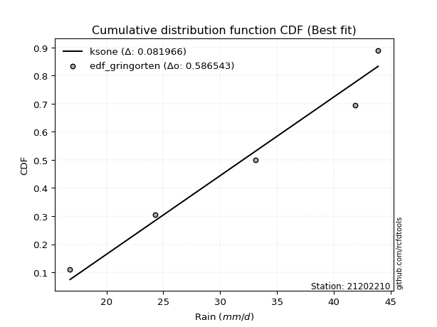</img>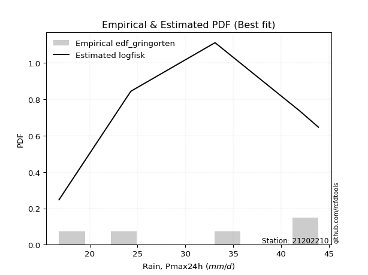</img>

</div>


### 9. EDF Filliben (1975)

The specific values of the constants (0.3175) (often denoted as $alpha$) and (0.365) are derived from a method proposed by James J. Filliben in a 1975 paper. This particular formula is the mean value of the $i$-th order statistic of the normal distribution and is considered a robust and effective plotting position formula for the normal probability plot correlation coefficient test for normality.

<div align="center">


$P=(m-0.3175)/(n+0.365)$


</div>


**9.1. Empirical values**

<div align="center">

|                | 0                   | 1                  | 2            | 3                  | 4                  |
|:---------------|:--------------------|:-------------------|:-------------|:-------------------|:-------------------|
| date           | 2012                | 2015               | 2014         | 2016               | 2013               |
| x              | 16.8                | 24.3               | 33.1         | 41.9               | 43.9               |
| m              | 1                   | 2                  | 3            | 4                  | 5                  |
| empirical_dist | edf_filliben        | edf_filliben       | edf_filliben | edf_filliben       | edf_filliben       |
| empirical      | 0.12721342031686858 | 0.3136067101584343 | 0.5          | 0.6863932898415657 | 0.8727865796831314 |
| empirical_tr   | 1.1457554725040042  | 1.456890699253225  | 2.0          | 3.188707280832095  | 7.860805860805863  |

</div>


**9.2. Kolmogorov-Smirnov fit test (sorted by Δ)**


<div align="center">

|                | 0                  | 1                  | 2                   | 3                   | 4                   | 5                   | 6                   | 7                   | 8                   | 9                   | 10                 | 11                  | 12                 | 13                  | 14                  | 15                  | 16                  | 17                  | 18                  | 19                 | 20                 | 21                  | 22                  | 23                  | 24                  | 25                 | 26                 | 27                 | 28                  | 29                  | 30                 | 31                  | 32                  | 33                 | 34                 | 35                 | 36                 | 37                  | 38                  | 39                  | 40                  | 41                  | 42                  | 43                 | 44                 | 45                  | 46                  | 47                  | 48                  | 49                  | 50                  | 51                 | 52                  | 53                  | 54                  | 55                  | 56                 | 57                 | 58                  | 59                 | 60                 | 61                 | 62                 | 63                  | 64                  | 65                 | 66                 | 67                  | 68                  | 69                  | 70                  | 71                  | 72                  | 73                 | 74                 | 75                  | 76                 | 77                 | 78                  | 79                  | 80                 | 81                  | 82                  | 83                  | 84                  | 85                  | 86                  | 87                  | 88                 | 89                  | 90                  | 91                  | 92                  | 93                 | 94                 | 95                  | 96                  | 97                 | 98                  | 99                  | 100                | 101                 | 102                | 103                 | 104                 | 105                 | 106                 | 107                 | 108                | 109                | 110                | 111                | 112                 | 113                 | 114                | 115                 | 116                | 117                 | 118                 | 119                 | 120                 | 121                 | 122                | 123                 | 124                 | 125                | 126                 | 127                | 128                 | 129                | 130                | 131                 | 132                | 133                 | 134                | 135                 | 136                 | 137                | 138                 | 139                 | 140                | 141                 | 142                | 143                 | 144                 | 145                | 146                | 147                 | 148                | 149                | 150                | 151                | 152                | 153                | 154                | 155                | 156                | 157                | 158                | 159                |
|:---------------|:-------------------|:-------------------|:--------------------|:--------------------|:--------------------|:--------------------|:--------------------|:--------------------|:--------------------|:--------------------|:-------------------|:--------------------|:-------------------|:--------------------|:--------------------|:--------------------|:--------------------|:--------------------|:--------------------|:-------------------|:-------------------|:--------------------|:--------------------|:--------------------|:--------------------|:-------------------|:-------------------|:-------------------|:--------------------|:--------------------|:-------------------|:--------------------|:--------------------|:-------------------|:-------------------|:-------------------|:-------------------|:--------------------|:--------------------|:--------------------|:--------------------|:--------------------|:--------------------|:-------------------|:-------------------|:--------------------|:--------------------|:--------------------|:--------------------|:--------------------|:--------------------|:-------------------|:--------------------|:--------------------|:--------------------|:--------------------|:-------------------|:-------------------|:--------------------|:-------------------|:-------------------|:-------------------|:-------------------|:--------------------|:--------------------|:-------------------|:-------------------|:--------------------|:--------------------|:--------------------|:--------------------|:--------------------|:--------------------|:-------------------|:-------------------|:--------------------|:-------------------|:-------------------|:--------------------|:--------------------|:-------------------|:--------------------|:--------------------|:--------------------|:--------------------|:--------------------|:--------------------|:--------------------|:-------------------|:--------------------|:--------------------|:--------------------|:--------------------|:-------------------|:-------------------|:--------------------|:--------------------|:-------------------|:--------------------|:--------------------|:-------------------|:--------------------|:-------------------|:--------------------|:--------------------|:--------------------|:--------------------|:--------------------|:-------------------|:-------------------|:-------------------|:-------------------|:--------------------|:--------------------|:-------------------|:--------------------|:-------------------|:--------------------|:--------------------|:--------------------|:--------------------|:--------------------|:-------------------|:--------------------|:--------------------|:-------------------|:--------------------|:-------------------|:--------------------|:-------------------|:-------------------|:--------------------|:-------------------|:--------------------|:-------------------|:--------------------|:--------------------|:-------------------|:--------------------|:--------------------|:-------------------|:--------------------|:-------------------|:--------------------|:--------------------|:-------------------|:-------------------|:--------------------|:-------------------|:-------------------|:-------------------|:-------------------|:-------------------|:-------------------|:-------------------|:-------------------|:-------------------|:-------------------|:-------------------|:-------------------|
| station        | 21202210           | 21202210           | 21202210            | 21202210            | 21202210            | 21202210            | 21202210            | 21202210            | 21202210            | 21202210            | 21202210           | 21202210            | 21202210           | 21202210            | 21202210            | 21202210            | 21202210            | 21202210            | 21202210            | 21202210           | 21202210           | 21202210            | 21202210            | 21202210            | 21202210            | 21202210           | 21202210           | 21202210           | 21202210            | 21202210            | 21202210           | 21202210            | 21202210            | 21202210           | 21202210           | 21202210           | 21202210           | 21202210            | 21202210            | 21202210            | 21202210            | 21202210            | 21202210            | 21202210           | 21202210           | 21202210            | 21202210            | 21202210            | 21202210            | 21202210            | 21202210            | 21202210           | 21202210            | 21202210            | 21202210            | 21202210            | 21202210           | 21202210           | 21202210            | 21202210           | 21202210           | 21202210           | 21202210           | 21202210            | 21202210            | 21202210           | 21202210           | 21202210            | 21202210            | 21202210            | 21202210            | 21202210            | 21202210            | 21202210           | 21202210           | 21202210            | 21202210           | 21202210           | 21202210            | 21202210            | 21202210           | 21202210            | 21202210            | 21202210            | 21202210            | 21202210            | 21202210            | 21202210            | 21202210           | 21202210            | 21202210            | 21202210            | 21202210            | 21202210           | 21202210           | 21202210            | 21202210            | 21202210           | 21202210            | 21202210            | 21202210           | 21202210            | 21202210           | 21202210            | 21202210            | 21202210            | 21202210            | 21202210            | 21202210           | 21202210           | 21202210           | 21202210           | 21202210            | 21202210            | 21202210           | 21202210            | 21202210           | 21202210            | 21202210            | 21202210            | 21202210            | 21202210            | 21202210           | 21202210            | 21202210            | 21202210           | 21202210            | 21202210           | 21202210            | 21202210           | 21202210           | 21202210            | 21202210           | 21202210            | 21202210           | 21202210            | 21202210            | 21202210           | 21202210            | 21202210            | 21202210           | 21202210            | 21202210           | 21202210            | 21202210            | 21202210           | 21202210           | 21202210            | 21202210           | 21202210           | 21202210           | 21202210           | 21202210           | 21202210           | 21202210           | 21202210           | 21202210           | 21202210           | 21202210           | 21202210           |
| empirical_dist | edf_filliben       | edf_filliben       | edf_filliben        | edf_filliben        | edf_filliben        | edf_filliben        | edf_filliben        | edf_filliben        | edf_filliben        | edf_filliben        | edf_filliben       | edf_filliben        | edf_filliben       | edf_filliben        | edf_filliben        | edf_filliben        | edf_filliben        | edf_filliben        | edf_filliben        | edf_filliben       | edf_filliben       | edf_filliben        | edf_filliben        | edf_filliben        | edf_filliben        | edf_filliben       | edf_filliben       | edf_filliben       | edf_filliben        | edf_filliben        | edf_filliben       | edf_filliben        | edf_filliben        | edf_filliben       | edf_filliben       | edf_filliben       | edf_filliben       | edf_filliben        | edf_filliben        | edf_filliben        | edf_filliben        | edf_filliben        | edf_filliben        | edf_filliben       | edf_filliben       | edf_filliben        | edf_filliben        | edf_filliben        | edf_filliben        | edf_filliben        | edf_filliben        | edf_filliben       | edf_filliben        | edf_filliben        | edf_filliben        | edf_filliben        | edf_filliben       | edf_filliben       | edf_filliben        | edf_filliben       | edf_filliben       | edf_filliben       | edf_filliben       | edf_filliben        | edf_filliben        | edf_filliben       | edf_filliben       | edf_filliben        | edf_filliben        | edf_filliben        | edf_filliben        | edf_filliben        | edf_filliben        | edf_filliben       | edf_filliben       | edf_filliben        | edf_filliben       | edf_filliben       | edf_filliben        | edf_filliben        | edf_filliben       | edf_filliben        | edf_filliben        | edf_filliben        | edf_filliben        | edf_filliben        | edf_filliben        | edf_filliben        | edf_filliben       | edf_filliben        | edf_filliben        | edf_filliben        | edf_filliben        | edf_filliben       | edf_filliben       | edf_filliben        | edf_filliben        | edf_filliben       | edf_filliben        | edf_filliben        | edf_filliben       | edf_filliben        | edf_filliben       | edf_filliben        | edf_filliben        | edf_filliben        | edf_filliben        | edf_filliben        | edf_filliben       | edf_filliben       | edf_filliben       | edf_filliben       | edf_filliben        | edf_filliben        | edf_filliben       | edf_filliben        | edf_filliben       | edf_filliben        | edf_filliben        | edf_filliben        | edf_filliben        | edf_filliben        | edf_filliben       | edf_filliben        | edf_filliben        | edf_filliben       | edf_filliben        | edf_filliben       | edf_filliben        | edf_filliben       | edf_filliben       | edf_filliben        | edf_filliben       | edf_filliben        | edf_filliben       | edf_filliben        | edf_filliben        | edf_filliben       | edf_filliben        | edf_filliben        | edf_filliben       | edf_filliben        | edf_filliben       | edf_filliben        | edf_filliben        | edf_filliben       | edf_filliben       | edf_filliben        | edf_filliben       | edf_filliben       | edf_filliben       | edf_filliben       | edf_filliben       | edf_filliben       | edf_filliben       | edf_filliben       | edf_filliben       | edf_filliben       | edf_filliben       | edf_filliben       |
| p_dist         | ksone              | logtrapezoid       | logncf              | logsemicircular     | logksone            | loganglit           | semicircular        | trapezoid           | anglit              | logbetaprime        | logbeta            | beta                | logkappa3          | arcsine             | logarcsine          | logweibull_max      | wrapcauchy          | loginvgauss         | loginvweibull       | logalpha           | loginvgamma        | logrice             | logerlang           | logf                | lognct              | logpearson3        | loggamma           | loggamma           | logcrystalball      | lognorm             | logt               | logexponnorm        | logfatiguelife      | logmaxwell         | logloglaplace      | lograyleigh        | loggenextreme      | ncf                 | kstwobign           | invgauss            | rice                | alpha               | rayleigh            | erlang             | maxwell            | f                   | gamma               | pearson3            | halfnorm            | nct                 | exponnorm           | norm               | crystalball         | truncnorm           | t                   | logdweibull         | betaprime          | invgamma           | logweibull_min      | loggompertz        | weibull_min        | genextreme         | logburr12          | logdgamma           | loggumbel_l         | logfoldnorm        | loggennorm         | loglogistic         | logkstwobign        | loggenexpon         | lomax               | logcosine           | genexpon            | loghalfnorm        | levy_l             | gumbel_r            | halflogistic       | cosine             | logistic            | loghypsecant        | loglevy_l          | gumbel_l            | logmielke           | logwrapcauchy       | moyal               | loggumbel_r         | logburr             | hypsecant           | logjohnsonsb       | argus               | loglaplace          | loglaplace          | genpareto           | dweibull           | halfgennorm        | burr                | burr12              | mielke             | laplace             | gennorm             | loghalflogistic    | logargus            | genhalflogistic    | logmoyal            | dgamma              | logloggamma         | loghalfgennorm      | kappa3              | logjohnsonsu       | wald               | loggenhalflogistic | skewnorm           | triang              | gausshyper          | tukeylambda        | kappa4              | logtriang          | logexponweib        | uniform             | logskewnorm         | vonmises_line       | logwald             | logtukeylambda     | logkappa4           | bradford            | truncexpon         | loguniform          | logvonmises_line   | loggausshyper       | truncweibull_min   | logbradford        | logtruncexpon       | loggengamma        | johnsonsb           | nakagami           | logtruncweibull_min | weibull_max         | logrdist           | lognakagami         | logexponpow         | gengamma           | exponweib           | gompertz           | johnsonsu           | foldnorm            | invweibull         | fatiguelife        | logtruncnorm        | powerlaw           | truncpareto        | logpowerlaw        | logtruncpareto     | exponpow           | loggenpareto       | loglomax           | rdist              | genlogistic        | loggenlogistic     | logvonmises        | vonmises           |
| delta          | 0.0908856549484911 | 0.0926910381124415 | 0.09330494703755132 | 0.09474262394691069 | 0.09624342215909851 | 0.10676057360564817 | 0.10715268239505604 | 0.11116997726457578 | 0.11885121844632163 | 0.12620947126969995 | 0.1272124360803224 | 0.12721330175158607 | 0.127213420316755  | 0.12721342031686858 | 0.12721342031686858 | 0.12722869866800993 | 0.12834717009394297 | 0.12891596893795343 | 0.13004838584063394 | 0.1300561271218893 | 0.1307273499290168 | 0.13176744411524854 | 0.13233620499760546 | 0.13252221967480493 | 0.13265672541214135 | 0.1328724694301856 | 0.1329596646426412 | 0.1329596646426412 | 0.13387071156783492 | 0.13387071179585353 | 0.1338716389137553 | 0.13387466781545754 | 0.13392799344699247 | 0.1341011931925724 | 0.1343828759720285 | 0.1373031402849667 | 0.1374201210010101 | 0.13953960018789135 | 0.13981312985210959 | 0.14313372961392012 | 0.14333867418080948 | 0.14350060519879482 | 0.14362552552484265 | 0.1439071676513629 | 0.1439467116379438 | 0.14395383681140417 | 0.14402158776713858 | 0.14500593449511634 | 0.14506246340206896 | 0.14510153818741167 | 0.14521005041337343 | 0.1452105389155134 | 0.14521055065091093 | 0.14521056101798846 | 0.14521326565438053 | 0.14528597670762378 | 0.1453106640594013 | 0.1455043664573431 | 0.14559285307706527 | 0.1463029433007259 | 0.1464675446403121 | 0.1467904336890582 | 0.1482138879465077 | 0.15104635438143532 | 0.15135681815340385 | 0.1513671038385711 | 0.1522476423978614 | 0.15412833216436694 | 0.15430494105798798 | 0.15520869361745748 | 0.15717321745652346 | 0.15821801445089712 | 0.15825482115541245 | 0.1604904929188532 | 0.1609462328718143 | 0.16252189723522936 | 0.1632526917398408 | 0.1637396806559891 | 0.16457236582773305 | 0.16542376713228568 | 0.1655441941968483 | 0.16766811826354389 | 0.16809087879107243 | 0.16843780419695314 | 0.16894714423000012 | 0.16910811033479745 | 0.17314007669753373 | 0.17503104909395384 | 0.1757377581388575 | 0.17601045155886408 | 0.17678716413136875 | 0.17678716413136875 | 0.17791931343254608 | 0.1803652221743074 | 0.1822268826002129 | 0.18297368788737234 | 0.18327329747225818 | 0.1847806858334532 | 0.18506875442009108 | 0.18639328984156572 | 0.1888175118187223 | 0.18884697833165576 | 0.1900512593209125 | 0.19168961064954748 | 0.19186707130127134 | 0.19628919956959456 | 0.20275704777194303 | 0.20385179714175072 | 0.207314026829227  | 0.2074814828955147 | 0.2089247130605053 | 0.2125096616442529 | 0.21864199006999252 | 0.22888648769946074 | 0.2316274419314679 | 0.23279270698514565 | 0.2385799235705578 | 0.23945549726112775 | 0.23980597215105426 | 0.24222203469345172 | 0.24319353713205794 | 0.25465556659575606 | 0.2565616851627679 | 0.25796772045419347 | 0.26018527420403503 | 0.2643601836572318 | 0.26506243837162125 | 0.2702456775239154 | 0.27116443692472125 | 0.2743860933764206 | 0.2784346810706375 | 0.28759092241462336 | 0.2893002596822716 | 0.31264989318558195 | 0.3136065052683758 | 0.355892462170428   | 0.36412086431291146 | 0.3642169492715074 | 0.36450122634640003 | 0.38947417404733914 | 0.4190152790412412 | 0.43724236226205754 | 0.4400862689389589 | 0.44451381875536217 | 0.45943171568233176 | 0.4613808829389667 | 0.4633480970827815 | 0.49999767081950447 | 0.5325130071097173 | 0.5518554397293822 | 0.5641113784798835 | 0.5864540571083505 | 0.5901564442011622 | 0.5993606737439049 | 0.6746205727731309 | 0.6863932898236684 | 0.6863932898415657 | 0.6863932898415657 | 1.1322863117960797 | 6.910891086506612  |
| deltao         | 0.5865427407550001 | 0.5865427407550001 | 0.5865427407550001  | 0.5865427407550001  | 0.5865427407550001  | 0.5865427407550001  | 0.5865427407550001  | 0.5865427407550001  | 0.5865427407550001  | 0.5865427407550001  | 0.5865427407550001 | 0.5865427407550001  | 0.5865427407550001 | 0.5865427407550001  | 0.5865427407550001  | 0.5865427407550001  | 0.5865427407550001  | 0.5865427407550001  | 0.5865427407550001  | 0.5865427407550001 | 0.5865427407550001 | 0.5865427407550001  | 0.5865427407550001  | 0.5865427407550001  | 0.5865427407550001  | 0.5865427407550001 | 0.5865427407550001 | 0.5865427407550001 | 0.5865427407550001  | 0.5865427407550001  | 0.5865427407550001 | 0.5865427407550001  | 0.5865427407550001  | 0.5865427407550001 | 0.5865427407550001 | 0.5865427407550001 | 0.5865427407550001 | 0.5865427407550001  | 0.5865427407550001  | 0.5865427407550001  | 0.5865427407550001  | 0.5865427407550001  | 0.5865427407550001  | 0.5865427407550001 | 0.5865427407550001 | 0.5865427407550001  | 0.5865427407550001  | 0.5865427407550001  | 0.5865427407550001  | 0.5865427407550001  | 0.5865427407550001  | 0.5865427407550001 | 0.5865427407550001  | 0.5865427407550001  | 0.5865427407550001  | 0.5865427407550001  | 0.5865427407550001 | 0.5865427407550001 | 0.5865427407550001  | 0.5865427407550001 | 0.5865427407550001 | 0.5865427407550001 | 0.5865427407550001 | 0.5865427407550001  | 0.5865427407550001  | 0.5865427407550001 | 0.5865427407550001 | 0.5865427407550001  | 0.5865427407550001  | 0.5865427407550001  | 0.5865427407550001  | 0.5865427407550001  | 0.5865427407550001  | 0.5865427407550001 | 0.5865427407550001 | 0.5865427407550001  | 0.5865427407550001 | 0.5865427407550001 | 0.5865427407550001  | 0.5865427407550001  | 0.5865427407550001 | 0.5865427407550001  | 0.5865427407550001  | 0.5865427407550001  | 0.5865427407550001  | 0.5865427407550001  | 0.5865427407550001  | 0.5865427407550001  | 0.5865427407550001 | 0.5865427407550001  | 0.5865427407550001  | 0.5865427407550001  | 0.5865427407550001  | 0.5865427407550001 | 0.5865427407550001 | 0.5865427407550001  | 0.5865427407550001  | 0.5865427407550001 | 0.5865427407550001  | 0.5865427407550001  | 0.5865427407550001 | 0.5865427407550001  | 0.5865427407550001 | 0.5865427407550001  | 0.5865427407550001  | 0.5865427407550001  | 0.5865427407550001  | 0.5865427407550001  | 0.5865427407550001 | 0.5865427407550001 | 0.5865427407550001 | 0.5865427407550001 | 0.5865427407550001  | 0.5865427407550001  | 0.5865427407550001 | 0.5865427407550001  | 0.5865427407550001 | 0.5865427407550001  | 0.5865427407550001  | 0.5865427407550001  | 0.5865427407550001  | 0.5865427407550001  | 0.5865427407550001 | 0.5865427407550001  | 0.5865427407550001  | 0.5865427407550001 | 0.5865427407550001  | 0.5865427407550001 | 0.5865427407550001  | 0.5865427407550001 | 0.5865427407550001 | 0.5865427407550001  | 0.5865427407550001 | 0.5865427407550001  | 0.5865427407550001 | 0.5865427407550001  | 0.5865427407550001  | 0.5865427407550001 | 0.5865427407550001  | 0.5865427407550001  | 0.5865427407550001 | 0.5865427407550001  | 0.5865427407550001 | 0.5865427407550001  | 0.5865427407550001  | 0.5865427407550001 | 0.5865427407550001 | 0.5865427407550001  | 0.5865427407550001 | 0.5865427407550001 | 0.5865427407550001 | 0.5865427407550001 | 0.5865427407550001 | 0.5865427407550001 | 0.5865427407550001 | 0.5865427407550001 | 0.5865427407550001 | 0.5865427407550001 | 0.5865427407550001 | 0.5865427407550001 |
| eval           | Δo > Δ             | Δo > Δ             | Δo > Δ              | Δo > Δ              | Δo > Δ              | Δo > Δ              | Δo > Δ              | Δo > Δ              | Δo > Δ              | Δo > Δ              | Δo > Δ             | Δo > Δ              | Δo > Δ             | Δo > Δ              | Δo > Δ              | Δo > Δ              | Δo > Δ              | Δo > Δ              | Δo > Δ              | Δo > Δ             | Δo > Δ             | Δo > Δ              | Δo > Δ              | Δo > Δ              | Δo > Δ              | Δo > Δ             | Δo > Δ             | Δo > Δ             | Δo > Δ              | Δo > Δ              | Δo > Δ             | Δo > Δ              | Δo > Δ              | Δo > Δ             | Δo > Δ             | Δo > Δ             | Δo > Δ             | Δo > Δ              | Δo > Δ              | Δo > Δ              | Δo > Δ              | Δo > Δ              | Δo > Δ              | Δo > Δ             | Δo > Δ             | Δo > Δ              | Δo > Δ              | Δo > Δ              | Δo > Δ              | Δo > Δ              | Δo > Δ              | Δo > Δ             | Δo > Δ              | Δo > Δ              | Δo > Δ              | Δo > Δ              | Δo > Δ             | Δo > Δ             | Δo > Δ              | Δo > Δ             | Δo > Δ             | Δo > Δ             | Δo > Δ             | Δo > Δ              | Δo > Δ              | Δo > Δ             | Δo > Δ             | Δo > Δ              | Δo > Δ              | Δo > Δ              | Δo > Δ              | Δo > Δ              | Δo > Δ              | Δo > Δ             | Δo > Δ             | Δo > Δ              | Δo > Δ             | Δo > Δ             | Δo > Δ              | Δo > Δ              | Δo > Δ             | Δo > Δ              | Δo > Δ              | Δo > Δ              | Δo > Δ              | Δo > Δ              | Δo > Δ              | Δo > Δ              | Δo > Δ             | Δo > Δ              | Δo > Δ              | Δo > Δ              | Δo > Δ              | Δo > Δ             | Δo > Δ             | Δo > Δ              | Δo > Δ              | Δo > Δ             | Δo > Δ              | Δo > Δ              | Δo > Δ             | Δo > Δ              | Δo > Δ             | Δo > Δ              | Δo > Δ              | Δo > Δ              | Δo > Δ              | Δo > Δ              | Δo > Δ             | Δo > Δ             | Δo > Δ             | Δo > Δ             | Δo > Δ              | Δo > Δ              | Δo > Δ             | Δo > Δ              | Δo > Δ             | Δo > Δ              | Δo > Δ              | Δo > Δ              | Δo > Δ              | Δo > Δ              | Δo > Δ             | Δo > Δ              | Δo > Δ              | Δo > Δ             | Δo > Δ              | Δo > Δ             | Δo > Δ              | Δo > Δ             | Δo > Δ             | Δo > Δ              | Δo > Δ             | Δo > Δ              | Δo > Δ             | Δo > Δ              | Δo > Δ              | Δo > Δ             | Δo > Δ              | Δo > Δ              | Δo > Δ             | Δo > Δ              | Δo > Δ             | Δo > Δ              | Δo > Δ              | Δo > Δ             | Δo > Δ             | Δo > Δ              | Δo > Δ             | Δo > Δ             | Δo > Δ             | Δo > Δ             | Δo <= Δ            | Δo <= Δ            | Δo <= Δ            | Δo <= Δ            | Δo <= Δ            | Δo <= Δ            | Δo <= Δ            | Δo <= Δ            |
| fit            | 1                  | 1                  | 1                   | 1                   | 1                   | 1                   | 1                   | 1                   | 1                   | 1                   | 1                  | 1                   | 1                  | 1                   | 1                   | 1                   | 1                   | 1                   | 1                   | 1                  | 1                  | 1                   | 1                   | 1                   | 1                   | 1                  | 1                  | 1                  | 1                   | 1                   | 1                  | 1                   | 1                   | 1                  | 1                  | 1                  | 1                  | 1                   | 1                   | 1                   | 1                   | 1                   | 1                   | 1                  | 1                  | 1                   | 1                   | 1                   | 1                   | 1                   | 1                   | 1                  | 1                   | 1                   | 1                   | 1                   | 1                  | 1                  | 1                   | 1                  | 1                  | 1                  | 1                  | 1                   | 1                   | 1                  | 1                  | 1                   | 1                   | 1                   | 1                   | 1                   | 1                   | 1                  | 1                  | 1                   | 1                  | 1                  | 1                   | 1                   | 1                  | 1                   | 1                   | 1                   | 1                   | 1                   | 1                   | 1                   | 1                  | 1                   | 1                   | 1                   | 1                   | 1                  | 1                  | 1                   | 1                   | 1                  | 1                   | 1                   | 1                  | 1                   | 1                  | 1                   | 1                   | 1                   | 1                   | 1                   | 1                  | 1                  | 1                  | 1                  | 1                   | 1                   | 1                  | 1                   | 1                  | 1                   | 1                   | 1                   | 1                   | 1                   | 1                  | 1                   | 1                   | 1                  | 1                   | 1                  | 1                   | 1                  | 1                  | 1                   | 1                  | 1                   | 1                  | 1                   | 1                   | 1                  | 1                   | 1                   | 1                  | 1                   | 1                  | 1                   | 1                   | 1                  | 1                  | 1                   | 1                  | 1                  | 1                  | 1                  | 0                  | 0                  | 0                  | 0                  | 0                  | 0                  | 0                  | 0                  |
| n              | 5                  | 5                  | 5                   | 5                   | 5                   | 5                   | 5                   | 5                   | 5                   | 5                   | 5                  | 5                   | 5                  | 5                   | 5                   | 5                   | 5                   | 5                   | 5                   | 5                  | 5                  | 5                   | 5                   | 5                   | 5                   | 5                  | 5                  | 5                  | 5                   | 5                   | 5                  | 5                   | 5                   | 5                  | 5                  | 5                  | 5                  | 5                   | 5                   | 5                   | 5                   | 5                   | 5                   | 5                  | 5                  | 5                   | 5                   | 5                   | 5                   | 5                   | 5                   | 5                  | 5                   | 5                   | 5                   | 5                   | 5                  | 5                  | 5                   | 5                  | 5                  | 5                  | 5                  | 5                   | 5                   | 5                  | 5                  | 5                   | 5                   | 5                   | 5                   | 5                   | 5                   | 5                  | 5                  | 5                   | 5                  | 5                  | 5                   | 5                   | 5                  | 5                   | 5                   | 5                   | 5                   | 5                   | 5                   | 5                   | 5                  | 5                   | 5                   | 5                   | 5                   | 5                  | 5                  | 5                   | 5                   | 5                  | 5                   | 5                   | 5                  | 5                   | 5                  | 5                   | 5                   | 5                   | 5                   | 5                   | 5                  | 5                  | 5                  | 5                  | 5                   | 5                   | 5                  | 5                   | 5                  | 5                   | 5                   | 5                   | 5                   | 5                   | 5                  | 5                   | 5                   | 5                  | 5                   | 5                  | 5                   | 5                  | 5                  | 5                   | 5                  | 5                   | 5                  | 5                   | 5                   | 5                  | 5                   | 5                   | 5                  | 5                   | 5                  | 5                   | 5                   | 5                  | 5                  | 5                   | 5                  | 5                  | 5                  | 5                  | 5                  | 5                  | 5                  | 5                  | 5                  | 5                  | 5                  | 5                  |
| best_fit       | 1                  | 0                  | 0                   | 0                   | 0                   | 0                   | 0                   | 0                   | 0                   | 0                   | 0                  | 0                   | 0                  | 0                   | 0                   | 0                   | 0                   | 0                   | 0                   | 0                  | 0                  | 0                   | 0                   | 0                   | 0                   | 0                  | 0                  | 0                  | 0                   | 0                   | 0                  | 0                   | 0                   | 0                  | 0                  | 0                  | 0                  | 0                   | 0                   | 0                   | 0                   | 0                   | 0                   | 0                  | 0                  | 0                   | 0                   | 0                   | 0                   | 0                   | 0                   | 0                  | 0                   | 0                   | 0                   | 0                   | 0                  | 0                  | 0                   | 0                  | 0                  | 0                  | 0                  | 0                   | 0                   | 0                  | 0                  | 0                   | 0                   | 0                   | 0                   | 0                   | 0                   | 0                  | 0                  | 0                   | 0                  | 0                  | 0                   | 0                   | 0                  | 0                   | 0                   | 0                   | 0                   | 0                   | 0                   | 0                   | 0                  | 0                   | 0                   | 0                   | 0                   | 0                  | 0                  | 0                   | 0                   | 0                  | 0                   | 0                   | 0                  | 0                   | 0                  | 0                   | 0                   | 0                   | 0                   | 0                   | 0                  | 0                  | 0                  | 0                  | 0                   | 0                   | 0                  | 0                   | 0                  | 0                   | 0                   | 0                   | 0                   | 0                   | 0                  | 0                   | 0                   | 0                  | 0                   | 0                  | 0                   | 0                  | 0                  | 0                   | 0                  | 0                   | 0                  | 0                   | 0                   | 0                  | 0                   | 0                   | 0                  | 0                   | 0                  | 0                   | 0                   | 0                  | 0                  | 0                   | 0                  | 0                  | 0                  | 0                  | 0                  | 0                  | 0                  | 0                  | 0                  | 0                  | 0                  | 0                  |
| best_fit_sort  | 1                  | 2                  | 3                   | 4                   | 5                   | 6                   | 7                   | 8                   | 9                   | 10                  | 11                 | 12                  | 13                 | 14                  | 15                  | 16                  | 17                  | 18                  | 19                  | 20                 | 21                 | 22                  | 23                  | 24                  | 25                  | 26                 | 27                 | 28                 | 29                  | 30                  | 31                 | 32                  | 33                  | 34                 | 35                 | 36                 | 37                 | 38                  | 39                  | 40                  | 41                  | 42                  | 43                  | 44                 | 45                 | 46                  | 47                  | 48                  | 49                  | 50                  | 51                  | 52                 | 53                  | 54                  | 55                  | 56                  | 57                 | 58                 | 59                  | 60                 | 61                 | 62                 | 63                 | 64                  | 65                  | 66                 | 67                 | 68                  | 69                  | 70                  | 71                  | 72                  | 73                  | 74                 | 75                 | 76                  | 77                 | 78                 | 79                  | 80                  | 81                 | 82                  | 83                  | 84                  | 85                  | 86                  | 87                  | 88                  | 89                 | 90                  | 91                  | 92                  | 93                  | 94                 | 95                 | 96                  | 97                  | 98                 | 99                  | 100                 | 101                | 102                 | 103                | 104                 | 105                 | 106                 | 107                 | 108                 | 109                | 110                | 111                | 112                | 113                 | 114                 | 115                | 116                 | 117                | 118                 | 119                 | 120                 | 121                 | 122                 | 123                | 124                 | 125                 | 126                | 127                 | 128                | 129                 | 130                | 131                | 132                 | 133                | 134                 | 135                | 136                 | 137                 | 138                | 139                 | 140                 | 141                | 142                 | 143                | 144                 | 145                 | 146                | 147                | 148                 | 149                | 150                | 151                | 152                | 153                | 154                | 155                | 156                | 157                | 158                | 159                | 160                |

</div>


**9.3. Best fit**

<div align="center">

|   id |   station | empirical_dist   | p_dist   |     delta |   deltao | eval   |   fit |   n |   best_fit |   best_fit_sort |
|-----:|----------:|:-----------------|:---------|----------:|---------:|:-------|------:|----:|-----------:|----------------:|
|    0 |  21202210 | edf_filliben     | ksone    | 0.0908857 | 0.586543 | Δo > Δ |     1 |   5 |          1 |               1 |

</div>


<div align="center">

</img>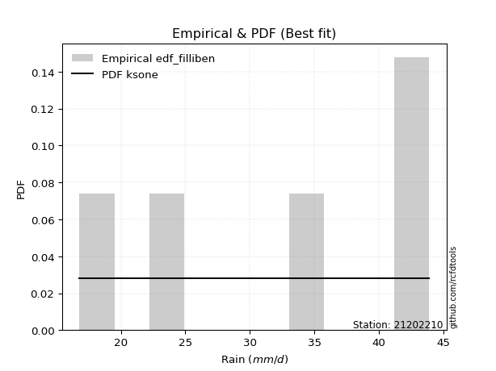</img>

</div>


### 10. EDF Jenkinson (1977)

The Jenkinson formula in hydrology is an empirical plotting position formula used to estimate the non-exceedance probability _(P)_ or return period _(T)_ of a given ordered observation within a sample. It is a widely used method in the frequency analysis of extreme events such as floods and rainfall, as it provides a distribution-free way to plot data. _a≈0.31_ and _b≈0.38_ are constants derived to approximate the median of the probability distribution for the given rank.

<div align="center">


$P=(m-a)/(n+b)$


</div>


**10.1. Empirical values**

<div align="center">

|                | 0                   | 1                  | 2             | 3                  | 4                  |
|:---------------|:--------------------|:-------------------|:--------------|:-------------------|:-------------------|
| date           | 2012                | 2015               | 2014          | 2016               | 2013               |
| x              | 16.8                | 24.3               | 33.1          | 41.9               | 43.9               |
| m              | 1                   | 2                  | 3             | 4                  | 5                  |
| empirical_dist | edf_jenkinson       | edf_jenkinson      | edf_jenkinson | edf_jenkinson      | edf_jenkinson      |
| empirical      | 0.12825278810408922 | 0.3141263940520446 | 0.5           | 0.6858736059479554 | 0.8717472118959109 |
| empirical_tr   | 1.1471215351812367  | 1.4579945799457996 | 2.0           | 3.183431952662722  | 7.797101449275368  |

</div>


**10.2. Kolmogorov-Smirnov fit test (sorted by Δ)**


<div align="center">

|                | 0                   | 1                   | 2                   | 3                   | 4                   | 5                  | 6                   | 7                   | 8                   | 9                   | 10                  | 11                  | 12                  | 13                  | 14                  | 15                  | 16                  | 17                  | 18                  | 19                  | 20                  | 21                  | 22                 | 23                  | 24                 | 25                  | 26                  | 27                  | 28                  | 29                  | 30                  | 31                  | 32                 | 33                  | 34                  | 35                 | 36                  | 37                 | 38                  | 39                  | 40                 | 41                  | 42                  | 43                  | 44                  | 45                 | 46                  | 47                  | 48                 | 49                 | 50                  | 51                  | 52                  | 53                 | 54                  | 55                 | 56                  | 57                  | 58                 | 59                 | 60                  | 61                  | 62                  | 63                 | 64                  | 65                  | 66                  | 67                  | 68                  | 69                  | 70                  | 71                  | 72                  | 73                 | 74                 | 75                 | 76                  | 77                  | 78                  | 79                 | 80                  | 81                 | 82                  | 83                  | 84                  | 85                  | 86                  | 87                  | 88                  | 89                 | 90                  | 91                  | 92                 | 93                  | 94                 | 95                  | 96                  | 97                  | 98                 | 99                  | 100                | 101                | 102                 | 103                 | 104                 | 105                | 106                 | 107                 | 108                 | 109                | 110                 | 111                 | 112                 | 113                 | 114                 | 115                 | 116                | 117                 | 118                | 119                 | 120                 | 121                 | 122                 | 123                | 124                 | 125                 | 126                | 127                | 128                | 129                 | 130                 | 131                 | 132                | 133                | 134                 | 135                 | 136                | 137                 | 138                 | 139                | 140                 | 141                | 142                | 143                 | 144                 | 145                | 146                | 147                 | 148                | 149                | 150                | 151                | 152                | 153                | 154                | 155                | 156                | 157                | 158                | 159                |
|:---------------|:--------------------|:--------------------|:--------------------|:--------------------|:--------------------|:-------------------|:--------------------|:--------------------|:--------------------|:--------------------|:--------------------|:--------------------|:--------------------|:--------------------|:--------------------|:--------------------|:--------------------|:--------------------|:--------------------|:--------------------|:--------------------|:--------------------|:-------------------|:--------------------|:-------------------|:--------------------|:--------------------|:--------------------|:--------------------|:--------------------|:--------------------|:--------------------|:-------------------|:--------------------|:--------------------|:-------------------|:--------------------|:-------------------|:--------------------|:--------------------|:-------------------|:--------------------|:--------------------|:--------------------|:--------------------|:-------------------|:--------------------|:--------------------|:-------------------|:-------------------|:--------------------|:--------------------|:--------------------|:-------------------|:--------------------|:-------------------|:--------------------|:--------------------|:-------------------|:-------------------|:--------------------|:--------------------|:--------------------|:-------------------|:--------------------|:--------------------|:--------------------|:--------------------|:--------------------|:--------------------|:--------------------|:--------------------|:--------------------|:-------------------|:-------------------|:-------------------|:--------------------|:--------------------|:--------------------|:-------------------|:--------------------|:-------------------|:--------------------|:--------------------|:--------------------|:--------------------|:--------------------|:--------------------|:--------------------|:-------------------|:--------------------|:--------------------|:-------------------|:--------------------|:-------------------|:--------------------|:--------------------|:--------------------|:-------------------|:--------------------|:-------------------|:-------------------|:--------------------|:--------------------|:--------------------|:-------------------|:--------------------|:--------------------|:--------------------|:-------------------|:--------------------|:--------------------|:--------------------|:--------------------|:--------------------|:--------------------|:-------------------|:--------------------|:-------------------|:--------------------|:--------------------|:--------------------|:--------------------|:-------------------|:--------------------|:--------------------|:-------------------|:-------------------|:-------------------|:--------------------|:--------------------|:--------------------|:-------------------|:-------------------|:--------------------|:--------------------|:-------------------|:--------------------|:--------------------|:-------------------|:--------------------|:-------------------|:-------------------|:--------------------|:--------------------|:-------------------|:-------------------|:--------------------|:-------------------|:-------------------|:-------------------|:-------------------|:-------------------|:-------------------|:-------------------|:-------------------|:-------------------|:-------------------|:-------------------|:-------------------|
| station        | 21202210            | 21202210            | 21202210            | 21202210            | 21202210            | 21202210           | 21202210            | 21202210            | 21202210            | 21202210            | 21202210            | 21202210            | 21202210            | 21202210            | 21202210            | 21202210            | 21202210            | 21202210            | 21202210            | 21202210            | 21202210            | 21202210            | 21202210           | 21202210            | 21202210           | 21202210            | 21202210            | 21202210            | 21202210            | 21202210            | 21202210            | 21202210            | 21202210           | 21202210            | 21202210            | 21202210           | 21202210            | 21202210           | 21202210            | 21202210            | 21202210           | 21202210            | 21202210            | 21202210            | 21202210            | 21202210           | 21202210            | 21202210            | 21202210           | 21202210           | 21202210            | 21202210            | 21202210            | 21202210           | 21202210            | 21202210           | 21202210            | 21202210            | 21202210           | 21202210           | 21202210            | 21202210            | 21202210            | 21202210           | 21202210            | 21202210            | 21202210            | 21202210            | 21202210            | 21202210            | 21202210            | 21202210            | 21202210            | 21202210           | 21202210           | 21202210           | 21202210            | 21202210            | 21202210            | 21202210           | 21202210            | 21202210           | 21202210            | 21202210            | 21202210            | 21202210            | 21202210            | 21202210            | 21202210            | 21202210           | 21202210            | 21202210            | 21202210           | 21202210            | 21202210           | 21202210            | 21202210            | 21202210            | 21202210           | 21202210            | 21202210           | 21202210           | 21202210            | 21202210            | 21202210            | 21202210           | 21202210            | 21202210            | 21202210            | 21202210           | 21202210            | 21202210            | 21202210            | 21202210            | 21202210            | 21202210            | 21202210           | 21202210            | 21202210           | 21202210            | 21202210            | 21202210            | 21202210            | 21202210           | 21202210            | 21202210            | 21202210           | 21202210           | 21202210           | 21202210            | 21202210            | 21202210            | 21202210           | 21202210           | 21202210            | 21202210            | 21202210           | 21202210            | 21202210            | 21202210           | 21202210            | 21202210           | 21202210           | 21202210            | 21202210            | 21202210           | 21202210           | 21202210            | 21202210           | 21202210           | 21202210           | 21202210           | 21202210           | 21202210           | 21202210           | 21202210           | 21202210           | 21202210           | 21202210           | 21202210           |
| empirical_dist | edf_jenkinson       | edf_jenkinson       | edf_jenkinson       | edf_jenkinson       | edf_jenkinson       | edf_jenkinson      | edf_jenkinson       | edf_jenkinson       | edf_jenkinson       | edf_jenkinson       | edf_jenkinson       | edf_jenkinson       | edf_jenkinson       | edf_jenkinson       | edf_jenkinson       | edf_jenkinson       | edf_jenkinson       | edf_jenkinson       | edf_jenkinson       | edf_jenkinson       | edf_jenkinson       | edf_jenkinson       | edf_jenkinson      | edf_jenkinson       | edf_jenkinson      | edf_jenkinson       | edf_jenkinson       | edf_jenkinson       | edf_jenkinson       | edf_jenkinson       | edf_jenkinson       | edf_jenkinson       | edf_jenkinson      | edf_jenkinson       | edf_jenkinson       | edf_jenkinson      | edf_jenkinson       | edf_jenkinson      | edf_jenkinson       | edf_jenkinson       | edf_jenkinson      | edf_jenkinson       | edf_jenkinson       | edf_jenkinson       | edf_jenkinson       | edf_jenkinson      | edf_jenkinson       | edf_jenkinson       | edf_jenkinson      | edf_jenkinson      | edf_jenkinson       | edf_jenkinson       | edf_jenkinson       | edf_jenkinson      | edf_jenkinson       | edf_jenkinson      | edf_jenkinson       | edf_jenkinson       | edf_jenkinson      | edf_jenkinson      | edf_jenkinson       | edf_jenkinson       | edf_jenkinson       | edf_jenkinson      | edf_jenkinson       | edf_jenkinson       | edf_jenkinson       | edf_jenkinson       | edf_jenkinson       | edf_jenkinson       | edf_jenkinson       | edf_jenkinson       | edf_jenkinson       | edf_jenkinson      | edf_jenkinson      | edf_jenkinson      | edf_jenkinson       | edf_jenkinson       | edf_jenkinson       | edf_jenkinson      | edf_jenkinson       | edf_jenkinson      | edf_jenkinson       | edf_jenkinson       | edf_jenkinson       | edf_jenkinson       | edf_jenkinson       | edf_jenkinson       | edf_jenkinson       | edf_jenkinson      | edf_jenkinson       | edf_jenkinson       | edf_jenkinson      | edf_jenkinson       | edf_jenkinson      | edf_jenkinson       | edf_jenkinson       | edf_jenkinson       | edf_jenkinson      | edf_jenkinson       | edf_jenkinson      | edf_jenkinson      | edf_jenkinson       | edf_jenkinson       | edf_jenkinson       | edf_jenkinson      | edf_jenkinson       | edf_jenkinson       | edf_jenkinson       | edf_jenkinson      | edf_jenkinson       | edf_jenkinson       | edf_jenkinson       | edf_jenkinson       | edf_jenkinson       | edf_jenkinson       | edf_jenkinson      | edf_jenkinson       | edf_jenkinson      | edf_jenkinson       | edf_jenkinson       | edf_jenkinson       | edf_jenkinson       | edf_jenkinson      | edf_jenkinson       | edf_jenkinson       | edf_jenkinson      | edf_jenkinson      | edf_jenkinson      | edf_jenkinson       | edf_jenkinson       | edf_jenkinson       | edf_jenkinson      | edf_jenkinson      | edf_jenkinson       | edf_jenkinson       | edf_jenkinson      | edf_jenkinson       | edf_jenkinson       | edf_jenkinson      | edf_jenkinson       | edf_jenkinson      | edf_jenkinson      | edf_jenkinson       | edf_jenkinson       | edf_jenkinson      | edf_jenkinson      | edf_jenkinson       | edf_jenkinson      | edf_jenkinson      | edf_jenkinson      | edf_jenkinson      | edf_jenkinson      | edf_jenkinson      | edf_jenkinson      | edf_jenkinson      | edf_jenkinson      | edf_jenkinson      | edf_jenkinson      | edf_jenkinson      |
| p_dist         | ksone               | logncf              | logtrapezoid        | logsemicircular     | logksone            | loganglit          | semicircular        | trapezoid           | anglit              | logbetaprime        | logbeta             | beta                | wrapcauchy          | logweibull_max      | logkappa3           | logarcsine          | arcsine             | loginvgauss         | loginvweibull       | logalpha            | loginvgamma         | logrice             | logerlang          | logf                | lognct             | logpearson3         | loggamma            | loggamma            | logcrystalball      | lognorm             | logt                | logexponnorm        | logfatiguelife     | logmaxwell          | logloglaplace       | lograyleigh        | loggenextreme       | ncf                | kstwobign           | invgauss            | rice               | alpha               | rayleigh            | erlang              | maxwell             | f                  | gamma               | pearson3            | halfnorm           | nct                | exponnorm           | norm                | crystalball         | truncnorm          | t                   | logdweibull        | betaprime           | invgamma            | logweibull_min     | genextreme         | loggompertz         | weibull_min         | logburr12           | logfoldnorm        | logdgamma           | loggumbel_l         | loggennorm          | logkstwobign        | loglogistic         | loggenexpon         | lomax               | genexpon            | logcosine           | loghalfnorm        | levy_l             | gumbel_r           | halflogistic        | cosine              | logistic            | loglevy_l          | loghypsecant        | logwrapcauchy      | gumbel_l            | logmielke           | loggumbel_r         | moyal               | logburr             | logjohnsonsb        | hypsecant           | argus              | loglaplace          | loglaplace          | genpareto          | dweibull            | halfgennorm        | burr12              | burr                | mielke              | laplace            | gennorm             | loghalflogistic    | logargus           | genhalflogistic     | logmoyal            | dgamma              | logloggamma        | loghalfgennorm      | kappa3              | logjohnsonsu        | wald               | loggenhalflogistic  | skewnorm            | triang              | gausshyper          | tukeylambda         | kappa4              | logexponweib       | logtriang           | uniform            | logskewnorm         | vonmises_line       | logwald             | logtukeylambda      | logkappa4          | bradford            | truncexpon          | loguniform         | logvonmises_line   | loggausshyper      | truncweibull_min    | logbradford         | logtruncexpon       | loggengamma        | johnsonsb          | nakagami            | logtruncweibull_min | logrdist           | weibull_max         | lognakagami         | logexponpow        | gengamma            | exponweib          | gompertz           | johnsonsu           | foldnorm            | invweibull         | fatiguelife        | logtruncnorm        | powerlaw           | truncpareto        | logpowerlaw        | logtruncpareto     | exponpow           | loggenpareto       | loglomax           | rdist              | genlogistic        | loggenlogistic     | logvonmises        | vonmises           |
| delta          | 0.09140533884210134 | 0.09226557925033074 | 0.09321072200605174 | 0.09526230784052092 | 0.09728278994631914 | 0.1072802574992584 | 0.10767236628866628 | 0.11168966115818602 | 0.11937090233993186 | 0.12620947126969995 | 0.12825180386754298 | 0.12825266953880665 | 0.12825275962674532 | 0.12825278808399687 | 0.12825278810397564 | 0.12825278810408922 | 0.12825278810408922 | 0.12943565283156366 | 0.13004838584063394 | 0.13057581101549953 | 0.13124703382262703 | 0.13228712800885878 | 0.1328558888912157 | 0.13304190356841517 | 0.1331764093057516 | 0.13339215332379584 | 0.13347934853625143 | 0.13347934853625143 | 0.13439039546144516 | 0.13439039568946376 | 0.13439132280736554 | 0.13439435170906777 | 0.1344476773406027 | 0.13462087708618264 | 0.13490255986563884 | 0.1373031402849667 | 0.13793980489462032 | 0.1400592840815016 | 0.14033281374571982 | 0.14365341350753036 | 0.1438583580744197 | 0.14402028909240505 | 0.14414520941845288 | 0.14442685154497314 | 0.14446639553155405 | 0.1444735207050144 | 0.14454127166074882 | 0.14552561838872657 | 0.1455821472956792 | 0.1456212220810219 | 0.14572973430698366 | 0.14573022280912362 | 0.14573023454452116 | 0.1457302449115987 | 0.14573294954799076 | 0.145805660601234  | 0.14583034795301153 | 0.14602405035095334 | 0.1461125369706755 | 0.1467904336890582 | 0.14682262719433614 | 0.14698722853392232 | 0.14873357184011793 | 0.1513671038385711 | 0.15156603827504556 | 0.15187650204701408 | 0.15276732629147174 | 0.15430494105798798 | 0.15464801605797718 | 0.15520869361745748 | 0.15717321745652346 | 0.15825482115541245 | 0.15873769834450735 | 0.1604904929188532 | 0.1609462328718143 | 0.1630415811288396 | 0.16377237563345104 | 0.16425936454959933 | 0.16509204972134328 | 0.1655441941968483 | 0.16594345102589592 | 0.1679181203033428 | 0.16818780215715412 | 0.16861056268468266 | 0.16910811033479745 | 0.16946682812361036 | 0.17365976059114396 | 0.17521807424524716 | 0.17555073298756407 | 0.1765301354524743 | 0.17730684802497898 | 0.17730684802497898 | 0.1784389973261563 | 0.18088490606791763 | 0.1822268826002129 | 0.18327329747225818 | 0.18349337178098257 | 0.18530036972706343 | 0.1855884383137013 | 0.18587360594795543 | 0.1888175118187223 | 0.189366662225266  | 0.19057094321452273 | 0.19168961064954748 | 0.19238675519488158 | 0.1968088834632048 | 0.20275704777194303 | 0.20437148103536096 | 0.20679434293561677 | 0.2074814828955147 | 0.20944439695411554 | 0.21302934553786312 | 0.21916167396360275 | 0.22940617159307097 | 0.23214712582507813 | 0.23331239087875588 | 0.2389358133675174 | 0.23909960746416803 | 0.2403256560446645 | 0.24274171858706195 | 0.24371322102566817 | 0.25465556659575606 | 0.25708136905637813 | 0.2584874043478037 | 0.26070495809764527 | 0.26487986755084203 | 0.2655821222652315 | 0.2707653614175256 | 0.2716841208183315 | 0.27490577727003085 | 0.27895436496424775 | 0.28759092241462336 | 0.2893002596822716 | 0.3121302092919717 | 0.31412618916198615 | 0.355892462170428   | 0.3631775814842868 | 0.36360118041930123 | 0.36450122634640003 | 0.3889544901537288 | 0.41849559514763085 | 0.4367226783684472 | 0.4400862689389589 | 0.44399413486175193 | 0.45943171568233176 | 0.4603415151517461 | 0.4628284131891712 | 0.49999767081950447 | 0.5319933232161069 | 0.5513357558357719 | 0.5635916945862731 | 0.5859343732147402 | 0.5896367603075519 | 0.5983213059566842 | 0.6735812049859103 | 0.6858736059300581 | 0.6858736059479554 | 0.6858736059479554 | 1.13280599568969   | 6.911930454293833  |
| deltao         | 0.5865427407550001  | 0.5865427407550001  | 0.5865427407550001  | 0.5865427407550001  | 0.5865427407550001  | 0.5865427407550001 | 0.5865427407550001  | 0.5865427407550001  | 0.5865427407550001  | 0.5865427407550001  | 0.5865427407550001  | 0.5865427407550001  | 0.5865427407550001  | 0.5865427407550001  | 0.5865427407550001  | 0.5865427407550001  | 0.5865427407550001  | 0.5865427407550001  | 0.5865427407550001  | 0.5865427407550001  | 0.5865427407550001  | 0.5865427407550001  | 0.5865427407550001 | 0.5865427407550001  | 0.5865427407550001 | 0.5865427407550001  | 0.5865427407550001  | 0.5865427407550001  | 0.5865427407550001  | 0.5865427407550001  | 0.5865427407550001  | 0.5865427407550001  | 0.5865427407550001 | 0.5865427407550001  | 0.5865427407550001  | 0.5865427407550001 | 0.5865427407550001  | 0.5865427407550001 | 0.5865427407550001  | 0.5865427407550001  | 0.5865427407550001 | 0.5865427407550001  | 0.5865427407550001  | 0.5865427407550001  | 0.5865427407550001  | 0.5865427407550001 | 0.5865427407550001  | 0.5865427407550001  | 0.5865427407550001 | 0.5865427407550001 | 0.5865427407550001  | 0.5865427407550001  | 0.5865427407550001  | 0.5865427407550001 | 0.5865427407550001  | 0.5865427407550001 | 0.5865427407550001  | 0.5865427407550001  | 0.5865427407550001 | 0.5865427407550001 | 0.5865427407550001  | 0.5865427407550001  | 0.5865427407550001  | 0.5865427407550001 | 0.5865427407550001  | 0.5865427407550001  | 0.5865427407550001  | 0.5865427407550001  | 0.5865427407550001  | 0.5865427407550001  | 0.5865427407550001  | 0.5865427407550001  | 0.5865427407550001  | 0.5865427407550001 | 0.5865427407550001 | 0.5865427407550001 | 0.5865427407550001  | 0.5865427407550001  | 0.5865427407550001  | 0.5865427407550001 | 0.5865427407550001  | 0.5865427407550001 | 0.5865427407550001  | 0.5865427407550001  | 0.5865427407550001  | 0.5865427407550001  | 0.5865427407550001  | 0.5865427407550001  | 0.5865427407550001  | 0.5865427407550001 | 0.5865427407550001  | 0.5865427407550001  | 0.5865427407550001 | 0.5865427407550001  | 0.5865427407550001 | 0.5865427407550001  | 0.5865427407550001  | 0.5865427407550001  | 0.5865427407550001 | 0.5865427407550001  | 0.5865427407550001 | 0.5865427407550001 | 0.5865427407550001  | 0.5865427407550001  | 0.5865427407550001  | 0.5865427407550001 | 0.5865427407550001  | 0.5865427407550001  | 0.5865427407550001  | 0.5865427407550001 | 0.5865427407550001  | 0.5865427407550001  | 0.5865427407550001  | 0.5865427407550001  | 0.5865427407550001  | 0.5865427407550001  | 0.5865427407550001 | 0.5865427407550001  | 0.5865427407550001 | 0.5865427407550001  | 0.5865427407550001  | 0.5865427407550001  | 0.5865427407550001  | 0.5865427407550001 | 0.5865427407550001  | 0.5865427407550001  | 0.5865427407550001 | 0.5865427407550001 | 0.5865427407550001 | 0.5865427407550001  | 0.5865427407550001  | 0.5865427407550001  | 0.5865427407550001 | 0.5865427407550001 | 0.5865427407550001  | 0.5865427407550001  | 0.5865427407550001 | 0.5865427407550001  | 0.5865427407550001  | 0.5865427407550001 | 0.5865427407550001  | 0.5865427407550001 | 0.5865427407550001 | 0.5865427407550001  | 0.5865427407550001  | 0.5865427407550001 | 0.5865427407550001 | 0.5865427407550001  | 0.5865427407550001 | 0.5865427407550001 | 0.5865427407550001 | 0.5865427407550001 | 0.5865427407550001 | 0.5865427407550001 | 0.5865427407550001 | 0.5865427407550001 | 0.5865427407550001 | 0.5865427407550001 | 0.5865427407550001 | 0.5865427407550001 |
| eval           | Δo > Δ              | Δo > Δ              | Δo > Δ              | Δo > Δ              | Δo > Δ              | Δo > Δ             | Δo > Δ              | Δo > Δ              | Δo > Δ              | Δo > Δ              | Δo > Δ              | Δo > Δ              | Δo > Δ              | Δo > Δ              | Δo > Δ              | Δo > Δ              | Δo > Δ              | Δo > Δ              | Δo > Δ              | Δo > Δ              | Δo > Δ              | Δo > Δ              | Δo > Δ             | Δo > Δ              | Δo > Δ             | Δo > Δ              | Δo > Δ              | Δo > Δ              | Δo > Δ              | Δo > Δ              | Δo > Δ              | Δo > Δ              | Δo > Δ             | Δo > Δ              | Δo > Δ              | Δo > Δ             | Δo > Δ              | Δo > Δ             | Δo > Δ              | Δo > Δ              | Δo > Δ             | Δo > Δ              | Δo > Δ              | Δo > Δ              | Δo > Δ              | Δo > Δ             | Δo > Δ              | Δo > Δ              | Δo > Δ             | Δo > Δ             | Δo > Δ              | Δo > Δ              | Δo > Δ              | Δo > Δ             | Δo > Δ              | Δo > Δ             | Δo > Δ              | Δo > Δ              | Δo > Δ             | Δo > Δ             | Δo > Δ              | Δo > Δ              | Δo > Δ              | Δo > Δ             | Δo > Δ              | Δo > Δ              | Δo > Δ              | Δo > Δ              | Δo > Δ              | Δo > Δ              | Δo > Δ              | Δo > Δ              | Δo > Δ              | Δo > Δ             | Δo > Δ             | Δo > Δ             | Δo > Δ              | Δo > Δ              | Δo > Δ              | Δo > Δ             | Δo > Δ              | Δo > Δ             | Δo > Δ              | Δo > Δ              | Δo > Δ              | Δo > Δ              | Δo > Δ              | Δo > Δ              | Δo > Δ              | Δo > Δ             | Δo > Δ              | Δo > Δ              | Δo > Δ             | Δo > Δ              | Δo > Δ             | Δo > Δ              | Δo > Δ              | Δo > Δ              | Δo > Δ             | Δo > Δ              | Δo > Δ             | Δo > Δ             | Δo > Δ              | Δo > Δ              | Δo > Δ              | Δo > Δ             | Δo > Δ              | Δo > Δ              | Δo > Δ              | Δo > Δ             | Δo > Δ              | Δo > Δ              | Δo > Δ              | Δo > Δ              | Δo > Δ              | Δo > Δ              | Δo > Δ             | Δo > Δ              | Δo > Δ             | Δo > Δ              | Δo > Δ              | Δo > Δ              | Δo > Δ              | Δo > Δ             | Δo > Δ              | Δo > Δ              | Δo > Δ             | Δo > Δ             | Δo > Δ             | Δo > Δ              | Δo > Δ              | Δo > Δ              | Δo > Δ             | Δo > Δ             | Δo > Δ              | Δo > Δ              | Δo > Δ             | Δo > Δ              | Δo > Δ              | Δo > Δ             | Δo > Δ              | Δo > Δ             | Δo > Δ             | Δo > Δ              | Δo > Δ              | Δo > Δ             | Δo > Δ             | Δo > Δ              | Δo > Δ             | Δo > Δ             | Δo > Δ             | Δo > Δ             | Δo <= Δ            | Δo <= Δ            | Δo <= Δ            | Δo <= Δ            | Δo <= Δ            | Δo <= Δ            | Δo <= Δ            | Δo <= Δ            |
| fit            | 1                   | 1                   | 1                   | 1                   | 1                   | 1                  | 1                   | 1                   | 1                   | 1                   | 1                   | 1                   | 1                   | 1                   | 1                   | 1                   | 1                   | 1                   | 1                   | 1                   | 1                   | 1                   | 1                  | 1                   | 1                  | 1                   | 1                   | 1                   | 1                   | 1                   | 1                   | 1                   | 1                  | 1                   | 1                   | 1                  | 1                   | 1                  | 1                   | 1                   | 1                  | 1                   | 1                   | 1                   | 1                   | 1                  | 1                   | 1                   | 1                  | 1                  | 1                   | 1                   | 1                   | 1                  | 1                   | 1                  | 1                   | 1                   | 1                  | 1                  | 1                   | 1                   | 1                   | 1                  | 1                   | 1                   | 1                   | 1                   | 1                   | 1                   | 1                   | 1                   | 1                   | 1                  | 1                  | 1                  | 1                   | 1                   | 1                   | 1                  | 1                   | 1                  | 1                   | 1                   | 1                   | 1                   | 1                   | 1                   | 1                   | 1                  | 1                   | 1                   | 1                  | 1                   | 1                  | 1                   | 1                   | 1                   | 1                  | 1                   | 1                  | 1                  | 1                   | 1                   | 1                   | 1                  | 1                   | 1                   | 1                   | 1                  | 1                   | 1                   | 1                   | 1                   | 1                   | 1                   | 1                  | 1                   | 1                  | 1                   | 1                   | 1                   | 1                   | 1                  | 1                   | 1                   | 1                  | 1                  | 1                  | 1                   | 1                   | 1                   | 1                  | 1                  | 1                   | 1                   | 1                  | 1                   | 1                   | 1                  | 1                   | 1                  | 1                  | 1                   | 1                   | 1                  | 1                  | 1                   | 1                  | 1                  | 1                  | 1                  | 0                  | 0                  | 0                  | 0                  | 0                  | 0                  | 0                  | 0                  |
| n              | 5                   | 5                   | 5                   | 5                   | 5                   | 5                  | 5                   | 5                   | 5                   | 5                   | 5                   | 5                   | 5                   | 5                   | 5                   | 5                   | 5                   | 5                   | 5                   | 5                   | 5                   | 5                   | 5                  | 5                   | 5                  | 5                   | 5                   | 5                   | 5                   | 5                   | 5                   | 5                   | 5                  | 5                   | 5                   | 5                  | 5                   | 5                  | 5                   | 5                   | 5                  | 5                   | 5                   | 5                   | 5                   | 5                  | 5                   | 5                   | 5                  | 5                  | 5                   | 5                   | 5                   | 5                  | 5                   | 5                  | 5                   | 5                   | 5                  | 5                  | 5                   | 5                   | 5                   | 5                  | 5                   | 5                   | 5                   | 5                   | 5                   | 5                   | 5                   | 5                   | 5                   | 5                  | 5                  | 5                  | 5                   | 5                   | 5                   | 5                  | 5                   | 5                  | 5                   | 5                   | 5                   | 5                   | 5                   | 5                   | 5                   | 5                  | 5                   | 5                   | 5                  | 5                   | 5                  | 5                   | 5                   | 5                   | 5                  | 5                   | 5                  | 5                  | 5                   | 5                   | 5                   | 5                  | 5                   | 5                   | 5                   | 5                  | 5                   | 5                   | 5                   | 5                   | 5                   | 5                   | 5                  | 5                   | 5                  | 5                   | 5                   | 5                   | 5                   | 5                  | 5                   | 5                   | 5                  | 5                  | 5                  | 5                   | 5                   | 5                   | 5                  | 5                  | 5                   | 5                   | 5                  | 5                   | 5                   | 5                  | 5                   | 5                  | 5                  | 5                   | 5                   | 5                  | 5                  | 5                   | 5                  | 5                  | 5                  | 5                  | 5                  | 5                  | 5                  | 5                  | 5                  | 5                  | 5                  | 5                  |
| best_fit       | 1                   | 0                   | 0                   | 0                   | 0                   | 0                  | 0                   | 0                   | 0                   | 0                   | 0                   | 0                   | 0                   | 0                   | 0                   | 0                   | 0                   | 0                   | 0                   | 0                   | 0                   | 0                   | 0                  | 0                   | 0                  | 0                   | 0                   | 0                   | 0                   | 0                   | 0                   | 0                   | 0                  | 0                   | 0                   | 0                  | 0                   | 0                  | 0                   | 0                   | 0                  | 0                   | 0                   | 0                   | 0                   | 0                  | 0                   | 0                   | 0                  | 0                  | 0                   | 0                   | 0                   | 0                  | 0                   | 0                  | 0                   | 0                   | 0                  | 0                  | 0                   | 0                   | 0                   | 0                  | 0                   | 0                   | 0                   | 0                   | 0                   | 0                   | 0                   | 0                   | 0                   | 0                  | 0                  | 0                  | 0                   | 0                   | 0                   | 0                  | 0                   | 0                  | 0                   | 0                   | 0                   | 0                   | 0                   | 0                   | 0                   | 0                  | 0                   | 0                   | 0                  | 0                   | 0                  | 0                   | 0                   | 0                   | 0                  | 0                   | 0                  | 0                  | 0                   | 0                   | 0                   | 0                  | 0                   | 0                   | 0                   | 0                  | 0                   | 0                   | 0                   | 0                   | 0                   | 0                   | 0                  | 0                   | 0                  | 0                   | 0                   | 0                   | 0                   | 0                  | 0                   | 0                   | 0                  | 0                  | 0                  | 0                   | 0                   | 0                   | 0                  | 0                  | 0                   | 0                   | 0                  | 0                   | 0                   | 0                  | 0                   | 0                  | 0                  | 0                   | 0                   | 0                  | 0                  | 0                   | 0                  | 0                  | 0                  | 0                  | 0                  | 0                  | 0                  | 0                  | 0                  | 0                  | 0                  | 0                  |
| best_fit_sort  | 1                   | 2                   | 3                   | 4                   | 5                   | 6                  | 7                   | 8                   | 9                   | 10                  | 11                  | 12                  | 13                  | 14                  | 15                  | 16                  | 17                  | 18                  | 19                  | 20                  | 21                  | 22                  | 23                 | 24                  | 25                 | 26                  | 27                  | 28                  | 29                  | 30                  | 31                  | 32                  | 33                 | 34                  | 35                  | 36                 | 37                  | 38                 | 39                  | 40                  | 41                 | 42                  | 43                  | 44                  | 45                  | 46                 | 47                  | 48                  | 49                 | 50                 | 51                  | 52                  | 53                  | 54                 | 55                  | 56                 | 57                  | 58                  | 59                 | 60                 | 61                  | 62                  | 63                  | 64                 | 65                  | 66                  | 67                  | 68                  | 69                  | 70                  | 71                  | 72                  | 73                  | 74                 | 75                 | 76                 | 77                  | 78                  | 79                  | 80                 | 81                  | 82                 | 83                  | 84                  | 85                  | 86                  | 87                  | 88                  | 89                  | 90                 | 91                  | 92                  | 93                 | 94                  | 95                 | 96                  | 97                  | 98                  | 99                 | 100                 | 101                | 102                | 103                 | 104                 | 105                 | 106                | 107                 | 108                 | 109                 | 110                | 111                 | 112                 | 113                 | 114                 | 115                 | 116                 | 117                | 118                 | 119                | 120                 | 121                 | 122                 | 123                 | 124                | 125                 | 126                 | 127                | 128                | 129                | 130                 | 131                 | 132                 | 133                | 134                | 135                 | 136                 | 137                | 138                 | 139                 | 140                | 141                 | 142                | 143                | 144                 | 145                 | 146                | 147                | 148                 | 149                | 150                | 151                | 152                | 153                | 154                | 155                | 156                | 157                | 158                | 159                | 160                |

</div>


**10.3. Best fit**

<div align="center">

|   id |   station | empirical_dist   | p_dist   |     delta |   deltao | eval   |   fit |   n |   best_fit |   best_fit_sort |
|-----:|----------:|:-----------------|:---------|----------:|---------:|:-------|------:|----:|-----------:|----------------:|
|    0 |  21202210 | edf_jenkinson    | ksone    | 0.0914053 | 0.586543 | Δo > Δ |     1 |   5 |          1 |               1 |

</div>


<div align="center">

</img>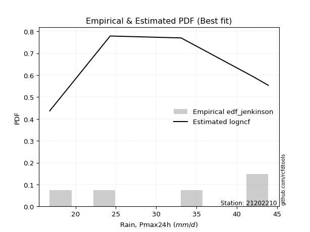</img>

</div>


### 11. EDF Cunnane (1978)

Cunnane´s work in statistical hydrology has focused on the performance and evaluation of different probability distributions (such as GEV, Gumbel, Lognormal) for flood frequency estimation. _b_ is a constant, typically set to 0.4.

<div align="center">


$P=(m-b)/(n+1-2b)$


</div>


**11.1. Empirical values**

<div align="center">

|                | 0                   | 1                  | 2           | 3                  | 4                  |
|:---------------|:--------------------|:-------------------|:------------|:-------------------|:-------------------|
| date           | 2012                | 2015               | 2014        | 2016               | 2013               |
| x              | 16.8                | 24.3               | 33.1        | 41.9               | 43.9               |
| m              | 1                   | 2                  | 3           | 4                  | 5                  |
| empirical_dist | edf_cunnane         | edf_cunnane        | edf_cunnane | edf_cunnane        | edf_cunnane        |
| empirical      | 0.11538461538461538 | 0.3076923076923077 | 0.5         | 0.6923076923076923 | 0.8846153846153845 |
| empirical_tr   | 1.1304347826086958  | 1.4444444444444444 | 2.0         | 3.25               | 8.666666666666655  |

</div>


**11.2. Kolmogorov-Smirnov fit test (sorted by Δ)**


<div align="center">

|                | 0                  | 1                   | 2                   | 3                   | 4                   | 5                   | 6                   | 7                   | 8                  | 9                   | 10                  | 11                 | 12                  | 13                  | 14                  | 15                  | 16                  | 17                  | 18                  | 19                  | 20                 | 21                 | 22                  | 23                  | 24                  | 25                  | 26                 | 27                 | 28                  | 29                  | 30                  | 31                  | 32                 | 33                  | 34                  | 35                  | 36                  | 37                  | 38                 | 39                 | 40                  | 41                 | 42                  | 43                 | 44                 | 45                  | 46                  | 47                  | 48                  | 49                  | 50                 | 51                  | 52                 | 53                  | 54                 | 55                  | 56                  | 57                  | 58                  | 59                  | 60                  | 61                  | 62                 | 63                  | 64                  | 65                 | 66                  | 67                 | 68                 | 69                  | 70                  | 71                  | 72                  | 73                  | 74                  | 75                  | 76                  | 77                  | 78                 | 79                 | 80                  | 81                 | 82                 | 83                 | 84                 | 85                  | 86                  | 87                  | 88                  | 89                  | 90                  | 91                 | 92                  | 93                  | 94                  | 95                  | 96                  | 97                  | 98                  | 99                  | 100                | 101                 | 102                | 103                 | 104                 | 105                | 106                | 107                 | 108                 | 109                 | 110                | 111                | 112                 | 113                 | 114                 | 115                 | 116                 | 117                 | 118                | 119                | 120                 | 121                 | 122                 | 123                | 124                 | 125                | 126                | 127                 | 128                 | 129                | 130                | 131                 | 132                | 133                 | 134                | 135                 | 136                 | 137                | 138                | 139                | 140                 | 141                | 142                | 143                | 144                 | 145                | 146                | 147                 | 148                | 149                | 150                | 151                | 152                | 153                | 154                | 155                | 156                | 157                | 158                | 159                |
|:---------------|:-------------------|:--------------------|:--------------------|:--------------------|:--------------------|:--------------------|:--------------------|:--------------------|:-------------------|:--------------------|:--------------------|:-------------------|:--------------------|:--------------------|:--------------------|:--------------------|:--------------------|:--------------------|:--------------------|:--------------------|:-------------------|:-------------------|:--------------------|:--------------------|:--------------------|:--------------------|:-------------------|:-------------------|:--------------------|:--------------------|:--------------------|:--------------------|:-------------------|:--------------------|:--------------------|:--------------------|:--------------------|:--------------------|:-------------------|:-------------------|:--------------------|:-------------------|:--------------------|:-------------------|:-------------------|:--------------------|:--------------------|:--------------------|:--------------------|:--------------------|:-------------------|:--------------------|:-------------------|:--------------------|:-------------------|:--------------------|:--------------------|:--------------------|:--------------------|:--------------------|:--------------------|:--------------------|:-------------------|:--------------------|:--------------------|:-------------------|:--------------------|:-------------------|:-------------------|:--------------------|:--------------------|:--------------------|:--------------------|:--------------------|:--------------------|:--------------------|:--------------------|:--------------------|:-------------------|:-------------------|:--------------------|:-------------------|:-------------------|:-------------------|:-------------------|:--------------------|:--------------------|:--------------------|:--------------------|:--------------------|:--------------------|:-------------------|:--------------------|:--------------------|:--------------------|:--------------------|:--------------------|:--------------------|:--------------------|:--------------------|:-------------------|:--------------------|:-------------------|:--------------------|:--------------------|:-------------------|:-------------------|:--------------------|:--------------------|:--------------------|:-------------------|:-------------------|:--------------------|:--------------------|:--------------------|:--------------------|:--------------------|:--------------------|:-------------------|:-------------------|:--------------------|:--------------------|:--------------------|:-------------------|:--------------------|:-------------------|:-------------------|:--------------------|:--------------------|:-------------------|:-------------------|:--------------------|:-------------------|:--------------------|:-------------------|:--------------------|:--------------------|:-------------------|:-------------------|:-------------------|:--------------------|:-------------------|:-------------------|:-------------------|:--------------------|:-------------------|:-------------------|:--------------------|:-------------------|:-------------------|:-------------------|:-------------------|:-------------------|:-------------------|:-------------------|:-------------------|:-------------------|:-------------------|:-------------------|:-------------------|
| station        | 21202210           | 21202210            | 21202210            | 21202210            | 21202210            | 21202210            | 21202210            | 21202210            | 21202210           | 21202210            | 21202210            | 21202210           | 21202210            | 21202210            | 21202210            | 21202210            | 21202210            | 21202210            | 21202210            | 21202210            | 21202210           | 21202210           | 21202210            | 21202210            | 21202210            | 21202210            | 21202210           | 21202210           | 21202210            | 21202210            | 21202210            | 21202210            | 21202210           | 21202210            | 21202210            | 21202210            | 21202210            | 21202210            | 21202210           | 21202210           | 21202210            | 21202210           | 21202210            | 21202210           | 21202210           | 21202210            | 21202210            | 21202210            | 21202210            | 21202210            | 21202210           | 21202210            | 21202210           | 21202210            | 21202210           | 21202210            | 21202210            | 21202210            | 21202210            | 21202210            | 21202210            | 21202210            | 21202210           | 21202210            | 21202210            | 21202210           | 21202210            | 21202210           | 21202210           | 21202210            | 21202210            | 21202210            | 21202210            | 21202210            | 21202210            | 21202210            | 21202210            | 21202210            | 21202210           | 21202210           | 21202210            | 21202210           | 21202210           | 21202210           | 21202210           | 21202210            | 21202210            | 21202210            | 21202210            | 21202210            | 21202210            | 21202210           | 21202210            | 21202210            | 21202210            | 21202210            | 21202210            | 21202210            | 21202210            | 21202210            | 21202210           | 21202210            | 21202210           | 21202210            | 21202210            | 21202210           | 21202210           | 21202210            | 21202210            | 21202210            | 21202210           | 21202210           | 21202210            | 21202210            | 21202210            | 21202210            | 21202210            | 21202210            | 21202210           | 21202210           | 21202210            | 21202210            | 21202210            | 21202210           | 21202210            | 21202210           | 21202210           | 21202210            | 21202210            | 21202210           | 21202210           | 21202210            | 21202210           | 21202210            | 21202210           | 21202210            | 21202210            | 21202210           | 21202210           | 21202210           | 21202210            | 21202210           | 21202210           | 21202210           | 21202210            | 21202210           | 21202210           | 21202210            | 21202210           | 21202210           | 21202210           | 21202210           | 21202210           | 21202210           | 21202210           | 21202210           | 21202210           | 21202210           | 21202210           | 21202210           |
| empirical_dist | edf_cunnane        | edf_cunnane         | edf_cunnane         | edf_cunnane         | edf_cunnane         | edf_cunnane         | edf_cunnane         | edf_cunnane         | edf_cunnane        | edf_cunnane         | edf_cunnane         | edf_cunnane        | edf_cunnane         | edf_cunnane         | edf_cunnane         | edf_cunnane         | edf_cunnane         | edf_cunnane         | edf_cunnane         | edf_cunnane         | edf_cunnane        | edf_cunnane        | edf_cunnane         | edf_cunnane         | edf_cunnane         | edf_cunnane         | edf_cunnane        | edf_cunnane        | edf_cunnane         | edf_cunnane         | edf_cunnane         | edf_cunnane         | edf_cunnane        | edf_cunnane         | edf_cunnane         | edf_cunnane         | edf_cunnane         | edf_cunnane         | edf_cunnane        | edf_cunnane        | edf_cunnane         | edf_cunnane        | edf_cunnane         | edf_cunnane        | edf_cunnane        | edf_cunnane         | edf_cunnane         | edf_cunnane         | edf_cunnane         | edf_cunnane         | edf_cunnane        | edf_cunnane         | edf_cunnane        | edf_cunnane         | edf_cunnane        | edf_cunnane         | edf_cunnane         | edf_cunnane         | edf_cunnane         | edf_cunnane         | edf_cunnane         | edf_cunnane         | edf_cunnane        | edf_cunnane         | edf_cunnane         | edf_cunnane        | edf_cunnane         | edf_cunnane        | edf_cunnane        | edf_cunnane         | edf_cunnane         | edf_cunnane         | edf_cunnane         | edf_cunnane         | edf_cunnane         | edf_cunnane         | edf_cunnane         | edf_cunnane         | edf_cunnane        | edf_cunnane        | edf_cunnane         | edf_cunnane        | edf_cunnane        | edf_cunnane        | edf_cunnane        | edf_cunnane         | edf_cunnane         | edf_cunnane         | edf_cunnane         | edf_cunnane         | edf_cunnane         | edf_cunnane        | edf_cunnane         | edf_cunnane         | edf_cunnane         | edf_cunnane         | edf_cunnane         | edf_cunnane         | edf_cunnane         | edf_cunnane         | edf_cunnane        | edf_cunnane         | edf_cunnane        | edf_cunnane         | edf_cunnane         | edf_cunnane        | edf_cunnane        | edf_cunnane         | edf_cunnane         | edf_cunnane         | edf_cunnane        | edf_cunnane        | edf_cunnane         | edf_cunnane         | edf_cunnane         | edf_cunnane         | edf_cunnane         | edf_cunnane         | edf_cunnane        | edf_cunnane        | edf_cunnane         | edf_cunnane         | edf_cunnane         | edf_cunnane        | edf_cunnane         | edf_cunnane        | edf_cunnane        | edf_cunnane         | edf_cunnane         | edf_cunnane        | edf_cunnane        | edf_cunnane         | edf_cunnane        | edf_cunnane         | edf_cunnane        | edf_cunnane         | edf_cunnane         | edf_cunnane        | edf_cunnane        | edf_cunnane        | edf_cunnane         | edf_cunnane        | edf_cunnane        | edf_cunnane        | edf_cunnane         | edf_cunnane        | edf_cunnane        | edf_cunnane         | edf_cunnane        | edf_cunnane        | edf_cunnane        | edf_cunnane        | edf_cunnane        | edf_cunnane        | edf_cunnane        | edf_cunnane        | edf_cunnane        | edf_cunnane        | edf_cunnane        | edf_cunnane        |
| p_dist         | logksone           | ksone               | logtrapezoid        | logsemicircular     | loganglit           | semicircular        | logncf              | trapezoid           | anglit             | logbeta             | beta                | logkappa3          | arcsine             | logarcsine          | logalpha            | loginvgamma         | loginvgauss         | logrice             | logbetaprime        | logerlang           | logweibull_max     | logf               | lognct              | logpearson3         | loggamma            | loggamma            | logcrystalball     | lognorm            | logt                | logexponnorm        | logfatiguelife      | logloglaplace       | logmaxwell         | loginvweibull       | loggenextreme       | ncf                 | kstwobign           | wrapcauchy          | invgauss           | lograyleigh        | rice                | alpha              | rayleigh            | erlang             | maxwell            | f                   | gamma               | pearson3            | halfnorm            | nct                 | exponnorm          | norm                | crystalball        | truncnorm           | t                  | logdweibull         | betaprime           | invgamma            | logweibull_min      | loggompertz         | weibull_min         | logburr12           | logdgamma          | loggumbel_l         | loggennorm          | genextreme         | loglogistic         | logfoldnorm        | logcosine          | logkstwobign        | loggenexpon         | gumbel_r            | lomax               | halflogistic        | cosine              | genexpon            | logistic            | loghypsecant        | loghalfnorm        | levy_l             | gumbel_l            | logmielke          | moyal              | loglevy_l          | logburr            | loggumbel_r         | hypsecant           | argus               | loglaplace          | loglaplace          | genpareto           | logwrapcauchy      | dweibull            | burr                | mielke              | laplace             | logjohnsonsb        | logargus            | burr12              | genhalflogistic     | halfgennorm        | dgamma              | loghalflogistic    | logloggamma         | logmoyal            | gennorm            | kappa3             | loghalfgennorm      | loggenhalflogistic  | skewnorm            | wald               | triang             | logjohnsonsu        | gausshyper          | tukeylambda         | kappa4              | logtriang           | uniform             | logskewnorm        | vonmises_line      | logexponweib        | logtukeylambda      | logkappa4           | bradford           | logwald             | truncexpon         | loguniform         | logvonmises_line    | loggausshyper       | truncweibull_min   | logbradford        | logtruncexpon       | loggengamma        | nakagami            | johnsonsb          | logtruncweibull_min | lognakagami         | weibull_max        | logrdist           | logexponpow        | gengamma            | gompertz           | exponweib          | johnsonsu          | foldnorm            | fatiguelife        | invweibull         | logtruncnorm        | powerlaw           | truncpareto        | logpowerlaw        | logtruncpareto     | exponpow           | loggenpareto       | loglomax           | rdist              | genlogistic        | loggenlogistic     | logvonmises        | vonmises           |
| delta          | 0.0844146172268453 | 0.08497125248236448 | 0.08677663564631488 | 0.08882822148078406 | 0.10084617113952155 | 0.10123827992892942 | 0.10513375196980435 | 0.10525557479844916 | 0.112936815980195  | 0.11538363114806938 | 0.11538449681933305 | 0.1153846153845018 | 0.11538461538461538 | 0.11961479642995598 | 0.12414172465576268 | 0.12481294746289018 | 0.12582888765188516 | 0.12585304164912192 | 0.12620947126969995 | 0.12642180253147883 | 0.1265613560616703 | 0.1266078172086783 | 0.12674232294601473 | 0.12695806696405898 | 0.12704526217651457 | 0.12704526217651457 | 0.1279563091017083 | 0.1279563093297269 | 0.12795723644762869 | 0.12796026534933092 | 0.12801359098086584 | 0.12846847350590193 | 0.1291662094165944 | 0.13004838584063394 | 0.13150571853488346 | 0.13362519772176473 | 0.13389872738598296 | 0.13426157256006954 | 0.1372193271477935 | 0.1373031402849667 | 0.13742427171468286 | 0.1375862027326682 | 0.13771112305871602 | 0.1379927651852363 | 0.1380323091718172 | 0.13803943434527755 | 0.13810718530101196 | 0.13909153202898972 | 0.13914806093594234 | 0.13918713572128505 | 0.1392956479472468 | 0.13929613644938676 | 0.1392961481847843 | 0.13929615855186184 | 0.1392988631882539 | 0.13937157424149715 | 0.13939626159327467 | 0.13958996399121648 | 0.13967845061093864 | 0.14038854083459928 | 0.14055314217418546 | 0.14229948548038107 | 0.1451319519153087 | 0.14544241568727723 | 0.14633323993173483 | 0.1467904336890582 | 0.14821392969824032 | 0.1513671038385711 | 0.1523036119847705 | 0.15430494105798798 | 0.15520869361745748 | 0.15660749476910274 | 0.15717321745652346 | 0.15733828927371418 | 0.15782527818986247 | 0.15825482115541245 | 0.15865796336160642 | 0.15950936466615906 | 0.1604904929188532 | 0.1609462328718143 | 0.16175371579741726 | 0.1621764763249458 | 0.1630327417638735 | 0.1655441941968483 | 0.1672256742314071 | 0.16910811033479745 | 0.16911664662782722 | 0.17009604909273746 | 0.17087276166524212 | 0.17087276166524212 | 0.17200491096641946 | 0.1743522066630797 | 0.17445081970818077 | 0.17705928542124572 | 0.17886628336732657 | 0.17915435195396445 | 0.18165216060498407 | 0.18293257586552913 | 0.18327329747225818 | 0.18413685685478587 | 0.184137854149375  | 0.18595266883514472 | 0.1888175118187223 | 0.19037479710346794 | 0.19168961064954748 | 0.1923076923076923 | 0.1979373946756241 | 0.20275704777194303 | 0.20301031059437868 | 0.20659525917812627 | 0.2074814828955147 | 0.2127275876038659 | 0.21322842929535363 | 0.22297208523333412 | 0.22571303946534127 | 0.22687830451901903 | 0.23266552110443117 | 0.23389156968492764 | 0.2363076322273251 | 0.2372791346659313 | 0.24536989972725431 | 0.25064728269664127 | 0.25205331798806685 | 0.2542708717379084 | 0.25465556659575606 | 0.2584457811911052 | 0.2591480359054946 | 0.26433127505778875 | 0.26525003445859463 | 0.268471690910294  | 0.2725202786045109 | 0.28759092241462336 | 0.2893002596822716 | 0.30769210280224923 | 0.3185642956517086 | 0.355892462170428   | 0.36450122634640003 | 0.3700352667790381 | 0.3760457542037604 | 0.3953885765134657 | 0.42492968150736776 | 0.4400862689389589 | 0.4431567647281841 | 0.4504282212214888 | 0.45943171568233176 | 0.4692624995489081 | 0.4732096878712197 | 0.49999767081950447 | 0.5384274095758438 | 0.5577698421955087 | 0.5700257809460101 | 0.5923684595744771 | 0.5960708466672888 | 0.611189478676158  | 0.686449377705384  | 0.692307692289795  | 0.6923076923076923 | 0.6923076923076923 | 1.1263719093299531 | 6.899062281574359  |
| deltao         | 0.5865427407550001 | 0.5865427407550001  | 0.5865427407550001  | 0.5865427407550001  | 0.5865427407550001  | 0.5865427407550001  | 0.5865427407550001  | 0.5865427407550001  | 0.5865427407550001 | 0.5865427407550001  | 0.5865427407550001  | 0.5865427407550001 | 0.5865427407550001  | 0.5865427407550001  | 0.5865427407550001  | 0.5865427407550001  | 0.5865427407550001  | 0.5865427407550001  | 0.5865427407550001  | 0.5865427407550001  | 0.5865427407550001 | 0.5865427407550001 | 0.5865427407550001  | 0.5865427407550001  | 0.5865427407550001  | 0.5865427407550001  | 0.5865427407550001 | 0.5865427407550001 | 0.5865427407550001  | 0.5865427407550001  | 0.5865427407550001  | 0.5865427407550001  | 0.5865427407550001 | 0.5865427407550001  | 0.5865427407550001  | 0.5865427407550001  | 0.5865427407550001  | 0.5865427407550001  | 0.5865427407550001 | 0.5865427407550001 | 0.5865427407550001  | 0.5865427407550001 | 0.5865427407550001  | 0.5865427407550001 | 0.5865427407550001 | 0.5865427407550001  | 0.5865427407550001  | 0.5865427407550001  | 0.5865427407550001  | 0.5865427407550001  | 0.5865427407550001 | 0.5865427407550001  | 0.5865427407550001 | 0.5865427407550001  | 0.5865427407550001 | 0.5865427407550001  | 0.5865427407550001  | 0.5865427407550001  | 0.5865427407550001  | 0.5865427407550001  | 0.5865427407550001  | 0.5865427407550001  | 0.5865427407550001 | 0.5865427407550001  | 0.5865427407550001  | 0.5865427407550001 | 0.5865427407550001  | 0.5865427407550001 | 0.5865427407550001 | 0.5865427407550001  | 0.5865427407550001  | 0.5865427407550001  | 0.5865427407550001  | 0.5865427407550001  | 0.5865427407550001  | 0.5865427407550001  | 0.5865427407550001  | 0.5865427407550001  | 0.5865427407550001 | 0.5865427407550001 | 0.5865427407550001  | 0.5865427407550001 | 0.5865427407550001 | 0.5865427407550001 | 0.5865427407550001 | 0.5865427407550001  | 0.5865427407550001  | 0.5865427407550001  | 0.5865427407550001  | 0.5865427407550001  | 0.5865427407550001  | 0.5865427407550001 | 0.5865427407550001  | 0.5865427407550001  | 0.5865427407550001  | 0.5865427407550001  | 0.5865427407550001  | 0.5865427407550001  | 0.5865427407550001  | 0.5865427407550001  | 0.5865427407550001 | 0.5865427407550001  | 0.5865427407550001 | 0.5865427407550001  | 0.5865427407550001  | 0.5865427407550001 | 0.5865427407550001 | 0.5865427407550001  | 0.5865427407550001  | 0.5865427407550001  | 0.5865427407550001 | 0.5865427407550001 | 0.5865427407550001  | 0.5865427407550001  | 0.5865427407550001  | 0.5865427407550001  | 0.5865427407550001  | 0.5865427407550001  | 0.5865427407550001 | 0.5865427407550001 | 0.5865427407550001  | 0.5865427407550001  | 0.5865427407550001  | 0.5865427407550001 | 0.5865427407550001  | 0.5865427407550001 | 0.5865427407550001 | 0.5865427407550001  | 0.5865427407550001  | 0.5865427407550001 | 0.5865427407550001 | 0.5865427407550001  | 0.5865427407550001 | 0.5865427407550001  | 0.5865427407550001 | 0.5865427407550001  | 0.5865427407550001  | 0.5865427407550001 | 0.5865427407550001 | 0.5865427407550001 | 0.5865427407550001  | 0.5865427407550001 | 0.5865427407550001 | 0.5865427407550001 | 0.5865427407550001  | 0.5865427407550001 | 0.5865427407550001 | 0.5865427407550001  | 0.5865427407550001 | 0.5865427407550001 | 0.5865427407550001 | 0.5865427407550001 | 0.5865427407550001 | 0.5865427407550001 | 0.5865427407550001 | 0.5865427407550001 | 0.5865427407550001 | 0.5865427407550001 | 0.5865427407550001 | 0.5865427407550001 |
| eval           | Δo > Δ             | Δo > Δ              | Δo > Δ              | Δo > Δ              | Δo > Δ              | Δo > Δ              | Δo > Δ              | Δo > Δ              | Δo > Δ             | Δo > Δ              | Δo > Δ              | Δo > Δ             | Δo > Δ              | Δo > Δ              | Δo > Δ              | Δo > Δ              | Δo > Δ              | Δo > Δ              | Δo > Δ              | Δo > Δ              | Δo > Δ             | Δo > Δ             | Δo > Δ              | Δo > Δ              | Δo > Δ              | Δo > Δ              | Δo > Δ             | Δo > Δ             | Δo > Δ              | Δo > Δ              | Δo > Δ              | Δo > Δ              | Δo > Δ             | Δo > Δ              | Δo > Δ              | Δo > Δ              | Δo > Δ              | Δo > Δ              | Δo > Δ             | Δo > Δ             | Δo > Δ              | Δo > Δ             | Δo > Δ              | Δo > Δ             | Δo > Δ             | Δo > Δ              | Δo > Δ              | Δo > Δ              | Δo > Δ              | Δo > Δ              | Δo > Δ             | Δo > Δ              | Δo > Δ             | Δo > Δ              | Δo > Δ             | Δo > Δ              | Δo > Δ              | Δo > Δ              | Δo > Δ              | Δo > Δ              | Δo > Δ              | Δo > Δ              | Δo > Δ             | Δo > Δ              | Δo > Δ              | Δo > Δ             | Δo > Δ              | Δo > Δ             | Δo > Δ             | Δo > Δ              | Δo > Δ              | Δo > Δ              | Δo > Δ              | Δo > Δ              | Δo > Δ              | Δo > Δ              | Δo > Δ              | Δo > Δ              | Δo > Δ             | Δo > Δ             | Δo > Δ              | Δo > Δ             | Δo > Δ             | Δo > Δ             | Δo > Δ             | Δo > Δ              | Δo > Δ              | Δo > Δ              | Δo > Δ              | Δo > Δ              | Δo > Δ              | Δo > Δ             | Δo > Δ              | Δo > Δ              | Δo > Δ              | Δo > Δ              | Δo > Δ              | Δo > Δ              | Δo > Δ              | Δo > Δ              | Δo > Δ             | Δo > Δ              | Δo > Δ             | Δo > Δ              | Δo > Δ              | Δo > Δ             | Δo > Δ             | Δo > Δ              | Δo > Δ              | Δo > Δ              | Δo > Δ             | Δo > Δ             | Δo > Δ              | Δo > Δ              | Δo > Δ              | Δo > Δ              | Δo > Δ              | Δo > Δ              | Δo > Δ             | Δo > Δ             | Δo > Δ              | Δo > Δ              | Δo > Δ              | Δo > Δ             | Δo > Δ              | Δo > Δ             | Δo > Δ             | Δo > Δ              | Δo > Δ              | Δo > Δ             | Δo > Δ             | Δo > Δ              | Δo > Δ             | Δo > Δ              | Δo > Δ             | Δo > Δ              | Δo > Δ              | Δo > Δ             | Δo > Δ             | Δo > Δ             | Δo > Δ              | Δo > Δ             | Δo > Δ             | Δo > Δ             | Δo > Δ              | Δo > Δ             | Δo > Δ             | Δo > Δ              | Δo > Δ             | Δo > Δ             | Δo > Δ             | Δo <= Δ            | Δo <= Δ            | Δo <= Δ            | Δo <= Δ            | Δo <= Δ            | Δo <= Δ            | Δo <= Δ            | Δo <= Δ            | Δo <= Δ            |
| fit            | 1                  | 1                   | 1                   | 1                   | 1                   | 1                   | 1                   | 1                   | 1                  | 1                   | 1                   | 1                  | 1                   | 1                   | 1                   | 1                   | 1                   | 1                   | 1                   | 1                   | 1                  | 1                  | 1                   | 1                   | 1                   | 1                   | 1                  | 1                  | 1                   | 1                   | 1                   | 1                   | 1                  | 1                   | 1                   | 1                   | 1                   | 1                   | 1                  | 1                  | 1                   | 1                  | 1                   | 1                  | 1                  | 1                   | 1                   | 1                   | 1                   | 1                   | 1                  | 1                   | 1                  | 1                   | 1                  | 1                   | 1                   | 1                   | 1                   | 1                   | 1                   | 1                   | 1                  | 1                   | 1                   | 1                  | 1                   | 1                  | 1                  | 1                   | 1                   | 1                   | 1                   | 1                   | 1                   | 1                   | 1                   | 1                   | 1                  | 1                  | 1                   | 1                  | 1                  | 1                  | 1                  | 1                   | 1                   | 1                   | 1                   | 1                   | 1                   | 1                  | 1                   | 1                   | 1                   | 1                   | 1                   | 1                   | 1                   | 1                   | 1                  | 1                   | 1                  | 1                   | 1                   | 1                  | 1                  | 1                   | 1                   | 1                   | 1                  | 1                  | 1                   | 1                   | 1                   | 1                   | 1                   | 1                   | 1                  | 1                  | 1                   | 1                   | 1                   | 1                  | 1                   | 1                  | 1                  | 1                   | 1                   | 1                  | 1                  | 1                   | 1                  | 1                   | 1                  | 1                   | 1                   | 1                  | 1                  | 1                  | 1                   | 1                  | 1                  | 1                  | 1                   | 1                  | 1                  | 1                   | 1                  | 1                  | 1                  | 0                  | 0                  | 0                  | 0                  | 0                  | 0                  | 0                  | 0                  | 0                  |
| n              | 5                  | 5                   | 5                   | 5                   | 5                   | 5                   | 5                   | 5                   | 5                  | 5                   | 5                   | 5                  | 5                   | 5                   | 5                   | 5                   | 5                   | 5                   | 5                   | 5                   | 5                  | 5                  | 5                   | 5                   | 5                   | 5                   | 5                  | 5                  | 5                   | 5                   | 5                   | 5                   | 5                  | 5                   | 5                   | 5                   | 5                   | 5                   | 5                  | 5                  | 5                   | 5                  | 5                   | 5                  | 5                  | 5                   | 5                   | 5                   | 5                   | 5                   | 5                  | 5                   | 5                  | 5                   | 5                  | 5                   | 5                   | 5                   | 5                   | 5                   | 5                   | 5                   | 5                  | 5                   | 5                   | 5                  | 5                   | 5                  | 5                  | 5                   | 5                   | 5                   | 5                   | 5                   | 5                   | 5                   | 5                   | 5                   | 5                  | 5                  | 5                   | 5                  | 5                  | 5                  | 5                  | 5                   | 5                   | 5                   | 5                   | 5                   | 5                   | 5                  | 5                   | 5                   | 5                   | 5                   | 5                   | 5                   | 5                   | 5                   | 5                  | 5                   | 5                  | 5                   | 5                   | 5                  | 5                  | 5                   | 5                   | 5                   | 5                  | 5                  | 5                   | 5                   | 5                   | 5                   | 5                   | 5                   | 5                  | 5                  | 5                   | 5                   | 5                   | 5                  | 5                   | 5                  | 5                  | 5                   | 5                   | 5                  | 5                  | 5                   | 5                  | 5                   | 5                  | 5                   | 5                   | 5                  | 5                  | 5                  | 5                   | 5                  | 5                  | 5                  | 5                   | 5                  | 5                  | 5                   | 5                  | 5                  | 5                  | 5                  | 5                  | 5                  | 5                  | 5                  | 5                  | 5                  | 5                  | 5                  |
| best_fit       | 1                  | 0                   | 0                   | 0                   | 0                   | 0                   | 0                   | 0                   | 0                  | 0                   | 0                   | 0                  | 0                   | 0                   | 0                   | 0                   | 0                   | 0                   | 0                   | 0                   | 0                  | 0                  | 0                   | 0                   | 0                   | 0                   | 0                  | 0                  | 0                   | 0                   | 0                   | 0                   | 0                  | 0                   | 0                   | 0                   | 0                   | 0                   | 0                  | 0                  | 0                   | 0                  | 0                   | 0                  | 0                  | 0                   | 0                   | 0                   | 0                   | 0                   | 0                  | 0                   | 0                  | 0                   | 0                  | 0                   | 0                   | 0                   | 0                   | 0                   | 0                   | 0                   | 0                  | 0                   | 0                   | 0                  | 0                   | 0                  | 0                  | 0                   | 0                   | 0                   | 0                   | 0                   | 0                   | 0                   | 0                   | 0                   | 0                  | 0                  | 0                   | 0                  | 0                  | 0                  | 0                  | 0                   | 0                   | 0                   | 0                   | 0                   | 0                   | 0                  | 0                   | 0                   | 0                   | 0                   | 0                   | 0                   | 0                   | 0                   | 0                  | 0                   | 0                  | 0                   | 0                   | 0                  | 0                  | 0                   | 0                   | 0                   | 0                  | 0                  | 0                   | 0                   | 0                   | 0                   | 0                   | 0                   | 0                  | 0                  | 0                   | 0                   | 0                   | 0                  | 0                   | 0                  | 0                  | 0                   | 0                   | 0                  | 0                  | 0                   | 0                  | 0                   | 0                  | 0                   | 0                   | 0                  | 0                  | 0                  | 0                   | 0                  | 0                  | 0                  | 0                   | 0                  | 0                  | 0                   | 0                  | 0                  | 0                  | 0                  | 0                  | 0                  | 0                  | 0                  | 0                  | 0                  | 0                  | 0                  |
| best_fit_sort  | 1                  | 2                   | 3                   | 4                   | 5                   | 6                   | 7                   | 8                   | 9                  | 10                  | 11                  | 12                 | 13                  | 14                  | 15                  | 16                  | 17                  | 18                  | 19                  | 20                  | 21                 | 22                 | 23                  | 24                  | 25                  | 26                  | 27                 | 28                 | 29                  | 30                  | 31                  | 32                  | 33                 | 34                  | 35                  | 36                  | 37                  | 38                  | 39                 | 40                 | 41                  | 42                 | 43                  | 44                 | 45                 | 46                  | 47                  | 48                  | 49                  | 50                  | 51                 | 52                  | 53                 | 54                  | 55                 | 56                  | 57                  | 58                  | 59                  | 60                  | 61                  | 62                  | 63                 | 64                  | 65                  | 66                 | 67                  | 68                 | 69                 | 70                  | 71                  | 72                  | 73                  | 74                  | 75                  | 76                  | 77                  | 78                  | 79                 | 80                 | 81                  | 82                 | 83                 | 84                 | 85                 | 86                  | 87                  | 88                  | 89                  | 90                  | 91                  | 92                 | 93                  | 94                  | 95                  | 96                  | 97                  | 98                  | 99                  | 100                 | 101                | 102                 | 103                | 104                 | 105                 | 106                | 107                | 108                 | 109                 | 110                 | 111                | 112                | 113                 | 114                 | 115                 | 116                 | 117                 | 118                 | 119                | 120                | 121                 | 122                 | 123                 | 124                | 125                 | 126                | 127                | 128                 | 129                 | 130                | 131                | 132                 | 133                | 134                 | 135                | 136                 | 137                 | 138                | 139                | 140                | 141                 | 142                | 143                | 144                | 145                 | 146                | 147                | 148                 | 149                | 150                | 151                | 152                | 153                | 154                | 155                | 156                | 157                | 158                | 159                | 160                |

</div>


**11.3. Best fit**

<div align="center">

|   id |   station | empirical_dist   | p_dist   |     delta |   deltao | eval   |   fit |   n |   best_fit |   best_fit_sort |
|-----:|----------:|:-----------------|:---------|----------:|---------:|:-------|------:|----:|-----------:|----------------:|
|    0 |  21202210 | edf_cunnane      | logksone | 0.0844146 | 0.586543 | Δo > Δ |     1 |   5 |          1 |               1 |

</div>


<div align="center">

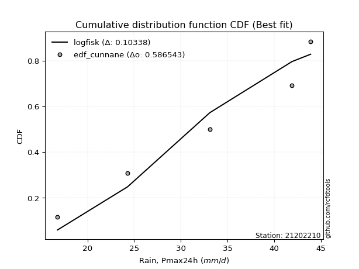</img>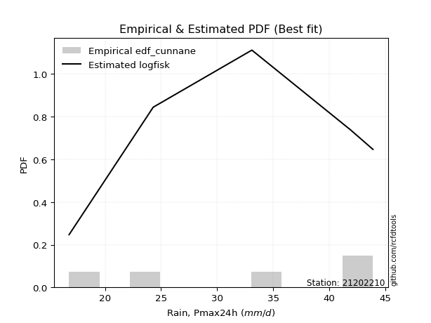</img>

</div>


### 12. EDF Adamowski (1981)

The Adamowski formula in hydrology refers to a specific plotting position formula used for estimating the non-parametric empirical distribution of hydrological events (like flood peaks) to calculate their return periods. This formula provides an alternative to traditional parametric methods (like the Gumbel or Log Pearson Type III distributions). 

<div align="center">


$P=(m-0.25)/(n+0.5)$


</div>


**12.1. Empirical values**

<div align="center">

|                | 0                   | 1                  | 2             | 3                  | 4                  |
|:---------------|:--------------------|:-------------------|:--------------|:-------------------|:-------------------|
| date           | 2012                | 2015               | 2014          | 2016               | 2013               |
| x              | 16.8                | 24.3               | 33.1          | 41.9               | 43.9               |
| m              | 1                   | 2                  | 3             | 4                  | 5                  |
| empirical_dist | edf_adamowski       | edf_adamowski      | edf_adamowski | edf_adamowski      | edf_adamowski      |
| empirical      | 0.13636363636363635 | 0.3181818181818182 | 0.5           | 0.6818181818181818 | 0.8636363636363636 |
| empirical_tr   | 1.1578947368421053  | 1.4666666666666666 | 2.0           | 3.1428571428571423 | 7.333333333333334  |

</div>


**12.2. Kolmogorov-Smirnov fit test (sorted by Δ)**


<div align="center">

|                | 0                   | 1                  | 2                  | 3                   | 4                   | 5                   | 6                   | 7                   | 8                   | 9                   | 10                  | 11                  | 12                 | 13                 | 14                  | 15                 | 16                  | 17                  | 18                 | 19                  | 20                  | 21                  | 22                  | 23                  | 24                  | 25                 | 26                 | 27                 | 28                  | 29                  | 30                 | 31                  | 32                  | 33                 | 34                  | 35                 | 36                 | 37                  | 38                  | 39                 | 40                  | 41                  | 42                  | 43                  | 44                 | 45                  | 46                  | 47                  | 48                  | 49                  | 50                  | 51                  | 52                 | 53                  | 54                  | 55                  | 56                  | 57                 | 58                 | 59                  | 60                 | 61                 | 62                 | 63                 | 64                  | 65                  | 66                  | 67                  | 68                 | 69                  | 70                  | 71                  | 72                 | 73                 | 74                  | 75                  | 76                 | 77                  | 78                 | 79                 | 80                  | 81                  | 82                  | 83                 | 84                 | 85                  | 86                  | 87                  | 88                  | 89                  | 90                  | 91                  | 92                  | 93                 | 94                  | 95                  | 96                 | 97                  | 98                 | 99                 | 100                 | 101                 | 102                 | 103                | 104                 | 105                 | 106                | 107                 | 108                | 109                 | 110                | 111                | 112                 | 113                 | 114                 | 115                | 116                 | 117                | 118                 | 119                 | 120                 | 121                 | 122                | 123                | 124                 | 125                | 126                 | 127                | 128                 | 129                | 130                | 131                 | 132                | 133                 | 134                | 135                | 136                 | 137                 | 138                 | 139                 | 140                | 141                 | 142                 | 143                | 144                | 145                | 146                 | 147                 | 148                | 149                | 150                | 151                | 152                | 153                | 154                | 155                | 156                | 157                | 158                | 159                |
|:---------------|:--------------------|:-------------------|:-------------------|:--------------------|:--------------------|:--------------------|:--------------------|:--------------------|:--------------------|:--------------------|:--------------------|:--------------------|:-------------------|:-------------------|:--------------------|:-------------------|:--------------------|:--------------------|:-------------------|:--------------------|:--------------------|:--------------------|:--------------------|:--------------------|:--------------------|:-------------------|:-------------------|:-------------------|:--------------------|:--------------------|:-------------------|:--------------------|:--------------------|:-------------------|:--------------------|:-------------------|:-------------------|:--------------------|:--------------------|:-------------------|:--------------------|:--------------------|:--------------------|:--------------------|:-------------------|:--------------------|:--------------------|:--------------------|:--------------------|:--------------------|:--------------------|:--------------------|:-------------------|:--------------------|:--------------------|:--------------------|:--------------------|:-------------------|:-------------------|:--------------------|:-------------------|:-------------------|:-------------------|:-------------------|:--------------------|:--------------------|:--------------------|:--------------------|:-------------------|:--------------------|:--------------------|:--------------------|:-------------------|:-------------------|:--------------------|:--------------------|:-------------------|:--------------------|:-------------------|:-------------------|:--------------------|:--------------------|:--------------------|:-------------------|:-------------------|:--------------------|:--------------------|:--------------------|:--------------------|:--------------------|:--------------------|:--------------------|:--------------------|:-------------------|:--------------------|:--------------------|:-------------------|:--------------------|:-------------------|:-------------------|:--------------------|:--------------------|:--------------------|:-------------------|:--------------------|:--------------------|:-------------------|:--------------------|:-------------------|:--------------------|:-------------------|:-------------------|:--------------------|:--------------------|:--------------------|:-------------------|:--------------------|:-------------------|:--------------------|:--------------------|:--------------------|:--------------------|:-------------------|:-------------------|:--------------------|:-------------------|:--------------------|:-------------------|:--------------------|:-------------------|:-------------------|:--------------------|:-------------------|:--------------------|:-------------------|:-------------------|:--------------------|:--------------------|:--------------------|:--------------------|:-------------------|:--------------------|:--------------------|:-------------------|:-------------------|:-------------------|:--------------------|:--------------------|:-------------------|:-------------------|:-------------------|:-------------------|:-------------------|:-------------------|:-------------------|:-------------------|:-------------------|:-------------------|:-------------------|:-------------------|
| station        | 21202210            | 21202210           | 21202210           | 21202210            | 21202210            | 21202210            | 21202210            | 21202210            | 21202210            | 21202210            | 21202210            | 21202210            | 21202210           | 21202210           | 21202210            | 21202210           | 21202210            | 21202210            | 21202210           | 21202210            | 21202210            | 21202210            | 21202210            | 21202210            | 21202210            | 21202210           | 21202210           | 21202210           | 21202210            | 21202210            | 21202210           | 21202210            | 21202210            | 21202210           | 21202210            | 21202210           | 21202210           | 21202210            | 21202210            | 21202210           | 21202210            | 21202210            | 21202210            | 21202210            | 21202210           | 21202210            | 21202210            | 21202210            | 21202210            | 21202210            | 21202210            | 21202210            | 21202210           | 21202210            | 21202210            | 21202210            | 21202210            | 21202210           | 21202210           | 21202210            | 21202210           | 21202210           | 21202210           | 21202210           | 21202210            | 21202210            | 21202210            | 21202210            | 21202210           | 21202210            | 21202210            | 21202210            | 21202210           | 21202210           | 21202210            | 21202210            | 21202210           | 21202210            | 21202210           | 21202210           | 21202210            | 21202210            | 21202210            | 21202210           | 21202210           | 21202210            | 21202210            | 21202210            | 21202210            | 21202210            | 21202210            | 21202210            | 21202210            | 21202210           | 21202210            | 21202210            | 21202210           | 21202210            | 21202210           | 21202210           | 21202210            | 21202210            | 21202210            | 21202210           | 21202210            | 21202210            | 21202210           | 21202210            | 21202210           | 21202210            | 21202210           | 21202210           | 21202210            | 21202210            | 21202210            | 21202210           | 21202210            | 21202210           | 21202210            | 21202210            | 21202210            | 21202210            | 21202210           | 21202210           | 21202210            | 21202210           | 21202210            | 21202210           | 21202210            | 21202210           | 21202210           | 21202210            | 21202210           | 21202210            | 21202210           | 21202210           | 21202210            | 21202210            | 21202210            | 21202210            | 21202210           | 21202210            | 21202210            | 21202210           | 21202210           | 21202210           | 21202210            | 21202210            | 21202210           | 21202210           | 21202210           | 21202210           | 21202210           | 21202210           | 21202210           | 21202210           | 21202210           | 21202210           | 21202210           | 21202210           |
| empirical_dist | edf_adamowski       | edf_adamowski      | edf_adamowski      | edf_adamowski       | edf_adamowski       | edf_adamowski       | edf_adamowski       | edf_adamowski       | edf_adamowski       | edf_adamowski       | edf_adamowski       | edf_adamowski       | edf_adamowski      | edf_adamowski      | edf_adamowski       | edf_adamowski      | edf_adamowski       | edf_adamowski       | edf_adamowski      | edf_adamowski       | edf_adamowski       | edf_adamowski       | edf_adamowski       | edf_adamowski       | edf_adamowski       | edf_adamowski      | edf_adamowski      | edf_adamowski      | edf_adamowski       | edf_adamowski       | edf_adamowski      | edf_adamowski       | edf_adamowski       | edf_adamowski      | edf_adamowski       | edf_adamowski      | edf_adamowski      | edf_adamowski       | edf_adamowski       | edf_adamowski      | edf_adamowski       | edf_adamowski       | edf_adamowski       | edf_adamowski       | edf_adamowski      | edf_adamowski       | edf_adamowski       | edf_adamowski       | edf_adamowski       | edf_adamowski       | edf_adamowski       | edf_adamowski       | edf_adamowski      | edf_adamowski       | edf_adamowski       | edf_adamowski       | edf_adamowski       | edf_adamowski      | edf_adamowski      | edf_adamowski       | edf_adamowski      | edf_adamowski      | edf_adamowski      | edf_adamowski      | edf_adamowski       | edf_adamowski       | edf_adamowski       | edf_adamowski       | edf_adamowski      | edf_adamowski       | edf_adamowski       | edf_adamowski       | edf_adamowski      | edf_adamowski      | edf_adamowski       | edf_adamowski       | edf_adamowski      | edf_adamowski       | edf_adamowski      | edf_adamowski      | edf_adamowski       | edf_adamowski       | edf_adamowski       | edf_adamowski      | edf_adamowski      | edf_adamowski       | edf_adamowski       | edf_adamowski       | edf_adamowski       | edf_adamowski       | edf_adamowski       | edf_adamowski       | edf_adamowski       | edf_adamowski      | edf_adamowski       | edf_adamowski       | edf_adamowski      | edf_adamowski       | edf_adamowski      | edf_adamowski      | edf_adamowski       | edf_adamowski       | edf_adamowski       | edf_adamowski      | edf_adamowski       | edf_adamowski       | edf_adamowski      | edf_adamowski       | edf_adamowski      | edf_adamowski       | edf_adamowski      | edf_adamowski      | edf_adamowski       | edf_adamowski       | edf_adamowski       | edf_adamowski      | edf_adamowski       | edf_adamowski      | edf_adamowski       | edf_adamowski       | edf_adamowski       | edf_adamowski       | edf_adamowski      | edf_adamowski      | edf_adamowski       | edf_adamowski      | edf_adamowski       | edf_adamowski      | edf_adamowski       | edf_adamowski      | edf_adamowski      | edf_adamowski       | edf_adamowski      | edf_adamowski       | edf_adamowski      | edf_adamowski      | edf_adamowski       | edf_adamowski       | edf_adamowski       | edf_adamowski       | edf_adamowski      | edf_adamowski       | edf_adamowski       | edf_adamowski      | edf_adamowski      | edf_adamowski      | edf_adamowski       | edf_adamowski       | edf_adamowski      | edf_adamowski      | edf_adamowski      | edf_adamowski      | edf_adamowski      | edf_adamowski      | edf_adamowski      | edf_adamowski      | edf_adamowski      | edf_adamowski      | edf_adamowski      | edf_adamowski      |
| p_dist         | logncf              | ksone              | logtrapezoid       | logsemicircular     | logksone            | loganglit           | semicircular        | trapezoid           | anglit              | logbetaprime        | loginvweibull       | loginvgauss         | logalpha           | loginvgamma        | logrice             | logbeta            | beta                | wrapcauchy          | logweibull_max     | logkappa3           | logarcsine          | arcsine             | logerlang           | logf                | lognct              | logpearson3        | loggamma           | loggamma           | logcrystalball      | lognorm             | logt               | logexponnorm        | logfatiguelife      | logmaxwell         | lograyleigh         | logloglaplace      | loggenextreme      | ncf                 | kstwobign           | genextreme         | invgauss            | rice                | alpha               | rayleigh            | erlang             | maxwell             | f                   | gamma               | pearson3            | halfnorm            | nct                 | exponnorm           | norm               | crystalball         | truncnorm           | t                   | logdweibull         | betaprime          | invgamma           | logweibull_min      | loggompertz        | weibull_min        | logfoldnorm        | logburr12          | logkstwobign        | loggenexpon         | logdgamma           | loggumbel_l         | loggennorm         | lomax               | genexpon            | loglogistic         | loghalfnorm        | levy_l             | logcosine           | logwrapcauchy       | loglevy_l          | gumbel_r            | halflogistic       | cosine             | loggumbel_r         | logistic            | loghypsecant        | logjohnsonsb       | gumbel_l           | logmielke           | moyal               | logburr             | hypsecant           | argus               | loglaplace          | loglaplace          | gennorm             | halfgennorm        | genpareto           | burr12              | dweibull           | burr                | loghalflogistic    | mielke             | laplace             | logmoyal            | logargus            | genhalflogistic    | dgamma              | logloggamma         | logjohnsonsu       | loghalfgennorm      | wald               | kappa3              | loggenhalflogistic | skewnorm           | triang              | gausshyper          | logexponweib        | tukeylambda        | kappa4              | logtriang          | uniform             | logskewnorm         | vonmises_line       | logwald             | logtukeylambda     | logkappa4          | bradford            | truncexpon         | loguniform          | logvonmises_line   | loggausshyper       | truncweibull_min   | logbradford        | logtruncexpon       | loggengamma        | johnsonsb           | nakagami           | logrdist           | logtruncweibull_min | weibull_max         | lognakagami         | logexponpow         | gengamma           | exponweib           | johnsonsu           | gompertz           | invweibull         | fatiguelife        | foldnorm            | logtruncnorm        | powerlaw           | truncpareto        | logpowerlaw        | logtruncpareto     | exponpow           | loggenpareto       | loglomax           | rdist              | genlogistic        | loggenlogistic     | logvonmises        | vonmises           |
| delta          | 0.08993631177099093 | 0.095460762971875  | 0.0972661461358254 | 0.09931773197029459 | 0.10539363820586628 | 0.11133568162903207 | 0.11172779041843994 | 0.11574508528795968 | 0.12342632646970553 | 0.12620947126969995 | 0.13004838584063394 | 0.13349107696133733 | 0.1346312351452732 | 0.1353024579524007 | 0.13634255213863244 | 0.1363626521270902 | 0.13636351779835387 | 0.13636360788629254 | 0.1363636363435441 | 0.13636363636352278 | 0.13636363636363635 | 0.13636363636363635 | 0.13691131302098936 | 0.13709732769818883 | 0.13723183343552525 | 0.1374475774535695 | 0.1375347726660251 | 0.1375347726660251 | 0.13844581959121882 | 0.13844581981923743 | 0.1384467469371392 | 0.13844977583884144 | 0.13850310147037637 | 0.1386763012159563 | 0.13876299531917557 | 0.1389579839954124 | 0.141995229024394  | 0.14411470821127526 | 0.14438823787549349 | 0.1467904336890582 | 0.14770883763730402 | 0.14791378220419338 | 0.14807571322217872 | 0.14820063354822655 | 0.1484822756747468 | 0.14852181966132771 | 0.14852894483478807 | 0.14859669579052248 | 0.14958104251850024 | 0.14963757142545286 | 0.14967664621079557 | 0.14978515843675733 | 0.1497856469388973 | 0.14978565867429483 | 0.14978566904137236 | 0.14978837367776443 | 0.14986108473100768 | 0.1498857720827852 | 0.150079474480727  | 0.15016796110044917 | 0.1508780513241098 | 0.151042652663696  | 0.1513671038385711 | 0.1527889959698916 | 0.15430494105798798 | 0.15520869361745748 | 0.15562146240481922 | 0.15593192617678775 | 0.1568227504212453 | 0.15717321745652346 | 0.15825482115541245 | 0.15870344018775084 | 0.1604904929188532 | 0.1609462328718143 | 0.16279312247428102 | 0.16386269617356924 | 0.1655441941968483 | 0.16709700525861326 | 0.1678277997632247 | 0.168314788679373  | 0.16910811033479745 | 0.16914747385111695 | 0.16999887515566958 | 0.1711626501154736 | 0.1722432262869278 | 0.17266598681445633 | 0.17352225225338402 | 0.17771518472091763 | 0.17960615711733774 | 0.18058555958224798 | 0.18136227215475265 | 0.18136227215475265 | 0.18181818181818182 | 0.1822268826002129 | 0.18249442145592998 | 0.18327329747225818 | 0.1849403301976913 | 0.18754879591075624 | 0.1888175118187223 | 0.1893557938568371 | 0.18964386244347498 | 0.19168961064954748 | 0.19342208635503966 | 0.1946263673442964 | 0.19644217932465524 | 0.20086430759297846 | 0.2027389188058431 | 0.20275704777194303 | 0.2074814828955147 | 0.20842690516513462 | 0.2134998210838892 | 0.2170847696676368 | 0.22321709809337642 | 0.23346159572284464 | 0.23488038923774385 | 0.2362025499548518 | 0.23736781500852955 | 0.2431550315939417 | 0.24438108017443816 | 0.24679714271683562 | 0.24776864515544184 | 0.25465556659575606 | 0.2611367931861518 | 0.2625428284775774 | 0.26476038222741893 | 0.2689352916806157 | 0.26963754639500515 | 0.2748207855472993 | 0.27573954494810515 | 0.2789612013998045 | 0.2830097890940214 | 0.28759092241462336 | 0.2893002596822716 | 0.30807478516219805 | 0.3181816132917597 | 0.3550667332247396 | 0.355892462170428   | 0.35954575628952756 | 0.36450122634640003 | 0.38489906602395524 | 0.4144401710178573 | 0.43266725423867364 | 0.43993871073197827 | 0.4400862689389589 | 0.4522306668921989 | 0.4587729890593976 | 0.45943171568233176 | 0.49999767081950447 | 0.5279378990863333 | 0.5472803317059982 | 0.5595362704564997 | 0.5818789490849667 | 0.5855813361777784 | 0.5902104576971371 | 0.6654703567263631 | 0.6818181818002846 | 0.6818181818181818 | 0.6818181818181818 | 1.1368614198194638 | 6.92004130255338   |
| deltao         | 0.5865427407550001  | 0.5865427407550001 | 0.5865427407550001 | 0.5865427407550001  | 0.5865427407550001  | 0.5865427407550001  | 0.5865427407550001  | 0.5865427407550001  | 0.5865427407550001  | 0.5865427407550001  | 0.5865427407550001  | 0.5865427407550001  | 0.5865427407550001 | 0.5865427407550001 | 0.5865427407550001  | 0.5865427407550001 | 0.5865427407550001  | 0.5865427407550001  | 0.5865427407550001 | 0.5865427407550001  | 0.5865427407550001  | 0.5865427407550001  | 0.5865427407550001  | 0.5865427407550001  | 0.5865427407550001  | 0.5865427407550001 | 0.5865427407550001 | 0.5865427407550001 | 0.5865427407550001  | 0.5865427407550001  | 0.5865427407550001 | 0.5865427407550001  | 0.5865427407550001  | 0.5865427407550001 | 0.5865427407550001  | 0.5865427407550001 | 0.5865427407550001 | 0.5865427407550001  | 0.5865427407550001  | 0.5865427407550001 | 0.5865427407550001  | 0.5865427407550001  | 0.5865427407550001  | 0.5865427407550001  | 0.5865427407550001 | 0.5865427407550001  | 0.5865427407550001  | 0.5865427407550001  | 0.5865427407550001  | 0.5865427407550001  | 0.5865427407550001  | 0.5865427407550001  | 0.5865427407550001 | 0.5865427407550001  | 0.5865427407550001  | 0.5865427407550001  | 0.5865427407550001  | 0.5865427407550001 | 0.5865427407550001 | 0.5865427407550001  | 0.5865427407550001 | 0.5865427407550001 | 0.5865427407550001 | 0.5865427407550001 | 0.5865427407550001  | 0.5865427407550001  | 0.5865427407550001  | 0.5865427407550001  | 0.5865427407550001 | 0.5865427407550001  | 0.5865427407550001  | 0.5865427407550001  | 0.5865427407550001 | 0.5865427407550001 | 0.5865427407550001  | 0.5865427407550001  | 0.5865427407550001 | 0.5865427407550001  | 0.5865427407550001 | 0.5865427407550001 | 0.5865427407550001  | 0.5865427407550001  | 0.5865427407550001  | 0.5865427407550001 | 0.5865427407550001 | 0.5865427407550001  | 0.5865427407550001  | 0.5865427407550001  | 0.5865427407550001  | 0.5865427407550001  | 0.5865427407550001  | 0.5865427407550001  | 0.5865427407550001  | 0.5865427407550001 | 0.5865427407550001  | 0.5865427407550001  | 0.5865427407550001 | 0.5865427407550001  | 0.5865427407550001 | 0.5865427407550001 | 0.5865427407550001  | 0.5865427407550001  | 0.5865427407550001  | 0.5865427407550001 | 0.5865427407550001  | 0.5865427407550001  | 0.5865427407550001 | 0.5865427407550001  | 0.5865427407550001 | 0.5865427407550001  | 0.5865427407550001 | 0.5865427407550001 | 0.5865427407550001  | 0.5865427407550001  | 0.5865427407550001  | 0.5865427407550001 | 0.5865427407550001  | 0.5865427407550001 | 0.5865427407550001  | 0.5865427407550001  | 0.5865427407550001  | 0.5865427407550001  | 0.5865427407550001 | 0.5865427407550001 | 0.5865427407550001  | 0.5865427407550001 | 0.5865427407550001  | 0.5865427407550001 | 0.5865427407550001  | 0.5865427407550001 | 0.5865427407550001 | 0.5865427407550001  | 0.5865427407550001 | 0.5865427407550001  | 0.5865427407550001 | 0.5865427407550001 | 0.5865427407550001  | 0.5865427407550001  | 0.5865427407550001  | 0.5865427407550001  | 0.5865427407550001 | 0.5865427407550001  | 0.5865427407550001  | 0.5865427407550001 | 0.5865427407550001 | 0.5865427407550001 | 0.5865427407550001  | 0.5865427407550001  | 0.5865427407550001 | 0.5865427407550001 | 0.5865427407550001 | 0.5865427407550001 | 0.5865427407550001 | 0.5865427407550001 | 0.5865427407550001 | 0.5865427407550001 | 0.5865427407550001 | 0.5865427407550001 | 0.5865427407550001 | 0.5865427407550001 |
| eval           | Δo > Δ              | Δo > Δ             | Δo > Δ             | Δo > Δ              | Δo > Δ              | Δo > Δ              | Δo > Δ              | Δo > Δ              | Δo > Δ              | Δo > Δ              | Δo > Δ              | Δo > Δ              | Δo > Δ             | Δo > Δ             | Δo > Δ              | Δo > Δ             | Δo > Δ              | Δo > Δ              | Δo > Δ             | Δo > Δ              | Δo > Δ              | Δo > Δ              | Δo > Δ              | Δo > Δ              | Δo > Δ              | Δo > Δ             | Δo > Δ             | Δo > Δ             | Δo > Δ              | Δo > Δ              | Δo > Δ             | Δo > Δ              | Δo > Δ              | Δo > Δ             | Δo > Δ              | Δo > Δ             | Δo > Δ             | Δo > Δ              | Δo > Δ              | Δo > Δ             | Δo > Δ              | Δo > Δ              | Δo > Δ              | Δo > Δ              | Δo > Δ             | Δo > Δ              | Δo > Δ              | Δo > Δ              | Δo > Δ              | Δo > Δ              | Δo > Δ              | Δo > Δ              | Δo > Δ             | Δo > Δ              | Δo > Δ              | Δo > Δ              | Δo > Δ              | Δo > Δ             | Δo > Δ             | Δo > Δ              | Δo > Δ             | Δo > Δ             | Δo > Δ             | Δo > Δ             | Δo > Δ              | Δo > Δ              | Δo > Δ              | Δo > Δ              | Δo > Δ             | Δo > Δ              | Δo > Δ              | Δo > Δ              | Δo > Δ             | Δo > Δ             | Δo > Δ              | Δo > Δ              | Δo > Δ             | Δo > Δ              | Δo > Δ             | Δo > Δ             | Δo > Δ              | Δo > Δ              | Δo > Δ              | Δo > Δ             | Δo > Δ             | Δo > Δ              | Δo > Δ              | Δo > Δ              | Δo > Δ              | Δo > Δ              | Δo > Δ              | Δo > Δ              | Δo > Δ              | Δo > Δ             | Δo > Δ              | Δo > Δ              | Δo > Δ             | Δo > Δ              | Δo > Δ             | Δo > Δ             | Δo > Δ              | Δo > Δ              | Δo > Δ              | Δo > Δ             | Δo > Δ              | Δo > Δ              | Δo > Δ             | Δo > Δ              | Δo > Δ             | Δo > Δ              | Δo > Δ             | Δo > Δ             | Δo > Δ              | Δo > Δ              | Δo > Δ              | Δo > Δ             | Δo > Δ              | Δo > Δ             | Δo > Δ              | Δo > Δ              | Δo > Δ              | Δo > Δ              | Δo > Δ             | Δo > Δ             | Δo > Δ              | Δo > Δ             | Δo > Δ              | Δo > Δ             | Δo > Δ              | Δo > Δ             | Δo > Δ             | Δo > Δ              | Δo > Δ             | Δo > Δ              | Δo > Δ             | Δo > Δ             | Δo > Δ              | Δo > Δ              | Δo > Δ              | Δo > Δ              | Δo > Δ             | Δo > Δ              | Δo > Δ              | Δo > Δ             | Δo > Δ             | Δo > Δ             | Δo > Δ              | Δo > Δ              | Δo > Δ             | Δo > Δ             | Δo > Δ             | Δo > Δ             | Δo > Δ             | Δo <= Δ            | Δo <= Δ            | Δo <= Δ            | Δo <= Δ            | Δo <= Δ            | Δo <= Δ            | Δo <= Δ            |
| fit            | 1                   | 1                  | 1                  | 1                   | 1                   | 1                   | 1                   | 1                   | 1                   | 1                   | 1                   | 1                   | 1                  | 1                  | 1                   | 1                  | 1                   | 1                   | 1                  | 1                   | 1                   | 1                   | 1                   | 1                   | 1                   | 1                  | 1                  | 1                  | 1                   | 1                   | 1                  | 1                   | 1                   | 1                  | 1                   | 1                  | 1                  | 1                   | 1                   | 1                  | 1                   | 1                   | 1                   | 1                   | 1                  | 1                   | 1                   | 1                   | 1                   | 1                   | 1                   | 1                   | 1                  | 1                   | 1                   | 1                   | 1                   | 1                  | 1                  | 1                   | 1                  | 1                  | 1                  | 1                  | 1                   | 1                   | 1                   | 1                   | 1                  | 1                   | 1                   | 1                   | 1                  | 1                  | 1                   | 1                   | 1                  | 1                   | 1                  | 1                  | 1                   | 1                   | 1                   | 1                  | 1                  | 1                   | 1                   | 1                   | 1                   | 1                   | 1                   | 1                   | 1                   | 1                  | 1                   | 1                   | 1                  | 1                   | 1                  | 1                  | 1                   | 1                   | 1                   | 1                  | 1                   | 1                   | 1                  | 1                   | 1                  | 1                   | 1                  | 1                  | 1                   | 1                   | 1                   | 1                  | 1                   | 1                  | 1                   | 1                   | 1                   | 1                   | 1                  | 1                  | 1                   | 1                  | 1                   | 1                  | 1                   | 1                  | 1                  | 1                   | 1                  | 1                   | 1                  | 1                  | 1                   | 1                   | 1                   | 1                   | 1                  | 1                   | 1                   | 1                  | 1                  | 1                  | 1                   | 1                   | 1                  | 1                  | 1                  | 1                  | 1                  | 0                  | 0                  | 0                  | 0                  | 0                  | 0                  | 0                  |
| n              | 5                   | 5                  | 5                  | 5                   | 5                   | 5                   | 5                   | 5                   | 5                   | 5                   | 5                   | 5                   | 5                  | 5                  | 5                   | 5                  | 5                   | 5                   | 5                  | 5                   | 5                   | 5                   | 5                   | 5                   | 5                   | 5                  | 5                  | 5                  | 5                   | 5                   | 5                  | 5                   | 5                   | 5                  | 5                   | 5                  | 5                  | 5                   | 5                   | 5                  | 5                   | 5                   | 5                   | 5                   | 5                  | 5                   | 5                   | 5                   | 5                   | 5                   | 5                   | 5                   | 5                  | 5                   | 5                   | 5                   | 5                   | 5                  | 5                  | 5                   | 5                  | 5                  | 5                  | 5                  | 5                   | 5                   | 5                   | 5                   | 5                  | 5                   | 5                   | 5                   | 5                  | 5                  | 5                   | 5                   | 5                  | 5                   | 5                  | 5                  | 5                   | 5                   | 5                   | 5                  | 5                  | 5                   | 5                   | 5                   | 5                   | 5                   | 5                   | 5                   | 5                   | 5                  | 5                   | 5                   | 5                  | 5                   | 5                  | 5                  | 5                   | 5                   | 5                   | 5                  | 5                   | 5                   | 5                  | 5                   | 5                  | 5                   | 5                  | 5                  | 5                   | 5                   | 5                   | 5                  | 5                   | 5                  | 5                   | 5                   | 5                   | 5                   | 5                  | 5                  | 5                   | 5                  | 5                   | 5                  | 5                   | 5                  | 5                  | 5                   | 5                  | 5                   | 5                  | 5                  | 5                   | 5                   | 5                   | 5                   | 5                  | 5                   | 5                   | 5                  | 5                  | 5                  | 5                   | 5                   | 5                  | 5                  | 5                  | 5                  | 5                  | 5                  | 5                  | 5                  | 5                  | 5                  | 5                  | 5                  |
| best_fit       | 1                   | 0                  | 0                  | 0                   | 0                   | 0                   | 0                   | 0                   | 0                   | 0                   | 0                   | 0                   | 0                  | 0                  | 0                   | 0                  | 0                   | 0                   | 0                  | 0                   | 0                   | 0                   | 0                   | 0                   | 0                   | 0                  | 0                  | 0                  | 0                   | 0                   | 0                  | 0                   | 0                   | 0                  | 0                   | 0                  | 0                  | 0                   | 0                   | 0                  | 0                   | 0                   | 0                   | 0                   | 0                  | 0                   | 0                   | 0                   | 0                   | 0                   | 0                   | 0                   | 0                  | 0                   | 0                   | 0                   | 0                   | 0                  | 0                  | 0                   | 0                  | 0                  | 0                  | 0                  | 0                   | 0                   | 0                   | 0                   | 0                  | 0                   | 0                   | 0                   | 0                  | 0                  | 0                   | 0                   | 0                  | 0                   | 0                  | 0                  | 0                   | 0                   | 0                   | 0                  | 0                  | 0                   | 0                   | 0                   | 0                   | 0                   | 0                   | 0                   | 0                   | 0                  | 0                   | 0                   | 0                  | 0                   | 0                  | 0                  | 0                   | 0                   | 0                   | 0                  | 0                   | 0                   | 0                  | 0                   | 0                  | 0                   | 0                  | 0                  | 0                   | 0                   | 0                   | 0                  | 0                   | 0                  | 0                   | 0                   | 0                   | 0                   | 0                  | 0                  | 0                   | 0                  | 0                   | 0                  | 0                   | 0                  | 0                  | 0                   | 0                  | 0                   | 0                  | 0                  | 0                   | 0                   | 0                   | 0                   | 0                  | 0                   | 0                   | 0                  | 0                  | 0                  | 0                   | 0                   | 0                  | 0                  | 0                  | 0                  | 0                  | 0                  | 0                  | 0                  | 0                  | 0                  | 0                  | 0                  |
| best_fit_sort  | 1                   | 2                  | 3                  | 4                   | 5                   | 6                   | 7                   | 8                   | 9                   | 10                  | 11                  | 12                  | 13                 | 14                 | 15                  | 16                 | 17                  | 18                  | 19                 | 20                  | 21                  | 22                  | 23                  | 24                  | 25                  | 26                 | 27                 | 28                 | 29                  | 30                  | 31                 | 32                  | 33                  | 34                 | 35                  | 36                 | 37                 | 38                  | 39                  | 40                 | 41                  | 42                  | 43                  | 44                  | 45                 | 46                  | 47                  | 48                  | 49                  | 50                  | 51                  | 52                  | 53                 | 54                  | 55                  | 56                  | 57                  | 58                 | 59                 | 60                  | 61                 | 62                 | 63                 | 64                 | 65                  | 66                  | 67                  | 68                  | 69                 | 70                  | 71                  | 72                  | 73                 | 74                 | 75                  | 76                  | 77                 | 78                  | 79                 | 80                 | 81                  | 82                  | 83                  | 84                 | 85                 | 86                  | 87                  | 88                  | 89                  | 90                  | 91                  | 92                  | 93                  | 94                 | 95                  | 96                  | 97                 | 98                  | 99                 | 100                | 101                 | 102                 | 103                 | 104                | 105                 | 106                 | 107                | 108                 | 109                | 110                 | 111                | 112                | 113                 | 114                 | 115                 | 116                | 117                 | 118                | 119                 | 120                 | 121                 | 122                 | 123                | 124                | 125                 | 126                | 127                 | 128                | 129                 | 130                | 131                | 132                 | 133                | 134                 | 135                | 136                | 137                 | 138                 | 139                 | 140                 | 141                | 142                 | 143                 | 144                | 145                | 146                | 147                 | 148                 | 149                | 150                | 151                | 152                | 153                | 154                | 155                | 156                | 157                | 158                | 159                | 160                |

</div>


**12.3. Best fit**

<div align="center">

|   id |   station | empirical_dist   | p_dist   |     delta |   deltao | eval   |   fit |   n |   best_fit |   best_fit_sort |
|-----:|----------:|:-----------------|:---------|----------:|---------:|:-------|------:|----:|-----------:|----------------:|
|    0 |  21202210 | edf_adamowski    | logncf   | 0.0899363 | 0.586543 | Δo > Δ |     1 |   5 |          1 |               1 |

</div>


<div align="center">

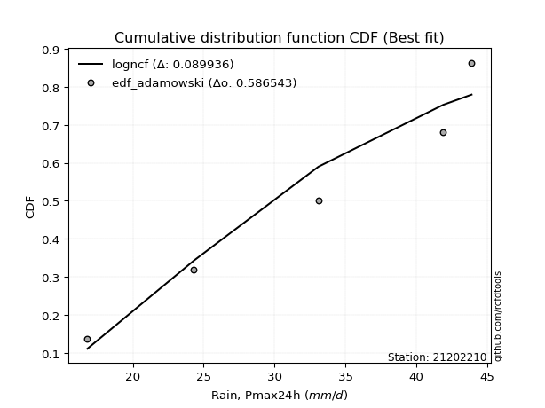</img>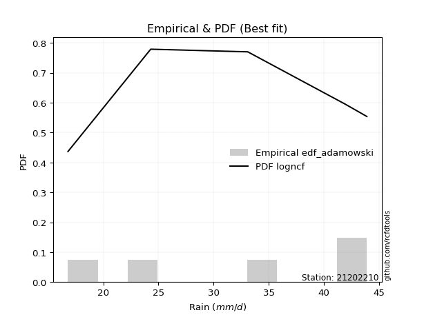</img>

</div>


## C. Best fit & Estimate extreme values for specific return periods - Tr

Best fit in probability distribution analysis means finding the theoretical distribution (like Normal, Poisson, Exponential, etc.) that most accurately mirrors your real-world data´s patterns (shape, center, spread) for better predictions, using methods like visual checks (Q-Q plots), goodness-of-fit tests (Kolmogorov-Smirnov, Chi-Squared), and information criteria (AIC) to score and select the simplest, most representative model.


### 1. Best fit (ordered by delta Δ)

:file_folder:Table: [bestfit_21202210.csv](table/bestfit_21202210.csv)

<div align="center">

|   id |   station | empirical_dist   | p_dist    |     delta |   deltao | eval   |   fit |   n |   best_fit |   best_fit_sort |
|-----:|----------:|:-----------------|:----------|----------:|---------:|:-------|------:|----:|-----------:|----------------:|
|    0 |  21202210 | edf_california   | genpareto | 0.0688641 | 0.586543 | Δo > Δ |     1 |   5 |          1 |               1 |
|    1 |  21202210 | edf_hazen        | ksone     | 0.0772789 | 0.586543 | Δo > Δ |     1 |   5 |          1 |               2 |
|    2 |  21202210 | edf_gringorten   | ksone     | 0.0819664 | 0.586543 | Δo > Δ |     1 |   5 |          1 |               3 |
|    3 |  21202210 | edf_cunnane      | logksone  | 0.0844146 | 0.586543 | Δo > Δ |     1 |   5 |          1 |               4 |
|    4 |  21202210 | edf_blom         | ksone     | 0.0868028 | 0.586543 | Δo > Δ |     1 |   5 |          1 |               5 |
|    5 |  21202210 | edf_tukey        | ksone     | 0.0897789 | 0.586543 | Δo > Δ |     1 |   5 |          1 |               6 |
|    6 |  21202210 | edf_adamowski    | logncf    | 0.0899363 | 0.586543 | Δo > Δ |     1 |   5 |          1 |               7 |
|    7 |  21202210 | edf_weibull      | logncf    | 0.0899363 | 0.586543 | Δo > Δ |     1 |   5 |          1 |               8 |
|    8 |  21202210 | edf_filliben     | ksone     | 0.0908857 | 0.586543 | Δo > Δ |     1 |   5 |          1 |               9 |
|    9 |  21202210 | edf_chegodayev   | logncf    | 0.0908887 | 0.586543 | Δo > Δ |     1 |   5 |          1 |              10 |
|   10 |  21202210 | edf_jenkinson    | ksone     | 0.0914053 | 0.586543 | Δo > Δ |     1 |   5 |          1 |              11 |
|   11 |  21202210 | edf_beard        | ksone     | 0.0914053 | 0.586543 | Δo > Δ |     1 |   5 |          1 |              12 |

</div>


### 2. Extreme values and % difference analysis

In hydrology, a return period (or recurrence interval $Tr$) is the statistical average time between extreme events like floods or droughts of a specific magnitude, indicating how rare an event is, with a 100-year flood, for example, having a 1% chance of occurring in any given year, not that it happens exactly every century. It is a key tool for infrastructure design (like bridges or dams) and risk assessment, calculated from historical data to determine the probability of future events, although it is important to remember it is statistical average, and events can cluster or be missed.

The extreme value porcentage difference is evaluated as $pdiff = 1 - (ETrBf / ETr) * 100$, where _ETrBf_ correspond to the bestfit extreme value for a specific recurrence interval and _ETr_ correspond to the extreme value for one of the most used PDFsused in hydrology.

> risk_rate: assuming the return period as the project useful life.

:file_folder:Table: [extreme_21202210.csv](table/extreme_21202210.csv), all PDFs.  
:file_folder:Table: [extremepdiff_21202210.csv](table/extremepdiff_21202210.csv), % difference between bestfit and most used PDFs in Hydrology.

<div align="center">

Extreme values table for only best fit PDFs
|   id |      tr |   prob_l |     prob_g |   alpha |   anglit |   arcsine |   argus |    beta |   betaprime |   bradford |    burr |   burr12 |   cosine |   crystalball |   dgamma |   dweibull |   erlang |   exponnorm |   exponpow |   exponweib |       f |   fatiguelife |   foldnorm |   gamma |   gausshyper |   genexpon |   genextreme |   gengamma |   genhalflogistic |   genlogistic |   gennorm |   genpareto |   gompertz |   gumbel_l |   gumbel_r |   halfgennorm |   halflogistic |   halfnorm |   hypsecant |   invgamma |   invgauss |     invweibull |   johnsonsb |   johnsonsu |   kappa3 |   kappa4 |   ksone |   kstwobign |   laplace |   levy_l |   loggamma |   logistic |   loglaplace |    lomax |   maxwell |   mielke |   moyal |   nakagami |     ncf |     nct |    norm |   pearson3 |   powerlaw |   rayleigh |   rdist |    rice |   semicircular |   skewnorm |       t |   trapezoid |   triang |   truncexpon |   truncnorm |   truncpareto |   truncweibull_min |   tukeylambda |   uniform |    vonmises |   vonmises_line |     wald |   weibull_max |   weibull_min |   wrapcauchy |   logalpha |   loganglit |   logarcsine |   logargus |   logbeta |   logbetaprime |   logbradford |   logburr |   logburr12 |   logcosine |   logcrystalball |   logdgamma |   logdweibull |   logerlang |   logexponnorm |      logexponpow |   logexponweib |    logf |   logfatiguelife |   logfoldnorm |   loggausshyper |   loggenexpon |   loggenextreme |   loggengamma |   loggenhalflogistic |   loggenlogistic |   loggennorm |   loggenpareto |   loggompertz |   loggumbel_l |   loggumbel_r |   loghalfgennorm |   loghalflogistic |   loghalfnorm |   loghypsecant |   loginvgamma |   loginvgauss |   loginvweibull |   logjohnsonsb |   logjohnsonsu |   logkappa3 |   logkappa4 |   logksone |   logkstwobign |   loglevy_l |   logloggamma |   loglogistic |   logloglaplace |         loglomax |   logmaxwell |   logmielke |   logmoyal |   lognakagami |   logncf |   lognct |   lognorm |   logpearson3 |   logpowerlaw |   lograyleigh |   logrdist |   logrice |   logsemicircular |   logskewnorm |    logt |   logtrapezoid |   logtriang |   logtruncexpon |   logtruncnorm |   logtruncpareto |   logtruncweibull_min |   logtukeylambda |   loguniform |   logvonmises |   logvonmises_line |   logwald |   logweibull_max |   logweibull_min |   logwrapcauchy |   station |   n |   risk_rate |
|-----:|--------:|---------:|-----------:|--------:|---------:|----------:|--------:|--------:|------------:|-----------:|--------:|---------:|---------:|--------------:|---------:|-----------:|---------:|------------:|-----------:|------------:|--------:|--------------:|-----------:|--------:|-------------:|-----------:|-------------:|-----------:|------------------:|--------------:|----------:|------------:|-----------:|-----------:|-----------:|--------------:|---------------:|-----------:|------------:|-----------:|-----------:|---------------:|------------:|------------:|---------:|---------:|--------:|------------:|----------:|---------:|-----------:|-----------:|-------------:|---------:|----------:|---------:|--------:|-----------:|--------:|--------:|--------:|-----------:|-----------:|-----------:|--------:|--------:|---------------:|-----------:|--------:|------------:|---------:|-------------:|------------:|--------------:|-------------------:|--------------:|----------:|------------:|----------------:|---------:|--------------:|--------------:|-------------:|-----------:|------------:|-------------:|-----------:|----------:|---------------:|--------------:|----------:|------------:|------------:|-----------------:|------------:|--------------:|------------:|---------------:|-----------------:|---------------:|--------:|-----------------:|--------------:|----------------:|--------------:|----------------:|--------------:|---------------------:|-----------------:|-------------:|---------------:|--------------:|--------------:|--------------:|-----------------:|------------------:|--------------:|---------------:|--------------:|--------------:|----------------:|---------------:|---------------:|------------:|------------:|-----------:|---------------:|------------:|--------------:|--------------:|----------------:|-----------------:|-------------:|------------:|-----------:|--------------:|---------:|---------:|----------:|--------------:|--------------:|--------------:|-----------:|----------:|------------------:|--------------:|--------:|---------------:|------------:|----------------:|---------------:|-----------------:|----------------------:|-----------------:|-------------:|--------------:|-------------------:|----------:|-----------------:|-----------------:|----------------:|----------:|----:|------------:|
|    0 |    2    | 0.5      | 0.5        | 31.4583 |  32      |   32      | 34.2058 | 33.0244 |     31.797  |    27.9066 | 33.9179 |  25.4305 |  31.6143 |       32      |  29.3666 |    29.708  |  31.8334 |     32      |    16.806  |     17.4933 | 31.9868 |       16.8    |    34.0729 | 31.7545 |      30.4603 |    27.3229 |      37.2767 |    17.6172 |           32.972  |           inf |     30.35 |     28.8483 |    40.0277 |    33.6933 |    30.3067 |       24.5581 |        29.4649 |    29.8902 |     32      |    31.1426 |    30.7474 | 8032.57        |     43.8506 |     43.8963 |  30.8972 |  30.2198 | 32      |     29.8091 |   32      |  39.6681 |    29.8667 |    32      |      30.1359 |  27.3453 |   31.1185 |  34.1625 | 29.7601 |    28.2762 | 31.0327 | 31.9913 | 32      |    32.4112 |    16.9314 |    30.8058 | 17.7976 | 31.4154 |        32      |    33.282  | 32      |     33.7684 |  31.8631 |      27.6639 |     32      |       17.5211 |            25.3011 |       30.3475 |   30.35   | -1.20609    |         29.6998 |  28.6589 |       43.4778 |       33.8639 |      30.3499 |    29.5629 |     30.1359 |      30.1359 |    32.9807 |   33.1875 |        28.5374 |       24.9544 |   33.9485 |     32.2717 |     29.3123 |          30.1359 |     28.6702 |       28.3874 |     29.8649 |        30.1358 |     18.0221      |        22.5587 | 30.1371 |          30.1485 |       28.3258 |         25.6423 |       27.7384 |         35.3124 |       22.6026 |              31.6074 |         inf      |      33.0992 |        7.13209 |       30.7829 |       31.9701 |       28.4069 |          25.3358 |           27.5846 |       27.9971 |        30.1359 |       29.8472 |       29.235  |         28.5737 |        25.3581 |        42.5281 |     30.0254 |     26.918  |    30.1359 |        27.7682 |     39.4341 |       33.8803 |       30.1359 |         33.1    |    342.41        |      29.2231 |     33.9093 |    27.8702 |       24.334  |  29.5513 |  30.1    |   30.1359 |       31.0757 |       16.9004 |       28.906  |    43.2341 |   29.7016 |           30.1359 |       30.903  | 30.1359 |        32.054  |     30.717  |         24.6096 |        36.9205 |          17.2748 |               21.3999 |          27.1547 |      27.1573 |     0.0565115 |            25.6433 |   26.8194 |          36.9044 |          32.0086 |         27.1573 |  21202210 |   5 |    0.75     |
|    1 |    2.33 | 0.570815 | 0.429185   | 33.3366 |  34.1424 |   35.2161 | 35.845  | 35.9508 |     33.6501 |    29.8331 | 35.693  |  27.8021 |  33.4515 |       33.8393 |  34.1085 |    34.759  |  33.6858 |     33.8393 |    16.8221 |     18.1604 | 33.8349 |       17.2114 |    34.254  | 33.6179 |      32.4159 |    29.6414 |      38.7683 |    18.4157 |           35.0261 |           inf |     30.35 |     32.0164 |    40.6069 |    35.2934 |    32.011  |       27.1526 |        31.2172 |    31.8752 |     33.472  |    33.0357 |    32.6755 |    1.04139e+06 |     43.8939 |     43.8993 |  32.8938 |  32.2234 | 34.5284 |     31.8447 |   33.113  |  40.9777 |    31.8771 |    33.6205 |      31.3294 |  29.673  |   33.0294 |  35.8871 | 31.3734 |    29.7833 | 32.9609 | 33.8324 | 33.8393 |    34.2323 |    17.1638 |    32.745  | 18.9864 | 33.3213 |        34.2978 |    34.9765 | 33.8392 |     35.8856 |  33.8529 |      29.5351 |     33.8393 |       17.867  |            27.2072 |       32.3498 |   32.2691 | -0.959283   |         31.7107 |  29.865  |       43.6844 |       35.5486 |      37.2777 |    31.6093 |     32.4751 |      33.715  |    34.7168 |   36.2485 |        30.969  |       26.7187 |   35.7409 |     34.0778 |     31.2864 |          32.1334 |     33.823  |       33.7683 |     31.8812 |        32.1333 |     19.1224      |        24.9829 | 32.1448 |          32.1418 |       30.3617 |         27.4858 |       29.946  |         37.0945 |       24.2299 |              33.6901 |         inf      |      34.487  |        9.34995 |       32.7272 |       33.806  |       30.1475 |          27.4734 |           29.3239 |       30.005  |        31.7242 |       31.8755 |       31.3066 |         30.8563 |        33.5371 |        43.5245 |     32.5991 |     28.9314 |    32.9155 |        29.9632 |     40.7659 |       35.6    |       31.8891 |         34.7441 |    665.29        |      31.238  |     35.73   |    29.4842 |       24.4251 |  32.2944 |  32.1081 |   32.1334 |       33.0757 |       17.0665 |       30.9296 |    49.0072 |   31.7444 |           32.6517 |       32.6838 | 32.1334 |        34.5117 |     32.5848 |         26.2922 |        37.6361 |          17.504  |               22.8338 |          29.1848 |      29.0689 |     0.0602166 |            27.672  |   27.9722 |          38.5711 |          33.8769 |         36.7596 |  21202210 |   5 |    0.729209 |
|    2 |    5    | 0.8      | 0.2        | 40.6193 |  41.7013 |   43.7923 | 40.627  | 42.4644 |     40.629  |    36.7962 | 40.6007 |  42.8292 |  40.072  |       40.6745 |  39.4692 |    40.2041 |  40.6822 |     40.6745 |    17.8428 |     29.3209 | 40.7159 |       25.9505 |    35.02   | 40.6666 |      38.7881 |    41.2334 |      42.2063 |    31.8098 |           40.4409 |           inf |     30.35 |     40.2544 |    42.4806 |    40.463  |    39.4152 |       44.408  |        39.1459 |    40.2698 |     39.3764 |    40.4797 |    40.4911 |    1.586e+15   |     43.9    |     43.9    |  39.3556 |  38.6627 | 42.7112 |     40.4916 |   38.678  |  43.1474 |    40.7876 |    39.8776 |      38.0438 |  41.3343 |   40.5504 |  40.6224 | 38.8465 |    37.6231 | 40.6963 | 40.6769 | 40.6745 |    40.7726 |    21.6744 |    40.5082 | 22.4957 | 40.6426 |        42.1391 |    39.9118 | 40.6744 |     41.9596 |  39.5614 |      36.4328 |     40.6745 |       21.3262 |            34.8392 |       38.7461 |   38.48   |  0.00534972 |         38.2193 |  36.6163 |       43.8884 |       41.002  |      42.5429 |    40.9    |     42.2766 |      45.4769 |    40.0737 |   42.7533 |        42.4037 |       34.1793 |   40.748  |     40.6387 |     39.5696 |          40.7886 |     40.4555 |       40.7979 |     40.8212 |        40.7884 |     36.8896      |        44.1792 | 40.8576 |          40.7859 |       40.3114 |         35.027  |       41.0524 |         41.5386 |       33.8377 |              39.7373 |         inf      |      42.4898 |       22.0124  |       40.4172 |       40.4886 |       39.0351 |          40.0404 |           38.6701 |       40.2164 |        38.9822 |       40.9044 |       40.9221 |         43.0875 |        43.7577 |        43.8971 |     42.54   |     36.4766 |    43.7929 |        41.3936 |     43.072  |       40.3875 |       39.67   |         44.7268 |  18419           |      40.6124 |     40.824  |    38.2681 |       28.0177 |  45.6121 |  40.8446 |   40.7886 |       41.01   |       20.2549 |       40.5526 |    68.6608 |   40.8384 |           42.9273 |       38.4767 | 40.7885 |        42.6593 |     38.5979 |         33.5903 |        40.4542 |          19.9065 |               30.2654 |          36.6898 |      36.2271 |     0.0763314 |            35.4047 |   35.4035 |          42.3421 |          40.6906 |         42.4818 |  21202210 |   5 |    0.67232  |
|    3 |   10    | 0.9      | 0.1        | 45.7311 |  45.9798 |   45.8627 | 42.6967 | 43.6158 |     45.3394 |    40.2186 | 42.4522 | inf      |  44.0719 |       45.2088 |  42.783  |    42.9177 |  45.4221 |     45.2088 |    23.7041 |     61.2098 | 45.292  |       38.0169 |    35.5868 | 45.4509 |      41.4996 |    51.7562 |      43.2134 |    69.6825 |           42.3181 |           inf |     30.35 |     42.6528 |    43.525  |    43.3411 |    45.4459 |       66.1717 |        45.7304 |    46.4816 |     44.0912 |    45.7989 |    46.2775 |    4.7805e+22  |     43.9    |     43.9    |  42.175  |  41.3901 | 46.2816 |     47.0751 |   43.7297 |  43.6713 |    48.2186 |    44.4857 |      45.3772 |  51.9537 |   45.8434 |  42.3971 | 45.353  |    44.1833 | 46.3421 | 45.2195 | 45.2088 |    44.9163 |    28.8554 |    46.0436 | 23.6514 | 45.6355 |        46.1627 |    41.9218 | 45.2087 |     44.3321 |  41.7911 |      39.9573 |     45.2088 |       26.8521 |            39.0305 |       41.4306 |   41.19   |  0.70692    |         41.0596 |  43.7811 |       43.8989 |       44.0455 |      43.289  |    48.9248 |     49.0835 |      48.884  |    42.5384 |   43.7141 |        52.7193 |       38.564  |   42.6555 |     44.8286 |     45.6027 |          47.7807 |     45.1457 |       44.8439 |     48.2804 |        47.7804 |    112.962       |        76.4432 | 47.9107 |          47.7776 |       49.2585 |         39.226  |       51.6703 |         42.9312 |       44.9337 |              41.9998 |         inf      |      51.4861 |       31.5002  |       45.7538 |       44.7661 |       48.1775 |          54.7793 |           48.6584 |       49.95   |        45.9532 |       48.4822 |       49.4744 |         56.5532 |        43.9195 |        43.8999 |     47.779  |     40.2071 |    49.6032 |        52.9405 |     43.6481 |       42.2054 |       46.5901 |         57.1262 | 375407           |      48.8504 |     42.7678 |    48.0216 |       38.8292 |  58.1684 |  47.9428 |   47.7807 |       46.633  |       26.1792 |       49.1929 |    74.6507 |   48.3991 |           49.3977 |       41.1206 | 47.7806 |        46.3412 |     41.2375 |         38.1008 |        42.0219 |          24.2954 |               35.7812 |          40.3219 |      39.8794 |     0.0895406 |            39.4241 |   45.4601 |          43.3424 |          45.0615 |         43.258  |  21202210 |   5 |    0.651322 |
|    4 |   15    | 0.933333 | 0.0666667  | 48.3717 |  47.8068 |   46.2576 | 43.447  | 43.7905 |     47.7142 |    41.4161 | 43.0392 | inf      |  45.8939 |       47.4715 |  44.5087 |    44.1867 |  47.817  |     47.4716 |    32.1076 |     96.185  | 47.5789 |       45.9085 |    35.8817 | 47.871  |      42.3649 |    57.9117 |      43.4874 |   110.752  |           42.884  |           inf |     30.35 |     43.2341 |    43.9981 |    44.6446 |    48.8483 |       81.6078 |        49.4567 |    49.7141 |     46.7819 |    48.5755 |    49.3556 |    7.92791e+26 |     43.9    |     43.9    |  43.1149 |  42.2716 | 47.4718 |     50.5701 |   46.6848 |  43.8295 |    52.4795 |    46.9964 |      50.3059 |  58.1805 |   48.5591 |  42.9586 | 49.1291 |    47.6936 | 49.3193 | 47.4869 | 47.4715 |    46.9268 |    32.7445 |    48.8957 | 23.9458 | 48.1537 |        47.7317 |    42.5831 | 47.4714 |     45.0934 |  42.5065 |      41.2204 |     47.4715 |       30.4238 |            40.5713 |       42.2937 |   42.0933 |  1.04438    |         42.0064 |  48.382  |       43.8997 |       45.4255 |      43.4999 |    53.6392 |     52.3145 |      49.5623 |    43.4555 |   43.8364 |        58.9383 |       40.2255 |   43.2626 |     46.8667 |     48.6478 |          51.7061 |     47.7913 |       46.8736 |     52.5587 |        51.7057 |    267.183       |       105.534  | 51.8757 |          51.7062 |       54.5365 |         40.7552 |       58.2296 |         43.3168 |       52.6533 |              42.6898 |         inf      |      57.6514 |       35.362   |       48.4508 |       46.8492 |       54.2507 |          65.215  |           55.4148 |       55.9141 |        50.4767 |       52.8466 |       54.5933 |         65.9312 |        43.926  |        43.9    |     49.6704 |     41.48   |    51.7065 |        60.3274 |     43.8236 |       42.7831 |       50.8559 |         66.3928 |      2.18957e+06 |      53.706  |     43.3895 |    54.7848 |       48.9435 |  65.9661 |  51.9428 |   51.7061 |       49.519  |       29.9801 |       54.3404 |    75.8817 |   52.7099 |           52.1776 |       42.0296 | 51.706  |        47.5886 |     42.1221 |         39.8666 |        42.6082 |          27.5661 |               38.1298 |          41.5479 |      41.1769 |     0.0970731 |            40.8629 |   53.3775 |          43.5889 |          47.1926 |         43.4788 |  21202210 |   5 |    0.644736 |
|    5 |   20    | 0.95     | 0.05       | 50.1346 |  48.8815 |   46.3967 | 43.8507 | 43.8444 |     49.2782 |    42.0258 | 43.3276 | inf      |  47.0144 |       48.9533 |  45.6742 |    44.9974 |  49.3961 |     48.9534 |    41.4703 |    131.03   | 49.0778 |       51.7513 |    36.0784 | 49.4676 |      42.7836 |    62.2791 |      43.6112 |   151.342  |           43.155  |           inf |     30.35 |     43.4733 |    44.2927 |    45.4559 |    51.2306 |       93.7841 |        52.0674 |    51.8693 |     48.6801 |    50.4399 |    51.4425 |    7.13961e+29 |     43.9    |     43.9    |  43.5848 |  42.7034 | 48.0669 |     52.9245 |   48.7814 |  43.9105 |    55.4951 |    48.7317 |      54.1242 |  62.6052 |   50.3614 |  43.2342 | 51.8033 |    50.0514 | 51.3281 | 48.9721 | 48.9533 |    48.2229 |    35.0687 |    50.7913 | 24.0698 | 49.8105 |        48.602  |    42.9129 | 48.9532 |     45.4689 |  42.8594 |      41.8703 |     48.9533 |       32.8049 |            41.3714 |       42.7157 |   42.545  |  1.24168    |         42.4798 |  51.8106 |       43.8999 |       46.2851 |      43.6018 |    57.0253 |     54.3136 |      49.8034 |    43.9543 |   43.8703 |        63.4698 |       41.0984 |   43.5624 |     48.1822 |     50.6206 |          54.4499 |     49.6626 |       48.2189 |     55.5872 |        54.4495 |    534.085       |       132.569  | 54.6492 |          54.4537 |       58.3187 |         41.5404 |       63.0614 |         43.4916 |       58.7533 |              43.0194 |         inf      |      62.486  |       37.4242  |       50.2239 |       48.1944 |       58.9531 |          73.5619 |           60.7    |       60.281  |        53.9332 |       55.9438 |       58.3098 |         73.4086 |        43.9271 |        43.9    |     50.6568 |     42.1139 |    52.7914 |        65.8761 |     43.9137 |       43.0671 |       54.0305 |         74.1137 |      7.6514e+06  |      57.192  |     43.7012 |    60.1432 |       57.8854 |  71.7498 |  54.745  |   54.4499 |       51.4311 |       32.4857 |       58.0564 |    76.3267 |   55.7481 |           53.7864 |       42.4903 | 54.4497 |        48.2163 |     42.5655 |         40.8083 |        42.9154 |          29.9632 |               39.4262 |          42.1567 |      41.8415 |     0.102399  |            41.6019 |   60.1616 |          43.6934 |          48.5697 |         43.5857 |  21202210 |   5 |    0.641514 |
|    6 |   25    | 0.96     | 0.04       | 51.4499 |  49.6098 |   46.4612 | 44.108  | 43.8671 |     50.4339 |    42.3952 | 43.499  | inf      |  47.8002 |       50.0441 |  46.5519 |    45.5857 |  50.5639 |     50.0442 |    51.1562 |    164.956  | 50.1818 |       56.3937 |    36.2247 | 50.649  |      43.0284 |    65.6667 |      43.6806 |   190.624  |           43.3134 |           inf |     30.35 |     43.5979 |    44.5023 |    46.0333 |    53.0656 |      103.935  |        54.0788 |    53.4729 |     50.1491 |    51.8363 |    53.0154 |    1.34718e+32 |     43.9    |     43.9    |  43.8667 |  42.9586 | 48.4239 |     54.688  |   50.4077 |  43.9614 |    57.8375 |    50.0592 |      57.2844 |  66.0411 |   51.6995 |  43.3979 | 53.8762 |    51.811  | 52.8372 | 50.0655 | 50.0441 |    49.1668 |    36.6002 |    52.1998 | 24.1352 | 51.0335 |        49.1666 |    43.1105 | 50.0439 |     45.6927 |  43.0697 |      42.2665 |     50.0441 |       34.4857 |            41.8615 |       42.9647 |   42.816  |  1.3696     |         42.7639 |  54.5568 |       43.8999 |       46.897  |      43.6621 |    59.6836 |     55.7116 |      49.9156 |    44.2742 |   43.8835 |        67.0627 |       41.6364 |   43.7428 |     49.1409 |     52.0516 |          56.5623 |     51.1187 |       49.2198 |     57.9398 |        56.5619 |    954.037       |       158.111  | 56.7856 |          56.5698 |       61.2788 |         42.0166 |       66.9175 |         43.5898 |       63.8714 |              43.2112 |         inf      |      66.523  |       38.6998  |       51.5313 |       49.1752 |       62.8513 |          80.63   |           65.1134 |       63.75   |        56.7699 |       58.3543 |       61.2497 |         79.7414 |        43.9275 |        43.9    |     51.2736 |     42.4911 |    53.4532 |        70.3641 |     43.9704 |       43.236  |       56.5921 |         80.8749 |      2.01939e+07 |      59.9256 |     43.893  |    64.6544 |       65.8754 |  76.3944 |  56.9058 |   56.5623 |       52.8479 |       34.2411 |       60.9809 |    76.5363 |   58.1004 |           54.8566 |       42.7689 | 56.5621 |        48.5942 |     42.8318 |         41.3937 |        43.1045 |          31.769  |               40.2473 |          42.5187 |      42.2453 |     0.106537  |            42.0517 |   66.2124 |          43.7493 |          49.574  |         43.6491 |  21202210 |   5 |    0.639603 |
|    7 |   50    | 0.98     | 0.02       | 55.3009 |  51.4027 |   46.5474 | 44.6828 | 43.8936 |     53.7644 |    43.1421 | 43.8392 | inf      |  49.8577 |       53.1678 |  49.1648 |    47.2379 |  53.9338 |     53.1678 |    98.3591 |    318.262  | 53.3461 |       71.2884 |    36.65   | 54.0599 |      43.4968 |    76.1896 |      43.8059 |   366.133  |           43.6191 |           inf |     30.35 |     43.7967 |    45.0714 |    47.6005 |    58.7183 |      139.447  |        60.2763 |    58.1338 |     54.7038 |    55.9508 |    57.6955 |    1.3802e+39  |     43.9    |     43.9    |  44.4306 |  43.4558 | 49.138  |     59.8665 |   55.4594 |  44.0759 |    65.1716 |    54.1152 |      68.3267 |  76.7352 |   55.5801 |  43.722  | 60.3111 |    56.9368 | 57.3039 | 53.197  | 53.1678 |    51.8215 |    40.0014 |    56.2883 | 24.2418 | 54.5497 |        50.4564 |    43.5054 | 53.1676 |     46.1367 |  43.487  |      43.0732 |     53.1678 |       38.5664 |            42.8647 |       43.45   |   43.358  |  1.64441    |         43.332  |  63.5232 |       43.9    |       48.5591 |      43.7815 |    68.1653 |     59.3082 |      50.0659 |    44.9946 |   43.8974 |        78.7164 |       42.7454 |   44.1221 |     51.8414 |     55.9933 |          63.0758 |     55.7052 |       52.1444 |     65.3073 |        63.0753 |   7158.18        |       271.94   | 63.3793 |          63.0989 |       70.6497 |         42.9739 |       79.5393 |         43.7672 |       82.1725 |              43.5778 |         inf      |      80.8599 |       41.3177  |       55.2803 |       51.9393 |       76.5555 |         106.344  |           80.8329 |       75.0086 |        66.5487 |       65.9278 |       70.7523 |        102.894  |        43.9278 |        43.9    |     52.6648 |     43.2296 |    54.8018 |        85.3892 |     44.0983 |       43.5705 |       65.196  |        107.283  |      4.11584e+08 |      68.6151 |     44.3208 |    80.9309 |       97.0395 |  91.8032 |  63.5866 |   63.0758 |       56.9363 |       38.4614 |       70.3318 |    76.8219 |   65.4203 |           57.3818 |       43.3309 | 63.0756 |        49.3529 |     43.3653 |         42.613  |        43.4942 |          36.5807 |               41.9959 |          43.2298 |      43.0647 |     0.119526  |            42.9659 |   90.5373 |          43.843  |          52.4063 |         43.7749 |  21202210 |   5 |    0.63583  |
|    8 |   75    | 0.986667 | 0.0133333  | 57.4206 |  52.1917 |   46.5634 | 44.9075 | 43.8975 |     55.5643 |    43.3935 | 43.9541 | inf      |  50.8403 |       54.8438 |  50.6315 |    48.1078 |  55.7576 |     54.8439 |   140.748  |    449.6    | 55.0457 |       80.2587 |    36.8815 | 55.9074 |      43.6434 |    82.3451 |      43.8424 |   514.706  |           43.7169 |           inf |     30.35 |     43.8448 |    45.3593 |    48.3931 |    62.0039 |      163.053  |        63.8789 |    60.671  |     57.3655 |    58.2317 |    60.3165 |    1.63953e+43 |     43.9    |     43.9    |  44.6186 |  43.6157 | 49.376  |     62.7157 |   58.4145 |  44.123  |    69.5257 |    56.4578 |      75.7481 |  83.0058 |   57.6899 |  43.8291 | 64.0742 |    59.7281 | 59.7911 | 54.8777 | 54.8438 |    53.2167 |    41.2428 |    58.5126 | 24.2684 | 56.4439 |        50.9716 |    43.6369 | 54.8436 |     46.2836 |  43.6251 |      43.3465 |     54.8438 |       40.1845 |            43.2062 |       43.6062 |   43.5387 |  1.74035    |         43.5213 |  69.0407 |       43.9    |       49.4002 |      43.8211 |    73.3132 |     60.9638 |      50.0939 |    45.2785 |   43.8991 |        85.9183 |       43.1252 |   44.2714 |     53.2634 |     57.9797 |          66.8747 |     58.454  |       53.7543 |     69.682  |        66.8741 |  26544.5         |       372.015  | 67.2289 |          66.9098 |       76.2726 |         43.2913 |       87.4026 |         43.819  |       94.7747 |              43.693  |         inf      |      90.6789 |       42.1997  |       57.2919 |       53.3957 |       85.8551 |         124.408  |           91.6606 |       81.952  |        73.0256 |       70.4424 |       76.6049 |        119.326  |        43.9278 |        43.9    |     53.2636 |     43.467  |    55.2589 |        94.9833 |     44.151  |       43.6811 |       70.749  |        127.622  |      2.40057e+09 |      73.8571 |     44.5042 |    92.2868 |      120.174  | 101.577  |  67.4954 |   66.8747 |       59.1417 |       40.1199 |       76.0079 |    76.8763 |   69.7328 |           58.4228 |       43.5198 | 66.8745 |        49.6067 |     43.5434 |         43.0345 |        43.6276 |          38.6703 |               42.6124 |          43.4605 |      43.3414 |     0.127281  |            43.2751 |  109.761  |          43.8677 |          53.8996 |         43.8166 |  21202210 |   5 |    0.634587 |
|    9 |  100    | 0.99     | 0.01       | 58.876  |  52.6609 |   46.5689 | 45.0322 | 43.8987 |     56.7867 |    43.5197 | 44.0142 | inf      |  51.4562 |       55.9774 |  51.6503 |    48.6906 |  56.9973 |     55.9775 |   178.712  |    565.555  | 56.196  |       86.7131 |    37.0392 | 57.1638 |      43.7138 |    86.7125 |      43.8594 |   644.913  |           43.7648 |           inf |     30.35 |     43.8646 |    45.5475 |    48.9114 |    64.3293 |      181.087  |        66.4288 |    62.3995 |     59.2535 |    59.8042 |    62.1337 |    1.25514e+46 |     43.9    |     43.9    |  44.7128 |  43.6939 | 49.495  |     64.6678 |   60.5111 |  44.1505 |    72.652  |    58.1117 |      81.4976 |  87.4616 |   59.127  |  43.8825 | 66.7439 |    61.6282 | 61.5098 | 56.0145 | 55.9774 |    54.149  |    41.8849 |    60.028  | 24.2795 | 57.7277 |        51.2601 |    43.7027 | 55.9772 |     46.357  |  43.694  |      43.484  |     55.9774 |       41.0501 |            43.3783 |       43.6828 |   43.629  |  1.78884    |         43.616  |  73.0635 |       43.9    |       49.9505 |      43.8408 |    77.061  |     61.9701 |      50.1036 |    45.4365 |   43.8996 |        91.2169 |       43.3171 |   44.36   |     54.2147 |     59.2604 |          69.573  |     60.4415 |       54.8608 |     72.8236 |        69.5724 |  70825.1         |       463.819  | 69.9649 |          69.618  |       80.3323 |         43.4485 |       93.2089 |         43.8429 |      104.675  |              43.7488 |         inf      |      98.3777 |       42.6388  |       58.6515 |       54.3704 |       93.112  |         138.782  |          100.19   |       87.0467 |        77.9986 |       73.6922 |       80.9033 |        132.519  |        43.9278 |        43.9    |     53.6363 |     43.5826 |    55.4888 |       102.172  |     44.1818 |       43.7362 |       74.9521 |        144.91   |      8.38874e+09 |      77.6551 |     44.6182 |   101.297  |      139.033  | 108.884  |  70.2771 |   69.573  |       60.6348 |       41.004  |       80.1351 |    76.8956 |   72.814  |           59.0139 |       43.6146 | 69.5727 |        49.7337 |     43.6325 |         43.2482 |        43.695  |          39.8336 |               42.9274 |          43.574  |      43.4803 |     0.132877  |            43.4305 |  126.303  |          43.8783 |          54.8992 |         43.8374 |  21202210 |   5 |    0.633968 |
|   10 |  200    | 0.995    | 0.005      | 62.2444 |  53.5473 |   46.5743 | 45.2476 | 43.8998 |     59.5748 |    43.7095 | 44.1181 | inf      |  52.7084 |       58.5488 |  54.0442 |    49.9977 |  59.8281 |     58.5489 |   301.2    |    938.105  | 58.8072 |      102.512  |    37.3999 | 60.0342 |      43.8141 |    97.2354 |      43.8824 |  1058.94   |           43.8347 |           inf |     30.35 |     43.8879 |    45.9568 |    50.0382 |    69.9198 |      228.993  |        72.5589 |    66.3526 |     63.8021 |    63.4634 |    66.3908 |    1.07659e+53 |     43.9    |     43.9    |  44.8574 |  43.8078 | 49.6735 |     69.1641 |   65.5628 |  44.2026 |    80.3331 |    62.0791 |      97.2072 |  98.2205 |   62.4148 |  43.9642 | 73.1761 |    65.9672 | 65.5199 | 58.5937 | 58.5488 |    56.2295 |    42.8755 |    63.4953 | 24.2928 | 60.6466 |        51.7632 |    43.8014 | 58.5485 |     46.4667 |  43.7972 |      43.6914 |     58.5488 |       42.4254 |            43.6381 |       43.7949 |   43.7645 |  1.86203    |         43.7581 |  83.0839 |       43.9    |       51.1473 |      43.8704 |    86.4497 |     63.9167 |      50.1131 |    45.7102 |   43.8999 |       104.679  |       43.6073 |   44.5398 |     56.3419 |     61.9525 |          76.104  |     65.3771 |       57.4273 |     80.5433 |        76.1033 | 879185           |       784.522  | 76.5931 |          76.1773 |       90.3729 |         43.6809 |      108.013  |         43.8754 |      132.219  |              43.8289 |         inf      |     119.785  |       43.289   |       61.7306 |       56.5506 |      113.168  |         179.523  |          124.086  |       99.9212 |        91.4147 |       81.7056 |       91.8017 |        170.516  |        43.9278 |        43.9    |     54.4326 |     43.7501 |    55.8356 |       120.868  |     44.2402 |       43.8186 |       86.0809 |        199.533  |      1.70976e+11 |      87.0951 |     44.8611 |   126.786  |      193.801  | 127.877  |  77.0279 |   76.104  |       64.0183 |       42.4043 |       90.4414 |    76.9146 |   80.3302 |           60.0589 |       43.757  | 76.1037 |        49.9245 |     43.7662 |         43.5726 |        43.797  |          41.7495 |               43.4084 |          43.7407 |      43.6897 |     0.146759  |            43.6646 |  179.174  |          43.8917 |          57.1365 |         43.8687 |  21202210 |   5 |    0.633042 |
|   11 |  250    | 0.996    | 0.004      | 63.2929 |  53.7729 |   46.575  | 45.2977 | 43.8999 |     60.4311 |    43.7475 | 44.1442 | inf      |  53.0517 |       59.3346 |  54.7993 |    50.3934 |  60.6984 |     59.3347 |   350.983  |   1090.41   | 59.6058 |      107.661  |    37.5109 | 60.9171 |      43.833  |   100.623  |      43.8866 |  1226.77   |           43.8484 |           inf |     30.35 |     43.8914 |    46.0772 |    50.3697 |    71.7171 |      245.771  |        74.5297 |    67.5688 |     65.2663 |    64.6077 |    67.7297 |    1.82399e+55 |     43.9    |     43.9    |  44.8885 |  43.8299 | 49.7092 |     70.5556 |   67.1891 |  44.2162 |    82.8553 |    63.3529 |     102.883  | 101.691  |   63.4269 |  43.9817 | 75.2468 |    67.2997 | 66.7767 | 59.382  | 59.3346 |    56.856  |    43.0777 |    64.5626 | 24.2948 | 61.5404 |        51.8812 |    43.8211 | 59.3343 |     46.4886 |  43.8178 |      43.733  |     59.3346 |       42.7121 |            43.6903 |       43.8167 |   43.7916 |  1.87671    |         43.7865 |  86.3989 |       43.9    |       51.4996 |      43.8763 |    89.5885 |     64.4219 |      50.1142 |    45.7742 |   43.9    |       109.235  |       43.6657 |   44.5914 |     56.9836 |     62.7116 |          78.2196 |     67.0147 |       58.2279 |     83.0787 |        78.2189 |      2.06173e+06 |       927.59   | 78.7418 |          78.3035 |       93.6875 |         43.7265 |      113.034  |         43.8812 |      142.317  |              43.8442 |         inf      |     127.642  |       43.4166  |       62.6698 |       57.2086 |      120.493  |         194.711  |          132.919  |      104.253  |        96.2066 |       84.3457 |       95.4843 |        184.911  |        43.9278 |        43.9    |     54.6705 |     43.7823 |    55.9052 |       127.32   |     44.2555 |       43.8351 |       89.993  |        222.125  |      4.51247e+11 |      90.2259 |     44.9332 |   136.286  |      214.524  | 134.439  |  79.2199 |   78.2196 |       65.0494 |       42.6955 |       93.8731 |    76.9169 |   82.7817 |           60.3067 |       43.7856 | 78.2193 |        49.9627 |     43.793  |         43.638  |        43.8175 |          42.1597 |               43.5059 |          43.7734 |      43.7317 |     0.151365  |            43.7116 |  201.148  |          43.8939 |          57.812  |         43.875  |  21202210 |   5 |    0.632858 |
|   12 |  500    | 0.998    | 0.002      | 66.456  |  54.3323 |   46.5759 | 45.4127 | 43.9    |     62.982  |    43.8237 | 44.2136 | inf      |  53.9652 |       61.6649 |  57.1046 |    51.5577 |  63.2934 |     61.665  |   541.73   |   1683.58   | 61.9756 |      123.814  |    37.8417 | 63.551  |      43.8691 |   111.146  |      43.8942 |  1874.8    |           43.875  |           inf |     30.35 |     43.8971 |    46.4225 |    51.3201 |    77.2955 |      302.17   |        80.6466 |    71.1948 |     69.8145 |    68.0757 |    71.8071 |    1.51113e+62 |     43.9    |     43.9    |  44.9608 |  43.8728 | 49.7807 |     74.7256 |   72.2408 |  44.2512 |    90.8612 |    67.3031 |     122.715  | 112.493  |   66.447  |  44.0223 | 81.6788 |    71.265  | 70.5918 | 61.72   | 61.6649 |    58.688  |    43.4861 |    67.7472 | 24.2982 | 64.1953 |        52.1529 |    43.8605 | 61.6646 |     46.5324 |  43.8589 |      43.8164 |     61.6649 |       43.2977 |            43.795  |       43.8595 |   43.8458 |  1.9061     |         43.8433 |  96.9396 |       43.9    |       52.5099 |      43.8882 |    99.7317 |     65.6916 |      50.1157 |    45.921  |   43.9    |       124.13   |       43.7829 |   44.7413 |     58.8644 |     64.7773 |          84.8456 |     72.2697 |       60.6497 |     91.1271 |        84.8448 |      3.25286e+07 |      1553.2    | 85.4766 |          84.9664 |      104.255  |         43.816  |      129.466  |         43.8919 |      178.078  |              43.8737 |         inf      |     155.556  |       43.6669  |       65.4489 |       59.1375 |      146.385  |         249.431  |          164.544  |      118.314  |       112.753  |       92.7535 |      107.51   |        237.8    |        43.9278 |        43.9    |     55.3816 |     43.8445 |    56.0447 |       148.791  |     44.2948 |       43.868  |      103.293  |        314.323  |      9.19713e+12 |     100.253  |     45.1474 |   170.578  |      289.815  | 156.343  |  86.1017 |   84.8456 |       68.0927 |       43.2898 |      104.906  |    76.9201 |   90.5099 |           60.8812 |       43.8428 | 84.8452 |        50.0391 |     43.8465 |         43.7694 |        43.8587 |          43.0093 |               43.7021 |          43.8378 |      43.8157 |     0.166177  |            43.8057 |  290.578  |          43.8977 |          59.7929 |         43.8875 |  21202210 |   5 |    0.632489 |
|   13 |  750    | 0.998667 | 0.00133333 | 68.249  |  54.5799 |   46.576  | 45.4588 | 43.9    |     64.4066 |    43.8491 | 44.2492 | inf      |  54.4079 |       62.9594 |  58.4287 |    52.199  |  64.7441 |     62.9595 |   680.729  |   2126.87   | 63.2931 |      133.357  |    38.0266 | 65.0243 |      43.8803 |   117.301  |      43.8964 |  2354.67   |           43.8837 |           inf |     30.35 |     43.8984 |    46.607  |    51.828  |    80.5566 |      338.205  |        84.2225 |    73.2205 |     72.475  |    70.0514 |    74.1418 |    1.67385e+66 |     43.9    |     43.9    |  44.9933 |  43.8867 | 49.8045 |     77.0682 |   75.1959 |  44.2678 |    95.6727 |    69.6109 |     136.044  | 118.827  |   68.1362 |  44.0404 | 85.4413 |    73.475  | 72.769  | 63.019  | 62.9594 |    59.6893 |    43.6234 |    69.5279 | 24.299  | 65.6727 |        52.2622 |    43.8737 | 62.9591 |     46.547  |  43.8726 |      43.8442 |     62.9594 |       43.4966 |            43.83   |       43.8734 |   43.8639 |  1.9159     |         43.8622 | 103.26   |       43.9    |       53.0501 |      43.8921 |   105.959  |     66.2617 |      50.116  |    45.9799 |   43.9    |       133.394  |       43.8221 |   44.8245 |     59.8951 |     65.8027 |          88.766  |     75.4702 |       62.0268 |     95.965  |        88.7651 |      1.75036e+08 |      2093.11   | 89.4648 |          88.9115 |      110.636  |         43.845  |      139.687  |         43.895  |      202.443  |              43.8831 |          43.8789 |     174.683  |       43.748   |       66.9883 |       60.195  |      164.027  |         287.464  |          186.412  |      126.979  |       123.722  |       97.8267 |      114.982  |        275.472  |        43.9278 |        43.9    |     55.7873 |     43.8643 |    56.0912 |       162.405  |     44.3135 |       43.8789 |      111.955  |        389.052  |      5.36423e+13 |     106.34   |     45.2683 |   194.509  |      342.357  | 170.303  |  90.1848 |   88.766  |       69.7708 |       43.4914 |      111.631  |    76.9207 |   95.1165 |           61.1139 |       43.8618 | 88.7656 |        50.0646 |     43.8643 |         43.8134 |        43.8724 |          43.3015 |               43.7679 |          43.8589 |      43.8438 |     0.175238  |            43.8371 |  362.279  |          43.8987 |          60.8793 |         43.8917 |  21202210 |   5 |    0.632366 |
|   14 | 1000    | 0.999    | 0.001      | 69.4987 |  54.7275 |   46.5761 | 45.4846 | 43.9    |     65.3906 |    43.8619 | 44.2732 | inf      |  54.6872 |       63.8507 |  59.3587 |    52.6384 |  65.7468 |     63.8508 |   792.538  |   2490.51   | 64.2006 |      140.165  |    38.1542 | 66.043  |      43.8857 |   121.669  |      43.8975 |  2746.15   |           43.8879 |           inf |     30.35 |     43.899  |    46.7312 |    52.1699 |    82.8698 |      365.154  |        86.759  |    74.6195 |     74.3626 |    71.4327 |    75.7787 |    1.23759e+69 |     43.9    |     43.9    |  45.0138 |  43.8934 | 49.8164 |     78.6911 |   77.2925 |  44.2783 |    99.1477 |    71.2475 |     146.37   | 123.327  |   69.3036 |  44.0518 | 88.1109 |    74.9991 | 74.2923 | 63.9134 | 63.8507 |    60.3718 |    43.6923 |    70.7586 | 24.2994 | 66.6909 |        52.3237 |    43.8803 | 63.8504 |     46.5543 |  43.8795 |      43.8582 |     63.8507 |       43.5967 |            43.8475 |       43.8803 |   43.8729 |  1.9208     |         43.8717 | 107.806  |       43.9    |       53.4137 |      43.8941 |   110.518  |     66.6038 |      50.1161 |    46.0129 |   43.9    |       140.229  |       43.8417 |   44.8823 |     60.599  |     66.4579 |          91.5699 |     77.8015 |       62.9886 |     99.4593 |        91.569  |      5.93702e+08 |      2583.08   | 92.3189 |          91.7344 |      115.256  |         43.8593 |      147.223  |         43.8965 |      221.461  |              43.8876 |          43.8844 |     189.686  |       43.7878  |       68.0461 |       60.9173 |      177.816  |         317.529  |          203.663  |      133.331  |       132.145  |      101.5    |      120.491  |        305.76   |        43.9278 |        43.9    |     56.0736 |     43.8738 |    56.1145 |       172.56   |     44.3252 |       43.8844 |      118.535  |        454.775  |      1.87452e+14 |     110.761  |     45.3529 |   213.498  |      383.868  | 180.762  |  93.1101 |   91.5699 |       70.9196 |       43.5928 |      116.529  |    76.9209 |   98.426  |           61.2451 |       43.8714 | 91.5695 |        50.0774 |     43.8732 |         43.8354 |        43.8793 |          43.4494 |               43.8008 |          43.8693 |      43.8579 |     0.181866  |            43.8529 |  424.561  |          43.8991 |          61.6216 |         43.8937 |  21202210 |   5 |    0.632305 |


</div>


<div align="center">

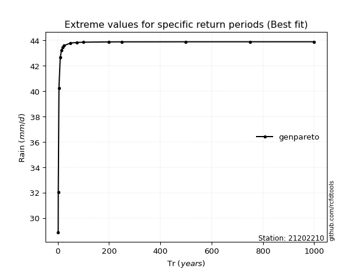</img>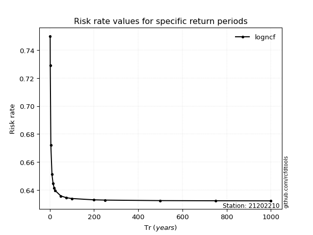</img>

</div>


<sub>**APP DISCLAIMER**: NO WARRANTY - This software is provided by [github.com/rcfdtools](https://github.com/rcfdtools) "as is", without any express or implied warranty, including warranties of merchantability, fitness for a particular purpose, or non-infringement. There is no guarantee that the software will be error-free or operate without interruption. LIMITATION OF LIABILITY - Neither the authors nor copyright holders will be liable for claims or damages arising from the software or its use. You are responsible for determining if the software is appropriate for your use and assume all associated risks, including errors, legal compliance, and data loss. NO PROFESSIONAL ADVICE - The software provides general information and does not offer professional advice. It should not replace consultation with professional advisors.</sub>