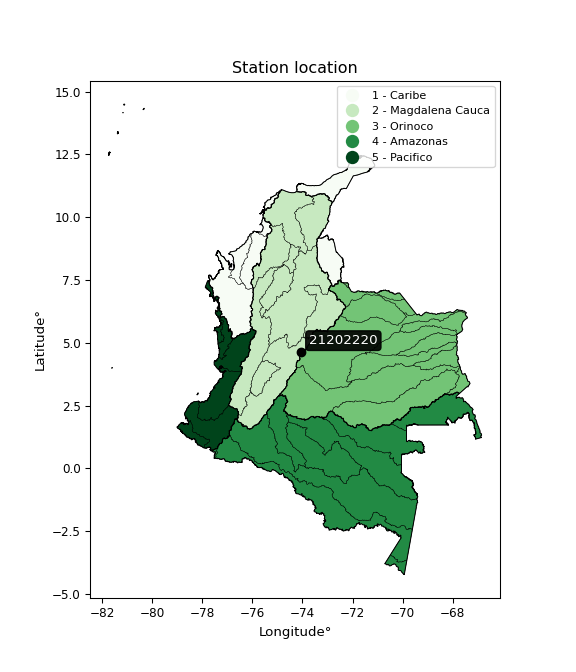

<div align="center">


</div>

# PMP Station (Rain, Pmax24h): 21202220

Probable Maximum Precipitation (PMP) is the greatest amount of rainfall for a specific duration that is meteorologically possible for a given location, acting as a "worst-case" scenario for extreme storms, crucial for designing safety-critical infrastructure like bridges, river deviations, dams, spillways, and nuclear plants to prevent catastrophic failure. PMP is calculated by hydrologists using meteorological data to determine the upper limit of extreme rainfall, often leading to the Probable Maximum Flood (PMF) for flood control design, and is increasingly being studied for climate change impacts. Probable Maximum Precipitation (PMP) is the theoretical upper limit of rainfall, a deterministic estimate for extreme events, while probability distributions (like GEV, Gumbel) describe the likelihood and frequency of various precipitation amounts, including rare ones, showing how often events occur, with PMP representing the extreme end of these distributions, used for critical infrastructure design to ensure safety against the worst conceivable weather, unlike standard statistical forecasts which cover typical probabilities.

The most common probability distributions in hydrology, used for analyzing floods, rainfall, and streamflow, include the Normal, Log-Normal, Gumbel, Gamma (including Log-Pearson Type III), and Generalized Extreme Value (GEV) distributions, often chosen based on the data´s skewness and whether modeling extremes or general conditions, with Gumbel and GEV popular for extreme events like floods, while the Normal distribution serves as a baseline, though often requiring transformations for skewed hydrological data. These distributions help in designing water infrastructure, managing water resources, and forecasting hydrologic events.

> Hydrological data often isn´t perfectly normal (it´s skewed), so different distributions are needed for different applications, such as: **Flood Frequency Analysis**: Using Gumbel, GEV, or Log-Pearson Type III for predicting extreme flood magnitudes and their return periods, **Rainfall Analysis**: Normal for annual totals, but Log-Normal, Weibull, or GEV for intensity or extreme daily rainfall, **Streamflow Modeling**: Gamma and Log-Normal for maximum flows, GEV for minimum flows, and Kappa for daily flows.

<div align="center">

</img>

</div>


## A. General information


### 1. General running parameters

• app_version: _v20260113_. • runtime: _2026-01-17 18:24:04.630693_. • Python version: _3.14.0_. • SciPy version: _1.16.3_. • Pandas version: _2.3.3_. • NumPy version: _2.3.5_. • Stations dataset (station_dataset_file): _dataset/pmax24h_in/automatic_colombia_2003_2025.csv_. • Stations catalog (station_catalog_file): _dataset/CNE.xls_. • Minimum year to eval til year_max (date_min): _1900_. • Maximum year to eval since year_min (date_max): _2025_. • Creates, save and include plots into reports (create_plot): _False_. • Plot only fit distributions with Δo > Δ (plot_only_fit): _True_. • Plot only simple graphs avoiding multiple CDFs and multiple Extreme values plots (plot_only_simple): _True_. • Eval low extreme values, if False, evaluates high extreme values (low_extreme): _False_. • Eval every SciPy distribution as logarithmic (pdist_logarithmic_on): _True_. • Standard deviation normalized (ddof): _1.0_. • Return periods to eval in years (Tr): _[2, 2.33, 5, 10, 15, 20, 25, 50, 75, 100, 200, 250, 500, 750, 1000]_. • Minimum data sample per station, 0 means any (minimum_sample): _5_. • Z-Score maximum threshold to adjust a value, 0 means disable (zscore_max): _3.5_. • Z-Score minimum threshold to adjust a value, 0 means disable (zscore_min): _-2.5_. • Avoid zeros, e.g. rain = 0 (avoid_zeros): _True_. • Avoid null values (avoid_nans): _True_. 

:file_folder:Table: [dataset.csv](../../dataset/pmax24h_in/automatic_colombia_2003_2025.csv)

> Delta Degrees of Freedom (DDOF): is a parameter used in the formulas for calculating variance and standard deviation. When ddof=0, the divisor is $N$ (the total number of observations) and this is used when your data set is the entire population. When ddof=1, the divisor is $N-1$ and this is used when your data set is a sample drawn from a larger population. Using $N-1$ provides an unbiased estimate of the population variance (known as Bessel´s correction).


### 2. Station info and location

|   id |   CODIGO | NOMBRE                   | CATEGORIA               | TECNOLOGIA                | ESTADO   | FECHA_INSTALACION   |   FECHA_SUSPENSION |   ALTITUD |   LATITUD |   LONGITUD | DEPARTAMENTO   | MUNICIPIO   | AREA_OPERATIVA                            | ENTIDAD                                                          | AREA_HIDROGRAFICA   | ZONA_HIDROGRAFICA   | SUBZONA_HIDROGRAFICA   |   CORRIENTE | Catalogo   |   Version |
|-----:|---------:|:-------------------------|:------------------------|:--------------------------|:---------|:--------------------|-------------------:|----------:|----------:|-----------:|:---------------|:------------|:------------------------------------------|:-----------------------------------------------------------------|:--------------------|:--------------------|:-----------------------|------------:|:-----------|----------:|
|    0 | 21202220 | PARAISO - AUT [21202220] | Climatológica Ordinaria | Automática con Telemetría | Activa   | 01/10/2000          |                nan |      2747 |   4.62789 |   -74.0587 | Bogotá         | Bogotá, D.C | Area Operativa 11 - Cundinamarca-Amazonas | FONDO DE PREVENCION Y ATENCION DE DESASTRES DE BOGOTA DC - FOPAE | Magdalena Cauca     | Alto Magdalena      | Río Bogotá             |         nan | CNE_OE     |  20251226 |

<div align="center">

Dynamic map: [:earth_americas:Google](http://maps.google.com/maps?q=4.62789,-74.0587) [:earth_americas:OSM](https://www.openstreetmap.org/#map=18/4.62789/-74.0587&layers=P) [:earth_americas:Bing](https://www.bing.com/maps?cp=4.62789~-74.0587&lvl=18) [:earth_americas:Apple](https://maps.apple.com/frame?center=4.62789%2C-74.0587&span=0.003%2C0.006)

</div>


<div align="center">

```geojson
{
  "type": "Feature",
  "geometry": {
    "type": "Point", 
    "coordinates": [-74.0587, 4.62789]
  }, 
  "properties": {
    "Name": "21202220"
  }
}
```

</div>


### 3. Discrete values table and plot

<div align="center">

|               |          0 |           1 |           2 |           3 |           4 |          5 |            6 |           7 |          8 |          9 |          10 |          11 |
|:--------------|-----------:|------------:|------------:|------------:|------------:|-----------:|-------------:|------------:|-----------:|-----------:|------------:|------------:|
| Date          | 2008       | 2009        | 2010        | 2011        | 2012        | 2013       | 2014         | 2015        | 2016       | 2023       | 2024        | 2025        |
| Value         |   74.8     |   51.6      |   57.4      |   51.3      |   37.8      |   64.2     |   42         |   25.3      |   19.4     |    0.9     |   52        |   44.6      |
| Value_initial |   74.8     |   51.6      |   57.4      |   51.3      |   37.8      |   64.2     |   42         |   25.3      |   19.4     |    0.9     |   52        |   44.6      |
| count         |   12       |   12        |   12        |   12        |   12        |   12       |   12         |   12        |   12       |   12       |   12        |   12        |
| mean          |   43.4417  |   43.4417   |   43.4417   |   43.4417   |   43.4417   |   43.4417  |   43.4417    |   43.4417   |   43.4417  |   43.4417  |   43.4417   |   43.4417   |
| std           |   20.3667  |   20.3667   |   20.3667   |   20.3667   |   20.3667   |   20.3667  |   20.3667    |   20.3667   |   20.3667  |   20.3667  |   20.3667   |   20.3667   |
| zscore        |    1.53969 |    0.400573 |    0.685352 |    0.385843 |   -0.277005 |    1.01923 |   -0.0707856 |   -0.890753 |   -1.18044 |   -2.08879 |    0.420213 |    0.056874 |


</div>


> The initial value (value_initial) correspond to the initial obtained or null completed value, and value (value) is adjusted only when the initial value is outside the valid range (outlier) definite through the Z-Score value. If Z-Score is active, values out of range or outliers are replaced with the station mean value. A Z-Score (or standard score) measures how many standard deviations a data point is from the mean of a dataset, indicating its relative position; positive scores mean above the mean, negative mean below, and a score of zero is exactly at the mean, allowing for comparison of values from different distributions. It´s calculated using the formula $z=(x–μ)/σ$, where $x$ is the data point, $μ$ is the mean, and $σ$ is the standard deviation, helping identify outliers and understand probability.
>
> <sub>**Note**: In this study, "completing" (filling gaps in) and "extending" (forecasting or lengthening the historical record) rainfall data series are avoided for certain critical analyses because they introduce artificial bias and uncertainty, which can distort the statistics of rare events (extremes), alter day-to-day variability, and compromise the integrity and homogeneity of the original data. Some reasons against Completing/Extending rainfall data are: **Distortion of Extremes and Variability**: The primary issue is that most gap-filling or extension methods rely on averaging or regression with nearby stations, which inherently smooths the data. Rainfall is highly variable in space and time, with a large percentage of zero values and occasional large storms. Infilling methods often underestimate the highest values and overestimate the lowest (zero) values, which severely distorts analyses focused on flood frequency, drought severity, and intensity-duration-frequency (IDF) curves, **Loss of Data Homogeneity**: Infilled or extended data are synthetic estimates, not actual measurements. Combining these estimates with observed data can violate the assumption of data homogeneity, which requires that the data properties do not change over time. Inhomogeneity can lead to incorrect conclusions about long-term trends or changes in climate patterns, **Propagation of Errors**: Errors and biases from the original data (e.g., wind-induced undercatch, instrument errors, site changes) or the data used for imputation can propagate through the analysis, leading to unreliable hydrological models and inaccurate predictions, **Compromised Statistical Integrity**: For statistical analyses, especially those involving the frequency of events, using artificial data can introduce time bias or autocorrelation that doesn´t exist in reality, making it difficult to assess the true probability of events, **Difficulty in Validation**: It is difficult to accurately validate the quality of filled or extended data, especially for past periods where ground-truth measurements are unavailable. The reliability of imputation techniques heavily depends on the density of the surrounding station network and the complexity of the local topography.</sub>


### 4. Active continuous probability distributions from SciPy (80 of 104 available)

A Probability Density Function (PDF) describes the relative likelihood of a continuous random variable falling within a specific range, where the total area under its curve equals 1, and the area over any interval gives the actual probability for that range. Unlike discrete probabilities (like rolling a die), a PDF shows density, not direct probability for a single point (which is zero), with higher points indicating higher likelihood, often visualized as a bell curve for normal distributions.

A log of a probability density function (log-PDF) is simply the logarithm of the PDF´s value, denoted as $log(f(x))$, useful for converting multiplication of probabilities into addition, improving numerical stability with tiny numbers, and connecting to information theory concepts like entropy. Instead of dealing with very small probabilities (e.g., 0.000001), log-PDFs use negative numbers (e.g., $log(0.00001) ≈ -11.51$ that are easier for computers to handle, preventing underflow errors and simplifying complex calculations. In this study, each active probability distribution from SciPy is also evaluated in the $log$ form.

[scipy.stats](https://docs.scipy.org/doc/scipy/reference/stats.html) is a Python´s powerful submodule within the SciPy library for comprehensive statistical analysis, offering over 130 probability distributions (like Normal, Poisson), functions for descriptive stats (mean, variance), hypothesis testing (t-tests, chi-square), random variable generation, and statistical tests, making it essential for data science, modeling, and research. It provides tools to explore, model, and draw conclusions from data efficiently, working seamlessly with NumPy.

<div align="center">

|   id | p_dist           |   n_parameter | fit_method   | label                                                                       | active   | ref                                                                                                      |
|-----:|:-----------------|--------------:|:-------------|:----------------------------------------------------------------------------|:---------|:---------------------------------------------------------------------------------------------------------|
|    0 | alpha            |             3 | MLE          | Alpha                                                                       | True     | [:mortar_board:](https://docs.scipy.org/doc/scipy/reference/generated/scipy.stats.alpha.html)            |
|    1 | anglit           |             2 | MM           | Anglit                                                                      | True     | [:mortar_board:](https://docs.scipy.org/doc/scipy/reference/generated/scipy.stats.anglit.html)           |
|    2 | arcsine          |             2 | MM           | Arcsine                                                                     | True     | [:mortar_board:](https://docs.scipy.org/doc/scipy/reference/generated/scipy.stats.arcsine.html)          |
|    3 | argus            |             3 | MLE          | Argus                                                                       | True     | [:mortar_board:](https://docs.scipy.org/doc/scipy/reference/generated/scipy.stats.argus.html)            |
|    4 | beta             |             4 | MLE          | Beta                                                                        | True     | [:mortar_board:](https://docs.scipy.org/doc/scipy/reference/generated/scipy.stats.beta.html)             |
|    5 | betaprime        |             4 | MLE          | Beta prime                                                                  | True     | [:mortar_board:](https://docs.scipy.org/doc/scipy/reference/generated/scipy.stats.betaprime.html)        |
|    6 | bradford         |             3 | MLE          | Bradford                                                                    | True     | [:mortar_board:](https://docs.scipy.org/doc/scipy/reference/generated/scipy.stats.bradford.html)         |
|    7 | burr             |             4 | MLE          | Burr (Type III)                                                             | True     | [:mortar_board:](https://docs.scipy.org/doc/scipy/reference/generated/scipy.stats.burr.html)             |
|    8 | burr12           |             4 | MLE          | Burr (Type III) 12                                                          | True     | [:mortar_board:](https://docs.scipy.org/doc/scipy/reference/generated/scipy.stats.burr12.html)           |
|    9 | cosine           |             2 | MLE          | Cosine                                                                      | True     | [:mortar_board:](https://docs.scipy.org/doc/scipy/reference/generated/scipy.stats.cosine.html)           |
|   10 | crystalball      |             4 | MLE          | Crystalball                                                                 | True     | [:mortar_board:](https://docs.scipy.org/doc/scipy/reference/generated/scipy.stats.crystalball.html)      |
|   11 | dgamma           |             3 | MLE          | Double gamma                                                                | True     | [:mortar_board:](https://docs.scipy.org/doc/scipy/reference/generated/scipy.stats.dgamma.html)           |
|   12 | dweibull         |             3 | MLE          | Double Weibull                                                              | True     | [:mortar_board:](https://docs.scipy.org/doc/scipy/reference/generated/scipy.stats.dweibull.html)         |
|   13 | erlang           |             3 | MLE          | Erlang                                                                      | True     | [:mortar_board:](https://docs.scipy.org/doc/scipy/reference/generated/scipy.stats.erlang.html)           |
|   14 | exponnorm        |             3 | MLE          | Exponentially modified Normal                                               | True     | [:mortar_board:](https://docs.scipy.org/doc/scipy/reference/generated/scipy.stats.exponnorm.html)        |
|   15 | exponpow         |             3 | MLE          | Exponential power                                                           | True     | [:mortar_board:](https://docs.scipy.org/doc/scipy/reference/generated/scipy.stats.exponpow.html)         |
|   16 | exponweib        |             4 | MLE          | Exponentiated Weibull                                                       | True     | [:mortar_board:](https://docs.scipy.org/doc/scipy/reference/generated/scipy.stats.exponweib.html)        |
|   17 | f                |             4 | MLE          | F                                                                           | True     | [:mortar_board:](https://docs.scipy.org/doc/scipy/reference/generated/scipy.stats.f.html)                |
|   18 | fatiguelife      |             3 | MLE          | Fatigue-life (Birnbaum-Saunders)                                            | True     | [:mortar_board:](https://docs.scipy.org/doc/scipy/reference/generated/scipy.stats.fatiguelife.html)      |
|   19 | foldnorm         |             3 | MM           | Fold Normal                                                                 | True     | [:mortar_board:](https://docs.scipy.org/doc/scipy/reference/generated/scipy.stats.foldnorm.html)         |
|   20 | gamma            |             3 | MLE          | Gamma                                                                       | True     | [:mortar_board:](https://docs.scipy.org/doc/scipy/reference/generated/scipy.stats.gamma.html)            |
|   21 | gausshyper       |             6 | MLE          | Gauss hypergeometric                                                        | True     | [:mortar_board:](https://docs.scipy.org/doc/scipy/reference/generated/scipy.stats.gausshyper.html)       |
|   22 | genexpon         |             5 | MLE          | Generalized exponential                                                     | True     | [:mortar_board:](https://docs.scipy.org/doc/scipy/reference/generated/scipy.stats.genexpon.html)         |
|   23 | genextreme       |             3 | MLE          | Generalized exponential                                                     | True     | [:mortar_board:](https://docs.scipy.org/doc/scipy/reference/generated/scipy.stats.genextreme.html)       |
|   24 | gengamma         |             4 | MLE          | Generalized gamma                                                           | True     | [:mortar_board:](https://docs.scipy.org/doc/scipy/reference/generated/scipy.stats.gengamma.html)         |
|   25 | genhalflogistic  |             3 | MLE          | Generalized half-logistic                                                   | True     | [:mortar_board:](https://docs.scipy.org/doc/scipy/reference/generated/scipy.stats.genhalflogistic.html)  |
|   26 | genlogistic      |             3 | MLE          | Generalized logistic                                                        | True     | [:mortar_board:](https://docs.scipy.org/doc/scipy/reference/generated/scipy.stats.genlogistic.html)      |
|   27 | gennorm          |             3 | MLE          | Generalized Normal                                                          | True     | [:mortar_board:](https://docs.scipy.org/doc/scipy/reference/generated/scipy.stats.gennorm.html)          |
|   28 | genpareto        |             3 | MLE          | Generalized Pareto                                                          | True     | [:mortar_board:](https://docs.scipy.org/doc/scipy/reference/generated/scipy.stats.genpareto.html)        |
|   29 | gompertz         |             3 | MLE          | Gompertz (or truncated Gumbel)                                              | True     | [:mortar_board:](https://docs.scipy.org/doc/scipy/reference/generated/scipy.stats.gompertz.html)         |
|   30 | gumbel_l         |             2 | MM           | Gumbel Left Skew                                                            | True     | [:mortar_board:](https://docs.scipy.org/doc/scipy/reference/generated/scipy.stats.gumbel_l.html)         |
|   31 | gumbel_r         |             2 | MM           | Gumbel Right Skew                                                           | True     | [:mortar_board:](https://docs.scipy.org/doc/scipy/reference/generated/scipy.stats.gumbel_r.html)         |
|   32 | halfgennorm      |             3 | MLE          | Upper half of a generalized normal                                          | True     | [:mortar_board:](https://docs.scipy.org/doc/scipy/reference/generated/scipy.stats.halfgennorm.html)      |
|   33 | halflogistic     |             2 | MM           | Half-logistic                                                               | True     | [:mortar_board:](https://docs.scipy.org/doc/scipy/reference/generated/scipy.stats.halflogistic.html)     |
|   34 | halfnorm         |             2 | MM           | Half Normal                                                                 | True     | [:mortar_board:](https://docs.scipy.org/doc/scipy/reference/generated/scipy.stats.halfnorm.html)         |
|   35 | hypsecant        |             2 | MM           | hyperbolic secant                                                           | True     | [:mortar_board:](https://docs.scipy.org/doc/scipy/reference/generated/scipy.stats.hypsecant.html)        |
|   36 | invgamma         |             3 | MLE          | Inverted gamma                                                              | True     | [:mortar_board:](https://docs.scipy.org/doc/scipy/reference/generated/scipy.stats.invgamma.html)         |
|   37 | invgauss         |             3 | MLE          | Inverse Gaussian                                                            | True     | [:mortar_board:](https://docs.scipy.org/doc/scipy/reference/generated/scipy.stats.invgauss.html)         |
|   38 | invweibull       |             3 | MLE          | Inverted Weibull                                                            | True     | [:mortar_board:](https://docs.scipy.org/doc/scipy/reference/generated/scipy.stats.invweibull.html)       |
|   39 | johnsonsb        |             4 | MLE          | Johnson SB                                                                  | True     | [:mortar_board:](https://docs.scipy.org/doc/scipy/reference/generated/scipy.stats.johnsonsb.html)        |
|   40 | johnsonsu        |             4 | MLE          | Johnson Su                                                                  | True     | [:mortar_board:](https://docs.scipy.org/doc/scipy/reference/generated/scipy.stats.johnsonsu.html)        |
|   41 | kappa3           |             3 | MLE          | Kappa 3                                                                     | True     | [:mortar_board:](https://docs.scipy.org/doc/scipy/reference/generated/scipy.stats.kappa3.html)           |
|   42 | kappa4           |             4 | MLE          | Kappa 4                                                                     | True     | [:mortar_board:](https://docs.scipy.org/doc/scipy/reference/generated/scipy.stats.kappa4.html)           |
|   43 | ksone            |             3 | MLE          | Kolmogorov-Smirnov one-sided test statistic distribution                    | True     | [:mortar_board:](https://docs.scipy.org/doc/scipy/reference/generated/scipy.stats.ksone.html)            |
|   44 | kstwobign        |             2 | MLE          | Limiting distribution of scaled Kolmogorov-Smirnov two-sided test statistic | True     | [:mortar_board:](https://docs.scipy.org/doc/scipy/reference/generated/scipy.stats.kstwobign.html)        |
|   45 | laplace          |             2 | MM           | Laplace                                                                     | True     | [:mortar_board:](https://docs.scipy.org/doc/scipy/reference/generated/scipy.stats.laplace.html)          |
|   46 | levy_l           |             2 | MLE          | Left-skewed Levy                                                            | True     | [:mortar_board:](https://docs.scipy.org/doc/scipy/reference/generated/scipy.stats.levy_l.html)           |
|   47 | loggamma         |             3 | MLE          | Log gamma                                                                   | True     | [:mortar_board:](https://docs.scipy.org/doc/scipy/reference/generated/scipy.stats.loggamma.html)         |
|   48 | logistic         |             2 | MM           | Logistic (or Sech-squared)                                                  | True     | [:mortar_board:](https://docs.scipy.org/doc/scipy/reference/generated/scipy.stats.logistic.html)         |
|   49 | loglaplace       |             3 | MLE          | Log-Laplace                                                                 | True     | [:mortar_board:](https://docs.scipy.org/doc/scipy/reference/generated/scipy.stats.loglaplace.html)       |
|   50 | lomax            |             3 | MLE          | Lomax (Pareto of the second kind)                                           | True     | [:mortar_board:](https://docs.scipy.org/doc/scipy/reference/generated/scipy.stats.lomax.html)            |
|   51 | maxwell          |             2 | MM           | Maxwell                                                                     | True     | [:mortar_board:](https://docs.scipy.org/doc/scipy/reference/generated/scipy.stats.maxwell.html)          |
|   52 | mielke           |             4 | MLE          | Mielke Beta-Kappa / Dagum                                                   | True     | [:mortar_board:](https://docs.scipy.org/doc/scipy/reference/generated/scipy.stats.mielke.html)           |
|   53 | moyal            |             2 | MM           | Moyal                                                                       | True     | [:mortar_board:](https://docs.scipy.org/doc/scipy/reference/generated/scipy.stats.moyal.html)            |
|   54 | nakagami         |             3 | MLE          | Nakagami                                                                    | True     | [:mortar_board:](https://docs.scipy.org/doc/scipy/reference/generated/scipy.stats.nakagami.html)         |
|   55 | ncf              |             5 | MLE          | Non-central F distribution                                                  | True     | [:mortar_board:](https://docs.scipy.org/doc/scipy/reference/generated/scipy.stats.ncf.html)              |
|   56 | nct              |             4 | MLE          | Non-central Student’s t                                                     | True     | [:mortar_board:](https://docs.scipy.org/doc/scipy/reference/generated/scipy.stats.nct.html)              |
|   57 | norm             |             2 | MM           | Normal                                                                      | True     | [:mortar_board:](https://docs.scipy.org/doc/scipy/reference/generated/scipy.stats.norm.html)             |
|   58 | pearson3         |             3 | MM           | Pearson type III                                                            | True     | [:mortar_board:](https://docs.scipy.org/doc/scipy/reference/generated/scipy.stats.pearson3.html)         |
|   59 | powerlaw         |             3 | MLE          | Power-function                                                              | True     | [:mortar_board:](https://docs.scipy.org/doc/scipy/reference/generated/scipy.stats.powerlaw.html)         |
|   60 | rayleigh         |             2 | MM           | Rayleigh                                                                    | True     | [:mortar_board:](https://docs.scipy.org/doc/scipy/reference/generated/scipy.stats.rayleigh.html)         |
|   61 | rdist            |             3 | MLE          | R-distributed (symmetric beta)                                              | True     | [:mortar_board:](https://docs.scipy.org/doc/scipy/reference/generated/scipy.stats.rdist.html)            |
|   62 | rice             |             3 | MLE          | Rice                                                                        | True     | [:mortar_board:](https://docs.scipy.org/doc/scipy/reference/generated/scipy.stats.rice.html)             |
|   63 | semicircular     |             2 | MM           | Semicircular                                                                | True     | [:mortar_board:](https://docs.scipy.org/doc/scipy/reference/generated/scipy.stats.semicircular.html)     |
|   64 | skewnorm         |             3 | MLE          | Skew normal                                                                 | True     | [:mortar_board:](https://docs.scipy.org/doc/scipy/reference/generated/scipy.stats.skewnorm.html)         |
|   65 | t                |             3 | MLE          | Student’s t                                                                 | True     | [:mortar_board:](https://docs.scipy.org/doc/scipy/reference/generated/scipy.stats.t.html)                |
|   66 | trapezoid        |             4 | MLE          | Trapezoid                                                                   | True     | [:mortar_board:](https://docs.scipy.org/doc/scipy/reference/generated/scipy.stats.trapezoid.html)        |
|   67 | triang           |             3 | MLE          | Triangular                                                                  | True     | [:mortar_board:](https://docs.scipy.org/doc/scipy/reference/generated/scipy.stats.triang.html)           |
|   68 | truncexpon       |             3 | MLE          | Truncated exponential                                                       | True     | [:mortar_board:](https://docs.scipy.org/doc/scipy/reference/generated/scipy.stats.truncexpon.html)       |
|   69 | truncnorm        |             4 | MLE          | Truncated normal                                                            | True     | [:mortar_board:](https://docs.scipy.org/doc/scipy/reference/generated/scipy.stats.truncnorm.html)        |
|   70 | truncpareto      |             4 | MLE          | Upper truncated Pareto                                                      | True     | [:mortar_board:](https://docs.scipy.org/doc/scipy/reference/generated/scipy.stats.truncpareto.html)      |
|   71 | truncweibull_min |             5 | MLE          | Doubly truncated Weibull minimum                                            | True     | [:mortar_board:](https://docs.scipy.org/doc/scipy/reference/generated/scipy.stats.truncweibull_min.html) |
|   72 | tukeylambda      |             3 | MLE          | Tukey-Lamdba                                                                | True     | [:mortar_board:](https://docs.scipy.org/doc/scipy/reference/generated/scipy.stats.tukeylambda.html)      |
|   73 | uniform          |             2 | MLE          | Uniform                                                                     | True     | [:mortar_board:](https://docs.scipy.org/doc/scipy/reference/generated/scipy.stats.uniform.html)          |
|   74 | vonmises         |             3 | MLE          | Von Mises                                                                   | True     | [:mortar_board:](https://docs.scipy.org/doc/scipy/reference/generated/scipy.stats.vonmises.html)         |
|   75 | vonmises_line    |             3 | MLE          | Von Mises line                                                              | True     | [:mortar_board:](https://docs.scipy.org/doc/scipy/reference/generated/scipy.stats.vonmises_line.html)    |
|   76 | wald             |             2 | MM           | Wald                                                                        | True     | [:mortar_board:](https://docs.scipy.org/doc/scipy/reference/generated/scipy.stats.wald.html)             |
|   77 | weibull_max      |             3 | MLE          | Weibull maximum                                                             | True     | [:mortar_board:](https://docs.scipy.org/doc/scipy/reference/generated/scipy.stats.weibull_max.html)      |
|   78 | weibull_min      |             3 | MLE          | Weibull minimum                                                             | True     | [:mortar_board:](https://docs.scipy.org/doc/scipy/reference/generated/scipy.stats.weibull_min.html)      |
|   79 | wrapcauchy       |             3 | MLE          | Wrapped  Cauchy                                                             | True     | [:mortar_board:](https://docs.scipy.org/doc/scipy/reference/generated/scipy.stats.wrapcauchy.html)       |

</div>

> **n_parameter:** # arguments & localization & scale.
>
> **Fit methods:** (MLE) maximum likelihood, (MM) L-moments.
>
>**Inactive** (With the only purpose of prevent loops, zero divisions, infinite values, over high estimated values or horizontal trending for recurrence intervals estimations, the follow distributions were disabled.)**:** lognorm, norminvgauss, powernorm, powerlognorm, cauchy, halfcauchy, foldcauchy, skewcauchy, chi2, expon, fisk, genhyperbolic, geninvgauss, gibrat, kstwo, laplace_asymmetric, levy, levy_stable, ncx2, pareto, rel_breitwigner, recipinvgauss, studentized_range, loguniform, 


## B. Probability (PDF) vs. Empirical (EDF) distributions functions

A continuous probability distribution (CPD) describes probabilities for variables that can take any value within a range (like rain any time), unlike discrete variables with specific outcomes (like temperature). It uses a Probability Density Function (PDF), a curve where the total area under it equals 1, and the probability of the variable falling within an interval (a to b) is found by calculating the area under the curve between those points. A key feature is that the probability of hitting any single exact value is zero, so probabilities are always expressed for ranges, e.g., $P(a ≤ X ≤ b)$.

<div align="center">

Distributions parameters from station values
|     |   station | p_dist              |   n |              loc |           scale | shape                  | shape1                 | shape2                | shape3             |
|----:|----------:|:--------------------|----:|-----------------:|----------------:|:-----------------------|:-----------------------|:----------------------|:-------------------|
|   0 |  21202220 | alpha               |  12 |   -279.357       |  5058.1         | 15.767777451376723     |                        |                       |                    |
|   1 |  21202220 | anglit              |  12 |     43.4417      |    57.0441      |                        |                        |                       |                    |
|   2 |  21202220 | arcsine             |  12 |     15.8651      |    55.1532      |                        |                        |                       |                    |
|   3 |  21202220 | argus               |  12 |     -9.31177     |    86.3536      | 0.8341014558963509     |                        |                       |                    |
|   4 |  21202220 | beta                |  12 |    -16.7498      |    91.5498      | 1.453216647122995      | 0.49947165763914636    |                       |                    |
|   5 |  21202220 | betaprime           |  12 |   -627.473       | 34964.2         | 1181.5029774122931     | 61570.05056693709      |                       |                    |
|   6 |  21202220 | bradford            |  12 |     -8.80168     |    83.6018      | 1.323290359029548e-05  |                        |                       |                    |
|   7 |  21202220 | burr                |  12 |     -0.874956    |    76.663       | 188.4890912001548      | 0.006670270129657742   |                       |                    |
|   8 |  21202220 | burr12              |  12 |   -136.071       |   413.216       | 11.244639855987469     | 7057.958961268028      |                       |                    |
|   9 |  21202220 | cosine              |  12 |     41.4231      |    17.2127      |                        |                        |                       |                    |
|  10 |  21202220 | crystalball         |  12 |     43.4417      |    19.4996      | 2937.5626060930094     | 1979.8438837077995     |                       |                    |
|  11 |  21202220 | dgamma              |  12 |     46.9719      |    10.3205      | 1.4639099635451687     |                        |                       |                    |
|  12 |  21202220 | dweibull            |  12 |     46.6811      |    16.2026      | 1.2214023799324645     |                        |                       |                    |
|  13 |  21202220 | erlang              |  12 |   -283.261       |     1.19567     | 273.06255607459866     |                        |                       |                    |
|  14 |  21202220 | exponnorm           |  12 |     43.4275      |    19.4995      | 0.0007226900477331744  |                        |                       |                    |
|  15 |  21202220 | exponpow            |  12 |      0.9         |     3.70562     | 0.17157753634517636    |                        |                       |                    |
|  16 |  21202220 | exponweib           |  12 |     -6.87131e+06 |     6.87131e+06 | 8.425003742484822      | 151632.5007529981      |                       |                    |
|  17 |  21202220 | f                   |  12 |  -6637.51        |  6681.03        | 273410.0148353777      | 1559922.7265049415     |                       |                    |
|  18 |  21202220 | fatiguelife         |  12 |  -2502.15        |  2545.63        | 0.007644248575476915   |                        |                       |                    |
|  19 |  21202220 | foldnorm            |  12 |    -54.7213      |    18.3357      | 5.368452325695129      |                        |                       |                    |
|  20 |  21202220 | gamma               |  12 |   -257.92        |     1.34176     | 224.5085803392617      |                        |                       |                    |
|  21 |  21202220 | gausshyper          |  12 |     -7.33297     |    82.133       | 1.3992887115677575     | 0.7329310498034804     | 0.9087826982091267    | 0.7652191657316165 |
|  22 |  21202220 | genexpon            |  12 |      0.898781    |     2.33512     | 0.05489699843719191    | 3.3520482366741814e-08 | 2.1798372524586354    |                    |
|  23 |  21202220 | genextreme          |  12 |     38.8755      |    21.2478      | 0.51894230886671       |                        |                       |                    |
|  24 |  21202220 | gengamma            |  12 |   -493.103       |   121.866       | 84.78548150104078      | 2.993617589388246      |                       |                    |
|  25 |  21202220 | genhalflogistic     |  12 |     -6.68593     |    86.2364      | 1.0582986060849202     |                        |                       |                    |
|  26 |  21202220 | genlogistic         |  12 |     57.0797      |     6.84548     | 0.399037869388406      |                        |                       |                    |
|  27 |  21202220 | gennorm             |  12 |     44.635       |    24.3626      | 1.6321683460259808     |                        |                       |                    |
|  28 |  21202220 | genpareto           |  12 |     -0.324196    |   107.783       | -1.4347305220550972    |                        |                       |                    |
|  29 |  21202220 | gompertz            |  12 |      0.9         |    18.9129      | 0.07358251476964968    |                        |                       |                    |
|  30 |  21202220 | gumbel_l            |  12 |     52.2175      |    15.2038      |                        |                        |                       |                    |
|  31 |  21202220 | gumbel_r            |  12 |     34.6658      |    15.2038      |                        |                        |                       |                    |
|  32 |  21202220 | halfgennorm         |  12 |      0.9         |     0.553581    | 0.3018504785850352     |                        |                       |                    |
|  33 |  21202220 | halflogistic        |  12 |     20.3301      |    16.6715      |                        |                        |                       |                    |
|  34 |  21202220 | halfnorm            |  12 |     17.6319      |    32.3478      |                        |                        |                       |                    |
|  35 |  21202220 | hypsecant           |  12 |     43.4417      |    12.4138      |                        |                        |                       |                    |
|  36 |  21202220 | invgamma            |  12 |   -250.709       | 61658           | 210.84046175820242     |                        |                       |                    |
|  37 |  21202220 | invgauss            |  12 |    -98.3293      |  6223.39        | 0.022848515251357407   |                        |                       |                    |
|  38 |  21202220 | invweibull          |  12 |     -4.22198e+09 |     4.22198e+09 | 200252425.8467822      |                        |                       |                    |
|  39 |  21202220 | johnsonsb           |  12 |    -18.2659      |    99.9205      | -0.5771145299799042    | 1.014093867261249      |                       |                    |
|  40 |  21202220 | johnsonsu           |  12 |    114.616       |    12.5236      | 8.973398781567576      | 3.734826852052368      |                       |                    |
|  41 |  21202220 | kappa3              |  12 |      0.9         |    73.5601      | 501.84087825869733     |                        |                       |                    |
|  42 |  21202220 | kappa4              |  12 |     -6.56242     |    82.481       | 1.0995412921844445     | 1.0131207359007766     |                       |                    |
|  43 |  21202220 | ksone               |  12 |     -6.49        |    88.68        | 1.0                    |                        |                       |                    |
|  44 |  21202220 | kstwobign           |  12 |    -42.9147      |    98.9697      |                        |                        |                       |                    |
|  45 |  21202220 | laplace             |  12 |     43.4417      |    13.7883      |                        |                        |                       |                    |
|  46 |  21202220 | levy_l              |  12 |     77.9015      |    17.3833      |                        |                        |                       |                    |
|  47 |  21202220 | loggamma            |  12 |     38.3322      |    22.3965      | 1.7249284715799673     |                        |                       |                    |
|  48 |  21202220 | logistic            |  12 |     43.4417      |    10.7507      |                        |                        |                       |                    |
|  49 |  21202220 | loglaplace          |  12 |     -0.135163    |    51.4352      | 1.726174883167638      |                        |                       |                    |
|  50 |  21202220 | lomax               |  12 |      0.9         |     1.38746e+09 | 32915950.77370256      |                        |                       |                    |
|  51 |  21202220 | maxwell             |  12 |     -2.76418     |    28.9552      |                        |                        |                       |                    |
|  52 |  21202220 | mielke              |  12 |    -17.0436      |    81.5733      | 2.564479800152668      | 14.534397527031203     |                       |                    |
|  53 |  21202220 | moyal               |  12 |     32.2905      |     8.7779      |                        |                        |                       |                    |
|  54 |  21202220 | nakagami            |  12 |  -7913.14        |  7956.57        | 41489.81021396608      |                        |                       |                    |
|  55 |  21202220 | ncf                 |  12 |      0.0799169   |     5.19199     | 1.2535081442182179     | 86.23493392683551      | 9.363319031217252     |                    |
|  56 |  21202220 | nct                 |  12 |   -993.894       |    19.4445      | 203089.39886018058     | 53.34819210692268      |                       |                    |
|  57 |  21202220 | norm                |  12 |     43.4417      |    19.4996      |                        |                        |                       |                    |
|  58 |  21202220 | pearson3            |  12 |     43.4417      |    19.4996      | -0.5943771116195404    |                        |                       |                    |
|  59 |  21202220 | powerlaw            |  12 |      0.9         |    73.9         | 0.2559132352424964     |                        |                       |                    |
|  60 |  21202220 | rayleigh            |  12 |      6.1378      |    29.7642      |                        |                        |                       |                    |
|  61 |  21202220 | rdist               |  12 |     -5.92178     |    43.7218      | 0.9955716623370199     |                        |                       |                    |
|  62 |  21202220 | rice                |  12 |    -12.5799      |    20.6179      | 2.5054555398408986     |                        |                       |                    |
|  63 |  21202220 | semicircular        |  12 |     43.4417      |    38.9993      |                        |                        |                       |                    |
|  64 |  21202220 | skewnorm            |  12 |     65.6073      |    29.522       | -2.878802860625256     |                        |                       |                    |
|  65 |  21202220 | t                   |  12 |     43.4418      |    19.4999      | 49765047.10592112      |                        |                       |                    |
|  66 |  21202220 | trapezoid           |  12 |     -6.8145      |    88.68        | 1.0                    | 1.0                    |                       |                    |
|  67 |  21202220 | triang              |  12 |     -7.17253     |    81.9726      | 0.9999996710938857     |                        |                       |                    |
|  68 |  21202220 | truncexpon          |  12 |     -2.73001     |   130.11        | 0.5958785711931758     |                        |                       |                    |
|  69 |  21202220 | truncnorm           |  12 |     15.5689      |    12.6858      | -4.396361418106082     | 4.669091622373845      |                       |                    |
|  70 |  21202220 | truncpareto         |  12 |      0.899733    |     0.000267    | 0.09091638637217553    | 276779.80889197596     |                       |                    |
|  71 |  21202220 | truncweibull_min    |  12 |     -1.54332     |   115.494       | 1.458309700414703      | 0.001423304385069363   | 0.6610156646165459    |                    |
|  72 |  21202220 | tukeylambda         |  12 |     40.4375      |    32.9659      | 1.567006764123565      |                        |                       |                    |
|  73 |  21202220 | uniform             |  12 |      0.9         |    73.9         |                        |                        |                       |                    |
|  74 |  21202220 | vonmises            |  12 |      0.704996    |     1           | 1.850754275077401      |                        |                       |                    |
|  75 |  21202220 | vonmises_line       |  12 |     37.85        |    11.7616      | 0.2066125961860171     |                        |                       |                    |
|  76 |  21202220 | wald                |  12 |     23.9421      |    19.4996      |                        |                        |                       |                    |
|  77 |  21202220 | weibull_max         |  12 |     74.8         |     1.58836     | 0.2001077719762446     |                        |                       |                    |
|  78 |  21202220 | weibull_min         |  12 |   -135.896       |   187.718       | 11.23292123483054      |                        |                       |                    |
|  79 |  21202220 | wrapcauchy          |  12 |      0.891458    |    11.7629      | 8.223626108624011e-07  |                        |                       |                    |
|  80 |  21202220 | logalpha            |  12 |    -36.8942      |  1315.84        | 32.65415916907021      |                        |                       |                    |
|  81 |  21202220 | loganglit           |  12 |      3.46814     |     3.32527     |                        |                        |                       |                    |
|  82 |  21202220 | logarcsine          |  12 |      1.86067     |     3.21496     |                        |                        |                       |                    |
|  83 |  21202220 | logargus            |  12 |     -1.6097      |     5.9629      | 3.5021787277003034     |                        |                       |                    |
|  84 |  21202220 | logbeta             |  12 |     -0.545308    |     4.86013     | 0.5497284574854477     | 0.07378835315270943    |                       |                    |
|  85 |  21202220 | logbetaprime        |  12 |  -2223.38        |  1710.16        | 8754002.475894436      | 6722829.32183243       |                       |                    |
|  86 |  21202220 | logbradford         |  12 |     -0.747151    |     5.06197     | 9.565641124954511e-05  |                        |                       |                    |
|  87 |  21202220 | logburr             |  12 |     -6.36998e+07 |     6.36998e+07 | 580518854.1152027      | 0.14175552862737695    |                       |                    |
|  88 |  21202220 | logburr12           |  12 | -25990.6         | 26000.7         | 40679.60045480485      | 18110.083767850927     |                       |                    |
|  89 |  21202220 | logcosine           |  12 |      3.04768     |     1.21545     |                        |                        |                       |                    |
|  90 |  21202220 | logcrystalball      |  12 |      3.46815     |     1.13667     | 14.678168255085545     | 51.398411123945294     |                       |                    |
|  91 |  21202220 | logdgamma           |  12 |      3.94352     |     1.25633     | 0.41762883903910225    |                        |                       |                    |
|  92 |  21202220 | logdweibull         |  12 |      3.93769     |     0.769214    | 0.9392448965789068     |                        |                       |                    |
|  93 |  21202220 | logerlang           |  12 |     -0.105361    |     1.6599      | 0.004049904148997325   |                        |                       |                    |
|  94 |  21202220 | logexponnorm        |  12 |      3.46753     |     1.13666     | 0.0005506849892716759  |                        |                       |                    |
|  95 |  21202220 | logexponpow         |  12 |     -0.105361    |     3.01443     | 0.6673644625895057     |                        |                       |                    |
|  96 |  21202220 | logexponweib        |  12 |     -1.76784e+08 |     1.76784e+08 | 0.6220818974453537     | 411641850.4597202      |                       |                    |
|  97 |  21202220 | logf                |  12 |     -0.105361    |     1.12861     | 1.3967256187647576     | 1.263808116903249      |                       |                    |
|  98 |  21202220 | logfatiguelife      |  12 |   -944.724       |   948.194       | 0.0012009087927559066  |                        |                       |                    |
|  99 |  21202220 | logfoldnorm         |  12 |      1.67483     |     0.917137    | 1.9869232800780212     |                        |                       |                    |
| 100 |  21202220 | loggamma            |  12 |    -11.9677      |     0.103241    | 149.4078600668887      |                        |                       |                    |
| 101 |  21202220 | loggausshyper       |  12 |     -0.722955    |     5.03777     | 1.681648040247648      | 0.3398211754119376     | 1.0025542338673412    | 0.6871713645912245 |
| 102 |  21202220 | loggenexpon         |  12 |     -0.24528     |     0.620842    | 0.016935254322016244   | 54.30891110200804      | 0.0008450079638738167 |                    |
| 103 |  21202220 | loggenextreme       |  12 |      3.65839     |     0.730076    | 1.1121929216057551     |                        |                       |                    |
| 104 |  21202220 | loggengamma         |  12 |    -15.9563      |     0.0253997   | 309.90410030962414     | 0.8644273248646559     |                       |                    |
| 105 |  21202220 | loggenhalflogistic  |  12 |     -0.495821    |     7.06771     | 1.4691833699729926     |                        |                       |                    |
| 106 |  21202220 | loggenlogistic      |  12 |      4.31485     |     3.0741e-06  | 3.606839291343239e-06  |                        |                       |                    |
| 107 |  21202220 | loggennorm          |  12 |      3.94352     |     0.0151202   | 0.36734597995186496    |                        |                       |                    |
| 108 |  21202220 | loggenpareto        |  12 |     -0.124361    |     6.98123     | -1.572640782735474     |                        |                       |                    |
| 109 |  21202220 | loggompertz         |  12 |     -0.105599    |     0.523078    | 0.0005128930142064452  |                        |                       |                    |
| 110 |  21202220 | loggumbel_l         |  12 |      3.97971     |     0.886255    |                        |                        |                       |                    |
| 111 |  21202220 | loggumbel_r         |  12 |      2.95659     |     0.886255    |                        |                        |                       |                    |
| 112 |  21202220 | loghalfgennorm      |  12 |     -0.105361    |     2.56583     | 0.9652504706508969     |                        |                       |                    |
| 113 |  21202220 | loghalflogistic     |  12 |      2.12092     |     0.971821    |                        |                        |                       |                    |
| 114 |  21202220 | loghalfnorm         |  12 |      1.96361     |     1.88565     |                        |                        |                       |                    |
| 115 |  21202220 | loghypsecant        |  12 |      3.46815     |     0.723624    |                        |                        |                       |                    |
| 116 |  21202220 | loginvgamma         |  12 |    -30.5491      | 27249.9         | 802.6974775490712      |                        |                       |                    |
| 117 |  21202220 | loginvgauss         |  12 |    -10.939       |  1706.68        | 0.00843922002245569    |                        |                       |                    |
| 118 |  21202220 | loginvweibull       |  12 |     -1.99899e+08 |     1.99899e+08 | 122343759.53993866     |                        |                       |                    |
| 119 |  21202220 | logjohnsonsb        |  12 |   -278.183       |   282.575       | -6.4725313754299965    | 1.0434245536260507     |                       |                    |
| 120 |  21202220 | logjohnsonsu        |  12 |      4.04399     |     0.148924    | 0.775833315706346      | 0.6978093791948202     |                       |                    |
| 121 |  21202220 | logkappa3           |  12 |     -0.105365    |     4.42018     | 3473965.452533217      |                        |                       |                    |
| 122 |  21202220 | logkappa4           |  12 |     -0.402827    |     5.75109     | 1.054675262368374      | 1.2190595684911638     |                       |                    |
| 123 |  21202220 | logksone            |  12 |     -0.547378    |     5.30421     | 1.0                    |                        |                       |                    |
| 124 |  21202220 | logkstwobign        |  12 |     -3.41919     |     7.93668     |                        |                        |                       |                    |
| 125 |  21202220 | loglaplace          |  12 |      3.46815     |     0.803744    |                        |                        |                       |                    |
| 126 |  21202220 | loglevy_l           |  12 |      4.36886     |     0.299653    |                        |                        |                       |                    |
| 127 |  21202220 | logloggamma         |  12 |      4.31483     |     1.21072e-06 | 1.4362254391157068e-06 |                        |                       |                    |
| 128 |  21202220 | loglogistic         |  12 |      3.46815     |     0.626677    |                        |                        |                       |                    |
| 129 |  21202220 | logloglaplace       |  12 |     -0.105361    |     2.093       | 0.6072730167795002     |                        |                       |                    |
| 130 |  21202220 | loglomax            |  12 |     -0.105361    |     1.66997     | 0.8575813738849629     |                        |                       |                    |
| 131 |  21202220 | logmaxwell          |  12 |      0.774757    |     1.68783     |                        |                        |                       |                    |
| 132 |  21202220 | logmielke           |  12 |  -6600.74        |  6604.89        | 10589.122896624973     | 43294.46886080468      |                       |                    |
| 133 |  21202220 | logmoyal            |  12 |      2.81813     |     0.511679    |                        |                        |                       |                    |
| 134 |  21202220 | lognakagami         |  12 |  -1652.83        |  1656.3         | 527564.8005279315      |                        |                       |                    |
| 135 |  21202220 | logncf              |  12 |     -0.105361    |     1.13042     | 1.124214356118959      | 1.4076171179135648     | 1.0383530136928516    |                    |
| 136 |  21202220 | lognct              |  12 |    -65.6046      |     1.10426     | 27132.807787192854     | 62.54837618290924      |                       |                    |
| 137 |  21202220 | lognorm             |  12 |      3.46815     |     1.13667     |                        |                        |                       |                    |
| 138 |  21202220 | logpearson3         |  12 |      3.46814     |     1.13668     | -2.5111298113141216    |                        |                       |                    |
| 139 |  21202220 | logpowerlaw         |  12 |     -0.105361    |     4.42018     | 0.2874951750476925     |                        |                       |                    |
| 140 |  21202220 | lograyleigh         |  12 |      1.29358     |     1.73505     |                        |                        |                       |                    |
| 141 |  21202220 | logrdist            |  12 |      0.451456    |     2.77935     | 1.0017563337293285     |                        |                       |                    |
| 142 |  21202220 | logrice             |  12 |   -358.88        |     1.1365      | 318.8275368455678      |                        |                       |                    |
| 143 |  21202220 | logsemicircular     |  12 |      3.46815     |     2.2733      |                        |                        |                       |                    |
| 144 |  21202220 | logskewnorm         |  12 |      4.31482     |     1.41736     | -169547102.44774568    |                        |                       |                    |
| 145 |  21202220 | logt                |  12 |      3.90377     |     0.206057    | 1.0259413287405286     |                        |                       |                    |
| 146 |  21202220 | logtrapezoid        |  12 |     -0.574747    |     5.30421     | 1.0                    | 1.0                    |                       |                    |
| 147 |  21202220 | logtriang           |  12 |     -0.657307    |     4.97216     | 0.9999938517234088     |                        |                       |                    |
| 148 |  21202220 | logtruncexpon       |  12 |     -0.394667    |     5.3386      | 0.8821575332289964     |                        |                       |                    |
| 149 |  21202220 | logtruncnorm        |  12 |      0.284479    |     3.59166     | -0.10854305695274272   | 1.1221399094226987     |                       |                    |
| 150 |  21202220 | logtruncpareto      |  12 |     -0.105384    |     2.38534e-05 | 2.3742142885859845e-10 | 186270.88860152088     |                       |                    |
| 151 |  21202220 | logtruncweibull_min |  12 |    -53.1087      |   101.784       | 58.91477896340815      | 0.0229094606499043     | 0.5642315065594785    |                    |
| 152 |  21202220 | logtukeylambda      |  12 |      2.09506     |     3.04412     | 1.3699840658574547     |                        |                       |                    |
| 153 |  21202220 | loguniform          |  12 |     -0.105361    |     4.42018     |                        |                        |                       |                    |
| 154 |  21202220 | logvonmises         |  12 |     -2.40925     |     1           | 2.8160325477954724     |                        |                       |                    |
| 155 |  21202220 | logvonmises_line    |  12 |      3.67742     |     1.20409     | 2.6966350280486213     |                        |                       |                    |
| 156 |  21202220 | logwald             |  12 |      2.3315      |     1.13665     |                        |                        |                       |                    |
| 157 |  21202220 | logweibull_max      |  12 |      4.31482     |     1.28173     | 0.773774658649632      |                        |                       |                    |
| 158 |  21202220 | logweibull_min      |  12 |     -0.105361    |     1.52173     | 0.609704202973532      |                        |                       |                    |
| 159 |  21202220 | logwrapcauchy       |  12 |     -0.105361    |     0.703502    | 0.5710385271517164     |                        |                       |                    |

</div>

> **loc** (Location parameter): This shifts the distribution along the x-axis. For many common distributions, like the normal (Gaussian) distribution, loc represents the mean $μ$. For others, like the uniform distribution, it might represent the minimum value, or for the beta distribution, the left end of the support interval.
>
> **scale** (Scale parameter): This determines the width or spread of the distribution. For the normal distribution, scale represents the standard deviation $σ$. For a uniform distribution, it defines the length of the interval (from $loc$ to $loc + scale$).
>
> **shape** (Shape parameters): Refers to parameters that define the specific form of a probability distribution, distinct from its location (loc) and scale (scale). These parameters are required arguments for most distribution functions. For example, a normal (Gaussian) distribution is fully defined by its location (mean) and scale (standard deviation), so it has no specific shape parameters beyond loc and scale. However, other distributions have intrinsic properties that need specification, as Gamma distribution that takes a shape parameter, often named $a$ or $alpha$.


### 0. Cumulative distribution values - CDF (160 evaluated)

Cumulative Distribution Function (CDF), denoted as $F$<sub>$X$</sub>$(x)$, is a function that gives the probability that a random variable $X$ will take a value less than or equal to a specific value, $x$ (i.e., $(P(X≥x)$. It essentially "accumulates" probabilities from a given point up to the far right (positive infinity), providing a complete picture of the distribution´s probabilities for both discrete (like rain) and continuous (like temperature) variables, helping to find probabilities over ranges or above certain values. Each station is evaluated separately ordering the $x$ values ascending, calculating the CDF and PDF values for the activated distributions and their logarithmic forms.

<div align="center">

CDF ordered by x ascending and calculating $log(f(x))$ separately
|   id |   Station |   date |    x |   count |    mean |     std |     zscore |   Value_initial |   station |   m |    alpha |   alpha_pdf |     anglit |   anglit_pdf |   arcsine |   arcsine_pdf |     argus |   argus_pdf |      beta |        beta_pdf |   betaprime |   betaprime_pdf |   bradford |   bradford_pdf |       burr |    burr_pdf |    burr12 |   burr12_pdf |    cosine |   cosine_pdf |   crystalball |   crystalball_pdf |    dgamma |   dgamma_pdf |   dweibull |   dweibull_pdf |    erlang |   erlang_pdf |   exponnorm |   exponnorm_pdf |   exponpow |   exponpow_pdf |   exponweib |   exponweib_pdf |         f |      f_pdf |   fatiguelife |   fatiguelife_pdf |   foldnorm |   foldnorm_pdf |     gamma |   gamma_pdf |   gausshyper |   gausshyper_pdf |    genexpon |   genexpon_pdf |   genextreme |   genextreme_pdf |   gengamma |   gengamma_pdf |   genhalflogistic |   genhalflogistic_pdf |   genlogistic |   genlogistic_pdf |   gennorm |   gennorm_pdf |   genpareto |   genpareto_pdf |    gompertz |   gompertz_pdf |   gumbel_l |   gumbel_l_pdf |    gumbel_r |   gumbel_r_pdf |   halfgennorm |   halfgennorm_pdf |   halflogistic |   halflogistic_pdf |   halfnorm |   halfnorm_pdf |   hypsecant |   hypsecant_pdf |   invgamma |   invgamma_pdf |   invgauss |   invgauss_pdf |   invweibull |   invweibull_pdf |   johnsonsb |   johnsonsb_pdf |   johnsonsu |   johnsonsu_pdf |      kappa3 |   kappa3_pdf |      kappa4 |   kappa4_pdf |     ksone |   ksone_pdf |   kstwobign |   kstwobign_pdf |   laplace |   laplace_pdf |   levy_l |   levy_l_pdf |   loggamma |   loggamma_pdf |   logistic |   logistic_pdf |   loglaplace |   loglaplace_pdf |       lomax |   lomax_pdf |     maxwell |   maxwell_pdf |    mielke |   mielke_pdf |       moyal |   moyal_pdf |   nakagami |   nakagami_pdf |        ncf |    ncf_pdf |       nct |    nct_pdf |     norm |   norm_pdf |   pearson3 |   pearson3_pdf |    powerlaw |   powerlaw_pdf |   rayleigh |   rayleigh_pdf |    rdist |       rdist_pdf |      rice |   rice_pdf |   semicircular |   semicircular_pdf |   skewnorm |   skewnorm_pdf |         t |      t_pdf |   trapezoid |   trapezoid_pdf |     triang |   triang_pdf |   truncexpon |   truncexpon_pdf |   truncnorm |   truncnorm_pdf |   truncpareto |   truncpareto_pdf |   truncweibull_min |   truncweibull_min_pdf |   tukeylambda |   tukeylambda_pdf |   uniform |   uniform_pdf |   vonmises |   vonmises_pdf |   vonmises_line |   vonmises_line_pdf |        wald |   wald_pdf |   weibull_max |   weibull_max_pdf |   weibull_min |   weibull_min_pdf |   wrapcauchy |   wrapcauchy_pdf |    logalpha |   logalpha_pdf |   loganglit |   loganglit_pdf |   logarcsine |   logarcsine_pdf |   logargus |   logargus_pdf |   logbeta |   logbeta_pdf |   logbetaprime |   logbetaprime_pdf |   logbradford |   logbradford_pdf |    logburr |   logburr_pdf |   logburr12 |   logburr12_pdf |   logcosine |   logcosine_pdf |   logcrystalball |   logcrystalball_pdf |   logdgamma |   logdgamma_pdf |   logdweibull |   logdweibull_pdf |   logerlang |   logerlang_pdf |   logexponnorm |   logexponnorm_pdf |   logexponpow |   logexponpow_pdf |   logexponweib |   logexponweib_pdf |        logf |      logf_pdf |   logfatiguelife |   logfatiguelife_pdf |   logfoldnorm |   logfoldnorm_pdf |   loggausshyper |   loggausshyper_pdf |   loggenexpon |   loggenexpon_pdf |   loggenextreme |   loggenextreme_pdf |   loggengamma |   loggengamma_pdf |   loggenhalflogistic |   loggenhalflogistic_pdf |   loggenlogistic |   loggenlogistic_pdf |   loggennorm |   loggennorm_pdf |   loggenpareto |   loggenpareto_pdf |   loggompertz |   loggompertz_pdf |   loggumbel_l |   loggumbel_l_pdf |   loggumbel_r |   loggumbel_r_pdf |   loghalfgennorm |   loghalfgennorm_pdf |   loghalflogistic |   loghalflogistic_pdf |   loghalfnorm |   loghalfnorm_pdf |   loghypsecant |   loghypsecant_pdf |   loginvgamma |   loginvgamma_pdf |   loginvgauss |   loginvgauss_pdf |   loginvweibull |   loginvweibull_pdf |   logjohnsonsb |   logjohnsonsb_pdf |   logjohnsonsu |   logjohnsonsu_pdf |   logkappa3 |   logkappa3_pdf |   logkappa4 |   logkappa4_pdf |   logksone |   logksone_pdf |   logkstwobign |   logkstwobign_pdf |   loglevy_l |   loglevy_l_pdf |   logloggamma |   logloggamma_pdf |   loglogistic |   loglogistic_pdf |   logloglaplace |   logloglaplace_pdf |    loglomax |   loglomax_pdf |   logmaxwell |   logmaxwell_pdf |   logmielke |   logmielke_pdf |    logmoyal |   logmoyal_pdf |   lognakagami |   lognakagami_pdf |      logncf |   logncf_pdf |      lognct |   lognct_pdf |     lognorm |   lognorm_pdf |   logpearson3 |   logpearson3_pdf |   logpowerlaw |   logpowerlaw_pdf |   lograyleigh |   lograyleigh_pdf |   logrdist |   logrdist_pdf |    logrice |   logrice_pdf |   logsemicircular |   logsemicircular_pdf |   logskewnorm |   logskewnorm_pdf |      logt |   logt_pdf |   logtrapezoid |   logtrapezoid_pdf |   logtriang |   logtriang_pdf |   logtruncexpon |   logtruncexpon_pdf |   logtruncnorm |   logtruncnorm_pdf |   logtruncpareto |   logtruncpareto_pdf |   logtruncweibull_min |   logtruncweibull_min_pdf |   logtukeylambda |   logtukeylambda_pdf |   loguniform |   loguniform_pdf |   logvonmises |   logvonmises_pdf |   logvonmises_line |   logvonmises_line_pdf |   logwald |   logwald_pdf |   logweibull_max |   logweibull_max_pdf |   logweibull_min |   logweibull_min_pdf |   logwrapcauchy |   logwrapcauchy_pdf |
|-----:|----------:|-------:|-----:|--------:|--------:|--------:|-----------:|----------------:|----------:|----:|---------:|------------:|-----------:|-------------:|----------:|--------------:|----------:|------------:|----------:|----------------:|------------:|----------------:|-----------:|---------------:|-----------:|------------:|----------:|-------------:|----------:|-------------:|--------------:|------------------:|----------:|-------------:|-----------:|---------------:|----------:|-------------:|------------:|----------------:|-----------:|---------------:|------------:|----------------:|----------:|-----------:|--------------:|------------------:|-----------:|---------------:|----------:|------------:|-------------:|-----------------:|------------:|---------------:|-------------:|-----------------:|-----------:|---------------:|------------------:|----------------------:|--------------:|------------------:|----------:|--------------:|------------:|----------------:|------------:|---------------:|-----------:|---------------:|------------:|---------------:|--------------:|------------------:|---------------:|-------------------:|-----------:|---------------:|------------:|----------------:|-----------:|---------------:|-----------:|---------------:|-------------:|-----------------:|------------:|----------------:|------------:|----------------:|------------:|-------------:|------------:|-------------:|----------:|------------:|------------:|----------------:|----------:|--------------:|---------:|-------------:|-----------:|---------------:|-----------:|---------------:|-------------:|-----------------:|------------:|------------:|------------:|--------------:|----------:|-------------:|------------:|------------:|-----------:|---------------:|-----------:|-----------:|----------:|-----------:|---------:|-----------:|-----------:|---------------:|------------:|---------------:|-----------:|---------------:|---------:|----------------:|----------:|-----------:|---------------:|-------------------:|-----------:|---------------:|----------:|-----------:|------------:|----------------:|-----------:|-------------:|-------------:|-----------------:|------------:|----------------:|--------------:|------------------:|-------------------:|-----------------------:|--------------:|------------------:|----------:|--------------:|-----------:|---------------:|----------------:|--------------------:|------------:|-----------:|--------------:|------------------:|--------------:|------------------:|-------------:|-----------------:|------------:|---------------:|------------:|----------------:|-------------:|-----------------:|-----------:|---------------:|----------:|--------------:|---------------:|-------------------:|--------------:|------------------:|-----------:|--------------:|------------:|----------------:|------------:|----------------:|-----------------:|---------------------:|------------:|----------------:|--------------:|------------------:|------------:|----------------:|---------------:|-------------------:|--------------:|------------------:|---------------:|-------------------:|------------:|--------------:|-----------------:|---------------------:|--------------:|------------------:|----------------:|--------------------:|--------------:|------------------:|----------------:|--------------------:|--------------:|------------------:|---------------------:|-------------------------:|-----------------:|---------------------:|-------------:|-----------------:|---------------:|-------------------:|--------------:|------------------:|--------------:|------------------:|--------------:|------------------:|-----------------:|---------------------:|------------------:|----------------------:|--------------:|------------------:|---------------:|-------------------:|--------------:|------------------:|--------------:|------------------:|----------------:|--------------------:|---------------:|-------------------:|---------------:|-------------------:|------------:|----------------:|------------:|----------------:|-----------:|---------------:|---------------:|-------------------:|------------:|----------------:|--------------:|------------------:|--------------:|------------------:|----------------:|--------------------:|------------:|---------------:|-------------:|-----------------:|------------:|----------------:|------------:|---------------:|--------------:|------------------:|------------:|-------------:|------------:|-------------:|------------:|--------------:|--------------:|------------------:|--------------:|------------------:|--------------:|------------------:|-----------:|---------------:|-----------:|--------------:|------------------:|----------------------:|--------------:|------------------:|----------:|-----------:|---------------:|-------------------:|------------:|----------------:|----------------:|--------------------:|---------------:|-------------------:|-----------------:|---------------------:|----------------------:|--------------------------:|-----------------:|---------------------:|-------------:|-----------------:|--------------:|------------------:|-------------------:|-----------------------:|----------:|--------------:|-----------------:|---------------------:|-----------------:|---------------------:|----------------:|--------------------:|
|    0 |  21202220 |   2023 |  0.9 |      12 | 43.4417 | 20.3667 | -2.08879   |             0.9 |  21202220 |   1 | 0.011296 |  0.00190855 | 0.00156971 |   0.001388   |  0        |     0         | 0.0181557 |  0.00355195 | 0.0417815 |      0.00359944 |   0.0139247 |      0.00188477 |   0.116047 |      0.0119615 | 0.00878735 | nan         | 0.0281919 |   0.00228148 | 0.0125513 |   0.00272092 |      0.014567 |        0.00189379 | 0.0142413 |   0.00126098 |  0.0142744 |     0.00135428 | 0.0131283 |   0.00187527 |   0.0145668 |      0.00189378 |   0.001462 |    2.25942e+12 |   0.0194348 |      0.00212174 | 0.0146008 | 0.00189816 |     0.0136769 |        0.00182799 | 0.00977266 |     0.00142467 | 0.0140709 |  0.00197366 |    0.0381043 |       0.00637597 | 2.86621e-05 |     0.0235086  |    0.0289722 |       0.00250526 |  0.0148311 |     0.00192797 |         0.0461345 |            0.00637958 |     0.0378191 |        0.00220395 | 0.0157567 |    0.0017055  |   0.0113862 |      0.00932421 | 8.86573e-12 |     0.00389061 |  0.0336289 |     0.00217426 | 9.94877e-05 |    6.03026e-05 |   3.26954e-14 |        0.200465   |       0        |         0          |  0         |     0          |   0.0206737 |      0.00166421 |  0.0118381 |     0.00187389 |  0.0100415 |     0.00181775 |   0.00973776 |       0.00213927 |   0.0208919 |      0.00328928 |   0.0310205 |      0.00228372 | 5.53493e-15 |    0.0134269 | 3.08871e-15 |    0.337717  | 0.0833333 |   0.0112765 |   0.0104524 |      0.00276477 | 0.0228571 |    0.00165772 | 0.365309 |   0.0021989  | 0.00115316 |     0.00362873 |  0.0187596 |     0.00171223 |   0.00586225 |       0.00729368 | 6.75314e-10 |  0.0237239  | 0.000536393 |   0.000437759 | 0.0205826 |   0.00294164 | 2.26241e-09 | 4.72746e-09 |  0.0146963 |     0.0019086  | 0.00304513 | 0.00311884 | 0.0146088 | 0.00189826 | 0.014567 | 0.00189379 |  0.0268607 |     0.00229098 | 2.74662e-05 |    6.33113e+10 |  0         |     0          | 0.549716 |      0.00734837 | 0.0113509 | 0.00198897 |       0        |          0         |  0.0283915 |     0.00244675 | 0.0145679 | 0.00189387 |  0.00756771 |      0.00196194 | 0.00969801 |   0.00240272 |    0.0612888 |       0.0166495  |    0.12377  |     0.0161158   |      0        |     500.789       |           0.008398 |             0.00510318 |     0         |         0         |  0        |     0.0135318 |   0.594868 |      0.475228  |     1.53963e-06 |           0.0108893 | 0           | 0          |      0.115747 |       0.000675846 |     0.0281852 |        0.00228149 |  0.000115572 |        0.0135302 | 0.000925108 |     0.00304777 |    0        |        0        |     0        |         0        | 0.00286539 |       0.00453  | 0.0341474 |   0.0451684   |    0.000865374 |         0.00258607 |      0.126792 |          0.197559 | 0.00372893 |    0.00481729 |   0.0021073 |      0.00329481 |  0.00428763 |       0.0191375 |      0.000833712 |           0.00250635 |  0.00413968 |     0.00377909  |    0.00431713 |        0.00476587 |    0.854764 |     2.49443e+14 |    0.000833685 |         0.00250628 |    2.6914e-12 |    129426         |      0.0025565 |         0.00370301 | 1.15146e-12 | 57944.2       |      0.000829039 |           0.00249841 |      0        |          0        |       0.0115451 |         0.0315457   |    0.00496971 |         0.0437169 |      0.00386719 |          0.00436996 |    0.00167156 |        0.00488523 |            0.0288005 |                0.0769297 |          0       |           0.00656229 |   0.00557896 |       0.00318008 |     0.00272381 |           0.143465 |   2.34342e-07 |       0.000980977 |    0.00990878 |         0.0111249 |    1.7864e-14 |        6.3808e-13 |      6.74174e-10 |            0.383691  |          0        |              0        |      0        |          0        |     0.00456222 |         0.00630446 |   0.000801246 |        0.00265142 |    0.00107741 |        0.00366358 |       0.0027993 |           0.0100712 |      0.0150374 |         0.00894681 |      0.0211845 |         0.00854385 | 9.10598e-07 |        0.226234 | 0.000301091 |        0.27407  |  0.0833333 |       0.188529 |     0.00507056 |          0.0201261 |    0.204204 |       0.0223152 |    0.00528187 |        0.00626565 |    0.00332713 |        0.00529151 |      1.8491e-11 |      809143         | 4.09847e-09 |      0.513531  |     0        |         0        |  0.00108962 |      0.00174803 | 7.56203e-68 |    2.24584e-65 |   0.000860028 |        0.00257295 | 1.28566e-10 |  5.20744e+06 | 0.000862245 |    0.0025871 | 0.000833707 |    0.00250634 |     0.0184381 |         0.0141289 |   9.28833e-06 |       1.92419e+11 |      0        |          0        |   0.435718 |    0.117035    | 0.00083235 |    0.00250297 |          0        |              0        |    0.00181713 |         0.0043507 | 0.0152131 |  0.003886  |     0.00783104 |          0.0333671 |   0.0123228 |       0.0446519 |       0.0899987 |            0.302732 |     2.5177e-06 |           0.26781  |      0.000272749 |         3443.29      |                  0    |                  0.010102 |       0.00638059 |             0.285222 |     0        |         0.226235 |      0.997286 |        0.00574229 |        8.38675e-12 |             0.00232624 |  0        |      0        |        0.0738119 |            0.0336755 |      4.07971e-11 |          1.79237e+06 |     7.04292e-10 |           0.828559  |
|    1 |  21202220 |   2016 | 19.4 |      12 | 43.4417 | 20.3667 | -1.18044   |            19.4 |  21202220 |   2 | 0.122481 |  0.0115006  | 0.126707   |   0.0116627  |  0.162944 |     0.0235645 | 0.142327  |  0.00980919 | 0.12808   |      0.0057542  |   0.109821  |      0.00977044 |   0.337335 |      0.0119615 | 0.187831   |   0.0116476 | 0.112061  |   0.00763277 | 0.143918  |   0.0119021  |      0.108801 |        0.00956741 | 0.0708177 |   0.0059671  |  0.0755635 |     0.00639273 | 0.111891  |   0.0101338  |   0.1088    |      0.00956741 |   0.935093 |    0.00296253  |   0.113767  |      0.00922021 | 0.108837  | 0.00955231 |     0.106916  |        0.00955777 | 0.092419   |     0.00903242 | 0.11503   |  0.0102047  |    0.190195  |       0.00962924 | 0.352703    |     0.0152175  |    0.120444  |       0.00813051 |  0.110439  |     0.00968173 |         0.180305  |            0.00825085 |     0.11102   |        0.00644534 | 0.0940789 |    0.00795163 |   0.191261  |      0.0101749  | 0.114955    |     0.00915791 |  0.109077  |     0.00676798 | 0.0652586   |    0.0117153   |   0.47595     |        0.0112083  |       0        |         0          |  0.0435909 |     0.024629   |   0.0911604 |      0.00724348 |  0.116705  |     0.0108274  |  0.119122  |     0.0112661  |   0.145725   |       0.0133125  |   0.138591  |      0.00955219 |   0.113594  |      0.00748282 | 0.248398    |    0.0134269 | 0.280712    |    0.013827  | 0.291949  |   0.0112765 |   0.177213  |      0.014856   | 0.0874423 |    0.00634178 | 0.414321 |   0.00320407 | 0.356899   |     0.301981   |  0.0965386 |     0.00811286 |   0.267453   |       0.332759   | 0.35525     |  0.015296   | 0.100355    |   0.0120456   | 0.126654  |   0.00891237 | 0.0371654   | 0.0107988   |  0.109415  |     0.00960044 | 0.172547   | 0.0143744  | 0.108971  | 0.00957489 | 0.108801 | 0.00956741 |  0.114167  |     0.00804404 | 0.701577    |    0.00970501  |  0.0945008 |     0.0135555  | 0.696072 |      0.0089112  | 0.111377  | 0.0100331  |       0.134059 |          0.0128532 |  0.11754   |     0.00794011 | 0.108803  | 0.00956743 |  0.087384   |      0.00666684 | 0.105082   |   0.00790908 |    0.348408  |       0.0144427  |    0.618673 |     0.0300463   |      0.93684  |       0.00262357  |           0.188787 |             0.0126192  |     1.864e-08 |         0.0303331 |  0.250338 |     0.0135318 |   3.42449  |      0.481455  |     0.217646    |           0.0133944 | 0           | 0          |      0.130611 |       0.000960309 |     0.11206   |        0.0076334  |  0.250425    |        0.0135302 | 0.360215    |     0.309912   |    0.35107  |        0.287078 |     0.398721 |         0.208482 | 0.163051   |       0.228463 | 0.151413  |   0.0532026   |    0.329444    |         0.316988   |      0.733405 |          0.197547 | 0.196955   |    0.254438   |   0.227261  |      0.311778   |  0.478427   |       0.261586  |      0.329096    |           0.318255   |  0.0860863  |     0.0995672   |    0.143784   |        0.173084   |    0.999754 |     0.000208407 |    0.329094    |         0.318255   |    0.82661    |         0.105001  |      0.212672  |         0.294899   | 0.671279    |     0.0536105 |      0.328865    |           0.317768   |      0.280651 |          0.36904  |       0.279617  |         0.168234    |    0.503566   |         0.202891  |      0.147825   |          0.188281   |    0.37307    |        0.302466   |            0.407471  |                0.210308  |          0       |           0.240835   |   0.0621623  |       0.0756444  |     0.530992   |           0.220985 |   0.165832    |       0.289975    |    0.272646   |         0.261265  |    0.371485   |        0.415075   |      0.681513    |            0.116809  |          0.409008 |              0.428429 |      0.404722 |          0.367456 |     0.294712   |         0.351528   |   0.353191    |        0.315491   |    0.367607   |        0.295326   |       0.407547  |           0.223888  |      0.168564  |         0.184952   |      0.137224  |         0.140697   | 0.694683    |        0.226234 | 0.637703    |        0.223153 |  0.662238  |       0.188529 |     0.46304    |          0.204017  |    0.355955 |       0.118032  |    0.201711   |        0.239281   |    0.309503   |        0.341023   |      0.603828   |           0.0783502 | 0.591296    |      0.073935  |     0.359583 |         0.342998 |  0.150005   |      0.240431   | 0.386451    |    0.464075    |   0.329784    |        0.317574   | 0.571851    |  0.0626797   | 0.330651    |    0.317287  | 0.329096    |    0.318255   |     0.214867  |         0.185463  |   0.900565    |       0.0843174   |      0.371332 |          0.349104 |   0.860008 |    0.268419    | 0.329072   |    0.318294   |          0.36033  |              0.273105 |    0.341019   |         0.357763  | 0.0664316 |  0.0703154 |     0.44542    |          0.251648  |   0.530822  |       0.293063  |       0.796899  |            0.170319 |     0.765197   |           0.203897 |      0.969552    |            0.0268368 |                  0.25 |                  0.263569 |       0.685745   |             0.215927 |     0.694685 |         0.226235 |      1.08417  |        0.213487   |        0.184964    |             0.323591   |  0.413406 |      0.70729  |        0.353208  |            0.210757  |      0.78438     |          0.065686    |     0.560222    |           0.0888921 |
|    2 |  21202220 |   2015 | 25.3 |      12 | 43.4417 | 20.3667 | -0.890753  |            25.3 |  21202220 |   3 | 0.201916 |  0.0153443  | 0.202986   |   0.0141021  |  0.27146  |     0.0153262 | 0.205789  |  0.011689   | 0.164253  |      0.00651959 |   0.178394  |      0.0134901  |   0.407908 |      0.0119615 | 0.258959   |   0.0124387 | 0.165294  |   0.0105087  | 0.222704  |   0.0147244  |      0.176092 |        0.0132717  | 0.115619  |   0.0094521  |  0.122906  |     0.00985184 | 0.182877  |   0.0139278  |   0.176092  |      0.0132718  |   0.949309 |    0.00196129  |   0.178303  |      0.0127007  | 0.175974  | 0.013233   |     0.174286  |        0.0133076  | 0.157634   |     0.0131409  | 0.186126  |  0.0138864  |    0.249113  |       0.0103333  | 0.436537    |     0.0132466  |    0.176159  |       0.0108112  |  0.178442  |     0.0133952  |         0.23124   |            0.00903421 |     0.156245  |        0.00902094 | 0.151248  |    0.0115506  |   0.252309  |      0.010528   | 0.176145    |     0.0116456  |  0.156551  |     0.00944519 | 0.156995    |    0.0191191   |   0.534187    |        0.00871735 |       0.14796  |         0.0293348  |  0.187384  |     0.0239824  |   0.145074  |      0.0112861  |  0.191984  |     0.0146463  |  0.196601  |     0.0149071  |   0.233192   |       0.0161029  |   0.200979  |      0.0115885  |   0.165799  |      0.0103118  | 0.327617    |    0.0134269 | 0.361286    |    0.0135036 | 0.35848   |   0.0112765 |   0.270948  |      0.0166579  | 0.134139  |    0.00972849 | 0.434619 |   0.00369588 | 0.439181   |     0.315493   |  0.156106  |     0.0122538  |   0.372156   |       0.463028   | 0.439465    |  0.0132981  | 0.184089    |   0.0161836   | 0.186094  |   0.0112697  | 0.136454    | 0.022332    |  0.176887  |     0.0132983  | 0.262521   | 0.0159136  | 0.176299  | 0.013276   | 0.176092 | 0.0132717  |  0.170188  |     0.0110273  | 0.753079    |    0.00789848  |  0.187175  |     0.0175814  | 0.752513 |      0.0103843  | 0.181301  | 0.0136745  |       0.214915 |          0.0144502 |  0.172148  |     0.0106411  | 0.176094  | 0.0132717  |  0.131145   |      0.00816732 | 0.156926   |   0.00966516 |    0.431717  |       0.0138024  |    0.778486 |     0.0234326   |      0.950107 |       0.00193975  |           0.266414 |             0.0136373  |     0.152273  |         0.0241791 |  0.330176 |     0.0135318 |   4.25688  |      0.379052  |     0.300819    |           0.0147927 | 0.000397781 | 0.00222598 |      0.136671 |       0.00109958  |     0.165297  |        0.0105094  |  0.330253    |        0.0135302 | 0.444558    |     0.322896   |    0.42887  |        0.297669 |     0.452829 |         0.200212 | 0.23741    |       0.338754 | 0.166753  |   0.0630675   |    0.417268    |         0.341846   |      0.785859 |          0.197546 | 0.277548   |    0.358513   |   0.323376  |      0.413642   |  0.547868   |       0.260403  |      0.4173      |           0.343407   |  0.118363   |     0.147911    |    0.198523   |        0.243653   |    0.999803 |     0.000163518 |    0.417298    |         0.343407   |    0.852723   |         0.0919066 |      0.305448  |         0.407809   | 0.68476     |     0.0480907 |      0.416925    |           0.342813   |      0.385654 |          0.417523 |       0.328147  |         0.199043    |    0.556476   |         0.195224  |      0.208066   |          0.270931   |    0.455159   |        0.313593   |            0.467713  |                0.245271  |          0       |           0.32887    |   0.088116   |       0.125724   |     0.591986   |           0.239338 |   0.260348    |       0.427165    |    0.349198   |         0.31543   |    0.480044   |        0.397508   |      0.711041    |            0.105786  |          0.516119 |              0.377446 |      0.498429 |          0.337609 |     0.397421   |         0.417238   |   0.439406    |        0.331271   |    0.447476   |        0.304146   |       0.466283  |           0.217733  |      0.228422  |         0.272839   |      0.184546  |         0.224967   | 0.754755    |        0.226234 | 0.697945    |        0.230972 |  0.712298  |       0.188529 |     0.516088   |          0.195152  |    0.39214  |       0.157688  |    0.276394   |        0.327873   |    0.406433   |        0.38496    |      0.623287   |           0.068572  | 0.609959    |      0.0668164 |     0.451611 |         0.347236 |  0.22951    |      0.367111   | 0.504044    |    0.416718    |   0.417768    |        0.342452   | 0.587741    |  0.0571431   | 0.418505    |    0.341761  | 0.4173      |    0.343407   |     0.271105  |         0.241124  |   0.922296    |       0.0794792   |      0.463835 |          0.345028 |   1        |    3.73222e+06 | 0.417287   |    0.343457   |          0.433654 |              0.278512 |    0.444384   |         0.420187  | 0.0920457 |  0.131981  |     0.514746   |          0.270524  |   0.611492  |       0.314544  |       0.841017  |            0.162055 |     0.817824   |           0.192424 |      0.976387    |            0.0247008 |                  0.35 |                  0.346511 |       0.743451   |             0.21891  |     0.754758 |         0.226235 |      1.15949  |        0.359864   |        0.284808    |             0.425876   |  0.569898 |      0.485176 |        0.415443  |            0.260488  |      0.800874    |          0.0587292   |     0.587289    |           0.118003  |
|    3 |  21202220 |   2012 | 37.8 |      12 | 43.4417 | 20.3667 | -0.277005  |            37.8 |  21202220 |   4 | 0.428401 |  0.0197368  | 0.401744   |   0.0171885  |  0.434417 |     0.0117922 | 0.374984  |  0.0152646  | 0.257408  |      0.00848625 |   0.389967  |      0.0195819  |   0.557426 |      0.0119615 | 0.423052   |   0.0137529 | 0.341676  |   0.0177985  | 0.433246  |   0.0182886  |      0.386167 |        0.0196204  | 0.30318   |   0.0212959  |  0.309449  |     0.0204199  | 0.398885  |   0.0197573  |   0.386168  |      0.0196205  |   0.966892 |    0.00100663  |   0.380705  |      0.0191087  | 0.385205  | 0.019529   |     0.385154  |        0.0196897  | 0.373537   |     0.0206551  | 0.399839  |  0.0194508  |    0.387159  |       0.0117617  | 0.580008    |     0.00987369 |    0.349507  |       0.0168492  |  0.389802  |     0.0196843  |         0.356622  |            0.0111451  |     0.317576  |        0.0174673  | 0.350466  |    0.0202238  |   0.389593  |      0.0114987  | 0.358631    |     0.0175572  |  0.321184  |     0.0172968  | 0.443209    |    0.0237208   |   0.622403    |        0.00574511 |       0.48074  |         0.02306    |  0.46703   |     0.0203088  |   0.360076  |      0.0232038  |  0.413005  |     0.0196851  |  0.415259  |     0.0190077  |   0.447215   |       0.0170695  |   0.371454  |      0.01558    |   0.33938   |      0.0175707  | 0.495454    |    0.0134269 | 0.527031    |    0.0130546 | 0.499436  |   0.0112765 |   0.480936  |      0.0161458  | 0.332103  |    0.0240859  | 0.489715 |   0.00527359 | 0.565695   |     0.309445   |  0.371737  |     0.0217241  |   0.59237    |       0.507164   | 0.58331     |  0.00988552 | 0.419794    |   0.0202708   | 0.361067  |   0.016831   | 0.464995    | 0.0254275   |  0.387069  |     0.0196067  | 0.463606   | 0.0155742  | 0.386349  | 0.0196115  | 0.386167 | 0.0196204  |  0.351971  |     0.017975   | 0.837167    |    0.00580602  |  0.432095  |     0.0202969  | 1        | 262962          | 0.393528  | 0.0195057  |       0.408228 |          0.0161522 |  0.34607   |     0.0172855  | 0.386167  | 0.0196201  |  0.253105   |      0.0113463  | 0.300994   |   0.0133857  |    0.596219  |       0.0125381  |    0.960152 |     0.00677211  |      0.969321 |       0.00123532  |           0.44568  |             0.0148671  |     0.440703  |         0.0225084 |  0.499323 |     0.0135318 |   6.23252  |      0.354712  |     0.499176    |           0.0164612 | 0.5225      | 0.0321959  |      0.15296  |       0.00155324  |     0.341687  |        0.0177987  |  0.49938     |        0.0135302 | 0.573569    |     0.314171   |    0.549291 |        0.299263 |     0.532563 |         0.199059 | 0.421974   |       0.601879 | 0.197091  |   0.0925011   |    0.55674     |         0.345781   |      0.865175 |          0.197545 | 0.465937   |    0.599177   |   0.519171  |      0.550981   |  0.650189   |       0.247029  |      0.557418    |           0.347334   |  0.206475   |     0.329889    |    0.328548   |        0.424332   |    0.999859 |     0.000114647 |    0.557416    |         0.347335   |    0.886038   |         0.0745023 |      0.507567  |         0.594848   | 0.702656    |     0.0413287 |      0.556795    |           0.346735   |      0.55858  |          0.430375 |       0.422074  |         0.278614    |    0.631856   |         0.179555  |      0.354995   |          0.484337   |    0.580292   |        0.304651   |            0.58141   |                0.33008   |          0       |           0.526761   |   0.174905   |       0.370477   |     0.695973   |           0.283252 |   0.478138    |       0.649352    |    0.491208   |         0.387923  |    0.627179   |        0.330146   |      0.750493    |            0.0911081 |          0.651332 |              0.296231 |      0.623815 |          0.286039 |     0.571601   |         0.428801   |   0.572277    |        0.324477   |    0.568452   |        0.293944   |       0.550605  |           0.201092  |      0.382083  |         0.524998   |      0.330269  |         0.577437   | 0.845589    |        0.226234 | 0.79399     |        0.249231 |  0.787994  |       0.188529 |     0.591154   |          0.178218  |    0.476418 |       0.281885  |    0.445017   |        0.527904   |    0.565118   |        0.392163   |      0.648408   |           0.0571245 | 0.634929    |      0.0578955 |     0.587306 |         0.323236 |  0.433613   |      0.672409   | 0.651765    |    0.317804    |   0.557463    |        0.346248   | 0.60923     |  0.0501442   | 0.557825    |    0.34513   | 0.557418    |    0.347334   |     0.392     |         0.374254  |   0.952926    |       0.0732974   |      0.596856 |          0.313196 |   1        |    0           | 0.557426   |    0.347386   |          0.545931 |              0.279312 |    0.630136   |         0.501313  | 0.20461   |  0.569366  |     0.629093   |          0.299065  |   0.744303  |       0.347026  |       0.903697  |            0.150314 |     0.891497   |           0.17447  |      0.985751    |            0.0220474 |                  0.5  |                  0.522791 |       0.832701   |             0.226464 |     0.845592 |         0.226235 |      1.35145  |        0.582017   |        0.476939    |             0.510623   |  0.71999  |      0.284084 |        0.541138  |            0.376738  |      0.822644    |          0.050039    |     0.652129    |           0.22398   |
|    4 |  21202220 |   2014 | 42   |      12 | 43.4417 | 20.3667 | -0.0707856 |            42   |  21202220 |   5 | 0.511165 |  0.0195322  | 0.474738   |   0.0175079  |  0.483352 |     0.0115586 | 0.441246  |  0.0162665  | 0.294763  |      0.00932195 |   0.473887  |      0.020231   |   0.607664 |      0.0119614 | 0.4816     |   0.0141225 | 0.421177  |   0.0199838  | 0.510667  |   0.0184875  |      0.470532 |        0.0204032  | 0.399737  |   0.0240804  |  0.401471  |     0.0229902  | 0.483161  |   0.0202223  |   0.470532  |      0.0204032  |   0.970746 |    0.000836299 |   0.463308  |      0.0200859  | 0.469173  | 0.020308   |     0.469775  |        0.0204543  | 0.462777   |     0.0216629  | 0.482738  |  0.0198805  |    0.43763   |       0.0122786  | 0.619496    |     0.00894536 |    0.423942  |       0.0185368  |  0.474353  |     0.0204271  |         0.405268  |            0.0120384  |     0.398183  |        0.0209016  | 0.44018   |    0.022331   |   0.438762  |      0.0119262  | 0.436107    |     0.0192748  |  0.399904  |     0.0201561  | 0.539396    |    0.0219006   |   0.645152    |        0.00510825 |       0.571609 |         0.0201921  |  0.548741  |     0.0185724  |   0.463116  |      0.0254696  |  0.49619   |     0.0197806  |  0.495048  |     0.01886    |   0.517179   |       0.0161744  |   0.439335  |      0.0167193  |   0.417986  |      0.0197915  | 0.551847    |    0.0134269 | 0.581629    |    0.0129473 | 0.546797  |   0.0112765 |   0.546732  |      0.0151426  | 0.450362  |    0.0326626  | 0.513472 |   0.00606968 | 0.597967   |     0.302841   |  0.466525  |     0.0231501  |   0.642451   |       0.444854   | 0.622828    |  0.00894801 | 0.504511    |   0.0199355   | 0.435828  |   0.0187586  | 0.565166    | 0.0221558   |  0.471343  |     0.0203746  | 0.527295   | 0.0147112  | 0.470668  | 0.0203905  | 0.470532 | 0.0204032  |  0.431528  |     0.019819   | 0.860583    |    0.0053585   |  0.516094  |     0.0195889  | 1        |      0          | 0.477001  | 0.0200996  |       0.476472 |          0.0163127 |  0.423245  |     0.0194216  | 0.47053   | 0.0204029  |  0.303003   |      0.0124144  | 0.359839   |   0.0146358  |    0.648039  |       0.0121398  |    0.9814   |     0.00358877  |      0.974211 |       0.00109827  |           0.508573 |             0.0150667  |     0.535116  |         0.022483  |  0.556157 |     0.0135318 |   7.00589  |      0.0146595 |     0.568023    |           0.016253  | 0.636894    | 0.0228897  |      0.159957 |       0.00178863  |     0.421188  |        0.0199837  |  0.556207    |        0.0135302 | 0.60629     |     0.306612   |    0.580702 |        0.296785 |     0.553623 |         0.200861 | 0.490024   |       0.69095  | 0.207551  |   0.106837    |    0.592881    |         0.339793   |      0.885988 |          0.197544 | 0.53332    |    0.680809   |   0.578316  |      0.569818   |  0.675924   |       0.241348  |      0.593717    |           0.341246   |  0.247197   |     0.456379    |    0.377059   |        0.499667   |    0.99987  |     0.000104658 |    0.593715    |         0.341247   |    0.893669   |         0.0703788 |      0.572238  |         0.630714   | 0.706929    |     0.0398069 |      0.593033    |           0.340684   |      0.603442 |          0.420333 |       0.453183  |         0.313507    |    0.650526   |         0.17481   |      0.410362   |          0.569428   |    0.612029   |        0.297491   |            0.617933  |                0.364508  |          0       |           0.596075   |   0.223169   |       0.568309   |     0.726721   |           0.301085 |   0.548684    |       0.686882    |    0.532809   |         0.401172  |    0.660848   |        0.308877   |      0.759907    |            0.0876143 |          0.68145  |              0.275578 |      0.653204 |          0.271814 |     0.615909   |         0.41104    |   0.606083    |        0.31687    |    0.599072   |        0.287031   |       0.571511  |           0.195693  |      0.442781  |         0.63074    |      0.401643  |         0.792373   | 0.869425    |        0.226234 | 0.820613    |        0.256393 |  0.807857  |       0.188529 |     0.609674   |          0.173316  |    0.509186 |       0.34347   |    0.504263   |        0.598185   |    0.605894   |        0.381036   |      0.654293   |           0.0546284 | 0.640921    |      0.055857  |     0.620788 |         0.31205  |  0.509392   |      0.764921   | 0.683892    |    0.292198    |   0.593649    |        0.340192   | 0.614428    |  0.0485338   | 0.593891    |    0.339026  | 0.593717    |    0.341246   |     0.434077  |         0.426165  |   0.960572    |       0.0718599   |      0.629224 |          0.301026 |   1        |    0           | 0.593731   |    0.341295   |          0.5753   |              0.278068 |    0.683862   |         0.518149  | 0.282656  |  0.944384  |     0.660997   |          0.306555  |   0.781315  |       0.355549  |       0.919378  |            0.147376 |     0.909627   |           0.169691 |      0.988042    |            0.021443  |                  0.55 |                  0.582089 |       0.856714   |             0.229449 |     0.869429 |         0.226235 |      1.41468  |        0.615356   |        0.530791    |             0.509866   |  0.748042 |      0.249344 |        0.583121  |            0.421662  |      0.827811    |          0.048057    |     0.678451    |           0.278556  |
|    5 |  21202220 |   2025 | 44.6 |      12 | 43.4417 | 20.3667 |  0.056874  |            44.6 |  21202220 |   6 | 0.561319 |  0.0189999  | 0.5203     |   0.0175158  |  0.513374 |     0.011553  | 0.484262  |  0.0168123  | 0.319749  |      0.00990793 |   0.526493  |      0.0201765  |   0.638764 |      0.0119614 | 0.518601   |   0.0143381 | 0.474575  |   0.021044   | 0.558583  |   0.0183356  |      0.523684 |        0.0204229  | 0.460838  |   0.0219767  |  0.460847  |     0.0220546  | 0.535594  |   0.020053   |   0.523685  |      0.020423   |   0.972807 |    0.000750789 |   0.515818  |      0.0202468  | 0.522082  | 0.0203315  |     0.52304   |        0.020458   | 0.519285   |     0.0217322  | 0.534279  |  0.0197119  |    0.469996  |       0.0126223  | 0.642057    |     0.00841496 |    0.473263  |       0.0193712  |  0.527533  |     0.0204203  |         0.437354  |            0.0126518  |     0.455109  |        0.0228399  | 0.499197  |    0.0229304  |   0.470156  |      0.0122284  | 0.487349    |     0.0201056  |  0.454421  |     0.0217427  | 0.594359    |    0.0203389   |   0.657985    |        0.00476965 |       0.621771 |         0.0183967  |  0.595546  |     0.0174248  |   0.529658  |      0.0255303  |  0.547209  |     0.0194127  |  0.543551  |     0.0184073  |   0.558295   |       0.0154346  |   0.483627  |      0.0173388  |   0.470934  |      0.0208926  | 0.586757    |    0.0134269 | 0.615215    |    0.0128889 | 0.576116  |   0.0112765 |   0.585169  |      0.0144141  | 0.540288  |    0.0333407  | 0.53001  |   0.006667   | 0.616022   |     0.298244   |  0.52691   |     0.023187   |   0.668197   |       0.412822   | 0.64539     |  0.00841275 | 0.555637    |   0.0193476   | 0.486082  |   0.0198828  | 0.619888    | 0.0199336   |  0.524412  |     0.0203868  | 0.564721   | 0.0140672  | 0.523785  | 0.0204088  | 0.523684 | 0.0204229  |  0.484184  |     0.0206372  | 0.874199    |    0.00511943  |  0.566096  |     0.0188383  | 1        |      0          | 0.52924   | 0.0200276  |       0.518906 |          0.0163167 |  0.47526   |     0.0205568  | 0.523682  | 0.0204227  |  0.33614    |      0.0130757  | 0.398898   |   0.0154096  |    0.679289  |       0.0118997  |    0.988947 |     0.00229282  |      0.976972 |       0.00102718  |           0.547857 |             0.0151468  |     0.593665  |         0.0225676 |  0.59134  |     0.0135318 |   7.45714  |      0.488737  |     0.609885    |           0.0159252 | 0.690782    | 0.0187314  |      0.164835 |       0.00196905  |     0.474585  |        0.0210437  |  0.591385    |        0.0135302 | 0.624554    |     0.301448   |    0.598471 |        0.294838 |     0.56573  |         0.202316 | 0.533113   |       0.743943 | 0.214278  |   0.117545    |    0.613156    |         0.335147   |      0.897854 |          0.197544 | 0.575649   |    0.728547   |   0.612717  |      0.574905   |  0.690313   |       0.237735  |      0.614077    |           0.336527   |  0.27814    |     0.585259    |    0.408631   |        0.553382   |    0.999876 |     9.93913e-05 |    0.614075    |         0.336528   |    0.897827   |         0.0681064 |      0.610568  |         0.644653   | 0.709295    |     0.0389796 |      0.613359    |           0.335993   |      0.628455 |          0.412277 |       0.472741  |         0.338456    |    0.660943   |         0.172011  |      0.446233   |          0.626106   |    0.629754   |        0.292619   |            0.64052   |                0.388141  |          0       |           0.639598   |   0.262975   |       0.775334   |     0.745165   |           0.313378 |   0.590353    |       0.699329    |    0.557086   |         0.406994  |    0.679032   |        0.296579   |      0.765111    |            0.0856843 |          0.697656 |              0.264079 |      0.669285 |          0.263656 |     0.640213   |         0.397893   |   0.62496     |        0.311575   |    0.616176   |        0.282412   |       0.583169  |           0.192477  |      0.482736  |         0.700876   |      0.454109  |         0.960944   | 0.883014    |        0.226234 | 0.836155    |        0.261238 |  0.819181  |       0.188529 |     0.619999   |          0.170465  |    0.531143 |       0.389215  |    0.541503   |        0.642362   |    0.628533   |        0.372567   |      0.657534   |           0.0532835 | 0.644242    |      0.0547439 |     0.639321 |         0.304966 |  0.556767   |      0.811227   | 0.701016    |    0.278083    |   0.613946    |        0.335502   | 0.617317    |  0.0476525   | 0.614117    |    0.334324  | 0.614077    |    0.336527   |     0.460696  |         0.460908  |   0.964865    |       0.0710703   |      0.647083 |          0.293569 |   1        |    0           | 0.614093   |    0.336574   |          0.591973 |              0.277084 |    0.715244   |         0.526694  | 0.347848  |  1.23021   |     0.679538   |          0.310825  |   0.802817  |       0.360408  |       0.928181  |            0.145727 |     0.919738   |           0.166961 |      0.98932     |            0.021113  |                  0.6  |                  0.618801 |       0.870554   |             0.231447 |     0.883017 |         0.226235 |      1.452    |        0.62649    |        0.561279    |             0.504755   |  0.762486 |      0.231882 |        0.609332  |            0.451707  |      0.830665    |          0.0469753   |     0.696341    |           0.31834   |
|    6 |  21202220 |   2011 | 51.3 |      12 | 43.4417 | 20.3667 |  0.385843  |            51.3 |  21202220 |   7 | 0.681067 |  0.0165209  | 0.636023   |   0.0168691  |  0.591982 |     0.012042  | 0.60075   |  0.0178626  | 0.392042  |      0.0117736  |   0.65723   |      0.0185045  |   0.718906 |      0.0119614 | 0.616424   |   0.0148541 | 0.620596  |   0.0220652  | 0.677721  |   0.0170118  |      0.656526 |        0.0188633  | 0.584762  |   0.0240335  |  0.597097  |     0.0230039  | 0.66465   |   0.018147   |   0.656527  |      0.0188633  |   0.977231 |    0.000580116 |   0.648688  |      0.0190356  | 0.654401  | 0.0188035  |     0.65597   |        0.0188558  | 0.660478   |     0.0199726  | 0.661254  |  0.0178831  |    0.557859  |       0.0136462  | 0.694222    |     0.00718862 |    0.607646  |       0.0204529  |  0.660137  |     0.0187974  |         0.528071  |            0.0144982  |     0.619034  |        0.0252367  | 0.646087  |    0.0203264  |   0.555145  |      0.0131941  | 0.625997    |     0.0209037  |  0.609933  |     0.0241534  | 0.715448    |    0.015757    |   0.687412    |        0.00404624 |       0.730048 |         0.0140069  |  0.70204   |     0.0143503  |   0.689251  |      0.0212415  |  0.670778  |     0.0172078  |  0.66032   |     0.0162448  |   0.654302   |       0.0131642  |   0.604072  |      0.0184884  |   0.616486  |      0.0220941  | 0.676717    |    0.0134269 | 0.701131    |    0.0127636 | 0.651669  |   0.0112765 |   0.674908  |      0.0123438  | 0.717217  |    0.0205089  | 0.581126 |   0.00874415 | 0.656899   |     0.285416   |  0.675016  |     0.0204051  |   0.721223   |       0.346848   | 0.697504    |  0.0071764  | 0.677457    |   0.0168088   | 0.627015  |   0.021858   | 0.734877    | 0.0145332   |  0.65697   |     0.0188176  | 0.652793   | 0.0121851  | 0.656528  | 0.0188488  | 0.656526 | 0.0188633  |  0.625529  |     0.0211217  | 0.9067      |    0.0046039   |  0.683728  |     0.0161231  | 1        |      0          | 0.658972  | 0.018365   |       0.627405 |          0.0159891 |  0.619518  |     0.022074   | 0.656522  | 0.0188631  |  0.429455   |      0.0147796  | 0.508823   |   0.0174038  |    0.756999  |       0.0113024  |    0.997575 |     0.000595503 |      0.983333 |       0.000879156 |           0.649685 |             0.0152193  |     0.746645  |         0.0232192 |  0.682003 |     0.0135318 |   8.65694  |      0.445544  |     0.7124      |           0.0145852 | 0.790123    | 0.0116188  |      0.180045 |       0.00262861  |     0.620602  |        0.0220644  |  0.682038    |        0.0135302 | 0.665784    |     0.287264   |    0.639338 |        0.288814 |     0.594353 |         0.207047 | 0.645841   |       0.865169 | 0.233099  |   0.155225    |    0.659129    |         0.321102   |      0.925501 |          0.197544 | 0.684752   |    0.82344    |   0.692987  |      0.567332   |  0.722943   |       0.228322  |      0.66023     |           0.322272   |  0.440263   |     4.26457     |    0.5        |        5.14663    |    0.999889 |     8.82048e-05 |    0.660228    |         0.322273   |    0.907      |         0.0630262 |      0.701704  |         0.650697   | 0.714622    |     0.0371562 |      0.659443    |           0.321824   |      0.684521 |          0.387604 |       0.525366  |         0.420639    |    0.684548   |         0.165263  |      0.544685   |          0.788966   |    0.669804   |        0.279269   |            0.699576  |                0.460768  |          0       |           0.753743   |   0.472805   |       3.81834    |     0.791504   |           0.351544 |   0.688515    |       0.694882    |    0.614687   |         0.414635  |    0.718535   |        0.267988   |      0.776797    |            0.0813542 |          0.73279  |              0.238222 |      0.704853 |          0.244617 |     0.693411   |         0.361148   |   0.667571    |        0.296817   |    0.654856   |        0.26995    |       0.609566  |           0.184674  |      0.593768  |         0.891579   |      0.622692  |         1.44897    | 0.914677    |        0.226234 | 0.873673    |        0.27582  |  0.845567  |       0.188529 |     0.643385   |          0.163702  |    0.595523 |       0.544921  |    0.6393     |        0.758373   |    0.679018   |        0.347791   |      0.664783   |           0.0503502 | 0.651729    |      0.0522789 |     0.680756 |         0.286793 |  0.675269   |      0.865229   | 0.737722    |    0.246854    |   0.659962    |        0.321347   | 0.623847    |  0.0456955   | 0.659968    |    0.320179  | 0.660229    |    0.322272   |     0.531934  |         0.562903  |   0.974687    |       0.0693085   |      0.686889 |          0.275014 |   1        |    0           | 0.660252   |    0.322313   |          0.63055  |              0.274004 |    0.79018    |         0.543358  | 0.552194  |  1.5119    |     0.723736   |          0.320774  |   0.854051  |       0.371731  |       0.948311  |            0.141957 |     0.94266    |           0.160595 |      0.992223    |            0.0203821 |                  0.7  |                  0.713402 |       0.903333   |             0.237295 |     0.914681 |         0.226235 |      1.54019  |        0.628026   |        0.630416    |             0.480472   |  0.792394 |      0.196701 |        0.67838   |            0.540114  |      0.83707     |          0.0445813   |     0.749046    |           0.442866  |
|    7 |  21202220 |   2009 | 51.6 |      12 | 43.4417 | 20.3667 |  0.400573  |            51.6 |  21202220 |   8 | 0.686002 |  0.0163821  | 0.641076   |   0.016818   |  0.5956   |     0.0120837 | 0.606113  |  0.0178947  | 0.395589  |      0.0118733  |   0.662764  |      0.0183841  |   0.722494 |      0.0119614 | 0.620884   |   0.0148761 | 0.627212  |   0.0220387  | 0.682811  |   0.0169231  |      0.662167 |        0.0187445  | 0.59198   |   0.0240821  |  0.603987  |     0.0229277  | 0.670075  |   0.0180194  |   0.662168  |      0.0187445  |   0.977404 |    0.000573797 |   0.654383  |      0.01893    | 0.660024  | 0.0186867  |     0.661609  |        0.0187354  | 0.666449   |     0.0198352  | 0.666601  |  0.017761   |    0.561961  |       0.0136985  | 0.696371    |     0.0071381  |    0.613782  |       0.0204579  |  0.665759  |     0.0186761  |         0.532434  |            0.0145914  |     0.626601  |        0.0252057  | 0.652157  |    0.0201447  |   0.559111  |      0.0132456  | 0.632265    |     0.020882   |  0.617183  |     0.0241769  | 0.720144    |    0.0155505   |   0.688621    |        0.00401802 |       0.734222 |         0.0138235  |  0.706324  |     0.0142118  |   0.69558   |      0.0209517  |  0.67592   |     0.0170754  |  0.665176  |     0.0161224  |   0.658235   |       0.0130563  |   0.609623  |      0.0185201  |   0.623112  |      0.0220779  | 0.680745    |    0.0134269 | 0.704959    |    0.0127588 | 0.655052  |   0.0112765 |   0.678597  |      0.0122482  | 0.723303  |    0.0200675  | 0.583767 |   0.0088611  | 0.658561   |     0.284822   |  0.681108  |     0.0202034  |   0.723238   |       0.34434    | 0.699649    |  0.00712551 | 0.682479    |   0.0166693   | 0.633578  |   0.0218881  | 0.739204    | 0.0143145   |  0.662597  |     0.0186987  | 0.656436   | 0.0120967  | 0.662165  | 0.0187301  | 0.662167 | 0.0187445  |  0.631859  |     0.0210798  | 0.908078    |    0.00458361  |  0.688544  |     0.0159831  | 1        |      0          | 0.664464  | 0.0182464  |       0.632198 |          0.0159627 |  0.62614   |     0.0220731  | 0.662163  | 0.0187443  |  0.4339     |      0.0148559  | 0.514058   |   0.0174931  |    0.760385  |       0.0112764  |    0.997748 |     0.000556974 |      0.983596 |       0.000873483 |           0.654251 |             0.0152184  |     0.753618  |         0.0232678 |  0.686062 |     0.0135318 |   8.77637  |      0.345191  |     0.716765    |           0.014515  | 0.793574    | 0.0113866  |      0.180839 |       0.00266748  |     0.627217  |        0.0220378  |  0.686097    |        0.0135302 | 0.667458    |     0.286613   |    0.641022 |        0.288519 |     0.595561 |         0.207289 | 0.6509     |       0.869855 | 0.23401   |   0.157389    |    0.661       |         0.320426   |      0.926653 |          0.197544 | 0.689561   |    0.826106   |   0.696292  |      0.566368   |  0.724273   |       0.227901  |      0.662107    |           0.321585   |  0.5        |     1.86892e+08 |    0.505073   |        0.813003   |    0.99989  |     8.77694e-05 |    0.662105    |         0.321586   |    0.907367   |         0.062821  |      0.705496  |         0.64998    | 0.714838    |     0.0370832 |      0.661318    |           0.321141   |      0.686777 |          0.386413 |       0.527832  |         0.425143    |    0.685511   |         0.164975  |      0.549308   |          0.796914   |    0.671431   |        0.278657   |            0.702273  |                0.464537  |          0       |           0.758918   |   0.5        |       7.72133    |     0.79356    |           0.353545 |   0.692562    |       0.69354     |    0.617105   |         0.414753  |    0.720094   |        0.266808   |      0.777271    |            0.0811787 |          0.734176 |              0.237176 |      0.706277 |          0.243826 |     0.695512   |         0.359482   |   0.6693      |        0.296135   |    0.656428   |        0.269384   |       0.610641  |           0.184341  |      0.598992  |         0.900176   |      0.631189  |         1.46511    | 0.915996    |        0.226234 | 0.875283    |        0.276565 |  0.846666  |       0.188529 |     0.644339   |          0.163417  |    0.598725 |       0.553522  |    0.643737   |        0.763637   |    0.681042   |        0.346628   |      0.665076   |           0.0502337 | 0.652034    |      0.0521799 |     0.682426 |         0.285993 |  0.680314   |      0.864924   | 0.739158    |    0.245607    |   0.661834    |        0.320665   | 0.624114    |  0.0456168   | 0.661833    |    0.319499  | 0.662107    |    0.321586   |     0.535231  |         0.567999  |   0.975091    |       0.0692374   |      0.68849  |          0.274211 |   1        |    0           | 0.662129   |    0.321626   |          0.632147 |              0.273852 |    0.79335    |         0.543949  | 0.560969  |  1.49733   |     0.725608   |          0.321188  |   0.85622   |       0.372202  |       0.949139  |            0.141802 |     0.943595   |           0.160329 |      0.992342    |            0.0203528 |                  0.7  |                  0.717638 |       0.904718   |             0.237586 |     0.916    |         0.226235 |      1.54385  |        0.62734    |        0.633214    |             0.479114   |  0.793538 |      0.195383 |        0.681542  |            0.544548  |      0.837329    |          0.0444852   |     0.751646    |           0.449131  |
|    8 |  21202220 |   2024 | 52   |      12 | 43.4417 | 20.3667 |  0.420213  |            52   |  21202220 |   9 | 0.692518 |  0.0161944  | 0.647789   |   0.016747   |  0.600446 |     0.0121423 | 0.61328   |  0.0179352  | 0.400365  |      0.0120088  |   0.670084  |      0.0182183  |   0.727279 |      0.0119614 | 0.62684    |   0.0149052 | 0.636018  |   0.0219925  | 0.689556  |   0.0168013  |      0.669632 |        0.0185804  | 0.601614  |   0.0240749  |  0.613132  |     0.0227893  | 0.677248  |   0.0178446  |   0.669633  |      0.0185804  |   0.977632 |    0.000565519 |   0.661926  |      0.018783   | 0.667467  | 0.0185254  |     0.66907   |        0.0185693  | 0.674345   |     0.0196453  | 0.673672  |  0.0175938  |    0.567455  |       0.0137694  | 0.699213    |     0.00707129 |    0.621966  |       0.0204581  |  0.673196  |     0.0185089  |         0.538296  |            0.0147174  |     0.636671  |        0.0251419  | 0.660166  |    0.0198972  |   0.564423  |      0.0133156  | 0.64061     |     0.0208443  |  0.626857  |     0.0241941  | 0.726309    |    0.0152764   |   0.690221    |        0.00398088 |       0.739703 |         0.0135813  |  0.711972  |     0.0140274  |   0.703882  |      0.0205591  |  0.682714  |     0.0168953  |  0.671591  |     0.0159567  |   0.663429   |       0.012912   |   0.617039  |      0.0185592  |   0.631938  |      0.0220456  | 0.686116    |    0.0134269 | 0.710061    |    0.0127525 | 0.659562  |   0.0112765 |   0.683471  |      0.0121206  | 0.731215  |    0.0194937  | 0.587343 |   0.009021   | 0.660757   |     0.284029   |  0.689134  |     0.0199269  |   0.725885   |       0.341048   | 0.702486    |  0.00705821 | 0.689109    |   0.0164809   | 0.642339  |   0.0219169  | 0.744872    | 0.0140267   |  0.670044  |     0.0185346  | 0.661251   | 0.0119785  | 0.669624  | 0.0185661  | 0.669632 | 0.0185804  |  0.640278  |     0.0210147  | 0.909906    |    0.00455689  |  0.694899  |     0.0157947  | 1        |      0          | 0.67173   | 0.0180833  |       0.638576 |          0.015926  |  0.634967  |     0.0220606  | 0.669628  | 0.0185802  |  0.439863   |      0.0149576  | 0.521079   |   0.0176122  |    0.764889  |       0.0112418  |    0.997961 |     0.000509008 |      0.983944 |       0.000866026 |           0.660338 |             0.0152168  |     0.762938  |         0.0233361 |  0.691475 |     0.0135318 |   8.88473  |      0.200674  |     0.722553    |           0.0144208 | 0.798068    | 0.0110859  |      0.181917 |       0.00272097  |     0.636024  |        0.0219916  |  0.691509    |        0.0135302 | 0.669667    |     0.285745   |    0.643248 |        0.288122 |     0.597163 |         0.207615 | 0.65764    |       0.875977 | 0.235237  |   0.160359    |    0.663471    |         0.319519   |      0.928178 |          0.197543 | 0.695953   |    0.82937    |   0.700661  |      0.565008   |  0.726031   |       0.22734   |      0.664586    |           0.320666   |  0.567143   |     3.61555     |    0.511134   |        0.762934   |    0.999891 |     8.71964e-05 |    0.664585    |         0.320667   |    0.907851   |         0.0625499 |      0.710511  |         0.648898   | 0.715124    |     0.0369869 |      0.663794    |           0.320227   |      0.689755 |          0.384819 |       0.531138  |         0.431291    |    0.686783   |         0.164594  |      0.555503   |          0.807612   |    0.67358    |        0.27784    |            0.70588   |                0.46965   |          0       |           0.765825   |   0.534138   |       3.53678    |     0.7963     |           0.356261 |   0.697911    |       0.69161     |    0.620308   |         0.414883  |    0.722148   |        0.265248   |      0.777897    |            0.0809469 |          0.736002 |              0.235795 |      0.708156 |          0.242777 |     0.69828    |         0.357265   |   0.671583    |        0.295224   |    0.658505   |        0.268628   |       0.612063  |           0.183899  |      0.605987  |         0.911603   |      0.642578  |         1.48433    | 0.917743    |        0.226234 | 0.877423    |        0.277575 |  0.848122  |       0.188529 |     0.645599   |          0.16304   |    0.603045 |       0.565252  |    0.649661   |        0.770665   |    0.683713   |        0.345073   |      0.665463   |           0.0500801 | 0.652436    |      0.0520493 |     0.68463  |         0.284927 |  0.68699    |      0.864122   | 0.741048    |    0.243963    |   0.664307    |        0.319752   | 0.624465    |  0.0455128   | 0.664297    |    0.318588  | 0.664586    |    0.320666   |     0.539644  |         0.574878  |   0.975625    |       0.0691434   |      0.690604 |          0.273144 |   1        |    0           | 0.664609   |    0.320706   |          0.634261 |              0.273646 |    0.797553   |         0.544718  | 0.572447  |  1.47503   |     0.72809    |          0.321737  |   0.859096  |       0.372827  |       0.950233  |            0.141597 |     0.944832   |           0.159978 |      0.992499    |            0.0203141 |                  0.7  |                  0.723285 |       0.906554   |             0.237979 |     0.917747 |         0.226235 |      1.5487   |        0.62634    |        0.636907    |             0.477275   |  0.79504  |      0.193655 |        0.68577   |            0.550537  |      0.837672    |          0.0443584   |     0.755147    |           0.457561  |
|    9 |  21202220 |   2010 | 57.4 |      12 | 43.4417 | 20.3667 |  0.685352  |            57.4 |  21202220 |  10 | 0.772702 |  0.0134537  | 0.735043   |   0.0154726  |  0.668938 |     0.0133839 | 0.711051  |  0.018173   | 0.470835  |      0.0142278  |   0.761488  |      0.0155039  |   0.79187  |      0.0119614 | 0.70836    |   0.0152828 | 0.750779  |   0.0201235  | 0.775138  |   0.0147874  |      0.762951 |        0.0158349  | 0.722772  |   0.0200123  |  0.726614  |     0.0188072  | 0.766415  |   0.0150677  |   0.762952  |      0.015835   |   0.980412 |    0.00046829  |   0.756848  |      0.016206   | 0.760601  | 0.0158226  |     0.762272  |        0.0158062  | 0.772302   |     0.0164672  | 0.761797  |  0.0149366  |    0.644674  |       0.0148862  | 0.735073    |     0.00622823 |    0.731024  |       0.0196857  |  0.766031  |     0.0157304  |         0.622731  |            0.016623   |     0.765394  |        0.0217864  | 0.757824  |    0.016188   |   0.639216  |      0.014452   | 0.749885    |     0.0193002  |  0.754919  |     0.022667   | 0.79917     |    0.0117839   |   0.710457    |        0.00352838 |       0.80469  |         0.0105712  |  0.781075  |     0.011585   |   0.800045  |      0.0150688  |  0.766798  |     0.0141713  |  0.751301  |     0.0135131  |   0.727882   |       0.0109654  |   0.717909  |      0.0186528  |   0.747511  |      0.02037    | 0.758621    |    0.0134269 | 0.778718    |    0.01268   | 0.720456  |   0.0112765 |   0.744283  |      0.0104094  | 0.818315  |    0.0131768  | 0.642855 |   0.0117268  | 0.688296   |     0.273234   |  0.78556   |     0.0156693  |   0.757592   |       0.301599   | 0.73826     |  0.00620951 | 0.770832    |   0.013738    | 0.75883   |   0.0206702  | 0.810915    | 0.0105666   |  0.763124  |     0.0157939  | 0.72161    | 0.0103783  | 0.762874  | 0.0158243  | 0.762951 | 0.0158349  |  0.749486  |     0.0191197  | 0.933602    |    0.00422869  |  0.773072  |     0.013131   | 1        |      0          | 0.762521  | 0.0154139  |       0.722892 |          0.0152425 |  0.751079  |     0.020496   | 0.762946  | 0.0158349  |  0.524342   |      0.016331   | 0.620524   |   0.0192194  |    0.824352  |       0.0107847  |    0.999514 |     0.000136922 |      0.98837  |       0.000776135 |           0.742347 |             0.0151411  |     0.892442  |         0.0248651 |  0.764547 |     0.0135318 |   9.57155  |      0.482553  |     0.796946    |           0.0131384 | 0.848551    | 0.00784019 |      0.198994 |       0.00369477  |     0.75078   |        0.0201227  |  0.764572    |        0.0135302 | 0.697328    |     0.273998   |    0.671445 |        0.282496 |     0.617903 |         0.212424 | 0.747656   |       0.941412 | 0.253416  |   0.21301     |    0.694431    |         0.306903   |      0.947696 |          0.197543 | 0.778767   |    0.833651   |   0.755332  |      0.539026   |  0.748126   |       0.219826  |      0.695652    |           0.30787    |  0.696357   |     0.724915    |    0.575702   |        0.582319   |    0.999899 |     8.02122e-05 |    0.69565     |         0.307871   |    0.913863   |         0.0591595 |      0.773458  |         0.62081    | 0.718719    |     0.0357901 |      0.694819    |           0.307507   |      0.726708 |          0.362712 |       0.578426  |         0.53495     |    0.702802   |         0.159652  |      0.642723   |          0.964789   |    0.700493   |        0.266788   |            0.756013  |                0.550697  |          0       |           0.859952   |   0.702575   |       0.995846   |     0.833498   |           0.399866 |   0.76449     |       0.651277    |    0.661286   |         0.413754  |    0.747378   |        0.245556   |      0.78575     |            0.0780405 |          0.75844  |              0.218543 |      0.731482 |          0.229417 |     0.732143   |         0.327995   |   0.700151    |        0.282844   |    0.684551   |        0.25846    |       0.629951  |           0.178167  |      0.703271  |         1.05584    |      0.789363  |         1.3517     | 0.940095    |        0.226234 | 0.905577    |        0.293344 |  0.866749  |       0.188529 |     0.661468   |          0.158186  |    0.667694 |       0.758251  |    0.730445   |        0.866495   |    0.71678    |        0.323941   |      0.670316   |           0.0481801 | 0.657498    |      0.0504214 |     0.712093 |         0.270863 |  0.770383   |      0.810008   | 0.764137    |    0.223645    |   0.695286    |        0.307051   | 0.628898    |  0.0442158   | 0.695164    |    0.305932  | 0.695652    |    0.30787    |     0.601317  |         0.679164  |   0.982398    |       0.067968    |      0.716906 |          0.259214 |   1        |    0           | 0.695678   |    0.307905   |          0.661158 |              0.270713 |    0.851812   |         0.5532    | 0.697724  |  1.03565   |     0.760225   |          0.328761  |   0.896327  |       0.38082   |       0.964094  |            0.139    |     0.960416   |           0.155489 |      0.994482    |            0.0198311 |                  0.8  |                  0.799508 |       0.930344   |             0.243911 |     0.940099 |         0.226235 |      1.60964  |        0.604709   |        0.682772    |             0.450079   |  0.813135 |      0.173118 |        0.74443   |            0.642077  |      0.841976    |          0.0427786   |     0.806113    |           0.577554  |
|   10 |  21202220 |   2013 | 64.2 |      12 | 43.4417 | 20.3667 |  1.01923   |            64.2 |  21202220 |  11 | 0.852003 |  0.00990237 | 0.832614   |   0.0130888  |  0.771274 |     0.0175341 | 0.832607  |  0.0173006  | 0.581837  |      0.0189733  |   0.853197  |      0.011424   |   0.873208 |      0.0119614 | 0.8138     |   0.0157229 | 0.871115  |   0.0148243  | 0.864907  |   0.0115119  |      0.856461 |        0.0116091  | 0.834669  |   0.0130706  |  0.833581  |     0.012764   | 0.8553    |   0.0110515  |   0.856462  |      0.0116091  |   0.983266 |    0.00037574  |   0.853112  |      0.0120171  | 0.854213  | 0.0116498  |     0.85559   |        0.0115864  | 0.868069   |     0.0116554  | 0.850327  |  0.0110744  |    0.752597  |       0.0170724  | 0.774213    |     0.00530808 |    0.855437  |       0.0164782  |  0.858767  |     0.0114913  |         0.745883  |            0.0197745  |     0.886249  |        0.0134899  | 0.85139   |    0.0113973  |   0.744598  |      0.0167938  | 0.866984    |     0.0147053  |  0.889116  |     0.0160397  | 0.866462    |    0.00816877  |   0.732815    |        0.00306439 |       0.865715 |         0.00751396 |  0.850022  |     0.00875113 |   0.881798  |      0.00930446 |  0.850532  |     0.0104642  |  0.832114  |     0.0102682  |   0.794491   |       0.00866921 |   0.840752  |      0.0170755  |   0.870098  |      0.0152013  | 0.849925    |    0.0134269 | 0.864738    |    0.012629  | 0.797136  |   0.0112765 |   0.808041  |      0.00837442 | 0.889047  |    0.00804688 | 0.739993 |   0.017391   | 0.718142   |     0.259718   |  0.873347  |     0.0102888  |   0.789112   |       0.262382   | 0.777254    |  0.0052844  | 0.852013    |   0.0101633   | 0.880232  |   0.0143012  | 0.870979    | 0.00728479  |  0.856403  |     0.0115834  | 0.785526   | 0.00844644 | 0.856333  | 0.011605   | 0.856461 | 0.0116091  |  0.864644  |     0.0143985  | 0.961152    |    0.00388581  |  0.850834  |     0.00977633 | 1        |      0          | 0.853816  | 0.0113893  |       0.822096 |          0.0138193 |  0.873531  |     0.0149714  | 0.856456  | 0.0116092  |  0.641273   |      0.0180603  | 0.758098   |   0.0212434  |    0.895805  |       0.0102356  |    0.999938 |     2.02508e-05 |      0.993327 |       0.000685638 |           0.844629 |             0.0149204  |     1         |         0         |  0.856563 |     0.0135318 |  10.7878   |      0.332492  |     0.881396    |           0.0117772 | 0.892316    | 0.00524143 |      0.231762 |       0.00639677  |     0.871112  |        0.0148242  |  0.856577    |        0.0135302 | 0.727201    |     0.259442   |    0.702661 |        0.274918 |     0.642065 |         0.219521 | 0.854739   |       0.955311 | 0.283618  |   0.35058     |    0.727896    |         0.29057    |      0.969813 |          0.197543 | 0.866721   |    0.711488   |   0.813147  |      0.490473   |  0.772228   |       0.210604  |      0.729212    |           0.291314   |  0.758439   |     0.436416    |    0.634844   |        0.480536   |    0.999907 |     7.3021e-05  |    0.729211    |         0.291316   |    0.920279   |         0.0554878 |      0.839622  |         0.55505    | 0.722653    |     0.0345079 |      0.728345    |           0.291047   |      0.765763 |          0.33447  |       0.64969   |         0.774032    |    0.720357   |         0.153927  |      0.763631   |          1.21164    |    0.729606   |        0.253077   |            0.82552   |                0.709353  |          0       |           0.980672   |   0.783804   |       0.536441   |     0.88261    |           0.488467 |   0.833247    |       0.571197    |    0.707233   |         0.405785  |    0.773655   |        0.224024   |      0.794309    |            0.0748756 |          0.781859 |              0.199984 |      0.756327 |          0.214451 |     0.766964   |         0.294034   |   0.730966    |        0.267401   |    0.712796   |        0.245948   |       0.649528  |           0.171538  |      0.828324  |         1.15443    |      0.900251  |         0.643308   | 0.965424    |        0.226234 | 0.939905    |        0.323139 |  0.887857  |       0.188529 |     0.678869   |          0.152646  |    0.771246 |       1.125     |    0.834194   |        0.989568   |    0.751607   |        0.297911   |      0.675596   |           0.0461647 | 0.663044    |      0.0486695 |     0.741489 |         0.254148 |  0.853108   |      0.653387   | 0.787962    |    0.20225     |   0.728762    |        0.290618   | 0.633769    |  0.0428162   | 0.728518    |    0.289581  | 0.729212    |    0.291315   |     0.686511  |         0.85807   |   0.989936    |       0.0666926   |      0.745021 |          0.242954 |   1        |    0           | 0.729242   |    0.291342   |          0.691248 |              0.26668  |    0.914141   |         0.559675  | 0.787619  |  0.606038  |     0.797478   |          0.33672   |   0.93947   |       0.389877  |       0.979494  |            0.136116 |     0.97754    |           0.150417 |      0.996673    |            0.0193108 |                  0.85 |                  0.89545  |       0.958169   |             0.253998 |     0.965428 |         0.226235 |      1.67514  |        0.56243    |        0.731112    |             0.412433   |  0.831361 |      0.152976 |        0.82457   |            0.805366  |      0.84667     |          0.0410796   |     0.879021    |           0.723028  |
|   11 |  21202220 |   2008 | 74.8 |      12 | 43.4417 | 20.3667 |  1.53969   |            74.8 |  21202220 |  12 | 0.931323 |  0.00533559 | 0.945477   |   0.00796039 |  1        |     0         | 0.985917  |  0.00923294 | 1         | 659807          |   0.942306  |      0.0056831  |   0.999999 |      0.0119614 | 0.983278   |   0.0150326 | 0.974233  |   0.00502573 | 0.957097  |   0.00591752 |      0.946099 |        0.00561446 | 0.930695  |   0.00584587 |  0.929623  |     0.00599393 | 0.941677  |   0.0055454  |   0.9461    |      0.00561442 |   0.986677 |    0.000274921 |   0.946191  |      0.0058273  | 0.944552  | 0.00569475 |     0.945193  |        0.00563152 | 0.955002   |     0.00516934 | 0.93781   |  0.00570369 |    1         |     150.187      | 0.824016    |     0.00413725 |    0.982632  |       0.00660882 |  0.947266  |     0.00552422 |         1         |            0.175481   |     0.971509  |        0.0039571  | 0.938982  |    0.00555823 |   1         |    633.535      | 0.972361    |     0.00535169 |  0.987922  |     0.00350836 | 0.931109    |    0.00437139  |   0.762202    |        0.00250883 |       0.926576 |         0.00424247 |  0.922821  |     0.00517454 |   0.949196  |      0.00407514 |  0.933862  |     0.00553262 |  0.916681  |     0.00590139 |   0.870098   |       0.00574262 |   0.980682  |      0.00746758 |   0.975902  |      0.00507095 | 0.992211    |    0.0131612 | 0.999318    |    0.013342  | 0.916667  |   0.0112765 |   0.881922  |      0.00567267 | 0.948564  |    0.0037304  | 0.982089 |   0.0184735  | 0.756312   |     0.239568   |  0.948674  |     0.00452917 |   0.825627   |       0.216951   | 0.826781    |  0.00410944 | 0.933499    |   0.00546868  | 0.971447  |   0.00410708 | 0.929242    | 0.00401986  |  0.945911  |     0.00561357 | 0.860801   | 0.00585646 | 0.945977  | 0.00561839 | 0.946099 | 0.00561446 |  0.969241  |     0.00554752 | 1           |    0.00346297  |  0.93011   |     0.00541682 | 1        |      0          | 0.942785  | 0.00567976 |       0.949506 |          0.009705  |  0.975127  |     0.00476374 | 0.946096  | 0.00561462 |  0.847      |      0.0207561  | 0.999999   |   0.0243984  |    1         |       0.00943475 |    1        |     5.80357e-07 |      1        |       0.000579084 |           1        |             0.0143557  |     1         |         0         |  1        |     0.0135318 |  12.0711   |      0.126147  |     0.999998    |           0.0108893 | 0.934424    | 0.00295848 |      0.998457 |       2.17167e+10 |     0.974232  |        0.00502608 |  0.999998    |        0.0135302 | 0.765227    |     0.237986   |    0.743758 |        0.26257  |     0.676573 |         0.232949 | 0.984051   |       0.601888 | 0.935355  |   4.42011e+12 |    0.77042     |         0.265522   |      1        |          0.197542 | 0.950281   |    0.370936   |   0.881231  |      0.395969   |  0.803382   |       0.196944  |      0.771826    |           0.265947   |  0.811898   |     0.28376     |    0.700344   |        0.382086   |    0.999918 |     6.43054e-05 |    0.771824    |         0.265949   |    0.928393   |         0.0507586 |      0.914199  |         0.412424   | 0.7278      |     0.032874  |      0.770928    |           0.265823   |      0.813693 |          0.292323 |       1         |         1.67654e+09 |    0.743272   |         0.145956  |      1          |         55.726      |    0.76675    |        0.232812   |            1         |            35224.6       |          0.99996 |           1.17324    |   0.845197   |       0.302264   |     1          |       92376.8      |   0.909208    |       0.416523    |    0.767657   |         0.382637  |    0.805748   |        0.196364   |      0.805434    |            0.0707663 |          0.810594 |              0.176441 |      0.787565 |          0.194478 |     0.808423   |         0.24905    |   0.770102    |        0.244513   |    0.748994   |        0.227584   |       0.675041  |           0.162358  |      0.981433  |         0.611862   |      0.957688  |         0.203627   | 0.999996    |        0.226234 | 1           |      128.002    |  0.916667  |       0.188529 |     0.701616   |          0.145063  |    0.981463 |       1.08666   |    0.999988   |        1.1861     |    0.794301   |        0.260719   |      0.682454   |           0.0436265 | 0.670308    |      0.0464255 |     0.77853  |         0.230528 |  0.931613   |      0.375563   | 0.81681     |    0.17583     |   0.771283    |        0.265438   | 0.640173    |  0.041017    | 0.770892    |    0.264555  | 0.771826    |    0.265948   |     0.855275  |         1.52652   |   1           |       0.0650415   |      0.780425 |          0.220366 |   1        |    0           | 0.771859   |    0.265966   |          0.731501 |              0.259895 |    1          |         0.562937  | 0.85455   |  0.311717  |     0.849764   |          0.347583  |   0.999994  |       0.40224   |       1         |            0.132275 |     1          |           0.143534 |      0.999572    |            0.0186432 |                  1    |                  1.04488  |       0.999295   |             0.307601 |     1        |         0.226235 |      1.75523  |        0.482519   |        0.789724    |             0.353695   |  0.852916 |      0.129893 |        1         |         1622.68      |      0.852779    |          0.0389048   |     0.999956    |           0.828559  |


</div>

An Empirical Distribution Function (EDF) is a step-function estimate of a true cumulative distribution function (CDF) based on observed sample data, representing the proportion of data points less than or equal to a given value. It is calculated by ordering your data and jumping up by $1/n$ (where $n$ is sample size) at each unique data point, allowing analysis without assuming an underlying population distribution, and it gets closer to the true CDF as the sample size grows. For the empirical probability calculations, the parameter $m$ correspond to the order number which means the position of the $x$ values in an ascending order list.

The Kolmogorov-Smirnov (K-S) test is a non-parametric statistical test used to determine if a sample data set comes from a specific theoretical distribution (one-sample) or if two different samples come from the same underlying distribution (two-sample), by comparing their cumulative distribution functions (CDFs). It calculates the maximum vertical difference (D statistic) between these functions, with a small p-value indicating a significant difference and rejection of the null hypothesis (that the data/samples match).


### 1. EDF California (1923)

California´s estimates the true probability distribution of water-related data (like rainfall, streamflow) using observed samples, crucial for risk assessment.

<div align="center">


$P=m/n$


</div>


**1.1. Empirical values**

<div align="center">

|                | 0                   | 1                   | 2                  | 3                  | 4                  | 5              | 6                  | 7                  | 8              | 9                  | 10                 | 11             |
|:---------------|:--------------------|:--------------------|:-------------------|:-------------------|:-------------------|:---------------|:-------------------|:-------------------|:---------------|:-------------------|:-------------------|:---------------|
| date           | 2023                | 2016                | 2015               | 2012               | 2014               | 2025           | 2011               | 2009               | 2024           | 2010               | 2013               | 2008           |
| x              | 0.9                 | 19.4                | 25.3               | 37.8               | 42.0               | 44.6           | 51.3               | 51.6               | 52.0           | 57.4               | 64.2               | 74.8           |
| m              | 1                   | 2                   | 3                  | 4                  | 5                  | 6              | 7                  | 8                  | 9              | 10                 | 11                 | 12             |
| empirical_dist | edf_california      | edf_california      | edf_california     | edf_california     | edf_california     | edf_california | edf_california     | edf_california     | edf_california | edf_california     | edf_california     | edf_california |
| empirical      | 0.08333333333333333 | 0.16666666666666666 | 0.25               | 0.3333333333333333 | 0.4166666666666667 | 0.5            | 0.5833333333333334 | 0.6666666666666666 | 0.75           | 0.8333333333333334 | 0.9166666666666666 | 1.0            |
| empirical_tr   | 1.090909090909091   | 1.2                 | 1.3333333333333333 | 1.4999999999999998 | 1.7142857142857144 | 2.0            | 2.4000000000000004 | 2.9999999999999996 | 4.0            | 6.000000000000002  | 11.999999999999995 | inf            |

</div>


**1.2. Kolmogorov-Smirnov fit test (sorted by Δ)**


<div align="center">

|                | 0                   | 1                   | 2                   | 3                   | 4                   | 5                   | 6                   | 7                   | 8                   | 9                   | 10                  | 11                  | 12                  | 13                  | 14                  | 15                  | 16                  | 17                  | 18                  | 19                  | 20                  | 21                  | 22                  | 23                  | 24                  | 25                  | 26                  | 27                  | 28                  | 29                  | 30                  | 31                  | 32                  | 33                  | 34                  | 35                  | 36                  | 37                  | 38                  | 39                  | 40                  | 41                  | 42                  | 43                  | 44                  | 45                  | 46                  | 47                  | 48                  | 49                  | 50                  | 51                  | 52                  | 53                  | 54                  | 55                  | 56                  | 57                  | 58                  | 59                  | 60                  | 61                  | 62                  | 63                  | 64                  | 65                  | 66                  | 67                  | 68                  | 69                  | 70                  | 71                  | 72                  | 73                  | 74                  | 75                  | 76                  | 77                  | 78                  | 79                  | 80                  | 81                  | 82                  | 83                  | 84                  | 85                  | 86                  | 87                  | 88                  | 89                  | 90                  | 91                  | 92                  | 93                  | 94                  | 95                  | 96                  | 97                  | 98                  | 99                  | 100                 | 101                 | 102                 | 103                 | 104                 | 105                 | 106                 | 107                 | 108                 | 109                 | 110                 | 111                 | 112                 | 113                 | 114                 | 115                 | 116                 | 117                 | 118                 | 119                 | 120                 | 121                 | 122                 | 123                 | 124                 | 125                 | 126                 | 127                 | 128                 | 129                 | 130                 | 131                 | 132                 | 133                 | 134                 | 135                 | 136                 | 137                 | 138                 | 139                 | 140                 | 141                 | 142                 | 143                 | 144                 | 145                 | 146                 | 147                 | 148                 | 149                 | 150                 | 151                 | 152                 | 153                 | 154                 | 155                 | 156                 | 157                 | 158                 | 159                 |
|:---------------|:--------------------|:--------------------|:--------------------|:--------------------|:--------------------|:--------------------|:--------------------|:--------------------|:--------------------|:--------------------|:--------------------|:--------------------|:--------------------|:--------------------|:--------------------|:--------------------|:--------------------|:--------------------|:--------------------|:--------------------|:--------------------|:--------------------|:--------------------|:--------------------|:--------------------|:--------------------|:--------------------|:--------------------|:--------------------|:--------------------|:--------------------|:--------------------|:--------------------|:--------------------|:--------------------|:--------------------|:--------------------|:--------------------|:--------------------|:--------------------|:--------------------|:--------------------|:--------------------|:--------------------|:--------------------|:--------------------|:--------------------|:--------------------|:--------------------|:--------------------|:--------------------|:--------------------|:--------------------|:--------------------|:--------------------|:--------------------|:--------------------|:--------------------|:--------------------|:--------------------|:--------------------|:--------------------|:--------------------|:--------------------|:--------------------|:--------------------|:--------------------|:--------------------|:--------------------|:--------------------|:--------------------|:--------------------|:--------------------|:--------------------|:--------------------|:--------------------|:--------------------|:--------------------|:--------------------|:--------------------|:--------------------|:--------------------|:--------------------|:--------------------|:--------------------|:--------------------|:--------------------|:--------------------|:--------------------|:--------------------|:--------------------|:--------------------|:--------------------|:--------------------|:--------------------|:--------------------|:--------------------|:--------------------|:--------------------|:--------------------|:--------------------|:--------------------|:--------------------|:--------------------|:--------------------|:--------------------|:--------------------|:--------------------|:--------------------|:--------------------|:--------------------|:--------------------|:--------------------|:--------------------|:--------------------|:--------------------|:--------------------|:--------------------|:--------------------|:--------------------|:--------------------|:--------------------|:--------------------|:--------------------|:--------------------|:--------------------|:--------------------|:--------------------|:--------------------|:--------------------|:--------------------|:--------------------|:--------------------|:--------------------|:--------------------|:--------------------|:--------------------|:--------------------|:--------------------|:--------------------|:--------------------|:--------------------|:--------------------|:--------------------|:--------------------|:--------------------|:--------------------|:--------------------|:--------------------|:--------------------|:--------------------|:--------------------|:--------------------|:--------------------|:--------------------|:--------------------|:--------------------|:--------------------|:--------------------|:--------------------|
| station        | 21202220            | 21202220            | 21202220            | 21202220            | 21202220            | 21202220            | 21202220            | 21202220            | 21202220            | 21202220            | 21202220            | 21202220            | 21202220            | 21202220            | 21202220            | 21202220            | 21202220            | 21202220            | 21202220            | 21202220            | 21202220            | 21202220            | 21202220            | 21202220            | 21202220            | 21202220            | 21202220            | 21202220            | 21202220            | 21202220            | 21202220            | 21202220            | 21202220            | 21202220            | 21202220            | 21202220            | 21202220            | 21202220            | 21202220            | 21202220            | 21202220            | 21202220            | 21202220            | 21202220            | 21202220            | 21202220            | 21202220            | 21202220            | 21202220            | 21202220            | 21202220            | 21202220            | 21202220            | 21202220            | 21202220            | 21202220            | 21202220            | 21202220            | 21202220            | 21202220            | 21202220            | 21202220            | 21202220            | 21202220            | 21202220            | 21202220            | 21202220            | 21202220            | 21202220            | 21202220            | 21202220            | 21202220            | 21202220            | 21202220            | 21202220            | 21202220            | 21202220            | 21202220            | 21202220            | 21202220            | 21202220            | 21202220            | 21202220            | 21202220            | 21202220            | 21202220            | 21202220            | 21202220            | 21202220            | 21202220            | 21202220            | 21202220            | 21202220            | 21202220            | 21202220            | 21202220            | 21202220            | 21202220            | 21202220            | 21202220            | 21202220            | 21202220            | 21202220            | 21202220            | 21202220            | 21202220            | 21202220            | 21202220            | 21202220            | 21202220            | 21202220            | 21202220            | 21202220            | 21202220            | 21202220            | 21202220            | 21202220            | 21202220            | 21202220            | 21202220            | 21202220            | 21202220            | 21202220            | 21202220            | 21202220            | 21202220            | 21202220            | 21202220            | 21202220            | 21202220            | 21202220            | 21202220            | 21202220            | 21202220            | 21202220            | 21202220            | 21202220            | 21202220            | 21202220            | 21202220            | 21202220            | 21202220            | 21202220            | 21202220            | 21202220            | 21202220            | 21202220            | 21202220            | 21202220            | 21202220            | 21202220            | 21202220            | 21202220            | 21202220            | 21202220            | 21202220            | 21202220            | 21202220            | 21202220            | 21202220            |
| empirical_dist | edf_california      | edf_california      | edf_california      | edf_california      | edf_california      | edf_california      | edf_california      | edf_california      | edf_california      | edf_california      | edf_california      | edf_california      | edf_california      | edf_california      | edf_california      | edf_california      | edf_california      | edf_california      | edf_california      | edf_california      | edf_california      | edf_california      | edf_california      | edf_california      | edf_california      | edf_california      | edf_california      | edf_california      | edf_california      | edf_california      | edf_california      | edf_california      | edf_california      | edf_california      | edf_california      | edf_california      | edf_california      | edf_california      | edf_california      | edf_california      | edf_california      | edf_california      | edf_california      | edf_california      | edf_california      | edf_california      | edf_california      | edf_california      | edf_california      | edf_california      | edf_california      | edf_california      | edf_california      | edf_california      | edf_california      | edf_california      | edf_california      | edf_california      | edf_california      | edf_california      | edf_california      | edf_california      | edf_california      | edf_california      | edf_california      | edf_california      | edf_california      | edf_california      | edf_california      | edf_california      | edf_california      | edf_california      | edf_california      | edf_california      | edf_california      | edf_california      | edf_california      | edf_california      | edf_california      | edf_california      | edf_california      | edf_california      | edf_california      | edf_california      | edf_california      | edf_california      | edf_california      | edf_california      | edf_california      | edf_california      | edf_california      | edf_california      | edf_california      | edf_california      | edf_california      | edf_california      | edf_california      | edf_california      | edf_california      | edf_california      | edf_california      | edf_california      | edf_california      | edf_california      | edf_california      | edf_california      | edf_california      | edf_california      | edf_california      | edf_california      | edf_california      | edf_california      | edf_california      | edf_california      | edf_california      | edf_california      | edf_california      | edf_california      | edf_california      | edf_california      | edf_california      | edf_california      | edf_california      | edf_california      | edf_california      | edf_california      | edf_california      | edf_california      | edf_california      | edf_california      | edf_california      | edf_california      | edf_california      | edf_california      | edf_california      | edf_california      | edf_california      | edf_california      | edf_california      | edf_california      | edf_california      | edf_california      | edf_california      | edf_california      | edf_california      | edf_california      | edf_california      | edf_california      | edf_california      | edf_california      | edf_california      | edf_california      | edf_california      | edf_california      | edf_california      | edf_california      | edf_california      | edf_california      | edf_california      | edf_california      |
| p_dist         | gengamma            | gamma               | rice                | betaprime           | nakagami            | exponnorm           | norm                | crystalball         | t                   | nct                 | fatiguelife         | erlang              | f                   | invgauss            | invgamma            | exponweib           | logargus            | foldnorm            | logistic            | maxwell             | alpha               | gennorm             | cosine              | logmielke           | rayleigh            | anglit              | hypsecant           | logjohnsonsu        | mielke              | gompertz            | pearson3            | semicircular        | logloggamma         | truncweibull_min    | genlogistic         | weibull_min         | burr12              | skewnorm            | johnsonsu           | gumbel_l            | burr                | genextreme          | invweibull          | gumbel_r            | logburr             | johnsonsb           | halfnorm            | laplace             | argus               | dweibull            | ncf                 | logjohnsonsb        | loggompertz         | kstwobign           | dgamma              | moyal               | kappa3              | arcsine             | vonmises_line       | uniform             | wrapcauchy          | ksone               | tukeylambda         | halflogistic        | logtruncweibull_min | logexponweib        | logt                | logburr12           | gausshyper          | loglevy_l           | kappa4              | genpareto           | loggenextreme       | logweibull_max      | logvonmises_line    | genhalflogistic     | logdgamma           | bradford            | logfoldnorm         | logrice             | lognorm             | logcrystalball      | logexponnorm        | lognakagami         | triang              | logfatiguelife      | lognct              | logbetaprime        | loglogistic         | logpearson3         | loggumbel_l         | loggennorm          | loghypsecant        | loginvgamma         | logalpha            | loggamma            | loggamma            | genexpon            | loggengamma         | loggenhalflogistic  | wald                | lomax               | loginvgauss         | logmaxwell          | loganglit           | loglaplace          | loglaplace          | truncexpon          | lograyleigh         | loggausshyper       | logsemicircular     | levy_l              | loghalfnorm         | loggumbel_r         | logtrapezoid        | logskewnorm         | logkstwobign        | logdweibull         | halfgennorm         | trapezoid           | logcosine           | loghalflogistic     | logmoyal            | logarcsine          | loginvweibull       | loggenexpon         | beta                | loggenpareto        | logwald             | logwrapcauchy       | logncf              | logtriang           | loglomax            | logloglaplace       | logkappa4           | logksone            | logf                | loghalfgennorm      | logtukeylambda      | logkappa3           | loguniform          | powerlaw            | logbradford         | logtruncnorm        | logweibull_min      | truncnorm           | logtruncexpon       | logbeta             | logexponpow         | rdist               | weibull_max         | logpowerlaw         | logrdist            | exponpow            | truncpareto         | logtruncpareto      | logerlang           | loggenlogistic      | logvonmises         | vonmises            |
| delta          | 0.07680419981070041 | 0.07792050330266498 | 0.07826999992214112 | 0.07991560617295557 | 0.07995568793418517 | 0.08036675012834471 | 0.08036769879898598 | 0.08036770829163065 | 0.08037168065940037 | 0.0803759358407472  | 0.08093018579628541 | 0.08131696600884986 | 0.08253303532475176 | 0.0845522761147488  | 0.08744418919446884 | 0.08807390514945701 | 0.09235963616455534 | 0.09236586977518524 | 0.09389362689943975 | 0.09412411910833207 | 0.09773366319185117 | 0.09875169033417486 | 0.09991259882311215 | 0.10027959046906326 | 0.10039429342943762 | 0.10221109554055385 | 0.1059176361405566  | 0.10742180392804035 | 0.10766101495252234 | 0.10938969036058177 | 0.10972156885637219 | 0.11142403303811088 | 0.11168391157752544 | 0.11234669493593752 | 0.11332872762120316 | 0.11397630989193652 | 0.11398167299528161 | 0.11503288442356685 | 0.11806245932003534 | 0.12314252222467803 | 0.12497344457828286 | 0.12803425478899222 | 0.1299017175673255  | 0.1321145734310205  | 0.13260411962703705 | 0.1329608604648297  | 0.1336962702335978  | 0.13388355831514798 | 0.13672044152250962 | 0.13686813338106796 | 0.13919911841946286 | 0.14401266089937492 | 0.1448046919766754  | 0.14760267689545625 | 0.14838561454984667 | 0.15154354598621167 | 0.16212030427719532 | 0.16439563097271248 | 0.165842960626651   | 0.16599007668019855 | 0.1660467116319937  | 0.1661028416779432  | 0.16666664802667933 | 0.16666666666666666 | 0.16666666666666669 | 0.1742339247345283  | 0.1775528392458916  | 0.18583735758863856 | 0.18865981376705365 | 0.18928820516159192 | 0.19369765054329474 | 0.19411748999609812 | 0.19449684756691665 | 0.20780449949777086 | 0.21027566767634942 | 0.21170383306359752 | 0.2218595082557241  | 0.2240927044290632  | 0.2252463270396276  | 0.2281405322037693  | 0.22817421709061825 | 0.22817424668547304 | 0.22817550835703537 | 0.22871701142366985 | 0.22892128706480708 | 0.22907173862624164 | 0.2291078837930023  | 0.22958016386648428 | 0.2317842842563977  | 0.2320161844052978  | 0.2323431638300706  | 0.23702515109257705 | 0.2382676792339306  | 0.23894372588389884 | 0.24023616414136945 | 0.24368776427006755 | 0.24368776427006755 | 0.24667479797918784 | 0.24695825974634783 | 0.2480767281889778  | 0.24960221911761915 | 0.24997680781105353 | 0.2510064867539935  | 0.2539730962754428  | 0.2562424849241869  | 0.2590365970671011  | 0.2590365970671011  | 0.26288598590563633 | 0.26352278016486136 | 0.26697676312542107 | 0.26849867277572437 | 0.28197596241811035 | 0.29048150437689896 | 0.29384590273061556 | 0.29575926481008447 | 0.2968028397592431  | 0.29838433459959623 | 0.2996557175034894  | 0.30928345890389286 | 0.3101369819740293  | 0.3168554766535207  | 0.3179986227056673  | 0.31843171058093706 | 0.3234272820088693  | 0.32495881210651856 | 0.33689892944582944 | 0.3624986748552026  | 0.36432534061054345 | 0.38665631442392984 | 0.39355572859202737 | 0.4051844953499707  | 0.4109701154412538  | 0.4246295115056946  | 0.4371610041819559  | 0.47103638957865723 | 0.49557120086746587 | 0.5046127244686467  | 0.5148462603406095  | 0.5190785969285064  | 0.5280159319490794  | 0.5280187743742923  | 0.5349100585228805  | 0.5667378772082555  | 0.5985304476786198  | 0.6177133786778929  | 0.6268190582483188  | 0.6302321522292273  | 0.6330491389492745  | 0.659943090187773   | 0.6666666564097294  | 0.6849046252347146  | 0.7338979304996429  | 0.7499999908029495  | 0.7684262224306382  | 0.7701730431655985  | 0.80288551996216    | 0.8330876218464249  | 0.9166666666666666  | 1.0181187942243042  | 11.071129743323056  |
| deltao         | 0.36218414519599995 | 0.36218414519599995 | 0.36218414519599995 | 0.36218414519599995 | 0.36218414519599995 | 0.36218414519599995 | 0.36218414519599995 | 0.36218414519599995 | 0.36218414519599995 | 0.36218414519599995 | 0.36218414519599995 | 0.36218414519599995 | 0.36218414519599995 | 0.36218414519599995 | 0.36218414519599995 | 0.36218414519599995 | 0.36218414519599995 | 0.36218414519599995 | 0.36218414519599995 | 0.36218414519599995 | 0.36218414519599995 | 0.36218414519599995 | 0.36218414519599995 | 0.36218414519599995 | 0.36218414519599995 | 0.36218414519599995 | 0.36218414519599995 | 0.36218414519599995 | 0.36218414519599995 | 0.36218414519599995 | 0.36218414519599995 | 0.36218414519599995 | 0.36218414519599995 | 0.36218414519599995 | 0.36218414519599995 | 0.36218414519599995 | 0.36218414519599995 | 0.36218414519599995 | 0.36218414519599995 | 0.36218414519599995 | 0.36218414519599995 | 0.36218414519599995 | 0.36218414519599995 | 0.36218414519599995 | 0.36218414519599995 | 0.36218414519599995 | 0.36218414519599995 | 0.36218414519599995 | 0.36218414519599995 | 0.36218414519599995 | 0.36218414519599995 | 0.36218414519599995 | 0.36218414519599995 | 0.36218414519599995 | 0.36218414519599995 | 0.36218414519599995 | 0.36218414519599995 | 0.36218414519599995 | 0.36218414519599995 | 0.36218414519599995 | 0.36218414519599995 | 0.36218414519599995 | 0.36218414519599995 | 0.36218414519599995 | 0.36218414519599995 | 0.36218414519599995 | 0.36218414519599995 | 0.36218414519599995 | 0.36218414519599995 | 0.36218414519599995 | 0.36218414519599995 | 0.36218414519599995 | 0.36218414519599995 | 0.36218414519599995 | 0.36218414519599995 | 0.36218414519599995 | 0.36218414519599995 | 0.36218414519599995 | 0.36218414519599995 | 0.36218414519599995 | 0.36218414519599995 | 0.36218414519599995 | 0.36218414519599995 | 0.36218414519599995 | 0.36218414519599995 | 0.36218414519599995 | 0.36218414519599995 | 0.36218414519599995 | 0.36218414519599995 | 0.36218414519599995 | 0.36218414519599995 | 0.36218414519599995 | 0.36218414519599995 | 0.36218414519599995 | 0.36218414519599995 | 0.36218414519599995 | 0.36218414519599995 | 0.36218414519599995 | 0.36218414519599995 | 0.36218414519599995 | 0.36218414519599995 | 0.36218414519599995 | 0.36218414519599995 | 0.36218414519599995 | 0.36218414519599995 | 0.36218414519599995 | 0.36218414519599995 | 0.36218414519599995 | 0.36218414519599995 | 0.36218414519599995 | 0.36218414519599995 | 0.36218414519599995 | 0.36218414519599995 | 0.36218414519599995 | 0.36218414519599995 | 0.36218414519599995 | 0.36218414519599995 | 0.36218414519599995 | 0.36218414519599995 | 0.36218414519599995 | 0.36218414519599995 | 0.36218414519599995 | 0.36218414519599995 | 0.36218414519599995 | 0.36218414519599995 | 0.36218414519599995 | 0.36218414519599995 | 0.36218414519599995 | 0.36218414519599995 | 0.36218414519599995 | 0.36218414519599995 | 0.36218414519599995 | 0.36218414519599995 | 0.36218414519599995 | 0.36218414519599995 | 0.36218414519599995 | 0.36218414519599995 | 0.36218414519599995 | 0.36218414519599995 | 0.36218414519599995 | 0.36218414519599995 | 0.36218414519599995 | 0.36218414519599995 | 0.36218414519599995 | 0.36218414519599995 | 0.36218414519599995 | 0.36218414519599995 | 0.36218414519599995 | 0.36218414519599995 | 0.36218414519599995 | 0.36218414519599995 | 0.36218414519599995 | 0.36218414519599995 | 0.36218414519599995 | 0.36218414519599995 | 0.36218414519599995 | 0.36218414519599995 | 0.36218414519599995 | 0.36218414519599995 | 0.36218414519599995 |
| eval           | Δo > Δ              | Δo > Δ              | Δo > Δ              | Δo > Δ              | Δo > Δ              | Δo > Δ              | Δo > Δ              | Δo > Δ              | Δo > Δ              | Δo > Δ              | Δo > Δ              | Δo > Δ              | Δo > Δ              | Δo > Δ              | Δo > Δ              | Δo > Δ              | Δo > Δ              | Δo > Δ              | Δo > Δ              | Δo > Δ              | Δo > Δ              | Δo > Δ              | Δo > Δ              | Δo > Δ              | Δo > Δ              | Δo > Δ              | Δo > Δ              | Δo > Δ              | Δo > Δ              | Δo > Δ              | Δo > Δ              | Δo > Δ              | Δo > Δ              | Δo > Δ              | Δo > Δ              | Δo > Δ              | Δo > Δ              | Δo > Δ              | Δo > Δ              | Δo > Δ              | Δo > Δ              | Δo > Δ              | Δo > Δ              | Δo > Δ              | Δo > Δ              | Δo > Δ              | Δo > Δ              | Δo > Δ              | Δo > Δ              | Δo > Δ              | Δo > Δ              | Δo > Δ              | Δo > Δ              | Δo > Δ              | Δo > Δ              | Δo > Δ              | Δo > Δ              | Δo > Δ              | Δo > Δ              | Δo > Δ              | Δo > Δ              | Δo > Δ              | Δo > Δ              | Δo > Δ              | Δo > Δ              | Δo > Δ              | Δo > Δ              | Δo > Δ              | Δo > Δ              | Δo > Δ              | Δo > Δ              | Δo > Δ              | Δo > Δ              | Δo > Δ              | Δo > Δ              | Δo > Δ              | Δo > Δ              | Δo > Δ              | Δo > Δ              | Δo > Δ              | Δo > Δ              | Δo > Δ              | Δo > Δ              | Δo > Δ              | Δo > Δ              | Δo > Δ              | Δo > Δ              | Δo > Δ              | Δo > Δ              | Δo > Δ              | Δo > Δ              | Δo > Δ              | Δo > Δ              | Δo > Δ              | Δo > Δ              | Δo > Δ              | Δo > Δ              | Δo > Δ              | Δo > Δ              | Δo > Δ              | Δo > Δ              | Δo > Δ              | Δo > Δ              | Δo > Δ              | Δo > Δ              | Δo > Δ              | Δo > Δ              | Δo > Δ              | Δo > Δ              | Δo > Δ              | Δo > Δ              | Δo > Δ              | Δo > Δ              | Δo > Δ              | Δo > Δ              | Δo > Δ              | Δo > Δ              | Δo > Δ              | Δo > Δ              | Δo > Δ              | Δo > Δ              | Δo > Δ              | Δo > Δ              | Δo > Δ              | Δo > Δ              | Δo > Δ              | Δo <= Δ             | Δo <= Δ             | Δo <= Δ             | Δo <= Δ             | Δo <= Δ             | Δo <= Δ             | Δo <= Δ             | Δo <= Δ             | Δo <= Δ             | Δo <= Δ             | Δo <= Δ             | Δo <= Δ             | Δo <= Δ             | Δo <= Δ             | Δo <= Δ             | Δo <= Δ             | Δo <= Δ             | Δo <= Δ             | Δo <= Δ             | Δo <= Δ             | Δo <= Δ             | Δo <= Δ             | Δo <= Δ             | Δo <= Δ             | Δo <= Δ             | Δo <= Δ             | Δo <= Δ             | Δo <= Δ             | Δo <= Δ             | Δo <= Δ             | Δo <= Δ             | Δo <= Δ             | Δo <= Δ             | Δo <= Δ             |
| fit            | 1                   | 1                   | 1                   | 1                   | 1                   | 1                   | 1                   | 1                   | 1                   | 1                   | 1                   | 1                   | 1                   | 1                   | 1                   | 1                   | 1                   | 1                   | 1                   | 1                   | 1                   | 1                   | 1                   | 1                   | 1                   | 1                   | 1                   | 1                   | 1                   | 1                   | 1                   | 1                   | 1                   | 1                   | 1                   | 1                   | 1                   | 1                   | 1                   | 1                   | 1                   | 1                   | 1                   | 1                   | 1                   | 1                   | 1                   | 1                   | 1                   | 1                   | 1                   | 1                   | 1                   | 1                   | 1                   | 1                   | 1                   | 1                   | 1                   | 1                   | 1                   | 1                   | 1                   | 1                   | 1                   | 1                   | 1                   | 1                   | 1                   | 1                   | 1                   | 1                   | 1                   | 1                   | 1                   | 1                   | 1                   | 1                   | 1                   | 1                   | 1                   | 1                   | 1                   | 1                   | 1                   | 1                   | 1                   | 1                   | 1                   | 1                   | 1                   | 1                   | 1                   | 1                   | 1                   | 1                   | 1                   | 1                   | 1                   | 1                   | 1                   | 1                   | 1                   | 1                   | 1                   | 1                   | 1                   | 1                   | 1                   | 1                   | 1                   | 1                   | 1                   | 1                   | 1                   | 1                   | 1                   | 1                   | 1                   | 1                   | 1                   | 1                   | 1                   | 1                   | 1                   | 1                   | 0                   | 0                   | 0                   | 0                   | 0                   | 0                   | 0                   | 0                   | 0                   | 0                   | 0                   | 0                   | 0                   | 0                   | 0                   | 0                   | 0                   | 0                   | 0                   | 0                   | 0                   | 0                   | 0                   | 0                   | 0                   | 0                   | 0                   | 0                   | 0                   | 0                   | 0                   | 0                   | 0                   | 0                   |
| n              | 12                  | 12                  | 12                  | 12                  | 12                  | 12                  | 12                  | 12                  | 12                  | 12                  | 12                  | 12                  | 12                  | 12                  | 12                  | 12                  | 12                  | 12                  | 12                  | 12                  | 12                  | 12                  | 12                  | 12                  | 12                  | 12                  | 12                  | 12                  | 12                  | 12                  | 12                  | 12                  | 12                  | 12                  | 12                  | 12                  | 12                  | 12                  | 12                  | 12                  | 12                  | 12                  | 12                  | 12                  | 12                  | 12                  | 12                  | 12                  | 12                  | 12                  | 12                  | 12                  | 12                  | 12                  | 12                  | 12                  | 12                  | 12                  | 12                  | 12                  | 12                  | 12                  | 12                  | 12                  | 12                  | 12                  | 12                  | 12                  | 12                  | 12                  | 12                  | 12                  | 12                  | 12                  | 12                  | 12                  | 12                  | 12                  | 12                  | 12                  | 12                  | 12                  | 12                  | 12                  | 12                  | 12                  | 12                  | 12                  | 12                  | 12                  | 12                  | 12                  | 12                  | 12                  | 12                  | 12                  | 12                  | 12                  | 12                  | 12                  | 12                  | 12                  | 12                  | 12                  | 12                  | 12                  | 12                  | 12                  | 12                  | 12                  | 12                  | 12                  | 12                  | 12                  | 12                  | 12                  | 12                  | 12                  | 12                  | 12                  | 12                  | 12                  | 12                  | 12                  | 12                  | 12                  | 12                  | 12                  | 12                  | 12                  | 12                  | 12                  | 12                  | 12                  | 12                  | 12                  | 12                  | 12                  | 12                  | 12                  | 12                  | 12                  | 12                  | 12                  | 12                  | 12                  | 12                  | 12                  | 12                  | 12                  | 12                  | 12                  | 12                  | 12                  | 12                  | 12                  | 12                  | 12                  | 12                  | 12                  |
| best_fit       | 1                   | 0                   | 0                   | 0                   | 0                   | 0                   | 0                   | 0                   | 0                   | 0                   | 0                   | 0                   | 0                   | 0                   | 0                   | 0                   | 0                   | 0                   | 0                   | 0                   | 0                   | 0                   | 0                   | 0                   | 0                   | 0                   | 0                   | 0                   | 0                   | 0                   | 0                   | 0                   | 0                   | 0                   | 0                   | 0                   | 0                   | 0                   | 0                   | 0                   | 0                   | 0                   | 0                   | 0                   | 0                   | 0                   | 0                   | 0                   | 0                   | 0                   | 0                   | 0                   | 0                   | 0                   | 0                   | 0                   | 0                   | 0                   | 0                   | 0                   | 0                   | 0                   | 0                   | 0                   | 0                   | 0                   | 0                   | 0                   | 0                   | 0                   | 0                   | 0                   | 0                   | 0                   | 0                   | 0                   | 0                   | 0                   | 0                   | 0                   | 0                   | 0                   | 0                   | 0                   | 0                   | 0                   | 0                   | 0                   | 0                   | 0                   | 0                   | 0                   | 0                   | 0                   | 0                   | 0                   | 0                   | 0                   | 0                   | 0                   | 0                   | 0                   | 0                   | 0                   | 0                   | 0                   | 0                   | 0                   | 0                   | 0                   | 0                   | 0                   | 0                   | 0                   | 0                   | 0                   | 0                   | 0                   | 0                   | 0                   | 0                   | 0                   | 0                   | 0                   | 0                   | 0                   | 0                   | 0                   | 0                   | 0                   | 0                   | 0                   | 0                   | 0                   | 0                   | 0                   | 0                   | 0                   | 0                   | 0                   | 0                   | 0                   | 0                   | 0                   | 0                   | 0                   | 0                   | 0                   | 0                   | 0                   | 0                   | 0                   | 0                   | 0                   | 0                   | 0                   | 0                   | 0                   | 0                   | 0                   |
| best_fit_sort  | 1                   | 2                   | 3                   | 4                   | 5                   | 6                   | 7                   | 8                   | 9                   | 10                  | 11                  | 12                  | 13                  | 14                  | 15                  | 16                  | 17                  | 18                  | 19                  | 20                  | 21                  | 22                  | 23                  | 24                  | 25                  | 26                  | 27                  | 28                  | 29                  | 30                  | 31                  | 32                  | 33                  | 34                  | 35                  | 36                  | 37                  | 38                  | 39                  | 40                  | 41                  | 42                  | 43                  | 44                  | 45                  | 46                  | 47                  | 48                  | 49                  | 50                  | 51                  | 52                  | 53                  | 54                  | 55                  | 56                  | 57                  | 58                  | 59                  | 60                  | 61                  | 62                  | 63                  | 64                  | 65                  | 66                  | 67                  | 68                  | 69                  | 70                  | 71                  | 72                  | 73                  | 74                  | 75                  | 76                  | 77                  | 78                  | 79                  | 80                  | 81                  | 82                  | 83                  | 84                  | 85                  | 86                  | 87                  | 88                  | 89                  | 90                  | 91                  | 92                  | 93                  | 94                  | 95                  | 96                  | 97                  | 98                  | 99                  | 100                 | 101                 | 102                 | 103                 | 104                 | 105                 | 106                 | 107                 | 108                 | 109                 | 110                 | 111                 | 112                 | 113                 | 114                 | 115                 | 116                 | 117                 | 118                 | 119                 | 120                 | 121                 | 122                 | 123                 | 124                 | 125                 | 126                 | 127                 | 128                 | 129                 | 130                 | 131                 | 132                 | 133                 | 134                 | 135                 | 136                 | 137                 | 138                 | 139                 | 140                 | 141                 | 142                 | 143                 | 144                 | 145                 | 146                 | 147                 | 148                 | 149                 | 150                 | 151                 | 152                 | 153                 | 154                 | 155                 | 156                 | 157                 | 158                 | 159                 | 160                 |

</div>


**1.3. Best fit**

<div align="center">

|   id |   station | empirical_dist   | p_dist   |     delta |   deltao | eval   |   fit |   n |   best_fit |   best_fit_sort |
|-----:|----------:|:-----------------|:---------|----------:|---------:|:-------|------:|----:|-----------:|----------------:|
|    0 |  21202220 | edf_california   | gengamma | 0.0768042 | 0.362184 | Δo > Δ |     1 |  12 |          1 |               1 |

</div>


### 2. EDF Hazen (1930)

Hazen method for plotting positions is a formula used to estimate the empirical cumulative probability distribution of flood events or other hydrological data. This formula often results in biased estimations, particularly when extrapolating to extreme events (high return periods).

<div align="center">


$P=(m-0.5)/n$


</div>


**2.1. Empirical values**

<div align="center">

|                | 0                    | 1                  | 2                   | 3                  | 4         | 5                  | 6                  | 7                  | 8                  | 9                  | 10        | 11                 |
|:---------------|:---------------------|:-------------------|:--------------------|:-------------------|:----------|:-------------------|:-------------------|:-------------------|:-------------------|:-------------------|:----------|:-------------------|
| date           | 2023                 | 2016               | 2015                | 2012               | 2014      | 2025               | 2011               | 2009               | 2024               | 2010               | 2013      | 2008               |
| x              | 0.9                  | 19.4               | 25.3                | 37.8               | 42.0      | 44.6               | 51.3               | 51.6               | 52.0               | 57.4               | 64.2      | 74.8               |
| m              | 1                    | 2                  | 3                   | 4                  | 5         | 6                  | 7                  | 8                  | 9                  | 10                 | 11        | 12                 |
| empirical_dist | edf_hazen            | edf_hazen          | edf_hazen           | edf_hazen          | edf_hazen | edf_hazen          | edf_hazen          | edf_hazen          | edf_hazen          | edf_hazen          | edf_hazen | edf_hazen          |
| empirical      | 0.041666666666666664 | 0.125              | 0.20833333333333334 | 0.2916666666666667 | 0.375     | 0.4583333333333333 | 0.5416666666666666 | 0.625              | 0.7083333333333334 | 0.7916666666666666 | 0.875     | 0.9583333333333334 |
| empirical_tr   | 1.0434782608695652   | 1.1428571428571428 | 1.2631578947368423  | 1.411764705882353  | 1.6       | 1.8461538461538458 | 2.1818181818181817 | 2.6666666666666665 | 3.428571428571429  | 4.799999999999999  | 8.0       | 24.00000000000002  |

</div>


**2.2. Kolmogorov-Smirnov fit test (sorted by Δ)**


<div align="center">

|                | 0                   | 1                   | 2                   | 3                   | 4                   | 5                   | 6                   | 7                   | 8                   | 9                   | 10                  | 11                  | 12                  | 13                  | 14                  | 15                  | 16                  | 17                  | 18                  | 19                  | 20                  | 21                  | 22                  | 23                  | 24                  | 25                  | 26                  | 27                  | 28                  | 29                  | 30                  | 31                  | 32                  | 33                  | 34                  | 35                  | 36                  | 37                  | 38                  | 39                  | 40                  | 41                  | 42                  | 43                  | 44                  | 45                  | 46                  | 47                  | 48                  | 49                  | 50                  | 51                  | 52                  | 53                  | 54                  | 55                  | 56                  | 57                  | 58                  | 59                  | 60                  | 61                  | 62                  | 63                  | 64                  | 65                  | 66                  | 67                  | 68                  | 69                  | 70                  | 71                  | 72                  | 73                  | 74                  | 75                  | 76                  | 77                  | 78                  | 79                  | 80                  | 81                  | 82                  | 83                  | 84                  | 85                  | 86                  | 87                  | 88                  | 89                  | 90                  | 91                  | 92                  | 93                  | 94                  | 95                  | 96                  | 97                  | 98                  | 99                  | 100                 | 101                 | 102                 | 103                 | 104                 | 105                 | 106                 | 107                 | 108                 | 109                 | 110                 | 111                 | 112                 | 113                 | 114                 | 115                 | 116                 | 117                 | 118                 | 119                 | 120                 | 121                 | 122                 | 123                 | 124                 | 125                 | 126                 | 127                 | 128                 | 129                 | 130                 | 131                 | 132                 | 133                 | 134                 | 135                 | 136                 | 137                 | 138                 | 139                 | 140                 | 141                 | 142                 | 143                 | 144                 | 145                 | 146                 | 147                 | 148                 | 149                 | 150                 | 151                 | 152                 | 153                 | 154                 | 155                 | 156                 | 157                 | 158                 | 159                 |
|:---------------|:--------------------|:--------------------|:--------------------|:--------------------|:--------------------|:--------------------|:--------------------|:--------------------|:--------------------|:--------------------|:--------------------|:--------------------|:--------------------|:--------------------|:--------------------|:--------------------|:--------------------|:--------------------|:--------------------|:--------------------|:--------------------|:--------------------|:--------------------|:--------------------|:--------------------|:--------------------|:--------------------|:--------------------|:--------------------|:--------------------|:--------------------|:--------------------|:--------------------|:--------------------|:--------------------|:--------------------|:--------------------|:--------------------|:--------------------|:--------------------|:--------------------|:--------------------|:--------------------|:--------------------|:--------------------|:--------------------|:--------------------|:--------------------|:--------------------|:--------------------|:--------------------|:--------------------|:--------------------|:--------------------|:--------------------|:--------------------|:--------------------|:--------------------|:--------------------|:--------------------|:--------------------|:--------------------|:--------------------|:--------------------|:--------------------|:--------------------|:--------------------|:--------------------|:--------------------|:--------------------|:--------------------|:--------------------|:--------------------|:--------------------|:--------------------|:--------------------|:--------------------|:--------------------|:--------------------|:--------------------|:--------------------|:--------------------|:--------------------|:--------------------|:--------------------|:--------------------|:--------------------|:--------------------|:--------------------|:--------------------|:--------------------|:--------------------|:--------------------|:--------------------|:--------------------|:--------------------|:--------------------|:--------------------|:--------------------|:--------------------|:--------------------|:--------------------|:--------------------|:--------------------|:--------------------|:--------------------|:--------------------|:--------------------|:--------------------|:--------------------|:--------------------|:--------------------|:--------------------|:--------------------|:--------------------|:--------------------|:--------------------|:--------------------|:--------------------|:--------------------|:--------------------|:--------------------|:--------------------|:--------------------|:--------------------|:--------------------|:--------------------|:--------------------|:--------------------|:--------------------|:--------------------|:--------------------|:--------------------|:--------------------|:--------------------|:--------------------|:--------------------|:--------------------|:--------------------|:--------------------|:--------------------|:--------------------|:--------------------|:--------------------|:--------------------|:--------------------|:--------------------|:--------------------|:--------------------|:--------------------|:--------------------|:--------------------|:--------------------|:--------------------|:--------------------|:--------------------|:--------------------|:--------------------|:--------------------|:--------------------|
| station        | 21202220            | 21202220            | 21202220            | 21202220            | 21202220            | 21202220            | 21202220            | 21202220            | 21202220            | 21202220            | 21202220            | 21202220            | 21202220            | 21202220            | 21202220            | 21202220            | 21202220            | 21202220            | 21202220            | 21202220            | 21202220            | 21202220            | 21202220            | 21202220            | 21202220            | 21202220            | 21202220            | 21202220            | 21202220            | 21202220            | 21202220            | 21202220            | 21202220            | 21202220            | 21202220            | 21202220            | 21202220            | 21202220            | 21202220            | 21202220            | 21202220            | 21202220            | 21202220            | 21202220            | 21202220            | 21202220            | 21202220            | 21202220            | 21202220            | 21202220            | 21202220            | 21202220            | 21202220            | 21202220            | 21202220            | 21202220            | 21202220            | 21202220            | 21202220            | 21202220            | 21202220            | 21202220            | 21202220            | 21202220            | 21202220            | 21202220            | 21202220            | 21202220            | 21202220            | 21202220            | 21202220            | 21202220            | 21202220            | 21202220            | 21202220            | 21202220            | 21202220            | 21202220            | 21202220            | 21202220            | 21202220            | 21202220            | 21202220            | 21202220            | 21202220            | 21202220            | 21202220            | 21202220            | 21202220            | 21202220            | 21202220            | 21202220            | 21202220            | 21202220            | 21202220            | 21202220            | 21202220            | 21202220            | 21202220            | 21202220            | 21202220            | 21202220            | 21202220            | 21202220            | 21202220            | 21202220            | 21202220            | 21202220            | 21202220            | 21202220            | 21202220            | 21202220            | 21202220            | 21202220            | 21202220            | 21202220            | 21202220            | 21202220            | 21202220            | 21202220            | 21202220            | 21202220            | 21202220            | 21202220            | 21202220            | 21202220            | 21202220            | 21202220            | 21202220            | 21202220            | 21202220            | 21202220            | 21202220            | 21202220            | 21202220            | 21202220            | 21202220            | 21202220            | 21202220            | 21202220            | 21202220            | 21202220            | 21202220            | 21202220            | 21202220            | 21202220            | 21202220            | 21202220            | 21202220            | 21202220            | 21202220            | 21202220            | 21202220            | 21202220            | 21202220            | 21202220            | 21202220            | 21202220            | 21202220            | 21202220            |
| empirical_dist | edf_hazen           | edf_hazen           | edf_hazen           | edf_hazen           | edf_hazen           | edf_hazen           | edf_hazen           | edf_hazen           | edf_hazen           | edf_hazen           | edf_hazen           | edf_hazen           | edf_hazen           | edf_hazen           | edf_hazen           | edf_hazen           | edf_hazen           | edf_hazen           | edf_hazen           | edf_hazen           | edf_hazen           | edf_hazen           | edf_hazen           | edf_hazen           | edf_hazen           | edf_hazen           | edf_hazen           | edf_hazen           | edf_hazen           | edf_hazen           | edf_hazen           | edf_hazen           | edf_hazen           | edf_hazen           | edf_hazen           | edf_hazen           | edf_hazen           | edf_hazen           | edf_hazen           | edf_hazen           | edf_hazen           | edf_hazen           | edf_hazen           | edf_hazen           | edf_hazen           | edf_hazen           | edf_hazen           | edf_hazen           | edf_hazen           | edf_hazen           | edf_hazen           | edf_hazen           | edf_hazen           | edf_hazen           | edf_hazen           | edf_hazen           | edf_hazen           | edf_hazen           | edf_hazen           | edf_hazen           | edf_hazen           | edf_hazen           | edf_hazen           | edf_hazen           | edf_hazen           | edf_hazen           | edf_hazen           | edf_hazen           | edf_hazen           | edf_hazen           | edf_hazen           | edf_hazen           | edf_hazen           | edf_hazen           | edf_hazen           | edf_hazen           | edf_hazen           | edf_hazen           | edf_hazen           | edf_hazen           | edf_hazen           | edf_hazen           | edf_hazen           | edf_hazen           | edf_hazen           | edf_hazen           | edf_hazen           | edf_hazen           | edf_hazen           | edf_hazen           | edf_hazen           | edf_hazen           | edf_hazen           | edf_hazen           | edf_hazen           | edf_hazen           | edf_hazen           | edf_hazen           | edf_hazen           | edf_hazen           | edf_hazen           | edf_hazen           | edf_hazen           | edf_hazen           | edf_hazen           | edf_hazen           | edf_hazen           | edf_hazen           | edf_hazen           | edf_hazen           | edf_hazen           | edf_hazen           | edf_hazen           | edf_hazen           | edf_hazen           | edf_hazen           | edf_hazen           | edf_hazen           | edf_hazen           | edf_hazen           | edf_hazen           | edf_hazen           | edf_hazen           | edf_hazen           | edf_hazen           | edf_hazen           | edf_hazen           | edf_hazen           | edf_hazen           | edf_hazen           | edf_hazen           | edf_hazen           | edf_hazen           | edf_hazen           | edf_hazen           | edf_hazen           | edf_hazen           | edf_hazen           | edf_hazen           | edf_hazen           | edf_hazen           | edf_hazen           | edf_hazen           | edf_hazen           | edf_hazen           | edf_hazen           | edf_hazen           | edf_hazen           | edf_hazen           | edf_hazen           | edf_hazen           | edf_hazen           | edf_hazen           | edf_hazen           | edf_hazen           | edf_hazen           | edf_hazen           | edf_hazen           | edf_hazen           | edf_hazen           |
| p_dist         | johnsonsu           | genlogistic         | skewnorm            | burr12              | weibull_min         | logjohnsonsu        | gumbel_l            | pearson3            | gompertz            | mielke              | genextreme          | johnsonsb           | argus               | dweibull            | logjohnsonsb        | gennorm             | dgamma              | exponweib           | anglit              | f                   | fatiguelife         | t                   | crystalball         | norm                | exponnorm           | nct                 | nakagami            | betaprime           | semicircular        | rice                | gengamma            | foldnorm            | gamma               | erlang              | invgauss            | invgamma            | logargus            | burr                | logistic            | maxwell             | logt                | alpha               | cosine              | logmielke           | rayleigh            | arcsine             | gausshyper          | hypsecant           | genpareto           | loggenextreme       | logloggamma         | truncweibull_min    | invweibull          | genhalflogistic     | ncf                 | gumbel_r            | logburr             | halfnorm            | laplace             | logdgamma           | logvonmises_line    | loggompertz         | triang              | kstwobign           | logpearson3         | moyal               | loggennorm          | halflogistic        | loggumbel_l         | kappa3              | tukeylambda         | vonmises_line       | uniform             | wrapcauchy          | ksone               | logtruncweibull_min | logexponweib        | loggausshyper       | logburr12           | loglevy_l           | kappa4              | logweibull_max      | logsemicircular     | loganglit           | logdweibull         | wald                | logbetaprime        | logfatiguelife      | logexponnorm        | lognorm             | logcrystalball      | logrice             | bradford            | lognakagami         | lognct              | logfoldnorm         | trapezoid           | loglogistic         | loggamma            | loggamma            | loginvgauss         | loghypsecant        | loginvgamma         | logarcsine          | logalpha            | loginvweibull       | genexpon            | loggengamma         | loggenhalflogistic  | lomax               | logmaxwell          | loglaplace          | loglaplace          | truncexpon          | lograyleigh         | beta                | levy_l              | loghalfnorm         | loggumbel_r         | logtrapezoid        | logkstwobign        | logskewnorm         | halfgennorm         | logcosine           | loghalflogistic     | logmoyal            | loggenexpon         | loggenpareto        | logwald             | logwrapcauchy       | logncf              | logtriang           | loglomax            | logloglaplace       | logkappa4           | logksone            | logf                | loghalfgennorm      | logtukeylambda      | logkappa3           | loguniform          | powerlaw            | logbeta             | logbradford         | logtruncnorm        | weibull_max         | logweibull_min      | truncnorm           | logtruncexpon       | logexponpow         | rdist               | logpowerlaw         | logrdist            | exponpow            | truncpareto         | logtruncpareto      | logerlang           | loggenlogistic      | logvonmises         | vonmises            |
| delta          | 0.07639579265336871 | 0.0773675165801263  | 0.0778510190925108  | 0.0789292546583239  | 0.0789352413942106  | 0.08102549154582295 | 0.0814758555580114  | 0.08386214388458157 | 0.08433005983733122 | 0.08534876798170121 | 0.08636758812232559 | 0.09129419379816306 | 0.09505377485584299 | 0.09520146671440133 | 0.10234599423270829 | 0.10442005173195212 | 0.10671894788318004 | 0.10702166111543021 | 0.11007687554375856 | 0.11273403003071059 | 0.11430321249867059 | 0.11485531985862585 | 0.11485916742623348 | 0.11485917701835968 | 0.1148600996038327  | 0.1148610299154239  | 0.11530326035043825 | 0.11556366723853817 | 0.11656174023546756 | 0.11730539232043602 | 0.1184707954287012  | 0.11881090553286466 | 0.11958716996933172 | 0.1229836326755166  | 0.1235924449110185  | 0.12911085586113558 | 0.13030755892474705 | 0.13138538384977838 | 0.13334943918532094 | 0.1357907857749988  | 0.13588617257922497 | 0.1394003298585179  | 0.14157926548977878 | 0.1419462571357299  | 0.14206096009610436 | 0.14274996895000375 | 0.1469931471003869  | 0.14758430280722334 | 0.15245082332943138 | 0.15283018090025002 | 0.15335057824419207 | 0.15401336160260415 | 0.15554842436436217 | 0.1700371663969309  | 0.17193924640768088 | 0.17378124009768725 | 0.17427078629370368 | 0.17536293690026444 | 0.17555022498181472 | 0.1801928415890574  | 0.18527196619142305 | 0.18647135864334202 | 0.18725462039814045 | 0.18926934356212288 | 0.19034951773863107 | 0.1932102126528784  | 0.19535848442591036 | 0.1966093084305719  | 0.19954106865000237 | 0.20378697094386194 | 0.20497795181040368 | 0.20750962729331762 | 0.20765674334686518 | 0.20771337829866032 | 0.20776950834460983 | 0.20833333333333331 | 0.21590059140119494 | 0.22531009645875444 | 0.2275040242553052  | 0.23095487182825858 | 0.23536431720996137 | 0.24947116616443749 | 0.25426466532674025 | 0.25762447269415084 | 0.2579890508368228  | 0.2618944470844796  | 0.26507376155825174 | 0.26512798666668996 | 0.265749060013083   | 0.26575096027519013 | 0.2657510389557342  | 0.265759111201711   | 0.26575937109572983 | 0.26579609681976285 | 0.2661583177904428  | 0.26691299370629423 | 0.26847031530736265 | 0.2734509509230643  | 0.27402848412883757 | 0.27402848412883757 | 0.2767857038158977  | 0.27993434590059724 | 0.28061039255056547 | 0.28176061534220265 | 0.2819028308080361  | 0.28329214543985193 | 0.2883414646458545  | 0.28862492641301446 | 0.28974339485564443 | 0.29164347447772015 | 0.2956397629421094  | 0.3007032637337677  | 0.3007032637337677  | 0.30455265257230296 | 0.305189446831528   | 0.32083200818853586 | 0.323642629084777   | 0.3321481710435656  | 0.3355125693972822  | 0.3374259314767511  | 0.3380402087501734  | 0.3384695064259097  | 0.3509501255705595  | 0.35852214332018734 | 0.35966528937233394 | 0.3600983772476037  | 0.37856559611249607 | 0.4059920072772101  | 0.42832298109059647 | 0.435222395258694   | 0.4468511620166373  | 0.4526367821079204  | 0.46629617817236124 | 0.47882767084862254 | 0.5127030562453239  | 0.5372378675341325  | 0.5462793911353133  | 0.5565129270072762  | 0.5607452635951731  | 0.569682598615746   | 0.569685441040959   | 0.5765767251895472  | 0.5913824722826079  | 0.6084045438749222  | 0.6401971143452865  | 0.6432379585680481  | 0.6593800453445595  | 0.6684857249149854  | 0.671898818895894   | 0.7016097568544396  | 0.7083333230763962  | 0.7755645971663095  | 0.7916666574696162  | 0.8100928890973048  | 0.8118397098322652  | 0.8445521866288266  | 0.8747542885130916  | 0.875               | 1.0597854608909707  | 11.112796409989722  |
| deltao         | 0.36218414519599995 | 0.36218414519599995 | 0.36218414519599995 | 0.36218414519599995 | 0.36218414519599995 | 0.36218414519599995 | 0.36218414519599995 | 0.36218414519599995 | 0.36218414519599995 | 0.36218414519599995 | 0.36218414519599995 | 0.36218414519599995 | 0.36218414519599995 | 0.36218414519599995 | 0.36218414519599995 | 0.36218414519599995 | 0.36218414519599995 | 0.36218414519599995 | 0.36218414519599995 | 0.36218414519599995 | 0.36218414519599995 | 0.36218414519599995 | 0.36218414519599995 | 0.36218414519599995 | 0.36218414519599995 | 0.36218414519599995 | 0.36218414519599995 | 0.36218414519599995 | 0.36218414519599995 | 0.36218414519599995 | 0.36218414519599995 | 0.36218414519599995 | 0.36218414519599995 | 0.36218414519599995 | 0.36218414519599995 | 0.36218414519599995 | 0.36218414519599995 | 0.36218414519599995 | 0.36218414519599995 | 0.36218414519599995 | 0.36218414519599995 | 0.36218414519599995 | 0.36218414519599995 | 0.36218414519599995 | 0.36218414519599995 | 0.36218414519599995 | 0.36218414519599995 | 0.36218414519599995 | 0.36218414519599995 | 0.36218414519599995 | 0.36218414519599995 | 0.36218414519599995 | 0.36218414519599995 | 0.36218414519599995 | 0.36218414519599995 | 0.36218414519599995 | 0.36218414519599995 | 0.36218414519599995 | 0.36218414519599995 | 0.36218414519599995 | 0.36218414519599995 | 0.36218414519599995 | 0.36218414519599995 | 0.36218414519599995 | 0.36218414519599995 | 0.36218414519599995 | 0.36218414519599995 | 0.36218414519599995 | 0.36218414519599995 | 0.36218414519599995 | 0.36218414519599995 | 0.36218414519599995 | 0.36218414519599995 | 0.36218414519599995 | 0.36218414519599995 | 0.36218414519599995 | 0.36218414519599995 | 0.36218414519599995 | 0.36218414519599995 | 0.36218414519599995 | 0.36218414519599995 | 0.36218414519599995 | 0.36218414519599995 | 0.36218414519599995 | 0.36218414519599995 | 0.36218414519599995 | 0.36218414519599995 | 0.36218414519599995 | 0.36218414519599995 | 0.36218414519599995 | 0.36218414519599995 | 0.36218414519599995 | 0.36218414519599995 | 0.36218414519599995 | 0.36218414519599995 | 0.36218414519599995 | 0.36218414519599995 | 0.36218414519599995 | 0.36218414519599995 | 0.36218414519599995 | 0.36218414519599995 | 0.36218414519599995 | 0.36218414519599995 | 0.36218414519599995 | 0.36218414519599995 | 0.36218414519599995 | 0.36218414519599995 | 0.36218414519599995 | 0.36218414519599995 | 0.36218414519599995 | 0.36218414519599995 | 0.36218414519599995 | 0.36218414519599995 | 0.36218414519599995 | 0.36218414519599995 | 0.36218414519599995 | 0.36218414519599995 | 0.36218414519599995 | 0.36218414519599995 | 0.36218414519599995 | 0.36218414519599995 | 0.36218414519599995 | 0.36218414519599995 | 0.36218414519599995 | 0.36218414519599995 | 0.36218414519599995 | 0.36218414519599995 | 0.36218414519599995 | 0.36218414519599995 | 0.36218414519599995 | 0.36218414519599995 | 0.36218414519599995 | 0.36218414519599995 | 0.36218414519599995 | 0.36218414519599995 | 0.36218414519599995 | 0.36218414519599995 | 0.36218414519599995 | 0.36218414519599995 | 0.36218414519599995 | 0.36218414519599995 | 0.36218414519599995 | 0.36218414519599995 | 0.36218414519599995 | 0.36218414519599995 | 0.36218414519599995 | 0.36218414519599995 | 0.36218414519599995 | 0.36218414519599995 | 0.36218414519599995 | 0.36218414519599995 | 0.36218414519599995 | 0.36218414519599995 | 0.36218414519599995 | 0.36218414519599995 | 0.36218414519599995 | 0.36218414519599995 | 0.36218414519599995 | 0.36218414519599995 | 0.36218414519599995 |
| eval           | Δo > Δ              | Δo > Δ              | Δo > Δ              | Δo > Δ              | Δo > Δ              | Δo > Δ              | Δo > Δ              | Δo > Δ              | Δo > Δ              | Δo > Δ              | Δo > Δ              | Δo > Δ              | Δo > Δ              | Δo > Δ              | Δo > Δ              | Δo > Δ              | Δo > Δ              | Δo > Δ              | Δo > Δ              | Δo > Δ              | Δo > Δ              | Δo > Δ              | Δo > Δ              | Δo > Δ              | Δo > Δ              | Δo > Δ              | Δo > Δ              | Δo > Δ              | Δo > Δ              | Δo > Δ              | Δo > Δ              | Δo > Δ              | Δo > Δ              | Δo > Δ              | Δo > Δ              | Δo > Δ              | Δo > Δ              | Δo > Δ              | Δo > Δ              | Δo > Δ              | Δo > Δ              | Δo > Δ              | Δo > Δ              | Δo > Δ              | Δo > Δ              | Δo > Δ              | Δo > Δ              | Δo > Δ              | Δo > Δ              | Δo > Δ              | Δo > Δ              | Δo > Δ              | Δo > Δ              | Δo > Δ              | Δo > Δ              | Δo > Δ              | Δo > Δ              | Δo > Δ              | Δo > Δ              | Δo > Δ              | Δo > Δ              | Δo > Δ              | Δo > Δ              | Δo > Δ              | Δo > Δ              | Δo > Δ              | Δo > Δ              | Δo > Δ              | Δo > Δ              | Δo > Δ              | Δo > Δ              | Δo > Δ              | Δo > Δ              | Δo > Δ              | Δo > Δ              | Δo > Δ              | Δo > Δ              | Δo > Δ              | Δo > Δ              | Δo > Δ              | Δo > Δ              | Δo > Δ              | Δo > Δ              | Δo > Δ              | Δo > Δ              | Δo > Δ              | Δo > Δ              | Δo > Δ              | Δo > Δ              | Δo > Δ              | Δo > Δ              | Δo > Δ              | Δo > Δ              | Δo > Δ              | Δo > Δ              | Δo > Δ              | Δo > Δ              | Δo > Δ              | Δo > Δ              | Δo > Δ              | Δo > Δ              | Δo > Δ              | Δo > Δ              | Δo > Δ              | Δo > Δ              | Δo > Δ              | Δo > Δ              | Δo > Δ              | Δo > Δ              | Δo > Δ              | Δo > Δ              | Δo > Δ              | Δo > Δ              | Δo > Δ              | Δo > Δ              | Δo > Δ              | Δo > Δ              | Δo > Δ              | Δo > Δ              | Δo > Δ              | Δo > Δ              | Δo > Δ              | Δo > Δ              | Δo > Δ              | Δo > Δ              | Δo > Δ              | Δo <= Δ             | Δo <= Δ             | Δo <= Δ             | Δo <= Δ             | Δo <= Δ             | Δo <= Δ             | Δo <= Δ             | Δo <= Δ             | Δo <= Δ             | Δo <= Δ             | Δo <= Δ             | Δo <= Δ             | Δo <= Δ             | Δo <= Δ             | Δo <= Δ             | Δo <= Δ             | Δo <= Δ             | Δo <= Δ             | Δo <= Δ             | Δo <= Δ             | Δo <= Δ             | Δo <= Δ             | Δo <= Δ             | Δo <= Δ             | Δo <= Δ             | Δo <= Δ             | Δo <= Δ             | Δo <= Δ             | Δo <= Δ             | Δo <= Δ             | Δo <= Δ             | Δo <= Δ             | Δo <= Δ             | Δo <= Δ             |
| fit            | 1                   | 1                   | 1                   | 1                   | 1                   | 1                   | 1                   | 1                   | 1                   | 1                   | 1                   | 1                   | 1                   | 1                   | 1                   | 1                   | 1                   | 1                   | 1                   | 1                   | 1                   | 1                   | 1                   | 1                   | 1                   | 1                   | 1                   | 1                   | 1                   | 1                   | 1                   | 1                   | 1                   | 1                   | 1                   | 1                   | 1                   | 1                   | 1                   | 1                   | 1                   | 1                   | 1                   | 1                   | 1                   | 1                   | 1                   | 1                   | 1                   | 1                   | 1                   | 1                   | 1                   | 1                   | 1                   | 1                   | 1                   | 1                   | 1                   | 1                   | 1                   | 1                   | 1                   | 1                   | 1                   | 1                   | 1                   | 1                   | 1                   | 1                   | 1                   | 1                   | 1                   | 1                   | 1                   | 1                   | 1                   | 1                   | 1                   | 1                   | 1                   | 1                   | 1                   | 1                   | 1                   | 1                   | 1                   | 1                   | 1                   | 1                   | 1                   | 1                   | 1                   | 1                   | 1                   | 1                   | 1                   | 1                   | 1                   | 1                   | 1                   | 1                   | 1                   | 1                   | 1                   | 1                   | 1                   | 1                   | 1                   | 1                   | 1                   | 1                   | 1                   | 1                   | 1                   | 1                   | 1                   | 1                   | 1                   | 1                   | 1                   | 1                   | 1                   | 1                   | 1                   | 1                   | 0                   | 0                   | 0                   | 0                   | 0                   | 0                   | 0                   | 0                   | 0                   | 0                   | 0                   | 0                   | 0                   | 0                   | 0                   | 0                   | 0                   | 0                   | 0                   | 0                   | 0                   | 0                   | 0                   | 0                   | 0                   | 0                   | 0                   | 0                   | 0                   | 0                   | 0                   | 0                   | 0                   | 0                   |
| n              | 12                  | 12                  | 12                  | 12                  | 12                  | 12                  | 12                  | 12                  | 12                  | 12                  | 12                  | 12                  | 12                  | 12                  | 12                  | 12                  | 12                  | 12                  | 12                  | 12                  | 12                  | 12                  | 12                  | 12                  | 12                  | 12                  | 12                  | 12                  | 12                  | 12                  | 12                  | 12                  | 12                  | 12                  | 12                  | 12                  | 12                  | 12                  | 12                  | 12                  | 12                  | 12                  | 12                  | 12                  | 12                  | 12                  | 12                  | 12                  | 12                  | 12                  | 12                  | 12                  | 12                  | 12                  | 12                  | 12                  | 12                  | 12                  | 12                  | 12                  | 12                  | 12                  | 12                  | 12                  | 12                  | 12                  | 12                  | 12                  | 12                  | 12                  | 12                  | 12                  | 12                  | 12                  | 12                  | 12                  | 12                  | 12                  | 12                  | 12                  | 12                  | 12                  | 12                  | 12                  | 12                  | 12                  | 12                  | 12                  | 12                  | 12                  | 12                  | 12                  | 12                  | 12                  | 12                  | 12                  | 12                  | 12                  | 12                  | 12                  | 12                  | 12                  | 12                  | 12                  | 12                  | 12                  | 12                  | 12                  | 12                  | 12                  | 12                  | 12                  | 12                  | 12                  | 12                  | 12                  | 12                  | 12                  | 12                  | 12                  | 12                  | 12                  | 12                  | 12                  | 12                  | 12                  | 12                  | 12                  | 12                  | 12                  | 12                  | 12                  | 12                  | 12                  | 12                  | 12                  | 12                  | 12                  | 12                  | 12                  | 12                  | 12                  | 12                  | 12                  | 12                  | 12                  | 12                  | 12                  | 12                  | 12                  | 12                  | 12                  | 12                  | 12                  | 12                  | 12                  | 12                  | 12                  | 12                  | 12                  |
| best_fit       | 1                   | 0                   | 0                   | 0                   | 0                   | 0                   | 0                   | 0                   | 0                   | 0                   | 0                   | 0                   | 0                   | 0                   | 0                   | 0                   | 0                   | 0                   | 0                   | 0                   | 0                   | 0                   | 0                   | 0                   | 0                   | 0                   | 0                   | 0                   | 0                   | 0                   | 0                   | 0                   | 0                   | 0                   | 0                   | 0                   | 0                   | 0                   | 0                   | 0                   | 0                   | 0                   | 0                   | 0                   | 0                   | 0                   | 0                   | 0                   | 0                   | 0                   | 0                   | 0                   | 0                   | 0                   | 0                   | 0                   | 0                   | 0                   | 0                   | 0                   | 0                   | 0                   | 0                   | 0                   | 0                   | 0                   | 0                   | 0                   | 0                   | 0                   | 0                   | 0                   | 0                   | 0                   | 0                   | 0                   | 0                   | 0                   | 0                   | 0                   | 0                   | 0                   | 0                   | 0                   | 0                   | 0                   | 0                   | 0                   | 0                   | 0                   | 0                   | 0                   | 0                   | 0                   | 0                   | 0                   | 0                   | 0                   | 0                   | 0                   | 0                   | 0                   | 0                   | 0                   | 0                   | 0                   | 0                   | 0                   | 0                   | 0                   | 0                   | 0                   | 0                   | 0                   | 0                   | 0                   | 0                   | 0                   | 0                   | 0                   | 0                   | 0                   | 0                   | 0                   | 0                   | 0                   | 0                   | 0                   | 0                   | 0                   | 0                   | 0                   | 0                   | 0                   | 0                   | 0                   | 0                   | 0                   | 0                   | 0                   | 0                   | 0                   | 0                   | 0                   | 0                   | 0                   | 0                   | 0                   | 0                   | 0                   | 0                   | 0                   | 0                   | 0                   | 0                   | 0                   | 0                   | 0                   | 0                   | 0                   |
| best_fit_sort  | 1                   | 2                   | 3                   | 4                   | 5                   | 6                   | 7                   | 8                   | 9                   | 10                  | 11                  | 12                  | 13                  | 14                  | 15                  | 16                  | 17                  | 18                  | 19                  | 20                  | 21                  | 22                  | 23                  | 24                  | 25                  | 26                  | 27                  | 28                  | 29                  | 30                  | 31                  | 32                  | 33                  | 34                  | 35                  | 36                  | 37                  | 38                  | 39                  | 40                  | 41                  | 42                  | 43                  | 44                  | 45                  | 46                  | 47                  | 48                  | 49                  | 50                  | 51                  | 52                  | 53                  | 54                  | 55                  | 56                  | 57                  | 58                  | 59                  | 60                  | 61                  | 62                  | 63                  | 64                  | 65                  | 66                  | 67                  | 68                  | 69                  | 70                  | 71                  | 72                  | 73                  | 74                  | 75                  | 76                  | 77                  | 78                  | 79                  | 80                  | 81                  | 82                  | 83                  | 84                  | 85                  | 86                  | 87                  | 88                  | 89                  | 90                  | 91                  | 92                  | 93                  | 94                  | 95                  | 96                  | 97                  | 98                  | 99                  | 100                 | 101                 | 102                 | 103                 | 104                 | 105                 | 106                 | 107                 | 108                 | 109                 | 110                 | 111                 | 112                 | 113                 | 114                 | 115                 | 116                 | 117                 | 118                 | 119                 | 120                 | 121                 | 122                 | 123                 | 124                 | 125                 | 126                 | 127                 | 128                 | 129                 | 130                 | 131                 | 132                 | 133                 | 134                 | 135                 | 136                 | 137                 | 138                 | 139                 | 140                 | 141                 | 142                 | 143                 | 144                 | 145                 | 146                 | 147                 | 148                 | 149                 | 150                 | 151                 | 152                 | 153                 | 154                 | 155                 | 156                 | 157                 | 158                 | 159                 | 160                 |

</div>


**2.3. Best fit**

<div align="center">

|   id |   station | empirical_dist   | p_dist    |     delta |   deltao | eval   |   fit |   n |   best_fit |   best_fit_sort |
|-----:|----------:|:-----------------|:----------|----------:|---------:|:-------|------:|----:|-----------:|----------------:|
|    0 |  21202220 | edf_hazen        | johnsonsu | 0.0763958 | 0.362184 | Δo > Δ |     1 |  12 |          1 |               1 |

</div>


### 3. EDF Weibull (1939)

Weibull plotting position formula is an empirical method used to estimate the non-exceedance probability or plotting position for a set of observed data, is often recommended or widely used in practice, particularly in flood frequency analysis.

<div align="center">


$P=m/(n+1)$


</div>


**3.1. Empirical values**

<div align="center">

|                | 0                   | 1                   | 2                   | 3                  | 4                   | 5                   | 6                  | 7                  | 8                  | 9                  | 10                 | 11                 |
|:---------------|:--------------------|:--------------------|:--------------------|:-------------------|:--------------------|:--------------------|:-------------------|:-------------------|:-------------------|:-------------------|:-------------------|:-------------------|
| date           | 2023                | 2016                | 2015                | 2012               | 2014                | 2025                | 2011               | 2009               | 2024               | 2010               | 2013               | 2008               |
| x              | 0.9                 | 19.4                | 25.3                | 37.8               | 42.0                | 44.6                | 51.3               | 51.6               | 52.0               | 57.4               | 64.2               | 74.8               |
| m              | 1                   | 2                   | 3                   | 4                  | 5                   | 6                   | 7                  | 8                  | 9                  | 10                 | 11                 | 12                 |
| empirical_dist | edf_weibull         | edf_weibull         | edf_weibull         | edf_weibull        | edf_weibull         | edf_weibull         | edf_weibull        | edf_weibull        | edf_weibull        | edf_weibull        | edf_weibull        | edf_weibull        |
| empirical      | 0.07692307692307693 | 0.15384615384615385 | 0.23076923076923078 | 0.3076923076923077 | 0.38461538461538464 | 0.46153846153846156 | 0.5384615384615384 | 0.6153846153846154 | 0.6923076923076923 | 0.7692307692307693 | 0.8461538461538461 | 0.9230769230769231 |
| empirical_tr   | 1.0833333333333333  | 1.1818181818181819  | 1.3                 | 1.4444444444444444 | 1.625               | 1.8571428571428572  | 2.1666666666666665 | 2.6                | 3.25               | 4.333333333333334  | 6.5                | 13.000000000000009 |

</div>


**3.2. Kolmogorov-Smirnov fit test (sorted by Δ)**


<div align="center">

|                | 0                   | 1                   | 2                   | 3                   | 4                   | 5                   | 6                   | 7                   | 8                   | 9                   | 10                  | 11                  | 12                  | 13                  | 14                  | 15                  | 16                  | 17                  | 18                  | 19                  | 20                  | 21                  | 22                  | 23                  | 24                  | 25                  | 26                  | 27                  | 28                  | 29                  | 30                  | 31                  | 32                  | 33                  | 34                  | 35                  | 36                  | 37                  | 38                  | 39                  | 40                  | 41                  | 42                  | 43                  | 44                  | 45                  | 46                  | 47                  | 48                  | 49                  | 50                  | 51                  | 52                  | 53                  | 54                  | 55                  | 56                  | 57                  | 58                  | 59                  | 60                  | 61                  | 62                  | 63                  | 64                  | 65                  | 66                  | 67                  | 68                  | 69                  | 70                  | 71                  | 72                  | 73                  | 74                  | 75                  | 76                  | 77                  | 78                  | 79                  | 80                  | 81                  | 82                  | 83                  | 84                  | 85                  | 86                  | 87                  | 88                  | 89                  | 90                  | 91                  | 92                  | 93                  | 94                  | 95                  | 96                  | 97                  | 98                  | 99                  | 100                 | 101                 | 102                 | 103                 | 104                 | 105                 | 106                 | 107                 | 108                 | 109                 | 110                 | 111                 | 112                 | 113                 | 114                 | 115                 | 116                 | 117                 | 118                 | 119                 | 120                 | 121                 | 122                 | 123                 | 124                 | 125                 | 126                 | 127                 | 128                 | 129                 | 130                 | 131                 | 132                 | 133                 | 134                 | 135                 | 136                 | 137                 | 138                 | 139                 | 140                 | 141                 | 142                 | 143                 | 144                 | 145                 | 146                 | 147                 | 148                 | 149                 | 150                 | 151                 | 152                 | 153                 | 154                 | 155                 | 156                 | 157                 | 158                 | 159                 |
|:---------------|:--------------------|:--------------------|:--------------------|:--------------------|:--------------------|:--------------------|:--------------------|:--------------------|:--------------------|:--------------------|:--------------------|:--------------------|:--------------------|:--------------------|:--------------------|:--------------------|:--------------------|:--------------------|:--------------------|:--------------------|:--------------------|:--------------------|:--------------------|:--------------------|:--------------------|:--------------------|:--------------------|:--------------------|:--------------------|:--------------------|:--------------------|:--------------------|:--------------------|:--------------------|:--------------------|:--------------------|:--------------------|:--------------------|:--------------------|:--------------------|:--------------------|:--------------------|:--------------------|:--------------------|:--------------------|:--------------------|:--------------------|:--------------------|:--------------------|:--------------------|:--------------------|:--------------------|:--------------------|:--------------------|:--------------------|:--------------------|:--------------------|:--------------------|:--------------------|:--------------------|:--------------------|:--------------------|:--------------------|:--------------------|:--------------------|:--------------------|:--------------------|:--------------------|:--------------------|:--------------------|:--------------------|:--------------------|:--------------------|:--------------------|:--------------------|:--------------------|:--------------------|:--------------------|:--------------------|:--------------------|:--------------------|:--------------------|:--------------------|:--------------------|:--------------------|:--------------------|:--------------------|:--------------------|:--------------------|:--------------------|:--------------------|:--------------------|:--------------------|:--------------------|:--------------------|:--------------------|:--------------------|:--------------------|:--------------------|:--------------------|:--------------------|:--------------------|:--------------------|:--------------------|:--------------------|:--------------------|:--------------------|:--------------------|:--------------------|:--------------------|:--------------------|:--------------------|:--------------------|:--------------------|:--------------------|:--------------------|:--------------------|:--------------------|:--------------------|:--------------------|:--------------------|:--------------------|:--------------------|:--------------------|:--------------------|:--------------------|:--------------------|:--------------------|:--------------------|:--------------------|:--------------------|:--------------------|:--------------------|:--------------------|:--------------------|:--------------------|:--------------------|:--------------------|:--------------------|:--------------------|:--------------------|:--------------------|:--------------------|:--------------------|:--------------------|:--------------------|:--------------------|:--------------------|:--------------------|:--------------------|:--------------------|:--------------------|:--------------------|:--------------------|:--------------------|:--------------------|:--------------------|:--------------------|:--------------------|:--------------------|
| station        | 21202220            | 21202220            | 21202220            | 21202220            | 21202220            | 21202220            | 21202220            | 21202220            | 21202220            | 21202220            | 21202220            | 21202220            | 21202220            | 21202220            | 21202220            | 21202220            | 21202220            | 21202220            | 21202220            | 21202220            | 21202220            | 21202220            | 21202220            | 21202220            | 21202220            | 21202220            | 21202220            | 21202220            | 21202220            | 21202220            | 21202220            | 21202220            | 21202220            | 21202220            | 21202220            | 21202220            | 21202220            | 21202220            | 21202220            | 21202220            | 21202220            | 21202220            | 21202220            | 21202220            | 21202220            | 21202220            | 21202220            | 21202220            | 21202220            | 21202220            | 21202220            | 21202220            | 21202220            | 21202220            | 21202220            | 21202220            | 21202220            | 21202220            | 21202220            | 21202220            | 21202220            | 21202220            | 21202220            | 21202220            | 21202220            | 21202220            | 21202220            | 21202220            | 21202220            | 21202220            | 21202220            | 21202220            | 21202220            | 21202220            | 21202220            | 21202220            | 21202220            | 21202220            | 21202220            | 21202220            | 21202220            | 21202220            | 21202220            | 21202220            | 21202220            | 21202220            | 21202220            | 21202220            | 21202220            | 21202220            | 21202220            | 21202220            | 21202220            | 21202220            | 21202220            | 21202220            | 21202220            | 21202220            | 21202220            | 21202220            | 21202220            | 21202220            | 21202220            | 21202220            | 21202220            | 21202220            | 21202220            | 21202220            | 21202220            | 21202220            | 21202220            | 21202220            | 21202220            | 21202220            | 21202220            | 21202220            | 21202220            | 21202220            | 21202220            | 21202220            | 21202220            | 21202220            | 21202220            | 21202220            | 21202220            | 21202220            | 21202220            | 21202220            | 21202220            | 21202220            | 21202220            | 21202220            | 21202220            | 21202220            | 21202220            | 21202220            | 21202220            | 21202220            | 21202220            | 21202220            | 21202220            | 21202220            | 21202220            | 21202220            | 21202220            | 21202220            | 21202220            | 21202220            | 21202220            | 21202220            | 21202220            | 21202220            | 21202220            | 21202220            | 21202220            | 21202220            | 21202220            | 21202220            | 21202220            | 21202220            |
| empirical_dist | edf_weibull         | edf_weibull         | edf_weibull         | edf_weibull         | edf_weibull         | edf_weibull         | edf_weibull         | edf_weibull         | edf_weibull         | edf_weibull         | edf_weibull         | edf_weibull         | edf_weibull         | edf_weibull         | edf_weibull         | edf_weibull         | edf_weibull         | edf_weibull         | edf_weibull         | edf_weibull         | edf_weibull         | edf_weibull         | edf_weibull         | edf_weibull         | edf_weibull         | edf_weibull         | edf_weibull         | edf_weibull         | edf_weibull         | edf_weibull         | edf_weibull         | edf_weibull         | edf_weibull         | edf_weibull         | edf_weibull         | edf_weibull         | edf_weibull         | edf_weibull         | edf_weibull         | edf_weibull         | edf_weibull         | edf_weibull         | edf_weibull         | edf_weibull         | edf_weibull         | edf_weibull         | edf_weibull         | edf_weibull         | edf_weibull         | edf_weibull         | edf_weibull         | edf_weibull         | edf_weibull         | edf_weibull         | edf_weibull         | edf_weibull         | edf_weibull         | edf_weibull         | edf_weibull         | edf_weibull         | edf_weibull         | edf_weibull         | edf_weibull         | edf_weibull         | edf_weibull         | edf_weibull         | edf_weibull         | edf_weibull         | edf_weibull         | edf_weibull         | edf_weibull         | edf_weibull         | edf_weibull         | edf_weibull         | edf_weibull         | edf_weibull         | edf_weibull         | edf_weibull         | edf_weibull         | edf_weibull         | edf_weibull         | edf_weibull         | edf_weibull         | edf_weibull         | edf_weibull         | edf_weibull         | edf_weibull         | edf_weibull         | edf_weibull         | edf_weibull         | edf_weibull         | edf_weibull         | edf_weibull         | edf_weibull         | edf_weibull         | edf_weibull         | edf_weibull         | edf_weibull         | edf_weibull         | edf_weibull         | edf_weibull         | edf_weibull         | edf_weibull         | edf_weibull         | edf_weibull         | edf_weibull         | edf_weibull         | edf_weibull         | edf_weibull         | edf_weibull         | edf_weibull         | edf_weibull         | edf_weibull         | edf_weibull         | edf_weibull         | edf_weibull         | edf_weibull         | edf_weibull         | edf_weibull         | edf_weibull         | edf_weibull         | edf_weibull         | edf_weibull         | edf_weibull         | edf_weibull         | edf_weibull         | edf_weibull         | edf_weibull         | edf_weibull         | edf_weibull         | edf_weibull         | edf_weibull         | edf_weibull         | edf_weibull         | edf_weibull         | edf_weibull         | edf_weibull         | edf_weibull         | edf_weibull         | edf_weibull         | edf_weibull         | edf_weibull         | edf_weibull         | edf_weibull         | edf_weibull         | edf_weibull         | edf_weibull         | edf_weibull         | edf_weibull         | edf_weibull         | edf_weibull         | edf_weibull         | edf_weibull         | edf_weibull         | edf_weibull         | edf_weibull         | edf_weibull         | edf_weibull         | edf_weibull         | edf_weibull         |
| p_dist         | genextreme          | gumbel_l            | johnsonsb           | johnsonsu           | argus               | genlogistic         | skewnorm            | burr12              | weibull_min         | logjohnsonsu        | logjohnsonsb        | pearson3            | gompertz            | mielke              | anglit              | semicircular        | gennorm             | dweibull            | exponweib           | logargus            | dgamma              | burr                | f                   | fatiguelife         | t                   | crystalball         | norm                | exponnorm           | nct                 | nakagami            | betaprime           | rice                | gengamma            | invgauss            | foldnorm            | gamma               | gausshyper          | erlang              | arcsine             | genpareto           | invgamma            | logistic            | loggenextreme       | logmielke           | logloggamma         | truncweibull_min    | logt                | maxwell             | cosine              | invweibull          | alpha               | rayleigh            | hypsecant           | genhalflogistic     | ncf                 | logburr             | halfnorm            | logpearson3         | logvonmises_line    | loggompertz         | triang              | kstwobign           | gumbel_r            | laplace             | logdgamma           | loggumbel_l         | kappa3              | vonmises_line       | halflogistic        | uniform             | wrapcauchy          | ksone               | logtruncweibull_min | moyal               | loggausshyper       | loggennorm          | logexponweib        | loglevy_l           | tukeylambda         | logburr12           | kappa4              | logdweibull         | logweibull_max      | logsemicircular     | loganglit           | logarcsine          | logbetaprime        | logfatiguelife      | logexponnorm        | lognorm             | logcrystalball      | logrice             | bradford            | lognakagami         | lognct              | logfoldnorm         | wald                | trapezoid           | loginvweibull       | loglogistic         | loggamma            | loggamma            | loginvgauss         | loghypsecant        | loginvgamma         | logalpha            | genexpon            | loggengamma         | loggenhalflogistic  | lomax               | logmaxwell          | loglaplace          | loglaplace          | levy_l              | truncexpon          | lograyleigh         | beta                | logkstwobign        | loghalfnorm         | loggumbel_r         | logtrapezoid        | halfgennorm         | logskewnorm         | logcosine           | loghalflogistic     | logmoyal            | loggenexpon         | loggenpareto        | logwrapcauchy       | logwald             | logncf              | logtriang           | loglomax            | logloglaplace       | logkappa4           | logksone            | logf                | loghalfgennorm      | logtukeylambda      | logkappa3           | loguniform          | powerlaw            | logbeta             | logbradford         | logtruncnorm        | weibull_max         | logweibull_min      | logtruncexpon       | truncnorm           | logexponpow         | rdist               | logpowerlaw         | logrdist            | exponpow            | truncpareto         | logtruncpareto      | logerlang           | loggenlogistic      | logvonmises         | vonmises            |
| delta          | 0.07034194709668451 | 0.0742178591790866  | 0.07526855277252198 | 0.07802493552056289 | 0.07902813383020191 | 0.0805726447852545  | 0.08105614729763899 | 0.0821343828634521  | 0.08214036959933879 | 0.08423061975095114 | 0.08632035320706721 | 0.08706727208970977 | 0.08753518804245941 | 0.0885538961868294  | 0.0975611203967428  | 0.10053609920982653 | 0.10762517993708032 | 0.10786277417143823 | 0.1102267893205584  | 0.11428191789910602 | 0.11514995640492903 | 0.11535974282413736 | 0.11593915823583878 | 0.11750834070379879 | 0.11806044806375404 | 0.11806429563136167 | 0.11806430522348788 | 0.1180652278089609  | 0.1180661581205521  | 0.11850838855556645 | 0.11876879544366636 | 0.12051052052556421 | 0.1216759236338294  | 0.12185887964293995 | 0.12201603373799286 | 0.12279229817445991 | 0.1248531369724819  | 0.1261887608806448  | 0.12672432792436272 | 0.13001492589353403 | 0.13231598406626377 | 0.13655456739044913 | 0.13680453987460894 | 0.13680766930702049 | 0.13732493721855105 | 0.13798772057696312 | 0.13872348152969305 | 0.138995913980127   | 0.13925900017035742 | 0.13952278333872115 | 0.1426054580636461  | 0.14526608830123255 | 0.15078943101235154 | 0.15401152537128981 | 0.15591360538203985 | 0.15824514526806266 | 0.16412512976174026 | 0.1679136203027337  | 0.16924632516578203 | 0.170445717617701   | 0.17122897937249937 | 0.17324370253648186 | 0.17698636830281544 | 0.1787553531869429  | 0.18339796979418566 | 0.18351542762436135 | 0.18776132991822092 | 0.1914839862676766  | 0.19158612983779766 | 0.19163110232122416 | 0.1916877372730193  | 0.1917438673189688  | 0.1923076923076923  | 0.1964153408580066  | 0.19646394261260058 | 0.1985636126310386  | 0.19987495037555392 | 0.20210871798210472 | 0.20818308001553187 | 0.21147838322966417 | 0.21933867618432035 | 0.22273264058041253 | 0.23344552513879646 | 0.23823902430109922 | 0.24159883166850982 | 0.2465042050857924  | 0.24904812053261072 | 0.24910234564104894 | 0.249723418987442   | 0.2497253192495491  | 0.24972539793009318 | 0.24973347017606995 | 0.2497337300700888  | 0.24977045579412183 | 0.2501326767648018  | 0.2508873526806532  | 0.252279062469095   | 0.25244467428172157 | 0.2537011921143413  | 0.2574253098974233  | 0.25800284310319654 | 0.25800284310319654 | 0.26076006279025665 | 0.2639087048749562  | 0.26458475152492444 | 0.26587718978239505 | 0.27231582362021345 | 0.27259928538737344 | 0.2737177538300034  | 0.27561783345207913 | 0.2796141219164684  | 0.2846776227081267  | 0.2846776227081267  | 0.28838621882836674 | 0.28852701154666194 | 0.28916380580588696 | 0.2983961107526385  | 0.3091940549040195  | 0.31612253001792456 | 0.31948692837164117 | 0.32140029045111007 | 0.32210397172440564 | 0.3224438654002687  | 0.3424965022945463  | 0.3436396483466929  | 0.34407273622196266 | 0.3497194422663422  | 0.38828113386235186 | 0.40637624141254014 | 0.41229734006495544 | 0.41800500817048347 | 0.4366111410822794  | 0.4374500243262074  | 0.4499815170024687  | 0.48629728962499685 | 0.5083917136879786  | 0.5174332372891595  | 0.5276667731611223  | 0.5318991097490192  | 0.5408364447695921  | 0.5408392871948051  | 0.5477305713433933  | 0.562536318436454   | 0.5795583900287683  | 0.6113509604991326  | 0.6143918047218941  | 0.6305338914984057  | 0.6430526650497401  | 0.6524600838893444  | 0.6727636030082857  | 0.6923076820507551  | 0.7467184433201557  | 0.7692307600337187  | 0.781246735251151   | 0.7829935559861113  | 0.8157060327826727  | 0.8459081346669377  | 0.8461538461538461  | 1.0437598198653297  | 11.148052820246132  |
| deltao         | 0.36218414519599995 | 0.36218414519599995 | 0.36218414519599995 | 0.36218414519599995 | 0.36218414519599995 | 0.36218414519599995 | 0.36218414519599995 | 0.36218414519599995 | 0.36218414519599995 | 0.36218414519599995 | 0.36218414519599995 | 0.36218414519599995 | 0.36218414519599995 | 0.36218414519599995 | 0.36218414519599995 | 0.36218414519599995 | 0.36218414519599995 | 0.36218414519599995 | 0.36218414519599995 | 0.36218414519599995 | 0.36218414519599995 | 0.36218414519599995 | 0.36218414519599995 | 0.36218414519599995 | 0.36218414519599995 | 0.36218414519599995 | 0.36218414519599995 | 0.36218414519599995 | 0.36218414519599995 | 0.36218414519599995 | 0.36218414519599995 | 0.36218414519599995 | 0.36218414519599995 | 0.36218414519599995 | 0.36218414519599995 | 0.36218414519599995 | 0.36218414519599995 | 0.36218414519599995 | 0.36218414519599995 | 0.36218414519599995 | 0.36218414519599995 | 0.36218414519599995 | 0.36218414519599995 | 0.36218414519599995 | 0.36218414519599995 | 0.36218414519599995 | 0.36218414519599995 | 0.36218414519599995 | 0.36218414519599995 | 0.36218414519599995 | 0.36218414519599995 | 0.36218414519599995 | 0.36218414519599995 | 0.36218414519599995 | 0.36218414519599995 | 0.36218414519599995 | 0.36218414519599995 | 0.36218414519599995 | 0.36218414519599995 | 0.36218414519599995 | 0.36218414519599995 | 0.36218414519599995 | 0.36218414519599995 | 0.36218414519599995 | 0.36218414519599995 | 0.36218414519599995 | 0.36218414519599995 | 0.36218414519599995 | 0.36218414519599995 | 0.36218414519599995 | 0.36218414519599995 | 0.36218414519599995 | 0.36218414519599995 | 0.36218414519599995 | 0.36218414519599995 | 0.36218414519599995 | 0.36218414519599995 | 0.36218414519599995 | 0.36218414519599995 | 0.36218414519599995 | 0.36218414519599995 | 0.36218414519599995 | 0.36218414519599995 | 0.36218414519599995 | 0.36218414519599995 | 0.36218414519599995 | 0.36218414519599995 | 0.36218414519599995 | 0.36218414519599995 | 0.36218414519599995 | 0.36218414519599995 | 0.36218414519599995 | 0.36218414519599995 | 0.36218414519599995 | 0.36218414519599995 | 0.36218414519599995 | 0.36218414519599995 | 0.36218414519599995 | 0.36218414519599995 | 0.36218414519599995 | 0.36218414519599995 | 0.36218414519599995 | 0.36218414519599995 | 0.36218414519599995 | 0.36218414519599995 | 0.36218414519599995 | 0.36218414519599995 | 0.36218414519599995 | 0.36218414519599995 | 0.36218414519599995 | 0.36218414519599995 | 0.36218414519599995 | 0.36218414519599995 | 0.36218414519599995 | 0.36218414519599995 | 0.36218414519599995 | 0.36218414519599995 | 0.36218414519599995 | 0.36218414519599995 | 0.36218414519599995 | 0.36218414519599995 | 0.36218414519599995 | 0.36218414519599995 | 0.36218414519599995 | 0.36218414519599995 | 0.36218414519599995 | 0.36218414519599995 | 0.36218414519599995 | 0.36218414519599995 | 0.36218414519599995 | 0.36218414519599995 | 0.36218414519599995 | 0.36218414519599995 | 0.36218414519599995 | 0.36218414519599995 | 0.36218414519599995 | 0.36218414519599995 | 0.36218414519599995 | 0.36218414519599995 | 0.36218414519599995 | 0.36218414519599995 | 0.36218414519599995 | 0.36218414519599995 | 0.36218414519599995 | 0.36218414519599995 | 0.36218414519599995 | 0.36218414519599995 | 0.36218414519599995 | 0.36218414519599995 | 0.36218414519599995 | 0.36218414519599995 | 0.36218414519599995 | 0.36218414519599995 | 0.36218414519599995 | 0.36218414519599995 | 0.36218414519599995 | 0.36218414519599995 | 0.36218414519599995 | 0.36218414519599995 | 0.36218414519599995 |
| eval           | Δo > Δ              | Δo > Δ              | Δo > Δ              | Δo > Δ              | Δo > Δ              | Δo > Δ              | Δo > Δ              | Δo > Δ              | Δo > Δ              | Δo > Δ              | Δo > Δ              | Δo > Δ              | Δo > Δ              | Δo > Δ              | Δo > Δ              | Δo > Δ              | Δo > Δ              | Δo > Δ              | Δo > Δ              | Δo > Δ              | Δo > Δ              | Δo > Δ              | Δo > Δ              | Δo > Δ              | Δo > Δ              | Δo > Δ              | Δo > Δ              | Δo > Δ              | Δo > Δ              | Δo > Δ              | Δo > Δ              | Δo > Δ              | Δo > Δ              | Δo > Δ              | Δo > Δ              | Δo > Δ              | Δo > Δ              | Δo > Δ              | Δo > Δ              | Δo > Δ              | Δo > Δ              | Δo > Δ              | Δo > Δ              | Δo > Δ              | Δo > Δ              | Δo > Δ              | Δo > Δ              | Δo > Δ              | Δo > Δ              | Δo > Δ              | Δo > Δ              | Δo > Δ              | Δo > Δ              | Δo > Δ              | Δo > Δ              | Δo > Δ              | Δo > Δ              | Δo > Δ              | Δo > Δ              | Δo > Δ              | Δo > Δ              | Δo > Δ              | Δo > Δ              | Δo > Δ              | Δo > Δ              | Δo > Δ              | Δo > Δ              | Δo > Δ              | Δo > Δ              | Δo > Δ              | Δo > Δ              | Δo > Δ              | Δo > Δ              | Δo > Δ              | Δo > Δ              | Δo > Δ              | Δo > Δ              | Δo > Δ              | Δo > Δ              | Δo > Δ              | Δo > Δ              | Δo > Δ              | Δo > Δ              | Δo > Δ              | Δo > Δ              | Δo > Δ              | Δo > Δ              | Δo > Δ              | Δo > Δ              | Δo > Δ              | Δo > Δ              | Δo > Δ              | Δo > Δ              | Δo > Δ              | Δo > Δ              | Δo > Δ              | Δo > Δ              | Δo > Δ              | Δo > Δ              | Δo > Δ              | Δo > Δ              | Δo > Δ              | Δo > Δ              | Δo > Δ              | Δo > Δ              | Δo > Δ              | Δo > Δ              | Δo > Δ              | Δo > Δ              | Δo > Δ              | Δo > Δ              | Δo > Δ              | Δo > Δ              | Δo > Δ              | Δo > Δ              | Δo > Δ              | Δo > Δ              | Δo > Δ              | Δo > Δ              | Δo > Δ              | Δo > Δ              | Δo > Δ              | Δo > Δ              | Δo > Δ              | Δo > Δ              | Δo > Δ              | Δo > Δ              | Δo <= Δ             | Δo <= Δ             | Δo <= Δ             | Δo <= Δ             | Δo <= Δ             | Δo <= Δ             | Δo <= Δ             | Δo <= Δ             | Δo <= Δ             | Δo <= Δ             | Δo <= Δ             | Δo <= Δ             | Δo <= Δ             | Δo <= Δ             | Δo <= Δ             | Δo <= Δ             | Δo <= Δ             | Δo <= Δ             | Δo <= Δ             | Δo <= Δ             | Δo <= Δ             | Δo <= Δ             | Δo <= Δ             | Δo <= Δ             | Δo <= Δ             | Δo <= Δ             | Δo <= Δ             | Δo <= Δ             | Δo <= Δ             | Δo <= Δ             | Δo <= Δ             | Δo <= Δ             | Δo <= Δ             |
| fit            | 1                   | 1                   | 1                   | 1                   | 1                   | 1                   | 1                   | 1                   | 1                   | 1                   | 1                   | 1                   | 1                   | 1                   | 1                   | 1                   | 1                   | 1                   | 1                   | 1                   | 1                   | 1                   | 1                   | 1                   | 1                   | 1                   | 1                   | 1                   | 1                   | 1                   | 1                   | 1                   | 1                   | 1                   | 1                   | 1                   | 1                   | 1                   | 1                   | 1                   | 1                   | 1                   | 1                   | 1                   | 1                   | 1                   | 1                   | 1                   | 1                   | 1                   | 1                   | 1                   | 1                   | 1                   | 1                   | 1                   | 1                   | 1                   | 1                   | 1                   | 1                   | 1                   | 1                   | 1                   | 1                   | 1                   | 1                   | 1                   | 1                   | 1                   | 1                   | 1                   | 1                   | 1                   | 1                   | 1                   | 1                   | 1                   | 1                   | 1                   | 1                   | 1                   | 1                   | 1                   | 1                   | 1                   | 1                   | 1                   | 1                   | 1                   | 1                   | 1                   | 1                   | 1                   | 1                   | 1                   | 1                   | 1                   | 1                   | 1                   | 1                   | 1                   | 1                   | 1                   | 1                   | 1                   | 1                   | 1                   | 1                   | 1                   | 1                   | 1                   | 1                   | 1                   | 1                   | 1                   | 1                   | 1                   | 1                   | 1                   | 1                   | 1                   | 1                   | 1                   | 1                   | 1                   | 1                   | 0                   | 0                   | 0                   | 0                   | 0                   | 0                   | 0                   | 0                   | 0                   | 0                   | 0                   | 0                   | 0                   | 0                   | 0                   | 0                   | 0                   | 0                   | 0                   | 0                   | 0                   | 0                   | 0                   | 0                   | 0                   | 0                   | 0                   | 0                   | 0                   | 0                   | 0                   | 0                   | 0                   |
| n              | 12                  | 12                  | 12                  | 12                  | 12                  | 12                  | 12                  | 12                  | 12                  | 12                  | 12                  | 12                  | 12                  | 12                  | 12                  | 12                  | 12                  | 12                  | 12                  | 12                  | 12                  | 12                  | 12                  | 12                  | 12                  | 12                  | 12                  | 12                  | 12                  | 12                  | 12                  | 12                  | 12                  | 12                  | 12                  | 12                  | 12                  | 12                  | 12                  | 12                  | 12                  | 12                  | 12                  | 12                  | 12                  | 12                  | 12                  | 12                  | 12                  | 12                  | 12                  | 12                  | 12                  | 12                  | 12                  | 12                  | 12                  | 12                  | 12                  | 12                  | 12                  | 12                  | 12                  | 12                  | 12                  | 12                  | 12                  | 12                  | 12                  | 12                  | 12                  | 12                  | 12                  | 12                  | 12                  | 12                  | 12                  | 12                  | 12                  | 12                  | 12                  | 12                  | 12                  | 12                  | 12                  | 12                  | 12                  | 12                  | 12                  | 12                  | 12                  | 12                  | 12                  | 12                  | 12                  | 12                  | 12                  | 12                  | 12                  | 12                  | 12                  | 12                  | 12                  | 12                  | 12                  | 12                  | 12                  | 12                  | 12                  | 12                  | 12                  | 12                  | 12                  | 12                  | 12                  | 12                  | 12                  | 12                  | 12                  | 12                  | 12                  | 12                  | 12                  | 12                  | 12                  | 12                  | 12                  | 12                  | 12                  | 12                  | 12                  | 12                  | 12                  | 12                  | 12                  | 12                  | 12                  | 12                  | 12                  | 12                  | 12                  | 12                  | 12                  | 12                  | 12                  | 12                  | 12                  | 12                  | 12                  | 12                  | 12                  | 12                  | 12                  | 12                  | 12                  | 12                  | 12                  | 12                  | 12                  | 12                  |
| best_fit       | 1                   | 0                   | 0                   | 0                   | 0                   | 0                   | 0                   | 0                   | 0                   | 0                   | 0                   | 0                   | 0                   | 0                   | 0                   | 0                   | 0                   | 0                   | 0                   | 0                   | 0                   | 0                   | 0                   | 0                   | 0                   | 0                   | 0                   | 0                   | 0                   | 0                   | 0                   | 0                   | 0                   | 0                   | 0                   | 0                   | 0                   | 0                   | 0                   | 0                   | 0                   | 0                   | 0                   | 0                   | 0                   | 0                   | 0                   | 0                   | 0                   | 0                   | 0                   | 0                   | 0                   | 0                   | 0                   | 0                   | 0                   | 0                   | 0                   | 0                   | 0                   | 0                   | 0                   | 0                   | 0                   | 0                   | 0                   | 0                   | 0                   | 0                   | 0                   | 0                   | 0                   | 0                   | 0                   | 0                   | 0                   | 0                   | 0                   | 0                   | 0                   | 0                   | 0                   | 0                   | 0                   | 0                   | 0                   | 0                   | 0                   | 0                   | 0                   | 0                   | 0                   | 0                   | 0                   | 0                   | 0                   | 0                   | 0                   | 0                   | 0                   | 0                   | 0                   | 0                   | 0                   | 0                   | 0                   | 0                   | 0                   | 0                   | 0                   | 0                   | 0                   | 0                   | 0                   | 0                   | 0                   | 0                   | 0                   | 0                   | 0                   | 0                   | 0                   | 0                   | 0                   | 0                   | 0                   | 0                   | 0                   | 0                   | 0                   | 0                   | 0                   | 0                   | 0                   | 0                   | 0                   | 0                   | 0                   | 0                   | 0                   | 0                   | 0                   | 0                   | 0                   | 0                   | 0                   | 0                   | 0                   | 0                   | 0                   | 0                   | 0                   | 0                   | 0                   | 0                   | 0                   | 0                   | 0                   | 0                   |
| best_fit_sort  | 1                   | 2                   | 3                   | 4                   | 5                   | 6                   | 7                   | 8                   | 9                   | 10                  | 11                  | 12                  | 13                  | 14                  | 15                  | 16                  | 17                  | 18                  | 19                  | 20                  | 21                  | 22                  | 23                  | 24                  | 25                  | 26                  | 27                  | 28                  | 29                  | 30                  | 31                  | 32                  | 33                  | 34                  | 35                  | 36                  | 37                  | 38                  | 39                  | 40                  | 41                  | 42                  | 43                  | 44                  | 45                  | 46                  | 47                  | 48                  | 49                  | 50                  | 51                  | 52                  | 53                  | 54                  | 55                  | 56                  | 57                  | 58                  | 59                  | 60                  | 61                  | 62                  | 63                  | 64                  | 65                  | 66                  | 67                  | 68                  | 69                  | 70                  | 71                  | 72                  | 73                  | 74                  | 75                  | 76                  | 77                  | 78                  | 79                  | 80                  | 81                  | 82                  | 83                  | 84                  | 85                  | 86                  | 87                  | 88                  | 89                  | 90                  | 91                  | 92                  | 93                  | 94                  | 95                  | 96                  | 97                  | 98                  | 99                  | 100                 | 101                 | 102                 | 103                 | 104                 | 105                 | 106                 | 107                 | 108                 | 109                 | 110                 | 111                 | 112                 | 113                 | 114                 | 115                 | 116                 | 117                 | 118                 | 119                 | 120                 | 121                 | 122                 | 123                 | 124                 | 125                 | 126                 | 127                 | 128                 | 129                 | 130                 | 131                 | 132                 | 133                 | 134                 | 135                 | 136                 | 137                 | 138                 | 139                 | 140                 | 141                 | 142                 | 143                 | 144                 | 145                 | 146                 | 147                 | 148                 | 149                 | 150                 | 151                 | 152                 | 153                 | 154                 | 155                 | 156                 | 157                 | 158                 | 159                 | 160                 |

</div>


**3.3. Best fit**

<div align="center">

|   id |   station | empirical_dist   | p_dist     |     delta |   deltao | eval   |   fit |   n |   best_fit |   best_fit_sort |
|-----:|----------:|:-----------------|:-----------|----------:|---------:|:-------|------:|----:|-----------:|----------------:|
|    0 |  21202220 | edf_weibull      | genextreme | 0.0703419 | 0.362184 | Δo > Δ |     1 |  12 |          1 |               1 |

</div>


### 4. EDF Beard (1943)

The Beard formula (or Beard´s plotting position formula) in hydrology is used to estimate the empirical non-exceedance probability _(P)_ of a flood event (or other extreme hydrological data point) within a given dataset.

<div align="center">


$P=(m-0.31)/(n+0.38)$


</div>


**4.1. Empirical values**

<div align="center">

|                | 0                    | 1                   | 2                   | 3                  | 4                  | 5                  | 6                  | 7                  | 8                  | 9                  | 10                 | 11                 |
|:---------------|:---------------------|:--------------------|:--------------------|:-------------------|:-------------------|:-------------------|:-------------------|:-------------------|:-------------------|:-------------------|:-------------------|:-------------------|
| date           | 2023                 | 2016                | 2015                | 2012               | 2014               | 2025               | 2011               | 2009               | 2024               | 2010               | 2013               | 2008               |
| x              | 0.9                  | 19.4                | 25.3                | 37.8               | 42.0               | 44.6               | 51.3               | 51.6               | 52.0               | 57.4               | 64.2               | 74.8               |
| m              | 1                    | 2                   | 3                   | 4                  | 5                  | 6                  | 7                  | 8                  | 9                  | 10                 | 11                 | 12                 |
| empirical_dist | edf_beard            | edf_beard           | edf_beard           | edf_beard          | edf_beard          | edf_beard          | edf_beard          | edf_beard          | edf_beard          | edf_beard          | edf_beard          | edf_beard          |
| empirical      | 0.055735056542810975 | 0.13651050080775443 | 0.21728594507269788 | 0.2980613893376413 | 0.3788368336025848 | 0.4596122778675283 | 0.5403877221324718 | 0.6211631663974152 | 0.7019386106623585 | 0.7827140549273021 | 0.8634894991922455 | 0.9442649434571889 |
| empirical_tr   | 1.0590248075278015   | 1.1580916744621141  | 1.2776057791537667  | 1.424626006904488  | 1.6098829648894668 | 1.850523168908819  | 2.1757469244288226 | 2.6396588486140726 | 3.3550135501355    | 4.6022304832713745 | 7.325443786982245  | 17.942028985507218 |

</div>


**4.2. Kolmogorov-Smirnov fit test (sorted by Δ)**


<div align="center">

|                | 0                   | 1                   | 2                   | 3                   | 4                   | 5                   | 6                   | 7                   | 8                   | 9                   | 10                  | 11                  | 12                  | 13                  | 14                  | 15                  | 16                  | 17                  | 18                  | 19                  | 20                  | 21                  | 22                  | 23                  | 24                  | 25                  | 26                  | 27                  | 28                  | 29                  | 30                  | 31                  | 32                  | 33                  | 34                  | 35                  | 36                  | 37                  | 38                  | 39                  | 40                  | 41                  | 42                  | 43                  | 44                  | 45                  | 46                  | 47                  | 48                  | 49                  | 50                  | 51                  | 52                  | 53                  | 54                  | 55                  | 56                  | 57                  | 58                  | 59                  | 60                  | 61                  | 62                  | 63                  | 64                  | 65                  | 66                  | 67                  | 68                  | 69                  | 70                  | 71                  | 72                  | 73                  | 74                  | 75                  | 76                  | 77                  | 78                  | 79                  | 80                  | 81                  | 82                  | 83                  | 84                  | 85                  | 86                  | 87                  | 88                  | 89                  | 90                  | 91                  | 92                  | 93                  | 94                  | 95                  | 96                  | 97                  | 98                  | 99                  | 100                 | 101                 | 102                 | 103                 | 104                 | 105                 | 106                 | 107                 | 108                 | 109                 | 110                 | 111                 | 112                 | 113                 | 114                 | 115                 | 116                 | 117                 | 118                 | 119                 | 120                 | 121                 | 122                 | 123                 | 124                 | 125                 | 126                 | 127                 | 128                 | 129                 | 130                 | 131                 | 132                 | 133                 | 134                 | 135                 | 136                 | 137                 | 138                 | 139                 | 140                 | 141                 | 142                 | 143                 | 144                 | 145                 | 146                 | 147                 | 148                 | 149                 | 150                 | 151                 | 152                 | 153                 | 154                 | 155                 | 156                 | 157                 | 158                 | 159                 |
|:---------------|:--------------------|:--------------------|:--------------------|:--------------------|:--------------------|:--------------------|:--------------------|:--------------------|:--------------------|:--------------------|:--------------------|:--------------------|:--------------------|:--------------------|:--------------------|:--------------------|:--------------------|:--------------------|:--------------------|:--------------------|:--------------------|:--------------------|:--------------------|:--------------------|:--------------------|:--------------------|:--------------------|:--------------------|:--------------------|:--------------------|:--------------------|:--------------------|:--------------------|:--------------------|:--------------------|:--------------------|:--------------------|:--------------------|:--------------------|:--------------------|:--------------------|:--------------------|:--------------------|:--------------------|:--------------------|:--------------------|:--------------------|:--------------------|:--------------------|:--------------------|:--------------------|:--------------------|:--------------------|:--------------------|:--------------------|:--------------------|:--------------------|:--------------------|:--------------------|:--------------------|:--------------------|:--------------------|:--------------------|:--------------------|:--------------------|:--------------------|:--------------------|:--------------------|:--------------------|:--------------------|:--------------------|:--------------------|:--------------------|:--------------------|:--------------------|:--------------------|:--------------------|:--------------------|:--------------------|:--------------------|:--------------------|:--------------------|:--------------------|:--------------------|:--------------------|:--------------------|:--------------------|:--------------------|:--------------------|:--------------------|:--------------------|:--------------------|:--------------------|:--------------------|:--------------------|:--------------------|:--------------------|:--------------------|:--------------------|:--------------------|:--------------------|:--------------------|:--------------------|:--------------------|:--------------------|:--------------------|:--------------------|:--------------------|:--------------------|:--------------------|:--------------------|:--------------------|:--------------------|:--------------------|:--------------------|:--------------------|:--------------------|:--------------------|:--------------------|:--------------------|:--------------------|:--------------------|:--------------------|:--------------------|:--------------------|:--------------------|:--------------------|:--------------------|:--------------------|:--------------------|:--------------------|:--------------------|:--------------------|:--------------------|:--------------------|:--------------------|:--------------------|:--------------------|:--------------------|:--------------------|:--------------------|:--------------------|:--------------------|:--------------------|:--------------------|:--------------------|:--------------------|:--------------------|:--------------------|:--------------------|:--------------------|:--------------------|:--------------------|:--------------------|:--------------------|:--------------------|:--------------------|:--------------------|:--------------------|:--------------------|
| station        | 21202220            | 21202220            | 21202220            | 21202220            | 21202220            | 21202220            | 21202220            | 21202220            | 21202220            | 21202220            | 21202220            | 21202220            | 21202220            | 21202220            | 21202220            | 21202220            | 21202220            | 21202220            | 21202220            | 21202220            | 21202220            | 21202220            | 21202220            | 21202220            | 21202220            | 21202220            | 21202220            | 21202220            | 21202220            | 21202220            | 21202220            | 21202220            | 21202220            | 21202220            | 21202220            | 21202220            | 21202220            | 21202220            | 21202220            | 21202220            | 21202220            | 21202220            | 21202220            | 21202220            | 21202220            | 21202220            | 21202220            | 21202220            | 21202220            | 21202220            | 21202220            | 21202220            | 21202220            | 21202220            | 21202220            | 21202220            | 21202220            | 21202220            | 21202220            | 21202220            | 21202220            | 21202220            | 21202220            | 21202220            | 21202220            | 21202220            | 21202220            | 21202220            | 21202220            | 21202220            | 21202220            | 21202220            | 21202220            | 21202220            | 21202220            | 21202220            | 21202220            | 21202220            | 21202220            | 21202220            | 21202220            | 21202220            | 21202220            | 21202220            | 21202220            | 21202220            | 21202220            | 21202220            | 21202220            | 21202220            | 21202220            | 21202220            | 21202220            | 21202220            | 21202220            | 21202220            | 21202220            | 21202220            | 21202220            | 21202220            | 21202220            | 21202220            | 21202220            | 21202220            | 21202220            | 21202220            | 21202220            | 21202220            | 21202220            | 21202220            | 21202220            | 21202220            | 21202220            | 21202220            | 21202220            | 21202220            | 21202220            | 21202220            | 21202220            | 21202220            | 21202220            | 21202220            | 21202220            | 21202220            | 21202220            | 21202220            | 21202220            | 21202220            | 21202220            | 21202220            | 21202220            | 21202220            | 21202220            | 21202220            | 21202220            | 21202220            | 21202220            | 21202220            | 21202220            | 21202220            | 21202220            | 21202220            | 21202220            | 21202220            | 21202220            | 21202220            | 21202220            | 21202220            | 21202220            | 21202220            | 21202220            | 21202220            | 21202220            | 21202220            | 21202220            | 21202220            | 21202220            | 21202220            | 21202220            | 21202220            |
| empirical_dist | edf_beard           | edf_beard           | edf_beard           | edf_beard           | edf_beard           | edf_beard           | edf_beard           | edf_beard           | edf_beard           | edf_beard           | edf_beard           | edf_beard           | edf_beard           | edf_beard           | edf_beard           | edf_beard           | edf_beard           | edf_beard           | edf_beard           | edf_beard           | edf_beard           | edf_beard           | edf_beard           | edf_beard           | edf_beard           | edf_beard           | edf_beard           | edf_beard           | edf_beard           | edf_beard           | edf_beard           | edf_beard           | edf_beard           | edf_beard           | edf_beard           | edf_beard           | edf_beard           | edf_beard           | edf_beard           | edf_beard           | edf_beard           | edf_beard           | edf_beard           | edf_beard           | edf_beard           | edf_beard           | edf_beard           | edf_beard           | edf_beard           | edf_beard           | edf_beard           | edf_beard           | edf_beard           | edf_beard           | edf_beard           | edf_beard           | edf_beard           | edf_beard           | edf_beard           | edf_beard           | edf_beard           | edf_beard           | edf_beard           | edf_beard           | edf_beard           | edf_beard           | edf_beard           | edf_beard           | edf_beard           | edf_beard           | edf_beard           | edf_beard           | edf_beard           | edf_beard           | edf_beard           | edf_beard           | edf_beard           | edf_beard           | edf_beard           | edf_beard           | edf_beard           | edf_beard           | edf_beard           | edf_beard           | edf_beard           | edf_beard           | edf_beard           | edf_beard           | edf_beard           | edf_beard           | edf_beard           | edf_beard           | edf_beard           | edf_beard           | edf_beard           | edf_beard           | edf_beard           | edf_beard           | edf_beard           | edf_beard           | edf_beard           | edf_beard           | edf_beard           | edf_beard           | edf_beard           | edf_beard           | edf_beard           | edf_beard           | edf_beard           | edf_beard           | edf_beard           | edf_beard           | edf_beard           | edf_beard           | edf_beard           | edf_beard           | edf_beard           | edf_beard           | edf_beard           | edf_beard           | edf_beard           | edf_beard           | edf_beard           | edf_beard           | edf_beard           | edf_beard           | edf_beard           | edf_beard           | edf_beard           | edf_beard           | edf_beard           | edf_beard           | edf_beard           | edf_beard           | edf_beard           | edf_beard           | edf_beard           | edf_beard           | edf_beard           | edf_beard           | edf_beard           | edf_beard           | edf_beard           | edf_beard           | edf_beard           | edf_beard           | edf_beard           | edf_beard           | edf_beard           | edf_beard           | edf_beard           | edf_beard           | edf_beard           | edf_beard           | edf_beard           | edf_beard           | edf_beard           | edf_beard           | edf_beard           | edf_beard           |
| p_dist         | gumbel_l            | johnsonsu           | genlogistic         | skewnorm            | genextreme          | burr12              | weibull_min         | logjohnsonsu        | johnsonsb           | pearson3            | gompertz            | mielke              | argus               | dweibull            | logjohnsonsb        | dgamma              | anglit              | gennorm             | exponweib           | semicircular        | f                   | fatiguelife         | t                   | crystalball         | norm                | exponnorm           | nct                 | nakagami            | betaprime           | rice                | gengamma            | invgauss            | foldnorm            | gamma               | logargus            | erlang              | burr                | logt                | invgamma            | logistic            | logmielke           | arcsine             | maxwell             | cosine              | gausshyper          | alpha               | rayleigh            | genpareto           | loggenextreme       | logloggamma         | truncweibull_min    | hypsecant           | invweibull          | genhalflogistic     | ncf                 | logburr             | halfnorm            | gumbel_r            | laplace             | logvonmises_line    | loggompertz         | triang              | logpearson3         | logdgamma           | kstwobign           | halflogistic        | loggumbel_l         | moyal               | loggennorm          | kappa3              | vonmises_line       | uniform             | wrapcauchy          | ksone               | logtruncweibull_min | tukeylambda         | logexponweib        | loggausshyper       | loglevy_l           | logburr12           | kappa4              | logweibull_max      | logdweibull         | logsemicircular     | loganglit           | wald                | logbetaprime        | logfatiguelife      | logexponnorm        | lognorm             | logcrystalball      | logrice             | bradford            | lognakagami         | lognct              | logfoldnorm         | trapezoid           | loglogistic         | loggamma            | loggamma            | logarcsine          | loginvgauss         | loginvweibull       | loghypsecant        | loginvgamma         | logalpha            | genexpon            | loggengamma         | loggenhalflogistic  | lomax               | logmaxwell          | loglaplace          | loglaplace          | truncexpon          | lograyleigh         | levy_l              | beta                | loghalfnorm         | logkstwobign        | loggumbel_r         | logtrapezoid        | logskewnorm         | halfgennorm         | logcosine           | loghalflogistic     | logmoyal            | loggenexpon         | loggenpareto        | logwald             | logwrapcauchy       | logncf              | logtriang           | loglomax            | logloglaplace       | logkappa4           | logksone            | logf                | loghalfgennorm      | logtukeylambda      | logkappa3           | loguniform          | powerlaw            | logbeta             | logbradford         | logtruncnorm        | weibull_max         | logweibull_min      | logtruncexpon       | truncnorm           | logexponpow         | rdist               | logpowerlaw         | logrdist            | exponpow            | truncpareto         | logtruncpareto      | logerlang           | loggenlogistic      | logvonmises         | vonmises            |
| delta          | 0.07508113288703655 | 0.07609875184962955 | 0.07864646111432116 | 0.07912996362670566 | 0.07997286545135074 | 0.08020819919251876 | 0.08021418592840546 | 0.0823044360800178  | 0.08489947112718821 | 0.08514108841877643 | 0.08560900437152608 | 0.08662771251589607 | 0.08865905218486814 | 0.09437948847490533 | 0.09595127156173344 | 0.10166667070839613 | 0.10368215287278393 | 0.10569899626614698 | 0.10830060564962507 | 0.11016701756449293 | 0.11401297456490544 | 0.11558215703286545 | 0.11613426439282071 | 0.11613811196042834 | 0.11613812155255454 | 0.11613904413802756 | 0.11613997444961877 | 0.11658220488463311 | 0.11684261177273303 | 0.11858433685463088 | 0.11974973996289606 | 0.11993269597200662 | 0.12008985006705952 | 0.12086611450352658 | 0.12391283625377242 | 0.12426257720971146 | 0.12499066117880375 | 0.12949144990825012 | 0.13038980039533044 | 0.1346283837195158  | 0.13555153446475526 | 0.13635524627902912 | 0.13706973030919367 | 0.13733281649942408 | 0.13804053536102234 | 0.14067927439271277 | 0.14333990463029922 | 0.14349821159006682 | 0.14643545822927517 | 0.14695585557321744 | 0.14761863893162952 | 0.1488632473414182  | 0.14915370169338754 | 0.16364244372595604 | 0.16554452373670625 | 0.16787606362272905 | 0.1699036807745401  | 0.1750601846318821  | 0.17682916951600958 | 0.17887724352044843 | 0.1800766359723674  | 0.1808598977271656  | 0.1813969059992665  | 0.18147178612325238 | 0.18287462089114825 | 0.1927724748279871  | 0.19314634597902774 | 0.19448915718707327 | 0.19663742896010533 | 0.19739224827288732 | 0.201114904622343   | 0.20126202067589055 | 0.2013186556276857  | 0.2013747856736352  | 0.2019386106623587  | 0.20625689634459854 | 0.2095058687302203  | 0.21379959565099993 | 0.21944437102050415 | 0.22110930158433056 | 0.22896959453898674 | 0.24307644349346286 | 0.24392066096067833 | 0.24786994265576562 | 0.2512297500231762  | 0.2580576134818948  | 0.2586790388872771  | 0.25873326399571533 | 0.2593543373421084  | 0.2593562376042155  | 0.2593563162847596  | 0.25936438853073635 | 0.2593646484247552  | 0.2594013741487882  | 0.25976359511946817 | 0.2605182710353196  | 0.2620755926363878  | 0.2670562282520897  | 0.26763376145786294 | 0.26763376145786294 | 0.2676922254660582  | 0.27039098114492305 | 0.27103684515274074 | 0.2735396232296226  | 0.27421566987959084 | 0.27550810813706145 | 0.28194674197487984 | 0.28223020374203983 | 0.2833486721846698  | 0.2852487518067455  | 0.2892450402711348  | 0.2943085410627931  | 0.2943085410627931  | 0.29815792990132833 | 0.29879472416055336 | 0.3095742392086327  | 0.3118793964491713  | 0.32575344837259096 | 0.326529707942419   | 0.32911784672630756 | 0.33103120880577647 | 0.3320747837549351  | 0.3394396247628051  | 0.3521274206492127  | 0.3532705667013593  | 0.35370365457662906 | 0.3670550953047417  | 0.39791205221701825 | 0.42192825841962184 | 0.4237118944509396  | 0.43534066120888293 | 0.4462420594369458  | 0.45478567736460684 | 0.46731717004086815 | 0.5011925554375695  | 0.5257273667263781  | 0.5347688903275589  | 0.5450024261995218  | 0.5492347627874187  | 0.5581720978079916  | 0.5581749402332046  | 0.5650662243817928  | 0.5798719714748534  | 0.5968940430671678  | 0.6286866135375321  | 0.6317274577602936  | 0.6478695445368051  | 0.6603883180881396  | 0.6620910022440107  | 0.6900992560466852  | 0.7019386004054216  | 0.7640540963585551  | 0.7827140457302517  | 0.7985823882895504  | 0.8003292090245108  | 0.8330416858210722  | 0.8632437877053372  | 0.8634894991922455  | 1.053390738219996   | 11.126864799865867  |
| deltao         | 0.36218414519599995 | 0.36218414519599995 | 0.36218414519599995 | 0.36218414519599995 | 0.36218414519599995 | 0.36218414519599995 | 0.36218414519599995 | 0.36218414519599995 | 0.36218414519599995 | 0.36218414519599995 | 0.36218414519599995 | 0.36218414519599995 | 0.36218414519599995 | 0.36218414519599995 | 0.36218414519599995 | 0.36218414519599995 | 0.36218414519599995 | 0.36218414519599995 | 0.36218414519599995 | 0.36218414519599995 | 0.36218414519599995 | 0.36218414519599995 | 0.36218414519599995 | 0.36218414519599995 | 0.36218414519599995 | 0.36218414519599995 | 0.36218414519599995 | 0.36218414519599995 | 0.36218414519599995 | 0.36218414519599995 | 0.36218414519599995 | 0.36218414519599995 | 0.36218414519599995 | 0.36218414519599995 | 0.36218414519599995 | 0.36218414519599995 | 0.36218414519599995 | 0.36218414519599995 | 0.36218414519599995 | 0.36218414519599995 | 0.36218414519599995 | 0.36218414519599995 | 0.36218414519599995 | 0.36218414519599995 | 0.36218414519599995 | 0.36218414519599995 | 0.36218414519599995 | 0.36218414519599995 | 0.36218414519599995 | 0.36218414519599995 | 0.36218414519599995 | 0.36218414519599995 | 0.36218414519599995 | 0.36218414519599995 | 0.36218414519599995 | 0.36218414519599995 | 0.36218414519599995 | 0.36218414519599995 | 0.36218414519599995 | 0.36218414519599995 | 0.36218414519599995 | 0.36218414519599995 | 0.36218414519599995 | 0.36218414519599995 | 0.36218414519599995 | 0.36218414519599995 | 0.36218414519599995 | 0.36218414519599995 | 0.36218414519599995 | 0.36218414519599995 | 0.36218414519599995 | 0.36218414519599995 | 0.36218414519599995 | 0.36218414519599995 | 0.36218414519599995 | 0.36218414519599995 | 0.36218414519599995 | 0.36218414519599995 | 0.36218414519599995 | 0.36218414519599995 | 0.36218414519599995 | 0.36218414519599995 | 0.36218414519599995 | 0.36218414519599995 | 0.36218414519599995 | 0.36218414519599995 | 0.36218414519599995 | 0.36218414519599995 | 0.36218414519599995 | 0.36218414519599995 | 0.36218414519599995 | 0.36218414519599995 | 0.36218414519599995 | 0.36218414519599995 | 0.36218414519599995 | 0.36218414519599995 | 0.36218414519599995 | 0.36218414519599995 | 0.36218414519599995 | 0.36218414519599995 | 0.36218414519599995 | 0.36218414519599995 | 0.36218414519599995 | 0.36218414519599995 | 0.36218414519599995 | 0.36218414519599995 | 0.36218414519599995 | 0.36218414519599995 | 0.36218414519599995 | 0.36218414519599995 | 0.36218414519599995 | 0.36218414519599995 | 0.36218414519599995 | 0.36218414519599995 | 0.36218414519599995 | 0.36218414519599995 | 0.36218414519599995 | 0.36218414519599995 | 0.36218414519599995 | 0.36218414519599995 | 0.36218414519599995 | 0.36218414519599995 | 0.36218414519599995 | 0.36218414519599995 | 0.36218414519599995 | 0.36218414519599995 | 0.36218414519599995 | 0.36218414519599995 | 0.36218414519599995 | 0.36218414519599995 | 0.36218414519599995 | 0.36218414519599995 | 0.36218414519599995 | 0.36218414519599995 | 0.36218414519599995 | 0.36218414519599995 | 0.36218414519599995 | 0.36218414519599995 | 0.36218414519599995 | 0.36218414519599995 | 0.36218414519599995 | 0.36218414519599995 | 0.36218414519599995 | 0.36218414519599995 | 0.36218414519599995 | 0.36218414519599995 | 0.36218414519599995 | 0.36218414519599995 | 0.36218414519599995 | 0.36218414519599995 | 0.36218414519599995 | 0.36218414519599995 | 0.36218414519599995 | 0.36218414519599995 | 0.36218414519599995 | 0.36218414519599995 | 0.36218414519599995 | 0.36218414519599995 | 0.36218414519599995 | 0.36218414519599995 |
| eval           | Δo > Δ              | Δo > Δ              | Δo > Δ              | Δo > Δ              | Δo > Δ              | Δo > Δ              | Δo > Δ              | Δo > Δ              | Δo > Δ              | Δo > Δ              | Δo > Δ              | Δo > Δ              | Δo > Δ              | Δo > Δ              | Δo > Δ              | Δo > Δ              | Δo > Δ              | Δo > Δ              | Δo > Δ              | Δo > Δ              | Δo > Δ              | Δo > Δ              | Δo > Δ              | Δo > Δ              | Δo > Δ              | Δo > Δ              | Δo > Δ              | Δo > Δ              | Δo > Δ              | Δo > Δ              | Δo > Δ              | Δo > Δ              | Δo > Δ              | Δo > Δ              | Δo > Δ              | Δo > Δ              | Δo > Δ              | Δo > Δ              | Δo > Δ              | Δo > Δ              | Δo > Δ              | Δo > Δ              | Δo > Δ              | Δo > Δ              | Δo > Δ              | Δo > Δ              | Δo > Δ              | Δo > Δ              | Δo > Δ              | Δo > Δ              | Δo > Δ              | Δo > Δ              | Δo > Δ              | Δo > Δ              | Δo > Δ              | Δo > Δ              | Δo > Δ              | Δo > Δ              | Δo > Δ              | Δo > Δ              | Δo > Δ              | Δo > Δ              | Δo > Δ              | Δo > Δ              | Δo > Δ              | Δo > Δ              | Δo > Δ              | Δo > Δ              | Δo > Δ              | Δo > Δ              | Δo > Δ              | Δo > Δ              | Δo > Δ              | Δo > Δ              | Δo > Δ              | Δo > Δ              | Δo > Δ              | Δo > Δ              | Δo > Δ              | Δo > Δ              | Δo > Δ              | Δo > Δ              | Δo > Δ              | Δo > Δ              | Δo > Δ              | Δo > Δ              | Δo > Δ              | Δo > Δ              | Δo > Δ              | Δo > Δ              | Δo > Δ              | Δo > Δ              | Δo > Δ              | Δo > Δ              | Δo > Δ              | Δo > Δ              | Δo > Δ              | Δo > Δ              | Δo > Δ              | Δo > Δ              | Δo > Δ              | Δo > Δ              | Δo > Δ              | Δo > Δ              | Δo > Δ              | Δo > Δ              | Δo > Δ              | Δo > Δ              | Δo > Δ              | Δo > Δ              | Δo > Δ              | Δo > Δ              | Δo > Δ              | Δo > Δ              | Δo > Δ              | Δo > Δ              | Δo > Δ              | Δo > Δ              | Δo > Δ              | Δo > Δ              | Δo > Δ              | Δo > Δ              | Δo > Δ              | Δo > Δ              | Δo > Δ              | Δo > Δ              | Δo <= Δ             | Δo <= Δ             | Δo <= Δ             | Δo <= Δ             | Δo <= Δ             | Δo <= Δ             | Δo <= Δ             | Δo <= Δ             | Δo <= Δ             | Δo <= Δ             | Δo <= Δ             | Δo <= Δ             | Δo <= Δ             | Δo <= Δ             | Δo <= Δ             | Δo <= Δ             | Δo <= Δ             | Δo <= Δ             | Δo <= Δ             | Δo <= Δ             | Δo <= Δ             | Δo <= Δ             | Δo <= Δ             | Δo <= Δ             | Δo <= Δ             | Δo <= Δ             | Δo <= Δ             | Δo <= Δ             | Δo <= Δ             | Δo <= Δ             | Δo <= Δ             | Δo <= Δ             | Δo <= Δ             | Δo <= Δ             |
| fit            | 1                   | 1                   | 1                   | 1                   | 1                   | 1                   | 1                   | 1                   | 1                   | 1                   | 1                   | 1                   | 1                   | 1                   | 1                   | 1                   | 1                   | 1                   | 1                   | 1                   | 1                   | 1                   | 1                   | 1                   | 1                   | 1                   | 1                   | 1                   | 1                   | 1                   | 1                   | 1                   | 1                   | 1                   | 1                   | 1                   | 1                   | 1                   | 1                   | 1                   | 1                   | 1                   | 1                   | 1                   | 1                   | 1                   | 1                   | 1                   | 1                   | 1                   | 1                   | 1                   | 1                   | 1                   | 1                   | 1                   | 1                   | 1                   | 1                   | 1                   | 1                   | 1                   | 1                   | 1                   | 1                   | 1                   | 1                   | 1                   | 1                   | 1                   | 1                   | 1                   | 1                   | 1                   | 1                   | 1                   | 1                   | 1                   | 1                   | 1                   | 1                   | 1                   | 1                   | 1                   | 1                   | 1                   | 1                   | 1                   | 1                   | 1                   | 1                   | 1                   | 1                   | 1                   | 1                   | 1                   | 1                   | 1                   | 1                   | 1                   | 1                   | 1                   | 1                   | 1                   | 1                   | 1                   | 1                   | 1                   | 1                   | 1                   | 1                   | 1                   | 1                   | 1                   | 1                   | 1                   | 1                   | 1                   | 1                   | 1                   | 1                   | 1                   | 1                   | 1                   | 1                   | 1                   | 0                   | 0                   | 0                   | 0                   | 0                   | 0                   | 0                   | 0                   | 0                   | 0                   | 0                   | 0                   | 0                   | 0                   | 0                   | 0                   | 0                   | 0                   | 0                   | 0                   | 0                   | 0                   | 0                   | 0                   | 0                   | 0                   | 0                   | 0                   | 0                   | 0                   | 0                   | 0                   | 0                   | 0                   |
| n              | 12                  | 12                  | 12                  | 12                  | 12                  | 12                  | 12                  | 12                  | 12                  | 12                  | 12                  | 12                  | 12                  | 12                  | 12                  | 12                  | 12                  | 12                  | 12                  | 12                  | 12                  | 12                  | 12                  | 12                  | 12                  | 12                  | 12                  | 12                  | 12                  | 12                  | 12                  | 12                  | 12                  | 12                  | 12                  | 12                  | 12                  | 12                  | 12                  | 12                  | 12                  | 12                  | 12                  | 12                  | 12                  | 12                  | 12                  | 12                  | 12                  | 12                  | 12                  | 12                  | 12                  | 12                  | 12                  | 12                  | 12                  | 12                  | 12                  | 12                  | 12                  | 12                  | 12                  | 12                  | 12                  | 12                  | 12                  | 12                  | 12                  | 12                  | 12                  | 12                  | 12                  | 12                  | 12                  | 12                  | 12                  | 12                  | 12                  | 12                  | 12                  | 12                  | 12                  | 12                  | 12                  | 12                  | 12                  | 12                  | 12                  | 12                  | 12                  | 12                  | 12                  | 12                  | 12                  | 12                  | 12                  | 12                  | 12                  | 12                  | 12                  | 12                  | 12                  | 12                  | 12                  | 12                  | 12                  | 12                  | 12                  | 12                  | 12                  | 12                  | 12                  | 12                  | 12                  | 12                  | 12                  | 12                  | 12                  | 12                  | 12                  | 12                  | 12                  | 12                  | 12                  | 12                  | 12                  | 12                  | 12                  | 12                  | 12                  | 12                  | 12                  | 12                  | 12                  | 12                  | 12                  | 12                  | 12                  | 12                  | 12                  | 12                  | 12                  | 12                  | 12                  | 12                  | 12                  | 12                  | 12                  | 12                  | 12                  | 12                  | 12                  | 12                  | 12                  | 12                  | 12                  | 12                  | 12                  | 12                  |
| best_fit       | 1                   | 0                   | 0                   | 0                   | 0                   | 0                   | 0                   | 0                   | 0                   | 0                   | 0                   | 0                   | 0                   | 0                   | 0                   | 0                   | 0                   | 0                   | 0                   | 0                   | 0                   | 0                   | 0                   | 0                   | 0                   | 0                   | 0                   | 0                   | 0                   | 0                   | 0                   | 0                   | 0                   | 0                   | 0                   | 0                   | 0                   | 0                   | 0                   | 0                   | 0                   | 0                   | 0                   | 0                   | 0                   | 0                   | 0                   | 0                   | 0                   | 0                   | 0                   | 0                   | 0                   | 0                   | 0                   | 0                   | 0                   | 0                   | 0                   | 0                   | 0                   | 0                   | 0                   | 0                   | 0                   | 0                   | 0                   | 0                   | 0                   | 0                   | 0                   | 0                   | 0                   | 0                   | 0                   | 0                   | 0                   | 0                   | 0                   | 0                   | 0                   | 0                   | 0                   | 0                   | 0                   | 0                   | 0                   | 0                   | 0                   | 0                   | 0                   | 0                   | 0                   | 0                   | 0                   | 0                   | 0                   | 0                   | 0                   | 0                   | 0                   | 0                   | 0                   | 0                   | 0                   | 0                   | 0                   | 0                   | 0                   | 0                   | 0                   | 0                   | 0                   | 0                   | 0                   | 0                   | 0                   | 0                   | 0                   | 0                   | 0                   | 0                   | 0                   | 0                   | 0                   | 0                   | 0                   | 0                   | 0                   | 0                   | 0                   | 0                   | 0                   | 0                   | 0                   | 0                   | 0                   | 0                   | 0                   | 0                   | 0                   | 0                   | 0                   | 0                   | 0                   | 0                   | 0                   | 0                   | 0                   | 0                   | 0                   | 0                   | 0                   | 0                   | 0                   | 0                   | 0                   | 0                   | 0                   | 0                   |
| best_fit_sort  | 1                   | 2                   | 3                   | 4                   | 5                   | 6                   | 7                   | 8                   | 9                   | 10                  | 11                  | 12                  | 13                  | 14                  | 15                  | 16                  | 17                  | 18                  | 19                  | 20                  | 21                  | 22                  | 23                  | 24                  | 25                  | 26                  | 27                  | 28                  | 29                  | 30                  | 31                  | 32                  | 33                  | 34                  | 35                  | 36                  | 37                  | 38                  | 39                  | 40                  | 41                  | 42                  | 43                  | 44                  | 45                  | 46                  | 47                  | 48                  | 49                  | 50                  | 51                  | 52                  | 53                  | 54                  | 55                  | 56                  | 57                  | 58                  | 59                  | 60                  | 61                  | 62                  | 63                  | 64                  | 65                  | 66                  | 67                  | 68                  | 69                  | 70                  | 71                  | 72                  | 73                  | 74                  | 75                  | 76                  | 77                  | 78                  | 79                  | 80                  | 81                  | 82                  | 83                  | 84                  | 85                  | 86                  | 87                  | 88                  | 89                  | 90                  | 91                  | 92                  | 93                  | 94                  | 95                  | 96                  | 97                  | 98                  | 99                  | 100                 | 101                 | 102                 | 103                 | 104                 | 105                 | 106                 | 107                 | 108                 | 109                 | 110                 | 111                 | 112                 | 113                 | 114                 | 115                 | 116                 | 117                 | 118                 | 119                 | 120                 | 121                 | 122                 | 123                 | 124                 | 125                 | 126                 | 127                 | 128                 | 129                 | 130                 | 131                 | 132                 | 133                 | 134                 | 135                 | 136                 | 137                 | 138                 | 139                 | 140                 | 141                 | 142                 | 143                 | 144                 | 145                 | 146                 | 147                 | 148                 | 149                 | 150                 | 151                 | 152                 | 153                 | 154                 | 155                 | 156                 | 157                 | 158                 | 159                 | 160                 |

</div>


**4.3. Best fit**

<div align="center">

|   id |   station | empirical_dist   | p_dist   |     delta |   deltao | eval   |   fit |   n |   best_fit |   best_fit_sort |
|-----:|----------:|:-----------------|:---------|----------:|---------:|:-------|------:|----:|-----------:|----------------:|
|    0 |  21202220 | edf_beard        | gumbel_l | 0.0750811 | 0.362184 | Δo > Δ |     1 |  12 |          1 |               1 |

</div>


### 5. EDF Chegodayev (1955)

The Chegodayev formula is an empirical plotting position formula used in hydrological frequency analysis to estimate the exceedance probability or return period of a specific event from a set of observed data. It is primarily used for plotting observed data points on probability paper to fit a theoretical distribution, particularly for analyzing extreme events like maximum flood flows or rainfall intensities. The constant _b_ value in the generalized plotting position formula is 0.3.

<div align="center">


$P=(m-b)/(n+1-2b)$


</div>


**5.1. Empirical values**

<div align="center">

|                | 0                  | 1                   | 2                   | 3                   | 4                  | 5                  | 6                  | 7                  | 8                  | 9                 | 10                 | 11                 |
|:---------------|:-------------------|:--------------------|:--------------------|:--------------------|:-------------------|:-------------------|:-------------------|:-------------------|:-------------------|:------------------|:-------------------|:-------------------|
| date           | 2023               | 2016                | 2015                | 2012                | 2014               | 2025               | 2011               | 2009               | 2024               | 2010              | 2013               | 2008               |
| x              | 0.9                | 19.4                | 25.3                | 37.8                | 42.0               | 44.6               | 51.3               | 51.6               | 52.0               | 57.4              | 64.2               | 74.8               |
| m              | 1                  | 2                   | 3                   | 4                   | 5                  | 6                  | 7                  | 8                  | 9                  | 10                | 11                 | 12                 |
| empirical_dist | edf_chegodayev     | edf_chegodayev      | edf_chegodayev      | edf_chegodayev      | edf_chegodayev     | edf_chegodayev     | edf_chegodayev     | edf_chegodayev     | edf_chegodayev     | edf_chegodayev    | edf_chegodayev     | edf_chegodayev     |
| empirical      | 0.0564516129032258 | 0.13709677419354838 | 0.21774193548387097 | 0.29838709677419356 | 0.3790322580645161 | 0.4596774193548387 | 0.5403225806451613 | 0.6209677419354839 | 0.7016129032258064 | 0.782258064516129 | 0.8629032258064515 | 0.9435483870967741 |
| empirical_tr   | 1.0598290598290598 | 1.158878504672897   | 1.2783505154639176  | 1.425287356321839   | 1.6103896103896105 | 1.8507462686567164 | 2.1754385964912277 | 2.6382978723404253 | 3.3513513513513504 | 4.592592592592592 | 7.294117647058818  | 17.714285714285694 |

</div>


**5.2. Kolmogorov-Smirnov fit test (sorted by Δ)**


<div align="center">

|                | 0                   | 1                   | 2                   | 3                   | 4                   | 5                   | 6                   | 7                   | 8                   | 9                   | 10                  | 11                  | 12                  | 13                  | 14                  | 15                  | 16                  | 17                  | 18                  | 19                  | 20                  | 21                  | 22                  | 23                  | 24                  | 25                  | 26                  | 27                  | 28                  | 29                  | 30                  | 31                  | 32                  | 33                  | 34                  | 35                  | 36                  | 37                  | 38                  | 39                  | 40                  | 41                  | 42                  | 43                  | 44                  | 45                  | 46                  | 47                  | 48                  | 49                  | 50                  | 51                  | 52                  | 53                  | 54                  | 55                  | 56                  | 57                  | 58                  | 59                  | 60                  | 61                  | 62                  | 63                  | 64                  | 65                  | 66                  | 67                  | 68                  | 69                  | 70                  | 71                  | 72                  | 73                  | 74                  | 75                  | 76                  | 77                  | 78                  | 79                  | 80                  | 81                  | 82                  | 83                  | 84                  | 85                  | 86                  | 87                  | 88                  | 89                  | 90                  | 91                  | 92                  | 93                  | 94                  | 95                  | 96                  | 97                  | 98                  | 99                  | 100                 | 101                 | 102                 | 103                 | 104                 | 105                 | 106                 | 107                 | 108                 | 109                 | 110                 | 111                 | 112                 | 113                 | 114                 | 115                 | 116                 | 117                 | 118                 | 119                 | 120                 | 121                 | 122                 | 123                 | 124                 | 125                 | 126                 | 127                 | 128                 | 129                 | 130                 | 131                 | 132                 | 133                 | 134                 | 135                 | 136                 | 137                 | 138                 | 139                 | 140                 | 141                 | 142                 | 143                 | 144                 | 145                 | 146                 | 147                 | 148                 | 149                 | 150                 | 151                 | 152                 | 153                 | 154                 | 155                 | 156                 | 157                 | 158                 | 159                 |
|:---------------|:--------------------|:--------------------|:--------------------|:--------------------|:--------------------|:--------------------|:--------------------|:--------------------|:--------------------|:--------------------|:--------------------|:--------------------|:--------------------|:--------------------|:--------------------|:--------------------|:--------------------|:--------------------|:--------------------|:--------------------|:--------------------|:--------------------|:--------------------|:--------------------|:--------------------|:--------------------|:--------------------|:--------------------|:--------------------|:--------------------|:--------------------|:--------------------|:--------------------|:--------------------|:--------------------|:--------------------|:--------------------|:--------------------|:--------------------|:--------------------|:--------------------|:--------------------|:--------------------|:--------------------|:--------------------|:--------------------|:--------------------|:--------------------|:--------------------|:--------------------|:--------------------|:--------------------|:--------------------|:--------------------|:--------------------|:--------------------|:--------------------|:--------------------|:--------------------|:--------------------|:--------------------|:--------------------|:--------------------|:--------------------|:--------------------|:--------------------|:--------------------|:--------------------|:--------------------|:--------------------|:--------------------|:--------------------|:--------------------|:--------------------|:--------------------|:--------------------|:--------------------|:--------------------|:--------------------|:--------------------|:--------------------|:--------------------|:--------------------|:--------------------|:--------------------|:--------------------|:--------------------|:--------------------|:--------------------|:--------------------|:--------------------|:--------------------|:--------------------|:--------------------|:--------------------|:--------------------|:--------------------|:--------------------|:--------------------|:--------------------|:--------------------|:--------------------|:--------------------|:--------------------|:--------------------|:--------------------|:--------------------|:--------------------|:--------------------|:--------------------|:--------------------|:--------------------|:--------------------|:--------------------|:--------------------|:--------------------|:--------------------|:--------------------|:--------------------|:--------------------|:--------------------|:--------------------|:--------------------|:--------------------|:--------------------|:--------------------|:--------------------|:--------------------|:--------------------|:--------------------|:--------------------|:--------------------|:--------------------|:--------------------|:--------------------|:--------------------|:--------------------|:--------------------|:--------------------|:--------------------|:--------------------|:--------------------|:--------------------|:--------------------|:--------------------|:--------------------|:--------------------|:--------------------|:--------------------|:--------------------|:--------------------|:--------------------|:--------------------|:--------------------|:--------------------|:--------------------|:--------------------|:--------------------|:--------------------|:--------------------|
| station        | 21202220            | 21202220            | 21202220            | 21202220            | 21202220            | 21202220            | 21202220            | 21202220            | 21202220            | 21202220            | 21202220            | 21202220            | 21202220            | 21202220            | 21202220            | 21202220            | 21202220            | 21202220            | 21202220            | 21202220            | 21202220            | 21202220            | 21202220            | 21202220            | 21202220            | 21202220            | 21202220            | 21202220            | 21202220            | 21202220            | 21202220            | 21202220            | 21202220            | 21202220            | 21202220            | 21202220            | 21202220            | 21202220            | 21202220            | 21202220            | 21202220            | 21202220            | 21202220            | 21202220            | 21202220            | 21202220            | 21202220            | 21202220            | 21202220            | 21202220            | 21202220            | 21202220            | 21202220            | 21202220            | 21202220            | 21202220            | 21202220            | 21202220            | 21202220            | 21202220            | 21202220            | 21202220            | 21202220            | 21202220            | 21202220            | 21202220            | 21202220            | 21202220            | 21202220            | 21202220            | 21202220            | 21202220            | 21202220            | 21202220            | 21202220            | 21202220            | 21202220            | 21202220            | 21202220            | 21202220            | 21202220            | 21202220            | 21202220            | 21202220            | 21202220            | 21202220            | 21202220            | 21202220            | 21202220            | 21202220            | 21202220            | 21202220            | 21202220            | 21202220            | 21202220            | 21202220            | 21202220            | 21202220            | 21202220            | 21202220            | 21202220            | 21202220            | 21202220            | 21202220            | 21202220            | 21202220            | 21202220            | 21202220            | 21202220            | 21202220            | 21202220            | 21202220            | 21202220            | 21202220            | 21202220            | 21202220            | 21202220            | 21202220            | 21202220            | 21202220            | 21202220            | 21202220            | 21202220            | 21202220            | 21202220            | 21202220            | 21202220            | 21202220            | 21202220            | 21202220            | 21202220            | 21202220            | 21202220            | 21202220            | 21202220            | 21202220            | 21202220            | 21202220            | 21202220            | 21202220            | 21202220            | 21202220            | 21202220            | 21202220            | 21202220            | 21202220            | 21202220            | 21202220            | 21202220            | 21202220            | 21202220            | 21202220            | 21202220            | 21202220            | 21202220            | 21202220            | 21202220            | 21202220            | 21202220            | 21202220            |
| empirical_dist | edf_chegodayev      | edf_chegodayev      | edf_chegodayev      | edf_chegodayev      | edf_chegodayev      | edf_chegodayev      | edf_chegodayev      | edf_chegodayev      | edf_chegodayev      | edf_chegodayev      | edf_chegodayev      | edf_chegodayev      | edf_chegodayev      | edf_chegodayev      | edf_chegodayev      | edf_chegodayev      | edf_chegodayev      | edf_chegodayev      | edf_chegodayev      | edf_chegodayev      | edf_chegodayev      | edf_chegodayev      | edf_chegodayev      | edf_chegodayev      | edf_chegodayev      | edf_chegodayev      | edf_chegodayev      | edf_chegodayev      | edf_chegodayev      | edf_chegodayev      | edf_chegodayev      | edf_chegodayev      | edf_chegodayev      | edf_chegodayev      | edf_chegodayev      | edf_chegodayev      | edf_chegodayev      | edf_chegodayev      | edf_chegodayev      | edf_chegodayev      | edf_chegodayev      | edf_chegodayev      | edf_chegodayev      | edf_chegodayev      | edf_chegodayev      | edf_chegodayev      | edf_chegodayev      | edf_chegodayev      | edf_chegodayev      | edf_chegodayev      | edf_chegodayev      | edf_chegodayev      | edf_chegodayev      | edf_chegodayev      | edf_chegodayev      | edf_chegodayev      | edf_chegodayev      | edf_chegodayev      | edf_chegodayev      | edf_chegodayev      | edf_chegodayev      | edf_chegodayev      | edf_chegodayev      | edf_chegodayev      | edf_chegodayev      | edf_chegodayev      | edf_chegodayev      | edf_chegodayev      | edf_chegodayev      | edf_chegodayev      | edf_chegodayev      | edf_chegodayev      | edf_chegodayev      | edf_chegodayev      | edf_chegodayev      | edf_chegodayev      | edf_chegodayev      | edf_chegodayev      | edf_chegodayev      | edf_chegodayev      | edf_chegodayev      | edf_chegodayev      | edf_chegodayev      | edf_chegodayev      | edf_chegodayev      | edf_chegodayev      | edf_chegodayev      | edf_chegodayev      | edf_chegodayev      | edf_chegodayev      | edf_chegodayev      | edf_chegodayev      | edf_chegodayev      | edf_chegodayev      | edf_chegodayev      | edf_chegodayev      | edf_chegodayev      | edf_chegodayev      | edf_chegodayev      | edf_chegodayev      | edf_chegodayev      | edf_chegodayev      | edf_chegodayev      | edf_chegodayev      | edf_chegodayev      | edf_chegodayev      | edf_chegodayev      | edf_chegodayev      | edf_chegodayev      | edf_chegodayev      | edf_chegodayev      | edf_chegodayev      | edf_chegodayev      | edf_chegodayev      | edf_chegodayev      | edf_chegodayev      | edf_chegodayev      | edf_chegodayev      | edf_chegodayev      | edf_chegodayev      | edf_chegodayev      | edf_chegodayev      | edf_chegodayev      | edf_chegodayev      | edf_chegodayev      | edf_chegodayev      | edf_chegodayev      | edf_chegodayev      | edf_chegodayev      | edf_chegodayev      | edf_chegodayev      | edf_chegodayev      | edf_chegodayev      | edf_chegodayev      | edf_chegodayev      | edf_chegodayev      | edf_chegodayev      | edf_chegodayev      | edf_chegodayev      | edf_chegodayev      | edf_chegodayev      | edf_chegodayev      | edf_chegodayev      | edf_chegodayev      | edf_chegodayev      | edf_chegodayev      | edf_chegodayev      | edf_chegodayev      | edf_chegodayev      | edf_chegodayev      | edf_chegodayev      | edf_chegodayev      | edf_chegodayev      | edf_chegodayev      | edf_chegodayev      | edf_chegodayev      | edf_chegodayev      | edf_chegodayev      | edf_chegodayev      | edf_chegodayev      |
| p_dist         | gumbel_l            | johnsonsu           | genlogistic         | skewnorm            | genextreme          | burr12              | weibull_min         | logjohnsonsu        | johnsonsb           | pearson3            | gompertz            | mielke              | argus               | dweibull            | logjohnsonsb        | dgamma              | anglit              | gennorm             | exponweib           | semicircular        | f                   | fatiguelife         | t                   | crystalball         | norm                | exponnorm           | nct                 | nakagami            | betaprime           | rice                | gengamma            | invgauss            | foldnorm            | gamma               | logargus            | erlang              | burr                | logt                | invgamma            | logistic            | logmielke           | arcsine             | maxwell             | cosine              | gausshyper          | alpha               | genpareto           | rayleigh            | loggenextreme       | logloggamma         | truncweibull_min    | invweibull          | hypsecant           | genhalflogistic     | ncf                 | logburr             | halfnorm            | gumbel_r            | laplace             | logvonmises_line    | loggompertz         | triang              | logpearson3         | logdgamma           | kstwobign           | halflogistic        | loggumbel_l         | moyal               | loggennorm          | kappa3              | vonmises_line       | uniform             | wrapcauchy          | ksone               | logtruncweibull_min | tukeylambda         | logexponweib        | loggausshyper       | loglevy_l           | logburr12           | kappa4              | logweibull_max      | logdweibull         | logsemicircular     | loganglit           | wald                | logbetaprime        | logfatiguelife      | logexponnorm        | lognorm             | logcrystalball      | logrice             | bradford            | lognakagami         | lognct              | logfoldnorm         | trapezoid           | loglogistic         | logarcsine          | loggamma            | loggamma            | loginvgauss         | loginvweibull       | loghypsecant        | loginvgamma         | logalpha            | genexpon            | loggengamma         | loggenhalflogistic  | lomax               | logmaxwell          | loglaplace          | loglaplace          | truncexpon          | lograyleigh         | levy_l              | beta                | loghalfnorm         | logkstwobign        | loggumbel_r         | logtrapezoid        | logskewnorm         | halfgennorm         | logcosine           | loghalflogistic     | logmoyal            | loggenexpon         | loggenpareto        | logwald             | logwrapcauchy       | logncf              | logtriang           | loglomax            | logloglaplace       | logkappa4           | logksone            | logf                | loghalfgennorm      | logtukeylambda      | logkappa3           | loguniform          | powerlaw            | logbeta             | logbradford         | logtruncnorm        | weibull_max         | logweibull_min      | logtruncexpon       | truncnorm           | logexponpow         | rdist               | logpowerlaw         | logrdist            | exponpow            | truncpareto         | logtruncpareto      | logerlang           | loggenlogistic      | logvonmises         | vonmises            |
| delta          | 0.07475542545048441 | 0.07616389333694007 | 0.07871160260163168 | 0.07919510511401617 | 0.0796471580147986  | 0.08027334067982927 | 0.08027932741571597 | 0.08236957756732832 | 0.08457376369063607 | 0.08520622990608695 | 0.08567414585883659 | 0.08669285400320659 | 0.088333344748316   | 0.09483547888607842 | 0.0956255641251813  | 0.10212266111956922 | 0.10335644543623168 | 0.1057641377534575  | 0.10836574713693559 | 0.10984131012794068 | 0.11407811605221596 | 0.11564729852017597 | 0.11619940588013122 | 0.11620325344773885 | 0.11620326303986506 | 0.11620418562533807 | 0.11620511593692928 | 0.11664734637194363 | 0.11690775326004355 | 0.1186494783419414  | 0.11981488145020658 | 0.11999783745931714 | 0.12015499155437004 | 0.1209312559908371  | 0.12358712881722017 | 0.12432771869702197 | 0.1246649537422515  | 0.129165742471698   | 0.13045494188264095 | 0.13469352520682631 | 0.13522582702820302 | 0.13602953884247687 | 0.1371348717965042  | 0.1373979579867346  | 0.13758454494984929 | 0.1407444158800233  | 0.14304222117889376 | 0.14340504611760974 | 0.14610975079272304 | 0.1466301481366652  | 0.14729293149507727 | 0.1488279942568353  | 0.14892838882872872 | 0.1633167362894039  | 0.165218816300154   | 0.1675503561861768  | 0.16970825631260877 | 0.17512532611919263 | 0.1768943110033201  | 0.17855153608389618 | 0.17975092853581515 | 0.18053419029061346 | 0.18094091558809344 | 0.18153692761056278 | 0.182548913454596   | 0.19257705036605577 | 0.1928206385424755  | 0.19455429867438379 | 0.19670257044741574 | 0.19706654083633507 | 0.20078919718579075 | 0.2009363132393383  | 0.20099294819113345 | 0.20104907823708296 | 0.20161290322580644 | 0.20632203783190906 | 0.20918016129366807 | 0.21321332226520595 | 0.2188580976347102  | 0.22078359414777832 | 0.2286438871024345  | 0.2427507360569106  | 0.24320410460026354 | 0.24754423521921337 | 0.25090404258662397 | 0.2578621890199635  | 0.25835333145072487 | 0.2584075565591631  | 0.25902862990555614 | 0.25903053016766325 | 0.25903060884820733 | 0.2590386810941841  | 0.25903894098820296 | 0.259075666712236   | 0.2594378876829159  | 0.26019256359876736 | 0.26174988519983566 | 0.26673052081553744 | 0.2669756691056434  | 0.2673080540213107  | 0.2673080540213107  | 0.2700652737083708  | 0.27045057176694676 | 0.27321391579307036 | 0.2738899624430386  | 0.2751824007005092  | 0.2816210345383276  | 0.2819044963054876  | 0.28302296474811756 | 0.2849230443701933  | 0.28891933283458254 | 0.29398283362624084 | 0.29398283362624084 | 0.2978322224647761  | 0.2984690167240011  | 0.30885768284821785 | 0.31142340603799823 | 0.3254277409360387  | 0.325943434556625   | 0.3287921392897553  | 0.3307055013692242  | 0.33174907631838285 | 0.3388533513770111  | 0.35180171321266046 | 0.35294485926480706 | 0.3533779471400768  | 0.3664688219189477  | 0.397586344780466   | 0.4216025509830696  | 0.4231256210651456  | 0.43475438782308895 | 0.44591635200039353 | 0.45419940397881287 | 0.46673089665507417 | 0.5006062820517755  | 0.5251410933405841  | 0.5341826169417649  | 0.5444161528137278  | 0.5486484894016247  | 0.5575858244221976  | 0.5575886668474106  | 0.5644799509959988  | 0.5792856980890594  | 0.5963077696813738  | 0.6281003401517381  | 0.6311411843744996  | 0.6472832711510111  | 0.6598020447023456  | 0.6617652948074586  | 0.6895129826608912  | 0.7016128929688692  | 0.7634678229727612  | 0.7822580553190785  | 0.7979961149037564  | 0.7997429356387168  | 0.8324554124352782  | 0.8626575143195432  | 0.8629032258064515  | 1.053065030783444   | 11.127581356226282  |
| deltao         | 0.36218414519599995 | 0.36218414519599995 | 0.36218414519599995 | 0.36218414519599995 | 0.36218414519599995 | 0.36218414519599995 | 0.36218414519599995 | 0.36218414519599995 | 0.36218414519599995 | 0.36218414519599995 | 0.36218414519599995 | 0.36218414519599995 | 0.36218414519599995 | 0.36218414519599995 | 0.36218414519599995 | 0.36218414519599995 | 0.36218414519599995 | 0.36218414519599995 | 0.36218414519599995 | 0.36218414519599995 | 0.36218414519599995 | 0.36218414519599995 | 0.36218414519599995 | 0.36218414519599995 | 0.36218414519599995 | 0.36218414519599995 | 0.36218414519599995 | 0.36218414519599995 | 0.36218414519599995 | 0.36218414519599995 | 0.36218414519599995 | 0.36218414519599995 | 0.36218414519599995 | 0.36218414519599995 | 0.36218414519599995 | 0.36218414519599995 | 0.36218414519599995 | 0.36218414519599995 | 0.36218414519599995 | 0.36218414519599995 | 0.36218414519599995 | 0.36218414519599995 | 0.36218414519599995 | 0.36218414519599995 | 0.36218414519599995 | 0.36218414519599995 | 0.36218414519599995 | 0.36218414519599995 | 0.36218414519599995 | 0.36218414519599995 | 0.36218414519599995 | 0.36218414519599995 | 0.36218414519599995 | 0.36218414519599995 | 0.36218414519599995 | 0.36218414519599995 | 0.36218414519599995 | 0.36218414519599995 | 0.36218414519599995 | 0.36218414519599995 | 0.36218414519599995 | 0.36218414519599995 | 0.36218414519599995 | 0.36218414519599995 | 0.36218414519599995 | 0.36218414519599995 | 0.36218414519599995 | 0.36218414519599995 | 0.36218414519599995 | 0.36218414519599995 | 0.36218414519599995 | 0.36218414519599995 | 0.36218414519599995 | 0.36218414519599995 | 0.36218414519599995 | 0.36218414519599995 | 0.36218414519599995 | 0.36218414519599995 | 0.36218414519599995 | 0.36218414519599995 | 0.36218414519599995 | 0.36218414519599995 | 0.36218414519599995 | 0.36218414519599995 | 0.36218414519599995 | 0.36218414519599995 | 0.36218414519599995 | 0.36218414519599995 | 0.36218414519599995 | 0.36218414519599995 | 0.36218414519599995 | 0.36218414519599995 | 0.36218414519599995 | 0.36218414519599995 | 0.36218414519599995 | 0.36218414519599995 | 0.36218414519599995 | 0.36218414519599995 | 0.36218414519599995 | 0.36218414519599995 | 0.36218414519599995 | 0.36218414519599995 | 0.36218414519599995 | 0.36218414519599995 | 0.36218414519599995 | 0.36218414519599995 | 0.36218414519599995 | 0.36218414519599995 | 0.36218414519599995 | 0.36218414519599995 | 0.36218414519599995 | 0.36218414519599995 | 0.36218414519599995 | 0.36218414519599995 | 0.36218414519599995 | 0.36218414519599995 | 0.36218414519599995 | 0.36218414519599995 | 0.36218414519599995 | 0.36218414519599995 | 0.36218414519599995 | 0.36218414519599995 | 0.36218414519599995 | 0.36218414519599995 | 0.36218414519599995 | 0.36218414519599995 | 0.36218414519599995 | 0.36218414519599995 | 0.36218414519599995 | 0.36218414519599995 | 0.36218414519599995 | 0.36218414519599995 | 0.36218414519599995 | 0.36218414519599995 | 0.36218414519599995 | 0.36218414519599995 | 0.36218414519599995 | 0.36218414519599995 | 0.36218414519599995 | 0.36218414519599995 | 0.36218414519599995 | 0.36218414519599995 | 0.36218414519599995 | 0.36218414519599995 | 0.36218414519599995 | 0.36218414519599995 | 0.36218414519599995 | 0.36218414519599995 | 0.36218414519599995 | 0.36218414519599995 | 0.36218414519599995 | 0.36218414519599995 | 0.36218414519599995 | 0.36218414519599995 | 0.36218414519599995 | 0.36218414519599995 | 0.36218414519599995 | 0.36218414519599995 | 0.36218414519599995 | 0.36218414519599995 |
| eval           | Δo > Δ              | Δo > Δ              | Δo > Δ              | Δo > Δ              | Δo > Δ              | Δo > Δ              | Δo > Δ              | Δo > Δ              | Δo > Δ              | Δo > Δ              | Δo > Δ              | Δo > Δ              | Δo > Δ              | Δo > Δ              | Δo > Δ              | Δo > Δ              | Δo > Δ              | Δo > Δ              | Δo > Δ              | Δo > Δ              | Δo > Δ              | Δo > Δ              | Δo > Δ              | Δo > Δ              | Δo > Δ              | Δo > Δ              | Δo > Δ              | Δo > Δ              | Δo > Δ              | Δo > Δ              | Δo > Δ              | Δo > Δ              | Δo > Δ              | Δo > Δ              | Δo > Δ              | Δo > Δ              | Δo > Δ              | Δo > Δ              | Δo > Δ              | Δo > Δ              | Δo > Δ              | Δo > Δ              | Δo > Δ              | Δo > Δ              | Δo > Δ              | Δo > Δ              | Δo > Δ              | Δo > Δ              | Δo > Δ              | Δo > Δ              | Δo > Δ              | Δo > Δ              | Δo > Δ              | Δo > Δ              | Δo > Δ              | Δo > Δ              | Δo > Δ              | Δo > Δ              | Δo > Δ              | Δo > Δ              | Δo > Δ              | Δo > Δ              | Δo > Δ              | Δo > Δ              | Δo > Δ              | Δo > Δ              | Δo > Δ              | Δo > Δ              | Δo > Δ              | Δo > Δ              | Δo > Δ              | Δo > Δ              | Δo > Δ              | Δo > Δ              | Δo > Δ              | Δo > Δ              | Δo > Δ              | Δo > Δ              | Δo > Δ              | Δo > Δ              | Δo > Δ              | Δo > Δ              | Δo > Δ              | Δo > Δ              | Δo > Δ              | Δo > Δ              | Δo > Δ              | Δo > Δ              | Δo > Δ              | Δo > Δ              | Δo > Δ              | Δo > Δ              | Δo > Δ              | Δo > Δ              | Δo > Δ              | Δo > Δ              | Δo > Δ              | Δo > Δ              | Δo > Δ              | Δo > Δ              | Δo > Δ              | Δo > Δ              | Δo > Δ              | Δo > Δ              | Δo > Δ              | Δo > Δ              | Δo > Δ              | Δo > Δ              | Δo > Δ              | Δo > Δ              | Δo > Δ              | Δo > Δ              | Δo > Δ              | Δo > Δ              | Δo > Δ              | Δo > Δ              | Δo > Δ              | Δo > Δ              | Δo > Δ              | Δo > Δ              | Δo > Δ              | Δo > Δ              | Δo > Δ              | Δo > Δ              | Δo > Δ              | Δo > Δ              | Δo <= Δ             | Δo <= Δ             | Δo <= Δ             | Δo <= Δ             | Δo <= Δ             | Δo <= Δ             | Δo <= Δ             | Δo <= Δ             | Δo <= Δ             | Δo <= Δ             | Δo <= Δ             | Δo <= Δ             | Δo <= Δ             | Δo <= Δ             | Δo <= Δ             | Δo <= Δ             | Δo <= Δ             | Δo <= Δ             | Δo <= Δ             | Δo <= Δ             | Δo <= Δ             | Δo <= Δ             | Δo <= Δ             | Δo <= Δ             | Δo <= Δ             | Δo <= Δ             | Δo <= Δ             | Δo <= Δ             | Δo <= Δ             | Δo <= Δ             | Δo <= Δ             | Δo <= Δ             | Δo <= Δ             | Δo <= Δ             |
| fit            | 1                   | 1                   | 1                   | 1                   | 1                   | 1                   | 1                   | 1                   | 1                   | 1                   | 1                   | 1                   | 1                   | 1                   | 1                   | 1                   | 1                   | 1                   | 1                   | 1                   | 1                   | 1                   | 1                   | 1                   | 1                   | 1                   | 1                   | 1                   | 1                   | 1                   | 1                   | 1                   | 1                   | 1                   | 1                   | 1                   | 1                   | 1                   | 1                   | 1                   | 1                   | 1                   | 1                   | 1                   | 1                   | 1                   | 1                   | 1                   | 1                   | 1                   | 1                   | 1                   | 1                   | 1                   | 1                   | 1                   | 1                   | 1                   | 1                   | 1                   | 1                   | 1                   | 1                   | 1                   | 1                   | 1                   | 1                   | 1                   | 1                   | 1                   | 1                   | 1                   | 1                   | 1                   | 1                   | 1                   | 1                   | 1                   | 1                   | 1                   | 1                   | 1                   | 1                   | 1                   | 1                   | 1                   | 1                   | 1                   | 1                   | 1                   | 1                   | 1                   | 1                   | 1                   | 1                   | 1                   | 1                   | 1                   | 1                   | 1                   | 1                   | 1                   | 1                   | 1                   | 1                   | 1                   | 1                   | 1                   | 1                   | 1                   | 1                   | 1                   | 1                   | 1                   | 1                   | 1                   | 1                   | 1                   | 1                   | 1                   | 1                   | 1                   | 1                   | 1                   | 1                   | 1                   | 0                   | 0                   | 0                   | 0                   | 0                   | 0                   | 0                   | 0                   | 0                   | 0                   | 0                   | 0                   | 0                   | 0                   | 0                   | 0                   | 0                   | 0                   | 0                   | 0                   | 0                   | 0                   | 0                   | 0                   | 0                   | 0                   | 0                   | 0                   | 0                   | 0                   | 0                   | 0                   | 0                   | 0                   |
| n              | 12                  | 12                  | 12                  | 12                  | 12                  | 12                  | 12                  | 12                  | 12                  | 12                  | 12                  | 12                  | 12                  | 12                  | 12                  | 12                  | 12                  | 12                  | 12                  | 12                  | 12                  | 12                  | 12                  | 12                  | 12                  | 12                  | 12                  | 12                  | 12                  | 12                  | 12                  | 12                  | 12                  | 12                  | 12                  | 12                  | 12                  | 12                  | 12                  | 12                  | 12                  | 12                  | 12                  | 12                  | 12                  | 12                  | 12                  | 12                  | 12                  | 12                  | 12                  | 12                  | 12                  | 12                  | 12                  | 12                  | 12                  | 12                  | 12                  | 12                  | 12                  | 12                  | 12                  | 12                  | 12                  | 12                  | 12                  | 12                  | 12                  | 12                  | 12                  | 12                  | 12                  | 12                  | 12                  | 12                  | 12                  | 12                  | 12                  | 12                  | 12                  | 12                  | 12                  | 12                  | 12                  | 12                  | 12                  | 12                  | 12                  | 12                  | 12                  | 12                  | 12                  | 12                  | 12                  | 12                  | 12                  | 12                  | 12                  | 12                  | 12                  | 12                  | 12                  | 12                  | 12                  | 12                  | 12                  | 12                  | 12                  | 12                  | 12                  | 12                  | 12                  | 12                  | 12                  | 12                  | 12                  | 12                  | 12                  | 12                  | 12                  | 12                  | 12                  | 12                  | 12                  | 12                  | 12                  | 12                  | 12                  | 12                  | 12                  | 12                  | 12                  | 12                  | 12                  | 12                  | 12                  | 12                  | 12                  | 12                  | 12                  | 12                  | 12                  | 12                  | 12                  | 12                  | 12                  | 12                  | 12                  | 12                  | 12                  | 12                  | 12                  | 12                  | 12                  | 12                  | 12                  | 12                  | 12                  | 12                  |
| best_fit       | 1                   | 0                   | 0                   | 0                   | 0                   | 0                   | 0                   | 0                   | 0                   | 0                   | 0                   | 0                   | 0                   | 0                   | 0                   | 0                   | 0                   | 0                   | 0                   | 0                   | 0                   | 0                   | 0                   | 0                   | 0                   | 0                   | 0                   | 0                   | 0                   | 0                   | 0                   | 0                   | 0                   | 0                   | 0                   | 0                   | 0                   | 0                   | 0                   | 0                   | 0                   | 0                   | 0                   | 0                   | 0                   | 0                   | 0                   | 0                   | 0                   | 0                   | 0                   | 0                   | 0                   | 0                   | 0                   | 0                   | 0                   | 0                   | 0                   | 0                   | 0                   | 0                   | 0                   | 0                   | 0                   | 0                   | 0                   | 0                   | 0                   | 0                   | 0                   | 0                   | 0                   | 0                   | 0                   | 0                   | 0                   | 0                   | 0                   | 0                   | 0                   | 0                   | 0                   | 0                   | 0                   | 0                   | 0                   | 0                   | 0                   | 0                   | 0                   | 0                   | 0                   | 0                   | 0                   | 0                   | 0                   | 0                   | 0                   | 0                   | 0                   | 0                   | 0                   | 0                   | 0                   | 0                   | 0                   | 0                   | 0                   | 0                   | 0                   | 0                   | 0                   | 0                   | 0                   | 0                   | 0                   | 0                   | 0                   | 0                   | 0                   | 0                   | 0                   | 0                   | 0                   | 0                   | 0                   | 0                   | 0                   | 0                   | 0                   | 0                   | 0                   | 0                   | 0                   | 0                   | 0                   | 0                   | 0                   | 0                   | 0                   | 0                   | 0                   | 0                   | 0                   | 0                   | 0                   | 0                   | 0                   | 0                   | 0                   | 0                   | 0                   | 0                   | 0                   | 0                   | 0                   | 0                   | 0                   | 0                   |
| best_fit_sort  | 1                   | 2                   | 3                   | 4                   | 5                   | 6                   | 7                   | 8                   | 9                   | 10                  | 11                  | 12                  | 13                  | 14                  | 15                  | 16                  | 17                  | 18                  | 19                  | 20                  | 21                  | 22                  | 23                  | 24                  | 25                  | 26                  | 27                  | 28                  | 29                  | 30                  | 31                  | 32                  | 33                  | 34                  | 35                  | 36                  | 37                  | 38                  | 39                  | 40                  | 41                  | 42                  | 43                  | 44                  | 45                  | 46                  | 47                  | 48                  | 49                  | 50                  | 51                  | 52                  | 53                  | 54                  | 55                  | 56                  | 57                  | 58                  | 59                  | 60                  | 61                  | 62                  | 63                  | 64                  | 65                  | 66                  | 67                  | 68                  | 69                  | 70                  | 71                  | 72                  | 73                  | 74                  | 75                  | 76                  | 77                  | 78                  | 79                  | 80                  | 81                  | 82                  | 83                  | 84                  | 85                  | 86                  | 87                  | 88                  | 89                  | 90                  | 91                  | 92                  | 93                  | 94                  | 95                  | 96                  | 97                  | 98                  | 99                  | 100                 | 101                 | 102                 | 103                 | 104                 | 105                 | 106                 | 107                 | 108                 | 109                 | 110                 | 111                 | 112                 | 113                 | 114                 | 115                 | 116                 | 117                 | 118                 | 119                 | 120                 | 121                 | 122                 | 123                 | 124                 | 125                 | 126                 | 127                 | 128                 | 129                 | 130                 | 131                 | 132                 | 133                 | 134                 | 135                 | 136                 | 137                 | 138                 | 139                 | 140                 | 141                 | 142                 | 143                 | 144                 | 145                 | 146                 | 147                 | 148                 | 149                 | 150                 | 151                 | 152                 | 153                 | 154                 | 155                 | 156                 | 157                 | 158                 | 159                 | 160                 |

</div>


**5.3. Best fit**

<div align="center">

|   id |   station | empirical_dist   | p_dist   |     delta |   deltao | eval   |   fit |   n |   best_fit |   best_fit_sort |
|-----:|----------:|:-----------------|:---------|----------:|---------:|:-------|------:|----:|-----------:|----------------:|
|    0 |  21202220 | edf_chegodayev   | gumbel_l | 0.0747554 | 0.362184 | Δo > Δ |     1 |  12 |          1 |               1 |

</div>


### 6. EDF Blom (1958)

The Blom formula is a specific "plotting position" formula used in hydrology and statistical analysis to estimate the empirical cumulative probability (or non-exceedance probability) of a data series. It is particularly recommended for data that are approximately normally distributed. The constant _a_ is set to 0.375 (or 3/8).

<div align="center">


$P=(m-a)/(n+1-2a)$


</div>


**6.1. Empirical values**

<div align="center">

|                | 0                   | 1                  | 2                   | 3                   | 4                   | 5                   | 6                  | 7                  | 8                  | 9                  | 10                 | 11                 |
|:---------------|:--------------------|:-------------------|:--------------------|:--------------------|:--------------------|:--------------------|:-------------------|:-------------------|:-------------------|:-------------------|:-------------------|:-------------------|
| date           | 2023                | 2016               | 2015                | 2012                | 2014                | 2025                | 2011               | 2009               | 2024               | 2010               | 2013               | 2008               |
| x              | 0.9                 | 19.4               | 25.3                | 37.8                | 42.0                | 44.6                | 51.3               | 51.6               | 52.0               | 57.4               | 64.2               | 74.8               |
| m              | 1                   | 2                  | 3                   | 4                   | 5                   | 6                   | 7                  | 8                  | 9                  | 10                 | 11                 | 12                 |
| empirical_dist | edf_blom            | edf_blom           | edf_blom            | edf_blom            | edf_blom            | edf_blom            | edf_blom           | edf_blom           | edf_blom           | edf_blom           | edf_blom           | edf_blom           |
| empirical      | 0.05102040816326531 | 0.1326530612244898 | 0.21428571428571427 | 0.29591836734693877 | 0.37755102040816324 | 0.45918367346938777 | 0.5408163265306123 | 0.6224489795918368 | 0.7040816326530612 | 0.7857142857142857 | 0.8673469387755102 | 0.9489795918367347 |
| empirical_tr   | 1.053763440860215   | 1.1529411764705884 | 1.2727272727272727  | 1.4202898550724639  | 1.6065573770491803  | 1.8490566037735847  | 2.177777777777778  | 2.6486486486486487 | 3.3793103448275863 | 4.666666666666666  | 7.5384615384615365 | 19.60000000000002  |

</div>


**6.2. Kolmogorov-Smirnov fit test (sorted by Δ)**


<div align="center">

|                | 0                   | 1                   | 2                   | 3                   | 4                   | 5                   | 6                   | 7                   | 8                   | 9                   | 10                  | 11                  | 12                  | 13                  | 14                  | 15                  | 16                  | 17                  | 18                  | 19                  | 20                  | 21                  | 22                  | 23                  | 24                  | 25                  | 26                  | 27                  | 28                  | 29                  | 30                  | 31                  | 32                  | 33                  | 34                  | 35                  | 36                  | 37                  | 38                  | 39                  | 40                  | 41                  | 42                  | 43                  | 44                  | 45                  | 46                  | 47                  | 48                  | 49                  | 50                  | 51                  | 52                  | 53                  | 54                  | 55                  | 56                  | 57                  | 58                  | 59                  | 60                  | 61                  | 62                  | 63                  | 64                  | 65                  | 66                  | 67                  | 68                  | 69                  | 70                  | 71                  | 72                  | 73                  | 74                  | 75                  | 76                  | 77                  | 78                  | 79                  | 80                  | 81                  | 82                  | 83                  | 84                  | 85                  | 86                  | 87                  | 88                  | 89                  | 90                  | 91                  | 92                  | 93                  | 94                  | 95                  | 96                  | 97                  | 98                  | 99                  | 100                 | 101                 | 102                 | 103                 | 104                 | 105                 | 106                 | 107                 | 108                 | 109                 | 110                 | 111                 | 112                 | 113                 | 114                 | 115                 | 116                 | 117                 | 118                 | 119                 | 120                 | 121                 | 122                 | 123                 | 124                 | 125                 | 126                 | 127                 | 128                 | 129                 | 130                 | 131                 | 132                 | 133                 | 134                 | 135                 | 136                 | 137                 | 138                 | 139                 | 140                 | 141                 | 142                 | 143                 | 144                 | 145                 | 146                 | 147                 | 148                 | 149                 | 150                 | 151                 | 152                 | 153                 | 154                 | 155                 | 156                 | 157                 | 158                 | 159                 |
|:---------------|:--------------------|:--------------------|:--------------------|:--------------------|:--------------------|:--------------------|:--------------------|:--------------------|:--------------------|:--------------------|:--------------------|:--------------------|:--------------------|:--------------------|:--------------------|:--------------------|:--------------------|:--------------------|:--------------------|:--------------------|:--------------------|:--------------------|:--------------------|:--------------------|:--------------------|:--------------------|:--------------------|:--------------------|:--------------------|:--------------------|:--------------------|:--------------------|:--------------------|:--------------------|:--------------------|:--------------------|:--------------------|:--------------------|:--------------------|:--------------------|:--------------------|:--------------------|:--------------------|:--------------------|:--------------------|:--------------------|:--------------------|:--------------------|:--------------------|:--------------------|:--------------------|:--------------------|:--------------------|:--------------------|:--------------------|:--------------------|:--------------------|:--------------------|:--------------------|:--------------------|:--------------------|:--------------------|:--------------------|:--------------------|:--------------------|:--------------------|:--------------------|:--------------------|:--------------------|:--------------------|:--------------------|:--------------------|:--------------------|:--------------------|:--------------------|:--------------------|:--------------------|:--------------------|:--------------------|:--------------------|:--------------------|:--------------------|:--------------------|:--------------------|:--------------------|:--------------------|:--------------------|:--------------------|:--------------------|:--------------------|:--------------------|:--------------------|:--------------------|:--------------------|:--------------------|:--------------------|:--------------------|:--------------------|:--------------------|:--------------------|:--------------------|:--------------------|:--------------------|:--------------------|:--------------------|:--------------------|:--------------------|:--------------------|:--------------------|:--------------------|:--------------------|:--------------------|:--------------------|:--------------------|:--------------------|:--------------------|:--------------------|:--------------------|:--------------------|:--------------------|:--------------------|:--------------------|:--------------------|:--------------------|:--------------------|:--------------------|:--------------------|:--------------------|:--------------------|:--------------------|:--------------------|:--------------------|:--------------------|:--------------------|:--------------------|:--------------------|:--------------------|:--------------------|:--------------------|:--------------------|:--------------------|:--------------------|:--------------------|:--------------------|:--------------------|:--------------------|:--------------------|:--------------------|:--------------------|:--------------------|:--------------------|:--------------------|:--------------------|:--------------------|:--------------------|:--------------------|:--------------------|:--------------------|:--------------------|:--------------------|
| station        | 21202220            | 21202220            | 21202220            | 21202220            | 21202220            | 21202220            | 21202220            | 21202220            | 21202220            | 21202220            | 21202220            | 21202220            | 21202220            | 21202220            | 21202220            | 21202220            | 21202220            | 21202220            | 21202220            | 21202220            | 21202220            | 21202220            | 21202220            | 21202220            | 21202220            | 21202220            | 21202220            | 21202220            | 21202220            | 21202220            | 21202220            | 21202220            | 21202220            | 21202220            | 21202220            | 21202220            | 21202220            | 21202220            | 21202220            | 21202220            | 21202220            | 21202220            | 21202220            | 21202220            | 21202220            | 21202220            | 21202220            | 21202220            | 21202220            | 21202220            | 21202220            | 21202220            | 21202220            | 21202220            | 21202220            | 21202220            | 21202220            | 21202220            | 21202220            | 21202220            | 21202220            | 21202220            | 21202220            | 21202220            | 21202220            | 21202220            | 21202220            | 21202220            | 21202220            | 21202220            | 21202220            | 21202220            | 21202220            | 21202220            | 21202220            | 21202220            | 21202220            | 21202220            | 21202220            | 21202220            | 21202220            | 21202220            | 21202220            | 21202220            | 21202220            | 21202220            | 21202220            | 21202220            | 21202220            | 21202220            | 21202220            | 21202220            | 21202220            | 21202220            | 21202220            | 21202220            | 21202220            | 21202220            | 21202220            | 21202220            | 21202220            | 21202220            | 21202220            | 21202220            | 21202220            | 21202220            | 21202220            | 21202220            | 21202220            | 21202220            | 21202220            | 21202220            | 21202220            | 21202220            | 21202220            | 21202220            | 21202220            | 21202220            | 21202220            | 21202220            | 21202220            | 21202220            | 21202220            | 21202220            | 21202220            | 21202220            | 21202220            | 21202220            | 21202220            | 21202220            | 21202220            | 21202220            | 21202220            | 21202220            | 21202220            | 21202220            | 21202220            | 21202220            | 21202220            | 21202220            | 21202220            | 21202220            | 21202220            | 21202220            | 21202220            | 21202220            | 21202220            | 21202220            | 21202220            | 21202220            | 21202220            | 21202220            | 21202220            | 21202220            | 21202220            | 21202220            | 21202220            | 21202220            | 21202220            | 21202220            |
| empirical_dist | edf_blom            | edf_blom            | edf_blom            | edf_blom            | edf_blom            | edf_blom            | edf_blom            | edf_blom            | edf_blom            | edf_blom            | edf_blom            | edf_blom            | edf_blom            | edf_blom            | edf_blom            | edf_blom            | edf_blom            | edf_blom            | edf_blom            | edf_blom            | edf_blom            | edf_blom            | edf_blom            | edf_blom            | edf_blom            | edf_blom            | edf_blom            | edf_blom            | edf_blom            | edf_blom            | edf_blom            | edf_blom            | edf_blom            | edf_blom            | edf_blom            | edf_blom            | edf_blom            | edf_blom            | edf_blom            | edf_blom            | edf_blom            | edf_blom            | edf_blom            | edf_blom            | edf_blom            | edf_blom            | edf_blom            | edf_blom            | edf_blom            | edf_blom            | edf_blom            | edf_blom            | edf_blom            | edf_blom            | edf_blom            | edf_blom            | edf_blom            | edf_blom            | edf_blom            | edf_blom            | edf_blom            | edf_blom            | edf_blom            | edf_blom            | edf_blom            | edf_blom            | edf_blom            | edf_blom            | edf_blom            | edf_blom            | edf_blom            | edf_blom            | edf_blom            | edf_blom            | edf_blom            | edf_blom            | edf_blom            | edf_blom            | edf_blom            | edf_blom            | edf_blom            | edf_blom            | edf_blom            | edf_blom            | edf_blom            | edf_blom            | edf_blom            | edf_blom            | edf_blom            | edf_blom            | edf_blom            | edf_blom            | edf_blom            | edf_blom            | edf_blom            | edf_blom            | edf_blom            | edf_blom            | edf_blom            | edf_blom            | edf_blom            | edf_blom            | edf_blom            | edf_blom            | edf_blom            | edf_blom            | edf_blom            | edf_blom            | edf_blom            | edf_blom            | edf_blom            | edf_blom            | edf_blom            | edf_blom            | edf_blom            | edf_blom            | edf_blom            | edf_blom            | edf_blom            | edf_blom            | edf_blom            | edf_blom            | edf_blom            | edf_blom            | edf_blom            | edf_blom            | edf_blom            | edf_blom            | edf_blom            | edf_blom            | edf_blom            | edf_blom            | edf_blom            | edf_blom            | edf_blom            | edf_blom            | edf_blom            | edf_blom            | edf_blom            | edf_blom            | edf_blom            | edf_blom            | edf_blom            | edf_blom            | edf_blom            | edf_blom            | edf_blom            | edf_blom            | edf_blom            | edf_blom            | edf_blom            | edf_blom            | edf_blom            | edf_blom            | edf_blom            | edf_blom            | edf_blom            | edf_blom            | edf_blom            | edf_blom            |
| p_dist         | johnsonsu           | gumbel_l            | genlogistic         | skewnorm            | burr12              | weibull_min         | logjohnsonsu        | genextreme          | pearson3            | gompertz            | mielke              | johnsonsb           | argus               | dweibull            | logjohnsonsb        | dgamma              | gennorm             | anglit              | exponweib           | semicircular        | f                   | fatiguelife         | t                   | crystalball         | norm                | exponnorm           | nct                 | nakagami            | betaprime           | rice                | gengamma            | invgauss            | foldnorm            | gamma               | erlang              | logargus            | burr                | invgamma            | logt                | logistic            | maxwell             | cosine              | logmielke           | arcsine             | alpha               | gausshyper          | rayleigh            | genpareto           | hypsecant           | loggenextreme       | logloggamma         | truncweibull_min    | invweibull          | genhalflogistic     | ncf                 | logburr             | halfnorm            | gumbel_r            | laplace             | logvonmises_line    | logdgamma           | loggompertz         | triang              | logpearson3         | kstwobign           | halflogistic        | moyal               | loggumbel_l         | loggennorm          | kappa3              | vonmises_line       | uniform             | wrapcauchy          | ksone               | logtruncweibull_min | tukeylambda         | logexponweib        | loggausshyper       | logburr12           | loglevy_l           | kappa4              | logweibull_max      | logdweibull         | logsemicircular     | loganglit           | wald                | logbetaprime        | logfatiguelife      | logexponnorm        | lognorm             | logcrystalball      | logrice             | bradford            | lognakagami         | lognct              | logfoldnorm         | trapezoid           | loglogistic         | loggamma            | loggamma            | logarcsine          | loginvgauss         | loginvweibull       | loghypsecant        | loginvgamma         | logalpha            | genexpon            | loggengamma         | loggenhalflogistic  | lomax               | logmaxwell          | loglaplace          | loglaplace          | truncexpon          | lograyleigh         | levy_l              | beta                | loghalfnorm         | logkstwobign        | loggumbel_r         | logtrapezoid        | logskewnorm         | halfgennorm         | logcosine           | loghalflogistic     | logmoyal            | loggenexpon         | loggenpareto        | logwald             | logwrapcauchy       | logncf              | logtriang           | loglomax            | logloglaplace       | logkappa4           | logksone            | logf                | loghalfgennorm      | logtukeylambda      | logkappa3           | loguniform          | powerlaw            | logbeta             | logbradford         | logtruncnorm        | weibull_max         | logweibull_min      | truncnorm           | logtruncexpon       | logexponpow         | rdist               | logpowerlaw         | logrdist            | exponpow            | truncpareto         | logtruncpareto      | logerlang           | loggenlogistic      | logvonmises         | vonmises            |
| delta          | 0.07567014745148903 | 0.07722415487773926 | 0.07821785671618064 | 0.07870135922856514 | 0.07977959479437824 | 0.07978558153026494 | 0.08187583168187729 | 0.08211588744205345 | 0.08471248402063591 | 0.08518039997338556 | 0.08619910811775555 | 0.08704249311789092 | 0.09080207417557085 | 0.09137925768792172 | 0.09809429355243615 | 0.1024672472029079  | 0.10527039186800646 | 0.10582517486348647 | 0.10787200125148455 | 0.11231003955519547 | 0.11358437016676493 | 0.11515355263472493 | 0.11570565999468019 | 0.11570950756228782 | 0.11570951715441402 | 0.11571043973988704 | 0.11571137005147825 | 0.11615360048649259 | 0.11641400737459251 | 0.11815573245649036 | 0.11932113556475554 | 0.1195040915738661  | 0.119661245668919   | 0.12043751010538606 | 0.12383397281157094 | 0.12605585824447496 | 0.1271336831695063  | 0.12996119599718992 | 0.13163447189895283 | 0.13419977932137528 | 0.13664112591105315 | 0.1373275648095067  | 0.1376945564554578  | 0.13849826826973166 | 0.14025066999457225 | 0.14104076614800598 | 0.1429113002321587  | 0.14649844237705045 | 0.14843464294327768 | 0.14857848021997788 | 0.14909887756391998 | 0.14976166092233206 | 0.15129672368409008 | 0.16578546571665875 | 0.1676875457274088  | 0.1700190856134316  | 0.17118949396896166 | 0.1746315802337416  | 0.17640056511786906 | 0.18102026551115097 | 0.18104318172511186 | 0.18221965796306994 | 0.1830029197178683  | 0.18439713678625014 | 0.1850176428818508  | 0.19405828802240865 | 0.19406055278893275 | 0.1952893679697303  | 0.1962088245619648  | 0.19953527026358986 | 0.20325792661304554 | 0.2034050426665931  | 0.20346167761838824 | 0.20351780766433775 | 0.20408163265306123 | 0.20582829194645802 | 0.21164889072092286 | 0.2176570352342646  | 0.2232523235750331  | 0.22330181060376877 | 0.23111261652968929 | 0.2452194654841654  | 0.24863530934022415 | 0.25001296464646816 | 0.25337277201387876 | 0.2593434266763164  | 0.26082206087797966 | 0.2608762859864179  | 0.26149735933281093 | 0.26149925959491804 | 0.2614993382754621  | 0.2615074105214389  | 0.26150767041545775 | 0.26154439613949076 | 0.2619066171101707  | 0.26266129302602215 | 0.2642186146270905  | 0.26919925024279223 | 0.2697767834485655  | 0.2697767834485655  | 0.272406873845604   | 0.2725340031356256  | 0.2748942847360053  | 0.27568264522032515 | 0.2763586918702934  | 0.277651130127764   | 0.2840897639655824  | 0.2843732257327424  | 0.28549169417537235 | 0.28739177379744807 | 0.29138806226183733 | 0.2964515630534956  | 0.2964515630534956  | 0.3003009518920309  | 0.3009377461512559  | 0.31428888758817836 | 0.3148796272361549  | 0.3278964703632935  | 0.33038714752568354 | 0.3312608687170101  | 0.333174230796479   | 0.33421780574563764 | 0.34329706434606966 | 0.35427044263991525 | 0.35541358869206185 | 0.3558466765673316  | 0.37091253488800624 | 0.4000550742077208  | 0.4240712804103244  | 0.42756933403420416 | 0.4391981007921475  | 0.4483850814276483  | 0.4586431169478714  | 0.4711746096241327  | 0.505049995020834   | 0.5295848063096427  | 0.5386263299108235  | 0.5488598657827863  | 0.5530922023706832  | 0.5620295373912562  | 0.5620323798164691  | 0.5689236639650573  | 0.583729411058118   | 0.6007514826504323  | 0.6325440531207966  | 0.6355848973435583  | 0.6517269841200697  | 0.6642340242347133  | 0.6642457576714041  | 0.6939566956299498  | 0.704081622396124   | 0.7679115359418197  | 0.7857142765172352  | 0.802439827872815   | 0.8041866486077753  | 0.8368991254043368  | 0.8671012272886017  | 0.8673469387755102  | 1.0555337602106987  | 11.12215015148632   |
| deltao         | 0.36218414519599995 | 0.36218414519599995 | 0.36218414519599995 | 0.36218414519599995 | 0.36218414519599995 | 0.36218414519599995 | 0.36218414519599995 | 0.36218414519599995 | 0.36218414519599995 | 0.36218414519599995 | 0.36218414519599995 | 0.36218414519599995 | 0.36218414519599995 | 0.36218414519599995 | 0.36218414519599995 | 0.36218414519599995 | 0.36218414519599995 | 0.36218414519599995 | 0.36218414519599995 | 0.36218414519599995 | 0.36218414519599995 | 0.36218414519599995 | 0.36218414519599995 | 0.36218414519599995 | 0.36218414519599995 | 0.36218414519599995 | 0.36218414519599995 | 0.36218414519599995 | 0.36218414519599995 | 0.36218414519599995 | 0.36218414519599995 | 0.36218414519599995 | 0.36218414519599995 | 0.36218414519599995 | 0.36218414519599995 | 0.36218414519599995 | 0.36218414519599995 | 0.36218414519599995 | 0.36218414519599995 | 0.36218414519599995 | 0.36218414519599995 | 0.36218414519599995 | 0.36218414519599995 | 0.36218414519599995 | 0.36218414519599995 | 0.36218414519599995 | 0.36218414519599995 | 0.36218414519599995 | 0.36218414519599995 | 0.36218414519599995 | 0.36218414519599995 | 0.36218414519599995 | 0.36218414519599995 | 0.36218414519599995 | 0.36218414519599995 | 0.36218414519599995 | 0.36218414519599995 | 0.36218414519599995 | 0.36218414519599995 | 0.36218414519599995 | 0.36218414519599995 | 0.36218414519599995 | 0.36218414519599995 | 0.36218414519599995 | 0.36218414519599995 | 0.36218414519599995 | 0.36218414519599995 | 0.36218414519599995 | 0.36218414519599995 | 0.36218414519599995 | 0.36218414519599995 | 0.36218414519599995 | 0.36218414519599995 | 0.36218414519599995 | 0.36218414519599995 | 0.36218414519599995 | 0.36218414519599995 | 0.36218414519599995 | 0.36218414519599995 | 0.36218414519599995 | 0.36218414519599995 | 0.36218414519599995 | 0.36218414519599995 | 0.36218414519599995 | 0.36218414519599995 | 0.36218414519599995 | 0.36218414519599995 | 0.36218414519599995 | 0.36218414519599995 | 0.36218414519599995 | 0.36218414519599995 | 0.36218414519599995 | 0.36218414519599995 | 0.36218414519599995 | 0.36218414519599995 | 0.36218414519599995 | 0.36218414519599995 | 0.36218414519599995 | 0.36218414519599995 | 0.36218414519599995 | 0.36218414519599995 | 0.36218414519599995 | 0.36218414519599995 | 0.36218414519599995 | 0.36218414519599995 | 0.36218414519599995 | 0.36218414519599995 | 0.36218414519599995 | 0.36218414519599995 | 0.36218414519599995 | 0.36218414519599995 | 0.36218414519599995 | 0.36218414519599995 | 0.36218414519599995 | 0.36218414519599995 | 0.36218414519599995 | 0.36218414519599995 | 0.36218414519599995 | 0.36218414519599995 | 0.36218414519599995 | 0.36218414519599995 | 0.36218414519599995 | 0.36218414519599995 | 0.36218414519599995 | 0.36218414519599995 | 0.36218414519599995 | 0.36218414519599995 | 0.36218414519599995 | 0.36218414519599995 | 0.36218414519599995 | 0.36218414519599995 | 0.36218414519599995 | 0.36218414519599995 | 0.36218414519599995 | 0.36218414519599995 | 0.36218414519599995 | 0.36218414519599995 | 0.36218414519599995 | 0.36218414519599995 | 0.36218414519599995 | 0.36218414519599995 | 0.36218414519599995 | 0.36218414519599995 | 0.36218414519599995 | 0.36218414519599995 | 0.36218414519599995 | 0.36218414519599995 | 0.36218414519599995 | 0.36218414519599995 | 0.36218414519599995 | 0.36218414519599995 | 0.36218414519599995 | 0.36218414519599995 | 0.36218414519599995 | 0.36218414519599995 | 0.36218414519599995 | 0.36218414519599995 | 0.36218414519599995 | 0.36218414519599995 | 0.36218414519599995 |
| eval           | Δo > Δ              | Δo > Δ              | Δo > Δ              | Δo > Δ              | Δo > Δ              | Δo > Δ              | Δo > Δ              | Δo > Δ              | Δo > Δ              | Δo > Δ              | Δo > Δ              | Δo > Δ              | Δo > Δ              | Δo > Δ              | Δo > Δ              | Δo > Δ              | Δo > Δ              | Δo > Δ              | Δo > Δ              | Δo > Δ              | Δo > Δ              | Δo > Δ              | Δo > Δ              | Δo > Δ              | Δo > Δ              | Δo > Δ              | Δo > Δ              | Δo > Δ              | Δo > Δ              | Δo > Δ              | Δo > Δ              | Δo > Δ              | Δo > Δ              | Δo > Δ              | Δo > Δ              | Δo > Δ              | Δo > Δ              | Δo > Δ              | Δo > Δ              | Δo > Δ              | Δo > Δ              | Δo > Δ              | Δo > Δ              | Δo > Δ              | Δo > Δ              | Δo > Δ              | Δo > Δ              | Δo > Δ              | Δo > Δ              | Δo > Δ              | Δo > Δ              | Δo > Δ              | Δo > Δ              | Δo > Δ              | Δo > Δ              | Δo > Δ              | Δo > Δ              | Δo > Δ              | Δo > Δ              | Δo > Δ              | Δo > Δ              | Δo > Δ              | Δo > Δ              | Δo > Δ              | Δo > Δ              | Δo > Δ              | Δo > Δ              | Δo > Δ              | Δo > Δ              | Δo > Δ              | Δo > Δ              | Δo > Δ              | Δo > Δ              | Δo > Δ              | Δo > Δ              | Δo > Δ              | Δo > Δ              | Δo > Δ              | Δo > Δ              | Δo > Δ              | Δo > Δ              | Δo > Δ              | Δo > Δ              | Δo > Δ              | Δo > Δ              | Δo > Δ              | Δo > Δ              | Δo > Δ              | Δo > Δ              | Δo > Δ              | Δo > Δ              | Δo > Δ              | Δo > Δ              | Δo > Δ              | Δo > Δ              | Δo > Δ              | Δo > Δ              | Δo > Δ              | Δo > Δ              | Δo > Δ              | Δo > Δ              | Δo > Δ              | Δo > Δ              | Δo > Δ              | Δo > Δ              | Δo > Δ              | Δo > Δ              | Δo > Δ              | Δo > Δ              | Δo > Δ              | Δo > Δ              | Δo > Δ              | Δo > Δ              | Δo > Δ              | Δo > Δ              | Δo > Δ              | Δo > Δ              | Δo > Δ              | Δo > Δ              | Δo > Δ              | Δo > Δ              | Δo > Δ              | Δo > Δ              | Δo > Δ              | Δo > Δ              | Δo > Δ              | Δo <= Δ             | Δo <= Δ             | Δo <= Δ             | Δo <= Δ             | Δo <= Δ             | Δo <= Δ             | Δo <= Δ             | Δo <= Δ             | Δo <= Δ             | Δo <= Δ             | Δo <= Δ             | Δo <= Δ             | Δo <= Δ             | Δo <= Δ             | Δo <= Δ             | Δo <= Δ             | Δo <= Δ             | Δo <= Δ             | Δo <= Δ             | Δo <= Δ             | Δo <= Δ             | Δo <= Δ             | Δo <= Δ             | Δo <= Δ             | Δo <= Δ             | Δo <= Δ             | Δo <= Δ             | Δo <= Δ             | Δo <= Δ             | Δo <= Δ             | Δo <= Δ             | Δo <= Δ             | Δo <= Δ             | Δo <= Δ             |
| fit            | 1                   | 1                   | 1                   | 1                   | 1                   | 1                   | 1                   | 1                   | 1                   | 1                   | 1                   | 1                   | 1                   | 1                   | 1                   | 1                   | 1                   | 1                   | 1                   | 1                   | 1                   | 1                   | 1                   | 1                   | 1                   | 1                   | 1                   | 1                   | 1                   | 1                   | 1                   | 1                   | 1                   | 1                   | 1                   | 1                   | 1                   | 1                   | 1                   | 1                   | 1                   | 1                   | 1                   | 1                   | 1                   | 1                   | 1                   | 1                   | 1                   | 1                   | 1                   | 1                   | 1                   | 1                   | 1                   | 1                   | 1                   | 1                   | 1                   | 1                   | 1                   | 1                   | 1                   | 1                   | 1                   | 1                   | 1                   | 1                   | 1                   | 1                   | 1                   | 1                   | 1                   | 1                   | 1                   | 1                   | 1                   | 1                   | 1                   | 1                   | 1                   | 1                   | 1                   | 1                   | 1                   | 1                   | 1                   | 1                   | 1                   | 1                   | 1                   | 1                   | 1                   | 1                   | 1                   | 1                   | 1                   | 1                   | 1                   | 1                   | 1                   | 1                   | 1                   | 1                   | 1                   | 1                   | 1                   | 1                   | 1                   | 1                   | 1                   | 1                   | 1                   | 1                   | 1                   | 1                   | 1                   | 1                   | 1                   | 1                   | 1                   | 1                   | 1                   | 1                   | 1                   | 1                   | 0                   | 0                   | 0                   | 0                   | 0                   | 0                   | 0                   | 0                   | 0                   | 0                   | 0                   | 0                   | 0                   | 0                   | 0                   | 0                   | 0                   | 0                   | 0                   | 0                   | 0                   | 0                   | 0                   | 0                   | 0                   | 0                   | 0                   | 0                   | 0                   | 0                   | 0                   | 0                   | 0                   | 0                   |
| n              | 12                  | 12                  | 12                  | 12                  | 12                  | 12                  | 12                  | 12                  | 12                  | 12                  | 12                  | 12                  | 12                  | 12                  | 12                  | 12                  | 12                  | 12                  | 12                  | 12                  | 12                  | 12                  | 12                  | 12                  | 12                  | 12                  | 12                  | 12                  | 12                  | 12                  | 12                  | 12                  | 12                  | 12                  | 12                  | 12                  | 12                  | 12                  | 12                  | 12                  | 12                  | 12                  | 12                  | 12                  | 12                  | 12                  | 12                  | 12                  | 12                  | 12                  | 12                  | 12                  | 12                  | 12                  | 12                  | 12                  | 12                  | 12                  | 12                  | 12                  | 12                  | 12                  | 12                  | 12                  | 12                  | 12                  | 12                  | 12                  | 12                  | 12                  | 12                  | 12                  | 12                  | 12                  | 12                  | 12                  | 12                  | 12                  | 12                  | 12                  | 12                  | 12                  | 12                  | 12                  | 12                  | 12                  | 12                  | 12                  | 12                  | 12                  | 12                  | 12                  | 12                  | 12                  | 12                  | 12                  | 12                  | 12                  | 12                  | 12                  | 12                  | 12                  | 12                  | 12                  | 12                  | 12                  | 12                  | 12                  | 12                  | 12                  | 12                  | 12                  | 12                  | 12                  | 12                  | 12                  | 12                  | 12                  | 12                  | 12                  | 12                  | 12                  | 12                  | 12                  | 12                  | 12                  | 12                  | 12                  | 12                  | 12                  | 12                  | 12                  | 12                  | 12                  | 12                  | 12                  | 12                  | 12                  | 12                  | 12                  | 12                  | 12                  | 12                  | 12                  | 12                  | 12                  | 12                  | 12                  | 12                  | 12                  | 12                  | 12                  | 12                  | 12                  | 12                  | 12                  | 12                  | 12                  | 12                  | 12                  |
| best_fit       | 1                   | 0                   | 0                   | 0                   | 0                   | 0                   | 0                   | 0                   | 0                   | 0                   | 0                   | 0                   | 0                   | 0                   | 0                   | 0                   | 0                   | 0                   | 0                   | 0                   | 0                   | 0                   | 0                   | 0                   | 0                   | 0                   | 0                   | 0                   | 0                   | 0                   | 0                   | 0                   | 0                   | 0                   | 0                   | 0                   | 0                   | 0                   | 0                   | 0                   | 0                   | 0                   | 0                   | 0                   | 0                   | 0                   | 0                   | 0                   | 0                   | 0                   | 0                   | 0                   | 0                   | 0                   | 0                   | 0                   | 0                   | 0                   | 0                   | 0                   | 0                   | 0                   | 0                   | 0                   | 0                   | 0                   | 0                   | 0                   | 0                   | 0                   | 0                   | 0                   | 0                   | 0                   | 0                   | 0                   | 0                   | 0                   | 0                   | 0                   | 0                   | 0                   | 0                   | 0                   | 0                   | 0                   | 0                   | 0                   | 0                   | 0                   | 0                   | 0                   | 0                   | 0                   | 0                   | 0                   | 0                   | 0                   | 0                   | 0                   | 0                   | 0                   | 0                   | 0                   | 0                   | 0                   | 0                   | 0                   | 0                   | 0                   | 0                   | 0                   | 0                   | 0                   | 0                   | 0                   | 0                   | 0                   | 0                   | 0                   | 0                   | 0                   | 0                   | 0                   | 0                   | 0                   | 0                   | 0                   | 0                   | 0                   | 0                   | 0                   | 0                   | 0                   | 0                   | 0                   | 0                   | 0                   | 0                   | 0                   | 0                   | 0                   | 0                   | 0                   | 0                   | 0                   | 0                   | 0                   | 0                   | 0                   | 0                   | 0                   | 0                   | 0                   | 0                   | 0                   | 0                   | 0                   | 0                   | 0                   |
| best_fit_sort  | 1                   | 2                   | 3                   | 4                   | 5                   | 6                   | 7                   | 8                   | 9                   | 10                  | 11                  | 12                  | 13                  | 14                  | 15                  | 16                  | 17                  | 18                  | 19                  | 20                  | 21                  | 22                  | 23                  | 24                  | 25                  | 26                  | 27                  | 28                  | 29                  | 30                  | 31                  | 32                  | 33                  | 34                  | 35                  | 36                  | 37                  | 38                  | 39                  | 40                  | 41                  | 42                  | 43                  | 44                  | 45                  | 46                  | 47                  | 48                  | 49                  | 50                  | 51                  | 52                  | 53                  | 54                  | 55                  | 56                  | 57                  | 58                  | 59                  | 60                  | 61                  | 62                  | 63                  | 64                  | 65                  | 66                  | 67                  | 68                  | 69                  | 70                  | 71                  | 72                  | 73                  | 74                  | 75                  | 76                  | 77                  | 78                  | 79                  | 80                  | 81                  | 82                  | 83                  | 84                  | 85                  | 86                  | 87                  | 88                  | 89                  | 90                  | 91                  | 92                  | 93                  | 94                  | 95                  | 96                  | 97                  | 98                  | 99                  | 100                 | 101                 | 102                 | 103                 | 104                 | 105                 | 106                 | 107                 | 108                 | 109                 | 110                 | 111                 | 112                 | 113                 | 114                 | 115                 | 116                 | 117                 | 118                 | 119                 | 120                 | 121                 | 122                 | 123                 | 124                 | 125                 | 126                 | 127                 | 128                 | 129                 | 130                 | 131                 | 132                 | 133                 | 134                 | 135                 | 136                 | 137                 | 138                 | 139                 | 140                 | 141                 | 142                 | 143                 | 144                 | 145                 | 146                 | 147                 | 148                 | 149                 | 150                 | 151                 | 152                 | 153                 | 154                 | 155                 | 156                 | 157                 | 158                 | 159                 | 160                 |

</div>


**6.3. Best fit**

<div align="center">

|   id |   station | empirical_dist   | p_dist    |     delta |   deltao | eval   |   fit |   n |   best_fit |   best_fit_sort |
|-----:|----------:|:-----------------|:----------|----------:|---------:|:-------|------:|----:|-----------:|----------------:|
|    0 |  21202220 | edf_blom         | johnsonsu | 0.0756701 | 0.362184 | Δo > Δ |     1 |  12 |          1 |               1 |

</div>


### 7. EDF Tukey (1962)

In hydrology, the Tukey formula is used as a plotting position formula to estimate the empirical probability or frequency of a flood event (or other hydrological data). The formula parameter is given as _c=0.333_ (or 1/3).

<div align="center">


$P=(m-c)/(n+1-2c)$


</div>


**7.1. Empirical values**

<div align="center">

|                | 0                   | 1                   | 2                   | 3                  | 4                  | 5                  | 6                  | 7                  | 8                  | 9                  | 10                 | 11                 |
|:---------------|:--------------------|:--------------------|:--------------------|:-------------------|:-------------------|:-------------------|:-------------------|:-------------------|:-------------------|:-------------------|:-------------------|:-------------------|
| date           | 2023                | 2016                | 2015                | 2012               | 2014               | 2025               | 2011               | 2009               | 2024               | 2010               | 2013               | 2008               |
| x              | 0.9                 | 19.4                | 25.3                | 37.8               | 42.0               | 44.6               | 51.3               | 51.6               | 52.0               | 57.4               | 64.2               | 74.8               |
| m              | 1                   | 2                   | 3                   | 4                  | 5                  | 6                  | 7                  | 8                  | 9                  | 10                 | 11                 | 12                 |
| empirical_dist | edf_tukey           | edf_tukey           | edf_tukey           | edf_tukey          | edf_tukey          | edf_tukey          | edf_tukey          | edf_tukey          | edf_tukey          | edf_tukey          | edf_tukey          | edf_tukey          |
| empirical      | 0.05405405405405406 | 0.13513513513513514 | 0.21621621621621623 | 0.2972972972972973 | 0.3783783783783784 | 0.4594594594594595 | 0.5405405405405406 | 0.6216216216216216 | 0.7027027027027027 | 0.7837837837837838 | 0.8648648648648649 | 0.9459459459459459 |
| empirical_tr   | 1.0571428571428572  | 1.15625             | 1.2758620689655173  | 1.4230769230769231 | 1.608695652173913  | 1.8499999999999999 | 2.1764705882352944 | 2.642857142857143  | 3.363636363636364  | 4.625              | 7.400000000000003  | 18.5               |

</div>


**7.2. Kolmogorov-Smirnov fit test (sorted by Δ)**


<div align="center">

|                | 0                   | 1                   | 2                   | 3                   | 4                   | 5                   | 6                   | 7                   | 8                   | 9                   | 10                  | 11                  | 12                  | 13                  | 14                  | 15                  | 16                  | 17                  | 18                  | 19                  | 20                  | 21                  | 22                  | 23                  | 24                  | 25                  | 26                  | 27                  | 28                  | 29                  | 30                  | 31                  | 32                  | 33                  | 34                  | 35                  | 36                  | 37                  | 38                  | 39                  | 40                  | 41                  | 42                  | 43                  | 44                  | 45                  | 46                  | 47                  | 48                  | 49                  | 50                  | 51                  | 52                  | 53                  | 54                  | 55                  | 56                  | 57                  | 58                  | 59                  | 60                  | 61                  | 62                  | 63                  | 64                  | 65                  | 66                  | 67                  | 68                  | 69                  | 70                  | 71                  | 72                  | 73                  | 74                  | 75                  | 76                  | 77                  | 78                  | 79                  | 80                  | 81                  | 82                  | 83                  | 84                  | 85                  | 86                  | 87                  | 88                  | 89                  | 90                  | 91                  | 92                  | 93                  | 94                  | 95                  | 96                  | 97                  | 98                  | 99                  | 100                 | 101                 | 102                 | 103                 | 104                 | 105                 | 106                 | 107                 | 108                 | 109                 | 110                 | 111                 | 112                 | 113                 | 114                 | 115                 | 116                 | 117                 | 118                 | 119                 | 120                 | 121                 | 122                 | 123                 | 124                 | 125                 | 126                 | 127                 | 128                 | 129                 | 130                 | 131                 | 132                 | 133                 | 134                 | 135                 | 136                 | 137                 | 138                 | 139                 | 140                 | 141                 | 142                 | 143                 | 144                 | 145                 | 146                 | 147                 | 148                 | 149                 | 150                 | 151                 | 152                 | 153                 | 154                 | 155                 | 156                 | 157                 | 158                 | 159                 |
|:---------------|:--------------------|:--------------------|:--------------------|:--------------------|:--------------------|:--------------------|:--------------------|:--------------------|:--------------------|:--------------------|:--------------------|:--------------------|:--------------------|:--------------------|:--------------------|:--------------------|:--------------------|:--------------------|:--------------------|:--------------------|:--------------------|:--------------------|:--------------------|:--------------------|:--------------------|:--------------------|:--------------------|:--------------------|:--------------------|:--------------------|:--------------------|:--------------------|:--------------------|:--------------------|:--------------------|:--------------------|:--------------------|:--------------------|:--------------------|:--------------------|:--------------------|:--------------------|:--------------------|:--------------------|:--------------------|:--------------------|:--------------------|:--------------------|:--------------------|:--------------------|:--------------------|:--------------------|:--------------------|:--------------------|:--------------------|:--------------------|:--------------------|:--------------------|:--------------------|:--------------------|:--------------------|:--------------------|:--------------------|:--------------------|:--------------------|:--------------------|:--------------------|:--------------------|:--------------------|:--------------------|:--------------------|:--------------------|:--------------------|:--------------------|:--------------------|:--------------------|:--------------------|:--------------------|:--------------------|:--------------------|:--------------------|:--------------------|:--------------------|:--------------------|:--------------------|:--------------------|:--------------------|:--------------------|:--------------------|:--------------------|:--------------------|:--------------------|:--------------------|:--------------------|:--------------------|:--------------------|:--------------------|:--------------------|:--------------------|:--------------------|:--------------------|:--------------------|:--------------------|:--------------------|:--------------------|:--------------------|:--------------------|:--------------------|:--------------------|:--------------------|:--------------------|:--------------------|:--------------------|:--------------------|:--------------------|:--------------------|:--------------------|:--------------------|:--------------------|:--------------------|:--------------------|:--------------------|:--------------------|:--------------------|:--------------------|:--------------------|:--------------------|:--------------------|:--------------------|:--------------------|:--------------------|:--------------------|:--------------------|:--------------------|:--------------------|:--------------------|:--------------------|:--------------------|:--------------------|:--------------------|:--------------------|:--------------------|:--------------------|:--------------------|:--------------------|:--------------------|:--------------------|:--------------------|:--------------------|:--------------------|:--------------------|:--------------------|:--------------------|:--------------------|:--------------------|:--------------------|:--------------------|:--------------------|:--------------------|:--------------------|
| station        | 21202220            | 21202220            | 21202220            | 21202220            | 21202220            | 21202220            | 21202220            | 21202220            | 21202220            | 21202220            | 21202220            | 21202220            | 21202220            | 21202220            | 21202220            | 21202220            | 21202220            | 21202220            | 21202220            | 21202220            | 21202220            | 21202220            | 21202220            | 21202220            | 21202220            | 21202220            | 21202220            | 21202220            | 21202220            | 21202220            | 21202220            | 21202220            | 21202220            | 21202220            | 21202220            | 21202220            | 21202220            | 21202220            | 21202220            | 21202220            | 21202220            | 21202220            | 21202220            | 21202220            | 21202220            | 21202220            | 21202220            | 21202220            | 21202220            | 21202220            | 21202220            | 21202220            | 21202220            | 21202220            | 21202220            | 21202220            | 21202220            | 21202220            | 21202220            | 21202220            | 21202220            | 21202220            | 21202220            | 21202220            | 21202220            | 21202220            | 21202220            | 21202220            | 21202220            | 21202220            | 21202220            | 21202220            | 21202220            | 21202220            | 21202220            | 21202220            | 21202220            | 21202220            | 21202220            | 21202220            | 21202220            | 21202220            | 21202220            | 21202220            | 21202220            | 21202220            | 21202220            | 21202220            | 21202220            | 21202220            | 21202220            | 21202220            | 21202220            | 21202220            | 21202220            | 21202220            | 21202220            | 21202220            | 21202220            | 21202220            | 21202220            | 21202220            | 21202220            | 21202220            | 21202220            | 21202220            | 21202220            | 21202220            | 21202220            | 21202220            | 21202220            | 21202220            | 21202220            | 21202220            | 21202220            | 21202220            | 21202220            | 21202220            | 21202220            | 21202220            | 21202220            | 21202220            | 21202220            | 21202220            | 21202220            | 21202220            | 21202220            | 21202220            | 21202220            | 21202220            | 21202220            | 21202220            | 21202220            | 21202220            | 21202220            | 21202220            | 21202220            | 21202220            | 21202220            | 21202220            | 21202220            | 21202220            | 21202220            | 21202220            | 21202220            | 21202220            | 21202220            | 21202220            | 21202220            | 21202220            | 21202220            | 21202220            | 21202220            | 21202220            | 21202220            | 21202220            | 21202220            | 21202220            | 21202220            | 21202220            |
| empirical_dist | edf_tukey           | edf_tukey           | edf_tukey           | edf_tukey           | edf_tukey           | edf_tukey           | edf_tukey           | edf_tukey           | edf_tukey           | edf_tukey           | edf_tukey           | edf_tukey           | edf_tukey           | edf_tukey           | edf_tukey           | edf_tukey           | edf_tukey           | edf_tukey           | edf_tukey           | edf_tukey           | edf_tukey           | edf_tukey           | edf_tukey           | edf_tukey           | edf_tukey           | edf_tukey           | edf_tukey           | edf_tukey           | edf_tukey           | edf_tukey           | edf_tukey           | edf_tukey           | edf_tukey           | edf_tukey           | edf_tukey           | edf_tukey           | edf_tukey           | edf_tukey           | edf_tukey           | edf_tukey           | edf_tukey           | edf_tukey           | edf_tukey           | edf_tukey           | edf_tukey           | edf_tukey           | edf_tukey           | edf_tukey           | edf_tukey           | edf_tukey           | edf_tukey           | edf_tukey           | edf_tukey           | edf_tukey           | edf_tukey           | edf_tukey           | edf_tukey           | edf_tukey           | edf_tukey           | edf_tukey           | edf_tukey           | edf_tukey           | edf_tukey           | edf_tukey           | edf_tukey           | edf_tukey           | edf_tukey           | edf_tukey           | edf_tukey           | edf_tukey           | edf_tukey           | edf_tukey           | edf_tukey           | edf_tukey           | edf_tukey           | edf_tukey           | edf_tukey           | edf_tukey           | edf_tukey           | edf_tukey           | edf_tukey           | edf_tukey           | edf_tukey           | edf_tukey           | edf_tukey           | edf_tukey           | edf_tukey           | edf_tukey           | edf_tukey           | edf_tukey           | edf_tukey           | edf_tukey           | edf_tukey           | edf_tukey           | edf_tukey           | edf_tukey           | edf_tukey           | edf_tukey           | edf_tukey           | edf_tukey           | edf_tukey           | edf_tukey           | edf_tukey           | edf_tukey           | edf_tukey           | edf_tukey           | edf_tukey           | edf_tukey           | edf_tukey           | edf_tukey           | edf_tukey           | edf_tukey           | edf_tukey           | edf_tukey           | edf_tukey           | edf_tukey           | edf_tukey           | edf_tukey           | edf_tukey           | edf_tukey           | edf_tukey           | edf_tukey           | edf_tukey           | edf_tukey           | edf_tukey           | edf_tukey           | edf_tukey           | edf_tukey           | edf_tukey           | edf_tukey           | edf_tukey           | edf_tukey           | edf_tukey           | edf_tukey           | edf_tukey           | edf_tukey           | edf_tukey           | edf_tukey           | edf_tukey           | edf_tukey           | edf_tukey           | edf_tukey           | edf_tukey           | edf_tukey           | edf_tukey           | edf_tukey           | edf_tukey           | edf_tukey           | edf_tukey           | edf_tukey           | edf_tukey           | edf_tukey           | edf_tukey           | edf_tukey           | edf_tukey           | edf_tukey           | edf_tukey           | edf_tukey           | edf_tukey           | edf_tukey           |
| p_dist         | gumbel_l            | johnsonsu           | genlogistic         | skewnorm            | burr12              | weibull_min         | genextreme          | logjohnsonsu        | pearson3            | gompertz            | johnsonsb           | mielke              | argus               | dweibull            | logjohnsonsb        | dgamma              | anglit              | gennorm             | exponweib           | semicircular        | f                   | fatiguelife         | t                   | crystalball         | norm                | exponnorm           | nct                 | nakagami            | betaprime           | rice                | gengamma            | invgauss            | foldnorm            | gamma               | erlang              | logargus            | burr                | invgamma            | logt                | logistic            | logmielke           | maxwell             | arcsine             | cosine              | gausshyper          | alpha               | rayleigh            | genpareto           | loggenextreme       | logloggamma         | truncweibull_min    | hypsecant           | invweibull          | genhalflogistic     | ncf                 | logburr             | halfnorm            | gumbel_r            | laplace             | logvonmises_line    | loggompertz         | logdgamma           | triang              | logpearson3         | kstwobign           | halflogistic        | loggumbel_l         | moyal               | loggennorm          | kappa3              | vonmises_line       | uniform             | wrapcauchy          | ksone               | logtruncweibull_min | tukeylambda         | logexponweib        | loggausshyper       | loglevy_l           | logburr12           | kappa4              | logweibull_max      | logdweibull         | logsemicircular     | loganglit           | wald                | logbetaprime        | logfatiguelife      | logexponnorm        | lognorm             | logcrystalball      | logrice             | bradford            | lognakagami         | lognct              | logfoldnorm         | trapezoid           | loglogistic         | loggamma            | loggamma            | logarcsine          | loginvgauss         | loginvweibull       | loghypsecant        | loginvgamma         | logalpha            | genexpon            | loggengamma         | loggenhalflogistic  | lomax               | logmaxwell          | loglaplace          | loglaplace          | truncexpon          | lograyleigh         | levy_l              | beta                | loghalfnorm         | logkstwobign        | loggumbel_r         | logtrapezoid        | logskewnorm         | halfgennorm         | logcosine           | loghalflogistic     | logmoyal            | loggenexpon         | loggenpareto        | logwald             | logwrapcauchy       | logncf              | logtriang           | loglomax            | logloglaplace       | logkappa4           | logksone            | logf                | loghalfgennorm      | logtukeylambda      | logkappa3           | loguniform          | powerlaw            | logbeta             | logbradford         | logtruncnorm        | weibull_max         | logweibull_min      | logtruncexpon       | truncnorm           | logexponpow         | rdist               | logpowerlaw         | logrdist            | exponpow            | truncpareto         | logtruncpareto      | logerlang           | loggenlogistic      | logvonmises         | vonmises            |
| delta          | 0.07584522492738077 | 0.07594593344156075 | 0.07849364270625236 | 0.07897714521863686 | 0.08005538078444996 | 0.08006136752033666 | 0.08073695749169496 | 0.082151617671949   | 0.08498827001070763 | 0.08545618596345728 | 0.08566356316753243 | 0.08647489410782727 | 0.08942314422521236 | 0.09330975961842368 | 0.09671536360207766 | 0.10108831725254941 | 0.10444624491312793 | 0.10554617785807818 | 0.10814778724155627 | 0.11093110960483693 | 0.11386015615683664 | 0.11542933862479665 | 0.11598144598475191 | 0.11598529355235954 | 0.11598530314448574 | 0.11598622572995876 | 0.11598715604154997 | 0.11642938647656431 | 0.11668979336466423 | 0.11843151844656208 | 0.11959692155482726 | 0.11977987756393782 | 0.11993703165899072 | 0.12071329609545778 | 0.12410975880164266 | 0.12467692829411642 | 0.12575475321914775 | 0.13023698198726164 | 0.13025554194859434 | 0.134475565311447   | 0.13631562650509926 | 0.13691691190112487 | 0.13711933831937312 | 0.13717999809135528 | 0.13911026421750405 | 0.14052645598464397 | 0.14318708622223042 | 0.14456794044654853 | 0.1471995502696194  | 0.14771994761356144 | 0.14838273097197352 | 0.1487104289333494  | 0.14991779373373154 | 0.16440653576630027 | 0.16630861577705025 | 0.16864015566307305 | 0.1703621359987465  | 0.1749073662238133  | 0.17667635110794078 | 0.17964133556079243 | 0.1808407280127114  | 0.18131896771518358 | 0.18162398976750982 | 0.1824666348557482  | 0.18363871293149225 | 0.1932309300521935  | 0.19391043801937174 | 0.19433633877900447 | 0.19648461055203653 | 0.19815634031323132 | 0.201878996662687   | 0.20202611271623455 | 0.2020827476680297  | 0.2021388777139792  | 0.2027027027027027  | 0.20610407793652974 | 0.2102699607705643  | 0.21517496132361935 | 0.22081973669312344 | 0.22187339362467456 | 0.22973368657933074 | 0.24384053553380686 | 0.24560166344943535 | 0.24863403469610962 | 0.2519938420635202  | 0.2585160687061012  | 0.2594431309276211  | 0.25949735603605933 | 0.2601184293824524  | 0.2601203296445595  | 0.2601204083251036  | 0.26012848057108034 | 0.2601287404650992  | 0.2601654661891322  | 0.26052768715981217 | 0.2612823630756636  | 0.262839684676732   | 0.2678203202924337  | 0.26839785349820694 | 0.26839785349820694 | 0.2693732279548152  | 0.27115507318526705 | 0.27241221082536    | 0.2743037152699666  | 0.27497976191993484 | 0.27627220017740545 | 0.28271083401522384 | 0.28299429578238383 | 0.2841127642250138  | 0.2860128438470895  | 0.2900091323114788  | 0.2950726331031371  | 0.2950726331031371  | 0.29892202194167233 | 0.29955881620089736 | 0.3112552416973896  | 0.312949125305653   | 0.32651754041293496 | 0.32790507361503823 | 0.32988193876665156 | 0.33179530084612047 | 0.3328388757952791  | 0.34081499043542435 | 0.3528915126895567  | 0.3540346587417033  | 0.35446774661697306 | 0.36843046097736093 | 0.39867614425736225 | 0.42269235045996584 | 0.42508726012355885 | 0.4367160268815022  | 0.4470061514772898  | 0.4561610430372261  | 0.4686925357134874  | 0.5025679211101888  | 0.5271027323989974  | 0.5361442560001781  | 0.5463777918721411  | 0.550610128460038   | 0.5595474634806108  | 0.5595503059058238  | 0.566441590054412   | 0.5812473371474728  | 0.5982694087397871  | 0.6300619792101514  | 0.633102823432913   | 0.6492449102094244  | 0.6617636837607588  | 0.6628550942843547  | 0.6914746217193044  | 0.7027026924457656  | 0.7654294620311743  | 0.7837837745867333  | 0.7999577539621696  | 0.8017045746971301  | 0.8344170514936915  | 0.8646191533779564  | 0.8648648648648649  | 1.05415483026034    | 11.12518379737711   |
| deltao         | 0.36218414519599995 | 0.36218414519599995 | 0.36218414519599995 | 0.36218414519599995 | 0.36218414519599995 | 0.36218414519599995 | 0.36218414519599995 | 0.36218414519599995 | 0.36218414519599995 | 0.36218414519599995 | 0.36218414519599995 | 0.36218414519599995 | 0.36218414519599995 | 0.36218414519599995 | 0.36218414519599995 | 0.36218414519599995 | 0.36218414519599995 | 0.36218414519599995 | 0.36218414519599995 | 0.36218414519599995 | 0.36218414519599995 | 0.36218414519599995 | 0.36218414519599995 | 0.36218414519599995 | 0.36218414519599995 | 0.36218414519599995 | 0.36218414519599995 | 0.36218414519599995 | 0.36218414519599995 | 0.36218414519599995 | 0.36218414519599995 | 0.36218414519599995 | 0.36218414519599995 | 0.36218414519599995 | 0.36218414519599995 | 0.36218414519599995 | 0.36218414519599995 | 0.36218414519599995 | 0.36218414519599995 | 0.36218414519599995 | 0.36218414519599995 | 0.36218414519599995 | 0.36218414519599995 | 0.36218414519599995 | 0.36218414519599995 | 0.36218414519599995 | 0.36218414519599995 | 0.36218414519599995 | 0.36218414519599995 | 0.36218414519599995 | 0.36218414519599995 | 0.36218414519599995 | 0.36218414519599995 | 0.36218414519599995 | 0.36218414519599995 | 0.36218414519599995 | 0.36218414519599995 | 0.36218414519599995 | 0.36218414519599995 | 0.36218414519599995 | 0.36218414519599995 | 0.36218414519599995 | 0.36218414519599995 | 0.36218414519599995 | 0.36218414519599995 | 0.36218414519599995 | 0.36218414519599995 | 0.36218414519599995 | 0.36218414519599995 | 0.36218414519599995 | 0.36218414519599995 | 0.36218414519599995 | 0.36218414519599995 | 0.36218414519599995 | 0.36218414519599995 | 0.36218414519599995 | 0.36218414519599995 | 0.36218414519599995 | 0.36218414519599995 | 0.36218414519599995 | 0.36218414519599995 | 0.36218414519599995 | 0.36218414519599995 | 0.36218414519599995 | 0.36218414519599995 | 0.36218414519599995 | 0.36218414519599995 | 0.36218414519599995 | 0.36218414519599995 | 0.36218414519599995 | 0.36218414519599995 | 0.36218414519599995 | 0.36218414519599995 | 0.36218414519599995 | 0.36218414519599995 | 0.36218414519599995 | 0.36218414519599995 | 0.36218414519599995 | 0.36218414519599995 | 0.36218414519599995 | 0.36218414519599995 | 0.36218414519599995 | 0.36218414519599995 | 0.36218414519599995 | 0.36218414519599995 | 0.36218414519599995 | 0.36218414519599995 | 0.36218414519599995 | 0.36218414519599995 | 0.36218414519599995 | 0.36218414519599995 | 0.36218414519599995 | 0.36218414519599995 | 0.36218414519599995 | 0.36218414519599995 | 0.36218414519599995 | 0.36218414519599995 | 0.36218414519599995 | 0.36218414519599995 | 0.36218414519599995 | 0.36218414519599995 | 0.36218414519599995 | 0.36218414519599995 | 0.36218414519599995 | 0.36218414519599995 | 0.36218414519599995 | 0.36218414519599995 | 0.36218414519599995 | 0.36218414519599995 | 0.36218414519599995 | 0.36218414519599995 | 0.36218414519599995 | 0.36218414519599995 | 0.36218414519599995 | 0.36218414519599995 | 0.36218414519599995 | 0.36218414519599995 | 0.36218414519599995 | 0.36218414519599995 | 0.36218414519599995 | 0.36218414519599995 | 0.36218414519599995 | 0.36218414519599995 | 0.36218414519599995 | 0.36218414519599995 | 0.36218414519599995 | 0.36218414519599995 | 0.36218414519599995 | 0.36218414519599995 | 0.36218414519599995 | 0.36218414519599995 | 0.36218414519599995 | 0.36218414519599995 | 0.36218414519599995 | 0.36218414519599995 | 0.36218414519599995 | 0.36218414519599995 | 0.36218414519599995 | 0.36218414519599995 | 0.36218414519599995 |
| eval           | Δo > Δ              | Δo > Δ              | Δo > Δ              | Δo > Δ              | Δo > Δ              | Δo > Δ              | Δo > Δ              | Δo > Δ              | Δo > Δ              | Δo > Δ              | Δo > Δ              | Δo > Δ              | Δo > Δ              | Δo > Δ              | Δo > Δ              | Δo > Δ              | Δo > Δ              | Δo > Δ              | Δo > Δ              | Δo > Δ              | Δo > Δ              | Δo > Δ              | Δo > Δ              | Δo > Δ              | Δo > Δ              | Δo > Δ              | Δo > Δ              | Δo > Δ              | Δo > Δ              | Δo > Δ              | Δo > Δ              | Δo > Δ              | Δo > Δ              | Δo > Δ              | Δo > Δ              | Δo > Δ              | Δo > Δ              | Δo > Δ              | Δo > Δ              | Δo > Δ              | Δo > Δ              | Δo > Δ              | Δo > Δ              | Δo > Δ              | Δo > Δ              | Δo > Δ              | Δo > Δ              | Δo > Δ              | Δo > Δ              | Δo > Δ              | Δo > Δ              | Δo > Δ              | Δo > Δ              | Δo > Δ              | Δo > Δ              | Δo > Δ              | Δo > Δ              | Δo > Δ              | Δo > Δ              | Δo > Δ              | Δo > Δ              | Δo > Δ              | Δo > Δ              | Δo > Δ              | Δo > Δ              | Δo > Δ              | Δo > Δ              | Δo > Δ              | Δo > Δ              | Δo > Δ              | Δo > Δ              | Δo > Δ              | Δo > Δ              | Δo > Δ              | Δo > Δ              | Δo > Δ              | Δo > Δ              | Δo > Δ              | Δo > Δ              | Δo > Δ              | Δo > Δ              | Δo > Δ              | Δo > Δ              | Δo > Δ              | Δo > Δ              | Δo > Δ              | Δo > Δ              | Δo > Δ              | Δo > Δ              | Δo > Δ              | Δo > Δ              | Δo > Δ              | Δo > Δ              | Δo > Δ              | Δo > Δ              | Δo > Δ              | Δo > Δ              | Δo > Δ              | Δo > Δ              | Δo > Δ              | Δo > Δ              | Δo > Δ              | Δo > Δ              | Δo > Δ              | Δo > Δ              | Δo > Δ              | Δo > Δ              | Δo > Δ              | Δo > Δ              | Δo > Δ              | Δo > Δ              | Δo > Δ              | Δo > Δ              | Δo > Δ              | Δo > Δ              | Δo > Δ              | Δo > Δ              | Δo > Δ              | Δo > Δ              | Δo > Δ              | Δo > Δ              | Δo > Δ              | Δo > Δ              | Δo > Δ              | Δo > Δ              | Δo > Δ              | Δo <= Δ             | Δo <= Δ             | Δo <= Δ             | Δo <= Δ             | Δo <= Δ             | Δo <= Δ             | Δo <= Δ             | Δo <= Δ             | Δo <= Δ             | Δo <= Δ             | Δo <= Δ             | Δo <= Δ             | Δo <= Δ             | Δo <= Δ             | Δo <= Δ             | Δo <= Δ             | Δo <= Δ             | Δo <= Δ             | Δo <= Δ             | Δo <= Δ             | Δo <= Δ             | Δo <= Δ             | Δo <= Δ             | Δo <= Δ             | Δo <= Δ             | Δo <= Δ             | Δo <= Δ             | Δo <= Δ             | Δo <= Δ             | Δo <= Δ             | Δo <= Δ             | Δo <= Δ             | Δo <= Δ             | Δo <= Δ             |
| fit            | 1                   | 1                   | 1                   | 1                   | 1                   | 1                   | 1                   | 1                   | 1                   | 1                   | 1                   | 1                   | 1                   | 1                   | 1                   | 1                   | 1                   | 1                   | 1                   | 1                   | 1                   | 1                   | 1                   | 1                   | 1                   | 1                   | 1                   | 1                   | 1                   | 1                   | 1                   | 1                   | 1                   | 1                   | 1                   | 1                   | 1                   | 1                   | 1                   | 1                   | 1                   | 1                   | 1                   | 1                   | 1                   | 1                   | 1                   | 1                   | 1                   | 1                   | 1                   | 1                   | 1                   | 1                   | 1                   | 1                   | 1                   | 1                   | 1                   | 1                   | 1                   | 1                   | 1                   | 1                   | 1                   | 1                   | 1                   | 1                   | 1                   | 1                   | 1                   | 1                   | 1                   | 1                   | 1                   | 1                   | 1                   | 1                   | 1                   | 1                   | 1                   | 1                   | 1                   | 1                   | 1                   | 1                   | 1                   | 1                   | 1                   | 1                   | 1                   | 1                   | 1                   | 1                   | 1                   | 1                   | 1                   | 1                   | 1                   | 1                   | 1                   | 1                   | 1                   | 1                   | 1                   | 1                   | 1                   | 1                   | 1                   | 1                   | 1                   | 1                   | 1                   | 1                   | 1                   | 1                   | 1                   | 1                   | 1                   | 1                   | 1                   | 1                   | 1                   | 1                   | 1                   | 1                   | 0                   | 0                   | 0                   | 0                   | 0                   | 0                   | 0                   | 0                   | 0                   | 0                   | 0                   | 0                   | 0                   | 0                   | 0                   | 0                   | 0                   | 0                   | 0                   | 0                   | 0                   | 0                   | 0                   | 0                   | 0                   | 0                   | 0                   | 0                   | 0                   | 0                   | 0                   | 0                   | 0                   | 0                   |
| n              | 12                  | 12                  | 12                  | 12                  | 12                  | 12                  | 12                  | 12                  | 12                  | 12                  | 12                  | 12                  | 12                  | 12                  | 12                  | 12                  | 12                  | 12                  | 12                  | 12                  | 12                  | 12                  | 12                  | 12                  | 12                  | 12                  | 12                  | 12                  | 12                  | 12                  | 12                  | 12                  | 12                  | 12                  | 12                  | 12                  | 12                  | 12                  | 12                  | 12                  | 12                  | 12                  | 12                  | 12                  | 12                  | 12                  | 12                  | 12                  | 12                  | 12                  | 12                  | 12                  | 12                  | 12                  | 12                  | 12                  | 12                  | 12                  | 12                  | 12                  | 12                  | 12                  | 12                  | 12                  | 12                  | 12                  | 12                  | 12                  | 12                  | 12                  | 12                  | 12                  | 12                  | 12                  | 12                  | 12                  | 12                  | 12                  | 12                  | 12                  | 12                  | 12                  | 12                  | 12                  | 12                  | 12                  | 12                  | 12                  | 12                  | 12                  | 12                  | 12                  | 12                  | 12                  | 12                  | 12                  | 12                  | 12                  | 12                  | 12                  | 12                  | 12                  | 12                  | 12                  | 12                  | 12                  | 12                  | 12                  | 12                  | 12                  | 12                  | 12                  | 12                  | 12                  | 12                  | 12                  | 12                  | 12                  | 12                  | 12                  | 12                  | 12                  | 12                  | 12                  | 12                  | 12                  | 12                  | 12                  | 12                  | 12                  | 12                  | 12                  | 12                  | 12                  | 12                  | 12                  | 12                  | 12                  | 12                  | 12                  | 12                  | 12                  | 12                  | 12                  | 12                  | 12                  | 12                  | 12                  | 12                  | 12                  | 12                  | 12                  | 12                  | 12                  | 12                  | 12                  | 12                  | 12                  | 12                  | 12                  |
| best_fit       | 1                   | 0                   | 0                   | 0                   | 0                   | 0                   | 0                   | 0                   | 0                   | 0                   | 0                   | 0                   | 0                   | 0                   | 0                   | 0                   | 0                   | 0                   | 0                   | 0                   | 0                   | 0                   | 0                   | 0                   | 0                   | 0                   | 0                   | 0                   | 0                   | 0                   | 0                   | 0                   | 0                   | 0                   | 0                   | 0                   | 0                   | 0                   | 0                   | 0                   | 0                   | 0                   | 0                   | 0                   | 0                   | 0                   | 0                   | 0                   | 0                   | 0                   | 0                   | 0                   | 0                   | 0                   | 0                   | 0                   | 0                   | 0                   | 0                   | 0                   | 0                   | 0                   | 0                   | 0                   | 0                   | 0                   | 0                   | 0                   | 0                   | 0                   | 0                   | 0                   | 0                   | 0                   | 0                   | 0                   | 0                   | 0                   | 0                   | 0                   | 0                   | 0                   | 0                   | 0                   | 0                   | 0                   | 0                   | 0                   | 0                   | 0                   | 0                   | 0                   | 0                   | 0                   | 0                   | 0                   | 0                   | 0                   | 0                   | 0                   | 0                   | 0                   | 0                   | 0                   | 0                   | 0                   | 0                   | 0                   | 0                   | 0                   | 0                   | 0                   | 0                   | 0                   | 0                   | 0                   | 0                   | 0                   | 0                   | 0                   | 0                   | 0                   | 0                   | 0                   | 0                   | 0                   | 0                   | 0                   | 0                   | 0                   | 0                   | 0                   | 0                   | 0                   | 0                   | 0                   | 0                   | 0                   | 0                   | 0                   | 0                   | 0                   | 0                   | 0                   | 0                   | 0                   | 0                   | 0                   | 0                   | 0                   | 0                   | 0                   | 0                   | 0                   | 0                   | 0                   | 0                   | 0                   | 0                   | 0                   |
| best_fit_sort  | 1                   | 2                   | 3                   | 4                   | 5                   | 6                   | 7                   | 8                   | 9                   | 10                  | 11                  | 12                  | 13                  | 14                  | 15                  | 16                  | 17                  | 18                  | 19                  | 20                  | 21                  | 22                  | 23                  | 24                  | 25                  | 26                  | 27                  | 28                  | 29                  | 30                  | 31                  | 32                  | 33                  | 34                  | 35                  | 36                  | 37                  | 38                  | 39                  | 40                  | 41                  | 42                  | 43                  | 44                  | 45                  | 46                  | 47                  | 48                  | 49                  | 50                  | 51                  | 52                  | 53                  | 54                  | 55                  | 56                  | 57                  | 58                  | 59                  | 60                  | 61                  | 62                  | 63                  | 64                  | 65                  | 66                  | 67                  | 68                  | 69                  | 70                  | 71                  | 72                  | 73                  | 74                  | 75                  | 76                  | 77                  | 78                  | 79                  | 80                  | 81                  | 82                  | 83                  | 84                  | 85                  | 86                  | 87                  | 88                  | 89                  | 90                  | 91                  | 92                  | 93                  | 94                  | 95                  | 96                  | 97                  | 98                  | 99                  | 100                 | 101                 | 102                 | 103                 | 104                 | 105                 | 106                 | 107                 | 108                 | 109                 | 110                 | 111                 | 112                 | 113                 | 114                 | 115                 | 116                 | 117                 | 118                 | 119                 | 120                 | 121                 | 122                 | 123                 | 124                 | 125                 | 126                 | 127                 | 128                 | 129                 | 130                 | 131                 | 132                 | 133                 | 134                 | 135                 | 136                 | 137                 | 138                 | 139                 | 140                 | 141                 | 142                 | 143                 | 144                 | 145                 | 146                 | 147                 | 148                 | 149                 | 150                 | 151                 | 152                 | 153                 | 154                 | 155                 | 156                 | 157                 | 158                 | 159                 | 160                 |

</div>


**7.3. Best fit**

<div align="center">

|   id |   station | empirical_dist   | p_dist   |     delta |   deltao | eval   |   fit |   n |   best_fit |   best_fit_sort |
|-----:|----------:|:-----------------|:---------|----------:|---------:|:-------|------:|----:|-----------:|----------------:|
|    0 |  21202220 | edf_tukey        | gumbel_l | 0.0758452 | 0.362184 | Δo > Δ |     1 |  12 |          1 |               1 |

</div>


### 8. EDF Gringorten (1963)

Gringorten plotting position formula is essential for estimating the probability and return periods of extreme events like floods and heavy rainfall. The constant _a=0.44_.

<div align="center">


$P=(m-a)/(n+1-2a)$


</div>


**8.1. Empirical values**

<div align="center">

|                | 0                   | 1                   | 2                   | 3                   | 4                   | 5                   | 6                  | 7                  | 8                  | 9                  | 10                 | 11                 |
|:---------------|:--------------------|:--------------------|:--------------------|:--------------------|:--------------------|:--------------------|:-------------------|:-------------------|:-------------------|:-------------------|:-------------------|:-------------------|
| date           | 2023                | 2016                | 2015                | 2012                | 2014                | 2025                | 2011               | 2009               | 2024               | 2010               | 2013               | 2008               |
| x              | 0.9                 | 19.4                | 25.3                | 37.8                | 42.0                | 44.6                | 51.3               | 51.6               | 52.0               | 57.4               | 64.2               | 74.8               |
| m              | 1                   | 2                   | 3                   | 4                   | 5                   | 6                   | 7                  | 8                  | 9                  | 10                 | 11                 | 12                 |
| empirical_dist | edf_gringorten      | edf_gringorten      | edf_gringorten      | edf_gringorten      | edf_gringorten      | edf_gringorten      | edf_gringorten     | edf_gringorten     | edf_gringorten     | edf_gringorten     | edf_gringorten     | edf_gringorten     |
| empirical      | 0.04620462046204621 | 0.12871287128712872 | 0.21122112211221125 | 0.29372937293729373 | 0.37623762376237624 | 0.45874587458745875 | 0.5412541254125413 | 0.6237623762376238 | 0.7062706270627064 | 0.7887788778877889 | 0.8712871287128714 | 0.9537953795379539 |
| empirical_tr   | 1.0484429065743945  | 1.1477272727272727  | 1.2677824267782427  | 1.4158878504672898  | 1.6031746031746033  | 1.8475609756097562  | 2.179856115107914  | 2.6578947368421053 | 3.4044943820224733 | 4.734375000000003  | 7.769230769230775  | 21.642857142857192 |

</div>


**8.2. Kolmogorov-Smirnov fit test (sorted by Δ)**


<div align="center">

|                | 0                   | 1                   | 2                   | 3                   | 4                   | 5                   | 6                   | 7                   | 8                   | 9                   | 10                  | 11                  | 12                  | 13                  | 14                  | 15                  | 16                  | 17                  | 18                  | 19                  | 20                  | 21                  | 22                  | 23                  | 24                  | 25                  | 26                  | 27                  | 28                  | 29                  | 30                  | 31                  | 32                  | 33                  | 34                  | 35                  | 36                  | 37                  | 38                  | 39                  | 40                  | 41                  | 42                  | 43                  | 44                  | 45                  | 46                  | 47                  | 48                  | 49                  | 50                  | 51                  | 52                  | 53                  | 54                  | 55                  | 56                  | 57                  | 58                  | 59                  | 60                  | 61                  | 62                  | 63                  | 64                  | 65                  | 66                  | 67                  | 68                  | 69                  | 70                  | 71                  | 72                  | 73                  | 74                  | 75                  | 76                  | 77                  | 78                  | 79                  | 80                  | 81                  | 82                  | 83                  | 84                  | 85                  | 86                  | 87                  | 88                  | 89                  | 90                  | 91                  | 92                  | 93                  | 94                  | 95                  | 96                  | 97                  | 98                  | 99                  | 100                 | 101                 | 102                 | 103                 | 104                 | 105                 | 106                 | 107                 | 108                 | 109                 | 110                 | 111                 | 112                 | 113                 | 114                 | 115                 | 116                 | 117                 | 118                 | 119                 | 120                 | 121                 | 122                 | 123                 | 124                 | 125                 | 126                 | 127                 | 128                 | 129                 | 130                 | 131                 | 132                 | 133                 | 134                 | 135                 | 136                 | 137                 | 138                 | 139                 | 140                 | 141                 | 142                 | 143                 | 144                 | 145                 | 146                 | 147                 | 148                 | 149                 | 150                 | 151                 | 152                 | 153                 | 154                 | 155                 | 156                 | 157                 | 158                 | 159                 |
|:---------------|:--------------------|:--------------------|:--------------------|:--------------------|:--------------------|:--------------------|:--------------------|:--------------------|:--------------------|:--------------------|:--------------------|:--------------------|:--------------------|:--------------------|:--------------------|:--------------------|:--------------------|:--------------------|:--------------------|:--------------------|:--------------------|:--------------------|:--------------------|:--------------------|:--------------------|:--------------------|:--------------------|:--------------------|:--------------------|:--------------------|:--------------------|:--------------------|:--------------------|:--------------------|:--------------------|:--------------------|:--------------------|:--------------------|:--------------------|:--------------------|:--------------------|:--------------------|:--------------------|:--------------------|:--------------------|:--------------------|:--------------------|:--------------------|:--------------------|:--------------------|:--------------------|:--------------------|:--------------------|:--------------------|:--------------------|:--------------------|:--------------------|:--------------------|:--------------------|:--------------------|:--------------------|:--------------------|:--------------------|:--------------------|:--------------------|:--------------------|:--------------------|:--------------------|:--------------------|:--------------------|:--------------------|:--------------------|:--------------------|:--------------------|:--------------------|:--------------------|:--------------------|:--------------------|:--------------------|:--------------------|:--------------------|:--------------------|:--------------------|:--------------------|:--------------------|:--------------------|:--------------------|:--------------------|:--------------------|:--------------------|:--------------------|:--------------------|:--------------------|:--------------------|:--------------------|:--------------------|:--------------------|:--------------------|:--------------------|:--------------------|:--------------------|:--------------------|:--------------------|:--------------------|:--------------------|:--------------------|:--------------------|:--------------------|:--------------------|:--------------------|:--------------------|:--------------------|:--------------------|:--------------------|:--------------------|:--------------------|:--------------------|:--------------------|:--------------------|:--------------------|:--------------------|:--------------------|:--------------------|:--------------------|:--------------------|:--------------------|:--------------------|:--------------------|:--------------------|:--------------------|:--------------------|:--------------------|:--------------------|:--------------------|:--------------------|:--------------------|:--------------------|:--------------------|:--------------------|:--------------------|:--------------------|:--------------------|:--------------------|:--------------------|:--------------------|:--------------------|:--------------------|:--------------------|:--------------------|:--------------------|:--------------------|:--------------------|:--------------------|:--------------------|:--------------------|:--------------------|:--------------------|:--------------------|:--------------------|:--------------------|
| station        | 21202220            | 21202220            | 21202220            | 21202220            | 21202220            | 21202220            | 21202220            | 21202220            | 21202220            | 21202220            | 21202220            | 21202220            | 21202220            | 21202220            | 21202220            | 21202220            | 21202220            | 21202220            | 21202220            | 21202220            | 21202220            | 21202220            | 21202220            | 21202220            | 21202220            | 21202220            | 21202220            | 21202220            | 21202220            | 21202220            | 21202220            | 21202220            | 21202220            | 21202220            | 21202220            | 21202220            | 21202220            | 21202220            | 21202220            | 21202220            | 21202220            | 21202220            | 21202220            | 21202220            | 21202220            | 21202220            | 21202220            | 21202220            | 21202220            | 21202220            | 21202220            | 21202220            | 21202220            | 21202220            | 21202220            | 21202220            | 21202220            | 21202220            | 21202220            | 21202220            | 21202220            | 21202220            | 21202220            | 21202220            | 21202220            | 21202220            | 21202220            | 21202220            | 21202220            | 21202220            | 21202220            | 21202220            | 21202220            | 21202220            | 21202220            | 21202220            | 21202220            | 21202220            | 21202220            | 21202220            | 21202220            | 21202220            | 21202220            | 21202220            | 21202220            | 21202220            | 21202220            | 21202220            | 21202220            | 21202220            | 21202220            | 21202220            | 21202220            | 21202220            | 21202220            | 21202220            | 21202220            | 21202220            | 21202220            | 21202220            | 21202220            | 21202220            | 21202220            | 21202220            | 21202220            | 21202220            | 21202220            | 21202220            | 21202220            | 21202220            | 21202220            | 21202220            | 21202220            | 21202220            | 21202220            | 21202220            | 21202220            | 21202220            | 21202220            | 21202220            | 21202220            | 21202220            | 21202220            | 21202220            | 21202220            | 21202220            | 21202220            | 21202220            | 21202220            | 21202220            | 21202220            | 21202220            | 21202220            | 21202220            | 21202220            | 21202220            | 21202220            | 21202220            | 21202220            | 21202220            | 21202220            | 21202220            | 21202220            | 21202220            | 21202220            | 21202220            | 21202220            | 21202220            | 21202220            | 21202220            | 21202220            | 21202220            | 21202220            | 21202220            | 21202220            | 21202220            | 21202220            | 21202220            | 21202220            | 21202220            |
| empirical_dist | edf_gringorten      | edf_gringorten      | edf_gringorten      | edf_gringorten      | edf_gringorten      | edf_gringorten      | edf_gringorten      | edf_gringorten      | edf_gringorten      | edf_gringorten      | edf_gringorten      | edf_gringorten      | edf_gringorten      | edf_gringorten      | edf_gringorten      | edf_gringorten      | edf_gringorten      | edf_gringorten      | edf_gringorten      | edf_gringorten      | edf_gringorten      | edf_gringorten      | edf_gringorten      | edf_gringorten      | edf_gringorten      | edf_gringorten      | edf_gringorten      | edf_gringorten      | edf_gringorten      | edf_gringorten      | edf_gringorten      | edf_gringorten      | edf_gringorten      | edf_gringorten      | edf_gringorten      | edf_gringorten      | edf_gringorten      | edf_gringorten      | edf_gringorten      | edf_gringorten      | edf_gringorten      | edf_gringorten      | edf_gringorten      | edf_gringorten      | edf_gringorten      | edf_gringorten      | edf_gringorten      | edf_gringorten      | edf_gringorten      | edf_gringorten      | edf_gringorten      | edf_gringorten      | edf_gringorten      | edf_gringorten      | edf_gringorten      | edf_gringorten      | edf_gringorten      | edf_gringorten      | edf_gringorten      | edf_gringorten      | edf_gringorten      | edf_gringorten      | edf_gringorten      | edf_gringorten      | edf_gringorten      | edf_gringorten      | edf_gringorten      | edf_gringorten      | edf_gringorten      | edf_gringorten      | edf_gringorten      | edf_gringorten      | edf_gringorten      | edf_gringorten      | edf_gringorten      | edf_gringorten      | edf_gringorten      | edf_gringorten      | edf_gringorten      | edf_gringorten      | edf_gringorten      | edf_gringorten      | edf_gringorten      | edf_gringorten      | edf_gringorten      | edf_gringorten      | edf_gringorten      | edf_gringorten      | edf_gringorten      | edf_gringorten      | edf_gringorten      | edf_gringorten      | edf_gringorten      | edf_gringorten      | edf_gringorten      | edf_gringorten      | edf_gringorten      | edf_gringorten      | edf_gringorten      | edf_gringorten      | edf_gringorten      | edf_gringorten      | edf_gringorten      | edf_gringorten      | edf_gringorten      | edf_gringorten      | edf_gringorten      | edf_gringorten      | edf_gringorten      | edf_gringorten      | edf_gringorten      | edf_gringorten      | edf_gringorten      | edf_gringorten      | edf_gringorten      | edf_gringorten      | edf_gringorten      | edf_gringorten      | edf_gringorten      | edf_gringorten      | edf_gringorten      | edf_gringorten      | edf_gringorten      | edf_gringorten      | edf_gringorten      | edf_gringorten      | edf_gringorten      | edf_gringorten      | edf_gringorten      | edf_gringorten      | edf_gringorten      | edf_gringorten      | edf_gringorten      | edf_gringorten      | edf_gringorten      | edf_gringorten      | edf_gringorten      | edf_gringorten      | edf_gringorten      | edf_gringorten      | edf_gringorten      | edf_gringorten      | edf_gringorten      | edf_gringorten      | edf_gringorten      | edf_gringorten      | edf_gringorten      | edf_gringorten      | edf_gringorten      | edf_gringorten      | edf_gringorten      | edf_gringorten      | edf_gringorten      | edf_gringorten      | edf_gringorten      | edf_gringorten      | edf_gringorten      | edf_gringorten      | edf_gringorten      | edf_gringorten      |
| p_dist         | johnsonsu           | genlogistic         | skewnorm            | burr12              | weibull_min         | gumbel_l            | logjohnsonsu        | pearson3            | genextreme          | gompertz            | mielke              | johnsonsb           | argus               | dweibull            | logjohnsonsb        | dgamma              | gennorm             | exponweib           | anglit              | f                   | semicircular        | fatiguelife         | t                   | crystalball         | norm                | exponnorm           | nct                 | nakagami            | betaprime           | rice                | gengamma            | foldnorm            | gamma               | invgauss            | erlang              | logargus            | burr                | invgamma            | logistic            | logt                | maxwell             | cosine              | alpha               | logmielke           | arcsine             | rayleigh            | gausshyper          | hypsecant           | genpareto           | loggenextreme       | logloggamma         | truncweibull_min    | invweibull          | genhalflogistic     | ncf                 | logburr             | halfnorm            | gumbel_r            | laplace             | logdgamma           | logvonmises_line    | loggompertz         | triang              | kstwobign           | logpearson3         | moyal               | halflogistic        | loggennorm          | loggumbel_l         | kappa3              | tukeylambda         | vonmises_line       | uniform             | wrapcauchy          | ksone               | logtruncweibull_min | logexponweib        | loggausshyper       | logburr12           | loglevy_l           | kappa4              | logweibull_max      | logsemicircular     | logdweibull         | loganglit           | wald                | logbetaprime        | logfatiguelife      | logexponnorm        | lognorm             | logcrystalball      | logrice             | bradford            | lognakagami         | lognct              | logfoldnorm         | trapezoid           | loglogistic         | loggamma            | loggamma            | loginvgauss         | logarcsine          | loghypsecant        | loginvgamma         | loginvweibull       | logalpha            | genexpon            | loggengamma         | loggenhalflogistic  | lomax               | logmaxwell          | loglaplace          | loglaplace          | truncexpon          | lograyleigh         | beta                | levy_l              | loghalfnorm         | loggumbel_r         | logkstwobign        | logtrapezoid        | logskewnorm         | halfgennorm         | logcosine           | loghalflogistic     | logmoyal            | loggenexpon         | loggenpareto        | logwald             | logwrapcauchy       | logncf              | logtriang           | loglomax            | logloglaplace       | logkappa4           | logksone            | logf                | loghalfgennorm      | logtukeylambda      | logkappa3           | loguniform          | powerlaw            | logbeta             | logbradford         | logtruncnorm        | weibull_max         | logweibull_min      | truncnorm           | logtruncexpon       | logexponpow         | rdist               | logpowerlaw         | logrdist            | exponpow            | truncpareto         | logtruncpareto      | logerlang           | loggenlogistic      | logvonmises         | vonmises            |
| delta          | 0.07523234856956007 | 0.07778005783425168 | 0.07826356034663617 | 0.07934179591244928 | 0.07934778264833597 | 0.07941314928738441 | 0.08143803279994832 | 0.08427468513870695 | 0.0843048818516986  | 0.08474260109145659 | 0.08576130923582659 | 0.08923148752753607 | 0.092991068585216   | 0.09313876044377434 | 0.1002832879620813  | 0.10465624161255305 | 0.1048325929860775  | 0.10743420236955559 | 0.10801416927313151 | 0.11314657128483596 | 0.11449903396484051 | 0.11471575375279597 | 0.11526786111275122 | 0.11527170868035885 | 0.11527171827248506 | 0.11527264085795808 | 0.11527357116954928 | 0.11571580160456363 | 0.11597620849266355 | 0.1177179335745614  | 0.11888333668282658 | 0.11922344678699004 | 0.1199997112234571  | 0.12152973864039146 | 0.12339617392964197 | 0.12824485265412    | 0.12932267757915133 | 0.12952339711526095 | 0.13376198043944632 | 0.13382346630859798 | 0.1362033270291242  | 0.13951655921915174 | 0.1398128711126433  | 0.13988355086510285 | 0.1406872626793767  | 0.14247350135022974 | 0.14410535832150917 | 0.14799684406134872 | 0.14956303455055364 | 0.15076747462962303 | 0.15128787197356502 | 0.1519506553319771  | 0.15348571809373512 | 0.1679744601263039  | 0.16987654013705383 | 0.17220808002307664 | 0.1733002306296374  | 0.17419378135181263 | 0.1759627662359401  | 0.18060538284318284 | 0.183209259920796   | 0.18440865237271498 | 0.18519191412751346 | 0.18720663729149584 | 0.18746172895975333 | 0.1936227539070038  | 0.19537168466819566 | 0.1957710256800358  | 0.19747836237937533 | 0.2017242646732349  | 0.20539049306452906 | 0.20544692102269058 | 0.20559403707623813 | 0.20565067202803328 | 0.2057068020739828  | 0.20627062706270627 | 0.2138378851305679  | 0.22159722517162583 | 0.22544131798467815 | 0.22724200054112986 | 0.23330161093933433 | 0.24740845989381044 | 0.2522019590561132  | 0.2534510970414433  | 0.2555617664235238  | 0.2606568233221034  | 0.2630110552876247  | 0.2630652803960629  | 0.26368635374245597 | 0.2636882540045631  | 0.26368833268510716 | 0.2636964049310839  | 0.2636966648251028  | 0.2637333905491358  | 0.26409561151981575 | 0.2648502874356672  | 0.26640760903673566 | 0.27138824465243727 | 0.2719657778582105  | 0.2719657778582105  | 0.27472299754527063 | 0.2772226615468232  | 0.2778716396299702  | 0.2785476862799384  | 0.2788344746733664  | 0.27984012453740903 | 0.2862787583752274  | 0.2865622201423874  | 0.2876806885850174  | 0.2895807682070931  | 0.2935770566714824  | 0.29864055746314067 | 0.29864055746314067 | 0.3024899463016759  | 0.30312674056090094 | 0.3179442194096581  | 0.31910467528939745 | 0.33008546477293854 | 0.33344986312665514 | 0.33432733746304466 | 0.33536322520612405 | 0.3364068001552827  | 0.3472372542834308  | 0.3564594370495603  | 0.3576025831017069  | 0.35803567097697664 | 0.37485272482536736 | 0.40227913599008136 | 0.4262602748199694  | 0.4315095239715653  | 0.4431382907295086  | 0.45057407583729336 | 0.4625833068852325  | 0.47511479956149383 | 0.5089901849581951  | 0.5335249962470038  | 0.5425665198481846  | 0.5528000557201475  | 0.5570323923080444  | 0.5659697273286173  | 0.5659725697538303  | 0.5728638539024185  | 0.5876696009954793  | 0.6046916725877934  | 0.6364842430581578  | 0.6395250872809195  | 0.6556671740574308  | 0.6664230186443584  | 0.6681859476087653  | 0.6978968855673109  | 0.7062706168057691  | 0.7718517258791808  | 0.7887788686907383  | 0.8063800178101761  | 0.8081268385451364  | 0.8408393153416979  | 0.8710414172259628  | 0.8712871287128714  | 1.0577227546203436  | 11.117334363785101  |
| deltao         | 0.36218414519599995 | 0.36218414519599995 | 0.36218414519599995 | 0.36218414519599995 | 0.36218414519599995 | 0.36218414519599995 | 0.36218414519599995 | 0.36218414519599995 | 0.36218414519599995 | 0.36218414519599995 | 0.36218414519599995 | 0.36218414519599995 | 0.36218414519599995 | 0.36218414519599995 | 0.36218414519599995 | 0.36218414519599995 | 0.36218414519599995 | 0.36218414519599995 | 0.36218414519599995 | 0.36218414519599995 | 0.36218414519599995 | 0.36218414519599995 | 0.36218414519599995 | 0.36218414519599995 | 0.36218414519599995 | 0.36218414519599995 | 0.36218414519599995 | 0.36218414519599995 | 0.36218414519599995 | 0.36218414519599995 | 0.36218414519599995 | 0.36218414519599995 | 0.36218414519599995 | 0.36218414519599995 | 0.36218414519599995 | 0.36218414519599995 | 0.36218414519599995 | 0.36218414519599995 | 0.36218414519599995 | 0.36218414519599995 | 0.36218414519599995 | 0.36218414519599995 | 0.36218414519599995 | 0.36218414519599995 | 0.36218414519599995 | 0.36218414519599995 | 0.36218414519599995 | 0.36218414519599995 | 0.36218414519599995 | 0.36218414519599995 | 0.36218414519599995 | 0.36218414519599995 | 0.36218414519599995 | 0.36218414519599995 | 0.36218414519599995 | 0.36218414519599995 | 0.36218414519599995 | 0.36218414519599995 | 0.36218414519599995 | 0.36218414519599995 | 0.36218414519599995 | 0.36218414519599995 | 0.36218414519599995 | 0.36218414519599995 | 0.36218414519599995 | 0.36218414519599995 | 0.36218414519599995 | 0.36218414519599995 | 0.36218414519599995 | 0.36218414519599995 | 0.36218414519599995 | 0.36218414519599995 | 0.36218414519599995 | 0.36218414519599995 | 0.36218414519599995 | 0.36218414519599995 | 0.36218414519599995 | 0.36218414519599995 | 0.36218414519599995 | 0.36218414519599995 | 0.36218414519599995 | 0.36218414519599995 | 0.36218414519599995 | 0.36218414519599995 | 0.36218414519599995 | 0.36218414519599995 | 0.36218414519599995 | 0.36218414519599995 | 0.36218414519599995 | 0.36218414519599995 | 0.36218414519599995 | 0.36218414519599995 | 0.36218414519599995 | 0.36218414519599995 | 0.36218414519599995 | 0.36218414519599995 | 0.36218414519599995 | 0.36218414519599995 | 0.36218414519599995 | 0.36218414519599995 | 0.36218414519599995 | 0.36218414519599995 | 0.36218414519599995 | 0.36218414519599995 | 0.36218414519599995 | 0.36218414519599995 | 0.36218414519599995 | 0.36218414519599995 | 0.36218414519599995 | 0.36218414519599995 | 0.36218414519599995 | 0.36218414519599995 | 0.36218414519599995 | 0.36218414519599995 | 0.36218414519599995 | 0.36218414519599995 | 0.36218414519599995 | 0.36218414519599995 | 0.36218414519599995 | 0.36218414519599995 | 0.36218414519599995 | 0.36218414519599995 | 0.36218414519599995 | 0.36218414519599995 | 0.36218414519599995 | 0.36218414519599995 | 0.36218414519599995 | 0.36218414519599995 | 0.36218414519599995 | 0.36218414519599995 | 0.36218414519599995 | 0.36218414519599995 | 0.36218414519599995 | 0.36218414519599995 | 0.36218414519599995 | 0.36218414519599995 | 0.36218414519599995 | 0.36218414519599995 | 0.36218414519599995 | 0.36218414519599995 | 0.36218414519599995 | 0.36218414519599995 | 0.36218414519599995 | 0.36218414519599995 | 0.36218414519599995 | 0.36218414519599995 | 0.36218414519599995 | 0.36218414519599995 | 0.36218414519599995 | 0.36218414519599995 | 0.36218414519599995 | 0.36218414519599995 | 0.36218414519599995 | 0.36218414519599995 | 0.36218414519599995 | 0.36218414519599995 | 0.36218414519599995 | 0.36218414519599995 | 0.36218414519599995 | 0.36218414519599995 |
| eval           | Δo > Δ              | Δo > Δ              | Δo > Δ              | Δo > Δ              | Δo > Δ              | Δo > Δ              | Δo > Δ              | Δo > Δ              | Δo > Δ              | Δo > Δ              | Δo > Δ              | Δo > Δ              | Δo > Δ              | Δo > Δ              | Δo > Δ              | Δo > Δ              | Δo > Δ              | Δo > Δ              | Δo > Δ              | Δo > Δ              | Δo > Δ              | Δo > Δ              | Δo > Δ              | Δo > Δ              | Δo > Δ              | Δo > Δ              | Δo > Δ              | Δo > Δ              | Δo > Δ              | Δo > Δ              | Δo > Δ              | Δo > Δ              | Δo > Δ              | Δo > Δ              | Δo > Δ              | Δo > Δ              | Δo > Δ              | Δo > Δ              | Δo > Δ              | Δo > Δ              | Δo > Δ              | Δo > Δ              | Δo > Δ              | Δo > Δ              | Δo > Δ              | Δo > Δ              | Δo > Δ              | Δo > Δ              | Δo > Δ              | Δo > Δ              | Δo > Δ              | Δo > Δ              | Δo > Δ              | Δo > Δ              | Δo > Δ              | Δo > Δ              | Δo > Δ              | Δo > Δ              | Δo > Δ              | Δo > Δ              | Δo > Δ              | Δo > Δ              | Δo > Δ              | Δo > Δ              | Δo > Δ              | Δo > Δ              | Δo > Δ              | Δo > Δ              | Δo > Δ              | Δo > Δ              | Δo > Δ              | Δo > Δ              | Δo > Δ              | Δo > Δ              | Δo > Δ              | Δo > Δ              | Δo > Δ              | Δo > Δ              | Δo > Δ              | Δo > Δ              | Δo > Δ              | Δo > Δ              | Δo > Δ              | Δo > Δ              | Δo > Δ              | Δo > Δ              | Δo > Δ              | Δo > Δ              | Δo > Δ              | Δo > Δ              | Δo > Δ              | Δo > Δ              | Δo > Δ              | Δo > Δ              | Δo > Δ              | Δo > Δ              | Δo > Δ              | Δo > Δ              | Δo > Δ              | Δo > Δ              | Δo > Δ              | Δo > Δ              | Δo > Δ              | Δo > Δ              | Δo > Δ              | Δo > Δ              | Δo > Δ              | Δo > Δ              | Δo > Δ              | Δo > Δ              | Δo > Δ              | Δo > Δ              | Δo > Δ              | Δo > Δ              | Δo > Δ              | Δo > Δ              | Δo > Δ              | Δo > Δ              | Δo > Δ              | Δo > Δ              | Δo > Δ              | Δo > Δ              | Δo > Δ              | Δo > Δ              | Δo > Δ              | Δo > Δ              | Δo <= Δ             | Δo <= Δ             | Δo <= Δ             | Δo <= Δ             | Δo <= Δ             | Δo <= Δ             | Δo <= Δ             | Δo <= Δ             | Δo <= Δ             | Δo <= Δ             | Δo <= Δ             | Δo <= Δ             | Δo <= Δ             | Δo <= Δ             | Δo <= Δ             | Δo <= Δ             | Δo <= Δ             | Δo <= Δ             | Δo <= Δ             | Δo <= Δ             | Δo <= Δ             | Δo <= Δ             | Δo <= Δ             | Δo <= Δ             | Δo <= Δ             | Δo <= Δ             | Δo <= Δ             | Δo <= Δ             | Δo <= Δ             | Δo <= Δ             | Δo <= Δ             | Δo <= Δ             | Δo <= Δ             | Δo <= Δ             |
| fit            | 1                   | 1                   | 1                   | 1                   | 1                   | 1                   | 1                   | 1                   | 1                   | 1                   | 1                   | 1                   | 1                   | 1                   | 1                   | 1                   | 1                   | 1                   | 1                   | 1                   | 1                   | 1                   | 1                   | 1                   | 1                   | 1                   | 1                   | 1                   | 1                   | 1                   | 1                   | 1                   | 1                   | 1                   | 1                   | 1                   | 1                   | 1                   | 1                   | 1                   | 1                   | 1                   | 1                   | 1                   | 1                   | 1                   | 1                   | 1                   | 1                   | 1                   | 1                   | 1                   | 1                   | 1                   | 1                   | 1                   | 1                   | 1                   | 1                   | 1                   | 1                   | 1                   | 1                   | 1                   | 1                   | 1                   | 1                   | 1                   | 1                   | 1                   | 1                   | 1                   | 1                   | 1                   | 1                   | 1                   | 1                   | 1                   | 1                   | 1                   | 1                   | 1                   | 1                   | 1                   | 1                   | 1                   | 1                   | 1                   | 1                   | 1                   | 1                   | 1                   | 1                   | 1                   | 1                   | 1                   | 1                   | 1                   | 1                   | 1                   | 1                   | 1                   | 1                   | 1                   | 1                   | 1                   | 1                   | 1                   | 1                   | 1                   | 1                   | 1                   | 1                   | 1                   | 1                   | 1                   | 1                   | 1                   | 1                   | 1                   | 1                   | 1                   | 1                   | 1                   | 1                   | 1                   | 0                   | 0                   | 0                   | 0                   | 0                   | 0                   | 0                   | 0                   | 0                   | 0                   | 0                   | 0                   | 0                   | 0                   | 0                   | 0                   | 0                   | 0                   | 0                   | 0                   | 0                   | 0                   | 0                   | 0                   | 0                   | 0                   | 0                   | 0                   | 0                   | 0                   | 0                   | 0                   | 0                   | 0                   |
| n              | 12                  | 12                  | 12                  | 12                  | 12                  | 12                  | 12                  | 12                  | 12                  | 12                  | 12                  | 12                  | 12                  | 12                  | 12                  | 12                  | 12                  | 12                  | 12                  | 12                  | 12                  | 12                  | 12                  | 12                  | 12                  | 12                  | 12                  | 12                  | 12                  | 12                  | 12                  | 12                  | 12                  | 12                  | 12                  | 12                  | 12                  | 12                  | 12                  | 12                  | 12                  | 12                  | 12                  | 12                  | 12                  | 12                  | 12                  | 12                  | 12                  | 12                  | 12                  | 12                  | 12                  | 12                  | 12                  | 12                  | 12                  | 12                  | 12                  | 12                  | 12                  | 12                  | 12                  | 12                  | 12                  | 12                  | 12                  | 12                  | 12                  | 12                  | 12                  | 12                  | 12                  | 12                  | 12                  | 12                  | 12                  | 12                  | 12                  | 12                  | 12                  | 12                  | 12                  | 12                  | 12                  | 12                  | 12                  | 12                  | 12                  | 12                  | 12                  | 12                  | 12                  | 12                  | 12                  | 12                  | 12                  | 12                  | 12                  | 12                  | 12                  | 12                  | 12                  | 12                  | 12                  | 12                  | 12                  | 12                  | 12                  | 12                  | 12                  | 12                  | 12                  | 12                  | 12                  | 12                  | 12                  | 12                  | 12                  | 12                  | 12                  | 12                  | 12                  | 12                  | 12                  | 12                  | 12                  | 12                  | 12                  | 12                  | 12                  | 12                  | 12                  | 12                  | 12                  | 12                  | 12                  | 12                  | 12                  | 12                  | 12                  | 12                  | 12                  | 12                  | 12                  | 12                  | 12                  | 12                  | 12                  | 12                  | 12                  | 12                  | 12                  | 12                  | 12                  | 12                  | 12                  | 12                  | 12                  | 12                  |
| best_fit       | 1                   | 0                   | 0                   | 0                   | 0                   | 0                   | 0                   | 0                   | 0                   | 0                   | 0                   | 0                   | 0                   | 0                   | 0                   | 0                   | 0                   | 0                   | 0                   | 0                   | 0                   | 0                   | 0                   | 0                   | 0                   | 0                   | 0                   | 0                   | 0                   | 0                   | 0                   | 0                   | 0                   | 0                   | 0                   | 0                   | 0                   | 0                   | 0                   | 0                   | 0                   | 0                   | 0                   | 0                   | 0                   | 0                   | 0                   | 0                   | 0                   | 0                   | 0                   | 0                   | 0                   | 0                   | 0                   | 0                   | 0                   | 0                   | 0                   | 0                   | 0                   | 0                   | 0                   | 0                   | 0                   | 0                   | 0                   | 0                   | 0                   | 0                   | 0                   | 0                   | 0                   | 0                   | 0                   | 0                   | 0                   | 0                   | 0                   | 0                   | 0                   | 0                   | 0                   | 0                   | 0                   | 0                   | 0                   | 0                   | 0                   | 0                   | 0                   | 0                   | 0                   | 0                   | 0                   | 0                   | 0                   | 0                   | 0                   | 0                   | 0                   | 0                   | 0                   | 0                   | 0                   | 0                   | 0                   | 0                   | 0                   | 0                   | 0                   | 0                   | 0                   | 0                   | 0                   | 0                   | 0                   | 0                   | 0                   | 0                   | 0                   | 0                   | 0                   | 0                   | 0                   | 0                   | 0                   | 0                   | 0                   | 0                   | 0                   | 0                   | 0                   | 0                   | 0                   | 0                   | 0                   | 0                   | 0                   | 0                   | 0                   | 0                   | 0                   | 0                   | 0                   | 0                   | 0                   | 0                   | 0                   | 0                   | 0                   | 0                   | 0                   | 0                   | 0                   | 0                   | 0                   | 0                   | 0                   | 0                   |
| best_fit_sort  | 1                   | 2                   | 3                   | 4                   | 5                   | 6                   | 7                   | 8                   | 9                   | 10                  | 11                  | 12                  | 13                  | 14                  | 15                  | 16                  | 17                  | 18                  | 19                  | 20                  | 21                  | 22                  | 23                  | 24                  | 25                  | 26                  | 27                  | 28                  | 29                  | 30                  | 31                  | 32                  | 33                  | 34                  | 35                  | 36                  | 37                  | 38                  | 39                  | 40                  | 41                  | 42                  | 43                  | 44                  | 45                  | 46                  | 47                  | 48                  | 49                  | 50                  | 51                  | 52                  | 53                  | 54                  | 55                  | 56                  | 57                  | 58                  | 59                  | 60                  | 61                  | 62                  | 63                  | 64                  | 65                  | 66                  | 67                  | 68                  | 69                  | 70                  | 71                  | 72                  | 73                  | 74                  | 75                  | 76                  | 77                  | 78                  | 79                  | 80                  | 81                  | 82                  | 83                  | 84                  | 85                  | 86                  | 87                  | 88                  | 89                  | 90                  | 91                  | 92                  | 93                  | 94                  | 95                  | 96                  | 97                  | 98                  | 99                  | 100                 | 101                 | 102                 | 103                 | 104                 | 105                 | 106                 | 107                 | 108                 | 109                 | 110                 | 111                 | 112                 | 113                 | 114                 | 115                 | 116                 | 117                 | 118                 | 119                 | 120                 | 121                 | 122                 | 123                 | 124                 | 125                 | 126                 | 127                 | 128                 | 129                 | 130                 | 131                 | 132                 | 133                 | 134                 | 135                 | 136                 | 137                 | 138                 | 139                 | 140                 | 141                 | 142                 | 143                 | 144                 | 145                 | 146                 | 147                 | 148                 | 149                 | 150                 | 151                 | 152                 | 153                 | 154                 | 155                 | 156                 | 157                 | 158                 | 159                 | 160                 |

</div>


**8.3. Best fit**

<div align="center">

|   id |   station | empirical_dist   | p_dist    |     delta |   deltao | eval   |   fit |   n |   best_fit |   best_fit_sort |
|-----:|----------:|:-----------------|:----------|----------:|---------:|:-------|------:|----:|-----------:|----------------:|
|    0 |  21202220 | edf_gringorten   | johnsonsu | 0.0752323 | 0.362184 | Δo > Δ |     1 |  12 |          1 |               1 |

</div>


### 9. EDF Filliben (1975)

The specific values of the constants (0.3175) (often denoted as $alpha$) and (0.365) are derived from a method proposed by James J. Filliben in a 1975 paper. This particular formula is the mean value of the $i$-th order statistic of the normal distribution and is considered a robust and effective plotting position formula for the normal probability plot correlation coefficient test for normality.

<div align="center">


$P=(m-0.3175)/(n+0.365)$


</div>


**9.1. Empirical values**

<div align="center">

|                | 0                   | 1                   | 2                   | 3                   | 4                  | 5                  | 6                  | 7                  | 8                  | 9                  | 10                 | 11                 |
|:---------------|:--------------------|:--------------------|:--------------------|:--------------------|:-------------------|:-------------------|:-------------------|:-------------------|:-------------------|:-------------------|:-------------------|:-------------------|
| date           | 2023                | 2016                | 2015                | 2012                | 2014               | 2025               | 2011               | 2009               | 2024               | 2010               | 2013               | 2008               |
| x              | 0.9                 | 19.4                | 25.3                | 37.8                | 42.0               | 44.6               | 51.3               | 51.6               | 52.0               | 57.4               | 64.2               | 74.8               |
| m              | 1                   | 2                   | 3                   | 4                   | 5                  | 6                  | 7                  | 8                  | 9                  | 10                 | 11                 | 12                 |
| empirical_dist | edf_filliben        | edf_filliben        | edf_filliben        | edf_filliben        | edf_filliben       | edf_filliben       | edf_filliben       | edf_filliben       | edf_filliben       | edf_filliben       | edf_filliben       | edf_filliben       |
| empirical      | 0.05519611807521229 | 0.13606955115244643 | 0.21694298422968056 | 0.29781641730691466 | 0.3786898503841488 | 0.4595632834613829 | 0.540436716538617  | 0.6213101496158512 | 0.7021835826930852 | 0.7830570157703194 | 0.8639304488475535 | 0.9448038819247876 |
| empirical_tr   | 1.0584207147442757  | 1.1575005850690383  | 1.2770462174025305  | 1.4241289951050964  | 1.609502115196876  | 1.8503554059109617 | 2.1759788825340958 | 2.6406833956219966 | 3.357773251866937  | 4.6095060577819185 | 7.349182763744426  | 18.117216117216078 |

</div>


**9.2. Kolmogorov-Smirnov fit test (sorted by Δ)**


<div align="center">

|                | 0                   | 1                   | 2                   | 3                   | 4                   | 5                   | 6                   | 7                   | 8                   | 9                   | 10                  | 11                  | 12                  | 13                  | 14                  | 15                  | 16                  | 17                  | 18                  | 19                  | 20                  | 21                  | 22                  | 23                  | 24                  | 25                  | 26                  | 27                  | 28                  | 29                  | 30                  | 31                  | 32                  | 33                  | 34                  | 35                  | 36                  | 37                  | 38                  | 39                  | 40                  | 41                  | 42                  | 43                  | 44                  | 45                  | 46                  | 47                  | 48                  | 49                  | 50                  | 51                  | 52                  | 53                  | 54                  | 55                  | 56                  | 57                  | 58                  | 59                  | 60                  | 61                  | 62                  | 63                  | 64                  | 65                  | 66                  | 67                  | 68                  | 69                  | 70                  | 71                  | 72                  | 73                  | 74                  | 75                  | 76                  | 77                  | 78                  | 79                  | 80                  | 81                  | 82                  | 83                  | 84                  | 85                  | 86                  | 87                  | 88                  | 89                  | 90                  | 91                  | 92                  | 93                  | 94                  | 95                  | 96                  | 97                  | 98                  | 99                  | 100                 | 101                 | 102                 | 103                 | 104                 | 105                 | 106                 | 107                 | 108                 | 109                 | 110                 | 111                 | 112                 | 113                 | 114                 | 115                 | 116                 | 117                 | 118                 | 119                 | 120                 | 121                 | 122                 | 123                 | 124                 | 125                 | 126                 | 127                 | 128                 | 129                 | 130                 | 131                 | 132                 | 133                 | 134                 | 135                 | 136                 | 137                 | 138                 | 139                 | 140                 | 141                 | 142                 | 143                 | 144                 | 145                 | 146                 | 147                 | 148                 | 149                 | 150                 | 151                 | 152                 | 153                 | 154                 | 155                 | 156                 | 157                 | 158                 | 159                 |
|:---------------|:--------------------|:--------------------|:--------------------|:--------------------|:--------------------|:--------------------|:--------------------|:--------------------|:--------------------|:--------------------|:--------------------|:--------------------|:--------------------|:--------------------|:--------------------|:--------------------|:--------------------|:--------------------|:--------------------|:--------------------|:--------------------|:--------------------|:--------------------|:--------------------|:--------------------|:--------------------|:--------------------|:--------------------|:--------------------|:--------------------|:--------------------|:--------------------|:--------------------|:--------------------|:--------------------|:--------------------|:--------------------|:--------------------|:--------------------|:--------------------|:--------------------|:--------------------|:--------------------|:--------------------|:--------------------|:--------------------|:--------------------|:--------------------|:--------------------|:--------------------|:--------------------|:--------------------|:--------------------|:--------------------|:--------------------|:--------------------|:--------------------|:--------------------|:--------------------|:--------------------|:--------------------|:--------------------|:--------------------|:--------------------|:--------------------|:--------------------|:--------------------|:--------------------|:--------------------|:--------------------|:--------------------|:--------------------|:--------------------|:--------------------|:--------------------|:--------------------|:--------------------|:--------------------|:--------------------|:--------------------|:--------------------|:--------------------|:--------------------|:--------------------|:--------------------|:--------------------|:--------------------|:--------------------|:--------------------|:--------------------|:--------------------|:--------------------|:--------------------|:--------------------|:--------------------|:--------------------|:--------------------|:--------------------|:--------------------|:--------------------|:--------------------|:--------------------|:--------------------|:--------------------|:--------------------|:--------------------|:--------------------|:--------------------|:--------------------|:--------------------|:--------------------|:--------------------|:--------------------|:--------------------|:--------------------|:--------------------|:--------------------|:--------------------|:--------------------|:--------------------|:--------------------|:--------------------|:--------------------|:--------------------|:--------------------|:--------------------|:--------------------|:--------------------|:--------------------|:--------------------|:--------------------|:--------------------|:--------------------|:--------------------|:--------------------|:--------------------|:--------------------|:--------------------|:--------------------|:--------------------|:--------------------|:--------------------|:--------------------|:--------------------|:--------------------|:--------------------|:--------------------|:--------------------|:--------------------|:--------------------|:--------------------|:--------------------|:--------------------|:--------------------|:--------------------|:--------------------|:--------------------|:--------------------|:--------------------|:--------------------|
| station        | 21202220            | 21202220            | 21202220            | 21202220            | 21202220            | 21202220            | 21202220            | 21202220            | 21202220            | 21202220            | 21202220            | 21202220            | 21202220            | 21202220            | 21202220            | 21202220            | 21202220            | 21202220            | 21202220            | 21202220            | 21202220            | 21202220            | 21202220            | 21202220            | 21202220            | 21202220            | 21202220            | 21202220            | 21202220            | 21202220            | 21202220            | 21202220            | 21202220            | 21202220            | 21202220            | 21202220            | 21202220            | 21202220            | 21202220            | 21202220            | 21202220            | 21202220            | 21202220            | 21202220            | 21202220            | 21202220            | 21202220            | 21202220            | 21202220            | 21202220            | 21202220            | 21202220            | 21202220            | 21202220            | 21202220            | 21202220            | 21202220            | 21202220            | 21202220            | 21202220            | 21202220            | 21202220            | 21202220            | 21202220            | 21202220            | 21202220            | 21202220            | 21202220            | 21202220            | 21202220            | 21202220            | 21202220            | 21202220            | 21202220            | 21202220            | 21202220            | 21202220            | 21202220            | 21202220            | 21202220            | 21202220            | 21202220            | 21202220            | 21202220            | 21202220            | 21202220            | 21202220            | 21202220            | 21202220            | 21202220            | 21202220            | 21202220            | 21202220            | 21202220            | 21202220            | 21202220            | 21202220            | 21202220            | 21202220            | 21202220            | 21202220            | 21202220            | 21202220            | 21202220            | 21202220            | 21202220            | 21202220            | 21202220            | 21202220            | 21202220            | 21202220            | 21202220            | 21202220            | 21202220            | 21202220            | 21202220            | 21202220            | 21202220            | 21202220            | 21202220            | 21202220            | 21202220            | 21202220            | 21202220            | 21202220            | 21202220            | 21202220            | 21202220            | 21202220            | 21202220            | 21202220            | 21202220            | 21202220            | 21202220            | 21202220            | 21202220            | 21202220            | 21202220            | 21202220            | 21202220            | 21202220            | 21202220            | 21202220            | 21202220            | 21202220            | 21202220            | 21202220            | 21202220            | 21202220            | 21202220            | 21202220            | 21202220            | 21202220            | 21202220            | 21202220            | 21202220            | 21202220            | 21202220            | 21202220            | 21202220            |
| empirical_dist | edf_filliben        | edf_filliben        | edf_filliben        | edf_filliben        | edf_filliben        | edf_filliben        | edf_filliben        | edf_filliben        | edf_filliben        | edf_filliben        | edf_filliben        | edf_filliben        | edf_filliben        | edf_filliben        | edf_filliben        | edf_filliben        | edf_filliben        | edf_filliben        | edf_filliben        | edf_filliben        | edf_filliben        | edf_filliben        | edf_filliben        | edf_filliben        | edf_filliben        | edf_filliben        | edf_filliben        | edf_filliben        | edf_filliben        | edf_filliben        | edf_filliben        | edf_filliben        | edf_filliben        | edf_filliben        | edf_filliben        | edf_filliben        | edf_filliben        | edf_filliben        | edf_filliben        | edf_filliben        | edf_filliben        | edf_filliben        | edf_filliben        | edf_filliben        | edf_filliben        | edf_filliben        | edf_filliben        | edf_filliben        | edf_filliben        | edf_filliben        | edf_filliben        | edf_filliben        | edf_filliben        | edf_filliben        | edf_filliben        | edf_filliben        | edf_filliben        | edf_filliben        | edf_filliben        | edf_filliben        | edf_filliben        | edf_filliben        | edf_filliben        | edf_filliben        | edf_filliben        | edf_filliben        | edf_filliben        | edf_filliben        | edf_filliben        | edf_filliben        | edf_filliben        | edf_filliben        | edf_filliben        | edf_filliben        | edf_filliben        | edf_filliben        | edf_filliben        | edf_filliben        | edf_filliben        | edf_filliben        | edf_filliben        | edf_filliben        | edf_filliben        | edf_filliben        | edf_filliben        | edf_filliben        | edf_filliben        | edf_filliben        | edf_filliben        | edf_filliben        | edf_filliben        | edf_filliben        | edf_filliben        | edf_filliben        | edf_filliben        | edf_filliben        | edf_filliben        | edf_filliben        | edf_filliben        | edf_filliben        | edf_filliben        | edf_filliben        | edf_filliben        | edf_filliben        | edf_filliben        | edf_filliben        | edf_filliben        | edf_filliben        | edf_filliben        | edf_filliben        | edf_filliben        | edf_filliben        | edf_filliben        | edf_filliben        | edf_filliben        | edf_filliben        | edf_filliben        | edf_filliben        | edf_filliben        | edf_filliben        | edf_filliben        | edf_filliben        | edf_filliben        | edf_filliben        | edf_filliben        | edf_filliben        | edf_filliben        | edf_filliben        | edf_filliben        | edf_filliben        | edf_filliben        | edf_filliben        | edf_filliben        | edf_filliben        | edf_filliben        | edf_filliben        | edf_filliben        | edf_filliben        | edf_filliben        | edf_filliben        | edf_filliben        | edf_filliben        | edf_filliben        | edf_filliben        | edf_filliben        | edf_filliben        | edf_filliben        | edf_filliben        | edf_filliben        | edf_filliben        | edf_filliben        | edf_filliben        | edf_filliben        | edf_filliben        | edf_filliben        | edf_filliben        | edf_filliben        | edf_filliben        | edf_filliben        | edf_filliben        |
| p_dist         | gumbel_l            | johnsonsu           | genlogistic         | skewnorm            | burr12              | weibull_min         | genextreme          | logjohnsonsu        | pearson3            | johnsonsb           | gompertz            | mielke              | argus               | dweibull            | logjohnsonsb        | dgamma              | anglit              | gennorm             | exponweib           | semicircular        | f                   | fatiguelife         | t                   | crystalball         | norm                | exponnorm           | nct                 | nakagami            | betaprime           | rice                | gengamma            | invgauss            | foldnorm            | gamma               | logargus            | erlang              | burr                | logt                | invgamma            | logistic            | logmielke           | arcsine             | maxwell             | cosine              | gausshyper          | alpha               | rayleigh            | genpareto           | loggenextreme       | logloggamma         | truncweibull_min    | hypsecant           | invweibull          | genhalflogistic     | ncf                 | logburr             | halfnorm            | gumbel_r            | laplace             | logvonmises_line    | loggompertz         | triang              | logdgamma           | logpearson3         | kstwobign           | halflogistic        | loggumbel_l         | moyal               | loggennorm          | kappa3              | vonmises_line       | uniform             | wrapcauchy          | ksone               | logtruncweibull_min | tukeylambda         | logexponweib        | loggausshyper       | loglevy_l           | logburr12           | kappa4              | logweibull_max      | logdweibull         | logsemicircular     | loganglit           | wald                | logbetaprime        | logfatiguelife      | logexponnorm        | lognorm             | logcrystalball      | logrice             | bradford            | lognakagami         | lognct              | logfoldnorm         | trapezoid           | loglogistic         | loggamma            | loggamma            | logarcsine          | loginvgauss         | loginvweibull       | loghypsecant        | loginvgamma         | logalpha            | genexpon            | loggengamma         | loggenhalflogistic  | lomax               | logmaxwell          | loglaplace          | loglaplace          | truncexpon          | lograyleigh         | levy_l              | beta                | loghalfnorm         | logkstwobign        | loggumbel_r         | logtrapezoid        | logskewnorm         | halfgennorm         | logcosine           | loghalflogistic     | logmoyal            | loggenexpon         | loggenpareto        | logwald             | logwrapcauchy       | logncf              | logtriang           | loglomax            | logloglaplace       | logkappa4           | logksone            | logf                | loghalfgennorm      | logtukeylambda      | logkappa3           | loguniform          | powerlaw            | logbeta             | logbradford         | logtruncnorm        | weibull_max         | logweibull_min      | logtruncexpon       | truncnorm           | logexponpow         | rdist               | logpowerlaw         | logrdist            | exponpow            | truncpareto         | logtruncpareto      | logerlang           | loggenlogistic      | logvonmises         | vonmises            |
| delta          | 0.07532610491776326 | 0.0760497574434843  | 0.07859746670817591 | 0.0790809692205604  | 0.0801592047863735  | 0.0801651915222602  | 0.08021783748207745 | 0.08225544167387255 | 0.08509209401263118 | 0.08514444315791492 | 0.08556000996538082 | 0.08657871810975082 | 0.08890402421559485 | 0.09403652763188801 | 0.09619624359246015 | 0.10132370986537881 | 0.10392712490351058 | 0.10565000186000173 | 0.10825161124347982 | 0.11041198959521958 | 0.11396398015876019 | 0.1155331626267202  | 0.11608526998667545 | 0.11608911755428308 | 0.11608912714640929 | 0.1160900497318823  | 0.11609098004347351 | 0.11653321047848786 | 0.11679361736658778 | 0.11853534244848563 | 0.11970074555675081 | 0.11988370156586137 | 0.12004085566091427 | 0.12081712009738133 | 0.12415780828449907 | 0.1242135828035662  | 0.1252356332095304  | 0.12973642193897683 | 0.13034080598918518 | 0.13457938931337055 | 0.13579650649548192 | 0.13660021830975577 | 0.13702073590304842 | 0.13728382209327883 | 0.13838349620403967 | 0.14063027998656752 | 0.14329091022415397 | 0.14384117243308414 | 0.14668043026000188 | 0.1472008276039441  | 0.14786361096235617 | 0.14881425293527295 | 0.1493986737241142  | 0.16388741575668275 | 0.1657894957674329  | 0.1681210356534557  | 0.17005066399297608 | 0.17501119022573686 | 0.17678017510986432 | 0.17912221555117508 | 0.18032160800309405 | 0.1811048697578923  | 0.181422791717107   | 0.18173986684228383 | 0.1831195929218749  | 0.19291945804642308 | 0.1933913180097544  | 0.19444016278092802 | 0.19658843455395997 | 0.19763722030361397 | 0.20135987665306965 | 0.2015069927066172  | 0.20156362765841235 | 0.20161975770436186 | 0.20218358269308534 | 0.2062079019384533  | 0.20975084076094697 | 0.21424054530630798 | 0.21988532067581215 | 0.22135427361505722 | 0.2292145665697134  | 0.2433214155241895  | 0.244459599428277   | 0.24811491468649227 | 0.25147472205390287 | 0.2582045967003308  | 0.25892401091800377 | 0.258978236026442   | 0.25959930937283504 | 0.25960120963494215 | 0.25960128831548623 | 0.259609360561463   | 0.25960962045548186 | 0.2596463461795149  | 0.2600085671501948  | 0.26076324306604626 | 0.2623205646671145  | 0.26730120028281634 | 0.2678787334885896  | 0.2678787334885896  | 0.26823116393365687 | 0.2706359531756497  | 0.2714777948080487  | 0.27378459526034926 | 0.2744606419103175  | 0.2757530801677881  | 0.2821917140056065  | 0.2824751757727665  | 0.28359364421539646 | 0.2854937238374722  | 0.28949001230186144 | 0.29455351309351974 | 0.29455351309351974 | 0.298402901932055   | 0.29903969619128    | 0.31011317767623137 | 0.3122223572921886  | 0.3259984204033176  | 0.3269706575977269  | 0.3293628187570342  | 0.3312761808365031  | 0.33231975578566175 | 0.33988057441811304 | 0.35237239267993936 | 0.35351553873208597 | 0.3539486266073557  | 0.3674960449600496  | 0.3981570242477449  | 0.4221732304503485  | 0.42415284410624754 | 0.43578161086419087 | 0.44648703146767243 | 0.4552266270199148  | 0.4677581196961761  | 0.5016335050928774  | 0.526168316381686   | 0.5352098399828669  | 0.5454433758548297  | 0.5496757124427266  | 0.5586130474632995  | 0.5586158898885125  | 0.5655071740371007  | 0.5803129211301614  | 0.5973349927224757  | 0.62912756319284    | 0.6321684074156015  | 0.6483104941921131  | 0.6608292677434475  | 0.6623359742747374  | 0.6905402057019931  | 0.7021835724361482  | 0.7644950460138631  | 0.7830570065732689  | 0.7990233379448584  | 0.8007701586798187  | 0.8334826354763801  | 0.8636847373606451  | 0.8639304488475535  | 1.0536357102507228  | 11.126325861398268  |
| deltao         | 0.36218414519599995 | 0.36218414519599995 | 0.36218414519599995 | 0.36218414519599995 | 0.36218414519599995 | 0.36218414519599995 | 0.36218414519599995 | 0.36218414519599995 | 0.36218414519599995 | 0.36218414519599995 | 0.36218414519599995 | 0.36218414519599995 | 0.36218414519599995 | 0.36218414519599995 | 0.36218414519599995 | 0.36218414519599995 | 0.36218414519599995 | 0.36218414519599995 | 0.36218414519599995 | 0.36218414519599995 | 0.36218414519599995 | 0.36218414519599995 | 0.36218414519599995 | 0.36218414519599995 | 0.36218414519599995 | 0.36218414519599995 | 0.36218414519599995 | 0.36218414519599995 | 0.36218414519599995 | 0.36218414519599995 | 0.36218414519599995 | 0.36218414519599995 | 0.36218414519599995 | 0.36218414519599995 | 0.36218414519599995 | 0.36218414519599995 | 0.36218414519599995 | 0.36218414519599995 | 0.36218414519599995 | 0.36218414519599995 | 0.36218414519599995 | 0.36218414519599995 | 0.36218414519599995 | 0.36218414519599995 | 0.36218414519599995 | 0.36218414519599995 | 0.36218414519599995 | 0.36218414519599995 | 0.36218414519599995 | 0.36218414519599995 | 0.36218414519599995 | 0.36218414519599995 | 0.36218414519599995 | 0.36218414519599995 | 0.36218414519599995 | 0.36218414519599995 | 0.36218414519599995 | 0.36218414519599995 | 0.36218414519599995 | 0.36218414519599995 | 0.36218414519599995 | 0.36218414519599995 | 0.36218414519599995 | 0.36218414519599995 | 0.36218414519599995 | 0.36218414519599995 | 0.36218414519599995 | 0.36218414519599995 | 0.36218414519599995 | 0.36218414519599995 | 0.36218414519599995 | 0.36218414519599995 | 0.36218414519599995 | 0.36218414519599995 | 0.36218414519599995 | 0.36218414519599995 | 0.36218414519599995 | 0.36218414519599995 | 0.36218414519599995 | 0.36218414519599995 | 0.36218414519599995 | 0.36218414519599995 | 0.36218414519599995 | 0.36218414519599995 | 0.36218414519599995 | 0.36218414519599995 | 0.36218414519599995 | 0.36218414519599995 | 0.36218414519599995 | 0.36218414519599995 | 0.36218414519599995 | 0.36218414519599995 | 0.36218414519599995 | 0.36218414519599995 | 0.36218414519599995 | 0.36218414519599995 | 0.36218414519599995 | 0.36218414519599995 | 0.36218414519599995 | 0.36218414519599995 | 0.36218414519599995 | 0.36218414519599995 | 0.36218414519599995 | 0.36218414519599995 | 0.36218414519599995 | 0.36218414519599995 | 0.36218414519599995 | 0.36218414519599995 | 0.36218414519599995 | 0.36218414519599995 | 0.36218414519599995 | 0.36218414519599995 | 0.36218414519599995 | 0.36218414519599995 | 0.36218414519599995 | 0.36218414519599995 | 0.36218414519599995 | 0.36218414519599995 | 0.36218414519599995 | 0.36218414519599995 | 0.36218414519599995 | 0.36218414519599995 | 0.36218414519599995 | 0.36218414519599995 | 0.36218414519599995 | 0.36218414519599995 | 0.36218414519599995 | 0.36218414519599995 | 0.36218414519599995 | 0.36218414519599995 | 0.36218414519599995 | 0.36218414519599995 | 0.36218414519599995 | 0.36218414519599995 | 0.36218414519599995 | 0.36218414519599995 | 0.36218414519599995 | 0.36218414519599995 | 0.36218414519599995 | 0.36218414519599995 | 0.36218414519599995 | 0.36218414519599995 | 0.36218414519599995 | 0.36218414519599995 | 0.36218414519599995 | 0.36218414519599995 | 0.36218414519599995 | 0.36218414519599995 | 0.36218414519599995 | 0.36218414519599995 | 0.36218414519599995 | 0.36218414519599995 | 0.36218414519599995 | 0.36218414519599995 | 0.36218414519599995 | 0.36218414519599995 | 0.36218414519599995 | 0.36218414519599995 | 0.36218414519599995 | 0.36218414519599995 |
| eval           | Δo > Δ              | Δo > Δ              | Δo > Δ              | Δo > Δ              | Δo > Δ              | Δo > Δ              | Δo > Δ              | Δo > Δ              | Δo > Δ              | Δo > Δ              | Δo > Δ              | Δo > Δ              | Δo > Δ              | Δo > Δ              | Δo > Δ              | Δo > Δ              | Δo > Δ              | Δo > Δ              | Δo > Δ              | Δo > Δ              | Δo > Δ              | Δo > Δ              | Δo > Δ              | Δo > Δ              | Δo > Δ              | Δo > Δ              | Δo > Δ              | Δo > Δ              | Δo > Δ              | Δo > Δ              | Δo > Δ              | Δo > Δ              | Δo > Δ              | Δo > Δ              | Δo > Δ              | Δo > Δ              | Δo > Δ              | Δo > Δ              | Δo > Δ              | Δo > Δ              | Δo > Δ              | Δo > Δ              | Δo > Δ              | Δo > Δ              | Δo > Δ              | Δo > Δ              | Δo > Δ              | Δo > Δ              | Δo > Δ              | Δo > Δ              | Δo > Δ              | Δo > Δ              | Δo > Δ              | Δo > Δ              | Δo > Δ              | Δo > Δ              | Δo > Δ              | Δo > Δ              | Δo > Δ              | Δo > Δ              | Δo > Δ              | Δo > Δ              | Δo > Δ              | Δo > Δ              | Δo > Δ              | Δo > Δ              | Δo > Δ              | Δo > Δ              | Δo > Δ              | Δo > Δ              | Δo > Δ              | Δo > Δ              | Δo > Δ              | Δo > Δ              | Δo > Δ              | Δo > Δ              | Δo > Δ              | Δo > Δ              | Δo > Δ              | Δo > Δ              | Δo > Δ              | Δo > Δ              | Δo > Δ              | Δo > Δ              | Δo > Δ              | Δo > Δ              | Δo > Δ              | Δo > Δ              | Δo > Δ              | Δo > Δ              | Δo > Δ              | Δo > Δ              | Δo > Δ              | Δo > Δ              | Δo > Δ              | Δo > Δ              | Δo > Δ              | Δo > Δ              | Δo > Δ              | Δo > Δ              | Δo > Δ              | Δo > Δ              | Δo > Δ              | Δo > Δ              | Δo > Δ              | Δo > Δ              | Δo > Δ              | Δo > Δ              | Δo > Δ              | Δo > Δ              | Δo > Δ              | Δo > Δ              | Δo > Δ              | Δo > Δ              | Δo > Δ              | Δo > Δ              | Δo > Δ              | Δo > Δ              | Δo > Δ              | Δo > Δ              | Δo > Δ              | Δo > Δ              | Δo > Δ              | Δo > Δ              | Δo > Δ              | Δo > Δ              | Δo <= Δ             | Δo <= Δ             | Δo <= Δ             | Δo <= Δ             | Δo <= Δ             | Δo <= Δ             | Δo <= Δ             | Δo <= Δ             | Δo <= Δ             | Δo <= Δ             | Δo <= Δ             | Δo <= Δ             | Δo <= Δ             | Δo <= Δ             | Δo <= Δ             | Δo <= Δ             | Δo <= Δ             | Δo <= Δ             | Δo <= Δ             | Δo <= Δ             | Δo <= Δ             | Δo <= Δ             | Δo <= Δ             | Δo <= Δ             | Δo <= Δ             | Δo <= Δ             | Δo <= Δ             | Δo <= Δ             | Δo <= Δ             | Δo <= Δ             | Δo <= Δ             | Δo <= Δ             | Δo <= Δ             | Δo <= Δ             |
| fit            | 1                   | 1                   | 1                   | 1                   | 1                   | 1                   | 1                   | 1                   | 1                   | 1                   | 1                   | 1                   | 1                   | 1                   | 1                   | 1                   | 1                   | 1                   | 1                   | 1                   | 1                   | 1                   | 1                   | 1                   | 1                   | 1                   | 1                   | 1                   | 1                   | 1                   | 1                   | 1                   | 1                   | 1                   | 1                   | 1                   | 1                   | 1                   | 1                   | 1                   | 1                   | 1                   | 1                   | 1                   | 1                   | 1                   | 1                   | 1                   | 1                   | 1                   | 1                   | 1                   | 1                   | 1                   | 1                   | 1                   | 1                   | 1                   | 1                   | 1                   | 1                   | 1                   | 1                   | 1                   | 1                   | 1                   | 1                   | 1                   | 1                   | 1                   | 1                   | 1                   | 1                   | 1                   | 1                   | 1                   | 1                   | 1                   | 1                   | 1                   | 1                   | 1                   | 1                   | 1                   | 1                   | 1                   | 1                   | 1                   | 1                   | 1                   | 1                   | 1                   | 1                   | 1                   | 1                   | 1                   | 1                   | 1                   | 1                   | 1                   | 1                   | 1                   | 1                   | 1                   | 1                   | 1                   | 1                   | 1                   | 1                   | 1                   | 1                   | 1                   | 1                   | 1                   | 1                   | 1                   | 1                   | 1                   | 1                   | 1                   | 1                   | 1                   | 1                   | 1                   | 1                   | 1                   | 0                   | 0                   | 0                   | 0                   | 0                   | 0                   | 0                   | 0                   | 0                   | 0                   | 0                   | 0                   | 0                   | 0                   | 0                   | 0                   | 0                   | 0                   | 0                   | 0                   | 0                   | 0                   | 0                   | 0                   | 0                   | 0                   | 0                   | 0                   | 0                   | 0                   | 0                   | 0                   | 0                   | 0                   |
| n              | 12                  | 12                  | 12                  | 12                  | 12                  | 12                  | 12                  | 12                  | 12                  | 12                  | 12                  | 12                  | 12                  | 12                  | 12                  | 12                  | 12                  | 12                  | 12                  | 12                  | 12                  | 12                  | 12                  | 12                  | 12                  | 12                  | 12                  | 12                  | 12                  | 12                  | 12                  | 12                  | 12                  | 12                  | 12                  | 12                  | 12                  | 12                  | 12                  | 12                  | 12                  | 12                  | 12                  | 12                  | 12                  | 12                  | 12                  | 12                  | 12                  | 12                  | 12                  | 12                  | 12                  | 12                  | 12                  | 12                  | 12                  | 12                  | 12                  | 12                  | 12                  | 12                  | 12                  | 12                  | 12                  | 12                  | 12                  | 12                  | 12                  | 12                  | 12                  | 12                  | 12                  | 12                  | 12                  | 12                  | 12                  | 12                  | 12                  | 12                  | 12                  | 12                  | 12                  | 12                  | 12                  | 12                  | 12                  | 12                  | 12                  | 12                  | 12                  | 12                  | 12                  | 12                  | 12                  | 12                  | 12                  | 12                  | 12                  | 12                  | 12                  | 12                  | 12                  | 12                  | 12                  | 12                  | 12                  | 12                  | 12                  | 12                  | 12                  | 12                  | 12                  | 12                  | 12                  | 12                  | 12                  | 12                  | 12                  | 12                  | 12                  | 12                  | 12                  | 12                  | 12                  | 12                  | 12                  | 12                  | 12                  | 12                  | 12                  | 12                  | 12                  | 12                  | 12                  | 12                  | 12                  | 12                  | 12                  | 12                  | 12                  | 12                  | 12                  | 12                  | 12                  | 12                  | 12                  | 12                  | 12                  | 12                  | 12                  | 12                  | 12                  | 12                  | 12                  | 12                  | 12                  | 12                  | 12                  | 12                  |
| best_fit       | 1                   | 0                   | 0                   | 0                   | 0                   | 0                   | 0                   | 0                   | 0                   | 0                   | 0                   | 0                   | 0                   | 0                   | 0                   | 0                   | 0                   | 0                   | 0                   | 0                   | 0                   | 0                   | 0                   | 0                   | 0                   | 0                   | 0                   | 0                   | 0                   | 0                   | 0                   | 0                   | 0                   | 0                   | 0                   | 0                   | 0                   | 0                   | 0                   | 0                   | 0                   | 0                   | 0                   | 0                   | 0                   | 0                   | 0                   | 0                   | 0                   | 0                   | 0                   | 0                   | 0                   | 0                   | 0                   | 0                   | 0                   | 0                   | 0                   | 0                   | 0                   | 0                   | 0                   | 0                   | 0                   | 0                   | 0                   | 0                   | 0                   | 0                   | 0                   | 0                   | 0                   | 0                   | 0                   | 0                   | 0                   | 0                   | 0                   | 0                   | 0                   | 0                   | 0                   | 0                   | 0                   | 0                   | 0                   | 0                   | 0                   | 0                   | 0                   | 0                   | 0                   | 0                   | 0                   | 0                   | 0                   | 0                   | 0                   | 0                   | 0                   | 0                   | 0                   | 0                   | 0                   | 0                   | 0                   | 0                   | 0                   | 0                   | 0                   | 0                   | 0                   | 0                   | 0                   | 0                   | 0                   | 0                   | 0                   | 0                   | 0                   | 0                   | 0                   | 0                   | 0                   | 0                   | 0                   | 0                   | 0                   | 0                   | 0                   | 0                   | 0                   | 0                   | 0                   | 0                   | 0                   | 0                   | 0                   | 0                   | 0                   | 0                   | 0                   | 0                   | 0                   | 0                   | 0                   | 0                   | 0                   | 0                   | 0                   | 0                   | 0                   | 0                   | 0                   | 0                   | 0                   | 0                   | 0                   | 0                   |
| best_fit_sort  | 1                   | 2                   | 3                   | 4                   | 5                   | 6                   | 7                   | 8                   | 9                   | 10                  | 11                  | 12                  | 13                  | 14                  | 15                  | 16                  | 17                  | 18                  | 19                  | 20                  | 21                  | 22                  | 23                  | 24                  | 25                  | 26                  | 27                  | 28                  | 29                  | 30                  | 31                  | 32                  | 33                  | 34                  | 35                  | 36                  | 37                  | 38                  | 39                  | 40                  | 41                  | 42                  | 43                  | 44                  | 45                  | 46                  | 47                  | 48                  | 49                  | 50                  | 51                  | 52                  | 53                  | 54                  | 55                  | 56                  | 57                  | 58                  | 59                  | 60                  | 61                  | 62                  | 63                  | 64                  | 65                  | 66                  | 67                  | 68                  | 69                  | 70                  | 71                  | 72                  | 73                  | 74                  | 75                  | 76                  | 77                  | 78                  | 79                  | 80                  | 81                  | 82                  | 83                  | 84                  | 85                  | 86                  | 87                  | 88                  | 89                  | 90                  | 91                  | 92                  | 93                  | 94                  | 95                  | 96                  | 97                  | 98                  | 99                  | 100                 | 101                 | 102                 | 103                 | 104                 | 105                 | 106                 | 107                 | 108                 | 109                 | 110                 | 111                 | 112                 | 113                 | 114                 | 115                 | 116                 | 117                 | 118                 | 119                 | 120                 | 121                 | 122                 | 123                 | 124                 | 125                 | 126                 | 127                 | 128                 | 129                 | 130                 | 131                 | 132                 | 133                 | 134                 | 135                 | 136                 | 137                 | 138                 | 139                 | 140                 | 141                 | 142                 | 143                 | 144                 | 145                 | 146                 | 147                 | 148                 | 149                 | 150                 | 151                 | 152                 | 153                 | 154                 | 155                 | 156                 | 157                 | 158                 | 159                 | 160                 |

</div>


**9.3. Best fit**

<div align="center">

|   id |   station | empirical_dist   | p_dist   |     delta |   deltao | eval   |   fit |   n |   best_fit |   best_fit_sort |
|-----:|----------:|:-----------------|:---------|----------:|---------:|:-------|------:|----:|-----------:|----------------:|
|    0 |  21202220 | edf_filliben     | gumbel_l | 0.0753261 | 0.362184 | Δo > Δ |     1 |  12 |          1 |               1 |

</div>


### 10. EDF Jenkinson (1977)

The Jenkinson formula in hydrology is an empirical plotting position formula used to estimate the non-exceedance probability _(P)_ or return period _(T)_ of a given ordered observation within a sample. It is a widely used method in the frequency analysis of extreme events such as floods and rainfall, as it provides a distribution-free way to plot data. _a≈0.31_ and _b≈0.38_ are constants derived to approximate the median of the probability distribution for the given rank.

<div align="center">


$P=(m-a)/(n+b)$


</div>


**10.1. Empirical values**

<div align="center">

|                | 0                    | 1                   | 2                   | 3                  | 4                  | 5                  | 6                  | 7                  | 8                  | 9                  | 10                 | 11                 |
|:---------------|:---------------------|:--------------------|:--------------------|:-------------------|:-------------------|:-------------------|:-------------------|:-------------------|:-------------------|:-------------------|:-------------------|:-------------------|
| date           | 2023                 | 2016                | 2015                | 2012               | 2014               | 2025               | 2011               | 2009               | 2024               | 2010               | 2013               | 2008               |
| x              | 0.9                  | 19.4                | 25.3                | 37.8               | 42.0               | 44.6               | 51.3               | 51.6               | 52.0               | 57.4               | 64.2               | 74.8               |
| m              | 1                    | 2                   | 3                   | 4                  | 5                  | 6                  | 7                  | 8                  | 9                  | 10                 | 11                 | 12                 |
| empirical_dist | edf_jenkinson        | edf_jenkinson       | edf_jenkinson       | edf_jenkinson      | edf_jenkinson      | edf_jenkinson      | edf_jenkinson      | edf_jenkinson      | edf_jenkinson      | edf_jenkinson      | edf_jenkinson      | edf_jenkinson      |
| empirical      | 0.055735056542810975 | 0.13651050080775443 | 0.21728594507269788 | 0.2980613893376413 | 0.3788368336025848 | 0.4596122778675283 | 0.5403877221324718 | 0.6211631663974152 | 0.7019386106623585 | 0.7827140549273021 | 0.8634894991922455 | 0.9442649434571889 |
| empirical_tr   | 1.0590248075278015   | 1.1580916744621141  | 1.2776057791537667  | 1.424626006904488  | 1.6098829648894668 | 1.850523168908819  | 2.1757469244288226 | 2.6396588486140726 | 3.3550135501355    | 4.6022304832713745 | 7.325443786982245  | 17.942028985507218 |

</div>


**10.2. Kolmogorov-Smirnov fit test (sorted by Δ)**


<div align="center">

|                | 0                   | 1                   | 2                   | 3                   | 4                   | 5                   | 6                   | 7                   | 8                   | 9                   | 10                  | 11                  | 12                  | 13                  | 14                  | 15                  | 16                  | 17                  | 18                  | 19                  | 20                  | 21                  | 22                  | 23                  | 24                  | 25                  | 26                  | 27                  | 28                  | 29                  | 30                  | 31                  | 32                  | 33                  | 34                  | 35                  | 36                  | 37                  | 38                  | 39                  | 40                  | 41                  | 42                  | 43                  | 44                  | 45                  | 46                  | 47                  | 48                  | 49                  | 50                  | 51                  | 52                  | 53                  | 54                  | 55                  | 56                  | 57                  | 58                  | 59                  | 60                  | 61                  | 62                  | 63                  | 64                  | 65                  | 66                  | 67                  | 68                  | 69                  | 70                  | 71                  | 72                  | 73                  | 74                  | 75                  | 76                  | 77                  | 78                  | 79                  | 80                  | 81                  | 82                  | 83                  | 84                  | 85                  | 86                  | 87                  | 88                  | 89                  | 90                  | 91                  | 92                  | 93                  | 94                  | 95                  | 96                  | 97                  | 98                  | 99                  | 100                 | 101                 | 102                 | 103                 | 104                 | 105                 | 106                 | 107                 | 108                 | 109                 | 110                 | 111                 | 112                 | 113                 | 114                 | 115                 | 116                 | 117                 | 118                 | 119                 | 120                 | 121                 | 122                 | 123                 | 124                 | 125                 | 126                 | 127                 | 128                 | 129                 | 130                 | 131                 | 132                 | 133                 | 134                 | 135                 | 136                 | 137                 | 138                 | 139                 | 140                 | 141                 | 142                 | 143                 | 144                 | 145                 | 146                 | 147                 | 148                 | 149                 | 150                 | 151                 | 152                 | 153                 | 154                 | 155                 | 156                 | 157                 | 158                 | 159                 |
|:---------------|:--------------------|:--------------------|:--------------------|:--------------------|:--------------------|:--------------------|:--------------------|:--------------------|:--------------------|:--------------------|:--------------------|:--------------------|:--------------------|:--------------------|:--------------------|:--------------------|:--------------------|:--------------------|:--------------------|:--------------------|:--------------------|:--------------------|:--------------------|:--------------------|:--------------------|:--------------------|:--------------------|:--------------------|:--------------------|:--------------------|:--------------------|:--------------------|:--------------------|:--------------------|:--------------------|:--------------------|:--------------------|:--------------------|:--------------------|:--------------------|:--------------------|:--------------------|:--------------------|:--------------------|:--------------------|:--------------------|:--------------------|:--------------------|:--------------------|:--------------------|:--------------------|:--------------------|:--------------------|:--------------------|:--------------------|:--------------------|:--------------------|:--------------------|:--------------------|:--------------------|:--------------------|:--------------------|:--------------------|:--------------------|:--------------------|:--------------------|:--------------------|:--------------------|:--------------------|:--------------------|:--------------------|:--------------------|:--------------------|:--------------------|:--------------------|:--------------------|:--------------------|:--------------------|:--------------------|:--------------------|:--------------------|:--------------------|:--------------------|:--------------------|:--------------------|:--------------------|:--------------------|:--------------------|:--------------------|:--------------------|:--------------------|:--------------------|:--------------------|:--------------------|:--------------------|:--------------------|:--------------------|:--------------------|:--------------------|:--------------------|:--------------------|:--------------------|:--------------------|:--------------------|:--------------------|:--------------------|:--------------------|:--------------------|:--------------------|:--------------------|:--------------------|:--------------------|:--------------------|:--------------------|:--------------------|:--------------------|:--------------------|:--------------------|:--------------------|:--------------------|:--------------------|:--------------------|:--------------------|:--------------------|:--------------------|:--------------------|:--------------------|:--------------------|:--------------------|:--------------------|:--------------------|:--------------------|:--------------------|:--------------------|:--------------------|:--------------------|:--------------------|:--------------------|:--------------------|:--------------------|:--------------------|:--------------------|:--------------------|:--------------------|:--------------------|:--------------------|:--------------------|:--------------------|:--------------------|:--------------------|:--------------------|:--------------------|:--------------------|:--------------------|:--------------------|:--------------------|:--------------------|:--------------------|:--------------------|:--------------------|
| station        | 21202220            | 21202220            | 21202220            | 21202220            | 21202220            | 21202220            | 21202220            | 21202220            | 21202220            | 21202220            | 21202220            | 21202220            | 21202220            | 21202220            | 21202220            | 21202220            | 21202220            | 21202220            | 21202220            | 21202220            | 21202220            | 21202220            | 21202220            | 21202220            | 21202220            | 21202220            | 21202220            | 21202220            | 21202220            | 21202220            | 21202220            | 21202220            | 21202220            | 21202220            | 21202220            | 21202220            | 21202220            | 21202220            | 21202220            | 21202220            | 21202220            | 21202220            | 21202220            | 21202220            | 21202220            | 21202220            | 21202220            | 21202220            | 21202220            | 21202220            | 21202220            | 21202220            | 21202220            | 21202220            | 21202220            | 21202220            | 21202220            | 21202220            | 21202220            | 21202220            | 21202220            | 21202220            | 21202220            | 21202220            | 21202220            | 21202220            | 21202220            | 21202220            | 21202220            | 21202220            | 21202220            | 21202220            | 21202220            | 21202220            | 21202220            | 21202220            | 21202220            | 21202220            | 21202220            | 21202220            | 21202220            | 21202220            | 21202220            | 21202220            | 21202220            | 21202220            | 21202220            | 21202220            | 21202220            | 21202220            | 21202220            | 21202220            | 21202220            | 21202220            | 21202220            | 21202220            | 21202220            | 21202220            | 21202220            | 21202220            | 21202220            | 21202220            | 21202220            | 21202220            | 21202220            | 21202220            | 21202220            | 21202220            | 21202220            | 21202220            | 21202220            | 21202220            | 21202220            | 21202220            | 21202220            | 21202220            | 21202220            | 21202220            | 21202220            | 21202220            | 21202220            | 21202220            | 21202220            | 21202220            | 21202220            | 21202220            | 21202220            | 21202220            | 21202220            | 21202220            | 21202220            | 21202220            | 21202220            | 21202220            | 21202220            | 21202220            | 21202220            | 21202220            | 21202220            | 21202220            | 21202220            | 21202220            | 21202220            | 21202220            | 21202220            | 21202220            | 21202220            | 21202220            | 21202220            | 21202220            | 21202220            | 21202220            | 21202220            | 21202220            | 21202220            | 21202220            | 21202220            | 21202220            | 21202220            | 21202220            |
| empirical_dist | edf_jenkinson       | edf_jenkinson       | edf_jenkinson       | edf_jenkinson       | edf_jenkinson       | edf_jenkinson       | edf_jenkinson       | edf_jenkinson       | edf_jenkinson       | edf_jenkinson       | edf_jenkinson       | edf_jenkinson       | edf_jenkinson       | edf_jenkinson       | edf_jenkinson       | edf_jenkinson       | edf_jenkinson       | edf_jenkinson       | edf_jenkinson       | edf_jenkinson       | edf_jenkinson       | edf_jenkinson       | edf_jenkinson       | edf_jenkinson       | edf_jenkinson       | edf_jenkinson       | edf_jenkinson       | edf_jenkinson       | edf_jenkinson       | edf_jenkinson       | edf_jenkinson       | edf_jenkinson       | edf_jenkinson       | edf_jenkinson       | edf_jenkinson       | edf_jenkinson       | edf_jenkinson       | edf_jenkinson       | edf_jenkinson       | edf_jenkinson       | edf_jenkinson       | edf_jenkinson       | edf_jenkinson       | edf_jenkinson       | edf_jenkinson       | edf_jenkinson       | edf_jenkinson       | edf_jenkinson       | edf_jenkinson       | edf_jenkinson       | edf_jenkinson       | edf_jenkinson       | edf_jenkinson       | edf_jenkinson       | edf_jenkinson       | edf_jenkinson       | edf_jenkinson       | edf_jenkinson       | edf_jenkinson       | edf_jenkinson       | edf_jenkinson       | edf_jenkinson       | edf_jenkinson       | edf_jenkinson       | edf_jenkinson       | edf_jenkinson       | edf_jenkinson       | edf_jenkinson       | edf_jenkinson       | edf_jenkinson       | edf_jenkinson       | edf_jenkinson       | edf_jenkinson       | edf_jenkinson       | edf_jenkinson       | edf_jenkinson       | edf_jenkinson       | edf_jenkinson       | edf_jenkinson       | edf_jenkinson       | edf_jenkinson       | edf_jenkinson       | edf_jenkinson       | edf_jenkinson       | edf_jenkinson       | edf_jenkinson       | edf_jenkinson       | edf_jenkinson       | edf_jenkinson       | edf_jenkinson       | edf_jenkinson       | edf_jenkinson       | edf_jenkinson       | edf_jenkinson       | edf_jenkinson       | edf_jenkinson       | edf_jenkinson       | edf_jenkinson       | edf_jenkinson       | edf_jenkinson       | edf_jenkinson       | edf_jenkinson       | edf_jenkinson       | edf_jenkinson       | edf_jenkinson       | edf_jenkinson       | edf_jenkinson       | edf_jenkinson       | edf_jenkinson       | edf_jenkinson       | edf_jenkinson       | edf_jenkinson       | edf_jenkinson       | edf_jenkinson       | edf_jenkinson       | edf_jenkinson       | edf_jenkinson       | edf_jenkinson       | edf_jenkinson       | edf_jenkinson       | edf_jenkinson       | edf_jenkinson       | edf_jenkinson       | edf_jenkinson       | edf_jenkinson       | edf_jenkinson       | edf_jenkinson       | edf_jenkinson       | edf_jenkinson       | edf_jenkinson       | edf_jenkinson       | edf_jenkinson       | edf_jenkinson       | edf_jenkinson       | edf_jenkinson       | edf_jenkinson       | edf_jenkinson       | edf_jenkinson       | edf_jenkinson       | edf_jenkinson       | edf_jenkinson       | edf_jenkinson       | edf_jenkinson       | edf_jenkinson       | edf_jenkinson       | edf_jenkinson       | edf_jenkinson       | edf_jenkinson       | edf_jenkinson       | edf_jenkinson       | edf_jenkinson       | edf_jenkinson       | edf_jenkinson       | edf_jenkinson       | edf_jenkinson       | edf_jenkinson       | edf_jenkinson       | edf_jenkinson       | edf_jenkinson       | edf_jenkinson       |
| p_dist         | gumbel_l            | johnsonsu           | genlogistic         | skewnorm            | genextreme          | burr12              | weibull_min         | logjohnsonsu        | johnsonsb           | pearson3            | gompertz            | mielke              | argus               | dweibull            | logjohnsonsb        | dgamma              | anglit              | gennorm             | exponweib           | semicircular        | f                   | fatiguelife         | t                   | crystalball         | norm                | exponnorm           | nct                 | nakagami            | betaprime           | rice                | gengamma            | invgauss            | foldnorm            | gamma               | logargus            | erlang              | burr                | logt                | invgamma            | logistic            | logmielke           | arcsine             | maxwell             | cosine              | gausshyper          | alpha               | rayleigh            | genpareto           | loggenextreme       | logloggamma         | truncweibull_min    | hypsecant           | invweibull          | genhalflogistic     | ncf                 | logburr             | halfnorm            | gumbel_r            | laplace             | logvonmises_line    | loggompertz         | triang              | logpearson3         | logdgamma           | kstwobign           | halflogistic        | loggumbel_l         | moyal               | loggennorm          | kappa3              | vonmises_line       | uniform             | wrapcauchy          | ksone               | logtruncweibull_min | tukeylambda         | logexponweib        | loggausshyper       | loglevy_l           | logburr12           | kappa4              | logweibull_max      | logdweibull         | logsemicircular     | loganglit           | wald                | logbetaprime        | logfatiguelife      | logexponnorm        | lognorm             | logcrystalball      | logrice             | bradford            | lognakagami         | lognct              | logfoldnorm         | trapezoid           | loglogistic         | loggamma            | loggamma            | logarcsine          | loginvgauss         | loginvweibull       | loghypsecant        | loginvgamma         | logalpha            | genexpon            | loggengamma         | loggenhalflogistic  | lomax               | logmaxwell          | loglaplace          | loglaplace          | truncexpon          | lograyleigh         | levy_l              | beta                | loghalfnorm         | logkstwobign        | loggumbel_r         | logtrapezoid        | logskewnorm         | halfgennorm         | logcosine           | loghalflogistic     | logmoyal            | loggenexpon         | loggenpareto        | logwald             | logwrapcauchy       | logncf              | logtriang           | loglomax            | logloglaplace       | logkappa4           | logksone            | logf                | loghalfgennorm      | logtukeylambda      | logkappa3           | loguniform          | powerlaw            | logbeta             | logbradford         | logtruncnorm        | weibull_max         | logweibull_min      | logtruncexpon       | truncnorm           | logexponpow         | rdist               | logpowerlaw         | logrdist            | exponpow            | truncpareto         | logtruncpareto      | logerlang           | loggenlogistic      | logvonmises         | vonmises            |
| delta          | 0.07508113288703655 | 0.07609875184962955 | 0.07864646111432116 | 0.07912996362670566 | 0.07997286545135074 | 0.08020819919251876 | 0.08021418592840546 | 0.0823044360800178  | 0.08489947112718821 | 0.08514108841877643 | 0.08560900437152608 | 0.08662771251589607 | 0.08865905218486814 | 0.09437948847490533 | 0.09595127156173344 | 0.10166667070839613 | 0.10368215287278393 | 0.10569899626614698 | 0.10830060564962507 | 0.11016701756449293 | 0.11401297456490544 | 0.11558215703286545 | 0.11613426439282071 | 0.11613811196042834 | 0.11613812155255454 | 0.11613904413802756 | 0.11613997444961877 | 0.11658220488463311 | 0.11684261177273303 | 0.11858433685463088 | 0.11974973996289606 | 0.11993269597200662 | 0.12008985006705952 | 0.12086611450352658 | 0.12391283625377242 | 0.12426257720971146 | 0.12499066117880375 | 0.12949144990825012 | 0.13038980039533044 | 0.1346283837195158  | 0.13555153446475526 | 0.13635524627902912 | 0.13706973030919367 | 0.13733281649942408 | 0.13804053536102234 | 0.14067927439271277 | 0.14333990463029922 | 0.14349821159006682 | 0.14643545822927517 | 0.14695585557321744 | 0.14761863893162952 | 0.1488632473414182  | 0.14915370169338754 | 0.16364244372595604 | 0.16554452373670625 | 0.16787606362272905 | 0.1699036807745401  | 0.1750601846318821  | 0.17682916951600958 | 0.17887724352044843 | 0.1800766359723674  | 0.1808598977271656  | 0.1813969059992665  | 0.18147178612325238 | 0.18287462089114825 | 0.1927724748279871  | 0.19314634597902774 | 0.19448915718707327 | 0.19663742896010533 | 0.19739224827288732 | 0.201114904622343   | 0.20126202067589055 | 0.2013186556276857  | 0.2013747856736352  | 0.2019386106623587  | 0.20625689634459854 | 0.2095058687302203  | 0.21379959565099993 | 0.21944437102050415 | 0.22110930158433056 | 0.22896959453898674 | 0.24307644349346286 | 0.24392066096067833 | 0.24786994265576562 | 0.2512297500231762  | 0.2580576134818948  | 0.2586790388872771  | 0.25873326399571533 | 0.2593543373421084  | 0.2593562376042155  | 0.2593563162847596  | 0.25936438853073635 | 0.2593646484247552  | 0.2594013741487882  | 0.25976359511946817 | 0.2605182710353196  | 0.2620755926363878  | 0.2670562282520897  | 0.26763376145786294 | 0.26763376145786294 | 0.2676922254660582  | 0.27039098114492305 | 0.27103684515274074 | 0.2735396232296226  | 0.27421566987959084 | 0.27550810813706145 | 0.28194674197487984 | 0.28223020374203983 | 0.2833486721846698  | 0.2852487518067455  | 0.2892450402711348  | 0.2943085410627931  | 0.2943085410627931  | 0.29815792990132833 | 0.29879472416055336 | 0.3095742392086327  | 0.3118793964491713  | 0.32575344837259096 | 0.326529707942419   | 0.32911784672630756 | 0.33103120880577647 | 0.3320747837549351  | 0.3394396247628051  | 0.3521274206492127  | 0.3532705667013593  | 0.35370365457662906 | 0.3670550953047417  | 0.39791205221701825 | 0.42192825841962184 | 0.4237118944509396  | 0.43534066120888293 | 0.4462420594369458  | 0.45478567736460684 | 0.46731717004086815 | 0.5011925554375695  | 0.5257273667263781  | 0.5347688903275589  | 0.5450024261995218  | 0.5492347627874187  | 0.5581720978079916  | 0.5581749402332046  | 0.5650662243817928  | 0.5798719714748534  | 0.5968940430671678  | 0.6286866135375321  | 0.6317274577602936  | 0.6478695445368051  | 0.6603883180881396  | 0.6620910022440107  | 0.6900992560466852  | 0.7019386004054216  | 0.7640540963585551  | 0.7827140457302517  | 0.7985823882895504  | 0.8003292090245108  | 0.8330416858210722  | 0.8632437877053372  | 0.8634894991922455  | 1.053390738219996   | 11.126864799865867  |
| deltao         | 0.36218414519599995 | 0.36218414519599995 | 0.36218414519599995 | 0.36218414519599995 | 0.36218414519599995 | 0.36218414519599995 | 0.36218414519599995 | 0.36218414519599995 | 0.36218414519599995 | 0.36218414519599995 | 0.36218414519599995 | 0.36218414519599995 | 0.36218414519599995 | 0.36218414519599995 | 0.36218414519599995 | 0.36218414519599995 | 0.36218414519599995 | 0.36218414519599995 | 0.36218414519599995 | 0.36218414519599995 | 0.36218414519599995 | 0.36218414519599995 | 0.36218414519599995 | 0.36218414519599995 | 0.36218414519599995 | 0.36218414519599995 | 0.36218414519599995 | 0.36218414519599995 | 0.36218414519599995 | 0.36218414519599995 | 0.36218414519599995 | 0.36218414519599995 | 0.36218414519599995 | 0.36218414519599995 | 0.36218414519599995 | 0.36218414519599995 | 0.36218414519599995 | 0.36218414519599995 | 0.36218414519599995 | 0.36218414519599995 | 0.36218414519599995 | 0.36218414519599995 | 0.36218414519599995 | 0.36218414519599995 | 0.36218414519599995 | 0.36218414519599995 | 0.36218414519599995 | 0.36218414519599995 | 0.36218414519599995 | 0.36218414519599995 | 0.36218414519599995 | 0.36218414519599995 | 0.36218414519599995 | 0.36218414519599995 | 0.36218414519599995 | 0.36218414519599995 | 0.36218414519599995 | 0.36218414519599995 | 0.36218414519599995 | 0.36218414519599995 | 0.36218414519599995 | 0.36218414519599995 | 0.36218414519599995 | 0.36218414519599995 | 0.36218414519599995 | 0.36218414519599995 | 0.36218414519599995 | 0.36218414519599995 | 0.36218414519599995 | 0.36218414519599995 | 0.36218414519599995 | 0.36218414519599995 | 0.36218414519599995 | 0.36218414519599995 | 0.36218414519599995 | 0.36218414519599995 | 0.36218414519599995 | 0.36218414519599995 | 0.36218414519599995 | 0.36218414519599995 | 0.36218414519599995 | 0.36218414519599995 | 0.36218414519599995 | 0.36218414519599995 | 0.36218414519599995 | 0.36218414519599995 | 0.36218414519599995 | 0.36218414519599995 | 0.36218414519599995 | 0.36218414519599995 | 0.36218414519599995 | 0.36218414519599995 | 0.36218414519599995 | 0.36218414519599995 | 0.36218414519599995 | 0.36218414519599995 | 0.36218414519599995 | 0.36218414519599995 | 0.36218414519599995 | 0.36218414519599995 | 0.36218414519599995 | 0.36218414519599995 | 0.36218414519599995 | 0.36218414519599995 | 0.36218414519599995 | 0.36218414519599995 | 0.36218414519599995 | 0.36218414519599995 | 0.36218414519599995 | 0.36218414519599995 | 0.36218414519599995 | 0.36218414519599995 | 0.36218414519599995 | 0.36218414519599995 | 0.36218414519599995 | 0.36218414519599995 | 0.36218414519599995 | 0.36218414519599995 | 0.36218414519599995 | 0.36218414519599995 | 0.36218414519599995 | 0.36218414519599995 | 0.36218414519599995 | 0.36218414519599995 | 0.36218414519599995 | 0.36218414519599995 | 0.36218414519599995 | 0.36218414519599995 | 0.36218414519599995 | 0.36218414519599995 | 0.36218414519599995 | 0.36218414519599995 | 0.36218414519599995 | 0.36218414519599995 | 0.36218414519599995 | 0.36218414519599995 | 0.36218414519599995 | 0.36218414519599995 | 0.36218414519599995 | 0.36218414519599995 | 0.36218414519599995 | 0.36218414519599995 | 0.36218414519599995 | 0.36218414519599995 | 0.36218414519599995 | 0.36218414519599995 | 0.36218414519599995 | 0.36218414519599995 | 0.36218414519599995 | 0.36218414519599995 | 0.36218414519599995 | 0.36218414519599995 | 0.36218414519599995 | 0.36218414519599995 | 0.36218414519599995 | 0.36218414519599995 | 0.36218414519599995 | 0.36218414519599995 | 0.36218414519599995 | 0.36218414519599995 |
| eval           | Δo > Δ              | Δo > Δ              | Δo > Δ              | Δo > Δ              | Δo > Δ              | Δo > Δ              | Δo > Δ              | Δo > Δ              | Δo > Δ              | Δo > Δ              | Δo > Δ              | Δo > Δ              | Δo > Δ              | Δo > Δ              | Δo > Δ              | Δo > Δ              | Δo > Δ              | Δo > Δ              | Δo > Δ              | Δo > Δ              | Δo > Δ              | Δo > Δ              | Δo > Δ              | Δo > Δ              | Δo > Δ              | Δo > Δ              | Δo > Δ              | Δo > Δ              | Δo > Δ              | Δo > Δ              | Δo > Δ              | Δo > Δ              | Δo > Δ              | Δo > Δ              | Δo > Δ              | Δo > Δ              | Δo > Δ              | Δo > Δ              | Δo > Δ              | Δo > Δ              | Δo > Δ              | Δo > Δ              | Δo > Δ              | Δo > Δ              | Δo > Δ              | Δo > Δ              | Δo > Δ              | Δo > Δ              | Δo > Δ              | Δo > Δ              | Δo > Δ              | Δo > Δ              | Δo > Δ              | Δo > Δ              | Δo > Δ              | Δo > Δ              | Δo > Δ              | Δo > Δ              | Δo > Δ              | Δo > Δ              | Δo > Δ              | Δo > Δ              | Δo > Δ              | Δo > Δ              | Δo > Δ              | Δo > Δ              | Δo > Δ              | Δo > Δ              | Δo > Δ              | Δo > Δ              | Δo > Δ              | Δo > Δ              | Δo > Δ              | Δo > Δ              | Δo > Δ              | Δo > Δ              | Δo > Δ              | Δo > Δ              | Δo > Δ              | Δo > Δ              | Δo > Δ              | Δo > Δ              | Δo > Δ              | Δo > Δ              | Δo > Δ              | Δo > Δ              | Δo > Δ              | Δo > Δ              | Δo > Δ              | Δo > Δ              | Δo > Δ              | Δo > Δ              | Δo > Δ              | Δo > Δ              | Δo > Δ              | Δo > Δ              | Δo > Δ              | Δo > Δ              | Δo > Δ              | Δo > Δ              | Δo > Δ              | Δo > Δ              | Δo > Δ              | Δo > Δ              | Δo > Δ              | Δo > Δ              | Δo > Δ              | Δo > Δ              | Δo > Δ              | Δo > Δ              | Δo > Δ              | Δo > Δ              | Δo > Δ              | Δo > Δ              | Δo > Δ              | Δo > Δ              | Δo > Δ              | Δo > Δ              | Δo > Δ              | Δo > Δ              | Δo > Δ              | Δo > Δ              | Δo > Δ              | Δo > Δ              | Δo > Δ              | Δo > Δ              | Δo <= Δ             | Δo <= Δ             | Δo <= Δ             | Δo <= Δ             | Δo <= Δ             | Δo <= Δ             | Δo <= Δ             | Δo <= Δ             | Δo <= Δ             | Δo <= Δ             | Δo <= Δ             | Δo <= Δ             | Δo <= Δ             | Δo <= Δ             | Δo <= Δ             | Δo <= Δ             | Δo <= Δ             | Δo <= Δ             | Δo <= Δ             | Δo <= Δ             | Δo <= Δ             | Δo <= Δ             | Δo <= Δ             | Δo <= Δ             | Δo <= Δ             | Δo <= Δ             | Δo <= Δ             | Δo <= Δ             | Δo <= Δ             | Δo <= Δ             | Δo <= Δ             | Δo <= Δ             | Δo <= Δ             | Δo <= Δ             |
| fit            | 1                   | 1                   | 1                   | 1                   | 1                   | 1                   | 1                   | 1                   | 1                   | 1                   | 1                   | 1                   | 1                   | 1                   | 1                   | 1                   | 1                   | 1                   | 1                   | 1                   | 1                   | 1                   | 1                   | 1                   | 1                   | 1                   | 1                   | 1                   | 1                   | 1                   | 1                   | 1                   | 1                   | 1                   | 1                   | 1                   | 1                   | 1                   | 1                   | 1                   | 1                   | 1                   | 1                   | 1                   | 1                   | 1                   | 1                   | 1                   | 1                   | 1                   | 1                   | 1                   | 1                   | 1                   | 1                   | 1                   | 1                   | 1                   | 1                   | 1                   | 1                   | 1                   | 1                   | 1                   | 1                   | 1                   | 1                   | 1                   | 1                   | 1                   | 1                   | 1                   | 1                   | 1                   | 1                   | 1                   | 1                   | 1                   | 1                   | 1                   | 1                   | 1                   | 1                   | 1                   | 1                   | 1                   | 1                   | 1                   | 1                   | 1                   | 1                   | 1                   | 1                   | 1                   | 1                   | 1                   | 1                   | 1                   | 1                   | 1                   | 1                   | 1                   | 1                   | 1                   | 1                   | 1                   | 1                   | 1                   | 1                   | 1                   | 1                   | 1                   | 1                   | 1                   | 1                   | 1                   | 1                   | 1                   | 1                   | 1                   | 1                   | 1                   | 1                   | 1                   | 1                   | 1                   | 0                   | 0                   | 0                   | 0                   | 0                   | 0                   | 0                   | 0                   | 0                   | 0                   | 0                   | 0                   | 0                   | 0                   | 0                   | 0                   | 0                   | 0                   | 0                   | 0                   | 0                   | 0                   | 0                   | 0                   | 0                   | 0                   | 0                   | 0                   | 0                   | 0                   | 0                   | 0                   | 0                   | 0                   |
| n              | 12                  | 12                  | 12                  | 12                  | 12                  | 12                  | 12                  | 12                  | 12                  | 12                  | 12                  | 12                  | 12                  | 12                  | 12                  | 12                  | 12                  | 12                  | 12                  | 12                  | 12                  | 12                  | 12                  | 12                  | 12                  | 12                  | 12                  | 12                  | 12                  | 12                  | 12                  | 12                  | 12                  | 12                  | 12                  | 12                  | 12                  | 12                  | 12                  | 12                  | 12                  | 12                  | 12                  | 12                  | 12                  | 12                  | 12                  | 12                  | 12                  | 12                  | 12                  | 12                  | 12                  | 12                  | 12                  | 12                  | 12                  | 12                  | 12                  | 12                  | 12                  | 12                  | 12                  | 12                  | 12                  | 12                  | 12                  | 12                  | 12                  | 12                  | 12                  | 12                  | 12                  | 12                  | 12                  | 12                  | 12                  | 12                  | 12                  | 12                  | 12                  | 12                  | 12                  | 12                  | 12                  | 12                  | 12                  | 12                  | 12                  | 12                  | 12                  | 12                  | 12                  | 12                  | 12                  | 12                  | 12                  | 12                  | 12                  | 12                  | 12                  | 12                  | 12                  | 12                  | 12                  | 12                  | 12                  | 12                  | 12                  | 12                  | 12                  | 12                  | 12                  | 12                  | 12                  | 12                  | 12                  | 12                  | 12                  | 12                  | 12                  | 12                  | 12                  | 12                  | 12                  | 12                  | 12                  | 12                  | 12                  | 12                  | 12                  | 12                  | 12                  | 12                  | 12                  | 12                  | 12                  | 12                  | 12                  | 12                  | 12                  | 12                  | 12                  | 12                  | 12                  | 12                  | 12                  | 12                  | 12                  | 12                  | 12                  | 12                  | 12                  | 12                  | 12                  | 12                  | 12                  | 12                  | 12                  | 12                  |
| best_fit       | 1                   | 0                   | 0                   | 0                   | 0                   | 0                   | 0                   | 0                   | 0                   | 0                   | 0                   | 0                   | 0                   | 0                   | 0                   | 0                   | 0                   | 0                   | 0                   | 0                   | 0                   | 0                   | 0                   | 0                   | 0                   | 0                   | 0                   | 0                   | 0                   | 0                   | 0                   | 0                   | 0                   | 0                   | 0                   | 0                   | 0                   | 0                   | 0                   | 0                   | 0                   | 0                   | 0                   | 0                   | 0                   | 0                   | 0                   | 0                   | 0                   | 0                   | 0                   | 0                   | 0                   | 0                   | 0                   | 0                   | 0                   | 0                   | 0                   | 0                   | 0                   | 0                   | 0                   | 0                   | 0                   | 0                   | 0                   | 0                   | 0                   | 0                   | 0                   | 0                   | 0                   | 0                   | 0                   | 0                   | 0                   | 0                   | 0                   | 0                   | 0                   | 0                   | 0                   | 0                   | 0                   | 0                   | 0                   | 0                   | 0                   | 0                   | 0                   | 0                   | 0                   | 0                   | 0                   | 0                   | 0                   | 0                   | 0                   | 0                   | 0                   | 0                   | 0                   | 0                   | 0                   | 0                   | 0                   | 0                   | 0                   | 0                   | 0                   | 0                   | 0                   | 0                   | 0                   | 0                   | 0                   | 0                   | 0                   | 0                   | 0                   | 0                   | 0                   | 0                   | 0                   | 0                   | 0                   | 0                   | 0                   | 0                   | 0                   | 0                   | 0                   | 0                   | 0                   | 0                   | 0                   | 0                   | 0                   | 0                   | 0                   | 0                   | 0                   | 0                   | 0                   | 0                   | 0                   | 0                   | 0                   | 0                   | 0                   | 0                   | 0                   | 0                   | 0                   | 0                   | 0                   | 0                   | 0                   | 0                   |
| best_fit_sort  | 1                   | 2                   | 3                   | 4                   | 5                   | 6                   | 7                   | 8                   | 9                   | 10                  | 11                  | 12                  | 13                  | 14                  | 15                  | 16                  | 17                  | 18                  | 19                  | 20                  | 21                  | 22                  | 23                  | 24                  | 25                  | 26                  | 27                  | 28                  | 29                  | 30                  | 31                  | 32                  | 33                  | 34                  | 35                  | 36                  | 37                  | 38                  | 39                  | 40                  | 41                  | 42                  | 43                  | 44                  | 45                  | 46                  | 47                  | 48                  | 49                  | 50                  | 51                  | 52                  | 53                  | 54                  | 55                  | 56                  | 57                  | 58                  | 59                  | 60                  | 61                  | 62                  | 63                  | 64                  | 65                  | 66                  | 67                  | 68                  | 69                  | 70                  | 71                  | 72                  | 73                  | 74                  | 75                  | 76                  | 77                  | 78                  | 79                  | 80                  | 81                  | 82                  | 83                  | 84                  | 85                  | 86                  | 87                  | 88                  | 89                  | 90                  | 91                  | 92                  | 93                  | 94                  | 95                  | 96                  | 97                  | 98                  | 99                  | 100                 | 101                 | 102                 | 103                 | 104                 | 105                 | 106                 | 107                 | 108                 | 109                 | 110                 | 111                 | 112                 | 113                 | 114                 | 115                 | 116                 | 117                 | 118                 | 119                 | 120                 | 121                 | 122                 | 123                 | 124                 | 125                 | 126                 | 127                 | 128                 | 129                 | 130                 | 131                 | 132                 | 133                 | 134                 | 135                 | 136                 | 137                 | 138                 | 139                 | 140                 | 141                 | 142                 | 143                 | 144                 | 145                 | 146                 | 147                 | 148                 | 149                 | 150                 | 151                 | 152                 | 153                 | 154                 | 155                 | 156                 | 157                 | 158                 | 159                 | 160                 |

</div>


**10.3. Best fit**

<div align="center">

|   id |   station | empirical_dist   | p_dist   |     delta |   deltao | eval   |   fit |   n |   best_fit |   best_fit_sort |
|-----:|----------:|:-----------------|:---------|----------:|---------:|:-------|------:|----:|-----------:|----------------:|
|    0 |  21202220 | edf_jenkinson    | gumbel_l | 0.0750811 | 0.362184 | Δo > Δ |     1 |  12 |          1 |               1 |

</div>


### 11. EDF Cunnane (1978)

Cunnane´s work in statistical hydrology has focused on the performance and evaluation of different probability distributions (such as GEV, Gumbel, Lognormal) for flood frequency estimation. _b_ is a constant, typically set to 0.4.

<div align="center">


$P=(m-b)/(n+1-2b)$


</div>


**11.1. Empirical values**

<div align="center">

|                | 0                   | 1                   | 2                   | 3                  | 4                  | 5                   | 6                  | 7                  | 8                  | 9                  | 10                 | 11                 |
|:---------------|:--------------------|:--------------------|:--------------------|:-------------------|:-------------------|:--------------------|:-------------------|:-------------------|:-------------------|:-------------------|:-------------------|:-------------------|
| date           | 2023                | 2016                | 2015                | 2012               | 2014               | 2025                | 2011               | 2009               | 2024               | 2010               | 2013               | 2008               |
| x              | 0.9                 | 19.4                | 25.3                | 37.8               | 42.0               | 44.6                | 51.3               | 51.6               | 52.0               | 57.4               | 64.2               | 74.8               |
| m              | 1                   | 2                   | 3                   | 4                  | 5                  | 6                   | 7                  | 8                  | 9                  | 10                 | 11                 | 12                 |
| empirical_dist | edf_cunnane         | edf_cunnane         | edf_cunnane         | edf_cunnane        | edf_cunnane        | edf_cunnane         | edf_cunnane        | edf_cunnane        | edf_cunnane        | edf_cunnane        | edf_cunnane        | edf_cunnane        |
| empirical      | 0.04918032786885246 | 0.13114754098360656 | 0.21311475409836067 | 0.2950819672131148 | 0.3770491803278688 | 0.45901639344262296 | 0.5409836065573771 | 0.6229508196721312 | 0.7049180327868853 | 0.7868852459016393 | 0.8688524590163935 | 0.9508196721311476 |
| empirical_tr   | 1.0517241379310345  | 1.150943396226415   | 1.2708333333333333  | 1.418604651162791  | 1.6052631578947367 | 1.8484848484848486  | 2.178571428571429  | 2.6521739130434785 | 3.388888888888889  | 4.692307692307692  | 7.625000000000004  | 20.333333333333357 |

</div>


**11.2. Kolmogorov-Smirnov fit test (sorted by Δ)**


<div align="center">

|                | 0                   | 1                   | 2                   | 3                   | 4                   | 5                   | 6                   | 7                   | 8                   | 9                   | 10                  | 11                  | 12                  | 13                  | 14                  | 15                  | 16                  | 17                  | 18                  | 19                  | 20                  | 21                  | 22                  | 23                  | 24                  | 25                  | 26                  | 27                  | 28                  | 29                  | 30                  | 31                  | 32                  | 33                  | 34                  | 35                  | 36                  | 37                  | 38                  | 39                  | 40                  | 41                  | 42                  | 43                  | 44                  | 45                  | 46                  | 47                  | 48                  | 49                  | 50                  | 51                  | 52                  | 53                  | 54                  | 55                  | 56                  | 57                  | 58                  | 59                  | 60                  | 61                  | 62                  | 63                  | 64                  | 65                  | 66                  | 67                  | 68                  | 69                  | 70                  | 71                  | 72                  | 73                  | 74                  | 75                  | 76                  | 77                  | 78                  | 79                  | 80                  | 81                  | 82                  | 83                  | 84                  | 85                  | 86                  | 87                  | 88                  | 89                  | 90                  | 91                  | 92                  | 93                  | 94                  | 95                  | 96                  | 97                  | 98                  | 99                  | 100                 | 101                 | 102                 | 103                 | 104                 | 105                 | 106                 | 107                 | 108                 | 109                 | 110                 | 111                 | 112                 | 113                 | 114                 | 115                 | 116                 | 117                 | 118                 | 119                 | 120                 | 121                 | 122                 | 123                 | 124                 | 125                 | 126                 | 127                 | 128                 | 129                 | 130                 | 131                 | 132                 | 133                 | 134                 | 135                 | 136                 | 137                 | 138                 | 139                 | 140                 | 141                 | 142                 | 143                 | 144                 | 145                 | 146                 | 147                 | 148                 | 149                 | 150                 | 151                 | 152                 | 153                 | 154                 | 155                 | 156                 | 157                 | 158                 | 159                 |
|:---------------|:--------------------|:--------------------|:--------------------|:--------------------|:--------------------|:--------------------|:--------------------|:--------------------|:--------------------|:--------------------|:--------------------|:--------------------|:--------------------|:--------------------|:--------------------|:--------------------|:--------------------|:--------------------|:--------------------|:--------------------|:--------------------|:--------------------|:--------------------|:--------------------|:--------------------|:--------------------|:--------------------|:--------------------|:--------------------|:--------------------|:--------------------|:--------------------|:--------------------|:--------------------|:--------------------|:--------------------|:--------------------|:--------------------|:--------------------|:--------------------|:--------------------|:--------------------|:--------------------|:--------------------|:--------------------|:--------------------|:--------------------|:--------------------|:--------------------|:--------------------|:--------------------|:--------------------|:--------------------|:--------------------|:--------------------|:--------------------|:--------------------|:--------------------|:--------------------|:--------------------|:--------------------|:--------------------|:--------------------|:--------------------|:--------------------|:--------------------|:--------------------|:--------------------|:--------------------|:--------------------|:--------------------|:--------------------|:--------------------|:--------------------|:--------------------|:--------------------|:--------------------|:--------------------|:--------------------|:--------------------|:--------------------|:--------------------|:--------------------|:--------------------|:--------------------|:--------------------|:--------------------|:--------------------|:--------------------|:--------------------|:--------------------|:--------------------|:--------------------|:--------------------|:--------------------|:--------------------|:--------------------|:--------------------|:--------------------|:--------------------|:--------------------|:--------------------|:--------------------|:--------------------|:--------------------|:--------------------|:--------------------|:--------------------|:--------------------|:--------------------|:--------------------|:--------------------|:--------------------|:--------------------|:--------------------|:--------------------|:--------------------|:--------------------|:--------------------|:--------------------|:--------------------|:--------------------|:--------------------|:--------------------|:--------------------|:--------------------|:--------------------|:--------------------|:--------------------|:--------------------|:--------------------|:--------------------|:--------------------|:--------------------|:--------------------|:--------------------|:--------------------|:--------------------|:--------------------|:--------------------|:--------------------|:--------------------|:--------------------|:--------------------|:--------------------|:--------------------|:--------------------|:--------------------|:--------------------|:--------------------|:--------------------|:--------------------|:--------------------|:--------------------|:--------------------|:--------------------|:--------------------|:--------------------|:--------------------|:--------------------|
| station        | 21202220            | 21202220            | 21202220            | 21202220            | 21202220            | 21202220            | 21202220            | 21202220            | 21202220            | 21202220            | 21202220            | 21202220            | 21202220            | 21202220            | 21202220            | 21202220            | 21202220            | 21202220            | 21202220            | 21202220            | 21202220            | 21202220            | 21202220            | 21202220            | 21202220            | 21202220            | 21202220            | 21202220            | 21202220            | 21202220            | 21202220            | 21202220            | 21202220            | 21202220            | 21202220            | 21202220            | 21202220            | 21202220            | 21202220            | 21202220            | 21202220            | 21202220            | 21202220            | 21202220            | 21202220            | 21202220            | 21202220            | 21202220            | 21202220            | 21202220            | 21202220            | 21202220            | 21202220            | 21202220            | 21202220            | 21202220            | 21202220            | 21202220            | 21202220            | 21202220            | 21202220            | 21202220            | 21202220            | 21202220            | 21202220            | 21202220            | 21202220            | 21202220            | 21202220            | 21202220            | 21202220            | 21202220            | 21202220            | 21202220            | 21202220            | 21202220            | 21202220            | 21202220            | 21202220            | 21202220            | 21202220            | 21202220            | 21202220            | 21202220            | 21202220            | 21202220            | 21202220            | 21202220            | 21202220            | 21202220            | 21202220            | 21202220            | 21202220            | 21202220            | 21202220            | 21202220            | 21202220            | 21202220            | 21202220            | 21202220            | 21202220            | 21202220            | 21202220            | 21202220            | 21202220            | 21202220            | 21202220            | 21202220            | 21202220            | 21202220            | 21202220            | 21202220            | 21202220            | 21202220            | 21202220            | 21202220            | 21202220            | 21202220            | 21202220            | 21202220            | 21202220            | 21202220            | 21202220            | 21202220            | 21202220            | 21202220            | 21202220            | 21202220            | 21202220            | 21202220            | 21202220            | 21202220            | 21202220            | 21202220            | 21202220            | 21202220            | 21202220            | 21202220            | 21202220            | 21202220            | 21202220            | 21202220            | 21202220            | 21202220            | 21202220            | 21202220            | 21202220            | 21202220            | 21202220            | 21202220            | 21202220            | 21202220            | 21202220            | 21202220            | 21202220            | 21202220            | 21202220            | 21202220            | 21202220            | 21202220            |
| empirical_dist | edf_cunnane         | edf_cunnane         | edf_cunnane         | edf_cunnane         | edf_cunnane         | edf_cunnane         | edf_cunnane         | edf_cunnane         | edf_cunnane         | edf_cunnane         | edf_cunnane         | edf_cunnane         | edf_cunnane         | edf_cunnane         | edf_cunnane         | edf_cunnane         | edf_cunnane         | edf_cunnane         | edf_cunnane         | edf_cunnane         | edf_cunnane         | edf_cunnane         | edf_cunnane         | edf_cunnane         | edf_cunnane         | edf_cunnane         | edf_cunnane         | edf_cunnane         | edf_cunnane         | edf_cunnane         | edf_cunnane         | edf_cunnane         | edf_cunnane         | edf_cunnane         | edf_cunnane         | edf_cunnane         | edf_cunnane         | edf_cunnane         | edf_cunnane         | edf_cunnane         | edf_cunnane         | edf_cunnane         | edf_cunnane         | edf_cunnane         | edf_cunnane         | edf_cunnane         | edf_cunnane         | edf_cunnane         | edf_cunnane         | edf_cunnane         | edf_cunnane         | edf_cunnane         | edf_cunnane         | edf_cunnane         | edf_cunnane         | edf_cunnane         | edf_cunnane         | edf_cunnane         | edf_cunnane         | edf_cunnane         | edf_cunnane         | edf_cunnane         | edf_cunnane         | edf_cunnane         | edf_cunnane         | edf_cunnane         | edf_cunnane         | edf_cunnane         | edf_cunnane         | edf_cunnane         | edf_cunnane         | edf_cunnane         | edf_cunnane         | edf_cunnane         | edf_cunnane         | edf_cunnane         | edf_cunnane         | edf_cunnane         | edf_cunnane         | edf_cunnane         | edf_cunnane         | edf_cunnane         | edf_cunnane         | edf_cunnane         | edf_cunnane         | edf_cunnane         | edf_cunnane         | edf_cunnane         | edf_cunnane         | edf_cunnane         | edf_cunnane         | edf_cunnane         | edf_cunnane         | edf_cunnane         | edf_cunnane         | edf_cunnane         | edf_cunnane         | edf_cunnane         | edf_cunnane         | edf_cunnane         | edf_cunnane         | edf_cunnane         | edf_cunnane         | edf_cunnane         | edf_cunnane         | edf_cunnane         | edf_cunnane         | edf_cunnane         | edf_cunnane         | edf_cunnane         | edf_cunnane         | edf_cunnane         | edf_cunnane         | edf_cunnane         | edf_cunnane         | edf_cunnane         | edf_cunnane         | edf_cunnane         | edf_cunnane         | edf_cunnane         | edf_cunnane         | edf_cunnane         | edf_cunnane         | edf_cunnane         | edf_cunnane         | edf_cunnane         | edf_cunnane         | edf_cunnane         | edf_cunnane         | edf_cunnane         | edf_cunnane         | edf_cunnane         | edf_cunnane         | edf_cunnane         | edf_cunnane         | edf_cunnane         | edf_cunnane         | edf_cunnane         | edf_cunnane         | edf_cunnane         | edf_cunnane         | edf_cunnane         | edf_cunnane         | edf_cunnane         | edf_cunnane         | edf_cunnane         | edf_cunnane         | edf_cunnane         | edf_cunnane         | edf_cunnane         | edf_cunnane         | edf_cunnane         | edf_cunnane         | edf_cunnane         | edf_cunnane         | edf_cunnane         | edf_cunnane         | edf_cunnane         | edf_cunnane         | edf_cunnane         |
| p_dist         | johnsonsu           | genlogistic         | gumbel_l            | skewnorm            | burr12              | weibull_min         | logjohnsonsu        | genextreme          | pearson3            | gompertz            | mielke              | johnsonsb           | argus               | dweibull            | logjohnsonsb        | dgamma              | gennorm             | anglit              | exponweib           | semicircular        | f                   | fatiguelife         | t                   | crystalball         | norm                | exponnorm           | nct                 | nakagami            | betaprime           | rice                | gengamma            | foldnorm            | invgauss            | gamma               | erlang              | logargus            | burr                | invgamma            | logt                | logistic            | maxwell             | cosine              | logmielke           | arcsine             | alpha               | gausshyper          | rayleigh            | genpareto           | hypsecant           | loggenextreme       | logloggamma         | truncweibull_min    | invweibull          | genhalflogistic     | ncf                 | logburr             | halfnorm            | gumbel_r            | laplace             | logdgamma           | logvonmises_line    | loggompertz         | triang              | logpearson3         | kstwobign           | moyal               | halflogistic        | loggennorm          | loggumbel_l         | kappa3              | vonmises_line       | uniform             | wrapcauchy          | ksone               | logtruncweibull_min | tukeylambda         | logexponweib        | loggausshyper       | logburr12           | loglevy_l           | kappa4              | logweibull_max      | logdweibull         | logsemicircular     | loganglit           | wald                | logbetaprime        | logfatiguelife      | logexponnorm        | lognorm             | logcrystalball      | logrice             | bradford            | lognakagami         | lognct              | logfoldnorm         | trapezoid           | loglogistic         | loggamma            | loggamma            | loginvgauss         | logarcsine          | loginvweibull       | loghypsecant        | loginvgamma         | logalpha            | genexpon            | loggengamma         | loggenhalflogistic  | lomax               | logmaxwell          | loglaplace          | loglaplace          | truncexpon          | lograyleigh         | beta                | levy_l              | loghalfnorm         | logkstwobign        | loggumbel_r         | logtrapezoid        | logskewnorm         | halfgennorm         | logcosine           | loghalflogistic     | logmoyal            | loggenexpon         | loggenpareto        | logwald             | logwrapcauchy       | logncf              | logtriang           | loglomax            | logloglaplace       | logkappa4           | logksone            | logf                | loghalfgennorm      | logtukeylambda      | logkappa3           | loguniform          | powerlaw            | logbeta             | logbradford         | logtruncnorm        | weibull_max         | logweibull_min      | truncnorm           | logtruncexpon       | logexponpow         | rdist               | logpowerlaw         | logrdist            | exponpow            | truncpareto         | logtruncpareto      | logerlang           | loggenlogistic      | logvonmises         | vonmises            |
| delta          | 0.07550286742472423 | 0.07805057668941584 | 0.07806055501156328 | 0.07853407920180033 | 0.07961231476761343 | 0.07961830150350013 | 0.08170855165511248 | 0.08295228757587747 | 0.08454520399387111 | 0.08501311994662075 | 0.08603182809099075 | 0.08787889325171494 | 0.09163847430939487 | 0.09178616616795321 | 0.09893069368626017 | 0.10330364733673192 | 0.10510311184124166 | 0.10666157499731044 | 0.10770472122471975 | 0.11314643968901944 | 0.11341709014000012 | 0.11498627260796013 | 0.11553837996791538 | 0.11554222753552301 | 0.11554223712764922 | 0.11554315971312223 | 0.11554409002471344 | 0.11598632045972779 | 0.1162467273478277  | 0.11798845242972555 | 0.11915385553799074 | 0.1194939656421542  | 0.12017714436457039 | 0.12027023007862125 | 0.12366669278480613 | 0.12689225837829893 | 0.12797008330333026 | 0.1297939159704251  | 0.13247087203277685 | 0.13403249929461047 | 0.13647384588428835 | 0.13816396494333066 | 0.13853095658928177 | 0.13933466840355563 | 0.14008338996780745 | 0.1422117263353596  | 0.1427440202053939  | 0.14766940256440408 | 0.14826736291651288 | 0.1494148803538019  | 0.14993527769774395 | 0.15059806105615603 | 0.15213312381791405 | 0.16662186585048278 | 0.16852394586123276 | 0.17085548574725556 | 0.17194763635381632 | 0.17446430020697679 | 0.17623328509110425 | 0.18087590169834705 | 0.18185666564497494 | 0.1830560580968939  | 0.18383931985169233 | 0.18556809697360377 | 0.18585404301567476 | 0.19389327276216795 | 0.19456012810270307 | 0.1960415445352     | 0.19612576810355425 | 0.20037167039741383 | 0.2040943267468695  | 0.20424144280041706 | 0.2042980777522122  | 0.2043542077981617  | 0.2049180327868852  | 0.20566101191969322 | 0.21248529085474682 | 0.21916255547514796 | 0.22408872370885707 | 0.22480733084465201 | 0.23194901666351325 | 0.24605586561798937 | 0.250475389634637   | 0.25084936478029213 | 0.2542091721477027  | 0.2598452667566108  | 0.2616584610118036  | 0.26171268612024184 | 0.2623337594666349  | 0.262335659728742   | 0.2623357384092861  | 0.26234381065526285 | 0.2623440705492817  | 0.26238079627331473 | 0.2627430172439947  | 0.2634976931598461  | 0.26505501476091453 | 0.2700356503766162  | 0.27061318358238945 | 0.27061318358238945 | 0.27337040326944956 | 0.2742469541400169  | 0.27639980497688854 | 0.2765190453541491  | 0.27719509200411735 | 0.27848753026158796 | 0.28492616409940635 | 0.28520962586656634 | 0.2863280943091963  | 0.28822817393127204 | 0.2922244623956613  | 0.2972879631873196  | 0.2972879631873196  | 0.30113735202585484 | 0.30177414628507987 | 0.31605058742350856 | 0.3161289678825912  | 0.32873287049711747 | 0.3318926677665668  | 0.33209726885083407 | 0.334010630930303   | 0.3350542058794616  | 0.3448025845869529  | 0.3551068427737392  | 0.3562499888258858  | 0.35668307670115557 | 0.3724180551288895  | 0.40089147434154476 | 0.42490768054414835 | 0.4290748542750874  | 0.44070362103303073 | 0.4492214815614723  | 0.46014863718875465 | 0.47268012986501595 | 0.5065555152617173  | 0.5310903265505259  | 0.5401318501517067  | 0.5503653860236696  | 0.5545977226115665  | 0.5635350576321394  | 0.5635379000573524  | 0.5704291842059406  | 0.5852349312990014  | 0.6022570028913156  | 0.6340495733616799  | 0.6370904175844416  | 0.6532325043609529  | 0.6650704243685372  | 0.6657512779122874  | 0.695462215870833   | 0.7049180225299481  | 0.769417056182703   | 0.7868852367045889  | 0.8039453481136982  | 0.8056921688486586  | 0.83840464564522    | 0.868606747529485   | 0.8688524590163935  | 1.0563701603445226  | 11.120310071191907  |
| deltao         | 0.36218414519599995 | 0.36218414519599995 | 0.36218414519599995 | 0.36218414519599995 | 0.36218414519599995 | 0.36218414519599995 | 0.36218414519599995 | 0.36218414519599995 | 0.36218414519599995 | 0.36218414519599995 | 0.36218414519599995 | 0.36218414519599995 | 0.36218414519599995 | 0.36218414519599995 | 0.36218414519599995 | 0.36218414519599995 | 0.36218414519599995 | 0.36218414519599995 | 0.36218414519599995 | 0.36218414519599995 | 0.36218414519599995 | 0.36218414519599995 | 0.36218414519599995 | 0.36218414519599995 | 0.36218414519599995 | 0.36218414519599995 | 0.36218414519599995 | 0.36218414519599995 | 0.36218414519599995 | 0.36218414519599995 | 0.36218414519599995 | 0.36218414519599995 | 0.36218414519599995 | 0.36218414519599995 | 0.36218414519599995 | 0.36218414519599995 | 0.36218414519599995 | 0.36218414519599995 | 0.36218414519599995 | 0.36218414519599995 | 0.36218414519599995 | 0.36218414519599995 | 0.36218414519599995 | 0.36218414519599995 | 0.36218414519599995 | 0.36218414519599995 | 0.36218414519599995 | 0.36218414519599995 | 0.36218414519599995 | 0.36218414519599995 | 0.36218414519599995 | 0.36218414519599995 | 0.36218414519599995 | 0.36218414519599995 | 0.36218414519599995 | 0.36218414519599995 | 0.36218414519599995 | 0.36218414519599995 | 0.36218414519599995 | 0.36218414519599995 | 0.36218414519599995 | 0.36218414519599995 | 0.36218414519599995 | 0.36218414519599995 | 0.36218414519599995 | 0.36218414519599995 | 0.36218414519599995 | 0.36218414519599995 | 0.36218414519599995 | 0.36218414519599995 | 0.36218414519599995 | 0.36218414519599995 | 0.36218414519599995 | 0.36218414519599995 | 0.36218414519599995 | 0.36218414519599995 | 0.36218414519599995 | 0.36218414519599995 | 0.36218414519599995 | 0.36218414519599995 | 0.36218414519599995 | 0.36218414519599995 | 0.36218414519599995 | 0.36218414519599995 | 0.36218414519599995 | 0.36218414519599995 | 0.36218414519599995 | 0.36218414519599995 | 0.36218414519599995 | 0.36218414519599995 | 0.36218414519599995 | 0.36218414519599995 | 0.36218414519599995 | 0.36218414519599995 | 0.36218414519599995 | 0.36218414519599995 | 0.36218414519599995 | 0.36218414519599995 | 0.36218414519599995 | 0.36218414519599995 | 0.36218414519599995 | 0.36218414519599995 | 0.36218414519599995 | 0.36218414519599995 | 0.36218414519599995 | 0.36218414519599995 | 0.36218414519599995 | 0.36218414519599995 | 0.36218414519599995 | 0.36218414519599995 | 0.36218414519599995 | 0.36218414519599995 | 0.36218414519599995 | 0.36218414519599995 | 0.36218414519599995 | 0.36218414519599995 | 0.36218414519599995 | 0.36218414519599995 | 0.36218414519599995 | 0.36218414519599995 | 0.36218414519599995 | 0.36218414519599995 | 0.36218414519599995 | 0.36218414519599995 | 0.36218414519599995 | 0.36218414519599995 | 0.36218414519599995 | 0.36218414519599995 | 0.36218414519599995 | 0.36218414519599995 | 0.36218414519599995 | 0.36218414519599995 | 0.36218414519599995 | 0.36218414519599995 | 0.36218414519599995 | 0.36218414519599995 | 0.36218414519599995 | 0.36218414519599995 | 0.36218414519599995 | 0.36218414519599995 | 0.36218414519599995 | 0.36218414519599995 | 0.36218414519599995 | 0.36218414519599995 | 0.36218414519599995 | 0.36218414519599995 | 0.36218414519599995 | 0.36218414519599995 | 0.36218414519599995 | 0.36218414519599995 | 0.36218414519599995 | 0.36218414519599995 | 0.36218414519599995 | 0.36218414519599995 | 0.36218414519599995 | 0.36218414519599995 | 0.36218414519599995 | 0.36218414519599995 | 0.36218414519599995 | 0.36218414519599995 |
| eval           | Δo > Δ              | Δo > Δ              | Δo > Δ              | Δo > Δ              | Δo > Δ              | Δo > Δ              | Δo > Δ              | Δo > Δ              | Δo > Δ              | Δo > Δ              | Δo > Δ              | Δo > Δ              | Δo > Δ              | Δo > Δ              | Δo > Δ              | Δo > Δ              | Δo > Δ              | Δo > Δ              | Δo > Δ              | Δo > Δ              | Δo > Δ              | Δo > Δ              | Δo > Δ              | Δo > Δ              | Δo > Δ              | Δo > Δ              | Δo > Δ              | Δo > Δ              | Δo > Δ              | Δo > Δ              | Δo > Δ              | Δo > Δ              | Δo > Δ              | Δo > Δ              | Δo > Δ              | Δo > Δ              | Δo > Δ              | Δo > Δ              | Δo > Δ              | Δo > Δ              | Δo > Δ              | Δo > Δ              | Δo > Δ              | Δo > Δ              | Δo > Δ              | Δo > Δ              | Δo > Δ              | Δo > Δ              | Δo > Δ              | Δo > Δ              | Δo > Δ              | Δo > Δ              | Δo > Δ              | Δo > Δ              | Δo > Δ              | Δo > Δ              | Δo > Δ              | Δo > Δ              | Δo > Δ              | Δo > Δ              | Δo > Δ              | Δo > Δ              | Δo > Δ              | Δo > Δ              | Δo > Δ              | Δo > Δ              | Δo > Δ              | Δo > Δ              | Δo > Δ              | Δo > Δ              | Δo > Δ              | Δo > Δ              | Δo > Δ              | Δo > Δ              | Δo > Δ              | Δo > Δ              | Δo > Δ              | Δo > Δ              | Δo > Δ              | Δo > Δ              | Δo > Δ              | Δo > Δ              | Δo > Δ              | Δo > Δ              | Δo > Δ              | Δo > Δ              | Δo > Δ              | Δo > Δ              | Δo > Δ              | Δo > Δ              | Δo > Δ              | Δo > Δ              | Δo > Δ              | Δo > Δ              | Δo > Δ              | Δo > Δ              | Δo > Δ              | Δo > Δ              | Δo > Δ              | Δo > Δ              | Δo > Δ              | Δo > Δ              | Δo > Δ              | Δo > Δ              | Δo > Δ              | Δo > Δ              | Δo > Δ              | Δo > Δ              | Δo > Δ              | Δo > Δ              | Δo > Δ              | Δo > Δ              | Δo > Δ              | Δo > Δ              | Δo > Δ              | Δo > Δ              | Δo > Δ              | Δo > Δ              | Δo > Δ              | Δo > Δ              | Δo > Δ              | Δo > Δ              | Δo > Δ              | Δo > Δ              | Δo > Δ              | Δo > Δ              | Δo <= Δ             | Δo <= Δ             | Δo <= Δ             | Δo <= Δ             | Δo <= Δ             | Δo <= Δ             | Δo <= Δ             | Δo <= Δ             | Δo <= Δ             | Δo <= Δ             | Δo <= Δ             | Δo <= Δ             | Δo <= Δ             | Δo <= Δ             | Δo <= Δ             | Δo <= Δ             | Δo <= Δ             | Δo <= Δ             | Δo <= Δ             | Δo <= Δ             | Δo <= Δ             | Δo <= Δ             | Δo <= Δ             | Δo <= Δ             | Δo <= Δ             | Δo <= Δ             | Δo <= Δ             | Δo <= Δ             | Δo <= Δ             | Δo <= Δ             | Δo <= Δ             | Δo <= Δ             | Δo <= Δ             | Δo <= Δ             |
| fit            | 1                   | 1                   | 1                   | 1                   | 1                   | 1                   | 1                   | 1                   | 1                   | 1                   | 1                   | 1                   | 1                   | 1                   | 1                   | 1                   | 1                   | 1                   | 1                   | 1                   | 1                   | 1                   | 1                   | 1                   | 1                   | 1                   | 1                   | 1                   | 1                   | 1                   | 1                   | 1                   | 1                   | 1                   | 1                   | 1                   | 1                   | 1                   | 1                   | 1                   | 1                   | 1                   | 1                   | 1                   | 1                   | 1                   | 1                   | 1                   | 1                   | 1                   | 1                   | 1                   | 1                   | 1                   | 1                   | 1                   | 1                   | 1                   | 1                   | 1                   | 1                   | 1                   | 1                   | 1                   | 1                   | 1                   | 1                   | 1                   | 1                   | 1                   | 1                   | 1                   | 1                   | 1                   | 1                   | 1                   | 1                   | 1                   | 1                   | 1                   | 1                   | 1                   | 1                   | 1                   | 1                   | 1                   | 1                   | 1                   | 1                   | 1                   | 1                   | 1                   | 1                   | 1                   | 1                   | 1                   | 1                   | 1                   | 1                   | 1                   | 1                   | 1                   | 1                   | 1                   | 1                   | 1                   | 1                   | 1                   | 1                   | 1                   | 1                   | 1                   | 1                   | 1                   | 1                   | 1                   | 1                   | 1                   | 1                   | 1                   | 1                   | 1                   | 1                   | 1                   | 1                   | 1                   | 0                   | 0                   | 0                   | 0                   | 0                   | 0                   | 0                   | 0                   | 0                   | 0                   | 0                   | 0                   | 0                   | 0                   | 0                   | 0                   | 0                   | 0                   | 0                   | 0                   | 0                   | 0                   | 0                   | 0                   | 0                   | 0                   | 0                   | 0                   | 0                   | 0                   | 0                   | 0                   | 0                   | 0                   |
| n              | 12                  | 12                  | 12                  | 12                  | 12                  | 12                  | 12                  | 12                  | 12                  | 12                  | 12                  | 12                  | 12                  | 12                  | 12                  | 12                  | 12                  | 12                  | 12                  | 12                  | 12                  | 12                  | 12                  | 12                  | 12                  | 12                  | 12                  | 12                  | 12                  | 12                  | 12                  | 12                  | 12                  | 12                  | 12                  | 12                  | 12                  | 12                  | 12                  | 12                  | 12                  | 12                  | 12                  | 12                  | 12                  | 12                  | 12                  | 12                  | 12                  | 12                  | 12                  | 12                  | 12                  | 12                  | 12                  | 12                  | 12                  | 12                  | 12                  | 12                  | 12                  | 12                  | 12                  | 12                  | 12                  | 12                  | 12                  | 12                  | 12                  | 12                  | 12                  | 12                  | 12                  | 12                  | 12                  | 12                  | 12                  | 12                  | 12                  | 12                  | 12                  | 12                  | 12                  | 12                  | 12                  | 12                  | 12                  | 12                  | 12                  | 12                  | 12                  | 12                  | 12                  | 12                  | 12                  | 12                  | 12                  | 12                  | 12                  | 12                  | 12                  | 12                  | 12                  | 12                  | 12                  | 12                  | 12                  | 12                  | 12                  | 12                  | 12                  | 12                  | 12                  | 12                  | 12                  | 12                  | 12                  | 12                  | 12                  | 12                  | 12                  | 12                  | 12                  | 12                  | 12                  | 12                  | 12                  | 12                  | 12                  | 12                  | 12                  | 12                  | 12                  | 12                  | 12                  | 12                  | 12                  | 12                  | 12                  | 12                  | 12                  | 12                  | 12                  | 12                  | 12                  | 12                  | 12                  | 12                  | 12                  | 12                  | 12                  | 12                  | 12                  | 12                  | 12                  | 12                  | 12                  | 12                  | 12                  | 12                  |
| best_fit       | 1                   | 0                   | 0                   | 0                   | 0                   | 0                   | 0                   | 0                   | 0                   | 0                   | 0                   | 0                   | 0                   | 0                   | 0                   | 0                   | 0                   | 0                   | 0                   | 0                   | 0                   | 0                   | 0                   | 0                   | 0                   | 0                   | 0                   | 0                   | 0                   | 0                   | 0                   | 0                   | 0                   | 0                   | 0                   | 0                   | 0                   | 0                   | 0                   | 0                   | 0                   | 0                   | 0                   | 0                   | 0                   | 0                   | 0                   | 0                   | 0                   | 0                   | 0                   | 0                   | 0                   | 0                   | 0                   | 0                   | 0                   | 0                   | 0                   | 0                   | 0                   | 0                   | 0                   | 0                   | 0                   | 0                   | 0                   | 0                   | 0                   | 0                   | 0                   | 0                   | 0                   | 0                   | 0                   | 0                   | 0                   | 0                   | 0                   | 0                   | 0                   | 0                   | 0                   | 0                   | 0                   | 0                   | 0                   | 0                   | 0                   | 0                   | 0                   | 0                   | 0                   | 0                   | 0                   | 0                   | 0                   | 0                   | 0                   | 0                   | 0                   | 0                   | 0                   | 0                   | 0                   | 0                   | 0                   | 0                   | 0                   | 0                   | 0                   | 0                   | 0                   | 0                   | 0                   | 0                   | 0                   | 0                   | 0                   | 0                   | 0                   | 0                   | 0                   | 0                   | 0                   | 0                   | 0                   | 0                   | 0                   | 0                   | 0                   | 0                   | 0                   | 0                   | 0                   | 0                   | 0                   | 0                   | 0                   | 0                   | 0                   | 0                   | 0                   | 0                   | 0                   | 0                   | 0                   | 0                   | 0                   | 0                   | 0                   | 0                   | 0                   | 0                   | 0                   | 0                   | 0                   | 0                   | 0                   | 0                   |
| best_fit_sort  | 1                   | 2                   | 3                   | 4                   | 5                   | 6                   | 7                   | 8                   | 9                   | 10                  | 11                  | 12                  | 13                  | 14                  | 15                  | 16                  | 17                  | 18                  | 19                  | 20                  | 21                  | 22                  | 23                  | 24                  | 25                  | 26                  | 27                  | 28                  | 29                  | 30                  | 31                  | 32                  | 33                  | 34                  | 35                  | 36                  | 37                  | 38                  | 39                  | 40                  | 41                  | 42                  | 43                  | 44                  | 45                  | 46                  | 47                  | 48                  | 49                  | 50                  | 51                  | 52                  | 53                  | 54                  | 55                  | 56                  | 57                  | 58                  | 59                  | 60                  | 61                  | 62                  | 63                  | 64                  | 65                  | 66                  | 67                  | 68                  | 69                  | 70                  | 71                  | 72                  | 73                  | 74                  | 75                  | 76                  | 77                  | 78                  | 79                  | 80                  | 81                  | 82                  | 83                  | 84                  | 85                  | 86                  | 87                  | 88                  | 89                  | 90                  | 91                  | 92                  | 93                  | 94                  | 95                  | 96                  | 97                  | 98                  | 99                  | 100                 | 101                 | 102                 | 103                 | 104                 | 105                 | 106                 | 107                 | 108                 | 109                 | 110                 | 111                 | 112                 | 113                 | 114                 | 115                 | 116                 | 117                 | 118                 | 119                 | 120                 | 121                 | 122                 | 123                 | 124                 | 125                 | 126                 | 127                 | 128                 | 129                 | 130                 | 131                 | 132                 | 133                 | 134                 | 135                 | 136                 | 137                 | 138                 | 139                 | 140                 | 141                 | 142                 | 143                 | 144                 | 145                 | 146                 | 147                 | 148                 | 149                 | 150                 | 151                 | 152                 | 153                 | 154                 | 155                 | 156                 | 157                 | 158                 | 159                 | 160                 |

</div>


**11.3. Best fit**

<div align="center">

|   id |   station | empirical_dist   | p_dist    |     delta |   deltao | eval   |   fit |   n |   best_fit |   best_fit_sort |
|-----:|----------:|:-----------------|:----------|----------:|---------:|:-------|------:|----:|-----------:|----------------:|
|    0 |  21202220 | edf_cunnane      | johnsonsu | 0.0755029 | 0.362184 | Δo > Δ |     1 |  12 |          1 |               1 |

</div>


### 12. EDF Adamowski (1981)

The Adamowski formula in hydrology refers to a specific plotting position formula used for estimating the non-parametric empirical distribution of hydrological events (like flood peaks) to calculate their return periods. This formula provides an alternative to traditional parametric methods (like the Gumbel or Log Pearson Type III distributions). 

<div align="center">


$P=(m-0.25)/(n+0.5)$


</div>


**12.1. Empirical values**

<div align="center">

|                | 0                  | 1                  | 2                 | 3                  | 4                  | 5                  | 6                 | 7                  | 8                 | 9                 | 10                | 11                 |
|:---------------|:-------------------|:-------------------|:------------------|:-------------------|:-------------------|:-------------------|:------------------|:-------------------|:------------------|:------------------|:------------------|:-------------------|
| date           | 2023               | 2016               | 2015              | 2012               | 2014               | 2025               | 2011              | 2009               | 2024              | 2010              | 2013              | 2008               |
| x              | 0.9                | 19.4               | 25.3              | 37.8               | 42.0               | 44.6               | 51.3              | 51.6               | 52.0              | 57.4              | 64.2              | 74.8               |
| m              | 1                  | 2                  | 3                 | 4                  | 5                  | 6                  | 7                 | 8                  | 9                 | 10                | 11                | 12                 |
| empirical_dist | edf_adamowski      | edf_adamowski      | edf_adamowski     | edf_adamowski      | edf_adamowski      | edf_adamowski      | edf_adamowski     | edf_adamowski      | edf_adamowski     | edf_adamowski     | edf_adamowski     | edf_adamowski      |
| empirical      | 0.06               | 0.14               | 0.22              | 0.3                | 0.38               | 0.46               | 0.54              | 0.62               | 0.7               | 0.78              | 0.86              | 0.94               |
| empirical_tr   | 1.0638297872340425 | 1.1627906976744187 | 1.282051282051282 | 1.4285714285714286 | 1.6129032258064517 | 1.8518518518518516 | 2.173913043478261 | 2.6315789473684212 | 3.333333333333333 | 4.545454545454546 | 7.142857142857142 | 16.666666666666654 |

</div>


**12.2. Kolmogorov-Smirnov fit test (sorted by Δ)**


<div align="center">

|                | 0                   | 1                   | 2                   | 3                   | 4                   | 5                   | 6                   | 7                   | 8                   | 9                   | 10                  | 11                  | 12                  | 13                  | 14                  | 15                  | 16                  | 17                  | 18                  | 19                  | 20                  | 21                  | 22                  | 23                  | 24                  | 25                  | 26                  | 27                  | 28                  | 29                  | 30                  | 31                  | 32                  | 33                  | 34                  | 35                  | 36                  | 37                  | 38                  | 39                  | 40                  | 41                  | 42                  | 43                  | 44                  | 45                  | 46                  | 47                  | 48                  | 49                  | 50                  | 51                  | 52                  | 53                  | 54                  | 55                  | 56                  | 57                  | 58                  | 59                  | 60                  | 61                  | 62                  | 63                  | 64                  | 65                  | 66                  | 67                  | 68                  | 69                  | 70                  | 71                  | 72                  | 73                  | 74                  | 75                  | 76                  | 77                  | 78                  | 79                  | 80                  | 81                  | 82                  | 83                  | 84                  | 85                  | 86                  | 87                  | 88                  | 89                  | 90                  | 91                  | 92                  | 93                  | 94                  | 95                  | 96                  | 97                  | 98                  | 99                  | 100                 | 101                 | 102                 | 103                 | 104                 | 105                 | 106                 | 107                 | 108                 | 109                 | 110                 | 111                 | 112                 | 113                 | 114                 | 115                 | 116                 | 117                 | 118                 | 119                 | 120                 | 121                 | 122                 | 123                 | 124                 | 125                 | 126                 | 127                 | 128                 | 129                 | 130                 | 131                 | 132                 | 133                 | 134                 | 135                 | 136                 | 137                 | 138                 | 139                 | 140                 | 141                 | 142                 | 143                 | 144                 | 145                 | 146                 | 147                 | 148                 | 149                 | 150                 | 151                 | 152                 | 153                 | 154                 | 155                 | 156                 | 157                 | 158                 | 159                 |
|:---------------|:--------------------|:--------------------|:--------------------|:--------------------|:--------------------|:--------------------|:--------------------|:--------------------|:--------------------|:--------------------|:--------------------|:--------------------|:--------------------|:--------------------|:--------------------|:--------------------|:--------------------|:--------------------|:--------------------|:--------------------|:--------------------|:--------------------|:--------------------|:--------------------|:--------------------|:--------------------|:--------------------|:--------------------|:--------------------|:--------------------|:--------------------|:--------------------|:--------------------|:--------------------|:--------------------|:--------------------|:--------------------|:--------------------|:--------------------|:--------------------|:--------------------|:--------------------|:--------------------|:--------------------|:--------------------|:--------------------|:--------------------|:--------------------|:--------------------|:--------------------|:--------------------|:--------------------|:--------------------|:--------------------|:--------------------|:--------------------|:--------------------|:--------------------|:--------------------|:--------------------|:--------------------|:--------------------|:--------------------|:--------------------|:--------------------|:--------------------|:--------------------|:--------------------|:--------------------|:--------------------|:--------------------|:--------------------|:--------------------|:--------------------|:--------------------|:--------------------|:--------------------|:--------------------|:--------------------|:--------------------|:--------------------|:--------------------|:--------------------|:--------------------|:--------------------|:--------------------|:--------------------|:--------------------|:--------------------|:--------------------|:--------------------|:--------------------|:--------------------|:--------------------|:--------------------|:--------------------|:--------------------|:--------------------|:--------------------|:--------------------|:--------------------|:--------------------|:--------------------|:--------------------|:--------------------|:--------------------|:--------------------|:--------------------|:--------------------|:--------------------|:--------------------|:--------------------|:--------------------|:--------------------|:--------------------|:--------------------|:--------------------|:--------------------|:--------------------|:--------------------|:--------------------|:--------------------|:--------------------|:--------------------|:--------------------|:--------------------|:--------------------|:--------------------|:--------------------|:--------------------|:--------------------|:--------------------|:--------------------|:--------------------|:--------------------|:--------------------|:--------------------|:--------------------|:--------------------|:--------------------|:--------------------|:--------------------|:--------------------|:--------------------|:--------------------|:--------------------|:--------------------|:--------------------|:--------------------|:--------------------|:--------------------|:--------------------|:--------------------|:--------------------|:--------------------|:--------------------|:--------------------|:--------------------|:--------------------|:--------------------|
| station        | 21202220            | 21202220            | 21202220            | 21202220            | 21202220            | 21202220            | 21202220            | 21202220            | 21202220            | 21202220            | 21202220            | 21202220            | 21202220            | 21202220            | 21202220            | 21202220            | 21202220            | 21202220            | 21202220            | 21202220            | 21202220            | 21202220            | 21202220            | 21202220            | 21202220            | 21202220            | 21202220            | 21202220            | 21202220            | 21202220            | 21202220            | 21202220            | 21202220            | 21202220            | 21202220            | 21202220            | 21202220            | 21202220            | 21202220            | 21202220            | 21202220            | 21202220            | 21202220            | 21202220            | 21202220            | 21202220            | 21202220            | 21202220            | 21202220            | 21202220            | 21202220            | 21202220            | 21202220            | 21202220            | 21202220            | 21202220            | 21202220            | 21202220            | 21202220            | 21202220            | 21202220            | 21202220            | 21202220            | 21202220            | 21202220            | 21202220            | 21202220            | 21202220            | 21202220            | 21202220            | 21202220            | 21202220            | 21202220            | 21202220            | 21202220            | 21202220            | 21202220            | 21202220            | 21202220            | 21202220            | 21202220            | 21202220            | 21202220            | 21202220            | 21202220            | 21202220            | 21202220            | 21202220            | 21202220            | 21202220            | 21202220            | 21202220            | 21202220            | 21202220            | 21202220            | 21202220            | 21202220            | 21202220            | 21202220            | 21202220            | 21202220            | 21202220            | 21202220            | 21202220            | 21202220            | 21202220            | 21202220            | 21202220            | 21202220            | 21202220            | 21202220            | 21202220            | 21202220            | 21202220            | 21202220            | 21202220            | 21202220            | 21202220            | 21202220            | 21202220            | 21202220            | 21202220            | 21202220            | 21202220            | 21202220            | 21202220            | 21202220            | 21202220            | 21202220            | 21202220            | 21202220            | 21202220            | 21202220            | 21202220            | 21202220            | 21202220            | 21202220            | 21202220            | 21202220            | 21202220            | 21202220            | 21202220            | 21202220            | 21202220            | 21202220            | 21202220            | 21202220            | 21202220            | 21202220            | 21202220            | 21202220            | 21202220            | 21202220            | 21202220            | 21202220            | 21202220            | 21202220            | 21202220            | 21202220            | 21202220            |
| empirical_dist | edf_adamowski       | edf_adamowski       | edf_adamowski       | edf_adamowski       | edf_adamowski       | edf_adamowski       | edf_adamowski       | edf_adamowski       | edf_adamowski       | edf_adamowski       | edf_adamowski       | edf_adamowski       | edf_adamowski       | edf_adamowski       | edf_adamowski       | edf_adamowski       | edf_adamowski       | edf_adamowski       | edf_adamowski       | edf_adamowski       | edf_adamowski       | edf_adamowski       | edf_adamowski       | edf_adamowski       | edf_adamowski       | edf_adamowski       | edf_adamowski       | edf_adamowski       | edf_adamowski       | edf_adamowski       | edf_adamowski       | edf_adamowski       | edf_adamowski       | edf_adamowski       | edf_adamowski       | edf_adamowski       | edf_adamowski       | edf_adamowski       | edf_adamowski       | edf_adamowski       | edf_adamowski       | edf_adamowski       | edf_adamowski       | edf_adamowski       | edf_adamowski       | edf_adamowski       | edf_adamowski       | edf_adamowski       | edf_adamowski       | edf_adamowski       | edf_adamowski       | edf_adamowski       | edf_adamowski       | edf_adamowski       | edf_adamowski       | edf_adamowski       | edf_adamowski       | edf_adamowski       | edf_adamowski       | edf_adamowski       | edf_adamowski       | edf_adamowski       | edf_adamowski       | edf_adamowski       | edf_adamowski       | edf_adamowski       | edf_adamowski       | edf_adamowski       | edf_adamowski       | edf_adamowski       | edf_adamowski       | edf_adamowski       | edf_adamowski       | edf_adamowski       | edf_adamowski       | edf_adamowski       | edf_adamowski       | edf_adamowski       | edf_adamowski       | edf_adamowski       | edf_adamowski       | edf_adamowski       | edf_adamowski       | edf_adamowski       | edf_adamowski       | edf_adamowski       | edf_adamowski       | edf_adamowski       | edf_adamowski       | edf_adamowski       | edf_adamowski       | edf_adamowski       | edf_adamowski       | edf_adamowski       | edf_adamowski       | edf_adamowski       | edf_adamowski       | edf_adamowski       | edf_adamowski       | edf_adamowski       | edf_adamowski       | edf_adamowski       | edf_adamowski       | edf_adamowski       | edf_adamowski       | edf_adamowski       | edf_adamowski       | edf_adamowski       | edf_adamowski       | edf_adamowski       | edf_adamowski       | edf_adamowski       | edf_adamowski       | edf_adamowski       | edf_adamowski       | edf_adamowski       | edf_adamowski       | edf_adamowski       | edf_adamowski       | edf_adamowski       | edf_adamowski       | edf_adamowski       | edf_adamowski       | edf_adamowski       | edf_adamowski       | edf_adamowski       | edf_adamowski       | edf_adamowski       | edf_adamowski       | edf_adamowski       | edf_adamowski       | edf_adamowski       | edf_adamowski       | edf_adamowski       | edf_adamowski       | edf_adamowski       | edf_adamowski       | edf_adamowski       | edf_adamowski       | edf_adamowski       | edf_adamowski       | edf_adamowski       | edf_adamowski       | edf_adamowski       | edf_adamowski       | edf_adamowski       | edf_adamowski       | edf_adamowski       | edf_adamowski       | edf_adamowski       | edf_adamowski       | edf_adamowski       | edf_adamowski       | edf_adamowski       | edf_adamowski       | edf_adamowski       | edf_adamowski       | edf_adamowski       | edf_adamowski       | edf_adamowski       |
| p_dist         | gumbel_l            | johnsonsu           | genextreme          | genlogistic         | skewnorm            | burr12              | weibull_min         | logjohnsonsu        | johnsonsb           | pearson3            | gompertz            | argus               | mielke              | logjohnsonsb        | dweibull            | anglit              | dgamma              | gennorm             | semicircular        | exponweib           | f                   | fatiguelife         | t                   | crystalball         | norm                | exponnorm           | nct                 | nakagami            | betaprime           | rice                | gengamma            | invgauss            | foldnorm            | gamma               | logargus            | burr                | erlang              | logt                | invgamma            | arcsine             | logistic            | logmielke           | gausshyper          | maxwell             | cosine              | genpareto           | alpha               | rayleigh            | loggenextreme       | logloggamma         | truncweibull_min    | invweibull          | hypsecant           | genhalflogistic     | ncf                 | logburr             | halfnorm            | gumbel_r            | logvonmises_line    | laplace             | loggompertz         | logpearson3         | triang              | kstwobign           | logdgamma           | loggumbel_l         | halflogistic        | moyal               | kappa3              | loggennorm          | vonmises_line       | uniform             | wrapcauchy          | ksone               | logtruncweibull_min | tukeylambda         | logexponweib        | loggausshyper       | loglevy_l           | logburr12           | kappa4              | logdweibull         | logweibull_max      | logsemicircular     | loganglit           | logbetaprime        | logfatiguelife      | wald                | logexponnorm        | lognorm             | logcrystalball      | logrice             | bradford            | lognakagami         | lognct              | logfoldnorm         | trapezoid           | logarcsine          | loglogistic         | loggamma            | loggamma            | loginvweibull       | loginvgauss         | loghypsecant        | loginvgamma         | logalpha            | genexpon            | loggengamma         | loggenhalflogistic  | lomax               | logmaxwell          | loglaplace          | loglaplace          | truncexpon          | lograyleigh         | levy_l              | beta                | logkstwobign        | loghalfnorm         | loggumbel_r         | logtrapezoid        | logskewnorm         | halfgennorm         | logcosine           | loghalflogistic     | logmoyal            | loggenexpon         | loggenpareto        | logwald             | logwrapcauchy       | logncf              | logtriang           | loglomax            | logloglaplace       | logkappa4           | logksone            | logf                | loghalfgennorm      | logtukeylambda      | logkappa3           | loguniform          | powerlaw            | logbeta             | logbradford         | logtruncnorm        | weibull_max         | logweibull_min      | logtruncexpon       | truncnorm           | logexponpow         | rdist               | logpowerlaw         | logrdist            | exponpow            | truncpareto         | logtruncpareto      | logerlang           | loggenlogistic      | logvonmises         | vonmises            |
| delta          | 0.07314252222467799 | 0.07648647398210129 | 0.07803425478899217 | 0.0790341832467929  | 0.07951768575917739 | 0.0805959213249905  | 0.08060190806087719 | 0.08269215821248954 | 0.08296086046482964 | 0.08552881055124817 | 0.08599672650399781 | 0.08672044152250957 | 0.0870154346483678  | 0.09401266089937488 | 0.09709354340220745 | 0.10174354221042525 | 0.10438072563569825 | 0.10608671839861872 | 0.10822840690213426 | 0.1086883277820968  | 0.11440069669737718 | 0.11596987916533719 | 0.11652198652529244 | 0.11652583409290007 | 0.11652584368502628 | 0.1165267662704993  | 0.1165276965820905  | 0.11696992701710485 | 0.11723033390520476 | 0.11897205898710261 | 0.1201374620953678  | 0.12032041810447835 | 0.12047757219953126 | 0.12125383663599831 | 0.12197422559141374 | 0.12305205051644508 | 0.12465029934218319 | 0.1279542507604623  | 0.13077752252780217 | 0.13441663561667044 | 0.13501610585198753 | 0.13526920776855889 | 0.1353264804337203  | 0.1374574524416654  | 0.13772053863189582 | 0.14078415666276478 | 0.1410669965251845  | 0.14372762676277095 | 0.1444968475669166  | 0.14501724491085877 | 0.14568002826927084 | 0.14721509103102887 | 0.14925096947388994 | 0.16170383306359748 | 0.16360591307434758 | 0.16593745296037038 | 0.1687405143771249  | 0.17544790676435384 | 0.17693863285808975 | 0.1772168916484813  | 0.17813802531000872 | 0.17868285107196447 | 0.17892128706480703 | 0.18093601022878958 | 0.1818595082557241  | 0.19120773531666907 | 0.1916093084305719  | 0.194876879319545   | 0.19545363761052864 | 0.19702515109257707 | 0.19917629395998432 | 0.19932341001353188 | 0.19938004496532702 | 0.19943617501127653 | 0.2                 | 0.20664461847707027 | 0.20756725806786164 | 0.21031009645875443 | 0.21595487182825857 | 0.2191706909219719  | 0.22703098387662807 | 0.23965571750348935 | 0.24113783283110418 | 0.24593133199340694 | 0.24929113936081754 | 0.25674042822491844 | 0.25679465333335666 | 0.2568944470844796  | 0.2574157266797497  | 0.2574176269418568  | 0.2574177056224009  | 0.25742577786837767 | 0.25742603776239653 | 0.25746276348642955 | 0.2578249844571095  | 0.25857966037296093 | 0.26013698197402924 | 0.2634272820088692  | 0.265117617589731   | 0.26569515079550426 | 0.26569515079550426 | 0.2675473459604951  | 0.2684523704825644  | 0.27160101256726393 | 0.27227705921723216 | 0.27356949747470277 | 0.28000813131252117 | 0.28029159307968116 | 0.28141006152231113 | 0.28331014114438685 | 0.2873064296087761  | 0.2923699304004344  | 0.2923699304004344  | 0.29621931923896966 | 0.2968561134981947  | 0.30530929575144367 | 0.30916534152186925 | 0.32304020875017336 | 0.3238148377102323  | 0.3271792360639489  | 0.3290925981434178  | 0.3301361730925764  | 0.3359501255705595  | 0.35018880998685403 | 0.35133195603900064 | 0.3517650439142704  | 0.36356559611249606 | 0.3959734415546596  | 0.41998964775726316 | 0.420222395258694   | 0.4318511620166373  | 0.4443034487745871  | 0.45129617817236123 | 0.46382767084862253 | 0.49770305624532385 | 0.5222378675341325  | 0.5312793911353133  | 0.5415129270072762  | 0.5457452635951731  | 0.554682598615746   | 0.554685441040959   | 0.5615767251895472  | 0.5763824722826079  | 0.5934045438749221  | 0.6251971143452865  | 0.628237958568048   | 0.6443800453445595  | 0.656898818895894   | 0.6601523915816521  | 0.6866097568544396  | 0.6999999897430629  | 0.7605645971663095  | 0.7799999908029496  | 0.7950928890973048  | 0.7968397098322652  | 0.8295521866288266  | 0.8597542885130915  | 0.86                | 1.0514521275576374  | 11.131129743323056  |
| deltao         | 0.36218414519599995 | 0.36218414519599995 | 0.36218414519599995 | 0.36218414519599995 | 0.36218414519599995 | 0.36218414519599995 | 0.36218414519599995 | 0.36218414519599995 | 0.36218414519599995 | 0.36218414519599995 | 0.36218414519599995 | 0.36218414519599995 | 0.36218414519599995 | 0.36218414519599995 | 0.36218414519599995 | 0.36218414519599995 | 0.36218414519599995 | 0.36218414519599995 | 0.36218414519599995 | 0.36218414519599995 | 0.36218414519599995 | 0.36218414519599995 | 0.36218414519599995 | 0.36218414519599995 | 0.36218414519599995 | 0.36218414519599995 | 0.36218414519599995 | 0.36218414519599995 | 0.36218414519599995 | 0.36218414519599995 | 0.36218414519599995 | 0.36218414519599995 | 0.36218414519599995 | 0.36218414519599995 | 0.36218414519599995 | 0.36218414519599995 | 0.36218414519599995 | 0.36218414519599995 | 0.36218414519599995 | 0.36218414519599995 | 0.36218414519599995 | 0.36218414519599995 | 0.36218414519599995 | 0.36218414519599995 | 0.36218414519599995 | 0.36218414519599995 | 0.36218414519599995 | 0.36218414519599995 | 0.36218414519599995 | 0.36218414519599995 | 0.36218414519599995 | 0.36218414519599995 | 0.36218414519599995 | 0.36218414519599995 | 0.36218414519599995 | 0.36218414519599995 | 0.36218414519599995 | 0.36218414519599995 | 0.36218414519599995 | 0.36218414519599995 | 0.36218414519599995 | 0.36218414519599995 | 0.36218414519599995 | 0.36218414519599995 | 0.36218414519599995 | 0.36218414519599995 | 0.36218414519599995 | 0.36218414519599995 | 0.36218414519599995 | 0.36218414519599995 | 0.36218414519599995 | 0.36218414519599995 | 0.36218414519599995 | 0.36218414519599995 | 0.36218414519599995 | 0.36218414519599995 | 0.36218414519599995 | 0.36218414519599995 | 0.36218414519599995 | 0.36218414519599995 | 0.36218414519599995 | 0.36218414519599995 | 0.36218414519599995 | 0.36218414519599995 | 0.36218414519599995 | 0.36218414519599995 | 0.36218414519599995 | 0.36218414519599995 | 0.36218414519599995 | 0.36218414519599995 | 0.36218414519599995 | 0.36218414519599995 | 0.36218414519599995 | 0.36218414519599995 | 0.36218414519599995 | 0.36218414519599995 | 0.36218414519599995 | 0.36218414519599995 | 0.36218414519599995 | 0.36218414519599995 | 0.36218414519599995 | 0.36218414519599995 | 0.36218414519599995 | 0.36218414519599995 | 0.36218414519599995 | 0.36218414519599995 | 0.36218414519599995 | 0.36218414519599995 | 0.36218414519599995 | 0.36218414519599995 | 0.36218414519599995 | 0.36218414519599995 | 0.36218414519599995 | 0.36218414519599995 | 0.36218414519599995 | 0.36218414519599995 | 0.36218414519599995 | 0.36218414519599995 | 0.36218414519599995 | 0.36218414519599995 | 0.36218414519599995 | 0.36218414519599995 | 0.36218414519599995 | 0.36218414519599995 | 0.36218414519599995 | 0.36218414519599995 | 0.36218414519599995 | 0.36218414519599995 | 0.36218414519599995 | 0.36218414519599995 | 0.36218414519599995 | 0.36218414519599995 | 0.36218414519599995 | 0.36218414519599995 | 0.36218414519599995 | 0.36218414519599995 | 0.36218414519599995 | 0.36218414519599995 | 0.36218414519599995 | 0.36218414519599995 | 0.36218414519599995 | 0.36218414519599995 | 0.36218414519599995 | 0.36218414519599995 | 0.36218414519599995 | 0.36218414519599995 | 0.36218414519599995 | 0.36218414519599995 | 0.36218414519599995 | 0.36218414519599995 | 0.36218414519599995 | 0.36218414519599995 | 0.36218414519599995 | 0.36218414519599995 | 0.36218414519599995 | 0.36218414519599995 | 0.36218414519599995 | 0.36218414519599995 | 0.36218414519599995 | 0.36218414519599995 |
| eval           | Δo > Δ              | Δo > Δ              | Δo > Δ              | Δo > Δ              | Δo > Δ              | Δo > Δ              | Δo > Δ              | Δo > Δ              | Δo > Δ              | Δo > Δ              | Δo > Δ              | Δo > Δ              | Δo > Δ              | Δo > Δ              | Δo > Δ              | Δo > Δ              | Δo > Δ              | Δo > Δ              | Δo > Δ              | Δo > Δ              | Δo > Δ              | Δo > Δ              | Δo > Δ              | Δo > Δ              | Δo > Δ              | Δo > Δ              | Δo > Δ              | Δo > Δ              | Δo > Δ              | Δo > Δ              | Δo > Δ              | Δo > Δ              | Δo > Δ              | Δo > Δ              | Δo > Δ              | Δo > Δ              | Δo > Δ              | Δo > Δ              | Δo > Δ              | Δo > Δ              | Δo > Δ              | Δo > Δ              | Δo > Δ              | Δo > Δ              | Δo > Δ              | Δo > Δ              | Δo > Δ              | Δo > Δ              | Δo > Δ              | Δo > Δ              | Δo > Δ              | Δo > Δ              | Δo > Δ              | Δo > Δ              | Δo > Δ              | Δo > Δ              | Δo > Δ              | Δo > Δ              | Δo > Δ              | Δo > Δ              | Δo > Δ              | Δo > Δ              | Δo > Δ              | Δo > Δ              | Δo > Δ              | Δo > Δ              | Δo > Δ              | Δo > Δ              | Δo > Δ              | Δo > Δ              | Δo > Δ              | Δo > Δ              | Δo > Δ              | Δo > Δ              | Δo > Δ              | Δo > Δ              | Δo > Δ              | Δo > Δ              | Δo > Δ              | Δo > Δ              | Δo > Δ              | Δo > Δ              | Δo > Δ              | Δo > Δ              | Δo > Δ              | Δo > Δ              | Δo > Δ              | Δo > Δ              | Δo > Δ              | Δo > Δ              | Δo > Δ              | Δo > Δ              | Δo > Δ              | Δo > Δ              | Δo > Δ              | Δo > Δ              | Δo > Δ              | Δo > Δ              | Δo > Δ              | Δo > Δ              | Δo > Δ              | Δo > Δ              | Δo > Δ              | Δo > Δ              | Δo > Δ              | Δo > Δ              | Δo > Δ              | Δo > Δ              | Δo > Δ              | Δo > Δ              | Δo > Δ              | Δo > Δ              | Δo > Δ              | Δo > Δ              | Δo > Δ              | Δo > Δ              | Δo > Δ              | Δo > Δ              | Δo > Δ              | Δo > Δ              | Δo > Δ              | Δo > Δ              | Δo > Δ              | Δo > Δ              | Δo > Δ              | Δo > Δ              | Δo <= Δ             | Δo <= Δ             | Δo <= Δ             | Δo <= Δ             | Δo <= Δ             | Δo <= Δ             | Δo <= Δ             | Δo <= Δ             | Δo <= Δ             | Δo <= Δ             | Δo <= Δ             | Δo <= Δ             | Δo <= Δ             | Δo <= Δ             | Δo <= Δ             | Δo <= Δ             | Δo <= Δ             | Δo <= Δ             | Δo <= Δ             | Δo <= Δ             | Δo <= Δ             | Δo <= Δ             | Δo <= Δ             | Δo <= Δ             | Δo <= Δ             | Δo <= Δ             | Δo <= Δ             | Δo <= Δ             | Δo <= Δ             | Δo <= Δ             | Δo <= Δ             | Δo <= Δ             | Δo <= Δ             | Δo <= Δ             |
| fit            | 1                   | 1                   | 1                   | 1                   | 1                   | 1                   | 1                   | 1                   | 1                   | 1                   | 1                   | 1                   | 1                   | 1                   | 1                   | 1                   | 1                   | 1                   | 1                   | 1                   | 1                   | 1                   | 1                   | 1                   | 1                   | 1                   | 1                   | 1                   | 1                   | 1                   | 1                   | 1                   | 1                   | 1                   | 1                   | 1                   | 1                   | 1                   | 1                   | 1                   | 1                   | 1                   | 1                   | 1                   | 1                   | 1                   | 1                   | 1                   | 1                   | 1                   | 1                   | 1                   | 1                   | 1                   | 1                   | 1                   | 1                   | 1                   | 1                   | 1                   | 1                   | 1                   | 1                   | 1                   | 1                   | 1                   | 1                   | 1                   | 1                   | 1                   | 1                   | 1                   | 1                   | 1                   | 1                   | 1                   | 1                   | 1                   | 1                   | 1                   | 1                   | 1                   | 1                   | 1                   | 1                   | 1                   | 1                   | 1                   | 1                   | 1                   | 1                   | 1                   | 1                   | 1                   | 1                   | 1                   | 1                   | 1                   | 1                   | 1                   | 1                   | 1                   | 1                   | 1                   | 1                   | 1                   | 1                   | 1                   | 1                   | 1                   | 1                   | 1                   | 1                   | 1                   | 1                   | 1                   | 1                   | 1                   | 1                   | 1                   | 1                   | 1                   | 1                   | 1                   | 1                   | 1                   | 0                   | 0                   | 0                   | 0                   | 0                   | 0                   | 0                   | 0                   | 0                   | 0                   | 0                   | 0                   | 0                   | 0                   | 0                   | 0                   | 0                   | 0                   | 0                   | 0                   | 0                   | 0                   | 0                   | 0                   | 0                   | 0                   | 0                   | 0                   | 0                   | 0                   | 0                   | 0                   | 0                   | 0                   |
| n              | 12                  | 12                  | 12                  | 12                  | 12                  | 12                  | 12                  | 12                  | 12                  | 12                  | 12                  | 12                  | 12                  | 12                  | 12                  | 12                  | 12                  | 12                  | 12                  | 12                  | 12                  | 12                  | 12                  | 12                  | 12                  | 12                  | 12                  | 12                  | 12                  | 12                  | 12                  | 12                  | 12                  | 12                  | 12                  | 12                  | 12                  | 12                  | 12                  | 12                  | 12                  | 12                  | 12                  | 12                  | 12                  | 12                  | 12                  | 12                  | 12                  | 12                  | 12                  | 12                  | 12                  | 12                  | 12                  | 12                  | 12                  | 12                  | 12                  | 12                  | 12                  | 12                  | 12                  | 12                  | 12                  | 12                  | 12                  | 12                  | 12                  | 12                  | 12                  | 12                  | 12                  | 12                  | 12                  | 12                  | 12                  | 12                  | 12                  | 12                  | 12                  | 12                  | 12                  | 12                  | 12                  | 12                  | 12                  | 12                  | 12                  | 12                  | 12                  | 12                  | 12                  | 12                  | 12                  | 12                  | 12                  | 12                  | 12                  | 12                  | 12                  | 12                  | 12                  | 12                  | 12                  | 12                  | 12                  | 12                  | 12                  | 12                  | 12                  | 12                  | 12                  | 12                  | 12                  | 12                  | 12                  | 12                  | 12                  | 12                  | 12                  | 12                  | 12                  | 12                  | 12                  | 12                  | 12                  | 12                  | 12                  | 12                  | 12                  | 12                  | 12                  | 12                  | 12                  | 12                  | 12                  | 12                  | 12                  | 12                  | 12                  | 12                  | 12                  | 12                  | 12                  | 12                  | 12                  | 12                  | 12                  | 12                  | 12                  | 12                  | 12                  | 12                  | 12                  | 12                  | 12                  | 12                  | 12                  | 12                  |
| best_fit       | 1                   | 0                   | 0                   | 0                   | 0                   | 0                   | 0                   | 0                   | 0                   | 0                   | 0                   | 0                   | 0                   | 0                   | 0                   | 0                   | 0                   | 0                   | 0                   | 0                   | 0                   | 0                   | 0                   | 0                   | 0                   | 0                   | 0                   | 0                   | 0                   | 0                   | 0                   | 0                   | 0                   | 0                   | 0                   | 0                   | 0                   | 0                   | 0                   | 0                   | 0                   | 0                   | 0                   | 0                   | 0                   | 0                   | 0                   | 0                   | 0                   | 0                   | 0                   | 0                   | 0                   | 0                   | 0                   | 0                   | 0                   | 0                   | 0                   | 0                   | 0                   | 0                   | 0                   | 0                   | 0                   | 0                   | 0                   | 0                   | 0                   | 0                   | 0                   | 0                   | 0                   | 0                   | 0                   | 0                   | 0                   | 0                   | 0                   | 0                   | 0                   | 0                   | 0                   | 0                   | 0                   | 0                   | 0                   | 0                   | 0                   | 0                   | 0                   | 0                   | 0                   | 0                   | 0                   | 0                   | 0                   | 0                   | 0                   | 0                   | 0                   | 0                   | 0                   | 0                   | 0                   | 0                   | 0                   | 0                   | 0                   | 0                   | 0                   | 0                   | 0                   | 0                   | 0                   | 0                   | 0                   | 0                   | 0                   | 0                   | 0                   | 0                   | 0                   | 0                   | 0                   | 0                   | 0                   | 0                   | 0                   | 0                   | 0                   | 0                   | 0                   | 0                   | 0                   | 0                   | 0                   | 0                   | 0                   | 0                   | 0                   | 0                   | 0                   | 0                   | 0                   | 0                   | 0                   | 0                   | 0                   | 0                   | 0                   | 0                   | 0                   | 0                   | 0                   | 0                   | 0                   | 0                   | 0                   | 0                   |
| best_fit_sort  | 1                   | 2                   | 3                   | 4                   | 5                   | 6                   | 7                   | 8                   | 9                   | 10                  | 11                  | 12                  | 13                  | 14                  | 15                  | 16                  | 17                  | 18                  | 19                  | 20                  | 21                  | 22                  | 23                  | 24                  | 25                  | 26                  | 27                  | 28                  | 29                  | 30                  | 31                  | 32                  | 33                  | 34                  | 35                  | 36                  | 37                  | 38                  | 39                  | 40                  | 41                  | 42                  | 43                  | 44                  | 45                  | 46                  | 47                  | 48                  | 49                  | 50                  | 51                  | 52                  | 53                  | 54                  | 55                  | 56                  | 57                  | 58                  | 59                  | 60                  | 61                  | 62                  | 63                  | 64                  | 65                  | 66                  | 67                  | 68                  | 69                  | 70                  | 71                  | 72                  | 73                  | 74                  | 75                  | 76                  | 77                  | 78                  | 79                  | 80                  | 81                  | 82                  | 83                  | 84                  | 85                  | 86                  | 87                  | 88                  | 89                  | 90                  | 91                  | 92                  | 93                  | 94                  | 95                  | 96                  | 97                  | 98                  | 99                  | 100                 | 101                 | 102                 | 103                 | 104                 | 105                 | 106                 | 107                 | 108                 | 109                 | 110                 | 111                 | 112                 | 113                 | 114                 | 115                 | 116                 | 117                 | 118                 | 119                 | 120                 | 121                 | 122                 | 123                 | 124                 | 125                 | 126                 | 127                 | 128                 | 129                 | 130                 | 131                 | 132                 | 133                 | 134                 | 135                 | 136                 | 137                 | 138                 | 139                 | 140                 | 141                 | 142                 | 143                 | 144                 | 145                 | 146                 | 147                 | 148                 | 149                 | 150                 | 151                 | 152                 | 153                 | 154                 | 155                 | 156                 | 157                 | 158                 | 159                 | 160                 |

</div>


**12.3. Best fit**

<div align="center">

|   id |   station | empirical_dist   | p_dist   |     delta |   deltao | eval   |   fit |   n |   best_fit |   best_fit_sort |
|-----:|----------:|:-----------------|:---------|----------:|---------:|:-------|------:|----:|-----------:|----------------:|
|    0 |  21202220 | edf_adamowski    | gumbel_l | 0.0731425 | 0.362184 | Δo > Δ |     1 |  12 |          1 |               1 |

</div>


## C. Best fit & Estimate extreme values for specific return periods - Tr

Best fit in probability distribution analysis means finding the theoretical distribution (like Normal, Poisson, Exponential) that most accurately mirrors your real-world data´s patterns (shape, center, spread) for better predictions, using methods like visual checks (Q-Q plots), goodness-of-fit tests (Kolmogorov-Smirnov, Chi-Squared), and information criteria (AIC) to score and select the simplest, most representative model.


### 1. Best fit (ordered by delta Δ)

:file_folder:Table: [bestfit_21202220.csv](table/bestfit_21202220.csv)

<div align="center">

|   id |   station | empirical_dist   | p_dist     |     delta |   deltao | eval   |   fit |   n |   best_fit |   best_fit_sort |
|-----:|----------:|:-----------------|:-----------|----------:|---------:|:-------|------:|----:|-----------:|----------------:|
|    0 |  21202220 | edf_weibull      | genextreme | 0.0703419 | 0.362184 | Δo > Δ |     1 |  12 |          1 |               1 |
|    1 |  21202220 | edf_adamowski    | gumbel_l   | 0.0731425 | 0.362184 | Δo > Δ |     1 |  12 |          1 |               2 |
|    2 |  21202220 | edf_chegodayev   | gumbel_l   | 0.0747554 | 0.362184 | Δo > Δ |     1 |  12 |          1 |               3 |
|    3 |  21202220 | edf_jenkinson    | gumbel_l   | 0.0750811 | 0.362184 | Δo > Δ |     1 |  12 |          1 |               4 |
|    4 |  21202220 | edf_beard        | gumbel_l   | 0.0750811 | 0.362184 | Δo > Δ |     1 |  12 |          1 |               5 |
|    5 |  21202220 | edf_gringorten   | johnsonsu  | 0.0752323 | 0.362184 | Δo > Δ |     1 |  12 |          1 |               6 |
|    6 |  21202220 | edf_filliben     | gumbel_l   | 0.0753261 | 0.362184 | Δo > Δ |     1 |  12 |          1 |               7 |
|    7 |  21202220 | edf_cunnane      | johnsonsu  | 0.0755029 | 0.362184 | Δo > Δ |     1 |  12 |          1 |               8 |
|    8 |  21202220 | edf_blom         | johnsonsu  | 0.0756701 | 0.362184 | Δo > Δ |     1 |  12 |          1 |               9 |
|    9 |  21202220 | edf_tukey        | gumbel_l   | 0.0758452 | 0.362184 | Δo > Δ |     1 |  12 |          1 |              10 |
|   10 |  21202220 | edf_hazen        | johnsonsu  | 0.0763958 | 0.362184 | Δo > Δ |     1 |  12 |          1 |              11 |
|   11 |  21202220 | edf_california   | gengamma   | 0.0768042 | 0.362184 | Δo > Δ |     1 |  12 |          1 |              12 |

</div>


### 2. Extreme values and % difference analysis

In hydrology, a return period (or recurrence interval $Tr$) is the statistical average time between extreme events like floods or droughts of a specific magnitude, indicating how rare an event is, with a 100-year flood, for example, having a 1% chance of occurring in any given year, not that it happens exactly every century. It is a key tool for infrastructure design (like bridges or dams) and risk assessment, calculated from historical data to determine the probability of future events, although it is important to remember it is statistical average, and events can cluster or be missed.

The extreme value porcentage difference is evaluated as $pdiff = 1 - (ETrBf / ETr) * 100$, where _ETrBf_ correspond to the bestfit extreme value for a specific recurrence interval and _ETr_ correspond to the extreme value for one of the most used PDFsused in hydrology.

> risk_rate: assuming the return period as the project useful life.

:file_folder:Table: [extreme_21202220.csv](table/extreme_21202220.csv), all PDFs.  
:file_folder:Table: [extremepdiff_21202220.csv](table/extremepdiff_21202220.csv), % difference between bestfit and most used PDFs in Hydrology.

<div align="center">

Extreme values table for only best fit PDFs
|   id |      tr |   prob_l |     prob_g |    alpha |   anglit |   arcsine |   argus |    beta |   betaprime |   bradford |    burr |   burr12 |   cosine |   crystalball |   dgamma |   dweibull |   erlang |   exponnorm |   exponpow |   exponweib |        f |   fatiguelife |   foldnorm |    gamma |   gausshyper |   genexpon |   genextreme |   gengamma |   genhalflogistic |   genlogistic |   gennorm |   genpareto |   gompertz |   gumbel_l |   gumbel_r |   halfgennorm |   halflogistic |   halfnorm |   hypsecant |   invgamma |   invgauss |   invweibull |   johnsonsb |   johnsonsu |   kappa3 |   kappa4 |   ksone |   kstwobign |   laplace |   levy_l |   loggamma |   logistic |   loglaplace |    lomax |   maxwell |   mielke |    moyal |   nakagami |      ncf |      nct |     norm |   pearson3 |   powerlaw |   rayleigh |    rdist |     rice |   semicircular |   skewnorm |        t |   trapezoid |   triang |   truncexpon |   truncnorm |   truncpareto |   truncweibull_min |   tukeylambda |   uniform |   vonmises |   vonmises_line |     wald |   weibull_max |   weibull_min |   wrapcauchy |   logalpha |   loganglit |   logarcsine |   logargus |   logbeta |   logbetaprime |   logbradford |   logburr |   logburr12 |   logcosine |   logcrystalball |   logdgamma |   logdweibull |   logerlang |   logexponnorm |   logexponpow |   logexponweib |            logf |   logfatiguelife |   logfoldnorm |   loggausshyper |   loggenexpon |   loggenextreme |   loggengamma |   loggenhalflogistic |   loggenlogistic |   loggennorm |   loggenpareto |   loggompertz |   loggumbel_l |   loggumbel_r |   loghalfgennorm |   loghalflogistic |   loghalfnorm |   loghypsecant |   loginvgamma |   loginvgauss |    loginvweibull |   logjohnsonsb |   logjohnsonsu |   logkappa3 |   logkappa4 |   logksone |   logkstwobign |   loglevy_l |   logloggamma |   loglogistic |    logloglaplace |        loglomax |   logmaxwell |   logmielke |   logmoyal |   lognakagami |            logncf |    lognct |   lognorm |   logpearson3 |   logpowerlaw |   lograyleigh |   logrdist |   logrice |   logsemicircular |   logskewnorm |            logt |   logtrapezoid |   logtriang |   logtruncexpon |   logtruncnorm |   logtruncpareto |   logtruncweibull_min |   logtukeylambda |   loguniform |   logvonmises |   logvonmises_line |     logwald |   logweibull_max |   logweibull_min |   logwrapcauchy |   station |   n |   risk_rate |
|-----:|--------:|---------:|-----------:|---------:|---------:|----------:|--------:|--------:|------------:|-----------:|--------:|---------:|---------:|--------------:|---------:|-----------:|---------:|------------:|-----------:|------------:|---------:|--------------:|-----------:|---------:|-------------:|-----------:|-------------:|-----------:|------------------:|--------------:|----------:|------------:|-----------:|-----------:|-----------:|--------------:|---------------:|-----------:|------------:|-----------:|-----------:|-------------:|------------:|------------:|---------:|---------:|--------:|------------:|----------:|---------:|-----------:|-----------:|-------------:|---------:|----------:|---------:|---------:|-----------:|---------:|---------:|---------:|-----------:|-----------:|-----------:|---------:|---------:|---------------:|-----------:|---------:|------------:|---------:|-------------:|------------:|--------------:|-------------------:|--------------:|----------:|-----------:|----------------:|---------:|--------------:|--------------:|-------------:|-----------:|------------:|-------------:|-----------:|----------:|---------------:|--------------:|----------:|------------:|------------:|-----------------:|------------:|--------------:|------------:|---------------:|--------------:|---------------:|----------------:|-----------------:|--------------:|----------------:|--------------:|----------------:|--------------:|---------------------:|-----------------:|-------------:|---------------:|--------------:|--------------:|--------------:|-----------------:|------------------:|--------------:|---------------:|--------------:|--------------:|-----------------:|---------------:|---------------:|------------:|------------:|-----------:|---------------:|------------:|--------------:|--------------:|-----------------:|----------------:|-------------:|------------:|-----------:|--------------:|------------------:|----------:|----------:|--------------:|--------------:|--------------:|-----------:|----------:|------------------:|--------------:|----------------:|---------------:|------------:|----------------:|---------------:|-----------------:|----------------------:|-----------------:|-------------:|--------------:|-------------------:|------------:|-----------------:|-----------------:|----------------:|----------:|----:|------------:|
|    0 |    2    | 0.5      | 0.5        |  41.4295 |  43.4417 |   43.4417 | 45.5311 | 59.3778 |     43.2897 |    32.9991 | 43.2978 |  45.7969 |  41.4231 |       43.4417 |  46.9719 |    46.6811 |  42.8329 |     43.4416 |   0.988211 |     43.8187 |  43.5151 |       43.4753 |    43.7133 |  42.8686 |      46.9466 |    30.3828 |      45.9673 |    43.2538 |           49.3231 |       46.5143 |   44.635  |     47.0104 |    45.2266 |    46.6451 |    40.2382 |       21.6586 |        38.6456 |    39.4501 |     43.4417 |    42.1927 |    42.2628 |      40.9466 |     45.5387 |     45.9755 |  38.1386 |  35.734  | 37.85   |     38.9901 |   43.4417 |  39.691  |    30.6577 |    43.4417 |      32.0772 |  30.1172 |   41.7739 |  45.2951 |  39.204  |    43.4041 |  40.1704 |  43.4359 |  43.4417 |    45.3629 |    5.82433 |    41.1824 | -5.92178 |  43.1437 |        43.4417 |    45.7904 |  43.4418 |     55.8917 |  50.7908 |      30.3437 |     15.5689 |      0.925507 |            41.4306 |       40.4375 |   37.85   |   0.704996 |         37.85   |  37.1207 |       74.5456 |       45.7965 |      37.8458 |    30.0279 |     32.0769 |      32.0773 |    42.6052 |   74.7115 |        32.1153 |       5.95227 |   39.9349 |     36.4976 |     21.0664 |          32.0772 |     51.6    |       51.3    |    0.9      |        32.0774 |       2.85107 |        37.3201 |    2.98606      |          32.125  |       33.0225 |         48.1354 |       19.0624 |         48.3345 |       29.1825 |              28.7067 |         inf      |      51.6    |        16.8172 |       39.0803 |        38.663 |       26.6133 |      5.70559     |           24.2537 |       25.4181 |        32.0772 |       30.3548 |       30.0705 |     29.595       |        45.6886 |        46.6245 |    0.899996 |     10.2695 |    8.20488 |        23.3126 |     40.8616 |       41.7005 |       32.0772 |     7.29829      |    7.18559      |      29.1057 |     41.484  |    25.0563 |       32.0567 |      7.5134       |   32.0074 |   32.0772 |       48.3464 |       1.3381  |       28.1189 |    1.5706  |   32.0773 |           32.0774 |       28.7553 |    49.5891      |        23.9483 |     17.4358 |         4.2921  |        6.01813 |         0.909292 |               37.5468 |          8.12595 |      8.20488 |     0.0898825 |            39.5441 |     22.1912 |          33.6719 |      2.07267     |          8.2051 |  21202220 |  12 |    0.75     |
|    1 |    2.33 | 0.570815 | 0.429185   |  45.1016 |  47.4949 |   49.5262 | 49.6148 | 63.6102 |     46.812  |    38.9194 | 48.2056 |  49.0463 |  45.2684 |       46.9214 |  50.7171 |    50.1598 |  46.3689 |     46.9213 |   1.11375  |     47.3265 |  47.0115 |       46.9502 |    46.9853 |  46.4674 |      52.2437 |    36.879  |      49.4952 |    46.7318 |           54.158  |       49.388  |   47.7645 |     52.4785 |    48.662  |    49.6725 |    43.4625 |       29.8694 |        41.9607 |    43.2056 |     46.2265 |    45.8245 |    46.0957 |      45.4179 |     49.4904 |     49.2322 |  43.4127 |  41.1654 | 44.1299 |     43.6139 |   45.5474 |  50.0894 |    38.4316 |    46.5075 |      36.2665 |  36.5546 |   45.3891 |  48.7021 |  42.2563 |    46.8897 |  45.035  |  46.918  |  46.9214 |    48.7215 |    9.16292 |    44.8511 |  3.754   |  46.6897 |        47.7888 |    49.0865 |  46.9215 |     60.1853 |  54.7596 |      35.7895 |     17.8327 |      0.95903  |            46.114  |       43.5865 |   43.0833 |   0.849804 |         42.1719 |  39.4024 |       74.7118 |       49.046  |      43.0797 |    37.4704 |     40.6261 |      45.7334 |    46.8507 |   74.7888 |        39.3748 |       8.5185  |   44.304  |     41.45   |     27.6385 |          39.2906 |     52.0549 |       56.9242 |    0.9      |        39.2908 |       3.82796 |        41.9053 |    5.12633      |          39.3643 |       38.8928 |         56.5744 |       27.2412 |         52.9791 |       36.6457 |              36.5892 |         inf      |      52.6472 |        23.128  |       43.3673 |        46.125 |       32.1163 |      8.62293     |           29.4242 |       31.6387 |        37.7308 |       37.6302 |       38.1054 |     41.8511      |        49.9678 |        49.4193 |    0.899996 |     14.3069 |   11.9454  |        33.7775 |     48.8834 |       46.6267 |       38.3541 |    13.2779       |   14.9176       |      35.9334 |     45.3734 |    29.9355 |       39.2902 |     19.083        |   39.2538 |   39.2906 |       54.7751 |       1.68768 |       34.8238 |    2.89787 |   39.2894 |           41.3284 |       33.4947 |    51.9426      |        30.9604 |     22.1816 |         5.92861 |        8.0624  |         0.922127 |               41.1591 |         11.3409  |     11.2205  |     0.100614  |            45.4526 |     25.348  |          40.7724 |      2.86059     |         21.7201 |  21202220 |  12 |    0.729209 |
|    2 |    5    | 0.8      | 0.2        |  59.5173 |  61.7956 |   65.7516 | 62.3389 | 72.4463 |     60.0116 |    58.0797 | 63.3208 |  59.9461 |  59.1256 |       59.8529 |  61.763  |    61.7645 |  59.7333 |     59.8529 |   3.8057   |     60.2039 |  60.0175 |       59.9055 |    59.145  |  60.0924 |      66.8736 |    69.3586 |      61.0204 |    59.6564 |           66.8346 |       59.0556 |   60.1773 |     67.3364 |    60.0961 |    59.4528 |    57.4706 |       92.2084 |        56.9611 |    59.0872 |     57.397  |    59.859  |    61.2695 |      64.843  |     61.8731 |     60.0817 |  60.4818 |  59.0795 | 64.454  |     63.255  |   56.0758 |  67.3172 |    90.7479 |    58.3453 |      66.9944 |  68.7403 |   59.6182 |  59.4582 |  56.3946 |    59.8475 |  65.9631 |  59.8599 |  59.8529 |    60.1561 |   31.8002  |    59.5384 | 29.5067  |  59.9522 |        62.6239 |    59.8792 |  59.8533 |     72.5033 |  66.146  |      55.1614 |     26.2455 |      2.40343  |            61.2205 |       53.578  |   60.02   |   1.40574  |         57.6329 |  52.1753 |       74.7991 |       59.9462 |      60.0185 |    87.199  |     93.5076 |     117.758  |    60.6433 |   74.8    |        83.9862 |      27.1774  |   58.8925 |     62.5246 |     73.5314 |          83.4951 |     71.872  |      103.393  |    0.9      |        83.4955 |      15.2775  |        59.9498 | 2011.85         |          83.8031 |       71.4496 |         72.6462 |      113.932  |         66.0906 |       86.8617 |              61.8161 |         inf      |      66.3121 |        52.54   |       60.7057 |        81.57  |       72.669  |     69.345       |           70.5432 |       79.8512 |        72.3581 |       84.971  |       95.1021 |    188.581       |        62.6403 |        57.8612 |    0.899996 |     38.7199 |   40.2856  |       163.184  |     65.7862 |       61.9744 |       76.4705 | 11594.7          | 9255.46         |      82.3599 |     59.5935 |    68.2511 |       83.6962 | 237946            |   83.8615 |   83.4951 |       71.8163 |       6.8803  |       81.9796 |   14.8584  |   83.4832 |           98.1305 |       52.234  |    65.5941      |        64.6822 |     44.2525 |        19.7571  |       23.0838  |         1.33237  |               59.1458 |         32.6813  |     30.9008  |     0.154189  |            77.0431 |     53.3696 |          62.1994 |     24.9276      |         56.7883 |  21202220 |  12 |    0.67232  |
|    3 |   10    | 0.9      | 0.1        |  69.8086 |  69.89   |   69.6686 | 68.2585 | 74.2159 |     68.864  |    66.4399 | 69.6254 |  66.2907 |  67.4977 |       68.4314 |  70.4098 |    70.603  |  68.7944 |     68.4313 |  11.351    |     68.6169 |  68.656  |       68.5359 |    67.2115 |  69.3507 |      71.723  |    98.8426 |      67.0843 |    68.2284 |           71.1877 |       65.272  |   69.1436 |     72.0391 |    66.6191 |    64.898  |    68.8799 |      183.194  |        69.4182 |    70.8392 |     66.317  |    69.6599 |    72.1816 |      80.6645 |     67.8755 |     66.309  |  67.9295 |  66.9925 | 73.322  |     78.2092 |   65.6331 |  71.4764 |   163.206  |    67.0633 |     116.947  |  97.9575 |   69.6319 |  65.6726 |  68.7042 |    68.4472 |  82.5115 |  68.4465 |  68.4314 |    66.8646 |   49.8603  |    70.0107 | 35.6877  |  68.8047 |        70.236  |    66.0915 |  68.4318 |     77.3147 |  70.5935 |      64.6105 |     31.8263 |      9.77991  |            67.9319 |       57.7031 |   67.41   |   1.81569  |         65.7965 |  65.7303 |       74.8    |       66.291  |      67.4093 |   155.743  |    149.888  |     147.962  |    67.3654 |   74.8    |       138.84   |      45.0873  |   67.5072 |     78.6049 |    132.806  |         137.668  |    120.819  |      183.9    |    0.9      |       137.668  |      46.0588  |        72.3704 |    5.00784e+10  |         138.387  |      106.961  |         74.5166 |      316.379  |         70.8871 |      156.26   |              70.1906 |         inf      |      96.5725 |        66.4241 |       73.2096 |       112.042 |      141.314  |    470.202       |          145.822  |      158.416  |       121.704  |      147.96   |      179.931  |    642.687       |        68.3787 |        64.175  |    0.899996 |     56.3125 |   68.4713  |       541.367  |     70.676  |       68.4436 |      127.115  |     6.65953e+12  |    7.23974e+09  |     147.645  |     69.6053 |   139.874  |      138.229  |      5.87399e+15  |  138.847  |  137.668  |       76.7905 |      19.2706  |      150.948  |   22.0668  |  137.637  |          152.935  |       62.5966 |    91.9332      |        86.2519 |     57.9558 |        36.8838  |       39.7003  |         3.3701   |               66.3174 |         50.5834  |     48.0768  |     0.208189  |           111.834  |    117.61   |          69.7471 |    354.533       |         66.0474 |  21202220 |  12 |    0.651322 |
|    4 |   15    | 0.933333 | 0.0666667  |  75.1815 |  73.3465 |   70.4156 | 70.4707 | 74.5409 |     73.3102 |    69.2266 | 71.6945 |  69.2313 |  71.3112 |       72.7122 |  75.2597 |    75.4343 |  73.3749 |     72.7121 |  18.8196   |     72.7709 |  72.97   |       72.8536 |    71.2368 |  74.0367 |      73.0306 |   116.09   |      69.5964 |    72.5051 |           72.491  |       68.4935 |   73.8211 |     73.2569 |    69.5988 |    67.364  |    75.3169 |      253.561  |        76.4679 |    76.955  |     71.4076 |    74.7048 |    77.891  |      89.5908 |     70.2515 |     69.1606 |  70.4121 |  69.6303 | 76.278  |     86.1481 |   71.2237 |  72.7329 |   219.863  |    71.8134 |     162.003  | 115.048  |   74.7698 |  68.7734 |  75.8481 |    72.7398 |  91.6318 |  72.7318 |  72.7122 |    69.9615 |   57.3366  |    75.4065 | 36.8603  |  73.2345 |        73.2045 |    68.9983 |  72.7127 |     78.8585 |  72.0205 |      67.9191 |     34.6112 |     18.1147   |            70.201  |       59.0172 |   69.8733 |   2.04477  |         68.7333 |  74.4348 |       74.8    |       69.2316 |      69.8729 |   209.301  |    183.346  |     154.548  |    69.9302 |   74.8    |       178.433  |      53.3748  |   71.8227 |     87.1898 |    173.848  |         176.687  |    172.114  |      259.676  |    0.9      |       176.688  |      82.6876  |        78.6103 |    4.9042e+20   |         177.764  |      130.818  |         74.714  |      535.642  |         72.332  |      210.393  |              72.2871 |         inf      |     129.689  |        70.2493 |       79.6905 |       129.363 |      205.657  |   1451.31        |          219.934  |      226.27   |       163.748  |      195.997  |      249.697  |   1283.61        |        70.5829 |        68.592  |    0.899996 |     62.8928 |   81.7137  |      1023.25   |     72.2234 |       70.5744 |      167.667  |     1.1104e+25   |    1.93113e+16  |     199.199  |     75.1471 |   212.125  |      177.559  |      4.94117e+28  |  178.603  |  176.687  |       77.9825 |      29.1294  |      206.743  |   23.7996  |  176.642  |          181.826  |       66.4369 |   126.335       |        94.5955 |     63.1958 |        46.2105  |       48.4284  |         6.50904  |               69.9    |         58.1065  |     55.7089  |     0.244181  |           136.431  |    195.345  |          71.8334 |   2191.06        |         68.9447 |  21202220 |  12 |    0.644736 |
|    5 |   20    | 0.95     | 0.05       |  78.7906 |  75.3798 |   70.6787 | 71.6759 | 74.6544 |     76.2323 |    70.62   | 72.7235 |  71.0833 |  73.6565 |       75.5156 |  78.6423 |    78.7542 |  76.3958 |     75.5155 |  25.6561   |     75.4723 |  75.7963 |       75.685  |    73.8729 |  77.1295 |      73.6051 |   128.327  |      71.0542 |    75.3054 |           73.1124 |       70.6785 |   76.9529 |     73.7787 |    71.4602 |    68.8989 |    79.824  |      311.832  |        81.4071 |    81.0324 |     74.9987 |    78.0658 |    81.7277 |      95.8408 |     71.6072 |     70.9423 |  71.6533 |  70.9467 | 77.756  |     91.496  |   75.1904 |  73.3763 |   267.737  |    75.0964 |     204.146  | 127.175  |   78.1797 |  70.8617 |  80.9076 |    75.5514 |  97.9325 |  75.5382 |  75.5156 |    71.9017 |   61.378   |    78.993  | 37.2719  |  76.1392 |        74.851  |    70.8471 |  75.5162 |     79.6201 |  72.7244 |      69.6055 |     36.435  |     25.2447   |            71.3427 |       59.6578 |   71.105  |   2.2078   |         70.2322 |  80.9213 |       74.8    |       71.0836 |      71.1048 |   254.577  |    206.418  |     156.936  |    71.34   |   74.8    |       210.298  |      58.0734  |   74.7435 |     93.0008 |    205.159  |         208.054  |    224.54   |      332.637  |    0.900003 |       208.054  |     122.329   |        82.6987 |    7.15977e+32  |         209.447  |      149.256  |         74.7631 |      760.159  |         73.0168 |      256.053  |              73.1641 |         inf      |     165.516  |        71.8724 |       84.0113 |       141.471 |      267.451  |   3238.08        |          293.314  |      286.98   |       201.878  |      235.998  |      310.541  |   2083.47        |        71.8248 |        72.3305 |    0.899996 |     66.198  |   89.2664  |      1571.21   |     73.029  |       71.6353 |      203.031  |     1.77832e+40  |    1.21429e+23  |     243.001  |     79.0768 |   284.889  |      209.198  |      3.95437e+43  |  210.635  |  208.053  |       78.4689 |      36.3263  |      254.816  |   24.4426  |  207.995  |          200.142  |       68.4388 |   172.497       |        99.0041 |     65.9526 |        51.9145  |       53.7153  |        10.1421   |               69.9    |         62.1539  |     59.9679  |     0.272427  |           156.457  |    285.109  |          72.7646 |   8922.83        |         70.3908 |  21202220 |  12 |    0.641514 |
|    6 |   25    | 0.96     | 0.04       |  81.4947 |  76.7577 |   70.8008 | 72.4496 | 74.7069 |     78.3887 |    71.456  | 73.3397 |  72.4114 |  75.3011 |       77.5793 |  81.2398 |    81.2775 |  78.6303 |     77.5792 |  31.88     |     77.4501 |  77.8774 |       77.7713 |    75.8134 |  79.4183 |      73.9187 |   137.818  |      72.0337 |    77.3665 |           73.4746 |       72.3331 |   79.2918 |     74.0585 |    72.7875 |    69.9912 |    83.2956 |      362.056  |        85.2125 |    84.0661 |     77.778  |    80.5694 |    84.6023 |     100.655  |     72.5118 |     72.2123 |  72.3981 |  71.735  | 78.6428 |     95.5018 |   78.2672 |  73.7802 |   309.81   |    77.6079 |     244.248  | 136.581  |   80.7111 |  72.4441 |  84.8292 |    77.6213 | 102.742  |  77.6042 |  77.5793 |    73.2861 |   63.904   |    81.6576 | 37.4625  |  78.2792 |        75.9192 |    72.1837 |  77.5799 |     80.0738 |  73.1438 |      70.628  |     37.7775 |     31.0326   |            72.0302 |       60.0357 |   71.844  |   2.33587  |         71.1391 |  86.1169 |       74.8    |       72.4116 |      71.8438 |   294.395  |    223.682  |     158.057  |    72.2498 |   74.8    |       237.34   |      61.0889  |   76.968  |     97.3703 |    230.424  |         234.649  |    277.837  |      403.637  |    0.900035 |       234.65   |     163.737   |        85.7066 |    8.74416e+46  |         236.33   |      164.47   |         74.7809 |      986.008  |         73.413  |      296.125  |              73.6265 |         inf      |     204.102  |        72.7267 |       87.2279 |       150.772 |      327.439  |   6043.34        |          366.16   |      342.495  |       237.382  |      270.795  |      365.263  |   3025.64        |        72.6475 |        75.6886 |    0.899996 |     68.1502 |   94.1291  |      2166.44   |     73.5391 |       72.2705 |      235.041  |     1.39108e+58  |    1.49248e+30  |     281.64   |     82.1563 |   358.059  |      236.038  |      1.47386e+60  |  237.84   |  234.649  |       78.7205 |      41.6671  |      297.636  |   24.747   |  234.579  |          212.999  |       69.6674 |   234.713       |       101.728  |     67.6519 |        55.7385  |       57.2466  |        13.8626   |               69.9    |         64.6637  |     62.678   |     0.296231  |           173.802  |    385.957  |          73.2794 |  28200.8         |         71.2617 |  21202220 |  12 |    0.639603 |
|    7 |   50    | 0.98     | 0.02       |  89.4691 |  80.1496 |   70.9638 | 74.194  | 74.7768 |     84.5884 |    73.1281 | 74.5859 |  76.0597 |  79.6077 |       83.4889 |  89.1953 |    88.8757 |  85.08   |     83.4888 |  56.5339   |     83.0562 |  83.8396 |       83.7549 |    81.3703 |  86.0295 |      74.4577 |   167.302  |      74.4149 |    83.2678 |           74.1703 |       77.3274 |   86.1387 |     74.5257 |    76.4009 |    72.9563 |    93.99   |      547.947  |        96.9375 |    92.8841 |     86.3949 |    87.8802 |    93.0735 |     115.485  |     74.7095 |     75.6643 |  73.8877 |  73.3052 | 80.4164 |    107.265  |   87.8245 |  74.6894 |   472.639  |    85.2814 |     426.366  | 165.798  |   88.0528 |  77.2707 |  97.0035 |    83.5496 | 117.351  |  83.5207 |  83.4889 |    77.0499 |   69.1904  |    89.3926 | 37.7161  |  84.4149 |        78.3593 |    75.9135 |  83.4896 |     80.9742 |  73.9762 |      72.6973 |     41.6219 |     47.6595   |            73.411  |       60.7736 |   73.322  |   2.74502  |         72.9651 | 103.08   |       74.8    |       76.0598 |      73.322  |   448.819  |    272.585  |     159.566  |    74.3145 |   74.8    |       335.605  |      67.5977  |   83.8341 |    110.295  |    312.319  |         331.151  |    554.233  |      741.14   |    0.905777 |       331.152  |     381.274   |        94.3011 |    2.50495e+141 |         333.991  |      217.169  |         74.7975 |     2098.58   |         74.1624 |      450.783  |              74.3803 |         inf      |     439.953  |        74.0965 |       96.5945 |       179.219 |      610.756  |  42298.8         |          725.275  |      572.655  |       392.276  |      403.066  |      586.295  |   9548.87        |        74.628  |        89.7348 |    0.899996 |     71.8655 |  104.664   |      5564.38   |     74.7009 |       73.5376 |      367.624  |     1.42802e+182 |    4.66953e+68  |     432.069  |     92.0657 |   728.042  |      333.516  |      2.98015e+162 |  336.838  |  331.15   |       79.1173 |      55.416   |      467.207  |   25.1601  |  331.034  |          245.556  |       72.1889 |  1066.93        |       107.357  |     71.155  |        64.439   |       65.2611  |        29.3807   |               73.4807 |         69.8229  |     68.4713  |     0.384193  |           241.373  |   1037.48   |          74.1836 |      1.39635e+06 |         73.0178 |  21202220 |  12 |    0.63583  |
|    8 |   75    | 0.986667 | 0.0133333  |  93.8949 |  81.6424 |   70.9941 | 74.8819 | 74.7897 |     87.9301 |    73.6854 | 75.0317 |  77.9289 |  81.6644 |       86.6598 |  93.7874 |    93.1799 |  88.5717 |     86.6597 |  74.7633   |     86.0241 |  87.0404 |       86.9713 |    84.3519 |  89.6118 |      74.6032 |   184.549  |      75.4482 |    86.4334 |           74.3915 |       80.1847 |   89.8997 |     74.6467 |    78.2332 |    74.4557 |   100.206  |      679.095  |       103.753  |    97.6842 |     91.4305 |    91.8912 |    97.7677 |     124.105  |     75.6769 |     77.4094 |  74.3843 |  73.8254 | 81.0076 |    113.737  |   93.4151 |  75.0631 |   594.472  |    89.7133 |     590.63   | 182.889  |   92.0444 |  80.0917 | 104.123  |    86.7311 | 125.722  |  86.6956 |  86.6598 |    78.9494 |   71.0237  |    93.6008 | 37.7628  |  87.7112 |        79.3341 |    77.8635 |  86.6605 |     81.2723 |  74.2517 |      73.3944 |     43.6847 |     55.2517   |            73.8731 |       61.0128 |   73.8147 |   2.98401  |         73.5762 | 113.519  |       74.8    |       77.9288 |      73.8147 |   564.733  |    297.367  |     159.848  |    75.1341 |   74.8    |       404.174  |      69.9179  |   87.9157 |    117.47   |    361.135  |         398.382  |    843.235  |     1061.82   |    0.931784 |       398.383  |     602.29    |        98.8963 |    9.3521e+268  |         402.123  |      252.097  |         74.7992 |     3165.58   |         74.3948 |      566.124  |              74.5695 |         inf      |     750.695  |        74.4273 |      101.707  |       195.588 |      877.467  | 132660           |         1079.07   |      757.556  |       526.106  |      500.153  |      759.713  |  18623.8         |        75.4926 |       101.628  |    0.899996 |     72.9956 |  108.431   |      9350.09   |     75.1836 |       73.9591 |      475.993  |   inf            |    4.41219e+110 |     545.258  |     98.2011 |  1102.52   |      401.493  |      4.97044e+289 |  406.032  |  398.382  |       79.2119 |      61.1412  |      597.097  |   25.2376  |  398.23   |          259.913  |       73.0491 |  4740.15        |       109.288  |     72.3543 |        67.6913  |       68.2542  |        39.4113   |               73.4807 |         71.5635  |     70.519   |     0.449214  |           294.56   |   1906.5    |          74.436  |      1.70559e+07 |         73.6092 |  21202220 |  12 |    0.634587 |
|    9 |  100    | 0.99     | 0.01       |  96.9491 |  82.53   |   71.0047 | 75.265  | 74.7942 |     90.1963 |    73.9641 | 75.2788 |  79.1604 |  82.9534 |       88.8045 |  97.024  |    96.1806 |  90.9457 |     88.8043 |  89.4131   |     88.0137 |  89.2059 |       89.1489 |    86.3686 |  92.0487 |      74.6671 |   196.786  |      76.0578 |    88.5741 |           74.4992 |       82.1946 |   92.4764 |     74.6985 |    79.4334 |    75.4364 |   104.605  |      782.864  |       108.577  |   100.954  |     95.0026 |    94.6398 |   101.003  |     130.206  |     76.2581 |     78.5495 |  74.6334 |  74.0844 | 81.3032 |    118.171  |   97.3818 |  75.2815 |   694.968  |    92.8424 |     744.276  | 195.015  |   94.7632 |  82.1108 | 109.174  |    88.8832 | 131.605  |  88.843  |  88.8045 |    80.1879 |   71.954   |    96.4677 | 37.7791  |  89.9422 |        79.8799 |    79.165  |  88.8052 |     81.421  |  74.3891 |      73.7444 |     45.0798 |     59.5439   |            74.1045 |       61.1308 |   74.061  |   3.14358  |         73.8821 | 121.13   |       74.8    |       79.1603 |      74.0611 |   660.588  |    313.159  |     159.946  |    75.5917 |   74.8    |       458.334  |      71.1077  |   90.8721 |    122.414  |    395.55   |         451.433  |   1141.93   |     1372.59   |    0.976985 |       451.434  |     821.011   |       101.996  |  inf            |         455.93   |      278.853  |         74.7997 |     4188.92   |         74.506  |      661.06   |              74.6493 |         inf      |    1140.88   |        74.5627 |      105.197  |       207.095 |     1133.98   | 299087           |         1429.47   |      916.642  |       647.891  |      579.313  |      907.129  |  29881.4         |        76.0102 |       112.49   |    0.899996 |     73.5246 |  110.365   |     13342.9    |     75.4672 |       74.1697 |      571.235  |   inf            |    1.12906e+155 |     638.895  |    102.743  |  1479.97   |      455.164  |    inf            |  460.74   |  451.433  |       79.2504 |      64.2618  |      705.708  |   25.2649  |  451.253  |          268.316  |       73.483  | 20776.8         |       110.264  |     72.9599 |        69.3904  |       69.8181  |        46.0656   |               73.4807 |         72.4315  |     71.5657  |     0.503902  |           341.198  |   2971.02   |          74.5494 |      1.10673e+08 |         73.9063 |  21202220 |  12 |    0.633968 |
|   10 |  200    | 0.995    | 0.005      | 104.066  |  84.207  |   71.0149 | 75.9292 | 74.7986 |     95.3547 |    74.3821 | 75.7419 |  81.8619 |  85.5745 |       93.6693 | 104.762  |   103.253  |  96.3676 |     93.6691 | 130.522    |     92.4682 |  94.1201 |       94.0953 |    90.943  |  97.6178 |      74.7484 |   226.27   |      77.1978 |    93.4289 |           74.656  |       87.0001 |   98.4154 |     74.7625 |    82.0462 |    77.5681 |   115.182  |     1071.78   |       120.175  |   108.433  |    103.608  |   100.984  |   108.523  |     144.873  |     77.3847 |     81.0212 |  75.0173 |  74.4708 | 81.7466 |    128.384  |  106.939  |  75.6953 |   993.652  |   100.348  |    1299.23   | 224.232  |  100.983  |  87.0751 | 121.343  |    93.7656 | 145.634  |  93.7142 |  93.6693 |    82.8616 |   73.3666  |   103.028  | 37.7948  |  95.0068 |        80.8316 |    82.0714 |  93.6701 |     81.6435 |  74.5948 |      74.2711 |     48.244  |     66.6915   |            74.452  |       61.3052 |   74.4305 |   3.45436  |         74.3411 | 140.087  |       74.8    |       81.8614 |      74.4306 |   946.719  |    345.318  |     160.041  |    76.3875 |   74.8    |       609.641  |      72.9305  |   98.2735 |    133.89   |    475.97   |         599.445  |   2407.05   |     2560.24   |    1.24811  |       599.446  |    1657.2     |       109.004  |  inf            |         606.229  |      350.547  |         74.7998 |     7952.72   |         74.6643 |      942.299  |              74.7457 |         inf      |    3594.5    |        74.7201 |      113.202  |       234.496 |     2100.7    |      2.13368e+06 |         2810.49   |     1417.55   |      1069.93   |      810.805  |     1364.94   |  93119.9         |        77.0104 |       151.491  |    0.899996 |     74.2494 |  113.331   |     30265.4    |     76.0075 |       74.4854 |      884.779  |   inf            |  inf            |     918.118  |    114.428  |  3008.32   |      605.025  |    inf            |  613.804  |  599.445  |       79.2951 |      69.2982  |     1034.42   |   25.2912  |  599.18   |          283.621  |       74.1386 |     7.08243e+06 |       111.742  |     73.876  |        72.0349  |       72.2529  |        58.9235   |               73.4807 |         73.7218  |     73.165   |     0.677605  |           498.424  |   8970.61   |          74.6979 |      1.36676e+10 |         74.3539 |  21202220 |  12 |    0.633042 |
|   11 |  250    | 0.996    | 0.004      | 106.294  |  84.6338 |   71.0161 | 76.0843 | 74.7991 |     96.9361 |    74.4657 | 75.867  |  82.6632 |  86.293  |       95.1559 | 107.237  |   105.488  |  98.0348 |     95.1558 | 145.483    |     93.8123 |  95.6224 |       95.6087 |    92.3409 |  99.3312 |      74.7619 |   235.762  |      77.4851 |    94.9121 |           74.6863 |       88.5397 |  100.256  |     74.7727 |    82.816  |    78.1953 |   118.582  |     1177.1    |       123.903  |   110.734  |    106.378  |   102.953  |   110.872  |     149.588  |     77.6817 |     81.7461 |  75.1005 |  74.5476 | 81.8353 |    131.545  |  110.016  |  75.803  |  1109.36   |   102.758  |    1554.45   | 233.638  |  102.898  |  88.7103 | 125.26   |    95.2578 | 150.117  |  95.2029 |  95.1559 |    83.6419 |   73.6516  |   105.047  | 37.7967  |  96.5556 |        81.0549 |    82.9482 |  95.1568 |     81.688  |  74.6359 |      74.3767 |     49.2109 |     68.2321   |            74.5215 |       61.3396 |   74.5044 |   3.52763  |         74.4329 | 146.359  |       74.8    |       82.6626 |      74.5045 |  1058.04   |    354.017  |     160.053  |    76.5737 |   74.8    |       665.179  |      73.3007  |  100.754  |    137.468  |    500.742  |         653.711  |   3071.81   |     3133.45   |    1.40699  |       653.712  |    2052.92    |       111.138  |  inf            |         661.392  |      375.936  |         74.7998 |     9688.05   |         74.6941 |     1050.93   |              74.7609 |         inf      |    5429.73   |        74.7438 |      115.671  |       243.228 |     2561.2    |      4.02336e+06 |         3492.8    |     1621.02   |      1257.43   |      899.263  |     1549.18   | 134196           |        77.2735 |       169.78   |    0.899996 |     74.3801 |  113.934   |     38996.6    |     76.1487 |       74.5485 |     1018.21   |   inf            |  inf            |    1026.53   |    118.437  |  3780.06   |      660.006  |    inf            |  670.06   |  653.71   |       79.3018 |      70.3599  |     1163.63   |   25.2944  |  653.413  |          287.336  |       74.2704 |     1.26725e+08 |       112.039  |     74.0603 |        72.5781  |       72.7532  |        62.0098   |               73.4807 |         73.9767  |     73.4891  |     0.750196  |           566.899  |  12929.8    |          74.7235 |      7.05376e+10 |         74.4437 |  21202220 |  12 |    0.632858 |
|   12 |  500    | 0.998    | 0.002      | 113.059  |  85.6921 |   71.0177 | 76.4406 | 74.7998 |    101.639  |    74.6329 | 76.2162 |  84.9767 |  88.205  |       99.5646 | 114.888  |   112.315  | 103.007  |     99.5644 | 197.202    |     97.7471 | 100.079  |      100.102  |    96.4865 | 104.444  |      74.7852 |   265.246  |      78.1914 |    99.3099 |           74.7455 |       93.3087 |  105.779  |     74.7899 |    85.0249 |    79.9933 |   129.136  |     1545.07   |       135.476  |   117.594  |    114.983  |   108.88   |   117.981  |     164.223  |     78.4502 |     83.8165 |  75.2958 |  74.7004 | 82.0126 |    141.017  |  119.573  |  76.0812 |  1541.75   |   110.231  |    2713.48   | 262.855  |  108.612  |  93.9271 | 137.429  |    99.6836 | 163.979  |  99.6179 |  99.5646 |    85.8572 |   74.2241  |   111.072  | 37.7992  | 101.151  |        81.5689 |    85.5207 |  99.5655 |     81.7768 |  74.718  |      74.5882 |     52.0776 |     71.4327   |            74.6607 |       61.4078 |   74.6522 |   3.68334  |         74.6166 | 166.301  |       74.8    |       84.9758 |      74.6524 |  1476.15   |    376.544  |     160.068  |    77.0021 |   74.8    |       861.46   |      74.0466  |  108.813  |    148.261  |    573.128  |         845.27   |   6615.08   |     5891.2    |    2.28144  |       845.271  |    3864.06    |       117.446  |  inf            |         856.326  |      462.559  |         74.7998 |    17460.3    |         74.7511 |     1455.58   |              74.7859 |          74.6751 |   22461.5    |        74.7811 |      123.051  |       270.104 |     4738.26   |      2.8999e+07  |         6857.15   |     2418.01   |      2076.43   |     1225.25   |     2266.24   | 417166           |        77.9538 |       258.56   |    0.899996 |     74.6193 |  115.149   |     83351.4    |     76.5147 |       74.6746 |     1574.11   |   inf            |  inf            |    1432.24   |    131.751  |  7683.54   |      854.226  |    inf            |  869.142  |  845.269  |       79.3123 |      72.5405  |     1653.27   |   25.2986  |  844.852  |          296.076  |       74.5347 |     1.94231e+14 |       112.636  |     74.43   |        73.6791  |       73.7674  |        68.805    |               73.4807 |         74.4806  |     74.1417  |     1.03825   |           841.457  |  41345.6    |          74.7688 |      1.51474e+13 |         74.6237 |  21202220 |  12 |    0.632489 |
|   13 |  750    | 0.998667 | 0.00133333 | 116.92   |  86.1606 |   71.018  | 76.5836 | 74.7999 |    104.261  |    74.6886 | 76.4037 |  86.2233 |  89.1316 |      102.014  | 119.34   |   116.235  | 105.788  |    102.014  | 231.05     |     99.8986 | 102.556  |      102.602  |    98.7894 | 107.305  |      74.7915 |   282.493  |      78.5006 |   101.752  |           74.7645 |       96.0923 |  108.89   |     74.7944 |    86.2067 |    80.9543 |   135.306  |     1790.44   |       142.241  |   121.426  |    120.016  |   112.229  |   122.023  |     172.778  |     78.8128 |     84.9174 |  75.3843 |  74.7509 | 82.0718 |    146.338  |  125.164  |  76.2131 |  1854.03   |   114.598  |    3758.89   | 279.946  |  111.808  |  97.084  | 144.547  |   102.143  | 172.057  | 102.071  | 102.014  |    87.0255 |   74.4157  |   114.441  | 37.7996  | 103.706  |        81.7758 |    86.9337 | 102.015  |     81.8064 |  74.7454 |      74.6588 |     53.6696 |     72.5362   |            74.7071 |       61.4304 |   74.7015 |   3.73726  |         74.6778 | 178.258  |       74.8    |       86.222  |      74.7016 |  1780.03   |    386.969  |     160.071  |    77.1742 |   74.8    |       994.541  |      74.2969  |  113.797  |    154.373  |    611.881  |         974.981  |  10420.8    |     8543.67   |    3.23009  |       974.982  |    5478.95    |       120.938  |  inf            |         988.486  |      519.032  |         74.8    |    24273.7    |         74.7688 |     1746.75   |              74.7922 |          74.7176 |   56963.9    |        74.79   |      127.187  |       285.666 |     6789.05   |      9.23781e+07 |        10172.2    |     3023.29   |      2784.47   |     1457.11   |     2808.43   | 809586           |        78.2748 |       348.785  |    0.899996 |     74.6897 |  115.557   |    127713      |     76.6889 |       74.7167 |     2030.34   |   inf            |  inf            |    1725.51   |    140.195  | 11635      |      985.841  |    inf            | 1004.33   |  974.98   |       79.3148 |      73.2847  |     2012.04   |   25.2994  |  974.478  |          299.668  |       74.623  |     2.46769e+20 |       112.835  |     74.5536 |        74.0505  |       74.1096  |        71.2719   |               73.4807 |         74.646   |     74.3605  |     1.23969   |          1027.69   |  83007.6    |          74.7815 |      4.21675e+14 |         74.6837 |  21202220 |  12 |    0.632366 |
|   14 | 1000    | 0.999    | 0.001      | 119.623  |  86.4398 |   71.0181 | 76.6638 | 74.7999 |    106.07   |    74.7165 | 76.5324 |  87.0662 |  89.7161 |      103.7    | 122.489  |   118.987  | 107.71   |    103.7    | 256.631    |    101.365  | 104.261  |      104.324  |   100.375  | 109.284  |      74.7943 |   294.73   |      78.6837 |   103.433  |           74.7738 |       98.0657 |  111.048  |     74.7963 |    87.0025 |    81.601  |   139.682  |     1978.71   |       147.04   |   124.073  |    123.587  |   114.559  |   124.845  |     178.847  |     79.039  |     85.6557 |  75.4407 |  74.7761 | 82.1013 |    150.024  |  129.131  |  76.296  |  2106.48   |   117.694  |    4736.73   | 292.072  |  114.016  |  99.3743 | 149.598  |   103.836  | 177.782  | 103.759  | 103.7    |    87.8046 |   74.5116  |   116.769  | 37.7998  | 105.465  |        81.892  |    87.9004 | 103.701  |     81.8211 |  74.759  |      74.6941 |     54.7652 |     73.0949   |            74.7304 |       61.4416 |   74.7261 |   3.76446  |         74.7084 | 186.858  |       74.8    |       87.0648 |      74.7263 |  2026.75   |    393.32   |     160.072  |    77.2709 |   74.8    |      1097.94   |      74.4223  |  117.464  |    158.627  |    637.664  |        1075.68   |  14417.3    |    11133.3    |    4.23189  |      1075.68   |    6960.61    |       123.337  |  inf            |        1091.17   |      561.871  |         74.7998 |    30480.8    |         74.7774 |     1981.56   |              74.7949 |          74.7388 |  115442      |        74.7936 |      130.049  |       296.641 |     8761.95   |      2.10464e+08 |        13455.6    |     3527.64   |      3428.87   |     1642.78   |     3259.74   |      1.29575e+06 |        78.475  |       443.219  |    0.899996 |     74.7223 |  115.761   |    171642      |     76.7986 |       74.7377 |     2431.95   |   inf            |  inf            |    1962.61   |    146.505  | 15617.9    |     1088.07   |    inf            | 1109.47   | 1075.68   |       79.3158 |      73.6602  |     2304.51   |   25.2996  | 1075.11   |          301.706  |       74.6672 |     2.77969e+26 |       112.935  |     74.6154 |        74.237   |       74.2814  |        72.5461   |               73.4807 |         74.7279  |     74.4701  |     1.38295   |          1155.44   | 137041      |          74.7873 |      4.84271e+15 |         74.7138 |  21202220 |  12 |    0.632305 |


</div>


<sub>**APP DISCLAIMER**: NO WARRANTY - This software is provided by [github.com/rcfdtools](https://github.com/rcfdtools) "as is", without any express or implied warranty, including warranties of merchantability, fitness for a particular purpose, or non-infringement. There is no guarantee that the software will be error-free or operate without interruption. LIMITATION OF LIABILITY - Neither the authors nor copyright holders will be liable for claims or damages arising from the software or its use. You are responsible for determining if the software is appropriate for your use and assume all associated risks, including errors, legal compliance, and data loss. NO PROFESSIONAL ADVICE - The software provides general information and does not offer professional advice. It should not replace consultation with professional advisors.</sub>