<div align="center">


</div>

# Station (rain, Pmax24h): 21202220

Probable Maximum Precipitation (PMP) is the greatest amount of rainfall for a specific duration that is meteorologically possible for a given location, acting as a "worst-case" scenario for extreme storms, crucial for designing safety-critical infrastructure like bridges, river deviations, dams, spillways, and nuclear plants to prevent catastrophic failure. PMP is calculated by hydrologists using meteorological data to determine the upper limit of extreme rainfall, often leading to the Probable Maximum Flood (PMF) for flood control design, and is increasingly being studied for climate change impacts.

<div align="center">

</img>

</div>


## A. General information


### 1. General running parameters

• app_version: _v20251225_. • runtime: _2025-12-26 14:29:50.888910_. • Python version: _3.14.0_. • SciPy version: _1.16.3_. • Pandas version: _2.3.3_. • NumPy version: _2.3.5_. • Stations dataset (station_dataset_file): _dataset/pmax24h_in/automatic_colombia.csv_. • Stations catalog (station_catalog_file): _dataset/CNE_IDEAM.xls_. • Plot only fit distributions with Δo > Δ (plot_only_fit): _True_. • Eval low extreme values, if False, evaluates high extreme values (low_extreme): _False_. • Eval every SciPy distribution as logarithmic (pdist_logarithmic_on): _True_. • Standard deviation normalized (ddof): _1.0_. • Return periods to eval in years (Tr): _[2, 2.33, 5, 10, 15, 20, 25, 50, 75, 100, 200, 250, 500, 750, 1000]_. • Minimum data sample per station, 0 means any (minimum_sample): _5_. • Z-Score threshold to adjust a value, 0 means disable (zscore): _3.5_. • Avoid zeros, e.g. rain = 0 (avoid_zeros): _True_. • Avoid null values (avoid_nans): _True_. [:file_folder:Dataset file.](../../dataset/pmax24h_in/automatic_colombia.csv)


### 2. Station info and location

|   id |   CODIGO | NOMBRE                   | CATEGORIA               | TECNOLOGIA                | ESTADO   | FECHA_INSTALACION   |   FECHA_SUSPENSION |   ALTITUD |   LATITUD |   LONGITUD | DEPARTAMENTO   | MUNICIPIO   | AREA_OPERATIVA                            | ENTIDAD                                                          | AREA_HIDROGRAFICA   | ZONA_HIDROGRAFICA   | SUBZONA_HIDROGRAFICA   |   CORRIENTE | OBSERVACION                                                                                         |   SUBRED | Catalogo   |
|-----:|---------:|:-------------------------|:------------------------|:--------------------------|:---------|:--------------------|-------------------:|----------:|----------:|-----------:|:---------------|:------------|:------------------------------------------|:-----------------------------------------------------------------|:--------------------|:--------------------|:-----------------------|------------:|:----------------------------------------------------------------------------------------------------|---------:|:-----------|
|    0 | 21202220 | PARAISO - AUT [21202220] | Climatológica Ordinaria | Automática con Telemetría | Activa   | 01/10/2000          |                nan |      2747 |   4.62789 |   -74.0587 | Bogotá         | Bogotá, D.C | Area Operativa 11 - Cundinamarca-Amazonas | FONDO DE PREVENCION Y ATENCION DE DESASTRES DE BOGOTA DC - FOPAE | Magdalena Cauca     | Alto Magdalena      | Río Bogotá             |         nan | 03/11/2022$Migracion$DATOS ACTUALIZADOS A LA FECHA 03/11/2022, SEGÚN INFORMACIÓN ENVIADA POR IDIGER |      nan | CNE_OE     |

<div align="center">

Map location in: [:earth_americas:Google](http://maps.google.com/maps?q=4.62789,-74.0587) [:earth_americas:OSM](https://www.openstreetmap.org/#map=18/4.62789/-74.0587&layers=P) [:earth_americas:Bing](https://www.bing.com/maps?cp=4.62789~-74.0587&lvl=18) [:earth_americas:Apple](https://maps.apple.com/frame?center=4.62789%2C-74.0587&span=0.003%2C0.006)

</div>


<div align="center">

```geojson
{
  "type": "Feature",
  "geometry": {
    "type": "Point", 
    "coordinates": [-74.0587, 4.62789]
  }, 
  "properties": {
    "Name": "21202220"
  }
}
```

</div>


### 3. Discrete values table and plot

|               |          0 |           1 |           2 |           3 |           4 |          5 |            6 |           7 |          8 |          9 |          10 |          11 |
|:--------------|-----------:|------------:|------------:|------------:|------------:|-----------:|-------------:|------------:|-----------:|-----------:|------------:|------------:|
| Date          | 2008       | 2009        | 2010        | 2011        | 2012        | 2013       | 2014         | 2015        | 2016       | 2023       | 2024        | 2025        |
| Value         |   74.8     |   51.6      |   57.4      |   51.3      |   37.8      |   64.2     |   42         |   25.3      |   19.4     |    0.9     |   52        |   44.6      |
| Value_initial |   74.8     |   51.6      |   57.4      |   51.3      |   37.8      |   64.2     |   42         |   25.3      |   19.4     |    0.9     |   52        |   44.6      |
| count         |   12       |   12        |   12        |   12        |   12        |   12       |   12         |   12        |   12       |   12       |   12        |   12        |
| mean          |   43.4417  |   43.4417   |   43.4417   |   43.4417   |   43.4417   |   43.4417  |   43.4417    |   43.4417   |   43.4417  |   43.4417  |   43.4417   |   43.4417   |
| std           |   20.3667  |   20.3667   |   20.3667   |   20.3667   |   20.3667   |   20.3667  |   20.3667    |   20.3667   |   20.3667  |   20.3667  |   20.3667   |   20.3667   |
| zscore        |    1.53969 |    0.400573 |    0.685352 |    0.385843 |   -0.277005 |    1.01923 |   -0.0707856 |   -0.890753 |   -1.18044 |   -2.08879 |    0.420213 |    0.056874 |

<div align="center">

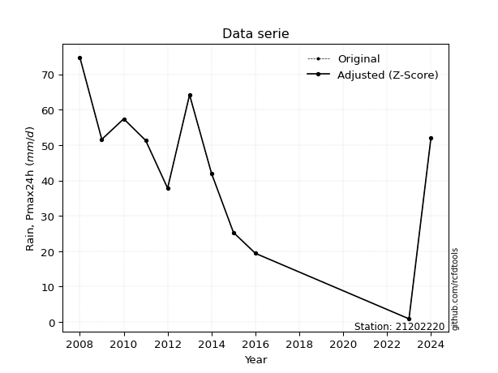</img>

</div>

> If Z-Score is active, values out of range or outliers are replaced with the station mean value.


### 4. Active continuous probability distributions from SciPy (45 of 104 available)

[scipy.stats](https://docs.scipy.org/doc/scipy/reference/stats.html) is a Python´s powerful submodule within the SciPy library for comprehensive statistical analysis, offering over 130 probability distributions (like Normal, Poisson), functions for descriptive stats (mean, variance), hypothesis testing (t-tests, chi-square), random variable generation, and statistical tests, making it essential for data science, modeling, and research. It provides tools to explore, model, and draw conclusions from data efficiently, working seamlessly with NumPy.

<div align="center">

|   id | p_dist             |   n_parameter | fit_method   | label                                                                       | active   | ref                                                                                                        |
|-----:|:-------------------|--------------:|:-------------|:----------------------------------------------------------------------------|:---------|:-----------------------------------------------------------------------------------------------------------|
|    0 | alpha              |             3 | MLE          | Alpha                                                                       | True     | [:mortar_board:](https://docs.scipy.org/doc/scipy/reference/generated/scipy.stats.alpha.html)              |
|    1 | betaprime          |             4 | MLE          | Beta prime                                                                  | True     | [:mortar_board:](https://docs.scipy.org/doc/scipy/reference/generated/scipy.stats.betaprime.html)          |
|    2 | chi2               |             3 | MLE          | Chi²                                                                        | True     | [:mortar_board:](https://docs.scipy.org/doc/scipy/reference/generated/scipy.stats.chi2.html)               |
|    3 | crystalball        |             4 | MLE          | Crystalball                                                                 | True     | [:mortar_board:](https://docs.scipy.org/doc/scipy/reference/generated/scipy.stats.crystalball.html)        |
|    4 | erlang             |             3 | MLE          | Erlang                                                                      | True     | [:mortar_board:](https://docs.scipy.org/doc/scipy/reference/generated/scipy.stats.erlang.html)             |
|    5 | expon              |             2 | MLE          | Exponential                                                                 | True     | [:mortar_board:](https://docs.scipy.org/doc/scipy/reference/generated/scipy.stats.expon.html)              |
|    6 | exponnorm          |             3 | MLE          | Exponentially modified Normal                                               | True     | [:mortar_board:](https://docs.scipy.org/doc/scipy/reference/generated/scipy.stats.exponnorm.html)          |
|    7 | f                  |             4 | MLE          | F                                                                           | True     | [:mortar_board:](https://docs.scipy.org/doc/scipy/reference/generated/scipy.stats.f.html)                  |
|    8 | fatiguelife        |             3 | MLE          | Fatigue-life (Birnbaum-Saunders)                                            | True     | [:mortar_board:](https://docs.scipy.org/doc/scipy/reference/generated/scipy.stats.fatiguelife.html)        |
|    9 | fisk               |             3 | MLE          | Fisk                                                                        | True     | [:mortar_board:](https://docs.scipy.org/doc/scipy/reference/generated/scipy.stats.fisk.html)               |
|   10 | gamma              |             3 | MLE          | Gamma                                                                       | True     | [:mortar_board:](https://docs.scipy.org/doc/scipy/reference/generated/scipy.stats.gamma.html)              |
|   11 | genexpon           |             5 | MLE          | Generalized exponential                                                     | True     | [:mortar_board:](https://docs.scipy.org/doc/scipy/reference/generated/scipy.stats.genexpon.html)           |
|   12 | genlogistic        |             3 | MLE          | Generalized logistic                                                        | True     | [:mortar_board:](https://docs.scipy.org/doc/scipy/reference/generated/scipy.stats.genlogistic.html)        |
|   13 | gibrat             |             2 | MM           | Gibrat                                                                      | True     | [:mortar_board:](https://docs.scipy.org/doc/scipy/reference/generated/scipy.stats.gibrat.html)             |
|   14 | gompertz           |             3 | MLE          | Gompertz (or truncated Gumbel)                                              | True     | [:mortar_board:](https://docs.scipy.org/doc/scipy/reference/generated/scipy.stats.gompertz.html)           |
|   15 | gumbel_l           |             2 | MM           | Gumbel Left Skew                                                            | True     | [:mortar_board:](https://docs.scipy.org/doc/scipy/reference/generated/scipy.stats.gumbel_l.html)           |
|   16 | gumbel_r           |             2 | MM           | Gumbel Right Skew                                                           | True     | [:mortar_board:](https://docs.scipy.org/doc/scipy/reference/generated/scipy.stats.gumbel_r.html)           |
|   17 | halflogistic       |             2 | MM           | Half-logistic                                                               | True     | [:mortar_board:](https://docs.scipy.org/doc/scipy/reference/generated/scipy.stats.halflogistic.html)       |
|   18 | halfnorm           |             2 | MM           | Half Normal                                                                 | True     | [:mortar_board:](https://docs.scipy.org/doc/scipy/reference/generated/scipy.stats.halfnorm.html)           |
|   19 | hypsecant          |             2 | MM           | hyperbolic secant                                                           | True     | [:mortar_board:](https://docs.scipy.org/doc/scipy/reference/generated/scipy.stats.hypsecant.html)          |
|   20 | invgamma           |             3 | MLE          | Inverted gamma                                                              | True     | [:mortar_board:](https://docs.scipy.org/doc/scipy/reference/generated/scipy.stats.invgamma.html)           |
|   21 | invgauss           |             3 | MLE          | Inverse Gaussian                                                            | True     | [:mortar_board:](https://docs.scipy.org/doc/scipy/reference/generated/scipy.stats.invgauss.html)           |
|   22 | invweibull         |             3 | MLE          | Inverted Weibull                                                            | True     | [:mortar_board:](https://docs.scipy.org/doc/scipy/reference/generated/scipy.stats.invweibull.html)         |
|   23 | johnsonsu          |             4 | MLE          | Johnson Su                                                                  | True     | [:mortar_board:](https://docs.scipy.org/doc/scipy/reference/generated/scipy.stats.johnsonsu.html)          |
|   24 | kstwobign          |             2 | MLE          | Limiting distribution of scaled Kolmogorov-Smirnov two-sided test statistic | True     | [:mortar_board:](https://docs.scipy.org/doc/scipy/reference/generated/scipy.stats.kstwobign.html)          |
|   25 | laplace            |             2 | MM           | Laplace                                                                     | True     | [:mortar_board:](https://docs.scipy.org/doc/scipy/reference/generated/scipy.stats.laplace.html)            |
|   26 | laplace_asymmetric |             3 | MLE          | Asymmetric Laplace                                                          | True     | [:mortar_board:](https://docs.scipy.org/doc/scipy/reference/generated/scipy.stats.laplace_asymmetric.html) |
|   27 | loggamma           |             3 | MLE          | Log gamma                                                                   | True     | [:mortar_board:](https://docs.scipy.org/doc/scipy/reference/generated/scipy.stats.loggamma.html)           |
|   28 | logistic           |             2 | MM           | Logistic (or Sech-squared)                                                  | True     | [:mortar_board:](https://docs.scipy.org/doc/scipy/reference/generated/scipy.stats.logistic.html)           |
|   29 | lognorm            |             3 | MLE          | Log Normal                                                                  | True     | [:mortar_board:](https://docs.scipy.org/doc/scipy/reference/generated/scipy.stats.lognorm.html)            |
|   30 | maxwell            |             2 | MM           | Maxwell                                                                     | True     | [:mortar_board:](https://docs.scipy.org/doc/scipy/reference/generated/scipy.stats.maxwell.html)            |
|   31 | mielke             |             4 | MLE          | Mielke Beta-Kappa / Dagum                                                   | True     | [:mortar_board:](https://docs.scipy.org/doc/scipy/reference/generated/scipy.stats.mielke.html)             |
|   32 | moyal              |             2 | MM           | Moyal                                                                       | True     | [:mortar_board:](https://docs.scipy.org/doc/scipy/reference/generated/scipy.stats.moyal.html)              |
|   33 | nakagami           |             3 | MLE          | Nakagami                                                                    | True     | [:mortar_board:](https://docs.scipy.org/doc/scipy/reference/generated/scipy.stats.nakagami.html)           |
|   34 | ncf                |             5 | MLE          | Non-central F distribution                                                  | True     | [:mortar_board:](https://docs.scipy.org/doc/scipy/reference/generated/scipy.stats.ncf.html)                |
|   35 | nct                |             4 | MLE          | Non-central Student’s t                                                     | True     | [:mortar_board:](https://docs.scipy.org/doc/scipy/reference/generated/scipy.stats.nct.html)                |
|   36 | norm               |             2 | MM           | Normal                                                                      | True     | [:mortar_board:](https://docs.scipy.org/doc/scipy/reference/generated/scipy.stats.norm.html)               |
|   37 | pareto             |             3 | MLE          | Pareto                                                                      | True     | [:mortar_board:](https://docs.scipy.org/doc/scipy/reference/generated/scipy.stats.pareto.html)             |
|   38 | pearson3           |             3 | MM           | Pearson type III                                                            | True     | [:mortar_board:](https://docs.scipy.org/doc/scipy/reference/generated/scipy.stats.pearson3.html)           |
|   39 | rayleigh           |             2 | MM           | Rayleigh                                                                    | True     | [:mortar_board:](https://docs.scipy.org/doc/scipy/reference/generated/scipy.stats.rayleigh.html)           |
|   40 | rice               |             3 | MLE          | Rice                                                                        | True     | [:mortar_board:](https://docs.scipy.org/doc/scipy/reference/generated/scipy.stats.rice.html)               |
|   41 | t                  |             3 | MLE          | Student’s t                                                                 | True     | [:mortar_board:](https://docs.scipy.org/doc/scipy/reference/generated/scipy.stats.t.html)                  |
|   42 | truncnorm          |             4 | MLE          | Truncated normal                                                            | True     | [:mortar_board:](https://docs.scipy.org/doc/scipy/reference/generated/scipy.stats.truncnorm.html)          |
|   43 | wald               |             2 | MM           | Wald                                                                        | True     | [:mortar_board:](https://docs.scipy.org/doc/scipy/reference/generated/scipy.stats.wald.html)               |
|   44 | weibull_min        |             3 | MLE          | Weibull minimum                                                             | True     | [:mortar_board:](https://docs.scipy.org/doc/scipy/reference/generated/scipy.stats.weibull_min.html)        |

</div>

> **n_parameter:** # arguments & localization & scale.
>
> **Fit methods:** (MLE) maximum likelihood, (MM) L-moments.
>
>**Inactive:** foldnorm, gennorm, norminvgauss, powernorm, powerlognorm, skewnorm, genextreme, anglit, arcsine, argus, beta, bradford, burr, burr12, cauchy, cosine, halfcauchy, foldcauchy, skewcauchy, wrapcauchy, dgamma, gengamma, exponweib, exponpow, truncexpon, gausshyper, genhalflogistic, genhyperbolic, geninvgauss, halfgennorm, johnsonsb, kappa4, kappa3, ksone, kstwo, loglaplace, levy, levy_l, levy_stable, ncx2, genpareto, truncpareto, lomax, powerlaw, rdist, rel_breitwigner, recipinvgauss, semicircular, studentized_range, trapezoid, triang, truncweibull_min, tukeylambda, uniform, loguniform, vonmises, vonmises_line, weibull_max, dweibull, 


## B. Probability distributions vs. Empirical distributions

A continuous probability distribution (CPD) describes probabilities for variables that can take any value within a range (like rain any time), unlike discrete variables with specific outcomes (like temperature). It uses a Probability Density Function (PDF), a curve where the total area under it equals 1, and the probability of the variable falling within an interval (a to b) is found by calculating the area under the curve between those points. A key feature is that the probability of hitting any single exact value is zero, so probabilities are always expressed for ranges, e.g., $P(a ≤ X ≤ b)$.

<div align="center">

Distributions parameters
|    |   station | p_dist                |   n |             loc |           scale | shape                  | shape1                 | shape2                | shape3   |
|---:|----------:|:----------------------|----:|----------------:|----------------:|:-----------------------|:-----------------------|:----------------------|:---------|
|  0 |  21202220 | alpha                 |  12 |  -279.357       |  5058.1         | 15.767777451376723     |                        |                       |          |
|  1 |  21202220 | betaprime             |  12 |  -627.473       | 34964.2         | 1181.5029774122931     | 61570.05056693709      |                       |          |
|  2 |  21202220 | chi2                  |  12 |  -202.289       |     0.838753    | 292.8570123244066      |                        |                       |          |
|  3 |  21202220 | crystalball           |  12 |    43.4417      |    19.4996      | 2937.5626060930094     | 1979.8438837077995     |                       |          |
|  4 |  21202220 | erlang                |  12 |  -283.261       |     1.19567     | 273.06255607459866     |                        |                       |          |
|  5 |  21202220 | expon                 |  12 |     0.9         |    42.5417      |                        |                        |                       |          |
|  6 |  21202220 | exponnorm             |  12 |    43.4275      |    19.4995      | 0.0007226900477331744  |                        |                       |          |
|  7 |  21202220 | f                     |  12 | -6637.51        |  6681.03        | 273410.0148353777      | 1559922.7265049415     |                       |          |
|  8 |  21202220 | fatiguelife           |  12 | -2502.15        |  2545.63        | 0.007644248575476915   |                        |                       |          |
|  9 |  21202220 | fisk                  |  12 |    -2.75342e+09 |     2.75342e+09 | 248724878.0076623      |                        |                       |          |
| 10 |  21202220 | gamma                 |  12 |  -257.92        |     1.34176     | 224.5085803392617      |                        |                       |          |
| 11 |  21202220 | genexpon              |  12 |     0.898781    |     2.33512     | 0.05489699843719191    | 3.3520482366741814e-08 | 2.1798372524586354    |          |
| 12 |  21202220 | genlogistic           |  12 |    57.0797      |     6.84548     | 0.399037869388406      |                        |                       |          |
| 13 |  21202220 | gibrat                |  12 |    28.5659      |     9.0226      |                        |                        |                       |          |
| 14 |  21202220 | gompertz              |  12 |     0.9         |    18.9129      | 0.07358251476964968    |                        |                       |          |
| 15 |  21202220 | gumbel_l              |  12 |    52.2175      |    15.2038      |                        |                        |                       |          |
| 16 |  21202220 | gumbel_r              |  12 |    34.6658      |    15.2038      |                        |                        |                       |          |
| 17 |  21202220 | halflogistic          |  12 |    20.3301      |    16.6715      |                        |                        |                       |          |
| 18 |  21202220 | halfnorm              |  12 |    17.6319      |    32.3478      |                        |                        |                       |          |
| 19 |  21202220 | hypsecant             |  12 |    43.4417      |    12.4138      |                        |                        |                       |          |
| 20 |  21202220 | invgamma              |  12 |  -250.709       | 61658           | 210.84046175820242     |                        |                       |          |
| 21 |  21202220 | invgauss              |  12 |   -98.3293      |  6223.39        | 0.022848515251357407   |                        |                       |          |
| 22 |  21202220 | invweibull            |  12 |    -4.22198e+09 |     4.22198e+09 | 200252425.8467822      |                        |                       |          |
| 23 |  21202220 | johnsonsu             |  12 |   114.616       |    12.5236      | 8.973398781567576      | 3.734826852052368      |                       |          |
| 24 |  21202220 | kstwobign             |  12 |   -42.9147      |    98.9697      |                        |                        |                       |          |
| 25 |  21202220 | laplace               |  12 |    43.4417      |    13.7883      |                        |                        |                       |          |
| 26 |  21202220 | laplace_asymmetric    |  12 |    51.6         |    13.3579      | 1.3509584170308733     |                        |                       |          |
| 27 |  21202220 | loggamma              |  12 |    38.3322      |    22.3965      | 1.7249284715799673     |                        |                       |          |
| 28 |  21202220 | logistic              |  12 |    43.4417      |    10.7507      |                        |                        |                       |          |
| 29 |  21202220 | lognorm               |  12 |     0.9         |     1.48459     | 11.201864390382685     |                        |                       |          |
| 30 |  21202220 | maxwell               |  12 |    -2.76418     |    28.9552      |                        |                        |                       |          |
| 31 |  21202220 | mielke                |  12 |   -17.0436      |    81.5733      | 2.564479800152668      | 14.534397527031203     |                       |          |
| 32 |  21202220 | moyal                 |  12 |    32.2905      |     8.7779      |                        |                        |                       |          |
| 33 |  21202220 | nakagami              |  12 | -7913.14        |  7956.57        | 41489.81021396608      |                        |                       |          |
| 34 |  21202220 | ncf                   |  12 |     0.0799169   |     5.19199     | 1.2535081442182179     | 86.23493392683551      | 9.363319031217252     |          |
| 35 |  21202220 | nct                   |  12 |  -993.894       |    19.4445      | 203089.39886018058     | 53.34819210692268      |                       |          |
| 36 |  21202220 | norm                  |  12 |    43.4417      |    19.4996      |                        |                        |                       |          |
| 37 |  21202220 | pareto                |  12 |     0.899733    |     0.000267    | 0.09091638637217553    |                        |                       |          |
| 38 |  21202220 | pearson3              |  12 |    43.4417      |    19.4996      | -0.5943771116195404    |                        |                       |          |
| 39 |  21202220 | rayleigh              |  12 |     6.1378      |    29.7642      |                        |                        |                       |          |
| 40 |  21202220 | rice                  |  12 |   -12.5799      |    20.6179      | 2.5054555398408986     |                        |                       |          |
| 41 |  21202220 | t                     |  12 |    43.4418      |    19.4999      | 49765047.10592112      |                        |                       |          |
| 42 |  21202220 | truncnorm             |  12 |    15.5689      |    12.6858      | -4.396361418106082     | 4.669091622373845      |                       |          |
| 43 |  21202220 | wald                  |  12 |    23.9421      |    19.4996      |                        |                        |                       |          |
| 44 |  21202220 | weibull_min           |  12 |  -135.896       |   187.718       | 11.23292123483054      |                        |                       |          |
| 45 |  21202220 | logalpha              |  12 |   -36.8942      |  1315.84        | 32.65415916907021      |                        |                       |          |
| 46 |  21202220 | logbetaprime          |  12 | -2223.38        |  1710.16        | 8754002.475894436      | 6722829.32183243       |                       |          |
| 47 |  21202220 | logchi2               |  12 |    -0.105361    |     1.85418     | 1.926163576394627      |                        |                       |          |
| 48 |  21202220 | logcrystalball        |  12 |     3.46815     |     1.13667     | 14.678168255085545     | 51.398411123945294     |                       |          |
| 49 |  21202220 | logerlang             |  12 |    -0.105361    |     1.6599      | 0.004049904148997325   |                        |                       |          |
| 50 |  21202220 | logexpon              |  12 |    -0.105361    |     3.57351     |                        |                        |                       |          |
| 51 |  21202220 | logexponnorm          |  12 |     3.46753     |     1.13666     | 0.0005506849892716759  |                        |                       |          |
| 52 |  21202220 | logf                  |  12 |    -0.105361    |     1.12861     | 1.3967256187647576     | 1.263808116903249      |                       |          |
| 53 |  21202220 | logfatiguelife        |  12 |  -944.724       |   948.194       | 0.0012009087927559066  |                        |                       |          |
| 54 |  21202220 | logfisk               |  12 |    -1.0333e+08  |     1.0333e+08  | 228573233.37322626     |                        |                       |          |
| 55 |  21202220 | loggamma              |  12 |   -11.9677      |     0.103241    | 149.4078600668887      |                        |                       |          |
| 56 |  21202220 | loggenexpon           |  12 |    -0.24528     |     0.620842    | 0.016935254322016244   | 54.30891110200804      | 0.0008450079638738167 |          |
| 57 |  21202220 | loggenlogistic        |  12 |     4.31485     |     3.0741e-06  | 3.606839291343239e-06  |                        |                       |          |
| 58 |  21202220 | loggibrat             |  12 |     2.60104     |     0.525929    |                        |                        |                       |          |
| 59 |  21202220 | loggompertz           |  12 |    -0.105599    |     0.523078    | 0.0005128930142064452  |                        |                       |          |
| 60 |  21202220 | loggumbel_l           |  12 |     3.97971     |     0.886255    |                        |                        |                       |          |
| 61 |  21202220 | loggumbel_r           |  12 |     2.95659     |     0.886255    |                        |                        |                       |          |
| 62 |  21202220 | loghalflogistic       |  12 |     2.12092     |     0.971821    |                        |                        |                       |          |
| 63 |  21202220 | loghalfnorm           |  12 |     1.96361     |     1.88565     |                        |                        |                       |          |
| 64 |  21202220 | loghypsecant          |  12 |     3.46815     |     0.723624    |                        |                        |                       |          |
| 65 |  21202220 | loginvgamma           |  12 |   -30.5491      | 27249.9         | 802.6974775490712      |                        |                       |          |
| 66 |  21202220 | loginvgauss           |  12 |   -10.939       |  1706.68        | 0.00843922002245569    |                        |                       |          |
| 67 |  21202220 | loginvweibull         |  12 |    -1.99899e+08 |     1.99899e+08 | 122343759.53993866     |                        |                       |          |
| 68 |  21202220 | logjohnsonsu          |  12 |     4.04399     |     0.148924    | 0.775833315706346      | 0.6978093791948202     |                       |          |
| 69 |  21202220 | logkstwobign          |  12 |    -3.41919     |     7.93668     |                        |                        |                       |          |
| 70 |  21202220 | loglaplace            |  12 |     3.46815     |     0.803744    |                        |                        |                       |          |
| 71 |  21202220 | loglaplace_asymmetric |  12 |     4.162       |     0.293647    | 2.730353686659419      |                        |                       |          |
| 72 |  21202220 | logloggamma           |  12 |     4.31483     |     1.21072e-06 | 1.4362254391157068e-06 |                        |                       |          |
| 73 |  21202220 | loglogistic           |  12 |     3.46815     |     0.626677    |                        |                        |                       |          |
| 74 |  21202220 | loglognorm            |  12 | -1500.24        |  1503.7         | 0.0007542056809881348  |                        |                       |          |
| 75 |  21202220 | logmaxwell            |  12 |     0.774757    |     1.68783     |                        |                        |                       |          |
| 76 |  21202220 | logmielke             |  12 | -6600.74        |  6604.89        | 10589.122896624973     | 43294.46886080468      |                       |          |
| 77 |  21202220 | logmoyal              |  12 |     2.81813     |     0.511679    |                        |                        |                       |          |
| 78 |  21202220 | lognakagami           |  12 | -1652.83        |  1656.3         | 527564.8005279315      |                        |                       |          |
| 79 |  21202220 | logncf                |  12 |    -0.105361    |     1.13042     | 1.124214356118959      | 1.4076171179135648     | 1.0383530136928516    |          |
| 80 |  21202220 | lognct                |  12 |   -65.6046      |     1.10426     | 27132.807787192854     | 62.54837618290924      |                       |          |
| 81 |  21202220 | lognorm               |  12 |     3.46815     |     1.13667     |                        |                        |                       |          |
| 82 |  21202220 | logpareto             |  12 |    -0.105384    |     2.38531e-05 | 0.0909158362521991     |                        |                       |          |
| 83 |  21202220 | logpearson3           |  12 |     3.46814     |     1.13668     | -2.5111298113141216    |                        |                       |          |
| 84 |  21202220 | lograyleigh           |  12 |     1.29358     |     1.73505     |                        |                        |                       |          |
| 85 |  21202220 | logrice               |  12 |  -358.88        |     1.1365      | 318.8275368455678      |                        |                       |          |
| 86 |  21202220 | logt                  |  12 |     3.90377     |     0.206057    | 1.0259413287405286     |                        |                       |          |
| 87 |  21202220 | logtruncnorm          |  12 |     0.284479    |     3.59166     | -0.10854305695274272   | 1.1221399094226987     |                       |          |
| 88 |  21202220 | logwald               |  12 |     2.3315      |     1.13665     |                        |                        |                       |          |
| 89 |  21202220 | logweibull_min        |  12 |    -0.105361    |     1.52173     | 0.609704202973532      |                        |                       |          |

</div>

> **loc** (Location parameter): This shifts the distribution along the x-axis. For many common distributions, like the normal (Gaussian) distribution, loc represents the mean $μ$. For others, like the uniform distribution, it might represent the minimum value, or for the beta distribution, the left end of the support interval.
>
> **scale** (Scale parameter): This determines the width or spread of the distribution. For the normal distribution, scale represents the standard deviation $σ$. For a uniform distribution, it defines the length of the interval (from $loc$ to $loc + scale$).
>
> **shape** (Shape parameters): Refers to parameters that define the specific form of a probability distribution, distinct from its location (loc) and scale (scale). These parameters are required arguments for most distribution functions. For example, a normal (Gaussian) distribution is fully defined by its location (mean) and scale (standard deviation), so it has no specific shape parameters beyond loc and scale. However, other distributions have intrinsic properties that need specification, as Gamma distribution that takes a shape parameter, often named $a$ or $alpha$.


### 0. Cumulative distribution values - CDF (90 evaluated)

> Ordered by x ascending and calculating $log(f(x))$ separately. 

|   id |   Station |   date |    x |   count |    mean |     std |     zscore |   Value_initial |   station |   m |    alpha |   alpha_pdf |   betaprime |   betaprime_pdf |      chi2 |   chi2_pdf |   crystalball |   crystalball_pdf |    erlang |   erlang_pdf |    expon |   expon_pdf |   exponnorm |   exponnorm_pdf |         f |      f_pdf |   fatiguelife |   fatiguelife_pdf |      fisk |   fisk_pdf |     gamma |   gamma_pdf |    genexpon |   genexpon_pdf |   genlogistic |   genlogistic_pdf |   gibrat |   gibrat_pdf |    gompertz |   gompertz_pdf |   gumbel_l |   gumbel_l_pdf |    gumbel_r |   gumbel_r_pdf |   halflogistic |   halflogistic_pdf |   halfnorm |   halfnorm_pdf |   hypsecant |   hypsecant_pdf |   invgamma |   invgamma_pdf |   invgauss |   invgauss_pdf |   invweibull |   invweibull_pdf |   johnsonsu |   johnsonsu_pdf |   kstwobign |   kstwobign_pdf |   laplace |   laplace_pdf |   laplace_asymmetric |   laplace_asymmetric_pdf |   loggamma |   loggamma_pdf |   logistic |   logistic_pdf |     lognorm |   lognorm_pdf |     maxwell |   maxwell_pdf |    mielke |   mielke_pdf |       moyal |   moyal_pdf |   nakagami |   nakagami_pdf |        ncf |    ncf_pdf |       nct |    nct_pdf |     norm |   norm_pdf |   pareto |    pareto_pdf |   pearson3 |   pearson3_pdf |   rayleigh |   rayleigh_pdf |      rice |   rice_pdf |         t |      t_pdf |   truncnorm |   truncnorm_pdf |        wald |   wald_pdf |   weibull_min |   weibull_min_pdf |    logalpha |   logalpha_pdf |   logbetaprime |   logbetaprime_pdf |     logchi2 |   logchi2_pdf |   logcrystalball |   logcrystalball_pdf |   logerlang |   logerlang_pdf |   logexpon |   logexpon_pdf |   logexponnorm |   logexponnorm_pdf |        logf |      logf_pdf |   logfatiguelife |   logfatiguelife_pdf |     logfisk |   logfisk_pdf |   loggenexpon |   loggenexpon_pdf |   loggenlogistic |   loggenlogistic_pdf |   loggibrat |   loggibrat_pdf |   loggompertz |   loggompertz_pdf |   loggumbel_l |   loggumbel_l_pdf |   loggumbel_r |   loggumbel_r_pdf |   loghalflogistic |   loghalflogistic_pdf |   loghalfnorm |   loghalfnorm_pdf |   loghypsecant |   loghypsecant_pdf |   loginvgamma |   loginvgamma_pdf |   loginvgauss |   loginvgauss_pdf |   loginvweibull |   loginvweibull_pdf |   logjohnsonsu |   logjohnsonsu_pdf |   logkstwobign |   logkstwobign_pdf |   loglaplace |   loglaplace_pdf |   loglaplace_asymmetric |   loglaplace_asymmetric_pdf |   logloggamma |   logloggamma_pdf |   loglogistic |   loglogistic_pdf |   loglognorm |   loglognorm_pdf |   logmaxwell |   logmaxwell_pdf |   logmielke |   logmielke_pdf |    logmoyal |   logmoyal_pdf |   lognakagami |   lognakagami_pdf |      logncf |   logncf_pdf |      lognct |   lognct_pdf |   logpareto |   logpareto_pdf |   logpearson3 |   logpearson3_pdf |   lograyleigh |   lograyleigh_pdf |    logrice |   logrice_pdf |      logt |   logt_pdf |   logtruncnorm |   logtruncnorm_pdf |   logwald |   logwald_pdf |   logweibull_min |   logweibull_min_pdf |
|-----:|----------:|-------:|-----:|--------:|--------:|--------:|-----------:|----------------:|----------:|----:|---------:|------------:|------------:|----------------:|----------:|-----------:|--------------:|------------------:|----------:|-------------:|---------:|------------:|------------:|----------------:|----------:|-----------:|--------------:|------------------:|----------:|-----------:|----------:|------------:|------------:|---------------:|--------------:|------------------:|---------:|-------------:|------------:|---------------:|-----------:|---------------:|------------:|---------------:|---------------:|-------------------:|-----------:|---------------:|------------:|----------------:|-----------:|---------------:|-----------:|---------------:|-------------:|-----------------:|------------:|----------------:|------------:|----------------:|----------:|--------------:|---------------------:|-------------------------:|-----------:|---------------:|-----------:|---------------:|------------:|--------------:|------------:|--------------:|----------:|-------------:|------------:|------------:|-----------:|---------------:|-----------:|-----------:|----------:|-----------:|---------:|-----------:|---------:|--------------:|-----------:|---------------:|-----------:|---------------:|----------:|-----------:|----------:|-----------:|------------:|----------------:|------------:|-----------:|--------------:|------------------:|------------:|---------------:|---------------:|-------------------:|------------:|--------------:|-----------------:|---------------------:|------------:|----------------:|-----------:|---------------:|---------------:|-------------------:|------------:|--------------:|-----------------:|---------------------:|------------:|--------------:|--------------:|------------------:|-----------------:|---------------------:|------------:|----------------:|--------------:|------------------:|--------------:|------------------:|--------------:|------------------:|------------------:|----------------------:|--------------:|------------------:|---------------:|-------------------:|--------------:|------------------:|--------------:|------------------:|----------------:|--------------------:|---------------:|-------------------:|---------------:|-------------------:|-------------:|-----------------:|------------------------:|----------------------------:|--------------:|------------------:|--------------:|------------------:|-------------:|-----------------:|-------------:|-----------------:|------------:|----------------:|------------:|---------------:|--------------:|------------------:|------------:|-------------:|------------:|-------------:|------------:|----------------:|--------------:|------------------:|--------------:|------------------:|-----------:|--------------:|----------:|-----------:|---------------:|-------------------:|----------:|--------------:|-----------------:|---------------------:|
|    0 |  21202220 |   2023 |  0.9 |      12 | 43.4417 | 20.3667 | -2.08879   |             0.9 |  21202220 |   1 | 0.011296 |  0.00190855 |   0.0139247 |      0.00188477 | 0.0140004 | 0.00199674 |      0.014567 |        0.00189379 | 0.0131283 |   0.00187527 | 0        |  0.0235064  |   0.0145668 |      0.00189378 | 0.0146008 | 0.00189816 |     0.0136769 |        0.00182799 | 0.0183095 | 0.00162367 | 0.0140709 |  0.00197366 | 2.86621e-05 |     0.0235086  |     0.0378191 |        0.00220395 | 0        |   0          | 8.86573e-12 |     0.00389061 |  0.0336289 |     0.00217426 | 9.94877e-05 |    6.03026e-05 |       0        |         0          |  0         |     0          |   0.0206737 |      0.00166421 |  0.0118381 |     0.00187389 |  0.0100415 |     0.00181775 |   0.00973776 |       0.00213927 |   0.0310205 |      0.00228372 |   0.0104524 |      0.00276477 | 0.0228571 |    0.00165772 |            0.0389143 |               0.00215639 | 0.00115316 |     0.00362873 |  0.0187596 |     0.00171223 | 0.000833707 |    0.00250634 | 0.000536393 |   0.000437759 | 0.0205826 |   0.00294164 | 2.26241e-09 | 4.72746e-09 |  0.0146963 |     0.0019086  | 0.00304513 | 0.00311884 | 0.0146088 | 0.00189826 | 0.014567 | 0.00189379 | 0        | 340.511       |  0.0268607 |     0.00229098 |  0         |     0          | 0.0113509 | 0.00198897 | 0.0145679 | 0.00189387 |    0.12377  |     0.0161158   | 0           | 0          |     0.0281852 |        0.00228149 | 0.000925108 |     0.00304777 |    0.000865374 |         0.00258607 | 1.67145e-17 |     1.15994   |      0.000833712 |           0.00250635 |    0.854764 |     2.49443e+14 |   0        |      0.279837  |    0.000833685 |         0.00250628 | 1.15146e-12 | 57944.2       |      0.000829039 |           0.00249841 | 0.000213967 |   0.000473208 |    0.00496971 |         0.0437169 |          0       |           0.00656229 |    0        |        0        |   2.34342e-07 |       0.000980977 |    0.00990878 |         0.0111249 |    1.7864e-14 |        6.3808e-13 |          0        |              0        |      0        |          0        |     0.00456222 |         0.00630446 |   0.000801246 |        0.00265142 |    0.00107741 |        0.00366358 |       0.0027993 |           0.0100712 |      0.0211845 |         0.00854385 |     0.00507056 |          0.0201261 |   0.00586225 |       0.00729368 |              0.00430332 |                  0.00536734 |    0.00528187 |        0.00626565 |    0.00332713 |        0.00529151 |  0.000816046 |       0.00246886 |     0        |         0        |  0.00108962 |      0.00174803 | 7.56203e-68 |    2.24584e-65 |   0.000860028 |        0.00257295 | 1.28566e-10 |  5.20744e+06 | 0.000862245 |    0.0025871 |    0        |   3811.49       |     0.0184381 |         0.0141289 |      0        |          0        | 0.00083235 |    0.00250297 | 0.0152131 |  0.003886  |     2.5177e-06 |           0.26781  |  0        |      0        |      4.07971e-11 |          1.79237e+06 |
|    1 |  21202220 |   2016 | 19.4 |      12 | 43.4417 | 20.3667 | -1.18044   |            19.4 |  21202220 |   2 | 0.122481 |  0.0115006  |   0.109821  |      0.00977044 | 0.116532  | 0.0103366  |      0.108801 |        0.00956741 | 0.111891  |   0.0101338  | 0.35265  |  0.0152169  |   0.1088    |      0.00956741 | 0.108837  | 0.00955231 |     0.106916  |        0.00955777 | 0.0902411 | 0.00741612 | 0.11503   |  0.0102047  | 0.352703    |     0.0152175  |     0.11102   |        0.00644534 | 0        |   0          | 0.114955    |     0.00915791 |  0.109077  |     0.00676798 | 0.0652586   |    0.0117153   |       0        |         0          |  0.0435909 |     0.024629   |   0.0911604 |      0.00724348 |  0.116705  |     0.0108274  |  0.119122  |     0.0112661  |   0.145725   |       0.0133125  |   0.113594  |      0.00748282 |   0.177213  |      0.014856   | 0.0874423 |    0.00634178 |            0.108475  |               0.00601101 | 0.356899   |     0.301981   |  0.0965386 |     0.00811286 | 0.329096    |    0.318255   | 0.100355    |   0.0120456   | 0.126654  |   0.00891237 | 0.0371654   | 0.0107988   |  0.109415  |     0.00960044 | 0.172547   | 0.0143744  | 0.108971  | 0.00957489 | 0.108801 | 0.00956741 | 0.637002 |   0.00178389  |  0.114167  |     0.00804404 |  0.0945008 |     0.0135555  | 0.111377  | 0.0100331  | 0.108803  | 0.00956743 |    0.618673 |     0.0300463   | 0           | 0          |     0.11206   |        0.0076334  | 0.360215    |     0.309912   |    0.329444    |         0.316988   | 0.580346    |     0.116007  |      0.329096    |           0.318255   |    0.999754 |     0.000208407 |   0.576532 |      0.118502  |    0.329094    |         0.318255   | 0.671279    |     0.0536105 |      0.328865    |           0.317768   | 0.160163    |   0.297547    |    0.503566   |         0.202891  |          0       |           0.240835   |    0.356669 |        1.02382  |   0.165832    |       0.289975    |    0.272646   |         0.261265  |    0.371485   |        0.415075   |          0.409008 |              0.428429 |      0.404722 |          0.367456 |     0.294712   |         0.351528   |   0.353191    |        0.315491   |    0.367607   |        0.295326   |       0.407547  |           0.223888  |      0.137224  |         0.140697   |     0.46304    |          0.204017  |   0.267453   |       0.332759   |              0.198195   |                  0.2472     |    0.201711   |        0.239281   |    0.309503   |        0.341023   |  0.330368    |       0.319574   |     0.359583 |         0.342998 |  0.150005   |      0.240431   | 0.386451    |    0.464075    |   0.329784    |        0.317574   | 0.571851    |  0.0626797   | 0.330651    |    0.317287  |    0.656878 |      0.0101591  |     0.214867  |         0.185463  |      0.371332 |          0.349104 | 0.329072   |    0.318294   | 0.0664316 |  0.0703154 |     0.765197   |           0.203897 |  0.413406 |      0.70729  |      0.78438     |          0.065686    |
|    2 |  21202220 |   2015 | 25.3 |      12 | 43.4417 | 20.3667 | -0.890753  |            25.3 |  21202220 |   3 | 0.201916 |  0.0153443  |   0.178394  |      0.0134901  | 0.188351  | 0.0139903  |      0.176092 |        0.0132717  | 0.182877  |   0.0139278  | 0.436482 |  0.0132463  |   0.176092  |      0.0132718  | 0.175974  | 0.013233   |     0.174286  |        0.0133076  | 0.144584  | 0.0111723  | 0.186126  |  0.0138864  | 0.436537    |     0.0132466  |     0.156245  |        0.00902094 | 0        |   0          | 0.176145    |     0.0116456  |  0.156551  |     0.00944519 | 0.156995    |    0.0191191   |       0.14796  |         0.0293348  |  0.187384  |     0.0239824  |   0.145074  |      0.0112861  |  0.191984  |     0.0146463  |  0.196601  |     0.0149071  |   0.233192   |       0.0161029  |   0.165799  |      0.0103118  |   0.270948  |      0.0166579  | 0.134139  |    0.00972849 |            0.150424  |               0.00833559 | 0.439181   |     0.315493   |  0.156106  |     0.0122538  | 0.4173      |    0.343407   | 0.184089    |   0.0161836   | 0.186094  |   0.0112697  | 0.136454    | 0.022332    |  0.176887  |     0.0132983  | 0.262521   | 0.0159136  | 0.176299  | 0.013276   | 0.176092 | 0.0132717  | 0.646023 |   0.00131893  |  0.170188  |     0.0110273  |  0.187175  |     0.0175814  | 0.181301  | 0.0136745  | 0.176094  | 0.0132717  |    0.778486 |     0.0234326   | 0.000397781 | 0.00222598 |     0.165297  |        0.0105094  | 0.444558    |     0.322896   |    0.417268    |         0.341846   | 0.610027    |     0.107661  |      0.4173      |           0.343407   |    0.999803 |     0.000163518 |   0.606857 |      0.110016  |    0.417298    |         0.343407   | 0.68476     |     0.0480907 |      0.416925    |           0.342813   | 0.255471    |   0.420748    |    0.556476   |         0.195224  |          0       |           0.32887    |    0.571493 |        0.623281 |   0.260348    |       0.427165    |    0.349198   |         0.31543   |    0.480044   |        0.397508   |          0.516119 |              0.377446 |      0.498429 |          0.337609 |     0.397421   |         0.417238   |   0.439406    |        0.331271   |    0.447476   |        0.304146   |       0.466283  |           0.217733  |      0.184546  |         0.224967   |     0.516088   |          0.195152  |   0.372156   |       0.463028   |              0.27601    |                  0.344255   |    0.276394   |        0.327873   |    0.406433   |        0.38496    |  0.4189      |       0.344529   |     0.451611 |         0.347236 |  0.22951    |      0.367111   | 0.504044    |    0.416718    |   0.417768    |        0.342452   | 0.587741    |  0.0571431   | 0.418505    |    0.341761  |    0.659456 |      0.00928032 |     0.271105  |         0.241124  |      0.463835 |          0.345028 | 0.417287   |    0.343457   | 0.0920457 |  0.131981  |     0.817824   |           0.192424 |  0.569898 |      0.485176 |      0.800874    |          0.0587292   |
|    3 |  21202220 |   2012 | 37.8 |      12 | 43.4417 | 20.3667 | -0.277005  |            37.8 |  21202220 |   4 | 0.428401 |  0.0197368  |   0.389967  |      0.0195819  | 0.402202  | 0.0193486  |      0.386167 |        0.0196204  | 0.398885  |   0.0197573  | 0.579951 |  0.00987382 |   0.386168  |      0.0196205  | 0.385205  | 0.019529   |     0.385154  |        0.0196897  | 0.343312  | 0.0203655  | 0.399839  |  0.0194508  | 0.580008    |     0.00987369 |     0.317576  |        0.0174673  | 0.509243 |   0.0431916  | 0.358631    |     0.0175572  |  0.321184  |     0.0172968  | 0.443209    |    0.0237208   |       0.48074  |         0.02306    |  0.46703   |     0.0203088  |   0.360076  |      0.0232038  |  0.413005  |     0.0196851  |  0.415259  |     0.0190077  |   0.447215   |       0.0170695  |   0.33938   |      0.0175707  |   0.480936  |      0.0161458  | 0.332103  |    0.0240859  |            0.300706  |               0.0166633  | 0.565695   |     0.309445   |  0.371737  |     0.0217241  | 0.557418    |    0.347334   | 0.419794    |   0.0202708   | 0.361067  |   0.016831   | 0.464995    | 0.0254275   |  0.387069  |     0.0196067  | 0.463606   | 0.0155742  | 0.386349  | 0.0196115  | 0.386167 | 0.0196204  | 0.659088 |   0.000839954 |  0.351971  |     0.017975   |  0.432095  |     0.0202969  | 0.393528  | 0.0195057  | 0.386167  | 0.0196201  |    0.960152 |     0.00677211  | 0.5225      | 0.0321959  |     0.341687  |        0.0177987  | 0.573569    |     0.314171   |    0.55674     |         0.345781   | 0.650909    |     0.0962087 |      0.557418    |           0.347334   |    0.999859 |     0.000114647 |   0.648638 |      0.0983241 |    0.557416    |         0.347335   | 0.702656    |     0.0413287 |      0.556795    |           0.346735   | 0.454753    |   0.548489    |    0.631856   |         0.179555  |          0       |           0.526761   |    0.749646 |        0.308373 |   0.478138    |       0.649352    |    0.491208   |         0.387923  |    0.627179   |        0.330146   |          0.651332 |              0.296231 |      0.623815 |          0.286039 |     0.571601   |         0.428801   |   0.572277    |        0.324477   |    0.568452   |        0.293944   |       0.550605  |           0.201092  |      0.330269  |         0.577437   |     0.591154   |          0.178218  |   0.59237    |       0.507164   |              0.455418   |                  0.568023   |    0.445017   |        0.527904   |    0.565118   |        0.392163   |  0.559353    |       0.34783    |     0.587306 |         0.323236 |  0.433613   |      0.672409   | 0.651765    |    0.317804    |   0.557463    |        0.346248   | 0.60923     |  0.0501442   | 0.557825    |    0.34513   |    0.662956 |      0.00819828 |     0.392     |         0.374254  |      0.596856 |          0.313196 | 0.557426   |    0.347386   | 0.20461   |  0.569366  |     0.891497   |           0.17447  |  0.71999  |      0.284084 |      0.822644    |          0.050039    |
|    4 |  21202220 |   2014 | 42   |      12 | 43.4417 | 20.3667 | -0.0707856 |            42   |  21202220 |   5 | 0.511165 |  0.0195322  |   0.473887  |      0.020231   | 0.484516  | 0.0197067  |      0.470532 |        0.0204032  | 0.483161  |   0.0202223  | 0.61944  |  0.00894558 |   0.470532  |      0.0204032  | 0.469173  | 0.020308   |     0.469775  |        0.0204543  | 0.433111  | 0.0221791  | 0.482738  |  0.0198805  | 0.619496    |     0.00894536 |     0.398183  |        0.0209016  | 0.654708 |   0.0274343  | 0.436107    |     0.0192748  |  0.399904  |     0.0201561  | 0.539396    |    0.0219006   |       0.571609 |         0.0201921  |  0.548741  |     0.0185724  |   0.463116  |      0.0254696  |  0.49619   |     0.0197806  |  0.495048  |     0.01886    |   0.517179   |       0.0161744  |   0.417986  |      0.0197915  |   0.546732  |      0.0151426  | 0.450362  |    0.0326626  |            0.379506  |               0.0210299  | 0.597967   |     0.302841   |  0.466525  |     0.0231501  | 0.593717    |    0.341246   | 0.504511    |   0.0199355   | 0.435828  |   0.0187586  | 0.565166    | 0.0221558   |  0.471343  |     0.0203746  | 0.527295   | 0.0147112  | 0.470668  | 0.0203905  | 0.470532 | 0.0204032  | 0.662412 |   0.000746765 |  0.431528  |     0.019819   |  0.516094  |     0.0195889  | 0.477001  | 0.0200996  | 0.47053   | 0.0204029  |    0.9814   |     0.00358877  | 0.636894    | 0.0228897  |     0.421188  |        0.0199837  | 0.60629     |     0.306612   |    0.592881    |         0.339793   | 0.660898    |     0.0934178 |      0.593717    |           0.341246   |    0.99987  |     0.000104658 |   0.658846 |      0.0954674 |    0.593715    |         0.341247   | 0.706929    |     0.0398069 |      0.593033    |           0.340684   | 0.512892    |   0.55265     |    0.650526   |         0.17481   |          0       |           0.596075   |    0.779544 |        0.260811 |   0.548684    |       0.686882    |    0.532809   |         0.401172  |    0.660848   |        0.308877   |          0.68145  |              0.275578 |      0.653204 |          0.271814 |     0.615909   |         0.41104    |   0.606083    |        0.31687    |    0.599072   |        0.287031   |       0.571511  |           0.195693  |      0.401643  |         0.792373   |     0.609674   |          0.173316  |   0.642451   |       0.444854   |              0.519376   |                  0.647794   |    0.504263   |        0.598185   |    0.605894   |        0.381036   |  0.595694    |       0.341538   |     0.620788 |         0.31205  |  0.509392   |      0.764921   | 0.683892    |    0.292198    |   0.593649    |        0.340192   | 0.614428    |  0.0485338   | 0.593891    |    0.339026  |    0.663807 |      0.00795339 |     0.434077  |         0.426165  |      0.629224 |          0.301026 | 0.593731   |    0.341295   | 0.282656  |  0.944384  |     0.909627   |           0.169691 |  0.748042 |      0.249344 |      0.827811    |          0.048057    |
|    5 |  21202220 |   2025 | 44.6 |      12 | 43.4417 | 20.3667 |  0.056874  |            44.6 |  21202220 |   6 | 0.561319 |  0.0189999  |   0.526493  |      0.0201765  | 0.53556   | 0.019505   |      0.523684 |        0.0204229  | 0.535594  |   0.020053   | 0.642002 |  0.00841523 |   0.523685  |      0.020423   | 0.522082  | 0.0203315  |     0.52304   |        0.020458   | 0.491425  | 0.0225766  | 0.534279  |  0.0197119  | 0.642057    |     0.00841496 |     0.455109  |        0.0228399  | 0.717349 |   0.0210899  | 0.487349    |     0.0201056  |  0.454421  |     0.0217427  | 0.594359    |    0.0203389   |       0.621771 |         0.0183967  |  0.595546  |     0.0174248  |   0.529658  |      0.0255303  |  0.547209  |     0.0194127  |  0.543551  |     0.0184073  |   0.558295   |       0.0154346  |   0.470934  |      0.0208926  |   0.585169  |      0.0144141  | 0.540288  |    0.0333407  |            0.438319  |               0.0242889  | 0.616022   |     0.298244   |  0.52691   |     0.023187   | 0.614077    |    0.336527   | 0.555637    |   0.0193476   | 0.486082  |   0.0198828  | 0.619888    | 0.0199336   |  0.524412  |     0.0203868  | 0.564721   | 0.0140672  | 0.523785  | 0.0204088  | 0.523684 | 0.0204229  | 0.66429  |   0.000698429 |  0.484184  |     0.0206372  |  0.566096  |     0.0188383  | 0.52924   | 0.0200276  | 0.523682  | 0.0204227  |    0.988947 |     0.00229282  | 0.690782    | 0.0187314  |     0.474585  |        0.0210437  | 0.624554    |     0.301448   |    0.613156    |         0.335147   | 0.666463    |     0.0918643 |      0.614077    |           0.336527   |    0.999876 |     9.93913e-05 |   0.664533 |      0.0938762 |    0.614075    |         0.336528   | 0.709295    |     0.0389796 |      0.613359    |           0.335993   | 0.545981    |   0.548341    |    0.660943   |         0.172011  |          0       |           0.639598   |    0.794504 |        0.237767 |   0.590353    |       0.699329    |    0.557086   |         0.406994  |    0.679032   |        0.296579   |          0.697656 |              0.264079 |      0.669285 |          0.263656 |     0.640213   |         0.397893   |   0.62496     |        0.311575   |    0.616176   |        0.282412   |       0.583169  |           0.192477  |      0.454109  |         0.960944   |     0.619999   |          0.170465  |   0.668197   |       0.412822   |              0.559779   |                  0.698188   |    0.541503   |        0.642362   |    0.628533   |        0.372567   |  0.616067    |       0.336699   |     0.639321 |         0.304966 |  0.556767   |      0.811227   | 0.701016    |    0.278083    |   0.613946    |        0.335502   | 0.617317    |  0.0476525   | 0.614117    |    0.334324  |    0.66428  |      0.00781996 |     0.460696  |         0.460908  |      0.647083 |          0.293569 | 0.614093   |    0.336574   | 0.347848  |  1.23021   |     0.919738   |           0.166961 |  0.762486 |      0.231882 |      0.830665    |          0.0469753   |
|    6 |  21202220 |   2011 | 51.3 |      12 | 43.4417 | 20.3667 |  0.385843  |            51.3 |  21202220 |   7 | 0.681067 |  0.0165209  |   0.65723   |      0.0185045  | 0.661005  | 0.0176482  |      0.656526 |        0.0188633  | 0.66465   |   0.018147   | 0.694168 |  0.00718899 |   0.656527  |      0.0188633  | 0.654401  | 0.0188035  |     0.65597   |        0.0188558  | 0.638977  | 0.0208385  | 0.661254  |  0.0178831  | 0.694222    |     0.00718862 |     0.619034  |        0.0252367  | 0.822291 |   0.0114494  | 0.625997    |     0.0209037  |  0.609933  |     0.0241534  | 0.715448    |    0.015757    |       0.730048 |         0.0140069  |  0.70204   |     0.0143503  |   0.689251  |      0.0212415  |  0.670778  |     0.0172078  |  0.66032   |     0.0162448  |   0.654302   |       0.0131642  |   0.616486  |      0.0220941  |   0.674908  |      0.0123438  | 0.717217  |    0.0205089  |            0.635378  |               0.0352087  | 0.656899   |     0.285416   |  0.675016  |     0.0204051  | 0.660229    |    0.322272   | 0.677457    |   0.0168088   | 0.627015  |   0.021858   | 0.734877    | 0.0145332   |  0.65697   |     0.0188176  | 0.652793   | 0.0121851  | 0.656528  | 0.0188488  | 0.656526 | 0.0188633  | 0.668615 |   0.00059778  |  0.625529  |     0.0211217  |  0.683728  |     0.0161231  | 0.658972  | 0.018365   | 0.656522  | 0.0188631  |    0.997575 |     0.000595503 | 0.790123    | 0.0116188  |     0.620602  |        0.0220644  | 0.665784    |     0.287264   |    0.659129    |         0.321102   | 0.679072    |     0.0883469 |      0.66023     |           0.322272   |    0.999889 |     8.82048e-05 |   0.677417 |      0.0902706 |    0.660228    |         0.322273   | 0.714622    |     0.0371562 |      0.659443    |           0.321824   | 0.621058    |   0.5206      |    0.684548   |         0.165263  |          0       |           0.753743   |    0.824527 |        0.193182 |   0.688515    |       0.694882    |    0.614687   |         0.414635  |    0.718535   |        0.267988   |          0.73279  |              0.238222 |      0.704853 |          0.244617 |     0.693411   |         0.361148   |   0.667571    |        0.296817   |    0.654856   |        0.26995    |       0.609566  |           0.184674  |      0.622692  |         1.44897    |     0.643385   |          0.163702  |   0.721223   |       0.346848   |              0.666543   |                  0.831349   |    0.6393     |        0.758373   |    0.679018   |        0.347791   |  0.662225    |       0.322167   |     0.680756 |         0.286793 |  0.675269   |      0.865229   | 0.737722    |    0.246854    |   0.659962    |        0.321347   | 0.623847    |  0.0456955   | 0.659968    |    0.320179  |    0.665354 |      0.00752512 |     0.531934  |         0.562903  |      0.686889 |          0.275014 | 0.660252   |    0.322313   | 0.552194  |  1.5119    |     0.94266    |           0.160595 |  0.792394 |      0.196701 |      0.83707     |          0.0445813   |
|    7 |  21202220 |   2009 | 51.6 |      12 | 43.4417 | 20.3667 |  0.400573  |            51.6 |  21202220 |   8 | 0.686002 |  0.0163821  |   0.662764  |      0.0183841  | 0.666281  | 0.0175269  |      0.662167 |        0.0187445  | 0.670075  |   0.0180194  | 0.696318 |  0.00713847 |   0.662168  |      0.0187445  | 0.660024  | 0.0186867  |     0.661609  |        0.0187354  | 0.645205  | 0.0206786  | 0.666601  |  0.017761   | 0.696371    |     0.0071381  |     0.626601  |        0.0252057  | 0.825683 |   0.0111633  | 0.632265    |     0.020882   |  0.617183  |     0.0241769  | 0.720144    |    0.0155505   |       0.734222 |         0.0138235  |  0.706324  |     0.0142118  |   0.69558   |      0.0209517  |  0.67592   |     0.0170754  |  0.665176  |     0.0161224  |   0.658235   |       0.0130563  |   0.623112  |      0.0220779  |   0.678597  |      0.0122482  | 0.723303  |    0.0200675  |            0.646029  |               0.0357989  | 0.658561   |     0.284822   |  0.681108  |     0.0202034  | 0.662107    |    0.321586   | 0.682479    |   0.0166693   | 0.633578  |   0.0218881  | 0.739204    | 0.0143145   |  0.662597  |     0.0186987  | 0.656436   | 0.0120967  | 0.662165  | 0.0187301  | 0.662167 | 0.0187445  | 0.668794 |   0.000593923 |  0.631859  |     0.0210798  |  0.688544  |     0.0159831  | 0.664464  | 0.0182464  | 0.662163  | 0.0187443  |    0.997748 |     0.000556974 | 0.793574    | 0.0113866  |     0.627217  |        0.0220378  | 0.667458    |     0.286613   |    0.661       |         0.320426   | 0.679586    |     0.0882034 |      0.662107    |           0.321585   |    0.99989  |     8.77694e-05 |   0.677943 |      0.0901234 |    0.662105    |         0.321586   | 0.714838    |     0.0370832 |      0.661318    |           0.321141   | 0.624088    |   0.518956    |    0.685511   |         0.164975  |          0       |           0.758918   |    0.825648 |        0.191562 |   0.692562    |       0.69354     |    0.617105   |         0.414753  |    0.720094   |        0.266808   |          0.734176 |              0.237176 |      0.706277 |          0.243826 |     0.695512   |         0.359482   |   0.6693      |        0.296135   |    0.656428   |        0.269384   |       0.610641  |           0.184341  |      0.631189  |         1.46511    |     0.644339   |          0.163417  |   0.723238   |       0.34434    |              0.671408   |                  0.837417   |    0.643737   |        0.763637   |    0.681042   |        0.346628   |  0.664101    |       0.321469   |     0.682426 |         0.285993 |  0.680314   |      0.864924   | 0.739158    |    0.245607    |   0.661834    |        0.320665   | 0.624114    |  0.0456168   | 0.661833    |    0.319499  |    0.665398 |      0.0075133  |     0.535231  |         0.567999  |      0.68849  |          0.274211 | 0.662129   |    0.321626   | 0.560969  |  1.49733   |     0.943595   |           0.160329 |  0.793538 |      0.195383 |      0.837329    |          0.0444852   |
|    8 |  21202220 |   2024 | 52   |      12 | 43.4417 | 20.3667 |  0.420213  |            52   |  21202220 |   9 | 0.692518 |  0.0161944  |   0.670084  |      0.0182183  | 0.673259  | 0.017361   |      0.669632 |        0.0185804  | 0.677248  |   0.0178446  | 0.69916  |  0.00707167 |   0.669633  |      0.0185804  | 0.667467  | 0.0185254  |     0.66907   |        0.0185693  | 0.653432  | 0.0204567  | 0.673672  |  0.0175938  | 0.699213    |     0.00707129 |     0.636671  |        0.0251419  | 0.830074 |   0.0107955  | 0.64061     |     0.0208443  |  0.626857  |     0.0241941  | 0.726309    |    0.0152764   |       0.739703 |         0.0135813  |  0.711972  |     0.0140274  |   0.703882  |      0.0205591  |  0.682714  |     0.0168953  |  0.671591  |     0.0159567  |   0.663429   |       0.012912   |   0.631938  |      0.0220456  |   0.683471  |      0.0121206  | 0.731215  |    0.0194937  |            0.660063  |               0.0343796  | 0.660757   |     0.284029   |  0.689134  |     0.0199269  | 0.664586    |    0.320666   | 0.689109    |   0.0164809   | 0.642339  |   0.0219169  | 0.744872    | 0.0140267   |  0.670044  |     0.0185346  | 0.661251   | 0.0119785  | 0.669624  | 0.0185661  | 0.669632 | 0.0185804  | 0.669031 |   0.000588853 |  0.640278  |     0.0210147  |  0.694899  |     0.0157947  | 0.67173   | 0.0180833  | 0.669628  | 0.0185802  |    0.997961 |     0.000509008 | 0.798068    | 0.0110859  |     0.636024  |        0.0219916  | 0.669667    |     0.285745   |    0.663471    |         0.319519   | 0.680267    |     0.0880137 |      0.664586    |           0.320666   |    0.999891 |     8.71964e-05 |   0.678639 |      0.0899289 |    0.664585    |         0.320667   | 0.715124    |     0.0369869 |      0.663794    |           0.320227   | 0.628087    |   0.516726    |    0.686783   |         0.164594  |          0       |           0.765825   |    0.827119 |        0.189443 |   0.697911    |       0.69161     |    0.620308   |         0.414883  |    0.722148   |        0.265248   |          0.736002 |              0.235795 |      0.708156 |          0.242777 |     0.69828    |         0.357265   |   0.671583    |        0.295224   |    0.658505   |        0.268628   |       0.612063  |           0.183899  |      0.642578  |         1.48433    |     0.645599   |          0.16304   |   0.725885   |       0.341048   |              0.677906   |                  0.845522   |    0.649661   |        0.770665   |    0.683713   |        0.345073   |  0.66658     |       0.320535   |     0.68463  |         0.284927 |  0.68699    |      0.864122   | 0.741048    |    0.243963    |   0.664307    |        0.319752   | 0.624465    |  0.0455128   | 0.664297    |    0.318588  |    0.665456 |      0.0074977  |     0.539644  |         0.574878  |      0.690604 |          0.273144 | 0.664609   |    0.320706   | 0.572447  |  1.47503   |     0.944832   |           0.159978 |  0.79504  |      0.193655 |      0.837672    |          0.0443584   |
|    9 |  21202220 |   2010 | 57.4 |      12 | 43.4417 | 20.3667 |  0.685352  |            57.4 |  21202220 |  10 | 0.772702 |  0.0134537  |   0.761488  |      0.0155039  | 0.760226  | 0.0147478  |      0.762951 |        0.0158349  | 0.766415  |   0.0150677  | 0.735022 |  0.00622866 |   0.762952  |      0.015835   | 0.760601  | 0.0158226  |     0.762272  |        0.0158062  | 0.754352  | 0.0167392  | 0.761797  |  0.0149366  | 0.735073    |     0.00622823 |     0.765394  |        0.0217864  | 0.877347 |   0.00704514 | 0.749885    |     0.0193002  |  0.754919  |     0.022667   | 0.79917     |    0.0117839   |       0.80469  |         0.0105712  |  0.781075  |     0.011585   |   0.800045  |      0.0150688  |  0.766798  |     0.0141713  |  0.751301  |     0.0135131  |   0.727882   |       0.0109654  |   0.747511  |      0.02037    |   0.744283  |      0.0104094  | 0.818315  |    0.0131768  |            0.803113  |               0.0199122  | 0.688296   |     0.273234   |  0.78556   |     0.0156693  | 0.695652    |    0.30787    | 0.770832    |   0.013738    | 0.75883   |   0.0206702  | 0.810915    | 0.0105666   |  0.763124  |     0.0157939  | 0.72161    | 0.0103783  | 0.762874  | 0.0158243  | 0.762951 | 0.0158349  | 0.67204  |   0.000527731 |  0.749486  |     0.0191197  |  0.773072  |     0.013131   | 0.762521  | 0.0154139  | 0.762946  | 0.0158349  |    0.999514 |     0.000136922 | 0.848551    | 0.00784019 |     0.75078   |        0.0201227  | 0.697328    |     0.273998   |    0.694431    |         0.306903   | 0.688844    |     0.0856237 |      0.695652    |           0.30787    |    0.999899 |     8.02122e-05 |   0.687402 |      0.0874766 |    0.69565     |         0.307871   | 0.718719    |     0.0357901 |      0.694819    |           0.307507   | 0.677558    |   0.483278    |    0.702802   |         0.159652  |          0       |           0.859952   |    0.844581 |        0.164743 |   0.76449     |       0.651277    |    0.661286   |         0.413754  |    0.747378   |        0.245556   |          0.75844  |              0.218543 |      0.731482 |          0.229417 |     0.732143   |         0.327995   |   0.700151    |        0.282844   |    0.684551   |        0.25846    |       0.629951  |           0.178167  |      0.789363  |         1.3517     |     0.661468   |          0.158186  |   0.757592   |       0.301599   |              0.766809   |                  0.956407   |    0.730445   |        0.866495   |    0.71678    |        0.323941   |  0.697623    |       0.307552   |     0.712093 |         0.270863 |  0.770383   |      0.810008   | 0.764137    |    0.223645    |   0.695286    |        0.307051   | 0.628898    |  0.0442158   | 0.695164    |    0.305932  |    0.666187 |      0.00730344 |     0.601317  |         0.679164  |      0.716906 |          0.259214 | 0.695678   |    0.307905   | 0.697724  |  1.03565   |     0.960416   |           0.155489 |  0.813135 |      0.173118 |      0.841976    |          0.0427786   |
|   10 |  21202220 |   2013 | 64.2 |      12 | 43.4417 | 20.3667 |  1.01923   |            64.2 |  21202220 |  11 | 0.852003 |  0.00990237 |   0.853197  |      0.011424   | 0.847796  | 0.0109849  |      0.856461 |        0.0116091  | 0.8553    |   0.0110515  | 0.774166 |  0.00530855 |   0.856462  |      0.0116091  | 0.854213  | 0.0116498  |     0.85559   |        0.0115864  | 0.850207  | 0.0115044  | 0.850327  |  0.0110744  | 0.774213    |     0.00530808 |     0.886249  |        0.0134899  | 0.915212 |   0.00435867 | 0.866984    |     0.0147053  |  0.889116  |     0.0160397  | 0.866462    |    0.00816877  |       0.865715 |         0.00751396 |  0.850022  |     0.00875113 |   0.881798  |      0.00930446 |  0.850532  |     0.0104642  |  0.832114  |     0.0102682  |   0.794491   |       0.00866921 |   0.870098  |      0.0152013  |   0.808041  |      0.00837442 | 0.889047  |    0.00804688 |            0.901021  |               0.0100103  | 0.718142   |     0.259718   |  0.873347  |     0.0102888  | 0.729212    |    0.291315   | 0.852013    |   0.0101633   | 0.880232  |   0.0143012  | 0.870979    | 0.00728479  |  0.856403  |     0.0115834  | 0.785526   | 0.00844644 | 0.856333  | 0.011605   | 0.856461 | 0.0116091  | 0.675411 |   0.000466198 |  0.864644  |     0.0143985  |  0.850834  |     0.00977633 | 0.853816  | 0.0113893  | 0.856456  | 0.0116092  |    0.999938 |     2.02508e-05 | 0.892316    | 0.00524143 |     0.871112  |        0.0148242  | 0.727201    |     0.259442   |    0.727896    |         0.29057    | 0.698282    |     0.0829958 |      0.729212    |           0.291314   |    0.999907 |     7.3021e-05  |   0.697044 |      0.0847784 |    0.729211    |         0.291316   | 0.722653    |     0.0345079 |      0.728345    |           0.291047   | 0.729134    |   0.436878    |    0.720357   |         0.153927  |          0       |           0.980672   |    0.861678 |        0.141424 |   0.833247    |       0.571197    |    0.707233   |         0.405785  |    0.773655   |        0.224024   |          0.781859 |              0.199984 |      0.756327 |          0.214451 |     0.766964   |         0.294034   |   0.730966    |        0.267401   |    0.712796   |        0.245948   |       0.649528  |           0.171538  |      0.900251  |         0.643308   |     0.678869   |          0.152646  |   0.789112   |       0.262382   |              0.881724   |                  1.09974    |    0.834194   |        0.989568   |    0.751607   |        0.297911   |  0.731136    |       0.290797   |     0.741489 |         0.254148 |  0.853108   |      0.653387   | 0.787962    |    0.20225     |   0.728762    |        0.290618   | 0.633769    |  0.0428162   | 0.728518    |    0.289581  |    0.666993 |      0.00709466 |     0.686511  |         0.85807   |      0.745021 |          0.242954 | 0.729242   |    0.291342   | 0.787619  |  0.606038  |     0.97754    |           0.150417 |  0.831361 |      0.152976 |      0.84667     |          0.0410796   |
|   11 |  21202220 |   2008 | 74.8 |      12 | 43.4417 | 20.3667 |  1.53969   |            74.8 |  21202220 |  12 | 0.931323 |  0.00533559 |   0.942306  |      0.0056831  | 0.935143  | 0.00575549 |      0.946099 |        0.00561446 | 0.941677  |   0.0055454  | 0.823973 |  0.00413774 |   0.9461    |      0.00561442 | 0.944552  | 0.00569475 |     0.945193  |        0.00563152 | 0.936657  | 0.00535952 | 0.93781   |  0.00570369 | 0.824016    |     0.00413725 |     0.971509  |        0.0039571  | 0.948869 |   0.00227083 | 0.972361    |     0.00535169 |  0.987922  |     0.00350836 | 0.931109    |    0.00437139  |       0.926576 |         0.00424247 |  0.922821  |     0.00517454 |   0.949196  |      0.00407514 |  0.933862  |     0.00553262 |  0.916681  |     0.00590139 |   0.870098   |       0.00574262 |   0.975902  |      0.00507095 |   0.881922  |      0.00567267 | 0.948564  |    0.0037304  |            0.966118  |               0.00342665 | 0.756312   |     0.239568   |  0.948674  |     0.00452917 | 0.771826    |    0.265948   | 0.933499    |   0.00546868  | 0.971447  |   0.00410708 | 0.929242    | 0.00401986  |  0.945911  |     0.00561357 | 0.860801   | 0.00585646 | 0.945977  | 0.00561839 | 0.946099 | 0.00561446 | 0.679948 |   0.000393747 |  0.969241  |     0.00554752 |  0.93011   |     0.00541682 | 0.942785  | 0.00567976 | 0.946096  | 0.00561462 |    1        |     5.80357e-07 | 0.934424    | 0.00295848 |     0.974232  |        0.00502608 | 0.765227    |     0.237986   |    0.77042     |         0.265522   | 0.7107      |     0.0795418 |      0.771826    |           0.265947   |    0.999918 |     6.43054e-05 |   0.709726 |      0.0812294 |    0.771824    |         0.265949   | 0.7278      |     0.032874  |      0.770928    |           0.265823   | 0.790555    |   0.36627     |    0.743272   |         0.145956  |          0.99996 |           1.17324    |    0.881256 |        0.115862 |   0.909208    |       0.416523    |    0.767657   |         0.382637  |    0.805748   |        0.196364   |          0.810594 |              0.176441 |      0.787565 |          0.194478 |     0.808423   |         0.24905    |   0.770102    |        0.244513   |    0.748994   |        0.227584   |       0.675041  |           0.162358  |      0.957688  |         0.203627   |     0.701616   |          0.145063  |   0.825627   |       0.216951   |              0.971436   |                  0.265587   |    0.999988   |        1.1861     |    0.794301   |        0.260719   |  0.773652    |       0.265194   |     0.77853  |         0.230528 |  0.931613   |      0.375563   | 0.81681     |    0.17583     |   0.771283    |        0.265438   | 0.640173    |  0.041017    | 0.770892    |    0.264555  |    0.668056 |      0.00682751 |     0.855275  |         1.52652   |      0.780425 |          0.220366 | 0.771859   |    0.265966   | 0.85455   |  0.311717  |     1          |           0.143534 |  0.852916 |      0.129893 |      0.852779    |          0.0389048   |

An Empirical Distribution Function (EDF) is a step-function estimate of a true cumulative distribution function (CDF) based on observed sample data, representing the proportion of data points less than or equal to a given value. It is calculated by ordering your data and jumping up by $1/n$ (where $n$ is sample size) at each unique data point, allowing analysis without assuming an underlying population distribution, and it gets closer to the true CDF as the sample size grows.


### 1. Empirical - EDF California (1923)

California´s estimates the true probability distribution of water-related data (like rainfall, streamflow) using observed samples, crucial for risk assessment.

<div align="center">


$P=m/n$


</div>


**1.1. Empirical values**

<div align="center">

|                | 0                   | 1                   | 2                  | 3                  | 4                  | 5              | 6                  | 7                  | 8              | 9                  | 10                 | 11             |
|:---------------|:--------------------|:--------------------|:-------------------|:-------------------|:-------------------|:---------------|:-------------------|:-------------------|:---------------|:-------------------|:-------------------|:---------------|
| date           | 2023                | 2016                | 2015               | 2012               | 2014               | 2025           | 2011               | 2009               | 2024           | 2010               | 2013               | 2008           |
| x              | 0.9                 | 19.4                | 25.3               | 37.8               | 42.0               | 44.6           | 51.3               | 51.6               | 52.0           | 57.4               | 64.2               | 74.8           |
| m              | 1                   | 2                   | 3                  | 4                  | 5                  | 6              | 7                  | 8                  | 9              | 10                 | 11                 | 12             |
| empirical_dist | edf_california      | edf_california      | edf_california     | edf_california     | edf_california     | edf_california | edf_california     | edf_california     | edf_california | edf_california     | edf_california     | edf_california |
| empirical      | 0.08333333333333333 | 0.16666666666666666 | 0.25               | 0.3333333333333333 | 0.4166666666666667 | 0.5            | 0.5833333333333334 | 0.6666666666666666 | 0.75           | 0.8333333333333334 | 0.9166666666666666 | 1.0            |
| empirical_tr   | 1.090909090909091   | 1.2                 | 1.3333333333333333 | 1.4999999999999998 | 1.7142857142857144 | 2.0            | 2.4000000000000004 | 2.9999999999999996 | 4.0            | 6.000000000000002  | 11.999999999999995 | inf            |

</div>


**1.2. Kolmogorov-Smirnov fit test (sorted by Δ)**


<div align="center">

|                | 0                   | 1                   | 2                   | 3                   | 4                   | 5                   | 6                   | 7                   | 8                   | 9                   | 10                  | 11                  | 12                  | 13                  | 14                  | 15                  | 16                  | 17                  | 18                  | 19                  | 20                  | 21                  | 22                  | 23                  | 24                  | 25                  | 26                  | 27                  | 28                  | 29                  | 30                  | 31                    | 32                  | 33                  | 34                  | 35                  | 36                  | 37                  | 38                  | 39                  | 40                  | 41                  | 42                  | 43                  | 44                  | 45                  | 46                  | 47                  | 48                  | 49                  | 50                  | 51                  | 52                  | 53                  | 54                  | 55                  | 56                  | 57                  | 58                  | 59                  | 60                  | 61                  | 62                  | 63                  | 64                  | 65                  | 66                  | 67                  | 68                  | 69                  | 70                  | 71                  | 72                  | 73                  | 74                  | 75                  | 76                  | 77                  | 78                  | 79                  | 80                  | 81                  | 82                  | 83                  | 84                  | 85                  | 86                  | 87                  | 88                  | 89                  |
|:---------------|:--------------------|:--------------------|:--------------------|:--------------------|:--------------------|:--------------------|:--------------------|:--------------------|:--------------------|:--------------------|:--------------------|:--------------------|:--------------------|:--------------------|:--------------------|:--------------------|:--------------------|:--------------------|:--------------------|:--------------------|:--------------------|:--------------------|:--------------------|:--------------------|:--------------------|:--------------------|:--------------------|:--------------------|:--------------------|:--------------------|:--------------------|:----------------------|:--------------------|:--------------------|:--------------------|:--------------------|:--------------------|:--------------------|:--------------------|:--------------------|:--------------------|:--------------------|:--------------------|:--------------------|:--------------------|:--------------------|:--------------------|:--------------------|:--------------------|:--------------------|:--------------------|:--------------------|:--------------------|:--------------------|:--------------------|:--------------------|:--------------------|:--------------------|:--------------------|:--------------------|:--------------------|:--------------------|:--------------------|:--------------------|:--------------------|:--------------------|:--------------------|:--------------------|:--------------------|:--------------------|:--------------------|:--------------------|:--------------------|:--------------------|:--------------------|:--------------------|:--------------------|:--------------------|:--------------------|:--------------------|:--------------------|:--------------------|:--------------------|:--------------------|:--------------------|:--------------------|:--------------------|:--------------------|:--------------------|:--------------------|
| station        | 21202220            | 21202220            | 21202220            | 21202220            | 21202220            | 21202220            | 21202220            | 21202220            | 21202220            | 21202220            | 21202220            | 21202220            | 21202220            | 21202220            | 21202220            | 21202220            | 21202220            | 21202220            | 21202220            | 21202220            | 21202220            | 21202220            | 21202220            | 21202220            | 21202220            | 21202220            | 21202220            | 21202220            | 21202220            | 21202220            | 21202220            | 21202220              | 21202220            | 21202220            | 21202220            | 21202220            | 21202220            | 21202220            | 21202220            | 21202220            | 21202220            | 21202220            | 21202220            | 21202220            | 21202220            | 21202220            | 21202220            | 21202220            | 21202220            | 21202220            | 21202220            | 21202220            | 21202220            | 21202220            | 21202220            | 21202220            | 21202220            | 21202220            | 21202220            | 21202220            | 21202220            | 21202220            | 21202220            | 21202220            | 21202220            | 21202220            | 21202220            | 21202220            | 21202220            | 21202220            | 21202220            | 21202220            | 21202220            | 21202220            | 21202220            | 21202220            | 21202220            | 21202220            | 21202220            | 21202220            | 21202220            | 21202220            | 21202220            | 21202220            | 21202220            | 21202220            | 21202220            | 21202220            | 21202220            | 21202220            |
| empirical_dist | edf_california      | edf_california      | edf_california      | edf_california      | edf_california      | edf_california      | edf_california      | edf_california      | edf_california      | edf_california      | edf_california      | edf_california      | edf_california      | edf_california      | edf_california      | edf_california      | edf_california      | edf_california      | edf_california      | edf_california      | edf_california      | edf_california      | edf_california      | edf_california      | edf_california      | edf_california      | edf_california      | edf_california      | edf_california      | edf_california      | edf_california      | edf_california        | edf_california      | edf_california      | edf_california      | edf_california      | edf_california      | edf_california      | edf_california      | edf_california      | edf_california      | edf_california      | edf_california      | edf_california      | edf_california      | edf_california      | edf_california      | edf_california      | edf_california      | edf_california      | edf_california      | edf_california      | edf_california      | edf_california      | edf_california      | edf_california      | edf_california      | edf_california      | edf_california      | edf_california      | edf_california      | edf_california      | edf_california      | edf_california      | edf_california      | edf_california      | edf_california      | edf_california      | edf_california      | edf_california      | edf_california      | edf_california      | edf_california      | edf_california      | edf_california      | edf_california      | edf_california      | edf_california      | edf_california      | edf_california      | edf_california      | edf_california      | edf_california      | edf_california      | edf_california      | edf_california      | edf_california      | edf_california      | edf_california      | edf_california      |
| p_dist         | chi2                | gamma               | rice                | betaprime           | nakagami            | exponnorm           | norm                | crystalball         | t                   | nct                 | fatiguelife         | erlang              | f                   | invgauss            | invgamma            | logistic            | maxwell             | alpha               | laplace_asymmetric  | logmielke           | rayleigh            | fisk                | hypsecant           | logjohnsonsu        | mielke              | gompertz            | pearson3            | logloggamma         | genlogistic         | weibull_min         | johnsonsu           | loglaplace_asymmetric | gumbel_l            | invweibull          | gumbel_r            | halfnorm            | laplace             | ncf                 | loggompertz         | kstwobign           | moyal               | halflogistic        | logt                | logfisk             | loglognorm          | logrice             | lognorm             | lognorm             | logcrystalball      | logexponnorm        | lognakagami         | logfatiguelife      | lognct              | logbetaprime        | loglogistic         | logpearson3         | loggumbel_l         | loghypsecant        | loginvgamma         | logalpha            | loggamma            | loggamma            | expon               | genexpon            | wald                | gibrat              | loginvgauss         | logmaxwell          | loglaplace          | lograyleigh         | loghalfnorm         | loggumbel_r         | logkstwobign        | loghalflogistic     | logmoyal            | loginvweibull       | loggenexpon         | logwald             | logncf              | logexpon            | logchi2             | loggibrat           | pareto              | logpareto           | logf                | logtruncnorm        | logweibull_min      | truncnorm           | logerlang           | loggenlogistic      |
| delta          | 0.07767182246289717 | 0.07792050330266498 | 0.07826999992214112 | 0.07991560617295557 | 0.07995568793418517 | 0.08036675012834471 | 0.08036769879898598 | 0.08036770829163065 | 0.08037168065940037 | 0.0803759358407472  | 0.08093018579628541 | 0.08131696600884986 | 0.08253303532475176 | 0.0845522761147488  | 0.08744418919446884 | 0.09389362689943975 | 0.09412411910833207 | 0.09773366319185117 | 0.09957566206057838 | 0.10027959046906326 | 0.10039429342943762 | 0.10541635946925221 | 0.1059176361405566  | 0.10742180392804035 | 0.10766101495252234 | 0.10938969036058177 | 0.10972156885637219 | 0.11168391157752544 | 0.11332872762120316 | 0.11397630989193652 | 0.11806245932003534 | 0.12208471609335714   | 0.12314252222467803 | 0.1299017175673255  | 0.1321145734310205  | 0.1336962702335978  | 0.13388355831514798 | 0.13919911841946286 | 0.1448046919766754  | 0.14760267689545625 | 0.15154354598621167 | 0.16666666666666666 | 0.1775528392458916  | 0.20944544577257795 | 0.22634771224475692 | 0.2281405322037693  | 0.22817421709061825 | 0.22817421709061825 | 0.22817424668547304 | 0.22817550835703537 | 0.22871701142366985 | 0.22907173862624164 | 0.2291078837930023  | 0.22958016386648428 | 0.2317842842563977  | 0.2320161844052978  | 0.2323431638300706  | 0.2382676792339306  | 0.23894372588389884 | 0.24023616414136945 | 0.24368776427006755 | 0.24368776427006755 | 0.24661809045607458 | 0.24667479797918784 | 0.24960221911761915 | 0.25                | 0.2510064867539935  | 0.2539730962754428  | 0.2590365970671011  | 0.26352278016486136 | 0.29048150437689896 | 0.29384590273061556 | 0.29838433459959623 | 0.3179986227056673  | 0.31843171058093706 | 0.32495881210651856 | 0.33689892944582944 | 0.38665631442392984 | 0.4051844953499707  | 0.40986539449445647 | 0.4136791919524543  | 0.4163130801310972  | 0.4703354406466357  | 0.49021134351723783 | 0.5046127244686467  | 0.5985304476786198  | 0.6177133786778929  | 0.6268190582483188  | 0.8330876218464249  | 0.9166666666666666  |
| deltao         | 0.36218414519599995 | 0.36218414519599995 | 0.36218414519599995 | 0.36218414519599995 | 0.36218414519599995 | 0.36218414519599995 | 0.36218414519599995 | 0.36218414519599995 | 0.36218414519599995 | 0.36218414519599995 | 0.36218414519599995 | 0.36218414519599995 | 0.36218414519599995 | 0.36218414519599995 | 0.36218414519599995 | 0.36218414519599995 | 0.36218414519599995 | 0.36218414519599995 | 0.36218414519599995 | 0.36218414519599995 | 0.36218414519599995 | 0.36218414519599995 | 0.36218414519599995 | 0.36218414519599995 | 0.36218414519599995 | 0.36218414519599995 | 0.36218414519599995 | 0.36218414519599995 | 0.36218414519599995 | 0.36218414519599995 | 0.36218414519599995 | 0.36218414519599995   | 0.36218414519599995 | 0.36218414519599995 | 0.36218414519599995 | 0.36218414519599995 | 0.36218414519599995 | 0.36218414519599995 | 0.36218414519599995 | 0.36218414519599995 | 0.36218414519599995 | 0.36218414519599995 | 0.36218414519599995 | 0.36218414519599995 | 0.36218414519599995 | 0.36218414519599995 | 0.36218414519599995 | 0.36218414519599995 | 0.36218414519599995 | 0.36218414519599995 | 0.36218414519599995 | 0.36218414519599995 | 0.36218414519599995 | 0.36218414519599995 | 0.36218414519599995 | 0.36218414519599995 | 0.36218414519599995 | 0.36218414519599995 | 0.36218414519599995 | 0.36218414519599995 | 0.36218414519599995 | 0.36218414519599995 | 0.36218414519599995 | 0.36218414519599995 | 0.36218414519599995 | 0.36218414519599995 | 0.36218414519599995 | 0.36218414519599995 | 0.36218414519599995 | 0.36218414519599995 | 0.36218414519599995 | 0.36218414519599995 | 0.36218414519599995 | 0.36218414519599995 | 0.36218414519599995 | 0.36218414519599995 | 0.36218414519599995 | 0.36218414519599995 | 0.36218414519599995 | 0.36218414519599995 | 0.36218414519599995 | 0.36218414519599995 | 0.36218414519599995 | 0.36218414519599995 | 0.36218414519599995 | 0.36218414519599995 | 0.36218414519599995 | 0.36218414519599995 | 0.36218414519599995 | 0.36218414519599995 |
| eval           | Δo > Δ              | Δo > Δ              | Δo > Δ              | Δo > Δ              | Δo > Δ              | Δo > Δ              | Δo > Δ              | Δo > Δ              | Δo > Δ              | Δo > Δ              | Δo > Δ              | Δo > Δ              | Δo > Δ              | Δo > Δ              | Δo > Δ              | Δo > Δ              | Δo > Δ              | Δo > Δ              | Δo > Δ              | Δo > Δ              | Δo > Δ              | Δo > Δ              | Δo > Δ              | Δo > Δ              | Δo > Δ              | Δo > Δ              | Δo > Δ              | Δo > Δ              | Δo > Δ              | Δo > Δ              | Δo > Δ              | Δo > Δ                | Δo > Δ              | Δo > Δ              | Δo > Δ              | Δo > Δ              | Δo > Δ              | Δo > Δ              | Δo > Δ              | Δo > Δ              | Δo > Δ              | Δo > Δ              | Δo > Δ              | Δo > Δ              | Δo > Δ              | Δo > Δ              | Δo > Δ              | Δo > Δ              | Δo > Δ              | Δo > Δ              | Δo > Δ              | Δo > Δ              | Δo > Δ              | Δo > Δ              | Δo > Δ              | Δo > Δ              | Δo > Δ              | Δo > Δ              | Δo > Δ              | Δo > Δ              | Δo > Δ              | Δo > Δ              | Δo > Δ              | Δo > Δ              | Δo > Δ              | Δo > Δ              | Δo > Δ              | Δo > Δ              | Δo > Δ              | Δo > Δ              | Δo > Δ              | Δo > Δ              | Δo > Δ              | Δo > Δ              | Δo > Δ              | Δo > Δ              | Δo > Δ              | Δo <= Δ             | Δo <= Δ             | Δo <= Δ             | Δo <= Δ             | Δo <= Δ             | Δo <= Δ             | Δo <= Δ             | Δo <= Δ             | Δo <= Δ             | Δo <= Δ             | Δo <= Δ             | Δo <= Δ             | Δo <= Δ             |
| fit            | 1                   | 1                   | 1                   | 1                   | 1                   | 1                   | 1                   | 1                   | 1                   | 1                   | 1                   | 1                   | 1                   | 1                   | 1                   | 1                   | 1                   | 1                   | 1                   | 1                   | 1                   | 1                   | 1                   | 1                   | 1                   | 1                   | 1                   | 1                   | 1                   | 1                   | 1                   | 1                     | 1                   | 1                   | 1                   | 1                   | 1                   | 1                   | 1                   | 1                   | 1                   | 1                   | 1                   | 1                   | 1                   | 1                   | 1                   | 1                   | 1                   | 1                   | 1                   | 1                   | 1                   | 1                   | 1                   | 1                   | 1                   | 1                   | 1                   | 1                   | 1                   | 1                   | 1                   | 1                   | 1                   | 1                   | 1                   | 1                   | 1                   | 1                   | 1                   | 1                   | 1                   | 1                   | 1                   | 1                   | 1                   | 0                   | 0                   | 0                   | 0                   | 0                   | 0                   | 0                   | 0                   | 0                   | 0                   | 0                   | 0                   | 0                   |
| n              | 12                  | 12                  | 12                  | 12                  | 12                  | 12                  | 12                  | 12                  | 12                  | 12                  | 12                  | 12                  | 12                  | 12                  | 12                  | 12                  | 12                  | 12                  | 12                  | 12                  | 12                  | 12                  | 12                  | 12                  | 12                  | 12                  | 12                  | 12                  | 12                  | 12                  | 12                  | 12                    | 12                  | 12                  | 12                  | 12                  | 12                  | 12                  | 12                  | 12                  | 12                  | 12                  | 12                  | 12                  | 12                  | 12                  | 12                  | 12                  | 12                  | 12                  | 12                  | 12                  | 12                  | 12                  | 12                  | 12                  | 12                  | 12                  | 12                  | 12                  | 12                  | 12                  | 12                  | 12                  | 12                  | 12                  | 12                  | 12                  | 12                  | 12                  | 12                  | 12                  | 12                  | 12                  | 12                  | 12                  | 12                  | 12                  | 12                  | 12                  | 12                  | 12                  | 12                  | 12                  | 12                  | 12                  | 12                  | 12                  | 12                  | 12                  |
| best_fit       | 1                   | 0                   | 0                   | 0                   | 0                   | 0                   | 0                   | 0                   | 0                   | 0                   | 0                   | 0                   | 0                   | 0                   | 0                   | 0                   | 0                   | 0                   | 0                   | 0                   | 0                   | 0                   | 0                   | 0                   | 0                   | 0                   | 0                   | 0                   | 0                   | 0                   | 0                   | 0                     | 0                   | 0                   | 0                   | 0                   | 0                   | 0                   | 0                   | 0                   | 0                   | 0                   | 0                   | 0                   | 0                   | 0                   | 0                   | 0                   | 0                   | 0                   | 0                   | 0                   | 0                   | 0                   | 0                   | 0                   | 0                   | 0                   | 0                   | 0                   | 0                   | 0                   | 0                   | 0                   | 0                   | 0                   | 0                   | 0                   | 0                   | 0                   | 0                   | 0                   | 0                   | 0                   | 0                   | 0                   | 0                   | 0                   | 0                   | 0                   | 0                   | 0                   | 0                   | 0                   | 0                   | 0                   | 0                   | 0                   | 0                   | 0                   |
| best_fit_sort  | 1                   | 2                   | 3                   | 4                   | 5                   | 6                   | 7                   | 8                   | 9                   | 10                  | 11                  | 12                  | 13                  | 14                  | 15                  | 16                  | 17                  | 18                  | 19                  | 20                  | 21                  | 22                  | 23                  | 24                  | 25                  | 26                  | 27                  | 28                  | 29                  | 30                  | 31                  | 32                    | 33                  | 34                  | 35                  | 36                  | 37                  | 38                  | 39                  | 40                  | 41                  | 42                  | 43                  | 44                  | 45                  | 46                  | 47                  | 48                  | 49                  | 50                  | 51                  | 52                  | 53                  | 54                  | 55                  | 56                  | 57                  | 58                  | 59                  | 60                  | 61                  | 62                  | 63                  | 64                  | 65                  | 66                  | 67                  | 68                  | 69                  | 70                  | 71                  | 72                  | 73                  | 74                  | 75                  | 76                  | 77                  | 78                  | 79                  | 80                  | 81                  | 82                  | 83                  | 84                  | 85                  | 86                  | 87                  | 88                  | 89                  | 90                  |

</div>


<div align="center">

</img>

</div>


**1.3. Best fit**

<div align="center">

|   id |   station | empirical_dist   | p_dist   |     delta |   deltao | eval   |   fit |   n |   best_fit |   best_fit_sort |
|-----:|----------:|:-----------------|:---------|----------:|---------:|:-------|------:|----:|-----------:|----------------:|
|    0 |  21202220 | edf_california   | chi2     | 0.0776718 | 0.362184 | Δo > Δ |     1 |  12 |          1 |               1 |

</div>


<div align="center">

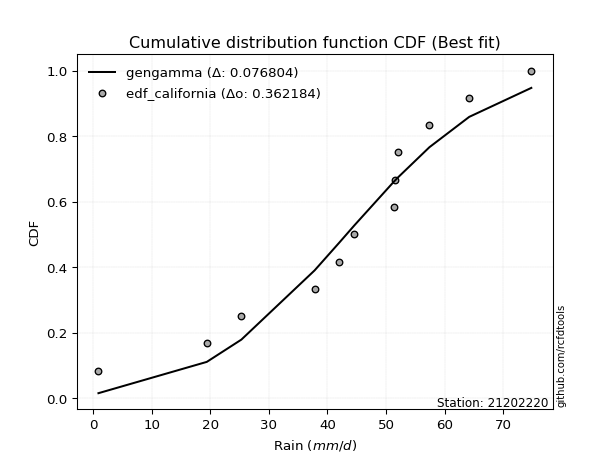</img>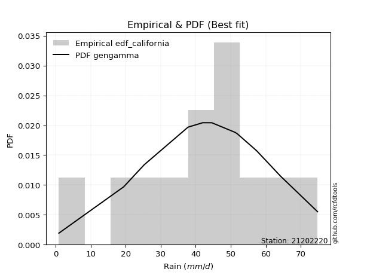</img>

</div>


### 2. Empirical - EDF Hazen (1930)

Hazen method for plotting positions is a formula used to estimate the empirical cumulative probability distribution of flood events or other hydrological data. This formula often results in biased estimations, particularly when extrapolating to extreme events (high return periods).

<div align="center">


$P=(m-0.5)/n$


</div>


**2.1. Empirical values**

<div align="center">

|                | 0                    | 1                  | 2                   | 3                  | 4         | 5                  | 6                  | 7                  | 8                  | 9                  | 10        | 11                 |
|:---------------|:---------------------|:-------------------|:--------------------|:-------------------|:----------|:-------------------|:-------------------|:-------------------|:-------------------|:-------------------|:----------|:-------------------|
| date           | 2023                 | 2016               | 2015                | 2012               | 2014      | 2025               | 2011               | 2009               | 2024               | 2010               | 2013      | 2008               |
| x              | 0.9                  | 19.4               | 25.3                | 37.8               | 42.0      | 44.6               | 51.3               | 51.6               | 52.0               | 57.4               | 64.2      | 74.8               |
| m              | 1                    | 2                  | 3                   | 4                  | 5         | 6                  | 7                  | 8                  | 9                  | 10                 | 11        | 12                 |
| empirical_dist | edf_hazen            | edf_hazen          | edf_hazen           | edf_hazen          | edf_hazen | edf_hazen          | edf_hazen          | edf_hazen          | edf_hazen          | edf_hazen          | edf_hazen | edf_hazen          |
| empirical      | 0.041666666666666664 | 0.125              | 0.20833333333333334 | 0.2916666666666667 | 0.375     | 0.4583333333333333 | 0.5416666666666666 | 0.625              | 0.7083333333333334 | 0.7916666666666666 | 0.875     | 0.9583333333333334 |
| empirical_tr   | 1.0434782608695652   | 1.1428571428571428 | 1.2631578947368423  | 1.411764705882353  | 1.6       | 1.8461538461538458 | 2.1818181818181817 | 2.6666666666666665 | 3.428571428571429  | 4.799999999999999  | 8.0       | 24.00000000000002  |

</div>


**2.2. Kolmogorov-Smirnov fit test (sorted by Δ)**


<div align="center">

|                | 0                   | 1                   | 2                   | 3                   | 4                   | 5                   | 6                   | 7                   | 8                   | 9                   | 10                  | 11                  | 12                  | 13                  | 14                  | 15                  | 16                  | 17                  | 18                  | 19                  | 20                  | 21                  | 22                  | 23                  | 24                  | 25                  | 26                  | 27                  | 28                  | 29                  | 30                  | 31                  | 32                  | 33                  | 34                    | 35                  | 36                  | 37                  | 38                  | 39                  | 40                  | 41                  | 42                  | 43                  | 44                  | 45                  | 46                  | 47                  | 48                  | 49                  | 50                  | 51                  | 52                  | 53                  | 54                  | 55                  | 56                  | 57                  | 58                  | 59                  | 60                  | 61                  | 62                  | 63                  | 64                  | 65                  | 66                  | 67                  | 68                  | 69                  | 70                  | 71                  | 72                  | 73                  | 74                  | 75                  | 76                  | 77                  | 78                  | 79                  | 80                  | 81                  | 82                  | 83                  | 84                  | 85                  | 86                  | 87                  | 88                  | 89                  |
|:---------------|:--------------------|:--------------------|:--------------------|:--------------------|:--------------------|:--------------------|:--------------------|:--------------------|:--------------------|:--------------------|:--------------------|:--------------------|:--------------------|:--------------------|:--------------------|:--------------------|:--------------------|:--------------------|:--------------------|:--------------------|:--------------------|:--------------------|:--------------------|:--------------------|:--------------------|:--------------------|:--------------------|:--------------------|:--------------------|:--------------------|:--------------------|:--------------------|:--------------------|:--------------------|:----------------------|:--------------------|:--------------------|:--------------------|:--------------------|:--------------------|:--------------------|:--------------------|:--------------------|:--------------------|:--------------------|:--------------------|:--------------------|:--------------------|:--------------------|:--------------------|:--------------------|:--------------------|:--------------------|:--------------------|:--------------------|:--------------------|:--------------------|:--------------------|:--------------------|:--------------------|:--------------------|:--------------------|:--------------------|:--------------------|:--------------------|:--------------------|:--------------------|:--------------------|:--------------------|:--------------------|:--------------------|:--------------------|:--------------------|:--------------------|:--------------------|:--------------------|:--------------------|:--------------------|:--------------------|:--------------------|:--------------------|:--------------------|:--------------------|:--------------------|:--------------------|:--------------------|:--------------------|:--------------------|:--------------------|:--------------------|
| station        | 21202220            | 21202220            | 21202220            | 21202220            | 21202220            | 21202220            | 21202220            | 21202220            | 21202220            | 21202220            | 21202220            | 21202220            | 21202220            | 21202220            | 21202220            | 21202220            | 21202220            | 21202220            | 21202220            | 21202220            | 21202220            | 21202220            | 21202220            | 21202220            | 21202220            | 21202220            | 21202220            | 21202220            | 21202220            | 21202220            | 21202220            | 21202220            | 21202220            | 21202220            | 21202220              | 21202220            | 21202220            | 21202220            | 21202220            | 21202220            | 21202220            | 21202220            | 21202220            | 21202220            | 21202220            | 21202220            | 21202220            | 21202220            | 21202220            | 21202220            | 21202220            | 21202220            | 21202220            | 21202220            | 21202220            | 21202220            | 21202220            | 21202220            | 21202220            | 21202220            | 21202220            | 21202220            | 21202220            | 21202220            | 21202220            | 21202220            | 21202220            | 21202220            | 21202220            | 21202220            | 21202220            | 21202220            | 21202220            | 21202220            | 21202220            | 21202220            | 21202220            | 21202220            | 21202220            | 21202220            | 21202220            | 21202220            | 21202220            | 21202220            | 21202220            | 21202220            | 21202220            | 21202220            | 21202220            | 21202220            |
| empirical_dist | edf_hazen           | edf_hazen           | edf_hazen           | edf_hazen           | edf_hazen           | edf_hazen           | edf_hazen           | edf_hazen           | edf_hazen           | edf_hazen           | edf_hazen           | edf_hazen           | edf_hazen           | edf_hazen           | edf_hazen           | edf_hazen           | edf_hazen           | edf_hazen           | edf_hazen           | edf_hazen           | edf_hazen           | edf_hazen           | edf_hazen           | edf_hazen           | edf_hazen           | edf_hazen           | edf_hazen           | edf_hazen           | edf_hazen           | edf_hazen           | edf_hazen           | edf_hazen           | edf_hazen           | edf_hazen           | edf_hazen             | edf_hazen           | edf_hazen           | edf_hazen           | edf_hazen           | edf_hazen           | edf_hazen           | edf_hazen           | edf_hazen           | edf_hazen           | edf_hazen           | edf_hazen           | edf_hazen           | edf_hazen           | edf_hazen           | edf_hazen           | edf_hazen           | edf_hazen           | edf_hazen           | edf_hazen           | edf_hazen           | edf_hazen           | edf_hazen           | edf_hazen           | edf_hazen           | edf_hazen           | edf_hazen           | edf_hazen           | edf_hazen           | edf_hazen           | edf_hazen           | edf_hazen           | edf_hazen           | edf_hazen           | edf_hazen           | edf_hazen           | edf_hazen           | edf_hazen           | edf_hazen           | edf_hazen           | edf_hazen           | edf_hazen           | edf_hazen           | edf_hazen           | edf_hazen           | edf_hazen           | edf_hazen           | edf_hazen           | edf_hazen           | edf_hazen           | edf_hazen           | edf_hazen           | edf_hazen           | edf_hazen           | edf_hazen           | edf_hazen           |
| p_dist         | johnsonsu           | genlogistic         | weibull_min         | logjohnsonsu        | gumbel_l            | pearson3            | gompertz            | mielke              | laplace_asymmetric  | fisk                | f                   | fatiguelife         | t                   | crystalball         | norm                | exponnorm           | nct                 | nakagami            | betaprime           | rice                | chi2                | gamma               | erlang              | invgauss            | invgamma            | logistic            | maxwell             | logt                | alpha               | logmielke           | rayleigh            | hypsecant           | logloggamma         | invweibull          | loglaplace_asymmetric | logfisk             | ncf                 | gumbel_r            | halfnorm            | laplace             | loggompertz         | kstwobign           | logpearson3         | moyal               | halflogistic        | loggumbel_l         | wald                | logbetaprime        | logfatiguelife      | logexponnorm        | lognorm             | lognorm             | logcrystalball      | logrice             | lognakagami         | lognct              | loglognorm          | loglogistic         | loggamma            | loggamma            | loginvgauss         | loghypsecant        | loginvgamma         | gibrat              | logalpha            | loginvweibull       | expon               | genexpon            | logmaxwell          | loglaplace          | lograyleigh         | loghalfnorm         | loggumbel_r         | logkstwobign        | loghalflogistic     | logmoyal            | loggenexpon         | logwald             | logncf              | logexpon            | logchi2             | loggibrat           | pareto              | logpareto           | logf                | logtruncnorm        | logweibull_min      | truncnorm           | logerlang           | loggenlogistic      |
| delta          | 0.07639579265336871 | 0.0773675165801263  | 0.0789352413942106  | 0.08102549154582295 | 0.0814758555580114  | 0.08386214388458157 | 0.08433005983733122 | 0.08534876798170121 | 0.0937112356061296  | 0.097310324229548   | 0.11273403003071059 | 0.11430321249867059 | 0.11485531985862585 | 0.11485916742623348 | 0.11485917701835968 | 0.1148600996038327  | 0.1148610299154239  | 0.11530326035043825 | 0.11556366723853817 | 0.11730539232043602 | 0.11933848912956391 | 0.11958716996933172 | 0.1229836326755166  | 0.1235924449110185  | 0.12911085586113558 | 0.13334943918532094 | 0.1357907857749988  | 0.13588617257922497 | 0.1394003298585179  | 0.1419462571357299  | 0.14206096009610436 | 0.14758430280722334 | 0.15335057824419207 | 0.15554842436436217 | 0.16375138276002377   | 0.16777877910591132 | 0.17193924640768088 | 0.17378124009768725 | 0.17536293690026444 | 0.17555022498181472 | 0.18647135864334202 | 0.18926934356212288 | 0.19034951773863107 | 0.1932102126528784  | 0.1966093084305719  | 0.19954106865000237 | 0.2618944470844796  | 0.26507376155825174 | 0.26512798666668996 | 0.265749060013083   | 0.26575096027519013 | 0.26575096027519013 | 0.2657510389557342  | 0.265759111201711   | 0.26579609681976285 | 0.2661583177904428  | 0.26768592436705535 | 0.2734509509230643  | 0.27402848412883757 | 0.27402848412883757 | 0.2767857038158977  | 0.27993434590059724 | 0.28061039255056547 | 0.2806248006221469  | 0.2819028308080361  | 0.28329214543985193 | 0.2882847571227412  | 0.2883414646458545  | 0.2956397629421094  | 0.3007032637337677  | 0.305189446831528   | 0.3321481710435656  | 0.3355125693972822  | 0.3380402087501734  | 0.35966528937233394 | 0.3600983772476037  | 0.37856559611249607 | 0.42832298109059647 | 0.4468511620166373  | 0.4515320611611231  | 0.4553458586191209  | 0.4579797467977638  | 0.5120021073133023  | 0.5318780101839045  | 0.5462793911353133  | 0.6401971143452865  | 0.6593800453445595  | 0.6684857249149854  | 0.8747542885130916  | 0.875               |
| deltao         | 0.36218414519599995 | 0.36218414519599995 | 0.36218414519599995 | 0.36218414519599995 | 0.36218414519599995 | 0.36218414519599995 | 0.36218414519599995 | 0.36218414519599995 | 0.36218414519599995 | 0.36218414519599995 | 0.36218414519599995 | 0.36218414519599995 | 0.36218414519599995 | 0.36218414519599995 | 0.36218414519599995 | 0.36218414519599995 | 0.36218414519599995 | 0.36218414519599995 | 0.36218414519599995 | 0.36218414519599995 | 0.36218414519599995 | 0.36218414519599995 | 0.36218414519599995 | 0.36218414519599995 | 0.36218414519599995 | 0.36218414519599995 | 0.36218414519599995 | 0.36218414519599995 | 0.36218414519599995 | 0.36218414519599995 | 0.36218414519599995 | 0.36218414519599995 | 0.36218414519599995 | 0.36218414519599995 | 0.36218414519599995   | 0.36218414519599995 | 0.36218414519599995 | 0.36218414519599995 | 0.36218414519599995 | 0.36218414519599995 | 0.36218414519599995 | 0.36218414519599995 | 0.36218414519599995 | 0.36218414519599995 | 0.36218414519599995 | 0.36218414519599995 | 0.36218414519599995 | 0.36218414519599995 | 0.36218414519599995 | 0.36218414519599995 | 0.36218414519599995 | 0.36218414519599995 | 0.36218414519599995 | 0.36218414519599995 | 0.36218414519599995 | 0.36218414519599995 | 0.36218414519599995 | 0.36218414519599995 | 0.36218414519599995 | 0.36218414519599995 | 0.36218414519599995 | 0.36218414519599995 | 0.36218414519599995 | 0.36218414519599995 | 0.36218414519599995 | 0.36218414519599995 | 0.36218414519599995 | 0.36218414519599995 | 0.36218414519599995 | 0.36218414519599995 | 0.36218414519599995 | 0.36218414519599995 | 0.36218414519599995 | 0.36218414519599995 | 0.36218414519599995 | 0.36218414519599995 | 0.36218414519599995 | 0.36218414519599995 | 0.36218414519599995 | 0.36218414519599995 | 0.36218414519599995 | 0.36218414519599995 | 0.36218414519599995 | 0.36218414519599995 | 0.36218414519599995 | 0.36218414519599995 | 0.36218414519599995 | 0.36218414519599995 | 0.36218414519599995 | 0.36218414519599995 |
| eval           | Δo > Δ              | Δo > Δ              | Δo > Δ              | Δo > Δ              | Δo > Δ              | Δo > Δ              | Δo > Δ              | Δo > Δ              | Δo > Δ              | Δo > Δ              | Δo > Δ              | Δo > Δ              | Δo > Δ              | Δo > Δ              | Δo > Δ              | Δo > Δ              | Δo > Δ              | Δo > Δ              | Δo > Δ              | Δo > Δ              | Δo > Δ              | Δo > Δ              | Δo > Δ              | Δo > Δ              | Δo > Δ              | Δo > Δ              | Δo > Δ              | Δo > Δ              | Δo > Δ              | Δo > Δ              | Δo > Δ              | Δo > Δ              | Δo > Δ              | Δo > Δ              | Δo > Δ                | Δo > Δ              | Δo > Δ              | Δo > Δ              | Δo > Δ              | Δo > Δ              | Δo > Δ              | Δo > Δ              | Δo > Δ              | Δo > Δ              | Δo > Δ              | Δo > Δ              | Δo > Δ              | Δo > Δ              | Δo > Δ              | Δo > Δ              | Δo > Δ              | Δo > Δ              | Δo > Δ              | Δo > Δ              | Δo > Δ              | Δo > Δ              | Δo > Δ              | Δo > Δ              | Δo > Δ              | Δo > Δ              | Δo > Δ              | Δo > Δ              | Δo > Δ              | Δo > Δ              | Δo > Δ              | Δo > Δ              | Δo > Δ              | Δo > Δ              | Δo > Δ              | Δo > Δ              | Δo > Δ              | Δo > Δ              | Δo > Δ              | Δo > Δ              | Δo > Δ              | Δo > Δ              | Δo <= Δ             | Δo <= Δ             | Δo <= Δ             | Δo <= Δ             | Δo <= Δ             | Δo <= Δ             | Δo <= Δ             | Δo <= Δ             | Δo <= Δ             | Δo <= Δ             | Δo <= Δ             | Δo <= Δ             | Δo <= Δ             | Δo <= Δ             |
| fit            | 1                   | 1                   | 1                   | 1                   | 1                   | 1                   | 1                   | 1                   | 1                   | 1                   | 1                   | 1                   | 1                   | 1                   | 1                   | 1                   | 1                   | 1                   | 1                   | 1                   | 1                   | 1                   | 1                   | 1                   | 1                   | 1                   | 1                   | 1                   | 1                   | 1                   | 1                   | 1                   | 1                   | 1                   | 1                     | 1                   | 1                   | 1                   | 1                   | 1                   | 1                   | 1                   | 1                   | 1                   | 1                   | 1                   | 1                   | 1                   | 1                   | 1                   | 1                   | 1                   | 1                   | 1                   | 1                   | 1                   | 1                   | 1                   | 1                   | 1                   | 1                   | 1                   | 1                   | 1                   | 1                   | 1                   | 1                   | 1                   | 1                   | 1                   | 1                   | 1                   | 1                   | 1                   | 1                   | 1                   | 0                   | 0                   | 0                   | 0                   | 0                   | 0                   | 0                   | 0                   | 0                   | 0                   | 0                   | 0                   | 0                   | 0                   |
| n              | 12                  | 12                  | 12                  | 12                  | 12                  | 12                  | 12                  | 12                  | 12                  | 12                  | 12                  | 12                  | 12                  | 12                  | 12                  | 12                  | 12                  | 12                  | 12                  | 12                  | 12                  | 12                  | 12                  | 12                  | 12                  | 12                  | 12                  | 12                  | 12                  | 12                  | 12                  | 12                  | 12                  | 12                  | 12                    | 12                  | 12                  | 12                  | 12                  | 12                  | 12                  | 12                  | 12                  | 12                  | 12                  | 12                  | 12                  | 12                  | 12                  | 12                  | 12                  | 12                  | 12                  | 12                  | 12                  | 12                  | 12                  | 12                  | 12                  | 12                  | 12                  | 12                  | 12                  | 12                  | 12                  | 12                  | 12                  | 12                  | 12                  | 12                  | 12                  | 12                  | 12                  | 12                  | 12                  | 12                  | 12                  | 12                  | 12                  | 12                  | 12                  | 12                  | 12                  | 12                  | 12                  | 12                  | 12                  | 12                  | 12                  | 12                  |
| best_fit       | 1                   | 0                   | 0                   | 0                   | 0                   | 0                   | 0                   | 0                   | 0                   | 0                   | 0                   | 0                   | 0                   | 0                   | 0                   | 0                   | 0                   | 0                   | 0                   | 0                   | 0                   | 0                   | 0                   | 0                   | 0                   | 0                   | 0                   | 0                   | 0                   | 0                   | 0                   | 0                   | 0                   | 0                   | 0                     | 0                   | 0                   | 0                   | 0                   | 0                   | 0                   | 0                   | 0                   | 0                   | 0                   | 0                   | 0                   | 0                   | 0                   | 0                   | 0                   | 0                   | 0                   | 0                   | 0                   | 0                   | 0                   | 0                   | 0                   | 0                   | 0                   | 0                   | 0                   | 0                   | 0                   | 0                   | 0                   | 0                   | 0                   | 0                   | 0                   | 0                   | 0                   | 0                   | 0                   | 0                   | 0                   | 0                   | 0                   | 0                   | 0                   | 0                   | 0                   | 0                   | 0                   | 0                   | 0                   | 0                   | 0                   | 0                   |
| best_fit_sort  | 1                   | 2                   | 3                   | 4                   | 5                   | 6                   | 7                   | 8                   | 9                   | 10                  | 11                  | 12                  | 13                  | 14                  | 15                  | 16                  | 17                  | 18                  | 19                  | 20                  | 21                  | 22                  | 23                  | 24                  | 25                  | 26                  | 27                  | 28                  | 29                  | 30                  | 31                  | 32                  | 33                  | 34                  | 35                    | 36                  | 37                  | 38                  | 39                  | 40                  | 41                  | 42                  | 43                  | 44                  | 45                  | 46                  | 47                  | 48                  | 49                  | 50                  | 51                  | 52                  | 53                  | 54                  | 55                  | 56                  | 57                  | 58                  | 59                  | 60                  | 61                  | 62                  | 63                  | 64                  | 65                  | 66                  | 67                  | 68                  | 69                  | 70                  | 71                  | 72                  | 73                  | 74                  | 75                  | 76                  | 77                  | 78                  | 79                  | 80                  | 81                  | 82                  | 83                  | 84                  | 85                  | 86                  | 87                  | 88                  | 89                  | 90                  |

</div>


<div align="center">

</img>

</div>


**2.3. Best fit**

<div align="center">

|   id |   station | empirical_dist   | p_dist    |     delta |   deltao | eval   |   fit |   n |   best_fit |   best_fit_sort |
|-----:|----------:|:-----------------|:----------|----------:|---------:|:-------|------:|----:|-----------:|----------------:|
|    0 |  21202220 | edf_hazen        | johnsonsu | 0.0763958 | 0.362184 | Δo > Δ |     1 |  12 |          1 |               1 |

</div>


<div align="center">

</img>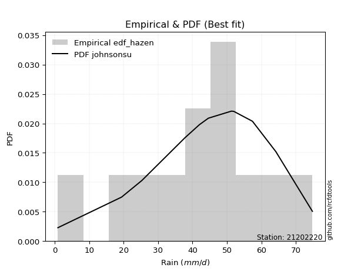</img>

</div>


### 3. Empirical - EDF Weibull (1939)

Weibull plotting position formula is an empirical method used to estimate the non-exceedance probability or plotting position for a set of observed data, is often recommended or widely used in practice, particularly in flood frequency analysis.

<div align="center">


$P=m/(n+1)$


</div>


**3.1. Empirical values**

<div align="center">

|                | 0                   | 1                   | 2                   | 3                  | 4                   | 5                   | 6                  | 7                  | 8                  | 9                  | 10                 | 11                 |
|:---------------|:--------------------|:--------------------|:--------------------|:-------------------|:--------------------|:--------------------|:-------------------|:-------------------|:-------------------|:-------------------|:-------------------|:-------------------|
| date           | 2023                | 2016                | 2015                | 2012               | 2014                | 2025                | 2011               | 2009               | 2024               | 2010               | 2013               | 2008               |
| x              | 0.9                 | 19.4                | 25.3                | 37.8               | 42.0                | 44.6                | 51.3               | 51.6               | 52.0               | 57.4               | 64.2               | 74.8               |
| m              | 1                   | 2                   | 3                   | 4                  | 5                   | 6                   | 7                  | 8                  | 9                  | 10                 | 11                 | 12                 |
| empirical_dist | edf_weibull         | edf_weibull         | edf_weibull         | edf_weibull        | edf_weibull         | edf_weibull         | edf_weibull        | edf_weibull        | edf_weibull        | edf_weibull        | edf_weibull        | edf_weibull        |
| empirical      | 0.07692307692307693 | 0.15384615384615385 | 0.23076923076923078 | 0.3076923076923077 | 0.38461538461538464 | 0.46153846153846156 | 0.5384615384615384 | 0.6153846153846154 | 0.6923076923076923 | 0.7692307692307693 | 0.8461538461538461 | 0.9230769230769231 |
| empirical_tr   | 1.0833333333333333  | 1.1818181818181819  | 1.3                 | 1.4444444444444444 | 1.625               | 1.8571428571428572  | 2.1666666666666665 | 2.6                | 3.25               | 4.333333333333334  | 6.5                | 13.000000000000009 |

</div>


**3.2. Kolmogorov-Smirnov fit test (sorted by Δ)**


<div align="center">

|                | 0                   | 1                   | 2                   | 3                   | 4                   | 5                   | 6                   | 7                   | 8                   | 9                   | 10                  | 11                  | 12                  | 13                  | 14                  | 15                  | 16                  | 17                  | 18                  | 19                  | 20                  | 21                  | 22                  | 23                  | 24                  | 25                  | 26                  | 27                  | 28                  | 29                  | 30                  | 31                  | 32                  | 33                  | 34                    | 35                  | 36                  | 37                  | 38                  | 39                  | 40                  | 41                  | 42                  | 43                  | 44                  | 45                  | 46                  | 47                  | 48                  | 49                  | 50                  | 51                  | 52                  | 53                  | 54                  | 55                  | 56                  | 57                  | 58                  | 59                  | 60                  | 61                  | 62                  | 63                  | 64                  | 65                  | 66                  | 67                  | 68                  | 69                  | 70                  | 71                  | 72                  | 73                  | 74                  | 75                  | 76                  | 77                  | 78                  | 79                  | 80                  | 81                  | 82                  | 83                  | 84                  | 85                  | 86                  | 87                  | 88                  | 89                  |
|:---------------|:--------------------|:--------------------|:--------------------|:--------------------|:--------------------|:--------------------|:--------------------|:--------------------|:--------------------|:--------------------|:--------------------|:--------------------|:--------------------|:--------------------|:--------------------|:--------------------|:--------------------|:--------------------|:--------------------|:--------------------|:--------------------|:--------------------|:--------------------|:--------------------|:--------------------|:--------------------|:--------------------|:--------------------|:--------------------|:--------------------|:--------------------|:--------------------|:--------------------|:--------------------|:----------------------|:--------------------|:--------------------|:--------------------|:--------------------|:--------------------|:--------------------|:--------------------|:--------------------|:--------------------|:--------------------|:--------------------|:--------------------|:--------------------|:--------------------|:--------------------|:--------------------|:--------------------|:--------------------|:--------------------|:--------------------|:--------------------|:--------------------|:--------------------|:--------------------|:--------------------|:--------------------|:--------------------|:--------------------|:--------------------|:--------------------|:--------------------|:--------------------|:--------------------|:--------------------|:--------------------|:--------------------|:--------------------|:--------------------|:--------------------|:--------------------|:--------------------|:--------------------|:--------------------|:--------------------|:--------------------|:--------------------|:--------------------|:--------------------|:--------------------|:--------------------|:--------------------|:--------------------|:--------------------|:--------------------|:--------------------|
| station        | 21202220            | 21202220            | 21202220            | 21202220            | 21202220            | 21202220            | 21202220            | 21202220            | 21202220            | 21202220            | 21202220            | 21202220            | 21202220            | 21202220            | 21202220            | 21202220            | 21202220            | 21202220            | 21202220            | 21202220            | 21202220            | 21202220            | 21202220            | 21202220            | 21202220            | 21202220            | 21202220            | 21202220            | 21202220            | 21202220            | 21202220            | 21202220            | 21202220            | 21202220            | 21202220              | 21202220            | 21202220            | 21202220            | 21202220            | 21202220            | 21202220            | 21202220            | 21202220            | 21202220            | 21202220            | 21202220            | 21202220            | 21202220            | 21202220            | 21202220            | 21202220            | 21202220            | 21202220            | 21202220            | 21202220            | 21202220            | 21202220            | 21202220            | 21202220            | 21202220            | 21202220            | 21202220            | 21202220            | 21202220            | 21202220            | 21202220            | 21202220            | 21202220            | 21202220            | 21202220            | 21202220            | 21202220            | 21202220            | 21202220            | 21202220            | 21202220            | 21202220            | 21202220            | 21202220            | 21202220            | 21202220            | 21202220            | 21202220            | 21202220            | 21202220            | 21202220            | 21202220            | 21202220            | 21202220            | 21202220            |
| empirical_dist | edf_weibull         | edf_weibull         | edf_weibull         | edf_weibull         | edf_weibull         | edf_weibull         | edf_weibull         | edf_weibull         | edf_weibull         | edf_weibull         | edf_weibull         | edf_weibull         | edf_weibull         | edf_weibull         | edf_weibull         | edf_weibull         | edf_weibull         | edf_weibull         | edf_weibull         | edf_weibull         | edf_weibull         | edf_weibull         | edf_weibull         | edf_weibull         | edf_weibull         | edf_weibull         | edf_weibull         | edf_weibull         | edf_weibull         | edf_weibull         | edf_weibull         | edf_weibull         | edf_weibull         | edf_weibull         | edf_weibull           | edf_weibull         | edf_weibull         | edf_weibull         | edf_weibull         | edf_weibull         | edf_weibull         | edf_weibull         | edf_weibull         | edf_weibull         | edf_weibull         | edf_weibull         | edf_weibull         | edf_weibull         | edf_weibull         | edf_weibull         | edf_weibull         | edf_weibull         | edf_weibull         | edf_weibull         | edf_weibull         | edf_weibull         | edf_weibull         | edf_weibull         | edf_weibull         | edf_weibull         | edf_weibull         | edf_weibull         | edf_weibull         | edf_weibull         | edf_weibull         | edf_weibull         | edf_weibull         | edf_weibull         | edf_weibull         | edf_weibull         | edf_weibull         | edf_weibull         | edf_weibull         | edf_weibull         | edf_weibull         | edf_weibull         | edf_weibull         | edf_weibull         | edf_weibull         | edf_weibull         | edf_weibull         | edf_weibull         | edf_weibull         | edf_weibull         | edf_weibull         | edf_weibull         | edf_weibull         | edf_weibull         | edf_weibull         | edf_weibull         |
| p_dist         | gumbel_l            | johnsonsu           | genlogistic         | weibull_min         | logjohnsonsu        | pearson3            | gompertz            | mielke              | laplace_asymmetric  | fisk                | f                   | fatiguelife         | t                   | crystalball         | norm                | exponnorm           | nct                 | nakagami            | betaprime           | rice                | invgauss            | chi2                | gamma               | erlang              | invgamma            | logistic            | logmielke           | logloggamma         | logt                | maxwell             | invweibull          | alpha               | rayleigh            | logfisk             | loglaplace_asymmetric | hypsecant           | ncf                 | halfnorm            | logpearson3         | loggompertz         | kstwobign           | gumbel_r            | laplace             | loggumbel_l         | halflogistic        | moyal               | logbetaprime        | logfatiguelife      | logexponnorm        | lognorm             | lognorm             | logcrystalball      | logrice             | lognakagami         | lognct              | loglognorm          | wald                | loginvweibull       | loglogistic         | loggamma            | loggamma            | loginvgauss         | loghypsecant        | loginvgamma         | logalpha            | expon               | genexpon            | logmaxwell          | gibrat              | loglaplace          | lograyleigh         | logkstwobign        | loghalfnorm         | loggumbel_r         | loghalflogistic     | logmoyal            | loggenexpon         | logwald             | logncf              | logexpon            | logchi2             | loggibrat           | pareto              | logpareto           | logf                | logtruncnorm        | logweibull_min      | truncnorm           | logerlang           | loggenlogistic      |
| delta          | 0.0742178591790866  | 0.07802493552056289 | 0.0805726447852545  | 0.08214036959933879 | 0.08423061975095114 | 0.08706727208970977 | 0.08753518804245941 | 0.0885538961868294  | 0.09691636381125779 | 0.10051545243467619 | 0.11593915823583878 | 0.11750834070379879 | 0.11806044806375404 | 0.11806429563136167 | 0.11806430522348788 | 0.1180652278089609  | 0.1180661581205521  | 0.11850838855556645 | 0.11876879544366636 | 0.12051052052556421 | 0.12185887964293995 | 0.1225436173346921  | 0.12279229817445991 | 0.1261887608806448  | 0.13231598406626377 | 0.13655456739044913 | 0.13680766930702049 | 0.13732493721855105 | 0.13872348152969305 | 0.138995913980127   | 0.13952278333872115 | 0.1426054580636461  | 0.14526608830123255 | 0.14706025459572647 | 0.14772574173438274   | 0.15078943101235154 | 0.15591360538203985 | 0.16412512976174026 | 0.1679136203027337  | 0.170445717617701   | 0.17324370253648186 | 0.17698636830281544 | 0.1787553531869429  | 0.18351542762436135 | 0.19158612983779766 | 0.1964153408580066  | 0.24904812053261072 | 0.24910234564104894 | 0.249723418987442   | 0.2497253192495491  | 0.2497253192495491  | 0.24972539793009318 | 0.24973347017606995 | 0.24977045579412183 | 0.2501326767648018  | 0.2516602833414143  | 0.252279062469095   | 0.2537011921143413  | 0.2574253098974233  | 0.25800284310319654 | 0.25800284310319654 | 0.26076006279025665 | 0.2639087048749562  | 0.26458475152492444 | 0.26587718978239505 | 0.2722591160971002  | 0.27231582362021345 | 0.2796141219164684  | 0.2838299288272751  | 0.2846776227081267  | 0.28916380580588696 | 0.3091940549040195  | 0.31612253001792456 | 0.31948692837164117 | 0.3436396483466929  | 0.34407273622196266 | 0.3497194422663422  | 0.41229734006495544 | 0.41800500817048347 | 0.42268590731496924 | 0.42649970477296706 | 0.4419541057721228  | 0.48315595346714846 | 0.5030318563377506  | 0.5174332372891595  | 0.6113509604991326  | 0.6305338914984057  | 0.6524600838893444  | 0.8459081346669377  | 0.8461538461538461  |
| deltao         | 0.36218414519599995 | 0.36218414519599995 | 0.36218414519599995 | 0.36218414519599995 | 0.36218414519599995 | 0.36218414519599995 | 0.36218414519599995 | 0.36218414519599995 | 0.36218414519599995 | 0.36218414519599995 | 0.36218414519599995 | 0.36218414519599995 | 0.36218414519599995 | 0.36218414519599995 | 0.36218414519599995 | 0.36218414519599995 | 0.36218414519599995 | 0.36218414519599995 | 0.36218414519599995 | 0.36218414519599995 | 0.36218414519599995 | 0.36218414519599995 | 0.36218414519599995 | 0.36218414519599995 | 0.36218414519599995 | 0.36218414519599995 | 0.36218414519599995 | 0.36218414519599995 | 0.36218414519599995 | 0.36218414519599995 | 0.36218414519599995 | 0.36218414519599995 | 0.36218414519599995 | 0.36218414519599995 | 0.36218414519599995   | 0.36218414519599995 | 0.36218414519599995 | 0.36218414519599995 | 0.36218414519599995 | 0.36218414519599995 | 0.36218414519599995 | 0.36218414519599995 | 0.36218414519599995 | 0.36218414519599995 | 0.36218414519599995 | 0.36218414519599995 | 0.36218414519599995 | 0.36218414519599995 | 0.36218414519599995 | 0.36218414519599995 | 0.36218414519599995 | 0.36218414519599995 | 0.36218414519599995 | 0.36218414519599995 | 0.36218414519599995 | 0.36218414519599995 | 0.36218414519599995 | 0.36218414519599995 | 0.36218414519599995 | 0.36218414519599995 | 0.36218414519599995 | 0.36218414519599995 | 0.36218414519599995 | 0.36218414519599995 | 0.36218414519599995 | 0.36218414519599995 | 0.36218414519599995 | 0.36218414519599995 | 0.36218414519599995 | 0.36218414519599995 | 0.36218414519599995 | 0.36218414519599995 | 0.36218414519599995 | 0.36218414519599995 | 0.36218414519599995 | 0.36218414519599995 | 0.36218414519599995 | 0.36218414519599995 | 0.36218414519599995 | 0.36218414519599995 | 0.36218414519599995 | 0.36218414519599995 | 0.36218414519599995 | 0.36218414519599995 | 0.36218414519599995 | 0.36218414519599995 | 0.36218414519599995 | 0.36218414519599995 | 0.36218414519599995 | 0.36218414519599995 |
| eval           | Δo > Δ              | Δo > Δ              | Δo > Δ              | Δo > Δ              | Δo > Δ              | Δo > Δ              | Δo > Δ              | Δo > Δ              | Δo > Δ              | Δo > Δ              | Δo > Δ              | Δo > Δ              | Δo > Δ              | Δo > Δ              | Δo > Δ              | Δo > Δ              | Δo > Δ              | Δo > Δ              | Δo > Δ              | Δo > Δ              | Δo > Δ              | Δo > Δ              | Δo > Δ              | Δo > Δ              | Δo > Δ              | Δo > Δ              | Δo > Δ              | Δo > Δ              | Δo > Δ              | Δo > Δ              | Δo > Δ              | Δo > Δ              | Δo > Δ              | Δo > Δ              | Δo > Δ                | Δo > Δ              | Δo > Δ              | Δo > Δ              | Δo > Δ              | Δo > Δ              | Δo > Δ              | Δo > Δ              | Δo > Δ              | Δo > Δ              | Δo > Δ              | Δo > Δ              | Δo > Δ              | Δo > Δ              | Δo > Δ              | Δo > Δ              | Δo > Δ              | Δo > Δ              | Δo > Δ              | Δo > Δ              | Δo > Δ              | Δo > Δ              | Δo > Δ              | Δo > Δ              | Δo > Δ              | Δo > Δ              | Δo > Δ              | Δo > Δ              | Δo > Δ              | Δo > Δ              | Δo > Δ              | Δo > Δ              | Δo > Δ              | Δo > Δ              | Δo > Δ              | Δo > Δ              | Δo > Δ              | Δo > Δ              | Δo > Δ              | Δo > Δ              | Δo > Δ              | Δo > Δ              | Δo > Δ              | Δo <= Δ             | Δo <= Δ             | Δo <= Δ             | Δo <= Δ             | Δo <= Δ             | Δo <= Δ             | Δo <= Δ             | Δo <= Δ             | Δo <= Δ             | Δo <= Δ             | Δo <= Δ             | Δo <= Δ             | Δo <= Δ             |
| fit            | 1                   | 1                   | 1                   | 1                   | 1                   | 1                   | 1                   | 1                   | 1                   | 1                   | 1                   | 1                   | 1                   | 1                   | 1                   | 1                   | 1                   | 1                   | 1                   | 1                   | 1                   | 1                   | 1                   | 1                   | 1                   | 1                   | 1                   | 1                   | 1                   | 1                   | 1                   | 1                   | 1                   | 1                   | 1                     | 1                   | 1                   | 1                   | 1                   | 1                   | 1                   | 1                   | 1                   | 1                   | 1                   | 1                   | 1                   | 1                   | 1                   | 1                   | 1                   | 1                   | 1                   | 1                   | 1                   | 1                   | 1                   | 1                   | 1                   | 1                   | 1                   | 1                   | 1                   | 1                   | 1                   | 1                   | 1                   | 1                   | 1                   | 1                   | 1                   | 1                   | 1                   | 1                   | 1                   | 1                   | 1                   | 0                   | 0                   | 0                   | 0                   | 0                   | 0                   | 0                   | 0                   | 0                   | 0                   | 0                   | 0                   | 0                   |
| n              | 12                  | 12                  | 12                  | 12                  | 12                  | 12                  | 12                  | 12                  | 12                  | 12                  | 12                  | 12                  | 12                  | 12                  | 12                  | 12                  | 12                  | 12                  | 12                  | 12                  | 12                  | 12                  | 12                  | 12                  | 12                  | 12                  | 12                  | 12                  | 12                  | 12                  | 12                  | 12                  | 12                  | 12                  | 12                    | 12                  | 12                  | 12                  | 12                  | 12                  | 12                  | 12                  | 12                  | 12                  | 12                  | 12                  | 12                  | 12                  | 12                  | 12                  | 12                  | 12                  | 12                  | 12                  | 12                  | 12                  | 12                  | 12                  | 12                  | 12                  | 12                  | 12                  | 12                  | 12                  | 12                  | 12                  | 12                  | 12                  | 12                  | 12                  | 12                  | 12                  | 12                  | 12                  | 12                  | 12                  | 12                  | 12                  | 12                  | 12                  | 12                  | 12                  | 12                  | 12                  | 12                  | 12                  | 12                  | 12                  | 12                  | 12                  |
| best_fit       | 1                   | 0                   | 0                   | 0                   | 0                   | 0                   | 0                   | 0                   | 0                   | 0                   | 0                   | 0                   | 0                   | 0                   | 0                   | 0                   | 0                   | 0                   | 0                   | 0                   | 0                   | 0                   | 0                   | 0                   | 0                   | 0                   | 0                   | 0                   | 0                   | 0                   | 0                   | 0                   | 0                   | 0                   | 0                     | 0                   | 0                   | 0                   | 0                   | 0                   | 0                   | 0                   | 0                   | 0                   | 0                   | 0                   | 0                   | 0                   | 0                   | 0                   | 0                   | 0                   | 0                   | 0                   | 0                   | 0                   | 0                   | 0                   | 0                   | 0                   | 0                   | 0                   | 0                   | 0                   | 0                   | 0                   | 0                   | 0                   | 0                   | 0                   | 0                   | 0                   | 0                   | 0                   | 0                   | 0                   | 0                   | 0                   | 0                   | 0                   | 0                   | 0                   | 0                   | 0                   | 0                   | 0                   | 0                   | 0                   | 0                   | 0                   |
| best_fit_sort  | 1                   | 2                   | 3                   | 4                   | 5                   | 6                   | 7                   | 8                   | 9                   | 10                  | 11                  | 12                  | 13                  | 14                  | 15                  | 16                  | 17                  | 18                  | 19                  | 20                  | 21                  | 22                  | 23                  | 24                  | 25                  | 26                  | 27                  | 28                  | 29                  | 30                  | 31                  | 32                  | 33                  | 34                  | 35                    | 36                  | 37                  | 38                  | 39                  | 40                  | 41                  | 42                  | 43                  | 44                  | 45                  | 46                  | 47                  | 48                  | 49                  | 50                  | 51                  | 52                  | 53                  | 54                  | 55                  | 56                  | 57                  | 58                  | 59                  | 60                  | 61                  | 62                  | 63                  | 64                  | 65                  | 66                  | 67                  | 68                  | 69                  | 70                  | 71                  | 72                  | 73                  | 74                  | 75                  | 76                  | 77                  | 78                  | 79                  | 80                  | 81                  | 82                  | 83                  | 84                  | 85                  | 86                  | 87                  | 88                  | 89                  | 90                  |

</div>


<div align="center">

</img>

</div>


**3.3. Best fit**

<div align="center">

|   id |   station | empirical_dist   | p_dist   |     delta |   deltao | eval   |   fit |   n |   best_fit |   best_fit_sort |
|-----:|----------:|:-----------------|:---------|----------:|---------:|:-------|------:|----:|-----------:|----------------:|
|    0 |  21202220 | edf_weibull      | gumbel_l | 0.0742179 | 0.362184 | Δo > Δ |     1 |  12 |          1 |               1 |

</div>


<div align="center">

</img></img>

</div>


### 4. Empirical - EDF Beard (1943)

The Beard formula (or Beard´s plotting position formula) in hydrology is used to estimate the empirical non-exceedance probability _(P)_ of a flood event (or other extreme hydrological data point) within a given dataset.

<div align="center">


$P=(m-0.31)/(n+0.38)$


</div>


**4.1. Empirical values**

<div align="center">

|                | 0                    | 1                   | 2                   | 3                  | 4                  | 5                  | 6                  | 7                  | 8                  | 9                  | 10                 | 11                 |
|:---------------|:---------------------|:--------------------|:--------------------|:-------------------|:-------------------|:-------------------|:-------------------|:-------------------|:-------------------|:-------------------|:-------------------|:-------------------|
| date           | 2023                 | 2016                | 2015                | 2012               | 2014               | 2025               | 2011               | 2009               | 2024               | 2010               | 2013               | 2008               |
| x              | 0.9                  | 19.4                | 25.3                | 37.8               | 42.0               | 44.6               | 51.3               | 51.6               | 52.0               | 57.4               | 64.2               | 74.8               |
| m              | 1                    | 2                   | 3                   | 4                  | 5                  | 6                  | 7                  | 8                  | 9                  | 10                 | 11                 | 12                 |
| empirical_dist | edf_beard            | edf_beard           | edf_beard           | edf_beard          | edf_beard          | edf_beard          | edf_beard          | edf_beard          | edf_beard          | edf_beard          | edf_beard          | edf_beard          |
| empirical      | 0.055735056542810975 | 0.13651050080775443 | 0.21728594507269788 | 0.2980613893376413 | 0.3788368336025848 | 0.4596122778675283 | 0.5403877221324718 | 0.6211631663974152 | 0.7019386106623585 | 0.7827140549273021 | 0.8634894991922455 | 0.9442649434571889 |
| empirical_tr   | 1.0590248075278015   | 1.1580916744621141  | 1.2776057791537667  | 1.424626006904488  | 1.6098829648894668 | 1.850523168908819  | 2.1757469244288226 | 2.6396588486140726 | 3.3550135501355    | 4.6022304832713745 | 7.325443786982245  | 17.942028985507218 |

</div>


**4.2. Kolmogorov-Smirnov fit test (sorted by Δ)**


<div align="center">

|                | 0                   | 1                   | 2                   | 3                   | 4                   | 5                   | 6                   | 7                   | 8                   | 9                   | 10                  | 11                  | 12                  | 13                  | 14                  | 15                  | 16                  | 17                  | 18                  | 19                  | 20                  | 21                  | 22                  | 23                  | 24                  | 25                  | 26                  | 27                  | 28                  | 29                  | 30                  | 31                  | 32                  | 33                  | 34                  | 35                    | 36                  | 37                  | 38                  | 39                  | 40                  | 41                  | 42                  | 43                  | 44                  | 45                  | 46                  | 47                  | 48                  | 49                  | 50                  | 51                  | 52                  | 53                  | 54                  | 55                  | 56                  | 57                  | 58                  | 59                  | 60                  | 61                  | 62                  | 63                  | 64                  | 65                  | 66                  | 67                  | 68                  | 69                  | 70                  | 71                  | 72                  | 73                  | 74                  | 75                  | 76                  | 77                  | 78                  | 79                  | 80                  | 81                  | 82                  | 83                  | 84                  | 85                  | 86                  | 87                  | 88                  | 89                  |
|:---------------|:--------------------|:--------------------|:--------------------|:--------------------|:--------------------|:--------------------|:--------------------|:--------------------|:--------------------|:--------------------|:--------------------|:--------------------|:--------------------|:--------------------|:--------------------|:--------------------|:--------------------|:--------------------|:--------------------|:--------------------|:--------------------|:--------------------|:--------------------|:--------------------|:--------------------|:--------------------|:--------------------|:--------------------|:--------------------|:--------------------|:--------------------|:--------------------|:--------------------|:--------------------|:--------------------|:----------------------|:--------------------|:--------------------|:--------------------|:--------------------|:--------------------|:--------------------|:--------------------|:--------------------|:--------------------|:--------------------|:--------------------|:--------------------|:--------------------|:--------------------|:--------------------|:--------------------|:--------------------|:--------------------|:--------------------|:--------------------|:--------------------|:--------------------|:--------------------|:--------------------|:--------------------|:--------------------|:--------------------|:--------------------|:--------------------|:--------------------|:--------------------|:--------------------|:--------------------|:--------------------|:--------------------|:--------------------|:--------------------|:--------------------|:--------------------|:--------------------|:--------------------|:--------------------|:--------------------|:--------------------|:--------------------|:--------------------|:--------------------|:--------------------|:--------------------|:--------------------|:--------------------|:--------------------|:--------------------|:--------------------|
| station        | 21202220            | 21202220            | 21202220            | 21202220            | 21202220            | 21202220            | 21202220            | 21202220            | 21202220            | 21202220            | 21202220            | 21202220            | 21202220            | 21202220            | 21202220            | 21202220            | 21202220            | 21202220            | 21202220            | 21202220            | 21202220            | 21202220            | 21202220            | 21202220            | 21202220            | 21202220            | 21202220            | 21202220            | 21202220            | 21202220            | 21202220            | 21202220            | 21202220            | 21202220            | 21202220            | 21202220              | 21202220            | 21202220            | 21202220            | 21202220            | 21202220            | 21202220            | 21202220            | 21202220            | 21202220            | 21202220            | 21202220            | 21202220            | 21202220            | 21202220            | 21202220            | 21202220            | 21202220            | 21202220            | 21202220            | 21202220            | 21202220            | 21202220            | 21202220            | 21202220            | 21202220            | 21202220            | 21202220            | 21202220            | 21202220            | 21202220            | 21202220            | 21202220            | 21202220            | 21202220            | 21202220            | 21202220            | 21202220            | 21202220            | 21202220            | 21202220            | 21202220            | 21202220            | 21202220            | 21202220            | 21202220            | 21202220            | 21202220            | 21202220            | 21202220            | 21202220            | 21202220            | 21202220            | 21202220            | 21202220            |
| empirical_dist | edf_beard           | edf_beard           | edf_beard           | edf_beard           | edf_beard           | edf_beard           | edf_beard           | edf_beard           | edf_beard           | edf_beard           | edf_beard           | edf_beard           | edf_beard           | edf_beard           | edf_beard           | edf_beard           | edf_beard           | edf_beard           | edf_beard           | edf_beard           | edf_beard           | edf_beard           | edf_beard           | edf_beard           | edf_beard           | edf_beard           | edf_beard           | edf_beard           | edf_beard           | edf_beard           | edf_beard           | edf_beard           | edf_beard           | edf_beard           | edf_beard           | edf_beard             | edf_beard           | edf_beard           | edf_beard           | edf_beard           | edf_beard           | edf_beard           | edf_beard           | edf_beard           | edf_beard           | edf_beard           | edf_beard           | edf_beard           | edf_beard           | edf_beard           | edf_beard           | edf_beard           | edf_beard           | edf_beard           | edf_beard           | edf_beard           | edf_beard           | edf_beard           | edf_beard           | edf_beard           | edf_beard           | edf_beard           | edf_beard           | edf_beard           | edf_beard           | edf_beard           | edf_beard           | edf_beard           | edf_beard           | edf_beard           | edf_beard           | edf_beard           | edf_beard           | edf_beard           | edf_beard           | edf_beard           | edf_beard           | edf_beard           | edf_beard           | edf_beard           | edf_beard           | edf_beard           | edf_beard           | edf_beard           | edf_beard           | edf_beard           | edf_beard           | edf_beard           | edf_beard           | edf_beard           |
| p_dist         | gumbel_l            | johnsonsu           | genlogistic         | weibull_min         | logjohnsonsu        | pearson3            | gompertz            | mielke              | laplace_asymmetric  | fisk                | f                   | fatiguelife         | t                   | crystalball         | norm                | exponnorm           | nct                 | nakagami            | betaprime           | rice                | invgauss            | chi2                | gamma               | erlang              | logt                | invgamma            | logistic            | logmielke           | maxwell             | alpha               | rayleigh            | logloggamma         | hypsecant           | invweibull          | logfisk             | loglaplace_asymmetric | ncf                 | halfnorm            | gumbel_r            | laplace             | loggompertz         | logpearson3         | kstwobign           | halflogistic        | loggumbel_l         | moyal               | wald                | logbetaprime        | logfatiguelife      | logexponnorm        | lognorm             | lognorm             | logcrystalball      | logrice             | lognakagami         | lognct              | loglognorm          | loglogistic         | loggamma            | loggamma            | loginvgauss         | loginvweibull       | loghypsecant        | loginvgamma         | logalpha            | expon               | gibrat              | genexpon            | logmaxwell          | loglaplace          | lograyleigh         | loghalfnorm         | logkstwobign        | loggumbel_r         | loghalflogistic     | logmoyal            | loggenexpon         | logwald             | logncf              | logexpon            | logchi2             | loggibrat           | pareto              | logpareto           | logf                | logtruncnorm        | logweibull_min      | truncnorm           | logerlang           | loggenlogistic      |
| delta          | 0.07508113288703655 | 0.07609875184962955 | 0.07864646111432116 | 0.08021418592840546 | 0.0823044360800178  | 0.08514108841877643 | 0.08560900437152608 | 0.08662771251589607 | 0.09499018014032445 | 0.09858926876374285 | 0.11401297456490544 | 0.11558215703286545 | 0.11613426439282071 | 0.11613811196042834 | 0.11613812155255454 | 0.11613904413802756 | 0.11613997444961877 | 0.11658220488463311 | 0.11684261177273303 | 0.11858433685463088 | 0.11993269597200662 | 0.12061743366375877 | 0.12086611450352658 | 0.12426257720971146 | 0.12949144990825012 | 0.13038980039533044 | 0.1346283837195158  | 0.13555153446475526 | 0.13706973030919367 | 0.14067927439271277 | 0.14333990463029922 | 0.14695585557321744 | 0.1488632473414182  | 0.14915370169338754 | 0.15669117295039287 | 0.15735666008904914   | 0.16554452373670625 | 0.1699036807745401  | 0.1750601846318821  | 0.17682916951600958 | 0.1800766359723674  | 0.1813969059992665  | 0.18287462089114825 | 0.1927724748279871  | 0.19314634597902774 | 0.19448915718707327 | 0.2580576134818948  | 0.2586790388872771  | 0.25873326399571533 | 0.2593543373421084  | 0.2593562376042155  | 0.2593562376042155  | 0.2593563162847596  | 0.25936438853073635 | 0.2594013741487882  | 0.25976359511946817 | 0.2612912016960807  | 0.2670562282520897  | 0.26763376145786294 | 0.26763376145786294 | 0.27039098114492305 | 0.27103684515274074 | 0.2735396232296226  | 0.27421566987959084 | 0.27550810813706145 | 0.2818900344517666  | 0.28190374515634176 | 0.28194674197487984 | 0.2892450402711348  | 0.2943085410627931  | 0.29879472416055336 | 0.32575344837259096 | 0.326529707942419   | 0.32911784672630756 | 0.3532705667013593  | 0.35370365457662906 | 0.3670550953047417  | 0.42192825841962184 | 0.43534066120888293 | 0.4400215603533687  | 0.4438353578113665  | 0.4515850241267892  | 0.5004916065055479  | 0.5203675093761501  | 0.5347688903275589  | 0.6286866135375321  | 0.6478695445368051  | 0.6620910022440107  | 0.8632437877053372  | 0.8634894991922455  |
| deltao         | 0.36218414519599995 | 0.36218414519599995 | 0.36218414519599995 | 0.36218414519599995 | 0.36218414519599995 | 0.36218414519599995 | 0.36218414519599995 | 0.36218414519599995 | 0.36218414519599995 | 0.36218414519599995 | 0.36218414519599995 | 0.36218414519599995 | 0.36218414519599995 | 0.36218414519599995 | 0.36218414519599995 | 0.36218414519599995 | 0.36218414519599995 | 0.36218414519599995 | 0.36218414519599995 | 0.36218414519599995 | 0.36218414519599995 | 0.36218414519599995 | 0.36218414519599995 | 0.36218414519599995 | 0.36218414519599995 | 0.36218414519599995 | 0.36218414519599995 | 0.36218414519599995 | 0.36218414519599995 | 0.36218414519599995 | 0.36218414519599995 | 0.36218414519599995 | 0.36218414519599995 | 0.36218414519599995 | 0.36218414519599995 | 0.36218414519599995   | 0.36218414519599995 | 0.36218414519599995 | 0.36218414519599995 | 0.36218414519599995 | 0.36218414519599995 | 0.36218414519599995 | 0.36218414519599995 | 0.36218414519599995 | 0.36218414519599995 | 0.36218414519599995 | 0.36218414519599995 | 0.36218414519599995 | 0.36218414519599995 | 0.36218414519599995 | 0.36218414519599995 | 0.36218414519599995 | 0.36218414519599995 | 0.36218414519599995 | 0.36218414519599995 | 0.36218414519599995 | 0.36218414519599995 | 0.36218414519599995 | 0.36218414519599995 | 0.36218414519599995 | 0.36218414519599995 | 0.36218414519599995 | 0.36218414519599995 | 0.36218414519599995 | 0.36218414519599995 | 0.36218414519599995 | 0.36218414519599995 | 0.36218414519599995 | 0.36218414519599995 | 0.36218414519599995 | 0.36218414519599995 | 0.36218414519599995 | 0.36218414519599995 | 0.36218414519599995 | 0.36218414519599995 | 0.36218414519599995 | 0.36218414519599995 | 0.36218414519599995 | 0.36218414519599995 | 0.36218414519599995 | 0.36218414519599995 | 0.36218414519599995 | 0.36218414519599995 | 0.36218414519599995 | 0.36218414519599995 | 0.36218414519599995 | 0.36218414519599995 | 0.36218414519599995 | 0.36218414519599995 | 0.36218414519599995 |
| eval           | Δo > Δ              | Δo > Δ              | Δo > Δ              | Δo > Δ              | Δo > Δ              | Δo > Δ              | Δo > Δ              | Δo > Δ              | Δo > Δ              | Δo > Δ              | Δo > Δ              | Δo > Δ              | Δo > Δ              | Δo > Δ              | Δo > Δ              | Δo > Δ              | Δo > Δ              | Δo > Δ              | Δo > Δ              | Δo > Δ              | Δo > Δ              | Δo > Δ              | Δo > Δ              | Δo > Δ              | Δo > Δ              | Δo > Δ              | Δo > Δ              | Δo > Δ              | Δo > Δ              | Δo > Δ              | Δo > Δ              | Δo > Δ              | Δo > Δ              | Δo > Δ              | Δo > Δ              | Δo > Δ                | Δo > Δ              | Δo > Δ              | Δo > Δ              | Δo > Δ              | Δo > Δ              | Δo > Δ              | Δo > Δ              | Δo > Δ              | Δo > Δ              | Δo > Δ              | Δo > Δ              | Δo > Δ              | Δo > Δ              | Δo > Δ              | Δo > Δ              | Δo > Δ              | Δo > Δ              | Δo > Δ              | Δo > Δ              | Δo > Δ              | Δo > Δ              | Δo > Δ              | Δo > Δ              | Δo > Δ              | Δo > Δ              | Δo > Δ              | Δo > Δ              | Δo > Δ              | Δo > Δ              | Δo > Δ              | Δo > Δ              | Δo > Δ              | Δo > Δ              | Δo > Δ              | Δo > Δ              | Δo > Δ              | Δo > Δ              | Δo > Δ              | Δo > Δ              | Δo > Δ              | Δo <= Δ             | Δo <= Δ             | Δo <= Δ             | Δo <= Δ             | Δo <= Δ             | Δo <= Δ             | Δo <= Δ             | Δo <= Δ             | Δo <= Δ             | Δo <= Δ             | Δo <= Δ             | Δo <= Δ             | Δo <= Δ             | Δo <= Δ             |
| fit            | 1                   | 1                   | 1                   | 1                   | 1                   | 1                   | 1                   | 1                   | 1                   | 1                   | 1                   | 1                   | 1                   | 1                   | 1                   | 1                   | 1                   | 1                   | 1                   | 1                   | 1                   | 1                   | 1                   | 1                   | 1                   | 1                   | 1                   | 1                   | 1                   | 1                   | 1                   | 1                   | 1                   | 1                   | 1                   | 1                     | 1                   | 1                   | 1                   | 1                   | 1                   | 1                   | 1                   | 1                   | 1                   | 1                   | 1                   | 1                   | 1                   | 1                   | 1                   | 1                   | 1                   | 1                   | 1                   | 1                   | 1                   | 1                   | 1                   | 1                   | 1                   | 1                   | 1                   | 1                   | 1                   | 1                   | 1                   | 1                   | 1                   | 1                   | 1                   | 1                   | 1                   | 1                   | 1                   | 1                   | 0                   | 0                   | 0                   | 0                   | 0                   | 0                   | 0                   | 0                   | 0                   | 0                   | 0                   | 0                   | 0                   | 0                   |
| n              | 12                  | 12                  | 12                  | 12                  | 12                  | 12                  | 12                  | 12                  | 12                  | 12                  | 12                  | 12                  | 12                  | 12                  | 12                  | 12                  | 12                  | 12                  | 12                  | 12                  | 12                  | 12                  | 12                  | 12                  | 12                  | 12                  | 12                  | 12                  | 12                  | 12                  | 12                  | 12                  | 12                  | 12                  | 12                  | 12                    | 12                  | 12                  | 12                  | 12                  | 12                  | 12                  | 12                  | 12                  | 12                  | 12                  | 12                  | 12                  | 12                  | 12                  | 12                  | 12                  | 12                  | 12                  | 12                  | 12                  | 12                  | 12                  | 12                  | 12                  | 12                  | 12                  | 12                  | 12                  | 12                  | 12                  | 12                  | 12                  | 12                  | 12                  | 12                  | 12                  | 12                  | 12                  | 12                  | 12                  | 12                  | 12                  | 12                  | 12                  | 12                  | 12                  | 12                  | 12                  | 12                  | 12                  | 12                  | 12                  | 12                  | 12                  |
| best_fit       | 1                   | 0                   | 0                   | 0                   | 0                   | 0                   | 0                   | 0                   | 0                   | 0                   | 0                   | 0                   | 0                   | 0                   | 0                   | 0                   | 0                   | 0                   | 0                   | 0                   | 0                   | 0                   | 0                   | 0                   | 0                   | 0                   | 0                   | 0                   | 0                   | 0                   | 0                   | 0                   | 0                   | 0                   | 0                   | 0                     | 0                   | 0                   | 0                   | 0                   | 0                   | 0                   | 0                   | 0                   | 0                   | 0                   | 0                   | 0                   | 0                   | 0                   | 0                   | 0                   | 0                   | 0                   | 0                   | 0                   | 0                   | 0                   | 0                   | 0                   | 0                   | 0                   | 0                   | 0                   | 0                   | 0                   | 0                   | 0                   | 0                   | 0                   | 0                   | 0                   | 0                   | 0                   | 0                   | 0                   | 0                   | 0                   | 0                   | 0                   | 0                   | 0                   | 0                   | 0                   | 0                   | 0                   | 0                   | 0                   | 0                   | 0                   |
| best_fit_sort  | 1                   | 2                   | 3                   | 4                   | 5                   | 6                   | 7                   | 8                   | 9                   | 10                  | 11                  | 12                  | 13                  | 14                  | 15                  | 16                  | 17                  | 18                  | 19                  | 20                  | 21                  | 22                  | 23                  | 24                  | 25                  | 26                  | 27                  | 28                  | 29                  | 30                  | 31                  | 32                  | 33                  | 34                  | 35                  | 36                    | 37                  | 38                  | 39                  | 40                  | 41                  | 42                  | 43                  | 44                  | 45                  | 46                  | 47                  | 48                  | 49                  | 50                  | 51                  | 52                  | 53                  | 54                  | 55                  | 56                  | 57                  | 58                  | 59                  | 60                  | 61                  | 62                  | 63                  | 64                  | 65                  | 66                  | 67                  | 68                  | 69                  | 70                  | 71                  | 72                  | 73                  | 74                  | 75                  | 76                  | 77                  | 78                  | 79                  | 80                  | 81                  | 82                  | 83                  | 84                  | 85                  | 86                  | 87                  | 88                  | 89                  | 90                  |

</div>


<div align="center">

</img>

</div>


**4.3. Best fit**

<div align="center">

|   id |   station | empirical_dist   | p_dist   |     delta |   deltao | eval   |   fit |   n |   best_fit |   best_fit_sort |
|-----:|----------:|:-----------------|:---------|----------:|---------:|:-------|------:|----:|-----------:|----------------:|
|    0 |  21202220 | edf_beard        | gumbel_l | 0.0750811 | 0.362184 | Δo > Δ |     1 |  12 |          1 |               1 |

</div>


<div align="center">

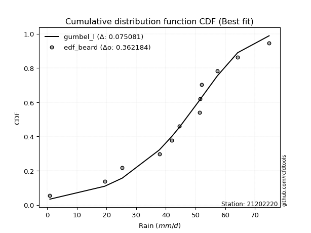</img></img>

</div>


### 5. Empirical - EDF Chegodayev (1955)

The Chegodayev formula is an empirical plotting position formula used in hydrological frequency analysis to estimate the exceedance probability or return period of a specific event from a set of observed data. It is primarily used for plotting observed data points on probability paper to fit a theoretical distribution, particularly for analyzing extreme events like maximum flood flows or rainfall intensities. The constant _b_ value in the generalized plotting position formula is 0.3.

<div align="center">


$P=(m-b)/(n+1-2b)$


</div>


**5.1. Empirical values**

<div align="center">

|                | 0                  | 1                   | 2                   | 3                   | 4                  | 5                  | 6                  | 7                  | 8                  | 9                 | 10                 | 11                 |
|:---------------|:-------------------|:--------------------|:--------------------|:--------------------|:-------------------|:-------------------|:-------------------|:-------------------|:-------------------|:------------------|:-------------------|:-------------------|
| date           | 2023               | 2016                | 2015                | 2012                | 2014               | 2025               | 2011               | 2009               | 2024               | 2010              | 2013               | 2008               |
| x              | 0.9                | 19.4                | 25.3                | 37.8                | 42.0               | 44.6               | 51.3               | 51.6               | 52.0               | 57.4              | 64.2               | 74.8               |
| m              | 1                  | 2                   | 3                   | 4                   | 5                  | 6                  | 7                  | 8                  | 9                  | 10                | 11                 | 12                 |
| empirical_dist | edf_chegodayev     | edf_chegodayev      | edf_chegodayev      | edf_chegodayev      | edf_chegodayev     | edf_chegodayev     | edf_chegodayev     | edf_chegodayev     | edf_chegodayev     | edf_chegodayev    | edf_chegodayev     | edf_chegodayev     |
| empirical      | 0.0564516129032258 | 0.13709677419354838 | 0.21774193548387097 | 0.29838709677419356 | 0.3790322580645161 | 0.4596774193548387 | 0.5403225806451613 | 0.6209677419354839 | 0.7016129032258064 | 0.782258064516129 | 0.8629032258064515 | 0.9435483870967741 |
| empirical_tr   | 1.0598290598290598 | 1.158878504672897   | 1.2783505154639176  | 1.425287356321839   | 1.6103896103896105 | 1.8507462686567164 | 2.1754385964912277 | 2.6382978723404253 | 3.3513513513513504 | 4.592592592592592 | 7.294117647058818  | 17.714285714285694 |

</div>


**5.2. Kolmogorov-Smirnov fit test (sorted by Δ)**


<div align="center">

|                | 0                   | 1                   | 2                   | 3                   | 4                   | 5                   | 6                   | 7                   | 8                   | 9                   | 10                  | 11                  | 12                  | 13                  | 14                  | 15                  | 16                  | 17                  | 18                  | 19                  | 20                  | 21                  | 22                  | 23                  | 24                  | 25                  | 26                  | 27                  | 28                  | 29                  | 30                  | 31                  | 32                  | 33                  | 34                  | 35                    | 36                  | 37                  | 38                  | 39                  | 40                  | 41                  | 42                  | 43                  | 44                  | 45                  | 46                  | 47                  | 48                  | 49                  | 50                  | 51                  | 52                  | 53                  | 54                  | 55                  | 56                  | 57                  | 58                  | 59                  | 60                  | 61                  | 62                  | 63                  | 64                  | 65                  | 66                  | 67                  | 68                  | 69                  | 70                  | 71                  | 72                  | 73                  | 74                  | 75                  | 76                  | 77                  | 78                  | 79                  | 80                  | 81                  | 82                  | 83                  | 84                  | 85                  | 86                  | 87                  | 88                  | 89                  |
|:---------------|:--------------------|:--------------------|:--------------------|:--------------------|:--------------------|:--------------------|:--------------------|:--------------------|:--------------------|:--------------------|:--------------------|:--------------------|:--------------------|:--------------------|:--------------------|:--------------------|:--------------------|:--------------------|:--------------------|:--------------------|:--------------------|:--------------------|:--------------------|:--------------------|:--------------------|:--------------------|:--------------------|:--------------------|:--------------------|:--------------------|:--------------------|:--------------------|:--------------------|:--------------------|:--------------------|:----------------------|:--------------------|:--------------------|:--------------------|:--------------------|:--------------------|:--------------------|:--------------------|:--------------------|:--------------------|:--------------------|:--------------------|:--------------------|:--------------------|:--------------------|:--------------------|:--------------------|:--------------------|:--------------------|:--------------------|:--------------------|:--------------------|:--------------------|:--------------------|:--------------------|:--------------------|:--------------------|:--------------------|:--------------------|:--------------------|:--------------------|:--------------------|:--------------------|:--------------------|:--------------------|:--------------------|:--------------------|:--------------------|:--------------------|:--------------------|:--------------------|:--------------------|:--------------------|:--------------------|:--------------------|:--------------------|:--------------------|:--------------------|:--------------------|:--------------------|:--------------------|:--------------------|:--------------------|:--------------------|:--------------------|
| station        | 21202220            | 21202220            | 21202220            | 21202220            | 21202220            | 21202220            | 21202220            | 21202220            | 21202220            | 21202220            | 21202220            | 21202220            | 21202220            | 21202220            | 21202220            | 21202220            | 21202220            | 21202220            | 21202220            | 21202220            | 21202220            | 21202220            | 21202220            | 21202220            | 21202220            | 21202220            | 21202220            | 21202220            | 21202220            | 21202220            | 21202220            | 21202220            | 21202220            | 21202220            | 21202220            | 21202220              | 21202220            | 21202220            | 21202220            | 21202220            | 21202220            | 21202220            | 21202220            | 21202220            | 21202220            | 21202220            | 21202220            | 21202220            | 21202220            | 21202220            | 21202220            | 21202220            | 21202220            | 21202220            | 21202220            | 21202220            | 21202220            | 21202220            | 21202220            | 21202220            | 21202220            | 21202220            | 21202220            | 21202220            | 21202220            | 21202220            | 21202220            | 21202220            | 21202220            | 21202220            | 21202220            | 21202220            | 21202220            | 21202220            | 21202220            | 21202220            | 21202220            | 21202220            | 21202220            | 21202220            | 21202220            | 21202220            | 21202220            | 21202220            | 21202220            | 21202220            | 21202220            | 21202220            | 21202220            | 21202220            |
| empirical_dist | edf_chegodayev      | edf_chegodayev      | edf_chegodayev      | edf_chegodayev      | edf_chegodayev      | edf_chegodayev      | edf_chegodayev      | edf_chegodayev      | edf_chegodayev      | edf_chegodayev      | edf_chegodayev      | edf_chegodayev      | edf_chegodayev      | edf_chegodayev      | edf_chegodayev      | edf_chegodayev      | edf_chegodayev      | edf_chegodayev      | edf_chegodayev      | edf_chegodayev      | edf_chegodayev      | edf_chegodayev      | edf_chegodayev      | edf_chegodayev      | edf_chegodayev      | edf_chegodayev      | edf_chegodayev      | edf_chegodayev      | edf_chegodayev      | edf_chegodayev      | edf_chegodayev      | edf_chegodayev      | edf_chegodayev      | edf_chegodayev      | edf_chegodayev      | edf_chegodayev        | edf_chegodayev      | edf_chegodayev      | edf_chegodayev      | edf_chegodayev      | edf_chegodayev      | edf_chegodayev      | edf_chegodayev      | edf_chegodayev      | edf_chegodayev      | edf_chegodayev      | edf_chegodayev      | edf_chegodayev      | edf_chegodayev      | edf_chegodayev      | edf_chegodayev      | edf_chegodayev      | edf_chegodayev      | edf_chegodayev      | edf_chegodayev      | edf_chegodayev      | edf_chegodayev      | edf_chegodayev      | edf_chegodayev      | edf_chegodayev      | edf_chegodayev      | edf_chegodayev      | edf_chegodayev      | edf_chegodayev      | edf_chegodayev      | edf_chegodayev      | edf_chegodayev      | edf_chegodayev      | edf_chegodayev      | edf_chegodayev      | edf_chegodayev      | edf_chegodayev      | edf_chegodayev      | edf_chegodayev      | edf_chegodayev      | edf_chegodayev      | edf_chegodayev      | edf_chegodayev      | edf_chegodayev      | edf_chegodayev      | edf_chegodayev      | edf_chegodayev      | edf_chegodayev      | edf_chegodayev      | edf_chegodayev      | edf_chegodayev      | edf_chegodayev      | edf_chegodayev      | edf_chegodayev      | edf_chegodayev      |
| p_dist         | gumbel_l            | johnsonsu           | genlogistic         | weibull_min         | logjohnsonsu        | pearson3            | gompertz            | mielke              | laplace_asymmetric  | fisk                | f                   | fatiguelife         | t                   | crystalball         | norm                | exponnorm           | nct                 | nakagami            | betaprime           | rice                | invgauss            | chi2                | gamma               | erlang              | logt                | invgamma            | logistic            | logmielke           | maxwell             | alpha               | rayleigh            | logloggamma         | invweibull          | hypsecant           | logfisk             | loglaplace_asymmetric | ncf                 | halfnorm            | gumbel_r            | laplace             | loggompertz         | logpearson3         | kstwobign           | halflogistic        | loggumbel_l         | moyal               | wald                | logbetaprime        | logfatiguelife      | logexponnorm        | lognorm             | lognorm             | logcrystalball      | logrice             | lognakagami         | lognct              | loglognorm          | loglogistic         | loggamma            | loggamma            | loginvgauss         | loginvweibull       | loghypsecant        | loginvgamma         | logalpha            | expon               | genexpon            | gibrat              | logmaxwell          | loglaplace          | lograyleigh         | loghalfnorm         | logkstwobign        | loggumbel_r         | loghalflogistic     | logmoyal            | loggenexpon         | logwald             | logncf              | logexpon            | logchi2             | loggibrat           | pareto              | logpareto           | logf                | logtruncnorm        | logweibull_min      | truncnorm           | logerlang           | loggenlogistic      |
| delta          | 0.07475542545048441 | 0.07616389333694007 | 0.07871160260163168 | 0.08027932741571597 | 0.08236957756732832 | 0.08520622990608695 | 0.08567414585883659 | 0.08669285400320659 | 0.09505532162763497 | 0.09865441025105337 | 0.11407811605221596 | 0.11564729852017597 | 0.11619940588013122 | 0.11620325344773885 | 0.11620326303986506 | 0.11620418562533807 | 0.11620511593692928 | 0.11664734637194363 | 0.11690775326004355 | 0.1186494783419414  | 0.11999783745931714 | 0.12068257515106928 | 0.1209312559908371  | 0.12432771869702197 | 0.129165742471698   | 0.13045494188264095 | 0.13469352520682631 | 0.13522582702820302 | 0.1371348717965042  | 0.1407444158800233  | 0.14340504611760974 | 0.1466301481366652  | 0.1488279942568353  | 0.14892838882872872 | 0.15636546551384062 | 0.1570309526524969    | 0.165218816300154   | 0.16970825631260877 | 0.17512532611919263 | 0.1768943110033201  | 0.17975092853581515 | 0.18094091558809344 | 0.182548913454596   | 0.19257705036605577 | 0.1928206385424755  | 0.19455429867438379 | 0.2578621890199635  | 0.25835333145072487 | 0.2584075565591631  | 0.25902862990555614 | 0.25903053016766325 | 0.25903053016766325 | 0.25903060884820733 | 0.2590386810941841  | 0.259075666712236   | 0.2594378876829159  | 0.2609654942595285  | 0.26673052081553744 | 0.2673080540213107  | 0.2673080540213107  | 0.2700652737083708  | 0.27045057176694676 | 0.27321391579307036 | 0.2738899624430386  | 0.2751824007005092  | 0.28156432701521433 | 0.2816210345383276  | 0.2819688866436523  | 0.28891933283458254 | 0.29398283362624084 | 0.2984690167240011  | 0.3254277409360387  | 0.325943434556625   | 0.3287921392897553  | 0.35294485926480706 | 0.3533779471400768  | 0.3664688219189477  | 0.4216025509830696  | 0.43475438782308895 | 0.4394352869675747  | 0.44324908442557254 | 0.45125931669023694 | 0.49990533311975394 | 0.5197812359903561  | 0.5341826169417649  | 0.6281003401517381  | 0.6472832711510111  | 0.6617652948074586  | 0.8626575143195432  | 0.8629032258064515  |
| deltao         | 0.36218414519599995 | 0.36218414519599995 | 0.36218414519599995 | 0.36218414519599995 | 0.36218414519599995 | 0.36218414519599995 | 0.36218414519599995 | 0.36218414519599995 | 0.36218414519599995 | 0.36218414519599995 | 0.36218414519599995 | 0.36218414519599995 | 0.36218414519599995 | 0.36218414519599995 | 0.36218414519599995 | 0.36218414519599995 | 0.36218414519599995 | 0.36218414519599995 | 0.36218414519599995 | 0.36218414519599995 | 0.36218414519599995 | 0.36218414519599995 | 0.36218414519599995 | 0.36218414519599995 | 0.36218414519599995 | 0.36218414519599995 | 0.36218414519599995 | 0.36218414519599995 | 0.36218414519599995 | 0.36218414519599995 | 0.36218414519599995 | 0.36218414519599995 | 0.36218414519599995 | 0.36218414519599995 | 0.36218414519599995 | 0.36218414519599995   | 0.36218414519599995 | 0.36218414519599995 | 0.36218414519599995 | 0.36218414519599995 | 0.36218414519599995 | 0.36218414519599995 | 0.36218414519599995 | 0.36218414519599995 | 0.36218414519599995 | 0.36218414519599995 | 0.36218414519599995 | 0.36218414519599995 | 0.36218414519599995 | 0.36218414519599995 | 0.36218414519599995 | 0.36218414519599995 | 0.36218414519599995 | 0.36218414519599995 | 0.36218414519599995 | 0.36218414519599995 | 0.36218414519599995 | 0.36218414519599995 | 0.36218414519599995 | 0.36218414519599995 | 0.36218414519599995 | 0.36218414519599995 | 0.36218414519599995 | 0.36218414519599995 | 0.36218414519599995 | 0.36218414519599995 | 0.36218414519599995 | 0.36218414519599995 | 0.36218414519599995 | 0.36218414519599995 | 0.36218414519599995 | 0.36218414519599995 | 0.36218414519599995 | 0.36218414519599995 | 0.36218414519599995 | 0.36218414519599995 | 0.36218414519599995 | 0.36218414519599995 | 0.36218414519599995 | 0.36218414519599995 | 0.36218414519599995 | 0.36218414519599995 | 0.36218414519599995 | 0.36218414519599995 | 0.36218414519599995 | 0.36218414519599995 | 0.36218414519599995 | 0.36218414519599995 | 0.36218414519599995 | 0.36218414519599995 |
| eval           | Δo > Δ              | Δo > Δ              | Δo > Δ              | Δo > Δ              | Δo > Δ              | Δo > Δ              | Δo > Δ              | Δo > Δ              | Δo > Δ              | Δo > Δ              | Δo > Δ              | Δo > Δ              | Δo > Δ              | Δo > Δ              | Δo > Δ              | Δo > Δ              | Δo > Δ              | Δo > Δ              | Δo > Δ              | Δo > Δ              | Δo > Δ              | Δo > Δ              | Δo > Δ              | Δo > Δ              | Δo > Δ              | Δo > Δ              | Δo > Δ              | Δo > Δ              | Δo > Δ              | Δo > Δ              | Δo > Δ              | Δo > Δ              | Δo > Δ              | Δo > Δ              | Δo > Δ              | Δo > Δ                | Δo > Δ              | Δo > Δ              | Δo > Δ              | Δo > Δ              | Δo > Δ              | Δo > Δ              | Δo > Δ              | Δo > Δ              | Δo > Δ              | Δo > Δ              | Δo > Δ              | Δo > Δ              | Δo > Δ              | Δo > Δ              | Δo > Δ              | Δo > Δ              | Δo > Δ              | Δo > Δ              | Δo > Δ              | Δo > Δ              | Δo > Δ              | Δo > Δ              | Δo > Δ              | Δo > Δ              | Δo > Δ              | Δo > Δ              | Δo > Δ              | Δo > Δ              | Δo > Δ              | Δo > Δ              | Δo > Δ              | Δo > Δ              | Δo > Δ              | Δo > Δ              | Δo > Δ              | Δo > Δ              | Δo > Δ              | Δo > Δ              | Δo > Δ              | Δo > Δ              | Δo <= Δ             | Δo <= Δ             | Δo <= Δ             | Δo <= Δ             | Δo <= Δ             | Δo <= Δ             | Δo <= Δ             | Δo <= Δ             | Δo <= Δ             | Δo <= Δ             | Δo <= Δ             | Δo <= Δ             | Δo <= Δ             | Δo <= Δ             |
| fit            | 1                   | 1                   | 1                   | 1                   | 1                   | 1                   | 1                   | 1                   | 1                   | 1                   | 1                   | 1                   | 1                   | 1                   | 1                   | 1                   | 1                   | 1                   | 1                   | 1                   | 1                   | 1                   | 1                   | 1                   | 1                   | 1                   | 1                   | 1                   | 1                   | 1                   | 1                   | 1                   | 1                   | 1                   | 1                   | 1                     | 1                   | 1                   | 1                   | 1                   | 1                   | 1                   | 1                   | 1                   | 1                   | 1                   | 1                   | 1                   | 1                   | 1                   | 1                   | 1                   | 1                   | 1                   | 1                   | 1                   | 1                   | 1                   | 1                   | 1                   | 1                   | 1                   | 1                   | 1                   | 1                   | 1                   | 1                   | 1                   | 1                   | 1                   | 1                   | 1                   | 1                   | 1                   | 1                   | 1                   | 0                   | 0                   | 0                   | 0                   | 0                   | 0                   | 0                   | 0                   | 0                   | 0                   | 0                   | 0                   | 0                   | 0                   |
| n              | 12                  | 12                  | 12                  | 12                  | 12                  | 12                  | 12                  | 12                  | 12                  | 12                  | 12                  | 12                  | 12                  | 12                  | 12                  | 12                  | 12                  | 12                  | 12                  | 12                  | 12                  | 12                  | 12                  | 12                  | 12                  | 12                  | 12                  | 12                  | 12                  | 12                  | 12                  | 12                  | 12                  | 12                  | 12                  | 12                    | 12                  | 12                  | 12                  | 12                  | 12                  | 12                  | 12                  | 12                  | 12                  | 12                  | 12                  | 12                  | 12                  | 12                  | 12                  | 12                  | 12                  | 12                  | 12                  | 12                  | 12                  | 12                  | 12                  | 12                  | 12                  | 12                  | 12                  | 12                  | 12                  | 12                  | 12                  | 12                  | 12                  | 12                  | 12                  | 12                  | 12                  | 12                  | 12                  | 12                  | 12                  | 12                  | 12                  | 12                  | 12                  | 12                  | 12                  | 12                  | 12                  | 12                  | 12                  | 12                  | 12                  | 12                  |
| best_fit       | 1                   | 0                   | 0                   | 0                   | 0                   | 0                   | 0                   | 0                   | 0                   | 0                   | 0                   | 0                   | 0                   | 0                   | 0                   | 0                   | 0                   | 0                   | 0                   | 0                   | 0                   | 0                   | 0                   | 0                   | 0                   | 0                   | 0                   | 0                   | 0                   | 0                   | 0                   | 0                   | 0                   | 0                   | 0                   | 0                     | 0                   | 0                   | 0                   | 0                   | 0                   | 0                   | 0                   | 0                   | 0                   | 0                   | 0                   | 0                   | 0                   | 0                   | 0                   | 0                   | 0                   | 0                   | 0                   | 0                   | 0                   | 0                   | 0                   | 0                   | 0                   | 0                   | 0                   | 0                   | 0                   | 0                   | 0                   | 0                   | 0                   | 0                   | 0                   | 0                   | 0                   | 0                   | 0                   | 0                   | 0                   | 0                   | 0                   | 0                   | 0                   | 0                   | 0                   | 0                   | 0                   | 0                   | 0                   | 0                   | 0                   | 0                   |
| best_fit_sort  | 1                   | 2                   | 3                   | 4                   | 5                   | 6                   | 7                   | 8                   | 9                   | 10                  | 11                  | 12                  | 13                  | 14                  | 15                  | 16                  | 17                  | 18                  | 19                  | 20                  | 21                  | 22                  | 23                  | 24                  | 25                  | 26                  | 27                  | 28                  | 29                  | 30                  | 31                  | 32                  | 33                  | 34                  | 35                  | 36                    | 37                  | 38                  | 39                  | 40                  | 41                  | 42                  | 43                  | 44                  | 45                  | 46                  | 47                  | 48                  | 49                  | 50                  | 51                  | 52                  | 53                  | 54                  | 55                  | 56                  | 57                  | 58                  | 59                  | 60                  | 61                  | 62                  | 63                  | 64                  | 65                  | 66                  | 67                  | 68                  | 69                  | 70                  | 71                  | 72                  | 73                  | 74                  | 75                  | 76                  | 77                  | 78                  | 79                  | 80                  | 81                  | 82                  | 83                  | 84                  | 85                  | 86                  | 87                  | 88                  | 89                  | 90                  |

</div>


<div align="center">

</img>

</div>


**5.3. Best fit**

<div align="center">

|   id |   station | empirical_dist   | p_dist   |     delta |   deltao | eval   |   fit |   n |   best_fit |   best_fit_sort |
|-----:|----------:|:-----------------|:---------|----------:|---------:|:-------|------:|----:|-----------:|----------------:|
|    0 |  21202220 | edf_chegodayev   | gumbel_l | 0.0747554 | 0.362184 | Δo > Δ |     1 |  12 |          1 |               1 |

</div>


<div align="center">

</img>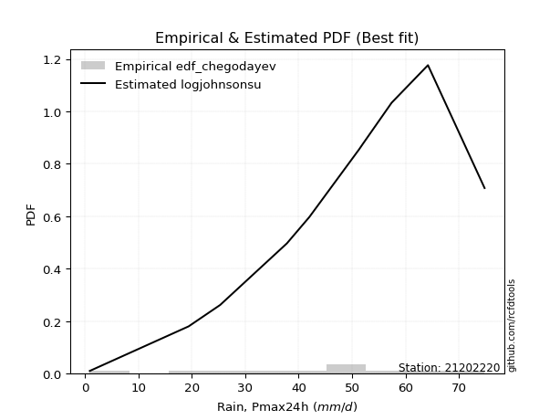</img>

</div>


### 6. Empirical - EDF Blom (1958)

The Blom formula is a specific "plotting position" formula used in hydrology and statistical analysis to estimate the empirical cumulative probability (or non-exceedance probability) of a data series. It is particularly recommended for data that are approximately normally distributed. The constant _a_ is set to 0.375 (or 3/8).

<div align="center">


$P=(m-a)/(n+1-2a)$


</div>


**6.1. Empirical values**

<div align="center">

|                | 0                   | 1                  | 2                   | 3                   | 4                   | 5                   | 6                  | 7                  | 8                  | 9                  | 10                 | 11                 |
|:---------------|:--------------------|:-------------------|:--------------------|:--------------------|:--------------------|:--------------------|:-------------------|:-------------------|:-------------------|:-------------------|:-------------------|:-------------------|
| date           | 2023                | 2016               | 2015                | 2012                | 2014                | 2025                | 2011               | 2009               | 2024               | 2010               | 2013               | 2008               |
| x              | 0.9                 | 19.4               | 25.3                | 37.8                | 42.0                | 44.6                | 51.3               | 51.6               | 52.0               | 57.4               | 64.2               | 74.8               |
| m              | 1                   | 2                  | 3                   | 4                   | 5                   | 6                   | 7                  | 8                  | 9                  | 10                 | 11                 | 12                 |
| empirical_dist | edf_blom            | edf_blom           | edf_blom            | edf_blom            | edf_blom            | edf_blom            | edf_blom           | edf_blom           | edf_blom           | edf_blom           | edf_blom           | edf_blom           |
| empirical      | 0.05102040816326531 | 0.1326530612244898 | 0.21428571428571427 | 0.29591836734693877 | 0.37755102040816324 | 0.45918367346938777 | 0.5408163265306123 | 0.6224489795918368 | 0.7040816326530612 | 0.7857142857142857 | 0.8673469387755102 | 0.9489795918367347 |
| empirical_tr   | 1.053763440860215   | 1.1529411764705884 | 1.2727272727272727  | 1.4202898550724639  | 1.6065573770491803  | 1.8490566037735847  | 2.177777777777778  | 2.6486486486486487 | 3.3793103448275863 | 4.666666666666666  | 7.5384615384615365 | 19.60000000000002  |

</div>


**6.2. Kolmogorov-Smirnov fit test (sorted by Δ)**


<div align="center">

|                | 0                   | 1                   | 2                   | 3                   | 4                   | 5                   | 6                   | 7                   | 8                   | 9                   | 10                  | 11                  | 12                  | 13                  | 14                  | 15                  | 16                  | 17                  | 18                  | 19                  | 20                  | 21                  | 22                  | 23                  | 24                  | 25                  | 26                  | 27                  | 28                  | 29                  | 30                  | 31                  | 32                  | 33                  | 34                  | 35                    | 36                  | 37                  | 38                  | 39                  | 40                  | 41                  | 42                  | 43                  | 44                  | 45                  | 46                  | 47                  | 48                  | 49                  | 50                  | 51                  | 52                  | 53                  | 54                  | 55                  | 56                  | 57                  | 58                  | 59                  | 60                  | 61                  | 62                  | 63                  | 64                  | 65                  | 66                  | 67                  | 68                  | 69                  | 70                  | 71                  | 72                  | 73                  | 74                  | 75                  | 76                  | 77                  | 78                  | 79                  | 80                  | 81                  | 82                  | 83                  | 84                  | 85                  | 86                  | 87                  | 88                  | 89                  |
|:---------------|:--------------------|:--------------------|:--------------------|:--------------------|:--------------------|:--------------------|:--------------------|:--------------------|:--------------------|:--------------------|:--------------------|:--------------------|:--------------------|:--------------------|:--------------------|:--------------------|:--------------------|:--------------------|:--------------------|:--------------------|:--------------------|:--------------------|:--------------------|:--------------------|:--------------------|:--------------------|:--------------------|:--------------------|:--------------------|:--------------------|:--------------------|:--------------------|:--------------------|:--------------------|:--------------------|:----------------------|:--------------------|:--------------------|:--------------------|:--------------------|:--------------------|:--------------------|:--------------------|:--------------------|:--------------------|:--------------------|:--------------------|:--------------------|:--------------------|:--------------------|:--------------------|:--------------------|:--------------------|:--------------------|:--------------------|:--------------------|:--------------------|:--------------------|:--------------------|:--------------------|:--------------------|:--------------------|:--------------------|:--------------------|:--------------------|:--------------------|:--------------------|:--------------------|:--------------------|:--------------------|:--------------------|:--------------------|:--------------------|:--------------------|:--------------------|:--------------------|:--------------------|:--------------------|:--------------------|:--------------------|:--------------------|:--------------------|:--------------------|:--------------------|:--------------------|:--------------------|:--------------------|:--------------------|:--------------------|:--------------------|
| station        | 21202220            | 21202220            | 21202220            | 21202220            | 21202220            | 21202220            | 21202220            | 21202220            | 21202220            | 21202220            | 21202220            | 21202220            | 21202220            | 21202220            | 21202220            | 21202220            | 21202220            | 21202220            | 21202220            | 21202220            | 21202220            | 21202220            | 21202220            | 21202220            | 21202220            | 21202220            | 21202220            | 21202220            | 21202220            | 21202220            | 21202220            | 21202220            | 21202220            | 21202220            | 21202220            | 21202220              | 21202220            | 21202220            | 21202220            | 21202220            | 21202220            | 21202220            | 21202220            | 21202220            | 21202220            | 21202220            | 21202220            | 21202220            | 21202220            | 21202220            | 21202220            | 21202220            | 21202220            | 21202220            | 21202220            | 21202220            | 21202220            | 21202220            | 21202220            | 21202220            | 21202220            | 21202220            | 21202220            | 21202220            | 21202220            | 21202220            | 21202220            | 21202220            | 21202220            | 21202220            | 21202220            | 21202220            | 21202220            | 21202220            | 21202220            | 21202220            | 21202220            | 21202220            | 21202220            | 21202220            | 21202220            | 21202220            | 21202220            | 21202220            | 21202220            | 21202220            | 21202220            | 21202220            | 21202220            | 21202220            |
| empirical_dist | edf_blom            | edf_blom            | edf_blom            | edf_blom            | edf_blom            | edf_blom            | edf_blom            | edf_blom            | edf_blom            | edf_blom            | edf_blom            | edf_blom            | edf_blom            | edf_blom            | edf_blom            | edf_blom            | edf_blom            | edf_blom            | edf_blom            | edf_blom            | edf_blom            | edf_blom            | edf_blom            | edf_blom            | edf_blom            | edf_blom            | edf_blom            | edf_blom            | edf_blom            | edf_blom            | edf_blom            | edf_blom            | edf_blom            | edf_blom            | edf_blom            | edf_blom              | edf_blom            | edf_blom            | edf_blom            | edf_blom            | edf_blom            | edf_blom            | edf_blom            | edf_blom            | edf_blom            | edf_blom            | edf_blom            | edf_blom            | edf_blom            | edf_blom            | edf_blom            | edf_blom            | edf_blom            | edf_blom            | edf_blom            | edf_blom            | edf_blom            | edf_blom            | edf_blom            | edf_blom            | edf_blom            | edf_blom            | edf_blom            | edf_blom            | edf_blom            | edf_blom            | edf_blom            | edf_blom            | edf_blom            | edf_blom            | edf_blom            | edf_blom            | edf_blom            | edf_blom            | edf_blom            | edf_blom            | edf_blom            | edf_blom            | edf_blom            | edf_blom            | edf_blom            | edf_blom            | edf_blom            | edf_blom            | edf_blom            | edf_blom            | edf_blom            | edf_blom            | edf_blom            | edf_blom            |
| p_dist         | johnsonsu           | gumbel_l            | genlogistic         | weibull_min         | logjohnsonsu        | pearson3            | gompertz            | mielke              | laplace_asymmetric  | fisk                | f                   | fatiguelife         | t                   | crystalball         | norm                | exponnorm           | nct                 | nakagami            | betaprime           | rice                | invgauss            | chi2                | gamma               | erlang              | invgamma            | logt                | logistic            | maxwell             | logmielke           | alpha               | rayleigh            | hypsecant           | logloggamma         | invweibull          | logfisk             | loglaplace_asymmetric | ncf                 | halfnorm            | gumbel_r            | laplace             | loggompertz         | logpearson3         | kstwobign           | halflogistic        | moyal               | loggumbel_l         | wald                | logbetaprime        | logfatiguelife      | logexponnorm        | lognorm             | lognorm             | logcrystalball      | logrice             | lognakagami         | lognct              | loglognorm          | loglogistic         | loggamma            | loggamma            | loginvgauss         | loginvweibull       | loghypsecant        | loginvgamma         | logalpha            | gibrat              | expon               | genexpon            | logmaxwell          | loglaplace          | lograyleigh         | loghalfnorm         | logkstwobign        | loggumbel_r         | loghalflogistic     | logmoyal            | loggenexpon         | logwald             | logncf              | logexpon            | logchi2             | loggibrat           | pareto              | logpareto           | logf                | logtruncnorm        | logweibull_min      | truncnorm           | logerlang           | loggenlogistic      |
| delta          | 0.07567014745148903 | 0.07722415487773926 | 0.07821785671618064 | 0.07978558153026494 | 0.08187583168187729 | 0.08471248402063591 | 0.08518039997338556 | 0.08619910811775555 | 0.09456157574218393 | 0.09816066436560233 | 0.11358437016676493 | 0.11515355263472493 | 0.11570565999468019 | 0.11570950756228782 | 0.11570951715441402 | 0.11571043973988704 | 0.11571137005147825 | 0.11615360048649259 | 0.11641400737459251 | 0.11815573245649036 | 0.1195040915738661  | 0.12018882926561825 | 0.12043751010538606 | 0.12383397281157094 | 0.12996119599718992 | 0.13163447189895283 | 0.13419977932137528 | 0.13664112591105315 | 0.1376945564554578  | 0.14025066999457225 | 0.1429113002321587  | 0.14843464294327768 | 0.14909887756391998 | 0.15129672368409008 | 0.1588341949410954  | 0.15949968207975168   | 0.1676875457274088  | 0.17118949396896166 | 0.1746315802337416  | 0.17640056511786906 | 0.18221965796306994 | 0.18439713678625014 | 0.1850176428818508  | 0.19405828802240865 | 0.19406055278893275 | 0.1952893679697303  | 0.2593434266763164  | 0.26082206087797966 | 0.2608762859864179  | 0.26149735933281093 | 0.26149925959491804 | 0.26149925959491804 | 0.2614993382754621  | 0.2615074105214389  | 0.26154439613949076 | 0.2619066171101707  | 0.26343422368678326 | 0.26919925024279223 | 0.2697767834485655  | 0.2697767834485655  | 0.2725340031356256  | 0.2748942847360053  | 0.27568264522032515 | 0.2763586918702934  | 0.277651130127764   | 0.28147514075820124 | 0.2840330564424691  | 0.2840897639655824  | 0.29138806226183733 | 0.2964515630534956  | 0.3009377461512559  | 0.3278964703632935  | 0.33038714752568354 | 0.3312608687170101  | 0.35541358869206185 | 0.3558466765673316  | 0.37091253488800624 | 0.4240712804103244  | 0.4391981007921475  | 0.44387899993663327 | 0.4476927973946311  | 0.45372804611749173 | 0.5043490460888125  | 0.5242249489594146  | 0.5386263299108235  | 0.6325440531207966  | 0.6517269841200697  | 0.6642340242347133  | 0.8671012272886017  | 0.8673469387755102  |
| deltao         | 0.36218414519599995 | 0.36218414519599995 | 0.36218414519599995 | 0.36218414519599995 | 0.36218414519599995 | 0.36218414519599995 | 0.36218414519599995 | 0.36218414519599995 | 0.36218414519599995 | 0.36218414519599995 | 0.36218414519599995 | 0.36218414519599995 | 0.36218414519599995 | 0.36218414519599995 | 0.36218414519599995 | 0.36218414519599995 | 0.36218414519599995 | 0.36218414519599995 | 0.36218414519599995 | 0.36218414519599995 | 0.36218414519599995 | 0.36218414519599995 | 0.36218414519599995 | 0.36218414519599995 | 0.36218414519599995 | 0.36218414519599995 | 0.36218414519599995 | 0.36218414519599995 | 0.36218414519599995 | 0.36218414519599995 | 0.36218414519599995 | 0.36218414519599995 | 0.36218414519599995 | 0.36218414519599995 | 0.36218414519599995 | 0.36218414519599995   | 0.36218414519599995 | 0.36218414519599995 | 0.36218414519599995 | 0.36218414519599995 | 0.36218414519599995 | 0.36218414519599995 | 0.36218414519599995 | 0.36218414519599995 | 0.36218414519599995 | 0.36218414519599995 | 0.36218414519599995 | 0.36218414519599995 | 0.36218414519599995 | 0.36218414519599995 | 0.36218414519599995 | 0.36218414519599995 | 0.36218414519599995 | 0.36218414519599995 | 0.36218414519599995 | 0.36218414519599995 | 0.36218414519599995 | 0.36218414519599995 | 0.36218414519599995 | 0.36218414519599995 | 0.36218414519599995 | 0.36218414519599995 | 0.36218414519599995 | 0.36218414519599995 | 0.36218414519599995 | 0.36218414519599995 | 0.36218414519599995 | 0.36218414519599995 | 0.36218414519599995 | 0.36218414519599995 | 0.36218414519599995 | 0.36218414519599995 | 0.36218414519599995 | 0.36218414519599995 | 0.36218414519599995 | 0.36218414519599995 | 0.36218414519599995 | 0.36218414519599995 | 0.36218414519599995 | 0.36218414519599995 | 0.36218414519599995 | 0.36218414519599995 | 0.36218414519599995 | 0.36218414519599995 | 0.36218414519599995 | 0.36218414519599995 | 0.36218414519599995 | 0.36218414519599995 | 0.36218414519599995 | 0.36218414519599995 |
| eval           | Δo > Δ              | Δo > Δ              | Δo > Δ              | Δo > Δ              | Δo > Δ              | Δo > Δ              | Δo > Δ              | Δo > Δ              | Δo > Δ              | Δo > Δ              | Δo > Δ              | Δo > Δ              | Δo > Δ              | Δo > Δ              | Δo > Δ              | Δo > Δ              | Δo > Δ              | Δo > Δ              | Δo > Δ              | Δo > Δ              | Δo > Δ              | Δo > Δ              | Δo > Δ              | Δo > Δ              | Δo > Δ              | Δo > Δ              | Δo > Δ              | Δo > Δ              | Δo > Δ              | Δo > Δ              | Δo > Δ              | Δo > Δ              | Δo > Δ              | Δo > Δ              | Δo > Δ              | Δo > Δ                | Δo > Δ              | Δo > Δ              | Δo > Δ              | Δo > Δ              | Δo > Δ              | Δo > Δ              | Δo > Δ              | Δo > Δ              | Δo > Δ              | Δo > Δ              | Δo > Δ              | Δo > Δ              | Δo > Δ              | Δo > Δ              | Δo > Δ              | Δo > Δ              | Δo > Δ              | Δo > Δ              | Δo > Δ              | Δo > Δ              | Δo > Δ              | Δo > Δ              | Δo > Δ              | Δo > Δ              | Δo > Δ              | Δo > Δ              | Δo > Δ              | Δo > Δ              | Δo > Δ              | Δo > Δ              | Δo > Δ              | Δo > Δ              | Δo > Δ              | Δo > Δ              | Δo > Δ              | Δo > Δ              | Δo > Δ              | Δo > Δ              | Δo > Δ              | Δo > Δ              | Δo <= Δ             | Δo <= Δ             | Δo <= Δ             | Δo <= Δ             | Δo <= Δ             | Δo <= Δ             | Δo <= Δ             | Δo <= Δ             | Δo <= Δ             | Δo <= Δ             | Δo <= Δ             | Δo <= Δ             | Δo <= Δ             | Δo <= Δ             |
| fit            | 1                   | 1                   | 1                   | 1                   | 1                   | 1                   | 1                   | 1                   | 1                   | 1                   | 1                   | 1                   | 1                   | 1                   | 1                   | 1                   | 1                   | 1                   | 1                   | 1                   | 1                   | 1                   | 1                   | 1                   | 1                   | 1                   | 1                   | 1                   | 1                   | 1                   | 1                   | 1                   | 1                   | 1                   | 1                   | 1                     | 1                   | 1                   | 1                   | 1                   | 1                   | 1                   | 1                   | 1                   | 1                   | 1                   | 1                   | 1                   | 1                   | 1                   | 1                   | 1                   | 1                   | 1                   | 1                   | 1                   | 1                   | 1                   | 1                   | 1                   | 1                   | 1                   | 1                   | 1                   | 1                   | 1                   | 1                   | 1                   | 1                   | 1                   | 1                   | 1                   | 1                   | 1                   | 1                   | 1                   | 0                   | 0                   | 0                   | 0                   | 0                   | 0                   | 0                   | 0                   | 0                   | 0                   | 0                   | 0                   | 0                   | 0                   |
| n              | 12                  | 12                  | 12                  | 12                  | 12                  | 12                  | 12                  | 12                  | 12                  | 12                  | 12                  | 12                  | 12                  | 12                  | 12                  | 12                  | 12                  | 12                  | 12                  | 12                  | 12                  | 12                  | 12                  | 12                  | 12                  | 12                  | 12                  | 12                  | 12                  | 12                  | 12                  | 12                  | 12                  | 12                  | 12                  | 12                    | 12                  | 12                  | 12                  | 12                  | 12                  | 12                  | 12                  | 12                  | 12                  | 12                  | 12                  | 12                  | 12                  | 12                  | 12                  | 12                  | 12                  | 12                  | 12                  | 12                  | 12                  | 12                  | 12                  | 12                  | 12                  | 12                  | 12                  | 12                  | 12                  | 12                  | 12                  | 12                  | 12                  | 12                  | 12                  | 12                  | 12                  | 12                  | 12                  | 12                  | 12                  | 12                  | 12                  | 12                  | 12                  | 12                  | 12                  | 12                  | 12                  | 12                  | 12                  | 12                  | 12                  | 12                  |
| best_fit       | 1                   | 0                   | 0                   | 0                   | 0                   | 0                   | 0                   | 0                   | 0                   | 0                   | 0                   | 0                   | 0                   | 0                   | 0                   | 0                   | 0                   | 0                   | 0                   | 0                   | 0                   | 0                   | 0                   | 0                   | 0                   | 0                   | 0                   | 0                   | 0                   | 0                   | 0                   | 0                   | 0                   | 0                   | 0                   | 0                     | 0                   | 0                   | 0                   | 0                   | 0                   | 0                   | 0                   | 0                   | 0                   | 0                   | 0                   | 0                   | 0                   | 0                   | 0                   | 0                   | 0                   | 0                   | 0                   | 0                   | 0                   | 0                   | 0                   | 0                   | 0                   | 0                   | 0                   | 0                   | 0                   | 0                   | 0                   | 0                   | 0                   | 0                   | 0                   | 0                   | 0                   | 0                   | 0                   | 0                   | 0                   | 0                   | 0                   | 0                   | 0                   | 0                   | 0                   | 0                   | 0                   | 0                   | 0                   | 0                   | 0                   | 0                   |
| best_fit_sort  | 1                   | 2                   | 3                   | 4                   | 5                   | 6                   | 7                   | 8                   | 9                   | 10                  | 11                  | 12                  | 13                  | 14                  | 15                  | 16                  | 17                  | 18                  | 19                  | 20                  | 21                  | 22                  | 23                  | 24                  | 25                  | 26                  | 27                  | 28                  | 29                  | 30                  | 31                  | 32                  | 33                  | 34                  | 35                  | 36                    | 37                  | 38                  | 39                  | 40                  | 41                  | 42                  | 43                  | 44                  | 45                  | 46                  | 47                  | 48                  | 49                  | 50                  | 51                  | 52                  | 53                  | 54                  | 55                  | 56                  | 57                  | 58                  | 59                  | 60                  | 61                  | 62                  | 63                  | 64                  | 65                  | 66                  | 67                  | 68                  | 69                  | 70                  | 71                  | 72                  | 73                  | 74                  | 75                  | 76                  | 77                  | 78                  | 79                  | 80                  | 81                  | 82                  | 83                  | 84                  | 85                  | 86                  | 87                  | 88                  | 89                  | 90                  |

</div>


<div align="center">

</img>

</div>


**6.3. Best fit**

<div align="center">

|   id |   station | empirical_dist   | p_dist    |     delta |   deltao | eval   |   fit |   n |   best_fit |   best_fit_sort |
|-----:|----------:|:-----------------|:----------|----------:|---------:|:-------|------:|----:|-----------:|----------------:|
|    0 |  21202220 | edf_blom         | johnsonsu | 0.0756701 | 0.362184 | Δo > Δ |     1 |  12 |          1 |               1 |

</div>


<div align="center">

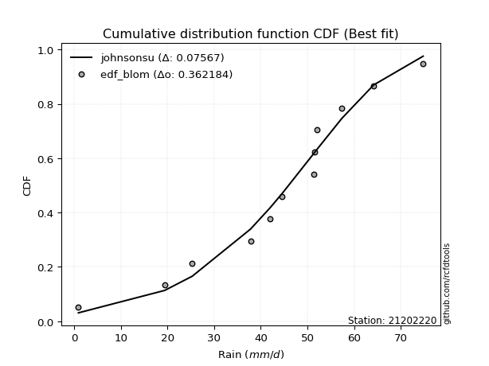</img>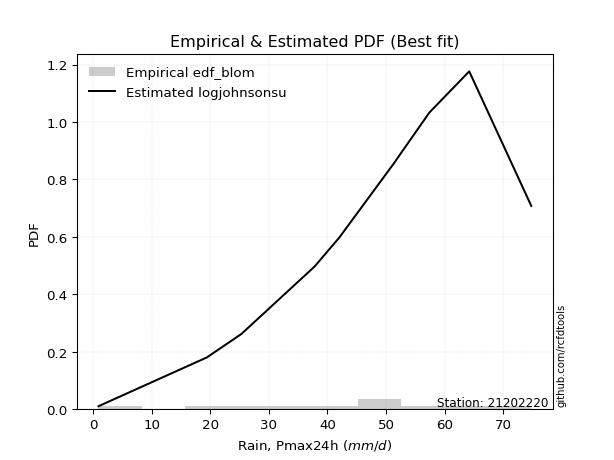</img>

</div>


### 7. Empirical - EDF Tukey (1962)

In hydrology, the Tukey formula is used as a plotting position formula to estimate the empirical probability or frequency of a flood event (or other hydrological data). The formula parameter is given as _c=0.333_ (or 1/3).

<div align="center">


$P=(m-c)/(n+1-2c)$


</div>


**7.1. Empirical values**

<div align="center">

|                | 0                   | 1                   | 2                   | 3                  | 4                  | 5                  | 6                  | 7                  | 8                  | 9                  | 10                 | 11                 |
|:---------------|:--------------------|:--------------------|:--------------------|:-------------------|:-------------------|:-------------------|:-------------------|:-------------------|:-------------------|:-------------------|:-------------------|:-------------------|
| date           | 2023                | 2016                | 2015                | 2012               | 2014               | 2025               | 2011               | 2009               | 2024               | 2010               | 2013               | 2008               |
| x              | 0.9                 | 19.4                | 25.3                | 37.8               | 42.0               | 44.6               | 51.3               | 51.6               | 52.0               | 57.4               | 64.2               | 74.8               |
| m              | 1                   | 2                   | 3                   | 4                  | 5                  | 6                  | 7                  | 8                  | 9                  | 10                 | 11                 | 12                 |
| empirical_dist | edf_tukey           | edf_tukey           | edf_tukey           | edf_tukey          | edf_tukey          | edf_tukey          | edf_tukey          | edf_tukey          | edf_tukey          | edf_tukey          | edf_tukey          | edf_tukey          |
| empirical      | 0.05405405405405406 | 0.13513513513513514 | 0.21621621621621623 | 0.2972972972972973 | 0.3783783783783784 | 0.4594594594594595 | 0.5405405405405406 | 0.6216216216216216 | 0.7027027027027027 | 0.7837837837837838 | 0.8648648648648649 | 0.9459459459459459 |
| empirical_tr   | 1.0571428571428572  | 1.15625             | 1.2758620689655173  | 1.4230769230769231 | 1.608695652173913  | 1.8499999999999999 | 2.1764705882352944 | 2.642857142857143  | 3.363636363636364  | 4.625              | 7.400000000000003  | 18.5               |

</div>


**7.2. Kolmogorov-Smirnov fit test (sorted by Δ)**


<div align="center">

|                | 0                   | 1                   | 2                   | 3                   | 4                   | 5                   | 6                   | 7                   | 8                   | 9                   | 10                  | 11                  | 12                  | 13                  | 14                  | 15                  | 16                  | 17                  | 18                  | 19                  | 20                  | 21                  | 22                  | 23                  | 24                  | 25                  | 26                  | 27                  | 28                  | 29                  | 30                  | 31                  | 32                  | 33                  | 34                  | 35                    | 36                  | 37                  | 38                  | 39                  | 40                  | 41                  | 42                  | 43                  | 44                  | 45                  | 46                  | 47                  | 48                  | 49                  | 50                  | 51                  | 52                  | 53                  | 54                  | 55                  | 56                  | 57                  | 58                  | 59                  | 60                  | 61                  | 62                  | 63                  | 64                  | 65                  | 66                  | 67                  | 68                  | 69                  | 70                  | 71                  | 72                  | 73                  | 74                  | 75                  | 76                  | 77                  | 78                  | 79                  | 80                  | 81                  | 82                  | 83                  | 84                  | 85                  | 86                  | 87                  | 88                  | 89                  |
|:---------------|:--------------------|:--------------------|:--------------------|:--------------------|:--------------------|:--------------------|:--------------------|:--------------------|:--------------------|:--------------------|:--------------------|:--------------------|:--------------------|:--------------------|:--------------------|:--------------------|:--------------------|:--------------------|:--------------------|:--------------------|:--------------------|:--------------------|:--------------------|:--------------------|:--------------------|:--------------------|:--------------------|:--------------------|:--------------------|:--------------------|:--------------------|:--------------------|:--------------------|:--------------------|:--------------------|:----------------------|:--------------------|:--------------------|:--------------------|:--------------------|:--------------------|:--------------------|:--------------------|:--------------------|:--------------------|:--------------------|:--------------------|:--------------------|:--------------------|:--------------------|:--------------------|:--------------------|:--------------------|:--------------------|:--------------------|:--------------------|:--------------------|:--------------------|:--------------------|:--------------------|:--------------------|:--------------------|:--------------------|:--------------------|:--------------------|:--------------------|:--------------------|:--------------------|:--------------------|:--------------------|:--------------------|:--------------------|:--------------------|:--------------------|:--------------------|:--------------------|:--------------------|:--------------------|:--------------------|:--------------------|:--------------------|:--------------------|:--------------------|:--------------------|:--------------------|:--------------------|:--------------------|:--------------------|:--------------------|:--------------------|
| station        | 21202220            | 21202220            | 21202220            | 21202220            | 21202220            | 21202220            | 21202220            | 21202220            | 21202220            | 21202220            | 21202220            | 21202220            | 21202220            | 21202220            | 21202220            | 21202220            | 21202220            | 21202220            | 21202220            | 21202220            | 21202220            | 21202220            | 21202220            | 21202220            | 21202220            | 21202220            | 21202220            | 21202220            | 21202220            | 21202220            | 21202220            | 21202220            | 21202220            | 21202220            | 21202220            | 21202220              | 21202220            | 21202220            | 21202220            | 21202220            | 21202220            | 21202220            | 21202220            | 21202220            | 21202220            | 21202220            | 21202220            | 21202220            | 21202220            | 21202220            | 21202220            | 21202220            | 21202220            | 21202220            | 21202220            | 21202220            | 21202220            | 21202220            | 21202220            | 21202220            | 21202220            | 21202220            | 21202220            | 21202220            | 21202220            | 21202220            | 21202220            | 21202220            | 21202220            | 21202220            | 21202220            | 21202220            | 21202220            | 21202220            | 21202220            | 21202220            | 21202220            | 21202220            | 21202220            | 21202220            | 21202220            | 21202220            | 21202220            | 21202220            | 21202220            | 21202220            | 21202220            | 21202220            | 21202220            | 21202220            |
| empirical_dist | edf_tukey           | edf_tukey           | edf_tukey           | edf_tukey           | edf_tukey           | edf_tukey           | edf_tukey           | edf_tukey           | edf_tukey           | edf_tukey           | edf_tukey           | edf_tukey           | edf_tukey           | edf_tukey           | edf_tukey           | edf_tukey           | edf_tukey           | edf_tukey           | edf_tukey           | edf_tukey           | edf_tukey           | edf_tukey           | edf_tukey           | edf_tukey           | edf_tukey           | edf_tukey           | edf_tukey           | edf_tukey           | edf_tukey           | edf_tukey           | edf_tukey           | edf_tukey           | edf_tukey           | edf_tukey           | edf_tukey           | edf_tukey             | edf_tukey           | edf_tukey           | edf_tukey           | edf_tukey           | edf_tukey           | edf_tukey           | edf_tukey           | edf_tukey           | edf_tukey           | edf_tukey           | edf_tukey           | edf_tukey           | edf_tukey           | edf_tukey           | edf_tukey           | edf_tukey           | edf_tukey           | edf_tukey           | edf_tukey           | edf_tukey           | edf_tukey           | edf_tukey           | edf_tukey           | edf_tukey           | edf_tukey           | edf_tukey           | edf_tukey           | edf_tukey           | edf_tukey           | edf_tukey           | edf_tukey           | edf_tukey           | edf_tukey           | edf_tukey           | edf_tukey           | edf_tukey           | edf_tukey           | edf_tukey           | edf_tukey           | edf_tukey           | edf_tukey           | edf_tukey           | edf_tukey           | edf_tukey           | edf_tukey           | edf_tukey           | edf_tukey           | edf_tukey           | edf_tukey           | edf_tukey           | edf_tukey           | edf_tukey           | edf_tukey           | edf_tukey           |
| p_dist         | gumbel_l            | johnsonsu           | genlogistic         | weibull_min         | logjohnsonsu        | pearson3            | gompertz            | mielke              | laplace_asymmetric  | fisk                | f                   | fatiguelife         | t                   | crystalball         | norm                | exponnorm           | nct                 | nakagami            | betaprime           | rice                | invgauss            | chi2                | gamma               | erlang              | invgamma            | logt                | logistic            | logmielke           | maxwell             | alpha               | rayleigh            | logloggamma         | hypsecant           | invweibull          | logfisk             | loglaplace_asymmetric | ncf                 | halfnorm            | gumbel_r            | laplace             | loggompertz         | logpearson3         | kstwobign           | halflogistic        | loggumbel_l         | moyal               | wald                | logbetaprime        | logfatiguelife      | logexponnorm        | lognorm             | lognorm             | logcrystalball      | logrice             | lognakagami         | lognct              | loglognorm          | loglogistic         | loggamma            | loggamma            | loginvgauss         | loginvweibull       | loghypsecant        | loginvgamma         | logalpha            | gibrat              | expon               | genexpon            | logmaxwell          | loglaplace          | lograyleigh         | loghalfnorm         | logkstwobign        | loggumbel_r         | loghalflogistic     | logmoyal            | loggenexpon         | logwald             | logncf              | logexpon            | logchi2             | loggibrat           | pareto              | logpareto           | logf                | logtruncnorm        | logweibull_min      | truncnorm           | logerlang           | loggenlogistic      |
| delta          | 0.07584522492738077 | 0.07594593344156075 | 0.07849364270625236 | 0.08006136752033666 | 0.082151617671949   | 0.08498827001070763 | 0.08545618596345728 | 0.08647489410782727 | 0.09483736173225565 | 0.09843645035567405 | 0.11386015615683664 | 0.11542933862479665 | 0.11598144598475191 | 0.11598529355235954 | 0.11598530314448574 | 0.11598622572995876 | 0.11598715604154997 | 0.11642938647656431 | 0.11668979336466423 | 0.11843151844656208 | 0.11977987756393782 | 0.12046461525568997 | 0.12071329609545778 | 0.12410975880164266 | 0.13023698198726164 | 0.13025554194859434 | 0.134475565311447   | 0.13631562650509926 | 0.13691691190112487 | 0.14052645598464397 | 0.14318708622223042 | 0.14771994761356144 | 0.1487104289333494  | 0.14991779373373154 | 0.15745526499073687 | 0.15812075212939314   | 0.16630861577705025 | 0.1703621359987465  | 0.1749073662238133  | 0.17667635110794078 | 0.1808407280127114  | 0.1824666348557482  | 0.18363871293149225 | 0.1932309300521935  | 0.19391043801937174 | 0.19433633877900447 | 0.2585160687061012  | 0.2594431309276211  | 0.25949735603605933 | 0.2601184293824524  | 0.2601203296445595  | 0.2601203296445595  | 0.2601204083251036  | 0.26012848057108034 | 0.2601654661891322  | 0.26052768715981217 | 0.2620552937364247  | 0.2678203202924337  | 0.26839785349820694 | 0.26839785349820694 | 0.27115507318526705 | 0.27241221082536    | 0.2743037152699666  | 0.27497976191993484 | 0.27627220017740545 | 0.28175092674827296 | 0.2826541264921106  | 0.28271083401522384 | 0.2900091323114788  | 0.2950726331031371  | 0.29955881620089736 | 0.32651754041293496 | 0.32790507361503823 | 0.32988193876665156 | 0.3540346587417033  | 0.35446774661697306 | 0.36843046097736093 | 0.42269235045996584 | 0.4367160268815022  | 0.44139692602598796 | 0.44521072348398577 | 0.4523491161671332  | 0.5018669721781672  | 0.5217428750487694  | 0.5361442560001781  | 0.6300619792101514  | 0.6492449102094244  | 0.6628550942843547  | 0.8646191533779564  | 0.8648648648648649  |
| deltao         | 0.36218414519599995 | 0.36218414519599995 | 0.36218414519599995 | 0.36218414519599995 | 0.36218414519599995 | 0.36218414519599995 | 0.36218414519599995 | 0.36218414519599995 | 0.36218414519599995 | 0.36218414519599995 | 0.36218414519599995 | 0.36218414519599995 | 0.36218414519599995 | 0.36218414519599995 | 0.36218414519599995 | 0.36218414519599995 | 0.36218414519599995 | 0.36218414519599995 | 0.36218414519599995 | 0.36218414519599995 | 0.36218414519599995 | 0.36218414519599995 | 0.36218414519599995 | 0.36218414519599995 | 0.36218414519599995 | 0.36218414519599995 | 0.36218414519599995 | 0.36218414519599995 | 0.36218414519599995 | 0.36218414519599995 | 0.36218414519599995 | 0.36218414519599995 | 0.36218414519599995 | 0.36218414519599995 | 0.36218414519599995 | 0.36218414519599995   | 0.36218414519599995 | 0.36218414519599995 | 0.36218414519599995 | 0.36218414519599995 | 0.36218414519599995 | 0.36218414519599995 | 0.36218414519599995 | 0.36218414519599995 | 0.36218414519599995 | 0.36218414519599995 | 0.36218414519599995 | 0.36218414519599995 | 0.36218414519599995 | 0.36218414519599995 | 0.36218414519599995 | 0.36218414519599995 | 0.36218414519599995 | 0.36218414519599995 | 0.36218414519599995 | 0.36218414519599995 | 0.36218414519599995 | 0.36218414519599995 | 0.36218414519599995 | 0.36218414519599995 | 0.36218414519599995 | 0.36218414519599995 | 0.36218414519599995 | 0.36218414519599995 | 0.36218414519599995 | 0.36218414519599995 | 0.36218414519599995 | 0.36218414519599995 | 0.36218414519599995 | 0.36218414519599995 | 0.36218414519599995 | 0.36218414519599995 | 0.36218414519599995 | 0.36218414519599995 | 0.36218414519599995 | 0.36218414519599995 | 0.36218414519599995 | 0.36218414519599995 | 0.36218414519599995 | 0.36218414519599995 | 0.36218414519599995 | 0.36218414519599995 | 0.36218414519599995 | 0.36218414519599995 | 0.36218414519599995 | 0.36218414519599995 | 0.36218414519599995 | 0.36218414519599995 | 0.36218414519599995 | 0.36218414519599995 |
| eval           | Δo > Δ              | Δo > Δ              | Δo > Δ              | Δo > Δ              | Δo > Δ              | Δo > Δ              | Δo > Δ              | Δo > Δ              | Δo > Δ              | Δo > Δ              | Δo > Δ              | Δo > Δ              | Δo > Δ              | Δo > Δ              | Δo > Δ              | Δo > Δ              | Δo > Δ              | Δo > Δ              | Δo > Δ              | Δo > Δ              | Δo > Δ              | Δo > Δ              | Δo > Δ              | Δo > Δ              | Δo > Δ              | Δo > Δ              | Δo > Δ              | Δo > Δ              | Δo > Δ              | Δo > Δ              | Δo > Δ              | Δo > Δ              | Δo > Δ              | Δo > Δ              | Δo > Δ              | Δo > Δ                | Δo > Δ              | Δo > Δ              | Δo > Δ              | Δo > Δ              | Δo > Δ              | Δo > Δ              | Δo > Δ              | Δo > Δ              | Δo > Δ              | Δo > Δ              | Δo > Δ              | Δo > Δ              | Δo > Δ              | Δo > Δ              | Δo > Δ              | Δo > Δ              | Δo > Δ              | Δo > Δ              | Δo > Δ              | Δo > Δ              | Δo > Δ              | Δo > Δ              | Δo > Δ              | Δo > Δ              | Δo > Δ              | Δo > Δ              | Δo > Δ              | Δo > Δ              | Δo > Δ              | Δo > Δ              | Δo > Δ              | Δo > Δ              | Δo > Δ              | Δo > Δ              | Δo > Δ              | Δo > Δ              | Δo > Δ              | Δo > Δ              | Δo > Δ              | Δo > Δ              | Δo <= Δ             | Δo <= Δ             | Δo <= Δ             | Δo <= Δ             | Δo <= Δ             | Δo <= Δ             | Δo <= Δ             | Δo <= Δ             | Δo <= Δ             | Δo <= Δ             | Δo <= Δ             | Δo <= Δ             | Δo <= Δ             | Δo <= Δ             |
| fit            | 1                   | 1                   | 1                   | 1                   | 1                   | 1                   | 1                   | 1                   | 1                   | 1                   | 1                   | 1                   | 1                   | 1                   | 1                   | 1                   | 1                   | 1                   | 1                   | 1                   | 1                   | 1                   | 1                   | 1                   | 1                   | 1                   | 1                   | 1                   | 1                   | 1                   | 1                   | 1                   | 1                   | 1                   | 1                   | 1                     | 1                   | 1                   | 1                   | 1                   | 1                   | 1                   | 1                   | 1                   | 1                   | 1                   | 1                   | 1                   | 1                   | 1                   | 1                   | 1                   | 1                   | 1                   | 1                   | 1                   | 1                   | 1                   | 1                   | 1                   | 1                   | 1                   | 1                   | 1                   | 1                   | 1                   | 1                   | 1                   | 1                   | 1                   | 1                   | 1                   | 1                   | 1                   | 1                   | 1                   | 0                   | 0                   | 0                   | 0                   | 0                   | 0                   | 0                   | 0                   | 0                   | 0                   | 0                   | 0                   | 0                   | 0                   |
| n              | 12                  | 12                  | 12                  | 12                  | 12                  | 12                  | 12                  | 12                  | 12                  | 12                  | 12                  | 12                  | 12                  | 12                  | 12                  | 12                  | 12                  | 12                  | 12                  | 12                  | 12                  | 12                  | 12                  | 12                  | 12                  | 12                  | 12                  | 12                  | 12                  | 12                  | 12                  | 12                  | 12                  | 12                  | 12                  | 12                    | 12                  | 12                  | 12                  | 12                  | 12                  | 12                  | 12                  | 12                  | 12                  | 12                  | 12                  | 12                  | 12                  | 12                  | 12                  | 12                  | 12                  | 12                  | 12                  | 12                  | 12                  | 12                  | 12                  | 12                  | 12                  | 12                  | 12                  | 12                  | 12                  | 12                  | 12                  | 12                  | 12                  | 12                  | 12                  | 12                  | 12                  | 12                  | 12                  | 12                  | 12                  | 12                  | 12                  | 12                  | 12                  | 12                  | 12                  | 12                  | 12                  | 12                  | 12                  | 12                  | 12                  | 12                  |
| best_fit       | 1                   | 0                   | 0                   | 0                   | 0                   | 0                   | 0                   | 0                   | 0                   | 0                   | 0                   | 0                   | 0                   | 0                   | 0                   | 0                   | 0                   | 0                   | 0                   | 0                   | 0                   | 0                   | 0                   | 0                   | 0                   | 0                   | 0                   | 0                   | 0                   | 0                   | 0                   | 0                   | 0                   | 0                   | 0                   | 0                     | 0                   | 0                   | 0                   | 0                   | 0                   | 0                   | 0                   | 0                   | 0                   | 0                   | 0                   | 0                   | 0                   | 0                   | 0                   | 0                   | 0                   | 0                   | 0                   | 0                   | 0                   | 0                   | 0                   | 0                   | 0                   | 0                   | 0                   | 0                   | 0                   | 0                   | 0                   | 0                   | 0                   | 0                   | 0                   | 0                   | 0                   | 0                   | 0                   | 0                   | 0                   | 0                   | 0                   | 0                   | 0                   | 0                   | 0                   | 0                   | 0                   | 0                   | 0                   | 0                   | 0                   | 0                   |
| best_fit_sort  | 1                   | 2                   | 3                   | 4                   | 5                   | 6                   | 7                   | 8                   | 9                   | 10                  | 11                  | 12                  | 13                  | 14                  | 15                  | 16                  | 17                  | 18                  | 19                  | 20                  | 21                  | 22                  | 23                  | 24                  | 25                  | 26                  | 27                  | 28                  | 29                  | 30                  | 31                  | 32                  | 33                  | 34                  | 35                  | 36                    | 37                  | 38                  | 39                  | 40                  | 41                  | 42                  | 43                  | 44                  | 45                  | 46                  | 47                  | 48                  | 49                  | 50                  | 51                  | 52                  | 53                  | 54                  | 55                  | 56                  | 57                  | 58                  | 59                  | 60                  | 61                  | 62                  | 63                  | 64                  | 65                  | 66                  | 67                  | 68                  | 69                  | 70                  | 71                  | 72                  | 73                  | 74                  | 75                  | 76                  | 77                  | 78                  | 79                  | 80                  | 81                  | 82                  | 83                  | 84                  | 85                  | 86                  | 87                  | 88                  | 89                  | 90                  |

</div>


<div align="center">

</img>

</div>


**7.3. Best fit**

<div align="center">

|   id |   station | empirical_dist   | p_dist   |     delta |   deltao | eval   |   fit |   n |   best_fit |   best_fit_sort |
|-----:|----------:|:-----------------|:---------|----------:|---------:|:-------|------:|----:|-----------:|----------------:|
|    0 |  21202220 | edf_tukey        | gumbel_l | 0.0758452 | 0.362184 | Δo > Δ |     1 |  12 |          1 |               1 |

</div>


<div align="center">

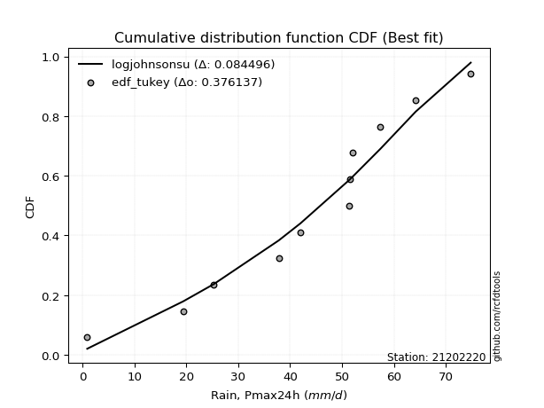</img></img>

</div>


### 8. Empirical - EDF Gringorten (1963)

Gringorten plotting position formula is essential for estimating the probability and return periods of extreme events like floods and heavy rainfall. The constant _a=0.44_.

<div align="center">


$P=(m-a)/(n+1-2a)$


</div>


**8.1. Empirical values**

<div align="center">

|                | 0                   | 1                   | 2                   | 3                   | 4                   | 5                   | 6                  | 7                  | 8                  | 9                  | 10                 | 11                 |
|:---------------|:--------------------|:--------------------|:--------------------|:--------------------|:--------------------|:--------------------|:-------------------|:-------------------|:-------------------|:-------------------|:-------------------|:-------------------|
| date           | 2023                | 2016                | 2015                | 2012                | 2014                | 2025                | 2011               | 2009               | 2024               | 2010               | 2013               | 2008               |
| x              | 0.9                 | 19.4                | 25.3                | 37.8                | 42.0                | 44.6                | 51.3               | 51.6               | 52.0               | 57.4               | 64.2               | 74.8               |
| m              | 1                   | 2                   | 3                   | 4                   | 5                   | 6                   | 7                  | 8                  | 9                  | 10                 | 11                 | 12                 |
| empirical_dist | edf_gringorten      | edf_gringorten      | edf_gringorten      | edf_gringorten      | edf_gringorten      | edf_gringorten      | edf_gringorten     | edf_gringorten     | edf_gringorten     | edf_gringorten     | edf_gringorten     | edf_gringorten     |
| empirical      | 0.04620462046204621 | 0.12871287128712872 | 0.21122112211221125 | 0.29372937293729373 | 0.37623762376237624 | 0.45874587458745875 | 0.5412541254125413 | 0.6237623762376238 | 0.7062706270627064 | 0.7887788778877889 | 0.8712871287128714 | 0.9537953795379539 |
| empirical_tr   | 1.0484429065743945  | 1.1477272727272727  | 1.2677824267782427  | 1.4158878504672898  | 1.6031746031746033  | 1.8475609756097562  | 2.179856115107914  | 2.6578947368421053 | 3.4044943820224733 | 4.734375000000003  | 7.769230769230775  | 21.642857142857192 |

</div>


**8.2. Kolmogorov-Smirnov fit test (sorted by Δ)**


<div align="center">

|                | 0                   | 1                   | 2                   | 3                   | 4                   | 5                   | 6                   | 7                   | 8                   | 9                   | 10                  | 11                  | 12                  | 13                  | 14                  | 15                  | 16                  | 17                  | 18                  | 19                  | 20                  | 21                  | 22                  | 23                  | 24                  | 25                  | 26                  | 27                  | 28                  | 29                  | 30                  | 31                  | 32                  | 33                  | 34                    | 35                  | 36                  | 37                  | 38                  | 39                  | 40                  | 41                  | 42                  | 43                  | 44                  | 45                  | 46                  | 47                  | 48                  | 49                  | 50                  | 51                  | 52                  | 53                  | 54                  | 55                  | 56                  | 57                  | 58                  | 59                  | 60                  | 61                  | 62                  | 63                  | 64                  | 65                  | 66                  | 67                  | 68                  | 69                  | 70                  | 71                  | 72                  | 73                  | 74                  | 75                  | 76                  | 77                  | 78                  | 79                  | 80                  | 81                  | 82                  | 83                  | 84                  | 85                  | 86                  | 87                  | 88                  | 89                  |
|:---------------|:--------------------|:--------------------|:--------------------|:--------------------|:--------------------|:--------------------|:--------------------|:--------------------|:--------------------|:--------------------|:--------------------|:--------------------|:--------------------|:--------------------|:--------------------|:--------------------|:--------------------|:--------------------|:--------------------|:--------------------|:--------------------|:--------------------|:--------------------|:--------------------|:--------------------|:--------------------|:--------------------|:--------------------|:--------------------|:--------------------|:--------------------|:--------------------|:--------------------|:--------------------|:----------------------|:--------------------|:--------------------|:--------------------|:--------------------|:--------------------|:--------------------|:--------------------|:--------------------|:--------------------|:--------------------|:--------------------|:--------------------|:--------------------|:--------------------|:--------------------|:--------------------|:--------------------|:--------------------|:--------------------|:--------------------|:--------------------|:--------------------|:--------------------|:--------------------|:--------------------|:--------------------|:--------------------|:--------------------|:--------------------|:--------------------|:--------------------|:--------------------|:--------------------|:--------------------|:--------------------|:--------------------|:--------------------|:--------------------|:--------------------|:--------------------|:--------------------|:--------------------|:--------------------|:--------------------|:--------------------|:--------------------|:--------------------|:--------------------|:--------------------|:--------------------|:--------------------|:--------------------|:--------------------|:--------------------|:--------------------|
| station        | 21202220            | 21202220            | 21202220            | 21202220            | 21202220            | 21202220            | 21202220            | 21202220            | 21202220            | 21202220            | 21202220            | 21202220            | 21202220            | 21202220            | 21202220            | 21202220            | 21202220            | 21202220            | 21202220            | 21202220            | 21202220            | 21202220            | 21202220            | 21202220            | 21202220            | 21202220            | 21202220            | 21202220            | 21202220            | 21202220            | 21202220            | 21202220            | 21202220            | 21202220            | 21202220              | 21202220            | 21202220            | 21202220            | 21202220            | 21202220            | 21202220            | 21202220            | 21202220            | 21202220            | 21202220            | 21202220            | 21202220            | 21202220            | 21202220            | 21202220            | 21202220            | 21202220            | 21202220            | 21202220            | 21202220            | 21202220            | 21202220            | 21202220            | 21202220            | 21202220            | 21202220            | 21202220            | 21202220            | 21202220            | 21202220            | 21202220            | 21202220            | 21202220            | 21202220            | 21202220            | 21202220            | 21202220            | 21202220            | 21202220            | 21202220            | 21202220            | 21202220            | 21202220            | 21202220            | 21202220            | 21202220            | 21202220            | 21202220            | 21202220            | 21202220            | 21202220            | 21202220            | 21202220            | 21202220            | 21202220            |
| empirical_dist | edf_gringorten      | edf_gringorten      | edf_gringorten      | edf_gringorten      | edf_gringorten      | edf_gringorten      | edf_gringorten      | edf_gringorten      | edf_gringorten      | edf_gringorten      | edf_gringorten      | edf_gringorten      | edf_gringorten      | edf_gringorten      | edf_gringorten      | edf_gringorten      | edf_gringorten      | edf_gringorten      | edf_gringorten      | edf_gringorten      | edf_gringorten      | edf_gringorten      | edf_gringorten      | edf_gringorten      | edf_gringorten      | edf_gringorten      | edf_gringorten      | edf_gringorten      | edf_gringorten      | edf_gringorten      | edf_gringorten      | edf_gringorten      | edf_gringorten      | edf_gringorten      | edf_gringorten        | edf_gringorten      | edf_gringorten      | edf_gringorten      | edf_gringorten      | edf_gringorten      | edf_gringorten      | edf_gringorten      | edf_gringorten      | edf_gringorten      | edf_gringorten      | edf_gringorten      | edf_gringorten      | edf_gringorten      | edf_gringorten      | edf_gringorten      | edf_gringorten      | edf_gringorten      | edf_gringorten      | edf_gringorten      | edf_gringorten      | edf_gringorten      | edf_gringorten      | edf_gringorten      | edf_gringorten      | edf_gringorten      | edf_gringorten      | edf_gringorten      | edf_gringorten      | edf_gringorten      | edf_gringorten      | edf_gringorten      | edf_gringorten      | edf_gringorten      | edf_gringorten      | edf_gringorten      | edf_gringorten      | edf_gringorten      | edf_gringorten      | edf_gringorten      | edf_gringorten      | edf_gringorten      | edf_gringorten      | edf_gringorten      | edf_gringorten      | edf_gringorten      | edf_gringorten      | edf_gringorten      | edf_gringorten      | edf_gringorten      | edf_gringorten      | edf_gringorten      | edf_gringorten      | edf_gringorten      | edf_gringorten      | edf_gringorten      |
| p_dist         | johnsonsu           | genlogistic         | weibull_min         | gumbel_l            | logjohnsonsu        | pearson3            | gompertz            | mielke              | laplace_asymmetric  | fisk                | f                   | fatiguelife         | t                   | crystalball         | norm                | exponnorm           | nct                 | nakagami            | betaprime           | rice                | chi2                | gamma               | invgauss            | erlang              | invgamma            | logistic            | logt                | maxwell             | alpha               | logmielke           | rayleigh            | hypsecant           | logloggamma         | invweibull          | loglaplace_asymmetric | logfisk             | ncf                 | halfnorm            | gumbel_r            | laplace             | loggompertz         | kstwobign           | logpearson3         | moyal               | halflogistic        | loggumbel_l         | wald                | logbetaprime        | logfatiguelife      | logexponnorm        | lognorm             | lognorm             | logcrystalball      | logrice             | lognakagami         | lognct              | loglognorm          | loglogistic         | loggamma            | loggamma            | loginvgauss         | loghypsecant        | loginvgamma         | loginvweibull       | logalpha            | gibrat              | expon               | genexpon            | logmaxwell          | loglaplace          | lograyleigh         | loghalfnorm         | loggumbel_r         | logkstwobign        | loghalflogistic     | logmoyal            | loggenexpon         | logwald             | logncf              | logexpon            | logchi2             | loggibrat           | pareto              | logpareto           | logf                | logtruncnorm        | logweibull_min      | truncnorm           | logerlang           | loggenlogistic      |
| delta          | 0.07523234856956007 | 0.07778005783425168 | 0.07934778264833597 | 0.07941314928738441 | 0.08143803279994832 | 0.08427468513870695 | 0.08474260109145659 | 0.08576130923582659 | 0.09412377686025497 | 0.09772286548367337 | 0.11314657128483596 | 0.11471575375279597 | 0.11526786111275122 | 0.11527170868035885 | 0.11527171827248506 | 0.11527264085795808 | 0.11527357116954928 | 0.11571580160456363 | 0.11597620849266355 | 0.1177179335745614  | 0.11975103038368928 | 0.1199997112234571  | 0.12152973864039146 | 0.12339617392964197 | 0.12952339711526095 | 0.13376198043944632 | 0.13382346630859798 | 0.1362033270291242  | 0.1398128711126433  | 0.13988355086510285 | 0.14247350135022974 | 0.14799684406134872 | 0.15128787197356502 | 0.15348571809373512 | 0.16168867648939672   | 0.16324082531053186 | 0.16987654013705383 | 0.1733002306296374  | 0.17419378135181263 | 0.1759627662359401  | 0.18440865237271498 | 0.18720663729149584 | 0.18746172895975333 | 0.1936227539070038  | 0.19537168466819566 | 0.19747836237937533 | 0.2606568233221034  | 0.2630110552876247  | 0.2630652803960629  | 0.26368635374245597 | 0.2636882540045631  | 0.2636882540045631  | 0.26368833268510716 | 0.2636964049310839  | 0.2637333905491358  | 0.26409561151981575 | 0.2656232180964283  | 0.27138824465243727 | 0.2719657778582105  | 0.2719657778582105  | 0.27472299754527063 | 0.2778716396299702  | 0.2785476862799384  | 0.2788344746733664  | 0.27984012453740903 | 0.2810373418762723  | 0.28622205085211416 | 0.2862787583752274  | 0.2935770566714824  | 0.29864055746314067 | 0.30312674056090094 | 0.33008546477293854 | 0.33344986312665514 | 0.33432733746304466 | 0.3576025831017069  | 0.35803567097697664 | 0.37485272482536736 | 0.4262602748199694  | 0.4431382907295086  | 0.4478191898739944  | 0.4516329873319922  | 0.4559170405271368  | 0.5082892360261736  | 0.5281651388967757  | 0.5425665198481846  | 0.6364842430581578  | 0.6556671740574308  | 0.6664230186443584  | 0.8710414172259628  | 0.8712871287128714  |
| deltao         | 0.36218414519599995 | 0.36218414519599995 | 0.36218414519599995 | 0.36218414519599995 | 0.36218414519599995 | 0.36218414519599995 | 0.36218414519599995 | 0.36218414519599995 | 0.36218414519599995 | 0.36218414519599995 | 0.36218414519599995 | 0.36218414519599995 | 0.36218414519599995 | 0.36218414519599995 | 0.36218414519599995 | 0.36218414519599995 | 0.36218414519599995 | 0.36218414519599995 | 0.36218414519599995 | 0.36218414519599995 | 0.36218414519599995 | 0.36218414519599995 | 0.36218414519599995 | 0.36218414519599995 | 0.36218414519599995 | 0.36218414519599995 | 0.36218414519599995 | 0.36218414519599995 | 0.36218414519599995 | 0.36218414519599995 | 0.36218414519599995 | 0.36218414519599995 | 0.36218414519599995 | 0.36218414519599995 | 0.36218414519599995   | 0.36218414519599995 | 0.36218414519599995 | 0.36218414519599995 | 0.36218414519599995 | 0.36218414519599995 | 0.36218414519599995 | 0.36218414519599995 | 0.36218414519599995 | 0.36218414519599995 | 0.36218414519599995 | 0.36218414519599995 | 0.36218414519599995 | 0.36218414519599995 | 0.36218414519599995 | 0.36218414519599995 | 0.36218414519599995 | 0.36218414519599995 | 0.36218414519599995 | 0.36218414519599995 | 0.36218414519599995 | 0.36218414519599995 | 0.36218414519599995 | 0.36218414519599995 | 0.36218414519599995 | 0.36218414519599995 | 0.36218414519599995 | 0.36218414519599995 | 0.36218414519599995 | 0.36218414519599995 | 0.36218414519599995 | 0.36218414519599995 | 0.36218414519599995 | 0.36218414519599995 | 0.36218414519599995 | 0.36218414519599995 | 0.36218414519599995 | 0.36218414519599995 | 0.36218414519599995 | 0.36218414519599995 | 0.36218414519599995 | 0.36218414519599995 | 0.36218414519599995 | 0.36218414519599995 | 0.36218414519599995 | 0.36218414519599995 | 0.36218414519599995 | 0.36218414519599995 | 0.36218414519599995 | 0.36218414519599995 | 0.36218414519599995 | 0.36218414519599995 | 0.36218414519599995 | 0.36218414519599995 | 0.36218414519599995 | 0.36218414519599995 |
| eval           | Δo > Δ              | Δo > Δ              | Δo > Δ              | Δo > Δ              | Δo > Δ              | Δo > Δ              | Δo > Δ              | Δo > Δ              | Δo > Δ              | Δo > Δ              | Δo > Δ              | Δo > Δ              | Δo > Δ              | Δo > Δ              | Δo > Δ              | Δo > Δ              | Δo > Δ              | Δo > Δ              | Δo > Δ              | Δo > Δ              | Δo > Δ              | Δo > Δ              | Δo > Δ              | Δo > Δ              | Δo > Δ              | Δo > Δ              | Δo > Δ              | Δo > Δ              | Δo > Δ              | Δo > Δ              | Δo > Δ              | Δo > Δ              | Δo > Δ              | Δo > Δ              | Δo > Δ                | Δo > Δ              | Δo > Δ              | Δo > Δ              | Δo > Δ              | Δo > Δ              | Δo > Δ              | Δo > Δ              | Δo > Δ              | Δo > Δ              | Δo > Δ              | Δo > Δ              | Δo > Δ              | Δo > Δ              | Δo > Δ              | Δo > Δ              | Δo > Δ              | Δo > Δ              | Δo > Δ              | Δo > Δ              | Δo > Δ              | Δo > Δ              | Δo > Δ              | Δo > Δ              | Δo > Δ              | Δo > Δ              | Δo > Δ              | Δo > Δ              | Δo > Δ              | Δo > Δ              | Δo > Δ              | Δo > Δ              | Δo > Δ              | Δo > Δ              | Δo > Δ              | Δo > Δ              | Δo > Δ              | Δo > Δ              | Δo > Δ              | Δo > Δ              | Δo > Δ              | Δo > Δ              | Δo <= Δ             | Δo <= Δ             | Δo <= Δ             | Δo <= Δ             | Δo <= Δ             | Δo <= Δ             | Δo <= Δ             | Δo <= Δ             | Δo <= Δ             | Δo <= Δ             | Δo <= Δ             | Δo <= Δ             | Δo <= Δ             | Δo <= Δ             |
| fit            | 1                   | 1                   | 1                   | 1                   | 1                   | 1                   | 1                   | 1                   | 1                   | 1                   | 1                   | 1                   | 1                   | 1                   | 1                   | 1                   | 1                   | 1                   | 1                   | 1                   | 1                   | 1                   | 1                   | 1                   | 1                   | 1                   | 1                   | 1                   | 1                   | 1                   | 1                   | 1                   | 1                   | 1                   | 1                     | 1                   | 1                   | 1                   | 1                   | 1                   | 1                   | 1                   | 1                   | 1                   | 1                   | 1                   | 1                   | 1                   | 1                   | 1                   | 1                   | 1                   | 1                   | 1                   | 1                   | 1                   | 1                   | 1                   | 1                   | 1                   | 1                   | 1                   | 1                   | 1                   | 1                   | 1                   | 1                   | 1                   | 1                   | 1                   | 1                   | 1                   | 1                   | 1                   | 1                   | 1                   | 0                   | 0                   | 0                   | 0                   | 0                   | 0                   | 0                   | 0                   | 0                   | 0                   | 0                   | 0                   | 0                   | 0                   |
| n              | 12                  | 12                  | 12                  | 12                  | 12                  | 12                  | 12                  | 12                  | 12                  | 12                  | 12                  | 12                  | 12                  | 12                  | 12                  | 12                  | 12                  | 12                  | 12                  | 12                  | 12                  | 12                  | 12                  | 12                  | 12                  | 12                  | 12                  | 12                  | 12                  | 12                  | 12                  | 12                  | 12                  | 12                  | 12                    | 12                  | 12                  | 12                  | 12                  | 12                  | 12                  | 12                  | 12                  | 12                  | 12                  | 12                  | 12                  | 12                  | 12                  | 12                  | 12                  | 12                  | 12                  | 12                  | 12                  | 12                  | 12                  | 12                  | 12                  | 12                  | 12                  | 12                  | 12                  | 12                  | 12                  | 12                  | 12                  | 12                  | 12                  | 12                  | 12                  | 12                  | 12                  | 12                  | 12                  | 12                  | 12                  | 12                  | 12                  | 12                  | 12                  | 12                  | 12                  | 12                  | 12                  | 12                  | 12                  | 12                  | 12                  | 12                  |
| best_fit       | 1                   | 0                   | 0                   | 0                   | 0                   | 0                   | 0                   | 0                   | 0                   | 0                   | 0                   | 0                   | 0                   | 0                   | 0                   | 0                   | 0                   | 0                   | 0                   | 0                   | 0                   | 0                   | 0                   | 0                   | 0                   | 0                   | 0                   | 0                   | 0                   | 0                   | 0                   | 0                   | 0                   | 0                   | 0                     | 0                   | 0                   | 0                   | 0                   | 0                   | 0                   | 0                   | 0                   | 0                   | 0                   | 0                   | 0                   | 0                   | 0                   | 0                   | 0                   | 0                   | 0                   | 0                   | 0                   | 0                   | 0                   | 0                   | 0                   | 0                   | 0                   | 0                   | 0                   | 0                   | 0                   | 0                   | 0                   | 0                   | 0                   | 0                   | 0                   | 0                   | 0                   | 0                   | 0                   | 0                   | 0                   | 0                   | 0                   | 0                   | 0                   | 0                   | 0                   | 0                   | 0                   | 0                   | 0                   | 0                   | 0                   | 0                   |
| best_fit_sort  | 1                   | 2                   | 3                   | 4                   | 5                   | 6                   | 7                   | 8                   | 9                   | 10                  | 11                  | 12                  | 13                  | 14                  | 15                  | 16                  | 17                  | 18                  | 19                  | 20                  | 21                  | 22                  | 23                  | 24                  | 25                  | 26                  | 27                  | 28                  | 29                  | 30                  | 31                  | 32                  | 33                  | 34                  | 35                    | 36                  | 37                  | 38                  | 39                  | 40                  | 41                  | 42                  | 43                  | 44                  | 45                  | 46                  | 47                  | 48                  | 49                  | 50                  | 51                  | 52                  | 53                  | 54                  | 55                  | 56                  | 57                  | 58                  | 59                  | 60                  | 61                  | 62                  | 63                  | 64                  | 65                  | 66                  | 67                  | 68                  | 69                  | 70                  | 71                  | 72                  | 73                  | 74                  | 75                  | 76                  | 77                  | 78                  | 79                  | 80                  | 81                  | 82                  | 83                  | 84                  | 85                  | 86                  | 87                  | 88                  | 89                  | 90                  |

</div>


<div align="center">

</img>

</div>


**8.3. Best fit**

<div align="center">

|   id |   station | empirical_dist   | p_dist    |     delta |   deltao | eval   |   fit |   n |   best_fit |   best_fit_sort |
|-----:|----------:|:-----------------|:----------|----------:|---------:|:-------|------:|----:|-----------:|----------------:|
|    0 |  21202220 | edf_gringorten   | johnsonsu | 0.0752323 | 0.362184 | Δo > Δ |     1 |  12 |          1 |               1 |

</div>


<div align="center">

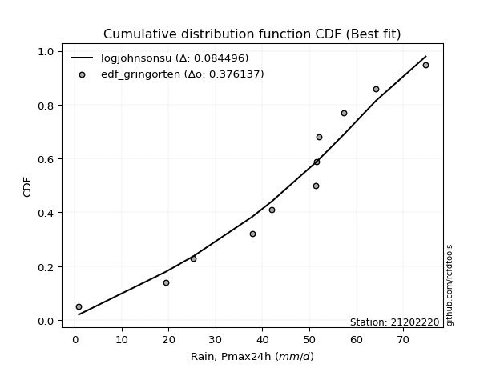</img></img>

</div>


### 9. Empirical - EDF Filliben (1975)

The specific values of the constants (0.3175) (often denoted as $alpha$) and (0.365) are derived from a method proposed by James J. Filliben in a 1975 paper. This particular formula is the mean value of the $i$-th order statistic of the normal distribution and is considered a robust and effective plotting position formula for the normal probability plot correlation coefficient test for normality.

<div align="center">


$P=(m-0.3175)/(n+0.365)$


</div>


**9.1. Empirical values**

<div align="center">

|                | 0                   | 1                   | 2                   | 3                   | 4                  | 5                  | 6                  | 7                  | 8                  | 9                  | 10                 | 11                 |
|:---------------|:--------------------|:--------------------|:--------------------|:--------------------|:-------------------|:-------------------|:-------------------|:-------------------|:-------------------|:-------------------|:-------------------|:-------------------|
| date           | 2023                | 2016                | 2015                | 2012                | 2014               | 2025               | 2011               | 2009               | 2024               | 2010               | 2013               | 2008               |
| x              | 0.9                 | 19.4                | 25.3                | 37.8                | 42.0               | 44.6               | 51.3               | 51.6               | 52.0               | 57.4               | 64.2               | 74.8               |
| m              | 1                   | 2                   | 3                   | 4                   | 5                  | 6                  | 7                  | 8                  | 9                  | 10                 | 11                 | 12                 |
| empirical_dist | edf_filliben        | edf_filliben        | edf_filliben        | edf_filliben        | edf_filliben       | edf_filliben       | edf_filliben       | edf_filliben       | edf_filliben       | edf_filliben       | edf_filliben       | edf_filliben       |
| empirical      | 0.05519611807521229 | 0.13606955115244643 | 0.21694298422968056 | 0.29781641730691466 | 0.3786898503841488 | 0.4595632834613829 | 0.540436716538617  | 0.6213101496158512 | 0.7021835826930852 | 0.7830570157703194 | 0.8639304488475535 | 0.9448038819247876 |
| empirical_tr   | 1.0584207147442757  | 1.1575005850690383  | 1.2770462174025305  | 1.4241289951050964  | 1.609502115196876  | 1.8503554059109617 | 2.1759788825340958 | 2.6406833956219966 | 3.357773251866937  | 4.6095060577819185 | 7.349182763744426  | 18.117216117216078 |

</div>


**9.2. Kolmogorov-Smirnov fit test (sorted by Δ)**


<div align="center">

|                | 0                   | 1                   | 2                   | 3                   | 4                   | 5                   | 6                   | 7                   | 8                   | 9                   | 10                  | 11                  | 12                  | 13                  | 14                  | 15                  | 16                  | 17                  | 18                  | 19                  | 20                  | 21                  | 22                  | 23                  | 24                  | 25                  | 26                  | 27                  | 28                  | 29                  | 30                  | 31                  | 32                  | 33                  | 34                  | 35                    | 36                  | 37                  | 38                  | 39                  | 40                  | 41                  | 42                  | 43                  | 44                  | 45                  | 46                  | 47                  | 48                  | 49                  | 50                  | 51                  | 52                  | 53                  | 54                  | 55                  | 56                  | 57                  | 58                  | 59                  | 60                  | 61                  | 62                  | 63                  | 64                  | 65                  | 66                  | 67                  | 68                  | 69                  | 70                  | 71                  | 72                  | 73                  | 74                  | 75                  | 76                  | 77                  | 78                  | 79                  | 80                  | 81                  | 82                  | 83                  | 84                  | 85                  | 86                  | 87                  | 88                  | 89                  |
|:---------------|:--------------------|:--------------------|:--------------------|:--------------------|:--------------------|:--------------------|:--------------------|:--------------------|:--------------------|:--------------------|:--------------------|:--------------------|:--------------------|:--------------------|:--------------------|:--------------------|:--------------------|:--------------------|:--------------------|:--------------------|:--------------------|:--------------------|:--------------------|:--------------------|:--------------------|:--------------------|:--------------------|:--------------------|:--------------------|:--------------------|:--------------------|:--------------------|:--------------------|:--------------------|:--------------------|:----------------------|:--------------------|:--------------------|:--------------------|:--------------------|:--------------------|:--------------------|:--------------------|:--------------------|:--------------------|:--------------------|:--------------------|:--------------------|:--------------------|:--------------------|:--------------------|:--------------------|:--------------------|:--------------------|:--------------------|:--------------------|:--------------------|:--------------------|:--------------------|:--------------------|:--------------------|:--------------------|:--------------------|:--------------------|:--------------------|:--------------------|:--------------------|:--------------------|:--------------------|:--------------------|:--------------------|:--------------------|:--------------------|:--------------------|:--------------------|:--------------------|:--------------------|:--------------------|:--------------------|:--------------------|:--------------------|:--------------------|:--------------------|:--------------------|:--------------------|:--------------------|:--------------------|:--------------------|:--------------------|:--------------------|
| station        | 21202220            | 21202220            | 21202220            | 21202220            | 21202220            | 21202220            | 21202220            | 21202220            | 21202220            | 21202220            | 21202220            | 21202220            | 21202220            | 21202220            | 21202220            | 21202220            | 21202220            | 21202220            | 21202220            | 21202220            | 21202220            | 21202220            | 21202220            | 21202220            | 21202220            | 21202220            | 21202220            | 21202220            | 21202220            | 21202220            | 21202220            | 21202220            | 21202220            | 21202220            | 21202220            | 21202220              | 21202220            | 21202220            | 21202220            | 21202220            | 21202220            | 21202220            | 21202220            | 21202220            | 21202220            | 21202220            | 21202220            | 21202220            | 21202220            | 21202220            | 21202220            | 21202220            | 21202220            | 21202220            | 21202220            | 21202220            | 21202220            | 21202220            | 21202220            | 21202220            | 21202220            | 21202220            | 21202220            | 21202220            | 21202220            | 21202220            | 21202220            | 21202220            | 21202220            | 21202220            | 21202220            | 21202220            | 21202220            | 21202220            | 21202220            | 21202220            | 21202220            | 21202220            | 21202220            | 21202220            | 21202220            | 21202220            | 21202220            | 21202220            | 21202220            | 21202220            | 21202220            | 21202220            | 21202220            | 21202220            |
| empirical_dist | edf_filliben        | edf_filliben        | edf_filliben        | edf_filliben        | edf_filliben        | edf_filliben        | edf_filliben        | edf_filliben        | edf_filliben        | edf_filliben        | edf_filliben        | edf_filliben        | edf_filliben        | edf_filliben        | edf_filliben        | edf_filliben        | edf_filliben        | edf_filliben        | edf_filliben        | edf_filliben        | edf_filliben        | edf_filliben        | edf_filliben        | edf_filliben        | edf_filliben        | edf_filliben        | edf_filliben        | edf_filliben        | edf_filliben        | edf_filliben        | edf_filliben        | edf_filliben        | edf_filliben        | edf_filliben        | edf_filliben        | edf_filliben          | edf_filliben        | edf_filliben        | edf_filliben        | edf_filliben        | edf_filliben        | edf_filliben        | edf_filliben        | edf_filliben        | edf_filliben        | edf_filliben        | edf_filliben        | edf_filliben        | edf_filliben        | edf_filliben        | edf_filliben        | edf_filliben        | edf_filliben        | edf_filliben        | edf_filliben        | edf_filliben        | edf_filliben        | edf_filliben        | edf_filliben        | edf_filliben        | edf_filliben        | edf_filliben        | edf_filliben        | edf_filliben        | edf_filliben        | edf_filliben        | edf_filliben        | edf_filliben        | edf_filliben        | edf_filliben        | edf_filliben        | edf_filliben        | edf_filliben        | edf_filliben        | edf_filliben        | edf_filliben        | edf_filliben        | edf_filliben        | edf_filliben        | edf_filliben        | edf_filliben        | edf_filliben        | edf_filliben        | edf_filliben        | edf_filliben        | edf_filliben        | edf_filliben        | edf_filliben        | edf_filliben        | edf_filliben        |
| p_dist         | gumbel_l            | johnsonsu           | genlogistic         | weibull_min         | logjohnsonsu        | pearson3            | gompertz            | mielke              | laplace_asymmetric  | fisk                | f                   | fatiguelife         | t                   | crystalball         | norm                | exponnorm           | nct                 | nakagami            | betaprime           | rice                | invgauss            | chi2                | gamma               | erlang              | logt                | invgamma            | logistic            | logmielke           | maxwell             | alpha               | rayleigh            | logloggamma         | hypsecant           | invweibull          | logfisk             | loglaplace_asymmetric | ncf                 | halfnorm            | gumbel_r            | laplace             | loggompertz         | logpearson3         | kstwobign           | halflogistic        | loggumbel_l         | moyal               | wald                | logbetaprime        | logfatiguelife      | logexponnorm        | lognorm             | lognorm             | logcrystalball      | logrice             | lognakagami         | lognct              | loglognorm          | loglogistic         | loggamma            | loggamma            | loginvgauss         | loginvweibull       | loghypsecant        | loginvgamma         | logalpha            | gibrat              | expon               | genexpon            | logmaxwell          | loglaplace          | lograyleigh         | loghalfnorm         | logkstwobign        | loggumbel_r         | loghalflogistic     | logmoyal            | loggenexpon         | logwald             | logncf              | logexpon            | logchi2             | loggibrat           | pareto              | logpareto           | logf                | logtruncnorm        | logweibull_min      | truncnorm           | logerlang           | loggenlogistic      |
| delta          | 0.07532610491776326 | 0.0760497574434843  | 0.07859746670817591 | 0.0801651915222602  | 0.08225544167387255 | 0.08509209401263118 | 0.08556000996538082 | 0.08657871810975082 | 0.0949411857341792  | 0.0985402743575976  | 0.11396398015876019 | 0.1155331626267202  | 0.11608526998667545 | 0.11608911755428308 | 0.11608912714640929 | 0.1160900497318823  | 0.11609098004347351 | 0.11653321047848786 | 0.11679361736658778 | 0.11853534244848563 | 0.11988370156586137 | 0.12056843925761351 | 0.12081712009738133 | 0.1242135828035662  | 0.12973642193897683 | 0.13034080598918518 | 0.13457938931337055 | 0.13579650649548192 | 0.13702073590304842 | 0.14063027998656752 | 0.14329091022415397 | 0.1472008276039441  | 0.14881425293527295 | 0.1493986737241142  | 0.15693614498111952 | 0.1576016321197758    | 0.1657894957674329  | 0.17005066399297608 | 0.17501119022573686 | 0.17678017510986432 | 0.18032160800309405 | 0.18173986684228383 | 0.1831195929218749  | 0.19291945804642308 | 0.1933913180097544  | 0.19444016278092802 | 0.2582045967003308  | 0.25892401091800377 | 0.258978236026442   | 0.25959930937283504 | 0.25960120963494215 | 0.25960120963494215 | 0.25960128831548623 | 0.259609360561463   | 0.2596463461795149  | 0.2600085671501948  | 0.2615361737268074  | 0.26730120028281634 | 0.2678787334885896  | 0.2678787334885896  | 0.2706359531756497  | 0.2714777948080487  | 0.27378459526034926 | 0.2744606419103175  | 0.2757530801677881  | 0.2818547507501965  | 0.28213500648249323 | 0.2821917140056065  | 0.28949001230186144 | 0.29455351309351974 | 0.29903969619128    | 0.3259984204033176  | 0.3269706575977269  | 0.3293628187570342  | 0.35351553873208597 | 0.3539486266073557  | 0.3674960449600496  | 0.4221732304503485  | 0.43578161086419087 | 0.44046251000867664 | 0.44427630746667446 | 0.45182999615751585 | 0.5009325561608559  | 0.520808459031458   | 0.5352098399828669  | 0.62912756319284    | 0.6483104941921131  | 0.6623359742747374  | 0.8636847373606451  | 0.8639304488475535  |
| deltao         | 0.36218414519599995 | 0.36218414519599995 | 0.36218414519599995 | 0.36218414519599995 | 0.36218414519599995 | 0.36218414519599995 | 0.36218414519599995 | 0.36218414519599995 | 0.36218414519599995 | 0.36218414519599995 | 0.36218414519599995 | 0.36218414519599995 | 0.36218414519599995 | 0.36218414519599995 | 0.36218414519599995 | 0.36218414519599995 | 0.36218414519599995 | 0.36218414519599995 | 0.36218414519599995 | 0.36218414519599995 | 0.36218414519599995 | 0.36218414519599995 | 0.36218414519599995 | 0.36218414519599995 | 0.36218414519599995 | 0.36218414519599995 | 0.36218414519599995 | 0.36218414519599995 | 0.36218414519599995 | 0.36218414519599995 | 0.36218414519599995 | 0.36218414519599995 | 0.36218414519599995 | 0.36218414519599995 | 0.36218414519599995 | 0.36218414519599995   | 0.36218414519599995 | 0.36218414519599995 | 0.36218414519599995 | 0.36218414519599995 | 0.36218414519599995 | 0.36218414519599995 | 0.36218414519599995 | 0.36218414519599995 | 0.36218414519599995 | 0.36218414519599995 | 0.36218414519599995 | 0.36218414519599995 | 0.36218414519599995 | 0.36218414519599995 | 0.36218414519599995 | 0.36218414519599995 | 0.36218414519599995 | 0.36218414519599995 | 0.36218414519599995 | 0.36218414519599995 | 0.36218414519599995 | 0.36218414519599995 | 0.36218414519599995 | 0.36218414519599995 | 0.36218414519599995 | 0.36218414519599995 | 0.36218414519599995 | 0.36218414519599995 | 0.36218414519599995 | 0.36218414519599995 | 0.36218414519599995 | 0.36218414519599995 | 0.36218414519599995 | 0.36218414519599995 | 0.36218414519599995 | 0.36218414519599995 | 0.36218414519599995 | 0.36218414519599995 | 0.36218414519599995 | 0.36218414519599995 | 0.36218414519599995 | 0.36218414519599995 | 0.36218414519599995 | 0.36218414519599995 | 0.36218414519599995 | 0.36218414519599995 | 0.36218414519599995 | 0.36218414519599995 | 0.36218414519599995 | 0.36218414519599995 | 0.36218414519599995 | 0.36218414519599995 | 0.36218414519599995 | 0.36218414519599995 |
| eval           | Δo > Δ              | Δo > Δ              | Δo > Δ              | Δo > Δ              | Δo > Δ              | Δo > Δ              | Δo > Δ              | Δo > Δ              | Δo > Δ              | Δo > Δ              | Δo > Δ              | Δo > Δ              | Δo > Δ              | Δo > Δ              | Δo > Δ              | Δo > Δ              | Δo > Δ              | Δo > Δ              | Δo > Δ              | Δo > Δ              | Δo > Δ              | Δo > Δ              | Δo > Δ              | Δo > Δ              | Δo > Δ              | Δo > Δ              | Δo > Δ              | Δo > Δ              | Δo > Δ              | Δo > Δ              | Δo > Δ              | Δo > Δ              | Δo > Δ              | Δo > Δ              | Δo > Δ              | Δo > Δ                | Δo > Δ              | Δo > Δ              | Δo > Δ              | Δo > Δ              | Δo > Δ              | Δo > Δ              | Δo > Δ              | Δo > Δ              | Δo > Δ              | Δo > Δ              | Δo > Δ              | Δo > Δ              | Δo > Δ              | Δo > Δ              | Δo > Δ              | Δo > Δ              | Δo > Δ              | Δo > Δ              | Δo > Δ              | Δo > Δ              | Δo > Δ              | Δo > Δ              | Δo > Δ              | Δo > Δ              | Δo > Δ              | Δo > Δ              | Δo > Δ              | Δo > Δ              | Δo > Δ              | Δo > Δ              | Δo > Δ              | Δo > Δ              | Δo > Δ              | Δo > Δ              | Δo > Δ              | Δo > Δ              | Δo > Δ              | Δo > Δ              | Δo > Δ              | Δo > Δ              | Δo <= Δ             | Δo <= Δ             | Δo <= Δ             | Δo <= Δ             | Δo <= Δ             | Δo <= Δ             | Δo <= Δ             | Δo <= Δ             | Δo <= Δ             | Δo <= Δ             | Δo <= Δ             | Δo <= Δ             | Δo <= Δ             | Δo <= Δ             |
| fit            | 1                   | 1                   | 1                   | 1                   | 1                   | 1                   | 1                   | 1                   | 1                   | 1                   | 1                   | 1                   | 1                   | 1                   | 1                   | 1                   | 1                   | 1                   | 1                   | 1                   | 1                   | 1                   | 1                   | 1                   | 1                   | 1                   | 1                   | 1                   | 1                   | 1                   | 1                   | 1                   | 1                   | 1                   | 1                   | 1                     | 1                   | 1                   | 1                   | 1                   | 1                   | 1                   | 1                   | 1                   | 1                   | 1                   | 1                   | 1                   | 1                   | 1                   | 1                   | 1                   | 1                   | 1                   | 1                   | 1                   | 1                   | 1                   | 1                   | 1                   | 1                   | 1                   | 1                   | 1                   | 1                   | 1                   | 1                   | 1                   | 1                   | 1                   | 1                   | 1                   | 1                   | 1                   | 1                   | 1                   | 0                   | 0                   | 0                   | 0                   | 0                   | 0                   | 0                   | 0                   | 0                   | 0                   | 0                   | 0                   | 0                   | 0                   |
| n              | 12                  | 12                  | 12                  | 12                  | 12                  | 12                  | 12                  | 12                  | 12                  | 12                  | 12                  | 12                  | 12                  | 12                  | 12                  | 12                  | 12                  | 12                  | 12                  | 12                  | 12                  | 12                  | 12                  | 12                  | 12                  | 12                  | 12                  | 12                  | 12                  | 12                  | 12                  | 12                  | 12                  | 12                  | 12                  | 12                    | 12                  | 12                  | 12                  | 12                  | 12                  | 12                  | 12                  | 12                  | 12                  | 12                  | 12                  | 12                  | 12                  | 12                  | 12                  | 12                  | 12                  | 12                  | 12                  | 12                  | 12                  | 12                  | 12                  | 12                  | 12                  | 12                  | 12                  | 12                  | 12                  | 12                  | 12                  | 12                  | 12                  | 12                  | 12                  | 12                  | 12                  | 12                  | 12                  | 12                  | 12                  | 12                  | 12                  | 12                  | 12                  | 12                  | 12                  | 12                  | 12                  | 12                  | 12                  | 12                  | 12                  | 12                  |
| best_fit       | 1                   | 0                   | 0                   | 0                   | 0                   | 0                   | 0                   | 0                   | 0                   | 0                   | 0                   | 0                   | 0                   | 0                   | 0                   | 0                   | 0                   | 0                   | 0                   | 0                   | 0                   | 0                   | 0                   | 0                   | 0                   | 0                   | 0                   | 0                   | 0                   | 0                   | 0                   | 0                   | 0                   | 0                   | 0                   | 0                     | 0                   | 0                   | 0                   | 0                   | 0                   | 0                   | 0                   | 0                   | 0                   | 0                   | 0                   | 0                   | 0                   | 0                   | 0                   | 0                   | 0                   | 0                   | 0                   | 0                   | 0                   | 0                   | 0                   | 0                   | 0                   | 0                   | 0                   | 0                   | 0                   | 0                   | 0                   | 0                   | 0                   | 0                   | 0                   | 0                   | 0                   | 0                   | 0                   | 0                   | 0                   | 0                   | 0                   | 0                   | 0                   | 0                   | 0                   | 0                   | 0                   | 0                   | 0                   | 0                   | 0                   | 0                   |
| best_fit_sort  | 1                   | 2                   | 3                   | 4                   | 5                   | 6                   | 7                   | 8                   | 9                   | 10                  | 11                  | 12                  | 13                  | 14                  | 15                  | 16                  | 17                  | 18                  | 19                  | 20                  | 21                  | 22                  | 23                  | 24                  | 25                  | 26                  | 27                  | 28                  | 29                  | 30                  | 31                  | 32                  | 33                  | 34                  | 35                  | 36                    | 37                  | 38                  | 39                  | 40                  | 41                  | 42                  | 43                  | 44                  | 45                  | 46                  | 47                  | 48                  | 49                  | 50                  | 51                  | 52                  | 53                  | 54                  | 55                  | 56                  | 57                  | 58                  | 59                  | 60                  | 61                  | 62                  | 63                  | 64                  | 65                  | 66                  | 67                  | 68                  | 69                  | 70                  | 71                  | 72                  | 73                  | 74                  | 75                  | 76                  | 77                  | 78                  | 79                  | 80                  | 81                  | 82                  | 83                  | 84                  | 85                  | 86                  | 87                  | 88                  | 89                  | 90                  |

</div>


<div align="center">

</img>

</div>


**9.3. Best fit**

<div align="center">

|   id |   station | empirical_dist   | p_dist   |     delta |   deltao | eval   |   fit |   n |   best_fit |   best_fit_sort |
|-----:|----------:|:-----------------|:---------|----------:|---------:|:-------|------:|----:|-----------:|----------------:|
|    0 |  21202220 | edf_filliben     | gumbel_l | 0.0753261 | 0.362184 | Δo > Δ |     1 |  12 |          1 |               1 |

</div>


<div align="center">

</img></img>

</div>


### 10. Empirical - EDF Jenkinson (1977)

The Jenkinson formula in hydrology is an empirical plotting position formula used to estimate the non-exceedance probability _(P)_ or return period _(T)_ of a given ordered observation within a sample. It is a widely used method in the frequency analysis of extreme events such as floods and rainfall, as it provides a distribution-free way to plot data. _a≈0.31_ and _b≈0.38_ are constants derived to approximate the median of the probability distribution for the given rank.

<div align="center">


$P=(m-a)/(n+b)$


</div>


**10.1. Empirical values**

<div align="center">

|                | 0                    | 1                   | 2                   | 3                  | 4                  | 5                  | 6                  | 7                  | 8                  | 9                  | 10                 | 11                 |
|:---------------|:---------------------|:--------------------|:--------------------|:-------------------|:-------------------|:-------------------|:-------------------|:-------------------|:-------------------|:-------------------|:-------------------|:-------------------|
| date           | 2023                 | 2016                | 2015                | 2012               | 2014               | 2025               | 2011               | 2009               | 2024               | 2010               | 2013               | 2008               |
| x              | 0.9                  | 19.4                | 25.3                | 37.8               | 42.0               | 44.6               | 51.3               | 51.6               | 52.0               | 57.4               | 64.2               | 74.8               |
| m              | 1                    | 2                   | 3                   | 4                  | 5                  | 6                  | 7                  | 8                  | 9                  | 10                 | 11                 | 12                 |
| empirical_dist | edf_jenkinson        | edf_jenkinson       | edf_jenkinson       | edf_jenkinson      | edf_jenkinson      | edf_jenkinson      | edf_jenkinson      | edf_jenkinson      | edf_jenkinson      | edf_jenkinson      | edf_jenkinson      | edf_jenkinson      |
| empirical      | 0.055735056542810975 | 0.13651050080775443 | 0.21728594507269788 | 0.2980613893376413 | 0.3788368336025848 | 0.4596122778675283 | 0.5403877221324718 | 0.6211631663974152 | 0.7019386106623585 | 0.7827140549273021 | 0.8634894991922455 | 0.9442649434571889 |
| empirical_tr   | 1.0590248075278015   | 1.1580916744621141  | 1.2776057791537667  | 1.424626006904488  | 1.6098829648894668 | 1.850523168908819  | 2.1757469244288226 | 2.6396588486140726 | 3.3550135501355    | 4.6022304832713745 | 7.325443786982245  | 17.942028985507218 |

</div>


**10.2. Kolmogorov-Smirnov fit test (sorted by Δ)**


<div align="center">

|                | 0                   | 1                   | 2                   | 3                   | 4                   | 5                   | 6                   | 7                   | 8                   | 9                   | 10                  | 11                  | 12                  | 13                  | 14                  | 15                  | 16                  | 17                  | 18                  | 19                  | 20                  | 21                  | 22                  | 23                  | 24                  | 25                  | 26                  | 27                  | 28                  | 29                  | 30                  | 31                  | 32                  | 33                  | 34                  | 35                    | 36                  | 37                  | 38                  | 39                  | 40                  | 41                  | 42                  | 43                  | 44                  | 45                  | 46                  | 47                  | 48                  | 49                  | 50                  | 51                  | 52                  | 53                  | 54                  | 55                  | 56                  | 57                  | 58                  | 59                  | 60                  | 61                  | 62                  | 63                  | 64                  | 65                  | 66                  | 67                  | 68                  | 69                  | 70                  | 71                  | 72                  | 73                  | 74                  | 75                  | 76                  | 77                  | 78                  | 79                  | 80                  | 81                  | 82                  | 83                  | 84                  | 85                  | 86                  | 87                  | 88                  | 89                  |
|:---------------|:--------------------|:--------------------|:--------------------|:--------------------|:--------------------|:--------------------|:--------------------|:--------------------|:--------------------|:--------------------|:--------------------|:--------------------|:--------------------|:--------------------|:--------------------|:--------------------|:--------------------|:--------------------|:--------------------|:--------------------|:--------------------|:--------------------|:--------------------|:--------------------|:--------------------|:--------------------|:--------------------|:--------------------|:--------------------|:--------------------|:--------------------|:--------------------|:--------------------|:--------------------|:--------------------|:----------------------|:--------------------|:--------------------|:--------------------|:--------------------|:--------------------|:--------------------|:--------------------|:--------------------|:--------------------|:--------------------|:--------------------|:--------------------|:--------------------|:--------------------|:--------------------|:--------------------|:--------------------|:--------------------|:--------------------|:--------------------|:--------------------|:--------------------|:--------------------|:--------------------|:--------------------|:--------------------|:--------------------|:--------------------|:--------------------|:--------------------|:--------------------|:--------------------|:--------------------|:--------------------|:--------------------|:--------------------|:--------------------|:--------------------|:--------------------|:--------------------|:--------------------|:--------------------|:--------------------|:--------------------|:--------------------|:--------------------|:--------------------|:--------------------|:--------------------|:--------------------|:--------------------|:--------------------|:--------------------|:--------------------|
| station        | 21202220            | 21202220            | 21202220            | 21202220            | 21202220            | 21202220            | 21202220            | 21202220            | 21202220            | 21202220            | 21202220            | 21202220            | 21202220            | 21202220            | 21202220            | 21202220            | 21202220            | 21202220            | 21202220            | 21202220            | 21202220            | 21202220            | 21202220            | 21202220            | 21202220            | 21202220            | 21202220            | 21202220            | 21202220            | 21202220            | 21202220            | 21202220            | 21202220            | 21202220            | 21202220            | 21202220              | 21202220            | 21202220            | 21202220            | 21202220            | 21202220            | 21202220            | 21202220            | 21202220            | 21202220            | 21202220            | 21202220            | 21202220            | 21202220            | 21202220            | 21202220            | 21202220            | 21202220            | 21202220            | 21202220            | 21202220            | 21202220            | 21202220            | 21202220            | 21202220            | 21202220            | 21202220            | 21202220            | 21202220            | 21202220            | 21202220            | 21202220            | 21202220            | 21202220            | 21202220            | 21202220            | 21202220            | 21202220            | 21202220            | 21202220            | 21202220            | 21202220            | 21202220            | 21202220            | 21202220            | 21202220            | 21202220            | 21202220            | 21202220            | 21202220            | 21202220            | 21202220            | 21202220            | 21202220            | 21202220            |
| empirical_dist | edf_jenkinson       | edf_jenkinson       | edf_jenkinson       | edf_jenkinson       | edf_jenkinson       | edf_jenkinson       | edf_jenkinson       | edf_jenkinson       | edf_jenkinson       | edf_jenkinson       | edf_jenkinson       | edf_jenkinson       | edf_jenkinson       | edf_jenkinson       | edf_jenkinson       | edf_jenkinson       | edf_jenkinson       | edf_jenkinson       | edf_jenkinson       | edf_jenkinson       | edf_jenkinson       | edf_jenkinson       | edf_jenkinson       | edf_jenkinson       | edf_jenkinson       | edf_jenkinson       | edf_jenkinson       | edf_jenkinson       | edf_jenkinson       | edf_jenkinson       | edf_jenkinson       | edf_jenkinson       | edf_jenkinson       | edf_jenkinson       | edf_jenkinson       | edf_jenkinson         | edf_jenkinson       | edf_jenkinson       | edf_jenkinson       | edf_jenkinson       | edf_jenkinson       | edf_jenkinson       | edf_jenkinson       | edf_jenkinson       | edf_jenkinson       | edf_jenkinson       | edf_jenkinson       | edf_jenkinson       | edf_jenkinson       | edf_jenkinson       | edf_jenkinson       | edf_jenkinson       | edf_jenkinson       | edf_jenkinson       | edf_jenkinson       | edf_jenkinson       | edf_jenkinson       | edf_jenkinson       | edf_jenkinson       | edf_jenkinson       | edf_jenkinson       | edf_jenkinson       | edf_jenkinson       | edf_jenkinson       | edf_jenkinson       | edf_jenkinson       | edf_jenkinson       | edf_jenkinson       | edf_jenkinson       | edf_jenkinson       | edf_jenkinson       | edf_jenkinson       | edf_jenkinson       | edf_jenkinson       | edf_jenkinson       | edf_jenkinson       | edf_jenkinson       | edf_jenkinson       | edf_jenkinson       | edf_jenkinson       | edf_jenkinson       | edf_jenkinson       | edf_jenkinson       | edf_jenkinson       | edf_jenkinson       | edf_jenkinson       | edf_jenkinson       | edf_jenkinson       | edf_jenkinson       | edf_jenkinson       |
| p_dist         | gumbel_l            | johnsonsu           | genlogistic         | weibull_min         | logjohnsonsu        | pearson3            | gompertz            | mielke              | laplace_asymmetric  | fisk                | f                   | fatiguelife         | t                   | crystalball         | norm                | exponnorm           | nct                 | nakagami            | betaprime           | rice                | invgauss            | chi2                | gamma               | erlang              | logt                | invgamma            | logistic            | logmielke           | maxwell             | alpha               | rayleigh            | logloggamma         | hypsecant           | invweibull          | logfisk             | loglaplace_asymmetric | ncf                 | halfnorm            | gumbel_r            | laplace             | loggompertz         | logpearson3         | kstwobign           | halflogistic        | loggumbel_l         | moyal               | wald                | logbetaprime        | logfatiguelife      | logexponnorm        | lognorm             | lognorm             | logcrystalball      | logrice             | lognakagami         | lognct              | loglognorm          | loglogistic         | loggamma            | loggamma            | loginvgauss         | loginvweibull       | loghypsecant        | loginvgamma         | logalpha            | expon               | gibrat              | genexpon            | logmaxwell          | loglaplace          | lograyleigh         | loghalfnorm         | logkstwobign        | loggumbel_r         | loghalflogistic     | logmoyal            | loggenexpon         | logwald             | logncf              | logexpon            | logchi2             | loggibrat           | pareto              | logpareto           | logf                | logtruncnorm        | logweibull_min      | truncnorm           | logerlang           | loggenlogistic      |
| delta          | 0.07508113288703655 | 0.07609875184962955 | 0.07864646111432116 | 0.08021418592840546 | 0.0823044360800178  | 0.08514108841877643 | 0.08560900437152608 | 0.08662771251589607 | 0.09499018014032445 | 0.09858926876374285 | 0.11401297456490544 | 0.11558215703286545 | 0.11613426439282071 | 0.11613811196042834 | 0.11613812155255454 | 0.11613904413802756 | 0.11613997444961877 | 0.11658220488463311 | 0.11684261177273303 | 0.11858433685463088 | 0.11993269597200662 | 0.12061743366375877 | 0.12086611450352658 | 0.12426257720971146 | 0.12949144990825012 | 0.13038980039533044 | 0.1346283837195158  | 0.13555153446475526 | 0.13706973030919367 | 0.14067927439271277 | 0.14333990463029922 | 0.14695585557321744 | 0.1488632473414182  | 0.14915370169338754 | 0.15669117295039287 | 0.15735666008904914   | 0.16554452373670625 | 0.1699036807745401  | 0.1750601846318821  | 0.17682916951600958 | 0.1800766359723674  | 0.1813969059992665  | 0.18287462089114825 | 0.1927724748279871  | 0.19314634597902774 | 0.19448915718707327 | 0.2580576134818948  | 0.2586790388872771  | 0.25873326399571533 | 0.2593543373421084  | 0.2593562376042155  | 0.2593562376042155  | 0.2593563162847596  | 0.25936438853073635 | 0.2594013741487882  | 0.25976359511946817 | 0.2612912016960807  | 0.2670562282520897  | 0.26763376145786294 | 0.26763376145786294 | 0.27039098114492305 | 0.27103684515274074 | 0.2735396232296226  | 0.27421566987959084 | 0.27550810813706145 | 0.2818900344517666  | 0.28190374515634176 | 0.28194674197487984 | 0.2892450402711348  | 0.2943085410627931  | 0.29879472416055336 | 0.32575344837259096 | 0.326529707942419   | 0.32911784672630756 | 0.3532705667013593  | 0.35370365457662906 | 0.3670550953047417  | 0.42192825841962184 | 0.43534066120888293 | 0.4400215603533687  | 0.4438353578113665  | 0.4515850241267892  | 0.5004916065055479  | 0.5203675093761501  | 0.5347688903275589  | 0.6286866135375321  | 0.6478695445368051  | 0.6620910022440107  | 0.8632437877053372  | 0.8634894991922455  |
| deltao         | 0.36218414519599995 | 0.36218414519599995 | 0.36218414519599995 | 0.36218414519599995 | 0.36218414519599995 | 0.36218414519599995 | 0.36218414519599995 | 0.36218414519599995 | 0.36218414519599995 | 0.36218414519599995 | 0.36218414519599995 | 0.36218414519599995 | 0.36218414519599995 | 0.36218414519599995 | 0.36218414519599995 | 0.36218414519599995 | 0.36218414519599995 | 0.36218414519599995 | 0.36218414519599995 | 0.36218414519599995 | 0.36218414519599995 | 0.36218414519599995 | 0.36218414519599995 | 0.36218414519599995 | 0.36218414519599995 | 0.36218414519599995 | 0.36218414519599995 | 0.36218414519599995 | 0.36218414519599995 | 0.36218414519599995 | 0.36218414519599995 | 0.36218414519599995 | 0.36218414519599995 | 0.36218414519599995 | 0.36218414519599995 | 0.36218414519599995   | 0.36218414519599995 | 0.36218414519599995 | 0.36218414519599995 | 0.36218414519599995 | 0.36218414519599995 | 0.36218414519599995 | 0.36218414519599995 | 0.36218414519599995 | 0.36218414519599995 | 0.36218414519599995 | 0.36218414519599995 | 0.36218414519599995 | 0.36218414519599995 | 0.36218414519599995 | 0.36218414519599995 | 0.36218414519599995 | 0.36218414519599995 | 0.36218414519599995 | 0.36218414519599995 | 0.36218414519599995 | 0.36218414519599995 | 0.36218414519599995 | 0.36218414519599995 | 0.36218414519599995 | 0.36218414519599995 | 0.36218414519599995 | 0.36218414519599995 | 0.36218414519599995 | 0.36218414519599995 | 0.36218414519599995 | 0.36218414519599995 | 0.36218414519599995 | 0.36218414519599995 | 0.36218414519599995 | 0.36218414519599995 | 0.36218414519599995 | 0.36218414519599995 | 0.36218414519599995 | 0.36218414519599995 | 0.36218414519599995 | 0.36218414519599995 | 0.36218414519599995 | 0.36218414519599995 | 0.36218414519599995 | 0.36218414519599995 | 0.36218414519599995 | 0.36218414519599995 | 0.36218414519599995 | 0.36218414519599995 | 0.36218414519599995 | 0.36218414519599995 | 0.36218414519599995 | 0.36218414519599995 | 0.36218414519599995 |
| eval           | Δo > Δ              | Δo > Δ              | Δo > Δ              | Δo > Δ              | Δo > Δ              | Δo > Δ              | Δo > Δ              | Δo > Δ              | Δo > Δ              | Δo > Δ              | Δo > Δ              | Δo > Δ              | Δo > Δ              | Δo > Δ              | Δo > Δ              | Δo > Δ              | Δo > Δ              | Δo > Δ              | Δo > Δ              | Δo > Δ              | Δo > Δ              | Δo > Δ              | Δo > Δ              | Δo > Δ              | Δo > Δ              | Δo > Δ              | Δo > Δ              | Δo > Δ              | Δo > Δ              | Δo > Δ              | Δo > Δ              | Δo > Δ              | Δo > Δ              | Δo > Δ              | Δo > Δ              | Δo > Δ                | Δo > Δ              | Δo > Δ              | Δo > Δ              | Δo > Δ              | Δo > Δ              | Δo > Δ              | Δo > Δ              | Δo > Δ              | Δo > Δ              | Δo > Δ              | Δo > Δ              | Δo > Δ              | Δo > Δ              | Δo > Δ              | Δo > Δ              | Δo > Δ              | Δo > Δ              | Δo > Δ              | Δo > Δ              | Δo > Δ              | Δo > Δ              | Δo > Δ              | Δo > Δ              | Δo > Δ              | Δo > Δ              | Δo > Δ              | Δo > Δ              | Δo > Δ              | Δo > Δ              | Δo > Δ              | Δo > Δ              | Δo > Δ              | Δo > Δ              | Δo > Δ              | Δo > Δ              | Δo > Δ              | Δo > Δ              | Δo > Δ              | Δo > Δ              | Δo > Δ              | Δo <= Δ             | Δo <= Δ             | Δo <= Δ             | Δo <= Δ             | Δo <= Δ             | Δo <= Δ             | Δo <= Δ             | Δo <= Δ             | Δo <= Δ             | Δo <= Δ             | Δo <= Δ             | Δo <= Δ             | Δo <= Δ             | Δo <= Δ             |
| fit            | 1                   | 1                   | 1                   | 1                   | 1                   | 1                   | 1                   | 1                   | 1                   | 1                   | 1                   | 1                   | 1                   | 1                   | 1                   | 1                   | 1                   | 1                   | 1                   | 1                   | 1                   | 1                   | 1                   | 1                   | 1                   | 1                   | 1                   | 1                   | 1                   | 1                   | 1                   | 1                   | 1                   | 1                   | 1                   | 1                     | 1                   | 1                   | 1                   | 1                   | 1                   | 1                   | 1                   | 1                   | 1                   | 1                   | 1                   | 1                   | 1                   | 1                   | 1                   | 1                   | 1                   | 1                   | 1                   | 1                   | 1                   | 1                   | 1                   | 1                   | 1                   | 1                   | 1                   | 1                   | 1                   | 1                   | 1                   | 1                   | 1                   | 1                   | 1                   | 1                   | 1                   | 1                   | 1                   | 1                   | 0                   | 0                   | 0                   | 0                   | 0                   | 0                   | 0                   | 0                   | 0                   | 0                   | 0                   | 0                   | 0                   | 0                   |
| n              | 12                  | 12                  | 12                  | 12                  | 12                  | 12                  | 12                  | 12                  | 12                  | 12                  | 12                  | 12                  | 12                  | 12                  | 12                  | 12                  | 12                  | 12                  | 12                  | 12                  | 12                  | 12                  | 12                  | 12                  | 12                  | 12                  | 12                  | 12                  | 12                  | 12                  | 12                  | 12                  | 12                  | 12                  | 12                  | 12                    | 12                  | 12                  | 12                  | 12                  | 12                  | 12                  | 12                  | 12                  | 12                  | 12                  | 12                  | 12                  | 12                  | 12                  | 12                  | 12                  | 12                  | 12                  | 12                  | 12                  | 12                  | 12                  | 12                  | 12                  | 12                  | 12                  | 12                  | 12                  | 12                  | 12                  | 12                  | 12                  | 12                  | 12                  | 12                  | 12                  | 12                  | 12                  | 12                  | 12                  | 12                  | 12                  | 12                  | 12                  | 12                  | 12                  | 12                  | 12                  | 12                  | 12                  | 12                  | 12                  | 12                  | 12                  |
| best_fit       | 1                   | 0                   | 0                   | 0                   | 0                   | 0                   | 0                   | 0                   | 0                   | 0                   | 0                   | 0                   | 0                   | 0                   | 0                   | 0                   | 0                   | 0                   | 0                   | 0                   | 0                   | 0                   | 0                   | 0                   | 0                   | 0                   | 0                   | 0                   | 0                   | 0                   | 0                   | 0                   | 0                   | 0                   | 0                   | 0                     | 0                   | 0                   | 0                   | 0                   | 0                   | 0                   | 0                   | 0                   | 0                   | 0                   | 0                   | 0                   | 0                   | 0                   | 0                   | 0                   | 0                   | 0                   | 0                   | 0                   | 0                   | 0                   | 0                   | 0                   | 0                   | 0                   | 0                   | 0                   | 0                   | 0                   | 0                   | 0                   | 0                   | 0                   | 0                   | 0                   | 0                   | 0                   | 0                   | 0                   | 0                   | 0                   | 0                   | 0                   | 0                   | 0                   | 0                   | 0                   | 0                   | 0                   | 0                   | 0                   | 0                   | 0                   |
| best_fit_sort  | 1                   | 2                   | 3                   | 4                   | 5                   | 6                   | 7                   | 8                   | 9                   | 10                  | 11                  | 12                  | 13                  | 14                  | 15                  | 16                  | 17                  | 18                  | 19                  | 20                  | 21                  | 22                  | 23                  | 24                  | 25                  | 26                  | 27                  | 28                  | 29                  | 30                  | 31                  | 32                  | 33                  | 34                  | 35                  | 36                    | 37                  | 38                  | 39                  | 40                  | 41                  | 42                  | 43                  | 44                  | 45                  | 46                  | 47                  | 48                  | 49                  | 50                  | 51                  | 52                  | 53                  | 54                  | 55                  | 56                  | 57                  | 58                  | 59                  | 60                  | 61                  | 62                  | 63                  | 64                  | 65                  | 66                  | 67                  | 68                  | 69                  | 70                  | 71                  | 72                  | 73                  | 74                  | 75                  | 76                  | 77                  | 78                  | 79                  | 80                  | 81                  | 82                  | 83                  | 84                  | 85                  | 86                  | 87                  | 88                  | 89                  | 90                  |

</div>


<div align="center">

</img>

</div>


**10.3. Best fit**

<div align="center">

|   id |   station | empirical_dist   | p_dist   |     delta |   deltao | eval   |   fit |   n |   best_fit |   best_fit_sort |
|-----:|----------:|:-----------------|:---------|----------:|---------:|:-------|------:|----:|-----------:|----------------:|
|    0 |  21202220 | edf_jenkinson    | gumbel_l | 0.0750811 | 0.362184 | Δo > Δ |     1 |  12 |          1 |               1 |

</div>


<div align="center">

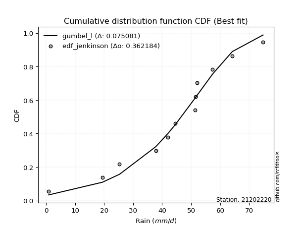</img></img>

</div>


### 11. Empirical - EDF Cunnane (1978)

Cunnane´s work in statistical hydrology has focused on the performance and evaluation of different probability distributions (such as GEV, Gumbel, Lognormal) for flood frequency estimation. _b_ is a constant, typically set to 0.4.

<div align="center">


$P=(m-b)/(n+1-2b)$


</div>


**11.1. Empirical values**

<div align="center">

|                | 0                   | 1                   | 2                   | 3                  | 4                  | 5                   | 6                  | 7                  | 8                  | 9                  | 10                 | 11                 |
|:---------------|:--------------------|:--------------------|:--------------------|:-------------------|:-------------------|:--------------------|:-------------------|:-------------------|:-------------------|:-------------------|:-------------------|:-------------------|
| date           | 2023                | 2016                | 2015                | 2012               | 2014               | 2025                | 2011               | 2009               | 2024               | 2010               | 2013               | 2008               |
| x              | 0.9                 | 19.4                | 25.3                | 37.8               | 42.0               | 44.6                | 51.3               | 51.6               | 52.0               | 57.4               | 64.2               | 74.8               |
| m              | 1                   | 2                   | 3                   | 4                  | 5                  | 6                   | 7                  | 8                  | 9                  | 10                 | 11                 | 12                 |
| empirical_dist | edf_cunnane         | edf_cunnane         | edf_cunnane         | edf_cunnane        | edf_cunnane        | edf_cunnane         | edf_cunnane        | edf_cunnane        | edf_cunnane        | edf_cunnane        | edf_cunnane        | edf_cunnane        |
| empirical      | 0.04918032786885246 | 0.13114754098360656 | 0.21311475409836067 | 0.2950819672131148 | 0.3770491803278688 | 0.45901639344262296 | 0.5409836065573771 | 0.6229508196721312 | 0.7049180327868853 | 0.7868852459016393 | 0.8688524590163935 | 0.9508196721311476 |
| empirical_tr   | 1.0517241379310345  | 1.150943396226415   | 1.2708333333333333  | 1.418604651162791  | 1.6052631578947367 | 1.8484848484848486  | 2.178571428571429  | 2.6521739130434785 | 3.388888888888889  | 4.692307692307692  | 7.625000000000004  | 20.333333333333357 |

</div>


**11.2. Kolmogorov-Smirnov fit test (sorted by Δ)**


<div align="center">

|                | 0                   | 1                   | 2                   | 3                   | 4                   | 5                   | 6                   | 7                   | 8                   | 9                   | 10                  | 11                  | 12                  | 13                  | 14                  | 15                  | 16                  | 17                  | 18                  | 19                  | 20                  | 21                  | 22                  | 23                  | 24                  | 25                  | 26                  | 27                  | 28                  | 29                  | 30                  | 31                  | 32                  | 33                  | 34                  | 35                    | 36                  | 37                  | 38                  | 39                  | 40                  | 41                  | 42                  | 43                  | 44                  | 45                  | 46                  | 47                  | 48                  | 49                  | 50                  | 51                  | 52                  | 53                  | 54                  | 55                  | 56                  | 57                  | 58                  | 59                  | 60                  | 61                  | 62                  | 63                  | 64                  | 65                  | 66                  | 67                  | 68                  | 69                  | 70                  | 71                  | 72                  | 73                  | 74                  | 75                  | 76                  | 77                  | 78                  | 79                  | 80                  | 81                  | 82                  | 83                  | 84                  | 85                  | 86                  | 87                  | 88                  | 89                  |
|:---------------|:--------------------|:--------------------|:--------------------|:--------------------|:--------------------|:--------------------|:--------------------|:--------------------|:--------------------|:--------------------|:--------------------|:--------------------|:--------------------|:--------------------|:--------------------|:--------------------|:--------------------|:--------------------|:--------------------|:--------------------|:--------------------|:--------------------|:--------------------|:--------------------|:--------------------|:--------------------|:--------------------|:--------------------|:--------------------|:--------------------|:--------------------|:--------------------|:--------------------|:--------------------|:--------------------|:----------------------|:--------------------|:--------------------|:--------------------|:--------------------|:--------------------|:--------------------|:--------------------|:--------------------|:--------------------|:--------------------|:--------------------|:--------------------|:--------------------|:--------------------|:--------------------|:--------------------|:--------------------|:--------------------|:--------------------|:--------------------|:--------------------|:--------------------|:--------------------|:--------------------|:--------------------|:--------------------|:--------------------|:--------------------|:--------------------|:--------------------|:--------------------|:--------------------|:--------------------|:--------------------|:--------------------|:--------------------|:--------------------|:--------------------|:--------------------|:--------------------|:--------------------|:--------------------|:--------------------|:--------------------|:--------------------|:--------------------|:--------------------|:--------------------|:--------------------|:--------------------|:--------------------|:--------------------|:--------------------|:--------------------|
| station        | 21202220            | 21202220            | 21202220            | 21202220            | 21202220            | 21202220            | 21202220            | 21202220            | 21202220            | 21202220            | 21202220            | 21202220            | 21202220            | 21202220            | 21202220            | 21202220            | 21202220            | 21202220            | 21202220            | 21202220            | 21202220            | 21202220            | 21202220            | 21202220            | 21202220            | 21202220            | 21202220            | 21202220            | 21202220            | 21202220            | 21202220            | 21202220            | 21202220            | 21202220            | 21202220            | 21202220              | 21202220            | 21202220            | 21202220            | 21202220            | 21202220            | 21202220            | 21202220            | 21202220            | 21202220            | 21202220            | 21202220            | 21202220            | 21202220            | 21202220            | 21202220            | 21202220            | 21202220            | 21202220            | 21202220            | 21202220            | 21202220            | 21202220            | 21202220            | 21202220            | 21202220            | 21202220            | 21202220            | 21202220            | 21202220            | 21202220            | 21202220            | 21202220            | 21202220            | 21202220            | 21202220            | 21202220            | 21202220            | 21202220            | 21202220            | 21202220            | 21202220            | 21202220            | 21202220            | 21202220            | 21202220            | 21202220            | 21202220            | 21202220            | 21202220            | 21202220            | 21202220            | 21202220            | 21202220            | 21202220            |
| empirical_dist | edf_cunnane         | edf_cunnane         | edf_cunnane         | edf_cunnane         | edf_cunnane         | edf_cunnane         | edf_cunnane         | edf_cunnane         | edf_cunnane         | edf_cunnane         | edf_cunnane         | edf_cunnane         | edf_cunnane         | edf_cunnane         | edf_cunnane         | edf_cunnane         | edf_cunnane         | edf_cunnane         | edf_cunnane         | edf_cunnane         | edf_cunnane         | edf_cunnane         | edf_cunnane         | edf_cunnane         | edf_cunnane         | edf_cunnane         | edf_cunnane         | edf_cunnane         | edf_cunnane         | edf_cunnane         | edf_cunnane         | edf_cunnane         | edf_cunnane         | edf_cunnane         | edf_cunnane         | edf_cunnane           | edf_cunnane         | edf_cunnane         | edf_cunnane         | edf_cunnane         | edf_cunnane         | edf_cunnane         | edf_cunnane         | edf_cunnane         | edf_cunnane         | edf_cunnane         | edf_cunnane         | edf_cunnane         | edf_cunnane         | edf_cunnane         | edf_cunnane         | edf_cunnane         | edf_cunnane         | edf_cunnane         | edf_cunnane         | edf_cunnane         | edf_cunnane         | edf_cunnane         | edf_cunnane         | edf_cunnane         | edf_cunnane         | edf_cunnane         | edf_cunnane         | edf_cunnane         | edf_cunnane         | edf_cunnane         | edf_cunnane         | edf_cunnane         | edf_cunnane         | edf_cunnane         | edf_cunnane         | edf_cunnane         | edf_cunnane         | edf_cunnane         | edf_cunnane         | edf_cunnane         | edf_cunnane         | edf_cunnane         | edf_cunnane         | edf_cunnane         | edf_cunnane         | edf_cunnane         | edf_cunnane         | edf_cunnane         | edf_cunnane         | edf_cunnane         | edf_cunnane         | edf_cunnane         | edf_cunnane         | edf_cunnane         |
| p_dist         | johnsonsu           | genlogistic         | gumbel_l            | weibull_min         | logjohnsonsu        | pearson3            | gompertz            | mielke              | laplace_asymmetric  | fisk                | f                   | fatiguelife         | t                   | crystalball         | norm                | exponnorm           | nct                 | nakagami            | betaprime           | rice                | chi2                | invgauss            | gamma               | erlang              | invgamma            | logt                | logistic            | maxwell             | logmielke           | alpha               | rayleigh            | hypsecant           | logloggamma         | invweibull          | logfisk             | loglaplace_asymmetric | ncf                 | halfnorm            | gumbel_r            | laplace             | loggompertz         | logpearson3         | kstwobign           | moyal               | halflogistic        | loggumbel_l         | wald                | logbetaprime        | logfatiguelife      | logexponnorm        | lognorm             | lognorm             | logcrystalball      | logrice             | lognakagami         | lognct              | loglognorm          | loglogistic         | loggamma            | loggamma            | loginvgauss         | loginvweibull       | loghypsecant        | loginvgamma         | logalpha            | gibrat              | expon               | genexpon            | logmaxwell          | loglaplace          | lograyleigh         | loghalfnorm         | logkstwobign        | loggumbel_r         | loghalflogistic     | logmoyal            | loggenexpon         | logwald             | logncf              | logexpon            | logchi2             | loggibrat           | pareto              | logpareto           | logf                | logtruncnorm        | logweibull_min      | truncnorm           | logerlang           | loggenlogistic      |
| delta          | 0.07550286742472423 | 0.07805057668941584 | 0.07806055501156328 | 0.07961830150350013 | 0.08170855165511248 | 0.08454520399387111 | 0.08501311994662075 | 0.08603182809099075 | 0.09439429571541913 | 0.09799338433883753 | 0.11341709014000012 | 0.11498627260796013 | 0.11553837996791538 | 0.11554222753552301 | 0.11554223712764922 | 0.11554315971312223 | 0.11554409002471344 | 0.11598632045972779 | 0.1162467273478277  | 0.11798845242972555 | 0.12002154923885344 | 0.12017714436457039 | 0.12027023007862125 | 0.12366669278480613 | 0.1297939159704251  | 0.13247087203277685 | 0.13403249929461047 | 0.13647384588428835 | 0.13853095658928177 | 0.14008338996780745 | 0.1427440202053939  | 0.14826736291651288 | 0.14993527769774395 | 0.15213312381791405 | 0.16026511790372555 | 0.16033608221357565   | 0.16852394586123276 | 0.17194763635381632 | 0.17446430020697679 | 0.17623328509110425 | 0.1830560580968939  | 0.18556809697360377 | 0.18585404301567476 | 0.19389327276216795 | 0.19456012810270307 | 0.19612576810355425 | 0.2598452667566108  | 0.2616584610118036  | 0.26171268612024184 | 0.2623337594666349  | 0.262335659728742   | 0.262335659728742   | 0.2623357384092861  | 0.26234381065526285 | 0.26238079627331473 | 0.2627430172439947  | 0.26427062382060723 | 0.2700356503766162  | 0.27061318358238945 | 0.27061318358238945 | 0.27337040326944956 | 0.27639980497688854 | 0.2765190453541491  | 0.27719509200411735 | 0.27848753026158796 | 0.28130786073143643 | 0.2848694565762931  | 0.28492616409940635 | 0.2922244623956613  | 0.2972879631873196  | 0.30177414628507987 | 0.32873287049711747 | 0.3318926677665668  | 0.33209726885083407 | 0.3562499888258858  | 0.35668307670115557 | 0.3724180551288895  | 0.42490768054414835 | 0.44070362103303073 | 0.4453845201775165  | 0.4491983176355143  | 0.4545644462513157  | 0.5058545663296957  | 0.5257304692002979  | 0.5401318501517067  | 0.6340495733616799  | 0.6532325043609529  | 0.6650704243685372  | 0.868606747529485   | 0.8688524590163935  |
| deltao         | 0.36218414519599995 | 0.36218414519599995 | 0.36218414519599995 | 0.36218414519599995 | 0.36218414519599995 | 0.36218414519599995 | 0.36218414519599995 | 0.36218414519599995 | 0.36218414519599995 | 0.36218414519599995 | 0.36218414519599995 | 0.36218414519599995 | 0.36218414519599995 | 0.36218414519599995 | 0.36218414519599995 | 0.36218414519599995 | 0.36218414519599995 | 0.36218414519599995 | 0.36218414519599995 | 0.36218414519599995 | 0.36218414519599995 | 0.36218414519599995 | 0.36218414519599995 | 0.36218414519599995 | 0.36218414519599995 | 0.36218414519599995 | 0.36218414519599995 | 0.36218414519599995 | 0.36218414519599995 | 0.36218414519599995 | 0.36218414519599995 | 0.36218414519599995 | 0.36218414519599995 | 0.36218414519599995 | 0.36218414519599995 | 0.36218414519599995   | 0.36218414519599995 | 0.36218414519599995 | 0.36218414519599995 | 0.36218414519599995 | 0.36218414519599995 | 0.36218414519599995 | 0.36218414519599995 | 0.36218414519599995 | 0.36218414519599995 | 0.36218414519599995 | 0.36218414519599995 | 0.36218414519599995 | 0.36218414519599995 | 0.36218414519599995 | 0.36218414519599995 | 0.36218414519599995 | 0.36218414519599995 | 0.36218414519599995 | 0.36218414519599995 | 0.36218414519599995 | 0.36218414519599995 | 0.36218414519599995 | 0.36218414519599995 | 0.36218414519599995 | 0.36218414519599995 | 0.36218414519599995 | 0.36218414519599995 | 0.36218414519599995 | 0.36218414519599995 | 0.36218414519599995 | 0.36218414519599995 | 0.36218414519599995 | 0.36218414519599995 | 0.36218414519599995 | 0.36218414519599995 | 0.36218414519599995 | 0.36218414519599995 | 0.36218414519599995 | 0.36218414519599995 | 0.36218414519599995 | 0.36218414519599995 | 0.36218414519599995 | 0.36218414519599995 | 0.36218414519599995 | 0.36218414519599995 | 0.36218414519599995 | 0.36218414519599995 | 0.36218414519599995 | 0.36218414519599995 | 0.36218414519599995 | 0.36218414519599995 | 0.36218414519599995 | 0.36218414519599995 | 0.36218414519599995 |
| eval           | Δo > Δ              | Δo > Δ              | Δo > Δ              | Δo > Δ              | Δo > Δ              | Δo > Δ              | Δo > Δ              | Δo > Δ              | Δo > Δ              | Δo > Δ              | Δo > Δ              | Δo > Δ              | Δo > Δ              | Δo > Δ              | Δo > Δ              | Δo > Δ              | Δo > Δ              | Δo > Δ              | Δo > Δ              | Δo > Δ              | Δo > Δ              | Δo > Δ              | Δo > Δ              | Δo > Δ              | Δo > Δ              | Δo > Δ              | Δo > Δ              | Δo > Δ              | Δo > Δ              | Δo > Δ              | Δo > Δ              | Δo > Δ              | Δo > Δ              | Δo > Δ              | Δo > Δ              | Δo > Δ                | Δo > Δ              | Δo > Δ              | Δo > Δ              | Δo > Δ              | Δo > Δ              | Δo > Δ              | Δo > Δ              | Δo > Δ              | Δo > Δ              | Δo > Δ              | Δo > Δ              | Δo > Δ              | Δo > Δ              | Δo > Δ              | Δo > Δ              | Δo > Δ              | Δo > Δ              | Δo > Δ              | Δo > Δ              | Δo > Δ              | Δo > Δ              | Δo > Δ              | Δo > Δ              | Δo > Δ              | Δo > Δ              | Δo > Δ              | Δo > Δ              | Δo > Δ              | Δo > Δ              | Δo > Δ              | Δo > Δ              | Δo > Δ              | Δo > Δ              | Δo > Δ              | Δo > Δ              | Δo > Δ              | Δo > Δ              | Δo > Δ              | Δo > Δ              | Δo > Δ              | Δo <= Δ             | Δo <= Δ             | Δo <= Δ             | Δo <= Δ             | Δo <= Δ             | Δo <= Δ             | Δo <= Δ             | Δo <= Δ             | Δo <= Δ             | Δo <= Δ             | Δo <= Δ             | Δo <= Δ             | Δo <= Δ             | Δo <= Δ             |
| fit            | 1                   | 1                   | 1                   | 1                   | 1                   | 1                   | 1                   | 1                   | 1                   | 1                   | 1                   | 1                   | 1                   | 1                   | 1                   | 1                   | 1                   | 1                   | 1                   | 1                   | 1                   | 1                   | 1                   | 1                   | 1                   | 1                   | 1                   | 1                   | 1                   | 1                   | 1                   | 1                   | 1                   | 1                   | 1                   | 1                     | 1                   | 1                   | 1                   | 1                   | 1                   | 1                   | 1                   | 1                   | 1                   | 1                   | 1                   | 1                   | 1                   | 1                   | 1                   | 1                   | 1                   | 1                   | 1                   | 1                   | 1                   | 1                   | 1                   | 1                   | 1                   | 1                   | 1                   | 1                   | 1                   | 1                   | 1                   | 1                   | 1                   | 1                   | 1                   | 1                   | 1                   | 1                   | 1                   | 1                   | 0                   | 0                   | 0                   | 0                   | 0                   | 0                   | 0                   | 0                   | 0                   | 0                   | 0                   | 0                   | 0                   | 0                   |
| n              | 12                  | 12                  | 12                  | 12                  | 12                  | 12                  | 12                  | 12                  | 12                  | 12                  | 12                  | 12                  | 12                  | 12                  | 12                  | 12                  | 12                  | 12                  | 12                  | 12                  | 12                  | 12                  | 12                  | 12                  | 12                  | 12                  | 12                  | 12                  | 12                  | 12                  | 12                  | 12                  | 12                  | 12                  | 12                  | 12                    | 12                  | 12                  | 12                  | 12                  | 12                  | 12                  | 12                  | 12                  | 12                  | 12                  | 12                  | 12                  | 12                  | 12                  | 12                  | 12                  | 12                  | 12                  | 12                  | 12                  | 12                  | 12                  | 12                  | 12                  | 12                  | 12                  | 12                  | 12                  | 12                  | 12                  | 12                  | 12                  | 12                  | 12                  | 12                  | 12                  | 12                  | 12                  | 12                  | 12                  | 12                  | 12                  | 12                  | 12                  | 12                  | 12                  | 12                  | 12                  | 12                  | 12                  | 12                  | 12                  | 12                  | 12                  |
| best_fit       | 1                   | 0                   | 0                   | 0                   | 0                   | 0                   | 0                   | 0                   | 0                   | 0                   | 0                   | 0                   | 0                   | 0                   | 0                   | 0                   | 0                   | 0                   | 0                   | 0                   | 0                   | 0                   | 0                   | 0                   | 0                   | 0                   | 0                   | 0                   | 0                   | 0                   | 0                   | 0                   | 0                   | 0                   | 0                   | 0                     | 0                   | 0                   | 0                   | 0                   | 0                   | 0                   | 0                   | 0                   | 0                   | 0                   | 0                   | 0                   | 0                   | 0                   | 0                   | 0                   | 0                   | 0                   | 0                   | 0                   | 0                   | 0                   | 0                   | 0                   | 0                   | 0                   | 0                   | 0                   | 0                   | 0                   | 0                   | 0                   | 0                   | 0                   | 0                   | 0                   | 0                   | 0                   | 0                   | 0                   | 0                   | 0                   | 0                   | 0                   | 0                   | 0                   | 0                   | 0                   | 0                   | 0                   | 0                   | 0                   | 0                   | 0                   |
| best_fit_sort  | 1                   | 2                   | 3                   | 4                   | 5                   | 6                   | 7                   | 8                   | 9                   | 10                  | 11                  | 12                  | 13                  | 14                  | 15                  | 16                  | 17                  | 18                  | 19                  | 20                  | 21                  | 22                  | 23                  | 24                  | 25                  | 26                  | 27                  | 28                  | 29                  | 30                  | 31                  | 32                  | 33                  | 34                  | 35                  | 36                    | 37                  | 38                  | 39                  | 40                  | 41                  | 42                  | 43                  | 44                  | 45                  | 46                  | 47                  | 48                  | 49                  | 50                  | 51                  | 52                  | 53                  | 54                  | 55                  | 56                  | 57                  | 58                  | 59                  | 60                  | 61                  | 62                  | 63                  | 64                  | 65                  | 66                  | 67                  | 68                  | 69                  | 70                  | 71                  | 72                  | 73                  | 74                  | 75                  | 76                  | 77                  | 78                  | 79                  | 80                  | 81                  | 82                  | 83                  | 84                  | 85                  | 86                  | 87                  | 88                  | 89                  | 90                  |

</div>


<div align="center">

</img>

</div>


**11.3. Best fit**

<div align="center">

|   id |   station | empirical_dist   | p_dist    |     delta |   deltao | eval   |   fit |   n |   best_fit |   best_fit_sort |
|-----:|----------:|:-----------------|:----------|----------:|---------:|:-------|------:|----:|-----------:|----------------:|
|    0 |  21202220 | edf_cunnane      | johnsonsu | 0.0755029 | 0.362184 | Δo > Δ |     1 |  12 |          1 |               1 |

</div>


<div align="center">

</img></img>

</div>


### 12. Empirical - EDF Adamowski (1981)

The Adamowski formula in hydrology refers to a specific plotting position formula used for estimating the non-parametric empirical distribution of hydrological events (like flood peaks) to calculate their return periods. This formula provides an alternative to traditional parametric methods (like the Gumbel or Log Pearson Type III distributions). 

<div align="center">


$P=(m-0.25)/(n+0.5)$


</div>


**12.1. Empirical values**

<div align="center">

|                | 0                  | 1                  | 2                 | 3                  | 4                  | 5                  | 6                 | 7                  | 8                 | 9                 | 10                | 11                 |
|:---------------|:-------------------|:-------------------|:------------------|:-------------------|:-------------------|:-------------------|:------------------|:-------------------|:------------------|:------------------|:------------------|:-------------------|
| date           | 2023               | 2016               | 2015              | 2012               | 2014               | 2025               | 2011              | 2009               | 2024              | 2010              | 2013              | 2008               |
| x              | 0.9                | 19.4               | 25.3              | 37.8               | 42.0               | 44.6               | 51.3              | 51.6               | 52.0              | 57.4              | 64.2              | 74.8               |
| m              | 1                  | 2                  | 3                 | 4                  | 5                  | 6                  | 7                 | 8                  | 9                 | 10                | 11                | 12                 |
| empirical_dist | edf_adamowski      | edf_adamowski      | edf_adamowski     | edf_adamowski      | edf_adamowski      | edf_adamowski      | edf_adamowski     | edf_adamowski      | edf_adamowski     | edf_adamowski     | edf_adamowski     | edf_adamowski      |
| empirical      | 0.06               | 0.14               | 0.22              | 0.3                | 0.38               | 0.46               | 0.54              | 0.62               | 0.7               | 0.78              | 0.86              | 0.94               |
| empirical_tr   | 1.0638297872340425 | 1.1627906976744187 | 1.282051282051282 | 1.4285714285714286 | 1.6129032258064517 | 1.8518518518518516 | 2.173913043478261 | 2.6315789473684212 | 3.333333333333333 | 4.545454545454546 | 7.142857142857142 | 16.666666666666654 |

</div>


**12.2. Kolmogorov-Smirnov fit test (sorted by Δ)**


<div align="center">

|                | 0                   | 1                   | 2                   | 3                   | 4                   | 5                   | 6                   | 7                   | 8                   | 9                   | 10                  | 11                  | 12                  | 13                  | 14                  | 15                  | 16                  | 17                  | 18                  | 19                  | 20                  | 21                  | 22                  | 23                  | 24                  | 25                  | 26                  | 27                  | 28                  | 29                  | 30                  | 31                  | 32                  | 33                  | 34                  | 35                    | 36                  | 37                  | 38                  | 39                  | 40                  | 41                  | 42                  | 43                  | 44                  | 45                  | 46                  | 47                  | 48                  | 49                  | 50                  | 51                  | 52                  | 53                  | 54                  | 55                  | 56                  | 57                  | 58                  | 59                  | 60                  | 61                  | 62                  | 63                  | 64                  | 65                  | 66                  | 67                  | 68                  | 69                  | 70                  | 71                  | 72                  | 73                  | 74                  | 75                  | 76                  | 77                  | 78                  | 79                  | 80                  | 81                  | 82                  | 83                  | 84                  | 85                  | 86                  | 87                  | 88                  | 89                  |
|:---------------|:--------------------|:--------------------|:--------------------|:--------------------|:--------------------|:--------------------|:--------------------|:--------------------|:--------------------|:--------------------|:--------------------|:--------------------|:--------------------|:--------------------|:--------------------|:--------------------|:--------------------|:--------------------|:--------------------|:--------------------|:--------------------|:--------------------|:--------------------|:--------------------|:--------------------|:--------------------|:--------------------|:--------------------|:--------------------|:--------------------|:--------------------|:--------------------|:--------------------|:--------------------|:--------------------|:----------------------|:--------------------|:--------------------|:--------------------|:--------------------|:--------------------|:--------------------|:--------------------|:--------------------|:--------------------|:--------------------|:--------------------|:--------------------|:--------------------|:--------------------|:--------------------|:--------------------|:--------------------|:--------------------|:--------------------|:--------------------|:--------------------|:--------------------|:--------------------|:--------------------|:--------------------|:--------------------|:--------------------|:--------------------|:--------------------|:--------------------|:--------------------|:--------------------|:--------------------|:--------------------|:--------------------|:--------------------|:--------------------|:--------------------|:--------------------|:--------------------|:--------------------|:--------------------|:--------------------|:--------------------|:--------------------|:--------------------|:--------------------|:--------------------|:--------------------|:--------------------|:--------------------|:--------------------|:--------------------|:--------------------|
| station        | 21202220            | 21202220            | 21202220            | 21202220            | 21202220            | 21202220            | 21202220            | 21202220            | 21202220            | 21202220            | 21202220            | 21202220            | 21202220            | 21202220            | 21202220            | 21202220            | 21202220            | 21202220            | 21202220            | 21202220            | 21202220            | 21202220            | 21202220            | 21202220            | 21202220            | 21202220            | 21202220            | 21202220            | 21202220            | 21202220            | 21202220            | 21202220            | 21202220            | 21202220            | 21202220            | 21202220              | 21202220            | 21202220            | 21202220            | 21202220            | 21202220            | 21202220            | 21202220            | 21202220            | 21202220            | 21202220            | 21202220            | 21202220            | 21202220            | 21202220            | 21202220            | 21202220            | 21202220            | 21202220            | 21202220            | 21202220            | 21202220            | 21202220            | 21202220            | 21202220            | 21202220            | 21202220            | 21202220            | 21202220            | 21202220            | 21202220            | 21202220            | 21202220            | 21202220            | 21202220            | 21202220            | 21202220            | 21202220            | 21202220            | 21202220            | 21202220            | 21202220            | 21202220            | 21202220            | 21202220            | 21202220            | 21202220            | 21202220            | 21202220            | 21202220            | 21202220            | 21202220            | 21202220            | 21202220            | 21202220            |
| empirical_dist | edf_adamowski       | edf_adamowski       | edf_adamowski       | edf_adamowski       | edf_adamowski       | edf_adamowski       | edf_adamowski       | edf_adamowski       | edf_adamowski       | edf_adamowski       | edf_adamowski       | edf_adamowski       | edf_adamowski       | edf_adamowski       | edf_adamowski       | edf_adamowski       | edf_adamowski       | edf_adamowski       | edf_adamowski       | edf_adamowski       | edf_adamowski       | edf_adamowski       | edf_adamowski       | edf_adamowski       | edf_adamowski       | edf_adamowski       | edf_adamowski       | edf_adamowski       | edf_adamowski       | edf_adamowski       | edf_adamowski       | edf_adamowski       | edf_adamowski       | edf_adamowski       | edf_adamowski       | edf_adamowski         | edf_adamowski       | edf_adamowski       | edf_adamowski       | edf_adamowski       | edf_adamowski       | edf_adamowski       | edf_adamowski       | edf_adamowski       | edf_adamowski       | edf_adamowski       | edf_adamowski       | edf_adamowski       | edf_adamowski       | edf_adamowski       | edf_adamowski       | edf_adamowski       | edf_adamowski       | edf_adamowski       | edf_adamowski       | edf_adamowski       | edf_adamowski       | edf_adamowski       | edf_adamowski       | edf_adamowski       | edf_adamowski       | edf_adamowski       | edf_adamowski       | edf_adamowski       | edf_adamowski       | edf_adamowski       | edf_adamowski       | edf_adamowski       | edf_adamowski       | edf_adamowski       | edf_adamowski       | edf_adamowski       | edf_adamowski       | edf_adamowski       | edf_adamowski       | edf_adamowski       | edf_adamowski       | edf_adamowski       | edf_adamowski       | edf_adamowski       | edf_adamowski       | edf_adamowski       | edf_adamowski       | edf_adamowski       | edf_adamowski       | edf_adamowski       | edf_adamowski       | edf_adamowski       | edf_adamowski       | edf_adamowski       |
| p_dist         | gumbel_l            | johnsonsu           | genlogistic         | weibull_min         | logjohnsonsu        | pearson3            | gompertz            | mielke              | laplace_asymmetric  | fisk                | f                   | fatiguelife         | t                   | crystalball         | norm                | exponnorm           | nct                 | nakagami            | betaprime           | rice                | invgauss            | chi2                | gamma               | erlang              | logt                | invgamma            | logistic            | logmielke           | maxwell             | alpha               | rayleigh            | logloggamma         | invweibull          | hypsecant           | logfisk             | loglaplace_asymmetric | ncf                 | halfnorm            | gumbel_r            | laplace             | loggompertz         | logpearson3         | kstwobign           | loggumbel_l         | halflogistic        | moyal               | logbetaprime        | logfatiguelife      | wald                | logexponnorm        | lognorm             | lognorm             | logcrystalball      | logrice             | lognakagami         | lognct              | loglognorm          | loglogistic         | loggamma            | loggamma            | loginvweibull       | loginvgauss         | loghypsecant        | loginvgamma         | logalpha            | expon               | genexpon            | gibrat              | logmaxwell          | loglaplace          | lograyleigh         | logkstwobign        | loghalfnorm         | loggumbel_r         | loghalflogistic     | logmoyal            | loggenexpon         | logwald             | logncf              | logexpon            | logchi2             | loggibrat           | pareto              | logpareto           | logf                | logtruncnorm        | logweibull_min      | truncnorm           | logerlang           | loggenlogistic      |
| delta          | 0.07314252222467799 | 0.07648647398210129 | 0.0790341832467929  | 0.08060190806087719 | 0.08269215821248954 | 0.08552881055124817 | 0.08599672650399781 | 0.0870154346483678  | 0.09537790227279619 | 0.09897699089621459 | 0.11440069669737718 | 0.11596987916533719 | 0.11652198652529244 | 0.11652583409290007 | 0.11652584368502628 | 0.1165267662704993  | 0.1165276965820905  | 0.11696992701710485 | 0.11723033390520476 | 0.11897205898710261 | 0.12032041810447835 | 0.1210051557962305  | 0.12125383663599831 | 0.12465029934218319 | 0.1279542507604623  | 0.13077752252780217 | 0.13501610585198753 | 0.13526920776855889 | 0.1374574524416654  | 0.1410669965251845  | 0.14372762676277095 | 0.14501724491085877 | 0.14721509103102887 | 0.14925096947388994 | 0.1547525622880342  | 0.15541804942669046   | 0.16360591307434758 | 0.1687405143771249  | 0.17544790676435384 | 0.1772168916484813  | 0.17813802531000872 | 0.17868285107196447 | 0.18093601022878958 | 0.19120773531666907 | 0.1916093084305719  | 0.194876879319545   | 0.25674042822491844 | 0.25679465333335666 | 0.2568944470844796  | 0.2574157266797497  | 0.2574176269418568  | 0.2574176269418568  | 0.2574177056224009  | 0.25742577786837767 | 0.25746276348642955 | 0.2578249844571095  | 0.25935259103372205 | 0.265117617589731   | 0.26569515079550426 | 0.26569515079550426 | 0.2675473459604951  | 0.2684523704825644  | 0.27160101256726393 | 0.27227705921723216 | 0.27356949747470277 | 0.2799514237894079  | 0.28000813131252117 | 0.2822914672888135  | 0.2873064296087761  | 0.2923699304004344  | 0.2968561134981947  | 0.32304020875017336 | 0.3238148377102323  | 0.3271792360639489  | 0.35133195603900064 | 0.3517650439142704  | 0.36356559611249606 | 0.41998964775726316 | 0.4318511620166373  | 0.4365320611611231  | 0.4403458586191209  | 0.4496464134644305  | 0.4970021073133023  | 0.5168780101839044  | 0.5312793911353133  | 0.6251971143452865  | 0.6443800453445595  | 0.6601523915816521  | 0.8597542885130915  | 0.86                |
| deltao         | 0.36218414519599995 | 0.36218414519599995 | 0.36218414519599995 | 0.36218414519599995 | 0.36218414519599995 | 0.36218414519599995 | 0.36218414519599995 | 0.36218414519599995 | 0.36218414519599995 | 0.36218414519599995 | 0.36218414519599995 | 0.36218414519599995 | 0.36218414519599995 | 0.36218414519599995 | 0.36218414519599995 | 0.36218414519599995 | 0.36218414519599995 | 0.36218414519599995 | 0.36218414519599995 | 0.36218414519599995 | 0.36218414519599995 | 0.36218414519599995 | 0.36218414519599995 | 0.36218414519599995 | 0.36218414519599995 | 0.36218414519599995 | 0.36218414519599995 | 0.36218414519599995 | 0.36218414519599995 | 0.36218414519599995 | 0.36218414519599995 | 0.36218414519599995 | 0.36218414519599995 | 0.36218414519599995 | 0.36218414519599995 | 0.36218414519599995   | 0.36218414519599995 | 0.36218414519599995 | 0.36218414519599995 | 0.36218414519599995 | 0.36218414519599995 | 0.36218414519599995 | 0.36218414519599995 | 0.36218414519599995 | 0.36218414519599995 | 0.36218414519599995 | 0.36218414519599995 | 0.36218414519599995 | 0.36218414519599995 | 0.36218414519599995 | 0.36218414519599995 | 0.36218414519599995 | 0.36218414519599995 | 0.36218414519599995 | 0.36218414519599995 | 0.36218414519599995 | 0.36218414519599995 | 0.36218414519599995 | 0.36218414519599995 | 0.36218414519599995 | 0.36218414519599995 | 0.36218414519599995 | 0.36218414519599995 | 0.36218414519599995 | 0.36218414519599995 | 0.36218414519599995 | 0.36218414519599995 | 0.36218414519599995 | 0.36218414519599995 | 0.36218414519599995 | 0.36218414519599995 | 0.36218414519599995 | 0.36218414519599995 | 0.36218414519599995 | 0.36218414519599995 | 0.36218414519599995 | 0.36218414519599995 | 0.36218414519599995 | 0.36218414519599995 | 0.36218414519599995 | 0.36218414519599995 | 0.36218414519599995 | 0.36218414519599995 | 0.36218414519599995 | 0.36218414519599995 | 0.36218414519599995 | 0.36218414519599995 | 0.36218414519599995 | 0.36218414519599995 | 0.36218414519599995 |
| eval           | Δo > Δ              | Δo > Δ              | Δo > Δ              | Δo > Δ              | Δo > Δ              | Δo > Δ              | Δo > Δ              | Δo > Δ              | Δo > Δ              | Δo > Δ              | Δo > Δ              | Δo > Δ              | Δo > Δ              | Δo > Δ              | Δo > Δ              | Δo > Δ              | Δo > Δ              | Δo > Δ              | Δo > Δ              | Δo > Δ              | Δo > Δ              | Δo > Δ              | Δo > Δ              | Δo > Δ              | Δo > Δ              | Δo > Δ              | Δo > Δ              | Δo > Δ              | Δo > Δ              | Δo > Δ              | Δo > Δ              | Δo > Δ              | Δo > Δ              | Δo > Δ              | Δo > Δ              | Δo > Δ                | Δo > Δ              | Δo > Δ              | Δo > Δ              | Δo > Δ              | Δo > Δ              | Δo > Δ              | Δo > Δ              | Δo > Δ              | Δo > Δ              | Δo > Δ              | Δo > Δ              | Δo > Δ              | Δo > Δ              | Δo > Δ              | Δo > Δ              | Δo > Δ              | Δo > Δ              | Δo > Δ              | Δo > Δ              | Δo > Δ              | Δo > Δ              | Δo > Δ              | Δo > Δ              | Δo > Δ              | Δo > Δ              | Δo > Δ              | Δo > Δ              | Δo > Δ              | Δo > Δ              | Δo > Δ              | Δo > Δ              | Δo > Δ              | Δo > Δ              | Δo > Δ              | Δo > Δ              | Δo > Δ              | Δo > Δ              | Δo > Δ              | Δo > Δ              | Δo > Δ              | Δo <= Δ             | Δo <= Δ             | Δo <= Δ             | Δo <= Δ             | Δo <= Δ             | Δo <= Δ             | Δo <= Δ             | Δo <= Δ             | Δo <= Δ             | Δo <= Δ             | Δo <= Δ             | Δo <= Δ             | Δo <= Δ             | Δo <= Δ             |
| fit            | 1                   | 1                   | 1                   | 1                   | 1                   | 1                   | 1                   | 1                   | 1                   | 1                   | 1                   | 1                   | 1                   | 1                   | 1                   | 1                   | 1                   | 1                   | 1                   | 1                   | 1                   | 1                   | 1                   | 1                   | 1                   | 1                   | 1                   | 1                   | 1                   | 1                   | 1                   | 1                   | 1                   | 1                   | 1                   | 1                     | 1                   | 1                   | 1                   | 1                   | 1                   | 1                   | 1                   | 1                   | 1                   | 1                   | 1                   | 1                   | 1                   | 1                   | 1                   | 1                   | 1                   | 1                   | 1                   | 1                   | 1                   | 1                   | 1                   | 1                   | 1                   | 1                   | 1                   | 1                   | 1                   | 1                   | 1                   | 1                   | 1                   | 1                   | 1                   | 1                   | 1                   | 1                   | 1                   | 1                   | 0                   | 0                   | 0                   | 0                   | 0                   | 0                   | 0                   | 0                   | 0                   | 0                   | 0                   | 0                   | 0                   | 0                   |
| n              | 12                  | 12                  | 12                  | 12                  | 12                  | 12                  | 12                  | 12                  | 12                  | 12                  | 12                  | 12                  | 12                  | 12                  | 12                  | 12                  | 12                  | 12                  | 12                  | 12                  | 12                  | 12                  | 12                  | 12                  | 12                  | 12                  | 12                  | 12                  | 12                  | 12                  | 12                  | 12                  | 12                  | 12                  | 12                  | 12                    | 12                  | 12                  | 12                  | 12                  | 12                  | 12                  | 12                  | 12                  | 12                  | 12                  | 12                  | 12                  | 12                  | 12                  | 12                  | 12                  | 12                  | 12                  | 12                  | 12                  | 12                  | 12                  | 12                  | 12                  | 12                  | 12                  | 12                  | 12                  | 12                  | 12                  | 12                  | 12                  | 12                  | 12                  | 12                  | 12                  | 12                  | 12                  | 12                  | 12                  | 12                  | 12                  | 12                  | 12                  | 12                  | 12                  | 12                  | 12                  | 12                  | 12                  | 12                  | 12                  | 12                  | 12                  |
| best_fit       | 1                   | 0                   | 0                   | 0                   | 0                   | 0                   | 0                   | 0                   | 0                   | 0                   | 0                   | 0                   | 0                   | 0                   | 0                   | 0                   | 0                   | 0                   | 0                   | 0                   | 0                   | 0                   | 0                   | 0                   | 0                   | 0                   | 0                   | 0                   | 0                   | 0                   | 0                   | 0                   | 0                   | 0                   | 0                   | 0                     | 0                   | 0                   | 0                   | 0                   | 0                   | 0                   | 0                   | 0                   | 0                   | 0                   | 0                   | 0                   | 0                   | 0                   | 0                   | 0                   | 0                   | 0                   | 0                   | 0                   | 0                   | 0                   | 0                   | 0                   | 0                   | 0                   | 0                   | 0                   | 0                   | 0                   | 0                   | 0                   | 0                   | 0                   | 0                   | 0                   | 0                   | 0                   | 0                   | 0                   | 0                   | 0                   | 0                   | 0                   | 0                   | 0                   | 0                   | 0                   | 0                   | 0                   | 0                   | 0                   | 0                   | 0                   |
| best_fit_sort  | 1                   | 2                   | 3                   | 4                   | 5                   | 6                   | 7                   | 8                   | 9                   | 10                  | 11                  | 12                  | 13                  | 14                  | 15                  | 16                  | 17                  | 18                  | 19                  | 20                  | 21                  | 22                  | 23                  | 24                  | 25                  | 26                  | 27                  | 28                  | 29                  | 30                  | 31                  | 32                  | 33                  | 34                  | 35                  | 36                    | 37                  | 38                  | 39                  | 40                  | 41                  | 42                  | 43                  | 44                  | 45                  | 46                  | 47                  | 48                  | 49                  | 50                  | 51                  | 52                  | 53                  | 54                  | 55                  | 56                  | 57                  | 58                  | 59                  | 60                  | 61                  | 62                  | 63                  | 64                  | 65                  | 66                  | 67                  | 68                  | 69                  | 70                  | 71                  | 72                  | 73                  | 74                  | 75                  | 76                  | 77                  | 78                  | 79                  | 80                  | 81                  | 82                  | 83                  | 84                  | 85                  | 86                  | 87                  | 88                  | 89                  | 90                  |

</div>


<div align="center">

</img>

</div>


**12.3. Best fit**

<div align="center">

|   id |   station | empirical_dist   | p_dist   |     delta |   deltao | eval   |   fit |   n |   best_fit |   best_fit_sort |
|-----:|----------:|:-----------------|:---------|----------:|---------:|:-------|------:|----:|-----------:|----------------:|
|    0 |  21202220 | edf_adamowski    | gumbel_l | 0.0731425 | 0.362184 | Δo > Δ |     1 |  12 |          1 |               1 |

</div>


<div align="center">

</img></img>

</div>


## C. Best fit & Estimate extreme values for specific return periods - Tr


### 1. Best fit (ordered by delta Δ)

<div align="center">

|   id |   station | empirical_dist   | p_dist    |     delta |   deltao | eval   |   fit |   n |   best_fit |   best_fit_sort |
|-----:|----------:|:-----------------|:----------|----------:|---------:|:-------|------:|----:|-----------:|----------------:|
|    0 |  21202220 | edf_adamowski    | gumbel_l  | 0.0731425 | 0.362184 | Δo > Δ |     1 |  12 |          1 |               1 |
|    1 |  21202220 | edf_weibull      | gumbel_l  | 0.0742179 | 0.362184 | Δo > Δ |     1 |  12 |          1 |               2 |
|    2 |  21202220 | edf_chegodayev   | gumbel_l  | 0.0747554 | 0.362184 | Δo > Δ |     1 |  12 |          1 |               3 |
|    3 |  21202220 | edf_jenkinson    | gumbel_l  | 0.0750811 | 0.362184 | Δo > Δ |     1 |  12 |          1 |               4 |
|    4 |  21202220 | edf_beard        | gumbel_l  | 0.0750811 | 0.362184 | Δo > Δ |     1 |  12 |          1 |               5 |
|    5 |  21202220 | edf_gringorten   | johnsonsu | 0.0752323 | 0.362184 | Δo > Δ |     1 |  12 |          1 |               6 |
|    6 |  21202220 | edf_filliben     | gumbel_l  | 0.0753261 | 0.362184 | Δo > Δ |     1 |  12 |          1 |               7 |
|    7 |  21202220 | edf_cunnane      | johnsonsu | 0.0755029 | 0.362184 | Δo > Δ |     1 |  12 |          1 |               8 |
|    8 |  21202220 | edf_blom         | johnsonsu | 0.0756701 | 0.362184 | Δo > Δ |     1 |  12 |          1 |               9 |
|    9 |  21202220 | edf_tukey        | gumbel_l  | 0.0758452 | 0.362184 | Δo > Δ |     1 |  12 |          1 |              10 |
|   10 |  21202220 | edf_hazen        | johnsonsu | 0.0763958 | 0.362184 | Δo > Δ |     1 |  12 |          1 |              11 |
|   11 |  21202220 | edf_california   | chi2      | 0.0776718 | 0.362184 | Δo > Δ |     1 |  12 |          1 |              12 |

</div>

:file_folder:Tables: [bestfit_21202220.csv](table/bestfit_21202220.csv) | [extreme_21202220.csv](table/extreme_21202220.csv)


### 2. Extreme values

In hydrology, a return period (or recurrence interval $Tr$) is the statistical average time between extreme events like floods or droughts of a specific magnitude, indicating how rare an event is, with a 100-year flood, for example, having a 1% chance of occurring in any given year, not that it happens exactly every century. It is a key tool for infrastructure design (like bridges or dams) and risk assessment, calculated from historical data to determine the probability of future events, although it is important to remember it is statistical average, and events can cluster or be missed.

> risk_rate: assuming the return period as the project useful life.

|   id |      tr |   prob_l |     prob_g |    alpha |   betaprime |     chi2 |   crystalball |   erlang |    expon |   exponnorm |        f |   fatiguelife |     fisk |    gamma |   genexpon |   genlogistic |   gibrat |   gompertz |   gumbel_l |   gumbel_r |   halflogistic |   halfnorm |   hypsecant |   invgamma |   invgauss |   invweibull |   johnsonsu |   kstwobign |   laplace |   laplace_asymmetric |   loggamma |   logistic |   lognorm |   maxwell |   mielke |    moyal |   nakagami |      ncf |      nct |     norm |          pareto |   pearson3 |   rayleigh |     rice |        t |   truncnorm |     wald |   weibull_min |   logalpha |   logbetaprime |          logchi2 |   logcrystalball |   logerlang |        logexpon |   logexponnorm |            logf |   logfatiguelife |   logfisk |   loggenexpon |   loggenlogistic |        loggibrat |   loggompertz |   loggumbel_l |   loggumbel_r |   loghalflogistic |   loghalfnorm |   loghypsecant |   loginvgamma |   loginvgauss |    loginvweibull |   logjohnsonsu |   logkstwobign |   loglaplace |   loglaplace_asymmetric |   logloggamma |   loglogistic |   loglognorm |   logmaxwell |   logmielke |   logmoyal |   lognakagami |            logncf |    lognct |   logpareto |   logpearson3 |   lograyleigh |   logrice |            logt |   logtruncnorm |     logwald |   logweibull_min |   station |   n |   risk_rate |
|-----:|--------:|---------:|-----------:|---------:|------------:|---------:|--------------:|---------:|---------:|------------:|---------:|--------------:|---------:|---------:|-----------:|--------------:|---------:|-----------:|-----------:|-----------:|---------------:|-----------:|------------:|-----------:|-----------:|-------------:|------------:|------------:|----------:|---------------------:|-----------:|-----------:|----------:|----------:|---------:|---------:|-----------:|---------:|---------:|---------:|----------------:|-----------:|-----------:|---------:|---------:|------------:|---------:|--------------:|-----------:|---------------:|-----------------:|-----------------:|------------:|----------------:|---------------:|----------------:|-----------------:|----------:|--------------:|-----------------:|-----------------:|--------------:|--------------:|--------------:|------------------:|--------------:|---------------:|--------------:|--------------:|-----------------:|---------------:|---------------:|-------------:|------------------------:|--------------:|--------------:|-------------:|-------------:|------------:|-----------:|--------------:|------------------:|----------:|------------:|--------------:|--------------:|----------:|----------------:|---------------:|------------:|-----------------:|----------:|----:|------------:|
|    0 |    2    | 0.5      | 0.5        |  41.4295 |     43.2897 |  42.7862 |       43.4417 |  42.8329 |  30.3876 |     43.4416 |  43.5151 |       43.4753 |  44.9798 |  42.8686 |    30.3828 |       46.5143 |  37.5885 |    45.2266 |    46.6451 |    40.2382 |        38.6456 |    39.4501 |     43.4417 |    42.1927 |    42.2628 |      40.9466 |     45.9755 |     38.9901 |   43.4417 |              46.976  |    30.6577 |    43.4417 |   32.0772 |   41.7739 |  45.2951 |  39.204  |    43.4041 |  40.1704 |  43.4359 |  43.4417 |     1.44621     |    45.3629 |    41.1824 |  43.1437 |  43.4418 |     15.5689 |  37.1207 |       45.7965 |    30.0279 |        32.1153 |     10.3062      |          32.0772 |    0.9      |    10.7146      |        32.0774 |    2.98606      |          32.125  |    41.032 |       19.0624 |         inf      |     22.8048      |       39.0803 |        38.663 |       26.6133 |           24.2537 |       25.4181 |        32.0772 |       30.3548 |       30.0705 |     29.595       |        46.6245 |        23.3126 |      32.0772 |                 40.7391 |       41.7005 |       32.0772 |      31.9109 |      29.1057 |     41.484  |    25.0563 |       32.0567 |      7.5134       |   32.0074 |    0.945009 |       48.3464 |       28.1189 |   32.0773 |    49.5891      |        6.01813 |     22.1912 |      2.07267     |  21202220 |  12 |    0.75     |
|    1 |    2.33 | 0.570815 | 0.429185   |  45.1016 |     46.812  |  46.4216 |       46.9214 |  46.3689 |  36.8846 |     46.9213 |  47.0115 |       46.9502 |  48.1367 |  46.4674 |    36.879  |       49.388  |  39.3512 |    48.662  |    49.6725 |    43.4625 |        41.9607 |    43.2056 |     46.2265 |    45.8245 |    46.0957 |      45.4179 |     49.2322 |     43.6139 |   45.5474 |              49.3663 |    38.4316 |    46.5075 |   39.2906 |   45.3891 |  48.7021 |  42.2563 |    46.8897 |  45.035  |  46.918  |  46.9214 |     3.83132     |    48.7215 |    44.8511 |  46.6897 |  46.9215 |     17.8327 |  39.4024 |       49.046  |    37.4704 |        39.3748 |     17.8867      |          39.2906 |    0.9      |    18.4923      |        39.2908 |    5.12633      |          39.3643 |    46.678 |       27.2412 |         inf      |     25.2725      |       43.3673 |        46.125 |       32.1163 |           29.4242 |       31.6387 |        37.7308 |       37.6302 |       38.1054 |     41.8511      |        49.4193 |        33.7775 |      36.2665 |                 45.3036 |       46.6267 |       38.3541 |      39.0695 |      35.9334 |     45.3734 |    29.9355 |       39.2902 |     19.083        |   39.2538 |    1.16945  |       54.7751 |       34.8238 |   39.2894 |    51.9426      |        8.0624  |     25.348  |      2.86059     |  21202220 |  12 |    0.729209 |
|    2 |    5    | 0.8      | 0.2        |  59.5173 |     60.0116 |  60.2459 |       59.8529 |  59.7333 |  69.3682 |     59.8529 |  60.0175 |       59.9055 |  60.3262 |  60.0924 |    69.3586 |       59.0556 |  49.4995 |    60.0961 |    59.4528 |    57.4706 |        56.9611 |    59.0872 |     57.397  |    59.859  |    61.2695 |      64.843  |     60.0817 |     63.255  |   56.0758 |              57.2449 |    90.7479 |    58.3453 |   83.4951 |   59.6182 |  59.4582 |  56.3946 |    59.8475 |  65.9631 |  59.8599 |  59.8529 | 13019.5         |    60.1561 |    59.5384 |  59.9522 |  59.8533 |     26.2455 |  52.1753 |       59.9462 |    87.199  |        83.9862 |    287.106       |          83.4951 |    0.9      |   283.15        |        83.4955 | 2011.85         |          83.8031 |    76.788 |      113.932  |         inf      |     45.6618      |       60.7057 |        81.57  |       72.669  |           70.5432 |       79.8512 |        72.3581 |       84.971  |       95.1021 |    188.581       |        57.8612 |       163.184  |      66.9944 |                 59.3836 |       61.9744 |       76.4705 |      82.9082 |      82.3599 |     59.5935 |    68.2511 |       83.6962 | 237946            |   83.8615 |  inf        |       71.8163 |       81.9796 |   83.4832 |    65.5941      |       23.0838  |     53.3696 |     24.9276      |  21202220 |  12 |    0.67232  |
|    3 |   10    | 0.9      | 0.1        |  69.8086 |     68.864  |  69.6922 |       68.4314 |  68.7944 |  98.8558 |     68.4313 |  68.656  |       68.5359 |  69.3034 |  69.3507 |    98.8426 |       65.272  |  61.0673 |    66.6191 |    64.898  |    68.8799 |        69.4182 |    70.8392 |     66.317  |    69.6599 |    72.1816 |      80.6645 |     66.309  |     78.2092 |   65.6331 |              64.0986 |   163.206  |    67.0633 |  137.668  |   69.6319 |  65.6726 |  68.7042 |    68.4472 |  82.5115 |  68.4465 |  68.4314 |     2.66458e+07 |    66.8646 |    70.0107 |  68.8047 |  68.4318 |     31.8263 |  65.7303 |       66.291  |   155.743  |       138.84   |   3621.88        |         137.668  |    0.9      |  3370.92        |       137.668  |    5.00784e+10  |         138.387  |   110.791 |      316.379  |         inf      |     89.618       |       73.2096 |       112.042 |      141.314  |          145.822  |      158.416  |       121.704  |      147.96   |      179.931  |    642.687       |        64.175  |       541.367  |     116.947  |                 65.3694 |       68.4436 |      127.115  |     136.6    |     147.645  |     69.6053 |   139.874  |      138.229  |      5.87399e+15  |  138.847  |  inf        |       76.7905 |      150.948  |  137.637  |    91.9332      |       39.7003  |    117.61   |    354.533       |  21202220 |  12 |    0.651322 |
|    4 |   15    | 0.933333 | 0.0666667  |  75.1815 |     73.3102 |  74.489  |       72.7122 |  73.3749 | 116.105  |     72.7121 |  72.97   |       72.8536 |  74.1945 |  74.0367 |   116.09   |       68.4935 |  69.0463 |    69.5988 |    67.364  |    75.3169 |        76.4679 |    76.955  |     71.4076 |    74.7048 |    77.891  |      89.5908 |     69.1606 |     86.1481 |   71.2237 |              68.1077 |   219.863  |    71.8134 |  176.687  |   74.7698 |  68.7734 |  75.8481 |    72.7398 |  91.6318 |  72.7318 |  72.7122 |     2.30397e+09 |    69.9615 |    75.4065 |  73.2345 |  72.7127 |     34.6112 |  74.4348 |       69.2316 |   209.301  |       178.433  |  16015.5         |         176.687  |    0.9      | 14355.3         |       176.688  |    4.9042e+20   |         177.764  |   135.284 |      535.642  |         inf      |    142.687       |       79.6905 |       129.363 |      205.657  |          219.934  |      226.27   |       163.748  |      195.997  |      249.697  |   1283.61        |        68.592  |      1023.25   |     162.003  |                 68.2831 |       70.5744 |      167.667  |     175.264  |     199.199  |     75.1471 |   212.125  |      177.559  |      4.94117e+28  |  178.603  |  inf        |       77.9825 |      206.743  |  176.642  |   126.335       |       48.4284  |    195.345  |   2191.06        |  21202220 |  12 |    0.644736 |
|    5 |   20    | 0.95     | 0.05       |  78.7906 |     76.2323 |  77.6603 |       75.5156 |  76.3958 | 128.343  |     75.5155 |  75.7963 |       75.685  |  77.5752 |  77.1295 |   128.327  |       70.6785 |  75.3053 |    71.4602 |    68.8989 |    79.824  |        81.4071 |    81.0324 |     74.9987 |    78.0658 |    81.7277 |      95.8408 |     70.9423 |     91.496  |   75.1904 |              70.9522 |   267.737  |    75.0964 |  208.053  |   78.1797 |  70.8617 |  80.9076 |    75.5514 |  97.9325 |  75.5382 |  75.5156 |     5.45372e+10 |    71.9017 |    78.993  |  76.1392 |  75.5162 |     36.435  |  80.9213 |       71.0836 |   254.577  |       210.298  |  46039.5         |         208.054  |    0.900003 | 40131.1         |       208.054  |    7.15977e+32  |         209.447  |   155.311 |      760.159  |         inf      |    205.508       |       84.0113 |       141.471 |      267.451  |          293.314  |      286.98   |       201.878  |      235.998  |      310.541  |   2083.47        |        72.3305 |      1571.21   |     204.146  |                 70.4288 |       71.6353 |      203.031  |     206.342  |     243.001  |     79.0768 |   284.889  |      209.198  |      3.95437e+43  |  210.635  |  inf        |       78.4689 |      254.816  |  207.995  |   172.497       |       53.7153  |    285.109  |   8922.83        |  21202220 |  12 |    0.641514 |
|    6 |   25    | 0.96     | 0.04       |  81.4947 |     78.3887 |  80.0101 |       77.5793 |  78.6303 | 137.836  |     77.5792 |  77.8774 |       77.7713 |  80.1613 |  79.4183 |   137.818  |       72.3331 |  80.523  |    72.7875 |    69.9912 |    83.2956 |        85.2125 |    84.0661 |     77.778  |    80.5694 |    84.6023 |     100.655  |     72.2123 |     95.5018 |   78.2672 |              73.1586 |   309.81   |    77.6079 |  234.649  |   80.7111 |  72.4441 |  84.8292 |    77.6213 | 102.742  |  77.6042 |  77.5793 |     6.34772e+11 |    73.2861 |    81.6576 |  78.2792 |  77.5799 |     37.7775 |  86.1169 |       72.4116 |   294.395  |       237.34   | 104494           |         234.649  |    0.900035 | 89082           |       234.65   |    8.74416e+46  |         236.33   |   172.611 |      986.008  |         inf      |    278.56        |       87.2279 |       150.772 |      327.439  |          366.16   |      342.495  |       237.382  |      270.795  |      365.263  |   3025.64        |        75.6886 |      2166.44   |     244.248  |                 72.1395 |       72.2705 |      235.041  |     232.692  |     281.64   |     82.1563 |   358.059  |      236.038  |      1.47386e+60  |  237.84   |  inf        |       78.7205 |      297.636  |  234.579  |   234.713       |       57.2466  |    385.957  |  28200.8         |  21202220 |  12 |    0.639603 |
|    7 |   50    | 0.98     | 0.02       |  89.4691 |     84.5884 |  86.8108 |       83.4889 |  85.08   | 167.324  |     83.4888 |  83.8396 |       83.7549 |  88.0628 |  86.0295 |   167.302  |       77.3274 |  98.9158 |    76.4009 |    72.9563 |    93.99   |        96.9375 |    92.8841 |     86.3949 |    87.8802 |    93.0735 |     115.485  |     75.6643 |    107.265  |   87.8245 |              80.0123 |   472.639  |    85.2814 |  331.15   |   88.0528 |  77.2707 |  97.0035 |    83.5496 | 117.351  |  83.5207 |  83.4889 |     1.29922e+15 |    77.0499 |    89.3926 |  84.4149 |  83.4896 |     41.6219 | 103.08   |       76.0598 |   448.819  |       335.605  |      1.33638e+06 |         331.151  |    0.905777 |     1.06053e+06 |       331.152  |    2.50495e+141 |         333.991  |   238.343 |     2098.58   |         inf      |    813.83        |       96.5945 |       179.219 |      610.756  |          725.275  |      572.655  |       392.276  |      403.066  |      586.295  |   9548.87        |        89.7348 |      5564.38   |     426.366  |                 77.7228 |       73.5376 |      367.624  |     328.295  |     432.069  |     92.0657 |   728.042  |      333.516  |      2.98015e+162 |  336.838  |  inf        |       79.1173 |      467.207  |  331.034  |  1066.93        |       65.2611  |   1037.48   |      1.39635e+06 |  21202220 |  12 |    0.63583  |
|    8 |   75    | 0.986667 | 0.0133333  |  93.8949 |     87.9301 |  90.5039 |       86.6598 |  88.5717 | 184.573  |     86.6597 |  87.0404 |       86.9713 |  92.6264 |  89.6118 |   184.549  |       80.1847 | 111.338  |    78.2332 |    74.4557 |   100.206  |       103.753  |    97.6842 |     91.4305 |    91.8912 |    97.7677 |     124.105  |     77.4094 |    113.737  |   93.4151 |              84.0214 |   594.472  |    89.7133 |  398.382  |   92.0444 |  80.0917 | 104.123  |    86.7311 | 125.722  |  86.6956 |  86.6598 |     1.12339e+17 |    78.9494 |    93.6008 |  87.7112 |  86.6605 |     43.6847 | 113.519  |       77.9288 |   564.733  |       404.174  |      5.94332e+06 |         398.382  |    0.931784 |     4.51633e+06 |       398.383  |    9.3521e+268  |         402.123  |   287.169 |     3165.58   |         inf      |   1678.85        |      101.707  |       195.588 |      877.467  |         1079.07   |      757.556  |       526.106  |      500.153  |      759.713  |  18623.8         |       101.628  |      9350.09   |     590.63   |                 81.1871 |       73.9591 |      475.993  |     394.899  |     545.258  |     98.2011 |  1102.52   |      401.493  |      4.97044e+289 |  406.032  |  inf        |       79.2119 |      597.097  |  398.23   |  4740.15        |       68.2542  |   1906.5    |      1.70559e+07 |  21202220 |  12 |    0.634587 |
|    9 |  100    | 0.99     | 0.01       |  96.9491 |     90.1963 |  93.0192 |       88.8045 |  90.9457 | 196.812  |     88.8043 |  89.2059 |       89.1489 |  95.8484 |  92.0487 |   196.786  |       82.1946 | 120.962  |    79.4334 |    75.4364 |   104.605  |       108.577  |   100.954  |     95.0026 |    94.6398 |   101.003  |     130.206  |     78.5495 |    118.171  |   97.3818 |              86.866  |   694.968  |    92.8424 |  451.433  |   94.7632 |  82.1108 | 109.174  |    88.8832 | 131.605  |  88.843  |  88.8045 |     2.65917e+18 |    80.1879 |    96.4677 |  89.9422 |  88.8052 |     45.0798 | 121.13   |       79.1603 |   660.588  |       458.334  |      1.71434e+07 |         451.433  |    0.976985 |     1.26257e+07 |       451.434  |  inf            |         455.93   |   327.552 |     4188.92   |         inf      |   2941.88        |      105.197  |       207.095 |     1133.98   |         1429.47   |      916.642  |       647.891  |      579.313  |      907.129  |  29881.4         |       112.49   |     13342.9    |     744.276  |                 83.7383 |       74.1697 |      571.235  |     447.456  |     638.895  |    102.743  |  1479.97   |      455.164  |    inf            |  460.74   |  inf        |       79.2504 |      705.708  |  451.253  | 20776.8         |       69.8181  |   2971.02   |      1.10673e+08 |  21202220 |  12 |    0.633968 |
|   10 |  200    | 0.995    | 0.005      | 104.066  |     95.3547 |  98.7772 |       93.6693 |  96.3676 | 226.299  |     93.6691 |  94.1201 |       94.0953 | 103.577  |  97.6178 |   226.27   |       87.0001 | 147.143  |    82.0462 |    77.5681 |   115.182  |       120.175  |   108.433  |    103.608  |   100.984  |   108.523  |     144.873  |     81.0212 |    128.384  |  106.939  |              93.7196 |   993.652  |   100.348  |  599.445  |  100.983  |  87.0751 | 121.343  |    93.7656 | 145.634  |  93.7142 |  93.6693 |     5.44265e+21 |    82.8616 |   103.028  |  95.0068 |  93.6701 |     48.244  | 140.087  |       81.8614 |   946.719  |       609.641  |      2.20428e+08 |         599.445  |    1.24811  |     1.5031e+08  |       599.446  |  inf            |         606.229  |   449.112 |     7952.72   |         inf      |  13533.4         |      113.202  |       234.496 |     2100.7    |         2810.49   |     1417.55   |      1069.93   |      810.805  |     1364.94   |  93119.9         |       151.491  |     30265.4    |    1299.23   |                 90.2193 |       74.4854 |      884.779  |     594.096  |     918.118  |    114.428  |  3008.32   |      605.025  |    inf            |  613.804  |  inf        |       79.2951 |     1034.42   |  599.18   |     7.08243e+06 |       72.2529  |   8970.61   |      1.36676e+10 |  21202220 |  12 |    0.633042 |
|   11 |  250    | 0.996    | 0.004      | 106.294  |     96.9361 | 100.551  |       95.1559 |  98.0348 | 235.792  |     95.1558 |  95.6224 |       95.6087 | 106.059  |  99.3312 |   235.762  |       88.5397 | 156.537  |    82.816  |    78.1953 |   118.582  |       123.903  |   110.734  |    106.378  |   102.953  |   110.872  |     149.588  |     81.7461 |    131.545  |  110.016  |              95.926  |  1109.36   |   102.758  |  653.71   |  102.898  |  88.7103 | 125.26   |    95.2578 | 150.117  |  95.2029 |  95.1559 |     6.33483e+22 |    83.6419 |   105.047  |  96.5556 |  95.1568 |     49.2109 | 146.359  |       82.6626 |  1058.04   |       665.179  |      5.0178e+08  |         653.711  |    1.40699  |     3.33654e+08 |       653.712  |  inf            |         661.392  |   497.005 |     9688.05   |         inf      |  23399.9         |      115.671  |       243.228 |     2561.2    |         3492.8    |     1621.02   |      1257.43   |      899.263  |     1549.18   | 134196           |       169.78   |     38996.6    |    1554.45   |                 92.4107 |       74.5485 |     1018.21   |     647.86   |    1026.53   |    118.437  |  3780.06   |      660.006  |    inf            |  670.06   |  inf        |       79.3018 |     1163.63   |  653.413  |     1.26725e+08 |       72.7532  |  12929.8    |      7.05376e+10 |  21202220 |  12 |    0.632858 |
|   12 |  500    | 0.998    | 0.002      | 113.059  |    101.639  | 105.853  |       99.5646 | 103.007  | 265.28   |     99.5644 | 100.079  |      100.102  | 113.754  | 104.444  |   265.246  |       93.3087 | 189.002  |    85.0249 |    79.9933 |   129.136  |       135.476  |   117.594  |    114.983  |   108.88   |   117.981  |     164.223  |     83.8165 |    141.017  |  119.573  |             102.78   |  1541.75   |   110.231  |  845.269  |  108.612  |  93.9271 | 137.429  |    99.6836 | 163.979  |  99.6179 |  99.5646 |     1.29658e+26 |    85.8572 |   111.072  | 101.151  |  99.5655 |     52.0776 | 166.301  |       84.9758 |  1476.15   |       861.46   |      6.4666e+09  |         845.27   |    2.28144  |     3.97218e+09 |       845.271  |  inf            |         856.326  |   680.519 |    17460.3    |          74.6751 | 155264           |      123.051  |       270.104 |     4738.26   |         6857.15   |     2418.01   |      2076.43   |     1225.25   |     2266.24   | 417166           |       258.56   |     83351.4    |    2713.48   |                 99.5629 |       74.6746 |     1574.11   |     837.668  |    1432.24   |    131.751  |  7683.54   |      854.226  |    inf            |  869.142  |  inf        |       79.3123 |     1653.27   |  844.852  |     1.94231e+14 |       73.7674  |  41345.6    |      1.51474e+13 |  21202220 |  12 |    0.632489 |
|   13 |  750    | 0.998667 | 0.00133333 | 116.92   |    104.261  | 108.824  |      102.014  | 105.788  | 282.529  |    102.014  | 102.556  |      102.602  | 118.25   | 107.305  |   282.493  |       96.0923 | 210.472  |    86.2067 |    80.9543 |   135.306  |       142.241  |   121.426  |    120.016  |   112.229  |   122.023  |     172.778  |     84.9174 |    146.338  |  125.164  |             106.789  |  1854.03   |   114.598  |  974.98   |  111.808  |  97.084  | 144.547  |   102.143  | 172.057  | 102.071  | 102.014  |     1.12111e+28 |    87.0255 |   114.441  | 103.706  | 102.015  |     53.6696 | 178.258  |       86.222  |  1780.03   |       994.541  |      2.88641e+10 |         974.981  |    3.23009  |     1.69158e+10 |       974.982  |  inf            |         988.486  |   817.666 |    24273.7    |          74.7176 | 542743           |      127.187  |       285.666 |     6789.05   |        10172.2    |     3023.29   |      2784.47   |     1457.11   |     2808.43   | 809586           |       348.785  |    127713      |    3758.89   |                104.001  |       74.7167 |     2030.34   |     966.207  |    1725.51   |    140.195  | 11635      |      985.841  |    inf            | 1004.33   |  inf        |       79.3148 |     2012.04   |  974.478  |     2.46769e+20 |       74.1096  |  83007.6    |      4.21675e+14 |  21202220 |  12 |    0.632366 |
|   14 | 1000    | 0.999    | 0.001      | 119.623  |    106.07   | 110.881  |      103.7    | 107.71   | 294.767  |    103.7    | 104.261  |      104.324  | 121.439  | 109.284  |   294.73   |       98.0657 | 226.902  |    87.0025 |    81.601  |   139.682  |       147.04   |   124.073  |    123.587  |   114.559  |   124.845  |     178.847  |     85.6557 |    150.024  |  129.131  |             109.633  |  2106.48   |   117.694  | 1075.68   |  114.016  |  99.3743 | 149.598  |   103.836  | 177.782  | 103.759  | 103.7    |     2.65377e+29 |    87.8046 |   116.769  | 105.465  | 103.701  |     54.7652 | 186.858  |       87.0648 |  2026.75   |      1097.94   |      8.34495e+10 |        1075.68   |    4.23189  |     4.72892e+10 |      1075.68   |  inf            |        1091.17   |   931.369 |    30480.8    |          74.7388 |      1.41425e+06 |      130.049  |       296.641 |     8761.95   |        13455.6    |     3527.64   |      3428.87   |     1642.78   |     3259.74   |      1.29575e+06 |       443.219  |    171642      |    4736.73   |                107.269  |       74.7377 |     2431.95   |    1066.01   |    1962.61   |    146.505  | 15617.9    |     1088.07   |    inf            | 1109.47   |  inf        |       79.3158 |     2304.51   | 1075.11   |     2.77969e+26 |       74.2814  | 137041      |      4.84271e+15 |  21202220 |  12 |    0.632305 |

<div align="center">

</img>

</div>


<div align="center">

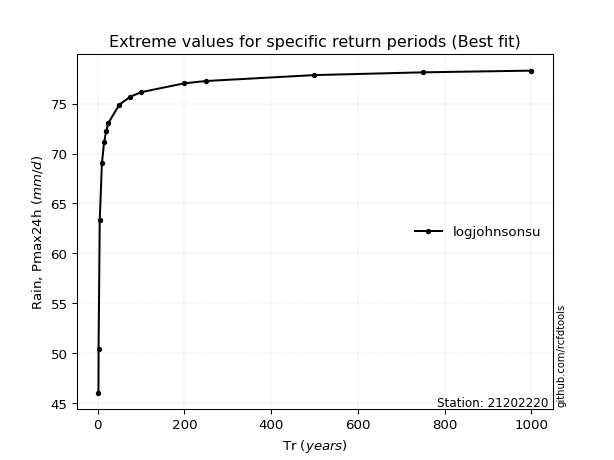</img>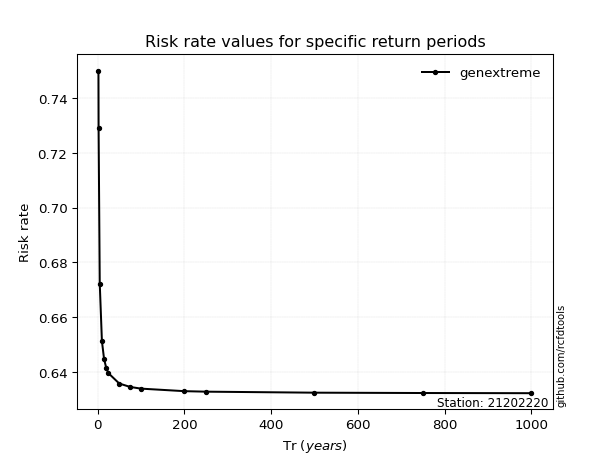</img>

</div>


<sub>**APP DISCLAIMER**: NO WARRANTY - This software is provided by [github.com/rcfdtools](https://github.com/rcfdtools) "as is", without any express or implied warranty, including warranties of merchantability, fitness for a particular purpose, or non-infringement. There is no guarantee that the software will be error-free or operate without interruption. LIMITATION OF LIABILITY - Neither the authors nor copyright holders will be liable for claims or damages arising from the software or its use. You are responsible for determining if the software is appropriate for your use and assume all associated risks, including errors, legal compliance, and data loss. NO PROFESSIONAL ADVICE - The software provides general information and does not offer professional advice. It should not replace consultation with professional advisors.</sub>