<div align="center">


</div>

# PMP Station (Rain, Pmax24h): 21202230

Probable Maximum Precipitation (PMP) is the greatest amount of rainfall for a specific duration that is meteorologically possible for a given location, acting as a "worst-case" scenario for extreme storms, crucial for designing safety-critical infrastructure like bridges, river deviations, dams, spillways, and nuclear plants to prevent catastrophic failure. PMP is calculated by hydrologists using meteorological data to determine the upper limit of extreme rainfall, often leading to the Probable Maximum Flood (PMF) for flood control design, and is increasingly being studied for climate change impacts. Probable Maximum Precipitation (PMP) is the theoretical upper limit of rainfall, a deterministic estimate for extreme events, while probability distributions (like GEV, Gumbel) describe the likelihood and frequency of various precipitation amounts, including rare ones, showing how often events occur, with PMP representing the extreme end of these distributions, used for critical infrastructure design to ensure safety against the worst conceivable weather, unlike standard statistical forecasts which cover typical probabilities.

The most common probability distributions in hydrology, used for analyzing floods, rainfall, and streamflow, include the Normal, Log-Normal, Gumbel, Gamma (including Log-Pearson Type III), and Generalized Extreme Value (GEV) distributions, often chosen based on the data´s skewness and whether modeling extremes or general conditions, with Gumbel and GEV popular for extreme events like floods, while the Normal distribution serves as a baseline, though often requiring transformations for skewed hydrological data. These distributions help in designing water infrastructure, managing water resources, and forecasting hydrologic events.

> Hydrological data often isn´t perfectly normal (it´s skewed), so different distributions are needed for different applications, such as: **Flood Frequency Analysis**: Using Gumbel, GEV, or Log-Pearson Type III for predicting extreme flood magnitudes and their return periods, **Rainfall Analysis**: Normal for annual totals, but Log-Normal, Weibull, or GEV for intensity or extreme daily rainfall, **Streamflow Modeling**: Gamma and Log-Normal for maximum flows, GEV for minimum flows, and Kappa for daily flows.

<div align="center">

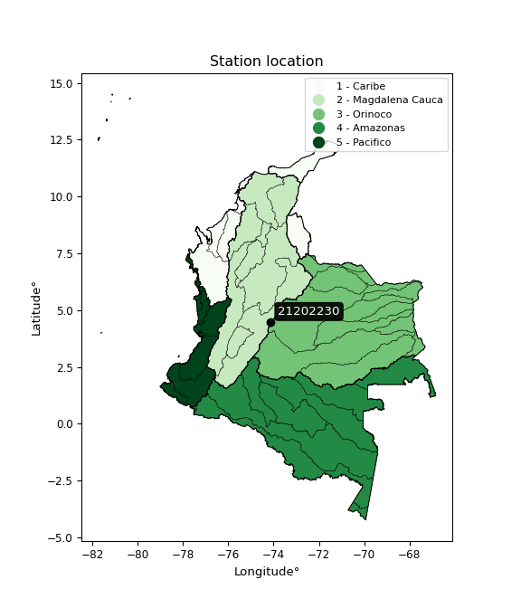</img>

</div>


## A. General information


### 1. General running parameters

• app_version: _v20260103_. • runtime: _2026-01-05 16:20:51.132608_. • Python version: _3.14.0_. • SciPy version: _1.16.3_. • Pandas version: _2.3.3_. • NumPy version: _2.3.5_. • Stations dataset (station_dataset_file): _dataset/pmax24h_in/automatic_colombia_2003_2024.csv_. • Stations catalog (station_catalog_file): _dataset/CNE.xls_. • Minimum year to eval til year_max (date_min): _1900_. • Maximum year to eval since year_min (date_max): _2024_. • Creates, save and include plots into reports (create_plot): _True_. • Plot only fit distributions with Δo > Δ (plot_only_fit): _True_. • Plot only simple graphs avoiding multiple CDFs and multiple Extreme values plots (plot_only_simple): _True_. • Eval low extreme values, if False, evaluates high extreme values (low_extreme): _False_. • Eval every SciPy distribution as logarithmic (pdist_logarithmic_on): _True_. • Standard deviation normalized (ddof): _1.0_. • Return periods to eval in years (Tr): _[2, 2.33, 5, 10, 15, 20, 25, 50, 75, 100, 200, 250, 500, 750, 1000]_. • Minimum data sample per station, 0 means any (minimum_sample): _5_. • Z-Score maximum threshold to adjust a value, 0 means disable (zscore_max): _3.5_. • Z-Score minimum threshold to adjust a value, 0 means disable (zscore_min): _-2.5_. • Avoid zeros, e.g. rain = 0 (avoid_zeros): _True_. • Avoid null values (avoid_nans): _True_. 

[:file_folder:Dataset file](../../dataset/pmax24h_in/automatic_colombia_2003_2024.csv)

> Delta Degrees of Freedom (DDOF): is a parameter used in the formulas for calculating variance and standard deviation. When ddof=0, the divisor is $N$ (the total number of observations) and this is used when your data set is the entire population. When ddof=1, the divisor is $N-1$ and this is used when your data set is a sample drawn from a larger population. Using $N-1$ provides an unbiased estimate of the population variance (known as Bessel´s correction).


### 2. Station info and location

|   id |   CODIGO | NOMBRE                           | CATEGORIA               | TECNOLOGIA                | ESTADO   | FECHA_INSTALACION   |   FECHA_SUSPENSION |   ALTITUD |   LATITUD |   LONGITUD | DEPARTAMENTO   | MUNICIPIO   | AREA_OPERATIVA                            | ENTIDAD                                                          | AREA_HIDROGRAFICA   | ZONA_HIDROGRAFICA   | SUBZONA_HIDROGRAFICA   |   CORRIENTE | Catalogo   |   Version |
|-----:|---------:|:---------------------------------|:------------------------|:--------------------------|:---------|:--------------------|-------------------:|----------:|----------:|-----------:|:---------------|:------------|:------------------------------------------|:-----------------------------------------------------------------|:--------------------|:--------------------|:-----------------------|------------:|:-----------|----------:|
|    0 | 21202230 | UAN SEDE USME  - AUT  [21202230] | Climatológica Ordinaria | Automática con Telemetría | Activa   | 01/10/2000          |                nan |      2747 |   4.48152 |   -74.1271 | Bogotá         | Bogotá, D.C | Area Operativa 11 - Cundinamarca-Amazonas | FONDO DE PREVENCION Y ATENCION DE DESASTRES DE BOGOTA DC - FOPAE | Magdalena Cauca     | Alto Magdalena      | Río Bogotá             |         nan | CNE_OE     |  20251226 |

<div align="center">

Dynamic map: [:earth_americas:Google](http://maps.google.com/maps?q=4.48152,-74.12708) [:earth_americas:OSM](https://www.openstreetmap.org/#map=18/4.48152/-74.12708&layers=P) [:earth_americas:Bing](https://www.bing.com/maps?cp=4.48152~-74.12708&lvl=18) [:earth_americas:Apple](https://maps.apple.com/frame?center=4.48152%2C-74.12708&span=0.003%2C0.006)

</div>


<div align="center">

```geojson
{
  "type": "Feature",
  "geometry": {
    "type": "Point", 
    "coordinates": [-74.12708, 4.48152]
  }, 
  "properties": {
    "Name": "21202230"
  }
}
```

</div>


### 3. Discrete values table and plot

<div align="center">

|               |          0 |           1 |          2 |           3 |           4 |           5 |           6 |          7 |           8 |          9 |          10 |
|:--------------|-----------:|------------:|-----------:|------------:|------------:|------------:|------------:|-----------:|------------:|-----------:|------------:|
| Date          | 2008       | 2009        | 2010       | 2011        | 2012        | 2013        | 2014        | 2015       | 2016        | 2023       | 2024        |
| Value         |   33.5     |   25.3      |   36.9     |   27.4      |   16.9      |   31.3      |   21.1      |    9.1     |   19.9      |    1       |   23.6      |
| Value_initial |   33.5     |   25.3      |   36.9     |   27.4      |   16.9      |   31.3      |   21.1      |    9.1     |   19.9      |    1       |   23.6      |
| count         |   11       |   11        |   11       |   11        |   11        |   11        |   11        |   11       |   11        |   11       |   11        |
| mean          |   22.3636  |   22.3636   |   22.3636  |   22.3636   |   22.3636   |   22.3636   |   22.3636   |   22.3636  |   22.3636   |   22.3636  |   22.3636   |
| std           |   10.5856  |   10.5856   |   10.5856  |   10.5856   |   10.5856   |   10.5856   |   10.5856   |   10.5856  |   10.5856   |   10.5856  |   10.5856   |
| zscore        |    1.05203 |    0.277393 |    1.37322 |    0.475776 |   -0.516139 |    0.844201 |   -0.119373 |   -1.25299 |   -0.232735 |   -2.01818 |    0.116797 |


</div>


<div align="center">

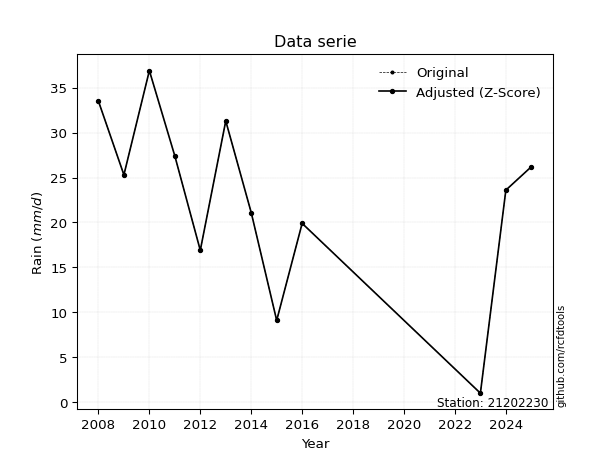</img>

</div>


> The initial value (value_initial) correspond to the initial obtained or null completed value, and value (value) is adjusted only when the initial value is outside the valid range (outlier) definite through the Z-Score value. If Z-Score is active, values out of range or outliers are replaced with the station mean value. A Z-Score (or standard score) measures how many standard deviations a data point is from the mean of a dataset, indicating its relative position; positive scores mean above the mean, negative mean below, and a score of zero is exactly at the mean, allowing for comparison of values from different distributions. It´s calculated using the formula $z=(x–μ)/σ$, where $x$ is the data point, $μ$ is the mean, and $σ$ is the standard deviation, helping identify outliers and understand probability.
>
> <sub>**Note**: In this study, "completing" (filling gaps in) and "extending" (forecasting or lengthening the historical record) rainfall data series are avoided for certain critical analyses because they introduce artificial bias and uncertainty, which can distort the statistics of rare events (extremes), alter day-to-day variability, and compromise the integrity and homogeneity of the original data. Some reasons against Completing/Extending rainfall data are: **Distortion of Extremes and Variability**: The primary issue is that most gap-filling or extension methods rely on averaging or regression with nearby stations, which inherently smooths the data. Rainfall is highly variable in space and time, with a large percentage of zero values and occasional large storms. Infilling methods often underestimate the highest values and overestimate the lowest (zero) values, which severely distorts analyses focused on flood frequency, drought severity, and intensity-duration-frequency (IDF) curves, **Loss of Data Homogeneity**: Infilled or extended data are synthetic estimates, not actual measurements. Combining these estimates with observed data can violate the assumption of data homogeneity, which requires that the data properties do not change over time. Inhomogeneity can lead to incorrect conclusions about long-term trends or changes in climate patterns, **Propagation of Errors**: Errors and biases from the original data (e.g., wind-induced undercatch, instrument errors, site changes) or the data used for imputation can propagate through the analysis, leading to unreliable hydrological models and inaccurate predictions, **Compromised Statistical Integrity**: For statistical analyses, especially those involving the frequency of events, using artificial data can introduce time bias or autocorrelation that doesn´t exist in reality, making it difficult to assess the true probability of events, **Difficulty in Validation**: It is difficult to accurately validate the quality of filled or extended data, especially for past periods where ground-truth measurements are unavailable. The reliability of imputation techniques heavily depends on the density of the surrounding station network and the complexity of the local topography.</sub>


### 4. Active continuous probability distributions from SciPy (44 of 104 available)

A Probability Density Function (PDF) describes the relative likelihood of a continuous random variable falling within a specific range, where the total area under its curve equals 1, and the area over any interval gives the actual probability for that range. Unlike discrete probabilities (like rolling a die), a PDF shows density, not direct probability for a single point (which is zero), with higher points indicating higher likelihood, often visualized as a bell curve for normal distributions.

A log of a probability density function (log-PDF) is simply the logarithm of the PDF´s value, denoted as $log(f(x))$, useful for converting multiplication of probabilities into addition, improving numerical stability with tiny numbers, and connecting to information theory concepts like entropy. Instead of dealing with very small probabilities (e.g., 0.000001), log-PDFs use negative numbers (e.g., $log(0.00001) ≈ -11.51$ that are easier for computers to handle, preventing underflow errors and simplifying complex calculations. In this study, each active probability distribution from SciPy is also evaluated in the $log$ form.

[scipy.stats](https://docs.scipy.org/doc/scipy/reference/stats.html) is a Python´s powerful submodule within the SciPy library for comprehensive statistical analysis, offering over 130 probability distributions (like Normal, Poisson), functions for descriptive stats (mean, variance), hypothesis testing (t-tests, chi-square), random variable generation, and statistical tests, making it essential for data science, modeling, and research. It provides tools to explore, model, and draw conclusions from data efficiently, working seamlessly with NumPy.

<div align="center">

|   id | p_dist             |   n_parameter | fit_method   | label                                                                       | active   | ref                                                                                                        |
|-----:|:-------------------|--------------:|:-------------|:----------------------------------------------------------------------------|:---------|:-----------------------------------------------------------------------------------------------------------|
|    0 | alpha              |             3 | MLE          | Alpha                                                                       | True     | [:mortar_board:](https://docs.scipy.org/doc/scipy/reference/generated/scipy.stats.alpha.html)              |
|    1 | betaprime          |             4 | MLE          | Beta prime                                                                  | True     | [:mortar_board:](https://docs.scipy.org/doc/scipy/reference/generated/scipy.stats.betaprime.html)          |
|    2 | chi2               |             3 | MLE          | Chi²                                                                        | True     | [:mortar_board:](https://docs.scipy.org/doc/scipy/reference/generated/scipy.stats.chi2.html)               |
|    3 | crystalball        |             4 | MLE          | Crystalball                                                                 | True     | [:mortar_board:](https://docs.scipy.org/doc/scipy/reference/generated/scipy.stats.crystalball.html)        |
|    4 | erlang             |             3 | MLE          | Erlang                                                                      | True     | [:mortar_board:](https://docs.scipy.org/doc/scipy/reference/generated/scipy.stats.erlang.html)             |
|    5 | expon              |             2 | MLE          | Exponential                                                                 | True     | [:mortar_board:](https://docs.scipy.org/doc/scipy/reference/generated/scipy.stats.expon.html)              |
|    6 | exponnorm          |             3 | MLE          | Exponentially modified Normal                                               | True     | [:mortar_board:](https://docs.scipy.org/doc/scipy/reference/generated/scipy.stats.exponnorm.html)          |
|    7 | f                  |             4 | MLE          | F                                                                           | True     | [:mortar_board:](https://docs.scipy.org/doc/scipy/reference/generated/scipy.stats.f.html)                  |
|    8 | fatiguelife        |             3 | MLE          | Fatigue-life (Birnbaum-Saunders)                                            | True     | [:mortar_board:](https://docs.scipy.org/doc/scipy/reference/generated/scipy.stats.fatiguelife.html)        |
|    9 | fisk               |             3 | MLE          | Fisk                                                                        | True     | [:mortar_board:](https://docs.scipy.org/doc/scipy/reference/generated/scipy.stats.fisk.html)               |
|   10 | gamma              |             3 | MLE          | Gamma                                                                       | True     | [:mortar_board:](https://docs.scipy.org/doc/scipy/reference/generated/scipy.stats.gamma.html)              |
|   11 | genexpon           |             5 | MLE          | Generalized exponential                                                     | True     | [:mortar_board:](https://docs.scipy.org/doc/scipy/reference/generated/scipy.stats.genexpon.html)           |
|   12 | genlogistic        |             3 | MLE          | Generalized logistic                                                        | True     | [:mortar_board:](https://docs.scipy.org/doc/scipy/reference/generated/scipy.stats.genlogistic.html)        |
|   13 | gibrat             |             2 | MM           | Gibrat                                                                      | True     | [:mortar_board:](https://docs.scipy.org/doc/scipy/reference/generated/scipy.stats.gibrat.html)             |
|   14 | gompertz           |             3 | MLE          | Gompertz (or truncated Gumbel)                                              | True     | [:mortar_board:](https://docs.scipy.org/doc/scipy/reference/generated/scipy.stats.gompertz.html)           |
|   15 | gumbel_l           |             2 | MM           | Gumbel Left Skew                                                            | True     | [:mortar_board:](https://docs.scipy.org/doc/scipy/reference/generated/scipy.stats.gumbel_l.html)           |
|   16 | gumbel_r           |             2 | MM           | Gumbel Right Skew                                                           | True     | [:mortar_board:](https://docs.scipy.org/doc/scipy/reference/generated/scipy.stats.gumbel_r.html)           |
|   17 | halflogistic       |             2 | MM           | Half-logistic                                                               | True     | [:mortar_board:](https://docs.scipy.org/doc/scipy/reference/generated/scipy.stats.halflogistic.html)       |
|   18 | halfnorm           |             2 | MM           | Half Normal                                                                 | True     | [:mortar_board:](https://docs.scipy.org/doc/scipy/reference/generated/scipy.stats.halfnorm.html)           |
|   19 | hypsecant          |             2 | MM           | hyperbolic secant                                                           | True     | [:mortar_board:](https://docs.scipy.org/doc/scipy/reference/generated/scipy.stats.hypsecant.html)          |
|   20 | invgamma           |             3 | MLE          | Inverted gamma                                                              | True     | [:mortar_board:](https://docs.scipy.org/doc/scipy/reference/generated/scipy.stats.invgamma.html)           |
|   21 | invgauss           |             3 | MLE          | Inverse Gaussian                                                            | True     | [:mortar_board:](https://docs.scipy.org/doc/scipy/reference/generated/scipy.stats.invgauss.html)           |
|   22 | invweibull         |             3 | MLE          | Inverted Weibull                                                            | True     | [:mortar_board:](https://docs.scipy.org/doc/scipy/reference/generated/scipy.stats.invweibull.html)         |
|   23 | johnsonsu          |             4 | MLE          | Johnson Su                                                                  | True     | [:mortar_board:](https://docs.scipy.org/doc/scipy/reference/generated/scipy.stats.johnsonsu.html)          |
|   24 | kstwobign          |             2 | MLE          | Limiting distribution of scaled Kolmogorov-Smirnov two-sided test statistic | True     | [:mortar_board:](https://docs.scipy.org/doc/scipy/reference/generated/scipy.stats.kstwobign.html)          |
|   25 | laplace            |             2 | MM           | Laplace                                                                     | True     | [:mortar_board:](https://docs.scipy.org/doc/scipy/reference/generated/scipy.stats.laplace.html)            |
|   26 | laplace_asymmetric |             3 | MLE          | Asymmetric Laplace                                                          | True     | [:mortar_board:](https://docs.scipy.org/doc/scipy/reference/generated/scipy.stats.laplace_asymmetric.html) |
|   27 | loggamma           |             3 | MLE          | Log gamma                                                                   | True     | [:mortar_board:](https://docs.scipy.org/doc/scipy/reference/generated/scipy.stats.loggamma.html)           |
|   28 | logistic           |             2 | MM           | Logistic (or Sech-squared)                                                  | True     | [:mortar_board:](https://docs.scipy.org/doc/scipy/reference/generated/scipy.stats.logistic.html)           |
|   29 | lognorm            |             3 | MLE          | Log Normal                                                                  | True     | [:mortar_board:](https://docs.scipy.org/doc/scipy/reference/generated/scipy.stats.lognorm.html)            |
|   30 | maxwell            |             2 | MM           | Maxwell                                                                     | True     | [:mortar_board:](https://docs.scipy.org/doc/scipy/reference/generated/scipy.stats.maxwell.html)            |
|   31 | mielke             |             4 | MLE          | Mielke Beta-Kappa / Dagum                                                   | True     | [:mortar_board:](https://docs.scipy.org/doc/scipy/reference/generated/scipy.stats.mielke.html)             |
|   32 | moyal              |             2 | MM           | Moyal                                                                       | True     | [:mortar_board:](https://docs.scipy.org/doc/scipy/reference/generated/scipy.stats.moyal.html)              |
|   33 | nakagami           |             3 | MLE          | Nakagami                                                                    | True     | [:mortar_board:](https://docs.scipy.org/doc/scipy/reference/generated/scipy.stats.nakagami.html)           |
|   34 | ncf                |             5 | MLE          | Non-central F distribution                                                  | True     | [:mortar_board:](https://docs.scipy.org/doc/scipy/reference/generated/scipy.stats.ncf.html)                |
|   35 | nct                |             4 | MLE          | Non-central Student’s t                                                     | True     | [:mortar_board:](https://docs.scipy.org/doc/scipy/reference/generated/scipy.stats.nct.html)                |
|   36 | norm               |             2 | MM           | Normal                                                                      | True     | [:mortar_board:](https://docs.scipy.org/doc/scipy/reference/generated/scipy.stats.norm.html)               |
|   37 | pearson3           |             3 | MM           | Pearson type III                                                            | True     | [:mortar_board:](https://docs.scipy.org/doc/scipy/reference/generated/scipy.stats.pearson3.html)           |
|   38 | rayleigh           |             2 | MM           | Rayleigh                                                                    | True     | [:mortar_board:](https://docs.scipy.org/doc/scipy/reference/generated/scipy.stats.rayleigh.html)           |
|   39 | rice               |             3 | MLE          | Rice                                                                        | True     | [:mortar_board:](https://docs.scipy.org/doc/scipy/reference/generated/scipy.stats.rice.html)               |
|   40 | t                  |             3 | MLE          | Student’s t                                                                 | True     | [:mortar_board:](https://docs.scipy.org/doc/scipy/reference/generated/scipy.stats.t.html)                  |
|   41 | truncnorm          |             4 | MLE          | Truncated normal                                                            | True     | [:mortar_board:](https://docs.scipy.org/doc/scipy/reference/generated/scipy.stats.truncnorm.html)          |
|   42 | wald               |             2 | MM           | Wald                                                                        | True     | [:mortar_board:](https://docs.scipy.org/doc/scipy/reference/generated/scipy.stats.wald.html)               |
|   43 | weibull_min        |             3 | MLE          | Weibull minimum                                                             | True     | [:mortar_board:](https://docs.scipy.org/doc/scipy/reference/generated/scipy.stats.weibull_min.html)        |

</div>

> **n_parameter:** # arguments & localization & scale.
>
> **Fit methods:** (MLE) maximum likelihood, (MM) L-moments.
>
>**Inactive** (With the only purpose of prevent loops, zero divisions, infinite values, over high estimated values or horizontal trending for recurrence intervals estimations, the follow distributions were disabled.)**:** foldnorm, gennorm, norminvgauss, powernorm, powerlognorm, skewnorm, genextreme, anglit, arcsine, argus, beta, bradford, burr, burr12, cauchy, cosine, halfcauchy, foldcauchy, skewcauchy, wrapcauchy, dgamma, gengamma, exponweib, exponpow, truncexpon, gausshyper, genhalflogistic, genhyperbolic, geninvgauss, halfgennorm, johnsonsb, kappa4, kappa3, ksone, kstwo, loglaplace, levy, levy_l, levy_stable, ncx2, pareto, genpareto, truncpareto, lomax, powerlaw, rdist, rel_breitwigner, recipinvgauss, semicircular, studentized_range, trapezoid, triang, truncweibull_min, tukeylambda, uniform, loguniform, vonmises, vonmises_line, weibull_max, dweibull, 


## B. Probability (PDF) vs. Empirical (EDF) distributions functions

A continuous probability distribution (CPD) describes probabilities for variables that can take any value within a range (like rain any time), unlike discrete variables with specific outcomes (like temperature). It uses a Probability Density Function (PDF), a curve where the total area under it equals 1, and the probability of the variable falling within an interval (a to b) is found by calculating the area under the curve between those points. A key feature is that the probability of hitting any single exact value is zero, so probabilities are always expressed for ranges, e.g., $P(a ≤ X ≤ b)$.

<div align="center">

Distributions parameters from station values
|    |   station | p_dist                |   n |                loc |            scale | shape                  | shape1                | shape2                 | shape3   |
|---:|----------:|:----------------------|----:|-------------------:|-----------------:|:-----------------------|:----------------------|:-----------------------|:---------|
|  0 |  21202230 | alpha                 |  11 |     -75.1536       |    851.946       | 8.93289863654071       |                       |                        |          |
|  1 |  21202230 | betaprime             |  11 |    -206.049        |  23423.6         | 493.05880469345493     | 50562.21391794289     |                        |          |
|  2 |  21202230 | chi2                  |  11 |       1            |      2.98779     | 1.3797332029402434     |                       |                        |          |
|  3 |  21202230 | crystalball           |  11 |      22.3636       |     10.093       | 732.8065677002239      | 916.399581978199      |                        |          |
|  4 |  21202230 | erlang                |  11 |    -134.092        |      0.675404    | 231.48015448453953     |                       |                        |          |
|  5 |  21202230 | expon                 |  11 |       1            |     21.3636      |                        |                       |                        |          |
|  6 |  21202230 | exponnorm             |  11 |      22.3555       |     10.093       | 0.0008115246851556862  |                       |                        |          |
|  7 |  21202230 | f                     |  11 |   -2261.1          |   2283.44        | 171992.98152301944     | 249715.50646044413    |                        |          |
|  8 |  21202230 | fatiguelife           |  11 |       1            |      1.34042e-05 | 1248.9078155645475     |                       |                        |          |
|  9 |  21202230 | fisk                  |  11 |      -4.37953e+08  |      4.37953e+08 | 76382017.03735456      |                       |                        |          |
| 10 |  21202230 | gamma                 |  11 |    -160.167        |      0.591926    | 308.5627205542104      |                       |                        |          |
| 11 |  21202230 | genexpon              |  11 |       1            |      1.72983     | 0.08097051409075914    | 5.568532009161498e-09 | 4.934559545765174      |          |
| 12 |  21202230 | genlogistic           |  11 |      30.0393       |      3.51616     | 0.3765898606250754     |                       |                        |          |
| 13 |  21202230 | gibrat                |  11 |      14.664        |      4.67009     |                        |                       |                        |          |
| 14 |  21202230 | gompertz              |  11 |       0.999908     |      3.72692     | 0.0003995053495882689  |                       |                        |          |
| 15 |  21202230 | gumbel_l              |  11 |      26.906        |      7.86945     |                        |                       |                        |          |
| 16 |  21202230 | gumbel_r              |  11 |      17.8213       |      7.86945     |                        |                       |                        |          |
| 17 |  21202230 | halflogistic          |  11 |      10.4011       |      8.62914     |                        |                       |                        |          |
| 18 |  21202230 | halfnorm              |  11 |       9.0045       |     16.7432      |                        |                       |                        |          |
| 19 |  21202230 | hypsecant             |  11 |      22.3636       |      6.42538     |                        |                       |                        |          |
| 20 |  21202230 | invgamma              |  11 |    -120.205        |  26083.5         | 184.2823164576331      |                       |                        |          |
| 21 |  21202230 | invgauss              |  11 |     -42.6783       |   2086.8         | 0.031149665329015225   |                       |                        |          |
| 22 |  21202230 | invweibull            |  11 |      -8.76078e+08  |      8.76078e+08 | 80756701.16875246      |                       |                        |          |
| 23 |  21202230 | johnsonsu             |  11 |      50.786        |      1.45943     | 10.06237456390733      | 2.795142170237604     |                        |          |
| 24 |  21202230 | kstwobign             |  11 |     -21.9187       |     50.709       |                        |                       |                        |          |
| 25 |  21202230 | laplace               |  11 |      22.3636       |      7.1368      |                        |                       |                        |          |
| 26 |  21202230 | laplace_asymmetric    |  11 |      25.3          |      7.4756      | 1.2197822193327628     |                       |                        |          |
| 27 |  21202230 | loggamma              |  11 |      26.7172       |      8.38124     | 1.0360414224307477     |                       |                        |          |
| 28 |  21202230 | logistic              |  11 |      22.3636       |      5.56454     |                        |                       |                        |          |
| 29 |  21202230 | lognorm               |  11 |       1            |      0.623829    | 11.255541223973706     |                       |                        |          |
| 30 |  21202230 | maxwell               |  11 |      -1.55243      |     14.9872      |                        |                       |                        |          |
| 31 |  21202230 | mielke                |  11 |      -1.96105      |     38.9013      | 1.5813485718667646     | 5409.691951105771     |                        |          |
| 32 |  21202230 | moyal                 |  11 |      16.5918       |      4.54343     |                        |                       |                        |          |
| 33 |  21202230 | nakagami              |  11 |   -4221.66         |   4244.02        | 44036.94282248526      |                       |                        |          |
| 34 |  21202230 | ncf                   |  11 |      -0.297585     |      5.93106e-07 | 3.5336639818422146e-07 | 186.20252762881387    | 13.449283643364348     |          |
| 35 |  21202230 | nct                   |  11 |    -570.45         |     10.0422      | 162459.43490827066     | 59.03199831351097     |                        |          |
| 36 |  21202230 | norm                  |  11 |      22.3636       |     10.093       |                        |                       |                        |          |
| 37 |  21202230 | pearson3              |  11 |      22.3636       |     10.0929      | -0.6138360100470016    |                       |                        |          |
| 38 |  21202230 | rayleigh              |  11 |       3.05522      |     15.4059      |                        |                       |                        |          |
| 39 |  21202230 | rice                  |  11 |       0.724501     |     17.4985      | 7.082804251356577e-10  |                       |                        |          |
| 40 |  21202230 | t                     |  11 |      22.3633       |     10.0929      | 5021204.573121146      |                       |                        |          |
| 41 |  21202230 | truncnorm             |  11 |      27.9064       |     20.1977      | -14.232736412079426    | 0.44527774079645654   |                        |          |
| 42 |  21202230 | wald                  |  11 |      12.2706       |     10.093       |                        |                       |                        |          |
| 43 |  21202230 | weibull_min           |  11 |    -174.381        |    201.287       | 24.184660683288165     |                       |                        |          |
| 44 |  21202230 | logalpha              |  11 |      -6.17408      |     55.0627      | 6.135265846856974      |                       |                        |          |
| 45 |  21202230 | logbetaprime          |  11 |     -52.7418       |    441.816       | 3492.1800979543004     | 27745.961985047128    |                        |          |
| 46 |  21202230 | logchi2               |  11 |      -1.22568e-28  |      1.79612     | 1.7967695395921464     |                       |                        |          |
| 47 |  21202230 | logcrystalball        |  11 |       2.84923      |      0.972963    | 98.91010697620786      | 223.5531836035812     |                        |          |
| 48 |  21202230 | logerlang             |  11 |     -10.3814       |      0.0834878   | 158.2231883537245      |                       |                        |          |
| 49 |  21202230 | logexpon              |  11 |       0            |      2.84923     |                        |                       |                        |          |
| 50 |  21202230 | logexponnorm          |  11 |       2.84861      |      0.972963    | 0.0006484510857102222  |                       |                        |          |
| 51 |  21202230 | logf                  |  11 |      -6.94719e-33  |      1.21259     | 1.4596250492685128     | 1.3359344992134488    |                        |          |
| 52 |  21202230 | logfatiguelife        |  11 |    -876.949        |    879.795       | 0.0011087609774617824  |                       |                        |          |
| 53 |  21202230 | logfisk               |  11 |      -1.79201e+08  |      1.79201e+08 | 430431459.2049111      |                       |                        |          |
| 54 |  21202230 | loggamma              |  11 |     -17.3526       |      0.0543921   | 371.15223040751596     |                       |                        |          |
| 55 |  21202230 | loggenexpon           |  11 |      -0.000708172  |      0.0207757   | 0.0013416945676118256  | 2.820220640033275     | 2.7685408721850015e-05 |          |
| 56 |  21202230 | loggenlogistic        |  11 |       3.60823      |      9.47944e-07 | 1.2515393594986313e-06 |                       |                        |          |
| 57 |  21202230 | loggibrat             |  11 |       2.10695      |      0.450211    |                        |                       |                        |          |
| 58 |  21202230 | loggompertz           |  11 |      -0.00192678   |      0.491435    | 0.0014752595901879367  |                       |                        |          |
| 59 |  21202230 | loggumbel_l           |  11 |       3.28712      |      0.758616    |                        |                       |                        |          |
| 60 |  21202230 | loggumbel_r           |  11 |       2.41135      |      0.758616    |                        |                       |                        |          |
| 61 |  21202230 | loghalflogistic       |  11 |       1.69607      |      0.831838    |                        |                       |                        |          |
| 62 |  21202230 | loghalfnorm           |  11 |       1.5614       |      1.61406     |                        |                       |                        |          |
| 63 |  21202230 | loghypsecant          |  11 |       2.84923      |      0.619408    |                        |                       |                        |          |
| 64 |  21202230 | loginvgamma           |  11 |     -26.0832       |  21926           | 759.5479293003029      |                       |                        |          |
| 65 |  21202230 | loginvgauss           |  11 |     -10.3405       |   1768.06        | 0.007472753846477338   |                       |                        |          |
| 66 |  21202230 | loginvweibull         |  11 | -151511            | 151513           | 113007.5734653073      |                       |                        |          |
| 67 |  21202230 | logjohnsonsu          |  11 |       3.66455      |      0.002069    | 5.761522981373098      | 0.9403620669402919    |                        |          |
| 68 |  21202230 | logkstwobign          |  11 |      -2.75457      |      6.44719     |                        |                       |                        |          |
| 69 |  21202230 | loglaplace            |  11 |       2.84923      |      0.687989    |                        |                       |                        |          |
| 70 |  21202230 | loglaplace_asymmetric |  11 |       3.60821      |      0.0077583   | 97.66195998492722      |                       |                        |          |
| 71 |  21202230 | logloggamma           |  11 |       3.60824      |      2.49502e-06 | 3.2741453429730283e-06 |                       |                        |          |
| 72 |  21202230 | loglogistic           |  11 |       2.84923      |      0.536423    |                        |                       |                        |          |
| 73 |  21202230 | loglognorm            |  11 |      -4.94066e-324 |      1.13812e-29 | 214.33747251182524     |                       |                        |          |
| 74 |  21202230 | logmaxwell            |  11 |       0.543686     |      1.44478     |                        |                       |                        |          |
| 75 |  21202230 | logmielke             |  11 |      -6.02128e-29  |      3.53181     | 0.7425659257110999     | 1.7868334635258225    |                        |          |
| 76 |  21202230 | logmoyal              |  11 |       2.29283      |      0.437987    |                        |                       |                        |          |
| 77 |  21202230 | lognakagami           |  11 |      -4.50992e-33  |      4.78651     | 0.290289563422378      |                       |                        |          |
| 78 |  21202230 | logncf                |  11 |      -1.43029e-31  |      1.19169     | 1.483845477652114      | 1.4106418002147816    | 0.9783891031062455     |          |
| 79 |  21202230 | lognct                |  11 |     -63.3873       |      0.926526    | 21292.314292667754     | 71.4849125581191      |                        |          |
| 80 |  21202230 | lognorm               |  11 |       2.84923      |      0.972963    |                        |                       |                        |          |
| 81 |  21202230 | logpearson3           |  11 |       2.84923      |      0.97296     | -2.1971421078766005    |                       |                        |          |
| 82 |  21202230 | lograyleigh           |  11 |       0.987866     |      1.48515     |                        |                       |                        |          |
| 83 |  21202230 | logrice               |  11 |    -599.204        |      0.972422    | 619.1262417913699      |                       |                        |          |
| 84 |  21202230 | logt                  |  11 |       3.20404      |      0.258058    | 1.2661219229598446     |                       |                        |          |
| 85 |  21202230 | logtruncnorm          |  11 |      -0.0087817    |      3.34746     | 0.002549820571604064   | 1.0805234542609665    |                        |          |
| 86 |  21202230 | logwald               |  11 |       1.87628      |      0.972963    |                        |                       |                        |          |
| 87 |  21202230 | logweibull_min        |  11 |      -9.1925e+07   |      9.1925e+07  | 189235989.21900237     |                       |                        |          |

</div>

> **loc** (Location parameter): This shifts the distribution along the x-axis. For many common distributions, like the normal (Gaussian) distribution, loc represents the mean $μ$. For others, like the uniform distribution, it might represent the minimum value, or for the beta distribution, the left end of the support interval.
>
> **scale** (Scale parameter): This determines the width or spread of the distribution. For the normal distribution, scale represents the standard deviation $σ$. For a uniform distribution, it defines the length of the interval (from $loc$ to $loc + scale$).
>
> **shape** (Shape parameters): Refers to parameters that define the specific form of a probability distribution, distinct from its location (loc) and scale (scale). These parameters are required arguments for most distribution functions. For example, a normal (Gaussian) distribution is fully defined by its location (mean) and scale (standard deviation), so it has no specific shape parameters beyond loc and scale. However, other distributions have intrinsic properties that need specification, as Gamma distribution that takes a shape parameter, often named $a$ or $alpha$.


### 0. Cumulative distribution values - CDF (88 evaluated)

Cumulative Distribution Function (CDF), denoted as $F$<sub>$X$</sub>$(x)$, is a function that gives the probability that a random variable $X$ will take a value less than or equal to a specific value, $x$ (i.e., $(P(X≥x)$. It essentially "accumulates" probabilities from a given point up to the far right (positive infinity), providing a complete picture of the distribution´s probabilities for both discrete (like rain) and continuous (like temperature) variables, helping to find probabilities over ranges or above certain values. Each station is evaluated separately ordering the $x$ values ascending, calculating the CDF and PDF values for the activated distributions and their logarithmic forms.

<div align="center">

CDF ordered by x ascending and calculating $log(f(x))$ separately
|   id |   Station |   date |    x |   count |    mean |     std |    zscore |   Value_initial |   station |   m |     alpha |   alpha_pdf |   betaprime |   betaprime_pdf |        chi2 |        chi2_pdf |   crystalball |   crystalball_pdf |    erlang |   erlang_pdf |    expon |   expon_pdf |   exponnorm |   exponnorm_pdf |         f |      f_pdf |   fatiguelife |   fatiguelife_pdf |      fisk |   fisk_pdf |     gamma |   gamma_pdf |    genexpon |   genexpon_pdf |   genlogistic |   genlogistic_pdf |   gibrat |   gibrat_pdf |    gompertz |   gompertz_pdf |   gumbel_l |   gumbel_l_pdf |    gumbel_r |   gumbel_r_pdf |   halflogistic |   halflogistic_pdf |   halfnorm |   halfnorm_pdf |   hypsecant |   hypsecant_pdf |   invgamma |   invgamma_pdf |   invgauss |   invgauss_pdf |   invweibull |   invweibull_pdf |   johnsonsu |   johnsonsu_pdf |   kstwobign |   kstwobign_pdf |   laplace |   laplace_pdf |   laplace_asymmetric |   laplace_asymmetric_pdf |   loggamma |   loggamma_pdf |   logistic |   logistic_pdf |    lognorm |   lognorm_pdf |    maxwell |   maxwell_pdf |    mielke |   mielke_pdf |       moyal |   moyal_pdf |   nakagami |   nakagami_pdf |        ncf |    ncf_pdf |       nct |    nct_pdf |      norm |   norm_pdf |   pearson3 |   pearson3_pdf |   rayleigh |   rayleigh_pdf |        rice |    rice_pdf |         t |      t_pdf |   truncnorm |   truncnorm_pdf |     wald |   wald_pdf |   weibull_min |   weibull_min_pdf |   logalpha |   logalpha_pdf |   logbetaprime |   logbetaprime_pdf |     logchi2 |   logchi2_pdf |   logcrystalball |   logcrystalball_pdf |   logerlang |   logerlang_pdf |   logexpon |   logexpon_pdf |   logexponnorm |   logexponnorm_pdf |        logf |    logf_pdf |   logfatiguelife |   logfatiguelife_pdf |     logfisk |   logfisk_pdf |   loggenexpon |   loggenexpon_pdf |   loggenlogistic |   loggenlogistic_pdf |   loggibrat |   loggibrat_pdf |   loggompertz |   loggompertz_pdf |   loggumbel_l |   loggumbel_l_pdf |   loggumbel_r |   loggumbel_r_pdf |   loghalflogistic |   loghalflogistic_pdf |   loghalfnorm |   loghalfnorm_pdf |   loghypsecant |   loghypsecant_pdf |   loginvgamma |   loginvgamma_pdf |   loginvgauss |   loginvgauss_pdf |   loginvweibull |   loginvweibull_pdf |   logjohnsonsu |   logjohnsonsu_pdf |   logkstwobign |   logkstwobign_pdf |   loglaplace |   loglaplace_pdf |   loglaplace_asymmetric |   loglaplace_asymmetric_pdf |   logloggamma |   logloggamma_pdf |   loglogistic |   loglogistic_pdf |   loglognorm |   loglognorm_pdf |   logmaxwell |   logmaxwell_pdf |   logmielke |   logmielke_pdf |    logmoyal |   logmoyal_pdf |   lognakagami |   lognakagami_pdf |    logncf |   logncf_pdf |     lognct |   lognct_pdf |   logpearson3 |   logpearson3_pdf |   lograyleigh |   lograyleigh_pdf |    logrice |   logrice_pdf |      logt |   logt_pdf |   logtruncnorm |   logtruncnorm_pdf |   logwald |   logwald_pdf |   logweibull_min |   logweibull_min_pdf |
|-----:|----------:|-------:|-----:|--------:|--------:|--------:|----------:|----------------:|----------:|----:|----------:|------------:|------------:|----------------:|------------:|----------------:|--------------:|------------------:|----------:|-------------:|---------:|------------:|------------:|----------------:|----------:|-----------:|--------------:|------------------:|----------:|-----------:|----------:|------------:|------------:|---------------:|--------------:|------------------:|---------:|-------------:|------------:|---------------:|-----------:|---------------:|------------:|---------------:|---------------:|-------------------:|-----------:|---------------:|------------:|----------------:|-----------:|---------------:|-----------:|---------------:|-------------:|-----------------:|------------:|----------------:|------------:|----------------:|----------:|--------------:|---------------------:|-------------------------:|-----------:|---------------:|-----------:|---------------:|-----------:|--------------:|-----------:|--------------:|----------:|-------------:|------------:|------------:|-----------:|---------------:|-----------:|-----------:|----------:|-----------:|----------:|-----------:|-----------:|---------------:|-----------:|---------------:|------------:|------------:|----------:|-----------:|------------:|----------------:|---------:|-----------:|--------------:|------------------:|-----------:|---------------:|---------------:|-------------------:|------------:|--------------:|-----------------:|---------------------:|------------:|----------------:|-----------:|---------------:|---------------:|-------------------:|------------:|------------:|-----------------:|---------------------:|------------:|--------------:|--------------:|------------------:|-----------------:|---------------------:|------------:|----------------:|--------------:|------------------:|--------------:|------------------:|--------------:|------------------:|------------------:|----------------------:|--------------:|------------------:|---------------:|-------------------:|--------------:|------------------:|--------------:|------------------:|----------------:|--------------------:|---------------:|-------------------:|---------------:|-------------------:|-------------:|-----------------:|------------------------:|----------------------------:|--------------:|------------------:|--------------:|------------------:|-------------:|-----------------:|-------------:|-----------------:|------------:|----------------:|------------:|---------------:|--------------:|------------------:|----------:|-------------:|-----------:|-------------:|--------------:|------------------:|--------------:|------------------:|-----------:|--------------:|----------:|-----------:|---------------:|-------------------:|----------:|--------------:|-----------------:|---------------------:|
|    0 |  21202230 |   2023 |  1   |      11 | 22.3636 | 10.5856 | -2.01818  |             1   |  21202230 |   1 | 0.0120885 |  0.00461766 |   0.0169592 |       0.0043492 | 5.10555e-12 | 15862.3         |     0.0171432 |        0.00420719 | 0.0158659 |   0.00426491 | 0        |  0.0468085  |   0.0171433 |      0.00420722 | 0.0170688 | 0.00421783 |     0.0531045 |       2.65399e+10 | 0.0206188 | 0.00352192 | 0.0164353 |  0.00428333 | 1.22261e-09 |     0.0468082  |     0.0445887 |        0.00477432 | 0        |   0          | 9.82109e-09 |    0.000107197 |  0.0364977 |     0.00455222 | 0.000207876 |    0.000223966 |       0        |         0          | 0          |      0         |   0.0228936 |      0.00355992 |  0.0144189 |     0.00431954 |  0.0142981 |     0.00482738 |    0.0123492 |        0.0050021 |    0.040784 |      0.00491281 |   0.0132151 |      0.00638821 | 0.0250572 |    0.00351098 |            0.0416287 |               0.00456525 | 0.00235489 |      0.0077654 |  0.0210569 |     0.00370444 | 0.00170352 |    0.00563187 | 0.00130241 |    0.00152192 | 0.0170307 |   0.00909523 | 2.67469e-08 | 9.38206e-08 |  0.0173486 |     0.00424934 | 0.00590135 | 0.00493947 | 0.0171382 | 0.00420803 | 0.0171432 | 0.00420719 |  0.0302551 |     0.00488356 |  0         |      0         | 0.000123932 | 0.000899634 | 0.0171444 | 0.00420746 |    0.136032 |       0.0121038 | 0        | 0          |     0.0350919 |        0.00475319 | 0.00269202 |      0.0119858 |     0.00173556 |           0.005805 | 2.77251e-26 |   203.216     |       0.00170353 |           0.00563189 |  0.00194628 |      0.00692618 |   0        |      0.350972  |     0.00170348 |         0.00563177 | 2.25671e-24 | 2.37071e+08 |       0.00173485 |           0.00572983 | 0.000645225 |     0.0015488 |   4.57781e-05 |         0.0647052 |         0        |            0.0112657 |   0         |        0        |   5.79543e-06 |        0.00301372 |     0.0130417 |         0.0170789 |   3.72486e-11 |       1.17907e-09 |          0        |              0        |      0        |          0        |     0.00639942 |          0.0103308 |    0.00215202 |        0.00740757 |    0.00254146 |        0.00888724 |      0.00420871 |           0.0171731 |      0.0272007 |          0.0160941 |     0.00681204 |          0.0309539 |   0.00795034 |        0.0115559 |               0.0085466 |                   0.0112798 |    0.00878259 |         0.0115251 |    0.00491008 |        0.00910844 |  0.000782703 |    inf           |     0        |         0        | 4.34145e-22 |     5.35403e+06 | 1.00283e-42 |    2.16031e-40 |   5.20223e-20 |       6.69703e+12 | 5.462e-24 |  2.83326e+07 | 0.00177527 |    0.0058535 |     0.0207926 |          0.020228 |      0        |          0        | 0.00169461 |    0.00560818 | 0.0140628 | 0.00552568 |    8.17523e-05 |           0.331944 |  0        |      0        |        0.0013653 |           0.00280867 |
|    1 |  21202230 |   2015 |  9.1 |      11 | 22.3636 | 10.5856 | -1.25299  |             9.1 |  21202230 |   2 | 0.119241  |  0.0239007  |   0.097732  |       0.0173821 | 0.845397    |     0.0298696   |     0.0943982 |        0.0166679  | 0.0975798 |   0.0177888  | 0.315556 |  0.0320378  |   0.0943986 |      0.0166679  | 0.0947212 | 0.0167583  |     0.733171  |       0.0126288   | 0.0795833 | 0.0127753  | 0.0967115 |  0.0173283  | 0.315555    |     0.0320377  |     0.106073  |        0.0113314  | 0        |   0          | 0.00310657  |    0.000939115 |  0.0988393 |     0.0119176  | 0.0483622   |    0.0186152   |       0        |         0          | 0.00455107 |      0.0476535 |   0.0803653 |      0.012375   |  0.101942  |     0.0192579  |  0.113326  |     0.0212414  |    0.124605  |        0.023921  |    0.106458 |      0.0123071  |   0.151578  |      0.0273371  | 0.0779543 |    0.0109229  |            0.101198  |               0.011098   | 0.278543   |      0.327223  |  0.0844318 |     0.0138921  | 0.255022   |    0.330048   | 0.0822511  |    0.0208919  | 0.136873  |   0.0195681  | 0.0225679   | 0.014863    |  0.0951389 |     0.01675    | 0.130389   | 0.0257247  | 0.0944202 | 0.0166736  | 0.0943982 | 0.0166679  |  0.102118  |     0.0140937  |  0.0740883 |      0.0235818 | 0.108232    | 0.0243928   | 0.0944035 | 0.0166687  |    0.261774 |       0.0190553 | 0        | 0          |     0.100985  |        0.0126149  | 0.332281   |      0.284581  |     0.255474   |           0.324765 | 0.510498    |     0.147834  |       0.255022   |           0.330048   |  0.283202   |      0.332767   |   0.539316 |      0.161687  |     0.25502    |         0.330047   | 0.606786    | 0.084791    |       0.256406   |           0.330366   | 0.114955    |     0.244375  |   0.442096    |         0.258635  |         0        |            0.207945  |   0.0679295 |        1.29482  |   0.122769    |        0.236446   |     0.214317  |         0.249808  |   0.270647    |       0.466269    |          0.298502 |              0.54752  |      0.311413 |          0.456188 |     0.217335   |          0.324242  |    0.28464    |        0.33274    |    0.289968   |        0.315938   |      0.348644   |           0.274005  |      0.145521  |          0.147532  |     0.405986   |          0.258838  |   0.196954   |        0.286275  |               0.157593  |                   0.207991  |    0.159274   |         0.20901   |    0.232388   |        0.332544   |  0.62348     |      0.000802163 |     0.277367 |         0.377485 | 0.60777     |     0.142708    | 0.270749    |    0.546993    |   0.488967    |       0.122526    | 0.504402  |  0.0949684   | 0.257459   |    0.329784  |     0.184035  |          0.186124 |      0.286539 |          0.39476  | 0.254905   |    0.330152   | 0.0597859 | 0.0718452  |    0.682667    |           0.266572 |  0.20978  |      1.08912  |        0.120819  |           0.233048   |
|    2 |  21202230 |   2012 | 16.9 |      11 | 22.3636 | 10.5856 | -0.516139 |            16.9 |  21202230 |   3 | 0.373729  |  0.0380826  |   0.302094  |       0.0342953 | 0.964016    |     0.00656898  |     0.294139  |        0.0341396  | 0.306846  |   0.0349783  | 0.524912 |  0.0222382  |   0.29414   |      0.0341396  | 0.295142  | 0.0341821  |     0.808413  |       0.00747984  | 0.252061  | 0.0328802  | 0.300433  |  0.0341582  | 0.52491     |     0.0222381  |     0.242654  |        0.025384   | 0.230722 |   0.136035   | 0.0276776   |    0.0074269   |  0.244526  |     0.0269197  | 0.324913    |    0.0464158   |       0.359722 |         0.0504454  | 0.362763   |      0.0426397 |   0.257066  |      0.0357986  |  0.323087  |     0.0359244  |  0.341579  |     0.0350788  |    0.362502  |        0.0339074 |    0.252394 |      0.0263204  |   0.398885  |      0.0329892  | 0.232537  |    0.0325828  |            0.238049  |               0.0261059  | 0.503925   |      0.380765  |  0.272521  |     0.035628   | 0.491014   |    0.409924   | 0.321392   |    0.0378196  | 0.318292  |   0.0266863  | 0.333716    | 0.0531975   |  0.295346  |     0.0341542  | 0.375106   | 0.0340738  | 0.294194  | 0.034139   | 0.29414   | 0.0341396  |  0.269226  |     0.0294694  |  0.332224  |      0.0389532 | 0.347701    | 0.0344591   | 0.294151  | 0.0341404  |    0.435901 |       0.0253393 | 0.327531 | 0.09245    |     0.252761  |        0.0275279  | 0.507232   |      0.271067  |     0.486248   |           0.399521 | 0.593502    |     0.121347  |       0.491014   |           0.409924   |  0.510175   |      0.379715   |   0.62928  |      0.130112  |     0.491011   |         0.409924   | 0.651792    | 0.0624468   |       0.492169   |           0.408899   | 0.364892    |     0.556642  |   0.595496    |         0.232666  |         0        |            0.470865  |   0.680837  |        0.495887 |   0.372079    |        0.596466   |     0.420431  |         0.416729  |   0.561065    |       0.427423    |          0.591497 |              0.39078  |      0.567138 |          0.363452 |     0.488739   |          0.513573  |    0.511669   |        0.379938   |    0.501651   |        0.350798   |      0.514764   |           0.254954  |      0.296215  |          0.388266  |     0.55834    |          0.229236  |   0.484322   |        0.703968  |               0.356745  |                   0.470832  |    0.358874   |         0.47094   |    0.489786   |        0.465856   |  0.623918    |      0.000626302 |     0.524401 |         0.395624 | 0.684672    |     0.107551    | 0.586948    |    0.426945    |   0.559543    |       0.106185    | 0.55584   |  0.0727852   | 0.49233    |    0.406802  |     0.347345  |          0.36311  |      0.535602 |          0.38729  | 0.491009   |    0.410152   | 0.171935  | 0.42043    |    0.837126    |           0.231844 |  0.658957 |      0.42418  |        0.369039  |           0.598153   |
|    3 |  21202230 |   2016 | 19.9 |      11 | 22.3636 | 10.5856 | -0.232735 |            19.9 |  21202230 |   4 | 0.488075  |  0.0376002  |   0.411094  |       0.0379061 | 0.979124    |     0.00376863  |     0.403579  |        0.0383666  | 0.417616  |   0.0383736  | 0.587154 |  0.0193247  |   0.403579  |      0.0383665  | 0.404596  | 0.0383312  |     0.829142  |       0.0063856   | 0.362523  | 0.0403054  | 0.408941  |  0.0377171  | 0.587152    |     0.0193247  |     0.330735  |        0.0335463  | 0.545535 |   0.0756947  | 0.0613104   |    0.0160364   |  0.336709  |     0.0346032  | 0.464007    |    0.0452752   |       0.500817 |         0.04341    | 0.484787   |      0.0385609 |   0.380838  |      0.0461085  |  0.435171  |     0.0382671  |  0.448849  |     0.0359698  |    0.463212  |        0.0328597 |    0.341588 |      0.0331816  |   0.495441  |      0.0311352  | 0.354039  |    0.0496075  |            0.330787  |               0.036276   | 0.56568    |      0.373597  |  0.391089  |     0.0427957  | 0.55781    |    0.405716   | 0.437673   |    0.0391587  | 0.401975  |   0.0290774  | 0.48715     | 0.0479264   |  0.404753  |     0.0383298  | 0.476128   | 0.0329512  | 0.403622  | 0.0383597  | 0.403579  | 0.0383666  |  0.366867  |     0.0354637  |  0.449958  |      0.039038  | 0.451424    | 0.0343544   | 0.403592  | 0.0383671  |    0.514784 |       0.0271741 | 0.549881 | 0.0578192  |     0.345916  |        0.0345654  | 0.550607   |      0.259423  |     0.551355   |           0.39558  | 0.612831    |     0.11529   |       0.55781    |           0.405715   |  0.571601   |      0.370655   |   0.649943 |      0.12286   |     0.557808   |         0.405716   | 0.661634    | 0.0581074   |       0.558777   |           0.404456   | 0.459662    |     0.59658   |   0.632668    |         0.222101  |         0        |            0.584239  |   0.749997  |        0.359572 |   0.477684    |        0.691864   |     0.491646  |         0.453379  |   0.627552    |       0.385431    |          0.651664 |              0.345821 |      0.624136 |          0.333993 |     0.572086   |          0.500773  |    0.573134   |        0.370898   |    0.558411   |        0.342782   |      0.555519   |           0.243569  |      0.370269  |          0.527039  |     0.594908   |          0.218195  |   0.592943   |        0.591663  |               0.442608  |                   0.584154  |    0.444702   |         0.58357   |    0.565561   |        0.458038   |  0.624017    |      0.000592033 |     0.587673 |         0.377482 | 0.701617    |     0.0999487   | 0.652124    |    0.370949    |   0.576588    |       0.10247     | 0.56736   |  0.0682925   | 0.558586   |    0.402273  |     0.41255   |          0.437732 |      0.59721  |          0.365751 | 0.557843   |    0.405937   | 0.26764   | 0.788879   |    0.874223    |           0.222186 |  0.720309 |      0.331408 |        0.475159  |           0.696511   |
|    4 |  21202230 |   2014 | 21.1 |      11 | 22.3636 | 10.5856 | -0.119373 |            21.1 |  21202230 |   5 | 0.532614  |  0.0365623  |   0.456996  |       0.0385117 | 0.983183    |     0.00302467  |     0.450183  |        0.0392182  | 0.464004  |   0.0388513  | 0.609704 |  0.0182692  |   0.450182  |      0.0392181  | 0.451137  | 0.0391494  |     0.83658   |       0.00601688  | 0.412136  | 0.0422552  | 0.454607  |  0.0383093  | 0.609702    |     0.0182691  |     0.373088  |        0.0370439  | 0.625795 |   0.058878   | 0.0837409   |    0.0215992   |  0.380083  |     0.0376679  | 0.517235    |    0.043331    |       0.551078 |         0.0403466  | 0.529959   |      0.0367094 |   0.4378    |      0.0485967  |  0.481163  |     0.0382989  |  0.491815  |     0.0355728  |    0.502086  |        0.0318877 |    0.383044 |      0.0358938  |   0.532162  |      0.0300412  | 0.418865  |    0.0586909  |            0.377312  |               0.0413783  | 0.587424   |      0.368904  |  0.443471  |     0.0443531  | 0.581448   |    0.401453   | 0.484502   |    0.0388096  | 0.43742   |   0.0299949  | 0.542598    | 0.0444179   |  0.451301  |     0.0391617  | 0.515132   | 0.0320162  | 0.450216  | 0.0392088  | 0.450183  | 0.0392182  |  0.410663  |     0.0374792  |  0.496394  |      0.0382885 | 0.492334    | 0.033782    | 0.450197  | 0.0392185  |    0.54776  |       0.0277727 | 0.613082 | 0.047878   |     0.389019  |        0.0372423  | 0.565661   |      0.254715  |     0.574408   |           0.391626 | 0.61952     |     0.113203  |       0.581448   |           0.401453   |  0.593154   |      0.365357   |   0.657063 |      0.120361  |     0.581446   |         0.401453   | 0.664994    | 0.0566695   |       0.58234    |           0.400135   | 0.494735    |     0.600421  |   0.645554    |         0.218049  |         0        |            0.631196  |   0.769935  |        0.322285 |   0.518983    |        0.717782   |     0.518509  |         0.463879  |   0.649652    |       0.369366    |          0.671451 |              0.330084 |      0.643378 |          0.323221 |     0.601058   |          0.488212  |    0.594701   |        0.365594   |    0.578355   |        0.338315   |      0.569651   |           0.239092  |      0.402974  |          0.591601  |     0.607563   |          0.214062  |   0.626153   |        0.543391  |               0.478169  |                   0.631087  |    0.480219   |         0.630178  |    0.592164   |        0.450216   |  0.624052    |      0.000580648 |     0.609537 |         0.369206 | 0.707393    |     0.0973734   | 0.67327     |    0.351404    |   0.58255     |       0.101186    | 0.571315  |  0.0667894   | 0.582021   |    0.397966  |     0.439081  |          0.468921 |      0.618364 |          0.356674 | 0.581493   |    0.401667   | 0.319046  | 0.969048   |    0.887131    |           0.218697 |  0.738908 |      0.304369 |        0.51676   |           0.723455   |
|    5 |  21202230 |   2024 | 23.6 |      11 | 22.3636 | 10.5856 |  0.116797 |            23.6 |  21202230 |   6 | 0.620164  |  0.0332579  |   0.553239  |       0.0381097 | 0.989257    |     0.00191952  |     0.548748  |        0.0392314  | 0.560725  |   0.0381488  | 0.652806 |  0.0162516  |   0.548747  |      0.0392313  | 0.549451  | 0.039102   |     0.850758  |       0.00534502  | 0.520208  | 0.0435305  | 0.550332  |  0.0379041  | 0.652804    |     0.0162516  |     0.47444   |        0.0437974  | 0.741803 |   0.0361681  | 0.157539    |    0.0388412   |  0.481584  |     0.0432797  | 0.618889    |    0.037736    |       0.643888 |         0.0339205  | 0.616643   |      0.0325904 |   0.560874  |      0.0486363  |  0.575439  |     0.0367841  |  0.578547  |     0.0335709  |    0.578582  |        0.0291828 |    0.479295 |      0.0409033  |   0.60401   |      0.0273656  | 0.579531  |    0.0589156  |            0.496329  |               0.0544303  | 0.628102   |      0.357054  |  0.555319  |     0.0443774  | 0.625776   |    0.389478   | 0.57922    |    0.0366717  | 0.514736  |   0.0318444  | 0.643767    | 0.0364875   |  0.54968   |     0.0391421  | 0.592098   | 0.0294357  | 0.548752  | 0.0392179  | 0.548748  | 0.0392313  |  0.508464  |     0.0404377  |  0.589016  |      0.0355757 | 0.574503    | 0.0317882   | 0.548762  | 0.0392313  |    0.618478 |       0.0287346 | 0.712798 | 0.0330148  |     0.48827   |        0.0418799  | 0.59365    |      0.245086  |     0.617681   |           0.380544 | 0.631978    |     0.109327  |       0.625776   |           0.389477   |  0.633377   |      0.352497   |   0.670279 |      0.115723  |     0.625773   |         0.389478   | 0.671193    | 0.0540743   |       0.626515   |           0.388089   | 0.561659    |     0.591356  |   0.669522    |         0.209971  |         0        |            0.73176   |   0.802591  |        0.263464 |   0.601286    |        0.74722    |     0.571349  |         0.478655  |   0.689264    |       0.338111    |          0.706763 |              0.300832 |      0.678409 |          0.302469 |     0.653962   |          0.454943  |    0.634949   |        0.3527     |    0.615666   |        0.327658   |      0.595923   |           0.230078  |      0.477369  |          0.744173  |     0.631081   |          0.205967  |   0.682305   |        0.461773  |               0.554322  |                   0.731594  |    0.556231   |         0.729925  |    0.641449   |        0.428752   |  0.624115    |      0.000560051 |     0.649896 |         0.35121  | 0.71803     |     0.0926554   | 0.710588    |    0.315502    |   0.593746    |       0.0987922   | 0.578639  |  0.0640577   | 0.625958   |    0.386014  |     0.49528   |          0.53687  |      0.657259 |          0.337723 | 0.625844   |    0.389672   | 0.445389  | 1.2555     |    0.911244    |           0.211996 |  0.770415 |      0.259843 |        0.599792  |           0.754471   |
|    6 |  21202230 |   2009 | 25.3 |      11 | 22.3636 | 10.5856 |  0.277393 |            25.3 |  21202230 |   7 | 0.674332  |  0.030412   |   0.616882  |       0.0366082 | 0.992067    |     0.00141212  |     0.614448  |        0.0378889  | 0.624261  |   0.0364478  | 0.679363 |  0.0150085  |   0.614448  |      0.0378888  | 0.614907  | 0.0377327  |     0.859502  |       0.00494931  | 0.593238  | 0.0420855  | 0.61364   |  0.0364237  | 0.679361    |     0.0150085  |     0.551804  |        0.046912   | 0.794766 |   0.0267316  | 0.237185    |    0.055496    |  0.557536  |     0.0458461  | 0.679359    |    0.0333752   |       0.697949 |         0.0297172  | 0.669576   |      0.0296764 |   0.640652  |      0.0447814  |  0.636306  |     0.0347001  |  0.633915  |     0.031487   |    0.626372  |        0.0270108 |    0.551041 |      0.0433239  |   0.648844  |      0.0253651  | 0.668652  |    0.0464281  |            0.598048  |               0.0655854  | 0.652628   |      0.347945  |  0.628945  |     0.0419394  | 0.652536   |    0.379679   | 0.639657   |    0.0343296  | 0.569909  |   0.033059   | 0.701323    | 0.0312888   |  0.615217  |     0.0377865  | 0.640391   | 0.0273459  | 0.614428  | 0.0378743  | 0.614448  | 0.0378889  |  0.577997  |     0.0411674  |  0.647408  |      0.0330466 | 0.627016    | 0.0299358   | 0.614462  | 0.0378886  |    0.667709 |       0.0291515 | 0.762742 | 0.0260794  |     0.561263  |        0.0437783  | 0.610479   |      0.238763  |     0.643845   |           0.371485 | 0.639501    |     0.106994  |       0.652536   |           0.379678   |  0.657568   |      0.342873   |   0.678231 |      0.112932  |     0.652534   |         0.379679   | 0.674901    | 0.0525569   |       0.653178   |           0.378274   | 0.602279    |     0.575361  |   0.683946    |         0.204766  |         0        |            0.802143  |   0.819852  |        0.233602 |   0.653386    |        0.748348   |     0.604837  |         0.483633  |   0.712107    |       0.318712    |          0.727076 |              0.283325 |      0.698999 |          0.289552 |     0.684746   |          0.429741  |    0.659152   |        0.343041   |    0.638188   |        0.319767   |      0.611725   |           0.224238  |      0.533117  |          0.86192   |     0.64523    |          0.200843  |   0.712855   |        0.417369  |               0.607619  |                   0.801936  |    0.609392   |         0.799687  |    0.670695   |        0.411734   |  0.624154    |      0.000547976 |     0.673899 |         0.338815 | 0.724377    |     0.0898562   | 0.731793    |    0.294379    |   0.600567    |       0.0973446   | 0.583038  |  0.0624492   | 0.65248    |    0.376299  |     0.534292  |          0.585806 |      0.680314 |          0.325087 | 0.652617   |    0.379857   | 0.534317  | 1.27418    |    0.925845    |           0.207821 |  0.787651 |      0.236204 |        0.652418  |           0.756139   |
|    7 |  21202230 |   2011 | 27.4 |      11 | 22.3636 | 10.5856 |  0.475776 |            27.4 |  21202230 |   8 | 0.734203  |  0.026573   |   0.690793  |       0.0335938 | 0.994536    |     0.000968463 |     0.69111   |        0.0348997  | 0.69761   |   0.0332282  | 0.709382 |  0.0136034  |   0.691109  |      0.0348997  | 0.691224  | 0.0347324  |     0.86943   |       0.0045158   | 0.677787  | 0.038089   | 0.687214  |  0.0334609  | 0.70938     |     0.0136034  |     0.651622  |        0.0474094  | 0.842132 |   0.018937   | 0.37869     |    0.0794076   |  0.655198  |     0.0466539  | 0.743745    |    0.0279804   |       0.75521  |         0.0248958  | 0.728095   |      0.0260604 |   0.727288  |      0.0374379  |  0.705698  |     0.0312545  |  0.696847  |     0.02837    |    0.680125  |        0.0241671 |    0.643646 |      0.0444704  |   0.699444  |      0.0228203  | 0.753116  |    0.0345931  |            0.71466   |               0.0465584  | 0.679908   |      0.336036  |  0.711993  |     0.036851   | 0.682296   |    0.366437   | 0.708093   |    0.0307452  | 0.640871  |   0.0345165  | 0.760827    | 0.0255179   |  0.691656  |     0.0347931  | 0.694924   | 0.0245672  | 0.691059  | 0.0348856  | 0.69111   | 0.0348997  |  0.663903  |     0.0403057  |  0.713081  |      0.0294301 | 0.68713     | 0.0272568   | 0.691123  | 0.0348992  |    0.729229 |       0.029386  | 0.810567 | 0.0198207  |     0.653907  |        0.0440137  | 0.62922    |      0.231266  |     0.672991   |           0.359246 | 0.647928    |     0.104386  |       0.682296   |           0.366437   |  0.684423   |      0.33049    |   0.687111 |      0.109815  |     0.682294   |         0.366438   | 0.679025    | 0.0509001   |       0.682827   |           0.36504    | 0.647142    |     0.548484  |   0.700031    |         0.198653  |         0        |            0.891195  |   0.837282  |        0.204387 |   0.712477    |        0.730123   |     0.643479  |         0.484701  |   0.736644    |       0.296798    |          0.748891 |              0.263971 |      0.721499 |          0.274793 |     0.717771   |          0.398246  |    0.686019   |        0.330605   |    0.66329    |        0.309663   |      0.629333   |           0.217373  |      0.608008  |          1.02063   |     0.661009   |          0.194908  |   0.744279   |        0.371693  |               0.67505   |                   0.890931  |    0.676613   |         0.8879    |    0.702656   |        0.389489   |  0.624197    |      0.000534758 |     0.700318 |         0.323685 | 0.731418    |     0.0867659   | 0.754341    |    0.271406    |   0.608264    |       0.0957195   | 0.587947  |  0.0606831   | 0.681977   |    0.363215  |     0.583501  |          0.650086 |      0.705637 |          0.309977 | 0.682391   |    0.366595   | 0.63059   | 1.11503    |    0.942225    |           0.203027 |  0.805511 |      0.212276 |        0.712137  |           0.737938   |
|    8 |  21202230 |   2013 | 31.3 |      11 | 22.3636 | 10.5856 |  0.844201 |            31.3 |  21202230 |   9 | 0.823793  |  0.0194636  |   0.807252  |       0.0258088 | 0.997257    |     0.000483148 |     0.812031  |        0.0267092  | 0.812186  |   0.0252541  | 0.757874 |  0.0113335  |   0.81203   |      0.0267092  | 0.811553  | 0.0265846  |     0.885675  |       0.00383981  | 0.805934  | 0.0272779  | 0.803425  |  0.0258205  | 0.757872    |     0.0113336  |     0.819109  |        0.0360837  | 0.898028 |   0.0107005  | 0.742294    |    0.0937869   |  0.825844  |     0.03868    | 0.834968    |    0.0191368   |       0.836964 |         0.0173535  | 0.817013   |      0.0196361 |   0.844714  |      0.0232203  |  0.812846  |     0.0235489  |  0.794963  |     0.0218888  |    0.764087  |        0.0189517 |    0.80975  |      0.0388482  |   0.779326  |      0.0181946  | 0.857056  |    0.0200292  |            0.848993  |               0.0246395  | 0.723143   |      0.313201  |  0.832848  |     0.0250177  | 0.729368   |    0.340231   | 0.813356   |    0.0231482  | 0.780591  |   0.0371121  | 0.842911    | 0.0170624   |  0.812196  |     0.0266256  | 0.780457   | 0.019325   | 0.811935  | 0.026701   | 0.812031  | 0.0267092  |  0.809574  |     0.0332717  |  0.813744  |      0.0221654 | 0.78272     | 0.0216966   | 0.812042  | 0.0267083  |    0.843402 |       0.0289833 | 0.872032 | 0.0124021  |     0.814702  |        0.03673    | 0.65914    |      0.218325  |     0.719233   |           0.335009 | 0.661538    |     0.100188  |       0.729368   |           0.340231   |  0.726883   |      0.307153   |   0.701389 |      0.104804  |     0.729366   |         0.340232   | 0.685624    | 0.0483158   |       0.729717   |           0.338904   | 0.716291    |     0.48812   |   0.725773    |         0.188177  |         0        |            1.06237   |   0.861751  |        0.165096 |   0.804961    |        0.649302   |     0.70745   |         0.473993  |   0.773775    |       0.261599    |          0.781967 |              0.233536 |      0.756442 |          0.250453 |     0.767122   |          0.343316  |    0.728488   |        0.307152   |    0.703261   |        0.290677   |      0.657482   |           0.205637  |      0.763457  |          1.31266   |     0.686282   |          0.184921  |   0.789253   |        0.306324  |               0.80466   |                   1.06199   |    0.805715   |         1.05732   |    0.751766   |        0.347885   |  0.624267    |      0.000514063 |     0.741623 |         0.296808 | 0.742635    |     0.0818778   | 0.78807     |    0.236164    |   0.620826    |       0.0930842   | 0.595835  |  0.0579073   | 0.728645   |    0.337402  |     0.678534  |          0.785329 |      0.745153 |          0.283741 | 0.729481   |    0.340349   | 0.752079  | 0.714319   |    0.968711    |           0.195025 |  0.831441 |      0.178611 |        0.805575  |           0.655479   |
|    9 |  21202230 |   2008 | 33.5 |      11 | 22.3636 | 10.5856 |  1.05203  |            33.5 |  21202230 |  10 | 0.862575  |  0.0158603  |   0.858717  |       0.0209831 | 0.998137    |     0.00032715  |     0.865069  |        0.0215044  | 0.862426  |   0.0204352  | 0.781567 |  0.0102245  |   0.865068  |      0.0215044  | 0.864367  | 0.0214274  |     0.893762  |       0.00351754  | 0.85906   | 0.0211165  | 0.855011  |  0.0210798  | 0.781565    |     0.0102245  |     0.887295  |        0.0258536  | 0.918431 |   0.00800926 | 0.91346     |    0.0568327   |  0.900894  |     0.0291114  | 0.872516    |    0.0151203   |       0.871293 |         0.0139555  | 0.856536   |      0.0163425 |   0.888646  |      0.016979   |  0.859771  |     0.0191469  |  0.839119  |     0.0182851  |    0.802773  |        0.0162565 |    0.887009 |      0.0308847  |   0.816655  |      0.0157691  | 0.894976  |    0.0147159  |            0.894538  |               0.0172081  | 0.743987   |      0.300386  |  0.880934  |     0.0188495  | 0.751975   |    0.325232   | 0.859563   |    0.0188971  | 0.863793  |   0.0385199  | 0.87638     | 0.0134948   |  0.865075  |     0.0214443  | 0.819872   | 0.016539   | 0.864961  | 0.0215011  | 0.865069  | 0.0215044  |  0.875885  |     0.0267976  |  0.858101  |      0.018202  | 0.826947    | 0.0185237   | 0.865078  | 0.0215035  |    0.906461 |       0.0282893 | 0.8962   | 0.00970128 |     0.887013  |        0.0286621  | 0.673741   |      0.211587  |     0.741523   |           0.321117 | 0.668273    |     0.0981163 |       0.751975   |           0.325231   |  0.747312   |      0.294221   |   0.708424 |      0.102335  |     0.751973   |         0.325233   | 0.688864    | 0.0470769   |       0.752235   |           0.323965   | 0.748249    |     0.452461  |   0.738371    |         0.182732  |         0        |            1.16205   |   0.872395  |        0.148679 |   0.846962    |        0.584999   |     0.739266  |         0.462016  |   0.790961    |       0.244505    |          0.797331 |              0.21895  |      0.773039 |          0.238248 |     0.789497   |          0.31561   |    0.748913   |        0.294151   |    0.722652   |        0.280153   |      0.671244   |           0.19957   |      0.856092  |          1.39358   |     0.69867    |          0.179812  |   0.809066   |        0.277525  |               0.880131  |                   1.1616    |    0.880834   |         1.15589   |    0.774638   |        0.325441   |  0.624301    |      0.000504105 |     0.761302 |         0.282568 | 0.748116    |     0.0795064   | 0.803547    |    0.21968     |   0.627104    |       0.0917736   | 0.599723  |  0.0565675   | 0.751068   |    0.322655  |     0.73484   |          0.875827 |      0.763963 |          0.270068 | 0.752095   |    0.325328   | 0.794742  | 0.54865    |    0.98182     |           0.190947 |  0.843067 |      0.163949 |        0.847943  |           0.589578   |
|   10 |  21202230 |   2010 | 36.9 |      11 | 22.3636 | 10.5856 |  1.37322  |            36.9 |  21202230 |  11 | 0.90822   |  0.0111797  |   0.917982  |       0.0140598 | 0.998973    |     0.000179573 |     0.925101  |        0.0140107  | 0.920002  |   0.0136301  | 0.813705 |  0.00872018 |   0.925101  |      0.0140107  | 0.92427   | 0.0140091  |     0.904966  |       0.00308547  | 0.916864  | 0.013294   | 0.914786  |  0.0142542  | 0.813703    |     0.00872021 |     0.951193  |        0.0126756  | 0.940683 |   0.00530933 | 0.997744    |    0.00368972  |  0.971583  |     0.0128582  | 0.915275    |    0.0102968   |       0.911349 |         0.00981803 | 0.904302   |      0.0118943 |   0.933961  |      0.0102042  |  0.914223  |     0.0130771  |  0.89254   |     0.0132793  |    0.851652  |        0.0126062 |    0.965638 |      0.0152365  |   0.864397  |      0.0123956  | 0.934778  |    0.00913876 |            0.939443  |               0.00988094 | 0.772102   |      0.281142  |  0.93165   |     0.0114435  | 0.782325   |    0.302467   | 0.913545   |    0.0130377  | 0.998362  |   0.0404767  | 0.914786    | 0.00934195  |  0.924968  |     0.0139874  | 0.869383   | 0.0126871  | 0.924995  | 0.0140144  | 0.925101  | 0.0140107  |  0.948021  |     0.0156618  |  0.910465  |      0.0127677 | 0.881988    | 0.0139425   | 0.925107  | 0.0140099  |    1        |       0.0266209 | 0.923866 | 0.00677886 |     0.960368  |        0.0146446  | 0.693728   |      0.201926  |     0.771554   |           0.299995 | 0.677618    |     0.095248  |       0.782325   |           0.302467   |  0.774829   |      0.274966   |   0.71815  |      0.0989214 |     0.782324   |         0.302468   | 0.693333    | 0.0453999   |       0.782468   |           0.30131    | 0.789428    |     0.399279  |   0.755658    |         0.174911  |         0.999976 |            1.32023   |   0.885772  |        0.128675 |   0.898269    |        0.473405   |     0.7828    |         0.437178  |   0.813467    |       0.221377    |          0.817538 |              0.199337 |      0.795243 |          0.22122  |     0.818162   |          0.277859  |    0.776419   |        0.274789   |    0.74898    |        0.264448   |      0.690117   |           0.190909  |      0.977367  |          0.896687  |     0.715701   |          0.17256   |   0.834094   |        0.241147  |               0.999895  |                   1.31966   |    0.999966   |         1.3122    |    0.804536   |        0.29316    |  0.62435     |      0.00049058  |     0.787624 |         0.262001 | 0.755644    |     0.0762687   | 0.823716    |    0.197937    |   0.635887    |       0.0899465   | 0.605102  |  0.0547441   | 0.781188   |    0.300294  |     0.827541  |          1.05659  |      0.789124 |          0.250521 | 0.782453   |    0.302532   | 0.839027  | 0.379461   |    0.999998    |           0.185158 |  0.858003 |      0.145523 |        0.899561  |           0.475183   |


</div>

An Empirical Distribution Function (EDF) is a step-function estimate of a true cumulative distribution function (CDF) based on observed sample data, representing the proportion of data points less than or equal to a given value. It is calculated by ordering your data and jumping up by $1/n$ (where $n$ is sample size) at each unique data point, allowing analysis without assuming an underlying population distribution, and it gets closer to the true CDF as the sample size grows. For the empirical probability calculations, the parameter $m$ correspond to the order number which means the position of the $x$ values in an ascending order list.

The Kolmogorov-Smirnov (K-S) test is a non-parametric statistical test used to determine if a sample data set comes from a specific theoretical distribution (one-sample) or if two different samples come from the same underlying distribution (two-sample), by comparing their cumulative distribution functions (CDFs). It calculates the maximum vertical difference (D statistic) between these functions, with a small p-value indicating a significant difference and rejection of the null hypothesis (that the data/samples match).


### 1. EDF California (1923)

California´s estimates the true probability distribution of water-related data (like rainfall, streamflow) using observed samples, crucial for risk assessment.

<div align="center">


$P=m/n$


</div>


**1.1. Empirical values**

<div align="center">

|                | 0                   | 1                   | 2                  | 3                   | 4                   | 5                  | 6                  | 7                  | 8                  | 9                  | 10             |
|:---------------|:--------------------|:--------------------|:-------------------|:--------------------|:--------------------|:-------------------|:-------------------|:-------------------|:-------------------|:-------------------|:---------------|
| date           | 2023                | 2015                | 2012               | 2016                | 2014                | 2024               | 2009               | 2011               | 2013               | 2008               | 2010           |
| x              | 1.0                 | 9.1                 | 16.9               | 19.9                | 21.1                | 23.6               | 25.3               | 27.4               | 31.3               | 33.5               | 36.9           |
| m              | 1                   | 2                   | 3                  | 4                   | 5                   | 6                  | 7                  | 8                  | 9                  | 10                 | 11             |
| empirical_dist | edf_california      | edf_california      | edf_california     | edf_california      | edf_california      | edf_california     | edf_california     | edf_california     | edf_california     | edf_california     | edf_california |
| empirical      | 0.09090909090909091 | 0.18181818181818182 | 0.2727272727272727 | 0.36363636363636365 | 0.45454545454545453 | 0.5454545454545454 | 0.6363636363636364 | 0.7272727272727273 | 0.8181818181818182 | 0.9090909090909091 | 1.0            |
| empirical_tr   | 1.1                 | 1.2222222222222223  | 1.375              | 1.5714285714285714  | 1.8333333333333335  | 2.1999999999999997 | 2.75               | 3.666666666666667  | 5.500000000000002  | 10.999999999999996 | inf            |

</div>


**1.2. Kolmogorov-Smirnov fit test (sorted by Δ)**


<div align="center">

|                | 0                   | 1                   | 2                   | 3                   | 4                     | 5                   | 6                   | 7                   | 8                   | 9                   | 10                  | 11                  | 12                  | 13                  | 14                  | 15                  | 16                  | 17                  | 18                  | 19                  | 20                  | 21                  | 22                  | 23                  | 24                  | 25                  | 26                  | 27                  | 28                  | 29                  | 30                  | 31                  | 32                  | 33                  | 34                  | 35                  | 36                  | 37                  | 38                  | 39                  | 40                  | 41                  | 42                  | 43                  | 44                  | 45                  | 46                  | 47                  | 48                  | 49                  | 50                  | 51                  | 52                  | 53                  | 54                  | 55                  | 56                  | 57                  | 58                  | 59                  | 60                  | 61                  | 62                  | 63                  | 64                  | 65                  | 66                  | 67                  | 68                  | 69                  | 70                  | 71                  | 72                  | 73                  | 74                  | 75                  | 76                  | 77                  | 78                  | 79                  | 80                  | 81                  | 82                  | 83                  | 84                  | 85                  | 86                  | 87                  |
|:---------------|:--------------------|:--------------------|:--------------------|:--------------------|:----------------------|:--------------------|:--------------------|:--------------------|:--------------------|:--------------------|:--------------------|:--------------------|:--------------------|:--------------------|:--------------------|:--------------------|:--------------------|:--------------------|:--------------------|:--------------------|:--------------------|:--------------------|:--------------------|:--------------------|:--------------------|:--------------------|:--------------------|:--------------------|:--------------------|:--------------------|:--------------------|:--------------------|:--------------------|:--------------------|:--------------------|:--------------------|:--------------------|:--------------------|:--------------------|:--------------------|:--------------------|:--------------------|:--------------------|:--------------------|:--------------------|:--------------------|:--------------------|:--------------------|:--------------------|:--------------------|:--------------------|:--------------------|:--------------------|:--------------------|:--------------------|:--------------------|:--------------------|:--------------------|:--------------------|:--------------------|:--------------------|:--------------------|:--------------------|:--------------------|:--------------------|:--------------------|:--------------------|:--------------------|:--------------------|:--------------------|:--------------------|:--------------------|:--------------------|:--------------------|:--------------------|:--------------------|:--------------------|:--------------------|:--------------------|:--------------------|:--------------------|:--------------------|:--------------------|:--------------------|:--------------------|:--------------------|:--------------------|:--------------------|
| station        | 21202230            | 21202230            | 21202230            | 21202230            | 21202230              | 21202230            | 21202230            | 21202230            | 21202230            | 21202230            | 21202230            | 21202230            | 21202230            | 21202230            | 21202230            | 21202230            | 21202230            | 21202230            | 21202230            | 21202230            | 21202230            | 21202230            | 21202230            | 21202230            | 21202230            | 21202230            | 21202230            | 21202230            | 21202230            | 21202230            | 21202230            | 21202230            | 21202230            | 21202230            | 21202230            | 21202230            | 21202230            | 21202230            | 21202230            | 21202230            | 21202230            | 21202230            | 21202230            | 21202230            | 21202230            | 21202230            | 21202230            | 21202230            | 21202230            | 21202230            | 21202230            | 21202230            | 21202230            | 21202230            | 21202230            | 21202230            | 21202230            | 21202230            | 21202230            | 21202230            | 21202230            | 21202230            | 21202230            | 21202230            | 21202230            | 21202230            | 21202230            | 21202230            | 21202230            | 21202230            | 21202230            | 21202230            | 21202230            | 21202230            | 21202230            | 21202230            | 21202230            | 21202230            | 21202230            | 21202230            | 21202230            | 21202230            | 21202230            | 21202230            | 21202230            | 21202230            | 21202230            | 21202230            |
| empirical_dist | edf_california      | edf_california      | edf_california      | edf_california      | edf_california        | edf_california      | edf_california      | edf_california      | edf_california      | edf_california      | edf_california      | edf_california      | edf_california      | edf_california      | edf_california      | edf_california      | edf_california      | edf_california      | edf_california      | edf_california      | edf_california      | edf_california      | edf_california      | edf_california      | edf_california      | edf_california      | edf_california      | edf_california      | edf_california      | edf_california      | edf_california      | edf_california      | edf_california      | edf_california      | edf_california      | edf_california      | edf_california      | edf_california      | edf_california      | edf_california      | edf_california      | edf_california      | edf_california      | edf_california      | edf_california      | edf_california      | edf_california      | edf_california      | edf_california      | edf_california      | edf_california      | edf_california      | edf_california      | edf_california      | edf_california      | edf_california      | edf_california      | edf_california      | edf_california      | edf_california      | edf_california      | edf_california      | edf_california      | edf_california      | edf_california      | edf_california      | edf_california      | edf_california      | edf_california      | edf_california      | edf_california      | edf_california      | edf_california      | edf_california      | edf_california      | edf_california      | edf_california      | edf_california      | edf_california      | edf_california      | edf_california      | edf_california      | edf_california      | edf_california      | edf_california      | edf_california      | edf_california      | edf_california      |
| p_dist         | pearson3            | laplace_asymmetric  | weibull_min         | gumbel_l            | loglaplace_asymmetric | betaprime           | erlang              | genlogistic         | gamma               | johnsonsu           | invgamma            | logloggamma         | mielke              | nakagami            | f                   | nct                 | t                   | exponnorm           | norm                | crystalball         | logistic            | maxwell             | hypsecant           | fisk                | laplace             | invgauss            | rayleigh            | logweibull_min      | loggompertz         | rice                | logjohnsonsu        | alpha               | ncf                 | gumbel_r            | kstwobign           | invweibull          | moyal               | logt                | truncnorm           | logpearson3         | halfnorm            | halflogistic        | wald                | gibrat              | logfisk             | loghypsecant        | loglogistic         | loggumbel_l         | logrice             | logexponnorm        | lognorm             | lognorm             | logcrystalball      | logfatiguelife      | lognct              | logbetaprime        | loglaplace          | loggamma            | loggamma            | logerlang           | loginvgamma         | loginvgauss         | logmaxwell          | genexpon            | expon               | lograyleigh         | logkstwobign        | loggumbel_r         | loghalfnorm         | logalpha            | loginvweibull       | logmoyal            | loghalflogistic     | loggenexpon         | logchi2             | logexpon            | lognakagami         | logwald             | logncf              | gompertz            | loggibrat           | logf                | logmielke           | loglognorm          | fatiguelife         | logtruncnorm        | chi2                | loggenlogistic      |
| delta          | 0.07969996393862715 | 0.08061979856801543 | 0.0808332255537333  | 0.08297891059100135 | 0.08401780861803115   | 0.08408613544829358 | 0.08423836994715855 | 0.0845593880209411  | 0.08521448323109859 | 0.08532290381413399 | 0.08577703799302216 | 0.08614702239620148 | 0.08640189767023954 | 0.08667925570377168 | 0.08709702142621266 | 0.08739798606653654 | 0.0874146917257996  | 0.08741960404317616 | 0.08741994523132868 | 0.08741996549493025 | 0.09738635739856867 | 0.099567041274798   | 0.10145290212391715 | 0.10223486312437102 | 0.10386390455449183 | 0.10746033201393335 | 0.10772988970249354 | 0.11152227890816824 | 0.11404788217635231 | 0.11801194420372418 | 0.11926446869353147 | 0.12443820216918977 | 0.13061728354322022 | 0.1334559372514943  | 0.135603324691129   | 0.14834820451434938 | 0.1592502704188619  | 0.16097276670090743 | 0.16317367441351155 | 0.17425054244317495 | 0.1772671143623697  | 0.18181818181818182 | 0.1862451188081672  | 0.19634878789928445 | 0.21057150988816487 | 0.21601144378384984 | 0.21705916269151432 | 0.2171999925174679  | 0.21828186778127923 | 0.2182840675637619  | 0.21828640816469197 | 0.21828640816469197 | 0.21828649662538802 | 0.2194416414428293  | 0.21960252221023469 | 0.22844579581610547 | 0.22930644188584004 | 0.231197459332114   | 0.231197459332114   | 0.2374481523542007  | 0.23894198868786076 | 0.25102001903275584 | 0.2516741073192108  | 0.2521827197472468  | 0.2521847701257748  | 0.26287482806888585 | 0.2856126615523966  | 0.28833802755934523 | 0.2944109348378048  | 0.30627196175914606 | 0.3098827244311637  | 0.3142207859812056  | 0.3187700791824828  | 0.3227685640669776  | 0.32867944276050715 | 0.35749740016779136 | 0.36411324325399697 | 0.3862300882165034  | 0.39489793236418147 | 0.3991788035319518  | 0.4081092872581218  | 0.4249679859633278  | 0.42595156625739977 | 0.44166194443591306 | 0.5513526658549555  | 0.5643986698571056  | 0.6912890191928881  | 0.9090909090909091  |
| deltao         | 0.37613735880099997 | 0.37613735880099997 | 0.37613735880099997 | 0.37613735880099997 | 0.37613735880099997   | 0.37613735880099997 | 0.37613735880099997 | 0.37613735880099997 | 0.37613735880099997 | 0.37613735880099997 | 0.37613735880099997 | 0.37613735880099997 | 0.37613735880099997 | 0.37613735880099997 | 0.37613735880099997 | 0.37613735880099997 | 0.37613735880099997 | 0.37613735880099997 | 0.37613735880099997 | 0.37613735880099997 | 0.37613735880099997 | 0.37613735880099997 | 0.37613735880099997 | 0.37613735880099997 | 0.37613735880099997 | 0.37613735880099997 | 0.37613735880099997 | 0.37613735880099997 | 0.37613735880099997 | 0.37613735880099997 | 0.37613735880099997 | 0.37613735880099997 | 0.37613735880099997 | 0.37613735880099997 | 0.37613735880099997 | 0.37613735880099997 | 0.37613735880099997 | 0.37613735880099997 | 0.37613735880099997 | 0.37613735880099997 | 0.37613735880099997 | 0.37613735880099997 | 0.37613735880099997 | 0.37613735880099997 | 0.37613735880099997 | 0.37613735880099997 | 0.37613735880099997 | 0.37613735880099997 | 0.37613735880099997 | 0.37613735880099997 | 0.37613735880099997 | 0.37613735880099997 | 0.37613735880099997 | 0.37613735880099997 | 0.37613735880099997 | 0.37613735880099997 | 0.37613735880099997 | 0.37613735880099997 | 0.37613735880099997 | 0.37613735880099997 | 0.37613735880099997 | 0.37613735880099997 | 0.37613735880099997 | 0.37613735880099997 | 0.37613735880099997 | 0.37613735880099997 | 0.37613735880099997 | 0.37613735880099997 | 0.37613735880099997 | 0.37613735880099997 | 0.37613735880099997 | 0.37613735880099997 | 0.37613735880099997 | 0.37613735880099997 | 0.37613735880099997 | 0.37613735880099997 | 0.37613735880099997 | 0.37613735880099997 | 0.37613735880099997 | 0.37613735880099997 | 0.37613735880099997 | 0.37613735880099997 | 0.37613735880099997 | 0.37613735880099997 | 0.37613735880099997 | 0.37613735880099997 | 0.37613735880099997 | 0.37613735880099997 |
| eval           | Δo > Δ              | Δo > Δ              | Δo > Δ              | Δo > Δ              | Δo > Δ                | Δo > Δ              | Δo > Δ              | Δo > Δ              | Δo > Δ              | Δo > Δ              | Δo > Δ              | Δo > Δ              | Δo > Δ              | Δo > Δ              | Δo > Δ              | Δo > Δ              | Δo > Δ              | Δo > Δ              | Δo > Δ              | Δo > Δ              | Δo > Δ              | Δo > Δ              | Δo > Δ              | Δo > Δ              | Δo > Δ              | Δo > Δ              | Δo > Δ              | Δo > Δ              | Δo > Δ              | Δo > Δ              | Δo > Δ              | Δo > Δ              | Δo > Δ              | Δo > Δ              | Δo > Δ              | Δo > Δ              | Δo > Δ              | Δo > Δ              | Δo > Δ              | Δo > Δ              | Δo > Δ              | Δo > Δ              | Δo > Δ              | Δo > Δ              | Δo > Δ              | Δo > Δ              | Δo > Δ              | Δo > Δ              | Δo > Δ              | Δo > Δ              | Δo > Δ              | Δo > Δ              | Δo > Δ              | Δo > Δ              | Δo > Δ              | Δo > Δ              | Δo > Δ              | Δo > Δ              | Δo > Δ              | Δo > Δ              | Δo > Δ              | Δo > Δ              | Δo > Δ              | Δo > Δ              | Δo > Δ              | Δo > Δ              | Δo > Δ              | Δo > Δ              | Δo > Δ              | Δo > Δ              | Δo > Δ              | Δo > Δ              | Δo > Δ              | Δo > Δ              | Δo > Δ              | Δo > Δ              | Δo > Δ              | Δo <= Δ             | Δo <= Δ             | Δo <= Δ             | Δo <= Δ             | Δo <= Δ             | Δo <= Δ             | Δo <= Δ             | Δo <= Δ             | Δo <= Δ             | Δo <= Δ             | Δo <= Δ             |
| fit            | 1                   | 1                   | 1                   | 1                   | 1                     | 1                   | 1                   | 1                   | 1                   | 1                   | 1                   | 1                   | 1                   | 1                   | 1                   | 1                   | 1                   | 1                   | 1                   | 1                   | 1                   | 1                   | 1                   | 1                   | 1                   | 1                   | 1                   | 1                   | 1                   | 1                   | 1                   | 1                   | 1                   | 1                   | 1                   | 1                   | 1                   | 1                   | 1                   | 1                   | 1                   | 1                   | 1                   | 1                   | 1                   | 1                   | 1                   | 1                   | 1                   | 1                   | 1                   | 1                   | 1                   | 1                   | 1                   | 1                   | 1                   | 1                   | 1                   | 1                   | 1                   | 1                   | 1                   | 1                   | 1                   | 1                   | 1                   | 1                   | 1                   | 1                   | 1                   | 1                   | 1                   | 1                   | 1                   | 1                   | 1                   | 0                   | 0                   | 0                   | 0                   | 0                   | 0                   | 0                   | 0                   | 0                   | 0                   | 0                   |
| n              | 11                  | 11                  | 11                  | 11                  | 11                    | 11                  | 11                  | 11                  | 11                  | 11                  | 11                  | 11                  | 11                  | 11                  | 11                  | 11                  | 11                  | 11                  | 11                  | 11                  | 11                  | 11                  | 11                  | 11                  | 11                  | 11                  | 11                  | 11                  | 11                  | 11                  | 11                  | 11                  | 11                  | 11                  | 11                  | 11                  | 11                  | 11                  | 11                  | 11                  | 11                  | 11                  | 11                  | 11                  | 11                  | 11                  | 11                  | 11                  | 11                  | 11                  | 11                  | 11                  | 11                  | 11                  | 11                  | 11                  | 11                  | 11                  | 11                  | 11                  | 11                  | 11                  | 11                  | 11                  | 11                  | 11                  | 11                  | 11                  | 11                  | 11                  | 11                  | 11                  | 11                  | 11                  | 11                  | 11                  | 11                  | 11                  | 11                  | 11                  | 11                  | 11                  | 11                  | 11                  | 11                  | 11                  | 11                  | 11                  |
| best_fit       | 1                   | 0                   | 0                   | 0                   | 0                     | 0                   | 0                   | 0                   | 0                   | 0                   | 0                   | 0                   | 0                   | 0                   | 0                   | 0                   | 0                   | 0                   | 0                   | 0                   | 0                   | 0                   | 0                   | 0                   | 0                   | 0                   | 0                   | 0                   | 0                   | 0                   | 0                   | 0                   | 0                   | 0                   | 0                   | 0                   | 0                   | 0                   | 0                   | 0                   | 0                   | 0                   | 0                   | 0                   | 0                   | 0                   | 0                   | 0                   | 0                   | 0                   | 0                   | 0                   | 0                   | 0                   | 0                   | 0                   | 0                   | 0                   | 0                   | 0                   | 0                   | 0                   | 0                   | 0                   | 0                   | 0                   | 0                   | 0                   | 0                   | 0                   | 0                   | 0                   | 0                   | 0                   | 0                   | 0                   | 0                   | 0                   | 0                   | 0                   | 0                   | 0                   | 0                   | 0                   | 0                   | 0                   | 0                   | 0                   |
| best_fit_sort  | 1                   | 2                   | 3                   | 4                   | 5                     | 6                   | 7                   | 8                   | 9                   | 10                  | 11                  | 12                  | 13                  | 14                  | 15                  | 16                  | 17                  | 18                  | 19                  | 20                  | 21                  | 22                  | 23                  | 24                  | 25                  | 26                  | 27                  | 28                  | 29                  | 30                  | 31                  | 32                  | 33                  | 34                  | 35                  | 36                  | 37                  | 38                  | 39                  | 40                  | 41                  | 42                  | 43                  | 44                  | 45                  | 46                  | 47                  | 48                  | 49                  | 50                  | 51                  | 52                  | 53                  | 54                  | 55                  | 56                  | 57                  | 58                  | 59                  | 60                  | 61                  | 62                  | 63                  | 64                  | 65                  | 66                  | 67                  | 68                  | 69                  | 70                  | 71                  | 72                  | 73                  | 74                  | 75                  | 76                  | 77                  | 78                  | 79                  | 80                  | 81                  | 82                  | 83                  | 84                  | 85                  | 86                  | 87                  | 88                  |

</div>


**1.3. Best fit**

<div align="center">

|   id |   station | empirical_dist   | p_dist   |   delta |   deltao | eval   |   fit |   n |   best_fit |   best_fit_sort |
|-----:|----------:|:-----------------|:---------|--------:|---------:|:-------|------:|----:|-----------:|----------------:|
|    0 |  21202230 | edf_california   | pearson3 |  0.0797 | 0.376137 | Δo > Δ |     1 |  11 |          1 |               1 |

</div>


<div align="center">

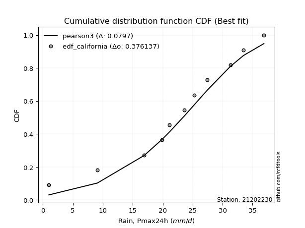</img></img>

</div>


### 2. EDF Hazen (1930)

Hazen method for plotting positions is a formula used to estimate the empirical cumulative probability distribution of flood events or other hydrological data. This formula often results in biased estimations, particularly when extrapolating to extreme events (high return periods).

<div align="center">


$P=(m-0.5)/n$


</div>


**2.1. Empirical values**

<div align="center">

|                | 0                    | 1                   | 2                   | 3                  | 4                  | 5         | 6                  | 7                  | 8                  | 9                  | 10                 |
|:---------------|:---------------------|:--------------------|:--------------------|:-------------------|:-------------------|:----------|:-------------------|:-------------------|:-------------------|:-------------------|:-------------------|
| date           | 2023                 | 2015                | 2012                | 2016               | 2014               | 2024      | 2009               | 2011               | 2013               | 2008               | 2010               |
| x              | 1.0                  | 9.1                 | 16.9                | 19.9               | 21.1               | 23.6      | 25.3               | 27.4               | 31.3               | 33.5               | 36.9               |
| m              | 1                    | 2                   | 3                   | 4                  | 5                  | 6         | 7                  | 8                  | 9                  | 10                 | 11                 |
| empirical_dist | edf_hazen            | edf_hazen           | edf_hazen           | edf_hazen          | edf_hazen          | edf_hazen | edf_hazen          | edf_hazen          | edf_hazen          | edf_hazen          | edf_hazen          |
| empirical      | 0.045454545454545456 | 0.13636363636363635 | 0.22727272727272727 | 0.3181818181818182 | 0.4090909090909091 | 0.5       | 0.5909090909090909 | 0.6818181818181818 | 0.7727272727272727 | 0.8636363636363636 | 0.9545454545454546 |
| empirical_tr   | 1.0476190476190477   | 1.1578947368421053  | 1.2941176470588236  | 1.4666666666666666 | 1.6923076923076925 | 2.0       | 2.4444444444444446 | 3.1428571428571423 | 4.3999999999999995 | 7.333333333333334  | 22.00000000000002  |

</div>


**2.2. Kolmogorov-Smirnov fit test (sorted by Δ)**


<div align="center">

|                | 0                    | 1                    | 2                    | 3                   | 4                   | 5                   | 6                   | 7                   | 8                   | 9                   | 10                  | 11                  | 12                  | 13                  | 14                  | 15                  | 16                  | 17                  | 18                  | 19                  | 20                  | 21                  | 22                  | 23                  | 24                  | 25                  | 26                    | 27                  | 28                  | 29                  | 30                  | 31                  | 32                  | 33                  | 34                  | 35                  | 36                  | 37                  | 38                  | 39                  | 40                  | 41                  | 42                  | 43                  | 44                  | 45                  | 46                  | 47                  | 48                  | 49                  | 50                  | 51                  | 52                  | 53                  | 54                  | 55                  | 56                  | 57                  | 58                  | 59                  | 60                  | 61                  | 62                  | 63                  | 64                  | 65                  | 66                  | 67                  | 68                  | 69                  | 70                  | 71                  | 72                  | 73                  | 74                  | 75                  | 76                  | 77                  | 78                  | 79                  | 80                  | 81                  | 82                  | 83                  | 84                  | 85                  | 86                  | 87                  |
|:---------------|:---------------------|:---------------------|:---------------------|:--------------------|:--------------------|:--------------------|:--------------------|:--------------------|:--------------------|:--------------------|:--------------------|:--------------------|:--------------------|:--------------------|:--------------------|:--------------------|:--------------------|:--------------------|:--------------------|:--------------------|:--------------------|:--------------------|:--------------------|:--------------------|:--------------------|:--------------------|:----------------------|:--------------------|:--------------------|:--------------------|:--------------------|:--------------------|:--------------------|:--------------------|:--------------------|:--------------------|:--------------------|:--------------------|:--------------------|:--------------------|:--------------------|:--------------------|:--------------------|:--------------------|:--------------------|:--------------------|:--------------------|:--------------------|:--------------------|:--------------------|:--------------------|:--------------------|:--------------------|:--------------------|:--------------------|:--------------------|:--------------------|:--------------------|:--------------------|:--------------------|:--------------------|:--------------------|:--------------------|:--------------------|:--------------------|:--------------------|:--------------------|:--------------------|:--------------------|:--------------------|:--------------------|:--------------------|:--------------------|:--------------------|:--------------------|:--------------------|:--------------------|:--------------------|:--------------------|:--------------------|:--------------------|:--------------------|:--------------------|:--------------------|:--------------------|:--------------------|:--------------------|:--------------------|
| station        | 21202230             | 21202230             | 21202230             | 21202230            | 21202230            | 21202230            | 21202230            | 21202230            | 21202230            | 21202230            | 21202230            | 21202230            | 21202230            | 21202230            | 21202230            | 21202230            | 21202230            | 21202230            | 21202230            | 21202230            | 21202230            | 21202230            | 21202230            | 21202230            | 21202230            | 21202230            | 21202230              | 21202230            | 21202230            | 21202230            | 21202230            | 21202230            | 21202230            | 21202230            | 21202230            | 21202230            | 21202230            | 21202230            | 21202230            | 21202230            | 21202230            | 21202230            | 21202230            | 21202230            | 21202230            | 21202230            | 21202230            | 21202230            | 21202230            | 21202230            | 21202230            | 21202230            | 21202230            | 21202230            | 21202230            | 21202230            | 21202230            | 21202230            | 21202230            | 21202230            | 21202230            | 21202230            | 21202230            | 21202230            | 21202230            | 21202230            | 21202230            | 21202230            | 21202230            | 21202230            | 21202230            | 21202230            | 21202230            | 21202230            | 21202230            | 21202230            | 21202230            | 21202230            | 21202230            | 21202230            | 21202230            | 21202230            | 21202230            | 21202230            | 21202230            | 21202230            | 21202230            | 21202230            |
| empirical_dist | edf_hazen            | edf_hazen            | edf_hazen            | edf_hazen           | edf_hazen           | edf_hazen           | edf_hazen           | edf_hazen           | edf_hazen           | edf_hazen           | edf_hazen           | edf_hazen           | edf_hazen           | edf_hazen           | edf_hazen           | edf_hazen           | edf_hazen           | edf_hazen           | edf_hazen           | edf_hazen           | edf_hazen           | edf_hazen           | edf_hazen           | edf_hazen           | edf_hazen           | edf_hazen           | edf_hazen             | edf_hazen           | edf_hazen           | edf_hazen           | edf_hazen           | edf_hazen           | edf_hazen           | edf_hazen           | edf_hazen           | edf_hazen           | edf_hazen           | edf_hazen           | edf_hazen           | edf_hazen           | edf_hazen           | edf_hazen           | edf_hazen           | edf_hazen           | edf_hazen           | edf_hazen           | edf_hazen           | edf_hazen           | edf_hazen           | edf_hazen           | edf_hazen           | edf_hazen           | edf_hazen           | edf_hazen           | edf_hazen           | edf_hazen           | edf_hazen           | edf_hazen           | edf_hazen           | edf_hazen           | edf_hazen           | edf_hazen           | edf_hazen           | edf_hazen           | edf_hazen           | edf_hazen           | edf_hazen           | edf_hazen           | edf_hazen           | edf_hazen           | edf_hazen           | edf_hazen           | edf_hazen           | edf_hazen           | edf_hazen           | edf_hazen           | edf_hazen           | edf_hazen           | edf_hazen           | edf_hazen           | edf_hazen           | edf_hazen           | edf_hazen           | edf_hazen           | edf_hazen           | edf_hazen           | edf_hazen           | edf_hazen           |
| p_dist         | johnsonsu            | weibull_min          | genlogistic          | pearson3            | gumbel_l            | fisk                | hypsecant           | logistic            | logjohnsonsu        | laplace_asymmetric  | laplace             | exponnorm           | crystalball         | norm                | t                   | nct                 | f                   | nakagami            | gamma               | mielke              | betaprime           | erlang              | logt                | invgamma            | maxwell             | logpearson3         | loglaplace_asymmetric | invgauss            | logloggamma         | rayleigh            | rice                | invweibull          | gumbel_r            | logweibull_min      | ncf                 | loggompertz         | logfisk             | halfnorm            | moyal               | alpha               | kstwobign           | halflogistic        | loggumbel_l         | truncnorm           | wald                | gibrat              | logbetaprime        | loghypsecant        | loglogistic         | logrice             | logexponnorm        | lognorm             | lognorm             | logcrystalball      | logfatiguelife      | lognct              | loginvgauss         | loglaplace          | loggamma            | loggamma            | logalpha            | logerlang           | loginvgamma         | loginvweibull       | logmaxwell          | genexpon            | expon               | lograyleigh         | logkstwobign        | loggumbel_r         | loghalfnorm         | lognakagami         | gompertz            | logmoyal            | loghalflogistic     | logncf              | loggenexpon         | logchi2             | logexpon            | logwald             | loggibrat           | logf                | logmielke           | loglognorm          | fatiguelife         | logtruncnorm        | chi2                | loggenlogistic      |
| delta          | 0.039868358359588574 | 0.041974906205373474 | 0.046381393246683444 | 0.04868473123305894 | 0.05311719618509303 | 0.05678031766982555 | 0.07198690704022159 | 0.07290677504568788 | 0.07380992323898594 | 0.07626622101004865 | 0.08432843415268243 | 0.08539682957688244 | 0.08539694138092996 | 0.08539695101428252 | 0.08541053639075286 | 0.08543987864083813 | 0.08641442854685155 | 0.08657095031010437 | 0.09075873183254018 | 0.09101964448632735 | 0.09291219596249672 | 0.09943398691433514 | 0.11551822124636202 | 0.11698957526973619 | 0.11949165932349909 | 0.12879599698862954 | 0.1294723540725766    | 0.13066750460569165 | 0.13160156785074692 | 0.13177607473527658 | 0.13324265099552246 | 0.14502983210619974 | 0.14582468971140916 | 0.1569768243627137  | 0.15794581862319762 | 0.15950242763089778 | 0.16511696443361945 | 0.16660517349483855 | 0.16896800646201188 | 0.16989274762373524 | 0.17725868340936196 | 0.18263551562820163 | 0.19315778140794274 | 0.208628219868057   | 0.23169966426271266 | 0.24180333335382986 | 0.25897528491688904 | 0.26146598923839526 | 0.2625137081460598  | 0.26373641323582464 | 0.26373861301830737 | 0.26374095361923744 | 0.26374095361923744 | 0.26374104207993343 | 0.2648961868973747  | 0.2650570676647801  | 0.27437841866792045 | 0.2747609873403855  | 0.2766520047866594  | 0.2766520047866594  | 0.27995903099896036 | 0.2829026978087461  | 0.2843965341424062  | 0.2874913789716048  | 0.2971286527737562  | 0.29763726520179223 | 0.2976393155803202  | 0.30832937352343126 | 0.33106720700694203 | 0.33379257301389065 | 0.3398654802923502  | 0.35260329849180383 | 0.3537242580774064  | 0.35967533143575103 | 0.3642246246370282  | 0.3680388509296274  | 0.36822310952152304 | 0.3741339882150526  | 0.4029519456223368  | 0.4316846336710488  | 0.4535638327126672  | 0.47042253141787327 | 0.47140611171194524 | 0.4871164898904585  | 0.596807211309501   | 0.609853215311651   | 0.7367435646474335  | 0.8636363636363636  |
| deltao         | 0.37613735880099997  | 0.37613735880099997  | 0.37613735880099997  | 0.37613735880099997 | 0.37613735880099997 | 0.37613735880099997 | 0.37613735880099997 | 0.37613735880099997 | 0.37613735880099997 | 0.37613735880099997 | 0.37613735880099997 | 0.37613735880099997 | 0.37613735880099997 | 0.37613735880099997 | 0.37613735880099997 | 0.37613735880099997 | 0.37613735880099997 | 0.37613735880099997 | 0.37613735880099997 | 0.37613735880099997 | 0.37613735880099997 | 0.37613735880099997 | 0.37613735880099997 | 0.37613735880099997 | 0.37613735880099997 | 0.37613735880099997 | 0.37613735880099997   | 0.37613735880099997 | 0.37613735880099997 | 0.37613735880099997 | 0.37613735880099997 | 0.37613735880099997 | 0.37613735880099997 | 0.37613735880099997 | 0.37613735880099997 | 0.37613735880099997 | 0.37613735880099997 | 0.37613735880099997 | 0.37613735880099997 | 0.37613735880099997 | 0.37613735880099997 | 0.37613735880099997 | 0.37613735880099997 | 0.37613735880099997 | 0.37613735880099997 | 0.37613735880099997 | 0.37613735880099997 | 0.37613735880099997 | 0.37613735880099997 | 0.37613735880099997 | 0.37613735880099997 | 0.37613735880099997 | 0.37613735880099997 | 0.37613735880099997 | 0.37613735880099997 | 0.37613735880099997 | 0.37613735880099997 | 0.37613735880099997 | 0.37613735880099997 | 0.37613735880099997 | 0.37613735880099997 | 0.37613735880099997 | 0.37613735880099997 | 0.37613735880099997 | 0.37613735880099997 | 0.37613735880099997 | 0.37613735880099997 | 0.37613735880099997 | 0.37613735880099997 | 0.37613735880099997 | 0.37613735880099997 | 0.37613735880099997 | 0.37613735880099997 | 0.37613735880099997 | 0.37613735880099997 | 0.37613735880099997 | 0.37613735880099997 | 0.37613735880099997 | 0.37613735880099997 | 0.37613735880099997 | 0.37613735880099997 | 0.37613735880099997 | 0.37613735880099997 | 0.37613735880099997 | 0.37613735880099997 | 0.37613735880099997 | 0.37613735880099997 | 0.37613735880099997 |
| eval           | Δo > Δ               | Δo > Δ               | Δo > Δ               | Δo > Δ              | Δo > Δ              | Δo > Δ              | Δo > Δ              | Δo > Δ              | Δo > Δ              | Δo > Δ              | Δo > Δ              | Δo > Δ              | Δo > Δ              | Δo > Δ              | Δo > Δ              | Δo > Δ              | Δo > Δ              | Δo > Δ              | Δo > Δ              | Δo > Δ              | Δo > Δ              | Δo > Δ              | Δo > Δ              | Δo > Δ              | Δo > Δ              | Δo > Δ              | Δo > Δ                | Δo > Δ              | Δo > Δ              | Δo > Δ              | Δo > Δ              | Δo > Δ              | Δo > Δ              | Δo > Δ              | Δo > Δ              | Δo > Δ              | Δo > Δ              | Δo > Δ              | Δo > Δ              | Δo > Δ              | Δo > Δ              | Δo > Δ              | Δo > Δ              | Δo > Δ              | Δo > Δ              | Δo > Δ              | Δo > Δ              | Δo > Δ              | Δo > Δ              | Δo > Δ              | Δo > Δ              | Δo > Δ              | Δo > Δ              | Δo > Δ              | Δo > Δ              | Δo > Δ              | Δo > Δ              | Δo > Δ              | Δo > Δ              | Δo > Δ              | Δo > Δ              | Δo > Δ              | Δo > Δ              | Δo > Δ              | Δo > Δ              | Δo > Δ              | Δo > Δ              | Δo > Δ              | Δo > Δ              | Δo > Δ              | Δo > Δ              | Δo > Δ              | Δo > Δ              | Δo > Δ              | Δo > Δ              | Δo > Δ              | Δo > Δ              | Δo > Δ              | Δo <= Δ             | Δo <= Δ             | Δo <= Δ             | Δo <= Δ             | Δo <= Δ             | Δo <= Δ             | Δo <= Δ             | Δo <= Δ             | Δo <= Δ             | Δo <= Δ             |
| fit            | 1                    | 1                    | 1                    | 1                   | 1                   | 1                   | 1                   | 1                   | 1                   | 1                   | 1                   | 1                   | 1                   | 1                   | 1                   | 1                   | 1                   | 1                   | 1                   | 1                   | 1                   | 1                   | 1                   | 1                   | 1                   | 1                   | 1                     | 1                   | 1                   | 1                   | 1                   | 1                   | 1                   | 1                   | 1                   | 1                   | 1                   | 1                   | 1                   | 1                   | 1                   | 1                   | 1                   | 1                   | 1                   | 1                   | 1                   | 1                   | 1                   | 1                   | 1                   | 1                   | 1                   | 1                   | 1                   | 1                   | 1                   | 1                   | 1                   | 1                   | 1                   | 1                   | 1                   | 1                   | 1                   | 1                   | 1                   | 1                   | 1                   | 1                   | 1                   | 1                   | 1                   | 1                   | 1                   | 1                   | 1                   | 1                   | 0                   | 0                   | 0                   | 0                   | 0                   | 0                   | 0                   | 0                   | 0                   | 0                   |
| n              | 11                   | 11                   | 11                   | 11                  | 11                  | 11                  | 11                  | 11                  | 11                  | 11                  | 11                  | 11                  | 11                  | 11                  | 11                  | 11                  | 11                  | 11                  | 11                  | 11                  | 11                  | 11                  | 11                  | 11                  | 11                  | 11                  | 11                    | 11                  | 11                  | 11                  | 11                  | 11                  | 11                  | 11                  | 11                  | 11                  | 11                  | 11                  | 11                  | 11                  | 11                  | 11                  | 11                  | 11                  | 11                  | 11                  | 11                  | 11                  | 11                  | 11                  | 11                  | 11                  | 11                  | 11                  | 11                  | 11                  | 11                  | 11                  | 11                  | 11                  | 11                  | 11                  | 11                  | 11                  | 11                  | 11                  | 11                  | 11                  | 11                  | 11                  | 11                  | 11                  | 11                  | 11                  | 11                  | 11                  | 11                  | 11                  | 11                  | 11                  | 11                  | 11                  | 11                  | 11                  | 11                  | 11                  | 11                  | 11                  |
| best_fit       | 1                    | 0                    | 0                    | 0                   | 0                   | 0                   | 0                   | 0                   | 0                   | 0                   | 0                   | 0                   | 0                   | 0                   | 0                   | 0                   | 0                   | 0                   | 0                   | 0                   | 0                   | 0                   | 0                   | 0                   | 0                   | 0                   | 0                     | 0                   | 0                   | 0                   | 0                   | 0                   | 0                   | 0                   | 0                   | 0                   | 0                   | 0                   | 0                   | 0                   | 0                   | 0                   | 0                   | 0                   | 0                   | 0                   | 0                   | 0                   | 0                   | 0                   | 0                   | 0                   | 0                   | 0                   | 0                   | 0                   | 0                   | 0                   | 0                   | 0                   | 0                   | 0                   | 0                   | 0                   | 0                   | 0                   | 0                   | 0                   | 0                   | 0                   | 0                   | 0                   | 0                   | 0                   | 0                   | 0                   | 0                   | 0                   | 0                   | 0                   | 0                   | 0                   | 0                   | 0                   | 0                   | 0                   | 0                   | 0                   |
| best_fit_sort  | 1                    | 2                    | 3                    | 4                   | 5                   | 6                   | 7                   | 8                   | 9                   | 10                  | 11                  | 12                  | 13                  | 14                  | 15                  | 16                  | 17                  | 18                  | 19                  | 20                  | 21                  | 22                  | 23                  | 24                  | 25                  | 26                  | 27                    | 28                  | 29                  | 30                  | 31                  | 32                  | 33                  | 34                  | 35                  | 36                  | 37                  | 38                  | 39                  | 40                  | 41                  | 42                  | 43                  | 44                  | 45                  | 46                  | 47                  | 48                  | 49                  | 50                  | 51                  | 52                  | 53                  | 54                  | 55                  | 56                  | 57                  | 58                  | 59                  | 60                  | 61                  | 62                  | 63                  | 64                  | 65                  | 66                  | 67                  | 68                  | 69                  | 70                  | 71                  | 72                  | 73                  | 74                  | 75                  | 76                  | 77                  | 78                  | 79                  | 80                  | 81                  | 82                  | 83                  | 84                  | 85                  | 86                  | 87                  | 88                  |

</div>


**2.3. Best fit**

<div align="center">

|   id |   station | empirical_dist   | p_dist    |     delta |   deltao | eval   |   fit |   n |   best_fit |   best_fit_sort |
|-----:|----------:|:-----------------|:----------|----------:|---------:|:-------|------:|----:|-----------:|----------------:|
|    0 |  21202230 | edf_hazen        | johnsonsu | 0.0398684 | 0.376137 | Δo > Δ |     1 |  11 |          1 |               1 |

</div>


<div align="center">

</img>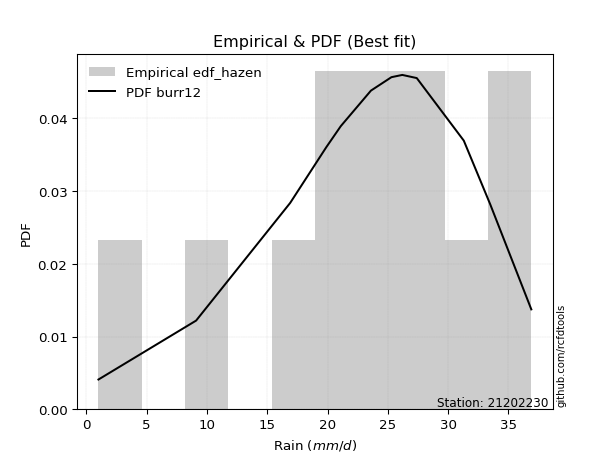</img>

</div>


### 3. EDF Weibull (1939)

Weibull plotting position formula is an empirical method used to estimate the non-exceedance probability or plotting position for a set of observed data, is often recommended or widely used in practice, particularly in flood frequency analysis.

<div align="center">


$P=m/(n+1)$


</div>


**3.1. Empirical values**

<div align="center">

|                | 0                   | 1                   | 2                  | 3                  | 4                  | 5           | 6                  | 7                  | 8           | 9                  | 10                 |
|:---------------|:--------------------|:--------------------|:-------------------|:-------------------|:-------------------|:------------|:-------------------|:-------------------|:------------|:-------------------|:-------------------|
| date           | 2023                | 2015                | 2012               | 2016               | 2014               | 2024        | 2009               | 2011               | 2013        | 2008               | 2010               |
| x              | 1.0                 | 9.1                 | 16.9               | 19.9               | 21.1               | 23.6        | 25.3               | 27.4               | 31.3        | 33.5               | 36.9               |
| m              | 1                   | 2                   | 3                  | 4                  | 5                  | 6           | 7                  | 8                  | 9           | 10                 | 11                 |
| empirical_dist | edf_weibull         | edf_weibull         | edf_weibull        | edf_weibull        | edf_weibull        | edf_weibull | edf_weibull        | edf_weibull        | edf_weibull | edf_weibull        | edf_weibull        |
| empirical      | 0.08333333333333333 | 0.16666666666666666 | 0.25               | 0.3333333333333333 | 0.4166666666666667 | 0.5         | 0.5833333333333334 | 0.6666666666666666 | 0.75        | 0.8333333333333334 | 0.9166666666666666 |
| empirical_tr   | 1.090909090909091   | 1.2                 | 1.3333333333333333 | 1.4999999999999998 | 1.7142857142857144 | 2.0         | 2.4000000000000004 | 2.9999999999999996 | 4.0         | 6.000000000000002  | 11.999999999999995 |

</div>


**3.2. Kolmogorov-Smirnov fit test (sorted by Δ)**


<div align="center">

|                | 0                    | 1                   | 2                   | 3                   | 4                   | 5                   | 6                   | 7                   | 8                   | 9                   | 10                  | 11                  | 12                  | 13                  | 14                  | 15                  | 16                  | 17                  | 18                  | 19                  | 20                  | 21                  | 22                  | 23                  | 24                  | 25                  | 26                    | 27                  | 28                  | 29                  | 30                  | 31                  | 32                  | 33                  | 34                  | 35                  | 36                  | 37                  | 38                  | 39                  | 40                  | 41                  | 42                  | 43                  | 44                  | 45                  | 46                  | 47                  | 48                  | 49                  | 50                  | 51                  | 52                  | 53                  | 54                  | 55                  | 56                  | 57                  | 58                  | 59                  | 60                  | 61                  | 62                  | 63                  | 64                  | 65                  | 66                  | 67                  | 68                  | 69                  | 70                  | 71                  | 72                  | 73                  | 74                  | 75                  | 76                  | 77                  | 78                  | 79                  | 80                  | 81                  | 82                  | 83                  | 84                  | 85                  | 86                  | 87                  |
|:---------------|:---------------------|:--------------------|:--------------------|:--------------------|:--------------------|:--------------------|:--------------------|:--------------------|:--------------------|:--------------------|:--------------------|:--------------------|:--------------------|:--------------------|:--------------------|:--------------------|:--------------------|:--------------------|:--------------------|:--------------------|:--------------------|:--------------------|:--------------------|:--------------------|:--------------------|:--------------------|:----------------------|:--------------------|:--------------------|:--------------------|:--------------------|:--------------------|:--------------------|:--------------------|:--------------------|:--------------------|:--------------------|:--------------------|:--------------------|:--------------------|:--------------------|:--------------------|:--------------------|:--------------------|:--------------------|:--------------------|:--------------------|:--------------------|:--------------------|:--------------------|:--------------------|:--------------------|:--------------------|:--------------------|:--------------------|:--------------------|:--------------------|:--------------------|:--------------------|:--------------------|:--------------------|:--------------------|:--------------------|:--------------------|:--------------------|:--------------------|:--------------------|:--------------------|:--------------------|:--------------------|:--------------------|:--------------------|:--------------------|:--------------------|:--------------------|:--------------------|:--------------------|:--------------------|:--------------------|:--------------------|:--------------------|:--------------------|:--------------------|:--------------------|:--------------------|:--------------------|:--------------------|:--------------------|
| station        | 21202230             | 21202230            | 21202230            | 21202230            | 21202230            | 21202230            | 21202230            | 21202230            | 21202230            | 21202230            | 21202230            | 21202230            | 21202230            | 21202230            | 21202230            | 21202230            | 21202230            | 21202230            | 21202230            | 21202230            | 21202230            | 21202230            | 21202230            | 21202230            | 21202230            | 21202230            | 21202230              | 21202230            | 21202230            | 21202230            | 21202230            | 21202230            | 21202230            | 21202230            | 21202230            | 21202230            | 21202230            | 21202230            | 21202230            | 21202230            | 21202230            | 21202230            | 21202230            | 21202230            | 21202230            | 21202230            | 21202230            | 21202230            | 21202230            | 21202230            | 21202230            | 21202230            | 21202230            | 21202230            | 21202230            | 21202230            | 21202230            | 21202230            | 21202230            | 21202230            | 21202230            | 21202230            | 21202230            | 21202230            | 21202230            | 21202230            | 21202230            | 21202230            | 21202230            | 21202230            | 21202230            | 21202230            | 21202230            | 21202230            | 21202230            | 21202230            | 21202230            | 21202230            | 21202230            | 21202230            | 21202230            | 21202230            | 21202230            | 21202230            | 21202230            | 21202230            | 21202230            | 21202230            |
| empirical_dist | edf_weibull          | edf_weibull         | edf_weibull         | edf_weibull         | edf_weibull         | edf_weibull         | edf_weibull         | edf_weibull         | edf_weibull         | edf_weibull         | edf_weibull         | edf_weibull         | edf_weibull         | edf_weibull         | edf_weibull         | edf_weibull         | edf_weibull         | edf_weibull         | edf_weibull         | edf_weibull         | edf_weibull         | edf_weibull         | edf_weibull         | edf_weibull         | edf_weibull         | edf_weibull         | edf_weibull           | edf_weibull         | edf_weibull         | edf_weibull         | edf_weibull         | edf_weibull         | edf_weibull         | edf_weibull         | edf_weibull         | edf_weibull         | edf_weibull         | edf_weibull         | edf_weibull         | edf_weibull         | edf_weibull         | edf_weibull         | edf_weibull         | edf_weibull         | edf_weibull         | edf_weibull         | edf_weibull         | edf_weibull         | edf_weibull         | edf_weibull         | edf_weibull         | edf_weibull         | edf_weibull         | edf_weibull         | edf_weibull         | edf_weibull         | edf_weibull         | edf_weibull         | edf_weibull         | edf_weibull         | edf_weibull         | edf_weibull         | edf_weibull         | edf_weibull         | edf_weibull         | edf_weibull         | edf_weibull         | edf_weibull         | edf_weibull         | edf_weibull         | edf_weibull         | edf_weibull         | edf_weibull         | edf_weibull         | edf_weibull         | edf_weibull         | edf_weibull         | edf_weibull         | edf_weibull         | edf_weibull         | edf_weibull         | edf_weibull         | edf_weibull         | edf_weibull         | edf_weibull         | edf_weibull         | edf_weibull         | edf_weibull         |
| p_dist         | johnsonsu            | logjohnsonsu        | pearson3            | weibull_min         | genlogistic         | nakagami            | f                   | nct                 | t                   | exponnorm           | norm                | crystalball         | gamma               | gumbel_l            | betaprime           | mielke              | logistic            | erlang              | fisk                | hypsecant           | logpearson3         | laplace_asymmetric  | invgamma            | maxwell             | logt                | laplace             | loglaplace_asymmetric | logloggamma         | invgauss            | rayleigh            | rice                | logfisk             | invweibull          | gumbel_r            | logweibull_min      | ncf                 | loggompertz         | moyal               | alpha               | kstwobign           | halfnorm            | halflogistic        | loggumbel_l         | truncnorm           | wald                | logbetaprime        | loghypsecant        | loglogistic         | logrice             | logexponnorm        | lognorm             | lognorm             | logcrystalball      | gibrat              | logfatiguelife      | lognct              | loginvgauss         | loggamma            | loggamma            | logalpha            | loglaplace          | logerlang           | loginvgamma         | loginvweibull       | logmaxwell          | genexpon            | expon               | lograyleigh         | logkstwobign        | loggumbel_r         | loghalfnorm         | lognakagami         | logmoyal            | logncf              | loghalflogistic     | logchi2             | loggenexpon         | gompertz            | logexpon            | logwald             | loggibrat           | logf                | logmielke           | loglognorm          | fatiguelife         | logtruncnorm        | chi2                | loggenlogistic      |
| delta          | 0.060208534439174705 | 0.06070046935064721 | 0.06454844878711198 | 0.06568171040221814 | 0.06910866597395615 | 0.07152774055225651 | 0.0719455062746975  | 0.07224647091502137 | 0.07226317657428444 | 0.07226808889166099 | 0.07226843007981351 | 0.07226845034341509 | 0.07560721668102505 | 0.07584446891236574 | 0.07776068081098159 | 0.081695447350417   | 0.08284816353562019 | 0.08428247176282    | 0.08708334797285586 | 0.0947141797674943  | 0.09849296668559926 | 0.09899349373732136 | 0.10183806011822105 | 0.10434014417198395 | 0.106880757081181   | 0.10705570687995514 | 0.10927479988984551   | 0.11136904568974232 | 0.11551598945417652 | 0.11662455958376144 | 0.11809113584400732 | 0.1272381765548315  | 0.1298783169546846  | 0.13067317455989402 | 0.14182530921119857 | 0.14279430347168248 | 0.14435091247938264 | 0.15381649131049674 | 0.1547412324722201  | 0.16210716825784682 | 0.16211559921085453 | 0.1674840004766865  | 0.17043050868067    | 0.18590094714078426 | 0.21654814911119752 | 0.23624801218961633 | 0.2387522944235964  | 0.23978643541878703 | 0.24100914050855193 | 0.2410113402910346  | 0.24101368089196468 | 0.24101368089196468 | 0.24101376935266072 | 0.24180333335382986 | 0.242168914170102   | 0.2423297949375074  | 0.25165114594064775 | 0.2539247320593867  | 0.2539247320593867  | 0.25723175827168765 | 0.25960947218887037 | 0.2601754250814734  | 0.26166926141513347 | 0.2647641062443321  | 0.2744013800464835  | 0.2749099924745195  | 0.2749120428530475  | 0.28560210079615855 | 0.3083399342796693  | 0.31106530028661794 | 0.3171382075650775  | 0.32230026818877355 | 0.3369480587084783  | 0.3377358206265971  | 0.3414973519097555  | 0.34383095791202234 | 0.34549583679425033 | 0.3461485005016488  | 0.37927967100386906 | 0.4089573609437761  | 0.4308365599853945  | 0.440119501114843   | 0.44110308140891497 | 0.45681345958742825 | 0.5665041810064707  | 0.5871259425843783  | 0.7140162919201608  | 0.8333333333333334  |
| deltao         | 0.37613735880099997  | 0.37613735880099997 | 0.37613735880099997 | 0.37613735880099997 | 0.37613735880099997 | 0.37613735880099997 | 0.37613735880099997 | 0.37613735880099997 | 0.37613735880099997 | 0.37613735880099997 | 0.37613735880099997 | 0.37613735880099997 | 0.37613735880099997 | 0.37613735880099997 | 0.37613735880099997 | 0.37613735880099997 | 0.37613735880099997 | 0.37613735880099997 | 0.37613735880099997 | 0.37613735880099997 | 0.37613735880099997 | 0.37613735880099997 | 0.37613735880099997 | 0.37613735880099997 | 0.37613735880099997 | 0.37613735880099997 | 0.37613735880099997   | 0.37613735880099997 | 0.37613735880099997 | 0.37613735880099997 | 0.37613735880099997 | 0.37613735880099997 | 0.37613735880099997 | 0.37613735880099997 | 0.37613735880099997 | 0.37613735880099997 | 0.37613735880099997 | 0.37613735880099997 | 0.37613735880099997 | 0.37613735880099997 | 0.37613735880099997 | 0.37613735880099997 | 0.37613735880099997 | 0.37613735880099997 | 0.37613735880099997 | 0.37613735880099997 | 0.37613735880099997 | 0.37613735880099997 | 0.37613735880099997 | 0.37613735880099997 | 0.37613735880099997 | 0.37613735880099997 | 0.37613735880099997 | 0.37613735880099997 | 0.37613735880099997 | 0.37613735880099997 | 0.37613735880099997 | 0.37613735880099997 | 0.37613735880099997 | 0.37613735880099997 | 0.37613735880099997 | 0.37613735880099997 | 0.37613735880099997 | 0.37613735880099997 | 0.37613735880099997 | 0.37613735880099997 | 0.37613735880099997 | 0.37613735880099997 | 0.37613735880099997 | 0.37613735880099997 | 0.37613735880099997 | 0.37613735880099997 | 0.37613735880099997 | 0.37613735880099997 | 0.37613735880099997 | 0.37613735880099997 | 0.37613735880099997 | 0.37613735880099997 | 0.37613735880099997 | 0.37613735880099997 | 0.37613735880099997 | 0.37613735880099997 | 0.37613735880099997 | 0.37613735880099997 | 0.37613735880099997 | 0.37613735880099997 | 0.37613735880099997 | 0.37613735880099997 |
| eval           | Δo > Δ               | Δo > Δ              | Δo > Δ              | Δo > Δ              | Δo > Δ              | Δo > Δ              | Δo > Δ              | Δo > Δ              | Δo > Δ              | Δo > Δ              | Δo > Δ              | Δo > Δ              | Δo > Δ              | Δo > Δ              | Δo > Δ              | Δo > Δ              | Δo > Δ              | Δo > Δ              | Δo > Δ              | Δo > Δ              | Δo > Δ              | Δo > Δ              | Δo > Δ              | Δo > Δ              | Δo > Δ              | Δo > Δ              | Δo > Δ                | Δo > Δ              | Δo > Δ              | Δo > Δ              | Δo > Δ              | Δo > Δ              | Δo > Δ              | Δo > Δ              | Δo > Δ              | Δo > Δ              | Δo > Δ              | Δo > Δ              | Δo > Δ              | Δo > Δ              | Δo > Δ              | Δo > Δ              | Δo > Δ              | Δo > Δ              | Δo > Δ              | Δo > Δ              | Δo > Δ              | Δo > Δ              | Δo > Δ              | Δo > Δ              | Δo > Δ              | Δo > Δ              | Δo > Δ              | Δo > Δ              | Δo > Δ              | Δo > Δ              | Δo > Δ              | Δo > Δ              | Δo > Δ              | Δo > Δ              | Δo > Δ              | Δo > Δ              | Δo > Δ              | Δo > Δ              | Δo > Δ              | Δo > Δ              | Δo > Δ              | Δo > Δ              | Δo > Δ              | Δo > Δ              | Δo > Δ              | Δo > Δ              | Δo > Δ              | Δo > Δ              | Δo > Δ              | Δo > Δ              | Δo > Δ              | Δo > Δ              | Δo <= Δ             | Δo <= Δ             | Δo <= Δ             | Δo <= Δ             | Δo <= Δ             | Δo <= Δ             | Δo <= Δ             | Δo <= Δ             | Δo <= Δ             | Δo <= Δ             |
| fit            | 1                    | 1                   | 1                   | 1                   | 1                   | 1                   | 1                   | 1                   | 1                   | 1                   | 1                   | 1                   | 1                   | 1                   | 1                   | 1                   | 1                   | 1                   | 1                   | 1                   | 1                   | 1                   | 1                   | 1                   | 1                   | 1                   | 1                     | 1                   | 1                   | 1                   | 1                   | 1                   | 1                   | 1                   | 1                   | 1                   | 1                   | 1                   | 1                   | 1                   | 1                   | 1                   | 1                   | 1                   | 1                   | 1                   | 1                   | 1                   | 1                   | 1                   | 1                   | 1                   | 1                   | 1                   | 1                   | 1                   | 1                   | 1                   | 1                   | 1                   | 1                   | 1                   | 1                   | 1                   | 1                   | 1                   | 1                   | 1                   | 1                   | 1                   | 1                   | 1                   | 1                   | 1                   | 1                   | 1                   | 1                   | 1                   | 0                   | 0                   | 0                   | 0                   | 0                   | 0                   | 0                   | 0                   | 0                   | 0                   |
| n              | 11                   | 11                  | 11                  | 11                  | 11                  | 11                  | 11                  | 11                  | 11                  | 11                  | 11                  | 11                  | 11                  | 11                  | 11                  | 11                  | 11                  | 11                  | 11                  | 11                  | 11                  | 11                  | 11                  | 11                  | 11                  | 11                  | 11                    | 11                  | 11                  | 11                  | 11                  | 11                  | 11                  | 11                  | 11                  | 11                  | 11                  | 11                  | 11                  | 11                  | 11                  | 11                  | 11                  | 11                  | 11                  | 11                  | 11                  | 11                  | 11                  | 11                  | 11                  | 11                  | 11                  | 11                  | 11                  | 11                  | 11                  | 11                  | 11                  | 11                  | 11                  | 11                  | 11                  | 11                  | 11                  | 11                  | 11                  | 11                  | 11                  | 11                  | 11                  | 11                  | 11                  | 11                  | 11                  | 11                  | 11                  | 11                  | 11                  | 11                  | 11                  | 11                  | 11                  | 11                  | 11                  | 11                  | 11                  | 11                  |
| best_fit       | 1                    | 0                   | 0                   | 0                   | 0                   | 0                   | 0                   | 0                   | 0                   | 0                   | 0                   | 0                   | 0                   | 0                   | 0                   | 0                   | 0                   | 0                   | 0                   | 0                   | 0                   | 0                   | 0                   | 0                   | 0                   | 0                   | 0                     | 0                   | 0                   | 0                   | 0                   | 0                   | 0                   | 0                   | 0                   | 0                   | 0                   | 0                   | 0                   | 0                   | 0                   | 0                   | 0                   | 0                   | 0                   | 0                   | 0                   | 0                   | 0                   | 0                   | 0                   | 0                   | 0                   | 0                   | 0                   | 0                   | 0                   | 0                   | 0                   | 0                   | 0                   | 0                   | 0                   | 0                   | 0                   | 0                   | 0                   | 0                   | 0                   | 0                   | 0                   | 0                   | 0                   | 0                   | 0                   | 0                   | 0                   | 0                   | 0                   | 0                   | 0                   | 0                   | 0                   | 0                   | 0                   | 0                   | 0                   | 0                   |
| best_fit_sort  | 1                    | 2                   | 3                   | 4                   | 5                   | 6                   | 7                   | 8                   | 9                   | 10                  | 11                  | 12                  | 13                  | 14                  | 15                  | 16                  | 17                  | 18                  | 19                  | 20                  | 21                  | 22                  | 23                  | 24                  | 25                  | 26                  | 27                    | 28                  | 29                  | 30                  | 31                  | 32                  | 33                  | 34                  | 35                  | 36                  | 37                  | 38                  | 39                  | 40                  | 41                  | 42                  | 43                  | 44                  | 45                  | 46                  | 47                  | 48                  | 49                  | 50                  | 51                  | 52                  | 53                  | 54                  | 55                  | 56                  | 57                  | 58                  | 59                  | 60                  | 61                  | 62                  | 63                  | 64                  | 65                  | 66                  | 67                  | 68                  | 69                  | 70                  | 71                  | 72                  | 73                  | 74                  | 75                  | 76                  | 77                  | 78                  | 79                  | 80                  | 81                  | 82                  | 83                  | 84                  | 85                  | 86                  | 87                  | 88                  |

</div>


**3.3. Best fit**

<div align="center">

|   id |   station | empirical_dist   | p_dist    |     delta |   deltao | eval   |   fit |   n |   best_fit |   best_fit_sort |
|-----:|----------:|:-----------------|:----------|----------:|---------:|:-------|------:|----:|-----------:|----------------:|
|    0 |  21202230 | edf_weibull      | johnsonsu | 0.0602085 | 0.376137 | Δo > Δ |     1 |  11 |          1 |               1 |

</div>


<div align="center">

</img>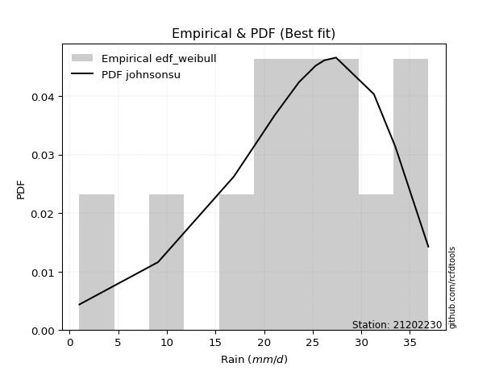</img>

</div>


### 4. EDF Beard (1943)

The Beard formula (or Beard´s plotting position formula) in hydrology is used to estimate the empirical non-exceedance probability _(P)_ of a flood event (or other extreme hydrological data point) within a given dataset.

<div align="center">


$P=(m-0.31)/(n+0.38)$


</div>


**4.1. Empirical values**

<div align="center">

|                | 0                    | 1                 | 2                   | 3                  | 4                  | 5         | 6                  | 7                  | 8                  | 9                  | 10                 |
|:---------------|:---------------------|:------------------|:--------------------|:-------------------|:-------------------|:----------|:-------------------|:-------------------|:-------------------|:-------------------|:-------------------|
| date           | 2023                 | 2015              | 2012                | 2016               | 2014               | 2024      | 2009               | 2011               | 2013               | 2008               | 2010               |
| x              | 1.0                  | 9.1               | 16.9                | 19.9               | 21.1               | 23.6      | 25.3               | 27.4               | 31.3               | 33.5               | 36.9               |
| m              | 1                    | 2                 | 3                   | 4                  | 5                  | 6         | 7                  | 8                  | 9                  | 10                 | 11                 |
| empirical_dist | edf_beard            | edf_beard         | edf_beard           | edf_beard          | edf_beard          | edf_beard | edf_beard          | edf_beard          | edf_beard          | edf_beard          | edf_beard          |
| empirical      | 0.060632688927943754 | 0.148506151142355 | 0.23637961335676624 | 0.3242530755711775 | 0.4121265377855888 | 0.5       | 0.5878734622144113 | 0.6757469244288224 | 0.7636203866432336 | 0.8514938488576449 | 0.9393673110720562 |
| empirical_tr   | 1.0645463049579045   | 1.174406604747162 | 1.3095512082853855  | 1.4798439531859557 | 1.7010463378176381 | 2.0       | 2.4264392324093818 | 3.0840108401084008 | 4.230483271375462  | 6.733727810650883  | 16.49275362318839  |

</div>


**4.2. Kolmogorov-Smirnov fit test (sorted by Δ)**


<div align="center">

|                | 0                   | 1                    | 2                    | 3                    | 4                   | 5                   | 6                   | 7                   | 8                   | 9                   | 10                  | 11                  | 12                  | 13                  | 14                  | 15                  | 16                  | 17                  | 18                  | 19                  | 20                  | 21                  | 22                  | 23                  | 24                  | 25                  | 26                    | 27                  | 28                  | 29                  | 30                  | 31                  | 32                  | 33                  | 34                  | 35                  | 36                  | 37                  | 38                  | 39                  | 40                  | 41                  | 42                  | 43                  | 44                  | 45                  | 46                  | 47                  | 48                  | 49                  | 50                  | 51                  | 52                  | 53                  | 54                  | 55                  | 56                  | 57                  | 58                  | 59                  | 60                  | 61                  | 62                  | 63                  | 64                  | 65                  | 66                  | 67                  | 68                  | 69                  | 70                  | 71                  | 72                  | 73                  | 74                  | 75                  | 76                  | 77                  | 78                  | 79                  | 80                  | 81                  | 82                  | 83                  | 84                  | 85                  | 86                  | 87                  |
|:---------------|:--------------------|:---------------------|:---------------------|:---------------------|:--------------------|:--------------------|:--------------------|:--------------------|:--------------------|:--------------------|:--------------------|:--------------------|:--------------------|:--------------------|:--------------------|:--------------------|:--------------------|:--------------------|:--------------------|:--------------------|:--------------------|:--------------------|:--------------------|:--------------------|:--------------------|:--------------------|:----------------------|:--------------------|:--------------------|:--------------------|:--------------------|:--------------------|:--------------------|:--------------------|:--------------------|:--------------------|:--------------------|:--------------------|:--------------------|:--------------------|:--------------------|:--------------------|:--------------------|:--------------------|:--------------------|:--------------------|:--------------------|:--------------------|:--------------------|:--------------------|:--------------------|:--------------------|:--------------------|:--------------------|:--------------------|:--------------------|:--------------------|:--------------------|:--------------------|:--------------------|:--------------------|:--------------------|:--------------------|:--------------------|:--------------------|:--------------------|:--------------------|:--------------------|:--------------------|:--------------------|:--------------------|:--------------------|:--------------------|:--------------------|:--------------------|:--------------------|:--------------------|:--------------------|:--------------------|:--------------------|:--------------------|:--------------------|:--------------------|:--------------------|:--------------------|:--------------------|:--------------------|:--------------------|
| station        | 21202230            | 21202230             | 21202230             | 21202230             | 21202230            | 21202230            | 21202230            | 21202230            | 21202230            | 21202230            | 21202230            | 21202230            | 21202230            | 21202230            | 21202230            | 21202230            | 21202230            | 21202230            | 21202230            | 21202230            | 21202230            | 21202230            | 21202230            | 21202230            | 21202230            | 21202230            | 21202230              | 21202230            | 21202230            | 21202230            | 21202230            | 21202230            | 21202230            | 21202230            | 21202230            | 21202230            | 21202230            | 21202230            | 21202230            | 21202230            | 21202230            | 21202230            | 21202230            | 21202230            | 21202230            | 21202230            | 21202230            | 21202230            | 21202230            | 21202230            | 21202230            | 21202230            | 21202230            | 21202230            | 21202230            | 21202230            | 21202230            | 21202230            | 21202230            | 21202230            | 21202230            | 21202230            | 21202230            | 21202230            | 21202230            | 21202230            | 21202230            | 21202230            | 21202230            | 21202230            | 21202230            | 21202230            | 21202230            | 21202230            | 21202230            | 21202230            | 21202230            | 21202230            | 21202230            | 21202230            | 21202230            | 21202230            | 21202230            | 21202230            | 21202230            | 21202230            | 21202230            | 21202230            |
| empirical_dist | edf_beard           | edf_beard            | edf_beard            | edf_beard            | edf_beard           | edf_beard           | edf_beard           | edf_beard           | edf_beard           | edf_beard           | edf_beard           | edf_beard           | edf_beard           | edf_beard           | edf_beard           | edf_beard           | edf_beard           | edf_beard           | edf_beard           | edf_beard           | edf_beard           | edf_beard           | edf_beard           | edf_beard           | edf_beard           | edf_beard           | edf_beard             | edf_beard           | edf_beard           | edf_beard           | edf_beard           | edf_beard           | edf_beard           | edf_beard           | edf_beard           | edf_beard           | edf_beard           | edf_beard           | edf_beard           | edf_beard           | edf_beard           | edf_beard           | edf_beard           | edf_beard           | edf_beard           | edf_beard           | edf_beard           | edf_beard           | edf_beard           | edf_beard           | edf_beard           | edf_beard           | edf_beard           | edf_beard           | edf_beard           | edf_beard           | edf_beard           | edf_beard           | edf_beard           | edf_beard           | edf_beard           | edf_beard           | edf_beard           | edf_beard           | edf_beard           | edf_beard           | edf_beard           | edf_beard           | edf_beard           | edf_beard           | edf_beard           | edf_beard           | edf_beard           | edf_beard           | edf_beard           | edf_beard           | edf_beard           | edf_beard           | edf_beard           | edf_beard           | edf_beard           | edf_beard           | edf_beard           | edf_beard           | edf_beard           | edf_beard           | edf_beard           | edf_beard           |
| p_dist         | johnsonsu           | pearson3             | weibull_min          | genlogistic          | gumbel_l            | logjohnsonsu        | fisk                | logistic            | exponnorm           | crystalball         | norm                | t                   | nct                 | f                   | nakagami            | hypsecant           | mielke              | gamma               | laplace_asymmetric  | betaprime           | erlang              | laplace             | logt                | invgamma            | maxwell             | logpearson3         | loglaplace_asymmetric | logloggamma         | invgauss            | rayleigh            | rice                | invweibull          | gumbel_r            | logfisk             | logweibull_min      | ncf                 | loggompertz         | halfnorm            | moyal               | alpha               | kstwobign           | halflogistic        | loggumbel_l         | truncnorm           | wald                | gibrat              | logbetaprime        | loghypsecant        | loglogistic         | logrice             | logexponnorm        | lognorm             | lognorm             | logcrystalball      | logfatiguelife      | lognct              | loginvgauss         | loggamma            | loggamma            | loglaplace          | logalpha            | logerlang           | loginvgamma         | loginvweibull       | logmaxwell          | genexpon            | expon               | lograyleigh         | logkstwobign        | loggumbel_r         | loghalfnorm         | lognakagami         | logmoyal            | gompertz            | loghalflogistic     | logncf              | loggenexpon         | logchi2             | logexpon            | logwald             | loggibrat           | logf                | logmielke           | loglognorm          | fatiguelife         | logtruncnorm        | chi2                | loggenlogistic      |
| delta          | 0.04612983392077674 | 0.046387933262800315 | 0.051081792289412564 | 0.055488279330722534 | 0.06222408226913212 | 0.06773866584962662 | 0.06892283244854419 | 0.06922777689238657 | 0.07932557218752312 | 0.07932568399157064 | 0.0793256936249232  | 0.07933927900139354 | 0.07936862125147881 | 0.08034317115749223 | 0.08049969292074505 | 0.08109379312426068 | 0.08191275840228837 | 0.08468747444318087 | 0.08537310709408774 | 0.0868409385731374  | 0.09336272952497582 | 0.09343532023672152 | 0.10034007777296361 | 0.11091831788037687 | 0.11342040193413977 | 0.11665348220991079 | 0.12036546798853762   | 0.12249468176670794 | 0.12459624721633233 | 0.12570481734591726 | 0.12717139360616314 | 0.13895857471684042 | 0.13975343232204984 | 0.14993882096022104 | 0.1509055669733544  | 0.1518745612338383  | 0.15343117024153846 | 0.16053391610547924 | 0.16289674907265256 | 0.16382149023437592 | 0.17118742602000264 | 0.1765642582388423  | 0.18405089532390376 | 0.199521333784018   | 0.22562840687335334 | 0.24180333335382986 | 0.24986839883285009 | 0.2523591031543563  | 0.2534068220620208  | 0.25462952715178566 | 0.2546317269342684  | 0.25463406753519846 | 0.25463406753519846 | 0.25463415599589445 | 0.25578930081333573 | 0.2559501815807411  | 0.2652715325838815  | 0.26754511870262043 | 0.26754511870262043 | 0.2686897299510262  | 0.2708521449149214  | 0.2737958117247071  | 0.2752896480583672  | 0.27838449288756584 | 0.28802176668971724 | 0.28853037911775326 | 0.2885324294962812  | 0.2992224874393923  | 0.32196032092290305 | 0.32468568692985167 | 0.3307585942083112  | 0.3404607837130852  | 0.35056844535171205 | 0.3506886293827267  | 0.3551177385529892  | 0.35589633615090877 | 0.35911622343748406 | 0.361991473436334   | 0.3929000576471028  | 0.42257774758700983 | 0.4444569466286282  | 0.45828001663915463 | 0.4592635969332266  | 0.4749739751117399  | 0.5846646965307823  | 0.6007463292276121  | 0.7276366785633945  | 0.8514938488576449  |
| deltao         | 0.37613735880099997 | 0.37613735880099997  | 0.37613735880099997  | 0.37613735880099997  | 0.37613735880099997 | 0.37613735880099997 | 0.37613735880099997 | 0.37613735880099997 | 0.37613735880099997 | 0.37613735880099997 | 0.37613735880099997 | 0.37613735880099997 | 0.37613735880099997 | 0.37613735880099997 | 0.37613735880099997 | 0.37613735880099997 | 0.37613735880099997 | 0.37613735880099997 | 0.37613735880099997 | 0.37613735880099997 | 0.37613735880099997 | 0.37613735880099997 | 0.37613735880099997 | 0.37613735880099997 | 0.37613735880099997 | 0.37613735880099997 | 0.37613735880099997   | 0.37613735880099997 | 0.37613735880099997 | 0.37613735880099997 | 0.37613735880099997 | 0.37613735880099997 | 0.37613735880099997 | 0.37613735880099997 | 0.37613735880099997 | 0.37613735880099997 | 0.37613735880099997 | 0.37613735880099997 | 0.37613735880099997 | 0.37613735880099997 | 0.37613735880099997 | 0.37613735880099997 | 0.37613735880099997 | 0.37613735880099997 | 0.37613735880099997 | 0.37613735880099997 | 0.37613735880099997 | 0.37613735880099997 | 0.37613735880099997 | 0.37613735880099997 | 0.37613735880099997 | 0.37613735880099997 | 0.37613735880099997 | 0.37613735880099997 | 0.37613735880099997 | 0.37613735880099997 | 0.37613735880099997 | 0.37613735880099997 | 0.37613735880099997 | 0.37613735880099997 | 0.37613735880099997 | 0.37613735880099997 | 0.37613735880099997 | 0.37613735880099997 | 0.37613735880099997 | 0.37613735880099997 | 0.37613735880099997 | 0.37613735880099997 | 0.37613735880099997 | 0.37613735880099997 | 0.37613735880099997 | 0.37613735880099997 | 0.37613735880099997 | 0.37613735880099997 | 0.37613735880099997 | 0.37613735880099997 | 0.37613735880099997 | 0.37613735880099997 | 0.37613735880099997 | 0.37613735880099997 | 0.37613735880099997 | 0.37613735880099997 | 0.37613735880099997 | 0.37613735880099997 | 0.37613735880099997 | 0.37613735880099997 | 0.37613735880099997 | 0.37613735880099997 |
| eval           | Δo > Δ              | Δo > Δ               | Δo > Δ               | Δo > Δ               | Δo > Δ              | Δo > Δ              | Δo > Δ              | Δo > Δ              | Δo > Δ              | Δo > Δ              | Δo > Δ              | Δo > Δ              | Δo > Δ              | Δo > Δ              | Δo > Δ              | Δo > Δ              | Δo > Δ              | Δo > Δ              | Δo > Δ              | Δo > Δ              | Δo > Δ              | Δo > Δ              | Δo > Δ              | Δo > Δ              | Δo > Δ              | Δo > Δ              | Δo > Δ                | Δo > Δ              | Δo > Δ              | Δo > Δ              | Δo > Δ              | Δo > Δ              | Δo > Δ              | Δo > Δ              | Δo > Δ              | Δo > Δ              | Δo > Δ              | Δo > Δ              | Δo > Δ              | Δo > Δ              | Δo > Δ              | Δo > Δ              | Δo > Δ              | Δo > Δ              | Δo > Δ              | Δo > Δ              | Δo > Δ              | Δo > Δ              | Δo > Δ              | Δo > Δ              | Δo > Δ              | Δo > Δ              | Δo > Δ              | Δo > Δ              | Δo > Δ              | Δo > Δ              | Δo > Δ              | Δo > Δ              | Δo > Δ              | Δo > Δ              | Δo > Δ              | Δo > Δ              | Δo > Δ              | Δo > Δ              | Δo > Δ              | Δo > Δ              | Δo > Δ              | Δo > Δ              | Δo > Δ              | Δo > Δ              | Δo > Δ              | Δo > Δ              | Δo > Δ              | Δo > Δ              | Δo > Δ              | Δo > Δ              | Δo > Δ              | Δo > Δ              | Δo <= Δ             | Δo <= Δ             | Δo <= Δ             | Δo <= Δ             | Δo <= Δ             | Δo <= Δ             | Δo <= Δ             | Δo <= Δ             | Δo <= Δ             | Δo <= Δ             |
| fit            | 1                   | 1                    | 1                    | 1                    | 1                   | 1                   | 1                   | 1                   | 1                   | 1                   | 1                   | 1                   | 1                   | 1                   | 1                   | 1                   | 1                   | 1                   | 1                   | 1                   | 1                   | 1                   | 1                   | 1                   | 1                   | 1                   | 1                     | 1                   | 1                   | 1                   | 1                   | 1                   | 1                   | 1                   | 1                   | 1                   | 1                   | 1                   | 1                   | 1                   | 1                   | 1                   | 1                   | 1                   | 1                   | 1                   | 1                   | 1                   | 1                   | 1                   | 1                   | 1                   | 1                   | 1                   | 1                   | 1                   | 1                   | 1                   | 1                   | 1                   | 1                   | 1                   | 1                   | 1                   | 1                   | 1                   | 1                   | 1                   | 1                   | 1                   | 1                   | 1                   | 1                   | 1                   | 1                   | 1                   | 1                   | 1                   | 0                   | 0                   | 0                   | 0                   | 0                   | 0                   | 0                   | 0                   | 0                   | 0                   |
| n              | 11                  | 11                   | 11                   | 11                   | 11                  | 11                  | 11                  | 11                  | 11                  | 11                  | 11                  | 11                  | 11                  | 11                  | 11                  | 11                  | 11                  | 11                  | 11                  | 11                  | 11                  | 11                  | 11                  | 11                  | 11                  | 11                  | 11                    | 11                  | 11                  | 11                  | 11                  | 11                  | 11                  | 11                  | 11                  | 11                  | 11                  | 11                  | 11                  | 11                  | 11                  | 11                  | 11                  | 11                  | 11                  | 11                  | 11                  | 11                  | 11                  | 11                  | 11                  | 11                  | 11                  | 11                  | 11                  | 11                  | 11                  | 11                  | 11                  | 11                  | 11                  | 11                  | 11                  | 11                  | 11                  | 11                  | 11                  | 11                  | 11                  | 11                  | 11                  | 11                  | 11                  | 11                  | 11                  | 11                  | 11                  | 11                  | 11                  | 11                  | 11                  | 11                  | 11                  | 11                  | 11                  | 11                  | 11                  | 11                  |
| best_fit       | 1                   | 0                    | 0                    | 0                    | 0                   | 0                   | 0                   | 0                   | 0                   | 0                   | 0                   | 0                   | 0                   | 0                   | 0                   | 0                   | 0                   | 0                   | 0                   | 0                   | 0                   | 0                   | 0                   | 0                   | 0                   | 0                   | 0                     | 0                   | 0                   | 0                   | 0                   | 0                   | 0                   | 0                   | 0                   | 0                   | 0                   | 0                   | 0                   | 0                   | 0                   | 0                   | 0                   | 0                   | 0                   | 0                   | 0                   | 0                   | 0                   | 0                   | 0                   | 0                   | 0                   | 0                   | 0                   | 0                   | 0                   | 0                   | 0                   | 0                   | 0                   | 0                   | 0                   | 0                   | 0                   | 0                   | 0                   | 0                   | 0                   | 0                   | 0                   | 0                   | 0                   | 0                   | 0                   | 0                   | 0                   | 0                   | 0                   | 0                   | 0                   | 0                   | 0                   | 0                   | 0                   | 0                   | 0                   | 0                   |
| best_fit_sort  | 1                   | 2                    | 3                    | 4                    | 5                   | 6                   | 7                   | 8                   | 9                   | 10                  | 11                  | 12                  | 13                  | 14                  | 15                  | 16                  | 17                  | 18                  | 19                  | 20                  | 21                  | 22                  | 23                  | 24                  | 25                  | 26                  | 27                    | 28                  | 29                  | 30                  | 31                  | 32                  | 33                  | 34                  | 35                  | 36                  | 37                  | 38                  | 39                  | 40                  | 41                  | 42                  | 43                  | 44                  | 45                  | 46                  | 47                  | 48                  | 49                  | 50                  | 51                  | 52                  | 53                  | 54                  | 55                  | 56                  | 57                  | 58                  | 59                  | 60                  | 61                  | 62                  | 63                  | 64                  | 65                  | 66                  | 67                  | 68                  | 69                  | 70                  | 71                  | 72                  | 73                  | 74                  | 75                  | 76                  | 77                  | 78                  | 79                  | 80                  | 81                  | 82                  | 83                  | 84                  | 85                  | 86                  | 87                  | 88                  |

</div>


**4.3. Best fit**

<div align="center">

|   id |   station | empirical_dist   | p_dist    |     delta |   deltao | eval   |   fit |   n |   best_fit |   best_fit_sort |
|-----:|----------:|:-----------------|:----------|----------:|---------:|:-------|------:|----:|-----------:|----------------:|
|    0 |  21202230 | edf_beard        | johnsonsu | 0.0461298 | 0.376137 | Δo > Δ |     1 |  11 |          1 |               1 |

</div>


<div align="center">

</img></img>

</div>


### 5. EDF Chegodayev (1955)

The Chegodayev formula is an empirical plotting position formula used in hydrological frequency analysis to estimate the exceedance probability or return period of a specific event from a set of observed data. It is primarily used for plotting observed data points on probability paper to fit a theoretical distribution, particularly for analyzing extreme events like maximum flood flows or rainfall intensities. The constant _b_ value in the generalized plotting position formula is 0.3.

<div align="center">


$P=(m-b)/(n+1-2b)$


</div>


**5.1. Empirical values**

<div align="center">

|                | 0                   | 1                   | 2                  | 3                   | 4                   | 5              | 6                  | 7                  | 8                  | 9                 | 10                 |
|:---------------|:--------------------|:--------------------|:-------------------|:--------------------|:--------------------|:---------------|:-------------------|:-------------------|:-------------------|:------------------|:-------------------|
| date           | 2023                | 2015                | 2012               | 2016                | 2014                | 2024           | 2009               | 2011               | 2013               | 2008              | 2010               |
| x              | 1.0                 | 9.1                 | 16.9               | 19.9                | 21.1                | 23.6           | 25.3               | 27.4               | 31.3               | 33.5              | 36.9               |
| m              | 1                   | 2                   | 3                  | 4                   | 5                   | 6              | 7                  | 8                  | 9                  | 10                | 11                 |
| empirical_dist | edf_chegodayev      | edf_chegodayev      | edf_chegodayev     | edf_chegodayev      | edf_chegodayev      | edf_chegodayev | edf_chegodayev     | edf_chegodayev     | edf_chegodayev     | edf_chegodayev    | edf_chegodayev     |
| empirical      | 0.06140350877192982 | 0.14912280701754385 | 0.2368421052631579 | 0.32456140350877194 | 0.41228070175438597 | 0.5            | 0.5877192982456141 | 0.6754385964912281 | 0.763157894736842  | 0.850877192982456 | 0.9385964912280701 |
| empirical_tr   | 1.0654205607476634  | 1.175257731958763   | 1.310344827586207  | 1.4805194805194806  | 1.7014925373134326  | 2.0            | 2.425531914893617  | 3.081081081081081  | 4.2222222222222205 | 6.70588235294117  | 16.285714285714263 |

</div>


**5.2. Kolmogorov-Smirnov fit test (sorted by Δ)**


<div align="center">

|                | 0                    | 1                    | 2                    | 3                    | 4                   | 5                   | 6                   | 7                   | 8                   | 9                   | 10                  | 11                  | 12                  | 13                  | 14                  | 15                  | 16                  | 17                  | 18                  | 19                  | 20                  | 21                  | 22                  | 23                  | 24                  | 25                  | 26                    | 27                  | 28                  | 29                  | 30                  | 31                  | 32                  | 33                  | 34                  | 35                  | 36                  | 37                  | 38                  | 39                  | 40                  | 41                  | 42                  | 43                  | 44                  | 45                  | 46                  | 47                  | 48                  | 49                  | 50                  | 51                  | 52                  | 53                  | 54                  | 55                  | 56                  | 57                  | 58                  | 59                  | 60                  | 61                  | 62                  | 63                  | 64                  | 65                  | 66                  | 67                  | 68                  | 69                  | 70                  | 71                  | 72                  | 73                  | 74                  | 75                  | 76                  | 77                  | 78                  | 79                  | 80                  | 81                  | 82                  | 83                  | 84                  | 85                  | 86                  | 87                  |
|:---------------|:---------------------|:---------------------|:---------------------|:---------------------|:--------------------|:--------------------|:--------------------|:--------------------|:--------------------|:--------------------|:--------------------|:--------------------|:--------------------|:--------------------|:--------------------|:--------------------|:--------------------|:--------------------|:--------------------|:--------------------|:--------------------|:--------------------|:--------------------|:--------------------|:--------------------|:--------------------|:----------------------|:--------------------|:--------------------|:--------------------|:--------------------|:--------------------|:--------------------|:--------------------|:--------------------|:--------------------|:--------------------|:--------------------|:--------------------|:--------------------|:--------------------|:--------------------|:--------------------|:--------------------|:--------------------|:--------------------|:--------------------|:--------------------|:--------------------|:--------------------|:--------------------|:--------------------|:--------------------|:--------------------|:--------------------|:--------------------|:--------------------|:--------------------|:--------------------|:--------------------|:--------------------|:--------------------|:--------------------|:--------------------|:--------------------|:--------------------|:--------------------|:--------------------|:--------------------|:--------------------|:--------------------|:--------------------|:--------------------|:--------------------|:--------------------|:--------------------|:--------------------|:--------------------|:--------------------|:--------------------|:--------------------|:--------------------|:--------------------|:--------------------|:--------------------|:--------------------|:--------------------|:--------------------|
| station        | 21202230             | 21202230             | 21202230             | 21202230             | 21202230            | 21202230            | 21202230            | 21202230            | 21202230            | 21202230            | 21202230            | 21202230            | 21202230            | 21202230            | 21202230            | 21202230            | 21202230            | 21202230            | 21202230            | 21202230            | 21202230            | 21202230            | 21202230            | 21202230            | 21202230            | 21202230            | 21202230              | 21202230            | 21202230            | 21202230            | 21202230            | 21202230            | 21202230            | 21202230            | 21202230            | 21202230            | 21202230            | 21202230            | 21202230            | 21202230            | 21202230            | 21202230            | 21202230            | 21202230            | 21202230            | 21202230            | 21202230            | 21202230            | 21202230            | 21202230            | 21202230            | 21202230            | 21202230            | 21202230            | 21202230            | 21202230            | 21202230            | 21202230            | 21202230            | 21202230            | 21202230            | 21202230            | 21202230            | 21202230            | 21202230            | 21202230            | 21202230            | 21202230            | 21202230            | 21202230            | 21202230            | 21202230            | 21202230            | 21202230            | 21202230            | 21202230            | 21202230            | 21202230            | 21202230            | 21202230            | 21202230            | 21202230            | 21202230            | 21202230            | 21202230            | 21202230            | 21202230            | 21202230            |
| empirical_dist | edf_chegodayev       | edf_chegodayev       | edf_chegodayev       | edf_chegodayev       | edf_chegodayev      | edf_chegodayev      | edf_chegodayev      | edf_chegodayev      | edf_chegodayev      | edf_chegodayev      | edf_chegodayev      | edf_chegodayev      | edf_chegodayev      | edf_chegodayev      | edf_chegodayev      | edf_chegodayev      | edf_chegodayev      | edf_chegodayev      | edf_chegodayev      | edf_chegodayev      | edf_chegodayev      | edf_chegodayev      | edf_chegodayev      | edf_chegodayev      | edf_chegodayev      | edf_chegodayev      | edf_chegodayev        | edf_chegodayev      | edf_chegodayev      | edf_chegodayev      | edf_chegodayev      | edf_chegodayev      | edf_chegodayev      | edf_chegodayev      | edf_chegodayev      | edf_chegodayev      | edf_chegodayev      | edf_chegodayev      | edf_chegodayev      | edf_chegodayev      | edf_chegodayev      | edf_chegodayev      | edf_chegodayev      | edf_chegodayev      | edf_chegodayev      | edf_chegodayev      | edf_chegodayev      | edf_chegodayev      | edf_chegodayev      | edf_chegodayev      | edf_chegodayev      | edf_chegodayev      | edf_chegodayev      | edf_chegodayev      | edf_chegodayev      | edf_chegodayev      | edf_chegodayev      | edf_chegodayev      | edf_chegodayev      | edf_chegodayev      | edf_chegodayev      | edf_chegodayev      | edf_chegodayev      | edf_chegodayev      | edf_chegodayev      | edf_chegodayev      | edf_chegodayev      | edf_chegodayev      | edf_chegodayev      | edf_chegodayev      | edf_chegodayev      | edf_chegodayev      | edf_chegodayev      | edf_chegodayev      | edf_chegodayev      | edf_chegodayev      | edf_chegodayev      | edf_chegodayev      | edf_chegodayev      | edf_chegodayev      | edf_chegodayev      | edf_chegodayev      | edf_chegodayev      | edf_chegodayev      | edf_chegodayev      | edf_chegodayev      | edf_chegodayev      | edf_chegodayev      |
| p_dist         | johnsonsu            | pearson3             | weibull_min          | genlogistic          | gumbel_l            | logjohnsonsu        | fisk                | logistic            | exponnorm           | crystalball         | norm                | t                   | nct                 | f                   | nakagami            | mielke              | hypsecant           | gamma               | laplace_asymmetric  | betaprime           | erlang              | laplace             | logt                | invgamma            | maxwell             | logpearson3         | loglaplace_asymmetric | logloggamma         | invgauss            | rayleigh            | rice                | invweibull          | gumbel_r            | logfisk             | logweibull_min      | ncf                 | loggompertz         | halfnorm            | moyal               | alpha               | kstwobign           | halflogistic        | loggumbel_l         | truncnorm           | wald                | gibrat              | logbetaprime        | loghypsecant        | loglogistic         | logrice             | logexponnorm        | lognorm             | lognorm             | logcrystalball      | logfatiguelife      | lognct              | loginvgauss         | loggamma            | loggamma            | loglaplace          | logalpha            | logerlang           | loginvgamma         | loginvweibull       | logmaxwell          | genexpon            | expon               | lograyleigh         | logkstwobign        | loggumbel_r         | loghalfnorm         | lognakagami         | logmoyal            | gompertz            | loghalflogistic     | logncf              | loggenexpon         | logchi2             | logexpon            | logwald             | loggibrat           | logf                | logmielke           | loglognorm          | fatiguelife         | logtruncnorm        | chi2                | loggenlogistic      |
| delta          | 0.046592325827168324 | 0.047004589137989175 | 0.051544284195804146 | 0.055950771237114116 | 0.0626865741755237  | 0.06743033791203223 | 0.06953948832373305 | 0.06969026879877815 | 0.07901724424992868 | 0.0790173560539762  | 0.07901736568732876 | 0.0790309510637991  | 0.07906029331388437 | 0.08003484321989779 | 0.0801913649831506  | 0.0814502664958967  | 0.08155628503065226 | 0.08437914650558642 | 0.08583559900047932 | 0.08653261063554296 | 0.09305440158738137 | 0.0938978121431131  | 0.09956925792897753 | 0.11060998994278243 | 0.11311207399654533 | 0.1160368263347219  | 0.11990297608214595   | 0.12203218986031628 | 0.12428791927873789 | 0.12539648940832282 | 0.1268630656685687  | 0.13865024677924598 | 0.1394451043844554  | 0.14916800111623496 | 0.15059723903575994 | 0.15156623329624386 | 0.15312284230394402 | 0.1602255881678848  | 0.16258842113505811 | 0.16351316229678148 | 0.1708790980824082  | 0.17625593030124787 | 0.1835884034175121  | 0.19905884187762635 | 0.2253200789357589  | 0.24180333335382986 | 0.24940590692645842 | 0.25189661124796464 | 0.2529443301556291  | 0.254167035245394   | 0.2541692350278767  | 0.25417157562880677 | 0.25417157562880677 | 0.2541716640895028  | 0.2553268089069441  | 0.2554876896743495  | 0.26480904067748984 | 0.2670826267962288  | 0.2670826267962288  | 0.26838140201343175 | 0.27038965300852974 | 0.2733333198183155  | 0.27482715615197556 | 0.2779220009811742  | 0.2875592747833256  | 0.2880678872113616  | 0.2880699375898896  | 0.29875999553300064 | 0.3214978290165114  | 0.32422319502346003 | 0.3302961023019196  | 0.3398441278378963  | 0.3501059534453204  | 0.3505344654139295  | 0.3546552466465976  | 0.3552796802757199  | 0.3586537315310924  | 0.3613748175611451  | 0.39243756574071115 | 0.4221152556806182  | 0.4439944547222366  | 0.45766336076396574 | 0.4586469410580377  | 0.474357319236551   | 0.5840480406555935  | 0.6002838373212205  | 0.727174186657003   | 0.850877192982456   |
| deltao         | 0.37613735880099997  | 0.37613735880099997  | 0.37613735880099997  | 0.37613735880099997  | 0.37613735880099997 | 0.37613735880099997 | 0.37613735880099997 | 0.37613735880099997 | 0.37613735880099997 | 0.37613735880099997 | 0.37613735880099997 | 0.37613735880099997 | 0.37613735880099997 | 0.37613735880099997 | 0.37613735880099997 | 0.37613735880099997 | 0.37613735880099997 | 0.37613735880099997 | 0.37613735880099997 | 0.37613735880099997 | 0.37613735880099997 | 0.37613735880099997 | 0.37613735880099997 | 0.37613735880099997 | 0.37613735880099997 | 0.37613735880099997 | 0.37613735880099997   | 0.37613735880099997 | 0.37613735880099997 | 0.37613735880099997 | 0.37613735880099997 | 0.37613735880099997 | 0.37613735880099997 | 0.37613735880099997 | 0.37613735880099997 | 0.37613735880099997 | 0.37613735880099997 | 0.37613735880099997 | 0.37613735880099997 | 0.37613735880099997 | 0.37613735880099997 | 0.37613735880099997 | 0.37613735880099997 | 0.37613735880099997 | 0.37613735880099997 | 0.37613735880099997 | 0.37613735880099997 | 0.37613735880099997 | 0.37613735880099997 | 0.37613735880099997 | 0.37613735880099997 | 0.37613735880099997 | 0.37613735880099997 | 0.37613735880099997 | 0.37613735880099997 | 0.37613735880099997 | 0.37613735880099997 | 0.37613735880099997 | 0.37613735880099997 | 0.37613735880099997 | 0.37613735880099997 | 0.37613735880099997 | 0.37613735880099997 | 0.37613735880099997 | 0.37613735880099997 | 0.37613735880099997 | 0.37613735880099997 | 0.37613735880099997 | 0.37613735880099997 | 0.37613735880099997 | 0.37613735880099997 | 0.37613735880099997 | 0.37613735880099997 | 0.37613735880099997 | 0.37613735880099997 | 0.37613735880099997 | 0.37613735880099997 | 0.37613735880099997 | 0.37613735880099997 | 0.37613735880099997 | 0.37613735880099997 | 0.37613735880099997 | 0.37613735880099997 | 0.37613735880099997 | 0.37613735880099997 | 0.37613735880099997 | 0.37613735880099997 | 0.37613735880099997 |
| eval           | Δo > Δ               | Δo > Δ               | Δo > Δ               | Δo > Δ               | Δo > Δ              | Δo > Δ              | Δo > Δ              | Δo > Δ              | Δo > Δ              | Δo > Δ              | Δo > Δ              | Δo > Δ              | Δo > Δ              | Δo > Δ              | Δo > Δ              | Δo > Δ              | Δo > Δ              | Δo > Δ              | Δo > Δ              | Δo > Δ              | Δo > Δ              | Δo > Δ              | Δo > Δ              | Δo > Δ              | Δo > Δ              | Δo > Δ              | Δo > Δ                | Δo > Δ              | Δo > Δ              | Δo > Δ              | Δo > Δ              | Δo > Δ              | Δo > Δ              | Δo > Δ              | Δo > Δ              | Δo > Δ              | Δo > Δ              | Δo > Δ              | Δo > Δ              | Δo > Δ              | Δo > Δ              | Δo > Δ              | Δo > Δ              | Δo > Δ              | Δo > Δ              | Δo > Δ              | Δo > Δ              | Δo > Δ              | Δo > Δ              | Δo > Δ              | Δo > Δ              | Δo > Δ              | Δo > Δ              | Δo > Δ              | Δo > Δ              | Δo > Δ              | Δo > Δ              | Δo > Δ              | Δo > Δ              | Δo > Δ              | Δo > Δ              | Δo > Δ              | Δo > Δ              | Δo > Δ              | Δo > Δ              | Δo > Δ              | Δo > Δ              | Δo > Δ              | Δo > Δ              | Δo > Δ              | Δo > Δ              | Δo > Δ              | Δo > Δ              | Δo > Δ              | Δo > Δ              | Δo > Δ              | Δo > Δ              | Δo > Δ              | Δo <= Δ             | Δo <= Δ             | Δo <= Δ             | Δo <= Δ             | Δo <= Δ             | Δo <= Δ             | Δo <= Δ             | Δo <= Δ             | Δo <= Δ             | Δo <= Δ             |
| fit            | 1                    | 1                    | 1                    | 1                    | 1                   | 1                   | 1                   | 1                   | 1                   | 1                   | 1                   | 1                   | 1                   | 1                   | 1                   | 1                   | 1                   | 1                   | 1                   | 1                   | 1                   | 1                   | 1                   | 1                   | 1                   | 1                   | 1                     | 1                   | 1                   | 1                   | 1                   | 1                   | 1                   | 1                   | 1                   | 1                   | 1                   | 1                   | 1                   | 1                   | 1                   | 1                   | 1                   | 1                   | 1                   | 1                   | 1                   | 1                   | 1                   | 1                   | 1                   | 1                   | 1                   | 1                   | 1                   | 1                   | 1                   | 1                   | 1                   | 1                   | 1                   | 1                   | 1                   | 1                   | 1                   | 1                   | 1                   | 1                   | 1                   | 1                   | 1                   | 1                   | 1                   | 1                   | 1                   | 1                   | 1                   | 1                   | 0                   | 0                   | 0                   | 0                   | 0                   | 0                   | 0                   | 0                   | 0                   | 0                   |
| n              | 11                   | 11                   | 11                   | 11                   | 11                  | 11                  | 11                  | 11                  | 11                  | 11                  | 11                  | 11                  | 11                  | 11                  | 11                  | 11                  | 11                  | 11                  | 11                  | 11                  | 11                  | 11                  | 11                  | 11                  | 11                  | 11                  | 11                    | 11                  | 11                  | 11                  | 11                  | 11                  | 11                  | 11                  | 11                  | 11                  | 11                  | 11                  | 11                  | 11                  | 11                  | 11                  | 11                  | 11                  | 11                  | 11                  | 11                  | 11                  | 11                  | 11                  | 11                  | 11                  | 11                  | 11                  | 11                  | 11                  | 11                  | 11                  | 11                  | 11                  | 11                  | 11                  | 11                  | 11                  | 11                  | 11                  | 11                  | 11                  | 11                  | 11                  | 11                  | 11                  | 11                  | 11                  | 11                  | 11                  | 11                  | 11                  | 11                  | 11                  | 11                  | 11                  | 11                  | 11                  | 11                  | 11                  | 11                  | 11                  |
| best_fit       | 1                    | 0                    | 0                    | 0                    | 0                   | 0                   | 0                   | 0                   | 0                   | 0                   | 0                   | 0                   | 0                   | 0                   | 0                   | 0                   | 0                   | 0                   | 0                   | 0                   | 0                   | 0                   | 0                   | 0                   | 0                   | 0                   | 0                     | 0                   | 0                   | 0                   | 0                   | 0                   | 0                   | 0                   | 0                   | 0                   | 0                   | 0                   | 0                   | 0                   | 0                   | 0                   | 0                   | 0                   | 0                   | 0                   | 0                   | 0                   | 0                   | 0                   | 0                   | 0                   | 0                   | 0                   | 0                   | 0                   | 0                   | 0                   | 0                   | 0                   | 0                   | 0                   | 0                   | 0                   | 0                   | 0                   | 0                   | 0                   | 0                   | 0                   | 0                   | 0                   | 0                   | 0                   | 0                   | 0                   | 0                   | 0                   | 0                   | 0                   | 0                   | 0                   | 0                   | 0                   | 0                   | 0                   | 0                   | 0                   |
| best_fit_sort  | 1                    | 2                    | 3                    | 4                    | 5                   | 6                   | 7                   | 8                   | 9                   | 10                  | 11                  | 12                  | 13                  | 14                  | 15                  | 16                  | 17                  | 18                  | 19                  | 20                  | 21                  | 22                  | 23                  | 24                  | 25                  | 26                  | 27                    | 28                  | 29                  | 30                  | 31                  | 32                  | 33                  | 34                  | 35                  | 36                  | 37                  | 38                  | 39                  | 40                  | 41                  | 42                  | 43                  | 44                  | 45                  | 46                  | 47                  | 48                  | 49                  | 50                  | 51                  | 52                  | 53                  | 54                  | 55                  | 56                  | 57                  | 58                  | 59                  | 60                  | 61                  | 62                  | 63                  | 64                  | 65                  | 66                  | 67                  | 68                  | 69                  | 70                  | 71                  | 72                  | 73                  | 74                  | 75                  | 76                  | 77                  | 78                  | 79                  | 80                  | 81                  | 82                  | 83                  | 84                  | 85                  | 86                  | 87                  | 88                  |

</div>


**5.3. Best fit**

<div align="center">

|   id |   station | empirical_dist   | p_dist    |     delta |   deltao | eval   |   fit |   n |   best_fit |   best_fit_sort |
|-----:|----------:|:-----------------|:----------|----------:|---------:|:-------|------:|----:|-----------:|----------------:|
|    0 |  21202230 | edf_chegodayev   | johnsonsu | 0.0465923 | 0.376137 | Δo > Δ |     1 |  11 |          1 |               1 |

</div>


<div align="center">

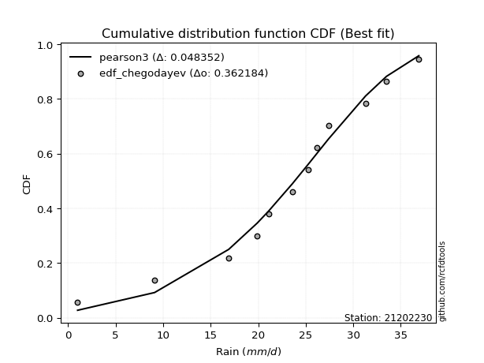</img></img>

</div>


### 6. EDF Blom (1958)

The Blom formula is a specific "plotting position" formula used in hydrology and statistical analysis to estimate the empirical cumulative probability (or non-exceedance probability) of a data series. It is particularly recommended for data that are approximately normally distributed. The constant _a_ is set to 0.375 (or 3/8).

<div align="center">


$P=(m-a)/(n+1-2a)$


</div>


**6.1. Empirical values**

<div align="center">

|                | 0                   | 1                   | 2                   | 3                   | 4                  | 5        | 6                  | 7                  | 8                  | 9                  | 10                 |
|:---------------|:--------------------|:--------------------|:--------------------|:--------------------|:-------------------|:---------|:-------------------|:-------------------|:-------------------|:-------------------|:-------------------|
| date           | 2023                | 2015                | 2012                | 2016                | 2014               | 2024     | 2009               | 2011               | 2013               | 2008               | 2010               |
| x              | 1.0                 | 9.1                 | 16.9                | 19.9                | 21.1               | 23.6     | 25.3               | 27.4               | 31.3               | 33.5               | 36.9               |
| m              | 1                   | 2                   | 3                   | 4                   | 5                  | 6        | 7                  | 8                  | 9                  | 10                 | 11                 |
| empirical_dist | edf_blom            | edf_blom            | edf_blom            | edf_blom            | edf_blom           | edf_blom | edf_blom           | edf_blom           | edf_blom           | edf_blom           | edf_blom           |
| empirical      | 0.05555555555555555 | 0.14444444444444443 | 0.23333333333333334 | 0.32222222222222224 | 0.4111111111111111 | 0.5      | 0.5888888888888889 | 0.6777777777777778 | 0.7666666666666667 | 0.8555555555555555 | 0.9444444444444444 |
| empirical_tr   | 1.0588235294117647  | 1.1688311688311688  | 1.3043478260869565  | 1.4754098360655736  | 1.6981132075471697 | 2.0      | 2.4324324324324325 | 3.1034482758620694 | 4.2857142857142865 | 6.923076923076921  | 17.999999999999993 |

</div>


**6.2. Kolmogorov-Smirnov fit test (sorted by Δ)**


<div align="center">

|                | 0                   | 1                    | 2                   | 3                   | 4                   | 5                   | 6                   | 7                   | 8                   | 9                   | 10                  | 11                  | 12                  | 13                  | 14                  | 15                  | 16                  | 17                  | 18                  | 19                  | 20                  | 21                  | 22                  | 23                  | 24                  | 25                  | 26                    | 27                  | 28                  | 29                  | 30                  | 31                  | 32                  | 33                  | 34                  | 35                  | 36                  | 37                  | 38                  | 39                  | 40                  | 41                  | 42                  | 43                  | 44                  | 45                  | 46                  | 47                  | 48                  | 49                  | 50                  | 51                  | 52                  | 53                  | 54                  | 55                  | 56                  | 57                  | 58                  | 59                  | 60                  | 61                  | 62                  | 63                  | 64                  | 65                  | 66                  | 67                  | 68                  | 69                  | 70                  | 71                  | 72                  | 73                  | 74                  | 75                  | 76                  | 77                  | 78                  | 79                  | 80                  | 81                  | 82                  | 83                  | 84                  | 85                  | 86                  | 87                  |
|:---------------|:--------------------|:---------------------|:--------------------|:--------------------|:--------------------|:--------------------|:--------------------|:--------------------|:--------------------|:--------------------|:--------------------|:--------------------|:--------------------|:--------------------|:--------------------|:--------------------|:--------------------|:--------------------|:--------------------|:--------------------|:--------------------|:--------------------|:--------------------|:--------------------|:--------------------|:--------------------|:----------------------|:--------------------|:--------------------|:--------------------|:--------------------|:--------------------|:--------------------|:--------------------|:--------------------|:--------------------|:--------------------|:--------------------|:--------------------|:--------------------|:--------------------|:--------------------|:--------------------|:--------------------|:--------------------|:--------------------|:--------------------|:--------------------|:--------------------|:--------------------|:--------------------|:--------------------|:--------------------|:--------------------|:--------------------|:--------------------|:--------------------|:--------------------|:--------------------|:--------------------|:--------------------|:--------------------|:--------------------|:--------------------|:--------------------|:--------------------|:--------------------|:--------------------|:--------------------|:--------------------|:--------------------|:--------------------|:--------------------|:--------------------|:--------------------|:--------------------|:--------------------|:--------------------|:--------------------|:--------------------|:--------------------|:--------------------|:--------------------|:--------------------|:--------------------|:--------------------|:--------------------|:--------------------|
| station        | 21202230            | 21202230             | 21202230            | 21202230            | 21202230            | 21202230            | 21202230            | 21202230            | 21202230            | 21202230            | 21202230            | 21202230            | 21202230            | 21202230            | 21202230            | 21202230            | 21202230            | 21202230            | 21202230            | 21202230            | 21202230            | 21202230            | 21202230            | 21202230            | 21202230            | 21202230            | 21202230              | 21202230            | 21202230            | 21202230            | 21202230            | 21202230            | 21202230            | 21202230            | 21202230            | 21202230            | 21202230            | 21202230            | 21202230            | 21202230            | 21202230            | 21202230            | 21202230            | 21202230            | 21202230            | 21202230            | 21202230            | 21202230            | 21202230            | 21202230            | 21202230            | 21202230            | 21202230            | 21202230            | 21202230            | 21202230            | 21202230            | 21202230            | 21202230            | 21202230            | 21202230            | 21202230            | 21202230            | 21202230            | 21202230            | 21202230            | 21202230            | 21202230            | 21202230            | 21202230            | 21202230            | 21202230            | 21202230            | 21202230            | 21202230            | 21202230            | 21202230            | 21202230            | 21202230            | 21202230            | 21202230            | 21202230            | 21202230            | 21202230            | 21202230            | 21202230            | 21202230            | 21202230            |
| empirical_dist | edf_blom            | edf_blom             | edf_blom            | edf_blom            | edf_blom            | edf_blom            | edf_blom            | edf_blom            | edf_blom            | edf_blom            | edf_blom            | edf_blom            | edf_blom            | edf_blom            | edf_blom            | edf_blom            | edf_blom            | edf_blom            | edf_blom            | edf_blom            | edf_blom            | edf_blom            | edf_blom            | edf_blom            | edf_blom            | edf_blom            | edf_blom              | edf_blom            | edf_blom            | edf_blom            | edf_blom            | edf_blom            | edf_blom            | edf_blom            | edf_blom            | edf_blom            | edf_blom            | edf_blom            | edf_blom            | edf_blom            | edf_blom            | edf_blom            | edf_blom            | edf_blom            | edf_blom            | edf_blom            | edf_blom            | edf_blom            | edf_blom            | edf_blom            | edf_blom            | edf_blom            | edf_blom            | edf_blom            | edf_blom            | edf_blom            | edf_blom            | edf_blom            | edf_blom            | edf_blom            | edf_blom            | edf_blom            | edf_blom            | edf_blom            | edf_blom            | edf_blom            | edf_blom            | edf_blom            | edf_blom            | edf_blom            | edf_blom            | edf_blom            | edf_blom            | edf_blom            | edf_blom            | edf_blom            | edf_blom            | edf_blom            | edf_blom            | edf_blom            | edf_blom            | edf_blom            | edf_blom            | edf_blom            | edf_blom            | edf_blom            | edf_blom            | edf_blom            |
| p_dist         | johnsonsu           | pearson3             | weibull_min         | genlogistic         | gumbel_l            | fisk                | logistic            | logjohnsonsu        | hypsecant           | exponnorm           | crystalball         | norm                | t                   | nct                 | laplace_asymmetric  | f                   | nakagami            | mielke              | gamma               | betaprime           | laplace             | erlang              | logt                | invgamma            | maxwell             | logpearson3         | loglaplace_asymmetric | logloggamma         | invgauss            | rayleigh            | rice                | invweibull          | gumbel_r            | logweibull_min      | ncf                 | logfisk             | loggompertz         | halfnorm            | moyal               | alpha               | kstwobign           | halflogistic        | loggumbel_l         | truncnorm           | wald                | gibrat              | logbetaprime        | loghypsecant        | loglogistic         | logrice             | logexponnorm        | lognorm             | lognorm             | logcrystalball      | logfatiguelife      | lognct              | loginvgauss         | loggamma            | loggamma            | loglaplace          | logalpha            | logerlang           | loginvgamma         | loginvweibull       | logmaxwell          | genexpon            | expon               | lograyleigh         | logkstwobign        | loggumbel_r         | loghalfnorm         | lognakagami         | gompertz            | logmoyal            | loghalflogistic     | logncf              | loggenexpon         | logchi2             | logexpon            | logwald             | loggibrat           | logf                | logmielke           | loglognorm          | fatiguelife         | logtruncnorm        | chi2                | loggenlogistic      |
| delta          | 0.04308355389734364 | 0.044644327192654876 | 0.04803551226597946 | 0.05244199930728943 | 0.05917780224569902 | 0.06486112575063363 | 0.06886637100528381 | 0.06976951919858199 | 0.07804751310082758 | 0.08135642553647837 | 0.08135653734052589 | 0.08135654697387845 | 0.08137013235034879 | 0.08139947460043406 | 0.08232682707065464 | 0.08237402450644749 | 0.0825305462697003  | 0.08495903842572128 | 0.08671832779213612 | 0.08887179192209266 | 0.09038904021328842 | 0.09539358287393107 | 0.10541721114535185 | 0.11294917122933212 | 0.11545125528309502 | 0.1207151889078214  | 0.12341174801197052   | 0.12554096179014085 | 0.1266271005652876  | 0.12773567069487252 | 0.1292022469551184  | 0.14098942806579567 | 0.1417842856710051  | 0.15293642032230964 | 0.15390541458279355 | 0.15501595433260928 | 0.15546202359049371 | 0.1625647694544345  | 0.1649276024216078  | 0.16585234358333117 | 0.1732182793689579  | 0.17859511158779756 | 0.18709717534733666 | 0.20256761380745092 | 0.2276592602223086  | 0.24180333335382986 | 0.252914678856283   | 0.2554053831777892  | 0.2564531020854537  | 0.2576758071752186  | 0.25767800695770127 | 0.25768034755863134 | 0.25768034755863134 | 0.2576804360193274  | 0.25883558083676866 | 0.25899646160417406 | 0.2683178126073144  | 0.27059139872605337 | 0.27059139872605337 | 0.27072058329998144 | 0.2738984249383543  | 0.27684209174814006 | 0.27833592808180013 | 0.28143077291099877 | 0.2910680467131502  | 0.2915766591411862  | 0.29157870951971415 | 0.3022687674628252  | 0.325006600946336   | 0.3277319669532846  | 0.33380487423174415 | 0.34452249041099575 | 0.35170405605720434 | 0.353614725375145   | 0.35816401857642216 | 0.3599580428488193  | 0.362162503460917   | 0.36605318013424454 | 0.3959463376705357  | 0.42562402761044277 | 0.44750322665206116 | 0.4623417233370652  | 0.46332530363113716 | 0.47903568180965045 | 0.588726403228693   | 0.603792609251045   | 0.7306829585868275  | 0.8555555555555555  |
| deltao         | 0.37613735880099997 | 0.37613735880099997  | 0.37613735880099997 | 0.37613735880099997 | 0.37613735880099997 | 0.37613735880099997 | 0.37613735880099997 | 0.37613735880099997 | 0.37613735880099997 | 0.37613735880099997 | 0.37613735880099997 | 0.37613735880099997 | 0.37613735880099997 | 0.37613735880099997 | 0.37613735880099997 | 0.37613735880099997 | 0.37613735880099997 | 0.37613735880099997 | 0.37613735880099997 | 0.37613735880099997 | 0.37613735880099997 | 0.37613735880099997 | 0.37613735880099997 | 0.37613735880099997 | 0.37613735880099997 | 0.37613735880099997 | 0.37613735880099997   | 0.37613735880099997 | 0.37613735880099997 | 0.37613735880099997 | 0.37613735880099997 | 0.37613735880099997 | 0.37613735880099997 | 0.37613735880099997 | 0.37613735880099997 | 0.37613735880099997 | 0.37613735880099997 | 0.37613735880099997 | 0.37613735880099997 | 0.37613735880099997 | 0.37613735880099997 | 0.37613735880099997 | 0.37613735880099997 | 0.37613735880099997 | 0.37613735880099997 | 0.37613735880099997 | 0.37613735880099997 | 0.37613735880099997 | 0.37613735880099997 | 0.37613735880099997 | 0.37613735880099997 | 0.37613735880099997 | 0.37613735880099997 | 0.37613735880099997 | 0.37613735880099997 | 0.37613735880099997 | 0.37613735880099997 | 0.37613735880099997 | 0.37613735880099997 | 0.37613735880099997 | 0.37613735880099997 | 0.37613735880099997 | 0.37613735880099997 | 0.37613735880099997 | 0.37613735880099997 | 0.37613735880099997 | 0.37613735880099997 | 0.37613735880099997 | 0.37613735880099997 | 0.37613735880099997 | 0.37613735880099997 | 0.37613735880099997 | 0.37613735880099997 | 0.37613735880099997 | 0.37613735880099997 | 0.37613735880099997 | 0.37613735880099997 | 0.37613735880099997 | 0.37613735880099997 | 0.37613735880099997 | 0.37613735880099997 | 0.37613735880099997 | 0.37613735880099997 | 0.37613735880099997 | 0.37613735880099997 | 0.37613735880099997 | 0.37613735880099997 | 0.37613735880099997 |
| eval           | Δo > Δ              | Δo > Δ               | Δo > Δ              | Δo > Δ              | Δo > Δ              | Δo > Δ              | Δo > Δ              | Δo > Δ              | Δo > Δ              | Δo > Δ              | Δo > Δ              | Δo > Δ              | Δo > Δ              | Δo > Δ              | Δo > Δ              | Δo > Δ              | Δo > Δ              | Δo > Δ              | Δo > Δ              | Δo > Δ              | Δo > Δ              | Δo > Δ              | Δo > Δ              | Δo > Δ              | Δo > Δ              | Δo > Δ              | Δo > Δ                | Δo > Δ              | Δo > Δ              | Δo > Δ              | Δo > Δ              | Δo > Δ              | Δo > Δ              | Δo > Δ              | Δo > Δ              | Δo > Δ              | Δo > Δ              | Δo > Δ              | Δo > Δ              | Δo > Δ              | Δo > Δ              | Δo > Δ              | Δo > Δ              | Δo > Δ              | Δo > Δ              | Δo > Δ              | Δo > Δ              | Δo > Δ              | Δo > Δ              | Δo > Δ              | Δo > Δ              | Δo > Δ              | Δo > Δ              | Δo > Δ              | Δo > Δ              | Δo > Δ              | Δo > Δ              | Δo > Δ              | Δo > Δ              | Δo > Δ              | Δo > Δ              | Δo > Δ              | Δo > Δ              | Δo > Δ              | Δo > Δ              | Δo > Δ              | Δo > Δ              | Δo > Δ              | Δo > Δ              | Δo > Δ              | Δo > Δ              | Δo > Δ              | Δo > Δ              | Δo > Δ              | Δo > Δ              | Δo > Δ              | Δo > Δ              | Δo > Δ              | Δo <= Δ             | Δo <= Δ             | Δo <= Δ             | Δo <= Δ             | Δo <= Δ             | Δo <= Δ             | Δo <= Δ             | Δo <= Δ             | Δo <= Δ             | Δo <= Δ             |
| fit            | 1                   | 1                    | 1                   | 1                   | 1                   | 1                   | 1                   | 1                   | 1                   | 1                   | 1                   | 1                   | 1                   | 1                   | 1                   | 1                   | 1                   | 1                   | 1                   | 1                   | 1                   | 1                   | 1                   | 1                   | 1                   | 1                   | 1                     | 1                   | 1                   | 1                   | 1                   | 1                   | 1                   | 1                   | 1                   | 1                   | 1                   | 1                   | 1                   | 1                   | 1                   | 1                   | 1                   | 1                   | 1                   | 1                   | 1                   | 1                   | 1                   | 1                   | 1                   | 1                   | 1                   | 1                   | 1                   | 1                   | 1                   | 1                   | 1                   | 1                   | 1                   | 1                   | 1                   | 1                   | 1                   | 1                   | 1                   | 1                   | 1                   | 1                   | 1                   | 1                   | 1                   | 1                   | 1                   | 1                   | 1                   | 1                   | 0                   | 0                   | 0                   | 0                   | 0                   | 0                   | 0                   | 0                   | 0                   | 0                   |
| n              | 11                  | 11                   | 11                  | 11                  | 11                  | 11                  | 11                  | 11                  | 11                  | 11                  | 11                  | 11                  | 11                  | 11                  | 11                  | 11                  | 11                  | 11                  | 11                  | 11                  | 11                  | 11                  | 11                  | 11                  | 11                  | 11                  | 11                    | 11                  | 11                  | 11                  | 11                  | 11                  | 11                  | 11                  | 11                  | 11                  | 11                  | 11                  | 11                  | 11                  | 11                  | 11                  | 11                  | 11                  | 11                  | 11                  | 11                  | 11                  | 11                  | 11                  | 11                  | 11                  | 11                  | 11                  | 11                  | 11                  | 11                  | 11                  | 11                  | 11                  | 11                  | 11                  | 11                  | 11                  | 11                  | 11                  | 11                  | 11                  | 11                  | 11                  | 11                  | 11                  | 11                  | 11                  | 11                  | 11                  | 11                  | 11                  | 11                  | 11                  | 11                  | 11                  | 11                  | 11                  | 11                  | 11                  | 11                  | 11                  |
| best_fit       | 1                   | 0                    | 0                   | 0                   | 0                   | 0                   | 0                   | 0                   | 0                   | 0                   | 0                   | 0                   | 0                   | 0                   | 0                   | 0                   | 0                   | 0                   | 0                   | 0                   | 0                   | 0                   | 0                   | 0                   | 0                   | 0                   | 0                     | 0                   | 0                   | 0                   | 0                   | 0                   | 0                   | 0                   | 0                   | 0                   | 0                   | 0                   | 0                   | 0                   | 0                   | 0                   | 0                   | 0                   | 0                   | 0                   | 0                   | 0                   | 0                   | 0                   | 0                   | 0                   | 0                   | 0                   | 0                   | 0                   | 0                   | 0                   | 0                   | 0                   | 0                   | 0                   | 0                   | 0                   | 0                   | 0                   | 0                   | 0                   | 0                   | 0                   | 0                   | 0                   | 0                   | 0                   | 0                   | 0                   | 0                   | 0                   | 0                   | 0                   | 0                   | 0                   | 0                   | 0                   | 0                   | 0                   | 0                   | 0                   |
| best_fit_sort  | 1                   | 2                    | 3                   | 4                   | 5                   | 6                   | 7                   | 8                   | 9                   | 10                  | 11                  | 12                  | 13                  | 14                  | 15                  | 16                  | 17                  | 18                  | 19                  | 20                  | 21                  | 22                  | 23                  | 24                  | 25                  | 26                  | 27                    | 28                  | 29                  | 30                  | 31                  | 32                  | 33                  | 34                  | 35                  | 36                  | 37                  | 38                  | 39                  | 40                  | 41                  | 42                  | 43                  | 44                  | 45                  | 46                  | 47                  | 48                  | 49                  | 50                  | 51                  | 52                  | 53                  | 54                  | 55                  | 56                  | 57                  | 58                  | 59                  | 60                  | 61                  | 62                  | 63                  | 64                  | 65                  | 66                  | 67                  | 68                  | 69                  | 70                  | 71                  | 72                  | 73                  | 74                  | 75                  | 76                  | 77                  | 78                  | 79                  | 80                  | 81                  | 82                  | 83                  | 84                  | 85                  | 86                  | 87                  | 88                  |

</div>


**6.3. Best fit**

<div align="center">

|   id |   station | empirical_dist   | p_dist    |     delta |   deltao | eval   |   fit |   n |   best_fit |   best_fit_sort |
|-----:|----------:|:-----------------|:----------|----------:|---------:|:-------|------:|----:|-----------:|----------------:|
|    0 |  21202230 | edf_blom         | johnsonsu | 0.0430836 | 0.376137 | Δo > Δ |     1 |  11 |          1 |               1 |

</div>


<div align="center">

</img></img>

</div>


### 7. EDF Tukey (1962)

In hydrology, the Tukey formula is used as a plotting position formula to estimate the empirical probability or frequency of a flood event (or other hydrological data). The formula parameter is given as _c=0.333_ (or 1/3).

<div align="center">


$P=(m-c)/(n+1-2c)$


</div>


**7.1. Empirical values**

<div align="center">

|                | 0                    | 1                   | 2                   | 3                  | 4                  | 5         | 6                  | 7                  | 8                  | 9                  | 10                 |
|:---------------|:---------------------|:--------------------|:--------------------|:-------------------|:-------------------|:----------|:-------------------|:-------------------|:-------------------|:-------------------|:-------------------|
| date           | 2023                 | 2015                | 2012                | 2016               | 2014               | 2024      | 2009               | 2011               | 2013               | 2008               | 2010               |
| x              | 1.0                  | 9.1                 | 16.9                | 19.9               | 21.1               | 23.6      | 25.3               | 27.4               | 31.3               | 33.5               | 36.9               |
| m              | 1                    | 2                   | 3                   | 4                  | 5                  | 6         | 7                  | 8                  | 9                  | 10                 | 11                 |
| empirical_dist | edf_tukey            | edf_tukey           | edf_tukey           | edf_tukey          | edf_tukey          | edf_tukey | edf_tukey          | edf_tukey          | edf_tukey          | edf_tukey          | edf_tukey          |
| empirical      | 0.058823529411764705 | 0.14705882352941177 | 0.23529411764705882 | 0.3235294117647059 | 0.4117647058823529 | 0.5       | 0.5882352941176471 | 0.6764705882352942 | 0.7647058823529411 | 0.8529411764705882 | 0.9411764705882353 |
| empirical_tr   | 1.0625               | 1.1724137931034484  | 1.3076923076923077  | 1.4782608695652173 | 1.7                | 2.0       | 2.428571428571429  | 3.0909090909090913 | 4.249999999999999  | 6.799999999999999  | 16.999999999999996 |

</div>


**7.2. Kolmogorov-Smirnov fit test (sorted by Δ)**


<div align="center">

|                | 0                   | 1                    | 2                   | 3                   | 4                   | 5                   | 6                   | 7                   | 8                   | 9                   | 10                  | 11                  | 12                  | 13                  | 14                  | 15                  | 16                  | 17                  | 18                  | 19                  | 20                  | 21                  | 22                  | 23                  | 24                  | 25                  | 26                    | 27                  | 28                  | 29                  | 30                  | 31                  | 32                  | 33                  | 34                  | 35                  | 36                  | 37                  | 38                  | 39                  | 40                  | 41                  | 42                  | 43                  | 44                  | 45                  | 46                  | 47                  | 48                  | 49                  | 50                  | 51                  | 52                  | 53                  | 54                  | 55                  | 56                  | 57                  | 58                  | 59                  | 60                  | 61                  | 62                  | 63                  | 64                  | 65                  | 66                  | 67                  | 68                  | 69                  | 70                  | 71                  | 72                  | 73                  | 74                  | 75                  | 76                  | 77                  | 78                  | 79                  | 80                  | 81                  | 82                  | 83                  | 84                  | 85                  | 86                  | 87                  |
|:---------------|:--------------------|:---------------------|:--------------------|:--------------------|:--------------------|:--------------------|:--------------------|:--------------------|:--------------------|:--------------------|:--------------------|:--------------------|:--------------------|:--------------------|:--------------------|:--------------------|:--------------------|:--------------------|:--------------------|:--------------------|:--------------------|:--------------------|:--------------------|:--------------------|:--------------------|:--------------------|:----------------------|:--------------------|:--------------------|:--------------------|:--------------------|:--------------------|:--------------------|:--------------------|:--------------------|:--------------------|:--------------------|:--------------------|:--------------------|:--------------------|:--------------------|:--------------------|:--------------------|:--------------------|:--------------------|:--------------------|:--------------------|:--------------------|:--------------------|:--------------------|:--------------------|:--------------------|:--------------------|:--------------------|:--------------------|:--------------------|:--------------------|:--------------------|:--------------------|:--------------------|:--------------------|:--------------------|:--------------------|:--------------------|:--------------------|:--------------------|:--------------------|:--------------------|:--------------------|:--------------------|:--------------------|:--------------------|:--------------------|:--------------------|:--------------------|:--------------------|:--------------------|:--------------------|:--------------------|:--------------------|:--------------------|:--------------------|:--------------------|:--------------------|:--------------------|:--------------------|:--------------------|:--------------------|
| station        | 21202230            | 21202230             | 21202230            | 21202230            | 21202230            | 21202230            | 21202230            | 21202230            | 21202230            | 21202230            | 21202230            | 21202230            | 21202230            | 21202230            | 21202230            | 21202230            | 21202230            | 21202230            | 21202230            | 21202230            | 21202230            | 21202230            | 21202230            | 21202230            | 21202230            | 21202230            | 21202230              | 21202230            | 21202230            | 21202230            | 21202230            | 21202230            | 21202230            | 21202230            | 21202230            | 21202230            | 21202230            | 21202230            | 21202230            | 21202230            | 21202230            | 21202230            | 21202230            | 21202230            | 21202230            | 21202230            | 21202230            | 21202230            | 21202230            | 21202230            | 21202230            | 21202230            | 21202230            | 21202230            | 21202230            | 21202230            | 21202230            | 21202230            | 21202230            | 21202230            | 21202230            | 21202230            | 21202230            | 21202230            | 21202230            | 21202230            | 21202230            | 21202230            | 21202230            | 21202230            | 21202230            | 21202230            | 21202230            | 21202230            | 21202230            | 21202230            | 21202230            | 21202230            | 21202230            | 21202230            | 21202230            | 21202230            | 21202230            | 21202230            | 21202230            | 21202230            | 21202230            | 21202230            |
| empirical_dist | edf_tukey           | edf_tukey            | edf_tukey           | edf_tukey           | edf_tukey           | edf_tukey           | edf_tukey           | edf_tukey           | edf_tukey           | edf_tukey           | edf_tukey           | edf_tukey           | edf_tukey           | edf_tukey           | edf_tukey           | edf_tukey           | edf_tukey           | edf_tukey           | edf_tukey           | edf_tukey           | edf_tukey           | edf_tukey           | edf_tukey           | edf_tukey           | edf_tukey           | edf_tukey           | edf_tukey             | edf_tukey           | edf_tukey           | edf_tukey           | edf_tukey           | edf_tukey           | edf_tukey           | edf_tukey           | edf_tukey           | edf_tukey           | edf_tukey           | edf_tukey           | edf_tukey           | edf_tukey           | edf_tukey           | edf_tukey           | edf_tukey           | edf_tukey           | edf_tukey           | edf_tukey           | edf_tukey           | edf_tukey           | edf_tukey           | edf_tukey           | edf_tukey           | edf_tukey           | edf_tukey           | edf_tukey           | edf_tukey           | edf_tukey           | edf_tukey           | edf_tukey           | edf_tukey           | edf_tukey           | edf_tukey           | edf_tukey           | edf_tukey           | edf_tukey           | edf_tukey           | edf_tukey           | edf_tukey           | edf_tukey           | edf_tukey           | edf_tukey           | edf_tukey           | edf_tukey           | edf_tukey           | edf_tukey           | edf_tukey           | edf_tukey           | edf_tukey           | edf_tukey           | edf_tukey           | edf_tukey           | edf_tukey           | edf_tukey           | edf_tukey           | edf_tukey           | edf_tukey           | edf_tukey           | edf_tukey           | edf_tukey           |
| p_dist         | pearson3            | johnsonsu            | weibull_min         | genlogistic         | gumbel_l            | fisk                | logistic            | logjohnsonsu        | hypsecant           | exponnorm           | crystalball         | norm                | t                   | nct                 | f                   | nakagami            | mielke              | laplace_asymmetric  | gamma               | betaprime           | laplace             | erlang              | logt                | invgamma            | maxwell             | logpearson3         | loglaplace_asymmetric | logloggamma         | invgauss            | rayleigh            | rice                | invweibull          | gumbel_r            | logweibull_min      | logfisk             | ncf                 | loggompertz         | halfnorm            | moyal               | alpha               | kstwobign           | halflogistic        | loggumbel_l         | truncnorm           | wald                | gibrat              | logbetaprime        | loghypsecant        | loglogistic         | logrice             | logexponnorm        | lognorm             | lognorm             | logcrystalball      | logfatiguelife      | lognct              | loginvgauss         | loggamma            | loggamma            | loglaplace          | logalpha            | logerlang           | loginvgamma         | loginvweibull       | logmaxwell          | genexpon            | expon               | lograyleigh         | logkstwobign        | loggumbel_r         | loghalfnorm         | lognakagami         | gompertz            | logmoyal            | loghalflogistic     | logncf              | loggenexpon         | logchi2             | logexpon            | logwald             | loggibrat           | logf                | logmielke           | loglognorm          | fatiguelife         | logtruncnorm        | chi2                | loggenlogistic      |
| delta          | 0.04494060564985709 | 0.045044338211069235 | 0.04999629657970506 | 0.05440278362101503 | 0.06113858655942461 | 0.06747550483560097 | 0.06814228118267907 | 0.06846232965609833 | 0.08000829741455318 | 0.08004923599399472 | 0.08004934779804224 | 0.0800493574313948  | 0.08006294280786513 | 0.08009228505795041 | 0.08106683496396383 | 0.08122335672721664 | 0.0829982541119958  | 0.08428761138438023 | 0.08541113824965246 | 0.087564602379609   | 0.09234982452701401 | 0.09408639333144742 | 0.10214923728914271 | 0.11164198168684847 | 0.11414406574061137 | 0.11810080982285409 | 0.12145096369824504   | 0.12358017747641536 | 0.12531991102280393 | 0.12642848115238886 | 0.12789505741263474 | 0.13968223852331202 | 0.14047709612852144 | 0.15162923077982599 | 0.15174798047640015 | 0.1525982250403099  | 0.15415483404801006 | 0.16125757991195083 | 0.16362041287912416 | 0.16454515404084752 | 0.17191108982647424 | 0.1772879220453139  | 0.18513639103361118 | 0.20060682949372544 | 0.22635207067982493 | 0.24180333335382986 | 0.2509538945425575  | 0.25344459886406373 | 0.2544923177717282  | 0.2557150228614931  | 0.2557172226439758  | 0.25571956324490586 | 0.25571956324490586 | 0.2557196517056019  | 0.2568747965230432  | 0.25703567729044857 | 0.2663570282935889  | 0.2686306144123279  | 0.2686306144123279  | 0.2694133937574978  | 0.27193764062462883 | 0.2748813074344146  | 0.27637514376807465 | 0.2794699885972733  | 0.2891072623994247  | 0.2896158748274607  | 0.28961792520598867 | 0.30030798314909973 | 0.3230458166326105  | 0.3257711826395591  | 0.33184408991801867 | 0.3419081113260284  | 0.3510504612859625  | 0.3516539410614195  | 0.3562032342626967  | 0.35734366376385196 | 0.3602017191471915  | 0.36343880104927717 | 0.39398555335681024 | 0.4236632432967173  | 0.4455424423383357  | 0.4597273442520978  | 0.4607109245461698  | 0.4764213027246831  | 0.5861120241437255  | 0.6018318249373196  | 0.728722174273102   | 0.8529411764705882  |
| deltao         | 0.37613735880099997 | 0.37613735880099997  | 0.37613735880099997 | 0.37613735880099997 | 0.37613735880099997 | 0.37613735880099997 | 0.37613735880099997 | 0.37613735880099997 | 0.37613735880099997 | 0.37613735880099997 | 0.37613735880099997 | 0.37613735880099997 | 0.37613735880099997 | 0.37613735880099997 | 0.37613735880099997 | 0.37613735880099997 | 0.37613735880099997 | 0.37613735880099997 | 0.37613735880099997 | 0.37613735880099997 | 0.37613735880099997 | 0.37613735880099997 | 0.37613735880099997 | 0.37613735880099997 | 0.37613735880099997 | 0.37613735880099997 | 0.37613735880099997   | 0.37613735880099997 | 0.37613735880099997 | 0.37613735880099997 | 0.37613735880099997 | 0.37613735880099997 | 0.37613735880099997 | 0.37613735880099997 | 0.37613735880099997 | 0.37613735880099997 | 0.37613735880099997 | 0.37613735880099997 | 0.37613735880099997 | 0.37613735880099997 | 0.37613735880099997 | 0.37613735880099997 | 0.37613735880099997 | 0.37613735880099997 | 0.37613735880099997 | 0.37613735880099997 | 0.37613735880099997 | 0.37613735880099997 | 0.37613735880099997 | 0.37613735880099997 | 0.37613735880099997 | 0.37613735880099997 | 0.37613735880099997 | 0.37613735880099997 | 0.37613735880099997 | 0.37613735880099997 | 0.37613735880099997 | 0.37613735880099997 | 0.37613735880099997 | 0.37613735880099997 | 0.37613735880099997 | 0.37613735880099997 | 0.37613735880099997 | 0.37613735880099997 | 0.37613735880099997 | 0.37613735880099997 | 0.37613735880099997 | 0.37613735880099997 | 0.37613735880099997 | 0.37613735880099997 | 0.37613735880099997 | 0.37613735880099997 | 0.37613735880099997 | 0.37613735880099997 | 0.37613735880099997 | 0.37613735880099997 | 0.37613735880099997 | 0.37613735880099997 | 0.37613735880099997 | 0.37613735880099997 | 0.37613735880099997 | 0.37613735880099997 | 0.37613735880099997 | 0.37613735880099997 | 0.37613735880099997 | 0.37613735880099997 | 0.37613735880099997 | 0.37613735880099997 |
| eval           | Δo > Δ              | Δo > Δ               | Δo > Δ              | Δo > Δ              | Δo > Δ              | Δo > Δ              | Δo > Δ              | Δo > Δ              | Δo > Δ              | Δo > Δ              | Δo > Δ              | Δo > Δ              | Δo > Δ              | Δo > Δ              | Δo > Δ              | Δo > Δ              | Δo > Δ              | Δo > Δ              | Δo > Δ              | Δo > Δ              | Δo > Δ              | Δo > Δ              | Δo > Δ              | Δo > Δ              | Δo > Δ              | Δo > Δ              | Δo > Δ                | Δo > Δ              | Δo > Δ              | Δo > Δ              | Δo > Δ              | Δo > Δ              | Δo > Δ              | Δo > Δ              | Δo > Δ              | Δo > Δ              | Δo > Δ              | Δo > Δ              | Δo > Δ              | Δo > Δ              | Δo > Δ              | Δo > Δ              | Δo > Δ              | Δo > Δ              | Δo > Δ              | Δo > Δ              | Δo > Δ              | Δo > Δ              | Δo > Δ              | Δo > Δ              | Δo > Δ              | Δo > Δ              | Δo > Δ              | Δo > Δ              | Δo > Δ              | Δo > Δ              | Δo > Δ              | Δo > Δ              | Δo > Δ              | Δo > Δ              | Δo > Δ              | Δo > Δ              | Δo > Δ              | Δo > Δ              | Δo > Δ              | Δo > Δ              | Δo > Δ              | Δo > Δ              | Δo > Δ              | Δo > Δ              | Δo > Δ              | Δo > Δ              | Δo > Δ              | Δo > Δ              | Δo > Δ              | Δo > Δ              | Δo > Δ              | Δo > Δ              | Δo <= Δ             | Δo <= Δ             | Δo <= Δ             | Δo <= Δ             | Δo <= Δ             | Δo <= Δ             | Δo <= Δ             | Δo <= Δ             | Δo <= Δ             | Δo <= Δ             |
| fit            | 1                   | 1                    | 1                   | 1                   | 1                   | 1                   | 1                   | 1                   | 1                   | 1                   | 1                   | 1                   | 1                   | 1                   | 1                   | 1                   | 1                   | 1                   | 1                   | 1                   | 1                   | 1                   | 1                   | 1                   | 1                   | 1                   | 1                     | 1                   | 1                   | 1                   | 1                   | 1                   | 1                   | 1                   | 1                   | 1                   | 1                   | 1                   | 1                   | 1                   | 1                   | 1                   | 1                   | 1                   | 1                   | 1                   | 1                   | 1                   | 1                   | 1                   | 1                   | 1                   | 1                   | 1                   | 1                   | 1                   | 1                   | 1                   | 1                   | 1                   | 1                   | 1                   | 1                   | 1                   | 1                   | 1                   | 1                   | 1                   | 1                   | 1                   | 1                   | 1                   | 1                   | 1                   | 1                   | 1                   | 1                   | 1                   | 0                   | 0                   | 0                   | 0                   | 0                   | 0                   | 0                   | 0                   | 0                   | 0                   |
| n              | 11                  | 11                   | 11                  | 11                  | 11                  | 11                  | 11                  | 11                  | 11                  | 11                  | 11                  | 11                  | 11                  | 11                  | 11                  | 11                  | 11                  | 11                  | 11                  | 11                  | 11                  | 11                  | 11                  | 11                  | 11                  | 11                  | 11                    | 11                  | 11                  | 11                  | 11                  | 11                  | 11                  | 11                  | 11                  | 11                  | 11                  | 11                  | 11                  | 11                  | 11                  | 11                  | 11                  | 11                  | 11                  | 11                  | 11                  | 11                  | 11                  | 11                  | 11                  | 11                  | 11                  | 11                  | 11                  | 11                  | 11                  | 11                  | 11                  | 11                  | 11                  | 11                  | 11                  | 11                  | 11                  | 11                  | 11                  | 11                  | 11                  | 11                  | 11                  | 11                  | 11                  | 11                  | 11                  | 11                  | 11                  | 11                  | 11                  | 11                  | 11                  | 11                  | 11                  | 11                  | 11                  | 11                  | 11                  | 11                  |
| best_fit       | 1                   | 0                    | 0                   | 0                   | 0                   | 0                   | 0                   | 0                   | 0                   | 0                   | 0                   | 0                   | 0                   | 0                   | 0                   | 0                   | 0                   | 0                   | 0                   | 0                   | 0                   | 0                   | 0                   | 0                   | 0                   | 0                   | 0                     | 0                   | 0                   | 0                   | 0                   | 0                   | 0                   | 0                   | 0                   | 0                   | 0                   | 0                   | 0                   | 0                   | 0                   | 0                   | 0                   | 0                   | 0                   | 0                   | 0                   | 0                   | 0                   | 0                   | 0                   | 0                   | 0                   | 0                   | 0                   | 0                   | 0                   | 0                   | 0                   | 0                   | 0                   | 0                   | 0                   | 0                   | 0                   | 0                   | 0                   | 0                   | 0                   | 0                   | 0                   | 0                   | 0                   | 0                   | 0                   | 0                   | 0                   | 0                   | 0                   | 0                   | 0                   | 0                   | 0                   | 0                   | 0                   | 0                   | 0                   | 0                   |
| best_fit_sort  | 1                   | 2                    | 3                   | 4                   | 5                   | 6                   | 7                   | 8                   | 9                   | 10                  | 11                  | 12                  | 13                  | 14                  | 15                  | 16                  | 17                  | 18                  | 19                  | 20                  | 21                  | 22                  | 23                  | 24                  | 25                  | 26                  | 27                    | 28                  | 29                  | 30                  | 31                  | 32                  | 33                  | 34                  | 35                  | 36                  | 37                  | 38                  | 39                  | 40                  | 41                  | 42                  | 43                  | 44                  | 45                  | 46                  | 47                  | 48                  | 49                  | 50                  | 51                  | 52                  | 53                  | 54                  | 55                  | 56                  | 57                  | 58                  | 59                  | 60                  | 61                  | 62                  | 63                  | 64                  | 65                  | 66                  | 67                  | 68                  | 69                  | 70                  | 71                  | 72                  | 73                  | 74                  | 75                  | 76                  | 77                  | 78                  | 79                  | 80                  | 81                  | 82                  | 83                  | 84                  | 85                  | 86                  | 87                  | 88                  |

</div>


**7.3. Best fit**

<div align="center">

|   id |   station | empirical_dist   | p_dist   |     delta |   deltao | eval   |   fit |   n |   best_fit |   best_fit_sort |
|-----:|----------:|:-----------------|:---------|----------:|---------:|:-------|------:|----:|-----------:|----------------:|
|    0 |  21202230 | edf_tukey        | pearson3 | 0.0449406 | 0.376137 | Δo > Δ |     1 |  11 |          1 |               1 |

</div>


<div align="center">

</img>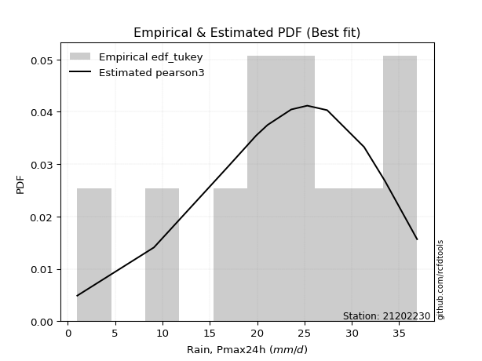</img>

</div>


### 8. EDF Gringorten (1963)

Gringorten plotting position formula is essential for estimating the probability and return periods of extreme events like floods and heavy rainfall. The constant _a=0.44_.

<div align="center">


$P=(m-a)/(n+1-2a)$


</div>


**8.1. Empirical values**

<div align="center">

|                | 0                   | 1                   | 2                  | 3                   | 4                   | 5              | 6                  | 7                  | 8                  | 9                  | 10                 |
|:---------------|:--------------------|:--------------------|:-------------------|:--------------------|:--------------------|:---------------|:-------------------|:-------------------|:-------------------|:-------------------|:-------------------|
| date           | 2023                | 2015                | 2012               | 2016                | 2014                | 2024           | 2009               | 2011               | 2013               | 2008               | 2010               |
| x              | 1.0                 | 9.1                 | 16.9               | 19.9                | 21.1                | 23.6           | 25.3               | 27.4               | 31.3               | 33.5               | 36.9               |
| m              | 1                   | 2                   | 3                  | 4                   | 5                   | 6              | 7                  | 8                  | 9                  | 10                 | 11                 |
| empirical_dist | edf_gringorten      | edf_gringorten      | edf_gringorten     | edf_gringorten      | edf_gringorten      | edf_gringorten | edf_gringorten     | edf_gringorten     | edf_gringorten     | edf_gringorten     | edf_gringorten     |
| empirical      | 0.05035971223021583 | 0.14028776978417268 | 0.2302158273381295 | 0.32014388489208634 | 0.41007194244604317 | 0.5            | 0.5899280575539568 | 0.6798561151079137 | 0.7697841726618706 | 0.8597122302158274 | 0.9496402877697843 |
| empirical_tr   | 1.053030303030303   | 1.1631799163179917  | 1.2990654205607477 | 1.470899470899471   | 1.6951219512195121  | 2.0            | 2.43859649122807   | 3.1235955056179776 | 4.343750000000002  | 7.128205128205133  | 19.857142857142893 |

</div>


**8.2. Kolmogorov-Smirnov fit test (sorted by Δ)**


<div align="center">

|                | 0                    | 1                   | 2                   | 3                   | 4                    | 5                   | 6                   | 7                   | 8                   | 9                   | 10                  | 11                  | 12                  | 13                  | 14                  | 15                  | 16                  | 17                  | 18                  | 19                  | 20                  | 21                  | 22                  | 23                  | 24                  | 25                  | 26                    | 27                  | 28                  | 29                  | 30                  | 31                  | 32                  | 33                  | 34                  | 35                  | 36                  | 37                  | 38                  | 39                  | 40                  | 41                  | 42                  | 43                  | 44                  | 45                  | 46                  | 47                  | 48                  | 49                  | 50                  | 51                  | 52                  | 53                  | 54                  | 55                  | 56                  | 57                  | 58                  | 59                  | 60                  | 61                  | 62                  | 63                  | 64                  | 65                  | 66                  | 67                  | 68                  | 69                  | 70                  | 71                  | 72                  | 73                  | 74                  | 75                  | 76                  | 77                  | 78                  | 79                  | 80                  | 81                  | 82                  | 83                  | 84                  | 85                  | 86                  | 87                  |
|:---------------|:---------------------|:--------------------|:--------------------|:--------------------|:---------------------|:--------------------|:--------------------|:--------------------|:--------------------|:--------------------|:--------------------|:--------------------|:--------------------|:--------------------|:--------------------|:--------------------|:--------------------|:--------------------|:--------------------|:--------------------|:--------------------|:--------------------|:--------------------|:--------------------|:--------------------|:--------------------|:----------------------|:--------------------|:--------------------|:--------------------|:--------------------|:--------------------|:--------------------|:--------------------|:--------------------|:--------------------|:--------------------|:--------------------|:--------------------|:--------------------|:--------------------|:--------------------|:--------------------|:--------------------|:--------------------|:--------------------|:--------------------|:--------------------|:--------------------|:--------------------|:--------------------|:--------------------|:--------------------|:--------------------|:--------------------|:--------------------|:--------------------|:--------------------|:--------------------|:--------------------|:--------------------|:--------------------|:--------------------|:--------------------|:--------------------|:--------------------|:--------------------|:--------------------|:--------------------|:--------------------|:--------------------|:--------------------|:--------------------|:--------------------|:--------------------|:--------------------|:--------------------|:--------------------|:--------------------|:--------------------|:--------------------|:--------------------|:--------------------|:--------------------|:--------------------|:--------------------|:--------------------|:--------------------|
| station        | 21202230             | 21202230            | 21202230            | 21202230            | 21202230             | 21202230            | 21202230            | 21202230            | 21202230            | 21202230            | 21202230            | 21202230            | 21202230            | 21202230            | 21202230            | 21202230            | 21202230            | 21202230            | 21202230            | 21202230            | 21202230            | 21202230            | 21202230            | 21202230            | 21202230            | 21202230            | 21202230              | 21202230            | 21202230            | 21202230            | 21202230            | 21202230            | 21202230            | 21202230            | 21202230            | 21202230            | 21202230            | 21202230            | 21202230            | 21202230            | 21202230            | 21202230            | 21202230            | 21202230            | 21202230            | 21202230            | 21202230            | 21202230            | 21202230            | 21202230            | 21202230            | 21202230            | 21202230            | 21202230            | 21202230            | 21202230            | 21202230            | 21202230            | 21202230            | 21202230            | 21202230            | 21202230            | 21202230            | 21202230            | 21202230            | 21202230            | 21202230            | 21202230            | 21202230            | 21202230            | 21202230            | 21202230            | 21202230            | 21202230            | 21202230            | 21202230            | 21202230            | 21202230            | 21202230            | 21202230            | 21202230            | 21202230            | 21202230            | 21202230            | 21202230            | 21202230            | 21202230            | 21202230            |
| empirical_dist | edf_gringorten       | edf_gringorten      | edf_gringorten      | edf_gringorten      | edf_gringorten       | edf_gringorten      | edf_gringorten      | edf_gringorten      | edf_gringorten      | edf_gringorten      | edf_gringorten      | edf_gringorten      | edf_gringorten      | edf_gringorten      | edf_gringorten      | edf_gringorten      | edf_gringorten      | edf_gringorten      | edf_gringorten      | edf_gringorten      | edf_gringorten      | edf_gringorten      | edf_gringorten      | edf_gringorten      | edf_gringorten      | edf_gringorten      | edf_gringorten        | edf_gringorten      | edf_gringorten      | edf_gringorten      | edf_gringorten      | edf_gringorten      | edf_gringorten      | edf_gringorten      | edf_gringorten      | edf_gringorten      | edf_gringorten      | edf_gringorten      | edf_gringorten      | edf_gringorten      | edf_gringorten      | edf_gringorten      | edf_gringorten      | edf_gringorten      | edf_gringorten      | edf_gringorten      | edf_gringorten      | edf_gringorten      | edf_gringorten      | edf_gringorten      | edf_gringorten      | edf_gringorten      | edf_gringorten      | edf_gringorten      | edf_gringorten      | edf_gringorten      | edf_gringorten      | edf_gringorten      | edf_gringorten      | edf_gringorten      | edf_gringorten      | edf_gringorten      | edf_gringorten      | edf_gringorten      | edf_gringorten      | edf_gringorten      | edf_gringorten      | edf_gringorten      | edf_gringorten      | edf_gringorten      | edf_gringorten      | edf_gringorten      | edf_gringorten      | edf_gringorten      | edf_gringorten      | edf_gringorten      | edf_gringorten      | edf_gringorten      | edf_gringorten      | edf_gringorten      | edf_gringorten      | edf_gringorten      | edf_gringorten      | edf_gringorten      | edf_gringorten      | edf_gringorten      | edf_gringorten      | edf_gringorten      |
| p_dist         | johnsonsu            | weibull_min         | pearson3            | genlogistic         | gumbel_l             | fisk                | logistic            | logjohnsonsu        | hypsecant           | laplace_asymmetric  | exponnorm           | crystalball         | norm                | t                   | nct                 | f                   | nakagami            | laplace             | mielke              | gamma               | betaprime           | erlang              | logt                | invgamma            | maxwell             | logpearson3         | loglaplace_asymmetric | logloggamma         | invgauss            | rayleigh            | rice                | invweibull          | gumbel_r            | logweibull_min      | ncf                 | loggompertz         | logfisk             | halfnorm            | moyal               | alpha               | kstwobign           | halflogistic        | loggumbel_l         | truncnorm           | wald                | gibrat              | logbetaprime        | loghypsecant        | loglogistic         | logrice             | logexponnorm        | lognorm             | lognorm             | logcrystalball      | logfatiguelife      | lognct              | loginvgauss         | loglaplace          | loggamma            | loggamma            | logalpha            | logerlang           | loginvgamma         | loginvweibull       | logmaxwell          | genexpon            | expon               | lograyleigh         | logkstwobign        | loggumbel_r         | loghalfnorm         | lognakagami         | gompertz            | logmoyal            | loghalflogistic     | logncf              | loggenexpon         | logchi2             | logexpon            | logwald             | loggibrat           | logf                | logmielke           | loglognorm          | fatiguelife         | logtruncnorm        | chi2                | loggenlogistic      |
| delta          | 0.039966047902139756 | 0.04491800627077558 | 0.04672266452279078 | 0.04932449331208555 | 0.056060296250495134 | 0.06070445109036188 | 0.07094470833541971 | 0.07184785652871784 | 0.0749300071056237  | 0.07920932107545076 | 0.08343476286661428 | 0.0834348746706618  | 0.08343488430401436 | 0.0834484696804847  | 0.08347781193056997 | 0.08445236183658339 | 0.0846088835998362  | 0.08727153421808453 | 0.0880765444209251  | 0.08879666512227202 | 0.09095012925222856 | 0.09747192020406698 | 0.1106130544706917  | 0.11502750855946803 | 0.11752959261323093 | 0.12487186356809332 | 0.12652925400717435   | 0.12865846778534468 | 0.1287054378954235  | 0.12981400802500842 | 0.1312805842852543  | 0.14306776539593158 | 0.143862623001141   | 0.15501475765244555 | 0.15598375191292946 | 0.15754036092062962 | 0.16021179765794913 | 0.1646431067845704  | 0.16700593975174371 | 0.16793068091346708 | 0.1752966166990938  | 0.18067344891793347 | 0.1902146813425405  | 0.20568511980265475 | 0.2297375975524445  | 0.24180333335382986 | 0.2560321848514868  | 0.25852288917299304 | 0.2595706080806575  | 0.2607933131704224  | 0.2607955129529051  | 0.26079785355383517 | 0.26079785355383517 | 0.2607979420145312  | 0.2619530868319725  | 0.2621139675993779  | 0.27143531860251824 | 0.27279892063011735 | 0.2737089047212572  | 0.2737089047212572  | 0.27701593093355814 | 0.2799595977433439  | 0.28145343407700396 | 0.2845482789062026  | 0.294185552708354   | 0.29469416513639    | 0.294696215514918   | 0.30538627345802905 | 0.3281241069415398  | 0.33084947294848843 | 0.336922380226948   | 0.3486791650712675  | 0.35274322472227226 | 0.3567322313703488  | 0.361281524571626   | 0.3641147175090911  | 0.3652800094561208  | 0.3702098547945163  | 0.39906384366573955 | 0.4287415336056466  | 0.450620732647265   | 0.46649839799733694 | 0.4674819782914089  | 0.4831923564699222  | 0.5928830778889647  | 0.6069101152462488  | 0.7338004645820313  | 0.8597122302158274  |
| deltao         | 0.37613735880099997  | 0.37613735880099997 | 0.37613735880099997 | 0.37613735880099997 | 0.37613735880099997  | 0.37613735880099997 | 0.37613735880099997 | 0.37613735880099997 | 0.37613735880099997 | 0.37613735880099997 | 0.37613735880099997 | 0.37613735880099997 | 0.37613735880099997 | 0.37613735880099997 | 0.37613735880099997 | 0.37613735880099997 | 0.37613735880099997 | 0.37613735880099997 | 0.37613735880099997 | 0.37613735880099997 | 0.37613735880099997 | 0.37613735880099997 | 0.37613735880099997 | 0.37613735880099997 | 0.37613735880099997 | 0.37613735880099997 | 0.37613735880099997   | 0.37613735880099997 | 0.37613735880099997 | 0.37613735880099997 | 0.37613735880099997 | 0.37613735880099997 | 0.37613735880099997 | 0.37613735880099997 | 0.37613735880099997 | 0.37613735880099997 | 0.37613735880099997 | 0.37613735880099997 | 0.37613735880099997 | 0.37613735880099997 | 0.37613735880099997 | 0.37613735880099997 | 0.37613735880099997 | 0.37613735880099997 | 0.37613735880099997 | 0.37613735880099997 | 0.37613735880099997 | 0.37613735880099997 | 0.37613735880099997 | 0.37613735880099997 | 0.37613735880099997 | 0.37613735880099997 | 0.37613735880099997 | 0.37613735880099997 | 0.37613735880099997 | 0.37613735880099997 | 0.37613735880099997 | 0.37613735880099997 | 0.37613735880099997 | 0.37613735880099997 | 0.37613735880099997 | 0.37613735880099997 | 0.37613735880099997 | 0.37613735880099997 | 0.37613735880099997 | 0.37613735880099997 | 0.37613735880099997 | 0.37613735880099997 | 0.37613735880099997 | 0.37613735880099997 | 0.37613735880099997 | 0.37613735880099997 | 0.37613735880099997 | 0.37613735880099997 | 0.37613735880099997 | 0.37613735880099997 | 0.37613735880099997 | 0.37613735880099997 | 0.37613735880099997 | 0.37613735880099997 | 0.37613735880099997 | 0.37613735880099997 | 0.37613735880099997 | 0.37613735880099997 | 0.37613735880099997 | 0.37613735880099997 | 0.37613735880099997 | 0.37613735880099997 |
| eval           | Δo > Δ               | Δo > Δ              | Δo > Δ              | Δo > Δ              | Δo > Δ               | Δo > Δ              | Δo > Δ              | Δo > Δ              | Δo > Δ              | Δo > Δ              | Δo > Δ              | Δo > Δ              | Δo > Δ              | Δo > Δ              | Δo > Δ              | Δo > Δ              | Δo > Δ              | Δo > Δ              | Δo > Δ              | Δo > Δ              | Δo > Δ              | Δo > Δ              | Δo > Δ              | Δo > Δ              | Δo > Δ              | Δo > Δ              | Δo > Δ                | Δo > Δ              | Δo > Δ              | Δo > Δ              | Δo > Δ              | Δo > Δ              | Δo > Δ              | Δo > Δ              | Δo > Δ              | Δo > Δ              | Δo > Δ              | Δo > Δ              | Δo > Δ              | Δo > Δ              | Δo > Δ              | Δo > Δ              | Δo > Δ              | Δo > Δ              | Δo > Δ              | Δo > Δ              | Δo > Δ              | Δo > Δ              | Δo > Δ              | Δo > Δ              | Δo > Δ              | Δo > Δ              | Δo > Δ              | Δo > Δ              | Δo > Δ              | Δo > Δ              | Δo > Δ              | Δo > Δ              | Δo > Δ              | Δo > Δ              | Δo > Δ              | Δo > Δ              | Δo > Δ              | Δo > Δ              | Δo > Δ              | Δo > Δ              | Δo > Δ              | Δo > Δ              | Δo > Δ              | Δo > Δ              | Δo > Δ              | Δo > Δ              | Δo > Δ              | Δo > Δ              | Δo > Δ              | Δo > Δ              | Δo > Δ              | Δo > Δ              | Δo <= Δ             | Δo <= Δ             | Δo <= Δ             | Δo <= Δ             | Δo <= Δ             | Δo <= Δ             | Δo <= Δ             | Δo <= Δ             | Δo <= Δ             | Δo <= Δ             |
| fit            | 1                    | 1                   | 1                   | 1                   | 1                    | 1                   | 1                   | 1                   | 1                   | 1                   | 1                   | 1                   | 1                   | 1                   | 1                   | 1                   | 1                   | 1                   | 1                   | 1                   | 1                   | 1                   | 1                   | 1                   | 1                   | 1                   | 1                     | 1                   | 1                   | 1                   | 1                   | 1                   | 1                   | 1                   | 1                   | 1                   | 1                   | 1                   | 1                   | 1                   | 1                   | 1                   | 1                   | 1                   | 1                   | 1                   | 1                   | 1                   | 1                   | 1                   | 1                   | 1                   | 1                   | 1                   | 1                   | 1                   | 1                   | 1                   | 1                   | 1                   | 1                   | 1                   | 1                   | 1                   | 1                   | 1                   | 1                   | 1                   | 1                   | 1                   | 1                   | 1                   | 1                   | 1                   | 1                   | 1                   | 1                   | 1                   | 0                   | 0                   | 0                   | 0                   | 0                   | 0                   | 0                   | 0                   | 0                   | 0                   |
| n              | 11                   | 11                  | 11                  | 11                  | 11                   | 11                  | 11                  | 11                  | 11                  | 11                  | 11                  | 11                  | 11                  | 11                  | 11                  | 11                  | 11                  | 11                  | 11                  | 11                  | 11                  | 11                  | 11                  | 11                  | 11                  | 11                  | 11                    | 11                  | 11                  | 11                  | 11                  | 11                  | 11                  | 11                  | 11                  | 11                  | 11                  | 11                  | 11                  | 11                  | 11                  | 11                  | 11                  | 11                  | 11                  | 11                  | 11                  | 11                  | 11                  | 11                  | 11                  | 11                  | 11                  | 11                  | 11                  | 11                  | 11                  | 11                  | 11                  | 11                  | 11                  | 11                  | 11                  | 11                  | 11                  | 11                  | 11                  | 11                  | 11                  | 11                  | 11                  | 11                  | 11                  | 11                  | 11                  | 11                  | 11                  | 11                  | 11                  | 11                  | 11                  | 11                  | 11                  | 11                  | 11                  | 11                  | 11                  | 11                  |
| best_fit       | 1                    | 0                   | 0                   | 0                   | 0                    | 0                   | 0                   | 0                   | 0                   | 0                   | 0                   | 0                   | 0                   | 0                   | 0                   | 0                   | 0                   | 0                   | 0                   | 0                   | 0                   | 0                   | 0                   | 0                   | 0                   | 0                   | 0                     | 0                   | 0                   | 0                   | 0                   | 0                   | 0                   | 0                   | 0                   | 0                   | 0                   | 0                   | 0                   | 0                   | 0                   | 0                   | 0                   | 0                   | 0                   | 0                   | 0                   | 0                   | 0                   | 0                   | 0                   | 0                   | 0                   | 0                   | 0                   | 0                   | 0                   | 0                   | 0                   | 0                   | 0                   | 0                   | 0                   | 0                   | 0                   | 0                   | 0                   | 0                   | 0                   | 0                   | 0                   | 0                   | 0                   | 0                   | 0                   | 0                   | 0                   | 0                   | 0                   | 0                   | 0                   | 0                   | 0                   | 0                   | 0                   | 0                   | 0                   | 0                   |
| best_fit_sort  | 1                    | 2                   | 3                   | 4                   | 5                    | 6                   | 7                   | 8                   | 9                   | 10                  | 11                  | 12                  | 13                  | 14                  | 15                  | 16                  | 17                  | 18                  | 19                  | 20                  | 21                  | 22                  | 23                  | 24                  | 25                  | 26                  | 27                    | 28                  | 29                  | 30                  | 31                  | 32                  | 33                  | 34                  | 35                  | 36                  | 37                  | 38                  | 39                  | 40                  | 41                  | 42                  | 43                  | 44                  | 45                  | 46                  | 47                  | 48                  | 49                  | 50                  | 51                  | 52                  | 53                  | 54                  | 55                  | 56                  | 57                  | 58                  | 59                  | 60                  | 61                  | 62                  | 63                  | 64                  | 65                  | 66                  | 67                  | 68                  | 69                  | 70                  | 71                  | 72                  | 73                  | 74                  | 75                  | 76                  | 77                  | 78                  | 79                  | 80                  | 81                  | 82                  | 83                  | 84                  | 85                  | 86                  | 87                  | 88                  |

</div>


**8.3. Best fit**

<div align="center">

|   id |   station | empirical_dist   | p_dist    |    delta |   deltao | eval   |   fit |   n |   best_fit |   best_fit_sort |
|-----:|----------:|:-----------------|:----------|---------:|---------:|:-------|------:|----:|-----------:|----------------:|
|    0 |  21202230 | edf_gringorten   | johnsonsu | 0.039966 | 0.376137 | Δo > Δ |     1 |  11 |          1 |               1 |

</div>


<div align="center">

</img>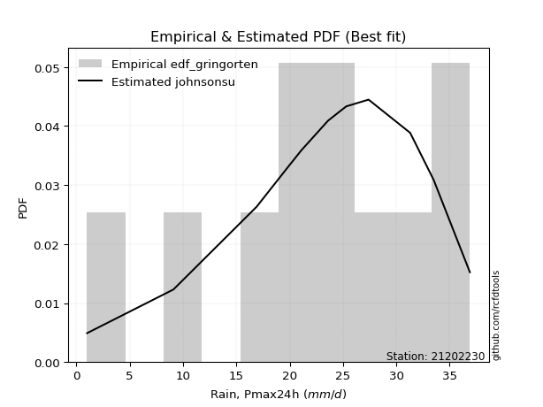</img>

</div>


### 9. EDF Filliben (1975)

The specific values of the constants (0.3175) (often denoted as $alpha$) and (0.365) are derived from a method proposed by James J. Filliben in a 1975 paper. This particular formula is the mean value of the $i$-th order statistic of the normal distribution and is considered a robust and effective plotting position formula for the normal probability plot correlation coefficient test for normality.

<div align="center">


$P=(m-0.3175)/(n+0.365)$


</div>


**9.1. Empirical values**

<div align="center">

|                | 0                    | 1                   | 2                   | 3                  | 4                   | 5            | 6                  | 7                  | 8                  | 9                  | 10                 |
|:---------------|:---------------------|:--------------------|:--------------------|:-------------------|:--------------------|:-------------|:-------------------|:-------------------|:-------------------|:-------------------|:-------------------|
| date           | 2023                 | 2015                | 2012                | 2016               | 2014                | 2024         | 2009               | 2011               | 2013               | 2008               | 2010               |
| x              | 1.0                  | 9.1                 | 16.9                | 19.9               | 21.1                | 23.6         | 25.3               | 27.4               | 31.3               | 33.5               | 36.9               |
| m              | 1                    | 2                   | 3                   | 4                  | 5                   | 6            | 7                  | 8                  | 9                  | 10                 | 11                 |
| empirical_dist | edf_filliben         | edf_filliben        | edf_filliben        | edf_filliben       | edf_filliben        | edf_filliben | edf_filliben       | edf_filliben       | edf_filliben       | edf_filliben       | edf_filliben       |
| empirical      | 0.060052793664760226 | 0.14804223493180818 | 0.23603167619885615 | 0.3240211174659041 | 0.41201055873295206 | 0.5          | 0.587989441267048  | 0.6759788825340959 | 0.7639683238011438 | 0.8519577650681918 | 0.9399472063352396 |
| empirical_tr   | 1.063889538965598    | 1.173767105602892   | 1.3089547941261157  | 1.4793361535958347 | 1.7007108118219232  | 2.0          | 2.4271222637479983 | 3.08621860149355   | 4.236719478098787  | 6.754829123328378  | 16.652014652014618 |

</div>


**9.2. Kolmogorov-Smirnov fit test (sorted by Δ)**


<div align="center">

|                | 0                   | 1                    | 2                    | 3                    | 4                   | 5                   | 6                   | 7                   | 8                   | 9                   | 10                  | 11                  | 12                  | 13                  | 14                  | 15                  | 16                  | 17                  | 18                  | 19                  | 20                  | 21                  | 22                  | 23                  | 24                  | 25                  | 26                    | 27                  | 28                  | 29                  | 30                  | 31                  | 32                  | 33                  | 34                  | 35                  | 36                  | 37                  | 38                  | 39                  | 40                  | 41                  | 42                  | 43                  | 44                  | 45                  | 46                  | 47                  | 48                  | 49                  | 50                  | 51                  | 52                  | 53                  | 54                  | 55                  | 56                  | 57                  | 58                  | 59                  | 60                  | 61                  | 62                  | 63                  | 64                  | 65                  | 66                  | 67                  | 68                  | 69                  | 70                  | 71                  | 72                  | 73                  | 74                  | 75                  | 76                  | 77                  | 78                  | 79                  | 80                  | 81                  | 82                  | 83                  | 84                  | 85                  | 86                  | 87                  |
|:---------------|:--------------------|:---------------------|:---------------------|:---------------------|:--------------------|:--------------------|:--------------------|:--------------------|:--------------------|:--------------------|:--------------------|:--------------------|:--------------------|:--------------------|:--------------------|:--------------------|:--------------------|:--------------------|:--------------------|:--------------------|:--------------------|:--------------------|:--------------------|:--------------------|:--------------------|:--------------------|:----------------------|:--------------------|:--------------------|:--------------------|:--------------------|:--------------------|:--------------------|:--------------------|:--------------------|:--------------------|:--------------------|:--------------------|:--------------------|:--------------------|:--------------------|:--------------------|:--------------------|:--------------------|:--------------------|:--------------------|:--------------------|:--------------------|:--------------------|:--------------------|:--------------------|:--------------------|:--------------------|:--------------------|:--------------------|:--------------------|:--------------------|:--------------------|:--------------------|:--------------------|:--------------------|:--------------------|:--------------------|:--------------------|:--------------------|:--------------------|:--------------------|:--------------------|:--------------------|:--------------------|:--------------------|:--------------------|:--------------------|:--------------------|:--------------------|:--------------------|:--------------------|:--------------------|:--------------------|:--------------------|:--------------------|:--------------------|:--------------------|:--------------------|:--------------------|:--------------------|:--------------------|:--------------------|
| station        | 21202230            | 21202230             | 21202230             | 21202230             | 21202230            | 21202230            | 21202230            | 21202230            | 21202230            | 21202230            | 21202230            | 21202230            | 21202230            | 21202230            | 21202230            | 21202230            | 21202230            | 21202230            | 21202230            | 21202230            | 21202230            | 21202230            | 21202230            | 21202230            | 21202230            | 21202230            | 21202230              | 21202230            | 21202230            | 21202230            | 21202230            | 21202230            | 21202230            | 21202230            | 21202230            | 21202230            | 21202230            | 21202230            | 21202230            | 21202230            | 21202230            | 21202230            | 21202230            | 21202230            | 21202230            | 21202230            | 21202230            | 21202230            | 21202230            | 21202230            | 21202230            | 21202230            | 21202230            | 21202230            | 21202230            | 21202230            | 21202230            | 21202230            | 21202230            | 21202230            | 21202230            | 21202230            | 21202230            | 21202230            | 21202230            | 21202230            | 21202230            | 21202230            | 21202230            | 21202230            | 21202230            | 21202230            | 21202230            | 21202230            | 21202230            | 21202230            | 21202230            | 21202230            | 21202230            | 21202230            | 21202230            | 21202230            | 21202230            | 21202230            | 21202230            | 21202230            | 21202230            | 21202230            |
| empirical_dist | edf_filliben        | edf_filliben         | edf_filliben         | edf_filliben         | edf_filliben        | edf_filliben        | edf_filliben        | edf_filliben        | edf_filliben        | edf_filliben        | edf_filliben        | edf_filliben        | edf_filliben        | edf_filliben        | edf_filliben        | edf_filliben        | edf_filliben        | edf_filliben        | edf_filliben        | edf_filliben        | edf_filliben        | edf_filliben        | edf_filliben        | edf_filliben        | edf_filliben        | edf_filliben        | edf_filliben          | edf_filliben        | edf_filliben        | edf_filliben        | edf_filliben        | edf_filliben        | edf_filliben        | edf_filliben        | edf_filliben        | edf_filliben        | edf_filliben        | edf_filliben        | edf_filliben        | edf_filliben        | edf_filliben        | edf_filliben        | edf_filliben        | edf_filliben        | edf_filliben        | edf_filliben        | edf_filliben        | edf_filliben        | edf_filliben        | edf_filliben        | edf_filliben        | edf_filliben        | edf_filliben        | edf_filliben        | edf_filliben        | edf_filliben        | edf_filliben        | edf_filliben        | edf_filliben        | edf_filliben        | edf_filliben        | edf_filliben        | edf_filliben        | edf_filliben        | edf_filliben        | edf_filliben        | edf_filliben        | edf_filliben        | edf_filliben        | edf_filliben        | edf_filliben        | edf_filliben        | edf_filliben        | edf_filliben        | edf_filliben        | edf_filliben        | edf_filliben        | edf_filliben        | edf_filliben        | edf_filliben        | edf_filliben        | edf_filliben        | edf_filliben        | edf_filliben        | edf_filliben        | edf_filliben        | edf_filliben        | edf_filliben        |
| p_dist         | johnsonsu           | pearson3             | weibull_min          | genlogistic          | gumbel_l            | logjohnsonsu        | fisk                | logistic            | exponnorm           | crystalball         | norm                | t                   | nct                 | f                   | nakagami            | hypsecant           | mielke              | gamma               | laplace_asymmetric  | betaprime           | laplace             | erlang              | logt                | invgamma            | maxwell             | logpearson3         | loglaplace_asymmetric | logloggamma         | invgauss            | rayleigh            | rice                | invweibull          | gumbel_r            | logfisk             | logweibull_min      | ncf                 | loggompertz         | halfnorm            | moyal               | alpha               | kstwobign           | halflogistic        | loggumbel_l         | truncnorm           | wald                | gibrat              | logbetaprime        | loghypsecant        | loglogistic         | logrice             | logexponnorm        | lognorm             | lognorm             | logcrystalball      | logfatiguelife      | lognct              | loginvgauss         | loggamma            | loggamma            | loglaplace          | logalpha            | logerlang           | loginvgamma         | loginvweibull       | logmaxwell          | genexpon            | expon               | lograyleigh         | logkstwobign        | loggumbel_r         | loghalfnorm         | lognakagami         | gompertz            | logmoyal            | loghalflogistic     | logncf              | loggenexpon         | logchi2             | logexpon            | logwald             | loggibrat           | logf                | logmielke           | loglognorm          | fatiguelife         | logtruncnorm        | chi2                | loggenlogistic      |
| delta          | 0.04578189676286659 | 0.045924017052253505 | 0.050733855131502414 | 0.055140342172812384 | 0.06187614511122197 | 0.06797062395490006 | 0.06845891623799738 | 0.06887983973447642 | 0.0795575302927965  | 0.07955764209684402 | 0.07955765173019658 | 0.07957123710666691 | 0.07960057935675219 | 0.08057512926276561 | 0.08073165102601843 | 0.08074585596635053 | 0.08226069556019847 | 0.08491943254845424 | 0.08502516993617759 | 0.08707289667841078 | 0.09308738307881137 | 0.0935946876302492  | 0.10091997303614708 | 0.11115027598565025 | 0.11365236003941315 | 0.11711739842045765 | 0.12071340514644771   | 0.12284261892461804 | 0.12482820532160571 | 0.12593677545119064 | 0.12740335171143652 | 0.1391905328221138  | 0.13998539042732322 | 0.15051871622340451 | 0.15113752507862777 | 0.15210651933911168 | 0.15366312834681184 | 0.1607658742107526  | 0.16312870717792594 | 0.1640534483396493  | 0.17141938412527602 | 0.1767962163441157  | 0.18439883248181385 | 0.1998692709419281  | 0.22586036497862672 | 0.24180333335382986 | 0.2502163359907602  | 0.25270704031226643 | 0.25375475921993085 | 0.2549774643096958  | 0.2549796640921784  | 0.2549820046931085  | 0.2549820046931085  | 0.2549820931538046  | 0.2561372379712459  | 0.25629811873865127 | 0.2656194697417916  | 0.2678930558605306  | 0.2678930558605306  | 0.26892168805629957 | 0.2712000820728315  | 0.2741437488826173  | 0.27563758521627735 | 0.278732430045476   | 0.2883697038476274  | 0.2888783162756634  | 0.28888036665419137 | 0.29957042459730243 | 0.3223082580808132  | 0.3250336240877618  | 0.33110653136622137 | 0.340924699923632   | 0.35080460843536343 | 0.3509163825096222  | 0.3554656757108994  | 0.3563602523614556  | 0.3594641605953942  | 0.3624553896468808  | 0.39324799480501293 | 0.42292568474492    | 0.4448048837865384  | 0.45874393284970144 | 0.4597275131437734  | 0.4754378913222867  | 0.5851286127413291  | 0.6010942663855222  | 0.7279846157213047  | 0.8519577650681918  |
| deltao         | 0.37613735880099997 | 0.37613735880099997  | 0.37613735880099997  | 0.37613735880099997  | 0.37613735880099997 | 0.37613735880099997 | 0.37613735880099997 | 0.37613735880099997 | 0.37613735880099997 | 0.37613735880099997 | 0.37613735880099997 | 0.37613735880099997 | 0.37613735880099997 | 0.37613735880099997 | 0.37613735880099997 | 0.37613735880099997 | 0.37613735880099997 | 0.37613735880099997 | 0.37613735880099997 | 0.37613735880099997 | 0.37613735880099997 | 0.37613735880099997 | 0.37613735880099997 | 0.37613735880099997 | 0.37613735880099997 | 0.37613735880099997 | 0.37613735880099997   | 0.37613735880099997 | 0.37613735880099997 | 0.37613735880099997 | 0.37613735880099997 | 0.37613735880099997 | 0.37613735880099997 | 0.37613735880099997 | 0.37613735880099997 | 0.37613735880099997 | 0.37613735880099997 | 0.37613735880099997 | 0.37613735880099997 | 0.37613735880099997 | 0.37613735880099997 | 0.37613735880099997 | 0.37613735880099997 | 0.37613735880099997 | 0.37613735880099997 | 0.37613735880099997 | 0.37613735880099997 | 0.37613735880099997 | 0.37613735880099997 | 0.37613735880099997 | 0.37613735880099997 | 0.37613735880099997 | 0.37613735880099997 | 0.37613735880099997 | 0.37613735880099997 | 0.37613735880099997 | 0.37613735880099997 | 0.37613735880099997 | 0.37613735880099997 | 0.37613735880099997 | 0.37613735880099997 | 0.37613735880099997 | 0.37613735880099997 | 0.37613735880099997 | 0.37613735880099997 | 0.37613735880099997 | 0.37613735880099997 | 0.37613735880099997 | 0.37613735880099997 | 0.37613735880099997 | 0.37613735880099997 | 0.37613735880099997 | 0.37613735880099997 | 0.37613735880099997 | 0.37613735880099997 | 0.37613735880099997 | 0.37613735880099997 | 0.37613735880099997 | 0.37613735880099997 | 0.37613735880099997 | 0.37613735880099997 | 0.37613735880099997 | 0.37613735880099997 | 0.37613735880099997 | 0.37613735880099997 | 0.37613735880099997 | 0.37613735880099997 | 0.37613735880099997 |
| eval           | Δo > Δ              | Δo > Δ               | Δo > Δ               | Δo > Δ               | Δo > Δ              | Δo > Δ              | Δo > Δ              | Δo > Δ              | Δo > Δ              | Δo > Δ              | Δo > Δ              | Δo > Δ              | Δo > Δ              | Δo > Δ              | Δo > Δ              | Δo > Δ              | Δo > Δ              | Δo > Δ              | Δo > Δ              | Δo > Δ              | Δo > Δ              | Δo > Δ              | Δo > Δ              | Δo > Δ              | Δo > Δ              | Δo > Δ              | Δo > Δ                | Δo > Δ              | Δo > Δ              | Δo > Δ              | Δo > Δ              | Δo > Δ              | Δo > Δ              | Δo > Δ              | Δo > Δ              | Δo > Δ              | Δo > Δ              | Δo > Δ              | Δo > Δ              | Δo > Δ              | Δo > Δ              | Δo > Δ              | Δo > Δ              | Δo > Δ              | Δo > Δ              | Δo > Δ              | Δo > Δ              | Δo > Δ              | Δo > Δ              | Δo > Δ              | Δo > Δ              | Δo > Δ              | Δo > Δ              | Δo > Δ              | Δo > Δ              | Δo > Δ              | Δo > Δ              | Δo > Δ              | Δo > Δ              | Δo > Δ              | Δo > Δ              | Δo > Δ              | Δo > Δ              | Δo > Δ              | Δo > Δ              | Δo > Δ              | Δo > Δ              | Δo > Δ              | Δo > Δ              | Δo > Δ              | Δo > Δ              | Δo > Δ              | Δo > Δ              | Δo > Δ              | Δo > Δ              | Δo > Δ              | Δo > Δ              | Δo > Δ              | Δo <= Δ             | Δo <= Δ             | Δo <= Δ             | Δo <= Δ             | Δo <= Δ             | Δo <= Δ             | Δo <= Δ             | Δo <= Δ             | Δo <= Δ             | Δo <= Δ             |
| fit            | 1                   | 1                    | 1                    | 1                    | 1                   | 1                   | 1                   | 1                   | 1                   | 1                   | 1                   | 1                   | 1                   | 1                   | 1                   | 1                   | 1                   | 1                   | 1                   | 1                   | 1                   | 1                   | 1                   | 1                   | 1                   | 1                   | 1                     | 1                   | 1                   | 1                   | 1                   | 1                   | 1                   | 1                   | 1                   | 1                   | 1                   | 1                   | 1                   | 1                   | 1                   | 1                   | 1                   | 1                   | 1                   | 1                   | 1                   | 1                   | 1                   | 1                   | 1                   | 1                   | 1                   | 1                   | 1                   | 1                   | 1                   | 1                   | 1                   | 1                   | 1                   | 1                   | 1                   | 1                   | 1                   | 1                   | 1                   | 1                   | 1                   | 1                   | 1                   | 1                   | 1                   | 1                   | 1                   | 1                   | 1                   | 1                   | 0                   | 0                   | 0                   | 0                   | 0                   | 0                   | 0                   | 0                   | 0                   | 0                   |
| n              | 11                  | 11                   | 11                   | 11                   | 11                  | 11                  | 11                  | 11                  | 11                  | 11                  | 11                  | 11                  | 11                  | 11                  | 11                  | 11                  | 11                  | 11                  | 11                  | 11                  | 11                  | 11                  | 11                  | 11                  | 11                  | 11                  | 11                    | 11                  | 11                  | 11                  | 11                  | 11                  | 11                  | 11                  | 11                  | 11                  | 11                  | 11                  | 11                  | 11                  | 11                  | 11                  | 11                  | 11                  | 11                  | 11                  | 11                  | 11                  | 11                  | 11                  | 11                  | 11                  | 11                  | 11                  | 11                  | 11                  | 11                  | 11                  | 11                  | 11                  | 11                  | 11                  | 11                  | 11                  | 11                  | 11                  | 11                  | 11                  | 11                  | 11                  | 11                  | 11                  | 11                  | 11                  | 11                  | 11                  | 11                  | 11                  | 11                  | 11                  | 11                  | 11                  | 11                  | 11                  | 11                  | 11                  | 11                  | 11                  |
| best_fit       | 1                   | 0                    | 0                    | 0                    | 0                   | 0                   | 0                   | 0                   | 0                   | 0                   | 0                   | 0                   | 0                   | 0                   | 0                   | 0                   | 0                   | 0                   | 0                   | 0                   | 0                   | 0                   | 0                   | 0                   | 0                   | 0                   | 0                     | 0                   | 0                   | 0                   | 0                   | 0                   | 0                   | 0                   | 0                   | 0                   | 0                   | 0                   | 0                   | 0                   | 0                   | 0                   | 0                   | 0                   | 0                   | 0                   | 0                   | 0                   | 0                   | 0                   | 0                   | 0                   | 0                   | 0                   | 0                   | 0                   | 0                   | 0                   | 0                   | 0                   | 0                   | 0                   | 0                   | 0                   | 0                   | 0                   | 0                   | 0                   | 0                   | 0                   | 0                   | 0                   | 0                   | 0                   | 0                   | 0                   | 0                   | 0                   | 0                   | 0                   | 0                   | 0                   | 0                   | 0                   | 0                   | 0                   | 0                   | 0                   |
| best_fit_sort  | 1                   | 2                    | 3                    | 4                    | 5                   | 6                   | 7                   | 8                   | 9                   | 10                  | 11                  | 12                  | 13                  | 14                  | 15                  | 16                  | 17                  | 18                  | 19                  | 20                  | 21                  | 22                  | 23                  | 24                  | 25                  | 26                  | 27                    | 28                  | 29                  | 30                  | 31                  | 32                  | 33                  | 34                  | 35                  | 36                  | 37                  | 38                  | 39                  | 40                  | 41                  | 42                  | 43                  | 44                  | 45                  | 46                  | 47                  | 48                  | 49                  | 50                  | 51                  | 52                  | 53                  | 54                  | 55                  | 56                  | 57                  | 58                  | 59                  | 60                  | 61                  | 62                  | 63                  | 64                  | 65                  | 66                  | 67                  | 68                  | 69                  | 70                  | 71                  | 72                  | 73                  | 74                  | 75                  | 76                  | 77                  | 78                  | 79                  | 80                  | 81                  | 82                  | 83                  | 84                  | 85                  | 86                  | 87                  | 88                  |

</div>


**9.3. Best fit**

<div align="center">

|   id |   station | empirical_dist   | p_dist    |     delta |   deltao | eval   |   fit |   n |   best_fit |   best_fit_sort |
|-----:|----------:|:-----------------|:----------|----------:|---------:|:-------|------:|----:|-----------:|----------------:|
|    0 |  21202230 | edf_filliben     | johnsonsu | 0.0457819 | 0.376137 | Δo > Δ |     1 |  11 |          1 |               1 |

</div>


<div align="center">

</img></img>

</div>


### 10. EDF Jenkinson (1977)

The Jenkinson formula in hydrology is an empirical plotting position formula used to estimate the non-exceedance probability _(P)_ or return period _(T)_ of a given ordered observation within a sample. It is a widely used method in the frequency analysis of extreme events such as floods and rainfall, as it provides a distribution-free way to plot data. _a≈0.31_ and _b≈0.38_ are constants derived to approximate the median of the probability distribution for the given rank.

<div align="center">


$P=(m-a)/(n+b)$


</div>


**10.1. Empirical values**

<div align="center">

|                | 0                    | 1                 | 2                   | 3                  | 4                  | 5             | 6                  | 7                  | 8                  | 9                  | 10                 |
|:---------------|:---------------------|:------------------|:--------------------|:-------------------|:-------------------|:--------------|:-------------------|:-------------------|:-------------------|:-------------------|:-------------------|
| date           | 2023                 | 2015              | 2012                | 2016               | 2014               | 2024          | 2009               | 2011               | 2013               | 2008               | 2010               |
| x              | 1.0                  | 9.1               | 16.9                | 19.9               | 21.1               | 23.6          | 25.3               | 27.4               | 31.3               | 33.5               | 36.9               |
| m              | 1                    | 2                 | 3                   | 4                  | 5                  | 6             | 7                  | 8                  | 9                  | 10                 | 11                 |
| empirical_dist | edf_jenkinson        | edf_jenkinson     | edf_jenkinson       | edf_jenkinson      | edf_jenkinson      | edf_jenkinson | edf_jenkinson      | edf_jenkinson      | edf_jenkinson      | edf_jenkinson      | edf_jenkinson      |
| empirical      | 0.060632688927943754 | 0.148506151142355 | 0.23637961335676624 | 0.3242530755711775 | 0.4121265377855888 | 0.5           | 0.5878734622144113 | 0.6757469244288224 | 0.7636203866432336 | 0.8514938488576449 | 0.9393673110720562 |
| empirical_tr   | 1.0645463049579045   | 1.174406604747162 | 1.3095512082853855  | 1.4798439531859557 | 1.7010463378176381 | 2.0           | 2.4264392324093818 | 3.0840108401084008 | 4.230483271375462  | 6.733727810650883  | 16.49275362318839  |

</div>


**10.2. Kolmogorov-Smirnov fit test (sorted by Δ)**


<div align="center">

|                | 0                   | 1                    | 2                    | 3                    | 4                   | 5                   | 6                   | 7                   | 8                   | 9                   | 10                  | 11                  | 12                  | 13                  | 14                  | 15                  | 16                  | 17                  | 18                  | 19                  | 20                  | 21                  | 22                  | 23                  | 24                  | 25                  | 26                    | 27                  | 28                  | 29                  | 30                  | 31                  | 32                  | 33                  | 34                  | 35                  | 36                  | 37                  | 38                  | 39                  | 40                  | 41                  | 42                  | 43                  | 44                  | 45                  | 46                  | 47                  | 48                  | 49                  | 50                  | 51                  | 52                  | 53                  | 54                  | 55                  | 56                  | 57                  | 58                  | 59                  | 60                  | 61                  | 62                  | 63                  | 64                  | 65                  | 66                  | 67                  | 68                  | 69                  | 70                  | 71                  | 72                  | 73                  | 74                  | 75                  | 76                  | 77                  | 78                  | 79                  | 80                  | 81                  | 82                  | 83                  | 84                  | 85                  | 86                  | 87                  |
|:---------------|:--------------------|:---------------------|:---------------------|:---------------------|:--------------------|:--------------------|:--------------------|:--------------------|:--------------------|:--------------------|:--------------------|:--------------------|:--------------------|:--------------------|:--------------------|:--------------------|:--------------------|:--------------------|:--------------------|:--------------------|:--------------------|:--------------------|:--------------------|:--------------------|:--------------------|:--------------------|:----------------------|:--------------------|:--------------------|:--------------------|:--------------------|:--------------------|:--------------------|:--------------------|:--------------------|:--------------------|:--------------------|:--------------------|:--------------------|:--------------------|:--------------------|:--------------------|:--------------------|:--------------------|:--------------------|:--------------------|:--------------------|:--------------------|:--------------------|:--------------------|:--------------------|:--------------------|:--------------------|:--------------------|:--------------------|:--------------------|:--------------------|:--------------------|:--------------------|:--------------------|:--------------------|:--------------------|:--------------------|:--------------------|:--------------------|:--------------------|:--------------------|:--------------------|:--------------------|:--------------------|:--------------------|:--------------------|:--------------------|:--------------------|:--------------------|:--------------------|:--------------------|:--------------------|:--------------------|:--------------------|:--------------------|:--------------------|:--------------------|:--------------------|:--------------------|:--------------------|:--------------------|:--------------------|
| station        | 21202230            | 21202230             | 21202230             | 21202230             | 21202230            | 21202230            | 21202230            | 21202230            | 21202230            | 21202230            | 21202230            | 21202230            | 21202230            | 21202230            | 21202230            | 21202230            | 21202230            | 21202230            | 21202230            | 21202230            | 21202230            | 21202230            | 21202230            | 21202230            | 21202230            | 21202230            | 21202230              | 21202230            | 21202230            | 21202230            | 21202230            | 21202230            | 21202230            | 21202230            | 21202230            | 21202230            | 21202230            | 21202230            | 21202230            | 21202230            | 21202230            | 21202230            | 21202230            | 21202230            | 21202230            | 21202230            | 21202230            | 21202230            | 21202230            | 21202230            | 21202230            | 21202230            | 21202230            | 21202230            | 21202230            | 21202230            | 21202230            | 21202230            | 21202230            | 21202230            | 21202230            | 21202230            | 21202230            | 21202230            | 21202230            | 21202230            | 21202230            | 21202230            | 21202230            | 21202230            | 21202230            | 21202230            | 21202230            | 21202230            | 21202230            | 21202230            | 21202230            | 21202230            | 21202230            | 21202230            | 21202230            | 21202230            | 21202230            | 21202230            | 21202230            | 21202230            | 21202230            | 21202230            |
| empirical_dist | edf_jenkinson       | edf_jenkinson        | edf_jenkinson        | edf_jenkinson        | edf_jenkinson       | edf_jenkinson       | edf_jenkinson       | edf_jenkinson       | edf_jenkinson       | edf_jenkinson       | edf_jenkinson       | edf_jenkinson       | edf_jenkinson       | edf_jenkinson       | edf_jenkinson       | edf_jenkinson       | edf_jenkinson       | edf_jenkinson       | edf_jenkinson       | edf_jenkinson       | edf_jenkinson       | edf_jenkinson       | edf_jenkinson       | edf_jenkinson       | edf_jenkinson       | edf_jenkinson       | edf_jenkinson         | edf_jenkinson       | edf_jenkinson       | edf_jenkinson       | edf_jenkinson       | edf_jenkinson       | edf_jenkinson       | edf_jenkinson       | edf_jenkinson       | edf_jenkinson       | edf_jenkinson       | edf_jenkinson       | edf_jenkinson       | edf_jenkinson       | edf_jenkinson       | edf_jenkinson       | edf_jenkinson       | edf_jenkinson       | edf_jenkinson       | edf_jenkinson       | edf_jenkinson       | edf_jenkinson       | edf_jenkinson       | edf_jenkinson       | edf_jenkinson       | edf_jenkinson       | edf_jenkinson       | edf_jenkinson       | edf_jenkinson       | edf_jenkinson       | edf_jenkinson       | edf_jenkinson       | edf_jenkinson       | edf_jenkinson       | edf_jenkinson       | edf_jenkinson       | edf_jenkinson       | edf_jenkinson       | edf_jenkinson       | edf_jenkinson       | edf_jenkinson       | edf_jenkinson       | edf_jenkinson       | edf_jenkinson       | edf_jenkinson       | edf_jenkinson       | edf_jenkinson       | edf_jenkinson       | edf_jenkinson       | edf_jenkinson       | edf_jenkinson       | edf_jenkinson       | edf_jenkinson       | edf_jenkinson       | edf_jenkinson       | edf_jenkinson       | edf_jenkinson       | edf_jenkinson       | edf_jenkinson       | edf_jenkinson       | edf_jenkinson       | edf_jenkinson       |
| p_dist         | johnsonsu           | pearson3             | weibull_min          | genlogistic          | gumbel_l            | logjohnsonsu        | fisk                | logistic            | exponnorm           | crystalball         | norm                | t                   | nct                 | f                   | nakagami            | hypsecant           | mielke              | gamma               | laplace_asymmetric  | betaprime           | erlang              | laplace             | logt                | invgamma            | maxwell             | logpearson3         | loglaplace_asymmetric | logloggamma         | invgauss            | rayleigh            | rice                | invweibull          | gumbel_r            | logfisk             | logweibull_min      | ncf                 | loggompertz         | halfnorm            | moyal               | alpha               | kstwobign           | halflogistic        | loggumbel_l         | truncnorm           | wald                | gibrat              | logbetaprime        | loghypsecant        | loglogistic         | logrice             | logexponnorm        | lognorm             | lognorm             | logcrystalball      | logfatiguelife      | lognct              | loginvgauss         | loggamma            | loggamma            | loglaplace          | logalpha            | logerlang           | loginvgamma         | loginvweibull       | logmaxwell          | genexpon            | expon               | lograyleigh         | logkstwobign        | loggumbel_r         | loghalfnorm         | lognakagami         | logmoyal            | gompertz            | loghalflogistic     | logncf              | loggenexpon         | logchi2             | logexpon            | logwald             | loggibrat           | logf                | logmielke           | loglognorm          | fatiguelife         | logtruncnorm        | chi2                | loggenlogistic      |
| delta          | 0.04612983392077674 | 0.046387933262800315 | 0.051081792289412564 | 0.055488279330722534 | 0.06222408226913212 | 0.06773866584962662 | 0.06892283244854419 | 0.06922777689238657 | 0.07932557218752312 | 0.07932568399157064 | 0.0793256936249232  | 0.07933927900139354 | 0.07936862125147881 | 0.08034317115749223 | 0.08049969292074505 | 0.08109379312426068 | 0.08191275840228837 | 0.08468747444318087 | 0.08537310709408774 | 0.0868409385731374  | 0.09336272952497582 | 0.09343532023672152 | 0.10034007777296361 | 0.11091831788037687 | 0.11342040193413977 | 0.11665348220991079 | 0.12036546798853762   | 0.12249468176670794 | 0.12459624721633233 | 0.12570481734591726 | 0.12717139360616314 | 0.13895857471684042 | 0.13975343232204984 | 0.14993882096022104 | 0.1509055669733544  | 0.1518745612338383  | 0.15343117024153846 | 0.16053391610547924 | 0.16289674907265256 | 0.16382149023437592 | 0.17118742602000264 | 0.1765642582388423  | 0.18405089532390376 | 0.199521333784018   | 0.22562840687335334 | 0.24180333335382986 | 0.24986839883285009 | 0.2523591031543563  | 0.2534068220620208  | 0.25462952715178566 | 0.2546317269342684  | 0.25463406753519846 | 0.25463406753519846 | 0.25463415599589445 | 0.25578930081333573 | 0.2559501815807411  | 0.2652715325838815  | 0.26754511870262043 | 0.26754511870262043 | 0.2686897299510262  | 0.2708521449149214  | 0.2737958117247071  | 0.2752896480583672  | 0.27838449288756584 | 0.28802176668971724 | 0.28853037911775326 | 0.2885324294962812  | 0.2992224874393923  | 0.32196032092290305 | 0.32468568692985167 | 0.3307585942083112  | 0.3404607837130852  | 0.35056844535171205 | 0.3506886293827267  | 0.3551177385529892  | 0.35589633615090877 | 0.35911622343748406 | 0.361991473436334   | 0.3929000576471028  | 0.42257774758700983 | 0.4444569466286282  | 0.45828001663915463 | 0.4592635969332266  | 0.4749739751117399  | 0.5846646965307823  | 0.6007463292276121  | 0.7276366785633945  | 0.8514938488576449  |
| deltao         | 0.37613735880099997 | 0.37613735880099997  | 0.37613735880099997  | 0.37613735880099997  | 0.37613735880099997 | 0.37613735880099997 | 0.37613735880099997 | 0.37613735880099997 | 0.37613735880099997 | 0.37613735880099997 | 0.37613735880099997 | 0.37613735880099997 | 0.37613735880099997 | 0.37613735880099997 | 0.37613735880099997 | 0.37613735880099997 | 0.37613735880099997 | 0.37613735880099997 | 0.37613735880099997 | 0.37613735880099997 | 0.37613735880099997 | 0.37613735880099997 | 0.37613735880099997 | 0.37613735880099997 | 0.37613735880099997 | 0.37613735880099997 | 0.37613735880099997   | 0.37613735880099997 | 0.37613735880099997 | 0.37613735880099997 | 0.37613735880099997 | 0.37613735880099997 | 0.37613735880099997 | 0.37613735880099997 | 0.37613735880099997 | 0.37613735880099997 | 0.37613735880099997 | 0.37613735880099997 | 0.37613735880099997 | 0.37613735880099997 | 0.37613735880099997 | 0.37613735880099997 | 0.37613735880099997 | 0.37613735880099997 | 0.37613735880099997 | 0.37613735880099997 | 0.37613735880099997 | 0.37613735880099997 | 0.37613735880099997 | 0.37613735880099997 | 0.37613735880099997 | 0.37613735880099997 | 0.37613735880099997 | 0.37613735880099997 | 0.37613735880099997 | 0.37613735880099997 | 0.37613735880099997 | 0.37613735880099997 | 0.37613735880099997 | 0.37613735880099997 | 0.37613735880099997 | 0.37613735880099997 | 0.37613735880099997 | 0.37613735880099997 | 0.37613735880099997 | 0.37613735880099997 | 0.37613735880099997 | 0.37613735880099997 | 0.37613735880099997 | 0.37613735880099997 | 0.37613735880099997 | 0.37613735880099997 | 0.37613735880099997 | 0.37613735880099997 | 0.37613735880099997 | 0.37613735880099997 | 0.37613735880099997 | 0.37613735880099997 | 0.37613735880099997 | 0.37613735880099997 | 0.37613735880099997 | 0.37613735880099997 | 0.37613735880099997 | 0.37613735880099997 | 0.37613735880099997 | 0.37613735880099997 | 0.37613735880099997 | 0.37613735880099997 |
| eval           | Δo > Δ              | Δo > Δ               | Δo > Δ               | Δo > Δ               | Δo > Δ              | Δo > Δ              | Δo > Δ              | Δo > Δ              | Δo > Δ              | Δo > Δ              | Δo > Δ              | Δo > Δ              | Δo > Δ              | Δo > Δ              | Δo > Δ              | Δo > Δ              | Δo > Δ              | Δo > Δ              | Δo > Δ              | Δo > Δ              | Δo > Δ              | Δo > Δ              | Δo > Δ              | Δo > Δ              | Δo > Δ              | Δo > Δ              | Δo > Δ                | Δo > Δ              | Δo > Δ              | Δo > Δ              | Δo > Δ              | Δo > Δ              | Δo > Δ              | Δo > Δ              | Δo > Δ              | Δo > Δ              | Δo > Δ              | Δo > Δ              | Δo > Δ              | Δo > Δ              | Δo > Δ              | Δo > Δ              | Δo > Δ              | Δo > Δ              | Δo > Δ              | Δo > Δ              | Δo > Δ              | Δo > Δ              | Δo > Δ              | Δo > Δ              | Δo > Δ              | Δo > Δ              | Δo > Δ              | Δo > Δ              | Δo > Δ              | Δo > Δ              | Δo > Δ              | Δo > Δ              | Δo > Δ              | Δo > Δ              | Δo > Δ              | Δo > Δ              | Δo > Δ              | Δo > Δ              | Δo > Δ              | Δo > Δ              | Δo > Δ              | Δo > Δ              | Δo > Δ              | Δo > Δ              | Δo > Δ              | Δo > Δ              | Δo > Δ              | Δo > Δ              | Δo > Δ              | Δo > Δ              | Δo > Δ              | Δo > Δ              | Δo <= Δ             | Δo <= Δ             | Δo <= Δ             | Δo <= Δ             | Δo <= Δ             | Δo <= Δ             | Δo <= Δ             | Δo <= Δ             | Δo <= Δ             | Δo <= Δ             |
| fit            | 1                   | 1                    | 1                    | 1                    | 1                   | 1                   | 1                   | 1                   | 1                   | 1                   | 1                   | 1                   | 1                   | 1                   | 1                   | 1                   | 1                   | 1                   | 1                   | 1                   | 1                   | 1                   | 1                   | 1                   | 1                   | 1                   | 1                     | 1                   | 1                   | 1                   | 1                   | 1                   | 1                   | 1                   | 1                   | 1                   | 1                   | 1                   | 1                   | 1                   | 1                   | 1                   | 1                   | 1                   | 1                   | 1                   | 1                   | 1                   | 1                   | 1                   | 1                   | 1                   | 1                   | 1                   | 1                   | 1                   | 1                   | 1                   | 1                   | 1                   | 1                   | 1                   | 1                   | 1                   | 1                   | 1                   | 1                   | 1                   | 1                   | 1                   | 1                   | 1                   | 1                   | 1                   | 1                   | 1                   | 1                   | 1                   | 0                   | 0                   | 0                   | 0                   | 0                   | 0                   | 0                   | 0                   | 0                   | 0                   |
| n              | 11                  | 11                   | 11                   | 11                   | 11                  | 11                  | 11                  | 11                  | 11                  | 11                  | 11                  | 11                  | 11                  | 11                  | 11                  | 11                  | 11                  | 11                  | 11                  | 11                  | 11                  | 11                  | 11                  | 11                  | 11                  | 11                  | 11                    | 11                  | 11                  | 11                  | 11                  | 11                  | 11                  | 11                  | 11                  | 11                  | 11                  | 11                  | 11                  | 11                  | 11                  | 11                  | 11                  | 11                  | 11                  | 11                  | 11                  | 11                  | 11                  | 11                  | 11                  | 11                  | 11                  | 11                  | 11                  | 11                  | 11                  | 11                  | 11                  | 11                  | 11                  | 11                  | 11                  | 11                  | 11                  | 11                  | 11                  | 11                  | 11                  | 11                  | 11                  | 11                  | 11                  | 11                  | 11                  | 11                  | 11                  | 11                  | 11                  | 11                  | 11                  | 11                  | 11                  | 11                  | 11                  | 11                  | 11                  | 11                  |
| best_fit       | 1                   | 0                    | 0                    | 0                    | 0                   | 0                   | 0                   | 0                   | 0                   | 0                   | 0                   | 0                   | 0                   | 0                   | 0                   | 0                   | 0                   | 0                   | 0                   | 0                   | 0                   | 0                   | 0                   | 0                   | 0                   | 0                   | 0                     | 0                   | 0                   | 0                   | 0                   | 0                   | 0                   | 0                   | 0                   | 0                   | 0                   | 0                   | 0                   | 0                   | 0                   | 0                   | 0                   | 0                   | 0                   | 0                   | 0                   | 0                   | 0                   | 0                   | 0                   | 0                   | 0                   | 0                   | 0                   | 0                   | 0                   | 0                   | 0                   | 0                   | 0                   | 0                   | 0                   | 0                   | 0                   | 0                   | 0                   | 0                   | 0                   | 0                   | 0                   | 0                   | 0                   | 0                   | 0                   | 0                   | 0                   | 0                   | 0                   | 0                   | 0                   | 0                   | 0                   | 0                   | 0                   | 0                   | 0                   | 0                   |
| best_fit_sort  | 1                   | 2                    | 3                    | 4                    | 5                   | 6                   | 7                   | 8                   | 9                   | 10                  | 11                  | 12                  | 13                  | 14                  | 15                  | 16                  | 17                  | 18                  | 19                  | 20                  | 21                  | 22                  | 23                  | 24                  | 25                  | 26                  | 27                    | 28                  | 29                  | 30                  | 31                  | 32                  | 33                  | 34                  | 35                  | 36                  | 37                  | 38                  | 39                  | 40                  | 41                  | 42                  | 43                  | 44                  | 45                  | 46                  | 47                  | 48                  | 49                  | 50                  | 51                  | 52                  | 53                  | 54                  | 55                  | 56                  | 57                  | 58                  | 59                  | 60                  | 61                  | 62                  | 63                  | 64                  | 65                  | 66                  | 67                  | 68                  | 69                  | 70                  | 71                  | 72                  | 73                  | 74                  | 75                  | 76                  | 77                  | 78                  | 79                  | 80                  | 81                  | 82                  | 83                  | 84                  | 85                  | 86                  | 87                  | 88                  |

</div>


**10.3. Best fit**

<div align="center">

|   id |   station | empirical_dist   | p_dist    |     delta |   deltao | eval   |   fit |   n |   best_fit |   best_fit_sort |
|-----:|----------:|:-----------------|:----------|----------:|---------:|:-------|------:|----:|-----------:|----------------:|
|    0 |  21202230 | edf_jenkinson    | johnsonsu | 0.0461298 | 0.376137 | Δo > Δ |     1 |  11 |          1 |               1 |

</div>


<div align="center">

</img></img>

</div>


### 11. EDF Cunnane (1978)

Cunnane´s work in statistical hydrology has focused on the performance and evaluation of different probability distributions (such as GEV, Gumbel, Lognormal) for flood frequency estimation. _b_ is a constant, typically set to 0.4.

<div align="center">


$P=(m-b)/(n+1-2b)$


</div>


**11.1. Empirical values**

<div align="center">

|                | 0                    | 1                   | 2                   | 3                   | 4                  | 5           | 6                  | 7                  | 8                  | 9                  | 10                 |
|:---------------|:---------------------|:--------------------|:--------------------|:--------------------|:-------------------|:------------|:-------------------|:-------------------|:-------------------|:-------------------|:-------------------|
| date           | 2023                 | 2015                | 2012                | 2016                | 2014               | 2024        | 2009               | 2011               | 2013               | 2008               | 2010               |
| x              | 1.0                  | 9.1                 | 16.9                | 19.9                | 21.1               | 23.6        | 25.3               | 27.4               | 31.3               | 33.5               | 36.9               |
| m              | 1                    | 2                   | 3                   | 4                   | 5                  | 6           | 7                  | 8                  | 9                  | 10                 | 11                 |
| empirical_dist | edf_cunnane          | edf_cunnane         | edf_cunnane         | edf_cunnane         | edf_cunnane        | edf_cunnane | edf_cunnane        | edf_cunnane        | edf_cunnane        | edf_cunnane        | edf_cunnane        |
| empirical      | 0.053571428571428575 | 0.14285714285714288 | 0.23214285714285718 | 0.32142857142857145 | 0.4107142857142857 | 0.5         | 0.5892857142857143 | 0.6785714285714286 | 0.7678571428571429 | 0.8571428571428572 | 0.9464285714285715 |
| empirical_tr   | 1.0566037735849056   | 1.1666666666666667  | 1.302325581395349   | 1.4736842105263157  | 1.696969696969697  | 2.0         | 2.4347826086956523 | 3.1111111111111116 | 4.307692307692308  | 7.0000000000000036 | 18.666666666666693 |

</div>


**11.2. Kolmogorov-Smirnov fit test (sorted by Δ)**


<div align="center">

|                | 0                    | 1                   | 2                   | 3                   | 4                   | 5                   | 6                   | 7                   | 8                   | 9                   | 10                  | 11                  | 12                  | 13                  | 14                  | 15                  | 16                  | 17                  | 18                  | 19                  | 20                  | 21                  | 22                  | 23                  | 24                  | 25                  | 26                    | 27                  | 28                  | 29                  | 30                  | 31                  | 32                  | 33                  | 34                  | 35                  | 36                  | 37                  | 38                  | 39                  | 40                  | 41                  | 42                  | 43                  | 44                  | 45                  | 46                  | 47                  | 48                  | 49                  | 50                  | 51                  | 52                  | 53                  | 54                  | 55                  | 56                  | 57                  | 58                  | 59                  | 60                  | 61                  | 62                  | 63                  | 64                  | 65                  | 66                  | 67                  | 68                  | 69                  | 70                  | 71                  | 72                  | 73                  | 74                  | 75                  | 76                  | 77                  | 78                  | 79                  | 80                  | 81                  | 82                  | 83                  | 84                  | 85                  | 86                  | 87                  |
|:---------------|:---------------------|:--------------------|:--------------------|:--------------------|:--------------------|:--------------------|:--------------------|:--------------------|:--------------------|:--------------------|:--------------------|:--------------------|:--------------------|:--------------------|:--------------------|:--------------------|:--------------------|:--------------------|:--------------------|:--------------------|:--------------------|:--------------------|:--------------------|:--------------------|:--------------------|:--------------------|:----------------------|:--------------------|:--------------------|:--------------------|:--------------------|:--------------------|:--------------------|:--------------------|:--------------------|:--------------------|:--------------------|:--------------------|:--------------------|:--------------------|:--------------------|:--------------------|:--------------------|:--------------------|:--------------------|:--------------------|:--------------------|:--------------------|:--------------------|:--------------------|:--------------------|:--------------------|:--------------------|:--------------------|:--------------------|:--------------------|:--------------------|:--------------------|:--------------------|:--------------------|:--------------------|:--------------------|:--------------------|:--------------------|:--------------------|:--------------------|:--------------------|:--------------------|:--------------------|:--------------------|:--------------------|:--------------------|:--------------------|:--------------------|:--------------------|:--------------------|:--------------------|:--------------------|:--------------------|:--------------------|:--------------------|:--------------------|:--------------------|:--------------------|:--------------------|:--------------------|:--------------------|:--------------------|
| station        | 21202230             | 21202230            | 21202230            | 21202230            | 21202230            | 21202230            | 21202230            | 21202230            | 21202230            | 21202230            | 21202230            | 21202230            | 21202230            | 21202230            | 21202230            | 21202230            | 21202230            | 21202230            | 21202230            | 21202230            | 21202230            | 21202230            | 21202230            | 21202230            | 21202230            | 21202230            | 21202230              | 21202230            | 21202230            | 21202230            | 21202230            | 21202230            | 21202230            | 21202230            | 21202230            | 21202230            | 21202230            | 21202230            | 21202230            | 21202230            | 21202230            | 21202230            | 21202230            | 21202230            | 21202230            | 21202230            | 21202230            | 21202230            | 21202230            | 21202230            | 21202230            | 21202230            | 21202230            | 21202230            | 21202230            | 21202230            | 21202230            | 21202230            | 21202230            | 21202230            | 21202230            | 21202230            | 21202230            | 21202230            | 21202230            | 21202230            | 21202230            | 21202230            | 21202230            | 21202230            | 21202230            | 21202230            | 21202230            | 21202230            | 21202230            | 21202230            | 21202230            | 21202230            | 21202230            | 21202230            | 21202230            | 21202230            | 21202230            | 21202230            | 21202230            | 21202230            | 21202230            | 21202230            |
| empirical_dist | edf_cunnane          | edf_cunnane         | edf_cunnane         | edf_cunnane         | edf_cunnane         | edf_cunnane         | edf_cunnane         | edf_cunnane         | edf_cunnane         | edf_cunnane         | edf_cunnane         | edf_cunnane         | edf_cunnane         | edf_cunnane         | edf_cunnane         | edf_cunnane         | edf_cunnane         | edf_cunnane         | edf_cunnane         | edf_cunnane         | edf_cunnane         | edf_cunnane         | edf_cunnane         | edf_cunnane         | edf_cunnane         | edf_cunnane         | edf_cunnane           | edf_cunnane         | edf_cunnane         | edf_cunnane         | edf_cunnane         | edf_cunnane         | edf_cunnane         | edf_cunnane         | edf_cunnane         | edf_cunnane         | edf_cunnane         | edf_cunnane         | edf_cunnane         | edf_cunnane         | edf_cunnane         | edf_cunnane         | edf_cunnane         | edf_cunnane         | edf_cunnane         | edf_cunnane         | edf_cunnane         | edf_cunnane         | edf_cunnane         | edf_cunnane         | edf_cunnane         | edf_cunnane         | edf_cunnane         | edf_cunnane         | edf_cunnane         | edf_cunnane         | edf_cunnane         | edf_cunnane         | edf_cunnane         | edf_cunnane         | edf_cunnane         | edf_cunnane         | edf_cunnane         | edf_cunnane         | edf_cunnane         | edf_cunnane         | edf_cunnane         | edf_cunnane         | edf_cunnane         | edf_cunnane         | edf_cunnane         | edf_cunnane         | edf_cunnane         | edf_cunnane         | edf_cunnane         | edf_cunnane         | edf_cunnane         | edf_cunnane         | edf_cunnane         | edf_cunnane         | edf_cunnane         | edf_cunnane         | edf_cunnane         | edf_cunnane         | edf_cunnane         | edf_cunnane         | edf_cunnane         | edf_cunnane         |
| p_dist         | johnsonsu            | pearson3            | weibull_min         | genlogistic         | gumbel_l            | fisk                | logistic            | logjohnsonsu        | hypsecant           | laplace_asymmetric  | exponnorm           | crystalball         | norm                | t                   | nct                 | f                   | nakagami            | mielke              | gamma               | laplace             | betaprime           | erlang              | logt                | invgamma            | maxwell             | logpearson3         | loglaplace_asymmetric | logloggamma         | invgauss            | rayleigh            | rice                | invweibull          | gumbel_r            | logweibull_min      | ncf                 | loggompertz         | logfisk             | halfnorm            | moyal               | alpha               | kstwobign           | halflogistic        | loggumbel_l         | truncnorm           | wald                | gibrat              | logbetaprime        | loghypsecant        | loglogistic         | logrice             | logexponnorm        | lognorm             | lognorm             | logcrystalball      | logfatiguelife      | lognct              | loginvgauss         | loglaplace          | loggamma            | loggamma            | logalpha            | logerlang           | loginvgamma         | loginvweibull       | logmaxwell          | genexpon            | expon               | lograyleigh         | logkstwobign        | loggumbel_r         | loghalfnorm         | lognakagami         | gompertz            | logmoyal            | loghalflogistic     | logncf              | loggenexpon         | logchi2             | logexpon            | logwald             | loggibrat           | logf                | logmielke           | loglognorm          | fatiguelife         | logtruncnorm        | chi2                | loggenlogistic      |
| delta          | 0.041893077706867454 | 0.04543797798630567 | 0.04684503607550328 | 0.05125152311681325 | 0.05798732605522283 | 0.06327382416333208 | 0.0696600217989346  | 0.07056316999223278 | 0.0768570369103514  | 0.08113635088017845 | 0.08215007633012916 | 0.08215018813417668 | 0.08215019776752924 | 0.08216378314399958 | 0.08219312539408485 | 0.08316767530009828 | 0.08332419706335109 | 0.08614951461619744 | 0.08751197858578691 | 0.08919856402281223 | 0.08966544271574345 | 0.09618723366758186 | 0.10740133812947894 | 0.11374282202298291 | 0.11624490607674581 | 0.1223024904951231  | 0.12460222420244668   | 0.126731437980617   | 0.12742075135893838 | 0.1285293214885233  | 0.12999589774876918 | 0.14178307885944647 | 0.14257793646465589 | 0.15373007111596043 | 0.15469906537644434 | 0.1562556743841445  | 0.15700008131673637 | 0.16335842024808528 | 0.1657212532152586  | 0.16664599437698197 | 0.17401193016260869 | 0.17938876238144835 | 0.18828765153781282 | 0.20375808999792708 | 0.22845291101595938 | 0.24180333335382986 | 0.2541051550467591  | 0.25659585936826534 | 0.2576435782759299  | 0.2588662833656947  | 0.25886848314817745 | 0.2588708237491075  | 0.2588708237491075  | 0.2588709122098035  | 0.2600260570272448  | 0.2601869377946502  | 0.26950828879779054 | 0.27151423409363223 | 0.2717818749165295  | 0.2717818749165295  | 0.27508890112883044 | 0.2780325679386162  | 0.27952640427227626 | 0.2826212491014749  | 0.2922585229036263  | 0.2927671353316623  | 0.2927691857101903  | 0.30345924365330135 | 0.3261970771368121  | 0.32892244314376073 | 0.3349953504222203  | 0.3461097919982973  | 0.35210088145402973 | 0.3548052015656211  | 0.3593544947668983  | 0.36154534443612085 | 0.3633529796513931  | 0.36764048172154606 | 0.39713681386101185 | 0.4268145038009189  | 0.4486937028425373  | 0.4639290249243667  | 0.4649126052184387  | 0.480622983396952   | 0.5903137048159944  | 0.6049830854415211  | 0.7318734347773036  | 0.8571428571428572  |
| deltao         | 0.37613735880099997  | 0.37613735880099997 | 0.37613735880099997 | 0.37613735880099997 | 0.37613735880099997 | 0.37613735880099997 | 0.37613735880099997 | 0.37613735880099997 | 0.37613735880099997 | 0.37613735880099997 | 0.37613735880099997 | 0.37613735880099997 | 0.37613735880099997 | 0.37613735880099997 | 0.37613735880099997 | 0.37613735880099997 | 0.37613735880099997 | 0.37613735880099997 | 0.37613735880099997 | 0.37613735880099997 | 0.37613735880099997 | 0.37613735880099997 | 0.37613735880099997 | 0.37613735880099997 | 0.37613735880099997 | 0.37613735880099997 | 0.37613735880099997   | 0.37613735880099997 | 0.37613735880099997 | 0.37613735880099997 | 0.37613735880099997 | 0.37613735880099997 | 0.37613735880099997 | 0.37613735880099997 | 0.37613735880099997 | 0.37613735880099997 | 0.37613735880099997 | 0.37613735880099997 | 0.37613735880099997 | 0.37613735880099997 | 0.37613735880099997 | 0.37613735880099997 | 0.37613735880099997 | 0.37613735880099997 | 0.37613735880099997 | 0.37613735880099997 | 0.37613735880099997 | 0.37613735880099997 | 0.37613735880099997 | 0.37613735880099997 | 0.37613735880099997 | 0.37613735880099997 | 0.37613735880099997 | 0.37613735880099997 | 0.37613735880099997 | 0.37613735880099997 | 0.37613735880099997 | 0.37613735880099997 | 0.37613735880099997 | 0.37613735880099997 | 0.37613735880099997 | 0.37613735880099997 | 0.37613735880099997 | 0.37613735880099997 | 0.37613735880099997 | 0.37613735880099997 | 0.37613735880099997 | 0.37613735880099997 | 0.37613735880099997 | 0.37613735880099997 | 0.37613735880099997 | 0.37613735880099997 | 0.37613735880099997 | 0.37613735880099997 | 0.37613735880099997 | 0.37613735880099997 | 0.37613735880099997 | 0.37613735880099997 | 0.37613735880099997 | 0.37613735880099997 | 0.37613735880099997 | 0.37613735880099997 | 0.37613735880099997 | 0.37613735880099997 | 0.37613735880099997 | 0.37613735880099997 | 0.37613735880099997 | 0.37613735880099997 |
| eval           | Δo > Δ               | Δo > Δ              | Δo > Δ              | Δo > Δ              | Δo > Δ              | Δo > Δ              | Δo > Δ              | Δo > Δ              | Δo > Δ              | Δo > Δ              | Δo > Δ              | Δo > Δ              | Δo > Δ              | Δo > Δ              | Δo > Δ              | Δo > Δ              | Δo > Δ              | Δo > Δ              | Δo > Δ              | Δo > Δ              | Δo > Δ              | Δo > Δ              | Δo > Δ              | Δo > Δ              | Δo > Δ              | Δo > Δ              | Δo > Δ                | Δo > Δ              | Δo > Δ              | Δo > Δ              | Δo > Δ              | Δo > Δ              | Δo > Δ              | Δo > Δ              | Δo > Δ              | Δo > Δ              | Δo > Δ              | Δo > Δ              | Δo > Δ              | Δo > Δ              | Δo > Δ              | Δo > Δ              | Δo > Δ              | Δo > Δ              | Δo > Δ              | Δo > Δ              | Δo > Δ              | Δo > Δ              | Δo > Δ              | Δo > Δ              | Δo > Δ              | Δo > Δ              | Δo > Δ              | Δo > Δ              | Δo > Δ              | Δo > Δ              | Δo > Δ              | Δo > Δ              | Δo > Δ              | Δo > Δ              | Δo > Δ              | Δo > Δ              | Δo > Δ              | Δo > Δ              | Δo > Δ              | Δo > Δ              | Δo > Δ              | Δo > Δ              | Δo > Δ              | Δo > Δ              | Δo > Δ              | Δo > Δ              | Δo > Δ              | Δo > Δ              | Δo > Δ              | Δo > Δ              | Δo > Δ              | Δo > Δ              | Δo <= Δ             | Δo <= Δ             | Δo <= Δ             | Δo <= Δ             | Δo <= Δ             | Δo <= Δ             | Δo <= Δ             | Δo <= Δ             | Δo <= Δ             | Δo <= Δ             |
| fit            | 1                    | 1                   | 1                   | 1                   | 1                   | 1                   | 1                   | 1                   | 1                   | 1                   | 1                   | 1                   | 1                   | 1                   | 1                   | 1                   | 1                   | 1                   | 1                   | 1                   | 1                   | 1                   | 1                   | 1                   | 1                   | 1                   | 1                     | 1                   | 1                   | 1                   | 1                   | 1                   | 1                   | 1                   | 1                   | 1                   | 1                   | 1                   | 1                   | 1                   | 1                   | 1                   | 1                   | 1                   | 1                   | 1                   | 1                   | 1                   | 1                   | 1                   | 1                   | 1                   | 1                   | 1                   | 1                   | 1                   | 1                   | 1                   | 1                   | 1                   | 1                   | 1                   | 1                   | 1                   | 1                   | 1                   | 1                   | 1                   | 1                   | 1                   | 1                   | 1                   | 1                   | 1                   | 1                   | 1                   | 1                   | 1                   | 0                   | 0                   | 0                   | 0                   | 0                   | 0                   | 0                   | 0                   | 0                   | 0                   |
| n              | 11                   | 11                  | 11                  | 11                  | 11                  | 11                  | 11                  | 11                  | 11                  | 11                  | 11                  | 11                  | 11                  | 11                  | 11                  | 11                  | 11                  | 11                  | 11                  | 11                  | 11                  | 11                  | 11                  | 11                  | 11                  | 11                  | 11                    | 11                  | 11                  | 11                  | 11                  | 11                  | 11                  | 11                  | 11                  | 11                  | 11                  | 11                  | 11                  | 11                  | 11                  | 11                  | 11                  | 11                  | 11                  | 11                  | 11                  | 11                  | 11                  | 11                  | 11                  | 11                  | 11                  | 11                  | 11                  | 11                  | 11                  | 11                  | 11                  | 11                  | 11                  | 11                  | 11                  | 11                  | 11                  | 11                  | 11                  | 11                  | 11                  | 11                  | 11                  | 11                  | 11                  | 11                  | 11                  | 11                  | 11                  | 11                  | 11                  | 11                  | 11                  | 11                  | 11                  | 11                  | 11                  | 11                  | 11                  | 11                  |
| best_fit       | 1                    | 0                   | 0                   | 0                   | 0                   | 0                   | 0                   | 0                   | 0                   | 0                   | 0                   | 0                   | 0                   | 0                   | 0                   | 0                   | 0                   | 0                   | 0                   | 0                   | 0                   | 0                   | 0                   | 0                   | 0                   | 0                   | 0                     | 0                   | 0                   | 0                   | 0                   | 0                   | 0                   | 0                   | 0                   | 0                   | 0                   | 0                   | 0                   | 0                   | 0                   | 0                   | 0                   | 0                   | 0                   | 0                   | 0                   | 0                   | 0                   | 0                   | 0                   | 0                   | 0                   | 0                   | 0                   | 0                   | 0                   | 0                   | 0                   | 0                   | 0                   | 0                   | 0                   | 0                   | 0                   | 0                   | 0                   | 0                   | 0                   | 0                   | 0                   | 0                   | 0                   | 0                   | 0                   | 0                   | 0                   | 0                   | 0                   | 0                   | 0                   | 0                   | 0                   | 0                   | 0                   | 0                   | 0                   | 0                   |
| best_fit_sort  | 1                    | 2                   | 3                   | 4                   | 5                   | 6                   | 7                   | 8                   | 9                   | 10                  | 11                  | 12                  | 13                  | 14                  | 15                  | 16                  | 17                  | 18                  | 19                  | 20                  | 21                  | 22                  | 23                  | 24                  | 25                  | 26                  | 27                    | 28                  | 29                  | 30                  | 31                  | 32                  | 33                  | 34                  | 35                  | 36                  | 37                  | 38                  | 39                  | 40                  | 41                  | 42                  | 43                  | 44                  | 45                  | 46                  | 47                  | 48                  | 49                  | 50                  | 51                  | 52                  | 53                  | 54                  | 55                  | 56                  | 57                  | 58                  | 59                  | 60                  | 61                  | 62                  | 63                  | 64                  | 65                  | 66                  | 67                  | 68                  | 69                  | 70                  | 71                  | 72                  | 73                  | 74                  | 75                  | 76                  | 77                  | 78                  | 79                  | 80                  | 81                  | 82                  | 83                  | 84                  | 85                  | 86                  | 87                  | 88                  |

</div>


**11.3. Best fit**

<div align="center">

|   id |   station | empirical_dist   | p_dist    |     delta |   deltao | eval   |   fit |   n |   best_fit |   best_fit_sort |
|-----:|----------:|:-----------------|:----------|----------:|---------:|:-------|------:|----:|-----------:|----------------:|
|    0 |  21202230 | edf_cunnane      | johnsonsu | 0.0418931 | 0.376137 | Δo > Δ |     1 |  11 |          1 |               1 |

</div>


<div align="center">

</img>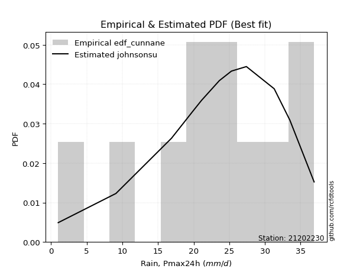</img>

</div>


### 12. EDF Adamowski (1981)

The Adamowski formula in hydrology refers to a specific plotting position formula used for estimating the non-parametric empirical distribution of hydrological events (like flood peaks) to calculate their return periods. This formula provides an alternative to traditional parametric methods (like the Gumbel or Log Pearson Type III distributions). 

<div align="center">


$P=(m-0.25)/(n+0.5)$


</div>


**12.1. Empirical values**

<div align="center">

|                | 0                   | 1                   | 2                  | 3                   | 4                   | 5             | 6                  | 7                  | 8                  | 9                  | 10                 |
|:---------------|:--------------------|:--------------------|:-------------------|:--------------------|:--------------------|:--------------|:-------------------|:-------------------|:-------------------|:-------------------|:-------------------|
| date           | 2023                | 2015                | 2012               | 2016                | 2014                | 2024          | 2009               | 2011               | 2013               | 2008               | 2010               |
| x              | 1.0                 | 9.1                 | 16.9               | 19.9                | 21.1                | 23.6          | 25.3               | 27.4               | 31.3               | 33.5               | 36.9               |
| m              | 1                   | 2                   | 3                  | 4                   | 5                   | 6             | 7                  | 8                  | 9                  | 10                 | 11                 |
| empirical_dist | edf_adamowski       | edf_adamowski       | edf_adamowski      | edf_adamowski       | edf_adamowski       | edf_adamowski | edf_adamowski      | edf_adamowski      | edf_adamowski      | edf_adamowski      | edf_adamowski      |
| empirical      | 0.06521739130434782 | 0.15217391304347827 | 0.2391304347826087 | 0.32608695652173914 | 0.41304347826086957 | 0.5           | 0.5869565217391305 | 0.6739130434782609 | 0.7608695652173914 | 0.8478260869565217 | 0.9347826086956522 |
| empirical_tr   | 1.069767441860465   | 1.1794871794871795  | 1.3142857142857143 | 1.4838709677419355  | 1.703703703703704   | 2.0           | 2.421052631578948  | 3.0666666666666664 | 4.1818181818181825 | 6.571428571428571  | 15.333333333333343 |

</div>


**12.2. Kolmogorov-Smirnov fit test (sorted by Δ)**


<div align="center">

|                | 0                    | 1                    | 2                   | 3                   | 4                   | 5                   | 6                   | 7                   | 8                   | 9                   | 10                  | 11                  | 12                  | 13                  | 14                  | 15                  | 16                  | 17                  | 18                  | 19                  | 20                  | 21                  | 22                  | 23                  | 24                  | 25                  | 26                    | 27                  | 28                  | 29                  | 30                  | 31                  | 32                  | 33                  | 34                  | 35                  | 36                  | 37                  | 38                  | 39                  | 40                  | 41                  | 42                  | 43                  | 44                  | 45                  | 46                  | 47                  | 48                  | 49                  | 50                  | 51                  | 52                  | 53                  | 54                  | 55                  | 56                  | 57                  | 58                  | 59                  | 60                  | 61                  | 62                  | 63                  | 64                  | 65                  | 66                  | 67                  | 68                  | 69                  | 70                  | 71                  | 72                  | 73                  | 74                  | 75                  | 76                  | 77                  | 78                  | 79                  | 80                  | 81                  | 82                  | 83                  | 84                  | 85                  | 86                  | 87                  |
|:---------------|:---------------------|:---------------------|:--------------------|:--------------------|:--------------------|:--------------------|:--------------------|:--------------------|:--------------------|:--------------------|:--------------------|:--------------------|:--------------------|:--------------------|:--------------------|:--------------------|:--------------------|:--------------------|:--------------------|:--------------------|:--------------------|:--------------------|:--------------------|:--------------------|:--------------------|:--------------------|:----------------------|:--------------------|:--------------------|:--------------------|:--------------------|:--------------------|:--------------------|:--------------------|:--------------------|:--------------------|:--------------------|:--------------------|:--------------------|:--------------------|:--------------------|:--------------------|:--------------------|:--------------------|:--------------------|:--------------------|:--------------------|:--------------------|:--------------------|:--------------------|:--------------------|:--------------------|:--------------------|:--------------------|:--------------------|:--------------------|:--------------------|:--------------------|:--------------------|:--------------------|:--------------------|:--------------------|:--------------------|:--------------------|:--------------------|:--------------------|:--------------------|:--------------------|:--------------------|:--------------------|:--------------------|:--------------------|:--------------------|:--------------------|:--------------------|:--------------------|:--------------------|:--------------------|:--------------------|:--------------------|:--------------------|:--------------------|:--------------------|:--------------------|:--------------------|:--------------------|:--------------------|:--------------------|
| station        | 21202230             | 21202230             | 21202230            | 21202230            | 21202230            | 21202230            | 21202230            | 21202230            | 21202230            | 21202230            | 21202230            | 21202230            | 21202230            | 21202230            | 21202230            | 21202230            | 21202230            | 21202230            | 21202230            | 21202230            | 21202230            | 21202230            | 21202230            | 21202230            | 21202230            | 21202230            | 21202230              | 21202230            | 21202230            | 21202230            | 21202230            | 21202230            | 21202230            | 21202230            | 21202230            | 21202230            | 21202230            | 21202230            | 21202230            | 21202230            | 21202230            | 21202230            | 21202230            | 21202230            | 21202230            | 21202230            | 21202230            | 21202230            | 21202230            | 21202230            | 21202230            | 21202230            | 21202230            | 21202230            | 21202230            | 21202230            | 21202230            | 21202230            | 21202230            | 21202230            | 21202230            | 21202230            | 21202230            | 21202230            | 21202230            | 21202230            | 21202230            | 21202230            | 21202230            | 21202230            | 21202230            | 21202230            | 21202230            | 21202230            | 21202230            | 21202230            | 21202230            | 21202230            | 21202230            | 21202230            | 21202230            | 21202230            | 21202230            | 21202230            | 21202230            | 21202230            | 21202230            | 21202230            |
| empirical_dist | edf_adamowski        | edf_adamowski        | edf_adamowski       | edf_adamowski       | edf_adamowski       | edf_adamowski       | edf_adamowski       | edf_adamowski       | edf_adamowski       | edf_adamowski       | edf_adamowski       | edf_adamowski       | edf_adamowski       | edf_adamowski       | edf_adamowski       | edf_adamowski       | edf_adamowski       | edf_adamowski       | edf_adamowski       | edf_adamowski       | edf_adamowski       | edf_adamowski       | edf_adamowski       | edf_adamowski       | edf_adamowski       | edf_adamowski       | edf_adamowski         | edf_adamowski       | edf_adamowski       | edf_adamowski       | edf_adamowski       | edf_adamowski       | edf_adamowski       | edf_adamowski       | edf_adamowski       | edf_adamowski       | edf_adamowski       | edf_adamowski       | edf_adamowski       | edf_adamowski       | edf_adamowski       | edf_adamowski       | edf_adamowski       | edf_adamowski       | edf_adamowski       | edf_adamowski       | edf_adamowski       | edf_adamowski       | edf_adamowski       | edf_adamowski       | edf_adamowski       | edf_adamowski       | edf_adamowski       | edf_adamowski       | edf_adamowski       | edf_adamowski       | edf_adamowski       | edf_adamowski       | edf_adamowski       | edf_adamowski       | edf_adamowski       | edf_adamowski       | edf_adamowski       | edf_adamowski       | edf_adamowski       | edf_adamowski       | edf_adamowski       | edf_adamowski       | edf_adamowski       | edf_adamowski       | edf_adamowski       | edf_adamowski       | edf_adamowski       | edf_adamowski       | edf_adamowski       | edf_adamowski       | edf_adamowski       | edf_adamowski       | edf_adamowski       | edf_adamowski       | edf_adamowski       | edf_adamowski       | edf_adamowski       | edf_adamowski       | edf_adamowski       | edf_adamowski       | edf_adamowski       | edf_adamowski       |
| p_dist         | johnsonsu            | pearson3             | weibull_min         | genlogistic         | gumbel_l            | logjohnsonsu        | logistic            | fisk                | exponnorm           | crystalball         | norm                | t                   | nct                 | f                   | nakagami            | mielke              | gamma               | hypsecant           | betaprime           | laplace_asymmetric  | erlang              | logt                | laplace             | invgamma            | maxwell             | logpearson3         | loglaplace_asymmetric | logloggamma         | invgauss            | rayleigh            | rice                | invweibull          | gumbel_r            | logfisk             | logweibull_min      | ncf                 | loggompertz         | halfnorm            | moyal               | alpha               | kstwobign           | halflogistic        | loggumbel_l         | truncnorm           | wald                | gibrat              | logbetaprime        | loghypsecant        | loglogistic         | logrice             | logexponnorm        | lognorm             | lognorm             | logcrystalball      | logfatiguelife      | lognct              | loginvgauss         | loggamma            | loggamma            | loglaplace          | logalpha            | logerlang           | loginvgamma         | loginvweibull       | logmaxwell          | genexpon            | expon               | lograyleigh         | logkstwobign        | loggumbel_r         | loghalfnorm         | lognakagami         | logmoyal            | gompertz            | logncf              | loghalflogistic     | loggenexpon         | logchi2             | logexpon            | logwald             | loggibrat           | logf                | logmielke           | loglognorm          | fatiguelife         | logtruncnorm        | chi2                | loggenlogistic      |
| delta          | 0.048880655346619006 | 0.050055695163923594 | 0.05383261371525483 | 0.0582391007565648  | 0.06497490369497438 | 0.06590478489906504 | 0.07197859831822884 | 0.07259059434966747 | 0.07749169123696148 | 0.077491803041009   | 0.07749181267436156 | 0.0775053980508319  | 0.07753474030091717 | 0.0785092902069306  | 0.07866581197018341 | 0.07916193697644591 | 0.08285359349261923 | 0.08384461455010295 | 0.08500705762257577 | 0.08812392851993    | 0.09152884857441418 | 0.09575537539655965 | 0.09618614166256378 | 0.10908443692981523 | 0.11158652098357813 | 0.11298572030878762 | 0.11761464656269516   | 0.11974386034086548 | 0.1227623662657707  | 0.12387093639535562 | 0.1253375126556015  | 0.13712469376627878 | 0.1379195513714882  | 0.14535411858381708 | 0.14907168602279275 | 0.15004068028327666 | 0.15159728929097682 | 0.1587000351549176  | 0.16106286812209092 | 0.16198760928381428 | 0.169353545069441   | 0.17473037728828067 | 0.1813000738980613  | 0.19677051235817555 | 0.2237945259227917  | 0.24180333335382986 | 0.24711757740700763 | 0.24960828172851385 | 0.2506560006361783  | 0.25187870572594323 | 0.2518809055084259  | 0.251883246109356   | 0.251883246109356   | 0.251883334570052   | 0.2530384793874933  | 0.2531993601548987  | 0.26252071115803904 | 0.264794297276778   | 0.264794297276778   | 0.26685584900046455 | 0.26810132348907895 | 0.2710449902988647  | 0.27253882663252477 | 0.2756336714617234  | 0.2852709452638748  | 0.2857795576919108  | 0.2857816080704388  | 0.29647166601354985 | 0.3192094994970606  | 0.32193486550400924 | 0.3280077727824688  | 0.3367930218119619  | 0.3478176239258696  | 0.3497716889074459  | 0.3522285742497855  | 0.3523669171271468  | 0.35636540201164163 | 0.3583237115352107  | 0.39014923622126035 | 0.4198269261611674  | 0.4417061252027858  | 0.45461225473803135 | 0.4555958350321033  | 0.4713062132106166  | 0.5809969346296591  | 0.5979955078017696  | 0.724885857137552   | 0.8478260869565217  |
| deltao         | 0.37613735880099997  | 0.37613735880099997  | 0.37613735880099997 | 0.37613735880099997 | 0.37613735880099997 | 0.37613735880099997 | 0.37613735880099997 | 0.37613735880099997 | 0.37613735880099997 | 0.37613735880099997 | 0.37613735880099997 | 0.37613735880099997 | 0.37613735880099997 | 0.37613735880099997 | 0.37613735880099997 | 0.37613735880099997 | 0.37613735880099997 | 0.37613735880099997 | 0.37613735880099997 | 0.37613735880099997 | 0.37613735880099997 | 0.37613735880099997 | 0.37613735880099997 | 0.37613735880099997 | 0.37613735880099997 | 0.37613735880099997 | 0.37613735880099997   | 0.37613735880099997 | 0.37613735880099997 | 0.37613735880099997 | 0.37613735880099997 | 0.37613735880099997 | 0.37613735880099997 | 0.37613735880099997 | 0.37613735880099997 | 0.37613735880099997 | 0.37613735880099997 | 0.37613735880099997 | 0.37613735880099997 | 0.37613735880099997 | 0.37613735880099997 | 0.37613735880099997 | 0.37613735880099997 | 0.37613735880099997 | 0.37613735880099997 | 0.37613735880099997 | 0.37613735880099997 | 0.37613735880099997 | 0.37613735880099997 | 0.37613735880099997 | 0.37613735880099997 | 0.37613735880099997 | 0.37613735880099997 | 0.37613735880099997 | 0.37613735880099997 | 0.37613735880099997 | 0.37613735880099997 | 0.37613735880099997 | 0.37613735880099997 | 0.37613735880099997 | 0.37613735880099997 | 0.37613735880099997 | 0.37613735880099997 | 0.37613735880099997 | 0.37613735880099997 | 0.37613735880099997 | 0.37613735880099997 | 0.37613735880099997 | 0.37613735880099997 | 0.37613735880099997 | 0.37613735880099997 | 0.37613735880099997 | 0.37613735880099997 | 0.37613735880099997 | 0.37613735880099997 | 0.37613735880099997 | 0.37613735880099997 | 0.37613735880099997 | 0.37613735880099997 | 0.37613735880099997 | 0.37613735880099997 | 0.37613735880099997 | 0.37613735880099997 | 0.37613735880099997 | 0.37613735880099997 | 0.37613735880099997 | 0.37613735880099997 | 0.37613735880099997 |
| eval           | Δo > Δ               | Δo > Δ               | Δo > Δ              | Δo > Δ              | Δo > Δ              | Δo > Δ              | Δo > Δ              | Δo > Δ              | Δo > Δ              | Δo > Δ              | Δo > Δ              | Δo > Δ              | Δo > Δ              | Δo > Δ              | Δo > Δ              | Δo > Δ              | Δo > Δ              | Δo > Δ              | Δo > Δ              | Δo > Δ              | Δo > Δ              | Δo > Δ              | Δo > Δ              | Δo > Δ              | Δo > Δ              | Δo > Δ              | Δo > Δ                | Δo > Δ              | Δo > Δ              | Δo > Δ              | Δo > Δ              | Δo > Δ              | Δo > Δ              | Δo > Δ              | Δo > Δ              | Δo > Δ              | Δo > Δ              | Δo > Δ              | Δo > Δ              | Δo > Δ              | Δo > Δ              | Δo > Δ              | Δo > Δ              | Δo > Δ              | Δo > Δ              | Δo > Δ              | Δo > Δ              | Δo > Δ              | Δo > Δ              | Δo > Δ              | Δo > Δ              | Δo > Δ              | Δo > Δ              | Δo > Δ              | Δo > Δ              | Δo > Δ              | Δo > Δ              | Δo > Δ              | Δo > Δ              | Δo > Δ              | Δo > Δ              | Δo > Δ              | Δo > Δ              | Δo > Δ              | Δo > Δ              | Δo > Δ              | Δo > Δ              | Δo > Δ              | Δo > Δ              | Δo > Δ              | Δo > Δ              | Δo > Δ              | Δo > Δ              | Δo > Δ              | Δo > Δ              | Δo > Δ              | Δo > Δ              | Δo > Δ              | Δo <= Δ             | Δo <= Δ             | Δo <= Δ             | Δo <= Δ             | Δo <= Δ             | Δo <= Δ             | Δo <= Δ             | Δo <= Δ             | Δo <= Δ             | Δo <= Δ             |
| fit            | 1                    | 1                    | 1                   | 1                   | 1                   | 1                   | 1                   | 1                   | 1                   | 1                   | 1                   | 1                   | 1                   | 1                   | 1                   | 1                   | 1                   | 1                   | 1                   | 1                   | 1                   | 1                   | 1                   | 1                   | 1                   | 1                   | 1                     | 1                   | 1                   | 1                   | 1                   | 1                   | 1                   | 1                   | 1                   | 1                   | 1                   | 1                   | 1                   | 1                   | 1                   | 1                   | 1                   | 1                   | 1                   | 1                   | 1                   | 1                   | 1                   | 1                   | 1                   | 1                   | 1                   | 1                   | 1                   | 1                   | 1                   | 1                   | 1                   | 1                   | 1                   | 1                   | 1                   | 1                   | 1                   | 1                   | 1                   | 1                   | 1                   | 1                   | 1                   | 1                   | 1                   | 1                   | 1                   | 1                   | 1                   | 1                   | 0                   | 0                   | 0                   | 0                   | 0                   | 0                   | 0                   | 0                   | 0                   | 0                   |
| n              | 11                   | 11                   | 11                  | 11                  | 11                  | 11                  | 11                  | 11                  | 11                  | 11                  | 11                  | 11                  | 11                  | 11                  | 11                  | 11                  | 11                  | 11                  | 11                  | 11                  | 11                  | 11                  | 11                  | 11                  | 11                  | 11                  | 11                    | 11                  | 11                  | 11                  | 11                  | 11                  | 11                  | 11                  | 11                  | 11                  | 11                  | 11                  | 11                  | 11                  | 11                  | 11                  | 11                  | 11                  | 11                  | 11                  | 11                  | 11                  | 11                  | 11                  | 11                  | 11                  | 11                  | 11                  | 11                  | 11                  | 11                  | 11                  | 11                  | 11                  | 11                  | 11                  | 11                  | 11                  | 11                  | 11                  | 11                  | 11                  | 11                  | 11                  | 11                  | 11                  | 11                  | 11                  | 11                  | 11                  | 11                  | 11                  | 11                  | 11                  | 11                  | 11                  | 11                  | 11                  | 11                  | 11                  | 11                  | 11                  |
| best_fit       | 1                    | 0                    | 0                   | 0                   | 0                   | 0                   | 0                   | 0                   | 0                   | 0                   | 0                   | 0                   | 0                   | 0                   | 0                   | 0                   | 0                   | 0                   | 0                   | 0                   | 0                   | 0                   | 0                   | 0                   | 0                   | 0                   | 0                     | 0                   | 0                   | 0                   | 0                   | 0                   | 0                   | 0                   | 0                   | 0                   | 0                   | 0                   | 0                   | 0                   | 0                   | 0                   | 0                   | 0                   | 0                   | 0                   | 0                   | 0                   | 0                   | 0                   | 0                   | 0                   | 0                   | 0                   | 0                   | 0                   | 0                   | 0                   | 0                   | 0                   | 0                   | 0                   | 0                   | 0                   | 0                   | 0                   | 0                   | 0                   | 0                   | 0                   | 0                   | 0                   | 0                   | 0                   | 0                   | 0                   | 0                   | 0                   | 0                   | 0                   | 0                   | 0                   | 0                   | 0                   | 0                   | 0                   | 0                   | 0                   |
| best_fit_sort  | 1                    | 2                    | 3                   | 4                   | 5                   | 6                   | 7                   | 8                   | 9                   | 10                  | 11                  | 12                  | 13                  | 14                  | 15                  | 16                  | 17                  | 18                  | 19                  | 20                  | 21                  | 22                  | 23                  | 24                  | 25                  | 26                  | 27                    | 28                  | 29                  | 30                  | 31                  | 32                  | 33                  | 34                  | 35                  | 36                  | 37                  | 38                  | 39                  | 40                  | 41                  | 42                  | 43                  | 44                  | 45                  | 46                  | 47                  | 48                  | 49                  | 50                  | 51                  | 52                  | 53                  | 54                  | 55                  | 56                  | 57                  | 58                  | 59                  | 60                  | 61                  | 62                  | 63                  | 64                  | 65                  | 66                  | 67                  | 68                  | 69                  | 70                  | 71                  | 72                  | 73                  | 74                  | 75                  | 76                  | 77                  | 78                  | 79                  | 80                  | 81                  | 82                  | 83                  | 84                  | 85                  | 86                  | 87                  | 88                  |

</div>


**12.3. Best fit**

<div align="center">

|   id |   station | empirical_dist   | p_dist    |     delta |   deltao | eval   |   fit |   n |   best_fit |   best_fit_sort |
|-----:|----------:|:-----------------|:----------|----------:|---------:|:-------|------:|----:|-----------:|----------------:|
|    0 |  21202230 | edf_adamowski    | johnsonsu | 0.0488807 | 0.376137 | Δo > Δ |     1 |  11 |          1 |               1 |

</div>


<div align="center">

</img>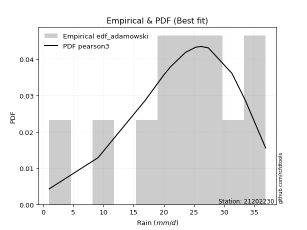</img>

</div>


## C. Best fit & Estimate extreme values for specific return periods - Tr

Best fit in probability distribution analysis means finding the theoretical distribution (like Normal, Poisson, Exponential) that most accurately mirrors your real-world data´s patterns (shape, center, spread) for better predictions, using methods like visual checks (Q-Q plots), goodness-of-fit tests (Kolmogorov-Smirnov, Chi-Squared), and information criteria (AIC) to score and select the simplest, most representative model.


### 1. Best fit (ordered by delta Δ)

<div align="center">

|   id |   station | empirical_dist   | p_dist    |     delta |   deltao | eval   |   fit |   n |   best_fit |   best_fit_sort |
|-----:|----------:|:-----------------|:----------|----------:|---------:|:-------|------:|----:|-----------:|----------------:|
|    0 |  21202230 | edf_hazen        | johnsonsu | 0.0398684 | 0.376137 | Δo > Δ |     1 |  11 |          1 |               1 |
|    1 |  21202230 | edf_gringorten   | johnsonsu | 0.039966  | 0.376137 | Δo > Δ |     1 |  11 |          1 |               2 |
|    2 |  21202230 | edf_cunnane      | johnsonsu | 0.0418931 | 0.376137 | Δo > Δ |     1 |  11 |          1 |               3 |
|    3 |  21202230 | edf_blom         | johnsonsu | 0.0430836 | 0.376137 | Δo > Δ |     1 |  11 |          1 |               4 |
|    4 |  21202230 | edf_tukey        | pearson3  | 0.0449406 | 0.376137 | Δo > Δ |     1 |  11 |          1 |               5 |
|    5 |  21202230 | edf_filliben     | johnsonsu | 0.0457819 | 0.376137 | Δo > Δ |     1 |  11 |          1 |               6 |
|    6 |  21202230 | edf_beard        | johnsonsu | 0.0461298 | 0.376137 | Δo > Δ |     1 |  11 |          1 |               7 |
|    7 |  21202230 | edf_jenkinson    | johnsonsu | 0.0461298 | 0.376137 | Δo > Δ |     1 |  11 |          1 |               8 |
|    8 |  21202230 | edf_chegodayev   | johnsonsu | 0.0465923 | 0.376137 | Δo > Δ |     1 |  11 |          1 |               9 |
|    9 |  21202230 | edf_adamowski    | johnsonsu | 0.0488807 | 0.376137 | Δo > Δ |     1 |  11 |          1 |              10 |
|   10 |  21202230 | edf_weibull      | johnsonsu | 0.0602085 | 0.376137 | Δo > Δ |     1 |  11 |          1 |              11 |
|   11 |  21202230 | edf_california   | pearson3  | 0.0797    | 0.376137 | Δo > Δ |     1 |  11 |          1 |              12 |

</div>

:file_folder:Tables: [bestfit_21202230.csv](table/bestfit_21202230.csv) | [extreme_21202230.csv](table/extreme_21202230.csv)


### 2. Extreme values

In hydrology, a return period (or recurrence interval $Tr$) is the statistical average time between extreme events like floods or droughts of a specific magnitude, indicating how rare an event is, with a 100-year flood, for example, having a 1% chance of occurring in any given year, not that it happens exactly every century. It is a key tool for infrastructure design (like bridges or dams) and risk assessment, calculated from historical data to determine the probability of future events, although it is important to remember it is statistical average, and events can cluster or be missed.

> risk_rate: assuming the return period as the project useful life.

|   id |      tr |   prob_l |     prob_g |   alpha |   betaprime |     chi2 |   crystalball |   erlang |    expon |   exponnorm |       f |   fatiguelife |    fisk |   gamma |   genexpon |   genlogistic |   gibrat |   gompertz |   gumbel_l |   gumbel_r |   halflogistic |   halfnorm |   hypsecant |   invgamma |   invgauss |   invweibull |   johnsonsu |   kstwobign |   laplace |   laplace_asymmetric |   loggamma |   logistic |   lognorm |   maxwell |   mielke |   moyal |   nakagami |     ncf |     nct |    norm |   pearson3 |   rayleigh |    rice |       t |   truncnorm |    wald |   weibull_min |    logalpha |   logbetaprime |          logchi2 |   logcrystalball |   logerlang |         logexpon |   logexponnorm |            logf |   logfatiguelife |   logfisk |   loggenexpon |   loggenlogistic |   loggibrat |   loggompertz |   loggumbel_l |   loggumbel_r |   loghalflogistic |   loghalfnorm |   loghypsecant |   loginvgamma |   loginvgauss |   loginvweibull |   logjohnsonsu |   logkstwobign |   loglaplace |   loglaplace_asymmetric |   logloggamma |   loglogistic |   loglognorm |   logmaxwell |        logmielke |   logmoyal |      lognakagami |            logncf |   lognct |   logpearson3 |   lograyleigh |   logrice |             logt |   logtruncnorm |    logwald |   logweibull_min |   station |   n |   risk_rate |
|-----:|--------:|---------:|-----------:|--------:|------------:|---------:|--------------:|---------:|---------:|------------:|--------:|--------------:|--------:|--------:|-----------:|--------------:|---------:|-----------:|-----------:|-----------:|---------------:|-----------:|------------:|-----------:|-----------:|-------------:|------------:|------------:|----------:|---------------------:|-----------:|-----------:|----------:|----------:|---------:|--------:|-----------:|--------:|--------:|--------:|-----------:|-----------:|--------:|--------:|------------:|--------:|--------------:|------------:|---------------:|-----------------:|-----------------:|------------:|-----------------:|---------------:|----------------:|-----------------:|----------:|--------------:|-----------------:|------------:|--------------:|--------------:|--------------:|------------------:|--------------:|---------------:|--------------:|--------------:|----------------:|---------------:|---------------:|-------------:|------------------------:|--------------:|--------------:|-------------:|-------------:|-----------------:|-----------:|-----------------:|------------------:|---------:|--------------:|--------------:|----------:|-----------------:|---------------:|-----------:|-----------------:|----------:|----:|------------:|
|    0 |    2    | 0.5      | 0.5        | 20.2181 |     22.2141 |  3.37836 |       22.3636 |  22.0258 |  15.8081 |     22.3636 | 22.3422 |       1.00001 | 23.1363 | 22.2823 |    15.8082 |       24.1752 |  19.334  |    28.8003 |    24.0218 |    20.7055 |        19.8812 |    20.2976 |     22.3636 |    21.5926 |    21.3305 |      21.0346 |     24.1011 |     20.0467 |   22.3636 |              23.6672 |    16.7267 |    22.3636 |   17.2745 |   21.5004 | -1.96105 | 20.1702 |    22.3374 | 20.6303 | 22.3631 | 22.3636 |    23.3902 |    21.1943 | 21.3274 | 22.3633 |     19.353  | 19.0919 |       23.8788 |     16.4564 |        17.4917 |      8.48306     |          17.2745 |     16.4535 |      7.20617     |        17.2746 |    3.58199      |          17.2267 |   21.2858 |       11.4121 |              inf |     12.8991 |       20.5452 |       20.2686 |       14.7227 |           13.5982 |       14.155  |        17.2745 |       16.3893 |       16.8207 |         15.9556 |        24.3061 |        13.2097 |      17.2745 |                 21.826  |       21.7591 |       17.2745 |            1 |      15.8951 |      4.76377     |    13.9822 |      9.96746     |      8.69208      |  17.2216 |       23.8073 |       15.4329 |   17.2745 |     24.6319      |        4.76737 |    12.6019 |          20.6135 |  21202230 |  11 |    0.75     |
|    1 |    2.33 | 0.570815 | 0.429185   | 22.1622 |     24.063  |  4.06387 |       24.1647 |  23.8652 |  19.0708 |     24.1647 | 24.1486 |       1.66582 | 24.7714 | 24.1429 |    19.0709 |       25.7033 |  20.2464 |    29.542  |    25.5887 |    22.3744 |        21.5971 |    22.2415 |     23.8051 |    23.4745 |    23.3705 |      23.3353 |     25.754  |     22.4159 |   23.4536 |              24.875  |    20.1758 |    23.9505 |   20.5499 |   23.3716 | -1.96105 | 21.7501 |    24.142  | 22.8869 | 24.1648 | 24.1647 |    25.1255 |    23.0932 | 23.4842 | 24.1644 |     21.9247 | 20.2729 |       25.5178 |     21.5328 |        20.9075 |     14.0927      |          20.5499 |     19.8579 |     11.1348      |        20.55   |    6.22298      |          20.5027 |   23.9692 |       15.2203 |              inf |     14.0851 |       22.653  |       23.5737 |       17.2925 |           16.0442 |       17.0723 |        19.8496 |       19.7761 |       20.6362 |         21.2031 |        26.3805 |        17.8529 |      19.1883 |                 24.1301 |       24.0701 |       20.1299 |            1 |      19.0373 |      7.12575     |    16.2824 |     18.8163      |     20.9431       |  20.5158 |       26.8636 |       18.533  |   20.5479 |     26.0457      |        6.0753  |    14.1214 |          22.707  |  21202230 |  11 |    0.729209 |
|    2 |    5    | 0.8      | 0.2        | 30.1383 |     31.0223 |  7.77933 |       30.8581 |  30.8272 |  35.3834 |     30.8581 | 30.8734 |      15.8093  | 31.0849 | 31.1681 |    35.3836 |       30.7864 |  25.4991 |    31.9386 |    30.651  |    29.625  |        29.3613 |    30.4618 |     29.5869 |    30.7668 |    31.5322 |      33.3305 |     31.0513 |     32.4794 |   28.903  |              29.5779 |    40.9091 |    30.0777 |   39.1773 |   30.7366 | -1.96105 | 29.068  |    30.8508 | 32.3481 | 30.8614 | 30.8581 |    31.0154 |    30.6953 | 32.1189 | 30.8577 |     29.8104 | 26.8842 |       30.9062 |     68.552  |        40.7207 |    187.949       |          39.1773 |     40.5735 |     98.0681      |        39.1775 | 2118.62         |          39.1669 |   37.9092 |       48.3639 |              inf |     23.371  |       31.0629 |       38.4028 |       34.7864 |           33.9132 |       37.709  |        34.6589 |       40.3255 |       45.3693 |         72.9261 |        32.1671 |        64.1772 |      32.4477 |                 31.1626 |       31.1307 |       36.3383 |          inf |      38.7214 |     71.9064      |    32.968  |    366.019       | 143371            |  39.3506 |       35.9226 |       38.5675 |   39.1594 |     33.8288      |       14.4441  |    26.7095 |          31.0363 |  21202230 |  11 |    0.67232  |
|    3 |   10    | 0.9      | 0.1        | 36.1923 |     35.716  | 11.3833  |       35.2983 |  35.5562 |  50.1916 |     35.2983 | 35.3447 |      35.3379  | 35.7346 | 35.9252 |    50.1919 |       34.0147 |  31.4867 |    33.2731 |    33.4694 |    35.5304 |        35.8091 |    36.5446 |     34.2039 |    35.878  |    37.4785 |      41.4714 |     33.9338 |     40.1414 |   33.8499 |              33.8259 |    65.9672 |    34.5902 |   60.1075 |   35.9197 | 34.4329  | 35.4395 |    35.3031 | 39.5965 | 35.3046 | 35.2983 |    34.4551 |    36.1157 | 38.2756 | 35.2979 |     33.272  | 33.9003 |       33.9689 |    175.981  |        63.574  |   2057.19        |          60.1075 |     66.0763 |    706.695       |        60.1078 |    1.31175e+10  |          60.1886 |   53.1335 |      110.504  |              inf |     41.6254 |       37.0358 |       50.3917 |       61.4677 |           63.1407 |       67.7815 |        54.0891 |       65.5311 |       78.4513 |        199.455  |        34.5804 |       170.002  |      52.2744 |                 34.0715 |       34.054  |       56.1414 |          inf |      63.8189 |   1188.72        |    60.9311 |   3774.01        |      7.15203e+14  |  60.6629 |       39.3036 |       65.0367 |   60.0657 |     46.6655      |       22.3896  |    52.5292 |          36.9341 |  21202230 |  11 |    0.651322 |
|    4 |   15    | 0.933333 | 0.0666667  | 39.4814 |     38.0813 | 13.5496  |       37.514  |  37.9492 |  58.8538 |     37.5141 | 37.579  |      48.1099  | 38.2679 | 38.3281 |    58.8541 |       35.6797 |  35.6166 |    33.8775 |    34.7458 |    38.8622 |        39.458  |    39.7101 |     36.8387 |    38.5147 |    40.613  |      46.0644 |     35.2117 |     44.209  |   36.7436 |              36.3109 |    83.9529 |    37.0488 |   74.4206 |   38.579  | 35.2795  | 39.1372 |    37.5255 | 43.5167 | 37.5222 | 37.514  |    36.0381 |    38.9086 | 41.4479 | 37.5136 |     34.4565 | 38.4057 |       35.3709 |    301.207  |        79.4777 |   8426.56        |          74.4206 |     84.6312 |   2243.66        |        74.421  |    7.97447e+18  |          74.5869 |   63.8639 |      169.22   |              inf |     61.9823 |       40.1068 |       56.9898 |       84.7494 |           89.7578 |       91.9683 |        69.7303 |       83.8277 |      103.901  |        351.865  |        35.4648 |       285.138  |      69.0936 |                 35.0234 |       35.011  |       71.1565 |          inf |      82.4684 |   9938.17        |    87.0257 |  12929.1         |      7.86142e+26  |  75.305  |       40.3024 |       85.1308 |   74.3601 |     61.1135      |       26.2332  |    81.1008 |          39.9619 |  21202230 |  11 |    0.644736 |
|    5 |   20    | 0.95     | 0.05       | 41.7428 |     39.6387 | 15.1054  |       38.9651 |  39.5285 |  64.9997 |     38.9651 | 39.0433 |      57.566   | 40.0189 | 39.9122 |    65.0001 |       36.8069 |  38.8562 |    34.2537 |    35.5403 |    41.1951 |        42.0145 |    41.8206 |     38.6975 |    40.2735 |    42.7279 |      49.2803 |     35.996  |     46.9491 |   38.7967 |              38.074  |    98.4069 |    38.7481 |   85.5939 |   40.344  | 35.6987  | 41.7559 |    38.9811 | 46.1965 | 38.9745 | 38.9651 |    37.028  |    40.7649 | 43.5564 | 38.9646 |     35.0571 | 41.7631 |       36.2483 |    440.634  |        92.0234 |  22992           |          85.5939 |     99.671  |   5092.56        |        85.5943 |    1.96611e+29  |          85.8372 |   72.5222 |      224.657  |              inf |     84.7035 |       42.1458 |       61.5261 |      106.122  |          114.842  |      112.719  |        83.4145 |       98.6388 |      125.241  |        523.59   |        35.9509 |       403.974  |      84.216  |                 35.4962 |       35.4864 |       83.822  |          inf |      97.7641 |  59786.8         |   112.017  |  29475.3         |      5.82332e+40  |  86.7666 |       40.7663 |      101.813  |   85.5176 |     78.1772      |       28.4758  |   112.095  |          41.9706 |  21202230 |  11 |    0.641514 |
|    6 |   25    | 0.96     | 0.04       | 43.4653 |     40.7894 | 16.3211  |       40.0332 |  40.6971 |  69.7669 |     40.0333 | 40.1218 |      65.0793  | 41.3584 | 41.0837 |    69.7673 |       37.6597 |  41.5569 |    34.5214 |    36.1056 |    42.992  |        43.9842 |    43.3908 |     40.1361 |    41.5847 |    44.3167 |      51.7574 |     36.5482 |     49.0016 |   40.3893 |              39.4415 |   110.668  |    40.048  |   94.8773 |   41.6542 | 35.9489  | 43.7857 |    40.0527 | 48.2272 | 40.0436 | 40.0332 |    37.7335 |    42.1442 | 45.1229 | 40.0328 |     35.4205 | 44.4523 |       36.875  |    592.408  |       102.526  |  50164.1         |          94.8774 |    112.51   |   9617.34        |        94.8778 |    1.18132e+41  |          95.191  |   79.9302 |      277.322  |              inf |    109.894  |       43.6597 |       64.9725 |      126.192  |          138.856  |      131.14   |        95.8226 |      111.272  |      143.911  |        711.132  |        36.2677 |       524.423  |      98.19   |                 35.779  |       35.7707 |       95.0128 |          inf |     110.927  | 292982           |   136.228  |  54470           |      1.4976e+56   |  96.3085 |       41.0301 |      116.292  |   94.7873 |     98.5359      |       29.9418  |   145.269  |          43.4612 |  21202230 |  11 |    0.639603 |
|    7 |   50    | 0.98     | 0.02       | 48.6911 |     44.1045 | 20.1375  |       43.092  |  44.0722 |  84.575  |     43.0921 | 43.2129 |      89.1852  | 45.4509 | 44.4634 |    84.5755 |       40.2305 |  51.077  |    35.2482 |    37.6404 |    48.5274 |        50.053  |    47.955  |     44.5962 |    45.4191 |    49.0191 |      59.3882 |     38.0193 |     55.0285 |   45.3361 |              43.6896 |   155.26   |    44.0198 |  127.416  |   45.4543 | 36.4465  | 50.0871 |    43.1219 | 54.3201 | 43.1055 | 43.092  |    39.6472 |    46.1478 | 49.6704 | 43.0916 |     36.1547 | 53.2327 |       38.5854 |   1505.2    |       139.829  | 570086           |         127.416  |    159.747  |  69304.2         |       127.416  |    4.68703e+116 |         128.014  |  107.589  |      511.204  |              inf |    275.14   |       48.0493 |       75.3324 |      215.168  |          249.252  |      203.621  |       147.297  |      157.679  |      215.703  |       1826.15   |        37.0112 |      1128.42   |     158.188  |                 36.3423 |       36.3372 |      139.337  |          inf |     160.004  |      1.6547e+08  |   250.08   | 325278           |      1.46261e+151 | 129.869  |       41.5138 |      171.068  |  127.274  |    277.245       |       33.1827  |   338.666  |          47.7799 |  21202230 |  11 |    0.63583  |
|    8 |   75    | 0.986667 | 0.0133333  | 51.6895 |     45.8955 | 22.3928  |       44.7333 |  45.9008 |  93.2372 |     44.7333 | 44.873  |     103.703   | 47.8146 | 46.2922 |    93.2378 |       41.7    |  57.5069 |    35.6157 |    38.4164 |    51.7448 |        53.5808 |    50.4396 |     47.2026 |    47.5262 |    51.6376 |      63.8235 |     38.7457 |     58.3445 |   48.2298 |              46.1745 |   186.452  |    46.3138 |  149.257  |   47.5203 | 36.6115  | 53.7721 |    44.769  | 57.7633 | 44.7485 | 44.7333 |    40.6105 |    48.3259 | 52.1444 | 44.7328 |     36.4018 | 58.6357 |       39.4556 |   2634.57   |       165.246  |      2.37222e+06 |         149.257  |    193.229  | 220031           |       149.258  |    2.63994e+214 |         150.076  |  127.733  |      713.115  |              inf |    511.395  |       50.4344 |       81.1845 |      293.412  |          350.213  |      258.726  |       189.372  |      190.522  |      269.147  |       3159.41   |        37.3262 |      1720.15   |     209.084  |                 36.5295 |       36.5254 |      173.822  |          inf |     195.267  |      2.39535e+10 |   356.741  | 860587           |      1.27336e+269 | 152.485  |       41.6569 |      211.037  |  149.078  |    696.82        |       34.3647  |   570.131  |          50.1245 |  21202230 |  11 |    0.634587 |
|    9 |  100    | 0.99     | 0.01       | 53.8012 |     47.1117 | 24.0013  |       45.8434 |  47.1446 |  99.3832 |     45.8434 | 45.9965 |     114.149   | 49.4834 | 47.5352 |    99.3838 |       42.7333 |  62.4879 |    35.8561 |    38.9241 |    54.0219 |        56.0778 |    52.1321 |     49.0515 |    48.9716 |    53.447  |      66.9627 |     39.2137 |     60.6165 |   50.283  |              47.9376 |   211.147  |    47.9334 |  166.115  |   48.9276 | 36.6938  | 56.3864 |    45.8832 | 60.1625 | 45.8599 | 45.8434 |    41.2375 |    49.8098 | 53.8298 | 45.8429 |     36.5259 | 62.575  |       40.0267 |   3952.85   |       185.046  |      6.53335e+06 |         166.115  |    219.959  | 499417           |       166.116  |  inf            |         167.119  |  144.188  |      894.687  |              inf |    826.603  |       52.0583 |       85.2561 |      365.437  |          445.52   |      304.581  |       226.319  |      216.72   |      313.143  |       4656.96   |        37.5117 |      2296.24   |     254.846  |                 36.623  |       36.6194 |      203.193  |          inf |     223.638  |      1.70557e+12 |   458.991  |      1.66928e+06 |    inf            | 169.982  |       41.7234 |      243.493  |  165.906  |   1641.23        |       34.9766  |   833.486  |          51.7201 |  21202230 |  11 |    0.633968 |
|   10 |  200    | 0.995    | 0.005      | 58.8619 |     49.8849 | 27.9004  |       48.3614 |  49.9868 | 114.191  |     48.3614 | 48.5469 |     139.719   | 53.4866 | 50.373  |   114.192  |       45.2029 |  76.0392 |    36.3786 |    40.0274 |    59.4964 |        62.0807 |    56.0032 |     53.5056 |    52.3117 |    57.6681 |      74.5095 |     40.2101 |     65.8494 |   55.2298 |              52.1857 |   280.44   |    51.8184 |  211.753  |   52.1472 | 36.8172  | 62.6851 |    48.4109 | 65.8206 | 48.3809 | 48.3614 |    42.5881 |    53.2052 | 57.6864 | 48.3609 |     36.7126 | 72.3875 |       41.2733 |  10888.2    |       239.345  |      7.53471e+07 |         211.753  |    295.878  |      3.59888e+06 |       211.754  |  inf            |         213.306  |  192.827  |     1503.63   |              inf |   3052.51   |       55.7706 |       94.8243 |      619.452  |          794.661  |      442.355  |       347.694  |      291.043  |      443.709  |      11835.5    |        37.8626 |      4466.44   |     410.566  |                 36.763  |       36.7603 |      295.503  |          inf |     305.028  |      1.30502e+18 |   842.376  |      7.58624e+06 |    inf            | 217.51   |       41.8141 |      337.783  |  211.457  |  35304.4         |       35.9215  |  2146.37   |          55.3654 |  21202230 |  11 |    0.633042 |
|   11 |  250    | 0.996    | 0.004      | 60.4887 |     50.7365 | 29.1617  |       49.1309 |  50.8612 | 118.958  |     49.1309 | 49.3268 |     148.052   | 54.7718 | 51.2453 |   118.959  |       45.994  |  80.9015 |    36.5323 |    40.3521 |    61.2563 |        64.0105 |    57.1941 |     54.9394 |    53.3498 |    58.9908 |      76.9357 |     40.4974 |     67.4689 |   56.8223 |              53.5533 |   305.991  |    53.0657 |  228.057  |   53.1382 | 36.8418  | 64.7128 |    49.1834 | 67.6106 | 49.1514 | 49.1309 |    42.9814 |    54.2504 | 58.8735 | 49.1304 |     36.75   | 75.6337 |       41.6415 |  15275.9    |       258.968  |      1.65733e+08 |         228.058  |    324.175  |      6.79653e+06 |       228.059  |  inf            |         229.825  |  211.688  |     1764.27   |              inf |   4877.84   |       56.9125 |       97.8388 |      733.991  |          957.142  |      496.169  |       399.233  |      318.72   |      494.274  |      15974.1    |        37.9531 |      5487.6    |     478.692  |                 36.791  |       36.7884 |      333.258  |          inf |     335.608  |      3.50708e+20 |  1024.23   |      1.20808e+07 |    inf            | 234.541  |       41.8305 |      373.59   |  227.73   | 143468           |       36.1145  |  2935.02   |          56.4861 |  21202230 |  11 |    0.632858 |
|   12 |  500    | 0.998    | 0.002      | 65.5538 |     53.2728 | 33.0958  |       51.4128 |  53.4702 | 133.767  |     51.4129 | 51.641  |     174.193   | 58.7577 | 53.8461 |   133.767  |       48.4441 |  97.7054 |    36.973  |    41.2827 |    66.7189 |        70.0004 |    60.7449 |     59.3932 |    56.4772 |    63.0052 |      84.466  |     41.3052 |     72.322  |   61.7692 |              57.8013 |   396.793  |    56.9339 |  284.171  |   56.0956 | 36.8911  | 71.0113 |    51.4747 | 73.0906 | 51.4364 | 51.4128 |    44.0958 |    57.3688 | 62.4156 | 51.4123 |     36.8249 | 85.9556 |       42.7004 |  45768.6    |       327.291  |      1.92335e+09 |         284.171  |    425.872  |      4.89769e+07 |       284.173  |  inf            |         286.731  |  282.739  |     2842.8    |              inf |  24646.8    |       60.3172 |      107.022  |     1242.76   |         1705.09   |      698.693  |       613.323  |      418.108  |      683.398  |      40515.5    |        38.1832 |     10170.9    |     771.19   |                 36.847  |       36.8447 |      483.869  |          inf |     446.322  |      2.18482e+30 |  1879.72   |      4.82977e+07 |    inf            | 293.329  |       41.8605 |      504.609  |  283.728  |      7.99376e+07 |       36.5047  |  7938.68   |          59.8261 |  21202230 |  11 |    0.632489 |
|   13 |  750    | 0.998667 | 0.00133333 | 68.5344 |     54.6889 | 35.4068  |       52.6804 |  54.9299 | 142.429  |     52.6805 | 52.9276 |     189.639   | 61.0863 | 55.2999 |   142.43   |       49.8741 | 108.818  |    37.2086 |    41.7801 |    69.9123 |        73.5021 |    62.7285 |     61.9985 |    58.2467 |    65.2953 |      88.8683 |     41.7268 |     75.0484 |   64.6629 |              60.2862 |   458.792  |    59.1939 |  321.108  |   57.7497 | 36.9075  | 74.6957 |    52.7477 | 76.2481 | 52.7058 | 52.6804 |    44.6821 |    59.1126 | 64.3962 | 52.68   |     36.8499 | 92.1444 |       43.2685 |  90164.2    |       372.867  |      8.08348e+09 |         321.109  |    496.214  |      1.55495e+08 |       321.11   |  inf            |         324.232  |  334.825  |     3712.19   |              inf |  71950.6    |       62.2197 |      112.278  |     1690.76   |         2389.71   |      845.929  |       788.427  |      486.798  |      820.263  |      69810.5    |        38.2896 |     14384.7    |    1019.32   |                 36.8656 |       36.8634 |      601.648  |          inf |     523.48   |      1.23577e+38 |  2681.3    |      1.04639e+08 |    inf            | 332.16   |       41.8694 |      596.984  |  320.586  |      2.29639e+10 |       36.636   | 14416.1    |          61.6914 |  21202230 |  11 |    0.632366 |
|   14 | 1000    | 0.999    | 0.001      | 70.661  |     55.6669 | 37.0503  |       53.5532 |  55.9392 | 148.575  |     53.5533 | 53.8138 |     200.656   | 62.7377 | 56.3046 |   148.576  |       50.8878 | 117.323  |    37.3671 |    42.1148 |    72.1775 |        75.986  |    64.0984 |     63.847  |    59.4787 |    66.8972 |      91.991  |     42.0064 |     76.9372 |   66.716  |              62.0493 |   507.198  |    60.7965 |  349.294  |   58.893  | 36.9159  | 77.3099 |    53.6242 | 78.47   | 53.5798 | 53.5532 |    45.0724 |    60.3177 | 65.765  | 53.5528 |     36.8625 | 96.5962 |       43.6516 | 148557      |       407.936  |      2.24029e+10 |         349.294  |    551.585  |      3.52936e+08 |       349.296  |  inf            |         352.87   |  377.48   |     4463.98   |              inf | 163337      |       63.5337 |      115.961  |     2103.38   |         3036.23   |      965.356  |       942.215  |      540.845  |      931.116  |     102692      |        38.3552 |     18289.2    |    1242.41   |                 36.875  |       36.8728 |      702.167  |          inf |     584.471  |      5.75857e+44 |  3449.76   |      1.78395e+08 |    inf            | 361.855  |       41.8735 |      670.525  |  348.71   |      4.46125e+12 |       36.7018  | 22142.4    |          62.9794 |  21202230 |  11 |    0.632305 |

<div align="center">

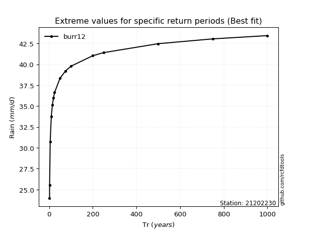</img>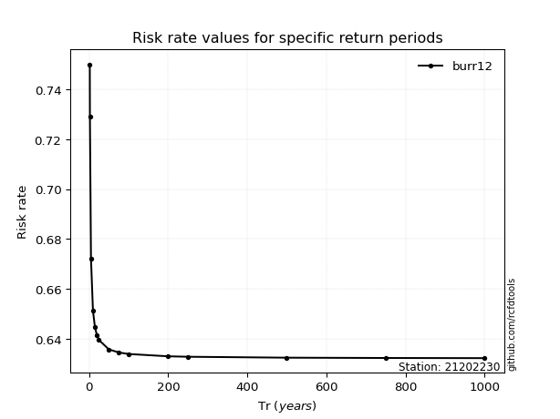</img>

</div>


<sub>**APP DISCLAIMER**: NO WARRANTY - This software is provided by [github.com/rcfdtools](https://github.com/rcfdtools) "as is", without any express or implied warranty, including warranties of merchantability, fitness for a particular purpose, or non-infringement. There is no guarantee that the software will be error-free or operate without interruption. LIMITATION OF LIABILITY - Neither the authors nor copyright holders will be liable for claims or damages arising from the software or its use. You are responsible for determining if the software is appropriate for your use and assume all associated risks, including errors, legal compliance, and data loss. NO PROFESSIONAL ADVICE - The software provides general information and does not offer professional advice. It should not replace consultation with professional advisors.</sub>