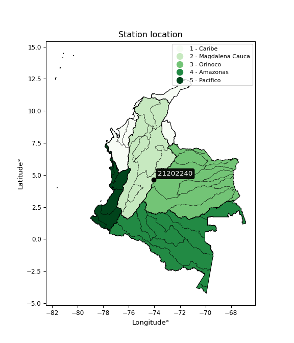

<div align="center">


</div>

# PMP Station (Rain, Pmax24h): 21202240

Probable Maximum Precipitation (PMP) is the greatest amount of rainfall for a specific duration that is meteorologically possible for a given location, acting as a "worst-case" scenario for extreme storms, crucial for designing safety-critical infrastructure like bridges, river deviations, dams, spillways, and nuclear plants to prevent catastrophic failure. PMP is calculated by hydrologists using meteorological data to determine the upper limit of extreme rainfall, often leading to the Probable Maximum Flood (PMF) for flood control design, and is increasingly being studied for climate change impacts.

<div align="center">

</img>

</div>


## A. General information


### 1. General running parameters

• app_version: _v20260103_. • runtime: _2026-01-03 07:24:50.581521_. • Python version: _3.14.0_. • SciPy version: _1.16.3_. • Pandas version: _2.3.3_. • NumPy version: _2.3.5_. • Stations dataset (station_dataset_file): _dataset/pmax24h_in/automatic_colombia_2003_2024.csv_. • Stations catalog (station_catalog_file): _dataset/CNE.xls_. • Minimum year to eval til year_max (date_min): _1900_. • Maximum year to eval since year_min (date_max): _2024_. • Creates, save and include plots into reports (create_plot): _False_. • Plot only fit distributions with Δo > Δ (plot_only_fit): _True_. • Eval low extreme values, if False, evaluates high extreme values (low_extreme): _False_. • Eval every SciPy distribution as logarithmic (pdist_logarithmic_on): _True_. • Standard deviation normalized (ddof): _1.0_. • Return periods to eval in years (Tr): _[2, 2.33, 5, 10, 15, 20, 25, 50, 75, 100, 200, 250, 500, 750, 1000]_. • Minimum data sample per station, 0 means any (minimum_sample): _5_. • Z-Score maximum threshold to adjust a value, 0 means disable (zscore_max): _3.5_. • Z-Score minimum threshold to adjust a value, 0 means disable (zscore_min): _-2.5_. • Avoid zeros, e.g. rain = 0 (avoid_zeros): _True_. • Avoid null values (avoid_nans): _True_. [:file_folder:Dataset file.](../../dataset/pmax24h_in/automatic_colombia_2003_2024.csv)

> Delta Degrees of Freedom (DDOF): is a parameter used in the formulas for calculating variance and standard deviation. When ddof=0, the divisor is $N$ (the total number of observations) and this is used when your data set is the entire population. When ddof=1, the divisor is $N-1$ and this is used when your data set is a sample drawn from a larger population. Using $N-1$ provides an unbiased estimate of the population variance (known as Bessel´s correction).


### 2. Station info and location

|   id |   CODIGO | NOMBRE                                  | CATEGORIA               | TECNOLOGIA                | ESTADO   | FECHA_INSTALACION   |   FECHA_SUSPENSION |   ALTITUD |   LATITUD |   LONGITUD | DEPARTAMENTO   | MUNICIPIO   | AREA_OPERATIVA                            | ENTIDAD                                                          | AREA_HIDROGRAFICA   | ZONA_HIDROGRAFICA   | SUBZONA_HIDROGRAFICA   |   CORRIENTE | Catalogo   |   Version |
|-----:|---------:|:----------------------------------------|:------------------------|:--------------------------|:---------|:--------------------|-------------------:|----------:|----------:|-----------:|:---------------|:------------|:------------------------------------------|:-----------------------------------------------------------------|:--------------------|:--------------------|:-----------------------|------------:|:-----------|----------:|
|    0 | 21202240 | UAN SEDE CIRCUNVALAR  - AUT  [21202240] | Climatológica Ordinaria | Automática con Telemetría | Activa   | 01/09/2007          |                nan |      2717 |   4.63546 |   -74.0575 | Bogotá         | Bogotá, D.C | Area Operativa 11 - Cundinamarca-Amazonas | FONDO DE PREVENCION Y ATENCION DE DESASTRES DE BOGOTA DC - FOPAE | Magdalena Cauca     | Alto Magdalena      | Río Bogotá             |         nan | CNE_OE     |  20251226 |

<div align="center">

Dynamic map: [:earth_americas:Google](http://maps.google.com/maps?q=4.63546,-74.05746) [:earth_americas:OSM](https://www.openstreetmap.org/#map=18/4.63546/-74.05746&layers=P) [:earth_americas:Bing](https://www.bing.com/maps?cp=4.63546~-74.05746&lvl=18) [:earth_americas:Apple](https://maps.apple.com/frame?center=4.63546%2C-74.05746&span=0.003%2C0.006)

</div>


<div align="center">

```geojson
{
  "type": "Feature",
  "geometry": {
    "type": "Point", 
    "coordinates": [-74.05746, 4.63546]
  }, 
  "properties": {
    "Name": "21202240"
  }
}
```

</div>


### 3. Discrete values table and plot

<div align="center">

|               |           0 |          1 |          2 |           3 |           4 |          5 |           6 |          7 |          8 |          9 |          10 |
|:--------------|------------:|-----------:|-----------:|------------:|------------:|-----------:|------------:|-----------:|-----------:|-----------:|------------:|
| Date          | 2008        | 2009       | 2010       | 2011        | 2012        | 2013       | 2014        | 2015       | 2016       | 2023       | 2024        |
| Value         |   36.1      |   56.8     |   73.1     |   63        |   55.1      |   72.3     |   55.6      |   33       |   22.9     |    0.3     |   55.6      |
| Value_initial |   36.1      |   56.8     |   73.1     |   63        |   55.1      |   72.3     |   55.6      |   33       |   22.9     |    0.3     |   55.6      |
| count         |   11        |   11       |   11       |   11        |   11        |   11       |   11        |   11       |   11       |   11       |   11        |
| mean          |   47.6182   |   47.6182  |   47.6182  |   47.6182   |   47.6182   |   47.6182  |   47.6182   |   47.6182  |   47.6182  |   47.6182  |   47.6182   |
| std           |   22.2692   |   22.2692  |   22.2692  |   22.2692   |   22.2692   |   22.2692  |   22.2692   |   22.2692  |   22.2692  |   22.2692  |   22.2692   |
| zscore        |   -0.517225 |    0.41231 |    1.14426 |    0.690721 |    0.335971 |    1.10834 |    0.358424 |   -0.65643 |   -1.10997 |   -2.12483 |    0.358424 |


</div>


> The initial value (value_initial) correspond to the initial obtained or null completed value, and value (value) is adjusted only when the initial value is outside the valid range definite through the Z-Score value. If Z-Score is active, values out of range or outliers are replaced with the station mean value


### 4. Active continuous probability distributions from SciPy (44 of 104 available)

A Probability Density Function (PDF) describes the relative likelihood of a continuous random variable falling within a specific range, where the total area under its curve equals 1, and the area over any interval gives the actual probability for that range. Unlike discrete probabilities (like rolling a die), a PDF shows density, not direct probability for a single point (which is zero), with higher points indicating higher likelihood, often visualized as a bell curve for normal distributions.

A log of a probability density function (log-PDF) is simply the logarithm of the PDF´s value, denoted as $log(f(x))$, useful for converting multiplication of probabilities into addition, improving numerical stability with tiny numbers, and connecting to information theory concepts like entropy. Instead of dealing with very small probabilities (e.g., 0.000001), log-PDFs use negative numbers (e.g., $log(0.00001) ≈ -11.51$ that are easier for computers to handle, preventing underflow errors and simplifying complex calculations. In this study, each active probability distribution from SciPy is also evaluated in the $log$ form.

[scipy.stats](https://docs.scipy.org/doc/scipy/reference/stats.html) is a Python´s powerful submodule within the SciPy library for comprehensive statistical analysis, offering over 130 probability distributions (like Normal, Poisson), functions for descriptive stats (mean, variance), hypothesis testing (t-tests, chi-square), random variable generation, and statistical tests, making it essential for data science, modeling, and research. It provides tools to explore, model, and draw conclusions from data efficiently, working seamlessly with NumPy.

<div align="center">

|   id | p_dist             |   n_parameter | fit_method   | label                                                                       | active   | ref                                                                                                        |
|-----:|:-------------------|--------------:|:-------------|:----------------------------------------------------------------------------|:---------|:-----------------------------------------------------------------------------------------------------------|
|    0 | alpha              |             3 | MLE          | Alpha                                                                       | True     | [:mortar_board:](https://docs.scipy.org/doc/scipy/reference/generated/scipy.stats.alpha.html)              |
|    1 | betaprime          |             4 | MLE          | Beta prime                                                                  | True     | [:mortar_board:](https://docs.scipy.org/doc/scipy/reference/generated/scipy.stats.betaprime.html)          |
|    2 | chi2               |             3 | MLE          | Chi²                                                                        | True     | [:mortar_board:](https://docs.scipy.org/doc/scipy/reference/generated/scipy.stats.chi2.html)               |
|    3 | crystalball        |             4 | MLE          | Crystalball                                                                 | True     | [:mortar_board:](https://docs.scipy.org/doc/scipy/reference/generated/scipy.stats.crystalball.html)        |
|    4 | erlang             |             3 | MLE          | Erlang                                                                      | True     | [:mortar_board:](https://docs.scipy.org/doc/scipy/reference/generated/scipy.stats.erlang.html)             |
|    5 | expon              |             2 | MLE          | Exponential                                                                 | True     | [:mortar_board:](https://docs.scipy.org/doc/scipy/reference/generated/scipy.stats.expon.html)              |
|    6 | exponnorm          |             3 | MLE          | Exponentially modified Normal                                               | True     | [:mortar_board:](https://docs.scipy.org/doc/scipy/reference/generated/scipy.stats.exponnorm.html)          |
|    7 | f                  |             4 | MLE          | F                                                                           | True     | [:mortar_board:](https://docs.scipy.org/doc/scipy/reference/generated/scipy.stats.f.html)                  |
|    8 | fatiguelife        |             3 | MLE          | Fatigue-life (Birnbaum-Saunders)                                            | True     | [:mortar_board:](https://docs.scipy.org/doc/scipy/reference/generated/scipy.stats.fatiguelife.html)        |
|    9 | fisk               |             3 | MLE          | Fisk                                                                        | True     | [:mortar_board:](https://docs.scipy.org/doc/scipy/reference/generated/scipy.stats.fisk.html)               |
|   10 | gamma              |             3 | MLE          | Gamma                                                                       | True     | [:mortar_board:](https://docs.scipy.org/doc/scipy/reference/generated/scipy.stats.gamma.html)              |
|   11 | genexpon           |             5 | MLE          | Generalized exponential                                                     | True     | [:mortar_board:](https://docs.scipy.org/doc/scipy/reference/generated/scipy.stats.genexpon.html)           |
|   12 | genlogistic        |             3 | MLE          | Generalized logistic                                                        | True     | [:mortar_board:](https://docs.scipy.org/doc/scipy/reference/generated/scipy.stats.genlogistic.html)        |
|   13 | gibrat             |             2 | MM           | Gibrat                                                                      | True     | [:mortar_board:](https://docs.scipy.org/doc/scipy/reference/generated/scipy.stats.gibrat.html)             |
|   14 | gompertz           |             3 | MLE          | Gompertz (or truncated Gumbel)                                              | True     | [:mortar_board:](https://docs.scipy.org/doc/scipy/reference/generated/scipy.stats.gompertz.html)           |
|   15 | gumbel_l           |             2 | MM           | Gumbel Left Skew                                                            | True     | [:mortar_board:](https://docs.scipy.org/doc/scipy/reference/generated/scipy.stats.gumbel_l.html)           |
|   16 | gumbel_r           |             2 | MM           | Gumbel Right Skew                                                           | True     | [:mortar_board:](https://docs.scipy.org/doc/scipy/reference/generated/scipy.stats.gumbel_r.html)           |
|   17 | halflogistic       |             2 | MM           | Half-logistic                                                               | True     | [:mortar_board:](https://docs.scipy.org/doc/scipy/reference/generated/scipy.stats.halflogistic.html)       |
|   18 | halfnorm           |             2 | MM           | Half Normal                                                                 | True     | [:mortar_board:](https://docs.scipy.org/doc/scipy/reference/generated/scipy.stats.halfnorm.html)           |
|   19 | hypsecant          |             2 | MM           | hyperbolic secant                                                           | True     | [:mortar_board:](https://docs.scipy.org/doc/scipy/reference/generated/scipy.stats.hypsecant.html)          |
|   20 | invgamma           |             3 | MLE          | Inverted gamma                                                              | True     | [:mortar_board:](https://docs.scipy.org/doc/scipy/reference/generated/scipy.stats.invgamma.html)           |
|   21 | invgauss           |             3 | MLE          | Inverse Gaussian                                                            | True     | [:mortar_board:](https://docs.scipy.org/doc/scipy/reference/generated/scipy.stats.invgauss.html)           |
|   22 | invweibull         |             3 | MLE          | Inverted Weibull                                                            | True     | [:mortar_board:](https://docs.scipy.org/doc/scipy/reference/generated/scipy.stats.invweibull.html)         |
|   23 | johnsonsu          |             4 | MLE          | Johnson Su                                                                  | True     | [:mortar_board:](https://docs.scipy.org/doc/scipy/reference/generated/scipy.stats.johnsonsu.html)          |
|   24 | kstwobign          |             2 | MLE          | Limiting distribution of scaled Kolmogorov-Smirnov two-sided test statistic | True     | [:mortar_board:](https://docs.scipy.org/doc/scipy/reference/generated/scipy.stats.kstwobign.html)          |
|   25 | laplace            |             2 | MM           | Laplace                                                                     | True     | [:mortar_board:](https://docs.scipy.org/doc/scipy/reference/generated/scipy.stats.laplace.html)            |
|   26 | laplace_asymmetric |             3 | MLE          | Asymmetric Laplace                                                          | True     | [:mortar_board:](https://docs.scipy.org/doc/scipy/reference/generated/scipy.stats.laplace_asymmetric.html) |
|   27 | loggamma           |             3 | MLE          | Log gamma                                                                   | True     | [:mortar_board:](https://docs.scipy.org/doc/scipy/reference/generated/scipy.stats.loggamma.html)           |
|   28 | logistic           |             2 | MM           | Logistic (or Sech-squared)                                                  | True     | [:mortar_board:](https://docs.scipy.org/doc/scipy/reference/generated/scipy.stats.logistic.html)           |
|   29 | lognorm            |             3 | MLE          | Log Normal                                                                  | True     | [:mortar_board:](https://docs.scipy.org/doc/scipy/reference/generated/scipy.stats.lognorm.html)            |
|   30 | maxwell            |             2 | MM           | Maxwell                                                                     | True     | [:mortar_board:](https://docs.scipy.org/doc/scipy/reference/generated/scipy.stats.maxwell.html)            |
|   31 | mielke             |             4 | MLE          | Mielke Beta-Kappa / Dagum                                                   | True     | [:mortar_board:](https://docs.scipy.org/doc/scipy/reference/generated/scipy.stats.mielke.html)             |
|   32 | moyal              |             2 | MM           | Moyal                                                                       | True     | [:mortar_board:](https://docs.scipy.org/doc/scipy/reference/generated/scipy.stats.moyal.html)              |
|   33 | nakagami           |             3 | MLE          | Nakagami                                                                    | True     | [:mortar_board:](https://docs.scipy.org/doc/scipy/reference/generated/scipy.stats.nakagami.html)           |
|   34 | ncf                |             5 | MLE          | Non-central F distribution                                                  | True     | [:mortar_board:](https://docs.scipy.org/doc/scipy/reference/generated/scipy.stats.ncf.html)                |
|   35 | nct                |             4 | MLE          | Non-central Student’s t                                                     | True     | [:mortar_board:](https://docs.scipy.org/doc/scipy/reference/generated/scipy.stats.nct.html)                |
|   36 | norm               |             2 | MM           | Normal                                                                      | True     | [:mortar_board:](https://docs.scipy.org/doc/scipy/reference/generated/scipy.stats.norm.html)               |
|   37 | pearson3           |             3 | MM           | Pearson type III                                                            | True     | [:mortar_board:](https://docs.scipy.org/doc/scipy/reference/generated/scipy.stats.pearson3.html)           |
|   38 | rayleigh           |             2 | MM           | Rayleigh                                                                    | True     | [:mortar_board:](https://docs.scipy.org/doc/scipy/reference/generated/scipy.stats.rayleigh.html)           |
|   39 | rice               |             3 | MLE          | Rice                                                                        | True     | [:mortar_board:](https://docs.scipy.org/doc/scipy/reference/generated/scipy.stats.rice.html)               |
|   40 | t                  |             3 | MLE          | Student’s t                                                                 | True     | [:mortar_board:](https://docs.scipy.org/doc/scipy/reference/generated/scipy.stats.t.html)                  |
|   41 | truncnorm          |             4 | MLE          | Truncated normal                                                            | True     | [:mortar_board:](https://docs.scipy.org/doc/scipy/reference/generated/scipy.stats.truncnorm.html)          |
|   42 | wald               |             2 | MM           | Wald                                                                        | True     | [:mortar_board:](https://docs.scipy.org/doc/scipy/reference/generated/scipy.stats.wald.html)               |
|   43 | weibull_min        |             3 | MLE          | Weibull minimum                                                             | True     | [:mortar_board:](https://docs.scipy.org/doc/scipy/reference/generated/scipy.stats.weibull_min.html)        |

</div>

> **n_parameter:** # arguments & localization & scale.
>
> **Fit methods:** (MLE) maximum likelihood, (MM) L-moments.
>
>**Inactive** (With the only purpose of prevent loops, zero divisions, infinite values, over high estimated values or horizontal trending for recurrence intervals estimations, the follow distributions were disabled.)**:** foldnorm, gennorm, norminvgauss, powernorm, powerlognorm, skewnorm, genextreme, anglit, arcsine, argus, beta, bradford, burr, burr12, cauchy, cosine, halfcauchy, foldcauchy, skewcauchy, wrapcauchy, dgamma, gengamma, exponweib, exponpow, truncexpon, gausshyper, genhalflogistic, genhyperbolic, geninvgauss, halfgennorm, johnsonsb, kappa4, kappa3, ksone, kstwo, loglaplace, levy, levy_l, levy_stable, ncx2, pareto, genpareto, truncpareto, lomax, powerlaw, rdist, rel_breitwigner, recipinvgauss, semicircular, studentized_range, trapezoid, triang, truncweibull_min, tukeylambda, uniform, loguniform, vonmises, vonmises_line, weibull_max, dweibull, 


## B. Probability distributions vs. Empirical distributions

A continuous probability distribution (CPD) describes probabilities for variables that can take any value within a range (like rain any time), unlike discrete variables with specific outcomes (like temperature). It uses a Probability Density Function (PDF), a curve where the total area under it equals 1, and the probability of the variable falling within an interval (a to b) is found by calculating the area under the curve between those points. A key feature is that the probability of hitting any single exact value is zero, so probabilities are always expressed for ranges, e.g., $P(a ≤ X ≤ b)$.

<div align="center">

Distributions parameters from station values
|    |   station | p_dist                |   n |              loc |           scale | shape                  | shape1                | shape2                | shape3   |
|---:|----------:|:----------------------|----:|-----------------:|----------------:|:-----------------------|:----------------------|:----------------------|:---------|
|  0 |  21202240 | alpha                 |  11 |      0.00271057  |     0.987224    | 9.31454039902302e-09   |                       |                       |          |
|  1 |  21202240 | betaprime             |  11 |   -897.952       | 48627.9         | 1968.5989547895933     | 101228.1921790117     |                       |          |
|  2 |  21202240 | chi2                  |  11 |   -210.968       |     0.9492      | 272.0579587991657      |                       |                       |          |
|  3 |  21202240 | crystalball           |  11 |     47.6182      |    21.2329      | 4015.8329942581304     | 2505.214184573621     |                       |          |
|  4 |  21202240 | erlang                |  11 |   -227.605       |     1.73212     | 158.52397782185255     |                       |                       |          |
|  5 |  21202240 | expon                 |  11 |      0.3         |    47.3182      |                        |                       |                       |          |
|  6 |  21202240 | exponnorm             |  11 |     47.6055      |    21.2328      | 0.0005831327051484356  |                       |                       |          |
|  7 |  21202240 | f                     |  11 | -18246.3         | 18294           | 1542238.4236797467     | 34176577.85776698     |                       |          |
|  8 |  21202240 | fatiguelife           |  11 |  -5134.65        |  5182.38        | 0.004096147005971879   |                       |                       |          |
|  9 |  21202240 | fisk                  |  11 |     -3.57867e+09 |     3.57867e+09 | 293940381.7790458      |                       |                       |          |
| 10 |  21202240 | gamma                 |  11 |   -285.624       |     1.43553     | 231.86535570647663     |                       |                       |          |
| 11 |  21202240 | genexpon              |  11 |      0.299977    |     2.65043     | 0.056073205874609594   | 5.386592049313956e-07 | 2.6897643271846268    |          |
| 12 |  21202240 | genlogistic           |  11 |     73.1001      |     2.5328e-06  | 9.948759664726188e-08  |                       |                       |          |
| 13 |  21202240 | gibrat                |  11 |     31.4202      |     9.82457     |                        |                       |                       |          |
| 14 |  21202240 | gompertz              |  11 |     22.9         |    14.1339      | 0.08232505882301923    |                       |                       |          |
| 15 |  21202240 | gumbel_l              |  11 |     57.1741      |    16.5552      |                        |                       |                       |          |
| 16 |  21202240 | gumbel_r              |  11 |     38.0623      |    16.5552      |                        |                       |                       |          |
| 17 |  21202240 | halflogistic          |  11 |     22.4523      |    18.1533      |                        |                       |                       |          |
| 18 |  21202240 | halfnorm              |  11 |     19.5141      |    35.2232      |                        |                       |                       |          |
| 19 |  21202240 | hypsecant             |  11 |     47.6182      |    13.5173      |                        |                       |                       |          |
| 20 |  21202240 | invgamma              |  11 |   -253.722       | 53495.5         | 178.46721484002495     |                       |                       |          |
| 21 |  21202240 | invgauss              |  11 |   -116.533       |  7941.98        | 0.020617483485055217   |                       |                       |          |
| 22 |  21202240 | invweibull            |  11 |     -3.91969e+09 |     3.91969e+09 | 161182007.58077878     |                       |                       |          |
| 23 |  21202240 | johnsonsu             |  11 |     83.5701      |     0.579117    | 7.457304348429958      | 1.6073465947085575    |                       |          |
| 24 |  21202240 | kstwobign             |  11 |    -49.1296      |   110.808       |                        |                       |                       |          |
| 25 |  21202240 | laplace               |  11 |     47.6182      |    15.0139      |                        |                       |                       |          |
| 26 |  21202240 | laplace_asymmetric    |  11 |     56.8         |    13.9148      | 1.382946874537293      |                       |                       |          |
| 27 |  21202240 | loggamma              |  11 |     73.1001      |     5.72433e-06 | 2.248386828271413e-07  |                       |                       |          |
| 28 |  21202240 | logistic              |  11 |     47.6182      |    11.7063      |                        |                       |                       |          |
| 29 |  21202240 | lognorm               |  11 |      0.3         |     1.14814     | 11.885001731555603     |                       |                       |          |
| 30 |  21202240 | maxwell               |  11 |     -2.69477     |    31.529       |                        |                       |                       |          |
| 31 |  21202240 | mielke                |  11 |    -28.7528      |   101.902       | 2.923603437792252      | 15425.749954288753    |                       |          |
| 32 |  21202240 | moyal                 |  11 |     35.4759      |     9.55814     |                        |                       |                       |          |
| 33 |  21202240 | nakagami              |  11 |      0.3         |    37.1125      | 0.10462131960429324    |                       |                       |          |
| 34 |  21202240 | ncf                   |  11 |     -0.644734    |     6.91388e-07 | 1.8408936369968688e-07 | 117.06081196399589    | 12.843573672895632    |          |
| 35 |  21202240 | nct                   |  11 |  -1514.5         |    21.2168      | 1691229.9125421345     | 73.62642480753172     |                       |          |
| 36 |  21202240 | norm                  |  11 |     47.6182      |    21.2329      |                        |                       |                       |          |
| 37 |  21202240 | pearson3              |  11 |     47.6182      |    21.2328      | -0.8382774466641845    |                       |                       |          |
| 38 |  21202240 | rayleigh              |  11 |      6.99851     |    32.4098      |                        |                       |                       |          |
| 39 |  21202240 | rice                  |  11 |      0.297163    |     9.68911     | 1.5197801929808823e-07 |                       |                       |          |
| 40 |  21202240 | t                     |  11 |     47.6181      |    21.2328      | 100847262.9383995      |                       |                       |          |
| 41 |  21202240 | truncnorm             |  11 |     53.3196      |    27.6497      | -1.9312216949128729    | 0.7154077587234569    |                       |          |
| 42 |  21202240 | wald                  |  11 |     26.3853      |    21.2329      |                        |                       |                       |          |
| 43 |  21202240 | weibull_min           |  11 |     -1.16016e+09 |     1.16016e+09 | 73137408.6629885       |                       |                       |          |
| 44 |  21202240 | logalpha              |  11 |    -53.5451      |  1968.79        | 34.632918574979556     |                       |                       |          |
| 45 |  21202240 | logbetaprime          |  11 |     -1.20397     |     5.22989     | 0.21957400996404036    | 0.8496993294802501    |                       |          |
| 46 |  21202240 | logchi2               |  11 |     -1.20397     |     1.40843     | 1.2225103009382576     |                       |                       |          |
| 47 |  21202240 | logcrystalball        |  11 |      3.43735     |     1.50651     | 151.8698785549721      | 227.4198078389549     |                       |          |
| 48 |  21202240 | logerlang             |  11 |     -1.20397     |    64.2779      | 0.18249557986435766    |                       |                       |          |
| 49 |  21202240 | logexpon              |  11 |     -1.20397     |     4.64132     |                        |                       |                       |          |
| 50 |  21202240 | logexponnorm          |  11 |      3.43652     |     1.50651     | 0.0005442116148961682  |                       |                       |          |
| 51 |  21202240 | logf                  |  11 |     -1.20397     |     1.15118     | 1.0851372409725029     | 1.0850036867711663    |                       |          |
| 52 |  21202240 | logfatiguelife        |  11 |  -1939.53        |  1942.97        | 0.0007772168218270308  |                       |                       |          |
| 53 |  21202240 | logfisk               |  11 |     -2.92751e+06 |     2.92752e+06 | 5223298.708031764      |                       |                       |          |
| 54 |  21202240 | loggamma              |  11 |    -20.7691      |     0.114903    | 210.4470379831414      |                       |                       |          |
| 55 |  21202240 | loggenexpon           |  11 |     -1.42139     |     0.0255243   | 0.0005409966271343672  | 4.728761106515972     | 9.517117914022307e-06 |          |
| 56 |  21202240 | loggenlogistic        |  11 |      4.29191     |     7.65847e-06 | 8.880530180495126e-06  |                       |                       |          |
| 57 |  21202240 | loggibrat             |  11 |      2.28803     |     0.697087    |                        |                       |                       |          |
| 58 |  21202240 | loggompertz           |  11 |     -2.13021     |     0.61742     | 5.482558697843668e-05  |                       |                       |          |
| 59 |  21202240 | loggumbel_l           |  11 |      4.11536     |     1.17462     |                        |                       |                       |          |
| 60 |  21202240 | loggumbel_r           |  11 |      2.75934     |     1.17462     |                        |                       |                       |          |
| 61 |  21202240 | loghalflogistic       |  11 |      1.65181     |     1.288       |                        |                       |                       |          |
| 62 |  21202240 | loghalfnorm           |  11 |      1.44333     |     2.49913     |                        |                       |                       |          |
| 63 |  21202240 | loghypsecant          |  11 |      3.43735     |     0.959075    |                        |                       |                       |          |
| 64 |  21202240 | loginvgamma           |  11 |    -44.6178      | 41186.5         | 858.7838980973239      |                       |                       |          |
| 65 |  21202240 | loginvgauss           |  11 |    -16.2484      |  2540.84        | 0.00773572152544217    |                       |                       |          |
| 66 |  21202240 | loginvweibull         |  11 |     -4.6408e+08  |     4.6408e+08  | 214358960.8346483      |                       |                       |          |
| 67 |  21202240 | logjohnsonsu          |  11 |      4.29456     |     5.39885e-05 | 4.562543757867855      | 0.5033035826740837    |                       |          |
| 68 |  21202240 | logkstwobign          |  11 |     -5.6531      |    10.4662      |                        |                       |                       |          |
| 69 |  21202240 | loglaplace            |  11 |      3.43735     |     1.06526     |                        |                       |                       |          |
| 70 |  21202240 | loglaplace_asymmetric |  11 |      4.29183     |     0.0119436   | 71.31633682815988      |                       |                       |          |
| 71 |  21202240 | logloggamma           |  11 |      4.29184     |     1.3321e-06  | 1.5587821262475352e-06 |                       |                       |          |
| 72 |  21202240 | loglogistic           |  11 |      3.43735     |     0.830584    |                        |                       |                       |          |
| 73 |  21202240 | loglognorm            |  11 |  -1344.99        |  1348.44        | 0.0011228015895405436  |                       |                       |          |
| 74 |  21202240 | logmaxwell            |  11 |     -0.132522    |     2.23708     |                        |                       |                       |          |
| 75 |  21202240 | logmielke             |  11 |     -1.20397     |     4.56224     | 0.2349985275667345     | 1.5196365586291658    |                       |          |
| 76 |  21202240 | logmoyal              |  11 |      2.57583     |     0.678169    |                        |                       |                       |          |
| 77 |  21202240 | lognakagami           |  11 |  -2560.06        |  2563.5         | 723139.062434417       |                       |                       |          |
| 78 |  21202240 | logncf                |  11 |     -1.20397     |     1.08229     | 1.0861427827674497     | 1.1168953633942118    | 1.0851604685550362    |          |
| 79 |  21202240 | lognct                |  11 |    -94.565       |     1.44655     | 22940.750899241088     | 67.74687982670224     |                       |          |
| 80 |  21202240 | lognorm               |  11 |      3.43735     |     1.50651     |                        |                       |                       |          |
| 81 |  21202240 | logpearson3           |  11 |      3.43735     |     1.50651     | -2.5959577014958386    |                       |                       |          |
| 82 |  21202240 | lograyleigh           |  11 |      0.55535     |     2.29951     |                        |                       |                       |          |
| 83 |  21202240 | logrice               |  11 |   -653.558       |     1.50676     | 436.03090114568226     |                       |                       |          |
| 84 |  21202240 | logt                  |  11 |      4.01775     |     0.0136252   | 0.29902454328036643    |                       |                       |          |
| 85 |  21202240 | logtruncnorm          |  11 |      3.64641     |     9.26914     | -0.523283888466566     | 0.06963192001707577   |                       |          |
| 86 |  21202240 | logwald               |  11 |      1.9308      |     1.50654     |                        |                       |                       |          |
| 87 |  21202240 | logweibull_min        |  11 |     -1.20397     |     2.02726     | 0.5639687333381922     |                       |                       |          |

</div>

> **loc** (Location parameter): This shifts the distribution along the x-axis. For many common distributions, like the normal (Gaussian) distribution, loc represents the mean $μ$. For others, like the uniform distribution, it might represent the minimum value, or for the beta distribution, the left end of the support interval.
>
> **scale** (Scale parameter): This determines the width or spread of the distribution. For the normal distribution, scale represents the standard deviation $σ$. For a uniform distribution, it defines the length of the interval (from $loc$ to $loc + scale$).
>
> **shape** (Shape parameters): Refers to parameters that define the specific form of a probability distribution, distinct from its location (loc) and scale (scale). These parameters are required arguments for most distribution functions. For example, a normal (Gaussian) distribution is fully defined by its location (mean) and scale (standard deviation), so it has no specific shape parameters beyond loc and scale. However, other distributions have intrinsic properties that need specification, as Gamma distribution that takes a shape parameter, often named $a$ or $alpha$.


### 0. Cumulative distribution values - CDF (88 evaluated)

Cumulative Distribution Function (CDF), denoted as $F$<sub>$X$</sub>$(x)$, is a function that gives the probability that a random variable $X$ will take a value less than or equal to a specific value, $x$ (i.e., $(P(X≥x)$. It essentially "accumulates" probabilities from a given point up to the far right (positive infinity), providing a complete picture of the distribution´s probabilities for both discrete (like rain) and continuous (like temperature) variables, helping to find probabilities over ranges or above certain values. Each station is evaluated separately ordering the $x$ values ascending, calculating the CDF and PDF values for the activated distributions and their logarithmic forms.

<div align="center">

CDF ordered by x ascending and calculating $log(f(x))$ separately
|   id |   Station |   date |    x |   count |    mean |     std |    zscore |   Value_initial |   station |   m |       alpha |   alpha_pdf |   betaprime |   betaprime_pdf |      chi2 |   chi2_pdf |   crystalball |   crystalball_pdf |    erlang |   erlang_pdf |    expon |   expon_pdf |   exponnorm |   exponnorm_pdf |         f |      f_pdf |   fatiguelife |   fatiguelife_pdf |      fisk |   fisk_pdf |     gamma |   gamma_pdf |    genexpon |   genexpon_pdf |   genlogistic |   genlogistic_pdf |    gibrat |   gibrat_pdf |    gompertz |   gompertz_pdf |   gumbel_l |   gumbel_l_pdf |    gumbel_r |   gumbel_r_pdf |   halflogistic |   halflogistic_pdf |   halfnorm |   halfnorm_pdf |   hypsecant |   hypsecant_pdf |   invgamma |   invgamma_pdf |   invgauss |   invgauss_pdf |   invweibull |   invweibull_pdf |   johnsonsu |   johnsonsu_pdf |   kstwobign |   kstwobign_pdf |   laplace |   laplace_pdf |   laplace_asymmetric |   laplace_asymmetric_pdf |   loggamma |   loggamma_pdf |   logistic |   logistic_pdf |   lognorm |   lognorm_pdf |     maxwell |   maxwell_pdf |    mielke |   mielke_pdf |       moyal |   moyal_pdf |    nakagami |   nakagami_pdf |       ncf |    ncf_pdf |       nct |    nct_pdf |      norm |   norm_pdf |   pearson3 |   pearson3_pdf |   rayleigh |   rayleigh_pdf |        rice |    rice_pdf |         t |      t_pdf |   truncnorm |   truncnorm_pdf |     wald |   wald_pdf |   weibull_min |   weibull_min_pdf |   logalpha |   logalpha_pdf |   logbetaprime |   logbetaprime_pdf |     logchi2 |    logchi2_pdf |   logcrystalball |   logcrystalball_pdf |   logerlang |   logerlang_pdf |   logexpon |   logexpon_pdf |   logexponnorm |   logexponnorm_pdf |        logf |    logf_pdf |   logfatiguelife |   logfatiguelife_pdf |     logfisk |   logfisk_pdf |   loggenexpon |   loggenexpon_pdf |   loggenlogistic |   loggenlogistic_pdf |   loggibrat |   loggibrat_pdf |   loggompertz |   loggompertz_pdf |   loggumbel_l |   loggumbel_l_pdf |   loggumbel_r |   loggumbel_r_pdf |   loghalflogistic |   loghalflogistic_pdf |   loghalfnorm |   loghalfnorm_pdf |   loghypsecant |   loghypsecant_pdf |   loginvgamma |   loginvgamma_pdf |   loginvgauss |   loginvgauss_pdf |   loginvweibull |   loginvweibull_pdf |   logjohnsonsu |   logjohnsonsu_pdf |   logkstwobign |   logkstwobign_pdf |   loglaplace |   loglaplace_pdf |   loglaplace_asymmetric |   loglaplace_asymmetric_pdf |   logloggamma |   logloggamma_pdf |   loglogistic |   loglogistic_pdf |   loglognorm |   loglognorm_pdf |   logmaxwell |   logmaxwell_pdf |   logmielke |   logmielke_pdf |    logmoyal |   logmoyal_pdf |   lognakagami |   lognakagami_pdf |      logncf |   logncf_pdf |     lognct |   lognct_pdf |   logpearson3 |   logpearson3_pdf |   lograyleigh |   lograyleigh_pdf |    logrice |   logrice_pdf |      logt |    logt_pdf |   logtruncnorm |   logtruncnorm_pdf |   logwald |   logwald_pdf |   logweibull_min |   logweibull_min_pdf |
|-----:|----------:|-------:|-----:|--------:|--------:|--------:|----------:|----------------:|----------:|----:|------------:|------------:|------------:|----------------:|----------:|-----------:|--------------:|------------------:|----------:|-------------:|---------:|------------:|------------:|----------------:|----------:|-----------:|--------------:|------------------:|----------:|-----------:|----------:|------------:|------------:|---------------:|--------------:|------------------:|----------:|-------------:|------------:|---------------:|-----------:|---------------:|------------:|---------------:|---------------:|-------------------:|-----------:|---------------:|------------:|----------------:|-----------:|---------------:|-----------:|---------------:|-------------:|-----------------:|------------:|----------------:|------------:|----------------:|----------:|--------------:|---------------------:|-------------------------:|-----------:|---------------:|-----------:|---------------:|----------:|--------------:|------------:|--------------:|----------:|-------------:|------------:|------------:|------------:|---------------:|----------:|-----------:|----------:|-----------:|----------:|-----------:|-----------:|---------------:|-----------:|---------------:|------------:|------------:|----------:|-----------:|------------:|----------------:|---------:|-----------:|--------------:|------------------:|-----------:|---------------:|---------------:|-------------------:|------------:|---------------:|-----------------:|---------------------:|------------:|----------------:|-----------:|---------------:|---------------:|-------------------:|------------:|------------:|-----------------:|---------------------:|------------:|--------------:|--------------:|------------------:|-----------------:|---------------------:|------------:|----------------:|--------------:|------------------:|--------------:|------------------:|--------------:|------------------:|------------------:|----------------------:|--------------:|------------------:|---------------:|-------------------:|--------------:|------------------:|--------------:|------------------:|----------------:|--------------------:|---------------:|-------------------:|---------------:|-------------------:|-------------:|-----------------:|------------------------:|----------------------------:|--------------:|------------------:|--------------:|------------------:|-------------:|-----------------:|-------------:|-----------------:|------------:|----------------:|------------:|---------------:|--------------:|------------------:|------------:|-------------:|-----------:|-------------:|--------------:|------------------:|--------------:|------------------:|-----------:|--------------:|----------:|------------:|---------------:|-------------------:|----------:|--------------:|-----------------:|---------------------:|
|    0 |  21202240 |   2023 |  0.3 |      11 | 47.6182 | 22.2692 | -2.12483  |             0.3 |  21202240 |   1 | 0.000897758 | 0.0359278   |   0.0127126 |      0.00158008 | 0.0126571 | 0.00169045 |     0.0129224 |        0.00156844 | 0.0122738 |   0.00165495 | 0        |  0.0211335  |   0.0129227 |      0.00156847 | 0.0131134 | 0.00158648 |     0.0124026 |        0.00152805 | 0.0166306 | 0.00134327 | 0.0127201 |  0.00166397 | 4.96859e-07 |     0.0211562  |      0        |        0.00225047 | 0         |   0          | 0           |     0          |  0.0316985 |     0.00188404 | 5.62115e-05 |    3.32287e-05 |      0         |         0          |  0         |     0          |   0.0192074 |      0.00142009 |  0.0107622 |     0.00158006 |   0.010813 |     0.00172974 |    0.0116684 |       0.0021356  |   0.0502236 |      0.00199785 |   0.0114057 |      0.00263043 | 0.0213913 |    0.00142476 |            0.0348515 |               0.00181109 | 0.00161612 |     0.00361267 |  0.0172572 |     0.00144874 | 0.0010321 |    0.00230076 | 0.000227304 |    0.00022729 | 0.0255065 |   0.00256674 | 3.03139e-10 | 6.43966e-10 | 0.000154937 |    5.84016e+11 | 0.0031297 | 0.00179929 | 0.0129235 | 0.00156863 | 0.0129224 | 0.00156844 |  0.0287586 |     0.00200737 |   0        |     0          | 4.28768e-08 | 3.02233e-05 | 0.0129221 | 0.00156842 |  0.00116349 |      0.00311774 | 0        | 0          |     0.0272018 |        0.00169128 | 0.00143312 |      0.0033638 |    0.000241235 |        2.38551e+11 | 1.60331e-10 | 441367         |       0.00103209 |           0.00230076 | 0.000704898 |     5.79347e+11 |   0        |      0.215456  |     0.00103214 |         0.00230085 | 1.95939e-09 | 4.78779e+06 |       0.00103927 |           0.00231545 | 0.000135721 |   0.000242122 |    0.00622134 |         0.0359881 |          0       |           0.00197971 |    0        |        0        |    0.00019091 |       0.000397958 |     0.0107383 |        0.00909267 |   2.08602e-13 |       5.18535e-12 |          0        |              0        |      0        |          0        |     0.00503686 |         0.00525157 |    0.00144862 |        0.00329923 |    0.00131597 |        0.00330498 |      0.00364752 |          0.00945792 |      0.0559146 |          0.0103159 |     0.00639159 |          0.0181791 |   0.00640863 |         0.006016 |              0.00157676 |                  0.00185115 |    0.00161082 |        0.00188493 |    0.00372847 |        0.00447224 |   0.00105509 |       0.00234415 |     0        |         0        | 0.000146734 |     1.55294e+11 | 3.17121e-59 |    6.18083e-57 |    0.00102663 |        0.00228981 | 1.16256e-09 |  2.84337e+06 | 0.00106892 |   0.00237874 |     0.0198198 |         0.0112431 |      0        |          0        | 0.00103396 |     0.0023042 | 0.0590454 |  0.00338126 |    1.63462e-06 |           0.165075 |  0        |      0        |      9.97227e-10 |          2.53285e+06 |
|    1 |  21202240 |   2016 | 22.9 |      11 | 47.6182 | 22.2692 | -1.10997  |            22.9 |  21202240 |   2 | 0.96561     | 0.00150101  |   0.12374   |      0.00967126 | 0.133826  | 0.0104141  |     0.122182  |        0.00954146 | 0.13319   |   0.0104868  | 0.379741 |  0.0131083  |   0.122184  |      0.0095416  | 0.122978  | 0.00956484 |     0.120539  |        0.00949885 | 0.0976648 | 0.00723843 | 0.131544  |  0.0102638  | 0.380062    |     0.0131157  |      0        |        0.00546772 | 0         |   0          | 2.82477e-11 |     0.00582464 |  0.118516  |     0.00671681 | 0.0821731   |    0.0124036   |      0.0123293 |         0.027539   |  0.0765794 |     0.0225478  |   0.101395  |      0.00737496 |  0.133059  |     0.0106635  |   0.146407 |     0.0115261  |    0.172515  |       0.0124661  |   0.128448  |      0.00555779 |   0.208046  |      0.0139776  | 0.0963758 |    0.0064191  |            0.112789  |               0.00586119 | 0.441901   |     0.238613   |  0.107981  |     0.00822816 | 0.419467  |    0.259398   | 0.117197    |    0.0119954  | 0.137176  |   0.00776431 | 0.0535252   | 0.0124979   | 0.746928    |    0.00667657  | 0.182854  | 0.0135575  | 0.122194  | 0.00954218 | 0.122182  | 0.00954146 |  0.124934  |     0.00743227 |   0.113401 |     0.0134218  | 0.934191    | 0.0158446   | 0.122181  | 0.00954148 |  0.147943   |      0.0107017  | 0        | 0          |     0.108309  |        0.00644401 | 0.458338   |      0.243182  |    0.809349    |        0.0241908   | 0.894675    |      0.0440105 |       0.419467   |           0.259398   | 0.655571    |     0.0260642   |   0.607031 |      0.0846675 |     0.41947    |         0.259398   | 0.707278    | 0.0310778   |       0.419029   |           0.258762   | 0.23685     |   0.3225      |    0.556      |         0.148922  |          0       |           0.301814   |    0.575417 |        0.464701 |    0.240625   |       0.338613    |     0.351191  |        0.238958   |   0.482548    |       0.299348    |          0.518491 |              0.283838 |      0.50055  |          0.254161 |     0.400055   |         0.315666   |    0.444263   |        0.242797   |    0.453482   |        0.232692   |      0.46864    |          0.164063   |      0.209449  |          0.124485  |     0.518274   |          0.147666  |   0.375088   |         0.352107 |              0.255924   |                  0.30046    |    0.257119   |        0.300872   |    0.408863   |        0.290993   |   0.418513   |       0.258041   |     0.453805 |         0.2619   | 0.892878    |     0.0251392   | 0.506668    |    0.313339    |    0.418644   |        0.259166   | 0.602427    |  0.0388851   | 0.420601   |   0.257866   |     0.26824   |         0.180477  |      0.466003 |          0.260123 | 0.419494   |     0.259359  | 0.100336  |  0.0338385  |    0.780434    |           0.189003 |  0.572954 |      0.362815 |      0.784584    |          0.0430223   |
|    2 |  21202240 |   2015 | 33   |      11 | 47.6182 | 22.2692 | -0.65643  |            33   |  21202240 |   3 | 0.976132    | 0.000723111 |   0.248132  |      0.0148651  | 0.264993  | 0.0153627  |     0.245578  |        0.0148244  | 0.265795  |   0.0155736  | 0.498958 |  0.0105888  |   0.245582  |      0.0148245  | 0.246469  | 0.0148162  |     0.243627  |        0.0148064  | 0.198792  | 0.0130822  | 0.261637  |  0.0153258  | 0.499334    |     0.0105923  |      0        |        0.00813021 | 0.0338049 |   0.0475352  | 0.0823086   |     0.0109222  |  0.207202  |     0.011119   | 0.257256    |    0.0210974   |      0.28261   |         0.0253434  |  0.298183  |     0.0210514  |   0.208134  |      0.0143237  |  0.266666  |     0.0155366  |   0.286837 |     0.0159184  |    0.313479  |       0.0149534  |   0.200148  |      0.00890183 |   0.357982  |      0.0152182  | 0.188852  |    0.0125785  |            0.190638  |               0.00990666 | 0.52934    |     0.238101   |  0.222917  |     0.0147976  | 0.515663  |    0.264608   | 0.266519    |    0.0170884  | 0.231228  |   0.0109472  | 0.255005    | 0.0248561   | 0.803801    |    0.00477815  | 0.332099  | 0.0155026  | 0.245597  | 0.0148247  | 0.245578  | 0.0148244  |  0.221013  |     0.0117715  |   0.275172 |     0.0179424  | 0.996641    | 0.00117019  | 0.245578  | 0.0148244  |  0.277783   |      0.0149628  | 0.178096 | 0.0504968  |     0.194821  |        0.010999   | 0.54692    |      0.239723  |    0.817742    |        0.021818    | 0.909523    |      0.0374596 |       0.515663   |           0.264608   | 0.664756    |     0.0242575   |   0.63678  |      0.0782579 |     0.515666   |         0.264607   | 0.71804     | 0.0279249   |       0.514992   |           0.263987   | 0.37329     |   0.417406    |    0.609014   |         0.140992  |          0       |           0.46104    |    0.708911 |        0.28375  |    0.391944   |       0.489998    |     0.445929  |        0.278522   |   0.586325    |       0.266492    |          0.614494 |              0.241614 |      0.58867  |          0.227817 |     0.519623   |         0.331262   |    0.533175   |        0.241875   |    0.53812    |        0.228894   |      0.527176   |          0.155896   |      0.268085  |          0.207784  |     0.570685   |          0.139008  |   0.527012   |         0.44401  |              0.39301    |                  0.461401   |    0.394288   |        0.461382   |    0.5178     |        0.300612   |   0.514219   |       0.263319   |     0.548022 |         0.251788 | 0.901476    |     0.0220234   | 0.611997    |    0.262365    |    0.514776   |        0.264495   | 0.61596     |  0.0352894   | 0.51616    |   0.262703   |     0.345059  |         0.244418  |      0.558673 |          0.245476 | 0.515674   |     0.264564  | 0.117607  |  0.0674606  |    0.849548    |           0.189271 |  0.68332  |      0.249753 |      0.799485    |          0.038658    |
|    3 |  21202240 |   2008 | 36.1 |      11 | 47.6182 | 22.2692 | -0.517225 |            36.1 |  21202240 |   4 | 0.978181    | 0.000604288 |   0.296342  |      0.0162019  | 0.314463  | 0.0165096  |     0.293747  |        0.0162181  | 0.315972  |   0.0167537  | 0.530732 |  0.0099173  |   0.293752  |      0.0162183  | 0.294593  | 0.0161974  |     0.291752  |        0.0162071  | 0.24246   | 0.0150863  | 0.311084  |  0.0165331  | 0.531117    |     0.00991991 |      0        |        0.009183   | 0.229154  |   0.0647513  | 0.119397    |     0.0130511  |  0.244217  |     0.0127827  | 0.32438     |    0.0220595   |      0.359141  |         0.0239906  |  0.362273  |     0.0202751  |   0.256655  |      0.0169957  |  0.316539  |     0.0165917  |   0.337516 |     0.0167254  |    0.360168  |       0.0151243  |   0.229826  |      0.0102765  |   0.404975  |      0.0150656  | 0.232163  |    0.0154632  |            0.223961  |               0.0116383  | 0.55064    |     0.236239   |  0.272112  |     0.0169197  | 0.539379  |    0.263521   | 0.320958    |    0.017972   | 0.266828  |   0.0120288  | 0.333105    | 0.0252893   | 0.817976    |    0.00437673  | 0.38027   | 0.0155357  | 0.293767  | 0.0162183  | 0.293747  | 0.0162181  |  0.259821  |     0.0132728  |   0.331776 |     0.0185133  | 0.998916    | 0.000413401 | 0.293747  | 0.0162182  |  0.326029   |      0.0161461  | 0.326466 | 0.0440157  |     0.231611  |        0.0127619  | 0.568331   |      0.237098  |    0.819677    |        0.0212923   | 0.912822    |      0.0360186 |       0.539379   |           0.263521   | 0.666916    |     0.0238518   |   0.643739 |      0.0767586 |     0.539382   |         0.26352    | 0.720516    | 0.0272306   |       0.538653   |           0.262921   | 0.41146     |   0.432065    |    0.621575   |         0.138805  |          0       |           0.511627   |    0.732987 |        0.253263 |    0.437501   |       0.524236    |     0.471317  |        0.286871   |   0.609819    |       0.256774    |          0.635724 |              0.23131  |      0.608821 |          0.221049 |     0.549237   |         0.32793    |    0.554805   |        0.239824   |    0.558565   |        0.226434   |      0.541067   |          0.153503   |      0.288236  |          0.24255   |     0.583062   |          0.136703  |   0.565243   |         0.408121 |              0.436699   |                  0.512694   |    0.437968   |        0.512495   |    0.544712   |        0.298586   |   0.537821   |       0.262284   |     0.570442 |         0.247535 | 0.903423    |     0.021339    | 0.634975    |    0.249508    |    0.538483   |        0.263441   | 0.619092    |  0.0344892   | 0.539703   |   0.261572   |     0.367905  |         0.264901  |      0.580492 |          0.240463 | 0.539387   |     0.263477  | 0.124446  |  0.0862335  |    0.866543    |           0.189292 |  0.70479  |      0.228864 |      0.802912    |          0.0376851   |
|    4 |  21202240 |   2012 | 55.1 |      11 | 47.6182 | 22.2692 |  0.335971 |            55.1 |  21202240 |   5 | 0.985704    | 0.000259433 |   0.636566  |      0.0173489  | 0.647529  | 0.0164378  |     0.63772   |        0.0176579  | 0.653656  |   0.0165906  | 0.685923 |  0.00663755 |   0.637725  |      0.0176579  | 0.637645  | 0.0176005  |     0.63576   |        0.0176693  | 0.603809  | 0.0196491  | 0.647769  |  0.0167195  | 0.686318    |     0.00663641 |      0        |        0.0193689  | 0.810499  |   0.0114413  | 0.513782    |     0.0276384  |  0.586148  |     0.0220547  | 0.699555    |    0.0150985   |      0.715918  |         0.0134262  |  0.687647  |     0.0135978  |   0.667822  |      0.0203507  |  0.644801  |     0.0159466  |   0.655441 |     0.0149848  |    0.626561  |       0.0120453  |   0.532765  |      0.0224426  |   0.660874  |      0.0113434  | 0.696227  |    0.0202328  |            0.601136  |               0.0312385  | 0.647385   |     0.21919    |  0.654556  |     0.0193155  | 0.647862  |    0.246408   | 0.660641    |    0.0158468  | 0.565554  |   0.0197185  | 0.720167    | 0.0140229   | 0.883915    |    0.00274255  | 0.650061  | 0.012096   | 0.637726  | 0.0176567  | 0.63772   | 0.0176579  |  0.590709  |     0.020277   |   0.667585 |     0.0152225  | 1           | 6.59641e-08 | 0.637721  | 0.017658   |  0.677826   |      0.0195608  | 0.77826  | 0.0114109  |     0.582208  |        0.022987   | 0.664696   |      0.216608  |    0.828197    |        0.0190702   | 0.926737    |      0.0299951 |       0.647862   |           0.246408   | 0.676624    |     0.0221122   |   0.674762 |      0.0700744 |     0.647864   |         0.246407   | 0.731395    | 0.0243138   |       0.646916   |           0.245986   | 0.597854    |   0.428967    |    0.677936   |         0.127521  |          0       |           0.835415   |    0.816954 |        0.154069 |    0.6806     |       0.590445    |     0.598902  |        0.311949   |   0.708172    |       0.208039    |          0.723579 |              0.184951 |      0.69543  |          0.188478 |     0.679441   |         0.280538   |    0.65282    |        0.22153    |    0.650777   |        0.207943   |      0.603364   |          0.140806   |      0.459739  |          0.699932  |     0.638474   |          0.125241  |   0.707684   |         0.274407 |              0.717438   |                  0.842287   |    0.718351   |        0.840589   |    0.665619   |        0.267969   |   0.645859   |       0.24558    |     0.669724 |         0.22027  | 0.911821    |     0.0184762   | 0.728156    |    0.192483    |    0.646967   |        0.24649    | 0.632938    |  0.0310932   | 0.647363   |   0.244541   |     0.506944  |         0.409762  |      0.676308 |          0.211427 | 0.647852   |     0.24637   | 0.381726  |  9.69763    |    0.94657     |           0.189151 |  0.784728 |      0.155112 |      0.817948    |          0.0335494   |
|    5 |  21202240 |   2024 | 55.6 |      11 | 47.6182 | 22.2692 |  0.358424 |            55.6 |  21202240 |   6 | 0.985833    | 0.000254789 |   0.645203  |      0.0171987  | 0.655708  | 0.0162764  |     0.646511  |        0.0175072  | 0.661909  |   0.0164205  | 0.689224 |  0.00656779 |   0.646516  |      0.0175071  | 0.646408  | 0.0174504  |     0.644557  |        0.0175191  | 0.613591  | 0.0194744  | 0.656088  |  0.016557   | 0.689618    |     0.00656658 |      0        |        0.019753   | 0.816108  |   0.0109982  | 0.527647    |     0.0278171  |  0.597193  |     0.0221243  | 0.707031    |    0.0148059   |      0.722565  |         0.0131629  |  0.694397  |     0.0134029  |   0.677901  |      0.0199653  |  0.652734  |     0.0157828  |   0.662892 |     0.0148178  |    0.632551  |       0.011913   |   0.544072  |      0.0227809  |   0.666514  |      0.0112167  | 0.706176  |    0.0195701  |            0.61696   |               0.0320608  | 0.649362   |     0.218693   |  0.664149  |     0.0190543  | 0.650085  |    0.245843   | 0.668517    |    0.0156583  | 0.575469  |   0.0199453  | 0.727099    | 0.0137056   | 0.885279    |    0.00271156  | 0.656075  | 0.0119599  | 0.646517  | 0.017506   | 0.646511  | 0.0175072  |  0.600855  |     0.020308   |   0.675149 |     0.0150308  | 1           | 4.96491e-08 | 0.646513  | 0.0175072  |  0.6876     |      0.0195348  | 0.783876 | 0.0110589  |     0.593722  |        0.0230692  | 0.66665    |      0.216043  |    0.828369    |        0.0190269   | 0.927007    |      0.0298789 |       0.650086   |           0.245843   | 0.676824    |     0.0220778   |   0.675395 |      0.0699382 |     0.650088   |         0.245842   | 0.731614    | 0.0242572   |       0.649136   |           0.245427   | 0.601723    |   0.42759     |    0.679087   |         0.127265  |          0       |           0.844212   |    0.818339 |        0.152539 |    0.685928   |       0.589153    |     0.601721  |        0.312148   |   0.710047    |       0.206992    |          0.725246 |              0.184013 |      0.69713  |          0.187779 |     0.681969   |         0.279121   |    0.654819   |        0.221001   |    0.652653   |        0.20744    |      0.604634   |          0.140515   |      0.466169  |          0.723899  |     0.639604   |          0.124988  |   0.710152   |         0.27209  |              0.725087   |                  0.851268   |    0.725985   |        0.849522   |    0.668035   |        0.266998   |   0.648075   |       0.245027   |     0.671711 |         0.219583 | 0.911988    |     0.0184209   | 0.729889    |    0.191358    |    0.649191   |        0.245929   | 0.633218    |  0.0310268   | 0.649569   |   0.243983   |     0.510666  |         0.414254  |      0.678215 |          0.210731 | 0.650075   |     0.245806  | 0.507256  | 16.7749     |    0.948279    |           0.189144 |  0.786124 |      0.153886 |      0.818251    |          0.0334684   |
|    6 |  21202240 |   2014 | 55.6 |      11 | 47.6182 | 22.2692 |  0.358424 |            55.6 |  21202240 |   7 | 0.985833    | 0.000254789 |   0.645203  |      0.0171987  | 0.655708  | 0.0162764  |     0.646511  |        0.0175072  | 0.661909  |   0.0164205  | 0.689224 |  0.00656779 |   0.646516  |      0.0175071  | 0.646408  | 0.0174504  |     0.644557  |        0.0175191  | 0.613591  | 0.0194744  | 0.656088  |  0.016557   | 0.689618    |     0.00656658 |      0        |        0.019753   | 0.816108  |   0.0109982  | 0.527647    |     0.0278171  |  0.597193  |     0.0221243  | 0.707031    |    0.0148059   |      0.722565  |         0.0131629  |  0.694397  |     0.0134029  |   0.677901  |      0.0199653  |  0.652734  |     0.0157828  |   0.662892 |     0.0148178  |    0.632551  |       0.011913   |   0.544072  |      0.0227809  |   0.666514  |      0.0112167  | 0.706176  |    0.0195701  |            0.61696   |               0.0320608  | 0.649362   |     0.218693   |  0.664149  |     0.0190543  | 0.650085  |    0.245843   | 0.668517    |    0.0156583  | 0.575469  |   0.0199453  | 0.727099    | 0.0137056   | 0.885279    |    0.00271156  | 0.656075  | 0.0119599  | 0.646517  | 0.017506   | 0.646511  | 0.0175072  |  0.600855  |     0.020308   |   0.675149 |     0.0150308  | 1           | 4.96491e-08 | 0.646513  | 0.0175072  |  0.6876     |      0.0195348  | 0.783876 | 0.0110589  |     0.593722  |        0.0230692  | 0.66665    |      0.216043  |    0.828369    |        0.0190269   | 0.927007    |      0.0298789 |       0.650086   |           0.245843   | 0.676824    |     0.0220778   |   0.675395 |      0.0699382 |     0.650088   |         0.245842   | 0.731614    | 0.0242572   |       0.649136   |           0.245427   | 0.601723    |   0.42759     |    0.679087   |         0.127265  |          0       |           0.844212   |    0.818339 |        0.152539 |    0.685928   |       0.589153    |     0.601721  |        0.312148   |   0.710047    |       0.206992    |          0.725246 |              0.184013 |      0.69713  |          0.187779 |     0.681969   |         0.279121   |    0.654819   |        0.221001   |    0.652653   |        0.20744    |      0.604634   |          0.140515   |      0.466169  |          0.723899  |     0.639604   |          0.124988  |   0.710152   |         0.27209  |              0.725087   |                  0.851268   |    0.725985   |        0.849522   |    0.668035   |        0.266998   |   0.648075   |       0.245027   |     0.671711 |         0.219583 | 0.911988    |     0.0184209   | 0.729889    |    0.191358    |    0.649191   |        0.245929   | 0.633218    |  0.0310268   | 0.649569   |   0.243983   |     0.510666  |         0.414254  |      0.678215 |          0.210731 | 0.650075   |     0.245806  | 0.507256  | 16.7749     |    0.948279    |           0.189144 |  0.786124 |      0.153886 |      0.818251    |          0.0334684   |
|    7 |  21202240 |   2009 | 56.8 |      11 | 47.6182 | 22.2692 |  0.41231  |            56.8 |  21202240 |   8 | 0.986132    | 0.000244138 |   0.665611  |      0.0168072  | 0.674996  | 0.0158647  |     0.667287  |        0.0171118  | 0.681357  |   0.0159872  | 0.697007 |  0.00640332 |   0.667292  |      0.0171117  | 0.667117  | 0.0170572  |     0.665348  |        0.0171251  | 0.636683  | 0.0189997  | 0.67571   |  0.0161408  | 0.697399    |     0.00640197 |      0        |        0.0207064  | 0.828707  |   0.0100192  | 0.561231    |     0.0281289  |  0.623808  |     0.0222158  | 0.724378    |    0.0141085   |      0.737987  |         0.0125425  |  0.7102    |     0.0129356  |   0.701283  |      0.0189951  |  0.671428  |     0.0153693  |   0.680426 |     0.0144024  |    0.646654  |       0.0115922  |   0.571881  |      0.0235581  |   0.679791  |      0.0109118  | 0.728747  |    0.0180668  |            0.656657  |               0.0341237  | 0.65402    |     0.217497   |  0.686617  |     0.0183811  | 0.65532   |    0.244479   | 0.687028    |    0.0151903  | 0.599733  |   0.0204947  | 0.743098    | 0.0129645   | 0.888489    |    0.00263889  | 0.670229  | 0.0116305  | 0.667292  | 0.0171106  | 0.667287  | 0.0171118  |  0.625245  |     0.0203285  |   0.692905 |     0.01456    | 1           | 2.48255e-08 | 0.667289  | 0.0171118  |  0.710993   |      0.0194467  | 0.796665 | 0.010267   |     0.621485  |        0.0231818  | 0.671249   |      0.21469   |    0.828774    |        0.0189251   | 0.927642    |      0.0296063 |       0.655321   |           0.244479   | 0.677295    |     0.0219969   |   0.676885 |      0.0696172 |     0.655323   |         0.244478   | 0.73213     | 0.0241242   |       0.654362   |           0.244075   | 0.610817    |   0.424141    |    0.681798   |         0.126659  |          0       |           0.865376   |    0.821558 |        0.148997 |    0.698471   |       0.585528    |     0.608391  |        0.312552   |   0.71444     |       0.204521    |          0.729152 |              0.181808 |      0.701122 |          0.186126 |     0.687893   |         0.275731   |    0.659525   |        0.21973    |    0.65707    |        0.206236   |      0.607628   |          0.139825   |      0.482279  |          0.786568  |     0.642267   |          0.12439   |   0.715904   |         0.26669  |              0.743494   |                  0.872878   |    0.744353   |        0.871016   |    0.673712   |        0.264662   |   0.653293   |       0.243689   |     0.676382 |         0.217944 | 0.91238     |     0.018291    | 0.733947    |    0.188718    |    0.654428   |        0.244573   | 0.633879    |  0.0308706   | 0.654765   |   0.242635   |     0.519628  |         0.425238  |      0.682697 |          0.209077 | 0.65531    |     0.244442  | 0.698937  |  3.88245    |    0.952317    |           0.189126 |  0.789379 |      0.151035 |      0.818964    |          0.0332779   |
|    8 |  21202240 |   2011 | 63   |      11 | 47.6182 | 22.2692 |  0.690721 |            63   |  21202240 |   9 | 0.987497    | 0.000198453 |   0.762211  |      0.014217   | 0.765763  | 0.0133172  |     0.765601  |        0.0144525  | 0.772522  |   0.0133229  | 0.734216 |  0.00561695 |   0.765605  |      0.0144523  | 0.765143  | 0.0144156  |     0.763773  |        0.0144754  | 0.744643  | 0.0156183  | 0.76803   |  0.0135324  | 0.734598    |     0.00561496 |      0        |        0.0264162  | 0.878522  |   0.00638926 | 0.733588    |     0.0264837  |  0.758715  |     0.0207218  | 0.80114     |    0.0107295   |      0.806457  |         0.00962985 |  0.783013  |     0.0105715  |   0.802561  |      0.0136877  |  0.759281  |     0.012894   |   0.76252  |     0.0120322  |    0.713312  |       0.00990948 |   0.727239  |      0.0259576  |   0.742564  |      0.00934316 | 0.820513  |    0.0119547  |            0.814597  |               0.0184266  | 0.676237   |     0.211321   |  0.788178  |     0.0142618  | 0.680284  |    0.237289   | 0.773131    |    0.012535   | 0.735854  |   0.0234472  | 0.812681    | 0.00961688  | 0.903764    |    0.00229765  | 0.736986  | 0.00990267 | 0.765598  | 0.0144514  | 0.765601  | 0.0144525  |  0.748649  |     0.0190862  |   0.775269 |     0.0119815  | 1           | 5.37763e-10 | 0.765602  | 0.0144525  |  0.828895   |      0.0184361  | 0.84986  | 0.00712601 |     0.762149  |        0.0215335  | 0.693138   |      0.207783  |    0.83071     |        0.0184432   | 0.930642    |      0.028321  |       0.680284   |           0.237289   | 0.679553    |     0.0216131   |   0.684017 |      0.0680805 |     0.680286   |         0.237287   | 0.734597    | 0.023496    |       0.679286   |           0.236947   | 0.653756    |   0.403872    |    0.694765   |         0.123677  |          0       |           0.975835   |    0.836157 |        0.133202 |    0.757784   |       0.556279    |     0.64082   |        0.313101   |   0.735011    |       0.192647    |          0.74744  |              0.171325 |      0.719989 |          0.178128 |     0.715581   |         0.25864    |    0.681954   |        0.213183   |    0.678122   |        0.200104   |      0.621938   |          0.13643    |      0.586256  |          1.29491   |     0.655002   |          0.121472  |   0.742232   |         0.241976 |              0.839652   |                  0.985769   |    0.840287   |        0.983274   |    0.700515   |        0.252586   |   0.678181   |       0.236634   |     0.698539 |         0.209737 | 0.914243    |     0.0176784   | 0.752848    |    0.176277    |    0.679403   |        0.23742    | 0.637039    |  0.0301308   | 0.679542   |   0.235541   |     0.56676   |         0.487371  |      0.703935 |          0.200883 | 0.680269   |     0.237255  | 0.819968  |  0.4285     |    0.971905    |           0.189024 |  0.804344 |      0.138092 |      0.822364    |          0.0323754   |
|    9 |  21202240 |   2013 | 72.3 |      11 | 47.6182 | 22.2692 |  1.10834  |            72.3 |  21202240 |  10 | 0.989105    | 0.000150685 |   0.872754  |      0.00951775 | 0.869548  | 0.00900474 |     0.877471  |        0.00956049 | 0.875644  |   0.00886835 | 0.781641 |  0.0046147  |   0.877474  |      0.00956034 | 0.876829  | 0.00955743 |     0.875938  |        0.00960093 | 0.862251  | 0.00975572 | 0.873122  |  0.00906624 | 0.782001    |     0.00461209 |      0        |        0.0380644  | 0.92303   |   0.00353178 | 0.92797     |     0.0138261  |  0.917375  |     0.0124445  | 0.881239    |    0.00672972  |      0.879366  |         0.00624448 |  0.866026  |     0.00736944 |   0.898336  |      0.00739383 |  0.860318  |     0.00885519 |   0.857158 |     0.00836279 |    0.794158  |       0.00752648 |   0.941892  |      0.0165458  |   0.819023  |      0.00714323 | 0.903391  |    0.00643467 |            0.92643   |               0.00731186 | 0.70472    |     0.202249   |  0.891719  |     0.00824822 | 0.712222  |    0.226395   | 0.870497    |    0.00845886 | 0.975833  |   0.0282323  | 0.884172    | 0.0060164   | 0.923086    |    0.00187267  | 0.817409  | 0.00743969 | 0.877461  | 0.00956007 | 0.877471  | 0.00956049 |  0.901022  |     0.0129102  |   0.868644 |     0.00816618 | 1           | 7.81519e-13 | 0.877472  | 0.00956045 |  0.987729   |      0.0154868  | 0.9018   | 0.00432312 |     0.92431   |        0.0123159  | 0.721071   |      0.197829  |    0.833207    |        0.0178325   | 0.934429    |      0.0267047 |       0.712222   |           0.226395   | 0.682495    |     0.0211232   |   0.693253 |      0.0660905 |     0.712224   |         0.226394   | 0.737777    | 0.0227019   |       0.711184   |           0.226142   | 0.707083    |   0.369539    |    0.711517   |         0.119628  |          0       |           1.14476    |    0.853229 |        0.115311 |    0.830038   |       0.487858    |     0.683766  |        0.309948   |   0.760472    |       0.177273    |          0.770103 |              0.157974 |      0.743788 |          0.167581 |     0.749571   |         0.234999   |    0.710658   |        0.203599   |    0.705076   |        0.191295   |      0.640407   |          0.131826   |      0.923065  |          5.28954   |     0.671459   |          0.117563  |   0.773486   |         0.212636 |              0.986968   |                  1.15872    |    0.98719    |        1.15517    |    0.7341     |        0.235012   |   0.710043   |       0.225932   |     0.726636 |         0.198287 | 0.916623    |     0.0169066   | 0.776036    |    0.160718    |    0.711362   |        0.226575   | 0.641122    |  0.0291918   | 0.71125    |   0.22481    |     0.641372  |         0.605452  |      0.730825 |          0.189648 | 0.712203   |     0.226365  | 0.855718  |  0.163925   |    0.997921    |           0.188853 |  0.822289 |      0.122929 |      0.826742    |          0.0312293   |
|   10 |  21202240 |   2010 | 73.1 |      11 | 47.6182 | 22.2692 |  1.14426  |            73.1 |  21202240 |  11 | 0.989224    | 0.000147405 |   0.880208  |      0.0091186  | 0.876608  | 0.00864648 |     0.884952  |        0.00914431 | 0.882591  |   0.0085017  | 0.785302 |  0.00453734 |   0.884955  |      0.00914416 | 0.884309  | 0.00914384 |     0.883453  |        0.00918606 | 0.869872  | 0.00929747 | 0.880226  |  0.00869463 | 0.78566     |     0.00453468 |      0.999995 |        0.0392795  | 0.925789  |   0.00336895 | 0.938497    |     0.012493   |  0.926971  |     0.0115438  | 0.886511    |    0.0064506   |      0.884265  |         0.00600647 |  0.871821  |     0.00712099 |   0.904088  |      0.00698866 |  0.867269  |     0.00852339 |   0.86373  |     0.0080662  |    0.800103  |       0.00733744 |   0.954394  |      0.0146864  |   0.824667  |      0.00696746 | 0.908404  |    0.00610078 |            0.932053  |               0.00675301 | 0.706941   |     0.201485   |  0.898143  |     0.00781476 | 0.714708  |    0.225465   | 0.877133    |    0.00813162 | 0.998592  |   0.0286469  | 0.888887    | 0.00577473  | 0.924571    |    0.00184012  | 0.823282  | 0.00724313 | 0.884943  | 0.00914395 | 0.884952  | 0.00914431 |  0.911065  |     0.0121963  |   0.875055 |     0.00786277 | 1           | 4.26366e-13 | 0.884954  | 0.00914426 |  0.999995   |      0.0151759  | 0.905189 | 0.00415033 |     0.93377   |        0.0113341  | 0.723243   |      0.197001  |    0.833403    |        0.0177851   | 0.934723    |      0.0265798 |       0.714708   |           0.225465   | 0.682728    |     0.021085    |   0.69398  |      0.0659339 |     0.71471    |         0.225464   | 0.738026    | 0.0226403   |       0.713667   |           0.22522    | 0.711133    |   0.366518    |    0.712831   |         0.1193    |          0.99991 |           1.15942    |    0.85449  |        0.114014 |    0.835369   |       0.481053    |     0.687175  |        0.309493   |   0.762416    |       0.176069    |          0.771836 |              0.156937 |      0.745628 |          0.166743 |     0.752147   |         0.233095   |    0.712894   |        0.202795   |    0.707177   |        0.190562   |      0.641856   |          0.131454   |      0.987432  |          5.99584   |     0.672751   |          0.11725   |   0.775814   |         0.210451 |              0.999802   |                  1.17379    |    0.999984   |        1.17013    |    0.736678   |        0.233551   |   0.712524   |       0.225018   |     0.728812 |         0.19735  | 0.916809    |     0.0168469   | 0.777798    |    0.159523    |    0.713851   |        0.225648   | 0.641443    |  0.0291189   | 0.713719   |   0.223894   |     0.648101  |         0.61767   |      0.732907 |          0.188737 | 0.714689   |     0.225436  | 0.857474  |  0.155434   |    0.999999    |           0.188837 |  0.823635 |      0.121807 |      0.827085    |          0.0311403   |


</div>

An Empirical Distribution Function (EDF) is a step-function estimate of a true cumulative distribution function (CDF) based on observed sample data, representing the proportion of data points less than or equal to a given value. It is calculated by ordering your data and jumping up by $1/n$ (where $n$ is sample size) at each unique data point, allowing analysis without assuming an underlying population distribution, and it gets closer to the true CDF as the sample size grows. For the empirical probability calculations, the parameter $m$ correspond to the order number which means the position of the $x$ values in an ascending order list.


### 1. Empirical - EDF California (1923)

California´s estimates the true probability distribution of water-related data (like rainfall, streamflow) using observed samples, crucial for risk assessment.

<div align="center">


$P=m/n$


</div>


**1.1. Empirical values**

<div align="center">

|                | 0                   | 1                   | 2                  | 3                   | 4                   | 5                  | 6                  | 7                  | 8                  | 9                  | 10             |
|:---------------|:--------------------|:--------------------|:-------------------|:--------------------|:--------------------|:-------------------|:-------------------|:-------------------|:-------------------|:-------------------|:---------------|
| date           | 2023                | 2016                | 2015               | 2008                | 2012                | 2024               | 2014               | 2009               | 2011               | 2013               | 2010           |
| x              | 0.3                 | 22.9                | 33.0               | 36.1                | 55.1                | 55.6               | 55.6               | 56.8               | 63.0               | 72.3               | 73.1           |
| m              | 1                   | 2                   | 3                  | 4                   | 5                   | 6                  | 7                  | 8                  | 9                  | 10                 | 11             |
| empirical_dist | edf_california      | edf_california      | edf_california     | edf_california      | edf_california      | edf_california     | edf_california     | edf_california     | edf_california     | edf_california     | edf_california |
| empirical      | 0.09090909090909091 | 0.18181818181818182 | 0.2727272727272727 | 0.36363636363636365 | 0.45454545454545453 | 0.5454545454545454 | 0.6363636363636364 | 0.7272727272727273 | 0.8181818181818182 | 0.9090909090909091 | 1.0            |
| empirical_tr   | 1.1                 | 1.2222222222222223  | 1.375              | 1.5714285714285714  | 1.8333333333333335  | 2.1999999999999997 | 2.75               | 3.666666666666667  | 5.500000000000002  | 10.999999999999996 | inf            |

</div>


**1.2. Kolmogorov-Smirnov fit test (sorted by Δ)**


<div align="center">

|                | 0                   | 1                   | 2                   | 3                   | 4                   | 5                   | 6                   | 7                   | 8                   | 9                   | 10                  | 11                  | 12                  | 13                  | 14                  | 15                  | 16                  | 17                  | 18                  | 19                  | 20                  | 21                  | 22                  | 23                  | 24                  | 25                  | 26                  | 27                  | 28                  | 29                  | 30                  | 31                  | 32                  | 33                  | 34                  | 35                  | 36                  | 37                  | 38                  | 39                  | 40                    | 41                  | 42                  | 43                  | 44                  | 45                  | 46                  | 47                  | 48                  | 49                  | 50                  | 51                  | 52                  | 53                  | 54                  | 55                  | 56                  | 57                  | 58                  | 59                  | 60                  | 61                  | 62                  | 63                  | 64                  | 65                  | 66                  | 67                  | 68                  | 69                  | 70                  | 71                  | 72                  | 73                  | 74                  | 75                  | 76                  | 77                  | 78                  | 79                  | 80                  | 81                  | 82                  | 83                  | 84                  | 85                  | 86                  | 87                  |
|:---------------|:--------------------|:--------------------|:--------------------|:--------------------|:--------------------|:--------------------|:--------------------|:--------------------|:--------------------|:--------------------|:--------------------|:--------------------|:--------------------|:--------------------|:--------------------|:--------------------|:--------------------|:--------------------|:--------------------|:--------------------|:--------------------|:--------------------|:--------------------|:--------------------|:--------------------|:--------------------|:--------------------|:--------------------|:--------------------|:--------------------|:--------------------|:--------------------|:--------------------|:--------------------|:--------------------|:--------------------|:--------------------|:--------------------|:--------------------|:--------------------|:----------------------|:--------------------|:--------------------|:--------------------|:--------------------|:--------------------|:--------------------|:--------------------|:--------------------|:--------------------|:--------------------|:--------------------|:--------------------|:--------------------|:--------------------|:--------------------|:--------------------|:--------------------|:--------------------|:--------------------|:--------------------|:--------------------|:--------------------|:--------------------|:--------------------|:--------------------|:--------------------|:--------------------|:--------------------|:--------------------|:--------------------|:--------------------|:--------------------|:--------------------|:--------------------|:--------------------|:--------------------|:--------------------|:--------------------|:--------------------|:--------------------|:--------------------|:--------------------|:--------------------|:--------------------|:--------------------|:--------------------|:--------------------|
| station        | 21202240            | 21202240            | 21202240            | 21202240            | 21202240            | 21202240            | 21202240            | 21202240            | 21202240            | 21202240            | 21202240            | 21202240            | 21202240            | 21202240            | 21202240            | 21202240            | 21202240            | 21202240            | 21202240            | 21202240            | 21202240            | 21202240            | 21202240            | 21202240            | 21202240            | 21202240            | 21202240            | 21202240            | 21202240            | 21202240            | 21202240            | 21202240            | 21202240            | 21202240            | 21202240            | 21202240            | 21202240            | 21202240            | 21202240            | 21202240            | 21202240              | 21202240            | 21202240            | 21202240            | 21202240            | 21202240            | 21202240            | 21202240            | 21202240            | 21202240            | 21202240            | 21202240            | 21202240            | 21202240            | 21202240            | 21202240            | 21202240            | 21202240            | 21202240            | 21202240            | 21202240            | 21202240            | 21202240            | 21202240            | 21202240            | 21202240            | 21202240            | 21202240            | 21202240            | 21202240            | 21202240            | 21202240            | 21202240            | 21202240            | 21202240            | 21202240            | 21202240            | 21202240            | 21202240            | 21202240            | 21202240            | 21202240            | 21202240            | 21202240            | 21202240            | 21202240            | 21202240            | 21202240            |
| empirical_dist | edf_california      | edf_california      | edf_california      | edf_california      | edf_california      | edf_california      | edf_california      | edf_california      | edf_california      | edf_california      | edf_california      | edf_california      | edf_california      | edf_california      | edf_california      | edf_california      | edf_california      | edf_california      | edf_california      | edf_california      | edf_california      | edf_california      | edf_california      | edf_california      | edf_california      | edf_california      | edf_california      | edf_california      | edf_california      | edf_california      | edf_california      | edf_california      | edf_california      | edf_california      | edf_california      | edf_california      | edf_california      | edf_california      | edf_california      | edf_california      | edf_california        | edf_california      | edf_california      | edf_california      | edf_california      | edf_california      | edf_california      | edf_california      | edf_california      | edf_california      | edf_california      | edf_california      | edf_california      | edf_california      | edf_california      | edf_california      | edf_california      | edf_california      | edf_california      | edf_california      | edf_california      | edf_california      | edf_california      | edf_california      | edf_california      | edf_california      | edf_california      | edf_california      | edf_california      | edf_california      | edf_california      | edf_california      | edf_california      | edf_california      | edf_california      | edf_california      | edf_california      | edf_california      | edf_california      | edf_california      | edf_california      | edf_california      | edf_california      | edf_california      | edf_california      | edf_california      | edf_california      | edf_california      |
| p_dist         | mielke              | gumbel_l            | weibull_min         | pearson3            | laplace_asymmetric  | fisk                | johnsonsu           | fatiguelife         | betaprime           | f                   | crystalball         | norm                | t                   | exponnorm           | nct                 | invgamma            | chi2                | gamma               | ncf                 | erlang              | invweibull          | logistic            | invgauss            | maxwell             | kstwobign           | rayleigh            | hypsecant           | truncnorm           | loggompertz         | expon               | genexpon            | halfnorm            | logt                | laplace             | gompertz            | logjohnsonsu        | gumbel_r            | loghypsecant        | loglaplace          | halflogistic        | loglaplace_asymmetric | loglogistic         | logloggamma         | moyal               | logmaxwell          | logalpha            | logexponnorm        | logcrystalball      | lognorm             | lognorm             | logrice             | lograyleigh         | lognakagami         | lognct              | logfatiguelife      | loginvgamma         | loglognorm          | logfisk             | loginvgauss         | loggamma            | loggamma            | loggumbel_l         | loggumbel_r         | loghalfnorm         | wald                | logkstwobign        | logmoyal            | loghalflogistic     | logpearson3         | gibrat              | loginvweibull       | loggenexpon         | logwald             | logncf              | logexpon            | loggibrat           | logerlang           | logf                | nakagami            | logtruncnorm        | logweibull_min      | logbetaprime        | logmielke           | logchi2             | rice                | alpha               | loggenlogistic      | genlogistic         |
| delta          | 0.12753991577202017 | 0.131602391594488   | 0.1320252973746881  | 0.1361631578607449  | 0.14659013253719183 | 0.14926378081285968 | 0.15539217314572074 | 0.1812143431652627  | 0.18202050263220665 | 0.18309952435282978 | 0.183174082062261   | 0.1831740826357277  | 0.18317568735497308 | 0.18317930258584308 | 0.18318094707014737 | 0.1902556078898941  | 0.19298376269654943 | 0.1932232273797631  | 0.195515225516046   | 0.19911016573220292 | 0.1998968780865178  | 0.20001090160608298 | 0.20089571333636175 | 0.20609516818349122 | 0.20632860639796463 | 0.21303979754523789 | 0.21327643449357153 | 0.22328062437716883 | 0.22605415974174342 | 0.23137757522861263 | 0.23177204886867236 | 0.2331013524772409  | 0.23919031551989578 | 0.24168118242826614 | 0.24423911695401535 | 0.2449933384405814  | 0.24500914820747205 | 0.24785314680247672 | 0.2542842674363949  | 0.26137246628241345 | 0.2628927010333671    | 0.2633219105116289  | 0.2638056136824552  | 0.26562195256969706 | 0.2752944403078764  | 0.27675652997799327 | 0.2852895698329916  | 0.2852915310095997  | 0.28529163824196324 | 0.28529163824196324 | 0.28531087611899786 | 0.285945949907097   | 0.28614931011591127 | 0.2862808998165651  | 0.28633273659399316 | 0.2871057437915536  | 0.2874758429366159  | 0.28886746150805875 | 0.29282321742257744 | 0.29305878414248254 | 0.29305878414248254 | 0.312825458655937   | 0.3135977291428188  | 0.3187321282202366  | 0.3237141570574866  | 0.3364558071419695  | 0.3392695328708898  | 0.34176694355454273 | 0.35189855422482297 | 0.35595317618229233 | 0.3581443941680278  | 0.3741820500809178  | 0.4105928679540277  | 0.4206085634475825  | 0.42521317016160626 | 0.43618333484976135 | 0.47375291753143983 | 0.5254599056012077  | 0.5651094235391203  | 0.5986155115437424  | 0.6027656608825649  | 0.6275307740285165  | 0.7110593242979155  | 0.7128571754317807  | 0.7523728094747069  | 0.7837914261145786  | 0.9090909090909091  | 0.9090909090909091  |
| deltao         | 0.37613735880099997 | 0.37613735880099997 | 0.37613735880099997 | 0.37613735880099997 | 0.37613735880099997 | 0.37613735880099997 | 0.37613735880099997 | 0.37613735880099997 | 0.37613735880099997 | 0.37613735880099997 | 0.37613735880099997 | 0.37613735880099997 | 0.37613735880099997 | 0.37613735880099997 | 0.37613735880099997 | 0.37613735880099997 | 0.37613735880099997 | 0.37613735880099997 | 0.37613735880099997 | 0.37613735880099997 | 0.37613735880099997 | 0.37613735880099997 | 0.37613735880099997 | 0.37613735880099997 | 0.37613735880099997 | 0.37613735880099997 | 0.37613735880099997 | 0.37613735880099997 | 0.37613735880099997 | 0.37613735880099997 | 0.37613735880099997 | 0.37613735880099997 | 0.37613735880099997 | 0.37613735880099997 | 0.37613735880099997 | 0.37613735880099997 | 0.37613735880099997 | 0.37613735880099997 | 0.37613735880099997 | 0.37613735880099997 | 0.37613735880099997   | 0.37613735880099997 | 0.37613735880099997 | 0.37613735880099997 | 0.37613735880099997 | 0.37613735880099997 | 0.37613735880099997 | 0.37613735880099997 | 0.37613735880099997 | 0.37613735880099997 | 0.37613735880099997 | 0.37613735880099997 | 0.37613735880099997 | 0.37613735880099997 | 0.37613735880099997 | 0.37613735880099997 | 0.37613735880099997 | 0.37613735880099997 | 0.37613735880099997 | 0.37613735880099997 | 0.37613735880099997 | 0.37613735880099997 | 0.37613735880099997 | 0.37613735880099997 | 0.37613735880099997 | 0.37613735880099997 | 0.37613735880099997 | 0.37613735880099997 | 0.37613735880099997 | 0.37613735880099997 | 0.37613735880099997 | 0.37613735880099997 | 0.37613735880099997 | 0.37613735880099997 | 0.37613735880099997 | 0.37613735880099997 | 0.37613735880099997 | 0.37613735880099997 | 0.37613735880099997 | 0.37613735880099997 | 0.37613735880099997 | 0.37613735880099997 | 0.37613735880099997 | 0.37613735880099997 | 0.37613735880099997 | 0.37613735880099997 | 0.37613735880099997 | 0.37613735880099997 |
| eval           | Δo > Δ              | Δo > Δ              | Δo > Δ              | Δo > Δ              | Δo > Δ              | Δo > Δ              | Δo > Δ              | Δo > Δ              | Δo > Δ              | Δo > Δ              | Δo > Δ              | Δo > Δ              | Δo > Δ              | Δo > Δ              | Δo > Δ              | Δo > Δ              | Δo > Δ              | Δo > Δ              | Δo > Δ              | Δo > Δ              | Δo > Δ              | Δo > Δ              | Δo > Δ              | Δo > Δ              | Δo > Δ              | Δo > Δ              | Δo > Δ              | Δo > Δ              | Δo > Δ              | Δo > Δ              | Δo > Δ              | Δo > Δ              | Δo > Δ              | Δo > Δ              | Δo > Δ              | Δo > Δ              | Δo > Δ              | Δo > Δ              | Δo > Δ              | Δo > Δ              | Δo > Δ                | Δo > Δ              | Δo > Δ              | Δo > Δ              | Δo > Δ              | Δo > Δ              | Δo > Δ              | Δo > Δ              | Δo > Δ              | Δo > Δ              | Δo > Δ              | Δo > Δ              | Δo > Δ              | Δo > Δ              | Δo > Δ              | Δo > Δ              | Δo > Δ              | Δo > Δ              | Δo > Δ              | Δo > Δ              | Δo > Δ              | Δo > Δ              | Δo > Δ              | Δo > Δ              | Δo > Δ              | Δo > Δ              | Δo > Δ              | Δo > Δ              | Δo > Δ              | Δo > Δ              | Δo > Δ              | Δo > Δ              | Δo <= Δ             | Δo <= Δ             | Δo <= Δ             | Δo <= Δ             | Δo <= Δ             | Δo <= Δ             | Δo <= Δ             | Δo <= Δ             | Δo <= Δ             | Δo <= Δ             | Δo <= Δ             | Δo <= Δ             | Δo <= Δ             | Δo <= Δ             | Δo <= Δ             | Δo <= Δ             |
| fit            | 1                   | 1                   | 1                   | 1                   | 1                   | 1                   | 1                   | 1                   | 1                   | 1                   | 1                   | 1                   | 1                   | 1                   | 1                   | 1                   | 1                   | 1                   | 1                   | 1                   | 1                   | 1                   | 1                   | 1                   | 1                   | 1                   | 1                   | 1                   | 1                   | 1                   | 1                   | 1                   | 1                   | 1                   | 1                   | 1                   | 1                   | 1                   | 1                   | 1                   | 1                     | 1                   | 1                   | 1                   | 1                   | 1                   | 1                   | 1                   | 1                   | 1                   | 1                   | 1                   | 1                   | 1                   | 1                   | 1                   | 1                   | 1                   | 1                   | 1                   | 1                   | 1                   | 1                   | 1                   | 1                   | 1                   | 1                   | 1                   | 1                   | 1                   | 1                   | 1                   | 0                   | 0                   | 0                   | 0                   | 0                   | 0                   | 0                   | 0                   | 0                   | 0                   | 0                   | 0                   | 0                   | 0                   | 0                   | 0                   |
| n              | 11                  | 11                  | 11                  | 11                  | 11                  | 11                  | 11                  | 11                  | 11                  | 11                  | 11                  | 11                  | 11                  | 11                  | 11                  | 11                  | 11                  | 11                  | 11                  | 11                  | 11                  | 11                  | 11                  | 11                  | 11                  | 11                  | 11                  | 11                  | 11                  | 11                  | 11                  | 11                  | 11                  | 11                  | 11                  | 11                  | 11                  | 11                  | 11                  | 11                  | 11                    | 11                  | 11                  | 11                  | 11                  | 11                  | 11                  | 11                  | 11                  | 11                  | 11                  | 11                  | 11                  | 11                  | 11                  | 11                  | 11                  | 11                  | 11                  | 11                  | 11                  | 11                  | 11                  | 11                  | 11                  | 11                  | 11                  | 11                  | 11                  | 11                  | 11                  | 11                  | 11                  | 11                  | 11                  | 11                  | 11                  | 11                  | 11                  | 11                  | 11                  | 11                  | 11                  | 11                  | 11                  | 11                  | 11                  | 11                  |
| best_fit       | 1                   | 0                   | 0                   | 0                   | 0                   | 0                   | 0                   | 0                   | 0                   | 0                   | 0                   | 0                   | 0                   | 0                   | 0                   | 0                   | 0                   | 0                   | 0                   | 0                   | 0                   | 0                   | 0                   | 0                   | 0                   | 0                   | 0                   | 0                   | 0                   | 0                   | 0                   | 0                   | 0                   | 0                   | 0                   | 0                   | 0                   | 0                   | 0                   | 0                   | 0                     | 0                   | 0                   | 0                   | 0                   | 0                   | 0                   | 0                   | 0                   | 0                   | 0                   | 0                   | 0                   | 0                   | 0                   | 0                   | 0                   | 0                   | 0                   | 0                   | 0                   | 0                   | 0                   | 0                   | 0                   | 0                   | 0                   | 0                   | 0                   | 0                   | 0                   | 0                   | 0                   | 0                   | 0                   | 0                   | 0                   | 0                   | 0                   | 0                   | 0                   | 0                   | 0                   | 0                   | 0                   | 0                   | 0                   | 0                   |
| best_fit_sort  | 1                   | 2                   | 3                   | 4                   | 5                   | 6                   | 7                   | 8                   | 9                   | 10                  | 11                  | 12                  | 13                  | 14                  | 15                  | 16                  | 17                  | 18                  | 19                  | 20                  | 21                  | 22                  | 23                  | 24                  | 25                  | 26                  | 27                  | 28                  | 29                  | 30                  | 31                  | 32                  | 33                  | 34                  | 35                  | 36                  | 37                  | 38                  | 39                  | 40                  | 41                    | 42                  | 43                  | 44                  | 45                  | 46                  | 47                  | 48                  | 49                  | 50                  | 51                  | 52                  | 53                  | 54                  | 55                  | 56                  | 57                  | 58                  | 59                  | 60                  | 61                  | 62                  | 63                  | 64                  | 65                  | 66                  | 67                  | 68                  | 69                  | 70                  | 71                  | 72                  | 73                  | 74                  | 75                  | 76                  | 77                  | 78                  | 79                  | 80                  | 81                  | 82                  | 83                  | 84                  | 85                  | 86                  | 87                  | 88                  |

</div>


**1.3. Best fit**

<div align="center">

|   id |   station | empirical_dist   | p_dist   |   delta |   deltao | eval   |   fit |   n |   best_fit |   best_fit_sort |
|-----:|----------:|:-----------------|:---------|--------:|---------:|:-------|------:|----:|-----------:|----------------:|
|    0 |  21202240 | edf_california   | mielke   | 0.12754 | 0.376137 | Δo > Δ |     1 |  11 |          1 |               1 |

</div>


### 2. Empirical - EDF Hazen (1930)

Hazen method for plotting positions is a formula used to estimate the empirical cumulative probability distribution of flood events or other hydrological data. This formula often results in biased estimations, particularly when extrapolating to extreme events (high return periods).

<div align="center">


$P=(m-0.5)/n$


</div>


**2.1. Empirical values**

<div align="center">

|                | 0                    | 1                   | 2                   | 3                  | 4                  | 5         | 6                  | 7                  | 8                  | 9                  | 10                 |
|:---------------|:---------------------|:--------------------|:--------------------|:-------------------|:-------------------|:----------|:-------------------|:-------------------|:-------------------|:-------------------|:-------------------|
| date           | 2023                 | 2016                | 2015                | 2008               | 2012               | 2024      | 2014               | 2009               | 2011               | 2013               | 2010               |
| x              | 0.3                  | 22.9                | 33.0                | 36.1               | 55.1               | 55.6      | 55.6               | 56.8               | 63.0               | 72.3               | 73.1               |
| m              | 1                    | 2                   | 3                   | 4                  | 5                  | 6         | 7                  | 8                  | 9                  | 10                 | 11                 |
| empirical_dist | edf_hazen            | edf_hazen           | edf_hazen           | edf_hazen          | edf_hazen          | edf_hazen | edf_hazen          | edf_hazen          | edf_hazen          | edf_hazen          | edf_hazen          |
| empirical      | 0.045454545454545456 | 0.13636363636363635 | 0.22727272727272727 | 0.3181818181818182 | 0.4090909090909091 | 0.5       | 0.5909090909090909 | 0.6818181818181818 | 0.7727272727272727 | 0.8636363636363636 | 0.9545454545454546 |
| empirical_tr   | 1.0476190476190477   | 1.1578947368421053  | 1.2941176470588236  | 1.4666666666666666 | 1.6923076923076925 | 2.0       | 2.4444444444444446 | 3.1428571428571423 | 4.3999999999999995 | 7.333333333333334  | 22.00000000000002  |

</div>


**2.2. Kolmogorov-Smirnov fit test (sorted by Δ)**


<div align="center">

|                | 0                   | 1                   | 2                   | 3                   | 4                   | 5                   | 6                   | 7                   | 8                   | 9                   | 10                  | 11                  | 12                  | 13                  | 14                  | 15                  | 16                  | 17                  | 18                  | 19                  | 20                  | 21                  | 22                  | 23                  | 24                  | 25                  | 26                  | 27                  | 28                  | 29                  | 30                  | 31                  | 32                  | 33                  | 34                  | 35                  | 36                  | 37                  | 38                  | 39                  | 40                  | 41                  | 42                  | 43                  | 44                  | 45                  | 46                  | 47                  | 48                  | 49                  | 50                  | 51                  | 52                  | 53                  | 54                  | 55                  | 56                    | 57                  | 58                  | 59                  | 60                  | 61                  | 62                  | 63                  | 64                  | 65                  | 66                  | 67                  | 68                  | 69                  | 70                  | 71                  | 72                  | 73                  | 74                  | 75                  | 76                  | 77                  | 78                  | 79                  | 80                  | 81                  | 82                  | 83                  | 84                  | 85                  | 86                  | 87                  |
|:---------------|:--------------------|:--------------------|:--------------------|:--------------------|:--------------------|:--------------------|:--------------------|:--------------------|:--------------------|:--------------------|:--------------------|:--------------------|:--------------------|:--------------------|:--------------------|:--------------------|:--------------------|:--------------------|:--------------------|:--------------------|:--------------------|:--------------------|:--------------------|:--------------------|:--------------------|:--------------------|:--------------------|:--------------------|:--------------------|:--------------------|:--------------------|:--------------------|:--------------------|:--------------------|:--------------------|:--------------------|:--------------------|:--------------------|:--------------------|:--------------------|:--------------------|:--------------------|:--------------------|:--------------------|:--------------------|:--------------------|:--------------------|:--------------------|:--------------------|:--------------------|:--------------------|:--------------------|:--------------------|:--------------------|:--------------------|:--------------------|:----------------------|:--------------------|:--------------------|:--------------------|:--------------------|:--------------------|:--------------------|:--------------------|:--------------------|:--------------------|:--------------------|:--------------------|:--------------------|:--------------------|:--------------------|:--------------------|:--------------------|:--------------------|:--------------------|:--------------------|:--------------------|:--------------------|:--------------------|:--------------------|:--------------------|:--------------------|:--------------------|:--------------------|:--------------------|:--------------------|:--------------------|:--------------------|
| station        | 21202240            | 21202240            | 21202240            | 21202240            | 21202240            | 21202240            | 21202240            | 21202240            | 21202240            | 21202240            | 21202240            | 21202240            | 21202240            | 21202240            | 21202240            | 21202240            | 21202240            | 21202240            | 21202240            | 21202240            | 21202240            | 21202240            | 21202240            | 21202240            | 21202240            | 21202240            | 21202240            | 21202240            | 21202240            | 21202240            | 21202240            | 21202240            | 21202240            | 21202240            | 21202240            | 21202240            | 21202240            | 21202240            | 21202240            | 21202240            | 21202240            | 21202240            | 21202240            | 21202240            | 21202240            | 21202240            | 21202240            | 21202240            | 21202240            | 21202240            | 21202240            | 21202240            | 21202240            | 21202240            | 21202240            | 21202240            | 21202240              | 21202240            | 21202240            | 21202240            | 21202240            | 21202240            | 21202240            | 21202240            | 21202240            | 21202240            | 21202240            | 21202240            | 21202240            | 21202240            | 21202240            | 21202240            | 21202240            | 21202240            | 21202240            | 21202240            | 21202240            | 21202240            | 21202240            | 21202240            | 21202240            | 21202240            | 21202240            | 21202240            | 21202240            | 21202240            | 21202240            | 21202240            |
| empirical_dist | edf_hazen           | edf_hazen           | edf_hazen           | edf_hazen           | edf_hazen           | edf_hazen           | edf_hazen           | edf_hazen           | edf_hazen           | edf_hazen           | edf_hazen           | edf_hazen           | edf_hazen           | edf_hazen           | edf_hazen           | edf_hazen           | edf_hazen           | edf_hazen           | edf_hazen           | edf_hazen           | edf_hazen           | edf_hazen           | edf_hazen           | edf_hazen           | edf_hazen           | edf_hazen           | edf_hazen           | edf_hazen           | edf_hazen           | edf_hazen           | edf_hazen           | edf_hazen           | edf_hazen           | edf_hazen           | edf_hazen           | edf_hazen           | edf_hazen           | edf_hazen           | edf_hazen           | edf_hazen           | edf_hazen           | edf_hazen           | edf_hazen           | edf_hazen           | edf_hazen           | edf_hazen           | edf_hazen           | edf_hazen           | edf_hazen           | edf_hazen           | edf_hazen           | edf_hazen           | edf_hazen           | edf_hazen           | edf_hazen           | edf_hazen           | edf_hazen             | edf_hazen           | edf_hazen           | edf_hazen           | edf_hazen           | edf_hazen           | edf_hazen           | edf_hazen           | edf_hazen           | edf_hazen           | edf_hazen           | edf_hazen           | edf_hazen           | edf_hazen           | edf_hazen           | edf_hazen           | edf_hazen           | edf_hazen           | edf_hazen           | edf_hazen           | edf_hazen           | edf_hazen           | edf_hazen           | edf_hazen           | edf_hazen           | edf_hazen           | edf_hazen           | edf_hazen           | edf_hazen           | edf_hazen           | edf_hazen           | edf_hazen           |
| p_dist         | johnsonsu           | mielke              | weibull_min         | gumbel_l            | pearson3            | laplace_asymmetric  | logt                | fisk                | gompertz            | logjohnsonsu        | invweibull          | fatiguelife         | betaprime           | f                   | crystalball         | norm                | t                   | exponnorm           | nct                 | invgamma            | chi2                | gamma               | ncf                 | logfisk             | erlang              | logistic            | invgauss            | maxwell             | kstwobign           | rayleigh            | hypsecant           | loggumbel_l         | truncnorm           | loggompertz         | expon               | genexpon            | halfnorm            | loglognorm          | laplace             | lognakagami         | logfatiguelife      | lognorm             | lognorm             | logcrystalball      | logexponnorm        | logrice             | lognct              | gumbel_r            | loglogistic         | loghypsecant        | loglaplace          | loggamma            | loggamma            | logpearson3         | halflogistic        | loginvgamma         | loglaplace_asymmetric | logloggamma         | moyal               | loginvgauss         | logmaxwell          | logalpha            | lograyleigh         | loginvweibull       | loggumbel_r         | loghalfnorm         | wald                | logkstwobign        | logmoyal            | loghalflogistic     | gibrat              | loggenexpon         | logwald             | logncf              | logexpon            | loggibrat           | logerlang           | logf                | nakagami            | logtruncnorm        | logweibull_min      | logbetaprime        | logmielke           | logchi2             | rice                | alpha               | loggenlogistic      | genlogistic         |
| delta          | 0.12367455692993029 | 0.1564626567947533  | 0.17311661912006865 | 0.1770569370490334  | 0.1816177033152903  | 0.19204467799173724 | 0.1937357700653503  | 0.1947183262674051  | 0.19878457149946988 | 0.19953879298603588 | 0.21747041905421233 | 0.2266688886198081  | 0.22747504808675206 | 0.2285540698073752  | 0.2286286275168064  | 0.22862862809027312 | 0.2286302328095185  | 0.2286338480403885  | 0.22863549252469278 | 0.2357101533444395  | 0.23843830815109485 | 0.23867777283430852 | 0.2409697709705914  | 0.24341291605351334 | 0.24456471118674833 | 0.2454654470606284  | 0.24635025879090716 | 0.25154971363803663 | 0.25178315185251005 | 0.2584943429997833  | 0.25873097994811695 | 0.2673709132013916  | 0.26873516983171425 | 0.27150870519628884 | 0.27683212068315804 | 0.2772265943232178  | 0.2785558979317863  | 0.2869458861005313  | 0.28713572788281155 | 0.28750278829756104 | 0.2877192064133629  | 0.2883899757531425  | 0.2883899757531425  | 0.28839006679536383 | 0.288392821359834   | 0.28840166511351284 | 0.2888870864127473  | 0.29046369366201746 | 0.29052702476943315 | 0.2923501647171305  | 0.2997388128909403  | 0.3055371690941344  | 0.3055371690941344  | 0.30644400877027755 | 0.30682701173695887 | 0.30789968886224445 | 0.3083472464879125    | 0.3092601591370006  | 0.3110764980242425  | 0.3171178705085879  | 0.32074898576242183 | 0.32197457133899166 | 0.3314004953616424  | 0.332276518689517   | 0.3590522745973642  | 0.3641866736747821  | 0.369168702512032   | 0.38191035259651496 | 0.3847240783254352  | 0.38722148900908815 | 0.40140772163683774 | 0.4196365955354633  | 0.45604741340857313 | 0.466063108902128   | 0.4706677156161517  | 0.48163788030430676 | 0.5192074629859853  | 0.5709144510557532  | 0.6105639689936657  | 0.6440700569982878  | 0.6482202063371104  | 0.6729853194830621  | 0.7565138697524609  | 0.7583117208863263  | 0.7978273549292524  | 0.8292459715691242  | 0.8636363636363636  | 0.8636363636363636  |
| deltao         | 0.37613735880099997 | 0.37613735880099997 | 0.37613735880099997 | 0.37613735880099997 | 0.37613735880099997 | 0.37613735880099997 | 0.37613735880099997 | 0.37613735880099997 | 0.37613735880099997 | 0.37613735880099997 | 0.37613735880099997 | 0.37613735880099997 | 0.37613735880099997 | 0.37613735880099997 | 0.37613735880099997 | 0.37613735880099997 | 0.37613735880099997 | 0.37613735880099997 | 0.37613735880099997 | 0.37613735880099997 | 0.37613735880099997 | 0.37613735880099997 | 0.37613735880099997 | 0.37613735880099997 | 0.37613735880099997 | 0.37613735880099997 | 0.37613735880099997 | 0.37613735880099997 | 0.37613735880099997 | 0.37613735880099997 | 0.37613735880099997 | 0.37613735880099997 | 0.37613735880099997 | 0.37613735880099997 | 0.37613735880099997 | 0.37613735880099997 | 0.37613735880099997 | 0.37613735880099997 | 0.37613735880099997 | 0.37613735880099997 | 0.37613735880099997 | 0.37613735880099997 | 0.37613735880099997 | 0.37613735880099997 | 0.37613735880099997 | 0.37613735880099997 | 0.37613735880099997 | 0.37613735880099997 | 0.37613735880099997 | 0.37613735880099997 | 0.37613735880099997 | 0.37613735880099997 | 0.37613735880099997 | 0.37613735880099997 | 0.37613735880099997 | 0.37613735880099997 | 0.37613735880099997   | 0.37613735880099997 | 0.37613735880099997 | 0.37613735880099997 | 0.37613735880099997 | 0.37613735880099997 | 0.37613735880099997 | 0.37613735880099997 | 0.37613735880099997 | 0.37613735880099997 | 0.37613735880099997 | 0.37613735880099997 | 0.37613735880099997 | 0.37613735880099997 | 0.37613735880099997 | 0.37613735880099997 | 0.37613735880099997 | 0.37613735880099997 | 0.37613735880099997 | 0.37613735880099997 | 0.37613735880099997 | 0.37613735880099997 | 0.37613735880099997 | 0.37613735880099997 | 0.37613735880099997 | 0.37613735880099997 | 0.37613735880099997 | 0.37613735880099997 | 0.37613735880099997 | 0.37613735880099997 | 0.37613735880099997 | 0.37613735880099997 |
| eval           | Δo > Δ              | Δo > Δ              | Δo > Δ              | Δo > Δ              | Δo > Δ              | Δo > Δ              | Δo > Δ              | Δo > Δ              | Δo > Δ              | Δo > Δ              | Δo > Δ              | Δo > Δ              | Δo > Δ              | Δo > Δ              | Δo > Δ              | Δo > Δ              | Δo > Δ              | Δo > Δ              | Δo > Δ              | Δo > Δ              | Δo > Δ              | Δo > Δ              | Δo > Δ              | Δo > Δ              | Δo > Δ              | Δo > Δ              | Δo > Δ              | Δo > Δ              | Δo > Δ              | Δo > Δ              | Δo > Δ              | Δo > Δ              | Δo > Δ              | Δo > Δ              | Δo > Δ              | Δo > Δ              | Δo > Δ              | Δo > Δ              | Δo > Δ              | Δo > Δ              | Δo > Δ              | Δo > Δ              | Δo > Δ              | Δo > Δ              | Δo > Δ              | Δo > Δ              | Δo > Δ              | Δo > Δ              | Δo > Δ              | Δo > Δ              | Δo > Δ              | Δo > Δ              | Δo > Δ              | Δo > Δ              | Δo > Δ              | Δo > Δ              | Δo > Δ                | Δo > Δ              | Δo > Δ              | Δo > Δ              | Δo > Δ              | Δo > Δ              | Δo > Δ              | Δo > Δ              | Δo > Δ              | Δo > Δ              | Δo > Δ              | Δo <= Δ             | Δo <= Δ             | Δo <= Δ             | Δo <= Δ             | Δo <= Δ             | Δo <= Δ             | Δo <= Δ             | Δo <= Δ             | Δo <= Δ             | Δo <= Δ             | Δo <= Δ             | Δo <= Δ             | Δo <= Δ             | Δo <= Δ             | Δo <= Δ             | Δo <= Δ             | Δo <= Δ             | Δo <= Δ             | Δo <= Δ             | Δo <= Δ             | Δo <= Δ             |
| fit            | 1                   | 1                   | 1                   | 1                   | 1                   | 1                   | 1                   | 1                   | 1                   | 1                   | 1                   | 1                   | 1                   | 1                   | 1                   | 1                   | 1                   | 1                   | 1                   | 1                   | 1                   | 1                   | 1                   | 1                   | 1                   | 1                   | 1                   | 1                   | 1                   | 1                   | 1                   | 1                   | 1                   | 1                   | 1                   | 1                   | 1                   | 1                   | 1                   | 1                   | 1                   | 1                   | 1                   | 1                   | 1                   | 1                   | 1                   | 1                   | 1                   | 1                   | 1                   | 1                   | 1                   | 1                   | 1                   | 1                   | 1                     | 1                   | 1                   | 1                   | 1                   | 1                   | 1                   | 1                   | 1                   | 1                   | 1                   | 0                   | 0                   | 0                   | 0                   | 0                   | 0                   | 0                   | 0                   | 0                   | 0                   | 0                   | 0                   | 0                   | 0                   | 0                   | 0                   | 0                   | 0                   | 0                   | 0                   | 0                   |
| n              | 11                  | 11                  | 11                  | 11                  | 11                  | 11                  | 11                  | 11                  | 11                  | 11                  | 11                  | 11                  | 11                  | 11                  | 11                  | 11                  | 11                  | 11                  | 11                  | 11                  | 11                  | 11                  | 11                  | 11                  | 11                  | 11                  | 11                  | 11                  | 11                  | 11                  | 11                  | 11                  | 11                  | 11                  | 11                  | 11                  | 11                  | 11                  | 11                  | 11                  | 11                  | 11                  | 11                  | 11                  | 11                  | 11                  | 11                  | 11                  | 11                  | 11                  | 11                  | 11                  | 11                  | 11                  | 11                  | 11                  | 11                    | 11                  | 11                  | 11                  | 11                  | 11                  | 11                  | 11                  | 11                  | 11                  | 11                  | 11                  | 11                  | 11                  | 11                  | 11                  | 11                  | 11                  | 11                  | 11                  | 11                  | 11                  | 11                  | 11                  | 11                  | 11                  | 11                  | 11                  | 11                  | 11                  | 11                  | 11                  |
| best_fit       | 1                   | 0                   | 0                   | 0                   | 0                   | 0                   | 0                   | 0                   | 0                   | 0                   | 0                   | 0                   | 0                   | 0                   | 0                   | 0                   | 0                   | 0                   | 0                   | 0                   | 0                   | 0                   | 0                   | 0                   | 0                   | 0                   | 0                   | 0                   | 0                   | 0                   | 0                   | 0                   | 0                   | 0                   | 0                   | 0                   | 0                   | 0                   | 0                   | 0                   | 0                   | 0                   | 0                   | 0                   | 0                   | 0                   | 0                   | 0                   | 0                   | 0                   | 0                   | 0                   | 0                   | 0                   | 0                   | 0                   | 0                     | 0                   | 0                   | 0                   | 0                   | 0                   | 0                   | 0                   | 0                   | 0                   | 0                   | 0                   | 0                   | 0                   | 0                   | 0                   | 0                   | 0                   | 0                   | 0                   | 0                   | 0                   | 0                   | 0                   | 0                   | 0                   | 0                   | 0                   | 0                   | 0                   | 0                   | 0                   |
| best_fit_sort  | 1                   | 2                   | 3                   | 4                   | 5                   | 6                   | 7                   | 8                   | 9                   | 10                  | 11                  | 12                  | 13                  | 14                  | 15                  | 16                  | 17                  | 18                  | 19                  | 20                  | 21                  | 22                  | 23                  | 24                  | 25                  | 26                  | 27                  | 28                  | 29                  | 30                  | 31                  | 32                  | 33                  | 34                  | 35                  | 36                  | 37                  | 38                  | 39                  | 40                  | 41                  | 42                  | 43                  | 44                  | 45                  | 46                  | 47                  | 48                  | 49                  | 50                  | 51                  | 52                  | 53                  | 54                  | 55                  | 56                  | 57                    | 58                  | 59                  | 60                  | 61                  | 62                  | 63                  | 64                  | 65                  | 66                  | 67                  | 68                  | 69                  | 70                  | 71                  | 72                  | 73                  | 74                  | 75                  | 76                  | 77                  | 78                  | 79                  | 80                  | 81                  | 82                  | 83                  | 84                  | 85                  | 86                  | 87                  | 88                  |

</div>


**2.3. Best fit**

<div align="center">

|   id |   station | empirical_dist   | p_dist    |    delta |   deltao | eval   |   fit |   n |   best_fit |   best_fit_sort |
|-----:|----------:|:-----------------|:----------|---------:|---------:|:-------|------:|----:|-----------:|----------------:|
|    0 |  21202240 | edf_hazen        | johnsonsu | 0.123675 | 0.376137 | Δo > Δ |     1 |  11 |          1 |               1 |

</div>


### 3. Empirical - EDF Weibull (1939)

Weibull plotting position formula is an empirical method used to estimate the non-exceedance probability or plotting position for a set of observed data, is often recommended or widely used in practice, particularly in flood frequency analysis.

<div align="center">


$P=m/(n+1)$


</div>


**3.1. Empirical values**

<div align="center">

|                | 0                   | 1                   | 2                  | 3                  | 4                  | 5           | 6                  | 7                  | 8           | 9                  | 10                 |
|:---------------|:--------------------|:--------------------|:-------------------|:-------------------|:-------------------|:------------|:-------------------|:-------------------|:------------|:-------------------|:-------------------|
| date           | 2023                | 2016                | 2015               | 2008               | 2012               | 2024        | 2014               | 2009               | 2011        | 2013               | 2010               |
| x              | 0.3                 | 22.9                | 33.0               | 36.1               | 55.1               | 55.6        | 55.6               | 56.8               | 63.0        | 72.3               | 73.1               |
| m              | 1                   | 2                   | 3                  | 4                  | 5                  | 6           | 7                  | 8                  | 9           | 10                 | 11                 |
| empirical_dist | edf_weibull         | edf_weibull         | edf_weibull        | edf_weibull        | edf_weibull        | edf_weibull | edf_weibull        | edf_weibull        | edf_weibull | edf_weibull        | edf_weibull        |
| empirical      | 0.08333333333333333 | 0.16666666666666666 | 0.25               | 0.3333333333333333 | 0.4166666666666667 | 0.5         | 0.5833333333333334 | 0.6666666666666666 | 0.75        | 0.8333333333333334 | 0.9166666666666666 |
| empirical_tr   | 1.090909090909091   | 1.2                 | 1.3333333333333333 | 1.4999999999999998 | 1.7142857142857144 | 2.0         | 2.4000000000000004 | 2.9999999999999996 | 4.0         | 6.000000000000002  | 11.999999999999995 |

</div>


**3.2. Kolmogorov-Smirnov fit test (sorted by Δ)**


<div align="center">

|                | 0                   | 1                   | 2                   | 3                   | 4                   | 5                   | 6                   | 7                   | 8                   | 9                   | 10                  | 11                  | 12                  | 13                  | 14                  | 15                  | 16                  | 17                  | 18                  | 19                  | 20                  | 21                  | 22                  | 23                  | 24                  | 25                  | 26                  | 27                  | 28                  | 29                  | 30                  | 31                  | 32                  | 33                  | 34                  | 35                  | 36                  | 37                  | 38                  | 39                  | 40                  | 41                  | 42                  | 43                  | 44                  | 45                  | 46                  | 47                  | 48                  | 49                  | 50                  | 51                  | 52                  | 53                  | 54                  | 55                  | 56                  | 57                  | 58                  | 59                    | 60                  | 61                  | 62                  | 63                  | 64                  | 65                  | 66                  | 67                  | 68                  | 69                  | 70                  | 71                  | 72                  | 73                  | 74                  | 75                  | 76                  | 77                  | 78                  | 79                  | 80                  | 81                  | 82                  | 83                  | 84                  | 85                  | 86                  | 87                  |
|:---------------|:--------------------|:--------------------|:--------------------|:--------------------|:--------------------|:--------------------|:--------------------|:--------------------|:--------------------|:--------------------|:--------------------|:--------------------|:--------------------|:--------------------|:--------------------|:--------------------|:--------------------|:--------------------|:--------------------|:--------------------|:--------------------|:--------------------|:--------------------|:--------------------|:--------------------|:--------------------|:--------------------|:--------------------|:--------------------|:--------------------|:--------------------|:--------------------|:--------------------|:--------------------|:--------------------|:--------------------|:--------------------|:--------------------|:--------------------|:--------------------|:--------------------|:--------------------|:--------------------|:--------------------|:--------------------|:--------------------|:--------------------|:--------------------|:--------------------|:--------------------|:--------------------|:--------------------|:--------------------|:--------------------|:--------------------|:--------------------|:--------------------|:--------------------|:--------------------|:----------------------|:--------------------|:--------------------|:--------------------|:--------------------|:--------------------|:--------------------|:--------------------|:--------------------|:--------------------|:--------------------|:--------------------|:--------------------|:--------------------|:--------------------|:--------------------|:--------------------|:--------------------|:--------------------|:--------------------|:--------------------|:--------------------|:--------------------|:--------------------|:--------------------|:--------------------|:--------------------|:--------------------|:--------------------|
| station        | 21202240            | 21202240            | 21202240            | 21202240            | 21202240            | 21202240            | 21202240            | 21202240            | 21202240            | 21202240            | 21202240            | 21202240            | 21202240            | 21202240            | 21202240            | 21202240            | 21202240            | 21202240            | 21202240            | 21202240            | 21202240            | 21202240            | 21202240            | 21202240            | 21202240            | 21202240            | 21202240            | 21202240            | 21202240            | 21202240            | 21202240            | 21202240            | 21202240            | 21202240            | 21202240            | 21202240            | 21202240            | 21202240            | 21202240            | 21202240            | 21202240            | 21202240            | 21202240            | 21202240            | 21202240            | 21202240            | 21202240            | 21202240            | 21202240            | 21202240            | 21202240            | 21202240            | 21202240            | 21202240            | 21202240            | 21202240            | 21202240            | 21202240            | 21202240            | 21202240              | 21202240            | 21202240            | 21202240            | 21202240            | 21202240            | 21202240            | 21202240            | 21202240            | 21202240            | 21202240            | 21202240            | 21202240            | 21202240            | 21202240            | 21202240            | 21202240            | 21202240            | 21202240            | 21202240            | 21202240            | 21202240            | 21202240            | 21202240            | 21202240            | 21202240            | 21202240            | 21202240            | 21202240            |
| empirical_dist | edf_weibull         | edf_weibull         | edf_weibull         | edf_weibull         | edf_weibull         | edf_weibull         | edf_weibull         | edf_weibull         | edf_weibull         | edf_weibull         | edf_weibull         | edf_weibull         | edf_weibull         | edf_weibull         | edf_weibull         | edf_weibull         | edf_weibull         | edf_weibull         | edf_weibull         | edf_weibull         | edf_weibull         | edf_weibull         | edf_weibull         | edf_weibull         | edf_weibull         | edf_weibull         | edf_weibull         | edf_weibull         | edf_weibull         | edf_weibull         | edf_weibull         | edf_weibull         | edf_weibull         | edf_weibull         | edf_weibull         | edf_weibull         | edf_weibull         | edf_weibull         | edf_weibull         | edf_weibull         | edf_weibull         | edf_weibull         | edf_weibull         | edf_weibull         | edf_weibull         | edf_weibull         | edf_weibull         | edf_weibull         | edf_weibull         | edf_weibull         | edf_weibull         | edf_weibull         | edf_weibull         | edf_weibull         | edf_weibull         | edf_weibull         | edf_weibull         | edf_weibull         | edf_weibull         | edf_weibull           | edf_weibull         | edf_weibull         | edf_weibull         | edf_weibull         | edf_weibull         | edf_weibull         | edf_weibull         | edf_weibull         | edf_weibull         | edf_weibull         | edf_weibull         | edf_weibull         | edf_weibull         | edf_weibull         | edf_weibull         | edf_weibull         | edf_weibull         | edf_weibull         | edf_weibull         | edf_weibull         | edf_weibull         | edf_weibull         | edf_weibull         | edf_weibull         | edf_weibull         | edf_weibull         | edf_weibull         | edf_weibull         |
| p_dist         | johnsonsu           | mielke              | weibull_min         | gumbel_l            | pearson3            | logjohnsonsu        | laplace_asymmetric  | fisk                | logfisk             | logt                | invweibull          | gompertz            | fatiguelife         | betaprime           | f                   | crystalball         | norm                | t                   | exponnorm           | nct                 | invgamma            | loggumbel_l         | chi2                | gamma               | ncf                 | erlang              | logistic            | invgauss            | maxwell             | kstwobign           | rayleigh            | hypsecant           | truncnorm           | loggompertz         | loglognorm          | lognakagami         | logfatiguelife      | lognorm             | lognorm             | logcrystalball      | logexponnorm        | logrice             | lognct              | loglogistic         | logpearson3         | expon               | loghypsecant        | genexpon            | halfnorm            | loggamma            | loggamma            | laplace             | gumbel_r            | loginvgamma         | loginvgauss         | loglaplace          | logalpha            | logmaxwell          | halflogistic        | loglaplace_asymmetric | logloggamma         | loginvweibull       | moyal               | lograyleigh         | loggumbel_r         | loghalfnorm         | logkstwobign        | wald                | logmoyal            | loghalflogistic     | loggenexpon         | gibrat              | logwald             | logncf              | logexpon            | loggibrat           | logerlang           | logf                | nakagami            | logtruncnorm        | logweibull_min      | logbetaprime        | logmielke           | logchi2             | rice                | alpha               | loggenlogistic      | genlogistic         |
| delta          | 0.11609879935417272 | 0.14888689921899573 | 0.16554086154431108 | 0.16948117947327584 | 0.17404194573953274 | 0.18438727783452075 | 0.18446892041597968 | 0.18714256869164753 | 0.20553412817472538 | 0.20888728521686545 | 0.20989466147845476 | 0.213936086650985   | 0.21909313104405054 | 0.2198992905109945  | 0.22097831223161762 | 0.22105286994104884 | 0.22105287051451555 | 0.22105447523376093 | 0.22105809046463093 | 0.22105973494893522 | 0.22813439576868194 | 0.22949212532260366 | 0.23086255057533728 | 0.23110201525855095 | 0.23339401339483384 | 0.23698895361099076 | 0.23788968948487083 | 0.2387745012151496  | 0.24397395606227906 | 0.24420739427675248 | 0.25091858542402573 | 0.2511552223723594  | 0.2611594122559567  | 0.26393294762053127 | 0.2642186133732586  | 0.26477551557028833 | 0.2649919336860902  | 0.2656627030258698  | 0.2656627030258698  | 0.2656627940680911  | 0.2656655486325613  | 0.26567439238624013 | 0.2661598136854746  | 0.26779975204216044 | 0.2685652208914896  | 0.2692563631074005  | 0.2696228919898578  | 0.2696508367474602  | 0.27098014035602874 | 0.27934026876729334 | 0.27934026876729334 | 0.279559970307054   | 0.2828879360862599  | 0.2831748348169101  | 0.28812015746906094 | 0.2910170148241294  | 0.2969204320633405  | 0.2980217130351491  | 0.2992512541612013  | 0.30077148891215494   | 0.30168440156124304 | 0.30197348838648674 | 0.3035007404484849  | 0.3086732226343697  | 0.3363250018700915  | 0.3386697565876261  | 0.3516073222934847  | 0.3615929449362744  | 0.3619968055981625  | 0.36449421628181544 | 0.389333565232433   | 0.3938319640610802  | 0.4333201406813004  | 0.4357600785990977  | 0.44036468531312145 | 0.45891060757703406 | 0.488904432682955   | 0.540611420752723   | 0.5802609386906354  | 0.6137670266952575  | 0.6179171760340801  | 0.6426822891800318  | 0.7262108394494307  | 0.728008690583296   | 0.7675243246262221  | 0.7989429412660939  | 0.8333333333333334  | 0.8333333333333334  |
| deltao         | 0.37613735880099997 | 0.37613735880099997 | 0.37613735880099997 | 0.37613735880099997 | 0.37613735880099997 | 0.37613735880099997 | 0.37613735880099997 | 0.37613735880099997 | 0.37613735880099997 | 0.37613735880099997 | 0.37613735880099997 | 0.37613735880099997 | 0.37613735880099997 | 0.37613735880099997 | 0.37613735880099997 | 0.37613735880099997 | 0.37613735880099997 | 0.37613735880099997 | 0.37613735880099997 | 0.37613735880099997 | 0.37613735880099997 | 0.37613735880099997 | 0.37613735880099997 | 0.37613735880099997 | 0.37613735880099997 | 0.37613735880099997 | 0.37613735880099997 | 0.37613735880099997 | 0.37613735880099997 | 0.37613735880099997 | 0.37613735880099997 | 0.37613735880099997 | 0.37613735880099997 | 0.37613735880099997 | 0.37613735880099997 | 0.37613735880099997 | 0.37613735880099997 | 0.37613735880099997 | 0.37613735880099997 | 0.37613735880099997 | 0.37613735880099997 | 0.37613735880099997 | 0.37613735880099997 | 0.37613735880099997 | 0.37613735880099997 | 0.37613735880099997 | 0.37613735880099997 | 0.37613735880099997 | 0.37613735880099997 | 0.37613735880099997 | 0.37613735880099997 | 0.37613735880099997 | 0.37613735880099997 | 0.37613735880099997 | 0.37613735880099997 | 0.37613735880099997 | 0.37613735880099997 | 0.37613735880099997 | 0.37613735880099997 | 0.37613735880099997   | 0.37613735880099997 | 0.37613735880099997 | 0.37613735880099997 | 0.37613735880099997 | 0.37613735880099997 | 0.37613735880099997 | 0.37613735880099997 | 0.37613735880099997 | 0.37613735880099997 | 0.37613735880099997 | 0.37613735880099997 | 0.37613735880099997 | 0.37613735880099997 | 0.37613735880099997 | 0.37613735880099997 | 0.37613735880099997 | 0.37613735880099997 | 0.37613735880099997 | 0.37613735880099997 | 0.37613735880099997 | 0.37613735880099997 | 0.37613735880099997 | 0.37613735880099997 | 0.37613735880099997 | 0.37613735880099997 | 0.37613735880099997 | 0.37613735880099997 | 0.37613735880099997 |
| eval           | Δo > Δ              | Δo > Δ              | Δo > Δ              | Δo > Δ              | Δo > Δ              | Δo > Δ              | Δo > Δ              | Δo > Δ              | Δo > Δ              | Δo > Δ              | Δo > Δ              | Δo > Δ              | Δo > Δ              | Δo > Δ              | Δo > Δ              | Δo > Δ              | Δo > Δ              | Δo > Δ              | Δo > Δ              | Δo > Δ              | Δo > Δ              | Δo > Δ              | Δo > Δ              | Δo > Δ              | Δo > Δ              | Δo > Δ              | Δo > Δ              | Δo > Δ              | Δo > Δ              | Δo > Δ              | Δo > Δ              | Δo > Δ              | Δo > Δ              | Δo > Δ              | Δo > Δ              | Δo > Δ              | Δo > Δ              | Δo > Δ              | Δo > Δ              | Δo > Δ              | Δo > Δ              | Δo > Δ              | Δo > Δ              | Δo > Δ              | Δo > Δ              | Δo > Δ              | Δo > Δ              | Δo > Δ              | Δo > Δ              | Δo > Δ              | Δo > Δ              | Δo > Δ              | Δo > Δ              | Δo > Δ              | Δo > Δ              | Δo > Δ              | Δo > Δ              | Δo > Δ              | Δo > Δ              | Δo > Δ                | Δo > Δ              | Δo > Δ              | Δo > Δ              | Δo > Δ              | Δo > Δ              | Δo > Δ              | Δo > Δ              | Δo > Δ              | Δo > Δ              | Δo > Δ              | Δo <= Δ             | Δo <= Δ             | Δo <= Δ             | Δo <= Δ             | Δo <= Δ             | Δo <= Δ             | Δo <= Δ             | Δo <= Δ             | Δo <= Δ             | Δo <= Δ             | Δo <= Δ             | Δo <= Δ             | Δo <= Δ             | Δo <= Δ             | Δo <= Δ             | Δo <= Δ             | Δo <= Δ             | Δo <= Δ             |
| fit            | 1                   | 1                   | 1                   | 1                   | 1                   | 1                   | 1                   | 1                   | 1                   | 1                   | 1                   | 1                   | 1                   | 1                   | 1                   | 1                   | 1                   | 1                   | 1                   | 1                   | 1                   | 1                   | 1                   | 1                   | 1                   | 1                   | 1                   | 1                   | 1                   | 1                   | 1                   | 1                   | 1                   | 1                   | 1                   | 1                   | 1                   | 1                   | 1                   | 1                   | 1                   | 1                   | 1                   | 1                   | 1                   | 1                   | 1                   | 1                   | 1                   | 1                   | 1                   | 1                   | 1                   | 1                   | 1                   | 1                   | 1                   | 1                   | 1                   | 1                     | 1                   | 1                   | 1                   | 1                   | 1                   | 1                   | 1                   | 1                   | 1                   | 1                   | 0                   | 0                   | 0                   | 0                   | 0                   | 0                   | 0                   | 0                   | 0                   | 0                   | 0                   | 0                   | 0                   | 0                   | 0                   | 0                   | 0                   | 0                   |
| n              | 11                  | 11                  | 11                  | 11                  | 11                  | 11                  | 11                  | 11                  | 11                  | 11                  | 11                  | 11                  | 11                  | 11                  | 11                  | 11                  | 11                  | 11                  | 11                  | 11                  | 11                  | 11                  | 11                  | 11                  | 11                  | 11                  | 11                  | 11                  | 11                  | 11                  | 11                  | 11                  | 11                  | 11                  | 11                  | 11                  | 11                  | 11                  | 11                  | 11                  | 11                  | 11                  | 11                  | 11                  | 11                  | 11                  | 11                  | 11                  | 11                  | 11                  | 11                  | 11                  | 11                  | 11                  | 11                  | 11                  | 11                  | 11                  | 11                  | 11                    | 11                  | 11                  | 11                  | 11                  | 11                  | 11                  | 11                  | 11                  | 11                  | 11                  | 11                  | 11                  | 11                  | 11                  | 11                  | 11                  | 11                  | 11                  | 11                  | 11                  | 11                  | 11                  | 11                  | 11                  | 11                  | 11                  | 11                  | 11                  |
| best_fit       | 1                   | 0                   | 0                   | 0                   | 0                   | 0                   | 0                   | 0                   | 0                   | 0                   | 0                   | 0                   | 0                   | 0                   | 0                   | 0                   | 0                   | 0                   | 0                   | 0                   | 0                   | 0                   | 0                   | 0                   | 0                   | 0                   | 0                   | 0                   | 0                   | 0                   | 0                   | 0                   | 0                   | 0                   | 0                   | 0                   | 0                   | 0                   | 0                   | 0                   | 0                   | 0                   | 0                   | 0                   | 0                   | 0                   | 0                   | 0                   | 0                   | 0                   | 0                   | 0                   | 0                   | 0                   | 0                   | 0                   | 0                   | 0                   | 0                   | 0                     | 0                   | 0                   | 0                   | 0                   | 0                   | 0                   | 0                   | 0                   | 0                   | 0                   | 0                   | 0                   | 0                   | 0                   | 0                   | 0                   | 0                   | 0                   | 0                   | 0                   | 0                   | 0                   | 0                   | 0                   | 0                   | 0                   | 0                   | 0                   |
| best_fit_sort  | 1                   | 2                   | 3                   | 4                   | 5                   | 6                   | 7                   | 8                   | 9                   | 10                  | 11                  | 12                  | 13                  | 14                  | 15                  | 16                  | 17                  | 18                  | 19                  | 20                  | 21                  | 22                  | 23                  | 24                  | 25                  | 26                  | 27                  | 28                  | 29                  | 30                  | 31                  | 32                  | 33                  | 34                  | 35                  | 36                  | 37                  | 38                  | 39                  | 40                  | 41                  | 42                  | 43                  | 44                  | 45                  | 46                  | 47                  | 48                  | 49                  | 50                  | 51                  | 52                  | 53                  | 54                  | 55                  | 56                  | 57                  | 58                  | 59                  | 60                    | 61                  | 62                  | 63                  | 64                  | 65                  | 66                  | 67                  | 68                  | 69                  | 70                  | 71                  | 72                  | 73                  | 74                  | 75                  | 76                  | 77                  | 78                  | 79                  | 80                  | 81                  | 82                  | 83                  | 84                  | 85                  | 86                  | 87                  | 88                  |

</div>


**3.3. Best fit**

<div align="center">

|   id |   station | empirical_dist   | p_dist    |    delta |   deltao | eval   |   fit |   n |   best_fit |   best_fit_sort |
|-----:|----------:|:-----------------|:----------|---------:|---------:|:-------|------:|----:|-----------:|----------------:|
|    0 |  21202240 | edf_weibull      | johnsonsu | 0.116099 | 0.376137 | Δo > Δ |     1 |  11 |          1 |               1 |

</div>


### 4. Empirical - EDF Beard (1943)

The Beard formula (or Beard´s plotting position formula) in hydrology is used to estimate the empirical non-exceedance probability _(P)_ of a flood event (or other extreme hydrological data point) within a given dataset.

<div align="center">


$P=(m-0.31)/(n+0.38)$


</div>


**4.1. Empirical values**

<div align="center">

|                | 0                    | 1                 | 2                   | 3                  | 4                  | 5         | 6                  | 7                  | 8                  | 9                  | 10                 |
|:---------------|:---------------------|:------------------|:--------------------|:-------------------|:-------------------|:----------|:-------------------|:-------------------|:-------------------|:-------------------|:-------------------|
| date           | 2023                 | 2016              | 2015                | 2008               | 2012               | 2024      | 2014               | 2009               | 2011               | 2013               | 2010               |
| x              | 0.3                  | 22.9              | 33.0                | 36.1               | 55.1               | 55.6      | 55.6               | 56.8               | 63.0               | 72.3               | 73.1               |
| m              | 1                    | 2                 | 3                   | 4                  | 5                  | 6         | 7                  | 8                  | 9                  | 10                 | 11                 |
| empirical_dist | edf_beard            | edf_beard         | edf_beard           | edf_beard          | edf_beard          | edf_beard | edf_beard          | edf_beard          | edf_beard          | edf_beard          | edf_beard          |
| empirical      | 0.060632688927943754 | 0.148506151142355 | 0.23637961335676624 | 0.3242530755711775 | 0.4121265377855888 | 0.5       | 0.5878734622144113 | 0.6757469244288224 | 0.7636203866432336 | 0.8514938488576449 | 0.9393673110720562 |
| empirical_tr   | 1.0645463049579045   | 1.174406604747162 | 1.3095512082853855  | 1.4798439531859557 | 1.7010463378176381 | 2.0       | 2.4264392324093818 | 3.0840108401084008 | 4.230483271375462  | 6.733727810650883  | 16.49275362318839  |

</div>


**4.2. Kolmogorov-Smirnov fit test (sorted by Δ)**


<div align="center">

|                | 0                   | 1                   | 2                   | 3                   | 4                   | 5                   | 6                   | 7                   | 8                   | 9                   | 10                  | 11                  | 12                  | 13                  | 14                  | 15                  | 16                  | 17                  | 18                  | 19                  | 20                  | 21                  | 22                  | 23                  | 24                  | 25                  | 26                  | 27                  | 28                  | 29                  | 30                  | 31                  | 32                  | 33                  | 34                  | 35                  | 36                  | 37                  | 38                  | 39                  | 40                  | 41                  | 42                  | 43                  | 44                  | 45                  | 46                  | 47                  | 48                  | 49                  | 50                  | 51                  | 52                  | 53                  | 54                  | 55                  | 56                  | 57                    | 58                  | 59                  | 60                  | 61                  | 62                  | 63                  | 64                  | 65                  | 66                  | 67                  | 68                  | 69                  | 70                  | 71                  | 72                  | 73                  | 74                  | 75                  | 76                  | 77                  | 78                  | 79                  | 80                  | 81                  | 82                  | 83                  | 84                  | 85                  | 86                  | 87                  |
|:---------------|:--------------------|:--------------------|:--------------------|:--------------------|:--------------------|:--------------------|:--------------------|:--------------------|:--------------------|:--------------------|:--------------------|:--------------------|:--------------------|:--------------------|:--------------------|:--------------------|:--------------------|:--------------------|:--------------------|:--------------------|:--------------------|:--------------------|:--------------------|:--------------------|:--------------------|:--------------------|:--------------------|:--------------------|:--------------------|:--------------------|:--------------------|:--------------------|:--------------------|:--------------------|:--------------------|:--------------------|:--------------------|:--------------------|:--------------------|:--------------------|:--------------------|:--------------------|:--------------------|:--------------------|:--------------------|:--------------------|:--------------------|:--------------------|:--------------------|:--------------------|:--------------------|:--------------------|:--------------------|:--------------------|:--------------------|:--------------------|:--------------------|:----------------------|:--------------------|:--------------------|:--------------------|:--------------------|:--------------------|:--------------------|:--------------------|:--------------------|:--------------------|:--------------------|:--------------------|:--------------------|:--------------------|:--------------------|:--------------------|:--------------------|:--------------------|:--------------------|:--------------------|:--------------------|:--------------------|:--------------------|:--------------------|:--------------------|:--------------------|:--------------------|:--------------------|:--------------------|:--------------------|:--------------------|
| station        | 21202240            | 21202240            | 21202240            | 21202240            | 21202240            | 21202240            | 21202240            | 21202240            | 21202240            | 21202240            | 21202240            | 21202240            | 21202240            | 21202240            | 21202240            | 21202240            | 21202240            | 21202240            | 21202240            | 21202240            | 21202240            | 21202240            | 21202240            | 21202240            | 21202240            | 21202240            | 21202240            | 21202240            | 21202240            | 21202240            | 21202240            | 21202240            | 21202240            | 21202240            | 21202240            | 21202240            | 21202240            | 21202240            | 21202240            | 21202240            | 21202240            | 21202240            | 21202240            | 21202240            | 21202240            | 21202240            | 21202240            | 21202240            | 21202240            | 21202240            | 21202240            | 21202240            | 21202240            | 21202240            | 21202240            | 21202240            | 21202240            | 21202240              | 21202240            | 21202240            | 21202240            | 21202240            | 21202240            | 21202240            | 21202240            | 21202240            | 21202240            | 21202240            | 21202240            | 21202240            | 21202240            | 21202240            | 21202240            | 21202240            | 21202240            | 21202240            | 21202240            | 21202240            | 21202240            | 21202240            | 21202240            | 21202240            | 21202240            | 21202240            | 21202240            | 21202240            | 21202240            | 21202240            |
| empirical_dist | edf_beard           | edf_beard           | edf_beard           | edf_beard           | edf_beard           | edf_beard           | edf_beard           | edf_beard           | edf_beard           | edf_beard           | edf_beard           | edf_beard           | edf_beard           | edf_beard           | edf_beard           | edf_beard           | edf_beard           | edf_beard           | edf_beard           | edf_beard           | edf_beard           | edf_beard           | edf_beard           | edf_beard           | edf_beard           | edf_beard           | edf_beard           | edf_beard           | edf_beard           | edf_beard           | edf_beard           | edf_beard           | edf_beard           | edf_beard           | edf_beard           | edf_beard           | edf_beard           | edf_beard           | edf_beard           | edf_beard           | edf_beard           | edf_beard           | edf_beard           | edf_beard           | edf_beard           | edf_beard           | edf_beard           | edf_beard           | edf_beard           | edf_beard           | edf_beard           | edf_beard           | edf_beard           | edf_beard           | edf_beard           | edf_beard           | edf_beard           | edf_beard             | edf_beard           | edf_beard           | edf_beard           | edf_beard           | edf_beard           | edf_beard           | edf_beard           | edf_beard           | edf_beard           | edf_beard           | edf_beard           | edf_beard           | edf_beard           | edf_beard           | edf_beard           | edf_beard           | edf_beard           | edf_beard           | edf_beard           | edf_beard           | edf_beard           | edf_beard           | edf_beard           | edf_beard           | edf_beard           | edf_beard           | edf_beard           | edf_beard           | edf_beard           | edf_beard           |
| p_dist         | johnsonsu           | mielke              | weibull_min         | gumbel_l            | pearson3            | laplace_asymmetric  | fisk                | logjohnsonsu        | logt                | gompertz            | invweibull          | fatiguelife         | betaprime           | f                   | crystalball         | norm                | t                   | exponnorm           | nct                 | logfisk             | invgamma            | chi2                | gamma               | ncf                 | erlang              | logistic            | invgauss            | maxwell             | kstwobign           | loggumbel_l         | rayleigh            | hypsecant           | truncnorm           | loggompertz         | expon               | genexpon            | halfnorm            | loglognorm          | lognakagami         | logfatiguelife      | lognorm             | lognorm             | logcrystalball      | logexponnorm        | logrice             | lognct              | loglogistic         | loghypsecant        | laplace             | gumbel_r            | logpearson3         | loggamma            | loggamma            | loglaplace          | loginvgamma         | halflogistic        | loginvgauss         | loglaplace_asymmetric | logloggamma         | moyal               | logalpha            | logmaxwell          | loginvweibull       | lograyleigh         | loggumbel_r         | loghalfnorm         | wald                | logkstwobign        | logmoyal            | loghalflogistic     | gibrat              | loggenexpon         | logwald             | logncf              | logexpon            | loggibrat           | logerlang           | logf                | nakagami            | logtruncnorm        | logweibull_min      | logbetaprime        | logmielke           | logchi2             | rice                | alpha               | loggenlogistic      | genlogistic         |
| delta          | 0.12063892823525063 | 0.15342702810007364 | 0.170080990425389   | 0.17402130835435375 | 0.17858207462061065 | 0.18900904929705759 | 0.19168269757272544 | 0.19346753559667657 | 0.19980702745470963 | 0.2048558288888292  | 0.21443479035953267 | 0.22363325992512845 | 0.2244394193920724  | 0.22551844111269553 | 0.22559299882212674 | 0.22559299939559346 | 0.22559460411483884 | 0.22559821934570884 | 0.22559986383001313 | 0.22823477258011493 | 0.23267452464975985 | 0.2354026794564152  | 0.23564214413962886 | 0.23793414227591175 | 0.24152908249206867 | 0.24242981836594873 | 0.2433146300962275  | 0.24851408494335697 | 0.24874752315783039 | 0.2521927697279932  | 0.25545871430510364 | 0.2556953512534373  | 0.2656995411370346  | 0.2684730765016092  | 0.2737964919884784  | 0.2741909656285381  | 0.27552026923710665 | 0.2778390000164923  | 0.27839590221352206 | 0.2786123203293239  | 0.27928308966910353 | 0.27928308966910353 | 0.27928318071132485 | 0.27928593527579504 | 0.27929477902947386 | 0.2797802003287083  | 0.28142013868539417 | 0.2832432786330915  | 0.2841000991881319  | 0.2874280649673378  | 0.29126586529687915 | 0.2933946543154158  | 0.2933946543154158  | 0.2955571437052073  | 0.2967952214601438  | 0.3037913830422792  | 0.3049753557298693  | 0.30531161779323285   | 0.30622453044232095 | 0.3080408693295628  | 0.31054081870657424 | 0.31164209967838286 | 0.3201340039107984  | 0.3222936092776034  | 0.34994538851332524 | 0.35229014323085983 | 0.36613307381735233 | 0.3697678378177963  | 0.3756171922413962  | 0.37811460292504917 | 0.3983720929421581  | 0.40749408075674465 | 0.44694052732453415 | 0.45392059412340935 | 0.4585252008374331  | 0.4725309942202678  | 0.5070649482072667  | 0.5587719362770346  | 0.5984214542149471  | 0.6319275422195691  | 0.6360776915583918  | 0.6608428047043434  | 0.7443713549737423  | 0.7461692061076076  | 0.7856848401505337  | 0.8171034567904055  | 0.8514938488576449  | 0.8514938488576449  |
| deltao         | 0.37613735880099997 | 0.37613735880099997 | 0.37613735880099997 | 0.37613735880099997 | 0.37613735880099997 | 0.37613735880099997 | 0.37613735880099997 | 0.37613735880099997 | 0.37613735880099997 | 0.37613735880099997 | 0.37613735880099997 | 0.37613735880099997 | 0.37613735880099997 | 0.37613735880099997 | 0.37613735880099997 | 0.37613735880099997 | 0.37613735880099997 | 0.37613735880099997 | 0.37613735880099997 | 0.37613735880099997 | 0.37613735880099997 | 0.37613735880099997 | 0.37613735880099997 | 0.37613735880099997 | 0.37613735880099997 | 0.37613735880099997 | 0.37613735880099997 | 0.37613735880099997 | 0.37613735880099997 | 0.37613735880099997 | 0.37613735880099997 | 0.37613735880099997 | 0.37613735880099997 | 0.37613735880099997 | 0.37613735880099997 | 0.37613735880099997 | 0.37613735880099997 | 0.37613735880099997 | 0.37613735880099997 | 0.37613735880099997 | 0.37613735880099997 | 0.37613735880099997 | 0.37613735880099997 | 0.37613735880099997 | 0.37613735880099997 | 0.37613735880099997 | 0.37613735880099997 | 0.37613735880099997 | 0.37613735880099997 | 0.37613735880099997 | 0.37613735880099997 | 0.37613735880099997 | 0.37613735880099997 | 0.37613735880099997 | 0.37613735880099997 | 0.37613735880099997 | 0.37613735880099997 | 0.37613735880099997   | 0.37613735880099997 | 0.37613735880099997 | 0.37613735880099997 | 0.37613735880099997 | 0.37613735880099997 | 0.37613735880099997 | 0.37613735880099997 | 0.37613735880099997 | 0.37613735880099997 | 0.37613735880099997 | 0.37613735880099997 | 0.37613735880099997 | 0.37613735880099997 | 0.37613735880099997 | 0.37613735880099997 | 0.37613735880099997 | 0.37613735880099997 | 0.37613735880099997 | 0.37613735880099997 | 0.37613735880099997 | 0.37613735880099997 | 0.37613735880099997 | 0.37613735880099997 | 0.37613735880099997 | 0.37613735880099997 | 0.37613735880099997 | 0.37613735880099997 | 0.37613735880099997 | 0.37613735880099997 | 0.37613735880099997 |
| eval           | Δo > Δ              | Δo > Δ              | Δo > Δ              | Δo > Δ              | Δo > Δ              | Δo > Δ              | Δo > Δ              | Δo > Δ              | Δo > Δ              | Δo > Δ              | Δo > Δ              | Δo > Δ              | Δo > Δ              | Δo > Δ              | Δo > Δ              | Δo > Δ              | Δo > Δ              | Δo > Δ              | Δo > Δ              | Δo > Δ              | Δo > Δ              | Δo > Δ              | Δo > Δ              | Δo > Δ              | Δo > Δ              | Δo > Δ              | Δo > Δ              | Δo > Δ              | Δo > Δ              | Δo > Δ              | Δo > Δ              | Δo > Δ              | Δo > Δ              | Δo > Δ              | Δo > Δ              | Δo > Δ              | Δo > Δ              | Δo > Δ              | Δo > Δ              | Δo > Δ              | Δo > Δ              | Δo > Δ              | Δo > Δ              | Δo > Δ              | Δo > Δ              | Δo > Δ              | Δo > Δ              | Δo > Δ              | Δo > Δ              | Δo > Δ              | Δo > Δ              | Δo > Δ              | Δo > Δ              | Δo > Δ              | Δo > Δ              | Δo > Δ              | Δo > Δ              | Δo > Δ                | Δo > Δ              | Δo > Δ              | Δo > Δ              | Δo > Δ              | Δo > Δ              | Δo > Δ              | Δo > Δ              | Δo > Δ              | Δo > Δ              | Δo > Δ              | Δo > Δ              | Δo <= Δ             | Δo <= Δ             | Δo <= Δ             | Δo <= Δ             | Δo <= Δ             | Δo <= Δ             | Δo <= Δ             | Δo <= Δ             | Δo <= Δ             | Δo <= Δ             | Δo <= Δ             | Δo <= Δ             | Δo <= Δ             | Δo <= Δ             | Δo <= Δ             | Δo <= Δ             | Δo <= Δ             | Δo <= Δ             | Δo <= Δ             |
| fit            | 1                   | 1                   | 1                   | 1                   | 1                   | 1                   | 1                   | 1                   | 1                   | 1                   | 1                   | 1                   | 1                   | 1                   | 1                   | 1                   | 1                   | 1                   | 1                   | 1                   | 1                   | 1                   | 1                   | 1                   | 1                   | 1                   | 1                   | 1                   | 1                   | 1                   | 1                   | 1                   | 1                   | 1                   | 1                   | 1                   | 1                   | 1                   | 1                   | 1                   | 1                   | 1                   | 1                   | 1                   | 1                   | 1                   | 1                   | 1                   | 1                   | 1                   | 1                   | 1                   | 1                   | 1                   | 1                   | 1                   | 1                   | 1                     | 1                   | 1                   | 1                   | 1                   | 1                   | 1                   | 1                   | 1                   | 1                   | 1                   | 1                   | 0                   | 0                   | 0                   | 0                   | 0                   | 0                   | 0                   | 0                   | 0                   | 0                   | 0                   | 0                   | 0                   | 0                   | 0                   | 0                   | 0                   | 0                   | 0                   |
| n              | 11                  | 11                  | 11                  | 11                  | 11                  | 11                  | 11                  | 11                  | 11                  | 11                  | 11                  | 11                  | 11                  | 11                  | 11                  | 11                  | 11                  | 11                  | 11                  | 11                  | 11                  | 11                  | 11                  | 11                  | 11                  | 11                  | 11                  | 11                  | 11                  | 11                  | 11                  | 11                  | 11                  | 11                  | 11                  | 11                  | 11                  | 11                  | 11                  | 11                  | 11                  | 11                  | 11                  | 11                  | 11                  | 11                  | 11                  | 11                  | 11                  | 11                  | 11                  | 11                  | 11                  | 11                  | 11                  | 11                  | 11                  | 11                    | 11                  | 11                  | 11                  | 11                  | 11                  | 11                  | 11                  | 11                  | 11                  | 11                  | 11                  | 11                  | 11                  | 11                  | 11                  | 11                  | 11                  | 11                  | 11                  | 11                  | 11                  | 11                  | 11                  | 11                  | 11                  | 11                  | 11                  | 11                  | 11                  | 11                  |
| best_fit       | 1                   | 0                   | 0                   | 0                   | 0                   | 0                   | 0                   | 0                   | 0                   | 0                   | 0                   | 0                   | 0                   | 0                   | 0                   | 0                   | 0                   | 0                   | 0                   | 0                   | 0                   | 0                   | 0                   | 0                   | 0                   | 0                   | 0                   | 0                   | 0                   | 0                   | 0                   | 0                   | 0                   | 0                   | 0                   | 0                   | 0                   | 0                   | 0                   | 0                   | 0                   | 0                   | 0                   | 0                   | 0                   | 0                   | 0                   | 0                   | 0                   | 0                   | 0                   | 0                   | 0                   | 0                   | 0                   | 0                   | 0                   | 0                     | 0                   | 0                   | 0                   | 0                   | 0                   | 0                   | 0                   | 0                   | 0                   | 0                   | 0                   | 0                   | 0                   | 0                   | 0                   | 0                   | 0                   | 0                   | 0                   | 0                   | 0                   | 0                   | 0                   | 0                   | 0                   | 0                   | 0                   | 0                   | 0                   | 0                   |
| best_fit_sort  | 1                   | 2                   | 3                   | 4                   | 5                   | 6                   | 7                   | 8                   | 9                   | 10                  | 11                  | 12                  | 13                  | 14                  | 15                  | 16                  | 17                  | 18                  | 19                  | 20                  | 21                  | 22                  | 23                  | 24                  | 25                  | 26                  | 27                  | 28                  | 29                  | 30                  | 31                  | 32                  | 33                  | 34                  | 35                  | 36                  | 37                  | 38                  | 39                  | 40                  | 41                  | 42                  | 43                  | 44                  | 45                  | 46                  | 47                  | 48                  | 49                  | 50                  | 51                  | 52                  | 53                  | 54                  | 55                  | 56                  | 57                  | 58                    | 59                  | 60                  | 61                  | 62                  | 63                  | 64                  | 65                  | 66                  | 67                  | 68                  | 69                  | 70                  | 71                  | 72                  | 73                  | 74                  | 75                  | 76                  | 77                  | 78                  | 79                  | 80                  | 81                  | 82                  | 83                  | 84                  | 85                  | 86                  | 87                  | 88                  |

</div>


**4.3. Best fit**

<div align="center">

|   id |   station | empirical_dist   | p_dist    |    delta |   deltao | eval   |   fit |   n |   best_fit |   best_fit_sort |
|-----:|----------:|:-----------------|:----------|---------:|---------:|:-------|------:|----:|-----------:|----------------:|
|    0 |  21202240 | edf_beard        | johnsonsu | 0.120639 | 0.376137 | Δo > Δ |     1 |  11 |          1 |               1 |

</div>


### 5. Empirical - EDF Chegodayev (1955)

The Chegodayev formula is an empirical plotting position formula used in hydrological frequency analysis to estimate the exceedance probability or return period of a specific event from a set of observed data. It is primarily used for plotting observed data points on probability paper to fit a theoretical distribution, particularly for analyzing extreme events like maximum flood flows or rainfall intensities. The constant _b_ value in the generalized plotting position formula is 0.3.

<div align="center">


$P=(m-b)/(n+1-2b)$


</div>


**5.1. Empirical values**

<div align="center">

|                | 0                   | 1                   | 2                  | 3                   | 4                   | 5              | 6                  | 7                  | 8                  | 9                 | 10                 |
|:---------------|:--------------------|:--------------------|:-------------------|:--------------------|:--------------------|:---------------|:-------------------|:-------------------|:-------------------|:------------------|:-------------------|
| date           | 2023                | 2016                | 2015               | 2008                | 2012                | 2024           | 2014               | 2009               | 2011               | 2013              | 2010               |
| x              | 0.3                 | 22.9                | 33.0               | 36.1                | 55.1                | 55.6           | 55.6               | 56.8               | 63.0               | 72.3              | 73.1               |
| m              | 1                   | 2                   | 3                  | 4                   | 5                   | 6              | 7                  | 8                  | 9                  | 10                | 11                 |
| empirical_dist | edf_chegodayev      | edf_chegodayev      | edf_chegodayev     | edf_chegodayev      | edf_chegodayev      | edf_chegodayev | edf_chegodayev     | edf_chegodayev     | edf_chegodayev     | edf_chegodayev    | edf_chegodayev     |
| empirical      | 0.06140350877192982 | 0.14912280701754385 | 0.2368421052631579 | 0.32456140350877194 | 0.41228070175438597 | 0.5            | 0.5877192982456141 | 0.6754385964912281 | 0.763157894736842  | 0.850877192982456 | 0.9385964912280701 |
| empirical_tr   | 1.0654205607476634  | 1.175257731958763   | 1.310344827586207  | 1.4805194805194806  | 1.7014925373134326  | 2.0            | 2.425531914893617  | 3.081081081081081  | 4.2222222222222205 | 6.70588235294117  | 16.285714285714263 |

</div>


**5.2. Kolmogorov-Smirnov fit test (sorted by Δ)**


<div align="center">

|                | 0                   | 1                   | 2                   | 3                   | 4                   | 5                   | 6                   | 7                   | 8                   | 9                   | 10                  | 11                  | 12                  | 13                  | 14                  | 15                  | 16                  | 17                  | 18                  | 19                  | 20                  | 21                  | 22                  | 23                  | 24                  | 25                  | 26                  | 27                  | 28                  | 29                  | 30                  | 31                  | 32                  | 33                  | 34                  | 35                  | 36                  | 37                  | 38                  | 39                  | 40                  | 41                  | 42                  | 43                  | 44                  | 45                  | 46                  | 47                  | 48                  | 49                  | 50                  | 51                  | 52                  | 53                  | 54                  | 55                  | 56                  | 57                    | 58                  | 59                  | 60                  | 61                  | 62                  | 63                  | 64                  | 65                  | 66                  | 67                  | 68                  | 69                  | 70                  | 71                  | 72                  | 73                  | 74                  | 75                  | 76                  | 77                  | 78                  | 79                  | 80                  | 81                  | 82                  | 83                  | 84                  | 85                  | 86                  | 87                  |
|:---------------|:--------------------|:--------------------|:--------------------|:--------------------|:--------------------|:--------------------|:--------------------|:--------------------|:--------------------|:--------------------|:--------------------|:--------------------|:--------------------|:--------------------|:--------------------|:--------------------|:--------------------|:--------------------|:--------------------|:--------------------|:--------------------|:--------------------|:--------------------|:--------------------|:--------------------|:--------------------|:--------------------|:--------------------|:--------------------|:--------------------|:--------------------|:--------------------|:--------------------|:--------------------|:--------------------|:--------------------|:--------------------|:--------------------|:--------------------|:--------------------|:--------------------|:--------------------|:--------------------|:--------------------|:--------------------|:--------------------|:--------------------|:--------------------|:--------------------|:--------------------|:--------------------|:--------------------|:--------------------|:--------------------|:--------------------|:--------------------|:--------------------|:----------------------|:--------------------|:--------------------|:--------------------|:--------------------|:--------------------|:--------------------|:--------------------|:--------------------|:--------------------|:--------------------|:--------------------|:--------------------|:--------------------|:--------------------|:--------------------|:--------------------|:--------------------|:--------------------|:--------------------|:--------------------|:--------------------|:--------------------|:--------------------|:--------------------|:--------------------|:--------------------|:--------------------|:--------------------|:--------------------|:--------------------|
| station        | 21202240            | 21202240            | 21202240            | 21202240            | 21202240            | 21202240            | 21202240            | 21202240            | 21202240            | 21202240            | 21202240            | 21202240            | 21202240            | 21202240            | 21202240            | 21202240            | 21202240            | 21202240            | 21202240            | 21202240            | 21202240            | 21202240            | 21202240            | 21202240            | 21202240            | 21202240            | 21202240            | 21202240            | 21202240            | 21202240            | 21202240            | 21202240            | 21202240            | 21202240            | 21202240            | 21202240            | 21202240            | 21202240            | 21202240            | 21202240            | 21202240            | 21202240            | 21202240            | 21202240            | 21202240            | 21202240            | 21202240            | 21202240            | 21202240            | 21202240            | 21202240            | 21202240            | 21202240            | 21202240            | 21202240            | 21202240            | 21202240            | 21202240              | 21202240            | 21202240            | 21202240            | 21202240            | 21202240            | 21202240            | 21202240            | 21202240            | 21202240            | 21202240            | 21202240            | 21202240            | 21202240            | 21202240            | 21202240            | 21202240            | 21202240            | 21202240            | 21202240            | 21202240            | 21202240            | 21202240            | 21202240            | 21202240            | 21202240            | 21202240            | 21202240            | 21202240            | 21202240            | 21202240            |
| empirical_dist | edf_chegodayev      | edf_chegodayev      | edf_chegodayev      | edf_chegodayev      | edf_chegodayev      | edf_chegodayev      | edf_chegodayev      | edf_chegodayev      | edf_chegodayev      | edf_chegodayev      | edf_chegodayev      | edf_chegodayev      | edf_chegodayev      | edf_chegodayev      | edf_chegodayev      | edf_chegodayev      | edf_chegodayev      | edf_chegodayev      | edf_chegodayev      | edf_chegodayev      | edf_chegodayev      | edf_chegodayev      | edf_chegodayev      | edf_chegodayev      | edf_chegodayev      | edf_chegodayev      | edf_chegodayev      | edf_chegodayev      | edf_chegodayev      | edf_chegodayev      | edf_chegodayev      | edf_chegodayev      | edf_chegodayev      | edf_chegodayev      | edf_chegodayev      | edf_chegodayev      | edf_chegodayev      | edf_chegodayev      | edf_chegodayev      | edf_chegodayev      | edf_chegodayev      | edf_chegodayev      | edf_chegodayev      | edf_chegodayev      | edf_chegodayev      | edf_chegodayev      | edf_chegodayev      | edf_chegodayev      | edf_chegodayev      | edf_chegodayev      | edf_chegodayev      | edf_chegodayev      | edf_chegodayev      | edf_chegodayev      | edf_chegodayev      | edf_chegodayev      | edf_chegodayev      | edf_chegodayev        | edf_chegodayev      | edf_chegodayev      | edf_chegodayev      | edf_chegodayev      | edf_chegodayev      | edf_chegodayev      | edf_chegodayev      | edf_chegodayev      | edf_chegodayev      | edf_chegodayev      | edf_chegodayev      | edf_chegodayev      | edf_chegodayev      | edf_chegodayev      | edf_chegodayev      | edf_chegodayev      | edf_chegodayev      | edf_chegodayev      | edf_chegodayev      | edf_chegodayev      | edf_chegodayev      | edf_chegodayev      | edf_chegodayev      | edf_chegodayev      | edf_chegodayev      | edf_chegodayev      | edf_chegodayev      | edf_chegodayev      | edf_chegodayev      | edf_chegodayev      |
| p_dist         | johnsonsu           | mielke              | weibull_min         | gumbel_l            | pearson3            | laplace_asymmetric  | fisk                | logjohnsonsu        | logt                | gompertz            | invweibull          | fatiguelife         | betaprime           | f                   | crystalball         | norm                | t                   | exponnorm           | nct                 | logfisk             | invgamma            | chi2                | gamma               | ncf                 | erlang              | logistic            | invgauss            | maxwell             | kstwobign           | loggumbel_l         | rayleigh            | hypsecant           | truncnorm           | loggompertz         | expon               | genexpon            | halfnorm            | loglognorm          | lognakagami         | logfatiguelife      | lognorm             | lognorm             | logcrystalball      | logexponnorm        | logrice             | lognct              | loglogistic         | loghypsecant        | laplace             | gumbel_r            | logpearson3         | loggamma            | loggamma            | loglaplace          | loginvgamma         | halflogistic        | loginvgauss         | loglaplace_asymmetric | logloggamma         | moyal               | logalpha            | logmaxwell          | loginvweibull       | lograyleigh         | loggumbel_r         | loghalfnorm         | wald                | logkstwobign        | logmoyal            | loghalflogistic     | gibrat              | loggenexpon         | logwald             | logncf              | logexpon            | loggibrat           | logerlang           | logf                | nakagami            | logtruncnorm        | logweibull_min      | logbetaprime        | logmielke           | logchi2             | rice                | alpha               | loggenlogistic      | genlogistic         |
| delta          | 0.12048476426645344 | 0.15327286413127644 | 0.1699268264565918  | 0.17386714438555656 | 0.17842791065181346 | 0.1888548853282604  | 0.19152853360392824 | 0.19315920765908218 | 0.20011535539230407 | 0.20516415682642364 | 0.21428062639073547 | 0.22347909595633125 | 0.2242852554232752  | 0.22536427714389834 | 0.22543883485332955 | 0.22543883542679627 | 0.22544044014604164 | 0.22544405537691165 | 0.22544569986121593 | 0.22746395273612885 | 0.23252036068096266 | 0.235248515487618   | 0.23548798017083167 | 0.23777997830711456 | 0.24137491852327148 | 0.24227565439715154 | 0.2431604661274303  | 0.24835992097455978 | 0.2485933591890332  | 0.2514219498840071  | 0.25530455033630645 | 0.2555411872846401  | 0.2655453771682374  | 0.268318912532812   | 0.2736423280196812  | 0.2740368016597409  | 0.27536610526830946 | 0.2773765081101007  | 0.2779334103071304  | 0.2781498284229323  | 0.2788205977627119  | 0.2788205977627119  | 0.2788206888049332  | 0.2788234433694034  | 0.2788322871230822  | 0.2793177084223167  | 0.28095764677900253 | 0.2827807867266999  | 0.2839459352193347  | 0.2872739009985406  | 0.29049504545289306 | 0.2927779984402269  | 0.2927779984402269  | 0.2954029797364101  | 0.29633272955375217 | 0.303637219073482   | 0.30435869985468045 | 0.30515745382443565   | 0.30607036647352376 | 0.3078867053607656  | 0.3100783268001826  | 0.3111796077719912  | 0.3195173480356095  | 0.3218311173712118  | 0.3494828966069336  | 0.3518276513244682  | 0.36597890984855513 | 0.36915118194260743 | 0.3751547003350046  | 0.37765211101865753 | 0.3982179289733609  | 0.40687742488155576 | 0.4464780354181425  | 0.45330393824822046 | 0.4579085449622442  | 0.47206850231387615 | 0.5064482923320778  | 0.5581552804018457  | 0.5978047983397582  | 0.6313108863443803  | 0.6354610356832029  | 0.6602261488291545  | 0.7437546990985534  | 0.7455525502324187  | 0.7850681842753449  | 0.8164868009152166  | 0.850877192982456   | 0.850877192982456   |
| deltao         | 0.37613735880099997 | 0.37613735880099997 | 0.37613735880099997 | 0.37613735880099997 | 0.37613735880099997 | 0.37613735880099997 | 0.37613735880099997 | 0.37613735880099997 | 0.37613735880099997 | 0.37613735880099997 | 0.37613735880099997 | 0.37613735880099997 | 0.37613735880099997 | 0.37613735880099997 | 0.37613735880099997 | 0.37613735880099997 | 0.37613735880099997 | 0.37613735880099997 | 0.37613735880099997 | 0.37613735880099997 | 0.37613735880099997 | 0.37613735880099997 | 0.37613735880099997 | 0.37613735880099997 | 0.37613735880099997 | 0.37613735880099997 | 0.37613735880099997 | 0.37613735880099997 | 0.37613735880099997 | 0.37613735880099997 | 0.37613735880099997 | 0.37613735880099997 | 0.37613735880099997 | 0.37613735880099997 | 0.37613735880099997 | 0.37613735880099997 | 0.37613735880099997 | 0.37613735880099997 | 0.37613735880099997 | 0.37613735880099997 | 0.37613735880099997 | 0.37613735880099997 | 0.37613735880099997 | 0.37613735880099997 | 0.37613735880099997 | 0.37613735880099997 | 0.37613735880099997 | 0.37613735880099997 | 0.37613735880099997 | 0.37613735880099997 | 0.37613735880099997 | 0.37613735880099997 | 0.37613735880099997 | 0.37613735880099997 | 0.37613735880099997 | 0.37613735880099997 | 0.37613735880099997 | 0.37613735880099997   | 0.37613735880099997 | 0.37613735880099997 | 0.37613735880099997 | 0.37613735880099997 | 0.37613735880099997 | 0.37613735880099997 | 0.37613735880099997 | 0.37613735880099997 | 0.37613735880099997 | 0.37613735880099997 | 0.37613735880099997 | 0.37613735880099997 | 0.37613735880099997 | 0.37613735880099997 | 0.37613735880099997 | 0.37613735880099997 | 0.37613735880099997 | 0.37613735880099997 | 0.37613735880099997 | 0.37613735880099997 | 0.37613735880099997 | 0.37613735880099997 | 0.37613735880099997 | 0.37613735880099997 | 0.37613735880099997 | 0.37613735880099997 | 0.37613735880099997 | 0.37613735880099997 | 0.37613735880099997 | 0.37613735880099997 |
| eval           | Δo > Δ              | Δo > Δ              | Δo > Δ              | Δo > Δ              | Δo > Δ              | Δo > Δ              | Δo > Δ              | Δo > Δ              | Δo > Δ              | Δo > Δ              | Δo > Δ              | Δo > Δ              | Δo > Δ              | Δo > Δ              | Δo > Δ              | Δo > Δ              | Δo > Δ              | Δo > Δ              | Δo > Δ              | Δo > Δ              | Δo > Δ              | Δo > Δ              | Δo > Δ              | Δo > Δ              | Δo > Δ              | Δo > Δ              | Δo > Δ              | Δo > Δ              | Δo > Δ              | Δo > Δ              | Δo > Δ              | Δo > Δ              | Δo > Δ              | Δo > Δ              | Δo > Δ              | Δo > Δ              | Δo > Δ              | Δo > Δ              | Δo > Δ              | Δo > Δ              | Δo > Δ              | Δo > Δ              | Δo > Δ              | Δo > Δ              | Δo > Δ              | Δo > Δ              | Δo > Δ              | Δo > Δ              | Δo > Δ              | Δo > Δ              | Δo > Δ              | Δo > Δ              | Δo > Δ              | Δo > Δ              | Δo > Δ              | Δo > Δ              | Δo > Δ              | Δo > Δ                | Δo > Δ              | Δo > Δ              | Δo > Δ              | Δo > Δ              | Δo > Δ              | Δo > Δ              | Δo > Δ              | Δo > Δ              | Δo > Δ              | Δo > Δ              | Δo > Δ              | Δo <= Δ             | Δo <= Δ             | Δo <= Δ             | Δo <= Δ             | Δo <= Δ             | Δo <= Δ             | Δo <= Δ             | Δo <= Δ             | Δo <= Δ             | Δo <= Δ             | Δo <= Δ             | Δo <= Δ             | Δo <= Δ             | Δo <= Δ             | Δo <= Δ             | Δo <= Δ             | Δo <= Δ             | Δo <= Δ             | Δo <= Δ             |
| fit            | 1                   | 1                   | 1                   | 1                   | 1                   | 1                   | 1                   | 1                   | 1                   | 1                   | 1                   | 1                   | 1                   | 1                   | 1                   | 1                   | 1                   | 1                   | 1                   | 1                   | 1                   | 1                   | 1                   | 1                   | 1                   | 1                   | 1                   | 1                   | 1                   | 1                   | 1                   | 1                   | 1                   | 1                   | 1                   | 1                   | 1                   | 1                   | 1                   | 1                   | 1                   | 1                   | 1                   | 1                   | 1                   | 1                   | 1                   | 1                   | 1                   | 1                   | 1                   | 1                   | 1                   | 1                   | 1                   | 1                   | 1                   | 1                     | 1                   | 1                   | 1                   | 1                   | 1                   | 1                   | 1                   | 1                   | 1                   | 1                   | 1                   | 0                   | 0                   | 0                   | 0                   | 0                   | 0                   | 0                   | 0                   | 0                   | 0                   | 0                   | 0                   | 0                   | 0                   | 0                   | 0                   | 0                   | 0                   | 0                   |
| n              | 11                  | 11                  | 11                  | 11                  | 11                  | 11                  | 11                  | 11                  | 11                  | 11                  | 11                  | 11                  | 11                  | 11                  | 11                  | 11                  | 11                  | 11                  | 11                  | 11                  | 11                  | 11                  | 11                  | 11                  | 11                  | 11                  | 11                  | 11                  | 11                  | 11                  | 11                  | 11                  | 11                  | 11                  | 11                  | 11                  | 11                  | 11                  | 11                  | 11                  | 11                  | 11                  | 11                  | 11                  | 11                  | 11                  | 11                  | 11                  | 11                  | 11                  | 11                  | 11                  | 11                  | 11                  | 11                  | 11                  | 11                  | 11                    | 11                  | 11                  | 11                  | 11                  | 11                  | 11                  | 11                  | 11                  | 11                  | 11                  | 11                  | 11                  | 11                  | 11                  | 11                  | 11                  | 11                  | 11                  | 11                  | 11                  | 11                  | 11                  | 11                  | 11                  | 11                  | 11                  | 11                  | 11                  | 11                  | 11                  |
| best_fit       | 1                   | 0                   | 0                   | 0                   | 0                   | 0                   | 0                   | 0                   | 0                   | 0                   | 0                   | 0                   | 0                   | 0                   | 0                   | 0                   | 0                   | 0                   | 0                   | 0                   | 0                   | 0                   | 0                   | 0                   | 0                   | 0                   | 0                   | 0                   | 0                   | 0                   | 0                   | 0                   | 0                   | 0                   | 0                   | 0                   | 0                   | 0                   | 0                   | 0                   | 0                   | 0                   | 0                   | 0                   | 0                   | 0                   | 0                   | 0                   | 0                   | 0                   | 0                   | 0                   | 0                   | 0                   | 0                   | 0                   | 0                   | 0                     | 0                   | 0                   | 0                   | 0                   | 0                   | 0                   | 0                   | 0                   | 0                   | 0                   | 0                   | 0                   | 0                   | 0                   | 0                   | 0                   | 0                   | 0                   | 0                   | 0                   | 0                   | 0                   | 0                   | 0                   | 0                   | 0                   | 0                   | 0                   | 0                   | 0                   |
| best_fit_sort  | 1                   | 2                   | 3                   | 4                   | 5                   | 6                   | 7                   | 8                   | 9                   | 10                  | 11                  | 12                  | 13                  | 14                  | 15                  | 16                  | 17                  | 18                  | 19                  | 20                  | 21                  | 22                  | 23                  | 24                  | 25                  | 26                  | 27                  | 28                  | 29                  | 30                  | 31                  | 32                  | 33                  | 34                  | 35                  | 36                  | 37                  | 38                  | 39                  | 40                  | 41                  | 42                  | 43                  | 44                  | 45                  | 46                  | 47                  | 48                  | 49                  | 50                  | 51                  | 52                  | 53                  | 54                  | 55                  | 56                  | 57                  | 58                    | 59                  | 60                  | 61                  | 62                  | 63                  | 64                  | 65                  | 66                  | 67                  | 68                  | 69                  | 70                  | 71                  | 72                  | 73                  | 74                  | 75                  | 76                  | 77                  | 78                  | 79                  | 80                  | 81                  | 82                  | 83                  | 84                  | 85                  | 86                  | 87                  | 88                  |

</div>


**5.3. Best fit**

<div align="center">

|   id |   station | empirical_dist   | p_dist    |    delta |   deltao | eval   |   fit |   n |   best_fit |   best_fit_sort |
|-----:|----------:|:-----------------|:----------|---------:|---------:|:-------|------:|----:|-----------:|----------------:|
|    0 |  21202240 | edf_chegodayev   | johnsonsu | 0.120485 | 0.376137 | Δo > Δ |     1 |  11 |          1 |               1 |

</div>


### 6. Empirical - EDF Blom (1958)

The Blom formula is a specific "plotting position" formula used in hydrology and statistical analysis to estimate the empirical cumulative probability (or non-exceedance probability) of a data series. It is particularly recommended for data that are approximately normally distributed. The constant _a_ is set to 0.375 (or 3/8).

<div align="center">


$P=(m-a)/(n+1-2a)$


</div>


**6.1. Empirical values**

<div align="center">

|                | 0                   | 1                   | 2                   | 3                   | 4                  | 5        | 6                  | 7                  | 8                  | 9                  | 10                 |
|:---------------|:--------------------|:--------------------|:--------------------|:--------------------|:-------------------|:---------|:-------------------|:-------------------|:-------------------|:-------------------|:-------------------|
| date           | 2023                | 2016                | 2015                | 2008                | 2012               | 2024     | 2014               | 2009               | 2011               | 2013               | 2010               |
| x              | 0.3                 | 22.9                | 33.0                | 36.1                | 55.1               | 55.6     | 55.6               | 56.8               | 63.0               | 72.3               | 73.1               |
| m              | 1                   | 2                   | 3                   | 4                   | 5                  | 6        | 7                  | 8                  | 9                  | 10                 | 11                 |
| empirical_dist | edf_blom            | edf_blom            | edf_blom            | edf_blom            | edf_blom           | edf_blom | edf_blom           | edf_blom           | edf_blom           | edf_blom           | edf_blom           |
| empirical      | 0.05555555555555555 | 0.14444444444444443 | 0.23333333333333334 | 0.32222222222222224 | 0.4111111111111111 | 0.5      | 0.5888888888888889 | 0.6777777777777778 | 0.7666666666666667 | 0.8555555555555555 | 0.9444444444444444 |
| empirical_tr   | 1.0588235294117647  | 1.1688311688311688  | 1.3043478260869565  | 1.4754098360655736  | 1.6981132075471697 | 2.0      | 2.4324324324324325 | 3.1034482758620694 | 4.2857142857142865 | 6.923076923076921  | 17.999999999999993 |

</div>


**6.2. Kolmogorov-Smirnov fit test (sorted by Δ)**


<div align="center">

|                | 0                   | 1                   | 2                   | 3                   | 4                   | 5                   | 6                   | 7                   | 8                   | 9                   | 10                  | 11                  | 12                  | 13                  | 14                  | 15                  | 16                  | 17                  | 18                  | 19                  | 20                  | 21                  | 22                  | 23                  | 24                  | 25                  | 26                  | 27                  | 28                  | 29                  | 30                  | 31                  | 32                  | 33                  | 34                  | 35                  | 36                  | 37                  | 38                  | 39                  | 40                  | 41                  | 42                  | 43                  | 44                  | 45                  | 46                  | 47                  | 48                  | 49                  | 50                  | 51                  | 52                  | 53                  | 54                  | 55                  | 56                    | 57                  | 58                  | 59                  | 60                  | 61                  | 62                  | 63                  | 64                  | 65                  | 66                  | 67                  | 68                  | 69                  | 70                  | 71                  | 72                  | 73                  | 74                  | 75                  | 76                  | 77                  | 78                  | 79                  | 80                  | 81                  | 82                  | 83                  | 84                  | 85                  | 86                  | 87                  |
|:---------------|:--------------------|:--------------------|:--------------------|:--------------------|:--------------------|:--------------------|:--------------------|:--------------------|:--------------------|:--------------------|:--------------------|:--------------------|:--------------------|:--------------------|:--------------------|:--------------------|:--------------------|:--------------------|:--------------------|:--------------------|:--------------------|:--------------------|:--------------------|:--------------------|:--------------------|:--------------------|:--------------------|:--------------------|:--------------------|:--------------------|:--------------------|:--------------------|:--------------------|:--------------------|:--------------------|:--------------------|:--------------------|:--------------------|:--------------------|:--------------------|:--------------------|:--------------------|:--------------------|:--------------------|:--------------------|:--------------------|:--------------------|:--------------------|:--------------------|:--------------------|:--------------------|:--------------------|:--------------------|:--------------------|:--------------------|:--------------------|:----------------------|:--------------------|:--------------------|:--------------------|:--------------------|:--------------------|:--------------------|:--------------------|:--------------------|:--------------------|:--------------------|:--------------------|:--------------------|:--------------------|:--------------------|:--------------------|:--------------------|:--------------------|:--------------------|:--------------------|:--------------------|:--------------------|:--------------------|:--------------------|:--------------------|:--------------------|:--------------------|:--------------------|:--------------------|:--------------------|:--------------------|:--------------------|
| station        | 21202240            | 21202240            | 21202240            | 21202240            | 21202240            | 21202240            | 21202240            | 21202240            | 21202240            | 21202240            | 21202240            | 21202240            | 21202240            | 21202240            | 21202240            | 21202240            | 21202240            | 21202240            | 21202240            | 21202240            | 21202240            | 21202240            | 21202240            | 21202240            | 21202240            | 21202240            | 21202240            | 21202240            | 21202240            | 21202240            | 21202240            | 21202240            | 21202240            | 21202240            | 21202240            | 21202240            | 21202240            | 21202240            | 21202240            | 21202240            | 21202240            | 21202240            | 21202240            | 21202240            | 21202240            | 21202240            | 21202240            | 21202240            | 21202240            | 21202240            | 21202240            | 21202240            | 21202240            | 21202240            | 21202240            | 21202240            | 21202240              | 21202240            | 21202240            | 21202240            | 21202240            | 21202240            | 21202240            | 21202240            | 21202240            | 21202240            | 21202240            | 21202240            | 21202240            | 21202240            | 21202240            | 21202240            | 21202240            | 21202240            | 21202240            | 21202240            | 21202240            | 21202240            | 21202240            | 21202240            | 21202240            | 21202240            | 21202240            | 21202240            | 21202240            | 21202240            | 21202240            | 21202240            |
| empirical_dist | edf_blom            | edf_blom            | edf_blom            | edf_blom            | edf_blom            | edf_blom            | edf_blom            | edf_blom            | edf_blom            | edf_blom            | edf_blom            | edf_blom            | edf_blom            | edf_blom            | edf_blom            | edf_blom            | edf_blom            | edf_blom            | edf_blom            | edf_blom            | edf_blom            | edf_blom            | edf_blom            | edf_blom            | edf_blom            | edf_blom            | edf_blom            | edf_blom            | edf_blom            | edf_blom            | edf_blom            | edf_blom            | edf_blom            | edf_blom            | edf_blom            | edf_blom            | edf_blom            | edf_blom            | edf_blom            | edf_blom            | edf_blom            | edf_blom            | edf_blom            | edf_blom            | edf_blom            | edf_blom            | edf_blom            | edf_blom            | edf_blom            | edf_blom            | edf_blom            | edf_blom            | edf_blom            | edf_blom            | edf_blom            | edf_blom            | edf_blom              | edf_blom            | edf_blom            | edf_blom            | edf_blom            | edf_blom            | edf_blom            | edf_blom            | edf_blom            | edf_blom            | edf_blom            | edf_blom            | edf_blom            | edf_blom            | edf_blom            | edf_blom            | edf_blom            | edf_blom            | edf_blom            | edf_blom            | edf_blom            | edf_blom            | edf_blom            | edf_blom            | edf_blom            | edf_blom            | edf_blom            | edf_blom            | edf_blom            | edf_blom            | edf_blom            | edf_blom            |
| p_dist         | johnsonsu           | mielke              | weibull_min         | gumbel_l            | pearson3            | laplace_asymmetric  | fisk                | logjohnsonsu        | logt                | gompertz            | invweibull          | fatiguelife         | betaprime           | f                   | crystalball         | norm                | t                   | exponnorm           | nct                 | logfisk             | invgamma            | chi2                | gamma               | ncf                 | erlang              | logistic            | invgauss            | maxwell             | kstwobign           | rayleigh            | hypsecant           | loggumbel_l         | truncnorm           | loggompertz         | expon               | genexpon            | halfnorm            | loglognorm          | lognakagami         | logfatiguelife      | lognorm             | lognorm             | logcrystalball      | logexponnorm        | logrice             | lognct              | loglogistic         | laplace             | loghypsecant        | gumbel_r            | logpearson3         | loglaplace          | loggamma            | loggamma            | loginvgamma         | halflogistic        | loglaplace_asymmetric | logloggamma         | loginvgauss         | moyal               | logalpha            | logmaxwell          | loginvweibull       | lograyleigh         | loggumbel_r         | loghalfnorm         | wald                | logkstwobign        | logmoyal            | loghalflogistic     | gibrat              | loggenexpon         | logwald             | logncf              | logexpon            | loggibrat           | logerlang           | logf                | nakagami            | logtruncnorm        | logweibull_min      | logbetaprime        | logmielke           | logchi2             | rice                | alpha               | loggenlogistic      | genlogistic         |
| delta          | 0.12165435490972831 | 0.15444245477455132 | 0.17109641709986667 | 0.17503673502883144 | 0.17959750129508834 | 0.19002447597153527 | 0.19269812424720312 | 0.19549838894563193 | 0.19777617410575438 | 0.20282497553987394 | 0.21545021703401035 | 0.22464868659960613 | 0.22545484606655009 | 0.22653386778717322 | 0.22660842549660443 | 0.22660842607007115 | 0.22661003078931652 | 0.22661364602018652 | 0.2266152905044908  | 0.23331190595250317 | 0.23368995132423753 | 0.23641810613089287 | 0.23665757081410654 | 0.23894956895038943 | 0.24254450916654635 | 0.24344524504042642 | 0.24433005677070518 | 0.24952951161783465 | 0.24976294983230807 | 0.2564741409795813  | 0.25671077792791497 | 0.25726990310038145 | 0.26671496781151227 | 0.26948850317608686 | 0.27481191866295607 | 0.2752063923030158  | 0.27653569591158433 | 0.28088528003992524 | 0.281442182236955   | 0.28165860035275686 | 0.28232936969253647 | 0.28232936969253647 | 0.2823294607347578  | 0.282332215299228   | 0.2823410590529068  | 0.28282648035214125 | 0.2844664187088271  | 0.2851155258626096  | 0.28628955865652445 | 0.2884434916418155  | 0.2963429986692674  | 0.296572570379685   | 0.29745636101332634 | 0.29745636101332634 | 0.29984150148357674 | 0.3048068097167569  | 0.30632704446771053   | 0.30723995711679863 | 0.30903706242777984 | 0.3090562960040405  | 0.3138937632581836  | 0.3146883797018158  | 0.32419571060870894 | 0.32533988930103636 | 0.3529916685367582  | 0.356105865593974   | 0.36714850049183    | 0.3738295445157069  | 0.37866347226482916 | 0.3811608829484821  | 0.39938751961663577 | 0.4115557874546552  | 0.4499868073479671  | 0.4579823008213199  | 0.46258690753534365 | 0.4755772742437007  | 0.5111266549051772  | 0.5628336429749452  | 0.6024831609128576  | 0.6359892489174797  | 0.6401393982563024  | 0.664904511402254   | 0.7484330616716528  | 0.7502309128055182  | 0.7897465468484444  | 0.8211651634883161  | 0.8555555555555555  | 0.8555555555555555  |
| deltao         | 0.37613735880099997 | 0.37613735880099997 | 0.37613735880099997 | 0.37613735880099997 | 0.37613735880099997 | 0.37613735880099997 | 0.37613735880099997 | 0.37613735880099997 | 0.37613735880099997 | 0.37613735880099997 | 0.37613735880099997 | 0.37613735880099997 | 0.37613735880099997 | 0.37613735880099997 | 0.37613735880099997 | 0.37613735880099997 | 0.37613735880099997 | 0.37613735880099997 | 0.37613735880099997 | 0.37613735880099997 | 0.37613735880099997 | 0.37613735880099997 | 0.37613735880099997 | 0.37613735880099997 | 0.37613735880099997 | 0.37613735880099997 | 0.37613735880099997 | 0.37613735880099997 | 0.37613735880099997 | 0.37613735880099997 | 0.37613735880099997 | 0.37613735880099997 | 0.37613735880099997 | 0.37613735880099997 | 0.37613735880099997 | 0.37613735880099997 | 0.37613735880099997 | 0.37613735880099997 | 0.37613735880099997 | 0.37613735880099997 | 0.37613735880099997 | 0.37613735880099997 | 0.37613735880099997 | 0.37613735880099997 | 0.37613735880099997 | 0.37613735880099997 | 0.37613735880099997 | 0.37613735880099997 | 0.37613735880099997 | 0.37613735880099997 | 0.37613735880099997 | 0.37613735880099997 | 0.37613735880099997 | 0.37613735880099997 | 0.37613735880099997 | 0.37613735880099997 | 0.37613735880099997   | 0.37613735880099997 | 0.37613735880099997 | 0.37613735880099997 | 0.37613735880099997 | 0.37613735880099997 | 0.37613735880099997 | 0.37613735880099997 | 0.37613735880099997 | 0.37613735880099997 | 0.37613735880099997 | 0.37613735880099997 | 0.37613735880099997 | 0.37613735880099997 | 0.37613735880099997 | 0.37613735880099997 | 0.37613735880099997 | 0.37613735880099997 | 0.37613735880099997 | 0.37613735880099997 | 0.37613735880099997 | 0.37613735880099997 | 0.37613735880099997 | 0.37613735880099997 | 0.37613735880099997 | 0.37613735880099997 | 0.37613735880099997 | 0.37613735880099997 | 0.37613735880099997 | 0.37613735880099997 | 0.37613735880099997 | 0.37613735880099997 |
| eval           | Δo > Δ              | Δo > Δ              | Δo > Δ              | Δo > Δ              | Δo > Δ              | Δo > Δ              | Δo > Δ              | Δo > Δ              | Δo > Δ              | Δo > Δ              | Δo > Δ              | Δo > Δ              | Δo > Δ              | Δo > Δ              | Δo > Δ              | Δo > Δ              | Δo > Δ              | Δo > Δ              | Δo > Δ              | Δo > Δ              | Δo > Δ              | Δo > Δ              | Δo > Δ              | Δo > Δ              | Δo > Δ              | Δo > Δ              | Δo > Δ              | Δo > Δ              | Δo > Δ              | Δo > Δ              | Δo > Δ              | Δo > Δ              | Δo > Δ              | Δo > Δ              | Δo > Δ              | Δo > Δ              | Δo > Δ              | Δo > Δ              | Δo > Δ              | Δo > Δ              | Δo > Δ              | Δo > Δ              | Δo > Δ              | Δo > Δ              | Δo > Δ              | Δo > Δ              | Δo > Δ              | Δo > Δ              | Δo > Δ              | Δo > Δ              | Δo > Δ              | Δo > Δ              | Δo > Δ              | Δo > Δ              | Δo > Δ              | Δo > Δ              | Δo > Δ                | Δo > Δ              | Δo > Δ              | Δo > Δ              | Δo > Δ              | Δo > Δ              | Δo > Δ              | Δo > Δ              | Δo > Δ              | Δo > Δ              | Δo > Δ              | Δo > Δ              | Δo <= Δ             | Δo <= Δ             | Δo <= Δ             | Δo <= Δ             | Δo <= Δ             | Δo <= Δ             | Δo <= Δ             | Δo <= Δ             | Δo <= Δ             | Δo <= Δ             | Δo <= Δ             | Δo <= Δ             | Δo <= Δ             | Δo <= Δ             | Δo <= Δ             | Δo <= Δ             | Δo <= Δ             | Δo <= Δ             | Δo <= Δ             | Δo <= Δ             |
| fit            | 1                   | 1                   | 1                   | 1                   | 1                   | 1                   | 1                   | 1                   | 1                   | 1                   | 1                   | 1                   | 1                   | 1                   | 1                   | 1                   | 1                   | 1                   | 1                   | 1                   | 1                   | 1                   | 1                   | 1                   | 1                   | 1                   | 1                   | 1                   | 1                   | 1                   | 1                   | 1                   | 1                   | 1                   | 1                   | 1                   | 1                   | 1                   | 1                   | 1                   | 1                   | 1                   | 1                   | 1                   | 1                   | 1                   | 1                   | 1                   | 1                   | 1                   | 1                   | 1                   | 1                   | 1                   | 1                   | 1                   | 1                     | 1                   | 1                   | 1                   | 1                   | 1                   | 1                   | 1                   | 1                   | 1                   | 1                   | 1                   | 0                   | 0                   | 0                   | 0                   | 0                   | 0                   | 0                   | 0                   | 0                   | 0                   | 0                   | 0                   | 0                   | 0                   | 0                   | 0                   | 0                   | 0                   | 0                   | 0                   |
| n              | 11                  | 11                  | 11                  | 11                  | 11                  | 11                  | 11                  | 11                  | 11                  | 11                  | 11                  | 11                  | 11                  | 11                  | 11                  | 11                  | 11                  | 11                  | 11                  | 11                  | 11                  | 11                  | 11                  | 11                  | 11                  | 11                  | 11                  | 11                  | 11                  | 11                  | 11                  | 11                  | 11                  | 11                  | 11                  | 11                  | 11                  | 11                  | 11                  | 11                  | 11                  | 11                  | 11                  | 11                  | 11                  | 11                  | 11                  | 11                  | 11                  | 11                  | 11                  | 11                  | 11                  | 11                  | 11                  | 11                  | 11                    | 11                  | 11                  | 11                  | 11                  | 11                  | 11                  | 11                  | 11                  | 11                  | 11                  | 11                  | 11                  | 11                  | 11                  | 11                  | 11                  | 11                  | 11                  | 11                  | 11                  | 11                  | 11                  | 11                  | 11                  | 11                  | 11                  | 11                  | 11                  | 11                  | 11                  | 11                  |
| best_fit       | 1                   | 0                   | 0                   | 0                   | 0                   | 0                   | 0                   | 0                   | 0                   | 0                   | 0                   | 0                   | 0                   | 0                   | 0                   | 0                   | 0                   | 0                   | 0                   | 0                   | 0                   | 0                   | 0                   | 0                   | 0                   | 0                   | 0                   | 0                   | 0                   | 0                   | 0                   | 0                   | 0                   | 0                   | 0                   | 0                   | 0                   | 0                   | 0                   | 0                   | 0                   | 0                   | 0                   | 0                   | 0                   | 0                   | 0                   | 0                   | 0                   | 0                   | 0                   | 0                   | 0                   | 0                   | 0                   | 0                   | 0                     | 0                   | 0                   | 0                   | 0                   | 0                   | 0                   | 0                   | 0                   | 0                   | 0                   | 0                   | 0                   | 0                   | 0                   | 0                   | 0                   | 0                   | 0                   | 0                   | 0                   | 0                   | 0                   | 0                   | 0                   | 0                   | 0                   | 0                   | 0                   | 0                   | 0                   | 0                   |
| best_fit_sort  | 1                   | 2                   | 3                   | 4                   | 5                   | 6                   | 7                   | 8                   | 9                   | 10                  | 11                  | 12                  | 13                  | 14                  | 15                  | 16                  | 17                  | 18                  | 19                  | 20                  | 21                  | 22                  | 23                  | 24                  | 25                  | 26                  | 27                  | 28                  | 29                  | 30                  | 31                  | 32                  | 33                  | 34                  | 35                  | 36                  | 37                  | 38                  | 39                  | 40                  | 41                  | 42                  | 43                  | 44                  | 45                  | 46                  | 47                  | 48                  | 49                  | 50                  | 51                  | 52                  | 53                  | 54                  | 55                  | 56                  | 57                    | 58                  | 59                  | 60                  | 61                  | 62                  | 63                  | 64                  | 65                  | 66                  | 67                  | 68                  | 69                  | 70                  | 71                  | 72                  | 73                  | 74                  | 75                  | 76                  | 77                  | 78                  | 79                  | 80                  | 81                  | 82                  | 83                  | 84                  | 85                  | 86                  | 87                  | 88                  |

</div>


**6.3. Best fit**

<div align="center">

|   id |   station | empirical_dist   | p_dist    |    delta |   deltao | eval   |   fit |   n |   best_fit |   best_fit_sort |
|-----:|----------:|:-----------------|:----------|---------:|---------:|:-------|------:|----:|-----------:|----------------:|
|    0 |  21202240 | edf_blom         | johnsonsu | 0.121654 | 0.376137 | Δo > Δ |     1 |  11 |          1 |               1 |

</div>


### 7. Empirical - EDF Tukey (1962)

In hydrology, the Tukey formula is used as a plotting position formula to estimate the empirical probability or frequency of a flood event (or other hydrological data). The formula parameter is given as _c=0.333_ (or 1/3).

<div align="center">


$P=(m-c)/(n+1-2c)$


</div>


**7.1. Empirical values**

<div align="center">

|                | 0                    | 1                   | 2                   | 3                  | 4                  | 5         | 6                  | 7                  | 8                  | 9                  | 10                 |
|:---------------|:---------------------|:--------------------|:--------------------|:-------------------|:-------------------|:----------|:-------------------|:-------------------|:-------------------|:-------------------|:-------------------|
| date           | 2023                 | 2016                | 2015                | 2008               | 2012               | 2024      | 2014               | 2009               | 2011               | 2013               | 2010               |
| x              | 0.3                  | 22.9                | 33.0                | 36.1               | 55.1               | 55.6      | 55.6               | 56.8               | 63.0               | 72.3               | 73.1               |
| m              | 1                    | 2                   | 3                   | 4                  | 5                  | 6         | 7                  | 8                  | 9                  | 10                 | 11                 |
| empirical_dist | edf_tukey            | edf_tukey           | edf_tukey           | edf_tukey          | edf_tukey          | edf_tukey | edf_tukey          | edf_tukey          | edf_tukey          | edf_tukey          | edf_tukey          |
| empirical      | 0.058823529411764705 | 0.14705882352941177 | 0.23529411764705882 | 0.3235294117647059 | 0.4117647058823529 | 0.5       | 0.5882352941176471 | 0.6764705882352942 | 0.7647058823529411 | 0.8529411764705882 | 0.9411764705882353 |
| empirical_tr   | 1.0625               | 1.1724137931034484  | 1.3076923076923077  | 1.4782608695652173 | 1.7                | 2.0       | 2.428571428571429  | 3.0909090909090913 | 4.249999999999999  | 6.799999999999999  | 16.999999999999996 |

</div>


**7.2. Kolmogorov-Smirnov fit test (sorted by Δ)**


<div align="center">

|                | 0                   | 1                   | 2                   | 3                   | 4                   | 5                   | 6                   | 7                   | 8                   | 9                   | 10                  | 11                  | 12                  | 13                  | 14                  | 15                  | 16                  | 17                  | 18                  | 19                  | 20                  | 21                  | 22                  | 23                  | 24                  | 25                  | 26                  | 27                  | 28                  | 29                  | 30                  | 31                  | 32                  | 33                  | 34                  | 35                  | 36                  | 37                  | 38                  | 39                  | 40                  | 41                  | 42                  | 43                  | 44                  | 45                  | 46                  | 47                  | 48                  | 49                  | 50                  | 51                  | 52                  | 53                  | 54                  | 55                  | 56                    | 57                  | 58                  | 59                  | 60                  | 61                  | 62                  | 63                  | 64                  | 65                  | 66                  | 67                  | 68                  | 69                  | 70                  | 71                  | 72                  | 73                  | 74                  | 75                  | 76                  | 77                  | 78                  | 79                  | 80                  | 81                  | 82                  | 83                  | 84                  | 85                  | 86                  | 87                  |
|:---------------|:--------------------|:--------------------|:--------------------|:--------------------|:--------------------|:--------------------|:--------------------|:--------------------|:--------------------|:--------------------|:--------------------|:--------------------|:--------------------|:--------------------|:--------------------|:--------------------|:--------------------|:--------------------|:--------------------|:--------------------|:--------------------|:--------------------|:--------------------|:--------------------|:--------------------|:--------------------|:--------------------|:--------------------|:--------------------|:--------------------|:--------------------|:--------------------|:--------------------|:--------------------|:--------------------|:--------------------|:--------------------|:--------------------|:--------------------|:--------------------|:--------------------|:--------------------|:--------------------|:--------------------|:--------------------|:--------------------|:--------------------|:--------------------|:--------------------|:--------------------|:--------------------|:--------------------|:--------------------|:--------------------|:--------------------|:--------------------|:----------------------|:--------------------|:--------------------|:--------------------|:--------------------|:--------------------|:--------------------|:--------------------|:--------------------|:--------------------|:--------------------|:--------------------|:--------------------|:--------------------|:--------------------|:--------------------|:--------------------|:--------------------|:--------------------|:--------------------|:--------------------|:--------------------|:--------------------|:--------------------|:--------------------|:--------------------|:--------------------|:--------------------|:--------------------|:--------------------|:--------------------|:--------------------|
| station        | 21202240            | 21202240            | 21202240            | 21202240            | 21202240            | 21202240            | 21202240            | 21202240            | 21202240            | 21202240            | 21202240            | 21202240            | 21202240            | 21202240            | 21202240            | 21202240            | 21202240            | 21202240            | 21202240            | 21202240            | 21202240            | 21202240            | 21202240            | 21202240            | 21202240            | 21202240            | 21202240            | 21202240            | 21202240            | 21202240            | 21202240            | 21202240            | 21202240            | 21202240            | 21202240            | 21202240            | 21202240            | 21202240            | 21202240            | 21202240            | 21202240            | 21202240            | 21202240            | 21202240            | 21202240            | 21202240            | 21202240            | 21202240            | 21202240            | 21202240            | 21202240            | 21202240            | 21202240            | 21202240            | 21202240            | 21202240            | 21202240              | 21202240            | 21202240            | 21202240            | 21202240            | 21202240            | 21202240            | 21202240            | 21202240            | 21202240            | 21202240            | 21202240            | 21202240            | 21202240            | 21202240            | 21202240            | 21202240            | 21202240            | 21202240            | 21202240            | 21202240            | 21202240            | 21202240            | 21202240            | 21202240            | 21202240            | 21202240            | 21202240            | 21202240            | 21202240            | 21202240            | 21202240            |
| empirical_dist | edf_tukey           | edf_tukey           | edf_tukey           | edf_tukey           | edf_tukey           | edf_tukey           | edf_tukey           | edf_tukey           | edf_tukey           | edf_tukey           | edf_tukey           | edf_tukey           | edf_tukey           | edf_tukey           | edf_tukey           | edf_tukey           | edf_tukey           | edf_tukey           | edf_tukey           | edf_tukey           | edf_tukey           | edf_tukey           | edf_tukey           | edf_tukey           | edf_tukey           | edf_tukey           | edf_tukey           | edf_tukey           | edf_tukey           | edf_tukey           | edf_tukey           | edf_tukey           | edf_tukey           | edf_tukey           | edf_tukey           | edf_tukey           | edf_tukey           | edf_tukey           | edf_tukey           | edf_tukey           | edf_tukey           | edf_tukey           | edf_tukey           | edf_tukey           | edf_tukey           | edf_tukey           | edf_tukey           | edf_tukey           | edf_tukey           | edf_tukey           | edf_tukey           | edf_tukey           | edf_tukey           | edf_tukey           | edf_tukey           | edf_tukey           | edf_tukey             | edf_tukey           | edf_tukey           | edf_tukey           | edf_tukey           | edf_tukey           | edf_tukey           | edf_tukey           | edf_tukey           | edf_tukey           | edf_tukey           | edf_tukey           | edf_tukey           | edf_tukey           | edf_tukey           | edf_tukey           | edf_tukey           | edf_tukey           | edf_tukey           | edf_tukey           | edf_tukey           | edf_tukey           | edf_tukey           | edf_tukey           | edf_tukey           | edf_tukey           | edf_tukey           | edf_tukey           | edf_tukey           | edf_tukey           | edf_tukey           | edf_tukey           |
| p_dist         | johnsonsu           | mielke              | weibull_min         | gumbel_l            | pearson3            | laplace_asymmetric  | fisk                | logjohnsonsu        | logt                | gompertz            | invweibull          | fatiguelife         | betaprime           | f                   | crystalball         | norm                | t                   | exponnorm           | nct                 | logfisk             | invgamma            | chi2                | gamma               | ncf                 | erlang              | logistic            | invgauss            | maxwell             | kstwobign           | loggumbel_l         | rayleigh            | hypsecant           | truncnorm           | loggompertz         | expon               | genexpon            | halfnorm            | loglognorm          | lognakagami         | logfatiguelife      | lognorm             | lognorm             | logcrystalball      | logexponnorm        | logrice             | lognct              | loglogistic         | loghypsecant        | laplace             | gumbel_r            | logpearson3         | loggamma            | loggamma            | loglaplace          | loginvgamma         | halflogistic        | loglaplace_asymmetric | loginvgauss         | logloggamma         | moyal               | logalpha            | logmaxwell          | loginvweibull       | lograyleigh         | loggumbel_r         | loghalfnorm         | wald                | logkstwobign        | logmoyal            | loghalflogistic     | gibrat              | loggenexpon         | logwald             | logncf              | logexpon            | loggibrat           | logerlang           | logf                | nakagami            | logtruncnorm        | logweibull_min      | logbetaprime        | logmielke           | logchi2             | rice                | alpha               | loggenlogistic      | genlogistic         |
| delta          | 0.12100076013848649 | 0.1537888600033095  | 0.17044282232862484 | 0.1743831402575896  | 0.1789439065238465  | 0.18937088120029344 | 0.1920445294759613  | 0.19419119940314827 | 0.19908336364823803 | 0.2041321650823576  | 0.21479662226276852 | 0.2239950918283643  | 0.22480125129530826 | 0.2258802730159314  | 0.2259548307253626  | 0.22595483129882932 | 0.2259564360180747  | 0.2259600512489447  | 0.22596169573324898 | 0.23004393209629403 | 0.2330363565529957  | 0.23576451135965104 | 0.23600397604286472 | 0.2382959741791476  | 0.24189091439530452 | 0.2427916502691846  | 0.24367646199946336 | 0.24887591684659283 | 0.24910935506106624 | 0.2540019292441723  | 0.2558205462083395  | 0.25605718315667314 | 0.26606137304027044 | 0.26883490840484503 | 0.27415832389171424 | 0.274552797531774   | 0.2758821011403425  | 0.27892449572619976 | 0.2794813979232295  | 0.2796978160390314  | 0.280368585378811   | 0.280368585378811   | 0.2803686764210323  | 0.2803714309855025  | 0.2803802747391813  | 0.28086569603841577 | 0.2825056343951016  | 0.28432877434279896 | 0.28446193109136775 | 0.28778989687057366 | 0.29307502481305825 | 0.294841981928359   | 0.294841981928359   | 0.29591897560844316 | 0.29788071716985126 | 0.30415321494551506 | 0.3056734496964687    | 0.30642268334281253 | 0.3065863623455568  | 0.30840270123279867 | 0.3116263144162817  | 0.3127275953880903  | 0.3215813315237416  | 0.3233791049873109  | 0.3510308842230327  | 0.35349148650900664 | 0.3664949057205882  | 0.3712151654307395  | 0.3767026879511037  | 0.3792000986347566  | 0.39873392484539394 | 0.40894140836968784 | 0.4480260230342416  | 0.45536792173635254 | 0.4599725284503763  | 0.47361648992997524 | 0.5085122758202099  | 0.5602192638899778  | 0.5998687818278903  | 0.6333748698325123  | 0.637525019171335   | 0.6622901323172866  | 0.7458186825866855  | 0.7476165337205508  | 0.7871321677634769  | 0.8185507844033487  | 0.8529411764705882  | 0.8529411764705882  |
| deltao         | 0.37613735880099997 | 0.37613735880099997 | 0.37613735880099997 | 0.37613735880099997 | 0.37613735880099997 | 0.37613735880099997 | 0.37613735880099997 | 0.37613735880099997 | 0.37613735880099997 | 0.37613735880099997 | 0.37613735880099997 | 0.37613735880099997 | 0.37613735880099997 | 0.37613735880099997 | 0.37613735880099997 | 0.37613735880099997 | 0.37613735880099997 | 0.37613735880099997 | 0.37613735880099997 | 0.37613735880099997 | 0.37613735880099997 | 0.37613735880099997 | 0.37613735880099997 | 0.37613735880099997 | 0.37613735880099997 | 0.37613735880099997 | 0.37613735880099997 | 0.37613735880099997 | 0.37613735880099997 | 0.37613735880099997 | 0.37613735880099997 | 0.37613735880099997 | 0.37613735880099997 | 0.37613735880099997 | 0.37613735880099997 | 0.37613735880099997 | 0.37613735880099997 | 0.37613735880099997 | 0.37613735880099997 | 0.37613735880099997 | 0.37613735880099997 | 0.37613735880099997 | 0.37613735880099997 | 0.37613735880099997 | 0.37613735880099997 | 0.37613735880099997 | 0.37613735880099997 | 0.37613735880099997 | 0.37613735880099997 | 0.37613735880099997 | 0.37613735880099997 | 0.37613735880099997 | 0.37613735880099997 | 0.37613735880099997 | 0.37613735880099997 | 0.37613735880099997 | 0.37613735880099997   | 0.37613735880099997 | 0.37613735880099997 | 0.37613735880099997 | 0.37613735880099997 | 0.37613735880099997 | 0.37613735880099997 | 0.37613735880099997 | 0.37613735880099997 | 0.37613735880099997 | 0.37613735880099997 | 0.37613735880099997 | 0.37613735880099997 | 0.37613735880099997 | 0.37613735880099997 | 0.37613735880099997 | 0.37613735880099997 | 0.37613735880099997 | 0.37613735880099997 | 0.37613735880099997 | 0.37613735880099997 | 0.37613735880099997 | 0.37613735880099997 | 0.37613735880099997 | 0.37613735880099997 | 0.37613735880099997 | 0.37613735880099997 | 0.37613735880099997 | 0.37613735880099997 | 0.37613735880099997 | 0.37613735880099997 | 0.37613735880099997 |
| eval           | Δo > Δ              | Δo > Δ              | Δo > Δ              | Δo > Δ              | Δo > Δ              | Δo > Δ              | Δo > Δ              | Δo > Δ              | Δo > Δ              | Δo > Δ              | Δo > Δ              | Δo > Δ              | Δo > Δ              | Δo > Δ              | Δo > Δ              | Δo > Δ              | Δo > Δ              | Δo > Δ              | Δo > Δ              | Δo > Δ              | Δo > Δ              | Δo > Δ              | Δo > Δ              | Δo > Δ              | Δo > Δ              | Δo > Δ              | Δo > Δ              | Δo > Δ              | Δo > Δ              | Δo > Δ              | Δo > Δ              | Δo > Δ              | Δo > Δ              | Δo > Δ              | Δo > Δ              | Δo > Δ              | Δo > Δ              | Δo > Δ              | Δo > Δ              | Δo > Δ              | Δo > Δ              | Δo > Δ              | Δo > Δ              | Δo > Δ              | Δo > Δ              | Δo > Δ              | Δo > Δ              | Δo > Δ              | Δo > Δ              | Δo > Δ              | Δo > Δ              | Δo > Δ              | Δo > Δ              | Δo > Δ              | Δo > Δ              | Δo > Δ              | Δo > Δ                | Δo > Δ              | Δo > Δ              | Δo > Δ              | Δo > Δ              | Δo > Δ              | Δo > Δ              | Δo > Δ              | Δo > Δ              | Δo > Δ              | Δo > Δ              | Δo > Δ              | Δo <= Δ             | Δo <= Δ             | Δo <= Δ             | Δo <= Δ             | Δo <= Δ             | Δo <= Δ             | Δo <= Δ             | Δo <= Δ             | Δo <= Δ             | Δo <= Δ             | Δo <= Δ             | Δo <= Δ             | Δo <= Δ             | Δo <= Δ             | Δo <= Δ             | Δo <= Δ             | Δo <= Δ             | Δo <= Δ             | Δo <= Δ             | Δo <= Δ             |
| fit            | 1                   | 1                   | 1                   | 1                   | 1                   | 1                   | 1                   | 1                   | 1                   | 1                   | 1                   | 1                   | 1                   | 1                   | 1                   | 1                   | 1                   | 1                   | 1                   | 1                   | 1                   | 1                   | 1                   | 1                   | 1                   | 1                   | 1                   | 1                   | 1                   | 1                   | 1                   | 1                   | 1                   | 1                   | 1                   | 1                   | 1                   | 1                   | 1                   | 1                   | 1                   | 1                   | 1                   | 1                   | 1                   | 1                   | 1                   | 1                   | 1                   | 1                   | 1                   | 1                   | 1                   | 1                   | 1                   | 1                   | 1                     | 1                   | 1                   | 1                   | 1                   | 1                   | 1                   | 1                   | 1                   | 1                   | 1                   | 1                   | 0                   | 0                   | 0                   | 0                   | 0                   | 0                   | 0                   | 0                   | 0                   | 0                   | 0                   | 0                   | 0                   | 0                   | 0                   | 0                   | 0                   | 0                   | 0                   | 0                   |
| n              | 11                  | 11                  | 11                  | 11                  | 11                  | 11                  | 11                  | 11                  | 11                  | 11                  | 11                  | 11                  | 11                  | 11                  | 11                  | 11                  | 11                  | 11                  | 11                  | 11                  | 11                  | 11                  | 11                  | 11                  | 11                  | 11                  | 11                  | 11                  | 11                  | 11                  | 11                  | 11                  | 11                  | 11                  | 11                  | 11                  | 11                  | 11                  | 11                  | 11                  | 11                  | 11                  | 11                  | 11                  | 11                  | 11                  | 11                  | 11                  | 11                  | 11                  | 11                  | 11                  | 11                  | 11                  | 11                  | 11                  | 11                    | 11                  | 11                  | 11                  | 11                  | 11                  | 11                  | 11                  | 11                  | 11                  | 11                  | 11                  | 11                  | 11                  | 11                  | 11                  | 11                  | 11                  | 11                  | 11                  | 11                  | 11                  | 11                  | 11                  | 11                  | 11                  | 11                  | 11                  | 11                  | 11                  | 11                  | 11                  |
| best_fit       | 1                   | 0                   | 0                   | 0                   | 0                   | 0                   | 0                   | 0                   | 0                   | 0                   | 0                   | 0                   | 0                   | 0                   | 0                   | 0                   | 0                   | 0                   | 0                   | 0                   | 0                   | 0                   | 0                   | 0                   | 0                   | 0                   | 0                   | 0                   | 0                   | 0                   | 0                   | 0                   | 0                   | 0                   | 0                   | 0                   | 0                   | 0                   | 0                   | 0                   | 0                   | 0                   | 0                   | 0                   | 0                   | 0                   | 0                   | 0                   | 0                   | 0                   | 0                   | 0                   | 0                   | 0                   | 0                   | 0                   | 0                     | 0                   | 0                   | 0                   | 0                   | 0                   | 0                   | 0                   | 0                   | 0                   | 0                   | 0                   | 0                   | 0                   | 0                   | 0                   | 0                   | 0                   | 0                   | 0                   | 0                   | 0                   | 0                   | 0                   | 0                   | 0                   | 0                   | 0                   | 0                   | 0                   | 0                   | 0                   |
| best_fit_sort  | 1                   | 2                   | 3                   | 4                   | 5                   | 6                   | 7                   | 8                   | 9                   | 10                  | 11                  | 12                  | 13                  | 14                  | 15                  | 16                  | 17                  | 18                  | 19                  | 20                  | 21                  | 22                  | 23                  | 24                  | 25                  | 26                  | 27                  | 28                  | 29                  | 30                  | 31                  | 32                  | 33                  | 34                  | 35                  | 36                  | 37                  | 38                  | 39                  | 40                  | 41                  | 42                  | 43                  | 44                  | 45                  | 46                  | 47                  | 48                  | 49                  | 50                  | 51                  | 52                  | 53                  | 54                  | 55                  | 56                  | 57                    | 58                  | 59                  | 60                  | 61                  | 62                  | 63                  | 64                  | 65                  | 66                  | 67                  | 68                  | 69                  | 70                  | 71                  | 72                  | 73                  | 74                  | 75                  | 76                  | 77                  | 78                  | 79                  | 80                  | 81                  | 82                  | 83                  | 84                  | 85                  | 86                  | 87                  | 88                  |

</div>


**7.3. Best fit**

<div align="center">

|   id |   station | empirical_dist   | p_dist    |    delta |   deltao | eval   |   fit |   n |   best_fit |   best_fit_sort |
|-----:|----------:|:-----------------|:----------|---------:|---------:|:-------|------:|----:|-----------:|----------------:|
|    0 |  21202240 | edf_tukey        | johnsonsu | 0.121001 | 0.376137 | Δo > Δ |     1 |  11 |          1 |               1 |

</div>


### 8. Empirical - EDF Gringorten (1963)

Gringorten plotting position formula is essential for estimating the probability and return periods of extreme events like floods and heavy rainfall. The constant _a=0.44_.

<div align="center">


$P=(m-a)/(n+1-2a)$


</div>


**8.1. Empirical values**

<div align="center">

|                | 0                   | 1                   | 2                  | 3                   | 4                   | 5              | 6                  | 7                  | 8                  | 9                  | 10                 |
|:---------------|:--------------------|:--------------------|:-------------------|:--------------------|:--------------------|:---------------|:-------------------|:-------------------|:-------------------|:-------------------|:-------------------|
| date           | 2023                | 2016                | 2015               | 2008                | 2012                | 2024           | 2014               | 2009               | 2011               | 2013               | 2010               |
| x              | 0.3                 | 22.9                | 33.0               | 36.1                | 55.1                | 55.6           | 55.6               | 56.8               | 63.0               | 72.3               | 73.1               |
| m              | 1                   | 2                   | 3                  | 4                   | 5                   | 6              | 7                  | 8                  | 9                  | 10                 | 11                 |
| empirical_dist | edf_gringorten      | edf_gringorten      | edf_gringorten     | edf_gringorten      | edf_gringorten      | edf_gringorten | edf_gringorten     | edf_gringorten     | edf_gringorten     | edf_gringorten     | edf_gringorten     |
| empirical      | 0.05035971223021583 | 0.14028776978417268 | 0.2302158273381295 | 0.32014388489208634 | 0.41007194244604317 | 0.5            | 0.5899280575539568 | 0.6798561151079137 | 0.7697841726618706 | 0.8597122302158274 | 0.9496402877697843 |
| empirical_tr   | 1.053030303030303   | 1.1631799163179917  | 1.2990654205607477 | 1.470899470899471   | 1.6951219512195121  | 2.0            | 2.43859649122807   | 3.1235955056179776 | 4.343750000000002  | 7.128205128205133  | 19.857142857142893 |

</div>


**8.2. Kolmogorov-Smirnov fit test (sorted by Δ)**


<div align="center">

|                | 0                   | 1                   | 2                   | 3                   | 4                   | 5                   | 6                   | 7                   | 8                   | 9                   | 10                  | 11                  | 12                  | 13                  | 14                  | 15                  | 16                  | 17                  | 18                  | 19                  | 20                  | 21                  | 22                  | 23                  | 24                  | 25                  | 26                  | 27                  | 28                  | 29                  | 30                  | 31                  | 32                  | 33                  | 34                  | 35                  | 36                  | 37                  | 38                  | 39                  | 40                  | 41                  | 42                  | 43                  | 44                  | 45                  | 46                  | 47                  | 48                  | 49                  | 50                  | 51                  | 52                  | 53                  | 54                  | 55                  | 56                    | 57                  | 58                  | 59                  | 60                  | 61                  | 62                  | 63                  | 64                  | 65                  | 66                  | 67                  | 68                  | 69                  | 70                  | 71                  | 72                  | 73                  | 74                  | 75                  | 76                  | 77                  | 78                  | 79                  | 80                  | 81                  | 82                  | 83                  | 84                  | 85                  | 86                  | 87                  |
|:---------------|:--------------------|:--------------------|:--------------------|:--------------------|:--------------------|:--------------------|:--------------------|:--------------------|:--------------------|:--------------------|:--------------------|:--------------------|:--------------------|:--------------------|:--------------------|:--------------------|:--------------------|:--------------------|:--------------------|:--------------------|:--------------------|:--------------------|:--------------------|:--------------------|:--------------------|:--------------------|:--------------------|:--------------------|:--------------------|:--------------------|:--------------------|:--------------------|:--------------------|:--------------------|:--------------------|:--------------------|:--------------------|:--------------------|:--------------------|:--------------------|:--------------------|:--------------------|:--------------------|:--------------------|:--------------------|:--------------------|:--------------------|:--------------------|:--------------------|:--------------------|:--------------------|:--------------------|:--------------------|:--------------------|:--------------------|:--------------------|:----------------------|:--------------------|:--------------------|:--------------------|:--------------------|:--------------------|:--------------------|:--------------------|:--------------------|:--------------------|:--------------------|:--------------------|:--------------------|:--------------------|:--------------------|:--------------------|:--------------------|:--------------------|:--------------------|:--------------------|:--------------------|:--------------------|:--------------------|:--------------------|:--------------------|:--------------------|:--------------------|:--------------------|:--------------------|:--------------------|:--------------------|:--------------------|
| station        | 21202240            | 21202240            | 21202240            | 21202240            | 21202240            | 21202240            | 21202240            | 21202240            | 21202240            | 21202240            | 21202240            | 21202240            | 21202240            | 21202240            | 21202240            | 21202240            | 21202240            | 21202240            | 21202240            | 21202240            | 21202240            | 21202240            | 21202240            | 21202240            | 21202240            | 21202240            | 21202240            | 21202240            | 21202240            | 21202240            | 21202240            | 21202240            | 21202240            | 21202240            | 21202240            | 21202240            | 21202240            | 21202240            | 21202240            | 21202240            | 21202240            | 21202240            | 21202240            | 21202240            | 21202240            | 21202240            | 21202240            | 21202240            | 21202240            | 21202240            | 21202240            | 21202240            | 21202240            | 21202240            | 21202240            | 21202240            | 21202240              | 21202240            | 21202240            | 21202240            | 21202240            | 21202240            | 21202240            | 21202240            | 21202240            | 21202240            | 21202240            | 21202240            | 21202240            | 21202240            | 21202240            | 21202240            | 21202240            | 21202240            | 21202240            | 21202240            | 21202240            | 21202240            | 21202240            | 21202240            | 21202240            | 21202240            | 21202240            | 21202240            | 21202240            | 21202240            | 21202240            | 21202240            |
| empirical_dist | edf_gringorten      | edf_gringorten      | edf_gringorten      | edf_gringorten      | edf_gringorten      | edf_gringorten      | edf_gringorten      | edf_gringorten      | edf_gringorten      | edf_gringorten      | edf_gringorten      | edf_gringorten      | edf_gringorten      | edf_gringorten      | edf_gringorten      | edf_gringorten      | edf_gringorten      | edf_gringorten      | edf_gringorten      | edf_gringorten      | edf_gringorten      | edf_gringorten      | edf_gringorten      | edf_gringorten      | edf_gringorten      | edf_gringorten      | edf_gringorten      | edf_gringorten      | edf_gringorten      | edf_gringorten      | edf_gringorten      | edf_gringorten      | edf_gringorten      | edf_gringorten      | edf_gringorten      | edf_gringorten      | edf_gringorten      | edf_gringorten      | edf_gringorten      | edf_gringorten      | edf_gringorten      | edf_gringorten      | edf_gringorten      | edf_gringorten      | edf_gringorten      | edf_gringorten      | edf_gringorten      | edf_gringorten      | edf_gringorten      | edf_gringorten      | edf_gringorten      | edf_gringorten      | edf_gringorten      | edf_gringorten      | edf_gringorten      | edf_gringorten      | edf_gringorten        | edf_gringorten      | edf_gringorten      | edf_gringorten      | edf_gringorten      | edf_gringorten      | edf_gringorten      | edf_gringorten      | edf_gringorten      | edf_gringorten      | edf_gringorten      | edf_gringorten      | edf_gringorten      | edf_gringorten      | edf_gringorten      | edf_gringorten      | edf_gringorten      | edf_gringorten      | edf_gringorten      | edf_gringorten      | edf_gringorten      | edf_gringorten      | edf_gringorten      | edf_gringorten      | edf_gringorten      | edf_gringorten      | edf_gringorten      | edf_gringorten      | edf_gringorten      | edf_gringorten      | edf_gringorten      | edf_gringorten      |
| p_dist         | johnsonsu           | mielke              | weibull_min         | gumbel_l            | pearson3            | laplace_asymmetric  | fisk                | logt                | logjohnsonsu        | gompertz            | invweibull          | fatiguelife         | betaprime           | f                   | crystalball         | norm                | t                   | exponnorm           | nct                 | invgamma            | chi2                | gamma               | logfisk             | ncf                 | erlang              | logistic            | invgauss            | maxwell             | kstwobign           | rayleigh            | hypsecant           | loggumbel_l         | truncnorm           | loggompertz         | expon               | genexpon            | halfnorm            | loglognorm          | lognakagami         | logfatiguelife      | lognorm             | lognorm             | logcrystalball      | logexponnorm        | logrice             | lognct              | laplace             | loglogistic         | loghypsecant        | gumbel_r            | loglaplace          | logpearson3         | loggamma            | loggamma            | loginvgamma         | halflogistic        | loglaplace_asymmetric | logloggamma         | moyal               | loginvgauss         | logmaxwell          | logalpha            | loginvweibull       | lograyleigh         | loggumbel_r         | loghalfnorm         | wald                | logkstwobign        | logmoyal            | loghalflogistic     | gibrat              | loggenexpon         | logwald             | logncf              | logexpon            | loggibrat           | logerlang           | logf                | nakagami            | logtruncnorm        | logweibull_min      | logbetaprime        | logmielke           | logchi2             | rice                | alpha               | loggenlogistic      | genlogistic         |
| delta          | 0.12269352357479624 | 0.15548162343961924 | 0.1721355857649346  | 0.17607590369389936 | 0.18063666996015626 | 0.1910636446366032  | 0.19373729291227104 | 0.19569783677561847 | 0.19757672627576778 | 0.20074663820973804 | 0.21648938569907827 | 0.22568785526467405 | 0.226494014731618   | 0.22757303645224114 | 0.22764759416167235 | 0.22764759473513907 | 0.22764919945438444 | 0.22765281468525445 | 0.22765445916955873 | 0.23472911998930546 | 0.2374572747959608  | 0.23769673947917447 | 0.23850774927784302 | 0.23998873761545736 | 0.24358367783161428 | 0.24448441370549434 | 0.2453692254357731  | 0.2505686802829026  | 0.250802118497376   | 0.25751330964464925 | 0.2577499465929829  | 0.2624657464257213  | 0.2677541364765802  | 0.2705276718411548  | 0.275851087328024   | 0.2762455609680837  | 0.27757486457665226 | 0.2840027860351291  | 0.2845596882321588  | 0.2847761063479607  | 0.2854468756877403  | 0.2854468756877403  | 0.2854469667299616  | 0.2854497212944318  | 0.2854585650481106  | 0.2859439863473451  | 0.2861546945276775  | 0.28758392470403094 | 0.2894070646517283  | 0.2894826603068834  | 0.2976117390447529  | 0.30153884199460723 | 0.3016130356735981  | 0.3016130356735981  | 0.3039755554417081  | 0.3058459783818248  | 0.30736621313277845   | 0.30827912578186656 | 0.3100954646691084  | 0.3131937370880516  | 0.3178058856970196  | 0.31805043791845533 | 0.3283523852689807  | 0.3284573952962402  | 0.356109174531962   | 0.36026254025424576 | 0.36818766915689793 | 0.37798621917597863 | 0.381780978260033   | 0.38427838894368593 | 0.4004266882817037  | 0.41571246211492696 | 0.4531043133431709  | 0.46213897548159166 | 0.4667435821956154  | 0.47869478023890455 | 0.515283329565449   | 0.5669903176352169  | 0.6066398355731294  | 0.6401459235777515  | 0.6442960729165741  | 0.6690611860625257  | 0.7525897363319246  | 0.7543875874657899  | 0.7939032215087161  | 0.8253218381485878  | 0.8597122302158274  | 0.8597122302158274  |
| deltao         | 0.37613735880099997 | 0.37613735880099997 | 0.37613735880099997 | 0.37613735880099997 | 0.37613735880099997 | 0.37613735880099997 | 0.37613735880099997 | 0.37613735880099997 | 0.37613735880099997 | 0.37613735880099997 | 0.37613735880099997 | 0.37613735880099997 | 0.37613735880099997 | 0.37613735880099997 | 0.37613735880099997 | 0.37613735880099997 | 0.37613735880099997 | 0.37613735880099997 | 0.37613735880099997 | 0.37613735880099997 | 0.37613735880099997 | 0.37613735880099997 | 0.37613735880099997 | 0.37613735880099997 | 0.37613735880099997 | 0.37613735880099997 | 0.37613735880099997 | 0.37613735880099997 | 0.37613735880099997 | 0.37613735880099997 | 0.37613735880099997 | 0.37613735880099997 | 0.37613735880099997 | 0.37613735880099997 | 0.37613735880099997 | 0.37613735880099997 | 0.37613735880099997 | 0.37613735880099997 | 0.37613735880099997 | 0.37613735880099997 | 0.37613735880099997 | 0.37613735880099997 | 0.37613735880099997 | 0.37613735880099997 | 0.37613735880099997 | 0.37613735880099997 | 0.37613735880099997 | 0.37613735880099997 | 0.37613735880099997 | 0.37613735880099997 | 0.37613735880099997 | 0.37613735880099997 | 0.37613735880099997 | 0.37613735880099997 | 0.37613735880099997 | 0.37613735880099997 | 0.37613735880099997   | 0.37613735880099997 | 0.37613735880099997 | 0.37613735880099997 | 0.37613735880099997 | 0.37613735880099997 | 0.37613735880099997 | 0.37613735880099997 | 0.37613735880099997 | 0.37613735880099997 | 0.37613735880099997 | 0.37613735880099997 | 0.37613735880099997 | 0.37613735880099997 | 0.37613735880099997 | 0.37613735880099997 | 0.37613735880099997 | 0.37613735880099997 | 0.37613735880099997 | 0.37613735880099997 | 0.37613735880099997 | 0.37613735880099997 | 0.37613735880099997 | 0.37613735880099997 | 0.37613735880099997 | 0.37613735880099997 | 0.37613735880099997 | 0.37613735880099997 | 0.37613735880099997 | 0.37613735880099997 | 0.37613735880099997 | 0.37613735880099997 |
| eval           | Δo > Δ              | Δo > Δ              | Δo > Δ              | Δo > Δ              | Δo > Δ              | Δo > Δ              | Δo > Δ              | Δo > Δ              | Δo > Δ              | Δo > Δ              | Δo > Δ              | Δo > Δ              | Δo > Δ              | Δo > Δ              | Δo > Δ              | Δo > Δ              | Δo > Δ              | Δo > Δ              | Δo > Δ              | Δo > Δ              | Δo > Δ              | Δo > Δ              | Δo > Δ              | Δo > Δ              | Δo > Δ              | Δo > Δ              | Δo > Δ              | Δo > Δ              | Δo > Δ              | Δo > Δ              | Δo > Δ              | Δo > Δ              | Δo > Δ              | Δo > Δ              | Δo > Δ              | Δo > Δ              | Δo > Δ              | Δo > Δ              | Δo > Δ              | Δo > Δ              | Δo > Δ              | Δo > Δ              | Δo > Δ              | Δo > Δ              | Δo > Δ              | Δo > Δ              | Δo > Δ              | Δo > Δ              | Δo > Δ              | Δo > Δ              | Δo > Δ              | Δo > Δ              | Δo > Δ              | Δo > Δ              | Δo > Δ              | Δo > Δ              | Δo > Δ                | Δo > Δ              | Δo > Δ              | Δo > Δ              | Δo > Δ              | Δo > Δ              | Δo > Δ              | Δo > Δ              | Δo > Δ              | Δo > Δ              | Δo > Δ              | Δo <= Δ             | Δo <= Δ             | Δo <= Δ             | Δo <= Δ             | Δo <= Δ             | Δo <= Δ             | Δo <= Δ             | Δo <= Δ             | Δo <= Δ             | Δo <= Δ             | Δo <= Δ             | Δo <= Δ             | Δo <= Δ             | Δo <= Δ             | Δo <= Δ             | Δo <= Δ             | Δo <= Δ             | Δo <= Δ             | Δo <= Δ             | Δo <= Δ             | Δo <= Δ             |
| fit            | 1                   | 1                   | 1                   | 1                   | 1                   | 1                   | 1                   | 1                   | 1                   | 1                   | 1                   | 1                   | 1                   | 1                   | 1                   | 1                   | 1                   | 1                   | 1                   | 1                   | 1                   | 1                   | 1                   | 1                   | 1                   | 1                   | 1                   | 1                   | 1                   | 1                   | 1                   | 1                   | 1                   | 1                   | 1                   | 1                   | 1                   | 1                   | 1                   | 1                   | 1                   | 1                   | 1                   | 1                   | 1                   | 1                   | 1                   | 1                   | 1                   | 1                   | 1                   | 1                   | 1                   | 1                   | 1                   | 1                   | 1                     | 1                   | 1                   | 1                   | 1                   | 1                   | 1                   | 1                   | 1                   | 1                   | 1                   | 0                   | 0                   | 0                   | 0                   | 0                   | 0                   | 0                   | 0                   | 0                   | 0                   | 0                   | 0                   | 0                   | 0                   | 0                   | 0                   | 0                   | 0                   | 0                   | 0                   | 0                   |
| n              | 11                  | 11                  | 11                  | 11                  | 11                  | 11                  | 11                  | 11                  | 11                  | 11                  | 11                  | 11                  | 11                  | 11                  | 11                  | 11                  | 11                  | 11                  | 11                  | 11                  | 11                  | 11                  | 11                  | 11                  | 11                  | 11                  | 11                  | 11                  | 11                  | 11                  | 11                  | 11                  | 11                  | 11                  | 11                  | 11                  | 11                  | 11                  | 11                  | 11                  | 11                  | 11                  | 11                  | 11                  | 11                  | 11                  | 11                  | 11                  | 11                  | 11                  | 11                  | 11                  | 11                  | 11                  | 11                  | 11                  | 11                    | 11                  | 11                  | 11                  | 11                  | 11                  | 11                  | 11                  | 11                  | 11                  | 11                  | 11                  | 11                  | 11                  | 11                  | 11                  | 11                  | 11                  | 11                  | 11                  | 11                  | 11                  | 11                  | 11                  | 11                  | 11                  | 11                  | 11                  | 11                  | 11                  | 11                  | 11                  |
| best_fit       | 1                   | 0                   | 0                   | 0                   | 0                   | 0                   | 0                   | 0                   | 0                   | 0                   | 0                   | 0                   | 0                   | 0                   | 0                   | 0                   | 0                   | 0                   | 0                   | 0                   | 0                   | 0                   | 0                   | 0                   | 0                   | 0                   | 0                   | 0                   | 0                   | 0                   | 0                   | 0                   | 0                   | 0                   | 0                   | 0                   | 0                   | 0                   | 0                   | 0                   | 0                   | 0                   | 0                   | 0                   | 0                   | 0                   | 0                   | 0                   | 0                   | 0                   | 0                   | 0                   | 0                   | 0                   | 0                   | 0                   | 0                     | 0                   | 0                   | 0                   | 0                   | 0                   | 0                   | 0                   | 0                   | 0                   | 0                   | 0                   | 0                   | 0                   | 0                   | 0                   | 0                   | 0                   | 0                   | 0                   | 0                   | 0                   | 0                   | 0                   | 0                   | 0                   | 0                   | 0                   | 0                   | 0                   | 0                   | 0                   |
| best_fit_sort  | 1                   | 2                   | 3                   | 4                   | 5                   | 6                   | 7                   | 8                   | 9                   | 10                  | 11                  | 12                  | 13                  | 14                  | 15                  | 16                  | 17                  | 18                  | 19                  | 20                  | 21                  | 22                  | 23                  | 24                  | 25                  | 26                  | 27                  | 28                  | 29                  | 30                  | 31                  | 32                  | 33                  | 34                  | 35                  | 36                  | 37                  | 38                  | 39                  | 40                  | 41                  | 42                  | 43                  | 44                  | 45                  | 46                  | 47                  | 48                  | 49                  | 50                  | 51                  | 52                  | 53                  | 54                  | 55                  | 56                  | 57                    | 58                  | 59                  | 60                  | 61                  | 62                  | 63                  | 64                  | 65                  | 66                  | 67                  | 68                  | 69                  | 70                  | 71                  | 72                  | 73                  | 74                  | 75                  | 76                  | 77                  | 78                  | 79                  | 80                  | 81                  | 82                  | 83                  | 84                  | 85                  | 86                  | 87                  | 88                  |

</div>


**8.3. Best fit**

<div align="center">

|   id |   station | empirical_dist   | p_dist    |    delta |   deltao | eval   |   fit |   n |   best_fit |   best_fit_sort |
|-----:|----------:|:-----------------|:----------|---------:|---------:|:-------|------:|----:|-----------:|----------------:|
|    0 |  21202240 | edf_gringorten   | johnsonsu | 0.122694 | 0.376137 | Δo > Δ |     1 |  11 |          1 |               1 |

</div>


### 9. Empirical - EDF Filliben (1975)

The specific values of the constants (0.3175) (often denoted as $alpha$) and (0.365) are derived from a method proposed by James J. Filliben in a 1975 paper. This particular formula is the mean value of the $i$-th order statistic of the normal distribution and is considered a robust and effective plotting position formula for the normal probability plot correlation coefficient test for normality.

<div align="center">


$P=(m-0.3175)/(n+0.365)$


</div>


**9.1. Empirical values**

<div align="center">

|                | 0                    | 1                   | 2                   | 3                  | 4                   | 5            | 6                  | 7                  | 8                  | 9                  | 10                 |
|:---------------|:---------------------|:--------------------|:--------------------|:-------------------|:--------------------|:-------------|:-------------------|:-------------------|:-------------------|:-------------------|:-------------------|
| date           | 2023                 | 2016                | 2015                | 2008               | 2012                | 2024         | 2014               | 2009               | 2011               | 2013               | 2010               |
| x              | 0.3                  | 22.9                | 33.0                | 36.1               | 55.1                | 55.6         | 55.6               | 56.8               | 63.0               | 72.3               | 73.1               |
| m              | 1                    | 2                   | 3                   | 4                  | 5                   | 6            | 7                  | 8                  | 9                  | 10                 | 11                 |
| empirical_dist | edf_filliben         | edf_filliben        | edf_filliben        | edf_filliben       | edf_filliben        | edf_filliben | edf_filliben       | edf_filliben       | edf_filliben       | edf_filliben       | edf_filliben       |
| empirical      | 0.060052793664760226 | 0.14804223493180818 | 0.23603167619885615 | 0.3240211174659041 | 0.41201055873295206 | 0.5          | 0.587989441267048  | 0.6759788825340959 | 0.7639683238011438 | 0.8519577650681918 | 0.9399472063352396 |
| empirical_tr   | 1.063889538965598    | 1.173767105602892   | 1.3089547941261157  | 1.4793361535958347 | 1.7007108118219232  | 2.0          | 2.4271222637479983 | 3.08621860149355   | 4.236719478098787  | 6.754829123328378  | 16.652014652014618 |

</div>


**9.2. Kolmogorov-Smirnov fit test (sorted by Δ)**


<div align="center">

|                | 0                   | 1                   | 2                   | 3                   | 4                   | 5                   | 6                   | 7                   | 8                   | 9                   | 10                  | 11                  | 12                  | 13                  | 14                  | 15                  | 16                  | 17                  | 18                  | 19                  | 20                  | 21                  | 22                  | 23                  | 24                  | 25                  | 26                  | 27                  | 28                  | 29                  | 30                  | 31                  | 32                  | 33                  | 34                  | 35                  | 36                  | 37                  | 38                  | 39                  | 40                  | 41                  | 42                  | 43                  | 44                  | 45                  | 46                  | 47                  | 48                  | 49                  | 50                  | 51                  | 52                  | 53                  | 54                  | 55                  | 56                    | 57                  | 58                  | 59                  | 60                  | 61                  | 62                  | 63                  | 64                  | 65                  | 66                  | 67                  | 68                  | 69                  | 70                  | 71                  | 72                  | 73                  | 74                  | 75                  | 76                  | 77                  | 78                  | 79                  | 80                  | 81                  | 82                  | 83                  | 84                  | 85                  | 86                  | 87                  |
|:---------------|:--------------------|:--------------------|:--------------------|:--------------------|:--------------------|:--------------------|:--------------------|:--------------------|:--------------------|:--------------------|:--------------------|:--------------------|:--------------------|:--------------------|:--------------------|:--------------------|:--------------------|:--------------------|:--------------------|:--------------------|:--------------------|:--------------------|:--------------------|:--------------------|:--------------------|:--------------------|:--------------------|:--------------------|:--------------------|:--------------------|:--------------------|:--------------------|:--------------------|:--------------------|:--------------------|:--------------------|:--------------------|:--------------------|:--------------------|:--------------------|:--------------------|:--------------------|:--------------------|:--------------------|:--------------------|:--------------------|:--------------------|:--------------------|:--------------------|:--------------------|:--------------------|:--------------------|:--------------------|:--------------------|:--------------------|:--------------------|:----------------------|:--------------------|:--------------------|:--------------------|:--------------------|:--------------------|:--------------------|:--------------------|:--------------------|:--------------------|:--------------------|:--------------------|:--------------------|:--------------------|:--------------------|:--------------------|:--------------------|:--------------------|:--------------------|:--------------------|:--------------------|:--------------------|:--------------------|:--------------------|:--------------------|:--------------------|:--------------------|:--------------------|:--------------------|:--------------------|:--------------------|:--------------------|
| station        | 21202240            | 21202240            | 21202240            | 21202240            | 21202240            | 21202240            | 21202240            | 21202240            | 21202240            | 21202240            | 21202240            | 21202240            | 21202240            | 21202240            | 21202240            | 21202240            | 21202240            | 21202240            | 21202240            | 21202240            | 21202240            | 21202240            | 21202240            | 21202240            | 21202240            | 21202240            | 21202240            | 21202240            | 21202240            | 21202240            | 21202240            | 21202240            | 21202240            | 21202240            | 21202240            | 21202240            | 21202240            | 21202240            | 21202240            | 21202240            | 21202240            | 21202240            | 21202240            | 21202240            | 21202240            | 21202240            | 21202240            | 21202240            | 21202240            | 21202240            | 21202240            | 21202240            | 21202240            | 21202240            | 21202240            | 21202240            | 21202240              | 21202240            | 21202240            | 21202240            | 21202240            | 21202240            | 21202240            | 21202240            | 21202240            | 21202240            | 21202240            | 21202240            | 21202240            | 21202240            | 21202240            | 21202240            | 21202240            | 21202240            | 21202240            | 21202240            | 21202240            | 21202240            | 21202240            | 21202240            | 21202240            | 21202240            | 21202240            | 21202240            | 21202240            | 21202240            | 21202240            | 21202240            |
| empirical_dist | edf_filliben        | edf_filliben        | edf_filliben        | edf_filliben        | edf_filliben        | edf_filliben        | edf_filliben        | edf_filliben        | edf_filliben        | edf_filliben        | edf_filliben        | edf_filliben        | edf_filliben        | edf_filliben        | edf_filliben        | edf_filliben        | edf_filliben        | edf_filliben        | edf_filliben        | edf_filliben        | edf_filliben        | edf_filliben        | edf_filliben        | edf_filliben        | edf_filliben        | edf_filliben        | edf_filliben        | edf_filliben        | edf_filliben        | edf_filliben        | edf_filliben        | edf_filliben        | edf_filliben        | edf_filliben        | edf_filliben        | edf_filliben        | edf_filliben        | edf_filliben        | edf_filliben        | edf_filliben        | edf_filliben        | edf_filliben        | edf_filliben        | edf_filliben        | edf_filliben        | edf_filliben        | edf_filliben        | edf_filliben        | edf_filliben        | edf_filliben        | edf_filliben        | edf_filliben        | edf_filliben        | edf_filliben        | edf_filliben        | edf_filliben        | edf_filliben          | edf_filliben        | edf_filliben        | edf_filliben        | edf_filliben        | edf_filliben        | edf_filliben        | edf_filliben        | edf_filliben        | edf_filliben        | edf_filliben        | edf_filliben        | edf_filliben        | edf_filliben        | edf_filliben        | edf_filliben        | edf_filliben        | edf_filliben        | edf_filliben        | edf_filliben        | edf_filliben        | edf_filliben        | edf_filliben        | edf_filliben        | edf_filliben        | edf_filliben        | edf_filliben        | edf_filliben        | edf_filliben        | edf_filliben        | edf_filliben        | edf_filliben        |
| p_dist         | johnsonsu           | mielke              | weibull_min         | gumbel_l            | pearson3            | laplace_asymmetric  | fisk                | logjohnsonsu        | logt                | gompertz            | invweibull          | fatiguelife         | betaprime           | f                   | crystalball         | norm                | t                   | exponnorm           | nct                 | logfisk             | invgamma            | chi2                | gamma               | ncf                 | erlang              | logistic            | invgauss            | maxwell             | kstwobign           | loggumbel_l         | rayleigh            | hypsecant           | truncnorm           | loggompertz         | expon               | genexpon            | halfnorm            | loglognorm          | lognakagami         | logfatiguelife      | lognorm             | lognorm             | logcrystalball      | logexponnorm        | logrice             | lognct              | loglogistic         | loghypsecant        | laplace             | gumbel_r            | logpearson3         | loggamma            | loggamma            | loglaplace          | loginvgamma         | halflogistic        | loglaplace_asymmetric | loginvgauss         | logloggamma         | moyal               | logalpha            | logmaxwell          | loginvweibull       | lograyleigh         | loggumbel_r         | loghalfnorm         | wald                | logkstwobign        | logmoyal            | loghalflogistic     | gibrat              | loggenexpon         | logwald             | logncf              | logexpon            | loggibrat           | logerlang           | logf                | nakagami            | logtruncnorm        | logweibull_min      | logbetaprime        | logmielke           | logchi2             | rice                | alpha               | loggenlogistic      | genlogistic         |
| delta          | 0.12075490728788735 | 0.15354300715271035 | 0.1701969694780257  | 0.17413728740699047 | 0.17869805367324737 | 0.1891250283496943  | 0.19179867662536215 | 0.19369949370195    | 0.19957506934943625 | 0.20462387078355582 | 0.21455076941216938 | 0.22374923897776516 | 0.22455539844470912 | 0.22563442016533225 | 0.22570897787476346 | 0.22570897844823018 | 0.22571058316747555 | 0.22571419839834556 | 0.22571584288264984 | 0.2288146678432984  | 0.23279050370239657 | 0.2355186585090519  | 0.23575812319226558 | 0.23805012132854847 | 0.2416450615447054  | 0.24254579741858545 | 0.24343060914886422 | 0.2486300639959937  | 0.2488635022104671  | 0.2527726649911767  | 0.25557469335774036 | 0.255811330306074   | 0.2658155201896713  | 0.2685890555542459  | 0.2739124710411151  | 0.27430694468117484 | 0.27563624828974337 | 0.27818693717440246 | 0.2787438393714322  | 0.2789602574872341  | 0.2796310268270137  | 0.2796310268270137  | 0.279631117869235   | 0.2796338724337052  | 0.279642716187384   | 0.28012813748661847 | 0.2817680758433043  | 0.28359121579100166 | 0.2842160782407686  | 0.2875440440199745  | 0.2918457605600626  | 0.2938585705259626  | 0.2938585705259626  | 0.295673122757844   | 0.29714315861805396 | 0.3039073620949159  | 0.30542759684586956   | 0.3054392719404161  | 0.30634050949495767 | 0.30815684838219953 | 0.3108887558644844  | 0.311990036836293   | 0.3205979201213452  | 0.32264154643551357 | 0.3502933256712354  | 0.35263808038877    | 0.36624905286998904 | 0.37023175402834313 | 0.3759651293993064  | 0.3784625400829593  | 0.3984880719947948  | 0.40795799696729146 | 0.4472884644824443  | 0.45438451033395616 | 0.4589891170479799  | 0.47287893137817794 | 0.5075288644178135  | 0.5592358524875813  | 0.598885370425494   | 0.632391458430116   | 0.6365416077689385  | 0.6613067209148902  | 0.7448352711842892  | 0.7466331223181544  | 0.7861487563610805  | 0.8175673730009523  | 0.8519577650681918  | 0.8519577650681918  |
| deltao         | 0.37613735880099997 | 0.37613735880099997 | 0.37613735880099997 | 0.37613735880099997 | 0.37613735880099997 | 0.37613735880099997 | 0.37613735880099997 | 0.37613735880099997 | 0.37613735880099997 | 0.37613735880099997 | 0.37613735880099997 | 0.37613735880099997 | 0.37613735880099997 | 0.37613735880099997 | 0.37613735880099997 | 0.37613735880099997 | 0.37613735880099997 | 0.37613735880099997 | 0.37613735880099997 | 0.37613735880099997 | 0.37613735880099997 | 0.37613735880099997 | 0.37613735880099997 | 0.37613735880099997 | 0.37613735880099997 | 0.37613735880099997 | 0.37613735880099997 | 0.37613735880099997 | 0.37613735880099997 | 0.37613735880099997 | 0.37613735880099997 | 0.37613735880099997 | 0.37613735880099997 | 0.37613735880099997 | 0.37613735880099997 | 0.37613735880099997 | 0.37613735880099997 | 0.37613735880099997 | 0.37613735880099997 | 0.37613735880099997 | 0.37613735880099997 | 0.37613735880099997 | 0.37613735880099997 | 0.37613735880099997 | 0.37613735880099997 | 0.37613735880099997 | 0.37613735880099997 | 0.37613735880099997 | 0.37613735880099997 | 0.37613735880099997 | 0.37613735880099997 | 0.37613735880099997 | 0.37613735880099997 | 0.37613735880099997 | 0.37613735880099997 | 0.37613735880099997 | 0.37613735880099997   | 0.37613735880099997 | 0.37613735880099997 | 0.37613735880099997 | 0.37613735880099997 | 0.37613735880099997 | 0.37613735880099997 | 0.37613735880099997 | 0.37613735880099997 | 0.37613735880099997 | 0.37613735880099997 | 0.37613735880099997 | 0.37613735880099997 | 0.37613735880099997 | 0.37613735880099997 | 0.37613735880099997 | 0.37613735880099997 | 0.37613735880099997 | 0.37613735880099997 | 0.37613735880099997 | 0.37613735880099997 | 0.37613735880099997 | 0.37613735880099997 | 0.37613735880099997 | 0.37613735880099997 | 0.37613735880099997 | 0.37613735880099997 | 0.37613735880099997 | 0.37613735880099997 | 0.37613735880099997 | 0.37613735880099997 | 0.37613735880099997 |
| eval           | Δo > Δ              | Δo > Δ              | Δo > Δ              | Δo > Δ              | Δo > Δ              | Δo > Δ              | Δo > Δ              | Δo > Δ              | Δo > Δ              | Δo > Δ              | Δo > Δ              | Δo > Δ              | Δo > Δ              | Δo > Δ              | Δo > Δ              | Δo > Δ              | Δo > Δ              | Δo > Δ              | Δo > Δ              | Δo > Δ              | Δo > Δ              | Δo > Δ              | Δo > Δ              | Δo > Δ              | Δo > Δ              | Δo > Δ              | Δo > Δ              | Δo > Δ              | Δo > Δ              | Δo > Δ              | Δo > Δ              | Δo > Δ              | Δo > Δ              | Δo > Δ              | Δo > Δ              | Δo > Δ              | Δo > Δ              | Δo > Δ              | Δo > Δ              | Δo > Δ              | Δo > Δ              | Δo > Δ              | Δo > Δ              | Δo > Δ              | Δo > Δ              | Δo > Δ              | Δo > Δ              | Δo > Δ              | Δo > Δ              | Δo > Δ              | Δo > Δ              | Δo > Δ              | Δo > Δ              | Δo > Δ              | Δo > Δ              | Δo > Δ              | Δo > Δ                | Δo > Δ              | Δo > Δ              | Δo > Δ              | Δo > Δ              | Δo > Δ              | Δo > Δ              | Δo > Δ              | Δo > Δ              | Δo > Δ              | Δo > Δ              | Δo > Δ              | Δo > Δ              | Δo <= Δ             | Δo <= Δ             | Δo <= Δ             | Δo <= Δ             | Δo <= Δ             | Δo <= Δ             | Δo <= Δ             | Δo <= Δ             | Δo <= Δ             | Δo <= Δ             | Δo <= Δ             | Δo <= Δ             | Δo <= Δ             | Δo <= Δ             | Δo <= Δ             | Δo <= Δ             | Δo <= Δ             | Δo <= Δ             | Δo <= Δ             |
| fit            | 1                   | 1                   | 1                   | 1                   | 1                   | 1                   | 1                   | 1                   | 1                   | 1                   | 1                   | 1                   | 1                   | 1                   | 1                   | 1                   | 1                   | 1                   | 1                   | 1                   | 1                   | 1                   | 1                   | 1                   | 1                   | 1                   | 1                   | 1                   | 1                   | 1                   | 1                   | 1                   | 1                   | 1                   | 1                   | 1                   | 1                   | 1                   | 1                   | 1                   | 1                   | 1                   | 1                   | 1                   | 1                   | 1                   | 1                   | 1                   | 1                   | 1                   | 1                   | 1                   | 1                   | 1                   | 1                   | 1                   | 1                     | 1                   | 1                   | 1                   | 1                   | 1                   | 1                   | 1                   | 1                   | 1                   | 1                   | 1                   | 1                   | 0                   | 0                   | 0                   | 0                   | 0                   | 0                   | 0                   | 0                   | 0                   | 0                   | 0                   | 0                   | 0                   | 0                   | 0                   | 0                   | 0                   | 0                   | 0                   |
| n              | 11                  | 11                  | 11                  | 11                  | 11                  | 11                  | 11                  | 11                  | 11                  | 11                  | 11                  | 11                  | 11                  | 11                  | 11                  | 11                  | 11                  | 11                  | 11                  | 11                  | 11                  | 11                  | 11                  | 11                  | 11                  | 11                  | 11                  | 11                  | 11                  | 11                  | 11                  | 11                  | 11                  | 11                  | 11                  | 11                  | 11                  | 11                  | 11                  | 11                  | 11                  | 11                  | 11                  | 11                  | 11                  | 11                  | 11                  | 11                  | 11                  | 11                  | 11                  | 11                  | 11                  | 11                  | 11                  | 11                  | 11                    | 11                  | 11                  | 11                  | 11                  | 11                  | 11                  | 11                  | 11                  | 11                  | 11                  | 11                  | 11                  | 11                  | 11                  | 11                  | 11                  | 11                  | 11                  | 11                  | 11                  | 11                  | 11                  | 11                  | 11                  | 11                  | 11                  | 11                  | 11                  | 11                  | 11                  | 11                  |
| best_fit       | 1                   | 0                   | 0                   | 0                   | 0                   | 0                   | 0                   | 0                   | 0                   | 0                   | 0                   | 0                   | 0                   | 0                   | 0                   | 0                   | 0                   | 0                   | 0                   | 0                   | 0                   | 0                   | 0                   | 0                   | 0                   | 0                   | 0                   | 0                   | 0                   | 0                   | 0                   | 0                   | 0                   | 0                   | 0                   | 0                   | 0                   | 0                   | 0                   | 0                   | 0                   | 0                   | 0                   | 0                   | 0                   | 0                   | 0                   | 0                   | 0                   | 0                   | 0                   | 0                   | 0                   | 0                   | 0                   | 0                   | 0                     | 0                   | 0                   | 0                   | 0                   | 0                   | 0                   | 0                   | 0                   | 0                   | 0                   | 0                   | 0                   | 0                   | 0                   | 0                   | 0                   | 0                   | 0                   | 0                   | 0                   | 0                   | 0                   | 0                   | 0                   | 0                   | 0                   | 0                   | 0                   | 0                   | 0                   | 0                   |
| best_fit_sort  | 1                   | 2                   | 3                   | 4                   | 5                   | 6                   | 7                   | 8                   | 9                   | 10                  | 11                  | 12                  | 13                  | 14                  | 15                  | 16                  | 17                  | 18                  | 19                  | 20                  | 21                  | 22                  | 23                  | 24                  | 25                  | 26                  | 27                  | 28                  | 29                  | 30                  | 31                  | 32                  | 33                  | 34                  | 35                  | 36                  | 37                  | 38                  | 39                  | 40                  | 41                  | 42                  | 43                  | 44                  | 45                  | 46                  | 47                  | 48                  | 49                  | 50                  | 51                  | 52                  | 53                  | 54                  | 55                  | 56                  | 57                    | 58                  | 59                  | 60                  | 61                  | 62                  | 63                  | 64                  | 65                  | 66                  | 67                  | 68                  | 69                  | 70                  | 71                  | 72                  | 73                  | 74                  | 75                  | 76                  | 77                  | 78                  | 79                  | 80                  | 81                  | 82                  | 83                  | 84                  | 85                  | 86                  | 87                  | 88                  |

</div>


**9.3. Best fit**

<div align="center">

|   id |   station | empirical_dist   | p_dist    |    delta |   deltao | eval   |   fit |   n |   best_fit |   best_fit_sort |
|-----:|----------:|:-----------------|:----------|---------:|---------:|:-------|------:|----:|-----------:|----------------:|
|    0 |  21202240 | edf_filliben     | johnsonsu | 0.120755 | 0.376137 | Δo > Δ |     1 |  11 |          1 |               1 |

</div>


### 10. Empirical - EDF Jenkinson (1977)

The Jenkinson formula in hydrology is an empirical plotting position formula used to estimate the non-exceedance probability _(P)_ or return period _(T)_ of a given ordered observation within a sample. It is a widely used method in the frequency analysis of extreme events such as floods and rainfall, as it provides a distribution-free way to plot data. _a≈0.31_ and _b≈0.38_ are constants derived to approximate the median of the probability distribution for the given rank.

<div align="center">


$P=(m-a)/(n+b)$


</div>


**10.1. Empirical values**

<div align="center">

|                | 0                    | 1                 | 2                   | 3                  | 4                  | 5             | 6                  | 7                  | 8                  | 9                  | 10                 |
|:---------------|:---------------------|:------------------|:--------------------|:-------------------|:-------------------|:--------------|:-------------------|:-------------------|:-------------------|:-------------------|:-------------------|
| date           | 2023                 | 2016              | 2015                | 2008               | 2012               | 2024          | 2014               | 2009               | 2011               | 2013               | 2010               |
| x              | 0.3                  | 22.9              | 33.0                | 36.1               | 55.1               | 55.6          | 55.6               | 56.8               | 63.0               | 72.3               | 73.1               |
| m              | 1                    | 2                 | 3                   | 4                  | 5                  | 6             | 7                  | 8                  | 9                  | 10                 | 11                 |
| empirical_dist | edf_jenkinson        | edf_jenkinson     | edf_jenkinson       | edf_jenkinson      | edf_jenkinson      | edf_jenkinson | edf_jenkinson      | edf_jenkinson      | edf_jenkinson      | edf_jenkinson      | edf_jenkinson      |
| empirical      | 0.060632688927943754 | 0.148506151142355 | 0.23637961335676624 | 0.3242530755711775 | 0.4121265377855888 | 0.5           | 0.5878734622144113 | 0.6757469244288224 | 0.7636203866432336 | 0.8514938488576449 | 0.9393673110720562 |
| empirical_tr   | 1.0645463049579045   | 1.174406604747162 | 1.3095512082853855  | 1.4798439531859557 | 1.7010463378176381 | 2.0           | 2.4264392324093818 | 3.0840108401084008 | 4.230483271375462  | 6.733727810650883  | 16.49275362318839  |

</div>


**10.2. Kolmogorov-Smirnov fit test (sorted by Δ)**


<div align="center">

|                | 0                   | 1                   | 2                   | 3                   | 4                   | 5                   | 6                   | 7                   | 8                   | 9                   | 10                  | 11                  | 12                  | 13                  | 14                  | 15                  | 16                  | 17                  | 18                  | 19                  | 20                  | 21                  | 22                  | 23                  | 24                  | 25                  | 26                  | 27                  | 28                  | 29                  | 30                  | 31                  | 32                  | 33                  | 34                  | 35                  | 36                  | 37                  | 38                  | 39                  | 40                  | 41                  | 42                  | 43                  | 44                  | 45                  | 46                  | 47                  | 48                  | 49                  | 50                  | 51                  | 52                  | 53                  | 54                  | 55                  | 56                  | 57                    | 58                  | 59                  | 60                  | 61                  | 62                  | 63                  | 64                  | 65                  | 66                  | 67                  | 68                  | 69                  | 70                  | 71                  | 72                  | 73                  | 74                  | 75                  | 76                  | 77                  | 78                  | 79                  | 80                  | 81                  | 82                  | 83                  | 84                  | 85                  | 86                  | 87                  |
|:---------------|:--------------------|:--------------------|:--------------------|:--------------------|:--------------------|:--------------------|:--------------------|:--------------------|:--------------------|:--------------------|:--------------------|:--------------------|:--------------------|:--------------------|:--------------------|:--------------------|:--------------------|:--------------------|:--------------------|:--------------------|:--------------------|:--------------------|:--------------------|:--------------------|:--------------------|:--------------------|:--------------------|:--------------------|:--------------------|:--------------------|:--------------------|:--------------------|:--------------------|:--------------------|:--------------------|:--------------------|:--------------------|:--------------------|:--------------------|:--------------------|:--------------------|:--------------------|:--------------------|:--------------------|:--------------------|:--------------------|:--------------------|:--------------------|:--------------------|:--------------------|:--------------------|:--------------------|:--------------------|:--------------------|:--------------------|:--------------------|:--------------------|:----------------------|:--------------------|:--------------------|:--------------------|:--------------------|:--------------------|:--------------------|:--------------------|:--------------------|:--------------------|:--------------------|:--------------------|:--------------------|:--------------------|:--------------------|:--------------------|:--------------------|:--------------------|:--------------------|:--------------------|:--------------------|:--------------------|:--------------------|:--------------------|:--------------------|:--------------------|:--------------------|:--------------------|:--------------------|:--------------------|:--------------------|
| station        | 21202240            | 21202240            | 21202240            | 21202240            | 21202240            | 21202240            | 21202240            | 21202240            | 21202240            | 21202240            | 21202240            | 21202240            | 21202240            | 21202240            | 21202240            | 21202240            | 21202240            | 21202240            | 21202240            | 21202240            | 21202240            | 21202240            | 21202240            | 21202240            | 21202240            | 21202240            | 21202240            | 21202240            | 21202240            | 21202240            | 21202240            | 21202240            | 21202240            | 21202240            | 21202240            | 21202240            | 21202240            | 21202240            | 21202240            | 21202240            | 21202240            | 21202240            | 21202240            | 21202240            | 21202240            | 21202240            | 21202240            | 21202240            | 21202240            | 21202240            | 21202240            | 21202240            | 21202240            | 21202240            | 21202240            | 21202240            | 21202240            | 21202240              | 21202240            | 21202240            | 21202240            | 21202240            | 21202240            | 21202240            | 21202240            | 21202240            | 21202240            | 21202240            | 21202240            | 21202240            | 21202240            | 21202240            | 21202240            | 21202240            | 21202240            | 21202240            | 21202240            | 21202240            | 21202240            | 21202240            | 21202240            | 21202240            | 21202240            | 21202240            | 21202240            | 21202240            | 21202240            | 21202240            |
| empirical_dist | edf_jenkinson       | edf_jenkinson       | edf_jenkinson       | edf_jenkinson       | edf_jenkinson       | edf_jenkinson       | edf_jenkinson       | edf_jenkinson       | edf_jenkinson       | edf_jenkinson       | edf_jenkinson       | edf_jenkinson       | edf_jenkinson       | edf_jenkinson       | edf_jenkinson       | edf_jenkinson       | edf_jenkinson       | edf_jenkinson       | edf_jenkinson       | edf_jenkinson       | edf_jenkinson       | edf_jenkinson       | edf_jenkinson       | edf_jenkinson       | edf_jenkinson       | edf_jenkinson       | edf_jenkinson       | edf_jenkinson       | edf_jenkinson       | edf_jenkinson       | edf_jenkinson       | edf_jenkinson       | edf_jenkinson       | edf_jenkinson       | edf_jenkinson       | edf_jenkinson       | edf_jenkinson       | edf_jenkinson       | edf_jenkinson       | edf_jenkinson       | edf_jenkinson       | edf_jenkinson       | edf_jenkinson       | edf_jenkinson       | edf_jenkinson       | edf_jenkinson       | edf_jenkinson       | edf_jenkinson       | edf_jenkinson       | edf_jenkinson       | edf_jenkinson       | edf_jenkinson       | edf_jenkinson       | edf_jenkinson       | edf_jenkinson       | edf_jenkinson       | edf_jenkinson       | edf_jenkinson         | edf_jenkinson       | edf_jenkinson       | edf_jenkinson       | edf_jenkinson       | edf_jenkinson       | edf_jenkinson       | edf_jenkinson       | edf_jenkinson       | edf_jenkinson       | edf_jenkinson       | edf_jenkinson       | edf_jenkinson       | edf_jenkinson       | edf_jenkinson       | edf_jenkinson       | edf_jenkinson       | edf_jenkinson       | edf_jenkinson       | edf_jenkinson       | edf_jenkinson       | edf_jenkinson       | edf_jenkinson       | edf_jenkinson       | edf_jenkinson       | edf_jenkinson       | edf_jenkinson       | edf_jenkinson       | edf_jenkinson       | edf_jenkinson       | edf_jenkinson       |
| p_dist         | johnsonsu           | mielke              | weibull_min         | gumbel_l            | pearson3            | laplace_asymmetric  | fisk                | logjohnsonsu        | logt                | gompertz            | invweibull          | fatiguelife         | betaprime           | f                   | crystalball         | norm                | t                   | exponnorm           | nct                 | logfisk             | invgamma            | chi2                | gamma               | ncf                 | erlang              | logistic            | invgauss            | maxwell             | kstwobign           | loggumbel_l         | rayleigh            | hypsecant           | truncnorm           | loggompertz         | expon               | genexpon            | halfnorm            | loglognorm          | lognakagami         | logfatiguelife      | lognorm             | lognorm             | logcrystalball      | logexponnorm        | logrice             | lognct              | loglogistic         | loghypsecant        | laplace             | gumbel_r            | logpearson3         | loggamma            | loggamma            | loglaplace          | loginvgamma         | halflogistic        | loginvgauss         | loglaplace_asymmetric | logloggamma         | moyal               | logalpha            | logmaxwell          | loginvweibull       | lograyleigh         | loggumbel_r         | loghalfnorm         | wald                | logkstwobign        | logmoyal            | loghalflogistic     | gibrat              | loggenexpon         | logwald             | logncf              | logexpon            | loggibrat           | logerlang           | logf                | nakagami            | logtruncnorm        | logweibull_min      | logbetaprime        | logmielke           | logchi2             | rice                | alpha               | loggenlogistic      | genlogistic         |
| delta          | 0.12063892823525063 | 0.15342702810007364 | 0.170080990425389   | 0.17402130835435375 | 0.17858207462061065 | 0.18900904929705759 | 0.19168269757272544 | 0.19346753559667657 | 0.19980702745470963 | 0.2048558288888292  | 0.21443479035953267 | 0.22363325992512845 | 0.2244394193920724  | 0.22551844111269553 | 0.22559299882212674 | 0.22559299939559346 | 0.22559460411483884 | 0.22559821934570884 | 0.22559986383001313 | 0.22823477258011493 | 0.23267452464975985 | 0.2354026794564152  | 0.23564214413962886 | 0.23793414227591175 | 0.24152908249206867 | 0.24242981836594873 | 0.2433146300962275  | 0.24851408494335697 | 0.24874752315783039 | 0.2521927697279932  | 0.25545871430510364 | 0.2556953512534373  | 0.2656995411370346  | 0.2684730765016092  | 0.2737964919884784  | 0.2741909656285381  | 0.27552026923710665 | 0.2778390000164923  | 0.27839590221352206 | 0.2786123203293239  | 0.27928308966910353 | 0.27928308966910353 | 0.27928318071132485 | 0.27928593527579504 | 0.27929477902947386 | 0.2797802003287083  | 0.28142013868539417 | 0.2832432786330915  | 0.2841000991881319  | 0.2874280649673378  | 0.29126586529687915 | 0.2933946543154158  | 0.2933946543154158  | 0.2955571437052073  | 0.2967952214601438  | 0.3037913830422792  | 0.3049753557298693  | 0.30531161779323285   | 0.30622453044232095 | 0.3080408693295628  | 0.31054081870657424 | 0.31164209967838286 | 0.3201340039107984  | 0.3222936092776034  | 0.34994538851332524 | 0.35229014323085983 | 0.36613307381735233 | 0.3697678378177963  | 0.3756171922413962  | 0.37811460292504917 | 0.3983720929421581  | 0.40749408075674465 | 0.44694052732453415 | 0.45392059412340935 | 0.4585252008374331  | 0.4725309942202678  | 0.5070649482072667  | 0.5587719362770346  | 0.5984214542149471  | 0.6319275422195691  | 0.6360776915583918  | 0.6608428047043434  | 0.7443713549737423  | 0.7461692061076076  | 0.7856848401505337  | 0.8171034567904055  | 0.8514938488576449  | 0.8514938488576449  |
| deltao         | 0.37613735880099997 | 0.37613735880099997 | 0.37613735880099997 | 0.37613735880099997 | 0.37613735880099997 | 0.37613735880099997 | 0.37613735880099997 | 0.37613735880099997 | 0.37613735880099997 | 0.37613735880099997 | 0.37613735880099997 | 0.37613735880099997 | 0.37613735880099997 | 0.37613735880099997 | 0.37613735880099997 | 0.37613735880099997 | 0.37613735880099997 | 0.37613735880099997 | 0.37613735880099997 | 0.37613735880099997 | 0.37613735880099997 | 0.37613735880099997 | 0.37613735880099997 | 0.37613735880099997 | 0.37613735880099997 | 0.37613735880099997 | 0.37613735880099997 | 0.37613735880099997 | 0.37613735880099997 | 0.37613735880099997 | 0.37613735880099997 | 0.37613735880099997 | 0.37613735880099997 | 0.37613735880099997 | 0.37613735880099997 | 0.37613735880099997 | 0.37613735880099997 | 0.37613735880099997 | 0.37613735880099997 | 0.37613735880099997 | 0.37613735880099997 | 0.37613735880099997 | 0.37613735880099997 | 0.37613735880099997 | 0.37613735880099997 | 0.37613735880099997 | 0.37613735880099997 | 0.37613735880099997 | 0.37613735880099997 | 0.37613735880099997 | 0.37613735880099997 | 0.37613735880099997 | 0.37613735880099997 | 0.37613735880099997 | 0.37613735880099997 | 0.37613735880099997 | 0.37613735880099997 | 0.37613735880099997   | 0.37613735880099997 | 0.37613735880099997 | 0.37613735880099997 | 0.37613735880099997 | 0.37613735880099997 | 0.37613735880099997 | 0.37613735880099997 | 0.37613735880099997 | 0.37613735880099997 | 0.37613735880099997 | 0.37613735880099997 | 0.37613735880099997 | 0.37613735880099997 | 0.37613735880099997 | 0.37613735880099997 | 0.37613735880099997 | 0.37613735880099997 | 0.37613735880099997 | 0.37613735880099997 | 0.37613735880099997 | 0.37613735880099997 | 0.37613735880099997 | 0.37613735880099997 | 0.37613735880099997 | 0.37613735880099997 | 0.37613735880099997 | 0.37613735880099997 | 0.37613735880099997 | 0.37613735880099997 | 0.37613735880099997 |
| eval           | Δo > Δ              | Δo > Δ              | Δo > Δ              | Δo > Δ              | Δo > Δ              | Δo > Δ              | Δo > Δ              | Δo > Δ              | Δo > Δ              | Δo > Δ              | Δo > Δ              | Δo > Δ              | Δo > Δ              | Δo > Δ              | Δo > Δ              | Δo > Δ              | Δo > Δ              | Δo > Δ              | Δo > Δ              | Δo > Δ              | Δo > Δ              | Δo > Δ              | Δo > Δ              | Δo > Δ              | Δo > Δ              | Δo > Δ              | Δo > Δ              | Δo > Δ              | Δo > Δ              | Δo > Δ              | Δo > Δ              | Δo > Δ              | Δo > Δ              | Δo > Δ              | Δo > Δ              | Δo > Δ              | Δo > Δ              | Δo > Δ              | Δo > Δ              | Δo > Δ              | Δo > Δ              | Δo > Δ              | Δo > Δ              | Δo > Δ              | Δo > Δ              | Δo > Δ              | Δo > Δ              | Δo > Δ              | Δo > Δ              | Δo > Δ              | Δo > Δ              | Δo > Δ              | Δo > Δ              | Δo > Δ              | Δo > Δ              | Δo > Δ              | Δo > Δ              | Δo > Δ                | Δo > Δ              | Δo > Δ              | Δo > Δ              | Δo > Δ              | Δo > Δ              | Δo > Δ              | Δo > Δ              | Δo > Δ              | Δo > Δ              | Δo > Δ              | Δo > Δ              | Δo <= Δ             | Δo <= Δ             | Δo <= Δ             | Δo <= Δ             | Δo <= Δ             | Δo <= Δ             | Δo <= Δ             | Δo <= Δ             | Δo <= Δ             | Δo <= Δ             | Δo <= Δ             | Δo <= Δ             | Δo <= Δ             | Δo <= Δ             | Δo <= Δ             | Δo <= Δ             | Δo <= Δ             | Δo <= Δ             | Δo <= Δ             |
| fit            | 1                   | 1                   | 1                   | 1                   | 1                   | 1                   | 1                   | 1                   | 1                   | 1                   | 1                   | 1                   | 1                   | 1                   | 1                   | 1                   | 1                   | 1                   | 1                   | 1                   | 1                   | 1                   | 1                   | 1                   | 1                   | 1                   | 1                   | 1                   | 1                   | 1                   | 1                   | 1                   | 1                   | 1                   | 1                   | 1                   | 1                   | 1                   | 1                   | 1                   | 1                   | 1                   | 1                   | 1                   | 1                   | 1                   | 1                   | 1                   | 1                   | 1                   | 1                   | 1                   | 1                   | 1                   | 1                   | 1                   | 1                   | 1                     | 1                   | 1                   | 1                   | 1                   | 1                   | 1                   | 1                   | 1                   | 1                   | 1                   | 1                   | 0                   | 0                   | 0                   | 0                   | 0                   | 0                   | 0                   | 0                   | 0                   | 0                   | 0                   | 0                   | 0                   | 0                   | 0                   | 0                   | 0                   | 0                   | 0                   |
| n              | 11                  | 11                  | 11                  | 11                  | 11                  | 11                  | 11                  | 11                  | 11                  | 11                  | 11                  | 11                  | 11                  | 11                  | 11                  | 11                  | 11                  | 11                  | 11                  | 11                  | 11                  | 11                  | 11                  | 11                  | 11                  | 11                  | 11                  | 11                  | 11                  | 11                  | 11                  | 11                  | 11                  | 11                  | 11                  | 11                  | 11                  | 11                  | 11                  | 11                  | 11                  | 11                  | 11                  | 11                  | 11                  | 11                  | 11                  | 11                  | 11                  | 11                  | 11                  | 11                  | 11                  | 11                  | 11                  | 11                  | 11                  | 11                    | 11                  | 11                  | 11                  | 11                  | 11                  | 11                  | 11                  | 11                  | 11                  | 11                  | 11                  | 11                  | 11                  | 11                  | 11                  | 11                  | 11                  | 11                  | 11                  | 11                  | 11                  | 11                  | 11                  | 11                  | 11                  | 11                  | 11                  | 11                  | 11                  | 11                  |
| best_fit       | 1                   | 0                   | 0                   | 0                   | 0                   | 0                   | 0                   | 0                   | 0                   | 0                   | 0                   | 0                   | 0                   | 0                   | 0                   | 0                   | 0                   | 0                   | 0                   | 0                   | 0                   | 0                   | 0                   | 0                   | 0                   | 0                   | 0                   | 0                   | 0                   | 0                   | 0                   | 0                   | 0                   | 0                   | 0                   | 0                   | 0                   | 0                   | 0                   | 0                   | 0                   | 0                   | 0                   | 0                   | 0                   | 0                   | 0                   | 0                   | 0                   | 0                   | 0                   | 0                   | 0                   | 0                   | 0                   | 0                   | 0                   | 0                     | 0                   | 0                   | 0                   | 0                   | 0                   | 0                   | 0                   | 0                   | 0                   | 0                   | 0                   | 0                   | 0                   | 0                   | 0                   | 0                   | 0                   | 0                   | 0                   | 0                   | 0                   | 0                   | 0                   | 0                   | 0                   | 0                   | 0                   | 0                   | 0                   | 0                   |
| best_fit_sort  | 1                   | 2                   | 3                   | 4                   | 5                   | 6                   | 7                   | 8                   | 9                   | 10                  | 11                  | 12                  | 13                  | 14                  | 15                  | 16                  | 17                  | 18                  | 19                  | 20                  | 21                  | 22                  | 23                  | 24                  | 25                  | 26                  | 27                  | 28                  | 29                  | 30                  | 31                  | 32                  | 33                  | 34                  | 35                  | 36                  | 37                  | 38                  | 39                  | 40                  | 41                  | 42                  | 43                  | 44                  | 45                  | 46                  | 47                  | 48                  | 49                  | 50                  | 51                  | 52                  | 53                  | 54                  | 55                  | 56                  | 57                  | 58                    | 59                  | 60                  | 61                  | 62                  | 63                  | 64                  | 65                  | 66                  | 67                  | 68                  | 69                  | 70                  | 71                  | 72                  | 73                  | 74                  | 75                  | 76                  | 77                  | 78                  | 79                  | 80                  | 81                  | 82                  | 83                  | 84                  | 85                  | 86                  | 87                  | 88                  |

</div>


**10.3. Best fit**

<div align="center">

|   id |   station | empirical_dist   | p_dist    |    delta |   deltao | eval   |   fit |   n |   best_fit |   best_fit_sort |
|-----:|----------:|:-----------------|:----------|---------:|---------:|:-------|------:|----:|-----------:|----------------:|
|    0 |  21202240 | edf_jenkinson    | johnsonsu | 0.120639 | 0.376137 | Δo > Δ |     1 |  11 |          1 |               1 |

</div>


### 11. Empirical - EDF Cunnane (1978)

Cunnane´s work in statistical hydrology has focused on the performance and evaluation of different probability distributions (such as GEV, Gumbel, Lognormal) for flood frequency estimation. _b_ is a constant, typically set to 0.4.

<div align="center">


$P=(m-b)/(n+1-2b)$


</div>


**11.1. Empirical values**

<div align="center">

|                | 0                    | 1                   | 2                   | 3                   | 4                  | 5           | 6                  | 7                  | 8                  | 9                  | 10                 |
|:---------------|:---------------------|:--------------------|:--------------------|:--------------------|:-------------------|:------------|:-------------------|:-------------------|:-------------------|:-------------------|:-------------------|
| date           | 2023                 | 2016                | 2015                | 2008                | 2012               | 2024        | 2014               | 2009               | 2011               | 2013               | 2010               |
| x              | 0.3                  | 22.9                | 33.0                | 36.1                | 55.1               | 55.6        | 55.6               | 56.8               | 63.0               | 72.3               | 73.1               |
| m              | 1                    | 2                   | 3                   | 4                   | 5                  | 6           | 7                  | 8                  | 9                  | 10                 | 11                 |
| empirical_dist | edf_cunnane          | edf_cunnane         | edf_cunnane         | edf_cunnane         | edf_cunnane        | edf_cunnane | edf_cunnane        | edf_cunnane        | edf_cunnane        | edf_cunnane        | edf_cunnane        |
| empirical      | 0.053571428571428575 | 0.14285714285714288 | 0.23214285714285718 | 0.32142857142857145 | 0.4107142857142857 | 0.5         | 0.5892857142857143 | 0.6785714285714286 | 0.7678571428571429 | 0.8571428571428572 | 0.9464285714285715 |
| empirical_tr   | 1.0566037735849056   | 1.1666666666666667  | 1.302325581395349   | 1.4736842105263157  | 1.696969696969697  | 2.0         | 2.4347826086956523 | 3.1111111111111116 | 4.307692307692308  | 7.0000000000000036 | 18.666666666666693 |

</div>


**11.2. Kolmogorov-Smirnov fit test (sorted by Δ)**


<div align="center">

|                | 0                   | 1                   | 2                   | 3                   | 4                   | 5                   | 6                   | 7                   | 8                   | 9                   | 10                  | 11                  | 12                  | 13                  | 14                  | 15                  | 16                  | 17                  | 18                  | 19                  | 20                  | 21                  | 22                  | 23                  | 24                  | 25                  | 26                  | 27                  | 28                  | 29                  | 30                  | 31                  | 32                  | 33                  | 34                  | 35                  | 36                  | 37                  | 38                  | 39                  | 40                  | 41                  | 42                  | 43                  | 44                  | 45                  | 46                  | 47                  | 48                  | 49                  | 50                  | 51                  | 52                  | 53                  | 54                  | 55                  | 56                    | 57                  | 58                  | 59                  | 60                  | 61                  | 62                  | 63                  | 64                  | 65                  | 66                  | 67                  | 68                  | 69                  | 70                  | 71                  | 72                  | 73                  | 74                  | 75                  | 76                  | 77                  | 78                  | 79                  | 80                  | 81                  | 82                  | 83                  | 84                  | 85                  | 86                  | 87                  |
|:---------------|:--------------------|:--------------------|:--------------------|:--------------------|:--------------------|:--------------------|:--------------------|:--------------------|:--------------------|:--------------------|:--------------------|:--------------------|:--------------------|:--------------------|:--------------------|:--------------------|:--------------------|:--------------------|:--------------------|:--------------------|:--------------------|:--------------------|:--------------------|:--------------------|:--------------------|:--------------------|:--------------------|:--------------------|:--------------------|:--------------------|:--------------------|:--------------------|:--------------------|:--------------------|:--------------------|:--------------------|:--------------------|:--------------------|:--------------------|:--------------------|:--------------------|:--------------------|:--------------------|:--------------------|:--------------------|:--------------------|:--------------------|:--------------------|:--------------------|:--------------------|:--------------------|:--------------------|:--------------------|:--------------------|:--------------------|:--------------------|:----------------------|:--------------------|:--------------------|:--------------------|:--------------------|:--------------------|:--------------------|:--------------------|:--------------------|:--------------------|:--------------------|:--------------------|:--------------------|:--------------------|:--------------------|:--------------------|:--------------------|:--------------------|:--------------------|:--------------------|:--------------------|:--------------------|:--------------------|:--------------------|:--------------------|:--------------------|:--------------------|:--------------------|:--------------------|:--------------------|:--------------------|:--------------------|
| station        | 21202240            | 21202240            | 21202240            | 21202240            | 21202240            | 21202240            | 21202240            | 21202240            | 21202240            | 21202240            | 21202240            | 21202240            | 21202240            | 21202240            | 21202240            | 21202240            | 21202240            | 21202240            | 21202240            | 21202240            | 21202240            | 21202240            | 21202240            | 21202240            | 21202240            | 21202240            | 21202240            | 21202240            | 21202240            | 21202240            | 21202240            | 21202240            | 21202240            | 21202240            | 21202240            | 21202240            | 21202240            | 21202240            | 21202240            | 21202240            | 21202240            | 21202240            | 21202240            | 21202240            | 21202240            | 21202240            | 21202240            | 21202240            | 21202240            | 21202240            | 21202240            | 21202240            | 21202240            | 21202240            | 21202240            | 21202240            | 21202240              | 21202240            | 21202240            | 21202240            | 21202240            | 21202240            | 21202240            | 21202240            | 21202240            | 21202240            | 21202240            | 21202240            | 21202240            | 21202240            | 21202240            | 21202240            | 21202240            | 21202240            | 21202240            | 21202240            | 21202240            | 21202240            | 21202240            | 21202240            | 21202240            | 21202240            | 21202240            | 21202240            | 21202240            | 21202240            | 21202240            | 21202240            |
| empirical_dist | edf_cunnane         | edf_cunnane         | edf_cunnane         | edf_cunnane         | edf_cunnane         | edf_cunnane         | edf_cunnane         | edf_cunnane         | edf_cunnane         | edf_cunnane         | edf_cunnane         | edf_cunnane         | edf_cunnane         | edf_cunnane         | edf_cunnane         | edf_cunnane         | edf_cunnane         | edf_cunnane         | edf_cunnane         | edf_cunnane         | edf_cunnane         | edf_cunnane         | edf_cunnane         | edf_cunnane         | edf_cunnane         | edf_cunnane         | edf_cunnane         | edf_cunnane         | edf_cunnane         | edf_cunnane         | edf_cunnane         | edf_cunnane         | edf_cunnane         | edf_cunnane         | edf_cunnane         | edf_cunnane         | edf_cunnane         | edf_cunnane         | edf_cunnane         | edf_cunnane         | edf_cunnane         | edf_cunnane         | edf_cunnane         | edf_cunnane         | edf_cunnane         | edf_cunnane         | edf_cunnane         | edf_cunnane         | edf_cunnane         | edf_cunnane         | edf_cunnane         | edf_cunnane         | edf_cunnane         | edf_cunnane         | edf_cunnane         | edf_cunnane         | edf_cunnane           | edf_cunnane         | edf_cunnane         | edf_cunnane         | edf_cunnane         | edf_cunnane         | edf_cunnane         | edf_cunnane         | edf_cunnane         | edf_cunnane         | edf_cunnane         | edf_cunnane         | edf_cunnane         | edf_cunnane         | edf_cunnane         | edf_cunnane         | edf_cunnane         | edf_cunnane         | edf_cunnane         | edf_cunnane         | edf_cunnane         | edf_cunnane         | edf_cunnane         | edf_cunnane         | edf_cunnane         | edf_cunnane         | edf_cunnane         | edf_cunnane         | edf_cunnane         | edf_cunnane         | edf_cunnane         | edf_cunnane         |
| p_dist         | johnsonsu           | mielke              | weibull_min         | gumbel_l            | pearson3            | laplace_asymmetric  | fisk                | logjohnsonsu        | logt                | gompertz            | invweibull          | fatiguelife         | betaprime           | f                   | crystalball         | norm                | t                   | exponnorm           | nct                 | invgamma            | logfisk             | chi2                | gamma               | ncf                 | erlang              | logistic            | invgauss            | maxwell             | kstwobign           | rayleigh            | hypsecant           | loggumbel_l         | truncnorm           | loggompertz         | expon               | genexpon            | halfnorm            | loglognorm          | lognakagami         | logfatiguelife      | lognorm             | lognorm             | logcrystalball      | logexponnorm        | logrice             | lognct              | laplace             | loglogistic         | loghypsecant        | gumbel_r            | loglaplace          | logpearson3         | loggamma            | loggamma            | loginvgamma         | halflogistic        | loglaplace_asymmetric | logloggamma         | moyal               | loginvgauss         | logalpha            | logmaxwell          | loginvweibull       | lograyleigh         | loggumbel_r         | loghalfnorm         | wald                | logkstwobign        | logmoyal            | loghalflogistic     | gibrat              | loggenexpon         | logwald             | logncf              | logexpon            | loggibrat           | logerlang           | logf                | nakagami            | logtruncnorm        | logweibull_min      | logbetaprime        | logmielke           | logchi2             | rice                | alpha               | loggenlogistic      | genlogistic         |
| delta          | 0.12205118030655371 | 0.15483928017137671 | 0.17149324249669207 | 0.17543356042565683 | 0.17999432669191373 | 0.19042130136836066 | 0.1930949496440285  | 0.19629203973928272 | 0.19698252331210359 | 0.20203132474622315 | 0.21584704243083574 | 0.22504551199643152 | 0.22585167146337548 | 0.2269306931839986  | 0.22700525089342982 | 0.22700525146689654 | 0.22700685618614191 | 0.22701047141701192 | 0.2270121159013162  | 0.23408677672106293 | 0.23529603293663026 | 0.23681493152771826 | 0.23705439621093194 | 0.23934639434721483 | 0.24294133456337175 | 0.2438420704372518  | 0.24472688216753058 | 0.24992633701466005 | 0.25015977522913346 | 0.2568709663764067  | 0.25710760332474036 | 0.25925403008450854 | 0.26711179320833767 | 0.26988532857291225 | 0.27520874405978146 | 0.2756032176998412  | 0.27693252130840973 | 0.2820757562304014  | 0.2826326584274311  | 0.282849076543233   | 0.2835198458830126  | 0.2835198458830126  | 0.2835199369252339  | 0.2835226914897041  | 0.2835315352433829  | 0.2840169565426174  | 0.28551235125943497 | 0.28565689489930324 | 0.2874800348470006  | 0.2888403170386409  | 0.2969693957765104  | 0.2983271256533945  | 0.29904366260062787 | 0.29904366260062787 | 0.30140618236873795 | 0.3052036351135823  | 0.3067238698645359    | 0.30763678251362403 | 0.3094531214008659  | 0.3106243640150814  | 0.3154810648454851  | 0.3158788558922919  | 0.32578301219601047 | 0.3265303654915125  | 0.3541821447272343  | 0.35769316718127553 | 0.3675453258886554  | 0.3754168461030084  | 0.3798539484553053  | 0.38235135913895824 | 0.39978434501346116 | 0.41314308904195673 | 0.4511772835384432  | 0.45956960240862144 | 0.4641742091226452  | 0.47676775043417685 | 0.5127139564924788  | 0.5644209445622467  | 0.6040704625001592  | 0.6375765505047812  | 0.6417266998436039  | 0.6664918129895555  | 0.7500203632589544  | 0.7518182143928197  | 0.7913338484357458  | 0.8227524650756176  | 0.8571428571428572  | 0.8571428571428572  |
| deltao         | 0.37613735880099997 | 0.37613735880099997 | 0.37613735880099997 | 0.37613735880099997 | 0.37613735880099997 | 0.37613735880099997 | 0.37613735880099997 | 0.37613735880099997 | 0.37613735880099997 | 0.37613735880099997 | 0.37613735880099997 | 0.37613735880099997 | 0.37613735880099997 | 0.37613735880099997 | 0.37613735880099997 | 0.37613735880099997 | 0.37613735880099997 | 0.37613735880099997 | 0.37613735880099997 | 0.37613735880099997 | 0.37613735880099997 | 0.37613735880099997 | 0.37613735880099997 | 0.37613735880099997 | 0.37613735880099997 | 0.37613735880099997 | 0.37613735880099997 | 0.37613735880099997 | 0.37613735880099997 | 0.37613735880099997 | 0.37613735880099997 | 0.37613735880099997 | 0.37613735880099997 | 0.37613735880099997 | 0.37613735880099997 | 0.37613735880099997 | 0.37613735880099997 | 0.37613735880099997 | 0.37613735880099997 | 0.37613735880099997 | 0.37613735880099997 | 0.37613735880099997 | 0.37613735880099997 | 0.37613735880099997 | 0.37613735880099997 | 0.37613735880099997 | 0.37613735880099997 | 0.37613735880099997 | 0.37613735880099997 | 0.37613735880099997 | 0.37613735880099997 | 0.37613735880099997 | 0.37613735880099997 | 0.37613735880099997 | 0.37613735880099997 | 0.37613735880099997 | 0.37613735880099997   | 0.37613735880099997 | 0.37613735880099997 | 0.37613735880099997 | 0.37613735880099997 | 0.37613735880099997 | 0.37613735880099997 | 0.37613735880099997 | 0.37613735880099997 | 0.37613735880099997 | 0.37613735880099997 | 0.37613735880099997 | 0.37613735880099997 | 0.37613735880099997 | 0.37613735880099997 | 0.37613735880099997 | 0.37613735880099997 | 0.37613735880099997 | 0.37613735880099997 | 0.37613735880099997 | 0.37613735880099997 | 0.37613735880099997 | 0.37613735880099997 | 0.37613735880099997 | 0.37613735880099997 | 0.37613735880099997 | 0.37613735880099997 | 0.37613735880099997 | 0.37613735880099997 | 0.37613735880099997 | 0.37613735880099997 | 0.37613735880099997 |
| eval           | Δo > Δ              | Δo > Δ              | Δo > Δ              | Δo > Δ              | Δo > Δ              | Δo > Δ              | Δo > Δ              | Δo > Δ              | Δo > Δ              | Δo > Δ              | Δo > Δ              | Δo > Δ              | Δo > Δ              | Δo > Δ              | Δo > Δ              | Δo > Δ              | Δo > Δ              | Δo > Δ              | Δo > Δ              | Δo > Δ              | Δo > Δ              | Δo > Δ              | Δo > Δ              | Δo > Δ              | Δo > Δ              | Δo > Δ              | Δo > Δ              | Δo > Δ              | Δo > Δ              | Δo > Δ              | Δo > Δ              | Δo > Δ              | Δo > Δ              | Δo > Δ              | Δo > Δ              | Δo > Δ              | Δo > Δ              | Δo > Δ              | Δo > Δ              | Δo > Δ              | Δo > Δ              | Δo > Δ              | Δo > Δ              | Δo > Δ              | Δo > Δ              | Δo > Δ              | Δo > Δ              | Δo > Δ              | Δo > Δ              | Δo > Δ              | Δo > Δ              | Δo > Δ              | Δo > Δ              | Δo > Δ              | Δo > Δ              | Δo > Δ              | Δo > Δ                | Δo > Δ              | Δo > Δ              | Δo > Δ              | Δo > Δ              | Δo > Δ              | Δo > Δ              | Δo > Δ              | Δo > Δ              | Δo > Δ              | Δo > Δ              | Δo > Δ              | Δo <= Δ             | Δo <= Δ             | Δo <= Δ             | Δo <= Δ             | Δo <= Δ             | Δo <= Δ             | Δo <= Δ             | Δo <= Δ             | Δo <= Δ             | Δo <= Δ             | Δo <= Δ             | Δo <= Δ             | Δo <= Δ             | Δo <= Δ             | Δo <= Δ             | Δo <= Δ             | Δo <= Δ             | Δo <= Δ             | Δo <= Δ             | Δo <= Δ             |
| fit            | 1                   | 1                   | 1                   | 1                   | 1                   | 1                   | 1                   | 1                   | 1                   | 1                   | 1                   | 1                   | 1                   | 1                   | 1                   | 1                   | 1                   | 1                   | 1                   | 1                   | 1                   | 1                   | 1                   | 1                   | 1                   | 1                   | 1                   | 1                   | 1                   | 1                   | 1                   | 1                   | 1                   | 1                   | 1                   | 1                   | 1                   | 1                   | 1                   | 1                   | 1                   | 1                   | 1                   | 1                   | 1                   | 1                   | 1                   | 1                   | 1                   | 1                   | 1                   | 1                   | 1                   | 1                   | 1                   | 1                   | 1                     | 1                   | 1                   | 1                   | 1                   | 1                   | 1                   | 1                   | 1                   | 1                   | 1                   | 1                   | 0                   | 0                   | 0                   | 0                   | 0                   | 0                   | 0                   | 0                   | 0                   | 0                   | 0                   | 0                   | 0                   | 0                   | 0                   | 0                   | 0                   | 0                   | 0                   | 0                   |
| n              | 11                  | 11                  | 11                  | 11                  | 11                  | 11                  | 11                  | 11                  | 11                  | 11                  | 11                  | 11                  | 11                  | 11                  | 11                  | 11                  | 11                  | 11                  | 11                  | 11                  | 11                  | 11                  | 11                  | 11                  | 11                  | 11                  | 11                  | 11                  | 11                  | 11                  | 11                  | 11                  | 11                  | 11                  | 11                  | 11                  | 11                  | 11                  | 11                  | 11                  | 11                  | 11                  | 11                  | 11                  | 11                  | 11                  | 11                  | 11                  | 11                  | 11                  | 11                  | 11                  | 11                  | 11                  | 11                  | 11                  | 11                    | 11                  | 11                  | 11                  | 11                  | 11                  | 11                  | 11                  | 11                  | 11                  | 11                  | 11                  | 11                  | 11                  | 11                  | 11                  | 11                  | 11                  | 11                  | 11                  | 11                  | 11                  | 11                  | 11                  | 11                  | 11                  | 11                  | 11                  | 11                  | 11                  | 11                  | 11                  |
| best_fit       | 1                   | 0                   | 0                   | 0                   | 0                   | 0                   | 0                   | 0                   | 0                   | 0                   | 0                   | 0                   | 0                   | 0                   | 0                   | 0                   | 0                   | 0                   | 0                   | 0                   | 0                   | 0                   | 0                   | 0                   | 0                   | 0                   | 0                   | 0                   | 0                   | 0                   | 0                   | 0                   | 0                   | 0                   | 0                   | 0                   | 0                   | 0                   | 0                   | 0                   | 0                   | 0                   | 0                   | 0                   | 0                   | 0                   | 0                   | 0                   | 0                   | 0                   | 0                   | 0                   | 0                   | 0                   | 0                   | 0                   | 0                     | 0                   | 0                   | 0                   | 0                   | 0                   | 0                   | 0                   | 0                   | 0                   | 0                   | 0                   | 0                   | 0                   | 0                   | 0                   | 0                   | 0                   | 0                   | 0                   | 0                   | 0                   | 0                   | 0                   | 0                   | 0                   | 0                   | 0                   | 0                   | 0                   | 0                   | 0                   |
| best_fit_sort  | 1                   | 2                   | 3                   | 4                   | 5                   | 6                   | 7                   | 8                   | 9                   | 10                  | 11                  | 12                  | 13                  | 14                  | 15                  | 16                  | 17                  | 18                  | 19                  | 20                  | 21                  | 22                  | 23                  | 24                  | 25                  | 26                  | 27                  | 28                  | 29                  | 30                  | 31                  | 32                  | 33                  | 34                  | 35                  | 36                  | 37                  | 38                  | 39                  | 40                  | 41                  | 42                  | 43                  | 44                  | 45                  | 46                  | 47                  | 48                  | 49                  | 50                  | 51                  | 52                  | 53                  | 54                  | 55                  | 56                  | 57                    | 58                  | 59                  | 60                  | 61                  | 62                  | 63                  | 64                  | 65                  | 66                  | 67                  | 68                  | 69                  | 70                  | 71                  | 72                  | 73                  | 74                  | 75                  | 76                  | 77                  | 78                  | 79                  | 80                  | 81                  | 82                  | 83                  | 84                  | 85                  | 86                  | 87                  | 88                  |

</div>


**11.3. Best fit**

<div align="center">

|   id |   station | empirical_dist   | p_dist    |    delta |   deltao | eval   |   fit |   n |   best_fit |   best_fit_sort |
|-----:|----------:|:-----------------|:----------|---------:|---------:|:-------|------:|----:|-----------:|----------------:|
|    0 |  21202240 | edf_cunnane      | johnsonsu | 0.122051 | 0.376137 | Δo > Δ |     1 |  11 |          1 |               1 |

</div>


### 12. Empirical - EDF Adamowski (1981)

The Adamowski formula in hydrology refers to a specific plotting position formula used for estimating the non-parametric empirical distribution of hydrological events (like flood peaks) to calculate their return periods. This formula provides an alternative to traditional parametric methods (like the Gumbel or Log Pearson Type III distributions). 

<div align="center">


$P=(m-0.25)/(n+0.5)$


</div>


**12.1. Empirical values**

<div align="center">

|                | 0                   | 1                   | 2                  | 3                   | 4                   | 5             | 6                  | 7                  | 8                  | 9                  | 10                 |
|:---------------|:--------------------|:--------------------|:-------------------|:--------------------|:--------------------|:--------------|:-------------------|:-------------------|:-------------------|:-------------------|:-------------------|
| date           | 2023                | 2016                | 2015               | 2008                | 2012                | 2024          | 2014               | 2009               | 2011               | 2013               | 2010               |
| x              | 0.3                 | 22.9                | 33.0               | 36.1                | 55.1                | 55.6          | 55.6               | 56.8               | 63.0               | 72.3               | 73.1               |
| m              | 1                   | 2                   | 3                  | 4                   | 5                   | 6             | 7                  | 8                  | 9                  | 10                 | 11                 |
| empirical_dist | edf_adamowski       | edf_adamowski       | edf_adamowski      | edf_adamowski       | edf_adamowski       | edf_adamowski | edf_adamowski      | edf_adamowski      | edf_adamowski      | edf_adamowski      | edf_adamowski      |
| empirical      | 0.06521739130434782 | 0.15217391304347827 | 0.2391304347826087 | 0.32608695652173914 | 0.41304347826086957 | 0.5           | 0.5869565217391305 | 0.6739130434782609 | 0.7608695652173914 | 0.8478260869565217 | 0.9347826086956522 |
| empirical_tr   | 1.069767441860465   | 1.1794871794871795  | 1.3142857142857143 | 1.4838709677419355  | 1.703703703703704   | 2.0           | 2.421052631578948  | 3.0666666666666664 | 4.1818181818181825 | 6.571428571428571  | 15.333333333333343 |

</div>


**12.2. Kolmogorov-Smirnov fit test (sorted by Δ)**


<div align="center">

|                | 0                   | 1                   | 2                   | 3                   | 4                   | 5                   | 6                   | 7                   | 8                   | 9                   | 10                  | 11                  | 12                  | 13                  | 14                  | 15                  | 16                  | 17                  | 18                  | 19                  | 20                  | 21                  | 22                  | 23                  | 24                  | 25                  | 26                  | 27                  | 28                  | 29                  | 30                  | 31                  | 32                  | 33                  | 34                  | 35                  | 36                  | 37                  | 38                  | 39                  | 40                  | 41                  | 42                  | 43                  | 44                  | 45                  | 46                  | 47                  | 48                  | 49                  | 50                  | 51                  | 52                  | 53                  | 54                  | 55                  | 56                  | 57                    | 58                  | 59                  | 60                  | 61                  | 62                  | 63                  | 64                  | 65                  | 66                  | 67                  | 68                  | 69                  | 70                  | 71                  | 72                  | 73                  | 74                  | 75                  | 76                  | 77                  | 78                  | 79                  | 80                  | 81                  | 82                  | 83                  | 84                  | 85                  | 86                  | 87                  |
|:---------------|:--------------------|:--------------------|:--------------------|:--------------------|:--------------------|:--------------------|:--------------------|:--------------------|:--------------------|:--------------------|:--------------------|:--------------------|:--------------------|:--------------------|:--------------------|:--------------------|:--------------------|:--------------------|:--------------------|:--------------------|:--------------------|:--------------------|:--------------------|:--------------------|:--------------------|:--------------------|:--------------------|:--------------------|:--------------------|:--------------------|:--------------------|:--------------------|:--------------------|:--------------------|:--------------------|:--------------------|:--------------------|:--------------------|:--------------------|:--------------------|:--------------------|:--------------------|:--------------------|:--------------------|:--------------------|:--------------------|:--------------------|:--------------------|:--------------------|:--------------------|:--------------------|:--------------------|:--------------------|:--------------------|:--------------------|:--------------------|:--------------------|:----------------------|:--------------------|:--------------------|:--------------------|:--------------------|:--------------------|:--------------------|:--------------------|:--------------------|:--------------------|:--------------------|:--------------------|:--------------------|:--------------------|:--------------------|:--------------------|:--------------------|:--------------------|:--------------------|:--------------------|:--------------------|:--------------------|:--------------------|:--------------------|:--------------------|:--------------------|:--------------------|:--------------------|:--------------------|:--------------------|:--------------------|
| station        | 21202240            | 21202240            | 21202240            | 21202240            | 21202240            | 21202240            | 21202240            | 21202240            | 21202240            | 21202240            | 21202240            | 21202240            | 21202240            | 21202240            | 21202240            | 21202240            | 21202240            | 21202240            | 21202240            | 21202240            | 21202240            | 21202240            | 21202240            | 21202240            | 21202240            | 21202240            | 21202240            | 21202240            | 21202240            | 21202240            | 21202240            | 21202240            | 21202240            | 21202240            | 21202240            | 21202240            | 21202240            | 21202240            | 21202240            | 21202240            | 21202240            | 21202240            | 21202240            | 21202240            | 21202240            | 21202240            | 21202240            | 21202240            | 21202240            | 21202240            | 21202240            | 21202240            | 21202240            | 21202240            | 21202240            | 21202240            | 21202240            | 21202240              | 21202240            | 21202240            | 21202240            | 21202240            | 21202240            | 21202240            | 21202240            | 21202240            | 21202240            | 21202240            | 21202240            | 21202240            | 21202240            | 21202240            | 21202240            | 21202240            | 21202240            | 21202240            | 21202240            | 21202240            | 21202240            | 21202240            | 21202240            | 21202240            | 21202240            | 21202240            | 21202240            | 21202240            | 21202240            | 21202240            |
| empirical_dist | edf_adamowski       | edf_adamowski       | edf_adamowski       | edf_adamowski       | edf_adamowski       | edf_adamowski       | edf_adamowski       | edf_adamowski       | edf_adamowski       | edf_adamowski       | edf_adamowski       | edf_adamowski       | edf_adamowski       | edf_adamowski       | edf_adamowski       | edf_adamowski       | edf_adamowski       | edf_adamowski       | edf_adamowski       | edf_adamowski       | edf_adamowski       | edf_adamowski       | edf_adamowski       | edf_adamowski       | edf_adamowski       | edf_adamowski       | edf_adamowski       | edf_adamowski       | edf_adamowski       | edf_adamowski       | edf_adamowski       | edf_adamowski       | edf_adamowski       | edf_adamowski       | edf_adamowski       | edf_adamowski       | edf_adamowski       | edf_adamowski       | edf_adamowski       | edf_adamowski       | edf_adamowski       | edf_adamowski       | edf_adamowski       | edf_adamowski       | edf_adamowski       | edf_adamowski       | edf_adamowski       | edf_adamowski       | edf_adamowski       | edf_adamowski       | edf_adamowski       | edf_adamowski       | edf_adamowski       | edf_adamowski       | edf_adamowski       | edf_adamowski       | edf_adamowski       | edf_adamowski         | edf_adamowski       | edf_adamowski       | edf_adamowski       | edf_adamowski       | edf_adamowski       | edf_adamowski       | edf_adamowski       | edf_adamowski       | edf_adamowski       | edf_adamowski       | edf_adamowski       | edf_adamowski       | edf_adamowski       | edf_adamowski       | edf_adamowski       | edf_adamowski       | edf_adamowski       | edf_adamowski       | edf_adamowski       | edf_adamowski       | edf_adamowski       | edf_adamowski       | edf_adamowski       | edf_adamowski       | edf_adamowski       | edf_adamowski       | edf_adamowski       | edf_adamowski       | edf_adamowski       | edf_adamowski       |
| p_dist         | johnsonsu           | mielke              | weibull_min         | gumbel_l            | pearson3            | laplace_asymmetric  | fisk                | logjohnsonsu        | logt                | gompertz            | invweibull          | fatiguelife         | betaprime           | logfisk             | f                   | crystalball         | norm                | t                   | exponnorm           | nct                 | invgamma            | chi2                | gamma               | ncf                 | erlang              | logistic            | invgauss            | maxwell             | loggumbel_l         | kstwobign           | rayleigh            | hypsecant           | truncnorm           | loggompertz         | expon               | genexpon            | halfnorm            | loglognorm          | lognakagami         | logfatiguelife      | lognorm             | lognorm             | logcrystalball      | logexponnorm        | logrice             | lognct              | loglogistic         | loghypsecant        | laplace             | gumbel_r            | logpearson3         | loggamma            | loggamma            | loginvgamma         | loglaplace          | loginvgauss         | halflogistic        | loglaplace_asymmetric | logloggamma         | moyal               | logalpha            | logmaxwell          | loginvweibull       | lograyleigh         | loggumbel_r         | loghalfnorm         | wald                | logkstwobign        | logmoyal            | loghalflogistic     | gibrat              | loggenexpon         | logwald             | logncf              | logexpon            | loggibrat           | logerlang           | logf                | nakagami            | logtruncnorm        | logweibull_min      | logbetaprime        | logmielke           | logchi2             | rice                | alpha               | loggenlogistic      | genlogistic         |
| delta          | 0.11972198775996984 | 0.15251008762479284 | 0.1691640499501082  | 0.17310436787907296 | 0.17766513414532986 | 0.1880921088217768  | 0.19076575709744464 | 0.19163365464611498 | 0.20164090840527127 | 0.20668970983939083 | 0.21351784988425188 | 0.22271631944984766 | 0.2235224789167916  | 0.22365007020371097 | 0.22460150063741474 | 0.22467605834684595 | 0.22467605892031267 | 0.22467766363955805 | 0.22468127887042805 | 0.22468292335473233 | 0.23175758417447906 | 0.2344857389811344  | 0.23472520366434807 | 0.23701720180063096 | 0.24061214201678788 | 0.24151287789066794 | 0.2423976896209467  | 0.24759714446807618 | 0.24760806735158924 | 0.2478305826825496  | 0.25454177382982285 | 0.2547784107781565  | 0.2647826006617538  | 0.2675561360263284  | 0.2728795515131976  | 0.2732740251532573  | 0.27460332876182586 | 0.2750881785906499  | 0.27564508078767963 | 0.2758614989034815  | 0.2765322682432611  | 0.2765322682432611  | 0.2765323592854824  | 0.2765351138499526  | 0.27654395760363143 | 0.2770293789028659  | 0.27866931725955174 | 0.2804924572072491  | 0.2831831587128511  | 0.286511124492057   | 0.2866811629204752  | 0.29020983398468464 | 0.29020983398468464 | 0.2940444000343014  | 0.2946402032299265  | 0.301307593828746   | 0.3028744425669984  | 0.30439467731795206   | 0.30530758996704016 | 0.307123928854282   | 0.3077899972807318  | 0.3088912782525404  | 0.3164662420096751  | 0.319542787851761   | 0.3471945670874828  | 0.3495393218050174  | 0.36521613334207154 | 0.36610007591667304 | 0.3728663708155538  | 0.37536378149920674 | 0.3974551524668773  | 0.40382631885562137 | 0.4441897058986917  | 0.45025283222228607 | 0.4548574389363098  | 0.46978017279442535 | 0.5033971863061434  | 0.5551041743759113  | 0.5947536923138238  | 0.6282597803184459  | 0.6324099296572685  | 0.6571750428032201  | 0.740703593072619   | 0.7425014442064843  | 0.7820170782494105  | 0.8134356948892822  | 0.8478260869565217  | 0.8478260869565217  |
| deltao         | 0.37613735880099997 | 0.37613735880099997 | 0.37613735880099997 | 0.37613735880099997 | 0.37613735880099997 | 0.37613735880099997 | 0.37613735880099997 | 0.37613735880099997 | 0.37613735880099997 | 0.37613735880099997 | 0.37613735880099997 | 0.37613735880099997 | 0.37613735880099997 | 0.37613735880099997 | 0.37613735880099997 | 0.37613735880099997 | 0.37613735880099997 | 0.37613735880099997 | 0.37613735880099997 | 0.37613735880099997 | 0.37613735880099997 | 0.37613735880099997 | 0.37613735880099997 | 0.37613735880099997 | 0.37613735880099997 | 0.37613735880099997 | 0.37613735880099997 | 0.37613735880099997 | 0.37613735880099997 | 0.37613735880099997 | 0.37613735880099997 | 0.37613735880099997 | 0.37613735880099997 | 0.37613735880099997 | 0.37613735880099997 | 0.37613735880099997 | 0.37613735880099997 | 0.37613735880099997 | 0.37613735880099997 | 0.37613735880099997 | 0.37613735880099997 | 0.37613735880099997 | 0.37613735880099997 | 0.37613735880099997 | 0.37613735880099997 | 0.37613735880099997 | 0.37613735880099997 | 0.37613735880099997 | 0.37613735880099997 | 0.37613735880099997 | 0.37613735880099997 | 0.37613735880099997 | 0.37613735880099997 | 0.37613735880099997 | 0.37613735880099997 | 0.37613735880099997 | 0.37613735880099997 | 0.37613735880099997   | 0.37613735880099997 | 0.37613735880099997 | 0.37613735880099997 | 0.37613735880099997 | 0.37613735880099997 | 0.37613735880099997 | 0.37613735880099997 | 0.37613735880099997 | 0.37613735880099997 | 0.37613735880099997 | 0.37613735880099997 | 0.37613735880099997 | 0.37613735880099997 | 0.37613735880099997 | 0.37613735880099997 | 0.37613735880099997 | 0.37613735880099997 | 0.37613735880099997 | 0.37613735880099997 | 0.37613735880099997 | 0.37613735880099997 | 0.37613735880099997 | 0.37613735880099997 | 0.37613735880099997 | 0.37613735880099997 | 0.37613735880099997 | 0.37613735880099997 | 0.37613735880099997 | 0.37613735880099997 | 0.37613735880099997 |
| eval           | Δo > Δ              | Δo > Δ              | Δo > Δ              | Δo > Δ              | Δo > Δ              | Δo > Δ              | Δo > Δ              | Δo > Δ              | Δo > Δ              | Δo > Δ              | Δo > Δ              | Δo > Δ              | Δo > Δ              | Δo > Δ              | Δo > Δ              | Δo > Δ              | Δo > Δ              | Δo > Δ              | Δo > Δ              | Δo > Δ              | Δo > Δ              | Δo > Δ              | Δo > Δ              | Δo > Δ              | Δo > Δ              | Δo > Δ              | Δo > Δ              | Δo > Δ              | Δo > Δ              | Δo > Δ              | Δo > Δ              | Δo > Δ              | Δo > Δ              | Δo > Δ              | Δo > Δ              | Δo > Δ              | Δo > Δ              | Δo > Δ              | Δo > Δ              | Δo > Δ              | Δo > Δ              | Δo > Δ              | Δo > Δ              | Δo > Δ              | Δo > Δ              | Δo > Δ              | Δo > Δ              | Δo > Δ              | Δo > Δ              | Δo > Δ              | Δo > Δ              | Δo > Δ              | Δo > Δ              | Δo > Δ              | Δo > Δ              | Δo > Δ              | Δo > Δ              | Δo > Δ                | Δo > Δ              | Δo > Δ              | Δo > Δ              | Δo > Δ              | Δo > Δ              | Δo > Δ              | Δo > Δ              | Δo > Δ              | Δo > Δ              | Δo > Δ              | Δo > Δ              | Δo > Δ              | Δo <= Δ             | Δo <= Δ             | Δo <= Δ             | Δo <= Δ             | Δo <= Δ             | Δo <= Δ             | Δo <= Δ             | Δo <= Δ             | Δo <= Δ             | Δo <= Δ             | Δo <= Δ             | Δo <= Δ             | Δo <= Δ             | Δo <= Δ             | Δo <= Δ             | Δo <= Δ             | Δo <= Δ             | Δo <= Δ             |
| fit            | 1                   | 1                   | 1                   | 1                   | 1                   | 1                   | 1                   | 1                   | 1                   | 1                   | 1                   | 1                   | 1                   | 1                   | 1                   | 1                   | 1                   | 1                   | 1                   | 1                   | 1                   | 1                   | 1                   | 1                   | 1                   | 1                   | 1                   | 1                   | 1                   | 1                   | 1                   | 1                   | 1                   | 1                   | 1                   | 1                   | 1                   | 1                   | 1                   | 1                   | 1                   | 1                   | 1                   | 1                   | 1                   | 1                   | 1                   | 1                   | 1                   | 1                   | 1                   | 1                   | 1                   | 1                   | 1                   | 1                   | 1                   | 1                     | 1                   | 1                   | 1                   | 1                   | 1                   | 1                   | 1                   | 1                   | 1                   | 1                   | 1                   | 1                   | 0                   | 0                   | 0                   | 0                   | 0                   | 0                   | 0                   | 0                   | 0                   | 0                   | 0                   | 0                   | 0                   | 0                   | 0                   | 0                   | 0                   | 0                   |
| n              | 11                  | 11                  | 11                  | 11                  | 11                  | 11                  | 11                  | 11                  | 11                  | 11                  | 11                  | 11                  | 11                  | 11                  | 11                  | 11                  | 11                  | 11                  | 11                  | 11                  | 11                  | 11                  | 11                  | 11                  | 11                  | 11                  | 11                  | 11                  | 11                  | 11                  | 11                  | 11                  | 11                  | 11                  | 11                  | 11                  | 11                  | 11                  | 11                  | 11                  | 11                  | 11                  | 11                  | 11                  | 11                  | 11                  | 11                  | 11                  | 11                  | 11                  | 11                  | 11                  | 11                  | 11                  | 11                  | 11                  | 11                  | 11                    | 11                  | 11                  | 11                  | 11                  | 11                  | 11                  | 11                  | 11                  | 11                  | 11                  | 11                  | 11                  | 11                  | 11                  | 11                  | 11                  | 11                  | 11                  | 11                  | 11                  | 11                  | 11                  | 11                  | 11                  | 11                  | 11                  | 11                  | 11                  | 11                  | 11                  |
| best_fit       | 1                   | 0                   | 0                   | 0                   | 0                   | 0                   | 0                   | 0                   | 0                   | 0                   | 0                   | 0                   | 0                   | 0                   | 0                   | 0                   | 0                   | 0                   | 0                   | 0                   | 0                   | 0                   | 0                   | 0                   | 0                   | 0                   | 0                   | 0                   | 0                   | 0                   | 0                   | 0                   | 0                   | 0                   | 0                   | 0                   | 0                   | 0                   | 0                   | 0                   | 0                   | 0                   | 0                   | 0                   | 0                   | 0                   | 0                   | 0                   | 0                   | 0                   | 0                   | 0                   | 0                   | 0                   | 0                   | 0                   | 0                   | 0                     | 0                   | 0                   | 0                   | 0                   | 0                   | 0                   | 0                   | 0                   | 0                   | 0                   | 0                   | 0                   | 0                   | 0                   | 0                   | 0                   | 0                   | 0                   | 0                   | 0                   | 0                   | 0                   | 0                   | 0                   | 0                   | 0                   | 0                   | 0                   | 0                   | 0                   |
| best_fit_sort  | 1                   | 2                   | 3                   | 4                   | 5                   | 6                   | 7                   | 8                   | 9                   | 10                  | 11                  | 12                  | 13                  | 14                  | 15                  | 16                  | 17                  | 18                  | 19                  | 20                  | 21                  | 22                  | 23                  | 24                  | 25                  | 26                  | 27                  | 28                  | 29                  | 30                  | 31                  | 32                  | 33                  | 34                  | 35                  | 36                  | 37                  | 38                  | 39                  | 40                  | 41                  | 42                  | 43                  | 44                  | 45                  | 46                  | 47                  | 48                  | 49                  | 50                  | 51                  | 52                  | 53                  | 54                  | 55                  | 56                  | 57                  | 58                    | 59                  | 60                  | 61                  | 62                  | 63                  | 64                  | 65                  | 66                  | 67                  | 68                  | 69                  | 70                  | 71                  | 72                  | 73                  | 74                  | 75                  | 76                  | 77                  | 78                  | 79                  | 80                  | 81                  | 82                  | 83                  | 84                  | 85                  | 86                  | 87                  | 88                  |

</div>


**12.3. Best fit**

<div align="center">

|   id |   station | empirical_dist   | p_dist    |    delta |   deltao | eval   |   fit |   n |   best_fit |   best_fit_sort |
|-----:|----------:|:-----------------|:----------|---------:|---------:|:-------|------:|----:|-----------:|----------------:|
|    0 |  21202240 | edf_adamowski    | johnsonsu | 0.119722 | 0.376137 | Δo > Δ |     1 |  11 |          1 |               1 |

</div>


## C. Best fit & Estimate extreme values for specific return periods - Tr

Best fit in probability distribution analysis means finding the theoretical distribution (like Normal, Poisson, Exponential) that most accurately mirrors your real-world data´s patterns (shape, center, spread) for better predictions, using methods like visual checks (Q-Q plots), goodness-of-fit tests (Kolmogorov-Smirnov, Chi-Squared), and information criteria (AIC) to score and select the simplest, most representative model.


### 1. Best fit (ordered by delta Δ)

<div align="center">

|   id |   station | empirical_dist   | p_dist    |    delta |   deltao | eval   |   fit |   n |   best_fit |   best_fit_sort |
|-----:|----------:|:-----------------|:----------|---------:|---------:|:-------|------:|----:|-----------:|----------------:|
|    0 |  21202240 | edf_weibull      | johnsonsu | 0.116099 | 0.376137 | Δo > Δ |     1 |  11 |          1 |               1 |
|    1 |  21202240 | edf_adamowski    | johnsonsu | 0.119722 | 0.376137 | Δo > Δ |     1 |  11 |          1 |               2 |
|    2 |  21202240 | edf_chegodayev   | johnsonsu | 0.120485 | 0.376137 | Δo > Δ |     1 |  11 |          1 |               3 |
|    3 |  21202240 | edf_jenkinson    | johnsonsu | 0.120639 | 0.376137 | Δo > Δ |     1 |  11 |          1 |               4 |
|    4 |  21202240 | edf_beard        | johnsonsu | 0.120639 | 0.376137 | Δo > Δ |     1 |  11 |          1 |               5 |
|    5 |  21202240 | edf_filliben     | johnsonsu | 0.120755 | 0.376137 | Δo > Δ |     1 |  11 |          1 |               6 |
|    6 |  21202240 | edf_tukey        | johnsonsu | 0.121001 | 0.376137 | Δo > Δ |     1 |  11 |          1 |               7 |
|    7 |  21202240 | edf_blom         | johnsonsu | 0.121654 | 0.376137 | Δo > Δ |     1 |  11 |          1 |               8 |
|    8 |  21202240 | edf_cunnane      | johnsonsu | 0.122051 | 0.376137 | Δo > Δ |     1 |  11 |          1 |               9 |
|    9 |  21202240 | edf_gringorten   | johnsonsu | 0.122694 | 0.376137 | Δo > Δ |     1 |  11 |          1 |              10 |
|   10 |  21202240 | edf_hazen        | johnsonsu | 0.123675 | 0.376137 | Δo > Δ |     1 |  11 |          1 |              11 |
|   11 |  21202240 | edf_california   | mielke    | 0.12754  | 0.376137 | Δo > Δ |     1 |  11 |          1 |              12 |

</div>

:file_folder:Tables: [bestfit_21202240.csv](table/bestfit_21202240.csv) | [extreme_21202240.csv](table/extreme_21202240.csv)


### 2. Extreme values

In hydrology, a return period (or recurrence interval $Tr$) is the statistical average time between extreme events like floods or droughts of a specific magnitude, indicating how rare an event is, with a 100-year flood, for example, having a 1% chance of occurring in any given year, not that it happens exactly every century. It is a key tool for infrastructure design (like bridges or dams) and risk assessment, calculated from historical data to determine the probability of future events, although it is important to remember it is statistical average, and events can cluster or be missed.

> risk_rate: assuming the return period as the project useful life.

|   id |      tr |   prob_l |     prob_g |     alpha |   betaprime |     chi2 |   crystalball |   erlang |    expon |   exponnorm |        f |   fatiguelife |     fisk |    gamma |   genexpon |   genlogistic |   gibrat |   gompertz |   gumbel_l |   gumbel_r |   halflogistic |   halfnorm |   hypsecant |   invgamma |   invgauss |   invweibull |   johnsonsu |   kstwobign |   laplace |   laplace_asymmetric |   loggamma |   logistic |   lognorm |   maxwell |   mielke |    moyal |   nakagami |      ncf |      nct |     norm |   pearson3 |   rayleigh |    rice |        t |   truncnorm |     wald |   weibull_min |   logalpha |     logbetaprime |          logchi2 |   logcrystalball |         logerlang |         logexpon |   logexponnorm |           logf |   logfatiguelife |   logfisk |   loggenexpon |   loggenlogistic |        loggibrat |   loggompertz |   loggumbel_l |   loggumbel_r |   loghalflogistic |   loghalfnorm |   loghypsecant |   loginvgamma |   loginvgauss |    loginvweibull |   logjohnsonsu |     logkstwobign |   loglaplace |   loglaplace_asymmetric |   logloggamma |   loglogistic |   loglognorm |   logmaxwell |      logmielke |    logmoyal |   lognakagami |         logncf |    lognct |   logpearson3 |   lograyleigh |   logrice |             logt |   logtruncnorm |          logwald |   logweibull_min |   station |   n |   risk_rate |
|-----:|--------:|---------:|-----------:|----------:|------------:|---------:|--------------:|---------:|---------:|------------:|---------:|--------------:|---------:|---------:|-----------:|--------------:|---------:|-----------:|-----------:|-----------:|---------------:|-----------:|------------:|-----------:|-----------:|-------------:|------------:|------------:|----------:|---------------------:|-----------:|-----------:|----------:|----------:|---------:|---------:|-----------:|---------:|---------:|---------:|-----------:|-----------:|--------:|---------:|------------:|---------:|--------------:|-----------:|-----------------:|-----------------:|-----------------:|------------------:|-----------------:|---------------:|---------------:|-----------------:|----------:|--------------:|-----------------:|-----------------:|--------------:|--------------:|--------------:|------------------:|--------------:|---------------:|--------------:|--------------:|-----------------:|---------------:|-----------------:|-------------:|------------------------:|--------------:|--------------:|-------------:|-------------:|---------------:|------------:|--------------:|---------------:|----------:|--------------:|--------------:|----------:|-----------------:|---------------:|-----------------:|-----------------:|----------:|----:|------------:|
|    0 |    2    | 0.5      | 0.5        |   1.46637 |     47.5636 |  46.637  |       47.6182 |  46.4013 |  33.0985 |     47.6179 |  47.5985 |       47.7256 |  49.97   |  46.7468 |    33.0629 |           inf |  41.2448 |    54.5995 |    51.1064 |    44.13   |        42.3958 |    43.2718 |     47.6182 |    46.589  |    45.5431 |      45.5228 |     53.6054 |     42.5724 |   47.6182 |              51.5551 |    29.1867 |    47.6182 |   31.1043 |   45.8022 | -28.7528 |  43.0038 |    3.56332 |  43.9706 |  47.6174 |  47.6182 |    50.5518 |    45.1581 | 11.7052 |  47.6181 |     45.94   |  40.7354 |       51.4447 |    27.1764 |     0.403492     |      0.751257    |          31.1043 |      0.768174     |      7.48682     |        31.104  |    0.948675    |          31.179  |   44.1196 |       15.8483 |         inf      |     19.7888      |       40.4986 |       39.8388 |       24.2848 |           21.4735 |       22.8505 |        31.1043 |       28.7871 |       27.9711 |     27.7864      |        58.0373 |     20.2564      |      31.1043 |                 40.5118 |       40.4268 |       31.1043 |      31.2661 |      27.3438 |    0.381634    |     22.4199 |       31.2079 |   3.36219      |   31.0324 |       54.1647 |       26.1229 |   31.1026 |     55.576       |        5.12562 |     19.0865      |      0.86457     |  21202240 |  11 |    0.75     |
|    1 |    2.33 | 0.570815 | 0.429185   |   1.7443  |     51.4088 |  50.6027 |       51.4072 |  50.3066 |  40.3249 |     51.4069 |  51.3994 |       51.5151 |  53.442  |  50.6595 |    40.2816 |           inf |  43.1642 |    57.1404 |    54.4029 |    47.6409 |        46.0056 |    47.3612 |     50.6505 |    50.6397 |    49.7388 |      50.6802 |     56.7548 |     47.7493 |   49.9111 |              54.1041 |    39.3349 |    50.9566 |   40.6982 |   49.7387 | -28.7528 |  46.3274 |    6.4516  |  48.9565 |  51.4066 |  51.4072 |    54.1168 |    49.1529 | 12.8995 |  51.4071 |     49.6285 |  43.2199 |       54.6034 |    36.4805 |     0.527784     |      1.00478     |          40.6982 |      2.14939      |     15.2103      |        40.6978 |    1.74256     |          40.8229 |   51.7663 |       25.3122 |         inf      |     22.6759      |       45.7962 |       50.3367 |       31.1545 |           27.7418 |       30.5424 |        38.5708 |       38.6026 |       38.1147 |     43.9777      |        62.2265 |     33.0311      |      36.5995 |                 45.3503 |       45.272  |       39.4175 |      40.9659 |      36.1545 |    0.459917    |     28.3822 |       40.8395 |  11.0286       |   40.6843 |       63.5234 |       34.6828 |   40.6978 |     55.8277      |        7.50576 |     22.7659      |      1.35345     |  21202240 |  11 |    0.729209 |
|    2 |    5    | 0.8      | 0.2        |   3.89944 |     65.7916 |  65.6958 |       65.4882 |  65.1444 |  76.4557 |     65.4879 |  65.5292 |       65.6222 |  66.8479 |  65.4688 |    76.3731 |           inf |  54.2145 |    65.6248 |    65.0525 |    62.8941 |        62.3393 |    64.6545 |     62.814  |    66.347  |    66.2964 |      73.0859 |     65.8227 |     69.7398 |   61.3753 |              62.2375 |   121.821  |    63.8465 |  110.527  |   65.2326 | -28.7528 |  61.7224 |   32.2137  |  70.0456 |  65.4886 |  65.4882 |    65.7823 |    65.1457 | 17.6806 |  65.4881 |     61.4472 |  57.1281 |       64.8075 |   111.968  |    15.8852       |      5.12395     |         110.527  | 710179            |    526.337       |       110.526  | 4198.75        |         111.174  |   95.9554 |      165.244  |         inf      |     49.668       |       68.1256 |      107.162  |       91.9457 |           88.3965 |      104.178  |        91.4248 |      117.313  |      125.677  |    323.235       |        70.1547 |    263.626       |      82.5528 |                 60.4568 |       60.4096 |       98.3743 |     111.874  |     108.542  |    2.46877     |     84.6114 |      110.978  |   2.38969e+07  |  111.434  |       88.838  |      107.872  |  110.544  |     60.6951      |       25.397   |     61.0747      |     33.4436      |  21202240 |  11 |    0.67232  |
|    3 |   10    | 0.9      | 0.1        |   7.85894 |     75.414  |  76.0202 |       74.8292 |  75.2718 | 109.254  |     74.8288 |  74.9067 |       75.0016 |  76.7208 |  75.528  |   109.136  |           inf |  66.8105 |    70.4782 |    70.9817 |    75.3175 |        75.9037 |    77.4511 |     72.5268 |    77.366  |    78.1571 |      91.3351 |     70.0748 |     86.4828 |   71.7821 |              69.2117 |   262.771  |    73.3395 |  214.438  |   76.1364 |  69.5422 |  75.1262 |   61.3907  |  86.3954 |  74.8304 |  74.8292 |    72.2211 |    76.5489 | 21.0897 |  74.829  |     66.9679 |  71.8881 |       70.4887 |   241.472  | 57155.4          |     25.9324      |         214.437  |      7.09527e+14  |  13135.3         |       214.436  |    1.78888e+15 |         216.153  |  151.167  |      630.27   |         inf      |    121.401       |       84.985  |      163.209  |      221.998  |          231.422  |      258.279  |       182.119  |      249.903  |      288.237  |   1640.95        |        71.9707 |   1281.73        |     172.746  |                 66.8368 |       66.8067 |      192.929  |     217.943  |     235.285  |   30.8846      |    219.005  |      215.414  |   2.02602e+28  |  217.648  |       95.9917 |      242.26   |  214.493  |    136.232       |       43.0793  |    174.053       |   2189.81        |  21202240 |  11 |    0.651322 |
|    4 |   15    | 0.933333 | 0.0666667  |  11.8043  |     80.2401 |  81.2662 |       79.4905 |  80.4111 | 128.44   |     79.4902 |  79.5875 |       79.6884 |  82.1    |  80.6183 |   128.301  |           inf |  75.4987 |    72.6975 |    73.6669 |    82.3267 |        83.5799 |    84.1104 |     78.0699 |    83.0535 |    84.3489 |     101.631  |     71.7994 |     95.3713 |   77.8697 |              73.2914 |   387.825  |    78.5117 |  298.494  |   81.731  |  70.7725 |  82.9052 |   78.1294  |  95.3058 |  79.4922 |  79.4905 |    75.0717 |    82.4243 | 22.8462 |  79.4903 |     68.9242 |  81.3662 |       73.0616 |   357.06   |     5.30769e+08  |     69.4172      |         298.494  |      2.15377e+21  |  86245.3         |       298.492  |    1.50051e+33 |         301.228  |  193.644  |     1256.57   |         inf      |    224.877       |       93.9362 |      197.463  |      365.032  |          398.969  |      414.274  |       269.873  |      366.579  |      441.35   |   4103.71        |        72.4377 |   2967.62        |     266.068  |                 68.9396 |       68.9156 |      278.468  |     304.033  |     349.936  |  235.054       |    380.324  |      299.93   |   5.17701e+59  |  304.071  |       97.6174 |      367.558  |  298.588  |   1802.79        |       51.3764  |    340.995       |  42436.1         |  21202240 |  11 |    0.644736 |
|    5 |   20    | 0.95     | 0.05       |  15.7462  |     83.4093 |  84.7357 |       82.5431 |  83.8077 | 142.053  |     82.5428 |  82.6533 |       82.76   |  85.818  |  83.9774 |   141.899  |           inf |  82.314  |    74.0843 |    75.3383 |    87.2344 |        88.9581 |    88.5503 |     81.9803 |    86.8486 |    88.5048 |     108.84   |     72.8078 |    101.359  |   82.189  |              76.186  |   501.462  |    82.0866 |  370.679  |   85.4439 |  71.3769 |  88.4143 |   89.5767  | 101.424  |  82.5452 |  82.5431 |    76.8137 |    86.3295 | 24.0136 |  82.5429 |     69.9318 |  88.4294 |       74.6631 |   462.607  |     8.97236e+12  |    141.232       |         370.679  |      2.17836e+26  | 327805           |       370.677  |    9.80727e+56 |         374.367  |  229.794  |     1987.89   |         inf      |    364.716       |       99.9779 |      222.325  |      517.078  |          584.335  |      567.671  |       356.168  |      472.122  |      585.924  |   7796.55        |        72.651  |   5224.24        |     361.481  |                 69.9868 |       69.9659 |      358.866  |     378.111  |     455.409  | 1375.45        |    562.23   |      372.528  |   5.20791e+100 |  378.552  |       98.2573 |      484.908  |  370.809  | 500599           |       56.1083  |    562.854       | 433976           |  21202240 |  11 |    0.641514 |
|    6 |   25    | 0.96     | 0.04       |  19.6867  |     85.7467 |  87.307  |       84.7902 |  86.3237 | 152.611  |     84.7899 |  84.9104 |       85.0223 |  88.6622 |  86.4632 |   152.446  |           inf |  87.9955 |    75.0735 |    76.5276 |    91.0146 |        93.1018 |    91.8537 |     85.0066 |    89.6786 |    91.6159 |     114.393  |     73.4946 |    105.844  |   85.5392 |              78.4312 |   606.518  |    84.8214 |  434.752  |   88.2004 |  71.7362 |  92.6845 |   98.1834  | 106.075  |  84.7926 |  84.7902 |    78.0347 |    89.231  | 24.8811 |  84.79   |     70.547  |  94.0868 |       75.8027 |   560.577  |     2.3957e+17   |    246.377       |         434.751  |      2.58984e+30  | 923435           |       434.749  |    2.71841e+86 |         439.337  |  261.94   |     2795.19   |         inf      |    545.796       |      104.512  |      241.901  |      676.144  |          784.049  |      717.607  |       441.477  |      569.396  |      723.42   |  12781.9         |        72.7736 |   7979.9         |     458.48   |                 70.6138 |       70.5948 |      435.714  |     443.957  |     553.785  | 6803.65        |    761.195  |      436.979  |   5.54544e+150 |  444.83   |       98.5793 |      595.752  |  434.915  |      1.21717e+10 |       59.1551  |    840.863       |      2.98128e+06 |  21202240 |  11 |    0.639603 |
|    7 |   50    | 0.98     | 0.02       |  39.3831  |     92.4611 |  94.7516 |       91.2251 |  93.6029 | 185.41   |     91.2248 |  91.3749 |       91.5059 |  97.3521 |  93.6424 |   185.209  |           inf | 108.023  |    77.7674 |    79.7563 |   102.66   |       105.869  |   101.456  |     94.3894 |    97.9569 |   100.772  |     131.499  |     75.2291 |    119.014  |   95.9461 |              85.4054 |  1050.79   |    93.1769 |  686.319  |   96.1947 |  72.4474 | 105.941  |  123.409   | 120.105  |  91.2283 |  91.2251 |    81.254  |    97.6536 | 27.399  |  91.2249 |     71.804  | 112.558  |       78.8963 |   978.417  |     3.70356e+41  |   1422.73        |         686.319  |      8.62159e+43  |      2.30453e+07 |       686.316  |  inf           |         694.784  |  390.787  |     7518.83   |         inf      |   2260.35        |      117.886  |      304.176  |     1544.79   |         1939.76   |     1418.26   |       859.072  |      978.626  |     1336.94   |  58608.3         |        73.0111 |  27684.6         |     959.393  |                 71.865  |       71.8498 |      788.26   |     703.139  |     976.522  |    5.21648e+06 |   1949.75   |      690.112  | inf            |  706.256  |       99.0662 |     1082.92   |  686.628  |      2.80219e+86 |       65.7568  |   3118.28        |      2.31823e+09 |  21202240 |  11 |    0.63583  |
|    8 |   75    | 0.986667 | 0.0133333  |  59.0768  |     96.0765 |  98.796  |       94.6779 |  97.554  | 204.596  |     94.6775 |  94.8441 |       94.9881 | 102.371  |  97.5319 |   204.374  |           inf | 121.55   |    79.1339 |    81.3889 |   109.428  |       113.291  |   106.682  |     99.8726 |   102.508  |   105.838  |     141.441  |     76.0337 |    126.26   |  102.034  |              89.4851 |  1415.42   |    98.0028 |  876.838  |  100.541  |  72.6823 | 113.693  |  137.176   | 128.083  |  94.6816 |  94.6779 |    82.8187 |   102.236  | 28.7689 |  94.6776 |     72.2315 | 123.925  |       80.4607 |  1324.89   |     1.26642e+68  |   4024.66        |         876.838  |      2.13258e+52  |      1.51314e+08 |       876.835  |  inf           |         888.534  |  492.362  |    12882      |         inf      |   5901.97        |      125.286  |      341.534  |     2497.09   |         3284.24   |     2055      |      1267.62   |     1312.77   |     1870.87   | 142027           |        73.0907 |  54887.6         |    1477.68   |                 72.2812 |       72.2673 |     1110.13   |     899.957  |    1329.27   |    1.23794e+09 |   3379.5    |      881.883  | inf            |  905.232  |       99.1752 |     1498.96   |  877.268  |    inf           |       68.1183  |   6985.03        |      1.79734e+11 |  21202240 |  11 |    0.634587 |
|    9 |  100    | 0.99     | 0.01       |  78.7697  |     98.527  | 101.551  |       97.0132 | 100.244  | 218.208  |     97.0128 |  97.1909 |       97.3446 | 105.915  | 100.177  |   217.972  |           inf | 132.028  |    80.029  |    82.4568 |   114.219  |       118.543  |   110.243  |    103.762  |   105.63   |   109.327  |     148.478  |     76.5337 |    131.224  |  106.353  |              92.3797 |  1733.4    |   101.41   | 1034.85   |  103.502  |  72.7994 | 119.193  |  146.544   | 133.663  |  97.0172 |  97.0132 |    83.8153 |   105.358  | 29.7022 |  97.0129 |     72.4469 | 132.212  |       81.4839 |  1629.2    |     1.90308e+96  |   8460.21        |        1034.85   |      2.86245e+58  |      5.7512e+08  |      1034.85   |  inf           |        1049.38   |  579.603  |    18590.9    |         inf      |  12413.4         |      130.377  |      368.417  |     3507.9    |         4767.53   |     2645.64   |      1670.49   |     1603.33   |     2354.36   | 265730           |        73.1317 |  87725.9         |    2007.58   |                 72.4891 |       72.4759 |     1413.72   |    1063.47   |    1639.98   |    1.56476e+11 |   4992.56   |     1040.97   | inf            | 1070.78   |       99.2179 |     1870.61   | 1035.39   |    inf           |       69.3308  |  12575.8         |      4.80603e+12 |  21202240 |  11 |    0.633968 |
|   10 |  200    | 0.995    | 0.005      | 157.54    |    104.1    | 107.861  |      102.31   | 106.401  | 251.007  |    102.31   | 102.515  |      102.694  | 114.415  | 106.223  |   250.735  |           inf | 160.537  |    81.9782 |    84.778  |   125.735  |       131.172  |   118.387  |    113.132  |   112.848  |   117.427  |     165.395  |     77.549  |    142.659  |  116.76   |              99.3539 |  2754.83   |   109.583  | 1506.98   |  110.275  |  72.9745 | 132.444  |  167.9     | 146.891  | 102.315  | 102.31   |    85.8991 |   112.5    | 31.8376 | 102.31   |     72.7723 | 152.855  |       83.708  |  2617.86   |     9.63647e+219 |  51420.2         |        1506.98   |      5.05132e+73  |      1.43527e+10 |      1506.98   |  inf           |        1530.6    |  857.188  |    43040.5    |          72.7903 |  93835.6         |      142.166  |      434.375  |     7941.96   |        11679.5    |     4714.89   |      3247.72   |     2533.07   |     3996.93   |      1.19819e+06 |        73.1973 | 258340           |    4200.97   |                 72.8008 |       72.7885 |     2524.7    |    1553.17   |    2651.86   |    1.57879e+18 |  12783      |     1516.45   | inf            | 1567.6    |       99.2651 |     3105.14   | 1507.85   |    inf           |       71.1905  |  54403.9         |      2.56293e+16 |  21202240 |  11 |    0.633042 |
|   11 |  250    | 0.996    | 0.004      | 196.925   |    105.808  | 109.805  |      103.929  | 108.298  | 261.565  |    103.929  | 104.142  |      104.33   | 117.144  | 108.083  |   261.282  |           inf | 170.766  |    82.5526 |    85.461  |   129.438  |       135.232  |   120.892  |    116.149  |   115.092  |   119.955  |     170.834  |     77.8293 |    146.198  |  120.11   |             101.599  |  3176.94   |   112.207  | 1690.4    |  112.36   |  73.0095 | 136.709  |  174.445   | 151.096  | 103.934  | 103.929  |    86.4887 |   114.699  | 32.4949 | 103.929  |     72.8377 | 159.684  |       84.3624 |  3030.62   |     3.99126e+286 |  92276.5         |        1690.4    |      5.43054e+78  |      4.0432e+10  |      1690.4    |  inf           |        1717.77   |  971.932  |    55733      |          72.8534 | 193895           |      145.834  |      455.942  |    10328      |        15578.5    |     5632.1    |      4022.78   |     2916.14   |     4708.91   |      1.94449e+06 |        73.2117 | 360874           |    5328.25   |                 72.8632 |       72.8511 |     3041.33   |    1743.8    |    3074.66   |    1.63391e+21 |  17301.2    |     1701.22   | inf            | 1761.35   |       99.2717 |     3629.37   | 1691.41   |    inf           |       71.5685  |  88321.7         |      4.93939e+17 |  21202240 |  11 |    0.632858 |
|   12 |  500    | 0.998    | 0.002      | 393.848   |    110.883  | 115.618  |      108.73   | 113.963  | 294.364  |    108.729  | 108.968  |      109.184  | 125.607  | 113.632  |   294.045  |           inf | 206.116  |    84.2009 |    87.4188 |   140.93   |       147.833  |   128.362  |    125.518  |   121.855  |   127.598  |     187.715  |     78.5867 |    156.803  |  130.517  |             108.573  |  4861.88   |   120.345  | 2376.37   |  118.581  |  73.0794 | 149.96   |  193.875   | 164.028  | 108.736  | 108.73   |    88.1137 |   121.26   | 34.4562 | 108.729  |     72.9688 | 181.398  |       86.2384 |  4697.74   |   inf            | 573083           |        2376.37   |      4.74558e+94  |      1.00902e+12 |      2376.37   |  inf           |        2418.59   | 1434.97   |   120509      |          72.9796 |      2.38171e+06 |      156.88   |      523.888  |    23341.3    |        38090      |     9568.49   |      7820.61   |     4440.89   |     7703.53   |      8.73915e+06 |        73.2436 | 982612           |   11149.7    |                 72.9878 |       72.9761 |     5417.74   |    2458.23   |    4780.93   |    8.82136e+33 |  44297.3    |     2392.44   | inf            | 2488.85   |       99.2818 |     5780.71   | 2377.92   |    inf           |       72.3304  | 412279           |      8.78172e+21 |  21202240 |  11 |    0.632489 |
|   13 |  750    | 0.998667 | 0.00133333 | 590.77    |    113.71   | 118.876  |      111.397  | 117.137  | 313.55   |    111.396  | 111.649  |      111.882  | 130.552  | 116.737  |   313.21   |           inf | 229.495  |    85.0829 |    88.4652 |   147.648  |       155.199  |   132.535  |    130.999  |   125.682  |   131.94   |     197.583  |     78.9639 |    162.761  |  136.604  |             112.653  |  6169.22   |   125.099  | 2871.37   |  122.061  |  73.1026 | 157.711  |  204.674   | 171.52   | 111.403  | 111.397  |    88.9398 |   124.928  | 35.5529 | 111.396  |     73.0126 | 194.418  |       87.241  |  6009.13   |   inf            |      1.67792e+06 |        2871.37   |      1.54711e+104 |      6.62516e+12 |      2871.36   |  inf           |        2924.97   | 1801.78   |   185488      |          73.0216 |      1.25111e+07 |      163.123  |      564.262  |    37595.5    |        64239.7    |    12865.6    |     11537.9    |     5620.56   |    10166.3    |      2.10385e+07 |        73.256  |      1.72492e+06 |   17173      |                 73.0293 |       73.0177 |     7591.33   |    2974.96   |    6119.83   |    3.63116e+44 |  76774.5    |     2891.37   | inf            | 3016.16   |       99.2841 |     7499.32   | 2873.33   |    inf           |       72.5862  |      1.03844e+06 |      4.05409e+24 |  21202240 |  11 |    0.632366 |
|   14 | 1000    | 0.999    | 0.001      | 787.693   |    115.659  | 121.132  |      113.233  | 119.334  | 327.162  |    113.232  | 113.495  |      113.741  | 134.058  | 118.884  |   326.808  |           inf | 247.386  |    85.6769 |    89.1694 |   152.413  |       160.425  |   135.417  |    134.888  |   128.347  |   134.97   |     204.583  |     79.2071 |    166.888  |  140.924  |             115.548  |  7273.75   |   128.471  | 3270.89   |  124.466  |  73.1143 | 163.21   |  212.108   | 176.809  | 113.239  | 113.233  |    89.4781 |   127.463  | 36.3108 | 113.232  |     73.0345 | 203.783  |       87.9157 |  7127.25   |   inf            |      3.60423e+06 |        3270.89   |      1.02682e+111 |      2.51812e+13 |      3270.89   |  inf           |        3334.01   | 2117.42   |   249893      |          73.0426 |      4.45237e+07 |      167.464  |      593.172  |    52720.1    |        93071.7    |    15784.6    |     15203.8    |     6615.63   |    12326.2    |      3.92338e+07 |        73.263  |      2.54728e+06 |   23331.3    |                 73.05   |       73.0385 |     9642.95   |    3392.62   |    7258.56   |    1.00172e+54 | 113416      |     3294.15   | inf            | 3442.95   |       99.2849 |     8977.14   | 3273.2    |    inf           |       72.7144  |      2.01822e+06 |      3.77349e+26 |  21202240 |  11 |    0.632305 |

<sub>**APP DISCLAIMER**: NO WARRANTY - This software is provided by [github.com/rcfdtools](https://github.com/rcfdtools) "as is", without any express or implied warranty, including warranties of merchantability, fitness for a particular purpose, or non-infringement. There is no guarantee that the software will be error-free or operate without interruption. LIMITATION OF LIABILITY - Neither the authors nor copyright holders will be liable for claims or damages arising from the software or its use. You are responsible for determining if the software is appropriate for your use and assume all associated risks, including errors, legal compliance, and data loss. NO PROFESSIONAL ADVICE - The software provides general information and does not offer professional advice. It should not replace consultation with professional advisors.</sub>