<div align="center">


</div>

# Station (rain, Pmax24h): 21202250

Probable Maximum Precipitation (PMP) is the greatest amount of rainfall for a specific duration that is meteorologically possible for a given location, acting as a "worst-case" scenario for extreme storms, crucial for designing safety-critical infrastructure like bridges, river deviations, dams, spillways, and nuclear plants to prevent catastrophic failure. PMP is calculated by hydrologists using meteorological data to determine the upper limit of extreme rainfall, often leading to the Probable Maximum Flood (PMF) for flood control design, and is increasingly being studied for climate change impacts.

<div align="center">

</img>

</div>


## A. General information


### 1. General running parameters

• app_version: _v20251225_. • runtime: _2025-12-26 14:29:50.888910_. • Python version: _3.14.0_. • SciPy version: _1.16.3_. • Pandas version: _2.3.3_. • NumPy version: _2.3.5_. • Stations dataset (station_dataset_file): _dataset/pmax24h_in/automatic_colombia.csv_. • Stations catalog (station_catalog_file): _dataset/CNE_IDEAM.xls_. • Plot only fit distributions with Δo > Δ (plot_only_fit): _True_. • Eval low extreme values, if False, evaluates high extreme values (low_extreme): _False_. • Eval every SciPy distribution as logarithmic (pdist_logarithmic_on): _True_. • Standard deviation normalized (ddof): _1.0_. • Return periods to eval in years (Tr): _[2, 2.33, 5, 10, 15, 20, 25, 50, 75, 100, 200, 250, 500, 750, 1000]_. • Minimum data sample per station, 0 means any (minimum_sample): _5_. • Z-Score threshold to adjust a value, 0 means disable (zscore): _3.5_. • Avoid zeros, e.g. rain = 0 (avoid_zeros): _True_. • Avoid null values (avoid_nans): _True_. [:file_folder:Dataset file.](../../dataset/pmax24h_in/automatic_colombia.csv)


### 2. Station info and location

|   id |   CODIGO | NOMBRE                      | CATEGORIA               | TECNOLOGIA                | ESTADO   | FECHA_INSTALACION   |   FECHA_SUSPENSION |   ALTITUD |   LATITUD |   LONGITUD | DEPARTAMENTO   | MUNICIPIO   | AREA_OPERATIVA                            | ENTIDAD                                                          | AREA_HIDROGRAFICA   | ZONA_HIDROGRAFICA   | SUBZONA_HIDROGRAFICA   |   CORRIENTE | OBSERVACION                                                                                         |   SUBRED | Catalogo   |
|-----:|---------:|:----------------------------|:------------------------|:--------------------------|:---------|:--------------------|-------------------:|----------:|----------:|-----------:|:---------------|:------------|:------------------------------------------|:-----------------------------------------------------------------|:--------------------|:--------------------|:-----------------------|------------:|:----------------------------------------------------------------------------------------------------|---------:|:-----------|
|    0 | 21202250 | DOÑA JUANA - AUT [21202250] | Climatológica Ordinaria | Automática con Telemetría | Activa   | 01/10/2000          |                nan |      2831 |   4.50082 |   -74.1374 | Bogotá         | Bogotá, D.C | Area Operativa 11 - Cundinamarca-Amazonas | FONDO DE PREVENCION Y ATENCION DE DESASTRES DE BOGOTA DC - FOPAE | Magdalena Cauca     | Alto Magdalena      | Río Bogotá             |         nan | 02/11/2022$Migracion$DATOS ACTUALIZADOS A LA FECHA 02/11/2022, SEGÚN INFORMACIÓN ENVIADA POR IDIGER |      nan | CNE_OE     |

<div align="center">

Map location in: [:earth_americas:Google](http://maps.google.com/maps?q=4.50082,-74.13739) [:earth_americas:OSM](https://www.openstreetmap.org/#map=18/4.50082/-74.13739&layers=P) [:earth_americas:Bing](https://www.bing.com/maps?cp=4.50082~-74.13739&lvl=18) [:earth_americas:Apple](https://maps.apple.com/frame?center=4.50082%2C-74.13739&span=0.003%2C0.006)

</div>


<div align="center">

```geojson
{
  "type": "Feature",
  "geometry": {
    "type": "Point", 
    "coordinates": [-74.13739, 4.50082]
  }, 
  "properties": {
    "Name": "21202250"
  }
}
```

</div>


### 3. Discrete values table and plot

|               |          0 |          1 |           2 |           3 |           4 |           5 |           6 |           7 |           8 |          9 |         10 |          11 |
|:--------------|-----------:|-----------:|------------:|------------:|------------:|------------:|------------:|------------:|------------:|-----------:|-----------:|------------:|
| Date          | 2008       | 2009       | 2010        | 2011        | 2012        | 2013        | 2014        | 2015        | 2016        | 2023       | 2024       | 2025        |
| Value         |   35.2     |   31.7     |   28.3      |   28.6      |   17.3      |   20.7      |   15.2      |   11.4      |   13.4      |    1.2     |   32       |   23.3      |
| Value_initial |   35.2     |   31.7     |   28.3      |   28.6      |   17.3      |   20.7      |   15.2      |   11.4      |   13.4      |    1.2     |   32       |   23.3      |
| count         |   12       |   12       |   12        |   12        |   12        |   12        |   12        |   12        |   12        |   12       |   12       |   12        |
| mean          |   21.525   |   21.525   |   21.525    |   21.525    |   21.525    |   21.525    |   21.525    |   21.525    |   21.525    |   21.525   |   21.525   |   21.525    |
| std           |   10.1782  |   10.1782  |   10.1782   |   10.1782   |   10.1782   |   10.1782   |   10.1782   |   10.1782   |   10.1782   |   10.1782  |   10.1782  |   10.1782   |
| zscore        |    1.34356 |    0.99969 |    0.665641 |    0.695116 |   -0.415105 |   -0.081056 |   -0.621429 |   -0.994778 |   -0.798279 |   -1.99692 |    1.02917 |    0.174393 |

<div align="center">

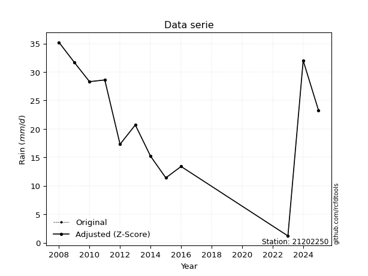</img>

</div>

> If Z-Score is active, values out of range or outliers are replaced with the station mean value.


### 4. Active continuous probability distributions from SciPy (45 of 104 available)

[scipy.stats](https://docs.scipy.org/doc/scipy/reference/stats.html) is a Python´s powerful submodule within the SciPy library for comprehensive statistical analysis, offering over 130 probability distributions (like Normal, Poisson), functions for descriptive stats (mean, variance), hypothesis testing (t-tests, chi-square), random variable generation, and statistical tests, making it essential for data science, modeling, and research. It provides tools to explore, model, and draw conclusions from data efficiently, working seamlessly with NumPy.

<div align="center">

|   id | p_dist             |   n_parameter | fit_method   | label                                                                       | active   | ref                                                                                                        |
|-----:|:-------------------|--------------:|:-------------|:----------------------------------------------------------------------------|:---------|:-----------------------------------------------------------------------------------------------------------|
|    0 | alpha              |             3 | MLE          | Alpha                                                                       | True     | [:mortar_board:](https://docs.scipy.org/doc/scipy/reference/generated/scipy.stats.alpha.html)              |
|    1 | betaprime          |             4 | MLE          | Beta prime                                                                  | True     | [:mortar_board:](https://docs.scipy.org/doc/scipy/reference/generated/scipy.stats.betaprime.html)          |
|    2 | chi2               |             3 | MLE          | Chi²                                                                        | True     | [:mortar_board:](https://docs.scipy.org/doc/scipy/reference/generated/scipy.stats.chi2.html)               |
|    3 | crystalball        |             4 | MLE          | Crystalball                                                                 | True     | [:mortar_board:](https://docs.scipy.org/doc/scipy/reference/generated/scipy.stats.crystalball.html)        |
|    4 | erlang             |             3 | MLE          | Erlang                                                                      | True     | [:mortar_board:](https://docs.scipy.org/doc/scipy/reference/generated/scipy.stats.erlang.html)             |
|    5 | expon              |             2 | MLE          | Exponential                                                                 | True     | [:mortar_board:](https://docs.scipy.org/doc/scipy/reference/generated/scipy.stats.expon.html)              |
|    6 | exponnorm          |             3 | MLE          | Exponentially modified Normal                                               | True     | [:mortar_board:](https://docs.scipy.org/doc/scipy/reference/generated/scipy.stats.exponnorm.html)          |
|    7 | f                  |             4 | MLE          | F                                                                           | True     | [:mortar_board:](https://docs.scipy.org/doc/scipy/reference/generated/scipy.stats.f.html)                  |
|    8 | fatiguelife        |             3 | MLE          | Fatigue-life (Birnbaum-Saunders)                                            | True     | [:mortar_board:](https://docs.scipy.org/doc/scipy/reference/generated/scipy.stats.fatiguelife.html)        |
|    9 | fisk               |             3 | MLE          | Fisk                                                                        | True     | [:mortar_board:](https://docs.scipy.org/doc/scipy/reference/generated/scipy.stats.fisk.html)               |
|   10 | gamma              |             3 | MLE          | Gamma                                                                       | True     | [:mortar_board:](https://docs.scipy.org/doc/scipy/reference/generated/scipy.stats.gamma.html)              |
|   11 | genexpon           |             5 | MLE          | Generalized exponential                                                     | True     | [:mortar_board:](https://docs.scipy.org/doc/scipy/reference/generated/scipy.stats.genexpon.html)           |
|   12 | genlogistic        |             3 | MLE          | Generalized logistic                                                        | True     | [:mortar_board:](https://docs.scipy.org/doc/scipy/reference/generated/scipy.stats.genlogistic.html)        |
|   13 | gibrat             |             2 | MM           | Gibrat                                                                      | True     | [:mortar_board:](https://docs.scipy.org/doc/scipy/reference/generated/scipy.stats.gibrat.html)             |
|   14 | gompertz           |             3 | MLE          | Gompertz (or truncated Gumbel)                                              | True     | [:mortar_board:](https://docs.scipy.org/doc/scipy/reference/generated/scipy.stats.gompertz.html)           |
|   15 | gumbel_l           |             2 | MM           | Gumbel Left Skew                                                            | True     | [:mortar_board:](https://docs.scipy.org/doc/scipy/reference/generated/scipy.stats.gumbel_l.html)           |
|   16 | gumbel_r           |             2 | MM           | Gumbel Right Skew                                                           | True     | [:mortar_board:](https://docs.scipy.org/doc/scipy/reference/generated/scipy.stats.gumbel_r.html)           |
|   17 | halflogistic       |             2 | MM           | Half-logistic                                                               | True     | [:mortar_board:](https://docs.scipy.org/doc/scipy/reference/generated/scipy.stats.halflogistic.html)       |
|   18 | halfnorm           |             2 | MM           | Half Normal                                                                 | True     | [:mortar_board:](https://docs.scipy.org/doc/scipy/reference/generated/scipy.stats.halfnorm.html)           |
|   19 | hypsecant          |             2 | MM           | hyperbolic secant                                                           | True     | [:mortar_board:](https://docs.scipy.org/doc/scipy/reference/generated/scipy.stats.hypsecant.html)          |
|   20 | invgamma           |             3 | MLE          | Inverted gamma                                                              | True     | [:mortar_board:](https://docs.scipy.org/doc/scipy/reference/generated/scipy.stats.invgamma.html)           |
|   21 | invgauss           |             3 | MLE          | Inverse Gaussian                                                            | True     | [:mortar_board:](https://docs.scipy.org/doc/scipy/reference/generated/scipy.stats.invgauss.html)           |
|   22 | invweibull         |             3 | MLE          | Inverted Weibull                                                            | True     | [:mortar_board:](https://docs.scipy.org/doc/scipy/reference/generated/scipy.stats.invweibull.html)         |
|   23 | johnsonsu          |             4 | MLE          | Johnson Su                                                                  | True     | [:mortar_board:](https://docs.scipy.org/doc/scipy/reference/generated/scipy.stats.johnsonsu.html)          |
|   24 | kstwobign          |             2 | MLE          | Limiting distribution of scaled Kolmogorov-Smirnov two-sided test statistic | True     | [:mortar_board:](https://docs.scipy.org/doc/scipy/reference/generated/scipy.stats.kstwobign.html)          |
|   25 | laplace            |             2 | MM           | Laplace                                                                     | True     | [:mortar_board:](https://docs.scipy.org/doc/scipy/reference/generated/scipy.stats.laplace.html)            |
|   26 | laplace_asymmetric |             3 | MLE          | Asymmetric Laplace                                                          | True     | [:mortar_board:](https://docs.scipy.org/doc/scipy/reference/generated/scipy.stats.laplace_asymmetric.html) |
|   27 | loggamma           |             3 | MLE          | Log gamma                                                                   | True     | [:mortar_board:](https://docs.scipy.org/doc/scipy/reference/generated/scipy.stats.loggamma.html)           |
|   28 | logistic           |             2 | MM           | Logistic (or Sech-squared)                                                  | True     | [:mortar_board:](https://docs.scipy.org/doc/scipy/reference/generated/scipy.stats.logistic.html)           |
|   29 | lognorm            |             3 | MLE          | Log Normal                                                                  | True     | [:mortar_board:](https://docs.scipy.org/doc/scipy/reference/generated/scipy.stats.lognorm.html)            |
|   30 | maxwell            |             2 | MM           | Maxwell                                                                     | True     | [:mortar_board:](https://docs.scipy.org/doc/scipy/reference/generated/scipy.stats.maxwell.html)            |
|   31 | mielke             |             4 | MLE          | Mielke Beta-Kappa / Dagum                                                   | True     | [:mortar_board:](https://docs.scipy.org/doc/scipy/reference/generated/scipy.stats.mielke.html)             |
|   32 | moyal              |             2 | MM           | Moyal                                                                       | True     | [:mortar_board:](https://docs.scipy.org/doc/scipy/reference/generated/scipy.stats.moyal.html)              |
|   33 | nakagami           |             3 | MLE          | Nakagami                                                                    | True     | [:mortar_board:](https://docs.scipy.org/doc/scipy/reference/generated/scipy.stats.nakagami.html)           |
|   34 | ncf                |             5 | MLE          | Non-central F distribution                                                  | True     | [:mortar_board:](https://docs.scipy.org/doc/scipy/reference/generated/scipy.stats.ncf.html)                |
|   35 | nct                |             4 | MLE          | Non-central Student’s t                                                     | True     | [:mortar_board:](https://docs.scipy.org/doc/scipy/reference/generated/scipy.stats.nct.html)                |
|   36 | norm               |             2 | MM           | Normal                                                                      | True     | [:mortar_board:](https://docs.scipy.org/doc/scipy/reference/generated/scipy.stats.norm.html)               |
|   37 | pareto             |             3 | MLE          | Pareto                                                                      | True     | [:mortar_board:](https://docs.scipy.org/doc/scipy/reference/generated/scipy.stats.pareto.html)             |
|   38 | pearson3           |             3 | MM           | Pearson type III                                                            | True     | [:mortar_board:](https://docs.scipy.org/doc/scipy/reference/generated/scipy.stats.pearson3.html)           |
|   39 | rayleigh           |             2 | MM           | Rayleigh                                                                    | True     | [:mortar_board:](https://docs.scipy.org/doc/scipy/reference/generated/scipy.stats.rayleigh.html)           |
|   40 | rice               |             3 | MLE          | Rice                                                                        | True     | [:mortar_board:](https://docs.scipy.org/doc/scipy/reference/generated/scipy.stats.rice.html)               |
|   41 | t                  |             3 | MLE          | Student’s t                                                                 | True     | [:mortar_board:](https://docs.scipy.org/doc/scipy/reference/generated/scipy.stats.t.html)                  |
|   42 | truncnorm          |             4 | MLE          | Truncated normal                                                            | True     | [:mortar_board:](https://docs.scipy.org/doc/scipy/reference/generated/scipy.stats.truncnorm.html)          |
|   43 | wald               |             2 | MM           | Wald                                                                        | True     | [:mortar_board:](https://docs.scipy.org/doc/scipy/reference/generated/scipy.stats.wald.html)               |
|   44 | weibull_min        |             3 | MLE          | Weibull minimum                                                             | True     | [:mortar_board:](https://docs.scipy.org/doc/scipy/reference/generated/scipy.stats.weibull_min.html)        |

</div>

> **n_parameter:** # arguments & localization & scale.
>
> **Fit methods:** (MLE) maximum likelihood, (MM) L-moments.
>
>**Inactive:** foldnorm, gennorm, norminvgauss, powernorm, powerlognorm, skewnorm, genextreme, anglit, arcsine, argus, beta, bradford, burr, burr12, cauchy, cosine, halfcauchy, foldcauchy, skewcauchy, wrapcauchy, dgamma, gengamma, exponweib, exponpow, truncexpon, gausshyper, genhalflogistic, genhyperbolic, geninvgauss, halfgennorm, johnsonsb, kappa4, kappa3, ksone, kstwo, loglaplace, levy, levy_l, levy_stable, ncx2, genpareto, truncpareto, lomax, powerlaw, rdist, rel_breitwigner, recipinvgauss, semicircular, studentized_range, trapezoid, triang, truncweibull_min, tukeylambda, uniform, loguniform, vonmises, vonmises_line, weibull_max, dweibull, 


## B. Probability distributions vs. Empirical distributions

A continuous probability distribution (CPD) describes probabilities for variables that can take any value within a range (like rain any time), unlike discrete variables with specific outcomes (like temperature). It uses a Probability Density Function (PDF), a curve where the total area under it equals 1, and the probability of the variable falling within an interval (a to b) is found by calculating the area under the curve between those points. A key feature is that the probability of hitting any single exact value is zero, so probabilities are always expressed for ranges, e.g., $P(a ≤ X ≤ b)$.

<div align="center">

Distributions parameters
|    |   station | p_dist                |   n |               loc |            scale | shape                  | shape1                 | shape2                 | shape3   |
|---:|----------:|:----------------------|----:|------------------:|-----------------:|:-----------------------|:-----------------------|:-----------------------|:---------|
|  0 |  21202250 | alpha                 |  12 |    -262.918       |   8713.59        | 30.70248487718564      |                        |                        |          |
|  1 |  21202250 | betaprime             |  12 |    -248.194       |  24091.2         | 750.3095385021218      | 67029.34606928489      |                        |          |
|  2 |  21202250 | chi2                  |  12 |       1.2         |      3.40968     | 1.378459056346962      |                        |                        |          |
|  3 |  21202250 | crystalball           |  12 |      21.525       |      9.74484     | 1707.152634339699      | 3319.6246995347256     |                        |          |
|  4 |  21202250 | erlang                |  12 |    -127.284       |      0.669291    | 222.16300401717666     |                        |                        |          |
|  5 |  21202250 | expon                 |  12 |       1.2         |     20.325       |                        |                        |                        |          |
|  6 |  21202250 | exponnorm             |  12 |      21.5163      |      9.74482     | 0.0008908516493385218  |                        |                        |          |
|  7 |  21202250 | f                     |  12 |   -3370.82        |   3392.33        | 310379.96321721666     | 1070617.1044105063     |                        |          |
|  8 |  21202250 | fatiguelife           |  12 |       1.2         |      3.76989e-05 | 834.2118437019349      |                        |                        |          |
|  9 |  21202250 | fisk                  |  12 |  -26869           |  26890.9         | 4647.924552482273      |                        |                        |          |
| 10 |  21202250 | gamma                 |  12 |    -138.306       |      0.618615    | 258.3771765159116      |                        |                        |          |
| 11 |  21202250 | genexpon              |  12 |       1.19999     |      1.57704     | 0.07756805818805143    | 0.00012858008523266364 | 2.3309087378209643     |          |
| 12 |  21202250 | genlogistic           |  12 |      34.0182      |      1.18351     | 0.09352936035238116    |                        |                        |          |
| 13 |  21202250 | gibrat                |  12 |      14.0909      |      4.509       |                        |                        |                        |          |
| 14 |  21202250 | gompertz              |  12 |      -3.19765     |      8.64333     | 0.03563669930483429    |                        |                        |          |
| 15 |  21202250 | gumbel_l              |  12 |      25.9107      |      7.59802     |                        |                        |                        |          |
| 16 |  21202250 | gumbel_r              |  12 |      17.1393      |      7.59802     |                        |                        |                        |          |
| 17 |  21202250 | halflogistic          |  12 |       9.97513     |      8.33148     |                        |                        |                        |          |
| 18 |  21202250 | halfnorm              |  12 |       8.62662     |     16.1657      |                        |                        |                        |          |
| 19 |  21202250 | hypsecant             |  12 |      21.525       |      6.20376     |                        |                        |                        |          |
| 20 |  21202250 | invgamma              |  12 |    -125.46        |  31190.1         | 213.07263506271534     |                        |                        |          |
| 21 |  21202250 | invgauss              |  12 |     -51.1243      |   3591.19        | 0.020138400921233583   |                        |                        |          |
| 22 |  21202250 | invweibull            |  12 |      -1.31954e+09 |      1.31954e+09 | 131287196.88137943     |                        |                        |          |
| 23 |  21202250 | johnsonsu             |  12 |      45.7927      |      0.642724    | 10.136310196259359     | 2.390741747080133      |                        |          |
| 24 |  21202250 | kstwobign             |  12 |     -19.8496      |     47.4045      |                        |                        |                        |          |
| 25 |  21202250 | laplace               |  12 |      21.525       |      6.89064     |                        |                        |                        |          |
| 26 |  21202250 | laplace_asymmetric    |  12 |      20.7         |      8.29625     | 0.9515757421166788     |                        |                        |          |
| 27 |  21202250 | loggamma              |  12 |      29.434       |      6.22231     | 0.6823486929383233     |                        |                        |          |
| 28 |  21202250 | logistic              |  12 |      21.525       |      5.37261     |                        |                        |                        |          |
| 29 |  21202250 | lognorm               |  12 |       1.2         |      0.794912    | 10.804961883170519     |                        |                        |          |
| 30 |  21202250 | maxwell               |  12 |      -1.56618     |     14.4702      |                        |                        |                        |          |
| 31 |  21202250 | mielke                |  12 |      -1.43754     |     36.6494      | 1.59273439448557       | 24285.32218630379      |                        |          |
| 32 |  21202250 | moyal                 |  12 |      15.9523      |      4.38672     |                        |                        |                        |          |
| 33 |  21202250 | nakagami              |  12 |   -2885.47        |   2907           | 22141.48775057921      |                        |                        |          |
| 34 |  21202250 | ncf                   |  12 |       0.201276    |     21.0798      | 4.436481835989598      | 42.80962527352677      | 2.8726333290975654e-11 |          |
| 35 |  21202250 | nct                   |  12 |    -574.421       |      9.71923     | 308727.18038394465     | 61.31590456606793      |                        |          |
| 36 |  21202250 | norm                  |  12 |      21.525       |      9.74484     |                        |                        |                        |          |
| 37 |  21202250 | pareto                |  12 |       1.19987     |      0.000126822 | 0.09091636239244974    |                        |                        |          |
| 38 |  21202250 | pearson3              |  12 |      21.525       |      9.7448      | -0.4384277214857478    |                        |                        |          |
| 39 |  21202250 | rayleigh              |  12 |       2.88252     |     14.8745      |                        |                        |                        |          |
| 40 |  21202250 | rice                  |  12 |      -4.57312     |     10.4217      | 2.268351538289659      |                        |                        |          |
| 41 |  21202250 | t                     |  12 |      21.5247      |      9.74505     | 4817282.87226804       |                        |                        |          |
| 42 |  21202250 | truncnorm             |  12 |      27.5077      |     13.2974      | -22.249217519847008    | 0.5784858257273419     |                        |          |
| 43 |  21202250 | wald                  |  12 |      11.7802      |      9.74481     |                        |                        |                        |          |
| 44 |  21202250 | weibull_min           |  12 |    -102.804       |    128.694       | 15.620193676169192     |                        |                        |          |
| 45 |  21202250 | logalpha              |  12 |       0.00281399  |      0.612924    | 7.083836442002825e-08  |                        |                        |          |
| 46 |  21202250 | logbetaprime          |  12 |      -3.98746     |      3.02504e+10 | 37.78770068690824      | 166836269213.18787     |                        |          |
| 47 |  21202250 | logchi2               |  12 |     -13.7409      |      0.0267784   | 619.581297723445       |                        |                        |          |
| 48 |  21202250 | logcrystalball        |  12 |       2.8451      |      0.877556    | 1390.2078858101936     | 121.45992710193767     |                        |          |
| 49 |  21202250 | logerlang             |  12 |     -10.5571      |      0.0693576   | 193.09832554864465     |                        |                        |          |
| 50 |  21202250 | logexpon              |  12 |       0.182322    |      2.66277     |                        |                        |                        |          |
| 51 |  21202250 | logexponnorm          |  12 |       2.84474     |      0.877556    | 0.00040627365214875315 |                        |                        |          |
| 52 |  21202250 | logf                  |  12 |   -1069.75        |   1072.6         | 2974935.7408326115     | 501288563.58834517     |                        |          |
| 53 |  21202250 | logfatiguelife        |  12 |    -666.66        |    669.509       | 0.0013138998986172825  |                        |                        |          |
| 54 |  21202250 | logfisk               |  12 |      -1.0343e+08  |      1.0343e+08  | 270571998.2222345      |                        |                        |          |
| 55 |  21202250 | loggamma              |  12 |     -13.5955      |      0.0542004   | 303.67399571473857     |                        |                        |          |
| 56 |  21202250 | loggenexpon           |  12 |       0.167505    |      0.0522422   | 0.003217357048606646   | 2.412998341623565      | 0.00023694999772195017 |          |
| 57 |  21202250 | loggenlogistic        |  12 |       3.56172     |      1.13473e-06 | 1.5791536496652774e-06 |                        |                        |          |
| 58 |  21202250 | loggibrat             |  12 |       2.17567     |      0.406036    |                        |                        |                        |          |
| 59 |  21202250 | loggompertz           |  12 |       0.176896    |      0.472167    | 0.0017672962849205483  |                        |                        |          |
| 60 |  21202250 | loggumbel_l           |  12 |       3.24004     |      0.684227    |                        |                        |                        |          |
| 61 |  21202250 | loggumbel_r           |  12 |       2.45015     |      0.684227    |                        |                        |                        |          |
| 62 |  21202250 | loghalflogistic       |  12 |       1.80506     |      0.750235    |                        |                        |                        |          |
| 63 |  21202250 | loghalfnorm           |  12 |       1.68359     |      1.45574     |                        |                        |                        |          |
| 64 |  21202250 | loghypsecant          |  12 |       2.8451      |      0.558669    |                        |                        |                        |          |
| 65 |  21202250 | loginvgamma           |  12 |     -19.6831      |  12046.8         | 535.6146047975233      |                        |                        |          |
| 66 |  21202250 | loginvgauss           |  12 |      -7.00946     |    825.272       | 0.01190326233305277    |                        |                        |          |
| 67 |  21202250 | loginvweibull         |  12 |      -1.20792e+08 |      1.20792e+08 | 101037988.68471472     |                        |                        |          |
| 68 |  21202250 | logjohnsonsu          |  12 |       3.60631     |      0.00153221  | 5.6870245065223965     | 0.8968211460001863     |                        |          |
| 69 |  21202250 | logkstwobign          |  12 |      -2.29911     |      5.92583     |                        |                        |                        |          |
| 70 |  21202250 | loglaplace            |  12 |       2.8451      |      0.620526    |                        |                        |                        |          |
| 71 |  21202250 | loglaplace_asymmetric |  12 |       3.46574     |      0.234424    | 2.982717661686296      |                        |                        |          |
| 72 |  21202250 | logloggamma           |  12 |       3.56106     |      4.953e-07   | 6.914107023358155e-07  |                        |                        |          |
| 73 |  21202250 | loglogistic           |  12 |       2.8451      |      0.483822    |                        |                        |                        |          |
| 74 |  21202250 | loglognorm            |  12 | -131072           | 131075           | 6.695132213819265e-06  |                        |                        |          |
| 75 |  21202250 | logmaxwell            |  12 |       0.765689    |      1.30308     |                        |                        |                        |          |
| 76 |  21202250 | logmielke             |  12 |      -1.16866e+08 |      1.16866e+08 | 161270870.24206644     | 32184068766.994904     |                        |          |
| 77 |  21202250 | logmoyal              |  12 |       2.34325     |      0.395039    |                        |                        |                        |          |
| 78 |  21202250 | lognakagami           |  12 |   -1095.15        |   1098           | 390995.47673759935     |                        |                        |          |
| 79 |  21202250 | logncf                |  12 |     -14.1255      |     16.9588      | 792.8316402532935      | 2385.046230099494      | 8.651767763294653e-09  |          |
| 80 |  21202250 | lognct                |  12 |     -53.0828      |      0.800415    | 10148.543069286647     | 69.86768089086726      |                        |          |
| 81 |  21202250 | lognorm               |  12 |       2.8451      |      0.877556    |                        |                        |                        |          |
| 82 |  21202250 | logpareto             |  12 |       0.182304    |      1.77127e-05 | 0.09091585971927008    |                        |                        |          |
| 83 |  21202250 | logpearson3           |  12 |       2.8451      |      0.87755     | -2.2002863656815688    |                        |                        |          |
| 84 |  21202250 | lograyleigh           |  12 |       1.16624     |      1.33953     |                        |                        |                        |          |
| 85 |  21202250 | logrice               |  12 |    -137.141       |      0.877592    | 159.50885576086034     |                        |                        |          |
| 86 |  21202250 | logt                  |  12 |       3.1176      |      0.373656    | 1.976966994543048      |                        |                        |          |
| 87 |  21202250 | logtruncnorm          |  12 |       0.961485    |      2.40535     | -0.32392948001072797   | 14.253030475707385     |                        |          |
| 88 |  21202250 | logwald               |  12 |       1.96758     |      0.877527    |                        |                        |                        |          |
| 89 |  21202250 | logweibull_min        |  12 |      -9.68513e+07 |      9.68513e+07 | 206963535.66083986     |                        |                        |          |

</div>

> **loc** (Location parameter): This shifts the distribution along the x-axis. For many common distributions, like the normal (Gaussian) distribution, loc represents the mean $μ$. For others, like the uniform distribution, it might represent the minimum value, or for the beta distribution, the left end of the support interval.
>
> **scale** (Scale parameter): This determines the width or spread of the distribution. For the normal distribution, scale represents the standard deviation $σ$. For a uniform distribution, it defines the length of the interval (from $loc$ to $loc + scale$).
>
> **shape** (Shape parameters): Refers to parameters that define the specific form of a probability distribution, distinct from its location (loc) and scale (scale). These parameters are required arguments for most distribution functions. For example, a normal (Gaussian) distribution is fully defined by its location (mean) and scale (standard deviation), so it has no specific shape parameters beyond loc and scale. However, other distributions have intrinsic properties that need specification, as Gamma distribution that takes a shape parameter, often named $a$ or $alpha$.


### 0. Cumulative distribution values - CDF (90 evaluated)

> Ordered by x ascending and calculating $log(f(x))$ separately. 

|   id |   Station |   date |    x |   count |   mean |     std |    zscore |   Value_initial |   station |   m |     alpha |   alpha_pdf |   betaprime |   betaprime_pdf |       chi2 |        chi2_pdf |   crystalball |   crystalball_pdf |    erlang |   erlang_pdf |    expon |   expon_pdf |   exponnorm |   exponnorm_pdf |         f |      f_pdf |   fatiguelife |   fatiguelife_pdf |      fisk |   fisk_pdf |     gamma |   gamma_pdf |    genexpon |   genexpon_pdf |   genlogistic |   genlogistic_pdf |    gibrat |   gibrat_pdf |   gompertz |   gompertz_pdf |   gumbel_l |   gumbel_l_pdf |    gumbel_r |   gumbel_r_pdf |   halflogistic |   halflogistic_pdf |   halfnorm |   halfnorm_pdf |   hypsecant |   hypsecant_pdf |   invgamma |   invgamma_pdf |   invgauss |   invgauss_pdf |   invweibull |   invweibull_pdf |   johnsonsu |   johnsonsu_pdf |   kstwobign |   kstwobign_pdf |   laplace |   laplace_pdf |   laplace_asymmetric |   laplace_asymmetric_pdf |   loggamma |   loggamma_pdf |   logistic |   logistic_pdf |    lognorm |   lognorm_pdf |   maxwell |   maxwell_pdf |    mielke |   mielke_pdf |       moyal |   moyal_pdf |   nakagami |   nakagami_pdf |        ncf |    ncf_pdf |       nct |    nct_pdf |     norm |   norm_pdf |   pareto |    pareto_pdf |   pearson3 |   pearson3_pdf |   rayleigh |   rayleigh_pdf |      rice |   rice_pdf |         t |      t_pdf |   truncnorm |   truncnorm_pdf |      wald |   wald_pdf |   weibull_min |   weibull_min_pdf |    logalpha |   logalpha_pdf |   logbetaprime |   logbetaprime_pdf |    logchi2 |   logchi2_pdf |   logcrystalball |   logcrystalball_pdf |   logerlang |   logerlang_pdf |   logexpon |   logexpon_pdf |   logexponnorm |   logexponnorm_pdf |       logf |   logf_pdf |   logfatiguelife |   logfatiguelife_pdf |     logfisk |   logfisk_pdf |   loggenexpon |   loggenexpon_pdf |   loggenlogistic |   loggenlogistic_pdf |   loggibrat |   loggibrat_pdf |   loggompertz |   loggompertz_pdf |   loggumbel_l |   loggumbel_l_pdf |   loggumbel_r |   loggumbel_r_pdf |   loghalflogistic |   loghalflogistic_pdf |   loghalfnorm |   loghalfnorm_pdf |   loghypsecant |   loghypsecant_pdf |   loginvgamma |   loginvgamma_pdf |   loginvgauss |   loginvgauss_pdf |   loginvweibull |   loginvweibull_pdf |   logjohnsonsu |   logjohnsonsu_pdf |   logkstwobign |   logkstwobign_pdf |   loglaplace |   loglaplace_pdf |   loglaplace_asymmetric |   loglaplace_asymmetric_pdf |   logloggamma |   logloggamma_pdf |   loglogistic |   loglogistic_pdf |   loglognorm |   loglognorm_pdf |   logmaxwell |   logmaxwell_pdf |   logmielke |   logmielke_pdf |    logmoyal |   logmoyal_pdf |   lognakagami |   lognakagami_pdf |     logncf |   logncf_pdf |     lognct |   lognct_pdf |   logpareto |   logpareto_pdf |   logpearson3 |   logpearson3_pdf |   lograyleigh |   lograyleigh_pdf |    logrice |   logrice_pdf |       logt |   logt_pdf |   logtruncnorm |   logtruncnorm_pdf |   logwald |   logwald_pdf |   logweibull_min |   logweibull_min_pdf |
|-----:|----------:|-------:|-----:|--------:|-------:|--------:|----------:|----------------:|----------:|----:|----------:|------------:|------------:|----------------:|-----------:|----------------:|--------------:|------------------:|----------:|-------------:|---------:|------------:|------------:|----------------:|----------:|-----------:|--------------:|------------------:|----------:|-----------:|----------:|------------:|------------:|---------------:|--------------:|------------------:|----------:|-------------:|-----------:|---------------:|-----------:|---------------:|------------:|---------------:|---------------:|-------------------:|-----------:|---------------:|------------:|----------------:|-----------:|---------------:|-----------:|---------------:|-------------:|-----------------:|------------:|----------------:|------------:|----------------:|----------:|--------------:|---------------------:|-------------------------:|-----------:|---------------:|-----------:|---------------:|-----------:|--------------:|----------:|--------------:|----------:|-------------:|------------:|------------:|-----------:|---------------:|-----------:|-----------:|----------:|-----------:|---------:|-----------:|---------:|--------------:|-----------:|---------------:|-----------:|---------------:|----------:|-----------:|----------:|-----------:|------------:|----------------:|----------:|-----------:|--------------:|------------------:|------------:|---------------:|---------------:|-------------------:|-----------:|--------------:|-----------------:|---------------------:|------------:|----------------:|-----------:|---------------:|---------------:|-------------------:|-----------:|-----------:|-----------------:|---------------------:|------------:|--------------:|--------------:|------------------:|-----------------:|---------------------:|------------:|----------------:|--------------:|------------------:|--------------:|------------------:|--------------:|------------------:|------------------:|----------------------:|--------------:|------------------:|---------------:|-------------------:|--------------:|------------------:|--------------:|------------------:|----------------:|--------------------:|---------------:|-------------------:|---------------:|-------------------:|-------------:|-----------------:|------------------------:|----------------------------:|--------------:|------------------:|--------------:|------------------:|-------------:|-----------------:|-------------:|-----------------:|------------:|----------------:|------------:|---------------:|--------------:|------------------:|-----------:|-------------:|-----------:|-------------:|------------:|----------------:|--------------:|------------------:|--------------:|------------------:|-----------:|--------------:|-----------:|-----------:|---------------:|-------------------:|----------:|--------------:|-----------------:|---------------------:|
|    0 |  21202250 |   2023 |  1.2 |      12 | 21.525 | 10.1782 | -1.99692  |             1.2 |  21202250 |   1 | 0.0110466 |  0.00363078 |   0.0182916 |      0.00477899 | 4.7756e-12 | 14823.5         |      0.018502 |        0.00465046 | 0.0177391 |   0.00483313 | 0        |   0.0492005 |   0.0185018 |      0.00465042 | 0.0187355 | 0.00470641 |     0.0464056 |       4.25786e+09 | 0.0268921 | 0.00452662 | 0.0171169 |  0.00467153 | 3.05641e-07 |     0.0491859  |     0.0747559 |        0.00590774 | 0         |   0          |  0.0233599 |     0.00669755 |  0.0379481 |     0.00489848 | 0.000289193 |    0.000310142 |      0         |          0         |   0        |      0         |   0.0240337 |      0.00387037 |  0.0143649 |     0.00441472 |   0.013009 |     0.00458232 |     0.010353 |       0.00470793 |   0.0487834 |      0.00542115 |   0.0108223 |      0.00591963 | 0.0261789 |    0.0037992  |            0.0401921 |               0.00509114 | 0.00139359 |      0.0054431 |  0.0222464 |     0.00404859 | 0.00120544 |    0.00455361 | 0.0018377 |     0.0019785 | 0.0151257 |   0.00913398 | 7.72434e-08 | 2.62493e-07 |  0.0186933 |     0.00469116 | 0.00268769 | 0.00575705 | 0.0185313 | 0.00465672 | 0.018502 | 0.00465046 | 0        | 716.882       |  0.0285032 |     0.00521963 |   0        |      0         | 0.0130852 | 0.00499543 | 0.0185056 | 0.00465113 |   0.0333195 |      0.00589874 | 0         | 0          |     0.0352545 |        0.00520038 | 0.000639052 |      0.0446211 |     0.00285997 |          0.0110163 | 0.00144569 |     0.0056302 |       0.00120544 |           0.00455361 |  0.00166788 |      0.00646941 |   0        |       0.375548 |     0.00120547 |         0.00455369 | 0.00125267 | 0.00470034 |       0.00119322 |           0.00451848 | 0.000610356 |    0.00159572 |    0.00093507 |         0.0646289 |          0       |            0.0126201 |    0        |        0        |   2.04251e-05 |        0.00378613 |     0.0113949 |         0.0165584 |   1.13222e-12 |       4.55166e-11 |          0        |              0        |      0        |          0        |     0.00541877 |         0.00969896 |    0.00159675 |        0.00627495 |    0.00240302 |        0.00967479 |      0.00261138 |           0.0129921 |      0.0321025 |          0.0188491 |     0.00526754 |          0.0277473 |   0.00684453 |        0.0110302 |              0.00821046 |                   0.0117423 |    0.00894629 |         0.0124885 |    0.00405547 |        0.00834816 |   0.00120542 |        0.0045536 |     0        |         0        |  0.00931309 |       0.0128518 | 1.37885e-53 |    4.16221e-51 |      0.001192 |        0.00450856 | 0.00199154 |   0.00739151 | 0.00130838 |   0.00491644 |    0        |   5132.8        |     0.0188266 |         0.0202717 |      0        |          0        | 0.00120609 |    0.00455569 | 0.00817688 | 0.00537898 |    1.20215e-11 |           0.251001 |  0        |      0        |        0.0016799 |            0.0035868 |
|    1 |  21202250 |   2015 | 11.4 |      12 | 21.525 | 10.1782 | -0.994778 |            11.4 |  21202250 |   2 | 0.144108  |  0.0262826  |   0.15412   |      0.0246027  | 0.868573   |     0.0220421   |      0.1494   |        0.0238625  | 0.157652  |   0.0253036  | 0.394587 |   0.0297866 |   0.149399  |      0.0238624  | 0.150607  | 0.0239625  |     0.733532  |       0.0100396   | 0.138879  | 0.0206788  | 0.153803  |  0.0249052  | 0.394967    |     0.0298084  |     0.167386  |        0.0132281  | 0         |   0          |  0.145537  |     0.0190716  |  0.137664  |     0.0168097  | 0.119028    |    0.0333428   |      0.0853033 |          0.0595767 |   0.136216 |      0.0486356 |   0.122923  |      0.0193255  |  0.154889  |     0.0259787  |   0.168889 |     0.0285496  |     0.190786 |       0.031446   |   0.150121  |      0.0162135  |   0.222392  |      0.0332911  | 0.115034  |    0.0166942  |            0.146307  |               0.0185327  | 0.32987    |      0.390164  |  0.131866  |     0.0213076  | 0.319572   |    0.40728    | 0.151231  |     0.0296336 | 0.188094  |   0.0233365  | 0.0929323   | 0.0372514   |  0.150224  |     0.0239209  | 0.268859   | 0.0346285  | 0.149525  | 0.023871   | 0.1494   | 0.0238625  | 0.641889 |   0.00319194  |  0.148924  |     0.0207638  |   0.151213 |      0.0326755 | 0.154187  | 0.0250916  | 0.149413  | 0.0238633  |   0.157101  |      0.0200478  | 0         | 0          |     0.143378  |        0.0181322  | 0.800926    |      0.0801756 |     0.366892   |          0.352533  | 0.334692   |     0.392923  |       0.319572   |           0.40728    |  0.345511   |      0.390299   |   0.570644 |       0.161244 |     0.319574   |         0.40728    | 0.319918   | 0.405487   |       0.318384   |           0.405918   | 0.180719    |    0.387324   |    0.49116    |         0.271664  |          0       |            0.289545  |    0.325026 |        1.39536  |   0.188295    |        0.361675   |     0.264871  |         0.330601  |   0.35899     |       0.537498    |          0.396005 |              0.561944 |      0.3936   |          0.479969 |     0.284262   |         0.443835   |    0.342931   |        0.386815   |    0.379008   |        0.369903   |      0.40464    |           0.30623   |      0.186784  |          0.205353  |     0.453677   |          0.27495   |   0.257621   |        0.415166  |              0.205435   |                   0.293805  |    0.207247   |         0.289305  |    0.299332   |        0.433491   |   0.319574   |        0.407279  |     0.349279 |         0.442196 |  0.208123   |       0.287202  | 0.372431    |    0.605134    |      0.318349 |        0.406478   | 0.344264   |   0.381873   | 0.32331    |   0.403949   |    0.65648  |      0.0138725  |     0.22186   |         0.250597  |      0.36083  |          0.451457 | 0.319601   |    0.407282   | 0.105063   | 0.216046   |    0.568964    |           0.219343 |  0.391647 |      0.955011 |        0.186592  |            0.358975  |
|    2 |  21202250 |   2016 | 13.4 |      12 | 21.525 | 10.1782 | -0.798279 |            13.4 |  21202250 |   3 | 0.202667  |  0.0322052  |   0.208343  |      0.0295755  | 0.905756   |     0.0155495   |      0.202204 |        0.0289187  | 0.213265  |   0.0302468  | 0.451323 |   0.0269952 |   0.202203  |      0.0289187  | 0.203584  | 0.0289881  |     0.752358  |       0.00883654  | 0.185606  | 0.0261347  | 0.208659  |  0.0298959  | 0.451741    |     0.0270113  |     0.196048  |        0.0154931  | 0         |   0          |  0.187394  |     0.0228594  |  0.175278  |     0.0209175  | 0.194793    |    0.041938    |      0.202692  |          0.0575478 |   0.232218 |      0.0472511 |   0.167827  |      0.0258164  |  0.211958  |     0.0309998  |   0.230974 |     0.03338    |     0.257256 |       0.0347508  |   0.186007  |      0.0197633  |   0.2911    |      0.0351548  | 0.153772  |    0.0223161  |            0.188491  |               0.0238761  | 0.394857   |      0.412084  |  0.180598  |     0.0275439  | 0.387937   |    0.436551   | 0.215611  |     0.0345499 | 0.236879  |   0.0254277  | 0.181013    | 0.0497246   |  0.203125  |     0.0289552  | 0.337641   | 0.0339785  | 0.202343  | 0.0289237  | 0.202204 | 0.0289187  | 0.647671 |   0.00262558  |  0.194923  |     0.0252773  |   0.221184 |      0.037022  | 0.209239  | 0.0299089  | 0.202219  | 0.0289193  |   0.200909  |      0.0237837  | 0.0360528 | 0.0746335  |     0.183696  |        0.0222714  | 0.813101    |      0.0707605 |     0.424649   |          0.360783  | 0.400066   |     0.414091  |       0.387937   |           0.436551   |  0.410198   |      0.408246   |   0.595932 |       0.151747 |     0.387938   |         0.436551   | 0.387961   | 0.434397   |       0.386529   |           0.435208   | 0.251876    |    0.492945   |    0.534493   |         0.264125  |          0       |            0.362585  |    0.513095 |        0.950285 |   0.2551      |        0.467405   |     0.322745  |         0.385736  |   0.445345    |       0.526495    |          0.4828   |              0.511109 |      0.468853 |          0.450496 |     0.36217    |         0.51718    |    0.407021   |        0.404386   |    0.439487   |        0.376906   |      0.453692   |           0.29993   |      0.224584  |          0.265748  |     0.497426   |          0.26597   |   0.33428    |        0.538705  |              0.258864   |                   0.370218  |    0.259707   |         0.362536  |    0.373697   |        0.483747   |   0.387939   |        0.436549  |     0.421618 |         0.450464 |  0.260132   |       0.358973  | 0.467284    |    0.56365     |      0.386599 |        0.435936   | 0.407546   |   0.399417   | 0.390984   |   0.431388   |    0.658639 |      0.0128619  |     0.266512  |         0.303752  |      0.433929 |          0.45082  | 0.387965   |    0.436546   | 0.149168   | 0.339675   |    0.603674    |           0.21003  |  0.525374 |      0.710118 |        0.253029  |            0.465663  |
|    3 |  21202250 |   2014 | 15.2 |      12 | 21.525 | 10.1782 | -0.621429 |            15.2 |  21202250 |   4 | 0.264989  |  0.0368976  |   0.265319  |      0.0336345  | 0.929848   |     0.0114422   |      0.258149 |        0.0331631  | 0.271353  |   0.034183   | 0.497825 |   0.0247073 |   0.258148  |      0.0331631  | 0.259618  | 0.0331909  |     0.767459  |       0.00797075  | 0.237287  | 0.0312894  | 0.266183  |  0.0339137  | 0.498268    |     0.024719   |     0.226016  |        0.0178614  | 0.0803811 |   0.134523   |  0.231875  |     0.026611   |  0.216688  |     0.0251781  | 0.275059    |    0.0467277   |      0.303674  |          0.0544791 |   0.315716 |      0.0454403 |   0.220415  |      0.0327573  |  0.27135   |     0.0348556  |   0.29425  |     0.036744   |     0.321402 |       0.0362969  |   0.224808  |      0.0234209  |   0.354924  |      0.0355787  | 0.199676  |    0.0289779  |            0.236762  |               0.0299907  | 0.447442   |      0.421106  |  0.235544  |     0.033515   | 0.443906   |    0.450105   | 0.280935  |     0.037832  | 0.284268  |   0.0272134  | 0.275921    | 0.0547318   |  0.259112  |     0.0331719  | 0.397694   | 0.0326543  | 0.258294  | 0.0331635  | 0.258149 | 0.0331631  | 0.652052 |   0.00225956  |  0.244175  |     0.0294435  |   0.290268 |      0.039512  | 0.266671  | 0.0338067  | 0.258165  | 0.0331634  |   0.246801  |      0.0272065  | 0.22004   | 0.108048   |     0.227443  |        0.0263892  | 0.821617    |      0.0645142 |     0.470232   |          0.361718  | 0.452862   |     0.422416  |       0.443906   |           0.450105   |  0.462114   |      0.414368   |   0.614613 |       0.144731 |     0.443908   |         0.450105   | 0.443648   | 0.447799   |       0.442334   |           0.448854   | 0.318883    |    0.568186   |    0.567334   |         0.256788  |          0       |            0.432104  |    0.616193 |        0.699927 |   0.319654    |        0.557515   |     0.37408   |         0.428606  |   0.510269    |       0.50176     |          0.54457  |              0.468815 |      0.524054 |          0.425123 |     0.430033   |         0.556056   |    0.458441   |        0.410372   |    0.487001   |        0.37614    |      0.491028   |           0.292131  |      0.261934  |          0.329947  |     0.530429   |          0.25755   |   0.409567   |        0.660032  |              0.309996   |                   0.443346  |    0.309668   |         0.432278  |    0.436377   |        0.508353   |   0.443908   |        0.450102  |     0.478276 |         0.447215 |  0.30955    |       0.427168  | 0.535442    |    0.516499    |      0.442502 |        0.449676   | 0.458356   |   0.405708   | 0.446226   |   0.443776   |    0.660215 |      0.012167   |     0.307868  |         0.35391   |      0.490253 |          0.441769 | 0.443933   |    0.450095   | 0.20056    | 0.483312   |    0.629669    |           0.202408 |  0.605304 |      0.564546 |        0.317438  |            0.557035  |
|    4 |  21202250 |   2012 | 17.3 |      12 | 21.525 | 10.1782 | -0.415105 |            17.3 |  21202250 |   5 | 0.34707   |  0.0409765  |   0.340133  |      0.0374073  | 0.950099   |     0.00805203  |      0.332303 |        0.0372663  | 0.347078  |   0.0377094  | 0.54712  |   0.0222819 |   0.332302  |      0.0372663  | 0.333768  | 0.0372341  |     0.783297  |       0.00714116  | 0.30905   | 0.0369151  | 0.341475  |  0.0375721  | 0.547583    |     0.0222894  |     0.266817  |        0.0210858  | 0.366898  |   0.11733    |  0.292597  |     0.0312473  |  0.275284  |     0.0307107  | 0.375659    |    0.0484071   |      0.413305  |          0.0497619 |   0.408407 |      0.0427402 |   0.298262  |      0.0413447  |  0.348236  |     0.0381156  |   0.374238 |     0.0391408  |     0.398105 |       0.0364819  |   0.278911  |      0.0281845  |   0.429079  |      0.0348538  | 0.270821  |    0.0393027  |            0.308914  |               0.0391302  | 0.502118   |      0.422559  |  0.312943  |     0.0400196  | 0.502551   |    0.454597   | 0.363037  |     0.0400643 | 0.343519  |   0.0291999  | 0.391112    | 0.0539944   |  0.333245  |     0.0372372  | 0.464144   | 0.030556   | 0.332442  | 0.0372606  | 0.332303 | 0.0372663  | 0.656445 |   0.00194003  |  0.310957  |     0.0340849  |   0.374838 |      0.0407375 | 0.341656  | 0.0374024  | 0.332319  | 0.0372662  |   0.308057  |      0.0310984  | 0.420477  | 0.0813483  |     0.288167  |        0.0314684  | 0.829596    |      0.0589171 |     0.516841   |          0.357813  | 0.507657   |     0.423096  |       0.502551   |           0.454597   |  0.515745   |      0.413241   |   0.632895 |       0.137866 |     0.502553   |         0.454597   | 0.504698   | 0.452277   |       0.500827   |           0.453512   | 0.396429    |    0.625937   |    0.600015   |         0.248108  |          0       |            0.517372  |    0.694389 |        0.519362 |   0.397795    |        0.649086   |     0.432255  |         0.469713  |   0.572997    |       0.466347    |          0.602382 |              0.424625 |      0.577294 |          0.397446 |     0.503197   |         0.569736   |    0.511556   |        0.409284   |    0.535333   |        0.369937   |      0.528198   |           0.282006  |      0.310082  |          0.418775  |     0.563145   |          0.247912  |   0.504501   |        0.798515  |              0.373023   |                   0.533484  |    0.37098    |         0.517867  |    0.502899   |        0.516702   |   0.502552   |        0.454594  |     0.535496 |         0.435815 |  0.370074   |       0.510689  | 0.598826    |    0.462626    |      0.501105 |        0.454384   | 0.510902   |   0.40519    | 0.503994   |   0.44744    |    0.661748 |      0.0115247  |     0.357528  |         0.41546   |      0.546455 |          0.425773 | 0.502577   |    0.454582   | 0.274961   | 0.671433   |    0.655342    |           0.194314 |  0.670634 |      0.450298 |        0.395625  |            0.65035   |
|    5 |  21202250 |   2013 | 20.7 |      12 | 21.525 | 10.1782 | -0.081056 |            20.7 |  21202250 |   6 | 0.491835  |  0.0432064  |   0.473478  |      0.0402852  | 0.971059   |     0.00460804  |      0.466266 |        0.0407924  | 0.480578  |   0.0400656  | 0.616881 |   0.0188496 |   0.466265  |      0.0407924  | 0.467451  | 0.040663   |     0.805694  |       0.00608166  | 0.446004  | 0.042709   | 0.474929  |  0.0401759  | 0.61736     |     0.0188517  |     0.349064  |        0.0275852  | 0.648908  |   0.0561071  |  0.411492  |     0.0385244  |  0.395703  |     0.0400602  | 0.534803    |    0.0440523   |      0.56737   |          0.0406946 |   0.544846 |      0.0373442 |   0.457794  |      0.0508588  |  0.48204   |     0.039817   |   0.508773 |     0.0392293  |     0.518562 |       0.0338818  |   0.388828  |      0.0365122  |   0.542841  |      0.0317565  | 0.443581  |    0.0643744  |            0.475202  |               0.060194   | 0.577176   |      0.411646  |  0.461686  |     0.0462591  | 0.5835     |    0.444612   | 0.500337  |     0.0399622 | 0.448014  |   0.0322333  | 0.560513    | 0.0446868   |  0.467006  |     0.0407053  | 0.561344   | 0.0265502  | 0.466369  | 0.0407775  | 0.466266 | 0.0407924  | 0.662378 |   0.00157411  |  0.437549  |     0.039891   |   0.511992 |      0.0392994 | 0.474632  | 0.0401023  | 0.46628   | 0.0407916  |   0.423559  |      0.0366256  | 0.632066  | 0.0465654  |     0.40886   |        0.039304   | 0.839554    |      0.0522792 |     0.580007   |          0.344904  | 0.582713   |     0.411089  |       0.5835     |           0.444612   |  0.588877   |      0.399701   |   0.656817 |       0.128882 |     0.583502   |         0.444611   | 0.582543   | 0.442518   |       0.581611   |           0.443872   | 0.512251    |    0.653607   |    0.643334   |         0.234476  |          0       |            0.66412   |    0.771573 |        0.354001 |   0.524045    |        0.750169   |     0.520883  |         0.515237  |   0.651537    |       0.407952    |          0.673137 |              0.364477 |      0.645029 |          0.357325 |     0.603552   |         0.53988    |    0.584007   |        0.396134   |    0.600338   |        0.353176   |      0.577337   |           0.265283  |      0.400332  |          0.601471  |     0.606337   |          0.233338  |   0.628922   |        0.598006  |              0.482148   |                   0.689551  |    0.476572   |         0.665267  |    0.594464   |        0.498275   |   0.583501   |        0.444608  |     0.611423 |         0.408512 |  0.474047   |       0.654168  | 0.675063    |    0.38774     |      0.582045 |        0.444718   | 0.582712   |   0.393138   | 0.583611   |   0.437072   |    0.663743 |      0.0107349  |     0.441283  |         0.523153  |      0.620185 |          0.394537 | 0.583523   |    0.444592   | 0.418464   | 0.907269   |    0.689174    |           0.182748 |  0.740459 |      0.334999 |        0.522348  |            0.754171  |
|    6 |  21202250 |   2025 | 23.3 |      12 | 21.525 | 10.1782 |  0.174393 |            23.3 |  21202250 |   7 | 0.602035  |  0.0410383  |   0.577596  |      0.0393522  | 0.980838   |     0.0030272   |      0.572267 |        0.0402653  | 0.583638  |   0.0387756  | 0.662885 |   0.0165862 |   0.572266  |      0.0402654  | 0.573046  | 0.040088   |     0.820642  |       0.00543654  | 0.55788   | 0.0426297  | 0.578498  |  0.0390491  | 0.663365    |     0.0165852  |     0.428682  |        0.0338736  | 0.762423  |   0.0335703  |  0.51748   |     0.0426715  |  0.507968  |     0.0459271  | 0.641152    |    0.0375078   |      0.663852  |          0.0335655 |   0.635955 |      0.0326918 |   0.589856  |      0.0492784  |  0.583825  |     0.0380689  |   0.607651 |     0.0364832  |     0.602293 |       0.0303827  |   0.49164   |      0.0423768  |   0.621256  |      0.028481   | 0.613546  |    0.0560839  |            0.610527  |               0.0446723  | 0.625062   |      0.396856  |  0.581852  |     0.0452853  | 0.63521    |    0.428239   | 0.601074  |     0.0371955 | 0.534693  |   0.0344264  | 0.665165    | 0.0358407   |  0.572741  |     0.0401522  | 0.62624    | 0.0233777  | 0.572325  | 0.0402465  | 0.572267 | 0.0402653  | 0.666198 |   0.00137321  |  0.544284  |     0.0417535  |   0.610183 |      0.0359729 | 0.578234  | 0.0391546  | 0.572278  | 0.0402642  |   0.523065  |      0.0397151  | 0.73185   | 0.0314076  |     0.517076  |        0.0435419  | 0.845511    |      0.0484936 |     0.620095   |          0.33222   | 0.630492   |     0.395613  |       0.63521    |           0.428239   |  0.635284   |      0.383894   |   0.671732 |       0.12328  |     0.635212   |         0.428239   | 0.63402    | 0.426436   |       0.63325    |           0.427784   | 0.588686    |    0.633424   |    0.670503   |         0.224675  |          0       |            0.782992  |    0.808866 |        0.279978 |   0.614943    |        0.779735   |     0.583019  |         0.533067  |   0.697406    |       0.367329    |          0.714008 |              0.326693 |      0.685713 |          0.330353 |     0.664926   |         0.494981   |    0.630017   |        0.380793   |    0.641242   |        0.337713   |      0.608009   |           0.253051  |      0.481516  |          0.780578  |     0.633349   |          0.223208  |   0.693341   |        0.494192  |              0.571044   |                   0.816688  |    0.56216    |         0.784743  |    0.65181    |        0.469086   |   0.63521    |        0.428235  |     0.658388 |         0.384703 |  0.558125   |       0.770194  | 0.718171    |    0.341491    |      0.63378  |        0.428553   | 0.628417   |   0.378627   | 0.63444    |   0.420964   |    0.664985 |      0.0102686  |     0.508359  |         0.613832  |      0.66542  |          0.369612 | 0.635231   |    0.428218   | 0.529107   | 0.940119   |    0.710337    |           0.174966 |  0.776631 |      0.278583 |        0.613812  |            0.785172  |
|    7 |  21202250 |   2010 | 28.3 |      12 | 21.525 | 10.1782 |  0.665641 |            28.3 |  21202250 |   8 | 0.782692  |  0.0302073  |   0.7566    |      0.031113   | 0.991261   |     0.00136486  |      0.756547 |        0.0321496  | 0.758897  |   0.0303088  | 0.736403 |   0.0129691 |   0.756547  |      0.0321497  | 0.756424  | 0.03199    |     0.845269  |       0.00446323  | 0.749633  | 0.0324322  | 0.755563  |  0.0307122  | 0.736866    |     0.0129639  |     0.63595   |        0.0498597  | 0.874476  |   0.0145298  |  0.734857  |     0.0418152  |  0.745772  |     0.0458239  | 0.794391    |    0.0240658   |      0.800405  |          0.021566  |   0.776389 |      0.0235364 |   0.793916  |      0.0309466  |  0.754582  |     0.0293837  |   0.768144 |     0.0271567  |     0.734698 |       0.022536   |   0.718966  |      0.0460576  |   0.74647   |      0.0215953  | 0.812947  |    0.0271459  |            0.780512  |               0.0251751  | 0.698989   |      0.361669  |  0.779203  |     0.0320228  | 0.714717   |    0.387053   | 0.765275  |     0.0279145 | 0.716871  |   0.0383954  | 0.806627    | 0.021604    |  0.756465  |     0.0320539  | 0.728635   | 0.0177202  | 0.756515  | 0.0321345  | 0.756547 | 0.0321496  | 0.67233  |   0.00109928  |  0.745359  |     0.0367448  |   0.76776  |      0.0266798 | 0.756588  | 0.0310705  | 0.756553  | 0.0321485  |   0.728927  |      0.04168    | 0.845364  | 0.0160833  |     0.73714   |        0.0418453  | 0.8544      |      0.0431051 |     0.6822     |          0.305645  | 0.704079   |     0.359452  |       0.714717   |           0.387053   |  0.706627   |      0.348308   |   0.694845 |       0.1146   |     0.714719   |         0.387052   | 0.713237   | 0.385905   |       0.712718   |           0.387121   | 0.704144    |    0.544979   |    0.712535   |         0.20756   |          0       |            1.02626   |    0.854497 |        0.195729 |   0.763416    |        0.723139   |     0.687187  |         0.531308  |   0.762423    |       0.302253    |          0.771846 |              0.269418 |      0.745636 |          0.286248 |     0.752156   |         0.400146   |    0.700857   |        0.346279   |    0.703964   |        0.30653    |      0.65515    |           0.231748  |      0.673399  |          1.22764   |     0.675085   |          0.206083  |   0.775822   |        0.361271  |              0.754083   |                   1.07846   |    0.737429   |         1.02941   |    0.736687   |        0.400931   |   0.714717   |        0.38705   |     0.728823 |         0.338796 |  0.729865   |       1.00719   | 0.777804    |    0.273847    |      0.713378 |        0.38767    | 0.69897    |   0.345481   | 0.712639   |   0.381021   |    0.666913 |      0.00958149 |     0.646169  |         0.818868  |      0.732911 |          0.323991 | 0.714733   |    0.387031   | 0.69576    | 0.735044   |    0.743097    |           0.16204  |  0.823641 |      0.20911  |        0.763415  |            0.728744  |
|    8 |  21202250 |   2011 | 28.6 |      12 | 21.525 | 10.1782 |  0.695116 |            28.6 |  21202250 |   9 | 0.791635  |  0.0294146  |   0.765833  |      0.0304395  | 0.991661   |     0.00130165  |      0.766088 |        0.0314539  | 0.76789   |   0.0296435  | 0.740265 |   0.0127791 |   0.766088  |      0.031454   | 0.765918  | 0.0312995  |     0.8466    |       0.00441342  | 0.759236  | 0.0315874  | 0.764677  |  0.0300463  | 0.740727    |     0.0127737  |     0.651069  |        0.0509288  | 0.878738  |   0.0138892  |  0.747319  |     0.0412572  |  0.759415  |     0.0451114  | 0.801502    |    0.0233412   |      0.806782  |          0.0209509 |   0.78337  |      0.0230069 |   0.803022  |      0.0297633  |  0.7633    |     0.0287368  |   0.776196 |     0.026524   |     0.741389 |       0.0220725  |   0.732733  |      0.0457116  |   0.752888  |      0.0211896  | 0.820916  |    0.0259894  |            0.787936  |               0.0243236  | 0.702791   |      0.35944   |  0.78866   |     0.0310232  | 0.718785   |    0.384397   | 0.773554  |     0.0272793 | 0.728424  |   0.0386246  | 0.813005    | 0.0209191   |  0.765977  |     0.0313617  | 0.733905   | 0.0174101  | 0.766051  | 0.0314394  | 0.766088 | 0.0314539  | 0.672658 |   0.00108615  |  0.756285  |     0.0360922  |   0.775673 |      0.0260749 | 0.76581   | 0.0304077  | 0.766094  | 0.0314528  |   0.741421  |      0.0416134  | 0.850101  | 0.0154971  |     0.7496    |        0.0412162  | 0.854853    |      0.0428388 |     0.685414   |          0.304037  | 0.707858   |     0.357176  |       0.718785   |           0.384397   |  0.710289   |      0.3461     |   0.696051 |       0.114148 |     0.718786   |         0.384396   | 0.717292   | 0.383288   |       0.716787   |           0.384493   | 0.709858    |    0.53879    |    0.714719   |         0.206604  |          0       |            1.04143   |    0.856542 |        0.192136 |   0.771003    |        0.715757   |     0.692782  |         0.529909  |   0.765593    |       0.298868    |          0.774671 |              0.266506 |      0.748642 |          0.283887 |     0.756347   |         0.394771   |    0.704497   |        0.344137   |    0.707186   |        0.304678   |      0.657588   |           0.230567  |      0.686499  |          1.25711   |     0.677253   |          0.205146  |   0.7796     |        0.355183  |              0.765542   |                   1.09485   |    0.748364   |         1.04467   |    0.740893   |        0.396779   |   0.718784   |        0.384393  |     0.732382 |         0.33614  |  0.740564   |       1.02195   | 0.780674    |    0.2705      |      0.717452 |        0.385028   | 0.702602   |   0.34341    | 0.716643   |   0.378456   |    0.667014 |      0.00954674 |     0.654878  |         0.833027  |      0.736314 |          0.321413 | 0.718801   |    0.384374   | 0.703427   | 0.719061   |    0.744802    |           0.161336 |  0.82583  |      0.205989 |        0.77106   |            0.721265  |
|    9 |  21202250 |   2009 | 31.7 |      12 | 21.525 | 10.1782 |  0.99969  |            31.7 |  21202250 |  10 | 0.870048  |  0.021231   |   0.848897  |      0.0230805  | 0.994853   |     0.000799106 |      0.85179  |        0.0237353  | 0.848741  |   0.0224771  | 0.777007 |   0.0109714 |   0.85179   |      0.0237353  | 0.851243  | 0.0236499  |     0.859533  |       0.00394314  | 0.843453  | 0.022814   | 0.846717  |  0.0228294  | 0.777449    |     0.0109645  |     0.82239   |        0.056958   | 0.913455  |   0.00895681 |  0.862545  |     0.0321256  |  0.882633  |     0.0330946  | 0.863174    |    0.0167157   |      0.862694  |          0.015349  |   0.846508 |      0.0178227 |   0.878039  |      0.0191817  |  0.841803  |     0.0219069  |   0.848337 |     0.0200768  |     0.802669 |       0.0175546  |   0.863469  |      0.0370798  |   0.812268  |      0.0171831  | 0.885798  |    0.0165735  |            0.851391  |               0.0170454  | 0.738611   |      0.336321  |  0.869196  |     0.0211619  | 0.756943   |    0.356692   | 0.847928  |     0.020743  | 0.851773  |   0.0409399  | 0.868048    | 0.0149021   |  0.851458  |     0.0236865  | 0.783152   | 0.0144319  | 0.85172   | 0.0237283  | 0.85179  | 0.0237353  | 0.675833 |   0.000966295 |  0.855849  |     0.0277209  |   0.846905 |      0.0199402 | 0.848922  | 0.0231338  | 0.851793  | 0.0237345  |   0.868053  |      0.0397296  | 0.890206  | 0.0107289  |     0.863731  |        0.0315416  | 0.859132    |      0.0403633 |     0.71587    |          0.287642  | 0.743424   |     0.333653  |       0.756943   |           0.356692   |  0.744754   |      0.323398   |   0.707574 |       0.10982  |     0.756945   |         0.356691   | 0.755357   | 0.355982   |       0.75497    |           0.357067   | 0.762042    |    0.47437    |    0.735496   |         0.197176  |          0       |            1.20178   |    0.874656 |        0.16105  |   0.840139    |        0.621348   |     0.746337  |         0.508547  |   0.794687    |       0.266906    |          0.800675 |              0.239205 |      0.776681 |          0.261123 |     0.794297   |         0.343103   |    0.738795   |        0.32212    |    0.737588   |        0.285981   |      0.680721   |           0.218992  |      0.830072  |          1.51253   |     0.697893   |          0.195985  |   0.813281   |        0.300904  |              0.886927   |                   1.26845   |    0.863977   |         1.20606   |    0.779597   |        0.355142   |   0.756942   |        0.356689  |     0.76562  |         0.309691 |  0.853567   |       1.17789   | 0.806893    |    0.239586    |      0.755683 |        0.357451   | 0.73686    |   0.322046   | 0.75424    |   0.351747   |    0.66798  |      0.00921985 |     0.748686  |         1.00028   |      0.768086 |          0.295987 | 0.756957   |    0.35667    | 0.769345   | 0.563262   |    0.761052    |           0.154475 |  0.845563 |      0.178328 |        0.840693  |            0.625337  |
|   10 |  21202250 |   2024 | 32   |      12 | 21.525 | 10.1782 |  1.02917  |            32   |  21202250 |  11 | 0.876303  |  0.0204724  |   0.855713  |      0.0223617  | 0.995087   |     0.000762391 |      0.858797 |        0.0229736  | 0.85538   |   0.0217845  | 0.780274 |   0.0108106 |   0.858796  |      0.0229736  | 0.858225  | 0.0228955  |     0.86071   |       0.00390152  | 0.850176  | 0.022008   | 0.85346   |  0.0221287  | 0.780715    |     0.0108036  |     0.839365  |        0.056132   | 0.916089  |   0.00860518 |  0.87201   |     0.0309699  |  0.892335  |     0.0315814  | 0.868105    |    0.0161604   |      0.867228  |          0.0148783 |   0.851784 |      0.0173538 |   0.883666  |      0.0183374  |  0.848277  |     0.0212566  |   0.85427  |     0.0194801  |     0.807874 |       0.0171488  |   0.874397  |      0.0357625  |   0.817368  |      0.0168169  | 0.890663  |    0.0158674  |            0.856418  |               0.0164688  | 0.741769   |      0.334096  |  0.875414  |     0.0203     | 0.760291   |    0.354015   | 0.854059  |     0.0201315 | 0.864088  |   0.0411592  | 0.872445    | 0.0144143   |  0.858451  |     0.0229293  | 0.787442   | 0.0141659  | 0.858724  | 0.0229673  | 0.858797 | 0.0229736  | 0.676121 |   0.000956032 |  0.864027  |     0.0268023  |   0.852802 |      0.0193717 | 0.855755  | 0.02242    | 0.858799  | 0.0229728  |   0.879929  |      0.039438   | 0.893371  | 0.0103683  |     0.873018  |        0.0303652  | 0.859511    |      0.0401475 |     0.718572   |          0.286085  | 0.746556   |     0.331395  |       0.760291   |           0.354015   |  0.74779    |      0.321229   |   0.708606 |       0.109432 |     0.760292   |         0.354014   | 0.758698   | 0.353342   |       0.75832    |           0.354415   | 0.766481    |    0.468232   |    0.73735    |         0.196305  |          0       |            1.21764   |    0.876161 |        0.15853  |   0.845942    |        0.610856   |     0.751114  |         0.505885  |   0.797188    |       0.264085    |          0.802917 |              0.236809 |      0.779131 |          0.259068 |     0.797507   |         0.338498   |    0.74182    |        0.320016   |    0.740273   |        0.284221   |      0.682778   |           0.21793   |      0.844376  |          1.52414   |     0.699735   |          0.195147  |   0.816094   |        0.296371  |              0.898955   |                   1.28565   |    0.875412   |         1.22202   |    0.782924   |        0.351274   |   0.760289   |        0.354012  |     0.768526 |         0.307235 |  0.864734   |       1.1933    | 0.809138    |    0.236913    |      0.759037 |        0.354784   | 0.739884   |   0.319998   | 0.757541   |   0.349169   |    0.668066 |      0.009191   |     0.758197  |         1.01923   |      0.770863 |          0.293646 | 0.760304   |    0.353993   | 0.774586   | 0.549661   |    0.762505    |           0.153847 |  0.847232 |      0.17603  |        0.846533  |            0.614661  |
|   11 |  21202250 |   2008 | 35.2 |      12 | 21.525 | 10.1782 |  1.34356  |            35.2 |  21202250 |  12 | 0.929739  |  0.0132019  |   0.915443  |      0.0151419  | 0.997006   |     0.000462427 |      0.919737 |        0.0152937  | 0.913743  |   0.0148668  | 0.812282 |   0.0092358 |   0.919737  |      0.0152938  | 0.919037  | 0.0152885  |     0.872525  |       0.00349368  | 0.907949  | 0.0144388  | 0.912764  |  0.0151077  | 0.812699    |     0.00922785 |     0.971091  |        0.020661   | 0.938661  |   0.00574148 |  0.949859  |     0.0175691  |  0.966493  |     0.0149764  | 0.911352    |    0.0111341   |      0.907616  |          0.0105763 |   0.899785 |      0.0127817 |   0.930047  |      0.0111854  |  0.905703  |     0.0148076  |   0.907011 |     0.0136659  |     0.856267 |       0.0132199  |   0.962267  |      0.0185126  |   0.865242  |      0.0131926  | 0.931281  |    0.00997287 |            0.900529  |               0.0114093  | 0.772511   |      0.310782  |  0.927258  |     0.0125545  | 0.792706   |    0.325913   | 0.908575  |     0.0141113 | 0.999486  |   0.0434332  | 0.911232    | 0.010076    |  0.919322  |     0.0152929  | 0.828503   | 0.0115701  | 0.919657  | 0.0152948  | 0.919737 | 0.0152937  | 0.679019 |   0.000858305 |  0.933845  |     0.0168959  |   0.905603 |      0.0137882 | 0.915712  | 0.0152145  | 0.919738  | 0.0152933  |   1         |      0.0353208  | 0.921291  | 0.00729443 |     0.949063  |        0.0171646  | 0.863237    |      0.038057  |     0.745073   |          0.26991   | 0.777026   |     0.30779   |       0.792706   |           0.325913   |  0.777338   |      0.298631   |   0.718852 |       0.105585 |     0.792707   |         0.325911   | 0.791067   | 0.325613   |       0.790786   |           0.326556   | 0.808126    |    0.405633   |    0.755638   |         0.187442  |          0.99906 |            1.39035   |    0.890143 |        0.135602 |   0.898651    |        0.491744   |     0.797827  |         0.472358  |   0.821033    |       0.236619    |          0.824365 |              0.213548 |      0.802842 |          0.238602 |     0.827607   |         0.293712   |    0.771284   |        0.298089   |    0.766502   |        0.26608    |      0.703038   |           0.207202  |      0.978754  |          1.00911   |     0.717931   |          0.186687  |   0.842279   |        0.254173  |              0.96995    |                   0.382349  |    0.999987   |         1.39592   |    0.81454    |        0.312232   |   0.792705   |        0.32591   |     0.796618 |         0.282241 |  0.985982   |       1.2793    | 0.830477    |    0.211307    |      0.79153  |        0.326774   | 0.769372   |   0.298596   | 0.789544   |   0.322118   |    0.668929 |      0.00890853 |     0.866655  |         1.28672   |      0.797721 |          0.26997  | 0.792717   |    0.325892   | 0.82081    | 0.424306   |    0.776866    |           0.147514 |  0.862965 |      0.154679 |        0.899506  |            0.493417  |

An Empirical Distribution Function (EDF) is a step-function estimate of a true cumulative distribution function (CDF) based on observed sample data, representing the proportion of data points less than or equal to a given value. It is calculated by ordering your data and jumping up by $1/n$ (where $n$ is sample size) at each unique data point, allowing analysis without assuming an underlying population distribution, and it gets closer to the true CDF as the sample size grows.


### 1. Empirical - EDF California (1923)

California´s estimates the true probability distribution of water-related data (like rainfall, streamflow) using observed samples, crucial for risk assessment.

<div align="center">


$P=m/n$


</div>


**1.1. Empirical values**

<div align="center">

|                | 0                   | 1                   | 2                  | 3                  | 4                  | 5              | 6                  | 7                  | 8              | 9                  | 10                 | 11             |
|:---------------|:--------------------|:--------------------|:-------------------|:-------------------|:-------------------|:---------------|:-------------------|:-------------------|:---------------|:-------------------|:-------------------|:---------------|
| date           | 2023                | 2015                | 2016               | 2014               | 2012               | 2013           | 2025               | 2010               | 2011           | 2009               | 2024               | 2008           |
| x              | 1.2                 | 11.4                | 13.4               | 15.2               | 17.3               | 20.7           | 23.3               | 28.3               | 28.6           | 31.7               | 32.0               | 35.2           |
| m              | 1                   | 2                   | 3                  | 4                  | 5                  | 6              | 7                  | 8                  | 9              | 10                 | 11                 | 12             |
| empirical_dist | edf_california      | edf_california      | edf_california     | edf_california     | edf_california     | edf_california | edf_california     | edf_california     | edf_california | edf_california     | edf_california     | edf_california |
| empirical      | 0.08333333333333333 | 0.16666666666666666 | 0.25               | 0.3333333333333333 | 0.4166666666666667 | 0.5            | 0.5833333333333334 | 0.6666666666666666 | 0.75           | 0.8333333333333334 | 0.9166666666666666 | 1.0            |
| empirical_tr   | 1.090909090909091   | 1.2                 | 1.3333333333333333 | 1.4999999999999998 | 1.7142857142857144 | 2.0            | 2.4000000000000004 | 2.9999999999999996 | 4.0            | 6.000000000000002  | 11.999999999999995 | inf            |

</div>


**1.2. Kolmogorov-Smirnov fit test (sorted by Δ)**


<div align="center">

|                | 0                   | 1                   | 2                   | 3                     | 4                   | 5                   | 6                   | 7                   | 8                   | 9                   | 10                  | 11                  | 12                  | 13                  | 14                  | 15                  | 16                  | 17                  | 18                  | 19                  | 20                  | 21                  | 22                  | 23                  | 24                  | 25                  | 26                  | 27                  | 28                  | 29                  | 30                  | 31                  | 32                  | 33                  | 34                  | 35                  | 36                  | 37                  | 38                  | 39                  | 40                  | 41                  | 42                  | 43                  | 44                  | 45                  | 46                  | 47                  | 48                  | 49                  | 50                  | 51                  | 52                  | 53                  | 54                  | 55                  | 56                  | 57                  | 58                  | 59                  | 60                  | 61                  | 62                  | 63                  | 64                  | 65                  | 66                  | 67                  | 68                  | 69                  | 70                  | 71                  | 72                  | 73                  | 74                  | 75                  | 76                  | 77                  | 78                  | 79                  | 80                  | 81                  | 82                  | 83                  | 84                  | 85                  | 86                  | 87                  | 88                  | 89                  |
|:---------------|:--------------------|:--------------------|:--------------------|:----------------------|:--------------------|:--------------------|:--------------------|:--------------------|:--------------------|:--------------------|:--------------------|:--------------------|:--------------------|:--------------------|:--------------------|:--------------------|:--------------------|:--------------------|:--------------------|:--------------------|:--------------------|:--------------------|:--------------------|:--------------------|:--------------------|:--------------------|:--------------------|:--------------------|:--------------------|:--------------------|:--------------------|:--------------------|:--------------------|:--------------------|:--------------------|:--------------------|:--------------------|:--------------------|:--------------------|:--------------------|:--------------------|:--------------------|:--------------------|:--------------------|:--------------------|:--------------------|:--------------------|:--------------------|:--------------------|:--------------------|:--------------------|:--------------------|:--------------------|:--------------------|:--------------------|:--------------------|:--------------------|:--------------------|:--------------------|:--------------------|:--------------------|:--------------------|:--------------------|:--------------------|:--------------------|:--------------------|:--------------------|:--------------------|:--------------------|:--------------------|:--------------------|:--------------------|:--------------------|:--------------------|:--------------------|:--------------------|:--------------------|:--------------------|:--------------------|:--------------------|:--------------------|:--------------------|:--------------------|:--------------------|:--------------------|:--------------------|:--------------------|:--------------------|:--------------------|:--------------------|
| station        | 21202250            | 21202250            | 21202250            | 21202250              | 21202250            | 21202250            | 21202250            | 21202250            | 21202250            | 21202250            | 21202250            | 21202250            | 21202250            | 21202250            | 21202250            | 21202250            | 21202250            | 21202250            | 21202250            | 21202250            | 21202250            | 21202250            | 21202250            | 21202250            | 21202250            | 21202250            | 21202250            | 21202250            | 21202250            | 21202250            | 21202250            | 21202250            | 21202250            | 21202250            | 21202250            | 21202250            | 21202250            | 21202250            | 21202250            | 21202250            | 21202250            | 21202250            | 21202250            | 21202250            | 21202250            | 21202250            | 21202250            | 21202250            | 21202250            | 21202250            | 21202250            | 21202250            | 21202250            | 21202250            | 21202250            | 21202250            | 21202250            | 21202250            | 21202250            | 21202250            | 21202250            | 21202250            | 21202250            | 21202250            | 21202250            | 21202250            | 21202250            | 21202250            | 21202250            | 21202250            | 21202250            | 21202250            | 21202250            | 21202250            | 21202250            | 21202250            | 21202250            | 21202250            | 21202250            | 21202250            | 21202250            | 21202250            | 21202250            | 21202250            | 21202250            | 21202250            | 21202250            | 21202250            | 21202250            | 21202250            |
| empirical_dist | edf_california      | edf_california      | edf_california      | edf_california        | edf_california      | edf_california      | edf_california      | edf_california      | edf_california      | edf_california      | edf_california      | edf_california      | edf_california      | edf_california      | edf_california      | edf_california      | edf_california      | edf_california      | edf_california      | edf_california      | edf_california      | edf_california      | edf_california      | edf_california      | edf_california      | edf_california      | edf_california      | edf_california      | edf_california      | edf_california      | edf_california      | edf_california      | edf_california      | edf_california      | edf_california      | edf_california      | edf_california      | edf_california      | edf_california      | edf_california      | edf_california      | edf_california      | edf_california      | edf_california      | edf_california      | edf_california      | edf_california      | edf_california      | edf_california      | edf_california      | edf_california      | edf_california      | edf_california      | edf_california      | edf_california      | edf_california      | edf_california      | edf_california      | edf_california      | edf_california      | edf_california      | edf_california      | edf_california      | edf_california      | edf_california      | edf_california      | edf_california      | edf_california      | edf_california      | edf_california      | edf_california      | edf_california      | edf_california      | edf_california      | edf_california      | edf_california      | edf_california      | edf_california      | edf_california      | edf_california      | edf_california      | edf_california      | edf_california      | edf_california      | edf_california      | edf_california      | edf_california      | edf_california      | edf_california      | edf_california      |
| p_dist         | mielke              | logmielke           | logloggamma         | loglaplace_asymmetric | gamma               | f                   | nakagami            | nct                 | exponnorm           | crystalball         | norm                | t                   | rice                | betaprime           | erlang              | invgamma            | maxwell             | logweibull_min      | rayleigh            | loggompertz         | invgauss            | pearson3            | logjohnsonsu        | fisk                | truncnorm           | halfnorm            | logistic            | laplace_asymmetric  | alpha               | gompertz            | hypsecant           | gumbel_r            | weibull_min         | halflogistic        | kstwobign           | johnsonsu           | moyal               | gumbel_l            | invweibull          | laplace             | genlogistic         | loglaplace          | logpearson3         | ncf                 | loghypsecant        | logt                | loglogistic         | logfisk             | loggumbel_r         | loggumbel_l         | lograyleigh         | logmaxwell          | logrice             | logexponnorm        | lognorm             | lognorm             | logcrystalball      | loglognorm          | lognakagami         | logf                | logfatiguelife      | lognct              | wald                | logmoyal            | logerlang           | logchi2             | loghalfnorm         | loggamma            | loggamma            | expon               | genexpon            | loginvgamma         | logncf              | loghalflogistic     | loginvgauss         | gibrat              | logbetaprime        | logwald             | loggibrat           | logkstwobign        | loginvweibull       | loggenexpon         | logtruncnorm        | logexpon            | pareto              | logpareto           | fatiguelife         | logalpha            | chi2                | loggenlogistic      |
| delta          | 0.07314767999647948 | 0.07402024202001087 | 0.07438704180611122 | 0.0874167589479381    | 0.08889652144328031 | 0.08975745707394034 | 0.08979794264772278 | 0.08984837310820926 | 0.08988027977854218 | 0.08988083090493015 | 0.0898808329533668  | 0.0898866701389135  | 0.08992167011602148 | 0.08993361936669653 | 0.09223063386113062 | 0.0942965703875519  | 0.09860810445722035 | 0.10049413411690844 | 0.10109309946224776 | 0.10134877456325775 | 0.10147760827126562 | 0.10570934880964061 | 0.1065847915648449  | 0.10761668605863972 | 0.10860960682631654 | 0.109722135422895   | 0.11253594246502996 | 0.11384552976712403 | 0.11602510658807474 | 0.12406934750990334 | 0.12724977089278688 | 0.12772425314869196 | 0.12849963475493104 | 0.13373790691912635 | 0.13475782478918807 | 0.13775599549797446 | 0.13996074164792682 | 0.14138303570484156 | 0.14373343470001299 | 0.14628061948908022 | 0.1546509186428422  | 0.15772092821397676 | 0.15846978698028602 | 0.17149706721979974 | 0.17239254261666326 | 0.17918960821199525 | 0.18546042427813159 | 0.19187418205221995 | 0.19534508066371686 | 0.2021730285001051  | 0.20227894866124496 | 0.2033816193360175  | 0.20728282229659034 | 0.20729288535321366 | 0.2072940238866674  | 0.2072940238866674  | 0.20729405737992634 | 0.20729542241375298 | 0.2084698126514175  | 0.208932973179083   | 0.20921426907679797 | 0.21045567090091177 | 0.21394722500218388 | 0.21728366934321708 | 0.22266167037266893 | 0.22297372951284689 | 0.2269337012295192  | 0.22748894014412857 | 0.22748894014412857 | 0.22792070216966584 | 0.22830053132759018 | 0.22871607218017953 | 0.23062813942536708 | 0.23280007296276134 | 0.23349777537520955 | 0.25295223325232763 | 0.2549267441969434  | 0.27537436355669376 | 0.2828593853485624  | 0.2870105714343807  | 0.29696226821984606 | 0.324493291590343   | 0.4022971882807098  | 0.4039772274062706  | 0.4752221900541105  | 0.48981350050894357 | 0.5668654863086783  | 0.6342591229051142  | 0.7019058910441909  | 0.9166666666666666  |
| deltao         | 0.36218414519599995 | 0.36218414519599995 | 0.36218414519599995 | 0.36218414519599995   | 0.36218414519599995 | 0.36218414519599995 | 0.36218414519599995 | 0.36218414519599995 | 0.36218414519599995 | 0.36218414519599995 | 0.36218414519599995 | 0.36218414519599995 | 0.36218414519599995 | 0.36218414519599995 | 0.36218414519599995 | 0.36218414519599995 | 0.36218414519599995 | 0.36218414519599995 | 0.36218414519599995 | 0.36218414519599995 | 0.36218414519599995 | 0.36218414519599995 | 0.36218414519599995 | 0.36218414519599995 | 0.36218414519599995 | 0.36218414519599995 | 0.36218414519599995 | 0.36218414519599995 | 0.36218414519599995 | 0.36218414519599995 | 0.36218414519599995 | 0.36218414519599995 | 0.36218414519599995 | 0.36218414519599995 | 0.36218414519599995 | 0.36218414519599995 | 0.36218414519599995 | 0.36218414519599995 | 0.36218414519599995 | 0.36218414519599995 | 0.36218414519599995 | 0.36218414519599995 | 0.36218414519599995 | 0.36218414519599995 | 0.36218414519599995 | 0.36218414519599995 | 0.36218414519599995 | 0.36218414519599995 | 0.36218414519599995 | 0.36218414519599995 | 0.36218414519599995 | 0.36218414519599995 | 0.36218414519599995 | 0.36218414519599995 | 0.36218414519599995 | 0.36218414519599995 | 0.36218414519599995 | 0.36218414519599995 | 0.36218414519599995 | 0.36218414519599995 | 0.36218414519599995 | 0.36218414519599995 | 0.36218414519599995 | 0.36218414519599995 | 0.36218414519599995 | 0.36218414519599995 | 0.36218414519599995 | 0.36218414519599995 | 0.36218414519599995 | 0.36218414519599995 | 0.36218414519599995 | 0.36218414519599995 | 0.36218414519599995 | 0.36218414519599995 | 0.36218414519599995 | 0.36218414519599995 | 0.36218414519599995 | 0.36218414519599995 | 0.36218414519599995 | 0.36218414519599995 | 0.36218414519599995 | 0.36218414519599995 | 0.36218414519599995 | 0.36218414519599995 | 0.36218414519599995 | 0.36218414519599995 | 0.36218414519599995 | 0.36218414519599995 | 0.36218414519599995 | 0.36218414519599995 |
| eval           | Δo > Δ              | Δo > Δ              | Δo > Δ              | Δo > Δ                | Δo > Δ              | Δo > Δ              | Δo > Δ              | Δo > Δ              | Δo > Δ              | Δo > Δ              | Δo > Δ              | Δo > Δ              | Δo > Δ              | Δo > Δ              | Δo > Δ              | Δo > Δ              | Δo > Δ              | Δo > Δ              | Δo > Δ              | Δo > Δ              | Δo > Δ              | Δo > Δ              | Δo > Δ              | Δo > Δ              | Δo > Δ              | Δo > Δ              | Δo > Δ              | Δo > Δ              | Δo > Δ              | Δo > Δ              | Δo > Δ              | Δo > Δ              | Δo > Δ              | Δo > Δ              | Δo > Δ              | Δo > Δ              | Δo > Δ              | Δo > Δ              | Δo > Δ              | Δo > Δ              | Δo > Δ              | Δo > Δ              | Δo > Δ              | Δo > Δ              | Δo > Δ              | Δo > Δ              | Δo > Δ              | Δo > Δ              | Δo > Δ              | Δo > Δ              | Δo > Δ              | Δo > Δ              | Δo > Δ              | Δo > Δ              | Δo > Δ              | Δo > Δ              | Δo > Δ              | Δo > Δ              | Δo > Δ              | Δo > Δ              | Δo > Δ              | Δo > Δ              | Δo > Δ              | Δo > Δ              | Δo > Δ              | Δo > Δ              | Δo > Δ              | Δo > Δ              | Δo > Δ              | Δo > Δ              | Δo > Δ              | Δo > Δ              | Δo > Δ              | Δo > Δ              | Δo > Δ              | Δo > Δ              | Δo > Δ              | Δo > Δ              | Δo > Δ              | Δo > Δ              | Δo > Δ              | Δo > Δ              | Δo <= Δ             | Δo <= Δ             | Δo <= Δ             | Δo <= Δ             | Δo <= Δ             | Δo <= Δ             | Δo <= Δ             | Δo <= Δ             |
| fit            | 1                   | 1                   | 1                   | 1                     | 1                   | 1                   | 1                   | 1                   | 1                   | 1                   | 1                   | 1                   | 1                   | 1                   | 1                   | 1                   | 1                   | 1                   | 1                   | 1                   | 1                   | 1                   | 1                   | 1                   | 1                   | 1                   | 1                   | 1                   | 1                   | 1                   | 1                   | 1                   | 1                   | 1                   | 1                   | 1                   | 1                   | 1                   | 1                   | 1                   | 1                   | 1                   | 1                   | 1                   | 1                   | 1                   | 1                   | 1                   | 1                   | 1                   | 1                   | 1                   | 1                   | 1                   | 1                   | 1                   | 1                   | 1                   | 1                   | 1                   | 1                   | 1                   | 1                   | 1                   | 1                   | 1                   | 1                   | 1                   | 1                   | 1                   | 1                   | 1                   | 1                   | 1                   | 1                   | 1                   | 1                   | 1                   | 1                   | 1                   | 1                   | 1                   | 0                   | 0                   | 0                   | 0                   | 0                   | 0                   | 0                   | 0                   |
| n              | 12                  | 12                  | 12                  | 12                    | 12                  | 12                  | 12                  | 12                  | 12                  | 12                  | 12                  | 12                  | 12                  | 12                  | 12                  | 12                  | 12                  | 12                  | 12                  | 12                  | 12                  | 12                  | 12                  | 12                  | 12                  | 12                  | 12                  | 12                  | 12                  | 12                  | 12                  | 12                  | 12                  | 12                  | 12                  | 12                  | 12                  | 12                  | 12                  | 12                  | 12                  | 12                  | 12                  | 12                  | 12                  | 12                  | 12                  | 12                  | 12                  | 12                  | 12                  | 12                  | 12                  | 12                  | 12                  | 12                  | 12                  | 12                  | 12                  | 12                  | 12                  | 12                  | 12                  | 12                  | 12                  | 12                  | 12                  | 12                  | 12                  | 12                  | 12                  | 12                  | 12                  | 12                  | 12                  | 12                  | 12                  | 12                  | 12                  | 12                  | 12                  | 12                  | 12                  | 12                  | 12                  | 12                  | 12                  | 12                  | 12                  | 12                  |
| best_fit       | 1                   | 0                   | 0                   | 0                     | 0                   | 0                   | 0                   | 0                   | 0                   | 0                   | 0                   | 0                   | 0                   | 0                   | 0                   | 0                   | 0                   | 0                   | 0                   | 0                   | 0                   | 0                   | 0                   | 0                   | 0                   | 0                   | 0                   | 0                   | 0                   | 0                   | 0                   | 0                   | 0                   | 0                   | 0                   | 0                   | 0                   | 0                   | 0                   | 0                   | 0                   | 0                   | 0                   | 0                   | 0                   | 0                   | 0                   | 0                   | 0                   | 0                   | 0                   | 0                   | 0                   | 0                   | 0                   | 0                   | 0                   | 0                   | 0                   | 0                   | 0                   | 0                   | 0                   | 0                   | 0                   | 0                   | 0                   | 0                   | 0                   | 0                   | 0                   | 0                   | 0                   | 0                   | 0                   | 0                   | 0                   | 0                   | 0                   | 0                   | 0                   | 0                   | 0                   | 0                   | 0                   | 0                   | 0                   | 0                   | 0                   | 0                   |
| best_fit_sort  | 1                   | 2                   | 3                   | 4                     | 5                   | 6                   | 7                   | 8                   | 9                   | 10                  | 11                  | 12                  | 13                  | 14                  | 15                  | 16                  | 17                  | 18                  | 19                  | 20                  | 21                  | 22                  | 23                  | 24                  | 25                  | 26                  | 27                  | 28                  | 29                  | 30                  | 31                  | 32                  | 33                  | 34                  | 35                  | 36                  | 37                  | 38                  | 39                  | 40                  | 41                  | 42                  | 43                  | 44                  | 45                  | 46                  | 47                  | 48                  | 49                  | 50                  | 51                  | 52                  | 53                  | 54                  | 55                  | 56                  | 57                  | 58                  | 59                  | 60                  | 61                  | 62                  | 63                  | 64                  | 65                  | 66                  | 67                  | 68                  | 69                  | 70                  | 71                  | 72                  | 73                  | 74                  | 75                  | 76                  | 77                  | 78                  | 79                  | 80                  | 81                  | 82                  | 83                  | 84                  | 85                  | 86                  | 87                  | 88                  | 89                  | 90                  |

</div>


<div align="center">

</img>

</div>


**1.3. Best fit**

<div align="center">

|   id |   station | empirical_dist   | p_dist   |     delta |   deltao | eval   |   fit |   n |   best_fit |   best_fit_sort |
|-----:|----------:|:-----------------|:---------|----------:|---------:|:-------|------:|----:|-----------:|----------------:|
|    0 |  21202250 | edf_california   | mielke   | 0.0731477 | 0.362184 | Δo > Δ |     1 |  12 |          1 |               1 |

</div>


<div align="center">

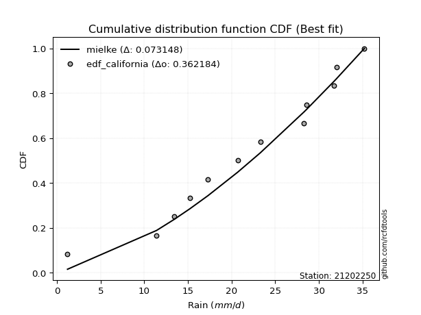</img>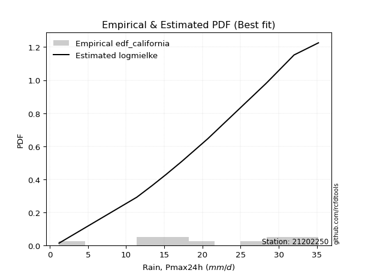</img>

</div>


### 2. Empirical - EDF Hazen (1930)

Hazen method for plotting positions is a formula used to estimate the empirical cumulative probability distribution of flood events or other hydrological data. This formula often results in biased estimations, particularly when extrapolating to extreme events (high return periods).

<div align="center">


$P=(m-0.5)/n$


</div>


**2.1. Empirical values**

<div align="center">

|                | 0                    | 1                  | 2                   | 3                  | 4         | 5                  | 6                  | 7                  | 8                  | 9                  | 10        | 11                 |
|:---------------|:---------------------|:-------------------|:--------------------|:-------------------|:----------|:-------------------|:-------------------|:-------------------|:-------------------|:-------------------|:----------|:-------------------|
| date           | 2023                 | 2015               | 2016                | 2014               | 2012      | 2013               | 2025               | 2010               | 2011               | 2009               | 2024      | 2008               |
| x              | 1.2                  | 11.4               | 13.4                | 15.2               | 17.3      | 20.7               | 23.3               | 28.3               | 28.6               | 31.7               | 32.0      | 35.2               |
| m              | 1                    | 2                  | 3                   | 4                  | 5         | 6                  | 7                  | 8                  | 9                  | 10                 | 11        | 12                 |
| empirical_dist | edf_hazen            | edf_hazen          | edf_hazen           | edf_hazen          | edf_hazen | edf_hazen          | edf_hazen          | edf_hazen          | edf_hazen          | edf_hazen          | edf_hazen | edf_hazen          |
| empirical      | 0.041666666666666664 | 0.125              | 0.20833333333333334 | 0.2916666666666667 | 0.375     | 0.4583333333333333 | 0.5416666666666666 | 0.625              | 0.7083333333333334 | 0.7916666666666666 | 0.875     | 0.9583333333333334 |
| empirical_tr   | 1.0434782608695652   | 1.1428571428571428 | 1.2631578947368423  | 1.411764705882353  | 1.6       | 1.8461538461538458 | 2.1818181818181817 | 2.6666666666666665 | 3.428571428571429  | 4.799999999999999  | 8.0       | 24.00000000000002  |

</div>


**2.2. Kolmogorov-Smirnov fit test (sorted by Δ)**


<div align="center">

|                | 0                   | 1                   | 2                   | 3                   | 4                   | 5                   | 6                   | 7                   | 8                   | 9                   | 10                  | 11                  | 12                  | 13                  | 14                  | 15                    | 16                  | 17                  | 18                  | 19                  | 20                  | 21                  | 22                  | 23                  | 24                  | 25                  | 26                  | 27                  | 28                  | 29                  | 30                  | 31                  | 32                  | 33                  | 34                  | 35                  | 36                  | 37                  | 38                  | 39                  | 40                  | 41                  | 42                  | 43                  | 44                  | 45                  | 46                  | 47                  | 48                  | 49                  | 50                  | 51                  | 52                  | 53                  | 54                  | 55                  | 56                  | 57                  | 58                  | 59                  | 60                  | 61                  | 62                  | 63                  | 64                  | 65                  | 66                  | 67                  | 68                  | 69                  | 70                  | 71                  | 72                  | 73                  | 74                  | 75                  | 76                  | 77                  | 78                  | 79                  | 80                  | 81                  | 82                  | 83                  | 84                  | 85                  | 86                  | 87                  | 88                  | 89                  |
|:---------------|:--------------------|:--------------------|:--------------------|:--------------------|:--------------------|:--------------------|:--------------------|:--------------------|:--------------------|:--------------------|:--------------------|:--------------------|:--------------------|:--------------------|:--------------------|:----------------------|:--------------------|:--------------------|:--------------------|:--------------------|:--------------------|:--------------------|:--------------------|:--------------------|:--------------------|:--------------------|:--------------------|:--------------------|:--------------------|:--------------------|:--------------------|:--------------------|:--------------------|:--------------------|:--------------------|:--------------------|:--------------------|:--------------------|:--------------------|:--------------------|:--------------------|:--------------------|:--------------------|:--------------------|:--------------------|:--------------------|:--------------------|:--------------------|:--------------------|:--------------------|:--------------------|:--------------------|:--------------------|:--------------------|:--------------------|:--------------------|:--------------------|:--------------------|:--------------------|:--------------------|:--------------------|:--------------------|:--------------------|:--------------------|:--------------------|:--------------------|:--------------------|:--------------------|:--------------------|:--------------------|:--------------------|:--------------------|:--------------------|:--------------------|:--------------------|:--------------------|:--------------------|:--------------------|:--------------------|:--------------------|:--------------------|:--------------------|:--------------------|:--------------------|:--------------------|:--------------------|:--------------------|:--------------------|:--------------------|:--------------------|
| station        | 21202250            | 21202250            | 21202250            | 21202250            | 21202250            | 21202250            | 21202250            | 21202250            | 21202250            | 21202250            | 21202250            | 21202250            | 21202250            | 21202250            | 21202250            | 21202250              | 21202250            | 21202250            | 21202250            | 21202250            | 21202250            | 21202250            | 21202250            | 21202250            | 21202250            | 21202250            | 21202250            | 21202250            | 21202250            | 21202250            | 21202250            | 21202250            | 21202250            | 21202250            | 21202250            | 21202250            | 21202250            | 21202250            | 21202250            | 21202250            | 21202250            | 21202250            | 21202250            | 21202250            | 21202250            | 21202250            | 21202250            | 21202250            | 21202250            | 21202250            | 21202250            | 21202250            | 21202250            | 21202250            | 21202250            | 21202250            | 21202250            | 21202250            | 21202250            | 21202250            | 21202250            | 21202250            | 21202250            | 21202250            | 21202250            | 21202250            | 21202250            | 21202250            | 21202250            | 21202250            | 21202250            | 21202250            | 21202250            | 21202250            | 21202250            | 21202250            | 21202250            | 21202250            | 21202250            | 21202250            | 21202250            | 21202250            | 21202250            | 21202250            | 21202250            | 21202250            | 21202250            | 21202250            | 21202250            | 21202250            |
| empirical_dist | edf_hazen           | edf_hazen           | edf_hazen           | edf_hazen           | edf_hazen           | edf_hazen           | edf_hazen           | edf_hazen           | edf_hazen           | edf_hazen           | edf_hazen           | edf_hazen           | edf_hazen           | edf_hazen           | edf_hazen           | edf_hazen             | edf_hazen           | edf_hazen           | edf_hazen           | edf_hazen           | edf_hazen           | edf_hazen           | edf_hazen           | edf_hazen           | edf_hazen           | edf_hazen           | edf_hazen           | edf_hazen           | edf_hazen           | edf_hazen           | edf_hazen           | edf_hazen           | edf_hazen           | edf_hazen           | edf_hazen           | edf_hazen           | edf_hazen           | edf_hazen           | edf_hazen           | edf_hazen           | edf_hazen           | edf_hazen           | edf_hazen           | edf_hazen           | edf_hazen           | edf_hazen           | edf_hazen           | edf_hazen           | edf_hazen           | edf_hazen           | edf_hazen           | edf_hazen           | edf_hazen           | edf_hazen           | edf_hazen           | edf_hazen           | edf_hazen           | edf_hazen           | edf_hazen           | edf_hazen           | edf_hazen           | edf_hazen           | edf_hazen           | edf_hazen           | edf_hazen           | edf_hazen           | edf_hazen           | edf_hazen           | edf_hazen           | edf_hazen           | edf_hazen           | edf_hazen           | edf_hazen           | edf_hazen           | edf_hazen           | edf_hazen           | edf_hazen           | edf_hazen           | edf_hazen           | edf_hazen           | edf_hazen           | edf_hazen           | edf_hazen           | edf_hazen           | edf_hazen           | edf_hazen           | edf_hazen           | edf_hazen           | edf_hazen           | edf_hazen           |
| p_dist         | logjohnsonsu        | mielke              | johnsonsu           | truncnorm           | logmielke           | invweibull          | gompertz            | weibull_min         | logloggamma         | genlogistic         | logpearson3         | pearson3            | gumbel_l            | kstwobign           | fisk                | loglaplace_asymmetric | invgamma            | gamma               | f                   | nakagami            | nct                 | exponnorm           | crystalball         | norm                | t                   | rice                | betaprime           | erlang              | logt                | logweibull_min      | loggompertz         | maxwell             | rayleigh            | invgauss            | ncf                 | logfisk             | halfnorm            | logistic            | laplace_asymmetric  | alpha               | loghypsecant        | loggumbel_l         | hypsecant           | gumbel_r            | loglaplace          | loglogistic         | halflogistic        | moyal               | laplace             | lognakagami         | logfatiguelife      | logcrystalball      | lognorm             | lognorm             | logexponnorm        | loglognorm          | logrice             | logf                | lognct              | loggamma            | loggamma            | logchi2             | loginvgamma         | logncf              | wald                | logerlang           | logmaxwell          | lograyleigh         | loggumbel_r         | logbetaprime        | gibrat              | loginvgauss         | logmoyal            | loghalfnorm         | expon               | genexpon            | loghalflogistic     | loginvweibull       | logwald             | loggibrat           | logkstwobign        | loggenexpon         | logtruncnorm        | logexpon            | pareto              | logpareto           | fatiguelife         | logalpha            | chi2                | loggenlogistic      |
| delta          | 0.06491812489817822 | 0.09187140483060952 | 0.09608932883130777 | 0.1039269644779085  | 0.1048653564986991  | 0.1096980388342026  | 0.10985709001589483 | 0.1121395435237097  | 0.11242892230191937 | 0.11298425197617545 | 0.11680312031361939 | 0.1203585707915652  | 0.12077235482884507 | 0.12146995192997578 | 0.1246329630648928  | 0.12908342561460473   | 0.12958181989271456 | 0.13056318810994694 | 0.13142412374060697 | 0.1314646093143894  | 0.13151503977487589 | 0.1315469464452088  | 0.13154749757159678 | 0.13154749962003343 | 0.13155333680558012 | 0.1315883367826881  | 0.13160028603336316 | 0.13389730052779725 | 0.13752294154532863 | 0.1384145757015467  | 0.13841640509818864 | 0.14027477112388698 | 0.1427597661289144  | 0.14314427493793225 | 0.14385897645975843 | 0.15020751538555333 | 0.15138880208956162 | 0.1542026091316966  | 0.15551219643379066 | 0.15769177325474137 | 0.15926217841135176 | 0.16050636183343847 | 0.16891643755945351 | 0.1693909198153586  | 0.17058871264421488 | 0.17433159753002353 | 0.17540457358579298 | 0.18162740831459345 | 0.18794728615574685 | 0.1933493239929326  | 0.19338403809772858 | 0.19457207726836545 | 0.1945720877574419  | 0.1945720877574419  | 0.19457370734322182 | 0.1945742555677391  | 0.19460067853693008 | 0.19491767365531798 | 0.19830966408952733 | 0.20486963274449316 | 0.20486963274449316 | 0.20969170585009872 | 0.21793115320967604 | 0.21926395692524758 | 0.2203641396447389  | 0.22051119361244298 | 0.22427920929331452 | 0.2358296985801137  | 0.23701174733038352 | 0.24189161225094125 | 0.24947599500201978 | 0.25400781544640194 | 0.2589503360098837  | 0.26860036789618585 | 0.2695873688363325  | 0.26996719799425684 | 0.274466739629428   | 0.27964027729111907 | 0.3170410302233604  | 0.32452605201522905 | 0.3286772381010473  | 0.36615995825700964 | 0.44396385494737645 | 0.44564389407293725 | 0.5168888567207771  | 0.5314801671756102  | 0.6085321529753449  | 0.6759257895717808  | 0.7435725577108575  | 0.875               |
| deltao         | 0.36218414519599995 | 0.36218414519599995 | 0.36218414519599995 | 0.36218414519599995 | 0.36218414519599995 | 0.36218414519599995 | 0.36218414519599995 | 0.36218414519599995 | 0.36218414519599995 | 0.36218414519599995 | 0.36218414519599995 | 0.36218414519599995 | 0.36218414519599995 | 0.36218414519599995 | 0.36218414519599995 | 0.36218414519599995   | 0.36218414519599995 | 0.36218414519599995 | 0.36218414519599995 | 0.36218414519599995 | 0.36218414519599995 | 0.36218414519599995 | 0.36218414519599995 | 0.36218414519599995 | 0.36218414519599995 | 0.36218414519599995 | 0.36218414519599995 | 0.36218414519599995 | 0.36218414519599995 | 0.36218414519599995 | 0.36218414519599995 | 0.36218414519599995 | 0.36218414519599995 | 0.36218414519599995 | 0.36218414519599995 | 0.36218414519599995 | 0.36218414519599995 | 0.36218414519599995 | 0.36218414519599995 | 0.36218414519599995 | 0.36218414519599995 | 0.36218414519599995 | 0.36218414519599995 | 0.36218414519599995 | 0.36218414519599995 | 0.36218414519599995 | 0.36218414519599995 | 0.36218414519599995 | 0.36218414519599995 | 0.36218414519599995 | 0.36218414519599995 | 0.36218414519599995 | 0.36218414519599995 | 0.36218414519599995 | 0.36218414519599995 | 0.36218414519599995 | 0.36218414519599995 | 0.36218414519599995 | 0.36218414519599995 | 0.36218414519599995 | 0.36218414519599995 | 0.36218414519599995 | 0.36218414519599995 | 0.36218414519599995 | 0.36218414519599995 | 0.36218414519599995 | 0.36218414519599995 | 0.36218414519599995 | 0.36218414519599995 | 0.36218414519599995 | 0.36218414519599995 | 0.36218414519599995 | 0.36218414519599995 | 0.36218414519599995 | 0.36218414519599995 | 0.36218414519599995 | 0.36218414519599995 | 0.36218414519599995 | 0.36218414519599995 | 0.36218414519599995 | 0.36218414519599995 | 0.36218414519599995 | 0.36218414519599995 | 0.36218414519599995 | 0.36218414519599995 | 0.36218414519599995 | 0.36218414519599995 | 0.36218414519599995 | 0.36218414519599995 | 0.36218414519599995 |
| eval           | Δo > Δ              | Δo > Δ              | Δo > Δ              | Δo > Δ              | Δo > Δ              | Δo > Δ              | Δo > Δ              | Δo > Δ              | Δo > Δ              | Δo > Δ              | Δo > Δ              | Δo > Δ              | Δo > Δ              | Δo > Δ              | Δo > Δ              | Δo > Δ                | Δo > Δ              | Δo > Δ              | Δo > Δ              | Δo > Δ              | Δo > Δ              | Δo > Δ              | Δo > Δ              | Δo > Δ              | Δo > Δ              | Δo > Δ              | Δo > Δ              | Δo > Δ              | Δo > Δ              | Δo > Δ              | Δo > Δ              | Δo > Δ              | Δo > Δ              | Δo > Δ              | Δo > Δ              | Δo > Δ              | Δo > Δ              | Δo > Δ              | Δo > Δ              | Δo > Δ              | Δo > Δ              | Δo > Δ              | Δo > Δ              | Δo > Δ              | Δo > Δ              | Δo > Δ              | Δo > Δ              | Δo > Δ              | Δo > Δ              | Δo > Δ              | Δo > Δ              | Δo > Δ              | Δo > Δ              | Δo > Δ              | Δo > Δ              | Δo > Δ              | Δo > Δ              | Δo > Δ              | Δo > Δ              | Δo > Δ              | Δo > Δ              | Δo > Δ              | Δo > Δ              | Δo > Δ              | Δo > Δ              | Δo > Δ              | Δo > Δ              | Δo > Δ              | Δo > Δ              | Δo > Δ              | Δo > Δ              | Δo > Δ              | Δo > Δ              | Δo > Δ              | Δo > Δ              | Δo > Δ              | Δo > Δ              | Δo > Δ              | Δo > Δ              | Δo > Δ              | Δo > Δ              | Δo <= Δ             | Δo <= Δ             | Δo <= Δ             | Δo <= Δ             | Δo <= Δ             | Δo <= Δ             | Δo <= Δ             | Δo <= Δ             | Δo <= Δ             |
| fit            | 1                   | 1                   | 1                   | 1                   | 1                   | 1                   | 1                   | 1                   | 1                   | 1                   | 1                   | 1                   | 1                   | 1                   | 1                   | 1                     | 1                   | 1                   | 1                   | 1                   | 1                   | 1                   | 1                   | 1                   | 1                   | 1                   | 1                   | 1                   | 1                   | 1                   | 1                   | 1                   | 1                   | 1                   | 1                   | 1                   | 1                   | 1                   | 1                   | 1                   | 1                   | 1                   | 1                   | 1                   | 1                   | 1                   | 1                   | 1                   | 1                   | 1                   | 1                   | 1                   | 1                   | 1                   | 1                   | 1                   | 1                   | 1                   | 1                   | 1                   | 1                   | 1                   | 1                   | 1                   | 1                   | 1                   | 1                   | 1                   | 1                   | 1                   | 1                   | 1                   | 1                   | 1                   | 1                   | 1                   | 1                   | 1                   | 1                   | 1                   | 1                   | 0                   | 0                   | 0                   | 0                   | 0                   | 0                   | 0                   | 0                   | 0                   |
| n              | 12                  | 12                  | 12                  | 12                  | 12                  | 12                  | 12                  | 12                  | 12                  | 12                  | 12                  | 12                  | 12                  | 12                  | 12                  | 12                    | 12                  | 12                  | 12                  | 12                  | 12                  | 12                  | 12                  | 12                  | 12                  | 12                  | 12                  | 12                  | 12                  | 12                  | 12                  | 12                  | 12                  | 12                  | 12                  | 12                  | 12                  | 12                  | 12                  | 12                  | 12                  | 12                  | 12                  | 12                  | 12                  | 12                  | 12                  | 12                  | 12                  | 12                  | 12                  | 12                  | 12                  | 12                  | 12                  | 12                  | 12                  | 12                  | 12                  | 12                  | 12                  | 12                  | 12                  | 12                  | 12                  | 12                  | 12                  | 12                  | 12                  | 12                  | 12                  | 12                  | 12                  | 12                  | 12                  | 12                  | 12                  | 12                  | 12                  | 12                  | 12                  | 12                  | 12                  | 12                  | 12                  | 12                  | 12                  | 12                  | 12                  | 12                  |
| best_fit       | 1                   | 0                   | 0                   | 0                   | 0                   | 0                   | 0                   | 0                   | 0                   | 0                   | 0                   | 0                   | 0                   | 0                   | 0                   | 0                     | 0                   | 0                   | 0                   | 0                   | 0                   | 0                   | 0                   | 0                   | 0                   | 0                   | 0                   | 0                   | 0                   | 0                   | 0                   | 0                   | 0                   | 0                   | 0                   | 0                   | 0                   | 0                   | 0                   | 0                   | 0                   | 0                   | 0                   | 0                   | 0                   | 0                   | 0                   | 0                   | 0                   | 0                   | 0                   | 0                   | 0                   | 0                   | 0                   | 0                   | 0                   | 0                   | 0                   | 0                   | 0                   | 0                   | 0                   | 0                   | 0                   | 0                   | 0                   | 0                   | 0                   | 0                   | 0                   | 0                   | 0                   | 0                   | 0                   | 0                   | 0                   | 0                   | 0                   | 0                   | 0                   | 0                   | 0                   | 0                   | 0                   | 0                   | 0                   | 0                   | 0                   | 0                   |
| best_fit_sort  | 1                   | 2                   | 3                   | 4                   | 5                   | 6                   | 7                   | 8                   | 9                   | 10                  | 11                  | 12                  | 13                  | 14                  | 15                  | 16                    | 17                  | 18                  | 19                  | 20                  | 21                  | 22                  | 23                  | 24                  | 25                  | 26                  | 27                  | 28                  | 29                  | 30                  | 31                  | 32                  | 33                  | 34                  | 35                  | 36                  | 37                  | 38                  | 39                  | 40                  | 41                  | 42                  | 43                  | 44                  | 45                  | 46                  | 47                  | 48                  | 49                  | 50                  | 51                  | 52                  | 53                  | 54                  | 55                  | 56                  | 57                  | 58                  | 59                  | 60                  | 61                  | 62                  | 63                  | 64                  | 65                  | 66                  | 67                  | 68                  | 69                  | 70                  | 71                  | 72                  | 73                  | 74                  | 75                  | 76                  | 77                  | 78                  | 79                  | 80                  | 81                  | 82                  | 83                  | 84                  | 85                  | 86                  | 87                  | 88                  | 89                  | 90                  |

</div>


<div align="center">

</img>

</div>


**2.3. Best fit**

<div align="center">

|   id |   station | empirical_dist   | p_dist       |     delta |   deltao | eval   |   fit |   n |   best_fit |   best_fit_sort |
|-----:|----------:|:-----------------|:-------------|----------:|---------:|:-------|------:|----:|-----------:|----------------:|
|    0 |  21202250 | edf_hazen        | logjohnsonsu | 0.0649181 | 0.362184 | Δo > Δ |     1 |  12 |          1 |               1 |

</div>


<div align="center">

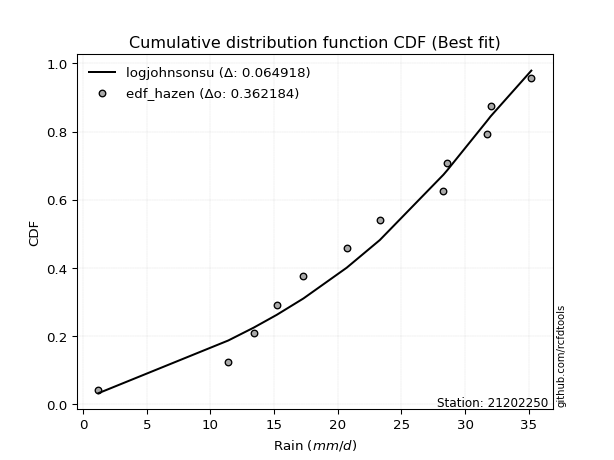</img>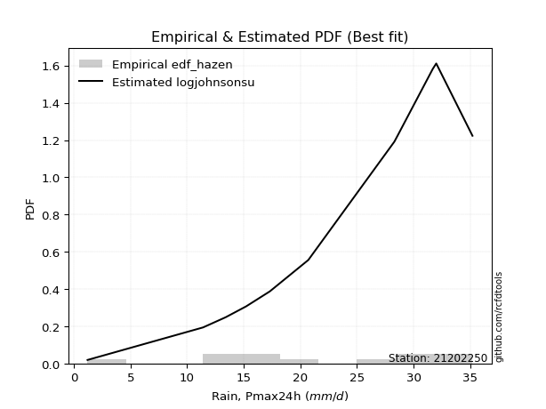</img>

</div>


### 3. Empirical - EDF Weibull (1939)

Weibull plotting position formula is an empirical method used to estimate the non-exceedance probability or plotting position for a set of observed data, is often recommended or widely used in practice, particularly in flood frequency analysis.

<div align="center">


$P=m/(n+1)$


</div>


**3.1. Empirical values**

<div align="center">

|                | 0                   | 1                   | 2                   | 3                  | 4                   | 5                   | 6                  | 7                  | 8                  | 9                  | 10                 | 11                 |
|:---------------|:--------------------|:--------------------|:--------------------|:-------------------|:--------------------|:--------------------|:-------------------|:-------------------|:-------------------|:-------------------|:-------------------|:-------------------|
| date           | 2023                | 2015                | 2016                | 2014               | 2012                | 2013                | 2025               | 2010               | 2011               | 2009               | 2024               | 2008               |
| x              | 1.2                 | 11.4                | 13.4                | 15.2               | 17.3                | 20.7                | 23.3               | 28.3               | 28.6               | 31.7               | 32.0               | 35.2               |
| m              | 1                   | 2                   | 3                   | 4                  | 5                   | 6                   | 7                  | 8                  | 9                  | 10                 | 11                 | 12                 |
| empirical_dist | edf_weibull         | edf_weibull         | edf_weibull         | edf_weibull        | edf_weibull         | edf_weibull         | edf_weibull        | edf_weibull        | edf_weibull        | edf_weibull        | edf_weibull        | edf_weibull        |
| empirical      | 0.07692307692307693 | 0.15384615384615385 | 0.23076923076923078 | 0.3076923076923077 | 0.38461538461538464 | 0.46153846153846156 | 0.5384615384615384 | 0.6153846153846154 | 0.6923076923076923 | 0.7692307692307693 | 0.8461538461538461 | 0.9230769230769231 |
| empirical_tr   | 1.0833333333333333  | 1.1818181818181819  | 1.3                 | 1.4444444444444444 | 1.625               | 1.8571428571428572  | 2.1666666666666665 | 2.6                | 3.25               | 4.333333333333334  | 6.5                | 13.000000000000009 |

</div>


**3.2. Kolmogorov-Smirnov fit test (sorted by Δ)**


<div align="center">

|                | 0                   | 1                   | 2                   | 3                   | 4                   | 5                   | 6                   | 7                   | 8                   | 9                   | 10                  | 11                  | 12                  | 13                  | 14                  | 15                  | 16                  | 17                  | 18                  | 19                    | 20                  | 21                  | 22                  | 23                  | 24                  | 25                  | 26                  | 27                  | 28                  | 29                  | 30                  | 31                  | 32                  | 33                  | 34                  | 35                  | 36                  | 37                  | 38                  | 39                  | 40                  | 41                  | 42                  | 43                  | 44                  | 45                  | 46                  | 47                  | 48                  | 49                  | 50                  | 51                  | 52                  | 53                  | 54                  | 55                  | 56                  | 57                  | 58                  | 59                  | 60                  | 61                  | 62                  | 63                  | 64                  | 65                  | 66                  | 67                  | 68                  | 69                  | 70                  | 71                  | 72                  | 73                  | 74                  | 75                  | 76                  | 77                  | 78                  | 79                  | 80                  | 81                  | 82                  | 83                  | 84                  | 85                  | 86                  | 87                  | 88                  | 89                  |
|:---------------|:--------------------|:--------------------|:--------------------|:--------------------|:--------------------|:--------------------|:--------------------|:--------------------|:--------------------|:--------------------|:--------------------|:--------------------|:--------------------|:--------------------|:--------------------|:--------------------|:--------------------|:--------------------|:--------------------|:----------------------|:--------------------|:--------------------|:--------------------|:--------------------|:--------------------|:--------------------|:--------------------|:--------------------|:--------------------|:--------------------|:--------------------|:--------------------|:--------------------|:--------------------|:--------------------|:--------------------|:--------------------|:--------------------|:--------------------|:--------------------|:--------------------|:--------------------|:--------------------|:--------------------|:--------------------|:--------------------|:--------------------|:--------------------|:--------------------|:--------------------|:--------------------|:--------------------|:--------------------|:--------------------|:--------------------|:--------------------|:--------------------|:--------------------|:--------------------|:--------------------|:--------------------|:--------------------|:--------------------|:--------------------|:--------------------|:--------------------|:--------------------|:--------------------|:--------------------|:--------------------|:--------------------|:--------------------|:--------------------|:--------------------|:--------------------|:--------------------|:--------------------|:--------------------|:--------------------|:--------------------|:--------------------|:--------------------|:--------------------|:--------------------|:--------------------|:--------------------|:--------------------|:--------------------|:--------------------|:--------------------|
| station        | 21202250            | 21202250            | 21202250            | 21202250            | 21202250            | 21202250            | 21202250            | 21202250            | 21202250            | 21202250            | 21202250            | 21202250            | 21202250            | 21202250            | 21202250            | 21202250            | 21202250            | 21202250            | 21202250            | 21202250              | 21202250            | 21202250            | 21202250            | 21202250            | 21202250            | 21202250            | 21202250            | 21202250            | 21202250            | 21202250            | 21202250            | 21202250            | 21202250            | 21202250            | 21202250            | 21202250            | 21202250            | 21202250            | 21202250            | 21202250            | 21202250            | 21202250            | 21202250            | 21202250            | 21202250            | 21202250            | 21202250            | 21202250            | 21202250            | 21202250            | 21202250            | 21202250            | 21202250            | 21202250            | 21202250            | 21202250            | 21202250            | 21202250            | 21202250            | 21202250            | 21202250            | 21202250            | 21202250            | 21202250            | 21202250            | 21202250            | 21202250            | 21202250            | 21202250            | 21202250            | 21202250            | 21202250            | 21202250            | 21202250            | 21202250            | 21202250            | 21202250            | 21202250            | 21202250            | 21202250            | 21202250            | 21202250            | 21202250            | 21202250            | 21202250            | 21202250            | 21202250            | 21202250            | 21202250            | 21202250            |
| empirical_dist | edf_weibull         | edf_weibull         | edf_weibull         | edf_weibull         | edf_weibull         | edf_weibull         | edf_weibull         | edf_weibull         | edf_weibull         | edf_weibull         | edf_weibull         | edf_weibull         | edf_weibull         | edf_weibull         | edf_weibull         | edf_weibull         | edf_weibull         | edf_weibull         | edf_weibull         | edf_weibull           | edf_weibull         | edf_weibull         | edf_weibull         | edf_weibull         | edf_weibull         | edf_weibull         | edf_weibull         | edf_weibull         | edf_weibull         | edf_weibull         | edf_weibull         | edf_weibull         | edf_weibull         | edf_weibull         | edf_weibull         | edf_weibull         | edf_weibull         | edf_weibull         | edf_weibull         | edf_weibull         | edf_weibull         | edf_weibull         | edf_weibull         | edf_weibull         | edf_weibull         | edf_weibull         | edf_weibull         | edf_weibull         | edf_weibull         | edf_weibull         | edf_weibull         | edf_weibull         | edf_weibull         | edf_weibull         | edf_weibull         | edf_weibull         | edf_weibull         | edf_weibull         | edf_weibull         | edf_weibull         | edf_weibull         | edf_weibull         | edf_weibull         | edf_weibull         | edf_weibull         | edf_weibull         | edf_weibull         | edf_weibull         | edf_weibull         | edf_weibull         | edf_weibull         | edf_weibull         | edf_weibull         | edf_weibull         | edf_weibull         | edf_weibull         | edf_weibull         | edf_weibull         | edf_weibull         | edf_weibull         | edf_weibull         | edf_weibull         | edf_weibull         | edf_weibull         | edf_weibull         | edf_weibull         | edf_weibull         | edf_weibull         | edf_weibull         | edf_weibull         |
| p_dist         | logjohnsonsu        | logpearson3         | mielke              | johnsonsu           | logt                | truncnorm           | logmielke           | logfisk             | ncf                 | genlogistic         | invweibull          | gompertz            | weibull_min         | logloggamma         | loggumbel_l         | pearson3            | gumbel_l            | kstwobign           | fisk                | loglaplace_asymmetric | invgamma            | gamma               | f                   | nakagami            | nct                 | exponnorm           | crystalball         | norm                | t                   | rice                | betaprime           | loghypsecant        | erlang              | loglogistic         | logweibull_min      | loggompertz         | maxwell             | rayleigh            | invgauss            | halfnorm            | logistic            | lognakagami         | logfatiguelife      | laplace_asymmetric  | logcrystalball      | lognorm             | lognorm             | logexponnorm        | loglognorm          | logrice             | logf                | alpha               | loglaplace          | lognct              | loggamma            | loggamma            | hypsecant           | gumbel_r            | logchi2             | halflogistic        | loginvgamma         | logncf              | moyal               | logerlang           | logmaxwell          | laplace             | lograyleigh         | logbetaprime        | loggumbel_r         | loginvgauss         | wald                | logmoyal            | loghalfnorm         | expon               | genexpon            | loginvweibull       | loghalflogistic     | gibrat              | logwald             | logkstwobign        | loggibrat           | loggenexpon         | logtruncnorm        | logexpon            | pareto              | logpareto           | fatiguelife         | logalpha            | chi2                | loggenlogistic      |
| delta          | 0.07453350951356286 | 0.08795696646746554 | 0.1014867894459941  | 0.10570471344669241 | 0.10965444649256217 | 0.11354234909329308 | 0.11448074111408368 | 0.11495110512914308 | 0.11501282261360457 | 0.1177979858492097  | 0.11931342344958717 | 0.11947247463127941 | 0.12175492813909428 | 0.12204430691730395 | 0.12524995157702823 | 0.12997395540694978 | 0.13038773944422966 | 0.13108533654536036 | 0.13424834768027738 | 0.1386988102299893    | 0.13919720450809914 | 0.14017857272533152 | 0.14103950835599155 | 0.141079993929774   | 0.14113042439026047 | 0.1411623310605934  | 0.14116288218698136 | 0.141162884235418   | 0.1411687214209647  | 0.1412037213980727  | 0.14121567064874774 | 0.1420133530567098  | 0.14351268514318183 | 0.14548544368386968 | 0.14802996031693127 | 0.14803178971357323 | 0.14989015573927156 | 0.15237515074429897 | 0.15275965955331683 | 0.1610041867049462  | 0.16381799374708117 | 0.16450317014677873 | 0.16453788425157473 | 0.16512758104917524 | 0.1657259234222116  | 0.16572593391128804 | 0.16572593391128804 | 0.16572755349706797 | 0.16572810172158525 | 0.16575452469077623 | 0.16607151980916413 | 0.16730715787012596 | 0.16738358443908663 | 0.16946351024337347 | 0.1760234788983393  | 0.1760234788983393  | 0.1785318221748381  | 0.17900630443074317 | 0.18084555200394486 | 0.18501995820117756 | 0.1890849993635222  | 0.19041780307909373 | 0.19124279292997803 | 0.19166503976628912 | 0.19543305544716066 | 0.19756267077113143 | 0.20698354473395986 | 0.2130454584047874  | 0.21457584989448608 | 0.2251616616002481  | 0.22997952426012347 | 0.2365144385739863  | 0.239754214050032   | 0.24074121499017864 | 0.24112104414810298 | 0.2507941234449652  | 0.25203084219353056 | 0.25909137961740436 | 0.29761178284324774 | 0.29983108425489347 | 0.3100342708836291  | 0.3373138044108558  | 0.4151177011012226  | 0.4167977402267834  | 0.48804270287462326 | 0.5026340133294563  | 0.579685999129191   | 0.647079635725627   | 0.7147264038647037  | 0.8461538461538461  |
| deltao         | 0.36218414519599995 | 0.36218414519599995 | 0.36218414519599995 | 0.36218414519599995 | 0.36218414519599995 | 0.36218414519599995 | 0.36218414519599995 | 0.36218414519599995 | 0.36218414519599995 | 0.36218414519599995 | 0.36218414519599995 | 0.36218414519599995 | 0.36218414519599995 | 0.36218414519599995 | 0.36218414519599995 | 0.36218414519599995 | 0.36218414519599995 | 0.36218414519599995 | 0.36218414519599995 | 0.36218414519599995   | 0.36218414519599995 | 0.36218414519599995 | 0.36218414519599995 | 0.36218414519599995 | 0.36218414519599995 | 0.36218414519599995 | 0.36218414519599995 | 0.36218414519599995 | 0.36218414519599995 | 0.36218414519599995 | 0.36218414519599995 | 0.36218414519599995 | 0.36218414519599995 | 0.36218414519599995 | 0.36218414519599995 | 0.36218414519599995 | 0.36218414519599995 | 0.36218414519599995 | 0.36218414519599995 | 0.36218414519599995 | 0.36218414519599995 | 0.36218414519599995 | 0.36218414519599995 | 0.36218414519599995 | 0.36218414519599995 | 0.36218414519599995 | 0.36218414519599995 | 0.36218414519599995 | 0.36218414519599995 | 0.36218414519599995 | 0.36218414519599995 | 0.36218414519599995 | 0.36218414519599995 | 0.36218414519599995 | 0.36218414519599995 | 0.36218414519599995 | 0.36218414519599995 | 0.36218414519599995 | 0.36218414519599995 | 0.36218414519599995 | 0.36218414519599995 | 0.36218414519599995 | 0.36218414519599995 | 0.36218414519599995 | 0.36218414519599995 | 0.36218414519599995 | 0.36218414519599995 | 0.36218414519599995 | 0.36218414519599995 | 0.36218414519599995 | 0.36218414519599995 | 0.36218414519599995 | 0.36218414519599995 | 0.36218414519599995 | 0.36218414519599995 | 0.36218414519599995 | 0.36218414519599995 | 0.36218414519599995 | 0.36218414519599995 | 0.36218414519599995 | 0.36218414519599995 | 0.36218414519599995 | 0.36218414519599995 | 0.36218414519599995 | 0.36218414519599995 | 0.36218414519599995 | 0.36218414519599995 | 0.36218414519599995 | 0.36218414519599995 | 0.36218414519599995 |
| eval           | Δo > Δ              | Δo > Δ              | Δo > Δ              | Δo > Δ              | Δo > Δ              | Δo > Δ              | Δo > Δ              | Δo > Δ              | Δo > Δ              | Δo > Δ              | Δo > Δ              | Δo > Δ              | Δo > Δ              | Δo > Δ              | Δo > Δ              | Δo > Δ              | Δo > Δ              | Δo > Δ              | Δo > Δ              | Δo > Δ                | Δo > Δ              | Δo > Δ              | Δo > Δ              | Δo > Δ              | Δo > Δ              | Δo > Δ              | Δo > Δ              | Δo > Δ              | Δo > Δ              | Δo > Δ              | Δo > Δ              | Δo > Δ              | Δo > Δ              | Δo > Δ              | Δo > Δ              | Δo > Δ              | Δo > Δ              | Δo > Δ              | Δo > Δ              | Δo > Δ              | Δo > Δ              | Δo > Δ              | Δo > Δ              | Δo > Δ              | Δo > Δ              | Δo > Δ              | Δo > Δ              | Δo > Δ              | Δo > Δ              | Δo > Δ              | Δo > Δ              | Δo > Δ              | Δo > Δ              | Δo > Δ              | Δo > Δ              | Δo > Δ              | Δo > Δ              | Δo > Δ              | Δo > Δ              | Δo > Δ              | Δo > Δ              | Δo > Δ              | Δo > Δ              | Δo > Δ              | Δo > Δ              | Δo > Δ              | Δo > Δ              | Δo > Δ              | Δo > Δ              | Δo > Δ              | Δo > Δ              | Δo > Δ              | Δo > Δ              | Δo > Δ              | Δo > Δ              | Δo > Δ              | Δo > Δ              | Δo > Δ              | Δo > Δ              | Δo > Δ              | Δo > Δ              | Δo > Δ              | Δo <= Δ             | Δo <= Δ             | Δo <= Δ             | Δo <= Δ             | Δo <= Δ             | Δo <= Δ             | Δo <= Δ             | Δo <= Δ             |
| fit            | 1                   | 1                   | 1                   | 1                   | 1                   | 1                   | 1                   | 1                   | 1                   | 1                   | 1                   | 1                   | 1                   | 1                   | 1                   | 1                   | 1                   | 1                   | 1                   | 1                     | 1                   | 1                   | 1                   | 1                   | 1                   | 1                   | 1                   | 1                   | 1                   | 1                   | 1                   | 1                   | 1                   | 1                   | 1                   | 1                   | 1                   | 1                   | 1                   | 1                   | 1                   | 1                   | 1                   | 1                   | 1                   | 1                   | 1                   | 1                   | 1                   | 1                   | 1                   | 1                   | 1                   | 1                   | 1                   | 1                   | 1                   | 1                   | 1                   | 1                   | 1                   | 1                   | 1                   | 1                   | 1                   | 1                   | 1                   | 1                   | 1                   | 1                   | 1                   | 1                   | 1                   | 1                   | 1                   | 1                   | 1                   | 1                   | 1                   | 1                   | 1                   | 1                   | 0                   | 0                   | 0                   | 0                   | 0                   | 0                   | 0                   | 0                   |
| n              | 12                  | 12                  | 12                  | 12                  | 12                  | 12                  | 12                  | 12                  | 12                  | 12                  | 12                  | 12                  | 12                  | 12                  | 12                  | 12                  | 12                  | 12                  | 12                  | 12                    | 12                  | 12                  | 12                  | 12                  | 12                  | 12                  | 12                  | 12                  | 12                  | 12                  | 12                  | 12                  | 12                  | 12                  | 12                  | 12                  | 12                  | 12                  | 12                  | 12                  | 12                  | 12                  | 12                  | 12                  | 12                  | 12                  | 12                  | 12                  | 12                  | 12                  | 12                  | 12                  | 12                  | 12                  | 12                  | 12                  | 12                  | 12                  | 12                  | 12                  | 12                  | 12                  | 12                  | 12                  | 12                  | 12                  | 12                  | 12                  | 12                  | 12                  | 12                  | 12                  | 12                  | 12                  | 12                  | 12                  | 12                  | 12                  | 12                  | 12                  | 12                  | 12                  | 12                  | 12                  | 12                  | 12                  | 12                  | 12                  | 12                  | 12                  |
| best_fit       | 1                   | 0                   | 0                   | 0                   | 0                   | 0                   | 0                   | 0                   | 0                   | 0                   | 0                   | 0                   | 0                   | 0                   | 0                   | 0                   | 0                   | 0                   | 0                   | 0                     | 0                   | 0                   | 0                   | 0                   | 0                   | 0                   | 0                   | 0                   | 0                   | 0                   | 0                   | 0                   | 0                   | 0                   | 0                   | 0                   | 0                   | 0                   | 0                   | 0                   | 0                   | 0                   | 0                   | 0                   | 0                   | 0                   | 0                   | 0                   | 0                   | 0                   | 0                   | 0                   | 0                   | 0                   | 0                   | 0                   | 0                   | 0                   | 0                   | 0                   | 0                   | 0                   | 0                   | 0                   | 0                   | 0                   | 0                   | 0                   | 0                   | 0                   | 0                   | 0                   | 0                   | 0                   | 0                   | 0                   | 0                   | 0                   | 0                   | 0                   | 0                   | 0                   | 0                   | 0                   | 0                   | 0                   | 0                   | 0                   | 0                   | 0                   |
| best_fit_sort  | 1                   | 2                   | 3                   | 4                   | 5                   | 6                   | 7                   | 8                   | 9                   | 10                  | 11                  | 12                  | 13                  | 14                  | 15                  | 16                  | 17                  | 18                  | 19                  | 20                    | 21                  | 22                  | 23                  | 24                  | 25                  | 26                  | 27                  | 28                  | 29                  | 30                  | 31                  | 32                  | 33                  | 34                  | 35                  | 36                  | 37                  | 38                  | 39                  | 40                  | 41                  | 42                  | 43                  | 44                  | 45                  | 46                  | 47                  | 48                  | 49                  | 50                  | 51                  | 52                  | 53                  | 54                  | 55                  | 56                  | 57                  | 58                  | 59                  | 60                  | 61                  | 62                  | 63                  | 64                  | 65                  | 66                  | 67                  | 68                  | 69                  | 70                  | 71                  | 72                  | 73                  | 74                  | 75                  | 76                  | 77                  | 78                  | 79                  | 80                  | 81                  | 82                  | 83                  | 84                  | 85                  | 86                  | 87                  | 88                  | 89                  | 90                  |

</div>


<div align="center">

</img>

</div>


**3.3. Best fit**

<div align="center">

|   id |   station | empirical_dist   | p_dist       |     delta |   deltao | eval   |   fit |   n |   best_fit |   best_fit_sort |
|-----:|----------:|:-----------------|:-------------|----------:|---------:|:-------|------:|----:|-----------:|----------------:|
|    0 |  21202250 | edf_weibull      | logjohnsonsu | 0.0745335 | 0.362184 | Δo > Δ |     1 |  12 |          1 |               1 |

</div>


<div align="center">

</img>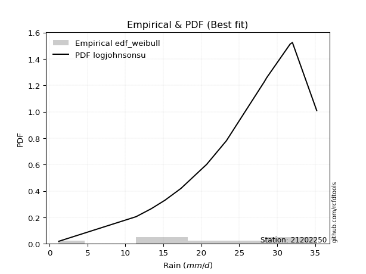</img>

</div>


### 4. Empirical - EDF Beard (1943)

The Beard formula (or Beard´s plotting position formula) in hydrology is used to estimate the empirical non-exceedance probability _(P)_ of a flood event (or other extreme hydrological data point) within a given dataset.

<div align="center">


$P=(m-0.31)/(n+0.38)$


</div>


**4.1. Empirical values**

<div align="center">

|                | 0                    | 1                   | 2                   | 3                  | 4                  | 5                  | 6                  | 7                  | 8                  | 9                  | 10                 | 11                 |
|:---------------|:---------------------|:--------------------|:--------------------|:-------------------|:-------------------|:-------------------|:-------------------|:-------------------|:-------------------|:-------------------|:-------------------|:-------------------|
| date           | 2023                 | 2015                | 2016                | 2014               | 2012               | 2013               | 2025               | 2010               | 2011               | 2009               | 2024               | 2008               |
| x              | 1.2                  | 11.4                | 13.4                | 15.2               | 17.3               | 20.7               | 23.3               | 28.3               | 28.6               | 31.7               | 32.0               | 35.2               |
| m              | 1                    | 2                   | 3                   | 4                  | 5                  | 6                  | 7                  | 8                  | 9                  | 10                 | 11                 | 12                 |
| empirical_dist | edf_beard            | edf_beard           | edf_beard           | edf_beard          | edf_beard          | edf_beard          | edf_beard          | edf_beard          | edf_beard          | edf_beard          | edf_beard          | edf_beard          |
| empirical      | 0.055735056542810975 | 0.13651050080775443 | 0.21728594507269788 | 0.2980613893376413 | 0.3788368336025848 | 0.4596122778675283 | 0.5403877221324718 | 0.6211631663974152 | 0.7019386106623585 | 0.7827140549273021 | 0.8634894991922455 | 0.9442649434571889 |
| empirical_tr   | 1.0590248075278015   | 1.1580916744621141  | 1.2776057791537667  | 1.424626006904488  | 1.6098829648894668 | 1.850523168908819  | 2.1757469244288226 | 2.6396588486140726 | 3.3550135501355    | 4.6022304832713745 | 7.325443786982245  | 17.942028985507218 |

</div>


**4.2. Kolmogorov-Smirnov fit test (sorted by Δ)**


<div align="center">

|                | 0                   | 1                   | 2                   | 3                   | 4                   | 5                   | 6                   | 7                   | 8                   | 9                   | 10                  | 11                  | 12                  | 13                  | 14                  | 15                  | 16                  | 17                    | 18                  | 19                  | 20                  | 21                  | 22                  | 23                  | 24                  | 25                  | 26                  | 27                  | 28                  | 29                  | 30                  | 31                  | 32                  | 33                  | 34                  | 35                  | 36                  | 37                  | 38                  | 39                  | 40                  | 41                  | 42                  | 43                  | 44                  | 45                  | 46                  | 47                  | 48                  | 49                  | 50                  | 51                  | 52                  | 53                  | 54                  | 55                  | 56                  | 57                  | 58                  | 59                  | 60                  | 61                  | 62                  | 63                  | 64                  | 65                  | 66                  | 67                  | 68                  | 69                  | 70                  | 71                  | 72                  | 73                  | 74                  | 75                  | 76                  | 77                  | 78                  | 79                  | 80                  | 81                  | 82                  | 83                  | 84                  | 85                  | 86                  | 87                  | 88                  | 89                  |
|:---------------|:--------------------|:--------------------|:--------------------|:--------------------|:--------------------|:--------------------|:--------------------|:--------------------|:--------------------|:--------------------|:--------------------|:--------------------|:--------------------|:--------------------|:--------------------|:--------------------|:--------------------|:----------------------|:--------------------|:--------------------|:--------------------|:--------------------|:--------------------|:--------------------|:--------------------|:--------------------|:--------------------|:--------------------|:--------------------|:--------------------|:--------------------|:--------------------|:--------------------|:--------------------|:--------------------|:--------------------|:--------------------|:--------------------|:--------------------|:--------------------|:--------------------|:--------------------|:--------------------|:--------------------|:--------------------|:--------------------|:--------------------|:--------------------|:--------------------|:--------------------|:--------------------|:--------------------|:--------------------|:--------------------|:--------------------|:--------------------|:--------------------|:--------------------|:--------------------|:--------------------|:--------------------|:--------------------|:--------------------|:--------------------|:--------------------|:--------------------|:--------------------|:--------------------|:--------------------|:--------------------|:--------------------|:--------------------|:--------------------|:--------------------|:--------------------|:--------------------|:--------------------|:--------------------|:--------------------|:--------------------|:--------------------|:--------------------|:--------------------|:--------------------|:--------------------|:--------------------|:--------------------|:--------------------|:--------------------|:--------------------|
| station        | 21202250            | 21202250            | 21202250            | 21202250            | 21202250            | 21202250            | 21202250            | 21202250            | 21202250            | 21202250            | 21202250            | 21202250            | 21202250            | 21202250            | 21202250            | 21202250            | 21202250            | 21202250              | 21202250            | 21202250            | 21202250            | 21202250            | 21202250            | 21202250            | 21202250            | 21202250            | 21202250            | 21202250            | 21202250            | 21202250            | 21202250            | 21202250            | 21202250            | 21202250            | 21202250            | 21202250            | 21202250            | 21202250            | 21202250            | 21202250            | 21202250            | 21202250            | 21202250            | 21202250            | 21202250            | 21202250            | 21202250            | 21202250            | 21202250            | 21202250            | 21202250            | 21202250            | 21202250            | 21202250            | 21202250            | 21202250            | 21202250            | 21202250            | 21202250            | 21202250            | 21202250            | 21202250            | 21202250            | 21202250            | 21202250            | 21202250            | 21202250            | 21202250            | 21202250            | 21202250            | 21202250            | 21202250            | 21202250            | 21202250            | 21202250            | 21202250            | 21202250            | 21202250            | 21202250            | 21202250            | 21202250            | 21202250            | 21202250            | 21202250            | 21202250            | 21202250            | 21202250            | 21202250            | 21202250            | 21202250            |
| empirical_dist | edf_beard           | edf_beard           | edf_beard           | edf_beard           | edf_beard           | edf_beard           | edf_beard           | edf_beard           | edf_beard           | edf_beard           | edf_beard           | edf_beard           | edf_beard           | edf_beard           | edf_beard           | edf_beard           | edf_beard           | edf_beard             | edf_beard           | edf_beard           | edf_beard           | edf_beard           | edf_beard           | edf_beard           | edf_beard           | edf_beard           | edf_beard           | edf_beard           | edf_beard           | edf_beard           | edf_beard           | edf_beard           | edf_beard           | edf_beard           | edf_beard           | edf_beard           | edf_beard           | edf_beard           | edf_beard           | edf_beard           | edf_beard           | edf_beard           | edf_beard           | edf_beard           | edf_beard           | edf_beard           | edf_beard           | edf_beard           | edf_beard           | edf_beard           | edf_beard           | edf_beard           | edf_beard           | edf_beard           | edf_beard           | edf_beard           | edf_beard           | edf_beard           | edf_beard           | edf_beard           | edf_beard           | edf_beard           | edf_beard           | edf_beard           | edf_beard           | edf_beard           | edf_beard           | edf_beard           | edf_beard           | edf_beard           | edf_beard           | edf_beard           | edf_beard           | edf_beard           | edf_beard           | edf_beard           | edf_beard           | edf_beard           | edf_beard           | edf_beard           | edf_beard           | edf_beard           | edf_beard           | edf_beard           | edf_beard           | edf_beard           | edf_beard           | edf_beard           | edf_beard           | edf_beard           |
| p_dist         | logjohnsonsu        | mielke              | johnsonsu           | logpearson3         | truncnorm           | logmielke           | genlogistic         | invweibull          | gompertz            | weibull_min         | logloggamma         | logt                | pearson3            | gumbel_l            | kstwobign           | fisk                | ncf                 | loglaplace_asymmetric | invgamma            | gamma               | f                   | nakagami            | nct                 | exponnorm           | crystalball         | norm                | t                   | rice                | betaprime           | logfisk             | erlang              | logweibull_min      | loggompertz         | maxwell             | loggumbel_l         | rayleigh            | invgauss            | loghypsecant        | halfnorm            | logistic            | laplace_asymmetric  | alpha               | loglogistic         | loglaplace          | hypsecant           | gumbel_r            | halflogistic        | lognakagami         | logfatiguelife      | logcrystalball      | lognorm             | lognorm             | logexponnorm        | loglognorm          | logrice             | logf                | moyal               | lognct              | laplace             | loggamma            | loggamma            | logchi2             | loginvgamma         | logncf              | logerlang           | logmaxwell          | wald                | lograyleigh         | loggumbel_r         | logbetaprime        | loginvgauss         | logmoyal            | gibrat              | loghalfnorm         | expon               | genexpon            | loghalflogistic     | loginvweibull       | logwald             | logkstwobign        | loggibrat           | loggenexpon         | logtruncnorm        | logexpon            | pareto              | logpareto           | fatiguelife         | logalpha            | chi2                | loggenlogistic      |
| delta          | 0.06875495850076302 | 0.09570823843319431 | 0.09992616243389257 | 0.10529261950586488 | 0.1077637980804933  | 0.1087021901012839  | 0.11201943483640986 | 0.11353487243678739 | 0.11369392361847963 | 0.1159763771262945  | 0.11626575590450416 | 0.12345455166918418 | 0.12419540439415    | 0.12460918843142987 | 0.12530678553256058 | 0.1284697966674776  | 0.132348475652004   | 0.13292025921718953   | 0.13341865349529936 | 0.13440002171253174 | 0.13526095734319177 | 0.1353014429169742  | 0.13535187337746069 | 0.1353837800477936  | 0.13538433117418158 | 0.13538433322261823 | 0.13539017040816492 | 0.1354251703852729  | 0.13543711963594796 | 0.13613912550940888 | 0.13773413413038205 | 0.1422514093041315  | 0.14225323870077344 | 0.14411160472647178 | 0.14643797195729402 | 0.1465965997314992  | 0.14698110854051705 | 0.14775167760359734 | 0.15522563569214642 | 0.1580394427342814  | 0.15934903003637546 | 0.16152860685732617 | 0.1628210967222691  | 0.1693097681100199  | 0.1727532711620383  | 0.1732277534179434  | 0.17924140718837778 | 0.18183882318517816 | 0.18187353728997416 | 0.18306157646061103 | 0.18306158694968747 | 0.18306158694968747 | 0.1830632065354674  | 0.18306375475998468 | 0.18309017772917566 | 0.18340717284756355 | 0.18546424191717825 | 0.1867991632817729  | 0.19178411975833165 | 0.19335913193673873 | 0.19335913193673873 | 0.1981812050423443  | 0.20642065240192162 | 0.20775345611749316 | 0.20900069280468855 | 0.2127687084855601  | 0.2242009732473237  | 0.22431919777235929 | 0.22805913559101898 | 0.23038111144318682 | 0.24249731463864752 | 0.2499977242705192  | 0.2533128286046046  | 0.2570898670884314  | 0.2580768680285781  | 0.25845669718650244 | 0.26551412789006346 | 0.26812977648336467 | 0.3080884184839959  | 0.3171667372932929  | 0.3181313293442544  | 0.35464945744925525 | 0.43245335413962205 | 0.43413339326518285 | 0.5053783559130227  | 0.5199696663678558  | 0.5970216521675905  | 0.6644152887640264  | 0.7320620569031031  | 0.8634894991922455  |
| deltao         | 0.36218414519599995 | 0.36218414519599995 | 0.36218414519599995 | 0.36218414519599995 | 0.36218414519599995 | 0.36218414519599995 | 0.36218414519599995 | 0.36218414519599995 | 0.36218414519599995 | 0.36218414519599995 | 0.36218414519599995 | 0.36218414519599995 | 0.36218414519599995 | 0.36218414519599995 | 0.36218414519599995 | 0.36218414519599995 | 0.36218414519599995 | 0.36218414519599995   | 0.36218414519599995 | 0.36218414519599995 | 0.36218414519599995 | 0.36218414519599995 | 0.36218414519599995 | 0.36218414519599995 | 0.36218414519599995 | 0.36218414519599995 | 0.36218414519599995 | 0.36218414519599995 | 0.36218414519599995 | 0.36218414519599995 | 0.36218414519599995 | 0.36218414519599995 | 0.36218414519599995 | 0.36218414519599995 | 0.36218414519599995 | 0.36218414519599995 | 0.36218414519599995 | 0.36218414519599995 | 0.36218414519599995 | 0.36218414519599995 | 0.36218414519599995 | 0.36218414519599995 | 0.36218414519599995 | 0.36218414519599995 | 0.36218414519599995 | 0.36218414519599995 | 0.36218414519599995 | 0.36218414519599995 | 0.36218414519599995 | 0.36218414519599995 | 0.36218414519599995 | 0.36218414519599995 | 0.36218414519599995 | 0.36218414519599995 | 0.36218414519599995 | 0.36218414519599995 | 0.36218414519599995 | 0.36218414519599995 | 0.36218414519599995 | 0.36218414519599995 | 0.36218414519599995 | 0.36218414519599995 | 0.36218414519599995 | 0.36218414519599995 | 0.36218414519599995 | 0.36218414519599995 | 0.36218414519599995 | 0.36218414519599995 | 0.36218414519599995 | 0.36218414519599995 | 0.36218414519599995 | 0.36218414519599995 | 0.36218414519599995 | 0.36218414519599995 | 0.36218414519599995 | 0.36218414519599995 | 0.36218414519599995 | 0.36218414519599995 | 0.36218414519599995 | 0.36218414519599995 | 0.36218414519599995 | 0.36218414519599995 | 0.36218414519599995 | 0.36218414519599995 | 0.36218414519599995 | 0.36218414519599995 | 0.36218414519599995 | 0.36218414519599995 | 0.36218414519599995 | 0.36218414519599995 |
| eval           | Δo > Δ              | Δo > Δ              | Δo > Δ              | Δo > Δ              | Δo > Δ              | Δo > Δ              | Δo > Δ              | Δo > Δ              | Δo > Δ              | Δo > Δ              | Δo > Δ              | Δo > Δ              | Δo > Δ              | Δo > Δ              | Δo > Δ              | Δo > Δ              | Δo > Δ              | Δo > Δ                | Δo > Δ              | Δo > Δ              | Δo > Δ              | Δo > Δ              | Δo > Δ              | Δo > Δ              | Δo > Δ              | Δo > Δ              | Δo > Δ              | Δo > Δ              | Δo > Δ              | Δo > Δ              | Δo > Δ              | Δo > Δ              | Δo > Δ              | Δo > Δ              | Δo > Δ              | Δo > Δ              | Δo > Δ              | Δo > Δ              | Δo > Δ              | Δo > Δ              | Δo > Δ              | Δo > Δ              | Δo > Δ              | Δo > Δ              | Δo > Δ              | Δo > Δ              | Δo > Δ              | Δo > Δ              | Δo > Δ              | Δo > Δ              | Δo > Δ              | Δo > Δ              | Δo > Δ              | Δo > Δ              | Δo > Δ              | Δo > Δ              | Δo > Δ              | Δo > Δ              | Δo > Δ              | Δo > Δ              | Δo > Δ              | Δo > Δ              | Δo > Δ              | Δo > Δ              | Δo > Δ              | Δo > Δ              | Δo > Δ              | Δo > Δ              | Δo > Δ              | Δo > Δ              | Δo > Δ              | Δo > Δ              | Δo > Δ              | Δo > Δ              | Δo > Δ              | Δo > Δ              | Δo > Δ              | Δo > Δ              | Δo > Δ              | Δo > Δ              | Δo > Δ              | Δo > Δ              | Δo <= Δ             | Δo <= Δ             | Δo <= Δ             | Δo <= Δ             | Δo <= Δ             | Δo <= Δ             | Δo <= Δ             | Δo <= Δ             |
| fit            | 1                   | 1                   | 1                   | 1                   | 1                   | 1                   | 1                   | 1                   | 1                   | 1                   | 1                   | 1                   | 1                   | 1                   | 1                   | 1                   | 1                   | 1                     | 1                   | 1                   | 1                   | 1                   | 1                   | 1                   | 1                   | 1                   | 1                   | 1                   | 1                   | 1                   | 1                   | 1                   | 1                   | 1                   | 1                   | 1                   | 1                   | 1                   | 1                   | 1                   | 1                   | 1                   | 1                   | 1                   | 1                   | 1                   | 1                   | 1                   | 1                   | 1                   | 1                   | 1                   | 1                   | 1                   | 1                   | 1                   | 1                   | 1                   | 1                   | 1                   | 1                   | 1                   | 1                   | 1                   | 1                   | 1                   | 1                   | 1                   | 1                   | 1                   | 1                   | 1                   | 1                   | 1                   | 1                   | 1                   | 1                   | 1                   | 1                   | 1                   | 1                   | 1                   | 0                   | 0                   | 0                   | 0                   | 0                   | 0                   | 0                   | 0                   |
| n              | 12                  | 12                  | 12                  | 12                  | 12                  | 12                  | 12                  | 12                  | 12                  | 12                  | 12                  | 12                  | 12                  | 12                  | 12                  | 12                  | 12                  | 12                    | 12                  | 12                  | 12                  | 12                  | 12                  | 12                  | 12                  | 12                  | 12                  | 12                  | 12                  | 12                  | 12                  | 12                  | 12                  | 12                  | 12                  | 12                  | 12                  | 12                  | 12                  | 12                  | 12                  | 12                  | 12                  | 12                  | 12                  | 12                  | 12                  | 12                  | 12                  | 12                  | 12                  | 12                  | 12                  | 12                  | 12                  | 12                  | 12                  | 12                  | 12                  | 12                  | 12                  | 12                  | 12                  | 12                  | 12                  | 12                  | 12                  | 12                  | 12                  | 12                  | 12                  | 12                  | 12                  | 12                  | 12                  | 12                  | 12                  | 12                  | 12                  | 12                  | 12                  | 12                  | 12                  | 12                  | 12                  | 12                  | 12                  | 12                  | 12                  | 12                  |
| best_fit       | 1                   | 0                   | 0                   | 0                   | 0                   | 0                   | 0                   | 0                   | 0                   | 0                   | 0                   | 0                   | 0                   | 0                   | 0                   | 0                   | 0                   | 0                     | 0                   | 0                   | 0                   | 0                   | 0                   | 0                   | 0                   | 0                   | 0                   | 0                   | 0                   | 0                   | 0                   | 0                   | 0                   | 0                   | 0                   | 0                   | 0                   | 0                   | 0                   | 0                   | 0                   | 0                   | 0                   | 0                   | 0                   | 0                   | 0                   | 0                   | 0                   | 0                   | 0                   | 0                   | 0                   | 0                   | 0                   | 0                   | 0                   | 0                   | 0                   | 0                   | 0                   | 0                   | 0                   | 0                   | 0                   | 0                   | 0                   | 0                   | 0                   | 0                   | 0                   | 0                   | 0                   | 0                   | 0                   | 0                   | 0                   | 0                   | 0                   | 0                   | 0                   | 0                   | 0                   | 0                   | 0                   | 0                   | 0                   | 0                   | 0                   | 0                   |
| best_fit_sort  | 1                   | 2                   | 3                   | 4                   | 5                   | 6                   | 7                   | 8                   | 9                   | 10                  | 11                  | 12                  | 13                  | 14                  | 15                  | 16                  | 17                  | 18                    | 19                  | 20                  | 21                  | 22                  | 23                  | 24                  | 25                  | 26                  | 27                  | 28                  | 29                  | 30                  | 31                  | 32                  | 33                  | 34                  | 35                  | 36                  | 37                  | 38                  | 39                  | 40                  | 41                  | 42                  | 43                  | 44                  | 45                  | 46                  | 47                  | 48                  | 49                  | 50                  | 51                  | 52                  | 53                  | 54                  | 55                  | 56                  | 57                  | 58                  | 59                  | 60                  | 61                  | 62                  | 63                  | 64                  | 65                  | 66                  | 67                  | 68                  | 69                  | 70                  | 71                  | 72                  | 73                  | 74                  | 75                  | 76                  | 77                  | 78                  | 79                  | 80                  | 81                  | 82                  | 83                  | 84                  | 85                  | 86                  | 87                  | 88                  | 89                  | 90                  |

</div>


<div align="center">

</img>

</div>


**4.3. Best fit**

<div align="center">

|   id |   station | empirical_dist   | p_dist       |    delta |   deltao | eval   |   fit |   n |   best_fit |   best_fit_sort |
|-----:|----------:|:-----------------|:-------------|---------:|---------:|:-------|------:|----:|-----------:|----------------:|
|    0 |  21202250 | edf_beard        | logjohnsonsu | 0.068755 | 0.362184 | Δo > Δ |     1 |  12 |          1 |               1 |

</div>


<div align="center">

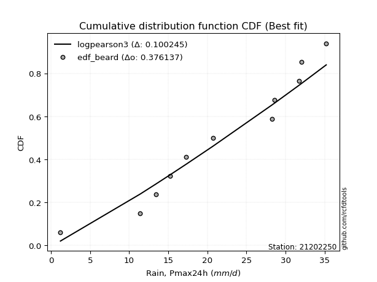</img></img>

</div>


### 5. Empirical - EDF Chegodayev (1955)

The Chegodayev formula is an empirical plotting position formula used in hydrological frequency analysis to estimate the exceedance probability or return period of a specific event from a set of observed data. It is primarily used for plotting observed data points on probability paper to fit a theoretical distribution, particularly for analyzing extreme events like maximum flood flows or rainfall intensities. The constant _b_ value in the generalized plotting position formula is 0.3.

<div align="center">


$P=(m-b)/(n+1-2b)$


</div>


**5.1. Empirical values**

<div align="center">

|                | 0                  | 1                   | 2                   | 3                   | 4                  | 5                  | 6                  | 7                  | 8                  | 9                 | 10                 | 11                 |
|:---------------|:-------------------|:--------------------|:--------------------|:--------------------|:-------------------|:-------------------|:-------------------|:-------------------|:-------------------|:------------------|:-------------------|:-------------------|
| date           | 2023               | 2015                | 2016                | 2014                | 2012               | 2013               | 2025               | 2010               | 2011               | 2009              | 2024               | 2008               |
| x              | 1.2                | 11.4                | 13.4                | 15.2                | 17.3               | 20.7               | 23.3               | 28.3               | 28.6               | 31.7              | 32.0               | 35.2               |
| m              | 1                  | 2                   | 3                   | 4                   | 5                  | 6                  | 7                  | 8                  | 9                  | 10                | 11                 | 12                 |
| empirical_dist | edf_chegodayev     | edf_chegodayev      | edf_chegodayev      | edf_chegodayev      | edf_chegodayev     | edf_chegodayev     | edf_chegodayev     | edf_chegodayev     | edf_chegodayev     | edf_chegodayev    | edf_chegodayev     | edf_chegodayev     |
| empirical      | 0.0564516129032258 | 0.13709677419354838 | 0.21774193548387097 | 0.29838709677419356 | 0.3790322580645161 | 0.4596774193548387 | 0.5403225806451613 | 0.6209677419354839 | 0.7016129032258064 | 0.782258064516129 | 0.8629032258064515 | 0.9435483870967741 |
| empirical_tr   | 1.0598290598290598 | 1.158878504672897   | 1.2783505154639176  | 1.425287356321839   | 1.6103896103896105 | 1.8507462686567164 | 2.1754385964912277 | 2.6382978723404253 | 3.3513513513513504 | 4.592592592592592 | 7.294117647058818  | 17.714285714285694 |

</div>


**5.2. Kolmogorov-Smirnov fit test (sorted by Δ)**


<div align="center">

|                | 0                   | 1                   | 2                   | 3                   | 4                   | 5                   | 6                   | 7                   | 8                   | 9                   | 10                  | 11                  | 12                  | 13                  | 14                  | 15                  | 16                  | 17                    | 18                  | 19                  | 20                  | 21                  | 22                  | 23                  | 24                  | 25                  | 26                  | 27                  | 28                  | 29                  | 30                  | 31                  | 32                  | 33                  | 34                  | 35                  | 36                  | 37                  | 38                  | 39                  | 40                  | 41                  | 42                  | 43                  | 44                  | 45                  | 46                  | 47                  | 48                  | 49                  | 50                  | 51                  | 52                  | 53                  | 54                  | 55                  | 56                  | 57                  | 58                  | 59                  | 60                  | 61                  | 62                  | 63                  | 64                  | 65                  | 66                  | 67                  | 68                  | 69                  | 70                  | 71                  | 72                  | 73                  | 74                  | 75                  | 76                  | 77                  | 78                  | 79                  | 80                  | 81                  | 82                  | 83                  | 84                  | 85                  | 86                  | 87                  | 88                  | 89                  |
|:---------------|:--------------------|:--------------------|:--------------------|:--------------------|:--------------------|:--------------------|:--------------------|:--------------------|:--------------------|:--------------------|:--------------------|:--------------------|:--------------------|:--------------------|:--------------------|:--------------------|:--------------------|:----------------------|:--------------------|:--------------------|:--------------------|:--------------------|:--------------------|:--------------------|:--------------------|:--------------------|:--------------------|:--------------------|:--------------------|:--------------------|:--------------------|:--------------------|:--------------------|:--------------------|:--------------------|:--------------------|:--------------------|:--------------------|:--------------------|:--------------------|:--------------------|:--------------------|:--------------------|:--------------------|:--------------------|:--------------------|:--------------------|:--------------------|:--------------------|:--------------------|:--------------------|:--------------------|:--------------------|:--------------------|:--------------------|:--------------------|:--------------------|:--------------------|:--------------------|:--------------------|:--------------------|:--------------------|:--------------------|:--------------------|:--------------------|:--------------------|:--------------------|:--------------------|:--------------------|:--------------------|:--------------------|:--------------------|:--------------------|:--------------------|:--------------------|:--------------------|:--------------------|:--------------------|:--------------------|:--------------------|:--------------------|:--------------------|:--------------------|:--------------------|:--------------------|:--------------------|:--------------------|:--------------------|:--------------------|:--------------------|
| station        | 21202250            | 21202250            | 21202250            | 21202250            | 21202250            | 21202250            | 21202250            | 21202250            | 21202250            | 21202250            | 21202250            | 21202250            | 21202250            | 21202250            | 21202250            | 21202250            | 21202250            | 21202250              | 21202250            | 21202250            | 21202250            | 21202250            | 21202250            | 21202250            | 21202250            | 21202250            | 21202250            | 21202250            | 21202250            | 21202250            | 21202250            | 21202250            | 21202250            | 21202250            | 21202250            | 21202250            | 21202250            | 21202250            | 21202250            | 21202250            | 21202250            | 21202250            | 21202250            | 21202250            | 21202250            | 21202250            | 21202250            | 21202250            | 21202250            | 21202250            | 21202250            | 21202250            | 21202250            | 21202250            | 21202250            | 21202250            | 21202250            | 21202250            | 21202250            | 21202250            | 21202250            | 21202250            | 21202250            | 21202250            | 21202250            | 21202250            | 21202250            | 21202250            | 21202250            | 21202250            | 21202250            | 21202250            | 21202250            | 21202250            | 21202250            | 21202250            | 21202250            | 21202250            | 21202250            | 21202250            | 21202250            | 21202250            | 21202250            | 21202250            | 21202250            | 21202250            | 21202250            | 21202250            | 21202250            | 21202250            |
| empirical_dist | edf_chegodayev      | edf_chegodayev      | edf_chegodayev      | edf_chegodayev      | edf_chegodayev      | edf_chegodayev      | edf_chegodayev      | edf_chegodayev      | edf_chegodayev      | edf_chegodayev      | edf_chegodayev      | edf_chegodayev      | edf_chegodayev      | edf_chegodayev      | edf_chegodayev      | edf_chegodayev      | edf_chegodayev      | edf_chegodayev        | edf_chegodayev      | edf_chegodayev      | edf_chegodayev      | edf_chegodayev      | edf_chegodayev      | edf_chegodayev      | edf_chegodayev      | edf_chegodayev      | edf_chegodayev      | edf_chegodayev      | edf_chegodayev      | edf_chegodayev      | edf_chegodayev      | edf_chegodayev      | edf_chegodayev      | edf_chegodayev      | edf_chegodayev      | edf_chegodayev      | edf_chegodayev      | edf_chegodayev      | edf_chegodayev      | edf_chegodayev      | edf_chegodayev      | edf_chegodayev      | edf_chegodayev      | edf_chegodayev      | edf_chegodayev      | edf_chegodayev      | edf_chegodayev      | edf_chegodayev      | edf_chegodayev      | edf_chegodayev      | edf_chegodayev      | edf_chegodayev      | edf_chegodayev      | edf_chegodayev      | edf_chegodayev      | edf_chegodayev      | edf_chegodayev      | edf_chegodayev      | edf_chegodayev      | edf_chegodayev      | edf_chegodayev      | edf_chegodayev      | edf_chegodayev      | edf_chegodayev      | edf_chegodayev      | edf_chegodayev      | edf_chegodayev      | edf_chegodayev      | edf_chegodayev      | edf_chegodayev      | edf_chegodayev      | edf_chegodayev      | edf_chegodayev      | edf_chegodayev      | edf_chegodayev      | edf_chegodayev      | edf_chegodayev      | edf_chegodayev      | edf_chegodayev      | edf_chegodayev      | edf_chegodayev      | edf_chegodayev      | edf_chegodayev      | edf_chegodayev      | edf_chegodayev      | edf_chegodayev      | edf_chegodayev      | edf_chegodayev      | edf_chegodayev      | edf_chegodayev      |
| p_dist         | logjohnsonsu        | mielke              | johnsonsu           | logpearson3         | truncnorm           | logmielke           | genlogistic         | invweibull          | gompertz            | weibull_min         | logloggamma         | logt                | pearson3            | gumbel_l            | kstwobign           | fisk                | ncf                 | loglaplace_asymmetric | invgamma            | gamma               | logfisk             | f                   | nakagami            | nct                 | exponnorm           | crystalball         | norm                | t                   | rice                | betaprime           | erlang              | logweibull_min      | loggompertz         | maxwell             | loggumbel_l         | rayleigh            | loghypsecant        | invgauss            | halfnorm            | logistic            | laplace_asymmetric  | alpha               | loglogistic         | loglaplace          | hypsecant           | gumbel_r            | halflogistic        | lognakagami         | logfatiguelife      | logcrystalball      | lognorm             | lognorm             | logexponnorm        | loglognorm          | logrice             | logf                | moyal               | lognct              | laplace             | loggamma            | loggamma            | logchi2             | loginvgamma         | logncf              | logerlang           | logmaxwell          | lograyleigh         | wald                | loggumbel_r         | logbetaprime        | loginvgauss         | logmoyal            | gibrat              | loghalfnorm         | expon               | genexpon            | loghalflogistic     | loginvweibull       | logwald             | logkstwobign        | loggibrat           | loggenexpon         | logtruncnorm        | logexpon            | pareto              | logpareto           | fatiguelife         | logalpha            | chi2                | loggenlogistic      |
| delta          | 0.06895038296269435 | 0.09590366289512564 | 0.1001215868958239  | 0.1047063461200709  | 0.10795922254242463 | 0.10889761456321523 | 0.11221485929834119 | 0.11373029689871872 | 0.11388934808041096 | 0.11617180158822582 | 0.11646118036643549 | 0.12273799530876939 | 0.12439082885608133 | 0.1248046128933612  | 0.1255022099944919  | 0.12866522112940892 | 0.13176220226621005 | 0.13311568367912086   | 0.13361407795723068 | 0.13459544617446306 | 0.1354225691489941  | 0.1354563818051231  | 0.13549686737890554 | 0.135547297839392   | 0.13557920450972494 | 0.1355797556361129  | 0.13557975768454955 | 0.13558559487009625 | 0.13562059484720423 | 0.13563254409787928 | 0.13792955859231337 | 0.14244683376606282 | 0.14244866316270477 | 0.1443070291884031  | 0.14572141559687923 | 0.14679202419343051 | 0.14716540421780339 | 0.14717653300244837 | 0.15542106015407775 | 0.15823486719621271 | 0.1595444544983068  | 0.1617240313192575  | 0.16223482333647515 | 0.1692446266227095  | 0.17294869562396964 | 0.1734231778798747  | 0.1794368316503091  | 0.1812525497993842  | 0.1812872639041802  | 0.18247530307481707 | 0.18247531356389352 | 0.18247531356389352 | 0.18247693314967345 | 0.18247748137419073 | 0.1825039043433817  | 0.1828208994617696  | 0.18565966637910958 | 0.18621288989597895 | 0.19197954422026298 | 0.19277285855094478 | 0.19277285855094478 | 0.19759493165655034 | 0.20583437901612767 | 0.2071671827316992  | 0.2084144194188946  | 0.21218243509976614 | 0.22373292438656533 | 0.224396397709255   | 0.2276031451798459  | 0.22979483805739287 | 0.24191104125285356 | 0.2495417338593461  | 0.2535082530665359  | 0.2565035937026375  | 0.2574905946427841  | 0.25787042380070846 | 0.2650581374788904  | 0.2675435030975707  | 0.30763242807282276 | 0.31658046390749894 | 0.3178056219077022  | 0.35406318406346127 | 0.43186708075382807 | 0.4335471198793889  | 0.5047920825272287  | 0.5193833929820618  | 0.5964353787817965  | 0.6638290153782325  | 0.7314757835173091  | 0.8629032258064515  |
| deltao         | 0.36218414519599995 | 0.36218414519599995 | 0.36218414519599995 | 0.36218414519599995 | 0.36218414519599995 | 0.36218414519599995 | 0.36218414519599995 | 0.36218414519599995 | 0.36218414519599995 | 0.36218414519599995 | 0.36218414519599995 | 0.36218414519599995 | 0.36218414519599995 | 0.36218414519599995 | 0.36218414519599995 | 0.36218414519599995 | 0.36218414519599995 | 0.36218414519599995   | 0.36218414519599995 | 0.36218414519599995 | 0.36218414519599995 | 0.36218414519599995 | 0.36218414519599995 | 0.36218414519599995 | 0.36218414519599995 | 0.36218414519599995 | 0.36218414519599995 | 0.36218414519599995 | 0.36218414519599995 | 0.36218414519599995 | 0.36218414519599995 | 0.36218414519599995 | 0.36218414519599995 | 0.36218414519599995 | 0.36218414519599995 | 0.36218414519599995 | 0.36218414519599995 | 0.36218414519599995 | 0.36218414519599995 | 0.36218414519599995 | 0.36218414519599995 | 0.36218414519599995 | 0.36218414519599995 | 0.36218414519599995 | 0.36218414519599995 | 0.36218414519599995 | 0.36218414519599995 | 0.36218414519599995 | 0.36218414519599995 | 0.36218414519599995 | 0.36218414519599995 | 0.36218414519599995 | 0.36218414519599995 | 0.36218414519599995 | 0.36218414519599995 | 0.36218414519599995 | 0.36218414519599995 | 0.36218414519599995 | 0.36218414519599995 | 0.36218414519599995 | 0.36218414519599995 | 0.36218414519599995 | 0.36218414519599995 | 0.36218414519599995 | 0.36218414519599995 | 0.36218414519599995 | 0.36218414519599995 | 0.36218414519599995 | 0.36218414519599995 | 0.36218414519599995 | 0.36218414519599995 | 0.36218414519599995 | 0.36218414519599995 | 0.36218414519599995 | 0.36218414519599995 | 0.36218414519599995 | 0.36218414519599995 | 0.36218414519599995 | 0.36218414519599995 | 0.36218414519599995 | 0.36218414519599995 | 0.36218414519599995 | 0.36218414519599995 | 0.36218414519599995 | 0.36218414519599995 | 0.36218414519599995 | 0.36218414519599995 | 0.36218414519599995 | 0.36218414519599995 | 0.36218414519599995 |
| eval           | Δo > Δ              | Δo > Δ              | Δo > Δ              | Δo > Δ              | Δo > Δ              | Δo > Δ              | Δo > Δ              | Δo > Δ              | Δo > Δ              | Δo > Δ              | Δo > Δ              | Δo > Δ              | Δo > Δ              | Δo > Δ              | Δo > Δ              | Δo > Δ              | Δo > Δ              | Δo > Δ                | Δo > Δ              | Δo > Δ              | Δo > Δ              | Δo > Δ              | Δo > Δ              | Δo > Δ              | Δo > Δ              | Δo > Δ              | Δo > Δ              | Δo > Δ              | Δo > Δ              | Δo > Δ              | Δo > Δ              | Δo > Δ              | Δo > Δ              | Δo > Δ              | Δo > Δ              | Δo > Δ              | Δo > Δ              | Δo > Δ              | Δo > Δ              | Δo > Δ              | Δo > Δ              | Δo > Δ              | Δo > Δ              | Δo > Δ              | Δo > Δ              | Δo > Δ              | Δo > Δ              | Δo > Δ              | Δo > Δ              | Δo > Δ              | Δo > Δ              | Δo > Δ              | Δo > Δ              | Δo > Δ              | Δo > Δ              | Δo > Δ              | Δo > Δ              | Δo > Δ              | Δo > Δ              | Δo > Δ              | Δo > Δ              | Δo > Δ              | Δo > Δ              | Δo > Δ              | Δo > Δ              | Δo > Δ              | Δo > Δ              | Δo > Δ              | Δo > Δ              | Δo > Δ              | Δo > Δ              | Δo > Δ              | Δo > Δ              | Δo > Δ              | Δo > Δ              | Δo > Δ              | Δo > Δ              | Δo > Δ              | Δo > Δ              | Δo > Δ              | Δo > Δ              | Δo > Δ              | Δo <= Δ             | Δo <= Δ             | Δo <= Δ             | Δo <= Δ             | Δo <= Δ             | Δo <= Δ             | Δo <= Δ             | Δo <= Δ             |
| fit            | 1                   | 1                   | 1                   | 1                   | 1                   | 1                   | 1                   | 1                   | 1                   | 1                   | 1                   | 1                   | 1                   | 1                   | 1                   | 1                   | 1                   | 1                     | 1                   | 1                   | 1                   | 1                   | 1                   | 1                   | 1                   | 1                   | 1                   | 1                   | 1                   | 1                   | 1                   | 1                   | 1                   | 1                   | 1                   | 1                   | 1                   | 1                   | 1                   | 1                   | 1                   | 1                   | 1                   | 1                   | 1                   | 1                   | 1                   | 1                   | 1                   | 1                   | 1                   | 1                   | 1                   | 1                   | 1                   | 1                   | 1                   | 1                   | 1                   | 1                   | 1                   | 1                   | 1                   | 1                   | 1                   | 1                   | 1                   | 1                   | 1                   | 1                   | 1                   | 1                   | 1                   | 1                   | 1                   | 1                   | 1                   | 1                   | 1                   | 1                   | 1                   | 1                   | 0                   | 0                   | 0                   | 0                   | 0                   | 0                   | 0                   | 0                   |
| n              | 12                  | 12                  | 12                  | 12                  | 12                  | 12                  | 12                  | 12                  | 12                  | 12                  | 12                  | 12                  | 12                  | 12                  | 12                  | 12                  | 12                  | 12                    | 12                  | 12                  | 12                  | 12                  | 12                  | 12                  | 12                  | 12                  | 12                  | 12                  | 12                  | 12                  | 12                  | 12                  | 12                  | 12                  | 12                  | 12                  | 12                  | 12                  | 12                  | 12                  | 12                  | 12                  | 12                  | 12                  | 12                  | 12                  | 12                  | 12                  | 12                  | 12                  | 12                  | 12                  | 12                  | 12                  | 12                  | 12                  | 12                  | 12                  | 12                  | 12                  | 12                  | 12                  | 12                  | 12                  | 12                  | 12                  | 12                  | 12                  | 12                  | 12                  | 12                  | 12                  | 12                  | 12                  | 12                  | 12                  | 12                  | 12                  | 12                  | 12                  | 12                  | 12                  | 12                  | 12                  | 12                  | 12                  | 12                  | 12                  | 12                  | 12                  |
| best_fit       | 1                   | 0                   | 0                   | 0                   | 0                   | 0                   | 0                   | 0                   | 0                   | 0                   | 0                   | 0                   | 0                   | 0                   | 0                   | 0                   | 0                   | 0                     | 0                   | 0                   | 0                   | 0                   | 0                   | 0                   | 0                   | 0                   | 0                   | 0                   | 0                   | 0                   | 0                   | 0                   | 0                   | 0                   | 0                   | 0                   | 0                   | 0                   | 0                   | 0                   | 0                   | 0                   | 0                   | 0                   | 0                   | 0                   | 0                   | 0                   | 0                   | 0                   | 0                   | 0                   | 0                   | 0                   | 0                   | 0                   | 0                   | 0                   | 0                   | 0                   | 0                   | 0                   | 0                   | 0                   | 0                   | 0                   | 0                   | 0                   | 0                   | 0                   | 0                   | 0                   | 0                   | 0                   | 0                   | 0                   | 0                   | 0                   | 0                   | 0                   | 0                   | 0                   | 0                   | 0                   | 0                   | 0                   | 0                   | 0                   | 0                   | 0                   |
| best_fit_sort  | 1                   | 2                   | 3                   | 4                   | 5                   | 6                   | 7                   | 8                   | 9                   | 10                  | 11                  | 12                  | 13                  | 14                  | 15                  | 16                  | 17                  | 18                    | 19                  | 20                  | 21                  | 22                  | 23                  | 24                  | 25                  | 26                  | 27                  | 28                  | 29                  | 30                  | 31                  | 32                  | 33                  | 34                  | 35                  | 36                  | 37                  | 38                  | 39                  | 40                  | 41                  | 42                  | 43                  | 44                  | 45                  | 46                  | 47                  | 48                  | 49                  | 50                  | 51                  | 52                  | 53                  | 54                  | 55                  | 56                  | 57                  | 58                  | 59                  | 60                  | 61                  | 62                  | 63                  | 64                  | 65                  | 66                  | 67                  | 68                  | 69                  | 70                  | 71                  | 72                  | 73                  | 74                  | 75                  | 76                  | 77                  | 78                  | 79                  | 80                  | 81                  | 82                  | 83                  | 84                  | 85                  | 86                  | 87                  | 88                  | 89                  | 90                  |

</div>


<div align="center">

</img>

</div>


**5.3. Best fit**

<div align="center">

|   id |   station | empirical_dist   | p_dist       |     delta |   deltao | eval   |   fit |   n |   best_fit |   best_fit_sort |
|-----:|----------:|:-----------------|:-------------|----------:|---------:|:-------|------:|----:|-----------:|----------------:|
|    0 |  21202250 | edf_chegodayev   | logjohnsonsu | 0.0689504 | 0.362184 | Δo > Δ |     1 |  12 |          1 |               1 |

</div>


<div align="center">

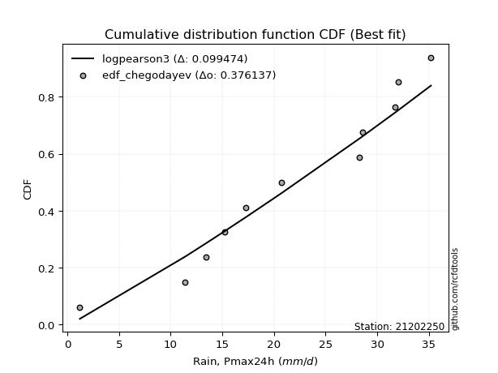</img>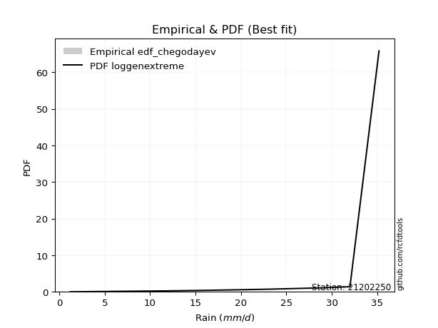</img>

</div>


### 6. Empirical - EDF Blom (1958)

The Blom formula is a specific "plotting position" formula used in hydrology and statistical analysis to estimate the empirical cumulative probability (or non-exceedance probability) of a data series. It is particularly recommended for data that are approximately normally distributed. The constant _a_ is set to 0.375 (or 3/8).

<div align="center">


$P=(m-a)/(n+1-2a)$


</div>


**6.1. Empirical values**

<div align="center">

|                | 0                   | 1                  | 2                   | 3                   | 4                   | 5                   | 6                  | 7                  | 8                  | 9                  | 10                 | 11                 |
|:---------------|:--------------------|:-------------------|:--------------------|:--------------------|:--------------------|:--------------------|:-------------------|:-------------------|:-------------------|:-------------------|:-------------------|:-------------------|
| date           | 2023                | 2015               | 2016                | 2014                | 2012                | 2013                | 2025               | 2010               | 2011               | 2009               | 2024               | 2008               |
| x              | 1.2                 | 11.4               | 13.4                | 15.2                | 17.3                | 20.7                | 23.3               | 28.3               | 28.6               | 31.7               | 32.0               | 35.2               |
| m              | 1                   | 2                  | 3                   | 4                   | 5                   | 6                   | 7                  | 8                  | 9                  | 10                 | 11                 | 12                 |
| empirical_dist | edf_blom            | edf_blom           | edf_blom            | edf_blom            | edf_blom            | edf_blom            | edf_blom           | edf_blom           | edf_blom           | edf_blom           | edf_blom           | edf_blom           |
| empirical      | 0.05102040816326531 | 0.1326530612244898 | 0.21428571428571427 | 0.29591836734693877 | 0.37755102040816324 | 0.45918367346938777 | 0.5408163265306123 | 0.6224489795918368 | 0.7040816326530612 | 0.7857142857142857 | 0.8673469387755102 | 0.9489795918367347 |
| empirical_tr   | 1.053763440860215   | 1.1529411764705884 | 1.2727272727272727  | 1.4202898550724639  | 1.6065573770491803  | 1.8490566037735847  | 2.177777777777778  | 2.6486486486486487 | 3.3793103448275863 | 4.666666666666666  | 7.5384615384615365 | 19.60000000000002  |

</div>


**6.2. Kolmogorov-Smirnov fit test (sorted by Δ)**


<div align="center">

|                | 0                   | 1                   | 2                   | 3                   | 4                   | 5                   | 6                   | 7                   | 8                   | 9                   | 10                  | 11                  | 12                  | 13                  | 14                  | 15                  | 16                    | 17                  | 18                  | 19                  | 20                  | 21                  | 22                  | 23                  | 24                  | 25                  | 26                  | 27                  | 28                  | 29                  | 30                  | 31                  | 32                  | 33                  | 34                  | 35                  | 36                  | 37                  | 38                  | 39                  | 40                  | 41                  | 42                  | 43                  | 44                  | 45                  | 46                  | 47                  | 48                  | 49                  | 50                  | 51                  | 52                  | 53                  | 54                  | 55                  | 56                  | 57                  | 58                  | 59                  | 60                  | 61                  | 62                  | 63                  | 64                  | 65                  | 66                  | 67                  | 68                  | 69                  | 70                  | 71                  | 72                  | 73                  | 74                  | 75                  | 76                  | 77                  | 78                  | 79                  | 80                  | 81                  | 82                  | 83                  | 84                  | 85                  | 86                  | 87                  | 88                  | 89                  |
|:---------------|:--------------------|:--------------------|:--------------------|:--------------------|:--------------------|:--------------------|:--------------------|:--------------------|:--------------------|:--------------------|:--------------------|:--------------------|:--------------------|:--------------------|:--------------------|:--------------------|:----------------------|:--------------------|:--------------------|:--------------------|:--------------------|:--------------------|:--------------------|:--------------------|:--------------------|:--------------------|:--------------------|:--------------------|:--------------------|:--------------------|:--------------------|:--------------------|:--------------------|:--------------------|:--------------------|:--------------------|:--------------------|:--------------------|:--------------------|:--------------------|:--------------------|:--------------------|:--------------------|:--------------------|:--------------------|:--------------------|:--------------------|:--------------------|:--------------------|:--------------------|:--------------------|:--------------------|:--------------------|:--------------------|:--------------------|:--------------------|:--------------------|:--------------------|:--------------------|:--------------------|:--------------------|:--------------------|:--------------------|:--------------------|:--------------------|:--------------------|:--------------------|:--------------------|:--------------------|:--------------------|:--------------------|:--------------------|:--------------------|:--------------------|:--------------------|:--------------------|:--------------------|:--------------------|:--------------------|:--------------------|:--------------------|:--------------------|:--------------------|:--------------------|:--------------------|:--------------------|:--------------------|:--------------------|:--------------------|:--------------------|
| station        | 21202250            | 21202250            | 21202250            | 21202250            | 21202250            | 21202250            | 21202250            | 21202250            | 21202250            | 21202250            | 21202250            | 21202250            | 21202250            | 21202250            | 21202250            | 21202250            | 21202250              | 21202250            | 21202250            | 21202250            | 21202250            | 21202250            | 21202250            | 21202250            | 21202250            | 21202250            | 21202250            | 21202250            | 21202250            | 21202250            | 21202250            | 21202250            | 21202250            | 21202250            | 21202250            | 21202250            | 21202250            | 21202250            | 21202250            | 21202250            | 21202250            | 21202250            | 21202250            | 21202250            | 21202250            | 21202250            | 21202250            | 21202250            | 21202250            | 21202250            | 21202250            | 21202250            | 21202250            | 21202250            | 21202250            | 21202250            | 21202250            | 21202250            | 21202250            | 21202250            | 21202250            | 21202250            | 21202250            | 21202250            | 21202250            | 21202250            | 21202250            | 21202250            | 21202250            | 21202250            | 21202250            | 21202250            | 21202250            | 21202250            | 21202250            | 21202250            | 21202250            | 21202250            | 21202250            | 21202250            | 21202250            | 21202250            | 21202250            | 21202250            | 21202250            | 21202250            | 21202250            | 21202250            | 21202250            | 21202250            |
| empirical_dist | edf_blom            | edf_blom            | edf_blom            | edf_blom            | edf_blom            | edf_blom            | edf_blom            | edf_blom            | edf_blom            | edf_blom            | edf_blom            | edf_blom            | edf_blom            | edf_blom            | edf_blom            | edf_blom            | edf_blom              | edf_blom            | edf_blom            | edf_blom            | edf_blom            | edf_blom            | edf_blom            | edf_blom            | edf_blom            | edf_blom            | edf_blom            | edf_blom            | edf_blom            | edf_blom            | edf_blom            | edf_blom            | edf_blom            | edf_blom            | edf_blom            | edf_blom            | edf_blom            | edf_blom            | edf_blom            | edf_blom            | edf_blom            | edf_blom            | edf_blom            | edf_blom            | edf_blom            | edf_blom            | edf_blom            | edf_blom            | edf_blom            | edf_blom            | edf_blom            | edf_blom            | edf_blom            | edf_blom            | edf_blom            | edf_blom            | edf_blom            | edf_blom            | edf_blom            | edf_blom            | edf_blom            | edf_blom            | edf_blom            | edf_blom            | edf_blom            | edf_blom            | edf_blom            | edf_blom            | edf_blom            | edf_blom            | edf_blom            | edf_blom            | edf_blom            | edf_blom            | edf_blom            | edf_blom            | edf_blom            | edf_blom            | edf_blom            | edf_blom            | edf_blom            | edf_blom            | edf_blom            | edf_blom            | edf_blom            | edf_blom            | edf_blom            | edf_blom            | edf_blom            | edf_blom            |
| p_dist         | logjohnsonsu        | mielke              | johnsonsu           | truncnorm           | logmielke           | logpearson3         | genlogistic         | invweibull          | gompertz            | weibull_min         | logloggamma         | pearson3            | gumbel_l            | kstwobign           | fisk                | logt                | loglaplace_asymmetric | invgamma            | gamma               | f                   | nakagami            | nct                 | exponnorm           | crystalball         | norm                | t                   | rice                | betaprime           | ncf                 | erlang              | logfisk             | logweibull_min      | loggompertz         | maxwell             | rayleigh            | invgauss            | loggumbel_l         | loghypsecant        | halfnorm            | logistic            | laplace_asymmetric  | alpha               | loglogistic         | loglaplace          | hypsecant           | gumbel_r            | halflogistic        | moyal               | lognakagami         | logfatiguelife      | logcrystalball      | lognorm             | lognorm             | logexponnorm        | loglognorm          | logrice             | logf                | laplace             | lognct              | loggamma            | loggamma            | logchi2             | loginvgamma         | logncf              | logerlang           | logmaxwell          | wald                | lograyleigh         | loggumbel_r         | logbetaprime        | loginvgauss         | gibrat              | logmoyal            | loghalfnorm         | expon               | genexpon            | loghalflogistic     | loginvweibull       | logwald             | loggibrat           | logkstwobign        | loggenexpon         | logtruncnorm        | logexpon            | pareto              | logpareto           | fatiguelife         | logalpha            | chi2                | loggenlogistic      |
| delta          | 0.06746914530634146 | 0.09442242523877276 | 0.09864034923947101 | 0.10647798488607174 | 0.10741637690686234 | 0.10915005908912956 | 0.11213391184012111 | 0.11224905924236583 | 0.11240811042405807 | 0.11469056393187294 | 0.1149799427100826  | 0.12290959119972844 | 0.12332337523700831 | 0.12402097233813902 | 0.12718398347305604 | 0.12816920004873    | 0.13163444602276797   | 0.1321328403008778  | 0.13311420851811018 | 0.1339751441487702  | 0.13401562972255265 | 0.13406606018303913 | 0.13409796685337205 | 0.13409851797976002 | 0.13409852002819667 | 0.13410435721374336 | 0.13413935719085135 | 0.1341513064415264  | 0.13620591523526862 | 0.1364483209359605  | 0.1408537738889547  | 0.14096559610970993 | 0.14096742550635188 | 0.14282579153205022 | 0.14531078653707763 | 0.1456952953460955  | 0.15115262033683985 | 0.15160911718686196 | 0.15393982249772487 | 0.15675362953985983 | 0.1580632168419539  | 0.16024279366290461 | 0.16667853630553373 | 0.16973837250816043 | 0.17146745796761675 | 0.17194194022352183 | 0.17795559399395622 | 0.1841784287227567  | 0.18569626276844278 | 0.18573097687323878 | 0.18691901604387565 | 0.1869190265329521  | 0.1869190265329521  | 0.18692064611873202 | 0.1869211943432493  | 0.18694761731244028 | 0.18726461243082818 | 0.1904983065639101  | 0.19065660286503752 | 0.19721657152000335 | 0.19721657152000335 | 0.20203864462560892 | 0.21027809198518624 | 0.21161089570075778 | 0.21285813238795318 | 0.21662614806882471 | 0.22291516005290213 | 0.2281766373556239  | 0.2310593663780026  | 0.23423855102645144 | 0.24635475422191214 | 0.252027015410183   | 0.2529979550575028  | 0.2609473066716961  | 0.26193430761184266 | 0.262314136769767   | 0.2685143586770471  | 0.27198721606662923 | 0.31108864927097946 | 0.32027435133495696 | 0.3210241768765575  | 0.3585068970325198  | 0.4363107937228866  | 0.4379908328484474  | 0.5092357954962873  | 0.5238271059511204  | 0.6008790917508551  | 0.668272728347291   | 0.7359194964863677  | 0.8673469387755102  |
| deltao         | 0.36218414519599995 | 0.36218414519599995 | 0.36218414519599995 | 0.36218414519599995 | 0.36218414519599995 | 0.36218414519599995 | 0.36218414519599995 | 0.36218414519599995 | 0.36218414519599995 | 0.36218414519599995 | 0.36218414519599995 | 0.36218414519599995 | 0.36218414519599995 | 0.36218414519599995 | 0.36218414519599995 | 0.36218414519599995 | 0.36218414519599995   | 0.36218414519599995 | 0.36218414519599995 | 0.36218414519599995 | 0.36218414519599995 | 0.36218414519599995 | 0.36218414519599995 | 0.36218414519599995 | 0.36218414519599995 | 0.36218414519599995 | 0.36218414519599995 | 0.36218414519599995 | 0.36218414519599995 | 0.36218414519599995 | 0.36218414519599995 | 0.36218414519599995 | 0.36218414519599995 | 0.36218414519599995 | 0.36218414519599995 | 0.36218414519599995 | 0.36218414519599995 | 0.36218414519599995 | 0.36218414519599995 | 0.36218414519599995 | 0.36218414519599995 | 0.36218414519599995 | 0.36218414519599995 | 0.36218414519599995 | 0.36218414519599995 | 0.36218414519599995 | 0.36218414519599995 | 0.36218414519599995 | 0.36218414519599995 | 0.36218414519599995 | 0.36218414519599995 | 0.36218414519599995 | 0.36218414519599995 | 0.36218414519599995 | 0.36218414519599995 | 0.36218414519599995 | 0.36218414519599995 | 0.36218414519599995 | 0.36218414519599995 | 0.36218414519599995 | 0.36218414519599995 | 0.36218414519599995 | 0.36218414519599995 | 0.36218414519599995 | 0.36218414519599995 | 0.36218414519599995 | 0.36218414519599995 | 0.36218414519599995 | 0.36218414519599995 | 0.36218414519599995 | 0.36218414519599995 | 0.36218414519599995 | 0.36218414519599995 | 0.36218414519599995 | 0.36218414519599995 | 0.36218414519599995 | 0.36218414519599995 | 0.36218414519599995 | 0.36218414519599995 | 0.36218414519599995 | 0.36218414519599995 | 0.36218414519599995 | 0.36218414519599995 | 0.36218414519599995 | 0.36218414519599995 | 0.36218414519599995 | 0.36218414519599995 | 0.36218414519599995 | 0.36218414519599995 | 0.36218414519599995 |
| eval           | Δo > Δ              | Δo > Δ              | Δo > Δ              | Δo > Δ              | Δo > Δ              | Δo > Δ              | Δo > Δ              | Δo > Δ              | Δo > Δ              | Δo > Δ              | Δo > Δ              | Δo > Δ              | Δo > Δ              | Δo > Δ              | Δo > Δ              | Δo > Δ              | Δo > Δ                | Δo > Δ              | Δo > Δ              | Δo > Δ              | Δo > Δ              | Δo > Δ              | Δo > Δ              | Δo > Δ              | Δo > Δ              | Δo > Δ              | Δo > Δ              | Δo > Δ              | Δo > Δ              | Δo > Δ              | Δo > Δ              | Δo > Δ              | Δo > Δ              | Δo > Δ              | Δo > Δ              | Δo > Δ              | Δo > Δ              | Δo > Δ              | Δo > Δ              | Δo > Δ              | Δo > Δ              | Δo > Δ              | Δo > Δ              | Δo > Δ              | Δo > Δ              | Δo > Δ              | Δo > Δ              | Δo > Δ              | Δo > Δ              | Δo > Δ              | Δo > Δ              | Δo > Δ              | Δo > Δ              | Δo > Δ              | Δo > Δ              | Δo > Δ              | Δo > Δ              | Δo > Δ              | Δo > Δ              | Δo > Δ              | Δo > Δ              | Δo > Δ              | Δo > Δ              | Δo > Δ              | Δo > Δ              | Δo > Δ              | Δo > Δ              | Δo > Δ              | Δo > Δ              | Δo > Δ              | Δo > Δ              | Δo > Δ              | Δo > Δ              | Δo > Δ              | Δo > Δ              | Δo > Δ              | Δo > Δ              | Δo > Δ              | Δo > Δ              | Δo > Δ              | Δo > Δ              | Δo > Δ              | Δo <= Δ             | Δo <= Δ             | Δo <= Δ             | Δo <= Δ             | Δo <= Δ             | Δo <= Δ             | Δo <= Δ             | Δo <= Δ             |
| fit            | 1                   | 1                   | 1                   | 1                   | 1                   | 1                   | 1                   | 1                   | 1                   | 1                   | 1                   | 1                   | 1                   | 1                   | 1                   | 1                   | 1                     | 1                   | 1                   | 1                   | 1                   | 1                   | 1                   | 1                   | 1                   | 1                   | 1                   | 1                   | 1                   | 1                   | 1                   | 1                   | 1                   | 1                   | 1                   | 1                   | 1                   | 1                   | 1                   | 1                   | 1                   | 1                   | 1                   | 1                   | 1                   | 1                   | 1                   | 1                   | 1                   | 1                   | 1                   | 1                   | 1                   | 1                   | 1                   | 1                   | 1                   | 1                   | 1                   | 1                   | 1                   | 1                   | 1                   | 1                   | 1                   | 1                   | 1                   | 1                   | 1                   | 1                   | 1                   | 1                   | 1                   | 1                   | 1                   | 1                   | 1                   | 1                   | 1                   | 1                   | 1                   | 1                   | 0                   | 0                   | 0                   | 0                   | 0                   | 0                   | 0                   | 0                   |
| n              | 12                  | 12                  | 12                  | 12                  | 12                  | 12                  | 12                  | 12                  | 12                  | 12                  | 12                  | 12                  | 12                  | 12                  | 12                  | 12                  | 12                    | 12                  | 12                  | 12                  | 12                  | 12                  | 12                  | 12                  | 12                  | 12                  | 12                  | 12                  | 12                  | 12                  | 12                  | 12                  | 12                  | 12                  | 12                  | 12                  | 12                  | 12                  | 12                  | 12                  | 12                  | 12                  | 12                  | 12                  | 12                  | 12                  | 12                  | 12                  | 12                  | 12                  | 12                  | 12                  | 12                  | 12                  | 12                  | 12                  | 12                  | 12                  | 12                  | 12                  | 12                  | 12                  | 12                  | 12                  | 12                  | 12                  | 12                  | 12                  | 12                  | 12                  | 12                  | 12                  | 12                  | 12                  | 12                  | 12                  | 12                  | 12                  | 12                  | 12                  | 12                  | 12                  | 12                  | 12                  | 12                  | 12                  | 12                  | 12                  | 12                  | 12                  |
| best_fit       | 1                   | 0                   | 0                   | 0                   | 0                   | 0                   | 0                   | 0                   | 0                   | 0                   | 0                   | 0                   | 0                   | 0                   | 0                   | 0                   | 0                     | 0                   | 0                   | 0                   | 0                   | 0                   | 0                   | 0                   | 0                   | 0                   | 0                   | 0                   | 0                   | 0                   | 0                   | 0                   | 0                   | 0                   | 0                   | 0                   | 0                   | 0                   | 0                   | 0                   | 0                   | 0                   | 0                   | 0                   | 0                   | 0                   | 0                   | 0                   | 0                   | 0                   | 0                   | 0                   | 0                   | 0                   | 0                   | 0                   | 0                   | 0                   | 0                   | 0                   | 0                   | 0                   | 0                   | 0                   | 0                   | 0                   | 0                   | 0                   | 0                   | 0                   | 0                   | 0                   | 0                   | 0                   | 0                   | 0                   | 0                   | 0                   | 0                   | 0                   | 0                   | 0                   | 0                   | 0                   | 0                   | 0                   | 0                   | 0                   | 0                   | 0                   |
| best_fit_sort  | 1                   | 2                   | 3                   | 4                   | 5                   | 6                   | 7                   | 8                   | 9                   | 10                  | 11                  | 12                  | 13                  | 14                  | 15                  | 16                  | 17                    | 18                  | 19                  | 20                  | 21                  | 22                  | 23                  | 24                  | 25                  | 26                  | 27                  | 28                  | 29                  | 30                  | 31                  | 32                  | 33                  | 34                  | 35                  | 36                  | 37                  | 38                  | 39                  | 40                  | 41                  | 42                  | 43                  | 44                  | 45                  | 46                  | 47                  | 48                  | 49                  | 50                  | 51                  | 52                  | 53                  | 54                  | 55                  | 56                  | 57                  | 58                  | 59                  | 60                  | 61                  | 62                  | 63                  | 64                  | 65                  | 66                  | 67                  | 68                  | 69                  | 70                  | 71                  | 72                  | 73                  | 74                  | 75                  | 76                  | 77                  | 78                  | 79                  | 80                  | 81                  | 82                  | 83                  | 84                  | 85                  | 86                  | 87                  | 88                  | 89                  | 90                  |

</div>


<div align="center">

</img>

</div>


**6.3. Best fit**

<div align="center">

|   id |   station | empirical_dist   | p_dist       |     delta |   deltao | eval   |   fit |   n |   best_fit |   best_fit_sort |
|-----:|----------:|:-----------------|:-------------|----------:|---------:|:-------|------:|----:|-----------:|----------------:|
|    0 |  21202250 | edf_blom         | logjohnsonsu | 0.0674691 | 0.362184 | Δo > Δ |     1 |  12 |          1 |               1 |

</div>


<div align="center">

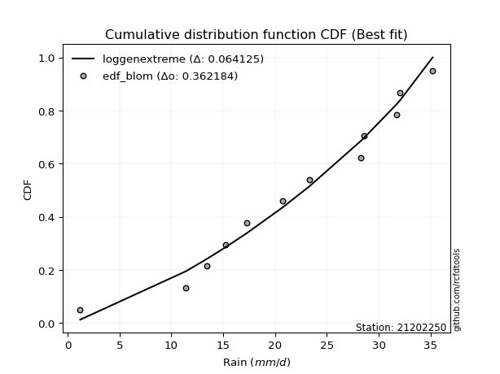</img></img>

</div>


### 7. Empirical - EDF Tukey (1962)

In hydrology, the Tukey formula is used as a plotting position formula to estimate the empirical probability or frequency of a flood event (or other hydrological data). The formula parameter is given as _c=0.333_ (or 1/3).

<div align="center">


$P=(m-c)/(n+1-2c)$


</div>


**7.1. Empirical values**

<div align="center">

|                | 0                   | 1                   | 2                   | 3                  | 4                  | 5                  | 6                  | 7                  | 8                  | 9                  | 10                 | 11                 |
|:---------------|:--------------------|:--------------------|:--------------------|:-------------------|:-------------------|:-------------------|:-------------------|:-------------------|:-------------------|:-------------------|:-------------------|:-------------------|
| date           | 2023                | 2015                | 2016                | 2014               | 2012               | 2013               | 2025               | 2010               | 2011               | 2009               | 2024               | 2008               |
| x              | 1.2                 | 11.4                | 13.4                | 15.2               | 17.3               | 20.7               | 23.3               | 28.3               | 28.6               | 31.7               | 32.0               | 35.2               |
| m              | 1                   | 2                   | 3                   | 4                  | 5                  | 6                  | 7                  | 8                  | 9                  | 10                 | 11                 | 12                 |
| empirical_dist | edf_tukey           | edf_tukey           | edf_tukey           | edf_tukey          | edf_tukey          | edf_tukey          | edf_tukey          | edf_tukey          | edf_tukey          | edf_tukey          | edf_tukey          | edf_tukey          |
| empirical      | 0.05405405405405406 | 0.13513513513513514 | 0.21621621621621623 | 0.2972972972972973 | 0.3783783783783784 | 0.4594594594594595 | 0.5405405405405406 | 0.6216216216216216 | 0.7027027027027027 | 0.7837837837837838 | 0.8648648648648649 | 0.9459459459459459 |
| empirical_tr   | 1.0571428571428572  | 1.15625             | 1.2758620689655173  | 1.4230769230769231 | 1.608695652173913  | 1.8499999999999999 | 2.1764705882352944 | 2.642857142857143  | 3.363636363636364  | 4.625              | 7.400000000000003  | 18.5               |

</div>


**7.2. Kolmogorov-Smirnov fit test (sorted by Δ)**


<div align="center">

|                | 0                   | 1                   | 2                   | 3                   | 4                   | 5                   | 6                   | 7                   | 8                   | 9                   | 10                  | 11                  | 12                  | 13                  | 14                  | 15                  | 16                    | 17                  | 18                  | 19                  | 20                  | 21                  | 22                  | 23                  | 24                  | 25                  | 26                  | 27                  | 28                  | 29                  | 30                  | 31                  | 32                  | 33                  | 34                  | 35                  | 36                  | 37                  | 38                  | 39                  | 40                  | 41                  | 42                  | 43                  | 44                  | 45                  | 46                  | 47                  | 48                  | 49                  | 50                  | 51                  | 52                  | 53                  | 54                  | 55                  | 56                  | 57                  | 58                  | 59                  | 60                  | 61                  | 62                  | 63                  | 64                  | 65                  | 66                  | 67                  | 68                  | 69                  | 70                  | 71                  | 72                  | 73                  | 74                  | 75                  | 76                  | 77                  | 78                  | 79                  | 80                  | 81                  | 82                  | 83                  | 84                  | 85                  | 86                  | 87                  | 88                  | 89                  |
|:---------------|:--------------------|:--------------------|:--------------------|:--------------------|:--------------------|:--------------------|:--------------------|:--------------------|:--------------------|:--------------------|:--------------------|:--------------------|:--------------------|:--------------------|:--------------------|:--------------------|:----------------------|:--------------------|:--------------------|:--------------------|:--------------------|:--------------------|:--------------------|:--------------------|:--------------------|:--------------------|:--------------------|:--------------------|:--------------------|:--------------------|:--------------------|:--------------------|:--------------------|:--------------------|:--------------------|:--------------------|:--------------------|:--------------------|:--------------------|:--------------------|:--------------------|:--------------------|:--------------------|:--------------------|:--------------------|:--------------------|:--------------------|:--------------------|:--------------------|:--------------------|:--------------------|:--------------------|:--------------------|:--------------------|:--------------------|:--------------------|:--------------------|:--------------------|:--------------------|:--------------------|:--------------------|:--------------------|:--------------------|:--------------------|:--------------------|:--------------------|:--------------------|:--------------------|:--------------------|:--------------------|:--------------------|:--------------------|:--------------------|:--------------------|:--------------------|:--------------------|:--------------------|:--------------------|:--------------------|:--------------------|:--------------------|:--------------------|:--------------------|:--------------------|:--------------------|:--------------------|:--------------------|:--------------------|:--------------------|:--------------------|
| station        | 21202250            | 21202250            | 21202250            | 21202250            | 21202250            | 21202250            | 21202250            | 21202250            | 21202250            | 21202250            | 21202250            | 21202250            | 21202250            | 21202250            | 21202250            | 21202250            | 21202250              | 21202250            | 21202250            | 21202250            | 21202250            | 21202250            | 21202250            | 21202250            | 21202250            | 21202250            | 21202250            | 21202250            | 21202250            | 21202250            | 21202250            | 21202250            | 21202250            | 21202250            | 21202250            | 21202250            | 21202250            | 21202250            | 21202250            | 21202250            | 21202250            | 21202250            | 21202250            | 21202250            | 21202250            | 21202250            | 21202250            | 21202250            | 21202250            | 21202250            | 21202250            | 21202250            | 21202250            | 21202250            | 21202250            | 21202250            | 21202250            | 21202250            | 21202250            | 21202250            | 21202250            | 21202250            | 21202250            | 21202250            | 21202250            | 21202250            | 21202250            | 21202250            | 21202250            | 21202250            | 21202250            | 21202250            | 21202250            | 21202250            | 21202250            | 21202250            | 21202250            | 21202250            | 21202250            | 21202250            | 21202250            | 21202250            | 21202250            | 21202250            | 21202250            | 21202250            | 21202250            | 21202250            | 21202250            | 21202250            |
| empirical_dist | edf_tukey           | edf_tukey           | edf_tukey           | edf_tukey           | edf_tukey           | edf_tukey           | edf_tukey           | edf_tukey           | edf_tukey           | edf_tukey           | edf_tukey           | edf_tukey           | edf_tukey           | edf_tukey           | edf_tukey           | edf_tukey           | edf_tukey             | edf_tukey           | edf_tukey           | edf_tukey           | edf_tukey           | edf_tukey           | edf_tukey           | edf_tukey           | edf_tukey           | edf_tukey           | edf_tukey           | edf_tukey           | edf_tukey           | edf_tukey           | edf_tukey           | edf_tukey           | edf_tukey           | edf_tukey           | edf_tukey           | edf_tukey           | edf_tukey           | edf_tukey           | edf_tukey           | edf_tukey           | edf_tukey           | edf_tukey           | edf_tukey           | edf_tukey           | edf_tukey           | edf_tukey           | edf_tukey           | edf_tukey           | edf_tukey           | edf_tukey           | edf_tukey           | edf_tukey           | edf_tukey           | edf_tukey           | edf_tukey           | edf_tukey           | edf_tukey           | edf_tukey           | edf_tukey           | edf_tukey           | edf_tukey           | edf_tukey           | edf_tukey           | edf_tukey           | edf_tukey           | edf_tukey           | edf_tukey           | edf_tukey           | edf_tukey           | edf_tukey           | edf_tukey           | edf_tukey           | edf_tukey           | edf_tukey           | edf_tukey           | edf_tukey           | edf_tukey           | edf_tukey           | edf_tukey           | edf_tukey           | edf_tukey           | edf_tukey           | edf_tukey           | edf_tukey           | edf_tukey           | edf_tukey           | edf_tukey           | edf_tukey           | edf_tukey           | edf_tukey           |
| p_dist         | logjohnsonsu        | mielke              | johnsonsu           | logpearson3         | truncnorm           | logmielke           | genlogistic         | invweibull          | gompertz            | weibull_min         | logloggamma         | pearson3            | gumbel_l            | kstwobign           | logt                | fisk                | loglaplace_asymmetric | invgamma            | ncf                 | gamma               | f                   | nakagami            | nct                 | exponnorm           | crystalball         | norm                | t                   | rice                | betaprime           | erlang              | logfisk             | logweibull_min      | loggompertz         | maxwell             | rayleigh            | invgauss            | loggumbel_l         | loghypsecant        | halfnorm            | logistic            | laplace_asymmetric  | alpha               | loglogistic         | loglaplace          | hypsecant           | gumbel_r            | halflogistic        | lognakagami         | logfatiguelife      | logcrystalball      | lognorm             | lognorm             | logexponnorm        | loglognorm          | logrice             | logf                | moyal               | lognct              | laplace             | loggamma            | loggamma            | logchi2             | loginvgamma         | logncf              | logerlang           | logmaxwell          | wald                | lograyleigh         | loggumbel_r         | logbetaprime        | loginvgauss         | logmoyal            | gibrat              | loghalfnorm         | expon               | genexpon            | loghalflogistic     | loginvweibull       | logwald             | logkstwobign        | loggibrat           | loggenexpon         | logtruncnorm        | logexpon            | pareto              | logpareto           | fatiguelife         | logalpha            | chi2                | loggenlogistic      |
| delta          | 0.06829650327655662 | 0.09524978320898791 | 0.09946770720968617 | 0.1066679851784843  | 0.1073053428562869  | 0.1082437348770775  | 0.1118581258500494  | 0.11307641721258099 | 0.11323546839427323 | 0.1155179219020881  | 0.11580730068029776 | 0.1237369491699436  | 0.12415073320722347 | 0.12484833030835418 | 0.1251355541579412  | 0.1280113414432712  | 0.13246180399298313   | 0.13296019827109296 | 0.13372384132462328 | 0.13394156648832534 | 0.13480250211898537 | 0.1348429876927678  | 0.13489341815325429 | 0.1349253248235872  | 0.13492587594997518 | 0.13492587799841183 | 0.13493171518395852 | 0.1349667151610665  | 0.13497866441174156 | 0.13727567890617565 | 0.1378201279981659  | 0.1417929540799251  | 0.14179478347656704 | 0.14365314950226538 | 0.1461381445072928  | 0.14652265331631065 | 0.14811897444605104 | 0.14912704327621662 | 0.15476718046794002 | 0.157580987510075   | 0.15889057481216906 | 0.16107015163311977 | 0.1641964623948884  | 0.1694625865180887  | 0.1722948159378319  | 0.172769298193737   | 0.17878295196417138 | 0.18321418885779744 | 0.18324890296259344 | 0.1844369421332303  | 0.18443695262230675 | 0.18443695262230675 | 0.18443857220808668 | 0.18443912043260396 | 0.18446554340179494 | 0.18478253852018284 | 0.18500578669297185 | 0.18817452895439218 | 0.19132566453412525 | 0.19473449760935801 | 0.19473449760935801 | 0.19955657071496358 | 0.2077960180745409  | 0.20912882179011244 | 0.21037605847730784 | 0.21414407415817938 | 0.2237425180231173  | 0.22569456344497857 | 0.22912886444750064 | 0.2317564771158061  | 0.2438726803112668  | 0.25106745312700085 | 0.2528543733803982  | 0.2584652327610507  | 0.25945223370119735 | 0.2598320628591217  | 0.2665838567465451  | 0.2695051421559839  | 0.30915814734047753 | 0.3185421029659122  | 0.3188954213845984  | 0.3560248231218745  | 0.4338287198122413  | 0.4355087589378021  | 0.5067537215856419  | 0.5213450320404751  | 0.5983970178402098  | 0.6657906544366456  | 0.7334374225757223  | 0.8648648648648649  |
| deltao         | 0.36218414519599995 | 0.36218414519599995 | 0.36218414519599995 | 0.36218414519599995 | 0.36218414519599995 | 0.36218414519599995 | 0.36218414519599995 | 0.36218414519599995 | 0.36218414519599995 | 0.36218414519599995 | 0.36218414519599995 | 0.36218414519599995 | 0.36218414519599995 | 0.36218414519599995 | 0.36218414519599995 | 0.36218414519599995 | 0.36218414519599995   | 0.36218414519599995 | 0.36218414519599995 | 0.36218414519599995 | 0.36218414519599995 | 0.36218414519599995 | 0.36218414519599995 | 0.36218414519599995 | 0.36218414519599995 | 0.36218414519599995 | 0.36218414519599995 | 0.36218414519599995 | 0.36218414519599995 | 0.36218414519599995 | 0.36218414519599995 | 0.36218414519599995 | 0.36218414519599995 | 0.36218414519599995 | 0.36218414519599995 | 0.36218414519599995 | 0.36218414519599995 | 0.36218414519599995 | 0.36218414519599995 | 0.36218414519599995 | 0.36218414519599995 | 0.36218414519599995 | 0.36218414519599995 | 0.36218414519599995 | 0.36218414519599995 | 0.36218414519599995 | 0.36218414519599995 | 0.36218414519599995 | 0.36218414519599995 | 0.36218414519599995 | 0.36218414519599995 | 0.36218414519599995 | 0.36218414519599995 | 0.36218414519599995 | 0.36218414519599995 | 0.36218414519599995 | 0.36218414519599995 | 0.36218414519599995 | 0.36218414519599995 | 0.36218414519599995 | 0.36218414519599995 | 0.36218414519599995 | 0.36218414519599995 | 0.36218414519599995 | 0.36218414519599995 | 0.36218414519599995 | 0.36218414519599995 | 0.36218414519599995 | 0.36218414519599995 | 0.36218414519599995 | 0.36218414519599995 | 0.36218414519599995 | 0.36218414519599995 | 0.36218414519599995 | 0.36218414519599995 | 0.36218414519599995 | 0.36218414519599995 | 0.36218414519599995 | 0.36218414519599995 | 0.36218414519599995 | 0.36218414519599995 | 0.36218414519599995 | 0.36218414519599995 | 0.36218414519599995 | 0.36218414519599995 | 0.36218414519599995 | 0.36218414519599995 | 0.36218414519599995 | 0.36218414519599995 | 0.36218414519599995 |
| eval           | Δo > Δ              | Δo > Δ              | Δo > Δ              | Δo > Δ              | Δo > Δ              | Δo > Δ              | Δo > Δ              | Δo > Δ              | Δo > Δ              | Δo > Δ              | Δo > Δ              | Δo > Δ              | Δo > Δ              | Δo > Δ              | Δo > Δ              | Δo > Δ              | Δo > Δ                | Δo > Δ              | Δo > Δ              | Δo > Δ              | Δo > Δ              | Δo > Δ              | Δo > Δ              | Δo > Δ              | Δo > Δ              | Δo > Δ              | Δo > Δ              | Δo > Δ              | Δo > Δ              | Δo > Δ              | Δo > Δ              | Δo > Δ              | Δo > Δ              | Δo > Δ              | Δo > Δ              | Δo > Δ              | Δo > Δ              | Δo > Δ              | Δo > Δ              | Δo > Δ              | Δo > Δ              | Δo > Δ              | Δo > Δ              | Δo > Δ              | Δo > Δ              | Δo > Δ              | Δo > Δ              | Δo > Δ              | Δo > Δ              | Δo > Δ              | Δo > Δ              | Δo > Δ              | Δo > Δ              | Δo > Δ              | Δo > Δ              | Δo > Δ              | Δo > Δ              | Δo > Δ              | Δo > Δ              | Δo > Δ              | Δo > Δ              | Δo > Δ              | Δo > Δ              | Δo > Δ              | Δo > Δ              | Δo > Δ              | Δo > Δ              | Δo > Δ              | Δo > Δ              | Δo > Δ              | Δo > Δ              | Δo > Δ              | Δo > Δ              | Δo > Δ              | Δo > Δ              | Δo > Δ              | Δo > Δ              | Δo > Δ              | Δo > Δ              | Δo > Δ              | Δo > Δ              | Δo > Δ              | Δo <= Δ             | Δo <= Δ             | Δo <= Δ             | Δo <= Δ             | Δo <= Δ             | Δo <= Δ             | Δo <= Δ             | Δo <= Δ             |
| fit            | 1                   | 1                   | 1                   | 1                   | 1                   | 1                   | 1                   | 1                   | 1                   | 1                   | 1                   | 1                   | 1                   | 1                   | 1                   | 1                   | 1                     | 1                   | 1                   | 1                   | 1                   | 1                   | 1                   | 1                   | 1                   | 1                   | 1                   | 1                   | 1                   | 1                   | 1                   | 1                   | 1                   | 1                   | 1                   | 1                   | 1                   | 1                   | 1                   | 1                   | 1                   | 1                   | 1                   | 1                   | 1                   | 1                   | 1                   | 1                   | 1                   | 1                   | 1                   | 1                   | 1                   | 1                   | 1                   | 1                   | 1                   | 1                   | 1                   | 1                   | 1                   | 1                   | 1                   | 1                   | 1                   | 1                   | 1                   | 1                   | 1                   | 1                   | 1                   | 1                   | 1                   | 1                   | 1                   | 1                   | 1                   | 1                   | 1                   | 1                   | 1                   | 1                   | 0                   | 0                   | 0                   | 0                   | 0                   | 0                   | 0                   | 0                   |
| n              | 12                  | 12                  | 12                  | 12                  | 12                  | 12                  | 12                  | 12                  | 12                  | 12                  | 12                  | 12                  | 12                  | 12                  | 12                  | 12                  | 12                    | 12                  | 12                  | 12                  | 12                  | 12                  | 12                  | 12                  | 12                  | 12                  | 12                  | 12                  | 12                  | 12                  | 12                  | 12                  | 12                  | 12                  | 12                  | 12                  | 12                  | 12                  | 12                  | 12                  | 12                  | 12                  | 12                  | 12                  | 12                  | 12                  | 12                  | 12                  | 12                  | 12                  | 12                  | 12                  | 12                  | 12                  | 12                  | 12                  | 12                  | 12                  | 12                  | 12                  | 12                  | 12                  | 12                  | 12                  | 12                  | 12                  | 12                  | 12                  | 12                  | 12                  | 12                  | 12                  | 12                  | 12                  | 12                  | 12                  | 12                  | 12                  | 12                  | 12                  | 12                  | 12                  | 12                  | 12                  | 12                  | 12                  | 12                  | 12                  | 12                  | 12                  |
| best_fit       | 1                   | 0                   | 0                   | 0                   | 0                   | 0                   | 0                   | 0                   | 0                   | 0                   | 0                   | 0                   | 0                   | 0                   | 0                   | 0                   | 0                     | 0                   | 0                   | 0                   | 0                   | 0                   | 0                   | 0                   | 0                   | 0                   | 0                   | 0                   | 0                   | 0                   | 0                   | 0                   | 0                   | 0                   | 0                   | 0                   | 0                   | 0                   | 0                   | 0                   | 0                   | 0                   | 0                   | 0                   | 0                   | 0                   | 0                   | 0                   | 0                   | 0                   | 0                   | 0                   | 0                   | 0                   | 0                   | 0                   | 0                   | 0                   | 0                   | 0                   | 0                   | 0                   | 0                   | 0                   | 0                   | 0                   | 0                   | 0                   | 0                   | 0                   | 0                   | 0                   | 0                   | 0                   | 0                   | 0                   | 0                   | 0                   | 0                   | 0                   | 0                   | 0                   | 0                   | 0                   | 0                   | 0                   | 0                   | 0                   | 0                   | 0                   |
| best_fit_sort  | 1                   | 2                   | 3                   | 4                   | 5                   | 6                   | 7                   | 8                   | 9                   | 10                  | 11                  | 12                  | 13                  | 14                  | 15                  | 16                  | 17                    | 18                  | 19                  | 20                  | 21                  | 22                  | 23                  | 24                  | 25                  | 26                  | 27                  | 28                  | 29                  | 30                  | 31                  | 32                  | 33                  | 34                  | 35                  | 36                  | 37                  | 38                  | 39                  | 40                  | 41                  | 42                  | 43                  | 44                  | 45                  | 46                  | 47                  | 48                  | 49                  | 50                  | 51                  | 52                  | 53                  | 54                  | 55                  | 56                  | 57                  | 58                  | 59                  | 60                  | 61                  | 62                  | 63                  | 64                  | 65                  | 66                  | 67                  | 68                  | 69                  | 70                  | 71                  | 72                  | 73                  | 74                  | 75                  | 76                  | 77                  | 78                  | 79                  | 80                  | 81                  | 82                  | 83                  | 84                  | 85                  | 86                  | 87                  | 88                  | 89                  | 90                  |

</div>


<div align="center">

</img>

</div>


**7.3. Best fit**

<div align="center">

|   id |   station | empirical_dist   | p_dist       |     delta |   deltao | eval   |   fit |   n |   best_fit |   best_fit_sort |
|-----:|----------:|:-----------------|:-------------|----------:|---------:|:-------|------:|----:|-----------:|----------------:|
|    0 |  21202250 | edf_tukey        | logjohnsonsu | 0.0682965 | 0.362184 | Δo > Δ |     1 |  12 |          1 |               1 |

</div>


<div align="center">

</img>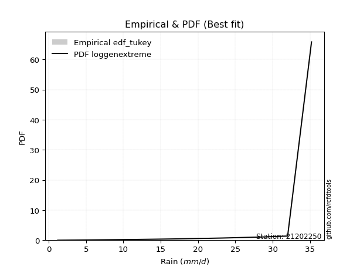</img>

</div>


### 8. Empirical - EDF Gringorten (1963)

Gringorten plotting position formula is essential for estimating the probability and return periods of extreme events like floods and heavy rainfall. The constant _a=0.44_.

<div align="center">


$P=(m-a)/(n+1-2a)$


</div>


**8.1. Empirical values**

<div align="center">

|                | 0                   | 1                   | 2                   | 3                   | 4                   | 5                   | 6                  | 7                  | 8                  | 9                  | 10                 | 11                 |
|:---------------|:--------------------|:--------------------|:--------------------|:--------------------|:--------------------|:--------------------|:-------------------|:-------------------|:-------------------|:-------------------|:-------------------|:-------------------|
| date           | 2023                | 2015                | 2016                | 2014                | 2012                | 2013                | 2025               | 2010               | 2011               | 2009               | 2024               | 2008               |
| x              | 1.2                 | 11.4                | 13.4                | 15.2                | 17.3                | 20.7                | 23.3               | 28.3               | 28.6               | 31.7               | 32.0               | 35.2               |
| m              | 1                   | 2                   | 3                   | 4                   | 5                   | 6                   | 7                  | 8                  | 9                  | 10                 | 11                 | 12                 |
| empirical_dist | edf_gringorten      | edf_gringorten      | edf_gringorten      | edf_gringorten      | edf_gringorten      | edf_gringorten      | edf_gringorten     | edf_gringorten     | edf_gringorten     | edf_gringorten     | edf_gringorten     | edf_gringorten     |
| empirical      | 0.04620462046204621 | 0.12871287128712872 | 0.21122112211221125 | 0.29372937293729373 | 0.37623762376237624 | 0.45874587458745875 | 0.5412541254125413 | 0.6237623762376238 | 0.7062706270627064 | 0.7887788778877889 | 0.8712871287128714 | 0.9537953795379539 |
| empirical_tr   | 1.0484429065743945  | 1.1477272727272727  | 1.2677824267782427  | 1.4158878504672898  | 1.6031746031746033  | 1.8475609756097562  | 2.179856115107914  | 2.6578947368421053 | 3.4044943820224733 | 4.734375000000003  | 7.769230769230775  | 21.642857142857192 |

</div>


**8.2. Kolmogorov-Smirnov fit test (sorted by Δ)**


<div align="center">

|                | 0                   | 1                   | 2                   | 3                   | 4                   | 5                   | 6                   | 7                   | 8                   | 9                   | 10                  | 11                  | 12                  | 13                  | 14                  | 15                    | 16                  | 17                  | 18                  | 19                  | 20                  | 21                  | 22                  | 23                  | 24                  | 25                  | 26                  | 27                  | 28                  | 29                  | 30                  | 31                  | 32                  | 33                  | 34                  | 35                  | 36                  | 37                  | 38                  | 39                  | 40                  | 41                  | 42                  | 43                  | 44                  | 45                  | 46                  | 47                  | 48                  | 49                  | 50                  | 51                  | 52                  | 53                  | 54                  | 55                  | 56                  | 57                  | 58                  | 59                  | 60                  | 61                  | 62                  | 63                  | 64                  | 65                  | 66                  | 67                  | 68                  | 69                  | 70                  | 71                  | 72                  | 73                  | 74                  | 75                  | 76                  | 77                  | 78                  | 79                  | 80                  | 81                  | 82                  | 83                  | 84                  | 85                  | 86                  | 87                  | 88                  | 89                  |
|:---------------|:--------------------|:--------------------|:--------------------|:--------------------|:--------------------|:--------------------|:--------------------|:--------------------|:--------------------|:--------------------|:--------------------|:--------------------|:--------------------|:--------------------|:--------------------|:----------------------|:--------------------|:--------------------|:--------------------|:--------------------|:--------------------|:--------------------|:--------------------|:--------------------|:--------------------|:--------------------|:--------------------|:--------------------|:--------------------|:--------------------|:--------------------|:--------------------|:--------------------|:--------------------|:--------------------|:--------------------|:--------------------|:--------------------|:--------------------|:--------------------|:--------------------|:--------------------|:--------------------|:--------------------|:--------------------|:--------------------|:--------------------|:--------------------|:--------------------|:--------------------|:--------------------|:--------------------|:--------------------|:--------------------|:--------------------|:--------------------|:--------------------|:--------------------|:--------------------|:--------------------|:--------------------|:--------------------|:--------------------|:--------------------|:--------------------|:--------------------|:--------------------|:--------------------|:--------------------|:--------------------|:--------------------|:--------------------|:--------------------|:--------------------|:--------------------|:--------------------|:--------------------|:--------------------|:--------------------|:--------------------|:--------------------|:--------------------|:--------------------|:--------------------|:--------------------|:--------------------|:--------------------|:--------------------|:--------------------|:--------------------|
| station        | 21202250            | 21202250            | 21202250            | 21202250            | 21202250            | 21202250            | 21202250            | 21202250            | 21202250            | 21202250            | 21202250            | 21202250            | 21202250            | 21202250            | 21202250            | 21202250              | 21202250            | 21202250            | 21202250            | 21202250            | 21202250            | 21202250            | 21202250            | 21202250            | 21202250            | 21202250            | 21202250            | 21202250            | 21202250            | 21202250            | 21202250            | 21202250            | 21202250            | 21202250            | 21202250            | 21202250            | 21202250            | 21202250            | 21202250            | 21202250            | 21202250            | 21202250            | 21202250            | 21202250            | 21202250            | 21202250            | 21202250            | 21202250            | 21202250            | 21202250            | 21202250            | 21202250            | 21202250            | 21202250            | 21202250            | 21202250            | 21202250            | 21202250            | 21202250            | 21202250            | 21202250            | 21202250            | 21202250            | 21202250            | 21202250            | 21202250            | 21202250            | 21202250            | 21202250            | 21202250            | 21202250            | 21202250            | 21202250            | 21202250            | 21202250            | 21202250            | 21202250            | 21202250            | 21202250            | 21202250            | 21202250            | 21202250            | 21202250            | 21202250            | 21202250            | 21202250            | 21202250            | 21202250            | 21202250            | 21202250            |
| empirical_dist | edf_gringorten      | edf_gringorten      | edf_gringorten      | edf_gringorten      | edf_gringorten      | edf_gringorten      | edf_gringorten      | edf_gringorten      | edf_gringorten      | edf_gringorten      | edf_gringorten      | edf_gringorten      | edf_gringorten      | edf_gringorten      | edf_gringorten      | edf_gringorten        | edf_gringorten      | edf_gringorten      | edf_gringorten      | edf_gringorten      | edf_gringorten      | edf_gringorten      | edf_gringorten      | edf_gringorten      | edf_gringorten      | edf_gringorten      | edf_gringorten      | edf_gringorten      | edf_gringorten      | edf_gringorten      | edf_gringorten      | edf_gringorten      | edf_gringorten      | edf_gringorten      | edf_gringorten      | edf_gringorten      | edf_gringorten      | edf_gringorten      | edf_gringorten      | edf_gringorten      | edf_gringorten      | edf_gringorten      | edf_gringorten      | edf_gringorten      | edf_gringorten      | edf_gringorten      | edf_gringorten      | edf_gringorten      | edf_gringorten      | edf_gringorten      | edf_gringorten      | edf_gringorten      | edf_gringorten      | edf_gringorten      | edf_gringorten      | edf_gringorten      | edf_gringorten      | edf_gringorten      | edf_gringorten      | edf_gringorten      | edf_gringorten      | edf_gringorten      | edf_gringorten      | edf_gringorten      | edf_gringorten      | edf_gringorten      | edf_gringorten      | edf_gringorten      | edf_gringorten      | edf_gringorten      | edf_gringorten      | edf_gringorten      | edf_gringorten      | edf_gringorten      | edf_gringorten      | edf_gringorten      | edf_gringorten      | edf_gringorten      | edf_gringorten      | edf_gringorten      | edf_gringorten      | edf_gringorten      | edf_gringorten      | edf_gringorten      | edf_gringorten      | edf_gringorten      | edf_gringorten      | edf_gringorten      | edf_gringorten      | edf_gringorten      |
| p_dist         | logjohnsonsu        | mielke              | johnsonsu           | truncnorm           | logmielke           | invweibull          | gompertz            | genlogistic         | logpearson3         | weibull_min         | logloggamma         | pearson3            | gumbel_l            | kstwobign           | fisk                | loglaplace_asymmetric | invgamma            | gamma               | f                   | nakagami            | nct                 | exponnorm           | crystalball         | norm                | t                   | rice                | betaprime           | logt                | erlang              | logweibull_min      | loggompertz         | ncf                 | maxwell             | rayleigh            | invgauss            | logfisk             | halfnorm            | logistic            | loghypsecant        | loggumbel_l         | laplace_asymmetric  | alpha               | hypsecant           | loglaplace          | loglogistic         | gumbel_r            | halflogistic        | moyal               | laplace             | lognakagami         | logfatiguelife      | logcrystalball      | lognorm             | lognorm             | logexponnorm        | loglognorm          | logrice             | logf                | lognct              | loggamma            | loggamma            | logchi2             | loginvgamma         | logncf              | logerlang           | logmaxwell          | wald                | lograyleigh         | loggumbel_r         | logbetaprime        | loginvgauss         | gibrat              | logmoyal            | loghalfnorm         | expon               | genexpon            | loghalflogistic     | loginvweibull       | logwald             | loggibrat           | logkstwobign        | loggenexpon         | logtruncnorm        | logexpon            | pareto              | logpareto           | fatiguelife         | logalpha            | chi2                | loggenlogistic      |
| delta          | 0.06615574866055446 | 0.09310902859298575 | 0.09732695259368401 | 0.10516458824028474 | 0.10610298026107534 | 0.11093566259657883 | 0.11109471377827107 | 0.11257171072205008 | 0.11309024902649079 | 0.11337716728608593 | 0.1136665460642956  | 0.12159619455394144 | 0.12200997859122131 | 0.12270757569235202 | 0.12587058682726904 | 0.13032104937698097   | 0.1308194436550908  | 0.13180081187232318 | 0.1326617475029832  | 0.13270223307676565 | 0.13275266353725212 | 0.13278457020758505 | 0.13278512133397302 | 0.13278512338240966 | 0.13279096056795636 | 0.13282596054506435 | 0.1328379097957394  | 0.13298498774994916 | 0.13513492429017349 | 0.13965219946392293 | 0.13965402886056488 | 0.1401461051726297  | 0.14151239488626322 | 0.14399738989129063 | 0.1443818987003085  | 0.14566956159017386 | 0.15262642585193786 | 0.15544023289407283 | 0.15554930712422305 | 0.155968408038059   | 0.1567498201961669  | 0.1589293970171176  | 0.17015406132182975 | 0.17017617139008945 | 0.1706187262428948  | 0.17062854357773483 | 0.17664219734816922 | 0.1828650320769697  | 0.1891849099181231  | 0.18963645270580387 | 0.18967116681059987 | 0.19085920598123673 | 0.19085921647031318 | 0.19085921647031318 | 0.1908608360560931  | 0.1908613842806104  | 0.19088780724980137 | 0.19120480236818926 | 0.1945967928023986  | 0.20115676145736444 | 0.20115676145736444 | 0.20597883456297    | 0.21421828192254733 | 0.21555108563811887 | 0.21679832232531426 | 0.2205663380061858  | 0.22160176340711513 | 0.232116827292985   | 0.2341239585515056  | 0.23817874096381253 | 0.2502949441592732  | 0.250713618764396   | 0.25606254723100585 | 0.26488749660905714 | 0.2658744975492038  | 0.2662543267071281  | 0.27157895085055006 | 0.27592740600399035 | 0.31415324144448253 | 0.322463345744602   | 0.3249643668139186  | 0.3624470869698809  | 0.44025098366024773 | 0.44193102278580854 | 0.5131759854336484  | 0.5277672958884815  | 0.6048192816882162  | 0.6722129182846521  | 0.7398596864237288  | 0.8712871287128714  |
| deltao         | 0.36218414519599995 | 0.36218414519599995 | 0.36218414519599995 | 0.36218414519599995 | 0.36218414519599995 | 0.36218414519599995 | 0.36218414519599995 | 0.36218414519599995 | 0.36218414519599995 | 0.36218414519599995 | 0.36218414519599995 | 0.36218414519599995 | 0.36218414519599995 | 0.36218414519599995 | 0.36218414519599995 | 0.36218414519599995   | 0.36218414519599995 | 0.36218414519599995 | 0.36218414519599995 | 0.36218414519599995 | 0.36218414519599995 | 0.36218414519599995 | 0.36218414519599995 | 0.36218414519599995 | 0.36218414519599995 | 0.36218414519599995 | 0.36218414519599995 | 0.36218414519599995 | 0.36218414519599995 | 0.36218414519599995 | 0.36218414519599995 | 0.36218414519599995 | 0.36218414519599995 | 0.36218414519599995 | 0.36218414519599995 | 0.36218414519599995 | 0.36218414519599995 | 0.36218414519599995 | 0.36218414519599995 | 0.36218414519599995 | 0.36218414519599995 | 0.36218414519599995 | 0.36218414519599995 | 0.36218414519599995 | 0.36218414519599995 | 0.36218414519599995 | 0.36218414519599995 | 0.36218414519599995 | 0.36218414519599995 | 0.36218414519599995 | 0.36218414519599995 | 0.36218414519599995 | 0.36218414519599995 | 0.36218414519599995 | 0.36218414519599995 | 0.36218414519599995 | 0.36218414519599995 | 0.36218414519599995 | 0.36218414519599995 | 0.36218414519599995 | 0.36218414519599995 | 0.36218414519599995 | 0.36218414519599995 | 0.36218414519599995 | 0.36218414519599995 | 0.36218414519599995 | 0.36218414519599995 | 0.36218414519599995 | 0.36218414519599995 | 0.36218414519599995 | 0.36218414519599995 | 0.36218414519599995 | 0.36218414519599995 | 0.36218414519599995 | 0.36218414519599995 | 0.36218414519599995 | 0.36218414519599995 | 0.36218414519599995 | 0.36218414519599995 | 0.36218414519599995 | 0.36218414519599995 | 0.36218414519599995 | 0.36218414519599995 | 0.36218414519599995 | 0.36218414519599995 | 0.36218414519599995 | 0.36218414519599995 | 0.36218414519599995 | 0.36218414519599995 | 0.36218414519599995 |
| eval           | Δo > Δ              | Δo > Δ              | Δo > Δ              | Δo > Δ              | Δo > Δ              | Δo > Δ              | Δo > Δ              | Δo > Δ              | Δo > Δ              | Δo > Δ              | Δo > Δ              | Δo > Δ              | Δo > Δ              | Δo > Δ              | Δo > Δ              | Δo > Δ                | Δo > Δ              | Δo > Δ              | Δo > Δ              | Δo > Δ              | Δo > Δ              | Δo > Δ              | Δo > Δ              | Δo > Δ              | Δo > Δ              | Δo > Δ              | Δo > Δ              | Δo > Δ              | Δo > Δ              | Δo > Δ              | Δo > Δ              | Δo > Δ              | Δo > Δ              | Δo > Δ              | Δo > Δ              | Δo > Δ              | Δo > Δ              | Δo > Δ              | Δo > Δ              | Δo > Δ              | Δo > Δ              | Δo > Δ              | Δo > Δ              | Δo > Δ              | Δo > Δ              | Δo > Δ              | Δo > Δ              | Δo > Δ              | Δo > Δ              | Δo > Δ              | Δo > Δ              | Δo > Δ              | Δo > Δ              | Δo > Δ              | Δo > Δ              | Δo > Δ              | Δo > Δ              | Δo > Δ              | Δo > Δ              | Δo > Δ              | Δo > Δ              | Δo > Δ              | Δo > Δ              | Δo > Δ              | Δo > Δ              | Δo > Δ              | Δo > Δ              | Δo > Δ              | Δo > Δ              | Δo > Δ              | Δo > Δ              | Δo > Δ              | Δo > Δ              | Δo > Δ              | Δo > Δ              | Δo > Δ              | Δo > Δ              | Δo > Δ              | Δo > Δ              | Δo > Δ              | Δo > Δ              | Δo <= Δ             | Δo <= Δ             | Δo <= Δ             | Δo <= Δ             | Δo <= Δ             | Δo <= Δ             | Δo <= Δ             | Δo <= Δ             | Δo <= Δ             |
| fit            | 1                   | 1                   | 1                   | 1                   | 1                   | 1                   | 1                   | 1                   | 1                   | 1                   | 1                   | 1                   | 1                   | 1                   | 1                   | 1                     | 1                   | 1                   | 1                   | 1                   | 1                   | 1                   | 1                   | 1                   | 1                   | 1                   | 1                   | 1                   | 1                   | 1                   | 1                   | 1                   | 1                   | 1                   | 1                   | 1                   | 1                   | 1                   | 1                   | 1                   | 1                   | 1                   | 1                   | 1                   | 1                   | 1                   | 1                   | 1                   | 1                   | 1                   | 1                   | 1                   | 1                   | 1                   | 1                   | 1                   | 1                   | 1                   | 1                   | 1                   | 1                   | 1                   | 1                   | 1                   | 1                   | 1                   | 1                   | 1                   | 1                   | 1                   | 1                   | 1                   | 1                   | 1                   | 1                   | 1                   | 1                   | 1                   | 1                   | 1                   | 1                   | 0                   | 0                   | 0                   | 0                   | 0                   | 0                   | 0                   | 0                   | 0                   |
| n              | 12                  | 12                  | 12                  | 12                  | 12                  | 12                  | 12                  | 12                  | 12                  | 12                  | 12                  | 12                  | 12                  | 12                  | 12                  | 12                    | 12                  | 12                  | 12                  | 12                  | 12                  | 12                  | 12                  | 12                  | 12                  | 12                  | 12                  | 12                  | 12                  | 12                  | 12                  | 12                  | 12                  | 12                  | 12                  | 12                  | 12                  | 12                  | 12                  | 12                  | 12                  | 12                  | 12                  | 12                  | 12                  | 12                  | 12                  | 12                  | 12                  | 12                  | 12                  | 12                  | 12                  | 12                  | 12                  | 12                  | 12                  | 12                  | 12                  | 12                  | 12                  | 12                  | 12                  | 12                  | 12                  | 12                  | 12                  | 12                  | 12                  | 12                  | 12                  | 12                  | 12                  | 12                  | 12                  | 12                  | 12                  | 12                  | 12                  | 12                  | 12                  | 12                  | 12                  | 12                  | 12                  | 12                  | 12                  | 12                  | 12                  | 12                  |
| best_fit       | 1                   | 0                   | 0                   | 0                   | 0                   | 0                   | 0                   | 0                   | 0                   | 0                   | 0                   | 0                   | 0                   | 0                   | 0                   | 0                     | 0                   | 0                   | 0                   | 0                   | 0                   | 0                   | 0                   | 0                   | 0                   | 0                   | 0                   | 0                   | 0                   | 0                   | 0                   | 0                   | 0                   | 0                   | 0                   | 0                   | 0                   | 0                   | 0                   | 0                   | 0                   | 0                   | 0                   | 0                   | 0                   | 0                   | 0                   | 0                   | 0                   | 0                   | 0                   | 0                   | 0                   | 0                   | 0                   | 0                   | 0                   | 0                   | 0                   | 0                   | 0                   | 0                   | 0                   | 0                   | 0                   | 0                   | 0                   | 0                   | 0                   | 0                   | 0                   | 0                   | 0                   | 0                   | 0                   | 0                   | 0                   | 0                   | 0                   | 0                   | 0                   | 0                   | 0                   | 0                   | 0                   | 0                   | 0                   | 0                   | 0                   | 0                   |
| best_fit_sort  | 1                   | 2                   | 3                   | 4                   | 5                   | 6                   | 7                   | 8                   | 9                   | 10                  | 11                  | 12                  | 13                  | 14                  | 15                  | 16                    | 17                  | 18                  | 19                  | 20                  | 21                  | 22                  | 23                  | 24                  | 25                  | 26                  | 27                  | 28                  | 29                  | 30                  | 31                  | 32                  | 33                  | 34                  | 35                  | 36                  | 37                  | 38                  | 39                  | 40                  | 41                  | 42                  | 43                  | 44                  | 45                  | 46                  | 47                  | 48                  | 49                  | 50                  | 51                  | 52                  | 53                  | 54                  | 55                  | 56                  | 57                  | 58                  | 59                  | 60                  | 61                  | 62                  | 63                  | 64                  | 65                  | 66                  | 67                  | 68                  | 69                  | 70                  | 71                  | 72                  | 73                  | 74                  | 75                  | 76                  | 77                  | 78                  | 79                  | 80                  | 81                  | 82                  | 83                  | 84                  | 85                  | 86                  | 87                  | 88                  | 89                  | 90                  |

</div>


<div align="center">

</img>

</div>


**8.3. Best fit**

<div align="center">

|   id |   station | empirical_dist   | p_dist       |     delta |   deltao | eval   |   fit |   n |   best_fit |   best_fit_sort |
|-----:|----------:|:-----------------|:-------------|----------:|---------:|:-------|------:|----:|-----------:|----------------:|
|    0 |  21202250 | edf_gringorten   | logjohnsonsu | 0.0661557 | 0.362184 | Δo > Δ |     1 |  12 |          1 |               1 |

</div>


<div align="center">

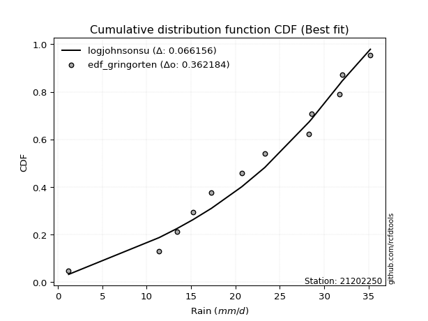</img>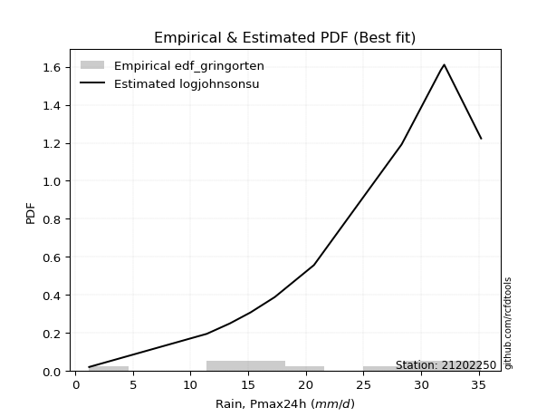</img>

</div>


### 9. Empirical - EDF Filliben (1975)

The specific values of the constants (0.3175) (often denoted as $alpha$) and (0.365) are derived from a method proposed by James J. Filliben in a 1975 paper. This particular formula is the mean value of the $i$-th order statistic of the normal distribution and is considered a robust and effective plotting position formula for the normal probability plot correlation coefficient test for normality.

<div align="center">


$P=(m-0.3175)/(n+0.365)$


</div>


**9.1. Empirical values**

<div align="center">

|                | 0                   | 1                   | 2                   | 3                   | 4                  | 5                  | 6                  | 7                  | 8                  | 9                  | 10                 | 11                 |
|:---------------|:--------------------|:--------------------|:--------------------|:--------------------|:-------------------|:-------------------|:-------------------|:-------------------|:-------------------|:-------------------|:-------------------|:-------------------|
| date           | 2023                | 2015                | 2016                | 2014                | 2012               | 2013               | 2025               | 2010               | 2011               | 2009               | 2024               | 2008               |
| x              | 1.2                 | 11.4                | 13.4                | 15.2                | 17.3               | 20.7               | 23.3               | 28.3               | 28.6               | 31.7               | 32.0               | 35.2               |
| m              | 1                   | 2                   | 3                   | 4                   | 5                  | 6                  | 7                  | 8                  | 9                  | 10                 | 11                 | 12                 |
| empirical_dist | edf_filliben        | edf_filliben        | edf_filliben        | edf_filliben        | edf_filliben       | edf_filliben       | edf_filliben       | edf_filliben       | edf_filliben       | edf_filliben       | edf_filliben       | edf_filliben       |
| empirical      | 0.05519611807521229 | 0.13606955115244643 | 0.21694298422968056 | 0.29781641730691466 | 0.3786898503841488 | 0.4595632834613829 | 0.540436716538617  | 0.6213101496158512 | 0.7021835826930852 | 0.7830570157703194 | 0.8639304488475535 | 0.9448038819247876 |
| empirical_tr   | 1.0584207147442757  | 1.1575005850690383  | 1.2770462174025305  | 1.4241289951050964  | 1.609502115196876  | 1.8503554059109617 | 2.1759788825340958 | 2.6406833956219966 | 3.357773251866937  | 4.6095060577819185 | 7.349182763744426  | 18.117216117216078 |

</div>


**9.2. Kolmogorov-Smirnov fit test (sorted by Δ)**


<div align="center">

|                | 0                   | 1                   | 2                   | 3                   | 4                   | 5                   | 6                   | 7                   | 8                   | 9                   | 10                  | 11                  | 12                  | 13                  | 14                  | 15                  | 16                    | 17                  | 18                  | 19                  | 20                  | 21                  | 22                  | 23                  | 24                  | 25                  | 26                  | 27                  | 28                  | 29                  | 30                  | 31                  | 32                  | 33                  | 34                  | 35                  | 36                  | 37                  | 38                  | 39                  | 40                  | 41                  | 42                  | 43                  | 44                  | 45                  | 46                  | 47                  | 48                  | 49                  | 50                  | 51                  | 52                  | 53                  | 54                  | 55                  | 56                  | 57                  | 58                  | 59                  | 60                  | 61                  | 62                  | 63                  | 64                  | 65                  | 66                  | 67                  | 68                  | 69                  | 70                  | 71                  | 72                  | 73                  | 74                  | 75                  | 76                  | 77                  | 78                  | 79                  | 80                  | 81                  | 82                  | 83                  | 84                  | 85                  | 86                  | 87                  | 88                  | 89                  |
|:---------------|:--------------------|:--------------------|:--------------------|:--------------------|:--------------------|:--------------------|:--------------------|:--------------------|:--------------------|:--------------------|:--------------------|:--------------------|:--------------------|:--------------------|:--------------------|:--------------------|:----------------------|:--------------------|:--------------------|:--------------------|:--------------------|:--------------------|:--------------------|:--------------------|:--------------------|:--------------------|:--------------------|:--------------------|:--------------------|:--------------------|:--------------------|:--------------------|:--------------------|:--------------------|:--------------------|:--------------------|:--------------------|:--------------------|:--------------------|:--------------------|:--------------------|:--------------------|:--------------------|:--------------------|:--------------------|:--------------------|:--------------------|:--------------------|:--------------------|:--------------------|:--------------------|:--------------------|:--------------------|:--------------------|:--------------------|:--------------------|:--------------------|:--------------------|:--------------------|:--------------------|:--------------------|:--------------------|:--------------------|:--------------------|:--------------------|:--------------------|:--------------------|:--------------------|:--------------------|:--------------------|:--------------------|:--------------------|:--------------------|:--------------------|:--------------------|:--------------------|:--------------------|:--------------------|:--------------------|:--------------------|:--------------------|:--------------------|:--------------------|:--------------------|:--------------------|:--------------------|:--------------------|:--------------------|:--------------------|:--------------------|
| station        | 21202250            | 21202250            | 21202250            | 21202250            | 21202250            | 21202250            | 21202250            | 21202250            | 21202250            | 21202250            | 21202250            | 21202250            | 21202250            | 21202250            | 21202250            | 21202250            | 21202250              | 21202250            | 21202250            | 21202250            | 21202250            | 21202250            | 21202250            | 21202250            | 21202250            | 21202250            | 21202250            | 21202250            | 21202250            | 21202250            | 21202250            | 21202250            | 21202250            | 21202250            | 21202250            | 21202250            | 21202250            | 21202250            | 21202250            | 21202250            | 21202250            | 21202250            | 21202250            | 21202250            | 21202250            | 21202250            | 21202250            | 21202250            | 21202250            | 21202250            | 21202250            | 21202250            | 21202250            | 21202250            | 21202250            | 21202250            | 21202250            | 21202250            | 21202250            | 21202250            | 21202250            | 21202250            | 21202250            | 21202250            | 21202250            | 21202250            | 21202250            | 21202250            | 21202250            | 21202250            | 21202250            | 21202250            | 21202250            | 21202250            | 21202250            | 21202250            | 21202250            | 21202250            | 21202250            | 21202250            | 21202250            | 21202250            | 21202250            | 21202250            | 21202250            | 21202250            | 21202250            | 21202250            | 21202250            | 21202250            |
| empirical_dist | edf_filliben        | edf_filliben        | edf_filliben        | edf_filliben        | edf_filliben        | edf_filliben        | edf_filliben        | edf_filliben        | edf_filliben        | edf_filliben        | edf_filliben        | edf_filliben        | edf_filliben        | edf_filliben        | edf_filliben        | edf_filliben        | edf_filliben          | edf_filliben        | edf_filliben        | edf_filliben        | edf_filliben        | edf_filliben        | edf_filliben        | edf_filliben        | edf_filliben        | edf_filliben        | edf_filliben        | edf_filliben        | edf_filliben        | edf_filliben        | edf_filliben        | edf_filliben        | edf_filliben        | edf_filliben        | edf_filliben        | edf_filliben        | edf_filliben        | edf_filliben        | edf_filliben        | edf_filliben        | edf_filliben        | edf_filliben        | edf_filliben        | edf_filliben        | edf_filliben        | edf_filliben        | edf_filliben        | edf_filliben        | edf_filliben        | edf_filliben        | edf_filliben        | edf_filliben        | edf_filliben        | edf_filliben        | edf_filliben        | edf_filliben        | edf_filliben        | edf_filliben        | edf_filliben        | edf_filliben        | edf_filliben        | edf_filliben        | edf_filliben        | edf_filliben        | edf_filliben        | edf_filliben        | edf_filliben        | edf_filliben        | edf_filliben        | edf_filliben        | edf_filliben        | edf_filliben        | edf_filliben        | edf_filliben        | edf_filliben        | edf_filliben        | edf_filliben        | edf_filliben        | edf_filliben        | edf_filliben        | edf_filliben        | edf_filliben        | edf_filliben        | edf_filliben        | edf_filliben        | edf_filliben        | edf_filliben        | edf_filliben        | edf_filliben        | edf_filliben        |
| p_dist         | logjohnsonsu        | mielke              | johnsonsu           | logpearson3         | truncnorm           | logmielke           | genlogistic         | invweibull          | gompertz            | weibull_min         | logloggamma         | logt                | pearson3            | gumbel_l            | kstwobign           | fisk                | loglaplace_asymmetric | ncf                 | invgamma            | gamma               | f                   | nakagami            | nct                 | exponnorm           | crystalball         | norm                | t                   | rice                | betaprime           | logfisk             | erlang              | logweibull_min      | loggompertz         | maxwell             | rayleigh            | invgauss            | loggumbel_l         | loghypsecant        | halfnorm            | logistic            | laplace_asymmetric  | alpha               | loglogistic         | loglaplace          | hypsecant           | gumbel_r            | halflogistic        | lognakagami         | logfatiguelife      | logcrystalball      | lognorm             | lognorm             | logexponnorm        | loglognorm          | logrice             | logf                | moyal               | lognct              | laplace             | loggamma            | loggamma            | logchi2             | loginvgamma         | logncf              | logerlang           | logmaxwell          | wald                | lograyleigh         | loggumbel_r         | logbetaprime        | loginvgauss         | logmoyal            | gibrat              | loghalfnorm         | expon               | genexpon            | loghalflogistic     | loginvweibull       | logwald             | logkstwobign        | loggibrat           | loggenexpon         | logtruncnorm        | logexpon            | pareto              | logpareto           | fatiguelife         | logalpha            | chi2                | loggenlogistic      |
| delta          | 0.06860797528232704 | 0.09556125521475833 | 0.09977917921545659 | 0.10573356916117294 | 0.10761681486205732 | 0.10855520688284792 | 0.11187245161797388 | 0.11338788921835141 | 0.11354694040004365 | 0.11582939390785851 | 0.11611877268606818 | 0.12399349013678285 | 0.12404842117571402 | 0.12446220521299389 | 0.1251598023141246  | 0.12832281344904162 | 0.13277327599875355   | 0.132789425307312   | 0.13327167027686337 | 0.13425303849409576 | 0.1351139741247558  | 0.13515445969853823 | 0.1352048901590247  | 0.13523679682935763 | 0.1352373479557456  | 0.13523735000418224 | 0.13524318718972894 | 0.13527818716683693 | 0.13529013641751197 | 0.13667806397700755 | 0.13758715091194607 | 0.1421044260856955  | 0.14210625548233746 | 0.1439646215080358  | 0.1464496165130632  | 0.14683412532208107 | 0.1469769104248927  | 0.14819262725890534 | 0.15507865247371044 | 0.1578924595158454  | 0.15920204681793948 | 0.1613816236388902  | 0.1632620463775771  | 0.16935876251616527 | 0.17260628794360233 | 0.1730807701995074  | 0.1790944239699418  | 0.18227977284048616 | 0.18231448694528216 | 0.18350252611591902 | 0.18350253660499546 | 0.18350253660499546 | 0.1835041561907754  | 0.18350470441529268 | 0.18353112738448366 | 0.18384812250287155 | 0.18531725869874227 | 0.1872401129370809  | 0.19163713653989567 | 0.19380008159204673 | 0.19380008159204673 | 0.1986221546976523  | 0.20686160205722962 | 0.20819440577280116 | 0.20944164245999655 | 0.2132096581408681  | 0.2240539900288877  | 0.22476014742766728 | 0.2284020964340363  | 0.23082206109849482 | 0.2429382642939555  | 0.2503406851135365  | 0.2531658453861686  | 0.25753081674373945 | 0.25851781768388604 | 0.2588976468418104  | 0.2658570887330808  | 0.2685707261386726  | 0.3084313793270132  | 0.31760768694860086 | 0.3183763013749811  | 0.3550904071045632  | 0.43289430379493    | 0.4345743429204908  | 0.5058193055683307  | 0.5204106160231637  | 0.5974626018228985  | 0.6648562384193344  | 0.732503006558411   | 0.8639304488475535  |
| deltao         | 0.36218414519599995 | 0.36218414519599995 | 0.36218414519599995 | 0.36218414519599995 | 0.36218414519599995 | 0.36218414519599995 | 0.36218414519599995 | 0.36218414519599995 | 0.36218414519599995 | 0.36218414519599995 | 0.36218414519599995 | 0.36218414519599995 | 0.36218414519599995 | 0.36218414519599995 | 0.36218414519599995 | 0.36218414519599995 | 0.36218414519599995   | 0.36218414519599995 | 0.36218414519599995 | 0.36218414519599995 | 0.36218414519599995 | 0.36218414519599995 | 0.36218414519599995 | 0.36218414519599995 | 0.36218414519599995 | 0.36218414519599995 | 0.36218414519599995 | 0.36218414519599995 | 0.36218414519599995 | 0.36218414519599995 | 0.36218414519599995 | 0.36218414519599995 | 0.36218414519599995 | 0.36218414519599995 | 0.36218414519599995 | 0.36218414519599995 | 0.36218414519599995 | 0.36218414519599995 | 0.36218414519599995 | 0.36218414519599995 | 0.36218414519599995 | 0.36218414519599995 | 0.36218414519599995 | 0.36218414519599995 | 0.36218414519599995 | 0.36218414519599995 | 0.36218414519599995 | 0.36218414519599995 | 0.36218414519599995 | 0.36218414519599995 | 0.36218414519599995 | 0.36218414519599995 | 0.36218414519599995 | 0.36218414519599995 | 0.36218414519599995 | 0.36218414519599995 | 0.36218414519599995 | 0.36218414519599995 | 0.36218414519599995 | 0.36218414519599995 | 0.36218414519599995 | 0.36218414519599995 | 0.36218414519599995 | 0.36218414519599995 | 0.36218414519599995 | 0.36218414519599995 | 0.36218414519599995 | 0.36218414519599995 | 0.36218414519599995 | 0.36218414519599995 | 0.36218414519599995 | 0.36218414519599995 | 0.36218414519599995 | 0.36218414519599995 | 0.36218414519599995 | 0.36218414519599995 | 0.36218414519599995 | 0.36218414519599995 | 0.36218414519599995 | 0.36218414519599995 | 0.36218414519599995 | 0.36218414519599995 | 0.36218414519599995 | 0.36218414519599995 | 0.36218414519599995 | 0.36218414519599995 | 0.36218414519599995 | 0.36218414519599995 | 0.36218414519599995 | 0.36218414519599995 |
| eval           | Δo > Δ              | Δo > Δ              | Δo > Δ              | Δo > Δ              | Δo > Δ              | Δo > Δ              | Δo > Δ              | Δo > Δ              | Δo > Δ              | Δo > Δ              | Δo > Δ              | Δo > Δ              | Δo > Δ              | Δo > Δ              | Δo > Δ              | Δo > Δ              | Δo > Δ                | Δo > Δ              | Δo > Δ              | Δo > Δ              | Δo > Δ              | Δo > Δ              | Δo > Δ              | Δo > Δ              | Δo > Δ              | Δo > Δ              | Δo > Δ              | Δo > Δ              | Δo > Δ              | Δo > Δ              | Δo > Δ              | Δo > Δ              | Δo > Δ              | Δo > Δ              | Δo > Δ              | Δo > Δ              | Δo > Δ              | Δo > Δ              | Δo > Δ              | Δo > Δ              | Δo > Δ              | Δo > Δ              | Δo > Δ              | Δo > Δ              | Δo > Δ              | Δo > Δ              | Δo > Δ              | Δo > Δ              | Δo > Δ              | Δo > Δ              | Δo > Δ              | Δo > Δ              | Δo > Δ              | Δo > Δ              | Δo > Δ              | Δo > Δ              | Δo > Δ              | Δo > Δ              | Δo > Δ              | Δo > Δ              | Δo > Δ              | Δo > Δ              | Δo > Δ              | Δo > Δ              | Δo > Δ              | Δo > Δ              | Δo > Δ              | Δo > Δ              | Δo > Δ              | Δo > Δ              | Δo > Δ              | Δo > Δ              | Δo > Δ              | Δo > Δ              | Δo > Δ              | Δo > Δ              | Δo > Δ              | Δo > Δ              | Δo > Δ              | Δo > Δ              | Δo > Δ              | Δo > Δ              | Δo <= Δ             | Δo <= Δ             | Δo <= Δ             | Δo <= Δ             | Δo <= Δ             | Δo <= Δ             | Δo <= Δ             | Δo <= Δ             |
| fit            | 1                   | 1                   | 1                   | 1                   | 1                   | 1                   | 1                   | 1                   | 1                   | 1                   | 1                   | 1                   | 1                   | 1                   | 1                   | 1                   | 1                     | 1                   | 1                   | 1                   | 1                   | 1                   | 1                   | 1                   | 1                   | 1                   | 1                   | 1                   | 1                   | 1                   | 1                   | 1                   | 1                   | 1                   | 1                   | 1                   | 1                   | 1                   | 1                   | 1                   | 1                   | 1                   | 1                   | 1                   | 1                   | 1                   | 1                   | 1                   | 1                   | 1                   | 1                   | 1                   | 1                   | 1                   | 1                   | 1                   | 1                   | 1                   | 1                   | 1                   | 1                   | 1                   | 1                   | 1                   | 1                   | 1                   | 1                   | 1                   | 1                   | 1                   | 1                   | 1                   | 1                   | 1                   | 1                   | 1                   | 1                   | 1                   | 1                   | 1                   | 1                   | 1                   | 0                   | 0                   | 0                   | 0                   | 0                   | 0                   | 0                   | 0                   |
| n              | 12                  | 12                  | 12                  | 12                  | 12                  | 12                  | 12                  | 12                  | 12                  | 12                  | 12                  | 12                  | 12                  | 12                  | 12                  | 12                  | 12                    | 12                  | 12                  | 12                  | 12                  | 12                  | 12                  | 12                  | 12                  | 12                  | 12                  | 12                  | 12                  | 12                  | 12                  | 12                  | 12                  | 12                  | 12                  | 12                  | 12                  | 12                  | 12                  | 12                  | 12                  | 12                  | 12                  | 12                  | 12                  | 12                  | 12                  | 12                  | 12                  | 12                  | 12                  | 12                  | 12                  | 12                  | 12                  | 12                  | 12                  | 12                  | 12                  | 12                  | 12                  | 12                  | 12                  | 12                  | 12                  | 12                  | 12                  | 12                  | 12                  | 12                  | 12                  | 12                  | 12                  | 12                  | 12                  | 12                  | 12                  | 12                  | 12                  | 12                  | 12                  | 12                  | 12                  | 12                  | 12                  | 12                  | 12                  | 12                  | 12                  | 12                  |
| best_fit       | 1                   | 0                   | 0                   | 0                   | 0                   | 0                   | 0                   | 0                   | 0                   | 0                   | 0                   | 0                   | 0                   | 0                   | 0                   | 0                   | 0                     | 0                   | 0                   | 0                   | 0                   | 0                   | 0                   | 0                   | 0                   | 0                   | 0                   | 0                   | 0                   | 0                   | 0                   | 0                   | 0                   | 0                   | 0                   | 0                   | 0                   | 0                   | 0                   | 0                   | 0                   | 0                   | 0                   | 0                   | 0                   | 0                   | 0                   | 0                   | 0                   | 0                   | 0                   | 0                   | 0                   | 0                   | 0                   | 0                   | 0                   | 0                   | 0                   | 0                   | 0                   | 0                   | 0                   | 0                   | 0                   | 0                   | 0                   | 0                   | 0                   | 0                   | 0                   | 0                   | 0                   | 0                   | 0                   | 0                   | 0                   | 0                   | 0                   | 0                   | 0                   | 0                   | 0                   | 0                   | 0                   | 0                   | 0                   | 0                   | 0                   | 0                   |
| best_fit_sort  | 1                   | 2                   | 3                   | 4                   | 5                   | 6                   | 7                   | 8                   | 9                   | 10                  | 11                  | 12                  | 13                  | 14                  | 15                  | 16                  | 17                    | 18                  | 19                  | 20                  | 21                  | 22                  | 23                  | 24                  | 25                  | 26                  | 27                  | 28                  | 29                  | 30                  | 31                  | 32                  | 33                  | 34                  | 35                  | 36                  | 37                  | 38                  | 39                  | 40                  | 41                  | 42                  | 43                  | 44                  | 45                  | 46                  | 47                  | 48                  | 49                  | 50                  | 51                  | 52                  | 53                  | 54                  | 55                  | 56                  | 57                  | 58                  | 59                  | 60                  | 61                  | 62                  | 63                  | 64                  | 65                  | 66                  | 67                  | 68                  | 69                  | 70                  | 71                  | 72                  | 73                  | 74                  | 75                  | 76                  | 77                  | 78                  | 79                  | 80                  | 81                  | 82                  | 83                  | 84                  | 85                  | 86                  | 87                  | 88                  | 89                  | 90                  |

</div>


<div align="center">

</img>

</div>


**9.3. Best fit**

<div align="center">

|   id |   station | empirical_dist   | p_dist       |    delta |   deltao | eval   |   fit |   n |   best_fit |   best_fit_sort |
|-----:|----------:|:-----------------|:-------------|---------:|---------:|:-------|------:|----:|-----------:|----------------:|
|    0 |  21202250 | edf_filliben     | logjohnsonsu | 0.068608 | 0.362184 | Δo > Δ |     1 |  12 |          1 |               1 |

</div>


<div align="center">

</img></img>

</div>


### 10. Empirical - EDF Jenkinson (1977)

The Jenkinson formula in hydrology is an empirical plotting position formula used to estimate the non-exceedance probability _(P)_ or return period _(T)_ of a given ordered observation within a sample. It is a widely used method in the frequency analysis of extreme events such as floods and rainfall, as it provides a distribution-free way to plot data. _a≈0.31_ and _b≈0.38_ are constants derived to approximate the median of the probability distribution for the given rank.

<div align="center">


$P=(m-a)/(n+b)$


</div>


**10.1. Empirical values**

<div align="center">

|                | 0                    | 1                   | 2                   | 3                  | 4                  | 5                  | 6                  | 7                  | 8                  | 9                  | 10                 | 11                 |
|:---------------|:---------------------|:--------------------|:--------------------|:-------------------|:-------------------|:-------------------|:-------------------|:-------------------|:-------------------|:-------------------|:-------------------|:-------------------|
| date           | 2023                 | 2015                | 2016                | 2014               | 2012               | 2013               | 2025               | 2010               | 2011               | 2009               | 2024               | 2008               |
| x              | 1.2                  | 11.4                | 13.4                | 15.2               | 17.3               | 20.7               | 23.3               | 28.3               | 28.6               | 31.7               | 32.0               | 35.2               |
| m              | 1                    | 2                   | 3                   | 4                  | 5                  | 6                  | 7                  | 8                  | 9                  | 10                 | 11                 | 12                 |
| empirical_dist | edf_jenkinson        | edf_jenkinson       | edf_jenkinson       | edf_jenkinson      | edf_jenkinson      | edf_jenkinson      | edf_jenkinson      | edf_jenkinson      | edf_jenkinson      | edf_jenkinson      | edf_jenkinson      | edf_jenkinson      |
| empirical      | 0.055735056542810975 | 0.13651050080775443 | 0.21728594507269788 | 0.2980613893376413 | 0.3788368336025848 | 0.4596122778675283 | 0.5403877221324718 | 0.6211631663974152 | 0.7019386106623585 | 0.7827140549273021 | 0.8634894991922455 | 0.9442649434571889 |
| empirical_tr   | 1.0590248075278015   | 1.1580916744621141  | 1.2776057791537667  | 1.424626006904488  | 1.6098829648894668 | 1.850523168908819  | 2.1757469244288226 | 2.6396588486140726 | 3.3550135501355    | 4.6022304832713745 | 7.325443786982245  | 17.942028985507218 |

</div>


**10.2. Kolmogorov-Smirnov fit test (sorted by Δ)**


<div align="center">

|                | 0                   | 1                   | 2                   | 3                   | 4                   | 5                   | 6                   | 7                   | 8                   | 9                   | 10                  | 11                  | 12                  | 13                  | 14                  | 15                  | 16                  | 17                    | 18                  | 19                  | 20                  | 21                  | 22                  | 23                  | 24                  | 25                  | 26                  | 27                  | 28                  | 29                  | 30                  | 31                  | 32                  | 33                  | 34                  | 35                  | 36                  | 37                  | 38                  | 39                  | 40                  | 41                  | 42                  | 43                  | 44                  | 45                  | 46                  | 47                  | 48                  | 49                  | 50                  | 51                  | 52                  | 53                  | 54                  | 55                  | 56                  | 57                  | 58                  | 59                  | 60                  | 61                  | 62                  | 63                  | 64                  | 65                  | 66                  | 67                  | 68                  | 69                  | 70                  | 71                  | 72                  | 73                  | 74                  | 75                  | 76                  | 77                  | 78                  | 79                  | 80                  | 81                  | 82                  | 83                  | 84                  | 85                  | 86                  | 87                  | 88                  | 89                  |
|:---------------|:--------------------|:--------------------|:--------------------|:--------------------|:--------------------|:--------------------|:--------------------|:--------------------|:--------------------|:--------------------|:--------------------|:--------------------|:--------------------|:--------------------|:--------------------|:--------------------|:--------------------|:----------------------|:--------------------|:--------------------|:--------------------|:--------------------|:--------------------|:--------------------|:--------------------|:--------------------|:--------------------|:--------------------|:--------------------|:--------------------|:--------------------|:--------------------|:--------------------|:--------------------|:--------------------|:--------------------|:--------------------|:--------------------|:--------------------|:--------------------|:--------------------|:--------------------|:--------------------|:--------------------|:--------------------|:--------------------|:--------------------|:--------------------|:--------------------|:--------------------|:--------------------|:--------------------|:--------------------|:--------------------|:--------------------|:--------------------|:--------------------|:--------------------|:--------------------|:--------------------|:--------------------|:--------------------|:--------------------|:--------------------|:--------------------|:--------------------|:--------------------|:--------------------|:--------------------|:--------------------|:--------------------|:--------------------|:--------------------|:--------------------|:--------------------|:--------------------|:--------------------|:--------------------|:--------------------|:--------------------|:--------------------|:--------------------|:--------------------|:--------------------|:--------------------|:--------------------|:--------------------|:--------------------|:--------------------|:--------------------|
| station        | 21202250            | 21202250            | 21202250            | 21202250            | 21202250            | 21202250            | 21202250            | 21202250            | 21202250            | 21202250            | 21202250            | 21202250            | 21202250            | 21202250            | 21202250            | 21202250            | 21202250            | 21202250              | 21202250            | 21202250            | 21202250            | 21202250            | 21202250            | 21202250            | 21202250            | 21202250            | 21202250            | 21202250            | 21202250            | 21202250            | 21202250            | 21202250            | 21202250            | 21202250            | 21202250            | 21202250            | 21202250            | 21202250            | 21202250            | 21202250            | 21202250            | 21202250            | 21202250            | 21202250            | 21202250            | 21202250            | 21202250            | 21202250            | 21202250            | 21202250            | 21202250            | 21202250            | 21202250            | 21202250            | 21202250            | 21202250            | 21202250            | 21202250            | 21202250            | 21202250            | 21202250            | 21202250            | 21202250            | 21202250            | 21202250            | 21202250            | 21202250            | 21202250            | 21202250            | 21202250            | 21202250            | 21202250            | 21202250            | 21202250            | 21202250            | 21202250            | 21202250            | 21202250            | 21202250            | 21202250            | 21202250            | 21202250            | 21202250            | 21202250            | 21202250            | 21202250            | 21202250            | 21202250            | 21202250            | 21202250            |
| empirical_dist | edf_jenkinson       | edf_jenkinson       | edf_jenkinson       | edf_jenkinson       | edf_jenkinson       | edf_jenkinson       | edf_jenkinson       | edf_jenkinson       | edf_jenkinson       | edf_jenkinson       | edf_jenkinson       | edf_jenkinson       | edf_jenkinson       | edf_jenkinson       | edf_jenkinson       | edf_jenkinson       | edf_jenkinson       | edf_jenkinson         | edf_jenkinson       | edf_jenkinson       | edf_jenkinson       | edf_jenkinson       | edf_jenkinson       | edf_jenkinson       | edf_jenkinson       | edf_jenkinson       | edf_jenkinson       | edf_jenkinson       | edf_jenkinson       | edf_jenkinson       | edf_jenkinson       | edf_jenkinson       | edf_jenkinson       | edf_jenkinson       | edf_jenkinson       | edf_jenkinson       | edf_jenkinson       | edf_jenkinson       | edf_jenkinson       | edf_jenkinson       | edf_jenkinson       | edf_jenkinson       | edf_jenkinson       | edf_jenkinson       | edf_jenkinson       | edf_jenkinson       | edf_jenkinson       | edf_jenkinson       | edf_jenkinson       | edf_jenkinson       | edf_jenkinson       | edf_jenkinson       | edf_jenkinson       | edf_jenkinson       | edf_jenkinson       | edf_jenkinson       | edf_jenkinson       | edf_jenkinson       | edf_jenkinson       | edf_jenkinson       | edf_jenkinson       | edf_jenkinson       | edf_jenkinson       | edf_jenkinson       | edf_jenkinson       | edf_jenkinson       | edf_jenkinson       | edf_jenkinson       | edf_jenkinson       | edf_jenkinson       | edf_jenkinson       | edf_jenkinson       | edf_jenkinson       | edf_jenkinson       | edf_jenkinson       | edf_jenkinson       | edf_jenkinson       | edf_jenkinson       | edf_jenkinson       | edf_jenkinson       | edf_jenkinson       | edf_jenkinson       | edf_jenkinson       | edf_jenkinson       | edf_jenkinson       | edf_jenkinson       | edf_jenkinson       | edf_jenkinson       | edf_jenkinson       | edf_jenkinson       |
| p_dist         | logjohnsonsu        | mielke              | johnsonsu           | logpearson3         | truncnorm           | logmielke           | genlogistic         | invweibull          | gompertz            | weibull_min         | logloggamma         | logt                | pearson3            | gumbel_l            | kstwobign           | fisk                | ncf                 | loglaplace_asymmetric | invgamma            | gamma               | f                   | nakagami            | nct                 | exponnorm           | crystalball         | norm                | t                   | rice                | betaprime           | logfisk             | erlang              | logweibull_min      | loggompertz         | maxwell             | loggumbel_l         | rayleigh            | invgauss            | loghypsecant        | halfnorm            | logistic            | laplace_asymmetric  | alpha               | loglogistic         | loglaplace          | hypsecant           | gumbel_r            | halflogistic        | lognakagami         | logfatiguelife      | logcrystalball      | lognorm             | lognorm             | logexponnorm        | loglognorm          | logrice             | logf                | moyal               | lognct              | laplace             | loggamma            | loggamma            | logchi2             | loginvgamma         | logncf              | logerlang           | logmaxwell          | wald                | lograyleigh         | loggumbel_r         | logbetaprime        | loginvgauss         | logmoyal            | gibrat              | loghalfnorm         | expon               | genexpon            | loghalflogistic     | loginvweibull       | logwald             | logkstwobign        | loggibrat           | loggenexpon         | logtruncnorm        | logexpon            | pareto              | logpareto           | fatiguelife         | logalpha            | chi2                | loggenlogistic      |
| delta          | 0.06875495850076302 | 0.09570823843319431 | 0.09992616243389257 | 0.10529261950586488 | 0.1077637980804933  | 0.1087021901012839  | 0.11201943483640986 | 0.11353487243678739 | 0.11369392361847963 | 0.1159763771262945  | 0.11626575590450416 | 0.12345455166918418 | 0.12419540439415    | 0.12460918843142987 | 0.12530678553256058 | 0.1284697966674776  | 0.132348475652004   | 0.13292025921718953   | 0.13341865349529936 | 0.13440002171253174 | 0.13526095734319177 | 0.1353014429169742  | 0.13535187337746069 | 0.1353837800477936  | 0.13538433117418158 | 0.13538433322261823 | 0.13539017040816492 | 0.1354251703852729  | 0.13543711963594796 | 0.13613912550940888 | 0.13773413413038205 | 0.1422514093041315  | 0.14225323870077344 | 0.14411160472647178 | 0.14643797195729402 | 0.1465965997314992  | 0.14698110854051705 | 0.14775167760359734 | 0.15522563569214642 | 0.1580394427342814  | 0.15934903003637546 | 0.16152860685732617 | 0.1628210967222691  | 0.1693097681100199  | 0.1727532711620383  | 0.1732277534179434  | 0.17924140718837778 | 0.18183882318517816 | 0.18187353728997416 | 0.18306157646061103 | 0.18306158694968747 | 0.18306158694968747 | 0.1830632065354674  | 0.18306375475998468 | 0.18309017772917566 | 0.18340717284756355 | 0.18546424191717825 | 0.1867991632817729  | 0.19178411975833165 | 0.19335913193673873 | 0.19335913193673873 | 0.1981812050423443  | 0.20642065240192162 | 0.20775345611749316 | 0.20900069280468855 | 0.2127687084855601  | 0.2242009732473237  | 0.22431919777235929 | 0.22805913559101898 | 0.23038111144318682 | 0.24249731463864752 | 0.2499977242705192  | 0.2533128286046046  | 0.2570898670884314  | 0.2580768680285781  | 0.25845669718650244 | 0.26551412789006346 | 0.26812977648336467 | 0.3080884184839959  | 0.3171667372932929  | 0.3181313293442544  | 0.35464945744925525 | 0.43245335413962205 | 0.43413339326518285 | 0.5053783559130227  | 0.5199696663678558  | 0.5970216521675905  | 0.6644152887640264  | 0.7320620569031031  | 0.8634894991922455  |
| deltao         | 0.36218414519599995 | 0.36218414519599995 | 0.36218414519599995 | 0.36218414519599995 | 0.36218414519599995 | 0.36218414519599995 | 0.36218414519599995 | 0.36218414519599995 | 0.36218414519599995 | 0.36218414519599995 | 0.36218414519599995 | 0.36218414519599995 | 0.36218414519599995 | 0.36218414519599995 | 0.36218414519599995 | 0.36218414519599995 | 0.36218414519599995 | 0.36218414519599995   | 0.36218414519599995 | 0.36218414519599995 | 0.36218414519599995 | 0.36218414519599995 | 0.36218414519599995 | 0.36218414519599995 | 0.36218414519599995 | 0.36218414519599995 | 0.36218414519599995 | 0.36218414519599995 | 0.36218414519599995 | 0.36218414519599995 | 0.36218414519599995 | 0.36218414519599995 | 0.36218414519599995 | 0.36218414519599995 | 0.36218414519599995 | 0.36218414519599995 | 0.36218414519599995 | 0.36218414519599995 | 0.36218414519599995 | 0.36218414519599995 | 0.36218414519599995 | 0.36218414519599995 | 0.36218414519599995 | 0.36218414519599995 | 0.36218414519599995 | 0.36218414519599995 | 0.36218414519599995 | 0.36218414519599995 | 0.36218414519599995 | 0.36218414519599995 | 0.36218414519599995 | 0.36218414519599995 | 0.36218414519599995 | 0.36218414519599995 | 0.36218414519599995 | 0.36218414519599995 | 0.36218414519599995 | 0.36218414519599995 | 0.36218414519599995 | 0.36218414519599995 | 0.36218414519599995 | 0.36218414519599995 | 0.36218414519599995 | 0.36218414519599995 | 0.36218414519599995 | 0.36218414519599995 | 0.36218414519599995 | 0.36218414519599995 | 0.36218414519599995 | 0.36218414519599995 | 0.36218414519599995 | 0.36218414519599995 | 0.36218414519599995 | 0.36218414519599995 | 0.36218414519599995 | 0.36218414519599995 | 0.36218414519599995 | 0.36218414519599995 | 0.36218414519599995 | 0.36218414519599995 | 0.36218414519599995 | 0.36218414519599995 | 0.36218414519599995 | 0.36218414519599995 | 0.36218414519599995 | 0.36218414519599995 | 0.36218414519599995 | 0.36218414519599995 | 0.36218414519599995 | 0.36218414519599995 |
| eval           | Δo > Δ              | Δo > Δ              | Δo > Δ              | Δo > Δ              | Δo > Δ              | Δo > Δ              | Δo > Δ              | Δo > Δ              | Δo > Δ              | Δo > Δ              | Δo > Δ              | Δo > Δ              | Δo > Δ              | Δo > Δ              | Δo > Δ              | Δo > Δ              | Δo > Δ              | Δo > Δ                | Δo > Δ              | Δo > Δ              | Δo > Δ              | Δo > Δ              | Δo > Δ              | Δo > Δ              | Δo > Δ              | Δo > Δ              | Δo > Δ              | Δo > Δ              | Δo > Δ              | Δo > Δ              | Δo > Δ              | Δo > Δ              | Δo > Δ              | Δo > Δ              | Δo > Δ              | Δo > Δ              | Δo > Δ              | Δo > Δ              | Δo > Δ              | Δo > Δ              | Δo > Δ              | Δo > Δ              | Δo > Δ              | Δo > Δ              | Δo > Δ              | Δo > Δ              | Δo > Δ              | Δo > Δ              | Δo > Δ              | Δo > Δ              | Δo > Δ              | Δo > Δ              | Δo > Δ              | Δo > Δ              | Δo > Δ              | Δo > Δ              | Δo > Δ              | Δo > Δ              | Δo > Δ              | Δo > Δ              | Δo > Δ              | Δo > Δ              | Δo > Δ              | Δo > Δ              | Δo > Δ              | Δo > Δ              | Δo > Δ              | Δo > Δ              | Δo > Δ              | Δo > Δ              | Δo > Δ              | Δo > Δ              | Δo > Δ              | Δo > Δ              | Δo > Δ              | Δo > Δ              | Δo > Δ              | Δo > Δ              | Δo > Δ              | Δo > Δ              | Δo > Δ              | Δo > Δ              | Δo <= Δ             | Δo <= Δ             | Δo <= Δ             | Δo <= Δ             | Δo <= Δ             | Δo <= Δ             | Δo <= Δ             | Δo <= Δ             |
| fit            | 1                   | 1                   | 1                   | 1                   | 1                   | 1                   | 1                   | 1                   | 1                   | 1                   | 1                   | 1                   | 1                   | 1                   | 1                   | 1                   | 1                   | 1                     | 1                   | 1                   | 1                   | 1                   | 1                   | 1                   | 1                   | 1                   | 1                   | 1                   | 1                   | 1                   | 1                   | 1                   | 1                   | 1                   | 1                   | 1                   | 1                   | 1                   | 1                   | 1                   | 1                   | 1                   | 1                   | 1                   | 1                   | 1                   | 1                   | 1                   | 1                   | 1                   | 1                   | 1                   | 1                   | 1                   | 1                   | 1                   | 1                   | 1                   | 1                   | 1                   | 1                   | 1                   | 1                   | 1                   | 1                   | 1                   | 1                   | 1                   | 1                   | 1                   | 1                   | 1                   | 1                   | 1                   | 1                   | 1                   | 1                   | 1                   | 1                   | 1                   | 1                   | 1                   | 0                   | 0                   | 0                   | 0                   | 0                   | 0                   | 0                   | 0                   |
| n              | 12                  | 12                  | 12                  | 12                  | 12                  | 12                  | 12                  | 12                  | 12                  | 12                  | 12                  | 12                  | 12                  | 12                  | 12                  | 12                  | 12                  | 12                    | 12                  | 12                  | 12                  | 12                  | 12                  | 12                  | 12                  | 12                  | 12                  | 12                  | 12                  | 12                  | 12                  | 12                  | 12                  | 12                  | 12                  | 12                  | 12                  | 12                  | 12                  | 12                  | 12                  | 12                  | 12                  | 12                  | 12                  | 12                  | 12                  | 12                  | 12                  | 12                  | 12                  | 12                  | 12                  | 12                  | 12                  | 12                  | 12                  | 12                  | 12                  | 12                  | 12                  | 12                  | 12                  | 12                  | 12                  | 12                  | 12                  | 12                  | 12                  | 12                  | 12                  | 12                  | 12                  | 12                  | 12                  | 12                  | 12                  | 12                  | 12                  | 12                  | 12                  | 12                  | 12                  | 12                  | 12                  | 12                  | 12                  | 12                  | 12                  | 12                  |
| best_fit       | 1                   | 0                   | 0                   | 0                   | 0                   | 0                   | 0                   | 0                   | 0                   | 0                   | 0                   | 0                   | 0                   | 0                   | 0                   | 0                   | 0                   | 0                     | 0                   | 0                   | 0                   | 0                   | 0                   | 0                   | 0                   | 0                   | 0                   | 0                   | 0                   | 0                   | 0                   | 0                   | 0                   | 0                   | 0                   | 0                   | 0                   | 0                   | 0                   | 0                   | 0                   | 0                   | 0                   | 0                   | 0                   | 0                   | 0                   | 0                   | 0                   | 0                   | 0                   | 0                   | 0                   | 0                   | 0                   | 0                   | 0                   | 0                   | 0                   | 0                   | 0                   | 0                   | 0                   | 0                   | 0                   | 0                   | 0                   | 0                   | 0                   | 0                   | 0                   | 0                   | 0                   | 0                   | 0                   | 0                   | 0                   | 0                   | 0                   | 0                   | 0                   | 0                   | 0                   | 0                   | 0                   | 0                   | 0                   | 0                   | 0                   | 0                   |
| best_fit_sort  | 1                   | 2                   | 3                   | 4                   | 5                   | 6                   | 7                   | 8                   | 9                   | 10                  | 11                  | 12                  | 13                  | 14                  | 15                  | 16                  | 17                  | 18                    | 19                  | 20                  | 21                  | 22                  | 23                  | 24                  | 25                  | 26                  | 27                  | 28                  | 29                  | 30                  | 31                  | 32                  | 33                  | 34                  | 35                  | 36                  | 37                  | 38                  | 39                  | 40                  | 41                  | 42                  | 43                  | 44                  | 45                  | 46                  | 47                  | 48                  | 49                  | 50                  | 51                  | 52                  | 53                  | 54                  | 55                  | 56                  | 57                  | 58                  | 59                  | 60                  | 61                  | 62                  | 63                  | 64                  | 65                  | 66                  | 67                  | 68                  | 69                  | 70                  | 71                  | 72                  | 73                  | 74                  | 75                  | 76                  | 77                  | 78                  | 79                  | 80                  | 81                  | 82                  | 83                  | 84                  | 85                  | 86                  | 87                  | 88                  | 89                  | 90                  |

</div>


<div align="center">

</img>

</div>


**10.3. Best fit**

<div align="center">

|   id |   station | empirical_dist   | p_dist       |    delta |   deltao | eval   |   fit |   n |   best_fit |   best_fit_sort |
|-----:|----------:|:-----------------|:-------------|---------:|---------:|:-------|------:|----:|-----------:|----------------:|
|    0 |  21202250 | edf_jenkinson    | logjohnsonsu | 0.068755 | 0.362184 | Δo > Δ |     1 |  12 |          1 |               1 |

</div>


<div align="center">

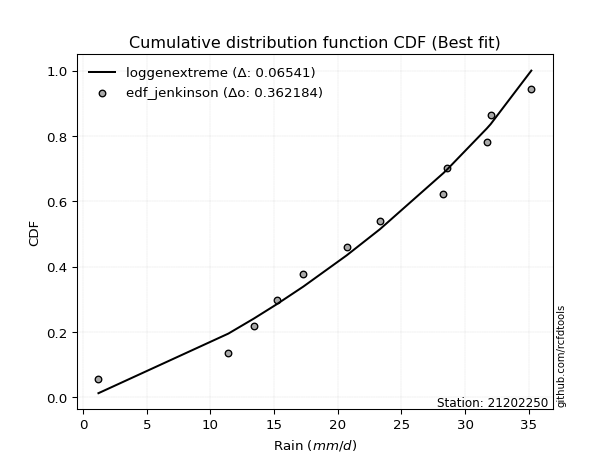</img>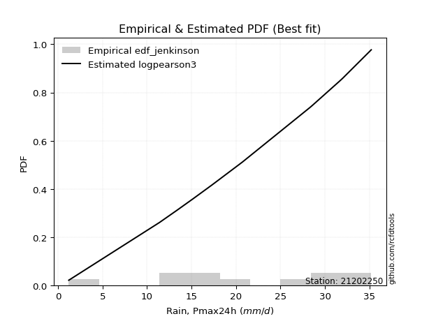</img>

</div>


### 11. Empirical - EDF Cunnane (1978)

Cunnane´s work in statistical hydrology has focused on the performance and evaluation of different probability distributions (such as GEV, Gumbel, Lognormal) for flood frequency estimation. _b_ is a constant, typically set to 0.4.

<div align="center">


$P=(m-b)/(n+1-2b)$


</div>


**11.1. Empirical values**

<div align="center">

|                | 0                   | 1                   | 2                   | 3                  | 4                  | 5                   | 6                  | 7                  | 8                  | 9                  | 10                 | 11                 |
|:---------------|:--------------------|:--------------------|:--------------------|:-------------------|:-------------------|:--------------------|:-------------------|:-------------------|:-------------------|:-------------------|:-------------------|:-------------------|
| date           | 2023                | 2015                | 2016                | 2014               | 2012               | 2013                | 2025               | 2010               | 2011               | 2009               | 2024               | 2008               |
| x              | 1.2                 | 11.4                | 13.4                | 15.2               | 17.3               | 20.7                | 23.3               | 28.3               | 28.6               | 31.7               | 32.0               | 35.2               |
| m              | 1                   | 2                   | 3                   | 4                  | 5                  | 6                   | 7                  | 8                  | 9                  | 10                 | 11                 | 12                 |
| empirical_dist | edf_cunnane         | edf_cunnane         | edf_cunnane         | edf_cunnane        | edf_cunnane        | edf_cunnane         | edf_cunnane        | edf_cunnane        | edf_cunnane        | edf_cunnane        | edf_cunnane        | edf_cunnane        |
| empirical      | 0.04918032786885246 | 0.13114754098360656 | 0.21311475409836067 | 0.2950819672131148 | 0.3770491803278688 | 0.45901639344262296 | 0.5409836065573771 | 0.6229508196721312 | 0.7049180327868853 | 0.7868852459016393 | 0.8688524590163935 | 0.9508196721311476 |
| empirical_tr   | 1.0517241379310345  | 1.150943396226415   | 1.2708333333333333  | 1.418604651162791  | 1.6052631578947367 | 1.8484848484848486  | 2.178571428571429  | 2.6521739130434785 | 3.388888888888889  | 4.692307692307692  | 7.625000000000004  | 20.333333333333357 |

</div>


**11.2. Kolmogorov-Smirnov fit test (sorted by Δ)**


<div align="center">

|                | 0                   | 1                   | 2                   | 3                   | 4                   | 5                   | 6                   | 7                   | 8                   | 9                   | 10                  | 11                  | 12                  | 13                  | 14                  | 15                  | 16                    | 17                  | 18                  | 19                  | 20                  | 21                  | 22                  | 23                  | 24                  | 25                  | 26                  | 27                  | 28                  | 29                  | 30                  | 31                  | 32                  | 33                  | 34                  | 35                  | 36                  | 37                  | 38                  | 39                  | 40                  | 41                  | 42                  | 43                  | 44                  | 45                  | 46                  | 47                  | 48                  | 49                  | 50                  | 51                  | 52                  | 53                  | 54                  | 55                  | 56                  | 57                  | 58                  | 59                  | 60                  | 61                  | 62                  | 63                  | 64                  | 65                  | 66                  | 67                  | 68                  | 69                  | 70                  | 71                  | 72                  | 73                  | 74                  | 75                  | 76                  | 77                  | 78                  | 79                  | 80                  | 81                  | 82                  | 83                  | 84                  | 85                  | 86                  | 87                  | 88                  | 89                  |
|:---------------|:--------------------|:--------------------|:--------------------|:--------------------|:--------------------|:--------------------|:--------------------|:--------------------|:--------------------|:--------------------|:--------------------|:--------------------|:--------------------|:--------------------|:--------------------|:--------------------|:----------------------|:--------------------|:--------------------|:--------------------|:--------------------|:--------------------|:--------------------|:--------------------|:--------------------|:--------------------|:--------------------|:--------------------|:--------------------|:--------------------|:--------------------|:--------------------|:--------------------|:--------------------|:--------------------|:--------------------|:--------------------|:--------------------|:--------------------|:--------------------|:--------------------|:--------------------|:--------------------|:--------------------|:--------------------|:--------------------|:--------------------|:--------------------|:--------------------|:--------------------|:--------------------|:--------------------|:--------------------|:--------------------|:--------------------|:--------------------|:--------------------|:--------------------|:--------------------|:--------------------|:--------------------|:--------------------|:--------------------|:--------------------|:--------------------|:--------------------|:--------------------|:--------------------|:--------------------|:--------------------|:--------------------|:--------------------|:--------------------|:--------------------|:--------------------|:--------------------|:--------------------|:--------------------|:--------------------|:--------------------|:--------------------|:--------------------|:--------------------|:--------------------|:--------------------|:--------------------|:--------------------|:--------------------|:--------------------|:--------------------|
| station        | 21202250            | 21202250            | 21202250            | 21202250            | 21202250            | 21202250            | 21202250            | 21202250            | 21202250            | 21202250            | 21202250            | 21202250            | 21202250            | 21202250            | 21202250            | 21202250            | 21202250              | 21202250            | 21202250            | 21202250            | 21202250            | 21202250            | 21202250            | 21202250            | 21202250            | 21202250            | 21202250            | 21202250            | 21202250            | 21202250            | 21202250            | 21202250            | 21202250            | 21202250            | 21202250            | 21202250            | 21202250            | 21202250            | 21202250            | 21202250            | 21202250            | 21202250            | 21202250            | 21202250            | 21202250            | 21202250            | 21202250            | 21202250            | 21202250            | 21202250            | 21202250            | 21202250            | 21202250            | 21202250            | 21202250            | 21202250            | 21202250            | 21202250            | 21202250            | 21202250            | 21202250            | 21202250            | 21202250            | 21202250            | 21202250            | 21202250            | 21202250            | 21202250            | 21202250            | 21202250            | 21202250            | 21202250            | 21202250            | 21202250            | 21202250            | 21202250            | 21202250            | 21202250            | 21202250            | 21202250            | 21202250            | 21202250            | 21202250            | 21202250            | 21202250            | 21202250            | 21202250            | 21202250            | 21202250            | 21202250            |
| empirical_dist | edf_cunnane         | edf_cunnane         | edf_cunnane         | edf_cunnane         | edf_cunnane         | edf_cunnane         | edf_cunnane         | edf_cunnane         | edf_cunnane         | edf_cunnane         | edf_cunnane         | edf_cunnane         | edf_cunnane         | edf_cunnane         | edf_cunnane         | edf_cunnane         | edf_cunnane           | edf_cunnane         | edf_cunnane         | edf_cunnane         | edf_cunnane         | edf_cunnane         | edf_cunnane         | edf_cunnane         | edf_cunnane         | edf_cunnane         | edf_cunnane         | edf_cunnane         | edf_cunnane         | edf_cunnane         | edf_cunnane         | edf_cunnane         | edf_cunnane         | edf_cunnane         | edf_cunnane         | edf_cunnane         | edf_cunnane         | edf_cunnane         | edf_cunnane         | edf_cunnane         | edf_cunnane         | edf_cunnane         | edf_cunnane         | edf_cunnane         | edf_cunnane         | edf_cunnane         | edf_cunnane         | edf_cunnane         | edf_cunnane         | edf_cunnane         | edf_cunnane         | edf_cunnane         | edf_cunnane         | edf_cunnane         | edf_cunnane         | edf_cunnane         | edf_cunnane         | edf_cunnane         | edf_cunnane         | edf_cunnane         | edf_cunnane         | edf_cunnane         | edf_cunnane         | edf_cunnane         | edf_cunnane         | edf_cunnane         | edf_cunnane         | edf_cunnane         | edf_cunnane         | edf_cunnane         | edf_cunnane         | edf_cunnane         | edf_cunnane         | edf_cunnane         | edf_cunnane         | edf_cunnane         | edf_cunnane         | edf_cunnane         | edf_cunnane         | edf_cunnane         | edf_cunnane         | edf_cunnane         | edf_cunnane         | edf_cunnane         | edf_cunnane         | edf_cunnane         | edf_cunnane         | edf_cunnane         | edf_cunnane         | edf_cunnane         |
| p_dist         | logjohnsonsu        | mielke              | johnsonsu           | truncnorm           | logmielke           | logpearson3         | invweibull          | gompertz            | genlogistic         | weibull_min         | logloggamma         | pearson3            | gumbel_l            | kstwobign           | fisk                | logt                | loglaplace_asymmetric | invgamma            | gamma               | f                   | nakagami            | nct                 | exponnorm           | crystalball         | norm                | t                   | rice                | betaprime           | erlang              | ncf                 | logweibull_min      | loggompertz         | maxwell             | logfisk             | rayleigh            | invgauss            | loggumbel_l         | loghypsecant        | halfnorm            | logistic            | laplace_asymmetric  | alpha               | loglogistic         | loglaplace          | hypsecant           | gumbel_r            | halflogistic        | moyal               | lognakagami         | logfatiguelife      | logcrystalball      | lognorm             | lognorm             | logexponnorm        | loglognorm          | logrice             | logf                | laplace             | lognct              | loggamma            | loggamma            | logchi2             | loginvgamma         | logncf              | logerlang           | logmaxwell          | wald                | lograyleigh         | loggumbel_r         | logbetaprime        | loginvgauss         | gibrat              | logmoyal            | loghalfnorm         | expon               | genexpon            | loghalflogistic     | loginvweibull       | logwald             | loggibrat           | logkstwobign        | loggenexpon         | logtruncnorm        | logexpon            | pareto              | logpareto           | fatiguelife         | logalpha            | chi2                | loggenlogistic      |
| delta          | 0.06696730522604705 | 0.09392058515847834 | 0.0981385091591766  | 0.10597614480577733 | 0.10691453682656793 | 0.11065557933001291 | 0.11174721916207142 | 0.11190627034376366 | 0.11230119186688592 | 0.11418872385157852 | 0.11447810262978819 | 0.12240775111943403 | 0.1228215351567139  | 0.12351913225784461 | 0.12668214339276163 | 0.13000928034314285 | 0.13113260594247356   | 0.13163100022058338 | 0.13261236843781576 | 0.1334733040684758  | 0.13351378964225824 | 0.1335642201027447  | 0.13359612677307764 | 0.1335966778994656  | 0.13359667994790225 | 0.13360251713344895 | 0.13363751711055694 | 0.13364946636123198 | 0.13594648085566607 | 0.13771143547615186 | 0.14046375602941552 | 0.14046558542605747 | 0.1423239514517558  | 0.14269385418336755 | 0.14480894645678322 | 0.14519345526580107 | 0.1529927006312527  | 0.1531146374277452  | 0.15343798241743045 | 0.15625178945956542 | 0.1575613767616595  | 0.1597409535826102  | 0.16818405654641697 | 0.16990565253492523 | 0.17096561788732234 | 0.17144010014322741 | 0.1774537539136618  | 0.18367658864246228 | 0.18720178300932602 | 0.18723649711412202 | 0.1884245362847589  | 0.18842454677383533 | 0.18842454677383533 | 0.18842616635961526 | 0.18842671458413254 | 0.18845313755332352 | 0.18877013267171142 | 0.18999646648361568 | 0.19216212310592076 | 0.1987220917608866  | 0.1987220917608866  | 0.20354416486649216 | 0.21178361222606948 | 0.21311641594164102 | 0.21436365262883642 | 0.21813166830970795 | 0.22241331997260771 | 0.22968215759650715 | 0.2322303265653562  | 0.23574407126733468 | 0.24786027446279538 | 0.2515251753298886  | 0.2541689152448564  | 0.2624528269125793  | 0.2634398278527259  | 0.26381965701065024 | 0.26968531886440067 | 0.2734927363075125  | 0.3122596094583331  | 0.32111075146878093 | 0.32252969711744073 | 0.36001241727340305 | 0.43781631396376985 | 0.43949635308933066 | 0.5107413157371705  | 0.5253326261920036  | 0.6023846119917383  | 0.6697782485881743  | 0.7374250167272509  | 0.8688524590163935  |
| deltao         | 0.36218414519599995 | 0.36218414519599995 | 0.36218414519599995 | 0.36218414519599995 | 0.36218414519599995 | 0.36218414519599995 | 0.36218414519599995 | 0.36218414519599995 | 0.36218414519599995 | 0.36218414519599995 | 0.36218414519599995 | 0.36218414519599995 | 0.36218414519599995 | 0.36218414519599995 | 0.36218414519599995 | 0.36218414519599995 | 0.36218414519599995   | 0.36218414519599995 | 0.36218414519599995 | 0.36218414519599995 | 0.36218414519599995 | 0.36218414519599995 | 0.36218414519599995 | 0.36218414519599995 | 0.36218414519599995 | 0.36218414519599995 | 0.36218414519599995 | 0.36218414519599995 | 0.36218414519599995 | 0.36218414519599995 | 0.36218414519599995 | 0.36218414519599995 | 0.36218414519599995 | 0.36218414519599995 | 0.36218414519599995 | 0.36218414519599995 | 0.36218414519599995 | 0.36218414519599995 | 0.36218414519599995 | 0.36218414519599995 | 0.36218414519599995 | 0.36218414519599995 | 0.36218414519599995 | 0.36218414519599995 | 0.36218414519599995 | 0.36218414519599995 | 0.36218414519599995 | 0.36218414519599995 | 0.36218414519599995 | 0.36218414519599995 | 0.36218414519599995 | 0.36218414519599995 | 0.36218414519599995 | 0.36218414519599995 | 0.36218414519599995 | 0.36218414519599995 | 0.36218414519599995 | 0.36218414519599995 | 0.36218414519599995 | 0.36218414519599995 | 0.36218414519599995 | 0.36218414519599995 | 0.36218414519599995 | 0.36218414519599995 | 0.36218414519599995 | 0.36218414519599995 | 0.36218414519599995 | 0.36218414519599995 | 0.36218414519599995 | 0.36218414519599995 | 0.36218414519599995 | 0.36218414519599995 | 0.36218414519599995 | 0.36218414519599995 | 0.36218414519599995 | 0.36218414519599995 | 0.36218414519599995 | 0.36218414519599995 | 0.36218414519599995 | 0.36218414519599995 | 0.36218414519599995 | 0.36218414519599995 | 0.36218414519599995 | 0.36218414519599995 | 0.36218414519599995 | 0.36218414519599995 | 0.36218414519599995 | 0.36218414519599995 | 0.36218414519599995 | 0.36218414519599995 |
| eval           | Δo > Δ              | Δo > Δ              | Δo > Δ              | Δo > Δ              | Δo > Δ              | Δo > Δ              | Δo > Δ              | Δo > Δ              | Δo > Δ              | Δo > Δ              | Δo > Δ              | Δo > Δ              | Δo > Δ              | Δo > Δ              | Δo > Δ              | Δo > Δ              | Δo > Δ                | Δo > Δ              | Δo > Δ              | Δo > Δ              | Δo > Δ              | Δo > Δ              | Δo > Δ              | Δo > Δ              | Δo > Δ              | Δo > Δ              | Δo > Δ              | Δo > Δ              | Δo > Δ              | Δo > Δ              | Δo > Δ              | Δo > Δ              | Δo > Δ              | Δo > Δ              | Δo > Δ              | Δo > Δ              | Δo > Δ              | Δo > Δ              | Δo > Δ              | Δo > Δ              | Δo > Δ              | Δo > Δ              | Δo > Δ              | Δo > Δ              | Δo > Δ              | Δo > Δ              | Δo > Δ              | Δo > Δ              | Δo > Δ              | Δo > Δ              | Δo > Δ              | Δo > Δ              | Δo > Δ              | Δo > Δ              | Δo > Δ              | Δo > Δ              | Δo > Δ              | Δo > Δ              | Δo > Δ              | Δo > Δ              | Δo > Δ              | Δo > Δ              | Δo > Δ              | Δo > Δ              | Δo > Δ              | Δo > Δ              | Δo > Δ              | Δo > Δ              | Δo > Δ              | Δo > Δ              | Δo > Δ              | Δo > Δ              | Δo > Δ              | Δo > Δ              | Δo > Δ              | Δo > Δ              | Δo > Δ              | Δo > Δ              | Δo > Δ              | Δo > Δ              | Δo > Δ              | Δo > Δ              | Δo <= Δ             | Δo <= Δ             | Δo <= Δ             | Δo <= Δ             | Δo <= Δ             | Δo <= Δ             | Δo <= Δ             | Δo <= Δ             |
| fit            | 1                   | 1                   | 1                   | 1                   | 1                   | 1                   | 1                   | 1                   | 1                   | 1                   | 1                   | 1                   | 1                   | 1                   | 1                   | 1                   | 1                     | 1                   | 1                   | 1                   | 1                   | 1                   | 1                   | 1                   | 1                   | 1                   | 1                   | 1                   | 1                   | 1                   | 1                   | 1                   | 1                   | 1                   | 1                   | 1                   | 1                   | 1                   | 1                   | 1                   | 1                   | 1                   | 1                   | 1                   | 1                   | 1                   | 1                   | 1                   | 1                   | 1                   | 1                   | 1                   | 1                   | 1                   | 1                   | 1                   | 1                   | 1                   | 1                   | 1                   | 1                   | 1                   | 1                   | 1                   | 1                   | 1                   | 1                   | 1                   | 1                   | 1                   | 1                   | 1                   | 1                   | 1                   | 1                   | 1                   | 1                   | 1                   | 1                   | 1                   | 1                   | 1                   | 0                   | 0                   | 0                   | 0                   | 0                   | 0                   | 0                   | 0                   |
| n              | 12                  | 12                  | 12                  | 12                  | 12                  | 12                  | 12                  | 12                  | 12                  | 12                  | 12                  | 12                  | 12                  | 12                  | 12                  | 12                  | 12                    | 12                  | 12                  | 12                  | 12                  | 12                  | 12                  | 12                  | 12                  | 12                  | 12                  | 12                  | 12                  | 12                  | 12                  | 12                  | 12                  | 12                  | 12                  | 12                  | 12                  | 12                  | 12                  | 12                  | 12                  | 12                  | 12                  | 12                  | 12                  | 12                  | 12                  | 12                  | 12                  | 12                  | 12                  | 12                  | 12                  | 12                  | 12                  | 12                  | 12                  | 12                  | 12                  | 12                  | 12                  | 12                  | 12                  | 12                  | 12                  | 12                  | 12                  | 12                  | 12                  | 12                  | 12                  | 12                  | 12                  | 12                  | 12                  | 12                  | 12                  | 12                  | 12                  | 12                  | 12                  | 12                  | 12                  | 12                  | 12                  | 12                  | 12                  | 12                  | 12                  | 12                  |
| best_fit       | 1                   | 0                   | 0                   | 0                   | 0                   | 0                   | 0                   | 0                   | 0                   | 0                   | 0                   | 0                   | 0                   | 0                   | 0                   | 0                   | 0                     | 0                   | 0                   | 0                   | 0                   | 0                   | 0                   | 0                   | 0                   | 0                   | 0                   | 0                   | 0                   | 0                   | 0                   | 0                   | 0                   | 0                   | 0                   | 0                   | 0                   | 0                   | 0                   | 0                   | 0                   | 0                   | 0                   | 0                   | 0                   | 0                   | 0                   | 0                   | 0                   | 0                   | 0                   | 0                   | 0                   | 0                   | 0                   | 0                   | 0                   | 0                   | 0                   | 0                   | 0                   | 0                   | 0                   | 0                   | 0                   | 0                   | 0                   | 0                   | 0                   | 0                   | 0                   | 0                   | 0                   | 0                   | 0                   | 0                   | 0                   | 0                   | 0                   | 0                   | 0                   | 0                   | 0                   | 0                   | 0                   | 0                   | 0                   | 0                   | 0                   | 0                   |
| best_fit_sort  | 1                   | 2                   | 3                   | 4                   | 5                   | 6                   | 7                   | 8                   | 9                   | 10                  | 11                  | 12                  | 13                  | 14                  | 15                  | 16                  | 17                    | 18                  | 19                  | 20                  | 21                  | 22                  | 23                  | 24                  | 25                  | 26                  | 27                  | 28                  | 29                  | 30                  | 31                  | 32                  | 33                  | 34                  | 35                  | 36                  | 37                  | 38                  | 39                  | 40                  | 41                  | 42                  | 43                  | 44                  | 45                  | 46                  | 47                  | 48                  | 49                  | 50                  | 51                  | 52                  | 53                  | 54                  | 55                  | 56                  | 57                  | 58                  | 59                  | 60                  | 61                  | 62                  | 63                  | 64                  | 65                  | 66                  | 67                  | 68                  | 69                  | 70                  | 71                  | 72                  | 73                  | 74                  | 75                  | 76                  | 77                  | 78                  | 79                  | 80                  | 81                  | 82                  | 83                  | 84                  | 85                  | 86                  | 87                  | 88                  | 89                  | 90                  |

</div>


<div align="center">

</img>

</div>


**11.3. Best fit**

<div align="center">

|   id |   station | empirical_dist   | p_dist       |     delta |   deltao | eval   |   fit |   n |   best_fit |   best_fit_sort |
|-----:|----------:|:-----------------|:-------------|----------:|---------:|:-------|------:|----:|-----------:|----------------:|
|    0 |  21202250 | edf_cunnane      | logjohnsonsu | 0.0669673 | 0.362184 | Δo > Δ |     1 |  12 |          1 |               1 |

</div>


<div align="center">

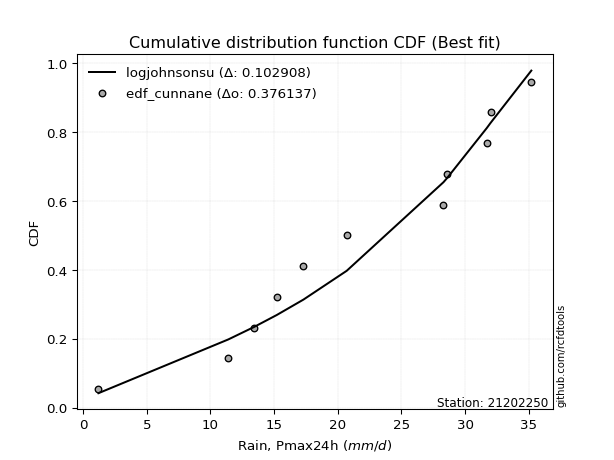</img></img>

</div>


### 12. Empirical - EDF Adamowski (1981)

The Adamowski formula in hydrology refers to a specific plotting position formula used for estimating the non-parametric empirical distribution of hydrological events (like flood peaks) to calculate their return periods. This formula provides an alternative to traditional parametric methods (like the Gumbel or Log Pearson Type III distributions). 

<div align="center">


$P=(m-0.25)/(n+0.5)$


</div>


**12.1. Empirical values**

<div align="center">

|                | 0                  | 1                  | 2                 | 3                  | 4                  | 5                  | 6                 | 7                  | 8                 | 9                 | 10                | 11                 |
|:---------------|:-------------------|:-------------------|:------------------|:-------------------|:-------------------|:-------------------|:------------------|:-------------------|:------------------|:------------------|:------------------|:-------------------|
| date           | 2023               | 2015               | 2016              | 2014               | 2012               | 2013               | 2025              | 2010               | 2011              | 2009              | 2024              | 2008               |
| x              | 1.2                | 11.4               | 13.4              | 15.2               | 17.3               | 20.7               | 23.3              | 28.3               | 28.6              | 31.7              | 32.0              | 35.2               |
| m              | 1                  | 2                  | 3                 | 4                  | 5                  | 6                  | 7                 | 8                  | 9                 | 10                | 11                | 12                 |
| empirical_dist | edf_adamowski      | edf_adamowski      | edf_adamowski     | edf_adamowski      | edf_adamowski      | edf_adamowski      | edf_adamowski     | edf_adamowski      | edf_adamowski     | edf_adamowski     | edf_adamowski     | edf_adamowski      |
| empirical      | 0.06               | 0.14               | 0.22              | 0.3                | 0.38               | 0.46               | 0.54              | 0.62               | 0.7               | 0.78              | 0.86              | 0.94               |
| empirical_tr   | 1.0638297872340425 | 1.1627906976744187 | 1.282051282051282 | 1.4285714285714286 | 1.6129032258064517 | 1.8518518518518516 | 2.173913043478261 | 2.6315789473684212 | 3.333333333333333 | 4.545454545454546 | 7.142857142857142 | 16.666666666666654 |

</div>


**12.2. Kolmogorov-Smirnov fit test (sorted by Δ)**


<div align="center">

|                | 0                   | 1                   | 2                   | 3                   | 4                   | 5                   | 6                   | 7                   | 8                   | 9                   | 10                  | 11                  | 12                  | 13                  | 14                  | 15                  | 16                  | 17                  | 18                    | 19                  | 20                  | 21                  | 22                  | 23                  | 24                  | 25                  | 26                  | 27                  | 28                  | 29                  | 30                  | 31                  | 32                  | 33                  | 34                  | 35                  | 36                  | 37                  | 38                  | 39                  | 40                  | 41                  | 42                  | 43                  | 44                  | 45                  | 46                  | 47                  | 48                  | 49                  | 50                  | 51                  | 52                  | 53                  | 54                  | 55                  | 56                  | 57                  | 58                  | 59                  | 60                  | 61                  | 62                  | 63                  | 64                  | 65                  | 66                  | 67                  | 68                  | 69                  | 70                  | 71                  | 72                  | 73                  | 74                  | 75                  | 76                  | 77                  | 78                  | 79                  | 80                  | 81                  | 82                  | 83                  | 84                  | 85                  | 86                  | 87                  | 88                  | 89                  |
|:---------------|:--------------------|:--------------------|:--------------------|:--------------------|:--------------------|:--------------------|:--------------------|:--------------------|:--------------------|:--------------------|:--------------------|:--------------------|:--------------------|:--------------------|:--------------------|:--------------------|:--------------------|:--------------------|:----------------------|:--------------------|:--------------------|:--------------------|:--------------------|:--------------------|:--------------------|:--------------------|:--------------------|:--------------------|:--------------------|:--------------------|:--------------------|:--------------------|:--------------------|:--------------------|:--------------------|:--------------------|:--------------------|:--------------------|:--------------------|:--------------------|:--------------------|:--------------------|:--------------------|:--------------------|:--------------------|:--------------------|:--------------------|:--------------------|:--------------------|:--------------------|:--------------------|:--------------------|:--------------------|:--------------------|:--------------------|:--------------------|:--------------------|:--------------------|:--------------------|:--------------------|:--------------------|:--------------------|:--------------------|:--------------------|:--------------------|:--------------------|:--------------------|:--------------------|:--------------------|:--------------------|:--------------------|:--------------------|:--------------------|:--------------------|:--------------------|:--------------------|:--------------------|:--------------------|:--------------------|:--------------------|:--------------------|:--------------------|:--------------------|:--------------------|:--------------------|:--------------------|:--------------------|:--------------------|:--------------------|:--------------------|
| station        | 21202250            | 21202250            | 21202250            | 21202250            | 21202250            | 21202250            | 21202250            | 21202250            | 21202250            | 21202250            | 21202250            | 21202250            | 21202250            | 21202250            | 21202250            | 21202250            | 21202250            | 21202250            | 21202250              | 21202250            | 21202250            | 21202250            | 21202250            | 21202250            | 21202250            | 21202250            | 21202250            | 21202250            | 21202250            | 21202250            | 21202250            | 21202250            | 21202250            | 21202250            | 21202250            | 21202250            | 21202250            | 21202250            | 21202250            | 21202250            | 21202250            | 21202250            | 21202250            | 21202250            | 21202250            | 21202250            | 21202250            | 21202250            | 21202250            | 21202250            | 21202250            | 21202250            | 21202250            | 21202250            | 21202250            | 21202250            | 21202250            | 21202250            | 21202250            | 21202250            | 21202250            | 21202250            | 21202250            | 21202250            | 21202250            | 21202250            | 21202250            | 21202250            | 21202250            | 21202250            | 21202250            | 21202250            | 21202250            | 21202250            | 21202250            | 21202250            | 21202250            | 21202250            | 21202250            | 21202250            | 21202250            | 21202250            | 21202250            | 21202250            | 21202250            | 21202250            | 21202250            | 21202250            | 21202250            | 21202250            |
| empirical_dist | edf_adamowski       | edf_adamowski       | edf_adamowski       | edf_adamowski       | edf_adamowski       | edf_adamowski       | edf_adamowski       | edf_adamowski       | edf_adamowski       | edf_adamowski       | edf_adamowski       | edf_adamowski       | edf_adamowski       | edf_adamowski       | edf_adamowski       | edf_adamowski       | edf_adamowski       | edf_adamowski       | edf_adamowski         | edf_adamowski       | edf_adamowski       | edf_adamowski       | edf_adamowski       | edf_adamowski       | edf_adamowski       | edf_adamowski       | edf_adamowski       | edf_adamowski       | edf_adamowski       | edf_adamowski       | edf_adamowski       | edf_adamowski       | edf_adamowski       | edf_adamowski       | edf_adamowski       | edf_adamowski       | edf_adamowski       | edf_adamowski       | edf_adamowski       | edf_adamowski       | edf_adamowski       | edf_adamowski       | edf_adamowski       | edf_adamowski       | edf_adamowski       | edf_adamowski       | edf_adamowski       | edf_adamowski       | edf_adamowski       | edf_adamowski       | edf_adamowski       | edf_adamowski       | edf_adamowski       | edf_adamowski       | edf_adamowski       | edf_adamowski       | edf_adamowski       | edf_adamowski       | edf_adamowski       | edf_adamowski       | edf_adamowski       | edf_adamowski       | edf_adamowski       | edf_adamowski       | edf_adamowski       | edf_adamowski       | edf_adamowski       | edf_adamowski       | edf_adamowski       | edf_adamowski       | edf_adamowski       | edf_adamowski       | edf_adamowski       | edf_adamowski       | edf_adamowski       | edf_adamowski       | edf_adamowski       | edf_adamowski       | edf_adamowski       | edf_adamowski       | edf_adamowski       | edf_adamowski       | edf_adamowski       | edf_adamowski       | edf_adamowski       | edf_adamowski       | edf_adamowski       | edf_adamowski       | edf_adamowski       | edf_adamowski       |
| p_dist         | logjohnsonsu        | mielke              | johnsonsu           | logpearson3         | truncnorm           | logmielke           | genlogistic         | invweibull          | gompertz            | weibull_min         | logloggamma         | logt                | pearson3            | gumbel_l            | kstwobign           | ncf                 | fisk                | logfisk             | loglaplace_asymmetric | invgamma            | gamma               | f                   | nakagami            | nct                 | exponnorm           | crystalball         | norm                | t                   | rice                | betaprime           | erlang              | loggumbel_l         | logweibull_min      | loggompertz         | loghypsecant        | maxwell             | rayleigh            | invgauss            | halfnorm            | logistic            | loglogistic         | laplace_asymmetric  | alpha               | loglaplace          | hypsecant           | gumbel_r            | lognakagami         | logfatiguelife      | logcrystalball      | lognorm             | lognorm             | logexponnorm        | loglognorm          | logrice             | logf                | halflogistic        | lognct              | moyal               | loggamma            | loggamma            | laplace             | logchi2             | loginvgamma         | logncf              | logerlang           | logmaxwell          | lograyleigh         | loggumbel_r         | wald                | logbetaprime        | loginvgauss         | logmoyal            | loghalfnorm         | gibrat              | expon               | genexpon            | loghalflogistic     | loginvweibull       | logwald             | logkstwobign        | loggibrat           | loggenexpon         | logtruncnorm        | logexpon            | pareto              | logpareto           | fatiguelife         | logalpha            | chi2                | loggenlogistic      |
| delta          | 0.06991812489817822 | 0.09687140483060952 | 0.10108932883130778 | 0.10180312031361938 | 0.1089269644779085  | 0.10986535649869911 | 0.11318260123382506 | 0.1146980388342026  | 0.11485709001589484 | 0.1171395435237097  | 0.11742892230191937 | 0.1191896082119952  | 0.1253585707915652  | 0.12577235482884508 | 0.1264699519299758  | 0.1288589764597584  | 0.1296329630648928  | 0.1318741820522199  | 0.13408342561460473   | 0.13458181989271456 | 0.13556318810994694 | 0.13642412374060697 | 0.13646460931438942 | 0.1365150397748759  | 0.13654694644520882 | 0.1365474975715968  | 0.13654749962003343 | 0.13655333680558013 | 0.1365883367826881  | 0.13660028603336316 | 0.13889730052779725 | 0.14217302850010505 | 0.1434145757015467  | 0.14341640509818865 | 0.14426217841135175 | 0.14527477112388698 | 0.1477597661289144  | 0.14814427493793225 | 0.15638880208956163 | 0.1592026091316966  | 0.15933159753002352 | 0.16051219643379067 | 0.16269177325474138 | 0.16892204597754817 | 0.17391643755945352 | 0.1743909198153586  | 0.17834932399293257 | 0.17838403809772857 | 0.17957207726836544 | 0.17957208775744188 | 0.17957208775744188 | 0.1795737073432218  | 0.1795742555677391  | 0.17960067853693007 | 0.17991767365531797 | 0.18040457358579298 | 0.1833096640895273  | 0.18662740831459346 | 0.18986963274449314 | 0.18986963274449314 | 0.19294728615574686 | 0.1946917058500987  | 0.20293115320967603 | 0.20426395692524757 | 0.20551119361244297 | 0.2092792092933145  | 0.2208296985801137  | 0.22534508066371686 | 0.2253641396447389  | 0.22689161225094123 | 0.23900781544640193 | 0.24728366934321708 | 0.25360036789618584 | 0.2544759950020198  | 0.2545873688363325  | 0.2549671979942568  | 0.2628000729627613  | 0.26464027729111905 | 0.3053743635566938  | 0.3136772381010473  | 0.31619271868189575 | 0.35115995825700963 | 0.42896385494737643 | 0.43064389407293724 | 0.5018888567207771  | 0.5164801671756102  | 0.5935321529753449  | 0.6609257895717808  | 0.7285725577108575  | 0.86                |
| deltao         | 0.36218414519599995 | 0.36218414519599995 | 0.36218414519599995 | 0.36218414519599995 | 0.36218414519599995 | 0.36218414519599995 | 0.36218414519599995 | 0.36218414519599995 | 0.36218414519599995 | 0.36218414519599995 | 0.36218414519599995 | 0.36218414519599995 | 0.36218414519599995 | 0.36218414519599995 | 0.36218414519599995 | 0.36218414519599995 | 0.36218414519599995 | 0.36218414519599995 | 0.36218414519599995   | 0.36218414519599995 | 0.36218414519599995 | 0.36218414519599995 | 0.36218414519599995 | 0.36218414519599995 | 0.36218414519599995 | 0.36218414519599995 | 0.36218414519599995 | 0.36218414519599995 | 0.36218414519599995 | 0.36218414519599995 | 0.36218414519599995 | 0.36218414519599995 | 0.36218414519599995 | 0.36218414519599995 | 0.36218414519599995 | 0.36218414519599995 | 0.36218414519599995 | 0.36218414519599995 | 0.36218414519599995 | 0.36218414519599995 | 0.36218414519599995 | 0.36218414519599995 | 0.36218414519599995 | 0.36218414519599995 | 0.36218414519599995 | 0.36218414519599995 | 0.36218414519599995 | 0.36218414519599995 | 0.36218414519599995 | 0.36218414519599995 | 0.36218414519599995 | 0.36218414519599995 | 0.36218414519599995 | 0.36218414519599995 | 0.36218414519599995 | 0.36218414519599995 | 0.36218414519599995 | 0.36218414519599995 | 0.36218414519599995 | 0.36218414519599995 | 0.36218414519599995 | 0.36218414519599995 | 0.36218414519599995 | 0.36218414519599995 | 0.36218414519599995 | 0.36218414519599995 | 0.36218414519599995 | 0.36218414519599995 | 0.36218414519599995 | 0.36218414519599995 | 0.36218414519599995 | 0.36218414519599995 | 0.36218414519599995 | 0.36218414519599995 | 0.36218414519599995 | 0.36218414519599995 | 0.36218414519599995 | 0.36218414519599995 | 0.36218414519599995 | 0.36218414519599995 | 0.36218414519599995 | 0.36218414519599995 | 0.36218414519599995 | 0.36218414519599995 | 0.36218414519599995 | 0.36218414519599995 | 0.36218414519599995 | 0.36218414519599995 | 0.36218414519599995 | 0.36218414519599995 |
| eval           | Δo > Δ              | Δo > Δ              | Δo > Δ              | Δo > Δ              | Δo > Δ              | Δo > Δ              | Δo > Δ              | Δo > Δ              | Δo > Δ              | Δo > Δ              | Δo > Δ              | Δo > Δ              | Δo > Δ              | Δo > Δ              | Δo > Δ              | Δo > Δ              | Δo > Δ              | Δo > Δ              | Δo > Δ                | Δo > Δ              | Δo > Δ              | Δo > Δ              | Δo > Δ              | Δo > Δ              | Δo > Δ              | Δo > Δ              | Δo > Δ              | Δo > Δ              | Δo > Δ              | Δo > Δ              | Δo > Δ              | Δo > Δ              | Δo > Δ              | Δo > Δ              | Δo > Δ              | Δo > Δ              | Δo > Δ              | Δo > Δ              | Δo > Δ              | Δo > Δ              | Δo > Δ              | Δo > Δ              | Δo > Δ              | Δo > Δ              | Δo > Δ              | Δo > Δ              | Δo > Δ              | Δo > Δ              | Δo > Δ              | Δo > Δ              | Δo > Δ              | Δo > Δ              | Δo > Δ              | Δo > Δ              | Δo > Δ              | Δo > Δ              | Δo > Δ              | Δo > Δ              | Δo > Δ              | Δo > Δ              | Δo > Δ              | Δo > Δ              | Δo > Δ              | Δo > Δ              | Δo > Δ              | Δo > Δ              | Δo > Δ              | Δo > Δ              | Δo > Δ              | Δo > Δ              | Δo > Δ              | Δo > Δ              | Δo > Δ              | Δo > Δ              | Δo > Δ              | Δo > Δ              | Δo > Δ              | Δo > Δ              | Δo > Δ              | Δo > Δ              | Δo > Δ              | Δo > Δ              | Δo <= Δ             | Δo <= Δ             | Δo <= Δ             | Δo <= Δ             | Δo <= Δ             | Δo <= Δ             | Δo <= Δ             | Δo <= Δ             |
| fit            | 1                   | 1                   | 1                   | 1                   | 1                   | 1                   | 1                   | 1                   | 1                   | 1                   | 1                   | 1                   | 1                   | 1                   | 1                   | 1                   | 1                   | 1                   | 1                     | 1                   | 1                   | 1                   | 1                   | 1                   | 1                   | 1                   | 1                   | 1                   | 1                   | 1                   | 1                   | 1                   | 1                   | 1                   | 1                   | 1                   | 1                   | 1                   | 1                   | 1                   | 1                   | 1                   | 1                   | 1                   | 1                   | 1                   | 1                   | 1                   | 1                   | 1                   | 1                   | 1                   | 1                   | 1                   | 1                   | 1                   | 1                   | 1                   | 1                   | 1                   | 1                   | 1                   | 1                   | 1                   | 1                   | 1                   | 1                   | 1                   | 1                   | 1                   | 1                   | 1                   | 1                   | 1                   | 1                   | 1                   | 1                   | 1                   | 1                   | 1                   | 1                   | 1                   | 0                   | 0                   | 0                   | 0                   | 0                   | 0                   | 0                   | 0                   |
| n              | 12                  | 12                  | 12                  | 12                  | 12                  | 12                  | 12                  | 12                  | 12                  | 12                  | 12                  | 12                  | 12                  | 12                  | 12                  | 12                  | 12                  | 12                  | 12                    | 12                  | 12                  | 12                  | 12                  | 12                  | 12                  | 12                  | 12                  | 12                  | 12                  | 12                  | 12                  | 12                  | 12                  | 12                  | 12                  | 12                  | 12                  | 12                  | 12                  | 12                  | 12                  | 12                  | 12                  | 12                  | 12                  | 12                  | 12                  | 12                  | 12                  | 12                  | 12                  | 12                  | 12                  | 12                  | 12                  | 12                  | 12                  | 12                  | 12                  | 12                  | 12                  | 12                  | 12                  | 12                  | 12                  | 12                  | 12                  | 12                  | 12                  | 12                  | 12                  | 12                  | 12                  | 12                  | 12                  | 12                  | 12                  | 12                  | 12                  | 12                  | 12                  | 12                  | 12                  | 12                  | 12                  | 12                  | 12                  | 12                  | 12                  | 12                  |
| best_fit       | 1                   | 0                   | 0                   | 0                   | 0                   | 0                   | 0                   | 0                   | 0                   | 0                   | 0                   | 0                   | 0                   | 0                   | 0                   | 0                   | 0                   | 0                   | 0                     | 0                   | 0                   | 0                   | 0                   | 0                   | 0                   | 0                   | 0                   | 0                   | 0                   | 0                   | 0                   | 0                   | 0                   | 0                   | 0                   | 0                   | 0                   | 0                   | 0                   | 0                   | 0                   | 0                   | 0                   | 0                   | 0                   | 0                   | 0                   | 0                   | 0                   | 0                   | 0                   | 0                   | 0                   | 0                   | 0                   | 0                   | 0                   | 0                   | 0                   | 0                   | 0                   | 0                   | 0                   | 0                   | 0                   | 0                   | 0                   | 0                   | 0                   | 0                   | 0                   | 0                   | 0                   | 0                   | 0                   | 0                   | 0                   | 0                   | 0                   | 0                   | 0                   | 0                   | 0                   | 0                   | 0                   | 0                   | 0                   | 0                   | 0                   | 0                   |
| best_fit_sort  | 1                   | 2                   | 3                   | 4                   | 5                   | 6                   | 7                   | 8                   | 9                   | 10                  | 11                  | 12                  | 13                  | 14                  | 15                  | 16                  | 17                  | 18                  | 19                    | 20                  | 21                  | 22                  | 23                  | 24                  | 25                  | 26                  | 27                  | 28                  | 29                  | 30                  | 31                  | 32                  | 33                  | 34                  | 35                  | 36                  | 37                  | 38                  | 39                  | 40                  | 41                  | 42                  | 43                  | 44                  | 45                  | 46                  | 47                  | 48                  | 49                  | 50                  | 51                  | 52                  | 53                  | 54                  | 55                  | 56                  | 57                  | 58                  | 59                  | 60                  | 61                  | 62                  | 63                  | 64                  | 65                  | 66                  | 67                  | 68                  | 69                  | 70                  | 71                  | 72                  | 73                  | 74                  | 75                  | 76                  | 77                  | 78                  | 79                  | 80                  | 81                  | 82                  | 83                  | 84                  | 85                  | 86                  | 87                  | 88                  | 89                  | 90                  |

</div>


<div align="center">

</img>

</div>


**12.3. Best fit**

<div align="center">

|   id |   station | empirical_dist   | p_dist       |     delta |   deltao | eval   |   fit |   n |   best_fit |   best_fit_sort |
|-----:|----------:|:-----------------|:-------------|----------:|---------:|:-------|------:|----:|-----------:|----------------:|
|    0 |  21202250 | edf_adamowski    | logjohnsonsu | 0.0699181 | 0.362184 | Δo > Δ |     1 |  12 |          1 |               1 |

</div>


<div align="center">

</img>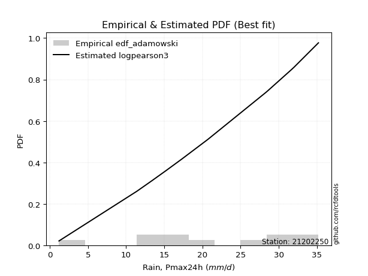</img>

</div>


## C. Best fit & Estimate extreme values for specific return periods - Tr


### 1. Best fit (ordered by delta Δ)

<div align="center">

|   id |   station | empirical_dist   | p_dist       |     delta |   deltao | eval   |   fit |   n |   best_fit |   best_fit_sort |
|-----:|----------:|:-----------------|:-------------|----------:|---------:|:-------|------:|----:|-----------:|----------------:|
|    0 |  21202250 | edf_hazen        | logjohnsonsu | 0.0649181 | 0.362184 | Δo > Δ |     1 |  12 |          1 |               1 |
|    1 |  21202250 | edf_gringorten   | logjohnsonsu | 0.0661557 | 0.362184 | Δo > Δ |     1 |  12 |          1 |               2 |
|    2 |  21202250 | edf_cunnane      | logjohnsonsu | 0.0669673 | 0.362184 | Δo > Δ |     1 |  12 |          1 |               3 |
|    3 |  21202250 | edf_blom         | logjohnsonsu | 0.0674691 | 0.362184 | Δo > Δ |     1 |  12 |          1 |               4 |
|    4 |  21202250 | edf_tukey        | logjohnsonsu | 0.0682965 | 0.362184 | Δo > Δ |     1 |  12 |          1 |               5 |
|    5 |  21202250 | edf_filliben     | logjohnsonsu | 0.068608  | 0.362184 | Δo > Δ |     1 |  12 |          1 |               6 |
|    6 |  21202250 | edf_beard        | logjohnsonsu | 0.068755  | 0.362184 | Δo > Δ |     1 |  12 |          1 |               7 |
|    7 |  21202250 | edf_jenkinson    | logjohnsonsu | 0.068755  | 0.362184 | Δo > Δ |     1 |  12 |          1 |               8 |
|    8 |  21202250 | edf_chegodayev   | logjohnsonsu | 0.0689504 | 0.362184 | Δo > Δ |     1 |  12 |          1 |               9 |
|    9 |  21202250 | edf_adamowski    | logjohnsonsu | 0.0699181 | 0.362184 | Δo > Δ |     1 |  12 |          1 |              10 |
|   10 |  21202250 | edf_california   | mielke       | 0.0731477 | 0.362184 | Δo > Δ |     1 |  12 |          1 |              11 |
|   11 |  21202250 | edf_weibull      | logjohnsonsu | 0.0745335 | 0.362184 | Δo > Δ |     1 |  12 |          1 |              12 |

</div>

:file_folder:Tables: [bestfit_21202250.csv](table/bestfit_21202250.csv) | [extreme_21202250.csv](table/extreme_21202250.csv)


### 2. Extreme values

In hydrology, a return period (or recurrence interval $Tr$) is the statistical average time between extreme events like floods or droughts of a specific magnitude, indicating how rare an event is, with a 100-year flood, for example, having a 1% chance of occurring in any given year, not that it happens exactly every century. It is a key tool for infrastructure design (like bridges or dams) and risk assessment, calculated from historical data to determine the probability of future events, although it is important to remember it is statistical average, and events can cluster or be missed.

> risk_rate: assuming the return period as the project useful life.

|   id |      tr |   prob_l |     prob_g |   alpha |   betaprime |     chi2 |   crystalball |   erlang |    expon |   exponnorm |       f |   fatiguelife |    fisk |   gamma |   genexpon |   genlogistic |   gibrat |   gompertz |   gumbel_l |   gumbel_r |   halflogistic |   halfnorm |   hypsecant |   invgamma |   invgauss |   invweibull |   johnsonsu |   kstwobign |   laplace |   laplace_asymmetric |   loggamma |   logistic |   lognorm |   maxwell |   mielke |   moyal |   nakagami |      ncf |     nct |    norm |         pareto |   pearson3 |   rayleigh |    rice |       t |   truncnorm |    wald |   weibull_min |          logalpha |   logbetaprime |   logchi2 |   logcrystalball |   logerlang |         logexpon |   logexponnorm |     logf |   logfatiguelife |   logfisk |   loggenexpon |   loggenlogistic |   loggibrat |   loggompertz |   loggumbel_l |   loggumbel_r |   loghalflogistic |   loghalfnorm |   loghypsecant |   loginvgamma |   loginvgauss |   loginvweibull |   logjohnsonsu |   logkstwobign |   loglaplace |   loglaplace_asymmetric |   logloggamma |   loglogistic |   loglognorm |   logmaxwell |   logmielke |   logmoyal |   lognakagami |   logncf |   lognct |   logpareto |   logpearson3 |   lograyleigh |   logrice |        logt |   logtruncnorm |    logwald |   logweibull_min |   station |   n |   risk_rate |
|-----:|--------:|---------:|-----------:|--------:|------------:|---------:|--------------:|---------:|---------:|------------:|--------:|--------------:|--------:|--------:|-----------:|--------------:|---------:|-----------:|-----------:|-----------:|---------------:|-----------:|------------:|-----------:|-----------:|-------------:|------------:|------------:|----------:|---------------------:|-----------:|-----------:|----------:|----------:|---------:|--------:|-----------:|---------:|--------:|--------:|---------------:|-----------:|-----------:|--------:|--------:|------------:|--------:|--------------:|------------------:|---------------:|----------:|-----------------:|------------:|-----------------:|---------------:|---------:|-----------------:|----------:|--------------:|-----------------:|------------:|--------------:|--------------:|--------------:|------------------:|--------------:|---------------:|--------------:|--------------:|----------------:|---------------:|---------------:|-------------:|------------------------:|--------------:|--------------:|-------------:|-------------:|------------:|-----------:|--------------:|---------:|---------:|------------:|--------------:|--------------:|----------:|------------:|---------------:|-----------:|-----------------:|----------:|----:|------------:|
|    0 |    2    | 0.5      | 0.5        | 20.8891 |     21.3579 |  3.91017 |       21.525  |  21.1849 |  15.2882 |     21.525  | 21.4987 |       1.20004 | 21.9545 | 21.324  |    15.2702 |       25.2479 |  18.5999 |    22.8879 |    23.1259 |    19.9241 |        19.1282 |    19.5302 |     21.525  |    21.1517 |    20.4768 |      20.157  |     23.4964 |     19.3811 |   21.525  |              21.122  |    17.2135 |    21.525  |   17.2032 |   20.6916 | -1.43754 | 19.4072 |    21.5088 |  18.4999 | 21.5228 | 21.525  |    1.45945     |    22.235  |    20.396  | 21.3323 | 21.5247 |     22.715  | 18.3661 |       22.9057 |      2.48814      |        16.5069 |   16.9899 |          17.2032 |     16.6542 |      7.59899     |        17.2031 |  17.2244 |          17.2685 |   20.3158 |       11.778  |         inf      |     13.2196 |       20.041  |       19.8711 |       14.8935 |           13.8638 |       14.3747 |        17.2032 |       16.8189 |       15.7353 |         15.6759 |        23.8436 |        13.5305 |      17.2032 |                 21.233  |       21.424  |       17.2032 |      17.2032 |      15.9594 |     21.5152 |    14.2162 |       17.258  |  16.8412 |  17.1463 |     1.24428 |       22.9819 |       15.54   |   17.2022 |     22.5921 |        8.41789 |    12.9443 |          20.0903 |  21202250 |  12 |    0.75     |
|    1 |    2.33 | 0.570815 | 0.429185   | 22.5483 |     23.128  |  4.69187 |       23.264  |  22.9706 |  18.3923 |     23.264  | 23.2444 |       2.03552 | 23.6044 | 23.1037 |    18.37   |       26.9262 |  19.4808 |    24.5323 |    24.6389 |    21.5354 |        20.7849 |    21.407  |     22.9167 |    22.9599 |    22.3085 |      22.2886 |     25.1007 |     21.5958 |   22.5773 |              22.4535 |    20.3832 |    23.0572 |   20.1196 |   22.4982 | -1.43754 | 20.9326 |    23.2521 |  21.0597 | 23.2625 | 23.264  |    2.59234     |    23.9351 |    22.2294 | 23.1109 | 23.2637 |     24.487  | 19.5064 |       24.5185 |      2.95676      |        20.1575 |   20.1116 |          20.1196 |     19.7907 |     11.4121      |        20.1196 |  20.16   |          20.204  |   22.6557 |       15.4078 |         inf      |     14.311  |       22.0119 |       22.7715 |       17.2194 |           16.0943 |       17.0215 |        19.5002 |       20.0249 |       19.0602 |         20.1996 |        25.7895 |        17.8463 |      18.9133 |                 23.2935 |       23.5564 |       19.7484 |      20.1196 |      18.779  |     23.6827 |    16.3095 |       20.1853 |  20.0853 |  20.1048 |     1.45761 |       25.6238 |       18.3297 |   20.1186 |     24.3689 |       11.4967  |    14.344  |          22.0524 |  21202250 |  12 |    0.729209 |
|    2 |    5    | 0.8      | 0.2        | 28.8881 |     29.7748 |  8.92968 |       29.7265 |  29.7322 |  33.9118 |     29.7265 | 29.7381 |      19.783   | 29.9762 | 29.8332 |    33.8685 |       31.3088 |  24.5523 |    29.925  |    29.5265 |    28.5359 |        28.2813 |    29.3438 |     28.4991 |    29.9462 |    29.532  |      31.5488 |     30.116  |     31.0035 |   27.8388 |              29.1106 |    38.5884 |    28.973  |   36.0053 |   29.6092 | -1.43754 | 27.9982 |    29.7337 |  32.912  | 29.7283 | 29.7265 | 6184.91        |    29.8639 |    29.5693 | 29.7761 | 29.7263 |     30.0165 | 25.8896 |       29.8714 |     11.2697       |        43.8278 |   38.0219 |          36.0053 |     38.0708 |     87.1727      |        36.0051 |  36.1919 |          36.2211 |   34.5127 |       45.315  |         inf      |     22.5948 |       29.8102 |       35.3626 |       32.3447 |           31.6108 |       34.7853 |        32.2378 |       38.9156 |       40.1783 |         60.7732 |        31.0689 |        57.8477 |      30.3767 |                 29.4941 |       30.0002 |       33.6433 |      36.0054 |      35.6267 |     30.2456 |    30.8157 |       36.1358 |  39.1772 |  36.3793 |   inf       |       33.2841 |       35.4996 |   36.004  |     33.618  |       41.4215  |    25.4864 |          29.7982 |  21202250 |  12 |    0.67232  |
|    3 |   10    | 0.9      | 0.1        | 33.2515 |     34.2439 | 13.0411  |       34.0135 |  34.3273 |  48      |     34.0135 | 34.0514 |      44.2878  | 34.6697 | 34.3986 |    47.9376 |       33.1487 |  30.3333 |    32.964  |    32.2477 |    34.2376 |        34.5067 |    35.2169 |     32.9568 |    34.8237 |    34.702  |      39.0912 |     32.7533 |     38.1663 |   32.6151 |              35.1538 |    59.4543 |    33.3298 |   52.9701 |   34.6135 | -1.43754 | 34.1498 |    34.0361 |  43.1208 | 34.018  | 34.0135 |    1.26565e+07 |    33.4672 |    34.8028 | 34.2325 | 34.0135 |     32.5124 | 32.6637 |       32.9485 |    131.683        |        75.6186 |   58.5219 |          52.9701 |     59.4312 |    552.02        |        52.97   |  53.3626 |          53.366  |   47.055  |       98.0092 |         inf      |     38.0271 |       35.297  |       45.1825 |       54.0501 |           55.3726 |       59.0314 |        48.1621 |       61.3449 |       67.8959 |        149.051  |        33.1871 |       141.627  |      46.7023 |                 32.0262 |       32.6413 |       49.8073 |      52.9707 |      55.91   |     32.9405 |    53.6244 |       53.178  |  61.7578 |  53.9861 |   inf       |       36.085  |       56.8733 |   52.969  |     45.8695 |      104.341   |    46.9064 |          35.2353 |  21202250 |  12 |    0.651322 |
|    4 |   15    | 0.933333 | 0.0666667  | 35.4781 |     36.4921 | 15.5127  |       36.1528 |  36.6532 |  56.2411 |     36.1528 | 36.2055 |      60.3143  | 37.2273 | 36.7073 |    56.1675 |       33.9151 |  34.3208 |    34.3462 |    33.4801 |    37.4545 |        38.0297 |    38.2732 |     35.5008 |    37.3339 |    37.3996 |      43.3466 |     33.8988 |     41.9688 |   35.409  |              38.6888 |    73.9635 |    35.7036 |   64.2243 |   37.1811 | -1.43754 | 37.72   |    36.1839 |  49.0246 | 36.1588 | 36.1528 |    1.09437e+09 |    35.1698 |    37.4993 | 36.464  | 36.1528 |     33.3805 | 37.0137 |       34.3655 |   1525.24         |       100.187  |   72.7642 |          64.2243 |     74.4767 |   1624.97        |        64.2241 |  64.7738 |          64.7571 |   55.713  |      145.926  |         inf      |     54.4547 |       38.1044 |       50.4857 |       72.2118 |           76.0451 |       77.7341 |        60.562  |       77.3271 |       89.0346 |        247.263  |        33.9462 |       227.816  |      60.063  |                 33.0632 |       33.5029 |       61.6781 |      64.2252 |      70.4544 |     33.8201 |    73.9589 |       64.487  |  77.7861 |  65.7659 |   inf       |       36.9061 |       72.5056 |   64.2233 |     56.9278 |      167.862   |    69.3991 |          38.0139 |  21202250 |  12 |    0.644736 |
|    5 |   20    | 0.95     | 0.05       | 36.9545 |     37.9709 | 17.2877  |       37.5538 |  38.1884 |  62.0883 |     37.5538 | 37.6168 |      72.18    | 38.9951 | 38.2302 |    62.0067 |       34.3898 |  37.4487 |    35.2081 |    34.2472 |    39.7069 |        40.498  |    40.3108 |     37.2955 |    39.0061 |    39.2097 |      46.326  |     34.594  |     44.5303 |   37.3913 |              41.197  |    85.4163 |    37.3443 |   72.8605 |   38.8852 | -1.43754 | 40.2484 |    37.5907 |  53.2104 | 37.5608 | 37.5538 |    2.59048e+10 |    36.251  |    39.2916 | 37.9276 | 37.5539 |     33.8239 | 40.2553 |       35.255  |  17628.3          |       120.858  |   84.0006 |          72.8605 |     86.4451 |   3495.67        |        72.8602 |  73.5395 |          73.5065 |   62.6115 |      190.157  |         inf      |     72.1707 |       39.9636 |       54.0965 |       88.45   |           94.9733 |       93.3905 |        71.1851 |       90.1337 |      106.69   |        352.43   |        34.3588 |       313.797  |      71.8017 |                 33.8192 |       33.9304 |       71.4987 |      72.8616 |      82.1395 |     34.2567 |    92.8703 |       73.1668 |  90.5947 |  74.8512 |   inf       |       37.2864 |       85.2058 |   72.8597 |     67.8559 |      230.117   |    92.9242 |          39.8529 |  21202250 |  12 |    0.641514 |
|    6 |   25    | 0.96     | 0.04       | 38.0506 |     39.0627 | 18.6747  |       38.5852 |  39.3245 |  66.6237 |     38.5852 | 38.656  |      81.6078  | 40.3476 | 39.3568 |    66.5359 |       34.7317 |  40.0562 |    35.822  |    34.793  |    41.4418 |        42.3997 |    41.8269 |     38.6844 |    40.2516 |    40.5645 |      48.621  |     35.0798 |     46.449  |   38.9289 |              43.1424 |    95.0119 |    38.5994 |   79.9515 |   40.1503 | 34.2844  | 42.2082 |    38.6264 |  56.4623 | 38.5929 | 38.5852 |    3.01512e+11 |    37.0299 |    40.6233 | 39.0062 | 38.5852 |     34.0933 | 42.8517 |       35.8914 | 203568            |       138.988  |   93.4115 |          79.9515 |     96.5285 |   6332.56        |        79.9512 |  80.7422 |          80.6952 |   68.4601 |      231.516  |         inf      |     91.272  |       41.3417 |       56.8221 |      103.407  |          112.713  |      107.052  |        80.6696 |      100.982  |      122.099  |        463.05   |        34.6255 |       398.853  |      82.4651 |                 34.4176 |       34.1859 |       80.0545 |      79.9529 |      92.051  |     34.5177 |   110.796  |       80.2946 | 101.421  |  82.3379 |   inf       |       37.5023 |       96.0619 |   79.9508 |     78.9813 |      290.787   |   117.401  |          41.2156 |  21202250 |  12 |    0.639603 |
|    7 |   50    | 0.98     | 0.02       | 41.2344 |     42.2048 | 23.0292  |       41.5385 |  42.6064 |  80.7119 |     41.5385 | 41.6333 |     111.856   | 44.4803 | 42.6093 |    80.605  |       35.7018 |  49.2479 |    37.4908 |    36.2748 |    46.7863 |        48.2593 |    46.2337 |     42.9907 |    43.8883 |    44.5505 |      55.6908 |     36.3577 |     52.0832 |   43.7051 |              49.1856 |   129.176  |    42.4342 |  104.311  |   43.8192 | 34.7499  | 48.2923 |    41.5931 |  66.628  | 41.5485 | 41.5385 |    6.1712e+14  |    39.1823 |    44.4888 | 42.0993 | 41.5386 |     34.6405 | 51.3292 |       37.6339 |      4.16423e+10  |       209.065  |  126.896  |         104.311  |    132.785  |  40100.9         |       104.31   | 105.516  |         105.419  |   89.936  |      410.084  |         inf      |    208.838  |       45.3273 |       64.9336 |      167.329  |          191.04   |      159.198  |       118.885  |      140.375  |      181.168  |       1073.59   |        35.244  |       806.657  |     126.785  |                 36.3446 |       34.6946 |      113.074  |     104.313  |     128.091  |     35.0395 |   191.633  |      104.786  | 140.573  | 108.22   |   inf       |       37.8972 |      136.061  |  104.311  |    141.424  |      572.417   |   251.891  |          45.154  |  21202250 |  12 |    0.63583  |
|    8 |   75    | 0.986667 | 0.0133333  | 42.9707 |     43.9002 | 25.6025  |       43.1231 |  44.3848 |  88.9529 |     43.1231 | 43.2317 |     130.073   | 46.8675 | 44.3705 |    88.8349 |       36.2298 |  55.456  |    38.3359 |    37.0241 |    49.8927 |        51.6654 |    48.6326 |     45.5072 |    45.8833 |    46.7554 |      59.8    |     36.9796 |     55.1831 |   46.499  |              52.7206 |   152.535  |    44.6491 |  120.311  |   45.814  | 34.9043  | 51.8501 |    43.1853 |  72.6407 | 43.1345 | 43.1231 |    5.33603e+16 |    40.2901 |    46.5919 | 43.7615 | 43.1232 |     34.8255 | 56.5459 |       38.5234 |      8.50388e+15  |       261.55   |  149.776  |         120.311  |    157.851  | 118044           |       120.31   | 121.81   |         121.679  |  105.286  |      559.844  |         inf      |    365.256  |       47.4869 |       69.4664 |      221.341  |          259.615  |      197.585  |       149.124  |      167.923  |      225.036  |       1750.3    |        35.5024 |      1188.45   |     163.056  |                 37.5214 |       34.8635 |      138.033  |     120.314  |     153.297  |     35.2189 |   264.007  |      120.877  | 167.814  | 125.341  |   inf       |       38.0136 |      164.431  |  120.311  |    219.682  |      826.351   |   402.929  |          47.2867 |  21202250 |  12 |    0.634587 |
|    9 |  100    | 0.99     | 0.01       | 44.1563 |     45.0507 | 27.4378  |       44.1949 |  45.5946 |  94.8001 |     44.1949 | 44.3132 |     143.181   | 48.553  | 45.5682 |    94.6741 |       36.5941 |  60.2652 |    38.889  |    37.5142 |    52.0913 |        54.0762 |    50.2667 |     47.2923 |    47.2503 |    48.2733 |      62.7083 |     37.3769 |     57.307  |   48.4813 |              55.2287 |   170.781  |    46.2128 |  132.502  |   47.1727 | 34.9813  | 54.3743 |    44.2623 |  76.9442 | 44.2072 | 44.1949 |    1.26309e+18 |    41.021  |    48.0246 | 44.8866 | 44.1951 |     34.9186 | 60.3493 |       39.1082 |      1.73586e+21  |       304.927  |  167.639  |         132.502  |    177.563  | 253939           |       132.501  | 134.236  |         134.079  |  117.677  |      692.174  |         inf      |    563.216  |       48.9549 |       72.6011 |      269.804  |          322.559  |      228.91   |       175.131  |      189.744  |      261.119  |       2473.72   |        35.6533 |      1549.84   |     194.923  |                 38.3795 |       34.9478 |      158.906  |     132.505  |     173.249  |     35.3145 |   331.385  |      133.139  | 189.321  | 138.443  |   inf       |       38.0677 |      187.077  |  132.503  |    317.856  |     1060.62    |   567.512  |          48.7359 |  21202250 |  12 |    0.633968 |
|   10 |  200    | 0.995    | 0.005      | 46.8801 |     47.6715 | 31.8868  |       46.626  |  48.3595 | 108.888  |     46.626  | 46.7672 |     175.267   | 52.5967 | 48.3039 |   108.743  |       37.4497 |  73.3492 |    40.0922 |    38.5796 |    57.377  |        59.872  |    54.0043 |     51.5928 |    50.4051 |    51.797  |      69.7003 |     38.2135 |     62.1989 |   53.2576 |              61.2719 |   221.04   |    49.9639 |  164.931  |   50.2813 | 35.0967  | 60.4557 |    46.706  |  87.4609 | 46.6405 | 46.626  |    2.58523e+21 |    42.6247 |    51.3028 | 47.4413 | 46.6263 |     35.0589 | 69.8232 |       40.3878 |      3.01052e+42  |       434.427  |  216.814  |         164.931  |    232.388  |      1.60807e+06 |       164.931  | 167.328  |         167.101  |  153.674  |     1125.1    |         inf      |   1829.64   |       52.3043 |       79.9112 |      434.28   |          543.588  |      320.507  |       257.96   |      251.083  |      368.16   |       5682.52   |        35.9359 |      2856.69   |     299.682  |                 40.5283 |       35.0742 |      222.764  |     164.937  |     229.215  |     35.4841 |   573.03   |      165.766  | 249.47   | 173.511  |   inf       |       38.1413 |      251.324  |  164.934  |    991.912  |     1874.44    |  1331.94   |          52.0409 |  21202250 |  12 |    0.633042 |
|   11 |  250    | 0.996    | 0.004      | 47.7221 |     48.4756 | 33.3261  |       47.369  |  49.2102 | 113.424  |     47.369  | 47.5175 |     185.723   | 53.8951 | 49.1453 |   113.272  |       37.7208 |  78.0437 |    40.4464 |    38.893  |    59.0762 |        61.7353 |    55.1542 |     52.9772 |    51.3844 |    52.8965 |      71.9481 |     38.4522 |     63.7128 |   54.7952 |              63.2174 |   239.281  |    51.1681 |  176.344  |   51.2382 | 35.1197  | 62.4135 |    47.4529 |  90.8955 | 47.3842 | 47.369  |    3.00902e+22 |    43.0999 |    52.3119 | 48.2226 | 47.3692 |     35.087  | 72.9574 |       40.7664 |      1.25349e+53  |       484.848  |  234.653  |         176.344  |    252.457  |      2.91309e+06 |       176.343  | 178.985  |         178.733  |  167.422  |     1306.69   |         inf      |   2792.29   |       53.3327 |       82.1989 |      506.089  |          642.892  |      355.473  |       292.21   |      273.751  |      409.624  |       7424.35   |        36.0081 |      3451.86   |     344.188  |                 41.2453 |       35.0994 |      248.281  |     176.35   |     249.843  |     35.5278 |   683.509  |      177.251  | 271.594  | 185.918  |   inf       |       38.1546 |      275.233  |  176.347  |   1568.23   |     2232.56    |  1766.29   |          53.0553 |  21202250 |  12 |    0.632858 |
|   12 |  500    | 0.998    | 0.002      | 50.2463 |     50.8686 | 37.8152  |       49.5722 |  51.7488 | 127.512  |     49.5722 | 49.7431 |     218.526   | 57.922  | 51.6549 |   127.341  |       38.5551 |  94.268  |    41.4624 |    39.7915 |    64.3504 |        67.5186 |    58.5824 |     57.2774 |    54.3312 |    56.2201 |      78.9248 |     39.1172 |     68.2498 |   59.5714 |              69.2605 |   303.103  |    54.9029 |  215.044  |   54.0935 | 35.1658  | 68.4948 |    49.6682 | 101.732  | 49.5895 | 49.5722 |    6.15871e+25 |    44.4693 |    55.3229 | 50.5413 | 49.5725 |     35.1434 | 82.9233 |       41.8575 |      1.56803e+106 |       674.521  |  297.033  |         215.044  |    323.281  |      1.84471e+07 |       215.043  | 218.554  |         218.22   |  218.383  |     2042.45   |         inf      |  12035.4    |       56.3945 |       89.1267 |      813.763  |         1082.2    |      484.041  |       430.402  |      354.552  |      564.852  |      17024.1    |        36.1901 |      6086.37   |     529.167  |                 43.5546 |       35.1499 |      347.544  |     215.053  |     323.102  |     35.6459 |  1181.9    |      216.202  | 350.068  | 228.223  |   inf       |       38.1789 |      360.96   |  215.049  |   9467.76   |     3756.9     |  4333.23   |          56.0742 |  21202250 |  12 |    0.632489 |
|   13 |  750    | 0.998667 | 0.00133333 | 51.6663 |     52.2035 | 40.4522  |       50.7961 |  53.1694 | 135.753  |     50.7961 | 50.98   |     237.907   | 60.275  | 53.0586 |   135.571  |       39.0396 | 104.998  |    42.0057 |    40.2718 |    67.4337 |        70.8995 |    60.4977 |     59.7928 |    55.9963 |    58.1076 |      83.0034 |     39.4605 |     70.7985 |   62.3653 |              72.7955 |   345.932  |    57.0849 |  240.101  |   55.6906 | 35.1811  | 72.0521 |    50.899  | 108.196  | 50.8147 | 50.7961 |    5.32523e+27 |    45.2043 |    57.0065 | 51.8303 | 50.7965 |     35.1623 | 88.8986 |       42.4441 |      1.96116e+159 |       812.695  |  338.87   |         240.101  |    371.283  |      5.43024e+07 |       240.101  | 244.202  |         243.816  |  255.06   |     2622.33   |         inf      |  31628.7    |       58.1024 |       93.0656 |     1074.2    |         1467.32   |      575.154  |       539.823  |      409.956  |      677.369  |      27653.8    |        36.2734 |      8370.03   |     680.552  |                 44.9649 |       35.1667 |      423.006  |     240.112  |     373.077  |     35.7076 |  1628.2    |      241.428  | 403.556  | 255.785  |   inf       |       38.186  |      420.057  |  240.108  |  37692.4    |     5022.11    |  7421.58   |          57.7575 |  21202250 |  12 |    0.632366 |
|   14 | 1000    | 0.999    | 0.001      | 52.6515 |     53.1249 | 42.3276  |       51.6388 |  54.1518 | 141.6    |     51.6388 | 51.8318 |     251.732   | 61.9437 | 54.029  |   141.411  |       39.3824 | 113.209  |    42.3714 |    40.595  |    69.6208 |        73.2977 |    61.8203 |     61.5775 |    57.1545 |    59.4245 |      85.8965 |     39.6866 |     72.5642 |   64.3476 |              75.3037 |   379.019  |    58.6323 |  259.031  |   56.7944 | 35.1888  | 74.5761 |    51.7466 | 112.843  | 51.6582 | 51.6388 |    1.26053e+29 |    45.7    |    58.17   | 52.7182 | 51.6392 |     35.1717 | 93.1968 |       42.8402 |      2.45276e+212 |       925.087  |  371.179  |         259.031  |    408.595  |      1.16816e+08 |       259.03   | 263.592  |         263.167  |  284.746  |     3116.85   |          35.1985 |  66251.6    |       59.2809 |       95.8142 |     1308.04   |         1821.02   |      647.906  |       633.944  |      453.345  |      768.628  |      39012.8    |        36.3245 |     10437.3    |     813.559  |                 45.9931 |       35.1751 |      486.256  |     259.042  |     412.066  |     35.7494 |  2043.71   |      260.488  | 445.284  | 276.687  |   inf       |       38.1894 |      466.459  |  259.038  | 120990      |     6135.66    | 10929.3    |          58.9187 |  21202250 |  12 |    0.632305 |

<div align="center">

</img>

</div>


<div align="center">

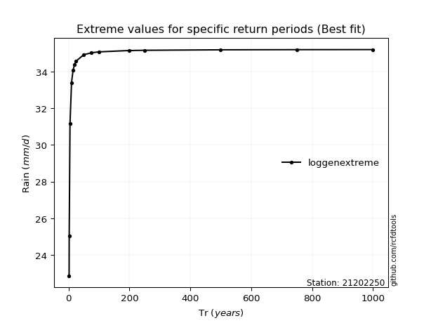</img>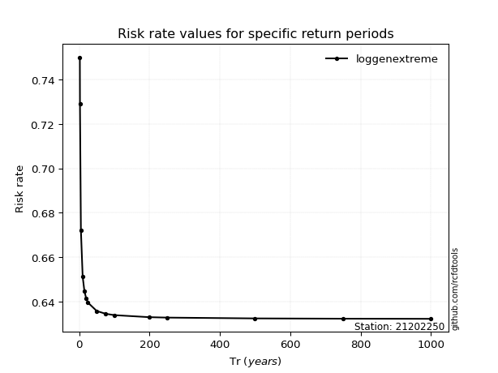</img>

</div>


<sub>**APP DISCLAIMER**: NO WARRANTY - This software is provided by [github.com/rcfdtools](https://github.com/rcfdtools) "as is", without any express or implied warranty, including warranties of merchantability, fitness for a particular purpose, or non-infringement. There is no guarantee that the software will be error-free or operate without interruption. LIMITATION OF LIABILITY - Neither the authors nor copyright holders will be liable for claims or damages arising from the software or its use. You are responsible for determining if the software is appropriate for your use and assume all associated risks, including errors, legal compliance, and data loss. NO PROFESSIONAL ADVICE - The software provides general information and does not offer professional advice. It should not replace consultation with professional advisors.</sub>