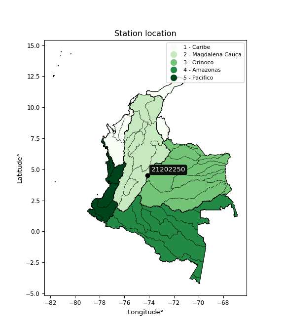

<div align="center">


</div>

# PMP Station (rain, Pmax24h): 21202250

Probable Maximum Precipitation (PMP) is the greatest amount of rainfall for a specific duration that is meteorologically possible for a given location, acting as a "worst-case" scenario for extreme storms, crucial for designing safety-critical infrastructure like bridges, river deviations, dams, spillways, and nuclear plants to prevent catastrophic failure. PMP is calculated by hydrologists using meteorological data to determine the upper limit of extreme rainfall, often leading to the Probable Maximum Flood (PMF) for flood control design, and is increasingly being studied for climate change impacts.

<div align="center">

</img>

</div>


## A. General information


### 1. General running parameters

• app_version: _v20251227_. • runtime: _2025-12-27 09:02:11.367833_. • Python version: _3.14.0_. • SciPy version: _1.16.3_. • Pandas version: _2.3.3_. • NumPy version: _2.3.5_. • Stations dataset (station_dataset_file): _dataset/pmax24h_in/automatic_colombia_2003_2024_filter.csv_. • Stations catalog (station_catalog_file): _dataset/CNE_IDEAM.xls_. • Minimum year to eval til year_max (date_min): _2003_. • Maximum year to eval since year_min (date_max): _2024_. • Creates, save and include plots into reports (create_plot): _False_. • Plot only fit distributions with Δo > Δ (plot_only_fit): _True_. • Eval low extreme values, if False, evaluates high extreme values (low_extreme): _False_. • Eval every SciPy distribution as logarithmic (pdist_logarithmic_on): _True_. • Standard deviation normalized (ddof): _1.0_. • Return periods to eval in years (Tr): _[2, 2.33, 5, 10, 15, 20, 25, 50, 75, 100, 200, 250, 500, 750, 1000]_. • Minimum data sample per station, 0 means any (minimum_sample): _5_. • Z-Score threshold to adjust a value, 0 means disable (zscore): _3.5_. • Avoid zeros, e.g. rain = 0 (avoid_zeros): _True_. • Avoid null values (avoid_nans): _True_. [:file_folder:Dataset file.](../../dataset/pmax24h_in/automatic_colombia_2003_2024_filter.csv)

> Delta Degrees of Freedom (DDOF): is a parameter used in the formulas for calculating variance and standard deviation. When ddof=0, the divisor is $N$ (the total number of observations) and this is used when your data set is the entire population. When ddof=1, the divisor is $N-1$ and this is used when your data set is a sample drawn from a larger population. Using $N-1$ provides an unbiased estimate of the population variance (known as Bessel´s correction).


### 2. Station info and location

|   id |   CODIGO | NOMBRE                      | CATEGORIA               | TECNOLOGIA                | ESTADO   | FECHA_INSTALACION   |   FECHA_SUSPENSION |   ALTITUD |   LATITUD |   LONGITUD | DEPARTAMENTO   | MUNICIPIO   | AREA_OPERATIVA                            | ENTIDAD                                                          | AREA_HIDROGRAFICA   | ZONA_HIDROGRAFICA   | SUBZONA_HIDROGRAFICA   |   CORRIENTE | Catalogo   |
|-----:|---------:|:----------------------------|:------------------------|:--------------------------|:---------|:--------------------|-------------------:|----------:|----------:|-----------:|:---------------|:------------|:------------------------------------------|:-----------------------------------------------------------------|:--------------------|:--------------------|:-----------------------|------------:|:-----------|
|    0 | 21202250 | DOÑA JUANA - AUT [21202250] | Climatológica Ordinaria | Automática con Telemetría | Activa   | 01/10/2000          |                nan |      2831 |   4.50082 |   -74.1374 | Bogotá         | Bogotá, D.C | Area Operativa 11 - Cundinamarca-Amazonas | FONDO DE PREVENCION Y ATENCION DE DESASTRES DE BOGOTA DC - FOPAE | Magdalena Cauca     | Alto Magdalena      | Río Bogotá             |         nan | CNE_OE     |

<div align="center">

Map location in: [:earth_americas:Google](http://maps.google.com/maps?q=4.50082,-74.13739) [:earth_americas:OSM](https://www.openstreetmap.org/#map=18/4.50082/-74.13739&layers=P) [:earth_americas:Bing](https://www.bing.com/maps?cp=4.50082~-74.13739&lvl=18) [:earth_americas:Apple](https://maps.apple.com/frame?center=4.50082%2C-74.13739&span=0.003%2C0.006)

</div>


<div align="center">

```geojson
{
  "type": "Feature",
  "geometry": {
    "type": "Point", 
    "coordinates": [-74.13739, 4.50082]
  }, 
  "properties": {
    "Name": "21202250"
  }
}
```

</div>


### 3. Discrete values table and plot

|               |          0 |           1 |           2 |           3 |           4 |           5 |           6 |          7 |          8 |           9 |
|:--------------|-----------:|------------:|------------:|------------:|------------:|------------:|------------:|-----------:|-----------:|------------:|
| Date          | 2008       | 2009        | 2010        | 2011        | 2012        | 2013        | 2014        | 2015       | 2016       | 2024        |
| Value         |   35.2     |   31.7      |   28.3      |   28.6      |   17.3      |   20.7      |   15.2      |   11.4     |   13.4     |   32        |
| Value_initial |   35.2     |   31.7      |   28.3      |   28.6      |   17.3      |   20.7      |   15.2      |   11.4     |   13.4     |   32        |
| count         |   10       |   10        |   10        |   10        |   10        |   10        |   10        |   10       |   10       |   10        |
| mean          |   23.38    |   23.38     |   23.38     |   23.38     |   23.38     |   23.38     |   23.38     |   23.38    |   23.38    |   23.38     |
| std           |    8.74882 |    8.74882  |    8.74882  |    8.74882  |    8.74882  |    8.74882  |    8.74882  |    8.74882 |    8.74882 |    8.74882  |
| zscore        |    1.35104 |    0.950986 |    0.562362 |    0.596652 |   -0.694951 |   -0.306327 |   -0.934984 |   -1.36933 |   -1.14073 |    0.985276 |

> The initial value (value_initial) correspond to the initial obtained or null completed value, and value (value) is adjusted only when the initial value is outside the valid range definite through the Z-Score value. If Z-Score is active, values out of range or outliers are replaced with the station mean value


### 4. Active continuous probability distributions from SciPy (45 of 104 available)

[scipy.stats](https://docs.scipy.org/doc/scipy/reference/stats.html) is a Python´s powerful submodule within the SciPy library for comprehensive statistical analysis, offering over 130 probability distributions (like Normal, Poisson), functions for descriptive stats (mean, variance), hypothesis testing (t-tests, chi-square), random variable generation, and statistical tests, making it essential for data science, modeling, and research. It provides tools to explore, model, and draw conclusions from data efficiently, working seamlessly with NumPy.

<div align="center">

|   id | p_dist             |   n_parameter | fit_method   | label                                                                       | active   | ref                                                                                                        |
|-----:|:-------------------|--------------:|:-------------|:----------------------------------------------------------------------------|:---------|:-----------------------------------------------------------------------------------------------------------|
|    0 | alpha              |             3 | MLE          | Alpha                                                                       | True     | [:mortar_board:](https://docs.scipy.org/doc/scipy/reference/generated/scipy.stats.alpha.html)              |
|    1 | betaprime          |             4 | MLE          | Beta prime                                                                  | True     | [:mortar_board:](https://docs.scipy.org/doc/scipy/reference/generated/scipy.stats.betaprime.html)          |
|    2 | chi2               |             3 | MLE          | Chi²                                                                        | True     | [:mortar_board:](https://docs.scipy.org/doc/scipy/reference/generated/scipy.stats.chi2.html)               |
|    3 | crystalball        |             4 | MLE          | Crystalball                                                                 | True     | [:mortar_board:](https://docs.scipy.org/doc/scipy/reference/generated/scipy.stats.crystalball.html)        |
|    4 | erlang             |             3 | MLE          | Erlang                                                                      | True     | [:mortar_board:](https://docs.scipy.org/doc/scipy/reference/generated/scipy.stats.erlang.html)             |
|    5 | expon              |             2 | MLE          | Exponential                                                                 | True     | [:mortar_board:](https://docs.scipy.org/doc/scipy/reference/generated/scipy.stats.expon.html)              |
|    6 | exponnorm          |             3 | MLE          | Exponentially modified Normal                                               | True     | [:mortar_board:](https://docs.scipy.org/doc/scipy/reference/generated/scipy.stats.exponnorm.html)          |
|    7 | f                  |             4 | MLE          | F                                                                           | True     | [:mortar_board:](https://docs.scipy.org/doc/scipy/reference/generated/scipy.stats.f.html)                  |
|    8 | fatiguelife        |             3 | MLE          | Fatigue-life (Birnbaum-Saunders)                                            | True     | [:mortar_board:](https://docs.scipy.org/doc/scipy/reference/generated/scipy.stats.fatiguelife.html)        |
|    9 | fisk               |             3 | MLE          | Fisk                                                                        | True     | [:mortar_board:](https://docs.scipy.org/doc/scipy/reference/generated/scipy.stats.fisk.html)               |
|   10 | gamma              |             3 | MLE          | Gamma                                                                       | True     | [:mortar_board:](https://docs.scipy.org/doc/scipy/reference/generated/scipy.stats.gamma.html)              |
|   11 | genexpon           |             5 | MLE          | Generalized exponential                                                     | True     | [:mortar_board:](https://docs.scipy.org/doc/scipy/reference/generated/scipy.stats.genexpon.html)           |
|   12 | genlogistic        |             3 | MLE          | Generalized logistic                                                        | True     | [:mortar_board:](https://docs.scipy.org/doc/scipy/reference/generated/scipy.stats.genlogistic.html)        |
|   13 | gibrat             |             2 | MM           | Gibrat                                                                      | True     | [:mortar_board:](https://docs.scipy.org/doc/scipy/reference/generated/scipy.stats.gibrat.html)             |
|   14 | gompertz           |             3 | MLE          | Gompertz (or truncated Gumbel)                                              | True     | [:mortar_board:](https://docs.scipy.org/doc/scipy/reference/generated/scipy.stats.gompertz.html)           |
|   15 | gumbel_l           |             2 | MM           | Gumbel Left Skew                                                            | True     | [:mortar_board:](https://docs.scipy.org/doc/scipy/reference/generated/scipy.stats.gumbel_l.html)           |
|   16 | gumbel_r           |             2 | MM           | Gumbel Right Skew                                                           | True     | [:mortar_board:](https://docs.scipy.org/doc/scipy/reference/generated/scipy.stats.gumbel_r.html)           |
|   17 | halflogistic       |             2 | MM           | Half-logistic                                                               | True     | [:mortar_board:](https://docs.scipy.org/doc/scipy/reference/generated/scipy.stats.halflogistic.html)       |
|   18 | halfnorm           |             2 | MM           | Half Normal                                                                 | True     | [:mortar_board:](https://docs.scipy.org/doc/scipy/reference/generated/scipy.stats.halfnorm.html)           |
|   19 | hypsecant          |             2 | MM           | hyperbolic secant                                                           | True     | [:mortar_board:](https://docs.scipy.org/doc/scipy/reference/generated/scipy.stats.hypsecant.html)          |
|   20 | invgamma           |             3 | MLE          | Inverted gamma                                                              | True     | [:mortar_board:](https://docs.scipy.org/doc/scipy/reference/generated/scipy.stats.invgamma.html)           |
|   21 | invgauss           |             3 | MLE          | Inverse Gaussian                                                            | True     | [:mortar_board:](https://docs.scipy.org/doc/scipy/reference/generated/scipy.stats.invgauss.html)           |
|   22 | invweibull         |             3 | MLE          | Inverted Weibull                                                            | True     | [:mortar_board:](https://docs.scipy.org/doc/scipy/reference/generated/scipy.stats.invweibull.html)         |
|   23 | johnsonsu          |             4 | MLE          | Johnson Su                                                                  | True     | [:mortar_board:](https://docs.scipy.org/doc/scipy/reference/generated/scipy.stats.johnsonsu.html)          |
|   24 | kstwobign          |             2 | MLE          | Limiting distribution of scaled Kolmogorov-Smirnov two-sided test statistic | True     | [:mortar_board:](https://docs.scipy.org/doc/scipy/reference/generated/scipy.stats.kstwobign.html)          |
|   25 | laplace            |             2 | MM           | Laplace                                                                     | True     | [:mortar_board:](https://docs.scipy.org/doc/scipy/reference/generated/scipy.stats.laplace.html)            |
|   26 | laplace_asymmetric |             3 | MLE          | Asymmetric Laplace                                                          | True     | [:mortar_board:](https://docs.scipy.org/doc/scipy/reference/generated/scipy.stats.laplace_asymmetric.html) |
|   27 | loggamma           |             3 | MLE          | Log gamma                                                                   | True     | [:mortar_board:](https://docs.scipy.org/doc/scipy/reference/generated/scipy.stats.loggamma.html)           |
|   28 | logistic           |             2 | MM           | Logistic (or Sech-squared)                                                  | True     | [:mortar_board:](https://docs.scipy.org/doc/scipy/reference/generated/scipy.stats.logistic.html)           |
|   29 | lognorm            |             3 | MLE          | Log Normal                                                                  | True     | [:mortar_board:](https://docs.scipy.org/doc/scipy/reference/generated/scipy.stats.lognorm.html)            |
|   30 | maxwell            |             2 | MM           | Maxwell                                                                     | True     | [:mortar_board:](https://docs.scipy.org/doc/scipy/reference/generated/scipy.stats.maxwell.html)            |
|   31 | mielke             |             4 | MLE          | Mielke Beta-Kappa / Dagum                                                   | True     | [:mortar_board:](https://docs.scipy.org/doc/scipy/reference/generated/scipy.stats.mielke.html)             |
|   32 | moyal              |             2 | MM           | Moyal                                                                       | True     | [:mortar_board:](https://docs.scipy.org/doc/scipy/reference/generated/scipy.stats.moyal.html)              |
|   33 | nakagami           |             3 | MLE          | Nakagami                                                                    | True     | [:mortar_board:](https://docs.scipy.org/doc/scipy/reference/generated/scipy.stats.nakagami.html)           |
|   34 | ncf                |             5 | MLE          | Non-central F distribution                                                  | True     | [:mortar_board:](https://docs.scipy.org/doc/scipy/reference/generated/scipy.stats.ncf.html)                |
|   35 | nct                |             4 | MLE          | Non-central Student’s t                                                     | True     | [:mortar_board:](https://docs.scipy.org/doc/scipy/reference/generated/scipy.stats.nct.html)                |
|   36 | norm               |             2 | MM           | Normal                                                                      | True     | [:mortar_board:](https://docs.scipy.org/doc/scipy/reference/generated/scipy.stats.norm.html)               |
|   37 | pareto             |             3 | MLE          | Pareto                                                                      | True     | [:mortar_board:](https://docs.scipy.org/doc/scipy/reference/generated/scipy.stats.pareto.html)             |
|   38 | pearson3           |             3 | MM           | Pearson type III                                                            | True     | [:mortar_board:](https://docs.scipy.org/doc/scipy/reference/generated/scipy.stats.pearson3.html)           |
|   39 | rayleigh           |             2 | MM           | Rayleigh                                                                    | True     | [:mortar_board:](https://docs.scipy.org/doc/scipy/reference/generated/scipy.stats.rayleigh.html)           |
|   40 | rice               |             3 | MLE          | Rice                                                                        | True     | [:mortar_board:](https://docs.scipy.org/doc/scipy/reference/generated/scipy.stats.rice.html)               |
|   41 | t                  |             3 | MLE          | Student’s t                                                                 | True     | [:mortar_board:](https://docs.scipy.org/doc/scipy/reference/generated/scipy.stats.t.html)                  |
|   42 | truncnorm          |             4 | MLE          | Truncated normal                                                            | True     | [:mortar_board:](https://docs.scipy.org/doc/scipy/reference/generated/scipy.stats.truncnorm.html)          |
|   43 | wald               |             2 | MM           | Wald                                                                        | True     | [:mortar_board:](https://docs.scipy.org/doc/scipy/reference/generated/scipy.stats.wald.html)               |
|   44 | weibull_min        |             3 | MLE          | Weibull minimum                                                             | True     | [:mortar_board:](https://docs.scipy.org/doc/scipy/reference/generated/scipy.stats.weibull_min.html)        |

</div>

> **n_parameter:** # arguments & localization & scale.
>
> **Fit methods:** (MLE) maximum likelihood, (MM) L-moments.
>
>**Inactive:** foldnorm, gennorm, norminvgauss, powernorm, powerlognorm, skewnorm, genextreme, anglit, arcsine, argus, beta, bradford, burr, burr12, cauchy, cosine, halfcauchy, foldcauchy, skewcauchy, wrapcauchy, dgamma, gengamma, exponweib, exponpow, truncexpon, gausshyper, genhalflogistic, genhyperbolic, geninvgauss, halfgennorm, johnsonsb, kappa4, kappa3, ksone, kstwo, loglaplace, levy, levy_l, levy_stable, ncx2, genpareto, truncpareto, lomax, powerlaw, rdist, rel_breitwigner, recipinvgauss, semicircular, studentized_range, trapezoid, triang, truncweibull_min, tukeylambda, uniform, loguniform, vonmises, vonmises_line, weibull_max, dweibull, 


## B. Probability distributions vs. Empirical distributions

A continuous probability distribution (CPD) describes probabilities for variables that can take any value within a range (like rain any time), unlike discrete variables with specific outcomes (like temperature). It uses a Probability Density Function (PDF), a curve where the total area under it equals 1, and the probability of the variable falling within an interval (a to b) is found by calculating the area under the curve between those points. A key feature is that the probability of hitting any single exact value is zero, so probabilities are always expressed for ranges, e.g., $P(a ≤ X ≤ b)$.

<div align="center">

Distributions parameters from station values
|    |   station | p_dist                |   n |             loc |          scale | shape                 | shape1             | shape2                | shape3   |
|---:|----------:|:----------------------|----:|----------------:|---------------:|:----------------------|:-------------------|:----------------------|:---------|
|  0 |  21202250 | alpha                 |  10 |   -98.777       | 1784.18        | 14.688807961862661    |                    |                       |          |
|  1 |  21202250 | betaprime             |  10 |    -0.629001    |   61.5903      | 10.328884974882417    | 27.738696789832083 |                       |          |
|  2 |  21202250 | chi2                  |  10 |    11.4         |    6.2507      | 1.5558968241935667    |                    |                       |          |
|  3 |  21202250 | crystalball           |  10 |    23.38        |    8.29986     | 629.0355796240134     | 896.9870236422593  |                       |          |
|  4 |  21202250 | erlang                |  10 |  -276.122       |    0.230866    | 1297.275159356692     |                    |                       |          |
|  5 |  21202250 | expon                 |  10 |    11.4         |   11.98        |                       |                    |                       |          |
|  6 |  21202250 | exponnorm             |  10 |    23.37        |    8.29986     | 0.001206629561213602  |                    |                       |          |
|  7 |  21202250 | f                     |  10 |    11.4         |   12.0634      | 1.39628132650129      | 3548.2045561717314 |                       |          |
|  8 |  21202250 | fatiguelife           |  10 |  -156.64        |  179.816       | 0.04628548662068557   |                    |                       |          |
|  9 |  21202250 | fisk                  |  10 | -6836.16        | 6859.7         | 1317.904958012888     |                    |                       |          |
| 10 |  21202250 | gamma                 |  10 |  -275.66        |    0.231237    | 1293.1886651546215    |                    |                       |          |
| 11 |  21202250 | genexpon              |  10 |    11.4         |   23.9639      | 1.172346780738294     | 8.208009177710405  | 0.2794881123691041    |          |
| 12 |  21202250 | genlogistic           |  10 |   -22.4864      |    7.35682     | 290.3882204840163     |                    |                       |          |
| 13 |  21202250 | gibrat                |  10 |    17.0483      |    3.8404      |                       |                    |                       |          |
| 14 |  21202250 | gompertz              |  10 |    11.4         |   12.5235      | 0.45533375125195363   |                    |                       |          |
| 15 |  21202250 | gumbel_l              |  10 |    27.1154      |    6.47137     |                       |                    |                       |          |
| 16 |  21202250 | gumbel_r              |  10 |    19.6446      |    6.47137     |                       |                    |                       |          |
| 17 |  21202250 | halflogistic          |  10 |    13.5428      |    7.09608     |                       |                    |                       |          |
| 18 |  21202250 | halfnorm              |  10 |    12.3943      |   13.7686      |                       |                    |                       |          |
| 19 |  21202250 | hypsecant             |  10 |    23.38        |    5.28385     |                       |                    |                       |          |
| 20 |  21202250 | invgamma              |  10 |   -46.665       | 4733.33        | 68.61702613474665     |                    |                       |          |
| 21 |  21202250 | invgauss              |  10 |    -9.02392     |  439.023       | 0.07380735365952981   |                    |                       |          |
| 22 |  21202250 | invweibull            |  10 |    -2.34084e+08 |    2.34084e+08 | 31240663.02208732     |                    |                       |          |
| 23 |  21202250 | johnsonsu             |  10 |    49.6538      |    0.427101    | 14.383332024466796    | 3.022138113358558  |                       |          |
| 24 |  21202250 | kstwobign             |  10 |    -5.88605     |   33.3377      |                       |                    |                       |          |
| 25 |  21202250 | laplace               |  10 |    23.38        |    5.86888     |                       |                    |                       |          |
| 26 |  21202250 | laplace_asymmetric    |  10 |    13.4         |    4.34534     | 0.37438929451276054   |                    |                       |          |
| 27 |  21202250 | loggamma              |  10 |   -31.3107      |   24.9851      | 9.421021812226925     |                    |                       |          |
| 28 |  21202250 | logistic              |  10 |    23.38        |    4.57595     |                       |                    |                       |          |
| 29 |  21202250 | lognorm               |  10 |    11.4         |    0.271084    | 10.914510193985542    |                    |                       |          |
| 30 |  21202250 | maxwell               |  10 |     3.71283     |   12.3246      |                       |                    |                       |          |
| 31 |  21202250 | mielke                |  10 |    -1.88519     |   37.2262      | 2.236042796560426     | 994.5951448283895  |                       |          |
| 32 |  21202250 | moyal                 |  10 |    18.6336      |    3.73625     |                       |                    |                       |          |
| 33 |  21202250 | nakagami              |  10 |    11.4         |   14.9469      | 0.10170507705628931   |                    |                       |          |
| 34 |  21202250 | ncf                   |  10 |    -0.149154    |   22.8744      | 18.182057870543446    | 62.95573782012379  | 5.211749361783253e-10 |          |
| 35 |  21202250 | nct                   |  10 |  -422.26        |    8.25007     | 120757.7474153926     | 54.01608053063096  |                       |          |
| 36 |  21202250 | norm                  |  10 |    23.38        |    8.29986     |                       |                    |                       |          |
| 37 |  21202250 | pareto                |  10 |    11.3995      |    0.000466724 | 0.11118585735210411   |                    |                       |          |
| 38 |  21202250 | pearson3              |  10 |    23.38        |    8.29985     | -0.06567918642269108  |                    |                       |          |
| 39 |  21202250 | rayleigh              |  10 |     7.50189     |   12.6689      |                       |                    |                       |          |
| 40 |  21202250 | rice                  |  10 |     7.54206     |   10.1395      | 1.0535262064339546    |                    |                       |          |
| 41 |  21202250 | t                     |  10 |    23.3801      |    8.2999      | 42689938.986781254    |                    |                       |          |
| 42 |  21202250 | truncnorm             |  10 |    23.38        |    8.29986     | -90.76701111056381    | 201.77783484066893 |                       |          |
| 43 |  21202250 | wald                  |  10 |    15.0801      |    8.29989     |                       |                    |                       |          |
| 44 |  21202250 | weibull_min           |  10 |    10.7239      |   13.6652      | 1.3440881716313662    |                    |                       |          |
| 45 |  21202250 | logalpha              |  10 |    -7.06862     |  264.533       | 26.12429082271349     |                    |                       |          |
| 46 |  21202250 | logbetaprime          |  10 |    -3.72454     |    3.16963     | 845.4898340068129     | 394.66902437646445 |                       |          |
| 47 |  21202250 | logchi2               |  10 |     2.43361     |    0.91025     | 1.128177464468921     |                    |                       |          |
| 48 |  21202250 | logcrystalball        |  10 |     3.08104     |    0.387576    | 38.43292597790365     | 6.480356764294905  |                       |          |
| 49 |  21202250 | logerlang             |  10 |    -2.93287     |    0.0248257   | 242.0765207618042     |                    |                       |          |
| 50 |  21202250 | logexpon              |  10 |     2.43361     |    0.647424    |                       |                    |                       |          |
| 51 |  21202250 | logexponnorm          |  10 |     3.0807      |    0.387579    | 0.0008653192185771912 |                    |                       |          |
| 52 |  21202250 | logf                  |  10 |  -256.609       |  259.69        | 2612401.6996213365    | 1365115.9019328998 |                       |          |
| 53 |  21202250 | logfatiguelife        |  10 |   -79.2912      |   82.3732      | 0.004700165580042291  |                    |                       |          |
| 54 |  21202250 | logfisk               |  10 | -6343.87        | 6346.97        | 26459.327679773793    |                    |                       |          |
| 55 |  21202250 | loggamma              |  10 |    -3.54045     |    0.0229903   | 287.96998109982053    |                    |                       |          |
| 56 |  21202250 | loggenexpon           |  10 |     2.41405     |    0.00726644  | 0.003922419296064767  | 3.9986118500283547 | 2.835127889570748e-05 |          |
| 57 |  21202250 | loggenlogistic        |  10 |     3.56107     |    3.88946e-07 | 8.133729361816765e-07 |                    |                       |          |
| 58 |  21202250 | loggibrat             |  10 |     2.78538     |    0.179323    |                       |                    |                       |          |
| 59 |  21202250 | loggompertz           |  10 |     2.43361     |    0.430623    | 0.18770263654713343   |                    |                       |          |
| 60 |  21202250 | loggumbel_l           |  10 |     3.25547     |    0.302194    |                       |                    |                       |          |
| 61 |  21202250 | loggumbel_r           |  10 |     2.90661     |    0.302194    |                       |                    |                       |          |
| 62 |  21202250 | loghalflogistic       |  10 |     2.62163     |    0.331387    |                       |                    |                       |          |
| 63 |  21202250 | loghalfnorm           |  10 |     2.56802     |    0.642971    |                       |                    |                       |          |
| 64 |  21202250 | loghypsecant          |  10 |     3.08104     |    0.24674     |                       |                    |                       |          |
| 65 |  21202250 | loginvgamma           |  10 |    -3.34741     | 1670.1         | 261.00104765421077    |                    |                       |          |
| 66 |  21202250 | loginvgauss           |  10 |     0.165518    |  150.706       | 0.019298520553815573  |                    |                       |          |
| 67 |  21202250 | loginvweibull         |  10 |    -1.88784e+07 |    1.88784e+07 | 51114515.674656406    |                    |                       |          |
| 68 |  21202250 | logjohnsonsu          |  10 |     3.64556     |    0.00262416  | 6.732230960745948     | 1.1701631351309354 |                       |          |
| 69 |  21202250 | logkstwobign          |  10 |     1.60664     |    1.68021     |                       |                    |                       |          |
| 70 |  21202250 | loglaplace            |  10 |     3.08104     |    0.27406     |                       |                    |                       |          |
| 71 |  21202250 | loglaplace_asymmetric |  10 |     3.56105     |    0.00558417  | 85.89784535899241     |                    |                       |          |
| 72 |  21202250 | logloggamma           |  10 |     3.56106     |    4.2195e-07  | 8.754909012944357e-07 |                    |                       |          |
| 73 |  21202250 | loglogistic           |  10 |     3.08104     |    0.213683    |                       |                    |                       |          |
| 74 |  21202250 | loglognorm            |  10 |     2.43361     |    0.0186584   | 10.474134145519479    |                    |                       |          |
| 75 |  21202250 | logmaxwell            |  10 |     2.16264     |    0.575521    |                       |                    |                       |          |
| 76 |  21202250 | logmielke             |  10 |     2.43361     |    1.13661     | 0.8202701804057064    | 244.55838580015092 |                       |          |
| 77 |  21202250 | logmoyal              |  10 |     2.85939     |    0.174472    |                       |                    |                       |          |
| 78 |  21202250 | lognakagami           |  10 |     2.43361     |    0.767501    | 0.42719125907758987   |                    |                       |          |
| 79 |  21202250 | logncf                |  10 |    -3.21363     |    6.27376     | 569.1811192336727     | 380.88127380435174 | 0.0454351715230743    |          |
| 80 |  21202250 | lognct                |  10 |    -0.239829    |    0.281808    | 70.10830885657543     | 11.615762600764882 |                       |          |
| 81 |  21202250 | lognorm               |  10 |     3.08104     |    0.387579    |                       |                    |                       |          |
| 82 |  21202250 | logpareto             |  10 |     2.43359     |    2.78087e-05 | 0.11117550549274623   |                    |                       |          |
| 83 |  21202250 | logpearson3           |  10 |     3.08104     |    0.387579    | -0.320131514375375    |                    |                       |          |
| 84 |  21202250 | lograyleigh           |  10 |     2.33958     |    0.5916      |                       |                    |                       |          |
| 85 |  21202250 | logrice               |  10 |     2.25378     |    0.44713     | 1.474596096335396     |                    |                       |          |
| 86 |  21202250 | logt                  |  10 |     3.08104     |    0.387581    | 535921475.5425512     |                    |                       |          |
| 87 |  21202250 | logtruncnorm          |  10 |    -0.105795    |    1.50786     | 1.6841097342517868    | 4.257134856895178  |                       |          |
| 88 |  21202250 | logwald               |  10 |     2.69343     |    0.3876      |                       |                    |                       |          |
| 89 |  21202250 | logweibull_min        |  10 |    -7.38782e+06 |    7.38782e+06 | 23782297.622810505    |                    |                       |          |

</div>

> **loc** (Location parameter): This shifts the distribution along the x-axis. For many common distributions, like the normal (Gaussian) distribution, loc represents the mean $μ$. For others, like the uniform distribution, it might represent the minimum value, or for the beta distribution, the left end of the support interval.
>
> **scale** (Scale parameter): This determines the width or spread of the distribution. For the normal distribution, scale represents the standard deviation $σ$. For a uniform distribution, it defines the length of the interval (from $loc$ to $loc + scale$).
>
> **shape** (Shape parameters): Refers to parameters that define the specific form of a probability distribution, distinct from its location (loc) and scale (scale). These parameters are required arguments for most distribution functions. For example, a normal (Gaussian) distribution is fully defined by its location (mean) and scale (standard deviation), so it has no specific shape parameters beyond loc and scale. However, other distributions have intrinsic properties that need specification, as Gamma distribution that takes a shape parameter, often named $a$ or $alpha$.


### 0. Cumulative distribution values - CDF (90 evaluated)

Cumulative Distribution Function (CDF), denoted as $F$<sub>$X$</sub>$(x)$, is a function that gives the probability that a random variable $X$ will take a value less than or equal to a specific value, $x$ (i.e., $(P(X≥x)$. It essentially "accumulates" probabilities from a given point up to the far right (positive infinity), providing a complete picture of the distribution´s probabilities for both discrete (like rain) and continuous (like temperature) variables, helping to find probabilities over ranges or above certain values.

<div align="center">

CDF ordered by x ascending and calculating $log(f(x))$ separately
|   id |   Station |   date |    x |   count |   mean |     std |    zscore |   Value_initial |   station |   m |     alpha |   alpha_pdf |   betaprime |   betaprime_pdf |        chi2 |     chi2_pdf |   crystalball |   crystalball_pdf |    erlang |   erlang_pdf |    expon |   expon_pdf |   exponnorm |   exponnorm_pdf |           f |      f_pdf |   fatiguelife |   fatiguelife_pdf |      fisk |   fisk_pdf |     gamma |   gamma_pdf |    genexpon |   genexpon_pdf |   genlogistic |   genlogistic_pdf |     gibrat |   gibrat_pdf |   gompertz |   gompertz_pdf |   gumbel_l |   gumbel_l_pdf |   gumbel_r |   gumbel_r_pdf |   halflogistic |   halflogistic_pdf |   halfnorm |   halfnorm_pdf |   hypsecant |   hypsecant_pdf |   invgamma |   invgamma_pdf |   invgauss |   invgauss_pdf |   invweibull |   invweibull_pdf |   johnsonsu |   johnsonsu_pdf |   kstwobign |   kstwobign_pdf |   laplace |   laplace_pdf |   laplace_asymmetric |   laplace_asymmetric_pdf |   loggamma |   loggamma_pdf |   logistic |   logistic_pdf |   lognorm |   lognorm_pdf |   maxwell |   maxwell_pdf |    mielke |   mielke_pdf |      moyal |   moyal_pdf |   nakagami |   nakagami_pdf |       ncf |   ncf_pdf |       nct |   nct_pdf |      norm |   norm_pdf |   pareto |   pareto_pdf |   pearson3 |   pearson3_pdf |   rayleigh |   rayleigh_pdf |      rice |   rice_pdf |         t |     t_pdf |   truncnorm |   truncnorm_pdf |        wald |   wald_pdf |   weibull_min |   weibull_min_pdf |   logalpha |   logalpha_pdf |   logbetaprime |   logbetaprime_pdf |     logchi2 |   logchi2_pdf |   logcrystalball |   logcrystalball_pdf |   logerlang |   logerlang_pdf |   logexpon |   logexpon_pdf |   logexponnorm |   logexponnorm_pdf |      logf |   logf_pdf |   logfatiguelife |   logfatiguelife_pdf |   logfisk |   logfisk_pdf |   loggenexpon |   loggenexpon_pdf |   loggenlogistic |   loggenlogistic_pdf |   loggibrat |   loggibrat_pdf |   loggompertz |   loggompertz_pdf |   loggumbel_l |   loggumbel_l_pdf |   loggumbel_r |   loggumbel_r_pdf |   loghalflogistic |   loghalflogistic_pdf |   loghalfnorm |   loghalfnorm_pdf |   loghypsecant |   loghypsecant_pdf |   loginvgamma |   loginvgamma_pdf |   loginvgauss |   loginvgauss_pdf |   loginvweibull |   loginvweibull_pdf |   logjohnsonsu |   logjohnsonsu_pdf |   logkstwobign |   logkstwobign_pdf |   loglaplace |   loglaplace_pdf |   loglaplace_asymmetric |   loglaplace_asymmetric_pdf |   logloggamma |   logloggamma_pdf |   loglogistic |   loglogistic_pdf |   loglognorm |   loglognorm_pdf |   logmaxwell |   logmaxwell_pdf |   logmielke |   logmielke_pdf |    logmoyal |   logmoyal_pdf |   lognakagami |   lognakagami_pdf |   logncf |   logncf_pdf |    lognct |   lognct_pdf |   logpareto |   logpareto_pdf |   logpearson3 |   logpearson3_pdf |   lograyleigh |   lograyleigh_pdf |   logrice |   logrice_pdf |      logt |   logt_pdf |   logtruncnorm |   logtruncnorm_pdf |     logwald |   logwald_pdf |   logweibull_min |   logweibull_min_pdf |
|-----:|----------:|-------:|-----:|--------:|-------:|--------:|----------:|----------------:|----------:|----:|----------:|------------:|------------:|----------------:|------------:|-------------:|--------------:|------------------:|----------:|-------------:|---------:|------------:|------------:|----------------:|------------:|-----------:|--------------:|------------------:|----------:|-----------:|----------:|------------:|------------:|---------------:|--------------:|------------------:|-----------:|-------------:|-----------:|---------------:|-----------:|---------------:|-----------:|---------------:|---------------:|-------------------:|-----------:|---------------:|------------:|----------------:|-----------:|---------------:|-----------:|---------------:|-------------:|-----------------:|------------:|----------------:|------------:|----------------:|----------:|--------------:|---------------------:|-------------------------:|-----------:|---------------:|-----------:|---------------:|----------:|--------------:|----------:|--------------:|----------:|-------------:|-----------:|------------:|-----------:|---------------:|----------:|----------:|----------:|----------:|----------:|-----------:|---------:|-------------:|-----------:|---------------:|-----------:|---------------:|----------:|-----------:|----------:|----------:|------------:|----------------:|------------:|-----------:|--------------:|------------------:|-----------:|---------------:|---------------:|-------------------:|------------:|--------------:|-----------------:|---------------------:|------------:|----------------:|-----------:|---------------:|---------------:|-------------------:|----------:|-----------:|-----------------:|---------------------:|----------:|--------------:|--------------:|------------------:|-----------------:|---------------------:|------------:|----------------:|--------------:|------------------:|--------------:|------------------:|--------------:|------------------:|------------------:|----------------------:|--------------:|------------------:|---------------:|-------------------:|--------------:|------------------:|--------------:|------------------:|----------------:|--------------------:|---------------:|-------------------:|---------------:|-------------------:|-------------:|-----------------:|------------------------:|----------------------------:|--------------:|------------------:|--------------:|------------------:|-------------:|-----------------:|-------------:|-----------------:|------------:|----------------:|------------:|---------------:|--------------:|------------------:|---------:|-------------:|----------:|-------------:|------------:|----------------:|--------------:|------------------:|--------------:|------------------:|----------:|--------------:|----------:|-----------:|---------------:|-------------------:|------------:|--------------:|-----------------:|---------------------:|
|    0 |  21202250 |   2015 | 11.4 |      10 |  23.38 | 8.74882 | -1.36933  |            11.4 |  21202250 |   1 | 0.0661621 |   0.018894  |   0.0537304 |       0.0220858 | 5.07038e-13 | 222.055      |     0.0744541 |         0.0169604 | 0.0734613 |    0.0172187 | 0        |   0.0834725 |   0.0744547 |       0.0169604 | 9.78498e-08 | 49.7661    |     0.0716354 |         0.0175821 | 0.0883793 |  0.0155065 | 0.0735163 |   0.0172287 | 5.21675e-07 |      0.0489214 |     0.0557585 |         0.0217706 | 0          |   0          | 7.4536e-12 |      0.0363583 |  0.0843982 |      0.0124753 |  0.0280104 |      0.0154747 |       0        |          0         |  0         |      0         |   0.065715  |       0.0123488 |  0.0656593 |      0.0193161 |  0.0552088 |      0.0208448 |     0.056962 |        0.0217828 |   0.0974898 |       0.0136084 |   0.0491453 |       0.0232489 | 0.0649316 |     0.0110637 |            0.0359558 |                0.0221015 |  0.0450921 |       0.260662 |  0.0679867 |      0.0138473 |  0.047417 |      0.255056 |  0.057502 |     0.0207338 | 0.0998651 |    0.0168084 | 0.00846951 |  0.00878515 | 0.00048051 |    5.50231e+10 | 0.0529754 | 0.0214822 | 0.0744345 | 0.0169678 | 0.0744541 |  0.0169604 | 0        | 238.226      |  0.0760563 |      0.0167143 |   0.046234 |      0.0231642 | 0.0408883 |  0.0208519 | 0.0744537 | 0.0169602 |   0.0744541 |       0.0169604 | 0           | 0          |     0.0174304 |         0.0343498 |  0.0431963 |       0.26869  |      0.0527256 |           0.289775 | 1.75251e-09 |   2.22607e+06 |        0.0474148 |             0.255048 |   0.0439024 |        0.259484 |   0        |       1.54458  |      0.0474171 |           0.255056 | 0.0474667 |   0.25579  |        0.0463617 |             0.25275  | 0.0580057 |      0.227812 |     0.0109137 |          0.575461 |         0        |             0.197897 |    0        |        0        |   3.07063e-09 |          0.435886 |     0.0637749 |          0.204162 |    0.00836574 |          0.132426 |          0        |              0        |     0         |          0        |      0.0460863 |           0.186129 |     0.0456065 |          0.277024 |     0.0418254 |          0.286498 |        0.034329 |            0.313399 |       0.104181 |           0.174573 |      0.0312732 |           0.347372 |    0.0470995 |         0.171858 |               0.0953125 |                    0.198705 |     0.0963951 |          0.200007 |     0.0460964 |          0.205779 |   0.00137265 |      9.67449e+11 |    0.0259851 |         0.275091 | 3.32524e-12 |      236.231    | 0.000704379 |      0.0249327 |   7.51567e-14 |        144.594    | 0.128422 |     0.399043 | 0.0462123 |     0.288368 |    0        |    3997.86      |     0.0555276 |          0.247139 |     0.0125537 |          0.265312 | 0.0273482 |      0.304849 | 0.0474176 |   0.255057 |    1.49581e-08 |           1.39076  | 0           |      0        |        0.0661277 |             0.205674 |
|    1 |  21202250 |   2016 | 13.4 |      10 |  23.38 | 8.74882 | -1.14073  |            13.4 |  21202250 |   2 | 0.111939  |   0.0269966 |   0.109349  |       0.0334283 | 0.242337    |   0.0860542  |     0.114598  |         0.0233281 | 0.114314  |    0.0237749 | 0.153754 |   0.0706382 |   0.114599  |       0.0233282 | 0.233094    |  0.0759577 |     0.113529  |         0.0244469 | 0.124693  |  0.0210003 | 0.114391  |   0.0237863 | 0.100369    |      0.0511156 |     0.110562  |         0.0329703 | 0          |   0          | 0.0758167  |      0.0394202 |  0.113172  |      0.016459  |  0.0724625 |      0.0293896 |       0        |          0         |  0.0582309 |      0.0577952 |   0.0955689 |       0.0178165 |  0.112485  |      0.0275976 |  0.10719   |      0.0311072 |     0.111457 |        0.0326373 |   0.128457  |       0.017488  |   0.108599  |       0.0358844 | 0.0912967 |     0.0155561 |            0.122936  |                0.0755668 |  0.104808  |       0.489703 |  0.101473  |      0.019925  |  0.105034 |      0.469269 |  0.107655 |     0.0293673 | 0.136646  |    0.0199896 | 0.0439545  |  0.0282746  | 0.553679   |    0.0562189   | 0.106856  | 0.0323015 | 0.114599  | 0.0233406 | 0.114598  |  0.0233281 | 0.605393 |   0.0219323  |  0.115484  |      0.0228585 |   0.102706 |      0.0329738 | 0.0922759 |  0.0303072 | 0.114598  | 0.0233279 |   0.114598  |       0.0233281 | 0           | 0          |     0.105727  |         0.050191  |  0.105815  |       0.517946 |      0.117055  |           0.514385 | 0.277747    |   0.915457    |        0.105031  |             0.46926  |   0.1038    |        0.49363  |   0.220941 |       1.20332  |      0.105034  |           0.469268 | 0.105254  |   0.470614 |        0.103689  |             0.468168 | 0.107787  |      0.400944 |     0.124587  |          0.813017 |         0        |             0.277487 |    0        |        0        |   0.0819498   |          0.582451 |     0.106409  |          0.332686 |    0.0606938  |          0.562747 |          0        |              0        |     0.0337858 |          1.23982  |      0.0883166 |           0.353359 |     0.109304  |          0.521586 |     0.109311  |          0.558215 |        0.113422 |            0.668441 |       0.13773  |           0.24523  |      0.12072   |           0.748196 |    0.0849502 |         0.30997  |               0.133506  |                    0.27833  |     0.134806  |          0.279706 |     0.0933522 |          0.396089 |   0.581657   |      0.230681    |    0.0956144 |         0.59056  | 0.201922    |        1.02468  | 0.0330226   |      0.50244   |   0.206179    |          1.07541  | 0.203006 |     0.521605 | 0.112807  |     0.545751 |    0.618508 |       0.262342  |     0.109212  |          0.427359 |     0.0891621 |          0.665394 | 0.0988261 |      0.577794 | 0.105035  |   0.469268 |    0.205304    |           1.15439  | 0           |      0        |        0.108738  |             0.330278 |
|    2 |  21202250 |   2014 | 15.2 |      10 |  23.38 | 8.74882 | -0.934984 |            15.2 |  21202250 |   3 | 0.167248  |   0.0343924 |   0.177674  |       0.0420994 | 0.376001    |   0.0646165  |     0.162175  |         0.0295746 | 0.162818  |    0.030147  | 0.271811 |   0.0607837 |   0.162176  |       0.0295746 | 0.350115    |  0.0563862 |     0.163445  |         0.0310268 | 0.167642  |  0.0268412 | 0.162915  |   0.0301586 | 0.192912    |      0.051468  |     0.178059  |         0.0416423 | 0          |   0          | 0.14906    |      0.0419064 |  0.146679  |      0.0209158 |  0.137055  |      0.0420899 |       0.116244 |          0.0695093 |  0.161474  |      0.0567588 |   0.13339   |       0.0245124 |  0.168898  |      0.0349864 |  0.170863  |      0.0393581 |     0.178073 |        0.0410087 |   0.163587  |       0.0216512 |   0.181442  |       0.044467  | 0.124066  |     0.0211397 |            0.248933  |                0.064711  |  0.17956   |       0.696954 |  0.143366  |      0.0268387 |  0.176658 |      0.669075 |  0.167032 |     0.0364258 | 0.175269  |    0.0229386 | 0.113357   |  0.0482716  | 0.630622   |    0.0335557   | 0.172817  | 0.0406337 | 0.162201  | 0.0295907 | 0.162175  |  0.0295746 | 0.632568 |   0.0107495  |  0.162056  |      0.0289394 |   0.168573 |      0.0398777 | 0.153476  |  0.0374452 | 0.162173  | 0.0295743 |   0.162175  |       0.0295746 | 2.37459e-16 | 6.9495e-14 |     0.199963  |         0.0535964 |  0.184946  |       0.736612 |      0.193901  |           0.703387 | 0.375286    |   0.664408    |        0.176653  |             0.669069 |   0.179368  |        0.705958 |   0.358758 |       0.990451 |      0.176658  |           0.669075 | 0.177063  |   0.670588 |        0.175261  |             0.66936  | 0.169656  |      0.587308 |     0.234446  |          0.91796  |         0        |             0.361171 |    0        |        0        |   0.163394    |          0.711261 |     0.156954  |          0.476305 |    0.15781    |          0.964198 |          0.149247 |              1.4752   |     0.188418  |          1.20617  |      0.145555  |           0.569568 |     0.18837   |          0.731359 |     0.193756  |          0.777063 |        0.21282  |            0.891595 |       0.173356 |           0.324402 |      0.229025  |           0.946483 |    0.134554  |         0.490967 |               0.173628  |                    0.361975 |     0.1751    |          0.36331  |     0.156629  |          0.618187 |   0.60302    |      0.127958    |    0.184779  |         0.815528 | 0.324002    |        0.923828 | 0.137407    |      1.12686   |   0.333327    |          0.949028 | 0.273979 |     0.601199 | 0.19529   |     0.75998  |    0.642187 |       0.138264  |     0.173973  |          0.604051 |     0.187925  |          0.885694 | 0.18414   |      0.770724 | 0.176658  |   0.669072 |    0.340284    |           0.990389 | 0.000504692 |      0.133527 |        0.158629  |             0.467814 |
|    3 |  21202250 |   2012 | 17.3 |      10 |  23.38 | 8.74882 | -0.694951 |            17.3 |  21202250 |   4 | 0.247653  |   0.0418686 |   0.273667  |       0.0485872 | 0.49474     |   0.0495408  |     0.231919  |         0.0367548 | 0.233825  |    0.0373605 | 0.388896 |   0.0510104 |   0.23192   |       0.0367548 | 0.454158    |  0.0437224 |     0.236404  |         0.0383008 | 0.231735  |  0.0342355 | 0.233945  |   0.0373707 | 0.299946    |      0.0501923 |     0.273056  |         0.048072  | 0.00321575 |   0.0386888  | 0.239675   |      0.0442797 |  0.197021  |      0.0272268 |  0.237725  |      0.0527748 |       0.258725 |          0.0657449 |  0.278384  |      0.0543856 |   0.195095  |       0.0346542 |  0.250337  |      0.042221  |  0.261279  |      0.0461484 |     0.271496 |        0.0472416 |   0.214827  |       0.0272781 |   0.281271  |       0.0497497 | 0.177441  |     0.0302341 |            0.373242  |                0.0540008 |  0.282597  |       0.887244 |  0.209377  |      0.0361757 |  0.276162 |      0.862701 |  0.250684 |     0.0428514 | 0.227134  |    0.0264726 | 0.231936   |  0.0624727  | 0.689071   |    0.0234172   | 0.26558   | 0.0470375 | 0.231981  | 0.0367725 | 0.231919  |  0.0367548 | 0.650107 |   0.00659323 |  0.230356  |      0.0360402 |   0.258495 |      0.0452667 | 0.239092  |  0.0436878 | 0.231917  | 0.0367544 |   0.231919  |       0.0367548 | 0.130987    | 0.127432   |     0.312129  |         0.052604  |  0.293168  |       0.92497  |      0.295986  |           0.865217 | 0.451602    |   0.52631     |        0.276157  |             0.862699 |   0.283837  |        0.899886 |   0.474936 |       0.811005 |      0.276162  |           0.8627   | 0.276744  |   0.863817 |        0.27488   |             0.864069 | 0.259504  |      0.801117 |     0.356146  |          0.950667 |         0        |             0.473419 |    0.156295 |        3.66775  |   0.264161    |          0.8449   |     0.230489  |          0.667161 |    0.300234   |          1.19539  |          0.332492 |              1.34201  |     0.339814  |          1.12661  |      0.238485  |           0.878621 |     0.295219  |          0.909185 |     0.306006  |          0.943455 |        0.336234 |            0.992262 |       0.222291 |           0.438489 |      0.356687  |           1.0037   |    0.21576   |         0.787275 |               0.227399  |                    0.474076 |     0.229034  |          0.475215 |     0.253903  |          0.886527 |   0.616628   |      0.0873879   |    0.301332  |         0.969702 | 0.439413    |        0.864166 | 0.305264    |      1.386     |   0.449086    |          0.841515 | 0.355733 |     0.657294 | 0.305576  |     0.931751 |    0.656662 |       0.0915101 |     0.264545  |          0.794347 |     0.311493  |          1.0055   | 0.294289  |      0.920968 | 0.276162  |   0.862695 |    0.458531    |           0.840086 | 0.276391    |      2.57717  |        0.230475  |             0.64898  |
|    4 |  21202250 |   2013 | 20.7 |      10 |  23.38 | 8.74882 | -0.306327 |            20.7 |  21202250 |   5 | 0.403428  |   0.0483952 |   0.444063  |       0.0498733 | 0.634794    |   0.0341165  |     0.373387  |         0.0456246 | 0.37699   |    0.0459511 | 0.539892 |   0.0384064 |   0.373387  |       0.0456246 | 0.579871    |  0.0313026 |     0.382223  |         0.04647   | 0.367051  |  0.0446533 | 0.377137  |   0.0459556 | 0.462938    |      0.0451822 |     0.441152  |         0.0490043 | 0.479913   |   0.109109   | 0.394381   |      0.0462713 |  0.310009  |      0.0395649 |  0.42762   |      0.0561352 |       0.4655   |          0.0551931 |  0.45365   |      0.0483094 |   0.345059  |       0.0532451 |  0.406167  |      0.0480525 |  0.425906  |      0.049042  |     0.436824 |        0.0482839 |   0.324818  |       0.0375545 |   0.451747  |       0.0489324 | 0.316702  |     0.053963  |            0.532396  |                0.0402882 |  0.45673   |       1.02159  |  0.357629  |      0.0502039 |  0.447754 |      1.02048  |  0.40653  |     0.0475707 | 0.327132  |    0.0323877 | 0.448206   |  0.0607405  | 0.754279   |    0.015918    | 0.431419  | 0.0488492 | 0.373502  | 0.045636  | 0.373387  |  0.0456246 | 0.667369 |   0.00397656 |  0.36968   |      0.0451584 |   0.418791 |      0.0477932 | 0.397424  |  0.0482692 | 0.373383  | 0.0456242 |   0.373387  |       0.0456246 | 0.500839    | 0.0798761  |     0.48062   |         0.0458432 |  0.471967  |       1.03224  |      0.462768  |           0.96499  | 0.534589    |   0.408038    |        0.44775   |             1.02049  |   0.460246  |        1.03295  |   0.602029 |       0.6147   |      0.447754  |           1.02048  | 0.44842   |   1.02019  |        0.446746  |             1.02186  | 0.425427  |      1.01903  |     0.522746  |          0.888156 |         0        |             0.688974 |    0.622122 |        1.553    |   0.430117    |          0.99258  |     0.377754  |          0.976876 |    0.514548   |          1.13139  |          0.548581 |              1.05475  |     0.527684  |          0.958475 |      0.434792  |           1.26309  |     0.47031   |          1.00881  |     0.483927  |          1.00412  |        0.511436 |            0.928518 |       0.320929 |           0.680772 |      0.530428  |           0.908337 |    0.415245  |         1.51516  |               0.330555  |                    0.689132 |     0.33234   |          0.689562 |     0.440725  |          1.15351  |   0.629601   |      0.0604512   |    0.482097  |         1.01141  | 0.589301    |        0.810342 | 0.539841    |      1.16164   |   0.587323    |          0.700089 | 0.476789 |     0.681182 | 0.482801  |     1.00831  |    0.670051 |       0.0614909 |     0.427116  |          0.997455 |     0.494021  |          0.998333 | 0.469122  |      0.999271 | 0.447753  |   1.02047  |    0.592674    |           0.660574 | 0.610111    |      1.2587   |        0.372986  |             0.942178 |
|    5 |  21202250 |   2010 | 28.3 |      10 |  23.38 | 8.74882 |  0.562362 |            28.3 |  21202250 |   6 | 0.741708  |   0.0357158 |   0.757731  |       0.0303977 | 0.816756    |   0.0162683  |     0.723336  |         0.0403215 | 0.725185  |    0.03968   | 0.756024 |   0.0203653 |   0.723337  |       0.0403214 | 0.755572    |  0.0168371 |     0.728069  |         0.0387681 | 0.71403   |  0.0392026 | 0.725303  |   0.0396696 | 0.743733    |      0.0282394 |     0.747115  |         0.0295918 | 0.858801   |   0.0198964  | 0.727506   |      0.0381966 |  0.699071  |      0.0558429 |  0.769123  |      0.0311987 |       0.777816 |          0.0278325 |  0.751999  |      0.0297345 |   0.761004  |       0.0410998 |  0.73861   |      0.0349503 |  0.745135  |      0.0320087 |     0.740548 |        0.0296859 |   0.679304  |       0.0506475 |   0.756285  |       0.0298221 | 0.783782  |     0.0368415 |            0.75706   |                0.0209314 |  0.753152  |       0.788266 |  0.745582  |      0.0414536 |  0.750333 |      0.819321 |  0.736359 |     0.0352221 | 0.625746  |    0.0463537 | 0.783867   |  0.0282057  | 0.844876   |    0.00903403  | 0.744055  | 0.0309781 | 0.723422  | 0.040305  | 0.723336  |  0.0403215 | 0.688741 |   0.00204773 |  0.720964  |      0.0410233 |   0.74012  |      0.0336759 | 0.734415  |  0.0363288 | 0.723332  | 0.0403216 |   0.723336  |       0.0403215 | 0.828257    | 0.021414   |     0.754029  |         0.0263819 |  0.763151  |       0.753173 |      0.741244  |           0.747131 | 0.641286    |   0.285957    |        0.750331  |             0.81933  |   0.758079  |        0.785273 |   0.754488 |       0.379214 |      0.750333  |           0.819321 | 0.750569  |   0.817411 |        0.74947   |             0.819101 | 0.731678  |      0.818411 |     0.759823  |          0.607742 |         0        |             1.32503  |    0.871653 |        0.376115 |   0.744056    |          0.921551 |     0.736935  |          1.16245  |    0.789726   |          0.616922 |          0.796219 |              0.552278 |     0.771833  |          0.600338 |      0.787902  |           0.797389 |     0.756016  |          0.746224 |     0.760376  |          0.706019 |        0.750111 |            0.583975 |       0.642518 |           1.44267  |      0.76403   |           0.577606 |    0.807663  |         0.701809 |               0.634438  |                    1.32266  |     0.635891  |          1.31939  |     0.772994  |          0.821189 |   0.644696   |      0.0391034   |    0.759877  |         0.712027 | 0.832709    |        0.751221 | 0.802437    |      0.554459  |   0.769275    |          0.467935 | 0.678261 |     0.581842 | 0.762713  |     0.717486 |    0.685155 |       0.0384955 |     0.741399  |          0.900425 |     0.762601  |          0.68053  | 0.753733  |      0.753857 | 0.75033   |   0.819321 |    0.759404    |           0.420008 | 0.842235    |      0.414157 |        0.721239  |             1.1463   |
|    6 |  21202250 |   2011 | 28.6 |      10 |  23.38 | 8.74882 |  0.596652 |            28.6 |  21202250 |   7 | 0.752282  |   0.0347745 |   0.766716  |       0.0295078 | 0.821569    |   0.0158206  |     0.735301  |         0.0394409 | 0.736957  |    0.0387918 | 0.762057 |   0.0198616 |   0.735302  |       0.0394409 | 0.760566    |  0.0164596 |     0.739565  |         0.0378685 | 0.725644  |  0.0382205 | 0.737071  |   0.0387812 | 0.752103    |      0.0275606 |     0.755865  |         0.0287432 | 0.864608   |   0.0188327  | 0.73886    |      0.0374926 |  0.715739  |      0.0552528 |  0.778324  |      0.0301417 |       0.786029 |          0.0269274 |  0.760808  |      0.0289885 |   0.773079  |       0.0393998 |  0.748958  |      0.0340407 |  0.754606  |      0.0311301 |     0.74933  |        0.028859  |   0.69445   |       0.0503102 |   0.76511   |       0.0290113 | 0.794556  |     0.0350056 |            0.763259  |                0.0203973 |  0.761385  |       0.773137 |  0.757817  |      0.0401076 |  0.758893 |      0.804102 |  0.746797 |     0.0343661 | 0.639737  |    0.0469238 | 0.792174   |  0.0271745  | 0.847561   |    0.00886689  | 0.75322   | 0.030122  | 0.735383  | 0.0394241 | 0.735301  |  0.0394409 | 0.68935  |   0.00200808 |  0.733142  |      0.0401579 |   0.750099 |      0.0328499 | 0.745184  |  0.0354642 | 0.735297  | 0.0394411 |   0.735301  |       0.0394409 | 0.834539    | 0.0204765  |     0.76184   |         0.0256933 |  0.771012  |       0.737688 |      0.749053  |           0.73401  | 0.644285    |   0.28288     |        0.758891  |             0.804111 |   0.766278  |        0.769704 |   0.758455 |       0.373087 |      0.758893  |           0.804103 | 0.759108  |   0.802204 |        0.758028  |             0.803876 | 0.74022   |      0.801607 |     0.766175  |          0.596944 |         0        |             1.35457  |    0.87554  |        0.361307 |   0.753707    |          0.908786 |     0.749118  |          1.14798  |    0.796145   |          0.600609 |          0.801969 |              0.538412 |     0.778102  |          0.58851  |      0.79617   |           0.770782 |     0.763808  |          0.7316   |     0.767745  |          0.691721 |        0.756206 |            0.572149 |       0.657881 |           1.47099  |      0.770062  |           0.566472 |    0.814923  |         0.675318 |               0.64854   |                    1.35206  |     0.649957  |          1.34858  |     0.781536  |          0.79902  |   0.645106   |      0.0386393   |    0.767311  |         0.697962 | 0.840622    |        0.749666 | 0.808202    |      0.538943  |   0.774171    |          0.460661 | 0.684367 |     0.576177 | 0.770201  |     0.702822 |    0.685559 |       0.0380054 |     0.750819  |          0.885974 |     0.769706  |          0.6671   | 0.761609  |      0.739932 | 0.75889   |   0.804103 |    0.763798    |           0.413333 | 0.846531    |      0.400714 |        0.733267  |             1.13471  |
|    7 |  21202250 |   2009 | 31.7 |      10 |  23.38 | 8.74882 |  0.950986 |            31.7 |  21202250 |   8 | 0.844824  |   0.0249919 |   0.844697  |       0.0210591 | 0.864226    |   0.0119001  |     0.841931  |         0.0290829 | 0.841654  |    0.028536  | 0.816307 |   0.0153333 |   0.841931  |       0.0290828 | 0.80613     |  0.0130857 |     0.841499  |         0.0277469 | 0.827447  |  0.0273984 | 0.841734  |   0.0285248 | 0.827077    |      0.020946  |     0.832202  |         0.0207712 | 0.909712   |   0.0111097  | 0.842401   |      0.028982  |  0.868774  |      0.0411811 |  0.856222  |      0.0205377 |       0.856321 |          0.0187931 |  0.839132  |      0.0216835 |   0.870001  |       0.0239248 |  0.839835  |      0.0246666 |  0.837505  |      0.0225432 |     0.826296 |        0.021041  |   0.838852  |       0.0411365 |   0.842692  |       0.0212485 | 0.878858  |     0.0206414 |            0.818751  |                0.0156162 |  0.83304   |       0.617941 |  0.86035   |      0.0262563 |  0.833544 |      0.644119 |  0.839326 |     0.025338  | 0.794415  |    0.0528907 | 0.861852   |  0.0183017  | 0.872629   |    0.00736986  | 0.833479  | 0.0218723 | 0.841959  | 0.0290667 | 0.841931  |  0.0290828 | 0.695021 |   0.00167037 |  0.841989  |      0.0297321 |   0.838642 |      0.0243274 | 0.840787  |  0.0261749 | 0.841928  | 0.0290832 |   0.841931  |       0.0290828 | 0.885741    | 0.0131988  |     0.831172  |         0.0192439 |  0.839002  |       0.583403 |      0.817749  |           0.599785 | 0.671939    |   0.255255    |        0.833543  |             0.644126 |   0.837391  |        0.611131 |   0.793953 |       0.318257 |      0.833544  |           0.644119 | 0.833578  |   0.642546 |        0.832662  |             0.644081 | 0.813983  |      0.631183 |     0.822224  |          0.492981 |         0        |             1.67983  |    0.906496 |        0.248982 |   0.839614    |          0.751561 |     0.856838  |          0.920849 |    0.850291   |          0.456322 |          0.850893 |              0.416404 |     0.83289   |          0.477842 |      0.863048  |           0.538077 |     0.831587  |          0.585179 |     0.831726  |          0.552234 |        0.809381 |            0.46346  |       0.819849 |           1.6232   |      0.822948  |           0.46304  |    0.872862  |         0.463906 |               0.803733  |                    1.6756   |     0.80467   |          1.66958  |     0.852738  |          0.587672 |   0.648868   |      0.0346187   |    0.832027  |         0.560031 | 0.917027    |        0.735511 | 0.856566    |      0.406596  |   0.818021    |          0.392387 | 0.740644 |     0.5163   | 0.835103  |     0.558818 |    0.689244 |       0.0337806 |     0.833791  |          0.720023 |     0.831637  |          0.537208 | 0.830518  |      0.598073 | 0.833541  |   0.644122 |    0.803142    |           0.352607 | 0.881922    |      0.293756 |        0.841266  |             0.940479 |
|    8 |  21202250 |   2024 | 32   |      10 |  23.38 | 8.74882 |  0.985276 |            32   |  21202250 |   9 | 0.852185  |   0.0240863 |   0.850905  |       0.0203301 | 0.867748    |   0.0115801  |     0.850498  |         0.0280296 | 0.850061  |    0.0275067 | 0.82085  |   0.0149541 |   0.850498  |       0.0280296 | 0.810014    |  0.0128038 |     0.849674  |         0.0267502 | 0.835512  |  0.0263712 | 0.850137  |   0.0274957 | 0.833272    |      0.0203531 |     0.838331  |         0.0200886 | 0.912967   |   0.0105931  | 0.850959   |      0.0280726 |  0.880829  |      0.0391725 |  0.862264  |      0.0197457 |       0.861858 |          0.0181227 |  0.845538  |      0.021026  |   0.876994  |       0.0227045 |  0.847106  |      0.0238026 |  0.844153  |      0.0217828 |     0.832507 |        0.0203672 |   0.850984  |       0.0397278 |   0.848964  |       0.0205676 | 0.884895  |     0.0196128 |            0.823376  |                0.0152178 |  0.838792  |       0.603506 |  0.868043  |      0.0250319 |  0.83954  |      0.628953 |  0.846799 |     0.024485  | 0.81037   |    0.0534753 | 0.867236   |  0.0176021  | 0.874821   |    0.00724366  | 0.839932  | 0.0211498 | 0.850521  | 0.0280139 | 0.850498  |  0.0280296 | 0.695518 |   0.00164337 |  0.850747  |      0.0286539 |   0.84582  |      0.0235332 | 0.848505  |  0.0252833 | 0.850494  | 0.02803   |   0.850498  |       0.0280296 | 0.889622    | 0.0126752  |     0.836861  |         0.0186865 |  0.844431  |       0.569398 |      0.82334   |           0.587284 | 0.674333    |   0.252925    |        0.839539  |             0.62896  |   0.843078  |        0.596478 |   0.796929 |       0.31366  |      0.83954   |           0.628953 | 0.839559  |   0.627425 |        0.838657  |             0.628951 | 0.819855  |      0.615667 |     0.826824  |          0.483714 |         0        |             1.71325  |    0.908804 |        0.241036 |   0.846613    |          0.734655 |     0.865383  |          0.893302 |    0.854533   |          0.444525 |          0.854768 |              0.406432 |     0.837345  |          0.468218 |      0.868029  |           0.519664 |     0.837036  |          0.571812 |     0.836869  |          0.539763 |        0.813703 |            0.454202 |       0.835102 |           1.61448  |      0.827267  |           0.454112 |    0.877157  |         0.448233 |               0.819672  |                    1.70883  |     0.82055   |          1.70254  |     0.858188  |          0.56954  |   0.649193   |      0.0342913   |    0.837243  |         0.547619 | 0.923949    |        0.7343   | 0.860346    |      0.396107  |   0.821689    |          0.386401 | 0.74548  |     0.510495 | 0.840306  |     0.545887 |    0.689561 |       0.0334382 |     0.840494  |          0.703195 |     0.836642  |          0.525633 | 0.83609   |      0.584899 | 0.839537  |   0.628956 |    0.806438    |           0.347435 | 0.884651    |      0.2858   |        0.85001   |             0.916029 |
|    9 |  21202250 |   2008 | 35.2 |      10 |  23.38 | 8.74882 |  1.35104  |            35.2 |  21202250 |  10 | 0.914923  |   0.0154778 |   0.904733  |       0.013646  | 0.899933    |   0.00868203 |     0.922794  |         0.0174357 | 0.921175  |    0.0172295 | 0.862845 |   0.0114487 |   0.922794  |       0.0174357 | 0.846619    |  0.0101861 |     0.919034  |         0.0169041 | 0.903706  |  0.0166904 | 0.921219  |   0.0172209 | 0.888965    |      0.01465   |     0.892119  |         0.0138403 | 0.939811   |   0.00657878 | 0.925001   |      0.0182392 |  0.969434  |      0.0164741 |  0.913583  |      0.0127594 |       0.909738 |          0.0121459 |  0.902351  |      0.0146994 |   0.93228   |       0.01272   |  0.909588  |      0.0155792 |  0.901991  |      0.014682  |     0.887278 |        0.0141621 |   0.95      |       0.0215552 |   0.904122  |       0.0141729 | 0.933274  |     0.0113695 |            0.865936  |                0.0115508 |  0.889467  |       0.461571 |  0.929764  |      0.0142709 |  0.892231 |      0.47806  |  0.911402 |     0.0161636 | 0.9915    |    0.0584407 | 0.913252   |  0.0115631  | 0.896025   |    0.00605221  | 0.896382  | 0.0144394 | 0.922778  | 0.0174274 | 0.922794  |  0.0174357 | 0.700367 |   0.00139976 |  0.924493  |      0.0176998 |   0.908368 |      0.0158133 | 0.914932  |  0.0164973 | 0.922792  | 0.017436  |   0.922794  |       0.0174357 | 0.922754    | 0.00838173 |     0.887958  |         0.0134675 |  0.892141  |       0.434053 |      0.87336   |           0.46352  | 0.69737     |   0.230958    |        0.892231  |             0.478064 |   0.893007  |        0.453199 |   0.824728 |       0.270723 |      0.892231  |           0.47806  | 0.892129  |   0.477067 |        0.89137   |             0.478536 | 0.871319  |      0.467382 |     0.868582  |          0.393852 |         0.999955 |             2.09113  |    0.928476 |        0.17599  |   0.90798     |          0.549922 |     0.936001  |          0.582161 |    0.891653   |          0.338368 |          0.889054 |              0.31622  |     0.877516  |          0.376524 |      0.90962   |           0.361393 |     0.885248  |          0.44181  |     0.882502  |          0.420012 |        0.852767 |            0.36774  |       0.968404 |           0.982908 |      0.866433  |           0.369533 |    0.913241  |         0.316569 |               0.999849  |                    2.08446  |     0.999976  |          2.07482  |     0.904336  |          0.404863 |   0.652314   |      0.03129     |    0.883624  |         0.427553 | 0.992945    |        0.634921 | 0.893495    |      0.303402  |   0.85572     |          0.328569 | 0.791275 |     0.450086 | 0.886302  |     0.421564 |    0.692594 |       0.0303124 |     0.899198  |          0.528083 |     0.881337  |          0.414134 | 0.885572  |      0.454789 | 0.892229  |   0.478064 |    0.837173    |           0.298528 | 0.908496    |      0.218188 |        0.924108  |             0.629926 |


</div>

An Empirical Distribution Function (EDF) is a step-function estimate of a true cumulative distribution function (CDF) based on observed sample data, representing the proportion of data points less than or equal to a given value. It is calculated by ordering your data and jumping up by $1/n$ (where $n$ is sample size) at each unique data point, allowing analysis without assuming an underlying population distribution, and it gets closer to the true CDF as the sample size grows.


### 1. Empirical - EDF California (1923)

California´s estimates the true probability distribution of water-related data (like rainfall, streamflow) using observed samples, crucial for risk assessment.

<div align="center">


$P=m/n$


</div>


**1.1. Empirical values**

<div align="center">

|                | 0                  | 1              | 2                  | 3                  | 4              | 5              | 6                 | 7                 | 8                  | 9              |
|:---------------|:-------------------|:---------------|:-------------------|:-------------------|:---------------|:---------------|:------------------|:------------------|:-------------------|:---------------|
| date           | 2015               | 2016           | 2014               | 2012               | 2013           | 2010           | 2011              | 2009              | 2024               | 2008           |
| x              | 11.4               | 13.4           | 15.2               | 17.3               | 20.7           | 28.3           | 28.6              | 31.7              | 32.0               | 35.2           |
| m              | 1                  | 2              | 3                  | 4                  | 5              | 6              | 7                 | 8                 | 9                  | 10             |
| empirical_dist | edf_california     | edf_california | edf_california     | edf_california     | edf_california | edf_california | edf_california    | edf_california    | edf_california     | edf_california |
| empirical      | 0.1                | 0.2            | 0.3                | 0.4                | 0.5            | 0.6            | 0.7               | 0.8               | 0.9                | 1.0            |
| empirical_tr   | 1.1111111111111112 | 1.25           | 1.4285714285714286 | 1.6666666666666667 | 2.0            | 2.5            | 3.333333333333333 | 5.000000000000001 | 10.000000000000002 | inf            |

</div>


**1.2. Kolmogorov-Smirnov fit test (sorted by Δ)**


<div align="center">

|                | 0                   | 1                  | 2                   | 3                   | 4                   | 5                  | 6                   | 7                   | 8                   | 9                  | 10                  | 11                 | 12                  | 13                  | 14                 | 15                  | 16                  | 17                 | 18                 | 19                 | 20                 | 21                  | 22                  | 23                  | 24                 | 25                  | 26                  | 27                 | 28                 | 29                 | 30                  | 31                  | 32                  | 33                  | 34                  | 35                  | 36                  | 37                 | 38                  | 39                 | 40                 | 41                 | 42                  | 43                 | 44                 | 45                 | 46                  | 47                 | 48                 | 49                  | 50                  | 51                  | 52                  | 53                  | 54                 | 55                  | 56                  | 57                  | 58                  | 59                 | 60                    | 61                  | 62                  | 63                  | 64                  | 65                  | 66                  | 67                  | 68                  | 69                  | 70                 | 71                 | 72                  | 73                  | 74                  | 75                  | 76                  | 77                  | 78                  | 79                  | 80                 | 81                  | 82                 | 83                 | 84                 | 85                  | 86                 | 87                  | 88                 | 89                 |
|:---------------|:--------------------|:-------------------|:--------------------|:--------------------|:--------------------|:-------------------|:--------------------|:--------------------|:--------------------|:-------------------|:--------------------|:-------------------|:--------------------|:--------------------|:-------------------|:--------------------|:--------------------|:-------------------|:-------------------|:-------------------|:-------------------|:--------------------|:--------------------|:--------------------|:-------------------|:--------------------|:--------------------|:-------------------|:-------------------|:-------------------|:--------------------|:--------------------|:--------------------|:--------------------|:--------------------|:--------------------|:--------------------|:-------------------|:--------------------|:-------------------|:-------------------|:-------------------|:--------------------|:-------------------|:-------------------|:-------------------|:--------------------|:-------------------|:-------------------|:--------------------|:--------------------|:--------------------|:--------------------|:--------------------|:-------------------|:--------------------|:--------------------|:--------------------|:--------------------|:-------------------|:----------------------|:--------------------|:--------------------|:--------------------|:--------------------|:--------------------|:--------------------|:--------------------|:--------------------|:--------------------|:-------------------|:-------------------|:--------------------|:--------------------|:--------------------|:--------------------|:--------------------|:--------------------|:--------------------|:--------------------|:-------------------|:--------------------|:-------------------|:-------------------|:-------------------|:--------------------|:-------------------|:--------------------|:-------------------|:-------------------|
| station        | 21202250            | 21202250           | 21202250            | 21202250            | 21202250            | 21202250           | 21202250            | 21202250            | 21202250            | 21202250           | 21202250            | 21202250           | 21202250            | 21202250            | 21202250           | 21202250            | 21202250            | 21202250           | 21202250           | 21202250           | 21202250           | 21202250            | 21202250            | 21202250            | 21202250           | 21202250            | 21202250            | 21202250           | 21202250           | 21202250           | 21202250            | 21202250            | 21202250            | 21202250            | 21202250            | 21202250            | 21202250            | 21202250           | 21202250            | 21202250           | 21202250           | 21202250           | 21202250            | 21202250           | 21202250           | 21202250           | 21202250            | 21202250           | 21202250           | 21202250            | 21202250            | 21202250            | 21202250            | 21202250            | 21202250           | 21202250            | 21202250            | 21202250            | 21202250            | 21202250           | 21202250              | 21202250            | 21202250            | 21202250            | 21202250            | 21202250            | 21202250            | 21202250            | 21202250            | 21202250            | 21202250           | 21202250           | 21202250            | 21202250            | 21202250            | 21202250            | 21202250            | 21202250            | 21202250            | 21202250            | 21202250           | 21202250            | 21202250           | 21202250           | 21202250           | 21202250            | 21202250           | 21202250            | 21202250           | 21202250           |
| empirical_dist | edf_california      | edf_california     | edf_california      | edf_california      | edf_california      | edf_california     | edf_california      | edf_california      | edf_california      | edf_california     | edf_california      | edf_california     | edf_california      | edf_california      | edf_california     | edf_california      | edf_california      | edf_california     | edf_california     | edf_california     | edf_california     | edf_california      | edf_california      | edf_california      | edf_california     | edf_california      | edf_california      | edf_california     | edf_california     | edf_california     | edf_california      | edf_california      | edf_california      | edf_california      | edf_california      | edf_california      | edf_california      | edf_california     | edf_california      | edf_california     | edf_california     | edf_california     | edf_california      | edf_california     | edf_california     | edf_california     | edf_california      | edf_california     | edf_california     | edf_california      | edf_california      | edf_california      | edf_california      | edf_california      | edf_california     | edf_california      | edf_california      | edf_california      | edf_california      | edf_california     | edf_california        | edf_california      | edf_california      | edf_california      | edf_california      | edf_california      | edf_california      | edf_california      | edf_california      | edf_california      | edf_california     | edf_california     | edf_california      | edf_california      | edf_california      | edf_california      | edf_california      | edf_california      | edf_california      | edf_california      | edf_california     | edf_california      | edf_california     | edf_california     | edf_california     | edf_california      | edf_california     | edf_california      | edf_california     | edf_california     |
| p_dist         | logfisk             | invweibull         | logbetaprime        | logpearson3         | rayleigh            | genexpon           | ncf                 | loggompertz         | invgauss            | genlogistic        | maxwell             | logfatiguelife     | invgamma            | loginvweibull       | logt               | logcrystalball      | logexponnorm        | lognorm            | lognorm            | logf               | halfnorm           | alpha               | loggamma            | loggamma            | logrice            | weibull_min         | f                   | loginvgamma        | expon              | kstwobign          | laplace_asymmetric  | betaprime           | logerlang           | loggenexpon         | logmaxwell          | gompertz            | loginvgauss         | rice               | lograyleigh         | lognct             | logtruncnorm       | logalpha           | fatiguelife         | logkstwobign       | gamma              | erlang             | nct                 | exponnorm          | truncnorm          | norm                | crystalball         | t                   | fisk                | gumbel_r            | lognakagami        | loggumbel_l         | logweibull_min      | pearson3            | logloggamma         | loghalfnorm        | loglaplace_asymmetric | mielke              | loglogistic         | logexpon            | logjohnsonsu        | johnsonsu           | moyal               | loghypsecant        | loggumbel_r         | logistic            | loghalflogistic    | halflogistic       | logmoyal            | gumbel_l            | hypsecant           | loglaplace          | logncf              | chi2                | laplace             | logmielke           | logwald            | wald                | loggibrat          | logchi2            | nakagami           | loglognorm          | gibrat             | pareto              | logpareto          | loggenlogistic     |
| delta          | 0.14049634782589399 | 0.1405481411725945 | 0.14124365637450031 | 0.14139933059205612 | 0.14150547456061907 | 0.1437331433074931 | 0.14405471413856985 | 0.14405585011100386 | 0.14513530344426662 | 0.147115296153711  | 0.14931638813617676 | 0.149470319598767  | 0.14966316378285838 | 0.15011075552220443 | 0.1503303073660206 | 0.15033140217481777 | 0.15033286974242566 | 0.1503333994427526 | 0.1503333994427526 | 0.1505687166223112 | 0.1519994385292016 | 0.15234727241210388 | 0.15315202478498846 | 0.15315202478498846 | 0.1537332344968626 | 0.15402939369360946 | 0.15557204847474637 | 0.1560159238352571 | 0.1560237694282105 | 0.15628495702584   | 0.15706022068525072 | 0.15773078350969327 | 0.15807922185305223 | 0.15982285800890939 | 0.15987690649233122 | 0.16032475311099445 | 0.16037580063131085 | 0.1609078691247185 | 0.16260078751879126 | 0.1627126083886795 | 0.1628267487682984 | 0.1631514081685812 | 0.16359558587255812 | 0.1640301304158963 | 0.1660545990692443 | 0.1661753435192328 | 0.16801877999744422 | 0.1680804418915967 | 0.1680813540736444 | 0.16808136005002683 | 0.16808138603531975 | 0.16808334546411718 | 0.16826516439146497 | 0.16912296540094784 | 0.1692751092467505 | 0.16951090709669875 | 0.16952515405779825 | 0.16964429997443575 | 0.17096630864537984 | 0.1718334448104868 | 0.17260092884021563   | 0.17286780854833111 | 0.17299362933358686 | 0.17527239687120788 | 0.17907149274100576 | 0.18517253819098678 | 0.18664274560758728 | 0.18790177335205605 | 0.18972568059481243 | 0.19062316951023556 | 0.2                | 0.2                | 0.20243698672514077 | 0.20297925515445803 | 0.20490484395777192 | 0.20766256953183226 | 0.20872466377391596 | 0.21675613091538104 | 0.22255937935700676 | 0.23270904250658841 | 0.2994953075900664 | 0.29999999999999977 | 0.3                | 0.3026303916536466 | 0.3536786581588482 | 0.38165724187118616 | 0.39678424515596   | 0.40539277355189357 | 0.4185076685939681 | 0.9                |
| deltao         | 0.3942745923300002  | 0.3942745923300002 | 0.3942745923300002  | 0.3942745923300002  | 0.3942745923300002  | 0.3942745923300002 | 0.3942745923300002  | 0.3942745923300002  | 0.3942745923300002  | 0.3942745923300002 | 0.3942745923300002  | 0.3942745923300002 | 0.3942745923300002  | 0.3942745923300002  | 0.3942745923300002 | 0.3942745923300002  | 0.3942745923300002  | 0.3942745923300002 | 0.3942745923300002 | 0.3942745923300002 | 0.3942745923300002 | 0.3942745923300002  | 0.3942745923300002  | 0.3942745923300002  | 0.3942745923300002 | 0.3942745923300002  | 0.3942745923300002  | 0.3942745923300002 | 0.3942745923300002 | 0.3942745923300002 | 0.3942745923300002  | 0.3942745923300002  | 0.3942745923300002  | 0.3942745923300002  | 0.3942745923300002  | 0.3942745923300002  | 0.3942745923300002  | 0.3942745923300002 | 0.3942745923300002  | 0.3942745923300002 | 0.3942745923300002 | 0.3942745923300002 | 0.3942745923300002  | 0.3942745923300002 | 0.3942745923300002 | 0.3942745923300002 | 0.3942745923300002  | 0.3942745923300002 | 0.3942745923300002 | 0.3942745923300002  | 0.3942745923300002  | 0.3942745923300002  | 0.3942745923300002  | 0.3942745923300002  | 0.3942745923300002 | 0.3942745923300002  | 0.3942745923300002  | 0.3942745923300002  | 0.3942745923300002  | 0.3942745923300002 | 0.3942745923300002    | 0.3942745923300002  | 0.3942745923300002  | 0.3942745923300002  | 0.3942745923300002  | 0.3942745923300002  | 0.3942745923300002  | 0.3942745923300002  | 0.3942745923300002  | 0.3942745923300002  | 0.3942745923300002 | 0.3942745923300002 | 0.3942745923300002  | 0.3942745923300002  | 0.3942745923300002  | 0.3942745923300002  | 0.3942745923300002  | 0.3942745923300002  | 0.3942745923300002  | 0.3942745923300002  | 0.3942745923300002 | 0.3942745923300002  | 0.3942745923300002 | 0.3942745923300002 | 0.3942745923300002 | 0.3942745923300002  | 0.3942745923300002 | 0.3942745923300002  | 0.3942745923300002 | 0.3942745923300002 |
| eval           | Δo > Δ              | Δo > Δ             | Δo > Δ              | Δo > Δ              | Δo > Δ              | Δo > Δ             | Δo > Δ              | Δo > Δ              | Δo > Δ              | Δo > Δ             | Δo > Δ              | Δo > Δ             | Δo > Δ              | Δo > Δ              | Δo > Δ             | Δo > Δ              | Δo > Δ              | Δo > Δ             | Δo > Δ             | Δo > Δ             | Δo > Δ             | Δo > Δ              | Δo > Δ              | Δo > Δ              | Δo > Δ             | Δo > Δ              | Δo > Δ              | Δo > Δ             | Δo > Δ             | Δo > Δ             | Δo > Δ              | Δo > Δ              | Δo > Δ              | Δo > Δ              | Δo > Δ              | Δo > Δ              | Δo > Δ              | Δo > Δ             | Δo > Δ              | Δo > Δ             | Δo > Δ             | Δo > Δ             | Δo > Δ              | Δo > Δ             | Δo > Δ             | Δo > Δ             | Δo > Δ              | Δo > Δ             | Δo > Δ             | Δo > Δ              | Δo > Δ              | Δo > Δ              | Δo > Δ              | Δo > Δ              | Δo > Δ             | Δo > Δ              | Δo > Δ              | Δo > Δ              | Δo > Δ              | Δo > Δ             | Δo > Δ                | Δo > Δ              | Δo > Δ              | Δo > Δ              | Δo > Δ              | Δo > Δ              | Δo > Δ              | Δo > Δ              | Δo > Δ              | Δo > Δ              | Δo > Δ             | Δo > Δ             | Δo > Δ              | Δo > Δ              | Δo > Δ              | Δo > Δ              | Δo > Δ              | Δo > Δ              | Δo > Δ              | Δo > Δ              | Δo > Δ             | Δo > Δ              | Δo > Δ             | Δo > Δ             | Δo > Δ             | Δo > Δ              | Δo <= Δ            | Δo <= Δ             | Δo <= Δ            | Δo <= Δ            |
| fit            | 1                   | 1                  | 1                   | 1                   | 1                   | 1                  | 1                   | 1                   | 1                   | 1                  | 1                   | 1                  | 1                   | 1                   | 1                  | 1                   | 1                   | 1                  | 1                  | 1                  | 1                  | 1                   | 1                   | 1                   | 1                  | 1                   | 1                   | 1                  | 1                  | 1                  | 1                   | 1                   | 1                   | 1                   | 1                   | 1                   | 1                   | 1                  | 1                   | 1                  | 1                  | 1                  | 1                   | 1                  | 1                  | 1                  | 1                   | 1                  | 1                  | 1                   | 1                   | 1                   | 1                   | 1                   | 1                  | 1                   | 1                   | 1                   | 1                   | 1                  | 1                     | 1                   | 1                   | 1                   | 1                   | 1                   | 1                   | 1                   | 1                   | 1                   | 1                  | 1                  | 1                   | 1                   | 1                   | 1                   | 1                   | 1                   | 1                   | 1                   | 1                  | 1                   | 1                  | 1                  | 1                  | 1                   | 0                  | 0                   | 0                  | 0                  |
| n              | 10                  | 10                 | 10                  | 10                  | 10                  | 10                 | 10                  | 10                  | 10                  | 10                 | 10                  | 10                 | 10                  | 10                  | 10                 | 10                  | 10                  | 10                 | 10                 | 10                 | 10                 | 10                  | 10                  | 10                  | 10                 | 10                  | 10                  | 10                 | 10                 | 10                 | 10                  | 10                  | 10                  | 10                  | 10                  | 10                  | 10                  | 10                 | 10                  | 10                 | 10                 | 10                 | 10                  | 10                 | 10                 | 10                 | 10                  | 10                 | 10                 | 10                  | 10                  | 10                  | 10                  | 10                  | 10                 | 10                  | 10                  | 10                  | 10                  | 10                 | 10                    | 10                  | 10                  | 10                  | 10                  | 10                  | 10                  | 10                  | 10                  | 10                  | 10                 | 10                 | 10                  | 10                  | 10                  | 10                  | 10                  | 10                  | 10                  | 10                  | 10                 | 10                  | 10                 | 10                 | 10                 | 10                  | 10                 | 10                  | 10                 | 10                 |
| best_fit       | 1                   | 0                  | 0                   | 0                   | 0                   | 0                  | 0                   | 0                   | 0                   | 0                  | 0                   | 0                  | 0                   | 0                   | 0                  | 0                   | 0                   | 0                  | 0                  | 0                  | 0                  | 0                   | 0                   | 0                   | 0                  | 0                   | 0                   | 0                  | 0                  | 0                  | 0                   | 0                   | 0                   | 0                   | 0                   | 0                   | 0                   | 0                  | 0                   | 0                  | 0                  | 0                  | 0                   | 0                  | 0                  | 0                  | 0                   | 0                  | 0                  | 0                   | 0                   | 0                   | 0                   | 0                   | 0                  | 0                   | 0                   | 0                   | 0                   | 0                  | 0                     | 0                   | 0                   | 0                   | 0                   | 0                   | 0                   | 0                   | 0                   | 0                   | 0                  | 0                  | 0                   | 0                   | 0                   | 0                   | 0                   | 0                   | 0                   | 0                   | 0                  | 0                   | 0                  | 0                  | 0                  | 0                   | 0                  | 0                   | 0                  | 0                  |
| best_fit_sort  | 1                   | 2                  | 3                   | 4                   | 5                   | 6                  | 7                   | 8                   | 9                   | 10                 | 11                  | 12                 | 13                  | 14                  | 15                 | 16                  | 17                  | 18                 | 19                 | 20                 | 21                 | 22                  | 23                  | 24                  | 25                 | 26                  | 27                  | 28                 | 29                 | 30                 | 31                  | 32                  | 33                  | 34                  | 35                  | 36                  | 37                  | 38                 | 39                  | 40                 | 41                 | 42                 | 43                  | 44                 | 45                 | 46                 | 47                  | 48                 | 49                 | 50                  | 51                  | 52                  | 53                  | 54                  | 55                 | 56                  | 57                  | 58                  | 59                  | 60                 | 61                    | 62                  | 63                  | 64                  | 65                  | 66                  | 67                  | 68                  | 69                  | 70                  | 71                 | 72                 | 73                  | 74                  | 75                  | 76                  | 77                  | 78                  | 79                  | 80                  | 81                 | 82                  | 83                 | 84                 | 85                 | 86                  | 87                 | 88                  | 89                 | 90                 |

</div>


**1.3. Best fit**

<div align="center">

|   id |   station | empirical_dist   | p_dist   |    delta |   deltao | eval   |   fit |   n |   best_fit |   best_fit_sort |
|-----:|----------:|:-----------------|:---------|---------:|---------:|:-------|------:|----:|-----------:|----------------:|
|    0 |  21202250 | edf_california   | logfisk  | 0.140496 | 0.394275 | Δo > Δ |     1 |  10 |          1 |               1 |

</div>


### 2. Empirical - EDF Hazen (1930)

Hazen method for plotting positions is a formula used to estimate the empirical cumulative probability distribution of flood events or other hydrological data. This formula often results in biased estimations, particularly when extrapolating to extreme events (high return periods).

<div align="center">


$P=(m-0.5)/n$


</div>


**2.1. Empirical values**

<div align="center">

|                | 0                  | 1                  | 2                  | 3                  | 4                  | 5                  | 6                 | 7         | 8                 | 9                  |
|:---------------|:-------------------|:-------------------|:-------------------|:-------------------|:-------------------|:-------------------|:------------------|:----------|:------------------|:-------------------|
| date           | 2015               | 2016               | 2014               | 2012               | 2013               | 2010               | 2011              | 2009      | 2024              | 2008               |
| x              | 11.4               | 13.4               | 15.2               | 17.3               | 20.7               | 28.3               | 28.6              | 31.7      | 32.0              | 35.2               |
| m              | 1                  | 2                  | 3                  | 4                  | 5                  | 6                  | 7                 | 8         | 9                 | 10                 |
| empirical_dist | edf_hazen          | edf_hazen          | edf_hazen          | edf_hazen          | edf_hazen          | edf_hazen          | edf_hazen         | edf_hazen | edf_hazen         | edf_hazen          |
| empirical      | 0.05               | 0.15               | 0.25               | 0.35               | 0.45               | 0.55               | 0.65              | 0.75      | 0.85              | 0.95               |
| empirical_tr   | 1.0526315789473684 | 1.1764705882352942 | 1.3333333333333333 | 1.5384615384615383 | 1.8181818181818181 | 2.2222222222222223 | 2.857142857142857 | 4.0       | 6.666666666666666 | 19.999999999999982 |

</div>


**2.2. Kolmogorov-Smirnov fit test (sorted by Δ)**


<div align="center">

|                | 0                  | 1                     | 2                   | 3                   | 4                   | 5                   | 6                   | 7                   | 8                   | 9                   | 10                  | 11                 | 12                  | 13                  | 14                 | 15                  | 16                  | 17                  | 18                  | 19                 | 20                 | 21                  | 22                 | 23                 | 24                  | 25                  | 26                  | 27                  | 28                  | 29                  | 30                  | 31                  | 32                 | 33                  | 34                  | 35                  | 36                  | 37                  | 38                  | 39                 | 40                 | 41                  | 42                  | 43                  | 44                  | 45                 | 46                 | 47                  | 48                 | 49                 | 50                 | 51                  | 52                  | 53                  | 54                  | 55                 | 56                  | 57                 | 58                  | 59                  | 60                  | 61                 | 62                 | 63                  | 64                  | 65                  | 66                  | 67                  | 68                  | 69                 | 70                  | 71                  | 72                  | 73                  | 74                  | 75                 | 76                 | 77                  | 78                 | 79                 | 80                 | 81                  | 82                 | 83                 | 84                  | 85                 | 86                  | 87                  | 88                 | 89                 |
|:---------------|:-------------------|:----------------------|:--------------------|:--------------------|:--------------------|:--------------------|:--------------------|:--------------------|:--------------------|:--------------------|:--------------------|:-------------------|:--------------------|:--------------------|:-------------------|:--------------------|:--------------------|:--------------------|:--------------------|:-------------------|:-------------------|:--------------------|:-------------------|:-------------------|:--------------------|:--------------------|:--------------------|:--------------------|:--------------------|:--------------------|:--------------------|:--------------------|:-------------------|:--------------------|:--------------------|:--------------------|:--------------------|:--------------------|:--------------------|:-------------------|:-------------------|:--------------------|:--------------------|:--------------------|:--------------------|:-------------------|:-------------------|:--------------------|:-------------------|:-------------------|:-------------------|:--------------------|:--------------------|:--------------------|:--------------------|:-------------------|:--------------------|:-------------------|:--------------------|:--------------------|:--------------------|:-------------------|:-------------------|:--------------------|:--------------------|:--------------------|:--------------------|:--------------------|:--------------------|:-------------------|:--------------------|:--------------------|:--------------------|:--------------------|:--------------------|:-------------------|:-------------------|:--------------------|:-------------------|:-------------------|:-------------------|:--------------------|:-------------------|:-------------------|:--------------------|:-------------------|:--------------------|:--------------------|:-------------------|:-------------------|
| station        | 21202250           | 21202250              | 21202250            | 21202250            | 21202250            | 21202250            | 21202250            | 21202250            | 21202250            | 21202250            | 21202250            | 21202250           | 21202250            | 21202250            | 21202250           | 21202250            | 21202250            | 21202250            | 21202250            | 21202250           | 21202250           | 21202250            | 21202250           | 21202250           | 21202250            | 21202250            | 21202250            | 21202250            | 21202250            | 21202250            | 21202250            | 21202250            | 21202250           | 21202250            | 21202250            | 21202250            | 21202250            | 21202250            | 21202250            | 21202250           | 21202250           | 21202250            | 21202250            | 21202250            | 21202250            | 21202250           | 21202250           | 21202250            | 21202250           | 21202250           | 21202250           | 21202250            | 21202250            | 21202250            | 21202250            | 21202250           | 21202250            | 21202250           | 21202250            | 21202250            | 21202250            | 21202250           | 21202250           | 21202250            | 21202250            | 21202250            | 21202250            | 21202250            | 21202250            | 21202250           | 21202250            | 21202250            | 21202250            | 21202250            | 21202250            | 21202250           | 21202250           | 21202250            | 21202250           | 21202250           | 21202250           | 21202250            | 21202250           | 21202250           | 21202250            | 21202250           | 21202250            | 21202250            | 21202250           | 21202250           |
| empirical_dist | edf_hazen          | edf_hazen             | edf_hazen           | edf_hazen           | edf_hazen           | edf_hazen           | edf_hazen           | edf_hazen           | edf_hazen           | edf_hazen           | edf_hazen           | edf_hazen          | edf_hazen           | edf_hazen           | edf_hazen          | edf_hazen           | edf_hazen           | edf_hazen           | edf_hazen           | edf_hazen          | edf_hazen          | edf_hazen           | edf_hazen          | edf_hazen          | edf_hazen           | edf_hazen           | edf_hazen           | edf_hazen           | edf_hazen           | edf_hazen           | edf_hazen           | edf_hazen           | edf_hazen          | edf_hazen           | edf_hazen           | edf_hazen           | edf_hazen           | edf_hazen           | edf_hazen           | edf_hazen          | edf_hazen          | edf_hazen           | edf_hazen           | edf_hazen           | edf_hazen           | edf_hazen          | edf_hazen          | edf_hazen           | edf_hazen          | edf_hazen          | edf_hazen          | edf_hazen           | edf_hazen           | edf_hazen           | edf_hazen           | edf_hazen          | edf_hazen           | edf_hazen          | edf_hazen           | edf_hazen           | edf_hazen           | edf_hazen          | edf_hazen          | edf_hazen           | edf_hazen           | edf_hazen           | edf_hazen           | edf_hazen           | edf_hazen           | edf_hazen          | edf_hazen           | edf_hazen           | edf_hazen           | edf_hazen           | edf_hazen           | edf_hazen          | edf_hazen          | edf_hazen           | edf_hazen          | edf_hazen          | edf_hazen          | edf_hazen           | edf_hazen          | edf_hazen          | edf_hazen           | edf_hazen          | edf_hazen           | edf_hazen           | edf_hazen          | edf_hazen          |
| p_dist         | logloggamma        | loglaplace_asymmetric | mielke              | logjohnsonsu        | johnsonsu           | gumbel_l            | logncf              | fisk                | pearson3            | logweibull_min      | t                   | crystalball        | norm                | truncnorm           | exponnorm          | nct                 | erlang              | gamma               | gompertz            | fatiguelife        | logfisk            | rice                | maxwell            | loggumbel_l        | invgamma            | rayleigh            | invweibull          | logbetaprime        | logpearson3         | alpha               | genexpon            | ncf                 | loggompertz        | invgauss            | logistic            | genlogistic         | logfatiguelife      | loginvweibull       | logt                | logcrystalball     | logexponnorm       | lognorm             | lognorm             | logf                | halfnorm            | loggamma           | loggamma           | logrice             | weibull_min        | logexpon           | f                  | loginvgamma         | expon               | kstwobign           | laplace_asymmetric  | betaprime          | logerlang           | logtruncnorm       | loggenexpon         | logmaxwell          | loginvgauss         | hypsecant          | lograyleigh        | lognct              | logalpha            | logkstwobign        | gumbel_r            | lognakagami         | loghalfnorm         | loglogistic        | halflogistic        | laplace             | moyal               | loghypsecant        | loggumbel_r         | loghalflogistic    | logmoyal           | logchi2             | loglaplace         | chi2               | wald               | logmielke           | logwald            | loggibrat          | gibrat              | nakagami           | loglognorm          | pareto              | logpareto          | loggenlogistic     |
| delta          | 0.1209663086453798 | 0.12260092884021559   | 0.12286780854833113 | 0.12907149274100577 | 0.13517253819098674 | 0.15297925515445798 | 0.15872466377391592 | 0.16403009585177442 | 0.17096410106894622 | 0.17123882338516339 | 0.17333173304793514 | 0.1733362421991742 | 0.17333627483236047 | 0.17333628708984994 | 0.1733365257484648 | 0.17342241432262917 | 0.17518513170127215 | 0.17530267868205762 | 0.17750574263981678 | 0.1780685027022495 | 0.1816782657992413 | 0.18441513300670576 | 0.1863585104981864 | 0.1869352136745024 | 0.18860955104719268 | 0.19011990985357108 | 0.19054814117259444 | 0.19124365637450025 | 0.19139933059205605 | 0.19170788883376322 | 0.19373314330749303 | 0.19405471413856978 | 0.1940558501110038 | 0.19513530344426655 | 0.19558200133833203 | 0.19711529615371093 | 0.19947031959876693 | 0.20011075552220436 | 0.20033030736602053 | 0.2003314021748177 | 0.2003328697424256 | 0.20033339944275252 | 0.20033339944275252 | 0.20056871662231113 | 0.20199943852920155 | 0.2031520247849884 | 0.2031520247849884 | 0.20373323449686254 | 0.2040293936936094 | 0.2044881664431305 | 0.2055720484747463 | 0.20601592383525702 | 0.20602376942821043 | 0.20628495702583993 | 0.20706022068525065 | 0.2077307835096932 | 0.20807922185305217 | 0.209403891997325  | 0.20982285800890932 | 0.20987690649233115 | 0.21037580063131078 | 0.2110041216261047 | 0.2126007875187912 | 0.21271260838867945 | 0.21315140816858114 | 0.21403013041589625 | 0.21912296540094778 | 0.21927510924675042 | 0.22183344481048672 | 0.2229936293335868 | 0.22781578843553496 | 0.23378169065467003 | 0.23386739376467247 | 0.23790177335205598 | 0.23972568059481236 | 0.2462188917359902 | 0.2524369867251407 | 0.25263039165364654 | 0.2576625695318322 | 0.266756130915381  | 0.278257110073444  | 0.28270904250658835 | 0.2922352380153963 | 0.3216527066812114 | 0.34678424515595996 | 0.4036786581588482 | 0.43165724187118615 | 0.45539277355189356 | 0.4685076685939681 | 0.85               |
| deltao         | 0.3942745923300002 | 0.3942745923300002    | 0.3942745923300002  | 0.3942745923300002  | 0.3942745923300002  | 0.3942745923300002  | 0.3942745923300002  | 0.3942745923300002  | 0.3942745923300002  | 0.3942745923300002  | 0.3942745923300002  | 0.3942745923300002 | 0.3942745923300002  | 0.3942745923300002  | 0.3942745923300002 | 0.3942745923300002  | 0.3942745923300002  | 0.3942745923300002  | 0.3942745923300002  | 0.3942745923300002 | 0.3942745923300002 | 0.3942745923300002  | 0.3942745923300002 | 0.3942745923300002 | 0.3942745923300002  | 0.3942745923300002  | 0.3942745923300002  | 0.3942745923300002  | 0.3942745923300002  | 0.3942745923300002  | 0.3942745923300002  | 0.3942745923300002  | 0.3942745923300002 | 0.3942745923300002  | 0.3942745923300002  | 0.3942745923300002  | 0.3942745923300002  | 0.3942745923300002  | 0.3942745923300002  | 0.3942745923300002 | 0.3942745923300002 | 0.3942745923300002  | 0.3942745923300002  | 0.3942745923300002  | 0.3942745923300002  | 0.3942745923300002 | 0.3942745923300002 | 0.3942745923300002  | 0.3942745923300002 | 0.3942745923300002 | 0.3942745923300002 | 0.3942745923300002  | 0.3942745923300002  | 0.3942745923300002  | 0.3942745923300002  | 0.3942745923300002 | 0.3942745923300002  | 0.3942745923300002 | 0.3942745923300002  | 0.3942745923300002  | 0.3942745923300002  | 0.3942745923300002 | 0.3942745923300002 | 0.3942745923300002  | 0.3942745923300002  | 0.3942745923300002  | 0.3942745923300002  | 0.3942745923300002  | 0.3942745923300002  | 0.3942745923300002 | 0.3942745923300002  | 0.3942745923300002  | 0.3942745923300002  | 0.3942745923300002  | 0.3942745923300002  | 0.3942745923300002 | 0.3942745923300002 | 0.3942745923300002  | 0.3942745923300002 | 0.3942745923300002 | 0.3942745923300002 | 0.3942745923300002  | 0.3942745923300002 | 0.3942745923300002 | 0.3942745923300002  | 0.3942745923300002 | 0.3942745923300002  | 0.3942745923300002  | 0.3942745923300002 | 0.3942745923300002 |
| eval           | Δo > Δ             | Δo > Δ                | Δo > Δ              | Δo > Δ              | Δo > Δ              | Δo > Δ              | Δo > Δ              | Δo > Δ              | Δo > Δ              | Δo > Δ              | Δo > Δ              | Δo > Δ             | Δo > Δ              | Δo > Δ              | Δo > Δ             | Δo > Δ              | Δo > Δ              | Δo > Δ              | Δo > Δ              | Δo > Δ             | Δo > Δ             | Δo > Δ              | Δo > Δ             | Δo > Δ             | Δo > Δ              | Δo > Δ              | Δo > Δ              | Δo > Δ              | Δo > Δ              | Δo > Δ              | Δo > Δ              | Δo > Δ              | Δo > Δ             | Δo > Δ              | Δo > Δ              | Δo > Δ              | Δo > Δ              | Δo > Δ              | Δo > Δ              | Δo > Δ             | Δo > Δ             | Δo > Δ              | Δo > Δ              | Δo > Δ              | Δo > Δ              | Δo > Δ             | Δo > Δ             | Δo > Δ              | Δo > Δ             | Δo > Δ             | Δo > Δ             | Δo > Δ              | Δo > Δ              | Δo > Δ              | Δo > Δ              | Δo > Δ             | Δo > Δ              | Δo > Δ             | Δo > Δ              | Δo > Δ              | Δo > Δ              | Δo > Δ             | Δo > Δ             | Δo > Δ              | Δo > Δ              | Δo > Δ              | Δo > Δ              | Δo > Δ              | Δo > Δ              | Δo > Δ             | Δo > Δ              | Δo > Δ              | Δo > Δ              | Δo > Δ              | Δo > Δ              | Δo > Δ             | Δo > Δ             | Δo > Δ              | Δo > Δ             | Δo > Δ             | Δo > Δ             | Δo > Δ              | Δo > Δ             | Δo > Δ             | Δo > Δ              | Δo <= Δ            | Δo <= Δ             | Δo <= Δ             | Δo <= Δ            | Δo <= Δ            |
| fit            | 1                  | 1                     | 1                   | 1                   | 1                   | 1                   | 1                   | 1                   | 1                   | 1                   | 1                   | 1                  | 1                   | 1                   | 1                  | 1                   | 1                   | 1                   | 1                   | 1                  | 1                  | 1                   | 1                  | 1                  | 1                   | 1                   | 1                   | 1                   | 1                   | 1                   | 1                   | 1                   | 1                  | 1                   | 1                   | 1                   | 1                   | 1                   | 1                   | 1                  | 1                  | 1                   | 1                   | 1                   | 1                   | 1                  | 1                  | 1                   | 1                  | 1                  | 1                  | 1                   | 1                   | 1                   | 1                   | 1                  | 1                   | 1                  | 1                   | 1                   | 1                   | 1                  | 1                  | 1                   | 1                   | 1                   | 1                   | 1                   | 1                   | 1                  | 1                   | 1                   | 1                   | 1                   | 1                   | 1                  | 1                  | 1                   | 1                  | 1                  | 1                  | 1                   | 1                  | 1                  | 1                   | 0                  | 0                   | 0                   | 0                  | 0                  |
| n              | 10                 | 10                    | 10                  | 10                  | 10                  | 10                  | 10                  | 10                  | 10                  | 10                  | 10                  | 10                 | 10                  | 10                  | 10                 | 10                  | 10                  | 10                  | 10                  | 10                 | 10                 | 10                  | 10                 | 10                 | 10                  | 10                  | 10                  | 10                  | 10                  | 10                  | 10                  | 10                  | 10                 | 10                  | 10                  | 10                  | 10                  | 10                  | 10                  | 10                 | 10                 | 10                  | 10                  | 10                  | 10                  | 10                 | 10                 | 10                  | 10                 | 10                 | 10                 | 10                  | 10                  | 10                  | 10                  | 10                 | 10                  | 10                 | 10                  | 10                  | 10                  | 10                 | 10                 | 10                  | 10                  | 10                  | 10                  | 10                  | 10                  | 10                 | 10                  | 10                  | 10                  | 10                  | 10                  | 10                 | 10                 | 10                  | 10                 | 10                 | 10                 | 10                  | 10                 | 10                 | 10                  | 10                 | 10                  | 10                  | 10                 | 10                 |
| best_fit       | 1                  | 0                     | 0                   | 0                   | 0                   | 0                   | 0                   | 0                   | 0                   | 0                   | 0                   | 0                  | 0                   | 0                   | 0                  | 0                   | 0                   | 0                   | 0                   | 0                  | 0                  | 0                   | 0                  | 0                  | 0                   | 0                   | 0                   | 0                   | 0                   | 0                   | 0                   | 0                   | 0                  | 0                   | 0                   | 0                   | 0                   | 0                   | 0                   | 0                  | 0                  | 0                   | 0                   | 0                   | 0                   | 0                  | 0                  | 0                   | 0                  | 0                  | 0                  | 0                   | 0                   | 0                   | 0                   | 0                  | 0                   | 0                  | 0                   | 0                   | 0                   | 0                  | 0                  | 0                   | 0                   | 0                   | 0                   | 0                   | 0                   | 0                  | 0                   | 0                   | 0                   | 0                   | 0                   | 0                  | 0                  | 0                   | 0                  | 0                  | 0                  | 0                   | 0                  | 0                  | 0                   | 0                  | 0                   | 0                   | 0                  | 0                  |
| best_fit_sort  | 1                  | 2                     | 3                   | 4                   | 5                   | 6                   | 7                   | 8                   | 9                   | 10                  | 11                  | 12                 | 13                  | 14                  | 15                 | 16                  | 17                  | 18                  | 19                  | 20                 | 21                 | 22                  | 23                 | 24                 | 25                  | 26                  | 27                  | 28                  | 29                  | 30                  | 31                  | 32                  | 33                 | 34                  | 35                  | 36                  | 37                  | 38                  | 39                  | 40                 | 41                 | 42                  | 43                  | 44                  | 45                  | 46                 | 47                 | 48                  | 49                 | 50                 | 51                 | 52                  | 53                  | 54                  | 55                  | 56                 | 57                  | 58                 | 59                  | 60                  | 61                  | 62                 | 63                 | 64                  | 65                  | 66                  | 67                  | 68                  | 69                  | 70                 | 71                  | 72                  | 73                  | 74                  | 75                  | 76                 | 77                 | 78                  | 79                 | 80                 | 81                 | 82                  | 83                 | 84                 | 85                  | 86                 | 87                  | 88                  | 89                 | 90                 |

</div>


**2.3. Best fit**

<div align="center">

|   id |   station | empirical_dist   | p_dist      |    delta |   deltao | eval   |   fit |   n |   best_fit |   best_fit_sort |
|-----:|----------:|:-----------------|:------------|---------:|---------:|:-------|------:|----:|-----------:|----------------:|
|    0 |  21202250 | edf_hazen        | logloggamma | 0.120966 | 0.394275 | Δo > Δ |     1 |  10 |          1 |               1 |

</div>


### 3. Empirical - EDF Weibull (1939)

Weibull plotting position formula is an empirical method used to estimate the non-exceedance probability or plotting position for a set of observed data, is often recommended or widely used in practice, particularly in flood frequency analysis.

<div align="center">


$P=m/(n+1)$


</div>


**3.1. Empirical values**

<div align="center">

|                | 0                   | 1                   | 2                  | 3                   | 4                   | 5                  | 6                  | 7                  | 8                  | 9                  |
|:---------------|:--------------------|:--------------------|:-------------------|:--------------------|:--------------------|:-------------------|:-------------------|:-------------------|:-------------------|:-------------------|
| date           | 2015                | 2016                | 2014               | 2012                | 2013                | 2010               | 2011               | 2009               | 2024               | 2008               |
| x              | 11.4                | 13.4                | 15.2               | 17.3                | 20.7                | 28.3               | 28.6               | 31.7               | 32.0               | 35.2               |
| m              | 1                   | 2                   | 3                  | 4                   | 5                   | 6                  | 7                  | 8                  | 9                  | 10                 |
| empirical_dist | edf_weibull         | edf_weibull         | edf_weibull        | edf_weibull         | edf_weibull         | edf_weibull        | edf_weibull        | edf_weibull        | edf_weibull        | edf_weibull        |
| empirical      | 0.09090909090909091 | 0.18181818181818182 | 0.2727272727272727 | 0.36363636363636365 | 0.45454545454545453 | 0.5454545454545454 | 0.6363636363636364 | 0.7272727272727273 | 0.8181818181818182 | 0.9090909090909091 |
| empirical_tr   | 1.1                 | 1.2222222222222223  | 1.375              | 1.5714285714285714  | 1.8333333333333335  | 2.1999999999999997 | 2.75               | 3.666666666666667  | 5.500000000000002  | 10.999999999999996 |

</div>


**3.2. Kolmogorov-Smirnov fit test (sorted by Δ)**


<div align="center">

|                | 0                  | 1                   | 2                     | 3                   | 4                  | 5                  | 6                   | 7                   | 8                   | 9                   | 10                  | 11                  | 12                 | 13                  | 14                  | 15                 | 16                  | 17                  | 18                 | 19                  | 20                  | 21                 | 22                  | 23                  | 24                 | 25                 | 26                  | 27                  | 28                  | 29                  | 30                  | 31                  | 32                  | 33                  | 34                  | 35                  | 36                  | 37                 | 38                  | 39                  | 40                  | 41                  | 42                  | 43                  | 44                  | 45                  | 46                  | 47                  | 48                  | 49                  | 50                  | 51                  | 52                  | 53                  | 54                  | 55                  | 56                  | 57                 | 58                  | 59                  | 60                  | 61                 | 62                  | 63                  | 64                  | 65                  | 66                  | 67                 | 68                  | 69                  | 70                  | 71                 | 72                  | 73                 | 74                 | 75                 | 76                  | 77                  | 78                 | 79                 | 80                  | 81                 | 82                  | 83                 | 84                 | 85                 | 86                  | 87                  | 88                 | 89                 |
|:---------------|:-------------------|:--------------------|:----------------------|:--------------------|:-------------------|:-------------------|:--------------------|:--------------------|:--------------------|:--------------------|:--------------------|:--------------------|:-------------------|:--------------------|:--------------------|:-------------------|:--------------------|:--------------------|:-------------------|:--------------------|:--------------------|:-------------------|:--------------------|:--------------------|:-------------------|:-------------------|:--------------------|:--------------------|:--------------------|:--------------------|:--------------------|:--------------------|:--------------------|:--------------------|:--------------------|:--------------------|:--------------------|:-------------------|:--------------------|:--------------------|:--------------------|:--------------------|:--------------------|:--------------------|:--------------------|:--------------------|:--------------------|:--------------------|:--------------------|:--------------------|:--------------------|:--------------------|:--------------------|:--------------------|:--------------------|:--------------------|:--------------------|:-------------------|:--------------------|:--------------------|:--------------------|:-------------------|:--------------------|:--------------------|:--------------------|:--------------------|:--------------------|:-------------------|:--------------------|:--------------------|:--------------------|:-------------------|:--------------------|:-------------------|:-------------------|:-------------------|:--------------------|:--------------------|:-------------------|:-------------------|:--------------------|:-------------------|:--------------------|:-------------------|:-------------------|:-------------------|:--------------------|:--------------------|:-------------------|:-------------------|
| station        | 21202250           | 21202250            | 21202250              | 21202250            | 21202250           | 21202250           | 21202250            | 21202250            | 21202250            | 21202250            | 21202250            | 21202250            | 21202250           | 21202250            | 21202250            | 21202250           | 21202250            | 21202250            | 21202250           | 21202250            | 21202250            | 21202250           | 21202250            | 21202250            | 21202250           | 21202250           | 21202250            | 21202250            | 21202250            | 21202250            | 21202250            | 21202250            | 21202250            | 21202250            | 21202250            | 21202250            | 21202250            | 21202250           | 21202250            | 21202250            | 21202250            | 21202250            | 21202250            | 21202250            | 21202250            | 21202250            | 21202250            | 21202250            | 21202250            | 21202250            | 21202250            | 21202250            | 21202250            | 21202250            | 21202250            | 21202250            | 21202250            | 21202250           | 21202250            | 21202250            | 21202250            | 21202250           | 21202250            | 21202250            | 21202250            | 21202250            | 21202250            | 21202250           | 21202250            | 21202250            | 21202250            | 21202250           | 21202250            | 21202250           | 21202250           | 21202250           | 21202250            | 21202250            | 21202250           | 21202250           | 21202250            | 21202250           | 21202250            | 21202250           | 21202250           | 21202250           | 21202250            | 21202250            | 21202250           | 21202250           |
| empirical_dist | edf_weibull        | edf_weibull         | edf_weibull           | edf_weibull         | edf_weibull        | edf_weibull        | edf_weibull         | edf_weibull         | edf_weibull         | edf_weibull         | edf_weibull         | edf_weibull         | edf_weibull        | edf_weibull         | edf_weibull         | edf_weibull        | edf_weibull         | edf_weibull         | edf_weibull        | edf_weibull         | edf_weibull         | edf_weibull        | edf_weibull         | edf_weibull         | edf_weibull        | edf_weibull        | edf_weibull         | edf_weibull         | edf_weibull         | edf_weibull         | edf_weibull         | edf_weibull         | edf_weibull         | edf_weibull         | edf_weibull         | edf_weibull         | edf_weibull         | edf_weibull        | edf_weibull         | edf_weibull         | edf_weibull         | edf_weibull         | edf_weibull         | edf_weibull         | edf_weibull         | edf_weibull         | edf_weibull         | edf_weibull         | edf_weibull         | edf_weibull         | edf_weibull         | edf_weibull         | edf_weibull         | edf_weibull         | edf_weibull         | edf_weibull         | edf_weibull         | edf_weibull        | edf_weibull         | edf_weibull         | edf_weibull         | edf_weibull        | edf_weibull         | edf_weibull         | edf_weibull         | edf_weibull         | edf_weibull         | edf_weibull        | edf_weibull         | edf_weibull         | edf_weibull         | edf_weibull        | edf_weibull         | edf_weibull        | edf_weibull        | edf_weibull        | edf_weibull         | edf_weibull         | edf_weibull        | edf_weibull        | edf_weibull         | edf_weibull        | edf_weibull         | edf_weibull        | edf_weibull        | edf_weibull        | edf_weibull         | edf_weibull         | edf_weibull        | edf_weibull        |
| p_dist         | logncf             | logloggamma         | loglaplace_asymmetric | mielke              | logjohnsonsu       | johnsonsu          | gumbel_l            | fisk                | pearson3            | logweibull_min      | t                   | crystalball         | norm               | truncnorm           | exponnorm           | nct                | erlang              | gamma               | gompertz           | fatiguelife         | logfisk             | rice               | maxwell             | loggumbel_l         | invgamma           | rayleigh           | invweibull          | logbetaprime        | logpearson3         | alpha               | genexpon            | ncf                 | loggompertz         | invgauss            | logistic            | genlogistic         | logfatiguelife      | loginvweibull      | logt                | logcrystalball      | logexponnorm        | lognorm             | lognorm             | logf                | halfnorm            | loggamma            | loggamma            | logrice             | weibull_min         | logexpon            | f                   | loginvgamma         | expon               | kstwobign           | laplace_asymmetric  | logchi2             | betaprime           | logerlang          | logtruncnorm        | loggenexpon         | logmaxwell          | loginvgauss        | hypsecant           | lograyleigh         | lognct              | logalpha            | logkstwobign        | gumbel_r           | lognakagami         | loghalfnorm         | loglogistic         | halflogistic       | laplace             | moyal              | loghypsecant       | loggumbel_r        | loghalflogistic     | logmoyal            | loglaplace         | chi2               | wald                | logmielke          | logwald             | loggibrat          | gibrat             | nakagami           | loglognorm          | pareto              | logpareto          | loggenlogistic     |
| delta          | 0.1328069511899097 | 0.13460267228174347 | 0.13623729247657926   | 0.13650215889201417 | 0.1413453105822715 | 0.1488089018273504 | 0.16661561879082165 | 0.16857555039722905 | 0.17550955561440085 | 0.17578427793061802 | 0.17787718759338977 | 0.17788169674462884 | 0.1778817293778151 | 0.17788174163530457 | 0.17788198029391944 | 0.1779678688680838 | 0.17973058624672678 | 0.17984813322751225 | 0.1820511971852714 | 0.18261395724770413 | 0.18622372034469592 | 0.1889605875521604 | 0.19090396504364104 | 0.19148066821995702 | 0.1931550055926473 | 0.1946653643990257 | 0.19509359571804907 | 0.19578911091995488 | 0.19594478513751068 | 0.19625334337921785 | 0.19827859785294766 | 0.19860016868402441 | 0.19860130465645842 | 0.19968075798972118 | 0.20012745588378666 | 0.20166075069916556 | 0.20401577414422156 | 0.204656210067659  | 0.20487576191147516 | 0.20487685672027234 | 0.20487832428788022 | 0.20487885398820715 | 0.20487885398820715 | 0.20511417116776576 | 0.20654489307465618 | 0.20769747933044302 | 0.20769747933044302 | 0.20827868904231717 | 0.20857484823906403 | 0.20903362098858513 | 0.21011750302020094 | 0.21056137838071165 | 0.21056922397366507 | 0.21083041157129456 | 0.21160567523070528 | 0.21172130074455564 | 0.21227623805514784 | 0.2126246763985068 | 0.21394934654277964 | 0.21436831255436395 | 0.21442236103778578 | 0.2149212551767654 | 0.21554957617155934 | 0.21714624206424582 | 0.21725806293413408 | 0.21769686271403577 | 0.21857558496135088 | 0.2236684199464024 | 0.22382056379220505 | 0.22637889935594135 | 0.22753908387904143 | 0.2323612429809896 | 0.23832714520012466 | 0.2384128483101271 | 0.2424472278975106 | 0.244271135140267  | 0.25076434628144484 | 0.25698244127059533 | 0.2622080240772868 | 0.2713015854608356 | 0.28280256461889863 | 0.287254497052043  | 0.29678069256085093 | 0.326198161226666  | 0.3604206087923236 | 0.3718604763406664 | 0.39983906005300435 | 0.42357459173371176 | 0.4366894867757863 | 0.8181818181818182 |
| deltao         | 0.3942745923300002 | 0.3942745923300002  | 0.3942745923300002    | 0.3942745923300002  | 0.3942745923300002 | 0.3942745923300002 | 0.3942745923300002  | 0.3942745923300002  | 0.3942745923300002  | 0.3942745923300002  | 0.3942745923300002  | 0.3942745923300002  | 0.3942745923300002 | 0.3942745923300002  | 0.3942745923300002  | 0.3942745923300002 | 0.3942745923300002  | 0.3942745923300002  | 0.3942745923300002 | 0.3942745923300002  | 0.3942745923300002  | 0.3942745923300002 | 0.3942745923300002  | 0.3942745923300002  | 0.3942745923300002 | 0.3942745923300002 | 0.3942745923300002  | 0.3942745923300002  | 0.3942745923300002  | 0.3942745923300002  | 0.3942745923300002  | 0.3942745923300002  | 0.3942745923300002  | 0.3942745923300002  | 0.3942745923300002  | 0.3942745923300002  | 0.3942745923300002  | 0.3942745923300002 | 0.3942745923300002  | 0.3942745923300002  | 0.3942745923300002  | 0.3942745923300002  | 0.3942745923300002  | 0.3942745923300002  | 0.3942745923300002  | 0.3942745923300002  | 0.3942745923300002  | 0.3942745923300002  | 0.3942745923300002  | 0.3942745923300002  | 0.3942745923300002  | 0.3942745923300002  | 0.3942745923300002  | 0.3942745923300002  | 0.3942745923300002  | 0.3942745923300002  | 0.3942745923300002  | 0.3942745923300002 | 0.3942745923300002  | 0.3942745923300002  | 0.3942745923300002  | 0.3942745923300002 | 0.3942745923300002  | 0.3942745923300002  | 0.3942745923300002  | 0.3942745923300002  | 0.3942745923300002  | 0.3942745923300002 | 0.3942745923300002  | 0.3942745923300002  | 0.3942745923300002  | 0.3942745923300002 | 0.3942745923300002  | 0.3942745923300002 | 0.3942745923300002 | 0.3942745923300002 | 0.3942745923300002  | 0.3942745923300002  | 0.3942745923300002 | 0.3942745923300002 | 0.3942745923300002  | 0.3942745923300002 | 0.3942745923300002  | 0.3942745923300002 | 0.3942745923300002 | 0.3942745923300002 | 0.3942745923300002  | 0.3942745923300002  | 0.3942745923300002 | 0.3942745923300002 |
| eval           | Δo > Δ             | Δo > Δ              | Δo > Δ                | Δo > Δ              | Δo > Δ             | Δo > Δ             | Δo > Δ              | Δo > Δ              | Δo > Δ              | Δo > Δ              | Δo > Δ              | Δo > Δ              | Δo > Δ             | Δo > Δ              | Δo > Δ              | Δo > Δ             | Δo > Δ              | Δo > Δ              | Δo > Δ             | Δo > Δ              | Δo > Δ              | Δo > Δ             | Δo > Δ              | Δo > Δ              | Δo > Δ             | Δo > Δ             | Δo > Δ              | Δo > Δ              | Δo > Δ              | Δo > Δ              | Δo > Δ              | Δo > Δ              | Δo > Δ              | Δo > Δ              | Δo > Δ              | Δo > Δ              | Δo > Δ              | Δo > Δ             | Δo > Δ              | Δo > Δ              | Δo > Δ              | Δo > Δ              | Δo > Δ              | Δo > Δ              | Δo > Δ              | Δo > Δ              | Δo > Δ              | Δo > Δ              | Δo > Δ              | Δo > Δ              | Δo > Δ              | Δo > Δ              | Δo > Δ              | Δo > Δ              | Δo > Δ              | Δo > Δ              | Δo > Δ              | Δo > Δ             | Δo > Δ              | Δo > Δ              | Δo > Δ              | Δo > Δ             | Δo > Δ              | Δo > Δ              | Δo > Δ              | Δo > Δ              | Δo > Δ              | Δo > Δ             | Δo > Δ              | Δo > Δ              | Δo > Δ              | Δo > Δ             | Δo > Δ              | Δo > Δ             | Δo > Δ             | Δo > Δ             | Δo > Δ              | Δo > Δ              | Δo > Δ             | Δo > Δ             | Δo > Δ              | Δo > Δ             | Δo > Δ              | Δo > Δ             | Δo > Δ             | Δo > Δ             | Δo <= Δ             | Δo <= Δ             | Δo <= Δ            | Δo <= Δ            |
| fit            | 1                  | 1                   | 1                     | 1                   | 1                  | 1                  | 1                   | 1                   | 1                   | 1                   | 1                   | 1                   | 1                  | 1                   | 1                   | 1                  | 1                   | 1                   | 1                  | 1                   | 1                   | 1                  | 1                   | 1                   | 1                  | 1                  | 1                   | 1                   | 1                   | 1                   | 1                   | 1                   | 1                   | 1                   | 1                   | 1                   | 1                   | 1                  | 1                   | 1                   | 1                   | 1                   | 1                   | 1                   | 1                   | 1                   | 1                   | 1                   | 1                   | 1                   | 1                   | 1                   | 1                   | 1                   | 1                   | 1                   | 1                   | 1                  | 1                   | 1                   | 1                   | 1                  | 1                   | 1                   | 1                   | 1                   | 1                   | 1                  | 1                   | 1                   | 1                   | 1                  | 1                   | 1                  | 1                  | 1                  | 1                   | 1                   | 1                  | 1                  | 1                   | 1                  | 1                   | 1                  | 1                  | 1                  | 0                   | 0                   | 0                  | 0                  |
| n              | 10                 | 10                  | 10                    | 10                  | 10                 | 10                 | 10                  | 10                  | 10                  | 10                  | 10                  | 10                  | 10                 | 10                  | 10                  | 10                 | 10                  | 10                  | 10                 | 10                  | 10                  | 10                 | 10                  | 10                  | 10                 | 10                 | 10                  | 10                  | 10                  | 10                  | 10                  | 10                  | 10                  | 10                  | 10                  | 10                  | 10                  | 10                 | 10                  | 10                  | 10                  | 10                  | 10                  | 10                  | 10                  | 10                  | 10                  | 10                  | 10                  | 10                  | 10                  | 10                  | 10                  | 10                  | 10                  | 10                  | 10                  | 10                 | 10                  | 10                  | 10                  | 10                 | 10                  | 10                  | 10                  | 10                  | 10                  | 10                 | 10                  | 10                  | 10                  | 10                 | 10                  | 10                 | 10                 | 10                 | 10                  | 10                  | 10                 | 10                 | 10                  | 10                 | 10                  | 10                 | 10                 | 10                 | 10                  | 10                  | 10                 | 10                 |
| best_fit       | 1                  | 0                   | 0                     | 0                   | 0                  | 0                  | 0                   | 0                   | 0                   | 0                   | 0                   | 0                   | 0                  | 0                   | 0                   | 0                  | 0                   | 0                   | 0                  | 0                   | 0                   | 0                  | 0                   | 0                   | 0                  | 0                  | 0                   | 0                   | 0                   | 0                   | 0                   | 0                   | 0                   | 0                   | 0                   | 0                   | 0                   | 0                  | 0                   | 0                   | 0                   | 0                   | 0                   | 0                   | 0                   | 0                   | 0                   | 0                   | 0                   | 0                   | 0                   | 0                   | 0                   | 0                   | 0                   | 0                   | 0                   | 0                  | 0                   | 0                   | 0                   | 0                  | 0                   | 0                   | 0                   | 0                   | 0                   | 0                  | 0                   | 0                   | 0                   | 0                  | 0                   | 0                  | 0                  | 0                  | 0                   | 0                   | 0                  | 0                  | 0                   | 0                  | 0                   | 0                  | 0                  | 0                  | 0                   | 0                   | 0                  | 0                  |
| best_fit_sort  | 1                  | 2                   | 3                     | 4                   | 5                  | 6                  | 7                   | 8                   | 9                   | 10                  | 11                  | 12                  | 13                 | 14                  | 15                  | 16                 | 17                  | 18                  | 19                 | 20                  | 21                  | 22                 | 23                  | 24                  | 25                 | 26                 | 27                  | 28                  | 29                  | 30                  | 31                  | 32                  | 33                  | 34                  | 35                  | 36                  | 37                  | 38                 | 39                  | 40                  | 41                  | 42                  | 43                  | 44                  | 45                  | 46                  | 47                  | 48                  | 49                  | 50                  | 51                  | 52                  | 53                  | 54                  | 55                  | 56                  | 57                  | 58                 | 59                  | 60                  | 61                  | 62                 | 63                  | 64                  | 65                  | 66                  | 67                  | 68                 | 69                  | 70                  | 71                  | 72                 | 73                  | 74                 | 75                 | 76                 | 77                  | 78                  | 79                 | 80                 | 81                  | 82                 | 83                  | 84                 | 85                 | 86                 | 87                  | 88                  | 89                 | 90                 |

</div>


**3.3. Best fit**

<div align="center">

|   id |   station | empirical_dist   | p_dist   |    delta |   deltao | eval   |   fit |   n |   best_fit |   best_fit_sort |
|-----:|----------:|:-----------------|:---------|---------:|---------:|:-------|------:|----:|-----------:|----------------:|
|    0 |  21202250 | edf_weibull      | logncf   | 0.132807 | 0.394275 | Δo > Δ |     1 |  10 |          1 |               1 |

</div>


### 4. Empirical - EDF Beard (1943)

The Beard formula (or Beard´s plotting position formula) in hydrology is used to estimate the empirical non-exceedance probability _(P)_ of a flood event (or other extreme hydrological data point) within a given dataset.

<div align="center">


$P=(m-0.31)/(n+0.38)$


</div>


**4.1. Empirical values**

<div align="center">

|                | 0                   | 1                   | 2                  | 3                   | 4                   | 5                  | 6                  | 7                  | 8                  | 9                  |
|:---------------|:--------------------|:--------------------|:-------------------|:--------------------|:--------------------|:-------------------|:-------------------|:-------------------|:-------------------|:-------------------|
| date           | 2015                | 2016                | 2014               | 2012                | 2013                | 2010               | 2011               | 2009               | 2024               | 2008               |
| x              | 11.4                | 13.4                | 15.2               | 17.3                | 20.7                | 28.3               | 28.6               | 31.7               | 32.0               | 35.2               |
| m              | 1                   | 2                   | 3                  | 4                   | 5                   | 6                  | 7                  | 8                  | 9                  | 10                 |
| empirical_dist | edf_beard           | edf_beard           | edf_beard          | edf_beard           | edf_beard           | edf_beard          | edf_beard          | edf_beard          | edf_beard          | edf_beard          |
| empirical      | 0.06647398843930635 | 0.16281310211946048 | 0.2591522157996146 | 0.35549132947976875 | 0.45183044315992293 | 0.5481695568400771 | 0.6445086705202312 | 0.7408477842003853 | 0.8371868978805393 | 0.9335260115606935 |
| empirical_tr   | 1.0712074303405574  | 1.1944764096662832  | 1.3498049414824447 | 1.5515695067264574  | 1.8242530755711774  | 2.213219616204691  | 2.813008130081301  | 3.8587360594795537 | 6.142011834319521  | 15.043478260869529 |

</div>


**4.2. Kolmogorov-Smirnov fit test (sorted by Δ)**


<div align="center">

|                | 0                   | 1                     | 2                   | 3                  | 4                  | 5                   | 6                   | 7                  | 8                  | 9                   | 10                  | 11                  | 12                  | 13                  | 14                 | 15                  | 16                  | 17                 | 18                  | 19                  | 20                  | 21                  | 22                 | 23                  | 24                  | 25                  | 26                  | 27                  | 28                  | 29                 | 30                 | 31                  | 32                  | 33                  | 34                 | 35                 | 36                 | 37                  | 38                 | 39                 | 40                  | 41                 | 42                 | 43                 | 44                  | 45                  | 46                  | 47                  | 48                  | 49                  | 50                  | 51                 | 52                 | 53                 | 54                  | 55                  | 56                  | 57                 | 58                 | 59                  | 60                  | 61                 | 62                  | 63                  | 64                  | 65                  | 66                  | 67                 | 68                 | 69                  | 70                  | 71                 | 72                  | 73                  | 74                  | 75                  | 76                 | 77                 | 78                 | 79                  | 80                 | 81                 | 82                 | 83                  | 84                 | 85                 | 86                 | 87                 | 88                 | 89                 |
|:---------------|:--------------------|:----------------------|:--------------------|:-------------------|:-------------------|:--------------------|:--------------------|:-------------------|:-------------------|:--------------------|:--------------------|:--------------------|:--------------------|:--------------------|:-------------------|:--------------------|:--------------------|:-------------------|:--------------------|:--------------------|:--------------------|:--------------------|:-------------------|:--------------------|:--------------------|:--------------------|:--------------------|:--------------------|:--------------------|:-------------------|:-------------------|:--------------------|:--------------------|:--------------------|:-------------------|:-------------------|:-------------------|:--------------------|:-------------------|:-------------------|:--------------------|:-------------------|:-------------------|:-------------------|:--------------------|:--------------------|:--------------------|:--------------------|:--------------------|:--------------------|:--------------------|:-------------------|:-------------------|:-------------------|:--------------------|:--------------------|:--------------------|:-------------------|:-------------------|:--------------------|:--------------------|:-------------------|:--------------------|:--------------------|:--------------------|:--------------------|:--------------------|:-------------------|:-------------------|:--------------------|:--------------------|:-------------------|:--------------------|:--------------------|:--------------------|:--------------------|:-------------------|:-------------------|:-------------------|:--------------------|:-------------------|:-------------------|:-------------------|:--------------------|:-------------------|:-------------------|:-------------------|:-------------------|:-------------------|:-------------------|
| station        | 21202250            | 21202250              | 21202250            | 21202250           | 21202250           | 21202250            | 21202250            | 21202250           | 21202250           | 21202250            | 21202250            | 21202250            | 21202250            | 21202250            | 21202250           | 21202250            | 21202250            | 21202250           | 21202250            | 21202250            | 21202250            | 21202250            | 21202250           | 21202250            | 21202250            | 21202250            | 21202250            | 21202250            | 21202250            | 21202250           | 21202250           | 21202250            | 21202250            | 21202250            | 21202250           | 21202250           | 21202250           | 21202250            | 21202250           | 21202250           | 21202250            | 21202250           | 21202250           | 21202250           | 21202250            | 21202250            | 21202250            | 21202250            | 21202250            | 21202250            | 21202250            | 21202250           | 21202250           | 21202250           | 21202250            | 21202250            | 21202250            | 21202250           | 21202250           | 21202250            | 21202250            | 21202250           | 21202250            | 21202250            | 21202250            | 21202250            | 21202250            | 21202250           | 21202250           | 21202250            | 21202250            | 21202250           | 21202250            | 21202250            | 21202250            | 21202250            | 21202250           | 21202250           | 21202250           | 21202250            | 21202250           | 21202250           | 21202250           | 21202250            | 21202250           | 21202250           | 21202250           | 21202250           | 21202250           | 21202250           |
| empirical_dist | edf_beard           | edf_beard             | edf_beard           | edf_beard          | edf_beard          | edf_beard           | edf_beard           | edf_beard          | edf_beard          | edf_beard           | edf_beard           | edf_beard           | edf_beard           | edf_beard           | edf_beard          | edf_beard           | edf_beard           | edf_beard          | edf_beard           | edf_beard           | edf_beard           | edf_beard           | edf_beard          | edf_beard           | edf_beard           | edf_beard           | edf_beard           | edf_beard           | edf_beard           | edf_beard          | edf_beard          | edf_beard           | edf_beard           | edf_beard           | edf_beard          | edf_beard          | edf_beard          | edf_beard           | edf_beard          | edf_beard          | edf_beard           | edf_beard          | edf_beard          | edf_beard          | edf_beard           | edf_beard           | edf_beard           | edf_beard           | edf_beard           | edf_beard           | edf_beard           | edf_beard          | edf_beard          | edf_beard          | edf_beard           | edf_beard           | edf_beard           | edf_beard          | edf_beard          | edf_beard           | edf_beard           | edf_beard          | edf_beard           | edf_beard           | edf_beard           | edf_beard           | edf_beard           | edf_beard          | edf_beard          | edf_beard           | edf_beard           | edf_beard          | edf_beard           | edf_beard           | edf_beard           | edf_beard           | edf_beard          | edf_beard          | edf_beard          | edf_beard           | edf_beard          | edf_beard          | edf_beard          | edf_beard           | edf_beard          | edf_beard          | edf_beard          | edf_beard          | edf_beard          | edf_beard          |
| p_dist         | logloggamma         | loglaplace_asymmetric | mielke              | logjohnsonsu       | johnsonsu          | logncf              | gumbel_l            | fisk               | pearson3           | logweibull_min      | t                   | crystalball         | norm                | truncnorm           | exponnorm          | nct                 | erlang              | gamma              | gompertz            | fatiguelife         | logfisk             | rice                | maxwell            | loggumbel_l         | invgamma            | rayleigh            | invweibull          | logbetaprime        | logpearson3         | alpha              | genexpon           | ncf                 | loggompertz         | invgauss            | logistic           | genlogistic        | logfatiguelife     | loginvweibull       | logt               | logcrystalball     | logexponnorm        | lognorm            | lognorm            | logf               | halfnorm            | loggamma            | loggamma            | logrice             | weibull_min         | logexpon            | f                   | loginvgamma        | expon              | kstwobign          | laplace_asymmetric  | betaprime           | logerlang           | logtruncnorm       | loggenexpon        | logmaxwell          | loginvgauss         | hypsecant          | lograyleigh         | lognct              | logalpha            | logkstwobign        | gumbel_r            | lognakagami        | loghalfnorm        | loglogistic         | halflogistic        | laplace            | moyal               | logchi2             | loghypsecant        | loggumbel_r         | loghalflogistic    | logmoyal           | loglaplace         | chi2                | wald               | logmielke          | logwald            | loggibrat           | gibrat             | nakagami           | loglognorm         | pareto             | logpareto          | loggenlogistic     |
| delta          | 0.12645763812514857 | 0.12809225831998436   | 0.12835712473541927 | 0.1332002764256766 | 0.1406638676707555 | 0.14225067533460944 | 0.15847058463422675 | 0.1658605390116974 | 0.1727945442288692 | 0.17306926654508636 | 0.17516217620785812 | 0.17516668535909719 | 0.17516671799228345 | 0.17516673024977292 | 0.1751669689083878 | 0.17525285748255215 | 0.17701557486119512 | 0.1771331218419806 | 0.17933618579973976 | 0.17989894586217248 | 0.18350870895916427 | 0.18624557616662873 | 0.1881889536581094 | 0.18876565683442537 | 0.19043999420711566 | 0.19195035301349406 | 0.19237858433251742 | 0.19307409953442323 | 0.19322977375197903 | 0.1935383319936862 | 0.195563586467416  | 0.19588515729849276 | 0.19588629327092677 | 0.19696574660418953 | 0.197412444498255  | 0.1989457393136339 | 0.2013007627586899 | 0.20194119868212734 | 0.2021607505259435 | 0.2021618453347407 | 0.20216331290234857 | 0.2021638426026755 | 0.2021638426026755 | 0.2023991597822341 | 0.20382988168912453 | 0.20498246794491137 | 0.20498246794491137 | 0.20556367765678552 | 0.20585983685353237 | 0.20631860960305348 | 0.20740249163466928 | 0.20784636699518   | 0.2078542125881334 | 0.2081154001857629 | 0.20889066384517363 | 0.20956122666961619 | 0.20990966501297514 | 0.211234335157248  | 0.2116533011688323 | 0.21170734965225413 | 0.21220624379123376 | 0.2128345647860277 | 0.21443123067871417 | 0.21454305154860243 | 0.21498185132850411 | 0.21586057357581923 | 0.22095340856087076 | 0.2211055524066734 | 0.2236638879704097 | 0.22482407249350977 | 0.22964623159545794 | 0.235612133814593  | 0.23569783692459545 | 0.23615640321434006 | 0.23973221651197896 | 0.24155612375473534 | 0.2480493348959132 | 0.2542674298850637 | 0.2594930126917552 | 0.26858657407530395 | 0.280087553233367  | 0.2845394856665113 | 0.2940656811753193 | 0.32348314984113435 | 0.3522755746357287 | 0.3908655560393877 | 0.4188441397517257 | 0.4425796714324331 | 0.4556945664745076 | 0.8371868978805393 |
| deltao         | 0.3942745923300002  | 0.3942745923300002    | 0.3942745923300002  | 0.3942745923300002 | 0.3942745923300002 | 0.3942745923300002  | 0.3942745923300002  | 0.3942745923300002 | 0.3942745923300002 | 0.3942745923300002  | 0.3942745923300002  | 0.3942745923300002  | 0.3942745923300002  | 0.3942745923300002  | 0.3942745923300002 | 0.3942745923300002  | 0.3942745923300002  | 0.3942745923300002 | 0.3942745923300002  | 0.3942745923300002  | 0.3942745923300002  | 0.3942745923300002  | 0.3942745923300002 | 0.3942745923300002  | 0.3942745923300002  | 0.3942745923300002  | 0.3942745923300002  | 0.3942745923300002  | 0.3942745923300002  | 0.3942745923300002 | 0.3942745923300002 | 0.3942745923300002  | 0.3942745923300002  | 0.3942745923300002  | 0.3942745923300002 | 0.3942745923300002 | 0.3942745923300002 | 0.3942745923300002  | 0.3942745923300002 | 0.3942745923300002 | 0.3942745923300002  | 0.3942745923300002 | 0.3942745923300002 | 0.3942745923300002 | 0.3942745923300002  | 0.3942745923300002  | 0.3942745923300002  | 0.3942745923300002  | 0.3942745923300002  | 0.3942745923300002  | 0.3942745923300002  | 0.3942745923300002 | 0.3942745923300002 | 0.3942745923300002 | 0.3942745923300002  | 0.3942745923300002  | 0.3942745923300002  | 0.3942745923300002 | 0.3942745923300002 | 0.3942745923300002  | 0.3942745923300002  | 0.3942745923300002 | 0.3942745923300002  | 0.3942745923300002  | 0.3942745923300002  | 0.3942745923300002  | 0.3942745923300002  | 0.3942745923300002 | 0.3942745923300002 | 0.3942745923300002  | 0.3942745923300002  | 0.3942745923300002 | 0.3942745923300002  | 0.3942745923300002  | 0.3942745923300002  | 0.3942745923300002  | 0.3942745923300002 | 0.3942745923300002 | 0.3942745923300002 | 0.3942745923300002  | 0.3942745923300002 | 0.3942745923300002 | 0.3942745923300002 | 0.3942745923300002  | 0.3942745923300002 | 0.3942745923300002 | 0.3942745923300002 | 0.3942745923300002 | 0.3942745923300002 | 0.3942745923300002 |
| eval           | Δo > Δ              | Δo > Δ                | Δo > Δ              | Δo > Δ             | Δo > Δ             | Δo > Δ              | Δo > Δ              | Δo > Δ             | Δo > Δ             | Δo > Δ              | Δo > Δ              | Δo > Δ              | Δo > Δ              | Δo > Δ              | Δo > Δ             | Δo > Δ              | Δo > Δ              | Δo > Δ             | Δo > Δ              | Δo > Δ              | Δo > Δ              | Δo > Δ              | Δo > Δ             | Δo > Δ              | Δo > Δ              | Δo > Δ              | Δo > Δ              | Δo > Δ              | Δo > Δ              | Δo > Δ             | Δo > Δ             | Δo > Δ              | Δo > Δ              | Δo > Δ              | Δo > Δ             | Δo > Δ             | Δo > Δ             | Δo > Δ              | Δo > Δ             | Δo > Δ             | Δo > Δ              | Δo > Δ             | Δo > Δ             | Δo > Δ             | Δo > Δ              | Δo > Δ              | Δo > Δ              | Δo > Δ              | Δo > Δ              | Δo > Δ              | Δo > Δ              | Δo > Δ             | Δo > Δ             | Δo > Δ             | Δo > Δ              | Δo > Δ              | Δo > Δ              | Δo > Δ             | Δo > Δ             | Δo > Δ              | Δo > Δ              | Δo > Δ             | Δo > Δ              | Δo > Δ              | Δo > Δ              | Δo > Δ              | Δo > Δ              | Δo > Δ             | Δo > Δ             | Δo > Δ              | Δo > Δ              | Δo > Δ             | Δo > Δ              | Δo > Δ              | Δo > Δ              | Δo > Δ              | Δo > Δ             | Δo > Δ             | Δo > Δ             | Δo > Δ              | Δo > Δ             | Δo > Δ             | Δo > Δ             | Δo > Δ              | Δo > Δ             | Δo > Δ             | Δo <= Δ            | Δo <= Δ            | Δo <= Δ            | Δo <= Δ            |
| fit            | 1                   | 1                     | 1                   | 1                  | 1                  | 1                   | 1                   | 1                  | 1                  | 1                   | 1                   | 1                   | 1                   | 1                   | 1                  | 1                   | 1                   | 1                  | 1                   | 1                   | 1                   | 1                   | 1                  | 1                   | 1                   | 1                   | 1                   | 1                   | 1                   | 1                  | 1                  | 1                   | 1                   | 1                   | 1                  | 1                  | 1                  | 1                   | 1                  | 1                  | 1                   | 1                  | 1                  | 1                  | 1                   | 1                   | 1                   | 1                   | 1                   | 1                   | 1                   | 1                  | 1                  | 1                  | 1                   | 1                   | 1                   | 1                  | 1                  | 1                   | 1                   | 1                  | 1                   | 1                   | 1                   | 1                   | 1                   | 1                  | 1                  | 1                   | 1                   | 1                  | 1                   | 1                   | 1                   | 1                   | 1                  | 1                  | 1                  | 1                   | 1                  | 1                  | 1                  | 1                   | 1                  | 1                  | 0                  | 0                  | 0                  | 0                  |
| n              | 10                  | 10                    | 10                  | 10                 | 10                 | 10                  | 10                  | 10                 | 10                 | 10                  | 10                  | 10                  | 10                  | 10                  | 10                 | 10                  | 10                  | 10                 | 10                  | 10                  | 10                  | 10                  | 10                 | 10                  | 10                  | 10                  | 10                  | 10                  | 10                  | 10                 | 10                 | 10                  | 10                  | 10                  | 10                 | 10                 | 10                 | 10                  | 10                 | 10                 | 10                  | 10                 | 10                 | 10                 | 10                  | 10                  | 10                  | 10                  | 10                  | 10                  | 10                  | 10                 | 10                 | 10                 | 10                  | 10                  | 10                  | 10                 | 10                 | 10                  | 10                  | 10                 | 10                  | 10                  | 10                  | 10                  | 10                  | 10                 | 10                 | 10                  | 10                  | 10                 | 10                  | 10                  | 10                  | 10                  | 10                 | 10                 | 10                 | 10                  | 10                 | 10                 | 10                 | 10                  | 10                 | 10                 | 10                 | 10                 | 10                 | 10                 |
| best_fit       | 1                   | 0                     | 0                   | 0                  | 0                  | 0                   | 0                   | 0                  | 0                  | 0                   | 0                   | 0                   | 0                   | 0                   | 0                  | 0                   | 0                   | 0                  | 0                   | 0                   | 0                   | 0                   | 0                  | 0                   | 0                   | 0                   | 0                   | 0                   | 0                   | 0                  | 0                  | 0                   | 0                   | 0                   | 0                  | 0                  | 0                  | 0                   | 0                  | 0                  | 0                   | 0                  | 0                  | 0                  | 0                   | 0                   | 0                   | 0                   | 0                   | 0                   | 0                   | 0                  | 0                  | 0                  | 0                   | 0                   | 0                   | 0                  | 0                  | 0                   | 0                   | 0                  | 0                   | 0                   | 0                   | 0                   | 0                   | 0                  | 0                  | 0                   | 0                   | 0                  | 0                   | 0                   | 0                   | 0                   | 0                  | 0                  | 0                  | 0                   | 0                  | 0                  | 0                  | 0                   | 0                  | 0                  | 0                  | 0                  | 0                  | 0                  |
| best_fit_sort  | 1                   | 2                     | 3                   | 4                  | 5                  | 6                   | 7                   | 8                  | 9                  | 10                  | 11                  | 12                  | 13                  | 14                  | 15                 | 16                  | 17                  | 18                 | 19                  | 20                  | 21                  | 22                  | 23                 | 24                  | 25                  | 26                  | 27                  | 28                  | 29                  | 30                 | 31                 | 32                  | 33                  | 34                  | 35                 | 36                 | 37                 | 38                  | 39                 | 40                 | 41                  | 42                 | 43                 | 44                 | 45                  | 46                  | 47                  | 48                  | 49                  | 50                  | 51                  | 52                 | 53                 | 54                 | 55                  | 56                  | 57                  | 58                 | 59                 | 60                  | 61                  | 62                 | 63                  | 64                  | 65                  | 66                  | 67                  | 68                 | 69                 | 70                  | 71                  | 72                 | 73                  | 74                  | 75                  | 76                  | 77                 | 78                 | 79                 | 80                  | 81                 | 82                 | 83                 | 84                  | 85                 | 86                 | 87                 | 88                 | 89                 | 90                 |

</div>


**4.3. Best fit**

<div align="center">

|   id |   station | empirical_dist   | p_dist      |    delta |   deltao | eval   |   fit |   n |   best_fit |   best_fit_sort |
|-----:|----------:|:-----------------|:------------|---------:|---------:|:-------|------:|----:|-----------:|----------------:|
|    0 |  21202250 | edf_beard        | logloggamma | 0.126458 | 0.394275 | Δo > Δ |     1 |  10 |          1 |               1 |

</div>


### 5. Empirical - EDF Chegodayev (1955)

The Chegodayev formula is an empirical plotting position formula used in hydrological frequency analysis to estimate the exceedance probability or return period of a specific event from a set of observed data. It is primarily used for plotting observed data points on probability paper to fit a theoretical distribution, particularly for analyzing extreme events like maximum flood flows or rainfall intensities. The constant _b_ value in the generalized plotting position formula is 0.3.

<div align="center">


$P=(m-b)/(n+1-2b)$


</div>


**5.1. Empirical values**

<div align="center">

|                | 0                  | 1                   | 2                   | 3                  | 4                  | 5                  | 6                  | 7                  | 8                  | 9                  |
|:---------------|:-------------------|:--------------------|:--------------------|:-------------------|:-------------------|:-------------------|:-------------------|:-------------------|:-------------------|:-------------------|
| date           | 2015               | 2016                | 2014                | 2012               | 2013               | 2010               | 2011               | 2009               | 2024               | 2008               |
| x              | 11.4               | 13.4                | 15.2                | 17.3               | 20.7               | 28.3               | 28.6               | 31.7               | 32.0               | 35.2               |
| m              | 1                  | 2                   | 3                   | 4                  | 5                  | 6                  | 7                  | 8                  | 9                  | 10                 |
| empirical_dist | edf_chegodayev     | edf_chegodayev      | edf_chegodayev      | edf_chegodayev     | edf_chegodayev     | edf_chegodayev     | edf_chegodayev     | edf_chegodayev     | edf_chegodayev     | edf_chegodayev     |
| empirical      | 0.0673076923076923 | 0.16346153846153846 | 0.25961538461538464 | 0.3557692307692308 | 0.4519230769230769 | 0.5480769230769231 | 0.6442307692307693 | 0.7403846153846154 | 0.8365384615384615 | 0.9326923076923076 |
| empirical_tr   | 1.0721649484536082 | 1.1954022988505746  | 1.3506493506493507  | 1.5522388059701495 | 1.8245614035087718 | 2.2127659574468086 | 2.810810810810811  | 3.8518518518518525 | 6.117647058823526  | 14.857142857142836 |

</div>


**5.2. Kolmogorov-Smirnov fit test (sorted by Δ)**


<div align="center">

|                | 0                  | 1                     | 2                  | 3                   | 4                   | 5                   | 6                  | 7                   | 8                   | 9                  | 10                  | 11                  | 12                 | 13                  | 14                  | 15                 | 16                  | 17                  | 18                 | 19                  | 20                 | 21                  | 22                  | 23                 | 24                 | 25                 | 26                  | 27                  | 28                  | 29                  | 30                  | 31                 | 32                 | 33                  | 34                  | 35                  | 36                  | 37                  | 38                  | 39                  | 40                 | 41                  | 42                  | 43                  | 44                  | 45                 | 46                 | 47                  | 48                 | 49                  | 50                  | 51                  | 52                  | 53                  | 54                  | 55                  | 56                  | 57                  | 58                  | 59                  | 60                 | 61                  | 62                 | 63                  | 64                  | 65                  | 66                 | 67                  | 68                  | 69                 | 70                  | 71                  | 72                  | 73                 | 74                 | 75                  | 76                  | 77                 | 78                 | 79                 | 80                 | 81                  | 82                 | 83                 | 84                  | 85                  | 86                  | 87                  | 88                  | 89                 |
|:---------------|:-------------------|:----------------------|:-------------------|:--------------------|:--------------------|:--------------------|:-------------------|:--------------------|:--------------------|:-------------------|:--------------------|:--------------------|:-------------------|:--------------------|:--------------------|:-------------------|:--------------------|:--------------------|:-------------------|:--------------------|:-------------------|:--------------------|:--------------------|:-------------------|:-------------------|:-------------------|:--------------------|:--------------------|:--------------------|:--------------------|:--------------------|:-------------------|:-------------------|:--------------------|:--------------------|:--------------------|:--------------------|:--------------------|:--------------------|:--------------------|:-------------------|:--------------------|:--------------------|:--------------------|:--------------------|:-------------------|:-------------------|:--------------------|:-------------------|:--------------------|:--------------------|:--------------------|:--------------------|:--------------------|:--------------------|:--------------------|:--------------------|:--------------------|:--------------------|:--------------------|:-------------------|:--------------------|:-------------------|:--------------------|:--------------------|:--------------------|:-------------------|:--------------------|:--------------------|:-------------------|:--------------------|:--------------------|:--------------------|:-------------------|:-------------------|:--------------------|:--------------------|:-------------------|:-------------------|:-------------------|:-------------------|:--------------------|:-------------------|:-------------------|:--------------------|:--------------------|:--------------------|:--------------------|:--------------------|:-------------------|
| station        | 21202250           | 21202250              | 21202250           | 21202250            | 21202250            | 21202250            | 21202250           | 21202250            | 21202250            | 21202250           | 21202250            | 21202250            | 21202250           | 21202250            | 21202250            | 21202250           | 21202250            | 21202250            | 21202250           | 21202250            | 21202250           | 21202250            | 21202250            | 21202250           | 21202250           | 21202250           | 21202250            | 21202250            | 21202250            | 21202250            | 21202250            | 21202250           | 21202250           | 21202250            | 21202250            | 21202250            | 21202250            | 21202250            | 21202250            | 21202250            | 21202250           | 21202250            | 21202250            | 21202250            | 21202250            | 21202250           | 21202250           | 21202250            | 21202250           | 21202250            | 21202250            | 21202250            | 21202250            | 21202250            | 21202250            | 21202250            | 21202250            | 21202250            | 21202250            | 21202250            | 21202250           | 21202250            | 21202250           | 21202250            | 21202250            | 21202250            | 21202250           | 21202250            | 21202250            | 21202250           | 21202250            | 21202250            | 21202250            | 21202250           | 21202250           | 21202250            | 21202250            | 21202250           | 21202250           | 21202250           | 21202250           | 21202250            | 21202250           | 21202250           | 21202250            | 21202250            | 21202250            | 21202250            | 21202250            | 21202250           |
| empirical_dist | edf_chegodayev     | edf_chegodayev        | edf_chegodayev     | edf_chegodayev      | edf_chegodayev      | edf_chegodayev      | edf_chegodayev     | edf_chegodayev      | edf_chegodayev      | edf_chegodayev     | edf_chegodayev      | edf_chegodayev      | edf_chegodayev     | edf_chegodayev      | edf_chegodayev      | edf_chegodayev     | edf_chegodayev      | edf_chegodayev      | edf_chegodayev     | edf_chegodayev      | edf_chegodayev     | edf_chegodayev      | edf_chegodayev      | edf_chegodayev     | edf_chegodayev     | edf_chegodayev     | edf_chegodayev      | edf_chegodayev      | edf_chegodayev      | edf_chegodayev      | edf_chegodayev      | edf_chegodayev     | edf_chegodayev     | edf_chegodayev      | edf_chegodayev      | edf_chegodayev      | edf_chegodayev      | edf_chegodayev      | edf_chegodayev      | edf_chegodayev      | edf_chegodayev     | edf_chegodayev      | edf_chegodayev      | edf_chegodayev      | edf_chegodayev      | edf_chegodayev     | edf_chegodayev     | edf_chegodayev      | edf_chegodayev     | edf_chegodayev      | edf_chegodayev      | edf_chegodayev      | edf_chegodayev      | edf_chegodayev      | edf_chegodayev      | edf_chegodayev      | edf_chegodayev      | edf_chegodayev      | edf_chegodayev      | edf_chegodayev      | edf_chegodayev     | edf_chegodayev      | edf_chegodayev     | edf_chegodayev      | edf_chegodayev      | edf_chegodayev      | edf_chegodayev     | edf_chegodayev      | edf_chegodayev      | edf_chegodayev     | edf_chegodayev      | edf_chegodayev      | edf_chegodayev      | edf_chegodayev     | edf_chegodayev     | edf_chegodayev      | edf_chegodayev      | edf_chegodayev     | edf_chegodayev     | edf_chegodayev     | edf_chegodayev     | edf_chegodayev      | edf_chegodayev     | edf_chegodayev     | edf_chegodayev      | edf_chegodayev      | edf_chegodayev      | edf_chegodayev      | edf_chegodayev      | edf_chegodayev     |
| p_dist         | logloggamma        | loglaplace_asymmetric | mielke             | logjohnsonsu        | johnsonsu           | logncf              | gumbel_l           | fisk                | pearson3            | logweibull_min     | t                   | crystalball         | norm               | truncnorm           | exponnorm           | nct                | erlang              | gamma               | gompertz           | fatiguelife         | logfisk            | rice                | maxwell             | loggumbel_l        | invgamma           | rayleigh           | invweibull          | logbetaprime        | logpearson3         | alpha               | genexpon            | ncf                | loggompertz        | invgauss            | logistic            | genlogistic         | logfatiguelife      | loginvweibull       | logt                | logcrystalball      | logexponnorm       | lognorm             | lognorm             | logf                | halfnorm            | loggamma           | loggamma           | logrice             | weibull_min        | logexpon            | f                   | loginvgamma         | expon               | kstwobign           | laplace_asymmetric  | betaprime           | logerlang           | logtruncnorm        | loggenexpon         | logmaxwell          | loginvgauss        | hypsecant           | lograyleigh        | lognct              | logalpha            | logkstwobign        | gumbel_r           | lognakagami         | loghalfnorm         | loglogistic        | halflogistic        | logchi2             | laplace             | moyal              | loghypsecant       | loggumbel_r         | loghalflogistic     | logmoyal           | loglaplace         | chi2               | wald               | logmielke           | logwald            | loggibrat          | gibrat              | nakagami            | loglognorm          | pareto              | logpareto           | loggenlogistic     |
| delta          | 0.1267355394146106 | 0.1283701596094464    | 0.1286350260248813 | 0.13347817771513865 | 0.14094176896021754 | 0.14141697146622356 | 0.1587484859236888 | 0.16595317277485133 | 0.17288717799202313 | 0.1731619003082403 | 0.17525480997101206 | 0.17525931912225112 | 0.1752593517554374 | 0.17525936401292685 | 0.17525960267154173 | 0.1753454912457061 | 0.17710820862434906 | 0.17722575560513454 | 0.1794288195628937 | 0.17999157962532641 | 0.1836013427223182 | 0.18633820992978267 | 0.18828158742126333 | 0.1888582905975793 | 0.1905326279702696 | 0.192042986776648  | 0.19247121809567136 | 0.19316673329757716 | 0.19332240751513297 | 0.19363096575684013 | 0.19565622023056994 | 0.1959777910616467 | 0.1959789270340807 | 0.19705838036734347 | 0.19750507826140895 | 0.19903837307678784 | 0.20139339652184385 | 0.20203383244528128 | 0.20225338428909745 | 0.20225447909789462 | 0.2022559466655025 | 0.20225647636582944 | 0.20225647636582944 | 0.20249179354538804 | 0.20392251545227846 | 0.2050751017080653 | 0.2050751017080653 | 0.20565631141993945 | 0.2059524706166863 | 0.20641124336620742 | 0.20749512539782322 | 0.20793900075833394 | 0.20794684635128735 | 0.20820803394891685 | 0.20898329760832757 | 0.20965386043277012 | 0.21000229877612908 | 0.21132696892040193 | 0.21174593493198623 | 0.21179998341540807 | 0.2122988775543877 | 0.21292719854918163 | 0.2145238644418681 | 0.21463568531175636 | 0.21507448509165805 | 0.21595320733897316 | 0.2210460423240247 | 0.22119818616982734 | 0.22375652173356364 | 0.2249167062566637 | 0.22973886535861188 | 0.23532269934595418 | 0.23570476757774694 | 0.2357904706877494 | 0.2398248502751329 | 0.24164875751788928 | 0.24814196865906712 | 0.2543600636482176 | 0.2595856464549091 | 0.2686792078384579 | 0.2801801869965209 | 0.28463211942966526 | 0.2941583149384732 | 0.3235757836042883 | 0.35255347592519076 | 0.39021711969730977 | 0.41819570340964773 | 0.44193123509035515 | 0.45504613013242967 | 0.8365384615384615 |
| deltao         | 0.3942745923300002 | 0.3942745923300002    | 0.3942745923300002 | 0.3942745923300002  | 0.3942745923300002  | 0.3942745923300002  | 0.3942745923300002 | 0.3942745923300002  | 0.3942745923300002  | 0.3942745923300002 | 0.3942745923300002  | 0.3942745923300002  | 0.3942745923300002 | 0.3942745923300002  | 0.3942745923300002  | 0.3942745923300002 | 0.3942745923300002  | 0.3942745923300002  | 0.3942745923300002 | 0.3942745923300002  | 0.3942745923300002 | 0.3942745923300002  | 0.3942745923300002  | 0.3942745923300002 | 0.3942745923300002 | 0.3942745923300002 | 0.3942745923300002  | 0.3942745923300002  | 0.3942745923300002  | 0.3942745923300002  | 0.3942745923300002  | 0.3942745923300002 | 0.3942745923300002 | 0.3942745923300002  | 0.3942745923300002  | 0.3942745923300002  | 0.3942745923300002  | 0.3942745923300002  | 0.3942745923300002  | 0.3942745923300002  | 0.3942745923300002 | 0.3942745923300002  | 0.3942745923300002  | 0.3942745923300002  | 0.3942745923300002  | 0.3942745923300002 | 0.3942745923300002 | 0.3942745923300002  | 0.3942745923300002 | 0.3942745923300002  | 0.3942745923300002  | 0.3942745923300002  | 0.3942745923300002  | 0.3942745923300002  | 0.3942745923300002  | 0.3942745923300002  | 0.3942745923300002  | 0.3942745923300002  | 0.3942745923300002  | 0.3942745923300002  | 0.3942745923300002 | 0.3942745923300002  | 0.3942745923300002 | 0.3942745923300002  | 0.3942745923300002  | 0.3942745923300002  | 0.3942745923300002 | 0.3942745923300002  | 0.3942745923300002  | 0.3942745923300002 | 0.3942745923300002  | 0.3942745923300002  | 0.3942745923300002  | 0.3942745923300002 | 0.3942745923300002 | 0.3942745923300002  | 0.3942745923300002  | 0.3942745923300002 | 0.3942745923300002 | 0.3942745923300002 | 0.3942745923300002 | 0.3942745923300002  | 0.3942745923300002 | 0.3942745923300002 | 0.3942745923300002  | 0.3942745923300002  | 0.3942745923300002  | 0.3942745923300002  | 0.3942745923300002  | 0.3942745923300002 |
| eval           | Δo > Δ             | Δo > Δ                | Δo > Δ             | Δo > Δ              | Δo > Δ              | Δo > Δ              | Δo > Δ             | Δo > Δ              | Δo > Δ              | Δo > Δ             | Δo > Δ              | Δo > Δ              | Δo > Δ             | Δo > Δ              | Δo > Δ              | Δo > Δ             | Δo > Δ              | Δo > Δ              | Δo > Δ             | Δo > Δ              | Δo > Δ             | Δo > Δ              | Δo > Δ              | Δo > Δ             | Δo > Δ             | Δo > Δ             | Δo > Δ              | Δo > Δ              | Δo > Δ              | Δo > Δ              | Δo > Δ              | Δo > Δ             | Δo > Δ             | Δo > Δ              | Δo > Δ              | Δo > Δ              | Δo > Δ              | Δo > Δ              | Δo > Δ              | Δo > Δ              | Δo > Δ             | Δo > Δ              | Δo > Δ              | Δo > Δ              | Δo > Δ              | Δo > Δ             | Δo > Δ             | Δo > Δ              | Δo > Δ             | Δo > Δ              | Δo > Δ              | Δo > Δ              | Δo > Δ              | Δo > Δ              | Δo > Δ              | Δo > Δ              | Δo > Δ              | Δo > Δ              | Δo > Δ              | Δo > Δ              | Δo > Δ             | Δo > Δ              | Δo > Δ             | Δo > Δ              | Δo > Δ              | Δo > Δ              | Δo > Δ             | Δo > Δ              | Δo > Δ              | Δo > Δ             | Δo > Δ              | Δo > Δ              | Δo > Δ              | Δo > Δ             | Δo > Δ             | Δo > Δ              | Δo > Δ              | Δo > Δ             | Δo > Δ             | Δo > Δ             | Δo > Δ             | Δo > Δ              | Δo > Δ             | Δo > Δ             | Δo > Δ              | Δo > Δ              | Δo <= Δ             | Δo <= Δ             | Δo <= Δ             | Δo <= Δ            |
| fit            | 1                  | 1                     | 1                  | 1                   | 1                   | 1                   | 1                  | 1                   | 1                   | 1                  | 1                   | 1                   | 1                  | 1                   | 1                   | 1                  | 1                   | 1                   | 1                  | 1                   | 1                  | 1                   | 1                   | 1                  | 1                  | 1                  | 1                   | 1                   | 1                   | 1                   | 1                   | 1                  | 1                  | 1                   | 1                   | 1                   | 1                   | 1                   | 1                   | 1                   | 1                  | 1                   | 1                   | 1                   | 1                   | 1                  | 1                  | 1                   | 1                  | 1                   | 1                   | 1                   | 1                   | 1                   | 1                   | 1                   | 1                   | 1                   | 1                   | 1                   | 1                  | 1                   | 1                  | 1                   | 1                   | 1                   | 1                  | 1                   | 1                   | 1                  | 1                   | 1                   | 1                   | 1                  | 1                  | 1                   | 1                   | 1                  | 1                  | 1                  | 1                  | 1                   | 1                  | 1                  | 1                   | 1                   | 0                   | 0                   | 0                   | 0                  |
| n              | 10                 | 10                    | 10                 | 10                  | 10                  | 10                  | 10                 | 10                  | 10                  | 10                 | 10                  | 10                  | 10                 | 10                  | 10                  | 10                 | 10                  | 10                  | 10                 | 10                  | 10                 | 10                  | 10                  | 10                 | 10                 | 10                 | 10                  | 10                  | 10                  | 10                  | 10                  | 10                 | 10                 | 10                  | 10                  | 10                  | 10                  | 10                  | 10                  | 10                  | 10                 | 10                  | 10                  | 10                  | 10                  | 10                 | 10                 | 10                  | 10                 | 10                  | 10                  | 10                  | 10                  | 10                  | 10                  | 10                  | 10                  | 10                  | 10                  | 10                  | 10                 | 10                  | 10                 | 10                  | 10                  | 10                  | 10                 | 10                  | 10                  | 10                 | 10                  | 10                  | 10                  | 10                 | 10                 | 10                  | 10                  | 10                 | 10                 | 10                 | 10                 | 10                  | 10                 | 10                 | 10                  | 10                  | 10                  | 10                  | 10                  | 10                 |
| best_fit       | 1                  | 0                     | 0                  | 0                   | 0                   | 0                   | 0                  | 0                   | 0                   | 0                  | 0                   | 0                   | 0                  | 0                   | 0                   | 0                  | 0                   | 0                   | 0                  | 0                   | 0                  | 0                   | 0                   | 0                  | 0                  | 0                  | 0                   | 0                   | 0                   | 0                   | 0                   | 0                  | 0                  | 0                   | 0                   | 0                   | 0                   | 0                   | 0                   | 0                   | 0                  | 0                   | 0                   | 0                   | 0                   | 0                  | 0                  | 0                   | 0                  | 0                   | 0                   | 0                   | 0                   | 0                   | 0                   | 0                   | 0                   | 0                   | 0                   | 0                   | 0                  | 0                   | 0                  | 0                   | 0                   | 0                   | 0                  | 0                   | 0                   | 0                  | 0                   | 0                   | 0                   | 0                  | 0                  | 0                   | 0                   | 0                  | 0                  | 0                  | 0                  | 0                   | 0                  | 0                  | 0                   | 0                   | 0                   | 0                   | 0                   | 0                  |
| best_fit_sort  | 1                  | 2                     | 3                  | 4                   | 5                   | 6                   | 7                  | 8                   | 9                   | 10                 | 11                  | 12                  | 13                 | 14                  | 15                  | 16                 | 17                  | 18                  | 19                 | 20                  | 21                 | 22                  | 23                  | 24                 | 25                 | 26                 | 27                  | 28                  | 29                  | 30                  | 31                  | 32                 | 33                 | 34                  | 35                  | 36                  | 37                  | 38                  | 39                  | 40                  | 41                 | 42                  | 43                  | 44                  | 45                  | 46                 | 47                 | 48                  | 49                 | 50                  | 51                  | 52                  | 53                  | 54                  | 55                  | 56                  | 57                  | 58                  | 59                  | 60                  | 61                 | 62                  | 63                 | 64                  | 65                  | 66                  | 67                 | 68                  | 69                  | 70                 | 71                  | 72                  | 73                  | 74                 | 75                 | 76                  | 77                  | 78                 | 79                 | 80                 | 81                 | 82                  | 83                 | 84                 | 85                  | 86                  | 87                  | 88                  | 89                  | 90                 |

</div>


**5.3. Best fit**

<div align="center">

|   id |   station | empirical_dist   | p_dist      |    delta |   deltao | eval   |   fit |   n |   best_fit |   best_fit_sort |
|-----:|----------:|:-----------------|:------------|---------:|---------:|:-------|------:|----:|-----------:|----------------:|
|    0 |  21202250 | edf_chegodayev   | logloggamma | 0.126736 | 0.394275 | Δo > Δ |     1 |  10 |          1 |               1 |

</div>


### 6. Empirical - EDF Blom (1958)

The Blom formula is a specific "plotting position" formula used in hydrology and statistical analysis to estimate the empirical cumulative probability (or non-exceedance probability) of a data series. It is particularly recommended for data that are approximately normally distributed. The constant _a_ is set to 0.375 (or 3/8).

<div align="center">


$P=(m-a)/(n+1-2a)$


</div>


**6.1. Empirical values**

<div align="center">

|                | 0                   | 1                   | 2                   | 3                   | 4                   | 5                  | 6                  | 7                  | 8                  | 9                  |
|:---------------|:--------------------|:--------------------|:--------------------|:--------------------|:--------------------|:-------------------|:-------------------|:-------------------|:-------------------|:-------------------|
| date           | 2015                | 2016                | 2014                | 2012                | 2013                | 2010               | 2011               | 2009               | 2024               | 2008               |
| x              | 11.4                | 13.4                | 15.2                | 17.3                | 20.7                | 28.3               | 28.6               | 31.7               | 32.0               | 35.2               |
| m              | 1                   | 2                   | 3                   | 4                   | 5                   | 6                  | 7                  | 8                  | 9                  | 10                 |
| empirical_dist | edf_blom            | edf_blom            | edf_blom            | edf_blom            | edf_blom            | edf_blom           | edf_blom           | edf_blom           | edf_blom           | edf_blom           |
| empirical      | 0.06097560975609756 | 0.15853658536585366 | 0.25609756097560976 | 0.35365853658536583 | 0.45121951219512196 | 0.5487804878048781 | 0.6463414634146342 | 0.7439024390243902 | 0.8414634146341463 | 0.9390243902439024 |
| empirical_tr   | 1.064935064935065   | 1.1884057971014492  | 1.3442622950819672  | 1.5471698113207546  | 1.8222222222222222  | 2.2162162162162162 | 2.827586206896552  | 3.9047619047619047 | 6.307692307692307  | 16.399999999999984 |

</div>


**6.2. Kolmogorov-Smirnov fit test (sorted by Δ)**


<div align="center">

|                | 0                   | 1                     | 2                   | 3                  | 4                  | 5                   | 6                   | 7                   | 8                   | 9                   | 10                 | 11                  | 12                  | 13                 | 14                  | 15                  | 16                 | 17                  | 18                  | 19                  | 20                  | 21                 | 22                  | 23                  | 24                  | 25                  | 26                 | 27                 | 28                 | 29                  | 30                  | 31                  | 32                  | 33                 | 34                 | 35                  | 36                  | 37                  | 38                  | 39                  | 40                  | 41                  | 42                  | 43                  | 44                 | 45                  | 46                  | 47                 | 48                  | 49                  | 50                  | 51                  | 52                 | 53                  | 54                 | 55                  | 56                  | 57                  | 58                  | 59                 | 60                  | 61                  | 62                  | 63                 | 64                 | 65                 | 66                  | 67                  | 68                  | 69                  | 70                 | 71                  | 72                  | 73                  | 74                  | 75                  | 76                  | 77                  | 78                  | 79                 | 80                  | 81                 | 82                  | 83                  | 84                 | 85                 | 86                 | 87                 | 88                 | 89                 |
|:---------------|:--------------------|:----------------------|:--------------------|:-------------------|:-------------------|:--------------------|:--------------------|:--------------------|:--------------------|:--------------------|:-------------------|:--------------------|:--------------------|:-------------------|:--------------------|:--------------------|:-------------------|:--------------------|:--------------------|:--------------------|:--------------------|:-------------------|:--------------------|:--------------------|:--------------------|:--------------------|:-------------------|:-------------------|:-------------------|:--------------------|:--------------------|:--------------------|:--------------------|:-------------------|:-------------------|:--------------------|:--------------------|:--------------------|:--------------------|:--------------------|:--------------------|:--------------------|:--------------------|:--------------------|:-------------------|:--------------------|:--------------------|:-------------------|:--------------------|:--------------------|:--------------------|:--------------------|:-------------------|:--------------------|:-------------------|:--------------------|:--------------------|:--------------------|:--------------------|:-------------------|:--------------------|:--------------------|:--------------------|:-------------------|:-------------------|:-------------------|:--------------------|:--------------------|:--------------------|:--------------------|:-------------------|:--------------------|:--------------------|:--------------------|:--------------------|:--------------------|:--------------------|:--------------------|:--------------------|:-------------------|:--------------------|:-------------------|:--------------------|:--------------------|:-------------------|:-------------------|:-------------------|:-------------------|:-------------------|:-------------------|
| station        | 21202250            | 21202250              | 21202250            | 21202250           | 21202250           | 21202250            | 21202250            | 21202250            | 21202250            | 21202250            | 21202250           | 21202250            | 21202250            | 21202250           | 21202250            | 21202250            | 21202250           | 21202250            | 21202250            | 21202250            | 21202250            | 21202250           | 21202250            | 21202250            | 21202250            | 21202250            | 21202250           | 21202250           | 21202250           | 21202250            | 21202250            | 21202250            | 21202250            | 21202250           | 21202250           | 21202250            | 21202250            | 21202250            | 21202250            | 21202250            | 21202250            | 21202250            | 21202250            | 21202250            | 21202250           | 21202250            | 21202250            | 21202250           | 21202250            | 21202250            | 21202250            | 21202250            | 21202250           | 21202250            | 21202250           | 21202250            | 21202250            | 21202250            | 21202250            | 21202250           | 21202250            | 21202250            | 21202250            | 21202250           | 21202250           | 21202250           | 21202250            | 21202250            | 21202250            | 21202250            | 21202250           | 21202250            | 21202250            | 21202250            | 21202250            | 21202250            | 21202250            | 21202250            | 21202250            | 21202250           | 21202250            | 21202250           | 21202250            | 21202250            | 21202250           | 21202250           | 21202250           | 21202250           | 21202250           | 21202250           |
| empirical_dist | edf_blom            | edf_blom              | edf_blom            | edf_blom           | edf_blom           | edf_blom            | edf_blom            | edf_blom            | edf_blom            | edf_blom            | edf_blom           | edf_blom            | edf_blom            | edf_blom           | edf_blom            | edf_blom            | edf_blom           | edf_blom            | edf_blom            | edf_blom            | edf_blom            | edf_blom           | edf_blom            | edf_blom            | edf_blom            | edf_blom            | edf_blom           | edf_blom           | edf_blom           | edf_blom            | edf_blom            | edf_blom            | edf_blom            | edf_blom           | edf_blom           | edf_blom            | edf_blom            | edf_blom            | edf_blom            | edf_blom            | edf_blom            | edf_blom            | edf_blom            | edf_blom            | edf_blom           | edf_blom            | edf_blom            | edf_blom           | edf_blom            | edf_blom            | edf_blom            | edf_blom            | edf_blom           | edf_blom            | edf_blom           | edf_blom            | edf_blom            | edf_blom            | edf_blom            | edf_blom           | edf_blom            | edf_blom            | edf_blom            | edf_blom           | edf_blom           | edf_blom           | edf_blom            | edf_blom            | edf_blom            | edf_blom            | edf_blom           | edf_blom            | edf_blom            | edf_blom            | edf_blom            | edf_blom            | edf_blom            | edf_blom            | edf_blom            | edf_blom           | edf_blom            | edf_blom           | edf_blom            | edf_blom            | edf_blom           | edf_blom           | edf_blom           | edf_blom           | edf_blom           | edf_blom           |
| p_dist         | logloggamma         | loglaplace_asymmetric | mielke              | logjohnsonsu       | johnsonsu          | logncf              | gumbel_l            | fisk                | pearson3            | logweibull_min      | t                  | crystalball         | norm                | truncnorm          | exponnorm           | nct                 | erlang             | gamma               | gompertz            | fatiguelife         | logfisk             | rice               | maxwell             | loggumbel_l         | invgamma            | rayleigh            | invweibull         | logbetaprime       | logpearson3        | alpha               | genexpon            | ncf                 | loggompertz         | invgauss           | logistic           | genlogistic         | logfatiguelife      | loginvweibull       | logt                | logcrystalball      | logexponnorm        | lognorm             | lognorm             | logf                | halfnorm           | loggamma            | loggamma            | logrice            | weibull_min         | logexpon            | f                   | loginvgamma         | expon              | kstwobign           | laplace_asymmetric | betaprime           | logerlang           | logtruncnorm        | loggenexpon         | logmaxwell         | loginvgauss         | hypsecant           | lograyleigh         | lognct             | logalpha           | logkstwobign       | gumbel_r            | lognakagami         | loghalfnorm         | loglogistic         | halflogistic       | laplace             | moyal               | loghypsecant        | loggumbel_r         | logchi2             | loghalflogistic     | logmoyal            | loglaplace          | chi2               | wald                | logmielke          | logwald             | loggibrat           | gibrat             | nakagami           | loglognorm         | pareto             | logpareto          | loggenlogistic     |
| delta          | 0.12462484523074566 | 0.12625946542558145   | 0.12652433184101636 | 0.1313674835312737 | 0.1388310747763526 | 0.14774905401781835 | 0.15663779173982384 | 0.16524960804689637 | 0.17218361326406817 | 0.17245833558028534 | 0.1745512452430571 | 0.17455575439429616 | 0.17455578702748242 | 0.1745557992849719 | 0.17455603794358676 | 0.17464192651775112 | 0.1764046438963941 | 0.17652219087717957 | 0.17872525483493873 | 0.17928801489737145 | 0.18289777799436324 | 0.1856346452018277 | 0.18757802269330837 | 0.18815472586962434 | 0.18982906324231463 | 0.19133942204869303 | 0.1917676533677164 | 0.1924631685696222 | 0.192618842787178  | 0.19292740102888517 | 0.19495265550261498 | 0.19527422633369174 | 0.19527536230612574 | 0.1963548156393885 | 0.196801513533454  | 0.19833480834883288 | 0.20068983179388888 | 0.20133026771732632 | 0.20154981956114248 | 0.20155091436993966 | 0.20155238193754754 | 0.20155291163787448 | 0.20155291163787448 | 0.20178822881743308 | 0.2032189507243235 | 0.20437153698011035 | 0.20437153698011035 | 0.2049527466919845 | 0.20524890588873135 | 0.20570767863825246 | 0.20679156066986826 | 0.20723543603037897 | 0.2072432816233324 | 0.20750446922096188 | 0.2082797328803726 | 0.20895029570481516 | 0.20929873404817412 | 0.21062340419244696 | 0.21104237020403127 | 0.2110964186874531 | 0.21159531282643274 | 0.21222363382122666 | 0.21382029971391314 | 0.2139321205838014 | 0.2143709203637031 | 0.2152496426110182 | 0.22034247759606973 | 0.22049462144187237 | 0.22305295700560868 | 0.22421314152870875 | 0.2290353006306569 | 0.23500120284979198 | 0.23508690595979442 | 0.23912128554717793 | 0.24094519278993431 | 0.24165478189754896 | 0.24743840393111216 | 0.25365649892026265 | 0.25888208172695415 | 0.2679756431105029 | 0.27947662226856596 | 0.2839285547017103 | 0.29345475021051826 | 0.32287221887633333 | 0.3504427817413258 | 0.3951420727929945 | 0.4231206565053325 | 0.4468561881860399 | 0.4599710832281144 | 0.8414634146341463 |
| deltao         | 0.3942745923300002  | 0.3942745923300002    | 0.3942745923300002  | 0.3942745923300002 | 0.3942745923300002 | 0.3942745923300002  | 0.3942745923300002  | 0.3942745923300002  | 0.3942745923300002  | 0.3942745923300002  | 0.3942745923300002 | 0.3942745923300002  | 0.3942745923300002  | 0.3942745923300002 | 0.3942745923300002  | 0.3942745923300002  | 0.3942745923300002 | 0.3942745923300002  | 0.3942745923300002  | 0.3942745923300002  | 0.3942745923300002  | 0.3942745923300002 | 0.3942745923300002  | 0.3942745923300002  | 0.3942745923300002  | 0.3942745923300002  | 0.3942745923300002 | 0.3942745923300002 | 0.3942745923300002 | 0.3942745923300002  | 0.3942745923300002  | 0.3942745923300002  | 0.3942745923300002  | 0.3942745923300002 | 0.3942745923300002 | 0.3942745923300002  | 0.3942745923300002  | 0.3942745923300002  | 0.3942745923300002  | 0.3942745923300002  | 0.3942745923300002  | 0.3942745923300002  | 0.3942745923300002  | 0.3942745923300002  | 0.3942745923300002 | 0.3942745923300002  | 0.3942745923300002  | 0.3942745923300002 | 0.3942745923300002  | 0.3942745923300002  | 0.3942745923300002  | 0.3942745923300002  | 0.3942745923300002 | 0.3942745923300002  | 0.3942745923300002 | 0.3942745923300002  | 0.3942745923300002  | 0.3942745923300002  | 0.3942745923300002  | 0.3942745923300002 | 0.3942745923300002  | 0.3942745923300002  | 0.3942745923300002  | 0.3942745923300002 | 0.3942745923300002 | 0.3942745923300002 | 0.3942745923300002  | 0.3942745923300002  | 0.3942745923300002  | 0.3942745923300002  | 0.3942745923300002 | 0.3942745923300002  | 0.3942745923300002  | 0.3942745923300002  | 0.3942745923300002  | 0.3942745923300002  | 0.3942745923300002  | 0.3942745923300002  | 0.3942745923300002  | 0.3942745923300002 | 0.3942745923300002  | 0.3942745923300002 | 0.3942745923300002  | 0.3942745923300002  | 0.3942745923300002 | 0.3942745923300002 | 0.3942745923300002 | 0.3942745923300002 | 0.3942745923300002 | 0.3942745923300002 |
| eval           | Δo > Δ              | Δo > Δ                | Δo > Δ              | Δo > Δ             | Δo > Δ             | Δo > Δ              | Δo > Δ              | Δo > Δ              | Δo > Δ              | Δo > Δ              | Δo > Δ             | Δo > Δ              | Δo > Δ              | Δo > Δ             | Δo > Δ              | Δo > Δ              | Δo > Δ             | Δo > Δ              | Δo > Δ              | Δo > Δ              | Δo > Δ              | Δo > Δ             | Δo > Δ              | Δo > Δ              | Δo > Δ              | Δo > Δ              | Δo > Δ             | Δo > Δ             | Δo > Δ             | Δo > Δ              | Δo > Δ              | Δo > Δ              | Δo > Δ              | Δo > Δ             | Δo > Δ             | Δo > Δ              | Δo > Δ              | Δo > Δ              | Δo > Δ              | Δo > Δ              | Δo > Δ              | Δo > Δ              | Δo > Δ              | Δo > Δ              | Δo > Δ             | Δo > Δ              | Δo > Δ              | Δo > Δ             | Δo > Δ              | Δo > Δ              | Δo > Δ              | Δo > Δ              | Δo > Δ             | Δo > Δ              | Δo > Δ             | Δo > Δ              | Δo > Δ              | Δo > Δ              | Δo > Δ              | Δo > Δ             | Δo > Δ              | Δo > Δ              | Δo > Δ              | Δo > Δ             | Δo > Δ             | Δo > Δ             | Δo > Δ              | Δo > Δ              | Δo > Δ              | Δo > Δ              | Δo > Δ             | Δo > Δ              | Δo > Δ              | Δo > Δ              | Δo > Δ              | Δo > Δ              | Δo > Δ              | Δo > Δ              | Δo > Δ              | Δo > Δ             | Δo > Δ              | Δo > Δ             | Δo > Δ              | Δo > Δ              | Δo > Δ             | Δo <= Δ            | Δo <= Δ            | Δo <= Δ            | Δo <= Δ            | Δo <= Δ            |
| fit            | 1                   | 1                     | 1                   | 1                  | 1                  | 1                   | 1                   | 1                   | 1                   | 1                   | 1                  | 1                   | 1                   | 1                  | 1                   | 1                   | 1                  | 1                   | 1                   | 1                   | 1                   | 1                  | 1                   | 1                   | 1                   | 1                   | 1                  | 1                  | 1                  | 1                   | 1                   | 1                   | 1                   | 1                  | 1                  | 1                   | 1                   | 1                   | 1                   | 1                   | 1                   | 1                   | 1                   | 1                   | 1                  | 1                   | 1                   | 1                  | 1                   | 1                   | 1                   | 1                   | 1                  | 1                   | 1                  | 1                   | 1                   | 1                   | 1                   | 1                  | 1                   | 1                   | 1                   | 1                  | 1                  | 1                  | 1                   | 1                   | 1                   | 1                   | 1                  | 1                   | 1                   | 1                   | 1                   | 1                   | 1                   | 1                   | 1                   | 1                  | 1                   | 1                  | 1                   | 1                   | 1                  | 0                  | 0                  | 0                  | 0                  | 0                  |
| n              | 10                  | 10                    | 10                  | 10                 | 10                 | 10                  | 10                  | 10                  | 10                  | 10                  | 10                 | 10                  | 10                  | 10                 | 10                  | 10                  | 10                 | 10                  | 10                  | 10                  | 10                  | 10                 | 10                  | 10                  | 10                  | 10                  | 10                 | 10                 | 10                 | 10                  | 10                  | 10                  | 10                  | 10                 | 10                 | 10                  | 10                  | 10                  | 10                  | 10                  | 10                  | 10                  | 10                  | 10                  | 10                 | 10                  | 10                  | 10                 | 10                  | 10                  | 10                  | 10                  | 10                 | 10                  | 10                 | 10                  | 10                  | 10                  | 10                  | 10                 | 10                  | 10                  | 10                  | 10                 | 10                 | 10                 | 10                  | 10                  | 10                  | 10                  | 10                 | 10                  | 10                  | 10                  | 10                  | 10                  | 10                  | 10                  | 10                  | 10                 | 10                  | 10                 | 10                  | 10                  | 10                 | 10                 | 10                 | 10                 | 10                 | 10                 |
| best_fit       | 1                   | 0                     | 0                   | 0                  | 0                  | 0                   | 0                   | 0                   | 0                   | 0                   | 0                  | 0                   | 0                   | 0                  | 0                   | 0                   | 0                  | 0                   | 0                   | 0                   | 0                   | 0                  | 0                   | 0                   | 0                   | 0                   | 0                  | 0                  | 0                  | 0                   | 0                   | 0                   | 0                   | 0                  | 0                  | 0                   | 0                   | 0                   | 0                   | 0                   | 0                   | 0                   | 0                   | 0                   | 0                  | 0                   | 0                   | 0                  | 0                   | 0                   | 0                   | 0                   | 0                  | 0                   | 0                  | 0                   | 0                   | 0                   | 0                   | 0                  | 0                   | 0                   | 0                   | 0                  | 0                  | 0                  | 0                   | 0                   | 0                   | 0                   | 0                  | 0                   | 0                   | 0                   | 0                   | 0                   | 0                   | 0                   | 0                   | 0                  | 0                   | 0                  | 0                   | 0                   | 0                  | 0                  | 0                  | 0                  | 0                  | 0                  |
| best_fit_sort  | 1                   | 2                     | 3                   | 4                  | 5                  | 6                   | 7                   | 8                   | 9                   | 10                  | 11                 | 12                  | 13                  | 14                 | 15                  | 16                  | 17                 | 18                  | 19                  | 20                  | 21                  | 22                 | 23                  | 24                  | 25                  | 26                  | 27                 | 28                 | 29                 | 30                  | 31                  | 32                  | 33                  | 34                 | 35                 | 36                  | 37                  | 38                  | 39                  | 40                  | 41                  | 42                  | 43                  | 44                  | 45                 | 46                  | 47                  | 48                 | 49                  | 50                  | 51                  | 52                  | 53                 | 54                  | 55                 | 56                  | 57                  | 58                  | 59                  | 60                 | 61                  | 62                  | 63                  | 64                 | 65                 | 66                 | 67                  | 68                  | 69                  | 70                  | 71                 | 72                  | 73                  | 74                  | 75                  | 76                  | 77                  | 78                  | 79                  | 80                 | 81                  | 82                 | 83                  | 84                  | 85                 | 86                 | 87                 | 88                 | 89                 | 90                 |

</div>


**6.3. Best fit**

<div align="center">

|   id |   station | empirical_dist   | p_dist      |    delta |   deltao | eval   |   fit |   n |   best_fit |   best_fit_sort |
|-----:|----------:|:-----------------|:------------|---------:|---------:|:-------|------:|----:|-----------:|----------------:|
|    0 |  21202250 | edf_blom         | logloggamma | 0.124625 | 0.394275 | Δo > Δ |     1 |  10 |          1 |               1 |

</div>


### 7. Empirical - EDF Tukey (1962)

In hydrology, the Tukey formula is used as a plotting position formula to estimate the empirical probability or frequency of a flood event (or other hydrological data). The formula parameter is given as _c=0.333_ (or 1/3).

<div align="center">


$P=(m-c)/(n+1-2c)$


</div>


**7.1. Empirical values**

<div align="center">

|                | 0                   | 1                   | 2                   | 3                  | 4                   | 5                  | 6                  | 7                  | 8                  | 9                  |
|:---------------|:--------------------|:--------------------|:--------------------|:-------------------|:--------------------|:-------------------|:-------------------|:-------------------|:-------------------|:-------------------|
| date           | 2015                | 2016                | 2014                | 2012               | 2013                | 2010               | 2011               | 2009               | 2024               | 2008               |
| x              | 11.4                | 13.4                | 15.2                | 17.3               | 20.7                | 28.3               | 28.6               | 31.7               | 32.0               | 35.2               |
| m              | 1                   | 2                   | 3                   | 4                  | 5                   | 6                  | 7                  | 8                  | 9                  | 10                 |
| empirical_dist | edf_tukey           | edf_tukey           | edf_tukey           | edf_tukey          | edf_tukey           | edf_tukey          | edf_tukey          | edf_tukey          | edf_tukey          | edf_tukey          |
| empirical      | 0.06451612903225806 | 0.16129032258064516 | 0.25806451612903225 | 0.3548387096774194 | 0.45161290322580644 | 0.5483870967741935 | 0.6451612903225806 | 0.7419354838709677 | 0.8387096774193549 | 0.9354838709677419 |
| empirical_tr   | 1.0689655172413792  | 1.1923076923076923  | 1.3478260869565217  | 1.55               | 1.823529411764706   | 2.214285714285714  | 2.818181818181818  | 3.875              | 6.200000000000001  | 15.499999999999988 |

</div>


**7.2. Kolmogorov-Smirnov fit test (sorted by Δ)**


<div align="center">

|                | 0                  | 1                     | 2                  | 3                   | 4                   | 5                   | 6                   | 7                   | 8                   | 9                   | 10                  | 11                  | 12                 | 13                  | 14                  | 15                 | 16                  | 17                  | 18                  | 19                  | 20                  | 21                 | 22                  | 23                  | 24                  | 25                  | 26                  | 27                 | 28                 | 29                  | 30                  | 31                  | 32                  | 33                 | 34                  | 35                  | 36                  | 37                 | 38                  | 39                  | 40                  | 41                  | 42                  | 43                  | 44                  | 45                  | 46                  | 47                  | 48                  | 49                  | 50                  | 51                  | 52                  | 53                  | 54                 | 55                  | 56                 | 57                  | 58                  | 59                 | 60                  | 61                  | 62                  | 63                 | 64                  | 65                  | 66                  | 67                  | 68                  | 69                  | 70                 | 71                  | 72                 | 73                  | 74                  | 75                 | 76                  | 77                  | 78                  | 79                 | 80                  | 81                 | 82                  | 83                 | 84                  | 85                 | 86                  | 87                  | 88                 | 89                 |
|:---------------|:-------------------|:----------------------|:-------------------|:--------------------|:--------------------|:--------------------|:--------------------|:--------------------|:--------------------|:--------------------|:--------------------|:--------------------|:-------------------|:--------------------|:--------------------|:-------------------|:--------------------|:--------------------|:--------------------|:--------------------|:--------------------|:-------------------|:--------------------|:--------------------|:--------------------|:--------------------|:--------------------|:-------------------|:-------------------|:--------------------|:--------------------|:--------------------|:--------------------|:-------------------|:--------------------|:--------------------|:--------------------|:-------------------|:--------------------|:--------------------|:--------------------|:--------------------|:--------------------|:--------------------|:--------------------|:--------------------|:--------------------|:--------------------|:--------------------|:--------------------|:--------------------|:--------------------|:--------------------|:--------------------|:-------------------|:--------------------|:-------------------|:--------------------|:--------------------|:-------------------|:--------------------|:--------------------|:--------------------|:-------------------|:--------------------|:--------------------|:--------------------|:--------------------|:--------------------|:--------------------|:-------------------|:--------------------|:-------------------|:--------------------|:--------------------|:-------------------|:--------------------|:--------------------|:--------------------|:-------------------|:--------------------|:-------------------|:--------------------|:-------------------|:--------------------|:-------------------|:--------------------|:--------------------|:-------------------|:-------------------|
| station        | 21202250           | 21202250              | 21202250           | 21202250            | 21202250            | 21202250            | 21202250            | 21202250            | 21202250            | 21202250            | 21202250            | 21202250            | 21202250           | 21202250            | 21202250            | 21202250           | 21202250            | 21202250            | 21202250            | 21202250            | 21202250            | 21202250           | 21202250            | 21202250            | 21202250            | 21202250            | 21202250            | 21202250           | 21202250           | 21202250            | 21202250            | 21202250            | 21202250            | 21202250           | 21202250            | 21202250            | 21202250            | 21202250           | 21202250            | 21202250            | 21202250            | 21202250            | 21202250            | 21202250            | 21202250            | 21202250            | 21202250            | 21202250            | 21202250            | 21202250            | 21202250            | 21202250            | 21202250            | 21202250            | 21202250           | 21202250            | 21202250           | 21202250            | 21202250            | 21202250           | 21202250            | 21202250            | 21202250            | 21202250           | 21202250            | 21202250            | 21202250            | 21202250            | 21202250            | 21202250            | 21202250           | 21202250            | 21202250           | 21202250            | 21202250            | 21202250           | 21202250            | 21202250            | 21202250            | 21202250           | 21202250            | 21202250           | 21202250            | 21202250           | 21202250            | 21202250           | 21202250            | 21202250            | 21202250           | 21202250           |
| empirical_dist | edf_tukey          | edf_tukey             | edf_tukey          | edf_tukey           | edf_tukey           | edf_tukey           | edf_tukey           | edf_tukey           | edf_tukey           | edf_tukey           | edf_tukey           | edf_tukey           | edf_tukey          | edf_tukey           | edf_tukey           | edf_tukey          | edf_tukey           | edf_tukey           | edf_tukey           | edf_tukey           | edf_tukey           | edf_tukey          | edf_tukey           | edf_tukey           | edf_tukey           | edf_tukey           | edf_tukey           | edf_tukey          | edf_tukey          | edf_tukey           | edf_tukey           | edf_tukey           | edf_tukey           | edf_tukey          | edf_tukey           | edf_tukey           | edf_tukey           | edf_tukey          | edf_tukey           | edf_tukey           | edf_tukey           | edf_tukey           | edf_tukey           | edf_tukey           | edf_tukey           | edf_tukey           | edf_tukey           | edf_tukey           | edf_tukey           | edf_tukey           | edf_tukey           | edf_tukey           | edf_tukey           | edf_tukey           | edf_tukey          | edf_tukey           | edf_tukey          | edf_tukey           | edf_tukey           | edf_tukey          | edf_tukey           | edf_tukey           | edf_tukey           | edf_tukey          | edf_tukey           | edf_tukey           | edf_tukey           | edf_tukey           | edf_tukey           | edf_tukey           | edf_tukey          | edf_tukey           | edf_tukey          | edf_tukey           | edf_tukey           | edf_tukey          | edf_tukey           | edf_tukey           | edf_tukey           | edf_tukey          | edf_tukey           | edf_tukey          | edf_tukey           | edf_tukey          | edf_tukey           | edf_tukey          | edf_tukey           | edf_tukey           | edf_tukey          | edf_tukey          |
| p_dist         | logloggamma        | loglaplace_asymmetric | mielke             | logjohnsonsu        | johnsonsu           | logncf              | gumbel_l            | fisk                | pearson3            | logweibull_min      | t                   | crystalball         | norm               | truncnorm           | exponnorm           | nct                | erlang              | gamma               | gompertz            | fatiguelife         | logfisk             | rice               | maxwell             | loggumbel_l         | invgamma            | rayleigh            | invweibull          | logbetaprime       | logpearson3        | alpha               | genexpon            | ncf                 | loggompertz         | invgauss           | logistic            | genlogistic         | logfatiguelife      | loginvweibull      | logt                | logcrystalball      | logexponnorm        | lognorm             | lognorm             | logf                | halfnorm            | loggamma            | loggamma            | logrice             | weibull_min         | logexpon            | f                   | loginvgamma         | expon               | kstwobign           | laplace_asymmetric | betaprime           | logerlang          | logtruncnorm        | loggenexpon         | logmaxwell         | loginvgauss         | hypsecant           | lograyleigh         | lognct             | logalpha            | logkstwobign        | gumbel_r            | lognakagami         | loghalfnorm         | loglogistic         | halflogistic       | laplace             | moyal              | logchi2             | loghypsecant        | loggumbel_r        | loghalflogistic     | logmoyal            | loglaplace          | chi2               | wald                | logmielke          | logwald             | loggibrat          | gibrat              | nakagami           | loglognorm          | pareto              | logpareto          | loggenlogistic     |
| delta          | 0.1258050183227992 | 0.12743963851763498   | 0.1277045049330699 | 0.13254765662332724 | 0.14001124786840613 | 0.14420853474165785 | 0.15781796483187738 | 0.16564299907758095 | 0.17257700429475276 | 0.17285172661096992 | 0.17494463627374168 | 0.17494914542498075 | 0.174949178058167  | 0.17494919031565648 | 0.17494942897427135 | 0.1750353175484357 | 0.17679803492707868 | 0.17691558190786416 | 0.17911864586562332 | 0.17968140592805604 | 0.18329116902504783 | 0.1860280362325123 | 0.18797141372399295 | 0.18854811690030893 | 0.19022245427299922 | 0.19173281307937762 | 0.19216104439840098 | 0.1928565596003068 | 0.1930122338178626 | 0.19332079205956976 | 0.19534604653329957 | 0.19566761736437632 | 0.19566875333681033 | 0.1967482066700731 | 0.19719490456413857 | 0.19872819937951747 | 0.20108322282457347 | 0.2017236587480109 | 0.20194321059182707 | 0.20194430540062425 | 0.20194577296823213 | 0.20194630266855906 | 0.20194630266855906 | 0.20218161984811767 | 0.20361234175500809 | 0.20476492801079493 | 0.20476492801079493 | 0.20534613772266908 | 0.20564229691941593 | 0.20610106966893704 | 0.20718495170055284 | 0.20762882706106356 | 0.20763667265401697 | 0.20789786025164647 | 0.2086731239110572 | 0.20934368673549975 | 0.2096921250788587 | 0.21101679522313155 | 0.21143576123471586 | 0.2114898097181377 | 0.21198870385711732 | 0.21261702485191125 | 0.21421369074459773 | 0.214325511614486  | 0.21476431139438767 | 0.21564303364170279 | 0.22073586862675432 | 0.22088801247255696 | 0.22344634803629326 | 0.22460653255939333 | 0.2294286916613415 | 0.23539459388047657 | 0.235480296990479  | 0.23811426262138846 | 0.23951467657786252 | 0.2413385838206189 | 0.24783179496179675 | 0.25404988995094724 | 0.25927547275763874 | 0.2683690341411875 | 0.27987001329925054 | 0.2843219457323949 | 0.29384814124120284 | 0.3232656099070179 | 0.35162295483337935 | 0.3923883355782031 | 0.42036691929054104 | 0.44410245097124845 | 0.457217346013323  | 0.8387096774193549 |
| deltao         | 0.3942745923300002 | 0.3942745923300002    | 0.3942745923300002 | 0.3942745923300002  | 0.3942745923300002  | 0.3942745923300002  | 0.3942745923300002  | 0.3942745923300002  | 0.3942745923300002  | 0.3942745923300002  | 0.3942745923300002  | 0.3942745923300002  | 0.3942745923300002 | 0.3942745923300002  | 0.3942745923300002  | 0.3942745923300002 | 0.3942745923300002  | 0.3942745923300002  | 0.3942745923300002  | 0.3942745923300002  | 0.3942745923300002  | 0.3942745923300002 | 0.3942745923300002  | 0.3942745923300002  | 0.3942745923300002  | 0.3942745923300002  | 0.3942745923300002  | 0.3942745923300002 | 0.3942745923300002 | 0.3942745923300002  | 0.3942745923300002  | 0.3942745923300002  | 0.3942745923300002  | 0.3942745923300002 | 0.3942745923300002  | 0.3942745923300002  | 0.3942745923300002  | 0.3942745923300002 | 0.3942745923300002  | 0.3942745923300002  | 0.3942745923300002  | 0.3942745923300002  | 0.3942745923300002  | 0.3942745923300002  | 0.3942745923300002  | 0.3942745923300002  | 0.3942745923300002  | 0.3942745923300002  | 0.3942745923300002  | 0.3942745923300002  | 0.3942745923300002  | 0.3942745923300002  | 0.3942745923300002  | 0.3942745923300002  | 0.3942745923300002 | 0.3942745923300002  | 0.3942745923300002 | 0.3942745923300002  | 0.3942745923300002  | 0.3942745923300002 | 0.3942745923300002  | 0.3942745923300002  | 0.3942745923300002  | 0.3942745923300002 | 0.3942745923300002  | 0.3942745923300002  | 0.3942745923300002  | 0.3942745923300002  | 0.3942745923300002  | 0.3942745923300002  | 0.3942745923300002 | 0.3942745923300002  | 0.3942745923300002 | 0.3942745923300002  | 0.3942745923300002  | 0.3942745923300002 | 0.3942745923300002  | 0.3942745923300002  | 0.3942745923300002  | 0.3942745923300002 | 0.3942745923300002  | 0.3942745923300002 | 0.3942745923300002  | 0.3942745923300002 | 0.3942745923300002  | 0.3942745923300002 | 0.3942745923300002  | 0.3942745923300002  | 0.3942745923300002 | 0.3942745923300002 |
| eval           | Δo > Δ             | Δo > Δ                | Δo > Δ             | Δo > Δ              | Δo > Δ              | Δo > Δ              | Δo > Δ              | Δo > Δ              | Δo > Δ              | Δo > Δ              | Δo > Δ              | Δo > Δ              | Δo > Δ             | Δo > Δ              | Δo > Δ              | Δo > Δ             | Δo > Δ              | Δo > Δ              | Δo > Δ              | Δo > Δ              | Δo > Δ              | Δo > Δ             | Δo > Δ              | Δo > Δ              | Δo > Δ              | Δo > Δ              | Δo > Δ              | Δo > Δ             | Δo > Δ             | Δo > Δ              | Δo > Δ              | Δo > Δ              | Δo > Δ              | Δo > Δ             | Δo > Δ              | Δo > Δ              | Δo > Δ              | Δo > Δ             | Δo > Δ              | Δo > Δ              | Δo > Δ              | Δo > Δ              | Δo > Δ              | Δo > Δ              | Δo > Δ              | Δo > Δ              | Δo > Δ              | Δo > Δ              | Δo > Δ              | Δo > Δ              | Δo > Δ              | Δo > Δ              | Δo > Δ              | Δo > Δ              | Δo > Δ             | Δo > Δ              | Δo > Δ             | Δo > Δ              | Δo > Δ              | Δo > Δ             | Δo > Δ              | Δo > Δ              | Δo > Δ              | Δo > Δ             | Δo > Δ              | Δo > Δ              | Δo > Δ              | Δo > Δ              | Δo > Δ              | Δo > Δ              | Δo > Δ             | Δo > Δ              | Δo > Δ             | Δo > Δ              | Δo > Δ              | Δo > Δ             | Δo > Δ              | Δo > Δ              | Δo > Δ              | Δo > Δ             | Δo > Δ              | Δo > Δ             | Δo > Δ              | Δo > Δ             | Δo > Δ              | Δo > Δ             | Δo <= Δ             | Δo <= Δ             | Δo <= Δ            | Δo <= Δ            |
| fit            | 1                  | 1                     | 1                  | 1                   | 1                   | 1                   | 1                   | 1                   | 1                   | 1                   | 1                   | 1                   | 1                  | 1                   | 1                   | 1                  | 1                   | 1                   | 1                   | 1                   | 1                   | 1                  | 1                   | 1                   | 1                   | 1                   | 1                   | 1                  | 1                  | 1                   | 1                   | 1                   | 1                   | 1                  | 1                   | 1                   | 1                   | 1                  | 1                   | 1                   | 1                   | 1                   | 1                   | 1                   | 1                   | 1                   | 1                   | 1                   | 1                   | 1                   | 1                   | 1                   | 1                   | 1                   | 1                  | 1                   | 1                  | 1                   | 1                   | 1                  | 1                   | 1                   | 1                   | 1                  | 1                   | 1                   | 1                   | 1                   | 1                   | 1                   | 1                  | 1                   | 1                  | 1                   | 1                   | 1                  | 1                   | 1                   | 1                   | 1                  | 1                   | 1                  | 1                   | 1                  | 1                   | 1                  | 0                   | 0                   | 0                  | 0                  |
| n              | 10                 | 10                    | 10                 | 10                  | 10                  | 10                  | 10                  | 10                  | 10                  | 10                  | 10                  | 10                  | 10                 | 10                  | 10                  | 10                 | 10                  | 10                  | 10                  | 10                  | 10                  | 10                 | 10                  | 10                  | 10                  | 10                  | 10                  | 10                 | 10                 | 10                  | 10                  | 10                  | 10                  | 10                 | 10                  | 10                  | 10                  | 10                 | 10                  | 10                  | 10                  | 10                  | 10                  | 10                  | 10                  | 10                  | 10                  | 10                  | 10                  | 10                  | 10                  | 10                  | 10                  | 10                  | 10                 | 10                  | 10                 | 10                  | 10                  | 10                 | 10                  | 10                  | 10                  | 10                 | 10                  | 10                  | 10                  | 10                  | 10                  | 10                  | 10                 | 10                  | 10                 | 10                  | 10                  | 10                 | 10                  | 10                  | 10                  | 10                 | 10                  | 10                 | 10                  | 10                 | 10                  | 10                 | 10                  | 10                  | 10                 | 10                 |
| best_fit       | 1                  | 0                     | 0                  | 0                   | 0                   | 0                   | 0                   | 0                   | 0                   | 0                   | 0                   | 0                   | 0                  | 0                   | 0                   | 0                  | 0                   | 0                   | 0                   | 0                   | 0                   | 0                  | 0                   | 0                   | 0                   | 0                   | 0                   | 0                  | 0                  | 0                   | 0                   | 0                   | 0                   | 0                  | 0                   | 0                   | 0                   | 0                  | 0                   | 0                   | 0                   | 0                   | 0                   | 0                   | 0                   | 0                   | 0                   | 0                   | 0                   | 0                   | 0                   | 0                   | 0                   | 0                   | 0                  | 0                   | 0                  | 0                   | 0                   | 0                  | 0                   | 0                   | 0                   | 0                  | 0                   | 0                   | 0                   | 0                   | 0                   | 0                   | 0                  | 0                   | 0                  | 0                   | 0                   | 0                  | 0                   | 0                   | 0                   | 0                  | 0                   | 0                  | 0                   | 0                  | 0                   | 0                  | 0                   | 0                   | 0                  | 0                  |
| best_fit_sort  | 1                  | 2                     | 3                  | 4                   | 5                   | 6                   | 7                   | 8                   | 9                   | 10                  | 11                  | 12                  | 13                 | 14                  | 15                  | 16                 | 17                  | 18                  | 19                  | 20                  | 21                  | 22                 | 23                  | 24                  | 25                  | 26                  | 27                  | 28                 | 29                 | 30                  | 31                  | 32                  | 33                  | 34                 | 35                  | 36                  | 37                  | 38                 | 39                  | 40                  | 41                  | 42                  | 43                  | 44                  | 45                  | 46                  | 47                  | 48                  | 49                  | 50                  | 51                  | 52                  | 53                  | 54                  | 55                 | 56                  | 57                 | 58                  | 59                  | 60                 | 61                  | 62                  | 63                  | 64                 | 65                  | 66                  | 67                  | 68                  | 69                  | 70                  | 71                 | 72                  | 73                 | 74                  | 75                  | 76                 | 77                  | 78                  | 79                  | 80                 | 81                  | 82                 | 83                  | 84                 | 85                  | 86                 | 87                  | 88                  | 89                 | 90                 |

</div>


**7.3. Best fit**

<div align="center">

|   id |   station | empirical_dist   | p_dist      |    delta |   deltao | eval   |   fit |   n |   best_fit |   best_fit_sort |
|-----:|----------:|:-----------------|:------------|---------:|---------:|:-------|------:|----:|-----------:|----------------:|
|    0 |  21202250 | edf_tukey        | logloggamma | 0.125805 | 0.394275 | Δo > Δ |     1 |  10 |          1 |               1 |

</div>


### 8. Empirical - EDF Gringorten (1963)

Gringorten plotting position formula is essential for estimating the probability and return periods of extreme events like floods and heavy rainfall. The constant _a=0.44_.

<div align="center">


$P=(m-a)/(n+1-2a)$


</div>


**8.1. Empirical values**

<div align="center">

|                | 0                   | 1                   | 2                  | 3                   | 4                  | 5                 | 6                  | 7                  | 8                  | 9                  |
|:---------------|:--------------------|:--------------------|:-------------------|:--------------------|:-------------------|:------------------|:-------------------|:-------------------|:-------------------|:-------------------|
| date           | 2015                | 2016                | 2014               | 2012                | 2013               | 2010              | 2011               | 2009               | 2024               | 2008               |
| x              | 11.4                | 13.4                | 15.2               | 17.3                | 20.7               | 28.3              | 28.6               | 31.7               | 32.0               | 35.2               |
| m              | 1                   | 2                   | 3                  | 4                   | 5                  | 6                 | 7                  | 8                  | 9                  | 10                 |
| empirical_dist | edf_gringorten      | edf_gringorten      | edf_gringorten     | edf_gringorten      | edf_gringorten     | edf_gringorten    | edf_gringorten     | edf_gringorten     | edf_gringorten     | edf_gringorten     |
| empirical      | 0.05533596837944665 | 0.15415019762845852 | 0.2529644268774704 | 0.35177865612648224 | 0.4505928853754941 | 0.549407114624506 | 0.6482213438735178 | 0.7470355731225297 | 0.8458498023715416 | 0.9446640316205535 |
| empirical_tr   | 1.0585774058577406  | 1.1822429906542056  | 1.3386243386243388 | 1.542682926829268   | 1.8201438848920866 | 2.219298245614035 | 2.842696629213483  | 3.9531250000000004 | 6.487179487179492  | 18.071428571428605 |

</div>


**8.2. Kolmogorov-Smirnov fit test (sorted by Δ)**


<div align="center">

|                | 0                   | 1                     | 2                   | 3                   | 4                  | 5                   | 6                   | 7                   | 8                   | 9                   | 10                 | 11                  | 12                  | 13                 | 14                  | 15                  | 16                 | 17                 | 18                  | 19                  | 20                  | 21                  | 22                  | 23                  | 24                  | 25                  | 26                 | 27                  | 28                  | 29                  | 30                 | 31                  | 32                  | 33                  | 34                 | 35                 | 36                 | 37                  | 38                 | 39                  | 40                  | 41                 | 42                 | 43                 | 44                  | 45                  | 46                  | 47                 | 48                  | 49                  | 50                  | 51                 | 52                 | 53                 | 54                  | 55                  | 56                  | 57                  | 58                 | 59                  | 60                  | 61                  | 62                  | 63                  | 64                 | 65                  | 66                  | 67                 | 68                 | 69                  | 70                  | 71                 | 72                  | 73                  | 74                  | 75                  | 76                  | 77                  | 78                  | 79                  | 80                  | 81                 | 82                  | 83                  | 84                 | 85                 | 86                 | 87                 | 88                 | 89                 |
|:---------------|:--------------------|:----------------------|:--------------------|:--------------------|:-------------------|:--------------------|:--------------------|:--------------------|:--------------------|:--------------------|:-------------------|:--------------------|:--------------------|:-------------------|:--------------------|:--------------------|:-------------------|:-------------------|:--------------------|:--------------------|:--------------------|:--------------------|:--------------------|:--------------------|:--------------------|:--------------------|:-------------------|:--------------------|:--------------------|:--------------------|:-------------------|:--------------------|:--------------------|:--------------------|:-------------------|:-------------------|:-------------------|:--------------------|:-------------------|:--------------------|:--------------------|:-------------------|:-------------------|:-------------------|:--------------------|:--------------------|:--------------------|:-------------------|:--------------------|:--------------------|:--------------------|:-------------------|:-------------------|:-------------------|:--------------------|:--------------------|:--------------------|:--------------------|:-------------------|:--------------------|:--------------------|:--------------------|:--------------------|:--------------------|:-------------------|:--------------------|:--------------------|:-------------------|:-------------------|:--------------------|:--------------------|:-------------------|:--------------------|:--------------------|:--------------------|:--------------------|:--------------------|:--------------------|:--------------------|:--------------------|:--------------------|:-------------------|:--------------------|:--------------------|:-------------------|:-------------------|:-------------------|:-------------------|:-------------------|:-------------------|
| station        | 21202250            | 21202250              | 21202250            | 21202250            | 21202250           | 21202250            | 21202250            | 21202250            | 21202250            | 21202250            | 21202250           | 21202250            | 21202250            | 21202250           | 21202250            | 21202250            | 21202250           | 21202250           | 21202250            | 21202250            | 21202250            | 21202250            | 21202250            | 21202250            | 21202250            | 21202250            | 21202250           | 21202250            | 21202250            | 21202250            | 21202250           | 21202250            | 21202250            | 21202250            | 21202250           | 21202250           | 21202250           | 21202250            | 21202250           | 21202250            | 21202250            | 21202250           | 21202250           | 21202250           | 21202250            | 21202250            | 21202250            | 21202250           | 21202250            | 21202250            | 21202250            | 21202250           | 21202250           | 21202250           | 21202250            | 21202250            | 21202250            | 21202250            | 21202250           | 21202250            | 21202250            | 21202250            | 21202250            | 21202250            | 21202250           | 21202250            | 21202250            | 21202250           | 21202250           | 21202250            | 21202250            | 21202250           | 21202250            | 21202250            | 21202250            | 21202250            | 21202250            | 21202250            | 21202250            | 21202250            | 21202250            | 21202250           | 21202250            | 21202250            | 21202250           | 21202250           | 21202250           | 21202250           | 21202250           | 21202250           |
| empirical_dist | edf_gringorten      | edf_gringorten        | edf_gringorten      | edf_gringorten      | edf_gringorten     | edf_gringorten      | edf_gringorten      | edf_gringorten      | edf_gringorten      | edf_gringorten      | edf_gringorten     | edf_gringorten      | edf_gringorten      | edf_gringorten     | edf_gringorten      | edf_gringorten      | edf_gringorten     | edf_gringorten     | edf_gringorten      | edf_gringorten      | edf_gringorten      | edf_gringorten      | edf_gringorten      | edf_gringorten      | edf_gringorten      | edf_gringorten      | edf_gringorten     | edf_gringorten      | edf_gringorten      | edf_gringorten      | edf_gringorten     | edf_gringorten      | edf_gringorten      | edf_gringorten      | edf_gringorten     | edf_gringorten     | edf_gringorten     | edf_gringorten      | edf_gringorten     | edf_gringorten      | edf_gringorten      | edf_gringorten     | edf_gringorten     | edf_gringorten     | edf_gringorten      | edf_gringorten      | edf_gringorten      | edf_gringorten     | edf_gringorten      | edf_gringorten      | edf_gringorten      | edf_gringorten     | edf_gringorten     | edf_gringorten     | edf_gringorten      | edf_gringorten      | edf_gringorten      | edf_gringorten      | edf_gringorten     | edf_gringorten      | edf_gringorten      | edf_gringorten      | edf_gringorten      | edf_gringorten      | edf_gringorten     | edf_gringorten      | edf_gringorten      | edf_gringorten     | edf_gringorten     | edf_gringorten      | edf_gringorten      | edf_gringorten     | edf_gringorten      | edf_gringorten      | edf_gringorten      | edf_gringorten      | edf_gringorten      | edf_gringorten      | edf_gringorten      | edf_gringorten      | edf_gringorten      | edf_gringorten     | edf_gringorten      | edf_gringorten      | edf_gringorten     | edf_gringorten     | edf_gringorten     | edf_gringorten     | edf_gringorten     | edf_gringorten     |
| p_dist         | logloggamma         | loglaplace_asymmetric | mielke              | logjohnsonsu        | johnsonsu          | logncf              | gumbel_l            | fisk                | pearson3            | logweibull_min      | t                  | crystalball         | norm                | truncnorm          | exponnorm           | nct                 | erlang             | gamma              | gompertz            | fatiguelife         | logfisk             | rice                | maxwell             | loggumbel_l         | invgamma            | rayleigh            | invweibull         | logbetaprime        | logpearson3         | alpha               | genexpon           | ncf                 | loggompertz         | invgauss            | logistic           | genlogistic        | logfatiguelife     | loginvweibull       | logt               | logcrystalball      | logexponnorm        | lognorm            | lognorm            | logf               | halfnorm            | loggamma            | loggamma            | logrice            | weibull_min         | logexpon            | f                   | loginvgamma        | expon              | kstwobign          | laplace_asymmetric  | betaprime           | logerlang           | logtruncnorm        | loggenexpon        | logmaxwell          | loginvgauss         | hypsecant           | lograyleigh         | lognct              | logalpha           | logkstwobign        | gumbel_r            | lognakagami        | loghalfnorm        | loglogistic         | halflogistic        | laplace            | moyal               | loghypsecant        | loggumbel_r         | loghalflogistic     | logchi2             | logmoyal            | loglaplace          | chi2                | wald                | logmielke          | logwald             | loggibrat           | gibrat             | nakagami           | loglognorm         | pareto             | logpareto          | loggenlogistic     |
| delta          | 0.12274496477186206 | 0.12437958496669785   | 0.12464445138213276 | 0.12966437811649983 | 0.136951194317469  | 0.15338869539446942 | 0.15475791128094024 | 0.16462298122726848 | 0.17155698644444028 | 0.17183170876065745 | 0.1739246184234292 | 0.17392912757466827 | 0.17392916020785454 | 0.173929172465344  | 0.17392941112395888 | 0.17401529969812324 | 0.1757780170767662 | 0.1758955640575517 | 0.17809862801531084 | 0.17866138807774357 | 0.18227115117473536 | 0.18500801838219982 | 0.18695139587368048 | 0.18752809904999646 | 0.18920243642268675 | 0.19071279522906515 | 0.1911410265480885 | 0.19183654174999432 | 0.19199221596755012 | 0.19230077420925729 | 0.1943260286829871 | 0.19464759951406385 | 0.19464873548649786 | 0.19572818881976062 | 0.1961748867138261 | 0.197708181529205  | 0.200063204974261  | 0.20070364089769843 | 0.2009231927415146 | 0.20092428755031178 | 0.20092575511791966 | 0.2009262848182466 | 0.2009262848182466 | 0.2011616019978052 | 0.20259232390469561 | 0.20374491016048246 | 0.20374491016048246 | 0.2043261198723566 | 0.20462227906910346 | 0.20508105181862457 | 0.20616493385024037 | 0.2066088092107511 | 0.2066166548037045 | 0.206877842401334  | 0.20765310606074472 | 0.20832366888518727 | 0.20867210722854623 | 0.20999677737281908 | 0.2104157433844034 | 0.21046979186782522 | 0.21096868600680485 | 0.21159700700159878 | 0.21319367289428526 | 0.21330549376417351 | 0.2137442935440752 | 0.21462301579139031 | 0.21971585077644185 | 0.2198679946222445 | 0.2224263301859808 | 0.22358651470908086 | 0.22840867381102903 | 0.2343745760301641 | 0.23446027914016654 | 0.23849465872755005 | 0.24031856597030643 | 0.24681177711148428 | 0.24729442327420004 | 0.25302987210063477 | 0.25825545490732627 | 0.26734901629087504 | 0.27884999544893807 | 0.2833019278820824 | 0.29282812339089037 | 0.32224559205670544 | 0.3485629012824422 | 0.3995284605303897 | 0.4275070442427277 | 0.4512425759234351 | 0.4643574709655096 | 0.8458498023715416 |
| deltao         | 0.3942745923300002  | 0.3942745923300002    | 0.3942745923300002  | 0.3942745923300002  | 0.3942745923300002 | 0.3942745923300002  | 0.3942745923300002  | 0.3942745923300002  | 0.3942745923300002  | 0.3942745923300002  | 0.3942745923300002 | 0.3942745923300002  | 0.3942745923300002  | 0.3942745923300002 | 0.3942745923300002  | 0.3942745923300002  | 0.3942745923300002 | 0.3942745923300002 | 0.3942745923300002  | 0.3942745923300002  | 0.3942745923300002  | 0.3942745923300002  | 0.3942745923300002  | 0.3942745923300002  | 0.3942745923300002  | 0.3942745923300002  | 0.3942745923300002 | 0.3942745923300002  | 0.3942745923300002  | 0.3942745923300002  | 0.3942745923300002 | 0.3942745923300002  | 0.3942745923300002  | 0.3942745923300002  | 0.3942745923300002 | 0.3942745923300002 | 0.3942745923300002 | 0.3942745923300002  | 0.3942745923300002 | 0.3942745923300002  | 0.3942745923300002  | 0.3942745923300002 | 0.3942745923300002 | 0.3942745923300002 | 0.3942745923300002  | 0.3942745923300002  | 0.3942745923300002  | 0.3942745923300002 | 0.3942745923300002  | 0.3942745923300002  | 0.3942745923300002  | 0.3942745923300002 | 0.3942745923300002 | 0.3942745923300002 | 0.3942745923300002  | 0.3942745923300002  | 0.3942745923300002  | 0.3942745923300002  | 0.3942745923300002 | 0.3942745923300002  | 0.3942745923300002  | 0.3942745923300002  | 0.3942745923300002  | 0.3942745923300002  | 0.3942745923300002 | 0.3942745923300002  | 0.3942745923300002  | 0.3942745923300002 | 0.3942745923300002 | 0.3942745923300002  | 0.3942745923300002  | 0.3942745923300002 | 0.3942745923300002  | 0.3942745923300002  | 0.3942745923300002  | 0.3942745923300002  | 0.3942745923300002  | 0.3942745923300002  | 0.3942745923300002  | 0.3942745923300002  | 0.3942745923300002  | 0.3942745923300002 | 0.3942745923300002  | 0.3942745923300002  | 0.3942745923300002 | 0.3942745923300002 | 0.3942745923300002 | 0.3942745923300002 | 0.3942745923300002 | 0.3942745923300002 |
| eval           | Δo > Δ              | Δo > Δ                | Δo > Δ              | Δo > Δ              | Δo > Δ             | Δo > Δ              | Δo > Δ              | Δo > Δ              | Δo > Δ              | Δo > Δ              | Δo > Δ             | Δo > Δ              | Δo > Δ              | Δo > Δ             | Δo > Δ              | Δo > Δ              | Δo > Δ             | Δo > Δ             | Δo > Δ              | Δo > Δ              | Δo > Δ              | Δo > Δ              | Δo > Δ              | Δo > Δ              | Δo > Δ              | Δo > Δ              | Δo > Δ             | Δo > Δ              | Δo > Δ              | Δo > Δ              | Δo > Δ             | Δo > Δ              | Δo > Δ              | Δo > Δ              | Δo > Δ             | Δo > Δ             | Δo > Δ             | Δo > Δ              | Δo > Δ             | Δo > Δ              | Δo > Δ              | Δo > Δ             | Δo > Δ             | Δo > Δ             | Δo > Δ              | Δo > Δ              | Δo > Δ              | Δo > Δ             | Δo > Δ              | Δo > Δ              | Δo > Δ              | Δo > Δ             | Δo > Δ             | Δo > Δ             | Δo > Δ              | Δo > Δ              | Δo > Δ              | Δo > Δ              | Δo > Δ             | Δo > Δ              | Δo > Δ              | Δo > Δ              | Δo > Δ              | Δo > Δ              | Δo > Δ             | Δo > Δ              | Δo > Δ              | Δo > Δ             | Δo > Δ             | Δo > Δ              | Δo > Δ              | Δo > Δ             | Δo > Δ              | Δo > Δ              | Δo > Δ              | Δo > Δ              | Δo > Δ              | Δo > Δ              | Δo > Δ              | Δo > Δ              | Δo > Δ              | Δo > Δ             | Δo > Δ              | Δo > Δ              | Δo > Δ             | Δo <= Δ            | Δo <= Δ            | Δo <= Δ            | Δo <= Δ            | Δo <= Δ            |
| fit            | 1                   | 1                     | 1                   | 1                   | 1                  | 1                   | 1                   | 1                   | 1                   | 1                   | 1                  | 1                   | 1                   | 1                  | 1                   | 1                   | 1                  | 1                  | 1                   | 1                   | 1                   | 1                   | 1                   | 1                   | 1                   | 1                   | 1                  | 1                   | 1                   | 1                   | 1                  | 1                   | 1                   | 1                   | 1                  | 1                  | 1                  | 1                   | 1                  | 1                   | 1                   | 1                  | 1                  | 1                  | 1                   | 1                   | 1                   | 1                  | 1                   | 1                   | 1                   | 1                  | 1                  | 1                  | 1                   | 1                   | 1                   | 1                   | 1                  | 1                   | 1                   | 1                   | 1                   | 1                   | 1                  | 1                   | 1                   | 1                  | 1                  | 1                   | 1                   | 1                  | 1                   | 1                   | 1                   | 1                   | 1                   | 1                   | 1                   | 1                   | 1                   | 1                  | 1                   | 1                   | 1                  | 0                  | 0                  | 0                  | 0                  | 0                  |
| n              | 10                  | 10                    | 10                  | 10                  | 10                 | 10                  | 10                  | 10                  | 10                  | 10                  | 10                 | 10                  | 10                  | 10                 | 10                  | 10                  | 10                 | 10                 | 10                  | 10                  | 10                  | 10                  | 10                  | 10                  | 10                  | 10                  | 10                 | 10                  | 10                  | 10                  | 10                 | 10                  | 10                  | 10                  | 10                 | 10                 | 10                 | 10                  | 10                 | 10                  | 10                  | 10                 | 10                 | 10                 | 10                  | 10                  | 10                  | 10                 | 10                  | 10                  | 10                  | 10                 | 10                 | 10                 | 10                  | 10                  | 10                  | 10                  | 10                 | 10                  | 10                  | 10                  | 10                  | 10                  | 10                 | 10                  | 10                  | 10                 | 10                 | 10                  | 10                  | 10                 | 10                  | 10                  | 10                  | 10                  | 10                  | 10                  | 10                  | 10                  | 10                  | 10                 | 10                  | 10                  | 10                 | 10                 | 10                 | 10                 | 10                 | 10                 |
| best_fit       | 1                   | 0                     | 0                   | 0                   | 0                  | 0                   | 0                   | 0                   | 0                   | 0                   | 0                  | 0                   | 0                   | 0                  | 0                   | 0                   | 0                  | 0                  | 0                   | 0                   | 0                   | 0                   | 0                   | 0                   | 0                   | 0                   | 0                  | 0                   | 0                   | 0                   | 0                  | 0                   | 0                   | 0                   | 0                  | 0                  | 0                  | 0                   | 0                  | 0                   | 0                   | 0                  | 0                  | 0                  | 0                   | 0                   | 0                   | 0                  | 0                   | 0                   | 0                   | 0                  | 0                  | 0                  | 0                   | 0                   | 0                   | 0                   | 0                  | 0                   | 0                   | 0                   | 0                   | 0                   | 0                  | 0                   | 0                   | 0                  | 0                  | 0                   | 0                   | 0                  | 0                   | 0                   | 0                   | 0                   | 0                   | 0                   | 0                   | 0                   | 0                   | 0                  | 0                   | 0                   | 0                  | 0                  | 0                  | 0                  | 0                  | 0                  |
| best_fit_sort  | 1                   | 2                     | 3                   | 4                   | 5                  | 6                   | 7                   | 8                   | 9                   | 10                  | 11                 | 12                  | 13                  | 14                 | 15                  | 16                  | 17                 | 18                 | 19                  | 20                  | 21                  | 22                  | 23                  | 24                  | 25                  | 26                  | 27                 | 28                  | 29                  | 30                  | 31                 | 32                  | 33                  | 34                  | 35                 | 36                 | 37                 | 38                  | 39                 | 40                  | 41                  | 42                 | 43                 | 44                 | 45                  | 46                  | 47                  | 48                 | 49                  | 50                  | 51                  | 52                 | 53                 | 54                 | 55                  | 56                  | 57                  | 58                  | 59                 | 60                  | 61                  | 62                  | 63                  | 64                  | 65                 | 66                  | 67                  | 68                 | 69                 | 70                  | 71                  | 72                 | 73                  | 74                  | 75                  | 76                  | 77                  | 78                  | 79                  | 80                  | 81                  | 82                 | 83                  | 84                  | 85                 | 86                 | 87                 | 88                 | 89                 | 90                 |

</div>


**8.3. Best fit**

<div align="center">

|   id |   station | empirical_dist   | p_dist      |    delta |   deltao | eval   |   fit |   n |   best_fit |   best_fit_sort |
|-----:|----------:|:-----------------|:------------|---------:|---------:|:-------|------:|----:|-----------:|----------------:|
|    0 |  21202250 | edf_gringorten   | logloggamma | 0.122745 | 0.394275 | Δo > Δ |     1 |  10 |          1 |               1 |

</div>


### 9. Empirical - EDF Filliben (1975)

The specific values of the constants (0.3175) (often denoted as $alpha$) and (0.365) are derived from a method proposed by James J. Filliben in a 1975 paper. This particular formula is the mean value of the $i$-th order statistic of the normal distribution and is considered a robust and effective plotting position formula for the normal probability plot correlation coefficient test for normality.

<div align="center">


$P=(m-0.3175)/(n+0.365)$


</div>


**9.1. Empirical values**

<div align="center">

|                | 0                   | 1                  | 2                   | 3                  | 4                  | 5                  | 6                  | 7                  | 8                  | 9                  |
|:---------------|:--------------------|:-------------------|:--------------------|:-------------------|:-------------------|:-------------------|:-------------------|:-------------------|:-------------------|:-------------------|
| date           | 2015                | 2016               | 2014                | 2012               | 2013               | 2010               | 2011               | 2009               | 2024               | 2008               |
| x              | 11.4                | 13.4               | 15.2                | 17.3               | 20.7               | 28.3               | 28.6               | 31.7               | 32.0               | 35.2               |
| m              | 1                   | 2                  | 3                   | 4                  | 5                  | 6                  | 7                  | 8                  | 9                  | 10                 |
| empirical_dist | edf_filliben        | edf_filliben       | edf_filliben        | edf_filliben       | edf_filliben       | edf_filliben       | edf_filliben       | edf_filliben       | edf_filliben       | edf_filliben       |
| empirical      | 0.06584659913169319 | 0.1623251326579836 | 0.25880366618427403 | 0.3552821997105644 | 0.4517607332368548 | 0.5482392667631452 | 0.6447178002894356 | 0.741196333815726  | 0.8376748673420163 | 0.9341534008683067 |
| empirical_tr   | 1.0704879938032532  | 1.193780593147135  | 1.3491701919947936  | 1.5510662177328844 | 1.8240211174659038 | 2.2135611318739987 | 2.814663951120163  | 3.8639328984156576 | 6.1604754829123305 | 15.186813186813156 |

</div>


**9.2. Kolmogorov-Smirnov fit test (sorted by Δ)**


<div align="center">

|                | 0                   | 1                     | 2                   | 3                   | 4                   | 5                   | 6                  | 7                  | 8                  | 9                   | 10                  | 11                 | 12                  | 13                  | 14                 | 15                  | 16                  | 17                 | 18                  | 19                  | 20                  | 21                  | 22                 | 23                  | 24                  | 25                  | 26                  | 27                  | 28                  | 29                 | 30                 | 31                  | 32                  | 33                  | 34                  | 35                 | 36                  | 37                  | 38                  | 39                 | 40                  | 41                 | 42                 | 43                 | 44                  | 45                  | 46                  | 47                  | 48                  | 49                 | 50                 | 51                 | 52                  | 53                  | 54                  | 55                 | 56                  | 57                 | 58                 | 59                  | 60                  | 61                 | 62                  | 63                  | 64                  | 65                  | 66                  | 67                 | 68                 | 69                  | 70                  | 71                 | 72                  | 73                  | 74                  | 75                  | 76                 | 77                 | 78                 | 79                  | 80                 | 81                  | 82                 | 83                  | 84                 | 85                 | 86                 | 87                 | 88                 | 89                 |
|:---------------|:--------------------|:----------------------|:--------------------|:--------------------|:--------------------|:--------------------|:-------------------|:-------------------|:-------------------|:--------------------|:--------------------|:-------------------|:--------------------|:--------------------|:-------------------|:--------------------|:--------------------|:-------------------|:--------------------|:--------------------|:--------------------|:--------------------|:-------------------|:--------------------|:--------------------|:--------------------|:--------------------|:--------------------|:--------------------|:-------------------|:-------------------|:--------------------|:--------------------|:--------------------|:--------------------|:-------------------|:--------------------|:--------------------|:--------------------|:-------------------|:--------------------|:-------------------|:-------------------|:-------------------|:--------------------|:--------------------|:--------------------|:--------------------|:--------------------|:-------------------|:-------------------|:-------------------|:--------------------|:--------------------|:--------------------|:-------------------|:--------------------|:-------------------|:-------------------|:--------------------|:--------------------|:-------------------|:--------------------|:--------------------|:--------------------|:--------------------|:--------------------|:-------------------|:-------------------|:--------------------|:--------------------|:-------------------|:--------------------|:--------------------|:--------------------|:--------------------|:-------------------|:-------------------|:-------------------|:--------------------|:-------------------|:--------------------|:-------------------|:--------------------|:-------------------|:-------------------|:-------------------|:-------------------|:-------------------|:-------------------|
| station        | 21202250            | 21202250              | 21202250            | 21202250            | 21202250            | 21202250            | 21202250           | 21202250           | 21202250           | 21202250            | 21202250            | 21202250           | 21202250            | 21202250            | 21202250           | 21202250            | 21202250            | 21202250           | 21202250            | 21202250            | 21202250            | 21202250            | 21202250           | 21202250            | 21202250            | 21202250            | 21202250            | 21202250            | 21202250            | 21202250           | 21202250           | 21202250            | 21202250            | 21202250            | 21202250            | 21202250           | 21202250            | 21202250            | 21202250            | 21202250           | 21202250            | 21202250           | 21202250           | 21202250           | 21202250            | 21202250            | 21202250            | 21202250            | 21202250            | 21202250           | 21202250           | 21202250           | 21202250            | 21202250            | 21202250            | 21202250           | 21202250            | 21202250           | 21202250           | 21202250            | 21202250            | 21202250           | 21202250            | 21202250            | 21202250            | 21202250            | 21202250            | 21202250           | 21202250           | 21202250            | 21202250            | 21202250           | 21202250            | 21202250            | 21202250            | 21202250            | 21202250           | 21202250           | 21202250           | 21202250            | 21202250           | 21202250            | 21202250           | 21202250            | 21202250           | 21202250           | 21202250           | 21202250           | 21202250           | 21202250           |
| empirical_dist | edf_filliben        | edf_filliben          | edf_filliben        | edf_filliben        | edf_filliben        | edf_filliben        | edf_filliben       | edf_filliben       | edf_filliben       | edf_filliben        | edf_filliben        | edf_filliben       | edf_filliben        | edf_filliben        | edf_filliben       | edf_filliben        | edf_filliben        | edf_filliben       | edf_filliben        | edf_filliben        | edf_filliben        | edf_filliben        | edf_filliben       | edf_filliben        | edf_filliben        | edf_filliben        | edf_filliben        | edf_filliben        | edf_filliben        | edf_filliben       | edf_filliben       | edf_filliben        | edf_filliben        | edf_filliben        | edf_filliben        | edf_filliben       | edf_filliben        | edf_filliben        | edf_filliben        | edf_filliben       | edf_filliben        | edf_filliben       | edf_filliben       | edf_filliben       | edf_filliben        | edf_filliben        | edf_filliben        | edf_filliben        | edf_filliben        | edf_filliben       | edf_filliben       | edf_filliben       | edf_filliben        | edf_filliben        | edf_filliben        | edf_filliben       | edf_filliben        | edf_filliben       | edf_filliben       | edf_filliben        | edf_filliben        | edf_filliben       | edf_filliben        | edf_filliben        | edf_filliben        | edf_filliben        | edf_filliben        | edf_filliben       | edf_filliben       | edf_filliben        | edf_filliben        | edf_filliben       | edf_filliben        | edf_filliben        | edf_filliben        | edf_filliben        | edf_filliben       | edf_filliben       | edf_filliben       | edf_filliben        | edf_filliben       | edf_filliben        | edf_filliben       | edf_filliben        | edf_filliben       | edf_filliben       | edf_filliben       | edf_filliben       | edf_filliben       | edf_filliben       |
| p_dist         | logloggamma         | loglaplace_asymmetric | mielke              | logjohnsonsu        | johnsonsu           | logncf              | gumbel_l           | fisk               | pearson3           | logweibull_min      | t                   | crystalball        | norm                | truncnorm           | exponnorm          | nct                 | erlang              | gamma              | gompertz            | fatiguelife         | logfisk             | rice                | maxwell            | loggumbel_l         | invgamma            | rayleigh            | invweibull          | logbetaprime        | logpearson3         | alpha              | genexpon           | ncf                 | loggompertz         | invgauss            | logistic            | genlogistic        | logfatiguelife      | loginvweibull       | logt                | logcrystalball     | logexponnorm        | lognorm            | lognorm            | logf               | halfnorm            | loggamma            | loggamma            | logrice             | weibull_min         | logexpon           | f                  | loginvgamma        | expon               | kstwobign           | laplace_asymmetric  | betaprime          | logerlang           | logtruncnorm       | loggenexpon        | logmaxwell          | loginvgauss         | hypsecant          | lograyleigh         | lognct              | logalpha            | logkstwobign        | gumbel_r            | lognakagami        | loghalfnorm        | loglogistic         | halflogistic        | laplace            | moyal               | logchi2             | loghypsecant        | loggumbel_r         | loghalflogistic    | logmoyal           | loglaplace         | chi2                | wald               | logmielke           | logwald            | loggibrat           | gibrat             | nakagami           | loglognorm         | pareto             | logpareto          | loggenlogistic     |
| delta          | 0.12624850835594423 | 0.12788312855078002   | 0.12814799496621493 | 0.13299114665647227 | 0.14045473790155116 | 0.14287806464222264 | 0.1582614548650224 | 0.1657908290886293 | 0.1727248343058011 | 0.17299955662201827 | 0.17509246628479003 | 0.1750969754360291 | 0.17509700806921535 | 0.17509702032670482 | 0.1750972589853197 | 0.17518314755948405 | 0.17694586493812703 | 0.1770634119189125 | 0.17926647587667166 | 0.17982923593910438 | 0.18343899903609617 | 0.18617586624356064 | 0.1881192437350413 | 0.18869594691135727 | 0.19037028428404756 | 0.19188064309042596 | 0.19230887440944933 | 0.19300438961135513 | 0.19316006382891093 | 0.1934686220706181 | 0.1954938765443479 | 0.19581544737542467 | 0.19581658334785867 | 0.19689603668112143 | 0.19734273457518692 | 0.1988760293905658 | 0.20123105283562182 | 0.20187148875905925 | 0.20209104060287542 | 0.2020921354116726 | 0.20209360297928047 | 0.2020941326796074 | 0.2020941326796074 | 0.202329449859166  | 0.20376017176605643 | 0.20491275802184328 | 0.20491275802184328 | 0.20549396773371742 | 0.20579012693046428 | 0.2062488996799854 | 0.2073327817116012 | 0.2077766570721119 | 0.20778450266506532 | 0.20804569026269482 | 0.20882095392210553 | 0.2094915167465481 | 0.20983995508990705 | 0.2111646252341799 | 0.2115835912457642 | 0.21163763972918603 | 0.21213653386816567 | 0.2127648548629596 | 0.21436152075564607 | 0.21447334162553433 | 0.21491214140543602 | 0.21579086365275113 | 0.22088369863780266 | 0.2210358424836053 | 0.2235941780473416 | 0.22475436257044168 | 0.22957652167238984 | 0.2355424238915249 | 0.23562812700152735 | 0.23678379252195325 | 0.23966250658891086 | 0.24148641383166725 | 0.2479796249728451 | 0.2541977199619956 | 0.2594233027686871 | 0.26851686415223586 | 0.2800178433102989 | 0.28446977574344323 | 0.2939959712522512 | 0.32341343991806626 | 0.3520664448665244 | 0.3913535255008646 | 0.4193321092132026 | 0.44306764089391   | 0.4561825359359845 | 0.8376748673420163 |
| deltao         | 0.3942745923300002  | 0.3942745923300002    | 0.3942745923300002  | 0.3942745923300002  | 0.3942745923300002  | 0.3942745923300002  | 0.3942745923300002 | 0.3942745923300002 | 0.3942745923300002 | 0.3942745923300002  | 0.3942745923300002  | 0.3942745923300002 | 0.3942745923300002  | 0.3942745923300002  | 0.3942745923300002 | 0.3942745923300002  | 0.3942745923300002  | 0.3942745923300002 | 0.3942745923300002  | 0.3942745923300002  | 0.3942745923300002  | 0.3942745923300002  | 0.3942745923300002 | 0.3942745923300002  | 0.3942745923300002  | 0.3942745923300002  | 0.3942745923300002  | 0.3942745923300002  | 0.3942745923300002  | 0.3942745923300002 | 0.3942745923300002 | 0.3942745923300002  | 0.3942745923300002  | 0.3942745923300002  | 0.3942745923300002  | 0.3942745923300002 | 0.3942745923300002  | 0.3942745923300002  | 0.3942745923300002  | 0.3942745923300002 | 0.3942745923300002  | 0.3942745923300002 | 0.3942745923300002 | 0.3942745923300002 | 0.3942745923300002  | 0.3942745923300002  | 0.3942745923300002  | 0.3942745923300002  | 0.3942745923300002  | 0.3942745923300002 | 0.3942745923300002 | 0.3942745923300002 | 0.3942745923300002  | 0.3942745923300002  | 0.3942745923300002  | 0.3942745923300002 | 0.3942745923300002  | 0.3942745923300002 | 0.3942745923300002 | 0.3942745923300002  | 0.3942745923300002  | 0.3942745923300002 | 0.3942745923300002  | 0.3942745923300002  | 0.3942745923300002  | 0.3942745923300002  | 0.3942745923300002  | 0.3942745923300002 | 0.3942745923300002 | 0.3942745923300002  | 0.3942745923300002  | 0.3942745923300002 | 0.3942745923300002  | 0.3942745923300002  | 0.3942745923300002  | 0.3942745923300002  | 0.3942745923300002 | 0.3942745923300002 | 0.3942745923300002 | 0.3942745923300002  | 0.3942745923300002 | 0.3942745923300002  | 0.3942745923300002 | 0.3942745923300002  | 0.3942745923300002 | 0.3942745923300002 | 0.3942745923300002 | 0.3942745923300002 | 0.3942745923300002 | 0.3942745923300002 |
| eval           | Δo > Δ              | Δo > Δ                | Δo > Δ              | Δo > Δ              | Δo > Δ              | Δo > Δ              | Δo > Δ             | Δo > Δ             | Δo > Δ             | Δo > Δ              | Δo > Δ              | Δo > Δ             | Δo > Δ              | Δo > Δ              | Δo > Δ             | Δo > Δ              | Δo > Δ              | Δo > Δ             | Δo > Δ              | Δo > Δ              | Δo > Δ              | Δo > Δ              | Δo > Δ             | Δo > Δ              | Δo > Δ              | Δo > Δ              | Δo > Δ              | Δo > Δ              | Δo > Δ              | Δo > Δ             | Δo > Δ             | Δo > Δ              | Δo > Δ              | Δo > Δ              | Δo > Δ              | Δo > Δ             | Δo > Δ              | Δo > Δ              | Δo > Δ              | Δo > Δ             | Δo > Δ              | Δo > Δ             | Δo > Δ             | Δo > Δ             | Δo > Δ              | Δo > Δ              | Δo > Δ              | Δo > Δ              | Δo > Δ              | Δo > Δ             | Δo > Δ             | Δo > Δ             | Δo > Δ              | Δo > Δ              | Δo > Δ              | Δo > Δ             | Δo > Δ              | Δo > Δ             | Δo > Δ             | Δo > Δ              | Δo > Δ              | Δo > Δ             | Δo > Δ              | Δo > Δ              | Δo > Δ              | Δo > Δ              | Δo > Δ              | Δo > Δ             | Δo > Δ             | Δo > Δ              | Δo > Δ              | Δo > Δ             | Δo > Δ              | Δo > Δ              | Δo > Δ              | Δo > Δ              | Δo > Δ             | Δo > Δ             | Δo > Δ             | Δo > Δ              | Δo > Δ             | Δo > Δ              | Δo > Δ             | Δo > Δ              | Δo > Δ             | Δo > Δ             | Δo <= Δ            | Δo <= Δ            | Δo <= Δ            | Δo <= Δ            |
| fit            | 1                   | 1                     | 1                   | 1                   | 1                   | 1                   | 1                  | 1                  | 1                  | 1                   | 1                   | 1                  | 1                   | 1                   | 1                  | 1                   | 1                   | 1                  | 1                   | 1                   | 1                   | 1                   | 1                  | 1                   | 1                   | 1                   | 1                   | 1                   | 1                   | 1                  | 1                  | 1                   | 1                   | 1                   | 1                   | 1                  | 1                   | 1                   | 1                   | 1                  | 1                   | 1                  | 1                  | 1                  | 1                   | 1                   | 1                   | 1                   | 1                   | 1                  | 1                  | 1                  | 1                   | 1                   | 1                   | 1                  | 1                   | 1                  | 1                  | 1                   | 1                   | 1                  | 1                   | 1                   | 1                   | 1                   | 1                   | 1                  | 1                  | 1                   | 1                   | 1                  | 1                   | 1                   | 1                   | 1                   | 1                  | 1                  | 1                  | 1                   | 1                  | 1                   | 1                  | 1                   | 1                  | 1                  | 0                  | 0                  | 0                  | 0                  |
| n              | 10                  | 10                    | 10                  | 10                  | 10                  | 10                  | 10                 | 10                 | 10                 | 10                  | 10                  | 10                 | 10                  | 10                  | 10                 | 10                  | 10                  | 10                 | 10                  | 10                  | 10                  | 10                  | 10                 | 10                  | 10                  | 10                  | 10                  | 10                  | 10                  | 10                 | 10                 | 10                  | 10                  | 10                  | 10                  | 10                 | 10                  | 10                  | 10                  | 10                 | 10                  | 10                 | 10                 | 10                 | 10                  | 10                  | 10                  | 10                  | 10                  | 10                 | 10                 | 10                 | 10                  | 10                  | 10                  | 10                 | 10                  | 10                 | 10                 | 10                  | 10                  | 10                 | 10                  | 10                  | 10                  | 10                  | 10                  | 10                 | 10                 | 10                  | 10                  | 10                 | 10                  | 10                  | 10                  | 10                  | 10                 | 10                 | 10                 | 10                  | 10                 | 10                  | 10                 | 10                  | 10                 | 10                 | 10                 | 10                 | 10                 | 10                 |
| best_fit       | 1                   | 0                     | 0                   | 0                   | 0                   | 0                   | 0                  | 0                  | 0                  | 0                   | 0                   | 0                  | 0                   | 0                   | 0                  | 0                   | 0                   | 0                  | 0                   | 0                   | 0                   | 0                   | 0                  | 0                   | 0                   | 0                   | 0                   | 0                   | 0                   | 0                  | 0                  | 0                   | 0                   | 0                   | 0                   | 0                  | 0                   | 0                   | 0                   | 0                  | 0                   | 0                  | 0                  | 0                  | 0                   | 0                   | 0                   | 0                   | 0                   | 0                  | 0                  | 0                  | 0                   | 0                   | 0                   | 0                  | 0                   | 0                  | 0                  | 0                   | 0                   | 0                  | 0                   | 0                   | 0                   | 0                   | 0                   | 0                  | 0                  | 0                   | 0                   | 0                  | 0                   | 0                   | 0                   | 0                   | 0                  | 0                  | 0                  | 0                   | 0                  | 0                   | 0                  | 0                   | 0                  | 0                  | 0                  | 0                  | 0                  | 0                  |
| best_fit_sort  | 1                   | 2                     | 3                   | 4                   | 5                   | 6                   | 7                  | 8                  | 9                  | 10                  | 11                  | 12                 | 13                  | 14                  | 15                 | 16                  | 17                  | 18                 | 19                  | 20                  | 21                  | 22                  | 23                 | 24                  | 25                  | 26                  | 27                  | 28                  | 29                  | 30                 | 31                 | 32                  | 33                  | 34                  | 35                  | 36                 | 37                  | 38                  | 39                  | 40                 | 41                  | 42                 | 43                 | 44                 | 45                  | 46                  | 47                  | 48                  | 49                  | 50                 | 51                 | 52                 | 53                  | 54                  | 55                  | 56                 | 57                  | 58                 | 59                 | 60                  | 61                  | 62                 | 63                  | 64                  | 65                  | 66                  | 67                  | 68                 | 69                 | 70                  | 71                  | 72                 | 73                  | 74                  | 75                  | 76                  | 77                 | 78                 | 79                 | 80                  | 81                 | 82                  | 83                 | 84                  | 85                 | 86                 | 87                 | 88                 | 89                 | 90                 |

</div>


**9.3. Best fit**

<div align="center">

|   id |   station | empirical_dist   | p_dist      |    delta |   deltao | eval   |   fit |   n |   best_fit |   best_fit_sort |
|-----:|----------:|:-----------------|:------------|---------:|---------:|:-------|------:|----:|-----------:|----------------:|
|    0 |  21202250 | edf_filliben     | logloggamma | 0.126249 | 0.394275 | Δo > Δ |     1 |  10 |          1 |               1 |

</div>


### 10. Empirical - EDF Jenkinson (1977)

The Jenkinson formula in hydrology is an empirical plotting position formula used to estimate the non-exceedance probability _(P)_ or return period _(T)_ of a given ordered observation within a sample. It is a widely used method in the frequency analysis of extreme events such as floods and rainfall, as it provides a distribution-free way to plot data. _a≈0.31_ and _b≈0.38_ are constants derived to approximate the median of the probability distribution for the given rank.

<div align="center">


$P=(m-a)/(n+b)$


</div>


**10.1. Empirical values**

<div align="center">

|                | 0                   | 1                   | 2                  | 3                   | 4                   | 5                  | 6                  | 7                  | 8                  | 9                  |
|:---------------|:--------------------|:--------------------|:-------------------|:--------------------|:--------------------|:-------------------|:-------------------|:-------------------|:-------------------|:-------------------|
| date           | 2015                | 2016                | 2014               | 2012                | 2013                | 2010               | 2011               | 2009               | 2024               | 2008               |
| x              | 11.4                | 13.4                | 15.2               | 17.3                | 20.7                | 28.3               | 28.6               | 31.7               | 32.0               | 35.2               |
| m              | 1                   | 2                   | 3                  | 4                   | 5                   | 6                  | 7                  | 8                  | 9                  | 10                 |
| empirical_dist | edf_jenkinson       | edf_jenkinson       | edf_jenkinson      | edf_jenkinson       | edf_jenkinson       | edf_jenkinson      | edf_jenkinson      | edf_jenkinson      | edf_jenkinson      | edf_jenkinson      |
| empirical      | 0.06647398843930635 | 0.16281310211946048 | 0.2591522157996146 | 0.35549132947976875 | 0.45183044315992293 | 0.5481695568400771 | 0.6445086705202312 | 0.7408477842003853 | 0.8371868978805393 | 0.9335260115606935 |
| empirical_tr   | 1.0712074303405574  | 1.1944764096662832  | 1.3498049414824447 | 1.5515695067264574  | 1.8242530755711774  | 2.213219616204691  | 2.813008130081301  | 3.8587360594795537 | 6.142011834319521  | 15.043478260869529 |

</div>


**10.2. Kolmogorov-Smirnov fit test (sorted by Δ)**


<div align="center">

|                | 0                   | 1                     | 2                   | 3                  | 4                  | 5                   | 6                   | 7                  | 8                  | 9                   | 10                  | 11                  | 12                  | 13                  | 14                 | 15                  | 16                  | 17                 | 18                  | 19                  | 20                  | 21                  | 22                 | 23                  | 24                  | 25                  | 26                  | 27                  | 28                  | 29                 | 30                 | 31                  | 32                  | 33                  | 34                 | 35                 | 36                 | 37                  | 38                 | 39                 | 40                  | 41                 | 42                 | 43                 | 44                  | 45                  | 46                  | 47                  | 48                  | 49                  | 50                  | 51                 | 52                 | 53                 | 54                  | 55                  | 56                  | 57                 | 58                 | 59                  | 60                  | 61                 | 62                  | 63                  | 64                  | 65                  | 66                  | 67                 | 68                 | 69                  | 70                  | 71                 | 72                  | 73                  | 74                  | 75                  | 76                 | 77                 | 78                 | 79                  | 80                 | 81                 | 82                 | 83                  | 84                 | 85                 | 86                 | 87                 | 88                 | 89                 |
|:---------------|:--------------------|:----------------------|:--------------------|:-------------------|:-------------------|:--------------------|:--------------------|:-------------------|:-------------------|:--------------------|:--------------------|:--------------------|:--------------------|:--------------------|:-------------------|:--------------------|:--------------------|:-------------------|:--------------------|:--------------------|:--------------------|:--------------------|:-------------------|:--------------------|:--------------------|:--------------------|:--------------------|:--------------------|:--------------------|:-------------------|:-------------------|:--------------------|:--------------------|:--------------------|:-------------------|:-------------------|:-------------------|:--------------------|:-------------------|:-------------------|:--------------------|:-------------------|:-------------------|:-------------------|:--------------------|:--------------------|:--------------------|:--------------------|:--------------------|:--------------------|:--------------------|:-------------------|:-------------------|:-------------------|:--------------------|:--------------------|:--------------------|:-------------------|:-------------------|:--------------------|:--------------------|:-------------------|:--------------------|:--------------------|:--------------------|:--------------------|:--------------------|:-------------------|:-------------------|:--------------------|:--------------------|:-------------------|:--------------------|:--------------------|:--------------------|:--------------------|:-------------------|:-------------------|:-------------------|:--------------------|:-------------------|:-------------------|:-------------------|:--------------------|:-------------------|:-------------------|:-------------------|:-------------------|:-------------------|:-------------------|
| station        | 21202250            | 21202250              | 21202250            | 21202250           | 21202250           | 21202250            | 21202250            | 21202250           | 21202250           | 21202250            | 21202250            | 21202250            | 21202250            | 21202250            | 21202250           | 21202250            | 21202250            | 21202250           | 21202250            | 21202250            | 21202250            | 21202250            | 21202250           | 21202250            | 21202250            | 21202250            | 21202250            | 21202250            | 21202250            | 21202250           | 21202250           | 21202250            | 21202250            | 21202250            | 21202250           | 21202250           | 21202250           | 21202250            | 21202250           | 21202250           | 21202250            | 21202250           | 21202250           | 21202250           | 21202250            | 21202250            | 21202250            | 21202250            | 21202250            | 21202250            | 21202250            | 21202250           | 21202250           | 21202250           | 21202250            | 21202250            | 21202250            | 21202250           | 21202250           | 21202250            | 21202250            | 21202250           | 21202250            | 21202250            | 21202250            | 21202250            | 21202250            | 21202250           | 21202250           | 21202250            | 21202250            | 21202250           | 21202250            | 21202250            | 21202250            | 21202250            | 21202250           | 21202250           | 21202250           | 21202250            | 21202250           | 21202250           | 21202250           | 21202250            | 21202250           | 21202250           | 21202250           | 21202250           | 21202250           | 21202250           |
| empirical_dist | edf_jenkinson       | edf_jenkinson         | edf_jenkinson       | edf_jenkinson      | edf_jenkinson      | edf_jenkinson       | edf_jenkinson       | edf_jenkinson      | edf_jenkinson      | edf_jenkinson       | edf_jenkinson       | edf_jenkinson       | edf_jenkinson       | edf_jenkinson       | edf_jenkinson      | edf_jenkinson       | edf_jenkinson       | edf_jenkinson      | edf_jenkinson       | edf_jenkinson       | edf_jenkinson       | edf_jenkinson       | edf_jenkinson      | edf_jenkinson       | edf_jenkinson       | edf_jenkinson       | edf_jenkinson       | edf_jenkinson       | edf_jenkinson       | edf_jenkinson      | edf_jenkinson      | edf_jenkinson       | edf_jenkinson       | edf_jenkinson       | edf_jenkinson      | edf_jenkinson      | edf_jenkinson      | edf_jenkinson       | edf_jenkinson      | edf_jenkinson      | edf_jenkinson       | edf_jenkinson      | edf_jenkinson      | edf_jenkinson      | edf_jenkinson       | edf_jenkinson       | edf_jenkinson       | edf_jenkinson       | edf_jenkinson       | edf_jenkinson       | edf_jenkinson       | edf_jenkinson      | edf_jenkinson      | edf_jenkinson      | edf_jenkinson       | edf_jenkinson       | edf_jenkinson       | edf_jenkinson      | edf_jenkinson      | edf_jenkinson       | edf_jenkinson       | edf_jenkinson      | edf_jenkinson       | edf_jenkinson       | edf_jenkinson       | edf_jenkinson       | edf_jenkinson       | edf_jenkinson      | edf_jenkinson      | edf_jenkinson       | edf_jenkinson       | edf_jenkinson      | edf_jenkinson       | edf_jenkinson       | edf_jenkinson       | edf_jenkinson       | edf_jenkinson      | edf_jenkinson      | edf_jenkinson      | edf_jenkinson       | edf_jenkinson      | edf_jenkinson      | edf_jenkinson      | edf_jenkinson       | edf_jenkinson      | edf_jenkinson      | edf_jenkinson      | edf_jenkinson      | edf_jenkinson      | edf_jenkinson      |
| p_dist         | logloggamma         | loglaplace_asymmetric | mielke              | logjohnsonsu       | johnsonsu          | logncf              | gumbel_l            | fisk               | pearson3           | logweibull_min      | t                   | crystalball         | norm                | truncnorm           | exponnorm          | nct                 | erlang              | gamma              | gompertz            | fatiguelife         | logfisk             | rice                | maxwell            | loggumbel_l         | invgamma            | rayleigh            | invweibull          | logbetaprime        | logpearson3         | alpha              | genexpon           | ncf                 | loggompertz         | invgauss            | logistic           | genlogistic        | logfatiguelife     | loginvweibull       | logt               | logcrystalball     | logexponnorm        | lognorm            | lognorm            | logf               | halfnorm            | loggamma            | loggamma            | logrice             | weibull_min         | logexpon            | f                   | loginvgamma        | expon              | kstwobign          | laplace_asymmetric  | betaprime           | logerlang           | logtruncnorm       | loggenexpon        | logmaxwell          | loginvgauss         | hypsecant          | lograyleigh         | lognct              | logalpha            | logkstwobign        | gumbel_r            | lognakagami        | loghalfnorm        | loglogistic         | halflogistic        | laplace            | moyal               | logchi2             | loghypsecant        | loggumbel_r         | loghalflogistic    | logmoyal           | loglaplace         | chi2                | wald               | logmielke          | logwald            | loggibrat           | gibrat             | nakagami           | loglognorm         | pareto             | logpareto          | loggenlogistic     |
| delta          | 0.12645763812514857 | 0.12809225831998436   | 0.12835712473541927 | 0.1332002764256766 | 0.1406638676707555 | 0.14225067533460944 | 0.15847058463422675 | 0.1658605390116974 | 0.1727945442288692 | 0.17306926654508636 | 0.17516217620785812 | 0.17516668535909719 | 0.17516671799228345 | 0.17516673024977292 | 0.1751669689083878 | 0.17525285748255215 | 0.17701557486119512 | 0.1771331218419806 | 0.17933618579973976 | 0.17989894586217248 | 0.18350870895916427 | 0.18624557616662873 | 0.1881889536581094 | 0.18876565683442537 | 0.19043999420711566 | 0.19195035301349406 | 0.19237858433251742 | 0.19307409953442323 | 0.19322977375197903 | 0.1935383319936862 | 0.195563586467416  | 0.19588515729849276 | 0.19588629327092677 | 0.19696574660418953 | 0.197412444498255  | 0.1989457393136339 | 0.2013007627586899 | 0.20194119868212734 | 0.2021607505259435 | 0.2021618453347407 | 0.20216331290234857 | 0.2021638426026755 | 0.2021638426026755 | 0.2023991597822341 | 0.20382988168912453 | 0.20498246794491137 | 0.20498246794491137 | 0.20556367765678552 | 0.20585983685353237 | 0.20631860960305348 | 0.20740249163466928 | 0.20784636699518   | 0.2078542125881334 | 0.2081154001857629 | 0.20889066384517363 | 0.20956122666961619 | 0.20990966501297514 | 0.211234335157248  | 0.2116533011688323 | 0.21170734965225413 | 0.21220624379123376 | 0.2128345647860277 | 0.21443123067871417 | 0.21454305154860243 | 0.21498185132850411 | 0.21586057357581923 | 0.22095340856087076 | 0.2211055524066734 | 0.2236638879704097 | 0.22482407249350977 | 0.22964623159545794 | 0.235612133814593  | 0.23569783692459545 | 0.23615640321434006 | 0.23973221651197896 | 0.24155612375473534 | 0.2480493348959132 | 0.2542674298850637 | 0.2594930126917552 | 0.26858657407530395 | 0.280087553233367  | 0.2845394856665113 | 0.2940656811753193 | 0.32348314984113435 | 0.3522755746357287 | 0.3908655560393877 | 0.4188441397517257 | 0.4425796714324331 | 0.4556945664745076 | 0.8371868978805393 |
| deltao         | 0.3942745923300002  | 0.3942745923300002    | 0.3942745923300002  | 0.3942745923300002 | 0.3942745923300002 | 0.3942745923300002  | 0.3942745923300002  | 0.3942745923300002 | 0.3942745923300002 | 0.3942745923300002  | 0.3942745923300002  | 0.3942745923300002  | 0.3942745923300002  | 0.3942745923300002  | 0.3942745923300002 | 0.3942745923300002  | 0.3942745923300002  | 0.3942745923300002 | 0.3942745923300002  | 0.3942745923300002  | 0.3942745923300002  | 0.3942745923300002  | 0.3942745923300002 | 0.3942745923300002  | 0.3942745923300002  | 0.3942745923300002  | 0.3942745923300002  | 0.3942745923300002  | 0.3942745923300002  | 0.3942745923300002 | 0.3942745923300002 | 0.3942745923300002  | 0.3942745923300002  | 0.3942745923300002  | 0.3942745923300002 | 0.3942745923300002 | 0.3942745923300002 | 0.3942745923300002  | 0.3942745923300002 | 0.3942745923300002 | 0.3942745923300002  | 0.3942745923300002 | 0.3942745923300002 | 0.3942745923300002 | 0.3942745923300002  | 0.3942745923300002  | 0.3942745923300002  | 0.3942745923300002  | 0.3942745923300002  | 0.3942745923300002  | 0.3942745923300002  | 0.3942745923300002 | 0.3942745923300002 | 0.3942745923300002 | 0.3942745923300002  | 0.3942745923300002  | 0.3942745923300002  | 0.3942745923300002 | 0.3942745923300002 | 0.3942745923300002  | 0.3942745923300002  | 0.3942745923300002 | 0.3942745923300002  | 0.3942745923300002  | 0.3942745923300002  | 0.3942745923300002  | 0.3942745923300002  | 0.3942745923300002 | 0.3942745923300002 | 0.3942745923300002  | 0.3942745923300002  | 0.3942745923300002 | 0.3942745923300002  | 0.3942745923300002  | 0.3942745923300002  | 0.3942745923300002  | 0.3942745923300002 | 0.3942745923300002 | 0.3942745923300002 | 0.3942745923300002  | 0.3942745923300002 | 0.3942745923300002 | 0.3942745923300002 | 0.3942745923300002  | 0.3942745923300002 | 0.3942745923300002 | 0.3942745923300002 | 0.3942745923300002 | 0.3942745923300002 | 0.3942745923300002 |
| eval           | Δo > Δ              | Δo > Δ                | Δo > Δ              | Δo > Δ             | Δo > Δ             | Δo > Δ              | Δo > Δ              | Δo > Δ             | Δo > Δ             | Δo > Δ              | Δo > Δ              | Δo > Δ              | Δo > Δ              | Δo > Δ              | Δo > Δ             | Δo > Δ              | Δo > Δ              | Δo > Δ             | Δo > Δ              | Δo > Δ              | Δo > Δ              | Δo > Δ              | Δo > Δ             | Δo > Δ              | Δo > Δ              | Δo > Δ              | Δo > Δ              | Δo > Δ              | Δo > Δ              | Δo > Δ             | Δo > Δ             | Δo > Δ              | Δo > Δ              | Δo > Δ              | Δo > Δ             | Δo > Δ             | Δo > Δ             | Δo > Δ              | Δo > Δ             | Δo > Δ             | Δo > Δ              | Δo > Δ             | Δo > Δ             | Δo > Δ             | Δo > Δ              | Δo > Δ              | Δo > Δ              | Δo > Δ              | Δo > Δ              | Δo > Δ              | Δo > Δ              | Δo > Δ             | Δo > Δ             | Δo > Δ             | Δo > Δ              | Δo > Δ              | Δo > Δ              | Δo > Δ             | Δo > Δ             | Δo > Δ              | Δo > Δ              | Δo > Δ             | Δo > Δ              | Δo > Δ              | Δo > Δ              | Δo > Δ              | Δo > Δ              | Δo > Δ             | Δo > Δ             | Δo > Δ              | Δo > Δ              | Δo > Δ             | Δo > Δ              | Δo > Δ              | Δo > Δ              | Δo > Δ              | Δo > Δ             | Δo > Δ             | Δo > Δ             | Δo > Δ              | Δo > Δ             | Δo > Δ             | Δo > Δ             | Δo > Δ              | Δo > Δ             | Δo > Δ             | Δo <= Δ            | Δo <= Δ            | Δo <= Δ            | Δo <= Δ            |
| fit            | 1                   | 1                     | 1                   | 1                  | 1                  | 1                   | 1                   | 1                  | 1                  | 1                   | 1                   | 1                   | 1                   | 1                   | 1                  | 1                   | 1                   | 1                  | 1                   | 1                   | 1                   | 1                   | 1                  | 1                   | 1                   | 1                   | 1                   | 1                   | 1                   | 1                  | 1                  | 1                   | 1                   | 1                   | 1                  | 1                  | 1                  | 1                   | 1                  | 1                  | 1                   | 1                  | 1                  | 1                  | 1                   | 1                   | 1                   | 1                   | 1                   | 1                   | 1                   | 1                  | 1                  | 1                  | 1                   | 1                   | 1                   | 1                  | 1                  | 1                   | 1                   | 1                  | 1                   | 1                   | 1                   | 1                   | 1                   | 1                  | 1                  | 1                   | 1                   | 1                  | 1                   | 1                   | 1                   | 1                   | 1                  | 1                  | 1                  | 1                   | 1                  | 1                  | 1                  | 1                   | 1                  | 1                  | 0                  | 0                  | 0                  | 0                  |
| n              | 10                  | 10                    | 10                  | 10                 | 10                 | 10                  | 10                  | 10                 | 10                 | 10                  | 10                  | 10                  | 10                  | 10                  | 10                 | 10                  | 10                  | 10                 | 10                  | 10                  | 10                  | 10                  | 10                 | 10                  | 10                  | 10                  | 10                  | 10                  | 10                  | 10                 | 10                 | 10                  | 10                  | 10                  | 10                 | 10                 | 10                 | 10                  | 10                 | 10                 | 10                  | 10                 | 10                 | 10                 | 10                  | 10                  | 10                  | 10                  | 10                  | 10                  | 10                  | 10                 | 10                 | 10                 | 10                  | 10                  | 10                  | 10                 | 10                 | 10                  | 10                  | 10                 | 10                  | 10                  | 10                  | 10                  | 10                  | 10                 | 10                 | 10                  | 10                  | 10                 | 10                  | 10                  | 10                  | 10                  | 10                 | 10                 | 10                 | 10                  | 10                 | 10                 | 10                 | 10                  | 10                 | 10                 | 10                 | 10                 | 10                 | 10                 |
| best_fit       | 1                   | 0                     | 0                   | 0                  | 0                  | 0                   | 0                   | 0                  | 0                  | 0                   | 0                   | 0                   | 0                   | 0                   | 0                  | 0                   | 0                   | 0                  | 0                   | 0                   | 0                   | 0                   | 0                  | 0                   | 0                   | 0                   | 0                   | 0                   | 0                   | 0                  | 0                  | 0                   | 0                   | 0                   | 0                  | 0                  | 0                  | 0                   | 0                  | 0                  | 0                   | 0                  | 0                  | 0                  | 0                   | 0                   | 0                   | 0                   | 0                   | 0                   | 0                   | 0                  | 0                  | 0                  | 0                   | 0                   | 0                   | 0                  | 0                  | 0                   | 0                   | 0                  | 0                   | 0                   | 0                   | 0                   | 0                   | 0                  | 0                  | 0                   | 0                   | 0                  | 0                   | 0                   | 0                   | 0                   | 0                  | 0                  | 0                  | 0                   | 0                  | 0                  | 0                  | 0                   | 0                  | 0                  | 0                  | 0                  | 0                  | 0                  |
| best_fit_sort  | 1                   | 2                     | 3                   | 4                  | 5                  | 6                   | 7                   | 8                  | 9                  | 10                  | 11                  | 12                  | 13                  | 14                  | 15                 | 16                  | 17                  | 18                 | 19                  | 20                  | 21                  | 22                  | 23                 | 24                  | 25                  | 26                  | 27                  | 28                  | 29                  | 30                 | 31                 | 32                  | 33                  | 34                  | 35                 | 36                 | 37                 | 38                  | 39                 | 40                 | 41                  | 42                 | 43                 | 44                 | 45                  | 46                  | 47                  | 48                  | 49                  | 50                  | 51                  | 52                 | 53                 | 54                 | 55                  | 56                  | 57                  | 58                 | 59                 | 60                  | 61                  | 62                 | 63                  | 64                  | 65                  | 66                  | 67                  | 68                 | 69                 | 70                  | 71                  | 72                 | 73                  | 74                  | 75                  | 76                  | 77                 | 78                 | 79                 | 80                  | 81                 | 82                 | 83                 | 84                  | 85                 | 86                 | 87                 | 88                 | 89                 | 90                 |

</div>


**10.3. Best fit**

<div align="center">

|   id |   station | empirical_dist   | p_dist      |    delta |   deltao | eval   |   fit |   n |   best_fit |   best_fit_sort |
|-----:|----------:|:-----------------|:------------|---------:|---------:|:-------|------:|----:|-----------:|----------------:|
|    0 |  21202250 | edf_jenkinson    | logloggamma | 0.126458 | 0.394275 | Δo > Δ |     1 |  10 |          1 |               1 |

</div>


### 11. Empirical - EDF Cunnane (1978)

Cunnane´s work in statistical hydrology has focused on the performance and evaluation of different probability distributions (such as GEV, Gumbel, Lognormal) for flood frequency estimation. _b_ is a constant, typically set to 0.4.

<div align="center">


$P=(m-b)/(n+1-2b)$


</div>


**11.1. Empirical values**

<div align="center">

|                | 0                    | 1                   | 2                   | 3                   | 4                   | 5                  | 6                  | 7                  | 8                  | 9                  |
|:---------------|:---------------------|:--------------------|:--------------------|:--------------------|:--------------------|:-------------------|:-------------------|:-------------------|:-------------------|:-------------------|
| date           | 2015                 | 2016                | 2014                | 2012                | 2013                | 2010               | 2011               | 2009               | 2024               | 2008               |
| x              | 11.4                 | 13.4                | 15.2                | 17.3                | 20.7                | 28.3               | 28.6               | 31.7               | 32.0               | 35.2               |
| m              | 1                    | 2                   | 3                   | 4                   | 5                   | 6                  | 7                  | 8                  | 9                  | 10                 |
| empirical_dist | edf_cunnane          | edf_cunnane         | edf_cunnane         | edf_cunnane         | edf_cunnane         | edf_cunnane        | edf_cunnane        | edf_cunnane        | edf_cunnane        | edf_cunnane        |
| empirical      | 0.058823529411764705 | 0.15686274509803924 | 0.25490196078431376 | 0.35294117647058826 | 0.45098039215686275 | 0.5490196078431373 | 0.6470588235294118 | 0.7450980392156863 | 0.8431372549019608 | 0.9411764705882353 |
| empirical_tr   | 1.0625               | 1.1860465116279069  | 1.3421052631578947  | 1.5454545454545456  | 1.8214285714285712  | 2.217391304347826  | 2.8333333333333335 | 3.9230769230769234 | 6.375              | 16.999999999999996 |

</div>


**11.2. Kolmogorov-Smirnov fit test (sorted by Δ)**


<div align="center">

|                | 0                   | 1                     | 2                   | 3                   | 4                   | 5                   | 6                   | 7                   | 8                   | 9                   | 10                  | 11                  | 12                 | 13                  | 14                  | 15                 | 16                 | 17                  | 18                  | 19                  | 20                  | 21                 | 22                  | 23                  | 24                  | 25                  | 26                  | 27                 | 28                 | 29                  | 30                  | 31                  | 32                  | 33                 | 34                  | 35                  | 36                  | 37                 | 38                  | 39                  | 40                  | 41                  | 42                  | 43                  | 44                 | 45                  | 46                  | 47                  | 48                  | 49                  | 50                  | 51                  | 52                  | 53                  | 54                 | 55                  | 56                 | 57                  | 58                  | 59                 | 60                  | 61                  | 62                  | 63                 | 64                  | 65                 | 66                  | 67                  | 68                  | 69                  | 70                 | 71                  | 72                 | 73                  | 74                 | 75                  | 76                  | 77                  | 78                  | 79                 | 80                  | 81                 | 82                  | 83                 | 84                  | 85                 | 86                  | 87                  | 88                 | 89                 |
|:---------------|:--------------------|:----------------------|:--------------------|:--------------------|:--------------------|:--------------------|:--------------------|:--------------------|:--------------------|:--------------------|:--------------------|:--------------------|:-------------------|:--------------------|:--------------------|:-------------------|:-------------------|:--------------------|:--------------------|:--------------------|:--------------------|:-------------------|:--------------------|:--------------------|:--------------------|:--------------------|:--------------------|:-------------------|:-------------------|:--------------------|:--------------------|:--------------------|:--------------------|:-------------------|:--------------------|:--------------------|:--------------------|:-------------------|:--------------------|:--------------------|:--------------------|:--------------------|:--------------------|:--------------------|:-------------------|:--------------------|:--------------------|:--------------------|:--------------------|:--------------------|:--------------------|:--------------------|:--------------------|:--------------------|:-------------------|:--------------------|:-------------------|:--------------------|:--------------------|:-------------------|:--------------------|:--------------------|:--------------------|:-------------------|:--------------------|:-------------------|:--------------------|:--------------------|:--------------------|:--------------------|:-------------------|:--------------------|:-------------------|:--------------------|:-------------------|:--------------------|:--------------------|:--------------------|:--------------------|:-------------------|:--------------------|:-------------------|:--------------------|:-------------------|:--------------------|:-------------------|:--------------------|:--------------------|:-------------------|:-------------------|
| station        | 21202250            | 21202250              | 21202250            | 21202250            | 21202250            | 21202250            | 21202250            | 21202250            | 21202250            | 21202250            | 21202250            | 21202250            | 21202250           | 21202250            | 21202250            | 21202250           | 21202250           | 21202250            | 21202250            | 21202250            | 21202250            | 21202250           | 21202250            | 21202250            | 21202250            | 21202250            | 21202250            | 21202250           | 21202250           | 21202250            | 21202250            | 21202250            | 21202250            | 21202250           | 21202250            | 21202250            | 21202250            | 21202250           | 21202250            | 21202250            | 21202250            | 21202250            | 21202250            | 21202250            | 21202250           | 21202250            | 21202250            | 21202250            | 21202250            | 21202250            | 21202250            | 21202250            | 21202250            | 21202250            | 21202250           | 21202250            | 21202250           | 21202250            | 21202250            | 21202250           | 21202250            | 21202250            | 21202250            | 21202250           | 21202250            | 21202250           | 21202250            | 21202250            | 21202250            | 21202250            | 21202250           | 21202250            | 21202250           | 21202250            | 21202250           | 21202250            | 21202250            | 21202250            | 21202250            | 21202250           | 21202250            | 21202250           | 21202250            | 21202250           | 21202250            | 21202250           | 21202250            | 21202250            | 21202250           | 21202250           |
| empirical_dist | edf_cunnane         | edf_cunnane           | edf_cunnane         | edf_cunnane         | edf_cunnane         | edf_cunnane         | edf_cunnane         | edf_cunnane         | edf_cunnane         | edf_cunnane         | edf_cunnane         | edf_cunnane         | edf_cunnane        | edf_cunnane         | edf_cunnane         | edf_cunnane        | edf_cunnane        | edf_cunnane         | edf_cunnane         | edf_cunnane         | edf_cunnane         | edf_cunnane        | edf_cunnane         | edf_cunnane         | edf_cunnane         | edf_cunnane         | edf_cunnane         | edf_cunnane        | edf_cunnane        | edf_cunnane         | edf_cunnane         | edf_cunnane         | edf_cunnane         | edf_cunnane        | edf_cunnane         | edf_cunnane         | edf_cunnane         | edf_cunnane        | edf_cunnane         | edf_cunnane         | edf_cunnane         | edf_cunnane         | edf_cunnane         | edf_cunnane         | edf_cunnane        | edf_cunnane         | edf_cunnane         | edf_cunnane         | edf_cunnane         | edf_cunnane         | edf_cunnane         | edf_cunnane         | edf_cunnane         | edf_cunnane         | edf_cunnane        | edf_cunnane         | edf_cunnane        | edf_cunnane         | edf_cunnane         | edf_cunnane        | edf_cunnane         | edf_cunnane         | edf_cunnane         | edf_cunnane        | edf_cunnane         | edf_cunnane        | edf_cunnane         | edf_cunnane         | edf_cunnane         | edf_cunnane         | edf_cunnane        | edf_cunnane         | edf_cunnane        | edf_cunnane         | edf_cunnane        | edf_cunnane         | edf_cunnane         | edf_cunnane         | edf_cunnane         | edf_cunnane        | edf_cunnane         | edf_cunnane        | edf_cunnane         | edf_cunnane        | edf_cunnane         | edf_cunnane        | edf_cunnane         | edf_cunnane         | edf_cunnane        | edf_cunnane        |
| p_dist         | logloggamma         | loglaplace_asymmetric | mielke              | logjohnsonsu        | johnsonsu           | logncf              | gumbel_l            | fisk                | pearson3            | logweibull_min      | t                   | crystalball         | norm               | truncnorm           | exponnorm           | nct                | erlang             | gamma               | gompertz            | fatiguelife         | logfisk             | rice               | maxwell             | loggumbel_l         | invgamma            | rayleigh            | invweibull          | logbetaprime       | logpearson3        | alpha               | genexpon            | ncf                 | loggompertz         | invgauss           | logistic            | genlogistic         | logfatiguelife      | loginvweibull      | logt                | logcrystalball      | logexponnorm        | lognorm             | lognorm             | logf                | halfnorm           | loggamma            | loggamma            | logrice             | weibull_min         | logexpon            | f                   | loginvgamma         | expon               | kstwobign           | laplace_asymmetric | betaprime           | logerlang          | logtruncnorm        | loggenexpon         | logmaxwell         | loginvgauss         | hypsecant           | lograyleigh         | lognct             | logalpha            | logkstwobign       | gumbel_r            | lognakagami         | loghalfnorm         | loglogistic         | halflogistic       | laplace             | moyal              | loghypsecant        | loggumbel_r        | logchi2             | loghalflogistic     | logmoyal            | loglaplace          | chi2               | wald                | logmielke          | logwald             | loggibrat          | gibrat              | nakagami           | loglognorm          | pareto              | logpareto          | loggenlogistic     |
| delta          | 0.12390748511596808 | 0.12554210531080387   | 0.12580697172623878 | 0.13065012341649612 | 0.13811371466157502 | 0.14990113436215124 | 0.15592043162504626 | 0.16501048800863716 | 0.17194449322580896 | 0.17221921554202613 | 0.17431212520479789 | 0.17431663435603695 | 0.1743166669892232 | 0.17431667924671268 | 0.17431691790532755 | 0.1744028064794919 | 0.1761655238581349 | 0.17628307083892036 | 0.17848613479667952 | 0.17904889485911224 | 0.18265865795610403 | 0.1853955251635685 | 0.18733890265504916 | 0.18791560583136513 | 0.18958994320405542 | 0.19110030201043382 | 0.19152853332945718 | 0.192224048531363  | 0.1923797227489188 | 0.19268828099062596 | 0.19471353546435577 | 0.19503510629543253 | 0.19503624226786653 | 0.1961156956011293 | 0.19656239349519478 | 0.19809568831057367 | 0.20045071175562967 | 0.2010911476790671 | 0.20131069952288327 | 0.20131179433168045 | 0.20131326189928833 | 0.20131379159961527 | 0.20131379159961527 | 0.20154910877917387 | 0.2029798306860643 | 0.20413241694185114 | 0.20413241694185114 | 0.20471362665372528 | 0.20500978585047214 | 0.20546855859999325 | 0.20655244063160905 | 0.20699631599211976 | 0.20700416158507318 | 0.20726534918270267 | 0.2080406128421134 | 0.20871117566655595 | 0.2090596140099149 | 0.21038428415418775 | 0.21080325016577206 | 0.2108572986491939 | 0.21135619278817352 | 0.21198451378296745 | 0.21358117967565393 | 0.2136930005455422 | 0.21413180032544388 | 0.215010522572759  | 0.22010335755781052 | 0.22025550140361316 | 0.22281383696734947 | 0.22397402149044954 | 0.2287961805923977 | 0.23476208281153277 | 0.2348477859215352 | 0.23888216550891872 | 0.2407060727516751 | 0.24380686224188186 | 0.24719928389285295 | 0.25341737888200344 | 0.25864296168869494 | 0.2677365230722437 | 0.27923750223030674 | 0.2836894346634511 | 0.29321563017225905 | 0.3226330988380741 | 0.34972542162654824 | 0.396815913060809  | 0.42479449677314696 | 0.44853002845385437 | 0.4616449234959289 | 0.8431372549019608 |
| deltao         | 0.3942745923300002  | 0.3942745923300002    | 0.3942745923300002  | 0.3942745923300002  | 0.3942745923300002  | 0.3942745923300002  | 0.3942745923300002  | 0.3942745923300002  | 0.3942745923300002  | 0.3942745923300002  | 0.3942745923300002  | 0.3942745923300002  | 0.3942745923300002 | 0.3942745923300002  | 0.3942745923300002  | 0.3942745923300002 | 0.3942745923300002 | 0.3942745923300002  | 0.3942745923300002  | 0.3942745923300002  | 0.3942745923300002  | 0.3942745923300002 | 0.3942745923300002  | 0.3942745923300002  | 0.3942745923300002  | 0.3942745923300002  | 0.3942745923300002  | 0.3942745923300002 | 0.3942745923300002 | 0.3942745923300002  | 0.3942745923300002  | 0.3942745923300002  | 0.3942745923300002  | 0.3942745923300002 | 0.3942745923300002  | 0.3942745923300002  | 0.3942745923300002  | 0.3942745923300002 | 0.3942745923300002  | 0.3942745923300002  | 0.3942745923300002  | 0.3942745923300002  | 0.3942745923300002  | 0.3942745923300002  | 0.3942745923300002 | 0.3942745923300002  | 0.3942745923300002  | 0.3942745923300002  | 0.3942745923300002  | 0.3942745923300002  | 0.3942745923300002  | 0.3942745923300002  | 0.3942745923300002  | 0.3942745923300002  | 0.3942745923300002 | 0.3942745923300002  | 0.3942745923300002 | 0.3942745923300002  | 0.3942745923300002  | 0.3942745923300002 | 0.3942745923300002  | 0.3942745923300002  | 0.3942745923300002  | 0.3942745923300002 | 0.3942745923300002  | 0.3942745923300002 | 0.3942745923300002  | 0.3942745923300002  | 0.3942745923300002  | 0.3942745923300002  | 0.3942745923300002 | 0.3942745923300002  | 0.3942745923300002 | 0.3942745923300002  | 0.3942745923300002 | 0.3942745923300002  | 0.3942745923300002  | 0.3942745923300002  | 0.3942745923300002  | 0.3942745923300002 | 0.3942745923300002  | 0.3942745923300002 | 0.3942745923300002  | 0.3942745923300002 | 0.3942745923300002  | 0.3942745923300002 | 0.3942745923300002  | 0.3942745923300002  | 0.3942745923300002 | 0.3942745923300002 |
| eval           | Δo > Δ              | Δo > Δ                | Δo > Δ              | Δo > Δ              | Δo > Δ              | Δo > Δ              | Δo > Δ              | Δo > Δ              | Δo > Δ              | Δo > Δ              | Δo > Δ              | Δo > Δ              | Δo > Δ             | Δo > Δ              | Δo > Δ              | Δo > Δ             | Δo > Δ             | Δo > Δ              | Δo > Δ              | Δo > Δ              | Δo > Δ              | Δo > Δ             | Δo > Δ              | Δo > Δ              | Δo > Δ              | Δo > Δ              | Δo > Δ              | Δo > Δ             | Δo > Δ             | Δo > Δ              | Δo > Δ              | Δo > Δ              | Δo > Δ              | Δo > Δ             | Δo > Δ              | Δo > Δ              | Δo > Δ              | Δo > Δ             | Δo > Δ              | Δo > Δ              | Δo > Δ              | Δo > Δ              | Δo > Δ              | Δo > Δ              | Δo > Δ             | Δo > Δ              | Δo > Δ              | Δo > Δ              | Δo > Δ              | Δo > Δ              | Δo > Δ              | Δo > Δ              | Δo > Δ              | Δo > Δ              | Δo > Δ             | Δo > Δ              | Δo > Δ             | Δo > Δ              | Δo > Δ              | Δo > Δ             | Δo > Δ              | Δo > Δ              | Δo > Δ              | Δo > Δ             | Δo > Δ              | Δo > Δ             | Δo > Δ              | Δo > Δ              | Δo > Δ              | Δo > Δ              | Δo > Δ             | Δo > Δ              | Δo > Δ             | Δo > Δ              | Δo > Δ             | Δo > Δ              | Δo > Δ              | Δo > Δ              | Δo > Δ              | Δo > Δ             | Δo > Δ              | Δo > Δ             | Δo > Δ              | Δo > Δ             | Δo > Δ              | Δo <= Δ            | Δo <= Δ             | Δo <= Δ             | Δo <= Δ            | Δo <= Δ            |
| fit            | 1                   | 1                     | 1                   | 1                   | 1                   | 1                   | 1                   | 1                   | 1                   | 1                   | 1                   | 1                   | 1                  | 1                   | 1                   | 1                  | 1                  | 1                   | 1                   | 1                   | 1                   | 1                  | 1                   | 1                   | 1                   | 1                   | 1                   | 1                  | 1                  | 1                   | 1                   | 1                   | 1                   | 1                  | 1                   | 1                   | 1                   | 1                  | 1                   | 1                   | 1                   | 1                   | 1                   | 1                   | 1                  | 1                   | 1                   | 1                   | 1                   | 1                   | 1                   | 1                   | 1                   | 1                   | 1                  | 1                   | 1                  | 1                   | 1                   | 1                  | 1                   | 1                   | 1                   | 1                  | 1                   | 1                  | 1                   | 1                   | 1                   | 1                   | 1                  | 1                   | 1                  | 1                   | 1                  | 1                   | 1                   | 1                   | 1                   | 1                  | 1                   | 1                  | 1                   | 1                  | 1                   | 0                  | 0                   | 0                   | 0                  | 0                  |
| n              | 10                  | 10                    | 10                  | 10                  | 10                  | 10                  | 10                  | 10                  | 10                  | 10                  | 10                  | 10                  | 10                 | 10                  | 10                  | 10                 | 10                 | 10                  | 10                  | 10                  | 10                  | 10                 | 10                  | 10                  | 10                  | 10                  | 10                  | 10                 | 10                 | 10                  | 10                  | 10                  | 10                  | 10                 | 10                  | 10                  | 10                  | 10                 | 10                  | 10                  | 10                  | 10                  | 10                  | 10                  | 10                 | 10                  | 10                  | 10                  | 10                  | 10                  | 10                  | 10                  | 10                  | 10                  | 10                 | 10                  | 10                 | 10                  | 10                  | 10                 | 10                  | 10                  | 10                  | 10                 | 10                  | 10                 | 10                  | 10                  | 10                  | 10                  | 10                 | 10                  | 10                 | 10                  | 10                 | 10                  | 10                  | 10                  | 10                  | 10                 | 10                  | 10                 | 10                  | 10                 | 10                  | 10                 | 10                  | 10                  | 10                 | 10                 |
| best_fit       | 1                   | 0                     | 0                   | 0                   | 0                   | 0                   | 0                   | 0                   | 0                   | 0                   | 0                   | 0                   | 0                  | 0                   | 0                   | 0                  | 0                  | 0                   | 0                   | 0                   | 0                   | 0                  | 0                   | 0                   | 0                   | 0                   | 0                   | 0                  | 0                  | 0                   | 0                   | 0                   | 0                   | 0                  | 0                   | 0                   | 0                   | 0                  | 0                   | 0                   | 0                   | 0                   | 0                   | 0                   | 0                  | 0                   | 0                   | 0                   | 0                   | 0                   | 0                   | 0                   | 0                   | 0                   | 0                  | 0                   | 0                  | 0                   | 0                   | 0                  | 0                   | 0                   | 0                   | 0                  | 0                   | 0                  | 0                   | 0                   | 0                   | 0                   | 0                  | 0                   | 0                  | 0                   | 0                  | 0                   | 0                   | 0                   | 0                   | 0                  | 0                   | 0                  | 0                   | 0                  | 0                   | 0                  | 0                   | 0                   | 0                  | 0                  |
| best_fit_sort  | 1                   | 2                     | 3                   | 4                   | 5                   | 6                   | 7                   | 8                   | 9                   | 10                  | 11                  | 12                  | 13                 | 14                  | 15                  | 16                 | 17                 | 18                  | 19                  | 20                  | 21                  | 22                 | 23                  | 24                  | 25                  | 26                  | 27                  | 28                 | 29                 | 30                  | 31                  | 32                  | 33                  | 34                 | 35                  | 36                  | 37                  | 38                 | 39                  | 40                  | 41                  | 42                  | 43                  | 44                  | 45                 | 46                  | 47                  | 48                  | 49                  | 50                  | 51                  | 52                  | 53                  | 54                  | 55                 | 56                  | 57                 | 58                  | 59                  | 60                 | 61                  | 62                  | 63                  | 64                 | 65                  | 66                 | 67                  | 68                  | 69                  | 70                  | 71                 | 72                  | 73                 | 74                  | 75                 | 76                  | 77                  | 78                  | 79                  | 80                 | 81                  | 82                 | 83                  | 84                 | 85                  | 86                 | 87                  | 88                  | 89                 | 90                 |

</div>


**11.3. Best fit**

<div align="center">

|   id |   station | empirical_dist   | p_dist      |    delta |   deltao | eval   |   fit |   n |   best_fit |   best_fit_sort |
|-----:|----------:|:-----------------|:------------|---------:|---------:|:-------|------:|----:|-----------:|----------------:|
|    0 |  21202250 | edf_cunnane      | logloggamma | 0.123907 | 0.394275 | Δo > Δ |     1 |  10 |          1 |               1 |

</div>


### 12. Empirical - EDF Adamowski (1981)

The Adamowski formula in hydrology refers to a specific plotting position formula used for estimating the non-parametric empirical distribution of hydrological events (like flood peaks) to calculate their return periods. This formula provides an alternative to traditional parametric methods (like the Gumbel or Log Pearson Type III distributions). 

<div align="center">


$P=(m-0.25)/(n+0.5)$


</div>


**12.1. Empirical values**

<div align="center">

|                | 0                   | 1                   | 2                  | 3                   | 4                  | 5                  | 6                  | 7                  | 8                  | 9                  |
|:---------------|:--------------------|:--------------------|:-------------------|:--------------------|:-------------------|:-------------------|:-------------------|:-------------------|:-------------------|:-------------------|
| date           | 2015                | 2016                | 2014               | 2012                | 2013               | 2010               | 2011               | 2009               | 2024               | 2008               |
| x              | 11.4                | 13.4                | 15.2               | 17.3                | 20.7               | 28.3               | 28.6               | 31.7               | 32.0               | 35.2               |
| m              | 1                   | 2                   | 3                  | 4                   | 5                  | 6                  | 7                  | 8                  | 9                  | 10                 |
| empirical_dist | edf_adamowski       | edf_adamowski       | edf_adamowski      | edf_adamowski       | edf_adamowski      | edf_adamowski      | edf_adamowski      | edf_adamowski      | edf_adamowski      | edf_adamowski      |
| empirical      | 0.07142857142857142 | 0.16666666666666666 | 0.2619047619047619 | 0.35714285714285715 | 0.4523809523809524 | 0.5476190476190477 | 0.6428571428571429 | 0.7380952380952381 | 0.8333333333333334 | 0.9285714285714286 |
| empirical_tr   | 1.0769230769230769  | 1.2                 | 1.3548387096774193 | 1.5555555555555558  | 1.826086956521739  | 2.210526315789474  | 2.8000000000000003 | 3.818181818181819  | 6.000000000000002  | 14.000000000000007 |

</div>


**12.2. Kolmogorov-Smirnov fit test (sorted by Δ)**


<div align="center">

|                | 0                   | 1                     | 2                   | 3                   | 4                   | 5                  | 6                   | 7                  | 8                  | 9                   | 10                  | 11                  | 12                  | 13                 | 14                  | 15                  | 16                  | 17                 | 18                  | 19                  | 20                  | 21                  | 22                 | 23                  | 24                  | 25                  | 26                  | 27                  | 28                  | 29                 | 30                 | 31                  | 32                  | 33                  | 34                 | 35                 | 36                 | 37                  | 38                 | 39                  | 40                  | 41                 | 42                 | 43                 | 44                  | 45                  | 46                  | 47                 | 48                  | 49                  | 50                  | 51                 | 52                 | 53                 | 54                  | 55                  | 56                  | 57                  | 58                 | 59                  | 60                  | 61                  | 62                  | 63                  | 64                 | 65                  | 66                  | 67                 | 68                 | 69                  | 70                  | 71                  | 72                 | 73                  | 74                  | 75                  | 76                  | 77                  | 78                  | 79                  | 80                 | 81                 | 82                 | 83                  | 84                  | 85                 | 86                  | 87                  | 88                 | 89                 |
|:---------------|:--------------------|:----------------------|:--------------------|:--------------------|:--------------------|:-------------------|:--------------------|:-------------------|:-------------------|:--------------------|:--------------------|:--------------------|:--------------------|:-------------------|:--------------------|:--------------------|:--------------------|:-------------------|:--------------------|:--------------------|:--------------------|:--------------------|:-------------------|:--------------------|:--------------------|:--------------------|:--------------------|:--------------------|:--------------------|:-------------------|:-------------------|:--------------------|:--------------------|:--------------------|:-------------------|:-------------------|:-------------------|:--------------------|:-------------------|:--------------------|:--------------------|:-------------------|:-------------------|:-------------------|:--------------------|:--------------------|:--------------------|:-------------------|:--------------------|:--------------------|:--------------------|:-------------------|:-------------------|:-------------------|:--------------------|:--------------------|:--------------------|:--------------------|:-------------------|:--------------------|:--------------------|:--------------------|:--------------------|:--------------------|:-------------------|:--------------------|:--------------------|:-------------------|:-------------------|:--------------------|:--------------------|:--------------------|:-------------------|:--------------------|:--------------------|:--------------------|:--------------------|:--------------------|:--------------------|:--------------------|:-------------------|:-------------------|:-------------------|:--------------------|:--------------------|:-------------------|:--------------------|:--------------------|:-------------------|:-------------------|
| station        | 21202250            | 21202250              | 21202250            | 21202250            | 21202250            | 21202250           | 21202250            | 21202250           | 21202250           | 21202250            | 21202250            | 21202250            | 21202250            | 21202250           | 21202250            | 21202250            | 21202250            | 21202250           | 21202250            | 21202250            | 21202250            | 21202250            | 21202250           | 21202250            | 21202250            | 21202250            | 21202250            | 21202250            | 21202250            | 21202250           | 21202250           | 21202250            | 21202250            | 21202250            | 21202250           | 21202250           | 21202250           | 21202250            | 21202250           | 21202250            | 21202250            | 21202250           | 21202250           | 21202250           | 21202250            | 21202250            | 21202250            | 21202250           | 21202250            | 21202250            | 21202250            | 21202250           | 21202250           | 21202250           | 21202250            | 21202250            | 21202250            | 21202250            | 21202250           | 21202250            | 21202250            | 21202250            | 21202250            | 21202250            | 21202250           | 21202250            | 21202250            | 21202250           | 21202250           | 21202250            | 21202250            | 21202250            | 21202250           | 21202250            | 21202250            | 21202250            | 21202250            | 21202250            | 21202250            | 21202250            | 21202250           | 21202250           | 21202250           | 21202250            | 21202250            | 21202250           | 21202250            | 21202250            | 21202250           | 21202250           |
| empirical_dist | edf_adamowski       | edf_adamowski         | edf_adamowski       | edf_adamowski       | edf_adamowski       | edf_adamowski      | edf_adamowski       | edf_adamowski      | edf_adamowski      | edf_adamowski       | edf_adamowski       | edf_adamowski       | edf_adamowski       | edf_adamowski      | edf_adamowski       | edf_adamowski       | edf_adamowski       | edf_adamowski      | edf_adamowski       | edf_adamowski       | edf_adamowski       | edf_adamowski       | edf_adamowski      | edf_adamowski       | edf_adamowski       | edf_adamowski       | edf_adamowski       | edf_adamowski       | edf_adamowski       | edf_adamowski      | edf_adamowski      | edf_adamowski       | edf_adamowski       | edf_adamowski       | edf_adamowski      | edf_adamowski      | edf_adamowski      | edf_adamowski       | edf_adamowski      | edf_adamowski       | edf_adamowski       | edf_adamowski      | edf_adamowski      | edf_adamowski      | edf_adamowski       | edf_adamowski       | edf_adamowski       | edf_adamowski      | edf_adamowski       | edf_adamowski       | edf_adamowski       | edf_adamowski      | edf_adamowski      | edf_adamowski      | edf_adamowski       | edf_adamowski       | edf_adamowski       | edf_adamowski       | edf_adamowski      | edf_adamowski       | edf_adamowski       | edf_adamowski       | edf_adamowski       | edf_adamowski       | edf_adamowski      | edf_adamowski       | edf_adamowski       | edf_adamowski      | edf_adamowski      | edf_adamowski       | edf_adamowski       | edf_adamowski       | edf_adamowski      | edf_adamowski       | edf_adamowski       | edf_adamowski       | edf_adamowski       | edf_adamowski       | edf_adamowski       | edf_adamowski       | edf_adamowski      | edf_adamowski      | edf_adamowski      | edf_adamowski       | edf_adamowski       | edf_adamowski      | edf_adamowski       | edf_adamowski       | edf_adamowski      | edf_adamowski      |
| p_dist         | logloggamma         | loglaplace_asymmetric | mielke              | logjohnsonsu        | logncf              | johnsonsu          | gumbel_l            | fisk               | pearson3           | logweibull_min      | t                   | crystalball         | norm                | truncnorm          | exponnorm           | nct                 | erlang              | gamma              | gompertz            | fatiguelife         | logfisk             | rice                | maxwell            | loggumbel_l         | invgamma            | rayleigh            | invweibull          | logbetaprime        | logpearson3         | alpha              | genexpon           | ncf                 | loggompertz         | invgauss            | logistic           | genlogistic        | logfatiguelife     | loginvweibull       | logt               | logcrystalball      | logexponnorm        | lognorm            | lognorm            | logf               | halfnorm            | loggamma            | loggamma            | logrice            | weibull_min         | logexpon            | f                   | loginvgamma        | expon              | kstwobign          | laplace_asymmetric  | betaprime           | logerlang           | logtruncnorm        | loggenexpon        | logmaxwell          | loginvgauss         | hypsecant           | lograyleigh         | lognct              | logalpha           | logkstwobign        | gumbel_r            | lognakagami        | loghalfnorm        | loglogistic         | halflogistic        | logchi2             | laplace            | moyal               | loghypsecant        | loggumbel_r         | loghalflogistic     | logmoyal            | loglaplace          | chi2                | wald               | logmielke          | logwald            | loggibrat           | gibrat              | nakagami           | loglognorm          | pareto              | logpareto          | loggenlogistic     |
| delta          | 0.12810916578823697 | 0.12974378598307276   | 0.13000865239850767 | 0.13485180408876501 | 0.13729609234534457 | 0.1423153953338439 | 0.16012211229731516 | 0.1664110482327268 | 0.1733450534498986 | 0.17361977576611576 | 0.17571268542888752 | 0.17571719458012658 | 0.17571722721331284 | 0.1757172394708023 | 0.17571747812941718 | 0.17580336670358154 | 0.17756608408222452 | 0.17768363106301   | 0.17988669502076915 | 0.18044945508320187 | 0.18405921818019366 | 0.18679608538765813 | 0.1887394628791388 | 0.18931616605545476 | 0.19099050342814505 | 0.19250086223452345 | 0.19292909355354682 | 0.19362460875545262 | 0.19378028297300842 | 0.1940888412147156 | 0.1961140956884454 | 0.19643566651952216 | 0.19643680249195616 | 0.19751625582521892 | 0.1979629537192844 | 0.1994962485346633 | 0.2018512719797193 | 0.20249170790315674 | 0.2027112597469729 | 0.20271235455577008 | 0.20271382212337796 | 0.2027143518237049 | 0.2027143518237049 | 0.2029496690032635 | 0.20438039091015392 | 0.20553297716594077 | 0.20553297716594077 | 0.2061141868778149 | 0.20641034607456177 | 0.20686911882408288 | 0.20795300085569868 | 0.2083968762162094 | 0.2084047218091628 | 0.2086659094067923 | 0.20944117306620302 | 0.21011173589064558 | 0.21046017423400454 | 0.21178484437827738 | 0.2122038103898617 | 0.21225785887328352 | 0.21275675301226316 | 0.21338507400705709 | 0.21498173989974356 | 0.21509356076963182 | 0.2155323605495335 | 0.21641108279684862 | 0.22150391778190015 | 0.2216560616277028 | 0.2242143971914391 | 0.22537458171453917 | 0.23019674081648733 | 0.23120182022507518 | 0.2361626430356224 | 0.23624834614562484 | 0.24028272573300835 | 0.24210663297576474 | 0.24859984411694258 | 0.25481793910609307 | 0.26004352191278457 | 0.26913708329633335 | 0.2806380624543964 | 0.2850899948875407 | 0.2946161903963487 | 0.32403365906216375 | 0.35392710229881713 | 0.3870119914921816 | 0.41499057520451954 | 0.43872610688522695 | 0.4518410019273015 | 0.8333333333333334 |
| deltao         | 0.3942745923300002  | 0.3942745923300002    | 0.3942745923300002  | 0.3942745923300002  | 0.3942745923300002  | 0.3942745923300002 | 0.3942745923300002  | 0.3942745923300002 | 0.3942745923300002 | 0.3942745923300002  | 0.3942745923300002  | 0.3942745923300002  | 0.3942745923300002  | 0.3942745923300002 | 0.3942745923300002  | 0.3942745923300002  | 0.3942745923300002  | 0.3942745923300002 | 0.3942745923300002  | 0.3942745923300002  | 0.3942745923300002  | 0.3942745923300002  | 0.3942745923300002 | 0.3942745923300002  | 0.3942745923300002  | 0.3942745923300002  | 0.3942745923300002  | 0.3942745923300002  | 0.3942745923300002  | 0.3942745923300002 | 0.3942745923300002 | 0.3942745923300002  | 0.3942745923300002  | 0.3942745923300002  | 0.3942745923300002 | 0.3942745923300002 | 0.3942745923300002 | 0.3942745923300002  | 0.3942745923300002 | 0.3942745923300002  | 0.3942745923300002  | 0.3942745923300002 | 0.3942745923300002 | 0.3942745923300002 | 0.3942745923300002  | 0.3942745923300002  | 0.3942745923300002  | 0.3942745923300002 | 0.3942745923300002  | 0.3942745923300002  | 0.3942745923300002  | 0.3942745923300002 | 0.3942745923300002 | 0.3942745923300002 | 0.3942745923300002  | 0.3942745923300002  | 0.3942745923300002  | 0.3942745923300002  | 0.3942745923300002 | 0.3942745923300002  | 0.3942745923300002  | 0.3942745923300002  | 0.3942745923300002  | 0.3942745923300002  | 0.3942745923300002 | 0.3942745923300002  | 0.3942745923300002  | 0.3942745923300002 | 0.3942745923300002 | 0.3942745923300002  | 0.3942745923300002  | 0.3942745923300002  | 0.3942745923300002 | 0.3942745923300002  | 0.3942745923300002  | 0.3942745923300002  | 0.3942745923300002  | 0.3942745923300002  | 0.3942745923300002  | 0.3942745923300002  | 0.3942745923300002 | 0.3942745923300002 | 0.3942745923300002 | 0.3942745923300002  | 0.3942745923300002  | 0.3942745923300002 | 0.3942745923300002  | 0.3942745923300002  | 0.3942745923300002 | 0.3942745923300002 |
| eval           | Δo > Δ              | Δo > Δ                | Δo > Δ              | Δo > Δ              | Δo > Δ              | Δo > Δ             | Δo > Δ              | Δo > Δ             | Δo > Δ             | Δo > Δ              | Δo > Δ              | Δo > Δ              | Δo > Δ              | Δo > Δ             | Δo > Δ              | Δo > Δ              | Δo > Δ              | Δo > Δ             | Δo > Δ              | Δo > Δ              | Δo > Δ              | Δo > Δ              | Δo > Δ             | Δo > Δ              | Δo > Δ              | Δo > Δ              | Δo > Δ              | Δo > Δ              | Δo > Δ              | Δo > Δ             | Δo > Δ             | Δo > Δ              | Δo > Δ              | Δo > Δ              | Δo > Δ             | Δo > Δ             | Δo > Δ             | Δo > Δ              | Δo > Δ             | Δo > Δ              | Δo > Δ              | Δo > Δ             | Δo > Δ             | Δo > Δ             | Δo > Δ              | Δo > Δ              | Δo > Δ              | Δo > Δ             | Δo > Δ              | Δo > Δ              | Δo > Δ              | Δo > Δ             | Δo > Δ             | Δo > Δ             | Δo > Δ              | Δo > Δ              | Δo > Δ              | Δo > Δ              | Δo > Δ             | Δo > Δ              | Δo > Δ              | Δo > Δ              | Δo > Δ              | Δo > Δ              | Δo > Δ             | Δo > Δ              | Δo > Δ              | Δo > Δ             | Δo > Δ             | Δo > Δ              | Δo > Δ              | Δo > Δ              | Δo > Δ             | Δo > Δ              | Δo > Δ              | Δo > Δ              | Δo > Δ              | Δo > Δ              | Δo > Δ              | Δo > Δ              | Δo > Δ             | Δo > Δ             | Δo > Δ             | Δo > Δ              | Δo > Δ              | Δo > Δ             | Δo <= Δ             | Δo <= Δ             | Δo <= Δ            | Δo <= Δ            |
| fit            | 1                   | 1                     | 1                   | 1                   | 1                   | 1                  | 1                   | 1                  | 1                  | 1                   | 1                   | 1                   | 1                   | 1                  | 1                   | 1                   | 1                   | 1                  | 1                   | 1                   | 1                   | 1                   | 1                  | 1                   | 1                   | 1                   | 1                   | 1                   | 1                   | 1                  | 1                  | 1                   | 1                   | 1                   | 1                  | 1                  | 1                  | 1                   | 1                  | 1                   | 1                   | 1                  | 1                  | 1                  | 1                   | 1                   | 1                   | 1                  | 1                   | 1                   | 1                   | 1                  | 1                  | 1                  | 1                   | 1                   | 1                   | 1                   | 1                  | 1                   | 1                   | 1                   | 1                   | 1                   | 1                  | 1                   | 1                   | 1                  | 1                  | 1                   | 1                   | 1                   | 1                  | 1                   | 1                   | 1                   | 1                   | 1                   | 1                   | 1                   | 1                  | 1                  | 1                  | 1                   | 1                   | 1                  | 0                   | 0                   | 0                  | 0                  |
| n              | 10                  | 10                    | 10                  | 10                  | 10                  | 10                 | 10                  | 10                 | 10                 | 10                  | 10                  | 10                  | 10                  | 10                 | 10                  | 10                  | 10                  | 10                 | 10                  | 10                  | 10                  | 10                  | 10                 | 10                  | 10                  | 10                  | 10                  | 10                  | 10                  | 10                 | 10                 | 10                  | 10                  | 10                  | 10                 | 10                 | 10                 | 10                  | 10                 | 10                  | 10                  | 10                 | 10                 | 10                 | 10                  | 10                  | 10                  | 10                 | 10                  | 10                  | 10                  | 10                 | 10                 | 10                 | 10                  | 10                  | 10                  | 10                  | 10                 | 10                  | 10                  | 10                  | 10                  | 10                  | 10                 | 10                  | 10                  | 10                 | 10                 | 10                  | 10                  | 10                  | 10                 | 10                  | 10                  | 10                  | 10                  | 10                  | 10                  | 10                  | 10                 | 10                 | 10                 | 10                  | 10                  | 10                 | 10                  | 10                  | 10                 | 10                 |
| best_fit       | 1                   | 0                     | 0                   | 0                   | 0                   | 0                  | 0                   | 0                  | 0                  | 0                   | 0                   | 0                   | 0                   | 0                  | 0                   | 0                   | 0                   | 0                  | 0                   | 0                   | 0                   | 0                   | 0                  | 0                   | 0                   | 0                   | 0                   | 0                   | 0                   | 0                  | 0                  | 0                   | 0                   | 0                   | 0                  | 0                  | 0                  | 0                   | 0                  | 0                   | 0                   | 0                  | 0                  | 0                  | 0                   | 0                   | 0                   | 0                  | 0                   | 0                   | 0                   | 0                  | 0                  | 0                  | 0                   | 0                   | 0                   | 0                   | 0                  | 0                   | 0                   | 0                   | 0                   | 0                   | 0                  | 0                   | 0                   | 0                  | 0                  | 0                   | 0                   | 0                   | 0                  | 0                   | 0                   | 0                   | 0                   | 0                   | 0                   | 0                   | 0                  | 0                  | 0                  | 0                   | 0                   | 0                  | 0                   | 0                   | 0                  | 0                  |
| best_fit_sort  | 1                   | 2                     | 3                   | 4                   | 5                   | 6                  | 7                   | 8                  | 9                  | 10                  | 11                  | 12                  | 13                  | 14                 | 15                  | 16                  | 17                  | 18                 | 19                  | 20                  | 21                  | 22                  | 23                 | 24                  | 25                  | 26                  | 27                  | 28                  | 29                  | 30                 | 31                 | 32                  | 33                  | 34                  | 35                 | 36                 | 37                 | 38                  | 39                 | 40                  | 41                  | 42                 | 43                 | 44                 | 45                  | 46                  | 47                  | 48                 | 49                  | 50                  | 51                  | 52                 | 53                 | 54                 | 55                  | 56                  | 57                  | 58                  | 59                 | 60                  | 61                  | 62                  | 63                  | 64                  | 65                 | 66                  | 67                  | 68                 | 69                 | 70                  | 71                  | 72                  | 73                 | 74                  | 75                  | 76                  | 77                  | 78                  | 79                  | 80                  | 81                 | 82                 | 83                 | 84                  | 85                  | 86                 | 87                  | 88                  | 89                 | 90                 |

</div>


**12.3. Best fit**

<div align="center">

|   id |   station | empirical_dist   | p_dist      |    delta |   deltao | eval   |   fit |   n |   best_fit |   best_fit_sort |
|-----:|----------:|:-----------------|:------------|---------:|---------:|:-------|------:|----:|-----------:|----------------:|
|    0 |  21202250 | edf_adamowski    | logloggamma | 0.128109 | 0.394275 | Δo > Δ |     1 |  10 |          1 |               1 |

</div>


## C. Best fit & Estimate extreme values for specific return periods - Tr


### 1. Best fit (ordered by delta Δ)

<div align="center">

|   id |   station | empirical_dist   | p_dist      |    delta |   deltao | eval   |   fit |   n |   best_fit |   best_fit_sort |
|-----:|----------:|:-----------------|:------------|---------:|---------:|:-------|------:|----:|-----------:|----------------:|
|    0 |  21202250 | edf_hazen        | logloggamma | 0.120966 | 0.394275 | Δo > Δ |     1 |  10 |          1 |               1 |
|    1 |  21202250 | edf_gringorten   | logloggamma | 0.122745 | 0.394275 | Δo > Δ |     1 |  10 |          1 |               2 |
|    2 |  21202250 | edf_cunnane      | logloggamma | 0.123907 | 0.394275 | Δo > Δ |     1 |  10 |          1 |               3 |
|    3 |  21202250 | edf_blom         | logloggamma | 0.124625 | 0.394275 | Δo > Δ |     1 |  10 |          1 |               4 |
|    4 |  21202250 | edf_tukey        | logloggamma | 0.125805 | 0.394275 | Δo > Δ |     1 |  10 |          1 |               5 |
|    5 |  21202250 | edf_filliben     | logloggamma | 0.126249 | 0.394275 | Δo > Δ |     1 |  10 |          1 |               6 |
|    6 |  21202250 | edf_beard        | logloggamma | 0.126458 | 0.394275 | Δo > Δ |     1 |  10 |          1 |               7 |
|    7 |  21202250 | edf_jenkinson    | logloggamma | 0.126458 | 0.394275 | Δo > Δ |     1 |  10 |          1 |               8 |
|    8 |  21202250 | edf_chegodayev   | logloggamma | 0.126736 | 0.394275 | Δo > Δ |     1 |  10 |          1 |               9 |
|    9 |  21202250 | edf_adamowski    | logloggamma | 0.128109 | 0.394275 | Δo > Δ |     1 |  10 |          1 |              10 |
|   10 |  21202250 | edf_weibull      | logncf      | 0.132807 | 0.394275 | Δo > Δ |     1 |  10 |          1 |              11 |
|   11 |  21202250 | edf_california   | logfisk     | 0.140496 | 0.394275 | Δo > Δ |     1 |  10 |          1 |              12 |

</div>

:file_folder:Tables: [bestfit_21202250.csv](table/bestfit_21202250.csv) | [extreme_21202250.csv](table/extreme_21202250.csv)


### 2. Extreme values

In hydrology, a return period (or recurrence interval $Tr$) is the statistical average time between extreme events like floods or droughts of a specific magnitude, indicating how rare an event is, with a 100-year flood, for example, having a 1% chance of occurring in any given year, not that it happens exactly every century. It is a key tool for infrastructure design (like bridges or dams) and risk assessment, calculated from historical data to determine the probability of future events, although it is important to remember it is statistical average, and events can cluster or be missed.

> risk_rate: assuming the return period as the project useful life.

|   id |      tr |   prob_l |     prob_g |   alpha |   betaprime |    chi2 |   crystalball |   erlang |   expon |   exponnorm |        f |   fatiguelife |    fisk |   gamma |   genexpon |   genlogistic |   gibrat |   gompertz |   gumbel_l |   gumbel_r |   halflogistic |   halfnorm |   hypsecant |   invgamma |   invgauss |   invweibull |   johnsonsu |   kstwobign |   laplace |   laplace_asymmetric |   loggamma |   logistic |   lognorm |   maxwell |   mielke |   moyal |   nakagami |     ncf |     nct |    norm |           pareto |   pearson3 |   rayleigh |    rice |       t |   truncnorm |    wald |   weibull_min |   logalpha |   logbetaprime |     logchi2 |   logcrystalball |   logerlang |   logexpon |   logexponnorm |    logf |   logfatiguelife |   logfisk |   loggenexpon |   loggenlogistic |   loggibrat |   loggompertz |   loggumbel_l |   loggumbel_r |   loghalflogistic |   loghalfnorm |   loghypsecant |   loginvgamma |   loginvgauss |   loginvweibull |   logjohnsonsu |   logkstwobign |   loglaplace |   loglaplace_asymmetric |   logloggamma |   loglogistic |    loglognorm |   logmaxwell |   logmielke |   logmoyal |   lognakagami |   logncf |   lognct |     logpareto |   logpearson3 |   lograyleigh |   logrice |    logt |   logtruncnorm |   logwald |   logweibull_min |   station |   n |   risk_rate |
|-----:|--------:|---------:|-----------:|--------:|------------:|--------:|--------------:|---------:|--------:|------------:|---------:|--------------:|--------:|--------:|-----------:|--------------:|---------:|-----------:|-----------:|-----------:|---------------:|-----------:|------------:|-----------:|-----------:|-------------:|------------:|------------:|----------:|---------------------:|-----------:|-----------:|----------:|----------:|---------:|--------:|-----------:|--------:|--------:|--------:|-----------------:|-----------:|-----------:|--------:|--------:|------------:|--------:|--------------:|-----------:|---------------:|------------:|-----------------:|------------:|-----------:|---------------:|--------:|-----------------:|----------:|--------------:|-----------------:|------------:|--------------:|--------------:|--------------:|------------------:|--------------:|---------------:|--------------:|--------------:|----------------:|---------------:|---------------:|-------------:|------------------------:|--------------:|--------------:|--------------:|-------------:|------------:|-----------:|--------------:|---------:|---------:|--------------:|--------------:|--------------:|----------:|--------:|---------------:|----------:|-----------------:|----------:|----:|------------:|
|    0 |    2    | 0.5      | 0.5        | 22.6886 |     21.839  | 17.4068 |       23.38   |  23.298  | 19.7039 |     23.38   |  18.4115 |       23.1767 | 23.5356 | 23.2949 |    21.5351 |       21.9233 |  20.8887 |    22.9863 |    24.7435 |    22.0165 |        21.3386 |    21.681  |     23.38   |    22.6532 |    22.2323 |      22.0341 |     24.7413 |     21.7034 |   23.38   |              19.9225 |    21.594  |    23.38   |   21.781  |   22.6701 |  25.4186 | 21.5763 |    12.6108 | 22.1282 | 23.3773 | 23.38   |     11.6375      |    23.4709 |    22.4184 | 22.8303 | 23.3801 |     23.38   | 20.6895 |       21.1277 |    21.2705 |        21.5145 |     19.1015 |          21.7811 |     21.5112 |    17.8566 |        21.781  | 21.7674 |          21.801  |   22.2474 |       20.181  |              inf |     19.389  |       22.1839 |       23.2129 |       20.4373 |           19.8004 |       20.1197 |        21.781  |       21.319  |       21.0348 |         20.448  |        25.3299 |        20.0283 |      21.781  |                 25.2452 |       25.2037 |       21.781  |  11.6147      |      21.0708 |     18.5754 |    20.0215 |       18.4129 |  21.4188 |  21.0567 |  11.5626      |       22.2354 |       20.8245 |   21.3507 | 21.781  |        18.2057 |   19.2092 |          23.4051 |  21202250 |  10 |    0.75     |
|    1 |    2.33 | 0.570815 | 0.429185   | 24.1824 |     23.3577 | 18.9889 |       24.8611 |  24.7841 | 21.5335 |     24.8611 |  20.4144 |       24.6681 | 25.0201 | 24.781  |    23.2302 |       23.4852 |  21.6389 |    24.5498 |    26.0321 |    23.3889 |        22.7497 |    23.2795 |     24.5653 |    24.1714 |    23.7706 |      23.6231 |     26.17   |     23.2609 |   24.2763 |              21.6951 |    23.1555 |    24.685  |   23.3408 |   24.2089 |  27.0848 | 22.8754 |    13.724  | 23.686  | 24.8584 | 24.8611 |     12.3393      |    24.9488 |    23.9799 | 24.3464 | 24.8612 |     24.8611 | 21.6607 |       22.789  |    22.8046 |        23.1757 |     22.742  |          23.3408 |     23.051  |    19.7124 |        23.3408 | 23.3276 |          23.3611 |   23.8225 |       21.8767 |              inf |     20.0803 |       23.7651 |       24.6526 |       21.79   |           21.1491 |       21.679  |        23.0206 |       22.8953 |       22.6081 |         22.114  |        26.8558 |        21.6638 |      22.712  |                 26.9013 |       26.8651 |       23.1495 |  12.8657      |      22.6406 |     20.2347 |    21.2738 |       20.2237 |  23.8111 |  22.619  |  12.0567      |       23.8038 |       22.3998 |   22.9464 | 23.3408 |        20.0409 |   20.1004 |          24.8985 |  21202250 |  10 |    0.729209 |
|    2 |    5    | 0.8      | 0.2        | 30.0712 |     29.7986 | 27.3166 |       30.3653 |  30.3499 | 30.6811 |     30.3653 |  31.2393 |       30.3192 | 30.755  | 30.347  |    30.4796 |       30.2677 |  25.9585 |    30.3323 |    30.195  |    29.3513 |        29.1344 |    30.0394 |     29.32   |    30.217  |    30.1728 |      30.5268 |     30.7978 |     29.877  |   28.7576 |              30.5574 |    30.1441 |    29.7236 |   30.1816 |   30.2654 |  31.8054 | 28.8933 |    24.0028 | 30.2844 | 30.3638 | 30.3653 |    914.136       |    30.3905 |    30.2314 | 30.2608 | 30.3655 |     30.3653 | 27.0974 |       30.1946 |    29.7967 |        30.8037 |     61.917  |          30.1816 |     29.9426 |    32.3173 |        30.1816 | 30.1767 |          30.2183 |   31.0243 |       30.3598 |              inf |     24.5677 |       30.1574 |       29.9425 |       28.7857 |           28.496  |       29.726  |        28.7437 |       30.1291 |       30.0361 |         31.0779 |        31.3152 |        30.2378 |      27.9986 |                 31.6293 |       31.6112 |       29.2906 |   4.38543e+55 |      30.0411 |     27.0994 |    28.1766 |       30.326  |  35.8989 |  29.8973 |   2.80581e+24 |       30.3192 |       29.9935 |   30.2053 | 30.1817 |        31.4208 |   25.9101 |          30.406  |  21202250 |  10 |    0.67232  |
|    3 |   10    | 0.9      | 0.1        | 34.2991 |     34.8607 | 35.2077 |       34.0167 |  34.0796 | 38.985  |     34.0167 |  41.7178 |       34.1639 | 34.9817 | 34.077  |    35.9862 |       35.7899 |  30.8822 |    33.9574 |    32.5127 |    34.2076 |        34.4367 |    35.0416 |     33.1167 |    34.6101 |    35.0656 |      36.1497 |     33.3529 |     34.9142 |   32.8256 |              38.6024 |    36.0433 |    33.4344 |   35.7925 |   34.5277 |  33.6276 | 34.1328 |    35.869  | 35.4546 | 34.0169 | 34.0167 | 460278           |    33.9566 |    34.6889 | 34.3502 | 34.0168 |     34.0167 | 32.867  |       36.1398 |    35.8621 |        37.4761 |    170.945  |          35.7926 |     35.7614 |    50.6208 |        35.7926 | 35.8019 |          35.8601 |   37.6868 |       38.4525 |              inf |     30.9182 |       34.7056 |       33.365  |       36.113  |           36.5026 |       37.5478 |        34.3195 |       36.4601 |       36.7969 |         41.0035 |        33.3561 |        38.977  |      33.8561 |                 33.4677 |       33.4576 |       34.8324 | inf           |      36.6569 |     30.976  |    35.9871 |       41.0922 |  47.8781 |  36.4233 | inf           |       35.2536 |       36.9339 |   36.3921 | 35.7927 |        45.5832 |   33.9223 |          33.9842 |  21202250 |  10 |    0.651322 |
|    4 |   15    | 0.933333 | 0.0666667  | 36.5144 |     37.6563 | 39.9066 |       35.8388 |  35.9521 | 43.8424 |     35.8388 |  48.012  |       36.1116 | 37.2856 | 35.9495 |    38.9107 |       38.9052 |  34.2784 |    35.6752 |    33.5623 |    36.9475 |        37.4374 |    37.6447 |     35.2835 |    36.9271 |    37.715  |      39.3221 |     34.4955 |     37.5884 |   35.2052 |              43.3084 |    39.4503 |    35.4562 |   38.9713 |   36.7146 |  34.2099 | 37.1736 |    42.7085 | 38.3026 | 35.8401 | 35.8388 |      1.76509e+07 |    35.7232 |    36.9856 | 36.4237 | 35.8389 |     35.8388 | 36.572  |       39.3995 |    39.4337 |        41.4219 |    318.12   |          38.9713 |     39.1229 |    65.8164 |        38.9714 | 38.9915 |          39.0631 |   41.9007 |       43.4532 |              inf |     36.2314 |       37.0348 |       35.0411 |       41.0421 |           41.9934 |       42.4011 |        37.9737 |       40.2085 |       40.9048 |         47.9438 |        34.155  |        44.6007 |      37.8352 |                 34.0566 |       34.0492 |       38.2812 | inf           |      40.5982 |     32.412  |    41.4777 |       48.1553 |  55.5483 |  40.3578 | inf           |       37.901  |       41.1152 |   39.9701 | 38.9716 |        55.9348 |   40.3299 |          35.7403 |  21202250 |  10 |    0.644736 |
|    5 |   20    | 0.95     | 0.05       | 38.0055 |     39.5929 | 43.2673 |       37.032  |  37.1823 | 47.2889 |     37.0321 |  52.5312 |       37.3977 | 38.8785 | 37.1799 |    40.8842 |       41.0863 |  36.9425 |    36.7652 |    34.2157 |    38.8659 |        39.5397 |    39.3802 |     36.812  |    38.492  |    39.5281 |      41.5433 |     35.2    |     39.3899 |   36.8936 |              46.6474 |    41.8712 |    36.8536 |   41.2045 |   38.166  |  34.4968 | 39.3271 |    47.3917 | 40.2722 | 37.0342 | 37.032  |      2.3467e+08  |    36.8753 |    38.5121 | 37.7909 | 37.0322 |     37.032  | 39.333  |       41.6364 |    42.0019 |        44.2653 |    498.611  |          41.2045 |     41.512  |    79.2908 |        41.2045 | 41.2334 |          41.3162 |   45.0857 |       47.1385 |              inf |     41.0307 |       38.5766 |       36.1267 |       44.8885 |           46.3254 |       45.9806 |        40.7833 |       42.9123 |       43.9137 |         53.4911 |        34.6108 |        48.8396 |      40.939  |                 34.347  |       34.3409 |       40.8626 | inf           |      43.4451 |     33.1593 |    45.8658 |       53.5317 |  61.3375 |  43.2286 | inf           |       39.7013 |       44.1531 |   42.5116 | 41.2048 |        64.3461 |   45.88   |          36.879  |  21202250 |  10 |    0.641514 |
|    6 |   25    | 0.96     | 0.04       | 39.1244 |     41.0746 | 45.8867 |       37.9104 |  38.09   | 49.9621 |     37.9105 |  56.062  |       38.3498 | 40.0973 | 38.0877 |    42.3652 |       42.7663 |  39.1634 |    37.5499 |    34.6806 |    40.3435 |        41.1594 |    40.6715 |     37.995  |    39.6687 |    40.9033 |      43.2542 |     35.6976 |     40.7392 |   38.2032 |              49.2373 |    43.7568 |    37.9226 |   42.9298 |   39.2435 |  34.6675 | 40.9963 |    50.9146 | 41.7774 | 37.9133 | 37.9104 |      1.74607e+09 |    37.7211 |    39.6463 | 38.8016 | 37.9106 |     37.9104 | 41.5445 |       43.3337 |    44.0197 |        46.5023 |    709.494  |          42.9298 |     43.3732 |    91.6145 |        42.9298 | 42.9661 |          43.0584 |   47.6847 |       50.0808 |              inf |     45.5141 |       39.7186 |       36.9196 |       48.0953 |           49.9654 |       48.8386 |        43.0997 |       45.0412 |       46.309  |         58.1979 |        34.9157 |        52.2765 |      43.5207 |                 34.5199 |       34.5146 |       42.9542 | inf           |      45.687  |     33.6172 |    49.5839 |       57.9195 |  66.0433 |  45.5085 | inf           |       41.0601 |       46.5547 |   44.4897 | 42.9301 |        71.538  |   50.8715 |          37.7113 |  21202250 |  10 |    0.639603 |
|    7 |   50    | 0.98     | 0.02       | 42.4321 |     45.598  | 54.0808 |       40.4258 |  40.699  | 58.266  |     40.4258 |  67.145  |       41.1015 | 43.8224 | 40.6969 |    46.7323 |       47.9413 |  46.9921 |    39.7142 |    35.9427 |    44.8955 |        46.1501 |    44.4248 |     41.6627 |    43.1596 |    45.0363 |      48.5248 |     37.0299 |     44.7015 |   42.2712 |              57.2823 |    49.6878 |    41.1888 |   48.2804 |   42.3684 |  35.0062 | 46.1782 |    61.2443 | 46.3622 | 40.4308 | 40.4258 |      8.90247e+11 |    40.132  |    42.9387 | 41.7125 | 40.426  |     40.4258 | 48.7649 |       48.4257 |    50.4653 |        53.6628 |   2162.24   |          48.2804 |     49.2295 |   143.502  |        48.2805 | 48.3433 |          48.47   |   56.591  |       59.7195 |              inf |     65.6002 |       43.0161 |       39.1608 |       59.4864 |           63.0795 |       58.1947 |        51.1512 |       51.8666 |       54.1366 |         75.463  |        35.6619 |        63.8315 |      52.6255 |                 34.8631 |       34.8593 |       50.0316 | inf           |      52.8649 |     34.5559 |    63.1583 |       72.8286 |  81.9823 |  52.9324 | inf           |       45.1076 |       54.2917 |   50.7002 | 48.2808 |        98.0444 |   71.2714 |          40.0666 |  21202250 |  10 |    0.63583  |
|    8 |   75    | 0.986667 | 0.0133333  | 44.2731 |     48.2074 | 58.9067 |       41.7755 |  42.1048 | 63.1235 |     41.7755 |  73.6941 |       42.5937 | 45.9749 | 42.1028 |    49.1491 |       50.9492 |  52.2797 |    40.826  |    36.5809 |    47.5413 |        49.0512 |    46.4679 |     43.8061 |    45.1096 |    47.3762 |      51.5883 |     37.6916 |     46.8815 |   44.6508 |              61.9883 |    53.2268 |    43.0752 |   51.4213 |   44.0674 |  35.1183 | 49.2084 |    66.883  | 48.9999 | 41.7818 | 41.7755 |      3.41402e+13 |    41.4189 |    44.7299 | 43.2834 | 41.7757 |     41.7755 | 53.2081 |       51.296  |    54.3822 |        58.0225 |   4193.67   |          51.4212 |     52.7253 |   186.58   |        51.4214 | 51.502  |          51.6525 |   62.4741 |       65.7303 |              inf |     83.9713 |       44.7991 |       40.3455 |       67.3093 |           72.2315 |       64.0207 |        56.5359 |       56.031  |       59.0183 |         87.7633 |        35.9944 |        71.2447 |      58.8106 |                 34.9766 |       34.9734 |       54.6388 | inf           |      57.2299 |     34.878  |    72.7588 |       82.5004 |  92.3262 |  57.5475 | inf           |       47.3737 |       59.0281 |   54.3951 | 51.4217 |       116.825  |   87.7057 |          41.3131 |  21202250 |  10 |    0.634587 |
|    9 |  100    | 0.99     | 0.01       | 45.5458 |     50.0491 | 62.3425 |       42.6884 |  43.058  | 66.5699 |     42.6884 |  78.3649 |       43.6091 | 47.4949 | 43.056  |    50.8118 |       53.0781 |  56.3757 |    41.559  |    36.9983 |    49.4139 |        51.1045 |    47.8598 |     45.3265 |    46.4602 |    49.0083 |      53.7565 |     38.1194 |     48.3752 |   46.3392 |              65.3273 |    55.7754 |    44.407  |   53.6607 |   45.2246 |  35.1745 | 51.3583 |    70.7201 | 50.8585 | 42.6956 | 42.6884 |      4.53899e+14 |    42.2866 |    45.9501 | 44.3489 | 42.6885 |     42.6884 | 56.4475 |       53.2906 |    57.2354 |        61.2014 |   6735.71   |          53.6606 |     55.2435 |   224.777  |        53.6607 | 53.7551 |          53.9241 |   66.9925 |       70.1716 |              inf |    101.67   |       46.0093 |       41.1397 |       73.4602 |           79.5006 |       68.3201 |        60.6958 |       59.072  |       62.6312 |         97.6624 |        36.196  |        76.8151 |      63.6351 |                 35.0332 |       35.0303 |       58.1449 | inf           |      60.4077 |     35.0443 |    80.4424 |       89.8141 | 100.167  |  60.958  | inf           |       48.9433 |       62.4894 |   57.0503 | 53.6611 |       131.778  |  102.03   |          42.1492 |  21202250 |  10 |    0.633968 |
|   10 |  200    | 0.995    | 0.005      | 48.5183 |     54.4707 | 70.6548 |       44.759  |  45.2271 | 74.8738 |     44.759  |  89.6882 |       45.9311 | 51.1426 | 45.2253 |    54.6642 |       58.196  |  67.5196 |    43.1666 |    37.9057 |    53.9158 |        56.0409 |    51.0432 |     48.9893 |    49.6223 |    52.8621 |      58.969  |     39.034  |     51.8155 |   50.4072 |              73.3723 |    62.0622 |    47.6019 |   59.1085 |   47.8722 |  35.2619 | 56.538  |    79.4664 | 55.3098 | 44.7686 | 44.759  |      2.31424e+17 |    44.2469 |    48.7423 | 46.774  | 44.7592 |     44.759  | 64.5167 |       57.9709 |    64.3887 |        69.1798 |  21328.3    |          59.1083 |     61.4579 |   352.084  |        59.1085 | 59.2398 |          59.459  |   79.2091 |       81.5062 |              inf |    171.072  |       48.7648 |       42.9202 |       90.6466 |          100.113  |       79.2702 |        72.0181 |       66.7207 |       71.89   |        126.273  |        36.5921 |        91.3584 |      76.9479 |                 35.118  |       35.1155 |       67.5001 | inf           |      68.3576 |     35.3207 |   102.454  |      109.067  | 120.932  |  69.6858 | inf           |       52.6117 |       71.192  |   63.5773 | 59.109  |       173.817  |  148.724  |          44.0256 |  21202250 |  10 |    0.633042 |
|   11 |  250    | 0.996    | 0.004      | 49.4513 |     55.8929 | 73.3395 |       45.3918 |  45.8919 | 77.5471 |     45.3918 |  93.3516 |       46.6459 | 52.3141 | 45.8902 |    55.8634 |       59.8413 |  71.518  |    43.6431 |    38.1726 |    55.3631 |        57.6279 |    52.0225 |     50.1684 |    50.6167 |    54.0825 |      60.6448 |     39.2988 |     52.8802 |   51.7168 |              75.9622 |    64.1339 |    48.6276 |   60.8811 |   48.6872 |  35.2812 | 58.2054 |    82.1465 | 56.7384 | 45.4021 | 45.3918 |      1.72191e+18 |    44.8437 |    49.6018 | 47.5172 | 45.392  |     45.3918 | 67.1862 |       59.4435 |    66.7815 |        71.8506 |  30998      |          60.8809 |     63.5065 |   406.807  |        60.8812 | 61.0255 |          61.2625 |   83.5855 |       85.3537 |              inf |    206.188  |       49.6092 |       43.4586 |       96.9847 |          107.814  |       82.9796 |        76.0946 |       69.2865 |       75.0488 |        137.146  |        36.6979 |        96.3946 |      81.8005 |                 35.1349 |       35.1325 |       70.8118 | inf           |      71.0093 |     35.3871 |   110.751  |      115.781  | 128.225  |  72.6612 | inf           |       53.7622 |       74.1075 |   65.7208 | 60.8817 |       189.234  |  168.47   |          44.5935 |  21202250 |  10 |    0.632858 |
|   12 |  500    | 0.998    | 0.002      | 52.2888 |     60.3184 | 81.702  |       47.2683 |  47.8688 | 85.851  |     47.2684 | 104.779  |       48.78   | 55.9485 | 47.8673 |    59.4782 |       64.9481 |  85.3365 |    45.0173 |    38.9379 |    59.8552 |        62.5536 |    54.9424 |     53.831  |    53.6462 |    57.8214 |      65.846  |     40.0458 |     56.0708 |   55.7848 |              84.0072 |    70.7315 |    51.8086 |   66.4568 |   51.1192 |  35.3274 | 63.385  |    90.103  | 61.1737 | 47.281  | 47.2683 |      8.77931e+20 |    46.6075 |    52.1662 | 49.726  | 47.2685 |     47.2683 | 75.6744 |       63.9243 |    74.5178 |        80.49   |  99746.6    |          66.4565 |     70.0333 |   637.209  |        66.4569 | 66.6453 |          66.9434 |   98.7565 |       97.9551 |              inf |    393.086  |       52.1185 |       45.0398 |      119.62   |          135.699  |       95.102  |        90.2882 |       77.6052 |       85.463  |        177.226  |        36.9758 |       113.211  |      98.9136 |                 35.1688 |       35.1665 |       82.1517 | inf           |      79.5493 |     35.5579 |   141.055  |      138.347  | 152.965  |  82.4696 | inf           |       57.253  |       83.5352 |   72.5215 | 66.4574 |       242.885  |  250.423  |          46.2621 |  21202250 |  10 |    0.632489 |
|   13 |  750    | 0.998667 | 0.00133333 | 53.9125 |     62.9181 | 86.6077 |       48.3108 |  48.9704 | 90.7085 |     48.3108 | 111.493  |       49.9749 | 58.0728 | 48.969  |    61.5235 |       67.9335 |  94.4752 |    45.7564 |    39.347  |    62.4813 |        65.4332 |    56.5736 |     55.9734 |    55.3827 |    59.977  |      68.8866 |     40.4373 |     57.8632 |   58.1644 |              88.7132 |    74.7118 |    53.667  |   69.7718 |   52.4795 |  35.3489 | 66.4148 |    94.5244 | 63.7722 | 48.3249 | 48.3108 |      3.36679e+22 |    47.5835 |    53.6002 | 50.956  | 48.311  |     48.3108 | 80.7637 |       66.4858 |    79.2697 |        85.7983 | 198493      |          69.7716 |     73.9727 |   828.491  |        69.7719 | 69.9888 |          70.3266 |  108.864  |      105.801  |              inf |    602.296  |       53.5151 |       45.9083 |      135.226  |          155.231  |      102.63   |        99.7884 |       82.7307 |       92.0059 |        205.881  |        37.1092 |       123.915  |     110.539  |                 35.18   |       35.1778 |       89.5997 | inf           |      84.7661 |     35.643  |   162.493  |      152.812  | 169.024  |  88.6346 | inf           |       59.2421 |       89.3206 |   76.6053 | 69.7725 |       277.837  |  317.609  |          47.1794 |  21202250 |  10 |    0.632366 |
|   14 | 1000    | 0.999    | 0.001      | 55.0509 |     64.7697 | 90.0938 |       49.0285 |  49.7303 | 94.1549 |     49.0285 | 116.268  |       50.8014 | 59.5796 | 49.729  |    62.9468 |       70.0512 | 101.469  |    46.2555 |    39.6222 |    64.344  |        67.4758 |    57.7002 |     57.4935 |    56.6013 |    61.4943 |      71.0435 |     40.6976 |     59.105  |   59.8528 |              92.0522 |    77.5931 |    54.985  |   72.1499 |   53.4196 |  35.3627 | 68.5646 |    97.5679 | 65.6198 | 49.0436 | 49.0285 |      4.47619e+23 |    48.2538 |    54.5912 | 51.804  | 49.0287 |     49.0285 | 84.4246 |       68.2788 |    82.7487 |        89.6851 | 323993      |          72.1496 |     76.8253 |   998.105  |        72.15   | 72.3883 |          72.756  |  116.654  |      111.59   |              inf |    834.889  |       54.4774 |       46.5023 |      147.516  |          170.768  |      108.173  |       107.129  |       86.4904 |       96.8639 |        228.975  |        37.1934 |       131.918  |     119.607  |                 35.1857 |       35.1834 |       95.2872 | inf           |      88.5703 |     35.6997 |   179.652  |      163.672  | 181.189  |  93.2151 | inf           |       60.6317 |       93.5511 |   79.5524 | 72.1506 |       303.786  |  376.825  |          47.807  |  21202250 |  10 |    0.632305 |

<sub>**APP DISCLAIMER**: NO WARRANTY - This software is provided by [github.com/rcfdtools](https://github.com/rcfdtools) "as is", without any express or implied warranty, including warranties of merchantability, fitness for a particular purpose, or non-infringement. There is no guarantee that the software will be error-free or operate without interruption. LIMITATION OF LIABILITY - Neither the authors nor copyright holders will be liable for claims or damages arising from the software or its use. You are responsible for determining if the software is appropriate for your use and assume all associated risks, including errors, legal compliance, and data loss. NO PROFESSIONAL ADVICE - The software provides general information and does not offer professional advice. It should not replace consultation with professional advisors.</sub>