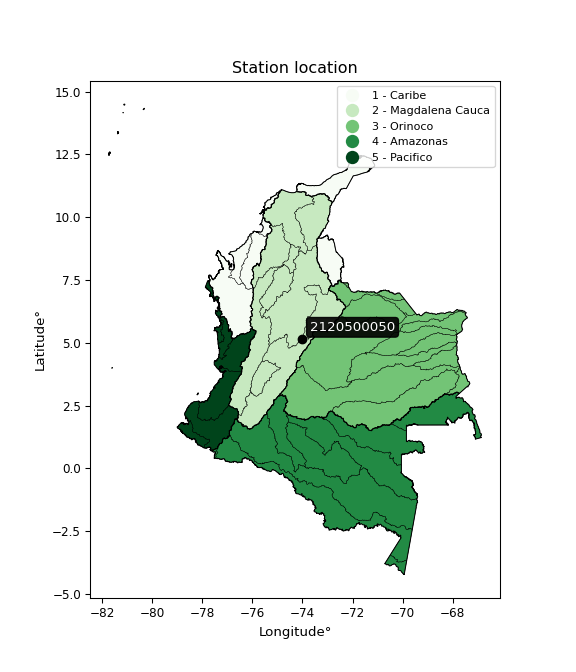

<div align="center">


</div>

# PMP Station (Rain, Pmax24h): 2120500050

Probable Maximum Precipitation (PMP) is the greatest amount of rainfall for a specific duration that is meteorologically possible for a given location, acting as a "worst-case" scenario for extreme storms, crucial for designing safety-critical infrastructure like bridges, river deviations, dams, spillways, and nuclear plants to prevent catastrophic failure. PMP is calculated by hydrologists using meteorological data to determine the upper limit of extreme rainfall, often leading to the Probable Maximum Flood (PMF) for flood control design, and is increasingly being studied for climate change impacts. Probable Maximum Precipitation (PMP) is the theoretical upper limit of rainfall, a deterministic estimate for extreme events, while probability distributions (like GEV, Gumbel) describe the likelihood and frequency of various precipitation amounts, including rare ones, showing how often events occur, with PMP representing the extreme end of these distributions, used for critical infrastructure design to ensure safety against the worst conceivable weather, unlike standard statistical forecasts which cover typical probabilities.

The most common probability distributions in hydrology, used for analyzing floods, rainfall, and streamflow, include the Normal, Log-Normal, Gumbel, Gamma (including Log-Pearson Type III), and Generalized Extreme Value (GEV) distributions, often chosen based on the data´s skewness and whether modeling extremes or general conditions, with Gumbel and GEV popular for extreme events like floods, while the Normal distribution serves as a baseline, though often requiring transformations for skewed hydrological data. These distributions help in designing water infrastructure, managing water resources, and forecasting hydrologic events.

> Hydrological data often isn´t perfectly normal (it´s skewed), so different distributions are needed for different applications, such as: **Flood Frequency Analysis**: Using Gumbel, GEV, or Log-Pearson Type III for predicting extreme flood magnitudes and their return periods, **Rainfall Analysis**: Normal for annual totals, but Log-Normal, Weibull, or GEV for intensity or extreme daily rainfall, **Streamflow Modeling**: Gamma and Log-Normal for maximum flows, GEV for minimum flows, and Kappa for daily flows.

<div align="center">

</img>

</div>


## A. General information


### 1. General running parameters

• app_version: _v20260108_. • runtime: _2026-01-08 18:05:13.093906_. • Python version: _3.14.0_. • SciPy version: _1.16.3_. • Pandas version: _2.3.3_. • NumPy version: _2.3.5_. • Stations dataset (station_dataset_file): _dataset/pmax24h_in/automatic_colombia_2003_2024.csv_. • Stations catalog (station_catalog_file): _dataset/CNE.xls_. • Minimum year to eval til year_max (date_min): _1900_. • Maximum year to eval since year_min (date_max): _2024_. • Creates, save and include plots into reports (create_plot): _False_. • Plot only fit distributions with Δo > Δ (plot_only_fit): _True_. • Plot only simple graphs avoiding multiple CDFs and multiple Extreme values plots (plot_only_simple): _False_. • Eval low extreme values, if False, evaluates high extreme values (low_extreme): _False_. • Eval every SciPy distribution as logarithmic (pdist_logarithmic_on): _True_. • Standard deviation normalized (ddof): _1.0_. • Return periods to eval in years (Tr): _[2, 2.33, 5, 10, 15, 20, 25, 50, 75, 100, 200, 250, 500, 750, 1000]_. • Minimum data sample per station, 0 means any (minimum_sample): _5_. • Z-Score maximum threshold to adjust a value, 0 means disable (zscore_max): _3.5_. • Z-Score minimum threshold to adjust a value, 0 means disable (zscore_min): _-2.5_. • Avoid zeros, e.g. rain = 0 (avoid_zeros): _True_. • Avoid null values (avoid_nans): _True_. 

:file_folder:Table: [dataset.csv](../../dataset/pmax24h_in/automatic_colombia_2003_2024.csv)

> Delta Degrees of Freedom (DDOF): is a parameter used in the formulas for calculating variance and standard deviation. When ddof=0, the divisor is $N$ (the total number of observations) and this is used when your data set is the entire population. When ddof=1, the divisor is $N-1$ and this is used when your data set is a sample drawn from a larger population. Using $N-1$ provides an unbiased estimate of the population variance (known as Bessel´s correction).


### 2. Station info and location

|   id |     CODIGO | NOMBRE                   | CATEGORIA               | TECNOLOGIA                | ESTADO   | FECHA_INSTALACION   |   FECHA_SUSPENSION |   ALTITUD |   LATITUD |   LONGITUD | DEPARTAMENTO   | MUNICIPIO   | AREA_OPERATIVA                            | ENTIDAD                                                     | AREA_HIDROGRAFICA   | ZONA_HIDROGRAFICA   | SUBZONA_HIDROGRAFICA   |   CORRIENTE | Catalogo   |   Version |
|-----:|-----------:|:-------------------------|:------------------------|:--------------------------|:---------|:--------------------|-------------------:|----------:|----------:|-----------:|:---------------|:------------|:------------------------------------------|:------------------------------------------------------------|:--------------------|:--------------------|:-----------------------|------------:|:-----------|----------:|
|    0 | 2120500050 | PARAMO ALTO [2120500050] | Climatológica Principal | Automática con Telemetría | Activa   | 17/03/2018          |                nan |      3226 |   5.15886 |   -74.0232 | Cundinamarca   | Cogua       | Area Operativa 11 - Cundinamarca-Amazonas | INSTITUTO DE HIDROLOGIA METEOROLOGIA Y ESTUDIOS AMBIENTALES | Magdalena Cauca     | Alto Magdalena      | Río Bogotá             |         nan | CNE_IDEAM  |  20251226 |

<div align="center">

Dynamic map: [:earth_americas:Google](http://maps.google.com/maps?q=5.15886,-74.02322) [:earth_americas:OSM](https://www.openstreetmap.org/#map=18/5.15886/-74.02322&layers=P) [:earth_americas:Bing](https://www.bing.com/maps?cp=5.15886~-74.02322&lvl=18) [:earth_americas:Apple](https://maps.apple.com/frame?center=5.15886%2C-74.02322&span=0.003%2C0.006)

</div>


<div align="center">

```geojson
{
  "type": "Feature",
  "geometry": {
    "type": "Point", 
    "coordinates": [-74.02322, 5.15886]
  }, 
  "properties": {
    "Name": "2120500050"
  }
}
```

</div>


### 3. Discrete values table and plot

<div align="center">

|               |          0 |           1 |           2 |          3 |           4 |
|:--------------|-----------:|------------:|------------:|-----------:|------------:|
| Date          | 2019       | 2020        | 2021        | 2022       | 2023        |
| Value         |   24       |   31.8      |   41.6      |   42.4     |   25.4      |
| Value_initial |   24       |   31.8      |   41.6      |   42.4     |   25.4      |
| count         |    5       |    5        |    5        |    5       |    5        |
| mean          |   33.04    |   33.04     |   33.04     |   33.04    |   33.04     |
| std           |    8.69644 |    8.69644  |    8.69644  |    8.69644 |    8.69644  |
| zscore        |   -1.03951 |   -0.142587 |    0.984311 |    1.0763  |   -0.878521 |


</div>


> The initial value (value_initial) correspond to the initial obtained or null completed value, and value (value) is adjusted only when the initial value is outside the valid range (outlier) definite through the Z-Score value. If Z-Score is active, values out of range or outliers are replaced with the station mean value. A Z-Score (or standard score) measures how many standard deviations a data point is from the mean of a dataset, indicating its relative position; positive scores mean above the mean, negative mean below, and a score of zero is exactly at the mean, allowing for comparison of values from different distributions. It´s calculated using the formula $z=(x–μ)/σ$, where $x$ is the data point, $μ$ is the mean, and $σ$ is the standard deviation, helping identify outliers and understand probability.
>
> <sub>**Note**: In this study, "completing" (filling gaps in) and "extending" (forecasting or lengthening the historical record) rainfall data series are avoided for certain critical analyses because they introduce artificial bias and uncertainty, which can distort the statistics of rare events (extremes), alter day-to-day variability, and compromise the integrity and homogeneity of the original data. Some reasons against Completing/Extending rainfall data are: **Distortion of Extremes and Variability**: The primary issue is that most gap-filling or extension methods rely on averaging or regression with nearby stations, which inherently smooths the data. Rainfall is highly variable in space and time, with a large percentage of zero values and occasional large storms. Infilling methods often underestimate the highest values and overestimate the lowest (zero) values, which severely distorts analyses focused on flood frequency, drought severity, and intensity-duration-frequency (IDF) curves, **Loss of Data Homogeneity**: Infilled or extended data are synthetic estimates, not actual measurements. Combining these estimates with observed data can violate the assumption of data homogeneity, which requires that the data properties do not change over time. Inhomogeneity can lead to incorrect conclusions about long-term trends or changes in climate patterns, **Propagation of Errors**: Errors and biases from the original data (e.g., wind-induced undercatch, instrument errors, site changes) or the data used for imputation can propagate through the analysis, leading to unreliable hydrological models and inaccurate predictions, **Compromised Statistical Integrity**: For statistical analyses, especially those involving the frequency of events, using artificial data can introduce time bias or autocorrelation that doesn´t exist in reality, making it difficult to assess the true probability of events, **Difficulty in Validation**: It is difficult to accurately validate the quality of filled or extended data, especially for past periods where ground-truth measurements are unavailable. The reliability of imputation techniques heavily depends on the density of the surrounding station network and the complexity of the local topography.</sub>


### 4. Active continuous probability distributions from SciPy (43 of 104 available)

A Probability Density Function (PDF) describes the relative likelihood of a continuous random variable falling within a specific range, where the total area under its curve equals 1, and the area over any interval gives the actual probability for that range. Unlike discrete probabilities (like rolling a die), a PDF shows density, not direct probability for a single point (which is zero), with higher points indicating higher likelihood, often visualized as a bell curve for normal distributions.

A log of a probability density function (log-PDF) is simply the logarithm of the PDF´s value, denoted as $log(f(x))$, useful for converting multiplication of probabilities into addition, improving numerical stability with tiny numbers, and connecting to information theory concepts like entropy. Instead of dealing with very small probabilities (e.g., 0.000001), log-PDFs use negative numbers (e.g., $log(0.00001) ≈ -11.51$ that are easier for computers to handle, preventing underflow errors and simplifying complex calculations. In this study, each active probability distribution from SciPy is also evaluated in the $log$ form.

[scipy.stats](https://docs.scipy.org/doc/scipy/reference/stats.html) is a Python´s powerful submodule within the SciPy library for comprehensive statistical analysis, offering over 130 probability distributions (like Normal, Poisson), functions for descriptive stats (mean, variance), hypothesis testing (t-tests, chi-square), random variable generation, and statistical tests, making it essential for data science, modeling, and research. It provides tools to explore, model, and draw conclusions from data efficiently, working seamlessly with NumPy.

<div align="center">

|   id | p_dist             |   n_parameter | fit_method   | label                                                                       | active   | ref                                                                                                        |
|-----:|:-------------------|--------------:|:-------------|:----------------------------------------------------------------------------|:---------|:-----------------------------------------------------------------------------------------------------------|
|    0 | alpha              |             3 | MLE          | Alpha                                                                       | True     | [:mortar_board:](https://docs.scipy.org/doc/scipy/reference/generated/scipy.stats.alpha.html)              |
|    1 | betaprime          |             4 | MLE          | Beta prime                                                                  | True     | [:mortar_board:](https://docs.scipy.org/doc/scipy/reference/generated/scipy.stats.betaprime.html)          |
|    2 | chi2               |             3 | MLE          | Chi²                                                                        | True     | [:mortar_board:](https://docs.scipy.org/doc/scipy/reference/generated/scipy.stats.chi2.html)               |
|    3 | crystalball        |             4 | MLE          | Crystalball                                                                 | True     | [:mortar_board:](https://docs.scipy.org/doc/scipy/reference/generated/scipy.stats.crystalball.html)        |
|    4 | erlang             |             3 | MLE          | Erlang                                                                      | True     | [:mortar_board:](https://docs.scipy.org/doc/scipy/reference/generated/scipy.stats.erlang.html)             |
|    5 | expon              |             2 | MLE          | Exponential                                                                 | True     | [:mortar_board:](https://docs.scipy.org/doc/scipy/reference/generated/scipy.stats.expon.html)              |
|    6 | exponnorm          |             3 | MLE          | Exponentially modified Normal                                               | True     | [:mortar_board:](https://docs.scipy.org/doc/scipy/reference/generated/scipy.stats.exponnorm.html)          |
|    7 | f                  |             4 | MLE          | F                                                                           | True     | [:mortar_board:](https://docs.scipy.org/doc/scipy/reference/generated/scipy.stats.f.html)                  |
|    8 | fatiguelife        |             3 | MLE          | Fatigue-life (Birnbaum-Saunders)                                            | True     | [:mortar_board:](https://docs.scipy.org/doc/scipy/reference/generated/scipy.stats.fatiguelife.html)        |
|    9 | fisk               |             3 | MLE          | Fisk                                                                        | True     | [:mortar_board:](https://docs.scipy.org/doc/scipy/reference/generated/scipy.stats.fisk.html)               |
|   10 | gamma              |             3 | MLE          | Gamma                                                                       | True     | [:mortar_board:](https://docs.scipy.org/doc/scipy/reference/generated/scipy.stats.gamma.html)              |
|   11 | genexpon           |             5 | MLE          | Generalized exponential                                                     | True     | [:mortar_board:](https://docs.scipy.org/doc/scipy/reference/generated/scipy.stats.genexpon.html)           |
|   12 | genlogistic        |             3 | MLE          | Generalized logistic                                                        | True     | [:mortar_board:](https://docs.scipy.org/doc/scipy/reference/generated/scipy.stats.genlogistic.html)        |
|   13 | gibrat             |             2 | MM           | Gibrat                                                                      | True     | [:mortar_board:](https://docs.scipy.org/doc/scipy/reference/generated/scipy.stats.gibrat.html)             |
|   14 | gompertz           |             3 | MLE          | Gompertz (or truncated Gumbel)                                              | True     | [:mortar_board:](https://docs.scipy.org/doc/scipy/reference/generated/scipy.stats.gompertz.html)           |
|   15 | gumbel_l           |             2 | MM           | Gumbel Left Skew                                                            | True     | [:mortar_board:](https://docs.scipy.org/doc/scipy/reference/generated/scipy.stats.gumbel_l.html)           |
|   16 | gumbel_r           |             2 | MM           | Gumbel Right Skew                                                           | True     | [:mortar_board:](https://docs.scipy.org/doc/scipy/reference/generated/scipy.stats.gumbel_r.html)           |
|   17 | halflogistic       |             2 | MM           | Half-logistic                                                               | True     | [:mortar_board:](https://docs.scipy.org/doc/scipy/reference/generated/scipy.stats.halflogistic.html)       |
|   18 | halfnorm           |             2 | MM           | Half Normal                                                                 | True     | [:mortar_board:](https://docs.scipy.org/doc/scipy/reference/generated/scipy.stats.halfnorm.html)           |
|   19 | hypsecant          |             2 | MM           | hyperbolic secant                                                           | True     | [:mortar_board:](https://docs.scipy.org/doc/scipy/reference/generated/scipy.stats.hypsecant.html)          |
|   20 | invgamma           |             3 | MLE          | Inverted gamma                                                              | True     | [:mortar_board:](https://docs.scipy.org/doc/scipy/reference/generated/scipy.stats.invgamma.html)           |
|   21 | invgauss           |             3 | MLE          | Inverse Gaussian                                                            | True     | [:mortar_board:](https://docs.scipy.org/doc/scipy/reference/generated/scipy.stats.invgauss.html)           |
|   22 | invweibull         |             3 | MLE          | Inverted Weibull                                                            | True     | [:mortar_board:](https://docs.scipy.org/doc/scipy/reference/generated/scipy.stats.invweibull.html)         |
|   23 | kstwobign          |             2 | MLE          | Limiting distribution of scaled Kolmogorov-Smirnov two-sided test statistic | True     | [:mortar_board:](https://docs.scipy.org/doc/scipy/reference/generated/scipy.stats.kstwobign.html)          |
|   24 | laplace            |             2 | MM           | Laplace                                                                     | True     | [:mortar_board:](https://docs.scipy.org/doc/scipy/reference/generated/scipy.stats.laplace.html)            |
|   25 | laplace_asymmetric |             3 | MLE          | Asymmetric Laplace                                                          | True     | [:mortar_board:](https://docs.scipy.org/doc/scipy/reference/generated/scipy.stats.laplace_asymmetric.html) |
|   26 | loggamma           |             3 | MLE          | Log gamma                                                                   | True     | [:mortar_board:](https://docs.scipy.org/doc/scipy/reference/generated/scipy.stats.loggamma.html)           |
|   27 | logistic           |             2 | MM           | Logistic (or Sech-squared)                                                  | True     | [:mortar_board:](https://docs.scipy.org/doc/scipy/reference/generated/scipy.stats.logistic.html)           |
|   28 | lognorm            |             3 | MLE          | Log Normal                                                                  | True     | [:mortar_board:](https://docs.scipy.org/doc/scipy/reference/generated/scipy.stats.lognorm.html)            |
|   29 | maxwell            |             2 | MM           | Maxwell                                                                     | True     | [:mortar_board:](https://docs.scipy.org/doc/scipy/reference/generated/scipy.stats.maxwell.html)            |
|   30 | mielke             |             4 | MLE          | Mielke Beta-Kappa / Dagum                                                   | True     | [:mortar_board:](https://docs.scipy.org/doc/scipy/reference/generated/scipy.stats.mielke.html)             |
|   31 | moyal              |             2 | MM           | Moyal                                                                       | True     | [:mortar_board:](https://docs.scipy.org/doc/scipy/reference/generated/scipy.stats.moyal.html)              |
|   32 | nakagami           |             3 | MLE          | Nakagami                                                                    | True     | [:mortar_board:](https://docs.scipy.org/doc/scipy/reference/generated/scipy.stats.nakagami.html)           |
|   33 | ncf                |             5 | MLE          | Non-central F distribution                                                  | True     | [:mortar_board:](https://docs.scipy.org/doc/scipy/reference/generated/scipy.stats.ncf.html)                |
|   34 | nct                |             4 | MLE          | Non-central Student’s t                                                     | True     | [:mortar_board:](https://docs.scipy.org/doc/scipy/reference/generated/scipy.stats.nct.html)                |
|   35 | norm               |             2 | MM           | Normal                                                                      | True     | [:mortar_board:](https://docs.scipy.org/doc/scipy/reference/generated/scipy.stats.norm.html)               |
|   36 | pearson3           |             3 | MM           | Pearson type III                                                            | True     | [:mortar_board:](https://docs.scipy.org/doc/scipy/reference/generated/scipy.stats.pearson3.html)           |
|   37 | rayleigh           |             2 | MM           | Rayleigh                                                                    | True     | [:mortar_board:](https://docs.scipy.org/doc/scipy/reference/generated/scipy.stats.rayleigh.html)           |
|   38 | rice               |             3 | MLE          | Rice                                                                        | True     | [:mortar_board:](https://docs.scipy.org/doc/scipy/reference/generated/scipy.stats.rice.html)               |
|   39 | t                  |             3 | MLE          | Student’s t                                                                 | True     | [:mortar_board:](https://docs.scipy.org/doc/scipy/reference/generated/scipy.stats.t.html)                  |
|   40 | truncnorm          |             4 | MLE          | Truncated normal                                                            | True     | [:mortar_board:](https://docs.scipy.org/doc/scipy/reference/generated/scipy.stats.truncnorm.html)          |
|   41 | wald               |             2 | MM           | Wald                                                                        | True     | [:mortar_board:](https://docs.scipy.org/doc/scipy/reference/generated/scipy.stats.wald.html)               |
|   42 | weibull_min        |             3 | MLE          | Weibull minimum                                                             | True     | [:mortar_board:](https://docs.scipy.org/doc/scipy/reference/generated/scipy.stats.weibull_min.html)        |

</div>

> **n_parameter:** # arguments & localization & scale.
>
> **Fit methods:** (MLE) maximum likelihood, (MM) L-moments.
>
>**Inactive** (With the only purpose of prevent loops, zero divisions, infinite values, over high estimated values or horizontal trending for recurrence intervals estimations, the follow distributions were disabled.)**:** foldnorm, gennorm, norminvgauss, powernorm, powerlognorm, skewnorm, genextreme, anglit, arcsine, argus, beta, bradford, burr, burr12, cauchy, cosine, halfcauchy, foldcauchy, skewcauchy, wrapcauchy, dgamma, gengamma, exponweib, exponpow, truncexpon, gausshyper, genhalflogistic, genhyperbolic, geninvgauss, halfgennorm, johnsonsb, johnsonsu, kappa4, kappa3, ksone, kstwo, loglaplace, levy, levy_l, levy_stable, ncx2, pareto, genpareto, truncpareto, lomax, powerlaw, rdist, rel_breitwigner, recipinvgauss, semicircular, studentized_range, trapezoid, triang, truncweibull_min, tukeylambda, uniform, loguniform, vonmises, vonmises_line, weibull_max, dweibull, 


## B. Probability (PDF) vs. Empirical (EDF) distributions functions

A continuous probability distribution (CPD) describes probabilities for variables that can take any value within a range (like rain any time), unlike discrete variables with specific outcomes (like temperature). It uses a Probability Density Function (PDF), a curve where the total area under it equals 1, and the probability of the variable falling within an interval (a to b) is found by calculating the area under the curve between those points. A key feature is that the probability of hitting any single exact value is zero, so probabilities are always expressed for ranges, e.g., $P(a ≤ X ≤ b)$.

<div align="center">

Distributions parameters from station values
|    |    station | p_dist                |   n |             loc |          scale | shape                | shape1             | shape2                | shape3   |
|---:|-----------:|:----------------------|----:|----------------:|---------------:|:---------------------|:-------------------|:----------------------|:---------|
|  0 | 2120500050 | alpha                 |   5 |   -23.5852      |  407.657       | 7.336231978423427    |                    |                       |          |
|  1 | 2120500050 | betaprime             |   5 |    -0.55526     |   15.6592      | 56.14748101565755    | 27.177810976202295 |                       |          |
|  2 | 2120500050 | chi2                  |   5 |    24           |    1.56049     | 0.843874654413912    |                    |                       |          |
|  3 | 2120500050 | crystalball           |   5 |    33.04        |    7.77833     | 2172.06203486615     | 501.07246580479205 |                       |          |
|  4 | 2120500050 | erlang                |   5 |   -39.7971      |    0.826924    | 87.98168221320617    |                    |                       |          |
|  5 | 2120500050 | expon                 |   5 |    24           |    9.04        |                      |                    |                       |          |
|  6 | 2120500050 | exponnorm             |   5 |    32.5412      |    7.76232     | 0.06425734217839114  |                    |                       |          |
|  7 | 2120500050 | f                     |   5 |    24           |    5.55346     | 0.692085278331321    | 2.6103215882064847 |                       |          |
|  8 | 2120500050 | fatiguelife           |   5 |    24           |    8.62206e-07 | 3290.273724866031    |                    |                       |          |
|  9 | 2120500050 | fisk                  |   5 |    24           |    4.21894     | 0.2437213655328451   |                    |                       |          |
| 10 | 2120500050 | gamma                 |   5 |   -42.8121      |    0.795366    | 95.37317296121279    |                    |                       |          |
| 11 | 2120500050 | genexpon              |   5 |    23.9999      |    0.136218    | 0.012685726806223074 | 4.3288506325697735 | 9.487627441524724e-06 |          |
| 12 | 2120500050 | genlogistic           |   5 |   -17.2632      |    6.47046     | 1317.6303394006372   |                    |                       |          |
| 13 | 2120500050 | gibrat                |   5 |    27.1061      |    3.59909     |                      |                    |                       |          |
| 14 | 2120500050 | gompertz              |   5 |    24           |   24.1747      | 1.8866101285725607   |                    |                       |          |
| 15 | 2120500050 | gumbel_l              |   5 |    36.5407      |    6.06474     |                      |                    |                       |          |
| 16 | 2120500050 | gumbel_r              |   5 |    29.5393      |    6.06474     |                      |                    |                       |          |
| 17 | 2120500050 | halflogistic          |   5 |    23.8209      |    6.65019     |                      |                    |                       |          |
| 18 | 2120500050 | halfnorm              |   5 |    22.7445      |   12.9034      |                      |                    |                       |          |
| 19 | 2120500050 | hypsecant             |   5 |    33.04        |    4.95184     |                      |                    |                       |          |
| 20 | 2120500050 | invgamma              |   5 |    20.3141      |   15.8395      | 2.0502517927745867   |                    |                       |          |
| 21 | 2120500050 | invgauss              |   5 |    22.8024      |    5.28018     | 1.938874443207455    |                    |                       |          |
| 22 | 2120500050 | invweibull            |   5 |    24           |    0.325293    | 0.07263000958409942  |                    |                       |          |
| 23 | 2120500050 | kstwobign             |   5 |     7.3231      |   29.2991      |                      |                    |                       |          |
| 24 | 2120500050 | laplace               |   5 |    33.04        |    5.50011     |                      |                    |                       |          |
| 25 | 2120500050 | laplace_asymmetric    |   5 |    31.8         |    6.83585     | 0.9133970893149786   |                    |                       |          |
| 26 | 2120500050 | loggamma              |   5 | -1823.65        |  263.814       | 1139.5043195023763   |                    |                       |          |
| 27 | 2120500050 | logistic              |   5 |    33.04        |    4.28842     |                      |                    |                       |          |
| 28 | 2120500050 | lognorm               |   5 |    24           |    0.00660424  | 14.156262305983862   |                    |                       |          |
| 29 | 2120500050 | maxwell               |   5 |    14.6086      |   11.5502      |                      |                    |                       |          |
| 30 | 2120500050 | mielke                |   5 |    -6.95906     |   12.0243      | 4036.1342327166412   | 5.993971666317318  |                       |          |
| 31 | 2120500050 | moyal                 |   5 |    28.5919      |    3.50148     |                      |                    |                       |          |
| 32 | 2120500050 | nakagami              |   5 |    24           |   16.2821      | 0.275450340108054    |                    |                       |          |
| 33 | 2120500050 | ncf                   |   5 |    -0.213519    |   28.254       | 42.80611923588151    | 208.70186447171943 | 7.095788117335314     |          |
| 34 | 2120500050 | nct                   |   5 |    -0.0901812   |    0.926471    | 9.609422301538046    | 32.93959432932766  |                       |          |
| 35 | 2120500050 | norm                  |   5 |    33.04        |    7.77833     |                      |                    |                       |          |
| 36 | 2120500050 | pearson3              |   5 |    33.04        |    7.77836     | 0.11067447320922644  |                    |                       |          |
| 37 | 2120500050 | rayleigh              |   5 |    18.1596      |   11.8728      |                      |                    |                       |          |
| 38 | 2120500050 | rice                  |   5 |    19.3071      |    9.92925     | 0.7256500013094332   |                    |                       |          |
| 39 | 2120500050 | t                     |   5 |    33.0398      |    7.7781      | 12685312.012364082   |                    |                       |          |
| 40 | 2120500050 | truncnorm             |   5 |     1.40427     |   14.0956      | 2.1563959227092795   | 2243.6768168435738 |                       |          |
| 41 | 2120500050 | wald                  |   5 |    25.2617      |    7.77832     |                      |                    |                       |          |
| 42 | 2120500050 | weibull_min           |   5 |    24           |   10.3113      | 0.8024458806077164   |                    |                       |          |
| 43 | 2120500050 | logalpha              |   5 |    -1.89236     |  120.072       | 22.439983059130867   |                    |                       |          |
| 44 | 2120500050 | logbetaprime          |   5 |    -3.92601     |   11.6585      | 424.9001879773575    | 669.812254619884   |                       |          |
| 45 | 2120500050 | logchi2               |   5 |     3.17805     |    1.00501     | 0.9948223955159328   |                    |                       |          |
| 46 | 2120500050 | logcrystalball        |   5 |     3.4695      |    0.238375    | 7.594724838788997    | 153.23504995715308 |                       |          |
| 47 | 2120500050 | logerlang             |   5 |   -27.8871      |    0.00181172  | 17307.60077153184    |                    |                       |          |
| 48 | 2120500050 | logexpon              |   5 |     3.17805     |    0.29145     |                      |                    |                       |          |
| 49 | 2120500050 | logexponnorm          |   5 |     3.46746     |    0.238366    | 0.008587088583366237 |                    |                       |          |
| 50 | 2120500050 | logf                  |   5 |     2.98668     |    0.428963    | 11.786600823352714   | 16.149387097889758 |                       |          |
| 51 | 2120500050 | logfatiguelife        |   5 |     3.17805     |    2.28475e-07 | 1109.562821043441    |                    |                       |          |
| 52 | 2120500050 | logfisk               |   5 |    -0.0509041   |    3.51267     | 23.346321171210874   |                    |                       |          |
| 53 | 2120500050 | loggamma              |   5 |   -27.8832      |    0.00181261  | 17296.952558981044   |                    |                       |          |
| 54 | 2120500050 | loggenexpon           |   5 |     3.17664     |    0.0139193   | 0.03707293906262189  | 4.715687905280772  | 0.0001259153819424236 |          |
| 55 | 2120500050 | loggenlogistic        |   5 |     2.00524     |    0.204025    | 733.1860595779331    |                    |                       |          |
| 56 | 2120500050 | loggibrat             |   5 |     3.28765     |    0.110298    |                      |                    |                       |          |
| 57 | 2120500050 | loggompertz           |   5 |     3.17805     |    0.503363    | 1.0079089935726175   |                    |                       |          |
| 58 | 2120500050 | loggumbel_l           |   5 |     3.57678     |    0.18586     |                      |                    |                       |          |
| 59 | 2120500050 | loggumbel_r           |   5 |     3.36222     |    0.18586     |                      |                    |                       |          |
| 60 | 2120500050 | loghalflogistic       |   5 |     3.18696     |    0.203815    |                      |                    |                       |          |
| 61 | 2120500050 | loghalfnorm           |   5 |     3.15399     |    0.395439    |                      |                    |                       |          |
| 62 | 2120500050 | loghypsecant          |   5 |     3.4695      |    0.151754    |                      |                    |                       |          |
| 63 | 2120500050 | loginvgamma           |   5 |    -1.00947     | 1574.73        | 352.593877952187     |                    |                       |          |
| 64 | 2120500050 | loginvgauss           |   5 |     3.1153      |    0.306543    | 1.1554785097917413   |                    |                       |          |
| 65 | 2120500050 | loginvweibull         |   5 |    -7.24314e+06 |    7.24314e+06 | 35470256.221796095   |                    |                       |          |
| 66 | 2120500050 | logkstwobign          |   5 |     2.66122     |    0.920271    |                      |                    |                       |          |
| 67 | 2120500050 | loglaplace            |   5 |     3.4695      |    0.168556    |                      |                    |                       |          |
| 68 | 2120500050 | loglaplace_asymmetric |   5 |     3.45947     |    0.212327    | 0.9766070906656829   |                    |                       |          |
| 69 | 2120500050 | logloggamma           |   5 |   -17.9094      |    3.84604     | 259.983507559009     |                    |                       |          |
| 70 | 2120500050 | loglogistic           |   5 |     3.4695      |    0.131423    |                      |                    |                       |          |
| 71 | 2120500050 | loglognorm            |   5 |     3.17805     |    0.00029457  | 13.635940432880064   |                    |                       |          |
| 72 | 2120500050 | logmaxwell            |   5 |     2.90466     |    0.353966    |                      |                    |                       |          |
| 73 | 2120500050 | logmielke             |   5 |    -7.64318e+06 |    7.64319e+06 | 1248479700.6182046   | 37694746.393995434 |                       |          |
| 74 | 2120500050 | logmoyal              |   5 |     3.33319     |    0.107306    |                      |                    |                       |          |
| 75 | 2120500050 | lognakagami           |   5 |     3.17805     |    0.442925    | 0.42319819465604946  |                    |                       |          |
| 76 | 2120500050 | logncf                |   5 |    -3.45451     |    6.92019     | 638.3334687584545    | 739.3019951111901  | 0.03564278088718417   |          |
| 77 | 2120500050 | lognct                |   5 |    -0.426234    |    0.0428006   | 138.18308672596677   | 90.52497857502291  |                       |          |
| 78 | 2120500050 | lognorm               |   5 |     3.4695      |    0.238375    |                      |                    |                       |          |
| 79 | 2120500050 | logpearson3           |   5 |     3.4695      |    0.238375    | 0.014761422867333358 |                    |                       |          |
| 80 | 2120500050 | lograyleigh           |   5 |     3.01348     |    0.363855    |                      |                    |                       |          |
| 81 | 2120500050 | logrice               |   5 |     3.03731     |    0.297713    | 0.8652040295483066   |                    |                       |          |
| 82 | 2120500050 | logt                  |   5 |     3.46952     |    0.238375    | 26582685.941563085   |                    |                       |          |
| 83 | 2120500050 | logtruncnorm          |   5 |    -2.05701     |    1.74069     | 3.0074714677196344   | 3.3344085339843375 |                       |          |
| 84 | 2120500050 | logwald               |   5 |     3.2311      |    0.2384      |                      |                    |                       |          |
| 85 | 2120500050 | logweibull_min        |   5 |     3.17805     |    0.340354    | 0.547885622694669    |                    |                       |          |

</div>

> **loc** (Location parameter): This shifts the distribution along the x-axis. For many common distributions, like the normal (Gaussian) distribution, loc represents the mean $μ$. For others, like the uniform distribution, it might represent the minimum value, or for the beta distribution, the left end of the support interval.
>
> **scale** (Scale parameter): This determines the width or spread of the distribution. For the normal distribution, scale represents the standard deviation $σ$. For a uniform distribution, it defines the length of the interval (from $loc$ to $loc + scale$).
>
> **shape** (Shape parameters): Refers to parameters that define the specific form of a probability distribution, distinct from its location (loc) and scale (scale). These parameters are required arguments for most distribution functions. For example, a normal (Gaussian) distribution is fully defined by its location (mean) and scale (standard deviation), so it has no specific shape parameters beyond loc and scale. However, other distributions have intrinsic properties that need specification, as Gamma distribution that takes a shape parameter, often named $a$ or $alpha$.


### 0. Cumulative distribution values - CDF (86 evaluated)

Cumulative Distribution Function (CDF), denoted as $F$<sub>$X$</sub>$(x)$, is a function that gives the probability that a random variable $X$ will take a value less than or equal to a specific value, $x$ (i.e., $(P(X≥x)$. It essentially "accumulates" probabilities from a given point up to the far right (positive infinity), providing a complete picture of the distribution´s probabilities for both discrete (like rain) and continuous (like temperature) variables, helping to find probabilities over ranges or above certain values. Each station is evaluated separately ordering the $x$ values ascending, calculating the CDF and PDF values for the activated distributions and their logarithmic forms.

<div align="center">

CDF ordered by x ascending and calculating $log(f(x))$ separately
|   id |    Station |   date |    x |   count |   mean |     std |    zscore |   Value_initial |    station |   m |    alpha |   alpha_pdf |   betaprime |   betaprime_pdf |        chi2 |    chi2_pdf |   crystalball |   crystalball_pdf |   erlang |   erlang_pdf |    expon |   expon_pdf |   exponnorm |   exponnorm_pdf |          f |        f_pdf |   fatiguelife |   fatiguelife_pdf |        fisk |   fisk_pdf |    gamma |   gamma_pdf |    genexpon |   genexpon_pdf |   genlogistic |   genlogistic_pdf |   gibrat |   gibrat_pdf |    gompertz |   gompertz_pdf |   gumbel_l |   gumbel_l_pdf |   gumbel_r |   gumbel_r_pdf |   halflogistic |   halflogistic_pdf |   halfnorm |   halfnorm_pdf |   hypsecant |   hypsecant_pdf |   invgamma |   invgamma_pdf |   invgauss |   invgauss_pdf |   invweibull |   invweibull_pdf |   kstwobign |   kstwobign_pdf |   laplace |   laplace_pdf |   laplace_asymmetric |   laplace_asymmetric_pdf |   loggamma |   loggamma_pdf |   logistic |   logistic_pdf |   lognorm |   lognorm_pdf |   maxwell |   maxwell_pdf |   mielke |   mielke_pdf |     moyal |   moyal_pdf |    nakagami |   nakagami_pdf |      ncf |   ncf_pdf |      nct |   nct_pdf |     norm |   norm_pdf |   pearson3 |   pearson3_pdf |   rayleigh |   rayleigh_pdf |      rice |   rice_pdf |        t |     t_pdf |   truncnorm |   truncnorm_pdf |        wald |    wald_pdf |   weibull_min |   weibull_min_pdf |   logalpha |   logalpha_pdf |   logbetaprime |   logbetaprime_pdf |     logchi2 |   logchi2_pdf |   logcrystalball |   logcrystalball_pdf |   logerlang |   logerlang_pdf |   logexpon |   logexpon_pdf |   logexponnorm |   logexponnorm_pdf |      logf |   logf_pdf |   logfatiguelife |   logfatiguelife_pdf |   logfisk |   logfisk_pdf |   loggenexpon |   loggenexpon_pdf |   loggenlogistic |   loggenlogistic_pdf |   loggibrat |   loggibrat_pdf |   loggompertz |   loggompertz_pdf |   loggumbel_l |   loggumbel_l_pdf |   loggumbel_r |   loggumbel_r_pdf |   loghalflogistic |   loghalflogistic_pdf |   loghalfnorm |   loghalfnorm_pdf |   loghypsecant |   loghypsecant_pdf |   loginvgamma |   loginvgamma_pdf |   loginvgauss |   loginvgauss_pdf |   loginvweibull |   loginvweibull_pdf |   logkstwobign |   logkstwobign_pdf |   loglaplace |   loglaplace_pdf |   loglaplace_asymmetric |   loglaplace_asymmetric_pdf |   logloggamma |   logloggamma_pdf |   loglogistic |   loglogistic_pdf |   loglognorm |   loglognorm_pdf |   logmaxwell |   logmaxwell_pdf |   logmielke |   logmielke_pdf |   logmoyal |   logmoyal_pdf |   lognakagami |   lognakagami_pdf |   logncf |   logncf_pdf |   lognct |   lognct_pdf |   logpearson3 |   logpearson3_pdf |   lograyleigh |   lograyleigh_pdf |   logrice |   logrice_pdf |     logt |   logt_pdf |   logtruncnorm |   logtruncnorm_pdf |     logwald |   logwald_pdf |   logweibull_min |   logweibull_min_pdf |
|-----:|-----------:|-------:|-----:|--------:|-------:|--------:|----------:|----------------:|-----------:|----:|---------:|------------:|------------:|----------------:|------------:|------------:|--------------:|------------------:|---------:|-------------:|---------:|------------:|------------:|----------------:|-----------:|-------------:|--------------:|------------------:|------------:|-----------:|---------:|------------:|------------:|---------------:|--------------:|------------------:|---------:|-------------:|------------:|---------------:|-----------:|---------------:|-----------:|---------------:|---------------:|-------------------:|-----------:|---------------:|------------:|----------------:|-----------:|---------------:|-----------:|---------------:|-------------:|-----------------:|------------:|----------------:|----------:|--------------:|---------------------:|-------------------------:|-----------:|---------------:|-----------:|---------------:|----------:|--------------:|----------:|--------------:|---------:|-------------:|----------:|------------:|------------:|---------------:|---------:|----------:|---------:|----------:|---------:|-----------:|-----------:|---------------:|-----------:|---------------:|----------:|-----------:|---------:|----------:|------------:|----------------:|------------:|------------:|--------------:|------------------:|-----------:|---------------:|---------------:|-------------------:|------------:|--------------:|-----------------:|---------------------:|------------:|----------------:|-----------:|---------------:|---------------:|-------------------:|----------:|-----------:|-----------------:|---------------------:|----------:|--------------:|--------------:|------------------:|-----------------:|---------------------:|------------:|----------------:|--------------:|------------------:|--------------:|------------------:|--------------:|------------------:|------------------:|----------------------:|--------------:|------------------:|---------------:|-------------------:|--------------:|------------------:|--------------:|------------------:|----------------:|--------------------:|---------------:|-------------------:|-------------:|-----------------:|------------------------:|----------------------------:|--------------:|------------------:|--------------:|------------------:|-------------:|-----------------:|-------------:|-----------------:|------------:|----------------:|-----------:|---------------:|--------------:|------------------:|---------:|-------------:|---------:|-------------:|--------------:|------------------:|--------------:|------------------:|----------:|--------------:|---------:|-----------:|---------------:|-------------------:|------------:|--------------:|-----------------:|---------------------:|
|    0 | 2120500050 |   2019 | 24   |       5 |  33.04 | 8.69644 | -1.03951  |            24   | 2120500050 |   1 | 0.109226 |   0.0336814 |    0.111117 |       0.0338315 | 5.58609e-07 | 6.6343e+07  |      0.122576 |         0.0261047 | 0.121004 |    0.0283214 | 0        |   0.110619  |    0.122569 |       0.0261088 | 0.00658736 | 308.567      |      0.23768  |       7.05993e+11 | 0.000583363 | 6.2494e+08 | 0.119058 |   0.0278774 | 5.38981e-06 |      0.0931279 |      0.106672 |         0.0368643 | 0        |   0          | 1.17169e-12 |      0.0780408 |   0.118794 |      0.0183752 |  0.0826861 |      0.0339853 |       0.013467 |          0.0751721 |   0.077509 |      0.061543  |    0.1017   |       0.0201902 |  0.0767215 |      0.0717438 |  0.0585227 |     0.12539    |  5.42747e-05 |      5.44878e+09 |   0.0977408 |       0.0387743 | 0.0966411 |     0.0175708 |             0.130412 |                0.0208864 |   0.110508 |       0.796323 |   0.108321 |      0.022523  |  0.11073  |      0.792575 |  0.117692 |     0.0328151 |      nan |          nan | 0.0540427 |   0.0343171 | 1.83252e-09 | 284159         | 0.113436 | 0.0313326 | 0.104575 | 0.038021  | 0.122576 |  0.0261047 |   0.121092 |      0.027056  |   0.113956 |      0.0367103 | 0.0823942 |  0.0336849 | 0.122575 | 0.0261052 | 0           |       0         | 0           | 0           |   3.90821e-13 |        88.2742    |   0.107333 |       0.862835 |       0.26015  |           0.733976 | 1.84145e-08 |   2.06255e+07 |         0.11073  |             0.792575 |    0.110489 |        0.796373 |   0        |       3.43112  |       0.11073  |           0.792575 | 0.0825958 |   1.33643  |        0.0589946 |          1.20999e+12 |  0.1228   |      0.77885  |    0.00376932 |          2.65771  |        0.0969431 |             1.10707  |    0        |        0        |     9.035e-09 |          2.00235  |      0.110441 |          0.560123 |     0.0676332 |          0.980204 |          0        |              0        |      0.048526 |          2.01399  |      0.0926233 |           0.601775 |      0.107425 |          0.846958 |     0.0606687 |          2.6886   |       0.0965484 |            1.10528  |      0.0893131 |           1.17907  |    0.0887225 |         0.526367 |                0.125655 |                    0.605973 |      0.111976 |          0.778062 |     0.0981767 |          0.673688 |    0.0229543 |      8.98328e+12 |     0.102785 |         0.997933 |   0.0983792 |        1.08663  |  0.0393709 |       0.917209 |   1.58278e-13 |        301.664    | 0.289808 |     0.674204 | 0.106038 |     0.868941 |      0.110497 |          0.796176 |     0.0972337 |          1.12223  | 0.0742248 |      1.01798  | 0.110717 |   0.792507 |    3.14088e-07 |           2.79802  | 0           |   0           |      6.99872e-09 |          8.63452e+06 |
|    1 | 2120500050 |   2023 | 25.4 |       5 |  33.04 | 8.69644 | -0.878521 |            25.4 | 2120500050 |   2 | 0.162113 |   0.0416913 |    0.164038 |       0.041585  | 0.710138    | 0.15482     |      0.162997 |         0.0316615 | 0.164936 |    0.0344232 | 0.143471 |   0.0947488 |    0.162996 |       0.0316668 | 0.429644   |   0.0980848  |      0.650726 |       0.0511929   | 0.433189    | 0.0427446  | 0.16234  |   0.033944  | 0.124145    |      0.0842809 |      0.164825 |         0.045894  | 0        |   0          | 0.106387    |      0.0738962 |   0.147261 |      0.0223988 |  0.138225  |      0.0451017 |       0.118173 |          0.0741358 |   0.163049 |      0.0605394 |    0.134071 |       0.0262816 |  0.192147  |      0.0877061 |  0.247269  |     0.124323   |  0.406805    |      0.0189818   |   0.158966  |       0.0482067 | 0.124654  |     0.022664  |             0.16319  |                0.0261362 |   0.162394 |       1.03576  |   0.144113 |      0.0287622 |  0.162358 |      1.0305   |  0.168044 |     0.0389742 |      nan |          nan | 0.1147    |   0.0517954 | 0.201171    |      0.0790346 | 0.162281 | 0.0383447 | 0.164553 | 0.0472715 | 0.162997 |  0.0316615 |   0.163035 |      0.0328683 |   0.169681 |      0.0426479 | 0.135078  |  0.0413189 | 0.162996 | 0.0316623 | 0           |       0         | 1.73142e-13 | 3.57939e-11 |   0.182442    |         0.0943926 |   0.163797 |       1.12848  |       0.303242 |           0.784572 | 0.189507    |   1.63154     |         0.162358 |             1.0305   |    0.16238  |        1.03589  |   0.176777 |       2.82458  |       0.162358 |           1.0305   | 0.172351  |   1.78349  |        0.673267  |          1.42813     |  0.173674 |      1.01973  |    0.147814   |          2.42146  |        0.170651  |             1.47713  |    0        |        0        |     0.113225  |          1.98733  |      0.146809 |          0.728843 |     0.137316  |          1.46689  |          0.116712 |              2.41978  |      0.161826 |          1.97608  |      0.133541  |           0.854399 |      0.162826 |          1.10748  |     0.235008  |          3.04506  |       0.170167  |            1.47579  |      0.167867  |           1.56671  |    0.124197  |         0.73683  |                0.165166 |                    0.796519 |      0.162582 |          1.00936  |     0.143533  |          0.935386 |    0.650155  |      0.479035    |     0.167258 |         1.26907  |   0.17066   |        1.44911  |  0.113656  |       1.68285  |   0.137359    |          2.04065  | 0.32899  |     0.706768 | 0.162983 |     1.1391   |      0.162374 |          1.03559  |     0.16882   |          1.38919  | 0.141234  |      1.33298  | 0.162341 |   1.03043  |    0.151087    |           2.53559  | 1.66037e-15 |   1.51065e-11 |      0.312416    |          2.48888     |
|    2 | 2120500050 |   2020 | 31.8 |       5 |  33.04 | 8.69644 | -0.142587 |            31.8 | 2120500050 |   3 | 0.490361 |   0.0530018 |    0.489413 |       0.0525784 | 0.98049     | 0.0073796   |      0.43667  |         0.0506413 | 0.454468 |    0.0516316 | 0.578035 |   0.0466776 |    0.436703 |       0.050644  | 0.700877   |   0.0210459  |      0.819677 |       0.0153935   | 0.537374    | 0.00776794 | 0.449502 |   0.051499  | 0.547843    |      0.0499128 |      0.511305 |         0.0529932 | 0.60472  |   0.0820463  | 0.512465    |      0.0525356 |   0.367224 |      0.0477486 |  0.502161  |      0.0570356 |       0.53699  |          0.0535053 |   0.517187 |      0.048338  |    0.421112 |       0.0623171 |  0.614557  |      0.0414495 |  0.673519  |     0.0338201  |  0.452063    |      0.00334199  |   0.512263  |       0.0530616 | 0.399078  |     0.0725583 |             0.454831 |                0.0728447 |   0.484221 |       1.67252  |   0.428212 |      0.0570948 |  0.483207 |      1.67211  |  0.471072 |     0.0505519 |      nan |          nan | 0.527076  |   0.0589981 | 0.511499    |      0.0343744 | 0.472248 | 0.0523433 | 0.514607 | 0.0525079 | 0.43667  |  0.0506413 |   0.443766 |      0.051075  |   0.483126 |      0.0500153 | 0.459587  |  0.0538168 | 0.436678 | 0.050643  | 1.81971e-07 |       0.178243  | 0.596095    | 0.0655525   |   0.550373    |         0.0369746 |   0.50174  |       1.67241  |       0.492966 |           0.870538 | 0.405465    |   0.652147    |         0.483207 |             1.67211  |    0.484268 |        1.67284  |   0.61923  |       1.30647  |       0.483207 |           1.67211  | 0.581295  |   1.50441  |        0.841401  |          0.429923    |  0.496173 |      1.66257  |    0.583457   |          1.47002  |        0.555327  |             1.60035  |    0.671195 |        2.10474  |     0.52997   |          1.64613  |      0.412537 |          1.68135  |     0.55288   |          1.76286  |          0.584007 |              1.6165   |      0.560183 |          1.49719  |      0.478962  |           2.09296  |      0.497603 |          1.67576  |     0.666537  |          1.09357  |       0.554751  |            1.60076  |      0.560724  |           1.60122  |    0.471095  |         2.79488  |                0.488167 |                    2.3542   |      0.479108 |          1.66752  |     0.480916  |          1.89949  |    0.6926    |      0.0915989   |     0.516848 |         1.62129  |   0.552005  |        1.60321  |  0.578752  |       1.76931  |   0.508335    |          1.35429  | 0.495761 |     0.754818 | 0.503157 |     1.67493  |      0.484186 |          1.67262  |     0.528202  |          1.58936  | 0.508682  |      1.69398  | 0.483179 |   1.67211  |    0.621184    |           1.69831  | 0.650762    |   1.78329     |      0.593859    |          0.712483    |
|    3 | 2120500050 |   2021 | 41.6 |       5 |  33.04 | 8.69644 |  0.984311 |            41.6 | 2120500050 |   4 | 0.860463 |   0.0213058 |    0.860756 |       0.0216891 | 0.999428    | 0.000199542 |      0.864441 |         0.0279924 | 0.866113 |    0.0258274 | 0.857285 |   0.0157871 |    0.864439 |       0.0279872 | 0.824337   |   0.00761516 |      0.915147 |       0.0060624   | 0.586159    | 0.00335915 | 0.863548 |   0.0262222 | 0.86217     |      0.0182018 |      0.862831 |         0.0196728 | 0.918197 |   0.0104312  | 0.867421    |      0.0214279 |   0.900044 |      0.0379574 |  0.872075  |      0.0196825 |       0.870886 |          0.0181616 |   0.85606  |      0.0212596 |    0.88815  |       0.0221256 |  0.839676  |      0.0119127 |  0.857449  |     0.0101962  |  0.473138    |      0.00146119  |   0.870548  |       0.020659  | 0.894546  |     0.0191731 |             0.852823 |                0.0196655 |   0.860892 |       0.924538 |   0.880384 |      0.0245563 |  0.861002 |      0.929175 |  0.859012 |     0.0245912 |      nan |          nan | 0.875987  |   0.0175654 | 0.760035    |      0.0184159 | 0.861875 | 0.0235461 | 0.858563 | 0.0191803 | 0.864441 |  0.0279924 |   0.863738 |      0.0270064 |   0.85757  |      0.0236841 | 0.864648  |  0.0249077 | 0.864454 | 0.0279915 | 0.859938    |       0.0312563 | 0.895918    | 0.0126282   |   0.784712    |         0.0150748 |   0.85919  |       0.849331 |       0.711917 |           0.720466 | 0.542614    |   0.407401    |         0.861002 |             0.929175 |    0.860964 |        0.924382 |   0.848516 |       0.519759 |       0.861002 |           0.929175 | 0.848129  |   0.580599 |        0.919002  |          0.190756    |  0.846346 |      0.803401 |    0.855433   |          0.628764 |        0.854107  |             0.660101 |    0.916913 |        0.347312 |     0.86441   |          0.809728 |      0.89536  |          1.27083  |     0.869657  |          0.653467 |          0.868646 |              0.602149 |      0.853452 |          0.703321 |      0.885424  |           0.738815 |      0.859759 |          0.866038 |     0.848205  |          0.402976 |       0.853754  |            0.661052 |      0.864008  |           0.684614 |    0.892184  |         0.639642 |                0.851229 |                    0.684277 |      0.861091 |          0.948611 |     0.877361  |          0.818724 |    0.709656  |      0.0456634   |     0.855993 |         0.814997 |   0.852991  |        0.667304 |  0.873829  |       0.582978 |   0.789388    |          0.75466  | 0.687318 |     0.645523 | 0.859089 |     0.842404 |      0.860908 |          0.924673 |     0.854663  |          0.784503 | 0.86031   |      0.832225 | 0.860987 |   0.929246 |    0.980751    |           1.02906  | 0.894355    |   0.419251    |      0.727692    |          0.352833    |
|    4 | 2120500050 |   2022 | 42.4 |       5 |  33.04 | 8.69644 |  1.0763   |            42.4 | 2120500050 |   5 | 0.876614 |   0.0190991 |    0.877206 |       0.019462  | 0.999567    | 0.000150505 |      0.885578 |         0.0248649 | 0.885628 |    0.022982  | 0.869372 |   0.01445   |    0.885572 |       0.0248605 | 0.830241   |   0.00715029 |      0.919843 |       0.00568043  | 0.588785    | 0.00320702 | 0.883372 |   0.0233588 | 0.876077    |      0.0165845 |      0.877763 |         0.0176859 | 0.92602  |   0.00915945 | 0.883753    |      0.0194204 |   0.92776  |      0.0313005 |  0.886952  |      0.0175444 |       0.884677 |          0.0163414 |   0.872309 |      0.0193809 |    0.904566 |       0.018985  |  0.848808  |      0.0109356 |  0.865299  |     0.00944115 |  0.474281    |      0.00139652  |   0.886236  |       0.0185841 | 0.908821  |     0.0165777 |             0.867744 |                0.0176718 |   0.877745 |       0.84521  |   0.898678 |      0.0212329 |  0.877938 |      0.849304 |  0.87769  |     0.0221214 |      nan |          nan | 0.889283  |   0.0157082 | 0.774407    |      0.0175197 | 0.879714 | 0.0210753 | 0.873133 | 0.017273  | 0.885578 |  0.0248649 |   0.884145 |      0.0240312 |   0.875594 |      0.021393  | 0.883511  |  0.0222713 | 0.88559  | 0.0248639 | 0.883012    |       0.0265429 | 0.905473    | 0.0112899   |   0.79639     |         0.0141324 |   0.87469  |       0.778515 |       0.725468 |           0.702275 | 0.550272    |   0.396712    |         0.877938 |             0.849304 |    0.877813 |        0.845031 |   0.8581   |       0.486876 |       0.877938 |           0.849303 | 0.858786  |   0.538849 |        0.922545  |          0.181293    |  0.860999 |      0.735663 |    0.867      |          0.586178 |        0.866197  |             0.609784 |    0.923201 |        0.313678 |     0.879253  |          0.748901 |      0.917983 |          1.10357  |     0.881568  |          0.597892 |          0.879661 |              0.554908 |      0.866386 |          0.655055 |      0.898698  |           0.656332 |      0.875559 |          0.793287 |     0.855649  |          0.378884 |       0.865861  |            0.610717 |      0.87655   |           0.632721 |    0.903705  |         0.571292 |                0.863709 |                    0.626877 |      0.878378 |          0.866695 |     0.892123  |          0.732292 |    0.710511  |      0.0440741   |     0.870911 |         0.751661 |   0.865212  |        0.616439 |  0.884466  |       0.53456  |   0.803402    |          0.716983 | 0.699493 |     0.632658 | 0.874464 |     0.77229  |      0.877763 |          0.84532  |     0.869044  |          0.725722 | 0.875518  |      0.764896 | 0.877924 |   0.849373 |    1           |           0.992243 | 0.902       |   0.384121    |      0.73428     |          0.339038    |


</div>

An Empirical Distribution Function (EDF) is a step-function estimate of a true cumulative distribution function (CDF) based on observed sample data, representing the proportion of data points less than or equal to a given value. It is calculated by ordering your data and jumping up by $1/n$ (where $n$ is sample size) at each unique data point, allowing analysis without assuming an underlying population distribution, and it gets closer to the true CDF as the sample size grows. For the empirical probability calculations, the parameter $m$ correspond to the order number which means the position of the $x$ values in an ascending order list.

The Kolmogorov-Smirnov (K-S) test is a non-parametric statistical test used to determine if a sample data set comes from a specific theoretical distribution (one-sample) or if two different samples come from the same underlying distribution (two-sample), by comparing their cumulative distribution functions (CDFs). It calculates the maximum vertical difference (D statistic) between these functions, with a small p-value indicating a significant difference and rejection of the null hypothesis (that the data/samples match).


### 1. EDF California (1923)

California´s estimates the true probability distribution of water-related data (like rainfall, streamflow) using observed samples, crucial for risk assessment.

<div align="center">


$P=m/n$


</div>


**1.1. Empirical values**

<div align="center">

|                | 0              | 1                  | 2              | 3                 | 4              |
|:---------------|:---------------|:-------------------|:---------------|:------------------|:---------------|
| date           | 2019           | 2023               | 2020           | 2021              | 2022           |
| x              | 24.0           | 25.4               | 31.8           | 41.6              | 42.4           |
| m              | 1              | 2                  | 3              | 4                 | 5              |
| empirical_dist | edf_california | edf_california     | edf_california | edf_california    | edf_california |
| empirical      | 0.2            | 0.4                | 0.6            | 0.8               | 1.0            |
| empirical_tr   | 1.25           | 1.6666666666666667 | 2.5            | 5.000000000000001 | inf            |

</div>


**1.2. Kolmogorov-Smirnov fit test (sorted by Δ)**


<div align="center">

|                | 0                  | 1                  | 2                   | 3                   | 4                   | 5                   | 6                  | 7                   | 8                  | 9                   | 10                  | 11                  | 12                  | 13                  | 14                  | 15                  | 16                 | 17                    | 18                 | 19                  | 20                  | 21                  | 22                  | 23                 | 24                 | 25                  | 26                  | 27                  | 28                 | 29                 | 30                 | 31                  | 32                 | 33                  | 34                  | 35                  | 36                 | 37                  | 38                  | 39                  | 40                 | 41                  | 42                  | 43                  | 44                  | 45                  | 46                  | 47                  | 48                 | 49                  | 50                 | 51                  | 52                 | 53                  | 54                 | 55                 | 56                 | 57                 | 58                  | 59                 | 60                 | 61                  | 62                  | 63                  | 64                 | 65                 | 66                 | 67                  | 68                 | 69                 | 70                 | 71                 | 72                 | 73                 | 74                  | 75                  | 76                 | 77                 | 78                  | 79                 | 80                 | 81                 | 82                 | 83                 | 84                 | 85                 |
|:---------------|:-------------------|:-------------------|:--------------------|:--------------------|:--------------------|:--------------------|:-------------------|:--------------------|:-------------------|:--------------------|:--------------------|:--------------------|:--------------------|:--------------------|:--------------------|:--------------------|:-------------------|:----------------------|:-------------------|:--------------------|:--------------------|:--------------------|:--------------------|:-------------------|:-------------------|:--------------------|:--------------------|:--------------------|:-------------------|:-------------------|:-------------------|:--------------------|:-------------------|:--------------------|:--------------------|:--------------------|:-------------------|:--------------------|:--------------------|:--------------------|:-------------------|:--------------------|:--------------------|:--------------------|:--------------------|:--------------------|:--------------------|:--------------------|:-------------------|:--------------------|:-------------------|:--------------------|:-------------------|:--------------------|:-------------------|:-------------------|:-------------------|:-------------------|:--------------------|:-------------------|:-------------------|:--------------------|:--------------------|:--------------------|:-------------------|:-------------------|:-------------------|:--------------------|:-------------------|:-------------------|:-------------------|:-------------------|:-------------------|:-------------------|:--------------------|:--------------------|:-------------------|:-------------------|:--------------------|:-------------------|:-------------------|:-------------------|:-------------------|:-------------------|:-------------------|:-------------------|
| station        | 2120500050         | 2120500050         | 2120500050          | 2120500050          | 2120500050          | 2120500050          | 2120500050         | 2120500050          | 2120500050         | 2120500050          | 2120500050          | 2120500050          | 2120500050          | 2120500050          | 2120500050          | 2120500050          | 2120500050         | 2120500050            | 2120500050         | 2120500050          | 2120500050          | 2120500050          | 2120500050          | 2120500050         | 2120500050         | 2120500050          | 2120500050          | 2120500050          | 2120500050         | 2120500050         | 2120500050         | 2120500050          | 2120500050         | 2120500050          | 2120500050          | 2120500050          | 2120500050         | 2120500050          | 2120500050          | 2120500050          | 2120500050         | 2120500050          | 2120500050          | 2120500050          | 2120500050          | 2120500050          | 2120500050          | 2120500050          | 2120500050         | 2120500050          | 2120500050         | 2120500050          | 2120500050         | 2120500050          | 2120500050         | 2120500050         | 2120500050         | 2120500050         | 2120500050          | 2120500050         | 2120500050         | 2120500050          | 2120500050          | 2120500050          | 2120500050         | 2120500050         | 2120500050         | 2120500050          | 2120500050         | 2120500050         | 2120500050         | 2120500050         | 2120500050         | 2120500050         | 2120500050          | 2120500050          | 2120500050         | 2120500050         | 2120500050          | 2120500050         | 2120500050         | 2120500050         | 2120500050         | 2120500050         | 2120500050         | 2120500050         |
| empirical_dist | edf_california     | edf_california     | edf_california      | edf_california      | edf_california      | edf_california      | edf_california     | edf_california      | edf_california     | edf_california      | edf_california      | edf_california      | edf_california      | edf_california      | edf_california      | edf_california      | edf_california     | edf_california        | edf_california     | edf_california      | edf_california      | edf_california      | edf_california      | edf_california     | edf_california     | edf_california      | edf_california      | edf_california      | edf_california     | edf_california     | edf_california     | edf_california      | edf_california     | edf_california      | edf_california      | edf_california      | edf_california     | edf_california      | edf_california      | edf_california      | edf_california     | edf_california      | edf_california      | edf_california      | edf_california      | edf_california      | edf_california      | edf_california      | edf_california     | edf_california      | edf_california     | edf_california      | edf_california     | edf_california      | edf_california     | edf_california     | edf_california     | edf_california     | edf_california      | edf_california     | edf_california     | edf_california      | edf_california      | edf_california      | edf_california     | edf_california     | edf_california     | edf_california      | edf_california     | edf_california     | edf_california     | edf_california     | edf_california     | edf_california     | edf_california      | edf_california      | edf_california     | edf_california     | edf_california      | edf_california     | edf_california     | edf_california     | edf_california     | edf_california     | edf_california     | edf_california     |
| p_dist         | invgauss           | loginvgauss        | f                   | invgamma            | weibull_min         | logexpon            | nakagami           | logfisk             | logf               | logmielke           | loggenlogistic      | loginvweibull       | rayleigh            | lograyleigh         | maxwell             | logkstwobign        | logmaxwell         | loglaplace_asymmetric | erlang             | genlogistic         | nct                 | betaprime           | logalpha            | laplace_asymmetric | halfnorm           | pearson3            | crystalball         | norm                | t                  | exponnorm          | lognct             | loginvgamma         | logloggamma        | loggamma            | loggamma            | logerlang           | logpearson3        | logcrystalball      | lognorm             | lognorm             | logexponnorm       | logt                | gamma               | ncf                 | alpha               | loghalfnorm         | kstwobign           | logtruncnorm        | fatiguelife        | loggenexpon         | gumbel_l           | loggumbel_l         | logistic           | loglogistic         | expon              | logrice            | gumbel_r           | lognakagami        | loggumbel_r         | rice               | logweibull_min     | hypsecant           | loghypsecant        | logfatiguelife      | logbetaprime       | laplace            | loglaplace         | genexpon            | halflogistic       | loghalflogistic    | moyal              | logmoyal           | loggompertz        | loglognorm         | gompertz            | logncf              | chi2               | wald               | logwald             | gibrat             | loggibrat          | fisk               | logchi2            | invweibull         | truncnorm          | mielke             |
| delta          | 0.1527305241941425 | 0.1649916128236003 | 0.19341264437941122 | 0.20785347062984733 | 0.21755802461421042 | 0.22322253524167648 | 0.2255932635109702 | 0.22632579034749456 | 0.2276493584589301 | 0.22933976357341618 | 0.22934937502172806 | 0.22983309920995032 | 0.23031886526883952 | 0.23117960641683946 | 0.23195562282103274 | 0.23213337020799205 | 0.2327420774903792 | 0.234833932901977     | 0.2350642288774358 | 0.23517451159666355 | 0.23544674688510428 | 0.23596202742156766 | 0.23620337359109694 | 0.2368096692382893 | 0.2369513660787264 | 0.23696505115384792 | 0.23700328933941014 | 0.23700330609257014 | 0.2370043516166807 | 0.2370044161199831 | 0.2370171582178659 | 0.23717389620128093 | 0.2374178801958045 | 0.23760625949660755 | 0.23760625949660755 | 0.23761958349924342 | 0.2376258160258253 | 0.23764205781837258 | 0.23764205872052052 | 0.23764205872052052 | 0.237642113243316  | 0.23765925613622702 | 0.23765971658567364 | 0.23771919278630874 | 0.23788720706670027 | 0.23817447005324638 | 0.24103414143034965 | 0.24891325940107437 | 0.2507258868250606 | 0.25218580098935206 | 0.2527392378779342 | 0.25319106432249583 | 0.255887287327878  | 0.25646731573186615 | 0.2565288684599475 | 0.2587663582269045 | 0.2617745134605126 | 0.2626405850552439 | 0.26268409034132034 | 0.2649222780833411 | 0.2657203455636221 | 0.26592863691776825 | 0.26645854306040095 | 0.27326725675007246 | 0.2745315467300635 | 0.2753456458049201 | 0.2758026230340337 | 0.27585549229312567 | 0.2818268513053414 | 0.2832876085391203 | 0.2852995551046372 | 0.286343582952603  | 0.2867749168278301 | 0.2894890335340221 | 0.29361275488240135 | 0.30050748993409493 | 0.3804902293892398 | 0.3999999999998269 | 0.39999999999999836 | 0.4                | 0.4                | 0.4112150205941796 | 0.4497281475381767 | 0.5257190071185562 | 0.5999998180285848 | nan                |
| deltao         | 0.5865427407550001 | 0.5865427407550001 | 0.5865427407550001  | 0.5865427407550001  | 0.5865427407550001  | 0.5865427407550001  | 0.5865427407550001 | 0.5865427407550001  | 0.5865427407550001 | 0.5865427407550001  | 0.5865427407550001  | 0.5865427407550001  | 0.5865427407550001  | 0.5865427407550001  | 0.5865427407550001  | 0.5865427407550001  | 0.5865427407550001 | 0.5865427407550001    | 0.5865427407550001 | 0.5865427407550001  | 0.5865427407550001  | 0.5865427407550001  | 0.5865427407550001  | 0.5865427407550001 | 0.5865427407550001 | 0.5865427407550001  | 0.5865427407550001  | 0.5865427407550001  | 0.5865427407550001 | 0.5865427407550001 | 0.5865427407550001 | 0.5865427407550001  | 0.5865427407550001 | 0.5865427407550001  | 0.5865427407550001  | 0.5865427407550001  | 0.5865427407550001 | 0.5865427407550001  | 0.5865427407550001  | 0.5865427407550001  | 0.5865427407550001 | 0.5865427407550001  | 0.5865427407550001  | 0.5865427407550001  | 0.5865427407550001  | 0.5865427407550001  | 0.5865427407550001  | 0.5865427407550001  | 0.5865427407550001 | 0.5865427407550001  | 0.5865427407550001 | 0.5865427407550001  | 0.5865427407550001 | 0.5865427407550001  | 0.5865427407550001 | 0.5865427407550001 | 0.5865427407550001 | 0.5865427407550001 | 0.5865427407550001  | 0.5865427407550001 | 0.5865427407550001 | 0.5865427407550001  | 0.5865427407550001  | 0.5865427407550001  | 0.5865427407550001 | 0.5865427407550001 | 0.5865427407550001 | 0.5865427407550001  | 0.5865427407550001 | 0.5865427407550001 | 0.5865427407550001 | 0.5865427407550001 | 0.5865427407550001 | 0.5865427407550001 | 0.5865427407550001  | 0.5865427407550001  | 0.5865427407550001 | 0.5865427407550001 | 0.5865427407550001  | 0.5865427407550001 | 0.5865427407550001 | 0.5865427407550001 | 0.5865427407550001 | 0.5865427407550001 | 0.5865427407550001 | 0.5865427407550001 |
| eval           | Δo > Δ             | Δo > Δ             | Δo > Δ              | Δo > Δ              | Δo > Δ              | Δo > Δ              | Δo > Δ             | Δo > Δ              | Δo > Δ             | Δo > Δ              | Δo > Δ              | Δo > Δ              | Δo > Δ              | Δo > Δ              | Δo > Δ              | Δo > Δ              | Δo > Δ             | Δo > Δ                | Δo > Δ             | Δo > Δ              | Δo > Δ              | Δo > Δ              | Δo > Δ              | Δo > Δ             | Δo > Δ             | Δo > Δ              | Δo > Δ              | Δo > Δ              | Δo > Δ             | Δo > Δ             | Δo > Δ             | Δo > Δ              | Δo > Δ             | Δo > Δ              | Δo > Δ              | Δo > Δ              | Δo > Δ             | Δo > Δ              | Δo > Δ              | Δo > Δ              | Δo > Δ             | Δo > Δ              | Δo > Δ              | Δo > Δ              | Δo > Δ              | Δo > Δ              | Δo > Δ              | Δo > Δ              | Δo > Δ             | Δo > Δ              | Δo > Δ             | Δo > Δ              | Δo > Δ             | Δo > Δ              | Δo > Δ             | Δo > Δ             | Δo > Δ             | Δo > Δ             | Δo > Δ              | Δo > Δ             | Δo > Δ             | Δo > Δ              | Δo > Δ              | Δo > Δ              | Δo > Δ             | Δo > Δ             | Δo > Δ             | Δo > Δ              | Δo > Δ             | Δo > Δ             | Δo > Δ             | Δo > Δ             | Δo > Δ             | Δo > Δ             | Δo > Δ              | Δo > Δ              | Δo > Δ             | Δo > Δ             | Δo > Δ              | Δo > Δ             | Δo > Δ             | Δo > Δ             | Δo > Δ             | Δo > Δ             | Δo <= Δ            | Δo <= Δ            |
| fit            | 1                  | 1                  | 1                   | 1                   | 1                   | 1                   | 1                  | 1                   | 1                  | 1                   | 1                   | 1                   | 1                   | 1                   | 1                   | 1                   | 1                  | 1                     | 1                  | 1                   | 1                   | 1                   | 1                   | 1                  | 1                  | 1                   | 1                   | 1                   | 1                  | 1                  | 1                  | 1                   | 1                  | 1                   | 1                   | 1                   | 1                  | 1                   | 1                   | 1                   | 1                  | 1                   | 1                   | 1                   | 1                   | 1                   | 1                   | 1                   | 1                  | 1                   | 1                  | 1                   | 1                  | 1                   | 1                  | 1                  | 1                  | 1                  | 1                   | 1                  | 1                  | 1                   | 1                   | 1                   | 1                  | 1                  | 1                  | 1                   | 1                  | 1                  | 1                  | 1                  | 1                  | 1                  | 1                   | 1                   | 1                  | 1                  | 1                   | 1                  | 1                  | 1                  | 1                  | 1                  | 0                  | 0                  |
| n              | 5                  | 5                  | 5                   | 5                   | 5                   | 5                   | 5                  | 5                   | 5                  | 5                   | 5                   | 5                   | 5                   | 5                   | 5                   | 5                   | 5                  | 5                     | 5                  | 5                   | 5                   | 5                   | 5                   | 5                  | 5                  | 5                   | 5                   | 5                   | 5                  | 5                  | 5                  | 5                   | 5                  | 5                   | 5                   | 5                   | 5                  | 5                   | 5                   | 5                   | 5                  | 5                   | 5                   | 5                   | 5                   | 5                   | 5                   | 5                   | 5                  | 5                   | 5                  | 5                   | 5                  | 5                   | 5                  | 5                  | 5                  | 5                  | 5                   | 5                  | 5                  | 5                   | 5                   | 5                   | 5                  | 5                  | 5                  | 5                   | 5                  | 5                  | 5                  | 5                  | 5                  | 5                  | 5                   | 5                   | 5                  | 5                  | 5                   | 5                  | 5                  | 5                  | 5                  | 5                  | 5                  | 5                  |
| best_fit       | 1                  | 0                  | 0                   | 0                   | 0                   | 0                   | 0                  | 0                   | 0                  | 0                   | 0                   | 0                   | 0                   | 0                   | 0                   | 0                   | 0                  | 0                     | 0                  | 0                   | 0                   | 0                   | 0                   | 0                  | 0                  | 0                   | 0                   | 0                   | 0                  | 0                  | 0                  | 0                   | 0                  | 0                   | 0                   | 0                   | 0                  | 0                   | 0                   | 0                   | 0                  | 0                   | 0                   | 0                   | 0                   | 0                   | 0                   | 0                   | 0                  | 0                   | 0                  | 0                   | 0                  | 0                   | 0                  | 0                  | 0                  | 0                  | 0                   | 0                  | 0                  | 0                   | 0                   | 0                   | 0                  | 0                  | 0                  | 0                   | 0                  | 0                  | 0                  | 0                  | 0                  | 0                  | 0                   | 0                   | 0                  | 0                  | 0                   | 0                  | 0                  | 0                  | 0                  | 0                  | 0                  | 0                  |
| best_fit_sort  | 1                  | 2                  | 3                   | 4                   | 5                   | 6                   | 7                  | 8                   | 9                  | 10                  | 11                  | 12                  | 13                  | 14                  | 15                  | 16                  | 17                 | 18                    | 19                 | 20                  | 21                  | 22                  | 23                  | 24                 | 25                 | 26                  | 27                  | 28                  | 29                 | 30                 | 31                 | 32                  | 33                 | 34                  | 35                  | 36                  | 37                 | 38                  | 39                  | 40                  | 41                 | 42                  | 43                  | 44                  | 45                  | 46                  | 47                  | 48                  | 49                 | 50                  | 51                 | 52                  | 53                 | 54                  | 55                 | 56                 | 57                 | 58                 | 59                  | 60                 | 61                 | 62                  | 63                  | 64                  | 65                 | 66                 | 67                 | 68                  | 69                 | 70                 | 71                 | 72                 | 73                 | 74                 | 75                  | 76                  | 77                 | 78                 | 79                  | 80                 | 81                 | 82                 | 83                 | 84                 | 85                 | 86                 |

</div>


**1.3. Best fit**

<div align="center">

|   id |    station | empirical_dist   | p_dist   |    delta |   deltao | eval   |   fit |   n |   best_fit |   best_fit_sort |
|-----:|-----------:|:-----------------|:---------|---------:|---------:|:-------|------:|----:|-----------:|----------------:|
|    0 | 2120500050 | edf_california   | invgauss | 0.152731 | 0.586543 | Δo > Δ |     1 |   5 |          1 |               1 |

</div>


### 2. EDF Hazen (1930)

Hazen method for plotting positions is a formula used to estimate the empirical cumulative probability distribution of flood events or other hydrological data. This formula often results in biased estimations, particularly when extrapolating to extreme events (high return periods).

<div align="center">


$P=(m-0.5)/n$


</div>


**2.1. Empirical values**

<div align="center">

|                | 0                  | 1                  | 2         | 3                 | 4                  |
|:---------------|:-------------------|:-------------------|:----------|:------------------|:-------------------|
| date           | 2019               | 2023               | 2020      | 2021              | 2022               |
| x              | 24.0               | 25.4               | 31.8      | 41.6              | 42.4               |
| m              | 1                  | 2                  | 3         | 4                 | 5                  |
| empirical_dist | edf_hazen          | edf_hazen          | edf_hazen | edf_hazen         | edf_hazen          |
| empirical      | 0.1                | 0.3                | 0.5       | 0.7               | 0.9                |
| empirical_tr   | 1.1111111111111112 | 1.4285714285714286 | 2.0       | 3.333333333333333 | 10.000000000000002 |

</div>


**2.2. Kolmogorov-Smirnov fit test (sorted by Δ)**


<div align="center">

|                | 0                   | 1                   | 2                   | 3                   | 4                  | 5                  | 6                     | 7                   | 8                   | 9                   | 10                 | 11                  | 12                  | 13                 | 14                  | 15                 | 16                  | 17                 | 18                 | 19                 | 20                 | 21                  | 22                  | 23                  | 24                  | 25                 | 26                  | 27                  | 28                 | 29                 | 30                  | 31                 | 32                  | 33                  | 34                  | 35                  | 36                  | 37                  | 38                 | 39                 | 40                 | 41                  | 42                  | 43                 | 44                  | 45                  | 46                 | 47                  | 48                  | 49                 | 50                  | 51                  | 52                  | 53                  | 54                  | 55                  | 56                  | 57                  | 58                  | 59                  | 60                 | 61                  | 62                  | 63                  | 64                  | 65                 | 66                 | 67                  | 68                  | 69                  | 70                  | 71                  | 72                 | 73                  | 74                 | 75                 | 76                 | 77                 | 78                 | 79                 | 80                 | 81                 | 82                  | 83                 | 84                  | 85                 |
|:---------------|:--------------------|:--------------------|:--------------------|:--------------------|:-------------------|:-------------------|:----------------------|:--------------------|:--------------------|:--------------------|:-------------------|:--------------------|:--------------------|:-------------------|:--------------------|:-------------------|:--------------------|:-------------------|:-------------------|:-------------------|:-------------------|:--------------------|:--------------------|:--------------------|:--------------------|:-------------------|:--------------------|:--------------------|:-------------------|:-------------------|:--------------------|:-------------------|:--------------------|:--------------------|:--------------------|:--------------------|:--------------------|:--------------------|:-------------------|:-------------------|:-------------------|:--------------------|:--------------------|:-------------------|:--------------------|:--------------------|:-------------------|:--------------------|:--------------------|:-------------------|:--------------------|:--------------------|:--------------------|:--------------------|:--------------------|:--------------------|:--------------------|:--------------------|:--------------------|:--------------------|:-------------------|:--------------------|:--------------------|:--------------------|:--------------------|:-------------------|:-------------------|:--------------------|:--------------------|:--------------------|:--------------------|:--------------------|:-------------------|:--------------------|:-------------------|:-------------------|:-------------------|:-------------------|:-------------------|:-------------------|:-------------------|:-------------------|:--------------------|:-------------------|:--------------------|:-------------------|
| station        | 2120500050          | 2120500050          | 2120500050          | 2120500050          | 2120500050         | 2120500050         | 2120500050            | 2120500050          | 2120500050          | 2120500050          | 2120500050         | 2120500050          | 2120500050          | 2120500050         | 2120500050          | 2120500050         | 2120500050          | 2120500050         | 2120500050         | 2120500050         | 2120500050         | 2120500050          | 2120500050          | 2120500050          | 2120500050          | 2120500050         | 2120500050          | 2120500050          | 2120500050         | 2120500050         | 2120500050          | 2120500050         | 2120500050          | 2120500050          | 2120500050          | 2120500050          | 2120500050          | 2120500050          | 2120500050         | 2120500050         | 2120500050         | 2120500050          | 2120500050          | 2120500050         | 2120500050          | 2120500050          | 2120500050         | 2120500050          | 2120500050          | 2120500050         | 2120500050          | 2120500050          | 2120500050          | 2120500050          | 2120500050          | 2120500050          | 2120500050          | 2120500050          | 2120500050          | 2120500050          | 2120500050         | 2120500050          | 2120500050          | 2120500050          | 2120500050          | 2120500050         | 2120500050         | 2120500050          | 2120500050          | 2120500050          | 2120500050          | 2120500050          | 2120500050         | 2120500050          | 2120500050         | 2120500050         | 2120500050         | 2120500050         | 2120500050         | 2120500050         | 2120500050         | 2120500050         | 2120500050          | 2120500050         | 2120500050          | 2120500050         |
| empirical_dist | edf_hazen           | edf_hazen           | edf_hazen           | edf_hazen           | edf_hazen          | edf_hazen          | edf_hazen             | edf_hazen           | edf_hazen           | edf_hazen           | edf_hazen          | edf_hazen           | edf_hazen           | edf_hazen          | edf_hazen           | edf_hazen          | edf_hazen           | edf_hazen          | edf_hazen          | edf_hazen          | edf_hazen          | edf_hazen           | edf_hazen           | edf_hazen           | edf_hazen           | edf_hazen          | edf_hazen           | edf_hazen           | edf_hazen          | edf_hazen          | edf_hazen           | edf_hazen          | edf_hazen           | edf_hazen           | edf_hazen           | edf_hazen           | edf_hazen           | edf_hazen           | edf_hazen          | edf_hazen          | edf_hazen          | edf_hazen           | edf_hazen           | edf_hazen          | edf_hazen           | edf_hazen           | edf_hazen          | edf_hazen           | edf_hazen           | edf_hazen          | edf_hazen           | edf_hazen           | edf_hazen           | edf_hazen           | edf_hazen           | edf_hazen           | edf_hazen           | edf_hazen           | edf_hazen           | edf_hazen           | edf_hazen          | edf_hazen           | edf_hazen           | edf_hazen           | edf_hazen           | edf_hazen          | edf_hazen          | edf_hazen           | edf_hazen           | edf_hazen           | edf_hazen           | edf_hazen           | edf_hazen          | edf_hazen           | edf_hazen          | edf_hazen          | edf_hazen          | edf_hazen          | edf_hazen          | edf_hazen          | edf_hazen          | edf_hazen          | edf_hazen           | edf_hazen          | edf_hazen           | edf_hazen          |
| p_dist         | weibull_min         | nakagami            | invgamma            | logfisk             | logf               | logexpon           | loglaplace_asymmetric | laplace_asymmetric  | logmielke           | loghalfnorm         | loginvweibull      | loggenlogistic      | lograyleigh         | loggenexpon        | logmaxwell          | halfnorm           | expon               | rayleigh           | nct                | maxwell            | lognct             | logalpha            | loginvgamma         | logrice             | alpha               | betaprime          | loggamma            | loggamma            | logpearson3        | logerlang          | logt                | logcrystalball     | lognorm             | lognorm             | logexponnorm        | logloggamma         | ncf                 | lognakagami         | genlogistic        | gamma              | pearson3           | logkstwobign        | exponnorm           | norm               | crystalball         | t                   | rice               | logweibull_min      | erlang              | loginvgauss        | loggumbel_r         | kstwobign           | gumbel_r            | invgauss            | logbetaprime        | genexpon            | loglogistic         | logistic            | halflogistic        | loghalflogistic     | moyal              | loghypsecant        | logmoyal            | loggompertz         | hypsecant           | loglaplace         | gompertz           | laplace             | loggumbel_l         | gumbel_l            | logncf              | f                   | logtruncnorm       | wald                | logwald            | gibrat             | loggibrat          | fisk               | logchi2            | loglognorm         | fatiguelife        | logfatiguelife     | invweibull          | chi2               | truncnorm           | mielke             |
| delta          | 0.11755802461421039 | 0.12559326351097022 | 0.13967638613486522 | 0.14634625928765332 | 0.1481293678940473 | 0.1485162394621925 | 0.15122945967468282   | 0.15282344924594182 | 0.15299078438699598 | 0.15345197462463434 | 0.1537539642573741 | 0.15410743677570993 | 0.15466334553830863 | 0.1554326175879951 | 0.15599303700377443 | 0.1560595519301905 | 0.15728457334870805 | 0.1575701145139089 | 0.1585625617106019 | 0.1590119694311778 | 0.1590892819941525 | 0.15918999065764194 | 0.15975861254950785 | 0.16031002457783616 | 0.16046349439044116 | 0.1607564636305011 | 0.16089174008931095 | 0.16089174008931095 | 0.1609082820682609 | 0.1609638489900167 | 0.16098678615890827 | 0.1610021983708444 | 0.16100219884044265 | 0.16100219884044265 | 0.16100237276484952 | 0.16109063246603084 | 0.16187520687962254 | 0.16264058505524384 | 0.1628307584430868 | 0.1635476393422527 | 0.1637375147603235 | 0.16400802698597516 | 0.16443930862378175 | 0.1644414098009761 | 0.16444142401224737 | 0.16445356406098222 | 0.1649222780833411 | 0.16572034556362214 | 0.16611265990175617 | 0.1665369663353149 | 0.16965675007802028 | 0.17054821602008996 | 0.17207519201851285 | 0.17351865735979177 | 0.17453154673006355 | 0.17585549229312564 | 0.17736057480794054 | 0.18038429088437602 | 0.18182685130534137 | 0.18328760853912024 | 0.1852995551046372 | 0.18542366194010917 | 0.18634358295260295 | 0.18677491682783007 | 0.18815014884464287 | 0.192184387249005  | 0.1936127548824013 | 0.19454594808626857 | 0.19535968297269946 | 0.20004364742025382 | 0.20050748993409495 | 0.20087711113519024 | 0.2807506335905303 | 0.29999999999982685 | 0.2999999999999983 | 0.3                | 0.3                | 0.3112150205941796 | 0.3497281475381767 | 0.3501554390588761 | 0.3507258868250606 | 0.3732672567500725 | 0.42571900711855626 | 0.4804902293892398 | 0.49999981802858484 | nan                |
| deltao         | 0.5865427407550001  | 0.5865427407550001  | 0.5865427407550001  | 0.5865427407550001  | 0.5865427407550001 | 0.5865427407550001 | 0.5865427407550001    | 0.5865427407550001  | 0.5865427407550001  | 0.5865427407550001  | 0.5865427407550001 | 0.5865427407550001  | 0.5865427407550001  | 0.5865427407550001 | 0.5865427407550001  | 0.5865427407550001 | 0.5865427407550001  | 0.5865427407550001 | 0.5865427407550001 | 0.5865427407550001 | 0.5865427407550001 | 0.5865427407550001  | 0.5865427407550001  | 0.5865427407550001  | 0.5865427407550001  | 0.5865427407550001 | 0.5865427407550001  | 0.5865427407550001  | 0.5865427407550001 | 0.5865427407550001 | 0.5865427407550001  | 0.5865427407550001 | 0.5865427407550001  | 0.5865427407550001  | 0.5865427407550001  | 0.5865427407550001  | 0.5865427407550001  | 0.5865427407550001  | 0.5865427407550001 | 0.5865427407550001 | 0.5865427407550001 | 0.5865427407550001  | 0.5865427407550001  | 0.5865427407550001 | 0.5865427407550001  | 0.5865427407550001  | 0.5865427407550001 | 0.5865427407550001  | 0.5865427407550001  | 0.5865427407550001 | 0.5865427407550001  | 0.5865427407550001  | 0.5865427407550001  | 0.5865427407550001  | 0.5865427407550001  | 0.5865427407550001  | 0.5865427407550001  | 0.5865427407550001  | 0.5865427407550001  | 0.5865427407550001  | 0.5865427407550001 | 0.5865427407550001  | 0.5865427407550001  | 0.5865427407550001  | 0.5865427407550001  | 0.5865427407550001 | 0.5865427407550001 | 0.5865427407550001  | 0.5865427407550001  | 0.5865427407550001  | 0.5865427407550001  | 0.5865427407550001  | 0.5865427407550001 | 0.5865427407550001  | 0.5865427407550001 | 0.5865427407550001 | 0.5865427407550001 | 0.5865427407550001 | 0.5865427407550001 | 0.5865427407550001 | 0.5865427407550001 | 0.5865427407550001 | 0.5865427407550001  | 0.5865427407550001 | 0.5865427407550001  | 0.5865427407550001 |
| eval           | Δo > Δ              | Δo > Δ              | Δo > Δ              | Δo > Δ              | Δo > Δ             | Δo > Δ             | Δo > Δ                | Δo > Δ              | Δo > Δ              | Δo > Δ              | Δo > Δ             | Δo > Δ              | Δo > Δ              | Δo > Δ             | Δo > Δ              | Δo > Δ             | Δo > Δ              | Δo > Δ             | Δo > Δ             | Δo > Δ             | Δo > Δ             | Δo > Δ              | Δo > Δ              | Δo > Δ              | Δo > Δ              | Δo > Δ             | Δo > Δ              | Δo > Δ              | Δo > Δ             | Δo > Δ             | Δo > Δ              | Δo > Δ             | Δo > Δ              | Δo > Δ              | Δo > Δ              | Δo > Δ              | Δo > Δ              | Δo > Δ              | Δo > Δ             | Δo > Δ             | Δo > Δ             | Δo > Δ              | Δo > Δ              | Δo > Δ             | Δo > Δ              | Δo > Δ              | Δo > Δ             | Δo > Δ              | Δo > Δ              | Δo > Δ             | Δo > Δ              | Δo > Δ              | Δo > Δ              | Δo > Δ              | Δo > Δ              | Δo > Δ              | Δo > Δ              | Δo > Δ              | Δo > Δ              | Δo > Δ              | Δo > Δ             | Δo > Δ              | Δo > Δ              | Δo > Δ              | Δo > Δ              | Δo > Δ             | Δo > Δ             | Δo > Δ              | Δo > Δ              | Δo > Δ              | Δo > Δ              | Δo > Δ              | Δo > Δ             | Δo > Δ              | Δo > Δ             | Δo > Δ             | Δo > Δ             | Δo > Δ             | Δo > Δ             | Δo > Δ             | Δo > Δ             | Δo > Δ             | Δo > Δ              | Δo > Δ             | Δo > Δ              | Δo <= Δ            |
| fit            | 1                   | 1                   | 1                   | 1                   | 1                  | 1                  | 1                     | 1                   | 1                   | 1                   | 1                  | 1                   | 1                   | 1                  | 1                   | 1                  | 1                   | 1                  | 1                  | 1                  | 1                  | 1                   | 1                   | 1                   | 1                   | 1                  | 1                   | 1                   | 1                  | 1                  | 1                   | 1                  | 1                   | 1                   | 1                   | 1                   | 1                   | 1                   | 1                  | 1                  | 1                  | 1                   | 1                   | 1                  | 1                   | 1                   | 1                  | 1                   | 1                   | 1                  | 1                   | 1                   | 1                   | 1                   | 1                   | 1                   | 1                   | 1                   | 1                   | 1                   | 1                  | 1                   | 1                   | 1                   | 1                   | 1                  | 1                  | 1                   | 1                   | 1                   | 1                   | 1                   | 1                  | 1                   | 1                  | 1                  | 1                  | 1                  | 1                  | 1                  | 1                  | 1                  | 1                   | 1                  | 1                   | 0                  |
| n              | 5                   | 5                   | 5                   | 5                   | 5                  | 5                  | 5                     | 5                   | 5                   | 5                   | 5                  | 5                   | 5                   | 5                  | 5                   | 5                  | 5                   | 5                  | 5                  | 5                  | 5                  | 5                   | 5                   | 5                   | 5                   | 5                  | 5                   | 5                   | 5                  | 5                  | 5                   | 5                  | 5                   | 5                   | 5                   | 5                   | 5                   | 5                   | 5                  | 5                  | 5                  | 5                   | 5                   | 5                  | 5                   | 5                   | 5                  | 5                   | 5                   | 5                  | 5                   | 5                   | 5                   | 5                   | 5                   | 5                   | 5                   | 5                   | 5                   | 5                   | 5                  | 5                   | 5                   | 5                   | 5                   | 5                  | 5                  | 5                   | 5                   | 5                   | 5                   | 5                   | 5                  | 5                   | 5                  | 5                  | 5                  | 5                  | 5                  | 5                  | 5                  | 5                  | 5                   | 5                  | 5                   | 5                  |
| best_fit       | 1                   | 0                   | 0                   | 0                   | 0                  | 0                  | 0                     | 0                   | 0                   | 0                   | 0                  | 0                   | 0                   | 0                  | 0                   | 0                  | 0                   | 0                  | 0                  | 0                  | 0                  | 0                   | 0                   | 0                   | 0                   | 0                  | 0                   | 0                   | 0                  | 0                  | 0                   | 0                  | 0                   | 0                   | 0                   | 0                   | 0                   | 0                   | 0                  | 0                  | 0                  | 0                   | 0                   | 0                  | 0                   | 0                   | 0                  | 0                   | 0                   | 0                  | 0                   | 0                   | 0                   | 0                   | 0                   | 0                   | 0                   | 0                   | 0                   | 0                   | 0                  | 0                   | 0                   | 0                   | 0                   | 0                  | 0                  | 0                   | 0                   | 0                   | 0                   | 0                   | 0                  | 0                   | 0                  | 0                  | 0                  | 0                  | 0                  | 0                  | 0                  | 0                  | 0                   | 0                  | 0                   | 0                  |
| best_fit_sort  | 1                   | 2                   | 3                   | 4                   | 5                  | 6                  | 7                     | 8                   | 9                   | 10                  | 11                 | 12                  | 13                  | 14                 | 15                  | 16                 | 17                  | 18                 | 19                 | 20                 | 21                 | 22                  | 23                  | 24                  | 25                  | 26                 | 27                  | 28                  | 29                 | 30                 | 31                  | 32                 | 33                  | 34                  | 35                  | 36                  | 37                  | 38                  | 39                 | 40                 | 41                 | 42                  | 43                  | 44                 | 45                  | 46                  | 47                 | 48                  | 49                  | 50                 | 51                  | 52                  | 53                  | 54                  | 55                  | 56                  | 57                  | 58                  | 59                  | 60                  | 61                 | 62                  | 63                  | 64                  | 65                  | 66                 | 67                 | 68                  | 69                  | 70                  | 71                  | 72                  | 73                 | 74                  | 75                 | 76                 | 77                 | 78                 | 79                 | 80                 | 81                 | 82                 | 83                  | 84                 | 85                  | 86                 |

</div>


**2.3. Best fit**

<div align="center">

|   id |    station | empirical_dist   | p_dist      |    delta |   deltao | eval   |   fit |   n |   best_fit |   best_fit_sort |
|-----:|-----------:|:-----------------|:------------|---------:|---------:|:-------|------:|----:|-----------:|----------------:|
|    0 | 2120500050 | edf_hazen        | weibull_min | 0.117558 | 0.586543 | Δo > Δ |     1 |   5 |          1 |               1 |

</div>


### 3. EDF Weibull (1939)

Weibull plotting position formula is an empirical method used to estimate the non-exceedance probability or plotting position for a set of observed data, is often recommended or widely used in practice, particularly in flood frequency analysis.

<div align="center">


$P=m/(n+1)$


</div>


**3.1. Empirical values**

<div align="center">

|                | 0                   | 1                  | 2           | 3                  | 4                  |
|:---------------|:--------------------|:-------------------|:------------|:-------------------|:-------------------|
| date           | 2019                | 2023               | 2020        | 2021               | 2022               |
| x              | 24.0                | 25.4               | 31.8        | 41.6               | 42.4               |
| m              | 1                   | 2                  | 3           | 4                  | 5                  |
| empirical_dist | edf_weibull         | edf_weibull        | edf_weibull | edf_weibull        | edf_weibull        |
| empirical      | 0.16666666666666666 | 0.3333333333333333 | 0.5         | 0.6666666666666666 | 0.8333333333333334 |
| empirical_tr   | 1.2                 | 1.4999999999999998 | 2.0         | 2.9999999999999996 | 6.000000000000002  |

</div>


**3.2. Kolmogorov-Smirnov fit test (sorted by Δ)**


<div align="center">

|                | 0                  | 1                  | 2                   | 3                   | 4                   | 5                   | 6                   | 7                   | 8                  | 9                   | 10                    | 11                  | 12                 | 13                  | 14                 | 15                  | 16                  | 17                  | 18                  | 19                  | 20                  | 21                 | 22                  | 23                  | 24                  | 25                  | 26                  | 27                  | 28                 | 29                 | 30                  | 31                  | 32                  | 33                  | 34                  | 35                 | 36                  | 37                  | 38                  | 39                  | 40                  | 41                  | 42                  | 43                  | 44                  | 45                  | 46                 | 47                  | 48                  | 49                 | 50                  | 51                  | 52                 | 53                  | 54                 | 55                  | 56                  | 57                  | 58                  | 59                  | 60                 | 61                  | 62                  | 63                 | 64                  | 65                 | 66                 | 67                  | 68                  | 69                 | 70                  | 71                  | 72                  | 73                  | 74                  | 75                  | 76                  | 77                 | 78                  | 79                 | 80                 | 81                 | 82                 | 83                 | 84                  | 85                 |
|:---------------|:-------------------|:-------------------|:--------------------|:--------------------|:--------------------|:--------------------|:--------------------|:--------------------|:-------------------|:--------------------|:----------------------|:--------------------|:-------------------|:--------------------|:-------------------|:--------------------|:--------------------|:--------------------|:--------------------|:--------------------|:--------------------|:-------------------|:--------------------|:--------------------|:--------------------|:--------------------|:--------------------|:--------------------|:-------------------|:-------------------|:--------------------|:--------------------|:--------------------|:--------------------|:--------------------|:-------------------|:--------------------|:--------------------|:--------------------|:--------------------|:--------------------|:--------------------|:--------------------|:--------------------|:--------------------|:--------------------|:-------------------|:--------------------|:--------------------|:-------------------|:--------------------|:--------------------|:-------------------|:--------------------|:-------------------|:--------------------|:--------------------|:--------------------|:--------------------|:--------------------|:-------------------|:--------------------|:--------------------|:-------------------|:--------------------|:-------------------|:-------------------|:--------------------|:--------------------|:-------------------|:--------------------|:--------------------|:--------------------|:--------------------|:--------------------|:--------------------|:--------------------|:-------------------|:--------------------|:-------------------|:-------------------|:-------------------|:-------------------|:-------------------|:--------------------|:-------------------|
| station        | 2120500050         | 2120500050         | 2120500050          | 2120500050          | 2120500050          | 2120500050          | 2120500050          | 2120500050          | 2120500050         | 2120500050          | 2120500050            | 2120500050          | 2120500050         | 2120500050          | 2120500050         | 2120500050          | 2120500050          | 2120500050          | 2120500050          | 2120500050          | 2120500050          | 2120500050         | 2120500050          | 2120500050          | 2120500050          | 2120500050          | 2120500050          | 2120500050          | 2120500050         | 2120500050         | 2120500050          | 2120500050          | 2120500050          | 2120500050          | 2120500050          | 2120500050         | 2120500050          | 2120500050          | 2120500050          | 2120500050          | 2120500050          | 2120500050          | 2120500050          | 2120500050          | 2120500050          | 2120500050          | 2120500050         | 2120500050          | 2120500050          | 2120500050         | 2120500050          | 2120500050          | 2120500050         | 2120500050          | 2120500050         | 2120500050          | 2120500050          | 2120500050          | 2120500050          | 2120500050          | 2120500050         | 2120500050          | 2120500050          | 2120500050         | 2120500050          | 2120500050         | 2120500050         | 2120500050          | 2120500050          | 2120500050         | 2120500050          | 2120500050          | 2120500050          | 2120500050          | 2120500050          | 2120500050          | 2120500050          | 2120500050         | 2120500050          | 2120500050         | 2120500050         | 2120500050         | 2120500050         | 2120500050         | 2120500050          | 2120500050         |
| empirical_dist | edf_weibull        | edf_weibull        | edf_weibull         | edf_weibull         | edf_weibull         | edf_weibull         | edf_weibull         | edf_weibull         | edf_weibull        | edf_weibull         | edf_weibull           | edf_weibull         | edf_weibull        | edf_weibull         | edf_weibull        | edf_weibull         | edf_weibull         | edf_weibull         | edf_weibull         | edf_weibull         | edf_weibull         | edf_weibull        | edf_weibull         | edf_weibull         | edf_weibull         | edf_weibull         | edf_weibull         | edf_weibull         | edf_weibull        | edf_weibull        | edf_weibull         | edf_weibull         | edf_weibull         | edf_weibull         | edf_weibull         | edf_weibull        | edf_weibull         | edf_weibull         | edf_weibull         | edf_weibull         | edf_weibull         | edf_weibull         | edf_weibull         | edf_weibull         | edf_weibull         | edf_weibull         | edf_weibull        | edf_weibull         | edf_weibull         | edf_weibull        | edf_weibull         | edf_weibull         | edf_weibull        | edf_weibull         | edf_weibull        | edf_weibull         | edf_weibull         | edf_weibull         | edf_weibull         | edf_weibull         | edf_weibull        | edf_weibull         | edf_weibull         | edf_weibull        | edf_weibull         | edf_weibull        | edf_weibull        | edf_weibull         | edf_weibull         | edf_weibull        | edf_weibull         | edf_weibull         | edf_weibull         | edf_weibull         | edf_weibull         | edf_weibull         | edf_weibull         | edf_weibull        | edf_weibull         | edf_weibull        | edf_weibull        | edf_weibull        | edf_weibull        | edf_weibull        | edf_weibull         | edf_weibull        |
| p_dist         | logbetaprime       | logncf             | logweibull_min      | nakagami            | weibull_min         | invgamma            | logfisk             | logf                | loginvgauss        | logexpon            | loglaplace_asymmetric | laplace_asymmetric  | logmielke          | loghalfnorm         | loginvweibull      | loggenlogistic      | lograyleigh         | loggenexpon         | logmaxwell          | halfnorm            | expon               | invgauss           | rayleigh            | nct                 | maxwell             | lognct              | logalpha            | loginvgamma         | logrice            | alpha              | betaprime           | loggamma            | loggamma            | logpearson3         | logerlang           | logt               | logcrystalball      | lognorm             | lognorm             | logexponnorm        | logloggamma         | ncf                 | lognakagami         | genlogistic         | gamma               | pearson3            | logkstwobign       | exponnorm           | norm                | crystalball        | t                   | rice                | erlang             | f                   | loggumbel_r        | kstwobign           | gumbel_r            | genexpon            | loglogistic         | logistic            | halflogistic       | loghalflogistic     | moyal               | loghypsecant       | logmoyal            | loggompertz        | hypsecant          | loglaplace          | gompertz            | laplace            | loggumbel_l         | gumbel_l            | fisk                | logchi2             | logtruncnorm        | loglognorm          | fatiguelife         | wald               | logwald             | gibrat             | loggibrat          | logfatiguelife     | invweibull         | chi2               | truncnorm           | mielke             |
| delta          | 0.1078648800633969 | 0.1338408232674283 | 0.16666665966795088 | 0.16666666483414944 | 0.16666666666627583 | 0.17300971946819854 | 0.17967959262098665 | 0.18146270122738062 | 0.1815387167317224 | 0.18184957279552583 | 0.18456279300801615   | 0.18615678257927515 | 0.1863241177203293 | 0.18678530795796766 | 0.1870872975907074 | 0.18744077010904325 | 0.18799667887164195 | 0.18876595092132842 | 0.18932637033710775 | 0.18939288526352382 | 0.19061790668204137 | 0.1907825050274068 | 0.19090344784724222 | 0.19189589504393523 | 0.19234530276451112 | 0.19242261532748584 | 0.19252332399097527 | 0.19309194588284118 | 0.1936433579111695 | 0.1937968277237745 | 0.19408979696383444 | 0.19422507342264428 | 0.19422507342264428 | 0.19424161540159424 | 0.19429718232335003 | 0.1943201194922416 | 0.19433553170417772 | 0.19433553217377597 | 0.19433553217377597 | 0.19433570609818285 | 0.19442396579936416 | 0.19520854021295586 | 0.19597391838857717 | 0.19616409177642014 | 0.19688097267558602 | 0.19707084809365683 | 0.1973413603193085 | 0.19777264195711508 | 0.19777474313430943 | 0.1977747573455807 | 0.19778689739431554 | 0.19825561141667442 | 0.1994459932350895 | 0.20087711113519024 | 0.2029900834113536 | 0.20388154935342329 | 0.20540852535184617 | 0.20918882562645896 | 0.21069390814127387 | 0.21371762421770935 | 0.2151601846386747 | 0.21662094187245357 | 0.21863288843797052 | 0.2187569952734425 | 0.21967691628593627 | 0.2201082501611634 | 0.2214834821779762 | 0.22551772058233832 | 0.22694608821573461 | 0.2278792814196019 | 0.22869301630603278 | 0.23337698075358715 | 0.24454835392751295 | 0.28306148087151006 | 0.31408396692386364 | 0.31682210572554276 | 0.31967665703513326 | 0.3333333333331602 | 0.33333333333333165 | 0.3333333333333333 | 0.3333333333333333 | 0.3414006519874999 | 0.3590523404518896 | 0.4804902293892398 | 0.49999981802858484 | nan                |
| deltao         | 0.5865427407550001 | 0.5865427407550001 | 0.5865427407550001  | 0.5865427407550001  | 0.5865427407550001  | 0.5865427407550001  | 0.5865427407550001  | 0.5865427407550001  | 0.5865427407550001 | 0.5865427407550001  | 0.5865427407550001    | 0.5865427407550001  | 0.5865427407550001 | 0.5865427407550001  | 0.5865427407550001 | 0.5865427407550001  | 0.5865427407550001  | 0.5865427407550001  | 0.5865427407550001  | 0.5865427407550001  | 0.5865427407550001  | 0.5865427407550001 | 0.5865427407550001  | 0.5865427407550001  | 0.5865427407550001  | 0.5865427407550001  | 0.5865427407550001  | 0.5865427407550001  | 0.5865427407550001 | 0.5865427407550001 | 0.5865427407550001  | 0.5865427407550001  | 0.5865427407550001  | 0.5865427407550001  | 0.5865427407550001  | 0.5865427407550001 | 0.5865427407550001  | 0.5865427407550001  | 0.5865427407550001  | 0.5865427407550001  | 0.5865427407550001  | 0.5865427407550001  | 0.5865427407550001  | 0.5865427407550001  | 0.5865427407550001  | 0.5865427407550001  | 0.5865427407550001 | 0.5865427407550001  | 0.5865427407550001  | 0.5865427407550001 | 0.5865427407550001  | 0.5865427407550001  | 0.5865427407550001 | 0.5865427407550001  | 0.5865427407550001 | 0.5865427407550001  | 0.5865427407550001  | 0.5865427407550001  | 0.5865427407550001  | 0.5865427407550001  | 0.5865427407550001 | 0.5865427407550001  | 0.5865427407550001  | 0.5865427407550001 | 0.5865427407550001  | 0.5865427407550001 | 0.5865427407550001 | 0.5865427407550001  | 0.5865427407550001  | 0.5865427407550001 | 0.5865427407550001  | 0.5865427407550001  | 0.5865427407550001  | 0.5865427407550001  | 0.5865427407550001  | 0.5865427407550001  | 0.5865427407550001  | 0.5865427407550001 | 0.5865427407550001  | 0.5865427407550001 | 0.5865427407550001 | 0.5865427407550001 | 0.5865427407550001 | 0.5865427407550001 | 0.5865427407550001  | 0.5865427407550001 |
| eval           | Δo > Δ             | Δo > Δ             | Δo > Δ              | Δo > Δ              | Δo > Δ              | Δo > Δ              | Δo > Δ              | Δo > Δ              | Δo > Δ             | Δo > Δ              | Δo > Δ                | Δo > Δ              | Δo > Δ             | Δo > Δ              | Δo > Δ             | Δo > Δ              | Δo > Δ              | Δo > Δ              | Δo > Δ              | Δo > Δ              | Δo > Δ              | Δo > Δ             | Δo > Δ              | Δo > Δ              | Δo > Δ              | Δo > Δ              | Δo > Δ              | Δo > Δ              | Δo > Δ             | Δo > Δ             | Δo > Δ              | Δo > Δ              | Δo > Δ              | Δo > Δ              | Δo > Δ              | Δo > Δ             | Δo > Δ              | Δo > Δ              | Δo > Δ              | Δo > Δ              | Δo > Δ              | Δo > Δ              | Δo > Δ              | Δo > Δ              | Δo > Δ              | Δo > Δ              | Δo > Δ             | Δo > Δ              | Δo > Δ              | Δo > Δ             | Δo > Δ              | Δo > Δ              | Δo > Δ             | Δo > Δ              | Δo > Δ             | Δo > Δ              | Δo > Δ              | Δo > Δ              | Δo > Δ              | Δo > Δ              | Δo > Δ             | Δo > Δ              | Δo > Δ              | Δo > Δ             | Δo > Δ              | Δo > Δ             | Δo > Δ             | Δo > Δ              | Δo > Δ              | Δo > Δ             | Δo > Δ              | Δo > Δ              | Δo > Δ              | Δo > Δ              | Δo > Δ              | Δo > Δ              | Δo > Δ              | Δo > Δ             | Δo > Δ              | Δo > Δ             | Δo > Δ             | Δo > Δ             | Δo > Δ             | Δo > Δ             | Δo > Δ              | Δo <= Δ            |
| fit            | 1                  | 1                  | 1                   | 1                   | 1                   | 1                   | 1                   | 1                   | 1                  | 1                   | 1                     | 1                   | 1                  | 1                   | 1                  | 1                   | 1                   | 1                   | 1                   | 1                   | 1                   | 1                  | 1                   | 1                   | 1                   | 1                   | 1                   | 1                   | 1                  | 1                  | 1                   | 1                   | 1                   | 1                   | 1                   | 1                  | 1                   | 1                   | 1                   | 1                   | 1                   | 1                   | 1                   | 1                   | 1                   | 1                   | 1                  | 1                   | 1                   | 1                  | 1                   | 1                   | 1                  | 1                   | 1                  | 1                   | 1                   | 1                   | 1                   | 1                   | 1                  | 1                   | 1                   | 1                  | 1                   | 1                  | 1                  | 1                   | 1                   | 1                  | 1                   | 1                   | 1                   | 1                   | 1                   | 1                   | 1                   | 1                  | 1                   | 1                  | 1                  | 1                  | 1                  | 1                  | 1                   | 0                  |
| n              | 5                  | 5                  | 5                   | 5                   | 5                   | 5                   | 5                   | 5                   | 5                  | 5                   | 5                     | 5                   | 5                  | 5                   | 5                  | 5                   | 5                   | 5                   | 5                   | 5                   | 5                   | 5                  | 5                   | 5                   | 5                   | 5                   | 5                   | 5                   | 5                  | 5                  | 5                   | 5                   | 5                   | 5                   | 5                   | 5                  | 5                   | 5                   | 5                   | 5                   | 5                   | 5                   | 5                   | 5                   | 5                   | 5                   | 5                  | 5                   | 5                   | 5                  | 5                   | 5                   | 5                  | 5                   | 5                  | 5                   | 5                   | 5                   | 5                   | 5                   | 5                  | 5                   | 5                   | 5                  | 5                   | 5                  | 5                  | 5                   | 5                   | 5                  | 5                   | 5                   | 5                   | 5                   | 5                   | 5                   | 5                   | 5                  | 5                   | 5                  | 5                  | 5                  | 5                  | 5                  | 5                   | 5                  |
| best_fit       | 1                  | 0                  | 0                   | 0                   | 0                   | 0                   | 0                   | 0                   | 0                  | 0                   | 0                     | 0                   | 0                  | 0                   | 0                  | 0                   | 0                   | 0                   | 0                   | 0                   | 0                   | 0                  | 0                   | 0                   | 0                   | 0                   | 0                   | 0                   | 0                  | 0                  | 0                   | 0                   | 0                   | 0                   | 0                   | 0                  | 0                   | 0                   | 0                   | 0                   | 0                   | 0                   | 0                   | 0                   | 0                   | 0                   | 0                  | 0                   | 0                   | 0                  | 0                   | 0                   | 0                  | 0                   | 0                  | 0                   | 0                   | 0                   | 0                   | 0                   | 0                  | 0                   | 0                   | 0                  | 0                   | 0                  | 0                  | 0                   | 0                   | 0                  | 0                   | 0                   | 0                   | 0                   | 0                   | 0                   | 0                   | 0                  | 0                   | 0                  | 0                  | 0                  | 0                  | 0                  | 0                   | 0                  |
| best_fit_sort  | 1                  | 2                  | 3                   | 4                   | 5                   | 6                   | 7                   | 8                   | 9                  | 10                  | 11                    | 12                  | 13                 | 14                  | 15                 | 16                  | 17                  | 18                  | 19                  | 20                  | 21                  | 22                 | 23                  | 24                  | 25                  | 26                  | 27                  | 28                  | 29                 | 30                 | 31                  | 32                  | 33                  | 34                  | 35                  | 36                 | 37                  | 38                  | 39                  | 40                  | 41                  | 42                  | 43                  | 44                  | 45                  | 46                  | 47                 | 48                  | 49                  | 50                 | 51                  | 52                  | 53                 | 54                  | 55                 | 56                  | 57                  | 58                  | 59                  | 60                  | 61                 | 62                  | 63                  | 64                 | 65                  | 66                 | 67                 | 68                  | 69                  | 70                 | 71                  | 72                  | 73                  | 74                  | 75                  | 76                  | 77                  | 78                 | 79                  | 80                 | 81                 | 82                 | 83                 | 84                 | 85                  | 86                 |

</div>


**3.3. Best fit**

<div align="center">

|   id |    station | empirical_dist   | p_dist       |    delta |   deltao | eval   |   fit |   n |   best_fit |   best_fit_sort |
|-----:|-----------:|:-----------------|:-------------|---------:|---------:|:-------|------:|----:|-----------:|----------------:|
|    0 | 2120500050 | edf_weibull      | logbetaprime | 0.107865 | 0.586543 | Δo > Δ |     1 |   5 |          1 |               1 |

</div>


### 4. EDF Beard (1943)

The Beard formula (or Beard´s plotting position formula) in hydrology is used to estimate the empirical non-exceedance probability _(P)_ of a flood event (or other extreme hydrological data point) within a given dataset.

<div align="center">


$P=(m-0.31)/(n+0.38)$


</div>


**4.1. Empirical values**

<div align="center">

|                | 0                   | 1                  | 2         | 3                  | 4                  |
|:---------------|:--------------------|:-------------------|:----------|:-------------------|:-------------------|
| date           | 2019                | 2023               | 2020      | 2021               | 2022               |
| x              | 24.0                | 25.4               | 31.8      | 41.6               | 42.4               |
| m              | 1                   | 2                  | 3         | 4                  | 5                  |
| empirical_dist | edf_beard           | edf_beard          | edf_beard | edf_beard          | edf_beard          |
| empirical      | 0.12825278810408922 | 0.3141263940520446 | 0.5       | 0.6858736059479554 | 0.8717472118959109 |
| empirical_tr   | 1.1471215351812367  | 1.4579945799457996 | 2.0       | 3.183431952662722  | 7.797101449275368  |

</div>


**4.2. Kolmogorov-Smirnov fit test (sorted by Δ)**


<div align="center">

|                | 0                  | 1                   | 2                   | 3                  | 4                   | 5                   | 6                   | 7                   | 8                     | 9                  | 10                  | 11                 | 12                  | 13                 | 14                  | 15                  | 16                  | 17                  | 18                  | 19                  | 20                  | 21                 | 22                  | 23                 | 24                  | 25                  | 26                  | 27                  | 28                  | 29                  | 30                  | 31                  | 32                  | 33                  | 34                  | 35                 | 36                  | 37                  | 38                  | 39                  | 40                  | 41                  | 42                  | 43                  | 44                  | 45                  | 46                  | 47                  | 48                  | 49                 | 50                  | 51                  | 52                 | 53                 | 54                  | 55                  | 56                  | 57                  | 58                  | 59                 | 60                  | 61                  | 62                 | 63                  | 64                  | 65                 | 66                 | 67                  | 68                  | 69                 | 70                  | 71                  | 72                  | 73                  | 74                 | 75                  | 76                 | 77                 | 78                  | 79                  | 80                 | 81                  | 82                 | 83                 | 84                  | 85                 |
|:---------------|:-------------------|:--------------------|:--------------------|:-------------------|:--------------------|:--------------------|:--------------------|:--------------------|:----------------------|:-------------------|:--------------------|:-------------------|:--------------------|:-------------------|:--------------------|:--------------------|:--------------------|:--------------------|:--------------------|:--------------------|:--------------------|:-------------------|:--------------------|:-------------------|:--------------------|:--------------------|:--------------------|:--------------------|:--------------------|:--------------------|:--------------------|:--------------------|:--------------------|:--------------------|:--------------------|:-------------------|:--------------------|:--------------------|:--------------------|:--------------------|:--------------------|:--------------------|:--------------------|:--------------------|:--------------------|:--------------------|:--------------------|:--------------------|:--------------------|:-------------------|:--------------------|:--------------------|:-------------------|:-------------------|:--------------------|:--------------------|:--------------------|:--------------------|:--------------------|:-------------------|:--------------------|:--------------------|:-------------------|:--------------------|:--------------------|:-------------------|:-------------------|:--------------------|:--------------------|:-------------------|:--------------------|:--------------------|:--------------------|:--------------------|:-------------------|:--------------------|:-------------------|:-------------------|:--------------------|:--------------------|:-------------------|:--------------------|:-------------------|:-------------------|:--------------------|:-------------------|
| station        | 2120500050         | 2120500050          | 2120500050          | 2120500050         | 2120500050          | 2120500050          | 2120500050          | 2120500050          | 2120500050            | 2120500050         | 2120500050          | 2120500050         | 2120500050          | 2120500050         | 2120500050          | 2120500050          | 2120500050          | 2120500050          | 2120500050          | 2120500050          | 2120500050          | 2120500050         | 2120500050          | 2120500050         | 2120500050          | 2120500050          | 2120500050          | 2120500050          | 2120500050          | 2120500050          | 2120500050          | 2120500050          | 2120500050          | 2120500050          | 2120500050          | 2120500050         | 2120500050          | 2120500050          | 2120500050          | 2120500050          | 2120500050          | 2120500050          | 2120500050          | 2120500050          | 2120500050          | 2120500050          | 2120500050          | 2120500050          | 2120500050          | 2120500050         | 2120500050          | 2120500050          | 2120500050         | 2120500050         | 2120500050          | 2120500050          | 2120500050          | 2120500050          | 2120500050          | 2120500050         | 2120500050          | 2120500050          | 2120500050         | 2120500050          | 2120500050          | 2120500050         | 2120500050         | 2120500050          | 2120500050          | 2120500050         | 2120500050          | 2120500050          | 2120500050          | 2120500050          | 2120500050         | 2120500050          | 2120500050         | 2120500050         | 2120500050          | 2120500050          | 2120500050         | 2120500050          | 2120500050         | 2120500050         | 2120500050          | 2120500050         |
| empirical_dist | edf_beard          | edf_beard           | edf_beard           | edf_beard          | edf_beard           | edf_beard           | edf_beard           | edf_beard           | edf_beard             | edf_beard          | edf_beard           | edf_beard          | edf_beard           | edf_beard          | edf_beard           | edf_beard           | edf_beard           | edf_beard           | edf_beard           | edf_beard           | edf_beard           | edf_beard          | edf_beard           | edf_beard          | edf_beard           | edf_beard           | edf_beard           | edf_beard           | edf_beard           | edf_beard           | edf_beard           | edf_beard           | edf_beard           | edf_beard           | edf_beard           | edf_beard          | edf_beard           | edf_beard           | edf_beard           | edf_beard           | edf_beard           | edf_beard           | edf_beard           | edf_beard           | edf_beard           | edf_beard           | edf_beard           | edf_beard           | edf_beard           | edf_beard          | edf_beard           | edf_beard           | edf_beard          | edf_beard          | edf_beard           | edf_beard           | edf_beard           | edf_beard           | edf_beard           | edf_beard          | edf_beard           | edf_beard           | edf_beard          | edf_beard           | edf_beard           | edf_beard          | edf_beard          | edf_beard           | edf_beard           | edf_beard          | edf_beard           | edf_beard           | edf_beard           | edf_beard           | edf_beard          | edf_beard           | edf_beard          | edf_beard          | edf_beard           | edf_beard           | edf_beard          | edf_beard           | edf_beard          | edf_beard          | edf_beard           | edf_beard          |
| p_dist         | nakagami           | weibull_min         | logweibull_min      | logbetaprime       | invgamma            | logfisk             | logf                | logexpon            | loglaplace_asymmetric | loginvgauss        | laplace_asymmetric  | logmielke          | loghalfnorm         | loginvweibull      | loggenlogistic      | lograyleigh         | loggenexpon         | logmaxwell          | halfnorm            | expon               | rayleigh            | logncf             | nct                 | maxwell            | lognct              | logalpha            | invgauss            | loginvgamma         | logrice             | alpha               | betaprime           | loggamma            | loggamma            | logpearson3         | logerlang           | logt               | logcrystalball      | lognorm             | lognorm             | logexponnorm        | logloggamma         | ncf                 | lognakagami         | genlogistic         | gamma               | pearson3            | logkstwobign        | exponnorm           | norm                | crystalball        | t                   | rice                | erlang             | loggumbel_r        | kstwobign           | gumbel_r            | genexpon            | loglogistic         | logistic            | halflogistic       | loghalflogistic     | moyal               | loghypsecant       | logmoyal            | f                   | loggompertz        | hypsecant          | loglaplace          | gompertz            | laplace            | loggumbel_l         | gumbel_l            | fisk                | logtruncnorm        | wald               | logwald             | gibrat             | loggibrat          | logchi2             | loglognorm          | fatiguelife        | logfatiguelife      | invweibull         | chi2               | truncnorm           | mielke             |
| delta          | 0.128252786271572  | 0.13168441866625502 | 0.13746755745953299 | 0.1462787586259744 | 0.15380278018690974 | 0.16047265333969785 | 0.16225576194609181 | 0.16264263351423702 | 0.16535585372672734   | 0.1665369663353149 | 0.16694984329798634 | 0.1671171784390405 | 0.16757836867667886 | 0.1678803583094186 | 0.16823383082775445 | 0.16878973959035315 | 0.16955901164003961 | 0.17011943105581895 | 0.17018594598223502 | 0.17141096740075257 | 0.17169650856595342 | 0.1722547018300058 | 0.17268895576264642 | 0.1731383634832223 | 0.17321567604619703 | 0.17331638470968647 | 0.17351865735979177 | 0.17388500660155237 | 0.17443641862988069 | 0.17458988844248569 | 0.17488285768254563 | 0.17501813414135547 | 0.17501813414135547 | 0.17503467612030543 | 0.17509024304206122 | 0.1751131802109528 | 0.17512859242288892 | 0.17512859289248717 | 0.17512859289248717 | 0.17512876681689404 | 0.17521702651807536 | 0.17600160093166706 | 0.17676697910728847 | 0.17695715249513133 | 0.17767403339429721 | 0.17786390881236802 | 0.17813442103801969 | 0.17856570267582628 | 0.17856780385302062 | 0.1785678180642919 | 0.17857995811302674 | 0.17904867213538572 | 0.1802390539538007 | 0.1837831441300648 | 0.18467461007213448 | 0.18620158607055737 | 0.18998188634517027 | 0.19148696885998506 | 0.19451068493642054 | 0.195953245357386  | 0.19741400259116487 | 0.19942594915668183 | 0.1995500559921537 | 0.20046997700464758 | 0.20087711113519024 | 0.2009013108798747 | 0.2022765428966874 | 0.20631078130104952 | 0.20773914893444592 | 0.2086723421383131 | 0.20948607702474398 | 0.21417004147229834 | 0.28296223249009045 | 0.29487702764257484 | 0.3141263940518715 | 0.31412639405204296 | 0.3141263940520446 | 0.3141263940520446 | 0.32147535943408756 | 0.33602904500683145 | 0.336599492773016  | 0.35914086269802786 | 0.3974662190144671 | 0.4804902293892398 | 0.49999981802858484 | nan                |
| deltao         | 0.5865427407550001 | 0.5865427407550001  | 0.5865427407550001  | 0.5865427407550001 | 0.5865427407550001  | 0.5865427407550001  | 0.5865427407550001  | 0.5865427407550001  | 0.5865427407550001    | 0.5865427407550001 | 0.5865427407550001  | 0.5865427407550001 | 0.5865427407550001  | 0.5865427407550001 | 0.5865427407550001  | 0.5865427407550001  | 0.5865427407550001  | 0.5865427407550001  | 0.5865427407550001  | 0.5865427407550001  | 0.5865427407550001  | 0.5865427407550001 | 0.5865427407550001  | 0.5865427407550001 | 0.5865427407550001  | 0.5865427407550001  | 0.5865427407550001  | 0.5865427407550001  | 0.5865427407550001  | 0.5865427407550001  | 0.5865427407550001  | 0.5865427407550001  | 0.5865427407550001  | 0.5865427407550001  | 0.5865427407550001  | 0.5865427407550001 | 0.5865427407550001  | 0.5865427407550001  | 0.5865427407550001  | 0.5865427407550001  | 0.5865427407550001  | 0.5865427407550001  | 0.5865427407550001  | 0.5865427407550001  | 0.5865427407550001  | 0.5865427407550001  | 0.5865427407550001  | 0.5865427407550001  | 0.5865427407550001  | 0.5865427407550001 | 0.5865427407550001  | 0.5865427407550001  | 0.5865427407550001 | 0.5865427407550001 | 0.5865427407550001  | 0.5865427407550001  | 0.5865427407550001  | 0.5865427407550001  | 0.5865427407550001  | 0.5865427407550001 | 0.5865427407550001  | 0.5865427407550001  | 0.5865427407550001 | 0.5865427407550001  | 0.5865427407550001  | 0.5865427407550001 | 0.5865427407550001 | 0.5865427407550001  | 0.5865427407550001  | 0.5865427407550001 | 0.5865427407550001  | 0.5865427407550001  | 0.5865427407550001  | 0.5865427407550001  | 0.5865427407550001 | 0.5865427407550001  | 0.5865427407550001 | 0.5865427407550001 | 0.5865427407550001  | 0.5865427407550001  | 0.5865427407550001 | 0.5865427407550001  | 0.5865427407550001 | 0.5865427407550001 | 0.5865427407550001  | 0.5865427407550001 |
| eval           | Δo > Δ             | Δo > Δ              | Δo > Δ              | Δo > Δ             | Δo > Δ              | Δo > Δ              | Δo > Δ              | Δo > Δ              | Δo > Δ                | Δo > Δ             | Δo > Δ              | Δo > Δ             | Δo > Δ              | Δo > Δ             | Δo > Δ              | Δo > Δ              | Δo > Δ              | Δo > Δ              | Δo > Δ              | Δo > Δ              | Δo > Δ              | Δo > Δ             | Δo > Δ              | Δo > Δ             | Δo > Δ              | Δo > Δ              | Δo > Δ              | Δo > Δ              | Δo > Δ              | Δo > Δ              | Δo > Δ              | Δo > Δ              | Δo > Δ              | Δo > Δ              | Δo > Δ              | Δo > Δ             | Δo > Δ              | Δo > Δ              | Δo > Δ              | Δo > Δ              | Δo > Δ              | Δo > Δ              | Δo > Δ              | Δo > Δ              | Δo > Δ              | Δo > Δ              | Δo > Δ              | Δo > Δ              | Δo > Δ              | Δo > Δ             | Δo > Δ              | Δo > Δ              | Δo > Δ             | Δo > Δ             | Δo > Δ              | Δo > Δ              | Δo > Δ              | Δo > Δ              | Δo > Δ              | Δo > Δ             | Δo > Δ              | Δo > Δ              | Δo > Δ             | Δo > Δ              | Δo > Δ              | Δo > Δ             | Δo > Δ             | Δo > Δ              | Δo > Δ              | Δo > Δ             | Δo > Δ              | Δo > Δ              | Δo > Δ              | Δo > Δ              | Δo > Δ             | Δo > Δ              | Δo > Δ             | Δo > Δ             | Δo > Δ              | Δo > Δ              | Δo > Δ             | Δo > Δ              | Δo > Δ             | Δo > Δ             | Δo > Δ              | Δo <= Δ            |
| fit            | 1                  | 1                   | 1                   | 1                  | 1                   | 1                   | 1                   | 1                   | 1                     | 1                  | 1                   | 1                  | 1                   | 1                  | 1                   | 1                   | 1                   | 1                   | 1                   | 1                   | 1                   | 1                  | 1                   | 1                  | 1                   | 1                   | 1                   | 1                   | 1                   | 1                   | 1                   | 1                   | 1                   | 1                   | 1                   | 1                  | 1                   | 1                   | 1                   | 1                   | 1                   | 1                   | 1                   | 1                   | 1                   | 1                   | 1                   | 1                   | 1                   | 1                  | 1                   | 1                   | 1                  | 1                  | 1                   | 1                   | 1                   | 1                   | 1                   | 1                  | 1                   | 1                   | 1                  | 1                   | 1                   | 1                  | 1                  | 1                   | 1                   | 1                  | 1                   | 1                   | 1                   | 1                   | 1                  | 1                   | 1                  | 1                  | 1                   | 1                   | 1                  | 1                   | 1                  | 1                  | 1                   | 0                  |
| n              | 5                  | 5                   | 5                   | 5                  | 5                   | 5                   | 5                   | 5                   | 5                     | 5                  | 5                   | 5                  | 5                   | 5                  | 5                   | 5                   | 5                   | 5                   | 5                   | 5                   | 5                   | 5                  | 5                   | 5                  | 5                   | 5                   | 5                   | 5                   | 5                   | 5                   | 5                   | 5                   | 5                   | 5                   | 5                   | 5                  | 5                   | 5                   | 5                   | 5                   | 5                   | 5                   | 5                   | 5                   | 5                   | 5                   | 5                   | 5                   | 5                   | 5                  | 5                   | 5                   | 5                  | 5                  | 5                   | 5                   | 5                   | 5                   | 5                   | 5                  | 5                   | 5                   | 5                  | 5                   | 5                   | 5                  | 5                  | 5                   | 5                   | 5                  | 5                   | 5                   | 5                   | 5                   | 5                  | 5                   | 5                  | 5                  | 5                   | 5                   | 5                  | 5                   | 5                  | 5                  | 5                   | 5                  |
| best_fit       | 1                  | 0                   | 0                   | 0                  | 0                   | 0                   | 0                   | 0                   | 0                     | 0                  | 0                   | 0                  | 0                   | 0                  | 0                   | 0                   | 0                   | 0                   | 0                   | 0                   | 0                   | 0                  | 0                   | 0                  | 0                   | 0                   | 0                   | 0                   | 0                   | 0                   | 0                   | 0                   | 0                   | 0                   | 0                   | 0                  | 0                   | 0                   | 0                   | 0                   | 0                   | 0                   | 0                   | 0                   | 0                   | 0                   | 0                   | 0                   | 0                   | 0                  | 0                   | 0                   | 0                  | 0                  | 0                   | 0                   | 0                   | 0                   | 0                   | 0                  | 0                   | 0                   | 0                  | 0                   | 0                   | 0                  | 0                  | 0                   | 0                   | 0                  | 0                   | 0                   | 0                   | 0                   | 0                  | 0                   | 0                  | 0                  | 0                   | 0                   | 0                  | 0                   | 0                  | 0                  | 0                   | 0                  |
| best_fit_sort  | 1                  | 2                   | 3                   | 4                  | 5                   | 6                   | 7                   | 8                   | 9                     | 10                 | 11                  | 12                 | 13                  | 14                 | 15                  | 16                  | 17                  | 18                  | 19                  | 20                  | 21                  | 22                 | 23                  | 24                 | 25                  | 26                  | 27                  | 28                  | 29                  | 30                  | 31                  | 32                  | 33                  | 34                  | 35                  | 36                 | 37                  | 38                  | 39                  | 40                  | 41                  | 42                  | 43                  | 44                  | 45                  | 46                  | 47                  | 48                  | 49                  | 50                 | 51                  | 52                  | 53                 | 54                 | 55                  | 56                  | 57                  | 58                  | 59                  | 60                 | 61                  | 62                  | 63                 | 64                  | 65                  | 66                 | 67                 | 68                  | 69                  | 70                 | 71                  | 72                  | 73                  | 74                  | 75                 | 76                  | 77                 | 78                 | 79                  | 80                  | 81                 | 82                  | 83                 | 84                 | 85                  | 86                 |

</div>


**4.3. Best fit**

<div align="center">

|   id |    station | empirical_dist   | p_dist   |    delta |   deltao | eval   |   fit |   n |   best_fit |   best_fit_sort |
|-----:|-----------:|:-----------------|:---------|---------:|---------:|:-------|------:|----:|-----------:|----------------:|
|    0 | 2120500050 | edf_beard        | nakagami | 0.128253 | 0.586543 | Δo > Δ |     1 |   5 |          1 |               1 |

</div>


### 5. EDF Chegodayev (1955)

The Chegodayev formula is an empirical plotting position formula used in hydrological frequency analysis to estimate the exceedance probability or return period of a specific event from a set of observed data. It is primarily used for plotting observed data points on probability paper to fit a theoretical distribution, particularly for analyzing extreme events like maximum flood flows or rainfall intensities. The constant _b_ value in the generalized plotting position formula is 0.3.

<div align="center">


$P=(m-b)/(n+1-2b)$


</div>


**5.1. Empirical values**

<div align="center">

|                | 0                   | 1                   | 2              | 3                  | 4                  |
|:---------------|:--------------------|:--------------------|:---------------|:-------------------|:-------------------|
| date           | 2019                | 2023                | 2020           | 2021               | 2022               |
| x              | 24.0                | 25.4                | 31.8           | 41.6               | 42.4               |
| m              | 1                   | 2                   | 3              | 4                  | 5                  |
| empirical_dist | edf_chegodayev      | edf_chegodayev      | edf_chegodayev | edf_chegodayev     | edf_chegodayev     |
| empirical      | 0.12962962962962962 | 0.31481481481481477 | 0.5            | 0.6851851851851851 | 0.8703703703703703 |
| empirical_tr   | 1.148936170212766   | 1.4594594594594594  | 2.0            | 3.1764705882352935 | 7.714285714285713  |

</div>


**5.2. Kolmogorov-Smirnov fit test (sorted by Δ)**


<div align="center">

|                | 0                  | 1                   | 2                   | 3                   | 4                   | 5                   | 6                   | 7                   | 8                     | 9                  | 10                  | 11                  | 12                  | 13                  | 14                  | 15                  | 16                  | 17                  | 18                  | 19                  | 20                  | 21                  | 22                  | 23                  | 24                  | 25                  | 26                  | 27                 | 28                 | 29                 | 30                  | 31                 | 32                 | 33                  | 34                  | 35                 | 36                  | 37                  | 38                  | 39                  | 40                  | 41                  | 42                  | 43                  | 44                  | 45                  | 46                 | 47                 | 48                  | 49                 | 50                  | 51                  | 52                 | 53                  | 54                 | 55                  | 56                  | 57                  | 58                  | 59                  | 60                  | 61                  | 62                 | 63                  | 64                  | 65                  | 66                 | 67                  | 68                  | 69                 | 70                 | 71                  | 72                  | 73                  | 74                  | 75                 | 76                  | 77                  | 78                  | 79                 | 80                  | 81                 | 82                 | 83                 | 84                  | 85                 |
|:---------------|:-------------------|:--------------------|:--------------------|:--------------------|:--------------------|:--------------------|:--------------------|:--------------------|:----------------------|:-------------------|:--------------------|:--------------------|:--------------------|:--------------------|:--------------------|:--------------------|:--------------------|:--------------------|:--------------------|:--------------------|:--------------------|:--------------------|:--------------------|:--------------------|:--------------------|:--------------------|:--------------------|:-------------------|:-------------------|:-------------------|:--------------------|:-------------------|:-------------------|:--------------------|:--------------------|:-------------------|:--------------------|:--------------------|:--------------------|:--------------------|:--------------------|:--------------------|:--------------------|:--------------------|:--------------------|:--------------------|:-------------------|:-------------------|:--------------------|:-------------------|:--------------------|:--------------------|:-------------------|:--------------------|:-------------------|:--------------------|:--------------------|:--------------------|:--------------------|:--------------------|:--------------------|:--------------------|:-------------------|:--------------------|:--------------------|:--------------------|:-------------------|:--------------------|:--------------------|:-------------------|:-------------------|:--------------------|:--------------------|:--------------------|:--------------------|:-------------------|:--------------------|:--------------------|:--------------------|:-------------------|:--------------------|:-------------------|:-------------------|:-------------------|:--------------------|:-------------------|
| station        | 2120500050         | 2120500050          | 2120500050          | 2120500050          | 2120500050          | 2120500050          | 2120500050          | 2120500050          | 2120500050            | 2120500050         | 2120500050          | 2120500050          | 2120500050          | 2120500050          | 2120500050          | 2120500050          | 2120500050          | 2120500050          | 2120500050          | 2120500050          | 2120500050          | 2120500050          | 2120500050          | 2120500050          | 2120500050          | 2120500050          | 2120500050          | 2120500050         | 2120500050         | 2120500050         | 2120500050          | 2120500050         | 2120500050         | 2120500050          | 2120500050          | 2120500050         | 2120500050          | 2120500050          | 2120500050          | 2120500050          | 2120500050          | 2120500050          | 2120500050          | 2120500050          | 2120500050          | 2120500050          | 2120500050         | 2120500050         | 2120500050          | 2120500050         | 2120500050          | 2120500050          | 2120500050         | 2120500050          | 2120500050         | 2120500050          | 2120500050          | 2120500050          | 2120500050          | 2120500050          | 2120500050          | 2120500050          | 2120500050         | 2120500050          | 2120500050          | 2120500050          | 2120500050         | 2120500050          | 2120500050          | 2120500050         | 2120500050         | 2120500050          | 2120500050          | 2120500050          | 2120500050          | 2120500050         | 2120500050          | 2120500050          | 2120500050          | 2120500050         | 2120500050          | 2120500050         | 2120500050         | 2120500050         | 2120500050          | 2120500050         |
| empirical_dist | edf_chegodayev     | edf_chegodayev      | edf_chegodayev      | edf_chegodayev      | edf_chegodayev      | edf_chegodayev      | edf_chegodayev      | edf_chegodayev      | edf_chegodayev        | edf_chegodayev     | edf_chegodayev      | edf_chegodayev      | edf_chegodayev      | edf_chegodayev      | edf_chegodayev      | edf_chegodayev      | edf_chegodayev      | edf_chegodayev      | edf_chegodayev      | edf_chegodayev      | edf_chegodayev      | edf_chegodayev      | edf_chegodayev      | edf_chegodayev      | edf_chegodayev      | edf_chegodayev      | edf_chegodayev      | edf_chegodayev     | edf_chegodayev     | edf_chegodayev     | edf_chegodayev      | edf_chegodayev     | edf_chegodayev     | edf_chegodayev      | edf_chegodayev      | edf_chegodayev     | edf_chegodayev      | edf_chegodayev      | edf_chegodayev      | edf_chegodayev      | edf_chegodayev      | edf_chegodayev      | edf_chegodayev      | edf_chegodayev      | edf_chegodayev      | edf_chegodayev      | edf_chegodayev     | edf_chegodayev     | edf_chegodayev      | edf_chegodayev     | edf_chegodayev      | edf_chegodayev      | edf_chegodayev     | edf_chegodayev      | edf_chegodayev     | edf_chegodayev      | edf_chegodayev      | edf_chegodayev      | edf_chegodayev      | edf_chegodayev      | edf_chegodayev      | edf_chegodayev      | edf_chegodayev     | edf_chegodayev      | edf_chegodayev      | edf_chegodayev      | edf_chegodayev     | edf_chegodayev      | edf_chegodayev      | edf_chegodayev     | edf_chegodayev     | edf_chegodayev      | edf_chegodayev      | edf_chegodayev      | edf_chegodayev      | edf_chegodayev     | edf_chegodayev      | edf_chegodayev      | edf_chegodayev      | edf_chegodayev     | edf_chegodayev      | edf_chegodayev     | edf_chegodayev     | edf_chegodayev     | edf_chegodayev      | edf_chegodayev     |
| p_dist         | nakagami           | weibull_min         | logweibull_min      | logbetaprime        | invgamma            | logfisk             | logf                | logexpon            | loglaplace_asymmetric | loginvgauss        | laplace_asymmetric  | logmielke           | loghalfnorm         | loginvweibull       | loggenlogistic      | lograyleigh         | loggenexpon         | logmaxwell          | halfnorm            | logncf              | expon               | rayleigh            | nct                 | invgauss            | maxwell             | lognct              | logalpha            | loginvgamma        | logrice            | alpha              | betaprime           | loggamma           | loggamma           | logpearson3         | logerlang           | logt               | logcrystalball      | lognorm             | lognorm             | logexponnorm        | logloggamma         | ncf                 | lognakagami         | genlogistic         | gamma               | pearson3            | logkstwobign       | exponnorm          | norm                | crystalball        | t                   | rice                | erlang             | loggumbel_r         | kstwobign          | gumbel_r            | genexpon            | loglogistic         | logistic            | halflogistic        | loghalflogistic     | moyal               | loghypsecant       | f                   | logmoyal            | loggompertz         | hypsecant          | loglaplace          | gompertz            | laplace            | loggumbel_l        | gumbel_l            | fisk                | logtruncnorm        | wald                | logwald            | gibrat              | loggibrat           | logchi2             | loglognorm         | fatiguelife         | logfatiguelife     | invweibull         | chi2               | truncnorm           | mielke             |
| delta          | 0.1296296277971124 | 0.13237283942902517 | 0.13609071593399247 | 0.14490191710043387 | 0.15449120094968005 | 0.16116107410246816 | 0.16294418270886213 | 0.16333105427700734 | 0.16604427448949766   | 0.1665369663353149 | 0.16763826406075666 | 0.16780559920181082 | 0.16826678943944917 | 0.16856877907218892 | 0.16892225159052476 | 0.16947816035312346 | 0.17024743240280993 | 0.17080785181858926 | 0.17087436674500533 | 0.17087786030446528 | 0.17209938816352288 | 0.17238492932872373 | 0.17337737652541674 | 0.17351865735979177 | 0.17382678424599263 | 0.17390409680896735 | 0.17400480547245678 | 0.1745734273643227 | 0.175124839392651  | 0.175278309205256  | 0.17557127844531595 | 0.1757065549041258 | 0.1757065549041258 | 0.17572309688307575 | 0.17577866380483154 | 0.1758016009737231 | 0.17581701318565923 | 0.17581701365525748 | 0.17581701365525748 | 0.17581718757966436 | 0.17590544728084567 | 0.17669002169443737 | 0.17745539987005862 | 0.17764557325790165 | 0.17836245415706753 | 0.17855232957513834 | 0.17882284180079   | 0.1792541234385966 | 0.17925622461579094 | 0.1792562388270622 | 0.17926837887579705 | 0.17973709289815587 | 0.180927474716571  | 0.18447156489283512 | 0.1853630308349048 | 0.18689000683332768 | 0.19067030710794042 | 0.19217538962275538 | 0.19519910569919086 | 0.19664166612015616 | 0.19810242335393502 | 0.20011436991945197 | 0.200238476754924  | 0.20087711113519024 | 0.20115839776741773 | 0.20158973164264485 | 0.2029649636594577 | 0.20699920206381983 | 0.20842756969721607 | 0.2093607629010834 | 0.2101744977875143 | 0.21485846223506866 | 0.28158539096454993 | 0.29556544840534515 | 0.31481481481464163 | 0.3148148148148131 | 0.31481481481481477 | 0.31481481481481477 | 0.32009851790854704 | 0.3353406242440613 | 0.33591107201024584 | 0.3584524419352577 | 0.3960893774889266 | 0.4804902293892398 | 0.49999981802858484 | nan                |
| deltao         | 0.5865427407550001 | 0.5865427407550001  | 0.5865427407550001  | 0.5865427407550001  | 0.5865427407550001  | 0.5865427407550001  | 0.5865427407550001  | 0.5865427407550001  | 0.5865427407550001    | 0.5865427407550001 | 0.5865427407550001  | 0.5865427407550001  | 0.5865427407550001  | 0.5865427407550001  | 0.5865427407550001  | 0.5865427407550001  | 0.5865427407550001  | 0.5865427407550001  | 0.5865427407550001  | 0.5865427407550001  | 0.5865427407550001  | 0.5865427407550001  | 0.5865427407550001  | 0.5865427407550001  | 0.5865427407550001  | 0.5865427407550001  | 0.5865427407550001  | 0.5865427407550001 | 0.5865427407550001 | 0.5865427407550001 | 0.5865427407550001  | 0.5865427407550001 | 0.5865427407550001 | 0.5865427407550001  | 0.5865427407550001  | 0.5865427407550001 | 0.5865427407550001  | 0.5865427407550001  | 0.5865427407550001  | 0.5865427407550001  | 0.5865427407550001  | 0.5865427407550001  | 0.5865427407550001  | 0.5865427407550001  | 0.5865427407550001  | 0.5865427407550001  | 0.5865427407550001 | 0.5865427407550001 | 0.5865427407550001  | 0.5865427407550001 | 0.5865427407550001  | 0.5865427407550001  | 0.5865427407550001 | 0.5865427407550001  | 0.5865427407550001 | 0.5865427407550001  | 0.5865427407550001  | 0.5865427407550001  | 0.5865427407550001  | 0.5865427407550001  | 0.5865427407550001  | 0.5865427407550001  | 0.5865427407550001 | 0.5865427407550001  | 0.5865427407550001  | 0.5865427407550001  | 0.5865427407550001 | 0.5865427407550001  | 0.5865427407550001  | 0.5865427407550001 | 0.5865427407550001 | 0.5865427407550001  | 0.5865427407550001  | 0.5865427407550001  | 0.5865427407550001  | 0.5865427407550001 | 0.5865427407550001  | 0.5865427407550001  | 0.5865427407550001  | 0.5865427407550001 | 0.5865427407550001  | 0.5865427407550001 | 0.5865427407550001 | 0.5865427407550001 | 0.5865427407550001  | 0.5865427407550001 |
| eval           | Δo > Δ             | Δo > Δ              | Δo > Δ              | Δo > Δ              | Δo > Δ              | Δo > Δ              | Δo > Δ              | Δo > Δ              | Δo > Δ                | Δo > Δ             | Δo > Δ              | Δo > Δ              | Δo > Δ              | Δo > Δ              | Δo > Δ              | Δo > Δ              | Δo > Δ              | Δo > Δ              | Δo > Δ              | Δo > Δ              | Δo > Δ              | Δo > Δ              | Δo > Δ              | Δo > Δ              | Δo > Δ              | Δo > Δ              | Δo > Δ              | Δo > Δ             | Δo > Δ             | Δo > Δ             | Δo > Δ              | Δo > Δ             | Δo > Δ             | Δo > Δ              | Δo > Δ              | Δo > Δ             | Δo > Δ              | Δo > Δ              | Δo > Δ              | Δo > Δ              | Δo > Δ              | Δo > Δ              | Δo > Δ              | Δo > Δ              | Δo > Δ              | Δo > Δ              | Δo > Δ             | Δo > Δ             | Δo > Δ              | Δo > Δ             | Δo > Δ              | Δo > Δ              | Δo > Δ             | Δo > Δ              | Δo > Δ             | Δo > Δ              | Δo > Δ              | Δo > Δ              | Δo > Δ              | Δo > Δ              | Δo > Δ              | Δo > Δ              | Δo > Δ             | Δo > Δ              | Δo > Δ              | Δo > Δ              | Δo > Δ             | Δo > Δ              | Δo > Δ              | Δo > Δ             | Δo > Δ             | Δo > Δ              | Δo > Δ              | Δo > Δ              | Δo > Δ              | Δo > Δ             | Δo > Δ              | Δo > Δ              | Δo > Δ              | Δo > Δ             | Δo > Δ              | Δo > Δ             | Δo > Δ             | Δo > Δ             | Δo > Δ              | Δo <= Δ            |
| fit            | 1                  | 1                   | 1                   | 1                   | 1                   | 1                   | 1                   | 1                   | 1                     | 1                  | 1                   | 1                   | 1                   | 1                   | 1                   | 1                   | 1                   | 1                   | 1                   | 1                   | 1                   | 1                   | 1                   | 1                   | 1                   | 1                   | 1                   | 1                  | 1                  | 1                  | 1                   | 1                  | 1                  | 1                   | 1                   | 1                  | 1                   | 1                   | 1                   | 1                   | 1                   | 1                   | 1                   | 1                   | 1                   | 1                   | 1                  | 1                  | 1                   | 1                  | 1                   | 1                   | 1                  | 1                   | 1                  | 1                   | 1                   | 1                   | 1                   | 1                   | 1                   | 1                   | 1                  | 1                   | 1                   | 1                   | 1                  | 1                   | 1                   | 1                  | 1                  | 1                   | 1                   | 1                   | 1                   | 1                  | 1                   | 1                   | 1                   | 1                  | 1                   | 1                  | 1                  | 1                  | 1                   | 0                  |
| n              | 5                  | 5                   | 5                   | 5                   | 5                   | 5                   | 5                   | 5                   | 5                     | 5                  | 5                   | 5                   | 5                   | 5                   | 5                   | 5                   | 5                   | 5                   | 5                   | 5                   | 5                   | 5                   | 5                   | 5                   | 5                   | 5                   | 5                   | 5                  | 5                  | 5                  | 5                   | 5                  | 5                  | 5                   | 5                   | 5                  | 5                   | 5                   | 5                   | 5                   | 5                   | 5                   | 5                   | 5                   | 5                   | 5                   | 5                  | 5                  | 5                   | 5                  | 5                   | 5                   | 5                  | 5                   | 5                  | 5                   | 5                   | 5                   | 5                   | 5                   | 5                   | 5                   | 5                  | 5                   | 5                   | 5                   | 5                  | 5                   | 5                   | 5                  | 5                  | 5                   | 5                   | 5                   | 5                   | 5                  | 5                   | 5                   | 5                   | 5                  | 5                   | 5                  | 5                  | 5                  | 5                   | 5                  |
| best_fit       | 1                  | 0                   | 0                   | 0                   | 0                   | 0                   | 0                   | 0                   | 0                     | 0                  | 0                   | 0                   | 0                   | 0                   | 0                   | 0                   | 0                   | 0                   | 0                   | 0                   | 0                   | 0                   | 0                   | 0                   | 0                   | 0                   | 0                   | 0                  | 0                  | 0                  | 0                   | 0                  | 0                  | 0                   | 0                   | 0                  | 0                   | 0                   | 0                   | 0                   | 0                   | 0                   | 0                   | 0                   | 0                   | 0                   | 0                  | 0                  | 0                   | 0                  | 0                   | 0                   | 0                  | 0                   | 0                  | 0                   | 0                   | 0                   | 0                   | 0                   | 0                   | 0                   | 0                  | 0                   | 0                   | 0                   | 0                  | 0                   | 0                   | 0                  | 0                  | 0                   | 0                   | 0                   | 0                   | 0                  | 0                   | 0                   | 0                   | 0                  | 0                   | 0                  | 0                  | 0                  | 0                   | 0                  |
| best_fit_sort  | 1                  | 2                   | 3                   | 4                   | 5                   | 6                   | 7                   | 8                   | 9                     | 10                 | 11                  | 12                  | 13                  | 14                  | 15                  | 16                  | 17                  | 18                  | 19                  | 20                  | 21                  | 22                  | 23                  | 24                  | 25                  | 26                  | 27                  | 28                 | 29                 | 30                 | 31                  | 32                 | 33                 | 34                  | 35                  | 36                 | 37                  | 38                  | 39                  | 40                  | 41                  | 42                  | 43                  | 44                  | 45                  | 46                  | 47                 | 48                 | 49                  | 50                 | 51                  | 52                  | 53                 | 54                  | 55                 | 56                  | 57                  | 58                  | 59                  | 60                  | 61                  | 62                  | 63                 | 64                  | 65                  | 66                  | 67                 | 68                  | 69                  | 70                 | 71                 | 72                  | 73                  | 74                  | 75                  | 76                 | 77                  | 78                  | 79                  | 80                 | 81                  | 82                 | 83                 | 84                 | 85                  | 86                 |

</div>


**5.3. Best fit**

<div align="center">

|   id |    station | empirical_dist   | p_dist   |   delta |   deltao | eval   |   fit |   n |   best_fit |   best_fit_sort |
|-----:|-----------:|:-----------------|:---------|--------:|---------:|:-------|------:|----:|-----------:|----------------:|
|    0 | 2120500050 | edf_chegodayev   | nakagami | 0.12963 | 0.586543 | Δo > Δ |     1 |   5 |          1 |               1 |

</div>


### 6. EDF Blom (1958)

The Blom formula is a specific "plotting position" formula used in hydrology and statistical analysis to estimate the empirical cumulative probability (or non-exceedance probability) of a data series. It is particularly recommended for data that are approximately normally distributed. The constant _a_ is set to 0.375 (or 3/8).

<div align="center">


$P=(m-a)/(n+1-2a)$


</div>


**6.1. Empirical values**

<div align="center">

|                | 0                   | 1                   | 2        | 3                  | 4                  |
|:---------------|:--------------------|:--------------------|:---------|:-------------------|:-------------------|
| date           | 2019                | 2023                | 2020     | 2021               | 2022               |
| x              | 24.0                | 25.4                | 31.8     | 41.6               | 42.4               |
| m              | 1                   | 2                   | 3        | 4                  | 5                  |
| empirical_dist | edf_blom            | edf_blom            | edf_blom | edf_blom           | edf_blom           |
| empirical      | 0.11904761904761904 | 0.30952380952380953 | 0.5      | 0.6904761904761905 | 0.8809523809523809 |
| empirical_tr   | 1.135135135135135   | 1.4482758620689655  | 2.0      | 3.230769230769231  | 8.399999999999999  |

</div>


**6.2. Kolmogorov-Smirnov fit test (sorted by Δ)**


<div align="center">

|                | 0                   | 1                   | 2                   | 3                  | 4                   | 5                   | 6                   | 7                  | 8                     | 9                  | 10                  | 11                  | 12                  | 13                  | 14                  | 15                  | 16                  | 17                 | 18                 | 19                  | 20                 | 21                 | 22                  | 23                 | 24                  | 25                  | 26                  | 27                  | 28                 | 29                  | 30                  | 31                 | 32                 | 33                  | 34                  | 35                  | 36                  | 37                 | 38                  | 39                  | 40                 | 41                 | 42                  | 43                 | 44                  | 45                  | 46                  | 47                 | 48                  | 49                 | 50                  | 51                  | 52                  | 53                  | 54                  | 55                  | 56                  | 57                  | 58                 | 59                  | 60                  | 61                  | 62                  | 63                 | 64                 | 65                  | 66                  | 67                  | 68                  | 69                  | 70                  | 71                 | 72                 | 73                 | 74                 | 75                  | 76                  | 77                  | 78                 | 79                  | 80                  | 81                  | 82                  | 83                 | 84                  | 85                 |
|:---------------|:--------------------|:--------------------|:--------------------|:-------------------|:--------------------|:--------------------|:--------------------|:-------------------|:----------------------|:-------------------|:--------------------|:--------------------|:--------------------|:--------------------|:--------------------|:--------------------|:--------------------|:-------------------|:-------------------|:--------------------|:-------------------|:-------------------|:--------------------|:-------------------|:--------------------|:--------------------|:--------------------|:--------------------|:-------------------|:--------------------|:--------------------|:-------------------|:-------------------|:--------------------|:--------------------|:--------------------|:--------------------|:-------------------|:--------------------|:--------------------|:-------------------|:-------------------|:--------------------|:-------------------|:--------------------|:--------------------|:--------------------|:-------------------|:--------------------|:-------------------|:--------------------|:--------------------|:--------------------|:--------------------|:--------------------|:--------------------|:--------------------|:--------------------|:-------------------|:--------------------|:--------------------|:--------------------|:--------------------|:-------------------|:-------------------|:--------------------|:--------------------|:--------------------|:--------------------|:--------------------|:--------------------|:-------------------|:-------------------|:-------------------|:-------------------|:--------------------|:--------------------|:--------------------|:-------------------|:--------------------|:--------------------|:--------------------|:--------------------|:-------------------|:--------------------|:-------------------|
| station        | 2120500050          | 2120500050          | 2120500050          | 2120500050         | 2120500050          | 2120500050          | 2120500050          | 2120500050         | 2120500050            | 2120500050         | 2120500050          | 2120500050          | 2120500050          | 2120500050          | 2120500050          | 2120500050          | 2120500050          | 2120500050         | 2120500050         | 2120500050          | 2120500050         | 2120500050         | 2120500050          | 2120500050         | 2120500050          | 2120500050          | 2120500050          | 2120500050          | 2120500050         | 2120500050          | 2120500050          | 2120500050         | 2120500050         | 2120500050          | 2120500050          | 2120500050          | 2120500050          | 2120500050         | 2120500050          | 2120500050          | 2120500050         | 2120500050         | 2120500050          | 2120500050         | 2120500050          | 2120500050          | 2120500050          | 2120500050         | 2120500050          | 2120500050         | 2120500050          | 2120500050          | 2120500050          | 2120500050          | 2120500050          | 2120500050          | 2120500050          | 2120500050          | 2120500050         | 2120500050          | 2120500050          | 2120500050          | 2120500050          | 2120500050         | 2120500050         | 2120500050          | 2120500050          | 2120500050          | 2120500050          | 2120500050          | 2120500050          | 2120500050         | 2120500050         | 2120500050         | 2120500050         | 2120500050          | 2120500050          | 2120500050          | 2120500050         | 2120500050          | 2120500050          | 2120500050          | 2120500050          | 2120500050         | 2120500050          | 2120500050         |
| empirical_dist | edf_blom            | edf_blom            | edf_blom            | edf_blom           | edf_blom            | edf_blom            | edf_blom            | edf_blom           | edf_blom              | edf_blom           | edf_blom            | edf_blom            | edf_blom            | edf_blom            | edf_blom            | edf_blom            | edf_blom            | edf_blom           | edf_blom           | edf_blom            | edf_blom           | edf_blom           | edf_blom            | edf_blom           | edf_blom            | edf_blom            | edf_blom            | edf_blom            | edf_blom           | edf_blom            | edf_blom            | edf_blom           | edf_blom           | edf_blom            | edf_blom            | edf_blom            | edf_blom            | edf_blom           | edf_blom            | edf_blom            | edf_blom           | edf_blom           | edf_blom            | edf_blom           | edf_blom            | edf_blom            | edf_blom            | edf_blom           | edf_blom            | edf_blom           | edf_blom            | edf_blom            | edf_blom            | edf_blom            | edf_blom            | edf_blom            | edf_blom            | edf_blom            | edf_blom           | edf_blom            | edf_blom            | edf_blom            | edf_blom            | edf_blom           | edf_blom           | edf_blom            | edf_blom            | edf_blom            | edf_blom            | edf_blom            | edf_blom            | edf_blom           | edf_blom           | edf_blom           | edf_blom           | edf_blom            | edf_blom            | edf_blom            | edf_blom           | edf_blom            | edf_blom            | edf_blom            | edf_blom            | edf_blom           | edf_blom            | edf_blom           |
| p_dist         | nakagami            | weibull_min         | logweibull_min      | invgamma           | logbetaprime        | logfisk             | logf                | logexpon           | loglaplace_asymmetric | laplace_asymmetric | logmielke           | loghalfnorm         | loginvweibull       | loggenlogistic      | lograyleigh         | loggenexpon         | logmaxwell          | halfnorm           | loginvgauss        | expon               | rayleigh           | nct                | maxwell             | lognct             | logalpha            | loginvgamma         | logrice             | alpha               | betaprime          | loggamma            | loggamma            | logpearson3        | logerlang          | logt                | logcrystalball      | lognorm             | lognorm             | logexponnorm       | logloggamma         | ncf                 | lognakagami        | genlogistic        | gamma               | pearson3           | invgauss            | logkstwobign        | exponnorm           | norm               | crystalball         | t                  | rice                | erlang              | loggumbel_r         | kstwobign           | logncf              | gumbel_r            | genexpon            | loglogistic         | logistic           | halflogistic        | loghalflogistic     | moyal               | loghypsecant        | logmoyal           | loggompertz        | hypsecant           | f                   | loglaplace          | gompertz            | laplace             | loggumbel_l         | gumbel_l           | logtruncnorm       | fisk               | wald               | logwald             | gibrat              | loggibrat           | logchi2            | loglognorm          | fatiguelife         | logfatiguelife      | invweibull          | chi2               | truncnorm           | mielke             |
| delta          | 0.11904761721510182 | 0.12708183413801993 | 0.14667272651600305 | 0.1492001956586747 | 0.15548392768244446 | 0.15587006881146281 | 0.15765317741785678 | 0.158040048986002  | 0.1607532691984923    | 0.1623472587697513 | 0.16251459391080547 | 0.16297578414844383 | 0.16327777378118358 | 0.16363124629951942 | 0.16418715506211812 | 0.16495642711180458 | 0.16551684652758392 | 0.165583361454     | 0.1665369663353149 | 0.16680838287251754 | 0.1670939240377184 | 0.1680863712344114 | 0.16853577895498728 | 0.168613091517962  | 0.16871380018145143 | 0.16928242207331734 | 0.16983383410164565 | 0.16998730391425065 | 0.1702802731543106 | 0.17041554961312044 | 0.17041554961312044 | 0.1704320915920704 | 0.1704876585138262 | 0.17051059568271776 | 0.17052600789465389 | 0.17052600836425214 | 0.17052600836425214 | 0.170526182288659  | 0.17061444198984033 | 0.17139901640343203 | 0.1721643945790534 | 0.1723545679668963 | 0.17307144886606218 | 0.173261324284133  | 0.17351865735979177 | 0.17353183650978465 | 0.17396311814759124 | 0.1739652193247856 | 0.17396523353605686 | 0.1739773735847917 | 0.17444608760715064 | 0.17563646942556566 | 0.17918055960182977 | 0.18007202554389945 | 0.18145987088647586 | 0.18159900154232234 | 0.18537930181693518 | 0.18688438433175003 | 0.1899081004081855 | 0.19135066082915092 | 0.19281141806292978 | 0.19482336462844674 | 0.19494747146391866 | 0.1958673924764125 | 0.1962987263516396 | 0.19767395836845236 | 0.20087711113519024 | 0.20170819677281449 | 0.20313656440621083 | 0.20406975761007806 | 0.20488349249650895 | 0.2095674569440633 | 0.2902744431143398 | 0.2921674015465605 | 0.3095238095236364 | 0.30952380952380787 | 0.30952380952380953 | 0.30952380952380953 | 0.3306805284905576 | 0.34063162953506654 | 0.34120207730125107 | 0.36374344722626295 | 0.40667138807093717 | 0.4804902293892398 | 0.49999981802858484 | nan                |
| deltao         | 0.5865427407550001  | 0.5865427407550001  | 0.5865427407550001  | 0.5865427407550001 | 0.5865427407550001  | 0.5865427407550001  | 0.5865427407550001  | 0.5865427407550001 | 0.5865427407550001    | 0.5865427407550001 | 0.5865427407550001  | 0.5865427407550001  | 0.5865427407550001  | 0.5865427407550001  | 0.5865427407550001  | 0.5865427407550001  | 0.5865427407550001  | 0.5865427407550001 | 0.5865427407550001 | 0.5865427407550001  | 0.5865427407550001 | 0.5865427407550001 | 0.5865427407550001  | 0.5865427407550001 | 0.5865427407550001  | 0.5865427407550001  | 0.5865427407550001  | 0.5865427407550001  | 0.5865427407550001 | 0.5865427407550001  | 0.5865427407550001  | 0.5865427407550001 | 0.5865427407550001 | 0.5865427407550001  | 0.5865427407550001  | 0.5865427407550001  | 0.5865427407550001  | 0.5865427407550001 | 0.5865427407550001  | 0.5865427407550001  | 0.5865427407550001 | 0.5865427407550001 | 0.5865427407550001  | 0.5865427407550001 | 0.5865427407550001  | 0.5865427407550001  | 0.5865427407550001  | 0.5865427407550001 | 0.5865427407550001  | 0.5865427407550001 | 0.5865427407550001  | 0.5865427407550001  | 0.5865427407550001  | 0.5865427407550001  | 0.5865427407550001  | 0.5865427407550001  | 0.5865427407550001  | 0.5865427407550001  | 0.5865427407550001 | 0.5865427407550001  | 0.5865427407550001  | 0.5865427407550001  | 0.5865427407550001  | 0.5865427407550001 | 0.5865427407550001 | 0.5865427407550001  | 0.5865427407550001  | 0.5865427407550001  | 0.5865427407550001  | 0.5865427407550001  | 0.5865427407550001  | 0.5865427407550001 | 0.5865427407550001 | 0.5865427407550001 | 0.5865427407550001 | 0.5865427407550001  | 0.5865427407550001  | 0.5865427407550001  | 0.5865427407550001 | 0.5865427407550001  | 0.5865427407550001  | 0.5865427407550001  | 0.5865427407550001  | 0.5865427407550001 | 0.5865427407550001  | 0.5865427407550001 |
| eval           | Δo > Δ              | Δo > Δ              | Δo > Δ              | Δo > Δ             | Δo > Δ              | Δo > Δ              | Δo > Δ              | Δo > Δ             | Δo > Δ                | Δo > Δ             | Δo > Δ              | Δo > Δ              | Δo > Δ              | Δo > Δ              | Δo > Δ              | Δo > Δ              | Δo > Δ              | Δo > Δ             | Δo > Δ             | Δo > Δ              | Δo > Δ             | Δo > Δ             | Δo > Δ              | Δo > Δ             | Δo > Δ              | Δo > Δ              | Δo > Δ              | Δo > Δ              | Δo > Δ             | Δo > Δ              | Δo > Δ              | Δo > Δ             | Δo > Δ             | Δo > Δ              | Δo > Δ              | Δo > Δ              | Δo > Δ              | Δo > Δ             | Δo > Δ              | Δo > Δ              | Δo > Δ             | Δo > Δ             | Δo > Δ              | Δo > Δ             | Δo > Δ              | Δo > Δ              | Δo > Δ              | Δo > Δ             | Δo > Δ              | Δo > Δ             | Δo > Δ              | Δo > Δ              | Δo > Δ              | Δo > Δ              | Δo > Δ              | Δo > Δ              | Δo > Δ              | Δo > Δ              | Δo > Δ             | Δo > Δ              | Δo > Δ              | Δo > Δ              | Δo > Δ              | Δo > Δ             | Δo > Δ             | Δo > Δ              | Δo > Δ              | Δo > Δ              | Δo > Δ              | Δo > Δ              | Δo > Δ              | Δo > Δ             | Δo > Δ             | Δo > Δ             | Δo > Δ             | Δo > Δ              | Δo > Δ              | Δo > Δ              | Δo > Δ             | Δo > Δ              | Δo > Δ              | Δo > Δ              | Δo > Δ              | Δo > Δ             | Δo > Δ              | Δo <= Δ            |
| fit            | 1                   | 1                   | 1                   | 1                  | 1                   | 1                   | 1                   | 1                  | 1                     | 1                  | 1                   | 1                   | 1                   | 1                   | 1                   | 1                   | 1                   | 1                  | 1                  | 1                   | 1                  | 1                  | 1                   | 1                  | 1                   | 1                   | 1                   | 1                   | 1                  | 1                   | 1                   | 1                  | 1                  | 1                   | 1                   | 1                   | 1                   | 1                  | 1                   | 1                   | 1                  | 1                  | 1                   | 1                  | 1                   | 1                   | 1                   | 1                  | 1                   | 1                  | 1                   | 1                   | 1                   | 1                   | 1                   | 1                   | 1                   | 1                   | 1                  | 1                   | 1                   | 1                   | 1                   | 1                  | 1                  | 1                   | 1                   | 1                   | 1                   | 1                   | 1                   | 1                  | 1                  | 1                  | 1                  | 1                   | 1                   | 1                   | 1                  | 1                   | 1                   | 1                   | 1                   | 1                  | 1                   | 0                  |
| n              | 5                   | 5                   | 5                   | 5                  | 5                   | 5                   | 5                   | 5                  | 5                     | 5                  | 5                   | 5                   | 5                   | 5                   | 5                   | 5                   | 5                   | 5                  | 5                  | 5                   | 5                  | 5                  | 5                   | 5                  | 5                   | 5                   | 5                   | 5                   | 5                  | 5                   | 5                   | 5                  | 5                  | 5                   | 5                   | 5                   | 5                   | 5                  | 5                   | 5                   | 5                  | 5                  | 5                   | 5                  | 5                   | 5                   | 5                   | 5                  | 5                   | 5                  | 5                   | 5                   | 5                   | 5                   | 5                   | 5                   | 5                   | 5                   | 5                  | 5                   | 5                   | 5                   | 5                   | 5                  | 5                  | 5                   | 5                   | 5                   | 5                   | 5                   | 5                   | 5                  | 5                  | 5                  | 5                  | 5                   | 5                   | 5                   | 5                  | 5                   | 5                   | 5                   | 5                   | 5                  | 5                   | 5                  |
| best_fit       | 1                   | 0                   | 0                   | 0                  | 0                   | 0                   | 0                   | 0                  | 0                     | 0                  | 0                   | 0                   | 0                   | 0                   | 0                   | 0                   | 0                   | 0                  | 0                  | 0                   | 0                  | 0                  | 0                   | 0                  | 0                   | 0                   | 0                   | 0                   | 0                  | 0                   | 0                   | 0                  | 0                  | 0                   | 0                   | 0                   | 0                   | 0                  | 0                   | 0                   | 0                  | 0                  | 0                   | 0                  | 0                   | 0                   | 0                   | 0                  | 0                   | 0                  | 0                   | 0                   | 0                   | 0                   | 0                   | 0                   | 0                   | 0                   | 0                  | 0                   | 0                   | 0                   | 0                   | 0                  | 0                  | 0                   | 0                   | 0                   | 0                   | 0                   | 0                   | 0                  | 0                  | 0                  | 0                  | 0                   | 0                   | 0                   | 0                  | 0                   | 0                   | 0                   | 0                   | 0                  | 0                   | 0                  |
| best_fit_sort  | 1                   | 2                   | 3                   | 4                  | 5                   | 6                   | 7                   | 8                  | 9                     | 10                 | 11                  | 12                  | 13                  | 14                  | 15                  | 16                  | 17                  | 18                 | 19                 | 20                  | 21                 | 22                 | 23                  | 24                 | 25                  | 26                  | 27                  | 28                  | 29                 | 30                  | 31                  | 32                 | 33                 | 34                  | 35                  | 36                  | 37                  | 38                 | 39                  | 40                  | 41                 | 42                 | 43                  | 44                 | 45                  | 46                  | 47                  | 48                 | 49                  | 50                 | 51                  | 52                  | 53                  | 54                  | 55                  | 56                  | 57                  | 58                  | 59                 | 60                  | 61                  | 62                  | 63                  | 64                 | 65                 | 66                  | 67                  | 68                  | 69                  | 70                  | 71                  | 72                 | 73                 | 74                 | 75                 | 76                  | 77                  | 78                  | 79                 | 80                  | 81                  | 82                  | 83                  | 84                 | 85                  | 86                 |

</div>


**6.3. Best fit**

<div align="center">

|   id |    station | empirical_dist   | p_dist   |    delta |   deltao | eval   |   fit |   n |   best_fit |   best_fit_sort |
|-----:|-----------:|:-----------------|:---------|---------:|---------:|:-------|------:|----:|-----------:|----------------:|
|    0 | 2120500050 | edf_blom         | nakagami | 0.119048 | 0.586543 | Δo > Δ |     1 |   5 |          1 |               1 |

</div>


### 7. EDF Tukey (1962)

In hydrology, the Tukey formula is used as a plotting position formula to estimate the empirical probability or frequency of a flood event (or other hydrological data). The formula parameter is given as _c=0.333_ (or 1/3).

<div align="center">


$P=(m-c)/(n+1-2c)$


</div>


**7.1. Empirical values**

<div align="center">

|                | 0                  | 1                  | 2         | 3         | 4         |
|:---------------|:-------------------|:-------------------|:----------|:----------|:----------|
| date           | 2019               | 2023               | 2020      | 2021      | 2022      |
| x              | 24.0               | 25.4               | 31.8      | 41.6      | 42.4      |
| m              | 1                  | 2                  | 3         | 4         | 5         |
| empirical_dist | edf_tukey          | edf_tukey          | edf_tukey | edf_tukey | edf_tukey |
| empirical      | 0.125              | 0.3125             | 0.5       | 0.6875    | 0.875     |
| empirical_tr   | 1.1428571428571428 | 1.4545454545454546 | 2.0       | 3.2       | 8.0       |

</div>


**7.2. Kolmogorov-Smirnov fit test (sorted by Δ)**


<div align="center">

|                | 0                   | 1                  | 2                   | 3                   | 4                   | 5                   | 6                   | 7                   | 8                     | 9                   | 10                  | 11                 | 12                  | 13                 | 14                  | 15                  | 16                  | 17                  | 18                  | 19                 | 20                  | 21                  | 22                  | 23                  | 24                 | 25                 | 26                  | 27                  | 28                  | 29                 | 30                 | 31                  | 32                  | 33                  | 34                  | 35                 | 36                 | 37                  | 38                  | 39                 | 40                 | 41                  | 42                  | 43                  | 44                  | 45                  | 46                  | 47                 | 48                  | 49                  | 50                  | 51                 | 52                  | 53                  | 54                  | 55                 | 56                  | 57                 | 58                  | 59                  | 60                  | 61                 | 62                  | 63                  | 64                  | 65                  | 66                  | 67                  | 68                 | 69                  | 70                 | 71                  | 72                 | 73                 | 74                  | 75                  | 76                 | 77                 | 78                 | 79                 | 80                 | 81                 | 82                  | 83                 | 84                  | 85                 |
|:---------------|:--------------------|:-------------------|:--------------------|:--------------------|:--------------------|:--------------------|:--------------------|:--------------------|:----------------------|:--------------------|:--------------------|:-------------------|:--------------------|:-------------------|:--------------------|:--------------------|:--------------------|:--------------------|:--------------------|:-------------------|:--------------------|:--------------------|:--------------------|:--------------------|:-------------------|:-------------------|:--------------------|:--------------------|:--------------------|:-------------------|:-------------------|:--------------------|:--------------------|:--------------------|:--------------------|:-------------------|:-------------------|:--------------------|:--------------------|:-------------------|:-------------------|:--------------------|:--------------------|:--------------------|:--------------------|:--------------------|:--------------------|:-------------------|:--------------------|:--------------------|:--------------------|:-------------------|:--------------------|:--------------------|:--------------------|:-------------------|:--------------------|:-------------------|:--------------------|:--------------------|:--------------------|:-------------------|:--------------------|:--------------------|:--------------------|:--------------------|:--------------------|:--------------------|:-------------------|:--------------------|:-------------------|:--------------------|:-------------------|:-------------------|:--------------------|:--------------------|:-------------------|:-------------------|:-------------------|:-------------------|:-------------------|:-------------------|:--------------------|:-------------------|:--------------------|:-------------------|
| station        | 2120500050          | 2120500050         | 2120500050          | 2120500050          | 2120500050          | 2120500050          | 2120500050          | 2120500050          | 2120500050            | 2120500050          | 2120500050          | 2120500050         | 2120500050          | 2120500050         | 2120500050          | 2120500050          | 2120500050          | 2120500050          | 2120500050          | 2120500050         | 2120500050          | 2120500050          | 2120500050          | 2120500050          | 2120500050         | 2120500050         | 2120500050          | 2120500050          | 2120500050          | 2120500050         | 2120500050         | 2120500050          | 2120500050          | 2120500050          | 2120500050          | 2120500050         | 2120500050         | 2120500050          | 2120500050          | 2120500050         | 2120500050         | 2120500050          | 2120500050          | 2120500050          | 2120500050          | 2120500050          | 2120500050          | 2120500050         | 2120500050          | 2120500050          | 2120500050          | 2120500050         | 2120500050          | 2120500050          | 2120500050          | 2120500050         | 2120500050          | 2120500050         | 2120500050          | 2120500050          | 2120500050          | 2120500050         | 2120500050          | 2120500050          | 2120500050          | 2120500050          | 2120500050          | 2120500050          | 2120500050         | 2120500050          | 2120500050         | 2120500050          | 2120500050         | 2120500050         | 2120500050          | 2120500050          | 2120500050         | 2120500050         | 2120500050         | 2120500050         | 2120500050         | 2120500050         | 2120500050          | 2120500050         | 2120500050          | 2120500050         |
| empirical_dist | edf_tukey           | edf_tukey          | edf_tukey           | edf_tukey           | edf_tukey           | edf_tukey           | edf_tukey           | edf_tukey           | edf_tukey             | edf_tukey           | edf_tukey           | edf_tukey          | edf_tukey           | edf_tukey          | edf_tukey           | edf_tukey           | edf_tukey           | edf_tukey           | edf_tukey           | edf_tukey          | edf_tukey           | edf_tukey           | edf_tukey           | edf_tukey           | edf_tukey          | edf_tukey          | edf_tukey           | edf_tukey           | edf_tukey           | edf_tukey          | edf_tukey          | edf_tukey           | edf_tukey           | edf_tukey           | edf_tukey           | edf_tukey          | edf_tukey          | edf_tukey           | edf_tukey           | edf_tukey          | edf_tukey          | edf_tukey           | edf_tukey           | edf_tukey           | edf_tukey           | edf_tukey           | edf_tukey           | edf_tukey          | edf_tukey           | edf_tukey           | edf_tukey           | edf_tukey          | edf_tukey           | edf_tukey           | edf_tukey           | edf_tukey          | edf_tukey           | edf_tukey          | edf_tukey           | edf_tukey           | edf_tukey           | edf_tukey          | edf_tukey           | edf_tukey           | edf_tukey           | edf_tukey           | edf_tukey           | edf_tukey           | edf_tukey          | edf_tukey           | edf_tukey          | edf_tukey           | edf_tukey          | edf_tukey          | edf_tukey           | edf_tukey           | edf_tukey          | edf_tukey          | edf_tukey          | edf_tukey          | edf_tukey          | edf_tukey          | edf_tukey           | edf_tukey          | edf_tukey           | edf_tukey          |
| p_dist         | nakagami            | weibull_min        | logweibull_min      | logbetaprime        | invgamma            | logfisk             | logf                | logexpon            | loglaplace_asymmetric | laplace_asymmetric  | logmielke           | loghalfnorm        | loginvweibull       | loginvgauss        | loggenlogistic      | lograyleigh         | loggenexpon         | logmaxwell          | halfnorm            | expon              | rayleigh            | nct                 | maxwell             | lognct              | logalpha           | loginvgamma        | logrice             | alpha               | betaprime           | loggamma           | loggamma           | logpearson3         | logerlang           | logt                | logcrystalball      | lognorm            | lognorm            | logexponnorm        | invgauss            | logloggamma        | ncf                | lognakagami         | genlogistic         | logncf              | gamma               | pearson3            | logkstwobign        | exponnorm          | norm                | crystalball         | t                   | rice               | erlang              | loggumbel_r         | kstwobign           | gumbel_r           | genexpon            | loglogistic        | logistic            | halflogistic        | loghalflogistic     | moyal              | loghypsecant        | logmoyal            | loggompertz         | hypsecant           | f                   | loglaplace          | gompertz           | laplace             | loggumbel_l        | gumbel_l            | fisk               | logtruncnorm       | wald                | logwald             | gibrat             | loggibrat          | logchi2            | loglognorm         | fatiguelife        | logfatiguelife     | invweibull          | chi2               | truncnorm           | mielke             |
| delta          | 0.12499999816748278 | 0.1300580246142104 | 0.14072034556362212 | 0.14953154673006352 | 0.15217638613486517 | 0.15884625928765328 | 0.16062936789404725 | 0.16101623946219246 | 0.16372945967468278   | 0.16532344924594178 | 0.16549078438699594 | 0.1659519746246343 | 0.16625396425737404 | 0.1665369663353149 | 0.16660743677570988 | 0.16716334553830858 | 0.16793261758799505 | 0.16849303700377438 | 0.16855955193019045 | 0.169784573348708  | 0.17007011451390885 | 0.17106256171060186 | 0.17151196943117775 | 0.17158928199415246 | 0.1716899906576419 | 0.1722586125495078 | 0.17281002457783612 | 0.17296349439044112 | 0.17325646363050107 | 0.1733917400893109 | 0.1733917400893109 | 0.17340828206826087 | 0.17346384899001666 | 0.17348678615890822 | 0.17350219837084435 | 0.1735021988404426 | 0.1735021988404426 | 0.17350237276484948 | 0.17351865735979177 | 0.1735906324660308 | 0.1743752068796225 | 0.17514058505524385 | 0.17533075844308676 | 0.17550748993409493 | 0.17604763934225265 | 0.17623751476032345 | 0.17650802698597512 | 0.1769393086237817 | 0.17694140980097606 | 0.17694142401224733 | 0.17695356406098217 | 0.1774222780833411 | 0.17861265990175612 | 0.18215675007802024 | 0.18304821602008992 | 0.1845751920185128 | 0.18835549229312565 | 0.1898605748079405 | 0.19288429088437598 | 0.19432685130534139 | 0.19578760853912025 | 0.1977995551046372 | 0.19792366194010913 | 0.19884358295260296 | 0.19927491682783008 | 0.20065014884464283 | 0.20087711113519024 | 0.20468438724900495 | 0.2061127548824013 | 0.20704594808626853 | 0.2078596829726994 | 0.21254364742025378 | 0.2862150205941796 | 0.2932506335905303 | 0.31249999999982686 | 0.31249999999999833 | 0.3125             | 0.3125             | 0.3247281475381767 | 0.3376554390588761 | 0.3382258868250606 | 0.3607672567500725 | 0.40071900711855624 | 0.4804902293892398 | 0.49999981802858484 | nan                |
| deltao         | 0.5865427407550001  | 0.5865427407550001 | 0.5865427407550001  | 0.5865427407550001  | 0.5865427407550001  | 0.5865427407550001  | 0.5865427407550001  | 0.5865427407550001  | 0.5865427407550001    | 0.5865427407550001  | 0.5865427407550001  | 0.5865427407550001 | 0.5865427407550001  | 0.5865427407550001 | 0.5865427407550001  | 0.5865427407550001  | 0.5865427407550001  | 0.5865427407550001  | 0.5865427407550001  | 0.5865427407550001 | 0.5865427407550001  | 0.5865427407550001  | 0.5865427407550001  | 0.5865427407550001  | 0.5865427407550001 | 0.5865427407550001 | 0.5865427407550001  | 0.5865427407550001  | 0.5865427407550001  | 0.5865427407550001 | 0.5865427407550001 | 0.5865427407550001  | 0.5865427407550001  | 0.5865427407550001  | 0.5865427407550001  | 0.5865427407550001 | 0.5865427407550001 | 0.5865427407550001  | 0.5865427407550001  | 0.5865427407550001 | 0.5865427407550001 | 0.5865427407550001  | 0.5865427407550001  | 0.5865427407550001  | 0.5865427407550001  | 0.5865427407550001  | 0.5865427407550001  | 0.5865427407550001 | 0.5865427407550001  | 0.5865427407550001  | 0.5865427407550001  | 0.5865427407550001 | 0.5865427407550001  | 0.5865427407550001  | 0.5865427407550001  | 0.5865427407550001 | 0.5865427407550001  | 0.5865427407550001 | 0.5865427407550001  | 0.5865427407550001  | 0.5865427407550001  | 0.5865427407550001 | 0.5865427407550001  | 0.5865427407550001  | 0.5865427407550001  | 0.5865427407550001  | 0.5865427407550001  | 0.5865427407550001  | 0.5865427407550001 | 0.5865427407550001  | 0.5865427407550001 | 0.5865427407550001  | 0.5865427407550001 | 0.5865427407550001 | 0.5865427407550001  | 0.5865427407550001  | 0.5865427407550001 | 0.5865427407550001 | 0.5865427407550001 | 0.5865427407550001 | 0.5865427407550001 | 0.5865427407550001 | 0.5865427407550001  | 0.5865427407550001 | 0.5865427407550001  | 0.5865427407550001 |
| eval           | Δo > Δ              | Δo > Δ             | Δo > Δ              | Δo > Δ              | Δo > Δ              | Δo > Δ              | Δo > Δ              | Δo > Δ              | Δo > Δ                | Δo > Δ              | Δo > Δ              | Δo > Δ             | Δo > Δ              | Δo > Δ             | Δo > Δ              | Δo > Δ              | Δo > Δ              | Δo > Δ              | Δo > Δ              | Δo > Δ             | Δo > Δ              | Δo > Δ              | Δo > Δ              | Δo > Δ              | Δo > Δ             | Δo > Δ             | Δo > Δ              | Δo > Δ              | Δo > Δ              | Δo > Δ             | Δo > Δ             | Δo > Δ              | Δo > Δ              | Δo > Δ              | Δo > Δ              | Δo > Δ             | Δo > Δ             | Δo > Δ              | Δo > Δ              | Δo > Δ             | Δo > Δ             | Δo > Δ              | Δo > Δ              | Δo > Δ              | Δo > Δ              | Δo > Δ              | Δo > Δ              | Δo > Δ             | Δo > Δ              | Δo > Δ              | Δo > Δ              | Δo > Δ             | Δo > Δ              | Δo > Δ              | Δo > Δ              | Δo > Δ             | Δo > Δ              | Δo > Δ             | Δo > Δ              | Δo > Δ              | Δo > Δ              | Δo > Δ             | Δo > Δ              | Δo > Δ              | Δo > Δ              | Δo > Δ              | Δo > Δ              | Δo > Δ              | Δo > Δ             | Δo > Δ              | Δo > Δ             | Δo > Δ              | Δo > Δ             | Δo > Δ             | Δo > Δ              | Δo > Δ              | Δo > Δ             | Δo > Δ             | Δo > Δ             | Δo > Δ             | Δo > Δ             | Δo > Δ             | Δo > Δ              | Δo > Δ             | Δo > Δ              | Δo <= Δ            |
| fit            | 1                   | 1                  | 1                   | 1                   | 1                   | 1                   | 1                   | 1                   | 1                     | 1                   | 1                   | 1                  | 1                   | 1                  | 1                   | 1                   | 1                   | 1                   | 1                   | 1                  | 1                   | 1                   | 1                   | 1                   | 1                  | 1                  | 1                   | 1                   | 1                   | 1                  | 1                  | 1                   | 1                   | 1                   | 1                   | 1                  | 1                  | 1                   | 1                   | 1                  | 1                  | 1                   | 1                   | 1                   | 1                   | 1                   | 1                   | 1                  | 1                   | 1                   | 1                   | 1                  | 1                   | 1                   | 1                   | 1                  | 1                   | 1                  | 1                   | 1                   | 1                   | 1                  | 1                   | 1                   | 1                   | 1                   | 1                   | 1                   | 1                  | 1                   | 1                  | 1                   | 1                  | 1                  | 1                   | 1                   | 1                  | 1                  | 1                  | 1                  | 1                  | 1                  | 1                   | 1                  | 1                   | 0                  |
| n              | 5                   | 5                  | 5                   | 5                   | 5                   | 5                   | 5                   | 5                   | 5                     | 5                   | 5                   | 5                  | 5                   | 5                  | 5                   | 5                   | 5                   | 5                   | 5                   | 5                  | 5                   | 5                   | 5                   | 5                   | 5                  | 5                  | 5                   | 5                   | 5                   | 5                  | 5                  | 5                   | 5                   | 5                   | 5                   | 5                  | 5                  | 5                   | 5                   | 5                  | 5                  | 5                   | 5                   | 5                   | 5                   | 5                   | 5                   | 5                  | 5                   | 5                   | 5                   | 5                  | 5                   | 5                   | 5                   | 5                  | 5                   | 5                  | 5                   | 5                   | 5                   | 5                  | 5                   | 5                   | 5                   | 5                   | 5                   | 5                   | 5                  | 5                   | 5                  | 5                   | 5                  | 5                  | 5                   | 5                   | 5                  | 5                  | 5                  | 5                  | 5                  | 5                  | 5                   | 5                  | 5                   | 5                  |
| best_fit       | 1                   | 0                  | 0                   | 0                   | 0                   | 0                   | 0                   | 0                   | 0                     | 0                   | 0                   | 0                  | 0                   | 0                  | 0                   | 0                   | 0                   | 0                   | 0                   | 0                  | 0                   | 0                   | 0                   | 0                   | 0                  | 0                  | 0                   | 0                   | 0                   | 0                  | 0                  | 0                   | 0                   | 0                   | 0                   | 0                  | 0                  | 0                   | 0                   | 0                  | 0                  | 0                   | 0                   | 0                   | 0                   | 0                   | 0                   | 0                  | 0                   | 0                   | 0                   | 0                  | 0                   | 0                   | 0                   | 0                  | 0                   | 0                  | 0                   | 0                   | 0                   | 0                  | 0                   | 0                   | 0                   | 0                   | 0                   | 0                   | 0                  | 0                   | 0                  | 0                   | 0                  | 0                  | 0                   | 0                   | 0                  | 0                  | 0                  | 0                  | 0                  | 0                  | 0                   | 0                  | 0                   | 0                  |
| best_fit_sort  | 1                   | 2                  | 3                   | 4                   | 5                   | 6                   | 7                   | 8                   | 9                     | 10                  | 11                  | 12                 | 13                  | 14                 | 15                  | 16                  | 17                  | 18                  | 19                  | 20                 | 21                  | 22                  | 23                  | 24                  | 25                 | 26                 | 27                  | 28                  | 29                  | 30                 | 31                 | 32                  | 33                  | 34                  | 35                  | 36                 | 37                 | 38                  | 39                  | 40                 | 41                 | 42                  | 43                  | 44                  | 45                  | 46                  | 47                  | 48                 | 49                  | 50                  | 51                  | 52                 | 53                  | 54                  | 55                  | 56                 | 57                  | 58                 | 59                  | 60                  | 61                  | 62                 | 63                  | 64                  | 65                  | 66                  | 67                  | 68                  | 69                 | 70                  | 71                 | 72                  | 73                 | 74                 | 75                  | 76                  | 77                 | 78                 | 79                 | 80                 | 81                 | 82                 | 83                  | 84                 | 85                  | 86                 |

</div>


**7.3. Best fit**

<div align="center">

|   id |    station | empirical_dist   | p_dist   |   delta |   deltao | eval   |   fit |   n |   best_fit |   best_fit_sort |
|-----:|-----------:|:-----------------|:---------|--------:|---------:|:-------|------:|----:|-----------:|----------------:|
|    0 | 2120500050 | edf_tukey        | nakagami |   0.125 | 0.586543 | Δo > Δ |     1 |   5 |          1 |               1 |

</div>


### 8. EDF Gringorten (1963)

Gringorten plotting position formula is essential for estimating the probability and return periods of extreme events like floods and heavy rainfall. The constant _a=0.44_.

<div align="center">


$P=(m-a)/(n+1-2a)$


</div>


**8.1. Empirical values**

<div align="center">

|                | 0                   | 1                  | 2              | 3                 | 4                  |
|:---------------|:--------------------|:-------------------|:---------------|:------------------|:-------------------|
| date           | 2019                | 2023               | 2020           | 2021              | 2022               |
| x              | 24.0                | 25.4               | 31.8           | 41.6              | 42.4               |
| m              | 1                   | 2                  | 3              | 4                 | 5                  |
| empirical_dist | edf_gringorten      | edf_gringorten     | edf_gringorten | edf_gringorten    | edf_gringorten     |
| empirical      | 0.10937500000000001 | 0.3046875          | 0.5            | 0.6953125         | 0.8906249999999999 |
| empirical_tr   | 1.1228070175438596  | 1.4382022471910112 | 2.0            | 3.282051282051282 | 9.142857142857133  |

</div>


**8.2. Kolmogorov-Smirnov fit test (sorted by Δ)**


<div align="center">

|                | 0                   | 1                  | 2                   | 3                   | 4                   | 5                   | 6                     | 7                  | 8                   | 9                   | 10                 | 11                  | 12                  | 13                  | 14                  | 15                  | 16                  | 17                 | 18                  | 19                  | 20                  | 21                  | 22                 | 23                 | 24                  | 25                  | 26                 | 27                  | 28                 | 29                 | 30                  | 31                  | 32                  | 33                  | 34                 | 35                 | 36                  | 37                 | 38                 | 39                 | 40                  | 41                  | 42                  | 43                  | 44                  | 45                 | 46                  | 47                  | 48                  | 49                 | 50                  | 51                  | 52                  | 53                  | 54                 | 55                  | 56                 | 57                  | 58                  | 59                  | 60                 | 61                  | 62                  | 63                  | 64                  | 65                  | 66                  | 67                 | 68                  | 69                 | 70                  | 71                  | 72                 | 73                  | 74                  | 75                  | 76                 | 77                 | 78                 | 79                 | 80                 | 81                 | 82                 | 83                 | 84                  | 85                 |
|:---------------|:--------------------|:-------------------|:--------------------|:--------------------|:--------------------|:--------------------|:----------------------|:-------------------|:--------------------|:--------------------|:-------------------|:--------------------|:--------------------|:--------------------|:--------------------|:--------------------|:--------------------|:-------------------|:--------------------|:--------------------|:--------------------|:--------------------|:-------------------|:-------------------|:--------------------|:--------------------|:-------------------|:--------------------|:-------------------|:-------------------|:--------------------|:--------------------|:--------------------|:--------------------|:-------------------|:-------------------|:--------------------|:-------------------|:-------------------|:-------------------|:--------------------|:--------------------|:--------------------|:--------------------|:--------------------|:-------------------|:--------------------|:--------------------|:--------------------|:-------------------|:--------------------|:--------------------|:--------------------|:--------------------|:-------------------|:--------------------|:-------------------|:--------------------|:--------------------|:--------------------|:-------------------|:--------------------|:--------------------|:--------------------|:--------------------|:--------------------|:--------------------|:-------------------|:--------------------|:-------------------|:--------------------|:--------------------|:-------------------|:--------------------|:--------------------|:--------------------|:-------------------|:-------------------|:-------------------|:-------------------|:-------------------|:-------------------|:-------------------|:-------------------|:--------------------|:-------------------|
| station        | 2120500050          | 2120500050         | 2120500050          | 2120500050          | 2120500050          | 2120500050          | 2120500050            | 2120500050         | 2120500050          | 2120500050          | 2120500050         | 2120500050          | 2120500050          | 2120500050          | 2120500050          | 2120500050          | 2120500050          | 2120500050         | 2120500050          | 2120500050          | 2120500050          | 2120500050          | 2120500050         | 2120500050         | 2120500050          | 2120500050          | 2120500050         | 2120500050          | 2120500050         | 2120500050         | 2120500050          | 2120500050          | 2120500050          | 2120500050          | 2120500050         | 2120500050         | 2120500050          | 2120500050         | 2120500050         | 2120500050         | 2120500050          | 2120500050          | 2120500050          | 2120500050          | 2120500050          | 2120500050         | 2120500050          | 2120500050          | 2120500050          | 2120500050         | 2120500050          | 2120500050          | 2120500050          | 2120500050          | 2120500050         | 2120500050          | 2120500050         | 2120500050          | 2120500050          | 2120500050          | 2120500050         | 2120500050          | 2120500050          | 2120500050          | 2120500050          | 2120500050          | 2120500050          | 2120500050         | 2120500050          | 2120500050         | 2120500050          | 2120500050          | 2120500050         | 2120500050          | 2120500050          | 2120500050          | 2120500050         | 2120500050         | 2120500050         | 2120500050         | 2120500050         | 2120500050         | 2120500050         | 2120500050         | 2120500050          | 2120500050         |
| empirical_dist | edf_gringorten      | edf_gringorten     | edf_gringorten      | edf_gringorten      | edf_gringorten      | edf_gringorten      | edf_gringorten        | edf_gringorten     | edf_gringorten      | edf_gringorten      | edf_gringorten     | edf_gringorten      | edf_gringorten      | edf_gringorten      | edf_gringorten      | edf_gringorten      | edf_gringorten      | edf_gringorten     | edf_gringorten      | edf_gringorten      | edf_gringorten      | edf_gringorten      | edf_gringorten     | edf_gringorten     | edf_gringorten      | edf_gringorten      | edf_gringorten     | edf_gringorten      | edf_gringorten     | edf_gringorten     | edf_gringorten      | edf_gringorten      | edf_gringorten      | edf_gringorten      | edf_gringorten     | edf_gringorten     | edf_gringorten      | edf_gringorten     | edf_gringorten     | edf_gringorten     | edf_gringorten      | edf_gringorten      | edf_gringorten      | edf_gringorten      | edf_gringorten      | edf_gringorten     | edf_gringorten      | edf_gringorten      | edf_gringorten      | edf_gringorten     | edf_gringorten      | edf_gringorten      | edf_gringorten      | edf_gringorten      | edf_gringorten     | edf_gringorten      | edf_gringorten     | edf_gringorten      | edf_gringorten      | edf_gringorten      | edf_gringorten     | edf_gringorten      | edf_gringorten      | edf_gringorten      | edf_gringorten      | edf_gringorten      | edf_gringorten      | edf_gringorten     | edf_gringorten      | edf_gringorten     | edf_gringorten      | edf_gringorten      | edf_gringorten     | edf_gringorten      | edf_gringorten      | edf_gringorten      | edf_gringorten     | edf_gringorten     | edf_gringorten     | edf_gringorten     | edf_gringorten     | edf_gringorten     | edf_gringorten     | edf_gringorten     | edf_gringorten      | edf_gringorten     |
| p_dist         | nakagami            | weibull_min        | invgamma            | logfisk             | logf                | logexpon            | loglaplace_asymmetric | logweibull_min     | laplace_asymmetric  | logmielke           | loghalfnorm        | loginvweibull       | loggenlogistic      | lograyleigh         | loggenexpon         | logmaxwell          | halfnorm            | expon              | rayleigh            | nct                 | maxwell             | lognct              | logalpha           | loginvgamma        | logrice             | alpha               | logbetaprime       | betaprime           | loggamma           | loggamma           | logpearson3         | logerlang           | logt                | logcrystalball      | lognorm            | lognorm            | logexponnorm        | logloggamma        | loginvgauss        | ncf                | lognakagami         | genlogistic         | gamma               | pearson3            | logkstwobign        | exponnorm          | norm                | crystalball         | t                   | rice               | erlang              | invgauss            | loggumbel_r         | kstwobign           | gumbel_r           | genexpon            | loglogistic        | logistic            | halflogistic        | loghalflogistic     | moyal              | loghypsecant        | logmoyal            | logncf              | loggompertz         | hypsecant           | loglaplace          | gompertz           | laplace             | loggumbel_l        | f                   | gumbel_l            | logtruncnorm       | fisk                | wald                | logwald             | gibrat             | loggibrat          | logchi2            | loglognorm         | fatiguelife        | logfatiguelife     | invweibull         | chi2               | truncnorm           | mielke             |
| delta          | 0.11621826351097009 | 0.1222455246142104 | 0.14436388613486517 | 0.15103375928765328 | 0.15281686789404725 | 0.15320373946219246 | 0.15591695967468278   | 0.156345345563622  | 0.15751094924594178 | 0.15767828438699594 | 0.1581394746246343 | 0.15844146425737404 | 0.15879493677570988 | 0.15935084553830858 | 0.16012011758799505 | 0.16068053700377438 | 0.16074705193019045 | 0.161972073348708  | 0.16225761451390885 | 0.16325006171060186 | 0.16369946943117775 | 0.16377678199415246 | 0.1638774906576419 | 0.1644461125495078 | 0.16499752457783612 | 0.16515099439044112 | 0.1651565467300634 | 0.16544396363050107 | 0.1655792400893109 | 0.1655792400893109 | 0.16559578206826087 | 0.16565134899001666 | 0.16567428615890822 | 0.16568969837084435 | 0.1656896988404426 | 0.1656896988404426 | 0.16568987276484948 | 0.1657781324660308 | 0.1665369663353149 | 0.1665627068796225 | 0.16732808505524385 | 0.16751825844308676 | 0.16823513934225265 | 0.16842501476032345 | 0.16869552698597512 | 0.1691268086237817 | 0.16912890980097606 | 0.16912892401224733 | 0.16914106406098217 | 0.1696097780833411 | 0.17080015990175612 | 0.17351865735979177 | 0.17434425007802024 | 0.17523571602008992 | 0.1767626920185128 | 0.18054299229312565 | 0.1820480748079405 | 0.18507179088437598 | 0.18651435130534139 | 0.18797510853912025 | 0.1899870551046372 | 0.19011116194010913 | 0.19103108295260296 | 0.19113248993409482 | 0.19146241682783008 | 0.19283764884464283 | 0.19687188724900495 | 0.1983002548824013 | 0.19923344808626853 | 0.2000471829726994 | 0.20087711113519024 | 0.20473114742025378 | 0.2854381335905303 | 0.30184002059417947 | 0.30468749999982686 | 0.30468749999999833 | 0.3046875          | 0.3046875          | 0.3403531475381766 | 0.3454679390588761 | 0.3460383868250606 | 0.3685797567500725 | 0.4163440071185561 | 0.4804902293892398 | 0.49999981802858484 | nan                |
| deltao         | 0.5865427407550001  | 0.5865427407550001 | 0.5865427407550001  | 0.5865427407550001  | 0.5865427407550001  | 0.5865427407550001  | 0.5865427407550001    | 0.5865427407550001 | 0.5865427407550001  | 0.5865427407550001  | 0.5865427407550001 | 0.5865427407550001  | 0.5865427407550001  | 0.5865427407550001  | 0.5865427407550001  | 0.5865427407550001  | 0.5865427407550001  | 0.5865427407550001 | 0.5865427407550001  | 0.5865427407550001  | 0.5865427407550001  | 0.5865427407550001  | 0.5865427407550001 | 0.5865427407550001 | 0.5865427407550001  | 0.5865427407550001  | 0.5865427407550001 | 0.5865427407550001  | 0.5865427407550001 | 0.5865427407550001 | 0.5865427407550001  | 0.5865427407550001  | 0.5865427407550001  | 0.5865427407550001  | 0.5865427407550001 | 0.5865427407550001 | 0.5865427407550001  | 0.5865427407550001 | 0.5865427407550001 | 0.5865427407550001 | 0.5865427407550001  | 0.5865427407550001  | 0.5865427407550001  | 0.5865427407550001  | 0.5865427407550001  | 0.5865427407550001 | 0.5865427407550001  | 0.5865427407550001  | 0.5865427407550001  | 0.5865427407550001 | 0.5865427407550001  | 0.5865427407550001  | 0.5865427407550001  | 0.5865427407550001  | 0.5865427407550001 | 0.5865427407550001  | 0.5865427407550001 | 0.5865427407550001  | 0.5865427407550001  | 0.5865427407550001  | 0.5865427407550001 | 0.5865427407550001  | 0.5865427407550001  | 0.5865427407550001  | 0.5865427407550001  | 0.5865427407550001  | 0.5865427407550001  | 0.5865427407550001 | 0.5865427407550001  | 0.5865427407550001 | 0.5865427407550001  | 0.5865427407550001  | 0.5865427407550001 | 0.5865427407550001  | 0.5865427407550001  | 0.5865427407550001  | 0.5865427407550001 | 0.5865427407550001 | 0.5865427407550001 | 0.5865427407550001 | 0.5865427407550001 | 0.5865427407550001 | 0.5865427407550001 | 0.5865427407550001 | 0.5865427407550001  | 0.5865427407550001 |
| eval           | Δo > Δ              | Δo > Δ             | Δo > Δ              | Δo > Δ              | Δo > Δ              | Δo > Δ              | Δo > Δ                | Δo > Δ             | Δo > Δ              | Δo > Δ              | Δo > Δ             | Δo > Δ              | Δo > Δ              | Δo > Δ              | Δo > Δ              | Δo > Δ              | Δo > Δ              | Δo > Δ             | Δo > Δ              | Δo > Δ              | Δo > Δ              | Δo > Δ              | Δo > Δ             | Δo > Δ             | Δo > Δ              | Δo > Δ              | Δo > Δ             | Δo > Δ              | Δo > Δ             | Δo > Δ             | Δo > Δ              | Δo > Δ              | Δo > Δ              | Δo > Δ              | Δo > Δ             | Δo > Δ             | Δo > Δ              | Δo > Δ             | Δo > Δ             | Δo > Δ             | Δo > Δ              | Δo > Δ              | Δo > Δ              | Δo > Δ              | Δo > Δ              | Δo > Δ             | Δo > Δ              | Δo > Δ              | Δo > Δ              | Δo > Δ             | Δo > Δ              | Δo > Δ              | Δo > Δ              | Δo > Δ              | Δo > Δ             | Δo > Δ              | Δo > Δ             | Δo > Δ              | Δo > Δ              | Δo > Δ              | Δo > Δ             | Δo > Δ              | Δo > Δ              | Δo > Δ              | Δo > Δ              | Δo > Δ              | Δo > Δ              | Δo > Δ             | Δo > Δ              | Δo > Δ             | Δo > Δ              | Δo > Δ              | Δo > Δ             | Δo > Δ              | Δo > Δ              | Δo > Δ              | Δo > Δ             | Δo > Δ             | Δo > Δ             | Δo > Δ             | Δo > Δ             | Δo > Δ             | Δo > Δ             | Δo > Δ             | Δo > Δ              | Δo <= Δ            |
| fit            | 1                   | 1                  | 1                   | 1                   | 1                   | 1                   | 1                     | 1                  | 1                   | 1                   | 1                  | 1                   | 1                   | 1                   | 1                   | 1                   | 1                   | 1                  | 1                   | 1                   | 1                   | 1                   | 1                  | 1                  | 1                   | 1                   | 1                  | 1                   | 1                  | 1                  | 1                   | 1                   | 1                   | 1                   | 1                  | 1                  | 1                   | 1                  | 1                  | 1                  | 1                   | 1                   | 1                   | 1                   | 1                   | 1                  | 1                   | 1                   | 1                   | 1                  | 1                   | 1                   | 1                   | 1                   | 1                  | 1                   | 1                  | 1                   | 1                   | 1                   | 1                  | 1                   | 1                   | 1                   | 1                   | 1                   | 1                   | 1                  | 1                   | 1                  | 1                   | 1                   | 1                  | 1                   | 1                   | 1                   | 1                  | 1                  | 1                  | 1                  | 1                  | 1                  | 1                  | 1                  | 1                   | 0                  |
| n              | 5                   | 5                  | 5                   | 5                   | 5                   | 5                   | 5                     | 5                  | 5                   | 5                   | 5                  | 5                   | 5                   | 5                   | 5                   | 5                   | 5                   | 5                  | 5                   | 5                   | 5                   | 5                   | 5                  | 5                  | 5                   | 5                   | 5                  | 5                   | 5                  | 5                  | 5                   | 5                   | 5                   | 5                   | 5                  | 5                  | 5                   | 5                  | 5                  | 5                  | 5                   | 5                   | 5                   | 5                   | 5                   | 5                  | 5                   | 5                   | 5                   | 5                  | 5                   | 5                   | 5                   | 5                   | 5                  | 5                   | 5                  | 5                   | 5                   | 5                   | 5                  | 5                   | 5                   | 5                   | 5                   | 5                   | 5                   | 5                  | 5                   | 5                  | 5                   | 5                   | 5                  | 5                   | 5                   | 5                   | 5                  | 5                  | 5                  | 5                  | 5                  | 5                  | 5                  | 5                  | 5                   | 5                  |
| best_fit       | 1                   | 0                  | 0                   | 0                   | 0                   | 0                   | 0                     | 0                  | 0                   | 0                   | 0                  | 0                   | 0                   | 0                   | 0                   | 0                   | 0                   | 0                  | 0                   | 0                   | 0                   | 0                   | 0                  | 0                  | 0                   | 0                   | 0                  | 0                   | 0                  | 0                  | 0                   | 0                   | 0                   | 0                   | 0                  | 0                  | 0                   | 0                  | 0                  | 0                  | 0                   | 0                   | 0                   | 0                   | 0                   | 0                  | 0                   | 0                   | 0                   | 0                  | 0                   | 0                   | 0                   | 0                   | 0                  | 0                   | 0                  | 0                   | 0                   | 0                   | 0                  | 0                   | 0                   | 0                   | 0                   | 0                   | 0                   | 0                  | 0                   | 0                  | 0                   | 0                   | 0                  | 0                   | 0                   | 0                   | 0                  | 0                  | 0                  | 0                  | 0                  | 0                  | 0                  | 0                  | 0                   | 0                  |
| best_fit_sort  | 1                   | 2                  | 3                   | 4                   | 5                   | 6                   | 7                     | 8                  | 9                   | 10                  | 11                 | 12                  | 13                  | 14                  | 15                  | 16                  | 17                  | 18                 | 19                  | 20                  | 21                  | 22                  | 23                 | 24                 | 25                  | 26                  | 27                 | 28                  | 29                 | 30                 | 31                  | 32                  | 33                  | 34                  | 35                 | 36                 | 37                  | 38                 | 39                 | 40                 | 41                  | 42                  | 43                  | 44                  | 45                  | 46                 | 47                  | 48                  | 49                  | 50                 | 51                  | 52                  | 53                  | 54                  | 55                 | 56                  | 57                 | 58                  | 59                  | 60                  | 61                 | 62                  | 63                  | 64                  | 65                  | 66                  | 67                  | 68                 | 69                  | 70                 | 71                  | 72                  | 73                 | 74                  | 75                  | 76                  | 77                 | 78                 | 79                 | 80                 | 81                 | 82                 | 83                 | 84                 | 85                  | 86                 |

</div>


**8.3. Best fit**

<div align="center">

|   id |    station | empirical_dist   | p_dist   |    delta |   deltao | eval   |   fit |   n |   best_fit |   best_fit_sort |
|-----:|-----------:|:-----------------|:---------|---------:|---------:|:-------|------:|----:|-----------:|----------------:|
|    0 | 2120500050 | edf_gringorten   | nakagami | 0.116218 | 0.586543 | Δo > Δ |     1 |   5 |          1 |               1 |

</div>


### 9. EDF Filliben (1975)

The specific values of the constants (0.3175) (often denoted as $alpha$) and (0.365) are derived from a method proposed by James J. Filliben in a 1975 paper. This particular formula is the mean value of the $i$-th order statistic of the normal distribution and is considered a robust and effective plotting position formula for the normal probability plot correlation coefficient test for normality.

<div align="center">


$P=(m-0.3175)/(n+0.365)$


</div>


**9.1. Empirical values**

<div align="center">

|                | 0                   | 1                  | 2            | 3                  | 4                  |
|:---------------|:--------------------|:-------------------|:-------------|:-------------------|:-------------------|
| date           | 2019                | 2023               | 2020         | 2021               | 2022               |
| x              | 24.0                | 25.4               | 31.8         | 41.6               | 42.4               |
| m              | 1                   | 2                  | 3            | 4                  | 5                  |
| empirical_dist | edf_filliben        | edf_filliben       | edf_filliben | edf_filliben       | edf_filliben       |
| empirical      | 0.12721342031686858 | 0.3136067101584343 | 0.5          | 0.6863932898415657 | 0.8727865796831314 |
| empirical_tr   | 1.1457554725040042  | 1.456890699253225  | 2.0          | 3.188707280832095  | 7.860805860805863  |

</div>


**9.2. Kolmogorov-Smirnov fit test (sorted by Δ)**


<div align="center">

|                | 0                   | 1                   | 2                   | 3                   | 4                  | 5                  | 6                   | 7                  | 8                     | 9                  | 10                 | 11                  | 12                  | 13                  | 14                  | 15                  | 16                  | 17                 | 18                 | 19                  | 20                 | 21                 | 22                  | 23                 | 24                  | 25                  | 26                  | 27                  | 28                  | 29                  | 30                 | 31                  | 32                  | 33                 | 34                 | 35                  | 36                  | 37                  | 38                  | 39                 | 40                  | 41                  | 42                  | 43                 | 44                  | 45                 | 46                  | 47                  | 48                 | 49                  | 50                 | 51                  | 52                  | 53                  | 54                  | 55                  | 56                  | 57                  | 58                 | 59                  | 60                  | 61                  | 62                  | 63                  | 64                  | 65                  | 66                  | 67                  | 68                  | 69                  | 70                  | 71                 | 72                  | 73                 | 74                  | 75                 | 76                 | 77                 | 78                  | 79                 | 80                  | 81                 | 82                 | 83                 | 84                  | 85                 |
|:---------------|:--------------------|:--------------------|:--------------------|:--------------------|:-------------------|:-------------------|:--------------------|:-------------------|:----------------------|:-------------------|:-------------------|:--------------------|:--------------------|:--------------------|:--------------------|:--------------------|:--------------------|:-------------------|:-------------------|:--------------------|:-------------------|:-------------------|:--------------------|:-------------------|:--------------------|:--------------------|:--------------------|:--------------------|:--------------------|:--------------------|:-------------------|:--------------------|:--------------------|:-------------------|:-------------------|:--------------------|:--------------------|:--------------------|:--------------------|:-------------------|:--------------------|:--------------------|:--------------------|:-------------------|:--------------------|:-------------------|:--------------------|:--------------------|:-------------------|:--------------------|:-------------------|:--------------------|:--------------------|:--------------------|:--------------------|:--------------------|:--------------------|:--------------------|:-------------------|:--------------------|:--------------------|:--------------------|:--------------------|:--------------------|:--------------------|:--------------------|:--------------------|:--------------------|:--------------------|:--------------------|:--------------------|:-------------------|:--------------------|:-------------------|:--------------------|:-------------------|:-------------------|:-------------------|:--------------------|:-------------------|:--------------------|:-------------------|:-------------------|:-------------------|:--------------------|:-------------------|
| station        | 2120500050          | 2120500050          | 2120500050          | 2120500050          | 2120500050         | 2120500050         | 2120500050          | 2120500050         | 2120500050            | 2120500050         | 2120500050         | 2120500050          | 2120500050          | 2120500050          | 2120500050          | 2120500050          | 2120500050          | 2120500050         | 2120500050         | 2120500050          | 2120500050         | 2120500050         | 2120500050          | 2120500050         | 2120500050          | 2120500050          | 2120500050          | 2120500050          | 2120500050          | 2120500050          | 2120500050         | 2120500050          | 2120500050          | 2120500050         | 2120500050         | 2120500050          | 2120500050          | 2120500050          | 2120500050          | 2120500050         | 2120500050          | 2120500050          | 2120500050          | 2120500050         | 2120500050          | 2120500050         | 2120500050          | 2120500050          | 2120500050         | 2120500050          | 2120500050         | 2120500050          | 2120500050          | 2120500050          | 2120500050          | 2120500050          | 2120500050          | 2120500050          | 2120500050         | 2120500050          | 2120500050          | 2120500050          | 2120500050          | 2120500050          | 2120500050          | 2120500050          | 2120500050          | 2120500050          | 2120500050          | 2120500050          | 2120500050          | 2120500050         | 2120500050          | 2120500050         | 2120500050          | 2120500050         | 2120500050         | 2120500050         | 2120500050          | 2120500050         | 2120500050          | 2120500050         | 2120500050         | 2120500050         | 2120500050          | 2120500050         |
| empirical_dist | edf_filliben        | edf_filliben        | edf_filliben        | edf_filliben        | edf_filliben       | edf_filliben       | edf_filliben        | edf_filliben       | edf_filliben          | edf_filliben       | edf_filliben       | edf_filliben        | edf_filliben        | edf_filliben        | edf_filliben        | edf_filliben        | edf_filliben        | edf_filliben       | edf_filliben       | edf_filliben        | edf_filliben       | edf_filliben       | edf_filliben        | edf_filliben       | edf_filliben        | edf_filliben        | edf_filliben        | edf_filliben        | edf_filliben        | edf_filliben        | edf_filliben       | edf_filliben        | edf_filliben        | edf_filliben       | edf_filliben       | edf_filliben        | edf_filliben        | edf_filliben        | edf_filliben        | edf_filliben       | edf_filliben        | edf_filliben        | edf_filliben        | edf_filliben       | edf_filliben        | edf_filliben       | edf_filliben        | edf_filliben        | edf_filliben       | edf_filliben        | edf_filliben       | edf_filliben        | edf_filliben        | edf_filliben        | edf_filliben        | edf_filliben        | edf_filliben        | edf_filliben        | edf_filliben       | edf_filliben        | edf_filliben        | edf_filliben        | edf_filliben        | edf_filliben        | edf_filliben        | edf_filliben        | edf_filliben        | edf_filliben        | edf_filliben        | edf_filliben        | edf_filliben        | edf_filliben       | edf_filliben        | edf_filliben       | edf_filliben        | edf_filliben       | edf_filliben       | edf_filliben       | edf_filliben        | edf_filliben       | edf_filliben        | edf_filliben       | edf_filliben       | edf_filliben       | edf_filliben        | edf_filliben       |
| p_dist         | nakagami            | weibull_min         | logweibull_min      | logbetaprime        | invgamma           | logfisk            | logf                | logexpon           | loglaplace_asymmetric | laplace_asymmetric | loginvgauss        | logmielke           | loghalfnorm         | loginvweibull       | loggenlogistic      | lograyleigh         | loggenexpon         | logmaxwell         | halfnorm           | expon               | rayleigh           | nct                | maxwell             | lognct             | logalpha            | logncf              | loginvgamma         | invgauss            | logrice             | alpha               | betaprime          | loggamma            | loggamma            | logpearson3        | logerlang          | logt                | logcrystalball      | lognorm             | lognorm             | logexponnorm       | logloggamma         | ncf                 | lognakagami         | genlogistic        | gamma               | pearson3           | logkstwobign        | exponnorm           | norm               | crystalball         | t                  | rice                | erlang              | loggumbel_r         | kstwobign           | gumbel_r            | genexpon            | loglogistic         | logistic           | halflogistic        | loghalflogistic     | moyal               | loghypsecant        | logmoyal            | loggompertz         | f                   | hypsecant           | loglaplace          | gompertz            | laplace             | loggumbel_l         | gumbel_l           | fisk                | logtruncnorm       | wald                | logwald            | gibrat             | loggibrat          | logchi2             | loglognorm         | fatiguelife         | logfatiguelife     | invweibull         | chi2               | truncnorm           | mielke             |
| delta          | 0.12721341848435136 | 0.13116473477264468 | 0.13850692524675356 | 0.14731812641319497 | 0.1532830962932995 | 0.1599529694460876 | 0.16173607805248158 | 0.1621229496206268 | 0.1648361698331171    | 0.1664301594043761 | 0.1665369663353149 | 0.16659749454543027 | 0.16705868478306862 | 0.16736067441580837 | 0.16771414693414421 | 0.16827005569674292 | 0.16903932774642938 | 0.1695997471622087 | 0.1696662620886248 | 0.17089128350714233 | 0.1711768246723432 | 0.1721692718690362 | 0.17261867958961208 | 0.1726959921525868 | 0.17279670081607623 | 0.17329406961722638 | 0.17336532270794214 | 0.17351865735979177 | 0.17391673473627045 | 0.17407020454887545 | 0.1743631737889354 | 0.17449845024774524 | 0.17449845024774524 | 0.1745149922266952 | 0.174570559148451  | 0.17459349631734256 | 0.17460890852927868 | 0.17460890899887693 | 0.17460890899887693 | 0.1746090829232838 | 0.17469734262446512 | 0.17548191703805682 | 0.17624729521367813 | 0.1764374686015211 | 0.17715434950068698 | 0.1773442249187578 | 0.17761473714440945 | 0.17804601878221604 | 0.1780481199594104 | 0.17804813417068166 | 0.1780602742194165 | 0.17852898824177538 | 0.17971937006019045 | 0.18326346023645457 | 0.18415492617852425 | 0.18568190217694713 | 0.18946220245155992 | 0.19096728496637483 | 0.1939910010428103 | 0.19543356146377566 | 0.19689431869755453 | 0.19890626526307148 | 0.19903037209854346 | 0.19995029311103724 | 0.20038162698626436 | 0.20087711113519024 | 0.20175685900307716 | 0.20579109740743928 | 0.20721946504083558 | 0.20815265824470286 | 0.20896639313113374 | 0.2136503575786881 | 0.28400160027731103 | 0.2943573437489646 | 0.31360671015826114 | 0.3136067101584326 | 0.3136067101584343 | 0.3136067101584343 | 0.32251472722130814 | 0.3365487289004418 | 0.33711917666662633 | 0.3596605465916382 | 0.3985055868016877 | 0.4804902293892398 | 0.49999981802858484 | nan                |
| deltao         | 0.5865427407550001  | 0.5865427407550001  | 0.5865427407550001  | 0.5865427407550001  | 0.5865427407550001 | 0.5865427407550001 | 0.5865427407550001  | 0.5865427407550001 | 0.5865427407550001    | 0.5865427407550001 | 0.5865427407550001 | 0.5865427407550001  | 0.5865427407550001  | 0.5865427407550001  | 0.5865427407550001  | 0.5865427407550001  | 0.5865427407550001  | 0.5865427407550001 | 0.5865427407550001 | 0.5865427407550001  | 0.5865427407550001 | 0.5865427407550001 | 0.5865427407550001  | 0.5865427407550001 | 0.5865427407550001  | 0.5865427407550001  | 0.5865427407550001  | 0.5865427407550001  | 0.5865427407550001  | 0.5865427407550001  | 0.5865427407550001 | 0.5865427407550001  | 0.5865427407550001  | 0.5865427407550001 | 0.5865427407550001 | 0.5865427407550001  | 0.5865427407550001  | 0.5865427407550001  | 0.5865427407550001  | 0.5865427407550001 | 0.5865427407550001  | 0.5865427407550001  | 0.5865427407550001  | 0.5865427407550001 | 0.5865427407550001  | 0.5865427407550001 | 0.5865427407550001  | 0.5865427407550001  | 0.5865427407550001 | 0.5865427407550001  | 0.5865427407550001 | 0.5865427407550001  | 0.5865427407550001  | 0.5865427407550001  | 0.5865427407550001  | 0.5865427407550001  | 0.5865427407550001  | 0.5865427407550001  | 0.5865427407550001 | 0.5865427407550001  | 0.5865427407550001  | 0.5865427407550001  | 0.5865427407550001  | 0.5865427407550001  | 0.5865427407550001  | 0.5865427407550001  | 0.5865427407550001  | 0.5865427407550001  | 0.5865427407550001  | 0.5865427407550001  | 0.5865427407550001  | 0.5865427407550001 | 0.5865427407550001  | 0.5865427407550001 | 0.5865427407550001  | 0.5865427407550001 | 0.5865427407550001 | 0.5865427407550001 | 0.5865427407550001  | 0.5865427407550001 | 0.5865427407550001  | 0.5865427407550001 | 0.5865427407550001 | 0.5865427407550001 | 0.5865427407550001  | 0.5865427407550001 |
| eval           | Δo > Δ              | Δo > Δ              | Δo > Δ              | Δo > Δ              | Δo > Δ             | Δo > Δ             | Δo > Δ              | Δo > Δ             | Δo > Δ                | Δo > Δ             | Δo > Δ             | Δo > Δ              | Δo > Δ              | Δo > Δ              | Δo > Δ              | Δo > Δ              | Δo > Δ              | Δo > Δ             | Δo > Δ             | Δo > Δ              | Δo > Δ             | Δo > Δ             | Δo > Δ              | Δo > Δ             | Δo > Δ              | Δo > Δ              | Δo > Δ              | Δo > Δ              | Δo > Δ              | Δo > Δ              | Δo > Δ             | Δo > Δ              | Δo > Δ              | Δo > Δ             | Δo > Δ             | Δo > Δ              | Δo > Δ              | Δo > Δ              | Δo > Δ              | Δo > Δ             | Δo > Δ              | Δo > Δ              | Δo > Δ              | Δo > Δ             | Δo > Δ              | Δo > Δ             | Δo > Δ              | Δo > Δ              | Δo > Δ             | Δo > Δ              | Δo > Δ             | Δo > Δ              | Δo > Δ              | Δo > Δ              | Δo > Δ              | Δo > Δ              | Δo > Δ              | Δo > Δ              | Δo > Δ             | Δo > Δ              | Δo > Δ              | Δo > Δ              | Δo > Δ              | Δo > Δ              | Δo > Δ              | Δo > Δ              | Δo > Δ              | Δo > Δ              | Δo > Δ              | Δo > Δ              | Δo > Δ              | Δo > Δ             | Δo > Δ              | Δo > Δ             | Δo > Δ              | Δo > Δ             | Δo > Δ             | Δo > Δ             | Δo > Δ              | Δo > Δ             | Δo > Δ              | Δo > Δ             | Δo > Δ             | Δo > Δ             | Δo > Δ              | Δo <= Δ            |
| fit            | 1                   | 1                   | 1                   | 1                   | 1                  | 1                  | 1                   | 1                  | 1                     | 1                  | 1                  | 1                   | 1                   | 1                   | 1                   | 1                   | 1                   | 1                  | 1                  | 1                   | 1                  | 1                  | 1                   | 1                  | 1                   | 1                   | 1                   | 1                   | 1                   | 1                   | 1                  | 1                   | 1                   | 1                  | 1                  | 1                   | 1                   | 1                   | 1                   | 1                  | 1                   | 1                   | 1                   | 1                  | 1                   | 1                  | 1                   | 1                   | 1                  | 1                   | 1                  | 1                   | 1                   | 1                   | 1                   | 1                   | 1                   | 1                   | 1                  | 1                   | 1                   | 1                   | 1                   | 1                   | 1                   | 1                   | 1                   | 1                   | 1                   | 1                   | 1                   | 1                  | 1                   | 1                  | 1                   | 1                  | 1                  | 1                  | 1                   | 1                  | 1                   | 1                  | 1                  | 1                  | 1                   | 0                  |
| n              | 5                   | 5                   | 5                   | 5                   | 5                  | 5                  | 5                   | 5                  | 5                     | 5                  | 5                  | 5                   | 5                   | 5                   | 5                   | 5                   | 5                   | 5                  | 5                  | 5                   | 5                  | 5                  | 5                   | 5                  | 5                   | 5                   | 5                   | 5                   | 5                   | 5                   | 5                  | 5                   | 5                   | 5                  | 5                  | 5                   | 5                   | 5                   | 5                   | 5                  | 5                   | 5                   | 5                   | 5                  | 5                   | 5                  | 5                   | 5                   | 5                  | 5                   | 5                  | 5                   | 5                   | 5                   | 5                   | 5                   | 5                   | 5                   | 5                  | 5                   | 5                   | 5                   | 5                   | 5                   | 5                   | 5                   | 5                   | 5                   | 5                   | 5                   | 5                   | 5                  | 5                   | 5                  | 5                   | 5                  | 5                  | 5                  | 5                   | 5                  | 5                   | 5                  | 5                  | 5                  | 5                   | 5                  |
| best_fit       | 1                   | 0                   | 0                   | 0                   | 0                  | 0                  | 0                   | 0                  | 0                     | 0                  | 0                  | 0                   | 0                   | 0                   | 0                   | 0                   | 0                   | 0                  | 0                  | 0                   | 0                  | 0                  | 0                   | 0                  | 0                   | 0                   | 0                   | 0                   | 0                   | 0                   | 0                  | 0                   | 0                   | 0                  | 0                  | 0                   | 0                   | 0                   | 0                   | 0                  | 0                   | 0                   | 0                   | 0                  | 0                   | 0                  | 0                   | 0                   | 0                  | 0                   | 0                  | 0                   | 0                   | 0                   | 0                   | 0                   | 0                   | 0                   | 0                  | 0                   | 0                   | 0                   | 0                   | 0                   | 0                   | 0                   | 0                   | 0                   | 0                   | 0                   | 0                   | 0                  | 0                   | 0                  | 0                   | 0                  | 0                  | 0                  | 0                   | 0                  | 0                   | 0                  | 0                  | 0                  | 0                   | 0                  |
| best_fit_sort  | 1                   | 2                   | 3                   | 4                   | 5                  | 6                  | 7                   | 8                  | 9                     | 10                 | 11                 | 12                  | 13                  | 14                  | 15                  | 16                  | 17                  | 18                 | 19                 | 20                  | 21                 | 22                 | 23                  | 24                 | 25                  | 26                  | 27                  | 28                  | 29                  | 30                  | 31                 | 32                  | 33                  | 34                 | 35                 | 36                  | 37                  | 38                  | 39                  | 40                 | 41                  | 42                  | 43                  | 44                 | 45                  | 46                 | 47                  | 48                  | 49                 | 50                  | 51                 | 52                  | 53                  | 54                  | 55                  | 56                  | 57                  | 58                  | 59                 | 60                  | 61                  | 62                  | 63                  | 64                  | 65                  | 66                  | 67                  | 68                  | 69                  | 70                  | 71                  | 72                 | 73                  | 74                 | 75                  | 76                 | 77                 | 78                 | 79                  | 80                 | 81                  | 82                 | 83                 | 84                 | 85                  | 86                 |

</div>


**9.3. Best fit**

<div align="center">

|   id |    station | empirical_dist   | p_dist   |    delta |   deltao | eval   |   fit |   n |   best_fit |   best_fit_sort |
|-----:|-----------:|:-----------------|:---------|---------:|---------:|:-------|------:|----:|-----------:|----------------:|
|    0 | 2120500050 | edf_filliben     | nakagami | 0.127213 | 0.586543 | Δo > Δ |     1 |   5 |          1 |               1 |

</div>


### 10. EDF Jenkinson (1977)

The Jenkinson formula in hydrology is an empirical plotting position formula used to estimate the non-exceedance probability _(P)_ or return period _(T)_ of a given ordered observation within a sample. It is a widely used method in the frequency analysis of extreme events such as floods and rainfall, as it provides a distribution-free way to plot data. _a≈0.31_ and _b≈0.38_ are constants derived to approximate the median of the probability distribution for the given rank.

<div align="center">


$P=(m-a)/(n+b)$


</div>


**10.1. Empirical values**

<div align="center">

|                | 0                   | 1                  | 2             | 3                  | 4                  |
|:---------------|:--------------------|:-------------------|:--------------|:-------------------|:-------------------|
| date           | 2019                | 2023               | 2020          | 2021               | 2022               |
| x              | 24.0                | 25.4               | 31.8          | 41.6               | 42.4               |
| m              | 1                   | 2                  | 3             | 4                  | 5                  |
| empirical_dist | edf_jenkinson       | edf_jenkinson      | edf_jenkinson | edf_jenkinson      | edf_jenkinson      |
| empirical      | 0.12825278810408922 | 0.3141263940520446 | 0.5           | 0.6858736059479554 | 0.8717472118959109 |
| empirical_tr   | 1.1471215351812367  | 1.4579945799457996 | 2.0           | 3.183431952662722  | 7.797101449275368  |

</div>


**10.2. Kolmogorov-Smirnov fit test (sorted by Δ)**


<div align="center">

|                | 0                  | 1                   | 2                   | 3                  | 4                   | 5                   | 6                   | 7                   | 8                     | 9                  | 10                  | 11                 | 12                  | 13                 | 14                  | 15                  | 16                  | 17                  | 18                  | 19                  | 20                  | 21                 | 22                  | 23                 | 24                  | 25                  | 26                  | 27                  | 28                  | 29                  | 30                  | 31                  | 32                  | 33                  | 34                  | 35                 | 36                  | 37                  | 38                  | 39                  | 40                  | 41                  | 42                  | 43                  | 44                  | 45                  | 46                  | 47                  | 48                  | 49                 | 50                  | 51                  | 52                 | 53                 | 54                  | 55                  | 56                  | 57                  | 58                  | 59                 | 60                  | 61                  | 62                 | 63                  | 64                  | 65                 | 66                 | 67                  | 68                  | 69                 | 70                  | 71                  | 72                  | 73                  | 74                 | 75                  | 76                 | 77                 | 78                  | 79                  | 80                 | 81                  | 82                 | 83                 | 84                  | 85                 |
|:---------------|:-------------------|:--------------------|:--------------------|:-------------------|:--------------------|:--------------------|:--------------------|:--------------------|:----------------------|:-------------------|:--------------------|:-------------------|:--------------------|:-------------------|:--------------------|:--------------------|:--------------------|:--------------------|:--------------------|:--------------------|:--------------------|:-------------------|:--------------------|:-------------------|:--------------------|:--------------------|:--------------------|:--------------------|:--------------------|:--------------------|:--------------------|:--------------------|:--------------------|:--------------------|:--------------------|:-------------------|:--------------------|:--------------------|:--------------------|:--------------------|:--------------------|:--------------------|:--------------------|:--------------------|:--------------------|:--------------------|:--------------------|:--------------------|:--------------------|:-------------------|:--------------------|:--------------------|:-------------------|:-------------------|:--------------------|:--------------------|:--------------------|:--------------------|:--------------------|:-------------------|:--------------------|:--------------------|:-------------------|:--------------------|:--------------------|:-------------------|:-------------------|:--------------------|:--------------------|:-------------------|:--------------------|:--------------------|:--------------------|:--------------------|:-------------------|:--------------------|:-------------------|:-------------------|:--------------------|:--------------------|:-------------------|:--------------------|:-------------------|:-------------------|:--------------------|:-------------------|
| station        | 2120500050         | 2120500050          | 2120500050          | 2120500050         | 2120500050          | 2120500050          | 2120500050          | 2120500050          | 2120500050            | 2120500050         | 2120500050          | 2120500050         | 2120500050          | 2120500050         | 2120500050          | 2120500050          | 2120500050          | 2120500050          | 2120500050          | 2120500050          | 2120500050          | 2120500050         | 2120500050          | 2120500050         | 2120500050          | 2120500050          | 2120500050          | 2120500050          | 2120500050          | 2120500050          | 2120500050          | 2120500050          | 2120500050          | 2120500050          | 2120500050          | 2120500050         | 2120500050          | 2120500050          | 2120500050          | 2120500050          | 2120500050          | 2120500050          | 2120500050          | 2120500050          | 2120500050          | 2120500050          | 2120500050          | 2120500050          | 2120500050          | 2120500050         | 2120500050          | 2120500050          | 2120500050         | 2120500050         | 2120500050          | 2120500050          | 2120500050          | 2120500050          | 2120500050          | 2120500050         | 2120500050          | 2120500050          | 2120500050         | 2120500050          | 2120500050          | 2120500050         | 2120500050         | 2120500050          | 2120500050          | 2120500050         | 2120500050          | 2120500050          | 2120500050          | 2120500050          | 2120500050         | 2120500050          | 2120500050         | 2120500050         | 2120500050          | 2120500050          | 2120500050         | 2120500050          | 2120500050         | 2120500050         | 2120500050          | 2120500050         |
| empirical_dist | edf_jenkinson      | edf_jenkinson       | edf_jenkinson       | edf_jenkinson      | edf_jenkinson       | edf_jenkinson       | edf_jenkinson       | edf_jenkinson       | edf_jenkinson         | edf_jenkinson      | edf_jenkinson       | edf_jenkinson      | edf_jenkinson       | edf_jenkinson      | edf_jenkinson       | edf_jenkinson       | edf_jenkinson       | edf_jenkinson       | edf_jenkinson       | edf_jenkinson       | edf_jenkinson       | edf_jenkinson      | edf_jenkinson       | edf_jenkinson      | edf_jenkinson       | edf_jenkinson       | edf_jenkinson       | edf_jenkinson       | edf_jenkinson       | edf_jenkinson       | edf_jenkinson       | edf_jenkinson       | edf_jenkinson       | edf_jenkinson       | edf_jenkinson       | edf_jenkinson      | edf_jenkinson       | edf_jenkinson       | edf_jenkinson       | edf_jenkinson       | edf_jenkinson       | edf_jenkinson       | edf_jenkinson       | edf_jenkinson       | edf_jenkinson       | edf_jenkinson       | edf_jenkinson       | edf_jenkinson       | edf_jenkinson       | edf_jenkinson      | edf_jenkinson       | edf_jenkinson       | edf_jenkinson      | edf_jenkinson      | edf_jenkinson       | edf_jenkinson       | edf_jenkinson       | edf_jenkinson       | edf_jenkinson       | edf_jenkinson      | edf_jenkinson       | edf_jenkinson       | edf_jenkinson      | edf_jenkinson       | edf_jenkinson       | edf_jenkinson      | edf_jenkinson      | edf_jenkinson       | edf_jenkinson       | edf_jenkinson      | edf_jenkinson       | edf_jenkinson       | edf_jenkinson       | edf_jenkinson       | edf_jenkinson      | edf_jenkinson       | edf_jenkinson      | edf_jenkinson      | edf_jenkinson       | edf_jenkinson       | edf_jenkinson      | edf_jenkinson       | edf_jenkinson      | edf_jenkinson      | edf_jenkinson       | edf_jenkinson      |
| p_dist         | nakagami           | weibull_min         | logweibull_min      | logbetaprime       | invgamma            | logfisk             | logf                | logexpon            | loglaplace_asymmetric | loginvgauss        | laplace_asymmetric  | logmielke          | loghalfnorm         | loginvweibull      | loggenlogistic      | lograyleigh         | loggenexpon         | logmaxwell          | halfnorm            | expon               | rayleigh            | logncf             | nct                 | maxwell            | lognct              | logalpha            | invgauss            | loginvgamma         | logrice             | alpha               | betaprime           | loggamma            | loggamma            | logpearson3         | logerlang           | logt               | logcrystalball      | lognorm             | lognorm             | logexponnorm        | logloggamma         | ncf                 | lognakagami         | genlogistic         | gamma               | pearson3            | logkstwobign        | exponnorm           | norm                | crystalball        | t                   | rice                | erlang             | loggumbel_r        | kstwobign           | gumbel_r            | genexpon            | loglogistic         | logistic            | halflogistic       | loghalflogistic     | moyal               | loghypsecant       | logmoyal            | f                   | loggompertz        | hypsecant          | loglaplace          | gompertz            | laplace            | loggumbel_l         | gumbel_l            | fisk                | logtruncnorm        | wald               | logwald             | gibrat             | loggibrat          | logchi2             | loglognorm          | fatiguelife        | logfatiguelife      | invweibull         | chi2               | truncnorm           | mielke             |
| delta          | 0.128252786271572  | 0.13168441866625502 | 0.13746755745953299 | 0.1462787586259744 | 0.15380278018690974 | 0.16047265333969785 | 0.16225576194609181 | 0.16264263351423702 | 0.16535585372672734   | 0.1665369663353149 | 0.16694984329798634 | 0.1671171784390405 | 0.16757836867667886 | 0.1678803583094186 | 0.16823383082775445 | 0.16878973959035315 | 0.16955901164003961 | 0.17011943105581895 | 0.17018594598223502 | 0.17141096740075257 | 0.17169650856595342 | 0.1722547018300058 | 0.17268895576264642 | 0.1731383634832223 | 0.17321567604619703 | 0.17331638470968647 | 0.17351865735979177 | 0.17388500660155237 | 0.17443641862988069 | 0.17458988844248569 | 0.17488285768254563 | 0.17501813414135547 | 0.17501813414135547 | 0.17503467612030543 | 0.17509024304206122 | 0.1751131802109528 | 0.17512859242288892 | 0.17512859289248717 | 0.17512859289248717 | 0.17512876681689404 | 0.17521702651807536 | 0.17600160093166706 | 0.17676697910728847 | 0.17695715249513133 | 0.17767403339429721 | 0.17786390881236802 | 0.17813442103801969 | 0.17856570267582628 | 0.17856780385302062 | 0.1785678180642919 | 0.17857995811302674 | 0.17904867213538572 | 0.1802390539538007 | 0.1837831441300648 | 0.18467461007213448 | 0.18620158607055737 | 0.18998188634517027 | 0.19148696885998506 | 0.19451068493642054 | 0.195953245357386  | 0.19741400259116487 | 0.19942594915668183 | 0.1995500559921537 | 0.20046997700464758 | 0.20087711113519024 | 0.2009013108798747 | 0.2022765428966874 | 0.20631078130104952 | 0.20773914893444592 | 0.2086723421383131 | 0.20948607702474398 | 0.21417004147229834 | 0.28296223249009045 | 0.29487702764257484 | 0.3141263940518715 | 0.31412639405204296 | 0.3141263940520446 | 0.3141263940520446 | 0.32147535943408756 | 0.33602904500683145 | 0.336599492773016  | 0.35914086269802786 | 0.3974662190144671 | 0.4804902293892398 | 0.49999981802858484 | nan                |
| deltao         | 0.5865427407550001 | 0.5865427407550001  | 0.5865427407550001  | 0.5865427407550001 | 0.5865427407550001  | 0.5865427407550001  | 0.5865427407550001  | 0.5865427407550001  | 0.5865427407550001    | 0.5865427407550001 | 0.5865427407550001  | 0.5865427407550001 | 0.5865427407550001  | 0.5865427407550001 | 0.5865427407550001  | 0.5865427407550001  | 0.5865427407550001  | 0.5865427407550001  | 0.5865427407550001  | 0.5865427407550001  | 0.5865427407550001  | 0.5865427407550001 | 0.5865427407550001  | 0.5865427407550001 | 0.5865427407550001  | 0.5865427407550001  | 0.5865427407550001  | 0.5865427407550001  | 0.5865427407550001  | 0.5865427407550001  | 0.5865427407550001  | 0.5865427407550001  | 0.5865427407550001  | 0.5865427407550001  | 0.5865427407550001  | 0.5865427407550001 | 0.5865427407550001  | 0.5865427407550001  | 0.5865427407550001  | 0.5865427407550001  | 0.5865427407550001  | 0.5865427407550001  | 0.5865427407550001  | 0.5865427407550001  | 0.5865427407550001  | 0.5865427407550001  | 0.5865427407550001  | 0.5865427407550001  | 0.5865427407550001  | 0.5865427407550001 | 0.5865427407550001  | 0.5865427407550001  | 0.5865427407550001 | 0.5865427407550001 | 0.5865427407550001  | 0.5865427407550001  | 0.5865427407550001  | 0.5865427407550001  | 0.5865427407550001  | 0.5865427407550001 | 0.5865427407550001  | 0.5865427407550001  | 0.5865427407550001 | 0.5865427407550001  | 0.5865427407550001  | 0.5865427407550001 | 0.5865427407550001 | 0.5865427407550001  | 0.5865427407550001  | 0.5865427407550001 | 0.5865427407550001  | 0.5865427407550001  | 0.5865427407550001  | 0.5865427407550001  | 0.5865427407550001 | 0.5865427407550001  | 0.5865427407550001 | 0.5865427407550001 | 0.5865427407550001  | 0.5865427407550001  | 0.5865427407550001 | 0.5865427407550001  | 0.5865427407550001 | 0.5865427407550001 | 0.5865427407550001  | 0.5865427407550001 |
| eval           | Δo > Δ             | Δo > Δ              | Δo > Δ              | Δo > Δ             | Δo > Δ              | Δo > Δ              | Δo > Δ              | Δo > Δ              | Δo > Δ                | Δo > Δ             | Δo > Δ              | Δo > Δ             | Δo > Δ              | Δo > Δ             | Δo > Δ              | Δo > Δ              | Δo > Δ              | Δo > Δ              | Δo > Δ              | Δo > Δ              | Δo > Δ              | Δo > Δ             | Δo > Δ              | Δo > Δ             | Δo > Δ              | Δo > Δ              | Δo > Δ              | Δo > Δ              | Δo > Δ              | Δo > Δ              | Δo > Δ              | Δo > Δ              | Δo > Δ              | Δo > Δ              | Δo > Δ              | Δo > Δ             | Δo > Δ              | Δo > Δ              | Δo > Δ              | Δo > Δ              | Δo > Δ              | Δo > Δ              | Δo > Δ              | Δo > Δ              | Δo > Δ              | Δo > Δ              | Δo > Δ              | Δo > Δ              | Δo > Δ              | Δo > Δ             | Δo > Δ              | Δo > Δ              | Δo > Δ             | Δo > Δ             | Δo > Δ              | Δo > Δ              | Δo > Δ              | Δo > Δ              | Δo > Δ              | Δo > Δ             | Δo > Δ              | Δo > Δ              | Δo > Δ             | Δo > Δ              | Δo > Δ              | Δo > Δ             | Δo > Δ             | Δo > Δ              | Δo > Δ              | Δo > Δ             | Δo > Δ              | Δo > Δ              | Δo > Δ              | Δo > Δ              | Δo > Δ             | Δo > Δ              | Δo > Δ             | Δo > Δ             | Δo > Δ              | Δo > Δ              | Δo > Δ             | Δo > Δ              | Δo > Δ             | Δo > Δ             | Δo > Δ              | Δo <= Δ            |
| fit            | 1                  | 1                   | 1                   | 1                  | 1                   | 1                   | 1                   | 1                   | 1                     | 1                  | 1                   | 1                  | 1                   | 1                  | 1                   | 1                   | 1                   | 1                   | 1                   | 1                   | 1                   | 1                  | 1                   | 1                  | 1                   | 1                   | 1                   | 1                   | 1                   | 1                   | 1                   | 1                   | 1                   | 1                   | 1                   | 1                  | 1                   | 1                   | 1                   | 1                   | 1                   | 1                   | 1                   | 1                   | 1                   | 1                   | 1                   | 1                   | 1                   | 1                  | 1                   | 1                   | 1                  | 1                  | 1                   | 1                   | 1                   | 1                   | 1                   | 1                  | 1                   | 1                   | 1                  | 1                   | 1                   | 1                  | 1                  | 1                   | 1                   | 1                  | 1                   | 1                   | 1                   | 1                   | 1                  | 1                   | 1                  | 1                  | 1                   | 1                   | 1                  | 1                   | 1                  | 1                  | 1                   | 0                  |
| n              | 5                  | 5                   | 5                   | 5                  | 5                   | 5                   | 5                   | 5                   | 5                     | 5                  | 5                   | 5                  | 5                   | 5                  | 5                   | 5                   | 5                   | 5                   | 5                   | 5                   | 5                   | 5                  | 5                   | 5                  | 5                   | 5                   | 5                   | 5                   | 5                   | 5                   | 5                   | 5                   | 5                   | 5                   | 5                   | 5                  | 5                   | 5                   | 5                   | 5                   | 5                   | 5                   | 5                   | 5                   | 5                   | 5                   | 5                   | 5                   | 5                   | 5                  | 5                   | 5                   | 5                  | 5                  | 5                   | 5                   | 5                   | 5                   | 5                   | 5                  | 5                   | 5                   | 5                  | 5                   | 5                   | 5                  | 5                  | 5                   | 5                   | 5                  | 5                   | 5                   | 5                   | 5                   | 5                  | 5                   | 5                  | 5                  | 5                   | 5                   | 5                  | 5                   | 5                  | 5                  | 5                   | 5                  |
| best_fit       | 1                  | 0                   | 0                   | 0                  | 0                   | 0                   | 0                   | 0                   | 0                     | 0                  | 0                   | 0                  | 0                   | 0                  | 0                   | 0                   | 0                   | 0                   | 0                   | 0                   | 0                   | 0                  | 0                   | 0                  | 0                   | 0                   | 0                   | 0                   | 0                   | 0                   | 0                   | 0                   | 0                   | 0                   | 0                   | 0                  | 0                   | 0                   | 0                   | 0                   | 0                   | 0                   | 0                   | 0                   | 0                   | 0                   | 0                   | 0                   | 0                   | 0                  | 0                   | 0                   | 0                  | 0                  | 0                   | 0                   | 0                   | 0                   | 0                   | 0                  | 0                   | 0                   | 0                  | 0                   | 0                   | 0                  | 0                  | 0                   | 0                   | 0                  | 0                   | 0                   | 0                   | 0                   | 0                  | 0                   | 0                  | 0                  | 0                   | 0                   | 0                  | 0                   | 0                  | 0                  | 0                   | 0                  |
| best_fit_sort  | 1                  | 2                   | 3                   | 4                  | 5                   | 6                   | 7                   | 8                   | 9                     | 10                 | 11                  | 12                 | 13                  | 14                 | 15                  | 16                  | 17                  | 18                  | 19                  | 20                  | 21                  | 22                 | 23                  | 24                 | 25                  | 26                  | 27                  | 28                  | 29                  | 30                  | 31                  | 32                  | 33                  | 34                  | 35                  | 36                 | 37                  | 38                  | 39                  | 40                  | 41                  | 42                  | 43                  | 44                  | 45                  | 46                  | 47                  | 48                  | 49                  | 50                 | 51                  | 52                  | 53                 | 54                 | 55                  | 56                  | 57                  | 58                  | 59                  | 60                 | 61                  | 62                  | 63                 | 64                  | 65                  | 66                 | 67                 | 68                  | 69                  | 70                 | 71                  | 72                  | 73                  | 74                  | 75                 | 76                  | 77                 | 78                 | 79                  | 80                  | 81                 | 82                  | 83                 | 84                 | 85                  | 86                 |

</div>


**10.3. Best fit**

<div align="center">

|   id |    station | empirical_dist   | p_dist   |    delta |   deltao | eval   |   fit |   n |   best_fit |   best_fit_sort |
|-----:|-----------:|:-----------------|:---------|---------:|---------:|:-------|------:|----:|-----------:|----------------:|
|    0 | 2120500050 | edf_jenkinson    | nakagami | 0.128253 | 0.586543 | Δo > Δ |     1 |   5 |          1 |               1 |

</div>


### 11. EDF Cunnane (1978)

Cunnane´s work in statistical hydrology has focused on the performance and evaluation of different probability distributions (such as GEV, Gumbel, Lognormal) for flood frequency estimation. _b_ is a constant, typically set to 0.4.

<div align="center">


$P=(m-b)/(n+1-2b)$


</div>


**11.1. Empirical values**

<div align="center">

|                | 0                   | 1                  | 2           | 3                  | 4                  |
|:---------------|:--------------------|:-------------------|:------------|:-------------------|:-------------------|
| date           | 2019                | 2023               | 2020        | 2021               | 2022               |
| x              | 24.0                | 25.4               | 31.8        | 41.6               | 42.4               |
| m              | 1                   | 2                  | 3           | 4                  | 5                  |
| empirical_dist | edf_cunnane         | edf_cunnane        | edf_cunnane | edf_cunnane        | edf_cunnane        |
| empirical      | 0.11538461538461538 | 0.3076923076923077 | 0.5         | 0.6923076923076923 | 0.8846153846153845 |
| empirical_tr   | 1.1304347826086958  | 1.4444444444444444 | 2.0         | 3.25               | 8.666666666666655  |

</div>


**11.2. Kolmogorov-Smirnov fit test (sorted by Δ)**


<div align="center">

|                | 0                   | 1                  | 2                   | 3                  | 4                  | 5                   | 6                   | 7                     | 8                  | 9                  | 10                  | 11                 | 12                  | 13                 | 14                 | 15                  | 16                 | 17                  | 18                 | 19                  | 20                  | 21                 | 22                  | 23                  | 24                 | 25                  | 26                  | 27                  | 28                  | 29                  | 30                  | 31                  | 32                  | 33                  | 34                  | 35                 | 36                 | 37                 | 38                 | 39                 | 40                  | 41                  | 42                  | 43                  | 44                  | 45                  | 46                  | 47                  | 48                  | 49                 | 50                  | 51                  | 52                  | 53                  | 54                 | 55                  | 56                 | 57                 | 58                  | 59                 | 60                  | 61                 | 62                  | 63                  | 64                 | 65                  | 66                  | 67                  | 68                 | 69                  | 70                  | 71                 | 72                 | 73                  | 74                  | 75                  | 76                 | 77                 | 78                  | 79                  | 80                 | 81                 | 82                 | 83                 | 84                  | 85                 |
|:---------------|:--------------------|:-------------------|:--------------------|:-------------------|:-------------------|:--------------------|:--------------------|:----------------------|:-------------------|:-------------------|:--------------------|:-------------------|:--------------------|:-------------------|:-------------------|:--------------------|:-------------------|:--------------------|:-------------------|:--------------------|:--------------------|:-------------------|:--------------------|:--------------------|:-------------------|:--------------------|:--------------------|:--------------------|:--------------------|:--------------------|:--------------------|:--------------------|:--------------------|:--------------------|:--------------------|:-------------------|:-------------------|:-------------------|:-------------------|:-------------------|:--------------------|:--------------------|:--------------------|:--------------------|:--------------------|:--------------------|:--------------------|:--------------------|:--------------------|:-------------------|:--------------------|:--------------------|:--------------------|:--------------------|:-------------------|:--------------------|:-------------------|:-------------------|:--------------------|:-------------------|:--------------------|:-------------------|:--------------------|:--------------------|:-------------------|:--------------------|:--------------------|:--------------------|:-------------------|:--------------------|:--------------------|:-------------------|:-------------------|:--------------------|:--------------------|:--------------------|:-------------------|:-------------------|:--------------------|:--------------------|:-------------------|:-------------------|:-------------------|:-------------------|:--------------------|:-------------------|
| station        | 2120500050          | 2120500050         | 2120500050          | 2120500050         | 2120500050         | 2120500050          | 2120500050          | 2120500050            | 2120500050         | 2120500050         | 2120500050          | 2120500050         | 2120500050          | 2120500050         | 2120500050         | 2120500050          | 2120500050         | 2120500050          | 2120500050         | 2120500050          | 2120500050          | 2120500050         | 2120500050          | 2120500050          | 2120500050         | 2120500050          | 2120500050          | 2120500050          | 2120500050          | 2120500050          | 2120500050          | 2120500050          | 2120500050          | 2120500050          | 2120500050          | 2120500050         | 2120500050         | 2120500050         | 2120500050         | 2120500050         | 2120500050          | 2120500050          | 2120500050          | 2120500050          | 2120500050          | 2120500050          | 2120500050          | 2120500050          | 2120500050          | 2120500050         | 2120500050          | 2120500050          | 2120500050          | 2120500050          | 2120500050         | 2120500050          | 2120500050         | 2120500050         | 2120500050          | 2120500050         | 2120500050          | 2120500050         | 2120500050          | 2120500050          | 2120500050         | 2120500050          | 2120500050          | 2120500050          | 2120500050         | 2120500050          | 2120500050          | 2120500050         | 2120500050         | 2120500050          | 2120500050          | 2120500050          | 2120500050         | 2120500050         | 2120500050          | 2120500050          | 2120500050         | 2120500050         | 2120500050         | 2120500050         | 2120500050          | 2120500050         |
| empirical_dist | edf_cunnane         | edf_cunnane        | edf_cunnane         | edf_cunnane        | edf_cunnane        | edf_cunnane         | edf_cunnane         | edf_cunnane           | edf_cunnane        | edf_cunnane        | edf_cunnane         | edf_cunnane        | edf_cunnane         | edf_cunnane        | edf_cunnane        | edf_cunnane         | edf_cunnane        | edf_cunnane         | edf_cunnane        | edf_cunnane         | edf_cunnane         | edf_cunnane        | edf_cunnane         | edf_cunnane         | edf_cunnane        | edf_cunnane         | edf_cunnane         | edf_cunnane         | edf_cunnane         | edf_cunnane         | edf_cunnane         | edf_cunnane         | edf_cunnane         | edf_cunnane         | edf_cunnane         | edf_cunnane        | edf_cunnane        | edf_cunnane        | edf_cunnane        | edf_cunnane        | edf_cunnane         | edf_cunnane         | edf_cunnane         | edf_cunnane         | edf_cunnane         | edf_cunnane         | edf_cunnane         | edf_cunnane         | edf_cunnane         | edf_cunnane        | edf_cunnane         | edf_cunnane         | edf_cunnane         | edf_cunnane         | edf_cunnane        | edf_cunnane         | edf_cunnane        | edf_cunnane        | edf_cunnane         | edf_cunnane        | edf_cunnane         | edf_cunnane        | edf_cunnane         | edf_cunnane         | edf_cunnane        | edf_cunnane         | edf_cunnane         | edf_cunnane         | edf_cunnane        | edf_cunnane         | edf_cunnane         | edf_cunnane        | edf_cunnane        | edf_cunnane         | edf_cunnane         | edf_cunnane         | edf_cunnane        | edf_cunnane        | edf_cunnane         | edf_cunnane         | edf_cunnane        | edf_cunnane        | edf_cunnane        | edf_cunnane        | edf_cunnane         | edf_cunnane        |
| p_dist         | nakagami            | weibull_min        | invgamma            | logweibull_min     | logfisk            | logf                | logexpon            | loglaplace_asymmetric | logbetaprime       | laplace_asymmetric | logmielke           | loghalfnorm        | loginvweibull       | loggenlogistic     | lograyleigh        | loggenexpon         | logmaxwell         | halfnorm            | expon              | rayleigh            | nct                 | loginvgauss        | maxwell             | lognct              | logalpha           | loginvgamma         | logrice             | alpha               | betaprime           | loggamma            | loggamma            | logpearson3         | logerlang           | logt                | logcrystalball      | lognorm            | lognorm            | logexponnorm       | logloggamma        | ncf                | lognakagami         | genlogistic         | gamma               | pearson3            | logkstwobign        | exponnorm           | norm                | crystalball         | t                   | rice               | invgauss            | erlang              | loggumbel_r         | kstwobign           | gumbel_r           | genexpon            | loglogistic        | logncf             | logistic            | halflogistic       | loghalflogistic     | moyal              | loghypsecant        | logmoyal            | loggompertz        | hypsecant           | loglaplace          | f                   | gompertz           | laplace             | loggumbel_l         | gumbel_l           | logtruncnorm       | fisk                | wald                | logwald             | gibrat             | loggibrat          | logchi2             | loglognorm          | fatiguelife        | logfatiguelife     | invweibull         | chi2               | truncnorm           | mielke             |
| delta          | 0.11538461355209816 | 0.1252503323065181 | 0.14736869382717288 | 0.1503357301790066 | 0.154038566979961  | 0.15582167558635496 | 0.15620854715450017 | 0.15892176736699049   | 0.159146931345448  | 0.1605157569382495 | 0.16068309207930365 | 0.161144282316942  | 0.16144627194968175 | 0.1617997444680176 | 0.1623556532306163 | 0.16312492528030276 | 0.1636853446960821 | 0.16375185962249816 | 0.1649768810410157 | 0.16526242220621656 | 0.16625486940290957 | 0.1665369663353149 | 0.16670427712348546 | 0.16678158968646017 | 0.1668822983499496 | 0.16745092024181552 | 0.16800233227014383 | 0.16815580208274883 | 0.16844877132280878 | 0.16858404778161862 | 0.16858404778161862 | 0.16860058976056858 | 0.16865615668232437 | 0.16867909385121593 | 0.16869450606315206 | 0.1686945065327503 | 0.1686945065327503 | 0.1686946804571572 | 0.1687829401583385 | 0.1695675145719302 | 0.17033289274755156 | 0.17052306613539447 | 0.17123994703456036 | 0.17142982245263116 | 0.17170033467828283 | 0.17213161631608942 | 0.17213371749328377 | 0.17213373170455504 | 0.17214587175328988 | 0.1726145857756488 | 0.17351865735979177 | 0.17380496759406383 | 0.17734905777032794 | 0.17824052371239762 | 0.1797674997108205 | 0.18354779998543336 | 0.1850528825002482 | 0.1851228745494794 | 0.18807659857668368 | 0.1895191589976491 | 0.19097991623142796 | 0.1929918627969449 | 0.19311596963241684 | 0.19403589064491067 | 0.1944672245201378 | 0.19584245653695054 | 0.19987669494131266 | 0.20087711113519024 | 0.201305062574709  | 0.20223825577857624 | 0.20305199066500712 | 0.2077359551125615 | 0.288442941282838  | 0.29583040520956405 | 0.30769230769213457 | 0.30769230769230604 | 0.3076923076923077 | 0.3076923076923077 | 0.33434353215356116 | 0.34246313136656836 | 0.3430335791327529 | 0.3655749490577648 | 0.4103343917339407 | 0.4804902293892398 | 0.49999981802858484 | nan                |
| deltao         | 0.5865427407550001  | 0.5865427407550001 | 0.5865427407550001  | 0.5865427407550001 | 0.5865427407550001 | 0.5865427407550001  | 0.5865427407550001  | 0.5865427407550001    | 0.5865427407550001 | 0.5865427407550001 | 0.5865427407550001  | 0.5865427407550001 | 0.5865427407550001  | 0.5865427407550001 | 0.5865427407550001 | 0.5865427407550001  | 0.5865427407550001 | 0.5865427407550001  | 0.5865427407550001 | 0.5865427407550001  | 0.5865427407550001  | 0.5865427407550001 | 0.5865427407550001  | 0.5865427407550001  | 0.5865427407550001 | 0.5865427407550001  | 0.5865427407550001  | 0.5865427407550001  | 0.5865427407550001  | 0.5865427407550001  | 0.5865427407550001  | 0.5865427407550001  | 0.5865427407550001  | 0.5865427407550001  | 0.5865427407550001  | 0.5865427407550001 | 0.5865427407550001 | 0.5865427407550001 | 0.5865427407550001 | 0.5865427407550001 | 0.5865427407550001  | 0.5865427407550001  | 0.5865427407550001  | 0.5865427407550001  | 0.5865427407550001  | 0.5865427407550001  | 0.5865427407550001  | 0.5865427407550001  | 0.5865427407550001  | 0.5865427407550001 | 0.5865427407550001  | 0.5865427407550001  | 0.5865427407550001  | 0.5865427407550001  | 0.5865427407550001 | 0.5865427407550001  | 0.5865427407550001 | 0.5865427407550001 | 0.5865427407550001  | 0.5865427407550001 | 0.5865427407550001  | 0.5865427407550001 | 0.5865427407550001  | 0.5865427407550001  | 0.5865427407550001 | 0.5865427407550001  | 0.5865427407550001  | 0.5865427407550001  | 0.5865427407550001 | 0.5865427407550001  | 0.5865427407550001  | 0.5865427407550001 | 0.5865427407550001 | 0.5865427407550001  | 0.5865427407550001  | 0.5865427407550001  | 0.5865427407550001 | 0.5865427407550001 | 0.5865427407550001  | 0.5865427407550001  | 0.5865427407550001 | 0.5865427407550001 | 0.5865427407550001 | 0.5865427407550001 | 0.5865427407550001  | 0.5865427407550001 |
| eval           | Δo > Δ              | Δo > Δ             | Δo > Δ              | Δo > Δ             | Δo > Δ             | Δo > Δ              | Δo > Δ              | Δo > Δ                | Δo > Δ             | Δo > Δ             | Δo > Δ              | Δo > Δ             | Δo > Δ              | Δo > Δ             | Δo > Δ             | Δo > Δ              | Δo > Δ             | Δo > Δ              | Δo > Δ             | Δo > Δ              | Δo > Δ              | Δo > Δ             | Δo > Δ              | Δo > Δ              | Δo > Δ             | Δo > Δ              | Δo > Δ              | Δo > Δ              | Δo > Δ              | Δo > Δ              | Δo > Δ              | Δo > Δ              | Δo > Δ              | Δo > Δ              | Δo > Δ              | Δo > Δ             | Δo > Δ             | Δo > Δ             | Δo > Δ             | Δo > Δ             | Δo > Δ              | Δo > Δ              | Δo > Δ              | Δo > Δ              | Δo > Δ              | Δo > Δ              | Δo > Δ              | Δo > Δ              | Δo > Δ              | Δo > Δ             | Δo > Δ              | Δo > Δ              | Δo > Δ              | Δo > Δ              | Δo > Δ             | Δo > Δ              | Δo > Δ             | Δo > Δ             | Δo > Δ              | Δo > Δ             | Δo > Δ              | Δo > Δ             | Δo > Δ              | Δo > Δ              | Δo > Δ             | Δo > Δ              | Δo > Δ              | Δo > Δ              | Δo > Δ             | Δo > Δ              | Δo > Δ              | Δo > Δ             | Δo > Δ             | Δo > Δ              | Δo > Δ              | Δo > Δ              | Δo > Δ             | Δo > Δ             | Δo > Δ              | Δo > Δ              | Δo > Δ             | Δo > Δ             | Δo > Δ             | Δo > Δ             | Δo > Δ              | Δo <= Δ            |
| fit            | 1                   | 1                  | 1                   | 1                  | 1                  | 1                   | 1                   | 1                     | 1                  | 1                  | 1                   | 1                  | 1                   | 1                  | 1                  | 1                   | 1                  | 1                   | 1                  | 1                   | 1                   | 1                  | 1                   | 1                   | 1                  | 1                   | 1                   | 1                   | 1                   | 1                   | 1                   | 1                   | 1                   | 1                   | 1                   | 1                  | 1                  | 1                  | 1                  | 1                  | 1                   | 1                   | 1                   | 1                   | 1                   | 1                   | 1                   | 1                   | 1                   | 1                  | 1                   | 1                   | 1                   | 1                   | 1                  | 1                   | 1                  | 1                  | 1                   | 1                  | 1                   | 1                  | 1                   | 1                   | 1                  | 1                   | 1                   | 1                   | 1                  | 1                   | 1                   | 1                  | 1                  | 1                   | 1                   | 1                   | 1                  | 1                  | 1                   | 1                   | 1                  | 1                  | 1                  | 1                  | 1                   | 0                  |
| n              | 5                   | 5                  | 5                   | 5                  | 5                  | 5                   | 5                   | 5                     | 5                  | 5                  | 5                   | 5                  | 5                   | 5                  | 5                  | 5                   | 5                  | 5                   | 5                  | 5                   | 5                   | 5                  | 5                   | 5                   | 5                  | 5                   | 5                   | 5                   | 5                   | 5                   | 5                   | 5                   | 5                   | 5                   | 5                   | 5                  | 5                  | 5                  | 5                  | 5                  | 5                   | 5                   | 5                   | 5                   | 5                   | 5                   | 5                   | 5                   | 5                   | 5                  | 5                   | 5                   | 5                   | 5                   | 5                  | 5                   | 5                  | 5                  | 5                   | 5                  | 5                   | 5                  | 5                   | 5                   | 5                  | 5                   | 5                   | 5                   | 5                  | 5                   | 5                   | 5                  | 5                  | 5                   | 5                   | 5                   | 5                  | 5                  | 5                   | 5                   | 5                  | 5                  | 5                  | 5                  | 5                   | 5                  |
| best_fit       | 1                   | 0                  | 0                   | 0                  | 0                  | 0                   | 0                   | 0                     | 0                  | 0                  | 0                   | 0                  | 0                   | 0                  | 0                  | 0                   | 0                  | 0                   | 0                  | 0                   | 0                   | 0                  | 0                   | 0                   | 0                  | 0                   | 0                   | 0                   | 0                   | 0                   | 0                   | 0                   | 0                   | 0                   | 0                   | 0                  | 0                  | 0                  | 0                  | 0                  | 0                   | 0                   | 0                   | 0                   | 0                   | 0                   | 0                   | 0                   | 0                   | 0                  | 0                   | 0                   | 0                   | 0                   | 0                  | 0                   | 0                  | 0                  | 0                   | 0                  | 0                   | 0                  | 0                   | 0                   | 0                  | 0                   | 0                   | 0                   | 0                  | 0                   | 0                   | 0                  | 0                  | 0                   | 0                   | 0                   | 0                  | 0                  | 0                   | 0                   | 0                  | 0                  | 0                  | 0                  | 0                   | 0                  |
| best_fit_sort  | 1                   | 2                  | 3                   | 4                  | 5                  | 6                   | 7                   | 8                     | 9                  | 10                 | 11                  | 12                 | 13                  | 14                 | 15                 | 16                  | 17                 | 18                  | 19                 | 20                  | 21                  | 22                 | 23                  | 24                  | 25                 | 26                  | 27                  | 28                  | 29                  | 30                  | 31                  | 32                  | 33                  | 34                  | 35                  | 36                 | 37                 | 38                 | 39                 | 40                 | 41                  | 42                  | 43                  | 44                  | 45                  | 46                  | 47                  | 48                  | 49                  | 50                 | 51                  | 52                  | 53                  | 54                  | 55                 | 56                  | 57                 | 58                 | 59                  | 60                 | 61                  | 62                 | 63                  | 64                  | 65                 | 66                  | 67                  | 68                  | 69                 | 70                  | 71                  | 72                 | 73                 | 74                  | 75                  | 76                  | 77                 | 78                 | 79                  | 80                  | 81                 | 82                 | 83                 | 84                 | 85                  | 86                 |

</div>


**11.3. Best fit**

<div align="center">

|   id |    station | empirical_dist   | p_dist   |    delta |   deltao | eval   |   fit |   n |   best_fit |   best_fit_sort |
|-----:|-----------:|:-----------------|:---------|---------:|---------:|:-------|------:|----:|-----------:|----------------:|
|    0 | 2120500050 | edf_cunnane      | nakagami | 0.115385 | 0.586543 | Δo > Δ |     1 |   5 |          1 |               1 |

</div>


### 12. EDF Adamowski (1981)

The Adamowski formula in hydrology refers to a specific plotting position formula used for estimating the non-parametric empirical distribution of hydrological events (like flood peaks) to calculate their return periods. This formula provides an alternative to traditional parametric methods (like the Gumbel or Log Pearson Type III distributions). 

<div align="center">


$P=(m-0.25)/(n+0.5)$


</div>


**12.1. Empirical values**

<div align="center">

|                | 0                   | 1                  | 2             | 3                  | 4                  |
|:---------------|:--------------------|:-------------------|:--------------|:-------------------|:-------------------|
| date           | 2019                | 2023               | 2020          | 2021               | 2022               |
| x              | 24.0                | 25.4               | 31.8          | 41.6               | 42.4               |
| m              | 1                   | 2                  | 3             | 4                  | 5                  |
| empirical_dist | edf_adamowski       | edf_adamowski      | edf_adamowski | edf_adamowski      | edf_adamowski      |
| empirical      | 0.13636363636363635 | 0.3181818181818182 | 0.5           | 0.6818181818181818 | 0.8636363636363636 |
| empirical_tr   | 1.1578947368421053  | 1.4666666666666666 | 2.0           | 3.1428571428571423 | 7.333333333333334  |

</div>


**12.2. Kolmogorov-Smirnov fit test (sorted by Δ)**


<div align="center">

|                | 0                   | 1                   | 2                   | 3                   | 4                  | 5                   | 6                  | 7                   | 8                  | 9                  | 10                    | 11                 | 12                  | 13                  | 14                  | 15                  | 16                  | 17                  | 18                  | 19                 | 20                  | 21                  | 22                 | 23                 | 24                  | 25                 | 26                  | 27                  | 28                  | 29                  | 30                 | 31                  | 32                  | 33                 | 34                 | 35                  | 36                  | 37                  | 38                  | 39                 | 40                  | 41                  | 42                  | 43                 | 44                  | 45                 | 46                  | 47                  | 48                 | 49                  | 50                 | 51                  | 52                  | 53                  | 54                  | 55                  | 56                  | 57                  | 58                 | 59                  | 60                  | 61                  | 62                  | 63                  | 64                  | 65                  | 66                  | 67                  | 68                  | 69                  | 70                  | 71                 | 72                 | 73                 | 74                  | 75                  | 76                 | 77                 | 78                 | 79                 | 80                  | 81                 | 82                 | 83                 | 84                  | 85                 |
|:---------------|:--------------------|:--------------------|:--------------------|:--------------------|:-------------------|:--------------------|:-------------------|:--------------------|:-------------------|:-------------------|:----------------------|:-------------------|:--------------------|:--------------------|:--------------------|:--------------------|:--------------------|:--------------------|:--------------------|:-------------------|:--------------------|:--------------------|:-------------------|:-------------------|:--------------------|:-------------------|:--------------------|:--------------------|:--------------------|:--------------------|:-------------------|:--------------------|:--------------------|:-------------------|:-------------------|:--------------------|:--------------------|:--------------------|:--------------------|:-------------------|:--------------------|:--------------------|:--------------------|:-------------------|:--------------------|:-------------------|:--------------------|:--------------------|:-------------------|:--------------------|:-------------------|:--------------------|:--------------------|:--------------------|:--------------------|:--------------------|:--------------------|:--------------------|:-------------------|:--------------------|:--------------------|:--------------------|:--------------------|:--------------------|:--------------------|:--------------------|:--------------------|:--------------------|:--------------------|:--------------------|:--------------------|:-------------------|:-------------------|:-------------------|:--------------------|:--------------------|:-------------------|:-------------------|:-------------------|:-------------------|:--------------------|:-------------------|:-------------------|:-------------------|:--------------------|:-------------------|
| station        | 2120500050          | 2120500050          | 2120500050          | 2120500050          | 2120500050         | 2120500050          | 2120500050         | 2120500050          | 2120500050         | 2120500050         | 2120500050            | 2120500050         | 2120500050          | 2120500050          | 2120500050          | 2120500050          | 2120500050          | 2120500050          | 2120500050          | 2120500050         | 2120500050          | 2120500050          | 2120500050         | 2120500050         | 2120500050          | 2120500050         | 2120500050          | 2120500050          | 2120500050          | 2120500050          | 2120500050         | 2120500050          | 2120500050          | 2120500050         | 2120500050         | 2120500050          | 2120500050          | 2120500050          | 2120500050          | 2120500050         | 2120500050          | 2120500050          | 2120500050          | 2120500050         | 2120500050          | 2120500050         | 2120500050          | 2120500050          | 2120500050         | 2120500050          | 2120500050         | 2120500050          | 2120500050          | 2120500050          | 2120500050          | 2120500050          | 2120500050          | 2120500050          | 2120500050         | 2120500050          | 2120500050          | 2120500050          | 2120500050          | 2120500050          | 2120500050          | 2120500050          | 2120500050          | 2120500050          | 2120500050          | 2120500050          | 2120500050          | 2120500050         | 2120500050         | 2120500050         | 2120500050          | 2120500050          | 2120500050         | 2120500050         | 2120500050         | 2120500050         | 2120500050          | 2120500050         | 2120500050         | 2120500050         | 2120500050          | 2120500050         |
| empirical_dist | edf_adamowski       | edf_adamowski       | edf_adamowski       | edf_adamowski       | edf_adamowski      | edf_adamowski       | edf_adamowski      | edf_adamowski       | edf_adamowski      | edf_adamowski      | edf_adamowski         | edf_adamowski      | edf_adamowski       | edf_adamowski       | edf_adamowski       | edf_adamowski       | edf_adamowski       | edf_adamowski       | edf_adamowski       | edf_adamowski      | edf_adamowski       | edf_adamowski       | edf_adamowski      | edf_adamowski      | edf_adamowski       | edf_adamowski      | edf_adamowski       | edf_adamowski       | edf_adamowski       | edf_adamowski       | edf_adamowski      | edf_adamowski       | edf_adamowski       | edf_adamowski      | edf_adamowski      | edf_adamowski       | edf_adamowski       | edf_adamowski       | edf_adamowski       | edf_adamowski      | edf_adamowski       | edf_adamowski       | edf_adamowski       | edf_adamowski      | edf_adamowski       | edf_adamowski      | edf_adamowski       | edf_adamowski       | edf_adamowski      | edf_adamowski       | edf_adamowski      | edf_adamowski       | edf_adamowski       | edf_adamowski       | edf_adamowski       | edf_adamowski       | edf_adamowski       | edf_adamowski       | edf_adamowski      | edf_adamowski       | edf_adamowski       | edf_adamowski       | edf_adamowski       | edf_adamowski       | edf_adamowski       | edf_adamowski       | edf_adamowski       | edf_adamowski       | edf_adamowski       | edf_adamowski       | edf_adamowski       | edf_adamowski      | edf_adamowski      | edf_adamowski      | edf_adamowski       | edf_adamowski       | edf_adamowski      | edf_adamowski      | edf_adamowski      | edf_adamowski      | edf_adamowski       | edf_adamowski      | edf_adamowski      | edf_adamowski      | edf_adamowski       | edf_adamowski      |
| p_dist         | logweibull_min      | nakagami            | weibull_min         | logbetaprime        | invgamma           | logncf              | logfisk            | logf                | loginvgauss        | logexpon           | loglaplace_asymmetric | laplace_asymmetric | logmielke           | loghalfnorm         | loginvweibull       | loggenlogistic      | lograyleigh         | loggenexpon         | logmaxwell          | halfnorm           | expon               | invgauss            | rayleigh           | nct                | maxwell             | lognct             | logalpha            | loginvgamma         | logrice             | alpha               | betaprime          | loggamma            | loggamma            | logpearson3        | logerlang          | logt                | logcrystalball      | lognorm             | lognorm             | logexponnorm       | logloggamma         | ncf                 | lognakagami         | genlogistic        | gamma               | pearson3           | logkstwobign        | exponnorm           | norm               | crystalball         | t                  | rice                | erlang              | loggumbel_r         | kstwobign           | gumbel_r            | genexpon            | loglogistic         | logistic           | halflogistic        | f                   | loghalflogistic     | moyal               | loghypsecant        | logmoyal            | loggompertz         | hypsecant           | loglaplace          | gompertz            | laplace             | loggumbel_l         | gumbel_l           | fisk               | logtruncnorm       | logchi2             | wald                | logwald            | loggibrat          | gibrat             | loglognorm         | fatiguelife         | logfatiguelife     | invweibull         | chi2               | truncnorm           | mielke             |
| delta          | 0.13636362936492058 | 0.13636363453111913 | 0.13636363636324553 | 0.13816791036642717 | 0.1578582043166834 | 0.16414385357045858 | 0.1645280774694715 | 0.16631118607586548 | 0.1665369663353149 | 0.1666980576440107 | 0.169411277856501     | 0.17100526742776   | 0.17117260256881417 | 0.17163379280645252 | 0.17193578243919228 | 0.17228925495752812 | 0.17284516372012682 | 0.17361443576981328 | 0.17417485518559261 | 0.1742413701120087 | 0.17546639153052623 | 0.17563098987589165 | 0.1757519326957271 | 0.1767443798924201 | 0.17719378761299598 | 0.1772711001759707 | 0.17737180883946013 | 0.17794043073132604 | 0.17849184275965435 | 0.17864531257225935 | 0.1789382818123193 | 0.17907355827112914 | 0.17907355827112914 | 0.1790901002500791 | 0.1791456671718349 | 0.17916860434072646 | 0.17918401655266258 | 0.17918401702226083 | 0.17918401702226083 | 0.1791841909466677 | 0.17927245064784902 | 0.18005702506144072 | 0.18082240323706203 | 0.181012576624905  | 0.18172945752407088 | 0.1819193329421417 | 0.18218984516779335 | 0.18262112680559994 | 0.1826232279827943 | 0.18262324219406556 | 0.1826353822428004 | 0.18310409626515928 | 0.18429447808357435 | 0.18783856825983847 | 0.18873003420190815 | 0.19025701020033103 | 0.19403731047494382 | 0.19554239298975873 | 0.1985661090661942 | 0.20000866948715956 | 0.20087711113519024 | 0.20146942672093843 | 0.20348137328645538 | 0.20360548012192736 | 0.20452540113442114 | 0.20495673500964826 | 0.20633196702646106 | 0.21036620543082318 | 0.21179457306421948 | 0.21272776626808676 | 0.21354150115451764 | 0.218225465602072  | 0.2748513842305432 | 0.2989324517723485 | 0.31336451117454034 | 0.31818181818164504 | 0.3181818181818165 | 0.3181818181818182 | 0.3181818181818182 | 0.3319736208770579 | 0.33254406864324243 | 0.3550854385682543 | 0.3893553707549199 | 0.4804902293892398 | 0.49999981802858484 | nan                |
| deltao         | 0.5865427407550001  | 0.5865427407550001  | 0.5865427407550001  | 0.5865427407550001  | 0.5865427407550001 | 0.5865427407550001  | 0.5865427407550001 | 0.5865427407550001  | 0.5865427407550001 | 0.5865427407550001 | 0.5865427407550001    | 0.5865427407550001 | 0.5865427407550001  | 0.5865427407550001  | 0.5865427407550001  | 0.5865427407550001  | 0.5865427407550001  | 0.5865427407550001  | 0.5865427407550001  | 0.5865427407550001 | 0.5865427407550001  | 0.5865427407550001  | 0.5865427407550001 | 0.5865427407550001 | 0.5865427407550001  | 0.5865427407550001 | 0.5865427407550001  | 0.5865427407550001  | 0.5865427407550001  | 0.5865427407550001  | 0.5865427407550001 | 0.5865427407550001  | 0.5865427407550001  | 0.5865427407550001 | 0.5865427407550001 | 0.5865427407550001  | 0.5865427407550001  | 0.5865427407550001  | 0.5865427407550001  | 0.5865427407550001 | 0.5865427407550001  | 0.5865427407550001  | 0.5865427407550001  | 0.5865427407550001 | 0.5865427407550001  | 0.5865427407550001 | 0.5865427407550001  | 0.5865427407550001  | 0.5865427407550001 | 0.5865427407550001  | 0.5865427407550001 | 0.5865427407550001  | 0.5865427407550001  | 0.5865427407550001  | 0.5865427407550001  | 0.5865427407550001  | 0.5865427407550001  | 0.5865427407550001  | 0.5865427407550001 | 0.5865427407550001  | 0.5865427407550001  | 0.5865427407550001  | 0.5865427407550001  | 0.5865427407550001  | 0.5865427407550001  | 0.5865427407550001  | 0.5865427407550001  | 0.5865427407550001  | 0.5865427407550001  | 0.5865427407550001  | 0.5865427407550001  | 0.5865427407550001 | 0.5865427407550001 | 0.5865427407550001 | 0.5865427407550001  | 0.5865427407550001  | 0.5865427407550001 | 0.5865427407550001 | 0.5865427407550001 | 0.5865427407550001 | 0.5865427407550001  | 0.5865427407550001 | 0.5865427407550001 | 0.5865427407550001 | 0.5865427407550001  | 0.5865427407550001 |
| eval           | Δo > Δ              | Δo > Δ              | Δo > Δ              | Δo > Δ              | Δo > Δ             | Δo > Δ              | Δo > Δ             | Δo > Δ              | Δo > Δ             | Δo > Δ             | Δo > Δ                | Δo > Δ             | Δo > Δ              | Δo > Δ              | Δo > Δ              | Δo > Δ              | Δo > Δ              | Δo > Δ              | Δo > Δ              | Δo > Δ             | Δo > Δ              | Δo > Δ              | Δo > Δ             | Δo > Δ             | Δo > Δ              | Δo > Δ             | Δo > Δ              | Δo > Δ              | Δo > Δ              | Δo > Δ              | Δo > Δ             | Δo > Δ              | Δo > Δ              | Δo > Δ             | Δo > Δ             | Δo > Δ              | Δo > Δ              | Δo > Δ              | Δo > Δ              | Δo > Δ             | Δo > Δ              | Δo > Δ              | Δo > Δ              | Δo > Δ             | Δo > Δ              | Δo > Δ             | Δo > Δ              | Δo > Δ              | Δo > Δ             | Δo > Δ              | Δo > Δ             | Δo > Δ              | Δo > Δ              | Δo > Δ              | Δo > Δ              | Δo > Δ              | Δo > Δ              | Δo > Δ              | Δo > Δ             | Δo > Δ              | Δo > Δ              | Δo > Δ              | Δo > Δ              | Δo > Δ              | Δo > Δ              | Δo > Δ              | Δo > Δ              | Δo > Δ              | Δo > Δ              | Δo > Δ              | Δo > Δ              | Δo > Δ             | Δo > Δ             | Δo > Δ             | Δo > Δ              | Δo > Δ              | Δo > Δ             | Δo > Δ             | Δo > Δ             | Δo > Δ             | Δo > Δ              | Δo > Δ             | Δo > Δ             | Δo > Δ             | Δo > Δ              | Δo <= Δ            |
| fit            | 1                   | 1                   | 1                   | 1                   | 1                  | 1                   | 1                  | 1                   | 1                  | 1                  | 1                     | 1                  | 1                   | 1                   | 1                   | 1                   | 1                   | 1                   | 1                   | 1                  | 1                   | 1                   | 1                  | 1                  | 1                   | 1                  | 1                   | 1                   | 1                   | 1                   | 1                  | 1                   | 1                   | 1                  | 1                  | 1                   | 1                   | 1                   | 1                   | 1                  | 1                   | 1                   | 1                   | 1                  | 1                   | 1                  | 1                   | 1                   | 1                  | 1                   | 1                  | 1                   | 1                   | 1                   | 1                   | 1                   | 1                   | 1                   | 1                  | 1                   | 1                   | 1                   | 1                   | 1                   | 1                   | 1                   | 1                   | 1                   | 1                   | 1                   | 1                   | 1                  | 1                  | 1                  | 1                   | 1                   | 1                  | 1                  | 1                  | 1                  | 1                   | 1                  | 1                  | 1                  | 1                   | 0                  |
| n              | 5                   | 5                   | 5                   | 5                   | 5                  | 5                   | 5                  | 5                   | 5                  | 5                  | 5                     | 5                  | 5                   | 5                   | 5                   | 5                   | 5                   | 5                   | 5                   | 5                  | 5                   | 5                   | 5                  | 5                  | 5                   | 5                  | 5                   | 5                   | 5                   | 5                   | 5                  | 5                   | 5                   | 5                  | 5                  | 5                   | 5                   | 5                   | 5                   | 5                  | 5                   | 5                   | 5                   | 5                  | 5                   | 5                  | 5                   | 5                   | 5                  | 5                   | 5                  | 5                   | 5                   | 5                   | 5                   | 5                   | 5                   | 5                   | 5                  | 5                   | 5                   | 5                   | 5                   | 5                   | 5                   | 5                   | 5                   | 5                   | 5                   | 5                   | 5                   | 5                  | 5                  | 5                  | 5                   | 5                   | 5                  | 5                  | 5                  | 5                  | 5                   | 5                  | 5                  | 5                  | 5                   | 5                  |
| best_fit       | 1                   | 0                   | 0                   | 0                   | 0                  | 0                   | 0                  | 0                   | 0                  | 0                  | 0                     | 0                  | 0                   | 0                   | 0                   | 0                   | 0                   | 0                   | 0                   | 0                  | 0                   | 0                   | 0                  | 0                  | 0                   | 0                  | 0                   | 0                   | 0                   | 0                   | 0                  | 0                   | 0                   | 0                  | 0                  | 0                   | 0                   | 0                   | 0                   | 0                  | 0                   | 0                   | 0                   | 0                  | 0                   | 0                  | 0                   | 0                   | 0                  | 0                   | 0                  | 0                   | 0                   | 0                   | 0                   | 0                   | 0                   | 0                   | 0                  | 0                   | 0                   | 0                   | 0                   | 0                   | 0                   | 0                   | 0                   | 0                   | 0                   | 0                   | 0                   | 0                  | 0                  | 0                  | 0                   | 0                   | 0                  | 0                  | 0                  | 0                  | 0                   | 0                  | 0                  | 0                  | 0                   | 0                  |
| best_fit_sort  | 1                   | 2                   | 3                   | 4                   | 5                  | 6                   | 7                  | 8                   | 9                  | 10                 | 11                    | 12                 | 13                  | 14                  | 15                  | 16                  | 17                  | 18                  | 19                  | 20                 | 21                  | 22                  | 23                 | 24                 | 25                  | 26                 | 27                  | 28                  | 29                  | 30                  | 31                 | 32                  | 33                  | 34                 | 35                 | 36                  | 37                  | 38                  | 39                  | 40                 | 41                  | 42                  | 43                  | 44                 | 45                  | 46                 | 47                  | 48                  | 49                 | 50                  | 51                 | 52                  | 53                  | 54                  | 55                  | 56                  | 57                  | 58                  | 59                 | 60                  | 61                  | 62                  | 63                  | 64                  | 65                  | 66                  | 67                  | 68                  | 69                  | 70                  | 71                  | 72                 | 73                 | 74                 | 75                  | 76                  | 77                 | 78                 | 79                 | 80                 | 81                  | 82                 | 83                 | 84                 | 85                  | 86                 |

</div>


**12.3. Best fit**

<div align="center">

|   id |    station | empirical_dist   | p_dist         |    delta |   deltao | eval   |   fit |   n |   best_fit |   best_fit_sort |
|-----:|-----------:|:-----------------|:---------------|---------:|---------:|:-------|------:|----:|-----------:|----------------:|
|    0 | 2120500050 | edf_adamowski    | logweibull_min | 0.136364 | 0.586543 | Δo > Δ |     1 |   5 |          1 |               1 |

</div>


## C. Best fit & Estimate extreme values for specific return periods - Tr

Best fit in probability distribution analysis means finding the theoretical distribution (like Normal, Poisson, Exponential) that most accurately mirrors your real-world data´s patterns (shape, center, spread) for better predictions, using methods like visual checks (Q-Q plots), goodness-of-fit tests (Kolmogorov-Smirnov, Chi-Squared), and information criteria (AIC) to score and select the simplest, most representative model.


### 1. Best fit (ordered by delta Δ)

:file_folder:Table: [bestfit_2120500050.csv](table/bestfit_2120500050.csv)

<div align="center">

|   id |    station | empirical_dist   | p_dist         |    delta |   deltao | eval   |   fit |   n |   best_fit |   best_fit_sort |
|-----:|-----------:|:-----------------|:---------------|---------:|---------:|:-------|------:|----:|-----------:|----------------:|
|    0 | 2120500050 | edf_weibull      | logbetaprime   | 0.107865 | 0.586543 | Δo > Δ |     1 |   5 |          1 |               1 |
|    1 | 2120500050 | edf_cunnane      | nakagami       | 0.115385 | 0.586543 | Δo > Δ |     1 |   5 |          1 |               2 |
|    2 | 2120500050 | edf_gringorten   | nakagami       | 0.116218 | 0.586543 | Δo > Δ |     1 |   5 |          1 |               3 |
|    3 | 2120500050 | edf_hazen        | weibull_min    | 0.117558 | 0.586543 | Δo > Δ |     1 |   5 |          1 |               4 |
|    4 | 2120500050 | edf_blom         | nakagami       | 0.119048 | 0.586543 | Δo > Δ |     1 |   5 |          1 |               5 |
|    5 | 2120500050 | edf_tukey        | nakagami       | 0.125    | 0.586543 | Δo > Δ |     1 |   5 |          1 |               6 |
|    6 | 2120500050 | edf_filliben     | nakagami       | 0.127213 | 0.586543 | Δo > Δ |     1 |   5 |          1 |               7 |
|    7 | 2120500050 | edf_jenkinson    | nakagami       | 0.128253 | 0.586543 | Δo > Δ |     1 |   5 |          1 |               8 |
|    8 | 2120500050 | edf_beard        | nakagami       | 0.128253 | 0.586543 | Δo > Δ |     1 |   5 |          1 |               9 |
|    9 | 2120500050 | edf_chegodayev   | nakagami       | 0.12963  | 0.586543 | Δo > Δ |     1 |   5 |          1 |              10 |
|   10 | 2120500050 | edf_adamowski    | logweibull_min | 0.136364 | 0.586543 | Δo > Δ |     1 |   5 |          1 |              11 |
|   11 | 2120500050 | edf_california   | invgauss       | 0.152731 | 0.586543 | Δo > Δ |     1 |   5 |          1 |              12 |

</div>


### 2. Extreme values and % difference analysis

In hydrology, a return period (or recurrence interval $Tr$) is the statistical average time between extreme events like floods or droughts of a specific magnitude, indicating how rare an event is, with a 100-year flood, for example, having a 1% chance of occurring in any given year, not that it happens exactly every century. It is a key tool for infrastructure design (like bridges or dams) and risk assessment, calculated from historical data to determine the probability of future events, although it is important to remember it is statistical average, and events can cluster or be missed.

> risk_rate: assuming the return period as the project useful life.

:file_folder:Table: [extreme_2120500050.csv](table/extreme_2120500050.csv), all PDFs.  
:file_folder:Table: [extremepdiff_2120500050.csv](table/extremepdiff_2120500050.csv), % difference between bestfit and most used PDFs in Hydrology.

<div align="center">

Extreme values table for only best fit PDFs
|   id |      tr |   prob_l |     prob_g |   alpha |   betaprime |    chi2 |   crystalball |   erlang |   expon |   exponnorm |         f |   fatiguelife |             fisk |   gamma |   genexpon |   genlogistic |   gibrat |   gompertz |   gumbel_l |   gumbel_r |   halflogistic |   halfnorm |   hypsecant |   invgamma |   invgauss |    invweibull |   kstwobign |   laplace |   laplace_asymmetric |   loggamma |   logistic |   lognorm |   maxwell |   mielke |   moyal |   nakagami |     ncf |     nct |    norm |   pearson3 |   rayleigh |    rice |       t |   truncnorm |    wald |   weibull_min |   logalpha |   logbetaprime |          logchi2 |   logcrystalball |   logerlang |   logexpon |   logexponnorm |     logf |   logfatiguelife |   logfisk |   loggenexpon |   loggenlogistic |   loggibrat |   loggompertz |   loggumbel_l |   loggumbel_r |   loghalflogistic |   loghalfnorm |   loghypsecant |   loginvgamma |   loginvgauss |   loginvweibull |   logkstwobign |   loglaplace |   loglaplace_asymmetric |   logloggamma |   loglogistic |    loglognorm |   logmaxwell |   logmielke |   logmoyal |   lognakagami |   logncf |   lognct |   logpearson3 |   lograyleigh |   logrice |    logt |   logtruncnorm |   logwald |   logweibull_min |    station |   n |   risk_rate |
|-----:|--------:|---------:|-----------:|--------:|------------:|--------:|--------------:|---------:|--------:|------------:|----------:|--------------:|-----------------:|--------:|-----------:|--------------:|---------:|-----------:|-----------:|-----------:|---------------:|-----------:|------------:|-----------:|-----------:|--------------:|------------:|----------:|---------------------:|-----------:|-----------:|----------:|----------:|---------:|--------:|-----------:|--------:|--------:|--------:|-----------:|-----------:|--------:|--------:|------------:|--------:|--------------:|-----------:|---------------:|-----------------:|-----------------:|------------:|-----------:|---------------:|---------:|-----------------:|----------:|--------------:|-----------------:|------------:|--------------:|--------------:|--------------:|------------------:|--------------:|---------------:|--------------:|--------------:|----------------:|---------------:|-------------:|------------------------:|--------------:|--------------:|--------------:|-------------:|------------:|-----------:|--------------:|---------:|---------:|--------------:|--------------:|----------:|--------:|---------------:|----------:|-----------------:|-----------:|----:|------------:|
|    0 |    2    | 0.5      | 0.5        | 31.9824 |     32.002  | 24.5071 |       33.04   |  32.6816 | 30.2661 |     33.0393 |   26.2737 |       24      |     28.2189      | 32.7796 |    30.8804 |       31.5878 |  30.7052 |    31.5646 |    34.3179 |    31.7621 |        31.1269 |    31.4478 |     33.04   |    29.4791 |    28.1445 |  74.5657      |     31.5702 |   33.04   |              32.4473 |    32.1013 |    33.04   |   32.1208 |   32.3747 |  30.9226 | 31.3496 |    31.4696 | 32.3327 | 31.5239 | 33.04   |    32.8965 |    32.1388 | 32.5566 | 33.0398 |     35.5137 | 30.5186 |       30.5306 |    31.7669 |        32.0581 |     37.7433      |          32.1208 |     32.1003 |    29.3729 |        32.1208 |  30.2337 |          24      |   31.8733 |       30.1597 |          30.752  |     29.9028 |       31.2338 |       33.4036 |       30.8872 |           30.2916 |       30.5911 |        32.1208 |       31.8455 |       28.3169 |         30.7626 |        30.6556 |      32.1208 |                 31.9621 |       32.2003 |       32.1208 |  24.0071      |      31.4726 |     30.8128 |    30.4992 |       31.6059 |  31.9792 |  31.7402 |       32.102  |       31.2458 |   31.6378 | 32.1213 |        29.7361 |   29.732  |     28.5711      | 2120500050 |   5 |    0.75     |
|    1 |    2.33 | 0.570815 | 0.429185   | 33.3678 |     33.3974 | 24.7274 |       34.428  |  34.0715 | 31.6466 |     34.4274 |   27.5589 |       24.2972 |     37.5948      | 34.1713 |    32.2701 |       32.9603 |  31.4083 |    32.955  |    35.5255 |    33.0483 |        32.4493 |    32.9458 |     34.1509 |    30.8186 |    29.351  | 961.499       |     32.9391 |   33.88   |              33.5902 |    33.497  |    34.263  |   33.5166 |   33.8168 |  32.2875 | 32.5671 |    33.6409 | 33.7296 | 32.9073 | 34.428  |    34.2883 |    33.6022 | 33.9251 | 34.4278 |     36.2895 | 31.4288 |       32.3699 |    33.1591 |        34.807  |     44.7387      |          33.5166 |     33.4958 |    30.7098 |        33.5166 |  31.5814 |          24.216  |   33.2794 |       31.5308 |          32.1124 |     30.5541 |       32.6152 |       34.663  |       32.129  |           31.5445 |       32.0282 |        33.2331 |       33.2372 |       29.5318 |         32.1241 |        32.0023 |      32.9584 |                 33.0412 |       33.5987 |       33.3475 |  24.0807      |      32.8947 |     32.1798 |    31.6587 |       33.3691 |  35.1668 |  33.1297 |       33.4976 |       32.679  |   33.0121 | 33.5172 |        30.8946 |   30.5731 |     30.8398      | 2120500050 |   5 |    0.729209 |
|    2 |    5    | 0.8      | 0.2        | 39.1833 |     39.2054 | 26.1375 |       39.5864 |  39.3918 | 38.5493 |     39.5861 |   38.7665 |       30.6116 |   1269.9         | 39.4926 |    38.711  |       38.9227 |  35.4564 |    38.9122 |    39.4268 |    38.6361 |        38.4328 |    39.281  |     38.6067 |    38.7688 |    37.1608 |   3.02855e+08 |     38.7536 |   38.0797 |              39.3048 |    39.2502 |    38.985  |   39.2568 |   39.4928 |  38.8105 | 38.2069 |    43.9325 | 39.3349 | 39.0198 | 39.5864 |    39.5411 |    39.4609 | 39.3568 | 39.586  |     39.9763 | 36.5238 |       42.6581 |    39.1316 |        47.6107 |    123.932       |          39.2568 |     39.2476 |    38.3642 |        39.2568 |  38.7148 |          29.2914 |   39.5145 |       38.529  |          38.7553 |     34.5898 |       38.7994 |       39.0652 |       38.13   |           37.8937 |       38.8911 |        38.0957 |       39.1532 |       37.6203 |         38.774  |        38.4148 |      37.4853 |                 39.0079 |       39.2952 |       38.5399 |   5.16565e+13 |      39.1443 |     38.83   |    37.6317 |       42.2006 |  50.6293 |  39.118  |       39.25   |       39.1061 |   39.0392 | 39.2575 |        35.7464 |   35.7403 |     54.017       | 2120500050 |   5 |    0.67232  |
|    3 |   10    | 0.9      | 0.1        | 43.744  |     43.6792 | 27.6838 |       43.0083 |  43.0575 | 44.8154 |     43.0087 |   58.1312 |       39.3302 |  34738           | 43.1537 |    43.9821 |       43.7786 |  40.0708 |    43.2848 |    41.5989 |    43.1872 |        43.402  |    43.9688 |     42.1649 |    48.7017 |    46.8705 |   9.2993e+12  |     43.1807 |   41.8921 |              44.4923 |    43.6148 |    42.4626 |   43.5972 |   43.4872 |  44.9156 | 43.1171 |    52.0931 | 43.4366 | 44.143  | 43.0083 |    43.096  |    43.6383 | 43.1839 | 43.0079 |     43.0867 | 41.9309 |       53.1543 |    43.9266 |        59.0005 |    359.957       |          43.5972 |     43.611  |    46.9527 |        43.5972 |  46.4406 |          38.0928 |   45.0791 |       45.1715 |          45.168  |     39.844  |       43.6701 |       41.7541 |       43.8369 |           44.1273 |       44.8996 |        42.4847 |       43.8397 |       49.038  |         45.1951 |        44.1456 |      42.131  |                 45.3524 |       43.5464 |       42.8741 | inf           |      44.2417 |     45.2279 |    43.7428 |       50.3331 |  65.1364 |  43.9551 |       43.6135 |       44.4471 |   43.896  | 43.5979 |        38.6659 |   42.1823 |    114.179       | 2120500050 |   5 |    0.651322 |
|    4 |   15    | 0.933333 | 0.0666667  | 46.2772 |     46.1254 | 28.6576 |       44.7159 |  44.928  | 48.4808 |     44.7168 |   75.5711 |       45.0323 | 212749           | 45.0202 |    46.8676 |       46.5182 |  43.2536 |    45.5182 |    42.5825 |    45.7549 |        46.214  |    46.4084 |     44.1955 |    56.1998 |    53.6353 |   3.163e+15   |     45.5309 |   44.1222 |              47.5268 |    45.9751 |    44.3574 |   45.9395 |   45.5367 |  48.7126 | 45.9668 |    56.408  | 45.6054 | 47.1062 | 44.7159 |    44.8911 |    45.7907 | 45.1415 | 44.7154 |     44.8184 | 45.4031 |       59.6849 |    46.6195 |        65.8008 |    696.404       |          45.9395 |     45.9707 |    52.8424 |        45.9394 |  51.7932 |          45.2343 |   48.5285 |       49.2137 |          49.2434 |     43.9263 |       46.2852 |       43.032  |       47.4258 |           48.099  |       48.385  |        45.2126 |       46.4474 |       58.2953 |         49.2764 |        47.5277 |      45.1111 |                 49.5319 |       45.8211 |       45.4374 | inf           |      47.1096 |     49.2876 |    47.7347 |       55.1847 |  74.0967 |  46.6823 |       45.9731 |       47.4777 |   46.5987 | 45.9402 |        39.8026 |   46.9189 |    195.416       | 2120500050 |   5 |    0.644736 |
|    5 |   20    | 0.95     | 0.05       | 48.0419 |     47.8115 | 29.3709 |       45.8342 |  46.1678 | 51.0814 |     45.8354 |   91.7578 |       49.254  | 744736           | 46.2568 |    48.8396 |       48.4364 |  45.7503 |    46.9863 |    43.1948 |    47.5528 |        48.1843 |    48.0348 |     45.628  |    62.4735 |    58.8797 |   1.87368e+17 |     47.1141 |   45.7045 |              49.6798 |    47.5911 |    45.667  |   47.5411 |   46.8969 |  51.5353 | 47.985  |    59.2973 | 47.0716 | 49.218  | 45.8342 |    46.0743 |    47.2213 | 46.4377 | 45.8337 |     46.0121 | 47.9905 |       64.4693 |    48.5048 |        70.7266 |   1125.39        |          47.5411 |     47.5862 |    57.464  |        47.5411 |  56.0656 |          51.3711 |   51.1078 |       52.1587 |          52.3138 |     47.4192 |       48.0555 |       43.8471 |       50.1121 |           51.0929 |       50.8579 |        47.2416 |       48.2628 |       66.3789 |         52.3515 |        49.9509 |      47.3525 |                 52.7289 |       47.3689 |       47.2981 | inf           |      49.1148 |     52.3439 |    50.7803 |       58.6799 |  80.7164 |  48.5959 |       47.5886 |       49.6056 |   48.4756 | 47.5419 |        40.4084 |   50.7913 |    298.706       | 2120500050 |   5 |    0.641514 |
|    6 |   25    | 0.96     | 0.04       | 49.3991 |     49.0976 | 29.9349 |       46.6574 |  47.0881 | 53.0986 |     46.6588 |  107.049  |       52.6083 |      1.94213e+06 | 47.1745 |    50.3302 |       49.9139 |  47.8317 |    48.0667 |    43.6305 |    48.9376 |        49.7022 |    49.245  |     46.7367 |    67.9741 |    63.1846 |   4.34568e+18 |     48.3    |   46.9318 |              51.3498 |    48.8177 |    46.6688 |   48.7557 |   47.9067 |  53.8067 | 49.5494 |    61.4508 | 48.1745 | 50.8676 | 46.6574 |    46.9491 |    48.2842 | 47.3981 | 46.6568 |     46.9194 | 50.063  |       68.2597 |    49.9588 |        74.6155 |   1642.09        |          48.7557 |     48.8125 |    61.3254 |        48.7557 |  59.6955 |          56.8352 |   53.1975 |       54.4892 |          54.8086 |     50.5424 |       49.3855 |       44.4365 |       52.2846 |           53.5261 |       52.7794 |        48.8743 |       49.6572 |       73.6916 |         54.8503 |        51.8466 |      49.1674 |                 55.35   |       48.5387 |       48.7728 | inf           |      50.6585 |     54.8261 |    53.274  |       61.4244 |  86.0157 |  50.0741 |       48.8147 |       51.2481 |   49.9133 | 48.7565 |        40.785  |   54.1223 |    425.279       | 2120500050 |   5 |    0.639603 |
|    7 |   50    | 0.98     | 0.02       | 53.5863 |     53.0048 | 31.7344 |       49.0147 |  49.7591 | 59.3647 |     49.017  |  175.385  |       63.3704 |      3.63208e+07 | 49.8365 |    54.7662 |       54.4653 |  55.1685 |    51.1443 |    44.8133 |    53.2036 |        54.3793 |    52.7624 |     50.1739 |    89.3873 |    77.752  |   6.98388e+22 |     51.7823 |   50.7442 |              56.5373 |    52.5118 |    49.7298 |   52.4083 |   50.8353 |  61.3731 | 54.4056 |    67.7184 | 51.4475 | 56.0909 | 49.0147 |    49.4726 |    51.3697 | 50.1746 | 49.0141 |     49.643  | 56.8297 |       80.4361 |    54.4605 |        87.1342 |   5444.9         |          52.4083 |     52.5054 |    75.0543 |        52.4083 |  73.1305 |          78.6077 |   60.2779 |       62.0001 |          63.2669 |     63.2856 |       53.3084 |       46.0767 |       59.5869 |           61.7758 |       58.7868 |        54.3035 |       53.9433 |      103.909  |         63.3228 |        57.8392 |      55.2609 |                 64.3525 |       52.0355 |       53.5694 | inf           |      55.4154 |     63.2349 |    61.8229 |       70.1553 | 103.489  |  54.663  |       52.5072 |       56.3305 |   54.306  | 52.4092 |        41.5697 |   66.5957 |   1453.6         | 2120500050 |   5 |    0.63583  |
|    8 |   75    | 0.986667 | 0.0133333  | 56.0374 |     55.2475 | 32.8141 |       50.2796 |  51.2142 | 63.0301 |     50.2824 |  235.883  |       69.8519 |      1.97127e+08 | 51.286  |    57.2403 |       57.1107 |  60.1238 |    52.7782 |    45.4114 |    55.6831 |        57.0981 |    54.6772 |     52.1826 |   105.688  |    87.0202 |   1.9445e+25  |     53.6982 |   52.9743 |              59.5718 |    54.6104 |    51.4976 |   54.4797 |   52.4275 |  66.1967 | 57.2455 |    71.1308 | 53.2757 | 59.2371 | 50.2796 |    50.8378 |    53.0483 | 51.6782 | 50.2789 |     51.1755 | 60.9937 |       87.8162 |    57.1017 |        94.8029 |  11134.4         |          54.4797 |     54.6033 |    84.469  |        54.4797 |  82.8833 |          95.563  |   64.903  |       66.5941 |          68.7707 |     73.6643 |       55.4764 |       46.9291 |       64.2913 |           67.1438 |       62.3396 |        57.7514 |       56.4367 |      128.556  |         68.8365 |        61.4267 |      59.1697 |                 70.283  |       54.005  |       56.5517 | inf           |      58.1864 |     68.7019 |    67.4445 |       75.4194 | 114.487  |  57.3637 |       54.6048 |       59.3041 |   56.8397 | 54.4806 |        41.8412 |   75.6609 |   3265.36        | 2120500050 |   5 |    0.634587 |
|    9 |  100    | 0.99     | 0.01       | 57.7854 |     56.8263 | 33.59   |       51.1351 |  52.2071 | 65.6307 |     51.1383 |  291.771  |       74.5155 |      6.50708e+08 | 52.2746 |    58.9475 |       58.983  |  63.9625 |    53.874  |    45.8026 |    57.438  |        59.0224 |    55.9816 |     53.6075 |   119.365  |    93.891  |   1.04491e+27 |     55.0109 |   54.5566 |              61.7248 |    56.0781 |    52.7458 |   55.9269 |   53.512  |  69.815  | 59.2603 |    73.4544 | 54.5416 | 61.5184 | 51.1351 |    51.7656 |    54.1919 | 52.7    | 51.1344 |     52.2381 | 64.0296 |       93.158  |    58.986  |       100.414  |  18592.1         |          55.9269 |     56.0706 |    91.8567 |        55.9269 |  90.8732 |         109.983  |   68.4347 |       69.9475 |          72.953  |     82.8606 |       56.9652 |       47.4951 |       67.8436 |           71.2228 |       64.8821 |        60.3291 |       58.2061 |      150.215  |         73.0265 |        64.0124 |      62.1095 |                 74.8193 |       55.3753 |       58.7568 | inf           |      60.1528 |     72.8542 |    71.7401 |       79.2295 | 122.668  |  59.294  |       56.0717 |       61.4194 |   58.627  | 55.9278 |        41.9789 |   83.0389 |   6033           | 2120500050 |   5 |    0.633968 |
|   10 |  200    | 0.995    | 0.005      | 62.0498 |     60.6045 | 35.4869 |       53.0756 |  54.4854 | 71.8968 |     53.0798 |  489.806  |       85.9312 |      1.14157e+10 | 54.5425 |    62.9137 |       63.4843 |  74.4061 |    56.3264 |    46.6529 |    61.6571 |        63.6486 |    58.9649 |     57.0401 |   161.369  |   111.333  |   1.50948e+31 |     58.0344 |   58.3689 |              66.9123 |    59.5585 |    55.7399 |   59.3538 |   55.9932 |  79.2632 | 64.1145 |    78.7635 | 57.5032 | 67.2068 | 53.0756 |    53.8833 |    56.8086 | 55.0305 | 53.0749 |     54.7209 | 71.5917 |      106.362  |    63.5785 |       114.56   |  64884           |          59.3538 |     59.5499 |   112.421  |        59.3538 | 114.798  |         155.141  |   77.9222 |       78.3612 |          84.0783 |    114.116  |       60.4037 |       48.749  |       77.2079 |           82.0721 |       71.0937 |        67.0214 |       62.4864 |      221.717  |         84.1734 |        70.3895 |      69.807  |                 86.9884 |       58.602  |       64.4033 | inf           |      64.9052 |     83.8921 |    83.247  |       88.6807 | 143.769  |  64.0108 |       59.5502 |       66.5475 |   62.9119 | 59.3548 |        42.1879 |  104.698  |  30238.2         | 2120500050 |   5 |    0.633042 |
|   11 |  250    | 0.996    | 0.004      | 63.4436 |     61.8164 | 36.1048 |       53.6687 |  55.189  | 73.914  |     53.6732 |  579.433  |       89.6516 |      2.86365e+10 | 55.2425 |    64.1499 |       64.9314 |  78.1534 |    57.0658 |    46.9031 |    63.0134 |        65.1359 |    59.8827 |     58.1452 |   178.201  |   117.188  |   3.2819e+32  |     58.9701 |   59.5963 |              68.5823 |    60.6655 |    56.7011 |   60.4423 |   56.757  |  82.5411 | 65.6772 |    80.395  | 58.4338 | 69.1014 | 53.6687 |    54.5342 |    57.6141 | 55.7458 | 53.6679 |     55.4985 | 74.0934 |      110.707  |    65.0766 |       119.314  |  97391.2         |          60.4423 |     60.6565 |   119.975  |        60.4423 | 124.247  |         173.546  |   81.3063 |       81.1736 |          88.0037 |    128.003  |       61.4703 |       49.1243 |       80.4848 |           85.8997 |       73.1217 |        69.3299 |       63.8729 |      252.292  |         88.1067 |        72.489  |      72.4826 |                 91.3126 |       59.6217 |       66.3287 | inf           |      66.4424 |     87.7843 |    87.3307 |       91.8083 | 151.005  |  65.5529 |       60.6566 |       68.2107 |   64.2879 | 60.4433 |        42.2301 |  113.042  |  52845.9         | 2120500050 |   5 |    0.632858 |
|   12 |  500    | 0.998    | 0.002      | 67.8573 |     65.5792 | 38.0424 |       55.4273 |  57.2954 | 80.1801 |     55.4328 |  979.117  |      101.322  |      4.96174e+11 | 57.3376 |    67.8768 |       69.4229 |  91.1036 |    59.2281 |    47.6203 |    67.2232 |        69.7521 |    62.6192 |     61.5776 |   243.845  |   136.02   |   4.64329e+36 |     61.7742 |   63.4086 |              73.7698 |    64.0735 |    59.6822 |   63.7892 |   59.0362 |  93.5299 | 70.5313 |    85.2533 | 61.2659 | 75.2063 | 55.4273 |    56.4745 |    60.0174 | 57.875  | 55.4265 |     57.8525 | 82.0482 |      124.475  |    69.8043 |       134.747  | 347246           |          63.7892 |     64.0633 |   146.834  |        63.7892 | 160.944  |         246.692  |   93.0085 |       90.2461 |         101.393  |    190.362  |       64.6728 |       50.216  |       91.5681 |           98.9543 |       79.5183 |        77.02   |       68.2182 |      380.82   |        101.524  |        79.1631 |      81.4656 |                106.164  |       62.7413 |       72.6738 | inf           |      71.2492 |    101.052  |   101.338  |      101.8    | 174.975  |  70.4307 |       64.0624 |       73.4241 |   68.5608 | 63.7903 |        42.3148 |  144.253  | 337551           | 2120500050 |   5 |    0.632489 |
|   13 |  750    | 0.998667 | 0.00133333 | 70.5082 |     67.7842 | 39.187  |       56.4042 |  58.4785 | 83.8455 |     56.4104 | 1332.54   |      108.218  |      2.62624e+12 | 58.514  |    69.9839 |       72.0486 |  99.6681 |    60.4087 |    48.0037 |    69.6843 |        72.4508 |    64.1479 |     63.5854 |   293.88   |   147.441  |   1.23971e+39 |     63.3495 |   65.6387 |              76.8043 |    66.0505 |    61.4239 |   65.7279 |   60.311  | 100.569  | 73.3707 |    87.9634 | 62.8871 | 78.9436 | 56.4042 |    57.5589 |    61.3613 | 59.0623 | 56.4034 |     59.1893 | 86.8177 |      132.708  |    72.6287 |       144.267  | 734823           |          65.7279 |     66.0396 |   165.252  |        65.7279 | 189.093  |         303.669  |  100.799  |       95.7968 |         110.145  |    247.496  |       66.4755 |       50.8093 |       98.7414 |          107.487  |       83.3323 |        81.908  |       70.7926 |      487.741  |        110.295  |        83.1785 |      87.2279 |                115.948  |       64.5379 |       76.6582 | inf           |      74.0877 |    109.719  |   110.551  |      107.847  | 190.108  |  73.3522 |       66.038  |       76.5113 |   71.0639 | 65.729  |        42.3431 |  166.959  |      1.08532e+06 | 2120500050 |   5 |    0.632366 |
|   14 | 1000    | 0.999    | 0.001      | 72.4245 |     69.3525 | 40.0034 |       57.0768 |  59.2986 | 86.4461 |     57.0834 | 1658.91   |      113.137  |      8.56167e+12 | 59.3292 |    71.449  |       73.9111 | 106.222  |    61.2128 |    48.2616 |    71.43   |        74.365  |    65.2037 |     65.0099 |   335.881  |   155.706  |   6.52416e+40 |     64.4409 |   67.221  |              78.9573 |    67.4477 |    62.659  |   67.0968 |   61.192  | 105.859  | 75.3854 |    89.8333 | 64.0236 | 81.6753 | 57.0768 |    58.3083 |    62.29   | 59.8815 | 57.076  |     60.121  | 90.2485 |      138.627  |    74.6618 |       151.253  |      1.25362e+06 |          67.0968 |     67.4363 |   179.705  |        67.0968 | 213      |         352.189  |  106.807  |       99.8477 |         116.807  |    302.551  |       67.7259 |       51.2126 |      104.168  |          113.981  |       86.0726 |        85.563  |       72.636  |      582.897  |        116.973  |        86.0792 |      91.5619 |                123.432  |       65.8019 |       79.6155 | inf           |      76.1154 |    116.313  |   117.592  |      112.229  | 201.375  |  75.4585 |       67.4343 |       78.7202 |   72.8433 | 67.0979 |        42.3573 |  185.471  |      2.57873e+06 | 2120500050 |   5 |    0.632305 |


</div>


<sub>**APP DISCLAIMER**: NO WARRANTY - This software is provided by [github.com/rcfdtools](https://github.com/rcfdtools) "as is", without any express or implied warranty, including warranties of merchantability, fitness for a particular purpose, or non-infringement. There is no guarantee that the software will be error-free or operate without interruption. LIMITATION OF LIABILITY - Neither the authors nor copyright holders will be liable for claims or damages arising from the software or its use. You are responsible for determining if the software is appropriate for your use and assume all associated risks, including errors, legal compliance, and data loss. NO PROFESSIONAL ADVICE - The software provides general information and does not offer professional advice. It should not replace consultation with professional advisors.</sub>