<div align="center">


</div>

# PMax24h Station (Rain): 2120500050

Maximum Precipitation in 24 hours (PMax24h) is the greatest amount of rainfall for a specific duration that is meteorologically possible for a given location, acting as a "worst-case" scenario for extreme storms, crucial for designing safety-critical infrastructure like bridges, river deviations, dams, spillways, and nuclear plants to prevent catastrophic failure. The PMax24h is related with the Probable Maximum Precipitation (PMP) and it is calculated by hydrologists using meteorological data to determine the upper limit of extreme rainfall, often leading to the Probable Maximum Flood (PMF) for flood control design, and is increasingly being studied for climate change impacts. Probable Maximum Precipitation (PMP) is the theoretical upper limit of rainfall, a deterministic estimate for extreme events, while probability distributions (like GEV, Gumbel) describe the likelihood and frequency of various precipitation amounts, including rare ones, showing how often events occur, with PMP representing the extreme end of these distributions, used for critical infrastructure design to ensure safety against the worst conceivable weather, unlike standard statistical forecasts which cover typical probabilities.

The most common probability distributions in hydrology, used for analyzing floods, rainfall, and streamflow, include the Normal, Log-Normal, Gumbel, Gamma (including Log-Pearson Type III), and Generalized Extreme Value (GEV) distributions, often chosen based on the data´s skewness and whether modeling extremes or general conditions, with Gumbel and GEV popular for extreme events like floods, while the Normal distribution serves as a baseline, though often requiring transformations for skewed hydrological data. These distributions help in designing water infrastructure, managing water resources, and forecasting hydrologic events.

> Hydrological data often isn´t perfectly normal (it´s skewed), so different distributions are needed for different applications, such as: **Flood Frequency Analysis**: Using Gumbel, GEV, or Log-Pearson Type III for predicting extreme flood magnitudes and their return periods, **Rainfall Analysis**: Normal for annual totals, but Log-Normal, Weibull, or GEV for intensity or extreme daily rainfall, **Streamflow Modeling**: Gamma and Log-Normal for maximum flows, GEV for minimum flows, and Kappa for daily flows.

<div align="center">

</img>

</div>


## A. General information


### 1. General running parameters

• app_version: _v20260312_. • runtime: _2026-03-12 07:15:23.203550_. • Python version: _3.14.0_. • SciPy version: _1.16.3_. • Pandas version: _2.3.3_. • NumPy version: _2.3.5_. • Stations dataset (station_dataset_file): _dataset/pmax24h_in/automatic_colombia_2003_2025.csv_. • Stations catalog (station_catalog_file): _dataset/CNE.xls_. • Minimum year to eval til year_max (date_min): _1900_. • Maximum year to eval since year_min (date_max): _2025_. • Creates, save and include plots into reports (create_plot): _True_. • Plot only fit distributions with Δo > Δ (plot_only_fit): _True_. • Plot only simple graphs avoiding multiple CDFs and multiple Extreme values plots (plot_only_simple): _True_. • Eval low extreme values, if False, evaluates high extreme values (low_extreme): _False_. • Eval every SciPy distribution as logarithmic (pdist_logarithmic_on): _True_. • Standard deviation normalized (ddof): _1.0_. • Return periods to eval in years (Tr): _[2, 2.33, 5, 10, 15, 20, 25, 50, 75, 100, 200, 250, 500, 750, 1000]_. • Minimum data sample per station, 0 means any (minimum_sample): _5_. • Z-Score maximum threshold to adjust a value, 0 means disable (zscore_max): _3.5_. • Z-Score minimum threshold to adjust a value, 0 means disable (zscore_min): _-2.5_. • Avoid zeros, e.g. rain = 0 (avoid_zeros): _True_. • Avoid null values (avoid_nans): _True_. 

:file_folder:Table: [dataset.csv](../../dataset/pmax24h_in/automatic_colombia_2003_2025.csv)

> Delta Degrees of Freedom (DDOF): is a parameter used in the formulas for calculating variance and standard deviation. When ddof=0, the divisor is $N$ (the total number of observations) and this is used when your data set is the entire population. When ddof=1, the divisor is $N-1$ and this is used when your data set is a sample drawn from a larger population. Using $N-1$ provides an unbiased estimate of the population variance (known as Bessel´s correction).


### 2. Station info and location

|   id |     CODIGO | NOMBRE                   | CATEGORIA               | TECNOLOGIA                | ESTADO   | FECHA_INSTALACION   |   FECHA_SUSPENSION |   ALTITUD |   LATITUD |   LONGITUD | DEPARTAMENTO   | MUNICIPIO   | AREA_OPERATIVA                            | ENTIDAD                                                     | AREA_HIDROGRAFICA   | ZONA_HIDROGRAFICA   | SUBZONA_HIDROGRAFICA   |   CORRIENTE | Catalogo   |   Version |
|-----:|-----------:|:-------------------------|:------------------------|:--------------------------|:---------|:--------------------|-------------------:|----------:|----------:|-----------:|:---------------|:------------|:------------------------------------------|:------------------------------------------------------------|:--------------------|:--------------------|:-----------------------|------------:|:-----------|----------:|
|    0 | 2120500050 | PARAMO ALTO [2120500050] | Climatológica Principal | Automática con Telemetría | Activa   | 17/03/2018          |                nan |      3226 |   5.15886 |   -74.0232 | Cundinamarca   | Cogua       | Area Operativa 11 - Cundinamarca-Amazonas | INSTITUTO DE HIDROLOGIA METEOROLOGIA Y ESTUDIOS AMBIENTALES | Magdalena Cauca     | Alto Magdalena      | Río Bogotá             |         nan | CNE_IDEAM  |  20251226 |

<div align="center">

Dynamic map: [:earth_americas:Google](http://maps.google.com/maps?q=5.15886,-74.02322) [:earth_americas:OSM](https://www.openstreetmap.org/#map=18/5.15886/-74.02322&layers=P) [:earth_americas:Bing](https://www.bing.com/maps?cp=5.15886~-74.02322&lvl=18) [:earth_americas:Apple](https://maps.apple.com/frame?center=5.15886%2C-74.02322&span=0.003%2C0.006)

</div>


<div align="center">

```geojson
{
  "type": "Feature",
  "geometry": {
    "type": "Point", 
    "coordinates": [-74.02322, 5.15886]
  }, 
  "properties": {
    "Name": "2120500050"
  }
}
```

</div>


### 3. Discrete values table and plot

<div align="center">

|               |          0 |           1 |           2 |           3 |          4 |           5 |
|:--------------|-----------:|------------:|------------:|------------:|-----------:|------------:|
| Date          | 2019       | 2020        | 2021        | 2022        | 2023       | 2025        |
| Value         |   24       |   31.8      |   41.6      |   42.4      |   25.4     |   42        |
| Value_initial |   24       |   31.8      |   41.6      |   42.4      |   25.4     |   42        |
| count         |    6       |    6        |    6        |    6        |    6       |    6        |
| mean          |   34.5333  |   34.5333   |   34.5333   |   34.5333   |   34.5333  |   34.5333   |
| std           |    8.5955  |    8.5955   |    8.5955   |    8.5955   |    8.5955  |    8.5955   |
| zscore        |   -1.22545 |   -0.317996 |    0.822135 |    0.915207 |   -1.06257 |    0.868671 |


</div>


<div align="center">

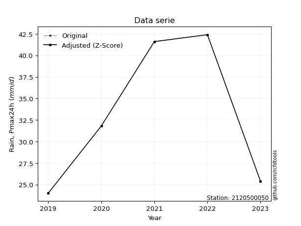</img>

</div>


> The initial value (value_initial) correspond to the initial obtained or null completed value, and value (value) is adjusted only when the initial value is outside the valid range (outlier) definite through the Z-Score value. If Z-Score is active, values out of range or outliers are replaced with the station mean value. A Z-Score (or standard score) measures how many standard deviations a data point is from the mean of a dataset, indicating its relative position; positive scores mean above the mean, negative mean below, and a score of zero is exactly at the mean, allowing for comparison of values from different distributions. It´s calculated using the formula $z=(x–μ)/σ$, where $x$ is the data point, $μ$ is the mean, and $σ$ is the standard deviation, helping identify outliers and understand probability.
>
> <sub>**Note**: In this study, "completing" (filling gaps in) and "extending" (forecasting or lengthening the historical record) rainfall data series are avoided for certain critical analyses because they introduce artificial bias and uncertainty, which can distort the statistics of rare events (extremes), alter day-to-day variability, and compromise the integrity and homogeneity of the original data. Some reasons against Completing/Extending rainfall data are: **Distortion of Extremes and Variability**: The primary issue is that most gap-filling or extension methods rely on averaging or regression with nearby stations, which inherently smooths the data. Rainfall is highly variable in space and time, with a large percentage of zero values and occasional large storms. Infilling methods often underestimate the highest values and overestimate the lowest (zero) values, which severely distorts analyses focused on flood frequency, drought severity, and intensity-duration-frequency (IDF) curves, **Loss of Data Homogeneity**: Infilled or extended data are synthetic estimates, not actual measurements. Combining these estimates with observed data can violate the assumption of data homogeneity, which requires that the data properties do not change over time. Inhomogeneity can lead to incorrect conclusions about long-term trends or changes in climate patterns, **Propagation of Errors**: Errors and biases from the original data (e.g., wind-induced undercatch, instrument errors, site changes) or the data used for imputation can propagate through the analysis, leading to unreliable hydrological models and inaccurate predictions, **Compromised Statistical Integrity**: For statistical analyses, especially those involving the frequency of events, using artificial data can introduce time bias or autocorrelation that doesn´t exist in reality, making it difficult to assess the true probability of events, **Difficulty in Validation**: It is difficult to accurately validate the quality of filled or extended data, especially for past periods where ground-truth measurements are unavailable. The reliability of imputation techniques heavily depends on the density of the surrounding station network and the complexity of the local topography.</sub>


### 4. Active continuous probability distributions from SciPy (80 of 104 available)

A Probability Density Function (PDF) describes the relative likelihood of a continuous random variable falling within a specific range, where the total area under its curve equals 1, and the area over any interval gives the actual probability for that range. Unlike discrete probabilities (like rolling a die), a PDF shows density, not direct probability for a single point (which is zero), with higher points indicating higher likelihood, often visualized as a bell curve for normal distributions.

A log of a probability density function (log-PDF) is simply the logarithm of the PDF´s value, denoted as $log(f(x))$, useful for converting multiplication of probabilities into addition, improving numerical stability with tiny numbers, and connecting to information theory concepts like entropy. Instead of dealing with very small probabilities (e.g., 0.000001), log-PDFs use negative numbers (e.g., $log(0.00001) ≈ -11.51$ that are easier for computers to handle, preventing underflow errors and simplifying complex calculations. In this study, each active probability distribution from SciPy is also evaluated in the $log$ form.

[scipy.stats](https://docs.scipy.org/doc/scipy/reference/stats.html) is a Python´s powerful submodule within the SciPy library for comprehensive statistical analysis, offering over 130 probability distributions (like Normal, Poisson, etc.), functions for descriptive stats (mean, variance), hypothesis testing (t-tests, chi-square), random variable generation, and statistical tests, making it essential for data science, modeling, and research. It provides tools to explore, model, and draw conclusions from data efficiently, working seamlessly with [NumPy](https://numpy.org/).

<div align="center">

|   id | p_dist           |   n_parameter | fit_method   | label                                                                       | active   | ref                                                                                                      |
|-----:|:-----------------|--------------:|:-------------|:----------------------------------------------------------------------------|:---------|:---------------------------------------------------------------------------------------------------------|
|    0 | alpha            |             3 | MLE          | Alpha                                                                       | True     | [:mortar_board:](https://docs.scipy.org/doc/scipy/reference/generated/scipy.stats.alpha.html)            |
|    1 | anglit           |             2 | MM           | Anglit                                                                      | True     | [:mortar_board:](https://docs.scipy.org/doc/scipy/reference/generated/scipy.stats.anglit.html)           |
|    2 | arcsine          |             2 | MM           | Arcsine                                                                     | True     | [:mortar_board:](https://docs.scipy.org/doc/scipy/reference/generated/scipy.stats.arcsine.html)          |
|    3 | argus            |             3 | MLE          | Argus                                                                       | True     | [:mortar_board:](https://docs.scipy.org/doc/scipy/reference/generated/scipy.stats.argus.html)            |
|    4 | beta             |             4 | MLE          | Beta                                                                        | True     | [:mortar_board:](https://docs.scipy.org/doc/scipy/reference/generated/scipy.stats.beta.html)             |
|    5 | betaprime        |             4 | MLE          | Beta prime                                                                  | True     | [:mortar_board:](https://docs.scipy.org/doc/scipy/reference/generated/scipy.stats.betaprime.html)        |
|    6 | bradford         |             3 | MLE          | Bradford                                                                    | True     | [:mortar_board:](https://docs.scipy.org/doc/scipy/reference/generated/scipy.stats.bradford.html)         |
|    7 | burr             |             4 | MLE          | Burr (Type III)                                                             | True     | [:mortar_board:](https://docs.scipy.org/doc/scipy/reference/generated/scipy.stats.burr.html)             |
|    8 | burr12           |             4 | MLE          | Burr (Type III) 12                                                          | True     | [:mortar_board:](https://docs.scipy.org/doc/scipy/reference/generated/scipy.stats.burr12.html)           |
|    9 | cosine           |             2 | MLE          | Cosine                                                                      | True     | [:mortar_board:](https://docs.scipy.org/doc/scipy/reference/generated/scipy.stats.cosine.html)           |
|   10 | crystalball      |             4 | MLE          | Crystalball                                                                 | True     | [:mortar_board:](https://docs.scipy.org/doc/scipy/reference/generated/scipy.stats.crystalball.html)      |
|   11 | dgamma           |             3 | MLE          | Double gamma                                                                | True     | [:mortar_board:](https://docs.scipy.org/doc/scipy/reference/generated/scipy.stats.dgamma.html)           |
|   12 | dweibull         |             3 | MLE          | Double Weibull                                                              | True     | [:mortar_board:](https://docs.scipy.org/doc/scipy/reference/generated/scipy.stats.dweibull.html)         |
|   13 | erlang           |             3 | MLE          | Erlang                                                                      | True     | [:mortar_board:](https://docs.scipy.org/doc/scipy/reference/generated/scipy.stats.erlang.html)           |
|   14 | exponnorm        |             3 | MLE          | Exponentially modified Normal                                               | True     | [:mortar_board:](https://docs.scipy.org/doc/scipy/reference/generated/scipy.stats.exponnorm.html)        |
|   15 | exponpow         |             3 | MLE          | Exponential power                                                           | True     | [:mortar_board:](https://docs.scipy.org/doc/scipy/reference/generated/scipy.stats.exponpow.html)         |
|   16 | exponweib        |             4 | MLE          | Exponentiated Weibull                                                       | True     | [:mortar_board:](https://docs.scipy.org/doc/scipy/reference/generated/scipy.stats.exponweib.html)        |
|   17 | f                |             4 | MLE          | F                                                                           | True     | [:mortar_board:](https://docs.scipy.org/doc/scipy/reference/generated/scipy.stats.f.html)                |
|   18 | fatiguelife      |             3 | MLE          | Fatigue-life (Birnbaum-Saunders)                                            | True     | [:mortar_board:](https://docs.scipy.org/doc/scipy/reference/generated/scipy.stats.fatiguelife.html)      |
|   19 | foldnorm         |             3 | MM           | Fold Normal                                                                 | True     | [:mortar_board:](https://docs.scipy.org/doc/scipy/reference/generated/scipy.stats.foldnorm.html)         |
|   20 | gamma            |             3 | MLE          | Gamma                                                                       | True     | [:mortar_board:](https://docs.scipy.org/doc/scipy/reference/generated/scipy.stats.gamma.html)            |
|   21 | gausshyper       |             6 | MLE          | Gauss hypergeometric                                                        | True     | [:mortar_board:](https://docs.scipy.org/doc/scipy/reference/generated/scipy.stats.gausshyper.html)       |
|   22 | genexpon         |             5 | MLE          | Generalized exponential                                                     | True     | [:mortar_board:](https://docs.scipy.org/doc/scipy/reference/generated/scipy.stats.genexpon.html)         |
|   23 | genextreme       |             3 | MLE          | Generalized exponential                                                     | True     | [:mortar_board:](https://docs.scipy.org/doc/scipy/reference/generated/scipy.stats.genextreme.html)       |
|   24 | gengamma         |             4 | MLE          | Generalized gamma                                                           | True     | [:mortar_board:](https://docs.scipy.org/doc/scipy/reference/generated/scipy.stats.gengamma.html)         |
|   25 | genhalflogistic  |             3 | MLE          | Generalized half-logistic                                                   | True     | [:mortar_board:](https://docs.scipy.org/doc/scipy/reference/generated/scipy.stats.genhalflogistic.html)  |
|   26 | genlogistic      |             3 | MLE          | Generalized logistic                                                        | True     | [:mortar_board:](https://docs.scipy.org/doc/scipy/reference/generated/scipy.stats.genlogistic.html)      |
|   27 | gennorm          |             3 | MLE          | Generalized Normal                                                          | True     | [:mortar_board:](https://docs.scipy.org/doc/scipy/reference/generated/scipy.stats.gennorm.html)          |
|   28 | genpareto        |             3 | MLE          | Generalized Pareto                                                          | True     | [:mortar_board:](https://docs.scipy.org/doc/scipy/reference/generated/scipy.stats.genpareto.html)        |
|   29 | gompertz         |             3 | MLE          | Gompertz (or truncated Gumbel)                                              | True     | [:mortar_board:](https://docs.scipy.org/doc/scipy/reference/generated/scipy.stats.gompertz.html)         |
|   30 | gumbel_l         |             2 | MM           | Gumbel Left Skew                                                            | True     | [:mortar_board:](https://docs.scipy.org/doc/scipy/reference/generated/scipy.stats.gumbel_l.html)         |
|   31 | gumbel_r         |             2 | MM           | Gumbel Right Skew                                                           | True     | [:mortar_board:](https://docs.scipy.org/doc/scipy/reference/generated/scipy.stats.gumbel_r.html)         |
|   32 | halfgennorm      |             3 | MLE          | Upper half of a generalized normal                                          | True     | [:mortar_board:](https://docs.scipy.org/doc/scipy/reference/generated/scipy.stats.halfgennorm.html)      |
|   33 | halflogistic     |             2 | MM           | Half-logistic                                                               | True     | [:mortar_board:](https://docs.scipy.org/doc/scipy/reference/generated/scipy.stats.halflogistic.html)     |
|   34 | halfnorm         |             2 | MM           | Half Normal                                                                 | True     | [:mortar_board:](https://docs.scipy.org/doc/scipy/reference/generated/scipy.stats.halfnorm.html)         |
|   35 | hypsecant        |             2 | MM           | hyperbolic secant                                                           | True     | [:mortar_board:](https://docs.scipy.org/doc/scipy/reference/generated/scipy.stats.hypsecant.html)        |
|   36 | invgamma         |             3 | MLE          | Inverted gamma                                                              | True     | [:mortar_board:](https://docs.scipy.org/doc/scipy/reference/generated/scipy.stats.invgamma.html)         |
|   37 | invgauss         |             3 | MLE          | Inverse Gaussian                                                            | True     | [:mortar_board:](https://docs.scipy.org/doc/scipy/reference/generated/scipy.stats.invgauss.html)         |
|   38 | invweibull       |             3 | MLE          | Inverted Weibull                                                            | True     | [:mortar_board:](https://docs.scipy.org/doc/scipy/reference/generated/scipy.stats.invweibull.html)       |
|   39 | johnsonsb        |             4 | MLE          | Johnson SB                                                                  | True     | [:mortar_board:](https://docs.scipy.org/doc/scipy/reference/generated/scipy.stats.johnsonsb.html)        |
|   40 | johnsonsu        |             4 | MLE          | Johnson Su                                                                  | True     | [:mortar_board:](https://docs.scipy.org/doc/scipy/reference/generated/scipy.stats.johnsonsu.html)        |
|   41 | kappa3           |             3 | MLE          | Kappa 3                                                                     | True     | [:mortar_board:](https://docs.scipy.org/doc/scipy/reference/generated/scipy.stats.kappa3.html)           |
|   42 | kappa4           |             4 | MLE          | Kappa 4                                                                     | True     | [:mortar_board:](https://docs.scipy.org/doc/scipy/reference/generated/scipy.stats.kappa4.html)           |
|   43 | ksone            |             3 | MLE          | Kolmogorov-Smirnov one-sided test statistic distribution                    | True     | [:mortar_board:](https://docs.scipy.org/doc/scipy/reference/generated/scipy.stats.ksone.html)            |
|   44 | kstwobign        |             2 | MLE          | Limiting distribution of scaled Kolmogorov-Smirnov two-sided test statistic | True     | [:mortar_board:](https://docs.scipy.org/doc/scipy/reference/generated/scipy.stats.kstwobign.html)        |
|   45 | laplace          |             2 | MM           | Laplace                                                                     | True     | [:mortar_board:](https://docs.scipy.org/doc/scipy/reference/generated/scipy.stats.laplace.html)          |
|   46 | levy_l           |             2 | MLE          | Left-skewed Levy                                                            | True     | [:mortar_board:](https://docs.scipy.org/doc/scipy/reference/generated/scipy.stats.levy_l.html)           |
|   47 | loggamma         |             3 | MLE          | Log gamma                                                                   | True     | [:mortar_board:](https://docs.scipy.org/doc/scipy/reference/generated/scipy.stats.loggamma.html)         |
|   48 | logistic         |             2 | MM           | Logistic (or Sech-squared)                                                  | True     | [:mortar_board:](https://docs.scipy.org/doc/scipy/reference/generated/scipy.stats.logistic.html)         |
|   49 | loglaplace       |             3 | MLE          | Log-Laplace                                                                 | True     | [:mortar_board:](https://docs.scipy.org/doc/scipy/reference/generated/scipy.stats.loglaplace.html)       |
|   50 | lomax            |             3 | MLE          | Lomax (Pareto of the second kind)                                           | True     | [:mortar_board:](https://docs.scipy.org/doc/scipy/reference/generated/scipy.stats.lomax.html)            |
|   51 | maxwell          |             2 | MM           | Maxwell                                                                     | True     | [:mortar_board:](https://docs.scipy.org/doc/scipy/reference/generated/scipy.stats.maxwell.html)          |
|   52 | mielke           |             4 | MLE          | Mielke Beta-Kappa / Dagum                                                   | True     | [:mortar_board:](https://docs.scipy.org/doc/scipy/reference/generated/scipy.stats.mielke.html)           |
|   53 | moyal            |             2 | MM           | Moyal                                                                       | True     | [:mortar_board:](https://docs.scipy.org/doc/scipy/reference/generated/scipy.stats.moyal.html)            |
|   54 | nakagami         |             3 | MLE          | Nakagami                                                                    | True     | [:mortar_board:](https://docs.scipy.org/doc/scipy/reference/generated/scipy.stats.nakagami.html)         |
|   55 | ncf              |             5 | MLE          | Non-central F distribution                                                  | True     | [:mortar_board:](https://docs.scipy.org/doc/scipy/reference/generated/scipy.stats.ncf.html)              |
|   56 | nct              |             4 | MLE          | Non-central Student’s t                                                     | True     | [:mortar_board:](https://docs.scipy.org/doc/scipy/reference/generated/scipy.stats.nct.html)              |
|   57 | norm             |             2 | MM           | Normal                                                                      | True     | [:mortar_board:](https://docs.scipy.org/doc/scipy/reference/generated/scipy.stats.norm.html)             |
|   58 | pearson3         |             3 | MM           | Pearson type III                                                            | True     | [:mortar_board:](https://docs.scipy.org/doc/scipy/reference/generated/scipy.stats.pearson3.html)         |
|   59 | powerlaw         |             3 | MLE          | Power-function                                                              | True     | [:mortar_board:](https://docs.scipy.org/doc/scipy/reference/generated/scipy.stats.powerlaw.html)         |
|   60 | rayleigh         |             2 | MM           | Rayleigh                                                                    | True     | [:mortar_board:](https://docs.scipy.org/doc/scipy/reference/generated/scipy.stats.rayleigh.html)         |
|   61 | rdist            |             3 | MLE          | R-distributed (symmetric beta)                                              | True     | [:mortar_board:](https://docs.scipy.org/doc/scipy/reference/generated/scipy.stats.rdist.html)            |
|   62 | rice             |             3 | MLE          | Rice                                                                        | True     | [:mortar_board:](https://docs.scipy.org/doc/scipy/reference/generated/scipy.stats.rice.html)             |
|   63 | semicircular     |             2 | MM           | Semicircular                                                                | True     | [:mortar_board:](https://docs.scipy.org/doc/scipy/reference/generated/scipy.stats.semicircular.html)     |
|   64 | skewnorm         |             3 | MLE          | Skew normal                                                                 | True     | [:mortar_board:](https://docs.scipy.org/doc/scipy/reference/generated/scipy.stats.skewnorm.html)         |
|   65 | t                |             3 | MLE          | Student’s t                                                                 | True     | [:mortar_board:](https://docs.scipy.org/doc/scipy/reference/generated/scipy.stats.t.html)                |
|   66 | trapezoid        |             4 | MLE          | Trapezoid                                                                   | True     | [:mortar_board:](https://docs.scipy.org/doc/scipy/reference/generated/scipy.stats.trapezoid.html)        |
|   67 | triang           |             3 | MLE          | Triangular                                                                  | True     | [:mortar_board:](https://docs.scipy.org/doc/scipy/reference/generated/scipy.stats.triang.html)           |
|   68 | truncexpon       |             3 | MLE          | Truncated exponential                                                       | True     | [:mortar_board:](https://docs.scipy.org/doc/scipy/reference/generated/scipy.stats.truncexpon.html)       |
|   69 | truncnorm        |             4 | MLE          | Truncated normal                                                            | True     | [:mortar_board:](https://docs.scipy.org/doc/scipy/reference/generated/scipy.stats.truncnorm.html)        |
|   70 | truncpareto      |             4 | MLE          | Upper truncated Pareto                                                      | True     | [:mortar_board:](https://docs.scipy.org/doc/scipy/reference/generated/scipy.stats.truncpareto.html)      |
|   71 | truncweibull_min |             5 | MLE          | Doubly truncated Weibull minimum                                            | True     | [:mortar_board:](https://docs.scipy.org/doc/scipy/reference/generated/scipy.stats.truncweibull_min.html) |
|   72 | tukeylambda      |             3 | MLE          | Tukey-Lamdba                                                                | True     | [:mortar_board:](https://docs.scipy.org/doc/scipy/reference/generated/scipy.stats.tukeylambda.html)      |
|   73 | uniform          |             2 | MLE          | Uniform                                                                     | True     | [:mortar_board:](https://docs.scipy.org/doc/scipy/reference/generated/scipy.stats.uniform.html)          |
|   74 | vonmises         |             3 | MLE          | Von Mises                                                                   | True     | [:mortar_board:](https://docs.scipy.org/doc/scipy/reference/generated/scipy.stats.vonmises.html)         |
|   75 | vonmises_line    |             3 | MLE          | Von Mises line                                                              | True     | [:mortar_board:](https://docs.scipy.org/doc/scipy/reference/generated/scipy.stats.vonmises_line.html)    |
|   76 | wald             |             2 | MM           | Wald                                                                        | True     | [:mortar_board:](https://docs.scipy.org/doc/scipy/reference/generated/scipy.stats.wald.html)             |
|   77 | weibull_max      |             3 | MLE          | Weibull maximum                                                             | True     | [:mortar_board:](https://docs.scipy.org/doc/scipy/reference/generated/scipy.stats.weibull_max.html)      |
|   78 | weibull_min      |             3 | MLE          | Weibull minimum                                                             | True     | [:mortar_board:](https://docs.scipy.org/doc/scipy/reference/generated/scipy.stats.weibull_min.html)      |
|   79 | wrapcauchy       |             3 | MLE          | Wrapped  Cauchy                                                             | True     | [:mortar_board:](https://docs.scipy.org/doc/scipy/reference/generated/scipy.stats.wrapcauchy.html)       |

</div>

> **n_parameter:** # arguments & localization & scale.
>
> **Fit methods:** (MLE) maximum likelihood, (MM) L-moments.
>
>**Inactive** (With the only purpose of prevent loops, zero divisions, infinite values, over high estimated values or horizontal trending for recurrence intervals estimations, the follow distributions were disabled.)**:** lognorm, norminvgauss, powernorm, powerlognorm, cauchy, halfcauchy, foldcauchy, skewcauchy, chi2, expon, fisk, genhyperbolic, geninvgauss, gibrat, kstwo, laplace_asymmetric, levy, levy_stable, ncx2, pareto, rel_breitwigner, recipinvgauss, studentized_range, loguniform, 


## B. Probability (PDF) vs. Empirical (EDF) distributions functions

A continuous probability distribution (CPD) describes probabilities for variables that can take any value within a range (like rain any time), unlike discrete variables with specific outcomes (like temperature). It uses a Probability Density Function (PDF), a curve where the total area under it equals 1, and the probability of the variable falling within an interval (a to b) is found by calculating the area under the curve between those points. A key feature is that the probability of hitting any single exact value is zero, so probabilities are always expressed for ranges, e.g., $P(a ≤ X ≤ b)$.

<div align="center">

Distributions parameters from station values
|     |    station | p_dist              |   n |             loc |           scale | shape                  | shape1                 | shape2                | shape3             |
|----:|-----------:|:--------------------|----:|----------------:|----------------:|:-----------------------|:-----------------------|:----------------------|:-------------------|
|   0 | 2120500050 | alpha               |   6 |  -120.495       |  3008.53        | 19.47223837452367      |                        |                       |                    |
|   1 | 2120500050 | anglit              |   6 |    34.5333      |    22.9544      |                        |                        |                       |                    |
|   2 | 2120500050 | arcsine             |   6 |    23.4366      |    22.1935      |                        |                        |                       |                    |
|   3 | 2120500050 | argus               |   6 |    15.678       |    28.0648      | 1.9066574196158803     |                        |                       |                    |
|   4 | 2120500050 | beta                |   6 |    22.4619      |    19.9381      | 1.2286735392344457     | 0.5829945775874068     |                       |                    |
|   5 | 2120500050 | betaprime           |   6 |    -0.42642     |    55.7655      | 29.842501849519252     | 48.72372818649464      |                       |                    |
|   6 | 2120500050 | bradford            |   6 |    24           |    18.4         | 1.1232535445779597     |                        |                       |                    |
|   7 | 2120500050 | burr                |   6 |    -0.673195    |     7.64885     | 4.634090224841948      | 597.8344503206802      |                       |                    |
|   8 | 2120500050 | burr12              |   6 |     2.87716     |    21.0435      | 1126.1222686232886     | 0.0023680078213874156  |                       |                    |
|   9 | 2120500050 | cosine              |   6 |    34.2621      |     6.12625     |                        |                        |                       |                    |
|  10 | 2120500050 | crystalball         |   6 |    34.5333      |     7.84658     | 3365.090283846115      | 858.6725316636487      |                       |                    |
|  11 | 2120500050 | dgamma              |   6 |    35.4601      |     0.945126    | 7.900173584588157      |                        |                       |                    |
|  12 | 2120500050 | dweibull            |   6 |    34.5296      |     8.27242     | 3.7479394275675806     |                        |                       |                    |
|  13 | 2120500050 | erlang              |   6 |  -101.065       |     0.462825    | 292.97445541490345     |                        |                       |                    |
|  14 | 2120500050 | exponnorm           |   6 |    34.5265      |     7.84658     | 0.0008669891324692139  |                        |                       |                    |
|  15 | 2120500050 | exponpow            |   6 |    24           |    23.3109      | 0.9335689402389666     |                        |                       |                    |
|  16 | 2120500050 | exponweib           |   6 |    24           |     1.44886     | 1.2211958746240654     | 0.2774788538917441     |                       |                    |
|  17 | 2120500050 | f                   |   6 | -1236.42        |  1270.94        | 63901.15564530608      | 285234.4488502452      |                       |                    |
|  18 | 2120500050 | fatiguelife         |   6 |    24           |     3.07032e-06 | 1730.139553591926      |                        |                       |                    |
|  19 | 2120500050 | foldnorm            |   6 |   -12.128       |     7.74658     | 6.025315818761134      |                        |                       |                    |
|  20 | 2120500050 | gamma               |   6 |   -95.1684      |     0.477742    | 271.47693444224376     |                        |                       |                    |
|  21 | 2120500050 | gausshyper          |   6 |    24           |    18.8288      | 0.9301075754101616     | 1.0133988506582128     | 1.0616536924953919    | 1.228715355424311  |
|  22 | 2120500050 | genexpon            |   6 |    24           |     1.91682     | 0.1821645948407514     | 7.144040024371073e-07  | 1.137064823161728     |                    |
|  23 | 2120500050 | genextreme          |   6 |    35.3624      |     9.09928     | 1.292948594905014      |                        |                       |                    |
|  24 | 2120500050 | gengamma            |   6 |    24           |     1.27097     | 1.2753511522653778     | 0.3894848150288801     |                       |                    |
|  25 | 2120500050 | genhalflogistic     |   6 |    17.7471      |    26.6434      | 1.080738180732467      |                        |                       |                    |
|  26 | 2120500050 | genlogistic         |   6 |    42.4002      |     3.38751e-06 | 4.312109647400914e-07  |                        |                       |                    |
|  27 | 2120500050 | gennorm             |   6 |    33.2         |     9.20001     | 20659338.271929227     |                        |                       |                    |
|  28 | 2120500050 | genpareto           |   6 |    -0.282382    |   114.003       | -2.670962153265742     |                        |                       |                    |
|  29 | 2120500050 | gompertz            |   6 |    24           |    11.9243      | 0.5160678151134597     |                        |                       |                    |
|  30 | 2120500050 | gumbel_l            |   6 |    38.0647      |     6.11796     |                        |                        |                       |                    |
|  31 | 2120500050 | gumbel_r            |   6 |    31.002       |     6.11796     |                        |                        |                       |                    |
|  32 | 2120500050 | halfgennorm         |   6 |    24           |     1.28792     | 0.44926977968718296    |                        |                       |                    |
|  33 | 2120500050 | halflogistic        |   6 |    25.2334      |     6.70852     |                        |                        |                       |                    |
|  34 | 2120500050 | halfnorm            |   6 |    24.1475      |    13.0167      |                        |                        |                       |                    |
|  35 | 2120500050 | hypsecant           |   6 |    34.5333      |     4.99529     |                        |                        |                       |                    |
|  36 | 2120500050 | invgamma            |   6 |   -58.6848      | 12479.5         | 134.88889882423794     |                        |                       |                    |
|  37 | 2120500050 | invgauss            |   6 |     1.69993     |   492.065       | 0.06666465413519179    |                        |                       |                    |
|  38 | 2120500050 | invweibull          |   6 |    -2.68251e+08 |     2.68251e+08 | 37526915.04021978      |                        |                       |                    |
|  39 | 2120500050 | johnsonsb           |   6 |    24           |    40.0501      | 1.2051608382721275     | 0.15726413075703155    |                       |                    |
|  40 | 2120500050 | johnsonsu           |   6 |    42.4         |     9.77636e-15 | 3.45549808977439       | 0.1297495573881635     |                       |                    |
|  41 | 2120500050 | kappa3              |   6 |    24           |    18.3789      | 1259.253079060101      |                        |                       |                    |
|  42 | 2120500050 | kappa4              |   6 |    20.9143      |    23.9128      | 1.1426898112968933     | 1.1129616330241396     |                       |                    |
|  43 | 2120500050 | ksone               |   6 |    20.9427      |    27.1814      | 1.0                    |                        |                       |                    |
|  44 | 2120500050 | kstwobign           |   6 |     6.43491     |    31.9418      |                        |                        |                       |                    |
|  45 | 2120500050 | laplace             |   6 |    34.5333      |     5.54837     |                        |                        |                       |                    |
|  46 | 2120500050 | levy_l              |   6 |    42.5628      |     0.654847    |                        |                        |                       |                    |
|  47 | 2120500050 | loggamma            |   6 |    42.4002      |     6.59434e-06 | 8.373639172909275e-07  |                        |                       |                    |
|  48 | 2120500050 | logistic            |   6 |    34.5333      |     4.32605     |                        |                        |                       |                    |
|  49 | 2120500050 | loglaplace          |   6 |    -0.087291    |    31.8873      | 4.487406865166241      |                        |                       |                    |
|  50 | 2120500050 | lomax               |   6 |    24           |    46.5976      | 4.8547129104544595     |                        |                       |                    |
|  51 | 2120500050 | maxwell             |   6 |    15.9402      |    11.6515      |                        |                        |                       |                    |
|  52 | 2120500050 | mielke              |   6 |   -31.9506      |    27.5521      | 14273.763485403273     | 9.071188756109276      |                       |                    |
|  53 | 2120500050 | moyal               |   6 |    30.0462      |     3.5322      |                        |                        |                       |                    |
|  54 | 2120500050 | nakagami            |   6 |    24           |    13.7538      | 0.31208298410182567    |                        |                       |                    |
|  55 | 2120500050 | ncf                 |   6 |     1.41621     |     1.15547e-05 | 2.5090411554404094e-05 | 697.6974182498622      | 71.72924935520004     |                    |
|  56 | 2120500050 | nct                 |   6 |  -255.974       |     7.82041     | 81817.83279717472      | 37.14728657146223      |                       |                    |
|  57 | 2120500050 | norm                |   6 |    34.5333      |     7.84658     |                        |                        |                       |                    |
|  58 | 2120500050 | pearson3            |   6 |    34.5333      |     7.84655     | -0.23971176303260544   |                        |                       |                    |
|  59 | 2120500050 | powerlaw            |   6 |    24           |    18.4         | 0.15119462136257664    |                        |                       |                    |
|  60 | 2120500050 | rayleigh            |   6 |    19.5224      |    11.977       |                        |                        |                       |                    |
|  61 | 2120500050 | rdist               |   6 |    34.5559      |    10.5559      | 1.0465261433923805     |                        |                       |                    |
|  62 | 2120500050 | rice                |   6 |    19.3757      |     9.36838     | 1.1485991202660353     |                        |                       |                    |
|  63 | 2120500050 | semicircular        |   6 |    34.5333      |    15.6932      |                        |                        |                       |                    |
|  64 | 2120500050 | skewnorm            |   6 |    42.4         |    11.1095      | -1504492.355219366     |                        |                       |                    |
|  65 | 2120500050 | t                   |   6 |    34.533       |     7.84649     | 47132320.67545415      |                        |                       |                    |
|  66 | 2120500050 | trapezoid           |   6 |    12.3398      |    33.2902      | 1.0                    | 1.0                    |                       |                    |
|  67 | 2120500050 | triang              |   6 |    13.2113      |    29.1887      | 0.9999999579472694     |                        |                       |                    |
|  68 | 2120500050 | truncexpon          |   6 |    23.9637      |    22.3995      | 0.823066772533499      |                        |                       |                    |
|  69 | 2120500050 | truncnorm           |   6 |    25.8372      |    25.3822      | -127.05795021100309    | 0.6525371237550696     |                       |                    |
|  70 | 2120500050 | truncpareto         |   6 |    23.9724      |     0.0276033   | 0.2066260332859312     | 667.5862034735736      |                       |                    |
|  71 | 2120500050 | truncweibull_min    |   6 |    23.9996      |    27.7506      | 0.5388558125598188     | 1.4680082654773506e-05 | 0.6630637788353397    |                    |
|  72 | 2120500050 | tukeylambda         |   6 |    33.2         |    11.2115      | 1.218636490243659      |                        |                       |                    |
|  73 | 2120500050 | uniform             |   6 |    24           |    18.4         |                        |                        |                       |                    |
|  74 | 2120500050 | vonmises            |   6 |    -1.18121     |     1           | 1.2149165039655718     |                        |                       |                    |
|  75 | 2120500050 | vonmises_line       |   6 |    33.1988      |     2.92885     | 0.017736402943503142   |                        |                       |                    |
|  76 | 2120500050 | wald                |   6 |    26.6867      |     7.8466      |                        |                        |                       |                    |
|  77 | 2120500050 | weibull_max         |   6 |    42.4         |     1.69941     | 0.165613412925312      |                        |                       |                    |
|  78 | 2120500050 | weibull_min         |   6 |    -4.1405e+08  |     4.1405e+08  | 66011413.58107261      |                        |                       |                    |
|  79 | 2120500050 | wrapcauchy          |   6 |    24           |     2.92845     | 0.8421119105651099     |                        |                       |                    |
|  80 | 2120500050 | logalpha            |   6 |    -3.20717     |   185.057       | 27.584322914922247     |                        |                       |                    |
|  81 | 2120500050 | loganglit           |   6 |     3.5142      |     0.700509    |                        |                        |                       |                    |
|  82 | 2120500050 | logarcsine          |   6 |     3.17555     |     0.677288    |                        |                        |                       |                    |
|  83 | 2120500050 | logargus            |   6 |     2.92064     |     0.866987    | 2.018284111496193      |                        |                       |                    |
|  84 | 2120500050 | logbeta             |   6 |     2.94311     |     0.804042    | 2.238182665440525      | 0.5478952192820524     |                       |                    |
|  85 | 2120500050 | logbetaprime        |   6 |   -31.2361      |   369.749       | 22928.734857011495     | 243971.95040021488     |                       |                    |
|  86 | 2120500050 | logbradford         |   6 |     3.17805     |     0.569097    | 1.0764467323160445     |                        |                       |                    |
|  87 | 2120500050 | logburr             |   6 |   -24.785       |    26.3922      | 126.5631555861402      | 3895.0275080324473     |                       |                    |
|  88 | 2120500050 | logburr12           |   6 |   -55.7763      |    61.2081      | 320.17441561881344     | 14322.986538349825     |                       |                    |
|  89 | 2120500050 | logcosine           |   6 |     3.50324     |     0.187841    |                        |                        |                       |                    |
|  90 | 2120500050 | logcrystalball      |   6 |     3.5142      |     0.239458    | 59.236311596059416     | 4337.4148182914905     |                       |                    |
|  91 | 2120500050 | logdgamma           |   6 |     3.55402     |     0.0414939   | 5.384930301292053      |                        |                       |                    |
|  92 | 2120500050 | logdweibull         |   6 |     3.52721     |     0.250382    | 2.856111966608464      |                        |                       |                    |
|  93 | 2120500050 | logerlang           |   6 |    -0.402804    |     0.015025    | 260.66226961981215     |                        |                       |                    |
|  94 | 2120500050 | logexponnorm        |   6 |     3.514       |     0.239458    | 0.0008107278023269008  |                        |                       |                    |
|  95 | 2120500050 | logexponpow         |   6 |     3.17805     |     0.552602    | 0.16975723582630814    |                        |                       |                    |
|  96 | 2120500050 | logexponweib        |   6 |     3.17805     |     0.579495    | 0.5532593545286985     | 1.3140902267833594     |                       |                    |
|  97 | 2120500050 | logf                |   6 |  -140.094       |   143.609       | 2251674.6374738794     | 1043949.216506046      |                       |                    |
|  98 | 2120500050 | logfatiguelife      |   6 |   -12.622       |    16.1324      | 0.014812801495143746   |                        |                       |                    |
|  99 | 2120500050 | logfoldnorm         |   6 |     3.0015      |     0.244756    | 2.081424746375294      |                        |                       |                    |
| 100 | 2120500050 | loggamma            |   6 |    -0.0879886   |     0.0164845   | 218.40469706673906     |                        |                       |                    |
| 101 | 2120500050 | loggausshyper       |   6 |     3.16798     |     0.579172    | 1.0709967920763672     | 0.8476763998387875     | 1.0252322620890886    | 1.1716108084901913 |
| 102 | 2120500050 | loggenexpon         |   6 |     3.1779      |     0.00647294  | 0.012383032437094113   | 4.14814918563043       | 4.232686575481894e-05 |                    |
| 103 | 2120500050 | loggenextreme       |   6 |     3.60894     |     0.172939    | 1.2513233496857379     |                        |                       |                    |
| 104 | 2120500050 | loggengamma         |   6 |     3.17805     |     0.948737    | 0.12270649785550986    | 1.2476681305302622     |                       |                    |
| 105 | 2120500050 | loggenhalflogistic  |   6 |     2.97966     |     0.81414     | 1.060778206140363      |                        |                       |                    |
| 106 | 2120500050 | loggenlogistic      |   6 |     3.74716     |     1.09159e-06 | 4.6774483681651236e-06 |                        |                       |                    |
| 107 | 2120500050 | loggennorm          |   6 |     3.7281      |     0.180463    | 0.8258639641655481     |                        |                       |                    |
| 108 | 2120500050 | loggenpareto        |   6 |    -0.00323042  |     4.45328     | -1.1874226938165449    |                        |                       |                    |
| 109 | 2120500050 | loggompertz         |   6 |     3.17805     |     0.32002     | 0.37859379775671553    |                        |                       |                    |
| 110 | 2120500050 | loggumbel_l         |   6 |     3.62197     |     0.186704    |                        |                        |                       |                    |
| 111 | 2120500050 | loggumbel_r         |   6 |     3.40643     |     0.186704    |                        |                        |                       |                    |
| 112 | 2120500050 | loghalfgennorm      |   6 |     3.17802     |     0.569356    | 19186.35350807535      |                        |                       |                    |
| 113 | 2120500050 | loghalflogistic     |   6 |     3.23033     |     0.204768    |                        |                        |                       |                    |
| 114 | 2120500050 | loghalfnorm         |   6 |     3.19728     |     0.397205    |                        |                        |                       |                    |
| 115 | 2120500050 | loghypsecant        |   6 |     3.5142      |     0.152443    |                        |                        |                       |                    |
| 116 | 2120500050 | loginvgamma         |   6 |    -0.529742    |  1090.91        | 270.7004200024021      |                        |                       |                    |
| 117 | 2120500050 | loginvgauss         |   6 |     2.01038     |    52.4747      | 0.028595259712225436   |                        |                       |                    |
| 118 | 2120500050 | loginvweibull       |   6 |    -3.37736e+07 |     3.37736e+07 | 140134534.63630766     |                        |                       |                    |
| 119 | 2120500050 | logjohnsonsb        |   6 |     3.11146     |     0.635685    | -1.6427920025630605    | 0.17473339826737788    |                       |                    |
| 120 | 2120500050 | logjohnsonsu        |   6 |     3.74715     |     1.78632e-15 | 1.9087226772086776     | 0.11368284754615629    |                       |                    |
| 121 | 2120500050 | logkappa3           |   6 |     3.17338     |     0.570052    | 276.1146251996952      |                        |                       |                    |
| 122 | 2120500050 | logkappa4           |   6 |     3.05964     |     0.751167    | 1.1884415439584326     | 1.092594310628262      |                       |                    |
| 123 | 2120500050 | logksone            |   6 |     3.09945     |     0.829505    | 1.0                    |                        |                       |                    |
| 124 | 2120500050 | logkstwobign        |   6 |     2.63725     |     0.996845    |                        |                        |                       |                    |
| 125 | 2120500050 | loglaplace          |   6 |     3.5142      |     0.169322    |                        |                        |                       |                    |
| 126 | 2120500050 | loglevy_l           |   6 |     3.75109     |     0.0158551   |                        |                        |                       |                    |
| 127 | 2120500050 | logloggamma         |   6 |     3.74716     |     6.43889e-07 | 2.7827701290865602e-06 |                        |                       |                    |
| 128 | 2120500050 | loglogistic         |   6 |     3.5142      |     0.13202     |                        |                        |                       |                    |
| 129 | 2120500050 | logloglaplace       |   6 |    -0.0889214   |     3.81702     | 16.02404903816901      |                        |                       |                    |
| 130 | 2120500050 | loglomax            |   6 |     3.17805     |  5747.21        | 17026.506136253003     |                        |                       |                    |
| 131 | 2120500050 | logmaxwell          |   6 |     2.94678     |     0.355574    |                        |                        |                       |                    |
| 132 | 2120500050 | logmielke           |   6 | -8215.09        |  8218.85        | 32995.329812040785     | 1013083.2209202057     |                       |                    |
| 133 | 2120500050 | logmoyal            |   6 |     3.37726     |     0.107794    |                        |                        |                       |                    |
| 134 | 2120500050 | lognakagami         |   6 |     3.17805     |     0.661994    | 0.06920632105878638    |                        |                       |                    |
| 135 | 2120500050 | logncf              |   6 |    -3.50102     |     7.01178     | 506.2037383694834      | 718.0149572531423      | 2.131764641532788e-09 |                    |
| 136 | 2120500050 | lognct              |   6 |    -0.731538    |     0.0929482   | 185.87945008519705     | 45.451965115552895     |                       |                    |
| 137 | 2120500050 | lognorm             |   6 |     3.5142      |     0.239458    |                        |                        |                       |                    |
| 138 | 2120500050 | logpearson3         |   6 |     3.5142      |     0.239458    | -0.32019805919344224   |                        |                       |                    |
| 139 | 2120500050 | logpowerlaw         |   6 |     3.17805     |     0.569095    | 0.15852794236915133    |                        |                       |                    |
| 140 | 2120500050 | lograyleigh         |   6 |     3.0561      |     0.365508    |                        |                        |                       |                    |
| 141 | 2120500050 | logrdist            |   6 |     3.51299     |     0.334935    | 1.0606827604589144     |                        |                       |                    |
| 142 | 2120500050 | logrice             |   6 |     3.03848     |     0.281886    | 1.2528778612983686     |                        |                       |                    |
| 143 | 2120500050 | logsemicircular     |   6 |     3.5142      |     0.478915    |                        |                        |                       |                    |
| 144 | 2120500050 | logskewnorm         |   6 |     3.74715     |     0.334062    | -14829095.299526766    |                        |                       |                    |
| 145 | 2120500050 | logt                |   6 |     3.5142      |     0.239458    | 8493168575.864414      |                        |                       |                    |
| 146 | 2120500050 | logtrapezoid        |   6 |     2.83691     |     1.01593     | 1.0                    | 1.0                    |                       |                    |
| 147 | 2120500050 | logtriang           |   6 |     3.0053      |     0.742397    | 0.9999999850953475     |                        |                       |                    |
| 148 | 2120500050 | logtruncexpon       |   6 |     3.17805     |     0.561577    | 1.0134064685851119     |                        |                       |                    |
| 149 | 2120500050 | logtruncnorm        |   6 |    -0.0685      |     1.04202     | 3.1156397759752332     | 3.6617916571348386     |                       |                    |
| 150 | 2120500050 | logtruncpareto      |   6 |     3.17715     |     0.000908785 | 0.20575398013471022    | 627.2144104682142      |                       |                    |
| 151 | 2120500050 | logtruncweibull_min |   6 |     3.16878     |     0.917054    | 1.099964002265479      | 0.001268091075359863   | 0.6306848668643905    |                    |
| 152 | 2120500050 | logtukeylambda      |   6 |     3.46296     |     0.340684    | 1.195771778793298      |                        |                       |                    |
| 153 | 2120500050 | loguniform          |   6 |     3.17805     |     0.569095    |                        |                        |                       |                    |
| 154 | 2120500050 | logvonmises         |   6 |    -2.76824     |     1           | 17.813494264593253     |                        |                       |                    |
| 155 | 2120500050 | logvonmises_line    |   6 |     3.46446     |     0.0911863   | 1.0133748634880466e-05 |                        |                       |                    |
| 156 | 2120500050 | logwald             |   6 |     3.27476     |     0.23944     |                        |                        |                       |                    |
| 157 | 2120500050 | logweibull_max      |   6 |     3.74715     |     0.281578    | 0.44406950962032143    |                        |                       |                    |
| 158 | 2120500050 | logweibull_min      |   6 |    -7.53263e+06 |     7.53264e+06 | 40012532.30852021      |                        |                       |                    |
| 159 | 2120500050 | logwrapcauchy       |   6 |     3.17805     |     0.0905743   | 0.8682944472996883     |                        |                       |                    |

</div>

> **loc** (Location parameter): This shifts the distribution along the x-axis. For many common distributions, like the normal (Gaussian) distribution, loc represents the mean $μ$. For others, like the uniform distribution, it might represent the minimum value, or for the beta distribution, the left end of the support interval.
>
> **scale** (Scale parameter): This determines the width or spread of the distribution. For the normal distribution, scale represents the standard deviation $σ$. For a uniform distribution, it defines the length of the interval (from $loc$ to $loc + scale$).
>
> **shape** (Shape parameters): Refers to parameters that define the specific form of a probability distribution, distinct from its location (loc) and scale (scale). These parameters are required arguments for most distribution functions. For example, a normal (Gaussian) distribution is fully defined by its location (mean) and scale (standard deviation), so it has no specific shape parameters beyond loc and scale. However, other distributions have intrinsic properties that need specification, as Gamma distribution that takes a shape parameter, often named $a$ or $alpha$.


### 0. Cumulative distribution values - CDF (160 evaluated)

Cumulative Distribution Function (CDF), denoted as $F$<sub>$X$</sub>$(x)$, is a function that gives the probability that a random variable $X$ will take a value less than or equal to a specific value, $x$ (i.e., $(P(X≥x)$. It essentially "accumulates" probabilities from a given point up to the far right (positive infinity), providing a complete picture of the distribution´s probabilities for both discrete (like rain) and continuous (like temperature) variables, helping to find probabilities over ranges or above certain values. Each station is evaluated separately ordering the $x$ values ascending, calculating the CDF and PDF values for the activated distributions and their logarithmic forms.

<div align="center">

CDF ordered by x ascending and calculating $log(f(x))$ separately
|   id |    Station |   date |    x |   count |    mean |    std |    zscore |   Value_initial |    station |   m |     alpha |   alpha_pdf |   anglit |   anglit_pdf |   arcsine |   arcsine_pdf |     argus |   argus_pdf |      beta |       beta_pdf |   betaprime |   betaprime_pdf |    bradford |   bradford_pdf |      burr |   burr_pdf |    burr12 |   burr12_pdf |    cosine |   cosine_pdf |   crystalball |   crystalball_pdf |    dgamma |   dgamma_pdf |   dweibull |   dweibull_pdf |    erlang |   erlang_pdf |   exponnorm |   exponnorm_pdf |   exponpow |   exponpow_pdf |   exponweib |   exponweib_pdf |         f |     f_pdf |   fatiguelife |   fatiguelife_pdf |   foldnorm |   foldnorm_pdf |     gamma |   gamma_pdf |   gausshyper |   gausshyper_pdf |    genexpon |   genexpon_pdf |   genextreme |   genextreme_pdf |    gengamma |   gengamma_pdf |   genhalflogistic |   genhalflogistic_pdf |   genlogistic |   genlogistic_pdf |     gennorm |   gennorm_pdf |   genpareto |   genpareto_pdf |    gompertz |   gompertz_pdf |   gumbel_l |   gumbel_l_pdf |   gumbel_r |   gumbel_r_pdf |   halfgennorm |   halfgennorm_pdf |   halflogistic |   halflogistic_pdf |   halfnorm |   halfnorm_pdf |   hypsecant |   hypsecant_pdf |   invgamma |   invgamma_pdf |   invgauss |   invgauss_pdf |   invweibull |   invweibull_pdf |   johnsonsb |   johnsonsb_pdf |   johnsonsu |   johnsonsu_pdf |      kappa3 |   kappa3_pdf |   kappa4 |   kappa4_pdf |    ksone |   ksone_pdf |   kstwobign |   kstwobign_pdf |   laplace |   laplace_pdf |   levy_l |   levy_l_pdf |   loggamma |   loggamma_pdf |   logistic |   logistic_pdf |   loglaplace |   loglaplace_pdf |       lomax |   lomax_pdf |   maxwell |   maxwell_pdf |   mielke |   mielke_pdf |     moyal |   moyal_pdf |   nakagami |   nakagami_pdf |       ncf |   ncf_pdf |       nct |   nct_pdf |      norm |   norm_pdf |   pearson3 |   pearson3_pdf |   powerlaw |   powerlaw_pdf |   rayleigh |   rayleigh_pdf |       rdist |      rdist_pdf |      rice |   rice_pdf |   semicircular |   semicircular_pdf |   skewnorm |   skewnorm_pdf |         t |     t_pdf |   trapezoid |   trapezoid_pdf |   triang |   triang_pdf |   truncexpon |   truncexpon_pdf |   truncnorm |   truncnorm_pdf |   truncpareto |   truncpareto_pdf |   truncweibull_min |   truncweibull_min_pdf |   tukeylambda |   tukeylambda_pdf |   uniform |   uniform_pdf |   vonmises |   vonmises_pdf |   vonmises_line |   vonmises_line_pdf |     wald |   wald_pdf |   weibull_max |   weibull_max_pdf |   weibull_min |   weibull_min_pdf |   wrapcauchy |   wrapcauchy_pdf |   logalpha |   logalpha_pdf |   loganglit |   loganglit_pdf |   logarcsine |   logarcsine_pdf |   logargus |   logargus_pdf |   logbeta |   logbeta_pdf |   logbetaprime |   logbetaprime_pdf |   logbradford |   logbradford_pdf |   logburr |   logburr_pdf |   logburr12 |   logburr12_pdf |   logcosine |   logcosine_pdf |   logcrystalball |   logcrystalball_pdf |   logdgamma |   logdgamma_pdf |   logdweibull |   logdweibull_pdf |   logerlang |   logerlang_pdf |   logexponnorm |   logexponnorm_pdf |   logexponpow |   logexponpow_pdf |   logexponweib |   logexponweib_pdf |      logf |   logf_pdf |   logfatiguelife |   logfatiguelife_pdf |   logfoldnorm |   logfoldnorm_pdf |   loggausshyper |   loggausshyper_pdf |   loggenexpon |   loggenexpon_pdf |   loggenextreme |   loggenextreme_pdf |   loggengamma |   loggengamma_pdf |   loggenhalflogistic |   loggenhalflogistic_pdf |   loggenlogistic |   loggenlogistic_pdf |   loggennorm |   loggennorm_pdf |   loggenpareto |   loggenpareto_pdf |   loggompertz |   loggompertz_pdf |   loggumbel_l |   loggumbel_l_pdf |   loggumbel_r |   loggumbel_r_pdf |   loghalfgennorm |   loghalfgennorm_pdf |   loghalflogistic |   loghalflogistic_pdf |   loghalfnorm |   loghalfnorm_pdf |   loghypsecant |   loghypsecant_pdf |   loginvgamma |   loginvgamma_pdf |   loginvgauss |   loginvgauss_pdf |   loginvweibull |   loginvweibull_pdf |   logjohnsonsb |   logjohnsonsb_pdf |   logjohnsonsu |   logjohnsonsu_pdf |   logkappa3 |   logkappa3_pdf |   logkappa4 |   logkappa4_pdf |   logksone |   logksone_pdf |   logkstwobign |   logkstwobign_pdf |   loglevy_l |   loglevy_l_pdf |   logloggamma |   logloggamma_pdf |   loglogistic |   loglogistic_pdf |   logloglaplace |   logloglaplace_pdf |    loglomax |   loglomax_pdf |   logmaxwell |   logmaxwell_pdf |   logmielke |   logmielke_pdf |   logmoyal |   logmoyal_pdf |   lognakagami |   lognakagami_pdf |   logncf |   logncf_pdf |    lognct |   lognct_pdf |   lognorm |   lognorm_pdf |   logpearson3 |   logpearson3_pdf |   logpowerlaw |   logpowerlaw_pdf |   lograyleigh |   lograyleigh_pdf |    logrdist |   logrdist_pdf |   logrice |   logrice_pdf |   logsemicircular |   logsemicircular_pdf |   logskewnorm |   logskewnorm_pdf |      logt |   logt_pdf |   logtrapezoid |   logtrapezoid_pdf |   logtriang |   logtriang_pdf |   logtruncexpon |   logtruncexpon_pdf |   logtruncnorm |   logtruncnorm_pdf |   logtruncpareto |   logtruncpareto_pdf |   logtruncweibull_min |   logtruncweibull_min_pdf |   logtukeylambda |   logtukeylambda_pdf |   loguniform |   loguniform_pdf |   logvonmises |   logvonmises_pdf |   logvonmises_line |   logvonmises_line_pdf |   logwald |   logwald_pdf |   logweibull_max |   logweibull_max_pdf |   logweibull_min |   logweibull_min_pdf |   logwrapcauchy |   logwrapcauchy_pdf |
|-----:|-----------:|-------:|-----:|--------:|--------:|-------:|----------:|----------------:|-----------:|----:|----------:|------------:|---------:|-------------:|----------:|--------------:|----------:|------------:|----------:|---------------:|------------:|----------------:|------------:|---------------:|----------:|-----------:|----------:|-------------:|----------:|-------------:|--------------:|------------------:|----------:|-------------:|-----------:|---------------:|----------:|-------------:|------------:|----------------:|-----------:|---------------:|------------:|----------------:|----------:|----------:|--------------:|------------------:|-----------:|---------------:|----------:|------------:|-------------:|-----------------:|------------:|---------------:|-------------:|-----------------:|------------:|---------------:|------------------:|----------------------:|--------------:|------------------:|------------:|--------------:|------------:|----------------:|------------:|---------------:|-----------:|---------------:|-----------:|---------------:|--------------:|------------------:|---------------:|-------------------:|-----------:|---------------:|------------:|----------------:|-----------:|---------------:|-----------:|---------------:|-------------:|-----------------:|------------:|----------------:|------------:|----------------:|------------:|-------------:|---------:|-------------:|---------:|------------:|------------:|----------------:|----------:|--------------:|---------:|-------------:|-----------:|---------------:|-----------:|---------------:|-------------:|-----------------:|------------:|------------:|----------:|--------------:|---------:|-------------:|----------:|------------:|-----------:|---------------:|----------:|----------:|----------:|----------:|----------:|-----------:|-----------:|---------------:|-----------:|---------------:|-----------:|---------------:|------------:|---------------:|----------:|-----------:|---------------:|-------------------:|-----------:|---------------:|----------:|----------:|------------:|----------------:|---------:|-------------:|-------------:|-----------------:|------------:|----------------:|--------------:|------------------:|-------------------:|-----------------------:|--------------:|------------------:|----------:|--------------:|-----------:|---------------:|----------------:|--------------------:|---------:|-----------:|--------------:|------------------:|--------------:|------------------:|-------------:|-----------------:|-----------:|---------------:|------------:|----------------:|-------------:|-----------------:|-----------:|---------------:|----------:|--------------:|---------------:|-------------------:|--------------:|------------------:|----------:|--------------:|------------:|----------------:|------------:|----------------:|-----------------:|---------------------:|------------:|----------------:|--------------:|------------------:|------------:|----------------:|---------------:|-------------------:|--------------:|------------------:|---------------:|-------------------:|----------:|-----------:|-----------------:|---------------------:|--------------:|------------------:|----------------:|--------------------:|--------------:|------------------:|----------------:|--------------------:|--------------:|------------------:|---------------------:|-------------------------:|-----------------:|---------------------:|-------------:|-----------------:|---------------:|-------------------:|--------------:|------------------:|--------------:|------------------:|--------------:|------------------:|-----------------:|---------------------:|------------------:|----------------------:|--------------:|------------------:|---------------:|-------------------:|--------------:|------------------:|--------------:|------------------:|----------------:|--------------------:|---------------:|-------------------:|---------------:|-------------------:|------------:|----------------:|------------:|----------------:|-----------:|---------------:|---------------:|-------------------:|------------:|----------------:|--------------:|------------------:|--------------:|------------------:|----------------:|--------------------:|------------:|---------------:|-------------:|-----------------:|------------:|----------------:|-----------:|---------------:|--------------:|------------------:|---------:|-------------:|----------:|-------------:|----------:|--------------:|--------------:|------------------:|--------------:|------------------:|--------------:|------------------:|------------:|---------------:|----------:|--------------:|------------------:|----------------------:|--------------:|------------------:|----------:|-----------:|---------------:|-------------------:|------------:|----------------:|----------------:|--------------------:|---------------:|-------------------:|-----------------:|---------------------:|----------------------:|--------------------------:|-----------------:|---------------------:|-------------:|-----------------:|--------------:|------------------:|-------------------:|-----------------------:|----------:|--------------:|-----------------:|---------------------:|-----------------:|---------------------:|----------------:|--------------------:|
|    0 | 2120500050 |   2019 | 24   |       6 | 34.5333 | 8.5955 | -1.22545  |            24   | 2120500050 |   1 | 0.0887085 |   0.0231494 | 0.102878 |    0.0264698 |  0.101867 |     0.0911817 | 0.0600786 |   0.0152702 | 0.0238687 |      0.0193596 |   0.0812214 |       0.025543  | 7.27542e-07 |      0.0810761 | 0.0726744 |  0.0357078 | 0.0100241 |    0.123205  | 0.0751087 |    0.0232742 |     0.0897316 |         0.0206498 | 0.0395541 |    0.0208844 |  0.0422918 |      0.0371825 | 0.0891847 |    0.02149   |   0.0897321 |       0.0206499 | 3.2717e-15 |      0.429863  | 1.11978e-05 |     1.06799e+09 | 0.0901156 | 0.0207988 |     0.0350477 |       2.24085e+11 |   0.086665 |      0.0203812 | 0.0877044 |   0.0214141 |  3.69896e-15 |        0.968446  | 3.58539e-06 |      0.0950342 |     0.1221   |        0.0107929 | 5.13087e-08 |    7.17382e+06 |          0.134525 |             0.0246888 |       0       |         0.0122346 | 3.98032e-07 |     0.0543478 |    0.270234 |     0.014849    | 1.01976e-10 |      0.0432786 |  0.0954945 |      0.0148387 |  0.0432462 |      0.0222018 |   1.09003e-12 |         0.312122  |      0         |          0         |  0         |      0         |   0.0769102 |       0.0152472 |  0.0871983 |      0.0231323 |  0.0823466 |      0.0271164 |    0.0820925 |        0.0287097 |  2.0376e-06 |      4.3364e+08 |    0.115482 |     0.00137281  | 3.43781e-11 |    0.0541026 | 0.011198 |    0.080644  | 0.11248  |   0.0367899 |   0.0770916 |       0.031422  | 0.0749    |     0.0134995 | 0.148984 |   0.00396601 |  0.0816299 |       0.661287 |  0.0805526 |      0.0171204 |    0.0686742 |         0.405583 | 1.07339e-13 |   0.104184  | 0.0764112 |     0.025795  |      nan |          nan | 0.0186026 |   0.0166683 | 1.4474e-10 |  25428.9       | 0.0837736 | 0.0235024 | 0.0898526 | 0.0206649 | 0.0897316 |  0.0206498 |  0.0940938 |      0.019368  | 0.00420813 |    1.79087e+11 |   0.067497 |      0.0291073 | 2.90616e-09 | 648793         | 0.0616682 |  0.0260949 |       0.107403 |          0.0300709 |  0.0976738 |      0.0182214 | 0.0897356 | 0.0206507 |    0.12268  |       0.0210427 | 0.136618 |    0.0253261 |   0.00288632 |        0.0794619 |    0.634141 |       0.0210994 |      0        |       10.1272     |        5.58451e-06 |              5.97134   |   7.10543e-15 |         0.0891226 |  0        |     0.0543478 |    4.5185  |       0.381345 |     0.000132935 |           0.0533809 | 0        |  0         |      0.226809 |       0.00302879  |     0.0971912 |         0.0147164 |   7.7658e-07 |       0.634087   |  0.0810918 |       0.68173  |   0.0904863 |        0.819054 |    0.0387027 |         7.74971  |  0.0540834 |       0.448691 | 0.0286691 |   0.28772     |      0.0808074 |           0.628481 |   1.39336e-06 |           2.58876 | 0.0753617 |      0.88159  |   0.0832895 |        0.432951 |   0.0673628 |        0.711982 |        0.0801932 |             0.621979 |   0.0361082 |        0.505965 |     0.0376963 |          0.797119 |   0.0801286 |        0.65144  |      0.0801943 |           0.621985 |    0.00273857 |       1.04684e+12 |    1.02442e-11 |       16771.2      | 0.0804218 |   0.622312 |        0.0799619 |             0.635014 |     0.0843704 |          0.678487 |       0.0173579 |             1.82877 |   0.000301443 |          1.91313  |       0.0450981 |            0.196252 |    0.00477257 |       1.64531e+12 |             0.140047 |                 0.812005 |         0        |             0.374    |    0.0575097 |         0.203088 |       0.795656 |           0.302394 |   3.53627e-09 |           1.18303 |     0.0885976 |          0.452863 |     0.0334394 |          0.608598 |         0        |              1.75642 |         0         |              0        |     0         |          0        |      0.0699025 |           0.45487  |     0.0792406 |          0.673452 |     0.0795036 |          0.758103 |       0.0817294 |            0.849258 |      0.0218123 |        0.152728    |      0.0246202 |        0.0115261   |  0.00803045 |         1.71888 |  0.00127793 |         4.74761 |  0.0947657 |        1.20554 |      0.0698627 |           0.953818 |    0.132109 |        0.114211 |     0.0854709 |          0.36939  |     0.0726847 |          0.510542 |       0.041313  |            0.202635 | 7.96507e-07 |       2.96257  |    0.0645565 |         0.768293 |   0.0956839 |        0.384159 |  0.0117557 |       0.390215 |    0.00684283 |       2.13276e+12 | 0.278792 |     0.61072  | 0.0763484 |     0.674128 | 0.0801933 |      0.621979 |     0.0864381 |          0.575105 |    0.00402722 |       1.43761e+12 |     0.0541409 |          0.863421 | 1.56017e-09 |    2.22514e+07 | 0.0551516 |      0.77874  |         0.0932037 |              0.946842 |      0.088463 |          0.559661 | 0.0801938 |   0.621982 |       0.112758 |           0.661056 |   0.0541483 |        0.626882 |     2.34492e-08 |             2.79536 |    2.51545e-06 |           3.76824  |         0        |           308.336    |             0.0126616 |                   1.66666 |      7.10543e-15 |              2.93029 |    0         |          1.75718 |       1.08004 |          0.614132 |        0.000112233 |                1.74536 |  0        |      0        |         0.254924 |          0.271881    |        0.0875578 |             0.444114 |     8.50154e-08 |           24.9262   |
|    1 | 2120500050 |   2023 | 25.4 |       6 | 34.5333 | 8.5955 | -1.06257  |            25.4 | 2120500050 |   2 | 0.125287  |   0.0291426 | 0.142795 |    0.0304834 |  0.192263 |     0.0505063 | 0.0837309 |   0.0185745 | 0.053809  |      0.0232009 |   0.122023  |       0.0327221 | 0.108917    |      0.0746925 | 0.131189  |  0.0472786 | 0.16571   |    0.0987786 | 0.111841  |    0.0291979 |     0.122214  |         0.025824  | 0.0796156 |    0.0373838 |  0.117635  |      0.0698802 | 0.123032  |    0.0269219 |   0.122215  |       0.0258241 | 0.0723309  |      0.0481462 | 0.567272    |     0.0803484   | 0.122825  | 0.0259959 |     0.65184   |       0.0515308   |   0.11883  |      0.0256451 | 0.121491  |   0.0269143 |  0.13298     |        0.0841778 | 0.124581    |      0.0831953 |     0.138337 |        0.0124494 | 0.53125     |    0.114624    |          0.170283 |             0.0264254 |       0       |         0.0146213 | 0.5         |     0.0543478 |    0.291539 |     0.0156027   | 0.0622672   |      0.0456396 |  0.118539  |      0.0181789 |  0.082215  |      0.0335745 |   0.219662    |         0.11052   |      0.0124197 |          0.0745206 |  0.0766556 |      0.0610139 |   0.10142   |       0.0199614 |  0.123776  |      0.0291538 |  0.125523  |      0.0344818 |    0.12806   |        0.0368196 |  0.752806   |      0.0367676  |    0.117493 |     0.00150417  | 0.0757436   |    0.0541026 | 0.102589 |    0.059265  | 0.163985 |   0.0367899 |   0.127536  |       0.0403435 | 0.0963975 |     0.017374  | 0.154868 |   0.00445464 |  0.125639  |       0.894642 |  0.108009  |      0.0222705 |    0.0959868 |         0.566889 | 0.13386     |   0.0876056 | 0.117237  |     0.0324653 |      nan |          nan | 0.0535675 |   0.0338357 | 0.186342   |      0.0828729 | 0.12105   | 0.0297702 | 0.122354  | 0.0258358 | 0.122214  |  0.025824  |  0.124372  |      0.0239646 | 0.677423   |    0.0731591   |   0.113447 |      0.0363254 | 0.158486    |      0.0605278 | 0.103076  |  0.0329332 |       0.151625 |          0.0329885 |  0.125962  |      0.022273  | 0.12222   | 0.0258251 |    0.153909 |       0.0235692 | 0.174375 |    0.0286126 |   0.110728   |        0.0746475 |    0.663724 |       0.0211516 |      0.754236 |        0.086648   |        0.325813    |              0.11482   |   0.0849944   |         0.0570256 |  0.076087 |     0.0543478 |    4.89668 |       0.131428 |     0.0749164   |           0.0534875 | 0        |  0         |      0.231233 |       0.00329864  |     0.119982  |         0.0179321 |   0.392347   |       0.0739487  |  0.126583  |       0.926073 |   0.142074  |        0.996777 |    0.191063  |         1.6641   |  0.0832435 |       0.583458 | 0.0479284 |   0.394291    |      0.122631  |           0.851153 |   0.139423    |           2.33803 | 0.135205  |      1.2217   |   0.111573  |        0.570253 |   0.114947  |        0.966732 |        0.121604  |             0.843233 |   0.0768991 |        0.968807 |     0.105234  |          1.60158  |   0.123558  |        0.884279 |      0.121605  |           0.843239 |    0.621945   |       1.51717     |    0.182145    |           2.28111  | 0.121826  |   0.842577 |        0.122312  |             0.863201 |     0.128364  |          0.878647 |       0.125214  |             1.90537 |   0.10911     |          1.91652  |       0.0578662 |            0.257178 |    0.686985   |       1.80656     |             0.188169 |                 0.887321 |         0        |             0.476847 |    0.0703555 |         0.251975 |       0.81294  |           0.307445 |   0.0707529   |           1.3124  |     0.118109  |          0.593678 |     0.0814221 |          1.09379  |         0        |              1.75642 |         0.0108003 |              2.4415   |     0.0751637 |          1.99983  |      0.100949  |           0.651159 |     0.124224  |          0.916395 |     0.130258  |          1.03227  |       0.138155  |            1.13465  |      0.0292643 |        0.117199    |      0.0253167 |        0.0131044   |  0.105483   |         1.71888 |  0.134196   |         1.99275 |  0.163114  |        1.20554 |      0.134906  |           1.3249   |    0.139103 |        0.133326 |     0.109202  |          0.471953 |     0.107483  |          0.726634 |       0.0544278 |            0.262407 | 0.154616    |       2.50448  |    0.11647   |         1.06025  |   0.120142  |        0.482352 |  0.0527697 |       1.0986   |    0.613311   |       1.49659     | 0.314276 |     0.64012  | 0.121715  |     0.929765 | 0.121604  |      0.843233 |     0.124258  |          0.763785 |    0.693765   |       1.93986     |     0.112588  |          1.18667  | 0.17849     |    1.71587     | 0.107447  |      1.06067  |         0.150844  |              1.07953  |      0.125067 |          0.736604 | 0.121604  |   0.843235 |       0.153351 |           0.770918 |   0.0955216 |        0.832615 |     0.150747    |             2.52693 |    0.196425    |           3.17596  |         0.781952 |             2.0714   |             0.117634  |                   1.93095 |      0.108723    |              1.80591 |    0.0996238 |          1.75718 |       1.12097 |          0.834523 |        0.0990663   |                1.74537 |  0        |      0        |         0.271293 |          0.306721    |        0.116472  |             0.581168 |     0.431727    |            1.2475   |
|    2 | 2120500050 |   2020 | 31.8 |       6 | 34.5333 | 8.5955 | -0.317996 |            31.8 | 2120500050 |   3 | 0.388828  |   0.0497254 | 0.382046 |    0.042335  |  0.420779 |     0.0295969 | 0.263366  |   0.0393687 | 0.245665  |      0.0368035 |   0.409033  |       0.0514464 | 0.517226    |      0.0549236 | 0.479386  |  0.0502681 | 0.571777  |    0.0394818 | 0.37378   |    0.0498883 |     0.36379   |         0.0478497 | 0.476105  |    0.0304533 |  0.492223  |      0.0105945 | 0.371622  |    0.0483764 |   0.363791  |       0.0478498 | 0.351513   |      0.0400272 | 0.758175    |     0.0133705   | 0.365271  | 0.0478745 |     0.821538  |       0.0154124   |   0.361413 |      0.0483596 | 0.3712    |   0.0486975 |  0.551858    |        0.0526014 | 0.523494    |      0.0452847 |     0.253421 |        0.0253824 | 0.803567    |    0.0179644   |          0.371785 |             0.037613  |       0       |         0.0330216 | 0.5         |     0.0543478 |    0.406376 |     0.0209671   | 0.379089    |      0.0516875 |  0.301737  |      0.0409921 |  0.415735  |      0.059643  |   0.594315    |         0.0330273 |      0.45376   |          0.059186  |  0.443399  |      0.0515689 |   0.333919  |       0.0552434 |  0.386857  |      0.0494884 |  0.417396  |      0.0506947 |    0.431917  |        0.0507263 |  0.836935   |      0.00616798 |    0.130014 |     0.00258962  | 0.422       |    0.0541026 | 0.442931 |    0.0504636 | 0.399441 |   0.0367899 |   0.446233  |       0.0512431 | 0.305507  |     0.0550624 | 0.194832 |   0.00886911 |  0.42256   |       1.62235  |  0.347095  |      0.052385  |    0.3619    |         2.13735  | 0.528279    |   0.0420987 | 0.396488  |     0.0502408 |      nan |          nan | 0.435301  |   0.064995  | 0.532173   |      0.0394336 | 0.388721  | 0.0499506 | 0.363889  | 0.0478204 | 0.36379   |  0.0478497 |  0.350695  |      0.0459524 | 0.878307   |    0.017025    |   0.40869  |      0.0506095 | 0.41329     |      0.0321814 | 0.384491  |  0.0507249 |       0.389681 |          0.0399466 |  0.340014  |      0.0455573 | 0.363804  | 0.0478509 |    0.341711 |       0.035119  | 0.405572 |    0.0436364 |   0.526282   |        0.0560955 |    0.797964 |       0.020579  |      0.931705 |        0.0111182  |        0.717571    |              0.0383498 |   0.427303    |         0.0519895 |  0.423913 |     0.0543478 |    5.911   |       0.114081 |     0.422688    |           0.0551988 | 0.483612 |  0.0880577 |      0.258169 |       0.00546207  |     0.298526  |         0.0396535 |   0.493352   |       0.00493265 |  0.430787  |       1.63606  |   0.422186  |        1.41014  |    0.448328  |         0.952476 |  0.296964  |       1.41409  | 0.200406  |   1.03837     |      0.411974  |           1.62326  |   0.584083    |           1.68947 | 0.482781  |      1.57518  |   0.329331  |        1.4481   |   0.426158  |        1.67167  |        0.409604  |             1.62307  |   0.472248  |        1.0493   |     0.488189  |          0.492016 |   0.419305  |        1.62569  |      0.409606  |           1.62307  |    0.762936   |       0.311091    |    0.533242    |           1.12819  | 0.408961  |   1.61627  |        0.415473  |             1.63701  |     0.416677  |          1.59497  |       0.521735  |             1.63545 |   0.505728    |          1.52823  |       0.165868  |            0.827794 |    0.860829   |       0.384734    |             0.43214  |                 1.33248  |         0        |             1.24901  |    0.161762  |         0.623284 |       0.884958 |           0.336773 |   0.413494    |           1.67174 |     0.342164  |          1.4756   |     0.471086  |          1.89922  |         0        |              1.75642 |         0.507616  |              1.8126   |     0.490803  |          1.61551  |      0.388096  |           1.96034  |     0.425562  |          1.62198  |     0.451065  |          1.62182  |       0.45882   |            1.48321  |      0.0537502 |        0.121197    |      0.0294492 |        0.0264778   |  0.491744   |         1.71888 |  0.524648   |         1.61852 |  0.434019  |        1.20554 |      0.495654  |           1.58354  |    0.184369 |        0.310416 |     0.288412  |          1.24646  |     0.397817  |          1.81456  |       0.155279  |            0.701221 | 0.565554    |       1.28701  |    0.44381   |         1.64974  |   0.29615   |        1.18897  |  0.494628  |       2.00184  |    0.764983   |       0.37188     | 0.466269 |     0.695239 | 0.431379  |     1.66989  | 0.409604  |      1.62307  |     0.390094  |          1.5634   |    0.894367   |       0.503823    |     0.456071  |          1.64228  | 0.446812    |    1.00185     | 0.431843  |      1.65329  |         0.427404  |              1.32059  |      0.389147 |          1.64845  | 0.409604  |   1.62307  |       0.375516 |           1.20637  |   0.374246  |        1.64806  |     0.61873     |             1.69359 |    0.710097    |           1.5663   |         0.943716 |             0.304751 |             0.54344   |                   1.78419 |      0.494125    |              1.68095 |    0.494492  |          1.75718 |       1.4081  |          1.62646  |        0.491284    |                1.7454  |  0.558817 |      2.37726  |         0.364376 |          0.567837    |        0.335382  |             1.44231  |     0.499612    |            0.123909 |
|    3 | 2120500050 |   2021 | 41.6 |       6 | 34.5333 | 8.5955 |  0.822135 |            41.6 | 2120500050 |   4 | 0.819104  |   0.0301392 | 0.788771 |    0.0355645 |  0.719752 |     0.0372044 | 0.872737  |   0.076699  | 0.824154  |      0.127387  |   0.819784  |       0.0271726 | 0.969094    |      0.0390839 | 0.805182  |  0.0191227 | 0.803332  |    0.0135436 | 0.838842  |    0.0354468 |     0.816101  |         0.0338925 | 0.670125  |    0.078411  |  0.713019  |      0.0844583 | 0.815056  |    0.0325656 |   0.816102  |       0.0338924 | 0.685925   |      0.027657  | 0.837216    |     0.00504748  | 0.815861  | 0.0336861 |     0.916795  |       0.00602027  |   0.818691 |      0.0340272 | 0.816688  |   0.0325443 |  0.960657    |        0.0331601 | 0.812245    |      0.0178433 |     0.830233 |        0.149333  | 0.901629    |    0.00560029  |          0.919529 |             0.0893289 |       0       |         0.114967  | 0.5         |     0.0543478 |    0.774391 |     0.105584    | 0.82481     |      0.0331734 |  0.831734  |      0.0490172 |  0.837881  |      0.0242244 |   0.792278    |         0.0122553 |      0.839607  |          0.0219914 |  0.820007  |      0.0249504 |   0.848239  |       0.0292429 |  0.814631  |      0.0301304 |  0.814096  |      0.0263102 |    0.808057  |        0.0240919 |  0.878371   |      0.00321915 |    0.214457 |     0.0473199   | 0.952205    |    0.0541026 | 0.947805 |    0.0588487 | 0.759982 |   0.0367899 |   0.822991  |       0.0243523 | 0.860095  |     0.0252154 | 0.590463 |   0.24321    |  0.813581  |       1.05896  |  0.836651  |      0.0315915 |    0.858638  |         0.834869 | 0.788923    |   0.015962  | 0.816884  |     0.0293857 |      nan |          nan | 0.845507  |   0.0215939 | 0.809585   |      0.0192616 | 0.815233  | 0.0298057 | 0.815843  | 0.0338789 | 0.816101  |  0.0338925 |  0.814575  |      0.0367616 | 0.993302   |    0.00853306  |   0.817122 |      0.0281459 | 0.738926    |      0.0412109 | 0.817488  |  0.030759  |       0.776665 |          0.036221  |  0.942591  |      0.0716338 | 0.816114  | 0.0338914 |    0.772537 |       0.0528047 | 0.945935 |    0.0666417 |   0.971537   |        0.0362177 |    0.986182 |       0.0174446 |      0.996749 |        0.00417467 |        0.984344    |              0.0199602 |   0.949788    |         0.0591187 |  0.956522 |     0.0543478 |    7.14111 |       0.175777 |     0.957285    |           0.053416  | 0.873918 |  0.0156756 |      0.413667 |       0.0755904   |     0.815738  |         0.0496875 |   0.677485   |       0.18089    |  0.816165  |       1.02298  |   0.786723  |        1.1695   |    0.717619  |         1.21244  |  0.879405  |       2.6243   | 0.789051  |   5.95186     |      0.814563  |           1.10875  |   0.976041    |           1.26874 | 0.802705  |      0.783017 |   0.817453  |        1.67042  |   0.83869   |        1.15661  |        0.814146  |             1.11792  |   0.670603  |        2.24306  |     0.706615  |          2.22373  |   0.813004  |        1.06902  |      0.814147  |           1.11791  |    0.820242   |       0.150566    |    0.758609    |           0.60638  | 0.812239  |   1.11837  |        0.817245  |             1.09382  |     0.812529  |          1.0996   |       0.957311  |             1.91624 |   0.814758    |          0.780711 |       0.814478  |            7.01212  |    0.928413   |       0.163686    |             0.94048  |                 2.858    |         0        |             3.94895  |    0.500002  |         2.49967  |       0.988308 |           0.516939 |   0.823266    |           1.16621 |     0.828906  |          1.61792  |     0.836483  |          0.799947 |         0.966171 |              1.75642 |         0.83831   |              0.72579  |     0.818581  |          0.822448 |      0.846549  |           0.96807  |     0.809622  |          1.03079  |     0.812418  |          0.932125 |       0.774472  |            0.821277 |      0.15029   |        2.20773     |      0.0570173 |        0.683043    |  0.953492   |         1.71887 |  0.962319   |         1.81716 |  0.757867  |        1.20554 |      0.817789  |           0.798275 |    0.593674 |       10.2056   |     0.920922  |          3.98006  |     0.834826  |          1.04447  |       0.500003  |            2.09901  | 0.803967    |       0.580705 |    0.815189  |         0.969065 |   0.870339  |        3.44492  |  0.844261  |       0.71315  |    0.837451   |       0.201518    | 0.646853 |     0.627095 | 0.820647  |     1.01593  | 0.814146  |      1.11792  |     0.812123  |          1.24734  |    0.994618   |       0.286657    |     0.815499  |          0.928052 | 0.730007    |    1.2706      | 0.814785  |      1.0219   |         0.77458   |              1.18934  |      0.954529 |          2.38456  | 0.814146  |   1.11791  |       0.769505 |           1.72691  |   0.947903  |        2.62286  |     0.98033     |             1.04969 |    0.988334    |           0.632956 |         0.99746  |             0.13609  |             0.973311  |                   1.41408 |      0.959756    |              1.92461 |    0.966529  |          1.75718 |       1.81365 |          1.11702  |        0.960153    |                1.74536 |  0.87302  |      0.518017 |         0.739058 |          5.20988     |        0.817679  |             1.64832  |     0.687444    |            7.77527  |
|    4 | 2120500050 |   2025 | 42   |       6 | 34.5333 | 8.5955 |  0.868671 |            42   | 2120500050 |   5 | 0.830879  |   0.028737  | 0.802818 |    0.0346662 |  0.734939 |     0.038776  | 0.902922  |   0.0739808 | 0.882408  |      0.170887  |   0.830401  |       0.0259125 | 0.984636    |      0.0386291 | 0.812666  |  0.0183033 | 0.808649  |    0.0130428 | 0.852702  |    0.0338481 |     0.829345  |         0.0323296 | 0.701755  |    0.0793793 |  0.74729   |      0.0865139 | 0.827785  |    0.0310775 |   0.829346  |       0.0323295 | 0.696875   |      0.0270912 | 0.839206    |     0.00490657  | 0.829026  | 0.0321372 |     0.919164  |       0.00582485  |   0.831981 |      0.0324214 | 0.829405  |   0.0310384 |  0.973794    |        0.0325143 | 0.819248    |      0.0171777 |     0.896871 |        0.188752  | 0.903829    |    0.00540346  |          0.956803 |             0.0977655 |       0       |         0.120973  | 0.5         |     0.0543478 |    0.825959 |     0.162901    | 0.837798    |      0.0317619 |  0.850824  |      0.0463924 |  0.847313  |      0.0229467 |   0.797101    |         0.0118592 |      0.848186  |          0.0209122 |  0.829783  |      0.023932  |   0.859527  |       0.0272171 |  0.826409  |      0.0287597 |  0.824387  |      0.025147  |    0.817484  |        0.0230466 |  0.879651   |      0.00318095 |    0.241616 |     0.101208    | 0.973846    |    0.0541026 | 0.97205  |    0.0629108 | 0.774698 |   0.0367899 |   0.832523  |       0.0233105 | 0.869826  |     0.0234616 | 0.719268 |   0.42735    |  0.823536  |       1.0215   |  0.848897  |      0.0296508 |    0.866406  |         0.788994 | 0.795193    |   0.0153919 | 0.828378  |     0.0280854 |      nan |          nan | 0.853913  |   0.0204467 | 0.817169   |      0.0186561 | 0.826884  | 0.0284506 | 0.829083  | 0.0323195 | 0.829345  |  0.0323296 |  0.828949  |      0.0351007 | 0.996682   |    0.00837183  |   0.828137 |      0.0269299 | 0.755793    |      0.0431913 | 0.829517  |  0.0293867 |       0.791046 |          0.0356808 |  0.971276  |      0.0717732 | 0.829358  | 0.0323284 |    0.793804 |       0.0535266 | 0.972779 |    0.0675806 |   0.985896   |        0.0355766 |    0.993126 |       0.0172726 |      0.998396 |        0.00406316 |        0.992249    |              0.0195671 |   0.973899    |         0.0617319 |  0.978261 |     0.0543478 |    7.22862 |       0.263936 |     0.978646    |           0.0533897 | 0.880009 |  0.0147875 |      0.455225 |       0.148326    |     0.835159  |         0.0473776 |   0.7856     |       0.389184   |  0.825778  |       0.986264 |   0.797806  |        1.1467   |    0.729402  |         1.25102  |  0.904165  |       2.5445   | 0.855328  |   8.28329     |      0.824983  |           1.06901  |   0.988129    |           1.25759 | 0.810074  |      0.757095 |   0.83314   |        1.60728  |   0.849565  |        1.11604  |        0.824652  |             1.07785  |   0.692134  |        2.25212  |     0.728027  |          2.24741  |   0.823052  |        1.03114  |      0.824654  |           1.07785  |    0.821669   |       0.147679    |    0.764349    |           0.593141 | 0.822752  |   1.07875  |        0.827521  |             1.05398  |     0.822869  |          1.0613   |       0.976462  |             2.11407 |   0.822114    |          0.756815 |       0.889157  |            8.80695  |    0.929959   |       0.159545    |             0.968725 |                 3.06182  |         0        |             4.11424  |    0.522799  |         2.28818  |       0.993504 |           0.57714  |   0.834239    |           1.127   |     0.844077  |          1.55201  |     0.843978  |          0.766789 |         0.982979 |              1.75642 |         0.84512   |              0.697793 |     0.826325  |          0.796159 |      0.855559  |           0.915322 |     0.819314  |          0.994917 |     0.821183  |          0.899866 |       0.782216  |            0.797198 |      0.181266  |        4.932       |      0.0666812 |        1.55109     |  0.96994    |         1.7185  |  0.980141   |         1.92123 |  0.769404  |        1.20554 |      0.825304  |           0.772278 |    0.722854 |       17.8927   |     0.959808  |          4.14811  |     0.844581  |          0.994276 |       0.519667  |            2.01142  | 0.809446    |       0.564474 |    0.824302  |         0.935593 |   0.903508  |        3.46634  |  0.850941  |       0.683307 |    0.839363   |       0.198213    | 0.652831 |     0.622432 | 0.830188  |     0.978185 | 0.824652  |      1.07785  |     0.823854  |          1.20413  |    0.997341   |       0.282527    |     0.82423   |          0.896726 | 0.742353    |    1.31059     | 0.824395  |      0.986618 |         0.785897  |              1.17571  |      0.977363 |          2.38747  | 0.824653  |   1.07785  |       0.786119 |           1.74546  |   0.973169  |        2.65759  |     0.99029     |             1.03195 |    0.994291    |           0.612102 |         0.998749 |             0.133294 |             0.98678   |                   1.40108 |      0.978497    |              2.00042 |    0.983344  |          1.75718 |       1.82415 |          1.0766   |        0.976856    |                1.74536 |  0.877865 |      0.494798 |         0.801079 |          8.32394     |        0.833163  |             1.58699  |     0.796604    |           16.1047   |
|    5 | 2120500050 |   2022 | 42.4 |       6 | 34.5333 | 8.5955 |  0.915207 |            42.4 | 2120500050 |   6 | 0.842096  |   0.0273495 | 0.816498 |    0.0337258 |  0.750816 |     0.040671  | 0.931687  |   0.0694873 | 1         | 113350         |   0.840518  |       0.0246797 | 0.999998    |      0.0381849 | 0.819829  |  0.0175193 | 0.81377   |    0.0125652 | 0.865916  |    0.0322159 |     0.841963  |         0.0307588 | 0.733356  |    0.0783079 |  0.781909  |      0.0861688 | 0.839918  |    0.0295897 |   0.841964  |       0.0307587 | 0.707598   |      0.0265232 | 0.841142    |     0.00477219  | 0.84157   | 0.0305815 |     0.921456  |       0.00563718  |   0.844627 |      0.0308092 | 0.841519  |   0.0295342 |  0.986657    |        0.0317739 | 0.825991    |      0.016537  |     1        |      452.782     | 0.905953    |    0.00521657  |          1        |             1.16776   |       0.99998 |         0.127292  | 1           |     0.0543478 |    0.999999 |     8.40087e+07 | 0.850217    |      0.0303306 |  0.868819  |      0.0435524 |  0.856245  |      0.021721  |   0.801768    |         0.0114805 |      0.856343  |          0.019876  |  0.839155  |      0.0229335 |   0.870027  |       0.0253021 |  0.837641  |      0.0274029 |  0.834217  |      0.0240099 |    0.826499  |        0.0220327 |  0.880916   |      0.00314575 |    0.999439 |     1.09348e+10 | 0.995485    |    0.0539212 | 1        |    1.74062   | 0.789414 |   0.0367899 |   0.841643  |       0.0222951 | 0.878881  |     0.0218297 | 0.955097 |   0.657735   |  0.833042  |       0.984375 |  0.860379  |      0.0277683 |    0.873679  |         0.746039 | 0.801239    |   0.0148456 | 0.839354  |     0.0267984 |      nan |          nan | 0.861872  |   0.0193562 | 0.824512   |      0.0180635 | 0.837996  | 0.0271111 | 0.841697  | 0.0307521 | 0.841963  |  0.0307588 |  0.842651  |      0.0334056 | 1          |    0.0082171   |   0.838668 |      0.0257296 | 0.773541    |      0.0456388 | 0.840999  |  0.0280217 |       0.805204 |          0.0351018 |  0.999997  |      0.0718197 | 0.841976  | 0.0307575 |    0.815359 |       0.0542485 | 0.999999 |    0.0685196 |   1          |        0.034947  |    1        |       0.017098  |      1        |        0.00395698 |        1           |              0.0191878 |   1           |         0.0880208 |  1        |     0.0543478 |    7.35164 |       0.346787 |     0.999999    |           0.0533809 | 0.885756 |  0.0139592 |      0.995852 |       9.64702e+10 |     0.85361   |         0.0448449 |   1          |       0.634087   |  0.834955  |       0.95002  |   0.808565  |        1.12327  |    0.741464  |         1.29503  |  0.927749  |       2.42366  | 1         |   1.84429e+07 |      0.834928  |           1.02946  |   0.999998    |           1.24673 | 0.817131  |      0.732    |   0.848059  |        1.53988  |   0.85995   |        1.07517  |        0.83468   |             1.03795  |   0.713418  |        2.23471  |     0.749349  |          2.24769  |   0.832648  |        0.993582 |      0.834681  |           1.03794  |    0.823056   |       0.144916    |    0.76991     |           0.580296 | 0.83279   |   1.03927  |        0.837324  |             1.0144   |     0.832748  |          1.02313  |       1         |           271.66    |   0.829177    |          0.733526 |       1         |         9258.15     |    0.931453   |       0.155577    |             1        |                20.1587   |         0.999951 |             4.28468  |    0.543756  |         2.13838  |       1        |          74.0612   |   0.844734    |           1.08738 |     0.858461  |          1.48221  |     0.851095  |          0.734977 |         0.999628 |              1.75564 |         0.851607  |              0.670921 |     0.83375   |          0.770506 |      0.863996  |           0.865262 |     0.828577  |          0.959479 |     0.829563  |          0.868254 |       0.789661  |            0.773748 |      0.999998  |        9.72195e+09 |      0.969997  |        4.20271e+12 |  0.986157   |         1.68213 |  1          |        29.9482  |  0.780831  |        1.20554 |      0.832504  |           0.747005 |    0.954983 |       27.1806   |     0.999943  |          4.32157  |     0.853774  |          0.945647 |       0.538337  |            1.92846  | 0.814722    |       0.548844 |    0.833014  |         0.902672 |   0.935689  |        3.26844  |  0.857283  |       0.654887 |    0.841227   |       0.195035    | 0.658709 |     0.617695 | 0.839284  |     0.941021 | 0.83468   |      1.03795  |     0.835061  |          1.16035  |    1          |       0.278562    |     0.832584  |          0.865985 | 0.754987    |    1.35637     | 0.833582  |      0.951731 |         0.796974  |              1.16144  |      1        |          2.38844  | 0.83468   |   1.03795  |       0.802751 |           1.76383  |   0.998523  |        2.69198  |     0.999989    |             1.01468 |    0.999997    |           0.592073 |         1        |             0.130626 |             1         |                   1.38825 |      0.998295    |              2.28109 |    1         |          1.75718 |       1.83416 |          1.03638  |        0.993399    |                1.74536 |  0.882451 |      0.473022 |         1        |          2.67182e+08 |        0.847899  |             1.52153  |     0.999991    |           24.9262   |


</div>

An Empirical Distribution Function (EDF) is a step-function estimate of a true cumulative distribution function (CDF) based on observed sample data, representing the proportion of data points less than or equal to a given value. It is calculated by ordering your data and jumping up by $1/n$ (where $n$ is sample size) at each unique data point, allowing analysis without assuming an underlying population distribution, and it gets closer to the true CDF as the sample size grows. For the empirical probability calculations, the parameter $m$ correspond to the order number which means the position of the $x$ values in an ascending order list.

The Kolmogorov-Smirnov (K-S) test is a non-parametric statistical test used to determine if a sample data set comes from a specific theoretical distribution (one-sample) or if two different samples come from the same underlying distribution (two-sample), by comparing their cumulative distribution functions (CDFs). It calculates the maximum vertical difference (D statistic) between these functions, with a small p-value indicating a significant difference and rejection of the null hypothesis (that the data/samples match).


### 1. EDF California (1923)

California´s estimates the true probability distribution of water-related data (like rainfall, streamflow) using observed samples, crucial for risk assessment.

<div align="center">


$P=m/n$


</div>


**1.1. Empirical values**

<div align="center">

|                | 0                   | 1                  | 2              | 3                  | 4                  | 5              |
|:---------------|:--------------------|:-------------------|:---------------|:-------------------|:-------------------|:---------------|
| date           | 2019                | 2023               | 2020           | 2021               | 2025               | 2022           |
| x              | 24.0                | 25.4               | 31.8           | 41.6               | 42.0               | 42.4           |
| m              | 1                   | 2                  | 3              | 4                  | 5                  | 6              |
| empirical_dist | edf_california      | edf_california     | edf_california | edf_california     | edf_california     | edf_california |
| empirical      | 0.16666666666666666 | 0.3333333333333333 | 0.5            | 0.6666666666666666 | 0.8333333333333334 | 1.0            |
| empirical_tr   | 1.2                 | 1.4999999999999998 | 2.0            | 2.9999999999999996 | 6.000000000000002  | inf            |

</div>


**1.2. Kolmogorov-Smirnov fit test (sorted by Δ)**


<div align="center">

|                | 0                   | 1                   | 2                   | 3                   | 4                  | 5                   | 6                   | 7                  | 8                 | 9                   | 10                 | 11                  | 12                 | 13                 | 14               | 15                  | 16                  | 17                  | 18                  | 19                  | 20                  | 21                  | 22                  | 23                  | 24                  | 25                  | 26                | 27                  | 28                  | 29                  | 30                 | 31                  | 32                  | 33                  | 34                  | 35                 | 36                  | 37                  | 38                 | 39                 | 40                  | 41                 | 42                  | 43                  | 44                  | 45                  | 46                 | 47                  | 48                  | 49                  | 50                  | 51                  | 52                  | 53                  | 54                  | 55                  | 56                  | 57                  | 58                 | 59                 | 60                  | 61                  | 62                  | 63                  | 64                  | 65                  | 66                 | 67                  | 68                 | 69                  | 70                  | 71                  | 72                  | 73                  | 74                 | 75                  | 76                  | 77                  | 78                  | 79                  | 80                  | 81                  | 82                  | 83                  | 84                 | 85                 | 86                 | 87                 | 88                 | 89                 | 90                | 91                  | 92                 | 93                 | 94                 | 95                  | 96                 | 97                 | 98                  | 99                 | 100                | 101               | 102                | 103                 | 104                | 105                | 106                | 107                | 108                | 109                | 110                | 111               | 112                | 113               | 114                 | 115                 | 116                | 117                 | 118                 | 119                 | 120                 | 121                 | 122                | 123                | 124                 | 125                 | 126                 | 127                 | 128                 | 129                | 130                 | 131                 | 132                | 133               | 134                | 135                | 136                | 137                 | 138                | 139                | 140                | 141                 | 142                | 143                 | 144                 | 145                | 146                | 147                 | 148                | 149                | 150            | 151                | 152                | 153                | 154                | 155                | 156                | 157               | 158               | 159            |
|:---------------|:--------------------|:--------------------|:--------------------|:--------------------|:-------------------|:--------------------|:--------------------|:-------------------|:------------------|:--------------------|:-------------------|:--------------------|:-------------------|:-------------------|:-----------------|:--------------------|:--------------------|:--------------------|:--------------------|:--------------------|:--------------------|:--------------------|:--------------------|:--------------------|:--------------------|:--------------------|:------------------|:--------------------|:--------------------|:--------------------|:-------------------|:--------------------|:--------------------|:--------------------|:--------------------|:-------------------|:--------------------|:--------------------|:-------------------|:-------------------|:--------------------|:-------------------|:--------------------|:--------------------|:--------------------|:--------------------|:-------------------|:--------------------|:--------------------|:--------------------|:--------------------|:--------------------|:--------------------|:--------------------|:--------------------|:--------------------|:--------------------|:--------------------|:-------------------|:-------------------|:--------------------|:--------------------|:--------------------|:--------------------|:--------------------|:--------------------|:-------------------|:--------------------|:-------------------|:--------------------|:--------------------|:--------------------|:--------------------|:--------------------|:-------------------|:--------------------|:--------------------|:--------------------|:--------------------|:--------------------|:--------------------|:--------------------|:--------------------|:--------------------|:-------------------|:-------------------|:-------------------|:-------------------|:-------------------|:-------------------|:------------------|:--------------------|:-------------------|:-------------------|:-------------------|:--------------------|:-------------------|:-------------------|:--------------------|:-------------------|:-------------------|:------------------|:-------------------|:--------------------|:-------------------|:-------------------|:-------------------|:-------------------|:-------------------|:-------------------|:-------------------|:------------------|:-------------------|:------------------|:--------------------|:--------------------|:-------------------|:--------------------|:--------------------|:--------------------|:--------------------|:--------------------|:-------------------|:-------------------|:--------------------|:--------------------|:--------------------|:--------------------|:--------------------|:-------------------|:--------------------|:--------------------|:-------------------|:------------------|:-------------------|:-------------------|:-------------------|:--------------------|:-------------------|:-------------------|:-------------------|:--------------------|:-------------------|:--------------------|:--------------------|:-------------------|:-------------------|:--------------------|:-------------------|:-------------------|:---------------|:-------------------|:-------------------|:-------------------|:-------------------|:-------------------|:-------------------|:------------------|:------------------|:---------------|
| station        | 2120500050          | 2120500050          | 2120500050          | 2120500050          | 2120500050         | 2120500050          | 2120500050          | 2120500050         | 2120500050        | 2120500050          | 2120500050         | 2120500050          | 2120500050         | 2120500050         | 2120500050       | 2120500050          | 2120500050          | 2120500050          | 2120500050          | 2120500050          | 2120500050          | 2120500050          | 2120500050          | 2120500050          | 2120500050          | 2120500050          | 2120500050        | 2120500050          | 2120500050          | 2120500050          | 2120500050         | 2120500050          | 2120500050          | 2120500050          | 2120500050          | 2120500050         | 2120500050          | 2120500050          | 2120500050         | 2120500050         | 2120500050          | 2120500050         | 2120500050          | 2120500050          | 2120500050          | 2120500050          | 2120500050         | 2120500050          | 2120500050          | 2120500050          | 2120500050          | 2120500050          | 2120500050          | 2120500050          | 2120500050          | 2120500050          | 2120500050          | 2120500050          | 2120500050         | 2120500050         | 2120500050          | 2120500050          | 2120500050          | 2120500050          | 2120500050          | 2120500050          | 2120500050         | 2120500050          | 2120500050         | 2120500050          | 2120500050          | 2120500050          | 2120500050          | 2120500050          | 2120500050         | 2120500050          | 2120500050          | 2120500050          | 2120500050          | 2120500050          | 2120500050          | 2120500050          | 2120500050          | 2120500050          | 2120500050         | 2120500050         | 2120500050         | 2120500050         | 2120500050         | 2120500050         | 2120500050        | 2120500050          | 2120500050         | 2120500050         | 2120500050         | 2120500050          | 2120500050         | 2120500050         | 2120500050          | 2120500050         | 2120500050         | 2120500050        | 2120500050         | 2120500050          | 2120500050         | 2120500050         | 2120500050         | 2120500050         | 2120500050         | 2120500050         | 2120500050         | 2120500050        | 2120500050         | 2120500050        | 2120500050          | 2120500050          | 2120500050         | 2120500050          | 2120500050          | 2120500050          | 2120500050          | 2120500050          | 2120500050         | 2120500050         | 2120500050          | 2120500050          | 2120500050          | 2120500050          | 2120500050          | 2120500050         | 2120500050          | 2120500050          | 2120500050         | 2120500050        | 2120500050         | 2120500050         | 2120500050         | 2120500050          | 2120500050         | 2120500050         | 2120500050         | 2120500050          | 2120500050         | 2120500050          | 2120500050          | 2120500050         | 2120500050         | 2120500050          | 2120500050         | 2120500050         | 2120500050     | 2120500050         | 2120500050         | 2120500050         | 2120500050         | 2120500050         | 2120500050         | 2120500050        | 2120500050        | 2120500050     |
| empirical_dist | edf_california      | edf_california      | edf_california      | edf_california      | edf_california     | edf_california      | edf_california      | edf_california     | edf_california    | edf_california      | edf_california     | edf_california      | edf_california     | edf_california     | edf_california   | edf_california      | edf_california      | edf_california      | edf_california      | edf_california      | edf_california      | edf_california      | edf_california      | edf_california      | edf_california      | edf_california      | edf_california    | edf_california      | edf_california      | edf_california      | edf_california     | edf_california      | edf_california      | edf_california      | edf_california      | edf_california     | edf_california      | edf_california      | edf_california     | edf_california     | edf_california      | edf_california     | edf_california      | edf_california      | edf_california      | edf_california      | edf_california     | edf_california      | edf_california      | edf_california      | edf_california      | edf_california      | edf_california      | edf_california      | edf_california      | edf_california      | edf_california      | edf_california      | edf_california     | edf_california     | edf_california      | edf_california      | edf_california      | edf_california      | edf_california      | edf_california      | edf_california     | edf_california      | edf_california     | edf_california      | edf_california      | edf_california      | edf_california      | edf_california      | edf_california     | edf_california      | edf_california      | edf_california      | edf_california      | edf_california      | edf_california      | edf_california      | edf_california      | edf_california      | edf_california     | edf_california     | edf_california     | edf_california     | edf_california     | edf_california     | edf_california    | edf_california      | edf_california     | edf_california     | edf_california     | edf_california      | edf_california     | edf_california     | edf_california      | edf_california     | edf_california     | edf_california    | edf_california     | edf_california      | edf_california     | edf_california     | edf_california     | edf_california     | edf_california     | edf_california     | edf_california     | edf_california    | edf_california     | edf_california    | edf_california      | edf_california      | edf_california     | edf_california      | edf_california      | edf_california      | edf_california      | edf_california      | edf_california     | edf_california     | edf_california      | edf_california      | edf_california      | edf_california      | edf_california      | edf_california     | edf_california      | edf_california      | edf_california     | edf_california    | edf_california     | edf_california     | edf_california     | edf_california      | edf_california     | edf_california     | edf_california     | edf_california      | edf_california     | edf_california      | edf_california      | edf_california     | edf_california     | edf_california      | edf_california     | edf_california     | edf_california | edf_california     | edf_california     | edf_california     | edf_california     | edf_california     | edf_california     | edf_california    | edf_california    | edf_california |
| p_dist         | genpareto           | logweibull_max      | wrapcauchy          | logwrapcauchy       | nakagami           | trapezoid           | loglomax            | burr12             | anglit            | loganglit           | semicircular       | logtrapezoid        | logburr            | halfgennorm        | logkstwobign     | lomax               | burr                | logsemicircular     | loginvgauss         | logfoldnorm         | invweibull          | kstwobign           | logalpha            | loggamma            | loggamma            | invgauss            | alpha             | genexpon            | pearson3            | logpearson3         | loginvgamma        | invgamma            | logerlang           | erlang              | loginvweibull       | f                  | ksone               | logbetaprime        | nct                | logfatiguelife     | t                   | exponnorm          | crystalball         | norm                | betaprime           | logf                | lognct             | logexponnorm        | logt                | lognorm             | logcrystalball      | gamma               | ncf                 | logmielke           | weibull_min         | foldnorm            | gumbel_l            | loggumbel_l         | maxwell            | logweibull_min     | logmaxwell          | dweibull            | logcosine           | logksone            | rayleigh            | lograyleigh         | cosine             | logburr12           | loggenexpon        | logistic            | loglogistic         | logrice             | rdist               | logexponweib        | rice               | hypsecant           | loghypsecant        | laplace             | loglaplace          | loglaplace          | logrdist            | genextreme          | arcsine             | argus               | logargus           | logdweibull        | gumbel_r           | loggumbel_r        | genhalflogistic    | logloggamma        | halfnorm          | loghalfnorm         | exponweib          | logarcsine         | loggompertz        | dgamma              | gompertz           | loggenhalflogistic | skewnorm            | triang             | beta               | moyal             | lognakagami        | logmoyal            | kappa4             | logtriang          | tukeylambda        | kappa3             | logdgamma          | logkappa3          | logskewnorm        | logexponpow       | uniform            | vonmises_line     | loggausshyper       | exponpow            | logtukeylambda     | logvonmises_line    | gausshyper          | logkappa4           | logbeta             | loguniform          | bradford           | gengamma           | truncexpon          | levy_l              | logtruncweibull_min | logbradford         | logtruncexpon       | loglevy_l          | truncweibull_min    | halflogistic        | fatiguelife        | logtruncnorm      | loghalflogistic    | wald               | logwald            | gennorm             | loggenextreme      | logncf             | loggengamma        | weibull_max         | powerlaw           | logpowerlaw         | johnsonsb           | truncpareto        | logtruncpareto     | loggennorm          | logloglaplace      | truncnorm          | loghalfgennorm | johnsonsu          | loggenpareto       | logjohnsonsb       | logjohnsonsu       | genlogistic        | loggenlogistic     | logvonmises       | vonmises          | mielke         |
| delta          | 0.10772396970493603 | 0.13562418735248083 | 0.16666589008693378 | 0.16666658165128076 | 0.1754879885144498 | 0.18464125864975556 | 0.18527783889719984 | 0.1862303344316839 | 0.190538455735272 | 0.19143540490200006 | 0.1947958898748695 | 0.19724882912511743 | 0.1981283410925215 | 0.1982319537482914 | 0.19842696663609 | 0.19947305337244306 | 0.20214428694023331 | 0.20302568970175505 | 0.20307528893947793 | 0.20496933826068703 | 0.20527367494515833 | 0.20579689411201488 | 0.20675048269107693 | 0.20769387637143247 | 0.20769387637143247 | 0.20780989074415224 | 0.208045845556514 | 0.20875278572132908 | 0.20896103978704772 | 0.20907528759806954 | 0.2091088754243356 | 0.20955706422225626 | 0.20977531110849168 | 0.21030111743609758 | 0.21033905496176397 | 0.2105087491052674 | 0.21058604565583205 | 0.21070281221623616 | 0.2109788430664208 | 0.2110215166288798 | 0.21111352095059538 | 0.2111182541185319 | 0.21111896683191173 | 0.21111897574505456 | 0.21130990803571775 | 0.21150769644403733 | 0.2116187193636988 | 0.21172817097786162 | 0.21172895811988676 | 0.21172958385945534 | 0.21172960557407672 | 0.21184200963961097 | 0.21228363571879666 | 0.21319141829308352 | 0.21335142028786838 | 0.21450349988825296 | 0.21479428195504746 | 0.21522415144425516 | 0.2160960921659093 | 0.2168617704592758 | 0.21686379199084965 | 0.21809105563624054 | 0.21838630855065233 | 0.21916948461035035 | 0.21988635538198803 | 0.22074546169071585 | 0.2214926417721083 | 0.22176050847650408 | 0.2242237978505015 | 0.22532432593602814 | 0.22585070606818386 | 0.22588638878698541 | 0.22645889357290194 | 0.23009027360719314 | 0.2302578152015233 | 0.23191301417527266 | 0.23238476857814053 | 0.23693586635305486 | 0.23734652023078406 | 0.23734652023078406 | 0.24501262743907193 | 0.24657931203093153 | 0.24918428857058084 | 0.24960241671386713 | 0.2500898732245605 | 0.2506505913937611 | 0.2511183160799187 | 0.2519112747174929 | 0.2528626514829523 | 0.2542554081838405 | 0.256677778192542 | 0.25816961901597374 | 0.2581750162914316 | 0.2585364939254109 | 0.2625804342940802 | 0.26664429469923245 | 0.2710661108720214 | 0.2738135740855526 | 0.27592463913882626 | 0.2792679518446387 | 0.2795242842514766 | 0.279765852987753 | 0.2799778327533809 | 0.28056364235496406 | 0.2811382059308445 | 0.2812368195183841 | 0.2831214740219513 | 0.2855385111015828 | 0.2865815291615281 | 0.2868252745283216 | 0.2878623064593634 | 0.288612090382756 | 0.2898550724637683 | 0.290618511752452 | 0.29064465562343655 | 0.29240234009897204 | 0.2930897451782618 | 0.29348673375872325 | 0.29399074839024686 | 0.29565217447975045 | 0.29959378562405503 | 0.29986227729026216 | 0.3024271107916271 | 0.3035672749463255 | 0.30487050862311504 | 0.30516762785244844 | 0.30664400781211365 | 0.30937478004888264 | 0.31366301292447196 | 0.3156307226462376 | 0.31767782599893224 | 0.32091361299131044 | 0.3215383491514088 | 0.321667101535559 | 0.3225330431683641 | 0.3333333333333333 | 0.3333333333333333 | 0.33333333333333337 | 0.3341323423283278 | 0.3412909921476216 | 0.3608293466401892 | 0.37810880180223116 | 0.3783068175628036 | 0.39436674205294187 | 0.41947263272838714 | 0.4317053005615351 | 0.4486183563396878 | 0.45624389772335994 | 0.4616630866955118 | 0.4674743949376128 | 0.5            | 0.5917178323684111 | 0.6289888491718545 | 0.6520668993457343 | 0.7666521699302592 | 0.8333333333333334 | 0.8333333333333334 | 1.146984886828811 | 6.474440364476366 | nan            |
| deltao         | 0.530385761606      | 0.530385761606      | 0.530385761606      | 0.530385761606      | 0.530385761606     | 0.530385761606      | 0.530385761606      | 0.530385761606     | 0.530385761606    | 0.530385761606      | 0.530385761606     | 0.530385761606      | 0.530385761606     | 0.530385761606     | 0.530385761606   | 0.530385761606      | 0.530385761606      | 0.530385761606      | 0.530385761606      | 0.530385761606      | 0.530385761606      | 0.530385761606      | 0.530385761606      | 0.530385761606      | 0.530385761606      | 0.530385761606      | 0.530385761606    | 0.530385761606      | 0.530385761606      | 0.530385761606      | 0.530385761606     | 0.530385761606      | 0.530385761606      | 0.530385761606      | 0.530385761606      | 0.530385761606     | 0.530385761606      | 0.530385761606      | 0.530385761606     | 0.530385761606     | 0.530385761606      | 0.530385761606     | 0.530385761606      | 0.530385761606      | 0.530385761606      | 0.530385761606      | 0.530385761606     | 0.530385761606      | 0.530385761606      | 0.530385761606      | 0.530385761606      | 0.530385761606      | 0.530385761606      | 0.530385761606      | 0.530385761606      | 0.530385761606      | 0.530385761606      | 0.530385761606      | 0.530385761606     | 0.530385761606     | 0.530385761606      | 0.530385761606      | 0.530385761606      | 0.530385761606      | 0.530385761606      | 0.530385761606      | 0.530385761606     | 0.530385761606      | 0.530385761606     | 0.530385761606      | 0.530385761606      | 0.530385761606      | 0.530385761606      | 0.530385761606      | 0.530385761606     | 0.530385761606      | 0.530385761606      | 0.530385761606      | 0.530385761606      | 0.530385761606      | 0.530385761606      | 0.530385761606      | 0.530385761606      | 0.530385761606      | 0.530385761606     | 0.530385761606     | 0.530385761606     | 0.530385761606     | 0.530385761606     | 0.530385761606     | 0.530385761606    | 0.530385761606      | 0.530385761606     | 0.530385761606     | 0.530385761606     | 0.530385761606      | 0.530385761606     | 0.530385761606     | 0.530385761606      | 0.530385761606     | 0.530385761606     | 0.530385761606    | 0.530385761606     | 0.530385761606      | 0.530385761606     | 0.530385761606     | 0.530385761606     | 0.530385761606     | 0.530385761606     | 0.530385761606     | 0.530385761606     | 0.530385761606    | 0.530385761606     | 0.530385761606    | 0.530385761606      | 0.530385761606      | 0.530385761606     | 0.530385761606      | 0.530385761606      | 0.530385761606      | 0.530385761606      | 0.530385761606      | 0.530385761606     | 0.530385761606     | 0.530385761606      | 0.530385761606      | 0.530385761606      | 0.530385761606      | 0.530385761606      | 0.530385761606     | 0.530385761606      | 0.530385761606      | 0.530385761606     | 0.530385761606    | 0.530385761606     | 0.530385761606     | 0.530385761606     | 0.530385761606      | 0.530385761606     | 0.530385761606     | 0.530385761606     | 0.530385761606      | 0.530385761606     | 0.530385761606      | 0.530385761606      | 0.530385761606     | 0.530385761606     | 0.530385761606      | 0.530385761606     | 0.530385761606     | 0.530385761606 | 0.530385761606     | 0.530385761606     | 0.530385761606     | 0.530385761606     | 0.530385761606     | 0.530385761606     | 0.530385761606    | 0.530385761606    | 0.530385761606 |
| eval           | Δo > Δ              | Δo > Δ              | Δo > Δ              | Δo > Δ              | Δo > Δ             | Δo > Δ              | Δo > Δ              | Δo > Δ             | Δo > Δ            | Δo > Δ              | Δo > Δ             | Δo > Δ              | Δo > Δ             | Δo > Δ             | Δo > Δ           | Δo > Δ              | Δo > Δ              | Δo > Δ              | Δo > Δ              | Δo > Δ              | Δo > Δ              | Δo > Δ              | Δo > Δ              | Δo > Δ              | Δo > Δ              | Δo > Δ              | Δo > Δ            | Δo > Δ              | Δo > Δ              | Δo > Δ              | Δo > Δ             | Δo > Δ              | Δo > Δ              | Δo > Δ              | Δo > Δ              | Δo > Δ             | Δo > Δ              | Δo > Δ              | Δo > Δ             | Δo > Δ             | Δo > Δ              | Δo > Δ             | Δo > Δ              | Δo > Δ              | Δo > Δ              | Δo > Δ              | Δo > Δ             | Δo > Δ              | Δo > Δ              | Δo > Δ              | Δo > Δ              | Δo > Δ              | Δo > Δ              | Δo > Δ              | Δo > Δ              | Δo > Δ              | Δo > Δ              | Δo > Δ              | Δo > Δ             | Δo > Δ             | Δo > Δ              | Δo > Δ              | Δo > Δ              | Δo > Δ              | Δo > Δ              | Δo > Δ              | Δo > Δ             | Δo > Δ              | Δo > Δ             | Δo > Δ              | Δo > Δ              | Δo > Δ              | Δo > Δ              | Δo > Δ              | Δo > Δ             | Δo > Δ              | Δo > Δ              | Δo > Δ              | Δo > Δ              | Δo > Δ              | Δo > Δ              | Δo > Δ              | Δo > Δ              | Δo > Δ              | Δo > Δ             | Δo > Δ             | Δo > Δ             | Δo > Δ             | Δo > Δ             | Δo > Δ             | Δo > Δ            | Δo > Δ              | Δo > Δ             | Δo > Δ             | Δo > Δ             | Δo > Δ              | Δo > Δ             | Δo > Δ             | Δo > Δ              | Δo > Δ             | Δo > Δ             | Δo > Δ            | Δo > Δ             | Δo > Δ              | Δo > Δ             | Δo > Δ             | Δo > Δ             | Δo > Δ             | Δo > Δ             | Δo > Δ             | Δo > Δ             | Δo > Δ            | Δo > Δ             | Δo > Δ            | Δo > Δ              | Δo > Δ              | Δo > Δ             | Δo > Δ              | Δo > Δ              | Δo > Δ              | Δo > Δ              | Δo > Δ              | Δo > Δ             | Δo > Δ             | Δo > Δ              | Δo > Δ              | Δo > Δ              | Δo > Δ              | Δo > Δ              | Δo > Δ             | Δo > Δ              | Δo > Δ              | Δo > Δ             | Δo > Δ            | Δo > Δ             | Δo > Δ             | Δo > Δ             | Δo > Δ              | Δo > Δ             | Δo > Δ             | Δo > Δ             | Δo > Δ              | Δo > Δ             | Δo > Δ              | Δo > Δ              | Δo > Δ             | Δo > Δ             | Δo > Δ              | Δo > Δ             | Δo > Δ             | Δo > Δ         | Δo <= Δ            | Δo <= Δ            | Δo <= Δ            | Δo <= Δ            | Δo <= Δ            | Δo <= Δ            | Δo <= Δ           | Δo <= Δ           | Δo <= Δ        |
| fit            | 1                   | 1                   | 1                   | 1                   | 1                  | 1                   | 1                   | 1                  | 1                 | 1                   | 1                  | 1                   | 1                  | 1                  | 1                | 1                   | 1                   | 1                   | 1                   | 1                   | 1                   | 1                   | 1                   | 1                   | 1                   | 1                   | 1                 | 1                   | 1                   | 1                   | 1                  | 1                   | 1                   | 1                   | 1                   | 1                  | 1                   | 1                   | 1                  | 1                  | 1                   | 1                  | 1                   | 1                   | 1                   | 1                   | 1                  | 1                   | 1                   | 1                   | 1                   | 1                   | 1                   | 1                   | 1                   | 1                   | 1                   | 1                   | 1                  | 1                  | 1                   | 1                   | 1                   | 1                   | 1                   | 1                   | 1                  | 1                   | 1                  | 1                   | 1                   | 1                   | 1                   | 1                   | 1                  | 1                   | 1                   | 1                   | 1                   | 1                   | 1                   | 1                   | 1                   | 1                   | 1                  | 1                  | 1                  | 1                  | 1                  | 1                  | 1                 | 1                   | 1                  | 1                  | 1                  | 1                   | 1                  | 1                  | 1                   | 1                  | 1                  | 1                 | 1                  | 1                   | 1                  | 1                  | 1                  | 1                  | 1                  | 1                  | 1                  | 1                 | 1                  | 1                 | 1                   | 1                   | 1                  | 1                   | 1                   | 1                   | 1                   | 1                   | 1                  | 1                  | 1                   | 1                   | 1                   | 1                   | 1                   | 1                  | 1                   | 1                   | 1                  | 1                 | 1                  | 1                  | 1                  | 1                   | 1                  | 1                  | 1                  | 1                   | 1                  | 1                   | 1                   | 1                  | 1                  | 1                   | 1                  | 1                  | 1              | 0                  | 0                  | 0                  | 0                  | 0                  | 0                  | 0                 | 0                 | 0              |
| n              | 6                   | 6                   | 6                   | 6                   | 6                  | 6                   | 6                   | 6                  | 6                 | 6                   | 6                  | 6                   | 6                  | 6                  | 6                | 6                   | 6                   | 6                   | 6                   | 6                   | 6                   | 6                   | 6                   | 6                   | 6                   | 6                   | 6                 | 6                   | 6                   | 6                   | 6                  | 6                   | 6                   | 6                   | 6                   | 6                  | 6                   | 6                   | 6                  | 6                  | 6                   | 6                  | 6                   | 6                   | 6                   | 6                   | 6                  | 6                   | 6                   | 6                   | 6                   | 6                   | 6                   | 6                   | 6                   | 6                   | 6                   | 6                   | 6                  | 6                  | 6                   | 6                   | 6                   | 6                   | 6                   | 6                   | 6                  | 6                   | 6                  | 6                   | 6                   | 6                   | 6                   | 6                   | 6                  | 6                   | 6                   | 6                   | 6                   | 6                   | 6                   | 6                   | 6                   | 6                   | 6                  | 6                  | 6                  | 6                  | 6                  | 6                  | 6                 | 6                   | 6                  | 6                  | 6                  | 6                   | 6                  | 6                  | 6                   | 6                  | 6                  | 6                 | 6                  | 6                   | 6                  | 6                  | 6                  | 6                  | 6                  | 6                  | 6                  | 6                 | 6                  | 6                 | 6                   | 6                   | 6                  | 6                   | 6                   | 6                   | 6                   | 6                   | 6                  | 6                  | 6                   | 6                   | 6                   | 6                   | 6                   | 6                  | 6                   | 6                   | 6                  | 6                 | 6                  | 6                  | 6                  | 6                   | 6                  | 6                  | 6                  | 6                   | 6                  | 6                   | 6                   | 6                  | 6                  | 6                   | 6                  | 6                  | 6              | 6                  | 6                  | 6                  | 6                  | 6                  | 6                  | 6                 | 6                 | 6              |
| best_fit       | 1                   | 0                   | 0                   | 0                   | 0                  | 0                   | 0                   | 0                  | 0                 | 0                   | 0                  | 0                   | 0                  | 0                  | 0                | 0                   | 0                   | 0                   | 0                   | 0                   | 0                   | 0                   | 0                   | 0                   | 0                   | 0                   | 0                 | 0                   | 0                   | 0                   | 0                  | 0                   | 0                   | 0                   | 0                   | 0                  | 0                   | 0                   | 0                  | 0                  | 0                   | 0                  | 0                   | 0                   | 0                   | 0                   | 0                  | 0                   | 0                   | 0                   | 0                   | 0                   | 0                   | 0                   | 0                   | 0                   | 0                   | 0                   | 0                  | 0                  | 0                   | 0                   | 0                   | 0                   | 0                   | 0                   | 0                  | 0                   | 0                  | 0                   | 0                   | 0                   | 0                   | 0                   | 0                  | 0                   | 0                   | 0                   | 0                   | 0                   | 0                   | 0                   | 0                   | 0                   | 0                  | 0                  | 0                  | 0                  | 0                  | 0                  | 0                 | 0                   | 0                  | 0                  | 0                  | 0                   | 0                  | 0                  | 0                   | 0                  | 0                  | 0                 | 0                  | 0                   | 0                  | 0                  | 0                  | 0                  | 0                  | 0                  | 0                  | 0                 | 0                  | 0                 | 0                   | 0                   | 0                  | 0                   | 0                   | 0                   | 0                   | 0                   | 0                  | 0                  | 0                   | 0                   | 0                   | 0                   | 0                   | 0                  | 0                   | 0                   | 0                  | 0                 | 0                  | 0                  | 0                  | 0                   | 0                  | 0                  | 0                  | 0                   | 0                  | 0                   | 0                   | 0                  | 0                  | 0                   | 0                  | 0                  | 0              | 0                  | 0                  | 0                  | 0                  | 0                  | 0                  | 0                 | 0                 | 0              |
| best_fit_sort  | 1                   | 2                   | 3                   | 4                   | 5                  | 6                   | 7                   | 8                  | 9                 | 10                  | 11                 | 12                  | 13                 | 14                 | 15               | 16                  | 17                  | 18                  | 19                  | 20                  | 21                  | 22                  | 23                  | 24                  | 25                  | 26                  | 27                | 28                  | 29                  | 30                  | 31                 | 32                  | 33                  | 34                  | 35                  | 36                 | 37                  | 38                  | 39                 | 40                 | 41                  | 42                 | 43                  | 44                  | 45                  | 46                  | 47                 | 48                  | 49                  | 50                  | 51                  | 52                  | 53                  | 54                  | 55                  | 56                  | 57                  | 58                  | 59                 | 60                 | 61                  | 62                  | 63                  | 64                  | 65                  | 66                  | 67                 | 68                  | 69                 | 70                  | 71                  | 72                  | 73                  | 74                  | 75                 | 76                  | 77                  | 78                  | 79                  | 80                  | 81                  | 82                  | 83                  | 84                  | 85                 | 86                 | 87                 | 88                 | 89                 | 90                 | 91                | 92                  | 93                 | 94                 | 95                 | 96                  | 97                 | 98                 | 99                  | 100                | 101                | 102               | 103                | 104                 | 105                | 106                | 107                | 108                | 109                | 110                | 111                | 112               | 113                | 114               | 115                 | 116                 | 117                | 118                 | 119                 | 120                 | 121                 | 122                 | 123                | 124                | 125                 | 126                 | 127                 | 128                 | 129                 | 130                | 131                 | 132                 | 133                | 134               | 135                | 136                | 137                | 138                 | 139                | 140                | 141                | 142                 | 143                | 144                 | 145                 | 146                | 147                | 148                 | 149                | 150                | 151            | 152                | 153                | 154                | 155                | 156                | 157                | 158               | 159               | 160            |

</div>


**1.3. Best fit**

<div align="center">

|   id |    station | empirical_dist   | p_dist    |    delta |   deltao | eval   |   fit |   n |   best_fit |   best_fit_sort |
|-----:|-----------:|:-----------------|:----------|---------:|---------:|:-------|------:|----:|-----------:|----------------:|
|    0 | 2120500050 | edf_california   | genpareto | 0.107724 | 0.530386 | Δo > Δ |     1 |   6 |          1 |               1 |

</div>


<div align="center">

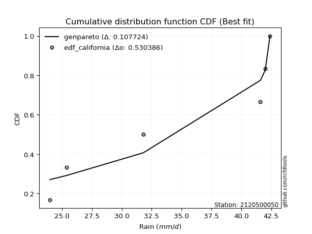</img>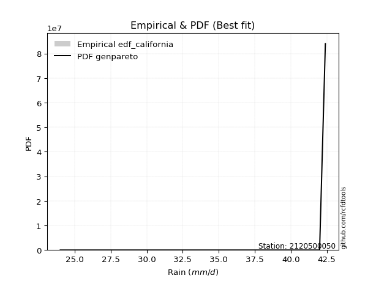</img>

</div>


### 2. EDF Hazen (1930)

Hazen method for plotting positions is a formula used to estimate the empirical cumulative probability distribution of flood events or other hydrological data. This formula often results in biased estimations, particularly when extrapolating to extreme events (high return periods).

<div align="center">


$P=(m-0.5)/n$


</div>


**2.1. Empirical values**

<div align="center">

|                | 0                   | 1                  | 2                  | 3                  | 4         | 5                  |
|:---------------|:--------------------|:-------------------|:-------------------|:-------------------|:----------|:-------------------|
| date           | 2019                | 2023               | 2020               | 2021               | 2025      | 2022               |
| x              | 24.0                | 25.4               | 31.8               | 41.6               | 42.0      | 42.4               |
| m              | 1                   | 2                  | 3                  | 4                  | 5         | 6                  |
| empirical_dist | edf_hazen           | edf_hazen          | edf_hazen          | edf_hazen          | edf_hazen | edf_hazen          |
| empirical      | 0.08333333333333333 | 0.25               | 0.4166666666666667 | 0.5833333333333334 | 0.75      | 0.9166666666666666 |
| empirical_tr   | 1.090909090909091   | 1.3333333333333333 | 1.7142857142857144 | 2.4000000000000004 | 4.0       | 11.999999999999995 |

</div>


**2.2. Kolmogorov-Smirnov fit test (sorted by Δ)**


<div align="center">

|                | 0                   | 1                  | 2                   | 3                   | 4                   | 5                   | 6                  | 7                   | 8                   | 9                   | 10                 | 11                  | 12                  | 13                  | 14                  | 15                 | 16                 | 17                 | 18                  | 19                  | 20                 | 21                  | 22                 | 23                  | 24                  | 25                 | 26                  | 27                  | 28                  | 29                  | 30                  | 31                  | 32                  | 33                  | 34                  | 35                 | 36                  | 37                  | 38                  | 39                | 40                  | 41                  | 42                 | 43                 | 44                  | 45                 | 46                 | 47                  | 48                 | 49                  | 50                  | 51                  | 52                  | 53                | 54                  | 55                  | 56                  | 57                 | 58                  | 59                 | 60                  | 61                  | 62                  | 63                  | 64                  | 65                  | 66                  | 67                  | 68                  | 69                  | 70                  | 71                  | 72                | 73                  | 74                 | 75                  | 76                  | 77                 | 78                  | 79                  | 80                  | 81                  | 82                  | 83                  | 84                 | 85                  | 86             | 87                  | 88                 | 89                 | 90                 | 91                  | 92                  | 93                  | 94                 | 95                 | 96                 | 97                  | 98                  | 99                 | 100                 | 101                | 102                | 103                | 104               | 105                 | 106                | 107                | 108                | 109                 | 110                 | 111                | 112                | 113                | 114                | 115                 | 116                | 117                 | 118                 | 119                | 120                 | 121                | 122                 | 123                | 124                 | 125                 | 126                | 127                | 128                 | 129                | 130                | 131                 | 132                | 133                | 134                 | 135                 | 136                | 137                 | 138                | 139                | 140                | 141                | 142                 | 143                | 144                | 145                | 146                | 147                | 148                | 149                | 150                | 151               | 152                | 153                | 154                | 155            | 156            | 157                | 158             | 159            |
|:---------------|:--------------------|:-------------------|:--------------------|:--------------------|:--------------------|:--------------------|:-------------------|:--------------------|:--------------------|:--------------------|:-------------------|:--------------------|:--------------------|:--------------------|:--------------------|:-------------------|:-------------------|:-------------------|:--------------------|:--------------------|:-------------------|:--------------------|:-------------------|:--------------------|:--------------------|:-------------------|:--------------------|:--------------------|:--------------------|:--------------------|:--------------------|:--------------------|:--------------------|:--------------------|:--------------------|:-------------------|:--------------------|:--------------------|:--------------------|:------------------|:--------------------|:--------------------|:-------------------|:-------------------|:--------------------|:-------------------|:-------------------|:--------------------|:-------------------|:--------------------|:--------------------|:--------------------|:--------------------|:------------------|:--------------------|:--------------------|:--------------------|:-------------------|:--------------------|:-------------------|:--------------------|:--------------------|:--------------------|:--------------------|:--------------------|:--------------------|:--------------------|:--------------------|:--------------------|:--------------------|:--------------------|:--------------------|:------------------|:--------------------|:-------------------|:--------------------|:--------------------|:-------------------|:--------------------|:--------------------|:--------------------|:--------------------|:--------------------|:--------------------|:-------------------|:--------------------|:---------------|:--------------------|:-------------------|:-------------------|:-------------------|:--------------------|:--------------------|:--------------------|:-------------------|:-------------------|:-------------------|:--------------------|:--------------------|:-------------------|:--------------------|:-------------------|:-------------------|:-------------------|:------------------|:--------------------|:-------------------|:-------------------|:-------------------|:--------------------|:--------------------|:-------------------|:-------------------|:-------------------|:-------------------|:--------------------|:-------------------|:--------------------|:--------------------|:-------------------|:--------------------|:-------------------|:--------------------|:-------------------|:--------------------|:--------------------|:-------------------|:-------------------|:--------------------|:-------------------|:-------------------|:--------------------|:-------------------|:-------------------|:--------------------|:--------------------|:-------------------|:--------------------|:-------------------|:-------------------|:-------------------|:-------------------|:--------------------|:-------------------|:-------------------|:-------------------|:-------------------|:-------------------|:-------------------|:-------------------|:-------------------|:------------------|:-------------------|:-------------------|:-------------------|:---------------|:---------------|:-------------------|:----------------|:---------------|
| station        | 2120500050          | 2120500050         | 2120500050          | 2120500050          | 2120500050          | 2120500050          | 2120500050         | 2120500050          | 2120500050          | 2120500050          | 2120500050         | 2120500050          | 2120500050          | 2120500050          | 2120500050          | 2120500050         | 2120500050         | 2120500050         | 2120500050          | 2120500050          | 2120500050         | 2120500050          | 2120500050         | 2120500050          | 2120500050          | 2120500050         | 2120500050          | 2120500050          | 2120500050          | 2120500050          | 2120500050          | 2120500050          | 2120500050          | 2120500050          | 2120500050          | 2120500050         | 2120500050          | 2120500050          | 2120500050          | 2120500050        | 2120500050          | 2120500050          | 2120500050         | 2120500050         | 2120500050          | 2120500050         | 2120500050         | 2120500050          | 2120500050         | 2120500050          | 2120500050          | 2120500050          | 2120500050          | 2120500050        | 2120500050          | 2120500050          | 2120500050          | 2120500050         | 2120500050          | 2120500050         | 2120500050          | 2120500050          | 2120500050          | 2120500050          | 2120500050          | 2120500050          | 2120500050          | 2120500050          | 2120500050          | 2120500050          | 2120500050          | 2120500050          | 2120500050        | 2120500050          | 2120500050         | 2120500050          | 2120500050          | 2120500050         | 2120500050          | 2120500050          | 2120500050          | 2120500050          | 2120500050          | 2120500050          | 2120500050         | 2120500050          | 2120500050     | 2120500050          | 2120500050         | 2120500050         | 2120500050         | 2120500050          | 2120500050          | 2120500050          | 2120500050         | 2120500050         | 2120500050         | 2120500050          | 2120500050          | 2120500050         | 2120500050          | 2120500050         | 2120500050         | 2120500050         | 2120500050        | 2120500050          | 2120500050         | 2120500050         | 2120500050         | 2120500050          | 2120500050          | 2120500050         | 2120500050         | 2120500050         | 2120500050         | 2120500050          | 2120500050         | 2120500050          | 2120500050          | 2120500050         | 2120500050          | 2120500050         | 2120500050          | 2120500050         | 2120500050          | 2120500050          | 2120500050         | 2120500050         | 2120500050          | 2120500050         | 2120500050         | 2120500050          | 2120500050         | 2120500050         | 2120500050          | 2120500050          | 2120500050         | 2120500050          | 2120500050         | 2120500050         | 2120500050         | 2120500050         | 2120500050          | 2120500050         | 2120500050         | 2120500050         | 2120500050         | 2120500050         | 2120500050         | 2120500050         | 2120500050         | 2120500050        | 2120500050         | 2120500050         | 2120500050         | 2120500050     | 2120500050     | 2120500050         | 2120500050      | 2120500050     |
| empirical_dist | edf_hazen           | edf_hazen          | edf_hazen           | edf_hazen           | edf_hazen           | edf_hazen           | edf_hazen          | edf_hazen           | edf_hazen           | edf_hazen           | edf_hazen          | edf_hazen           | edf_hazen           | edf_hazen           | edf_hazen           | edf_hazen          | edf_hazen          | edf_hazen          | edf_hazen           | edf_hazen           | edf_hazen          | edf_hazen           | edf_hazen          | edf_hazen           | edf_hazen           | edf_hazen          | edf_hazen           | edf_hazen           | edf_hazen           | edf_hazen           | edf_hazen           | edf_hazen           | edf_hazen           | edf_hazen           | edf_hazen           | edf_hazen          | edf_hazen           | edf_hazen           | edf_hazen           | edf_hazen         | edf_hazen           | edf_hazen           | edf_hazen          | edf_hazen          | edf_hazen           | edf_hazen          | edf_hazen          | edf_hazen           | edf_hazen          | edf_hazen           | edf_hazen           | edf_hazen           | edf_hazen           | edf_hazen         | edf_hazen           | edf_hazen           | edf_hazen           | edf_hazen          | edf_hazen           | edf_hazen          | edf_hazen           | edf_hazen           | edf_hazen           | edf_hazen           | edf_hazen           | edf_hazen           | edf_hazen           | edf_hazen           | edf_hazen           | edf_hazen           | edf_hazen           | edf_hazen           | edf_hazen         | edf_hazen           | edf_hazen          | edf_hazen           | edf_hazen           | edf_hazen          | edf_hazen           | edf_hazen           | edf_hazen           | edf_hazen           | edf_hazen           | edf_hazen           | edf_hazen          | edf_hazen           | edf_hazen      | edf_hazen           | edf_hazen          | edf_hazen          | edf_hazen          | edf_hazen           | edf_hazen           | edf_hazen           | edf_hazen          | edf_hazen          | edf_hazen          | edf_hazen           | edf_hazen           | edf_hazen          | edf_hazen           | edf_hazen          | edf_hazen          | edf_hazen          | edf_hazen         | edf_hazen           | edf_hazen          | edf_hazen          | edf_hazen          | edf_hazen           | edf_hazen           | edf_hazen          | edf_hazen          | edf_hazen          | edf_hazen          | edf_hazen           | edf_hazen          | edf_hazen           | edf_hazen           | edf_hazen          | edf_hazen           | edf_hazen          | edf_hazen           | edf_hazen          | edf_hazen           | edf_hazen           | edf_hazen          | edf_hazen          | edf_hazen           | edf_hazen          | edf_hazen          | edf_hazen           | edf_hazen          | edf_hazen          | edf_hazen           | edf_hazen           | edf_hazen          | edf_hazen           | edf_hazen          | edf_hazen          | edf_hazen          | edf_hazen          | edf_hazen           | edf_hazen          | edf_hazen          | edf_hazen          | edf_hazen          | edf_hazen          | edf_hazen          | edf_hazen          | edf_hazen          | edf_hazen         | edf_hazen          | edf_hazen          | edf_hazen          | edf_hazen      | edf_hazen      | edf_hazen          | edf_hazen       | edf_hazen      |
| p_dist         | dweibull            | wrapcauchy         | rdist               | logrdist            | arcsine             | logdweibull         | logweibull_max     | logksone            | logarcsine          | logexponweib        | ksone              | logwrapcauchy       | dgamma              | logtrapezoid        | trapezoid           | genpareto          | loginvweibull      | logsemicircular    | semicircular        | logdgamma           | loganglit          | anglit              | lomax              | halfgennorm         | exponpow            | logbeta            | logburr             | burr12              | loglomax            | levy_l              | burr                | invweibull          | nakagami            | loginvgamma         | logpearson3         | logf               | genexpon            | loginvgauss         | logfoldnorm         | logerlang         | loggamma            | loggamma            | invgauss           | lognorm            | logcrystalball      | logt               | logexponnorm       | logbetaprime        | pearson3           | invgamma            | loggenexpon         | logrice             | erlang              | logmaxwell        | ncf                 | lograyleigh         | loglevy_l           | weibull_min        | nct                 | f                  | crystalball         | norm                | exponnorm           | t                   | logalpha            | gamma               | maxwell             | rayleigh            | logfatiguelife      | logburr12           | rice                | logweibull_min      | logkstwobign      | loghalfnorm         | foldnorm           | alpha               | betaprime           | halfnorm           | lognct              | kstwobign           | loggompertz         | beta                | gompertz            | loggumbel_l         | genextreme         | gumbel_l            | gennorm        | loggenextreme       | loglogistic        | loggumbel_r        | logistic           | gumbel_r            | loghalflogistic     | logcosine           | cosine             | halflogistic       | logncf             | logmoyal            | moyal               | loghypsecant       | hypsecant           | loglaplace         | loglaplace         | laplace            | logmielke         | argus               | logwald            | wald               | weibull_max        | logargus            | genhalflogistic     | logloggamma        | exponweib          | loggenhalflogistic | skewnorm           | triang              | lognakagami        | kappa4              | logtriang           | tukeylambda        | kappa3              | logkappa3          | logskewnorm         | logexponpow        | loggennorm          | uniform             | vonmises_line      | loggausshyper      | logtukeylambda      | logvonmises_line   | gausshyper         | logloglaplace       | logkappa4          | loguniform         | bradford            | gengamma            | truncexpon         | logtruncweibull_min | logbradford        | logtruncexpon      | truncweibull_min   | fatiguelife        | logtruncnorm        | loghalfgennorm     | loggengamma        | powerlaw           | logpowerlaw        | johnsonsb          | johnsonsu          | truncpareto        | logtruncpareto     | truncnorm         | logjohnsonsb       | logjohnsonsu       | loggenpareto       | genlogistic    | loggenlogistic | logvonmises        | vonmises        | mielke         |
| delta          | 0.13475772230290717 | 0.1423473636157886 | 0.15559274247862798 | 0.16167929410573856 | 0.16585095523724747 | 0.16731725806042774 | 0.1715909283969791 | 0.17453386822549843 | 0.17520316059207752 | 0.17527608346691037 | 0.1766486934504108 | 0.18172678776464773 | 0.18331096136589908 | 0.18617169141254952 | 0.18920412857361668 | 0.1910573030382693 | 0.1911389888236502 | 0.1912470597721262 | 0.19333133002989922 | 0.20324819582819476 | 0.2033893204085787 | 0.20543731780022167 | 0.2055894432572003 | 0.20894502865193298 | 0.20906900676563867 | 0.2162604522907217 | 0.21937177751108272 | 0.21999901298266666 | 0.22063374455466012 | 0.22183429451911513 | 0.22184830467632677 | 0.22472403944394337 | 0.22625205740090049 | 0.22628826787381295 | 0.22878989002610728 | 0.2289060741795269 | 0.22891173659317177 | 0.22908462706312938 | 0.22919608786076773 | 0.229670186574913 | 0.23024807493801402 | 0.23024807493801402 | 0.2307626977221804 | 0.2308125591662672 | 0.23081259619988792 | 0.2308129159389679 | 0.2308138362909986 | 0.23122919729773417 | 0.2312416718278517 | 0.23129763392575786 | 0.23142436221869822 | 0.23145178903772368 | 0.23172257674113683 | 0.231855890519589 | 0.23190010467814404 | 0.23216598426129975 | 0.23229738931290428 | 0.2324047411467205 | 0.23250950344607368 | 0.2325275785093679 | 0.23276724691350903 | 0.23276725538138276 | 0.23276821064564113 | 0.23278079071602964 | 0.23283144894896168 | 0.23335488921923342 | 0.23355048604025108 | 0.23378897318117686 | 0.23391120013906896 | 0.23411931596744773 | 0.23415512951166073 | 0.23434543578401146 | 0.234456104582211 | 0.23524770146380747 | 0.2353578284228538 | 0.23577073548010996 | 0.23645112011614466 | 0.2366739115151809 | 0.23731344490161532 | 0.23965787308572772 | 0.23993224435843108 | 0.24082087814166098 | 0.24147651179097196 | 0.24557275905436915 | 0.2469000091388167 | 0.24840076186802373 | 0.25           | 0.25079900899499447 | 0.2514931569874904 | 0.2531493240563625 | 0.2533172906759481 | 0.25454723288667225 | 0.25497634099868804 | 0.25535667568507403 | 0.2555087013035916 | 0.2562736647131363 | 0.2579576588142882 | 0.26092719797549613 | 0.26217336658912427 | 0.2632157470549681 | 0.26490535604607357 | 0.2753049505495778 | 0.2753049505495778 | 0.2767619658188104 | 0.287005871284136 | 0.28940375101617266 | 0.2896869949374914 | 0.2905846585971178 | 0.2947754684688978 | 0.29607140578764435 | 0.33619598481628554 | 0.3375887415171738 | 0.3415083496247649 | 0.3571469074188859 | 0.3592579724721595 | 0.36260128517797197 | 0.3633111660867142 | 0.36447153926417775 | 0.36457015285171734 | 0.3664548073552846 | 0.36887184443491605 | 0.3701586078616549 | 0.37119563979269665 | 0.3719454237160893 | 0.37291056439002657 | 0.37318840579710155 | 0.3739518450857853 | 0.3739779889567698 | 0.37642307851159507 | 0.3768200670920565 | 0.3773240817235801 | 0.37832975336217844 | 0.3789855078130837 | 0.3831956106235954 | 0.38576044412496036 | 0.38690060827965883 | 0.3882038419564483 | 0.3899773411454469  | 0.3927081133822159 | 0.3969963462578052 | 0.4010111593322655 | 0.4048716824847421 | 0.40500043486889226 | 0.4166666666666667 | 0.4441626799735225 | 0.4616401508961369 | 0.4777000753862752 | 0.5028059660617205 | 0.5083844990350779 | 0.5150386338948685 | 0.5319516896730211 | 0.550807728270946 | 0.5687335660124009 | 0.6833188365969258 | 0.7123221825051878 | 0.75           | 0.75           | 1.2303182201621445 | 6.5577736978097 | nan            |
| deltao         | 0.530385761606      | 0.530385761606     | 0.530385761606      | 0.530385761606      | 0.530385761606      | 0.530385761606      | 0.530385761606     | 0.530385761606      | 0.530385761606      | 0.530385761606      | 0.530385761606     | 0.530385761606      | 0.530385761606      | 0.530385761606      | 0.530385761606      | 0.530385761606     | 0.530385761606     | 0.530385761606     | 0.530385761606      | 0.530385761606      | 0.530385761606     | 0.530385761606      | 0.530385761606     | 0.530385761606      | 0.530385761606      | 0.530385761606     | 0.530385761606      | 0.530385761606      | 0.530385761606      | 0.530385761606      | 0.530385761606      | 0.530385761606      | 0.530385761606      | 0.530385761606      | 0.530385761606      | 0.530385761606     | 0.530385761606      | 0.530385761606      | 0.530385761606      | 0.530385761606    | 0.530385761606      | 0.530385761606      | 0.530385761606     | 0.530385761606     | 0.530385761606      | 0.530385761606     | 0.530385761606     | 0.530385761606      | 0.530385761606     | 0.530385761606      | 0.530385761606      | 0.530385761606      | 0.530385761606      | 0.530385761606    | 0.530385761606      | 0.530385761606      | 0.530385761606      | 0.530385761606     | 0.530385761606      | 0.530385761606     | 0.530385761606      | 0.530385761606      | 0.530385761606      | 0.530385761606      | 0.530385761606      | 0.530385761606      | 0.530385761606      | 0.530385761606      | 0.530385761606      | 0.530385761606      | 0.530385761606      | 0.530385761606      | 0.530385761606    | 0.530385761606      | 0.530385761606     | 0.530385761606      | 0.530385761606      | 0.530385761606     | 0.530385761606      | 0.530385761606      | 0.530385761606      | 0.530385761606      | 0.530385761606      | 0.530385761606      | 0.530385761606     | 0.530385761606      | 0.530385761606 | 0.530385761606      | 0.530385761606     | 0.530385761606     | 0.530385761606     | 0.530385761606      | 0.530385761606      | 0.530385761606      | 0.530385761606     | 0.530385761606     | 0.530385761606     | 0.530385761606      | 0.530385761606      | 0.530385761606     | 0.530385761606      | 0.530385761606     | 0.530385761606     | 0.530385761606     | 0.530385761606    | 0.530385761606      | 0.530385761606     | 0.530385761606     | 0.530385761606     | 0.530385761606      | 0.530385761606      | 0.530385761606     | 0.530385761606     | 0.530385761606     | 0.530385761606     | 0.530385761606      | 0.530385761606     | 0.530385761606      | 0.530385761606      | 0.530385761606     | 0.530385761606      | 0.530385761606     | 0.530385761606      | 0.530385761606     | 0.530385761606      | 0.530385761606      | 0.530385761606     | 0.530385761606     | 0.530385761606      | 0.530385761606     | 0.530385761606     | 0.530385761606      | 0.530385761606     | 0.530385761606     | 0.530385761606      | 0.530385761606      | 0.530385761606     | 0.530385761606      | 0.530385761606     | 0.530385761606     | 0.530385761606     | 0.530385761606     | 0.530385761606      | 0.530385761606     | 0.530385761606     | 0.530385761606     | 0.530385761606     | 0.530385761606     | 0.530385761606     | 0.530385761606     | 0.530385761606     | 0.530385761606    | 0.530385761606     | 0.530385761606     | 0.530385761606     | 0.530385761606 | 0.530385761606 | 0.530385761606     | 0.530385761606  | 0.530385761606 |
| eval           | Δo > Δ              | Δo > Δ             | Δo > Δ              | Δo > Δ              | Δo > Δ              | Δo > Δ              | Δo > Δ             | Δo > Δ              | Δo > Δ              | Δo > Δ              | Δo > Δ             | Δo > Δ              | Δo > Δ              | Δo > Δ              | Δo > Δ              | Δo > Δ             | Δo > Δ             | Δo > Δ             | Δo > Δ              | Δo > Δ              | Δo > Δ             | Δo > Δ              | Δo > Δ             | Δo > Δ              | Δo > Δ              | Δo > Δ             | Δo > Δ              | Δo > Δ              | Δo > Δ              | Δo > Δ              | Δo > Δ              | Δo > Δ              | Δo > Δ              | Δo > Δ              | Δo > Δ              | Δo > Δ             | Δo > Δ              | Δo > Δ              | Δo > Δ              | Δo > Δ            | Δo > Δ              | Δo > Δ              | Δo > Δ             | Δo > Δ             | Δo > Δ              | Δo > Δ             | Δo > Δ             | Δo > Δ              | Δo > Δ             | Δo > Δ              | Δo > Δ              | Δo > Δ              | Δo > Δ              | Δo > Δ            | Δo > Δ              | Δo > Δ              | Δo > Δ              | Δo > Δ             | Δo > Δ              | Δo > Δ             | Δo > Δ              | Δo > Δ              | Δo > Δ              | Δo > Δ              | Δo > Δ              | Δo > Δ              | Δo > Δ              | Δo > Δ              | Δo > Δ              | Δo > Δ              | Δo > Δ              | Δo > Δ              | Δo > Δ            | Δo > Δ              | Δo > Δ             | Δo > Δ              | Δo > Δ              | Δo > Δ             | Δo > Δ              | Δo > Δ              | Δo > Δ              | Δo > Δ              | Δo > Δ              | Δo > Δ              | Δo > Δ             | Δo > Δ              | Δo > Δ         | Δo > Δ              | Δo > Δ             | Δo > Δ             | Δo > Δ             | Δo > Δ              | Δo > Δ              | Δo > Δ              | Δo > Δ             | Δo > Δ             | Δo > Δ             | Δo > Δ              | Δo > Δ              | Δo > Δ             | Δo > Δ              | Δo > Δ             | Δo > Δ             | Δo > Δ             | Δo > Δ            | Δo > Δ              | Δo > Δ             | Δo > Δ             | Δo > Δ             | Δo > Δ              | Δo > Δ              | Δo > Δ             | Δo > Δ             | Δo > Δ             | Δo > Δ             | Δo > Δ              | Δo > Δ             | Δo > Δ              | Δo > Δ              | Δo > Δ             | Δo > Δ              | Δo > Δ             | Δo > Δ              | Δo > Δ             | Δo > Δ              | Δo > Δ              | Δo > Δ             | Δo > Δ             | Δo > Δ              | Δo > Δ             | Δo > Δ             | Δo > Δ              | Δo > Δ             | Δo > Δ             | Δo > Δ              | Δo > Δ              | Δo > Δ             | Δo > Δ              | Δo > Δ             | Δo > Δ             | Δo > Δ             | Δo > Δ             | Δo > Δ              | Δo > Δ             | Δo > Δ             | Δo > Δ             | Δo > Δ             | Δo > Δ             | Δo > Δ             | Δo > Δ             | Δo <= Δ            | Δo <= Δ           | Δo <= Δ            | Δo <= Δ            | Δo <= Δ            | Δo <= Δ        | Δo <= Δ        | Δo <= Δ            | Δo <= Δ         | Δo <= Δ        |
| fit            | 1                   | 1                  | 1                   | 1                   | 1                   | 1                   | 1                  | 1                   | 1                   | 1                   | 1                  | 1                   | 1                   | 1                   | 1                   | 1                  | 1                  | 1                  | 1                   | 1                   | 1                  | 1                   | 1                  | 1                   | 1                   | 1                  | 1                   | 1                   | 1                   | 1                   | 1                   | 1                   | 1                   | 1                   | 1                   | 1                  | 1                   | 1                   | 1                   | 1                 | 1                   | 1                   | 1                  | 1                  | 1                   | 1                  | 1                  | 1                   | 1                  | 1                   | 1                   | 1                   | 1                   | 1                 | 1                   | 1                   | 1                   | 1                  | 1                   | 1                  | 1                   | 1                   | 1                   | 1                   | 1                   | 1                   | 1                   | 1                   | 1                   | 1                   | 1                   | 1                   | 1                 | 1                   | 1                  | 1                   | 1                   | 1                  | 1                   | 1                   | 1                   | 1                   | 1                   | 1                   | 1                  | 1                   | 1              | 1                   | 1                  | 1                  | 1                  | 1                   | 1                   | 1                   | 1                  | 1                  | 1                  | 1                   | 1                   | 1                  | 1                   | 1                  | 1                  | 1                  | 1                 | 1                   | 1                  | 1                  | 1                  | 1                   | 1                   | 1                  | 1                  | 1                  | 1                  | 1                   | 1                  | 1                   | 1                   | 1                  | 1                   | 1                  | 1                   | 1                  | 1                   | 1                   | 1                  | 1                  | 1                   | 1                  | 1                  | 1                   | 1                  | 1                  | 1                   | 1                   | 1                  | 1                   | 1                  | 1                  | 1                  | 1                  | 1                   | 1                  | 1                  | 1                  | 1                  | 1                  | 1                  | 1                  | 0                  | 0                 | 0                  | 0                  | 0                  | 0              | 0              | 0                  | 0               | 0              |
| n              | 6                   | 6                  | 6                   | 6                   | 6                   | 6                   | 6                  | 6                   | 6                   | 6                   | 6                  | 6                   | 6                   | 6                   | 6                   | 6                  | 6                  | 6                  | 6                   | 6                   | 6                  | 6                   | 6                  | 6                   | 6                   | 6                  | 6                   | 6                   | 6                   | 6                   | 6                   | 6                   | 6                   | 6                   | 6                   | 6                  | 6                   | 6                   | 6                   | 6                 | 6                   | 6                   | 6                  | 6                  | 6                   | 6                  | 6                  | 6                   | 6                  | 6                   | 6                   | 6                   | 6                   | 6                 | 6                   | 6                   | 6                   | 6                  | 6                   | 6                  | 6                   | 6                   | 6                   | 6                   | 6                   | 6                   | 6                   | 6                   | 6                   | 6                   | 6                   | 6                   | 6                 | 6                   | 6                  | 6                   | 6                   | 6                  | 6                   | 6                   | 6                   | 6                   | 6                   | 6                   | 6                  | 6                   | 6              | 6                   | 6                  | 6                  | 6                  | 6                   | 6                   | 6                   | 6                  | 6                  | 6                  | 6                   | 6                   | 6                  | 6                   | 6                  | 6                  | 6                  | 6                 | 6                   | 6                  | 6                  | 6                  | 6                   | 6                   | 6                  | 6                  | 6                  | 6                  | 6                   | 6                  | 6                   | 6                   | 6                  | 6                   | 6                  | 6                   | 6                  | 6                   | 6                   | 6                  | 6                  | 6                   | 6                  | 6                  | 6                   | 6                  | 6                  | 6                   | 6                   | 6                  | 6                   | 6                  | 6                  | 6                  | 6                  | 6                   | 6                  | 6                  | 6                  | 6                  | 6                  | 6                  | 6                  | 6                  | 6                 | 6                  | 6                  | 6                  | 6              | 6              | 6                  | 6               | 6              |
| best_fit       | 1                   | 0                  | 0                   | 0                   | 0                   | 0                   | 0                  | 0                   | 0                   | 0                   | 0                  | 0                   | 0                   | 0                   | 0                   | 0                  | 0                  | 0                  | 0                   | 0                   | 0                  | 0                   | 0                  | 0                   | 0                   | 0                  | 0                   | 0                   | 0                   | 0                   | 0                   | 0                   | 0                   | 0                   | 0                   | 0                  | 0                   | 0                   | 0                   | 0                 | 0                   | 0                   | 0                  | 0                  | 0                   | 0                  | 0                  | 0                   | 0                  | 0                   | 0                   | 0                   | 0                   | 0                 | 0                   | 0                   | 0                   | 0                  | 0                   | 0                  | 0                   | 0                   | 0                   | 0                   | 0                   | 0                   | 0                   | 0                   | 0                   | 0                   | 0                   | 0                   | 0                 | 0                   | 0                  | 0                   | 0                   | 0                  | 0                   | 0                   | 0                   | 0                   | 0                   | 0                   | 0                  | 0                   | 0              | 0                   | 0                  | 0                  | 0                  | 0                   | 0                   | 0                   | 0                  | 0                  | 0                  | 0                   | 0                   | 0                  | 0                   | 0                  | 0                  | 0                  | 0                 | 0                   | 0                  | 0                  | 0                  | 0                   | 0                   | 0                  | 0                  | 0                  | 0                  | 0                   | 0                  | 0                   | 0                   | 0                  | 0                   | 0                  | 0                   | 0                  | 0                   | 0                   | 0                  | 0                  | 0                   | 0                  | 0                  | 0                   | 0                  | 0                  | 0                   | 0                   | 0                  | 0                   | 0                  | 0                  | 0                  | 0                  | 0                   | 0                  | 0                  | 0                  | 0                  | 0                  | 0                  | 0                  | 0                  | 0                 | 0                  | 0                  | 0                  | 0              | 0              | 0                  | 0               | 0              |
| best_fit_sort  | 1                   | 2                  | 3                   | 4                   | 5                   | 6                   | 7                  | 8                   | 9                   | 10                  | 11                 | 12                  | 13                  | 14                  | 15                  | 16                 | 17                 | 18                 | 19                  | 20                  | 21                 | 22                  | 23                 | 24                  | 25                  | 26                 | 27                  | 28                  | 29                  | 30                  | 31                  | 32                  | 33                  | 34                  | 35                  | 36                 | 37                  | 38                  | 39                  | 40                | 41                  | 42                  | 43                 | 44                 | 45                  | 46                 | 47                 | 48                  | 49                 | 50                  | 51                  | 52                  | 53                  | 54                | 55                  | 56                  | 57                  | 58                 | 59                  | 60                 | 61                  | 62                  | 63                  | 64                  | 65                  | 66                  | 67                  | 68                  | 69                  | 70                  | 71                  | 72                  | 73                | 74                  | 75                 | 76                  | 77                  | 78                 | 79                  | 80                  | 81                  | 82                  | 83                  | 84                  | 85                 | 86                  | 87             | 88                  | 89                 | 90                 | 91                 | 92                  | 93                  | 94                  | 95                 | 96                 | 97                 | 98                  | 99                  | 100                | 101                 | 102                | 103                | 104                | 105               | 106                 | 107                | 108                | 109                | 110                 | 111                 | 112                | 113                | 114                | 115                | 116                 | 117                | 118                 | 119                 | 120                | 121                 | 122                | 123                 | 124                | 125                 | 126                 | 127                | 128                | 129                 | 130                | 131                | 132                 | 133                | 134                | 135                 | 136                 | 137                | 138                 | 139                | 140                | 141                | 142                | 143                 | 144                | 145                | 146                | 147                | 148                | 149                | 150                | 151                | 152               | 153                | 154                | 155                | 156            | 157            | 158                | 159             | 160            |

</div>


**2.3. Best fit**

<div align="center">

|   id |    station | empirical_dist   | p_dist   |    delta |   deltao | eval   |   fit |   n |   best_fit |   best_fit_sort |
|-----:|-----------:|:-----------------|:---------|---------:|---------:|:-------|------:|----:|-----------:|----------------:|
|    0 | 2120500050 | edf_hazen        | dweibull | 0.134758 | 0.530386 | Δo > Δ |     1 |   6 |          1 |               1 |

</div>


<div align="center">

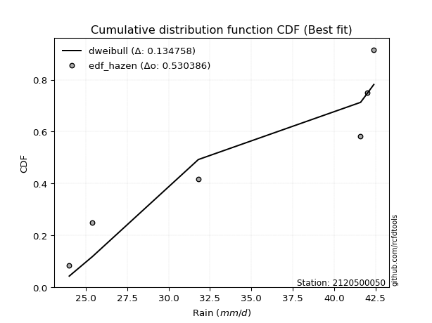</img>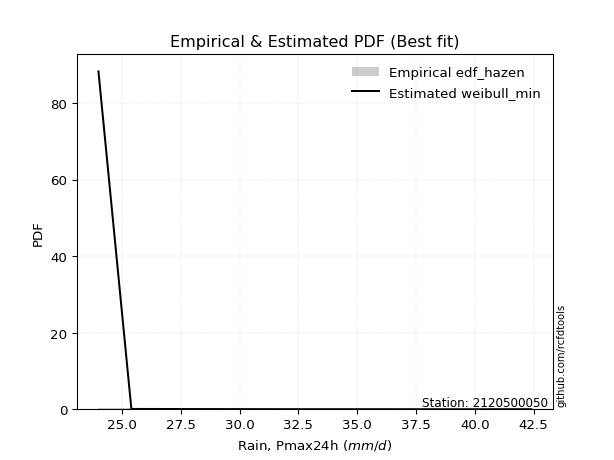</img>

</div>


### 3. EDF Weibull (1939)

Weibull plotting position formula is an empirical method used to estimate the non-exceedance probability or plotting position for a set of observed data, is often recommended or widely used in practice, particularly in flood frequency analysis.

<div align="center">


$P=m/(n+1)$


</div>


**3.1. Empirical values**

<div align="center">

|                | 0                   | 1                  | 2                   | 3                  | 4                  | 5                  |
|:---------------|:--------------------|:-------------------|:--------------------|:-------------------|:-------------------|:-------------------|
| date           | 2019                | 2023               | 2020                | 2021               | 2025               | 2022               |
| x              | 24.0                | 25.4               | 31.8                | 41.6               | 42.0               | 42.4               |
| m              | 1                   | 2                  | 3                   | 4                  | 5                  | 6                  |
| empirical_dist | edf_weibull         | edf_weibull        | edf_weibull         | edf_weibull        | edf_weibull        | edf_weibull        |
| empirical      | 0.14285714285714285 | 0.2857142857142857 | 0.42857142857142855 | 0.5714285714285714 | 0.7142857142857143 | 0.8571428571428571 |
| empirical_tr   | 1.1666666666666665  | 1.4                | 1.75                | 2.333333333333333  | 3.5                | 6.999999999999997  |

</div>


**3.2. Kolmogorov-Smirnov fit test (sorted by Δ)**


<div align="center">

|                | 0                   | 1                   | 2                   | 3                   | 4                   | 5                   | 6                   | 7                  | 8                   | 9                  | 10                  | 11                  | 12                 | 13                 | 14                  | 15                  | 16                 | 17                  | 18                 | 19                  | 20                  | 21                  | 22                 | 23                  | 24                  | 25                  | 26                  | 27                 | 28                  | 29                 | 30                | 31                  | 32                  | 33                 | 34                  | 35                  | 36                  | 37                  | 38                  | 39                  | 40                 | 41                  | 42                | 43                | 44                  | 45                  | 46                 | 47                  | 48                  | 49                  | 50                 | 51                  | 52                 | 53                  | 54                 | 55                  | 56                | 57                  | 58                  | 59                  | 60                  | 61                  | 62                | 63                  | 64                 | 65                 | 66                  | 67                 | 68                  | 69                  | 70                  | 71                 | 72                 | 73                  | 74                  | 75                  | 76                  | 77                  | 78                  | 79                  | 80                 | 81                 | 82                  | 83                  | 84                  | 85                 | 86                 | 87                 | 88                 | 89                  | 90                 | 91                  | 92                 | 93                 | 94                | 95                 | 96                 | 97                 | 98                  | 99                 | 100                 | 101                 | 102                | 103                | 104                | 105               | 106                 | 107                 | 108                 | 109                | 110                 | 111                | 112                 | 113                | 114                | 115                | 116                 | 117                 | 118                | 119                 | 120                 | 121                | 122                | 123                 | 124               | 125                 | 126                | 127                | 128                 | 129                | 130                 | 131                | 132                | 133                | 134                 | 135                | 136                 | 137                | 138                 | 139                 | 140                | 141                | 142                 | 143                 | 144                | 145                 | 146                | 147                 | 148                | 149                 | 150                | 151                | 152                | 153                | 154                | 155                | 156                | 157                | 158               | 159            |
|:---------------|:--------------------|:--------------------|:--------------------|:--------------------|:--------------------|:--------------------|:--------------------|:-------------------|:--------------------|:-------------------|:--------------------|:--------------------|:-------------------|:-------------------|:--------------------|:--------------------|:-------------------|:--------------------|:-------------------|:--------------------|:--------------------|:--------------------|:-------------------|:--------------------|:--------------------|:--------------------|:--------------------|:-------------------|:--------------------|:-------------------|:------------------|:--------------------|:--------------------|:-------------------|:--------------------|:--------------------|:--------------------|:--------------------|:--------------------|:--------------------|:-------------------|:--------------------|:------------------|:------------------|:--------------------|:--------------------|:-------------------|:--------------------|:--------------------|:--------------------|:-------------------|:--------------------|:-------------------|:--------------------|:-------------------|:--------------------|:------------------|:--------------------|:--------------------|:--------------------|:--------------------|:--------------------|:------------------|:--------------------|:-------------------|:-------------------|:--------------------|:-------------------|:--------------------|:--------------------|:--------------------|:-------------------|:-------------------|:--------------------|:--------------------|:--------------------|:--------------------|:--------------------|:--------------------|:--------------------|:-------------------|:-------------------|:--------------------|:--------------------|:--------------------|:-------------------|:-------------------|:-------------------|:-------------------|:--------------------|:-------------------|:--------------------|:-------------------|:-------------------|:------------------|:-------------------|:-------------------|:-------------------|:--------------------|:-------------------|:--------------------|:--------------------|:-------------------|:-------------------|:-------------------|:------------------|:--------------------|:--------------------|:--------------------|:-------------------|:--------------------|:-------------------|:--------------------|:-------------------|:-------------------|:-------------------|:--------------------|:--------------------|:-------------------|:--------------------|:--------------------|:-------------------|:-------------------|:--------------------|:------------------|:--------------------|:-------------------|:-------------------|:--------------------|:-------------------|:--------------------|:-------------------|:-------------------|:-------------------|:--------------------|:-------------------|:--------------------|:-------------------|:--------------------|:--------------------|:-------------------|:-------------------|:--------------------|:--------------------|:-------------------|:--------------------|:-------------------|:--------------------|:-------------------|:--------------------|:-------------------|:-------------------|:-------------------|:-------------------|:-------------------|:-------------------|:-------------------|:-------------------|:------------------|:---------------|
| station        | 2120500050          | 2120500050          | 2120500050          | 2120500050          | 2120500050          | 2120500050          | 2120500050          | 2120500050         | 2120500050          | 2120500050         | 2120500050          | 2120500050          | 2120500050         | 2120500050         | 2120500050          | 2120500050          | 2120500050         | 2120500050          | 2120500050         | 2120500050          | 2120500050          | 2120500050          | 2120500050         | 2120500050          | 2120500050          | 2120500050          | 2120500050          | 2120500050         | 2120500050          | 2120500050         | 2120500050        | 2120500050          | 2120500050          | 2120500050         | 2120500050          | 2120500050          | 2120500050          | 2120500050          | 2120500050          | 2120500050          | 2120500050         | 2120500050          | 2120500050        | 2120500050        | 2120500050          | 2120500050          | 2120500050         | 2120500050          | 2120500050          | 2120500050          | 2120500050         | 2120500050          | 2120500050         | 2120500050          | 2120500050         | 2120500050          | 2120500050        | 2120500050          | 2120500050          | 2120500050          | 2120500050          | 2120500050          | 2120500050        | 2120500050          | 2120500050         | 2120500050         | 2120500050          | 2120500050         | 2120500050          | 2120500050          | 2120500050          | 2120500050         | 2120500050         | 2120500050          | 2120500050          | 2120500050          | 2120500050          | 2120500050          | 2120500050          | 2120500050          | 2120500050         | 2120500050         | 2120500050          | 2120500050          | 2120500050          | 2120500050         | 2120500050         | 2120500050         | 2120500050         | 2120500050          | 2120500050         | 2120500050          | 2120500050         | 2120500050         | 2120500050        | 2120500050         | 2120500050         | 2120500050         | 2120500050          | 2120500050         | 2120500050          | 2120500050          | 2120500050         | 2120500050         | 2120500050         | 2120500050        | 2120500050          | 2120500050          | 2120500050          | 2120500050         | 2120500050          | 2120500050         | 2120500050          | 2120500050         | 2120500050         | 2120500050         | 2120500050          | 2120500050          | 2120500050         | 2120500050          | 2120500050          | 2120500050         | 2120500050         | 2120500050          | 2120500050        | 2120500050          | 2120500050         | 2120500050         | 2120500050          | 2120500050         | 2120500050          | 2120500050         | 2120500050         | 2120500050         | 2120500050          | 2120500050         | 2120500050          | 2120500050         | 2120500050          | 2120500050          | 2120500050         | 2120500050         | 2120500050          | 2120500050          | 2120500050         | 2120500050          | 2120500050         | 2120500050          | 2120500050         | 2120500050          | 2120500050         | 2120500050         | 2120500050         | 2120500050         | 2120500050         | 2120500050         | 2120500050         | 2120500050         | 2120500050        | 2120500050     |
| empirical_dist | edf_weibull         | edf_weibull         | edf_weibull         | edf_weibull         | edf_weibull         | edf_weibull         | edf_weibull         | edf_weibull        | edf_weibull         | edf_weibull        | edf_weibull         | edf_weibull         | edf_weibull        | edf_weibull        | edf_weibull         | edf_weibull         | edf_weibull        | edf_weibull         | edf_weibull        | edf_weibull         | edf_weibull         | edf_weibull         | edf_weibull        | edf_weibull         | edf_weibull         | edf_weibull         | edf_weibull         | edf_weibull        | edf_weibull         | edf_weibull        | edf_weibull       | edf_weibull         | edf_weibull         | edf_weibull        | edf_weibull         | edf_weibull         | edf_weibull         | edf_weibull         | edf_weibull         | edf_weibull         | edf_weibull        | edf_weibull         | edf_weibull       | edf_weibull       | edf_weibull         | edf_weibull         | edf_weibull        | edf_weibull         | edf_weibull         | edf_weibull         | edf_weibull        | edf_weibull         | edf_weibull        | edf_weibull         | edf_weibull        | edf_weibull         | edf_weibull       | edf_weibull         | edf_weibull         | edf_weibull         | edf_weibull         | edf_weibull         | edf_weibull       | edf_weibull         | edf_weibull        | edf_weibull        | edf_weibull         | edf_weibull        | edf_weibull         | edf_weibull         | edf_weibull         | edf_weibull        | edf_weibull        | edf_weibull         | edf_weibull         | edf_weibull         | edf_weibull         | edf_weibull         | edf_weibull         | edf_weibull         | edf_weibull        | edf_weibull        | edf_weibull         | edf_weibull         | edf_weibull         | edf_weibull        | edf_weibull        | edf_weibull        | edf_weibull        | edf_weibull         | edf_weibull        | edf_weibull         | edf_weibull        | edf_weibull        | edf_weibull       | edf_weibull        | edf_weibull        | edf_weibull        | edf_weibull         | edf_weibull        | edf_weibull         | edf_weibull         | edf_weibull        | edf_weibull        | edf_weibull        | edf_weibull       | edf_weibull         | edf_weibull         | edf_weibull         | edf_weibull        | edf_weibull         | edf_weibull        | edf_weibull         | edf_weibull        | edf_weibull        | edf_weibull        | edf_weibull         | edf_weibull         | edf_weibull        | edf_weibull         | edf_weibull         | edf_weibull        | edf_weibull        | edf_weibull         | edf_weibull       | edf_weibull         | edf_weibull        | edf_weibull        | edf_weibull         | edf_weibull        | edf_weibull         | edf_weibull        | edf_weibull        | edf_weibull        | edf_weibull         | edf_weibull        | edf_weibull         | edf_weibull        | edf_weibull         | edf_weibull         | edf_weibull        | edf_weibull        | edf_weibull         | edf_weibull         | edf_weibull        | edf_weibull         | edf_weibull        | edf_weibull         | edf_weibull        | edf_weibull         | edf_weibull        | edf_weibull        | edf_weibull        | edf_weibull        | edf_weibull        | edf_weibull        | edf_weibull        | edf_weibull        | edf_weibull       | edf_weibull    |
| p_dist         | wrapcauchy          | logwrapcauchy       | logarcsine          | arcsine             | logrdist            | rdist               | logweibull_max      | dweibull           | logdweibull         | logksone           | logexponweib        | ksone               | logtrapezoid       | logncf             | trapezoid           | genpareto           | loginvweibull      | logsemicircular     | semicircular       | dgamma              | logdgamma           | exponpow            | gennorm            | loganglit           | anglit              | lomax               | halfgennorm         | logburr            | burr12              | loglomax           | levy_l            | burr                | invweibull          | logbeta            | nakagami            | loginvgamma         | logpearson3         | logf                | genexpon            | loginvgauss         | logfoldnorm        | logerlang           | loggamma          | loggamma          | invgauss            | lognorm             | logcrystalball     | logt                | logexponnorm        | logbetaprime        | pearson3           | invgamma            | loggenexpon        | logrice             | erlang             | logmaxwell          | ncf               | lograyleigh         | loglevy_l           | weibull_min         | nct                 | f                   | crystalball       | norm                | exponnorm          | t                  | logalpha            | gamma              | maxwell             | rayleigh            | logfatiguelife      | logburr12          | rice               | logweibull_min      | logkstwobign        | loghalfnorm         | foldnorm            | alpha               | betaprime           | halfnorm            | lognct             | kstwobign          | loggompertz         | beta                | gompertz            | loggumbel_l        | genextreme         | weibull_max        | gumbel_l           | loggenextreme       | loglogistic        | loggumbel_r         | logistic           | gumbel_r           | logcosine         | cosine             | logmoyal           | halflogistic       | moyal               | loghalflogistic    | loghypsecant        | hypsecant           | loglaplace         | loglaplace         | laplace            | logmielke         | argus               | logwald             | wald                | logargus           | loggennorm          | logloglaplace      | exponweib           | logexponpow        | lognakagami        | genhalflogistic    | logloggamma         | loggenhalflogistic  | skewnorm           | triang              | gengamma            | kappa4             | logtriang          | tukeylambda         | kappa3            | logkappa3           | logskewnorm        | uniform            | vonmises_line       | loggausshyper      | logtukeylambda      | logvonmises_line   | gausshyper         | logkappa4          | fatiguelife         | loguniform         | bradford            | truncexpon         | logtruncweibull_min | logbradford         | logtruncexpon      | truncweibull_min   | logtruncnorm        | loghalfgennorm      | loggengamma        | powerlaw            | logpowerlaw        | johnsonsb           | johnsonsu          | truncnorm           | truncpareto        | logtruncpareto     | logjohnsonsb       | logjohnsonsu       | loggenpareto       | genlogistic        | loggenlogistic     | logvonmises        | vonmises          | mielke         |
| delta          | 0.14285710923577266 | 0.14601250205036204 | 0.14619059082644792 | 0.14832335837825095 | 0.15857860403998425 | 0.16749750438338995 | 0.16762910455104574 | 0.1680795999551004 | 0.18048009401326973 | 0.1864386301302604 | 0.18718084537167234 | 0.18855345535517276 | 0.1980764533173115 | 0.1984338492904787 | 0.20110889047837865 | 0.20296206494303126 | 0.2030437507284122 | 0.20315182167688817 | 0.2052360919346612 | 0.20609866557547737 | 0.20881516100255854 | 0.21338339557990776 | 0.2142857142857143 | 0.21529408231334068 | 0.21734207970498365 | 0.21749420516196227 | 0.22084979055669496 | 0.2312765394158447 | 0.23190377488742864 | 0.2325385064594221 | 0.233739056423877 | 0.23375306658108874 | 0.23662880134870534 | 0.2377858657149817 | 0.23815681930566246 | 0.23819302977857493 | 0.24069465193086925 | 0.24081083608428888 | 0.24081649849793374 | 0.24098938896789135 | 0.2411008497655297 | 0.24157494847967498 | 0.242152836842776 | 0.242152836842776 | 0.24266745962694236 | 0.24271732107102917 | 0.2427173581046499 | 0.24271767784372988 | 0.24271859819576058 | 0.24313395920249614 | 0.2431464337326137 | 0.24320239583051984 | 0.2433291241234602 | 0.24335655094248565 | 0.2436273386458988 | 0.24376065242435097 | 0.243804866582906 | 0.24407074616606173 | 0.24420215121766614 | 0.24430950305148247 | 0.24441426535083566 | 0.24443234041412987 | 0.244672008818271 | 0.24467201728614474 | 0.2446729725504031 | 0.2446855526207916 | 0.24473621085372366 | 0.2452596511239954 | 0.24545524794501306 | 0.24569373508593884 | 0.24581596204383094 | 0.2460240778722097 | 0.2460598914164227 | 0.24625019768877343 | 0.24636086648697297 | 0.24715246336856944 | 0.24726259032761577 | 0.24767549738487193 | 0.24835588202090664 | 0.24857867341994289 | 0.2492182068063773 | 0.2515626349904897 | 0.25183700626319305 | 0.25272564004642295 | 0.25338127369573393 | 0.2574775209591311 | 0.2588047710435787 | 0.2590611827546121 | 0.2603055237727857 | 0.26270377089975633 | 0.2633979188922524 | 0.26505408596112445 | 0.2652220525807101 | 0.2664519947914342 | 0.267261437589836 | 0.2674134632083536 | 0.2728319598802581 | 0.2732945653722628 | 0.27407812849388624 | 0.2749139955493165 | 0.27512050895973006 | 0.27681011795083554 | 0.2872097124543398 | 0.2872097124543398 | 0.2886667277235724 | 0.298910633188898 | 0.30130851292093463 | 0.30159175684225337 | 0.30248942050187977 | 0.3079761676924063 | 0.31338675486621703 | 0.3188059438383689 | 0.32960358772000303 | 0.3362311380018036 | 0.3364111212745308 | 0.3481007467210475 | 0.34949350342193575 | 0.36905166932364786 | 0.3711627343769215 | 0.37450604708273394 | 0.37499584637489697 | 0.3763763011689397 | 0.3764749147564793 | 0.37835956926004655 | 0.380776606339678 | 0.38206336976641686 | 0.3831004016974586 | 0.3850931677018635 | 0.38585660699054725 | 0.3858827508615318 | 0.38832784041635704 | 0.3887248289968185 | 0.3892288436283421 | 0.3908902697178457 | 0.39296692057998023 | 0.3951003725283574 | 0.39766520602972233 | 0.4001086038612103 | 0.4018821030502089  | 0.40461287528697787 | 0.4089011081625672 | 0.4129159212370275 | 0.41690519677365423 | 0.42857142857142855 | 0.4322579180687606 | 0.44973538899137505 | 0.4657953134815133 | 0.46709168034743476 | 0.4726702133207921 | 0.49128391874713656 | 0.5031338719901066 | 0.5151450705250897 | 0.5330192802981152 | 0.6476045508826401 | 0.6527983729813782 | 0.7142857142857143 | 0.7142857142857143 | 1.2422229820669064 | 6.569678459714462 | nan            |
| deltao         | 0.530385761606      | 0.530385761606      | 0.530385761606      | 0.530385761606      | 0.530385761606      | 0.530385761606      | 0.530385761606      | 0.530385761606     | 0.530385761606      | 0.530385761606     | 0.530385761606      | 0.530385761606      | 0.530385761606     | 0.530385761606     | 0.530385761606      | 0.530385761606      | 0.530385761606     | 0.530385761606      | 0.530385761606     | 0.530385761606      | 0.530385761606      | 0.530385761606      | 0.530385761606     | 0.530385761606      | 0.530385761606      | 0.530385761606      | 0.530385761606      | 0.530385761606     | 0.530385761606      | 0.530385761606     | 0.530385761606    | 0.530385761606      | 0.530385761606      | 0.530385761606     | 0.530385761606      | 0.530385761606      | 0.530385761606      | 0.530385761606      | 0.530385761606      | 0.530385761606      | 0.530385761606     | 0.530385761606      | 0.530385761606    | 0.530385761606    | 0.530385761606      | 0.530385761606      | 0.530385761606     | 0.530385761606      | 0.530385761606      | 0.530385761606      | 0.530385761606     | 0.530385761606      | 0.530385761606     | 0.530385761606      | 0.530385761606     | 0.530385761606      | 0.530385761606    | 0.530385761606      | 0.530385761606      | 0.530385761606      | 0.530385761606      | 0.530385761606      | 0.530385761606    | 0.530385761606      | 0.530385761606     | 0.530385761606     | 0.530385761606      | 0.530385761606     | 0.530385761606      | 0.530385761606      | 0.530385761606      | 0.530385761606     | 0.530385761606     | 0.530385761606      | 0.530385761606      | 0.530385761606      | 0.530385761606      | 0.530385761606      | 0.530385761606      | 0.530385761606      | 0.530385761606     | 0.530385761606     | 0.530385761606      | 0.530385761606      | 0.530385761606      | 0.530385761606     | 0.530385761606     | 0.530385761606     | 0.530385761606     | 0.530385761606      | 0.530385761606     | 0.530385761606      | 0.530385761606     | 0.530385761606     | 0.530385761606    | 0.530385761606     | 0.530385761606     | 0.530385761606     | 0.530385761606      | 0.530385761606     | 0.530385761606      | 0.530385761606      | 0.530385761606     | 0.530385761606     | 0.530385761606     | 0.530385761606    | 0.530385761606      | 0.530385761606      | 0.530385761606      | 0.530385761606     | 0.530385761606      | 0.530385761606     | 0.530385761606      | 0.530385761606     | 0.530385761606     | 0.530385761606     | 0.530385761606      | 0.530385761606      | 0.530385761606     | 0.530385761606      | 0.530385761606      | 0.530385761606     | 0.530385761606     | 0.530385761606      | 0.530385761606    | 0.530385761606      | 0.530385761606     | 0.530385761606     | 0.530385761606      | 0.530385761606     | 0.530385761606      | 0.530385761606     | 0.530385761606     | 0.530385761606     | 0.530385761606      | 0.530385761606     | 0.530385761606      | 0.530385761606     | 0.530385761606      | 0.530385761606      | 0.530385761606     | 0.530385761606     | 0.530385761606      | 0.530385761606      | 0.530385761606     | 0.530385761606      | 0.530385761606     | 0.530385761606      | 0.530385761606     | 0.530385761606      | 0.530385761606     | 0.530385761606     | 0.530385761606     | 0.530385761606     | 0.530385761606     | 0.530385761606     | 0.530385761606     | 0.530385761606     | 0.530385761606    | 0.530385761606 |
| eval           | Δo > Δ              | Δo > Δ              | Δo > Δ              | Δo > Δ              | Δo > Δ              | Δo > Δ              | Δo > Δ              | Δo > Δ             | Δo > Δ              | Δo > Δ             | Δo > Δ              | Δo > Δ              | Δo > Δ             | Δo > Δ             | Δo > Δ              | Δo > Δ              | Δo > Δ             | Δo > Δ              | Δo > Δ             | Δo > Δ              | Δo > Δ              | Δo > Δ              | Δo > Δ             | Δo > Δ              | Δo > Δ              | Δo > Δ              | Δo > Δ              | Δo > Δ             | Δo > Δ              | Δo > Δ             | Δo > Δ            | Δo > Δ              | Δo > Δ              | Δo > Δ             | Δo > Δ              | Δo > Δ              | Δo > Δ              | Δo > Δ              | Δo > Δ              | Δo > Δ              | Δo > Δ             | Δo > Δ              | Δo > Δ            | Δo > Δ            | Δo > Δ              | Δo > Δ              | Δo > Δ             | Δo > Δ              | Δo > Δ              | Δo > Δ              | Δo > Δ             | Δo > Δ              | Δo > Δ             | Δo > Δ              | Δo > Δ             | Δo > Δ              | Δo > Δ            | Δo > Δ              | Δo > Δ              | Δo > Δ              | Δo > Δ              | Δo > Δ              | Δo > Δ            | Δo > Δ              | Δo > Δ             | Δo > Δ             | Δo > Δ              | Δo > Δ             | Δo > Δ              | Δo > Δ              | Δo > Δ              | Δo > Δ             | Δo > Δ             | Δo > Δ              | Δo > Δ              | Δo > Δ              | Δo > Δ              | Δo > Δ              | Δo > Δ              | Δo > Δ              | Δo > Δ             | Δo > Δ             | Δo > Δ              | Δo > Δ              | Δo > Δ              | Δo > Δ             | Δo > Δ             | Δo > Δ             | Δo > Δ             | Δo > Δ              | Δo > Δ             | Δo > Δ              | Δo > Δ             | Δo > Δ             | Δo > Δ            | Δo > Δ             | Δo > Δ             | Δo > Δ             | Δo > Δ              | Δo > Δ             | Δo > Δ              | Δo > Δ              | Δo > Δ             | Δo > Δ             | Δo > Δ             | Δo > Δ            | Δo > Δ              | Δo > Δ              | Δo > Δ              | Δo > Δ             | Δo > Δ              | Δo > Δ             | Δo > Δ              | Δo > Δ             | Δo > Δ             | Δo > Δ             | Δo > Δ              | Δo > Δ              | Δo > Δ             | Δo > Δ              | Δo > Δ              | Δo > Δ             | Δo > Δ             | Δo > Δ              | Δo > Δ            | Δo > Δ              | Δo > Δ             | Δo > Δ             | Δo > Δ              | Δo > Δ             | Δo > Δ              | Δo > Δ             | Δo > Δ             | Δo > Δ             | Δo > Δ              | Δo > Δ             | Δo > Δ              | Δo > Δ             | Δo > Δ              | Δo > Δ              | Δo > Δ             | Δo > Δ             | Δo > Δ              | Δo > Δ              | Δo > Δ             | Δo > Δ              | Δo > Δ             | Δo > Δ              | Δo > Δ             | Δo > Δ              | Δo > Δ             | Δo > Δ             | Δo <= Δ            | Δo <= Δ            | Δo <= Δ            | Δo <= Δ            | Δo <= Δ            | Δo <= Δ            | Δo <= Δ           | Δo <= Δ        |
| fit            | 1                   | 1                   | 1                   | 1                   | 1                   | 1                   | 1                   | 1                  | 1                   | 1                  | 1                   | 1                   | 1                  | 1                  | 1                   | 1                   | 1                  | 1                   | 1                  | 1                   | 1                   | 1                   | 1                  | 1                   | 1                   | 1                   | 1                   | 1                  | 1                   | 1                  | 1                 | 1                   | 1                   | 1                  | 1                   | 1                   | 1                   | 1                   | 1                   | 1                   | 1                  | 1                   | 1                 | 1                 | 1                   | 1                   | 1                  | 1                   | 1                   | 1                   | 1                  | 1                   | 1                  | 1                   | 1                  | 1                   | 1                 | 1                   | 1                   | 1                   | 1                   | 1                   | 1                 | 1                   | 1                  | 1                  | 1                   | 1                  | 1                   | 1                   | 1                   | 1                  | 1                  | 1                   | 1                   | 1                   | 1                   | 1                   | 1                   | 1                   | 1                  | 1                  | 1                   | 1                   | 1                   | 1                  | 1                  | 1                  | 1                  | 1                   | 1                  | 1                   | 1                  | 1                  | 1                 | 1                  | 1                  | 1                  | 1                   | 1                  | 1                   | 1                   | 1                  | 1                  | 1                  | 1                 | 1                   | 1                   | 1                   | 1                  | 1                   | 1                  | 1                   | 1                  | 1                  | 1                  | 1                   | 1                   | 1                  | 1                   | 1                   | 1                  | 1                  | 1                   | 1                 | 1                   | 1                  | 1                  | 1                   | 1                  | 1                   | 1                  | 1                  | 1                  | 1                   | 1                  | 1                   | 1                  | 1                   | 1                   | 1                  | 1                  | 1                   | 1                   | 1                  | 1                   | 1                  | 1                   | 1                  | 1                   | 1                  | 1                  | 0                  | 0                  | 0                  | 0                  | 0                  | 0                  | 0                 | 0              |
| n              | 6                   | 6                   | 6                   | 6                   | 6                   | 6                   | 6                   | 6                  | 6                   | 6                  | 6                   | 6                   | 6                  | 6                  | 6                   | 6                   | 6                  | 6                   | 6                  | 6                   | 6                   | 6                   | 6                  | 6                   | 6                   | 6                   | 6                   | 6                  | 6                   | 6                  | 6                 | 6                   | 6                   | 6                  | 6                   | 6                   | 6                   | 6                   | 6                   | 6                   | 6                  | 6                   | 6                 | 6                 | 6                   | 6                   | 6                  | 6                   | 6                   | 6                   | 6                  | 6                   | 6                  | 6                   | 6                  | 6                   | 6                 | 6                   | 6                   | 6                   | 6                   | 6                   | 6                 | 6                   | 6                  | 6                  | 6                   | 6                  | 6                   | 6                   | 6                   | 6                  | 6                  | 6                   | 6                   | 6                   | 6                   | 6                   | 6                   | 6                   | 6                  | 6                  | 6                   | 6                   | 6                   | 6                  | 6                  | 6                  | 6                  | 6                   | 6                  | 6                   | 6                  | 6                  | 6                 | 6                  | 6                  | 6                  | 6                   | 6                  | 6                   | 6                   | 6                  | 6                  | 6                  | 6                 | 6                   | 6                   | 6                   | 6                  | 6                   | 6                  | 6                   | 6                  | 6                  | 6                  | 6                   | 6                   | 6                  | 6                   | 6                   | 6                  | 6                  | 6                   | 6                 | 6                   | 6                  | 6                  | 6                   | 6                  | 6                   | 6                  | 6                  | 6                  | 6                   | 6                  | 6                   | 6                  | 6                   | 6                   | 6                  | 6                  | 6                   | 6                   | 6                  | 6                   | 6                  | 6                   | 6                  | 6                   | 6                  | 6                  | 6                  | 6                  | 6                  | 6                  | 6                  | 6                  | 6                 | 6              |
| best_fit       | 1                   | 0                   | 0                   | 0                   | 0                   | 0                   | 0                   | 0                  | 0                   | 0                  | 0                   | 0                   | 0                  | 0                  | 0                   | 0                   | 0                  | 0                   | 0                  | 0                   | 0                   | 0                   | 0                  | 0                   | 0                   | 0                   | 0                   | 0                  | 0                   | 0                  | 0                 | 0                   | 0                   | 0                  | 0                   | 0                   | 0                   | 0                   | 0                   | 0                   | 0                  | 0                   | 0                 | 0                 | 0                   | 0                   | 0                  | 0                   | 0                   | 0                   | 0                  | 0                   | 0                  | 0                   | 0                  | 0                   | 0                 | 0                   | 0                   | 0                   | 0                   | 0                   | 0                 | 0                   | 0                  | 0                  | 0                   | 0                  | 0                   | 0                   | 0                   | 0                  | 0                  | 0                   | 0                   | 0                   | 0                   | 0                   | 0                   | 0                   | 0                  | 0                  | 0                   | 0                   | 0                   | 0                  | 0                  | 0                  | 0                  | 0                   | 0                  | 0                   | 0                  | 0                  | 0                 | 0                  | 0                  | 0                  | 0                   | 0                  | 0                   | 0                   | 0                  | 0                  | 0                  | 0                 | 0                   | 0                   | 0                   | 0                  | 0                   | 0                  | 0                   | 0                  | 0                  | 0                  | 0                   | 0                   | 0                  | 0                   | 0                   | 0                  | 0                  | 0                   | 0                 | 0                   | 0                  | 0                  | 0                   | 0                  | 0                   | 0                  | 0                  | 0                  | 0                   | 0                  | 0                   | 0                  | 0                   | 0                   | 0                  | 0                  | 0                   | 0                   | 0                  | 0                   | 0                  | 0                   | 0                  | 0                   | 0                  | 0                  | 0                  | 0                  | 0                  | 0                  | 0                  | 0                  | 0                 | 0              |
| best_fit_sort  | 1                   | 2                   | 3                   | 4                   | 5                   | 6                   | 7                   | 8                  | 9                   | 10                 | 11                  | 12                  | 13                 | 14                 | 15                  | 16                  | 17                 | 18                  | 19                 | 20                  | 21                  | 22                  | 23                 | 24                  | 25                  | 26                  | 27                  | 28                 | 29                  | 30                 | 31                | 32                  | 33                  | 34                 | 35                  | 36                  | 37                  | 38                  | 39                  | 40                  | 41                 | 42                  | 43                | 44                | 45                  | 46                  | 47                 | 48                  | 49                  | 50                  | 51                 | 52                  | 53                 | 54                  | 55                 | 56                  | 57                | 58                  | 59                  | 60                  | 61                  | 62                  | 63                | 64                  | 65                 | 66                 | 67                  | 68                 | 69                  | 70                  | 71                  | 72                 | 73                 | 74                  | 75                  | 76                  | 77                  | 78                  | 79                  | 80                  | 81                 | 82                 | 83                  | 84                  | 85                  | 86                 | 87                 | 88                 | 89                 | 90                  | 91                 | 92                  | 93                 | 94                 | 95                | 96                 | 97                 | 98                 | 99                  | 100                | 101                 | 102                 | 103                | 104                | 105                | 106               | 107                 | 108                 | 109                 | 110                | 111                 | 112                | 113                 | 114                | 115                | 116                | 117                 | 118                 | 119                | 120                 | 121                 | 122                | 123                | 124                 | 125               | 126                 | 127                | 128                | 129                 | 130                | 131                 | 132                | 133                | 134                | 135                 | 136                | 137                 | 138                | 139                 | 140                 | 141                | 142                | 143                 | 144                 | 145                | 146                 | 147                | 148                 | 149                | 150                 | 151                | 152                | 153                | 154                | 155                | 156                | 157                | 158                | 159               | 160            |

</div>


**3.3. Best fit**

<div align="center">

|   id |    station | empirical_dist   | p_dist     |    delta |   deltao | eval   |   fit |   n |   best_fit |   best_fit_sort |
|-----:|-----------:|:-----------------|:-----------|---------:|---------:|:-------|------:|----:|-----------:|----------------:|
|    0 | 2120500050 | edf_weibull      | wrapcauchy | 0.142857 | 0.530386 | Δo > Δ |     1 |   6 |          1 |               1 |

</div>


<div align="center">

</img>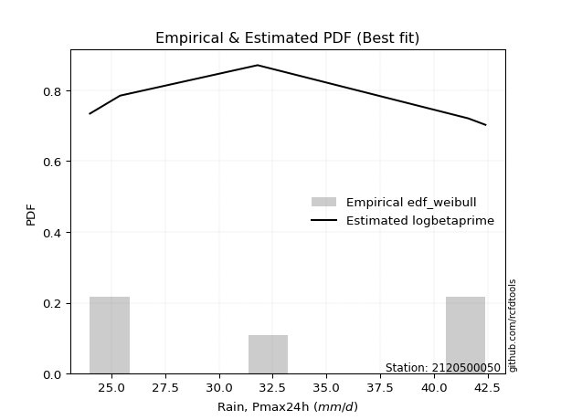</img>

</div>


### 4. EDF Beard (1943)

The Beard formula (or Beard´s plotting position formula) in hydrology is used to estimate the empirical non-exceedance probability _(P)_ of a flood event (or other extreme hydrological data point) within a given dataset.

<div align="center">


$P=(m-0.31)/(n+0.38)$


</div>


**4.1. Empirical values**

<div align="center">

|                | 0                   | 1                   | 2                  | 3                  | 4                  | 5                  |
|:---------------|:--------------------|:--------------------|:-------------------|:-------------------|:-------------------|:-------------------|
| date           | 2019                | 2023                | 2020               | 2021               | 2025               | 2022               |
| x              | 24.0                | 25.4                | 31.8               | 41.6               | 42.0               | 42.4               |
| m              | 1                   | 2                   | 3                  | 4                  | 5                  | 6                  |
| empirical_dist | edf_beard           | edf_beard           | edf_beard          | edf_beard          | edf_beard          | edf_beard          |
| empirical      | 0.10815047021943573 | 0.26489028213166144 | 0.4216300940438871 | 0.5783699059561128 | 0.7351097178683387 | 0.8918495297805643 |
| empirical_tr   | 1.1212653778558874  | 1.3603411513859276  | 1.7289972899728996 | 2.3717472118959106 | 3.7751479289940844 | 9.246376811594207  |

</div>


**4.2. Kolmogorov-Smirnov fit test (sorted by Δ)**


<div align="center">

|                | 0                   | 1                   | 2                   | 3                  | 4                   | 5                   | 6                   | 7                   | 8                  | 9                 | 10                  | 11                  | 12                 | 13                  | 14                  | 15                 | 16                  | 17                  | 18                  | 19                  | 20                  | 21                  | 22                  | 23                  | 24                  | 25                  | 26                  | 27                  | 28                  | 29                  | 30                  | 31                  | 32                  | 33                 | 34                 | 35                  | 36                  | 37                  | 38                  | 39                  | 40                  | 41                  | 42                  | 43                  | 44                  | 45                  | 46                  | 47                  | 48                  | 49                  | 50                  | 51                  | 52                  | 53                  | 54                  | 55                  | 56                 | 57                 | 58                  | 59                  | 60                  | 61                  | 62                  | 63                  | 64                  | 65                 | 66                  | 67                  | 68                  | 69                  | 70                  | 71                  | 72                  | 73                | 74                  | 75                  | 76                  | 77                 | 78                  | 79                  | 80                  | 81                  | 82                  | 83                  | 84                 | 85                 | 86                  | 87                 | 88                 | 89                  | 90                  | 91                  | 92                 | 93                 | 94                 | 95                  | 96                  | 97                 | 98                 | 99                  | 100                | 101                 | 102                | 103                | 104                 | 105                 | 106                | 107                 | 108                 | 109                | 110                 | 111                | 112                | 113                 | 114                | 115                | 116                 | 117                 | 118                 | 119                | 120                | 121                | 122                | 123                | 124                 | 125                | 126                | 127                | 128                 | 129                | 130                 | 131                | 132                 | 133                 | 134                 | 135                | 136                 | 137                 | 138                 | 139                 | 140                | 141                 | 142                | 143                | 144                 | 145                 | 146                 | 147               | 148                | 149                | 150               | 151                | 152                | 153                | 154                | 155                | 156                | 157                | 158              | 159            |
|:---------------|:--------------------|:--------------------|:--------------------|:-------------------|:--------------------|:--------------------|:--------------------|:--------------------|:-------------------|:------------------|:--------------------|:--------------------|:-------------------|:--------------------|:--------------------|:-------------------|:--------------------|:--------------------|:--------------------|:--------------------|:--------------------|:--------------------|:--------------------|:--------------------|:--------------------|:--------------------|:--------------------|:--------------------|:--------------------|:--------------------|:--------------------|:--------------------|:--------------------|:-------------------|:-------------------|:--------------------|:--------------------|:--------------------|:--------------------|:--------------------|:--------------------|:--------------------|:--------------------|:--------------------|:--------------------|:--------------------|:--------------------|:--------------------|:--------------------|:--------------------|:--------------------|:--------------------|:--------------------|:--------------------|:--------------------|:--------------------|:-------------------|:-------------------|:--------------------|:--------------------|:--------------------|:--------------------|:--------------------|:--------------------|:--------------------|:-------------------|:--------------------|:--------------------|:--------------------|:--------------------|:--------------------|:--------------------|:--------------------|:------------------|:--------------------|:--------------------|:--------------------|:-------------------|:--------------------|:--------------------|:--------------------|:--------------------|:--------------------|:--------------------|:-------------------|:-------------------|:--------------------|:-------------------|:-------------------|:--------------------|:--------------------|:--------------------|:-------------------|:-------------------|:-------------------|:--------------------|:--------------------|:-------------------|:-------------------|:--------------------|:-------------------|:--------------------|:-------------------|:-------------------|:--------------------|:--------------------|:-------------------|:--------------------|:--------------------|:-------------------|:--------------------|:-------------------|:-------------------|:--------------------|:-------------------|:-------------------|:--------------------|:--------------------|:--------------------|:-------------------|:-------------------|:-------------------|:-------------------|:-------------------|:--------------------|:-------------------|:-------------------|:-------------------|:--------------------|:-------------------|:--------------------|:-------------------|:--------------------|:--------------------|:--------------------|:-------------------|:--------------------|:--------------------|:--------------------|:--------------------|:-------------------|:--------------------|:-------------------|:-------------------|:--------------------|:--------------------|:--------------------|:------------------|:-------------------|:-------------------|:------------------|:-------------------|:-------------------|:-------------------|:-------------------|:-------------------|:-------------------|:-------------------|:-----------------|:---------------|
| station        | 2120500050          | 2120500050          | 2120500050          | 2120500050         | 2120500050          | 2120500050          | 2120500050          | 2120500050          | 2120500050         | 2120500050        | 2120500050          | 2120500050          | 2120500050         | 2120500050          | 2120500050          | 2120500050         | 2120500050          | 2120500050          | 2120500050          | 2120500050          | 2120500050          | 2120500050          | 2120500050          | 2120500050          | 2120500050          | 2120500050          | 2120500050          | 2120500050          | 2120500050          | 2120500050          | 2120500050          | 2120500050          | 2120500050          | 2120500050         | 2120500050         | 2120500050          | 2120500050          | 2120500050          | 2120500050          | 2120500050          | 2120500050          | 2120500050          | 2120500050          | 2120500050          | 2120500050          | 2120500050          | 2120500050          | 2120500050          | 2120500050          | 2120500050          | 2120500050          | 2120500050          | 2120500050          | 2120500050          | 2120500050          | 2120500050          | 2120500050         | 2120500050         | 2120500050          | 2120500050          | 2120500050          | 2120500050          | 2120500050          | 2120500050          | 2120500050          | 2120500050         | 2120500050          | 2120500050          | 2120500050          | 2120500050          | 2120500050          | 2120500050          | 2120500050          | 2120500050        | 2120500050          | 2120500050          | 2120500050          | 2120500050         | 2120500050          | 2120500050          | 2120500050          | 2120500050          | 2120500050          | 2120500050          | 2120500050         | 2120500050         | 2120500050          | 2120500050         | 2120500050         | 2120500050          | 2120500050          | 2120500050          | 2120500050         | 2120500050         | 2120500050         | 2120500050          | 2120500050          | 2120500050         | 2120500050         | 2120500050          | 2120500050         | 2120500050          | 2120500050         | 2120500050         | 2120500050          | 2120500050          | 2120500050         | 2120500050          | 2120500050          | 2120500050         | 2120500050          | 2120500050         | 2120500050         | 2120500050          | 2120500050         | 2120500050         | 2120500050          | 2120500050          | 2120500050          | 2120500050         | 2120500050         | 2120500050         | 2120500050         | 2120500050         | 2120500050          | 2120500050         | 2120500050         | 2120500050         | 2120500050          | 2120500050         | 2120500050          | 2120500050         | 2120500050          | 2120500050          | 2120500050          | 2120500050         | 2120500050          | 2120500050          | 2120500050          | 2120500050          | 2120500050         | 2120500050          | 2120500050         | 2120500050         | 2120500050          | 2120500050          | 2120500050          | 2120500050        | 2120500050         | 2120500050         | 2120500050        | 2120500050         | 2120500050         | 2120500050         | 2120500050         | 2120500050         | 2120500050         | 2120500050         | 2120500050       | 2120500050     |
| empirical_dist | edf_beard           | edf_beard           | edf_beard           | edf_beard          | edf_beard           | edf_beard           | edf_beard           | edf_beard           | edf_beard          | edf_beard         | edf_beard           | edf_beard           | edf_beard          | edf_beard           | edf_beard           | edf_beard          | edf_beard           | edf_beard           | edf_beard           | edf_beard           | edf_beard           | edf_beard           | edf_beard           | edf_beard           | edf_beard           | edf_beard           | edf_beard           | edf_beard           | edf_beard           | edf_beard           | edf_beard           | edf_beard           | edf_beard           | edf_beard          | edf_beard          | edf_beard           | edf_beard           | edf_beard           | edf_beard           | edf_beard           | edf_beard           | edf_beard           | edf_beard           | edf_beard           | edf_beard           | edf_beard           | edf_beard           | edf_beard           | edf_beard           | edf_beard           | edf_beard           | edf_beard           | edf_beard           | edf_beard           | edf_beard           | edf_beard           | edf_beard          | edf_beard          | edf_beard           | edf_beard           | edf_beard           | edf_beard           | edf_beard           | edf_beard           | edf_beard           | edf_beard          | edf_beard           | edf_beard           | edf_beard           | edf_beard           | edf_beard           | edf_beard           | edf_beard           | edf_beard         | edf_beard           | edf_beard           | edf_beard           | edf_beard          | edf_beard           | edf_beard           | edf_beard           | edf_beard           | edf_beard           | edf_beard           | edf_beard          | edf_beard          | edf_beard           | edf_beard          | edf_beard          | edf_beard           | edf_beard           | edf_beard           | edf_beard          | edf_beard          | edf_beard          | edf_beard           | edf_beard           | edf_beard          | edf_beard          | edf_beard           | edf_beard          | edf_beard           | edf_beard          | edf_beard          | edf_beard           | edf_beard           | edf_beard          | edf_beard           | edf_beard           | edf_beard          | edf_beard           | edf_beard          | edf_beard          | edf_beard           | edf_beard          | edf_beard          | edf_beard           | edf_beard           | edf_beard           | edf_beard          | edf_beard          | edf_beard          | edf_beard          | edf_beard          | edf_beard           | edf_beard          | edf_beard          | edf_beard          | edf_beard           | edf_beard          | edf_beard           | edf_beard          | edf_beard           | edf_beard           | edf_beard           | edf_beard          | edf_beard           | edf_beard           | edf_beard           | edf_beard           | edf_beard          | edf_beard           | edf_beard          | edf_beard          | edf_beard           | edf_beard           | edf_beard           | edf_beard         | edf_beard          | edf_beard          | edf_beard         | edf_beard          | edf_beard          | edf_beard          | edf_beard          | edf_beard          | edf_beard          | edf_beard          | edf_beard        | edf_beard      |
| p_dist         | wrapcauchy          | arcsine             | dweibull            | logarcsine         | logrdist            | logdweibull         | rdist               | logweibull_max      | logwrapcauchy      | logksone          | logexponweib        | ksone               | dgamma             | logdgamma           | logtrapezoid        | exponpow           | trapezoid           | genpareto           | loginvweibull       | logsemicircular     | semicircular        | loganglit           | anglit              | lomax               | halfgennorm         | logbeta             | logburr             | burr12              | loglomax            | levy_l              | burr                | invweibull          | nakagami            | loginvgamma        | logncf             | logpearson3         | logf                | genexpon            | loginvgauss         | logfoldnorm         | logerlang           | gennorm             | loggamma            | loggamma            | invgauss            | lognorm             | logcrystalball      | logt                | logexponnorm        | logbetaprime        | pearson3            | invgamma            | loggenexpon         | logrice             | erlang              | logmaxwell          | ncf                | lograyleigh        | loglevy_l           | weibull_min         | nct                 | f                   | crystalball         | norm                | exponnorm           | t                  | logalpha            | gamma               | maxwell             | rayleigh            | logfatiguelife      | logburr12           | rice                | logweibull_min    | logkstwobign        | loghalfnorm         | foldnorm            | alpha              | betaprime           | halfnorm            | lognct              | kstwobign           | loggompertz         | beta                | gompertz           | loggumbel_l        | genextreme          | gumbel_l           | loggenextreme      | loglogistic         | loggumbel_r         | logistic            | gumbel_r           | loghalflogistic    | logcosine          | cosine              | halflogistic        | logmoyal           | moyal              | loghypsecant        | hypsecant          | weibull_max         | loglaplace         | loglaplace         | laplace             | logmielke           | argus              | logwald             | wald                | logargus           | exponweib           | genhalflogistic    | logloggamma        | loggennorm          | lognakagami        | logloglaplace      | logexponpow         | loggenhalflogistic  | skewnorm            | triang             | kappa4             | logtriang          | tukeylambda        | kappa3             | logkappa3           | logskewnorm        | uniform            | vonmises_line      | loggausshyper       | logtukeylambda     | logvonmises_line    | gengamma           | gausshyper          | logkappa4           | loguniform          | bradford           | truncexpon          | logtruncweibull_min | logbradford         | fatiguelife         | logtruncexpon      | truncweibull_min    | logtruncnorm       | loghalfgennorm     | loggengamma         | powerlaw            | logpowerlaw         | johnsonsb         | johnsonsu          | truncpareto        | logtruncpareto    | truncnorm          | logjohnsonsb       | logjohnsonsu       | loggenpareto       | genlogistic        | loggenlogistic     | logvonmises        | vonmises         | mielke         |
| delta          | 0.12745708148412715 | 0.14138202385070953 | 0.14725559637247615 | 0.1503860237059752 | 0.15163726951244283 | 0.15965609043064546 | 0.16055616985584853 | 0.16068777002350432 | 0.1668365056329863 | 0.179497295602719 | 0.18023951084413092 | 0.18161212082763134 | 0.1852746619928531 | 0.18799115741993427 | 0.19113511878977008 | 0.1925593919972835 | 0.19416755595083723 | 0.19602073041548984 | 0.19610241620087077 | 0.19621048714934675 | 0.19829475740711977 | 0.20835274778579926 | 0.21040074517744223 | 0.21055287063442085 | 0.21390845602915354 | 0.22122387966794213 | 0.22433520488830327 | 0.22496244035988722 | 0.22559717193188067 | 0.22679772189633557 | 0.22681173205354732 | 0.22968746682116392 | 0.23121548477812104 | 0.2312516952510335 | 0.2331405219281859 | 0.23375331740332783 | 0.23386950155674746 | 0.23387516397039232 | 0.23404805444034993 | 0.23415951523798828 | 0.23463361395213356 | 0.23510971786833867 | 0.23521150231523458 | 0.23521150231523458 | 0.23572612509940094 | 0.23577598654348775 | 0.23577602357710847 | 0.23577634331618846 | 0.23577726366821916 | 0.23619262467495472 | 0.23620509920507227 | 0.23626106130297841 | 0.23638778959591877 | 0.23641521641494423 | 0.23668600411835738 | 0.23681931789680954 | 0.2368635320553646 | 0.2371294116385203 | 0.23726081669012472 | 0.23736816852394105 | 0.23747293082329424 | 0.23749100588658845 | 0.23773067429072958 | 0.23773068275860332 | 0.23773163802286168 | 0.2377442180932502 | 0.23779487632618224 | 0.23831831659645397 | 0.23851391341747163 | 0.23875240055839742 | 0.23887462751628952 | 0.23908274334466828 | 0.23911855688888128 | 0.239308863161232 | 0.23941953195943155 | 0.24021112884102802 | 0.24032125580007435 | 0.2407341628573305 | 0.24141454749336522 | 0.24163733889240147 | 0.24227687227883588 | 0.24462130046294828 | 0.24489567173565163 | 0.24578430551888153 | 0.2464399391681925 | 0.2505361864315897 | 0.25186343651603726 | 0.2533641892452443 | 0.2557624363722149 | 0.25645658436471097 | 0.25811275143358303 | 0.25828071805316866 | 0.2595106602638928 | 0.2599397683759086 | 0.2603201030622946 | 0.26047212868081215 | 0.26123709209035684 | 0.2658906253527167 | 0.2671367939663448 | 0.26817917443218864 | 0.2698687834232941 | 0.27988518633723647 | 0.2802683779267984 | 0.2802683779267984 | 0.28172539319603096 | 0.29196929866135657 | 0.2943671783933932 | 0.29465042231471195 | 0.29554808597433835 | 0.3010348331648649 | 0.33654492224754445 | 0.3411594121935061 | 0.3425521688943943 | 0.34809342750392425 | 0.3484208839550528 | 0.3535126164760761 | 0.35705514158442786 | 0.36211033479610644 | 0.36422139984938007 | 0.3675647125551925 | 0.3694349666413983 | 0.3695335802289379 | 0.3714182347325051 | 0.3738352718121366 | 0.37512203523887544 | 0.3761590671699172 | 0.3781518331743221 | 0.3789152724630058 | 0.37894141633399037 | 0.3813865058888156 | 0.38178349446927706 | 0.3819371809024384 | 0.38228750910080067 | 0.38394893519030426 | 0.38815903800081597 | 0.3907238715021809 | 0.39316726933366886 | 0.39494076852266746 | 0.39767154075943645 | 0.39990825510752165 | 0.4019597736350258 | 0.40597458670948605 | 0.4099638622461128 | 0.4216300940438871 | 0.43919925259630205 | 0.45667672351891647 | 0.47273664800905474 | 0.487915683930059 | 0.4934942169034165 | 0.5100752065176479 | 0.522086405052631 | 0.5259905913848437 | 0.5538432838807396 | 0.6684285544652645 | 0.6875050456190854 | 0.7351097178683387 | 0.7351097178683387 | 1.2352816475393649 | 6.56273712518692 | nan            |
| deltao         | 0.530385761606      | 0.530385761606      | 0.530385761606      | 0.530385761606     | 0.530385761606      | 0.530385761606      | 0.530385761606      | 0.530385761606      | 0.530385761606     | 0.530385761606    | 0.530385761606      | 0.530385761606      | 0.530385761606     | 0.530385761606      | 0.530385761606      | 0.530385761606     | 0.530385761606      | 0.530385761606      | 0.530385761606      | 0.530385761606      | 0.530385761606      | 0.530385761606      | 0.530385761606      | 0.530385761606      | 0.530385761606      | 0.530385761606      | 0.530385761606      | 0.530385761606      | 0.530385761606      | 0.530385761606      | 0.530385761606      | 0.530385761606      | 0.530385761606      | 0.530385761606     | 0.530385761606     | 0.530385761606      | 0.530385761606      | 0.530385761606      | 0.530385761606      | 0.530385761606      | 0.530385761606      | 0.530385761606      | 0.530385761606      | 0.530385761606      | 0.530385761606      | 0.530385761606      | 0.530385761606      | 0.530385761606      | 0.530385761606      | 0.530385761606      | 0.530385761606      | 0.530385761606      | 0.530385761606      | 0.530385761606      | 0.530385761606      | 0.530385761606      | 0.530385761606     | 0.530385761606     | 0.530385761606      | 0.530385761606      | 0.530385761606      | 0.530385761606      | 0.530385761606      | 0.530385761606      | 0.530385761606      | 0.530385761606     | 0.530385761606      | 0.530385761606      | 0.530385761606      | 0.530385761606      | 0.530385761606      | 0.530385761606      | 0.530385761606      | 0.530385761606    | 0.530385761606      | 0.530385761606      | 0.530385761606      | 0.530385761606     | 0.530385761606      | 0.530385761606      | 0.530385761606      | 0.530385761606      | 0.530385761606      | 0.530385761606      | 0.530385761606     | 0.530385761606     | 0.530385761606      | 0.530385761606     | 0.530385761606     | 0.530385761606      | 0.530385761606      | 0.530385761606      | 0.530385761606     | 0.530385761606     | 0.530385761606     | 0.530385761606      | 0.530385761606      | 0.530385761606     | 0.530385761606     | 0.530385761606      | 0.530385761606     | 0.530385761606      | 0.530385761606     | 0.530385761606     | 0.530385761606      | 0.530385761606      | 0.530385761606     | 0.530385761606      | 0.530385761606      | 0.530385761606     | 0.530385761606      | 0.530385761606     | 0.530385761606     | 0.530385761606      | 0.530385761606     | 0.530385761606     | 0.530385761606      | 0.530385761606      | 0.530385761606      | 0.530385761606     | 0.530385761606     | 0.530385761606     | 0.530385761606     | 0.530385761606     | 0.530385761606      | 0.530385761606     | 0.530385761606     | 0.530385761606     | 0.530385761606      | 0.530385761606     | 0.530385761606      | 0.530385761606     | 0.530385761606      | 0.530385761606      | 0.530385761606      | 0.530385761606     | 0.530385761606      | 0.530385761606      | 0.530385761606      | 0.530385761606      | 0.530385761606     | 0.530385761606      | 0.530385761606     | 0.530385761606     | 0.530385761606      | 0.530385761606      | 0.530385761606      | 0.530385761606    | 0.530385761606     | 0.530385761606     | 0.530385761606    | 0.530385761606     | 0.530385761606     | 0.530385761606     | 0.530385761606     | 0.530385761606     | 0.530385761606     | 0.530385761606     | 0.530385761606   | 0.530385761606 |
| eval           | Δo > Δ              | Δo > Δ              | Δo > Δ              | Δo > Δ             | Δo > Δ              | Δo > Δ              | Δo > Δ              | Δo > Δ              | Δo > Δ             | Δo > Δ            | Δo > Δ              | Δo > Δ              | Δo > Δ             | Δo > Δ              | Δo > Δ              | Δo > Δ             | Δo > Δ              | Δo > Δ              | Δo > Δ              | Δo > Δ              | Δo > Δ              | Δo > Δ              | Δo > Δ              | Δo > Δ              | Δo > Δ              | Δo > Δ              | Δo > Δ              | Δo > Δ              | Δo > Δ              | Δo > Δ              | Δo > Δ              | Δo > Δ              | Δo > Δ              | Δo > Δ             | Δo > Δ             | Δo > Δ              | Δo > Δ              | Δo > Δ              | Δo > Δ              | Δo > Δ              | Δo > Δ              | Δo > Δ              | Δo > Δ              | Δo > Δ              | Δo > Δ              | Δo > Δ              | Δo > Δ              | Δo > Δ              | Δo > Δ              | Δo > Δ              | Δo > Δ              | Δo > Δ              | Δo > Δ              | Δo > Δ              | Δo > Δ              | Δo > Δ              | Δo > Δ             | Δo > Δ             | Δo > Δ              | Δo > Δ              | Δo > Δ              | Δo > Δ              | Δo > Δ              | Δo > Δ              | Δo > Δ              | Δo > Δ             | Δo > Δ              | Δo > Δ              | Δo > Δ              | Δo > Δ              | Δo > Δ              | Δo > Δ              | Δo > Δ              | Δo > Δ            | Δo > Δ              | Δo > Δ              | Δo > Δ              | Δo > Δ             | Δo > Δ              | Δo > Δ              | Δo > Δ              | Δo > Δ              | Δo > Δ              | Δo > Δ              | Δo > Δ             | Δo > Δ             | Δo > Δ              | Δo > Δ             | Δo > Δ             | Δo > Δ              | Δo > Δ              | Δo > Δ              | Δo > Δ             | Δo > Δ             | Δo > Δ             | Δo > Δ              | Δo > Δ              | Δo > Δ             | Δo > Δ             | Δo > Δ              | Δo > Δ             | Δo > Δ              | Δo > Δ             | Δo > Δ             | Δo > Δ              | Δo > Δ              | Δo > Δ             | Δo > Δ              | Δo > Δ              | Δo > Δ             | Δo > Δ              | Δo > Δ             | Δo > Δ             | Δo > Δ              | Δo > Δ             | Δo > Δ             | Δo > Δ              | Δo > Δ              | Δo > Δ              | Δo > Δ             | Δo > Δ             | Δo > Δ             | Δo > Δ             | Δo > Δ             | Δo > Δ              | Δo > Δ             | Δo > Δ             | Δo > Δ             | Δo > Δ              | Δo > Δ             | Δo > Δ              | Δo > Δ             | Δo > Δ              | Δo > Δ              | Δo > Δ              | Δo > Δ             | Δo > Δ              | Δo > Δ              | Δo > Δ              | Δo > Δ              | Δo > Δ             | Δo > Δ              | Δo > Δ             | Δo > Δ             | Δo > Δ              | Δo > Δ              | Δo > Δ              | Δo > Δ            | Δo > Δ             | Δo > Δ             | Δo > Δ            | Δo > Δ             | Δo <= Δ            | Δo <= Δ            | Δo <= Δ            | Δo <= Δ            | Δo <= Δ            | Δo <= Δ            | Δo <= Δ          | Δo <= Δ        |
| fit            | 1                   | 1                   | 1                   | 1                  | 1                   | 1                   | 1                   | 1                   | 1                  | 1                 | 1                   | 1                   | 1                  | 1                   | 1                   | 1                  | 1                   | 1                   | 1                   | 1                   | 1                   | 1                   | 1                   | 1                   | 1                   | 1                   | 1                   | 1                   | 1                   | 1                   | 1                   | 1                   | 1                   | 1                  | 1                  | 1                   | 1                   | 1                   | 1                   | 1                   | 1                   | 1                   | 1                   | 1                   | 1                   | 1                   | 1                   | 1                   | 1                   | 1                   | 1                   | 1                   | 1                   | 1                   | 1                   | 1                   | 1                  | 1                  | 1                   | 1                   | 1                   | 1                   | 1                   | 1                   | 1                   | 1                  | 1                   | 1                   | 1                   | 1                   | 1                   | 1                   | 1                   | 1                 | 1                   | 1                   | 1                   | 1                  | 1                   | 1                   | 1                   | 1                   | 1                   | 1                   | 1                  | 1                  | 1                   | 1                  | 1                  | 1                   | 1                   | 1                   | 1                  | 1                  | 1                  | 1                   | 1                   | 1                  | 1                  | 1                   | 1                  | 1                   | 1                  | 1                  | 1                   | 1                   | 1                  | 1                   | 1                   | 1                  | 1                   | 1                  | 1                  | 1                   | 1                  | 1                  | 1                   | 1                   | 1                   | 1                  | 1                  | 1                  | 1                  | 1                  | 1                   | 1                  | 1                  | 1                  | 1                   | 1                  | 1                   | 1                  | 1                   | 1                   | 1                   | 1                  | 1                   | 1                   | 1                   | 1                   | 1                  | 1                   | 1                  | 1                  | 1                   | 1                   | 1                   | 1                 | 1                  | 1                  | 1                 | 1                  | 0                  | 0                  | 0                  | 0                  | 0                  | 0                  | 0                | 0              |
| n              | 6                   | 6                   | 6                   | 6                  | 6                   | 6                   | 6                   | 6                   | 6                  | 6                 | 6                   | 6                   | 6                  | 6                   | 6                   | 6                  | 6                   | 6                   | 6                   | 6                   | 6                   | 6                   | 6                   | 6                   | 6                   | 6                   | 6                   | 6                   | 6                   | 6                   | 6                   | 6                   | 6                   | 6                  | 6                  | 6                   | 6                   | 6                   | 6                   | 6                   | 6                   | 6                   | 6                   | 6                   | 6                   | 6                   | 6                   | 6                   | 6                   | 6                   | 6                   | 6                   | 6                   | 6                   | 6                   | 6                   | 6                  | 6                  | 6                   | 6                   | 6                   | 6                   | 6                   | 6                   | 6                   | 6                  | 6                   | 6                   | 6                   | 6                   | 6                   | 6                   | 6                   | 6                 | 6                   | 6                   | 6                   | 6                  | 6                   | 6                   | 6                   | 6                   | 6                   | 6                   | 6                  | 6                  | 6                   | 6                  | 6                  | 6                   | 6                   | 6                   | 6                  | 6                  | 6                  | 6                   | 6                   | 6                  | 6                  | 6                   | 6                  | 6                   | 6                  | 6                  | 6                   | 6                   | 6                  | 6                   | 6                   | 6                  | 6                   | 6                  | 6                  | 6                   | 6                  | 6                  | 6                   | 6                   | 6                   | 6                  | 6                  | 6                  | 6                  | 6                  | 6                   | 6                  | 6                  | 6                  | 6                   | 6                  | 6                   | 6                  | 6                   | 6                   | 6                   | 6                  | 6                   | 6                   | 6                   | 6                   | 6                  | 6                   | 6                  | 6                  | 6                   | 6                   | 6                   | 6                 | 6                  | 6                  | 6                 | 6                  | 6                  | 6                  | 6                  | 6                  | 6                  | 6                  | 6                | 6              |
| best_fit       | 1                   | 0                   | 0                   | 0                  | 0                   | 0                   | 0                   | 0                   | 0                  | 0                 | 0                   | 0                   | 0                  | 0                   | 0                   | 0                  | 0                   | 0                   | 0                   | 0                   | 0                   | 0                   | 0                   | 0                   | 0                   | 0                   | 0                   | 0                   | 0                   | 0                   | 0                   | 0                   | 0                   | 0                  | 0                  | 0                   | 0                   | 0                   | 0                   | 0                   | 0                   | 0                   | 0                   | 0                   | 0                   | 0                   | 0                   | 0                   | 0                   | 0                   | 0                   | 0                   | 0                   | 0                   | 0                   | 0                   | 0                  | 0                  | 0                   | 0                   | 0                   | 0                   | 0                   | 0                   | 0                   | 0                  | 0                   | 0                   | 0                   | 0                   | 0                   | 0                   | 0                   | 0                 | 0                   | 0                   | 0                   | 0                  | 0                   | 0                   | 0                   | 0                   | 0                   | 0                   | 0                  | 0                  | 0                   | 0                  | 0                  | 0                   | 0                   | 0                   | 0                  | 0                  | 0                  | 0                   | 0                   | 0                  | 0                  | 0                   | 0                  | 0                   | 0                  | 0                  | 0                   | 0                   | 0                  | 0                   | 0                   | 0                  | 0                   | 0                  | 0                  | 0                   | 0                  | 0                  | 0                   | 0                   | 0                   | 0                  | 0                  | 0                  | 0                  | 0                  | 0                   | 0                  | 0                  | 0                  | 0                   | 0                  | 0                   | 0                  | 0                   | 0                   | 0                   | 0                  | 0                   | 0                   | 0                   | 0                   | 0                  | 0                   | 0                  | 0                  | 0                   | 0                   | 0                   | 0                 | 0                  | 0                  | 0                 | 0                  | 0                  | 0                  | 0                  | 0                  | 0                  | 0                  | 0                | 0              |
| best_fit_sort  | 1                   | 2                   | 3                   | 4                  | 5                   | 6                   | 7                   | 8                   | 9                  | 10                | 11                  | 12                  | 13                 | 14                  | 15                  | 16                 | 17                  | 18                  | 19                  | 20                  | 21                  | 22                  | 23                  | 24                  | 25                  | 26                  | 27                  | 28                  | 29                  | 30                  | 31                  | 32                  | 33                  | 34                 | 35                 | 36                  | 37                  | 38                  | 39                  | 40                  | 41                  | 42                  | 43                  | 44                  | 45                  | 46                  | 47                  | 48                  | 49                  | 50                  | 51                  | 52                  | 53                  | 54                  | 55                  | 56                  | 57                 | 58                 | 59                  | 60                  | 61                  | 62                  | 63                  | 64                  | 65                  | 66                 | 67                  | 68                  | 69                  | 70                  | 71                  | 72                  | 73                  | 74                | 75                  | 76                  | 77                  | 78                 | 79                  | 80                  | 81                  | 82                  | 83                  | 84                  | 85                 | 86                 | 87                  | 88                 | 89                 | 90                  | 91                  | 92                  | 93                 | 94                 | 95                 | 96                  | 97                  | 98                 | 99                 | 100                 | 101                | 102                 | 103                | 104                | 105                 | 106                 | 107                | 108                 | 109                 | 110                | 111                 | 112                | 113                | 114                 | 115                | 116                | 117                 | 118                 | 119                 | 120                | 121                | 122                | 123                | 124                | 125                 | 126                | 127                | 128                | 129                 | 130                | 131                 | 132                | 133                 | 134                 | 135                 | 136                | 137                 | 138                 | 139                 | 140                 | 141                | 142                 | 143                | 144                | 145                 | 146                 | 147                 | 148               | 149                | 150                | 151               | 152                | 153                | 154                | 155                | 156                | 157                | 158                | 159              | 160            |

</div>


**4.3. Best fit**

<div align="center">

|   id |    station | empirical_dist   | p_dist     |    delta |   deltao | eval   |   fit |   n |   best_fit |   best_fit_sort |
|-----:|-----------:|:-----------------|:-----------|---------:|---------:|:-------|------:|----:|-----------:|----------------:|
|    0 | 2120500050 | edf_beard        | wrapcauchy | 0.127457 | 0.530386 | Δo > Δ |     1 |   6 |          1 |               1 |

</div>


<div align="center">

</img>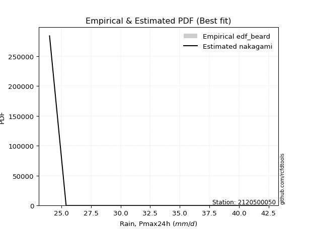</img>

</div>


### 5. EDF Chegodayev (1955)

The Chegodayev formula is an empirical plotting position formula used in hydrological frequency analysis to estimate the exceedance probability or return period of a specific event from a set of observed data. It is primarily used for plotting observed data points on probability paper to fit a theoretical distribution, particularly for analyzing extreme events like maximum flood flows or rainfall intensities. The constant _b_ value in the generalized plotting position formula is 0.3.

<div align="center">


$P=(m-b)/(n+1-2b)$


</div>


**5.1. Empirical values**

<div align="center">

|                | 0                   | 1                  | 2                  | 3                  | 4                 | 5                 |
|:---------------|:--------------------|:-------------------|:-------------------|:-------------------|:------------------|:------------------|
| date           | 2019                | 2023               | 2020               | 2021               | 2025              | 2022              |
| x              | 24.0                | 25.4               | 31.8               | 41.6               | 42.0              | 42.4              |
| m              | 1                   | 2                  | 3                  | 4                  | 5                 | 6                 |
| empirical_dist | edf_chegodayev      | edf_chegodayev     | edf_chegodayev     | edf_chegodayev     | edf_chegodayev    | edf_chegodayev    |
| empirical      | 0.10937499999999999 | 0.265625           | 0.421875           | 0.578125           | 0.734375          | 0.890625          |
| empirical_tr   | 1.1228070175438596  | 1.3617021276595744 | 1.7297297297297298 | 2.3703703703703702 | 3.764705882352941 | 9.142857142857142 |

</div>


**5.2. Kolmogorov-Smirnov fit test (sorted by Δ)**


<div align="center">

|                | 0                  | 1                   | 2                  | 3                  | 4                   | 5                   | 6                   | 7                   | 8                   | 9                  | 10                  | 11                  | 12                  | 13                  | 14                 | 15                  | 16                  | 17                  | 18                  | 19                  | 20                 | 21                  | 22                  | 23                  | 24                  | 25                | 26                 | 27                  | 28                 | 29                  | 30                  | 31                  | 32                  | 33                  | 34                 | 35                  | 36                  | 37                  | 38                  | 39             | 40                 | 41                  | 42                 | 43                 | 44                  | 45                  | 46                 | 47                  | 48                  | 49                  | 50                  | 51                  | 52                 | 53                  | 54                 | 55                  | 56                 | 57                  | 58                 | 59                  | 60                  | 61                  | 62                 | 63                  | 64                 | 65                | 66                  | 67                 | 68                  | 69                  | 70                  | 71                 | 72                 | 73                  | 74                  | 75                  | 76                  | 77                  | 78                  | 79                  | 80                 | 81                 | 82                  | 83                  | 84                  | 85                 | 86                 | 87                 | 88                 | 89                 | 90                  | 91                 | 92                 | 93                 | 94                 | 95                  | 96                  | 97                 | 98                  | 99                  | 100                 | 101                | 102                | 103                | 104                | 105                | 106                 | 107                 | 108                 | 109                | 110                | 111                | 112                 | 113                 | 114                | 115                | 116                | 117                 | 118                | 119                 | 120                | 121                | 122                 | 123                | 124                 | 125              | 126                | 127                 | 128                | 129                 | 130                | 131                | 132                | 133                | 134                | 135                | 136                | 137                 | 138                 | 139                | 140                | 141                 | 142                | 143            | 144                | 145                | 146                 | 147                 | 148                | 149                | 150                | 151                | 152                | 153                | 154                | 155            | 156            | 157                | 158               | 159            |
|:---------------|:-------------------|:--------------------|:-------------------|:-------------------|:--------------------|:--------------------|:--------------------|:--------------------|:--------------------|:-------------------|:--------------------|:--------------------|:--------------------|:--------------------|:-------------------|:--------------------|:--------------------|:--------------------|:--------------------|:--------------------|:-------------------|:--------------------|:--------------------|:--------------------|:--------------------|:------------------|:-------------------|:--------------------|:-------------------|:--------------------|:--------------------|:--------------------|:--------------------|:--------------------|:-------------------|:--------------------|:--------------------|:--------------------|:--------------------|:---------------|:-------------------|:--------------------|:-------------------|:-------------------|:--------------------|:--------------------|:-------------------|:--------------------|:--------------------|:--------------------|:--------------------|:--------------------|:-------------------|:--------------------|:-------------------|:--------------------|:-------------------|:--------------------|:-------------------|:--------------------|:--------------------|:--------------------|:-------------------|:--------------------|:-------------------|:------------------|:--------------------|:-------------------|:--------------------|:--------------------|:--------------------|:-------------------|:-------------------|:--------------------|:--------------------|:--------------------|:--------------------|:--------------------|:--------------------|:--------------------|:-------------------|:-------------------|:--------------------|:--------------------|:--------------------|:-------------------|:-------------------|:-------------------|:-------------------|:-------------------|:--------------------|:-------------------|:-------------------|:-------------------|:-------------------|:--------------------|:--------------------|:-------------------|:--------------------|:--------------------|:--------------------|:-------------------|:-------------------|:-------------------|:-------------------|:-------------------|:--------------------|:--------------------|:--------------------|:-------------------|:-------------------|:-------------------|:--------------------|:--------------------|:-------------------|:-------------------|:-------------------|:--------------------|:-------------------|:--------------------|:-------------------|:-------------------|:--------------------|:-------------------|:--------------------|:-----------------|:-------------------|:--------------------|:-------------------|:--------------------|:-------------------|:-------------------|:-------------------|:-------------------|:-------------------|:-------------------|:-------------------|:--------------------|:--------------------|:-------------------|:-------------------|:--------------------|:-------------------|:---------------|:-------------------|:-------------------|:--------------------|:--------------------|:-------------------|:-------------------|:-------------------|:-------------------|:-------------------|:-------------------|:-------------------|:---------------|:---------------|:-------------------|:------------------|:---------------|
| station        | 2120500050         | 2120500050          | 2120500050         | 2120500050         | 2120500050          | 2120500050          | 2120500050          | 2120500050          | 2120500050          | 2120500050         | 2120500050          | 2120500050          | 2120500050          | 2120500050          | 2120500050         | 2120500050          | 2120500050          | 2120500050          | 2120500050          | 2120500050          | 2120500050         | 2120500050          | 2120500050          | 2120500050          | 2120500050          | 2120500050        | 2120500050         | 2120500050          | 2120500050         | 2120500050          | 2120500050          | 2120500050          | 2120500050          | 2120500050          | 2120500050         | 2120500050          | 2120500050          | 2120500050          | 2120500050          | 2120500050     | 2120500050         | 2120500050          | 2120500050         | 2120500050         | 2120500050          | 2120500050          | 2120500050         | 2120500050          | 2120500050          | 2120500050          | 2120500050          | 2120500050          | 2120500050         | 2120500050          | 2120500050         | 2120500050          | 2120500050         | 2120500050          | 2120500050         | 2120500050          | 2120500050          | 2120500050          | 2120500050         | 2120500050          | 2120500050         | 2120500050        | 2120500050          | 2120500050         | 2120500050          | 2120500050          | 2120500050          | 2120500050         | 2120500050         | 2120500050          | 2120500050          | 2120500050          | 2120500050          | 2120500050          | 2120500050          | 2120500050          | 2120500050         | 2120500050         | 2120500050          | 2120500050          | 2120500050          | 2120500050         | 2120500050         | 2120500050         | 2120500050         | 2120500050         | 2120500050          | 2120500050         | 2120500050         | 2120500050         | 2120500050         | 2120500050          | 2120500050          | 2120500050         | 2120500050          | 2120500050          | 2120500050          | 2120500050         | 2120500050         | 2120500050         | 2120500050         | 2120500050         | 2120500050          | 2120500050          | 2120500050          | 2120500050         | 2120500050         | 2120500050         | 2120500050          | 2120500050          | 2120500050         | 2120500050         | 2120500050         | 2120500050          | 2120500050         | 2120500050          | 2120500050         | 2120500050         | 2120500050          | 2120500050         | 2120500050          | 2120500050       | 2120500050         | 2120500050          | 2120500050         | 2120500050          | 2120500050         | 2120500050         | 2120500050         | 2120500050         | 2120500050         | 2120500050         | 2120500050         | 2120500050          | 2120500050          | 2120500050         | 2120500050         | 2120500050          | 2120500050         | 2120500050     | 2120500050         | 2120500050         | 2120500050          | 2120500050          | 2120500050         | 2120500050         | 2120500050         | 2120500050         | 2120500050         | 2120500050         | 2120500050         | 2120500050     | 2120500050     | 2120500050         | 2120500050        | 2120500050     |
| empirical_dist | edf_chegodayev     | edf_chegodayev      | edf_chegodayev     | edf_chegodayev     | edf_chegodayev      | edf_chegodayev      | edf_chegodayev      | edf_chegodayev      | edf_chegodayev      | edf_chegodayev     | edf_chegodayev      | edf_chegodayev      | edf_chegodayev      | edf_chegodayev      | edf_chegodayev     | edf_chegodayev      | edf_chegodayev      | edf_chegodayev      | edf_chegodayev      | edf_chegodayev      | edf_chegodayev     | edf_chegodayev      | edf_chegodayev      | edf_chegodayev      | edf_chegodayev      | edf_chegodayev    | edf_chegodayev     | edf_chegodayev      | edf_chegodayev     | edf_chegodayev      | edf_chegodayev      | edf_chegodayev      | edf_chegodayev      | edf_chegodayev      | edf_chegodayev     | edf_chegodayev      | edf_chegodayev      | edf_chegodayev      | edf_chegodayev      | edf_chegodayev | edf_chegodayev     | edf_chegodayev      | edf_chegodayev     | edf_chegodayev     | edf_chegodayev      | edf_chegodayev      | edf_chegodayev     | edf_chegodayev      | edf_chegodayev      | edf_chegodayev      | edf_chegodayev      | edf_chegodayev      | edf_chegodayev     | edf_chegodayev      | edf_chegodayev     | edf_chegodayev      | edf_chegodayev     | edf_chegodayev      | edf_chegodayev     | edf_chegodayev      | edf_chegodayev      | edf_chegodayev      | edf_chegodayev     | edf_chegodayev      | edf_chegodayev     | edf_chegodayev    | edf_chegodayev      | edf_chegodayev     | edf_chegodayev      | edf_chegodayev      | edf_chegodayev      | edf_chegodayev     | edf_chegodayev     | edf_chegodayev      | edf_chegodayev      | edf_chegodayev      | edf_chegodayev      | edf_chegodayev      | edf_chegodayev      | edf_chegodayev      | edf_chegodayev     | edf_chegodayev     | edf_chegodayev      | edf_chegodayev      | edf_chegodayev      | edf_chegodayev     | edf_chegodayev     | edf_chegodayev     | edf_chegodayev     | edf_chegodayev     | edf_chegodayev      | edf_chegodayev     | edf_chegodayev     | edf_chegodayev     | edf_chegodayev     | edf_chegodayev      | edf_chegodayev      | edf_chegodayev     | edf_chegodayev      | edf_chegodayev      | edf_chegodayev      | edf_chegodayev     | edf_chegodayev     | edf_chegodayev     | edf_chegodayev     | edf_chegodayev     | edf_chegodayev      | edf_chegodayev      | edf_chegodayev      | edf_chegodayev     | edf_chegodayev     | edf_chegodayev     | edf_chegodayev      | edf_chegodayev      | edf_chegodayev     | edf_chegodayev     | edf_chegodayev     | edf_chegodayev      | edf_chegodayev     | edf_chegodayev      | edf_chegodayev     | edf_chegodayev     | edf_chegodayev      | edf_chegodayev     | edf_chegodayev      | edf_chegodayev   | edf_chegodayev     | edf_chegodayev      | edf_chegodayev     | edf_chegodayev      | edf_chegodayev     | edf_chegodayev     | edf_chegodayev     | edf_chegodayev     | edf_chegodayev     | edf_chegodayev     | edf_chegodayev     | edf_chegodayev      | edf_chegodayev      | edf_chegodayev     | edf_chegodayev     | edf_chegodayev      | edf_chegodayev     | edf_chegodayev | edf_chegodayev     | edf_chegodayev     | edf_chegodayev      | edf_chegodayev      | edf_chegodayev     | edf_chegodayev     | edf_chegodayev     | edf_chegodayev     | edf_chegodayev     | edf_chegodayev     | edf_chegodayev     | edf_chegodayev | edf_chegodayev | edf_chegodayev     | edf_chegodayev    | edf_chegodayev |
| p_dist         | wrapcauchy         | arcsine             | dweibull           | logarcsine         | logrdist            | logdweibull         | rdist               | logweibull_max      | logwrapcauchy       | logksone           | logexponweib        | ksone               | dgamma              | logdgamma           | logtrapezoid       | exponpow            | trapezoid           | genpareto           | loginvweibull       | logsemicircular     | semicircular       | loganglit           | anglit              | lomax               | halfgennorm         | logbeta           | logburr            | burr12              | loglomax           | levy_l              | burr                | invweibull          | nakagami            | loginvgamma         | logncf             | logpearson3         | logf                | genexpon            | loginvgauss         | gennorm        | logfoldnorm        | logerlang           | loggamma           | loggamma           | invgauss            | lognorm             | logcrystalball     | logt                | logexponnorm        | logbetaprime        | pearson3            | invgamma            | loggenexpon        | logrice             | erlang             | logmaxwell          | ncf                | lograyleigh         | loglevy_l          | weibull_min         | nct                 | f                   | crystalball        | norm                | exponnorm          | t                 | logalpha            | gamma              | maxwell             | rayleigh            | logfatiguelife      | logburr12          | rice               | logweibull_min      | logkstwobign        | loghalfnorm         | foldnorm            | alpha               | betaprime           | halfnorm            | lognct             | kstwobign          | loggompertz         | beta                | gompertz            | loggumbel_l        | genextreme         | gumbel_l           | loggenextreme      | loglogistic        | loggumbel_r         | logistic           | gumbel_r           | loghalflogistic    | logcosine          | cosine              | halflogistic        | logmoyal           | moyal               | loghypsecant        | hypsecant           | weibull_max        | loglaplace         | loglaplace         | laplace            | logmielke          | argus               | logwald             | wald                | logargus           | exponweib          | genhalflogistic    | logloggamma         | loggennorm          | lognakagami        | logloglaplace      | logexponpow        | loggenhalflogistic  | skewnorm           | triang              | kappa4             | logtriang          | tukeylambda         | kappa3             | logkappa3           | logskewnorm      | uniform            | vonmises_line       | loggausshyper      | logtukeylambda      | gengamma           | logvonmises_line   | gausshyper         | logkappa4          | loguniform         | bradford           | truncexpon         | logtruncweibull_min | logbradford         | fatiguelife        | logtruncexpon      | truncweibull_min    | logtruncnorm       | loghalfgennorm | loggengamma        | powerlaw           | logpowerlaw         | johnsonsb           | johnsonsu          | truncpareto        | logtruncpareto     | truncnorm          | logjohnsonsb       | logjohnsonsu       | loggenpareto       | genlogistic    | loggenlogistic | logvonmises        | vonmises          | mielke         |
| delta          | 0.1267223636157886 | 0.14162692980682234 | 0.1479903142408147 | 0.1491614939254109 | 0.15188217546855565 | 0.16039080829898403 | 0.16080107581196135 | 0.16093267597961713 | 0.16610178776464773 | 0.1797422015588318 | 0.18048441680024374 | 0.18185702678374416 | 0.18600937986119168 | 0.18872587528827284 | 0.1913800247458829 | 0.19329410986562207 | 0.19441246190695005 | 0.19626563637160266 | 0.19634732215698358 | 0.19645539310545956 | 0.1985396633632326 | 0.20859765374191208 | 0.21064565113355505 | 0.21079777659053367 | 0.21415336198526636 | 0.221468785624055 | 0.2245801108444161 | 0.22520734631600003 | 0.2258420778879935 | 0.22704262785244844 | 0.22705663800966014 | 0.22993237277727674 | 0.23146039073423386 | 0.23149660120714632 | 0.2319159921476216 | 0.23399822335944065 | 0.23411440751286028 | 0.23412006992650514 | 0.23429296039646275 | 0.234375       | 0.2344044211941011 | 0.23487851990824637 | 0.2354564082713474 | 0.2354564082713474 | 0.23597103105551376 | 0.23602089249960057 | 0.2360209295332213 | 0.23602124927230128 | 0.23602216962433198 | 0.23643753063106754 | 0.23645000516118508 | 0.23650596725909123 | 0.2366326955520316 | 0.23666012237105705 | 0.2369309100744702 | 0.23706422385292236 | 0.2371084380114774 | 0.23737431759463312 | 0.2375057226462376 | 0.23761307448005387 | 0.23771783677940705 | 0.23773591184270126 | 0.2379755802468424 | 0.23797558871471614 | 0.2379765439789745 | 0.237989124049363 | 0.23803978228229505 | 0.2385632225525668 | 0.23875881937358445 | 0.23899730651451023 | 0.23911953347240233 | 0.2393276493007811 | 0.2393634628449941 | 0.23955376911734483 | 0.23966443791554437 | 0.24045603479714084 | 0.24056616175618717 | 0.24097906881344333 | 0.24165945344947803 | 0.24188224484851428 | 0.2425217782349487 | 0.2448662064190611 | 0.24514057769176445 | 0.24602921147499435 | 0.24668484512430533 | 0.2507810923877025 | 0.2521083424721501 | 0.2536090952013571 | 0.2560073423283278 | 0.2567014903208238 | 0.25835765738969585 | 0.2585256240092815 | 0.2597555662200056 | 0.2601846743320214 | 0.2605650090184074 | 0.26071703463692497 | 0.26148199804646965 | 0.2661355313088295 | 0.26738169992245764 | 0.26842408038830146 | 0.27011368937940694 | 0.2791504684688978 | 0.2805132838829112 | 0.2805132838829112 | 0.2819702991521438 | 0.2922142046174694 | 0.29461208434950603 | 0.29489532827082476 | 0.29579299193045117 | 0.3012797391209777 | 0.3363000162914316 | 0.3414043181496189 | 0.34279707485050714 | 0.34686889772335994 | 0.3476861660867142 | 0.3522880866955118 | 0.3563204237160893 | 0.36235524075221925 | 0.3644663058054929 | 0.36780961851130534 | 0.3696798725975111 | 0.3697784861850507 | 0.37166314068861794 | 0.3740801777682494 | 0.37536694119498826 | 0.37640397312603 | 0.3783967391304349 | 0.37916017841911864 | 0.3791863222901032 | 0.38163141184492844 | 0.3816922749463255 | 0.3820284004253899 | 0.3825324150569135 | 0.3841938411464171 | 0.3884039439569288 | 0.3909687774582937 | 0.3934121752897817 | 0.3951856744787803  | 0.39791644671554927 | 0.3996633491514088 | 0.4022046795911386 | 0.40621949266559887 | 0.4102087682022256 | 0.421875       | 0.4389543466401892 | 0.4564318175628036 | 0.47249174205294187 | 0.48718096606172046 | 0.4927594990350778 | 0.5098303005615351 | 0.5218414990965182 | 0.5247660616042794 | 0.5531085660124009 | 0.6676938365969258 | 0.6862805158385211 | 0.734375       | 0.734375       | 1.2355265534954778 | 6.562982031143033 | nan            |
| deltao         | 0.530385761606     | 0.530385761606      | 0.530385761606     | 0.530385761606     | 0.530385761606      | 0.530385761606      | 0.530385761606      | 0.530385761606      | 0.530385761606      | 0.530385761606     | 0.530385761606      | 0.530385761606      | 0.530385761606      | 0.530385761606      | 0.530385761606     | 0.530385761606      | 0.530385761606      | 0.530385761606      | 0.530385761606      | 0.530385761606      | 0.530385761606     | 0.530385761606      | 0.530385761606      | 0.530385761606      | 0.530385761606      | 0.530385761606    | 0.530385761606     | 0.530385761606      | 0.530385761606     | 0.530385761606      | 0.530385761606      | 0.530385761606      | 0.530385761606      | 0.530385761606      | 0.530385761606     | 0.530385761606      | 0.530385761606      | 0.530385761606      | 0.530385761606      | 0.530385761606 | 0.530385761606     | 0.530385761606      | 0.530385761606     | 0.530385761606     | 0.530385761606      | 0.530385761606      | 0.530385761606     | 0.530385761606      | 0.530385761606      | 0.530385761606      | 0.530385761606      | 0.530385761606      | 0.530385761606     | 0.530385761606      | 0.530385761606     | 0.530385761606      | 0.530385761606     | 0.530385761606      | 0.530385761606     | 0.530385761606      | 0.530385761606      | 0.530385761606      | 0.530385761606     | 0.530385761606      | 0.530385761606     | 0.530385761606    | 0.530385761606      | 0.530385761606     | 0.530385761606      | 0.530385761606      | 0.530385761606      | 0.530385761606     | 0.530385761606     | 0.530385761606      | 0.530385761606      | 0.530385761606      | 0.530385761606      | 0.530385761606      | 0.530385761606      | 0.530385761606      | 0.530385761606     | 0.530385761606     | 0.530385761606      | 0.530385761606      | 0.530385761606      | 0.530385761606     | 0.530385761606     | 0.530385761606     | 0.530385761606     | 0.530385761606     | 0.530385761606      | 0.530385761606     | 0.530385761606     | 0.530385761606     | 0.530385761606     | 0.530385761606      | 0.530385761606      | 0.530385761606     | 0.530385761606      | 0.530385761606      | 0.530385761606      | 0.530385761606     | 0.530385761606     | 0.530385761606     | 0.530385761606     | 0.530385761606     | 0.530385761606      | 0.530385761606      | 0.530385761606      | 0.530385761606     | 0.530385761606     | 0.530385761606     | 0.530385761606      | 0.530385761606      | 0.530385761606     | 0.530385761606     | 0.530385761606     | 0.530385761606      | 0.530385761606     | 0.530385761606      | 0.530385761606     | 0.530385761606     | 0.530385761606      | 0.530385761606     | 0.530385761606      | 0.530385761606   | 0.530385761606     | 0.530385761606      | 0.530385761606     | 0.530385761606      | 0.530385761606     | 0.530385761606     | 0.530385761606     | 0.530385761606     | 0.530385761606     | 0.530385761606     | 0.530385761606     | 0.530385761606      | 0.530385761606      | 0.530385761606     | 0.530385761606     | 0.530385761606      | 0.530385761606     | 0.530385761606 | 0.530385761606     | 0.530385761606     | 0.530385761606      | 0.530385761606      | 0.530385761606     | 0.530385761606     | 0.530385761606     | 0.530385761606     | 0.530385761606     | 0.530385761606     | 0.530385761606     | 0.530385761606 | 0.530385761606 | 0.530385761606     | 0.530385761606    | 0.530385761606 |
| eval           | Δo > Δ             | Δo > Δ              | Δo > Δ             | Δo > Δ             | Δo > Δ              | Δo > Δ              | Δo > Δ              | Δo > Δ              | Δo > Δ              | Δo > Δ             | Δo > Δ              | Δo > Δ              | Δo > Δ              | Δo > Δ              | Δo > Δ             | Δo > Δ              | Δo > Δ              | Δo > Δ              | Δo > Δ              | Δo > Δ              | Δo > Δ             | Δo > Δ              | Δo > Δ              | Δo > Δ              | Δo > Δ              | Δo > Δ            | Δo > Δ             | Δo > Δ              | Δo > Δ             | Δo > Δ              | Δo > Δ              | Δo > Δ              | Δo > Δ              | Δo > Δ              | Δo > Δ             | Δo > Δ              | Δo > Δ              | Δo > Δ              | Δo > Δ              | Δo > Δ         | Δo > Δ             | Δo > Δ              | Δo > Δ             | Δo > Δ             | Δo > Δ              | Δo > Δ              | Δo > Δ             | Δo > Δ              | Δo > Δ              | Δo > Δ              | Δo > Δ              | Δo > Δ              | Δo > Δ             | Δo > Δ              | Δo > Δ             | Δo > Δ              | Δo > Δ             | Δo > Δ              | Δo > Δ             | Δo > Δ              | Δo > Δ              | Δo > Δ              | Δo > Δ             | Δo > Δ              | Δo > Δ             | Δo > Δ            | Δo > Δ              | Δo > Δ             | Δo > Δ              | Δo > Δ              | Δo > Δ              | Δo > Δ             | Δo > Δ             | Δo > Δ              | Δo > Δ              | Δo > Δ              | Δo > Δ              | Δo > Δ              | Δo > Δ              | Δo > Δ              | Δo > Δ             | Δo > Δ             | Δo > Δ              | Δo > Δ              | Δo > Δ              | Δo > Δ             | Δo > Δ             | Δo > Δ             | Δo > Δ             | Δo > Δ             | Δo > Δ              | Δo > Δ             | Δo > Δ             | Δo > Δ             | Δo > Δ             | Δo > Δ              | Δo > Δ              | Δo > Δ             | Δo > Δ              | Δo > Δ              | Δo > Δ              | Δo > Δ             | Δo > Δ             | Δo > Δ             | Δo > Δ             | Δo > Δ             | Δo > Δ              | Δo > Δ              | Δo > Δ              | Δo > Δ             | Δo > Δ             | Δo > Δ             | Δo > Δ              | Δo > Δ              | Δo > Δ             | Δo > Δ             | Δo > Δ             | Δo > Δ              | Δo > Δ             | Δo > Δ              | Δo > Δ             | Δo > Δ             | Δo > Δ              | Δo > Δ             | Δo > Δ              | Δo > Δ           | Δo > Δ             | Δo > Δ              | Δo > Δ             | Δo > Δ              | Δo > Δ             | Δo > Δ             | Δo > Δ             | Δo > Δ             | Δo > Δ             | Δo > Δ             | Δo > Δ             | Δo > Δ              | Δo > Δ              | Δo > Δ             | Δo > Δ             | Δo > Δ              | Δo > Δ             | Δo > Δ         | Δo > Δ             | Δo > Δ             | Δo > Δ              | Δo > Δ              | Δo > Δ             | Δo > Δ             | Δo > Δ             | Δo > Δ             | Δo <= Δ            | Δo <= Δ            | Δo <= Δ            | Δo <= Δ        | Δo <= Δ        | Δo <= Δ            | Δo <= Δ           | Δo <= Δ        |
| fit            | 1                  | 1                   | 1                  | 1                  | 1                   | 1                   | 1                   | 1                   | 1                   | 1                  | 1                   | 1                   | 1                   | 1                   | 1                  | 1                   | 1                   | 1                   | 1                   | 1                   | 1                  | 1                   | 1                   | 1                   | 1                   | 1                 | 1                  | 1                   | 1                  | 1                   | 1                   | 1                   | 1                   | 1                   | 1                  | 1                   | 1                   | 1                   | 1                   | 1              | 1                  | 1                   | 1                  | 1                  | 1                   | 1                   | 1                  | 1                   | 1                   | 1                   | 1                   | 1                   | 1                  | 1                   | 1                  | 1                   | 1                  | 1                   | 1                  | 1                   | 1                   | 1                   | 1                  | 1                   | 1                  | 1                 | 1                   | 1                  | 1                   | 1                   | 1                   | 1                  | 1                  | 1                   | 1                   | 1                   | 1                   | 1                   | 1                   | 1                   | 1                  | 1                  | 1                   | 1                   | 1                   | 1                  | 1                  | 1                  | 1                  | 1                  | 1                   | 1                  | 1                  | 1                  | 1                  | 1                   | 1                   | 1                  | 1                   | 1                   | 1                   | 1                  | 1                  | 1                  | 1                  | 1                  | 1                   | 1                   | 1                   | 1                  | 1                  | 1                  | 1                   | 1                   | 1                  | 1                  | 1                  | 1                   | 1                  | 1                   | 1                  | 1                  | 1                   | 1                  | 1                   | 1                | 1                  | 1                   | 1                  | 1                   | 1                  | 1                  | 1                  | 1                  | 1                  | 1                  | 1                  | 1                   | 1                   | 1                  | 1                  | 1                   | 1                  | 1              | 1                  | 1                  | 1                   | 1                   | 1                  | 1                  | 1                  | 1                  | 0                  | 0                  | 0                  | 0              | 0              | 0                  | 0                 | 0              |
| n              | 6                  | 6                   | 6                  | 6                  | 6                   | 6                   | 6                   | 6                   | 6                   | 6                  | 6                   | 6                   | 6                   | 6                   | 6                  | 6                   | 6                   | 6                   | 6                   | 6                   | 6                  | 6                   | 6                   | 6                   | 6                   | 6                 | 6                  | 6                   | 6                  | 6                   | 6                   | 6                   | 6                   | 6                   | 6                  | 6                   | 6                   | 6                   | 6                   | 6              | 6                  | 6                   | 6                  | 6                  | 6                   | 6                   | 6                  | 6                   | 6                   | 6                   | 6                   | 6                   | 6                  | 6                   | 6                  | 6                   | 6                  | 6                   | 6                  | 6                   | 6                   | 6                   | 6                  | 6                   | 6                  | 6                 | 6                   | 6                  | 6                   | 6                   | 6                   | 6                  | 6                  | 6                   | 6                   | 6                   | 6                   | 6                   | 6                   | 6                   | 6                  | 6                  | 6                   | 6                   | 6                   | 6                  | 6                  | 6                  | 6                  | 6                  | 6                   | 6                  | 6                  | 6                  | 6                  | 6                   | 6                   | 6                  | 6                   | 6                   | 6                   | 6                  | 6                  | 6                  | 6                  | 6                  | 6                   | 6                   | 6                   | 6                  | 6                  | 6                  | 6                   | 6                   | 6                  | 6                  | 6                  | 6                   | 6                  | 6                   | 6                  | 6                  | 6                   | 6                  | 6                   | 6                | 6                  | 6                   | 6                  | 6                   | 6                  | 6                  | 6                  | 6                  | 6                  | 6                  | 6                  | 6                   | 6                   | 6                  | 6                  | 6                   | 6                  | 6              | 6                  | 6                  | 6                   | 6                   | 6                  | 6                  | 6                  | 6                  | 6                  | 6                  | 6                  | 6              | 6              | 6                  | 6                 | 6              |
| best_fit       | 1                  | 0                   | 0                  | 0                  | 0                   | 0                   | 0                   | 0                   | 0                   | 0                  | 0                   | 0                   | 0                   | 0                   | 0                  | 0                   | 0                   | 0                   | 0                   | 0                   | 0                  | 0                   | 0                   | 0                   | 0                   | 0                 | 0                  | 0                   | 0                  | 0                   | 0                   | 0                   | 0                   | 0                   | 0                  | 0                   | 0                   | 0                   | 0                   | 0              | 0                  | 0                   | 0                  | 0                  | 0                   | 0                   | 0                  | 0                   | 0                   | 0                   | 0                   | 0                   | 0                  | 0                   | 0                  | 0                   | 0                  | 0                   | 0                  | 0                   | 0                   | 0                   | 0                  | 0                   | 0                  | 0                 | 0                   | 0                  | 0                   | 0                   | 0                   | 0                  | 0                  | 0                   | 0                   | 0                   | 0                   | 0                   | 0                   | 0                   | 0                  | 0                  | 0                   | 0                   | 0                   | 0                  | 0                  | 0                  | 0                  | 0                  | 0                   | 0                  | 0                  | 0                  | 0                  | 0                   | 0                   | 0                  | 0                   | 0                   | 0                   | 0                  | 0                  | 0                  | 0                  | 0                  | 0                   | 0                   | 0                   | 0                  | 0                  | 0                  | 0                   | 0                   | 0                  | 0                  | 0                  | 0                   | 0                  | 0                   | 0                  | 0                  | 0                   | 0                  | 0                   | 0                | 0                  | 0                   | 0                  | 0                   | 0                  | 0                  | 0                  | 0                  | 0                  | 0                  | 0                  | 0                   | 0                   | 0                  | 0                  | 0                   | 0                  | 0              | 0                  | 0                  | 0                   | 0                   | 0                  | 0                  | 0                  | 0                  | 0                  | 0                  | 0                  | 0              | 0              | 0                  | 0                 | 0              |
| best_fit_sort  | 1                  | 2                   | 3                  | 4                  | 5                   | 6                   | 7                   | 8                   | 9                   | 10                 | 11                  | 12                  | 13                  | 14                  | 15                 | 16                  | 17                  | 18                  | 19                  | 20                  | 21                 | 22                  | 23                  | 24                  | 25                  | 26                | 27                 | 28                  | 29                 | 30                  | 31                  | 32                  | 33                  | 34                  | 35                 | 36                  | 37                  | 38                  | 39                  | 40             | 41                 | 42                  | 43                 | 44                 | 45                  | 46                  | 47                 | 48                  | 49                  | 50                  | 51                  | 52                  | 53                 | 54                  | 55                 | 56                  | 57                 | 58                  | 59                 | 60                  | 61                  | 62                  | 63                 | 64                  | 65                 | 66                | 67                  | 68                 | 69                  | 70                  | 71                  | 72                 | 73                 | 74                  | 75                  | 76                  | 77                  | 78                  | 79                  | 80                  | 81                 | 82                 | 83                  | 84                  | 85                  | 86                 | 87                 | 88                 | 89                 | 90                 | 91                  | 92                 | 93                 | 94                 | 95                 | 96                  | 97                  | 98                 | 99                  | 100                 | 101                 | 102                | 103                | 104                | 105                | 106                | 107                 | 108                 | 109                 | 110                | 111                | 112                | 113                 | 114                 | 115                | 116                | 117                | 118                 | 119                | 120                 | 121                | 122                | 123                 | 124                | 125                 | 126              | 127                | 128                 | 129                | 130                 | 131                | 132                | 133                | 134                | 135                | 136                | 137                | 138                 | 139                 | 140                | 141                | 142                 | 143                | 144            | 145                | 146                | 147                 | 148                 | 149                | 150                | 151                | 152                | 153                | 154                | 155                | 156            | 157            | 158                | 159               | 160            |

</div>


**5.3. Best fit**

<div align="center">

|   id |    station | empirical_dist   | p_dist     |    delta |   deltao | eval   |   fit |   n |   best_fit |   best_fit_sort |
|-----:|-----------:|:-----------------|:-----------|---------:|---------:|:-------|------:|----:|-----------:|----------------:|
|    0 | 2120500050 | edf_chegodayev   | wrapcauchy | 0.126722 | 0.530386 | Δo > Δ |     1 |   6 |          1 |               1 |

</div>


<div align="center">

</img>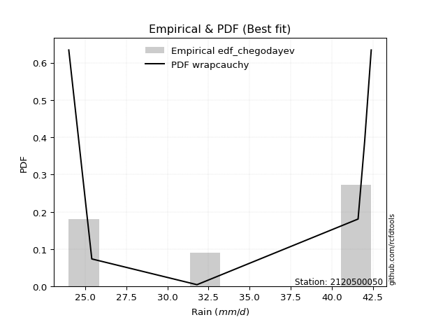</img>

</div>


### 6. EDF Blom (1958)

The Blom formula is a specific "plotting position" formula used in hydrology and statistical analysis to estimate the empirical cumulative probability (or non-exceedance probability) of a data series. It is particularly recommended for data that are approximately normally distributed. The constant _a_ is set to 0.375 (or 3/8).

<div align="center">


$P=(m-a)/(n+1-2a)$


</div>


**6.1. Empirical values**

<div align="center">

|                | 0                  | 1                  | 2                  | 3                 | 4                 | 5                  |
|:---------------|:-------------------|:-------------------|:-------------------|:------------------|:------------------|:-------------------|
| date           | 2019               | 2023               | 2020               | 2021              | 2025              | 2022               |
| x              | 24.0               | 25.4               | 31.8               | 41.6              | 42.0              | 42.4               |
| m              | 1                  | 2                  | 3                  | 4                 | 5                 | 6                  |
| empirical_dist | edf_blom           | edf_blom           | edf_blom           | edf_blom          | edf_blom          | edf_blom           |
| empirical      | 0.1                | 0.26               | 0.42               | 0.58              | 0.74              | 0.9                |
| empirical_tr   | 1.1111111111111112 | 1.3513513513513513 | 1.7241379310344827 | 2.380952380952381 | 3.846153846153846 | 10.000000000000002 |

</div>


**6.2. Kolmogorov-Smirnov fit test (sorted by Δ)**


<div align="center">

|                | 0                   | 1                   | 2                   | 3                  | 4                   | 5                   | 6                  | 7                   | 8                   | 9                   | 10                  | 11                 | 12                  | 13                  | 14                  | 15                  | 16                 | 17                 | 18                  | 19                 | 20                  | 21                  | 22                  | 23                 | 24                 | 25                | 26                  | 27                  | 28                  | 29                  | 30                  | 31                  | 32                 | 33                  | 34                 | 35                  | 36                  | 37                  | 38                  | 39                  | 40                  | 41                  | 42                 | 43                 | 44                  | 45                  | 46                  | 47                  | 48                  | 49                  | 50                  | 51                 | 52                  | 53                 | 54                  | 55                  | 56                  | 57                 | 58                 | 59                 | 60                  | 61                  | 62                  | 63                  | 64                 | 65                  | 66                 | 67                  | 68                  | 69                  | 70                  | 71                  | 72                 | 73                  | 74                 | 75                  | 76                  | 77             | 78                  | 79                  | 80                  | 81                  | 82                 | 83                 | 84                  | 85                  | 86                 | 87                  | 88                  | 89                  | 90                 | 91                 | 92                  | 93                  | 94                  | 95                | 96                 | 97                  | 98                 | 99                 | 100               | 101                 | 102                 | 103                | 104                | 105                | 106                 | 107                | 108                | 109                 | 110                | 111                 | 112                | 113                | 114                 | 115                | 116                 | 117                | 118                | 119                | 120                 | 121                 | 122               | 123                 | 124                | 125                 | 126                 | 127                | 128                | 129                | 130                | 131                 | 132                | 133                 | 134                | 135                 | 136                | 137                 | 138                | 139                 | 140                | 141                | 142                 | 143            | 144                | 145                | 146                | 147                 | 148                | 149                | 150                | 151                | 152                | 153                | 154                | 155            | 156            | 157               | 158               | 159            |
|:---------------|:--------------------|:--------------------|:--------------------|:-------------------|:--------------------|:--------------------|:-------------------|:--------------------|:--------------------|:--------------------|:--------------------|:-------------------|:--------------------|:--------------------|:--------------------|:--------------------|:-------------------|:-------------------|:--------------------|:-------------------|:--------------------|:--------------------|:--------------------|:-------------------|:-------------------|:------------------|:--------------------|:--------------------|:--------------------|:--------------------|:--------------------|:--------------------|:-------------------|:--------------------|:-------------------|:--------------------|:--------------------|:--------------------|:--------------------|:--------------------|:--------------------|:--------------------|:-------------------|:-------------------|:--------------------|:--------------------|:--------------------|:--------------------|:--------------------|:--------------------|:--------------------|:-------------------|:--------------------|:-------------------|:--------------------|:--------------------|:--------------------|:-------------------|:-------------------|:-------------------|:--------------------|:--------------------|:--------------------|:--------------------|:-------------------|:--------------------|:-------------------|:--------------------|:--------------------|:--------------------|:--------------------|:--------------------|:-------------------|:--------------------|:-------------------|:--------------------|:--------------------|:---------------|:--------------------|:--------------------|:--------------------|:--------------------|:-------------------|:-------------------|:--------------------|:--------------------|:-------------------|:--------------------|:--------------------|:--------------------|:-------------------|:-------------------|:--------------------|:--------------------|:--------------------|:------------------|:-------------------|:--------------------|:-------------------|:-------------------|:------------------|:--------------------|:--------------------|:-------------------|:-------------------|:-------------------|:--------------------|:-------------------|:-------------------|:--------------------|:-------------------|:--------------------|:-------------------|:-------------------|:--------------------|:-------------------|:--------------------|:-------------------|:-------------------|:-------------------|:--------------------|:--------------------|:------------------|:--------------------|:-------------------|:--------------------|:--------------------|:-------------------|:-------------------|:-------------------|:-------------------|:--------------------|:-------------------|:--------------------|:-------------------|:--------------------|:-------------------|:--------------------|:-------------------|:--------------------|:-------------------|:-------------------|:--------------------|:---------------|:-------------------|:-------------------|:-------------------|:--------------------|:-------------------|:-------------------|:-------------------|:-------------------|:-------------------|:-------------------|:-------------------|:---------------|:---------------|:------------------|:------------------|:---------------|
| station        | 2120500050          | 2120500050          | 2120500050          | 2120500050         | 2120500050          | 2120500050          | 2120500050         | 2120500050          | 2120500050          | 2120500050          | 2120500050          | 2120500050         | 2120500050          | 2120500050          | 2120500050          | 2120500050          | 2120500050         | 2120500050         | 2120500050          | 2120500050         | 2120500050          | 2120500050          | 2120500050          | 2120500050         | 2120500050         | 2120500050        | 2120500050          | 2120500050          | 2120500050          | 2120500050          | 2120500050          | 2120500050          | 2120500050         | 2120500050          | 2120500050         | 2120500050          | 2120500050          | 2120500050          | 2120500050          | 2120500050          | 2120500050          | 2120500050          | 2120500050         | 2120500050         | 2120500050          | 2120500050          | 2120500050          | 2120500050          | 2120500050          | 2120500050          | 2120500050          | 2120500050         | 2120500050          | 2120500050         | 2120500050          | 2120500050          | 2120500050          | 2120500050         | 2120500050         | 2120500050         | 2120500050          | 2120500050          | 2120500050          | 2120500050          | 2120500050         | 2120500050          | 2120500050         | 2120500050          | 2120500050          | 2120500050          | 2120500050          | 2120500050          | 2120500050         | 2120500050          | 2120500050         | 2120500050          | 2120500050          | 2120500050     | 2120500050          | 2120500050          | 2120500050          | 2120500050          | 2120500050         | 2120500050         | 2120500050          | 2120500050          | 2120500050         | 2120500050          | 2120500050          | 2120500050          | 2120500050         | 2120500050         | 2120500050          | 2120500050          | 2120500050          | 2120500050        | 2120500050         | 2120500050          | 2120500050         | 2120500050         | 2120500050        | 2120500050          | 2120500050          | 2120500050         | 2120500050         | 2120500050         | 2120500050          | 2120500050         | 2120500050         | 2120500050          | 2120500050         | 2120500050          | 2120500050         | 2120500050         | 2120500050          | 2120500050         | 2120500050          | 2120500050         | 2120500050         | 2120500050         | 2120500050          | 2120500050          | 2120500050        | 2120500050          | 2120500050         | 2120500050          | 2120500050          | 2120500050         | 2120500050         | 2120500050         | 2120500050         | 2120500050          | 2120500050         | 2120500050          | 2120500050         | 2120500050          | 2120500050         | 2120500050          | 2120500050         | 2120500050          | 2120500050         | 2120500050         | 2120500050          | 2120500050     | 2120500050         | 2120500050         | 2120500050         | 2120500050          | 2120500050         | 2120500050         | 2120500050         | 2120500050         | 2120500050         | 2120500050         | 2120500050         | 2120500050     | 2120500050     | 2120500050        | 2120500050        | 2120500050     |
| empirical_dist | edf_blom            | edf_blom            | edf_blom            | edf_blom           | edf_blom            | edf_blom            | edf_blom           | edf_blom            | edf_blom            | edf_blom            | edf_blom            | edf_blom           | edf_blom            | edf_blom            | edf_blom            | edf_blom            | edf_blom           | edf_blom           | edf_blom            | edf_blom           | edf_blom            | edf_blom            | edf_blom            | edf_blom           | edf_blom           | edf_blom          | edf_blom            | edf_blom            | edf_blom            | edf_blom            | edf_blom            | edf_blom            | edf_blom           | edf_blom            | edf_blom           | edf_blom            | edf_blom            | edf_blom            | edf_blom            | edf_blom            | edf_blom            | edf_blom            | edf_blom           | edf_blom           | edf_blom            | edf_blom            | edf_blom            | edf_blom            | edf_blom            | edf_blom            | edf_blom            | edf_blom           | edf_blom            | edf_blom           | edf_blom            | edf_blom            | edf_blom            | edf_blom           | edf_blom           | edf_blom           | edf_blom            | edf_blom            | edf_blom            | edf_blom            | edf_blom           | edf_blom            | edf_blom           | edf_blom            | edf_blom            | edf_blom            | edf_blom            | edf_blom            | edf_blom           | edf_blom            | edf_blom           | edf_blom            | edf_blom            | edf_blom       | edf_blom            | edf_blom            | edf_blom            | edf_blom            | edf_blom           | edf_blom           | edf_blom            | edf_blom            | edf_blom           | edf_blom            | edf_blom            | edf_blom            | edf_blom           | edf_blom           | edf_blom            | edf_blom            | edf_blom            | edf_blom          | edf_blom           | edf_blom            | edf_blom           | edf_blom           | edf_blom          | edf_blom            | edf_blom            | edf_blom           | edf_blom           | edf_blom           | edf_blom            | edf_blom           | edf_blom           | edf_blom            | edf_blom           | edf_blom            | edf_blom           | edf_blom           | edf_blom            | edf_blom           | edf_blom            | edf_blom           | edf_blom           | edf_blom           | edf_blom            | edf_blom            | edf_blom          | edf_blom            | edf_blom           | edf_blom            | edf_blom            | edf_blom           | edf_blom           | edf_blom           | edf_blom           | edf_blom            | edf_blom           | edf_blom            | edf_blom           | edf_blom            | edf_blom           | edf_blom            | edf_blom           | edf_blom            | edf_blom           | edf_blom           | edf_blom            | edf_blom       | edf_blom           | edf_blom           | edf_blom           | edf_blom            | edf_blom           | edf_blom           | edf_blom           | edf_blom           | edf_blom           | edf_blom           | edf_blom           | edf_blom       | edf_blom       | edf_blom          | edf_blom          | edf_blom       |
| p_dist         | wrapcauchy          | dweibull            | arcsine             | logrdist           | logdweibull         | logarcsine          | rdist              | logweibull_max      | logwrapcauchy       | logksone            | logexponweib        | ksone              | dgamma              | logdgamma           | logtrapezoid        | exponpow            | trapezoid          | genpareto          | loginvweibull       | logsemicircular    | semicircular        | loganglit           | anglit              | lomax              | halfgennorm        | logbeta           | logburr             | burr12              | loglomax            | levy_l              | burr                | invweibull          | nakagami           | loginvgamma         | logpearson3        | logf                | genexpon            | loginvgauss         | logfoldnorm         | logerlang           | loggamma            | loggamma            | invgauss           | lognorm            | logcrystalball      | logt                | logexponnorm        | logbetaprime        | pearson3            | invgamma            | loggenexpon         | logrice            | erlang              | logmaxwell         | ncf                 | lograyleigh         | loglevy_l           | weibull_min        | nct                | f                  | crystalball         | norm                | exponnorm           | t                   | logalpha           | gamma               | maxwell            | rayleigh            | logfatiguelife      | logburr12           | rice                | logweibull_min      | logkstwobign       | loghalfnorm         | foldnorm           | alpha               | betaprime           | gennorm        | halfnorm            | lognct              | logncf              | kstwobign           | loggompertz        | beta               | gompertz            | loggumbel_l         | genextreme         | gumbel_l            | loggenextreme       | loglogistic         | loggumbel_r        | logistic           | gumbel_r            | loghalflogistic     | logcosine           | cosine            | halflogistic       | logmoyal            | moyal              | loghypsecant       | hypsecant         | loglaplace          | loglaplace          | laplace            | weibull_max        | logmielke          | argus               | logwald            | wald               | logargus            | exponweib          | genhalflogistic     | logloggamma        | lognakagami        | loggennorm          | loggenhalflogistic | logloglaplace       | logexponpow        | skewnorm           | triang             | kappa4              | logtriang           | tukeylambda       | kappa3              | logkappa3          | logskewnorm         | uniform             | vonmises_line      | loggausshyper      | logtukeylambda     | logvonmises_line   | gausshyper          | logkappa4          | gengamma            | loguniform         | bradford            | truncexpon         | logtruncweibull_min | logbradford        | logtruncexpon       | fatiguelife        | truncweibull_min   | logtruncnorm        | loghalfgennorm | loggengamma        | powerlaw           | logpowerlaw        | johnsonsb           | johnsonsu          | truncpareto        | logtruncpareto     | truncnorm          | logjohnsonsb       | logjohnsonsu       | loggenpareto       | genlogistic    | loggenlogistic | logvonmises       | vonmises          | mielke         |
| delta          | 0.13234736361578858 | 0.14236531424081472 | 0.14918428857058086 | 0.1500071754685557 | 0.15476580829898404 | 0.15853649392541092 | 0.1589260758119614 | 0.15905767597961717 | 0.17172678776464773 | 0.17786720155883184 | 0.17860941680024378 | 0.1799820267837442 | 0.18038437986119168 | 0.18658152916152815 | 0.18950502474588293 | 0.19240234009897206 | 0.1925374619069501 | 0.1943906363716027 | 0.19447232215698362 | 0.1945803931054596 | 0.19666466336323263 | 0.20672265374191212 | 0.20877065113355509 | 0.2089227765905337 | 0.2122783619852664 | 0.219593785624055 | 0.22270511084441613 | 0.22333234631600007 | 0.22396707788799353 | 0.22516762785244843 | 0.22518163800966018 | 0.22805737277727678 | 0.2295853907342339 | 0.22962160120714636 | 0.2321232233594407 | 0.23223940751286032 | 0.23224506992650518 | 0.23241796039646279 | 0.23252942119410114 | 0.23300351990824641 | 0.23358140827134743 | 0.23358140827134743 | 0.2340960310555138 | 0.2341458924996006 | 0.23414592953322133 | 0.23414624927230132 | 0.23414716962433202 | 0.23456253063106758 | 0.23457500516118512 | 0.23463096725909127 | 0.23475769555203163 | 0.2347851223710571 | 0.23505591007447024 | 0.2351892238529224 | 0.23523343801147745 | 0.23549931759463316 | 0.23563072264623758 | 0.2357380744800539 | 0.2358428367794071 | 0.2358609118427013 | 0.23610058024684244 | 0.23610058871471618 | 0.23610154397897454 | 0.23611412404936305 | 0.2361647822822951 | 0.23668822255256683 | 0.2368838193735845 | 0.23712230651451027 | 0.23724453347240237 | 0.23745264930078114 | 0.23748846284499414 | 0.23767876911734487 | 0.2377894379155444 | 0.23858103479714088 | 0.2386911617561872 | 0.23910406881344337 | 0.23978445344947807 | 0.24           | 0.24000724484851432 | 0.24064677823494873 | 0.24129099214762162 | 0.24299120641906113 | 0.2432655776917645 | 0.2441542114749944 | 0.24480984512430537 | 0.24890609238770256 | 0.2502333424721501 | 0.25173409520135714 | 0.25413234232832776 | 0.25482649032082383 | 0.2564826573896959 | 0.2566506240092815 | 0.25788056622000566 | 0.25830967433202146 | 0.25869000901840744 | 0.258842034636925 | 0.2596069980464697 | 0.26426053130882954 | 0.2655066999224577 | 0.2665490803883015 | 0.268238689379407 | 0.27863828388291123 | 0.27863828388291123 | 0.2800952991521438 | 0.2847754684688978 | 0.2903392046174694 | 0.29273708434950607 | 0.2930203282708248 | 0.2939179919304512 | 0.29940473912097776 | 0.3381750162914316 | 0.33952931814961895 | 0.3409220748505072 | 0.3533111660867142 | 0.35624389772335996 | 0.3604802407522193 | 0.36166308669551184 | 0.3619454237160893 | 0.3625913058054929 | 0.3659346185113054 | 0.36780487259751116 | 0.36790348618505075 | 0.369788140688618 | 0.37220517776824946 | 0.3734919411949883 | 0.37452897312603006 | 0.37652173913043496 | 0.3772851784191187 | 0.3773113222901032 | 0.3797564118449285 | 0.3801534004253899 | 0.38065741505691353 | 0.3823188411464171 | 0.38356727494632553 | 0.3865289439569288 | 0.38909377745829377 | 0.3915371752897817 | 0.3933106744787803  | 0.3960414467155493 | 0.40032967959113863 | 0.4015383491514088 | 0.4043444926655989 | 0.40833376820222567 | 0.42           | 0.4408293466401892 | 0.4583068175628036 | 0.4743667420529419 | 0.49280596606172045 | 0.4983844990350778 | 0.5117053005615351 | 0.5237164990965182 | 0.5341410616042794 | 0.5587335660124009 | 0.6733188365969258 | 0.6956555158385211 | 0.74           | 0.74           | 1.233651553495478 | 6.561107031143033 | nan            |
| deltao         | 0.530385761606      | 0.530385761606      | 0.530385761606      | 0.530385761606     | 0.530385761606      | 0.530385761606      | 0.530385761606     | 0.530385761606      | 0.530385761606      | 0.530385761606      | 0.530385761606      | 0.530385761606     | 0.530385761606      | 0.530385761606      | 0.530385761606      | 0.530385761606      | 0.530385761606     | 0.530385761606     | 0.530385761606      | 0.530385761606     | 0.530385761606      | 0.530385761606      | 0.530385761606      | 0.530385761606     | 0.530385761606     | 0.530385761606    | 0.530385761606      | 0.530385761606      | 0.530385761606      | 0.530385761606      | 0.530385761606      | 0.530385761606      | 0.530385761606     | 0.530385761606      | 0.530385761606     | 0.530385761606      | 0.530385761606      | 0.530385761606      | 0.530385761606      | 0.530385761606      | 0.530385761606      | 0.530385761606      | 0.530385761606     | 0.530385761606     | 0.530385761606      | 0.530385761606      | 0.530385761606      | 0.530385761606      | 0.530385761606      | 0.530385761606      | 0.530385761606      | 0.530385761606     | 0.530385761606      | 0.530385761606     | 0.530385761606      | 0.530385761606      | 0.530385761606      | 0.530385761606     | 0.530385761606     | 0.530385761606     | 0.530385761606      | 0.530385761606      | 0.530385761606      | 0.530385761606      | 0.530385761606     | 0.530385761606      | 0.530385761606     | 0.530385761606      | 0.530385761606      | 0.530385761606      | 0.530385761606      | 0.530385761606      | 0.530385761606     | 0.530385761606      | 0.530385761606     | 0.530385761606      | 0.530385761606      | 0.530385761606 | 0.530385761606      | 0.530385761606      | 0.530385761606      | 0.530385761606      | 0.530385761606     | 0.530385761606     | 0.530385761606      | 0.530385761606      | 0.530385761606     | 0.530385761606      | 0.530385761606      | 0.530385761606      | 0.530385761606     | 0.530385761606     | 0.530385761606      | 0.530385761606      | 0.530385761606      | 0.530385761606    | 0.530385761606     | 0.530385761606      | 0.530385761606     | 0.530385761606     | 0.530385761606    | 0.530385761606      | 0.530385761606      | 0.530385761606     | 0.530385761606     | 0.530385761606     | 0.530385761606      | 0.530385761606     | 0.530385761606     | 0.530385761606      | 0.530385761606     | 0.530385761606      | 0.530385761606     | 0.530385761606     | 0.530385761606      | 0.530385761606     | 0.530385761606      | 0.530385761606     | 0.530385761606     | 0.530385761606     | 0.530385761606      | 0.530385761606      | 0.530385761606    | 0.530385761606      | 0.530385761606     | 0.530385761606      | 0.530385761606      | 0.530385761606     | 0.530385761606     | 0.530385761606     | 0.530385761606     | 0.530385761606      | 0.530385761606     | 0.530385761606      | 0.530385761606     | 0.530385761606      | 0.530385761606     | 0.530385761606      | 0.530385761606     | 0.530385761606      | 0.530385761606     | 0.530385761606     | 0.530385761606      | 0.530385761606 | 0.530385761606     | 0.530385761606     | 0.530385761606     | 0.530385761606      | 0.530385761606     | 0.530385761606     | 0.530385761606     | 0.530385761606     | 0.530385761606     | 0.530385761606     | 0.530385761606     | 0.530385761606 | 0.530385761606 | 0.530385761606    | 0.530385761606    | 0.530385761606 |
| eval           | Δo > Δ              | Δo > Δ              | Δo > Δ              | Δo > Δ             | Δo > Δ              | Δo > Δ              | Δo > Δ             | Δo > Δ              | Δo > Δ              | Δo > Δ              | Δo > Δ              | Δo > Δ             | Δo > Δ              | Δo > Δ              | Δo > Δ              | Δo > Δ              | Δo > Δ             | Δo > Δ             | Δo > Δ              | Δo > Δ             | Δo > Δ              | Δo > Δ              | Δo > Δ              | Δo > Δ             | Δo > Δ             | Δo > Δ            | Δo > Δ              | Δo > Δ              | Δo > Δ              | Δo > Δ              | Δo > Δ              | Δo > Δ              | Δo > Δ             | Δo > Δ              | Δo > Δ             | Δo > Δ              | Δo > Δ              | Δo > Δ              | Δo > Δ              | Δo > Δ              | Δo > Δ              | Δo > Δ              | Δo > Δ             | Δo > Δ             | Δo > Δ              | Δo > Δ              | Δo > Δ              | Δo > Δ              | Δo > Δ              | Δo > Δ              | Δo > Δ              | Δo > Δ             | Δo > Δ              | Δo > Δ             | Δo > Δ              | Δo > Δ              | Δo > Δ              | Δo > Δ             | Δo > Δ             | Δo > Δ             | Δo > Δ              | Δo > Δ              | Δo > Δ              | Δo > Δ              | Δo > Δ             | Δo > Δ              | Δo > Δ             | Δo > Δ              | Δo > Δ              | Δo > Δ              | Δo > Δ              | Δo > Δ              | Δo > Δ             | Δo > Δ              | Δo > Δ             | Δo > Δ              | Δo > Δ              | Δo > Δ         | Δo > Δ              | Δo > Δ              | Δo > Δ              | Δo > Δ              | Δo > Δ             | Δo > Δ             | Δo > Δ              | Δo > Δ              | Δo > Δ             | Δo > Δ              | Δo > Δ              | Δo > Δ              | Δo > Δ             | Δo > Δ             | Δo > Δ              | Δo > Δ              | Δo > Δ              | Δo > Δ            | Δo > Δ             | Δo > Δ              | Δo > Δ             | Δo > Δ             | Δo > Δ            | Δo > Δ              | Δo > Δ              | Δo > Δ             | Δo > Δ             | Δo > Δ             | Δo > Δ              | Δo > Δ             | Δo > Δ             | Δo > Δ              | Δo > Δ             | Δo > Δ              | Δo > Δ             | Δo > Δ             | Δo > Δ              | Δo > Δ             | Δo > Δ              | Δo > Δ             | Δo > Δ             | Δo > Δ             | Δo > Δ              | Δo > Δ              | Δo > Δ            | Δo > Δ              | Δo > Δ             | Δo > Δ              | Δo > Δ              | Δo > Δ             | Δo > Δ             | Δo > Δ             | Δo > Δ             | Δo > Δ              | Δo > Δ             | Δo > Δ              | Δo > Δ             | Δo > Δ              | Δo > Δ             | Δo > Δ              | Δo > Δ             | Δo > Δ              | Δo > Δ             | Δo > Δ             | Δo > Δ              | Δo > Δ         | Δo > Δ             | Δo > Δ             | Δo > Δ             | Δo > Δ              | Δo > Δ             | Δo > Δ             | Δo > Δ             | Δo <= Δ            | Δo <= Δ            | Δo <= Δ            | Δo <= Δ            | Δo <= Δ        | Δo <= Δ        | Δo <= Δ           | Δo <= Δ           | Δo <= Δ        |
| fit            | 1                   | 1                   | 1                   | 1                  | 1                   | 1                   | 1                  | 1                   | 1                   | 1                   | 1                   | 1                  | 1                   | 1                   | 1                   | 1                   | 1                  | 1                  | 1                   | 1                  | 1                   | 1                   | 1                   | 1                  | 1                  | 1                 | 1                   | 1                   | 1                   | 1                   | 1                   | 1                   | 1                  | 1                   | 1                  | 1                   | 1                   | 1                   | 1                   | 1                   | 1                   | 1                   | 1                  | 1                  | 1                   | 1                   | 1                   | 1                   | 1                   | 1                   | 1                   | 1                  | 1                   | 1                  | 1                   | 1                   | 1                   | 1                  | 1                  | 1                  | 1                   | 1                   | 1                   | 1                   | 1                  | 1                   | 1                  | 1                   | 1                   | 1                   | 1                   | 1                   | 1                  | 1                   | 1                  | 1                   | 1                   | 1              | 1                   | 1                   | 1                   | 1                   | 1                  | 1                  | 1                   | 1                   | 1                  | 1                   | 1                   | 1                   | 1                  | 1                  | 1                   | 1                   | 1                   | 1                 | 1                  | 1                   | 1                  | 1                  | 1                 | 1                   | 1                   | 1                  | 1                  | 1                  | 1                   | 1                  | 1                  | 1                   | 1                  | 1                   | 1                  | 1                  | 1                   | 1                  | 1                   | 1                  | 1                  | 1                  | 1                   | 1                   | 1                 | 1                   | 1                  | 1                   | 1                   | 1                  | 1                  | 1                  | 1                  | 1                   | 1                  | 1                   | 1                  | 1                   | 1                  | 1                   | 1                  | 1                   | 1                  | 1                  | 1                   | 1              | 1                  | 1                  | 1                  | 1                   | 1                  | 1                  | 1                  | 0                  | 0                  | 0                  | 0                  | 0              | 0              | 0                 | 0                 | 0              |
| n              | 6                   | 6                   | 6                   | 6                  | 6                   | 6                   | 6                  | 6                   | 6                   | 6                   | 6                   | 6                  | 6                   | 6                   | 6                   | 6                   | 6                  | 6                  | 6                   | 6                  | 6                   | 6                   | 6                   | 6                  | 6                  | 6                 | 6                   | 6                   | 6                   | 6                   | 6                   | 6                   | 6                  | 6                   | 6                  | 6                   | 6                   | 6                   | 6                   | 6                   | 6                   | 6                   | 6                  | 6                  | 6                   | 6                   | 6                   | 6                   | 6                   | 6                   | 6                   | 6                  | 6                   | 6                  | 6                   | 6                   | 6                   | 6                  | 6                  | 6                  | 6                   | 6                   | 6                   | 6                   | 6                  | 6                   | 6                  | 6                   | 6                   | 6                   | 6                   | 6                   | 6                  | 6                   | 6                  | 6                   | 6                   | 6              | 6                   | 6                   | 6                   | 6                   | 6                  | 6                  | 6                   | 6                   | 6                  | 6                   | 6                   | 6                   | 6                  | 6                  | 6                   | 6                   | 6                   | 6                 | 6                  | 6                   | 6                  | 6                  | 6                 | 6                   | 6                   | 6                  | 6                  | 6                  | 6                   | 6                  | 6                  | 6                   | 6                  | 6                   | 6                  | 6                  | 6                   | 6                  | 6                   | 6                  | 6                  | 6                  | 6                   | 6                   | 6                 | 6                   | 6                  | 6                   | 6                   | 6                  | 6                  | 6                  | 6                  | 6                   | 6                  | 6                   | 6                  | 6                   | 6                  | 6                   | 6                  | 6                   | 6                  | 6                  | 6                   | 6              | 6                  | 6                  | 6                  | 6                   | 6                  | 6                  | 6                  | 6                  | 6                  | 6                  | 6                  | 6              | 6              | 6                 | 6                 | 6              |
| best_fit       | 1                   | 0                   | 0                   | 0                  | 0                   | 0                   | 0                  | 0                   | 0                   | 0                   | 0                   | 0                  | 0                   | 0                   | 0                   | 0                   | 0                  | 0                  | 0                   | 0                  | 0                   | 0                   | 0                   | 0                  | 0                  | 0                 | 0                   | 0                   | 0                   | 0                   | 0                   | 0                   | 0                  | 0                   | 0                  | 0                   | 0                   | 0                   | 0                   | 0                   | 0                   | 0                   | 0                  | 0                  | 0                   | 0                   | 0                   | 0                   | 0                   | 0                   | 0                   | 0                  | 0                   | 0                  | 0                   | 0                   | 0                   | 0                  | 0                  | 0                  | 0                   | 0                   | 0                   | 0                   | 0                  | 0                   | 0                  | 0                   | 0                   | 0                   | 0                   | 0                   | 0                  | 0                   | 0                  | 0                   | 0                   | 0              | 0                   | 0                   | 0                   | 0                   | 0                  | 0                  | 0                   | 0                   | 0                  | 0                   | 0                   | 0                   | 0                  | 0                  | 0                   | 0                   | 0                   | 0                 | 0                  | 0                   | 0                  | 0                  | 0                 | 0                   | 0                   | 0                  | 0                  | 0                  | 0                   | 0                  | 0                  | 0                   | 0                  | 0                   | 0                  | 0                  | 0                   | 0                  | 0                   | 0                  | 0                  | 0                  | 0                   | 0                   | 0                 | 0                   | 0                  | 0                   | 0                   | 0                  | 0                  | 0                  | 0                  | 0                   | 0                  | 0                   | 0                  | 0                   | 0                  | 0                   | 0                  | 0                   | 0                  | 0                  | 0                   | 0              | 0                  | 0                  | 0                  | 0                   | 0                  | 0                  | 0                  | 0                  | 0                  | 0                  | 0                  | 0              | 0              | 0                 | 0                 | 0              |
| best_fit_sort  | 1                   | 2                   | 3                   | 4                  | 5                   | 6                   | 7                  | 8                   | 9                   | 10                  | 11                  | 12                 | 13                  | 14                  | 15                  | 16                  | 17                 | 18                 | 19                  | 20                 | 21                  | 22                  | 23                  | 24                 | 25                 | 26                | 27                  | 28                  | 29                  | 30                  | 31                  | 32                  | 33                 | 34                  | 35                 | 36                  | 37                  | 38                  | 39                  | 40                  | 41                  | 42                  | 43                 | 44                 | 45                  | 46                  | 47                  | 48                  | 49                  | 50                  | 51                  | 52                 | 53                  | 54                 | 55                  | 56                  | 57                  | 58                 | 59                 | 60                 | 61                  | 62                  | 63                  | 64                  | 65                 | 66                  | 67                 | 68                  | 69                  | 70                  | 71                  | 72                  | 73                 | 74                  | 75                 | 76                  | 77                  | 78             | 79                  | 80                  | 81                  | 82                  | 83                 | 84                 | 85                  | 86                  | 87                 | 88                  | 89                  | 90                  | 91                 | 92                 | 93                  | 94                  | 95                  | 96                | 97                 | 98                  | 99                 | 100                | 101               | 102                 | 103                 | 104                | 105                | 106                | 107                 | 108                | 109                | 110                 | 111                | 112                 | 113                | 114                | 115                 | 116                | 117                 | 118                | 119                | 120                | 121                 | 122                 | 123               | 124                 | 125                | 126                 | 127                 | 128                | 129                | 130                | 131                | 132                 | 133                | 134                 | 135                | 136                 | 137                | 138                 | 139                | 140                 | 141                | 142                | 143                 | 144            | 145                | 146                | 147                | 148                 | 149                | 150                | 151                | 152                | 153                | 154                | 155                | 156            | 157            | 158               | 159               | 160            |

</div>


**6.3. Best fit**

<div align="center">

|   id |    station | empirical_dist   | p_dist     |    delta |   deltao | eval   |   fit |   n |   best_fit |   best_fit_sort |
|-----:|-----------:|:-----------------|:-----------|---------:|---------:|:-------|------:|----:|-----------:|----------------:|
|    0 | 2120500050 | edf_blom         | wrapcauchy | 0.132347 | 0.530386 | Δo > Δ |     1 |   6 |          1 |               1 |

</div>


<div align="center">

</img></img>

</div>


### 7. EDF Tukey (1962)

In hydrology, the Tukey formula is used as a plotting position formula to estimate the empirical probability or frequency of a flood event (or other hydrological data). The formula parameter is given as _c=0.333_ (or 1/3).

<div align="center">


$P=(m-c)/(n+1-2c)$


</div>


**7.1. Empirical values**

<div align="center">

|                | 0                   | 1                  | 2                   | 3                  | 4                  | 5                  |
|:---------------|:--------------------|:-------------------|:--------------------|:-------------------|:-------------------|:-------------------|
| date           | 2019                | 2023               | 2020                | 2021               | 2025               | 2022               |
| x              | 24.0                | 25.4               | 31.8                | 41.6               | 42.0               | 42.4               |
| m              | 1                   | 2                  | 3                   | 4                  | 5                  | 6                  |
| empirical_dist | edf_tukey           | edf_tukey          | edf_tukey           | edf_tukey          | edf_tukey          | edf_tukey          |
| empirical      | 0.10526315789473684 | 0.2631578947368421 | 0.42105263157894735 | 0.5789473684210527 | 0.7368421052631579 | 0.8947368421052632 |
| empirical_tr   | 1.1176470588235294  | 1.357142857142857  | 1.7272727272727273  | 2.375              | 3.7999999999999994 | 9.5                |

</div>


**7.2. Kolmogorov-Smirnov fit test (sorted by Δ)**


<div align="center">

|                | 0                  | 1                 | 2                  | 3                 | 4                   | 5                   | 6                  | 7                   | 8                   | 9                   | 10                  | 11                 | 12                  | 13                  | 14                  | 15                  | 16                 | 17               | 18                  | 19                 | 20                  | 21                  | 22                 | 23                  | 24                 | 25                  | 26                  | 27                  | 28                  | 29                 | 30                  | 31                  | 32                 | 33                  | 34                | 35                  | 36                  | 37                 | 38                  | 39                  | 40                  | 41                  | 42                 | 43                 | 44                  | 45                  | 46                  | 47                  | 48                  | 49                  | 50                  | 51                 | 52                  | 53                  | 54                 | 55                  | 56                  | 57                  | 58                 | 59                 | 60                 | 61                 | 62                  | 63                  | 64                  | 65                  | 66                 | 67                  | 68                 | 69                  | 70                  | 71                  | 72                  | 73                  | 74                  | 75                  | 76                  | 77                  | 78                  | 79                  | 80                  | 81                  | 82                 | 83                 | 84                  | 85                  | 86                 | 87                  | 88                 | 89                  | 90                 | 91                 | 92                  | 93                  | 94                  | 95                 | 96                | 97                  | 98                | 99                 | 100                | 101                 | 102                 | 103                | 104                 | 105                 | 106                | 107                | 108                | 109                 | 110                 | 111                 | 112                | 113                | 114                | 115               | 116                | 117                | 118                 | 119                | 120                 | 121                 | 122                | 123                 | 124                | 125                 | 126                 | 127               | 128                 | 129                | 130                | 131                 | 132                 | 133                | 134                 | 135                 | 136               | 137                 | 138                | 139                 | 140                 | 141                | 142                 | 143                 | 144                 | 145                 | 146                | 147                 | 148                | 149                | 150                | 151                | 152                | 153                | 154                | 155                | 156                | 157                | 158              | 159            |
|:---------------|:-------------------|:------------------|:-------------------|:------------------|:--------------------|:--------------------|:-------------------|:--------------------|:--------------------|:--------------------|:--------------------|:-------------------|:--------------------|:--------------------|:--------------------|:--------------------|:-------------------|:-----------------|:--------------------|:-------------------|:--------------------|:--------------------|:-------------------|:--------------------|:-------------------|:--------------------|:--------------------|:--------------------|:--------------------|:-------------------|:--------------------|:--------------------|:-------------------|:--------------------|:------------------|:--------------------|:--------------------|:-------------------|:--------------------|:--------------------|:--------------------|:--------------------|:-------------------|:-------------------|:--------------------|:--------------------|:--------------------|:--------------------|:--------------------|:--------------------|:--------------------|:-------------------|:--------------------|:--------------------|:-------------------|:--------------------|:--------------------|:--------------------|:-------------------|:-------------------|:-------------------|:-------------------|:--------------------|:--------------------|:--------------------|:--------------------|:-------------------|:--------------------|:-------------------|:--------------------|:--------------------|:--------------------|:--------------------|:--------------------|:--------------------|:--------------------|:--------------------|:--------------------|:--------------------|:--------------------|:--------------------|:--------------------|:-------------------|:-------------------|:--------------------|:--------------------|:-------------------|:--------------------|:-------------------|:--------------------|:-------------------|:-------------------|:--------------------|:--------------------|:--------------------|:-------------------|:------------------|:--------------------|:------------------|:-------------------|:-------------------|:--------------------|:--------------------|:-------------------|:--------------------|:--------------------|:-------------------|:-------------------|:-------------------|:--------------------|:--------------------|:--------------------|:-------------------|:-------------------|:-------------------|:------------------|:-------------------|:-------------------|:--------------------|:-------------------|:--------------------|:--------------------|:-------------------|:--------------------|:-------------------|:--------------------|:--------------------|:------------------|:--------------------|:-------------------|:-------------------|:--------------------|:--------------------|:-------------------|:--------------------|:--------------------|:------------------|:--------------------|:-------------------|:--------------------|:--------------------|:-------------------|:--------------------|:--------------------|:--------------------|:--------------------|:-------------------|:--------------------|:-------------------|:-------------------|:-------------------|:-------------------|:-------------------|:-------------------|:-------------------|:-------------------|:-------------------|:-------------------|:-----------------|:---------------|
| station        | 2120500050         | 2120500050        | 2120500050         | 2120500050        | 2120500050          | 2120500050          | 2120500050         | 2120500050          | 2120500050          | 2120500050          | 2120500050          | 2120500050         | 2120500050          | 2120500050          | 2120500050          | 2120500050          | 2120500050         | 2120500050       | 2120500050          | 2120500050         | 2120500050          | 2120500050          | 2120500050         | 2120500050          | 2120500050         | 2120500050          | 2120500050          | 2120500050          | 2120500050          | 2120500050         | 2120500050          | 2120500050          | 2120500050         | 2120500050          | 2120500050        | 2120500050          | 2120500050          | 2120500050         | 2120500050          | 2120500050          | 2120500050          | 2120500050          | 2120500050         | 2120500050         | 2120500050          | 2120500050          | 2120500050          | 2120500050          | 2120500050          | 2120500050          | 2120500050          | 2120500050         | 2120500050          | 2120500050          | 2120500050         | 2120500050          | 2120500050          | 2120500050          | 2120500050         | 2120500050         | 2120500050         | 2120500050         | 2120500050          | 2120500050          | 2120500050          | 2120500050          | 2120500050         | 2120500050          | 2120500050         | 2120500050          | 2120500050          | 2120500050          | 2120500050          | 2120500050          | 2120500050          | 2120500050          | 2120500050          | 2120500050          | 2120500050          | 2120500050          | 2120500050          | 2120500050          | 2120500050         | 2120500050         | 2120500050          | 2120500050          | 2120500050         | 2120500050          | 2120500050         | 2120500050          | 2120500050         | 2120500050         | 2120500050          | 2120500050          | 2120500050          | 2120500050         | 2120500050        | 2120500050          | 2120500050        | 2120500050         | 2120500050         | 2120500050          | 2120500050          | 2120500050         | 2120500050          | 2120500050          | 2120500050         | 2120500050         | 2120500050         | 2120500050          | 2120500050          | 2120500050          | 2120500050         | 2120500050         | 2120500050         | 2120500050        | 2120500050         | 2120500050         | 2120500050          | 2120500050         | 2120500050          | 2120500050          | 2120500050         | 2120500050          | 2120500050         | 2120500050          | 2120500050          | 2120500050        | 2120500050          | 2120500050         | 2120500050         | 2120500050          | 2120500050          | 2120500050         | 2120500050          | 2120500050          | 2120500050        | 2120500050          | 2120500050         | 2120500050          | 2120500050          | 2120500050         | 2120500050          | 2120500050          | 2120500050          | 2120500050          | 2120500050         | 2120500050          | 2120500050         | 2120500050         | 2120500050         | 2120500050         | 2120500050         | 2120500050         | 2120500050         | 2120500050         | 2120500050         | 2120500050         | 2120500050       | 2120500050     |
| empirical_dist | edf_tukey          | edf_tukey         | edf_tukey          | edf_tukey         | edf_tukey           | edf_tukey           | edf_tukey          | edf_tukey           | edf_tukey           | edf_tukey           | edf_tukey           | edf_tukey          | edf_tukey           | edf_tukey           | edf_tukey           | edf_tukey           | edf_tukey          | edf_tukey        | edf_tukey           | edf_tukey          | edf_tukey           | edf_tukey           | edf_tukey          | edf_tukey           | edf_tukey          | edf_tukey           | edf_tukey           | edf_tukey           | edf_tukey           | edf_tukey          | edf_tukey           | edf_tukey           | edf_tukey          | edf_tukey           | edf_tukey         | edf_tukey           | edf_tukey           | edf_tukey          | edf_tukey           | edf_tukey           | edf_tukey           | edf_tukey           | edf_tukey          | edf_tukey          | edf_tukey           | edf_tukey           | edf_tukey           | edf_tukey           | edf_tukey           | edf_tukey           | edf_tukey           | edf_tukey          | edf_tukey           | edf_tukey           | edf_tukey          | edf_tukey           | edf_tukey           | edf_tukey           | edf_tukey          | edf_tukey          | edf_tukey          | edf_tukey          | edf_tukey           | edf_tukey           | edf_tukey           | edf_tukey           | edf_tukey          | edf_tukey           | edf_tukey          | edf_tukey           | edf_tukey           | edf_tukey           | edf_tukey           | edf_tukey           | edf_tukey           | edf_tukey           | edf_tukey           | edf_tukey           | edf_tukey           | edf_tukey           | edf_tukey           | edf_tukey           | edf_tukey          | edf_tukey          | edf_tukey           | edf_tukey           | edf_tukey          | edf_tukey           | edf_tukey          | edf_tukey           | edf_tukey          | edf_tukey          | edf_tukey           | edf_tukey           | edf_tukey           | edf_tukey          | edf_tukey         | edf_tukey           | edf_tukey         | edf_tukey          | edf_tukey          | edf_tukey           | edf_tukey           | edf_tukey          | edf_tukey           | edf_tukey           | edf_tukey          | edf_tukey          | edf_tukey          | edf_tukey           | edf_tukey           | edf_tukey           | edf_tukey          | edf_tukey          | edf_tukey          | edf_tukey         | edf_tukey          | edf_tukey          | edf_tukey           | edf_tukey          | edf_tukey           | edf_tukey           | edf_tukey          | edf_tukey           | edf_tukey          | edf_tukey           | edf_tukey           | edf_tukey         | edf_tukey           | edf_tukey          | edf_tukey          | edf_tukey           | edf_tukey           | edf_tukey          | edf_tukey           | edf_tukey           | edf_tukey         | edf_tukey           | edf_tukey          | edf_tukey           | edf_tukey           | edf_tukey          | edf_tukey           | edf_tukey           | edf_tukey           | edf_tukey           | edf_tukey          | edf_tukey           | edf_tukey          | edf_tukey          | edf_tukey          | edf_tukey          | edf_tukey          | edf_tukey          | edf_tukey          | edf_tukey          | edf_tukey          | edf_tukey          | edf_tukey        | edf_tukey      |
| p_dist         | wrapcauchy         | arcsine           | dweibull           | logrdist          | logarcsine          | logdweibull         | rdist              | logweibull_max      | logwrapcauchy       | logksone            | logexponweib        | ksone              | dgamma              | logdgamma           | logtrapezoid        | exponpow            | trapezoid          | genpareto        | loginvweibull       | logsemicircular    | semicircular        | loganglit           | anglit             | lomax               | halfgennorm        | logbeta             | logburr             | burr12              | loglomax            | levy_l             | burr                | invweibull          | nakagami           | loginvgamma         | logpearson3       | logf                | genexpon            | loginvgauss        | logfoldnorm         | logerlang           | loggamma            | loggamma            | invgauss           | lognorm            | logcrystalball      | logt                | logexponnorm        | logbetaprime        | pearson3            | invgamma            | loggenexpon         | logrice            | logncf              | erlang              | logmaxwell         | ncf                 | lograyleigh         | loglevy_l           | weibull_min        | gennorm            | nct                | f                  | crystalball         | norm                | exponnorm           | t                   | logalpha           | gamma               | maxwell            | rayleigh            | logfatiguelife      | logburr12           | rice                | logweibull_min      | logkstwobign        | loghalfnorm         | foldnorm            | alpha               | betaprime           | halfnorm            | lognct              | kstwobign           | loggompertz        | beta               | gompertz            | loggumbel_l         | genextreme         | gumbel_l            | loggenextreme      | loglogistic         | loggumbel_r        | logistic           | gumbel_r            | loghalflogistic     | logcosine           | cosine             | halflogistic      | logmoyal            | moyal             | loghypsecant       | hypsecant          | loglaplace          | loglaplace          | laplace            | weibull_max         | logmielke           | argus              | logwald            | wald               | logargus            | exponweib           | genhalflogistic     | logloggamma        | lognakagami        | loggennorm         | logloglaplace     | logexponpow        | loggenhalflogistic | skewnorm            | triang             | kappa4              | logtriang           | tukeylambda        | kappa3              | logkappa3          | logskewnorm         | uniform             | vonmises_line     | loggausshyper       | logtukeylambda     | logvonmises_line   | gausshyper          | gengamma            | logkappa4          | loguniform          | bradford            | truncexpon        | logtruncweibull_min | logbradford        | fatiguelife         | logtruncexpon       | truncweibull_min   | logtruncnorm        | loghalfgennorm      | loggengamma         | powerlaw            | logpowerlaw        | johnsonsb           | johnsonsu          | truncpareto        | logtruncpareto     | truncnorm          | logjohnsonsb       | logjohnsonsu       | loggenpareto       | genlogistic        | loggenlogistic     | logvonmises        | vonmises         | mielke         |
| delta          | 0.1291894688789465 | 0.143921130675844 | 0.1455232089776568 | 0.151059807047503 | 0.15327333603067406 | 0.15792370303582612 | 0.1599787073909087 | 0.16011030755856448 | 0.16856889302780564 | 0.17891983313777915 | 0.17966204837919109 | 0.1810346583626915 | 0.18354227459803377 | 0.18625877002511493 | 0.19055765632483024 | 0.19082700460246416 | 0.1935900934858974 | 0.19544326795055 | 0.19552495373593093 | 0.1956330246844069 | 0.19771729494217993 | 0.20777528532085943 | 0.2098232827125024 | 0.20997540816948101 | 0.2133309935642137 | 0.22064641720300235 | 0.22375774242336344 | 0.22438497789494738 | 0.22501970946694083 | 0.2262202594313958 | 0.22623426958860748 | 0.22911000435622408 | 0.2306380223131812 | 0.23067423278609367 | 0.233175854938388 | 0.23329203909180762 | 0.23329770150545248 | 0.2334705919754101 | 0.23358205277304844 | 0.23405615148719372 | 0.23463403985029474 | 0.23463403985029474 | 0.2351486626344611 | 0.2351985240785479 | 0.23519856111216864 | 0.23519888085124863 | 0.23519980120327932 | 0.23561516221001488 | 0.23562763674013243 | 0.23568359883803858 | 0.23581032713097894 | 0.2358377539500044 | 0.23602783425288476 | 0.23610854165341755 | 0.2362418554318697 | 0.23628606959042475 | 0.23655194917358047 | 0.23668335422518494 | 0.2367907060590012 | 0.2368421052631579 | 0.2368954683583544 | 0.2369135434216486 | 0.23715321182578974 | 0.23715322029366348 | 0.23715417555792184 | 0.23716675562831036 | 0.2372174138612424 | 0.23774085413151413 | 0.2379364509525318 | 0.23817493809345758 | 0.23829716505134968 | 0.23850528087972844 | 0.23854109442394145 | 0.23873140069629217 | 0.23884206949449172 | 0.23963366637608818 | 0.23974379333513451 | 0.24015670039239068 | 0.24083708502842538 | 0.24105987642746163 | 0.24169940981389604 | 0.24404383799800844 | 0.2443182092707118 | 0.2452068430539417 | 0.24586247670325267 | 0.24995872396664987 | 0.2512859740510974 | 0.25278672678030445 | 0.2551849739072751 | 0.25587912189977113 | 0.2575352889686432 | 0.2577032555882288 | 0.25893319779895296 | 0.25936230591096876 | 0.25974264059735475 | 0.2598946662158723 | 0.260659629625417 | 0.26531316288777684 | 0.266559331501405 | 0.2676017119672488 | 0.2692913209583543 | 0.27969091546185854 | 0.27969091546185854 | 0.2811479307310911 | 0.28161757373205565 | 0.29139183619641673 | 0.2937897159284534 | 0.2940729598497721 | 0.2949706235093985 | 0.30045737069992506 | 0.33712238471248424 | 0.34058194972856626 | 0.3419747064294545 | 0.3501532713498721 | 0.3509807398286231 | 0.356399928800775 | 0.3587875289792472 | 0.3615328723311666 | 0.36364393738444023 | 0.3669872500902527 | 0.36885750417645846 | 0.36895611776399806 | 0.3708407722675653 | 0.37325780934719677 | 0.3745445727739356 | 0.37558160470497737 | 0.37757437070938227 | 0.378337809998066 | 0.37836395386905053 | 0.3808090434238758 | 0.3812060320043372 | 0.38171004663586083 | 0.38251464336737817 | 0.3833714727253644 | 0.38758157553587613 | 0.39014640903724107 | 0.392589806868729 | 0.3943633060577276  | 0.3970940782944966 | 0.40048571757246143 | 0.40138231117008594 | 0.4053971242445462 | 0.40938639978117297 | 0.42105263157894735 | 0.43977671506124183 | 0.45725418598385625 | 0.4733141104739945 | 0.48964807132487836 | 0.4952266042982357 | 0.5106526689825878 | 0.5226638675175709 | 0.5288779037095426 | 0.5555756712755587 | 0.6701609418600837 | 0.6903923579437843 | 0.7368421052631579 | 0.7368421052631579 | 1.2347041850744251 | 6.56215966272198 | nan            |
| deltao         | 0.530385761606     | 0.530385761606    | 0.530385761606     | 0.530385761606    | 0.530385761606      | 0.530385761606      | 0.530385761606     | 0.530385761606      | 0.530385761606      | 0.530385761606      | 0.530385761606      | 0.530385761606     | 0.530385761606      | 0.530385761606      | 0.530385761606      | 0.530385761606      | 0.530385761606     | 0.530385761606   | 0.530385761606      | 0.530385761606     | 0.530385761606      | 0.530385761606      | 0.530385761606     | 0.530385761606      | 0.530385761606     | 0.530385761606      | 0.530385761606      | 0.530385761606      | 0.530385761606      | 0.530385761606     | 0.530385761606      | 0.530385761606      | 0.530385761606     | 0.530385761606      | 0.530385761606    | 0.530385761606      | 0.530385761606      | 0.530385761606     | 0.530385761606      | 0.530385761606      | 0.530385761606      | 0.530385761606      | 0.530385761606     | 0.530385761606     | 0.530385761606      | 0.530385761606      | 0.530385761606      | 0.530385761606      | 0.530385761606      | 0.530385761606      | 0.530385761606      | 0.530385761606     | 0.530385761606      | 0.530385761606      | 0.530385761606     | 0.530385761606      | 0.530385761606      | 0.530385761606      | 0.530385761606     | 0.530385761606     | 0.530385761606     | 0.530385761606     | 0.530385761606      | 0.530385761606      | 0.530385761606      | 0.530385761606      | 0.530385761606     | 0.530385761606      | 0.530385761606     | 0.530385761606      | 0.530385761606      | 0.530385761606      | 0.530385761606      | 0.530385761606      | 0.530385761606      | 0.530385761606      | 0.530385761606      | 0.530385761606      | 0.530385761606      | 0.530385761606      | 0.530385761606      | 0.530385761606      | 0.530385761606     | 0.530385761606     | 0.530385761606      | 0.530385761606      | 0.530385761606     | 0.530385761606      | 0.530385761606     | 0.530385761606      | 0.530385761606     | 0.530385761606     | 0.530385761606      | 0.530385761606      | 0.530385761606      | 0.530385761606     | 0.530385761606    | 0.530385761606      | 0.530385761606    | 0.530385761606     | 0.530385761606     | 0.530385761606      | 0.530385761606      | 0.530385761606     | 0.530385761606      | 0.530385761606      | 0.530385761606     | 0.530385761606     | 0.530385761606     | 0.530385761606      | 0.530385761606      | 0.530385761606      | 0.530385761606     | 0.530385761606     | 0.530385761606     | 0.530385761606    | 0.530385761606     | 0.530385761606     | 0.530385761606      | 0.530385761606     | 0.530385761606      | 0.530385761606      | 0.530385761606     | 0.530385761606      | 0.530385761606     | 0.530385761606      | 0.530385761606      | 0.530385761606    | 0.530385761606      | 0.530385761606     | 0.530385761606     | 0.530385761606      | 0.530385761606      | 0.530385761606     | 0.530385761606      | 0.530385761606      | 0.530385761606    | 0.530385761606      | 0.530385761606     | 0.530385761606      | 0.530385761606      | 0.530385761606     | 0.530385761606      | 0.530385761606      | 0.530385761606      | 0.530385761606      | 0.530385761606     | 0.530385761606      | 0.530385761606     | 0.530385761606     | 0.530385761606     | 0.530385761606     | 0.530385761606     | 0.530385761606     | 0.530385761606     | 0.530385761606     | 0.530385761606     | 0.530385761606     | 0.530385761606   | 0.530385761606 |
| eval           | Δo > Δ             | Δo > Δ            | Δo > Δ             | Δo > Δ            | Δo > Δ              | Δo > Δ              | Δo > Δ             | Δo > Δ              | Δo > Δ              | Δo > Δ              | Δo > Δ              | Δo > Δ             | Δo > Δ              | Δo > Δ              | Δo > Δ              | Δo > Δ              | Δo > Δ             | Δo > Δ           | Δo > Δ              | Δo > Δ             | Δo > Δ              | Δo > Δ              | Δo > Δ             | Δo > Δ              | Δo > Δ             | Δo > Δ              | Δo > Δ              | Δo > Δ              | Δo > Δ              | Δo > Δ             | Δo > Δ              | Δo > Δ              | Δo > Δ             | Δo > Δ              | Δo > Δ            | Δo > Δ              | Δo > Δ              | Δo > Δ             | Δo > Δ              | Δo > Δ              | Δo > Δ              | Δo > Δ              | Δo > Δ             | Δo > Δ             | Δo > Δ              | Δo > Δ              | Δo > Δ              | Δo > Δ              | Δo > Δ              | Δo > Δ              | Δo > Δ              | Δo > Δ             | Δo > Δ              | Δo > Δ              | Δo > Δ             | Δo > Δ              | Δo > Δ              | Δo > Δ              | Δo > Δ             | Δo > Δ             | Δo > Δ             | Δo > Δ             | Δo > Δ              | Δo > Δ              | Δo > Δ              | Δo > Δ              | Δo > Δ             | Δo > Δ              | Δo > Δ             | Δo > Δ              | Δo > Δ              | Δo > Δ              | Δo > Δ              | Δo > Δ              | Δo > Δ              | Δo > Δ              | Δo > Δ              | Δo > Δ              | Δo > Δ              | Δo > Δ              | Δo > Δ              | Δo > Δ              | Δo > Δ             | Δo > Δ             | Δo > Δ              | Δo > Δ              | Δo > Δ             | Δo > Δ              | Δo > Δ             | Δo > Δ              | Δo > Δ             | Δo > Δ             | Δo > Δ              | Δo > Δ              | Δo > Δ              | Δo > Δ             | Δo > Δ            | Δo > Δ              | Δo > Δ            | Δo > Δ             | Δo > Δ             | Δo > Δ              | Δo > Δ              | Δo > Δ             | Δo > Δ              | Δo > Δ              | Δo > Δ             | Δo > Δ             | Δo > Δ             | Δo > Δ              | Δo > Δ              | Δo > Δ              | Δo > Δ             | Δo > Δ             | Δo > Δ             | Δo > Δ            | Δo > Δ             | Δo > Δ             | Δo > Δ              | Δo > Δ             | Δo > Δ              | Δo > Δ              | Δo > Δ             | Δo > Δ              | Δo > Δ             | Δo > Δ              | Δo > Δ              | Δo > Δ            | Δo > Δ              | Δo > Δ             | Δo > Δ             | Δo > Δ              | Δo > Δ              | Δo > Δ             | Δo > Δ              | Δo > Δ              | Δo > Δ            | Δo > Δ              | Δo > Δ             | Δo > Δ              | Δo > Δ              | Δo > Δ             | Δo > Δ              | Δo > Δ              | Δo > Δ              | Δo > Δ              | Δo > Δ             | Δo > Δ              | Δo > Δ             | Δo > Δ             | Δo > Δ             | Δo > Δ             | Δo <= Δ            | Δo <= Δ            | Δo <= Δ            | Δo <= Δ            | Δo <= Δ            | Δo <= Δ            | Δo <= Δ          | Δo <= Δ        |
| fit            | 1                  | 1                 | 1                  | 1                 | 1                   | 1                   | 1                  | 1                   | 1                   | 1                   | 1                   | 1                  | 1                   | 1                   | 1                   | 1                   | 1                  | 1                | 1                   | 1                  | 1                   | 1                   | 1                  | 1                   | 1                  | 1                   | 1                   | 1                   | 1                   | 1                  | 1                   | 1                   | 1                  | 1                   | 1                 | 1                   | 1                   | 1                  | 1                   | 1                   | 1                   | 1                   | 1                  | 1                  | 1                   | 1                   | 1                   | 1                   | 1                   | 1                   | 1                   | 1                  | 1                   | 1                   | 1                  | 1                   | 1                   | 1                   | 1                  | 1                  | 1                  | 1                  | 1                   | 1                   | 1                   | 1                   | 1                  | 1                   | 1                  | 1                   | 1                   | 1                   | 1                   | 1                   | 1                   | 1                   | 1                   | 1                   | 1                   | 1                   | 1                   | 1                   | 1                  | 1                  | 1                   | 1                   | 1                  | 1                   | 1                  | 1                   | 1                  | 1                  | 1                   | 1                   | 1                   | 1                  | 1                 | 1                   | 1                 | 1                  | 1                  | 1                   | 1                   | 1                  | 1                   | 1                   | 1                  | 1                  | 1                  | 1                   | 1                   | 1                   | 1                  | 1                  | 1                  | 1                 | 1                  | 1                  | 1                   | 1                  | 1                   | 1                   | 1                  | 1                   | 1                  | 1                   | 1                   | 1                 | 1                   | 1                  | 1                  | 1                   | 1                   | 1                  | 1                   | 1                   | 1                 | 1                   | 1                  | 1                   | 1                   | 1                  | 1                   | 1                   | 1                   | 1                   | 1                  | 1                   | 1                  | 1                  | 1                  | 1                  | 0                  | 0                  | 0                  | 0                  | 0                  | 0                  | 0                | 0              |
| n              | 6                  | 6                 | 6                  | 6                 | 6                   | 6                   | 6                  | 6                   | 6                   | 6                   | 6                   | 6                  | 6                   | 6                   | 6                   | 6                   | 6                  | 6                | 6                   | 6                  | 6                   | 6                   | 6                  | 6                   | 6                  | 6                   | 6                   | 6                   | 6                   | 6                  | 6                   | 6                   | 6                  | 6                   | 6                 | 6                   | 6                   | 6                  | 6                   | 6                   | 6                   | 6                   | 6                  | 6                  | 6                   | 6                   | 6                   | 6                   | 6                   | 6                   | 6                   | 6                  | 6                   | 6                   | 6                  | 6                   | 6                   | 6                   | 6                  | 6                  | 6                  | 6                  | 6                   | 6                   | 6                   | 6                   | 6                  | 6                   | 6                  | 6                   | 6                   | 6                   | 6                   | 6                   | 6                   | 6                   | 6                   | 6                   | 6                   | 6                   | 6                   | 6                   | 6                  | 6                  | 6                   | 6                   | 6                  | 6                   | 6                  | 6                   | 6                  | 6                  | 6                   | 6                   | 6                   | 6                  | 6                 | 6                   | 6                 | 6                  | 6                  | 6                   | 6                   | 6                  | 6                   | 6                   | 6                  | 6                  | 6                  | 6                   | 6                   | 6                   | 6                  | 6                  | 6                  | 6                 | 6                  | 6                  | 6                   | 6                  | 6                   | 6                   | 6                  | 6                   | 6                  | 6                   | 6                   | 6                 | 6                   | 6                  | 6                  | 6                   | 6                   | 6                  | 6                   | 6                   | 6                 | 6                   | 6                  | 6                   | 6                   | 6                  | 6                   | 6                   | 6                   | 6                   | 6                  | 6                   | 6                  | 6                  | 6                  | 6                  | 6                  | 6                  | 6                  | 6                  | 6                  | 6                  | 6                | 6              |
| best_fit       | 1                  | 0                 | 0                  | 0                 | 0                   | 0                   | 0                  | 0                   | 0                   | 0                   | 0                   | 0                  | 0                   | 0                   | 0                   | 0                   | 0                  | 0                | 0                   | 0                  | 0                   | 0                   | 0                  | 0                   | 0                  | 0                   | 0                   | 0                   | 0                   | 0                  | 0                   | 0                   | 0                  | 0                   | 0                 | 0                   | 0                   | 0                  | 0                   | 0                   | 0                   | 0                   | 0                  | 0                  | 0                   | 0                   | 0                   | 0                   | 0                   | 0                   | 0                   | 0                  | 0                   | 0                   | 0                  | 0                   | 0                   | 0                   | 0                  | 0                  | 0                  | 0                  | 0                   | 0                   | 0                   | 0                   | 0                  | 0                   | 0                  | 0                   | 0                   | 0                   | 0                   | 0                   | 0                   | 0                   | 0                   | 0                   | 0                   | 0                   | 0                   | 0                   | 0                  | 0                  | 0                   | 0                   | 0                  | 0                   | 0                  | 0                   | 0                  | 0                  | 0                   | 0                   | 0                   | 0                  | 0                 | 0                   | 0                 | 0                  | 0                  | 0                   | 0                   | 0                  | 0                   | 0                   | 0                  | 0                  | 0                  | 0                   | 0                   | 0                   | 0                  | 0                  | 0                  | 0                 | 0                  | 0                  | 0                   | 0                  | 0                   | 0                   | 0                  | 0                   | 0                  | 0                   | 0                   | 0                 | 0                   | 0                  | 0                  | 0                   | 0                   | 0                  | 0                   | 0                   | 0                 | 0                   | 0                  | 0                   | 0                   | 0                  | 0                   | 0                   | 0                   | 0                   | 0                  | 0                   | 0                  | 0                  | 0                  | 0                  | 0                  | 0                  | 0                  | 0                  | 0                  | 0                  | 0                | 0              |
| best_fit_sort  | 1                  | 2                 | 3                  | 4                 | 5                   | 6                   | 7                  | 8                   | 9                   | 10                  | 11                  | 12                 | 13                  | 14                  | 15                  | 16                  | 17                 | 18               | 19                  | 20                 | 21                  | 22                  | 23                 | 24                  | 25                 | 26                  | 27                  | 28                  | 29                  | 30                 | 31                  | 32                  | 33                 | 34                  | 35                | 36                  | 37                  | 38                 | 39                  | 40                  | 41                  | 42                  | 43                 | 44                 | 45                  | 46                  | 47                  | 48                  | 49                  | 50                  | 51                  | 52                 | 53                  | 54                  | 55                 | 56                  | 57                  | 58                  | 59                 | 60                 | 61                 | 62                 | 63                  | 64                  | 65                  | 66                  | 67                 | 68                  | 69                 | 70                  | 71                  | 72                  | 73                  | 74                  | 75                  | 76                  | 77                  | 78                  | 79                  | 80                  | 81                  | 82                  | 83                 | 84                 | 85                  | 86                  | 87                 | 88                  | 89                 | 90                  | 91                 | 92                 | 93                  | 94                  | 95                  | 96                 | 97                | 98                  | 99                | 100                | 101                | 102                 | 103                 | 104                | 105                 | 106                 | 107                | 108                | 109                | 110                 | 111                 | 112                 | 113                | 114                | 115                | 116               | 117                | 118                | 119                 | 120                | 121                 | 122                 | 123                | 124                 | 125                | 126                 | 127                 | 128               | 129                 | 130                | 131                | 132                 | 133                 | 134                | 135                 | 136                 | 137               | 138                 | 139                | 140                 | 141                 | 142                | 143                 | 144                 | 145                 | 146                 | 147                | 148                 | 149                | 150                | 151                | 152                | 153                | 154                | 155                | 156                | 157                | 158                | 159              | 160            |

</div>


**7.3. Best fit**

<div align="center">

|   id |    station | empirical_dist   | p_dist     |    delta |   deltao | eval   |   fit |   n |   best_fit |   best_fit_sort |
|-----:|-----------:|:-----------------|:-----------|---------:|---------:|:-------|------:|----:|-----------:|----------------:|
|    0 | 2120500050 | edf_tukey        | wrapcauchy | 0.129189 | 0.530386 | Δo > Δ |     1 |   6 |          1 |               1 |

</div>


<div align="center">

</img></img>

</div>


### 8. EDF Gringorten (1963)

Gringorten plotting position formula is essential for estimating the probability and return periods of extreme events like floods and heavy rainfall. The constant _a=0.44_.

<div align="center">


$P=(m-a)/(n+1-2a)$


</div>


**8.1. Empirical values**

<div align="center">

|                | 0                   | 1                  | 2                   | 3                  | 4                  | 5                  |
|:---------------|:--------------------|:-------------------|:--------------------|:-------------------|:-------------------|:-------------------|
| date           | 2019                | 2023               | 2020                | 2021               | 2025               | 2022               |
| x              | 24.0                | 25.4               | 31.8                | 41.6               | 42.0               | 42.4               |
| m              | 1                   | 2                  | 3                   | 4                  | 5                  | 6                  |
| empirical_dist | edf_gringorten      | edf_gringorten     | edf_gringorten      | edf_gringorten     | edf_gringorten     | edf_gringorten     |
| empirical      | 0.09150326797385622 | 0.2549019607843137 | 0.41830065359477125 | 0.5816993464052288 | 0.7450980392156862 | 0.9084967320261437 |
| empirical_tr   | 1.1007194244604317  | 1.3421052631578947 | 1.7191011235955058  | 2.3906250000000004 | 3.9230769230769216 | 10.928571428571415 |

</div>


**8.2. Kolmogorov-Smirnov fit test (sorted by Δ)**


<div align="center">

|                | 0                   | 1                   | 2                  | 3                   | 4                  | 5                   | 6                  | 7                   | 8                   | 9                 | 10                  | 11                  | 12                  | 13                 | 14                  | 15                  | 16                  | 17                  | 18                 | 19                 | 20                 | 21                  | 22                  | 23                  | 24                  | 25                  | 26                 | 27                  | 28                  | 29                 | 30                  | 31                  | 32                  | 33                  | 34                  | 35                  | 36                  | 37                  | 38                 | 39                  | 40                 | 41                 | 42                  | 43                  | 44                 | 45                  | 46                  | 47                  | 48                  | 49                  | 50                 | 51                  | 52                 | 53                  | 54                 | 55                  | 56                  | 57                  | 58                  | 59                  | 60                 | 61                  | 62                 | 63                 | 64                  | 65                | 66                  | 67                  | 68                  | 69                 | 70                 | 71                  | 72                  | 73                  | 74                  | 75                  | 76                  | 77                  | 78                 | 79                 | 80                  | 81                  | 82                  | 83                 | 84                  | 85                  | 86                  | 87                 | 88                  | 89                | 90                  | 91                 | 92                 | 93                 | 94                 | 95                  | 96                  | 97                 | 98                  | 99                  | 100                 | 101                | 102                | 103               | 104                | 105               | 106                 | 107                 | 108                 | 109                | 110                | 111                 | 112                | 113                | 114                 | 115                | 116                 | 117                | 118                | 119                | 120                | 121                 | 122                | 123                | 124                 | 125                | 126                | 127                 | 128                | 129                 | 130                | 131                | 132                | 133             | 134                 | 135                | 136                | 137                 | 138                 | 139                | 140                 | 141                | 142                | 143                 | 144                | 145                 | 146                | 147                 | 148               | 149                | 150                | 151                | 152                | 153               | 154                | 155                | 156                | 157               | 158                | 159            |
|:---------------|:--------------------|:--------------------|:-------------------|:--------------------|:-------------------|:--------------------|:-------------------|:--------------------|:--------------------|:------------------|:--------------------|:--------------------|:--------------------|:-------------------|:--------------------|:--------------------|:--------------------|:--------------------|:-------------------|:-------------------|:-------------------|:--------------------|:--------------------|:--------------------|:--------------------|:--------------------|:-------------------|:--------------------|:--------------------|:-------------------|:--------------------|:--------------------|:--------------------|:--------------------|:--------------------|:--------------------|:--------------------|:--------------------|:-------------------|:--------------------|:-------------------|:-------------------|:--------------------|:--------------------|:-------------------|:--------------------|:--------------------|:--------------------|:--------------------|:--------------------|:-------------------|:--------------------|:-------------------|:--------------------|:-------------------|:--------------------|:--------------------|:--------------------|:--------------------|:--------------------|:-------------------|:--------------------|:-------------------|:-------------------|:--------------------|:------------------|:--------------------|:--------------------|:--------------------|:-------------------|:-------------------|:--------------------|:--------------------|:--------------------|:--------------------|:--------------------|:--------------------|:--------------------|:-------------------|:-------------------|:--------------------|:--------------------|:--------------------|:-------------------|:--------------------|:--------------------|:--------------------|:-------------------|:--------------------|:------------------|:--------------------|:-------------------|:-------------------|:-------------------|:-------------------|:--------------------|:--------------------|:-------------------|:--------------------|:--------------------|:--------------------|:-------------------|:-------------------|:------------------|:-------------------|:------------------|:--------------------|:--------------------|:--------------------|:-------------------|:-------------------|:--------------------|:-------------------|:-------------------|:--------------------|:-------------------|:--------------------|:-------------------|:-------------------|:-------------------|:-------------------|:--------------------|:-------------------|:-------------------|:--------------------|:-------------------|:-------------------|:--------------------|:-------------------|:--------------------|:-------------------|:-------------------|:-------------------|:----------------|:--------------------|:-------------------|:-------------------|:--------------------|:--------------------|:-------------------|:--------------------|:-------------------|:-------------------|:--------------------|:-------------------|:--------------------|:-------------------|:--------------------|:------------------|:-------------------|:-------------------|:-------------------|:-------------------|:------------------|:-------------------|:-------------------|:-------------------|:------------------|:-------------------|:---------------|
| station        | 2120500050          | 2120500050          | 2120500050         | 2120500050          | 2120500050         | 2120500050          | 2120500050         | 2120500050          | 2120500050          | 2120500050        | 2120500050          | 2120500050          | 2120500050          | 2120500050         | 2120500050          | 2120500050          | 2120500050          | 2120500050          | 2120500050         | 2120500050         | 2120500050         | 2120500050          | 2120500050          | 2120500050          | 2120500050          | 2120500050          | 2120500050         | 2120500050          | 2120500050          | 2120500050         | 2120500050          | 2120500050          | 2120500050          | 2120500050          | 2120500050          | 2120500050          | 2120500050          | 2120500050          | 2120500050         | 2120500050          | 2120500050         | 2120500050         | 2120500050          | 2120500050          | 2120500050         | 2120500050          | 2120500050          | 2120500050          | 2120500050          | 2120500050          | 2120500050         | 2120500050          | 2120500050         | 2120500050          | 2120500050         | 2120500050          | 2120500050          | 2120500050          | 2120500050          | 2120500050          | 2120500050         | 2120500050          | 2120500050         | 2120500050         | 2120500050          | 2120500050        | 2120500050          | 2120500050          | 2120500050          | 2120500050         | 2120500050         | 2120500050          | 2120500050          | 2120500050          | 2120500050          | 2120500050          | 2120500050          | 2120500050          | 2120500050         | 2120500050         | 2120500050          | 2120500050          | 2120500050          | 2120500050         | 2120500050          | 2120500050          | 2120500050          | 2120500050         | 2120500050          | 2120500050        | 2120500050          | 2120500050         | 2120500050         | 2120500050         | 2120500050         | 2120500050          | 2120500050          | 2120500050         | 2120500050          | 2120500050          | 2120500050          | 2120500050         | 2120500050         | 2120500050        | 2120500050         | 2120500050        | 2120500050          | 2120500050          | 2120500050          | 2120500050         | 2120500050         | 2120500050          | 2120500050         | 2120500050         | 2120500050          | 2120500050         | 2120500050          | 2120500050         | 2120500050         | 2120500050         | 2120500050         | 2120500050          | 2120500050         | 2120500050         | 2120500050          | 2120500050         | 2120500050         | 2120500050          | 2120500050         | 2120500050          | 2120500050         | 2120500050         | 2120500050         | 2120500050      | 2120500050          | 2120500050         | 2120500050         | 2120500050          | 2120500050          | 2120500050         | 2120500050          | 2120500050         | 2120500050         | 2120500050          | 2120500050         | 2120500050          | 2120500050         | 2120500050          | 2120500050        | 2120500050         | 2120500050         | 2120500050         | 2120500050         | 2120500050        | 2120500050         | 2120500050         | 2120500050         | 2120500050        | 2120500050         | 2120500050     |
| empirical_dist | edf_gringorten      | edf_gringorten      | edf_gringorten     | edf_gringorten      | edf_gringorten     | edf_gringorten      | edf_gringorten     | edf_gringorten      | edf_gringorten      | edf_gringorten    | edf_gringorten      | edf_gringorten      | edf_gringorten      | edf_gringorten     | edf_gringorten      | edf_gringorten      | edf_gringorten      | edf_gringorten      | edf_gringorten     | edf_gringorten     | edf_gringorten     | edf_gringorten      | edf_gringorten      | edf_gringorten      | edf_gringorten      | edf_gringorten      | edf_gringorten     | edf_gringorten      | edf_gringorten      | edf_gringorten     | edf_gringorten      | edf_gringorten      | edf_gringorten      | edf_gringorten      | edf_gringorten      | edf_gringorten      | edf_gringorten      | edf_gringorten      | edf_gringorten     | edf_gringorten      | edf_gringorten     | edf_gringorten     | edf_gringorten      | edf_gringorten      | edf_gringorten     | edf_gringorten      | edf_gringorten      | edf_gringorten      | edf_gringorten      | edf_gringorten      | edf_gringorten     | edf_gringorten      | edf_gringorten     | edf_gringorten      | edf_gringorten     | edf_gringorten      | edf_gringorten      | edf_gringorten      | edf_gringorten      | edf_gringorten      | edf_gringorten     | edf_gringorten      | edf_gringorten     | edf_gringorten     | edf_gringorten      | edf_gringorten    | edf_gringorten      | edf_gringorten      | edf_gringorten      | edf_gringorten     | edf_gringorten     | edf_gringorten      | edf_gringorten      | edf_gringorten      | edf_gringorten      | edf_gringorten      | edf_gringorten      | edf_gringorten      | edf_gringorten     | edf_gringorten     | edf_gringorten      | edf_gringorten      | edf_gringorten      | edf_gringorten     | edf_gringorten      | edf_gringorten      | edf_gringorten      | edf_gringorten     | edf_gringorten      | edf_gringorten    | edf_gringorten      | edf_gringorten     | edf_gringorten     | edf_gringorten     | edf_gringorten     | edf_gringorten      | edf_gringorten      | edf_gringorten     | edf_gringorten      | edf_gringorten      | edf_gringorten      | edf_gringorten     | edf_gringorten     | edf_gringorten    | edf_gringorten     | edf_gringorten    | edf_gringorten      | edf_gringorten      | edf_gringorten      | edf_gringorten     | edf_gringorten     | edf_gringorten      | edf_gringorten     | edf_gringorten     | edf_gringorten      | edf_gringorten     | edf_gringorten      | edf_gringorten     | edf_gringorten     | edf_gringorten     | edf_gringorten     | edf_gringorten      | edf_gringorten     | edf_gringorten     | edf_gringorten      | edf_gringorten     | edf_gringorten     | edf_gringorten      | edf_gringorten     | edf_gringorten      | edf_gringorten     | edf_gringorten     | edf_gringorten     | edf_gringorten  | edf_gringorten      | edf_gringorten     | edf_gringorten     | edf_gringorten      | edf_gringorten      | edf_gringorten     | edf_gringorten      | edf_gringorten     | edf_gringorten     | edf_gringorten      | edf_gringorten     | edf_gringorten      | edf_gringorten     | edf_gringorten      | edf_gringorten    | edf_gringorten     | edf_gringorten     | edf_gringorten     | edf_gringorten     | edf_gringorten    | edf_gringorten     | edf_gringorten     | edf_gringorten     | edf_gringorten    | edf_gringorten     | edf_gringorten |
| p_dist         | dweibull            | wrapcauchy          | logrdist           | rdist               | arcsine            | logdweibull         | logweibull_max     | logarcsine          | dgamma              | logksone          | logwrapcauchy       | logexponweib        | ksone               | logtrapezoid       | trapezoid           | genpareto           | loginvweibull       | logsemicircular     | semicircular       | logdgamma          | exponpow           | loganglit           | anglit              | lomax               | halfgennorm         | logbeta             | logburr            | burr12              | loglomax            | levy_l             | burr                | invweibull          | nakagami            | loginvgamma         | logpearson3         | logf                | genexpon            | loginvgauss         | logfoldnorm        | logerlang           | loggamma           | loggamma           | invgauss            | lognorm             | logcrystalball     | logt                | logexponnorm        | logbetaprime        | pearson3            | invgamma            | loggenexpon        | logrice             | erlang             | logmaxwell          | ncf                | lograyleigh         | loglevy_l           | weibull_min         | nct                 | f                   | crystalball        | norm                | exponnorm          | t                  | logalpha            | gamma             | maxwell             | rayleigh            | logfatiguelife      | logburr12          | rice               | logweibull_min      | logkstwobign        | loghalfnorm         | foldnorm            | alpha               | betaprime           | halfnorm            | lognct             | kstwobign          | loggompertz         | beta                | gompertz            | gennorm            | loggumbel_l         | genextreme          | logncf              | gumbel_l           | loggenextreme       | loglogistic       | loggumbel_r         | logistic           | gumbel_r           | loghalflogistic    | logcosine          | cosine              | halflogistic        | logmoyal           | moyal               | loghypsecant        | hypsecant           | loglaplace         | loglaplace         | laplace           | logmielke          | weibull_max       | argus               | logwald             | wald                | logargus           | genhalflogistic    | logloggamma         | exponweib          | lognakagami        | loggenhalflogistic  | skewnorm           | triang              | loggennorm         | kappa4             | logtriang          | logexponpow        | tukeylambda         | logloglaplace      | kappa3             | logkappa3           | logskewnorm        | uniform            | vonmises_line       | loggausshyper      | logtukeylambda      | logvonmises_line   | gausshyper         | logkappa4          | loguniform      | gengamma            | bradford           | truncexpon         | logtruncweibull_min | logbradford         | logtruncexpon      | truncweibull_min    | fatiguelife        | logtruncnorm       | loghalfgennorm      | loggengamma        | powerlaw            | logpowerlaw        | johnsonsb           | johnsonsu         | truncpareto        | logtruncpareto     | truncnorm          | logjohnsonsb       | logjohnsonsu      | loggenpareto       | genlogistic        | loggenlogistic     | logvonmises       | vonmises           | mielke         |
| delta          | 0.13726727502512842 | 0.13744540283147488 | 0.1535093594652156 | 0.15722672940673255 | 0.1576810205967245 | 0.15914732341990478 | 0.1634209937564562 | 0.16703322595155456 | 0.17528634064550538 | 0.176167855153603 | 0.17682482698033403 | 0.17691007039501494 | 0.17828268037851536 | 0.1878056783406541 | 0.19083811550172125 | 0.19269128996637386 | 0.19277297575175478 | 0.19288104670023076 | 0.1949653169580038 | 0.1950782611876718 | 0.2008990721251157 | 0.20502330733668328 | 0.20707130472832624 | 0.20722343018530487 | 0.21057901558003755 | 0.21789443921882626 | 0.2210057644391873 | 0.22163299991077123 | 0.22226773148276469 | 0.2234682814472197 | 0.22348229160443134 | 0.22635802637204794 | 0.22788604432900506 | 0.22792225480191752 | 0.23042387695421185 | 0.23054006110763148 | 0.23054572352127634 | 0.23071861399123395 | 0.2308300747888723 | 0.23130417350301757 | 0.2318820618661186 | 0.2318820618661186 | 0.23239668465028496 | 0.23244654609437176 | 0.2324465831279925 | 0.23244690286707248 | 0.23244782321910318 | 0.23286318422583874 | 0.23287565875595628 | 0.23293162085386243 | 0.2330583491468028 | 0.23308577596582825 | 0.2333565636692414 | 0.23348987744769356 | 0.2335340916062486 | 0.23379997118940432 | 0.23393137624100885 | 0.23403872807482506 | 0.23414349037417825 | 0.23416156543747246 | 0.2344012338416136 | 0.23440124230948733 | 0.2344021975737457 | 0.2344147776441342 | 0.23446543587706625 | 0.234988876147338 | 0.23518447296835565 | 0.23542296010928143 | 0.23554518706717353 | 0.2357533028955523 | 0.2357891164397653 | 0.23597942271211603 | 0.23609009151031557 | 0.23688168839191204 | 0.23699181535095837 | 0.23740472240821453 | 0.23808510704424923 | 0.23830789844328548 | 0.2389474318297199 | 0.2412918600138323 | 0.24156623128653565 | 0.24245486506976555 | 0.24311049871907653 | 0.2450980392156863 | 0.24720674598247372 | 0.24853399606692128 | 0.24978772417376527 | 0.2500347487961283 | 0.25243299592309904 | 0.253127143915595 | 0.25478331098446705 | 0.2549512776040527 | 0.2561812198147768 | 0.2566103279267926 | 0.2569906626131786 | 0.25714268823169617 | 0.25790765164124085 | 0.2625611849036007 | 0.26380735351722884 | 0.26484973398307265 | 0.26653934297417814 | 0.2769389374776824 | 0.2769389374776824 | 0.278395952746915 | 0.2886398582122406 | 0.289873507684584 | 0.29103773794427723 | 0.29132098186559596 | 0.29221864552522236 | 0.2977053927157489 | 0.3378299717443901 | 0.33922272844527834 | 0.3398743626966603 | 0.3584092053024005 | 0.35878089434699045 | 0.3608919594002641 | 0.36423527210607654 | 0.3647406297495036 | 0.3661055261922823 | 0.3662041397798219 | 0.3670434629317756 | 0.36808879428338914 | 0.3701598187216555 | 0.3705058313630206 | 0.37179259478975946 | 0.3728296267208012 | 0.3748223927252061 | 0.37558583201388984 | 0.3756119758848744 | 0.37805706543969964 | 0.3784540540201611 | 0.3789580686516847 | 0.3806194947411883 | 0.3848295975517 | 0.38526662135155426 | 0.3873944310530649 | 0.3898378288845529 | 0.3916113280735515  | 0.39434210031032046 | 0.3986303331859098 | 0.40264514626037007 | 0.4032376955566375 | 0.4066344217969968 | 0.41830065359477125 | 0.4425286930454179 | 0.46000616396803234 | 0.4760660884581706 | 0.49790400527740675 | 0.503482538250764 | 0.5134046469667639 | 0.5270497288887074 | 0.5426377936304232 | 0.5638316052280871 | 0.678416875812612 | 0.7041522478646649 | 0.7450980392156862 | 0.7450980392156862 | 1.231952207090249 | 6.5594076847378044 | nan            |
| deltao         | 0.530385761606      | 0.530385761606      | 0.530385761606     | 0.530385761606      | 0.530385761606     | 0.530385761606      | 0.530385761606     | 0.530385761606      | 0.530385761606      | 0.530385761606    | 0.530385761606      | 0.530385761606      | 0.530385761606      | 0.530385761606     | 0.530385761606      | 0.530385761606      | 0.530385761606      | 0.530385761606      | 0.530385761606     | 0.530385761606     | 0.530385761606     | 0.530385761606      | 0.530385761606      | 0.530385761606      | 0.530385761606      | 0.530385761606      | 0.530385761606     | 0.530385761606      | 0.530385761606      | 0.530385761606     | 0.530385761606      | 0.530385761606      | 0.530385761606      | 0.530385761606      | 0.530385761606      | 0.530385761606      | 0.530385761606      | 0.530385761606      | 0.530385761606     | 0.530385761606      | 0.530385761606     | 0.530385761606     | 0.530385761606      | 0.530385761606      | 0.530385761606     | 0.530385761606      | 0.530385761606      | 0.530385761606      | 0.530385761606      | 0.530385761606      | 0.530385761606     | 0.530385761606      | 0.530385761606     | 0.530385761606      | 0.530385761606     | 0.530385761606      | 0.530385761606      | 0.530385761606      | 0.530385761606      | 0.530385761606      | 0.530385761606     | 0.530385761606      | 0.530385761606     | 0.530385761606     | 0.530385761606      | 0.530385761606    | 0.530385761606      | 0.530385761606      | 0.530385761606      | 0.530385761606     | 0.530385761606     | 0.530385761606      | 0.530385761606      | 0.530385761606      | 0.530385761606      | 0.530385761606      | 0.530385761606      | 0.530385761606      | 0.530385761606     | 0.530385761606     | 0.530385761606      | 0.530385761606      | 0.530385761606      | 0.530385761606     | 0.530385761606      | 0.530385761606      | 0.530385761606      | 0.530385761606     | 0.530385761606      | 0.530385761606    | 0.530385761606      | 0.530385761606     | 0.530385761606     | 0.530385761606     | 0.530385761606     | 0.530385761606      | 0.530385761606      | 0.530385761606     | 0.530385761606      | 0.530385761606      | 0.530385761606      | 0.530385761606     | 0.530385761606     | 0.530385761606    | 0.530385761606     | 0.530385761606    | 0.530385761606      | 0.530385761606      | 0.530385761606      | 0.530385761606     | 0.530385761606     | 0.530385761606      | 0.530385761606     | 0.530385761606     | 0.530385761606      | 0.530385761606     | 0.530385761606      | 0.530385761606     | 0.530385761606     | 0.530385761606     | 0.530385761606     | 0.530385761606      | 0.530385761606     | 0.530385761606     | 0.530385761606      | 0.530385761606     | 0.530385761606     | 0.530385761606      | 0.530385761606     | 0.530385761606      | 0.530385761606     | 0.530385761606     | 0.530385761606     | 0.530385761606  | 0.530385761606      | 0.530385761606     | 0.530385761606     | 0.530385761606      | 0.530385761606      | 0.530385761606     | 0.530385761606      | 0.530385761606     | 0.530385761606     | 0.530385761606      | 0.530385761606     | 0.530385761606      | 0.530385761606     | 0.530385761606      | 0.530385761606    | 0.530385761606     | 0.530385761606     | 0.530385761606     | 0.530385761606     | 0.530385761606    | 0.530385761606     | 0.530385761606     | 0.530385761606     | 0.530385761606    | 0.530385761606     | 0.530385761606 |
| eval           | Δo > Δ              | Δo > Δ              | Δo > Δ             | Δo > Δ              | Δo > Δ             | Δo > Δ              | Δo > Δ             | Δo > Δ              | Δo > Δ              | Δo > Δ            | Δo > Δ              | Δo > Δ              | Δo > Δ              | Δo > Δ             | Δo > Δ              | Δo > Δ              | Δo > Δ              | Δo > Δ              | Δo > Δ             | Δo > Δ             | Δo > Δ             | Δo > Δ              | Δo > Δ              | Δo > Δ              | Δo > Δ              | Δo > Δ              | Δo > Δ             | Δo > Δ              | Δo > Δ              | Δo > Δ             | Δo > Δ              | Δo > Δ              | Δo > Δ              | Δo > Δ              | Δo > Δ              | Δo > Δ              | Δo > Δ              | Δo > Δ              | Δo > Δ             | Δo > Δ              | Δo > Δ             | Δo > Δ             | Δo > Δ              | Δo > Δ              | Δo > Δ             | Δo > Δ              | Δo > Δ              | Δo > Δ              | Δo > Δ              | Δo > Δ              | Δo > Δ             | Δo > Δ              | Δo > Δ             | Δo > Δ              | Δo > Δ             | Δo > Δ              | Δo > Δ              | Δo > Δ              | Δo > Δ              | Δo > Δ              | Δo > Δ             | Δo > Δ              | Δo > Δ             | Δo > Δ             | Δo > Δ              | Δo > Δ            | Δo > Δ              | Δo > Δ              | Δo > Δ              | Δo > Δ             | Δo > Δ             | Δo > Δ              | Δo > Δ              | Δo > Δ              | Δo > Δ              | Δo > Δ              | Δo > Δ              | Δo > Δ              | Δo > Δ             | Δo > Δ             | Δo > Δ              | Δo > Δ              | Δo > Δ              | Δo > Δ             | Δo > Δ              | Δo > Δ              | Δo > Δ              | Δo > Δ             | Δo > Δ              | Δo > Δ            | Δo > Δ              | Δo > Δ             | Δo > Δ             | Δo > Δ             | Δo > Δ             | Δo > Δ              | Δo > Δ              | Δo > Δ             | Δo > Δ              | Δo > Δ              | Δo > Δ              | Δo > Δ             | Δo > Δ             | Δo > Δ            | Δo > Δ             | Δo > Δ            | Δo > Δ              | Δo > Δ              | Δo > Δ              | Δo > Δ             | Δo > Δ             | Δo > Δ              | Δo > Δ             | Δo > Δ             | Δo > Δ              | Δo > Δ             | Δo > Δ              | Δo > Δ             | Δo > Δ             | Δo > Δ             | Δo > Δ             | Δo > Δ              | Δo > Δ             | Δo > Δ             | Δo > Δ              | Δo > Δ             | Δo > Δ             | Δo > Δ              | Δo > Δ             | Δo > Δ              | Δo > Δ             | Δo > Δ             | Δo > Δ             | Δo > Δ          | Δo > Δ              | Δo > Δ             | Δo > Δ             | Δo > Δ              | Δo > Δ              | Δo > Δ             | Δo > Δ              | Δo > Δ             | Δo > Δ             | Δo > Δ              | Δo > Δ             | Δo > Δ              | Δo > Δ             | Δo > Δ              | Δo > Δ            | Δo > Δ             | Δo > Δ             | Δo <= Δ            | Δo <= Δ            | Δo <= Δ           | Δo <= Δ            | Δo <= Δ            | Δo <= Δ            | Δo <= Δ           | Δo <= Δ            | Δo <= Δ        |
| fit            | 1                   | 1                   | 1                  | 1                   | 1                  | 1                   | 1                  | 1                   | 1                   | 1                 | 1                   | 1                   | 1                   | 1                  | 1                   | 1                   | 1                   | 1                   | 1                  | 1                  | 1                  | 1                   | 1                   | 1                   | 1                   | 1                   | 1                  | 1                   | 1                   | 1                  | 1                   | 1                   | 1                   | 1                   | 1                   | 1                   | 1                   | 1                   | 1                  | 1                   | 1                  | 1                  | 1                   | 1                   | 1                  | 1                   | 1                   | 1                   | 1                   | 1                   | 1                  | 1                   | 1                  | 1                   | 1                  | 1                   | 1                   | 1                   | 1                   | 1                   | 1                  | 1                   | 1                  | 1                  | 1                   | 1                 | 1                   | 1                   | 1                   | 1                  | 1                  | 1                   | 1                   | 1                   | 1                   | 1                   | 1                   | 1                   | 1                  | 1                  | 1                   | 1                   | 1                   | 1                  | 1                   | 1                   | 1                   | 1                  | 1                   | 1                 | 1                   | 1                  | 1                  | 1                  | 1                  | 1                   | 1                   | 1                  | 1                   | 1                   | 1                   | 1                  | 1                  | 1                 | 1                  | 1                 | 1                   | 1                   | 1                   | 1                  | 1                  | 1                   | 1                  | 1                  | 1                   | 1                  | 1                   | 1                  | 1                  | 1                  | 1                  | 1                   | 1                  | 1                  | 1                   | 1                  | 1                  | 1                   | 1                  | 1                   | 1                  | 1                  | 1                  | 1               | 1                   | 1                  | 1                  | 1                   | 1                   | 1                  | 1                   | 1                  | 1                  | 1                   | 1                  | 1                   | 1                  | 1                   | 1                 | 1                  | 1                  | 0                  | 0                  | 0                 | 0                  | 0                  | 0                  | 0                 | 0                  | 0              |
| n              | 6                   | 6                   | 6                  | 6                   | 6                  | 6                   | 6                  | 6                   | 6                   | 6                 | 6                   | 6                   | 6                   | 6                  | 6                   | 6                   | 6                   | 6                   | 6                  | 6                  | 6                  | 6                   | 6                   | 6                   | 6                   | 6                   | 6                  | 6                   | 6                   | 6                  | 6                   | 6                   | 6                   | 6                   | 6                   | 6                   | 6                   | 6                   | 6                  | 6                   | 6                  | 6                  | 6                   | 6                   | 6                  | 6                   | 6                   | 6                   | 6                   | 6                   | 6                  | 6                   | 6                  | 6                   | 6                  | 6                   | 6                   | 6                   | 6                   | 6                   | 6                  | 6                   | 6                  | 6                  | 6                   | 6                 | 6                   | 6                   | 6                   | 6                  | 6                  | 6                   | 6                   | 6                   | 6                   | 6                   | 6                   | 6                   | 6                  | 6                  | 6                   | 6                   | 6                   | 6                  | 6                   | 6                   | 6                   | 6                  | 6                   | 6                 | 6                   | 6                  | 6                  | 6                  | 6                  | 6                   | 6                   | 6                  | 6                   | 6                   | 6                   | 6                  | 6                  | 6                 | 6                  | 6                 | 6                   | 6                   | 6                   | 6                  | 6                  | 6                   | 6                  | 6                  | 6                   | 6                  | 6                   | 6                  | 6                  | 6                  | 6                  | 6                   | 6                  | 6                  | 6                   | 6                  | 6                  | 6                   | 6                  | 6                   | 6                  | 6                  | 6                  | 6               | 6                   | 6                  | 6                  | 6                   | 6                   | 6                  | 6                   | 6                  | 6                  | 6                   | 6                  | 6                   | 6                  | 6                   | 6                 | 6                  | 6                  | 6                  | 6                  | 6                 | 6                  | 6                  | 6                  | 6                 | 6                  | 6              |
| best_fit       | 1                   | 0                   | 0                  | 0                   | 0                  | 0                   | 0                  | 0                   | 0                   | 0                 | 0                   | 0                   | 0                   | 0                  | 0                   | 0                   | 0                   | 0                   | 0                  | 0                  | 0                  | 0                   | 0                   | 0                   | 0                   | 0                   | 0                  | 0                   | 0                   | 0                  | 0                   | 0                   | 0                   | 0                   | 0                   | 0                   | 0                   | 0                   | 0                  | 0                   | 0                  | 0                  | 0                   | 0                   | 0                  | 0                   | 0                   | 0                   | 0                   | 0                   | 0                  | 0                   | 0                  | 0                   | 0                  | 0                   | 0                   | 0                   | 0                   | 0                   | 0                  | 0                   | 0                  | 0                  | 0                   | 0                 | 0                   | 0                   | 0                   | 0                  | 0                  | 0                   | 0                   | 0                   | 0                   | 0                   | 0                   | 0                   | 0                  | 0                  | 0                   | 0                   | 0                   | 0                  | 0                   | 0                   | 0                   | 0                  | 0                   | 0                 | 0                   | 0                  | 0                  | 0                  | 0                  | 0                   | 0                   | 0                  | 0                   | 0                   | 0                   | 0                  | 0                  | 0                 | 0                  | 0                 | 0                   | 0                   | 0                   | 0                  | 0                  | 0                   | 0                  | 0                  | 0                   | 0                  | 0                   | 0                  | 0                  | 0                  | 0                  | 0                   | 0                  | 0                  | 0                   | 0                  | 0                  | 0                   | 0                  | 0                   | 0                  | 0                  | 0                  | 0               | 0                   | 0                  | 0                  | 0                   | 0                   | 0                  | 0                   | 0                  | 0                  | 0                   | 0                  | 0                   | 0                  | 0                   | 0                 | 0                  | 0                  | 0                  | 0                  | 0                 | 0                  | 0                  | 0                  | 0                 | 0                  | 0              |
| best_fit_sort  | 1                   | 2                   | 3                  | 4                   | 5                  | 6                   | 7                  | 8                   | 9                   | 10                | 11                  | 12                  | 13                  | 14                 | 15                  | 16                  | 17                  | 18                  | 19                 | 20                 | 21                 | 22                  | 23                  | 24                  | 25                  | 26                  | 27                 | 28                  | 29                  | 30                 | 31                  | 32                  | 33                  | 34                  | 35                  | 36                  | 37                  | 38                  | 39                 | 40                  | 41                 | 42                 | 43                  | 44                  | 45                 | 46                  | 47                  | 48                  | 49                  | 50                  | 51                 | 52                  | 53                 | 54                  | 55                 | 56                  | 57                  | 58                  | 59                  | 60                  | 61                 | 62                  | 63                 | 64                 | 65                  | 66                | 67                  | 68                  | 69                  | 70                 | 71                 | 72                  | 73                  | 74                  | 75                  | 76                  | 77                  | 78                  | 79                 | 80                 | 81                  | 82                  | 83                  | 84                 | 85                  | 86                  | 87                  | 88                 | 89                  | 90                | 91                  | 92                 | 93                 | 94                 | 95                 | 96                  | 97                  | 98                 | 99                  | 100                 | 101                 | 102                | 103                | 104               | 105                | 106               | 107                 | 108                 | 109                 | 110                | 111                | 112                 | 113                | 114                | 115                 | 116                | 117                 | 118                | 119                | 120                | 121                | 122                 | 123                | 124                | 125                 | 126                | 127                | 128                 | 129                | 130                 | 131                | 132                | 133                | 134             | 135                 | 136                | 137                | 138                 | 139                 | 140                | 141                 | 142                | 143                | 144                 | 145                | 146                 | 147                | 148                 | 149               | 150                | 151                | 152                | 153                | 154               | 155                | 156                | 157                | 158               | 159                | 160            |

</div>


**8.3. Best fit**

<div align="center">

|   id |    station | empirical_dist   | p_dist   |    delta |   deltao | eval   |   fit |   n |   best_fit |   best_fit_sort |
|-----:|-----------:|:-----------------|:---------|---------:|---------:|:-------|------:|----:|-----------:|----------------:|
|    0 | 2120500050 | edf_gringorten   | dweibull | 0.137267 | 0.530386 | Δo > Δ |     1 |   6 |          1 |               1 |

</div>


<div align="center">

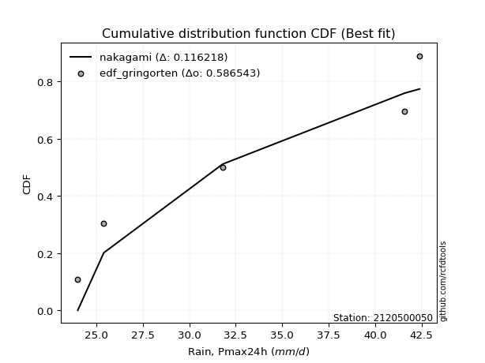</img>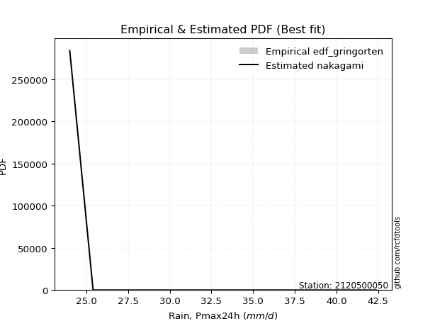</img>

</div>


### 9. EDF Filliben (1975)

The specific values of the constants (0.3175) (often denoted as $alpha$) and (0.365) are derived from a method proposed by James J. Filliben in a 1975 paper. This particular formula is the mean value of the $i$-th order statistic of the normal distribution and is considered a robust and effective plotting position formula for the normal probability plot correlation coefficient test for normality.

<div align="center">


$P=(m-0.3175)/(n+0.365)$


</div>


**9.1. Empirical values**

<div align="center">

|                | 0                   | 1                   | 2                  | 3                  | 4                  | 5                  |
|:---------------|:--------------------|:--------------------|:-------------------|:-------------------|:-------------------|:-------------------|
| date           | 2019                | 2023                | 2020               | 2021               | 2025               | 2022               |
| x              | 24.0                | 25.4                | 31.8               | 41.6               | 42.0               | 42.4               |
| m              | 1                   | 2                   | 3                  | 4                  | 5                  | 6                  |
| empirical_dist | edf_filliben        | edf_filliben        | edf_filliben       | edf_filliben       | edf_filliben       | edf_filliben       |
| empirical      | 0.10722702278083267 | 0.26433621366849963 | 0.4214454045561665 | 0.5785545954438335 | 0.7356637863315004 | 0.8927729772191673 |
| empirical_tr   | 1.1201055873295205  | 1.3593166043780034  | 1.7284453496266123 | 2.3727865796831313 | 3.783060921248143  | 9.326007326007321  |

</div>


**9.2. Kolmogorov-Smirnov fit test (sorted by Δ)**


<div align="center">

|                | 0                   | 1                  | 2                   | 3                   | 4                   | 5                   | 6                   | 7                   | 8                  | 9                   | 10                  | 11                  | 12                 | 13                  | 14                  | 15                 | 16                  | 17                  | 18                 | 19                 | 20                 | 21                 | 22                  | 23                 | 24                  | 25                  | 26                  | 27                  | 28               | 29                  | 30                  | 31                  | 32                  | 33                  | 34                  | 35                 | 36                  | 37                  | 38                  | 39                  | 40                 | 41                  | 42                  | 43                  | 44                 | 45                  | 46                 | 47                 | 48                  | 49                  | 50                 | 51                  | 52                  | 53                  | 54                  | 55                 | 56                  | 57                  | 58                  | 59                 | 60                  | 61                 | 62                  | 63                  | 64                  | 65                  | 66                  | 67                  | 68                  | 69                  | 70                  | 71                  | 72                  | 73                  | 74                 | 75                  | 76                 | 77                  | 78                  | 79                 | 80                  | 81                  | 82                  | 83                  | 84                  | 85                  | 86                 | 87                  | 88                 | 89                 | 90                 | 91                | 92                  | 93                  | 94                 | 95                 | 96                 | 97                | 98                  | 99                | 100                 | 101                | 102                | 103                | 104                | 105                | 106                 | 107                | 108                | 109                 | 110                 | 111                 | 112                 | 113                | 114                | 115                | 116                 | 117                | 118                | 119                 | 120                 | 121                 | 122                 | 123                 | 124                | 125                 | 126                 | 127                 | 128                | 129                 | 130                | 131              | 132               | 133                | 134                | 135                 | 136                | 137                 | 138                | 139                 | 140                | 141                | 142                 | 143                | 144                 | 145                | 146                 | 147                | 148                 | 149                | 150                | 151                | 152                | 153                | 154                | 155                | 156                | 157                | 158                | 159            |
|:---------------|:--------------------|:-------------------|:--------------------|:--------------------|:--------------------|:--------------------|:--------------------|:--------------------|:-------------------|:--------------------|:--------------------|:--------------------|:-------------------|:--------------------|:--------------------|:-------------------|:--------------------|:--------------------|:-------------------|:-------------------|:-------------------|:-------------------|:--------------------|:-------------------|:--------------------|:--------------------|:--------------------|:--------------------|:-----------------|:--------------------|:--------------------|:--------------------|:--------------------|:--------------------|:--------------------|:-------------------|:--------------------|:--------------------|:--------------------|:--------------------|:-------------------|:--------------------|:--------------------|:--------------------|:-------------------|:--------------------|:-------------------|:-------------------|:--------------------|:--------------------|:-------------------|:--------------------|:--------------------|:--------------------|:--------------------|:-------------------|:--------------------|:--------------------|:--------------------|:-------------------|:--------------------|:-------------------|:--------------------|:--------------------|:--------------------|:--------------------|:--------------------|:--------------------|:--------------------|:--------------------|:--------------------|:--------------------|:--------------------|:--------------------|:-------------------|:--------------------|:-------------------|:--------------------|:--------------------|:-------------------|:--------------------|:--------------------|:--------------------|:--------------------|:--------------------|:--------------------|:-------------------|:--------------------|:-------------------|:-------------------|:-------------------|:------------------|:--------------------|:--------------------|:-------------------|:-------------------|:-------------------|:------------------|:--------------------|:------------------|:--------------------|:-------------------|:-------------------|:-------------------|:-------------------|:-------------------|:--------------------|:-------------------|:-------------------|:--------------------|:--------------------|:--------------------|:--------------------|:-------------------|:-------------------|:-------------------|:--------------------|:-------------------|:-------------------|:--------------------|:--------------------|:--------------------|:--------------------|:--------------------|:-------------------|:--------------------|:--------------------|:--------------------|:-------------------|:--------------------|:-------------------|:-----------------|:------------------|:-------------------|:-------------------|:--------------------|:-------------------|:--------------------|:-------------------|:--------------------|:-------------------|:-------------------|:--------------------|:-------------------|:--------------------|:-------------------|:--------------------|:-------------------|:--------------------|:-------------------|:-------------------|:-------------------|:-------------------|:-------------------|:-------------------|:-------------------|:-------------------|:-------------------|:-------------------|:---------------|
| station        | 2120500050          | 2120500050         | 2120500050          | 2120500050          | 2120500050          | 2120500050          | 2120500050          | 2120500050          | 2120500050         | 2120500050          | 2120500050          | 2120500050          | 2120500050         | 2120500050          | 2120500050          | 2120500050         | 2120500050          | 2120500050          | 2120500050         | 2120500050         | 2120500050         | 2120500050         | 2120500050          | 2120500050         | 2120500050          | 2120500050          | 2120500050          | 2120500050          | 2120500050       | 2120500050          | 2120500050          | 2120500050          | 2120500050          | 2120500050          | 2120500050          | 2120500050         | 2120500050          | 2120500050          | 2120500050          | 2120500050          | 2120500050         | 2120500050          | 2120500050          | 2120500050          | 2120500050         | 2120500050          | 2120500050         | 2120500050         | 2120500050          | 2120500050          | 2120500050         | 2120500050          | 2120500050          | 2120500050          | 2120500050          | 2120500050         | 2120500050          | 2120500050          | 2120500050          | 2120500050         | 2120500050          | 2120500050         | 2120500050          | 2120500050          | 2120500050          | 2120500050          | 2120500050          | 2120500050          | 2120500050          | 2120500050          | 2120500050          | 2120500050          | 2120500050          | 2120500050          | 2120500050         | 2120500050          | 2120500050         | 2120500050          | 2120500050          | 2120500050         | 2120500050          | 2120500050          | 2120500050          | 2120500050          | 2120500050          | 2120500050          | 2120500050         | 2120500050          | 2120500050         | 2120500050         | 2120500050         | 2120500050        | 2120500050          | 2120500050          | 2120500050         | 2120500050         | 2120500050         | 2120500050        | 2120500050          | 2120500050        | 2120500050          | 2120500050         | 2120500050         | 2120500050         | 2120500050         | 2120500050         | 2120500050          | 2120500050         | 2120500050         | 2120500050          | 2120500050          | 2120500050          | 2120500050          | 2120500050         | 2120500050         | 2120500050         | 2120500050          | 2120500050         | 2120500050         | 2120500050          | 2120500050          | 2120500050          | 2120500050          | 2120500050          | 2120500050         | 2120500050          | 2120500050          | 2120500050          | 2120500050         | 2120500050          | 2120500050         | 2120500050       | 2120500050        | 2120500050         | 2120500050         | 2120500050          | 2120500050         | 2120500050          | 2120500050         | 2120500050          | 2120500050         | 2120500050         | 2120500050          | 2120500050         | 2120500050          | 2120500050         | 2120500050          | 2120500050         | 2120500050          | 2120500050         | 2120500050         | 2120500050         | 2120500050         | 2120500050         | 2120500050         | 2120500050         | 2120500050         | 2120500050         | 2120500050         | 2120500050     |
| empirical_dist | edf_filliben        | edf_filliben       | edf_filliben        | edf_filliben        | edf_filliben        | edf_filliben        | edf_filliben        | edf_filliben        | edf_filliben       | edf_filliben        | edf_filliben        | edf_filliben        | edf_filliben       | edf_filliben        | edf_filliben        | edf_filliben       | edf_filliben        | edf_filliben        | edf_filliben       | edf_filliben       | edf_filliben       | edf_filliben       | edf_filliben        | edf_filliben       | edf_filliben        | edf_filliben        | edf_filliben        | edf_filliben        | edf_filliben     | edf_filliben        | edf_filliben        | edf_filliben        | edf_filliben        | edf_filliben        | edf_filliben        | edf_filliben       | edf_filliben        | edf_filliben        | edf_filliben        | edf_filliben        | edf_filliben       | edf_filliben        | edf_filliben        | edf_filliben        | edf_filliben       | edf_filliben        | edf_filliben       | edf_filliben       | edf_filliben        | edf_filliben        | edf_filliben       | edf_filliben        | edf_filliben        | edf_filliben        | edf_filliben        | edf_filliben       | edf_filliben        | edf_filliben        | edf_filliben        | edf_filliben       | edf_filliben        | edf_filliben       | edf_filliben        | edf_filliben        | edf_filliben        | edf_filliben        | edf_filliben        | edf_filliben        | edf_filliben        | edf_filliben        | edf_filliben        | edf_filliben        | edf_filliben        | edf_filliben        | edf_filliben       | edf_filliben        | edf_filliben       | edf_filliben        | edf_filliben        | edf_filliben       | edf_filliben        | edf_filliben        | edf_filliben        | edf_filliben        | edf_filliben        | edf_filliben        | edf_filliben       | edf_filliben        | edf_filliben       | edf_filliben       | edf_filliben       | edf_filliben      | edf_filliben        | edf_filliben        | edf_filliben       | edf_filliben       | edf_filliben       | edf_filliben      | edf_filliben        | edf_filliben      | edf_filliben        | edf_filliben       | edf_filliben       | edf_filliben       | edf_filliben       | edf_filliben       | edf_filliben        | edf_filliben       | edf_filliben       | edf_filliben        | edf_filliben        | edf_filliben        | edf_filliben        | edf_filliben       | edf_filliben       | edf_filliben       | edf_filliben        | edf_filliben       | edf_filliben       | edf_filliben        | edf_filliben        | edf_filliben        | edf_filliben        | edf_filliben        | edf_filliben       | edf_filliben        | edf_filliben        | edf_filliben        | edf_filliben       | edf_filliben        | edf_filliben       | edf_filliben     | edf_filliben      | edf_filliben       | edf_filliben       | edf_filliben        | edf_filliben       | edf_filliben        | edf_filliben       | edf_filliben        | edf_filliben       | edf_filliben       | edf_filliben        | edf_filliben       | edf_filliben        | edf_filliben       | edf_filliben        | edf_filliben       | edf_filliben        | edf_filliben       | edf_filliben       | edf_filliben       | edf_filliben       | edf_filliben       | edf_filliben       | edf_filliben       | edf_filliben       | edf_filliben       | edf_filliben       | edf_filliben   |
| p_dist         | wrapcauchy          | arcsine            | dweibull            | logarcsine          | logrdist            | logdweibull         | rdist               | logweibull_max      | logwrapcauchy      | logksone            | logexponweib        | ksone               | dgamma             | logdgamma           | logtrapezoid        | exponpow           | trapezoid           | genpareto           | loginvweibull      | logsemicircular    | semicircular       | loganglit          | anglit              | lomax              | halfgennorm         | logbeta             | logburr             | burr12              | loglomax         | levy_l              | burr                | invweibull          | nakagami            | loginvgamma         | logpearson3         | logf               | genexpon            | loginvgauss         | logfoldnorm         | logncf              | logerlang          | loggamma            | loggamma            | invgauss            | lognorm            | logcrystalball      | logt               | logexponnorm       | gennorm             | logbetaprime        | pearson3           | invgamma            | loggenexpon         | logrice             | erlang              | logmaxwell         | ncf                 | lograyleigh         | loglevy_l           | weibull_min        | nct                 | f                  | crystalball         | norm                | exponnorm           | t                   | logalpha            | gamma               | maxwell             | rayleigh            | logfatiguelife      | logburr12           | rice                | logweibull_min      | logkstwobign       | loghalfnorm         | foldnorm           | alpha               | betaprime           | halfnorm           | lognct              | kstwobign           | loggompertz         | beta                | gompertz            | loggumbel_l         | genextreme         | gumbel_l            | loggenextreme      | loglogistic        | loggumbel_r        | logistic          | gumbel_r            | loghalflogistic     | logcosine          | cosine             | halflogistic       | logmoyal          | moyal               | loghypsecant      | hypsecant           | loglaplace         | loglaplace         | weibull_max        | laplace            | logmielke          | argus               | logwald            | wald               | logargus            | exponweib           | genhalflogistic     | logloggamma         | lognakagami        | loggennorm         | logloglaplace      | logexponpow         | loggenhalflogistic | skewnorm           | triang              | kappa4              | logtriang           | tukeylambda         | kappa3              | logkappa3          | logskewnorm         | uniform             | vonmises_line       | loggausshyper      | logtukeylambda      | logvonmises_line   | gausshyper       | gengamma          | logkappa4          | loguniform         | bradford            | truncexpon         | logtruncweibull_min | logbradford        | fatiguelife         | logtruncexpon      | truncweibull_min   | logtruncnorm        | loghalfgennorm     | loggengamma         | powerlaw           | logpowerlaw         | johnsonsb          | johnsonsu           | truncpareto        | logtruncpareto     | truncnorm          | logjohnsonsb       | logjohnsonsu       | loggenpareto       | genlogistic        | loggenlogistic     | logvonmises        | vonmises           | mielke         |
| delta          | 0.12801114994728896 | 0.1419572657897481 | 0.14670152790931434 | 0.15130947114457816 | 0.15145258002472217 | 0.15910202196748366 | 0.16037148036812787 | 0.16050308053578366 | 0.1673905740961481 | 0.17931260611499833 | 0.18005482135641027 | 0.18142743133991068 | 0.1847205935296913 | 0.18743708895677247 | 0.19095042930204942 | 0.1920053235341217 | 0.19398286646311658 | 0.19583604092776918 | 0.1959177267131501 | 0.1960257976616261 | 0.1981100679193991 | 0.2081680582980786 | 0.21021605568972157 | 0.2103681811467002 | 0.21372376654143288 | 0.22103919018022153 | 0.22415051540058262 | 0.22477775087216656 | 0.22541248244416 | 0.22661303240861497 | 0.22662704256582666 | 0.22950277733344326 | 0.23103079529040038 | 0.23106700576331285 | 0.23356862791560717 | 0.2336848120690268 | 0.23369047448267166 | 0.23386336495262927 | 0.23397482575026762 | 0.23406396936678886 | 0.2344489244644129 | 0.23502681282751392 | 0.23502681282751392 | 0.23554143561168028 | 0.2355912970557671 | 0.23559133408938782 | 0.2355916538284678 | 0.2355925741804985 | 0.23566378633150042 | 0.23600793518723406 | 0.2360204097173516 | 0.23607637181525776 | 0.23620310010819812 | 0.23623052692722357 | 0.23650131463063673 | 0.2366346284090889 | 0.23667884256764393 | 0.23694472215079965 | 0.23707612720240412 | 0.2371834790362204 | 0.23728824133557358 | 0.2373063163988678 | 0.23754598480300892 | 0.23754599327088266 | 0.23754694853514102 | 0.23755952860552954 | 0.23761018683846158 | 0.23813362710873331 | 0.23832922392975098 | 0.23856771107067676 | 0.23868993802856886 | 0.23889805385694762 | 0.23893386740116063 | 0.23912417367351135 | 0.2392348424717109 | 0.24002643935330736 | 0.2401365663123537 | 0.24054947336960986 | 0.24122985800564456 | 0.2414526494046808 | 0.24209218279111522 | 0.24443661097522762 | 0.24471098224793097 | 0.24559961603116087 | 0.24625524968047185 | 0.25035149694386905 | 0.2516787470283166 | 0.25317949975752363 | 0.2555777468844943 | 0.2562718948769903 | 0.2579280619458624 | 0.258096028565448 | 0.25932597077617214 | 0.25975507888818794 | 0.2601354135745739 | 0.2602874391930915 | 0.2610524026026362 | 0.265705935864996 | 0.26695210447862416 | 0.267994484944468 | 0.26968409393557347 | 0.2800836884390777 | 0.2800836884390777 | 0.2804392548003982 | 0.2815407037083103 | 0.2917846091736359 | 0.29418248890567256 | 0.2944657328269913 | 0.2953633964866177 | 0.30085014367714424 | 0.33672961173526506 | 0.34097472270578544 | 0.34236747940667367 | 0.3489749524182146 | 0.3490168749425272 | 0.3544360639146791 | 0.35760921004758967 | 0.3619256453083858 | 0.3640367103616594 | 0.36738002306747186 | 0.36925027715367764 | 0.36934889074121724 | 0.37123354524478447 | 0.37365058232441595 | 0.3749373457511548 | 0.37597437768219655 | 0.37796714368660145 | 0.37873058297528517 | 0.3787567268462697 | 0.38120181640109496 | 0.3815988049815564 | 0.38210281961308 | 0.382121870390159 | 0.3837642457025836 | 0.3879743485130953 | 0.39053918201446025 | 0.3929825798459482 | 0.3947560790349468  | 0.3974868512717158 | 0.40009294459524225 | 0.4017750841473051 | 0.4057898972217654 | 0.40977917275839215 | 0.4214454045561665 | 0.43938394208402265 | 0.4568614130066371 | 0.47292133749677534 | 0.4884697523932208 | 0.49404828536657824 | 0.5102598960053686 | 0.5222710945403517 | 0.5269140388234468 | 0.5543973523439013 | 0.6689826229284263 | 0.6884284930576885 | 0.7356637863315004 | 0.7356637863315004 | 1.2350969580516442 | 6.5625524356991995 | nan            |
| deltao         | 0.530385761606      | 0.530385761606     | 0.530385761606      | 0.530385761606      | 0.530385761606      | 0.530385761606      | 0.530385761606      | 0.530385761606      | 0.530385761606     | 0.530385761606      | 0.530385761606      | 0.530385761606      | 0.530385761606     | 0.530385761606      | 0.530385761606      | 0.530385761606     | 0.530385761606      | 0.530385761606      | 0.530385761606     | 0.530385761606     | 0.530385761606     | 0.530385761606     | 0.530385761606      | 0.530385761606     | 0.530385761606      | 0.530385761606      | 0.530385761606      | 0.530385761606      | 0.530385761606   | 0.530385761606      | 0.530385761606      | 0.530385761606      | 0.530385761606      | 0.530385761606      | 0.530385761606      | 0.530385761606     | 0.530385761606      | 0.530385761606      | 0.530385761606      | 0.530385761606      | 0.530385761606     | 0.530385761606      | 0.530385761606      | 0.530385761606      | 0.530385761606     | 0.530385761606      | 0.530385761606     | 0.530385761606     | 0.530385761606      | 0.530385761606      | 0.530385761606     | 0.530385761606      | 0.530385761606      | 0.530385761606      | 0.530385761606      | 0.530385761606     | 0.530385761606      | 0.530385761606      | 0.530385761606      | 0.530385761606     | 0.530385761606      | 0.530385761606     | 0.530385761606      | 0.530385761606      | 0.530385761606      | 0.530385761606      | 0.530385761606      | 0.530385761606      | 0.530385761606      | 0.530385761606      | 0.530385761606      | 0.530385761606      | 0.530385761606      | 0.530385761606      | 0.530385761606     | 0.530385761606      | 0.530385761606     | 0.530385761606      | 0.530385761606      | 0.530385761606     | 0.530385761606      | 0.530385761606      | 0.530385761606      | 0.530385761606      | 0.530385761606      | 0.530385761606      | 0.530385761606     | 0.530385761606      | 0.530385761606     | 0.530385761606     | 0.530385761606     | 0.530385761606    | 0.530385761606      | 0.530385761606      | 0.530385761606     | 0.530385761606     | 0.530385761606     | 0.530385761606    | 0.530385761606      | 0.530385761606    | 0.530385761606      | 0.530385761606     | 0.530385761606     | 0.530385761606     | 0.530385761606     | 0.530385761606     | 0.530385761606      | 0.530385761606     | 0.530385761606     | 0.530385761606      | 0.530385761606      | 0.530385761606      | 0.530385761606      | 0.530385761606     | 0.530385761606     | 0.530385761606     | 0.530385761606      | 0.530385761606     | 0.530385761606     | 0.530385761606      | 0.530385761606      | 0.530385761606      | 0.530385761606      | 0.530385761606      | 0.530385761606     | 0.530385761606      | 0.530385761606      | 0.530385761606      | 0.530385761606     | 0.530385761606      | 0.530385761606     | 0.530385761606   | 0.530385761606    | 0.530385761606     | 0.530385761606     | 0.530385761606      | 0.530385761606     | 0.530385761606      | 0.530385761606     | 0.530385761606      | 0.530385761606     | 0.530385761606     | 0.530385761606      | 0.530385761606     | 0.530385761606      | 0.530385761606     | 0.530385761606      | 0.530385761606     | 0.530385761606      | 0.530385761606     | 0.530385761606     | 0.530385761606     | 0.530385761606     | 0.530385761606     | 0.530385761606     | 0.530385761606     | 0.530385761606     | 0.530385761606     | 0.530385761606     | 0.530385761606 |
| eval           | Δo > Δ              | Δo > Δ             | Δo > Δ              | Δo > Δ              | Δo > Δ              | Δo > Δ              | Δo > Δ              | Δo > Δ              | Δo > Δ             | Δo > Δ              | Δo > Δ              | Δo > Δ              | Δo > Δ             | Δo > Δ              | Δo > Δ              | Δo > Δ             | Δo > Δ              | Δo > Δ              | Δo > Δ             | Δo > Δ             | Δo > Δ             | Δo > Δ             | Δo > Δ              | Δo > Δ             | Δo > Δ              | Δo > Δ              | Δo > Δ              | Δo > Δ              | Δo > Δ           | Δo > Δ              | Δo > Δ              | Δo > Δ              | Δo > Δ              | Δo > Δ              | Δo > Δ              | Δo > Δ             | Δo > Δ              | Δo > Δ              | Δo > Δ              | Δo > Δ              | Δo > Δ             | Δo > Δ              | Δo > Δ              | Δo > Δ              | Δo > Δ             | Δo > Δ              | Δo > Δ             | Δo > Δ             | Δo > Δ              | Δo > Δ              | Δo > Δ             | Δo > Δ              | Δo > Δ              | Δo > Δ              | Δo > Δ              | Δo > Δ             | Δo > Δ              | Δo > Δ              | Δo > Δ              | Δo > Δ             | Δo > Δ              | Δo > Δ             | Δo > Δ              | Δo > Δ              | Δo > Δ              | Δo > Δ              | Δo > Δ              | Δo > Δ              | Δo > Δ              | Δo > Δ              | Δo > Δ              | Δo > Δ              | Δo > Δ              | Δo > Δ              | Δo > Δ             | Δo > Δ              | Δo > Δ             | Δo > Δ              | Δo > Δ              | Δo > Δ             | Δo > Δ              | Δo > Δ              | Δo > Δ              | Δo > Δ              | Δo > Δ              | Δo > Δ              | Δo > Δ             | Δo > Δ              | Δo > Δ             | Δo > Δ             | Δo > Δ             | Δo > Δ            | Δo > Δ              | Δo > Δ              | Δo > Δ             | Δo > Δ             | Δo > Δ             | Δo > Δ            | Δo > Δ              | Δo > Δ            | Δo > Δ              | Δo > Δ             | Δo > Δ             | Δo > Δ             | Δo > Δ             | Δo > Δ             | Δo > Δ              | Δo > Δ             | Δo > Δ             | Δo > Δ              | Δo > Δ              | Δo > Δ              | Δo > Δ              | Δo > Δ             | Δo > Δ             | Δo > Δ             | Δo > Δ              | Δo > Δ             | Δo > Δ             | Δo > Δ              | Δo > Δ              | Δo > Δ              | Δo > Δ              | Δo > Δ              | Δo > Δ             | Δo > Δ              | Δo > Δ              | Δo > Δ              | Δo > Δ             | Δo > Δ              | Δo > Δ             | Δo > Δ           | Δo > Δ            | Δo > Δ             | Δo > Δ             | Δo > Δ              | Δo > Δ             | Δo > Δ              | Δo > Δ             | Δo > Δ              | Δo > Δ             | Δo > Δ             | Δo > Δ              | Δo > Δ             | Δo > Δ              | Δo > Δ             | Δo > Δ              | Δo > Δ             | Δo > Δ              | Δo > Δ             | Δo > Δ             | Δo > Δ             | Δo <= Δ            | Δo <= Δ            | Δo <= Δ            | Δo <= Δ            | Δo <= Δ            | Δo <= Δ            | Δo <= Δ            | Δo <= Δ        |
| fit            | 1                   | 1                  | 1                   | 1                   | 1                   | 1                   | 1                   | 1                   | 1                  | 1                   | 1                   | 1                   | 1                  | 1                   | 1                   | 1                  | 1                   | 1                   | 1                  | 1                  | 1                  | 1                  | 1                   | 1                  | 1                   | 1                   | 1                   | 1                   | 1                | 1                   | 1                   | 1                   | 1                   | 1                   | 1                   | 1                  | 1                   | 1                   | 1                   | 1                   | 1                  | 1                   | 1                   | 1                   | 1                  | 1                   | 1                  | 1                  | 1                   | 1                   | 1                  | 1                   | 1                   | 1                   | 1                   | 1                  | 1                   | 1                   | 1                   | 1                  | 1                   | 1                  | 1                   | 1                   | 1                   | 1                   | 1                   | 1                   | 1                   | 1                   | 1                   | 1                   | 1                   | 1                   | 1                  | 1                   | 1                  | 1                   | 1                   | 1                  | 1                   | 1                   | 1                   | 1                   | 1                   | 1                   | 1                  | 1                   | 1                  | 1                  | 1                  | 1                 | 1                   | 1                   | 1                  | 1                  | 1                  | 1                 | 1                   | 1                 | 1                   | 1                  | 1                  | 1                  | 1                  | 1                  | 1                   | 1                  | 1                  | 1                   | 1                   | 1                   | 1                   | 1                  | 1                  | 1                  | 1                   | 1                  | 1                  | 1                   | 1                   | 1                   | 1                   | 1                   | 1                  | 1                   | 1                   | 1                   | 1                  | 1                   | 1                  | 1                | 1                 | 1                  | 1                  | 1                   | 1                  | 1                   | 1                  | 1                   | 1                  | 1                  | 1                   | 1                  | 1                   | 1                  | 1                   | 1                  | 1                   | 1                  | 1                  | 1                  | 0                  | 0                  | 0                  | 0                  | 0                  | 0                  | 0                  | 0              |
| n              | 6                   | 6                  | 6                   | 6                   | 6                   | 6                   | 6                   | 6                   | 6                  | 6                   | 6                   | 6                   | 6                  | 6                   | 6                   | 6                  | 6                   | 6                   | 6                  | 6                  | 6                  | 6                  | 6                   | 6                  | 6                   | 6                   | 6                   | 6                   | 6                | 6                   | 6                   | 6                   | 6                   | 6                   | 6                   | 6                  | 6                   | 6                   | 6                   | 6                   | 6                  | 6                   | 6                   | 6                   | 6                  | 6                   | 6                  | 6                  | 6                   | 6                   | 6                  | 6                   | 6                   | 6                   | 6                   | 6                  | 6                   | 6                   | 6                   | 6                  | 6                   | 6                  | 6                   | 6                   | 6                   | 6                   | 6                   | 6                   | 6                   | 6                   | 6                   | 6                   | 6                   | 6                   | 6                  | 6                   | 6                  | 6                   | 6                   | 6                  | 6                   | 6                   | 6                   | 6                   | 6                   | 6                   | 6                  | 6                   | 6                  | 6                  | 6                  | 6                 | 6                   | 6                   | 6                  | 6                  | 6                  | 6                 | 6                   | 6                 | 6                   | 6                  | 6                  | 6                  | 6                  | 6                  | 6                   | 6                  | 6                  | 6                   | 6                   | 6                   | 6                   | 6                  | 6                  | 6                  | 6                   | 6                  | 6                  | 6                   | 6                   | 6                   | 6                   | 6                   | 6                  | 6                   | 6                   | 6                   | 6                  | 6                   | 6                  | 6                | 6                 | 6                  | 6                  | 6                   | 6                  | 6                   | 6                  | 6                   | 6                  | 6                  | 6                   | 6                  | 6                   | 6                  | 6                   | 6                  | 6                   | 6                  | 6                  | 6                  | 6                  | 6                  | 6                  | 6                  | 6                  | 6                  | 6                  | 6              |
| best_fit       | 1                   | 0                  | 0                   | 0                   | 0                   | 0                   | 0                   | 0                   | 0                  | 0                   | 0                   | 0                   | 0                  | 0                   | 0                   | 0                  | 0                   | 0                   | 0                  | 0                  | 0                  | 0                  | 0                   | 0                  | 0                   | 0                   | 0                   | 0                   | 0                | 0                   | 0                   | 0                   | 0                   | 0                   | 0                   | 0                  | 0                   | 0                   | 0                   | 0                   | 0                  | 0                   | 0                   | 0                   | 0                  | 0                   | 0                  | 0                  | 0                   | 0                   | 0                  | 0                   | 0                   | 0                   | 0                   | 0                  | 0                   | 0                   | 0                   | 0                  | 0                   | 0                  | 0                   | 0                   | 0                   | 0                   | 0                   | 0                   | 0                   | 0                   | 0                   | 0                   | 0                   | 0                   | 0                  | 0                   | 0                  | 0                   | 0                   | 0                  | 0                   | 0                   | 0                   | 0                   | 0                   | 0                   | 0                  | 0                   | 0                  | 0                  | 0                  | 0                 | 0                   | 0                   | 0                  | 0                  | 0                  | 0                 | 0                   | 0                 | 0                   | 0                  | 0                  | 0                  | 0                  | 0                  | 0                   | 0                  | 0                  | 0                   | 0                   | 0                   | 0                   | 0                  | 0                  | 0                  | 0                   | 0                  | 0                  | 0                   | 0                   | 0                   | 0                   | 0                   | 0                  | 0                   | 0                   | 0                   | 0                  | 0                   | 0                  | 0                | 0                 | 0                  | 0                  | 0                   | 0                  | 0                   | 0                  | 0                   | 0                  | 0                  | 0                   | 0                  | 0                   | 0                  | 0                   | 0                  | 0                   | 0                  | 0                  | 0                  | 0                  | 0                  | 0                  | 0                  | 0                  | 0                  | 0                  | 0              |
| best_fit_sort  | 1                   | 2                  | 3                   | 4                   | 5                   | 6                   | 7                   | 8                   | 9                  | 10                  | 11                  | 12                  | 13                 | 14                  | 15                  | 16                 | 17                  | 18                  | 19                 | 20                 | 21                 | 22                 | 23                  | 24                 | 25                  | 26                  | 27                  | 28                  | 29               | 30                  | 31                  | 32                  | 33                  | 34                  | 35                  | 36                 | 37                  | 38                  | 39                  | 40                  | 41                 | 42                  | 43                  | 44                  | 45                 | 46                  | 47                 | 48                 | 49                  | 50                  | 51                 | 52                  | 53                  | 54                  | 55                  | 56                 | 57                  | 58                  | 59                  | 60                 | 61                  | 62                 | 63                  | 64                  | 65                  | 66                  | 67                  | 68                  | 69                  | 70                  | 71                  | 72                  | 73                  | 74                  | 75                 | 76                  | 77                 | 78                  | 79                  | 80                 | 81                  | 82                  | 83                  | 84                  | 85                  | 86                  | 87                 | 88                  | 89                 | 90                 | 91                 | 92                | 93                  | 94                  | 95                 | 96                 | 97                 | 98                | 99                  | 100               | 101                 | 102                | 103                | 104                | 105                | 106                | 107                 | 108                | 109                | 110                 | 111                 | 112                 | 113                 | 114                | 115                | 116                | 117                 | 118                | 119                | 120                 | 121                 | 122                 | 123                 | 124                 | 125                | 126                 | 127                 | 128                 | 129                | 130                 | 131                | 132              | 133               | 134                | 135                | 136                 | 137                | 138                 | 139                | 140                 | 141                | 142                | 143                 | 144                | 145                 | 146                | 147                 | 148                | 149                 | 150                | 151                | 152                | 153                | 154                | 155                | 156                | 157                | 158                | 159                | 160            |

</div>


**9.3. Best fit**

<div align="center">

|   id |    station | empirical_dist   | p_dist     |    delta |   deltao | eval   |   fit |   n |   best_fit |   best_fit_sort |
|-----:|-----------:|:-----------------|:-----------|---------:|---------:|:-------|------:|----:|-----------:|----------------:|
|    0 | 2120500050 | edf_filliben     | wrapcauchy | 0.128011 | 0.530386 | Δo > Δ |     1 |   6 |          1 |               1 |

</div>


<div align="center">

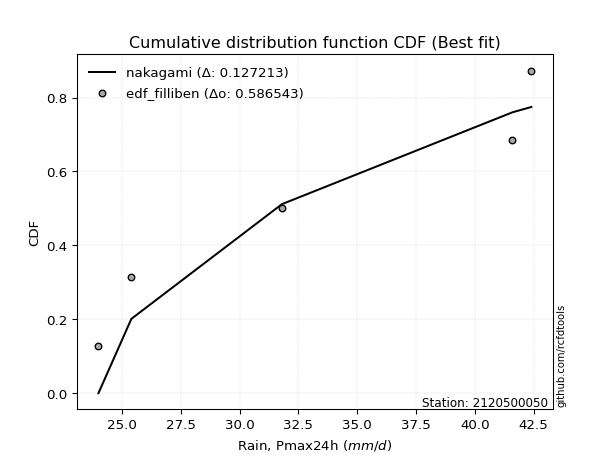</img>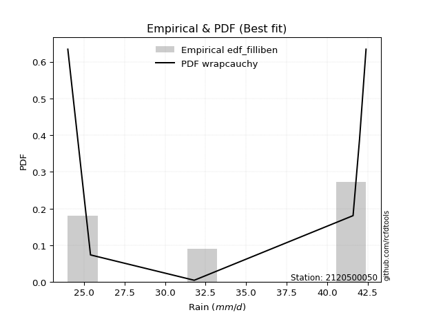</img>

</div>


### 10. EDF Jenkinson (1977)

The Jenkinson formula in hydrology is an empirical plotting position formula used to estimate the non-exceedance probability _(P)_ or return period _(T)_ of a given ordered observation within a sample. It is a widely used method in the frequency analysis of extreme events such as floods and rainfall, as it provides a distribution-free way to plot data. _a≈0.31_ and _b≈0.38_ are constants derived to approximate the median of the probability distribution for the given rank.

<div align="center">


$P=(m-a)/(n+b)$


</div>


**10.1. Empirical values**

<div align="center">

|                | 0                   | 1                   | 2                  | 3                  | 4                  | 5                  |
|:---------------|:--------------------|:--------------------|:-------------------|:-------------------|:-------------------|:-------------------|
| date           | 2019                | 2023                | 2020               | 2021               | 2025               | 2022               |
| x              | 24.0                | 25.4                | 31.8               | 41.6               | 42.0               | 42.4               |
| m              | 1                   | 2                   | 3                  | 4                  | 5                  | 6                  |
| empirical_dist | edf_jenkinson       | edf_jenkinson       | edf_jenkinson      | edf_jenkinson      | edf_jenkinson      | edf_jenkinson      |
| empirical      | 0.10815047021943573 | 0.26489028213166144 | 0.4216300940438871 | 0.5783699059561128 | 0.7351097178683387 | 0.8918495297805643 |
| empirical_tr   | 1.1212653778558874  | 1.3603411513859276  | 1.7289972899728996 | 2.3717472118959106 | 3.7751479289940844 | 9.246376811594207  |

</div>


**10.2. Kolmogorov-Smirnov fit test (sorted by Δ)**


<div align="center">

|                | 0                   | 1                   | 2                   | 3                  | 4                   | 5                   | 6                   | 7                   | 8                  | 9                 | 10                  | 11                  | 12                 | 13                  | 14                  | 15                 | 16                  | 17                  | 18                  | 19                  | 20                  | 21                  | 22                  | 23                  | 24                  | 25                  | 26                  | 27                  | 28                  | 29                  | 30                  | 31                  | 32                  | 33                 | 34                 | 35                  | 36                  | 37                  | 38                  | 39                  | 40                  | 41                  | 42                  | 43                  | 44                  | 45                  | 46                  | 47                  | 48                  | 49                  | 50                  | 51                  | 52                  | 53                  | 54                  | 55                  | 56                 | 57                 | 58                  | 59                  | 60                  | 61                  | 62                  | 63                  | 64                  | 65                 | 66                  | 67                  | 68                  | 69                  | 70                  | 71                  | 72                  | 73                | 74                  | 75                  | 76                  | 77                 | 78                  | 79                  | 80                  | 81                  | 82                  | 83                  | 84                 | 85                 | 86                  | 87                 | 88                 | 89                  | 90                  | 91                  | 92                 | 93                 | 94                 | 95                  | 96                  | 97                 | 98                 | 99                  | 100                | 101                 | 102                | 103                | 104                 | 105                 | 106                | 107                 | 108                 | 109                | 110                 | 111                | 112                | 113                 | 114                | 115                | 116                 | 117                 | 118                 | 119                | 120                | 121                | 122                | 123                | 124                 | 125                | 126                | 127                | 128                 | 129                | 130                 | 131                | 132                 | 133                 | 134                 | 135                | 136                 | 137                 | 138                 | 139                 | 140                | 141                 | 142                | 143                | 144                 | 145                 | 146                 | 147               | 148                | 149                | 150               | 151                | 152                | 153                | 154                | 155                | 156                | 157                | 158              | 159            |
|:---------------|:--------------------|:--------------------|:--------------------|:-------------------|:--------------------|:--------------------|:--------------------|:--------------------|:-------------------|:------------------|:--------------------|:--------------------|:-------------------|:--------------------|:--------------------|:-------------------|:--------------------|:--------------------|:--------------------|:--------------------|:--------------------|:--------------------|:--------------------|:--------------------|:--------------------|:--------------------|:--------------------|:--------------------|:--------------------|:--------------------|:--------------------|:--------------------|:--------------------|:-------------------|:-------------------|:--------------------|:--------------------|:--------------------|:--------------------|:--------------------|:--------------------|:--------------------|:--------------------|:--------------------|:--------------------|:--------------------|:--------------------|:--------------------|:--------------------|:--------------------|:--------------------|:--------------------|:--------------------|:--------------------|:--------------------|:--------------------|:-------------------|:-------------------|:--------------------|:--------------------|:--------------------|:--------------------|:--------------------|:--------------------|:--------------------|:-------------------|:--------------------|:--------------------|:--------------------|:--------------------|:--------------------|:--------------------|:--------------------|:------------------|:--------------------|:--------------------|:--------------------|:-------------------|:--------------------|:--------------------|:--------------------|:--------------------|:--------------------|:--------------------|:-------------------|:-------------------|:--------------------|:-------------------|:-------------------|:--------------------|:--------------------|:--------------------|:-------------------|:-------------------|:-------------------|:--------------------|:--------------------|:-------------------|:-------------------|:--------------------|:-------------------|:--------------------|:-------------------|:-------------------|:--------------------|:--------------------|:-------------------|:--------------------|:--------------------|:-------------------|:--------------------|:-------------------|:-------------------|:--------------------|:-------------------|:-------------------|:--------------------|:--------------------|:--------------------|:-------------------|:-------------------|:-------------------|:-------------------|:-------------------|:--------------------|:-------------------|:-------------------|:-------------------|:--------------------|:-------------------|:--------------------|:-------------------|:--------------------|:--------------------|:--------------------|:-------------------|:--------------------|:--------------------|:--------------------|:--------------------|:-------------------|:--------------------|:-------------------|:-------------------|:--------------------|:--------------------|:--------------------|:------------------|:-------------------|:-------------------|:------------------|:-------------------|:-------------------|:-------------------|:-------------------|:-------------------|:-------------------|:-------------------|:-----------------|:---------------|
| station        | 2120500050          | 2120500050          | 2120500050          | 2120500050         | 2120500050          | 2120500050          | 2120500050          | 2120500050          | 2120500050         | 2120500050        | 2120500050          | 2120500050          | 2120500050         | 2120500050          | 2120500050          | 2120500050         | 2120500050          | 2120500050          | 2120500050          | 2120500050          | 2120500050          | 2120500050          | 2120500050          | 2120500050          | 2120500050          | 2120500050          | 2120500050          | 2120500050          | 2120500050          | 2120500050          | 2120500050          | 2120500050          | 2120500050          | 2120500050         | 2120500050         | 2120500050          | 2120500050          | 2120500050          | 2120500050          | 2120500050          | 2120500050          | 2120500050          | 2120500050          | 2120500050          | 2120500050          | 2120500050          | 2120500050          | 2120500050          | 2120500050          | 2120500050          | 2120500050          | 2120500050          | 2120500050          | 2120500050          | 2120500050          | 2120500050          | 2120500050         | 2120500050         | 2120500050          | 2120500050          | 2120500050          | 2120500050          | 2120500050          | 2120500050          | 2120500050          | 2120500050         | 2120500050          | 2120500050          | 2120500050          | 2120500050          | 2120500050          | 2120500050          | 2120500050          | 2120500050        | 2120500050          | 2120500050          | 2120500050          | 2120500050         | 2120500050          | 2120500050          | 2120500050          | 2120500050          | 2120500050          | 2120500050          | 2120500050         | 2120500050         | 2120500050          | 2120500050         | 2120500050         | 2120500050          | 2120500050          | 2120500050          | 2120500050         | 2120500050         | 2120500050         | 2120500050          | 2120500050          | 2120500050         | 2120500050         | 2120500050          | 2120500050         | 2120500050          | 2120500050         | 2120500050         | 2120500050          | 2120500050          | 2120500050         | 2120500050          | 2120500050          | 2120500050         | 2120500050          | 2120500050         | 2120500050         | 2120500050          | 2120500050         | 2120500050         | 2120500050          | 2120500050          | 2120500050          | 2120500050         | 2120500050         | 2120500050         | 2120500050         | 2120500050         | 2120500050          | 2120500050         | 2120500050         | 2120500050         | 2120500050          | 2120500050         | 2120500050          | 2120500050         | 2120500050          | 2120500050          | 2120500050          | 2120500050         | 2120500050          | 2120500050          | 2120500050          | 2120500050          | 2120500050         | 2120500050          | 2120500050         | 2120500050         | 2120500050          | 2120500050          | 2120500050          | 2120500050        | 2120500050         | 2120500050         | 2120500050        | 2120500050         | 2120500050         | 2120500050         | 2120500050         | 2120500050         | 2120500050         | 2120500050         | 2120500050       | 2120500050     |
| empirical_dist | edf_jenkinson       | edf_jenkinson       | edf_jenkinson       | edf_jenkinson      | edf_jenkinson       | edf_jenkinson       | edf_jenkinson       | edf_jenkinson       | edf_jenkinson      | edf_jenkinson     | edf_jenkinson       | edf_jenkinson       | edf_jenkinson      | edf_jenkinson       | edf_jenkinson       | edf_jenkinson      | edf_jenkinson       | edf_jenkinson       | edf_jenkinson       | edf_jenkinson       | edf_jenkinson       | edf_jenkinson       | edf_jenkinson       | edf_jenkinson       | edf_jenkinson       | edf_jenkinson       | edf_jenkinson       | edf_jenkinson       | edf_jenkinson       | edf_jenkinson       | edf_jenkinson       | edf_jenkinson       | edf_jenkinson       | edf_jenkinson      | edf_jenkinson      | edf_jenkinson       | edf_jenkinson       | edf_jenkinson       | edf_jenkinson       | edf_jenkinson       | edf_jenkinson       | edf_jenkinson       | edf_jenkinson       | edf_jenkinson       | edf_jenkinson       | edf_jenkinson       | edf_jenkinson       | edf_jenkinson       | edf_jenkinson       | edf_jenkinson       | edf_jenkinson       | edf_jenkinson       | edf_jenkinson       | edf_jenkinson       | edf_jenkinson       | edf_jenkinson       | edf_jenkinson      | edf_jenkinson      | edf_jenkinson       | edf_jenkinson       | edf_jenkinson       | edf_jenkinson       | edf_jenkinson       | edf_jenkinson       | edf_jenkinson       | edf_jenkinson      | edf_jenkinson       | edf_jenkinson       | edf_jenkinson       | edf_jenkinson       | edf_jenkinson       | edf_jenkinson       | edf_jenkinson       | edf_jenkinson     | edf_jenkinson       | edf_jenkinson       | edf_jenkinson       | edf_jenkinson      | edf_jenkinson       | edf_jenkinson       | edf_jenkinson       | edf_jenkinson       | edf_jenkinson       | edf_jenkinson       | edf_jenkinson      | edf_jenkinson      | edf_jenkinson       | edf_jenkinson      | edf_jenkinson      | edf_jenkinson       | edf_jenkinson       | edf_jenkinson       | edf_jenkinson      | edf_jenkinson      | edf_jenkinson      | edf_jenkinson       | edf_jenkinson       | edf_jenkinson      | edf_jenkinson      | edf_jenkinson       | edf_jenkinson      | edf_jenkinson       | edf_jenkinson      | edf_jenkinson      | edf_jenkinson       | edf_jenkinson       | edf_jenkinson      | edf_jenkinson       | edf_jenkinson       | edf_jenkinson      | edf_jenkinson       | edf_jenkinson      | edf_jenkinson      | edf_jenkinson       | edf_jenkinson      | edf_jenkinson      | edf_jenkinson       | edf_jenkinson       | edf_jenkinson       | edf_jenkinson      | edf_jenkinson      | edf_jenkinson      | edf_jenkinson      | edf_jenkinson      | edf_jenkinson       | edf_jenkinson      | edf_jenkinson      | edf_jenkinson      | edf_jenkinson       | edf_jenkinson      | edf_jenkinson       | edf_jenkinson      | edf_jenkinson       | edf_jenkinson       | edf_jenkinson       | edf_jenkinson      | edf_jenkinson       | edf_jenkinson       | edf_jenkinson       | edf_jenkinson       | edf_jenkinson      | edf_jenkinson       | edf_jenkinson      | edf_jenkinson      | edf_jenkinson       | edf_jenkinson       | edf_jenkinson       | edf_jenkinson     | edf_jenkinson      | edf_jenkinson      | edf_jenkinson     | edf_jenkinson      | edf_jenkinson      | edf_jenkinson      | edf_jenkinson      | edf_jenkinson      | edf_jenkinson      | edf_jenkinson      | edf_jenkinson    | edf_jenkinson  |
| p_dist         | wrapcauchy          | arcsine             | dweibull            | logarcsine         | logrdist            | logdweibull         | rdist               | logweibull_max      | logwrapcauchy      | logksone          | logexponweib        | ksone               | dgamma             | logdgamma           | logtrapezoid        | exponpow           | trapezoid           | genpareto           | loginvweibull       | logsemicircular     | semicircular        | loganglit           | anglit              | lomax               | halfgennorm         | logbeta             | logburr             | burr12              | loglomax            | levy_l              | burr                | invweibull          | nakagami            | loginvgamma        | logncf             | logpearson3         | logf                | genexpon            | loginvgauss         | logfoldnorm         | logerlang           | gennorm             | loggamma            | loggamma            | invgauss            | lognorm             | logcrystalball      | logt                | logexponnorm        | logbetaprime        | pearson3            | invgamma            | loggenexpon         | logrice             | erlang              | logmaxwell          | ncf                | lograyleigh        | loglevy_l           | weibull_min         | nct                 | f                   | crystalball         | norm                | exponnorm           | t                  | logalpha            | gamma               | maxwell             | rayleigh            | logfatiguelife      | logburr12           | rice                | logweibull_min    | logkstwobign        | loghalfnorm         | foldnorm            | alpha              | betaprime           | halfnorm            | lognct              | kstwobign           | loggompertz         | beta                | gompertz           | loggumbel_l        | genextreme          | gumbel_l           | loggenextreme      | loglogistic         | loggumbel_r         | logistic            | gumbel_r           | loghalflogistic    | logcosine          | cosine              | halflogistic        | logmoyal           | moyal              | loghypsecant        | hypsecant          | weibull_max         | loglaplace         | loglaplace         | laplace             | logmielke           | argus              | logwald             | wald                | logargus           | exponweib           | genhalflogistic    | logloggamma        | loggennorm          | lognakagami        | logloglaplace      | logexponpow         | loggenhalflogistic  | skewnorm            | triang             | kappa4             | logtriang          | tukeylambda        | kappa3             | logkappa3           | logskewnorm        | uniform            | vonmises_line      | loggausshyper       | logtukeylambda     | logvonmises_line    | gengamma           | gausshyper          | logkappa4           | loguniform          | bradford           | truncexpon          | logtruncweibull_min | logbradford         | fatiguelife         | logtruncexpon      | truncweibull_min    | logtruncnorm       | loghalfgennorm     | loggengamma         | powerlaw            | logpowerlaw         | johnsonsb         | johnsonsu          | truncpareto        | logtruncpareto    | truncnorm          | logjohnsonsb       | logjohnsonsu       | loggenpareto       | genlogistic        | loggenlogistic     | logvonmises        | vonmises         | mielke         |
| delta          | 0.12745708148412715 | 0.14138202385070953 | 0.14725559637247615 | 0.1503860237059752 | 0.15163726951244283 | 0.15965609043064546 | 0.16055616985584853 | 0.16068777002350432 | 0.1668365056329863 | 0.179497295602719 | 0.18023951084413092 | 0.18161212082763134 | 0.1852746619928531 | 0.18799115741993427 | 0.19113511878977008 | 0.1925593919972835 | 0.19416755595083723 | 0.19602073041548984 | 0.19610241620087077 | 0.19621048714934675 | 0.19829475740711977 | 0.20835274778579926 | 0.21040074517744223 | 0.21055287063442085 | 0.21390845602915354 | 0.22122387966794213 | 0.22433520488830327 | 0.22496244035988722 | 0.22559717193188067 | 0.22679772189633557 | 0.22681173205354732 | 0.22968746682116392 | 0.23121548477812104 | 0.2312516952510335 | 0.2331405219281859 | 0.23375331740332783 | 0.23386950155674746 | 0.23387516397039232 | 0.23404805444034993 | 0.23415951523798828 | 0.23463361395213356 | 0.23510971786833867 | 0.23521150231523458 | 0.23521150231523458 | 0.23572612509940094 | 0.23577598654348775 | 0.23577602357710847 | 0.23577634331618846 | 0.23577726366821916 | 0.23619262467495472 | 0.23620509920507227 | 0.23626106130297841 | 0.23638778959591877 | 0.23641521641494423 | 0.23668600411835738 | 0.23681931789680954 | 0.2368635320553646 | 0.2371294116385203 | 0.23726081669012472 | 0.23736816852394105 | 0.23747293082329424 | 0.23749100588658845 | 0.23773067429072958 | 0.23773068275860332 | 0.23773163802286168 | 0.2377442180932502 | 0.23779487632618224 | 0.23831831659645397 | 0.23851391341747163 | 0.23875240055839742 | 0.23887462751628952 | 0.23908274334466828 | 0.23911855688888128 | 0.239308863161232 | 0.23941953195943155 | 0.24021112884102802 | 0.24032125580007435 | 0.2407341628573305 | 0.24141454749336522 | 0.24163733889240147 | 0.24227687227883588 | 0.24462130046294828 | 0.24489567173565163 | 0.24578430551888153 | 0.2464399391681925 | 0.2505361864315897 | 0.25186343651603726 | 0.2533641892452443 | 0.2557624363722149 | 0.25645658436471097 | 0.25811275143358303 | 0.25828071805316866 | 0.2595106602638928 | 0.2599397683759086 | 0.2603201030622946 | 0.26047212868081215 | 0.26123709209035684 | 0.2658906253527167 | 0.2671367939663448 | 0.26817917443218864 | 0.2698687834232941 | 0.27988518633723647 | 0.2802683779267984 | 0.2802683779267984 | 0.28172539319603096 | 0.29196929866135657 | 0.2943671783933932 | 0.29465042231471195 | 0.29554808597433835 | 0.3010348331648649 | 0.33654492224754445 | 0.3411594121935061 | 0.3425521688943943 | 0.34809342750392425 | 0.3484208839550528 | 0.3535126164760761 | 0.35705514158442786 | 0.36211033479610644 | 0.36422139984938007 | 0.3675647125551925 | 0.3694349666413983 | 0.3695335802289379 | 0.3714182347325051 | 0.3738352718121366 | 0.37512203523887544 | 0.3761590671699172 | 0.3781518331743221 | 0.3789152724630058 | 0.37894141633399037 | 0.3813865058888156 | 0.38178349446927706 | 0.3819371809024384 | 0.38228750910080067 | 0.38394893519030426 | 0.38815903800081597 | 0.3907238715021809 | 0.39316726933366886 | 0.39494076852266746 | 0.39767154075943645 | 0.39990825510752165 | 0.4019597736350258 | 0.40597458670948605 | 0.4099638622461128 | 0.4216300940438871 | 0.43919925259630205 | 0.45667672351891647 | 0.47273664800905474 | 0.487915683930059 | 0.4934942169034165 | 0.5100752065176479 | 0.522086405052631 | 0.5259905913848437 | 0.5538432838807396 | 0.6684285544652645 | 0.6875050456190854 | 0.7351097178683387 | 0.7351097178683387 | 1.2352816475393649 | 6.56273712518692 | nan            |
| deltao         | 0.530385761606      | 0.530385761606      | 0.530385761606      | 0.530385761606     | 0.530385761606      | 0.530385761606      | 0.530385761606      | 0.530385761606      | 0.530385761606     | 0.530385761606    | 0.530385761606      | 0.530385761606      | 0.530385761606     | 0.530385761606      | 0.530385761606      | 0.530385761606     | 0.530385761606      | 0.530385761606      | 0.530385761606      | 0.530385761606      | 0.530385761606      | 0.530385761606      | 0.530385761606      | 0.530385761606      | 0.530385761606      | 0.530385761606      | 0.530385761606      | 0.530385761606      | 0.530385761606      | 0.530385761606      | 0.530385761606      | 0.530385761606      | 0.530385761606      | 0.530385761606     | 0.530385761606     | 0.530385761606      | 0.530385761606      | 0.530385761606      | 0.530385761606      | 0.530385761606      | 0.530385761606      | 0.530385761606      | 0.530385761606      | 0.530385761606      | 0.530385761606      | 0.530385761606      | 0.530385761606      | 0.530385761606      | 0.530385761606      | 0.530385761606      | 0.530385761606      | 0.530385761606      | 0.530385761606      | 0.530385761606      | 0.530385761606      | 0.530385761606      | 0.530385761606     | 0.530385761606     | 0.530385761606      | 0.530385761606      | 0.530385761606      | 0.530385761606      | 0.530385761606      | 0.530385761606      | 0.530385761606      | 0.530385761606     | 0.530385761606      | 0.530385761606      | 0.530385761606      | 0.530385761606      | 0.530385761606      | 0.530385761606      | 0.530385761606      | 0.530385761606    | 0.530385761606      | 0.530385761606      | 0.530385761606      | 0.530385761606     | 0.530385761606      | 0.530385761606      | 0.530385761606      | 0.530385761606      | 0.530385761606      | 0.530385761606      | 0.530385761606     | 0.530385761606     | 0.530385761606      | 0.530385761606     | 0.530385761606     | 0.530385761606      | 0.530385761606      | 0.530385761606      | 0.530385761606     | 0.530385761606     | 0.530385761606     | 0.530385761606      | 0.530385761606      | 0.530385761606     | 0.530385761606     | 0.530385761606      | 0.530385761606     | 0.530385761606      | 0.530385761606     | 0.530385761606     | 0.530385761606      | 0.530385761606      | 0.530385761606     | 0.530385761606      | 0.530385761606      | 0.530385761606     | 0.530385761606      | 0.530385761606     | 0.530385761606     | 0.530385761606      | 0.530385761606     | 0.530385761606     | 0.530385761606      | 0.530385761606      | 0.530385761606      | 0.530385761606     | 0.530385761606     | 0.530385761606     | 0.530385761606     | 0.530385761606     | 0.530385761606      | 0.530385761606     | 0.530385761606     | 0.530385761606     | 0.530385761606      | 0.530385761606     | 0.530385761606      | 0.530385761606     | 0.530385761606      | 0.530385761606      | 0.530385761606      | 0.530385761606     | 0.530385761606      | 0.530385761606      | 0.530385761606      | 0.530385761606      | 0.530385761606     | 0.530385761606      | 0.530385761606     | 0.530385761606     | 0.530385761606      | 0.530385761606      | 0.530385761606      | 0.530385761606    | 0.530385761606     | 0.530385761606     | 0.530385761606    | 0.530385761606     | 0.530385761606     | 0.530385761606     | 0.530385761606     | 0.530385761606     | 0.530385761606     | 0.530385761606     | 0.530385761606   | 0.530385761606 |
| eval           | Δo > Δ              | Δo > Δ              | Δo > Δ              | Δo > Δ             | Δo > Δ              | Δo > Δ              | Δo > Δ              | Δo > Δ              | Δo > Δ             | Δo > Δ            | Δo > Δ              | Δo > Δ              | Δo > Δ             | Δo > Δ              | Δo > Δ              | Δo > Δ             | Δo > Δ              | Δo > Δ              | Δo > Δ              | Δo > Δ              | Δo > Δ              | Δo > Δ              | Δo > Δ              | Δo > Δ              | Δo > Δ              | Δo > Δ              | Δo > Δ              | Δo > Δ              | Δo > Δ              | Δo > Δ              | Δo > Δ              | Δo > Δ              | Δo > Δ              | Δo > Δ             | Δo > Δ             | Δo > Δ              | Δo > Δ              | Δo > Δ              | Δo > Δ              | Δo > Δ              | Δo > Δ              | Δo > Δ              | Δo > Δ              | Δo > Δ              | Δo > Δ              | Δo > Δ              | Δo > Δ              | Δo > Δ              | Δo > Δ              | Δo > Δ              | Δo > Δ              | Δo > Δ              | Δo > Δ              | Δo > Δ              | Δo > Δ              | Δo > Δ              | Δo > Δ             | Δo > Δ             | Δo > Δ              | Δo > Δ              | Δo > Δ              | Δo > Δ              | Δo > Δ              | Δo > Δ              | Δo > Δ              | Δo > Δ             | Δo > Δ              | Δo > Δ              | Δo > Δ              | Δo > Δ              | Δo > Δ              | Δo > Δ              | Δo > Δ              | Δo > Δ            | Δo > Δ              | Δo > Δ              | Δo > Δ              | Δo > Δ             | Δo > Δ              | Δo > Δ              | Δo > Δ              | Δo > Δ              | Δo > Δ              | Δo > Δ              | Δo > Δ             | Δo > Δ             | Δo > Δ              | Δo > Δ             | Δo > Δ             | Δo > Δ              | Δo > Δ              | Δo > Δ              | Δo > Δ             | Δo > Δ             | Δo > Δ             | Δo > Δ              | Δo > Δ              | Δo > Δ             | Δo > Δ             | Δo > Δ              | Δo > Δ             | Δo > Δ              | Δo > Δ             | Δo > Δ             | Δo > Δ              | Δo > Δ              | Δo > Δ             | Δo > Δ              | Δo > Δ              | Δo > Δ             | Δo > Δ              | Δo > Δ             | Δo > Δ             | Δo > Δ              | Δo > Δ             | Δo > Δ             | Δo > Δ              | Δo > Δ              | Δo > Δ              | Δo > Δ             | Δo > Δ             | Δo > Δ             | Δo > Δ             | Δo > Δ             | Δo > Δ              | Δo > Δ             | Δo > Δ             | Δo > Δ             | Δo > Δ              | Δo > Δ             | Δo > Δ              | Δo > Δ             | Δo > Δ              | Δo > Δ              | Δo > Δ              | Δo > Δ             | Δo > Δ              | Δo > Δ              | Δo > Δ              | Δo > Δ              | Δo > Δ             | Δo > Δ              | Δo > Δ             | Δo > Δ             | Δo > Δ              | Δo > Δ              | Δo > Δ              | Δo > Δ            | Δo > Δ             | Δo > Δ             | Δo > Δ            | Δo > Δ             | Δo <= Δ            | Δo <= Δ            | Δo <= Δ            | Δo <= Δ            | Δo <= Δ            | Δo <= Δ            | Δo <= Δ          | Δo <= Δ        |
| fit            | 1                   | 1                   | 1                   | 1                  | 1                   | 1                   | 1                   | 1                   | 1                  | 1                 | 1                   | 1                   | 1                  | 1                   | 1                   | 1                  | 1                   | 1                   | 1                   | 1                   | 1                   | 1                   | 1                   | 1                   | 1                   | 1                   | 1                   | 1                   | 1                   | 1                   | 1                   | 1                   | 1                   | 1                  | 1                  | 1                   | 1                   | 1                   | 1                   | 1                   | 1                   | 1                   | 1                   | 1                   | 1                   | 1                   | 1                   | 1                   | 1                   | 1                   | 1                   | 1                   | 1                   | 1                   | 1                   | 1                   | 1                  | 1                  | 1                   | 1                   | 1                   | 1                   | 1                   | 1                   | 1                   | 1                  | 1                   | 1                   | 1                   | 1                   | 1                   | 1                   | 1                   | 1                 | 1                   | 1                   | 1                   | 1                  | 1                   | 1                   | 1                   | 1                   | 1                   | 1                   | 1                  | 1                  | 1                   | 1                  | 1                  | 1                   | 1                   | 1                   | 1                  | 1                  | 1                  | 1                   | 1                   | 1                  | 1                  | 1                   | 1                  | 1                   | 1                  | 1                  | 1                   | 1                   | 1                  | 1                   | 1                   | 1                  | 1                   | 1                  | 1                  | 1                   | 1                  | 1                  | 1                   | 1                   | 1                   | 1                  | 1                  | 1                  | 1                  | 1                  | 1                   | 1                  | 1                  | 1                  | 1                   | 1                  | 1                   | 1                  | 1                   | 1                   | 1                   | 1                  | 1                   | 1                   | 1                   | 1                   | 1                  | 1                   | 1                  | 1                  | 1                   | 1                   | 1                   | 1                 | 1                  | 1                  | 1                 | 1                  | 0                  | 0                  | 0                  | 0                  | 0                  | 0                  | 0                | 0              |
| n              | 6                   | 6                   | 6                   | 6                  | 6                   | 6                   | 6                   | 6                   | 6                  | 6                 | 6                   | 6                   | 6                  | 6                   | 6                   | 6                  | 6                   | 6                   | 6                   | 6                   | 6                   | 6                   | 6                   | 6                   | 6                   | 6                   | 6                   | 6                   | 6                   | 6                   | 6                   | 6                   | 6                   | 6                  | 6                  | 6                   | 6                   | 6                   | 6                   | 6                   | 6                   | 6                   | 6                   | 6                   | 6                   | 6                   | 6                   | 6                   | 6                   | 6                   | 6                   | 6                   | 6                   | 6                   | 6                   | 6                   | 6                  | 6                  | 6                   | 6                   | 6                   | 6                   | 6                   | 6                   | 6                   | 6                  | 6                   | 6                   | 6                   | 6                   | 6                   | 6                   | 6                   | 6                 | 6                   | 6                   | 6                   | 6                  | 6                   | 6                   | 6                   | 6                   | 6                   | 6                   | 6                  | 6                  | 6                   | 6                  | 6                  | 6                   | 6                   | 6                   | 6                  | 6                  | 6                  | 6                   | 6                   | 6                  | 6                  | 6                   | 6                  | 6                   | 6                  | 6                  | 6                   | 6                   | 6                  | 6                   | 6                   | 6                  | 6                   | 6                  | 6                  | 6                   | 6                  | 6                  | 6                   | 6                   | 6                   | 6                  | 6                  | 6                  | 6                  | 6                  | 6                   | 6                  | 6                  | 6                  | 6                   | 6                  | 6                   | 6                  | 6                   | 6                   | 6                   | 6                  | 6                   | 6                   | 6                   | 6                   | 6                  | 6                   | 6                  | 6                  | 6                   | 6                   | 6                   | 6                 | 6                  | 6                  | 6                 | 6                  | 6                  | 6                  | 6                  | 6                  | 6                  | 6                  | 6                | 6              |
| best_fit       | 1                   | 0                   | 0                   | 0                  | 0                   | 0                   | 0                   | 0                   | 0                  | 0                 | 0                   | 0                   | 0                  | 0                   | 0                   | 0                  | 0                   | 0                   | 0                   | 0                   | 0                   | 0                   | 0                   | 0                   | 0                   | 0                   | 0                   | 0                   | 0                   | 0                   | 0                   | 0                   | 0                   | 0                  | 0                  | 0                   | 0                   | 0                   | 0                   | 0                   | 0                   | 0                   | 0                   | 0                   | 0                   | 0                   | 0                   | 0                   | 0                   | 0                   | 0                   | 0                   | 0                   | 0                   | 0                   | 0                   | 0                  | 0                  | 0                   | 0                   | 0                   | 0                   | 0                   | 0                   | 0                   | 0                  | 0                   | 0                   | 0                   | 0                   | 0                   | 0                   | 0                   | 0                 | 0                   | 0                   | 0                   | 0                  | 0                   | 0                   | 0                   | 0                   | 0                   | 0                   | 0                  | 0                  | 0                   | 0                  | 0                  | 0                   | 0                   | 0                   | 0                  | 0                  | 0                  | 0                   | 0                   | 0                  | 0                  | 0                   | 0                  | 0                   | 0                  | 0                  | 0                   | 0                   | 0                  | 0                   | 0                   | 0                  | 0                   | 0                  | 0                  | 0                   | 0                  | 0                  | 0                   | 0                   | 0                   | 0                  | 0                  | 0                  | 0                  | 0                  | 0                   | 0                  | 0                  | 0                  | 0                   | 0                  | 0                   | 0                  | 0                   | 0                   | 0                   | 0                  | 0                   | 0                   | 0                   | 0                   | 0                  | 0                   | 0                  | 0                  | 0                   | 0                   | 0                   | 0                 | 0                  | 0                  | 0                 | 0                  | 0                  | 0                  | 0                  | 0                  | 0                  | 0                  | 0                | 0              |
| best_fit_sort  | 1                   | 2                   | 3                   | 4                  | 5                   | 6                   | 7                   | 8                   | 9                  | 10                | 11                  | 12                  | 13                 | 14                  | 15                  | 16                 | 17                  | 18                  | 19                  | 20                  | 21                  | 22                  | 23                  | 24                  | 25                  | 26                  | 27                  | 28                  | 29                  | 30                  | 31                  | 32                  | 33                  | 34                 | 35                 | 36                  | 37                  | 38                  | 39                  | 40                  | 41                  | 42                  | 43                  | 44                  | 45                  | 46                  | 47                  | 48                  | 49                  | 50                  | 51                  | 52                  | 53                  | 54                  | 55                  | 56                  | 57                 | 58                 | 59                  | 60                  | 61                  | 62                  | 63                  | 64                  | 65                  | 66                 | 67                  | 68                  | 69                  | 70                  | 71                  | 72                  | 73                  | 74                | 75                  | 76                  | 77                  | 78                 | 79                  | 80                  | 81                  | 82                  | 83                  | 84                  | 85                 | 86                 | 87                  | 88                 | 89                 | 90                  | 91                  | 92                  | 93                 | 94                 | 95                 | 96                  | 97                  | 98                 | 99                 | 100                 | 101                | 102                 | 103                | 104                | 105                 | 106                 | 107                | 108                 | 109                 | 110                | 111                 | 112                | 113                | 114                 | 115                | 116                | 117                 | 118                 | 119                 | 120                | 121                | 122                | 123                | 124                | 125                 | 126                | 127                | 128                | 129                 | 130                | 131                 | 132                | 133                 | 134                 | 135                 | 136                | 137                 | 138                 | 139                 | 140                 | 141                | 142                 | 143                | 144                | 145                 | 146                 | 147                 | 148               | 149                | 150                | 151               | 152                | 153                | 154                | 155                | 156                | 157                | 158                | 159              | 160            |

</div>


**10.3. Best fit**

<div align="center">

|   id |    station | empirical_dist   | p_dist     |    delta |   deltao | eval   |   fit |   n |   best_fit |   best_fit_sort |
|-----:|-----------:|:-----------------|:-----------|---------:|---------:|:-------|------:|----:|-----------:|----------------:|
|    0 | 2120500050 | edf_jenkinson    | wrapcauchy | 0.127457 | 0.530386 | Δo > Δ |     1 |   6 |          1 |               1 |

</div>


<div align="center">

</img>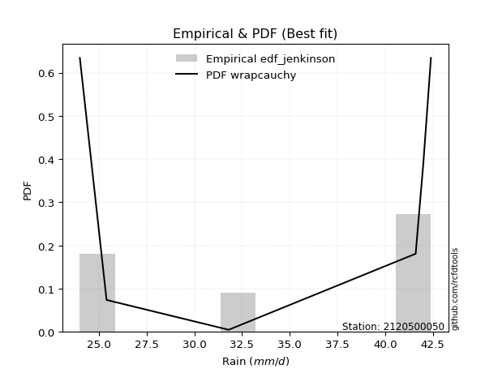</img>

</div>


### 11. EDF Cunnane (1978)

Cunnane´s work in statistical hydrology has focused on the performance and evaluation of different probability distributions (such as GEV, Gumbel, Lognormal) for flood frequency estimation. _b_ is a constant, typically set to 0.4.

<div align="center">


$P=(m-b)/(n+1-2b)$


</div>


**11.1. Empirical values**

<div align="center">

|                | 0                  | 1                   | 2                   | 3                  | 4                  | 5                  |
|:---------------|:-------------------|:--------------------|:--------------------|:-------------------|:-------------------|:-------------------|
| date           | 2019               | 2023                | 2020                | 2021               | 2025               | 2022               |
| x              | 24.0               | 25.4                | 31.8                | 41.6               | 42.0               | 42.4               |
| m              | 1                  | 2                   | 3                   | 4                  | 5                  | 6                  |
| empirical_dist | edf_cunnane        | edf_cunnane         | edf_cunnane         | edf_cunnane        | edf_cunnane        | edf_cunnane        |
| empirical      | 0.0967741935483871 | 0.25806451612903225 | 0.41935483870967744 | 0.5806451612903226 | 0.7419354838709676 | 0.9032258064516128 |
| empirical_tr   | 1.1071428571428572 | 1.3478260869565217  | 1.7222222222222225  | 2.384615384615385  | 3.8749999999999982 | 10.333333333333318 |

</div>


**11.2. Kolmogorov-Smirnov fit test (sorted by Δ)**


<div align="center">

|                | 0                   | 1                   | 2                   | 3                  | 4                   | 5                   | 6                   | 7                   | 8                   | 9                   | 10                  | 11                  | 12                  | 13                  | 14                 | 15                  | 16                  | 17                  | 18                  | 19                 | 20                  | 21                  | 22                  | 23                  | 24                  | 25                  | 26                  | 27                  | 28                  | 29                  | 30                  | 31                  | 32                  | 33                 | 34                  | 35                  | 36                  | 37                  | 38                  | 39                  | 40                  | 41                  | 42                  | 43                  | 44                  | 45                  | 46                  | 47                  | 48                  | 49                 | 50                  | 51                  | 52                  | 53                  | 54                 | 55                 | 56                  | 57                  | 58                  | 59                  | 60                  | 61                  | 62                  | 63                 | 64                  | 65                  | 66                  | 67                 | 68                  | 69                  | 70                  | 71                 | 72                  | 73                  | 74                  | 75                 | 76                  | 77                  | 78                  | 79                  | 80                  | 81                  | 82                  | 83                 | 84                  | 85                 | 86                  | 87                 | 88                 | 89                  | 90                  | 91                  | 92                | 93                 | 94                 | 95                  | 96                  | 97                 | 98                | 99                  | 100                | 101                 | 102                 | 103                 | 104                 | 105                 | 106                | 107                 | 108                 | 109                | 110                 | 111                | 112                | 113                 | 114                | 115                 | 116                 | 117                 | 118                | 119                | 120                | 121                | 122                | 123                | 124                 | 125                | 126                | 127               | 128                 | 129                | 130                 | 131                 | 132                 | 133                | 134                 | 135                | 136                 | 137                 | 138                 | 139                 | 140                 | 141                 | 142               | 143                 | 144                 | 145                 | 146                 | 147                | 148                | 149                | 150                | 151                | 152                | 153                | 154               | 155                | 156                | 157               | 158              | 159            |
|:---------------|:--------------------|:--------------------|:--------------------|:-------------------|:--------------------|:--------------------|:--------------------|:--------------------|:--------------------|:--------------------|:--------------------|:--------------------|:--------------------|:--------------------|:-------------------|:--------------------|:--------------------|:--------------------|:--------------------|:-------------------|:--------------------|:--------------------|:--------------------|:--------------------|:--------------------|:--------------------|:--------------------|:--------------------|:--------------------|:--------------------|:--------------------|:--------------------|:--------------------|:-------------------|:--------------------|:--------------------|:--------------------|:--------------------|:--------------------|:--------------------|:--------------------|:--------------------|:--------------------|:--------------------|:--------------------|:--------------------|:--------------------|:--------------------|:--------------------|:-------------------|:--------------------|:--------------------|:--------------------|:--------------------|:-------------------|:-------------------|:--------------------|:--------------------|:--------------------|:--------------------|:--------------------|:--------------------|:--------------------|:-------------------|:--------------------|:--------------------|:--------------------|:-------------------|:--------------------|:--------------------|:--------------------|:-------------------|:--------------------|:--------------------|:--------------------|:-------------------|:--------------------|:--------------------|:--------------------|:--------------------|:--------------------|:--------------------|:--------------------|:-------------------|:--------------------|:-------------------|:--------------------|:-------------------|:-------------------|:--------------------|:--------------------|:--------------------|:------------------|:-------------------|:-------------------|:--------------------|:--------------------|:-------------------|:------------------|:--------------------|:-------------------|:--------------------|:--------------------|:--------------------|:--------------------|:--------------------|:-------------------|:--------------------|:--------------------|:-------------------|:--------------------|:-------------------|:-------------------|:--------------------|:-------------------|:--------------------|:--------------------|:--------------------|:-------------------|:-------------------|:-------------------|:-------------------|:-------------------|:-------------------|:--------------------|:-------------------|:-------------------|:------------------|:--------------------|:-------------------|:--------------------|:--------------------|:--------------------|:-------------------|:--------------------|:-------------------|:--------------------|:--------------------|:--------------------|:--------------------|:--------------------|:--------------------|:------------------|:--------------------|:--------------------|:--------------------|:--------------------|:-------------------|:-------------------|:-------------------|:-------------------|:-------------------|:-------------------|:-------------------|:------------------|:-------------------|:-------------------|:------------------|:-----------------|:---------------|
| station        | 2120500050          | 2120500050          | 2120500050          | 2120500050         | 2120500050          | 2120500050          | 2120500050          | 2120500050          | 2120500050          | 2120500050          | 2120500050          | 2120500050          | 2120500050          | 2120500050          | 2120500050         | 2120500050          | 2120500050          | 2120500050          | 2120500050          | 2120500050         | 2120500050          | 2120500050          | 2120500050          | 2120500050          | 2120500050          | 2120500050          | 2120500050          | 2120500050          | 2120500050          | 2120500050          | 2120500050          | 2120500050          | 2120500050          | 2120500050         | 2120500050          | 2120500050          | 2120500050          | 2120500050          | 2120500050          | 2120500050          | 2120500050          | 2120500050          | 2120500050          | 2120500050          | 2120500050          | 2120500050          | 2120500050          | 2120500050          | 2120500050          | 2120500050         | 2120500050          | 2120500050          | 2120500050          | 2120500050          | 2120500050         | 2120500050         | 2120500050          | 2120500050          | 2120500050          | 2120500050          | 2120500050          | 2120500050          | 2120500050          | 2120500050         | 2120500050          | 2120500050          | 2120500050          | 2120500050         | 2120500050          | 2120500050          | 2120500050          | 2120500050         | 2120500050          | 2120500050          | 2120500050          | 2120500050         | 2120500050          | 2120500050          | 2120500050          | 2120500050          | 2120500050          | 2120500050          | 2120500050          | 2120500050         | 2120500050          | 2120500050         | 2120500050          | 2120500050         | 2120500050         | 2120500050          | 2120500050          | 2120500050          | 2120500050        | 2120500050         | 2120500050         | 2120500050          | 2120500050          | 2120500050         | 2120500050        | 2120500050          | 2120500050         | 2120500050          | 2120500050          | 2120500050          | 2120500050          | 2120500050          | 2120500050         | 2120500050          | 2120500050          | 2120500050         | 2120500050          | 2120500050         | 2120500050         | 2120500050          | 2120500050         | 2120500050          | 2120500050          | 2120500050          | 2120500050         | 2120500050         | 2120500050         | 2120500050         | 2120500050         | 2120500050         | 2120500050          | 2120500050         | 2120500050         | 2120500050        | 2120500050          | 2120500050         | 2120500050          | 2120500050          | 2120500050          | 2120500050         | 2120500050          | 2120500050         | 2120500050          | 2120500050          | 2120500050          | 2120500050          | 2120500050          | 2120500050          | 2120500050        | 2120500050          | 2120500050          | 2120500050          | 2120500050          | 2120500050         | 2120500050         | 2120500050         | 2120500050         | 2120500050         | 2120500050         | 2120500050         | 2120500050        | 2120500050         | 2120500050         | 2120500050        | 2120500050       | 2120500050     |
| empirical_dist | edf_cunnane         | edf_cunnane         | edf_cunnane         | edf_cunnane        | edf_cunnane         | edf_cunnane         | edf_cunnane         | edf_cunnane         | edf_cunnane         | edf_cunnane         | edf_cunnane         | edf_cunnane         | edf_cunnane         | edf_cunnane         | edf_cunnane        | edf_cunnane         | edf_cunnane         | edf_cunnane         | edf_cunnane         | edf_cunnane        | edf_cunnane         | edf_cunnane         | edf_cunnane         | edf_cunnane         | edf_cunnane         | edf_cunnane         | edf_cunnane         | edf_cunnane         | edf_cunnane         | edf_cunnane         | edf_cunnane         | edf_cunnane         | edf_cunnane         | edf_cunnane        | edf_cunnane         | edf_cunnane         | edf_cunnane         | edf_cunnane         | edf_cunnane         | edf_cunnane         | edf_cunnane         | edf_cunnane         | edf_cunnane         | edf_cunnane         | edf_cunnane         | edf_cunnane         | edf_cunnane         | edf_cunnane         | edf_cunnane         | edf_cunnane        | edf_cunnane         | edf_cunnane         | edf_cunnane         | edf_cunnane         | edf_cunnane        | edf_cunnane        | edf_cunnane         | edf_cunnane         | edf_cunnane         | edf_cunnane         | edf_cunnane         | edf_cunnane         | edf_cunnane         | edf_cunnane        | edf_cunnane         | edf_cunnane         | edf_cunnane         | edf_cunnane        | edf_cunnane         | edf_cunnane         | edf_cunnane         | edf_cunnane        | edf_cunnane         | edf_cunnane         | edf_cunnane         | edf_cunnane        | edf_cunnane         | edf_cunnane         | edf_cunnane         | edf_cunnane         | edf_cunnane         | edf_cunnane         | edf_cunnane         | edf_cunnane        | edf_cunnane         | edf_cunnane        | edf_cunnane         | edf_cunnane        | edf_cunnane        | edf_cunnane         | edf_cunnane         | edf_cunnane         | edf_cunnane       | edf_cunnane        | edf_cunnane        | edf_cunnane         | edf_cunnane         | edf_cunnane        | edf_cunnane       | edf_cunnane         | edf_cunnane        | edf_cunnane         | edf_cunnane         | edf_cunnane         | edf_cunnane         | edf_cunnane         | edf_cunnane        | edf_cunnane         | edf_cunnane         | edf_cunnane        | edf_cunnane         | edf_cunnane        | edf_cunnane        | edf_cunnane         | edf_cunnane        | edf_cunnane         | edf_cunnane         | edf_cunnane         | edf_cunnane        | edf_cunnane        | edf_cunnane        | edf_cunnane        | edf_cunnane        | edf_cunnane        | edf_cunnane         | edf_cunnane        | edf_cunnane        | edf_cunnane       | edf_cunnane         | edf_cunnane        | edf_cunnane         | edf_cunnane         | edf_cunnane         | edf_cunnane        | edf_cunnane         | edf_cunnane        | edf_cunnane         | edf_cunnane         | edf_cunnane         | edf_cunnane         | edf_cunnane         | edf_cunnane         | edf_cunnane       | edf_cunnane         | edf_cunnane         | edf_cunnane         | edf_cunnane         | edf_cunnane        | edf_cunnane        | edf_cunnane        | edf_cunnane        | edf_cunnane        | edf_cunnane        | edf_cunnane        | edf_cunnane       | edf_cunnane        | edf_cunnane        | edf_cunnane       | edf_cunnane      | edf_cunnane    |
| p_dist         | wrapcauchy          | dweibull            | logrdist            | arcsine            | logdweibull         | rdist               | logweibull_max      | logarcsine          | logwrapcauchy       | logksone            | logexponweib        | dgamma              | ksone               | logtrapezoid        | logdgamma          | trapezoid           | genpareto           | loginvweibull       | logsemicircular     | exponpow           | semicircular        | loganglit           | anglit              | lomax               | halfgennorm         | logbeta             | logburr             | burr12              | loglomax            | levy_l              | burr                | invweibull          | nakagami            | loginvgamma        | logpearson3         | logf                | genexpon            | loginvgauss         | logfoldnorm         | logerlang           | loggamma            | loggamma            | invgauss            | lognorm             | logcrystalball      | logt                | logexponnorm        | logbetaprime        | pearson3            | invgamma           | loggenexpon         | logrice             | erlang              | logmaxwell          | ncf                | lograyleigh        | loglevy_l           | weibull_min         | nct                 | f                   | crystalball         | norm                | exponnorm           | t                  | logalpha            | gamma               | maxwell             | rayleigh           | logfatiguelife      | logburr12           | rice                | logweibull_min     | logkstwobign        | loghalfnorm         | foldnorm            | alpha              | betaprime           | halfnorm            | lognct              | gennorm             | kstwobign           | loggompertz         | beta                | gompertz           | logncf              | loggumbel_l        | genextreme          | gumbel_l           | loggenextreme      | loglogistic         | loggumbel_r         | logistic            | gumbel_r          | loghalflogistic    | logcosine          | cosine              | halflogistic        | logmoyal           | moyal             | loghypsecant        | hypsecant          | loglaplace          | loglaplace          | laplace             | weibull_max         | logmielke           | argus              | logwald             | wald                | logargus           | exponweib           | genhalflogistic    | logloggamma        | lognakagami         | loggennorm         | loggenhalflogistic  | skewnorm            | logexponpow         | logloglaplace      | triang             | kappa4             | logtriang          | tukeylambda        | kappa3             | logkappa3           | logskewnorm        | uniform            | vonmises_line     | loggausshyper       | logtukeylambda     | logvonmises_line    | gausshyper          | logkappa4           | gengamma           | loguniform          | bradford           | truncexpon          | logtruncweibull_min | logbradford         | logtruncexpon       | fatiguelife         | truncweibull_min    | logtruncnorm      | loghalfgennorm      | loggengamma         | powerlaw            | logpowerlaw         | johnsonsb          | johnsonsu          | truncpareto        | logtruncpareto     | truncnorm          | logjohnsonsb       | logjohnsonsu       | loggenpareto      | genlogistic        | loggenlogistic     | logvonmises       | vonmises         | mielke         |
| delta          | 0.13428284748675634 | 0.14042983036984696 | 0.14936201417823303 | 0.1524100950221936 | 0.15387639784537388 | 0.15828091452163873 | 0.15841251468929451 | 0.16176230037702366 | 0.17366227163561548 | 0.17722204026850918 | 0.17796425550992112 | 0.17844889599022393 | 0.17933686549342154 | 0.18885986345556027 | 0.1898073356131409 | 0.19189230061662743 | 0.19374547508128004 | 0.19382716086666096 | 0.19393523181513694 | 0.1956281465505848 | 0.19601950207290997 | 0.20607749245158946 | 0.20812548984323243 | 0.20827761530021105 | 0.21163320069494373 | 0.21894862433373244 | 0.22205994955409347 | 0.22268718502567741 | 0.22332191659767087 | 0.22452246656212588 | 0.22453647671933752 | 0.22741221148695412 | 0.22894022944391124 | 0.2289764399168237 | 0.23147806206911803 | 0.23159424622253766 | 0.23159990863618252 | 0.23177279910614013 | 0.23188425990377848 | 0.23235835861792375 | 0.23293624698102477 | 0.23293624698102477 | 0.23345086976519114 | 0.23350073120927795 | 0.23350076824289867 | 0.23350108798197866 | 0.23350200833400936 | 0.23391736934074492 | 0.23392984387086246 | 0.2339858059687686 | 0.23411253426170897 | 0.23413996108073443 | 0.23441074878414758 | 0.23454406256259974 | 0.2345882767211548 | 0.2348541563043105 | 0.23498556135591503 | 0.23509291318973125 | 0.23519767548908443 | 0.23521575055237864 | 0.23545541895651978 | 0.23545542742439352 | 0.23545638268865188 | 0.2354689627590404 | 0.23551962099197243 | 0.23604306126224417 | 0.23623865808326183 | 0.2364771452241876 | 0.23659937218207971 | 0.23680748801045848 | 0.23684330155467148 | 0.2370336078270222 | 0.23714427662522175 | 0.23793587350681822 | 0.23804600046586455 | 0.2384589075231207 | 0.23913929215915541 | 0.23936208355819166 | 0.24000161694462607 | 0.24193548387096775 | 0.24234604512873847 | 0.24262041640144183 | 0.24350905018467173 | 0.2441646838339827 | 0.24451679859923436 | 0.2482609310973799 | 0.24958818118182746 | 0.2510889339110345 | 0.2534871810380052 | 0.25418132903050117 | 0.25583749609937323 | 0.25600546271895885 | 0.257235404929683 | 0.2576645130416988 | 0.2580448477280848 | 0.25819687334660235 | 0.25896183675614703 | 0.2636153700185069 | 0.264861538632135 | 0.26590391909797884 | 0.2675935280890843 | 0.27799312259258857 | 0.27799312259258857 | 0.27945013786182116 | 0.28671095233986543 | 0.28969404332714677 | 0.2920919230591834 | 0.29237516698050214 | 0.29327283064012855 | 0.2987595778306551 | 0.33882017758175415 | 0.3388841568592963 | 0.3402769135601845 | 0.35524664995768196 | 0.3594697041749727 | 0.35983507946189663 | 0.36194614451517026 | 0.36388090758705705 | 0.3648888931471246 | 0.3652894572209827 | 0.3671597113071885 | 0.3672583248947281 | 0.3691429793982953 | 0.3715600164779268 | 0.37284677990466564 | 0.3738838118357074 | 0.3758765778401123 | 0.376640017128796 | 0.37666616099978056 | 0.3791112505546058 | 0.37950823913506726 | 0.38001225376659087 | 0.38167367985609446 | 0.3842124362366481 | 0.38588378266660617 | 0.3884486161679711 | 0.39089201399945905 | 0.39266551318845766 | 0.39539628542522665 | 0.39968451830081597 | 0.40218351044173134 | 0.40369933137527625 | 0.407688606911903 | 0.41935483870967744 | 0.44147450793051174 | 0.45895197885312616 | 0.47501190334326443 | 0.4947414499326882 | 0.5003199829060454 | 0.5123504618518577 | 0.5243616603868408 | 0.5373668680558923 | 0.5606690498833685 | 0.6752543204678935 | 0.698881322290134 | 0.7419354838709676 | 0.7419354838709676 | 1.233006392205155 | 6.56046186985271 | nan            |
| deltao         | 0.530385761606      | 0.530385761606      | 0.530385761606      | 0.530385761606     | 0.530385761606      | 0.530385761606      | 0.530385761606      | 0.530385761606      | 0.530385761606      | 0.530385761606      | 0.530385761606      | 0.530385761606      | 0.530385761606      | 0.530385761606      | 0.530385761606     | 0.530385761606      | 0.530385761606      | 0.530385761606      | 0.530385761606      | 0.530385761606     | 0.530385761606      | 0.530385761606      | 0.530385761606      | 0.530385761606      | 0.530385761606      | 0.530385761606      | 0.530385761606      | 0.530385761606      | 0.530385761606      | 0.530385761606      | 0.530385761606      | 0.530385761606      | 0.530385761606      | 0.530385761606     | 0.530385761606      | 0.530385761606      | 0.530385761606      | 0.530385761606      | 0.530385761606      | 0.530385761606      | 0.530385761606      | 0.530385761606      | 0.530385761606      | 0.530385761606      | 0.530385761606      | 0.530385761606      | 0.530385761606      | 0.530385761606      | 0.530385761606      | 0.530385761606     | 0.530385761606      | 0.530385761606      | 0.530385761606      | 0.530385761606      | 0.530385761606     | 0.530385761606     | 0.530385761606      | 0.530385761606      | 0.530385761606      | 0.530385761606      | 0.530385761606      | 0.530385761606      | 0.530385761606      | 0.530385761606     | 0.530385761606      | 0.530385761606      | 0.530385761606      | 0.530385761606     | 0.530385761606      | 0.530385761606      | 0.530385761606      | 0.530385761606     | 0.530385761606      | 0.530385761606      | 0.530385761606      | 0.530385761606     | 0.530385761606      | 0.530385761606      | 0.530385761606      | 0.530385761606      | 0.530385761606      | 0.530385761606      | 0.530385761606      | 0.530385761606     | 0.530385761606      | 0.530385761606     | 0.530385761606      | 0.530385761606     | 0.530385761606     | 0.530385761606      | 0.530385761606      | 0.530385761606      | 0.530385761606    | 0.530385761606     | 0.530385761606     | 0.530385761606      | 0.530385761606      | 0.530385761606     | 0.530385761606    | 0.530385761606      | 0.530385761606     | 0.530385761606      | 0.530385761606      | 0.530385761606      | 0.530385761606      | 0.530385761606      | 0.530385761606     | 0.530385761606      | 0.530385761606      | 0.530385761606     | 0.530385761606      | 0.530385761606     | 0.530385761606     | 0.530385761606      | 0.530385761606     | 0.530385761606      | 0.530385761606      | 0.530385761606      | 0.530385761606     | 0.530385761606     | 0.530385761606     | 0.530385761606     | 0.530385761606     | 0.530385761606     | 0.530385761606      | 0.530385761606     | 0.530385761606     | 0.530385761606    | 0.530385761606      | 0.530385761606     | 0.530385761606      | 0.530385761606      | 0.530385761606      | 0.530385761606     | 0.530385761606      | 0.530385761606     | 0.530385761606      | 0.530385761606      | 0.530385761606      | 0.530385761606      | 0.530385761606      | 0.530385761606      | 0.530385761606    | 0.530385761606      | 0.530385761606      | 0.530385761606      | 0.530385761606      | 0.530385761606     | 0.530385761606     | 0.530385761606     | 0.530385761606     | 0.530385761606     | 0.530385761606     | 0.530385761606     | 0.530385761606    | 0.530385761606     | 0.530385761606     | 0.530385761606    | 0.530385761606   | 0.530385761606 |
| eval           | Δo > Δ              | Δo > Δ              | Δo > Δ              | Δo > Δ             | Δo > Δ              | Δo > Δ              | Δo > Δ              | Δo > Δ              | Δo > Δ              | Δo > Δ              | Δo > Δ              | Δo > Δ              | Δo > Δ              | Δo > Δ              | Δo > Δ             | Δo > Δ              | Δo > Δ              | Δo > Δ              | Δo > Δ              | Δo > Δ             | Δo > Δ              | Δo > Δ              | Δo > Δ              | Δo > Δ              | Δo > Δ              | Δo > Δ              | Δo > Δ              | Δo > Δ              | Δo > Δ              | Δo > Δ              | Δo > Δ              | Δo > Δ              | Δo > Δ              | Δo > Δ             | Δo > Δ              | Δo > Δ              | Δo > Δ              | Δo > Δ              | Δo > Δ              | Δo > Δ              | Δo > Δ              | Δo > Δ              | Δo > Δ              | Δo > Δ              | Δo > Δ              | Δo > Δ              | Δo > Δ              | Δo > Δ              | Δo > Δ              | Δo > Δ             | Δo > Δ              | Δo > Δ              | Δo > Δ              | Δo > Δ              | Δo > Δ             | Δo > Δ             | Δo > Δ              | Δo > Δ              | Δo > Δ              | Δo > Δ              | Δo > Δ              | Δo > Δ              | Δo > Δ              | Δo > Δ             | Δo > Δ              | Δo > Δ              | Δo > Δ              | Δo > Δ             | Δo > Δ              | Δo > Δ              | Δo > Δ              | Δo > Δ             | Δo > Δ              | Δo > Δ              | Δo > Δ              | Δo > Δ             | Δo > Δ              | Δo > Δ              | Δo > Δ              | Δo > Δ              | Δo > Δ              | Δo > Δ              | Δo > Δ              | Δo > Δ             | Δo > Δ              | Δo > Δ             | Δo > Δ              | Δo > Δ             | Δo > Δ             | Δo > Δ              | Δo > Δ              | Δo > Δ              | Δo > Δ            | Δo > Δ             | Δo > Δ             | Δo > Δ              | Δo > Δ              | Δo > Δ             | Δo > Δ            | Δo > Δ              | Δo > Δ             | Δo > Δ              | Δo > Δ              | Δo > Δ              | Δo > Δ              | Δo > Δ              | Δo > Δ             | Δo > Δ              | Δo > Δ              | Δo > Δ             | Δo > Δ              | Δo > Δ             | Δo > Δ             | Δo > Δ              | Δo > Δ             | Δo > Δ              | Δo > Δ              | Δo > Δ              | Δo > Δ             | Δo > Δ             | Δo > Δ             | Δo > Δ             | Δo > Δ             | Δo > Δ             | Δo > Δ              | Δo > Δ             | Δo > Δ             | Δo > Δ            | Δo > Δ              | Δo > Δ             | Δo > Δ              | Δo > Δ              | Δo > Δ              | Δo > Δ             | Δo > Δ              | Δo > Δ             | Δo > Δ              | Δo > Δ              | Δo > Δ              | Δo > Δ              | Δo > Δ              | Δo > Δ              | Δo > Δ            | Δo > Δ              | Δo > Δ              | Δo > Δ              | Δo > Δ              | Δo > Δ             | Δo > Δ             | Δo > Δ             | Δo > Δ             | Δo <= Δ            | Δo <= Δ            | Δo <= Δ            | Δo <= Δ           | Δo <= Δ            | Δo <= Δ            | Δo <= Δ           | Δo <= Δ          | Δo <= Δ        |
| fit            | 1                   | 1                   | 1                   | 1                  | 1                   | 1                   | 1                   | 1                   | 1                   | 1                   | 1                   | 1                   | 1                   | 1                   | 1                  | 1                   | 1                   | 1                   | 1                   | 1                  | 1                   | 1                   | 1                   | 1                   | 1                   | 1                   | 1                   | 1                   | 1                   | 1                   | 1                   | 1                   | 1                   | 1                  | 1                   | 1                   | 1                   | 1                   | 1                   | 1                   | 1                   | 1                   | 1                   | 1                   | 1                   | 1                   | 1                   | 1                   | 1                   | 1                  | 1                   | 1                   | 1                   | 1                   | 1                  | 1                  | 1                   | 1                   | 1                   | 1                   | 1                   | 1                   | 1                   | 1                  | 1                   | 1                   | 1                   | 1                  | 1                   | 1                   | 1                   | 1                  | 1                   | 1                   | 1                   | 1                  | 1                   | 1                   | 1                   | 1                   | 1                   | 1                   | 1                   | 1                  | 1                   | 1                  | 1                   | 1                  | 1                  | 1                   | 1                   | 1                   | 1                 | 1                  | 1                  | 1                   | 1                   | 1                  | 1                 | 1                   | 1                  | 1                   | 1                   | 1                   | 1                   | 1                   | 1                  | 1                   | 1                   | 1                  | 1                   | 1                  | 1                  | 1                   | 1                  | 1                   | 1                   | 1                   | 1                  | 1                  | 1                  | 1                  | 1                  | 1                  | 1                   | 1                  | 1                  | 1                 | 1                   | 1                  | 1                   | 1                   | 1                   | 1                  | 1                   | 1                  | 1                   | 1                   | 1                   | 1                   | 1                   | 1                   | 1                 | 1                   | 1                   | 1                   | 1                   | 1                  | 1                  | 1                  | 1                  | 0                  | 0                  | 0                  | 0                 | 0                  | 0                  | 0                 | 0                | 0              |
| n              | 6                   | 6                   | 6                   | 6                  | 6                   | 6                   | 6                   | 6                   | 6                   | 6                   | 6                   | 6                   | 6                   | 6                   | 6                  | 6                   | 6                   | 6                   | 6                   | 6                  | 6                   | 6                   | 6                   | 6                   | 6                   | 6                   | 6                   | 6                   | 6                   | 6                   | 6                   | 6                   | 6                   | 6                  | 6                   | 6                   | 6                   | 6                   | 6                   | 6                   | 6                   | 6                   | 6                   | 6                   | 6                   | 6                   | 6                   | 6                   | 6                   | 6                  | 6                   | 6                   | 6                   | 6                   | 6                  | 6                  | 6                   | 6                   | 6                   | 6                   | 6                   | 6                   | 6                   | 6                  | 6                   | 6                   | 6                   | 6                  | 6                   | 6                   | 6                   | 6                  | 6                   | 6                   | 6                   | 6                  | 6                   | 6                   | 6                   | 6                   | 6                   | 6                   | 6                   | 6                  | 6                   | 6                  | 6                   | 6                  | 6                  | 6                   | 6                   | 6                   | 6                 | 6                  | 6                  | 6                   | 6                   | 6                  | 6                 | 6                   | 6                  | 6                   | 6                   | 6                   | 6                   | 6                   | 6                  | 6                   | 6                   | 6                  | 6                   | 6                  | 6                  | 6                   | 6                  | 6                   | 6                   | 6                   | 6                  | 6                  | 6                  | 6                  | 6                  | 6                  | 6                   | 6                  | 6                  | 6                 | 6                   | 6                  | 6                   | 6                   | 6                   | 6                  | 6                   | 6                  | 6                   | 6                   | 6                   | 6                   | 6                   | 6                   | 6                 | 6                   | 6                   | 6                   | 6                   | 6                  | 6                  | 6                  | 6                  | 6                  | 6                  | 6                  | 6                 | 6                  | 6                  | 6                 | 6                | 6              |
| best_fit       | 1                   | 0                   | 0                   | 0                  | 0                   | 0                   | 0                   | 0                   | 0                   | 0                   | 0                   | 0                   | 0                   | 0                   | 0                  | 0                   | 0                   | 0                   | 0                   | 0                  | 0                   | 0                   | 0                   | 0                   | 0                   | 0                   | 0                   | 0                   | 0                   | 0                   | 0                   | 0                   | 0                   | 0                  | 0                   | 0                   | 0                   | 0                   | 0                   | 0                   | 0                   | 0                   | 0                   | 0                   | 0                   | 0                   | 0                   | 0                   | 0                   | 0                  | 0                   | 0                   | 0                   | 0                   | 0                  | 0                  | 0                   | 0                   | 0                   | 0                   | 0                   | 0                   | 0                   | 0                  | 0                   | 0                   | 0                   | 0                  | 0                   | 0                   | 0                   | 0                  | 0                   | 0                   | 0                   | 0                  | 0                   | 0                   | 0                   | 0                   | 0                   | 0                   | 0                   | 0                  | 0                   | 0                  | 0                   | 0                  | 0                  | 0                   | 0                   | 0                   | 0                 | 0                  | 0                  | 0                   | 0                   | 0                  | 0                 | 0                   | 0                  | 0                   | 0                   | 0                   | 0                   | 0                   | 0                  | 0                   | 0                   | 0                  | 0                   | 0                  | 0                  | 0                   | 0                  | 0                   | 0                   | 0                   | 0                  | 0                  | 0                  | 0                  | 0                  | 0                  | 0                   | 0                  | 0                  | 0                 | 0                   | 0                  | 0                   | 0                   | 0                   | 0                  | 0                   | 0                  | 0                   | 0                   | 0                   | 0                   | 0                   | 0                   | 0                 | 0                   | 0                   | 0                   | 0                   | 0                  | 0                  | 0                  | 0                  | 0                  | 0                  | 0                  | 0                 | 0                  | 0                  | 0                 | 0                | 0              |
| best_fit_sort  | 1                   | 2                   | 3                   | 4                  | 5                   | 6                   | 7                   | 8                   | 9                   | 10                  | 11                  | 12                  | 13                  | 14                  | 15                 | 16                  | 17                  | 18                  | 19                  | 20                 | 21                  | 22                  | 23                  | 24                  | 25                  | 26                  | 27                  | 28                  | 29                  | 30                  | 31                  | 32                  | 33                  | 34                 | 35                  | 36                  | 37                  | 38                  | 39                  | 40                  | 41                  | 42                  | 43                  | 44                  | 45                  | 46                  | 47                  | 48                  | 49                  | 50                 | 51                  | 52                  | 53                  | 54                  | 55                 | 56                 | 57                  | 58                  | 59                  | 60                  | 61                  | 62                  | 63                  | 64                 | 65                  | 66                  | 67                  | 68                 | 69                  | 70                  | 71                  | 72                 | 73                  | 74                  | 75                  | 76                 | 77                  | 78                  | 79                  | 80                  | 81                  | 82                  | 83                  | 84                 | 85                  | 86                 | 87                  | 88                 | 89                 | 90                  | 91                  | 92                  | 93                | 94                 | 95                 | 96                  | 97                  | 98                 | 99                | 100                 | 101                | 102                 | 103                 | 104                 | 105                 | 106                 | 107                | 108                 | 109                 | 110                | 111                 | 112                | 113                | 114                 | 115                | 116                 | 117                 | 118                 | 119                | 120                | 121                | 122                | 123                | 124                | 125                 | 126                | 127                | 128               | 129                 | 130                | 131                 | 132                 | 133                 | 134                | 135                 | 136                | 137                 | 138                 | 139                 | 140                 | 141                 | 142                 | 143               | 144                 | 145                 | 146                 | 147                 | 148                | 149                | 150                | 151                | 152                | 153                | 154                | 155               | 156                | 157                | 158               | 159              | 160            |

</div>


**11.3. Best fit**

<div align="center">

|   id |    station | empirical_dist   | p_dist     |    delta |   deltao | eval   |   fit |   n |   best_fit |   best_fit_sort |
|-----:|-----------:|:-----------------|:-----------|---------:|---------:|:-------|------:|----:|-----------:|----------------:|
|    0 | 2120500050 | edf_cunnane      | wrapcauchy | 0.134283 | 0.530386 | Δo > Δ |     1 |   6 |          1 |               1 |

</div>


<div align="center">

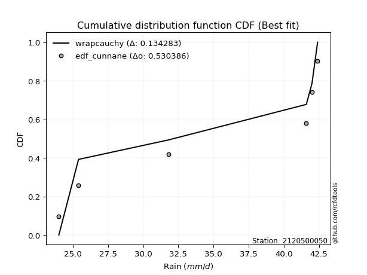</img></img>

</div>


### 12. EDF Adamowski (1981)

The Adamowski formula in hydrology refers to a specific plotting position formula used for estimating the non-parametric empirical distribution of hydrological events (like flood peaks) to calculate their return periods. This formula provides an alternative to traditional parametric methods (like the Gumbel or Log Pearson Type III distributions). 

<div align="center">


$P=(m-0.25)/(n+0.5)$


</div>


**12.1. Empirical values**

<div align="center">

|                | 0                   | 1                  | 2                  | 3                  | 4                  | 5                  |
|:---------------|:--------------------|:-------------------|:-------------------|:-------------------|:-------------------|:-------------------|
| date           | 2019                | 2023               | 2020               | 2021               | 2025               | 2022               |
| x              | 24.0                | 25.4               | 31.8               | 41.6               | 42.0               | 42.4               |
| m              | 1                   | 2                  | 3                  | 4                  | 5                  | 6                  |
| empirical_dist | edf_adamowski       | edf_adamowski      | edf_adamowski      | edf_adamowski      | edf_adamowski      | edf_adamowski      |
| empirical      | 0.11538461538461539 | 0.2692307692307692 | 0.4230769230769231 | 0.5769230769230769 | 0.7307692307692307 | 0.8846153846153846 |
| empirical_tr   | 1.1304347826086958  | 1.3684210526315788 | 1.7333333333333334 | 2.3636363636363633 | 3.7142857142857135 | 8.666666666666664  |

</div>


**12.2. Kolmogorov-Smirnov fit test (sorted by Δ)**


<div align="center">

|                | 0                   | 1                   | 2                   | 3                   | 4                   | 5                   | 6                   | 7                   | 8                   | 9                   | 10                  | 11                  | 12                 | 13                  | 14                  | 15                  | 16                  | 17                 | 18                 | 19                 | 20                  | 21                 | 22                  | 23                 | 24                  | 25                  | 26                  | 27                  | 28                  | 29                  | 30                  | 31                  | 32                  | 33                  | 34                  | 35                  | 36                  | 37                 | 38                  | 39                  | 40                  | 41                 | 42                  | 43                  | 44                 | 45                 | 46                  | 47                 | 48                 | 49                  | 50                 | 51                  | 52                  | 53                  | 54                  | 55                 | 56                  | 57                  | 58                  | 59                | 60                  | 61                 | 62                  | 63                  | 64                  | 65                  | 66                  | 67                  | 68                  | 69                  | 70                  | 71                  | 72                  | 73                  | 74                 | 75                  | 76                 | 77                  | 78                  | 79                 | 80                  | 81                  | 82                  | 83                  | 84                  | 85                  | 86                 | 87                  | 88                  | 89                 | 90                | 91                 | 92                  | 93                  | 94                  | 95                 | 96                 | 97                 | 98                  | 99                 | 100                 | 101                | 102                | 103                | 104                | 105                | 106                 | 107                | 108                | 109                 | 110                | 111                | 112                 | 113                | 114               | 115                | 116                | 117                | 118               | 119                 | 120                 | 121                 | 122                 | 123                 | 124                | 125                 | 126                 | 127                 | 128                | 129                 | 130                 | 131               | 132                | 133                | 134                | 135                 | 136                | 137                 | 138                | 139                | 140                | 141               | 142                 | 143                | 144                | 145                | 146                | 147                 | 148                 | 149                | 150               | 151                | 152                | 153                | 154                | 155                | 156                | 157               | 158               | 159            |
|:---------------|:--------------------|:--------------------|:--------------------|:--------------------|:--------------------|:--------------------|:--------------------|:--------------------|:--------------------|:--------------------|:--------------------|:--------------------|:-------------------|:--------------------|:--------------------|:--------------------|:--------------------|:-------------------|:-------------------|:-------------------|:--------------------|:-------------------|:--------------------|:-------------------|:--------------------|:--------------------|:--------------------|:--------------------|:--------------------|:--------------------|:--------------------|:--------------------|:--------------------|:--------------------|:--------------------|:--------------------|:--------------------|:-------------------|:--------------------|:--------------------|:--------------------|:-------------------|:--------------------|:--------------------|:-------------------|:-------------------|:--------------------|:-------------------|:-------------------|:--------------------|:-------------------|:--------------------|:--------------------|:--------------------|:--------------------|:-------------------|:--------------------|:--------------------|:--------------------|:------------------|:--------------------|:-------------------|:--------------------|:--------------------|:--------------------|:--------------------|:--------------------|:--------------------|:--------------------|:--------------------|:--------------------|:--------------------|:--------------------|:--------------------|:-------------------|:--------------------|:-------------------|:--------------------|:--------------------|:-------------------|:--------------------|:--------------------|:--------------------|:--------------------|:--------------------|:--------------------|:-------------------|:--------------------|:--------------------|:-------------------|:------------------|:-------------------|:--------------------|:--------------------|:--------------------|:-------------------|:-------------------|:-------------------|:--------------------|:-------------------|:--------------------|:-------------------|:-------------------|:-------------------|:-------------------|:-------------------|:--------------------|:-------------------|:-------------------|:--------------------|:-------------------|:-------------------|:--------------------|:-------------------|:------------------|:-------------------|:-------------------|:-------------------|:------------------|:--------------------|:--------------------|:--------------------|:--------------------|:--------------------|:-------------------|:--------------------|:--------------------|:--------------------|:-------------------|:--------------------|:--------------------|:------------------|:-------------------|:-------------------|:-------------------|:--------------------|:-------------------|:--------------------|:-------------------|:-------------------|:-------------------|:------------------|:--------------------|:-------------------|:-------------------|:-------------------|:-------------------|:--------------------|:--------------------|:-------------------|:------------------|:-------------------|:-------------------|:-------------------|:-------------------|:-------------------|:-------------------|:------------------|:------------------|:---------------|
| station        | 2120500050          | 2120500050          | 2120500050          | 2120500050          | 2120500050          | 2120500050          | 2120500050          | 2120500050          | 2120500050          | 2120500050          | 2120500050          | 2120500050          | 2120500050         | 2120500050          | 2120500050          | 2120500050          | 2120500050          | 2120500050         | 2120500050         | 2120500050         | 2120500050          | 2120500050         | 2120500050          | 2120500050         | 2120500050          | 2120500050          | 2120500050          | 2120500050          | 2120500050          | 2120500050          | 2120500050          | 2120500050          | 2120500050          | 2120500050          | 2120500050          | 2120500050          | 2120500050          | 2120500050         | 2120500050          | 2120500050          | 2120500050          | 2120500050         | 2120500050          | 2120500050          | 2120500050         | 2120500050         | 2120500050          | 2120500050         | 2120500050         | 2120500050          | 2120500050         | 2120500050          | 2120500050          | 2120500050          | 2120500050          | 2120500050         | 2120500050          | 2120500050          | 2120500050          | 2120500050        | 2120500050          | 2120500050         | 2120500050          | 2120500050          | 2120500050          | 2120500050          | 2120500050          | 2120500050          | 2120500050          | 2120500050          | 2120500050          | 2120500050          | 2120500050          | 2120500050          | 2120500050         | 2120500050          | 2120500050         | 2120500050          | 2120500050          | 2120500050         | 2120500050          | 2120500050          | 2120500050          | 2120500050          | 2120500050          | 2120500050          | 2120500050         | 2120500050          | 2120500050          | 2120500050         | 2120500050        | 2120500050         | 2120500050          | 2120500050          | 2120500050          | 2120500050         | 2120500050         | 2120500050         | 2120500050          | 2120500050         | 2120500050          | 2120500050         | 2120500050         | 2120500050         | 2120500050         | 2120500050         | 2120500050          | 2120500050         | 2120500050         | 2120500050          | 2120500050         | 2120500050         | 2120500050          | 2120500050         | 2120500050        | 2120500050         | 2120500050         | 2120500050         | 2120500050        | 2120500050          | 2120500050          | 2120500050          | 2120500050          | 2120500050          | 2120500050         | 2120500050          | 2120500050          | 2120500050          | 2120500050         | 2120500050          | 2120500050          | 2120500050        | 2120500050         | 2120500050         | 2120500050         | 2120500050          | 2120500050         | 2120500050          | 2120500050         | 2120500050         | 2120500050         | 2120500050        | 2120500050          | 2120500050         | 2120500050         | 2120500050         | 2120500050         | 2120500050          | 2120500050          | 2120500050         | 2120500050        | 2120500050         | 2120500050         | 2120500050         | 2120500050         | 2120500050         | 2120500050         | 2120500050        | 2120500050        | 2120500050     |
| empirical_dist | edf_adamowski       | edf_adamowski       | edf_adamowski       | edf_adamowski       | edf_adamowski       | edf_adamowski       | edf_adamowski       | edf_adamowski       | edf_adamowski       | edf_adamowski       | edf_adamowski       | edf_adamowski       | edf_adamowski      | edf_adamowski       | edf_adamowski       | edf_adamowski       | edf_adamowski       | edf_adamowski      | edf_adamowski      | edf_adamowski      | edf_adamowski       | edf_adamowski      | edf_adamowski       | edf_adamowski      | edf_adamowski       | edf_adamowski       | edf_adamowski       | edf_adamowski       | edf_adamowski       | edf_adamowski       | edf_adamowski       | edf_adamowski       | edf_adamowski       | edf_adamowski       | edf_adamowski       | edf_adamowski       | edf_adamowski       | edf_adamowski      | edf_adamowski       | edf_adamowski       | edf_adamowski       | edf_adamowski      | edf_adamowski       | edf_adamowski       | edf_adamowski      | edf_adamowski      | edf_adamowski       | edf_adamowski      | edf_adamowski      | edf_adamowski       | edf_adamowski      | edf_adamowski       | edf_adamowski       | edf_adamowski       | edf_adamowski       | edf_adamowski      | edf_adamowski       | edf_adamowski       | edf_adamowski       | edf_adamowski     | edf_adamowski       | edf_adamowski      | edf_adamowski       | edf_adamowski       | edf_adamowski       | edf_adamowski       | edf_adamowski       | edf_adamowski       | edf_adamowski       | edf_adamowski       | edf_adamowski       | edf_adamowski       | edf_adamowski       | edf_adamowski       | edf_adamowski      | edf_adamowski       | edf_adamowski      | edf_adamowski       | edf_adamowski       | edf_adamowski      | edf_adamowski       | edf_adamowski       | edf_adamowski       | edf_adamowski       | edf_adamowski       | edf_adamowski       | edf_adamowski      | edf_adamowski       | edf_adamowski       | edf_adamowski      | edf_adamowski     | edf_adamowski      | edf_adamowski       | edf_adamowski       | edf_adamowski       | edf_adamowski      | edf_adamowski      | edf_adamowski      | edf_adamowski       | edf_adamowski      | edf_adamowski       | edf_adamowski      | edf_adamowski      | edf_adamowski      | edf_adamowski      | edf_adamowski      | edf_adamowski       | edf_adamowski      | edf_adamowski      | edf_adamowski       | edf_adamowski      | edf_adamowski      | edf_adamowski       | edf_adamowski      | edf_adamowski     | edf_adamowski      | edf_adamowski      | edf_adamowski      | edf_adamowski     | edf_adamowski       | edf_adamowski       | edf_adamowski       | edf_adamowski       | edf_adamowski       | edf_adamowski      | edf_adamowski       | edf_adamowski       | edf_adamowski       | edf_adamowski      | edf_adamowski       | edf_adamowski       | edf_adamowski     | edf_adamowski      | edf_adamowski      | edf_adamowski      | edf_adamowski       | edf_adamowski      | edf_adamowski       | edf_adamowski      | edf_adamowski      | edf_adamowski      | edf_adamowski     | edf_adamowski       | edf_adamowski      | edf_adamowski      | edf_adamowski      | edf_adamowski      | edf_adamowski       | edf_adamowski       | edf_adamowski      | edf_adamowski     | edf_adamowski      | edf_adamowski      | edf_adamowski      | edf_adamowski      | edf_adamowski      | edf_adamowski      | edf_adamowski     | edf_adamowski     | edf_adamowski  |
| p_dist         | wrapcauchy          | arcsine             | logarcsine          | dweibull            | logrdist            | rdist               | logweibull_max      | logwrapcauchy       | logdweibull         | logksone            | logexponweib        | ksone               | dgamma             | logdgamma           | logtrapezoid        | trapezoid           | exponpow            | genpareto          | loginvweibull      | logsemicircular    | semicircular        | loganglit          | anglit              | lomax              | halfgennorm         | logbeta             | logburr             | logncf              | burr12              | loglomax            | levy_l              | burr                | gennorm             | invweibull          | nakagami            | loginvgamma         | logpearson3         | logf               | genexpon            | loginvgauss         | logfoldnorm         | logerlang          | loggamma            | loggamma            | invgauss           | lognorm            | logcrystalball      | logt               | logexponnorm       | logbetaprime        | pearson3           | invgamma            | loggenexpon         | logrice             | erlang              | logmaxwell         | ncf                 | lograyleigh         | loglevy_l           | weibull_min       | nct                 | f                  | crystalball         | norm                | exponnorm           | t                   | logalpha            | gamma               | maxwell             | rayleigh            | logfatiguelife      | logburr12           | rice                | logweibull_min      | logkstwobign       | loghalfnorm         | foldnorm           | alpha               | betaprime           | halfnorm           | lognct              | kstwobign           | loggompertz         | beta                | gompertz            | loggumbel_l         | genextreme         | gumbel_l            | loggenextreme       | loglogistic        | loggumbel_r       | logistic           | gumbel_r            | loghalflogistic     | logcosine           | cosine             | halflogistic       | logmoyal           | moyal               | loghypsecant       | hypsecant           | weibull_max        | loglaplace         | loglaplace         | laplace            | logmielke          | argus               | logwald            | wald               | logargus            | exponweib          | loggennorm         | genhalflogistic     | logloggamma        | lognakagami       | logloglaplace      | logexponpow        | loggenhalflogistic | skewnorm          | triang              | kappa4              | logtriang           | tukeylambda         | kappa3              | logkappa3          | logskewnorm         | uniform             | vonmises_line       | loggausshyper      | gengamma            | logtukeylambda      | logvonmises_line  | gausshyper         | logkappa4          | loguniform         | bradford            | truncexpon         | logtruncweibull_min | fatiguelife        | logbradford        | logtruncexpon      | truncweibull_min  | logtruncnorm        | loghalfgennorm     | loggengamma        | powerlaw           | logpowerlaw        | johnsonsb           | johnsonsu           | truncpareto        | truncnorm         | logtruncpareto     | logjohnsonsb       | logjohnsonsu       | loggenpareto       | genlogistic        | loggenlogistic     | logvonmises       | vonmises          | mielke         |
| delta          | 0.12311659438501937 | 0.14282885288374547 | 0.14315187854079547 | 0.15159608347158393 | 0.15308409854547878 | 0.16200299888888448 | 0.16213459905654026 | 0.16249601853387852 | 0.16399657752975325 | 0.18094412463575493 | 0.18168633987716687 | 0.18305894986066729 | 0.1896151490919609 | 0.19233164451904206 | 0.19258194782280602 | 0.19561438498387318 | 0.19689987909639128 | 0.1974675594485258 | 0.1975492452339067 | 0.1976573161823827 | 0.19974158644015572 | 0.2097995768188352 | 0.21184757421047817 | 0.2119996996674568 | 0.21535528506218948 | 0.22267070870097808 | 0.22578203392133922 | 0.22590637676300618 | 0.22640926939292316 | 0.22704400096491661 | 0.22824455092937151 | 0.22825856108658327 | 0.23076923076923078 | 0.23113429585419987 | 0.23266231381115698 | 0.23269852428406945 | 0.23520014643636378 | 0.2353163305897834 | 0.23532199300342826 | 0.23549488347338587 | 0.23560634427102423 | 0.2360804429851695 | 0.23665833134827052 | 0.23665833134827052 | 0.2371729541324369 | 0.2372228155765237 | 0.23722285261014442 | 0.2372231723492244 | 0.2372240927012551 | 0.23763945370799067 | 0.2376519282381082 | 0.23770789033601436 | 0.23783461862895472 | 0.23786204544798017 | 0.23813283315139333 | 0.2382661469298455 | 0.23831036108840054 | 0.23857624067155625 | 0.23870764572316067 | 0.238814997556977 | 0.23891975985633018 | 0.2389378349196244 | 0.23917750332376553 | 0.23917751179163926 | 0.23917846705589763 | 0.23919104712628614 | 0.23924170535921818 | 0.23976514562948992 | 0.23996074245050758 | 0.24019922959143336 | 0.24032145654932546 | 0.24052957237770423 | 0.24056538592191723 | 0.24075569219426796 | 0.2408663609924675 | 0.24165795787406397 | 0.2417680848331103 | 0.24218099189036646 | 0.24286137652640116 | 0.2430841679254374 | 0.24372370131187182 | 0.24606812949598422 | 0.24634250076868758 | 0.24723113455191748 | 0.24788676820122846 | 0.25198301546462565 | 0.2533102655490732 | 0.25481101827828023 | 0.25720926540525085 | 0.2579034133977469 | 0.259559580466619 | 0.2597275470862046 | 0.26095748929692875 | 0.26138659740894454 | 0.26176693209533053 | 0.2619189577138481 | 0.2626839211233928 | 0.2673374543857526 | 0.26858362299938077 | 0.2696260034652246 | 0.27131561245633007 | 0.2755446992381285 | 0.2817152069598343 | 0.2817152069598343 | 0.2831722222290669 | 0.2934161276943925 | 0.29581400742642916 | 0.2960972513477479 | 0.2969949150073743 | 0.30248166219790085 | 0.3350980932145085 | 0.3408592823387445 | 0.34260624122654204 | 0.3439989979274303 | 0.344080396855945 | 0.3462784713108964 | 0.3527146544853201 | 0.3635571638291424 | 0.365668228882416 | 0.36901154158822846 | 0.37088179567443424 | 0.37098040926197384 | 0.37286506376554107 | 0.37528210084517255 | 0.3765688642719114 | 0.37760589620295315 | 0.37959866220735805 | 0.38036210149604177 | 0.3803882453670263 | 0.38049035186940244 | 0.38283333492185156 | 0.383230323502313 | 0.3837343381338366 | 0.3853957642233402 | 0.3896058670338519 | 0.39217070053521685 | 0.3946140983667048 | 0.3963875975557034  | 0.3984614260744857 | 0.3991183697924724 | 0.4034066026680617 | 0.407421415742522 | 0.41141069127914875 | 0.4230769230769231 | 0.4377524235632661 | 0.4552298944858805 | 0.4712898189760188 | 0.48357519683095124 | 0.48915372980430855 | 0.5086283774846121 | 0.518756446219664 | 0.5206395760195952 | 0.5495027967816316 | 0.6640880673661566 | 0.6802709004539057 | 0.7307692307692307 | 0.7307692307692307 | 1.236728476572401 | 6.564183954219956 | nan            |
| deltao         | 0.530385761606      | 0.530385761606      | 0.530385761606      | 0.530385761606      | 0.530385761606      | 0.530385761606      | 0.530385761606      | 0.530385761606      | 0.530385761606      | 0.530385761606      | 0.530385761606      | 0.530385761606      | 0.530385761606     | 0.530385761606      | 0.530385761606      | 0.530385761606      | 0.530385761606      | 0.530385761606     | 0.530385761606     | 0.530385761606     | 0.530385761606      | 0.530385761606     | 0.530385761606      | 0.530385761606     | 0.530385761606      | 0.530385761606      | 0.530385761606      | 0.530385761606      | 0.530385761606      | 0.530385761606      | 0.530385761606      | 0.530385761606      | 0.530385761606      | 0.530385761606      | 0.530385761606      | 0.530385761606      | 0.530385761606      | 0.530385761606     | 0.530385761606      | 0.530385761606      | 0.530385761606      | 0.530385761606     | 0.530385761606      | 0.530385761606      | 0.530385761606     | 0.530385761606     | 0.530385761606      | 0.530385761606     | 0.530385761606     | 0.530385761606      | 0.530385761606     | 0.530385761606      | 0.530385761606      | 0.530385761606      | 0.530385761606      | 0.530385761606     | 0.530385761606      | 0.530385761606      | 0.530385761606      | 0.530385761606    | 0.530385761606      | 0.530385761606     | 0.530385761606      | 0.530385761606      | 0.530385761606      | 0.530385761606      | 0.530385761606      | 0.530385761606      | 0.530385761606      | 0.530385761606      | 0.530385761606      | 0.530385761606      | 0.530385761606      | 0.530385761606      | 0.530385761606     | 0.530385761606      | 0.530385761606     | 0.530385761606      | 0.530385761606      | 0.530385761606     | 0.530385761606      | 0.530385761606      | 0.530385761606      | 0.530385761606      | 0.530385761606      | 0.530385761606      | 0.530385761606     | 0.530385761606      | 0.530385761606      | 0.530385761606     | 0.530385761606    | 0.530385761606     | 0.530385761606      | 0.530385761606      | 0.530385761606      | 0.530385761606     | 0.530385761606     | 0.530385761606     | 0.530385761606      | 0.530385761606     | 0.530385761606      | 0.530385761606     | 0.530385761606     | 0.530385761606     | 0.530385761606     | 0.530385761606     | 0.530385761606      | 0.530385761606     | 0.530385761606     | 0.530385761606      | 0.530385761606     | 0.530385761606     | 0.530385761606      | 0.530385761606     | 0.530385761606    | 0.530385761606     | 0.530385761606     | 0.530385761606     | 0.530385761606    | 0.530385761606      | 0.530385761606      | 0.530385761606      | 0.530385761606      | 0.530385761606      | 0.530385761606     | 0.530385761606      | 0.530385761606      | 0.530385761606      | 0.530385761606     | 0.530385761606      | 0.530385761606      | 0.530385761606    | 0.530385761606     | 0.530385761606     | 0.530385761606     | 0.530385761606      | 0.530385761606     | 0.530385761606      | 0.530385761606     | 0.530385761606     | 0.530385761606     | 0.530385761606    | 0.530385761606      | 0.530385761606     | 0.530385761606     | 0.530385761606     | 0.530385761606     | 0.530385761606      | 0.530385761606      | 0.530385761606     | 0.530385761606    | 0.530385761606     | 0.530385761606     | 0.530385761606     | 0.530385761606     | 0.530385761606     | 0.530385761606     | 0.530385761606    | 0.530385761606    | 0.530385761606 |
| eval           | Δo > Δ              | Δo > Δ              | Δo > Δ              | Δo > Δ              | Δo > Δ              | Δo > Δ              | Δo > Δ              | Δo > Δ              | Δo > Δ              | Δo > Δ              | Δo > Δ              | Δo > Δ              | Δo > Δ             | Δo > Δ              | Δo > Δ              | Δo > Δ              | Δo > Δ              | Δo > Δ             | Δo > Δ             | Δo > Δ             | Δo > Δ              | Δo > Δ             | Δo > Δ              | Δo > Δ             | Δo > Δ              | Δo > Δ              | Δo > Δ              | Δo > Δ              | Δo > Δ              | Δo > Δ              | Δo > Δ              | Δo > Δ              | Δo > Δ              | Δo > Δ              | Δo > Δ              | Δo > Δ              | Δo > Δ              | Δo > Δ             | Δo > Δ              | Δo > Δ              | Δo > Δ              | Δo > Δ             | Δo > Δ              | Δo > Δ              | Δo > Δ             | Δo > Δ             | Δo > Δ              | Δo > Δ             | Δo > Δ             | Δo > Δ              | Δo > Δ             | Δo > Δ              | Δo > Δ              | Δo > Δ              | Δo > Δ              | Δo > Δ             | Δo > Δ              | Δo > Δ              | Δo > Δ              | Δo > Δ            | Δo > Δ              | Δo > Δ             | Δo > Δ              | Δo > Δ              | Δo > Δ              | Δo > Δ              | Δo > Δ              | Δo > Δ              | Δo > Δ              | Δo > Δ              | Δo > Δ              | Δo > Δ              | Δo > Δ              | Δo > Δ              | Δo > Δ             | Δo > Δ              | Δo > Δ             | Δo > Δ              | Δo > Δ              | Δo > Δ             | Δo > Δ              | Δo > Δ              | Δo > Δ              | Δo > Δ              | Δo > Δ              | Δo > Δ              | Δo > Δ             | Δo > Δ              | Δo > Δ              | Δo > Δ             | Δo > Δ            | Δo > Δ             | Δo > Δ              | Δo > Δ              | Δo > Δ              | Δo > Δ             | Δo > Δ             | Δo > Δ             | Δo > Δ              | Δo > Δ             | Δo > Δ              | Δo > Δ             | Δo > Δ             | Δo > Δ             | Δo > Δ             | Δo > Δ             | Δo > Δ              | Δo > Δ             | Δo > Δ             | Δo > Δ              | Δo > Δ             | Δo > Δ             | Δo > Δ              | Δo > Δ             | Δo > Δ            | Δo > Δ             | Δo > Δ             | Δo > Δ             | Δo > Δ            | Δo > Δ              | Δo > Δ              | Δo > Δ              | Δo > Δ              | Δo > Δ              | Δo > Δ             | Δo > Δ              | Δo > Δ              | Δo > Δ              | Δo > Δ             | Δo > Δ              | Δo > Δ              | Δo > Δ            | Δo > Δ             | Δo > Δ             | Δo > Δ             | Δo > Δ              | Δo > Δ             | Δo > Δ              | Δo > Δ             | Δo > Δ             | Δo > Δ             | Δo > Δ            | Δo > Δ              | Δo > Δ             | Δo > Δ             | Δo > Δ             | Δo > Δ             | Δo > Δ              | Δo > Δ              | Δo > Δ             | Δo > Δ            | Δo > Δ             | Δo <= Δ            | Δo <= Δ            | Δo <= Δ            | Δo <= Δ            | Δo <= Δ            | Δo <= Δ           | Δo <= Δ           | Δo <= Δ        |
| fit            | 1                   | 1                   | 1                   | 1                   | 1                   | 1                   | 1                   | 1                   | 1                   | 1                   | 1                   | 1                   | 1                  | 1                   | 1                   | 1                   | 1                   | 1                  | 1                  | 1                  | 1                   | 1                  | 1                   | 1                  | 1                   | 1                   | 1                   | 1                   | 1                   | 1                   | 1                   | 1                   | 1                   | 1                   | 1                   | 1                   | 1                   | 1                  | 1                   | 1                   | 1                   | 1                  | 1                   | 1                   | 1                  | 1                  | 1                   | 1                  | 1                  | 1                   | 1                  | 1                   | 1                   | 1                   | 1                   | 1                  | 1                   | 1                   | 1                   | 1                 | 1                   | 1                  | 1                   | 1                   | 1                   | 1                   | 1                   | 1                   | 1                   | 1                   | 1                   | 1                   | 1                   | 1                   | 1                  | 1                   | 1                  | 1                   | 1                   | 1                  | 1                   | 1                   | 1                   | 1                   | 1                   | 1                   | 1                  | 1                   | 1                   | 1                  | 1                 | 1                  | 1                   | 1                   | 1                   | 1                  | 1                  | 1                  | 1                   | 1                  | 1                   | 1                  | 1                  | 1                  | 1                  | 1                  | 1                   | 1                  | 1                  | 1                   | 1                  | 1                  | 1                   | 1                  | 1                 | 1                  | 1                  | 1                  | 1                 | 1                   | 1                   | 1                   | 1                   | 1                   | 1                  | 1                   | 1                   | 1                   | 1                  | 1                   | 1                   | 1                 | 1                  | 1                  | 1                  | 1                   | 1                  | 1                   | 1                  | 1                  | 1                  | 1                 | 1                   | 1                  | 1                  | 1                  | 1                  | 1                   | 1                   | 1                  | 1                 | 1                  | 0                  | 0                  | 0                  | 0                  | 0                  | 0                 | 0                 | 0              |
| n              | 6                   | 6                   | 6                   | 6                   | 6                   | 6                   | 6                   | 6                   | 6                   | 6                   | 6                   | 6                   | 6                  | 6                   | 6                   | 6                   | 6                   | 6                  | 6                  | 6                  | 6                   | 6                  | 6                   | 6                  | 6                   | 6                   | 6                   | 6                   | 6                   | 6                   | 6                   | 6                   | 6                   | 6                   | 6                   | 6                   | 6                   | 6                  | 6                   | 6                   | 6                   | 6                  | 6                   | 6                   | 6                  | 6                  | 6                   | 6                  | 6                  | 6                   | 6                  | 6                   | 6                   | 6                   | 6                   | 6                  | 6                   | 6                   | 6                   | 6                 | 6                   | 6                  | 6                   | 6                   | 6                   | 6                   | 6                   | 6                   | 6                   | 6                   | 6                   | 6                   | 6                   | 6                   | 6                  | 6                   | 6                  | 6                   | 6                   | 6                  | 6                   | 6                   | 6                   | 6                   | 6                   | 6                   | 6                  | 6                   | 6                   | 6                  | 6                 | 6                  | 6                   | 6                   | 6                   | 6                  | 6                  | 6                  | 6                   | 6                  | 6                   | 6                  | 6                  | 6                  | 6                  | 6                  | 6                   | 6                  | 6                  | 6                   | 6                  | 6                  | 6                   | 6                  | 6                 | 6                  | 6                  | 6                  | 6                 | 6                   | 6                   | 6                   | 6                   | 6                   | 6                  | 6                   | 6                   | 6                   | 6                  | 6                   | 6                   | 6                 | 6                  | 6                  | 6                  | 6                   | 6                  | 6                   | 6                  | 6                  | 6                  | 6                 | 6                   | 6                  | 6                  | 6                  | 6                  | 6                   | 6                   | 6                  | 6                 | 6                  | 6                  | 6                  | 6                  | 6                  | 6                  | 6                 | 6                 | 6              |
| best_fit       | 1                   | 0                   | 0                   | 0                   | 0                   | 0                   | 0                   | 0                   | 0                   | 0                   | 0                   | 0                   | 0                  | 0                   | 0                   | 0                   | 0                   | 0                  | 0                  | 0                  | 0                   | 0                  | 0                   | 0                  | 0                   | 0                   | 0                   | 0                   | 0                   | 0                   | 0                   | 0                   | 0                   | 0                   | 0                   | 0                   | 0                   | 0                  | 0                   | 0                   | 0                   | 0                  | 0                   | 0                   | 0                  | 0                  | 0                   | 0                  | 0                  | 0                   | 0                  | 0                   | 0                   | 0                   | 0                   | 0                  | 0                   | 0                   | 0                   | 0                 | 0                   | 0                  | 0                   | 0                   | 0                   | 0                   | 0                   | 0                   | 0                   | 0                   | 0                   | 0                   | 0                   | 0                   | 0                  | 0                   | 0                  | 0                   | 0                   | 0                  | 0                   | 0                   | 0                   | 0                   | 0                   | 0                   | 0                  | 0                   | 0                   | 0                  | 0                 | 0                  | 0                   | 0                   | 0                   | 0                  | 0                  | 0                  | 0                   | 0                  | 0                   | 0                  | 0                  | 0                  | 0                  | 0                  | 0                   | 0                  | 0                  | 0                   | 0                  | 0                  | 0                   | 0                  | 0                 | 0                  | 0                  | 0                  | 0                 | 0                   | 0                   | 0                   | 0                   | 0                   | 0                  | 0                   | 0                   | 0                   | 0                  | 0                   | 0                   | 0                 | 0                  | 0                  | 0                  | 0                   | 0                  | 0                   | 0                  | 0                  | 0                  | 0                 | 0                   | 0                  | 0                  | 0                  | 0                  | 0                   | 0                   | 0                  | 0                 | 0                  | 0                  | 0                  | 0                  | 0                  | 0                  | 0                 | 0                 | 0              |
| best_fit_sort  | 1                   | 2                   | 3                   | 4                   | 5                   | 6                   | 7                   | 8                   | 9                   | 10                  | 11                  | 12                  | 13                 | 14                  | 15                  | 16                  | 17                  | 18                 | 19                 | 20                 | 21                  | 22                 | 23                  | 24                 | 25                  | 26                  | 27                  | 28                  | 29                  | 30                  | 31                  | 32                  | 33                  | 34                  | 35                  | 36                  | 37                  | 38                 | 39                  | 40                  | 41                  | 42                 | 43                  | 44                  | 45                 | 46                 | 47                  | 48                 | 49                 | 50                  | 51                 | 52                  | 53                  | 54                  | 55                  | 56                 | 57                  | 58                  | 59                  | 60                | 61                  | 62                 | 63                  | 64                  | 65                  | 66                  | 67                  | 68                  | 69                  | 70                  | 71                  | 72                  | 73                  | 74                  | 75                 | 76                  | 77                 | 78                  | 79                  | 80                 | 81                  | 82                  | 83                  | 84                  | 85                  | 86                  | 87                 | 88                  | 89                  | 90                 | 91                | 92                 | 93                  | 94                  | 95                  | 96                 | 97                 | 98                 | 99                  | 100                | 101                 | 102                | 103                | 104                | 105                | 106                | 107                 | 108                | 109                | 110                 | 111                | 112                | 113                 | 114                | 115               | 116                | 117                | 118                | 119               | 120                 | 121                 | 122                 | 123                 | 124                 | 125                | 126                 | 127                 | 128                 | 129                | 130                 | 131                 | 132               | 133                | 134                | 135                | 136                 | 137                | 138                 | 139                | 140                | 141                | 142               | 143                 | 144                | 145                | 146                | 147                | 148                 | 149                 | 150                | 151               | 152                | 153                | 154                | 155                | 156                | 157                | 158               | 159               | 160            |

</div>


**12.3. Best fit**

<div align="center">

|   id |    station | empirical_dist   | p_dist     |    delta |   deltao | eval   |   fit |   n |   best_fit |   best_fit_sort |
|-----:|-----------:|:-----------------|:-----------|---------:|---------:|:-------|------:|----:|-----------:|----------------:|
|    0 | 2120500050 | edf_adamowski    | wrapcauchy | 0.123117 | 0.530386 | Δo > Δ |     1 |   6 |          1 |               1 |

</div>


<div align="center">

</img>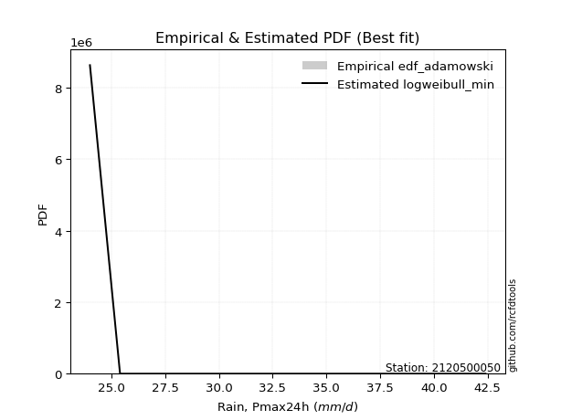</img>

</div>


## C. Best fit & Estimate extreme values for specific return periods - Tr

Best fit in probability distribution analysis means finding the theoretical distribution (like Normal, Poisson, Exponential, etc.) that most accurately mirrors your real-world data´s patterns (shape, center, spread) for better predictions, using methods like visual checks (Q-Q plots), goodness-of-fit tests (Kolmogorov-Smirnov, Chi-Squared), and information criteria (AIC) to score and select the simplest, most representative model.


### 1. Best fit (ordered by delta Δ)

:file_folder:Table: [bestfit_2120500050.csv](table/bestfit_2120500050.csv)

<div align="center">

|   id |    station | empirical_dist   | p_dist     |    delta |   deltao | eval   |   fit |   n |   best_fit |   best_fit_sort |
|-----:|-----------:|:-----------------|:-----------|---------:|---------:|:-------|------:|----:|-----------:|----------------:|
|    0 | 2120500050 | edf_california   | genpareto  | 0.107724 | 0.530386 | Δo > Δ |     1 |   6 |          1 |               1 |
|    1 | 2120500050 | edf_adamowski    | wrapcauchy | 0.123117 | 0.530386 | Δo > Δ |     1 |   6 |          1 |               2 |
|    2 | 2120500050 | edf_chegodayev   | wrapcauchy | 0.126722 | 0.530386 | Δo > Δ |     1 |   6 |          1 |               3 |
|    3 | 2120500050 | edf_jenkinson    | wrapcauchy | 0.127457 | 0.530386 | Δo > Δ |     1 |   6 |          1 |               4 |
|    4 | 2120500050 | edf_beard        | wrapcauchy | 0.127457 | 0.530386 | Δo > Δ |     1 |   6 |          1 |               5 |
|    5 | 2120500050 | edf_filliben     | wrapcauchy | 0.128011 | 0.530386 | Δo > Δ |     1 |   6 |          1 |               6 |
|    6 | 2120500050 | edf_tukey        | wrapcauchy | 0.129189 | 0.530386 | Δo > Δ |     1 |   6 |          1 |               7 |
|    7 | 2120500050 | edf_blom         | wrapcauchy | 0.132347 | 0.530386 | Δo > Δ |     1 |   6 |          1 |               8 |
|    8 | 2120500050 | edf_cunnane      | wrapcauchy | 0.134283 | 0.530386 | Δo > Δ |     1 |   6 |          1 |               9 |
|    9 | 2120500050 | edf_hazen        | dweibull   | 0.134758 | 0.530386 | Δo > Δ |     1 |   6 |          1 |              10 |
|   10 | 2120500050 | edf_gringorten   | dweibull   | 0.137267 | 0.530386 | Δo > Δ |     1 |   6 |          1 |              11 |
|   11 | 2120500050 | edf_weibull      | wrapcauchy | 0.142857 | 0.530386 | Δo > Δ |     1 |   6 |          1 |              12 |

</div>


### 2. Extreme values and % difference analysis

In hydrology, a return period (or recurrence interval $Tr$) is the statistical average time between extreme events like floods or droughts of a specific magnitude, indicating how rare an event is, with a 100-year flood, for example, having a 1% chance of occurring in any given year, not that it happens exactly every century. It is a key tool for infrastructure design (like bridges or dams) and risk assessment, calculated from historical data to determine the probability of future events, although it is important to remember it is statistical average, and events can cluster or be missed.

The extreme value porcentage difference is evaluated as $pdiff = 1 - (ETrBf / ETr) * 100$, where _ETrBf_ correspond to the bestfit extreme value for a specific recurrence interval and _ETr_ correspond to the extreme value for one of the most used PDFsused in hydrology.

> risk_rate: assuming the return period as the project useful life.

:file_folder:Table: [extreme_2120500050.csv](table/extreme_2120500050.csv), all PDFs.  
:file_folder:Table: [extremepdiff_2120500050.csv](table/extremepdiff_2120500050.csv), % difference between bestfit and most used PDFs in Hydrology.

<div align="center">

Extreme values table for only best fit PDFs
|   id |      tr |   prob_l |     prob_g |   alpha |   anglit |   arcsine |   argus |    beta |   betaprime |   bradford |     burr |   burr12 |   cosine |   crystalball |   dgamma |   dweibull |   erlang |   exponnorm |   exponpow |   exponweib |       f |   fatiguelife |   foldnorm |   gamma |   gausshyper |   genexpon |   genextreme |   gengamma |   genhalflogistic |   genlogistic |   gennorm |   genpareto |   gompertz |   gumbel_l |   gumbel_r |   halfgennorm |   halflogistic |   halfnorm |   hypsecant |   invgamma |   invgauss |   invweibull |   johnsonsb |   johnsonsu |   kappa3 |   kappa4 |   ksone |   kstwobign |   laplace |   levy_l |   loggamma |   logistic |   loglaplace |    lomax |   maxwell |   mielke |   moyal |   nakagami |     ncf |     nct |    norm |   pearson3 |   powerlaw |   rayleigh |   rdist |    rice |   semicircular |   skewnorm |       t |   trapezoid |   triang |   truncexpon |   truncnorm |   truncpareto |   truncweibull_min |   tukeylambda |   uniform |   vonmises |   vonmises_line |    wald |   weibull_max |   weibull_min |   wrapcauchy |   logalpha |   loganglit |   logarcsine |   logargus |   logbeta |   logbetaprime |   logbradford |   logburr |   logburr12 |   logcosine |   logcrystalball |   logdgamma |   logdweibull |   logerlang |   logexponnorm |      logexponpow |   logexponweib |    logf |   logfatiguelife |   logfoldnorm |   loggausshyper |   loggenexpon |   loggenextreme |   loggengamma |   loggenhalflogistic |   loggenlogistic |   loggennorm |   loggenpareto |   loggompertz |   loggumbel_l |   loggumbel_r |   loghalfgennorm |   loghalflogistic |   loghalfnorm |   loghypsecant |   loginvgamma |   loginvgauss |   loginvweibull |   logjohnsonsb |   logjohnsonsu |   logkappa3 |   logkappa4 |   logksone |   logkstwobign |   loglevy_l |   logloggamma |   loglogistic |   logloglaplace |   loglomax |   logmaxwell |   logmielke |   logmoyal |   lognakagami |   logncf |   lognct |   lognorm |   logpearson3 |   logpowerlaw |   lograyleigh |   logrdist |   logrice |   logsemicircular |   logskewnorm |    logt |   logtrapezoid |   logtriang |   logtruncexpon |   logtruncnorm |   logtruncpareto |   logtruncweibull_min |   logtukeylambda |   loguniform |   logvonmises |   logvonmises_line |   logwald |   logweibull_max |   logweibull_min |   logwrapcauchy |    station |   n |   risk_rate |
|-----:|--------:|---------:|-----------:|--------:|---------:|----------:|--------:|--------:|------------:|-----------:|---------:|---------:|---------:|--------------:|---------:|-----------:|---------:|------------:|-----------:|------------:|--------:|--------------:|-----------:|--------:|-------------:|-----------:|-------------:|-----------:|------------------:|--------------:|----------:|------------:|-----------:|-----------:|-----------:|--------------:|---------------:|-----------:|------------:|-----------:|-----------:|-------------:|------------:|------------:|---------:|---------:|--------:|------------:|----------:|---------:|-----------:|-----------:|-------------:|---------:|----------:|---------:|--------:|-----------:|--------:|--------:|--------:|-----------:|-----------:|-----------:|--------:|--------:|---------------:|-----------:|--------:|------------:|---------:|-------------:|------------:|--------------:|-------------------:|--------------:|----------:|-----------:|----------------:|--------:|--------------:|--------------:|-------------:|-----------:|------------:|-------------:|-----------:|----------:|---------------:|--------------:|----------:|------------:|------------:|-----------------:|------------:|--------------:|------------:|---------------:|-----------------:|---------------:|--------:|-----------------:|--------------:|----------------:|--------------:|----------------:|--------------:|---------------------:|-----------------:|-------------:|---------------:|--------------:|--------------:|--------------:|-----------------:|------------------:|--------------:|---------------:|--------------:|--------------:|----------------:|---------------:|---------------:|------------:|------------:|-----------:|---------------:|------------:|--------------:|--------------:|----------------:|-----------:|-------------:|------------:|-----------:|--------------:|---------:|---------:|----------:|--------------:|--------------:|--------------:|-----------:|----------:|------------------:|--------------:|--------:|---------------:|------------:|----------------:|---------------:|-----------------:|----------------------:|-----------------:|-------------:|--------------:|-------------------:|----------:|-----------------:|-----------------:|----------------:|-----------:|----:|------------:|
|    0 |    2    | 0.5      | 0.5        | 34.0085 |  34.5333 |   34.5333 | 36.5038 | 37.4358 |     33.5807 |    31.4884 |  32.2161 |  30.1671 |  34.2621 |       34.5333 |  35.4601 |    34.5296 |  34.3767 |     34.5333 |    35.7277 |     24.7622 | 34.507  |       24      |    34.5476 | 34.3682 |      30.8409 |    31.2936 |      38.0185 |    25.15   |           34.8799 |           inf |      33.2 |     35.6979 |    34.1534 |    35.8224 |    33.2443 |       29.3925 |        32.6034 |    32.9271 |     34.5333 |    34.0609 |    33.4504 |      33.1695 |     24.0188 |     42.3982 |  24      |  32.9345 | 34.5333 |     32.8691 |   34.5333 |  41.1234 |    33.3416 |    34.5333 |      33.589  |  31.1515 |   33.8622 |  32.6314 | 32.8281 |    31.008  | 34.0112 | 34.5334 | 34.5333 |    34.8466 |    24.1878 |    33.6242 | 34.5559 | 34.0715 |        34.5333 |    34.9068 | 34.533  |     35.8796 |  33.8508 |      31.3363 |     17.5139 |       24.2298 |            27.4307 |       33.2    |   33.2    |  -1.18121  |         33.1988 | 31.9898 |       42.2141 |       36.0046 |      33.2    |    33.1688 |     33.589  |      33.589  |    35.7312 |   38.3684 |        33.5432 |       30.3014 |   32.1521 |     35.2164 |     33.2229 |          33.589  |     34.9536 |       34.0289 |     33.4024 |        33.5889 |     24.3052      |        30.9077 | 33.6098 |          33.4617 |       33.48   |         31.3817 |       31.6814 |         38.8529 |       24.1681 |              33.3762 |         inf      |      41.6    |         8.1695 |       33.4837 |       34.9367 |       32.2933 |          23.9992 |           31.6674 |       31.9824 |        33.589  |       33.2871 |       32.7795 |         32.7086 |        42.3978 |           42.4 |     31.9531 |     31.3205 |    33.589  |        31.8876 |     41.1097 |       36.1175 |       33.589  |         41.5999 |    30.3266 |      32.9081 |     36.2312 |    31.8857 |       24.313  |  33.3823 |  33.13   |   33.589  |       34.0203 |       24.173  |       32.6699 |    33.5484 |   33.1417 |           33.589  |       33.8462 | 33.589  |        34.9977 |     34.1326 |         29.7671 |        28.444  |          24.1804 |               31.0416 |          31.9113 |      31.8998 |     0.0627724 |            31.9592 |   31.0806 |          37.4795 |          35.1276 |         31.8998 | 2120500050 |   6 |    0.75     |
|    1 |    2.33 | 0.570815 | 0.429185   | 35.4375 |  36.1643 |   36.9817 | 37.5921 | 38.6171 |     35.024  |    32.7957 |  33.757  |  31.7757 |  35.6307 |       35.9336 |  40.1834 |    39.5401 |  35.7943 |     35.9335 |    37.7993 |     25.4448 | 35.9114 |       24.2927 |    35.93   | 35.7769 |      32.1641 |    32.9006 |      39.0693 |    25.7872 |           36.3341 |           inf |      33.2 |     37.9429 |    35.5717 |    37.0406 |    34.5417 |       31.1198 |        33.9374 |    34.4384 |     35.6539 |    35.5022 |    34.9351 |      34.6855 |     24.0584 |     42.3995 |  34.5506 |  34.3483 | 36.4582 |     34.3614 |   35.3807 |  41.5151 |    34.8277 |    35.767  |      34.4689 |  32.8693 |   35.317  |  34.1593 | 34.0563 |    32.8168 | 35.4509 | 35.9349 | 35.9336 |    36.2329 |    24.4511 |    35.1005 | 36.8149 | 35.5015 |        36.2826 |    36.1026 | 35.9332 |     37.4914 |  35.2641 |      32.6083 |     20.9787 |       24.364  |            28.5942 |       34.5638 |   34.503  |  -0.994469 |         34.4799 | 32.9079 |       42.3484 |       37.2536 |      40.2788 |    34.6498 |     35.3031 |      36.1949 |    36.901  |   39.3918 |        35.0119 |       31.5524 |   33.7124 |     36.5407 |     34.6467 |          35.0554 |     39.6227 |       38.7406 |     34.8845 |        35.0553 |     24.7536      |        32.9228 | 35.0837 |          34.9215 |       34.9745 |         32.7763 |       33.2417 |         39.6522 |       24.4025 |              34.9302 |         inf      |      42.9638 |        10.7351 |       34.9421 |       36.26   |       33.5976 |          23.9992 |           32.9834 |       33.4918 |        34.7575 |       34.788  |       34.2938 |         34.4239 |        42.3992 |           42.4 |     33.297  |     32.7236 |    35.6212 |        33.4078 |     41.5014 |       37.2416 |       34.8777 |         43.1487 |    31.9311 |      34.4019 |     37.4466 |    33.1036 |       24.8236 |  37.0194 |  34.5827 |   35.0554 |       35.4836 |       24.4008 |       34.1754 |    36.0183 |   34.6294 |           35.4308 |       35.0854 | 35.0554 |        36.7622 |     35.3818 |         30.9343 |        29.4084 |          24.2856 |               32.2945 |          33.2837 |      33.2117 |     0.0655037 |            33.2825 |   31.9637 |          39.2768 |          36.4694 |         40.1421 | 2120500050 |   6 |    0.729209 |
|    2 |    5    | 0.8      | 0.2        | 40.9881 |  41.9189 |   43.5108 | 40.6687 | 41.4009 |     40.9008 |    37.5377 |  41.333  |  41.3568 |  40.5627 |       41.1372 |  43.2909 |    42.6113 |  41.1492 |     41.1372 |    46.292  |     35.8046 | 41.1412 |       30.51   |    41.0673 | 41.1015 |      37.2072 |    40.9352 |      41.388  |    31.6046 |           40.1061 |           inf |      33.2 |     41.8201 |    40.8792 |    40.9762 |    40.1785 |       42.2469 |        39.9735 |    40.8291 |     40.1489 |    41.1272 |    41.0795 |      41.2715 |     27.611  |     42.4    |  38.7867 |  38.8776 | 42.6877 |     40.7005 |   39.6173 |  42.1641 |    41.0818 |    40.5305 |      39.2263 |  42.3168 |   41.0427 |  41.2277 | 39.7455 |    41.1119 | 41.103  | 41.1442 | 41.1372 |    41.2118 |    28.2059 |    41.0106 | 42.9539 | 41.0484 |        42.2522 |    39.5855 | 41.1368 |     42.1155 |  39.3185 |      37.3034 |     31.899  |       26.0701 |            34.1807 |       38.9154 |   38.72   |  -0.26601  |         38.6699 | 38.0477 |       42.3998 |       41.2885 |      42.0357 |    40.966  |     42.0806 |      44.1753 |    40.3852 |   41.6748 |        41.0697 |       36.5215 |   41.4574 |     41.1756 |     40.303  |          41.0886 |     44.1764 |       43.382  |     41.1078 |        41.0885 |     36.9749      |        44.8083 | 41.1559 |          40.9675 |       41.1379 |         37.8812 |       40.8434 |         41.5125 |       28.2241 |              39.3514 |         inf      |      51.538  |        24.3466 |       40.8043 |       40.8872 |       39.9039 |          23.9992 |           39.6562 |       40.7035 |        39.8679 |       41.2198 |       41.0622 |         42.983  |        42.4    |           42.4 |     38.0462 |     37.7606 |    43.0796 |        40.7159 |     42.1587 |       40.2669 |       40.3349 |         52.0771 |    41.3196 |      40.9703 |     40.7315 |    39.3801 |       35.4813 |  55.0667 |  40.7935 |   41.0886 |       41.2043 |       27.5866 |       40.9302 |    43.7334 |   41.0172 |           42.5108 |       38.9592 | 41.0886 |        42.3339 |     39.2252 |         35.8095 |        33.8871 |          25.6442 |               37.0439 |          38.0752 |      37.8386 |     0.0767626 |            37.9527 |   37.3915 |          41.9945 |          41.1644 |         42.0088 | 2120500050 |   6 |    0.67232  |
|    3 |   10    | 0.9      | 0.1        | 44.8934 |  45.1761 |   45.087  | 41.9606 | 42.0973 |     45.2923 |    39.8774 |  48.7181 | inf      |  43.5424 |       44.5891 |  45.0225 |    43.9219 |  44.7772 |     44.5891 |    52.2044 |     62.9746 | 44.6198 |       39.0945 |    44.4752 | 44.7119 |      39.8417 |    48.2288 |      42.0165 |    41.313  |           41.377  |           inf |      33.2 |     42.3089 |    44.2448 |    43.1673 |    44.7696 |       55.7876 |        44.9862 |    45.5581 |     43.7383 |    45.1073 |    45.7441 |      46.6358 |     48.7952 |     42.4    |  40.6351 |  40.7571 | 45.4059 |     45.5268 |   43.4631 |  42.3208 |    45.9623 |    44.0386 |      44.1111 |  52.2795 |   45.0722 |  47.5393 | 44.6989 |    47.5625 | 45.1208 | 44.6008 | 44.5891 |    44.3663 |    33.166  |    45.2246 | 44.5238 | 44.8631 |        45.3153 |    41.004  | 44.5887 |     43.9217 |  40.9021 |      39.7071 |     36.9104 |       29.4815 |            37.7884 |       40.7353 |   40.56   |   0.292886 |         40.5289 | 43.5023 |       42.4    |       43.5349 |      42.2369 |    45.9926 |     46.4784 |      46.3522 |    41.9315 |   42.1966 |        45.6694 |       39.2441 |   49.1174 |     44.0109 |     44.1587 |          45.6533 |     47.0832 |       45.7407 |     45.9499 |        45.6532 |    116.046       |        58.3251 | 45.7583 |          45.5846 |       45.8148 |         40.2826 |       47.7073 |         42.0507 |       36.1185 |              40.9918 |         inf      |      61.8416 |        33.2336 |       44.9032 |       43.7147 |       45.9054 |          23.9992 |           46.2126 |       47.0222 |        44.4831 |       46.3708 |       46.7972 |         51.5042 |        42.4    |           42.4 |     40.3253 |     40.1325 |    46.8055 |        47.3345 |     42.3189 |       41.3794 |       44.8927 |         62.2644 |    52.213  |      46.3313 |     41.9576 |    45.8064 |       63.1865 |  72.4936 |  45.7547 |   45.6533 |       45.2273 |       32.1636 |       46.5473 |    45.9965 |   46.053  |           46.6763 |       40.657  | 45.6533 |        44.7328 |     40.8375 |         38.72   |        37.123  |          28.539  |               39.5473 |          40.2855 |      40.0544 |     0.0853357 |            40.1907 |   44.163  |          42.3249 |          44.0356 |         42.2245 | 2120500050 |   6 |    0.651322 |
|    4 |   15    | 0.933333 | 0.0666667  | 46.9138 |  46.567  |   45.3876 | 42.4238 | 42.2492 |     47.6466 |    40.6972 |  53.4435 | inf      |  44.8997 |       46.3117 |  45.8917 |    44.5022 |  46.6104 |     46.3117 |    55.1426 |     91.3547 | 46.3585 |       44.7089 |    46.1759 | 46.537  |      40.7911 |    52.4953 |      42.1782 |    49.2283 |           41.7523 |           inf |      33.2 |     42.3692 |    45.8475 |    44.1596 |    47.3599 |       65.1905 |        47.8229 |    48.019  |     45.7867 |    47.1723 |    48.2605 |      49.6622 |     58.7558 |     42.4    |  41.2512 |  41.3508 | 46.3119 |     48.0891 |   45.7128 |  42.3681 |    48.65   |    45.95   |      47.2459 |  58.8018 |   47.1397 |  51.3375 | 47.5736 |    50.9585 | 47.2077 | 46.326  | 46.3117 |    45.8968 |    35.6585 |    47.3959 | 44.8395 | 46.7932 |        46.5098 |    41.4707 | 46.3113 |     44.5013 |  41.4103 |      40.5692 |     38.6711 |       31.9481 |            39.2004 |       41.3188 |   41.1733 |   0.607503 |         41.1518 | 47.0049 |       42.4    |       44.5523 |      42.2933 |    48.7984 |     48.4937 |      46.7794 |    42.4986 |   42.3031 |        48.1581 |       40.2439 |   54.0719 |     45.3595 |     46.0352 |          48.1174 |     48.6421 |       46.8615 |     48.6114 |        48.1174 |    363.53        |        67.5775 | 48.2455 |          48.0922 |       48.3438 |         41.0632 |       51.7738 |         42.194  |       42.9241 |              41.4953 |         inf      |      69.1665 |        36.4755 |       46.9732 |       45.0587 |       49.6814 |          23.9992 |           50.3924 |       50.6894 |        47.3527 |       49.2571 |       50.1285 |         57.0371 |        42.4    |           42.4 |     41.115  |     40.9245 |    48.1177 |        51.2749 |     42.3674 |       41.7291 |       47.5892 |         69.376  |    59.8724 |      49.3487 |     42.3696 |    50.0065 |       90.8919 |  83.452  |  48.5311 |   48.1174 |       47.2964 |       34.6858 |       49.7361 |    46.4728 |   48.8259 |           48.4092 |       41.2315 | 48.1174 |        45.531  |     41.3687 |         39.8461 |        38.5579 |          30.8069 |               40.4556 |          41.0229 |      40.8215 |     0.0899938 |            40.9656 |   49.1448 |          42.371  |          45.4009 |         42.2851 | 2120500050 |   6 |    0.644736 |
|    5 |   20    | 0.95     | 0.05       | 48.2639 |  47.3851 |   45.4935 | 42.6719 | 42.308  |     49.251  |    41.115  |  57.0187 | inf      |  45.7344 |       47.4398 |  46.4689 |    44.8638 |  47.8191 |     47.4398 |    57.0484 |    118.862  | 47.4982 |       48.8657 |    47.2896 | 47.7408 |      41.281  |    55.5224 |      42.2488 |    55.9304 |           41.9297 |           inf |      33.2 |     42.3857 |    46.8666 |    44.7773 |    49.1735 |       72.5206 |        49.8104 |    49.6598 |     47.2318 |    48.5543 |    49.9794 |      51.7813 |     61.7454 |     42.4    |  41.5592 |  41.6372 | 46.7649 |     49.8151 |   47.3089 |  42.3923 |    50.5095 |    47.2711 |      49.6042 |  63.7712 |   48.5118 |  54.1043 | 49.6095 |    53.2298 | 48.6044 | 47.4559 | 47.4398 |    46.8834 |    37.1064 |    48.8391 | 44.9544 | 48.0646 |        47.1724 |    41.7034 | 47.4393 |     44.7872 |  41.6609 |      41.0131 |     39.5747 |       33.6767 |            39.9512 |       41.6036 |   41.48   |   0.823831 |         41.4636 | 49.6151 |       42.4    |       45.1855 |      42.3205 |    50.7555 |     49.7198 |      46.9307 |    42.8051 |   42.3427 |        49.8625 |       40.7628 |   57.8465 |     46.2201 |     47.2286 |          49.8028 |     49.7148 |       47.5843 |     50.4508 |        49.8027 |   1038.75        |        74.8075 | 49.9478 |          49.8134 |       50.0752 |         41.4395 |       54.6947 |         42.2578 |       48.8817 |              41.7374 |         inf      |      75.0349 |        38.0992 |       48.332  |       45.9161 |       52.5086 |          23.9992 |           53.5441 |       53.2919 |        49.4876 |       51.2748 |       52.5063 |         61.2612 |        42.4    |           42.4 |     41.5156 |     41.3154 |    48.7876 |        54.1126 |     42.3923 |       41.9003 |       49.547  |         75.0349 |    65.979  |      51.459  |     42.5927 |    53.212  |      117.285  |  91.6317 |  50.4706 |   49.8028 |       48.672  |       36.228  |       51.9755 |    46.6489 |   50.7417 |           49.3979 |       41.5211 | 49.8028 |        45.93   |     41.6332 |         40.4443 |        39.3755 |          32.493  |               40.9251 |          41.3881 |      41.2105 |     0.0931943 |            41.3587 |   53.2193 |          42.3851 |          46.2721 |         42.3143 | 2120500050 |   6 |    0.641514 |
|    6 |   25    | 0.96     | 0.04       | 49.2717 |  47.9396 |   45.5426 | 42.8297 | 42.3372 |     50.465  |    41.3681 |  59.9327 | inf      |  46.3198 |       48.2702 |  46.899  |    45.122  |  48.7131 |     48.2702 |    58.439  |    145.148  | 48.3376 |       52.1684 |    48.1094 | 48.6312 |      41.5802 |    57.8704 |      42.2874 |    61.7799 |           42.0325 |           inf |      33.2 |     42.3921 |    47.6012 |    45.2168 |    50.5704 |       78.5822 |        51.3417 |    50.8805 |     48.3502 |    49.5869 |    51.2814 |      53.4135 |     62.8401 |     42.4    |  41.7441 |  41.8045 | 47.0368 |     51.1079 |   48.547  |  42.4075 |    51.9314 |    48.2817 |      51.5143 |  67.8337 |   49.5305 |  56.298  | 51.1876 |    54.9219 | 49.6478 | 48.2877 | 48.2702 |    47.6019 |    38.0462 |    49.9113 | 45.0089 | 49.0039 |        47.6022 |    41.8429 | 48.2698 |     44.9575 |  41.8103 |      41.2837 |     40.1252 |       34.9319 |            40.4168 |       41.7715 |   41.664  |   0.983955 |         41.6508 | 51.7058 |       42.4    |       45.6361 |      42.3366 |    52.2608 |     50.5682 |      47.0011 |    43.0011 |   42.3619 |        51.1564 |       41.0804 |   60.9392 |     46.8426 |     48.0839 |          51.081  |     50.5337 |       48.1124 |     51.8563 |        51.081  |   2709.09        |        80.8228 | 51.2395 |          51.1221 |       51.3893 |         41.6581 |       56.9841 |         42.2931 |       54.2292 |              41.879  |         inf      |      80.0118 |        39.0596 |       49.3327 |       46.5362 |       54.7956 |          23.9992 |           56.1062 |       55.3145 |        51.2058 |       52.8291 |       54.365  |         64.727  |        42.4    |           42.4 |     41.7578 |     41.5468 |    49.1939 |        56.3405 |     42.4079 |       42.0019 |       51.099  |         79.8181 |    71.1416 |      53.0838 |     42.74   |    55.8373 |      142.351  |  98.2274 |  51.964  |   51.081  |       49.6946 |       37.2611 |       53.7044 |    46.7334 |   52.2043 |           50.0501 |       41.6955 | 51.081  |        46.1693 |     41.7917 |         40.8154 |        39.905  |          33.7703 |               41.212  |          41.6053 |      41.4457 |     0.0956305 |            41.5963 |   56.7252 |          42.3911 |          46.9022 |         42.3317 | 2120500050 |   6 |    0.639603 |
|    7 |   50    | 0.98     | 0.02       | 52.2254 |  49.3045 |   45.6082 | 43.1811 | 42.3809 |     54.1027 |    41.8802 |  69.8672 | inf      |  47.8526 |       50.6482 |  48.1594 |    45.83   |  51.2926 |     50.6482 |    62.3513 |    260.183  | 50.7439 |       62.765  |    50.4571 | 51.2012 |      42.1918 |    65.164  |      42.3547 |    83.7867 |           42.2282 |           inf |      33.2 |     42.3988 |    49.6312 |    46.4099 |    54.8738 |       99.5041 |        56.0598 |    54.4289 |     51.8176 |    52.6178 |    55.1863 |      58.4416 |     63.8693 |     42.4    |  42.1137 |  42.1242 | 47.5804 |     54.9043 |   52.3929 |  42.4418 |    56.2678 |    51.3695 |      57.9294 |  81.7126 |   52.4848 |  63.4134 | 56.0865 |    59.845  | 52.7084 | 50.6699 | 50.6482 |    49.6227 |    40.0986 |    53.0239 | 45.0844 | 51.7074 |        48.5841 |    42.1215 | 50.6477 |     45.2955 |  42.1067 |      41.8349 |     41.2471 |       38.0849 |            41.3835 |       42.098  |   42.032  |   1.40227  |         42.0254 | 58.5319 |       42.4    |       46.8594 |      42.3684 |    56.8992 |     52.719  |      47.0953 |    43.4406 |   42.3892 |        55.0546 |       41.7302 |   71.587  |     48.5759 |     50.3977 |          54.9258 |     53.0323 |       49.6119 |     56.137  |        54.9258 | 122887           |       102      | 55.1276 |          55.0752 |       55.3461 |         42.0694 |       64.2484 |         42.3556 |       75.6644 |              42.1521 |         inf      |      98.1954 |        40.8995 |       52.1944 |       48.2619 |       62.4857 |          41.9288 |           64.797  |       61.6401 |        56.9213 |       57.6307 |       60.2533 |         76.6849 |        42.4    |           42.4 |     42.2468 |     41.9969 |    50.0169 |        63.4272 |     42.4431 |       42.2028 |       56.1483 |         97.2507 |    89.8992 |      58.0921 |     43.1122 |    64.8414 |      252.451  | 120.247  |  56.5745 |   54.9258 |       52.6664 |       39.6089 |       59.0558 |    46.8516 |   56.6504 |           51.5726 |       42.0464 | 54.9258 |        46.6481 |     42.1079 |         41.5869 |        41.0679 |          37.1889 |               41.7977 |          42.0315 |      41.9201 |     0.103008  |            42.0757 |   69.8618 |          42.3982 |          48.6562 |         42.366  | 2120500050 |   6 |    0.63583  |
|    8 |   75    | 0.986667 | 0.0133333  | 53.8531 |  49.9052 |   45.6203 | 43.3181 | 42.3905 |     56.1578 |    42.0526 |  76.3735 | inf      |  48.5845 |       51.9242 |  48.8553 |    46.1934 |  52.6887 |     51.9242 |    64.4019 |    355.677  | 52.0365 |       69.1468 |    51.7168 | 52.5927 |      42.4003 |    69.4305 |      42.3733 |    99.5044 |           42.2895 |           inf |      33.2 |     42.3996 |    50.6759 |    47.0133 |    57.3751 |      113.212  |        58.8024 |    56.3604 |     53.8439 |    54.2904 |    57.3921 |      61.3641 |     63.9856 |     42.4    |  42.237  |  42.2243 | 47.7616 |     56.993  |   54.6425 |  42.4559 |    58.7673 |    53.1529 |      62.0462 |  90.7987 |   54.0909 |  67.8099 | 58.9512 |    62.5253 | 54.3955 | 51.9482 | 51.9242 |    50.6848 |    40.8369 |    54.7172 | 45.0991 | 53.1652 |        48.9763 |    42.2144 | 51.9237 |     45.4074 |  42.2048 |      42.0217 |     41.6278 |       39.3724 |            41.7167 |       42.203  |   42.1547 |   1.57562  |         42.1502 | 62.7324 |       42.4    |       47.478  |      42.379  |    59.6054 |     53.6944 |      47.1128 |    43.613  |   42.3949 |        57.2699 |       41.9512 |   78.6437 |     49.477  |     51.5416 |          57.1068 |     54.4767 |       50.4116 |     58.6006 |        57.1067 |      2.08886e+06 |       116.324  | 57.3351 |          57.3288 |       57.5933 |         42.1945 |       68.6169 |         42.3734 |       92.3395 |              42.2392 |         inf      |     111.066  |        41.4665 |       53.7246 |       49.1587 |       67.4422 |          42.0883 |           70.455  |       65.3825 |        60.5523 |       60.4402 |       63.7991 |         84.6259 |        42.4    |           42.4 |     42.4129 |     42.1406 |    50.2942 |        67.6995 |     42.4576 |       42.2691 |       59.2888 |        109.604  |   103.088  |      61.0105 |     43.2951 |    70.7654 |      345.614  | 134.299  |  59.2705 |   57.1068 |       54.2856 |       40.4856 |       62.1878 |    46.8751 |   59.2013 |           52.1936 |       42.164  | 57.1068 |        46.8076 |     42.2131 |         41.8533 |        41.4911 |          38.6764 |               41.9966 |          42.1697 |      42.0795 |     0.10723   |            42.2368 |   79.4158 |          42.3993 |          49.568  |         42.3773 | 2120500050 |   6 |    0.634587 |
|    9 |  100    | 0.99     | 0.01       | 54.9715 |  50.2624 |   45.6246 | 43.3941 | 42.3942 |     57.5907 |    42.1391 |  81.338  | inf      |  49.0433 |       52.7872 |  49.3345 |    46.4336 |  53.6378 |     52.7872 |    65.768  |    438.448  | 52.9113 |       73.7387 |    52.5688 | 53.5387 |      42.5056 |    72.4576 |      42.3816 |   111.999  |           42.3192 |           inf |      33.2 |     42.3998 |    51.3653 |    47.4079 |    59.1455 |      123.598  |        60.7436 |    57.6763 |     55.2813 |    55.4406 |    58.9288 |      63.4326 |     64.0181 |     42.4    |  42.2986 |  42.2724 | 47.8522 |     58.4242 |   56.2387 |  42.4641 |    60.5308 |    54.412  |      65.1433 |  97.7215 |   55.185  |  71.0435 | 60.9837 |    64.3507 | 55.5546 | 52.8129 | 52.7872 |    51.3945 |    41.2167 |    55.8709 | 45.1044 | 54.1537 |        49.196  |    42.2608 | 52.7867 |     45.4632 |  42.2537 |      42.1157 |     41.8194 |       40.0691 |            41.8854 |       42.2544 |   42.216  |   1.66811  |         42.2127 | 65.7949 |       42.4    |       47.8826 |      42.3842 |    61.5292 |     54.2828 |      47.1189 |    43.7088 |   42.397  |        58.8196 |       42.0626 |   84.07   |     50.0757 |     52.2718 |          58.6308 |     55.4986 |       50.9514 |     60.3373 |        58.6307 |      2.04702e+07 |       127.451  | 58.8785 |          58.9083 |       59.1647 |         42.2535 |       71.7745 |         42.3815 |      106.457  |              42.2816 |         inf      |     121.375  |        41.7345 |       54.7567 |       49.7543 |       71.1861 |          42.1682 |           74.7557 |       68.0613 |        63.2676 |       62.4409 |       66.3685 |         90.7383 |        42.4    |           42.4 |     42.4987 |     42.2103 |    50.4335 |        70.7917 |     42.466  |       42.3021 |       61.6113 |        119.53   |   113.604  |      63.0819 |     43.4162 |    75.2936 |      428.024  | 144.839  |  61.1897 |   58.6308 |       55.3898 |       40.9433 |       64.4162 |    46.8837 |   60.9955 |           52.5447 |       42.2228 | 58.6308 |        46.8874 |     42.2657 |         41.9882 |        41.7102 |          39.5047 |               42.0967 |          42.2375 |      42.1594 |     0.110197  |            42.3175 |   87.1954 |          42.3996 |          50.1736 |         42.383  | 2120500050 |   6 |    0.633968 |
|   10 |  200    | 0.995    | 0.005      | 57.5623 |  50.9372 |   45.6287 | 43.5251 | 42.3982 |     60.9749 |    42.2693 |  94.6216 | inf      |  49.9762 |       54.7448 |  50.4485 |    46.9631 |  55.8048 |     54.7448 |    68.8015 |    697.824  | 54.8974 |       84.9789 |    54.5015 | 55.6994 |      42.6652 |    79.7512 |      42.3925 |   146.906  |           42.3619 |           inf |      33.2 |     42.4    |    52.8789 |    48.2657 |    63.4015 |      150.876  |        65.4104 |    60.6858 |     58.7441 |    58.1075 |    62.5516 |      68.4054 |     64.0435 |     42.4    |  42.391  |  42.341  | 47.9881 |     61.7204 |   60.0845 |  42.4797 |    64.7627 |    57.4324 |      73.2556 | 116.187  |   57.688  |  79.2528 | 65.8805 |    68.5223 | 58.2381 | 54.7744 | 54.7448 |    52.9782 |    41.8    |    58.5105 | 45.1098 | 56.4027 |        49.5789 |    42.3304 | 54.7442 |     45.5467 |  42.3269 |      42.2574 |     42.1087 |       41.187  |            42.1411 |       42.3295 |   42.308  |   1.81235  |         42.3063 | 73.4234 |       42.4    |       48.762  |      42.3921 |    66.1947 |     55.4123 |      47.1248 |    43.8746 |   42.3991 |        62.4955 |       42.2307 |   98.7591 |     51.4024 |     53.7885 |          62.2401 |     57.9626 |       52.1748 |     64.4998 |        62.2401 |      1.26261e+10 |       157.924  | 62.5363 |          62.6644 |       62.89   |         42.3352 |       79.5939 |         42.3922 |      150.18   |              42.3434 |         inf      |     150.972  |        42.1065 |       57.0868 |       51.074  |       81.0592 |          42.2884 |           86.2003 |       74.6077 |        70.3194 |       67.3043 |       72.7651 |        107.301  |        42.4    |           42.4 |     42.6426 |     42.3109 |    50.6431 |        78.4618 |     42.4821 |       42.3514 |       67.5602 |        148.259  |   143.56   |      68.0892 |     43.6903 |    87.4295 |      696.713  | 172.337  |  65.8533 |   62.2401 |       57.9191 |       41.6556 |       69.82   |    46.8923 |   65.2809 |           53.1624 |       42.3113 | 62.2401 |        47.0071 |     42.3445 |         42.1929 |        42.0488 |          40.869  |               42.2478 |          42.337  |      42.2795 |     0.117284  |            42.4389 |  110.05   |          42.3999 |          51.5155 |         42.3915 | 2120500050 |   6 |    0.633042 |
|   11 |  250    | 0.996    | 0.004      | 58.3694 |  51.1089 |   45.6292 | 43.5556 | 42.3988 |     62.0476 |    42.2954 |  99.3334 | inf      |  50.2319 |       55.343  |  50.7966 |    47.1211 |  56.471  |     55.343  |    69.71   |    801.756  | 55.5049 |       88.6421 |    55.0921 | 56.3637 |      42.6975 |    82.0992 |      42.3944 |   159.644  |           42.3701 |           inf |      33.2 |     42.4    |    53.328  |    48.5181 |    64.7698 |      160.338  |        66.9108 |    61.6117 |     59.8588 |    58.9389 |    63.6972 |      70.004  |     64.0461 |     42.4    |  42.4096 |  42.354  | 48.0153 |     62.7405 |   61.3226 |  42.4838 |    66.1235 |    58.4021 |      76.0764 | 122.715  |   58.4585 |  82.0286 | 67.4569 |    69.8045 | 59.0733 | 55.3739 | 55.343  |    53.4551 |    41.9186 |    59.3231 | 45.1105 | 57.0916 |        49.6688 |    42.3443 | 55.3425 |     45.5634 |  42.3416 |      42.2858 |     42.1668 |       41.4217 |            42.1926 |       42.3442 |   42.3264 |   1.84176  |         42.3251 | 75.9471 |       42.4    |       49.0208 |      42.3937 |    67.7097 |     55.7035 |      47.1256 |    43.9133 |   42.3994 |        63.6649 |       42.2645 |  104.026  |     51.7995 |     54.2119 |          63.3868 |     58.7587 |       52.5486 |     65.8367 |        63.3868 |      1.31608e+11 |       168.944  | 63.6992 |          63.8622 |       64.0746 |         42.3502 |       82.1779 |         42.3941 |      167.778  |              42.3553 |         inf      |     162.157  |        42.1746 |       57.7955 |       51.4689 |       84.5156 |          42.3125 |           90.2396 |       76.7456 |        72.7527 |       68.8867 |       74.8919 |        113.244  |        42.4    |           42.4 |     42.6776 |     42.3302 |    50.6851 |        80.9998 |     42.4862 |       42.3613 |       69.5893 |        159.223  |   154.794  |      69.7092 |     43.7753 |    91.7383 |      808.755  | 181.864  |  67.3703 |   63.3868 |       58.6983 |       41.8018 |       71.573  |    46.8935 |   66.6525 |           53.3083 |       42.3291 | 63.3868 |        47.0311 |     42.3603 |         42.2342 |        42.118  |          41.1611 |               42.2782 |          42.3564 |      42.3036 |     0.119555  |            42.4632 |  118.86   |          42.4    |          51.9172 |         42.3932 | 2120500050 |   6 |    0.632858 |
|   12 |  500    | 0.998    | 0.002      | 60.8064 |  51.5348 |   45.6299 | 43.6254 | 42.3996 |     65.3395 |    42.3477 | 115.494  | inf      |  50.9124 |       57.1171 |  51.8512 |    47.5799 |  58.4576 |     57.117  |    72.3525 |   1198.58   | 57.3075 |      100.133  |    56.8435 | 58.3453 |      42.7624 |    89.3929 |      42.3977 |   204.102  |           42.3859 |           inf |      33.2 |     42.4    |    54.624  |    49.2416 |    69.0165 |      191.854  |        71.5675 |    64.3721 |     63.3213 |    61.4508 |    67.2029 |      74.966  |     64.0492 |     42.4    |  42.4477 |  42.3787 | 48.0697 |     65.7975 |   65.1685 |  42.4942 |    70.3568 |    61.4094 |      85.5502 | 145.017  |   60.7577 |  91.0929 | 72.3536 |    73.6242 | 61.5925 | 57.1518 | 57.1171 |    54.8496 |    42.158  |    61.7475 | 45.1114 | 59.1387 |        49.8756 |    42.3722 | 57.1165 |     45.5968 |  42.3708 |      42.3428 |     42.2832 |       41.9028 |            42.296  |       42.3729 |   42.3632 |   1.90095  |         42.3625 | 83.9717 |       42.4    |       49.7626 |      42.3968 |    72.4686 |     56.4321 |      47.1265 |    44.0019 |   42.3998 |        67.266  |       42.3322 |  122.302  |     52.9553 |     55.355  |          66.9132 |     61.2477 |       53.6582 |     69.9915 |        66.9131 |      4.43051e+14 |       207.423  | 67.2774 |          67.5591 |       67.7203 |         42.378  |       90.4231 |         42.3975 |      236.515  |              42.3786 |          42.3807 |     203.181  |        42.3009 |       59.8869 |       52.6179 |       96.2103 |          42.3607 |          104.023  |       83.4904 |        80.8611 |       73.8674 |       81.7285 |        133.866  |        42.4    |           42.4 |     42.7683 |     42.3672 |    50.7693 |        89.1082 |     42.497  |       42.3809 |       76.2781 |        200.011  |   195.615  |      74.776  |     44.0337 |   106.525  |     1258.36   | 213.735  |  72.1441 |   66.9132 |       61.0245 |       42.0983 |       77.0692 |    46.895  |   70.8998 |           53.6459 |       42.3645 | 66.9132 |        47.0789 |     42.3918 |         42.3171 |        42.2581 |          41.766  |               42.339  |          42.3945 |      42.3518 |     0.126598  |            42.5119 |  151.839  |          42.4    |          53.086  |         42.3966 | 2120500050 |   6 |    0.632489 |
|   13 |  750    | 0.998667 | 0.00133333 | 62.1891 |  51.7233 |   45.63   | 43.6534 | 42.3998 |     67.2425 |    42.3651 | 126.125  | inf      |  51.2422 |       58.1026 |  52.4517 |    47.829  |  59.5682 |     58.1026 |    73.787  |   1488.99   | 58.3098 |      106.923  |    57.8165 | 59.4534 |      42.7843 |    93.6593 |      42.3986 |   233.664  |           42.3909 |           inf |      33.2 |     42.4    |    55.3215 |    49.6283 |    71.4992 |      211.786  |        74.2898 |    65.9143 |     65.3467 |    62.8768 |    69.2213 |      77.8667 |     64.0497 |     42.4    |  42.4618 |  42.3864 | 48.0878 |     67.5149 |   67.4181 |  42.4992 |    72.843  |    63.1663 |      91.6299 | 159.617  |   62.0436 |  96.7222 | 75.218  |    75.7557 | 63.0195 | 58.1396 | 58.1026 |    55.6117 |    42.2383 |    63.1032 | 45.1116 | 60.2784 |        49.9589 |    42.3815 | 58.102  |     45.6079 |  42.3805 |      42.3619 |     42.3221 |       42.0667 |            42.3306 |       42.3822 |   42.3755 |   1.92074  |         42.375  | 88.7831 |       42.4    |       50.159  |      42.3979 |    75.2959 |     56.7577 |      47.1267 |    44.0375 |   42.3999 |        69.3556 |       42.3548 |  134.495  |     53.5838 |     55.9176 |          68.9561 |     62.7185 |       54.2756 |     72.4285 |        68.9561 |      9.1296e+16  |       233.231  | 69.352  |          69.7101 |       69.8344 |         42.3864 |       95.4055 |         42.3985 |      288.859  |              42.3861 |          42.3873 |     232.376  |        42.3387 |       61.0417 |       53.2425 |      103.783  |          42.3768 |          113.036  |       87.5133 |        86.0169 |       76.8333 |       85.9007 |        147.619  |        42.4    |           42.4 |     42.8139 |     42.379  |    50.7974 |        94.0143 |     42.5021 |       42.3875 |       80.4796 |        229.621  |   224.317  |      77.7688 |     44.1826 |   116.255  |     1608.06   | 234.086  |  74.9862 |   68.9562 |       62.3257 |       42.1983 |       80.3246 |    46.8953 |   73.3799 |           53.7824 |       42.3763 | 68.9562 |        47.0949 |     42.4023 |         42.3448 |        42.3052 |          41.974  |               42.3593 |          42.4069 |      42.3678 |     0.130723  |            42.5281 |  175.851  |          42.4    |          53.7214 |         42.3977 | 2120500050 |   6 |    0.632366 |
|   14 | 1000    | 0.999    | 0.001      | 63.1534 |  51.8357 |   45.63   | 43.669  | 42.3999 |     68.5847 |    42.3739 | 134.251  | inf      |  51.4503 |       58.7811 |  52.8714 |    47.9983 |  60.3358 |     58.7811 |    74.7608 |   1724.23   | 59.0002 |      111.766  |    58.4863 | 60.2194 |      42.7953 |    96.6865 |      42.3991 |   256.288  |           42.3933 |           inf |      33.2 |     42.4    |    55.7928 |    49.8886 |    73.2602 |      226.601  |        76.2208 |    66.9793 |     66.7838 |    63.8716 |    70.6409 |      79.9243 |     64.0499 |     42.4    |  42.4698 |  42.3902 | 48.0968 |     68.7047 |   69.0143 |  42.5023 |    74.6135 |    64.4123 |      96.2038 | 170.742  |   62.9324 | 100.871  | 77.2503 |    77.2267 | 64.0135 | 58.8197 | 58.7811 |    56.1313 |    42.2786 |    64.04   | 45.1116 | 61.064  |        50.0056 |    42.3861 | 58.7805 |     45.6134 |  42.3854 |      42.3714 |     42.3416 |       42.1494 |            42.3479 |       42.3868 |   42.3816 |   1.93065  |         42.3813 | 92.244  |       42.4    |       50.4258 |      42.3984 |    77.324  |     56.9527 |      47.1267 |    44.0574 |   42.4    |        70.8327 |       42.3661 |  143.9    |     54.011  |     56.2754 |          70.3989 |     63.7701 |       54.7013 |     74.1626 |        70.3989 |      5.1497e+18  |       253.181  | 70.8178 |          71.2331 |       71.3281 |         42.3903 |       99.0144 |         42.399  |      332.707  |              42.3897 |          42.3906 |     255.852  |        42.3565 |       61.8337 |       53.6671 |      109.513  |          42.3848 |          119.898  |       90.4042 |        89.8731 |       78.9637 |       88.9435 |        158.224  |        42.4    |           42.4 |     42.8444 |     42.3846 |    50.8114 |        97.5707 |     42.5054 |       42.3907 |       83.5986 |        253.794  |   247.202  |      79.9071 |     44.2877 |   123.694  |     1903.38   | 249.345  |  77.0276 |   70.3989 |       63.2249 |       42.2485 |       82.6543 |    46.8954 |   75.1395 |           53.8592 |       42.3823 | 70.3989 |        47.1029 |     42.4075 |         42.3587 |        42.3289 |          42.0792 |               42.3695 |          42.413  |      42.3759 |     0.133657  |            42.5363 |  195.439  |          42.4    |          54.1533 |         42.3983 | 2120500050 |   6 |    0.632305 |


</div>


<div align="center">

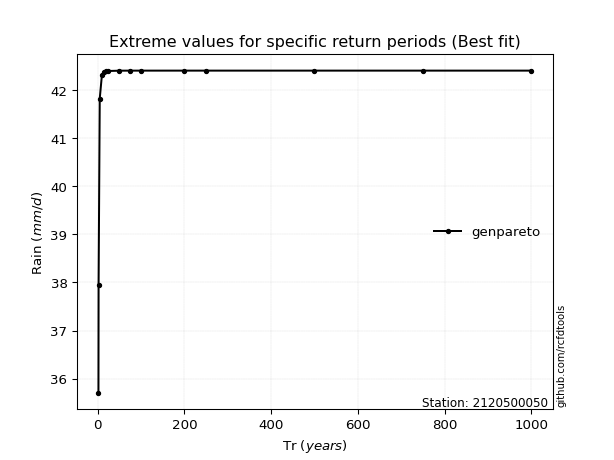</img>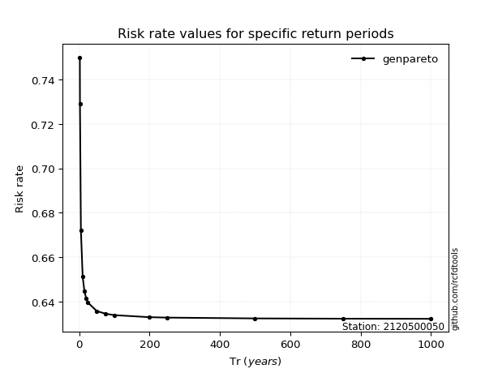</img>

</div>


<sub>**APP DISCLAIMER**: NO WARRANTY - This software is provided by [github.com/rcfdtools](https://github.com/rcfdtools) "as is", without any express or implied warranty, including warranties of merchantability, fitness for a particular purpose, or non-infringement. There is no guarantee that the software will be error-free or operate without interruption. LIMITATION OF LIABILITY - Neither the authors nor copyright holders will be liable for claims or damages arising from the software or its use. You are responsible for determining if the software is appropriate for your use and assume all associated risks, including errors, legal compliance, and data loss. NO PROFESSIONAL ADVICE - The software provides general information and does not offer professional advice. It should not replace consultation with professional advisors.</sub>