<div align="center">


</div>

# PMax24h Station (Rain): 2120500135

Maximum Precipitation in 24 hours (PMax24h) is the greatest amount of rainfall for a specific duration that is meteorologically possible for a given location, acting as a "worst-case" scenario for extreme storms, crucial for designing safety-critical infrastructure like bridges, river deviations, dams, spillways, and nuclear plants to prevent catastrophic failure. The PMax24h is related with the Probable Maximum Precipitation (PMP) and it is calculated by hydrologists using meteorological data to determine the upper limit of extreme rainfall, often leading to the Probable Maximum Flood (PMF) for flood control design, and is increasingly being studied for climate change impacts. Probable Maximum Precipitation (PMP) is the theoretical upper limit of rainfall, a deterministic estimate for extreme events, while probability distributions (like GEV, Gumbel) describe the likelihood and frequency of various precipitation amounts, including rare ones, showing how often events occur, with PMP representing the extreme end of these distributions, used for critical infrastructure design to ensure safety against the worst conceivable weather, unlike standard statistical forecasts which cover typical probabilities.

The most common probability distributions in hydrology, used for analyzing floods, rainfall, and streamflow, include the Normal, Log-Normal, Gumbel, Gamma (including Log-Pearson Type III), and Generalized Extreme Value (GEV) distributions, often chosen based on the data´s skewness and whether modeling extremes or general conditions, with Gumbel and GEV popular for extreme events like floods, while the Normal distribution serves as a baseline, though often requiring transformations for skewed hydrological data. These distributions help in designing water infrastructure, managing water resources, and forecasting hydrologic events.

> Hydrological data often isn´t perfectly normal (it´s skewed), so different distributions are needed for different applications, such as: **Flood Frequency Analysis**: Using Gumbel, GEV, or Log-Pearson Type III for predicting extreme flood magnitudes and their return periods, **Rainfall Analysis**: Normal for annual totals, but Log-Normal, Weibull, or GEV for intensity or extreme daily rainfall, **Streamflow Modeling**: Gamma and Log-Normal for maximum flows, GEV for minimum flows, and Kappa for daily flows.

<div align="center">

</img>

</div>


## A. General information


### 1. General running parameters

• app_version: _v20260312_. • runtime: _2026-03-12 07:15:23.203550_. • Python version: _3.14.0_. • SciPy version: _1.16.3_. • Pandas version: _2.3.3_. • NumPy version: _2.3.5_. • Stations dataset (station_dataset_file): _dataset/pmax24h_in/automatic_colombia_2003_2025.csv_. • Stations catalog (station_catalog_file): _dataset/CNE.xls_. • Minimum year to eval til year_max (date_min): _1900_. • Maximum year to eval since year_min (date_max): _2025_. • Creates, save and include plots into reports (create_plot): _True_. • Plot only fit distributions with Δo > Δ (plot_only_fit): _True_. • Plot only simple graphs avoiding multiple CDFs and multiple Extreme values plots (plot_only_simple): _True_. • Eval low extreme values, if False, evaluates high extreme values (low_extreme): _False_. • Eval every SciPy distribution as logarithmic (pdist_logarithmic_on): _True_. • Standard deviation normalized (ddof): _1.0_. • Return periods to eval in years (Tr): _[2, 2.33, 5, 10, 15, 20, 25, 50, 75, 100, 200, 250, 500, 750, 1000]_. • Minimum data sample per station, 0 means any (minimum_sample): _5_. • Z-Score maximum threshold to adjust a value, 0 means disable (zscore_max): _3.5_. • Z-Score minimum threshold to adjust a value, 0 means disable (zscore_min): _-2.5_. • Avoid zeros, e.g. rain = 0 (avoid_zeros): _True_. • Avoid null values (avoid_nans): _True_. 

:file_folder:Table: [dataset.csv](../../dataset/pmax24h_in/automatic_colombia_2003_2025.csv)

> Delta Degrees of Freedom (DDOF): is a parameter used in the formulas for calculating variance and standard deviation. When ddof=0, the divisor is $N$ (the total number of observations) and this is used when your data set is the entire population. When ddof=1, the divisor is $N-1$ and this is used when your data set is a sample drawn from a larger population. Using $N-1$ provides an unbiased estimate of the population variance (known as Bessel´s correction).


### 2. Station info and location

|   id |     CODIGO | NOMBRE                                | CATEGORIA               | TECNOLOGIA                | ESTADO   | FECHA_INSTALACION   |   FECHA_SUSPENSION |   ALTITUD |   LATITUD |   LONGITUD | DEPARTAMENTO   | MUNICIPIO   | AREA_OPERATIVA                            | ENTIDAD                                                     | AREA_HIDROGRAFICA   | ZONA_HIDROGRAFICA   | SUBZONA_HIDROGRAFICA   |   CORRIENTE | Catalogo   |   Version |
|-----:|-----------:|:--------------------------------------|:------------------------|:--------------------------|:---------|:--------------------|-------------------:|----------:|----------:|-----------:|:---------------|:------------|:------------------------------------------|:------------------------------------------------------------|:--------------------|:--------------------|:-----------------------|------------:|:-----------|----------:|
|    0 | 2120500135 | UNIVERSIDAD DE LA SABANA [2120500135] | Climatológica Principal | Automática con Telemetría | Activa   | 17/10/2018          |                nan |      2548 |   4.85414 |   -74.0327 | Cundinamarca   | Chía        | Area Operativa 11 - Cundinamarca-Amazonas | INSTITUTO DE HIDROLOGIA METEOROLOGIA Y ESTUDIOS AMBIENTALES | Magdalena Cauca     | Alto Magdalena      | Río Bogotá             |         nan | CNE_IDEAM  |  20251226 |

<div align="center">

Dynamic map: [:earth_americas:Google](http://maps.google.com/maps?q=4.85414,-74.03269) [:earth_americas:OSM](https://www.openstreetmap.org/#map=18/4.85414/-74.03269&layers=P) [:earth_americas:Bing](https://www.bing.com/maps?cp=4.85414~-74.03269&lvl=18) [:earth_americas:Apple](https://maps.apple.com/frame?center=4.85414%2C-74.03269&span=0.003%2C0.006)

</div>


<div align="center">

```geojson
{
  "type": "Feature",
  "geometry": {
    "type": "Point", 
    "coordinates": [-74.03269, 4.85414]
  }, 
  "properties": {
    "Name": "2120500135"
  }
}
```

</div>


### 3. Discrete values table and plot

<div align="center">

|               |           0 |           1 |           2 |           3 |          4 |          5 |           6 |
|:--------------|------------:|------------:|------------:|------------:|-----------:|-----------:|------------:|
| Date          | 2019        | 2020        | 2021        | 2022        | 2023       | 2024       | 2025        |
| Value         |   25        |   42        |   24.4      |   36.4      |   14.8     |   48       |   38.2      |
| Value_initial |   25        |   42        |   24.4      |   36.4      |   14.8     |   48       |   38.2      |
| count         |    7        |    7        |    7        |    7        |    7       |    7       |    7        |
| mean          |   32.6857   |   32.6857   |   32.6857   |   32.6857   |   32.6857  |   32.6857  |   32.6857   |
| std           |   11.6412   |   11.6412   |   11.6412   |   11.6412   |   11.6412  |   11.6412  |   11.6412   |
| zscore        |   -0.660215 |    0.800112 |   -0.711756 |    0.319063 |   -1.53641 |    1.31552 |    0.473686 |


</div>


<div align="center">

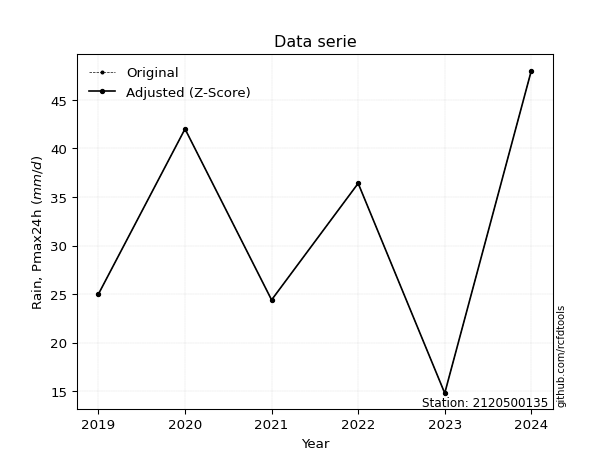</img>

</div>


> The initial value (value_initial) correspond to the initial obtained or null completed value, and value (value) is adjusted only when the initial value is outside the valid range (outlier) definite through the Z-Score value. If Z-Score is active, values out of range or outliers are replaced with the station mean value. A Z-Score (or standard score) measures how many standard deviations a data point is from the mean of a dataset, indicating its relative position; positive scores mean above the mean, negative mean below, and a score of zero is exactly at the mean, allowing for comparison of values from different distributions. It´s calculated using the formula $z=(x–μ)/σ$, where $x$ is the data point, $μ$ is the mean, and $σ$ is the standard deviation, helping identify outliers and understand probability.
>
> <sub>**Note**: In this study, "completing" (filling gaps in) and "extending" (forecasting or lengthening the historical record) rainfall data series are avoided for certain critical analyses because they introduce artificial bias and uncertainty, which can distort the statistics of rare events (extremes), alter day-to-day variability, and compromise the integrity and homogeneity of the original data. Some reasons against Completing/Extending rainfall data are: **Distortion of Extremes and Variability**: The primary issue is that most gap-filling or extension methods rely on averaging or regression with nearby stations, which inherently smooths the data. Rainfall is highly variable in space and time, with a large percentage of zero values and occasional large storms. Infilling methods often underestimate the highest values and overestimate the lowest (zero) values, which severely distorts analyses focused on flood frequency, drought severity, and intensity-duration-frequency (IDF) curves, **Loss of Data Homogeneity**: Infilled or extended data are synthetic estimates, not actual measurements. Combining these estimates with observed data can violate the assumption of data homogeneity, which requires that the data properties do not change over time. Inhomogeneity can lead to incorrect conclusions about long-term trends or changes in climate patterns, **Propagation of Errors**: Errors and biases from the original data (e.g., wind-induced undercatch, instrument errors, site changes) or the data used for imputation can propagate through the analysis, leading to unreliable hydrological models and inaccurate predictions, **Compromised Statistical Integrity**: For statistical analyses, especially those involving the frequency of events, using artificial data can introduce time bias or autocorrelation that doesn´t exist in reality, making it difficult to assess the true probability of events, **Difficulty in Validation**: It is difficult to accurately validate the quality of filled or extended data, especially for past periods where ground-truth measurements are unavailable. The reliability of imputation techniques heavily depends on the density of the surrounding station network and the complexity of the local topography.</sub>


### 4. Active continuous probability distributions from SciPy (80 of 104 available)

A Probability Density Function (PDF) describes the relative likelihood of a continuous random variable falling within a specific range, where the total area under its curve equals 1, and the area over any interval gives the actual probability for that range. Unlike discrete probabilities (like rolling a die), a PDF shows density, not direct probability for a single point (which is zero), with higher points indicating higher likelihood, often visualized as a bell curve for normal distributions.

A log of a probability density function (log-PDF) is simply the logarithm of the PDF´s value, denoted as $log(f(x))$, useful for converting multiplication of probabilities into addition, improving numerical stability with tiny numbers, and connecting to information theory concepts like entropy. Instead of dealing with very small probabilities (e.g., 0.000001), log-PDFs use negative numbers (e.g., $log(0.00001) ≈ -11.51$ that are easier for computers to handle, preventing underflow errors and simplifying complex calculations. In this study, each active probability distribution from SciPy is also evaluated in the $log$ form.

[scipy.stats](https://docs.scipy.org/doc/scipy/reference/stats.html) is a Python´s powerful submodule within the SciPy library for comprehensive statistical analysis, offering over 130 probability distributions (like Normal, Poisson, etc.), functions for descriptive stats (mean, variance), hypothesis testing (t-tests, chi-square), random variable generation, and statistical tests, making it essential for data science, modeling, and research. It provides tools to explore, model, and draw conclusions from data efficiently, working seamlessly with [NumPy](https://numpy.org/).

<div align="center">

|   id | p_dist           |   n_parameter | fit_method   | label                                                                       | active   | ref                                                                                                      |
|-----:|:-----------------|--------------:|:-------------|:----------------------------------------------------------------------------|:---------|:---------------------------------------------------------------------------------------------------------|
|    0 | alpha            |             3 | MLE          | Alpha                                                                       | True     | [:mortar_board:](https://docs.scipy.org/doc/scipy/reference/generated/scipy.stats.alpha.html)            |
|    1 | anglit           |             2 | MM           | Anglit                                                                      | True     | [:mortar_board:](https://docs.scipy.org/doc/scipy/reference/generated/scipy.stats.anglit.html)           |
|    2 | arcsine          |             2 | MM           | Arcsine                                                                     | True     | [:mortar_board:](https://docs.scipy.org/doc/scipy/reference/generated/scipy.stats.arcsine.html)          |
|    3 | argus            |             3 | MLE          | Argus                                                                       | True     | [:mortar_board:](https://docs.scipy.org/doc/scipy/reference/generated/scipy.stats.argus.html)            |
|    4 | beta             |             4 | MLE          | Beta                                                                        | True     | [:mortar_board:](https://docs.scipy.org/doc/scipy/reference/generated/scipy.stats.beta.html)             |
|    5 | betaprime        |             4 | MLE          | Beta prime                                                                  | True     | [:mortar_board:](https://docs.scipy.org/doc/scipy/reference/generated/scipy.stats.betaprime.html)        |
|    6 | bradford         |             3 | MLE          | Bradford                                                                    | True     | [:mortar_board:](https://docs.scipy.org/doc/scipy/reference/generated/scipy.stats.bradford.html)         |
|    7 | burr             |             4 | MLE          | Burr (Type III)                                                             | True     | [:mortar_board:](https://docs.scipy.org/doc/scipy/reference/generated/scipy.stats.burr.html)             |
|    8 | burr12           |             4 | MLE          | Burr (Type III) 12                                                          | True     | [:mortar_board:](https://docs.scipy.org/doc/scipy/reference/generated/scipy.stats.burr12.html)           |
|    9 | cosine           |             2 | MLE          | Cosine                                                                      | True     | [:mortar_board:](https://docs.scipy.org/doc/scipy/reference/generated/scipy.stats.cosine.html)           |
|   10 | crystalball      |             4 | MLE          | Crystalball                                                                 | True     | [:mortar_board:](https://docs.scipy.org/doc/scipy/reference/generated/scipy.stats.crystalball.html)      |
|   11 | dgamma           |             3 | MLE          | Double gamma                                                                | True     | [:mortar_board:](https://docs.scipy.org/doc/scipy/reference/generated/scipy.stats.dgamma.html)           |
|   12 | dweibull         |             3 | MLE          | Double Weibull                                                              | True     | [:mortar_board:](https://docs.scipy.org/doc/scipy/reference/generated/scipy.stats.dweibull.html)         |
|   13 | erlang           |             3 | MLE          | Erlang                                                                      | True     | [:mortar_board:](https://docs.scipy.org/doc/scipy/reference/generated/scipy.stats.erlang.html)           |
|   14 | exponnorm        |             3 | MLE          | Exponentially modified Normal                                               | True     | [:mortar_board:](https://docs.scipy.org/doc/scipy/reference/generated/scipy.stats.exponnorm.html)        |
|   15 | exponpow         |             3 | MLE          | Exponential power                                                           | True     | [:mortar_board:](https://docs.scipy.org/doc/scipy/reference/generated/scipy.stats.exponpow.html)         |
|   16 | exponweib        |             4 | MLE          | Exponentiated Weibull                                                       | True     | [:mortar_board:](https://docs.scipy.org/doc/scipy/reference/generated/scipy.stats.exponweib.html)        |
|   17 | f                |             4 | MLE          | F                                                                           | True     | [:mortar_board:](https://docs.scipy.org/doc/scipy/reference/generated/scipy.stats.f.html)                |
|   18 | fatiguelife      |             3 | MLE          | Fatigue-life (Birnbaum-Saunders)                                            | True     | [:mortar_board:](https://docs.scipy.org/doc/scipy/reference/generated/scipy.stats.fatiguelife.html)      |
|   19 | foldnorm         |             3 | MM           | Fold Normal                                                                 | True     | [:mortar_board:](https://docs.scipy.org/doc/scipy/reference/generated/scipy.stats.foldnorm.html)         |
|   20 | gamma            |             3 | MLE          | Gamma                                                                       | True     | [:mortar_board:](https://docs.scipy.org/doc/scipy/reference/generated/scipy.stats.gamma.html)            |
|   21 | gausshyper       |             6 | MLE          | Gauss hypergeometric                                                        | True     | [:mortar_board:](https://docs.scipy.org/doc/scipy/reference/generated/scipy.stats.gausshyper.html)       |
|   22 | genexpon         |             5 | MLE          | Generalized exponential                                                     | True     | [:mortar_board:](https://docs.scipy.org/doc/scipy/reference/generated/scipy.stats.genexpon.html)         |
|   23 | genextreme       |             3 | MLE          | Generalized exponential                                                     | True     | [:mortar_board:](https://docs.scipy.org/doc/scipy/reference/generated/scipy.stats.genextreme.html)       |
|   24 | gengamma         |             4 | MLE          | Generalized gamma                                                           | True     | [:mortar_board:](https://docs.scipy.org/doc/scipy/reference/generated/scipy.stats.gengamma.html)         |
|   25 | genhalflogistic  |             3 | MLE          | Generalized half-logistic                                                   | True     | [:mortar_board:](https://docs.scipy.org/doc/scipy/reference/generated/scipy.stats.genhalflogistic.html)  |
|   26 | genlogistic      |             3 | MLE          | Generalized logistic                                                        | True     | [:mortar_board:](https://docs.scipy.org/doc/scipy/reference/generated/scipy.stats.genlogistic.html)      |
|   27 | gennorm          |             3 | MLE          | Generalized Normal                                                          | True     | [:mortar_board:](https://docs.scipy.org/doc/scipy/reference/generated/scipy.stats.gennorm.html)          |
|   28 | genpareto        |             3 | MLE          | Generalized Pareto                                                          | True     | [:mortar_board:](https://docs.scipy.org/doc/scipy/reference/generated/scipy.stats.genpareto.html)        |
|   29 | gompertz         |             3 | MLE          | Gompertz (or truncated Gumbel)                                              | True     | [:mortar_board:](https://docs.scipy.org/doc/scipy/reference/generated/scipy.stats.gompertz.html)         |
|   30 | gumbel_l         |             2 | MM           | Gumbel Left Skew                                                            | True     | [:mortar_board:](https://docs.scipy.org/doc/scipy/reference/generated/scipy.stats.gumbel_l.html)         |
|   31 | gumbel_r         |             2 | MM           | Gumbel Right Skew                                                           | True     | [:mortar_board:](https://docs.scipy.org/doc/scipy/reference/generated/scipy.stats.gumbel_r.html)         |
|   32 | halfgennorm      |             3 | MLE          | Upper half of a generalized normal                                          | True     | [:mortar_board:](https://docs.scipy.org/doc/scipy/reference/generated/scipy.stats.halfgennorm.html)      |
|   33 | halflogistic     |             2 | MM           | Half-logistic                                                               | True     | [:mortar_board:](https://docs.scipy.org/doc/scipy/reference/generated/scipy.stats.halflogistic.html)     |
|   34 | halfnorm         |             2 | MM           | Half Normal                                                                 | True     | [:mortar_board:](https://docs.scipy.org/doc/scipy/reference/generated/scipy.stats.halfnorm.html)         |
|   35 | hypsecant        |             2 | MM           | hyperbolic secant                                                           | True     | [:mortar_board:](https://docs.scipy.org/doc/scipy/reference/generated/scipy.stats.hypsecant.html)        |
|   36 | invgamma         |             3 | MLE          | Inverted gamma                                                              | True     | [:mortar_board:](https://docs.scipy.org/doc/scipy/reference/generated/scipy.stats.invgamma.html)         |
|   37 | invgauss         |             3 | MLE          | Inverse Gaussian                                                            | True     | [:mortar_board:](https://docs.scipy.org/doc/scipy/reference/generated/scipy.stats.invgauss.html)         |
|   38 | invweibull       |             3 | MLE          | Inverted Weibull                                                            | True     | [:mortar_board:](https://docs.scipy.org/doc/scipy/reference/generated/scipy.stats.invweibull.html)       |
|   39 | johnsonsb        |             4 | MLE          | Johnson SB                                                                  | True     | [:mortar_board:](https://docs.scipy.org/doc/scipy/reference/generated/scipy.stats.johnsonsb.html)        |
|   40 | johnsonsu        |             4 | MLE          | Johnson Su                                                                  | True     | [:mortar_board:](https://docs.scipy.org/doc/scipy/reference/generated/scipy.stats.johnsonsu.html)        |
|   41 | kappa3           |             3 | MLE          | Kappa 3                                                                     | True     | [:mortar_board:](https://docs.scipy.org/doc/scipy/reference/generated/scipy.stats.kappa3.html)           |
|   42 | kappa4           |             4 | MLE          | Kappa 4                                                                     | True     | [:mortar_board:](https://docs.scipy.org/doc/scipy/reference/generated/scipy.stats.kappa4.html)           |
|   43 | ksone            |             3 | MLE          | Kolmogorov-Smirnov one-sided test statistic distribution                    | True     | [:mortar_board:](https://docs.scipy.org/doc/scipy/reference/generated/scipy.stats.ksone.html)            |
|   44 | kstwobign        |             2 | MLE          | Limiting distribution of scaled Kolmogorov-Smirnov two-sided test statistic | True     | [:mortar_board:](https://docs.scipy.org/doc/scipy/reference/generated/scipy.stats.kstwobign.html)        |
|   45 | laplace          |             2 | MM           | Laplace                                                                     | True     | [:mortar_board:](https://docs.scipy.org/doc/scipy/reference/generated/scipy.stats.laplace.html)          |
|   46 | levy_l           |             2 | MLE          | Left-skewed Levy                                                            | True     | [:mortar_board:](https://docs.scipy.org/doc/scipy/reference/generated/scipy.stats.levy_l.html)           |
|   47 | loggamma         |             3 | MLE          | Log gamma                                                                   | True     | [:mortar_board:](https://docs.scipy.org/doc/scipy/reference/generated/scipy.stats.loggamma.html)         |
|   48 | logistic         |             2 | MM           | Logistic (or Sech-squared)                                                  | True     | [:mortar_board:](https://docs.scipy.org/doc/scipy/reference/generated/scipy.stats.logistic.html)         |
|   49 | loglaplace       |             3 | MLE          | Log-Laplace                                                                 | True     | [:mortar_board:](https://docs.scipy.org/doc/scipy/reference/generated/scipy.stats.loglaplace.html)       |
|   50 | lomax            |             3 | MLE          | Lomax (Pareto of the second kind)                                           | True     | [:mortar_board:](https://docs.scipy.org/doc/scipy/reference/generated/scipy.stats.lomax.html)            |
|   51 | maxwell          |             2 | MM           | Maxwell                                                                     | True     | [:mortar_board:](https://docs.scipy.org/doc/scipy/reference/generated/scipy.stats.maxwell.html)          |
|   52 | mielke           |             4 | MLE          | Mielke Beta-Kappa / Dagum                                                   | True     | [:mortar_board:](https://docs.scipy.org/doc/scipy/reference/generated/scipy.stats.mielke.html)           |
|   53 | moyal            |             2 | MM           | Moyal                                                                       | True     | [:mortar_board:](https://docs.scipy.org/doc/scipy/reference/generated/scipy.stats.moyal.html)            |
|   54 | nakagami         |             3 | MLE          | Nakagami                                                                    | True     | [:mortar_board:](https://docs.scipy.org/doc/scipy/reference/generated/scipy.stats.nakagami.html)         |
|   55 | ncf              |             5 | MLE          | Non-central F distribution                                                  | True     | [:mortar_board:](https://docs.scipy.org/doc/scipy/reference/generated/scipy.stats.ncf.html)              |
|   56 | nct              |             4 | MLE          | Non-central Student’s t                                                     | True     | [:mortar_board:](https://docs.scipy.org/doc/scipy/reference/generated/scipy.stats.nct.html)              |
|   57 | norm             |             2 | MM           | Normal                                                                      | True     | [:mortar_board:](https://docs.scipy.org/doc/scipy/reference/generated/scipy.stats.norm.html)             |
|   58 | pearson3         |             3 | MM           | Pearson type III                                                            | True     | [:mortar_board:](https://docs.scipy.org/doc/scipy/reference/generated/scipy.stats.pearson3.html)         |
|   59 | powerlaw         |             3 | MLE          | Power-function                                                              | True     | [:mortar_board:](https://docs.scipy.org/doc/scipy/reference/generated/scipy.stats.powerlaw.html)         |
|   60 | rayleigh         |             2 | MM           | Rayleigh                                                                    | True     | [:mortar_board:](https://docs.scipy.org/doc/scipy/reference/generated/scipy.stats.rayleigh.html)         |
|   61 | rdist            |             3 | MLE          | R-distributed (symmetric beta)                                              | True     | [:mortar_board:](https://docs.scipy.org/doc/scipy/reference/generated/scipy.stats.rdist.html)            |
|   62 | rice             |             3 | MLE          | Rice                                                                        | True     | [:mortar_board:](https://docs.scipy.org/doc/scipy/reference/generated/scipy.stats.rice.html)             |
|   63 | semicircular     |             2 | MM           | Semicircular                                                                | True     | [:mortar_board:](https://docs.scipy.org/doc/scipy/reference/generated/scipy.stats.semicircular.html)     |
|   64 | skewnorm         |             3 | MLE          | Skew normal                                                                 | True     | [:mortar_board:](https://docs.scipy.org/doc/scipy/reference/generated/scipy.stats.skewnorm.html)         |
|   65 | t                |             3 | MLE          | Student’s t                                                                 | True     | [:mortar_board:](https://docs.scipy.org/doc/scipy/reference/generated/scipy.stats.t.html)                |
|   66 | trapezoid        |             4 | MLE          | Trapezoid                                                                   | True     | [:mortar_board:](https://docs.scipy.org/doc/scipy/reference/generated/scipy.stats.trapezoid.html)        |
|   67 | triang           |             3 | MLE          | Triangular                                                                  | True     | [:mortar_board:](https://docs.scipy.org/doc/scipy/reference/generated/scipy.stats.triang.html)           |
|   68 | truncexpon       |             3 | MLE          | Truncated exponential                                                       | True     | [:mortar_board:](https://docs.scipy.org/doc/scipy/reference/generated/scipy.stats.truncexpon.html)       |
|   69 | truncnorm        |             4 | MLE          | Truncated normal                                                            | True     | [:mortar_board:](https://docs.scipy.org/doc/scipy/reference/generated/scipy.stats.truncnorm.html)        |
|   70 | truncpareto      |             4 | MLE          | Upper truncated Pareto                                                      | True     | [:mortar_board:](https://docs.scipy.org/doc/scipy/reference/generated/scipy.stats.truncpareto.html)      |
|   71 | truncweibull_min |             5 | MLE          | Doubly truncated Weibull minimum                                            | True     | [:mortar_board:](https://docs.scipy.org/doc/scipy/reference/generated/scipy.stats.truncweibull_min.html) |
|   72 | tukeylambda      |             3 | MLE          | Tukey-Lamdba                                                                | True     | [:mortar_board:](https://docs.scipy.org/doc/scipy/reference/generated/scipy.stats.tukeylambda.html)      |
|   73 | uniform          |             2 | MLE          | Uniform                                                                     | True     | [:mortar_board:](https://docs.scipy.org/doc/scipy/reference/generated/scipy.stats.uniform.html)          |
|   74 | vonmises         |             3 | MLE          | Von Mises                                                                   | True     | [:mortar_board:](https://docs.scipy.org/doc/scipy/reference/generated/scipy.stats.vonmises.html)         |
|   75 | vonmises_line    |             3 | MLE          | Von Mises line                                                              | True     | [:mortar_board:](https://docs.scipy.org/doc/scipy/reference/generated/scipy.stats.vonmises_line.html)    |
|   76 | wald             |             2 | MM           | Wald                                                                        | True     | [:mortar_board:](https://docs.scipy.org/doc/scipy/reference/generated/scipy.stats.wald.html)             |
|   77 | weibull_max      |             3 | MLE          | Weibull maximum                                                             | True     | [:mortar_board:](https://docs.scipy.org/doc/scipy/reference/generated/scipy.stats.weibull_max.html)      |
|   78 | weibull_min      |             3 | MLE          | Weibull minimum                                                             | True     | [:mortar_board:](https://docs.scipy.org/doc/scipy/reference/generated/scipy.stats.weibull_min.html)      |
|   79 | wrapcauchy       |             3 | MLE          | Wrapped  Cauchy                                                             | True     | [:mortar_board:](https://docs.scipy.org/doc/scipy/reference/generated/scipy.stats.wrapcauchy.html)       |

</div>

> **n_parameter:** # arguments & localization & scale.
>
> **Fit methods:** (MLE) maximum likelihood, (MM) L-moments.
>
>**Inactive** (With the only purpose of prevent loops, zero divisions, infinite values, over high estimated values or horizontal trending for recurrence intervals estimations, the follow distributions were disabled.)**:** lognorm, norminvgauss, powernorm, powerlognorm, cauchy, halfcauchy, foldcauchy, skewcauchy, chi2, expon, fisk, genhyperbolic, geninvgauss, gibrat, kstwo, laplace_asymmetric, levy, levy_stable, ncx2, pareto, rel_breitwigner, recipinvgauss, studentized_range, loguniform, 


## B. Probability (PDF) vs. Empirical (EDF) distributions functions

A continuous probability distribution (CPD) describes probabilities for variables that can take any value within a range (like rain any time), unlike discrete variables with specific outcomes (like temperature). It uses a Probability Density Function (PDF), a curve where the total area under it equals 1, and the probability of the variable falling within an interval (a to b) is found by calculating the area under the curve between those points. A key feature is that the probability of hitting any single exact value is zero, so probabilities are always expressed for ranges, e.g., $P(a ≤ X ≤ b)$.

<div align="center">

Distributions parameters from station values
|     |    station | p_dist              |   n |              loc |           scale | shape                  | shape1                 | shape2                | shape3             |
|----:|-----------:|:--------------------|----:|-----------------:|----------------:|:-----------------------|:-----------------------|:----------------------|:-------------------|
|   0 | 2120500135 | alpha               |   7 |   -168.793       |  3652.31        | 18.1917468216824       |                        |                       |                    |
|   1 | 2120500135 | anglit              |   7 |     32.6857      |    31.529       |                        |                        |                       |                    |
|   2 | 2120500135 | arcsine             |   7 |     17.4438      |    30.4838      |                        |                        |                       |                    |
|   3 | 2120500135 | argus               |   7 |      7.43316     |    42.3176      | 0.7770965196872435     |                        |                       |                    |
|   4 | 2120500135 | beta                |   7 |     11.4304      |    36.5696      | 1.1937563142477177     | 0.7394304835823049     |                       |                    |
|   5 | 2120500135 | betaprime           |   7 |   -228.631       | 12802           | 592.2426644188865      | 29026.78282400139      |                       |                    |
|   6 | 2120500135 | bradford            |   7 |     14.8         |    33.2001      | 0.9193843899562448     |                        |                       |                    |
|   7 | 2120500135 | burr                |   7 |     -0.393309    |    49.1791      | 152.13714173223548     | 0.013610542219124267   |                       |                    |
|   8 | 2120500135 | burr12              |   7 |     -1.5782      |    16.273       | 637.1219265089005      | 0.00228645561028378    |                       |                    |
|   9 | 2120500135 | cosine              |   7 |     32.275       |     8.83932     |                        |                        |                       |                    |
|  10 | 2120500135 | crystalball         |   7 |     32.6857      |    10.7777      | 1423.725140681739      | 4141.650847631885      |                       |                    |
|  11 | 2120500135 | dgamma              |   7 |     31.2646      |     1.92624     | 5.127328407872026      |                        |                       |                    |
|  12 | 2120500135 | dweibull            |   7 |     31.3072      |    11.2096      | 2.36309022398874       |                        |                       |                    |
|  13 | 2120500135 | erlang              |   7 |   -162.116       |     0.608077    | 320.3728918517571      |                        |                       |                    |
|  14 | 2120500135 | exponnorm           |   7 |     32.6749      |    10.7777      | 0.001000570598247924   |                        |                       |                    |
|  15 | 2120500135 | exponpow            |   7 |     14.8         |     1.5568      | 0.04419691669148422    |                        |                       |                    |
|  16 | 2120500135 | exponweib           |   7 |     14.8         |     1.05814     | 1.2388276388072987     | 0.3069447059809638     |                       |                    |
|  17 | 2120500135 | f                   |   7 |  -2401.04        |  2433.73        | 133145.10397716687     | 430581.55761245405     |                       |                    |
|  18 | 2120500135 | fatiguelife         |   7 |     14.8         |     2.86108e-05 | 741.1947170925562      |                        |                       |                    |
|  19 | 2120500135 | foldnorm            |   7 |     10.6479      |    10.7681      | 2.038548950947452      |                        |                       |                    |
|  20 | 2120500135 | gamma               |   7 |   -159.873       |     0.60863     | 316.3987809233512      |                        |                       |                    |
|  21 | 2120500135 | gausshyper          |   7 |     14.4588      |    33.5412      | 1.3777293785638784     | 0.6844483568504729     | 0.9135155304585911    | 0.7382061803022268 |
|  22 | 2120500135 | genexpon            |   7 |     14.8         |     2.59327     | 0.14499233889009508    | 8.167649658564325e-06  | 0.9464937844024484    |                    |
|  23 | 2120500135 | genextreme          |   7 |     31.0191      |    12.5329      | 0.675103382576328      |                        |                       |                    |
|  24 | 2120500135 | gengamma            |   7 |     14.8         |     1.07446     | 1.2540481262999468     | 0.28890432576691444    |                       |                    |
|  25 | 2120500135 | genhalflogistic     |   7 |     11.5345      |    38.3326      | 1.0512020722489983     |                        |                       |                    |
|  26 | 2120500135 | genlogistic         |   7 |     43.3937      |     3.12405     | 0.2646630465711406     |                        |                       |                    |
|  27 | 2120500135 | gennorm             |   7 |     31.4         |    16.6         | 7651105.938295402      |                        |                       |                    |
|  28 | 2120500135 | genpareto           |   7 |      0.0214498   |    90.3323      | -1.8827633900263478    |                        |                       |                    |
|  29 | 2120500135 | gompertz            |   7 |     14.8         |    14.264       | 0.2988778720414421     |                        |                       |                    |
|  30 | 2120500135 | gumbel_l            |   7 |     37.5362      |     8.40332     |                        |                        |                       |                    |
|  31 | 2120500135 | gumbel_r            |   7 |     27.8352      |     8.40332     |                        |                        |                       |                    |
|  32 | 2120500135 | halfgennorm         |   7 |     14.8         |     1.19204     | 0.39156071854994967    |                        |                       |                    |
|  33 | 2120500135 | halflogistic        |   7 |     19.9117      |     9.21452     |                        |                        |                       |                    |
|  34 | 2120500135 | halfnorm            |   7 |     18.4203      |    17.879       |                        |                        |                       |                    |
|  35 | 2120500135 | hypsecant           |   7 |     32.6857      |     6.86128     |                        |                        |                       |                    |
|  36 | 2120500135 | invgamma            |   7 |    -82.5633      | 12483.2         | 109.07350950640534     |                        |                       |                    |
|  37 | 2120500135 | invgauss            |   7 |    -35.4751      |  2523.34        | 0.026995794986401186   |                        |                       |                    |
|  38 | 2120500135 | invweibull          |   7 |     14.8         |     1.47616     | 0.04892517534564143    |                        |                       |                    |
|  39 | 2120500135 | johnsonsb           |   7 |     14.5958      |    33.4042      | -0.7983673910315421    | 0.11180468847837563    |                       |                    |
|  40 | 2120500135 | johnsonsu           |   7 |     -2.73953e+07 |     5.06757e+08 | -2545910.176419479     | 47117023.3117182       |                       |                    |
|  41 | 2120500135 | kappa3              |   7 |     10.3609      |    37.5191      | 469.84513037437137     |                        |                       |                    |
|  42 | 2120500135 | kappa4              |   7 |     15.0452      |    34.8762      | 0.9887496587256606     | 1.0583027527305737     |                       |                    |
|  43 | 2120500135 | ksone               |   7 |     14.0182      |    37.335       | 1.0                    |                        |                       |                    |
|  44 | 2120500135 | kstwobign           |   7 |     -8.78593     |    47.3368      |                        |                        |                       |                    |
|  45 | 2120500135 | laplace             |   7 |     32.6857      |     7.62097     |                        |                        |                       |                    |
|  46 | 2120500135 | levy_l              |   7 |     49.4174      |     6.27191     |                        |                        |                       |                    |
|  47 | 2120500135 | loggamma            |   7 |     23.9928      |    14.9029      | 2.269393796001725      |                        |                       |                    |
|  48 | 2120500135 | logistic            |   7 |     32.6857      |     5.94205     |                        |                        |                       |                    |
|  49 | 2120500135 | loglaplace          |   7 |     -0.0993511   |    36.4994      | 3.4756240540583607     |                        |                       |                    |
|  50 | 2120500135 | lomax               |   7 |     14.8         |     1.94416e+09 | 82853816.02872531      |                        |                       |                    |
|  51 | 2120500135 | maxwell             |   7 |      7.14714     |    16.0039      |                        |                        |                       |                    |
|  52 | 2120500135 | mielke              |   7 | -73499           | 73445.1         | 22460094.298649035     | 7284.116948885552      |                       |                    |
|  53 | 2120500135 | moyal               |   7 |     26.5223      |     4.85166     |                        |                        |                       |                    |
|  54 | 2120500135 | nakagami            |   7 |     24.4         |    11.2448      | 0.19030406138208933    |                        |                       |                    |
|  55 | 2120500135 | ncf                 |   7 |      0.113415    |     1.72017e-07 | 2.1083940107800374e-07 | 92.23781609001112      | 39.205659894790685    |                    |
|  56 | 2120500135 | nct                 |   7 |   -586.456       |    10.6988      | 105841.37816275656     | 57.87003084665429      |                       |                    |
|  57 | 2120500135 | norm                |   7 |     32.6857      |    10.7777      |                        |                        |                       |                    |
|  58 | 2120500135 | pearson3            |   7 |     32.6857      |    10.7777      | -0.24257235457997317   |                        |                       |                    |
|  59 | 2120500135 | powerlaw            |   7 |     14.8         |    33.2         | 0.1712885455992085     |                        |                       |                    |
|  60 | 2120500135 | rayleigh            |   7 |     12.0674      |    16.451       |                        |                        |                       |                    |
|  61 | 2120500135 | rdist               |   7 |     19.9052      |     5.10521     | 1.097638652558953      |                        |                       |                    |
|  62 | 2120500135 | rice                |   7 |      9.18219     |    12.3012      | 1.555082535885338      |                        |                       |                    |
|  63 | 2120500135 | semicircular        |   7 |     32.6857      |    21.5554      |                        |                        |                       |                    |
|  64 | 2120500135 | skewnorm            |   7 |     48           |    18.724       | -5685154.640651859     |                        |                       |                    |
|  65 | 2120500135 | t                   |   7 |     32.6862      |    10.7777      | 30143068.212837584     |                        |                       |                    |
|  66 | 2120500135 | trapezoid           |   7 |     11.48        |    39.84        | 0.9999999999999999     | 1.0                    |                       |                    |
|  67 | 2120500135 | triang              |   7 |      5.79582     |    42.2042      | 0.9999999768547536     |                        |                       |                    |
|  68 | 2120500135 | truncexpon          |   7 |     14.8         |    44.7508      | 0.7418855411213512     |                        |                       |                    |
|  69 | 2120500135 | truncnorm           |   7 |     31.8703      |    11.3613      | -1.5025164396911608    | 529.4078321219954      |                       |                    |
|  70 | 2120500135 | truncpareto         |   7 |     14.7819      |     0.0181256   | 0.16792850367107873    | 1832.6612970427145     |                       |                    |
|  71 | 2120500135 | truncweibull_min    |   7 |     13.5826      |    54.5581      | 1.2476537284325782     | 0.00037738844619052413 | 0.6308390124421137    |                    |
|  72 | 2120500135 | tukeylambda         |   7 |     31.3883      |    17.0356      | 1.0255229345889727     |                        |                       |                    |
|  73 | 2120500135 | uniform             |   7 |     14.8         |    33.2         |                        |                        |                       |                    |
|  74 | 2120500135 | vonmises            |   7 |     -1.05917     |     1           | 0.7657712533048447     |                        |                       |                    |
|  75 | 2120500135 | vonmises_line       |   7 |     31.1386      |     5.36715     | 8.455251466978133e-06  |                        |                       |                    |
|  76 | 2120500135 | wald                |   7 |     21.908       |    10.7777      |                        |                        |                       |                    |
|  77 | 2120500135 | weibull_max         |   7 |     48           |     1.40407     | 0.29577013036310645    |                        |                       |                    |
|  78 | 2120500135 | weibull_min         |   7 |    -12.066       |    48.9506      | 4.918540162013458      |                        |                       |                    |
|  79 | 2120500135 | wrapcauchy          |   7 |     14.8         |     5.29705     | 0.1210486695166699     |                        |                       |                    |
|  80 | 2120500135 | logalpha            |   7 |    -10.262       |   481.584       | 35.23837247912664      |                        |                       |                    |
|  81 | 2120500135 | loganglit           |   7 |      3.42205     |     1.10682     |                        |                        |                       |                    |
|  82 | 2120500135 | logarcsine          |   7 |      2.88699     |     1.07012     |                        |                        |                       |                    |
|  83 | 2120500135 | logargus            |   7 |      2.34363     |     1.56703     | 1.9239708290249036     |                        |                       |                    |
|  84 | 2120500135 | logbeta             |   7 |      2.50521     |     1.36599     | 1.3233512713240931     | 0.6069711361905793     |                       |                    |
|  85 | 2120500135 | logbetaprime        |   7 |      0.0647478   |     6.74212     | 91.14700049634274      | 184.86671291855987     |                       |                    |
|  86 | 2120500135 | logbradford         |   7 |      2.69462     |     1.17659     | 1.059321673142038      |                        |                       |                    |
|  87 | 2120500135 | logburr             |   7 |    -22.0528      |    25.9325      | 9323.73322019525       | 0.006003241562365149   |                       |                    |
|  88 | 2120500135 | logburr12           |   7 |    -74.6443      |    81.0736      | 274.5684438186321      | 17447.77345660221      |                       |                    |
|  89 | 2120500135 | logcosine           |   7 |      3.3793      |     0.319836    |                        |                        |                       |                    |
|  90 | 2120500135 | logcrystalball      |   7 |      3.74725     |     0.100091    | 0.22865184210571807    | 2040.9140597816822     |                       |                    |
|  91 | 2120500135 | logdgamma           |   7 |      3.59457     |     0.293819    | 0.6723571400421537     |                        |                       |                    |
|  92 | 2120500135 | logdweibull         |   7 |      3.59457     |     0.294493    | 0.8779459008189228     |                        |                       |                    |
|  93 | 2120500135 | logerlang           |   7 |     -2.89135     |     0.0240019   | 263.0127506685351      |                        |                       |                    |
|  94 | 2120500135 | logexponnorm        |   7 |      3.42161     |     0.378345    | 0.001177440151466525   |                        |                       |                    |
|  95 | 2120500135 | logexponpow         |   7 |      2.69463     |     1.19488     | 0.8558552883056831     |                        |                       |                    |
|  96 | 2120500135 | logexponweib        |   7 |      2.69463     |     1.20719     | 0.09268406123867576    | 10.019198604505327     |                       |                    |
|  97 | 2120500135 | logf                |   7 |   -307.928       |   311.349       | 4496239.526898023      | 1918209.7525867815     |                       |                    |
|  98 | 2120500135 | logfatiguelife      |   7 |   -128.016       |   131.435       | 0.002867922432490422   |                        |                       |                    |
|  99 | 2120500135 | logfoldnorm         |   7 |      2.82892     |     0.418673    | 1.3340683333133732     |                        |                       |                    |
| 100 | 2120500135 | loggamma            |   7 |     -3.25428     |     0.0227246   | 293.85244689565764     |                        |                       |                    |
| 101 | 2120500135 | loggausshyper       |   7 |      2.67216     |     1.19905     | 1.0474478823929816     | 0.8066725295203137     | 1.1368006095191645    | 1.0678360608938708 |
| 102 | 2120500135 | loggenexpon         |   7 |      2.69119     |     0.0262716   | 0.012165218985021663   | 3.3419693605345397     | 0.0003995510996490485 |                    |
| 103 | 2120500135 | loggenextreme       |   7 |      3.48623     |     0.475661    | 1.2355652001082449     |                        |                       |                    |
| 104 | 2120500135 | loggengamma         |   7 |     -9.29201     |     2.55699     | 124.82869774145271     | 3.0078368646448252     |                       |                    |
| 105 | 2120500135 | loggenhalflogistic  |   7 |      2.68351     |     1.30369     | 1.0976671010711052     |                        |                       |                    |
| 106 | 2120500135 | loggenlogistic      |   7 |      3.87123     |     2.75791e-06 | 6.119328713660289e-06  |                        |                       |                    |
| 107 | 2120500135 | loggennorm          |   7 |      3.59457     |     0.226475    | 0.8315643255779813     |                        |                       |                    |
| 108 | 2120500135 | loggenpareto        |   7 |     -0.000332845 |     9.14138     | -2.361177177769033     |                        |                       |                    |
| 109 | 2120500135 | loggompertz         |   7 |      2.69463     |     1.02364     | 0.9541247473384782     |                        |                       |                    |
| 110 | 2120500135 | loggumbel_l         |   7 |      3.59233     |     0.294996    |                        |                        |                       |                    |
| 111 | 2120500135 | loggumbel_r         |   7 |      3.25178     |     0.294996    |                        |                        |                       |                    |
| 112 | 2120500135 | loghalfgennorm      |   7 |      2.69463     |     0.793202    | 1.175390340193311      |                        |                       |                    |
| 113 | 2120500135 | loghalflogistic     |   7 |      2.97364     |     0.323465    |                        |                        |                       |                    |
| 114 | 2120500135 | loghalfnorm         |   7 |      2.92127     |     0.627639    |                        |                        |                       |                    |
| 115 | 2120500135 | loghypsecant        |   7 |      3.42205     |     0.240863    |                        |                        |                       |                    |
| 116 | 2120500135 | loginvgamma         |   7 |     -5.6595      |  4968.39        | 548.3903599057078      |                        |                       |                    |
| 117 | 2120500135 | loginvgauss         |   7 |     -0.195243    |   284.9         | 0.012670561131492605   |                        |                       |                    |
| 118 | 2120500135 | loginvweibull       |   7 |     -3.43344e+07 |     3.43344e+07 | 85298760.00033984      |                        |                       |                    |
| 119 | 2120500135 | logjohnsonsb        |   7 |      2.69463     |     1.18543     | 0.9514158972052851     | 0.09135201035821514    |                       |                    |
| 120 | 2120500135 | logjohnsonsu        |   7 |      4.00044     |     0.00557663  | 7.018580365097543      | 1.3773978923771546     |                       |                    |
| 121 | 2120500135 | logkappa3           |   7 |      2.69116     |     1.1787      | 1709.6036513069976     |                        |                       |                    |
| 122 | 2120500135 | logkappa4           |   7 |      2.56099     |     1.39346     | 1.093131089474002      | 1.0635392570358837     |                       |                    |
| 123 | 2120500135 | logksone            |   7 |      2.57697     |     1.41189     | 1.0                    |                        |                       |                    |
| 124 | 2120500135 | logkstwobign        |   7 |      1.79565     |     1.8579      |                        |                        |                       |                    |
| 125 | 2120500135 | loglaplace          |   7 |      3.42205     |     0.267532    |                        |                        |                       |                    |
| 126 | 2120500135 | loglevy_l           |   7 |      3.90663     |     0.156169    |                        |                        |                       |                    |
| 127 | 2120500135 | logloggamma         |   7 |      3.87124     |     2.42401e-06 | 5.412327363138132e-06  |                        |                       |                    |
| 128 | 2120500135 | loglogistic         |   7 |      3.42205     |     0.208594    |                        |                        |                       |                    |
| 129 | 2120500135 | logloglaplace       |   7 |     -0.0293401   |     3.62391     | 10.883712955361018     |                        |                       |                    |
| 130 | 2120500135 | loglomax            |   7 |      2.69463     |    40.4959      | 55.85398614261834      |                        |                       |                    |
| 131 | 2120500135 | logmaxwell          |   7 |      2.52553     |     0.561813    |                        |                        |                       |                    |
| 132 | 2120500135 | logmielke           |   7 |     -1.12261e+07 |     1.12261e+07 | 24396537.199163824     | 2905193850.3700733     |                       |                    |
| 133 | 2120500135 | logmoyal            |   7 |      3.20569     |     0.170316    |                        |                        |                       |                    |
| 134 | 2120500135 | lognakagami         |   7 |      3.19458     |     0.359811    | 0.21344406180413772    |                        |                       |                    |
| 135 | 2120500135 | logncf              |   7 |     -3.42883     |     6.84197     | 345.4606481182602      | 464.3414277352204      | 0.0016181525096027188 |                    |
| 136 | 2120500135 | lognct              |   7 |     -6.26916     |     0.33474     | 1185.3734074821323     | 28.91563066090947      |                       |                    |
| 137 | 2120500135 | lognorm             |   7 |      3.42205     |     0.378347    |                        |                        |                       |                    |
| 138 | 2120500135 | logpearson3         |   7 |      3.42205     |     0.378347    | -0.7045733798454497    |                        |                       |                    |
| 139 | 2120500135 | logpowerlaw         |   7 |      2.69463     |     1.17657     | 0.18527519872988676    |                        |                       |                    |
| 140 | 2120500135 | lograyleigh         |   7 |      2.69825     |     0.577508    |                        |                        |                       |                    |
| 141 | 2120500135 | logrdist            |   7 |      3.53268     |     0.33852     | 1.3361712668786703     |                        |                       |                    |
| 142 | 2120500135 | logrice             |   7 |      2.4441      |     0.408825    | 2.1397674734824275     |                        |                       |                    |
| 143 | 2120500135 | logsemicircular     |   7 |      3.42205     |     0.756694    |                        |                        |                       |                    |
| 144 | 2120500135 | logskewnorm         |   7 |      3.8712      |     0.587298    | -56555636.96862465     |                        |                       |                    |
| 145 | 2120500135 | logt                |   7 |      3.42206     |     0.378348    | 744676688.2780969      |                        |                       |                    |
| 146 | 2120500135 | logtrapezoid        |   7 |      2.35192     |     1.60519     | 1.0                    | 1.0                    |                       |                    |
| 147 | 2120500135 | logtriang           |   7 |      2.36373     |     1.50748     | 0.9999929293114491     |                        |                       |                    |
| 148 | 2120500135 | logtruncexpon       |   7 |      2.69462     |     1.48604     | 0.7917578480491967     |                        |                       |                    |
| 149 | 2120500135 | logtruncnorm        |   7 |     -0.155431    |     1.22881     | 2.7262300950865157     | 3.2768622816929245     |                       |                    |
| 150 | 2120500135 | logtruncpareto      |   7 |      2.69385     |     0.000773136 | 0.16785145559426545    | 1522.8197537050453     |                       |                    |
| 151 | 2120500135 | logtruncweibull_min |   7 |      1.97929     |     2.65325     | 3.4375319716627164     | 0.02816386657125393    | 0.713052431502263     |                    |
| 152 | 2120500135 | logtukeylambda      |   7 |      3.53289     |     0.486339    | 1.437558660125489      |                        |                       |                    |
| 153 | 2120500135 | loguniform          |   7 |      2.69463     |     1.17657     |                        |                        |                       |                    |
| 154 | 2120500135 | logvonmises         |   7 |     -2.85453     |     1           | 7.469545134591235      |                        |                       |                    |
| 155 | 2120500135 | logvonmises_line    |   7 |      3.52111     |     0.263079    | 1.0173363185058104     |                        |                       |                    |
| 156 | 2120500135 | logwald             |   7 |      3.04371     |     0.378347    |                        |                        |                       |                    |
| 157 | 2120500135 | logweibull_max      |   7 |      3.8712      |     0.577487    | 0.8305926109940153     |                        |                       |                    |
| 158 | 2120500135 | logweibull_min      |   7 |     -5.964e+07   |     5.964e+07   | 209540898.91605562     |                        |                       |                    |
| 159 | 2120500135 | logwrapcauchy       |   7 |      2.69463     |     0.187258    | 0.5000000000000001     |                        |                       |                    |

</div>

> **loc** (Location parameter): This shifts the distribution along the x-axis. For many common distributions, like the normal (Gaussian) distribution, loc represents the mean $μ$. For others, like the uniform distribution, it might represent the minimum value, or for the beta distribution, the left end of the support interval.
>
> **scale** (Scale parameter): This determines the width or spread of the distribution. For the normal distribution, scale represents the standard deviation $σ$. For a uniform distribution, it defines the length of the interval (from $loc$ to $loc + scale$).
>
> **shape** (Shape parameters): Refers to parameters that define the specific form of a probability distribution, distinct from its location (loc) and scale (scale). These parameters are required arguments for most distribution functions. For example, a normal (Gaussian) distribution is fully defined by its location (mean) and scale (standard deviation), so it has no specific shape parameters beyond loc and scale. However, other distributions have intrinsic properties that need specification, as Gamma distribution that takes a shape parameter, often named $a$ or $alpha$.


### 0. Cumulative distribution values - CDF (160 evaluated)

Cumulative Distribution Function (CDF), denoted as $F$<sub>$X$</sub>$(x)$, is a function that gives the probability that a random variable $X$ will take a value less than or equal to a specific value, $x$ (i.e., $(P(X≥x)$. It essentially "accumulates" probabilities from a given point up to the far right (positive infinity), providing a complete picture of the distribution´s probabilities for both discrete (like rain) and continuous (like temperature) variables, helping to find probabilities over ranges or above certain values. Each station is evaluated separately ordering the $x$ values ascending, calculating the CDF and PDF values for the activated distributions and their logarithmic forms.

<div align="center">

CDF ordered by x ascending and calculating $log(f(x))$ separately
|   id |    Station |   date |    x |   count |    mean |     std |    zscore |   Value_initial |    station |   m |     alpha |   alpha_pdf |    anglit |   anglit_pdf |   arcsine |   arcsine_pdf |     argus |   argus_pdf |     beta |    beta_pdf |   betaprime |   betaprime_pdf |    bradford |   bradford_pdf |      burr |   burr_pdf |     burr12 |   burr12_pdf |    cosine |   cosine_pdf |   crystalball |   crystalball_pdf |    dgamma |   dgamma_pdf |   dweibull |   dweibull_pdf |    erlang |   erlang_pdf |   exponnorm |   exponnorm_pdf |   exponpow |   exponpow_pdf |   exponweib |   exponweib_pdf |         f |      f_pdf |   fatiguelife |   fatiguelife_pdf |   foldnorm |   foldnorm_pdf |    gamma |   gamma_pdf |   gausshyper |   gausshyper_pdf |    genexpon |   genexpon_pdf |   genextreme |   genextreme_pdf |    gengamma |   gengamma_pdf |   genhalflogistic |   genhalflogistic_pdf |   genlogistic |   genlogistic_pdf |     gennorm |   gennorm_pdf |   genpareto |   genpareto_pdf |    gompertz |   gompertz_pdf |   gumbel_l |   gumbel_l_pdf |   gumbel_r |   gumbel_r_pdf |   halfgennorm |   halfgennorm_pdf |   halflogistic |   halflogistic_pdf |   halfnorm |   halfnorm_pdf |   hypsecant |   hypsecant_pdf |   invgamma |   invgamma_pdf |   invgauss |   invgauss_pdf |   invweibull |   invweibull_pdf |   johnsonsb |   johnsonsb_pdf |   johnsonsu |   johnsonsu_pdf |   kappa3 |   kappa3_pdf |     kappa4 |   kappa4_pdf |     ksone |   ksone_pdf |   kstwobign |   kstwobign_pdf |   laplace |   laplace_pdf |   levy_l |   levy_l_pdf |   loggamma |   loggamma_pdf |   logistic |   logistic_pdf |   loglaplace |   loglaplace_pdf |       lomax |   lomax_pdf |   maxwell |   maxwell_pdf |   mielke |   mielke_pdf |       moyal |   moyal_pdf |    nakagami |   nakagami_pdf |      ncf |   ncf_pdf |       nct |    nct_pdf |      norm |   norm_pdf |   pearson3 |   pearson3_pdf |   powerlaw |   powerlaw_pdf |   rayleigh |   rayleigh_pdf |       rdist |     rdist_pdf |     rice |   rice_pdf |   semicircular |   semicircular_pdf |   skewnorm |   skewnorm_pdf |         t |      t_pdf |   trapezoid |   trapezoid_pdf |    triang |   triang_pdf |   truncexpon |   truncexpon_pdf |   truncnorm |   truncnorm_pdf |   truncpareto |   truncpareto_pdf |   truncweibull_min |   truncweibull_min_pdf |   tukeylambda |   tukeylambda_pdf |   uniform |   uniform_pdf |   vonmises |   vonmises_pdf |   vonmises_line |   vonmises_line_pdf |      wald |   wald_pdf |   weibull_max |   weibull_max_pdf |   weibull_min |   weibull_min_pdf |   wrapcauchy |   wrapcauchy_pdf |   logalpha |   logalpha_pdf |   loganglit |   loganglit_pdf |   logarcsine |   logarcsine_pdf |   logargus |   logargus_pdf |   logbeta |   logbeta_pdf |   logbetaprime |   logbetaprime_pdf |   logbradford |   logbradford_pdf |   logburr |   logburr_pdf |   logburr12 |   logburr12_pdf |   logcosine |   logcosine_pdf |   logcrystalball |   logcrystalball_pdf |   logdgamma |   logdgamma_pdf |   logdweibull |   logdweibull_pdf |   logerlang |   logerlang_pdf |   logexponnorm |   logexponnorm_pdf |   logexponpow |   logexponpow_pdf |   logexponweib |   logexponweib_pdf |      logf |   logf_pdf |   logfatiguelife |   logfatiguelife_pdf |   logfoldnorm |   logfoldnorm_pdf |   loggausshyper |   loggausshyper_pdf |   loggenexpon |   loggenexpon_pdf |   loggenextreme |   loggenextreme_pdf |   loggengamma |   loggengamma_pdf |   loggenhalflogistic |   loggenhalflogistic_pdf |   loggenlogistic |   loggenlogistic_pdf |   loggennorm |   loggennorm_pdf |   loggenpareto |   loggenpareto_pdf |   loggompertz |   loggompertz_pdf |   loggumbel_l |   loggumbel_l_pdf |   loggumbel_r |   loggumbel_r_pdf |   loghalfgennorm |   loghalfgennorm_pdf |   loghalflogistic |   loghalflogistic_pdf |   loghalfnorm |   loghalfnorm_pdf |   loghypsecant |   loghypsecant_pdf |   loginvgamma |   loginvgamma_pdf |   loginvgauss |   loginvgauss_pdf |   loginvweibull |   loginvweibull_pdf |   logjohnsonsb |   logjohnsonsb_pdf |   logjohnsonsu |   logjohnsonsu_pdf |   logkappa3 |   logkappa3_pdf |   logkappa4 |   logkappa4_pdf |   logksone |   logksone_pdf |   logkstwobign |   logkstwobign_pdf |   loglevy_l |   loglevy_l_pdf |   logloggamma |   logloggamma_pdf |   loglogistic |   loglogistic_pdf |   logloglaplace |   logloglaplace_pdf |   loglomax |   loglomax_pdf |   logmaxwell |   logmaxwell_pdf |   logmielke |   logmielke_pdf |    logmoyal |   logmoyal_pdf |   lognakagami |   lognakagami_pdf |   logncf |   logncf_pdf |    lognct |   lognct_pdf |   lognorm |   lognorm_pdf |   logpearson3 |   logpearson3_pdf |   logpowerlaw |   logpowerlaw_pdf |   lograyleigh |   lograyleigh_pdf |   logrdist |   logrdist_pdf |   logrice |   logrice_pdf |   logsemicircular |   logsemicircular_pdf |   logskewnorm |   logskewnorm_pdf |      logt |   logt_pdf |   logtrapezoid |   logtrapezoid_pdf |   logtriang |   logtriang_pdf |   logtruncexpon |   logtruncexpon_pdf |   logtruncnorm |   logtruncnorm_pdf |   logtruncpareto |   logtruncpareto_pdf |   logtruncweibull_min |   logtruncweibull_min_pdf |   logtukeylambda |   logtukeylambda_pdf |   loguniform |   loguniform_pdf |   logvonmises |   logvonmises_pdf |   logvonmises_line |   logvonmises_line_pdf |   logwald |   logwald_pdf |   logweibull_max |   logweibull_max_pdf |   logweibull_min |   logweibull_min_pdf |   logwrapcauchy |   logwrapcauchy_pdf |
|-----:|-----------:|-------:|-----:|--------:|--------:|--------:|----------:|----------------:|-----------:|----:|----------:|------------:|----------:|-------------:|----------:|--------------:|----------:|------------:|---------:|------------:|------------:|----------------:|------------:|---------------:|----------:|-----------:|-----------:|-------------:|----------:|-------------:|--------------:|------------------:|----------:|-------------:|-----------:|---------------:|----------:|-------------:|------------:|----------------:|-----------:|---------------:|------------:|----------------:|----------:|-----------:|--------------:|------------------:|-----------:|---------------:|---------:|------------:|-------------:|-----------------:|------------:|---------------:|-------------:|-----------------:|------------:|---------------:|------------------:|----------------------:|--------------:|------------------:|------------:|--------------:|------------:|----------------:|------------:|---------------:|-----------:|---------------:|-----------:|---------------:|--------------:|------------------:|---------------:|-------------------:|-----------:|---------------:|------------:|----------------:|-----------:|---------------:|-----------:|---------------:|-------------:|-----------------:|------------:|----------------:|------------:|----------------:|---------:|-------------:|-----------:|-------------:|----------:|------------:|------------:|----------------:|----------:|--------------:|---------:|-------------:|-----------:|---------------:|-----------:|---------------:|-------------:|-----------------:|------------:|------------:|----------:|--------------:|---------:|-------------:|------------:|------------:|------------:|---------------:|---------:|----------:|----------:|-----------:|----------:|-----------:|-----------:|---------------:|-----------:|---------------:|-----------:|---------------:|------------:|--------------:|---------:|-----------:|---------------:|-------------------:|-----------:|---------------:|----------:|-----------:|------------:|----------------:|----------:|-------------:|-------------:|-----------------:|------------:|----------------:|--------------:|------------------:|-------------------:|-----------------------:|--------------:|------------------:|----------:|--------------:|-----------:|---------------:|----------------:|--------------------:|----------:|-----------:|--------------:|------------------:|--------------:|------------------:|-------------:|-----------------:|-----------:|---------------:|------------:|----------------:|-------------:|-----------------:|-----------:|---------------:|----------:|--------------:|---------------:|-------------------:|--------------:|------------------:|----------:|--------------:|------------:|----------------:|------------:|----------------:|-----------------:|---------------------:|------------:|----------------:|--------------:|------------------:|------------:|----------------:|---------------:|-------------------:|--------------:|------------------:|---------------:|-------------------:|----------:|-----------:|-----------------:|---------------------:|--------------:|------------------:|----------------:|--------------------:|--------------:|------------------:|----------------:|--------------------:|--------------:|------------------:|---------------------:|-------------------------:|-----------------:|---------------------:|-------------:|-----------------:|---------------:|-------------------:|--------------:|------------------:|--------------:|------------------:|--------------:|------------------:|-----------------:|---------------------:|------------------:|----------------------:|--------------:|------------------:|---------------:|-------------------:|--------------:|------------------:|--------------:|------------------:|----------------:|--------------------:|---------------:|-------------------:|---------------:|-------------------:|------------:|----------------:|------------:|----------------:|-----------:|---------------:|---------------:|-------------------:|------------:|----------------:|--------------:|------------------:|--------------:|------------------:|----------------:|--------------------:|-----------:|---------------:|-------------:|-----------------:|------------:|----------------:|------------:|---------------:|--------------:|------------------:|---------:|-------------:|----------:|-------------:|----------:|--------------:|--------------:|------------------:|--------------:|------------------:|--------------:|------------------:|-----------:|---------------:|----------:|--------------:|------------------:|----------------------:|--------------:|------------------:|----------:|-----------:|---------------:|-------------------:|------------:|----------------:|----------------:|--------------------:|---------------:|-------------------:|-----------------:|---------------------:|----------------------:|--------------------------:|-----------------:|---------------------:|-------------:|-----------------:|--------------:|------------------:|-------------------:|-----------------------:|----------:|--------------:|-----------------:|---------------------:|-----------------:|---------------------:|----------------:|--------------------:|
|    0 | 2120500135 |   2023 | 14.8 |       7 | 32.6857 | 11.6412 | -1.53641  |            14.8 | 2120500135 |   1 | 0.0444017 |   0.0101606 | 0.0468267 |    0.0134015 |  0        |     0         | 0.0400362 |   0.010835  | 0.042082 |   0.0150833 |   0.0479364 |      0.00964943 | 4.55586e-07 |      0.0424724 | 0.0878401 |  0.0119716 | 0.00938232 |   0.0866827  | 0.0391505 |    0.0108917 |     0.0485061 |        0.00934037 | 0.0399394 |    0.0121298 |  0.0412187 |      0.0147264 | 0.0466079 |   0.00955408 |   0.0485066 |      0.00934043 |   0.216738 |    5.29991e+12 | 2.40863e-06 |     5.15591e+08 | 0.0482644 | 0.00934677 |     0.0165033 |       3.82428e+09 |  0.0414979 |      0.0114129 | 0.045668 |  0.00945678 |   0.00161339 |        0.0065051 | 7.64102e-08 |     0.055911   |     0.079286 |       0.00855811 | 3.88465e-06 |    7.92283e+08 |         0.0445942 |             0.0142982 |     0.0887054 |        0.00751415 | 9.69871e-07 |     0.0301204 |    0.177631 |       0.0131563 | 6.63317e-11 |      0.0209532 |  0.0646444 |     0.00743854 | 0.00894107 |     0.00501896 |   3.19177e-12 |        0.237732   |       0        |         0          |   0        |      0         |   0.0468806 |      0.00680795 |  0.0386413 |     0.00948931 |  0.0374893 |      0.0100455 |   0.00556876 |      3.98058e+11 |   0.0857222 |     0.0862608   |   0.0484028 |      0.00933025 | 0.116776 |    0.0263064 | 0.00404255 |    0.0269381 | 0.0209394 |   0.0267845 |   0.0349514 |       0.0132461 | 0.0478323 |    0.0062764  | 0.329637 |   0.00448049 |  0.0271823 |       0.173846 |   0.046975 |     0.00753416 |    0.0329697 |         0.123236 | 7.76888e-08 |   0.0426167 | 0.0271652 |     0.0101684 |      nan |          nan | 0.000816801 |  0.00101637 | 0           |    0           | 0.032435 | 0.0102773 | 0.0485422 | 0.00934946 | 0.0485061 | 0.00934037 |  0.0548585 |     0.00911989 | 0.00163253 |    1.57419e+11 |  0.0137009 |     0.00995864 | 1.15992e-09 | 561569        | 0.031425 |  0.011282  |       0.041067 |          0.0164837 |  0.0762075 |     0.00884778 | 0.0485011 | 0.00933962 |  0.00694444 |       0.0041834 | 0.0455174 |    0.0101103 |  8.24492e-08 |        0.0426625 | 2.03391e-06 |       0.012166  |      0        |       12.9244     |          0.0200067 |              0.0205426 |   0.000755152 |         0.0320356 |  0        |     0.0301205 |    3.00974 |       0.064799 |       0.0155014 |           0.0296533 | 0         |  0         |     0.0781852 |       0.00177523  |     0.0509504 |        0.00908605 |  9.20326e-09 |        0.0383218 |  0.0267686 |       0.177531 |   0.0163393 |        0.229084 |     0        |         0        |  0.0328856 |       0.193719 | 0.0421925 |   0.302498    |      0.0368439 |           0.232309 |   5.94458e-06 |          1.24635  | 0.0729347 |      0.16496  |   0.0406669 |        0.141399 |   0.0252953 |        0.229122 |       nan        |           nan        |   0.0111029 |       0.0410191 |     0.0347508 |         0.0903949 |   0.0272186 |        0.174963 |      0.0272619 |           0.16608  |   6.22698e-14 |        120.007    |     2.3225e-11 |           5.05202  | 0.0276004 |   0.167631 |        0.0269599 |             0.166071 |      0        |          0        |       0.0200134 |            0.924314 |    0.00159979 |          0.468946 |       0.0845908 |            0.143722 |     0.0273236 |          0.166336 |           0.00428529 |                 0.387144 |         0        |             0.16305  |    0.0310421 |        0.0857725 |       0.396149 |        0.217361    |   1.56255e-08 |          0.932093 |      0.046568 |          0.154126 |    0.00134613 |         0.0301653 |      2.09186e-08 |             1.33289  |          0        |              0        |      0        |          0        |       0.031041 |           0.12867  |     0.0262187 |          0.175185 |      0.026965 |          0.192914 |       0.0246853 |            0.227005 |      0.0109107 |        5.91519e+12 |      0.0733555 |           0.146807 |   0.0029271 |        0.844704 |   0.0175357 |        1.05255  |  0.0833333 |       0.708271 |      0.0266639 |           0.282919 |    0.280375 |        0.110782 |     0.0722858 |          0.161399 |     0.0296764 |          0.138047 |       0.0223696 |           0.0893786 | 1.4394e-13 |       1.37925  |   0.00705827 |         0.122964 |   0.0757519 |        0.164624 | 7.35405e-06 |    0.000453762 |    0          |       0           | 0.136681 |     0.353464 | 0.0302769 |     0.182527 | 0.0272628 |      0.166084 |     0.0428399 |          0.171231 |    0.00138827 |       5.79189e+11 |      0        |          0        |  0         |        0       | 0.0212232 |      0.186109 |        0.00453964 |              0.231731 |     0.0451378 |          0.182627 | 0.0272624 |   0.166082 |      0.0455809 |           0.266008 |   0.0481825 |        0.291221 |     4.80486e-06 |            1.23033  |    0           |           0        |         0        |          306.763     |             0.0408861 |                  0.195478 |      0           |              0       |     0        |         0.849925 |       1.0272  |          0.156433 |        1.63914e-09 |               0.171423 |  0        |      0        |         0.16431  |             0.209484 |        0.0412552 |             0.141915 |        0        |            2.54978  |
|    1 | 2120500135 |   2021 | 24.4 |       7 | 32.6857 | 11.6412 | -0.711756 |            24.4 | 2120500135 |   2 | 0.237857  |   0.0302718 | 0.249137  |    0.0274359 |  0.317056 |     0.0248814 | 0.209182  |   0.0241481 | 0.219947 |   0.0214059 |   0.227083  |      0.0284129  | 0.361563    |      0.0335526 | 0.242151  |  0.0202238 | 0.494091   |   0.0283693  | 0.234443  |    0.0293255 |     0.221011  |        0.0275451  | 0.366972  |    0.0478825 |  0.36363   |      0.0396194 | 0.225249  |   0.0283834  |   0.221012  |      0.0275451  |   0.858528 |    0.00208623  | 0.829847    |     0.0105092   | 0.221103  | 0.0275907  |     0.78275   |       0.0119653   |  0.222743  |      0.0278771 | 0.223975 |  0.0284535  |   0.160684   |        0.0217601 | 0.415365    |     0.0326893  |     0.207842 |       0.0192051  | 0.782106    |    0.0111817   |         0.204058  |             0.0193153 |     0.199944  |        0.0169002  | 0.5         |     0.0301204 |    0.313977 |       0.0154394 | 0.249464    |      0.0308257 |  0.188978  |     0.0202155  | 0.222019   |     0.0397625  |   0.509134    |        0.0247265  |       0.238842 |         0.0511668  |   0.261962 |      0.0421994 |   0.184912  |      0.0254596  |  0.227791  |     0.0301563  |  0.239883  |      0.0317672 |   0.401533   |      0.00186723  |   0.184971  |     0.00430815  |   0.22087   |      0.0275521  | 0.369317 |    0.0263064 | 0.274757   |    0.0287838 | 0.278071  |   0.0267845 |   0.29053   |       0.0351962 | 0.168575  |    0.0221199  | 0.383419 |   0.00704379 |  0.282741  |       0.888574 |   0.198703 |     0.0267955  |    0.213654  |         0.798613 | 0.335766    |   0.0283075 | 0.237909  |     0.0324057 |      nan |          nan | 0.21332     |  0.0471741  | 9.98011e-07 |    1.06919e+08 | 0.247506 | 0.03322   | 0.221156  | 0.027553   | 0.221011  | 0.0275451  |  0.21586   |     0.0256008  | 0.808534   |    0.0144263   |  0.244965  |     0.0344061  | 0.857627    |      0.130335 | 0.234114 |  0.0301983 |       0.261456 |          0.0272651 |  0.207519  |     0.0192562  | 0.220996  | 0.0275442  |  0.105169   |       0.01628   | 0.194317  |    0.0208896 |  0.36861     |        0.0344255 | 0.202395    |       0.0303026 |      0.9086   |        0.00849263 |          0.288871  |              0.0311677 |   0.29107     |         0.0299454 |  0.289157 |     0.0301205 |    4.59569 |       0.285333 |       0.300174  |           0.0296536 | 0.0935478 |  0.0927452 |     0.0998634 |       0.00288351  |     0.20943   |        0.0250587  |  0.324644    |        0.0276028 |  0.291292  |       0.912256 |   0.300222  |        0.828239 |     0.360229 |         0.657257 |  0.227394  |       0.636477 | 0.260439  |   0.57091     |      0.324898  |           0.891252 |   0.514489    |          0.859474 | 0.223424  |      0.495324 |   0.21616   |        0.673392 |   0.321186  |        0.914516 |       nan        |           nan        |   0.0741086 |       0.293331  |     0.135126  |         0.388064  |   0.284568  |        0.893016 |      0.273845  |           0.880094 |   0.455049    |          0.711228 |     0.441041   |           0.819132 | 0.274794  |   0.87912  |        0.275476  |             0.887472 |      0.308875 |          0.940291 |       0.455377  |            0.791179 |    0.379725   |          0.888988 |       0.206304  |            0.389508 |     0.273832  |          0.879146 |           0.250831   |                 0.630862 |         0        |             0.494414 |    0.131675  |        0.402062  |       0.522285 |        0.299018    |   0.451647    |          0.832978 |      0.228702 |          0.678961 |    0.297024   |         1.22229   |      0.517607    |             0.745323 |          0.328845 |              1.3786   |      0.336777 |          1.15625  |       0.236133 |           0.892883 |     0.289608  |          0.911696 |      0.307302 |          0.922985 |       0.343367  |            0.911868 |      0.821888  |        0.0823668   |      0.21581   |           0.500498 |   0.425242  |        0.844704 |   0.445073  |        0.804997 |  0.437438  |       0.708271 |      0.377825  |           0.90531  |    0.360444 |        0.235134 |     0.220727  |          0.492838 |     0.251527  |          0.902525 |       0.14001   |           0.472663  | 0.496082   |       0.686552 |   0.298728   |         0.991125 |   0.224521  |        0.487928 | 0.301539    |    1.41917     |    3.3982e-07 |       3.26658e+08 | 0.375334 |     0.568628 | 0.287019  |     0.884515 | 0.273848  |      0.880095 |     0.24851   |          0.734827 |    0.853366   |       0.316243    |      0.308791 |          1.02864  |  0.0052851 |        8.36015 | 0.284628  |      0.896349 |        0.31155    |              0.802404 |     0.249286  |          0.699619 | 0.273845  |   0.880088 |      0.275582  |           0.654076 |   0.303772  |        0.731228 |     0.522331    |            0.878836 |    3.05573e-06 |           2.94889  |         0.936273 |            0.159797  |             0.245811  |                  0.67187  |      8.04594e-08 |              2.05456 |     0.424925 |         0.849925 |       1.26541 |          0.873473 |        0.156659    |               0.659021 |  0.269383 |      2.6613   |         0.319617 |             0.447528 |        0.216543  |             0.671746 |        0.474555 |            0.297761 |
|    2 | 2120500135 |   2019 | 25   |       7 | 32.6857 | 11.6412 | -0.660215 |            25   | 2120500135 |   3 | 0.256337  |   0.0313134 | 0.265776  |    0.0280215 |  0.331769 |     0.0241835 | 0.223902  |   0.024916  | 0.232891 |   0.0217397 |   0.244473  |      0.0295453  | 0.381563    |      0.0331179 | 0.254443  |  0.0207483 | 0.510642   |   0.0268217  | 0.252318  |    0.0302491 |     0.237888  |        0.0287051  | 0.394854  |    0.0448239 |  0.386712  |      0.0372255 | 0.24262   |   0.0295128  |   0.237889  |      0.0287051  |   0.859741 |    0.00195759  | 0.835912    |     0.00972482  | 0.238007  | 0.0287477  |     0.789754  |       0.0113886   |  0.23981   |      0.029008  | 0.241394 |  0.0295987  |   0.173875   |        0.0222089 | 0.434653    |     0.0316108  |     0.219621 |       0.0200593  | 0.788577    |    0.0104057   |         0.215767  |             0.0197175 |     0.210343  |        0.0177706  | 0.5         |     0.0301204 |    0.323296 |       0.015627  | 0.268118    |      0.0313509 |  0.201454  |     0.0213776  | 0.246281   |     0.0410682  |   0.523571    |        0.023418   |       0.269295 |         0.0503271  |   0.287135 |      0.0417049 |   0.200753  |      0.0273574  |  0.246214  |     0.0312391  |  0.259248  |      0.0327663 |   0.402619   |      0.00175693  |   0.187523  |     0.00420113  |   0.237752  |      0.0287139  | 0.385101 |    0.0263064 | 0.292046   |    0.0288444 | 0.294142  |   0.0267845 |   0.311734  |       0.0354637 | 0.182384  |    0.0239318  | 0.387716 |   0.00728254 |  0.304684  |       0.91755  |   0.21527  |     0.0284294  |    0.233963  |         0.874524 | 0.352535    |   0.0275928 | 0.257625  |     0.0333009 |      nan |          nan | 0.242055    |  0.0485256  | 0.259558    |    0.164575    | 0.267701 | 0.034077  | 0.238037  | 0.0287115  | 0.237888  | 0.0287051  |  0.231567  |     0.0267535  | 0.816974   |    0.0137194   |  0.265818  |     0.0350835  | 0.984892    |      0.795527 | 0.252508 |  0.0311049 |       0.277915 |          0.027593  |  0.219307  |     0.0200396  | 0.237873  | 0.0287042  |  0.115163   |       0.017036  | 0.207053  |    0.0215633 |  0.389127    |        0.033967  | 0.220888    |       0.0313296 |      0.913518 |        0.00791312 |          0.307611  |              0.0312963 |   0.309033    |         0.0299327 |  0.307229 |     0.0301205 |    4.74886 |       0.218835 |       0.317966  |           0.0296537 | 0.151671  |  0.0992904 |     0.101625  |       0.00298807  |     0.224806  |        0.026194   |  0.341006    |        0.0269447 |  0.313794  |       0.939811 |   0.320528  |        0.843283 |     0.376019 |         0.643072 |  0.243229  |       0.667437 | 0.274486  |   0.585696    |      0.346759  |           0.907997 |   0.535212    |          0.846704 | 0.235781  |      0.522216 |   0.233053  |        0.717594 |   0.343643  |        0.93393  |       nan        |           nan        |   0.0816143 |       0.325223  |     0.144928  |         0.419409  |   0.306616  |        0.921737 |      0.295628  |           0.912849 |   0.472164    |          0.697781 |     0.460906   |           0.816323 | 0.296548  |   0.911503 |        0.297438  |             0.92021  |      0.331861 |          0.951882 |       0.474525  |            0.785317 |    0.401289   |          0.886001 |       0.216021  |            0.410707 |     0.295591  |          0.911824 |           0.266372   |                 0.648743 |         0        |             0.521795 |    0.14185   |        0.436191  |       0.529626 |        0.305387    |   0.471747    |          0.821717 |      0.245703 |          0.720988 |    0.326939   |         1.23904   |      0.535415    |             0.720885 |          0.361911 |              1.3433   |      0.364623 |          1.13607  |       0.258631 |           0.959461 |     0.312101  |          0.939547 |      0.329989 |          0.944212 |       0.36555   |            0.913925 |      0.82387   |        0.0808625   |      0.228358  |           0.532976 |   0.445762  |        0.844704 |   0.46461   |        0.803536 |  0.454644  |       0.708271 |      0.39976   |           0.900145 |    0.366295 |        0.246744 |     0.23303   |          0.520308 |     0.274079  |          0.953814 |       0.15193   |           0.509066  | 0.512483   |       0.663814 |   0.323043   |         1.01004  |   0.236692  |        0.514379 | 0.336037    |    1.41864     |    0.248752   |       4.36774     | 0.3892   |     0.572864 | 0.308863  |     0.913472 | 0.295631  |      0.912849 |     0.266812  |          0.771944 |    0.860901   |       0.304252    |      0.333923 |          1.03976  |  0.0805041 |        2.19237 | 0.306749  |      0.924352 |        0.331142   |              0.810422 |     0.266688  |          0.733138 | 0.295628  |   0.912843 |      0.2917    |           0.672932 |   0.321796  |        0.752608 |     0.543507    |            0.864586 |    0.0697389   |           2.79362  |         0.940049 |            0.151196  |             0.262494  |                  0.701696 |      0.0428449   |              1.66761 |     0.445572 |         0.849925 |       1.28706 |          0.909065 |        0.173393    |               0.719179 |  0.331544 |      2.45139  |         0.33071  |             0.465938 |        0.233394  |             0.715862 |        0.481699 |            0.290792 |
|    3 | 2120500135 |   2022 | 36.4 |       7 | 32.6857 | 11.6412 |  0.319063 |            36.4 | 2120500135 |   4 | 0.652611  |   0.032042  | 0.616718  |    0.0308405 |  0.578357 |     0.021533  | 0.579205  |   0.0360023 | 0.520168 |   0.0292434 |   0.642321  |      0.034088   | 0.719087    |      0.026576  | 0.548367  |  0.0308612 | 0.709051   |   0.0111601  | 0.645878  |    0.0340854 |     0.634813  |        0.0348815  | 0.559402  |    0.0354676 |  0.571791  |      0.0307966 | 0.639387  |   0.0339617  |   0.634814  |      0.0348814  |   0.874429 |    0.000887442 | 0.901682    |     0.00349069  | 0.63467   | 0.0347936  |     0.879456  |       0.00544562  |  0.637942  |      0.0348131 | 0.640062 |  0.0341164  |   0.47333    |        0.0306938 | 0.701127    |     0.0167112  |     0.547552 |       0.0370539  | 0.861646    |    0.0040557   |         0.496603  |             0.0308918 |     0.538319  |        0.0412121  | 0.5         |     0.0301204 |    0.529555 |       0.0215404 | 0.653506    |      0.0330064 |  0.582524  |     0.0433968  | 0.697065   |     0.0299351  |   0.702588    |        0.0106123  |       0.713704 |         0.0266225  |   0.685406 |      0.0269152 |   0.664466  |      0.0403362  |  0.644131  |     0.0322858  |  0.658892  |      0.0311788 |   0.41604    |      0.000826419 |   0.233366  |     0.00452011  |   0.634894  |      0.0349005  | 0.684993 |    0.0263064 | 0.628061   |    0.030212  | 0.599485  |   0.0267845 |   0.678084  |       0.0256359 | 0.692882  |    0.040299   | 0.512396 |   0.0167185  |  0.67549   |       0.907838 |   0.651374 |     0.0382168  |    0.737629  |         0.980711 | 0.601689    |   0.0169747 | 0.658031  |     0.0313398 |      nan |          nan | 0.717854    |  0.0278338  | 0.785259    |    0.0207314   | 0.662518 | 0.0295258 | 0.634835  | 0.0348568  | 0.634813  | 0.0348815  |  0.621326  |     0.0362965  | 0.929016   |    0.00736712  |  0.665078  |     0.0301124  | 1           |      0        | 0.645825 |  0.0325927 |       0.609153 |          0.0290924 |  0.535569  |     0.0351721  | 0.634796  | 0.0348821  |  0.391253   |       0.0314007 | 0.525836  |    0.0343637 |  0.730964    |        0.0263284 | 0.630367    |       0.0347411 |      0.970452 |        0.00329799 |          0.664692  |              0.03057   |   0.649776    |         0.029909  |  0.650602 |     0.0301205 |    6.42923 |       0.290661 |       0.656019  |           0.0296537 | 0.776374  |  0.0227144 |     0.154522  |       0.00735746  |     0.614128  |        0.03729    |  0.620122    |        0.025562  |  0.68561   |       0.890265 |   0.653356  |        0.859946 |     0.604498 |         0.628469 |  0.601134  |       1.26468  | 0.550615  |   0.940786    |      0.686046  |           0.789649 |   0.821547    |          0.688495 | 0.538548  |      1.17532  |   0.630223  |        1.29097  |   0.706331  |        0.886711 |       nan        |           nan        |   0.5       |   90852.5       |     0.5       |        96.0286    |   0.677696  |        0.904909 |      0.675795  |           0.95033  |   0.696229    |          0.496714 |     0.759428   |           0.763156 | 0.675474  |   0.946664 |        0.679031  |             0.948642 |      0.688809 |          0.84954  |       0.759568  |            0.754481 |    0.700047   |          0.659542 |       0.465191  |            1.04159  |     0.67537   |          0.949868 |           0.580832   |                 1.09112  |         0        |             1.20096  |    0.5       |        2.00097   |       0.672918 |        0.500756    |   0.739264    |          0.585431 |      0.634915 |          1.24703  |    0.731359   |         0.775625  |      0.745066    |             0.417855 |          0.744194 |              0.68968  |      0.716618 |          0.715051 |       0.710674 |           1.0425   |     0.684544  |          0.893127 |      0.687606 |          0.831295 |       0.673189  |            0.661834 |      0.854584  |        0.0962524   |      0.562866  |           1.3369   |   0.763111  |        0.844704 |   0.765541  |        0.807356 |  0.720736  |       0.708271 |      0.694408  |           0.630131 |    0.520692 |        0.704158 |     0.53916   |          1.20383  |     0.695731  |          1.01484  |       0.500001  |           1.50165   | 0.70702    |       0.395307 |   0.694571   |         0.841212 |   0.535508  |        1.16376  | 0.749504    |    0.710734    |    0.787018   |       0.674366    | 0.604623 |     0.54608  | 0.679364  |     0.910412 | 0.675796  |      0.950324 |     0.641915  |          1.10644  |    0.951553   |       0.195901    |      0.700132 |          0.805888 |  0.571029  |        1.1564  | 0.679104  |      0.912158 |        0.643874   |              0.81916  |     0.637622  |          1.21592  | 0.675793  |   0.950327 |      0.599295  |           0.964547 |   0.666655  |        1.08325  |     0.830518    |            0.671447 |    0.771209    |           1.15148  |         0.981011 |            0.0804977 |             0.618431  |                  1.20026  |      0.585981    |              1.39749 |     0.764883 |         0.849925 |       1.67176 |          0.966426 |        0.595071    |               1.26069  |  0.801718 |      0.558835 |         0.581213 |             0.946958 |        0.630242  |             1.2925   |        0.611698 |            0.551126 |
|    4 | 2120500135 |   2025 | 38.2 |       7 | 32.6857 | 11.6412 |  0.473686 |            38.2 | 2120500135 |   5 | 0.707866  |   0.0292789 | 0.671351  |    0.0297962 |  0.617832 |     0.0224013 | 0.644684  |   0.0366735 | 0.574318 |   0.0309718 |   0.701482  |      0.0315349  | 0.766193    |      0.0257721 | 0.605373  |  0.0324804 | 0.72803    |   0.00996005 | 0.705553  |    0.0321149 |     0.695548  |        0.0324744  | 0.636426  |    0.048151  |  0.635799  |      0.0395687 | 0.698342  |   0.0314336  |   0.695549  |      0.0324743  |   0.875959 |    0.000815298 | 0.907608    |     0.0031053   | 0.695243  | 0.0323831  |     0.888794  |       0.00494082  |  0.698513  |      0.0323621 | 0.699262 |  0.0315515  |   0.530204   |        0.0325562 | 0.729743    |     0.0151112  |     0.615949 |       0.0388393  | 0.868566    |    0.00364519  |         0.554594  |             0.0336071 |     0.615101  |        0.0438025  | 0.5         |     0.0301204 |    0.569857 |       0.0233126 | 0.711379    |      0.0311913 |  0.661148  |     0.0436379  | 0.747295   |     0.0259044  |   0.720767    |        0.00961207 |       0.758369 |         0.0230548  |   0.731406 |      0.0242006 |   0.732033  |      0.0346026  |  0.699838  |     0.0295376  |  0.712451  |      0.0282781 |   0.417469   |      0.000762476 |   0.241937  |     0.00504112  |   0.69566   |      0.0324892  | 0.732345 |    0.0263064 | 0.682715   |    0.0305226 | 0.647698  |   0.0267845 |   0.72197   |       0.0231297 | 0.757491  |    0.0318213  | 0.545386 |   0.0201075  |  0.717916  |       0.84869  |   0.716672 |     0.0341723  |    0.78094   |         0.818819 | 0.631101    |   0.0157213 | 0.712001  |     0.0285715 |      nan |          nan | 0.764062    |  0.0235937  | 0.819796    |    0.0177288   | 0.713073 | 0.0266181 | 0.695526  | 0.0324502  | 0.695548  | 0.0324744  |  0.685085  |     0.0343847  | 0.941841   |    0.0068943   |  0.716822  |     0.0273436  | 1           |      0        | 0.702358 |  0.0301345 |       0.661066 |          0.0285514 |  0.6007    |     0.0371583  | 0.695533  | 0.0324752  |  0.449815   |       0.0336688 | 0.58951   |    0.0363848 |  0.777415    |        0.0252904 | 0.690718    |       0.0322077 |      0.976116 |        0.00300388 |          0.719326  |              0.0301244 |   0.703639    |         0.0299415 |  0.704819 |     0.0301205 |    6.86136 |       0.139289 |       0.709396  |           0.0296536 | 0.813076  |  0.0182645 |     0.169218  |       0.00907311  |     0.679964  |        0.0356785  |  0.667608    |        0.0272863 |  0.727107  |       0.827959 |   0.694227  |        0.832539 |     0.635391 |         0.653099 |  0.663988  |       1.33789  | 0.59806   |   1.02874     |      0.722896  |           0.736556 |   0.854386    |          0.672355 | 0.598313  |      1.3033   |   0.692234  |        1.27193  |   0.747931  |        0.835654 |       nan        |           nan        |   0.653947  |       1.94151   |     0.592424  |         1.51519   |   0.719965  |        0.845135 |      0.720237  |           0.88936  |   0.719598    |          0.471683 |     0.795857   |           0.745257 | 0.71975   |   0.886161 |        0.723357  |             0.886287 |      0.728538 |          0.795539 |       0.796198  |            0.764333 |    0.730848   |          0.616596 |       0.519287  |            1.20601  |     0.719796  |          0.889161 |           0.635779   |                 1.18839  |         0        |             1.33671  |    0.583294  |        1.51759   |       0.698429 |        0.559282    |   0.76665     |          0.549238 |      0.694787 |          1.22785  |    0.766722   |         0.6904    |      0.764512    |             0.388258 |          0.775676 |              0.615717 |      0.749714 |          0.656485 |       0.757838 |           0.911177 |     0.72618   |          0.830836 |      0.72632  |          0.772057 |       0.703975  |            0.613893 |      0.859481  |        0.107424    |      0.630285  |           1.45374  |   0.803883  |        0.844704 |   0.804635  |        0.812878 |  0.754922  |       0.708271 |      0.72377   |           0.586566 |    0.558354 |        0.865459 |     0.600512  |          1.34082  |     0.742392  |          0.916835 |       0.567058  |           1.28317   | 0.725482   |       0.369966 |   0.733651   |         0.777432 |   0.594731  |        1.29247  | 0.781696    |    0.624643    |    0.817499   |       0.590506    | 0.630638 |     0.531553 | 0.721916  |     0.85127  | 0.720238  |      0.889354 |     0.694718  |          1.07777  |    0.960809   |       0.187737    |      0.737531 |          0.743365 |  0.627495  |        1.1867  | 0.721739  |      0.852993 |        0.683079   |              0.804709 |     0.697394  |          1.25965  | 0.720234  |   0.889358 |      0.646754  |           1.00201  |   0.719965  |        1.12573  |     0.862406    |            0.649989 |    0.823572    |           1.02061  |         0.984779 |            0.0757369 |             0.677926  |                  1.26486  |      0.653687    |              1.40928 |     0.805906 |         0.849925 |       1.71692 |          0.902804 |        0.654067    |               1.17832  |  0.826606 |      0.475204 |         0.629551 |             1.05958  |        0.692344  |             1.27417  |        0.641717 |            0.703651 |
|    5 | 2120500135 |   2020 | 42   |       7 | 32.6857 | 11.6412 |  0.800112 |            42   | 2120500135 |   6 | 0.806547  |   0.0225527 | 0.778529  |    0.02634   |  0.709271 |     0.0263833 | 0.783981  |   0.036098  | 0.700903 |   0.0361125 |   0.808515  |      0.0245489  | 0.861128    |      0.0242253 | 0.735319  |  0.0359161 | 0.761879   |   0.00796003 | 0.816957  |    0.0261693 |     0.806266  |        0.0254802  | 0.816217  |    0.040644  |  0.795584  |      0.0404074 | 0.805157  |   0.0245432  |   0.806267  |      0.0254801  |   0.878817 |    0.000695017 | 0.918153    |     0.00248126  | 0.805649  | 0.0254139  |     0.905827  |       0.00406092  |  0.808676  |      0.0253087 | 0.806359 |  0.0245731  |   0.663723   |        0.0382833 | 0.781475    |     0.0122186  |     0.766818 |       0.039767   | 0.881068    |    0.00297201  |         0.695409  |             0.0409378 |     0.779565  |        0.0402679  | 0.5         |     0.0301204 |    0.668532 |       0.0293423 | 0.819714    |      0.0254312 |  0.817491  |     0.0369425  | 0.830831   |     0.0183234  |   0.753908    |        0.00791141 |       0.833215 |         0.0165908  |   0.812779 |      0.0187025 |   0.839676  |      0.022391   |  0.79957   |     0.0228478  |  0.807317  |      0.0216149 |   0.420152   |      0.000655328 |   0.264824  |     0.0074373   |   0.806414  |      0.0254841  | 0.832309 |    0.0263064 | 0.800261   |    0.031415  | 0.749479  |   0.0267845 |   0.800098  |       0.0180682 | 0.852708  |    0.0193272  | 0.642189 |   0.0324054  |  0.792127  |       0.713182 |   0.82743  |     0.0240304  |    0.846321  |         0.574434 | 0.686255    |   0.0133708 | 0.808361  |     0.0220738 |      nan |          nan | 0.839221    |  0.0163434  | 0.877204    |    0.0127427   | 0.802207 | 0.0203268 | 0.806164  | 0.0254636  | 0.806266  | 0.0254802  |  0.803891  |     0.0276346  | 0.966433   |    0.00608599  |  0.808962  |     0.0211289  | 1           |      0        | 0.805008 |  0.0236956 |       0.766272 |          0.0266345 |  0.748631  |     0.0404803  | 0.806254  | 0.0254812  |  0.586854   |       0.038457  | 0.735879  |    0.0406516 |  0.869551    |        0.0232315 | 0.800428    |       0.0252778 |      0.986562 |        0.00252005 |          0.831772  |              0.0290267 |   0.817624    |         0.0300662 |  0.819277 |     0.0301205 |    7.25186 |       0.219277 |       0.822079  |           0.0296534 | 0.869348  |  0.0119026 |     0.215111  |       0.016294    |     0.804166  |        0.0290481  |  0.780438    |        0.0323428 |  0.799181  |       0.689606 |   0.769949  |        0.760496 |     0.700823 |         0.73673  |  0.79575   |       1.4216   | 0.707127  |   1.3036      |      0.787446  |           0.623523 |   0.916723    |          0.64275  | 0.735323  |      1.59586  |   0.806612  |        1.113    |   0.821615  |        0.714207 |         0.765113 |             1.7318   |   0.783391  |       0.984737  |     0.705894  |         0.95753   |   0.793799  |        0.708947 |      0.797916  |           0.744579 |   0.762029    |          0.423365 |     0.863956   |           0.683678 | 0.797182  |   0.742628 |        0.800641  |             0.739489 |      0.79833  |          0.673627 |       0.870464  |            0.809814 |    0.785255   |          0.530761 |       0.654131  |            1.68283  |     0.79748   |          0.744872 |           0.759694   |                 1.44251  |         0        |             1.64977  |    0.700862  |        1.01103   |       0.759735 |        0.762041    |   0.815313    |          0.476896 |      0.805381 |          1.07979  |    0.824809   |         0.538519  |      0.798774    |             0.335437 |          0.827771 |              0.486598 |      0.806657 |          0.54554  |       0.832281 |           0.664551 |     0.798519  |          0.692267 |      0.793619 |          0.645937 |       0.757802  |            0.522121 |      0.871462  |        0.153042    |      0.775467  |           1.56987  |   0.883989  |        0.844704 |   0.882519  |        0.832169 |  0.82209   |       0.708271 |      0.775413  |           0.503264 |    0.663644 |        1.42991  |     0.742133  |          1.65703  |     0.819517  |          0.709078 |       0.671972  |           0.947744  | 0.758383   |       0.324882 |   0.801129   |         0.644826 |   0.730845  |        1.58827  | 0.833848    |    0.480663    |    0.866729   |       0.453047    | 0.679492 |     0.497694 | 0.796326  |     0.714576 | 0.797916  |      0.744575 |     0.791818  |          0.955809 |    0.977928   |       0.173709    |      0.802041 |          0.616949 |  0.745667  |        1.33062 | 0.79632   |      0.716472 |        0.757621   |              0.764639 |     0.820139  |          1.3239   | 0.797913  |   0.74458  |      0.74527   |           1.07562  |   0.830681  |        1.20919  |     0.922121    |            0.609804 |    0.909602    |           0.801616 |         0.991571 |            0.0677639 |             0.803768  |                  1.38807  |      0.789408    |              1.46089 |     0.886508 |         0.849925 |       1.79558 |          0.751728 |        0.755325    |               0.946877 |  0.865428 |      0.351129 |         0.743541 |             1.37053  |        0.806964  |             1.11559  |        0.732371 |            1.29127  |
|    6 | 2120500135 |   2024 | 48   |       7 | 32.6857 | 11.6412 |  1.31552  |            48   | 2120500135 |   7 | 0.910651  |   0.0125515 | 0.91285   |    0.0178918 |  1        |     0         | 0.972839  |   0.0225562 | 1        | 279.923     |   0.920527  |      0.0131216  | 0.999998    |      0.0221282 | 0.966108  |  0.0380561 | 0.802672   |   0.00579808 | 0.938853  |    0.0142838 |     0.922331  |        0.0134883  | 0.963228  |    0.0112731 |  0.961445  |      0.0139861 | 0.91765   |   0.0132755  |   0.922331  |      0.0134883  |   0.882562 |    0.000562316 | 0.930922    |     0.00182643  | 0.921553  | 0.0135017  |     0.926937  |       0.00303702  |  0.923675  |      0.0133224 | 0.918701 |  0.0132104  |   1          |     1939.32      | 0.843757    |     0.00873621 |     0.974248 |       0.0237757  | 0.896577    |    0.00225093  |         1         |             0.312305  |     0.946908  |        0.0149424  | 0.999999    |     0.0301204 |    1        |  334749         | 0.937049    |      0.0135235 |  0.968995  |     0.0128163  | 0.913244   |     0.00986262 |   0.795269    |        0.00600184 |       0.909415 |         0.00938539 |   0.901961 |      0.0113561 |   0.931942  |      0.0098438  |  0.905584  |     0.0128833  |  0.907424  |      0.0121903 |   0.423703   |      0.000536178 |   0.999384  |     3.24768e+10 |   0.922459  |      0.0134797  | 0.990127 |    0.0260573 | 1          |    0.216981  | 0.910186  |   0.0267845 |   0.887543  |       0.0113935 | 0.932972  |    0.00879525 | 0.96458  |   0.0647914  |  0.873721  |       0.509681 |   0.929385 |     0.0110448  |    0.906707  |         0.348717 | 0.757044    |   0.010354  | 0.910973  |     0.0124951 |      nan |          nan | 0.912945    |  0.00893598 | 0.93618     |    0.00732445  | 0.897449 | 0.0118572 | 0.922185  | 0.0134902  | 0.922331  | 0.0134883  |  0.929332  |     0.0142443  | 1          |    0.00515929  |  0.907948  |     0.0122219  | 1           |      0        | 0.914936 |  0.0132112 |       0.910662 |          0.0207842 |  0.999999  |     0.0426129  | 0.922325  | 0.0134892  |  0.840278   |       0.0460174 | 1         |    0.0473887 |  1           |        0.0203165 | 0.91661     |       0.0137305 |      1        |        0.00199694 |          1         |              0.0270047 |   1           |         0.0408948 |  1        |     0.0301205 |    8.19514 |       0.181507 |       0.999999  |           0.0296533 | 0.922531  |  0.0064761 |     0.999941  |       2.46076e+09 |     0.935171  |        0.0145242  |  0.996845    |        0.0383203 |  0.877729  |       0.488692 |   0.862697  |        0.621905 |     0.817116 |         1.09467  |  0.971779  |       1.02057  | 1         |   1.00763e+06 |      0.859899  |           0.463259 |   0.999995    |          0.605226 | 0.981507  |      2.0246   |   0.927333  |        0.66621  |   0.903844  |        0.513948 |         0.952952 |             0.808116 |   0.878075  |       0.503682  |     0.805962  |         0.582904  |   0.874828  |        0.505624 |      0.882413  |           0.521192 |   0.814153    |          0.357924 |     0.944229   |           0.493936 | 0.881548  |   0.521144 |        0.884371  |             0.515166 |      0.875976 |          0.489449 |       1         |          529.115    |    0.848217   |          0.413698 |       1         |         2314.76     |     0.882051  |          0.521949 |           1          |                40.313    |         0.999938 |             2.2186   |    0.806699  |        0.614245  |       1        |        1.72397e+08 |   0.872214    |          0.375945 |      0.923747 |          0.66527  |    0.88472    |         0.36734   |      0.839192    |             0.271939 |          0.882602 |              0.341633 |      0.869848 |          0.404401 |       0.902143 |           0.399906 |     0.877381  |          0.49069  |      0.867897 |          0.468843 |       0.819522  |            0.405231 |      0.918947  |        1.55977     |      0.958532  |           0.944778 |   0.996781  |        0.841289 |   1         |        6.44295  |  0.916667  |       0.708271 |      0.835273  |           0.395535 |    0.964216 |        2.60936  |     0.999921  |          2.23262  |     0.89597   |          0.446839 |       0.775477  |           0.626488  | 0.798035   |       0.270695 |   0.874877   |         0.462636 |   0.976415  |        1.99824  | 0.887285    |    0.328689    |    0.916847   |       0.305358    | 0.74227  |     0.441213 | 0.877893  |     0.507686 | 0.882413  |      0.52119  |     0.901122  |          0.663454 |    1          |       0.15747     |      0.872875 |          0.447089 |  1         |    89970.6     | 0.878145  |      0.509531 |        0.854336   |              0.677078 |     1         |          1.35857  | 0.882411  |   0.521196 |      0.895819  |           1.17927  |   0.999992  |        1.32671  |     0.999998    |            0.557399 |    0.999999    |           0.564786 |         1        |            0.0588765 |             1         |                  1.54771  |      1           |              2.05609 |     1        |         0.849925 |       1.88052 |          0.521442 |        0.858208    |               0.603872 |  0.904037 |      0.236205 |         1        |           522.735    |        0.92789   |             0.666206 |        1        |            2.54978  |


</div>

An Empirical Distribution Function (EDF) is a step-function estimate of a true cumulative distribution function (CDF) based on observed sample data, representing the proportion of data points less than or equal to a given value. It is calculated by ordering your data and jumping up by $1/n$ (where $n$ is sample size) at each unique data point, allowing analysis without assuming an underlying population distribution, and it gets closer to the true CDF as the sample size grows. For the empirical probability calculations, the parameter $m$ correspond to the order number which means the position of the $x$ values in an ascending order list.

The Kolmogorov-Smirnov (K-S) test is a non-parametric statistical test used to determine if a sample data set comes from a specific theoretical distribution (one-sample) or if two different samples come from the same underlying distribution (two-sample), by comparing their cumulative distribution functions (CDFs). It calculates the maximum vertical difference (D statistic) between these functions, with a small p-value indicating a significant difference and rejection of the null hypothesis (that the data/samples match).


### 1. EDF California (1923)

California´s estimates the true probability distribution of water-related data (like rainfall, streamflow) using observed samples, crucial for risk assessment.

<div align="center">


$P=m/n$


</div>


**1.1. Empirical values**

<div align="center">

|                | 0                   | 1                  | 2                   | 3                  | 4                  | 5                  | 6              |
|:---------------|:--------------------|:-------------------|:--------------------|:-------------------|:-------------------|:-------------------|:---------------|
| date           | 2023                | 2021               | 2019                | 2022               | 2025               | 2020               | 2024           |
| x              | 14.8                | 24.4               | 25.0                | 36.4               | 38.2               | 42.0               | 48.0           |
| m              | 1                   | 2                  | 3                   | 4                  | 5                  | 6                  | 7              |
| empirical_dist | edf_california      | edf_california     | edf_california      | edf_california     | edf_california     | edf_california     | edf_california |
| empirical      | 0.14285714285714285 | 0.2857142857142857 | 0.42857142857142855 | 0.5714285714285714 | 0.7142857142857143 | 0.8571428571428571 | 1.0            |
| empirical_tr   | 1.1666666666666665  | 1.4                | 1.75                | 2.333333333333333  | 3.5                | 6.999999999999997  | inf            |

</div>


**1.2. Kolmogorov-Smirnov fit test (sorted by Δ)**


<div align="center">

|                | 0                   | 1                   | 2                   | 3                   | 4                   | 5                   | 6                   | 7                   | 8                   | 9                   | 10                  | 11                  | 12                  | 13                  | 14                  | 15                  | 16                  | 17                  | 18                  | 19                  | 20                  | 21                  | 22                  | 23                  | 24                  | 25                  | 26                  | 27                  | 28                  | 29                  | 30                  | 31                  | 32                  | 33                  | 34                  | 35                  | 36                  | 37                  | 38                  | 39                  | 40                  | 41                  | 42                  | 43                  | 44                  | 45                  | 46                  | 47                  | 48                  | 49                  | 50                  | 51                  | 52                  | 53                  | 54                  | 55                  | 56                  | 57                  | 58                  | 59                  | 60                  | 61                  | 62                  | 63                  | 64                  | 65                  | 66                  | 67                  | 68                  | 69                  | 70                  | 71                  | 72                  | 73                  | 74                  | 75                  | 76                  | 77                  | 78                  | 79                  | 80                  | 81                  | 82                  | 83                  | 84                  | 85                  | 86                  | 87                  | 88                  | 89                  | 90                  | 91                  | 92                  | 93                  | 94                  | 95                  | 96                  | 97                  | 98                  | 99                  | 100                 | 101                 | 102                 | 103                 | 104                 | 105                 | 106                 | 107                 | 108                 | 109                 | 110                 | 111                 | 112                 | 113                 | 114                 | 115                 | 116                 | 117                 | 118                 | 119                 | 120                 | 121                 | 122                 | 123                 | 124                 | 125                 | 126                 | 127                 | 128                 | 129                 | 130                 | 131                 | 132                 | 133                 | 134                 | 135                 | 136                 | 137                 | 138                 | 139                 | 140                 | 141                 | 142                 | 143                 | 144                 | 145                 | 146                 | 147                 | 148                 | 149                 | 150                 | 151                 | 152                 | 153                 | 154                 | 155                 | 156                 | 157                 | 158                 | 159                 |
|:---------------|:--------------------|:--------------------|:--------------------|:--------------------|:--------------------|:--------------------|:--------------------|:--------------------|:--------------------|:--------------------|:--------------------|:--------------------|:--------------------|:--------------------|:--------------------|:--------------------|:--------------------|:--------------------|:--------------------|:--------------------|:--------------------|:--------------------|:--------------------|:--------------------|:--------------------|:--------------------|:--------------------|:--------------------|:--------------------|:--------------------|:--------------------|:--------------------|:--------------------|:--------------------|:--------------------|:--------------------|:--------------------|:--------------------|:--------------------|:--------------------|:--------------------|:--------------------|:--------------------|:--------------------|:--------------------|:--------------------|:--------------------|:--------------------|:--------------------|:--------------------|:--------------------|:--------------------|:--------------------|:--------------------|:--------------------|:--------------------|:--------------------|:--------------------|:--------------------|:--------------------|:--------------------|:--------------------|:--------------------|:--------------------|:--------------------|:--------------------|:--------------------|:--------------------|:--------------------|:--------------------|:--------------------|:--------------------|:--------------------|:--------------------|:--------------------|:--------------------|:--------------------|:--------------------|:--------------------|:--------------------|:--------------------|:--------------------|:--------------------|:--------------------|:--------------------|:--------------------|:--------------------|:--------------------|:--------------------|:--------------------|:--------------------|:--------------------|:--------------------|:--------------------|:--------------------|:--------------------|:--------------------|:--------------------|:--------------------|:--------------------|:--------------------|:--------------------|:--------------------|:--------------------|:--------------------|:--------------------|:--------------------|:--------------------|:--------------------|:--------------------|:--------------------|:--------------------|:--------------------|:--------------------|:--------------------|:--------------------|:--------------------|:--------------------|:--------------------|:--------------------|:--------------------|:--------------------|:--------------------|:--------------------|:--------------------|:--------------------|:--------------------|:--------------------|:--------------------|:--------------------|:--------------------|:--------------------|:--------------------|:--------------------|:--------------------|:--------------------|:--------------------|:--------------------|:--------------------|:--------------------|:--------------------|:--------------------|:--------------------|:--------------------|:--------------------|:--------------------|:--------------------|:--------------------|:--------------------|:--------------------|:--------------------|:--------------------|:--------------------|:--------------------|:--------------------|:--------------------|:--------------------|:--------------------|:--------------------|:--------------------|
| station        | 2120500135          | 2120500135          | 2120500135          | 2120500135          | 2120500135          | 2120500135          | 2120500135          | 2120500135          | 2120500135          | 2120500135          | 2120500135          | 2120500135          | 2120500135          | 2120500135          | 2120500135          | 2120500135          | 2120500135          | 2120500135          | 2120500135          | 2120500135          | 2120500135          | 2120500135          | 2120500135          | 2120500135          | 2120500135          | 2120500135          | 2120500135          | 2120500135          | 2120500135          | 2120500135          | 2120500135          | 2120500135          | 2120500135          | 2120500135          | 2120500135          | 2120500135          | 2120500135          | 2120500135          | 2120500135          | 2120500135          | 2120500135          | 2120500135          | 2120500135          | 2120500135          | 2120500135          | 2120500135          | 2120500135          | 2120500135          | 2120500135          | 2120500135          | 2120500135          | 2120500135          | 2120500135          | 2120500135          | 2120500135          | 2120500135          | 2120500135          | 2120500135          | 2120500135          | 2120500135          | 2120500135          | 2120500135          | 2120500135          | 2120500135          | 2120500135          | 2120500135          | 2120500135          | 2120500135          | 2120500135          | 2120500135          | 2120500135          | 2120500135          | 2120500135          | 2120500135          | 2120500135          | 2120500135          | 2120500135          | 2120500135          | 2120500135          | 2120500135          | 2120500135          | 2120500135          | 2120500135          | 2120500135          | 2120500135          | 2120500135          | 2120500135          | 2120500135          | 2120500135          | 2120500135          | 2120500135          | 2120500135          | 2120500135          | 2120500135          | 2120500135          | 2120500135          | 2120500135          | 2120500135          | 2120500135          | 2120500135          | 2120500135          | 2120500135          | 2120500135          | 2120500135          | 2120500135          | 2120500135          | 2120500135          | 2120500135          | 2120500135          | 2120500135          | 2120500135          | 2120500135          | 2120500135          | 2120500135          | 2120500135          | 2120500135          | 2120500135          | 2120500135          | 2120500135          | 2120500135          | 2120500135          | 2120500135          | 2120500135          | 2120500135          | 2120500135          | 2120500135          | 2120500135          | 2120500135          | 2120500135          | 2120500135          | 2120500135          | 2120500135          | 2120500135          | 2120500135          | 2120500135          | 2120500135          | 2120500135          | 2120500135          | 2120500135          | 2120500135          | 2120500135          | 2120500135          | 2120500135          | 2120500135          | 2120500135          | 2120500135          | 2120500135          | 2120500135          | 2120500135          | 2120500135          | 2120500135          | 2120500135          | 2120500135          | 2120500135          | 2120500135          | 2120500135          | 2120500135          | 2120500135          | 2120500135          | 2120500135          |
| empirical_dist | edf_california      | edf_california      | edf_california      | edf_california      | edf_california      | edf_california      | edf_california      | edf_california      | edf_california      | edf_california      | edf_california      | edf_california      | edf_california      | edf_california      | edf_california      | edf_california      | edf_california      | edf_california      | edf_california      | edf_california      | edf_california      | edf_california      | edf_california      | edf_california      | edf_california      | edf_california      | edf_california      | edf_california      | edf_california      | edf_california      | edf_california      | edf_california      | edf_california      | edf_california      | edf_california      | edf_california      | edf_california      | edf_california      | edf_california      | edf_california      | edf_california      | edf_california      | edf_california      | edf_california      | edf_california      | edf_california      | edf_california      | edf_california      | edf_california      | edf_california      | edf_california      | edf_california      | edf_california      | edf_california      | edf_california      | edf_california      | edf_california      | edf_california      | edf_california      | edf_california      | edf_california      | edf_california      | edf_california      | edf_california      | edf_california      | edf_california      | edf_california      | edf_california      | edf_california      | edf_california      | edf_california      | edf_california      | edf_california      | edf_california      | edf_california      | edf_california      | edf_california      | edf_california      | edf_california      | edf_california      | edf_california      | edf_california      | edf_california      | edf_california      | edf_california      | edf_california      | edf_california      | edf_california      | edf_california      | edf_california      | edf_california      | edf_california      | edf_california      | edf_california      | edf_california      | edf_california      | edf_california      | edf_california      | edf_california      | edf_california      | edf_california      | edf_california      | edf_california      | edf_california      | edf_california      | edf_california      | edf_california      | edf_california      | edf_california      | edf_california      | edf_california      | edf_california      | edf_california      | edf_california      | edf_california      | edf_california      | edf_california      | edf_california      | edf_california      | edf_california      | edf_california      | edf_california      | edf_california      | edf_california      | edf_california      | edf_california      | edf_california      | edf_california      | edf_california      | edf_california      | edf_california      | edf_california      | edf_california      | edf_california      | edf_california      | edf_california      | edf_california      | edf_california      | edf_california      | edf_california      | edf_california      | edf_california      | edf_california      | edf_california      | edf_california      | edf_california      | edf_california      | edf_california      | edf_california      | edf_california      | edf_california      | edf_california      | edf_california      | edf_california      | edf_california      | edf_california      | edf_california      | edf_california      | edf_california      | edf_california      |
| p_dist         | logcrystalball      | dweibull            | dgamma              | logtriang           | kappa3              | logweibull_max      | kstwobign           | logrice             | lognct              | logalpha            | loginvgamma         | truncweibull_min    | logerlang           | loggamma            | loggamma            | vonmises_line       | logfatiguelife      | logf                | loginvgauss         | lognorm             | logexponnorm        | logt                | loggengamma         | ksone               | logcosine           | logmaxwell          | logtrapezoid        | loganglit           | kappa4              | logbetaprime        | tukeylambda         | wrapcauchy          | logfoldnorm         | uniform             | halfnorm            | lograyleigh         | loghalfnorm         | logsemicircular     | bradford            | arcsine             | semicircular        | logksone            | loggenexpon         | logbeta             | loglogistic         | genexpon            | halflogistic        | truncexpon          | loggumbel_r         | gompertz            | ncf                 | logpearson3         | logskewnorm         | loggenhalflogistic  | rayleigh            | anglit              | logkstwobign        | logtruncweibull_min | loggompertz         | invgauss            | loghypsecant        | maxwell             | alpha               | loghalflogistic     | burr                | rice                | cosine              | logmoyal            | loginvweibull       | gumbel_r            | invgamma            | loggumbel_l         | logarcsine          | betaprime           | logargus            | logexponpow         | erlang              | moyal               | gamma               | logexponweib        | loggausshyper       | genpareto           | foldnorm            | logwrapcauchy       | nct                 | f                   | exponnorm           | crystalball         | norm                | t                   | johnsonsu           | logkappa3           | logmielke           | logburr             | loguniform          | loglevy_l           | logkappa4           | loglaplace          | loglaplace          | logweibull_min      | logburr12           | logloggamma         | beta                | pearson3            | logjohnsonsu        | weibull_min         | argus               | truncnorm           | burr12              | genextreme          | skewnorm            | loglomax            | loggenextreme       | genhalflogistic     | logistic            | levy_l              | genlogistic         | triang              | halfgennorm         | gumbel_l            | hypsecant           | logwald             | loghalfgennorm      | lomax               | laplace             | logbradford         | loggenpareto        | gausshyper          | logvonmises_line    | logncf              | logtruncexpon       | logloglaplace       | wald                | logdweibull         | nakagami            | lognakagami         | loggennorm          | trapezoid           | logdgamma           | logrdist            | gennorm             | logtruncnorm        | logtukeylambda      | gengamma            | fatiguelife         | powerlaw            | logjohnsonsb        | exponweib           | logpowerlaw         | rdist               | exponpow            | invweibull          | johnsonsb           | truncpareto         | weibull_max         | logtruncpareto      | loggenlogistic      | logvonmises         | vonmises            | mielke              |
| delta          | 0.09202973874117348 | 0.10163846643459956 | 0.10291776203159102 | 0.10677592462879815 | 0.11356459784298045 | 0.1136017680510788  | 0.11683707982082975 | 0.12185506636401244 | 0.12210704428944075 | 0.12227078059426588 | 0.12261876226214008 | 0.12285045674700623 | 0.1251720809077722  | 0.12627852017517205 | 0.12627852017517205 | 0.1273557406442618  | 0.13113327725615598 | 0.13202298085760467 | 0.13210256314526148 | 0.13294064171465797 | 0.13294339912681807 | 0.13294361672831673 | 0.13298059792524974 | 0.1344297195736232  | 0.13490266417074603 | 0.13579887392682732 | 0.13687152897225108 | 0.137303247351366   | 0.13881459647447789 | 0.14010115405252044 | 0.14210199114375804 | 0.14285713365388475 | 0.14285714285714285 | 0.14285714285714285 | 0.14285714285714285 | 0.14285714285714285 | 0.14518968183475012 | 0.1456642038206054  | 0.1476588800825439  | 0.14787160068149818 | 0.15065683820201886 | 0.1517234386361157  | 0.15178287302885907 | 0.15408494321947958 | 0.15449268962645363 | 0.15624328450216352 | 0.1592768934112203  | 0.15953588495578286 | 0.15993012344346824 | 0.16045317787241908 | 0.1608705698477283  | 0.16175932674735888 | 0.16188385714304548 | 0.1621995169015078  | 0.16275368238580995 | 0.16279521769837113 | 0.16472664056122865 | 0.1660778294994792  | 0.16783506590824415 | 0.16932297227620507 | 0.1699400057527955  | 0.17094599982914838 | 0.17223466238593643 | 0.1727655157543334  | 0.17412835169910135 | 0.17606381932420895 | 0.17625310381470177 | 0.17807508562641128 | 0.18047848823858914 | 0.1822907762303737  | 0.18235749969947726 | 0.18286806971126082 | 0.18288428233560994 | 0.1840986632953336  | 0.18534199455714656 | 0.18584676458339366 | 0.18595100762909078 | 0.1865164895056612  | 0.1871777907000489  | 0.18799909523282876 | 0.1881395261346842  | 0.18861049803839192 | 0.18876097729766678 | 0.1888405574963284  | 0.19053443659098707 | 0.19056476880571824 | 0.19068264819471972 | 0.19068382776287218 | 0.19068383193935634 | 0.1906985046380787  | 0.19081979972171959 | 0.19168282635310652 | 0.1918793145714526  | 0.19279076035951936 | 0.19345466056309046 | 0.19349904660214168 | 0.19411243068823414 | 0.19460841325343792 | 0.19460841325343792 | 0.19517744568649445 | 0.19551875023648196 | 0.19554140607170642 | 0.19568030552930224 | 0.1970041568045338  | 0.20021318134927207 | 0.20376513315293357 | 0.2046696731863013  | 0.20768390021872749 | 0.20837647734418985 | 0.20895063093820282 | 0.20926416141110704 | 0.2103677929676051  | 0.21255048195355325 | 0.21280420349452117 | 0.21330128228218062 | 0.21495361884085706 | 0.2182283186463188  | 0.2215188969350557  | 0.223419734044202   | 0.2271173041638803  | 0.22781801449953556 | 0.23028930399190006 | 0.23189311613742336 | 0.2429556857332389  | 0.2461877569764563  | 0.2501186680023354  | 0.25329203171556885 | 0.25469623436703354 | 0.25517807590287006 | 0.2577304610742841  | 0.2590894514939168  | 0.2766419247497718  | 0.2769000005806675  | 0.28364317310588166 | 0.2857132877035566  | 0.28571394589394167 | 0.28672153898359887 | 0.313407963466027   | 0.3469571301105998  | 0.34806737096405005 | 0.3571428571428571  | 0.3588324943820216  | 0.3857264985440076  | 0.49639167530189254 | 0.4970356411565834  | 0.5228197022841324  | 0.5361741104163359  | 0.5441329546256752  | 0.5676521067902318  | 0.5719128368302875  | 0.5728139628229082  | 0.5762970118947248  | 0.5923187317666893  | 0.622885520951269   | 0.6420317797357795  | 0.650558678304525   | 0.8571428571428571  | 1.1003352027575473  | 7.195138338223476   | nan                 |
| deltao         | 0.48442053926100004 | 0.48442053926100004 | 0.48442053926100004 | 0.48442053926100004 | 0.48442053926100004 | 0.48442053926100004 | 0.48442053926100004 | 0.48442053926100004 | 0.48442053926100004 | 0.48442053926100004 | 0.48442053926100004 | 0.48442053926100004 | 0.48442053926100004 | 0.48442053926100004 | 0.48442053926100004 | 0.48442053926100004 | 0.48442053926100004 | 0.48442053926100004 | 0.48442053926100004 | 0.48442053926100004 | 0.48442053926100004 | 0.48442053926100004 | 0.48442053926100004 | 0.48442053926100004 | 0.48442053926100004 | 0.48442053926100004 | 0.48442053926100004 | 0.48442053926100004 | 0.48442053926100004 | 0.48442053926100004 | 0.48442053926100004 | 0.48442053926100004 | 0.48442053926100004 | 0.48442053926100004 | 0.48442053926100004 | 0.48442053926100004 | 0.48442053926100004 | 0.48442053926100004 | 0.48442053926100004 | 0.48442053926100004 | 0.48442053926100004 | 0.48442053926100004 | 0.48442053926100004 | 0.48442053926100004 | 0.48442053926100004 | 0.48442053926100004 | 0.48442053926100004 | 0.48442053926100004 | 0.48442053926100004 | 0.48442053926100004 | 0.48442053926100004 | 0.48442053926100004 | 0.48442053926100004 | 0.48442053926100004 | 0.48442053926100004 | 0.48442053926100004 | 0.48442053926100004 | 0.48442053926100004 | 0.48442053926100004 | 0.48442053926100004 | 0.48442053926100004 | 0.48442053926100004 | 0.48442053926100004 | 0.48442053926100004 | 0.48442053926100004 | 0.48442053926100004 | 0.48442053926100004 | 0.48442053926100004 | 0.48442053926100004 | 0.48442053926100004 | 0.48442053926100004 | 0.48442053926100004 | 0.48442053926100004 | 0.48442053926100004 | 0.48442053926100004 | 0.48442053926100004 | 0.48442053926100004 | 0.48442053926100004 | 0.48442053926100004 | 0.48442053926100004 | 0.48442053926100004 | 0.48442053926100004 | 0.48442053926100004 | 0.48442053926100004 | 0.48442053926100004 | 0.48442053926100004 | 0.48442053926100004 | 0.48442053926100004 | 0.48442053926100004 | 0.48442053926100004 | 0.48442053926100004 | 0.48442053926100004 | 0.48442053926100004 | 0.48442053926100004 | 0.48442053926100004 | 0.48442053926100004 | 0.48442053926100004 | 0.48442053926100004 | 0.48442053926100004 | 0.48442053926100004 | 0.48442053926100004 | 0.48442053926100004 | 0.48442053926100004 | 0.48442053926100004 | 0.48442053926100004 | 0.48442053926100004 | 0.48442053926100004 | 0.48442053926100004 | 0.48442053926100004 | 0.48442053926100004 | 0.48442053926100004 | 0.48442053926100004 | 0.48442053926100004 | 0.48442053926100004 | 0.48442053926100004 | 0.48442053926100004 | 0.48442053926100004 | 0.48442053926100004 | 0.48442053926100004 | 0.48442053926100004 | 0.48442053926100004 | 0.48442053926100004 | 0.48442053926100004 | 0.48442053926100004 | 0.48442053926100004 | 0.48442053926100004 | 0.48442053926100004 | 0.48442053926100004 | 0.48442053926100004 | 0.48442053926100004 | 0.48442053926100004 | 0.48442053926100004 | 0.48442053926100004 | 0.48442053926100004 | 0.48442053926100004 | 0.48442053926100004 | 0.48442053926100004 | 0.48442053926100004 | 0.48442053926100004 | 0.48442053926100004 | 0.48442053926100004 | 0.48442053926100004 | 0.48442053926100004 | 0.48442053926100004 | 0.48442053926100004 | 0.48442053926100004 | 0.48442053926100004 | 0.48442053926100004 | 0.48442053926100004 | 0.48442053926100004 | 0.48442053926100004 | 0.48442053926100004 | 0.48442053926100004 | 0.48442053926100004 | 0.48442053926100004 | 0.48442053926100004 | 0.48442053926100004 | 0.48442053926100004 | 0.48442053926100004 | 0.48442053926100004 |
| eval           | Δo > Δ              | Δo > Δ              | Δo > Δ              | Δo > Δ              | Δo > Δ              | Δo > Δ              | Δo > Δ              | Δo > Δ              | Δo > Δ              | Δo > Δ              | Δo > Δ              | Δo > Δ              | Δo > Δ              | Δo > Δ              | Δo > Δ              | Δo > Δ              | Δo > Δ              | Δo > Δ              | Δo > Δ              | Δo > Δ              | Δo > Δ              | Δo > Δ              | Δo > Δ              | Δo > Δ              | Δo > Δ              | Δo > Δ              | Δo > Δ              | Δo > Δ              | Δo > Δ              | Δo > Δ              | Δo > Δ              | Δo > Δ              | Δo > Δ              | Δo > Δ              | Δo > Δ              | Δo > Δ              | Δo > Δ              | Δo > Δ              | Δo > Δ              | Δo > Δ              | Δo > Δ              | Δo > Δ              | Δo > Δ              | Δo > Δ              | Δo > Δ              | Δo > Δ              | Δo > Δ              | Δo > Δ              | Δo > Δ              | Δo > Δ              | Δo > Δ              | Δo > Δ              | Δo > Δ              | Δo > Δ              | Δo > Δ              | Δo > Δ              | Δo > Δ              | Δo > Δ              | Δo > Δ              | Δo > Δ              | Δo > Δ              | Δo > Δ              | Δo > Δ              | Δo > Δ              | Δo > Δ              | Δo > Δ              | Δo > Δ              | Δo > Δ              | Δo > Δ              | Δo > Δ              | Δo > Δ              | Δo > Δ              | Δo > Δ              | Δo > Δ              | Δo > Δ              | Δo > Δ              | Δo > Δ              | Δo > Δ              | Δo > Δ              | Δo > Δ              | Δo > Δ              | Δo > Δ              | Δo > Δ              | Δo > Δ              | Δo > Δ              | Δo > Δ              | Δo > Δ              | Δo > Δ              | Δo > Δ              | Δo > Δ              | Δo > Δ              | Δo > Δ              | Δo > Δ              | Δo > Δ              | Δo > Δ              | Δo > Δ              | Δo > Δ              | Δo > Δ              | Δo > Δ              | Δo > Δ              | Δo > Δ              | Δo > Δ              | Δo > Δ              | Δo > Δ              | Δo > Δ              | Δo > Δ              | Δo > Δ              | Δo > Δ              | Δo > Δ              | Δo > Δ              | Δo > Δ              | Δo > Δ              | Δo > Δ              | Δo > Δ              | Δo > Δ              | Δo > Δ              | Δo > Δ              | Δo > Δ              | Δo > Δ              | Δo > Δ              | Δo > Δ              | Δo > Δ              | Δo > Δ              | Δo > Δ              | Δo > Δ              | Δo > Δ              | Δo > Δ              | Δo > Δ              | Δo > Δ              | Δo > Δ              | Δo > Δ              | Δo > Δ              | Δo > Δ              | Δo > Δ              | Δo > Δ              | Δo > Δ              | Δo > Δ              | Δo > Δ              | Δo > Δ              | Δo > Δ              | Δo > Δ              | Δo > Δ              | Δo > Δ              | Δo <= Δ             | Δo <= Δ             | Δo <= Δ             | Δo <= Δ             | Δo <= Δ             | Δo <= Δ             | Δo <= Δ             | Δo <= Δ             | Δo <= Δ             | Δo <= Δ             | Δo <= Δ             | Δo <= Δ             | Δo <= Δ             | Δo <= Δ             | Δo <= Δ             | Δo <= Δ             | Δo <= Δ             |
| fit            | 1                   | 1                   | 1                   | 1                   | 1                   | 1                   | 1                   | 1                   | 1                   | 1                   | 1                   | 1                   | 1                   | 1                   | 1                   | 1                   | 1                   | 1                   | 1                   | 1                   | 1                   | 1                   | 1                   | 1                   | 1                   | 1                   | 1                   | 1                   | 1                   | 1                   | 1                   | 1                   | 1                   | 1                   | 1                   | 1                   | 1                   | 1                   | 1                   | 1                   | 1                   | 1                   | 1                   | 1                   | 1                   | 1                   | 1                   | 1                   | 1                   | 1                   | 1                   | 1                   | 1                   | 1                   | 1                   | 1                   | 1                   | 1                   | 1                   | 1                   | 1                   | 1                   | 1                   | 1                   | 1                   | 1                   | 1                   | 1                   | 1                   | 1                   | 1                   | 1                   | 1                   | 1                   | 1                   | 1                   | 1                   | 1                   | 1                   | 1                   | 1                   | 1                   | 1                   | 1                   | 1                   | 1                   | 1                   | 1                   | 1                   | 1                   | 1                   | 1                   | 1                   | 1                   | 1                   | 1                   | 1                   | 1                   | 1                   | 1                   | 1                   | 1                   | 1                   | 1                   | 1                   | 1                   | 1                   | 1                   | 1                   | 1                   | 1                   | 1                   | 1                   | 1                   | 1                   | 1                   | 1                   | 1                   | 1                   | 1                   | 1                   | 1                   | 1                   | 1                   | 1                   | 1                   | 1                   | 1                   | 1                   | 1                   | 1                   | 1                   | 1                   | 1                   | 1                   | 1                   | 1                   | 1                   | 1                   | 1                   | 1                   | 1                   | 1                   | 0                   | 0                   | 0                   | 0                   | 0                   | 0                   | 0                   | 0                   | 0                   | 0                   | 0                   | 0                   | 0                   | 0                   | 0                   | 0                   | 0                   |
| n              | 7                   | 7                   | 7                   | 7                   | 7                   | 7                   | 7                   | 7                   | 7                   | 7                   | 7                   | 7                   | 7                   | 7                   | 7                   | 7                   | 7                   | 7                   | 7                   | 7                   | 7                   | 7                   | 7                   | 7                   | 7                   | 7                   | 7                   | 7                   | 7                   | 7                   | 7                   | 7                   | 7                   | 7                   | 7                   | 7                   | 7                   | 7                   | 7                   | 7                   | 7                   | 7                   | 7                   | 7                   | 7                   | 7                   | 7                   | 7                   | 7                   | 7                   | 7                   | 7                   | 7                   | 7                   | 7                   | 7                   | 7                   | 7                   | 7                   | 7                   | 7                   | 7                   | 7                   | 7                   | 7                   | 7                   | 7                   | 7                   | 7                   | 7                   | 7                   | 7                   | 7                   | 7                   | 7                   | 7                   | 7                   | 7                   | 7                   | 7                   | 7                   | 7                   | 7                   | 7                   | 7                   | 7                   | 7                   | 7                   | 7                   | 7                   | 7                   | 7                   | 7                   | 7                   | 7                   | 7                   | 7                   | 7                   | 7                   | 7                   | 7                   | 7                   | 7                   | 7                   | 7                   | 7                   | 7                   | 7                   | 7                   | 7                   | 7                   | 7                   | 7                   | 7                   | 7                   | 7                   | 7                   | 7                   | 7                   | 7                   | 7                   | 7                   | 7                   | 7                   | 7                   | 7                   | 7                   | 7                   | 7                   | 7                   | 7                   | 7                   | 7                   | 7                   | 7                   | 7                   | 7                   | 7                   | 7                   | 7                   | 7                   | 7                   | 7                   | 7                   | 7                   | 7                   | 7                   | 7                   | 7                   | 7                   | 7                   | 7                   | 7                   | 7                   | 7                   | 7                   | 7                   | 7                   | 7                   | 7                   |
| best_fit       | 1                   | 0                   | 0                   | 0                   | 0                   | 0                   | 0                   | 0                   | 0                   | 0                   | 0                   | 0                   | 0                   | 0                   | 0                   | 0                   | 0                   | 0                   | 0                   | 0                   | 0                   | 0                   | 0                   | 0                   | 0                   | 0                   | 0                   | 0                   | 0                   | 0                   | 0                   | 0                   | 0                   | 0                   | 0                   | 0                   | 0                   | 0                   | 0                   | 0                   | 0                   | 0                   | 0                   | 0                   | 0                   | 0                   | 0                   | 0                   | 0                   | 0                   | 0                   | 0                   | 0                   | 0                   | 0                   | 0                   | 0                   | 0                   | 0                   | 0                   | 0                   | 0                   | 0                   | 0                   | 0                   | 0                   | 0                   | 0                   | 0                   | 0                   | 0                   | 0                   | 0                   | 0                   | 0                   | 0                   | 0                   | 0                   | 0                   | 0                   | 0                   | 0                   | 0                   | 0                   | 0                   | 0                   | 0                   | 0                   | 0                   | 0                   | 0                   | 0                   | 0                   | 0                   | 0                   | 0                   | 0                   | 0                   | 0                   | 0                   | 0                   | 0                   | 0                   | 0                   | 0                   | 0                   | 0                   | 0                   | 0                   | 0                   | 0                   | 0                   | 0                   | 0                   | 0                   | 0                   | 0                   | 0                   | 0                   | 0                   | 0                   | 0                   | 0                   | 0                   | 0                   | 0                   | 0                   | 0                   | 0                   | 0                   | 0                   | 0                   | 0                   | 0                   | 0                   | 0                   | 0                   | 0                   | 0                   | 0                   | 0                   | 0                   | 0                   | 0                   | 0                   | 0                   | 0                   | 0                   | 0                   | 0                   | 0                   | 0                   | 0                   | 0                   | 0                   | 0                   | 0                   | 0                   | 0                   | 0                   |
| best_fit_sort  | 1                   | 2                   | 3                   | 4                   | 5                   | 6                   | 7                   | 8                   | 9                   | 10                  | 11                  | 12                  | 13                  | 14                  | 15                  | 16                  | 17                  | 18                  | 19                  | 20                  | 21                  | 22                  | 23                  | 24                  | 25                  | 26                  | 27                  | 28                  | 29                  | 30                  | 31                  | 32                  | 33                  | 34                  | 35                  | 36                  | 37                  | 38                  | 39                  | 40                  | 41                  | 42                  | 43                  | 44                  | 45                  | 46                  | 47                  | 48                  | 49                  | 50                  | 51                  | 52                  | 53                  | 54                  | 55                  | 56                  | 57                  | 58                  | 59                  | 60                  | 61                  | 62                  | 63                  | 64                  | 65                  | 66                  | 67                  | 68                  | 69                  | 70                  | 71                  | 72                  | 73                  | 74                  | 75                  | 76                  | 77                  | 78                  | 79                  | 80                  | 81                  | 82                  | 83                  | 84                  | 85                  | 86                  | 87                  | 88                  | 89                  | 90                  | 91                  | 92                  | 93                  | 94                  | 95                  | 96                  | 97                  | 98                  | 99                  | 100                 | 101                 | 102                 | 103                 | 104                 | 105                 | 106                 | 107                 | 108                 | 109                 | 110                 | 111                 | 112                 | 113                 | 114                 | 115                 | 116                 | 117                 | 118                 | 119                 | 120                 | 121                 | 122                 | 123                 | 124                 | 125                 | 126                 | 127                 | 128                 | 129                 | 130                 | 131                 | 132                 | 133                 | 134                 | 135                 | 136                 | 137                 | 138                 | 139                 | 140                 | 141                 | 142                 | 143                 | 144                 | 145                 | 146                 | 147                 | 148                 | 149                 | 150                 | 151                 | 152                 | 153                 | 154                 | 155                 | 156                 | 157                 | 158                 | 159                 | 160                 |

</div>


**1.3. Best fit**

<div align="center">

|   id |    station | empirical_dist   | p_dist         |     delta |   deltao | eval   |   fit |   n |   best_fit |   best_fit_sort |
|-----:|-----------:|:-----------------|:---------------|----------:|---------:|:-------|------:|----:|-----------:|----------------:|
|    0 | 2120500135 | edf_california   | logcrystalball | 0.0920297 | 0.484421 | Δo > Δ |     1 |   7 |          1 |               1 |

</div>


<div align="center">

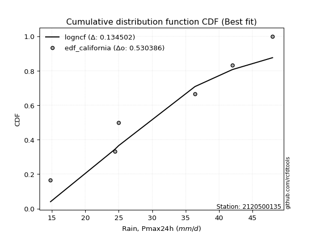</img></img>

</div>


### 2. EDF Hazen (1930)

Hazen method for plotting positions is a formula used to estimate the empirical cumulative probability distribution of flood events or other hydrological data. This formula often results in biased estimations, particularly when extrapolating to extreme events (high return periods).

<div align="center">


$P=(m-0.5)/n$


</div>


**2.1. Empirical values**

<div align="center">

|                | 0                   | 1                   | 2                   | 3         | 4                  | 5                  | 6                  |
|:---------------|:--------------------|:--------------------|:--------------------|:----------|:-------------------|:-------------------|:-------------------|
| date           | 2023                | 2021                | 2019                | 2022      | 2025               | 2020               | 2024               |
| x              | 14.8                | 24.4                | 25.0                | 36.4      | 38.2               | 42.0               | 48.0               |
| m              | 1                   | 2                   | 3                   | 4         | 5                  | 6                  | 7                  |
| empirical_dist | edf_hazen           | edf_hazen           | edf_hazen           | edf_hazen | edf_hazen          | edf_hazen          | edf_hazen          |
| empirical      | 0.07142857142857142 | 0.21428571428571427 | 0.35714285714285715 | 0.5       | 0.6428571428571429 | 0.7857142857142857 | 0.9285714285714286 |
| empirical_tr   | 1.0769230769230769  | 1.2727272727272727  | 1.5555555555555558  | 2.0       | 2.8000000000000003 | 4.666666666666666  | 14.000000000000007 |

</div>


**2.2. Kolmogorov-Smirnov fit test (sorted by Δ)**


<div align="center">

|                | 0                    | 1                   | 2                   | 3                   | 4                   | 5                   | 6                   | 7                   | 8                   | 9                   | 10                  | 11                  | 12                  | 13                  | 14                  | 15                  | 16                  | 17                  | 18                  | 19                  | 20                  | 21                  | 22                  | 23                  | 24                  | 25                  | 26                  | 27                  | 28                  | 29                  | 30                  | 31                  | 32                  | 33                  | 34                  | 35                  | 36                  | 37                  | 38                  | 39                  | 40                  | 41                  | 42                  | 43                  | 44                  | 45                  | 46                  | 47                  | 48                  | 49                  | 50                  | 51                  | 52                  | 53                  | 54                  | 55                  | 56                  | 57                  | 58                  | 59                  | 60                  | 61                  | 62                  | 63                  | 64                  | 65                  | 66                  | 67                  | 68                  | 69                  | 70                  | 71                  | 72                  | 73                  | 74                  | 75                  | 76                  | 77                  | 78                  | 79                  | 80                  | 81                  | 82                  | 83                  | 84                  | 85                  | 86                  | 87                  | 88                  | 89                  | 90                  | 91                  | 92                  | 93                  | 94                  | 95                  | 96                  | 97                  | 98                  | 99                  | 100                 | 101                 | 102                 | 103                 | 104                 | 105                 | 106                 | 107                 | 108                 | 109                 | 110                 | 111                 | 112                 | 113                 | 114                 | 115                 | 116                 | 117                 | 118                 | 119                 | 120                 | 121                 | 122                 | 123                 | 124                 | 125                 | 126                 | 127                 | 128                 | 129                 | 130                 | 131                 | 132                 | 133                 | 134                 | 135                 | 136                 | 137                 | 138                 | 139                 | 140                 | 141                 | 142                 | 143                 | 144                 | 145                 | 146                 | 147                 | 148                 | 149                 | 150                 | 151                 | 152                 | 153                 | 154                 | 155                 | 156                 | 157                 | 158                 | 159                 |
|:---------------|:---------------------|:--------------------|:--------------------|:--------------------|:--------------------|:--------------------|:--------------------|:--------------------|:--------------------|:--------------------|:--------------------|:--------------------|:--------------------|:--------------------|:--------------------|:--------------------|:--------------------|:--------------------|:--------------------|:--------------------|:--------------------|:--------------------|:--------------------|:--------------------|:--------------------|:--------------------|:--------------------|:--------------------|:--------------------|:--------------------|:--------------------|:--------------------|:--------------------|:--------------------|:--------------------|:--------------------|:--------------------|:--------------------|:--------------------|:--------------------|:--------------------|:--------------------|:--------------------|:--------------------|:--------------------|:--------------------|:--------------------|:--------------------|:--------------------|:--------------------|:--------------------|:--------------------|:--------------------|:--------------------|:--------------------|:--------------------|:--------------------|:--------------------|:--------------------|:--------------------|:--------------------|:--------------------|:--------------------|:--------------------|:--------------------|:--------------------|:--------------------|:--------------------|:--------------------|:--------------------|:--------------------|:--------------------|:--------------------|:--------------------|:--------------------|:--------------------|:--------------------|:--------------------|:--------------------|:--------------------|:--------------------|:--------------------|:--------------------|:--------------------|:--------------------|:--------------------|:--------------------|:--------------------|:--------------------|:--------------------|:--------------------|:--------------------|:--------------------|:--------------------|:--------------------|:--------------------|:--------------------|:--------------------|:--------------------|:--------------------|:--------------------|:--------------------|:--------------------|:--------------------|:--------------------|:--------------------|:--------------------|:--------------------|:--------------------|:--------------------|:--------------------|:--------------------|:--------------------|:--------------------|:--------------------|:--------------------|:--------------------|:--------------------|:--------------------|:--------------------|:--------------------|:--------------------|:--------------------|:--------------------|:--------------------|:--------------------|:--------------------|:--------------------|:--------------------|:--------------------|:--------------------|:--------------------|:--------------------|:--------------------|:--------------------|:--------------------|:--------------------|:--------------------|:--------------------|:--------------------|:--------------------|:--------------------|:--------------------|:--------------------|:--------------------|:--------------------|:--------------------|:--------------------|:--------------------|:--------------------|:--------------------|:--------------------|:--------------------|:--------------------|:--------------------|:--------------------|:--------------------|:--------------------|:--------------------|:--------------------|
| station        | 2120500135           | 2120500135          | 2120500135          | 2120500135          | 2120500135          | 2120500135          | 2120500135          | 2120500135          | 2120500135          | 2120500135          | 2120500135          | 2120500135          | 2120500135          | 2120500135          | 2120500135          | 2120500135          | 2120500135          | 2120500135          | 2120500135          | 2120500135          | 2120500135          | 2120500135          | 2120500135          | 2120500135          | 2120500135          | 2120500135          | 2120500135          | 2120500135          | 2120500135          | 2120500135          | 2120500135          | 2120500135          | 2120500135          | 2120500135          | 2120500135          | 2120500135          | 2120500135          | 2120500135          | 2120500135          | 2120500135          | 2120500135          | 2120500135          | 2120500135          | 2120500135          | 2120500135          | 2120500135          | 2120500135          | 2120500135          | 2120500135          | 2120500135          | 2120500135          | 2120500135          | 2120500135          | 2120500135          | 2120500135          | 2120500135          | 2120500135          | 2120500135          | 2120500135          | 2120500135          | 2120500135          | 2120500135          | 2120500135          | 2120500135          | 2120500135          | 2120500135          | 2120500135          | 2120500135          | 2120500135          | 2120500135          | 2120500135          | 2120500135          | 2120500135          | 2120500135          | 2120500135          | 2120500135          | 2120500135          | 2120500135          | 2120500135          | 2120500135          | 2120500135          | 2120500135          | 2120500135          | 2120500135          | 2120500135          | 2120500135          | 2120500135          | 2120500135          | 2120500135          | 2120500135          | 2120500135          | 2120500135          | 2120500135          | 2120500135          | 2120500135          | 2120500135          | 2120500135          | 2120500135          | 2120500135          | 2120500135          | 2120500135          | 2120500135          | 2120500135          | 2120500135          | 2120500135          | 2120500135          | 2120500135          | 2120500135          | 2120500135          | 2120500135          | 2120500135          | 2120500135          | 2120500135          | 2120500135          | 2120500135          | 2120500135          | 2120500135          | 2120500135          | 2120500135          | 2120500135          | 2120500135          | 2120500135          | 2120500135          | 2120500135          | 2120500135          | 2120500135          | 2120500135          | 2120500135          | 2120500135          | 2120500135          | 2120500135          | 2120500135          | 2120500135          | 2120500135          | 2120500135          | 2120500135          | 2120500135          | 2120500135          | 2120500135          | 2120500135          | 2120500135          | 2120500135          | 2120500135          | 2120500135          | 2120500135          | 2120500135          | 2120500135          | 2120500135          | 2120500135          | 2120500135          | 2120500135          | 2120500135          | 2120500135          | 2120500135          | 2120500135          | 2120500135          | 2120500135          | 2120500135          | 2120500135          | 2120500135          |
| empirical_dist | edf_hazen            | edf_hazen           | edf_hazen           | edf_hazen           | edf_hazen           | edf_hazen           | edf_hazen           | edf_hazen           | edf_hazen           | edf_hazen           | edf_hazen           | edf_hazen           | edf_hazen           | edf_hazen           | edf_hazen           | edf_hazen           | edf_hazen           | edf_hazen           | edf_hazen           | edf_hazen           | edf_hazen           | edf_hazen           | edf_hazen           | edf_hazen           | edf_hazen           | edf_hazen           | edf_hazen           | edf_hazen           | edf_hazen           | edf_hazen           | edf_hazen           | edf_hazen           | edf_hazen           | edf_hazen           | edf_hazen           | edf_hazen           | edf_hazen           | edf_hazen           | edf_hazen           | edf_hazen           | edf_hazen           | edf_hazen           | edf_hazen           | edf_hazen           | edf_hazen           | edf_hazen           | edf_hazen           | edf_hazen           | edf_hazen           | edf_hazen           | edf_hazen           | edf_hazen           | edf_hazen           | edf_hazen           | edf_hazen           | edf_hazen           | edf_hazen           | edf_hazen           | edf_hazen           | edf_hazen           | edf_hazen           | edf_hazen           | edf_hazen           | edf_hazen           | edf_hazen           | edf_hazen           | edf_hazen           | edf_hazen           | edf_hazen           | edf_hazen           | edf_hazen           | edf_hazen           | edf_hazen           | edf_hazen           | edf_hazen           | edf_hazen           | edf_hazen           | edf_hazen           | edf_hazen           | edf_hazen           | edf_hazen           | edf_hazen           | edf_hazen           | edf_hazen           | edf_hazen           | edf_hazen           | edf_hazen           | edf_hazen           | edf_hazen           | edf_hazen           | edf_hazen           | edf_hazen           | edf_hazen           | edf_hazen           | edf_hazen           | edf_hazen           | edf_hazen           | edf_hazen           | edf_hazen           | edf_hazen           | edf_hazen           | edf_hazen           | edf_hazen           | edf_hazen           | edf_hazen           | edf_hazen           | edf_hazen           | edf_hazen           | edf_hazen           | edf_hazen           | edf_hazen           | edf_hazen           | edf_hazen           | edf_hazen           | edf_hazen           | edf_hazen           | edf_hazen           | edf_hazen           | edf_hazen           | edf_hazen           | edf_hazen           | edf_hazen           | edf_hazen           | edf_hazen           | edf_hazen           | edf_hazen           | edf_hazen           | edf_hazen           | edf_hazen           | edf_hazen           | edf_hazen           | edf_hazen           | edf_hazen           | edf_hazen           | edf_hazen           | edf_hazen           | edf_hazen           | edf_hazen           | edf_hazen           | edf_hazen           | edf_hazen           | edf_hazen           | edf_hazen           | edf_hazen           | edf_hazen           | edf_hazen           | edf_hazen           | edf_hazen           | edf_hazen           | edf_hazen           | edf_hazen           | edf_hazen           | edf_hazen           | edf_hazen           | edf_hazen           | edf_hazen           | edf_hazen           | edf_hazen           | edf_hazen           | edf_hazen           |
| p_dist         | logcrystalball       | logbeta             | loggenhalflogistic  | logtrapezoid        | ksone               | burr                | arcsine             | logweibull_max      | semicircular        | logargus            | anglit              | genpareto           | logtruncweibull_min | wrapcauchy          | logmielke           | logburr             | logloggamma         | beta                | pearson3            | kappa4              | logjohnsonsu        | logburr12           | logweibull_min      | weibull_min         | argus               | f                   | t                   | norm                | crystalball         | exponnorm           | nct                 | johnsonsu           | loggumbel_l         | truncnorm           | genextreme          | logskewnorm         | skewnorm            | foldnorm            | erlang              | gamma               | loggenextreme       | genhalflogistic     | logpearson3         | betaprime           | logsemicircular     | invgamma            | rice                | cosine              | logarcsine          | genlogistic         | dweibull            | tukeylambda         | triang              | uniform             | logistic            | alpha               | dgamma              | loganglit           | gompertz            | gumbel_l            | vonmises_line       | maxwell             | invgauss            | ncf                 | hypsecant           | truncweibull_min    | rayleigh            | logtriang           | lomax               | loginvweibull       | loggengamma         | logf                | loggamma            | loggamma            | logt                | logexponnorm        | lognorm             | logerlang           | kstwobign           | logfatiguelife      | logrice             | lognct              | gausshyper          | logvonmises_line    | loginvgamma         | kappa3              | halfnorm            | logalpha            | logbetaprime        | logncf              | loginvgauss         | logfoldnorm         | laplace             | logkstwobign        | logmaxwell          | loglogistic         | gumbel_r            | loggenexpon         | lograyleigh         | genexpon            | logloglaplace       | logcosine           | loglevy_l           | loghypsecant        | logdweibull         | halflogistic        | loggennorm          | loghalfnorm         | moyal               | bradford            | logksone            | truncexpon          | loggumbel_r         | loglaplace          | loglaplace          | loggompertz         | logexponpow         | trapezoid           | loghalflogistic     | logmoyal            | levy_l              | logexponweib        | loggausshyper       | logwrapcauchy       | logkappa3           | loguniform          | logkappa4           | logdgamma           | wald                | logrdist            | burr12              | loglomax            | nakagami            | gennorm             | lognakagami         | logtruncnorm        | halfgennorm         | logwald             | loghalfgennorm      | logtukeylambda      | logbradford         | loggenpareto        | logtruncexpon       | invweibull          | johnsonsb           | gengamma            | fatiguelife         | weibull_max         | powerlaw            | logjohnsonsb        | exponweib           | logpowerlaw         | rdist               | exponpow            | truncpareto         | logtruncpareto      | loggenlogistic      | logvonmises         | vonmises            | mielke              |
| delta          | 0.024380493450931295 | 0.08265637179090818 | 0.0907709454729364  | 0.09929461428819597 | 0.09948541944343958 | 0.10269978027052995 | 0.102769832683868   | 0.10533088829797468 | 0.10915306748584741 | 0.11391342312857516 | 0.11671840559310942 | 0.11718192660982052 | 0.11843099645272526 | 0.12012184302280815 | 0.1204507431428812  | 0.12136218893094797 | 0.12411283464313502 | 0.12425173410073084 | 0.1255755853759624  | 0.12806122270801568 | 0.12878460992070068 | 0.13022335047936207 | 0.13024150231170406 | 0.13233656172436217 | 0.1332411017577299  | 0.13467013633111458 | 0.13479592881033953 | 0.13481282394938    | 0.13481283526197174 | 0.13481377726971655 | 0.13483457942850063 | 0.13489415834134322 | 0.13491498632107346 | 0.1362553287901561  | 0.13752205950963142 | 0.13762247478051437 | 0.13783558998253564 | 0.1379416957799353  | 0.1393874396148802  | 0.1400617620075253  | 0.14112191052498185 | 0.14137563206594977 | 0.14191452247759173 | 0.14232102616627285 | 0.14387426430868056 | 0.14413090137489193 | 0.14582495713125898 | 0.14587825720126568 | 0.14594370246781638 | 0.1467997472177474  | 0.14934424031814306 | 0.1497759055433434  | 0.1500903255064843  | 0.1506024096385541  | 0.15137424118031118 | 0.15261069943489292 | 0.1526859260709458  | 0.1533556352776032  | 0.15350580443821527 | 0.1556887327353089  | 0.1560192672484182  | 0.15803054206009826 | 0.1588919129952433  | 0.16251803329942693 | 0.16446625899504297 | 0.1646922094217821  | 0.16507775950686887 | 0.16665520459975036 | 0.1715271143046675  | 0.17318859824133315 | 0.17537035137332346 | 0.17547410354158655 | 0.17549041484565098 | 0.17549041484565098 | 0.17579260681523    | 0.1757951503589832  | 0.17579633632638902 | 0.1776957471786439  | 0.17808363907138935 | 0.1790309703167675  | 0.1791040532455691  | 0.1793636954891551  | 0.18326766293846214 | 0.18374950447429866 | 0.1845440715689941  | 0.18499316927155185 | 0.1854062220287257  | 0.18560997269557533 | 0.18604642252167858 | 0.1863018896457127  | 0.1876057968411795  | 0.1888090946697687  | 0.19288229762882847 | 0.1944081409971099  | 0.19457123483518957 | 0.1957305421757758  | 0.19706464124764822 | 0.20004674166517789 | 0.20013247398877976 | 0.20112711307950404 | 0.2052133533212004  | 0.20633123559931743 | 0.20894593219409294 | 0.21067373488191798 | 0.21221460167731027 | 0.213703610547622   | 0.2152929675550275  | 0.21661825326332151 | 0.2178535354963017  | 0.2190874515111153  | 0.22315201006468713 | 0.23096445638435426 | 0.23135869487203964 | 0.23762865869735683 | 0.23762865869735683 | 0.23926363733681555 | 0.2407637614927646  | 0.2419793920374556  | 0.2441940871829048  | 0.24950365705498267 | 0.2582084451641069  | 0.25942766666140016 | 0.2595680975632556  | 0.26026912892489984 | 0.2631113977816779  | 0.26488323199166186 | 0.26554100211680554 | 0.2755285586820284  | 0.27637413118765697 | 0.27663879953547865 | 0.27980504877276124 | 0.2817963643961765  | 0.2852590613440299  | 0.2857142857142857  | 0.28701759289628415 | 0.2874039229534502  | 0.2948483054727734  | 0.30171787542047146 | 0.30332168756599476 | 0.3142979271154362  | 0.3215472394309068  | 0.3247206031441403  | 0.3305180229224882  | 0.5048684404661534  | 0.5208901603381179  | 0.5678202467304639  | 0.5684642125851548  | 0.5706032083072081  | 0.5942482737127038  | 0.6076026818449073  | 0.6155615260542466  | 0.6390806782188032  | 0.6433414082588589  | 0.6442425342514796  | 0.6943140923798404  | 0.7219872497330964  | 0.7857142857142857  | 1.1717637741861187  | 7.266566909652047   | nan                 |
| deltao         | 0.48442053926100004  | 0.48442053926100004 | 0.48442053926100004 | 0.48442053926100004 | 0.48442053926100004 | 0.48442053926100004 | 0.48442053926100004 | 0.48442053926100004 | 0.48442053926100004 | 0.48442053926100004 | 0.48442053926100004 | 0.48442053926100004 | 0.48442053926100004 | 0.48442053926100004 | 0.48442053926100004 | 0.48442053926100004 | 0.48442053926100004 | 0.48442053926100004 | 0.48442053926100004 | 0.48442053926100004 | 0.48442053926100004 | 0.48442053926100004 | 0.48442053926100004 | 0.48442053926100004 | 0.48442053926100004 | 0.48442053926100004 | 0.48442053926100004 | 0.48442053926100004 | 0.48442053926100004 | 0.48442053926100004 | 0.48442053926100004 | 0.48442053926100004 | 0.48442053926100004 | 0.48442053926100004 | 0.48442053926100004 | 0.48442053926100004 | 0.48442053926100004 | 0.48442053926100004 | 0.48442053926100004 | 0.48442053926100004 | 0.48442053926100004 | 0.48442053926100004 | 0.48442053926100004 | 0.48442053926100004 | 0.48442053926100004 | 0.48442053926100004 | 0.48442053926100004 | 0.48442053926100004 | 0.48442053926100004 | 0.48442053926100004 | 0.48442053926100004 | 0.48442053926100004 | 0.48442053926100004 | 0.48442053926100004 | 0.48442053926100004 | 0.48442053926100004 | 0.48442053926100004 | 0.48442053926100004 | 0.48442053926100004 | 0.48442053926100004 | 0.48442053926100004 | 0.48442053926100004 | 0.48442053926100004 | 0.48442053926100004 | 0.48442053926100004 | 0.48442053926100004 | 0.48442053926100004 | 0.48442053926100004 | 0.48442053926100004 | 0.48442053926100004 | 0.48442053926100004 | 0.48442053926100004 | 0.48442053926100004 | 0.48442053926100004 | 0.48442053926100004 | 0.48442053926100004 | 0.48442053926100004 | 0.48442053926100004 | 0.48442053926100004 | 0.48442053926100004 | 0.48442053926100004 | 0.48442053926100004 | 0.48442053926100004 | 0.48442053926100004 | 0.48442053926100004 | 0.48442053926100004 | 0.48442053926100004 | 0.48442053926100004 | 0.48442053926100004 | 0.48442053926100004 | 0.48442053926100004 | 0.48442053926100004 | 0.48442053926100004 | 0.48442053926100004 | 0.48442053926100004 | 0.48442053926100004 | 0.48442053926100004 | 0.48442053926100004 | 0.48442053926100004 | 0.48442053926100004 | 0.48442053926100004 | 0.48442053926100004 | 0.48442053926100004 | 0.48442053926100004 | 0.48442053926100004 | 0.48442053926100004 | 0.48442053926100004 | 0.48442053926100004 | 0.48442053926100004 | 0.48442053926100004 | 0.48442053926100004 | 0.48442053926100004 | 0.48442053926100004 | 0.48442053926100004 | 0.48442053926100004 | 0.48442053926100004 | 0.48442053926100004 | 0.48442053926100004 | 0.48442053926100004 | 0.48442053926100004 | 0.48442053926100004 | 0.48442053926100004 | 0.48442053926100004 | 0.48442053926100004 | 0.48442053926100004 | 0.48442053926100004 | 0.48442053926100004 | 0.48442053926100004 | 0.48442053926100004 | 0.48442053926100004 | 0.48442053926100004 | 0.48442053926100004 | 0.48442053926100004 | 0.48442053926100004 | 0.48442053926100004 | 0.48442053926100004 | 0.48442053926100004 | 0.48442053926100004 | 0.48442053926100004 | 0.48442053926100004 | 0.48442053926100004 | 0.48442053926100004 | 0.48442053926100004 | 0.48442053926100004 | 0.48442053926100004 | 0.48442053926100004 | 0.48442053926100004 | 0.48442053926100004 | 0.48442053926100004 | 0.48442053926100004 | 0.48442053926100004 | 0.48442053926100004 | 0.48442053926100004 | 0.48442053926100004 | 0.48442053926100004 | 0.48442053926100004 | 0.48442053926100004 | 0.48442053926100004 | 0.48442053926100004 | 0.48442053926100004 |
| eval           | Δo > Δ               | Δo > Δ              | Δo > Δ              | Δo > Δ              | Δo > Δ              | Δo > Δ              | Δo > Δ              | Δo > Δ              | Δo > Δ              | Δo > Δ              | Δo > Δ              | Δo > Δ              | Δo > Δ              | Δo > Δ              | Δo > Δ              | Δo > Δ              | Δo > Δ              | Δo > Δ              | Δo > Δ              | Δo > Δ              | Δo > Δ              | Δo > Δ              | Δo > Δ              | Δo > Δ              | Δo > Δ              | Δo > Δ              | Δo > Δ              | Δo > Δ              | Δo > Δ              | Δo > Δ              | Δo > Δ              | Δo > Δ              | Δo > Δ              | Δo > Δ              | Δo > Δ              | Δo > Δ              | Δo > Δ              | Δo > Δ              | Δo > Δ              | Δo > Δ              | Δo > Δ              | Δo > Δ              | Δo > Δ              | Δo > Δ              | Δo > Δ              | Δo > Δ              | Δo > Δ              | Δo > Δ              | Δo > Δ              | Δo > Δ              | Δo > Δ              | Δo > Δ              | Δo > Δ              | Δo > Δ              | Δo > Δ              | Δo > Δ              | Δo > Δ              | Δo > Δ              | Δo > Δ              | Δo > Δ              | Δo > Δ              | Δo > Δ              | Δo > Δ              | Δo > Δ              | Δo > Δ              | Δo > Δ              | Δo > Δ              | Δo > Δ              | Δo > Δ              | Δo > Δ              | Δo > Δ              | Δo > Δ              | Δo > Δ              | Δo > Δ              | Δo > Δ              | Δo > Δ              | Δo > Δ              | Δo > Δ              | Δo > Δ              | Δo > Δ              | Δo > Δ              | Δo > Δ              | Δo > Δ              | Δo > Δ              | Δo > Δ              | Δo > Δ              | Δo > Δ              | Δo > Δ              | Δo > Δ              | Δo > Δ              | Δo > Δ              | Δo > Δ              | Δo > Δ              | Δo > Δ              | Δo > Δ              | Δo > Δ              | Δo > Δ              | Δo > Δ              | Δo > Δ              | Δo > Δ              | Δo > Δ              | Δo > Δ              | Δo > Δ              | Δo > Δ              | Δo > Δ              | Δo > Δ              | Δo > Δ              | Δo > Δ              | Δo > Δ              | Δo > Δ              | Δo > Δ              | Δo > Δ              | Δo > Δ              | Δo > Δ              | Δo > Δ              | Δo > Δ              | Δo > Δ              | Δo > Δ              | Δo > Δ              | Δo > Δ              | Δo > Δ              | Δo > Δ              | Δo > Δ              | Δo > Δ              | Δo > Δ              | Δo > Δ              | Δo > Δ              | Δo > Δ              | Δo > Δ              | Δo > Δ              | Δo > Δ              | Δo > Δ              | Δo > Δ              | Δo > Δ              | Δo > Δ              | Δo > Δ              | Δo > Δ              | Δo > Δ              | Δo > Δ              | Δo > Δ              | Δo > Δ              | Δo > Δ              | Δo > Δ              | Δo <= Δ             | Δo <= Δ             | Δo <= Δ             | Δo <= Δ             | Δo <= Δ             | Δo <= Δ             | Δo <= Δ             | Δo <= Δ             | Δo <= Δ             | Δo <= Δ             | Δo <= Δ             | Δo <= Δ             | Δo <= Δ             | Δo <= Δ             | Δo <= Δ             | Δo <= Δ             | Δo <= Δ             |
| fit            | 1                    | 1                   | 1                   | 1                   | 1                   | 1                   | 1                   | 1                   | 1                   | 1                   | 1                   | 1                   | 1                   | 1                   | 1                   | 1                   | 1                   | 1                   | 1                   | 1                   | 1                   | 1                   | 1                   | 1                   | 1                   | 1                   | 1                   | 1                   | 1                   | 1                   | 1                   | 1                   | 1                   | 1                   | 1                   | 1                   | 1                   | 1                   | 1                   | 1                   | 1                   | 1                   | 1                   | 1                   | 1                   | 1                   | 1                   | 1                   | 1                   | 1                   | 1                   | 1                   | 1                   | 1                   | 1                   | 1                   | 1                   | 1                   | 1                   | 1                   | 1                   | 1                   | 1                   | 1                   | 1                   | 1                   | 1                   | 1                   | 1                   | 1                   | 1                   | 1                   | 1                   | 1                   | 1                   | 1                   | 1                   | 1                   | 1                   | 1                   | 1                   | 1                   | 1                   | 1                   | 1                   | 1                   | 1                   | 1                   | 1                   | 1                   | 1                   | 1                   | 1                   | 1                   | 1                   | 1                   | 1                   | 1                   | 1                   | 1                   | 1                   | 1                   | 1                   | 1                   | 1                   | 1                   | 1                   | 1                   | 1                   | 1                   | 1                   | 1                   | 1                   | 1                   | 1                   | 1                   | 1                   | 1                   | 1                   | 1                   | 1                   | 1                   | 1                   | 1                   | 1                   | 1                   | 1                   | 1                   | 1                   | 1                   | 1                   | 1                   | 1                   | 1                   | 1                   | 1                   | 1                   | 1                   | 1                   | 1                   | 1                   | 1                   | 1                   | 0                   | 0                   | 0                   | 0                   | 0                   | 0                   | 0                   | 0                   | 0                   | 0                   | 0                   | 0                   | 0                   | 0                   | 0                   | 0                   | 0                   |
| n              | 7                    | 7                   | 7                   | 7                   | 7                   | 7                   | 7                   | 7                   | 7                   | 7                   | 7                   | 7                   | 7                   | 7                   | 7                   | 7                   | 7                   | 7                   | 7                   | 7                   | 7                   | 7                   | 7                   | 7                   | 7                   | 7                   | 7                   | 7                   | 7                   | 7                   | 7                   | 7                   | 7                   | 7                   | 7                   | 7                   | 7                   | 7                   | 7                   | 7                   | 7                   | 7                   | 7                   | 7                   | 7                   | 7                   | 7                   | 7                   | 7                   | 7                   | 7                   | 7                   | 7                   | 7                   | 7                   | 7                   | 7                   | 7                   | 7                   | 7                   | 7                   | 7                   | 7                   | 7                   | 7                   | 7                   | 7                   | 7                   | 7                   | 7                   | 7                   | 7                   | 7                   | 7                   | 7                   | 7                   | 7                   | 7                   | 7                   | 7                   | 7                   | 7                   | 7                   | 7                   | 7                   | 7                   | 7                   | 7                   | 7                   | 7                   | 7                   | 7                   | 7                   | 7                   | 7                   | 7                   | 7                   | 7                   | 7                   | 7                   | 7                   | 7                   | 7                   | 7                   | 7                   | 7                   | 7                   | 7                   | 7                   | 7                   | 7                   | 7                   | 7                   | 7                   | 7                   | 7                   | 7                   | 7                   | 7                   | 7                   | 7                   | 7                   | 7                   | 7                   | 7                   | 7                   | 7                   | 7                   | 7                   | 7                   | 7                   | 7                   | 7                   | 7                   | 7                   | 7                   | 7                   | 7                   | 7                   | 7                   | 7                   | 7                   | 7                   | 7                   | 7                   | 7                   | 7                   | 7                   | 7                   | 7                   | 7                   | 7                   | 7                   | 7                   | 7                   | 7                   | 7                   | 7                   | 7                   | 7                   |
| best_fit       | 1                    | 0                   | 0                   | 0                   | 0                   | 0                   | 0                   | 0                   | 0                   | 0                   | 0                   | 0                   | 0                   | 0                   | 0                   | 0                   | 0                   | 0                   | 0                   | 0                   | 0                   | 0                   | 0                   | 0                   | 0                   | 0                   | 0                   | 0                   | 0                   | 0                   | 0                   | 0                   | 0                   | 0                   | 0                   | 0                   | 0                   | 0                   | 0                   | 0                   | 0                   | 0                   | 0                   | 0                   | 0                   | 0                   | 0                   | 0                   | 0                   | 0                   | 0                   | 0                   | 0                   | 0                   | 0                   | 0                   | 0                   | 0                   | 0                   | 0                   | 0                   | 0                   | 0                   | 0                   | 0                   | 0                   | 0                   | 0                   | 0                   | 0                   | 0                   | 0                   | 0                   | 0                   | 0                   | 0                   | 0                   | 0                   | 0                   | 0                   | 0                   | 0                   | 0                   | 0                   | 0                   | 0                   | 0                   | 0                   | 0                   | 0                   | 0                   | 0                   | 0                   | 0                   | 0                   | 0                   | 0                   | 0                   | 0                   | 0                   | 0                   | 0                   | 0                   | 0                   | 0                   | 0                   | 0                   | 0                   | 0                   | 0                   | 0                   | 0                   | 0                   | 0                   | 0                   | 0                   | 0                   | 0                   | 0                   | 0                   | 0                   | 0                   | 0                   | 0                   | 0                   | 0                   | 0                   | 0                   | 0                   | 0                   | 0                   | 0                   | 0                   | 0                   | 0                   | 0                   | 0                   | 0                   | 0                   | 0                   | 0                   | 0                   | 0                   | 0                   | 0                   | 0                   | 0                   | 0                   | 0                   | 0                   | 0                   | 0                   | 0                   | 0                   | 0                   | 0                   | 0                   | 0                   | 0                   | 0                   |
| best_fit_sort  | 1                    | 2                   | 3                   | 4                   | 5                   | 6                   | 7                   | 8                   | 9                   | 10                  | 11                  | 12                  | 13                  | 14                  | 15                  | 16                  | 17                  | 18                  | 19                  | 20                  | 21                  | 22                  | 23                  | 24                  | 25                  | 26                  | 27                  | 28                  | 29                  | 30                  | 31                  | 32                  | 33                  | 34                  | 35                  | 36                  | 37                  | 38                  | 39                  | 40                  | 41                  | 42                  | 43                  | 44                  | 45                  | 46                  | 47                  | 48                  | 49                  | 50                  | 51                  | 52                  | 53                  | 54                  | 55                  | 56                  | 57                  | 58                  | 59                  | 60                  | 61                  | 62                  | 63                  | 64                  | 65                  | 66                  | 67                  | 68                  | 69                  | 70                  | 71                  | 72                  | 73                  | 74                  | 75                  | 76                  | 77                  | 78                  | 79                  | 80                  | 81                  | 82                  | 83                  | 84                  | 85                  | 86                  | 87                  | 88                  | 89                  | 90                  | 91                  | 92                  | 93                  | 94                  | 95                  | 96                  | 97                  | 98                  | 99                  | 100                 | 101                 | 102                 | 103                 | 104                 | 105                 | 106                 | 107                 | 108                 | 109                 | 110                 | 111                 | 112                 | 113                 | 114                 | 115                 | 116                 | 117                 | 118                 | 119                 | 120                 | 121                 | 122                 | 123                 | 124                 | 125                 | 126                 | 127                 | 128                 | 129                 | 130                 | 131                 | 132                 | 133                 | 134                 | 135                 | 136                 | 137                 | 138                 | 139                 | 140                 | 141                 | 142                 | 143                 | 144                 | 145                 | 146                 | 147                 | 148                 | 149                 | 150                 | 151                 | 152                 | 153                 | 154                 | 155                 | 156                 | 157                 | 158                 | 159                 | 160                 |

</div>


**2.3. Best fit**

<div align="center">

|   id |    station | empirical_dist   | p_dist         |     delta |   deltao | eval   |   fit |   n |   best_fit |   best_fit_sort |
|-----:|-----------:|:-----------------|:---------------|----------:|---------:|:-------|------:|----:|-----------:|----------------:|
|    0 | 2120500135 | edf_hazen        | logcrystalball | 0.0243805 | 0.484421 | Δo > Δ |     1 |   7 |          1 |               1 |

</div>


<div align="center">

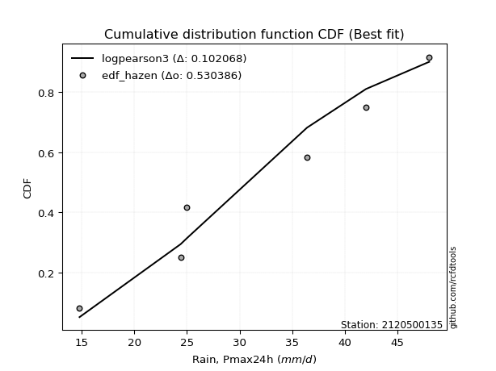</img>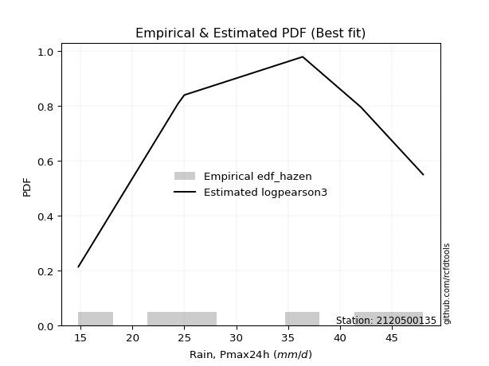</img>

</div>


### 3. EDF Weibull (1939)

Weibull plotting position formula is an empirical method used to estimate the non-exceedance probability or plotting position for a set of observed data, is often recommended or widely used in practice, particularly in flood frequency analysis.

<div align="center">


$P=m/(n+1)$


</div>


**3.1. Empirical values**

<div align="center">

|                | 0                  | 1                  | 2           | 3           | 4                  | 5           | 6           |
|:---------------|:-------------------|:-------------------|:------------|:------------|:-------------------|:------------|:------------|
| date           | 2023               | 2021               | 2019        | 2022        | 2025               | 2020        | 2024        |
| x              | 14.8               | 24.4               | 25.0        | 36.4        | 38.2               | 42.0        | 48.0        |
| m              | 1                  | 2                  | 3           | 4           | 5                  | 6           | 7           |
| empirical_dist | edf_weibull        | edf_weibull        | edf_weibull | edf_weibull | edf_weibull        | edf_weibull | edf_weibull |
| empirical      | 0.125              | 0.25               | 0.375       | 0.5         | 0.625              | 0.75        | 0.875       |
| empirical_tr   | 1.1428571428571428 | 1.3333333333333333 | 1.6         | 2.0         | 2.6666666666666665 | 4.0         | 8.0         |

</div>


**3.2. Kolmogorov-Smirnov fit test (sorted by Δ)**


<div align="center">

|                | 0                   | 1                   | 2                   | 3                   | 4                   | 5                   | 6                   | 7                   | 8                   | 9                   | 10                  | 11                  | 12                  | 13                  | 14                  | 15                  | 16                  | 17                  | 18                  | 19                  | 20                  | 21                  | 22                  | 23                  | 24                  | 25                  | 26                  | 27                  | 28                  | 29                  | 30                  | 31                  | 32                  | 33                  | 34                  | 35                  | 36                  | 37                  | 38                  | 39                  | 40                  | 41                  | 42                  | 43                  | 44                  | 45                  | 46                  | 47                  | 48                  | 49                  | 50                  | 51                  | 52                  | 53                  | 54                  | 55                  | 56                  | 57                  | 58                  | 59                  | 60                  | 61                  | 62                  | 63                  | 64                  | 65                  | 66                  | 67                  | 68                  | 69                  | 70                  | 71                  | 72                  | 73                  | 74                  | 75                  | 76                  | 77                  | 78                  | 79                  | 80                  | 81                  | 82                  | 83                  | 84                  | 85                  | 86                  | 87                  | 88                  | 89                  | 90                  | 91                  | 92                  | 93                  | 94                  | 95                  | 96                  | 97                  | 98                  | 99                  | 100                 | 101                 | 102                 | 103                 | 104                 | 105                 | 106                 | 107                 | 108                 | 109                 | 110                 | 111                 | 112                 | 113                 | 114                 | 115                 | 116                 | 117                 | 118                 | 119                 | 120                 | 121                 | 122                 | 123                 | 124                 | 125                 | 126                 | 127                 | 128                 | 129                 | 130                 | 131                 | 132                 | 133                 | 134                 | 135                 | 136                 | 137                 | 138                 | 139                 | 140                 | 141                 | 142                 | 143                 | 144                 | 145                 | 146                 | 147                 | 148                 | 149                 | 150                 | 151                 | 152                 | 153                 | 154                 | 155                 | 156                 | 157                 | 158                 | 159                 |
|:---------------|:--------------------|:--------------------|:--------------------|:--------------------|:--------------------|:--------------------|:--------------------|:--------------------|:--------------------|:--------------------|:--------------------|:--------------------|:--------------------|:--------------------|:--------------------|:--------------------|:--------------------|:--------------------|:--------------------|:--------------------|:--------------------|:--------------------|:--------------------|:--------------------|:--------------------|:--------------------|:--------------------|:--------------------|:--------------------|:--------------------|:--------------------|:--------------------|:--------------------|:--------------------|:--------------------|:--------------------|:--------------------|:--------------------|:--------------------|:--------------------|:--------------------|:--------------------|:--------------------|:--------------------|:--------------------|:--------------------|:--------------------|:--------------------|:--------------------|:--------------------|:--------------------|:--------------------|:--------------------|:--------------------|:--------------------|:--------------------|:--------------------|:--------------------|:--------------------|:--------------------|:--------------------|:--------------------|:--------------------|:--------------------|:--------------------|:--------------------|:--------------------|:--------------------|:--------------------|:--------------------|:--------------------|:--------------------|:--------------------|:--------------------|:--------------------|:--------------------|:--------------------|:--------------------|:--------------------|:--------------------|:--------------------|:--------------------|:--------------------|:--------------------|:--------------------|:--------------------|:--------------------|:--------------------|:--------------------|:--------------------|:--------------------|:--------------------|:--------------------|:--------------------|:--------------------|:--------------------|:--------------------|:--------------------|:--------------------|:--------------------|:--------------------|:--------------------|:--------------------|:--------------------|:--------------------|:--------------------|:--------------------|:--------------------|:--------------------|:--------------------|:--------------------|:--------------------|:--------------------|:--------------------|:--------------------|:--------------------|:--------------------|:--------------------|:--------------------|:--------------------|:--------------------|:--------------------|:--------------------|:--------------------|:--------------------|:--------------------|:--------------------|:--------------------|:--------------------|:--------------------|:--------------------|:--------------------|:--------------------|:--------------------|:--------------------|:--------------------|:--------------------|:--------------------|:--------------------|:--------------------|:--------------------|:--------------------|:--------------------|:--------------------|:--------------------|:--------------------|:--------------------|:--------------------|:--------------------|:--------------------|:--------------------|:--------------------|:--------------------|:--------------------|:--------------------|:--------------------|:--------------------|:--------------------|:--------------------|:--------------------|
| station        | 2120500135          | 2120500135          | 2120500135          | 2120500135          | 2120500135          | 2120500135          | 2120500135          | 2120500135          | 2120500135          | 2120500135          | 2120500135          | 2120500135          | 2120500135          | 2120500135          | 2120500135          | 2120500135          | 2120500135          | 2120500135          | 2120500135          | 2120500135          | 2120500135          | 2120500135          | 2120500135          | 2120500135          | 2120500135          | 2120500135          | 2120500135          | 2120500135          | 2120500135          | 2120500135          | 2120500135          | 2120500135          | 2120500135          | 2120500135          | 2120500135          | 2120500135          | 2120500135          | 2120500135          | 2120500135          | 2120500135          | 2120500135          | 2120500135          | 2120500135          | 2120500135          | 2120500135          | 2120500135          | 2120500135          | 2120500135          | 2120500135          | 2120500135          | 2120500135          | 2120500135          | 2120500135          | 2120500135          | 2120500135          | 2120500135          | 2120500135          | 2120500135          | 2120500135          | 2120500135          | 2120500135          | 2120500135          | 2120500135          | 2120500135          | 2120500135          | 2120500135          | 2120500135          | 2120500135          | 2120500135          | 2120500135          | 2120500135          | 2120500135          | 2120500135          | 2120500135          | 2120500135          | 2120500135          | 2120500135          | 2120500135          | 2120500135          | 2120500135          | 2120500135          | 2120500135          | 2120500135          | 2120500135          | 2120500135          | 2120500135          | 2120500135          | 2120500135          | 2120500135          | 2120500135          | 2120500135          | 2120500135          | 2120500135          | 2120500135          | 2120500135          | 2120500135          | 2120500135          | 2120500135          | 2120500135          | 2120500135          | 2120500135          | 2120500135          | 2120500135          | 2120500135          | 2120500135          | 2120500135          | 2120500135          | 2120500135          | 2120500135          | 2120500135          | 2120500135          | 2120500135          | 2120500135          | 2120500135          | 2120500135          | 2120500135          | 2120500135          | 2120500135          | 2120500135          | 2120500135          | 2120500135          | 2120500135          | 2120500135          | 2120500135          | 2120500135          | 2120500135          | 2120500135          | 2120500135          | 2120500135          | 2120500135          | 2120500135          | 2120500135          | 2120500135          | 2120500135          | 2120500135          | 2120500135          | 2120500135          | 2120500135          | 2120500135          | 2120500135          | 2120500135          | 2120500135          | 2120500135          | 2120500135          | 2120500135          | 2120500135          | 2120500135          | 2120500135          | 2120500135          | 2120500135          | 2120500135          | 2120500135          | 2120500135          | 2120500135          | 2120500135          | 2120500135          | 2120500135          | 2120500135          | 2120500135          | 2120500135          |
| empirical_dist | edf_weibull         | edf_weibull         | edf_weibull         | edf_weibull         | edf_weibull         | edf_weibull         | edf_weibull         | edf_weibull         | edf_weibull         | edf_weibull         | edf_weibull         | edf_weibull         | edf_weibull         | edf_weibull         | edf_weibull         | edf_weibull         | edf_weibull         | edf_weibull         | edf_weibull         | edf_weibull         | edf_weibull         | edf_weibull         | edf_weibull         | edf_weibull         | edf_weibull         | edf_weibull         | edf_weibull         | edf_weibull         | edf_weibull         | edf_weibull         | edf_weibull         | edf_weibull         | edf_weibull         | edf_weibull         | edf_weibull         | edf_weibull         | edf_weibull         | edf_weibull         | edf_weibull         | edf_weibull         | edf_weibull         | edf_weibull         | edf_weibull         | edf_weibull         | edf_weibull         | edf_weibull         | edf_weibull         | edf_weibull         | edf_weibull         | edf_weibull         | edf_weibull         | edf_weibull         | edf_weibull         | edf_weibull         | edf_weibull         | edf_weibull         | edf_weibull         | edf_weibull         | edf_weibull         | edf_weibull         | edf_weibull         | edf_weibull         | edf_weibull         | edf_weibull         | edf_weibull         | edf_weibull         | edf_weibull         | edf_weibull         | edf_weibull         | edf_weibull         | edf_weibull         | edf_weibull         | edf_weibull         | edf_weibull         | edf_weibull         | edf_weibull         | edf_weibull         | edf_weibull         | edf_weibull         | edf_weibull         | edf_weibull         | edf_weibull         | edf_weibull         | edf_weibull         | edf_weibull         | edf_weibull         | edf_weibull         | edf_weibull         | edf_weibull         | edf_weibull         | edf_weibull         | edf_weibull         | edf_weibull         | edf_weibull         | edf_weibull         | edf_weibull         | edf_weibull         | edf_weibull         | edf_weibull         | edf_weibull         | edf_weibull         | edf_weibull         | edf_weibull         | edf_weibull         | edf_weibull         | edf_weibull         | edf_weibull         | edf_weibull         | edf_weibull         | edf_weibull         | edf_weibull         | edf_weibull         | edf_weibull         | edf_weibull         | edf_weibull         | edf_weibull         | edf_weibull         | edf_weibull         | edf_weibull         | edf_weibull         | edf_weibull         | edf_weibull         | edf_weibull         | edf_weibull         | edf_weibull         | edf_weibull         | edf_weibull         | edf_weibull         | edf_weibull         | edf_weibull         | edf_weibull         | edf_weibull         | edf_weibull         | edf_weibull         | edf_weibull         | edf_weibull         | edf_weibull         | edf_weibull         | edf_weibull         | edf_weibull         | edf_weibull         | edf_weibull         | edf_weibull         | edf_weibull         | edf_weibull         | edf_weibull         | edf_weibull         | edf_weibull         | edf_weibull         | edf_weibull         | edf_weibull         | edf_weibull         | edf_weibull         | edf_weibull         | edf_weibull         | edf_weibull         | edf_weibull         | edf_weibull         | edf_weibull         | edf_weibull         |
| p_dist         | logcrystalball      | logtrapezoid        | ksone               | semicircular        | dweibull            | anglit              | dgamma              | burr                | lomax               | wrapcauchy          | genpareto           | logbeta             | logtruncweibull_min | logweibull_max      | loggenhalflogistic  | arcsine             | logarcsine          | kappa4              | logargus            | logncf              | loggumbel_l         | nct                 | f                   | exponnorm           | crystalball         | norm                | t                   | johnsonsu           | logskewnorm         | foldnorm            | logmielke           | logburr             | erlang              | gamma               | logweibull_min      | logpearson3         | logburr12           | logloggamma         | beta                | betaprime           | pearson3            | logsemicircular     | invgamma            | rice                | cosine              | logjohnsonsu        | tukeylambda         | weibull_min         | uniform             | argus               | alpha               | loganglit           | gompertz            | truncnorm           | loglevy_l           | genextreme          | skewnorm            | vonmises_line       | maxwell             | invgauss            | loggenextreme       | genhalflogistic     | logistic            | ncf                 | genlogistic         | truncweibull_min    | rayleigh            | logtriang           | triang              | loginvweibull       | gumbel_l            | hypsecant           | loggengamma         | logf                | loggamma            | loggamma            | logt                | logexponnorm        | lognorm             | logerlang           | kstwobign           | logfatiguelife      | logrice             | lognct              | loginvgamma         | kappa3              | halfnorm            | logalpha            | logbetaprime        | loginvgauss         | logfoldnorm         | laplace             | logkstwobign        | logmaxwell          | loglogistic         | gumbel_r            | loggenexpon         | lograyleigh         | gausshyper          | genexpon            | logvonmises_line    | levy_l              | logexponpow         | logcosine           | loghypsecant        | halflogistic        | loghalfnorm         | moyal               | bradford            | logksone            | logloglaplace       | logwrapcauchy       | logdweibull         | truncexpon          | loggumbel_r         | loggennorm          | loglaplace          | loglaplace          | loggompertz         | burr12              | loghalflogistic     | loglomax            | logmoyal            | gennorm             | halfgennorm         | logexponweib        | loggausshyper       | trapezoid           | logkappa3           | loguniform          | logkappa4           | loghalfgennorm      | loggenpareto        | wald                | nakagami            | lognakagami         | logdgamma           | logrdist            | logwald             | logtruncnorm        | logbradford         | logtruncexpon       | logtukeylambda      | invweibull          | johnsonsb           | gengamma            | fatiguelife         | weibull_max         | powerlaw            | logjohnsonsb        | exponweib           | logpowerlaw         | exponpow            | rdist               | truncpareto         | logtruncpareto      | loggenlogistic      | logvonmises         | vonmises            | mielke              |
| delta          | 0.0779519220223599  | 0.09929461428819597 | 0.10406055824302533 | 0.10915306748584741 | 0.11362995460385733 | 0.11671840559310942 | 0.11697164035666008 | 0.1205569231276728  | 0.12499992231115357 | 0.1249999907967419  | 0.12499999664284067 | 0.12499999974823783 | 0.12499999996602784 | 0.12499999999972056 | 0.12499999999999423 | 0.125               | 0.125               | 0.12806122270801568 | 0.131770565985718   | 0.1327304610742841  | 0.13491498632107346 | 0.13696300801955852 | 0.1369933402342897  | 0.13711121962329118 | 0.13711239919144363 | 0.1371124033679278  | 0.13712707606665014 | 0.13724837115029104 | 0.13762247478051437 | 0.1379416957799353  | 0.13830788600002406 | 0.13921933178809082 | 0.1393874396148802  | 0.1400617620075253  | 0.1416060171150659  | 0.14191452247759173 | 0.14194732166505342 | 0.14196997750027787 | 0.1421088769578737  | 0.14232102616627285 | 0.14343272823310524 | 0.14387426430868056 | 0.14413090137489193 | 0.14582495713125898 | 0.14587825720126568 | 0.14664175277784353 | 0.1497759055433434  | 0.15019370458150502 | 0.1506024096385541  | 0.15109824461487276 | 0.15261069943489292 | 0.1533556352776032  | 0.15350580443821527 | 0.15411247164729894 | 0.15537450362266436 | 0.15537920236677427 | 0.1556927328396785  | 0.1560192672484182  | 0.15803054206009826 | 0.1588919129952433  | 0.1589790533821247  | 0.15923277492309262 | 0.15972985371075207 | 0.16251803329942693 | 0.16465689007489026 | 0.1646922094217821  | 0.16507775950686887 | 0.16665520459975036 | 0.16794746836362714 | 0.17318859824133315 | 0.17354587559245174 | 0.17424658592810702 | 0.17537035137332346 | 0.17547410354158655 | 0.17549041484565098 | 0.17549041484565098 | 0.17579260681523    | 0.1757951503589832  | 0.17579633632638902 | 0.1776957471786439  | 0.17808363907138935 | 0.1790309703167675  | 0.1791040532455691  | 0.1793636954891551  | 0.1845440715689941  | 0.18499316927155185 | 0.1854062220287257  | 0.18560997269557533 | 0.18604642252167858 | 0.1876057968411795  | 0.1888090946697687  | 0.19288229762882847 | 0.1944081409971099  | 0.19457123483518957 | 0.1957305421757758  | 0.19706464124764822 | 0.20004674166517789 | 0.20013247398877976 | 0.201124805795605   | 0.20112711307950404 | 0.2016066473314415  | 0.2046370165926783  | 0.20504947577847887 | 0.20633123559931743 | 0.21067373488191798 | 0.213703610547622   | 0.21661825326332151 | 0.2178535354963017  | 0.2190874515111153  | 0.22073602665971848 | 0.22307049617834324 | 0.22455484321061409 | 0.23007174453445312 | 0.23096445638435426 | 0.23135869487203964 | 0.23315011041217035 | 0.23762865869735683 | 0.23762865869735683 | 0.23926363733681555 | 0.24409076305847555 | 0.2441940871829048  | 0.2460820786818908  | 0.24950365705498267 | 0.25                | 0.2591340197584877  | 0.25942766666140016 | 0.2595680975632556  | 0.25983653489459846 | 0.2631113977816779  | 0.26488323199166186 | 0.26554100211680554 | 0.26760740185170906 | 0.2722852186302803  | 0.27637413118765697 | 0.2852590613440299  | 0.28701759289628415 | 0.2933857015391713  | 0.2944959423926215  | 0.30171787542047146 | 0.30526106581059304 | 0.3215472394309068  | 0.3305180229224882  | 0.33215506997257904 | 0.4512970118947249  | 0.48517587462383216 | 0.5321059610161782  | 0.5327499268708691  | 0.5348889225929223  | 0.5585339879984181  | 0.5718883961306216  | 0.5798472403399609  | 0.6033663925045175  | 0.6085282485371939  | 0.6098922065008989  | 0.6585998066655547  | 0.6862729640188107  | 0.75                | 1.1717637741861187  | 7.320138338223476   | nan                 |
| deltao         | 0.48442053926100004 | 0.48442053926100004 | 0.48442053926100004 | 0.48442053926100004 | 0.48442053926100004 | 0.48442053926100004 | 0.48442053926100004 | 0.48442053926100004 | 0.48442053926100004 | 0.48442053926100004 | 0.48442053926100004 | 0.48442053926100004 | 0.48442053926100004 | 0.48442053926100004 | 0.48442053926100004 | 0.48442053926100004 | 0.48442053926100004 | 0.48442053926100004 | 0.48442053926100004 | 0.48442053926100004 | 0.48442053926100004 | 0.48442053926100004 | 0.48442053926100004 | 0.48442053926100004 | 0.48442053926100004 | 0.48442053926100004 | 0.48442053926100004 | 0.48442053926100004 | 0.48442053926100004 | 0.48442053926100004 | 0.48442053926100004 | 0.48442053926100004 | 0.48442053926100004 | 0.48442053926100004 | 0.48442053926100004 | 0.48442053926100004 | 0.48442053926100004 | 0.48442053926100004 | 0.48442053926100004 | 0.48442053926100004 | 0.48442053926100004 | 0.48442053926100004 | 0.48442053926100004 | 0.48442053926100004 | 0.48442053926100004 | 0.48442053926100004 | 0.48442053926100004 | 0.48442053926100004 | 0.48442053926100004 | 0.48442053926100004 | 0.48442053926100004 | 0.48442053926100004 | 0.48442053926100004 | 0.48442053926100004 | 0.48442053926100004 | 0.48442053926100004 | 0.48442053926100004 | 0.48442053926100004 | 0.48442053926100004 | 0.48442053926100004 | 0.48442053926100004 | 0.48442053926100004 | 0.48442053926100004 | 0.48442053926100004 | 0.48442053926100004 | 0.48442053926100004 | 0.48442053926100004 | 0.48442053926100004 | 0.48442053926100004 | 0.48442053926100004 | 0.48442053926100004 | 0.48442053926100004 | 0.48442053926100004 | 0.48442053926100004 | 0.48442053926100004 | 0.48442053926100004 | 0.48442053926100004 | 0.48442053926100004 | 0.48442053926100004 | 0.48442053926100004 | 0.48442053926100004 | 0.48442053926100004 | 0.48442053926100004 | 0.48442053926100004 | 0.48442053926100004 | 0.48442053926100004 | 0.48442053926100004 | 0.48442053926100004 | 0.48442053926100004 | 0.48442053926100004 | 0.48442053926100004 | 0.48442053926100004 | 0.48442053926100004 | 0.48442053926100004 | 0.48442053926100004 | 0.48442053926100004 | 0.48442053926100004 | 0.48442053926100004 | 0.48442053926100004 | 0.48442053926100004 | 0.48442053926100004 | 0.48442053926100004 | 0.48442053926100004 | 0.48442053926100004 | 0.48442053926100004 | 0.48442053926100004 | 0.48442053926100004 | 0.48442053926100004 | 0.48442053926100004 | 0.48442053926100004 | 0.48442053926100004 | 0.48442053926100004 | 0.48442053926100004 | 0.48442053926100004 | 0.48442053926100004 | 0.48442053926100004 | 0.48442053926100004 | 0.48442053926100004 | 0.48442053926100004 | 0.48442053926100004 | 0.48442053926100004 | 0.48442053926100004 | 0.48442053926100004 | 0.48442053926100004 | 0.48442053926100004 | 0.48442053926100004 | 0.48442053926100004 | 0.48442053926100004 | 0.48442053926100004 | 0.48442053926100004 | 0.48442053926100004 | 0.48442053926100004 | 0.48442053926100004 | 0.48442053926100004 | 0.48442053926100004 | 0.48442053926100004 | 0.48442053926100004 | 0.48442053926100004 | 0.48442053926100004 | 0.48442053926100004 | 0.48442053926100004 | 0.48442053926100004 | 0.48442053926100004 | 0.48442053926100004 | 0.48442053926100004 | 0.48442053926100004 | 0.48442053926100004 | 0.48442053926100004 | 0.48442053926100004 | 0.48442053926100004 | 0.48442053926100004 | 0.48442053926100004 | 0.48442053926100004 | 0.48442053926100004 | 0.48442053926100004 | 0.48442053926100004 | 0.48442053926100004 | 0.48442053926100004 | 0.48442053926100004 | 0.48442053926100004 |
| eval           | Δo > Δ              | Δo > Δ              | Δo > Δ              | Δo > Δ              | Δo > Δ              | Δo > Δ              | Δo > Δ              | Δo > Δ              | Δo > Δ              | Δo > Δ              | Δo > Δ              | Δo > Δ              | Δo > Δ              | Δo > Δ              | Δo > Δ              | Δo > Δ              | Δo > Δ              | Δo > Δ              | Δo > Δ              | Δo > Δ              | Δo > Δ              | Δo > Δ              | Δo > Δ              | Δo > Δ              | Δo > Δ              | Δo > Δ              | Δo > Δ              | Δo > Δ              | Δo > Δ              | Δo > Δ              | Δo > Δ              | Δo > Δ              | Δo > Δ              | Δo > Δ              | Δo > Δ              | Δo > Δ              | Δo > Δ              | Δo > Δ              | Δo > Δ              | Δo > Δ              | Δo > Δ              | Δo > Δ              | Δo > Δ              | Δo > Δ              | Δo > Δ              | Δo > Δ              | Δo > Δ              | Δo > Δ              | Δo > Δ              | Δo > Δ              | Δo > Δ              | Δo > Δ              | Δo > Δ              | Δo > Δ              | Δo > Δ              | Δo > Δ              | Δo > Δ              | Δo > Δ              | Δo > Δ              | Δo > Δ              | Δo > Δ              | Δo > Δ              | Δo > Δ              | Δo > Δ              | Δo > Δ              | Δo > Δ              | Δo > Δ              | Δo > Δ              | Δo > Δ              | Δo > Δ              | Δo > Δ              | Δo > Δ              | Δo > Δ              | Δo > Δ              | Δo > Δ              | Δo > Δ              | Δo > Δ              | Δo > Δ              | Δo > Δ              | Δo > Δ              | Δo > Δ              | Δo > Δ              | Δo > Δ              | Δo > Δ              | Δo > Δ              | Δo > Δ              | Δo > Δ              | Δo > Δ              | Δo > Δ              | Δo > Δ              | Δo > Δ              | Δo > Δ              | Δo > Δ              | Δo > Δ              | Δo > Δ              | Δo > Δ              | Δo > Δ              | Δo > Δ              | Δo > Δ              | Δo > Δ              | Δo > Δ              | Δo > Δ              | Δo > Δ              | Δo > Δ              | Δo > Δ              | Δo > Δ              | Δo > Δ              | Δo > Δ              | Δo > Δ              | Δo > Δ              | Δo > Δ              | Δo > Δ              | Δo > Δ              | Δo > Δ              | Δo > Δ              | Δo > Δ              | Δo > Δ              | Δo > Δ              | Δo > Δ              | Δo > Δ              | Δo > Δ              | Δo > Δ              | Δo > Δ              | Δo > Δ              | Δo > Δ              | Δo > Δ              | Δo > Δ              | Δo > Δ              | Δo > Δ              | Δo > Δ              | Δo > Δ              | Δo > Δ              | Δo > Δ              | Δo > Δ              | Δo > Δ              | Δo > Δ              | Δo > Δ              | Δo > Δ              | Δo > Δ              | Δo > Δ              | Δo > Δ              | Δo > Δ              | Δo > Δ              | Δo > Δ              | Δo <= Δ             | Δo <= Δ             | Δo <= Δ             | Δo <= Δ             | Δo <= Δ             | Δo <= Δ             | Δo <= Δ             | Δo <= Δ             | Δo <= Δ             | Δo <= Δ             | Δo <= Δ             | Δo <= Δ             | Δo <= Δ             | Δo <= Δ             | Δo <= Δ             | Δo <= Δ             |
| fit            | 1                   | 1                   | 1                   | 1                   | 1                   | 1                   | 1                   | 1                   | 1                   | 1                   | 1                   | 1                   | 1                   | 1                   | 1                   | 1                   | 1                   | 1                   | 1                   | 1                   | 1                   | 1                   | 1                   | 1                   | 1                   | 1                   | 1                   | 1                   | 1                   | 1                   | 1                   | 1                   | 1                   | 1                   | 1                   | 1                   | 1                   | 1                   | 1                   | 1                   | 1                   | 1                   | 1                   | 1                   | 1                   | 1                   | 1                   | 1                   | 1                   | 1                   | 1                   | 1                   | 1                   | 1                   | 1                   | 1                   | 1                   | 1                   | 1                   | 1                   | 1                   | 1                   | 1                   | 1                   | 1                   | 1                   | 1                   | 1                   | 1                   | 1                   | 1                   | 1                   | 1                   | 1                   | 1                   | 1                   | 1                   | 1                   | 1                   | 1                   | 1                   | 1                   | 1                   | 1                   | 1                   | 1                   | 1                   | 1                   | 1                   | 1                   | 1                   | 1                   | 1                   | 1                   | 1                   | 1                   | 1                   | 1                   | 1                   | 1                   | 1                   | 1                   | 1                   | 1                   | 1                   | 1                   | 1                   | 1                   | 1                   | 1                   | 1                   | 1                   | 1                   | 1                   | 1                   | 1                   | 1                   | 1                   | 1                   | 1                   | 1                   | 1                   | 1                   | 1                   | 1                   | 1                   | 1                   | 1                   | 1                   | 1                   | 1                   | 1                   | 1                   | 1                   | 1                   | 1                   | 1                   | 1                   | 1                   | 1                   | 1                   | 1                   | 1                   | 1                   | 0                   | 0                   | 0                   | 0                   | 0                   | 0                   | 0                   | 0                   | 0                   | 0                   | 0                   | 0                   | 0                   | 0                   | 0                   | 0                   |
| n              | 7                   | 7                   | 7                   | 7                   | 7                   | 7                   | 7                   | 7                   | 7                   | 7                   | 7                   | 7                   | 7                   | 7                   | 7                   | 7                   | 7                   | 7                   | 7                   | 7                   | 7                   | 7                   | 7                   | 7                   | 7                   | 7                   | 7                   | 7                   | 7                   | 7                   | 7                   | 7                   | 7                   | 7                   | 7                   | 7                   | 7                   | 7                   | 7                   | 7                   | 7                   | 7                   | 7                   | 7                   | 7                   | 7                   | 7                   | 7                   | 7                   | 7                   | 7                   | 7                   | 7                   | 7                   | 7                   | 7                   | 7                   | 7                   | 7                   | 7                   | 7                   | 7                   | 7                   | 7                   | 7                   | 7                   | 7                   | 7                   | 7                   | 7                   | 7                   | 7                   | 7                   | 7                   | 7                   | 7                   | 7                   | 7                   | 7                   | 7                   | 7                   | 7                   | 7                   | 7                   | 7                   | 7                   | 7                   | 7                   | 7                   | 7                   | 7                   | 7                   | 7                   | 7                   | 7                   | 7                   | 7                   | 7                   | 7                   | 7                   | 7                   | 7                   | 7                   | 7                   | 7                   | 7                   | 7                   | 7                   | 7                   | 7                   | 7                   | 7                   | 7                   | 7                   | 7                   | 7                   | 7                   | 7                   | 7                   | 7                   | 7                   | 7                   | 7                   | 7                   | 7                   | 7                   | 7                   | 7                   | 7                   | 7                   | 7                   | 7                   | 7                   | 7                   | 7                   | 7                   | 7                   | 7                   | 7                   | 7                   | 7                   | 7                   | 7                   | 7                   | 7                   | 7                   | 7                   | 7                   | 7                   | 7                   | 7                   | 7                   | 7                   | 7                   | 7                   | 7                   | 7                   | 7                   | 7                   | 7                   |
| best_fit       | 1                   | 0                   | 0                   | 0                   | 0                   | 0                   | 0                   | 0                   | 0                   | 0                   | 0                   | 0                   | 0                   | 0                   | 0                   | 0                   | 0                   | 0                   | 0                   | 0                   | 0                   | 0                   | 0                   | 0                   | 0                   | 0                   | 0                   | 0                   | 0                   | 0                   | 0                   | 0                   | 0                   | 0                   | 0                   | 0                   | 0                   | 0                   | 0                   | 0                   | 0                   | 0                   | 0                   | 0                   | 0                   | 0                   | 0                   | 0                   | 0                   | 0                   | 0                   | 0                   | 0                   | 0                   | 0                   | 0                   | 0                   | 0                   | 0                   | 0                   | 0                   | 0                   | 0                   | 0                   | 0                   | 0                   | 0                   | 0                   | 0                   | 0                   | 0                   | 0                   | 0                   | 0                   | 0                   | 0                   | 0                   | 0                   | 0                   | 0                   | 0                   | 0                   | 0                   | 0                   | 0                   | 0                   | 0                   | 0                   | 0                   | 0                   | 0                   | 0                   | 0                   | 0                   | 0                   | 0                   | 0                   | 0                   | 0                   | 0                   | 0                   | 0                   | 0                   | 0                   | 0                   | 0                   | 0                   | 0                   | 0                   | 0                   | 0                   | 0                   | 0                   | 0                   | 0                   | 0                   | 0                   | 0                   | 0                   | 0                   | 0                   | 0                   | 0                   | 0                   | 0                   | 0                   | 0                   | 0                   | 0                   | 0                   | 0                   | 0                   | 0                   | 0                   | 0                   | 0                   | 0                   | 0                   | 0                   | 0                   | 0                   | 0                   | 0                   | 0                   | 0                   | 0                   | 0                   | 0                   | 0                   | 0                   | 0                   | 0                   | 0                   | 0                   | 0                   | 0                   | 0                   | 0                   | 0                   | 0                   |
| best_fit_sort  | 1                   | 2                   | 3                   | 4                   | 5                   | 6                   | 7                   | 8                   | 9                   | 10                  | 11                  | 12                  | 13                  | 14                  | 15                  | 16                  | 17                  | 18                  | 19                  | 20                  | 21                  | 22                  | 23                  | 24                  | 25                  | 26                  | 27                  | 28                  | 29                  | 30                  | 31                  | 32                  | 33                  | 34                  | 35                  | 36                  | 37                  | 38                  | 39                  | 40                  | 41                  | 42                  | 43                  | 44                  | 45                  | 46                  | 47                  | 48                  | 49                  | 50                  | 51                  | 52                  | 53                  | 54                  | 55                  | 56                  | 57                  | 58                  | 59                  | 60                  | 61                  | 62                  | 63                  | 64                  | 65                  | 66                  | 67                  | 68                  | 69                  | 70                  | 71                  | 72                  | 73                  | 74                  | 75                  | 76                  | 77                  | 78                  | 79                  | 80                  | 81                  | 82                  | 83                  | 84                  | 85                  | 86                  | 87                  | 88                  | 89                  | 90                  | 91                  | 92                  | 93                  | 94                  | 95                  | 96                  | 97                  | 98                  | 99                  | 100                 | 101                 | 102                 | 103                 | 104                 | 105                 | 106                 | 107                 | 108                 | 109                 | 110                 | 111                 | 112                 | 113                 | 114                 | 115                 | 116                 | 117                 | 118                 | 119                 | 120                 | 121                 | 122                 | 123                 | 124                 | 125                 | 126                 | 127                 | 128                 | 129                 | 130                 | 131                 | 132                 | 133                 | 134                 | 135                 | 136                 | 137                 | 138                 | 139                 | 140                 | 141                 | 142                 | 143                 | 144                 | 145                 | 146                 | 147                 | 148                 | 149                 | 150                 | 151                 | 152                 | 153                 | 154                 | 155                 | 156                 | 157                 | 158                 | 159                 | 160                 |

</div>


**3.3. Best fit**

<div align="center">

|   id |    station | empirical_dist   | p_dist         |     delta |   deltao | eval   |   fit |   n |   best_fit |   best_fit_sort |
|-----:|-----------:|:-----------------|:---------------|----------:|---------:|:-------|------:|----:|-----------:|----------------:|
|    0 | 2120500135 | edf_weibull      | logcrystalball | 0.0779519 | 0.484421 | Δo > Δ |     1 |   7 |          1 |               1 |

</div>


<div align="center">

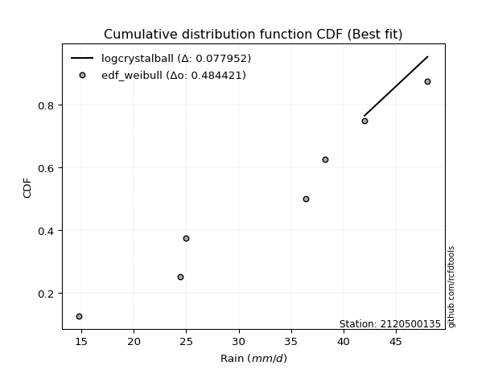</img></img>

</div>


### 4. EDF Beard (1943)

The Beard formula (or Beard´s plotting position formula) in hydrology is used to estimate the empirical non-exceedance probability _(P)_ of a flood event (or other extreme hydrological data point) within a given dataset.

<div align="center">


$P=(m-0.31)/(n+0.38)$


</div>


**4.1. Empirical values**

<div align="center">

|                | 0                   | 1                   | 2                   | 3         | 4                  | 5                  | 6                  |
|:---------------|:--------------------|:--------------------|:--------------------|:----------|:-------------------|:-------------------|:-------------------|
| date           | 2023                | 2021                | 2019                | 2022      | 2025               | 2020               | 2024               |
| x              | 14.8                | 24.4                | 25.0                | 36.4      | 38.2               | 42.0               | 48.0               |
| m              | 1                   | 2                   | 3                   | 4         | 5                  | 6                  | 7                  |
| empirical_dist | edf_beard           | edf_beard           | edf_beard           | edf_beard | edf_beard          | edf_beard          | edf_beard          |
| empirical      | 0.09349593495934959 | 0.22899728997289973 | 0.36449864498644985 | 0.5       | 0.6355013550135502 | 0.7710027100271003 | 0.9065040650406505 |
| empirical_tr   | 1.1031390134529149  | 1.29701230228471    | 1.5735607675906182  | 2.0       | 2.743494423791822  | 4.366863905325444  | 10.695652173913055 |

</div>


**4.2. Kolmogorov-Smirnov fit test (sorted by Δ)**


<div align="center">

|                | 0                   | 1                   | 2                   | 3                   | 4                   | 5                   | 6                   | 7                   | 8                   | 9                   | 10                  | 11                  | 12                  | 13                  | 14                  | 15                  | 16                  | 17                  | 18                  | 19                  | 20                  | 21                  | 22                  | 23                  | 24                  | 25                  | 26                  | 27                  | 28                  | 29                  | 30                  | 31                  | 32                  | 33                  | 34                  | 35                  | 36                  | 37                  | 38                  | 39                  | 40                  | 41                  | 42                  | 43                  | 44                  | 45                  | 46                  | 47                  | 48                  | 49                  | 50                  | 51                  | 52                  | 53                  | 54                  | 55                  | 56                  | 57                  | 58                  | 59                  | 60                  | 61                  | 62                  | 63                  | 64                  | 65                  | 66                  | 67                  | 68                  | 69                  | 70                  | 71                  | 72                  | 73                  | 74                  | 75                  | 76                  | 77                  | 78                  | 79                  | 80                  | 81                  | 82                  | 83                  | 84                  | 85                  | 86                  | 87                  | 88                  | 89                  | 90                  | 91                  | 92                  | 93                  | 94                  | 95                  | 96                  | 97                  | 98                  | 99                  | 100                 | 101                 | 102                 | 103                 | 104                 | 105                 | 106                 | 107                 | 108                 | 109                 | 110                 | 111                 | 112                 | 113                 | 114                 | 115                 | 116                 | 117                 | 118                 | 119                 | 120                 | 121                 | 122                 | 123                 | 124                 | 125                 | 126                 | 127                 | 128                 | 129                 | 130                 | 131                 | 132                 | 133                 | 134                 | 135                 | 136                 | 137                 | 138                 | 139                 | 140                 | 141                 | 142                 | 143                 | 144                 | 145                 | 146                 | 147                 | 148                 | 149                 | 150                 | 151                 | 152                 | 153                 | 154                 | 155                 | 156                 | 157                 | 158                 | 159                 |
|:---------------|:--------------------|:--------------------|:--------------------|:--------------------|:--------------------|:--------------------|:--------------------|:--------------------|:--------------------|:--------------------|:--------------------|:--------------------|:--------------------|:--------------------|:--------------------|:--------------------|:--------------------|:--------------------|:--------------------|:--------------------|:--------------------|:--------------------|:--------------------|:--------------------|:--------------------|:--------------------|:--------------------|:--------------------|:--------------------|:--------------------|:--------------------|:--------------------|:--------------------|:--------------------|:--------------------|:--------------------|:--------------------|:--------------------|:--------------------|:--------------------|:--------------------|:--------------------|:--------------------|:--------------------|:--------------------|:--------------------|:--------------------|:--------------------|:--------------------|:--------------------|:--------------------|:--------------------|:--------------------|:--------------------|:--------------------|:--------------------|:--------------------|:--------------------|:--------------------|:--------------------|:--------------------|:--------------------|:--------------------|:--------------------|:--------------------|:--------------------|:--------------------|:--------------------|:--------------------|:--------------------|:--------------------|:--------------------|:--------------------|:--------------------|:--------------------|:--------------------|:--------------------|:--------------------|:--------------------|:--------------------|:--------------------|:--------------------|:--------------------|:--------------------|:--------------------|:--------------------|:--------------------|:--------------------|:--------------------|:--------------------|:--------------------|:--------------------|:--------------------|:--------------------|:--------------------|:--------------------|:--------------------|:--------------------|:--------------------|:--------------------|:--------------------|:--------------------|:--------------------|:--------------------|:--------------------|:--------------------|:--------------------|:--------------------|:--------------------|:--------------------|:--------------------|:--------------------|:--------------------|:--------------------|:--------------------|:--------------------|:--------------------|:--------------------|:--------------------|:--------------------|:--------------------|:--------------------|:--------------------|:--------------------|:--------------------|:--------------------|:--------------------|:--------------------|:--------------------|:--------------------|:--------------------|:--------------------|:--------------------|:--------------------|:--------------------|:--------------------|:--------------------|:--------------------|:--------------------|:--------------------|:--------------------|:--------------------|:--------------------|:--------------------|:--------------------|:--------------------|:--------------------|:--------------------|:--------------------|:--------------------|:--------------------|:--------------------|:--------------------|:--------------------|:--------------------|:--------------------|:--------------------|:--------------------|:--------------------|:--------------------|
| station        | 2120500135          | 2120500135          | 2120500135          | 2120500135          | 2120500135          | 2120500135          | 2120500135          | 2120500135          | 2120500135          | 2120500135          | 2120500135          | 2120500135          | 2120500135          | 2120500135          | 2120500135          | 2120500135          | 2120500135          | 2120500135          | 2120500135          | 2120500135          | 2120500135          | 2120500135          | 2120500135          | 2120500135          | 2120500135          | 2120500135          | 2120500135          | 2120500135          | 2120500135          | 2120500135          | 2120500135          | 2120500135          | 2120500135          | 2120500135          | 2120500135          | 2120500135          | 2120500135          | 2120500135          | 2120500135          | 2120500135          | 2120500135          | 2120500135          | 2120500135          | 2120500135          | 2120500135          | 2120500135          | 2120500135          | 2120500135          | 2120500135          | 2120500135          | 2120500135          | 2120500135          | 2120500135          | 2120500135          | 2120500135          | 2120500135          | 2120500135          | 2120500135          | 2120500135          | 2120500135          | 2120500135          | 2120500135          | 2120500135          | 2120500135          | 2120500135          | 2120500135          | 2120500135          | 2120500135          | 2120500135          | 2120500135          | 2120500135          | 2120500135          | 2120500135          | 2120500135          | 2120500135          | 2120500135          | 2120500135          | 2120500135          | 2120500135          | 2120500135          | 2120500135          | 2120500135          | 2120500135          | 2120500135          | 2120500135          | 2120500135          | 2120500135          | 2120500135          | 2120500135          | 2120500135          | 2120500135          | 2120500135          | 2120500135          | 2120500135          | 2120500135          | 2120500135          | 2120500135          | 2120500135          | 2120500135          | 2120500135          | 2120500135          | 2120500135          | 2120500135          | 2120500135          | 2120500135          | 2120500135          | 2120500135          | 2120500135          | 2120500135          | 2120500135          | 2120500135          | 2120500135          | 2120500135          | 2120500135          | 2120500135          | 2120500135          | 2120500135          | 2120500135          | 2120500135          | 2120500135          | 2120500135          | 2120500135          | 2120500135          | 2120500135          | 2120500135          | 2120500135          | 2120500135          | 2120500135          | 2120500135          | 2120500135          | 2120500135          | 2120500135          | 2120500135          | 2120500135          | 2120500135          | 2120500135          | 2120500135          | 2120500135          | 2120500135          | 2120500135          | 2120500135          | 2120500135          | 2120500135          | 2120500135          | 2120500135          | 2120500135          | 2120500135          | 2120500135          | 2120500135          | 2120500135          | 2120500135          | 2120500135          | 2120500135          | 2120500135          | 2120500135          | 2120500135          | 2120500135          | 2120500135          | 2120500135          | 2120500135          |
| empirical_dist | edf_beard           | edf_beard           | edf_beard           | edf_beard           | edf_beard           | edf_beard           | edf_beard           | edf_beard           | edf_beard           | edf_beard           | edf_beard           | edf_beard           | edf_beard           | edf_beard           | edf_beard           | edf_beard           | edf_beard           | edf_beard           | edf_beard           | edf_beard           | edf_beard           | edf_beard           | edf_beard           | edf_beard           | edf_beard           | edf_beard           | edf_beard           | edf_beard           | edf_beard           | edf_beard           | edf_beard           | edf_beard           | edf_beard           | edf_beard           | edf_beard           | edf_beard           | edf_beard           | edf_beard           | edf_beard           | edf_beard           | edf_beard           | edf_beard           | edf_beard           | edf_beard           | edf_beard           | edf_beard           | edf_beard           | edf_beard           | edf_beard           | edf_beard           | edf_beard           | edf_beard           | edf_beard           | edf_beard           | edf_beard           | edf_beard           | edf_beard           | edf_beard           | edf_beard           | edf_beard           | edf_beard           | edf_beard           | edf_beard           | edf_beard           | edf_beard           | edf_beard           | edf_beard           | edf_beard           | edf_beard           | edf_beard           | edf_beard           | edf_beard           | edf_beard           | edf_beard           | edf_beard           | edf_beard           | edf_beard           | edf_beard           | edf_beard           | edf_beard           | edf_beard           | edf_beard           | edf_beard           | edf_beard           | edf_beard           | edf_beard           | edf_beard           | edf_beard           | edf_beard           | edf_beard           | edf_beard           | edf_beard           | edf_beard           | edf_beard           | edf_beard           | edf_beard           | edf_beard           | edf_beard           | edf_beard           | edf_beard           | edf_beard           | edf_beard           | edf_beard           | edf_beard           | edf_beard           | edf_beard           | edf_beard           | edf_beard           | edf_beard           | edf_beard           | edf_beard           | edf_beard           | edf_beard           | edf_beard           | edf_beard           | edf_beard           | edf_beard           | edf_beard           | edf_beard           | edf_beard           | edf_beard           | edf_beard           | edf_beard           | edf_beard           | edf_beard           | edf_beard           | edf_beard           | edf_beard           | edf_beard           | edf_beard           | edf_beard           | edf_beard           | edf_beard           | edf_beard           | edf_beard           | edf_beard           | edf_beard           | edf_beard           | edf_beard           | edf_beard           | edf_beard           | edf_beard           | edf_beard           | edf_beard           | edf_beard           | edf_beard           | edf_beard           | edf_beard           | edf_beard           | edf_beard           | edf_beard           | edf_beard           | edf_beard           | edf_beard           | edf_beard           | edf_beard           | edf_beard           | edf_beard           | edf_beard           | edf_beard           |
| p_dist         | logcrystalball      | logbeta             | logweibull_max      | arcsine             | loggenhalflogistic  | logtrapezoid        | ksone               | genpareto           | semicircular        | burr                | anglit              | logtruncweibull_min | wrapcauchy          | logargus            | logmielke           | kappa4              | logburr             | logweibull_min      | logarcsine          | logburr12           | logloggamma         | beta                | pearson3            | dweibull            | f                   | t                   | norm                | crystalball         | exponnorm           | nct                 | johnsonsu           | loggumbel_l         | logjohnsonsu        | logskewnorm         | foldnorm            | dgamma              | erlang              | weibull_min         | gamma               | argus               | logpearson3         | betaprime           | truncnorm           | logsemicircular     | invgamma            | genextreme          | skewnorm            | rice                | cosine              | loggenextreme       | genhalflogistic     | lomax               | tukeylambda         | uniform             | logistic            | alpha               | loganglit           | gompertz            | genlogistic         | vonmises_line       | triang              | maxwell             | invgauss            | ncf                 | gumbel_l            | logncf              | hypsecant           | truncweibull_min    | rayleigh            | logtriang           | loginvweibull       | loggengamma         | logf                | loggamma            | loggamma            | logt                | logexponnorm        | lognorm             | logerlang           | kstwobign           | logfatiguelife      | logrice             | lognct              | loginvgamma         | kappa3              | halfnorm            | logalpha            | logbetaprime        | loglevy_l           | loginvgauss         | logfoldnorm         | gausshyper          | logvonmises_line    | laplace             | logkstwobign        | logmaxwell          | loglogistic         | gumbel_r            | loggenexpon         | lograyleigh         | genexpon            | logcosine           | loghypsecant        | logloglaplace       | halflogistic        | loghalfnorm         | moyal               | bradford            | logdweibull         | logksone            | loggennorm          | logexponpow         | truncexpon          | loggumbel_r         | levy_l              | loglaplace          | loglaplace          | loggompertz         | loghalflogistic     | logwrapcauchy       | trapezoid           | logmoyal            | logexponweib        | loggausshyper       | logkappa3           | loguniform          | burr12              | logkappa4           | loglomax            | gennorm             | wald                | halfgennorm         | logdgamma           | logrdist            | nakagami            | lognakagami         | loghalfgennorm      | logtruncnorm        | logwald             | loggenpareto        | logbradford         | logtukeylambda      | logtruncexpon       | invweibull          | johnsonsb           | gengamma            | fatiguelife         | weibull_max         | powerlaw            | logjohnsonsb        | exponweib           | logpowerlaw         | rdist               | exponpow            | truncpareto         | logtruncpareto      | loggenlogistic      | logvonmises         | vonmises            | mielke              |
| delta          | 0.04644785698170939 | 0.09349593470758732 | 0.09349593495907005 | 0.09349593495934959 | 0.0981267333165291  | 0.09929461428819597 | 0.09948541944343958 | 0.10247035092263512 | 0.10915306748584741 | 0.11005556811412265 | 0.11671840559310942 | 0.11843099645272526 | 0.12012184302280815 | 0.12126921097216786 | 0.1278065309864739  | 0.12806122270801568 | 0.12871797677454067 | 0.13110466210151575 | 0.13123212678063093 | 0.13144596665150327 | 0.13146862248672772 | 0.13160752194432354 | 0.1329313732195551  | 0.1346326646309576  | 0.13467013633111458 | 0.13479592881033953 | 0.13481282394938    | 0.13481283526197174 | 0.13481377726971655 | 0.13483457942850063 | 0.13489415834134322 | 0.13491498632107346 | 0.13614039776429337 | 0.13762247478051437 | 0.1379416957799353  | 0.13797435038376035 | 0.1393874396148802  | 0.13969234956795487 | 0.1400617620075253  | 0.1405968896013226  | 0.14191452247759173 | 0.14232102616627285 | 0.1436111166337488  | 0.14387426430868056 | 0.14413090137489193 | 0.14487784735322412 | 0.14519137782612834 | 0.14582495713125898 | 0.14587825720126568 | 0.14847769836857455 | 0.14873141990954247 | 0.1494597507738894  | 0.1497759055433434  | 0.1506024096385541  | 0.15137424118031118 | 0.15261069943489292 | 0.1533556352776032  | 0.15350580443821527 | 0.1541555350613401  | 0.1560192672484182  | 0.157446113350077   | 0.15803054206009826 | 0.1588919129952433  | 0.16251803329942693 | 0.1630445205789016  | 0.1642345261149346  | 0.16446625899504297 | 0.1646922094217821  | 0.16507775950686887 | 0.16665520459975036 | 0.17318859824133315 | 0.17537035137332346 | 0.17547410354158655 | 0.17549041484565098 | 0.17549041484565098 | 0.17579260681523    | 0.1757951503589832  | 0.17579633632638902 | 0.1776957471786439  | 0.17808363907138935 | 0.1790309703167675  | 0.1791040532455691  | 0.1793636954891551  | 0.1845440715689941  | 0.18499316927155185 | 0.1854062220287257  | 0.18560997269557533 | 0.18604642252167858 | 0.18687856866331476 | 0.1876057968411795  | 0.1888090946697687  | 0.19062345078205484 | 0.19110529231789136 | 0.19288229762882847 | 0.1944081409971099  | 0.19457123483518957 | 0.1957305421757758  | 0.19706464124764822 | 0.20004674166517789 | 0.20013247398877976 | 0.20112711307950404 | 0.20633123559931743 | 0.21067373488191798 | 0.21256914116479309 | 0.213703610547622   | 0.21661825326332151 | 0.2178535354963017  | 0.2190874515111153  | 0.21957038952090296 | 0.22073602665971848 | 0.2226487553986202  | 0.22605218580557915 | 0.23096445638435426 | 0.23135869487203964 | 0.2361410816333287  | 0.23762865869735683 | 0.23762865869735683 | 0.23926363733681555 | 0.2441940871829048  | 0.24555755323771436 | 0.2493351798810483  | 0.24950365705498267 | 0.25942766666140016 | 0.2595680975632556  | 0.2631113977816779  | 0.26488323199166186 | 0.26509347308557585 | 0.26554100211680554 | 0.2670847887089911  | 0.2710027100271003  | 0.27637413118765697 | 0.280136729785588   | 0.2828843465256211  | 0.28399458737907135 | 0.2852590613440299  | 0.28701759289628415 | 0.28861011187880936 | 0.2947597107970429  | 0.30171787542047146 | 0.3026532396133621  | 0.3215472394309068  | 0.3216537149590289  | 0.3305180229224882  | 0.4828010769353754  | 0.5061785846509325  | 0.5531086710432785  | 0.5537526368979694  | 0.5558916326200227  | 0.5795366980255184  | 0.5928911061577219  | 0.6008499503670612  | 0.6243691025316178  | 0.6286298325716735  | 0.6295309585642942  | 0.679602516692655   | 0.707275674045911   | 0.7710027100271003  | 1.1717637741861187  | 7.288634273182826   | nan                 |
| deltao         | 0.48442053926100004 | 0.48442053926100004 | 0.48442053926100004 | 0.48442053926100004 | 0.48442053926100004 | 0.48442053926100004 | 0.48442053926100004 | 0.48442053926100004 | 0.48442053926100004 | 0.48442053926100004 | 0.48442053926100004 | 0.48442053926100004 | 0.48442053926100004 | 0.48442053926100004 | 0.48442053926100004 | 0.48442053926100004 | 0.48442053926100004 | 0.48442053926100004 | 0.48442053926100004 | 0.48442053926100004 | 0.48442053926100004 | 0.48442053926100004 | 0.48442053926100004 | 0.48442053926100004 | 0.48442053926100004 | 0.48442053926100004 | 0.48442053926100004 | 0.48442053926100004 | 0.48442053926100004 | 0.48442053926100004 | 0.48442053926100004 | 0.48442053926100004 | 0.48442053926100004 | 0.48442053926100004 | 0.48442053926100004 | 0.48442053926100004 | 0.48442053926100004 | 0.48442053926100004 | 0.48442053926100004 | 0.48442053926100004 | 0.48442053926100004 | 0.48442053926100004 | 0.48442053926100004 | 0.48442053926100004 | 0.48442053926100004 | 0.48442053926100004 | 0.48442053926100004 | 0.48442053926100004 | 0.48442053926100004 | 0.48442053926100004 | 0.48442053926100004 | 0.48442053926100004 | 0.48442053926100004 | 0.48442053926100004 | 0.48442053926100004 | 0.48442053926100004 | 0.48442053926100004 | 0.48442053926100004 | 0.48442053926100004 | 0.48442053926100004 | 0.48442053926100004 | 0.48442053926100004 | 0.48442053926100004 | 0.48442053926100004 | 0.48442053926100004 | 0.48442053926100004 | 0.48442053926100004 | 0.48442053926100004 | 0.48442053926100004 | 0.48442053926100004 | 0.48442053926100004 | 0.48442053926100004 | 0.48442053926100004 | 0.48442053926100004 | 0.48442053926100004 | 0.48442053926100004 | 0.48442053926100004 | 0.48442053926100004 | 0.48442053926100004 | 0.48442053926100004 | 0.48442053926100004 | 0.48442053926100004 | 0.48442053926100004 | 0.48442053926100004 | 0.48442053926100004 | 0.48442053926100004 | 0.48442053926100004 | 0.48442053926100004 | 0.48442053926100004 | 0.48442053926100004 | 0.48442053926100004 | 0.48442053926100004 | 0.48442053926100004 | 0.48442053926100004 | 0.48442053926100004 | 0.48442053926100004 | 0.48442053926100004 | 0.48442053926100004 | 0.48442053926100004 | 0.48442053926100004 | 0.48442053926100004 | 0.48442053926100004 | 0.48442053926100004 | 0.48442053926100004 | 0.48442053926100004 | 0.48442053926100004 | 0.48442053926100004 | 0.48442053926100004 | 0.48442053926100004 | 0.48442053926100004 | 0.48442053926100004 | 0.48442053926100004 | 0.48442053926100004 | 0.48442053926100004 | 0.48442053926100004 | 0.48442053926100004 | 0.48442053926100004 | 0.48442053926100004 | 0.48442053926100004 | 0.48442053926100004 | 0.48442053926100004 | 0.48442053926100004 | 0.48442053926100004 | 0.48442053926100004 | 0.48442053926100004 | 0.48442053926100004 | 0.48442053926100004 | 0.48442053926100004 | 0.48442053926100004 | 0.48442053926100004 | 0.48442053926100004 | 0.48442053926100004 | 0.48442053926100004 | 0.48442053926100004 | 0.48442053926100004 | 0.48442053926100004 | 0.48442053926100004 | 0.48442053926100004 | 0.48442053926100004 | 0.48442053926100004 | 0.48442053926100004 | 0.48442053926100004 | 0.48442053926100004 | 0.48442053926100004 | 0.48442053926100004 | 0.48442053926100004 | 0.48442053926100004 | 0.48442053926100004 | 0.48442053926100004 | 0.48442053926100004 | 0.48442053926100004 | 0.48442053926100004 | 0.48442053926100004 | 0.48442053926100004 | 0.48442053926100004 | 0.48442053926100004 | 0.48442053926100004 | 0.48442053926100004 | 0.48442053926100004 | 0.48442053926100004 |
| eval           | Δo > Δ              | Δo > Δ              | Δo > Δ              | Δo > Δ              | Δo > Δ              | Δo > Δ              | Δo > Δ              | Δo > Δ              | Δo > Δ              | Δo > Δ              | Δo > Δ              | Δo > Δ              | Δo > Δ              | Δo > Δ              | Δo > Δ              | Δo > Δ              | Δo > Δ              | Δo > Δ              | Δo > Δ              | Δo > Δ              | Δo > Δ              | Δo > Δ              | Δo > Δ              | Δo > Δ              | Δo > Δ              | Δo > Δ              | Δo > Δ              | Δo > Δ              | Δo > Δ              | Δo > Δ              | Δo > Δ              | Δo > Δ              | Δo > Δ              | Δo > Δ              | Δo > Δ              | Δo > Δ              | Δo > Δ              | Δo > Δ              | Δo > Δ              | Δo > Δ              | Δo > Δ              | Δo > Δ              | Δo > Δ              | Δo > Δ              | Δo > Δ              | Δo > Δ              | Δo > Δ              | Δo > Δ              | Δo > Δ              | Δo > Δ              | Δo > Δ              | Δo > Δ              | Δo > Δ              | Δo > Δ              | Δo > Δ              | Δo > Δ              | Δo > Δ              | Δo > Δ              | Δo > Δ              | Δo > Δ              | Δo > Δ              | Δo > Δ              | Δo > Δ              | Δo > Δ              | Δo > Δ              | Δo > Δ              | Δo > Δ              | Δo > Δ              | Δo > Δ              | Δo > Δ              | Δo > Δ              | Δo > Δ              | Δo > Δ              | Δo > Δ              | Δo > Δ              | Δo > Δ              | Δo > Δ              | Δo > Δ              | Δo > Δ              | Δo > Δ              | Δo > Δ              | Δo > Δ              | Δo > Δ              | Δo > Δ              | Δo > Δ              | Δo > Δ              | Δo > Δ              | Δo > Δ              | Δo > Δ              | Δo > Δ              | Δo > Δ              | Δo > Δ              | Δo > Δ              | Δo > Δ              | Δo > Δ              | Δo > Δ              | Δo > Δ              | Δo > Δ              | Δo > Δ              | Δo > Δ              | Δo > Δ              | Δo > Δ              | Δo > Δ              | Δo > Δ              | Δo > Δ              | Δo > Δ              | Δo > Δ              | Δo > Δ              | Δo > Δ              | Δo > Δ              | Δo > Δ              | Δo > Δ              | Δo > Δ              | Δo > Δ              | Δo > Δ              | Δo > Δ              | Δo > Δ              | Δo > Δ              | Δo > Δ              | Δo > Δ              | Δo > Δ              | Δo > Δ              | Δo > Δ              | Δo > Δ              | Δo > Δ              | Δo > Δ              | Δo > Δ              | Δo > Δ              | Δo > Δ              | Δo > Δ              | Δo > Δ              | Δo > Δ              | Δo > Δ              | Δo > Δ              | Δo > Δ              | Δo > Δ              | Δo > Δ              | Δo > Δ              | Δo > Δ              | Δo > Δ              | Δo > Δ              | Δo > Δ              | Δo > Δ              | Δo > Δ              | Δo <= Δ             | Δo <= Δ             | Δo <= Δ             | Δo <= Δ             | Δo <= Δ             | Δo <= Δ             | Δo <= Δ             | Δo <= Δ             | Δo <= Δ             | Δo <= Δ             | Δo <= Δ             | Δo <= Δ             | Δo <= Δ             | Δo <= Δ             | Δo <= Δ             | Δo <= Δ             |
| fit            | 1                   | 1                   | 1                   | 1                   | 1                   | 1                   | 1                   | 1                   | 1                   | 1                   | 1                   | 1                   | 1                   | 1                   | 1                   | 1                   | 1                   | 1                   | 1                   | 1                   | 1                   | 1                   | 1                   | 1                   | 1                   | 1                   | 1                   | 1                   | 1                   | 1                   | 1                   | 1                   | 1                   | 1                   | 1                   | 1                   | 1                   | 1                   | 1                   | 1                   | 1                   | 1                   | 1                   | 1                   | 1                   | 1                   | 1                   | 1                   | 1                   | 1                   | 1                   | 1                   | 1                   | 1                   | 1                   | 1                   | 1                   | 1                   | 1                   | 1                   | 1                   | 1                   | 1                   | 1                   | 1                   | 1                   | 1                   | 1                   | 1                   | 1                   | 1                   | 1                   | 1                   | 1                   | 1                   | 1                   | 1                   | 1                   | 1                   | 1                   | 1                   | 1                   | 1                   | 1                   | 1                   | 1                   | 1                   | 1                   | 1                   | 1                   | 1                   | 1                   | 1                   | 1                   | 1                   | 1                   | 1                   | 1                   | 1                   | 1                   | 1                   | 1                   | 1                   | 1                   | 1                   | 1                   | 1                   | 1                   | 1                   | 1                   | 1                   | 1                   | 1                   | 1                   | 1                   | 1                   | 1                   | 1                   | 1                   | 1                   | 1                   | 1                   | 1                   | 1                   | 1                   | 1                   | 1                   | 1                   | 1                   | 1                   | 1                   | 1                   | 1                   | 1                   | 1                   | 1                   | 1                   | 1                   | 1                   | 1                   | 1                   | 1                   | 1                   | 1                   | 0                   | 0                   | 0                   | 0                   | 0                   | 0                   | 0                   | 0                   | 0                   | 0                   | 0                   | 0                   | 0                   | 0                   | 0                   | 0                   |
| n              | 7                   | 7                   | 7                   | 7                   | 7                   | 7                   | 7                   | 7                   | 7                   | 7                   | 7                   | 7                   | 7                   | 7                   | 7                   | 7                   | 7                   | 7                   | 7                   | 7                   | 7                   | 7                   | 7                   | 7                   | 7                   | 7                   | 7                   | 7                   | 7                   | 7                   | 7                   | 7                   | 7                   | 7                   | 7                   | 7                   | 7                   | 7                   | 7                   | 7                   | 7                   | 7                   | 7                   | 7                   | 7                   | 7                   | 7                   | 7                   | 7                   | 7                   | 7                   | 7                   | 7                   | 7                   | 7                   | 7                   | 7                   | 7                   | 7                   | 7                   | 7                   | 7                   | 7                   | 7                   | 7                   | 7                   | 7                   | 7                   | 7                   | 7                   | 7                   | 7                   | 7                   | 7                   | 7                   | 7                   | 7                   | 7                   | 7                   | 7                   | 7                   | 7                   | 7                   | 7                   | 7                   | 7                   | 7                   | 7                   | 7                   | 7                   | 7                   | 7                   | 7                   | 7                   | 7                   | 7                   | 7                   | 7                   | 7                   | 7                   | 7                   | 7                   | 7                   | 7                   | 7                   | 7                   | 7                   | 7                   | 7                   | 7                   | 7                   | 7                   | 7                   | 7                   | 7                   | 7                   | 7                   | 7                   | 7                   | 7                   | 7                   | 7                   | 7                   | 7                   | 7                   | 7                   | 7                   | 7                   | 7                   | 7                   | 7                   | 7                   | 7                   | 7                   | 7                   | 7                   | 7                   | 7                   | 7                   | 7                   | 7                   | 7                   | 7                   | 7                   | 7                   | 7                   | 7                   | 7                   | 7                   | 7                   | 7                   | 7                   | 7                   | 7                   | 7                   | 7                   | 7                   | 7                   | 7                   | 7                   |
| best_fit       | 1                   | 0                   | 0                   | 0                   | 0                   | 0                   | 0                   | 0                   | 0                   | 0                   | 0                   | 0                   | 0                   | 0                   | 0                   | 0                   | 0                   | 0                   | 0                   | 0                   | 0                   | 0                   | 0                   | 0                   | 0                   | 0                   | 0                   | 0                   | 0                   | 0                   | 0                   | 0                   | 0                   | 0                   | 0                   | 0                   | 0                   | 0                   | 0                   | 0                   | 0                   | 0                   | 0                   | 0                   | 0                   | 0                   | 0                   | 0                   | 0                   | 0                   | 0                   | 0                   | 0                   | 0                   | 0                   | 0                   | 0                   | 0                   | 0                   | 0                   | 0                   | 0                   | 0                   | 0                   | 0                   | 0                   | 0                   | 0                   | 0                   | 0                   | 0                   | 0                   | 0                   | 0                   | 0                   | 0                   | 0                   | 0                   | 0                   | 0                   | 0                   | 0                   | 0                   | 0                   | 0                   | 0                   | 0                   | 0                   | 0                   | 0                   | 0                   | 0                   | 0                   | 0                   | 0                   | 0                   | 0                   | 0                   | 0                   | 0                   | 0                   | 0                   | 0                   | 0                   | 0                   | 0                   | 0                   | 0                   | 0                   | 0                   | 0                   | 0                   | 0                   | 0                   | 0                   | 0                   | 0                   | 0                   | 0                   | 0                   | 0                   | 0                   | 0                   | 0                   | 0                   | 0                   | 0                   | 0                   | 0                   | 0                   | 0                   | 0                   | 0                   | 0                   | 0                   | 0                   | 0                   | 0                   | 0                   | 0                   | 0                   | 0                   | 0                   | 0                   | 0                   | 0                   | 0                   | 0                   | 0                   | 0                   | 0                   | 0                   | 0                   | 0                   | 0                   | 0                   | 0                   | 0                   | 0                   | 0                   |
| best_fit_sort  | 1                   | 2                   | 3                   | 4                   | 5                   | 6                   | 7                   | 8                   | 9                   | 10                  | 11                  | 12                  | 13                  | 14                  | 15                  | 16                  | 17                  | 18                  | 19                  | 20                  | 21                  | 22                  | 23                  | 24                  | 25                  | 26                  | 27                  | 28                  | 29                  | 30                  | 31                  | 32                  | 33                  | 34                  | 35                  | 36                  | 37                  | 38                  | 39                  | 40                  | 41                  | 42                  | 43                  | 44                  | 45                  | 46                  | 47                  | 48                  | 49                  | 50                  | 51                  | 52                  | 53                  | 54                  | 55                  | 56                  | 57                  | 58                  | 59                  | 60                  | 61                  | 62                  | 63                  | 64                  | 65                  | 66                  | 67                  | 68                  | 69                  | 70                  | 71                  | 72                  | 73                  | 74                  | 75                  | 76                  | 77                  | 78                  | 79                  | 80                  | 81                  | 82                  | 83                  | 84                  | 85                  | 86                  | 87                  | 88                  | 89                  | 90                  | 91                  | 92                  | 93                  | 94                  | 95                  | 96                  | 97                  | 98                  | 99                  | 100                 | 101                 | 102                 | 103                 | 104                 | 105                 | 106                 | 107                 | 108                 | 109                 | 110                 | 111                 | 112                 | 113                 | 114                 | 115                 | 116                 | 117                 | 118                 | 119                 | 120                 | 121                 | 122                 | 123                 | 124                 | 125                 | 126                 | 127                 | 128                 | 129                 | 130                 | 131                 | 132                 | 133                 | 134                 | 135                 | 136                 | 137                 | 138                 | 139                 | 140                 | 141                 | 142                 | 143                 | 144                 | 145                 | 146                 | 147                 | 148                 | 149                 | 150                 | 151                 | 152                 | 153                 | 154                 | 155                 | 156                 | 157                 | 158                 | 159                 | 160                 |

</div>


**4.3. Best fit**

<div align="center">

|   id |    station | empirical_dist   | p_dist         |     delta |   deltao | eval   |   fit |   n |   best_fit |   best_fit_sort |
|-----:|-----------:|:-----------------|:---------------|----------:|---------:|:-------|------:|----:|-----------:|----------------:|
|    0 | 2120500135 | edf_beard        | logcrystalball | 0.0464479 | 0.484421 | Δo > Δ |     1 |   7 |          1 |               1 |

</div>


<div align="center">

</img>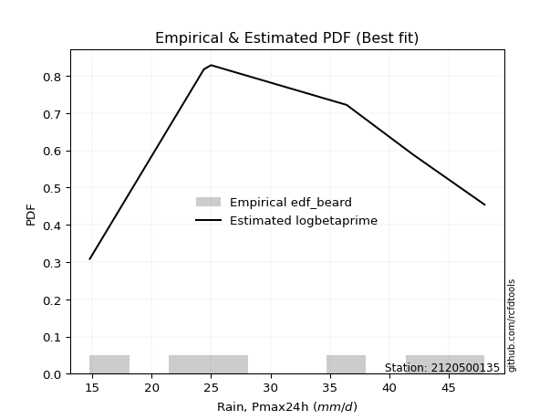</img>

</div>


### 5. EDF Chegodayev (1955)

The Chegodayev formula is an empirical plotting position formula used in hydrological frequency analysis to estimate the exceedance probability or return period of a specific event from a set of observed data. It is primarily used for plotting observed data points on probability paper to fit a theoretical distribution, particularly for analyzing extreme events like maximum flood flows or rainfall intensities. The constant _b_ value in the generalized plotting position formula is 0.3.

<div align="center">


$P=(m-b)/(n+1-2b)$


</div>


**5.1. Empirical values**

<div align="center">

|                | 0                   | 1                   | 2                   | 3              | 4                  | 5                  | 6                  |
|:---------------|:--------------------|:--------------------|:--------------------|:---------------|:-------------------|:-------------------|:-------------------|
| date           | 2023                | 2021                | 2019                | 2022           | 2025               | 2020               | 2024               |
| x              | 14.8                | 24.4                | 25.0                | 36.4           | 38.2               | 42.0               | 48.0               |
| m              | 1                   | 2                   | 3                   | 4              | 5                  | 6                  | 7                  |
| empirical_dist | edf_chegodayev      | edf_chegodayev      | edf_chegodayev      | edf_chegodayev | edf_chegodayev     | edf_chegodayev     | edf_chegodayev     |
| empirical      | 0.09459459459459459 | 0.22972972972972971 | 0.36486486486486486 | 0.5            | 0.6351351351351351 | 0.7702702702702703 | 0.9054054054054054 |
| empirical_tr   | 1.1044776119402986  | 1.2982456140350878  | 1.574468085106383   | 2.0            | 2.7407407407407405 | 4.352941176470589  | 10.571428571428568 |

</div>


**5.2. Kolmogorov-Smirnov fit test (sorted by Δ)**


<div align="center">

|                | 0                    | 1                   | 2                   | 3                   | 4                   | 5                   | 6                   | 7                   | 8                   | 9                   | 10                  | 11                  | 12                  | 13                  | 14                  | 15                  | 16                  | 17                  | 18                  | 19                  | 20                  | 21                  | 22                  | 23                  | 24                  | 25                  | 26                  | 27                  | 28                  | 29                  | 30                  | 31                  | 32                  | 33                  | 34                  | 35                  | 36                  | 37                  | 38                  | 39                  | 40                  | 41                  | 42                  | 43                  | 44                  | 45                  | 46                  | 47                  | 48                  | 49                  | 50                  | 51                  | 52                  | 53                  | 54                  | 55                  | 56                  | 57                  | 58                  | 59                  | 60                  | 61                  | 62                  | 63                  | 64                  | 65                  | 66                  | 67                  | 68                  | 69                  | 70                  | 71                  | 72                  | 73                  | 74                  | 75                  | 76                  | 77                  | 78                  | 79                  | 80                  | 81                  | 82                  | 83                  | 84                  | 85                  | 86                  | 87                  | 88                  | 89                  | 90                  | 91                  | 92                  | 93                  | 94                  | 95                  | 96                  | 97                  | 98                  | 99                  | 100                 | 101                 | 102                 | 103                 | 104                 | 105                 | 106                 | 107                 | 108                 | 109                 | 110                 | 111                 | 112                 | 113                 | 114                 | 115                 | 116                 | 117                 | 118                 | 119                 | 120                 | 121                 | 122                 | 123                 | 124                 | 125                 | 126                 | 127                 | 128                 | 129                 | 130                 | 131                 | 132                 | 133                 | 134                 | 135                 | 136                 | 137                 | 138                 | 139                 | 140                 | 141                 | 142                 | 143                 | 144                 | 145                 | 146                 | 147                 | 148                 | 149                 | 150                 | 151                 | 152                 | 153                 | 154                 | 155                 | 156                 | 157                 | 158                 | 159                 |
|:---------------|:---------------------|:--------------------|:--------------------|:--------------------|:--------------------|:--------------------|:--------------------|:--------------------|:--------------------|:--------------------|:--------------------|:--------------------|:--------------------|:--------------------|:--------------------|:--------------------|:--------------------|:--------------------|:--------------------|:--------------------|:--------------------|:--------------------|:--------------------|:--------------------|:--------------------|:--------------------|:--------------------|:--------------------|:--------------------|:--------------------|:--------------------|:--------------------|:--------------------|:--------------------|:--------------------|:--------------------|:--------------------|:--------------------|:--------------------|:--------------------|:--------------------|:--------------------|:--------------------|:--------------------|:--------------------|:--------------------|:--------------------|:--------------------|:--------------------|:--------------------|:--------------------|:--------------------|:--------------------|:--------------------|:--------------------|:--------------------|:--------------------|:--------------------|:--------------------|:--------------------|:--------------------|:--------------------|:--------------------|:--------------------|:--------------------|:--------------------|:--------------------|:--------------------|:--------------------|:--------------------|:--------------------|:--------------------|:--------------------|:--------------------|:--------------------|:--------------------|:--------------------|:--------------------|:--------------------|:--------------------|:--------------------|:--------------------|:--------------------|:--------------------|:--------------------|:--------------------|:--------------------|:--------------------|:--------------------|:--------------------|:--------------------|:--------------------|:--------------------|:--------------------|:--------------------|:--------------------|:--------------------|:--------------------|:--------------------|:--------------------|:--------------------|:--------------------|:--------------------|:--------------------|:--------------------|:--------------------|:--------------------|:--------------------|:--------------------|:--------------------|:--------------------|:--------------------|:--------------------|:--------------------|:--------------------|:--------------------|:--------------------|:--------------------|:--------------------|:--------------------|:--------------------|:--------------------|:--------------------|:--------------------|:--------------------|:--------------------|:--------------------|:--------------------|:--------------------|:--------------------|:--------------------|:--------------------|:--------------------|:--------------------|:--------------------|:--------------------|:--------------------|:--------------------|:--------------------|:--------------------|:--------------------|:--------------------|:--------------------|:--------------------|:--------------------|:--------------------|:--------------------|:--------------------|:--------------------|:--------------------|:--------------------|:--------------------|:--------------------|:--------------------|:--------------------|:--------------------|:--------------------|:--------------------|:--------------------|:--------------------|
| station        | 2120500135           | 2120500135          | 2120500135          | 2120500135          | 2120500135          | 2120500135          | 2120500135          | 2120500135          | 2120500135          | 2120500135          | 2120500135          | 2120500135          | 2120500135          | 2120500135          | 2120500135          | 2120500135          | 2120500135          | 2120500135          | 2120500135          | 2120500135          | 2120500135          | 2120500135          | 2120500135          | 2120500135          | 2120500135          | 2120500135          | 2120500135          | 2120500135          | 2120500135          | 2120500135          | 2120500135          | 2120500135          | 2120500135          | 2120500135          | 2120500135          | 2120500135          | 2120500135          | 2120500135          | 2120500135          | 2120500135          | 2120500135          | 2120500135          | 2120500135          | 2120500135          | 2120500135          | 2120500135          | 2120500135          | 2120500135          | 2120500135          | 2120500135          | 2120500135          | 2120500135          | 2120500135          | 2120500135          | 2120500135          | 2120500135          | 2120500135          | 2120500135          | 2120500135          | 2120500135          | 2120500135          | 2120500135          | 2120500135          | 2120500135          | 2120500135          | 2120500135          | 2120500135          | 2120500135          | 2120500135          | 2120500135          | 2120500135          | 2120500135          | 2120500135          | 2120500135          | 2120500135          | 2120500135          | 2120500135          | 2120500135          | 2120500135          | 2120500135          | 2120500135          | 2120500135          | 2120500135          | 2120500135          | 2120500135          | 2120500135          | 2120500135          | 2120500135          | 2120500135          | 2120500135          | 2120500135          | 2120500135          | 2120500135          | 2120500135          | 2120500135          | 2120500135          | 2120500135          | 2120500135          | 2120500135          | 2120500135          | 2120500135          | 2120500135          | 2120500135          | 2120500135          | 2120500135          | 2120500135          | 2120500135          | 2120500135          | 2120500135          | 2120500135          | 2120500135          | 2120500135          | 2120500135          | 2120500135          | 2120500135          | 2120500135          | 2120500135          | 2120500135          | 2120500135          | 2120500135          | 2120500135          | 2120500135          | 2120500135          | 2120500135          | 2120500135          | 2120500135          | 2120500135          | 2120500135          | 2120500135          | 2120500135          | 2120500135          | 2120500135          | 2120500135          | 2120500135          | 2120500135          | 2120500135          | 2120500135          | 2120500135          | 2120500135          | 2120500135          | 2120500135          | 2120500135          | 2120500135          | 2120500135          | 2120500135          | 2120500135          | 2120500135          | 2120500135          | 2120500135          | 2120500135          | 2120500135          | 2120500135          | 2120500135          | 2120500135          | 2120500135          | 2120500135          | 2120500135          | 2120500135          | 2120500135          | 2120500135          |
| empirical_dist | edf_chegodayev       | edf_chegodayev      | edf_chegodayev      | edf_chegodayev      | edf_chegodayev      | edf_chegodayev      | edf_chegodayev      | edf_chegodayev      | edf_chegodayev      | edf_chegodayev      | edf_chegodayev      | edf_chegodayev      | edf_chegodayev      | edf_chegodayev      | edf_chegodayev      | edf_chegodayev      | edf_chegodayev      | edf_chegodayev      | edf_chegodayev      | edf_chegodayev      | edf_chegodayev      | edf_chegodayev      | edf_chegodayev      | edf_chegodayev      | edf_chegodayev      | edf_chegodayev      | edf_chegodayev      | edf_chegodayev      | edf_chegodayev      | edf_chegodayev      | edf_chegodayev      | edf_chegodayev      | edf_chegodayev      | edf_chegodayev      | edf_chegodayev      | edf_chegodayev      | edf_chegodayev      | edf_chegodayev      | edf_chegodayev      | edf_chegodayev      | edf_chegodayev      | edf_chegodayev      | edf_chegodayev      | edf_chegodayev      | edf_chegodayev      | edf_chegodayev      | edf_chegodayev      | edf_chegodayev      | edf_chegodayev      | edf_chegodayev      | edf_chegodayev      | edf_chegodayev      | edf_chegodayev      | edf_chegodayev      | edf_chegodayev      | edf_chegodayev      | edf_chegodayev      | edf_chegodayev      | edf_chegodayev      | edf_chegodayev      | edf_chegodayev      | edf_chegodayev      | edf_chegodayev      | edf_chegodayev      | edf_chegodayev      | edf_chegodayev      | edf_chegodayev      | edf_chegodayev      | edf_chegodayev      | edf_chegodayev      | edf_chegodayev      | edf_chegodayev      | edf_chegodayev      | edf_chegodayev      | edf_chegodayev      | edf_chegodayev      | edf_chegodayev      | edf_chegodayev      | edf_chegodayev      | edf_chegodayev      | edf_chegodayev      | edf_chegodayev      | edf_chegodayev      | edf_chegodayev      | edf_chegodayev      | edf_chegodayev      | edf_chegodayev      | edf_chegodayev      | edf_chegodayev      | edf_chegodayev      | edf_chegodayev      | edf_chegodayev      | edf_chegodayev      | edf_chegodayev      | edf_chegodayev      | edf_chegodayev      | edf_chegodayev      | edf_chegodayev      | edf_chegodayev      | edf_chegodayev      | edf_chegodayev      | edf_chegodayev      | edf_chegodayev      | edf_chegodayev      | edf_chegodayev      | edf_chegodayev      | edf_chegodayev      | edf_chegodayev      | edf_chegodayev      | edf_chegodayev      | edf_chegodayev      | edf_chegodayev      | edf_chegodayev      | edf_chegodayev      | edf_chegodayev      | edf_chegodayev      | edf_chegodayev      | edf_chegodayev      | edf_chegodayev      | edf_chegodayev      | edf_chegodayev      | edf_chegodayev      | edf_chegodayev      | edf_chegodayev      | edf_chegodayev      | edf_chegodayev      | edf_chegodayev      | edf_chegodayev      | edf_chegodayev      | edf_chegodayev      | edf_chegodayev      | edf_chegodayev      | edf_chegodayev      | edf_chegodayev      | edf_chegodayev      | edf_chegodayev      | edf_chegodayev      | edf_chegodayev      | edf_chegodayev      | edf_chegodayev      | edf_chegodayev      | edf_chegodayev      | edf_chegodayev      | edf_chegodayev      | edf_chegodayev      | edf_chegodayev      | edf_chegodayev      | edf_chegodayev      | edf_chegodayev      | edf_chegodayev      | edf_chegodayev      | edf_chegodayev      | edf_chegodayev      | edf_chegodayev      | edf_chegodayev      | edf_chegodayev      | edf_chegodayev      | edf_chegodayev      | edf_chegodayev      | edf_chegodayev      |
| p_dist         | logcrystalball       | logbeta             | logweibull_max      | arcsine             | loggenhalflogistic  | logtrapezoid        | ksone               | genpareto           | semicircular        | burr                | anglit              | logtruncweibull_min | wrapcauchy          | logargus            | kappa4              | logmielke           | logburr             | logarcsine          | logweibull_min      | logburr12           | logloggamma         | beta                | pearson3            | dweibull            | f                   | t                   | norm                | crystalball         | exponnorm           | nct                 | johnsonsu           | loggumbel_l         | logjohnsonsu        | dgamma              | logskewnorm         | foldnorm            | erlang              | weibull_min         | gamma               | argus               | logpearson3         | betaprime           | logsemicircular     | truncnorm           | invgamma            | genextreme          | skewnorm            | rice                | cosine              | lomax               | loggenextreme       | genhalflogistic     | tukeylambda         | uniform             | logistic            | alpha               | loganglit           | gompertz            | genlogistic         | vonmises_line       | triang              | maxwell             | invgauss            | ncf                 | logncf              | gumbel_l            | hypsecant           | truncweibull_min    | rayleigh            | logtriang           | loginvweibull       | loggengamma         | logf                | loggamma            | loggamma            | logt                | logexponnorm        | lognorm             | logerlang           | kstwobign           | logfatiguelife      | logrice             | lognct              | loginvgamma         | kappa3              | halfnorm            | logalpha            | loglevy_l           | logbetaprime        | loginvgauss         | logfoldnorm         | gausshyper          | logvonmises_line    | laplace             | logkstwobign        | logmaxwell          | loglogistic         | gumbel_r            | loggenexpon         | lograyleigh         | genexpon            | logcosine           | loghypsecant        | logloglaplace       | halflogistic        | loghalfnorm         | moyal               | bradford            | logdweibull         | logksone            | loggennorm          | logexponpow         | truncexpon          | loggumbel_r         | levy_l              | loglaplace          | loglaplace          | loggompertz         | loghalflogistic     | logwrapcauchy       | logmoyal            | trapezoid           | logexponweib        | loggausshyper       | logkappa3           | burr12              | loguniform          | logkappa4           | loglomax            | gennorm             | wald                | halfgennorm         | logdgamma           | logrdist            | nakagami            | lognakagami         | loghalfgennorm      | logtruncnorm        | loggenpareto        | logwald             | logbradford         | logtukeylambda      | logtruncexpon       | invweibull          | johnsonsb           | gengamma            | fatiguelife         | weibull_max         | powerlaw            | logjohnsonsb        | exponweib           | logpowerlaw         | rdist               | exponpow            | truncpareto         | logtruncpareto      | loggenlogistic      | logvonmises         | vonmises            | mielke              |
| delta          | 0.047546516616954526 | 0.09459459434283246 | 0.09459459459431518 | 0.09459459459459463 | 0.09849295319494411 | 0.09929461428819597 | 0.09948541944343958 | 0.1017379111658051  | 0.10915306748584741 | 0.11042178799253766 | 0.11671840559310942 | 0.11843099645272526 | 0.12012184302280815 | 0.12163543085058287 | 0.12806122270801568 | 0.1281727508648889  | 0.12908419665295567 | 0.13049968702380094 | 0.13147088197993076 | 0.13181218652991827 | 0.13183484236514273 | 0.13197374182273855 | 0.1332975930979701  | 0.13390022487412762 | 0.13467013633111458 | 0.13479592881033953 | 0.13481282394938    | 0.13481283526197174 | 0.13481377726971655 | 0.13483457942850063 | 0.13489415834134322 | 0.13491498632107346 | 0.13650661764270838 | 0.13724191062693036 | 0.13762247478051437 | 0.1379416957799353  | 0.1393874396148802  | 0.14005856944636988 | 0.1400617620075253  | 0.1409631094797376  | 0.14191452247759173 | 0.14232102616627285 | 0.14387426430868056 | 0.1439773365121638  | 0.14413090137489193 | 0.14524406723163913 | 0.14555759770454335 | 0.14582495713125898 | 0.14587825720126568 | 0.14836109113864426 | 0.14884391824698956 | 0.14909763978795748 | 0.1497759055433434  | 0.1506024096385541  | 0.15137424118031118 | 0.15261069943489292 | 0.1533556352776032  | 0.15350580443821527 | 0.15452175493975512 | 0.1560192672484182  | 0.157812333228492   | 0.15803054206009826 | 0.1588919129952433  | 0.16251803329942693 | 0.16313586647968947 | 0.1634107404573166  | 0.16446625899504297 | 0.1646922094217821  | 0.16507775950686887 | 0.16665520459975036 | 0.17318859824133315 | 0.17537035137332346 | 0.17547410354158655 | 0.17549041484565098 | 0.17549041484565098 | 0.17579260681523    | 0.1757951503589832  | 0.17579633632638902 | 0.1776957471786439  | 0.17808363907138935 | 0.1790309703167675  | 0.1791040532455691  | 0.1793636954891551  | 0.1845440715689941  | 0.18499316927155185 | 0.1854062220287257  | 0.18560997269557533 | 0.1857799090280698  | 0.18604642252167858 | 0.1876057968411795  | 0.1888090946697687  | 0.19098967066046985 | 0.19147151219630637 | 0.19288229762882847 | 0.1944081409971099  | 0.19457123483518957 | 0.1957305421757758  | 0.19706464124764822 | 0.20004674166517789 | 0.20013247398877976 | 0.20112711307950404 | 0.20633123559931743 | 0.21067373488191798 | 0.2129353610432081  | 0.213703610547622   | 0.21661825326332151 | 0.2178535354963017  | 0.2190874515111153  | 0.21993660939931797 | 0.22073602665971848 | 0.2230149752770352  | 0.22531974604874916 | 0.23096445638435426 | 0.23135869487203964 | 0.23504242199808373 | 0.23762865869735683 | 0.23762865869735683 | 0.23926363733681555 | 0.2441940871829048  | 0.24482511348088437 | 0.24950365705498267 | 0.24970139975946332 | 0.25942766666140016 | 0.2595680975632556  | 0.2631113977816779  | 0.26436103332874583 | 0.26488323199166186 | 0.26554100211680554 | 0.2663523489521611  | 0.2702702702702703  | 0.27637413118765697 | 0.279404290028758   | 0.2832505664040361  | 0.28436080725748636 | 0.2852590613440299  | 0.28701759289628415 | 0.28787767212197934 | 0.2951259306754579  | 0.30155457997811713 | 0.30171787542047146 | 0.3215472394309068  | 0.3220199348374439  | 0.3305180229224882  | 0.48170241730013025 | 0.5054461448941024  | 0.5523762312864485  | 0.5530201971411394  | 0.5551591928631927  | 0.5788042582686884  | 0.5921586664008919  | 0.6001175106102312  | 0.6236366627747878  | 0.6278973928148435  | 0.6287985188074642  | 0.678870076935825   | 0.706543234289081   | 0.7702702702702703  | 1.1717637741861187  | 7.289732932818071   | nan                 |
| deltao         | 0.48442053926100004  | 0.48442053926100004 | 0.48442053926100004 | 0.48442053926100004 | 0.48442053926100004 | 0.48442053926100004 | 0.48442053926100004 | 0.48442053926100004 | 0.48442053926100004 | 0.48442053926100004 | 0.48442053926100004 | 0.48442053926100004 | 0.48442053926100004 | 0.48442053926100004 | 0.48442053926100004 | 0.48442053926100004 | 0.48442053926100004 | 0.48442053926100004 | 0.48442053926100004 | 0.48442053926100004 | 0.48442053926100004 | 0.48442053926100004 | 0.48442053926100004 | 0.48442053926100004 | 0.48442053926100004 | 0.48442053926100004 | 0.48442053926100004 | 0.48442053926100004 | 0.48442053926100004 | 0.48442053926100004 | 0.48442053926100004 | 0.48442053926100004 | 0.48442053926100004 | 0.48442053926100004 | 0.48442053926100004 | 0.48442053926100004 | 0.48442053926100004 | 0.48442053926100004 | 0.48442053926100004 | 0.48442053926100004 | 0.48442053926100004 | 0.48442053926100004 | 0.48442053926100004 | 0.48442053926100004 | 0.48442053926100004 | 0.48442053926100004 | 0.48442053926100004 | 0.48442053926100004 | 0.48442053926100004 | 0.48442053926100004 | 0.48442053926100004 | 0.48442053926100004 | 0.48442053926100004 | 0.48442053926100004 | 0.48442053926100004 | 0.48442053926100004 | 0.48442053926100004 | 0.48442053926100004 | 0.48442053926100004 | 0.48442053926100004 | 0.48442053926100004 | 0.48442053926100004 | 0.48442053926100004 | 0.48442053926100004 | 0.48442053926100004 | 0.48442053926100004 | 0.48442053926100004 | 0.48442053926100004 | 0.48442053926100004 | 0.48442053926100004 | 0.48442053926100004 | 0.48442053926100004 | 0.48442053926100004 | 0.48442053926100004 | 0.48442053926100004 | 0.48442053926100004 | 0.48442053926100004 | 0.48442053926100004 | 0.48442053926100004 | 0.48442053926100004 | 0.48442053926100004 | 0.48442053926100004 | 0.48442053926100004 | 0.48442053926100004 | 0.48442053926100004 | 0.48442053926100004 | 0.48442053926100004 | 0.48442053926100004 | 0.48442053926100004 | 0.48442053926100004 | 0.48442053926100004 | 0.48442053926100004 | 0.48442053926100004 | 0.48442053926100004 | 0.48442053926100004 | 0.48442053926100004 | 0.48442053926100004 | 0.48442053926100004 | 0.48442053926100004 | 0.48442053926100004 | 0.48442053926100004 | 0.48442053926100004 | 0.48442053926100004 | 0.48442053926100004 | 0.48442053926100004 | 0.48442053926100004 | 0.48442053926100004 | 0.48442053926100004 | 0.48442053926100004 | 0.48442053926100004 | 0.48442053926100004 | 0.48442053926100004 | 0.48442053926100004 | 0.48442053926100004 | 0.48442053926100004 | 0.48442053926100004 | 0.48442053926100004 | 0.48442053926100004 | 0.48442053926100004 | 0.48442053926100004 | 0.48442053926100004 | 0.48442053926100004 | 0.48442053926100004 | 0.48442053926100004 | 0.48442053926100004 | 0.48442053926100004 | 0.48442053926100004 | 0.48442053926100004 | 0.48442053926100004 | 0.48442053926100004 | 0.48442053926100004 | 0.48442053926100004 | 0.48442053926100004 | 0.48442053926100004 | 0.48442053926100004 | 0.48442053926100004 | 0.48442053926100004 | 0.48442053926100004 | 0.48442053926100004 | 0.48442053926100004 | 0.48442053926100004 | 0.48442053926100004 | 0.48442053926100004 | 0.48442053926100004 | 0.48442053926100004 | 0.48442053926100004 | 0.48442053926100004 | 0.48442053926100004 | 0.48442053926100004 | 0.48442053926100004 | 0.48442053926100004 | 0.48442053926100004 | 0.48442053926100004 | 0.48442053926100004 | 0.48442053926100004 | 0.48442053926100004 | 0.48442053926100004 | 0.48442053926100004 | 0.48442053926100004 | 0.48442053926100004 |
| eval           | Δo > Δ               | Δo > Δ              | Δo > Δ              | Δo > Δ              | Δo > Δ              | Δo > Δ              | Δo > Δ              | Δo > Δ              | Δo > Δ              | Δo > Δ              | Δo > Δ              | Δo > Δ              | Δo > Δ              | Δo > Δ              | Δo > Δ              | Δo > Δ              | Δo > Δ              | Δo > Δ              | Δo > Δ              | Δo > Δ              | Δo > Δ              | Δo > Δ              | Δo > Δ              | Δo > Δ              | Δo > Δ              | Δo > Δ              | Δo > Δ              | Δo > Δ              | Δo > Δ              | Δo > Δ              | Δo > Δ              | Δo > Δ              | Δo > Δ              | Δo > Δ              | Δo > Δ              | Δo > Δ              | Δo > Δ              | Δo > Δ              | Δo > Δ              | Δo > Δ              | Δo > Δ              | Δo > Δ              | Δo > Δ              | Δo > Δ              | Δo > Δ              | Δo > Δ              | Δo > Δ              | Δo > Δ              | Δo > Δ              | Δo > Δ              | Δo > Δ              | Δo > Δ              | Δo > Δ              | Δo > Δ              | Δo > Δ              | Δo > Δ              | Δo > Δ              | Δo > Δ              | Δo > Δ              | Δo > Δ              | Δo > Δ              | Δo > Δ              | Δo > Δ              | Δo > Δ              | Δo > Δ              | Δo > Δ              | Δo > Δ              | Δo > Δ              | Δo > Δ              | Δo > Δ              | Δo > Δ              | Δo > Δ              | Δo > Δ              | Δo > Δ              | Δo > Δ              | Δo > Δ              | Δo > Δ              | Δo > Δ              | Δo > Δ              | Δo > Δ              | Δo > Δ              | Δo > Δ              | Δo > Δ              | Δo > Δ              | Δo > Δ              | Δo > Δ              | Δo > Δ              | Δo > Δ              | Δo > Δ              | Δo > Δ              | Δo > Δ              | Δo > Δ              | Δo > Δ              | Δo > Δ              | Δo > Δ              | Δo > Δ              | Δo > Δ              | Δo > Δ              | Δo > Δ              | Δo > Δ              | Δo > Δ              | Δo > Δ              | Δo > Δ              | Δo > Δ              | Δo > Δ              | Δo > Δ              | Δo > Δ              | Δo > Δ              | Δo > Δ              | Δo > Δ              | Δo > Δ              | Δo > Δ              | Δo > Δ              | Δo > Δ              | Δo > Δ              | Δo > Δ              | Δo > Δ              | Δo > Δ              | Δo > Δ              | Δo > Δ              | Δo > Δ              | Δo > Δ              | Δo > Δ              | Δo > Δ              | Δo > Δ              | Δo > Δ              | Δo > Δ              | Δo > Δ              | Δo > Δ              | Δo > Δ              | Δo > Δ              | Δo > Δ              | Δo > Δ              | Δo > Δ              | Δo > Δ              | Δo > Δ              | Δo > Δ              | Δo > Δ              | Δo > Δ              | Δo > Δ              | Δo > Δ              | Δo > Δ              | Δo > Δ              | Δo > Δ              | Δo <= Δ             | Δo <= Δ             | Δo <= Δ             | Δo <= Δ             | Δo <= Δ             | Δo <= Δ             | Δo <= Δ             | Δo <= Δ             | Δo <= Δ             | Δo <= Δ             | Δo <= Δ             | Δo <= Δ             | Δo <= Δ             | Δo <= Δ             | Δo <= Δ             | Δo <= Δ             |
| fit            | 1                    | 1                   | 1                   | 1                   | 1                   | 1                   | 1                   | 1                   | 1                   | 1                   | 1                   | 1                   | 1                   | 1                   | 1                   | 1                   | 1                   | 1                   | 1                   | 1                   | 1                   | 1                   | 1                   | 1                   | 1                   | 1                   | 1                   | 1                   | 1                   | 1                   | 1                   | 1                   | 1                   | 1                   | 1                   | 1                   | 1                   | 1                   | 1                   | 1                   | 1                   | 1                   | 1                   | 1                   | 1                   | 1                   | 1                   | 1                   | 1                   | 1                   | 1                   | 1                   | 1                   | 1                   | 1                   | 1                   | 1                   | 1                   | 1                   | 1                   | 1                   | 1                   | 1                   | 1                   | 1                   | 1                   | 1                   | 1                   | 1                   | 1                   | 1                   | 1                   | 1                   | 1                   | 1                   | 1                   | 1                   | 1                   | 1                   | 1                   | 1                   | 1                   | 1                   | 1                   | 1                   | 1                   | 1                   | 1                   | 1                   | 1                   | 1                   | 1                   | 1                   | 1                   | 1                   | 1                   | 1                   | 1                   | 1                   | 1                   | 1                   | 1                   | 1                   | 1                   | 1                   | 1                   | 1                   | 1                   | 1                   | 1                   | 1                   | 1                   | 1                   | 1                   | 1                   | 1                   | 1                   | 1                   | 1                   | 1                   | 1                   | 1                   | 1                   | 1                   | 1                   | 1                   | 1                   | 1                   | 1                   | 1                   | 1                   | 1                   | 1                   | 1                   | 1                   | 1                   | 1                   | 1                   | 1                   | 1                   | 1                   | 1                   | 1                   | 1                   | 0                   | 0                   | 0                   | 0                   | 0                   | 0                   | 0                   | 0                   | 0                   | 0                   | 0                   | 0                   | 0                   | 0                   | 0                   | 0                   |
| n              | 7                    | 7                   | 7                   | 7                   | 7                   | 7                   | 7                   | 7                   | 7                   | 7                   | 7                   | 7                   | 7                   | 7                   | 7                   | 7                   | 7                   | 7                   | 7                   | 7                   | 7                   | 7                   | 7                   | 7                   | 7                   | 7                   | 7                   | 7                   | 7                   | 7                   | 7                   | 7                   | 7                   | 7                   | 7                   | 7                   | 7                   | 7                   | 7                   | 7                   | 7                   | 7                   | 7                   | 7                   | 7                   | 7                   | 7                   | 7                   | 7                   | 7                   | 7                   | 7                   | 7                   | 7                   | 7                   | 7                   | 7                   | 7                   | 7                   | 7                   | 7                   | 7                   | 7                   | 7                   | 7                   | 7                   | 7                   | 7                   | 7                   | 7                   | 7                   | 7                   | 7                   | 7                   | 7                   | 7                   | 7                   | 7                   | 7                   | 7                   | 7                   | 7                   | 7                   | 7                   | 7                   | 7                   | 7                   | 7                   | 7                   | 7                   | 7                   | 7                   | 7                   | 7                   | 7                   | 7                   | 7                   | 7                   | 7                   | 7                   | 7                   | 7                   | 7                   | 7                   | 7                   | 7                   | 7                   | 7                   | 7                   | 7                   | 7                   | 7                   | 7                   | 7                   | 7                   | 7                   | 7                   | 7                   | 7                   | 7                   | 7                   | 7                   | 7                   | 7                   | 7                   | 7                   | 7                   | 7                   | 7                   | 7                   | 7                   | 7                   | 7                   | 7                   | 7                   | 7                   | 7                   | 7                   | 7                   | 7                   | 7                   | 7                   | 7                   | 7                   | 7                   | 7                   | 7                   | 7                   | 7                   | 7                   | 7                   | 7                   | 7                   | 7                   | 7                   | 7                   | 7                   | 7                   | 7                   | 7                   |
| best_fit       | 1                    | 0                   | 0                   | 0                   | 0                   | 0                   | 0                   | 0                   | 0                   | 0                   | 0                   | 0                   | 0                   | 0                   | 0                   | 0                   | 0                   | 0                   | 0                   | 0                   | 0                   | 0                   | 0                   | 0                   | 0                   | 0                   | 0                   | 0                   | 0                   | 0                   | 0                   | 0                   | 0                   | 0                   | 0                   | 0                   | 0                   | 0                   | 0                   | 0                   | 0                   | 0                   | 0                   | 0                   | 0                   | 0                   | 0                   | 0                   | 0                   | 0                   | 0                   | 0                   | 0                   | 0                   | 0                   | 0                   | 0                   | 0                   | 0                   | 0                   | 0                   | 0                   | 0                   | 0                   | 0                   | 0                   | 0                   | 0                   | 0                   | 0                   | 0                   | 0                   | 0                   | 0                   | 0                   | 0                   | 0                   | 0                   | 0                   | 0                   | 0                   | 0                   | 0                   | 0                   | 0                   | 0                   | 0                   | 0                   | 0                   | 0                   | 0                   | 0                   | 0                   | 0                   | 0                   | 0                   | 0                   | 0                   | 0                   | 0                   | 0                   | 0                   | 0                   | 0                   | 0                   | 0                   | 0                   | 0                   | 0                   | 0                   | 0                   | 0                   | 0                   | 0                   | 0                   | 0                   | 0                   | 0                   | 0                   | 0                   | 0                   | 0                   | 0                   | 0                   | 0                   | 0                   | 0                   | 0                   | 0                   | 0                   | 0                   | 0                   | 0                   | 0                   | 0                   | 0                   | 0                   | 0                   | 0                   | 0                   | 0                   | 0                   | 0                   | 0                   | 0                   | 0                   | 0                   | 0                   | 0                   | 0                   | 0                   | 0                   | 0                   | 0                   | 0                   | 0                   | 0                   | 0                   | 0                   | 0                   |
| best_fit_sort  | 1                    | 2                   | 3                   | 4                   | 5                   | 6                   | 7                   | 8                   | 9                   | 10                  | 11                  | 12                  | 13                  | 14                  | 15                  | 16                  | 17                  | 18                  | 19                  | 20                  | 21                  | 22                  | 23                  | 24                  | 25                  | 26                  | 27                  | 28                  | 29                  | 30                  | 31                  | 32                  | 33                  | 34                  | 35                  | 36                  | 37                  | 38                  | 39                  | 40                  | 41                  | 42                  | 43                  | 44                  | 45                  | 46                  | 47                  | 48                  | 49                  | 50                  | 51                  | 52                  | 53                  | 54                  | 55                  | 56                  | 57                  | 58                  | 59                  | 60                  | 61                  | 62                  | 63                  | 64                  | 65                  | 66                  | 67                  | 68                  | 69                  | 70                  | 71                  | 72                  | 73                  | 74                  | 75                  | 76                  | 77                  | 78                  | 79                  | 80                  | 81                  | 82                  | 83                  | 84                  | 85                  | 86                  | 87                  | 88                  | 89                  | 90                  | 91                  | 92                  | 93                  | 94                  | 95                  | 96                  | 97                  | 98                  | 99                  | 100                 | 101                 | 102                 | 103                 | 104                 | 105                 | 106                 | 107                 | 108                 | 109                 | 110                 | 111                 | 112                 | 113                 | 114                 | 115                 | 116                 | 117                 | 118                 | 119                 | 120                 | 121                 | 122                 | 123                 | 124                 | 125                 | 126                 | 127                 | 128                 | 129                 | 130                 | 131                 | 132                 | 133                 | 134                 | 135                 | 136                 | 137                 | 138                 | 139                 | 140                 | 141                 | 142                 | 143                 | 144                 | 145                 | 146                 | 147                 | 148                 | 149                 | 150                 | 151                 | 152                 | 153                 | 154                 | 155                 | 156                 | 157                 | 158                 | 159                 | 160                 |

</div>


**5.3. Best fit**

<div align="center">

|   id |    station | empirical_dist   | p_dist         |     delta |   deltao | eval   |   fit |   n |   best_fit |   best_fit_sort |
|-----:|-----------:|:-----------------|:---------------|----------:|---------:|:-------|------:|----:|-----------:|----------------:|
|    0 | 2120500135 | edf_chegodayev   | logcrystalball | 0.0475465 | 0.484421 | Δo > Δ |     1 |   7 |          1 |               1 |

</div>


<div align="center">

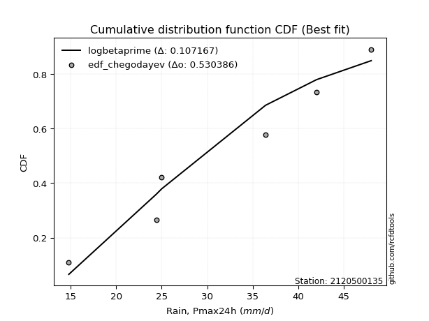</img></img>

</div>


### 6. EDF Blom (1958)

The Blom formula is a specific "plotting position" formula used in hydrology and statistical analysis to estimate the empirical cumulative probability (or non-exceedance probability) of a data series. It is particularly recommended for data that are approximately normally distributed. The constant _a_ is set to 0.375 (or 3/8).

<div align="center">


$P=(m-a)/(n+1-2a)$


</div>


**6.1. Empirical values**

<div align="center">

|                | 0                   | 1                   | 2                  | 3        | 4                  | 5                  | 6                  |
|:---------------|:--------------------|:--------------------|:-------------------|:---------|:-------------------|:-------------------|:-------------------|
| date           | 2023                | 2021                | 2019               | 2022     | 2025               | 2020               | 2024               |
| x              | 14.8                | 24.4                | 25.0               | 36.4     | 38.2               | 42.0               | 48.0               |
| m              | 1                   | 2                   | 3                  | 4        | 5                  | 6                  | 7                  |
| empirical_dist | edf_blom            | edf_blom            | edf_blom           | edf_blom | edf_blom           | edf_blom           | edf_blom           |
| empirical      | 0.08620689655172414 | 0.22413793103448276 | 0.3620689655172414 | 0.5      | 0.6379310344827587 | 0.7758620689655172 | 0.9137931034482759 |
| empirical_tr   | 1.0943396226415094  | 1.288888888888889   | 1.5675675675675675 | 2.0      | 2.7619047619047623 | 4.461538461538462  | 11.600000000000007 |

</div>


**6.2. Kolmogorov-Smirnov fit test (sorted by Δ)**


<div align="center">

|                | 0                   | 1                   | 2                   | 3                   | 4                   | 5                   | 6                   | 7                   | 8                   | 9                   | 10                  | 11                  | 12                  | 13                  | 14                  | 15                  | 16                  | 17                  | 18                  | 19                  | 20                  | 21                  | 22                  | 23                  | 24                  | 25                  | 26                  | 27                  | 28                  | 29                  | 30                  | 31                  | 32                  | 33                  | 34                  | 35                  | 36                  | 37                  | 38                  | 39                  | 40                  | 41                  | 42                  | 43                  | 44                  | 45                  | 46                  | 47                  | 48                  | 49                  | 50                  | 51                  | 52                  | 53                  | 54                  | 55                  | 56                  | 57                  | 58                  | 59                  | 60                  | 61                  | 62                  | 63                  | 64                  | 65                  | 66                  | 67                  | 68                  | 69                  | 70                  | 71                  | 72                  | 73                  | 74                  | 75                  | 76                  | 77                  | 78                  | 79                  | 80                  | 81                  | 82                  | 83                  | 84                  | 85                  | 86                  | 87                  | 88                  | 89                  | 90                  | 91                  | 92                  | 93                  | 94                  | 95                  | 96                  | 97                  | 98                  | 99                  | 100                 | 101                 | 102                 | 103                 | 104                 | 105                 | 106                 | 107                 | 108                 | 109                 | 110                 | 111                 | 112                 | 113                 | 114                 | 115                 | 116                 | 117                 | 118                 | 119                 | 120                 | 121                 | 122                 | 123                 | 124                 | 125                 | 126                 | 127                 | 128                 | 129                 | 130                 | 131                 | 132                 | 133                 | 134                 | 135                 | 136                 | 137                 | 138                 | 139                 | 140                 | 141                 | 142                 | 143                 | 144                 | 145                 | 146                 | 147                 | 148                 | 149                 | 150                 | 151                 | 152                 | 153                 | 154                 | 155                 | 156                 | 157                 | 158                 | 159                 |
|:---------------|:--------------------|:--------------------|:--------------------|:--------------------|:--------------------|:--------------------|:--------------------|:--------------------|:--------------------|:--------------------|:--------------------|:--------------------|:--------------------|:--------------------|:--------------------|:--------------------|:--------------------|:--------------------|:--------------------|:--------------------|:--------------------|:--------------------|:--------------------|:--------------------|:--------------------|:--------------------|:--------------------|:--------------------|:--------------------|:--------------------|:--------------------|:--------------------|:--------------------|:--------------------|:--------------------|:--------------------|:--------------------|:--------------------|:--------------------|:--------------------|:--------------------|:--------------------|:--------------------|:--------------------|:--------------------|:--------------------|:--------------------|:--------------------|:--------------------|:--------------------|:--------------------|:--------------------|:--------------------|:--------------------|:--------------------|:--------------------|:--------------------|:--------------------|:--------------------|:--------------------|:--------------------|:--------------------|:--------------------|:--------------------|:--------------------|:--------------------|:--------------------|:--------------------|:--------------------|:--------------------|:--------------------|:--------------------|:--------------------|:--------------------|:--------------------|:--------------------|:--------------------|:--------------------|:--------------------|:--------------------|:--------------------|:--------------------|:--------------------|:--------------------|:--------------------|:--------------------|:--------------------|:--------------------|:--------------------|:--------------------|:--------------------|:--------------------|:--------------------|:--------------------|:--------------------|:--------------------|:--------------------|:--------------------|:--------------------|:--------------------|:--------------------|:--------------------|:--------------------|:--------------------|:--------------------|:--------------------|:--------------------|:--------------------|:--------------------|:--------------------|:--------------------|:--------------------|:--------------------|:--------------------|:--------------------|:--------------------|:--------------------|:--------------------|:--------------------|:--------------------|:--------------------|:--------------------|:--------------------|:--------------------|:--------------------|:--------------------|:--------------------|:--------------------|:--------------------|:--------------------|:--------------------|:--------------------|:--------------------|:--------------------|:--------------------|:--------------------|:--------------------|:--------------------|:--------------------|:--------------------|:--------------------|:--------------------|:--------------------|:--------------------|:--------------------|:--------------------|:--------------------|:--------------------|:--------------------|:--------------------|:--------------------|:--------------------|:--------------------|:--------------------|:--------------------|:--------------------|:--------------------|:--------------------|:--------------------|:--------------------|
| station        | 2120500135          | 2120500135          | 2120500135          | 2120500135          | 2120500135          | 2120500135          | 2120500135          | 2120500135          | 2120500135          | 2120500135          | 2120500135          | 2120500135          | 2120500135          | 2120500135          | 2120500135          | 2120500135          | 2120500135          | 2120500135          | 2120500135          | 2120500135          | 2120500135          | 2120500135          | 2120500135          | 2120500135          | 2120500135          | 2120500135          | 2120500135          | 2120500135          | 2120500135          | 2120500135          | 2120500135          | 2120500135          | 2120500135          | 2120500135          | 2120500135          | 2120500135          | 2120500135          | 2120500135          | 2120500135          | 2120500135          | 2120500135          | 2120500135          | 2120500135          | 2120500135          | 2120500135          | 2120500135          | 2120500135          | 2120500135          | 2120500135          | 2120500135          | 2120500135          | 2120500135          | 2120500135          | 2120500135          | 2120500135          | 2120500135          | 2120500135          | 2120500135          | 2120500135          | 2120500135          | 2120500135          | 2120500135          | 2120500135          | 2120500135          | 2120500135          | 2120500135          | 2120500135          | 2120500135          | 2120500135          | 2120500135          | 2120500135          | 2120500135          | 2120500135          | 2120500135          | 2120500135          | 2120500135          | 2120500135          | 2120500135          | 2120500135          | 2120500135          | 2120500135          | 2120500135          | 2120500135          | 2120500135          | 2120500135          | 2120500135          | 2120500135          | 2120500135          | 2120500135          | 2120500135          | 2120500135          | 2120500135          | 2120500135          | 2120500135          | 2120500135          | 2120500135          | 2120500135          | 2120500135          | 2120500135          | 2120500135          | 2120500135          | 2120500135          | 2120500135          | 2120500135          | 2120500135          | 2120500135          | 2120500135          | 2120500135          | 2120500135          | 2120500135          | 2120500135          | 2120500135          | 2120500135          | 2120500135          | 2120500135          | 2120500135          | 2120500135          | 2120500135          | 2120500135          | 2120500135          | 2120500135          | 2120500135          | 2120500135          | 2120500135          | 2120500135          | 2120500135          | 2120500135          | 2120500135          | 2120500135          | 2120500135          | 2120500135          | 2120500135          | 2120500135          | 2120500135          | 2120500135          | 2120500135          | 2120500135          | 2120500135          | 2120500135          | 2120500135          | 2120500135          | 2120500135          | 2120500135          | 2120500135          | 2120500135          | 2120500135          | 2120500135          | 2120500135          | 2120500135          | 2120500135          | 2120500135          | 2120500135          | 2120500135          | 2120500135          | 2120500135          | 2120500135          | 2120500135          | 2120500135          | 2120500135          | 2120500135          |
| empirical_dist | edf_blom            | edf_blom            | edf_blom            | edf_blom            | edf_blom            | edf_blom            | edf_blom            | edf_blom            | edf_blom            | edf_blom            | edf_blom            | edf_blom            | edf_blom            | edf_blom            | edf_blom            | edf_blom            | edf_blom            | edf_blom            | edf_blom            | edf_blom            | edf_blom            | edf_blom            | edf_blom            | edf_blom            | edf_blom            | edf_blom            | edf_blom            | edf_blom            | edf_blom            | edf_blom            | edf_blom            | edf_blom            | edf_blom            | edf_blom            | edf_blom            | edf_blom            | edf_blom            | edf_blom            | edf_blom            | edf_blom            | edf_blom            | edf_blom            | edf_blom            | edf_blom            | edf_blom            | edf_blom            | edf_blom            | edf_blom            | edf_blom            | edf_blom            | edf_blom            | edf_blom            | edf_blom            | edf_blom            | edf_blom            | edf_blom            | edf_blom            | edf_blom            | edf_blom            | edf_blom            | edf_blom            | edf_blom            | edf_blom            | edf_blom            | edf_blom            | edf_blom            | edf_blom            | edf_blom            | edf_blom            | edf_blom            | edf_blom            | edf_blom            | edf_blom            | edf_blom            | edf_blom            | edf_blom            | edf_blom            | edf_blom            | edf_blom            | edf_blom            | edf_blom            | edf_blom            | edf_blom            | edf_blom            | edf_blom            | edf_blom            | edf_blom            | edf_blom            | edf_blom            | edf_blom            | edf_blom            | edf_blom            | edf_blom            | edf_blom            | edf_blom            | edf_blom            | edf_blom            | edf_blom            | edf_blom            | edf_blom            | edf_blom            | edf_blom            | edf_blom            | edf_blom            | edf_blom            | edf_blom            | edf_blom            | edf_blom            | edf_blom            | edf_blom            | edf_blom            | edf_blom            | edf_blom            | edf_blom            | edf_blom            | edf_blom            | edf_blom            | edf_blom            | edf_blom            | edf_blom            | edf_blom            | edf_blom            | edf_blom            | edf_blom            | edf_blom            | edf_blom            | edf_blom            | edf_blom            | edf_blom            | edf_blom            | edf_blom            | edf_blom            | edf_blom            | edf_blom            | edf_blom            | edf_blom            | edf_blom            | edf_blom            | edf_blom            | edf_blom            | edf_blom            | edf_blom            | edf_blom            | edf_blom            | edf_blom            | edf_blom            | edf_blom            | edf_blom            | edf_blom            | edf_blom            | edf_blom            | edf_blom            | edf_blom            | edf_blom            | edf_blom            | edf_blom            | edf_blom            | edf_blom            | edf_blom            | edf_blom            |
| p_dist         | logcrystalball      | logbeta             | arcsine             | logweibull_max      | loggenhalflogistic  | logtrapezoid        | ksone               | genpareto           | burr                | semicircular        | anglit              | logtruncweibull_min | logargus            | wrapcauchy          | logmielke           | logburr             | kappa4              | logloggamma         | beta                | logburr12           | logweibull_min      | pearson3            | logjohnsonsu        | f                   | t                   | norm                | crystalball         | exponnorm           | nct                 | johnsonsu           | loggumbel_l         | logarcsine          | weibull_min         | logskewnorm         | foldnorm            | argus               | erlang              | dweibull            | gamma               | truncnorm           | logpearson3         | betaprime           | genextreme          | skewnorm            | dgamma              | logsemicircular     | invgamma            | rice                | cosine              | loggenextreme       | genhalflogistic     | tukeylambda         | uniform             | logistic            | genlogistic         | alpha               | loganglit           | gompertz            | triang              | vonmises_line       | lomax               | maxwell             | invgauss            | gumbel_l            | ncf                 | hypsecant           | truncweibull_min    | rayleigh            | logtriang           | logncf              | loginvweibull       | loggengamma         | logf                | loggamma            | loggamma            | logt                | logexponnorm        | lognorm             | logerlang           | kstwobign           | logfatiguelife      | logrice             | lognct              | loginvgamma         | kappa3              | halfnorm            | logalpha            | logbetaprime        | loginvgauss         | gausshyper          | logvonmises_line    | logfoldnorm         | laplace             | loglevy_l           | logkstwobign        | logmaxwell          | loglogistic         | gumbel_r            | loggenexpon         | lograyleigh         | genexpon            | logcosine           | logloglaplace       | loghypsecant        | halflogistic        | loghalfnorm         | logdweibull         | moyal               | bradford            | loggennorm          | logksone            | logexponpow         | truncexpon          | loggumbel_r         | loglaplace          | loglaplace          | loggompertz         | levy_l              | loghalflogistic     | trapezoid           | logmoyal            | logwrapcauchy       | logexponweib        | loggausshyper       | logkappa3           | loguniform          | logkappa4           | burr12              | loglomax            | gennorm             | wald                | logdgamma           | logrdist            | halfgennorm         | nakagami            | lognakagami         | logtruncnorm        | loghalfgennorm      | logwald             | loggenpareto        | logtukeylambda      | logbradford         | logtruncexpon       | invweibull          | johnsonsb           | gengamma            | fatiguelife         | weibull_max         | powerlaw            | logjohnsonsb        | exponweib           | logpowerlaw         | rdist               | exponpow            | truncpareto         | logtruncpareto      | loggenlogistic      | logvonmises         | vonmises            | mielke              |
| delta          | 0.03915881857408399 | 0.08758248016529241 | 0.0929176159350995  | 0.0954786715492062  | 0.09569705384732063 | 0.09929461428819597 | 0.09948541944343958 | 0.10732970986105206 | 0.10762588864491418 | 0.10915306748584741 | 0.11671840559310942 | 0.11843099645272526 | 0.1188395315029594  | 0.12012184302280815 | 0.12537685151726544 | 0.1262882973053322  | 0.12806122270801568 | 0.12903894301751925 | 0.12917784247511507 | 0.13022335047936207 | 0.13024150231170406 | 0.13050169375034662 | 0.1337107182950849  | 0.13467013633111458 | 0.13479592881033953 | 0.13481282394938    | 0.13481283526197174 | 0.13481377726971655 | 0.13483457942850063 | 0.13489415834134322 | 0.13491498632107346 | 0.1360914857190479  | 0.1372626700987464  | 0.13762247478051437 | 0.1379416957799353  | 0.13816721013211414 | 0.1393874396148802  | 0.13949202356937457 | 0.1400617620075253  | 0.14118143716454032 | 0.14191452247759173 | 0.14232102616627285 | 0.14244816788401565 | 0.14276169835691987 | 0.14283370932217732 | 0.14387426430868056 | 0.14413090137489193 | 0.14582495713125898 | 0.14587825720126568 | 0.14604801889936608 | 0.146301740440334   | 0.1497759055433434  | 0.1506024096385541  | 0.15137424118031118 | 0.15172585559213164 | 0.15261069943489292 | 0.1533556352776032  | 0.15350580443821527 | 0.15501643388086853 | 0.1560192672484182  | 0.1567487891815148  | 0.15803054206009826 | 0.1588919129952433  | 0.16061484110969312 | 0.16251803329942693 | 0.16446625899504297 | 0.1646922094217821  | 0.16507775950686887 | 0.16665520459975036 | 0.17152356452256    | 0.17318859824133315 | 0.17537035137332346 | 0.17547410354158655 | 0.17549041484565098 | 0.17549041484565098 | 0.17579260681523    | 0.1757951503589832  | 0.17579633632638902 | 0.1776957471786439  | 0.17808363907138935 | 0.1790309703167675  | 0.1791040532455691  | 0.1793636954891551  | 0.1845440715689941  | 0.18499316927155185 | 0.1854062220287257  | 0.18560997269557533 | 0.18604642252167858 | 0.1876057968411795  | 0.18819377131284637 | 0.1886756128486829  | 0.1888090946697687  | 0.19288229762882847 | 0.19416760707094022 | 0.1944081409971099  | 0.19457123483518957 | 0.1957305421757758  | 0.19706464124764822 | 0.20004674166517789 | 0.20013247398877976 | 0.20112711307950404 | 0.20633123559931743 | 0.21013946169558462 | 0.21067373488191798 | 0.213703610547622   | 0.21661825326332151 | 0.2171407100516945  | 0.2178535354963017  | 0.2190874515111153  | 0.22021907592941173 | 0.22073602665971848 | 0.2309115447439961  | 0.23096445638435426 | 0.23135869487203964 | 0.23762865869735683 | 0.23762865869735683 | 0.23926363733681555 | 0.24343012004095416 | 0.2441940871829048  | 0.24690550041183984 | 0.24950365705498267 | 0.2504169121761313  | 0.25942766666140016 | 0.2595680975632556  | 0.2631113977816779  | 0.26488323199166186 | 0.26554100211680554 | 0.2699528320239928  | 0.27194414764740804 | 0.27586206896551724 | 0.27637413118765697 | 0.28045466705641264 | 0.2815649079098629  | 0.28499608872400495 | 0.2852590613440299  | 0.28701759289628415 | 0.2923300313278344  | 0.2934694708172263  | 0.30171787542047146 | 0.30994227802098756 | 0.3192240354898204  | 0.3215472394309068  | 0.3305180229224882  | 0.4900901153430008  | 0.5110379435893494  | 0.5579680299816955  | 0.5586119958363863  | 0.5607509915584397  | 0.5843960569639354  | 0.5977504650961388  | 0.6057093093054782  | 0.6292284614700348  | 0.6334891915100904  | 0.6343903175027111  | 0.684461875631072   | 0.7121350329843279  | 0.7758620689655172  | 1.1717637741861187  | 7.2813452347752     | nan                 |
| deltao         | 0.48442053926100004 | 0.48442053926100004 | 0.48442053926100004 | 0.48442053926100004 | 0.48442053926100004 | 0.48442053926100004 | 0.48442053926100004 | 0.48442053926100004 | 0.48442053926100004 | 0.48442053926100004 | 0.48442053926100004 | 0.48442053926100004 | 0.48442053926100004 | 0.48442053926100004 | 0.48442053926100004 | 0.48442053926100004 | 0.48442053926100004 | 0.48442053926100004 | 0.48442053926100004 | 0.48442053926100004 | 0.48442053926100004 | 0.48442053926100004 | 0.48442053926100004 | 0.48442053926100004 | 0.48442053926100004 | 0.48442053926100004 | 0.48442053926100004 | 0.48442053926100004 | 0.48442053926100004 | 0.48442053926100004 | 0.48442053926100004 | 0.48442053926100004 | 0.48442053926100004 | 0.48442053926100004 | 0.48442053926100004 | 0.48442053926100004 | 0.48442053926100004 | 0.48442053926100004 | 0.48442053926100004 | 0.48442053926100004 | 0.48442053926100004 | 0.48442053926100004 | 0.48442053926100004 | 0.48442053926100004 | 0.48442053926100004 | 0.48442053926100004 | 0.48442053926100004 | 0.48442053926100004 | 0.48442053926100004 | 0.48442053926100004 | 0.48442053926100004 | 0.48442053926100004 | 0.48442053926100004 | 0.48442053926100004 | 0.48442053926100004 | 0.48442053926100004 | 0.48442053926100004 | 0.48442053926100004 | 0.48442053926100004 | 0.48442053926100004 | 0.48442053926100004 | 0.48442053926100004 | 0.48442053926100004 | 0.48442053926100004 | 0.48442053926100004 | 0.48442053926100004 | 0.48442053926100004 | 0.48442053926100004 | 0.48442053926100004 | 0.48442053926100004 | 0.48442053926100004 | 0.48442053926100004 | 0.48442053926100004 | 0.48442053926100004 | 0.48442053926100004 | 0.48442053926100004 | 0.48442053926100004 | 0.48442053926100004 | 0.48442053926100004 | 0.48442053926100004 | 0.48442053926100004 | 0.48442053926100004 | 0.48442053926100004 | 0.48442053926100004 | 0.48442053926100004 | 0.48442053926100004 | 0.48442053926100004 | 0.48442053926100004 | 0.48442053926100004 | 0.48442053926100004 | 0.48442053926100004 | 0.48442053926100004 | 0.48442053926100004 | 0.48442053926100004 | 0.48442053926100004 | 0.48442053926100004 | 0.48442053926100004 | 0.48442053926100004 | 0.48442053926100004 | 0.48442053926100004 | 0.48442053926100004 | 0.48442053926100004 | 0.48442053926100004 | 0.48442053926100004 | 0.48442053926100004 | 0.48442053926100004 | 0.48442053926100004 | 0.48442053926100004 | 0.48442053926100004 | 0.48442053926100004 | 0.48442053926100004 | 0.48442053926100004 | 0.48442053926100004 | 0.48442053926100004 | 0.48442053926100004 | 0.48442053926100004 | 0.48442053926100004 | 0.48442053926100004 | 0.48442053926100004 | 0.48442053926100004 | 0.48442053926100004 | 0.48442053926100004 | 0.48442053926100004 | 0.48442053926100004 | 0.48442053926100004 | 0.48442053926100004 | 0.48442053926100004 | 0.48442053926100004 | 0.48442053926100004 | 0.48442053926100004 | 0.48442053926100004 | 0.48442053926100004 | 0.48442053926100004 | 0.48442053926100004 | 0.48442053926100004 | 0.48442053926100004 | 0.48442053926100004 | 0.48442053926100004 | 0.48442053926100004 | 0.48442053926100004 | 0.48442053926100004 | 0.48442053926100004 | 0.48442053926100004 | 0.48442053926100004 | 0.48442053926100004 | 0.48442053926100004 | 0.48442053926100004 | 0.48442053926100004 | 0.48442053926100004 | 0.48442053926100004 | 0.48442053926100004 | 0.48442053926100004 | 0.48442053926100004 | 0.48442053926100004 | 0.48442053926100004 | 0.48442053926100004 | 0.48442053926100004 | 0.48442053926100004 | 0.48442053926100004 | 0.48442053926100004 |
| eval           | Δo > Δ              | Δo > Δ              | Δo > Δ              | Δo > Δ              | Δo > Δ              | Δo > Δ              | Δo > Δ              | Δo > Δ              | Δo > Δ              | Δo > Δ              | Δo > Δ              | Δo > Δ              | Δo > Δ              | Δo > Δ              | Δo > Δ              | Δo > Δ              | Δo > Δ              | Δo > Δ              | Δo > Δ              | Δo > Δ              | Δo > Δ              | Δo > Δ              | Δo > Δ              | Δo > Δ              | Δo > Δ              | Δo > Δ              | Δo > Δ              | Δo > Δ              | Δo > Δ              | Δo > Δ              | Δo > Δ              | Δo > Δ              | Δo > Δ              | Δo > Δ              | Δo > Δ              | Δo > Δ              | Δo > Δ              | Δo > Δ              | Δo > Δ              | Δo > Δ              | Δo > Δ              | Δo > Δ              | Δo > Δ              | Δo > Δ              | Δo > Δ              | Δo > Δ              | Δo > Δ              | Δo > Δ              | Δo > Δ              | Δo > Δ              | Δo > Δ              | Δo > Δ              | Δo > Δ              | Δo > Δ              | Δo > Δ              | Δo > Δ              | Δo > Δ              | Δo > Δ              | Δo > Δ              | Δo > Δ              | Δo > Δ              | Δo > Δ              | Δo > Δ              | Δo > Δ              | Δo > Δ              | Δo > Δ              | Δo > Δ              | Δo > Δ              | Δo > Δ              | Δo > Δ              | Δo > Δ              | Δo > Δ              | Δo > Δ              | Δo > Δ              | Δo > Δ              | Δo > Δ              | Δo > Δ              | Δo > Δ              | Δo > Δ              | Δo > Δ              | Δo > Δ              | Δo > Δ              | Δo > Δ              | Δo > Δ              | Δo > Δ              | Δo > Δ              | Δo > Δ              | Δo > Δ              | Δo > Δ              | Δo > Δ              | Δo > Δ              | Δo > Δ              | Δo > Δ              | Δo > Δ              | Δo > Δ              | Δo > Δ              | Δo > Δ              | Δo > Δ              | Δo > Δ              | Δo > Δ              | Δo > Δ              | Δo > Δ              | Δo > Δ              | Δo > Δ              | Δo > Δ              | Δo > Δ              | Δo > Δ              | Δo > Δ              | Δo > Δ              | Δo > Δ              | Δo > Δ              | Δo > Δ              | Δo > Δ              | Δo > Δ              | Δo > Δ              | Δo > Δ              | Δo > Δ              | Δo > Δ              | Δo > Δ              | Δo > Δ              | Δo > Δ              | Δo > Δ              | Δo > Δ              | Δo > Δ              | Δo > Δ              | Δo > Δ              | Δo > Δ              | Δo > Δ              | Δo > Δ              | Δo > Δ              | Δo > Δ              | Δo > Δ              | Δo > Δ              | Δo > Δ              | Δo > Δ              | Δo > Δ              | Δo > Δ              | Δo > Δ              | Δo > Δ              | Δo > Δ              | Δo > Δ              | Δo > Δ              | Δo > Δ              | Δo <= Δ             | Δo <= Δ             | Δo <= Δ             | Δo <= Δ             | Δo <= Δ             | Δo <= Δ             | Δo <= Δ             | Δo <= Δ             | Δo <= Δ             | Δo <= Δ             | Δo <= Δ             | Δo <= Δ             | Δo <= Δ             | Δo <= Δ             | Δo <= Δ             | Δo <= Δ             | Δo <= Δ             |
| fit            | 1                   | 1                   | 1                   | 1                   | 1                   | 1                   | 1                   | 1                   | 1                   | 1                   | 1                   | 1                   | 1                   | 1                   | 1                   | 1                   | 1                   | 1                   | 1                   | 1                   | 1                   | 1                   | 1                   | 1                   | 1                   | 1                   | 1                   | 1                   | 1                   | 1                   | 1                   | 1                   | 1                   | 1                   | 1                   | 1                   | 1                   | 1                   | 1                   | 1                   | 1                   | 1                   | 1                   | 1                   | 1                   | 1                   | 1                   | 1                   | 1                   | 1                   | 1                   | 1                   | 1                   | 1                   | 1                   | 1                   | 1                   | 1                   | 1                   | 1                   | 1                   | 1                   | 1                   | 1                   | 1                   | 1                   | 1                   | 1                   | 1                   | 1                   | 1                   | 1                   | 1                   | 1                   | 1                   | 1                   | 1                   | 1                   | 1                   | 1                   | 1                   | 1                   | 1                   | 1                   | 1                   | 1                   | 1                   | 1                   | 1                   | 1                   | 1                   | 1                   | 1                   | 1                   | 1                   | 1                   | 1                   | 1                   | 1                   | 1                   | 1                   | 1                   | 1                   | 1                   | 1                   | 1                   | 1                   | 1                   | 1                   | 1                   | 1                   | 1                   | 1                   | 1                   | 1                   | 1                   | 1                   | 1                   | 1                   | 1                   | 1                   | 1                   | 1                   | 1                   | 1                   | 1                   | 1                   | 1                   | 1                   | 1                   | 1                   | 1                   | 1                   | 1                   | 1                   | 1                   | 1                   | 1                   | 1                   | 1                   | 1                   | 1                   | 1                   | 0                   | 0                   | 0                   | 0                   | 0                   | 0                   | 0                   | 0                   | 0                   | 0                   | 0                   | 0                   | 0                   | 0                   | 0                   | 0                   | 0                   |
| n              | 7                   | 7                   | 7                   | 7                   | 7                   | 7                   | 7                   | 7                   | 7                   | 7                   | 7                   | 7                   | 7                   | 7                   | 7                   | 7                   | 7                   | 7                   | 7                   | 7                   | 7                   | 7                   | 7                   | 7                   | 7                   | 7                   | 7                   | 7                   | 7                   | 7                   | 7                   | 7                   | 7                   | 7                   | 7                   | 7                   | 7                   | 7                   | 7                   | 7                   | 7                   | 7                   | 7                   | 7                   | 7                   | 7                   | 7                   | 7                   | 7                   | 7                   | 7                   | 7                   | 7                   | 7                   | 7                   | 7                   | 7                   | 7                   | 7                   | 7                   | 7                   | 7                   | 7                   | 7                   | 7                   | 7                   | 7                   | 7                   | 7                   | 7                   | 7                   | 7                   | 7                   | 7                   | 7                   | 7                   | 7                   | 7                   | 7                   | 7                   | 7                   | 7                   | 7                   | 7                   | 7                   | 7                   | 7                   | 7                   | 7                   | 7                   | 7                   | 7                   | 7                   | 7                   | 7                   | 7                   | 7                   | 7                   | 7                   | 7                   | 7                   | 7                   | 7                   | 7                   | 7                   | 7                   | 7                   | 7                   | 7                   | 7                   | 7                   | 7                   | 7                   | 7                   | 7                   | 7                   | 7                   | 7                   | 7                   | 7                   | 7                   | 7                   | 7                   | 7                   | 7                   | 7                   | 7                   | 7                   | 7                   | 7                   | 7                   | 7                   | 7                   | 7                   | 7                   | 7                   | 7                   | 7                   | 7                   | 7                   | 7                   | 7                   | 7                   | 7                   | 7                   | 7                   | 7                   | 7                   | 7                   | 7                   | 7                   | 7                   | 7                   | 7                   | 7                   | 7                   | 7                   | 7                   | 7                   | 7                   |
| best_fit       | 1                   | 0                   | 0                   | 0                   | 0                   | 0                   | 0                   | 0                   | 0                   | 0                   | 0                   | 0                   | 0                   | 0                   | 0                   | 0                   | 0                   | 0                   | 0                   | 0                   | 0                   | 0                   | 0                   | 0                   | 0                   | 0                   | 0                   | 0                   | 0                   | 0                   | 0                   | 0                   | 0                   | 0                   | 0                   | 0                   | 0                   | 0                   | 0                   | 0                   | 0                   | 0                   | 0                   | 0                   | 0                   | 0                   | 0                   | 0                   | 0                   | 0                   | 0                   | 0                   | 0                   | 0                   | 0                   | 0                   | 0                   | 0                   | 0                   | 0                   | 0                   | 0                   | 0                   | 0                   | 0                   | 0                   | 0                   | 0                   | 0                   | 0                   | 0                   | 0                   | 0                   | 0                   | 0                   | 0                   | 0                   | 0                   | 0                   | 0                   | 0                   | 0                   | 0                   | 0                   | 0                   | 0                   | 0                   | 0                   | 0                   | 0                   | 0                   | 0                   | 0                   | 0                   | 0                   | 0                   | 0                   | 0                   | 0                   | 0                   | 0                   | 0                   | 0                   | 0                   | 0                   | 0                   | 0                   | 0                   | 0                   | 0                   | 0                   | 0                   | 0                   | 0                   | 0                   | 0                   | 0                   | 0                   | 0                   | 0                   | 0                   | 0                   | 0                   | 0                   | 0                   | 0                   | 0                   | 0                   | 0                   | 0                   | 0                   | 0                   | 0                   | 0                   | 0                   | 0                   | 0                   | 0                   | 0                   | 0                   | 0                   | 0                   | 0                   | 0                   | 0                   | 0                   | 0                   | 0                   | 0                   | 0                   | 0                   | 0                   | 0                   | 0                   | 0                   | 0                   | 0                   | 0                   | 0                   | 0                   |
| best_fit_sort  | 1                   | 2                   | 3                   | 4                   | 5                   | 6                   | 7                   | 8                   | 9                   | 10                  | 11                  | 12                  | 13                  | 14                  | 15                  | 16                  | 17                  | 18                  | 19                  | 20                  | 21                  | 22                  | 23                  | 24                  | 25                  | 26                  | 27                  | 28                  | 29                  | 30                  | 31                  | 32                  | 33                  | 34                  | 35                  | 36                  | 37                  | 38                  | 39                  | 40                  | 41                  | 42                  | 43                  | 44                  | 45                  | 46                  | 47                  | 48                  | 49                  | 50                  | 51                  | 52                  | 53                  | 54                  | 55                  | 56                  | 57                  | 58                  | 59                  | 60                  | 61                  | 62                  | 63                  | 64                  | 65                  | 66                  | 67                  | 68                  | 69                  | 70                  | 71                  | 72                  | 73                  | 74                  | 75                  | 76                  | 77                  | 78                  | 79                  | 80                  | 81                  | 82                  | 83                  | 84                  | 85                  | 86                  | 87                  | 88                  | 89                  | 90                  | 91                  | 92                  | 93                  | 94                  | 95                  | 96                  | 97                  | 98                  | 99                  | 100                 | 101                 | 102                 | 103                 | 104                 | 105                 | 106                 | 107                 | 108                 | 109                 | 110                 | 111                 | 112                 | 113                 | 114                 | 115                 | 116                 | 117                 | 118                 | 119                 | 120                 | 121                 | 122                 | 123                 | 124                 | 125                 | 126                 | 127                 | 128                 | 129                 | 130                 | 131                 | 132                 | 133                 | 134                 | 135                 | 136                 | 137                 | 138                 | 139                 | 140                 | 141                 | 142                 | 143                 | 144                 | 145                 | 146                 | 147                 | 148                 | 149                 | 150                 | 151                 | 152                 | 153                 | 154                 | 155                 | 156                 | 157                 | 158                 | 159                 | 160                 |

</div>


**6.3. Best fit**

<div align="center">

|   id |    station | empirical_dist   | p_dist         |     delta |   deltao | eval   |   fit |   n |   best_fit |   best_fit_sort |
|-----:|-----------:|:-----------------|:---------------|----------:|---------:|:-------|------:|----:|-----------:|----------------:|
|    0 | 2120500135 | edf_blom         | logcrystalball | 0.0391588 | 0.484421 | Δo > Δ |     1 |   7 |          1 |               1 |

</div>


<div align="center">

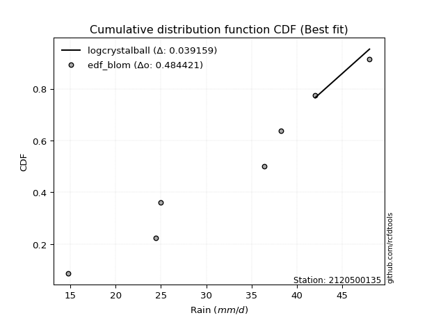</img></img>

</div>


### 7. EDF Tukey (1962)

In hydrology, the Tukey formula is used as a plotting position formula to estimate the empirical probability or frequency of a flood event (or other hydrological data). The formula parameter is given as _c=0.333_ (or 1/3).

<div align="center">


$P=(m-c)/(n+1-2c)$


</div>


**7.1. Empirical values**

<div align="center">

|                | 0                   | 1                   | 2                   | 3         | 4                  | 5                  | 6                  |
|:---------------|:--------------------|:--------------------|:--------------------|:----------|:-------------------|:-------------------|:-------------------|
| date           | 2023                | 2021                | 2019                | 2022      | 2025               | 2020               | 2024               |
| x              | 14.8                | 24.4                | 25.0                | 36.4      | 38.2               | 42.0               | 48.0               |
| m              | 1                   | 2                   | 3                   | 4         | 5                  | 6                  | 7                  |
| empirical_dist | edf_tukey           | edf_tukey           | edf_tukey           | edf_tukey | edf_tukey          | edf_tukey          | edf_tukey          |
| empirical      | 0.09090909090909091 | 0.22727272727272727 | 0.36363636363636365 | 0.5       | 0.6363636363636364 | 0.7727272727272727 | 0.9090909090909091 |
| empirical_tr   | 1.1                 | 1.2941176470588236  | 1.5714285714285714  | 2.0       | 2.75               | 4.3999999999999995 | 10.999999999999996 |

</div>


**7.2. Kolmogorov-Smirnov fit test (sorted by Δ)**


<div align="center">

|                | 0                   | 1                   | 2                   | 3                   | 4                   | 5                   | 6                   | 7                   | 8                   | 9                   | 10                  | 11                  | 12                  | 13                  | 14                  | 15                  | 16                  | 17                  | 18                  | 19                  | 20                  | 21                  | 22                  | 23                  | 24                  | 25                  | 26                  | 27                  | 28                  | 29                  | 30                  | 31                  | 32                  | 33                  | 34                  | 35                  | 36                  | 37                  | 38                  | 39                  | 40                  | 41                  | 42                  | 43                  | 44                  | 45                  | 46                  | 47                  | 48                  | 49                  | 50                  | 51                  | 52                  | 53                  | 54                  | 55                  | 56                  | 57                  | 58                  | 59                  | 60                  | 61                  | 62                  | 63                  | 64                  | 65                  | 66                  | 67                  | 68                  | 69                  | 70                  | 71                  | 72                  | 73                  | 74                  | 75                  | 76                  | 77                  | 78                  | 79                  | 80                  | 81                  | 82                  | 83                  | 84                  | 85                  | 86                  | 87                  | 88                  | 89                  | 90                  | 91                  | 92                  | 93                  | 94                  | 95                  | 96                  | 97                  | 98                  | 99                  | 100                 | 101                 | 102                 | 103                 | 104                 | 105                 | 106                 | 107                 | 108                 | 109                 | 110                 | 111                 | 112                 | 113                 | 114                 | 115                 | 116                 | 117                 | 118                 | 119                 | 120                 | 121                 | 122                 | 123                 | 124                 | 125                 | 126                 | 127                 | 128                 | 129                 | 130                 | 131                 | 132                 | 133                 | 134                 | 135                 | 136                 | 137                 | 138                 | 139                 | 140                 | 141                 | 142                 | 143                 | 144                 | 145                 | 146                 | 147                 | 148                 | 149                 | 150                 | 151                 | 152                 | 153                 | 154                 | 155                 | 156                 | 157                 | 158                 | 159                 |
|:---------------|:--------------------|:--------------------|:--------------------|:--------------------|:--------------------|:--------------------|:--------------------|:--------------------|:--------------------|:--------------------|:--------------------|:--------------------|:--------------------|:--------------------|:--------------------|:--------------------|:--------------------|:--------------------|:--------------------|:--------------------|:--------------------|:--------------------|:--------------------|:--------------------|:--------------------|:--------------------|:--------------------|:--------------------|:--------------------|:--------------------|:--------------------|:--------------------|:--------------------|:--------------------|:--------------------|:--------------------|:--------------------|:--------------------|:--------------------|:--------------------|:--------------------|:--------------------|:--------------------|:--------------------|:--------------------|:--------------------|:--------------------|:--------------------|:--------------------|:--------------------|:--------------------|:--------------------|:--------------------|:--------------------|:--------------------|:--------------------|:--------------------|:--------------------|:--------------------|:--------------------|:--------------------|:--------------------|:--------------------|:--------------------|:--------------------|:--------------------|:--------------------|:--------------------|:--------------------|:--------------------|:--------------------|:--------------------|:--------------------|:--------------------|:--------------------|:--------------------|:--------------------|:--------------------|:--------------------|:--------------------|:--------------------|:--------------------|:--------------------|:--------------------|:--------------------|:--------------------|:--------------------|:--------------------|:--------------------|:--------------------|:--------------------|:--------------------|:--------------------|:--------------------|:--------------------|:--------------------|:--------------------|:--------------------|:--------------------|:--------------------|:--------------------|:--------------------|:--------------------|:--------------------|:--------------------|:--------------------|:--------------------|:--------------------|:--------------------|:--------------------|:--------------------|:--------------------|:--------------------|:--------------------|:--------------------|:--------------------|:--------------------|:--------------------|:--------------------|:--------------------|:--------------------|:--------------------|:--------------------|:--------------------|:--------------------|:--------------------|:--------------------|:--------------------|:--------------------|:--------------------|:--------------------|:--------------------|:--------------------|:--------------------|:--------------------|:--------------------|:--------------------|:--------------------|:--------------------|:--------------------|:--------------------|:--------------------|:--------------------|:--------------------|:--------------------|:--------------------|:--------------------|:--------------------|:--------------------|:--------------------|:--------------------|:--------------------|:--------------------|:--------------------|:--------------------|:--------------------|:--------------------|:--------------------|:--------------------|:--------------------|
| station        | 2120500135          | 2120500135          | 2120500135          | 2120500135          | 2120500135          | 2120500135          | 2120500135          | 2120500135          | 2120500135          | 2120500135          | 2120500135          | 2120500135          | 2120500135          | 2120500135          | 2120500135          | 2120500135          | 2120500135          | 2120500135          | 2120500135          | 2120500135          | 2120500135          | 2120500135          | 2120500135          | 2120500135          | 2120500135          | 2120500135          | 2120500135          | 2120500135          | 2120500135          | 2120500135          | 2120500135          | 2120500135          | 2120500135          | 2120500135          | 2120500135          | 2120500135          | 2120500135          | 2120500135          | 2120500135          | 2120500135          | 2120500135          | 2120500135          | 2120500135          | 2120500135          | 2120500135          | 2120500135          | 2120500135          | 2120500135          | 2120500135          | 2120500135          | 2120500135          | 2120500135          | 2120500135          | 2120500135          | 2120500135          | 2120500135          | 2120500135          | 2120500135          | 2120500135          | 2120500135          | 2120500135          | 2120500135          | 2120500135          | 2120500135          | 2120500135          | 2120500135          | 2120500135          | 2120500135          | 2120500135          | 2120500135          | 2120500135          | 2120500135          | 2120500135          | 2120500135          | 2120500135          | 2120500135          | 2120500135          | 2120500135          | 2120500135          | 2120500135          | 2120500135          | 2120500135          | 2120500135          | 2120500135          | 2120500135          | 2120500135          | 2120500135          | 2120500135          | 2120500135          | 2120500135          | 2120500135          | 2120500135          | 2120500135          | 2120500135          | 2120500135          | 2120500135          | 2120500135          | 2120500135          | 2120500135          | 2120500135          | 2120500135          | 2120500135          | 2120500135          | 2120500135          | 2120500135          | 2120500135          | 2120500135          | 2120500135          | 2120500135          | 2120500135          | 2120500135          | 2120500135          | 2120500135          | 2120500135          | 2120500135          | 2120500135          | 2120500135          | 2120500135          | 2120500135          | 2120500135          | 2120500135          | 2120500135          | 2120500135          | 2120500135          | 2120500135          | 2120500135          | 2120500135          | 2120500135          | 2120500135          | 2120500135          | 2120500135          | 2120500135          | 2120500135          | 2120500135          | 2120500135          | 2120500135          | 2120500135          | 2120500135          | 2120500135          | 2120500135          | 2120500135          | 2120500135          | 2120500135          | 2120500135          | 2120500135          | 2120500135          | 2120500135          | 2120500135          | 2120500135          | 2120500135          | 2120500135          | 2120500135          | 2120500135          | 2120500135          | 2120500135          | 2120500135          | 2120500135          | 2120500135          | 2120500135          | 2120500135          |
| empirical_dist | edf_tukey           | edf_tukey           | edf_tukey           | edf_tukey           | edf_tukey           | edf_tukey           | edf_tukey           | edf_tukey           | edf_tukey           | edf_tukey           | edf_tukey           | edf_tukey           | edf_tukey           | edf_tukey           | edf_tukey           | edf_tukey           | edf_tukey           | edf_tukey           | edf_tukey           | edf_tukey           | edf_tukey           | edf_tukey           | edf_tukey           | edf_tukey           | edf_tukey           | edf_tukey           | edf_tukey           | edf_tukey           | edf_tukey           | edf_tukey           | edf_tukey           | edf_tukey           | edf_tukey           | edf_tukey           | edf_tukey           | edf_tukey           | edf_tukey           | edf_tukey           | edf_tukey           | edf_tukey           | edf_tukey           | edf_tukey           | edf_tukey           | edf_tukey           | edf_tukey           | edf_tukey           | edf_tukey           | edf_tukey           | edf_tukey           | edf_tukey           | edf_tukey           | edf_tukey           | edf_tukey           | edf_tukey           | edf_tukey           | edf_tukey           | edf_tukey           | edf_tukey           | edf_tukey           | edf_tukey           | edf_tukey           | edf_tukey           | edf_tukey           | edf_tukey           | edf_tukey           | edf_tukey           | edf_tukey           | edf_tukey           | edf_tukey           | edf_tukey           | edf_tukey           | edf_tukey           | edf_tukey           | edf_tukey           | edf_tukey           | edf_tukey           | edf_tukey           | edf_tukey           | edf_tukey           | edf_tukey           | edf_tukey           | edf_tukey           | edf_tukey           | edf_tukey           | edf_tukey           | edf_tukey           | edf_tukey           | edf_tukey           | edf_tukey           | edf_tukey           | edf_tukey           | edf_tukey           | edf_tukey           | edf_tukey           | edf_tukey           | edf_tukey           | edf_tukey           | edf_tukey           | edf_tukey           | edf_tukey           | edf_tukey           | edf_tukey           | edf_tukey           | edf_tukey           | edf_tukey           | edf_tukey           | edf_tukey           | edf_tukey           | edf_tukey           | edf_tukey           | edf_tukey           | edf_tukey           | edf_tukey           | edf_tukey           | edf_tukey           | edf_tukey           | edf_tukey           | edf_tukey           | edf_tukey           | edf_tukey           | edf_tukey           | edf_tukey           | edf_tukey           | edf_tukey           | edf_tukey           | edf_tukey           | edf_tukey           | edf_tukey           | edf_tukey           | edf_tukey           | edf_tukey           | edf_tukey           | edf_tukey           | edf_tukey           | edf_tukey           | edf_tukey           | edf_tukey           | edf_tukey           | edf_tukey           | edf_tukey           | edf_tukey           | edf_tukey           | edf_tukey           | edf_tukey           | edf_tukey           | edf_tukey           | edf_tukey           | edf_tukey           | edf_tukey           | edf_tukey           | edf_tukey           | edf_tukey           | edf_tukey           | edf_tukey           | edf_tukey           | edf_tukey           | edf_tukey           | edf_tukey           | edf_tukey           | edf_tukey           |
| p_dist         | logcrystalball      | logbeta             | arcsine             | logweibull_max      | loggenhalflogistic  | logtrapezoid        | ksone               | genpareto           | semicircular        | burr                | anglit              | logtruncweibull_min | wrapcauchy          | logargus            | logmielke           | logburr             | kappa4              | logweibull_min      | logburr12           | logloggamma         | beta                | pearson3            | logarcsine          | f                   | t                   | norm                | crystalball         | exponnorm           | nct                 | johnsonsu           | loggumbel_l         | logjohnsonsu        | dweibull            | logskewnorm         | foldnorm            | weibull_min         | erlang              | dgamma              | argus               | gamma               | logpearson3         | betaprime           | truncnorm           | logsemicircular     | genextreme          | invgamma            | skewnorm            | rice                | cosine              | loggenextreme       | genhalflogistic     | tukeylambda         | uniform             | logistic            | lomax               | alpha               | genlogistic         | loganglit           | gompertz            | vonmises_line       | triang              | maxwell             | invgauss            | gumbel_l            | ncf                 | hypsecant           | truncweibull_min    | rayleigh            | logtriang           | logncf              | loginvweibull       | loggengamma         | logf                | loggamma            | loggamma            | logt                | logexponnorm        | lognorm             | logerlang           | kstwobign           | logfatiguelife      | logrice             | lognct              | loginvgamma         | kappa3              | halfnorm            | logalpha            | logbetaprime        | loginvgauss         | logfoldnorm         | loglevy_l           | gausshyper          | logvonmises_line    | laplace             | logkstwobign        | logmaxwell          | loglogistic         | gumbel_r            | loggenexpon         | lograyleigh         | genexpon            | logcosine           | loghypsecant        | logloglaplace       | halflogistic        | loghalfnorm         | moyal               | logdweibull         | bradford            | logksone            | loggennorm          | logexponpow         | truncexpon          | loggumbel_r         | loglaplace          | loglaplace          | levy_l              | loggompertz         | loghalflogistic     | logwrapcauchy       | trapezoid           | logmoyal            | logexponweib        | loggausshyper       | logkappa3           | loguniform          | logkappa4           | burr12              | loglomax            | gennorm             | wald                | halfgennorm         | logdgamma           | logrdist            | nakagami            | lognakagami         | loghalfgennorm      | logtruncnorm        | logwald             | loggenpareto        | logtukeylambda      | logbradford         | logtruncexpon       | invweibull          | johnsonsb           | gengamma            | fatiguelife         | weibull_max         | powerlaw            | logjohnsonsb        | exponweib           | logpowerlaw         | rdist               | exponpow            | truncpareto         | logtruncpareto      | loggenlogistic      | logvonmises         | vonmises            | mielke              |
| delta          | 0.04386101293145084 | 0.09090909065732877 | 0.09090909090909094 | 0.09234387531096169 | 0.0972644519664429  | 0.09929461428819597 | 0.09948541944343958 | 0.10419491362280753 | 0.10915306748584741 | 0.10919328676403645 | 0.11671840559310942 | 0.11843099645272526 | 0.12012184302280815 | 0.12040692962208166 | 0.1269442496363877  | 0.12785569542445446 | 0.12806122270801568 | 0.13024238075142955 | 0.13058368530141706 | 0.13060634113664152 | 0.13074524059423734 | 0.13206909186946889 | 0.13295668948080339 | 0.13467013633111458 | 0.13479592881033953 | 0.13481282394938    | 0.13481283526197174 | 0.13481377726971655 | 0.13483457942850063 | 0.13489415834134322 | 0.13491498632107346 | 0.13527811641420717 | 0.13635722733113007 | 0.13762247478051437 | 0.1379416957799353  | 0.13883006821786867 | 0.1393874396148802  | 0.1396989130839328  | 0.1397346082512364  | 0.1400617620075253  | 0.14191452247759173 | 0.14232102616627285 | 0.14274883528366258 | 0.14387426430868056 | 0.14401556600313792 | 0.14413090137489193 | 0.14432909647604214 | 0.14582495713125898 | 0.14587825720126568 | 0.14761541701848835 | 0.14786913855945627 | 0.1497759055433434  | 0.1506024096385541  | 0.15137424118031118 | 0.15204659482414795 | 0.15261069943489292 | 0.1532932537112539  | 0.1533556352776032  | 0.15350580443821527 | 0.1560192672484182  | 0.1565838319999908  | 0.15803054206009826 | 0.1588919129952433  | 0.1621822392288154  | 0.16251803329942693 | 0.16446625899504297 | 0.1646922094217821  | 0.16507775950686887 | 0.16665520459975036 | 0.16682137016519316 | 0.17318859824133315 | 0.17537035137332346 | 0.17547410354158655 | 0.17549041484565098 | 0.17549041484565098 | 0.17579260681523    | 0.1757951503589832  | 0.17579633632638902 | 0.1776957471786439  | 0.17808363907138935 | 0.1790309703167675  | 0.1791040532455691  | 0.1793636954891551  | 0.1845440715689941  | 0.18499316927155185 | 0.1854062220287257  | 0.18560997269557533 | 0.18604642252167858 | 0.1876057968411795  | 0.1888090946697687  | 0.18946541271357345 | 0.18976116943196863 | 0.19024301096780516 | 0.19288229762882847 | 0.1944081409971099  | 0.19457123483518957 | 0.1957305421757758  | 0.19706464124764822 | 0.20004674166517789 | 0.20013247398877976 | 0.20112711307950404 | 0.20633123559931743 | 0.21067373488191798 | 0.21170685981470688 | 0.213703610547622   | 0.21661825326332151 | 0.2178535354963017  | 0.21870810817081676 | 0.2190874515111153  | 0.22073602665971848 | 0.221786474048534   | 0.2277767485057516  | 0.23096445638435426 | 0.23135869487203964 | 0.23762865869735683 | 0.23762865869735683 | 0.2387279256835874  | 0.23926363733681555 | 0.2441940871829048  | 0.24728211593788682 | 0.2484728985309621  | 0.24950365705498267 | 0.25942766666140016 | 0.2595680975632556  | 0.2631113977816779  | 0.26488323199166186 | 0.26554100211680554 | 0.26681803578574825 | 0.2688093514091635  | 0.2727272727272727  | 0.27637413118765697 | 0.2818612924857604  | 0.28202206517553496 | 0.28313230602898515 | 0.2852590613440299  | 0.28701759289628415 | 0.29033467457898177 | 0.2938974294469567  | 0.30171787542047146 | 0.30524008366362076 | 0.3207914336089427  | 0.3215472394309068  | 0.3305180229224882  | 0.48538792098563394 | 0.5079031473511049  | 0.554833233743451   | 0.5554771995981418  | 0.557616195320195   | 0.5812612607256908  | 0.5946156688578943  | 0.6025745130672336  | 0.6260936652317902  | 0.6303543952718459  | 0.6312555212644666  | 0.6813270793928274  | 0.7090002367460834  | 0.7727272727272727  | 1.1717637741861187  | 7.286047429132567   | nan                 |
| deltao         | 0.48442053926100004 | 0.48442053926100004 | 0.48442053926100004 | 0.48442053926100004 | 0.48442053926100004 | 0.48442053926100004 | 0.48442053926100004 | 0.48442053926100004 | 0.48442053926100004 | 0.48442053926100004 | 0.48442053926100004 | 0.48442053926100004 | 0.48442053926100004 | 0.48442053926100004 | 0.48442053926100004 | 0.48442053926100004 | 0.48442053926100004 | 0.48442053926100004 | 0.48442053926100004 | 0.48442053926100004 | 0.48442053926100004 | 0.48442053926100004 | 0.48442053926100004 | 0.48442053926100004 | 0.48442053926100004 | 0.48442053926100004 | 0.48442053926100004 | 0.48442053926100004 | 0.48442053926100004 | 0.48442053926100004 | 0.48442053926100004 | 0.48442053926100004 | 0.48442053926100004 | 0.48442053926100004 | 0.48442053926100004 | 0.48442053926100004 | 0.48442053926100004 | 0.48442053926100004 | 0.48442053926100004 | 0.48442053926100004 | 0.48442053926100004 | 0.48442053926100004 | 0.48442053926100004 | 0.48442053926100004 | 0.48442053926100004 | 0.48442053926100004 | 0.48442053926100004 | 0.48442053926100004 | 0.48442053926100004 | 0.48442053926100004 | 0.48442053926100004 | 0.48442053926100004 | 0.48442053926100004 | 0.48442053926100004 | 0.48442053926100004 | 0.48442053926100004 | 0.48442053926100004 | 0.48442053926100004 | 0.48442053926100004 | 0.48442053926100004 | 0.48442053926100004 | 0.48442053926100004 | 0.48442053926100004 | 0.48442053926100004 | 0.48442053926100004 | 0.48442053926100004 | 0.48442053926100004 | 0.48442053926100004 | 0.48442053926100004 | 0.48442053926100004 | 0.48442053926100004 | 0.48442053926100004 | 0.48442053926100004 | 0.48442053926100004 | 0.48442053926100004 | 0.48442053926100004 | 0.48442053926100004 | 0.48442053926100004 | 0.48442053926100004 | 0.48442053926100004 | 0.48442053926100004 | 0.48442053926100004 | 0.48442053926100004 | 0.48442053926100004 | 0.48442053926100004 | 0.48442053926100004 | 0.48442053926100004 | 0.48442053926100004 | 0.48442053926100004 | 0.48442053926100004 | 0.48442053926100004 | 0.48442053926100004 | 0.48442053926100004 | 0.48442053926100004 | 0.48442053926100004 | 0.48442053926100004 | 0.48442053926100004 | 0.48442053926100004 | 0.48442053926100004 | 0.48442053926100004 | 0.48442053926100004 | 0.48442053926100004 | 0.48442053926100004 | 0.48442053926100004 | 0.48442053926100004 | 0.48442053926100004 | 0.48442053926100004 | 0.48442053926100004 | 0.48442053926100004 | 0.48442053926100004 | 0.48442053926100004 | 0.48442053926100004 | 0.48442053926100004 | 0.48442053926100004 | 0.48442053926100004 | 0.48442053926100004 | 0.48442053926100004 | 0.48442053926100004 | 0.48442053926100004 | 0.48442053926100004 | 0.48442053926100004 | 0.48442053926100004 | 0.48442053926100004 | 0.48442053926100004 | 0.48442053926100004 | 0.48442053926100004 | 0.48442053926100004 | 0.48442053926100004 | 0.48442053926100004 | 0.48442053926100004 | 0.48442053926100004 | 0.48442053926100004 | 0.48442053926100004 | 0.48442053926100004 | 0.48442053926100004 | 0.48442053926100004 | 0.48442053926100004 | 0.48442053926100004 | 0.48442053926100004 | 0.48442053926100004 | 0.48442053926100004 | 0.48442053926100004 | 0.48442053926100004 | 0.48442053926100004 | 0.48442053926100004 | 0.48442053926100004 | 0.48442053926100004 | 0.48442053926100004 | 0.48442053926100004 | 0.48442053926100004 | 0.48442053926100004 | 0.48442053926100004 | 0.48442053926100004 | 0.48442053926100004 | 0.48442053926100004 | 0.48442053926100004 | 0.48442053926100004 | 0.48442053926100004 | 0.48442053926100004 | 0.48442053926100004 |
| eval           | Δo > Δ              | Δo > Δ              | Δo > Δ              | Δo > Δ              | Δo > Δ              | Δo > Δ              | Δo > Δ              | Δo > Δ              | Δo > Δ              | Δo > Δ              | Δo > Δ              | Δo > Δ              | Δo > Δ              | Δo > Δ              | Δo > Δ              | Δo > Δ              | Δo > Δ              | Δo > Δ              | Δo > Δ              | Δo > Δ              | Δo > Δ              | Δo > Δ              | Δo > Δ              | Δo > Δ              | Δo > Δ              | Δo > Δ              | Δo > Δ              | Δo > Δ              | Δo > Δ              | Δo > Δ              | Δo > Δ              | Δo > Δ              | Δo > Δ              | Δo > Δ              | Δo > Δ              | Δo > Δ              | Δo > Δ              | Δo > Δ              | Δo > Δ              | Δo > Δ              | Δo > Δ              | Δo > Δ              | Δo > Δ              | Δo > Δ              | Δo > Δ              | Δo > Δ              | Δo > Δ              | Δo > Δ              | Δo > Δ              | Δo > Δ              | Δo > Δ              | Δo > Δ              | Δo > Δ              | Δo > Δ              | Δo > Δ              | Δo > Δ              | Δo > Δ              | Δo > Δ              | Δo > Δ              | Δo > Δ              | Δo > Δ              | Δo > Δ              | Δo > Δ              | Δo > Δ              | Δo > Δ              | Δo > Δ              | Δo > Δ              | Δo > Δ              | Δo > Δ              | Δo > Δ              | Δo > Δ              | Δo > Δ              | Δo > Δ              | Δo > Δ              | Δo > Δ              | Δo > Δ              | Δo > Δ              | Δo > Δ              | Δo > Δ              | Δo > Δ              | Δo > Δ              | Δo > Δ              | Δo > Δ              | Δo > Δ              | Δo > Δ              | Δo > Δ              | Δo > Δ              | Δo > Δ              | Δo > Δ              | Δo > Δ              | Δo > Δ              | Δo > Δ              | Δo > Δ              | Δo > Δ              | Δo > Δ              | Δo > Δ              | Δo > Δ              | Δo > Δ              | Δo > Δ              | Δo > Δ              | Δo > Δ              | Δo > Δ              | Δo > Δ              | Δo > Δ              | Δo > Δ              | Δo > Δ              | Δo > Δ              | Δo > Δ              | Δo > Δ              | Δo > Δ              | Δo > Δ              | Δo > Δ              | Δo > Δ              | Δo > Δ              | Δo > Δ              | Δo > Δ              | Δo > Δ              | Δo > Δ              | Δo > Δ              | Δo > Δ              | Δo > Δ              | Δo > Δ              | Δo > Δ              | Δo > Δ              | Δo > Δ              | Δo > Δ              | Δo > Δ              | Δo > Δ              | Δo > Δ              | Δo > Δ              | Δo > Δ              | Δo > Δ              | Δo > Δ              | Δo > Δ              | Δo > Δ              | Δo > Δ              | Δo > Δ              | Δo > Δ              | Δo > Δ              | Δo > Δ              | Δo > Δ              | Δo > Δ              | Δo > Δ              | Δo <= Δ             | Δo <= Δ             | Δo <= Δ             | Δo <= Δ             | Δo <= Δ             | Δo <= Δ             | Δo <= Δ             | Δo <= Δ             | Δo <= Δ             | Δo <= Δ             | Δo <= Δ             | Δo <= Δ             | Δo <= Δ             | Δo <= Δ             | Δo <= Δ             | Δo <= Δ             | Δo <= Δ             |
| fit            | 1                   | 1                   | 1                   | 1                   | 1                   | 1                   | 1                   | 1                   | 1                   | 1                   | 1                   | 1                   | 1                   | 1                   | 1                   | 1                   | 1                   | 1                   | 1                   | 1                   | 1                   | 1                   | 1                   | 1                   | 1                   | 1                   | 1                   | 1                   | 1                   | 1                   | 1                   | 1                   | 1                   | 1                   | 1                   | 1                   | 1                   | 1                   | 1                   | 1                   | 1                   | 1                   | 1                   | 1                   | 1                   | 1                   | 1                   | 1                   | 1                   | 1                   | 1                   | 1                   | 1                   | 1                   | 1                   | 1                   | 1                   | 1                   | 1                   | 1                   | 1                   | 1                   | 1                   | 1                   | 1                   | 1                   | 1                   | 1                   | 1                   | 1                   | 1                   | 1                   | 1                   | 1                   | 1                   | 1                   | 1                   | 1                   | 1                   | 1                   | 1                   | 1                   | 1                   | 1                   | 1                   | 1                   | 1                   | 1                   | 1                   | 1                   | 1                   | 1                   | 1                   | 1                   | 1                   | 1                   | 1                   | 1                   | 1                   | 1                   | 1                   | 1                   | 1                   | 1                   | 1                   | 1                   | 1                   | 1                   | 1                   | 1                   | 1                   | 1                   | 1                   | 1                   | 1                   | 1                   | 1                   | 1                   | 1                   | 1                   | 1                   | 1                   | 1                   | 1                   | 1                   | 1                   | 1                   | 1                   | 1                   | 1                   | 1                   | 1                   | 1                   | 1                   | 1                   | 1                   | 1                   | 1                   | 1                   | 1                   | 1                   | 1                   | 1                   | 0                   | 0                   | 0                   | 0                   | 0                   | 0                   | 0                   | 0                   | 0                   | 0                   | 0                   | 0                   | 0                   | 0                   | 0                   | 0                   | 0                   |
| n              | 7                   | 7                   | 7                   | 7                   | 7                   | 7                   | 7                   | 7                   | 7                   | 7                   | 7                   | 7                   | 7                   | 7                   | 7                   | 7                   | 7                   | 7                   | 7                   | 7                   | 7                   | 7                   | 7                   | 7                   | 7                   | 7                   | 7                   | 7                   | 7                   | 7                   | 7                   | 7                   | 7                   | 7                   | 7                   | 7                   | 7                   | 7                   | 7                   | 7                   | 7                   | 7                   | 7                   | 7                   | 7                   | 7                   | 7                   | 7                   | 7                   | 7                   | 7                   | 7                   | 7                   | 7                   | 7                   | 7                   | 7                   | 7                   | 7                   | 7                   | 7                   | 7                   | 7                   | 7                   | 7                   | 7                   | 7                   | 7                   | 7                   | 7                   | 7                   | 7                   | 7                   | 7                   | 7                   | 7                   | 7                   | 7                   | 7                   | 7                   | 7                   | 7                   | 7                   | 7                   | 7                   | 7                   | 7                   | 7                   | 7                   | 7                   | 7                   | 7                   | 7                   | 7                   | 7                   | 7                   | 7                   | 7                   | 7                   | 7                   | 7                   | 7                   | 7                   | 7                   | 7                   | 7                   | 7                   | 7                   | 7                   | 7                   | 7                   | 7                   | 7                   | 7                   | 7                   | 7                   | 7                   | 7                   | 7                   | 7                   | 7                   | 7                   | 7                   | 7                   | 7                   | 7                   | 7                   | 7                   | 7                   | 7                   | 7                   | 7                   | 7                   | 7                   | 7                   | 7                   | 7                   | 7                   | 7                   | 7                   | 7                   | 7                   | 7                   | 7                   | 7                   | 7                   | 7                   | 7                   | 7                   | 7                   | 7                   | 7                   | 7                   | 7                   | 7                   | 7                   | 7                   | 7                   | 7                   | 7                   |
| best_fit       | 1                   | 0                   | 0                   | 0                   | 0                   | 0                   | 0                   | 0                   | 0                   | 0                   | 0                   | 0                   | 0                   | 0                   | 0                   | 0                   | 0                   | 0                   | 0                   | 0                   | 0                   | 0                   | 0                   | 0                   | 0                   | 0                   | 0                   | 0                   | 0                   | 0                   | 0                   | 0                   | 0                   | 0                   | 0                   | 0                   | 0                   | 0                   | 0                   | 0                   | 0                   | 0                   | 0                   | 0                   | 0                   | 0                   | 0                   | 0                   | 0                   | 0                   | 0                   | 0                   | 0                   | 0                   | 0                   | 0                   | 0                   | 0                   | 0                   | 0                   | 0                   | 0                   | 0                   | 0                   | 0                   | 0                   | 0                   | 0                   | 0                   | 0                   | 0                   | 0                   | 0                   | 0                   | 0                   | 0                   | 0                   | 0                   | 0                   | 0                   | 0                   | 0                   | 0                   | 0                   | 0                   | 0                   | 0                   | 0                   | 0                   | 0                   | 0                   | 0                   | 0                   | 0                   | 0                   | 0                   | 0                   | 0                   | 0                   | 0                   | 0                   | 0                   | 0                   | 0                   | 0                   | 0                   | 0                   | 0                   | 0                   | 0                   | 0                   | 0                   | 0                   | 0                   | 0                   | 0                   | 0                   | 0                   | 0                   | 0                   | 0                   | 0                   | 0                   | 0                   | 0                   | 0                   | 0                   | 0                   | 0                   | 0                   | 0                   | 0                   | 0                   | 0                   | 0                   | 0                   | 0                   | 0                   | 0                   | 0                   | 0                   | 0                   | 0                   | 0                   | 0                   | 0                   | 0                   | 0                   | 0                   | 0                   | 0                   | 0                   | 0                   | 0                   | 0                   | 0                   | 0                   | 0                   | 0                   | 0                   |
| best_fit_sort  | 1                   | 2                   | 3                   | 4                   | 5                   | 6                   | 7                   | 8                   | 9                   | 10                  | 11                  | 12                  | 13                  | 14                  | 15                  | 16                  | 17                  | 18                  | 19                  | 20                  | 21                  | 22                  | 23                  | 24                  | 25                  | 26                  | 27                  | 28                  | 29                  | 30                  | 31                  | 32                  | 33                  | 34                  | 35                  | 36                  | 37                  | 38                  | 39                  | 40                  | 41                  | 42                  | 43                  | 44                  | 45                  | 46                  | 47                  | 48                  | 49                  | 50                  | 51                  | 52                  | 53                  | 54                  | 55                  | 56                  | 57                  | 58                  | 59                  | 60                  | 61                  | 62                  | 63                  | 64                  | 65                  | 66                  | 67                  | 68                  | 69                  | 70                  | 71                  | 72                  | 73                  | 74                  | 75                  | 76                  | 77                  | 78                  | 79                  | 80                  | 81                  | 82                  | 83                  | 84                  | 85                  | 86                  | 87                  | 88                  | 89                  | 90                  | 91                  | 92                  | 93                  | 94                  | 95                  | 96                  | 97                  | 98                  | 99                  | 100                 | 101                 | 102                 | 103                 | 104                 | 105                 | 106                 | 107                 | 108                 | 109                 | 110                 | 111                 | 112                 | 113                 | 114                 | 115                 | 116                 | 117                 | 118                 | 119                 | 120                 | 121                 | 122                 | 123                 | 124                 | 125                 | 126                 | 127                 | 128                 | 129                 | 130                 | 131                 | 132                 | 133                 | 134                 | 135                 | 136                 | 137                 | 138                 | 139                 | 140                 | 141                 | 142                 | 143                 | 144                 | 145                 | 146                 | 147                 | 148                 | 149                 | 150                 | 151                 | 152                 | 153                 | 154                 | 155                 | 156                 | 157                 | 158                 | 159                 | 160                 |

</div>


**7.3. Best fit**

<div align="center">

|   id |    station | empirical_dist   | p_dist         |    delta |   deltao | eval   |   fit |   n |   best_fit |   best_fit_sort |
|-----:|-----------:|:-----------------|:---------------|---------:|---------:|:-------|------:|----:|-----------:|----------------:|
|    0 | 2120500135 | edf_tukey        | logcrystalball | 0.043861 | 0.484421 | Δo > Δ |     1 |   7 |          1 |               1 |

</div>


<div align="center">

</img></img>

</div>


### 8. EDF Gringorten (1963)

Gringorten plotting position formula is essential for estimating the probability and return periods of extreme events like floods and heavy rainfall. The constant _a=0.44_.

<div align="center">


$P=(m-a)/(n+1-2a)$


</div>


**8.1. Empirical values**

<div align="center">

|                | 0                   | 1                   | 2                  | 3              | 4                  | 5                  | 6                  |
|:---------------|:--------------------|:--------------------|:-------------------|:---------------|:-------------------|:-------------------|:-------------------|
| date           | 2023                | 2021                | 2019               | 2022           | 2025               | 2020               | 2024               |
| x              | 14.8                | 24.4                | 25.0               | 36.4           | 38.2               | 42.0               | 48.0               |
| m              | 1                   | 2                   | 3                  | 4              | 5                  | 6                  | 7                  |
| empirical_dist | edf_gringorten      | edf_gringorten      | edf_gringorten     | edf_gringorten | edf_gringorten     | edf_gringorten     | edf_gringorten     |
| empirical      | 0.07865168539325844 | 0.21910112359550563 | 0.3595505617977528 | 0.5            | 0.6404494382022471 | 0.7808988764044943 | 0.9213483146067415 |
| empirical_tr   | 1.0853658536585364  | 1.2805755395683454  | 1.5614035087719298 | 2.0            | 2.781249999999999  | 4.564102564102562  | 12.714285714285701 |

</div>


**8.2. Kolmogorov-Smirnov fit test (sorted by Δ)**


<div align="center">

|                | 0                   | 1                   | 2                   | 3                   | 4                   | 5                   | 6                   | 7                   | 8                   | 9                   | 10                  | 11                  | 12                  | 13                  | 14                  | 15                  | 16                  | 17                  | 18                  | 19                  | 20                  | 21                  | 22                  | 23                  | 24                  | 25                  | 26                  | 27                  | 28                  | 29                  | 30                  | 31                  | 32                  | 33                  | 34                  | 35                  | 36                  | 37                  | 38                  | 39                  | 40                  | 41                  | 42                  | 43                  | 44                  | 45                  | 46                  | 47                  | 48                  | 49                  | 50                  | 51                  | 52                  | 53                  | 54                  | 55                  | 56                  | 57                  | 58                  | 59                  | 60                  | 61                  | 62                  | 63                  | 64                  | 65                  | 66                  | 67                  | 68                  | 69                  | 70                  | 71                  | 72                  | 73                  | 74                  | 75                  | 76                  | 77                  | 78                  | 79                  | 80                  | 81                  | 82                  | 83                  | 84                  | 85                  | 86                  | 87                  | 88                  | 89                  | 90                  | 91                  | 92                  | 93                  | 94                  | 95                  | 96                  | 97                  | 98                  | 99                  | 100                 | 101                 | 102                 | 103                 | 104                 | 105                 | 106                 | 107                 | 108                 | 109                 | 110                 | 111                 | 112                 | 113                 | 114                 | 115                 | 116                 | 117                 | 118                 | 119                 | 120                 | 121                 | 122                 | 123                 | 124                 | 125                 | 126                 | 127                 | 128                 | 129                 | 130                 | 131                 | 132                 | 133                 | 134                 | 135                 | 136                 | 137                 | 138                 | 139                 | 140                 | 141                 | 142                 | 143                 | 144                 | 145                 | 146                 | 147                 | 148                 | 149                 | 150                 | 151                 | 152                 | 153                 | 154                 | 155                 | 156                 | 157                 | 158                 | 159                 |
|:---------------|:--------------------|:--------------------|:--------------------|:--------------------|:--------------------|:--------------------|:--------------------|:--------------------|:--------------------|:--------------------|:--------------------|:--------------------|:--------------------|:--------------------|:--------------------|:--------------------|:--------------------|:--------------------|:--------------------|:--------------------|:--------------------|:--------------------|:--------------------|:--------------------|:--------------------|:--------------------|:--------------------|:--------------------|:--------------------|:--------------------|:--------------------|:--------------------|:--------------------|:--------------------|:--------------------|:--------------------|:--------------------|:--------------------|:--------------------|:--------------------|:--------------------|:--------------------|:--------------------|:--------------------|:--------------------|:--------------------|:--------------------|:--------------------|:--------------------|:--------------------|:--------------------|:--------------------|:--------------------|:--------------------|:--------------------|:--------------------|:--------------------|:--------------------|:--------------------|:--------------------|:--------------------|:--------------------|:--------------------|:--------------------|:--------------------|:--------------------|:--------------------|:--------------------|:--------------------|:--------------------|:--------------------|:--------------------|:--------------------|:--------------------|:--------------------|:--------------------|:--------------------|:--------------------|:--------------------|:--------------------|:--------------------|:--------------------|:--------------------|:--------------------|:--------------------|:--------------------|:--------------------|:--------------------|:--------------------|:--------------------|:--------------------|:--------------------|:--------------------|:--------------------|:--------------------|:--------------------|:--------------------|:--------------------|:--------------------|:--------------------|:--------------------|:--------------------|:--------------------|:--------------------|:--------------------|:--------------------|:--------------------|:--------------------|:--------------------|:--------------------|:--------------------|:--------------------|:--------------------|:--------------------|:--------------------|:--------------------|:--------------------|:--------------------|:--------------------|:--------------------|:--------------------|:--------------------|:--------------------|:--------------------|:--------------------|:--------------------|:--------------------|:--------------------|:--------------------|:--------------------|:--------------------|:--------------------|:--------------------|:--------------------|:--------------------|:--------------------|:--------------------|:--------------------|:--------------------|:--------------------|:--------------------|:--------------------|:--------------------|:--------------------|:--------------------|:--------------------|:--------------------|:--------------------|:--------------------|:--------------------|:--------------------|:--------------------|:--------------------|:--------------------|:--------------------|:--------------------|:--------------------|:--------------------|:--------------------|:--------------------|
| station        | 2120500135          | 2120500135          | 2120500135          | 2120500135          | 2120500135          | 2120500135          | 2120500135          | 2120500135          | 2120500135          | 2120500135          | 2120500135          | 2120500135          | 2120500135          | 2120500135          | 2120500135          | 2120500135          | 2120500135          | 2120500135          | 2120500135          | 2120500135          | 2120500135          | 2120500135          | 2120500135          | 2120500135          | 2120500135          | 2120500135          | 2120500135          | 2120500135          | 2120500135          | 2120500135          | 2120500135          | 2120500135          | 2120500135          | 2120500135          | 2120500135          | 2120500135          | 2120500135          | 2120500135          | 2120500135          | 2120500135          | 2120500135          | 2120500135          | 2120500135          | 2120500135          | 2120500135          | 2120500135          | 2120500135          | 2120500135          | 2120500135          | 2120500135          | 2120500135          | 2120500135          | 2120500135          | 2120500135          | 2120500135          | 2120500135          | 2120500135          | 2120500135          | 2120500135          | 2120500135          | 2120500135          | 2120500135          | 2120500135          | 2120500135          | 2120500135          | 2120500135          | 2120500135          | 2120500135          | 2120500135          | 2120500135          | 2120500135          | 2120500135          | 2120500135          | 2120500135          | 2120500135          | 2120500135          | 2120500135          | 2120500135          | 2120500135          | 2120500135          | 2120500135          | 2120500135          | 2120500135          | 2120500135          | 2120500135          | 2120500135          | 2120500135          | 2120500135          | 2120500135          | 2120500135          | 2120500135          | 2120500135          | 2120500135          | 2120500135          | 2120500135          | 2120500135          | 2120500135          | 2120500135          | 2120500135          | 2120500135          | 2120500135          | 2120500135          | 2120500135          | 2120500135          | 2120500135          | 2120500135          | 2120500135          | 2120500135          | 2120500135          | 2120500135          | 2120500135          | 2120500135          | 2120500135          | 2120500135          | 2120500135          | 2120500135          | 2120500135          | 2120500135          | 2120500135          | 2120500135          | 2120500135          | 2120500135          | 2120500135          | 2120500135          | 2120500135          | 2120500135          | 2120500135          | 2120500135          | 2120500135          | 2120500135          | 2120500135          | 2120500135          | 2120500135          | 2120500135          | 2120500135          | 2120500135          | 2120500135          | 2120500135          | 2120500135          | 2120500135          | 2120500135          | 2120500135          | 2120500135          | 2120500135          | 2120500135          | 2120500135          | 2120500135          | 2120500135          | 2120500135          | 2120500135          | 2120500135          | 2120500135          | 2120500135          | 2120500135          | 2120500135          | 2120500135          | 2120500135          | 2120500135          | 2120500135          | 2120500135          |
| empirical_dist | edf_gringorten      | edf_gringorten      | edf_gringorten      | edf_gringorten      | edf_gringorten      | edf_gringorten      | edf_gringorten      | edf_gringorten      | edf_gringorten      | edf_gringorten      | edf_gringorten      | edf_gringorten      | edf_gringorten      | edf_gringorten      | edf_gringorten      | edf_gringorten      | edf_gringorten      | edf_gringorten      | edf_gringorten      | edf_gringorten      | edf_gringorten      | edf_gringorten      | edf_gringorten      | edf_gringorten      | edf_gringorten      | edf_gringorten      | edf_gringorten      | edf_gringorten      | edf_gringorten      | edf_gringorten      | edf_gringorten      | edf_gringorten      | edf_gringorten      | edf_gringorten      | edf_gringorten      | edf_gringorten      | edf_gringorten      | edf_gringorten      | edf_gringorten      | edf_gringorten      | edf_gringorten      | edf_gringorten      | edf_gringorten      | edf_gringorten      | edf_gringorten      | edf_gringorten      | edf_gringorten      | edf_gringorten      | edf_gringorten      | edf_gringorten      | edf_gringorten      | edf_gringorten      | edf_gringorten      | edf_gringorten      | edf_gringorten      | edf_gringorten      | edf_gringorten      | edf_gringorten      | edf_gringorten      | edf_gringorten      | edf_gringorten      | edf_gringorten      | edf_gringorten      | edf_gringorten      | edf_gringorten      | edf_gringorten      | edf_gringorten      | edf_gringorten      | edf_gringorten      | edf_gringorten      | edf_gringorten      | edf_gringorten      | edf_gringorten      | edf_gringorten      | edf_gringorten      | edf_gringorten      | edf_gringorten      | edf_gringorten      | edf_gringorten      | edf_gringorten      | edf_gringorten      | edf_gringorten      | edf_gringorten      | edf_gringorten      | edf_gringorten      | edf_gringorten      | edf_gringorten      | edf_gringorten      | edf_gringorten      | edf_gringorten      | edf_gringorten      | edf_gringorten      | edf_gringorten      | edf_gringorten      | edf_gringorten      | edf_gringorten      | edf_gringorten      | edf_gringorten      | edf_gringorten      | edf_gringorten      | edf_gringorten      | edf_gringorten      | edf_gringorten      | edf_gringorten      | edf_gringorten      | edf_gringorten      | edf_gringorten      | edf_gringorten      | edf_gringorten      | edf_gringorten      | edf_gringorten      | edf_gringorten      | edf_gringorten      | edf_gringorten      | edf_gringorten      | edf_gringorten      | edf_gringorten      | edf_gringorten      | edf_gringorten      | edf_gringorten      | edf_gringorten      | edf_gringorten      | edf_gringorten      | edf_gringorten      | edf_gringorten      | edf_gringorten      | edf_gringorten      | edf_gringorten      | edf_gringorten      | edf_gringorten      | edf_gringorten      | edf_gringorten      | edf_gringorten      | edf_gringorten      | edf_gringorten      | edf_gringorten      | edf_gringorten      | edf_gringorten      | edf_gringorten      | edf_gringorten      | edf_gringorten      | edf_gringorten      | edf_gringorten      | edf_gringorten      | edf_gringorten      | edf_gringorten      | edf_gringorten      | edf_gringorten      | edf_gringorten      | edf_gringorten      | edf_gringorten      | edf_gringorten      | edf_gringorten      | edf_gringorten      | edf_gringorten      | edf_gringorten      | edf_gringorten      | edf_gringorten      | edf_gringorten      | edf_gringorten      |
| p_dist         | logcrystalball      | logbeta             | loggenhalflogistic  | arcsine             | logtrapezoid        | ksone               | logweibull_max      | burr                | semicircular        | genpareto           | logargus            | anglit              | logtruncweibull_min | wrapcauchy          | logmielke           | logburr             | logloggamma         | beta                | pearson3            | kappa4              | logburr12           | logweibull_min      | logjohnsonsu        | f                   | weibull_min         | t                   | norm                | crystalball         | exponnorm           | nct                 | johnsonsu           | loggumbel_l         | argus               | logskewnorm         | foldnorm            | truncnorm           | erlang              | genextreme          | gamma               | skewnorm            | logarcsine          | logpearson3         | betaprime           | loggenextreme       | genhalflogistic     | logsemicircular     | invgamma            | dweibull            | rice                | cosine              | dgamma              | genlogistic         | tukeylambda         | uniform             | logistic            | triang              | alpha               | loganglit           | gompertz            | vonmises_line       | maxwell             | gumbel_l            | invgauss            | ncf                 | lomax               | hypsecant           | truncweibull_min    | rayleigh            | logtriang           | loginvweibull       | loggengamma         | logf                | loggamma            | loggamma            | logt                | logexponnorm        | lognorm             | logerlang           | kstwobign           | logfatiguelife      | logncf              | logrice             | lognct              | loginvgamma         | kappa3              | halfnorm            | logalpha            | gausshyper          | logbetaprime        | logvonmises_line    | loginvgauss         | logfoldnorm         | laplace             | logkstwobign        | logmaxwell          | loglogistic         | gumbel_r            | loggenexpon         | lograyleigh         | genexpon            | loglevy_l           | logcosine           | logloglaplace       | loghypsecant        | halflogistic        | logdweibull         | loghalfnorm         | loggennorm          | moyal               | bradford            | logksone            | truncexpon          | loggumbel_r         | logexponpow         | loglaplace          | loglaplace          | loggompertz         | loghalflogistic     | trapezoid           | logmoyal            | levy_l              | logwrapcauchy       | logexponweib        | loggausshyper       | logkappa3           | loguniform          | logkappa4           | burr12              | wald                | loglomax            | logdgamma           | logrdist            | gennorm             | nakagami            | lognakagami         | logtruncnorm        | halfgennorm         | loghalfgennorm      | logwald             | logtukeylambda      | loggenpareto        | logbradford         | logtruncexpon       | invweibull          | johnsonsb           | gengamma            | fatiguelife         | weibull_max         | powerlaw            | logjohnsonsb        | exponweib           | logpowerlaw         | rdist               | exponpow            | truncpareto         | logtruncpareto      | loggenlogistic      | logvonmises         | vonmises            | mielke              |
| delta          | 0.03160360741561841 | 0.08506407644580383 | 0.09317865012783205 | 0.09795442337407664 | 0.09929461428819597 | 0.09948541944343958 | 0.10051547898818333 | 0.1051074849254256  | 0.10915306748584741 | 0.11236651730002911 | 0.11632112778347081 | 0.11671840559310942 | 0.11843099645272526 | 0.12012184302280815 | 0.12285844779777685 | 0.12376989358584362 | 0.12652053929803067 | 0.1266594387556265  | 0.12798329003085804 | 0.12806122270801568 | 0.13022335047936207 | 0.13024150231170406 | 0.13119231457559632 | 0.13467013633111458 | 0.13474426637925782 | 0.13479592881033953 | 0.13481282394938    | 0.13481283526197174 | 0.13481377726971655 | 0.13483457942850063 | 0.13489415834134322 | 0.13491498632107346 | 0.13564880641262556 | 0.13762247478051437 | 0.1379416957799353  | 0.13866303344505174 | 0.1393874396148802  | 0.13992976416452707 | 0.1400617620075253  | 0.1402432946374313  | 0.14112829315802503 | 0.14191452247759173 | 0.14232102616627285 | 0.1435296151798775  | 0.14378333672084542 | 0.14387426430868056 | 0.14413090137489193 | 0.1445288310083517  | 0.14582495713125898 | 0.14587825720126568 | 0.14787051676115445 | 0.14920745187264306 | 0.1497759055433434  | 0.1506024096385541  | 0.15137424118031118 | 0.15249803016137994 | 0.15261069943489292 | 0.1533556352776032  | 0.15350580443821527 | 0.1560192672484182  | 0.15803054206009826 | 0.15809643739020454 | 0.1588919129952433  | 0.16251803329942693 | 0.16430400033998038 | 0.16446625899504297 | 0.1646922094217821  | 0.16507775950686887 | 0.16665520459975036 | 0.17318859824133315 | 0.17537035137332346 | 0.17547410354158655 | 0.17549041484565098 | 0.17549041484565098 | 0.17579260681523    | 0.1757951503589832  | 0.17579633632638902 | 0.1776957471786439  | 0.17808363907138935 | 0.1790309703167675  | 0.1790787756810256  | 0.1791040532455691  | 0.1793636954891551  | 0.1845440715689941  | 0.18499316927155185 | 0.1854062220287257  | 0.18560997269557533 | 0.1856753675933578  | 0.18604642252167858 | 0.1861572091291943  | 0.1876057968411795  | 0.1888090946697687  | 0.19288229762882847 | 0.1944081409971099  | 0.19457123483518957 | 0.1957305421757758  | 0.19706464124764822 | 0.20004674166517789 | 0.20013247398877976 | 0.20112711307950404 | 0.2017228182294059  | 0.20633123559931743 | 0.20762105797609604 | 0.21067373488191798 | 0.213703610547622   | 0.21462230633220591 | 0.21661825326332151 | 0.21770067220992315 | 0.2178535354963017  | 0.2190874515111153  | 0.22073602665971848 | 0.23096445638435426 | 0.23135869487203964 | 0.23594835218297325 | 0.23762865869735683 | 0.23762865869735683 | 0.23926363733681555 | 0.2441940871829048  | 0.24438709669235126 | 0.24950365705498267 | 0.25098533119941985 | 0.25545371961510843 | 0.25942766666140016 | 0.2595680975632556  | 0.2631113977816779  | 0.26488323199166186 | 0.26554100211680554 | 0.27498963946296995 | 0.27637413118765697 | 0.2769809550863852  | 0.2779362633369241  | 0.2790465041903743  | 0.2808988764044944  | 0.2852590613440299  | 0.28701759289628415 | 0.28981162760834583 | 0.2900328961629821  | 0.29850627825620346 | 0.30171787542047146 | 0.31670563177033184 | 0.31749748917945325 | 0.3215472394309068  | 0.3305180229224882  | 0.49764532650146637 | 0.5160747510283265  | 0.5630048374206726  | 0.5636488032753635  | 0.5657877989974167  | 0.5894328644029125  | 0.602787272535116   | 0.6107461167444553  | 0.6342652689090119  | 0.6385259989490676  | 0.6394271249416883  | 0.6894986830700491  | 0.7171718404233051  | 0.7808988764044943  | 1.1717637741861187  | 7.273790023616734   | nan                 |
| deltao         | 0.48442053926100004 | 0.48442053926100004 | 0.48442053926100004 | 0.48442053926100004 | 0.48442053926100004 | 0.48442053926100004 | 0.48442053926100004 | 0.48442053926100004 | 0.48442053926100004 | 0.48442053926100004 | 0.48442053926100004 | 0.48442053926100004 | 0.48442053926100004 | 0.48442053926100004 | 0.48442053926100004 | 0.48442053926100004 | 0.48442053926100004 | 0.48442053926100004 | 0.48442053926100004 | 0.48442053926100004 | 0.48442053926100004 | 0.48442053926100004 | 0.48442053926100004 | 0.48442053926100004 | 0.48442053926100004 | 0.48442053926100004 | 0.48442053926100004 | 0.48442053926100004 | 0.48442053926100004 | 0.48442053926100004 | 0.48442053926100004 | 0.48442053926100004 | 0.48442053926100004 | 0.48442053926100004 | 0.48442053926100004 | 0.48442053926100004 | 0.48442053926100004 | 0.48442053926100004 | 0.48442053926100004 | 0.48442053926100004 | 0.48442053926100004 | 0.48442053926100004 | 0.48442053926100004 | 0.48442053926100004 | 0.48442053926100004 | 0.48442053926100004 | 0.48442053926100004 | 0.48442053926100004 | 0.48442053926100004 | 0.48442053926100004 | 0.48442053926100004 | 0.48442053926100004 | 0.48442053926100004 | 0.48442053926100004 | 0.48442053926100004 | 0.48442053926100004 | 0.48442053926100004 | 0.48442053926100004 | 0.48442053926100004 | 0.48442053926100004 | 0.48442053926100004 | 0.48442053926100004 | 0.48442053926100004 | 0.48442053926100004 | 0.48442053926100004 | 0.48442053926100004 | 0.48442053926100004 | 0.48442053926100004 | 0.48442053926100004 | 0.48442053926100004 | 0.48442053926100004 | 0.48442053926100004 | 0.48442053926100004 | 0.48442053926100004 | 0.48442053926100004 | 0.48442053926100004 | 0.48442053926100004 | 0.48442053926100004 | 0.48442053926100004 | 0.48442053926100004 | 0.48442053926100004 | 0.48442053926100004 | 0.48442053926100004 | 0.48442053926100004 | 0.48442053926100004 | 0.48442053926100004 | 0.48442053926100004 | 0.48442053926100004 | 0.48442053926100004 | 0.48442053926100004 | 0.48442053926100004 | 0.48442053926100004 | 0.48442053926100004 | 0.48442053926100004 | 0.48442053926100004 | 0.48442053926100004 | 0.48442053926100004 | 0.48442053926100004 | 0.48442053926100004 | 0.48442053926100004 | 0.48442053926100004 | 0.48442053926100004 | 0.48442053926100004 | 0.48442053926100004 | 0.48442053926100004 | 0.48442053926100004 | 0.48442053926100004 | 0.48442053926100004 | 0.48442053926100004 | 0.48442053926100004 | 0.48442053926100004 | 0.48442053926100004 | 0.48442053926100004 | 0.48442053926100004 | 0.48442053926100004 | 0.48442053926100004 | 0.48442053926100004 | 0.48442053926100004 | 0.48442053926100004 | 0.48442053926100004 | 0.48442053926100004 | 0.48442053926100004 | 0.48442053926100004 | 0.48442053926100004 | 0.48442053926100004 | 0.48442053926100004 | 0.48442053926100004 | 0.48442053926100004 | 0.48442053926100004 | 0.48442053926100004 | 0.48442053926100004 | 0.48442053926100004 | 0.48442053926100004 | 0.48442053926100004 | 0.48442053926100004 | 0.48442053926100004 | 0.48442053926100004 | 0.48442053926100004 | 0.48442053926100004 | 0.48442053926100004 | 0.48442053926100004 | 0.48442053926100004 | 0.48442053926100004 | 0.48442053926100004 | 0.48442053926100004 | 0.48442053926100004 | 0.48442053926100004 | 0.48442053926100004 | 0.48442053926100004 | 0.48442053926100004 | 0.48442053926100004 | 0.48442053926100004 | 0.48442053926100004 | 0.48442053926100004 | 0.48442053926100004 | 0.48442053926100004 | 0.48442053926100004 | 0.48442053926100004 | 0.48442053926100004 | 0.48442053926100004 |
| eval           | Δo > Δ              | Δo > Δ              | Δo > Δ              | Δo > Δ              | Δo > Δ              | Δo > Δ              | Δo > Δ              | Δo > Δ              | Δo > Δ              | Δo > Δ              | Δo > Δ              | Δo > Δ              | Δo > Δ              | Δo > Δ              | Δo > Δ              | Δo > Δ              | Δo > Δ              | Δo > Δ              | Δo > Δ              | Δo > Δ              | Δo > Δ              | Δo > Δ              | Δo > Δ              | Δo > Δ              | Δo > Δ              | Δo > Δ              | Δo > Δ              | Δo > Δ              | Δo > Δ              | Δo > Δ              | Δo > Δ              | Δo > Δ              | Δo > Δ              | Δo > Δ              | Δo > Δ              | Δo > Δ              | Δo > Δ              | Δo > Δ              | Δo > Δ              | Δo > Δ              | Δo > Δ              | Δo > Δ              | Δo > Δ              | Δo > Δ              | Δo > Δ              | Δo > Δ              | Δo > Δ              | Δo > Δ              | Δo > Δ              | Δo > Δ              | Δo > Δ              | Δo > Δ              | Δo > Δ              | Δo > Δ              | Δo > Δ              | Δo > Δ              | Δo > Δ              | Δo > Δ              | Δo > Δ              | Δo > Δ              | Δo > Δ              | Δo > Δ              | Δo > Δ              | Δo > Δ              | Δo > Δ              | Δo > Δ              | Δo > Δ              | Δo > Δ              | Δo > Δ              | Δo > Δ              | Δo > Δ              | Δo > Δ              | Δo > Δ              | Δo > Δ              | Δo > Δ              | Δo > Δ              | Δo > Δ              | Δo > Δ              | Δo > Δ              | Δo > Δ              | Δo > Δ              | Δo > Δ              | Δo > Δ              | Δo > Δ              | Δo > Δ              | Δo > Δ              | Δo > Δ              | Δo > Δ              | Δo > Δ              | Δo > Δ              | Δo > Δ              | Δo > Δ              | Δo > Δ              | Δo > Δ              | Δo > Δ              | Δo > Δ              | Δo > Δ              | Δo > Δ              | Δo > Δ              | Δo > Δ              | Δo > Δ              | Δo > Δ              | Δo > Δ              | Δo > Δ              | Δo > Δ              | Δo > Δ              | Δo > Δ              | Δo > Δ              | Δo > Δ              | Δo > Δ              | Δo > Δ              | Δo > Δ              | Δo > Δ              | Δo > Δ              | Δo > Δ              | Δo > Δ              | Δo > Δ              | Δo > Δ              | Δo > Δ              | Δo > Δ              | Δo > Δ              | Δo > Δ              | Δo > Δ              | Δo > Δ              | Δo > Δ              | Δo > Δ              | Δo > Δ              | Δo > Δ              | Δo > Δ              | Δo > Δ              | Δo > Δ              | Δo > Δ              | Δo > Δ              | Δo > Δ              | Δo > Δ              | Δo > Δ              | Δo > Δ              | Δo > Δ              | Δo > Δ              | Δo > Δ              | Δo > Δ              | Δo > Δ              | Δo > Δ              | Δo <= Δ             | Δo <= Δ             | Δo <= Δ             | Δo <= Δ             | Δo <= Δ             | Δo <= Δ             | Δo <= Δ             | Δo <= Δ             | Δo <= Δ             | Δo <= Δ             | Δo <= Δ             | Δo <= Δ             | Δo <= Δ             | Δo <= Δ             | Δo <= Δ             | Δo <= Δ             | Δo <= Δ             |
| fit            | 1                   | 1                   | 1                   | 1                   | 1                   | 1                   | 1                   | 1                   | 1                   | 1                   | 1                   | 1                   | 1                   | 1                   | 1                   | 1                   | 1                   | 1                   | 1                   | 1                   | 1                   | 1                   | 1                   | 1                   | 1                   | 1                   | 1                   | 1                   | 1                   | 1                   | 1                   | 1                   | 1                   | 1                   | 1                   | 1                   | 1                   | 1                   | 1                   | 1                   | 1                   | 1                   | 1                   | 1                   | 1                   | 1                   | 1                   | 1                   | 1                   | 1                   | 1                   | 1                   | 1                   | 1                   | 1                   | 1                   | 1                   | 1                   | 1                   | 1                   | 1                   | 1                   | 1                   | 1                   | 1                   | 1                   | 1                   | 1                   | 1                   | 1                   | 1                   | 1                   | 1                   | 1                   | 1                   | 1                   | 1                   | 1                   | 1                   | 1                   | 1                   | 1                   | 1                   | 1                   | 1                   | 1                   | 1                   | 1                   | 1                   | 1                   | 1                   | 1                   | 1                   | 1                   | 1                   | 1                   | 1                   | 1                   | 1                   | 1                   | 1                   | 1                   | 1                   | 1                   | 1                   | 1                   | 1                   | 1                   | 1                   | 1                   | 1                   | 1                   | 1                   | 1                   | 1                   | 1                   | 1                   | 1                   | 1                   | 1                   | 1                   | 1                   | 1                   | 1                   | 1                   | 1                   | 1                   | 1                   | 1                   | 1                   | 1                   | 1                   | 1                   | 1                   | 1                   | 1                   | 1                   | 1                   | 1                   | 1                   | 1                   | 1                   | 1                   | 0                   | 0                   | 0                   | 0                   | 0                   | 0                   | 0                   | 0                   | 0                   | 0                   | 0                   | 0                   | 0                   | 0                   | 0                   | 0                   | 0                   |
| n              | 7                   | 7                   | 7                   | 7                   | 7                   | 7                   | 7                   | 7                   | 7                   | 7                   | 7                   | 7                   | 7                   | 7                   | 7                   | 7                   | 7                   | 7                   | 7                   | 7                   | 7                   | 7                   | 7                   | 7                   | 7                   | 7                   | 7                   | 7                   | 7                   | 7                   | 7                   | 7                   | 7                   | 7                   | 7                   | 7                   | 7                   | 7                   | 7                   | 7                   | 7                   | 7                   | 7                   | 7                   | 7                   | 7                   | 7                   | 7                   | 7                   | 7                   | 7                   | 7                   | 7                   | 7                   | 7                   | 7                   | 7                   | 7                   | 7                   | 7                   | 7                   | 7                   | 7                   | 7                   | 7                   | 7                   | 7                   | 7                   | 7                   | 7                   | 7                   | 7                   | 7                   | 7                   | 7                   | 7                   | 7                   | 7                   | 7                   | 7                   | 7                   | 7                   | 7                   | 7                   | 7                   | 7                   | 7                   | 7                   | 7                   | 7                   | 7                   | 7                   | 7                   | 7                   | 7                   | 7                   | 7                   | 7                   | 7                   | 7                   | 7                   | 7                   | 7                   | 7                   | 7                   | 7                   | 7                   | 7                   | 7                   | 7                   | 7                   | 7                   | 7                   | 7                   | 7                   | 7                   | 7                   | 7                   | 7                   | 7                   | 7                   | 7                   | 7                   | 7                   | 7                   | 7                   | 7                   | 7                   | 7                   | 7                   | 7                   | 7                   | 7                   | 7                   | 7                   | 7                   | 7                   | 7                   | 7                   | 7                   | 7                   | 7                   | 7                   | 7                   | 7                   | 7                   | 7                   | 7                   | 7                   | 7                   | 7                   | 7                   | 7                   | 7                   | 7                   | 7                   | 7                   | 7                   | 7                   | 7                   |
| best_fit       | 1                   | 0                   | 0                   | 0                   | 0                   | 0                   | 0                   | 0                   | 0                   | 0                   | 0                   | 0                   | 0                   | 0                   | 0                   | 0                   | 0                   | 0                   | 0                   | 0                   | 0                   | 0                   | 0                   | 0                   | 0                   | 0                   | 0                   | 0                   | 0                   | 0                   | 0                   | 0                   | 0                   | 0                   | 0                   | 0                   | 0                   | 0                   | 0                   | 0                   | 0                   | 0                   | 0                   | 0                   | 0                   | 0                   | 0                   | 0                   | 0                   | 0                   | 0                   | 0                   | 0                   | 0                   | 0                   | 0                   | 0                   | 0                   | 0                   | 0                   | 0                   | 0                   | 0                   | 0                   | 0                   | 0                   | 0                   | 0                   | 0                   | 0                   | 0                   | 0                   | 0                   | 0                   | 0                   | 0                   | 0                   | 0                   | 0                   | 0                   | 0                   | 0                   | 0                   | 0                   | 0                   | 0                   | 0                   | 0                   | 0                   | 0                   | 0                   | 0                   | 0                   | 0                   | 0                   | 0                   | 0                   | 0                   | 0                   | 0                   | 0                   | 0                   | 0                   | 0                   | 0                   | 0                   | 0                   | 0                   | 0                   | 0                   | 0                   | 0                   | 0                   | 0                   | 0                   | 0                   | 0                   | 0                   | 0                   | 0                   | 0                   | 0                   | 0                   | 0                   | 0                   | 0                   | 0                   | 0                   | 0                   | 0                   | 0                   | 0                   | 0                   | 0                   | 0                   | 0                   | 0                   | 0                   | 0                   | 0                   | 0                   | 0                   | 0                   | 0                   | 0                   | 0                   | 0                   | 0                   | 0                   | 0                   | 0                   | 0                   | 0                   | 0                   | 0                   | 0                   | 0                   | 0                   | 0                   | 0                   |
| best_fit_sort  | 1                   | 2                   | 3                   | 4                   | 5                   | 6                   | 7                   | 8                   | 9                   | 10                  | 11                  | 12                  | 13                  | 14                  | 15                  | 16                  | 17                  | 18                  | 19                  | 20                  | 21                  | 22                  | 23                  | 24                  | 25                  | 26                  | 27                  | 28                  | 29                  | 30                  | 31                  | 32                  | 33                  | 34                  | 35                  | 36                  | 37                  | 38                  | 39                  | 40                  | 41                  | 42                  | 43                  | 44                  | 45                  | 46                  | 47                  | 48                  | 49                  | 50                  | 51                  | 52                  | 53                  | 54                  | 55                  | 56                  | 57                  | 58                  | 59                  | 60                  | 61                  | 62                  | 63                  | 64                  | 65                  | 66                  | 67                  | 68                  | 69                  | 70                  | 71                  | 72                  | 73                  | 74                  | 75                  | 76                  | 77                  | 78                  | 79                  | 80                  | 81                  | 82                  | 83                  | 84                  | 85                  | 86                  | 87                  | 88                  | 89                  | 90                  | 91                  | 92                  | 93                  | 94                  | 95                  | 96                  | 97                  | 98                  | 99                  | 100                 | 101                 | 102                 | 103                 | 104                 | 105                 | 106                 | 107                 | 108                 | 109                 | 110                 | 111                 | 112                 | 113                 | 114                 | 115                 | 116                 | 117                 | 118                 | 119                 | 120                 | 121                 | 122                 | 123                 | 124                 | 125                 | 126                 | 127                 | 128                 | 129                 | 130                 | 131                 | 132                 | 133                 | 134                 | 135                 | 136                 | 137                 | 138                 | 139                 | 140                 | 141                 | 142                 | 143                 | 144                 | 145                 | 146                 | 147                 | 148                 | 149                 | 150                 | 151                 | 152                 | 153                 | 154                 | 155                 | 156                 | 157                 | 158                 | 159                 | 160                 |

</div>


**8.3. Best fit**

<div align="center">

|   id |    station | empirical_dist   | p_dist         |     delta |   deltao | eval   |   fit |   n |   best_fit |   best_fit_sort |
|-----:|-----------:|:-----------------|:---------------|----------:|---------:|:-------|------:|----:|-----------:|----------------:|
|    0 | 2120500135 | edf_gringorten   | logcrystalball | 0.0316036 | 0.484421 | Δo > Δ |     1 |   7 |          1 |               1 |

</div>


<div align="center">

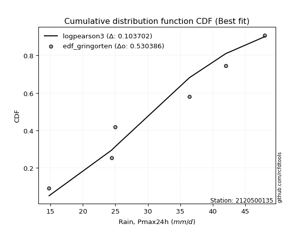</img>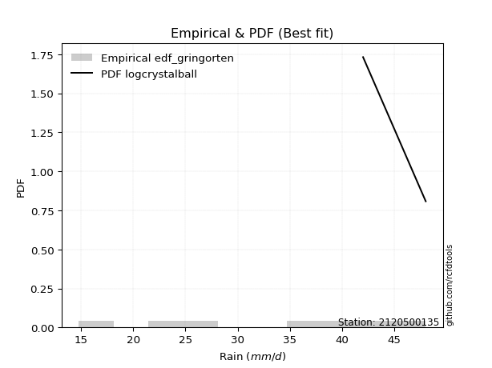</img>

</div>


### 9. EDF Filliben (1975)

The specific values of the constants (0.3175) (often denoted as $alpha$) and (0.365) are derived from a method proposed by James J. Filliben in a 1975 paper. This particular formula is the mean value of the $i$-th order statistic of the normal distribution and is considered a robust and effective plotting position formula for the normal probability plot correlation coefficient test for normality.

<div align="center">


$P=(m-0.3175)/(n+0.365)$


</div>


**9.1. Empirical values**

<div align="center">

|                | 0                   | 1                   | 2                   | 3            | 4                  | 5                  | 6                  |
|:---------------|:--------------------|:--------------------|:--------------------|:-------------|:-------------------|:-------------------|:-------------------|
| date           | 2023                | 2021                | 2019                | 2022         | 2025               | 2020               | 2024               |
| x              | 14.8                | 24.4                | 25.0                | 36.4         | 38.2               | 42.0               | 48.0               |
| m              | 1                   | 2                   | 3                   | 4            | 5                  | 6                  | 7                  |
| empirical_dist | edf_filliben        | edf_filliben        | edf_filliben        | edf_filliben | edf_filliben       | edf_filliben       | edf_filliben       |
| empirical      | 0.09266802443991853 | 0.22844534962661237 | 0.36422267481330617 | 0.5          | 0.6357773251866938 | 0.7715546503733877 | 0.9073319755600815 |
| empirical_tr   | 1.1021324354657687  | 1.2960844698636163  | 1.5728777362520021  | 2.0          | 2.7455731593662627 | 4.377414561664191  | 10.791208791208794 |

</div>


**9.2. Kolmogorov-Smirnov fit test (sorted by Δ)**


<div align="center">

|                | 0                    | 1                   | 2                   | 3                   | 4                   | 5                   | 6                   | 7                   | 8                   | 9                   | 10                  | 11                  | 12                  | 13                  | 14                  | 15                  | 16                  | 17                  | 18                  | 19                  | 20                  | 21                  | 22                  | 23                  | 24                  | 25                  | 26                  | 27                  | 28                  | 29                  | 30                  | 31                  | 32                  | 33                  | 34                  | 35                  | 36                  | 37                  | 38                  | 39                  | 40                  | 41                  | 42                  | 43                  | 44                  | 45                  | 46                  | 47                  | 48                  | 49                  | 50                  | 51                  | 52                  | 53                  | 54                  | 55                  | 56                  | 57                  | 58                  | 59                  | 60                  | 61                  | 62                  | 63                  | 64                  | 65                  | 66                  | 67                  | 68                  | 69                  | 70                  | 71                  | 72                  | 73                  | 74                  | 75                  | 76                  | 77                  | 78                  | 79                  | 80                  | 81                  | 82                  | 83                  | 84                  | 85                  | 86                  | 87                  | 88                  | 89                  | 90                  | 91                  | 92                  | 93                  | 94                  | 95                  | 96                  | 97                  | 98                  | 99                  | 100                 | 101                 | 102                 | 103                 | 104                 | 105                 | 106                 | 107                 | 108                 | 109                 | 110                 | 111                 | 112                 | 113                 | 114                 | 115                 | 116                 | 117                 | 118                 | 119                 | 120                 | 121                 | 122                 | 123                 | 124                 | 125                 | 126                 | 127                 | 128                 | 129                 | 130                 | 131                 | 132                 | 133                 | 134                 | 135                 | 136                 | 137                 | 138                 | 139                 | 140                 | 141                 | 142                 | 143                 | 144                 | 145                 | 146                 | 147                 | 148                 | 149                 | 150                 | 151                 | 152                 | 153                 | 154                 | 155                 | 156                 | 157                 | 158                 | 159                 |
|:---------------|:---------------------|:--------------------|:--------------------|:--------------------|:--------------------|:--------------------|:--------------------|:--------------------|:--------------------|:--------------------|:--------------------|:--------------------|:--------------------|:--------------------|:--------------------|:--------------------|:--------------------|:--------------------|:--------------------|:--------------------|:--------------------|:--------------------|:--------------------|:--------------------|:--------------------|:--------------------|:--------------------|:--------------------|:--------------------|:--------------------|:--------------------|:--------------------|:--------------------|:--------------------|:--------------------|:--------------------|:--------------------|:--------------------|:--------------------|:--------------------|:--------------------|:--------------------|:--------------------|:--------------------|:--------------------|:--------------------|:--------------------|:--------------------|:--------------------|:--------------------|:--------------------|:--------------------|:--------------------|:--------------------|:--------------------|:--------------------|:--------------------|:--------------------|:--------------------|:--------------------|:--------------------|:--------------------|:--------------------|:--------------------|:--------------------|:--------------------|:--------------------|:--------------------|:--------------------|:--------------------|:--------------------|:--------------------|:--------------------|:--------------------|:--------------------|:--------------------|:--------------------|:--------------------|:--------------------|:--------------------|:--------------------|:--------------------|:--------------------|:--------------------|:--------------------|:--------------------|:--------------------|:--------------------|:--------------------|:--------------------|:--------------------|:--------------------|:--------------------|:--------------------|:--------------------|:--------------------|:--------------------|:--------------------|:--------------------|:--------------------|:--------------------|:--------------------|:--------------------|:--------------------|:--------------------|:--------------------|:--------------------|:--------------------|:--------------------|:--------------------|:--------------------|:--------------------|:--------------------|:--------------------|:--------------------|:--------------------|:--------------------|:--------------------|:--------------------|:--------------------|:--------------------|:--------------------|:--------------------|:--------------------|:--------------------|:--------------------|:--------------------|:--------------------|:--------------------|:--------------------|:--------------------|:--------------------|:--------------------|:--------------------|:--------------------|:--------------------|:--------------------|:--------------------|:--------------------|:--------------------|:--------------------|:--------------------|:--------------------|:--------------------|:--------------------|:--------------------|:--------------------|:--------------------|:--------------------|:--------------------|:--------------------|:--------------------|:--------------------|:--------------------|:--------------------|:--------------------|:--------------------|:--------------------|:--------------------|:--------------------|
| station        | 2120500135           | 2120500135          | 2120500135          | 2120500135          | 2120500135          | 2120500135          | 2120500135          | 2120500135          | 2120500135          | 2120500135          | 2120500135          | 2120500135          | 2120500135          | 2120500135          | 2120500135          | 2120500135          | 2120500135          | 2120500135          | 2120500135          | 2120500135          | 2120500135          | 2120500135          | 2120500135          | 2120500135          | 2120500135          | 2120500135          | 2120500135          | 2120500135          | 2120500135          | 2120500135          | 2120500135          | 2120500135          | 2120500135          | 2120500135          | 2120500135          | 2120500135          | 2120500135          | 2120500135          | 2120500135          | 2120500135          | 2120500135          | 2120500135          | 2120500135          | 2120500135          | 2120500135          | 2120500135          | 2120500135          | 2120500135          | 2120500135          | 2120500135          | 2120500135          | 2120500135          | 2120500135          | 2120500135          | 2120500135          | 2120500135          | 2120500135          | 2120500135          | 2120500135          | 2120500135          | 2120500135          | 2120500135          | 2120500135          | 2120500135          | 2120500135          | 2120500135          | 2120500135          | 2120500135          | 2120500135          | 2120500135          | 2120500135          | 2120500135          | 2120500135          | 2120500135          | 2120500135          | 2120500135          | 2120500135          | 2120500135          | 2120500135          | 2120500135          | 2120500135          | 2120500135          | 2120500135          | 2120500135          | 2120500135          | 2120500135          | 2120500135          | 2120500135          | 2120500135          | 2120500135          | 2120500135          | 2120500135          | 2120500135          | 2120500135          | 2120500135          | 2120500135          | 2120500135          | 2120500135          | 2120500135          | 2120500135          | 2120500135          | 2120500135          | 2120500135          | 2120500135          | 2120500135          | 2120500135          | 2120500135          | 2120500135          | 2120500135          | 2120500135          | 2120500135          | 2120500135          | 2120500135          | 2120500135          | 2120500135          | 2120500135          | 2120500135          | 2120500135          | 2120500135          | 2120500135          | 2120500135          | 2120500135          | 2120500135          | 2120500135          | 2120500135          | 2120500135          | 2120500135          | 2120500135          | 2120500135          | 2120500135          | 2120500135          | 2120500135          | 2120500135          | 2120500135          | 2120500135          | 2120500135          | 2120500135          | 2120500135          | 2120500135          | 2120500135          | 2120500135          | 2120500135          | 2120500135          | 2120500135          | 2120500135          | 2120500135          | 2120500135          | 2120500135          | 2120500135          | 2120500135          | 2120500135          | 2120500135          | 2120500135          | 2120500135          | 2120500135          | 2120500135          | 2120500135          | 2120500135          | 2120500135          | 2120500135          |
| empirical_dist | edf_filliben         | edf_filliben        | edf_filliben        | edf_filliben        | edf_filliben        | edf_filliben        | edf_filliben        | edf_filliben        | edf_filliben        | edf_filliben        | edf_filliben        | edf_filliben        | edf_filliben        | edf_filliben        | edf_filliben        | edf_filliben        | edf_filliben        | edf_filliben        | edf_filliben        | edf_filliben        | edf_filliben        | edf_filliben        | edf_filliben        | edf_filliben        | edf_filliben        | edf_filliben        | edf_filliben        | edf_filliben        | edf_filliben        | edf_filliben        | edf_filliben        | edf_filliben        | edf_filliben        | edf_filliben        | edf_filliben        | edf_filliben        | edf_filliben        | edf_filliben        | edf_filliben        | edf_filliben        | edf_filliben        | edf_filliben        | edf_filliben        | edf_filliben        | edf_filliben        | edf_filliben        | edf_filliben        | edf_filliben        | edf_filliben        | edf_filliben        | edf_filliben        | edf_filliben        | edf_filliben        | edf_filliben        | edf_filliben        | edf_filliben        | edf_filliben        | edf_filliben        | edf_filliben        | edf_filliben        | edf_filliben        | edf_filliben        | edf_filliben        | edf_filliben        | edf_filliben        | edf_filliben        | edf_filliben        | edf_filliben        | edf_filliben        | edf_filliben        | edf_filliben        | edf_filliben        | edf_filliben        | edf_filliben        | edf_filliben        | edf_filliben        | edf_filliben        | edf_filliben        | edf_filliben        | edf_filliben        | edf_filliben        | edf_filliben        | edf_filliben        | edf_filliben        | edf_filliben        | edf_filliben        | edf_filliben        | edf_filliben        | edf_filliben        | edf_filliben        | edf_filliben        | edf_filliben        | edf_filliben        | edf_filliben        | edf_filliben        | edf_filliben        | edf_filliben        | edf_filliben        | edf_filliben        | edf_filliben        | edf_filliben        | edf_filliben        | edf_filliben        | edf_filliben        | edf_filliben        | edf_filliben        | edf_filliben        | edf_filliben        | edf_filliben        | edf_filliben        | edf_filliben        | edf_filliben        | edf_filliben        | edf_filliben        | edf_filliben        | edf_filliben        | edf_filliben        | edf_filliben        | edf_filliben        | edf_filliben        | edf_filliben        | edf_filliben        | edf_filliben        | edf_filliben        | edf_filliben        | edf_filliben        | edf_filliben        | edf_filliben        | edf_filliben        | edf_filliben        | edf_filliben        | edf_filliben        | edf_filliben        | edf_filliben        | edf_filliben        | edf_filliben        | edf_filliben        | edf_filliben        | edf_filliben        | edf_filliben        | edf_filliben        | edf_filliben        | edf_filliben        | edf_filliben        | edf_filliben        | edf_filliben        | edf_filliben        | edf_filliben        | edf_filliben        | edf_filliben        | edf_filliben        | edf_filliben        | edf_filliben        | edf_filliben        | edf_filliben        | edf_filliben        | edf_filliben        | edf_filliben        | edf_filliben        | edf_filliben        |
| p_dist         | logcrystalball       | logbeta             | logweibull_max      | arcsine             | loggenhalflogistic  | logtrapezoid        | ksone               | genpareto           | semicircular        | burr                | anglit              | logtruncweibull_min | wrapcauchy          | logargus            | logmielke           | kappa4              | logburr             | logweibull_min      | logburr12           | logloggamma         | beta                | logarcsine          | pearson3            | f                   | t                   | norm                | crystalball         | exponnorm           | nct                 | johnsonsu           | loggumbel_l         | dweibull            | logjohnsonsu        | logskewnorm         | foldnorm            | dgamma              | erlang              | weibull_min         | gamma               | argus               | logpearson3         | betaprime           | truncnorm           | logsemicircular     | invgamma            | genextreme          | skewnorm            | rice                | cosine              | loggenextreme       | genhalflogistic     | tukeylambda         | lomax               | uniform             | logistic            | alpha               | loganglit           | gompertz            | genlogistic         | vonmises_line       | triang              | maxwell             | invgauss            | ncf                 | gumbel_l            | hypsecant           | truncweibull_min    | logncf              | rayleigh            | logtriang           | loginvweibull       | loggengamma         | logf                | loggamma            | loggamma            | logt                | logexponnorm        | lognorm             | logerlang           | kstwobign           | logfatiguelife      | logrice             | lognct              | loginvgamma         | kappa3              | halfnorm            | logalpha            | logbetaprime        | loginvgauss         | loglevy_l           | logfoldnorm         | gausshyper          | logvonmises_line    | laplace             | logkstwobign        | logmaxwell          | loglogistic         | gumbel_r            | loggenexpon         | lograyleigh         | genexpon            | logcosine           | loghypsecant        | logloglaplace       | halflogistic        | loghalfnorm         | moyal               | bradford            | logdweibull         | logksone            | loggennorm          | logexponpow         | truncexpon          | loggumbel_r         | levy_l              | loglaplace          | loglaplace          | loggompertz         | loghalflogistic     | logwrapcauchy       | trapezoid           | logmoyal            | logexponweib        | loggausshyper       | logkappa3           | loguniform          | logkappa4           | burr12              | loglomax            | gennorm             | wald                | halfgennorm         | logdgamma           | logrdist            | nakagami            | lognakagami         | loghalfgennorm      | logtruncnorm        | logwald             | loggenpareto        | logtukeylambda      | logbradford         | logtruncexpon       | invweibull          | johnsonsb           | gengamma            | fatiguelife         | weibull_max         | powerlaw            | logjohnsonsb        | exponweib           | logpowerlaw         | rdist               | exponpow            | truncpareto         | logtruncpareto      | loggenlogistic      | logvonmises         | vonmises            | mielke              |
| delta          | 0.045619946462278405 | 0.09266802418815634 | 0.09266802443963906 | 0.09266802443991853 | 0.09785076314338542 | 0.09929461428819597 | 0.09948541944343958 | 0.10302229126892248 | 0.10915306748584741 | 0.10977959794097897 | 0.11671840559310942 | 0.11843099645272526 | 0.12012184302280815 | 0.12099324079902418 | 0.12753056081333022 | 0.12806122270801568 | 0.12844200660139699 | 0.13082869192837207 | 0.13116999647835959 | 0.13119265231358404 | 0.13133155177117986 | 0.1317840671269183  | 0.1326554030464114  | 0.13467013633111458 | 0.13479592881033953 | 0.13481282394938    | 0.13481283526197174 | 0.13481377726971655 | 0.13483457942850063 | 0.13489415834134322 | 0.13491498632107346 | 0.13518460497724497 | 0.1358644275911497  | 0.13762247478051437 | 0.1379416957799353  | 0.1385262907300477  | 0.1393874396148802  | 0.1394163793948112  | 0.1400617620075253  | 0.14032091942817893 | 0.14191452247759173 | 0.14232102616627285 | 0.1433351464606051  | 0.14387426430868056 | 0.14413090137489193 | 0.14460187718008044 | 0.14491540765298466 | 0.14582495713125898 | 0.14587825720126568 | 0.14820172819543087 | 0.1484554497363988  | 0.1497759055433434  | 0.15028766129332038 | 0.1506024096385541  | 0.15137424118031118 | 0.15261069943489292 | 0.1533556352776032  | 0.15350580443821527 | 0.15387956488819643 | 0.1560192672484182  | 0.1571701431769333  | 0.15803054206009826 | 0.1588919129952433  | 0.16251803329942693 | 0.1627685504057579  | 0.16446625899504297 | 0.1646922094217821  | 0.1650624366343656  | 0.16507775950686887 | 0.16665520459975036 | 0.17318859824133315 | 0.17537035137332346 | 0.17547410354158655 | 0.17549041484565098 | 0.17549041484565098 | 0.17579260681523    | 0.1757951503589832  | 0.17579633632638902 | 0.1776957471786439  | 0.17808363907138935 | 0.1790309703167675  | 0.1791040532455691  | 0.1793636954891551  | 0.1845440715689941  | 0.18499316927155185 | 0.1854062220287257  | 0.18560997269557533 | 0.18604642252167858 | 0.1876057968411795  | 0.18770647918274583 | 0.1888090946697687  | 0.19034748060891116 | 0.19082932214474768 | 0.19288229762882847 | 0.1944081409971099  | 0.19457123483518957 | 0.1957305421757758  | 0.19706464124764822 | 0.20004674166517789 | 0.20013247398877976 | 0.20112711307950404 | 0.20633123559931743 | 0.21067373488191798 | 0.2122931709916494  | 0.213703610547622   | 0.21661825326332151 | 0.2178535354963017  | 0.2190874515111153  | 0.21929441934775928 | 0.22073602665971848 | 0.22237278522547652 | 0.2266041261518665  | 0.23096445638435426 | 0.23135869487203964 | 0.23696899215275977 | 0.23762865869735683 | 0.23762865869735683 | 0.23926363733681555 | 0.2441940871829048  | 0.24610949358400172 | 0.24905920970790463 | 0.24950365705498267 | 0.25942766666140016 | 0.2595680975632556  | 0.2631113977816779  | 0.26488323199166186 | 0.26554100211680554 | 0.2656454134318632  | 0.26763672905527847 | 0.27155465037338766 | 0.27637413118765697 | 0.2806886701318754  | 0.2826083763524775  | 0.28371861720592767 | 0.2852590613440299  | 0.28701759289628415 | 0.2891620522250967  | 0.2944837406238992  | 0.30171787542047146 | 0.3034811501327932  | 0.3213777447858852  | 0.3215472394309068  | 0.3305180229224882  | 0.48362898745480637 | 0.5067305249972198  | 0.5536606113895659  | 0.5543045772442567  | 0.55644357296631    | 0.5800886383718058  | 0.5934430465040093  | 0.6014018907133486  | 0.6249210428779052  | 0.6291817729179608  | 0.6300828989105816  | 0.6801544570389424  | 0.7078276143921983  | 0.7715546503733877  | 1.1717637741861187  | 7.287806362663394   | nan                 |
| deltao         | 0.48442053926100004  | 0.48442053926100004 | 0.48442053926100004 | 0.48442053926100004 | 0.48442053926100004 | 0.48442053926100004 | 0.48442053926100004 | 0.48442053926100004 | 0.48442053926100004 | 0.48442053926100004 | 0.48442053926100004 | 0.48442053926100004 | 0.48442053926100004 | 0.48442053926100004 | 0.48442053926100004 | 0.48442053926100004 | 0.48442053926100004 | 0.48442053926100004 | 0.48442053926100004 | 0.48442053926100004 | 0.48442053926100004 | 0.48442053926100004 | 0.48442053926100004 | 0.48442053926100004 | 0.48442053926100004 | 0.48442053926100004 | 0.48442053926100004 | 0.48442053926100004 | 0.48442053926100004 | 0.48442053926100004 | 0.48442053926100004 | 0.48442053926100004 | 0.48442053926100004 | 0.48442053926100004 | 0.48442053926100004 | 0.48442053926100004 | 0.48442053926100004 | 0.48442053926100004 | 0.48442053926100004 | 0.48442053926100004 | 0.48442053926100004 | 0.48442053926100004 | 0.48442053926100004 | 0.48442053926100004 | 0.48442053926100004 | 0.48442053926100004 | 0.48442053926100004 | 0.48442053926100004 | 0.48442053926100004 | 0.48442053926100004 | 0.48442053926100004 | 0.48442053926100004 | 0.48442053926100004 | 0.48442053926100004 | 0.48442053926100004 | 0.48442053926100004 | 0.48442053926100004 | 0.48442053926100004 | 0.48442053926100004 | 0.48442053926100004 | 0.48442053926100004 | 0.48442053926100004 | 0.48442053926100004 | 0.48442053926100004 | 0.48442053926100004 | 0.48442053926100004 | 0.48442053926100004 | 0.48442053926100004 | 0.48442053926100004 | 0.48442053926100004 | 0.48442053926100004 | 0.48442053926100004 | 0.48442053926100004 | 0.48442053926100004 | 0.48442053926100004 | 0.48442053926100004 | 0.48442053926100004 | 0.48442053926100004 | 0.48442053926100004 | 0.48442053926100004 | 0.48442053926100004 | 0.48442053926100004 | 0.48442053926100004 | 0.48442053926100004 | 0.48442053926100004 | 0.48442053926100004 | 0.48442053926100004 | 0.48442053926100004 | 0.48442053926100004 | 0.48442053926100004 | 0.48442053926100004 | 0.48442053926100004 | 0.48442053926100004 | 0.48442053926100004 | 0.48442053926100004 | 0.48442053926100004 | 0.48442053926100004 | 0.48442053926100004 | 0.48442053926100004 | 0.48442053926100004 | 0.48442053926100004 | 0.48442053926100004 | 0.48442053926100004 | 0.48442053926100004 | 0.48442053926100004 | 0.48442053926100004 | 0.48442053926100004 | 0.48442053926100004 | 0.48442053926100004 | 0.48442053926100004 | 0.48442053926100004 | 0.48442053926100004 | 0.48442053926100004 | 0.48442053926100004 | 0.48442053926100004 | 0.48442053926100004 | 0.48442053926100004 | 0.48442053926100004 | 0.48442053926100004 | 0.48442053926100004 | 0.48442053926100004 | 0.48442053926100004 | 0.48442053926100004 | 0.48442053926100004 | 0.48442053926100004 | 0.48442053926100004 | 0.48442053926100004 | 0.48442053926100004 | 0.48442053926100004 | 0.48442053926100004 | 0.48442053926100004 | 0.48442053926100004 | 0.48442053926100004 | 0.48442053926100004 | 0.48442053926100004 | 0.48442053926100004 | 0.48442053926100004 | 0.48442053926100004 | 0.48442053926100004 | 0.48442053926100004 | 0.48442053926100004 | 0.48442053926100004 | 0.48442053926100004 | 0.48442053926100004 | 0.48442053926100004 | 0.48442053926100004 | 0.48442053926100004 | 0.48442053926100004 | 0.48442053926100004 | 0.48442053926100004 | 0.48442053926100004 | 0.48442053926100004 | 0.48442053926100004 | 0.48442053926100004 | 0.48442053926100004 | 0.48442053926100004 | 0.48442053926100004 | 0.48442053926100004 | 0.48442053926100004 | 0.48442053926100004 |
| eval           | Δo > Δ               | Δo > Δ              | Δo > Δ              | Δo > Δ              | Δo > Δ              | Δo > Δ              | Δo > Δ              | Δo > Δ              | Δo > Δ              | Δo > Δ              | Δo > Δ              | Δo > Δ              | Δo > Δ              | Δo > Δ              | Δo > Δ              | Δo > Δ              | Δo > Δ              | Δo > Δ              | Δo > Δ              | Δo > Δ              | Δo > Δ              | Δo > Δ              | Δo > Δ              | Δo > Δ              | Δo > Δ              | Δo > Δ              | Δo > Δ              | Δo > Δ              | Δo > Δ              | Δo > Δ              | Δo > Δ              | Δo > Δ              | Δo > Δ              | Δo > Δ              | Δo > Δ              | Δo > Δ              | Δo > Δ              | Δo > Δ              | Δo > Δ              | Δo > Δ              | Δo > Δ              | Δo > Δ              | Δo > Δ              | Δo > Δ              | Δo > Δ              | Δo > Δ              | Δo > Δ              | Δo > Δ              | Δo > Δ              | Δo > Δ              | Δo > Δ              | Δo > Δ              | Δo > Δ              | Δo > Δ              | Δo > Δ              | Δo > Δ              | Δo > Δ              | Δo > Δ              | Δo > Δ              | Δo > Δ              | Δo > Δ              | Δo > Δ              | Δo > Δ              | Δo > Δ              | Δo > Δ              | Δo > Δ              | Δo > Δ              | Δo > Δ              | Δo > Δ              | Δo > Δ              | Δo > Δ              | Δo > Δ              | Δo > Δ              | Δo > Δ              | Δo > Δ              | Δo > Δ              | Δo > Δ              | Δo > Δ              | Δo > Δ              | Δo > Δ              | Δo > Δ              | Δo > Δ              | Δo > Δ              | Δo > Δ              | Δo > Δ              | Δo > Δ              | Δo > Δ              | Δo > Δ              | Δo > Δ              | Δo > Δ              | Δo > Δ              | Δo > Δ              | Δo > Δ              | Δo > Δ              | Δo > Δ              | Δo > Δ              | Δo > Δ              | Δo > Δ              | Δo > Δ              | Δo > Δ              | Δo > Δ              | Δo > Δ              | Δo > Δ              | Δo > Δ              | Δo > Δ              | Δo > Δ              | Δo > Δ              | Δo > Δ              | Δo > Δ              | Δo > Δ              | Δo > Δ              | Δo > Δ              | Δo > Δ              | Δo > Δ              | Δo > Δ              | Δo > Δ              | Δo > Δ              | Δo > Δ              | Δo > Δ              | Δo > Δ              | Δo > Δ              | Δo > Δ              | Δo > Δ              | Δo > Δ              | Δo > Δ              | Δo > Δ              | Δo > Δ              | Δo > Δ              | Δo > Δ              | Δo > Δ              | Δo > Δ              | Δo > Δ              | Δo > Δ              | Δo > Δ              | Δo > Δ              | Δo > Δ              | Δo > Δ              | Δo > Δ              | Δo > Δ              | Δo > Δ              | Δo > Δ              | Δo > Δ              | Δo > Δ              | Δo > Δ              | Δo <= Δ             | Δo <= Δ             | Δo <= Δ             | Δo <= Δ             | Δo <= Δ             | Δo <= Δ             | Δo <= Δ             | Δo <= Δ             | Δo <= Δ             | Δo <= Δ             | Δo <= Δ             | Δo <= Δ             | Δo <= Δ             | Δo <= Δ             | Δo <= Δ             | Δo <= Δ             |
| fit            | 1                    | 1                   | 1                   | 1                   | 1                   | 1                   | 1                   | 1                   | 1                   | 1                   | 1                   | 1                   | 1                   | 1                   | 1                   | 1                   | 1                   | 1                   | 1                   | 1                   | 1                   | 1                   | 1                   | 1                   | 1                   | 1                   | 1                   | 1                   | 1                   | 1                   | 1                   | 1                   | 1                   | 1                   | 1                   | 1                   | 1                   | 1                   | 1                   | 1                   | 1                   | 1                   | 1                   | 1                   | 1                   | 1                   | 1                   | 1                   | 1                   | 1                   | 1                   | 1                   | 1                   | 1                   | 1                   | 1                   | 1                   | 1                   | 1                   | 1                   | 1                   | 1                   | 1                   | 1                   | 1                   | 1                   | 1                   | 1                   | 1                   | 1                   | 1                   | 1                   | 1                   | 1                   | 1                   | 1                   | 1                   | 1                   | 1                   | 1                   | 1                   | 1                   | 1                   | 1                   | 1                   | 1                   | 1                   | 1                   | 1                   | 1                   | 1                   | 1                   | 1                   | 1                   | 1                   | 1                   | 1                   | 1                   | 1                   | 1                   | 1                   | 1                   | 1                   | 1                   | 1                   | 1                   | 1                   | 1                   | 1                   | 1                   | 1                   | 1                   | 1                   | 1                   | 1                   | 1                   | 1                   | 1                   | 1                   | 1                   | 1                   | 1                   | 1                   | 1                   | 1                   | 1                   | 1                   | 1                   | 1                   | 1                   | 1                   | 1                   | 1                   | 1                   | 1                   | 1                   | 1                   | 1                   | 1                   | 1                   | 1                   | 1                   | 1                   | 1                   | 0                   | 0                   | 0                   | 0                   | 0                   | 0                   | 0                   | 0                   | 0                   | 0                   | 0                   | 0                   | 0                   | 0                   | 0                   | 0                   |
| n              | 7                    | 7                   | 7                   | 7                   | 7                   | 7                   | 7                   | 7                   | 7                   | 7                   | 7                   | 7                   | 7                   | 7                   | 7                   | 7                   | 7                   | 7                   | 7                   | 7                   | 7                   | 7                   | 7                   | 7                   | 7                   | 7                   | 7                   | 7                   | 7                   | 7                   | 7                   | 7                   | 7                   | 7                   | 7                   | 7                   | 7                   | 7                   | 7                   | 7                   | 7                   | 7                   | 7                   | 7                   | 7                   | 7                   | 7                   | 7                   | 7                   | 7                   | 7                   | 7                   | 7                   | 7                   | 7                   | 7                   | 7                   | 7                   | 7                   | 7                   | 7                   | 7                   | 7                   | 7                   | 7                   | 7                   | 7                   | 7                   | 7                   | 7                   | 7                   | 7                   | 7                   | 7                   | 7                   | 7                   | 7                   | 7                   | 7                   | 7                   | 7                   | 7                   | 7                   | 7                   | 7                   | 7                   | 7                   | 7                   | 7                   | 7                   | 7                   | 7                   | 7                   | 7                   | 7                   | 7                   | 7                   | 7                   | 7                   | 7                   | 7                   | 7                   | 7                   | 7                   | 7                   | 7                   | 7                   | 7                   | 7                   | 7                   | 7                   | 7                   | 7                   | 7                   | 7                   | 7                   | 7                   | 7                   | 7                   | 7                   | 7                   | 7                   | 7                   | 7                   | 7                   | 7                   | 7                   | 7                   | 7                   | 7                   | 7                   | 7                   | 7                   | 7                   | 7                   | 7                   | 7                   | 7                   | 7                   | 7                   | 7                   | 7                   | 7                   | 7                   | 7                   | 7                   | 7                   | 7                   | 7                   | 7                   | 7                   | 7                   | 7                   | 7                   | 7                   | 7                   | 7                   | 7                   | 7                   | 7                   |
| best_fit       | 1                    | 0                   | 0                   | 0                   | 0                   | 0                   | 0                   | 0                   | 0                   | 0                   | 0                   | 0                   | 0                   | 0                   | 0                   | 0                   | 0                   | 0                   | 0                   | 0                   | 0                   | 0                   | 0                   | 0                   | 0                   | 0                   | 0                   | 0                   | 0                   | 0                   | 0                   | 0                   | 0                   | 0                   | 0                   | 0                   | 0                   | 0                   | 0                   | 0                   | 0                   | 0                   | 0                   | 0                   | 0                   | 0                   | 0                   | 0                   | 0                   | 0                   | 0                   | 0                   | 0                   | 0                   | 0                   | 0                   | 0                   | 0                   | 0                   | 0                   | 0                   | 0                   | 0                   | 0                   | 0                   | 0                   | 0                   | 0                   | 0                   | 0                   | 0                   | 0                   | 0                   | 0                   | 0                   | 0                   | 0                   | 0                   | 0                   | 0                   | 0                   | 0                   | 0                   | 0                   | 0                   | 0                   | 0                   | 0                   | 0                   | 0                   | 0                   | 0                   | 0                   | 0                   | 0                   | 0                   | 0                   | 0                   | 0                   | 0                   | 0                   | 0                   | 0                   | 0                   | 0                   | 0                   | 0                   | 0                   | 0                   | 0                   | 0                   | 0                   | 0                   | 0                   | 0                   | 0                   | 0                   | 0                   | 0                   | 0                   | 0                   | 0                   | 0                   | 0                   | 0                   | 0                   | 0                   | 0                   | 0                   | 0                   | 0                   | 0                   | 0                   | 0                   | 0                   | 0                   | 0                   | 0                   | 0                   | 0                   | 0                   | 0                   | 0                   | 0                   | 0                   | 0                   | 0                   | 0                   | 0                   | 0                   | 0                   | 0                   | 0                   | 0                   | 0                   | 0                   | 0                   | 0                   | 0                   | 0                   |
| best_fit_sort  | 1                    | 2                   | 3                   | 4                   | 5                   | 6                   | 7                   | 8                   | 9                   | 10                  | 11                  | 12                  | 13                  | 14                  | 15                  | 16                  | 17                  | 18                  | 19                  | 20                  | 21                  | 22                  | 23                  | 24                  | 25                  | 26                  | 27                  | 28                  | 29                  | 30                  | 31                  | 32                  | 33                  | 34                  | 35                  | 36                  | 37                  | 38                  | 39                  | 40                  | 41                  | 42                  | 43                  | 44                  | 45                  | 46                  | 47                  | 48                  | 49                  | 50                  | 51                  | 52                  | 53                  | 54                  | 55                  | 56                  | 57                  | 58                  | 59                  | 60                  | 61                  | 62                  | 63                  | 64                  | 65                  | 66                  | 67                  | 68                  | 69                  | 70                  | 71                  | 72                  | 73                  | 74                  | 75                  | 76                  | 77                  | 78                  | 79                  | 80                  | 81                  | 82                  | 83                  | 84                  | 85                  | 86                  | 87                  | 88                  | 89                  | 90                  | 91                  | 92                  | 93                  | 94                  | 95                  | 96                  | 97                  | 98                  | 99                  | 100                 | 101                 | 102                 | 103                 | 104                 | 105                 | 106                 | 107                 | 108                 | 109                 | 110                 | 111                 | 112                 | 113                 | 114                 | 115                 | 116                 | 117                 | 118                 | 119                 | 120                 | 121                 | 122                 | 123                 | 124                 | 125                 | 126                 | 127                 | 128                 | 129                 | 130                 | 131                 | 132                 | 133                 | 134                 | 135                 | 136                 | 137                 | 138                 | 139                 | 140                 | 141                 | 142                 | 143                 | 144                 | 145                 | 146                 | 147                 | 148                 | 149                 | 150                 | 151                 | 152                 | 153                 | 154                 | 155                 | 156                 | 157                 | 158                 | 159                 | 160                 |

</div>


**9.3. Best fit**

<div align="center">

|   id |    station | empirical_dist   | p_dist         |     delta |   deltao | eval   |   fit |   n |   best_fit |   best_fit_sort |
|-----:|-----------:|:-----------------|:---------------|----------:|---------:|:-------|------:|----:|-----------:|----------------:|
|    0 | 2120500135 | edf_filliben     | logcrystalball | 0.0456199 | 0.484421 | Δo > Δ |     1 |   7 |          1 |               1 |

</div>


<div align="center">

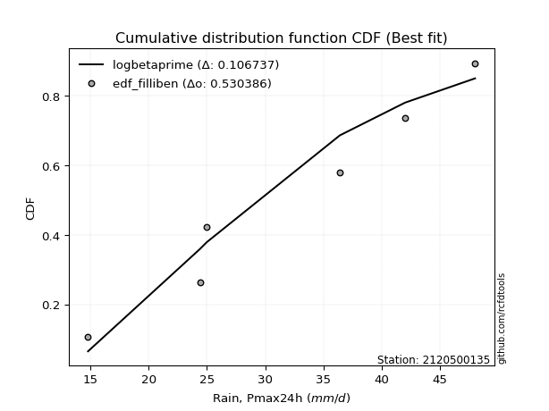</img>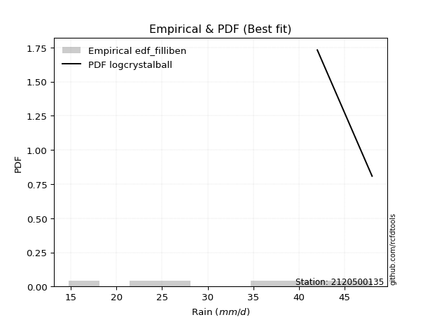</img>

</div>


### 10. EDF Jenkinson (1977)

The Jenkinson formula in hydrology is an empirical plotting position formula used to estimate the non-exceedance probability _(P)_ or return period _(T)_ of a given ordered observation within a sample. It is a widely used method in the frequency analysis of extreme events such as floods and rainfall, as it provides a distribution-free way to plot data. _a≈0.31_ and _b≈0.38_ are constants derived to approximate the median of the probability distribution for the given rank.

<div align="center">


$P=(m-a)/(n+b)$


</div>


**10.1. Empirical values**

<div align="center">

|                | 0                   | 1                   | 2                   | 3             | 4                  | 5                  | 6                  |
|:---------------|:--------------------|:--------------------|:--------------------|:--------------|:-------------------|:-------------------|:-------------------|
| date           | 2023                | 2021                | 2019                | 2022          | 2025               | 2020               | 2024               |
| x              | 14.8                | 24.4                | 25.0                | 36.4          | 38.2               | 42.0               | 48.0               |
| m              | 1                   | 2                   | 3                   | 4             | 5                  | 6                  | 7                  |
| empirical_dist | edf_jenkinson       | edf_jenkinson       | edf_jenkinson       | edf_jenkinson | edf_jenkinson      | edf_jenkinson      | edf_jenkinson      |
| empirical      | 0.09349593495934959 | 0.22899728997289973 | 0.36449864498644985 | 0.5           | 0.6355013550135502 | 0.7710027100271003 | 0.9065040650406505 |
| empirical_tr   | 1.1031390134529149  | 1.29701230228471    | 1.5735607675906182  | 2.0           | 2.743494423791822  | 4.366863905325444  | 10.695652173913055 |

</div>


**10.2. Kolmogorov-Smirnov fit test (sorted by Δ)**


<div align="center">

|                | 0                   | 1                   | 2                   | 3                   | 4                   | 5                   | 6                   | 7                   | 8                   | 9                   | 10                  | 11                  | 12                  | 13                  | 14                  | 15                  | 16                  | 17                  | 18                  | 19                  | 20                  | 21                  | 22                  | 23                  | 24                  | 25                  | 26                  | 27                  | 28                  | 29                  | 30                  | 31                  | 32                  | 33                  | 34                  | 35                  | 36                  | 37                  | 38                  | 39                  | 40                  | 41                  | 42                  | 43                  | 44                  | 45                  | 46                  | 47                  | 48                  | 49                  | 50                  | 51                  | 52                  | 53                  | 54                  | 55                  | 56                  | 57                  | 58                  | 59                  | 60                  | 61                  | 62                  | 63                  | 64                  | 65                  | 66                  | 67                  | 68                  | 69                  | 70                  | 71                  | 72                  | 73                  | 74                  | 75                  | 76                  | 77                  | 78                  | 79                  | 80                  | 81                  | 82                  | 83                  | 84                  | 85                  | 86                  | 87                  | 88                  | 89                  | 90                  | 91                  | 92                  | 93                  | 94                  | 95                  | 96                  | 97                  | 98                  | 99                  | 100                 | 101                 | 102                 | 103                 | 104                 | 105                 | 106                 | 107                 | 108                 | 109                 | 110                 | 111                 | 112                 | 113                 | 114                 | 115                 | 116                 | 117                 | 118                 | 119                 | 120                 | 121                 | 122                 | 123                 | 124                 | 125                 | 126                 | 127                 | 128                 | 129                 | 130                 | 131                 | 132                 | 133                 | 134                 | 135                 | 136                 | 137                 | 138                 | 139                 | 140                 | 141                 | 142                 | 143                 | 144                 | 145                 | 146                 | 147                 | 148                 | 149                 | 150                 | 151                 | 152                 | 153                 | 154                 | 155                 | 156                 | 157                 | 158                 | 159                 |
|:---------------|:--------------------|:--------------------|:--------------------|:--------------------|:--------------------|:--------------------|:--------------------|:--------------------|:--------------------|:--------------------|:--------------------|:--------------------|:--------------------|:--------------------|:--------------------|:--------------------|:--------------------|:--------------------|:--------------------|:--------------------|:--------------------|:--------------------|:--------------------|:--------------------|:--------------------|:--------------------|:--------------------|:--------------------|:--------------------|:--------------------|:--------------------|:--------------------|:--------------------|:--------------------|:--------------------|:--------------------|:--------------------|:--------------------|:--------------------|:--------------------|:--------------------|:--------------------|:--------------------|:--------------------|:--------------------|:--------------------|:--------------------|:--------------------|:--------------------|:--------------------|:--------------------|:--------------------|:--------------------|:--------------------|:--------------------|:--------------------|:--------------------|:--------------------|:--------------------|:--------------------|:--------------------|:--------------------|:--------------------|:--------------------|:--------------------|:--------------------|:--------------------|:--------------------|:--------------------|:--------------------|:--------------------|:--------------------|:--------------------|:--------------------|:--------------------|:--------------------|:--------------------|:--------------------|:--------------------|:--------------------|:--------------------|:--------------------|:--------------------|:--------------------|:--------------------|:--------------------|:--------------------|:--------------------|:--------------------|:--------------------|:--------------------|:--------------------|:--------------------|:--------------------|:--------------------|:--------------------|:--------------------|:--------------------|:--------------------|:--------------------|:--------------------|:--------------------|:--------------------|:--------------------|:--------------------|:--------------------|:--------------------|:--------------------|:--------------------|:--------------------|:--------------------|:--------------------|:--------------------|:--------------------|:--------------------|:--------------------|:--------------------|:--------------------|:--------------------|:--------------------|:--------------------|:--------------------|:--------------------|:--------------------|:--------------------|:--------------------|:--------------------|:--------------------|:--------------------|:--------------------|:--------------------|:--------------------|:--------------------|:--------------------|:--------------------|:--------------------|:--------------------|:--------------------|:--------------------|:--------------------|:--------------------|:--------------------|:--------------------|:--------------------|:--------------------|:--------------------|:--------------------|:--------------------|:--------------------|:--------------------|:--------------------|:--------------------|:--------------------|:--------------------|:--------------------|:--------------------|:--------------------|:--------------------|:--------------------|:--------------------|
| station        | 2120500135          | 2120500135          | 2120500135          | 2120500135          | 2120500135          | 2120500135          | 2120500135          | 2120500135          | 2120500135          | 2120500135          | 2120500135          | 2120500135          | 2120500135          | 2120500135          | 2120500135          | 2120500135          | 2120500135          | 2120500135          | 2120500135          | 2120500135          | 2120500135          | 2120500135          | 2120500135          | 2120500135          | 2120500135          | 2120500135          | 2120500135          | 2120500135          | 2120500135          | 2120500135          | 2120500135          | 2120500135          | 2120500135          | 2120500135          | 2120500135          | 2120500135          | 2120500135          | 2120500135          | 2120500135          | 2120500135          | 2120500135          | 2120500135          | 2120500135          | 2120500135          | 2120500135          | 2120500135          | 2120500135          | 2120500135          | 2120500135          | 2120500135          | 2120500135          | 2120500135          | 2120500135          | 2120500135          | 2120500135          | 2120500135          | 2120500135          | 2120500135          | 2120500135          | 2120500135          | 2120500135          | 2120500135          | 2120500135          | 2120500135          | 2120500135          | 2120500135          | 2120500135          | 2120500135          | 2120500135          | 2120500135          | 2120500135          | 2120500135          | 2120500135          | 2120500135          | 2120500135          | 2120500135          | 2120500135          | 2120500135          | 2120500135          | 2120500135          | 2120500135          | 2120500135          | 2120500135          | 2120500135          | 2120500135          | 2120500135          | 2120500135          | 2120500135          | 2120500135          | 2120500135          | 2120500135          | 2120500135          | 2120500135          | 2120500135          | 2120500135          | 2120500135          | 2120500135          | 2120500135          | 2120500135          | 2120500135          | 2120500135          | 2120500135          | 2120500135          | 2120500135          | 2120500135          | 2120500135          | 2120500135          | 2120500135          | 2120500135          | 2120500135          | 2120500135          | 2120500135          | 2120500135          | 2120500135          | 2120500135          | 2120500135          | 2120500135          | 2120500135          | 2120500135          | 2120500135          | 2120500135          | 2120500135          | 2120500135          | 2120500135          | 2120500135          | 2120500135          | 2120500135          | 2120500135          | 2120500135          | 2120500135          | 2120500135          | 2120500135          | 2120500135          | 2120500135          | 2120500135          | 2120500135          | 2120500135          | 2120500135          | 2120500135          | 2120500135          | 2120500135          | 2120500135          | 2120500135          | 2120500135          | 2120500135          | 2120500135          | 2120500135          | 2120500135          | 2120500135          | 2120500135          | 2120500135          | 2120500135          | 2120500135          | 2120500135          | 2120500135          | 2120500135          | 2120500135          | 2120500135          | 2120500135          | 2120500135          |
| empirical_dist | edf_jenkinson       | edf_jenkinson       | edf_jenkinson       | edf_jenkinson       | edf_jenkinson       | edf_jenkinson       | edf_jenkinson       | edf_jenkinson       | edf_jenkinson       | edf_jenkinson       | edf_jenkinson       | edf_jenkinson       | edf_jenkinson       | edf_jenkinson       | edf_jenkinson       | edf_jenkinson       | edf_jenkinson       | edf_jenkinson       | edf_jenkinson       | edf_jenkinson       | edf_jenkinson       | edf_jenkinson       | edf_jenkinson       | edf_jenkinson       | edf_jenkinson       | edf_jenkinson       | edf_jenkinson       | edf_jenkinson       | edf_jenkinson       | edf_jenkinson       | edf_jenkinson       | edf_jenkinson       | edf_jenkinson       | edf_jenkinson       | edf_jenkinson       | edf_jenkinson       | edf_jenkinson       | edf_jenkinson       | edf_jenkinson       | edf_jenkinson       | edf_jenkinson       | edf_jenkinson       | edf_jenkinson       | edf_jenkinson       | edf_jenkinson       | edf_jenkinson       | edf_jenkinson       | edf_jenkinson       | edf_jenkinson       | edf_jenkinson       | edf_jenkinson       | edf_jenkinson       | edf_jenkinson       | edf_jenkinson       | edf_jenkinson       | edf_jenkinson       | edf_jenkinson       | edf_jenkinson       | edf_jenkinson       | edf_jenkinson       | edf_jenkinson       | edf_jenkinson       | edf_jenkinson       | edf_jenkinson       | edf_jenkinson       | edf_jenkinson       | edf_jenkinson       | edf_jenkinson       | edf_jenkinson       | edf_jenkinson       | edf_jenkinson       | edf_jenkinson       | edf_jenkinson       | edf_jenkinson       | edf_jenkinson       | edf_jenkinson       | edf_jenkinson       | edf_jenkinson       | edf_jenkinson       | edf_jenkinson       | edf_jenkinson       | edf_jenkinson       | edf_jenkinson       | edf_jenkinson       | edf_jenkinson       | edf_jenkinson       | edf_jenkinson       | edf_jenkinson       | edf_jenkinson       | edf_jenkinson       | edf_jenkinson       | edf_jenkinson       | edf_jenkinson       | edf_jenkinson       | edf_jenkinson       | edf_jenkinson       | edf_jenkinson       | edf_jenkinson       | edf_jenkinson       | edf_jenkinson       | edf_jenkinson       | edf_jenkinson       | edf_jenkinson       | edf_jenkinson       | edf_jenkinson       | edf_jenkinson       | edf_jenkinson       | edf_jenkinson       | edf_jenkinson       | edf_jenkinson       | edf_jenkinson       | edf_jenkinson       | edf_jenkinson       | edf_jenkinson       | edf_jenkinson       | edf_jenkinson       | edf_jenkinson       | edf_jenkinson       | edf_jenkinson       | edf_jenkinson       | edf_jenkinson       | edf_jenkinson       | edf_jenkinson       | edf_jenkinson       | edf_jenkinson       | edf_jenkinson       | edf_jenkinson       | edf_jenkinson       | edf_jenkinson       | edf_jenkinson       | edf_jenkinson       | edf_jenkinson       | edf_jenkinson       | edf_jenkinson       | edf_jenkinson       | edf_jenkinson       | edf_jenkinson       | edf_jenkinson       | edf_jenkinson       | edf_jenkinson       | edf_jenkinson       | edf_jenkinson       | edf_jenkinson       | edf_jenkinson       | edf_jenkinson       | edf_jenkinson       | edf_jenkinson       | edf_jenkinson       | edf_jenkinson       | edf_jenkinson       | edf_jenkinson       | edf_jenkinson       | edf_jenkinson       | edf_jenkinson       | edf_jenkinson       | edf_jenkinson       | edf_jenkinson       | edf_jenkinson       | edf_jenkinson       | edf_jenkinson       |
| p_dist         | logcrystalball      | logbeta             | logweibull_max      | arcsine             | loggenhalflogistic  | logtrapezoid        | ksone               | genpareto           | semicircular        | burr                | anglit              | logtruncweibull_min | wrapcauchy          | logargus            | logmielke           | kappa4              | logburr             | logweibull_min      | logarcsine          | logburr12           | logloggamma         | beta                | pearson3            | dweibull            | f                   | t                   | norm                | crystalball         | exponnorm           | nct                 | johnsonsu           | loggumbel_l         | logjohnsonsu        | logskewnorm         | foldnorm            | dgamma              | erlang              | weibull_min         | gamma               | argus               | logpearson3         | betaprime           | truncnorm           | logsemicircular     | invgamma            | genextreme          | skewnorm            | rice                | cosine              | loggenextreme       | genhalflogistic     | lomax               | tukeylambda         | uniform             | logistic            | alpha               | loganglit           | gompertz            | genlogistic         | vonmises_line       | triang              | maxwell             | invgauss            | ncf                 | gumbel_l            | logncf              | hypsecant           | truncweibull_min    | rayleigh            | logtriang           | loginvweibull       | loggengamma         | logf                | loggamma            | loggamma            | logt                | logexponnorm        | lognorm             | logerlang           | kstwobign           | logfatiguelife      | logrice             | lognct              | loginvgamma         | kappa3              | halfnorm            | logalpha            | logbetaprime        | loglevy_l           | loginvgauss         | logfoldnorm         | gausshyper          | logvonmises_line    | laplace             | logkstwobign        | logmaxwell          | loglogistic         | gumbel_r            | loggenexpon         | lograyleigh         | genexpon            | logcosine           | loghypsecant        | logloglaplace       | halflogistic        | loghalfnorm         | moyal               | bradford            | logdweibull         | logksone            | loggennorm          | logexponpow         | truncexpon          | loggumbel_r         | levy_l              | loglaplace          | loglaplace          | loggompertz         | loghalflogistic     | logwrapcauchy       | trapezoid           | logmoyal            | logexponweib        | loggausshyper       | logkappa3           | loguniform          | burr12              | logkappa4           | loglomax            | gennorm             | wald                | halfgennorm         | logdgamma           | logrdist            | nakagami            | lognakagami         | loghalfgennorm      | logtruncnorm        | logwald             | loggenpareto        | logbradford         | logtukeylambda      | logtruncexpon       | invweibull          | johnsonsb           | gengamma            | fatiguelife         | weibull_max         | powerlaw            | logjohnsonsb        | exponweib           | logpowerlaw         | rdist               | exponpow            | truncpareto         | logtruncpareto      | loggenlogistic      | logvonmises         | vonmises            | mielke              |
| delta          | 0.04644785698170939 | 0.09349593470758732 | 0.09349593495907005 | 0.09349593495934959 | 0.0981267333165291  | 0.09929461428819597 | 0.09948541944343958 | 0.10247035092263512 | 0.10915306748584741 | 0.11005556811412265 | 0.11671840559310942 | 0.11843099645272526 | 0.12012184302280815 | 0.12126921097216786 | 0.1278065309864739  | 0.12806122270801568 | 0.12871797677454067 | 0.13110466210151575 | 0.13123212678063093 | 0.13144596665150327 | 0.13146862248672772 | 0.13160752194432354 | 0.1329313732195551  | 0.1346326646309576  | 0.13467013633111458 | 0.13479592881033953 | 0.13481282394938    | 0.13481283526197174 | 0.13481377726971655 | 0.13483457942850063 | 0.13489415834134322 | 0.13491498632107346 | 0.13614039776429337 | 0.13762247478051437 | 0.1379416957799353  | 0.13797435038376035 | 0.1393874396148802  | 0.13969234956795487 | 0.1400617620075253  | 0.1405968896013226  | 0.14191452247759173 | 0.14232102616627285 | 0.1436111166337488  | 0.14387426430868056 | 0.14413090137489193 | 0.14487784735322412 | 0.14519137782612834 | 0.14582495713125898 | 0.14587825720126568 | 0.14847769836857455 | 0.14873141990954247 | 0.1494597507738894  | 0.1497759055433434  | 0.1506024096385541  | 0.15137424118031118 | 0.15261069943489292 | 0.1533556352776032  | 0.15350580443821527 | 0.1541555350613401  | 0.1560192672484182  | 0.157446113350077   | 0.15803054206009826 | 0.1588919129952433  | 0.16251803329942693 | 0.1630445205789016  | 0.1642345261149346  | 0.16446625899504297 | 0.1646922094217821  | 0.16507775950686887 | 0.16665520459975036 | 0.17318859824133315 | 0.17537035137332346 | 0.17547410354158655 | 0.17549041484565098 | 0.17549041484565098 | 0.17579260681523    | 0.1757951503589832  | 0.17579633632638902 | 0.1776957471786439  | 0.17808363907138935 | 0.1790309703167675  | 0.1791040532455691  | 0.1793636954891551  | 0.1845440715689941  | 0.18499316927155185 | 0.1854062220287257  | 0.18560997269557533 | 0.18604642252167858 | 0.18687856866331476 | 0.1876057968411795  | 0.1888090946697687  | 0.19062345078205484 | 0.19110529231789136 | 0.19288229762882847 | 0.1944081409971099  | 0.19457123483518957 | 0.1957305421757758  | 0.19706464124764822 | 0.20004674166517789 | 0.20013247398877976 | 0.20112711307950404 | 0.20633123559931743 | 0.21067373488191798 | 0.21256914116479309 | 0.213703610547622   | 0.21661825326332151 | 0.2178535354963017  | 0.2190874515111153  | 0.21957038952090296 | 0.22073602665971848 | 0.2226487553986202  | 0.22605218580557915 | 0.23096445638435426 | 0.23135869487203964 | 0.2361410816333287  | 0.23762865869735683 | 0.23762865869735683 | 0.23926363733681555 | 0.2441940871829048  | 0.24555755323771436 | 0.2493351798810483  | 0.24950365705498267 | 0.25942766666140016 | 0.2595680975632556  | 0.2631113977816779  | 0.26488323199166186 | 0.26509347308557585 | 0.26554100211680554 | 0.2670847887089911  | 0.2710027100271003  | 0.27637413118765697 | 0.280136729785588   | 0.2828843465256211  | 0.28399458737907135 | 0.2852590613440299  | 0.28701759289628415 | 0.28861011187880936 | 0.2947597107970429  | 0.30171787542047146 | 0.3026532396133621  | 0.3215472394309068  | 0.3216537149590289  | 0.3305180229224882  | 0.4828010769353754  | 0.5061785846509325  | 0.5531086710432785  | 0.5537526368979694  | 0.5558916326200227  | 0.5795366980255184  | 0.5928911061577219  | 0.6008499503670612  | 0.6243691025316178  | 0.6286298325716735  | 0.6295309585642942  | 0.679602516692655   | 0.707275674045911   | 0.7710027100271003  | 1.1717637741861187  | 7.288634273182826   | nan                 |
| deltao         | 0.48442053926100004 | 0.48442053926100004 | 0.48442053926100004 | 0.48442053926100004 | 0.48442053926100004 | 0.48442053926100004 | 0.48442053926100004 | 0.48442053926100004 | 0.48442053926100004 | 0.48442053926100004 | 0.48442053926100004 | 0.48442053926100004 | 0.48442053926100004 | 0.48442053926100004 | 0.48442053926100004 | 0.48442053926100004 | 0.48442053926100004 | 0.48442053926100004 | 0.48442053926100004 | 0.48442053926100004 | 0.48442053926100004 | 0.48442053926100004 | 0.48442053926100004 | 0.48442053926100004 | 0.48442053926100004 | 0.48442053926100004 | 0.48442053926100004 | 0.48442053926100004 | 0.48442053926100004 | 0.48442053926100004 | 0.48442053926100004 | 0.48442053926100004 | 0.48442053926100004 | 0.48442053926100004 | 0.48442053926100004 | 0.48442053926100004 | 0.48442053926100004 | 0.48442053926100004 | 0.48442053926100004 | 0.48442053926100004 | 0.48442053926100004 | 0.48442053926100004 | 0.48442053926100004 | 0.48442053926100004 | 0.48442053926100004 | 0.48442053926100004 | 0.48442053926100004 | 0.48442053926100004 | 0.48442053926100004 | 0.48442053926100004 | 0.48442053926100004 | 0.48442053926100004 | 0.48442053926100004 | 0.48442053926100004 | 0.48442053926100004 | 0.48442053926100004 | 0.48442053926100004 | 0.48442053926100004 | 0.48442053926100004 | 0.48442053926100004 | 0.48442053926100004 | 0.48442053926100004 | 0.48442053926100004 | 0.48442053926100004 | 0.48442053926100004 | 0.48442053926100004 | 0.48442053926100004 | 0.48442053926100004 | 0.48442053926100004 | 0.48442053926100004 | 0.48442053926100004 | 0.48442053926100004 | 0.48442053926100004 | 0.48442053926100004 | 0.48442053926100004 | 0.48442053926100004 | 0.48442053926100004 | 0.48442053926100004 | 0.48442053926100004 | 0.48442053926100004 | 0.48442053926100004 | 0.48442053926100004 | 0.48442053926100004 | 0.48442053926100004 | 0.48442053926100004 | 0.48442053926100004 | 0.48442053926100004 | 0.48442053926100004 | 0.48442053926100004 | 0.48442053926100004 | 0.48442053926100004 | 0.48442053926100004 | 0.48442053926100004 | 0.48442053926100004 | 0.48442053926100004 | 0.48442053926100004 | 0.48442053926100004 | 0.48442053926100004 | 0.48442053926100004 | 0.48442053926100004 | 0.48442053926100004 | 0.48442053926100004 | 0.48442053926100004 | 0.48442053926100004 | 0.48442053926100004 | 0.48442053926100004 | 0.48442053926100004 | 0.48442053926100004 | 0.48442053926100004 | 0.48442053926100004 | 0.48442053926100004 | 0.48442053926100004 | 0.48442053926100004 | 0.48442053926100004 | 0.48442053926100004 | 0.48442053926100004 | 0.48442053926100004 | 0.48442053926100004 | 0.48442053926100004 | 0.48442053926100004 | 0.48442053926100004 | 0.48442053926100004 | 0.48442053926100004 | 0.48442053926100004 | 0.48442053926100004 | 0.48442053926100004 | 0.48442053926100004 | 0.48442053926100004 | 0.48442053926100004 | 0.48442053926100004 | 0.48442053926100004 | 0.48442053926100004 | 0.48442053926100004 | 0.48442053926100004 | 0.48442053926100004 | 0.48442053926100004 | 0.48442053926100004 | 0.48442053926100004 | 0.48442053926100004 | 0.48442053926100004 | 0.48442053926100004 | 0.48442053926100004 | 0.48442053926100004 | 0.48442053926100004 | 0.48442053926100004 | 0.48442053926100004 | 0.48442053926100004 | 0.48442053926100004 | 0.48442053926100004 | 0.48442053926100004 | 0.48442053926100004 | 0.48442053926100004 | 0.48442053926100004 | 0.48442053926100004 | 0.48442053926100004 | 0.48442053926100004 | 0.48442053926100004 | 0.48442053926100004 | 0.48442053926100004 | 0.48442053926100004 |
| eval           | Δo > Δ              | Δo > Δ              | Δo > Δ              | Δo > Δ              | Δo > Δ              | Δo > Δ              | Δo > Δ              | Δo > Δ              | Δo > Δ              | Δo > Δ              | Δo > Δ              | Δo > Δ              | Δo > Δ              | Δo > Δ              | Δo > Δ              | Δo > Δ              | Δo > Δ              | Δo > Δ              | Δo > Δ              | Δo > Δ              | Δo > Δ              | Δo > Δ              | Δo > Δ              | Δo > Δ              | Δo > Δ              | Δo > Δ              | Δo > Δ              | Δo > Δ              | Δo > Δ              | Δo > Δ              | Δo > Δ              | Δo > Δ              | Δo > Δ              | Δo > Δ              | Δo > Δ              | Δo > Δ              | Δo > Δ              | Δo > Δ              | Δo > Δ              | Δo > Δ              | Δo > Δ              | Δo > Δ              | Δo > Δ              | Δo > Δ              | Δo > Δ              | Δo > Δ              | Δo > Δ              | Δo > Δ              | Δo > Δ              | Δo > Δ              | Δo > Δ              | Δo > Δ              | Δo > Δ              | Δo > Δ              | Δo > Δ              | Δo > Δ              | Δo > Δ              | Δo > Δ              | Δo > Δ              | Δo > Δ              | Δo > Δ              | Δo > Δ              | Δo > Δ              | Δo > Δ              | Δo > Δ              | Δo > Δ              | Δo > Δ              | Δo > Δ              | Δo > Δ              | Δo > Δ              | Δo > Δ              | Δo > Δ              | Δo > Δ              | Δo > Δ              | Δo > Δ              | Δo > Δ              | Δo > Δ              | Δo > Δ              | Δo > Δ              | Δo > Δ              | Δo > Δ              | Δo > Δ              | Δo > Δ              | Δo > Δ              | Δo > Δ              | Δo > Δ              | Δo > Δ              | Δo > Δ              | Δo > Δ              | Δo > Δ              | Δo > Δ              | Δo > Δ              | Δo > Δ              | Δo > Δ              | Δo > Δ              | Δo > Δ              | Δo > Δ              | Δo > Δ              | Δo > Δ              | Δo > Δ              | Δo > Δ              | Δo > Δ              | Δo > Δ              | Δo > Δ              | Δo > Δ              | Δo > Δ              | Δo > Δ              | Δo > Δ              | Δo > Δ              | Δo > Δ              | Δo > Δ              | Δo > Δ              | Δo > Δ              | Δo > Δ              | Δo > Δ              | Δo > Δ              | Δo > Δ              | Δo > Δ              | Δo > Δ              | Δo > Δ              | Δo > Δ              | Δo > Δ              | Δo > Δ              | Δo > Δ              | Δo > Δ              | Δo > Δ              | Δo > Δ              | Δo > Δ              | Δo > Δ              | Δo > Δ              | Δo > Δ              | Δo > Δ              | Δo > Δ              | Δo > Δ              | Δo > Δ              | Δo > Δ              | Δo > Δ              | Δo > Δ              | Δo > Δ              | Δo > Δ              | Δo > Δ              | Δo > Δ              | Δo > Δ              | Δo > Δ              | Δo <= Δ             | Δo <= Δ             | Δo <= Δ             | Δo <= Δ             | Δo <= Δ             | Δo <= Δ             | Δo <= Δ             | Δo <= Δ             | Δo <= Δ             | Δo <= Δ             | Δo <= Δ             | Δo <= Δ             | Δo <= Δ             | Δo <= Δ             | Δo <= Δ             | Δo <= Δ             |
| fit            | 1                   | 1                   | 1                   | 1                   | 1                   | 1                   | 1                   | 1                   | 1                   | 1                   | 1                   | 1                   | 1                   | 1                   | 1                   | 1                   | 1                   | 1                   | 1                   | 1                   | 1                   | 1                   | 1                   | 1                   | 1                   | 1                   | 1                   | 1                   | 1                   | 1                   | 1                   | 1                   | 1                   | 1                   | 1                   | 1                   | 1                   | 1                   | 1                   | 1                   | 1                   | 1                   | 1                   | 1                   | 1                   | 1                   | 1                   | 1                   | 1                   | 1                   | 1                   | 1                   | 1                   | 1                   | 1                   | 1                   | 1                   | 1                   | 1                   | 1                   | 1                   | 1                   | 1                   | 1                   | 1                   | 1                   | 1                   | 1                   | 1                   | 1                   | 1                   | 1                   | 1                   | 1                   | 1                   | 1                   | 1                   | 1                   | 1                   | 1                   | 1                   | 1                   | 1                   | 1                   | 1                   | 1                   | 1                   | 1                   | 1                   | 1                   | 1                   | 1                   | 1                   | 1                   | 1                   | 1                   | 1                   | 1                   | 1                   | 1                   | 1                   | 1                   | 1                   | 1                   | 1                   | 1                   | 1                   | 1                   | 1                   | 1                   | 1                   | 1                   | 1                   | 1                   | 1                   | 1                   | 1                   | 1                   | 1                   | 1                   | 1                   | 1                   | 1                   | 1                   | 1                   | 1                   | 1                   | 1                   | 1                   | 1                   | 1                   | 1                   | 1                   | 1                   | 1                   | 1                   | 1                   | 1                   | 1                   | 1                   | 1                   | 1                   | 1                   | 1                   | 0                   | 0                   | 0                   | 0                   | 0                   | 0                   | 0                   | 0                   | 0                   | 0                   | 0                   | 0                   | 0                   | 0                   | 0                   | 0                   |
| n              | 7                   | 7                   | 7                   | 7                   | 7                   | 7                   | 7                   | 7                   | 7                   | 7                   | 7                   | 7                   | 7                   | 7                   | 7                   | 7                   | 7                   | 7                   | 7                   | 7                   | 7                   | 7                   | 7                   | 7                   | 7                   | 7                   | 7                   | 7                   | 7                   | 7                   | 7                   | 7                   | 7                   | 7                   | 7                   | 7                   | 7                   | 7                   | 7                   | 7                   | 7                   | 7                   | 7                   | 7                   | 7                   | 7                   | 7                   | 7                   | 7                   | 7                   | 7                   | 7                   | 7                   | 7                   | 7                   | 7                   | 7                   | 7                   | 7                   | 7                   | 7                   | 7                   | 7                   | 7                   | 7                   | 7                   | 7                   | 7                   | 7                   | 7                   | 7                   | 7                   | 7                   | 7                   | 7                   | 7                   | 7                   | 7                   | 7                   | 7                   | 7                   | 7                   | 7                   | 7                   | 7                   | 7                   | 7                   | 7                   | 7                   | 7                   | 7                   | 7                   | 7                   | 7                   | 7                   | 7                   | 7                   | 7                   | 7                   | 7                   | 7                   | 7                   | 7                   | 7                   | 7                   | 7                   | 7                   | 7                   | 7                   | 7                   | 7                   | 7                   | 7                   | 7                   | 7                   | 7                   | 7                   | 7                   | 7                   | 7                   | 7                   | 7                   | 7                   | 7                   | 7                   | 7                   | 7                   | 7                   | 7                   | 7                   | 7                   | 7                   | 7                   | 7                   | 7                   | 7                   | 7                   | 7                   | 7                   | 7                   | 7                   | 7                   | 7                   | 7                   | 7                   | 7                   | 7                   | 7                   | 7                   | 7                   | 7                   | 7                   | 7                   | 7                   | 7                   | 7                   | 7                   | 7                   | 7                   | 7                   |
| best_fit       | 1                   | 0                   | 0                   | 0                   | 0                   | 0                   | 0                   | 0                   | 0                   | 0                   | 0                   | 0                   | 0                   | 0                   | 0                   | 0                   | 0                   | 0                   | 0                   | 0                   | 0                   | 0                   | 0                   | 0                   | 0                   | 0                   | 0                   | 0                   | 0                   | 0                   | 0                   | 0                   | 0                   | 0                   | 0                   | 0                   | 0                   | 0                   | 0                   | 0                   | 0                   | 0                   | 0                   | 0                   | 0                   | 0                   | 0                   | 0                   | 0                   | 0                   | 0                   | 0                   | 0                   | 0                   | 0                   | 0                   | 0                   | 0                   | 0                   | 0                   | 0                   | 0                   | 0                   | 0                   | 0                   | 0                   | 0                   | 0                   | 0                   | 0                   | 0                   | 0                   | 0                   | 0                   | 0                   | 0                   | 0                   | 0                   | 0                   | 0                   | 0                   | 0                   | 0                   | 0                   | 0                   | 0                   | 0                   | 0                   | 0                   | 0                   | 0                   | 0                   | 0                   | 0                   | 0                   | 0                   | 0                   | 0                   | 0                   | 0                   | 0                   | 0                   | 0                   | 0                   | 0                   | 0                   | 0                   | 0                   | 0                   | 0                   | 0                   | 0                   | 0                   | 0                   | 0                   | 0                   | 0                   | 0                   | 0                   | 0                   | 0                   | 0                   | 0                   | 0                   | 0                   | 0                   | 0                   | 0                   | 0                   | 0                   | 0                   | 0                   | 0                   | 0                   | 0                   | 0                   | 0                   | 0                   | 0                   | 0                   | 0                   | 0                   | 0                   | 0                   | 0                   | 0                   | 0                   | 0                   | 0                   | 0                   | 0                   | 0                   | 0                   | 0                   | 0                   | 0                   | 0                   | 0                   | 0                   | 0                   |
| best_fit_sort  | 1                   | 2                   | 3                   | 4                   | 5                   | 6                   | 7                   | 8                   | 9                   | 10                  | 11                  | 12                  | 13                  | 14                  | 15                  | 16                  | 17                  | 18                  | 19                  | 20                  | 21                  | 22                  | 23                  | 24                  | 25                  | 26                  | 27                  | 28                  | 29                  | 30                  | 31                  | 32                  | 33                  | 34                  | 35                  | 36                  | 37                  | 38                  | 39                  | 40                  | 41                  | 42                  | 43                  | 44                  | 45                  | 46                  | 47                  | 48                  | 49                  | 50                  | 51                  | 52                  | 53                  | 54                  | 55                  | 56                  | 57                  | 58                  | 59                  | 60                  | 61                  | 62                  | 63                  | 64                  | 65                  | 66                  | 67                  | 68                  | 69                  | 70                  | 71                  | 72                  | 73                  | 74                  | 75                  | 76                  | 77                  | 78                  | 79                  | 80                  | 81                  | 82                  | 83                  | 84                  | 85                  | 86                  | 87                  | 88                  | 89                  | 90                  | 91                  | 92                  | 93                  | 94                  | 95                  | 96                  | 97                  | 98                  | 99                  | 100                 | 101                 | 102                 | 103                 | 104                 | 105                 | 106                 | 107                 | 108                 | 109                 | 110                 | 111                 | 112                 | 113                 | 114                 | 115                 | 116                 | 117                 | 118                 | 119                 | 120                 | 121                 | 122                 | 123                 | 124                 | 125                 | 126                 | 127                 | 128                 | 129                 | 130                 | 131                 | 132                 | 133                 | 134                 | 135                 | 136                 | 137                 | 138                 | 139                 | 140                 | 141                 | 142                 | 143                 | 144                 | 145                 | 146                 | 147                 | 148                 | 149                 | 150                 | 151                 | 152                 | 153                 | 154                 | 155                 | 156                 | 157                 | 158                 | 159                 | 160                 |

</div>


**10.3. Best fit**

<div align="center">

|   id |    station | empirical_dist   | p_dist         |     delta |   deltao | eval   |   fit |   n |   best_fit |   best_fit_sort |
|-----:|-----------:|:-----------------|:---------------|----------:|---------:|:-------|------:|----:|-----------:|----------------:|
|    0 | 2120500135 | edf_jenkinson    | logcrystalball | 0.0464479 | 0.484421 | Δo > Δ |     1 |   7 |          1 |               1 |

</div>


<div align="center">

</img>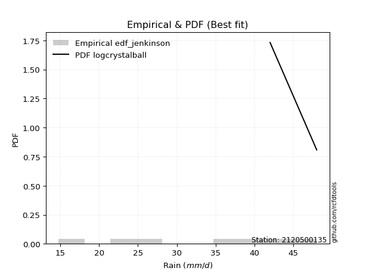</img>

</div>


### 11. EDF Cunnane (1978)

Cunnane´s work in statistical hydrology has focused on the performance and evaluation of different probability distributions (such as GEV, Gumbel, Lognormal) for flood frequency estimation. _b_ is a constant, typically set to 0.4.

<div align="center">


$P=(m-b)/(n+1-2b)$


</div>


**11.1. Empirical values**

<div align="center">

|                | 0                   | 1                   | 2                  | 3           | 4                  | 5                  | 6                  |
|:---------------|:--------------------|:--------------------|:-------------------|:------------|:-------------------|:-------------------|:-------------------|
| date           | 2023                | 2021                | 2019               | 2022        | 2025               | 2020               | 2024               |
| x              | 14.8                | 24.4                | 25.0               | 36.4        | 38.2               | 42.0               | 48.0               |
| m              | 1                   | 2                   | 3                  | 4           | 5                  | 6                  | 7                  |
| empirical_dist | edf_cunnane         | edf_cunnane         | edf_cunnane        | edf_cunnane | edf_cunnane        | edf_cunnane        | edf_cunnane        |
| empirical      | 0.08333333333333333 | 0.22222222222222224 | 0.3611111111111111 | 0.5         | 0.6388888888888888 | 0.7777777777777777 | 0.9166666666666666 |
| empirical_tr   | 1.090909090909091   | 1.2857142857142856  | 1.565217391304348  | 2.0         | 2.7692307692307687 | 4.499999999999998  | 11.999999999999995 |

</div>


**11.2. Kolmogorov-Smirnov fit test (sorted by Δ)**


<div align="center">

|                | 0                   | 1                   | 2                   | 3                   | 4                   | 5                   | 6                   | 7                   | 8                   | 9                   | 10                  | 11                  | 12                  | 13                  | 14                  | 15                  | 16                  | 17                  | 18                  | 19                  | 20                  | 21                  | 22                  | 23                  | 24                  | 25                  | 26                  | 27                  | 28                  | 29                  | 30                  | 31                  | 32                  | 33                  | 34                  | 35                  | 36                  | 37                  | 38                  | 39                  | 40                  | 41                  | 42                  | 43                  | 44                  | 45                  | 46                  | 47                  | 48                  | 49                  | 50                  | 51                  | 52                  | 53                  | 54                  | 55                  | 56                  | 57                  | 58                  | 59                  | 60                  | 61                  | 62                  | 63                  | 64                  | 65                  | 66                  | 67                  | 68                  | 69                  | 70                  | 71                  | 72                  | 73                  | 74                  | 75                  | 76                  | 77                  | 78                  | 79                  | 80                  | 81                  | 82                  | 83                  | 84                  | 85                  | 86                  | 87                  | 88                  | 89                  | 90                  | 91                  | 92                  | 93                  | 94                  | 95                  | 96                  | 97                  | 98                  | 99                  | 100                 | 101                 | 102                 | 103                 | 104                 | 105                 | 106                 | 107                 | 108                 | 109                 | 110                 | 111                 | 112                 | 113                 | 114                 | 115                 | 116                 | 117                 | 118                 | 119                 | 120                 | 121                 | 122                 | 123                 | 124                 | 125                 | 126                 | 127                 | 128                 | 129                 | 130                 | 131                 | 132                 | 133                 | 134                 | 135                 | 136                 | 137                 | 138                 | 139                 | 140                 | 141                 | 142                 | 143                 | 144                 | 145                 | 146                 | 147                 | 148                 | 149                 | 150                 | 151                 | 152                 | 153                 | 154                 | 155                 | 156                 | 157                 | 158                 | 159                 |
|:---------------|:--------------------|:--------------------|:--------------------|:--------------------|:--------------------|:--------------------|:--------------------|:--------------------|:--------------------|:--------------------|:--------------------|:--------------------|:--------------------|:--------------------|:--------------------|:--------------------|:--------------------|:--------------------|:--------------------|:--------------------|:--------------------|:--------------------|:--------------------|:--------------------|:--------------------|:--------------------|:--------------------|:--------------------|:--------------------|:--------------------|:--------------------|:--------------------|:--------------------|:--------------------|:--------------------|:--------------------|:--------------------|:--------------------|:--------------------|:--------------------|:--------------------|:--------------------|:--------------------|:--------------------|:--------------------|:--------------------|:--------------------|:--------------------|:--------------------|:--------------------|:--------------------|:--------------------|:--------------------|:--------------------|:--------------------|:--------------------|:--------------------|:--------------------|:--------------------|:--------------------|:--------------------|:--------------------|:--------------------|:--------------------|:--------------------|:--------------------|:--------------------|:--------------------|:--------------------|:--------------------|:--------------------|:--------------------|:--------------------|:--------------------|:--------------------|:--------------------|:--------------------|:--------------------|:--------------------|:--------------------|:--------------------|:--------------------|:--------------------|:--------------------|:--------------------|:--------------------|:--------------------|:--------------------|:--------------------|:--------------------|:--------------------|:--------------------|:--------------------|:--------------------|:--------------------|:--------------------|:--------------------|:--------------------|:--------------------|:--------------------|:--------------------|:--------------------|:--------------------|:--------------------|:--------------------|:--------------------|:--------------------|:--------------------|:--------------------|:--------------------|:--------------------|:--------------------|:--------------------|:--------------------|:--------------------|:--------------------|:--------------------|:--------------------|:--------------------|:--------------------|:--------------------|:--------------------|:--------------------|:--------------------|:--------------------|:--------------------|:--------------------|:--------------------|:--------------------|:--------------------|:--------------------|:--------------------|:--------------------|:--------------------|:--------------------|:--------------------|:--------------------|:--------------------|:--------------------|:--------------------|:--------------------|:--------------------|:--------------------|:--------------------|:--------------------|:--------------------|:--------------------|:--------------------|:--------------------|:--------------------|:--------------------|:--------------------|:--------------------|:--------------------|:--------------------|:--------------------|:--------------------|:--------------------|:--------------------|:--------------------|
| station        | 2120500135          | 2120500135          | 2120500135          | 2120500135          | 2120500135          | 2120500135          | 2120500135          | 2120500135          | 2120500135          | 2120500135          | 2120500135          | 2120500135          | 2120500135          | 2120500135          | 2120500135          | 2120500135          | 2120500135          | 2120500135          | 2120500135          | 2120500135          | 2120500135          | 2120500135          | 2120500135          | 2120500135          | 2120500135          | 2120500135          | 2120500135          | 2120500135          | 2120500135          | 2120500135          | 2120500135          | 2120500135          | 2120500135          | 2120500135          | 2120500135          | 2120500135          | 2120500135          | 2120500135          | 2120500135          | 2120500135          | 2120500135          | 2120500135          | 2120500135          | 2120500135          | 2120500135          | 2120500135          | 2120500135          | 2120500135          | 2120500135          | 2120500135          | 2120500135          | 2120500135          | 2120500135          | 2120500135          | 2120500135          | 2120500135          | 2120500135          | 2120500135          | 2120500135          | 2120500135          | 2120500135          | 2120500135          | 2120500135          | 2120500135          | 2120500135          | 2120500135          | 2120500135          | 2120500135          | 2120500135          | 2120500135          | 2120500135          | 2120500135          | 2120500135          | 2120500135          | 2120500135          | 2120500135          | 2120500135          | 2120500135          | 2120500135          | 2120500135          | 2120500135          | 2120500135          | 2120500135          | 2120500135          | 2120500135          | 2120500135          | 2120500135          | 2120500135          | 2120500135          | 2120500135          | 2120500135          | 2120500135          | 2120500135          | 2120500135          | 2120500135          | 2120500135          | 2120500135          | 2120500135          | 2120500135          | 2120500135          | 2120500135          | 2120500135          | 2120500135          | 2120500135          | 2120500135          | 2120500135          | 2120500135          | 2120500135          | 2120500135          | 2120500135          | 2120500135          | 2120500135          | 2120500135          | 2120500135          | 2120500135          | 2120500135          | 2120500135          | 2120500135          | 2120500135          | 2120500135          | 2120500135          | 2120500135          | 2120500135          | 2120500135          | 2120500135          | 2120500135          | 2120500135          | 2120500135          | 2120500135          | 2120500135          | 2120500135          | 2120500135          | 2120500135          | 2120500135          | 2120500135          | 2120500135          | 2120500135          | 2120500135          | 2120500135          | 2120500135          | 2120500135          | 2120500135          | 2120500135          | 2120500135          | 2120500135          | 2120500135          | 2120500135          | 2120500135          | 2120500135          | 2120500135          | 2120500135          | 2120500135          | 2120500135          | 2120500135          | 2120500135          | 2120500135          | 2120500135          | 2120500135          | 2120500135          | 2120500135          |
| empirical_dist | edf_cunnane         | edf_cunnane         | edf_cunnane         | edf_cunnane         | edf_cunnane         | edf_cunnane         | edf_cunnane         | edf_cunnane         | edf_cunnane         | edf_cunnane         | edf_cunnane         | edf_cunnane         | edf_cunnane         | edf_cunnane         | edf_cunnane         | edf_cunnane         | edf_cunnane         | edf_cunnane         | edf_cunnane         | edf_cunnane         | edf_cunnane         | edf_cunnane         | edf_cunnane         | edf_cunnane         | edf_cunnane         | edf_cunnane         | edf_cunnane         | edf_cunnane         | edf_cunnane         | edf_cunnane         | edf_cunnane         | edf_cunnane         | edf_cunnane         | edf_cunnane         | edf_cunnane         | edf_cunnane         | edf_cunnane         | edf_cunnane         | edf_cunnane         | edf_cunnane         | edf_cunnane         | edf_cunnane         | edf_cunnane         | edf_cunnane         | edf_cunnane         | edf_cunnane         | edf_cunnane         | edf_cunnane         | edf_cunnane         | edf_cunnane         | edf_cunnane         | edf_cunnane         | edf_cunnane         | edf_cunnane         | edf_cunnane         | edf_cunnane         | edf_cunnane         | edf_cunnane         | edf_cunnane         | edf_cunnane         | edf_cunnane         | edf_cunnane         | edf_cunnane         | edf_cunnane         | edf_cunnane         | edf_cunnane         | edf_cunnane         | edf_cunnane         | edf_cunnane         | edf_cunnane         | edf_cunnane         | edf_cunnane         | edf_cunnane         | edf_cunnane         | edf_cunnane         | edf_cunnane         | edf_cunnane         | edf_cunnane         | edf_cunnane         | edf_cunnane         | edf_cunnane         | edf_cunnane         | edf_cunnane         | edf_cunnane         | edf_cunnane         | edf_cunnane         | edf_cunnane         | edf_cunnane         | edf_cunnane         | edf_cunnane         | edf_cunnane         | edf_cunnane         | edf_cunnane         | edf_cunnane         | edf_cunnane         | edf_cunnane         | edf_cunnane         | edf_cunnane         | edf_cunnane         | edf_cunnane         | edf_cunnane         | edf_cunnane         | edf_cunnane         | edf_cunnane         | edf_cunnane         | edf_cunnane         | edf_cunnane         | edf_cunnane         | edf_cunnane         | edf_cunnane         | edf_cunnane         | edf_cunnane         | edf_cunnane         | edf_cunnane         | edf_cunnane         | edf_cunnane         | edf_cunnane         | edf_cunnane         | edf_cunnane         | edf_cunnane         | edf_cunnane         | edf_cunnane         | edf_cunnane         | edf_cunnane         | edf_cunnane         | edf_cunnane         | edf_cunnane         | edf_cunnane         | edf_cunnane         | edf_cunnane         | edf_cunnane         | edf_cunnane         | edf_cunnane         | edf_cunnane         | edf_cunnane         | edf_cunnane         | edf_cunnane         | edf_cunnane         | edf_cunnane         | edf_cunnane         | edf_cunnane         | edf_cunnane         | edf_cunnane         | edf_cunnane         | edf_cunnane         | edf_cunnane         | edf_cunnane         | edf_cunnane         | edf_cunnane         | edf_cunnane         | edf_cunnane         | edf_cunnane         | edf_cunnane         | edf_cunnane         | edf_cunnane         | edf_cunnane         | edf_cunnane         | edf_cunnane         | edf_cunnane         | edf_cunnane         |
| p_dist         | logcrystalball      | logbeta             | loggenhalflogistic  | arcsine             | logweibull_max      | logtrapezoid        | ksone               | burr                | semicircular        | genpareto           | anglit              | logargus            | logtruncweibull_min | wrapcauchy          | logmielke           | logburr             | kappa4              | logloggamma         | beta                | pearson3            | logburr12           | logweibull_min      | logjohnsonsu        | f                   | t                   | norm                | crystalball         | exponnorm           | nct                 | johnsonsu           | loggumbel_l         | weibull_min         | argus               | logskewnorm         | foldnorm            | logarcsine          | erlang              | gamma               | truncnorm           | dweibull            | genextreme          | skewnorm            | logpearson3         | betaprime           | logsemicircular     | invgamma            | dgamma              | loggenextreme       | genhalflogistic     | rice                | cosine              | tukeylambda         | uniform             | genlogistic         | logistic            | alpha               | loganglit           | gompertz            | triang              | vonmises_line       | maxwell             | invgauss            | lomax               | gumbel_l            | ncf                 | hypsecant           | truncweibull_min    | rayleigh            | logtriang           | loginvweibull       | logncf              | loggengamma         | logf                | loggamma            | loggamma            | logt                | logexponnorm        | lognorm             | logerlang           | kstwobign           | logfatiguelife      | logrice             | lognct              | loginvgamma         | kappa3              | halfnorm            | logalpha            | logbetaprime        | gausshyper          | loginvgauss         | logvonmises_line    | logfoldnorm         | laplace             | logkstwobign        | logmaxwell          | loglogistic         | loglevy_l           | gumbel_r            | loggenexpon         | lograyleigh         | genexpon            | logcosine           | logloglaplace       | loghypsecant        | halflogistic        | logdweibull         | loghalfnorm         | moyal               | bradford            | loggennorm          | logksone            | truncexpon          | loggumbel_r         | logexponpow         | loglaplace          | loglaplace          | loggompertz         | loghalflogistic     | trapezoid           | levy_l              | logmoyal            | logwrapcauchy       | logexponweib        | loggausshyper       | logkappa3           | loguniform          | logkappa4           | burr12              | loglomax            | wald                | gennorm             | logdgamma           | logrdist            | nakagami            | halfgennorm         | lognakagami         | logtruncnorm        | loghalfgennorm      | logwald             | loggenpareto        | logtukeylambda      | logbradford         | logtruncexpon       | invweibull          | johnsonsb           | gengamma            | fatiguelife         | weibull_max         | powerlaw            | logjohnsonsb        | exponweib           | logpowerlaw         | rdist               | exponpow            | truncpareto         | logtruncpareto      | loggenlogistic      | logvonmises         | vonmises            | mielke              |
| delta          | 0.03628525535569327 | 0.08662462575916213 | 0.09473919944119036 | 0.09483332474736003 | 0.09739438036146672 | 0.09929461428819597 | 0.09948541944343958 | 0.1066680342387839  | 0.10915306748584741 | 0.1092454186733125  | 0.11671840559310942 | 0.11788167709682912 | 0.11843099645272526 | 0.12012184302280815 | 0.12441899711113516 | 0.12533044289920192 | 0.12806122270801568 | 0.12808108861138898 | 0.1282199880689848  | 0.12954383934421634 | 0.13022335047936207 | 0.13024150231170406 | 0.13275286388895463 | 0.13467013633111458 | 0.13479592881033953 | 0.13481282394938    | 0.13481283526197174 | 0.13481377726971655 | 0.13483457942850063 | 0.13489415834134322 | 0.13491498632107346 | 0.13630481569261613 | 0.13720935572598386 | 0.13762247478051437 | 0.1379416957799353  | 0.1380071945313084  | 0.1393874396148802  | 0.1400617620075253  | 0.14022358275841004 | 0.1414077323816351  | 0.14149031347788538 | 0.1418038439507896  | 0.14191452247759173 | 0.14232102616627285 | 0.14387426430868056 | 0.14413090137489193 | 0.14474941813443784 | 0.1450901644932358  | 0.14534388603420373 | 0.14582495713125898 | 0.14587825720126568 | 0.1497759055433434  | 0.1506024096385541  | 0.15076800118600137 | 0.15137424118031118 | 0.15261069943489292 | 0.1533556352776032  | 0.15350580443821527 | 0.15405857947473825 | 0.1560192672484182  | 0.15803054206009826 | 0.1588919129952433  | 0.15962235239990552 | 0.15965698670356285 | 0.16251803329942693 | 0.16446625899504297 | 0.1646922094217821  | 0.16507775950686887 | 0.16665520459975036 | 0.17318859824133315 | 0.17439712774095073 | 0.17537035137332346 | 0.17547410354158655 | 0.17549041484565098 | 0.17549041484565098 | 0.17579260681523    | 0.1757951503589832  | 0.17579633632638902 | 0.1776957471786439  | 0.17808363907138935 | 0.1790309703167675  | 0.1791040532455691  | 0.1793636954891551  | 0.1845440715689941  | 0.18499316927155185 | 0.1854062220287257  | 0.18560997269557533 | 0.18604642252167858 | 0.1872359169067161  | 0.1876057968411795  | 0.18771775844255262 | 0.1888090946697687  | 0.19288229762882847 | 0.1944081409971099  | 0.19457123483518957 | 0.1957305421757758  | 0.19704117028933105 | 0.19706464124764822 | 0.20004674166517789 | 0.20013247398877976 | 0.20112711307950404 | 0.20633123559931743 | 0.20918160728945434 | 0.21067373488191798 | 0.213703610547622   | 0.21618285564556422 | 0.21661825326332151 | 0.2178535354963017  | 0.2190874515111153  | 0.21926122152328145 | 0.22073602665971848 | 0.23096445638435426 | 0.23135869487203964 | 0.23282725355625664 | 0.23762865869735683 | 0.23762865869735683 | 0.23926363733681555 | 0.2441940871829048  | 0.24594764600570956 | 0.24630368325934499 | 0.24950365705498267 | 0.2523326209883918  | 0.25942766666140016 | 0.2595680975632556  | 0.2631113977816779  | 0.26488323199166186 | 0.26554100211680554 | 0.27186854083625334 | 0.2738598564596686  | 0.27637413118765697 | 0.2777777777777778  | 0.27949681265028237 | 0.2806070535037326  | 0.2852590613440299  | 0.2869117975362655  | 0.28701759289628415 | 0.29137217692170414 | 0.29538517962948685 | 0.30171787542047146 | 0.3128158412393784  | 0.31826618108369015 | 0.3215472394309068  | 0.3305180229224882  | 0.4929636785613915  | 0.5129536524016098  | 0.559883738793956   | 0.5605277046486469  | 0.5626667003707     | 0.5863117657761959  | 0.5996661739083994  | 0.6076250181177387  | 0.6311441702822953  | 0.635404900322351   | 0.6363060263149717  | 0.6863775844433325  | 0.7140507417965885  | 0.7777777777777777  | 1.1717637741861187  | 7.278471671556809   | nan                 |
| deltao         | 0.48442053926100004 | 0.48442053926100004 | 0.48442053926100004 | 0.48442053926100004 | 0.48442053926100004 | 0.48442053926100004 | 0.48442053926100004 | 0.48442053926100004 | 0.48442053926100004 | 0.48442053926100004 | 0.48442053926100004 | 0.48442053926100004 | 0.48442053926100004 | 0.48442053926100004 | 0.48442053926100004 | 0.48442053926100004 | 0.48442053926100004 | 0.48442053926100004 | 0.48442053926100004 | 0.48442053926100004 | 0.48442053926100004 | 0.48442053926100004 | 0.48442053926100004 | 0.48442053926100004 | 0.48442053926100004 | 0.48442053926100004 | 0.48442053926100004 | 0.48442053926100004 | 0.48442053926100004 | 0.48442053926100004 | 0.48442053926100004 | 0.48442053926100004 | 0.48442053926100004 | 0.48442053926100004 | 0.48442053926100004 | 0.48442053926100004 | 0.48442053926100004 | 0.48442053926100004 | 0.48442053926100004 | 0.48442053926100004 | 0.48442053926100004 | 0.48442053926100004 | 0.48442053926100004 | 0.48442053926100004 | 0.48442053926100004 | 0.48442053926100004 | 0.48442053926100004 | 0.48442053926100004 | 0.48442053926100004 | 0.48442053926100004 | 0.48442053926100004 | 0.48442053926100004 | 0.48442053926100004 | 0.48442053926100004 | 0.48442053926100004 | 0.48442053926100004 | 0.48442053926100004 | 0.48442053926100004 | 0.48442053926100004 | 0.48442053926100004 | 0.48442053926100004 | 0.48442053926100004 | 0.48442053926100004 | 0.48442053926100004 | 0.48442053926100004 | 0.48442053926100004 | 0.48442053926100004 | 0.48442053926100004 | 0.48442053926100004 | 0.48442053926100004 | 0.48442053926100004 | 0.48442053926100004 | 0.48442053926100004 | 0.48442053926100004 | 0.48442053926100004 | 0.48442053926100004 | 0.48442053926100004 | 0.48442053926100004 | 0.48442053926100004 | 0.48442053926100004 | 0.48442053926100004 | 0.48442053926100004 | 0.48442053926100004 | 0.48442053926100004 | 0.48442053926100004 | 0.48442053926100004 | 0.48442053926100004 | 0.48442053926100004 | 0.48442053926100004 | 0.48442053926100004 | 0.48442053926100004 | 0.48442053926100004 | 0.48442053926100004 | 0.48442053926100004 | 0.48442053926100004 | 0.48442053926100004 | 0.48442053926100004 | 0.48442053926100004 | 0.48442053926100004 | 0.48442053926100004 | 0.48442053926100004 | 0.48442053926100004 | 0.48442053926100004 | 0.48442053926100004 | 0.48442053926100004 | 0.48442053926100004 | 0.48442053926100004 | 0.48442053926100004 | 0.48442053926100004 | 0.48442053926100004 | 0.48442053926100004 | 0.48442053926100004 | 0.48442053926100004 | 0.48442053926100004 | 0.48442053926100004 | 0.48442053926100004 | 0.48442053926100004 | 0.48442053926100004 | 0.48442053926100004 | 0.48442053926100004 | 0.48442053926100004 | 0.48442053926100004 | 0.48442053926100004 | 0.48442053926100004 | 0.48442053926100004 | 0.48442053926100004 | 0.48442053926100004 | 0.48442053926100004 | 0.48442053926100004 | 0.48442053926100004 | 0.48442053926100004 | 0.48442053926100004 | 0.48442053926100004 | 0.48442053926100004 | 0.48442053926100004 | 0.48442053926100004 | 0.48442053926100004 | 0.48442053926100004 | 0.48442053926100004 | 0.48442053926100004 | 0.48442053926100004 | 0.48442053926100004 | 0.48442053926100004 | 0.48442053926100004 | 0.48442053926100004 | 0.48442053926100004 | 0.48442053926100004 | 0.48442053926100004 | 0.48442053926100004 | 0.48442053926100004 | 0.48442053926100004 | 0.48442053926100004 | 0.48442053926100004 | 0.48442053926100004 | 0.48442053926100004 | 0.48442053926100004 | 0.48442053926100004 | 0.48442053926100004 | 0.48442053926100004 | 0.48442053926100004 |
| eval           | Δo > Δ              | Δo > Δ              | Δo > Δ              | Δo > Δ              | Δo > Δ              | Δo > Δ              | Δo > Δ              | Δo > Δ              | Δo > Δ              | Δo > Δ              | Δo > Δ              | Δo > Δ              | Δo > Δ              | Δo > Δ              | Δo > Δ              | Δo > Δ              | Δo > Δ              | Δo > Δ              | Δo > Δ              | Δo > Δ              | Δo > Δ              | Δo > Δ              | Δo > Δ              | Δo > Δ              | Δo > Δ              | Δo > Δ              | Δo > Δ              | Δo > Δ              | Δo > Δ              | Δo > Δ              | Δo > Δ              | Δo > Δ              | Δo > Δ              | Δo > Δ              | Δo > Δ              | Δo > Δ              | Δo > Δ              | Δo > Δ              | Δo > Δ              | Δo > Δ              | Δo > Δ              | Δo > Δ              | Δo > Δ              | Δo > Δ              | Δo > Δ              | Δo > Δ              | Δo > Δ              | Δo > Δ              | Δo > Δ              | Δo > Δ              | Δo > Δ              | Δo > Δ              | Δo > Δ              | Δo > Δ              | Δo > Δ              | Δo > Δ              | Δo > Δ              | Δo > Δ              | Δo > Δ              | Δo > Δ              | Δo > Δ              | Δo > Δ              | Δo > Δ              | Δo > Δ              | Δo > Δ              | Δo > Δ              | Δo > Δ              | Δo > Δ              | Δo > Δ              | Δo > Δ              | Δo > Δ              | Δo > Δ              | Δo > Δ              | Δo > Δ              | Δo > Δ              | Δo > Δ              | Δo > Δ              | Δo > Δ              | Δo > Δ              | Δo > Δ              | Δo > Δ              | Δo > Δ              | Δo > Δ              | Δo > Δ              | Δo > Δ              | Δo > Δ              | Δo > Δ              | Δo > Δ              | Δo > Δ              | Δo > Δ              | Δo > Δ              | Δo > Δ              | Δo > Δ              | Δo > Δ              | Δo > Δ              | Δo > Δ              | Δo > Δ              | Δo > Δ              | Δo > Δ              | Δo > Δ              | Δo > Δ              | Δo > Δ              | Δo > Δ              | Δo > Δ              | Δo > Δ              | Δo > Δ              | Δo > Δ              | Δo > Δ              | Δo > Δ              | Δo > Δ              | Δo > Δ              | Δo > Δ              | Δo > Δ              | Δo > Δ              | Δo > Δ              | Δo > Δ              | Δo > Δ              | Δo > Δ              | Δo > Δ              | Δo > Δ              | Δo > Δ              | Δo > Δ              | Δo > Δ              | Δo > Δ              | Δo > Δ              | Δo > Δ              | Δo > Δ              | Δo > Δ              | Δo > Δ              | Δo > Δ              | Δo > Δ              | Δo > Δ              | Δo > Δ              | Δo > Δ              | Δo > Δ              | Δo > Δ              | Δo > Δ              | Δo > Δ              | Δo > Δ              | Δo > Δ              | Δo > Δ              | Δo > Δ              | Δo > Δ              | Δo <= Δ             | Δo <= Δ             | Δo <= Δ             | Δo <= Δ             | Δo <= Δ             | Δo <= Δ             | Δo <= Δ             | Δo <= Δ             | Δo <= Δ             | Δo <= Δ             | Δo <= Δ             | Δo <= Δ             | Δo <= Δ             | Δo <= Δ             | Δo <= Δ             | Δo <= Δ             | Δo <= Δ             |
| fit            | 1                   | 1                   | 1                   | 1                   | 1                   | 1                   | 1                   | 1                   | 1                   | 1                   | 1                   | 1                   | 1                   | 1                   | 1                   | 1                   | 1                   | 1                   | 1                   | 1                   | 1                   | 1                   | 1                   | 1                   | 1                   | 1                   | 1                   | 1                   | 1                   | 1                   | 1                   | 1                   | 1                   | 1                   | 1                   | 1                   | 1                   | 1                   | 1                   | 1                   | 1                   | 1                   | 1                   | 1                   | 1                   | 1                   | 1                   | 1                   | 1                   | 1                   | 1                   | 1                   | 1                   | 1                   | 1                   | 1                   | 1                   | 1                   | 1                   | 1                   | 1                   | 1                   | 1                   | 1                   | 1                   | 1                   | 1                   | 1                   | 1                   | 1                   | 1                   | 1                   | 1                   | 1                   | 1                   | 1                   | 1                   | 1                   | 1                   | 1                   | 1                   | 1                   | 1                   | 1                   | 1                   | 1                   | 1                   | 1                   | 1                   | 1                   | 1                   | 1                   | 1                   | 1                   | 1                   | 1                   | 1                   | 1                   | 1                   | 1                   | 1                   | 1                   | 1                   | 1                   | 1                   | 1                   | 1                   | 1                   | 1                   | 1                   | 1                   | 1                   | 1                   | 1                   | 1                   | 1                   | 1                   | 1                   | 1                   | 1                   | 1                   | 1                   | 1                   | 1                   | 1                   | 1                   | 1                   | 1                   | 1                   | 1                   | 1                   | 1                   | 1                   | 1                   | 1                   | 1                   | 1                   | 1                   | 1                   | 1                   | 1                   | 1                   | 1                   | 0                   | 0                   | 0                   | 0                   | 0                   | 0                   | 0                   | 0                   | 0                   | 0                   | 0                   | 0                   | 0                   | 0                   | 0                   | 0                   | 0                   |
| n              | 7                   | 7                   | 7                   | 7                   | 7                   | 7                   | 7                   | 7                   | 7                   | 7                   | 7                   | 7                   | 7                   | 7                   | 7                   | 7                   | 7                   | 7                   | 7                   | 7                   | 7                   | 7                   | 7                   | 7                   | 7                   | 7                   | 7                   | 7                   | 7                   | 7                   | 7                   | 7                   | 7                   | 7                   | 7                   | 7                   | 7                   | 7                   | 7                   | 7                   | 7                   | 7                   | 7                   | 7                   | 7                   | 7                   | 7                   | 7                   | 7                   | 7                   | 7                   | 7                   | 7                   | 7                   | 7                   | 7                   | 7                   | 7                   | 7                   | 7                   | 7                   | 7                   | 7                   | 7                   | 7                   | 7                   | 7                   | 7                   | 7                   | 7                   | 7                   | 7                   | 7                   | 7                   | 7                   | 7                   | 7                   | 7                   | 7                   | 7                   | 7                   | 7                   | 7                   | 7                   | 7                   | 7                   | 7                   | 7                   | 7                   | 7                   | 7                   | 7                   | 7                   | 7                   | 7                   | 7                   | 7                   | 7                   | 7                   | 7                   | 7                   | 7                   | 7                   | 7                   | 7                   | 7                   | 7                   | 7                   | 7                   | 7                   | 7                   | 7                   | 7                   | 7                   | 7                   | 7                   | 7                   | 7                   | 7                   | 7                   | 7                   | 7                   | 7                   | 7                   | 7                   | 7                   | 7                   | 7                   | 7                   | 7                   | 7                   | 7                   | 7                   | 7                   | 7                   | 7                   | 7                   | 7                   | 7                   | 7                   | 7                   | 7                   | 7                   | 7                   | 7                   | 7                   | 7                   | 7                   | 7                   | 7                   | 7                   | 7                   | 7                   | 7                   | 7                   | 7                   | 7                   | 7                   | 7                   | 7                   |
| best_fit       | 1                   | 0                   | 0                   | 0                   | 0                   | 0                   | 0                   | 0                   | 0                   | 0                   | 0                   | 0                   | 0                   | 0                   | 0                   | 0                   | 0                   | 0                   | 0                   | 0                   | 0                   | 0                   | 0                   | 0                   | 0                   | 0                   | 0                   | 0                   | 0                   | 0                   | 0                   | 0                   | 0                   | 0                   | 0                   | 0                   | 0                   | 0                   | 0                   | 0                   | 0                   | 0                   | 0                   | 0                   | 0                   | 0                   | 0                   | 0                   | 0                   | 0                   | 0                   | 0                   | 0                   | 0                   | 0                   | 0                   | 0                   | 0                   | 0                   | 0                   | 0                   | 0                   | 0                   | 0                   | 0                   | 0                   | 0                   | 0                   | 0                   | 0                   | 0                   | 0                   | 0                   | 0                   | 0                   | 0                   | 0                   | 0                   | 0                   | 0                   | 0                   | 0                   | 0                   | 0                   | 0                   | 0                   | 0                   | 0                   | 0                   | 0                   | 0                   | 0                   | 0                   | 0                   | 0                   | 0                   | 0                   | 0                   | 0                   | 0                   | 0                   | 0                   | 0                   | 0                   | 0                   | 0                   | 0                   | 0                   | 0                   | 0                   | 0                   | 0                   | 0                   | 0                   | 0                   | 0                   | 0                   | 0                   | 0                   | 0                   | 0                   | 0                   | 0                   | 0                   | 0                   | 0                   | 0                   | 0                   | 0                   | 0                   | 0                   | 0                   | 0                   | 0                   | 0                   | 0                   | 0                   | 0                   | 0                   | 0                   | 0                   | 0                   | 0                   | 0                   | 0                   | 0                   | 0                   | 0                   | 0                   | 0                   | 0                   | 0                   | 0                   | 0                   | 0                   | 0                   | 0                   | 0                   | 0                   | 0                   |
| best_fit_sort  | 1                   | 2                   | 3                   | 4                   | 5                   | 6                   | 7                   | 8                   | 9                   | 10                  | 11                  | 12                  | 13                  | 14                  | 15                  | 16                  | 17                  | 18                  | 19                  | 20                  | 21                  | 22                  | 23                  | 24                  | 25                  | 26                  | 27                  | 28                  | 29                  | 30                  | 31                  | 32                  | 33                  | 34                  | 35                  | 36                  | 37                  | 38                  | 39                  | 40                  | 41                  | 42                  | 43                  | 44                  | 45                  | 46                  | 47                  | 48                  | 49                  | 50                  | 51                  | 52                  | 53                  | 54                  | 55                  | 56                  | 57                  | 58                  | 59                  | 60                  | 61                  | 62                  | 63                  | 64                  | 65                  | 66                  | 67                  | 68                  | 69                  | 70                  | 71                  | 72                  | 73                  | 74                  | 75                  | 76                  | 77                  | 78                  | 79                  | 80                  | 81                  | 82                  | 83                  | 84                  | 85                  | 86                  | 87                  | 88                  | 89                  | 90                  | 91                  | 92                  | 93                  | 94                  | 95                  | 96                  | 97                  | 98                  | 99                  | 100                 | 101                 | 102                 | 103                 | 104                 | 105                 | 106                 | 107                 | 108                 | 109                 | 110                 | 111                 | 112                 | 113                 | 114                 | 115                 | 116                 | 117                 | 118                 | 119                 | 120                 | 121                 | 122                 | 123                 | 124                 | 125                 | 126                 | 127                 | 128                 | 129                 | 130                 | 131                 | 132                 | 133                 | 134                 | 135                 | 136                 | 137                 | 138                 | 139                 | 140                 | 141                 | 142                 | 143                 | 144                 | 145                 | 146                 | 147                 | 148                 | 149                 | 150                 | 151                 | 152                 | 153                 | 154                 | 155                 | 156                 | 157                 | 158                 | 159                 | 160                 |

</div>


**11.3. Best fit**

<div align="center">

|   id |    station | empirical_dist   | p_dist         |     delta |   deltao | eval   |   fit |   n |   best_fit |   best_fit_sort |
|-----:|-----------:|:-----------------|:---------------|----------:|---------:|:-------|------:|----:|-----------:|----------------:|
|    0 | 2120500135 | edf_cunnane      | logcrystalball | 0.0362853 | 0.484421 | Δo > Δ |     1 |   7 |          1 |               1 |

</div>


<div align="center">

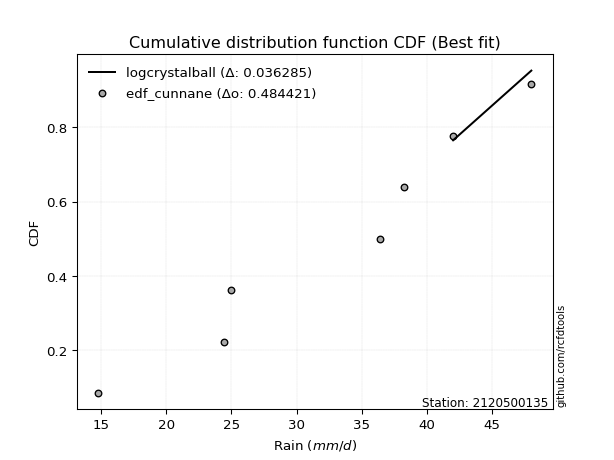</img></img>

</div>


### 12. EDF Adamowski (1981)

The Adamowski formula in hydrology refers to a specific plotting position formula used for estimating the non-parametric empirical distribution of hydrological events (like flood peaks) to calculate their return periods. This formula provides an alternative to traditional parametric methods (like the Gumbel or Log Pearson Type III distributions). 

<div align="center">


$P=(m-0.25)/(n+0.5)$


</div>


**12.1. Empirical values**

<div align="center">

|                | 0                  | 1                   | 2                   | 3             | 4                  | 5                  | 6                  |
|:---------------|:-------------------|:--------------------|:--------------------|:--------------|:-------------------|:-------------------|:-------------------|
| date           | 2023               | 2021                | 2019                | 2022          | 2025               | 2020               | 2024               |
| x              | 14.8               | 24.4                | 25.0                | 36.4          | 38.2               | 42.0               | 48.0               |
| m              | 1                  | 2                   | 3                   | 4             | 5                  | 6                  | 7                  |
| empirical_dist | edf_adamowski      | edf_adamowski       | edf_adamowski       | edf_adamowski | edf_adamowski      | edf_adamowski      | edf_adamowski      |
| empirical      | 0.1                | 0.23333333333333334 | 0.36666666666666664 | 0.5           | 0.6333333333333333 | 0.7666666666666667 | 0.9                |
| empirical_tr   | 1.1111111111111112 | 1.3043478260869565  | 1.5789473684210527  | 2.0           | 2.727272727272727  | 4.2857142857142865 | 10.000000000000002 |

</div>


**12.2. Kolmogorov-Smirnov fit test (sorted by Δ)**


<div align="center">

|                | 0                    | 1                   | 2                   | 3                   | 4                   | 5                   | 6                   | 7                   | 8                   | 9                   | 10                  | 11                  | 12                  | 13                  | 14                  | 15                  | 16                  | 17                  | 18                  | 19                  | 20                  | 21                  | 22                  | 23                  | 24                  | 25                  | 26                  | 27                  | 28                  | 29                  | 30                  | 31                  | 32                  | 33                  | 34                  | 35                  | 36                  | 37                  | 38                  | 39                  | 40                  | 41                  | 42                  | 43                  | 44                  | 45                  | 46                  | 47                  | 48                  | 49                  | 50                  | 51                  | 52                  | 53                  | 54                  | 55                  | 56                  | 57                  | 58                  | 59                  | 60                  | 61                  | 62                  | 63                  | 64                  | 65                  | 66                  | 67                  | 68                  | 69                  | 70                  | 71                  | 72                  | 73                  | 74                  | 75                  | 76                  | 77                  | 78                  | 79                  | 80                  | 81                  | 82                  | 83                  | 84                  | 85                  | 86                  | 87                  | 88                  | 89                  | 90                  | 91                  | 92                  | 93                  | 94                  | 95                  | 96                  | 97                  | 98                  | 99                  | 100                 | 101                 | 102                 | 103                 | 104                 | 105                 | 106                 | 107                 | 108                 | 109                 | 110                 | 111                 | 112                 | 113                 | 114                 | 115                 | 116                 | 117                 | 118                 | 119                 | 120                 | 121                 | 122                 | 123                 | 124                 | 125                 | 126                 | 127                 | 128                 | 129                 | 130                 | 131                 | 132                 | 133                 | 134                 | 135                 | 136                 | 137                 | 138                 | 139                 | 140                 | 141                 | 142                 | 143                 | 144                 | 145                 | 146                 | 147                 | 148                 | 149                 | 150                 | 151                 | 152                 | 153                 | 154                 | 155                 | 156                 | 157                 | 158                 | 159                 |
|:---------------|:---------------------|:--------------------|:--------------------|:--------------------|:--------------------|:--------------------|:--------------------|:--------------------|:--------------------|:--------------------|:--------------------|:--------------------|:--------------------|:--------------------|:--------------------|:--------------------|:--------------------|:--------------------|:--------------------|:--------------------|:--------------------|:--------------------|:--------------------|:--------------------|:--------------------|:--------------------|:--------------------|:--------------------|:--------------------|:--------------------|:--------------------|:--------------------|:--------------------|:--------------------|:--------------------|:--------------------|:--------------------|:--------------------|:--------------------|:--------------------|:--------------------|:--------------------|:--------------------|:--------------------|:--------------------|:--------------------|:--------------------|:--------------------|:--------------------|:--------------------|:--------------------|:--------------------|:--------------------|:--------------------|:--------------------|:--------------------|:--------------------|:--------------------|:--------------------|:--------------------|:--------------------|:--------------------|:--------------------|:--------------------|:--------------------|:--------------------|:--------------------|:--------------------|:--------------------|:--------------------|:--------------------|:--------------------|:--------------------|:--------------------|:--------------------|:--------------------|:--------------------|:--------------------|:--------------------|:--------------------|:--------------------|:--------------------|:--------------------|:--------------------|:--------------------|:--------------------|:--------------------|:--------------------|:--------------------|:--------------------|:--------------------|:--------------------|:--------------------|:--------------------|:--------------------|:--------------------|:--------------------|:--------------------|:--------------------|:--------------------|:--------------------|:--------------------|:--------------------|:--------------------|:--------------------|:--------------------|:--------------------|:--------------------|:--------------------|:--------------------|:--------------------|:--------------------|:--------------------|:--------------------|:--------------------|:--------------------|:--------------------|:--------------------|:--------------------|:--------------------|:--------------------|:--------------------|:--------------------|:--------------------|:--------------------|:--------------------|:--------------------|:--------------------|:--------------------|:--------------------|:--------------------|:--------------------|:--------------------|:--------------------|:--------------------|:--------------------|:--------------------|:--------------------|:--------------------|:--------------------|:--------------------|:--------------------|:--------------------|:--------------------|:--------------------|:--------------------|:--------------------|:--------------------|:--------------------|:--------------------|:--------------------|:--------------------|:--------------------|:--------------------|:--------------------|:--------------------|:--------------------|:--------------------|:--------------------|:--------------------|
| station        | 2120500135           | 2120500135          | 2120500135          | 2120500135          | 2120500135          | 2120500135          | 2120500135          | 2120500135          | 2120500135          | 2120500135          | 2120500135          | 2120500135          | 2120500135          | 2120500135          | 2120500135          | 2120500135          | 2120500135          | 2120500135          | 2120500135          | 2120500135          | 2120500135          | 2120500135          | 2120500135          | 2120500135          | 2120500135          | 2120500135          | 2120500135          | 2120500135          | 2120500135          | 2120500135          | 2120500135          | 2120500135          | 2120500135          | 2120500135          | 2120500135          | 2120500135          | 2120500135          | 2120500135          | 2120500135          | 2120500135          | 2120500135          | 2120500135          | 2120500135          | 2120500135          | 2120500135          | 2120500135          | 2120500135          | 2120500135          | 2120500135          | 2120500135          | 2120500135          | 2120500135          | 2120500135          | 2120500135          | 2120500135          | 2120500135          | 2120500135          | 2120500135          | 2120500135          | 2120500135          | 2120500135          | 2120500135          | 2120500135          | 2120500135          | 2120500135          | 2120500135          | 2120500135          | 2120500135          | 2120500135          | 2120500135          | 2120500135          | 2120500135          | 2120500135          | 2120500135          | 2120500135          | 2120500135          | 2120500135          | 2120500135          | 2120500135          | 2120500135          | 2120500135          | 2120500135          | 2120500135          | 2120500135          | 2120500135          | 2120500135          | 2120500135          | 2120500135          | 2120500135          | 2120500135          | 2120500135          | 2120500135          | 2120500135          | 2120500135          | 2120500135          | 2120500135          | 2120500135          | 2120500135          | 2120500135          | 2120500135          | 2120500135          | 2120500135          | 2120500135          | 2120500135          | 2120500135          | 2120500135          | 2120500135          | 2120500135          | 2120500135          | 2120500135          | 2120500135          | 2120500135          | 2120500135          | 2120500135          | 2120500135          | 2120500135          | 2120500135          | 2120500135          | 2120500135          | 2120500135          | 2120500135          | 2120500135          | 2120500135          | 2120500135          | 2120500135          | 2120500135          | 2120500135          | 2120500135          | 2120500135          | 2120500135          | 2120500135          | 2120500135          | 2120500135          | 2120500135          | 2120500135          | 2120500135          | 2120500135          | 2120500135          | 2120500135          | 2120500135          | 2120500135          | 2120500135          | 2120500135          | 2120500135          | 2120500135          | 2120500135          | 2120500135          | 2120500135          | 2120500135          | 2120500135          | 2120500135          | 2120500135          | 2120500135          | 2120500135          | 2120500135          | 2120500135          | 2120500135          | 2120500135          | 2120500135          | 2120500135          |
| empirical_dist | edf_adamowski        | edf_adamowski       | edf_adamowski       | edf_adamowski       | edf_adamowski       | edf_adamowski       | edf_adamowski       | edf_adamowski       | edf_adamowski       | edf_adamowski       | edf_adamowski       | edf_adamowski       | edf_adamowski       | edf_adamowski       | edf_adamowski       | edf_adamowski       | edf_adamowski       | edf_adamowski       | edf_adamowski       | edf_adamowski       | edf_adamowski       | edf_adamowski       | edf_adamowski       | edf_adamowski       | edf_adamowski       | edf_adamowski       | edf_adamowski       | edf_adamowski       | edf_adamowski       | edf_adamowski       | edf_adamowski       | edf_adamowski       | edf_adamowski       | edf_adamowski       | edf_adamowski       | edf_adamowski       | edf_adamowski       | edf_adamowski       | edf_adamowski       | edf_adamowski       | edf_adamowski       | edf_adamowski       | edf_adamowski       | edf_adamowski       | edf_adamowski       | edf_adamowski       | edf_adamowski       | edf_adamowski       | edf_adamowski       | edf_adamowski       | edf_adamowski       | edf_adamowski       | edf_adamowski       | edf_adamowski       | edf_adamowski       | edf_adamowski       | edf_adamowski       | edf_adamowski       | edf_adamowski       | edf_adamowski       | edf_adamowski       | edf_adamowski       | edf_adamowski       | edf_adamowski       | edf_adamowski       | edf_adamowski       | edf_adamowski       | edf_adamowski       | edf_adamowski       | edf_adamowski       | edf_adamowski       | edf_adamowski       | edf_adamowski       | edf_adamowski       | edf_adamowski       | edf_adamowski       | edf_adamowski       | edf_adamowski       | edf_adamowski       | edf_adamowski       | edf_adamowski       | edf_adamowski       | edf_adamowski       | edf_adamowski       | edf_adamowski       | edf_adamowski       | edf_adamowski       | edf_adamowski       | edf_adamowski       | edf_adamowski       | edf_adamowski       | edf_adamowski       | edf_adamowski       | edf_adamowski       | edf_adamowski       | edf_adamowski       | edf_adamowski       | edf_adamowski       | edf_adamowski       | edf_adamowski       | edf_adamowski       | edf_adamowski       | edf_adamowski       | edf_adamowski       | edf_adamowski       | edf_adamowski       | edf_adamowski       | edf_adamowski       | edf_adamowski       | edf_adamowski       | edf_adamowski       | edf_adamowski       | edf_adamowski       | edf_adamowski       | edf_adamowski       | edf_adamowski       | edf_adamowski       | edf_adamowski       | edf_adamowski       | edf_adamowski       | edf_adamowski       | edf_adamowski       | edf_adamowski       | edf_adamowski       | edf_adamowski       | edf_adamowski       | edf_adamowski       | edf_adamowski       | edf_adamowski       | edf_adamowski       | edf_adamowski       | edf_adamowski       | edf_adamowski       | edf_adamowski       | edf_adamowski       | edf_adamowski       | edf_adamowski       | edf_adamowski       | edf_adamowski       | edf_adamowski       | edf_adamowski       | edf_adamowski       | edf_adamowski       | edf_adamowski       | edf_adamowski       | edf_adamowski       | edf_adamowski       | edf_adamowski       | edf_adamowski       | edf_adamowski       | edf_adamowski       | edf_adamowski       | edf_adamowski       | edf_adamowski       | edf_adamowski       | edf_adamowski       | edf_adamowski       | edf_adamowski       | edf_adamowski       | edf_adamowski       |
| p_dist         | logcrystalball       | logtrapezoid        | ksone               | genpareto           | logbeta             | logweibull_max      | arcsine             | loggenhalflogistic  | semicircular        | burr                | anglit              | logtruncweibull_min | wrapcauchy          | logargus            | logarcsine          | kappa4              | logmielke           | dweibull            | logburr             | logweibull_min      | logburr12           | logloggamma         | dgamma              | beta                | f                   | t                   | norm                | crystalball         | exponnorm           | nct                 | johnsonsu           | loggumbel_l         | pearson3            | logskewnorm         | foldnorm            | logjohnsonsu        | erlang              | gamma               | weibull_min         | logpearson3         | betaprime           | argus               | lomax               | logsemicircular     | invgamma            | truncnorm           | rice                | cosine              | genextreme          | skewnorm            | tukeylambda         | uniform             | loggenextreme       | genhalflogistic     | logistic            | alpha               | loganglit           | gompertz            | vonmises_line       | genlogistic         | logncf              | maxwell             | invgauss            | triang              | ncf                 | truncweibull_min    | rayleigh            | gumbel_l            | hypsecant           | logtriang           | loginvweibull       | loggengamma         | logf                | loggamma            | loggamma            | logt                | logexponnorm        | lognorm             | logerlang           | kstwobign           | logfatiguelife      | logrice             | lognct              | loglevy_l           | loginvgamma         | kappa3              | halfnorm            | logalpha            | logbetaprime        | loginvgauss         | logfoldnorm         | gausshyper          | laplace             | logvonmises_line    | logkstwobign        | logmaxwell          | loglogistic         | gumbel_r            | loggenexpon         | lograyleigh         | genexpon            | logcosine           | loghypsecant        | halflogistic        | logloglaplace       | loghalfnorm         | moyal               | bradford            | logksone            | logexponpow         | logdweibull         | loggennorm          | levy_l              | truncexpon          | loggumbel_r         | loglaplace          | loglaplace          | loggompertz         | logwrapcauchy       | loghalflogistic     | logmoyal            | trapezoid           | logexponweib        | loggausshyper       | burr12              | loglomax            | logkappa3           | loguniform          | logkappa4           | gennorm             | halfgennorm         | wald                | loghalfgennorm      | logdgamma           | nakagami            | logrdist            | lognakagami         | loggenpareto        | logtruncnorm        | logwald             | logbradford         | logtukeylambda      | logtruncexpon       | invweibull          | johnsonsb           | gengamma            | fatiguelife         | weibull_max         | powerlaw            | logjohnsonsb        | exponweib           | logpowerlaw         | rdist               | exponpow            | truncpareto         | logtruncpareto      | loggenlogistic      | logvonmises         | vonmises            | mielke              |
| delta          | 0.052951922022359876 | 0.09929461428819597 | 0.09948541944343958 | 0.09999999664284065 | 0.09999999974823781 | 0.09999999999972053 | 0.1                 | 0.1002947549967459  | 0.10915306748584741 | 0.11222358979433944 | 0.11671840559310942 | 0.11843099645272526 | 0.12012184302280815 | 0.12343723265238465 | 0.12689608342019731 | 0.12806122270801568 | 0.1299745526666907  | 0.130296621270524   | 0.13088599845475746 | 0.13327268378173254 | 0.13361398833172006 | 0.1336366441669445  | 0.13363830702332674 | 0.13377554362454033 | 0.13467013633111458 | 0.13479592881033953 | 0.13481282394938    | 0.13481283526197174 | 0.13481377726971655 | 0.13483457942850063 | 0.13489415834134322 | 0.13491498632107346 | 0.13509939489977188 | 0.13762247478051437 | 0.1379416957799353  | 0.13830841944451017 | 0.1393874396148802  | 0.1400617620075253  | 0.14186037124817166 | 0.14191452247759173 | 0.14232102616627285 | 0.1427649112815394  | 0.1429556857332389  | 0.14387426430868056 | 0.14413090137489193 | 0.14577913831396558 | 0.14582495713125898 | 0.14587825720126568 | 0.1470458690334409  | 0.14735939950634513 | 0.1497759055433434  | 0.1506024096385541  | 0.15064572004879134 | 0.15089944158975926 | 0.15139652037741871 | 0.15261069943489292 | 0.1533556352776032  | 0.15350580443821527 | 0.1560192672484182  | 0.1563235567415569  | 0.15773046107428412 | 0.15803054206009826 | 0.1588919129952433  | 0.15961413503029379 | 0.16251803329942693 | 0.1646922094217821  | 0.16507775950686887 | 0.16521254225911838 | 0.16591325259477366 | 0.16665520459975036 | 0.17318859824133315 | 0.17537035137332346 | 0.17547410354158655 | 0.17549041484565098 | 0.17549041484565098 | 0.17579260681523    | 0.1757951503589832  | 0.17579633632638902 | 0.1776957471786439  | 0.17808363907138935 | 0.1790309703167675  | 0.1791040532455691  | 0.1793636954891551  | 0.18037450362266436 | 0.1845440715689941  | 0.18499316927155185 | 0.1854062220287257  | 0.18560997269557533 | 0.18604642252167858 | 0.1876057968411795  | 0.1888090946697687  | 0.19279147246227163 | 0.19288229762882847 | 0.19327331399810815 | 0.1944081409971099  | 0.19457123483518957 | 0.1957305421757758  | 0.19706464124764822 | 0.20004674166517789 | 0.20013247398877976 | 0.20112711307950404 | 0.20633123559931743 | 0.21067373488191798 | 0.213703610547622   | 0.21473716284500988 | 0.21661825326332151 | 0.2178535354963017  | 0.2190874515111153  | 0.22073602665971848 | 0.22171614244514554 | 0.22173841120111976 | 0.224816777078837   | 0.2296370165926783  | 0.23096445638435426 | 0.23135869487203964 | 0.23762865869735683 | 0.23762865869735683 | 0.23926363733681555 | 0.24122150987728075 | 0.2441940871829048  | 0.24950365705498267 | 0.2515032015612651  | 0.25942766666140016 | 0.2595680975632556  | 0.2607574297251422  | 0.26274874534855747 | 0.2631113977816779  | 0.26488323199166186 | 0.26554100211680554 | 0.2666666666666667  | 0.2758006864251544  | 0.27637413118765697 | 0.2842740685183757  | 0.2850523682058379  | 0.2852590613440299  | 0.28616260905928814 | 0.28701759289628415 | 0.2961491745727117  | 0.2969277324772597  | 0.30171787542047146 | 0.3215472394309068  | 0.3238217366392457  | 0.3305180229224882  | 0.4762970118947249  | 0.5018425412904989  | 0.5487726276828448  | 0.5494165935375357  | 0.5515555892595891  | 0.5752006546650847  | 0.5885550627972882  | 0.5965139070066277  | 0.6200330591711842  | 0.6242937892112399  | 0.6251949152038605  | 0.6752664733322213  | 0.7029396306854774  | 0.7666666666666667  | 1.1717637741861187  | 7.295138338223476   | nan                 |
| deltao         | 0.48442053926100004  | 0.48442053926100004 | 0.48442053926100004 | 0.48442053926100004 | 0.48442053926100004 | 0.48442053926100004 | 0.48442053926100004 | 0.48442053926100004 | 0.48442053926100004 | 0.48442053926100004 | 0.48442053926100004 | 0.48442053926100004 | 0.48442053926100004 | 0.48442053926100004 | 0.48442053926100004 | 0.48442053926100004 | 0.48442053926100004 | 0.48442053926100004 | 0.48442053926100004 | 0.48442053926100004 | 0.48442053926100004 | 0.48442053926100004 | 0.48442053926100004 | 0.48442053926100004 | 0.48442053926100004 | 0.48442053926100004 | 0.48442053926100004 | 0.48442053926100004 | 0.48442053926100004 | 0.48442053926100004 | 0.48442053926100004 | 0.48442053926100004 | 0.48442053926100004 | 0.48442053926100004 | 0.48442053926100004 | 0.48442053926100004 | 0.48442053926100004 | 0.48442053926100004 | 0.48442053926100004 | 0.48442053926100004 | 0.48442053926100004 | 0.48442053926100004 | 0.48442053926100004 | 0.48442053926100004 | 0.48442053926100004 | 0.48442053926100004 | 0.48442053926100004 | 0.48442053926100004 | 0.48442053926100004 | 0.48442053926100004 | 0.48442053926100004 | 0.48442053926100004 | 0.48442053926100004 | 0.48442053926100004 | 0.48442053926100004 | 0.48442053926100004 | 0.48442053926100004 | 0.48442053926100004 | 0.48442053926100004 | 0.48442053926100004 | 0.48442053926100004 | 0.48442053926100004 | 0.48442053926100004 | 0.48442053926100004 | 0.48442053926100004 | 0.48442053926100004 | 0.48442053926100004 | 0.48442053926100004 | 0.48442053926100004 | 0.48442053926100004 | 0.48442053926100004 | 0.48442053926100004 | 0.48442053926100004 | 0.48442053926100004 | 0.48442053926100004 | 0.48442053926100004 | 0.48442053926100004 | 0.48442053926100004 | 0.48442053926100004 | 0.48442053926100004 | 0.48442053926100004 | 0.48442053926100004 | 0.48442053926100004 | 0.48442053926100004 | 0.48442053926100004 | 0.48442053926100004 | 0.48442053926100004 | 0.48442053926100004 | 0.48442053926100004 | 0.48442053926100004 | 0.48442053926100004 | 0.48442053926100004 | 0.48442053926100004 | 0.48442053926100004 | 0.48442053926100004 | 0.48442053926100004 | 0.48442053926100004 | 0.48442053926100004 | 0.48442053926100004 | 0.48442053926100004 | 0.48442053926100004 | 0.48442053926100004 | 0.48442053926100004 | 0.48442053926100004 | 0.48442053926100004 | 0.48442053926100004 | 0.48442053926100004 | 0.48442053926100004 | 0.48442053926100004 | 0.48442053926100004 | 0.48442053926100004 | 0.48442053926100004 | 0.48442053926100004 | 0.48442053926100004 | 0.48442053926100004 | 0.48442053926100004 | 0.48442053926100004 | 0.48442053926100004 | 0.48442053926100004 | 0.48442053926100004 | 0.48442053926100004 | 0.48442053926100004 | 0.48442053926100004 | 0.48442053926100004 | 0.48442053926100004 | 0.48442053926100004 | 0.48442053926100004 | 0.48442053926100004 | 0.48442053926100004 | 0.48442053926100004 | 0.48442053926100004 | 0.48442053926100004 | 0.48442053926100004 | 0.48442053926100004 | 0.48442053926100004 | 0.48442053926100004 | 0.48442053926100004 | 0.48442053926100004 | 0.48442053926100004 | 0.48442053926100004 | 0.48442053926100004 | 0.48442053926100004 | 0.48442053926100004 | 0.48442053926100004 | 0.48442053926100004 | 0.48442053926100004 | 0.48442053926100004 | 0.48442053926100004 | 0.48442053926100004 | 0.48442053926100004 | 0.48442053926100004 | 0.48442053926100004 | 0.48442053926100004 | 0.48442053926100004 | 0.48442053926100004 | 0.48442053926100004 | 0.48442053926100004 | 0.48442053926100004 | 0.48442053926100004 | 0.48442053926100004 |
| eval           | Δo > Δ               | Δo > Δ              | Δo > Δ              | Δo > Δ              | Δo > Δ              | Δo > Δ              | Δo > Δ              | Δo > Δ              | Δo > Δ              | Δo > Δ              | Δo > Δ              | Δo > Δ              | Δo > Δ              | Δo > Δ              | Δo > Δ              | Δo > Δ              | Δo > Δ              | Δo > Δ              | Δo > Δ              | Δo > Δ              | Δo > Δ              | Δo > Δ              | Δo > Δ              | Δo > Δ              | Δo > Δ              | Δo > Δ              | Δo > Δ              | Δo > Δ              | Δo > Δ              | Δo > Δ              | Δo > Δ              | Δo > Δ              | Δo > Δ              | Δo > Δ              | Δo > Δ              | Δo > Δ              | Δo > Δ              | Δo > Δ              | Δo > Δ              | Δo > Δ              | Δo > Δ              | Δo > Δ              | Δo > Δ              | Δo > Δ              | Δo > Δ              | Δo > Δ              | Δo > Δ              | Δo > Δ              | Δo > Δ              | Δo > Δ              | Δo > Δ              | Δo > Δ              | Δo > Δ              | Δo > Δ              | Δo > Δ              | Δo > Δ              | Δo > Δ              | Δo > Δ              | Δo > Δ              | Δo > Δ              | Δo > Δ              | Δo > Δ              | Δo > Δ              | Δo > Δ              | Δo > Δ              | Δo > Δ              | Δo > Δ              | Δo > Δ              | Δo > Δ              | Δo > Δ              | Δo > Δ              | Δo > Δ              | Δo > Δ              | Δo > Δ              | Δo > Δ              | Δo > Δ              | Δo > Δ              | Δo > Δ              | Δo > Δ              | Δo > Δ              | Δo > Δ              | Δo > Δ              | Δo > Δ              | Δo > Δ              | Δo > Δ              | Δo > Δ              | Δo > Δ              | Δo > Δ              | Δo > Δ              | Δo > Δ              | Δo > Δ              | Δo > Δ              | Δo > Δ              | Δo > Δ              | Δo > Δ              | Δo > Δ              | Δo > Δ              | Δo > Δ              | Δo > Δ              | Δo > Δ              | Δo > Δ              | Δo > Δ              | Δo > Δ              | Δo > Δ              | Δo > Δ              | Δo > Δ              | Δo > Δ              | Δo > Δ              | Δo > Δ              | Δo > Δ              | Δo > Δ              | Δo > Δ              | Δo > Δ              | Δo > Δ              | Δo > Δ              | Δo > Δ              | Δo > Δ              | Δo > Δ              | Δo > Δ              | Δo > Δ              | Δo > Δ              | Δo > Δ              | Δo > Δ              | Δo > Δ              | Δo > Δ              | Δo > Δ              | Δo > Δ              | Δo > Δ              | Δo > Δ              | Δo > Δ              | Δo > Δ              | Δo > Δ              | Δo > Δ              | Δo > Δ              | Δo > Δ              | Δo > Δ              | Δo > Δ              | Δo > Δ              | Δo > Δ              | Δo > Δ              | Δo > Δ              | Δo > Δ              | Δo > Δ              | Δo > Δ              | Δo <= Δ             | Δo <= Δ             | Δo <= Δ             | Δo <= Δ             | Δo <= Δ             | Δo <= Δ             | Δo <= Δ             | Δo <= Δ             | Δo <= Δ             | Δo <= Δ             | Δo <= Δ             | Δo <= Δ             | Δo <= Δ             | Δo <= Δ             | Δo <= Δ             | Δo <= Δ             |
| fit            | 1                    | 1                   | 1                   | 1                   | 1                   | 1                   | 1                   | 1                   | 1                   | 1                   | 1                   | 1                   | 1                   | 1                   | 1                   | 1                   | 1                   | 1                   | 1                   | 1                   | 1                   | 1                   | 1                   | 1                   | 1                   | 1                   | 1                   | 1                   | 1                   | 1                   | 1                   | 1                   | 1                   | 1                   | 1                   | 1                   | 1                   | 1                   | 1                   | 1                   | 1                   | 1                   | 1                   | 1                   | 1                   | 1                   | 1                   | 1                   | 1                   | 1                   | 1                   | 1                   | 1                   | 1                   | 1                   | 1                   | 1                   | 1                   | 1                   | 1                   | 1                   | 1                   | 1                   | 1                   | 1                   | 1                   | 1                   | 1                   | 1                   | 1                   | 1                   | 1                   | 1                   | 1                   | 1                   | 1                   | 1                   | 1                   | 1                   | 1                   | 1                   | 1                   | 1                   | 1                   | 1                   | 1                   | 1                   | 1                   | 1                   | 1                   | 1                   | 1                   | 1                   | 1                   | 1                   | 1                   | 1                   | 1                   | 1                   | 1                   | 1                   | 1                   | 1                   | 1                   | 1                   | 1                   | 1                   | 1                   | 1                   | 1                   | 1                   | 1                   | 1                   | 1                   | 1                   | 1                   | 1                   | 1                   | 1                   | 1                   | 1                   | 1                   | 1                   | 1                   | 1                   | 1                   | 1                   | 1                   | 1                   | 1                   | 1                   | 1                   | 1                   | 1                   | 1                   | 1                   | 1                   | 1                   | 1                   | 1                   | 1                   | 1                   | 1                   | 1                   | 0                   | 0                   | 0                   | 0                   | 0                   | 0                   | 0                   | 0                   | 0                   | 0                   | 0                   | 0                   | 0                   | 0                   | 0                   | 0                   |
| n              | 7                    | 7                   | 7                   | 7                   | 7                   | 7                   | 7                   | 7                   | 7                   | 7                   | 7                   | 7                   | 7                   | 7                   | 7                   | 7                   | 7                   | 7                   | 7                   | 7                   | 7                   | 7                   | 7                   | 7                   | 7                   | 7                   | 7                   | 7                   | 7                   | 7                   | 7                   | 7                   | 7                   | 7                   | 7                   | 7                   | 7                   | 7                   | 7                   | 7                   | 7                   | 7                   | 7                   | 7                   | 7                   | 7                   | 7                   | 7                   | 7                   | 7                   | 7                   | 7                   | 7                   | 7                   | 7                   | 7                   | 7                   | 7                   | 7                   | 7                   | 7                   | 7                   | 7                   | 7                   | 7                   | 7                   | 7                   | 7                   | 7                   | 7                   | 7                   | 7                   | 7                   | 7                   | 7                   | 7                   | 7                   | 7                   | 7                   | 7                   | 7                   | 7                   | 7                   | 7                   | 7                   | 7                   | 7                   | 7                   | 7                   | 7                   | 7                   | 7                   | 7                   | 7                   | 7                   | 7                   | 7                   | 7                   | 7                   | 7                   | 7                   | 7                   | 7                   | 7                   | 7                   | 7                   | 7                   | 7                   | 7                   | 7                   | 7                   | 7                   | 7                   | 7                   | 7                   | 7                   | 7                   | 7                   | 7                   | 7                   | 7                   | 7                   | 7                   | 7                   | 7                   | 7                   | 7                   | 7                   | 7                   | 7                   | 7                   | 7                   | 7                   | 7                   | 7                   | 7                   | 7                   | 7                   | 7                   | 7                   | 7                   | 7                   | 7                   | 7                   | 7                   | 7                   | 7                   | 7                   | 7                   | 7                   | 7                   | 7                   | 7                   | 7                   | 7                   | 7                   | 7                   | 7                   | 7                   | 7                   |
| best_fit       | 1                    | 0                   | 0                   | 0                   | 0                   | 0                   | 0                   | 0                   | 0                   | 0                   | 0                   | 0                   | 0                   | 0                   | 0                   | 0                   | 0                   | 0                   | 0                   | 0                   | 0                   | 0                   | 0                   | 0                   | 0                   | 0                   | 0                   | 0                   | 0                   | 0                   | 0                   | 0                   | 0                   | 0                   | 0                   | 0                   | 0                   | 0                   | 0                   | 0                   | 0                   | 0                   | 0                   | 0                   | 0                   | 0                   | 0                   | 0                   | 0                   | 0                   | 0                   | 0                   | 0                   | 0                   | 0                   | 0                   | 0                   | 0                   | 0                   | 0                   | 0                   | 0                   | 0                   | 0                   | 0                   | 0                   | 0                   | 0                   | 0                   | 0                   | 0                   | 0                   | 0                   | 0                   | 0                   | 0                   | 0                   | 0                   | 0                   | 0                   | 0                   | 0                   | 0                   | 0                   | 0                   | 0                   | 0                   | 0                   | 0                   | 0                   | 0                   | 0                   | 0                   | 0                   | 0                   | 0                   | 0                   | 0                   | 0                   | 0                   | 0                   | 0                   | 0                   | 0                   | 0                   | 0                   | 0                   | 0                   | 0                   | 0                   | 0                   | 0                   | 0                   | 0                   | 0                   | 0                   | 0                   | 0                   | 0                   | 0                   | 0                   | 0                   | 0                   | 0                   | 0                   | 0                   | 0                   | 0                   | 0                   | 0                   | 0                   | 0                   | 0                   | 0                   | 0                   | 0                   | 0                   | 0                   | 0                   | 0                   | 0                   | 0                   | 0                   | 0                   | 0                   | 0                   | 0                   | 0                   | 0                   | 0                   | 0                   | 0                   | 0                   | 0                   | 0                   | 0                   | 0                   | 0                   | 0                   | 0                   |
| best_fit_sort  | 1                    | 2                   | 3                   | 4                   | 5                   | 6                   | 7                   | 8                   | 9                   | 10                  | 11                  | 12                  | 13                  | 14                  | 15                  | 16                  | 17                  | 18                  | 19                  | 20                  | 21                  | 22                  | 23                  | 24                  | 25                  | 26                  | 27                  | 28                  | 29                  | 30                  | 31                  | 32                  | 33                  | 34                  | 35                  | 36                  | 37                  | 38                  | 39                  | 40                  | 41                  | 42                  | 43                  | 44                  | 45                  | 46                  | 47                  | 48                  | 49                  | 50                  | 51                  | 52                  | 53                  | 54                  | 55                  | 56                  | 57                  | 58                  | 59                  | 60                  | 61                  | 62                  | 63                  | 64                  | 65                  | 66                  | 67                  | 68                  | 69                  | 70                  | 71                  | 72                  | 73                  | 74                  | 75                  | 76                  | 77                  | 78                  | 79                  | 80                  | 81                  | 82                  | 83                  | 84                  | 85                  | 86                  | 87                  | 88                  | 89                  | 90                  | 91                  | 92                  | 93                  | 94                  | 95                  | 96                  | 97                  | 98                  | 99                  | 100                 | 101                 | 102                 | 103                 | 104                 | 105                 | 106                 | 107                 | 108                 | 109                 | 110                 | 111                 | 112                 | 113                 | 114                 | 115                 | 116                 | 117                 | 118                 | 119                 | 120                 | 121                 | 122                 | 123                 | 124                 | 125                 | 126                 | 127                 | 128                 | 129                 | 130                 | 131                 | 132                 | 133                 | 134                 | 135                 | 136                 | 137                 | 138                 | 139                 | 140                 | 141                 | 142                 | 143                 | 144                 | 145                 | 146                 | 147                 | 148                 | 149                 | 150                 | 151                 | 152                 | 153                 | 154                 | 155                 | 156                 | 157                 | 158                 | 159                 | 160                 |

</div>


**12.3. Best fit**

<div align="center">

|   id |    station | empirical_dist   | p_dist         |     delta |   deltao | eval   |   fit |   n |   best_fit |   best_fit_sort |
|-----:|-----------:|:-----------------|:---------------|----------:|---------:|:-------|------:|----:|-----------:|----------------:|
|    0 | 2120500135 | edf_adamowski    | logcrystalball | 0.0529519 | 0.484421 | Δo > Δ |     1 |   7 |          1 |               1 |

</div>


<div align="center">

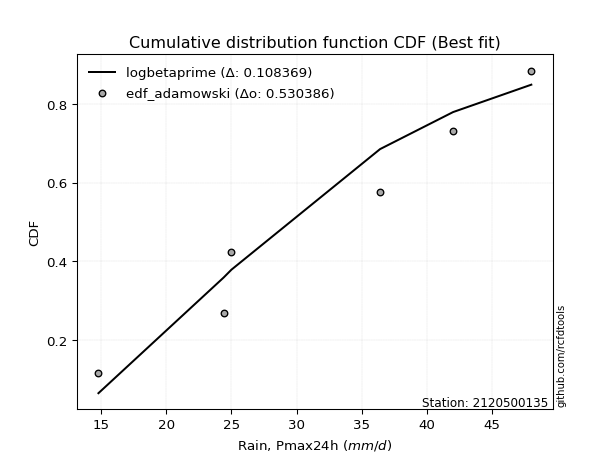</img>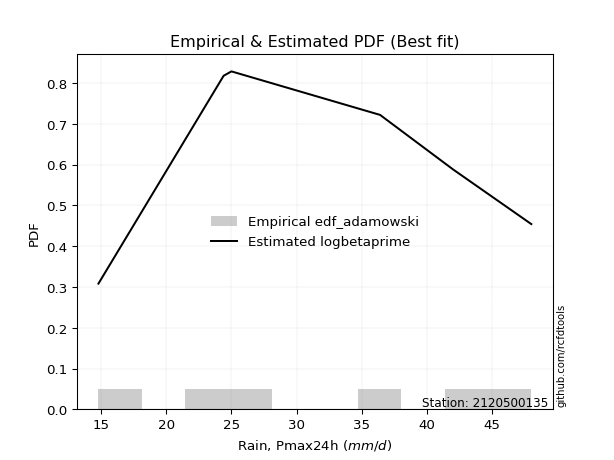</img>

</div>


## C. Best fit & Estimate extreme values for specific return periods - Tr

Best fit in probability distribution analysis means finding the theoretical distribution (like Normal, Poisson, Exponential, etc.) that most accurately mirrors your real-world data´s patterns (shape, center, spread) for better predictions, using methods like visual checks (Q-Q plots), goodness-of-fit tests (Kolmogorov-Smirnov, Chi-Squared), and information criteria (AIC) to score and select the simplest, most representative model.


### 1. Best fit (ordered by delta Δ)

:file_folder:Table: [bestfit_2120500135.csv](table/bestfit_2120500135.csv)

<div align="center">

|   id |    station | empirical_dist   | p_dist         |     delta |   deltao | eval   |   fit |   n |   best_fit |   best_fit_sort |
|-----:|-----------:|:-----------------|:---------------|----------:|---------:|:-------|------:|----:|-----------:|----------------:|
|    0 | 2120500135 | edf_hazen        | logcrystalball | 0.0243805 | 0.484421 | Δo > Δ |     1 |   7 |          1 |               1 |
|    1 | 2120500135 | edf_gringorten   | logcrystalball | 0.0316036 | 0.484421 | Δo > Δ |     1 |   7 |          1 |               2 |
|    2 | 2120500135 | edf_cunnane      | logcrystalball | 0.0362853 | 0.484421 | Δo > Δ |     1 |   7 |          1 |               3 |
|    3 | 2120500135 | edf_blom         | logcrystalball | 0.0391588 | 0.484421 | Δo > Δ |     1 |   7 |          1 |               4 |
|    4 | 2120500135 | edf_tukey        | logcrystalball | 0.043861  | 0.484421 | Δo > Δ |     1 |   7 |          1 |               5 |
|    5 | 2120500135 | edf_filliben     | logcrystalball | 0.0456199 | 0.484421 | Δo > Δ |     1 |   7 |          1 |               6 |
|    6 | 2120500135 | edf_beard        | logcrystalball | 0.0464479 | 0.484421 | Δo > Δ |     1 |   7 |          1 |               7 |
|    7 | 2120500135 | edf_jenkinson    | logcrystalball | 0.0464479 | 0.484421 | Δo > Δ |     1 |   7 |          1 |               8 |
|    8 | 2120500135 | edf_chegodayev   | logcrystalball | 0.0475465 | 0.484421 | Δo > Δ |     1 |   7 |          1 |               9 |
|    9 | 2120500135 | edf_adamowski    | logcrystalball | 0.0529519 | 0.484421 | Δo > Δ |     1 |   7 |          1 |              10 |
|   10 | 2120500135 | edf_weibull      | logcrystalball | 0.0779519 | 0.484421 | Δo > Δ |     1 |   7 |          1 |              11 |
|   11 | 2120500135 | edf_california   | logcrystalball | 0.0920297 | 0.484421 | Δo > Δ |     1 |   7 |          1 |              12 |

</div>


### 2. Extreme values and % difference analysis

In hydrology, a return period (or recurrence interval $Tr$) is the statistical average time between extreme events like floods or droughts of a specific magnitude, indicating how rare an event is, with a 100-year flood, for example, having a 1% chance of occurring in any given year, not that it happens exactly every century. It is a key tool for infrastructure design (like bridges or dams) and risk assessment, calculated from historical data to determine the probability of future events, although it is important to remember it is statistical average, and events can cluster or be missed.

The extreme value porcentage difference is evaluated as $pdiff = 1 - (ETrBf / ETr) * 100$, where _ETrBf_ correspond to the bestfit extreme value for a specific recurrence interval and _ETr_ correspond to the extreme value for one of the most used PDFsused in hydrology.

> risk_rate: assuming the return period as the project useful life.

:file_folder:Table: [extreme_2120500135.csv](table/extreme_2120500135.csv), all PDFs.  
:file_folder:Table: [extremepdiff_2120500135.csv](table/extremepdiff_2120500135.csv), % difference between bestfit and most used PDFs in Hydrology.

<div align="center">

Extreme values table for only best fit PDFs
|   id |      tr |   prob_l |     prob_g |   alpha |   anglit |   arcsine |   argus |    beta |   betaprime |   bradford |    burr |   burr12 |   cosine |   crystalball |   dgamma |   dweibull |   erlang |   exponnorm |         exponpow |   exponweib |       f |   fatiguelife |   foldnorm |   gamma |   gausshyper |   genexpon |   genextreme |   gengamma |   genhalflogistic |   genlogistic |   gennorm |   genpareto |   gompertz |   gumbel_l |   gumbel_r |   halfgennorm |   halflogistic |   halfnorm |   hypsecant |   invgamma |   invgauss |       invweibull |   johnsonsb |   johnsonsu |   kappa3 |   kappa4 |   ksone |   kstwobign |   laplace |   levy_l |   loggamma |   logistic |   loglaplace |    lomax |   maxwell |   mielke |   moyal |   nakagami |     ncf |     nct |    norm |   pearson3 |   powerlaw |   rayleigh |   rdist |    rice |   semicircular |   skewnorm |       t |   trapezoid |   triang |   truncexpon |   truncnorm |   truncpareto |   truncweibull_min |   tukeylambda |   uniform |   vonmises |   vonmises_line |     wald |   weibull_max |   weibull_min |   wrapcauchy |   logalpha |   loganglit |   logarcsine |   logargus |   logbeta |   logbetaprime |   logbradford |   logburr |   logburr12 |   logcosine |   logcrystalball |   logdgamma |   logdweibull |   logerlang |   logexponnorm |   logexponpow |   logexponweib |    logf |   logfatiguelife |   logfoldnorm |   loggausshyper |   loggenexpon |   loggenextreme |   loggengamma |   loggenhalflogistic |   loggenlogistic |   loggennorm |   loggenpareto |   loggompertz |   loggumbel_l |   loggumbel_r |   loghalfgennorm |   loghalflogistic |   loghalfnorm |   loghypsecant |   loginvgamma |   loginvgauss |   loginvweibull |   logjohnsonsb |   logjohnsonsu |   logkappa3 |   logkappa4 |   logksone |   logkstwobign |   loglevy_l |   logloggamma |   loglogistic |   logloglaplace |   loglomax |   logmaxwell |   logmielke |   logmoyal |   lognakagami |   logncf |   lognct |   lognorm |   logpearson3 |   logpowerlaw |   lograyleigh |   logrdist |   logrice |   logsemicircular |   logskewnorm |    logt |   logtrapezoid |   logtriang |   logtruncexpon |   logtruncnorm |   logtruncpareto |   logtruncweibull_min |   logtukeylambda |   loguniform |   logvonmises |   logvonmises_line |   logwald |   logweibull_max |   logweibull_min |   logwrapcauchy |    station |   n |   risk_rate |
|-----:|--------:|---------:|-----------:|--------:|---------:|----------:|--------:|--------:|------------:|-----------:|--------:|---------:|---------:|--------------:|---------:|-----------:|---------:|------------:|-----------------:|------------:|--------:|--------------:|-----------:|--------:|-------------:|-----------:|-------------:|-----------:|------------------:|--------------:|----------:|------------:|-----------:|-----------:|-----------:|--------------:|---------------:|-----------:|------------:|-----------:|-----------:|-----------------:|------------:|------------:|---------:|---------:|--------:|------------:|----------:|---------:|-----------:|-----------:|-------------:|---------:|----------:|---------:|--------:|-----------:|--------:|--------:|--------:|-----------:|-----------:|-----------:|--------:|--------:|---------------:|-----------:|--------:|------------:|---------:|-------------:|------------:|--------------:|-------------------:|--------------:|----------:|-----------:|----------------:|---------:|--------------:|--------------:|-------------:|-----------:|------------:|-------------:|-----------:|----------:|---------------:|--------------:|----------:|------------:|------------:|-----------------:|------------:|--------------:|------------:|---------------:|--------------:|---------------:|--------:|-----------------:|--------------:|----------------:|--------------:|----------------:|--------------:|---------------------:|-----------------:|-------------:|---------------:|--------------:|--------------:|--------------:|-----------------:|------------------:|--------------:|---------------:|--------------:|--------------:|----------------:|---------------:|---------------:|------------:|------------:|-----------:|---------------:|------------:|--------------:|--------------:|----------------:|-----------:|-------------:|------------:|-----------:|--------------:|---------:|---------:|----------:|--------------:|--------------:|--------------:|-----------:|----------:|------------------:|--------------:|--------:|---------------:|------------:|----------------:|---------------:|-----------------:|----------------------:|-----------------:|-------------:|--------------:|-------------------:|----------:|-----------------:|-----------------:|----------------:|-----------:|----:|------------:|
|    0 |    2    | 0.5      | 0.5        | 31.9742 |  32.6857 |   32.6857 | 34.159  | 35.7031 |     32.4271 |    28.7179 | 34.7953 |  24.6104 |  32.275  |       32.6857 |  31.2646 |    31.3072 |  32.4929 |     32.6857 |     14.8         |     15.417  | 32.6823 |       14.8    |    32.5998 | 32.4938 |      37.2573 |    27.1968 |      35.0884 |    15.6702 |           36.5097 |       35.4483 |      31.4 |     34.99   |    31.9128 |    34.4563 |    30.9151 |       24.0368 |        30.0349 |    30.4795 |     32.6857 |    32.2351 |    31.7392 |   2660.62        |     47.9736 |     32.6857 |  29.3677 |  32.1172 | 32.6857 |     30.3888 |   32.6857 |  35.6311 |    30.4419 |    32.6857 |      30.6322 |  31.0647 |   31.7639 |  30.8007 | 30.3435 |    27.7829 | 31.4584 | 32.6829 | 32.6857 |    33.1211 |    15.3804 |    31.437  | 19.9052 | 32.1769 |        32.6857 |    35.3709 | 32.6862 |     39.6511 |  35.6387 |      28.3893 |     32.8181 |       15.0366 |            31.1013 |       31.3883 |   31.4    |  -1.05917  |         31.1386 |  29.192  |       47.5934 |       33.3695 |      31.4412 |    30.0982 |     30.6322 |      30.6322 |    33.4424 |   34.4067 |        29.451  |       23.9942 |   35.1829 |     32.8406 |     29.3503 |           0      |     36.4    |       36.4    |     30.3697 |        30.6323 |       26.0343 |        26.2305 | 30.6217 |          30.5442 |       29.706  |         25.8282 |       28.0024 |         37.5784 |       30.6403 |              33.6355 |         inf      |      36.4    |        22.5938 |       25.8838 |       32.5966 |       28.7862 |          23.8392 |           27.9104 |       28.3493 |        30.6322 |       30.1432 |       29.7223 |         29.0481 |        14.8005 |        34.645  |     14.7488 |     26.1273 |    26.6533 |        28.0278 |     35.2814 |       35.1912 |       30.6322 |         36.4    |    24.5402 |      29.6568 |     35.2688 |    28.2143 |       27.6753 |  30.2589 |  30.334  |   30.6322 |       32.0129 |       15.219  |       29.3184 |    34.2156 |   30.3552 |           30.6322 |       32.3002 | 30.6323 |        32.6866 |     30.8667 |         23.7929 |        30.2196 |          14.9436 |               32.7757 |          34.2228 |      26.6533 |     0.057583  |            33.8221 |   27.0966 |          33.1072 |          32.8419 |         26.6533 | 2120500135 |   7 |    0.75     |
|    1 |    2.33 | 0.570815 | 0.429185   | 33.9631 |  34.926  |   36.0487 | 36.1666 | 38.0867 |     34.3661 |    31.082  | 37.1199 |  27.505  |  34.2497 |       34.609  |  36.7086 |    36.3682 |  34.4404 |     34.609  |     14.8         |     15.8949 | 34.6089 |       15.3006 |    34.521  | 34.431  |      39.4201 |    29.9281 |      37.022  |    16.3862 |           38.6771 |       37.1756 |      31.4 |     38.2411 |    33.9552 |    36.1296 |    32.6972 |       27.2142 |        31.8672 |    32.5553 |     34.2249 |    34.2218 |    33.7323 | 201894           |     47.9946 |     34.6078 |  32.0597 |  34.496  | 35.3296 |     32.6003 |   33.8496 |  39.3829 |    32.6398 |    34.3803 |      31.9097 |  34.6483 |   33.7621 |  32.9418 | 32.0305 |    29.2268 | 33.5018 | 34.6072 | 34.609  |    35.025  |    16.0576 |    33.4647 | 20.9636 | 34.1792 |        35.0884 |    37.3863 | 34.6095 |     41.58   |  37.6821 |      30.6966 |     34.7295 |       15.198  |            33.361  |       33.7586 |   33.7511 |  -0.819068 |         33.5267 |  30.4531 |       47.8015 |       35.2466 |      34.417  |    32.2664 |     33.1385 |      34.4707 |    35.5241 |   37.1754 |        31.797  |       26.0879 |   37.3841 |     34.756  |     31.5242 |           0      |     36.921  |       37.6828 |     32.5609 |        32.7718 |       29.0516 |        28.6377 | 32.7689 |          32.6701 |       31.96   |         28.3191 |       30.5118 |         39.7597 |       32.7829 |              36.0648 |         inf      |      37.8932 |        28.3833 |       28.3428 |       34.5687 |       30.6446 |          26.3043 |           29.7646 |       30.4922 |        32.3329 |       32.3111 |       31.9625 |         31.6367 |        14.8037 |        36.6159 |     14.7488 |     28.5454 |    29.456  |        30.5693 |     38.7362 |       37.3421 |       32.5097 |         38.3125 |    27.4558 |      31.8118 |     37.4853 |    29.9357 |       29.0207 |  34.2452 |  32.521  |   32.7718 |       34.1449 |       15.6691 |       31.4815 |    36.3933 |   32.537  |           33.328  |       34.4081 | 32.7719 |        35.3283 |     33.2038 |         25.811  |        31.4884 |          15.0402 |               34.9518 |          36.0069 |      28.9692 |     0.0615422 |            35.7127 |   28.3232 |          35.9976 |          34.7569 |         33.3221 | 2120500135 |   7 |    0.729209 |
|    2 |    5    | 0.8      | 0.2        | 41.713  |  42.8302 |   45.0167 | 42.4456 | 44.5476 |     41.6579 |    39.5263 | 43.7617 |  47.5444 |  41.3658 |       41.7564 |  41.611  |    42.1097 |  41.7916 |     41.7564 |     15.4057      |     22.0179 | 41.7797 |       25.9335 |    41.6618 | 41.7439 |      45.1933 |    43.5842 |      42.8397 |    26.1721 |           44.3794 |       42.5179 |      31.4 |     45.6823 |    41.2447 |    41.5353 |    40.4397 |       48.802  |        40.158  |    41.3332 |     40.399  |    42.0188 |    41.666  |      3.04552e+13 |     48      |     41.7508 |  40.7718 |  41.9917 | 43.8862 |     41.9946 |   39.6687 |  45.5986 |    42.4719 |    40.9231 |      39.1417 |  52.5654 |   41.6267 |  42.2438 | 39.845  |    37.1341 | 41.8919 | 41.7602 | 41.7564 |    41.86   |    23.8233 |    41.5826 | 23.8938 | 41.7903 |        43.288  |    43.2563 | 41.7569 |     47.114  |  43.5444 |      39.1021 |     41.9831 |       17.6786 |            40.9117 |       41.4136 |   41.36   |   0.120616 |         41.2554 |  37.5129 |       47.9912 |       41.8574 |      42.5967 |    42.05   |     43.736  |      47.225  |    42.1257 |   44.7305 |        42.8719 |       35.287  |   43.6648 |     41.7529 |     40.782  |          42.8522 |     42.7508 |       47.52   |     42.3725 |        42.1181 |       46.1849 |        38.4133 | 42.1604 |          41.9637 |       42.1045 |         38.3903 |       43.2128 |         45.1896 |       42.1428 |              43.1517 |         inf      |      47.4891 |        44.0183 |       40.7049 |       41.7923 |       40.2155 |          42.1543 |           39.8197 |       41.4969 |        40.1581 |       42.0902 |       42.4214 |         45.841  |        19.4652 |        42.6632 |     38.0248 |     37.9827 |    40.7103 |        44.1992 |     45.2203 |       43.4364 |       40.9038 |         50.0425 |    48.3515 |      41.9267 |     43.7842 |    39.3846 |       37.1271 |  55.2833 |  42.2177 |   42.1181 |       42.364  |       21.0616 |       41.8618 |    43.6755 |   42.2175 |           44.4445 |       41.364  | 42.1182 |        44.1526 |     40.938  |         34.8063 |        37.3519 |          16.5405 |               41.886  |          42.305  |      37.9355 |     0.0788983 |            44.1916 |   36.2889 |          43.6543 |          41.7404 |         43.9132 | 2120500135 |   7 |    0.67232  |
|    3 |   10    | 0.9      | 0.1        | 47.1895 |  47.3041 |   47.1816 | 45.3801 | 46.6569 |     46.57   |    43.6251 | 46.3462 | inf      |  45.6651 |       46.4979 |  44.5034 |    45.0176 |  46.7676 |     46.4979 |    101.964       |     35.9259 | 46.5462 |       40.6148 |    46.399  | 46.6946 |      46.9804 |    55.9809 |      45.5202 |    49.5717 |           46.3494 |       45.6288 |      31.4 |     47.3715 |    45.6644 |    44.5449 |    46.7457 |       76.6858 |        47.0433 |    47.8287 |     45.3292 |    47.5766 |    47.4102 |      1.39632e+20 |     48      |     46.4893 |  44.5732 |  45.1167 | 47.6197 |     49.1471 |   44.9512 |  47.0993 |    50.7663 |    45.7417 |      47.1167 |  68.83   |   47.1614 |  49.8208 | 46.6486 |    43.9483 | 48.2174 | 46.5068 | 46.4979 |    46.1878 |    32.7474 |    47.3708 | 24.687  | 46.9375 |        47.4953 |    45.6471 | 46.4983 |     49.2755 |  45.8342 |      43.3302 |     46.8717 |       23.4468 |            44.3818 |       44.7323 |   44.68   |   0.8125   |         44.6277 |  45.005  |       47.9993 |       45.9303 |      45.4397 |    50.4129 |     51.1736 |      50.954  |    45.247  |   46.9389 |        52.946  |       40.9277 |   46.1064 |     46.2506 |     47.6463 |          45.6726 |     50.3843 |       60.3979 |     50.6607 |        49.7456 |       64.4298 |        44.3746 | 49.838  |          49.5578 |       50.6075 |         43.5284 |       55.5289 |         46.8677 |       49.7814 |              45.8013 |         inf      |      59.488  |        47.1978 |       52.0042 |       46.4494 |       50.1804 |          63.3275 |           50.7068 |       52.1248 |        47.7461 |       50.4437 |       51.7891 |         62.0065 |        46.944  |        45.6461 |     42.8037 |     42.888  |    46.8837 |        58.5237 |     46.942  |       45.7892 |       48.4426 |         64.8519 |    81.3666 |      50.918  |     46.2226 |    50.0096 |       45.6134 |  77.2822 |  50.2968 |   49.7457 |       47.9191 |       28.815  |       51.2936 |    46.391  |   50.2587 |           51.5183 |       44.5851 | 49.7459 |        48.1703 |     44.427  |         40.5214 |        41.5074 |          20.4369 |               44.9238 |          45.2091 |      42.672  |     0.0932822 |            52.017  |   47.2058 |          46.1895 |          46.2197 |         46.0992 | 2120500135 |   7 |    0.651322 |
|    4 |   15    | 0.933333 | 0.0666667  | 50.0303 |  49.2145 |   47.5946 | 46.479  | 47.2252 |     49.0437 |    45.0519 | 47.1762 | inf      |  47.6235 |       48.8639 |  45.9856 |    46.3852 |  49.2805 |     48.8639 |    721.787       |     49.3623 | 48.9276 |       50.2166 |    48.763  | 49.1949 |      47.4362 |    63.2324 |      46.5304 |    72.7712 |           46.9417 |       47.1779 |      31.4 |     47.7071 |    47.7305 |    45.9079 |    50.3036 |       96.743  |        50.9397 |    51.2089 |     48.1428 |    50.4733 |    50.4274 |      8.00291e+23 |     48      |     48.8539 |  45.8403 |  46.1231 | 48.8642 |     52.9442 |   48.0412 |  47.5526 |    55.5547 |    48.3671 |      52.5152 |  78.3443 |   50.0012 |  54.096  | 50.5972 |    47.6185 | 51.6241 | 48.8759 | 48.8639 |    48.2868 |    36.9927 |    50.3531 | 24.8552 | 49.5257 |        49.136  |    46.4337 | 48.8644 |     49.9691 |  46.5689 |      44.8333 |     49.3244 |       27.9055 |            45.5698 |       45.8318 |   45.7867 |   1.15271  |         45.7518 |  49.816  |       47.9998 |       47.8747 |      46.3329 |    55.2868 |     54.7233 |      51.698  |    46.4209 |   47.4538 |        59.0636 |       43.1062 |   46.8886 |     48.4461 |     51.1451 |          46.9847 |     55.7782 |       70.0103 |     55.45   |        54.054  |       76.2098 |        46.994  | 54.1795 |          53.8511 |       55.4771 |         45.2167 |       63.2218 |         47.3257 |       54.0955 |              46.6058 |         inf      |      68.2985 |        47.6904 |       58.6412 |       48.7259 |       56.856  |          79.8012 |           58.1391 |       58.692  |        52.7028 |       55.3092 |       57.4188 |         73.5275 |        48.2878 |        46.8701 |     44.5265 |     44.6078 |    49.1429 |        67.929  |     47.4749 |       46.5411 |       53.1194 |         76.0644 |   110.656  |      56.2556 |     47.0027 |    57.445  |       50.9234 |  91.8388 |  54.9229 |   54.054  |       50.6724 |       33.2946 |       56.9549 |    47.1121 |   54.8459 |           54.5727 |       45.6988 | 54.0542 |        49.5353 |     45.6084 |         42.7843 |        43.3137 |          23.9645 |               45.944  |          46.1714 |      44.3788 |     0.101546  |            56.8283 |   55.8912 |          46.9042 |          48.4035 |         46.7451 | 2120500135 |   7 |    0.644736 |
|    5 |   20    | 0.95     | 0.05       | 51.9316 |  50.3383 |   47.74   | 47.0782 | 47.4753 |     50.6718 |    45.7769 | 47.5899 | inf      |  48.8279 |       50.4134 |  46.9794 |    47.2613 |  50.937  |     50.4134 |   2493.86        |     61.8417 | 50.4882 |       57.3256 |    50.3111 | 50.8431 |      47.6296 |    68.3775 |      47.0841 |    94.6116 |           47.2249 |       48.2124 |      31.4 |     47.8296 |    49.0338 |    46.7563 |    52.7947 |      112.69   |        53.6696 |    53.4626 |     50.1277 |    52.4168 |    52.4592 |      3.42521e+26 |     48      |     50.4024 |  46.4739 |  46.6159 | 49.4865 |     55.5021 |   50.2336 |  47.7848 |    58.9565 |    50.1817 |      56.7166 |  85.0947 |   51.8859 |  57.0895 | 53.3936 |    50.0877 | 53.9509 | 50.4275 | 50.4134 |    49.6398 |    39.4086 |    52.3354 | 24.9183 | 51.2264 |        50.046  |    46.8259 | 50.4139 |     50.3112 |  46.9314 |      45.6042 |     50.9342 |       31.1178 |            46.1704 |       46.3793 |   46.34   |   1.35485  |         46.3139 |  53.4012 |       47.9999 |       49.1178 |      46.7735 |    58.7696 |     56.9254 |      51.9626 |    47.0621 |   47.6595 |        63.5431 |       44.2595 |   47.2743 |     49.8657 |     53.4231 |          47.8288 |     60.0486 |       77.9469 |     58.8542 |        57.0756 |       85.0455 |        48.5784 | 57.2263 |          56.8638 |       58.9179 |         46.0256 |       68.9272 |         47.5315 |       57.1209 |              46.9887 |         inf      |      75.5106 |        47.8428 |       63.3609 |       50.199  |       62.0519 |          93.7877 |           63.9864 |       63.5239 |        56.5061 |       58.7846 |       61.5151 |         82.846  |        48.3982 |        47.5871 |     45.4138 |     45.4759 |    50.313  |        75.1026 |     47.7501 |       46.9115 |       56.6133 |         85.4889 |   137.818  |      60.1034 |     47.3875 |    63.3704 |       54.8324 | 103.033  |  58.1937 |   57.0756 |       52.4579 |       36.1136 |       61.0593 |    47.4198 |   58.0805 |           56.3443 |       46.2644 | 57.0759 |        50.2229 |     46.2026 |         43.9963 |        44.3304 |          26.8373 |               46.456  |          46.6462 |      45.2577 |     0.107415  |            60.2026 |   63.3874 |          47.2304 |          49.8145 |         47.0611 | 2120500135 |   7 |    0.641514 |
|    6 |   25    | 0.96     | 0.04       | 53.3524 |  51.0999 |   47.8074 | 47.4631 | 47.6122 |     51.8744 |    46.2158 | 47.842  | inf      |  49.6725 |       51.554  |  47.7242 |    47.8981 |  52.1619 |     51.554  |   5935.89        |     73.4308 | 51.6375 |       62.9739 |    51.4507 | 52.062  |      47.7327 |    72.3683 |      47.4412 |   115.074  |           47.3903 |       48.9893 |      31.4 |     47.888  |    49.9686 |    47.36   |    54.7135 |      126.055  |        55.7729 |    55.1394 |     51.6639 |    53.8715 |    53.9836 |      3.64406e+28 |     48      |     51.5423 |  46.854  |  46.9071 | 49.8598 |     57.4181 |   51.9342 |  47.9305 |    61.6057 |    51.5699 |      60.2055 |  90.3308 |   53.285  |  59.3953 | 55.5611 |    51.9317 | 55.7141 | 51.5697 | 51.554  |    50.6248 |    40.9599 |    53.8082 | 24.9491 | 52.4809 |        50.6364 |    47.0609 | 51.5545 |     50.5151 |  47.1473 |      46.0732 |     52.1208 |       33.4853 |            46.5329 |       46.7069 |   46.672  |   1.48724  |         46.6511 |  56.2729 |       48      |       50.0181 |      47.0364 |    61.4934 |     58.4678 |      52.0858 |    47.4745 |   47.7641 |        67.108  |       44.9731 |   47.5042 |     50.9014 |     55.081  |          48.4457 |     63.6311 |       84.8284 |     61.5063 |        59.4073 |       92.1665 |        49.6817 | 59.5785 |          59.1897 |       61.5866 |         46.4914 |       73.5025 |         47.6462 |       59.4554 |              47.211  |         inf      |      81.7271 |        47.9071 |       67.0274 |       51.2742 |       66.3757 |         106.164  |           68.8895 |       67.3754 |        59.6369 |       61.5018 |       64.7603 |         90.8214 |        48.4181 |        48.0753 |     45.9546 |     45.9968 |    51.0284 |        80.9679 |     47.9236 |       47.1321 |       59.4404 |         93.7976 |   163.526  |      63.1293 |     47.6174 |    68.3804 |       57.9438 | 112.253  |  60.7322 |   59.4074 |       53.7603 |       38.0361 |       64.2992 |    47.5834 |   60.5858 |           57.5242 |       46.6068 | 59.4077 |        50.6371 |     46.5604 |         44.7513 |        44.9837 |          29.1539 |               46.7638 |          46.9278 |      45.7933 |     0.11199   |            62.6911 |   70.1106 |          47.4143 |          50.8437 |         47.2494 | 2120500135 |   7 |    0.639603 |
|    7 |   50    | 0.98     | 0.02       | 57.5242 |  52.9747 |   47.8976 | 48.3314 | 47.8482 |     55.3377 |    47.1021 | 48.3907 | inf      |  51.8841 |       54.8204 |  49.9269 |    49.6911 |  55.6951 |     54.8204 |  57487.4         |    121.775  | 54.9312 |       81.0964 |    54.7141 | 55.5779 |      47.9029 |    84.765  |      48.2511 |   201.681  |           47.7089 |       51.3108 |      31.4 |     47.9696 |    52.534  |    48.9988 |    60.6244 |      173.24   |        62.2535 |    60.0132 |     56.4265 |    58.1537 |    58.4862 |      6.39001e+34 |     48      |     54.8066 |  47.6143 |  47.4753 | 50.6065 |     63.0442 |   57.2167 |  48.2585 |    69.9364 |    55.8111 |      72.4722 | 106.595  |   57.3429 |  66.499  | 62.29   |    57.3063 | 61.0101 | 54.8411 | 54.8204 |    53.3947 |    44.3063 |    58.0834 | 24.993  | 56.0842 |        51.9851 |    47.5306 | 54.8208 |     50.9196 |  47.5758 |      47.0263 |     55.5247 |       39.5356 |            47.263  |       47.3587 |   47.336  |   1.77481  |         47.3256 |  65.6489 |       48      |       52.5292 |      47.5602 |    70.124  |     62.4452 |      52.2508 |    48.4058 |   47.9246 |        78.7527 |       46.4511 |   47.9645 |     53.8244 |     59.6698 |          50.2035 |     76.4189 |      111.029  |     69.852  |        66.625  |      115.742  |        52.5717 | 66.8652 |          66.3942 |       69.9175 |         47.3523 |       88.6065 |         47.8513 |       66.6806 |              47.6338 |         inf      |     105.153  |        47.9819 |       78.4453 |       54.3106 |       81.6819 |         155.008  |           86.4873 |       79.9478 |        70.4896 |       70.1066 |       75.2755 |        120.546  |        48.4268 |        49.3043 |     47.0557 |     47.0299 |    52.4899 |       100.975  |     48.3167 |       47.5693 |       68.9831 |        126.683  |   279.404  |      72.7941 |     48.0874 |    86.6002 |       68.0506 | 144.185  |  68.6682 |   66.6251 |       57.4174 |       42.5063 |       74.7111 |    47.8517 |   68.3875 |           60.3132 |       47.2985 | 66.6255 |        51.4691 |     47.2785 |         46.3282 |        46.4029 |          35.9494 |               47.3808 |          47.4794 |      46.8837 |     0.126438  |            69.0298 |   97.4379 |          47.748  |          53.7457 |         47.6245 | 2120500135 |   7 |    0.63583  |
|    8 |   75    | 0.986667 | 0.0133333  | 59.8279 |  53.7997 |   47.9143 | 48.6741 | 47.9123 |     57.2078 |    47.4001 | 48.6182 | inf      |  52.9402 |       56.573  |  51.1547 |    50.6377 |  57.6067 |     56.573  | 172721           |    160.067  | 56.7    |       92.0106 |    56.4651 | 57.4802 |      47.9463 |    92.0165 |      48.5725 |   271.251  |           47.8106 |       52.6285 |      31.4 |     47.9859 |    53.8453 |    49.8276 |    64.0601 |      204.907  |        66.0206 |    62.6663 |     59.2098 |    60.5248 |    60.9876 |      2.72084e+38 |     48      |     56.5581 |  47.8679 |  47.6584 | 50.8554 |     66.1397 |   60.3067 |  48.3933 |    74.9056 |    58.2607 |      80.7759 | 116.11   |   59.5491 |  70.6282 | 66.2249 |    60.2333 | 64.0098 | 56.5967 | 56.573  |    54.8502 |    45.4976 |    60.4093 | 25.0021 | 58.0234 |        52.5239 |    47.6871 | 56.5734 |     51.0535 |  47.7177 |      47.3485 |     57.3542 |       42.0416 |            47.5079 |       47.5745 |   47.5573 |   1.87598  |         47.5504 |  71.4185 |       48      |       53.8374 |      47.7343 |    75.3188 |     64.2803 |      52.2815 |    48.7738 |   47.9613 |        86.0115 |       46.9594 |   48.1257 |     55.3667 |     61.9943 |          51.1469 |     85.2043 |      130.471  |     74.8341 |        70.8528 |      130.531  |        53.9758 | 71.1372 |          70.6178 |       74.8431 |         47.6066 |       98.107  |         47.9102 |       70.912  |              47.7659 |         inf      |     122.344  |        47.9931 |       85.1425 |       55.9138 |       92.152  |         192.641  |           98.7151 |       87.7516 |        77.7245 |       75.2821 |       81.769  |        142.109  |        48.4271 |        49.8708 |     47.4285 |     47.3673 |    52.9863 |       114.019  |     48.4792 |       47.714  |       75.1775 |        152.41   |   383.412  |      78.6559 |     48.2622 |    99.4282 |       74.277  | 165.422  |  73.3703 |   70.8529 |       59.3255 |       44.211  |       81.0672 |    47.9191 |   72.988  |           61.4648 |       47.5312 | 70.8533 |        51.7476 |     47.5187 |         46.8745 |        46.9136 |          39.1791 |               47.587  |          47.6581 |      47.2529 |     0.135125  |            71.5885 |  119.313  |          47.8458 |          55.2756 |         47.7495 | 2120500135 |   7 |    0.634587 |
|    9 |  100    | 0.99     | 0.01       | 61.4127 |  54.2904 |   47.9201 | 48.865  | 47.9406 |     58.4774 |    47.5496 | 48.7572 | inf      |  53.6022 |       57.7583 |  52.0044 |    51.2727 |  58.9059 |     57.7583 | 348640           |    192.371  | 57.8969 |       99.8638 |    57.6494 | 58.7731 |      47.9647 |    97.1616 |      48.7519 |   330.413  |           47.8603 |       53.5525 |      31.4 |     47.9918 |    54.7077 |    50.3696 |    66.4917 |      229.238  |        68.6869 |    64.4736 |     61.1841 |    62.1585 |    62.7138 |      1.00766e+41 |     48      |     57.7428 |  47.9951 |  47.748  | 50.9799 |     68.2606 |   62.4991 |  48.4722 |    78.4837 |    59.9901 |      87.2382 | 122.86   |   61.0518 |  73.5509 | 69.0166 |    62.2257 | 66.1041 | 57.7842 | 57.7583 |    55.8224 |    46.108  |    61.9939 | 25.0055 | 59.337  |        52.8256 |    47.7653 | 57.7588 |     51.1203 |  47.7884 |      47.5105 |     58.5926 |       43.4052 |            47.6306 |       47.682  |   47.668  |   1.92723  |         47.6628 |  75.625  |       48      |       54.7074 |      47.8214 |    79.0804 |     65.397  |      52.2922 |    48.9789 |   47.9759 |        91.3822 |       47.2166 |   48.2136 |     56.3996 |     63.4971 |          51.7869 |     92.0983 |      146.524  |     78.4232 |        73.8633 |      141.461  |        54.8748 | 74.1809 |          73.627  |       78.3699 |         47.7241 |      105.163  |         47.9372 |       73.9247 |              47.8295 |         inf      |     136.442  |        47.9965 |       89.9018 |       56.988  |      100.364  |         224.399  |          108.401  |       93.4997 |        83.3025 |       79.0279 |       86.5454 |        159.664  |        48.4271 |        50.221  |     47.6161 |     47.5332 |    53.2362 |       123.916  |     48.5744 |       47.7861 |       79.8831 |        174.513  |   480.599  |      82.9165 |     48.3621 |   109.666  |       78.8385 | 181.758  |  76.7421 |   73.8635 |       60.5911 |       45.1088 |       85.7045 |    47.9474 |   76.2768 |           62.1193 |       47.648  | 73.8639 |        51.887  |     47.6389 |         47.1518 |        47.1768 |          41.05   |               47.6901 |          47.7461 |      47.4386 |     0.141424  |            72.9477 |  138.3    |          47.8911 |          56.2999 |         47.8121 | 2120500135 |   7 |    0.633968 |
|   10 |  200    | 0.995    | 0.005      | 65.0905 |  55.2172 |   47.9258 | 49.196  | 47.9767 |     61.3714 |    47.7745 | 49.0481 | inf      |  54.9482 |       60.4472 |  53.992  |    52.6996 |  61.8716 |     60.4472 |      1.53291e+06 |    290.01   | 60.6137 |      119.087  |    60.3359 | 61.7246 |      47.9872 |   109.558  |      49.0636 |   511.153  |           47.9327 |       55.7557 |      31.4 |     47.9978 |    56.5934 |    51.5479 |    72.3376 |      294.357  |        75.0971 |    68.6074 |     65.9404 |    65.9566 |    66.7342 |      1.50837e+47 |     48      |     60.4299 |  48.1925 |  47.879  | 51.1665 |     73.1455 |   67.7816 |  48.6215 |    87.3075 |    64.1388 |     105.013  | 139.125  |   64.4898 |  80.5777 | 75.7426 |    66.7742 | 71.0595 | 60.478  | 60.4472 |    57.9918 |    47.0425 |    65.6196 | 25.009  | 62.3222 |        53.3516 |    47.8827 | 60.4476 |     51.2203 |  47.8944 |      47.7546 |     61.4043 |       45.6028 |            47.8151 |       47.8423 |   47.834  |   2.00465  |         47.8314 |  86.1031 |       48      |       56.6383 |      47.9519 |    88.4317 |     67.5599 |      52.3026 |    49.3348 |   47.9923 |       105.141  |       47.6062 |   48.3749 |     58.7126 |     66.6661 |          53.2475 |    111.271  |      194.716  |     87.2802 |        81.175  |      169.26   |        56.7808 | 81.5782 |          80.9405 |       86.9983 |         47.8829 |      123.301  |         47.9734 |       81.2401 |              47.9205 |         inf      |     178.362  |        47.9993 |      101.392  |       59.3945 |      123.226  |         322.504  |          135.756  |      108.102  |        98.44   |       88.3334 |       98.6801 |        211.26   |        48.4272 |        50.9266 |     47.8988 |     47.776  |    53.6134 |       150.104  |     48.7553 |       47.8941 |       92.4069 |        245.518  |   832.288  |      93.5527 |     48.5568 |   138.872  |       90.3328 | 225.901  |  85.0106 |   81.1752 |       63.3778 |       46.516  |       97.3374 |    47.9813 |   84.3057 |           63.2769 |       47.8237 | 81.1756 |        52.0965 |     47.8195 |         47.5728 |        47.5819 |          44.245  |               47.845  |          47.8756 |      47.7185 |     0.157153  |            75.0755 |  199.787  |          47.9528 |          58.592  |         47.906  | 2120500135 |   7 |    0.633042 |
|   11 |  250    | 0.996    | 0.004      | 66.238  |  55.4531 |   47.9264 | 49.2733 | 47.9828 |     62.2597 |    47.8195 | 49.1335 | inf      |  55.3171 |       61.2689 |  54.6165 |    53.1323 |  62.7831 |     61.2689 |      2.34251e+06 |    328.012  | 61.4445 |      125.352  |    61.1568 | 62.6318 |      47.9908 |   113.549  |      49.1365 |   582.11   |           47.9468 |       56.4603 |      31.4 |     47.9985 |    57.151  |    51.8945 |    74.217  |      317.311  |        77.1578 |    69.8791 |     67.4715 |    67.1434 |    67.9922 |      1.45795e+49 |     48      |     61.2511 |  48.2358 |  47.9045 | 51.2039 |     74.6572 |   69.4821 |  48.6603 |    90.2146 |    65.4707 |     111.473  | 144.361  |   65.5481 |  82.8369 | 77.9079 |    68.1705 | 72.6327 | 61.3013 | 61.2689 |    58.6449 |    47.2322 |    66.7357 | 25.0095 | 63.2359 |        53.475  |    47.9061 | 61.2693 |     51.2402 |  47.9155 |      47.8035 |     62.2641 |       46.0656 |            47.852  |       47.8741 |   47.8672 |   2.02019  |         47.8651 |  89.5696 |       48      |       57.2169 |      47.978  |    91.5355 |     68.1217 |      52.3038 |    49.418  |   47.9947 |       109.834  |       47.6846 |   48.4177 |     59.4113 |     67.5621 |          53.697  |    118.305  |      213.664  |     90.2    |        83.5506 |      178.642  |        57.3303 | 83.9833 |          83.3184 |       89.82   |         47.9111 |      129.496  |         47.9798 |       83.6165 |              47.9378 |          47.9147 |     194.709  |        47.9996 |      105.098  |       60.1217 |      131.63   |         361.947  |          145.94   |      113.037  |       103.876  |       91.4199 |      102.788  |        231.16   |        48.4272 |        51.1197 |     47.9555 |     47.8232 |    53.6891 |       159.28   |     48.8025 |       47.9156 |       96.8301 |        275.332  |   994.678  |      97.0937 |     48.6111 |   149.839  |       94.1883 | 241.678  |  87.7208 |   83.5508 |       64.2043 |       46.8065 |      101.227  |    47.9866 |   86.9264 |           63.5516 |       47.8589 | 83.5512 |        52.1384 |     47.8556 |         47.6578 |        47.6645 |          44.9474 |               47.876  |          47.901  |      47.7746 |     0.162406  |            75.5125 |  225.64   |          47.964  |          59.2841 |         47.9248 | 2120500135 |   7 |    0.632858 |
|   12 |  500    | 0.998    | 0.002      | 69.708  |  56.0381 |   47.9273 | 49.4509 | 47.9933 |     64.9048 |    47.9098 | 49.385  | inf      |  56.2991 |       63.7056 |  56.5169 |    54.4071 |  65.5006 |     63.7056 |      7.67803e+06 |    469.069  | 63.9094 |      145.004  |    63.5914 | 65.3364 |      47.9966 |   125.946  |      49.3037 |   847.727  |           47.9744 |       58.6407 |      31.4 |     47.9996 |    58.756  |    52.8883 |    80.0501 |      394.949  |        83.5541 |    73.6707 |     72.2274 |    70.7374 |    71.8047 |      2.11596e+55 |     48      |     63.6864 |  48.3385 |  47.9541 | 51.2785 |     79.1877 |   74.7646 |  48.7607 |    99.4706 |    69.6013 |     134.185  | 160.625  |   68.7062 |  89.8493 | 84.6337 |    72.3247 | 77.4674 | 63.7431 | 63.7056 |    60.5544 |    47.6142 |    70.0657 | 25.0102 | 65.9488 |        53.7591 |    47.9531 | 63.706  |     51.2801 |  47.9578 |      47.9017 |     64.8157 |       47.0159 |            47.926  |       47.9376 |   47.9336 |   2.05129  |         47.9326 | 100.592  |       48      |       58.9029 |      48.0301 |   101.492  |     69.5349 |      52.3055 |    49.6091 |   47.9983 |       125.303  |       47.8421 |   48.5356 |     61.4612 |     70.0057 |          55.0408 |    143.27   |      286.168  |     99.5023 |        91.0121 |      209.11   |        58.8818 | 91.5422 |          90.792  |       98.7376 |         47.9623 |      149.914  |         47.9914 |       91.079  |              47.9709 |          47.958  |     256.741  |        47.9999 |      116.627  |       62.2561 |      161.542  |         515.965  |          182.679  |      129.13   |       122.75   |      101.314  |      116.222  |        305.674  |        48.4272 |        51.6371 |     48.0703 |     47.9153 |    53.841  |       190.276  |     48.9246 |       47.9587 |      111.94   |        399.149  |  1738.28   |     108.477  |     48.7655 |   189.743  |      106.663  | 296.129  |  96.3074 |   91.0124 |       66.5801 |       47.3969 |      113.779  |    47.9953 |   95.1936 |           64.1887 |       47.9294 | 91.0129 |        52.2223 |     47.9279 |         47.8285 |        47.8312 |          46.4231 |               47.938  |          47.9512 |      47.8872 |     0.179415  |            76.3966 |  332.244  |          47.9844 |          61.3135 |         47.9624 | 2120500135 |   7 |    0.632489 |
|   13 |  750    | 0.998667 | 0.00133333 | 71.6803 |  56.297  |   47.9275 | 49.5222 | 47.9961 |     66.3812 |    47.9398 | 49.5261 | inf      |  56.7749 |       65.0593 |  57.6046 |    55.1103 |  67.0195 |     65.0593 |      1.42379e+07 |    569.254  | 65.2796 |      156.616  |    64.9439 | 66.8482 |      47.9981 |   133.197  |      49.3708 |  1038.1    |           47.9833 |       59.9124 |      31.4 |     47.9998 |    59.6174 |    53.4194 |    83.4602 |      444.894  |        87.2933 |    75.7889 |     75.0095 |    72.7831 |    73.9763 |      8.46576e+58 |     48      |     65.0392 |  48.3857 |  47.9701 | 51.3034 |     81.7328 |   77.8546 |  48.8083 |   105.053  |    72.0146 |     149.559  | 170.14   |   70.4725 |  93.9491 | 88.5681 |    74.6391 | 80.2668 | 65.0996 | 65.0593 |    61.5977 |    47.7424 |    71.9278 | 25.0103 | 67.458  |        53.8735 |    47.9687 | 65.0597 |     51.2934 |  47.9719 |      47.9344 |     66.2339 |       47.3401 |            47.9506 |       47.9586 |   47.9557 |   2.06167  |         47.9551 | 107.2    |       48      |       59.8208 |      48.0475 |   107.551  |     70.1699 |      52.3058 |    49.6858 |   47.9991 |       135.02   |       47.8948 |   48.5983 |     62.5861 |     71.2214 |          55.7951 |    160.351  |      340.33   |    105.117  |        95.4414 |      227.847  |        59.6987 | 96.0325 |          95.2319 |      104.069  |         47.9772 |      162.718  |         47.9948 |       95.5076 |              47.9814 |          47.9725 |     302.655  |        48      |      123.384  |       63.4278 |      182.085  |         633.287  |          208.303  |      139.098  |       135.343  |      107.33   |      124.584  |        359.912  |        48.4272 |        51.892  |     48.1107 |     47.945  |    53.8917 |       210.265  |     48.9827 |       47.973  |      121.836  |        501.591  |  2417.33   |     115.416  |     48.8497 |   217.846  |      114.32   | 332.167  | 101.456  |   95.4417 |       67.8488 |       47.5965 |      121.466  |    47.9974 |  100.125  |           64.4469 |       47.9529 | 95.4422 |        52.2503 |     47.9521 |         47.8856 |        47.8873 |          46.937  |               47.9587 |          47.9677 |      47.9248 |     0.18991   |            76.694  |  418.997  |          47.9904 |          62.4265 |         47.9749 | 2120500135 |   7 |    0.632366 |
|   14 | 1000    | 0.999    | 0.001      | 73.0573 |  56.4513 |   47.9276 | 49.5623 | 47.9974 |     67.4006 |    47.9549 | 49.6247 | inf      |  57.075  |       65.9912 |  58.367  |    55.5925 |  68.0691 |     65.9913 |      2.14359e+07 |    648.98   | 66.2233 |      164.899  |    65.875  | 67.8929 |      47.9988 |   138.342  |      49.4084 |  1190.43   |           47.9876 |       60.8136 |      31.4 |     47.9999 |    60.1985 |    53.7769 |    85.8791 |      482.4    |        89.9457 |    77.2517 |     76.9833 |    74.2125 |    75.494  |      3.0396e+61  |     48      |     65.9706 |  48.4159 |  47.978  | 51.3159 |     83.496  |   80.0471 |  48.8382 |   109.094  |    73.726  |     161.525  | 176.89   |   71.6933 |  96.8573 | 91.3596 |    76.2347 | 82.2432 | 66.0337 | 65.9912 |    62.3089 |    47.8066 |    73.2146 | 25.0104 | 68.4979 |        53.9377 |    47.9765 | 65.9917 |     51.3001 |  47.9789 |      47.9508 |     67.2107 |       47.5036 |            47.963  |       47.969  |   47.9668 |   2.06686  |         47.9663 | 111.954  |       48      |       60.4452 |      48.0562 |   111.961  |     70.5511 |      52.3059 |    49.7289 |   47.9995 |       142.235  |       47.9212 |   48.6411 |     63.3548 |     71.9991 |          56.3179 |    173.734  |      385.256  |    109.182  |        98.6155 |      241.545  |        60.2445 | 99.252  |          98.4153 |      107.905  |         47.984  |      172.204  |         47.9964 |       98.6809 |              47.9864 |          47.9797 |     340.525  |        48      |      128.184  |       64.2287 |      198.222  |         731.612  |          228.629  |      146.427  |       145.054  |      111.706  |      130.757  |        404.125  |        48.4272 |        52.0551 |     48.1327 |     47.9595 |    53.917  |       225.331  |     49.0192 |       47.9802 |      129.38   |        592.952  |  3059.02   |     120.47   |     48.908  |   240.274  |      119.918  | 359.796  | 105.17   |   98.6159 |       68.7    |       47.6968 |      127.078  |    47.9983 |  103.67   |           64.5924 |       47.9647 | 98.6164 |        52.2642 |     47.9641 |         47.9142 |        47.9154 |          47.1983 |               47.969  |          47.9759 |      47.9436 |     0.197633  |            76.8433 |  495.092  |          47.9932 |          63.1869 |         47.9812 | 2120500135 |   7 |    0.632305 |


</div>


<div align="center">

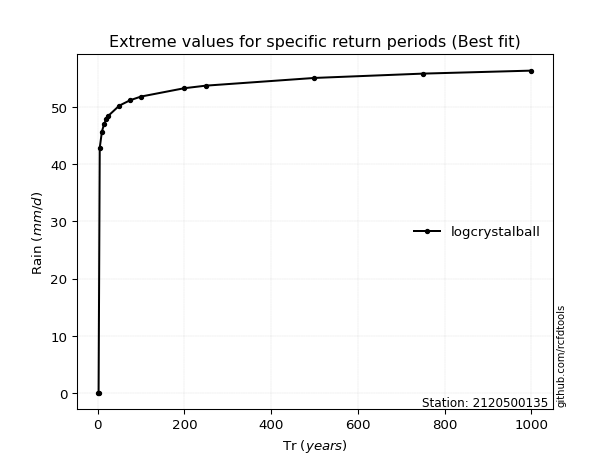</img>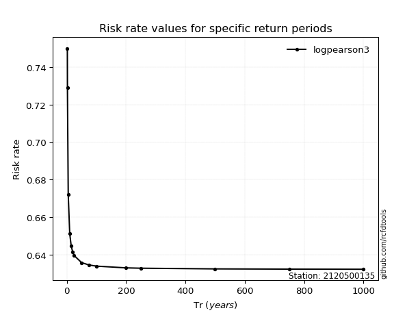</img>

</div>


<sub>**APP DISCLAIMER**: NO WARRANTY - This software is provided by [github.com/rcfdtools](https://github.com/rcfdtools) "as is", without any express or implied warranty, including warranties of merchantability, fitness for a particular purpose, or non-infringement. There is no guarantee that the software will be error-free or operate without interruption. LIMITATION OF LIABILITY - Neither the authors nor copyright holders will be liable for claims or damages arising from the software or its use. You are responsible for determining if the software is appropriate for your use and assume all associated risks, including errors, legal compliance, and data loss. NO PROFESSIONAL ADVICE - The software provides general information and does not offer professional advice. It should not replace consultation with professional advisors.</sub>