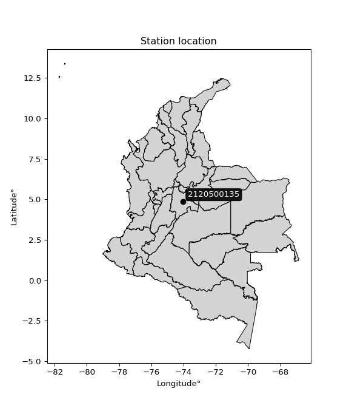

<div align="center">


</div>

# Station (rain, Pmax24h): 2120500135

Probable Maximum Precipitation (PMP) is the greatest amount of rainfall for a specific duration that is meteorologically possible for a given location, acting as a "worst-case" scenario for extreme storms, crucial for designing safety-critical infrastructure like bridges, river deviations, dams, spillways, and nuclear plants to prevent catastrophic failure. PMP is calculated by hydrologists using meteorological data to determine the upper limit of extreme rainfall, often leading to the Probable Maximum Flood (PMF) for flood control design, and is increasingly being studied for climate change impacts.

<div align="center">

</img>

</div>


## A. General information


### 1. General running parameters

• app_version: _v20251226_. • runtime: _2025-12-26 15:38:16.554582_. • Python version: _3.14.0_. • SciPy version: _1.16.3_. • Pandas version: _2.3.3_. • NumPy version: _2.3.5_. • Stations dataset (station_dataset_file): _dataset/pmax24h_in/automatic_colombia_2003_2024.csv_. • Stations catalog (station_catalog_file): _dataset/CNE_IDEAM.xls_. • Minimum year to eval til year_max (date_min): _2003_. • Maximum year to eval since year_min (date_max): _2024_. • Creates, save and include plots into reports (create_plot): _False_. • Plot only fit distributions with Δo > Δ (plot_only_fit): _True_. • Eval low extreme values, if False, evaluates high extreme values (low_extreme): _False_. • Eval every SciPy distribution as logarithmic (pdist_logarithmic_on): _True_. • Standard deviation normalized (ddof): _1.0_. • Return periods to eval in years (Tr): _[2, 2.33, 5, 10, 15, 20, 25, 50, 75, 100, 200, 250, 500, 750, 1000]_. • Minimum data sample per station, 0 means any (minimum_sample): _5_. • Z-Score threshold to adjust a value, 0 means disable (zscore): _3.5_. • Avoid zeros, e.g. rain = 0 (avoid_zeros): _True_. • Avoid null values (avoid_nans): _True_. [:file_folder:Dataset file.](../../dataset/pmax24h_in/automatic_colombia_2003_2024.csv)


### 2. Station info and location

|   id |     CODIGO | NOMBRE                                | CATEGORIA               | TECNOLOGIA                | ESTADO   | FECHA_INSTALACION   |   FECHA_SUSPENSION |   ALTITUD |   LATITUD |   LONGITUD | DEPARTAMENTO   | MUNICIPIO   | AREA_OPERATIVA                            | ENTIDAD                                                     | AREA_HIDROGRAFICA   | ZONA_HIDROGRAFICA   | SUBZONA_HIDROGRAFICA   |   CORRIENTE | OBSERVACION                                                                                                                                                                                                                                                                                                                                                                                                                                                                                                          |   SUBRED | Catalogo   |
|-----:|-----------:|:--------------------------------------|:------------------------|:--------------------------|:---------|:--------------------|-------------------:|----------:|----------:|-----------:|:---------------|:------------|:------------------------------------------|:------------------------------------------------------------|:--------------------|:--------------------|:-----------------------|------------:|:---------------------------------------------------------------------------------------------------------------------------------------------------------------------------------------------------------------------------------------------------------------------------------------------------------------------------------------------------------------------------------------------------------------------------------------------------------------------------------------------------------------------|---------:|:-----------|
|    0 | 2120500135 | UNIVERSIDAD DE LA SABANA [2120500135] | Climatológica Principal | Automática con Telemetría | Activa   | 17/10/2018          |                nan |      2548 |   4.85414 |   -74.0327 | Cundinamarca   | Chía        | Area Operativa 11 - Cundinamarca-Amazonas | INSTITUTO DE HIDROLOGIA METEOROLOGIA Y ESTUDIOS AMBIENTALES | Magdalena Cauca     | Alto Magdalena      | Río Bogotá             |         nan | 16/11/2022$Migracion$Solicitado mediante correo electrónico por Jorge A. González, coordinador área operativa 11. Actualizada Tecnología. Tipo de Transmisión y Estado por solicitud de la coordinadora del AO. (24032023)|24/04/2024$Histórico$Cambio de estado por solicitud del coordinador del AO y por cambio del sistema de transmisión|25/04/2024$Histórico$La estación no cuenta con componente convencional, por lo tanto se elimina tecnología convencional y se deja únicamente automática con telemetría |      nan | CNE_IDEAM  |

<div align="center">

Map location in: [:earth_americas:Google](http://maps.google.com/maps?q=4.85414,-74.03269) [:earth_americas:OSM](https://www.openstreetmap.org/#map=18/4.85414/-74.03269&layers=P) [:earth_americas:Bing](https://www.bing.com/maps?cp=4.85414~-74.03269&lvl=18) [:earth_americas:Apple](https://maps.apple.com/frame?center=4.85414%2C-74.03269&span=0.003%2C0.006)

</div>


<div align="center">

```geojson
{
  "type": "Feature",
  "geometry": {
    "type": "Point", 
    "coordinates": [-74.03269, 4.85414]
  }, 
  "properties": {
    "Name": "2120500135"
  }
}
```

</div>


### 3. Discrete values table and plot

|               |           0 |           1 |           2 |           3 |          4 |          5 |
|:--------------|------------:|------------:|------------:|------------:|-----------:|-----------:|
| Date          | 2019        | 2020        | 2021        | 2022        | 2023       | 2024       |
| Value         |   25        |   42        |   24.4      |   36.4      |   14.8     |   48       |
| Value_initial |   25        |   42        |   24.4      |   36.4      |   14.8     |   48       |
| count         |    6        |    6        |    6        |    6        |    6       |    6       |
| mean          |   31.7667   |   31.7667   |   31.7667   |   31.7667   |   31.7667  |   31.7667  |
| std           |   12.471    |   12.471    |   12.471    |   12.471    |   12.471   |   12.471   |
| zscore        |   -0.542591 |    0.820568 |   -0.590702 |    0.371528 |   -1.36049 |    1.30168 |
> If Z-Score is active, values out of range or outliers are replaced with the station mean value.


### 4. Active continuous probability distributions from SciPy (45 of 104 available)

[scipy.stats](https://docs.scipy.org/doc/scipy/reference/stats.html) is a Python´s powerful submodule within the SciPy library for comprehensive statistical analysis, offering over 130 probability distributions (like Normal, Poisson), functions for descriptive stats (mean, variance), hypothesis testing (t-tests, chi-square), random variable generation, and statistical tests, making it essential for data science, modeling, and research. It provides tools to explore, model, and draw conclusions from data efficiently, working seamlessly with NumPy.

<div align="center">

|   id | p_dist             |   n_parameter | fit_method   | label                                                                       | active   | ref                                                                                                        |
|-----:|:-------------------|--------------:|:-------------|:----------------------------------------------------------------------------|:---------|:-----------------------------------------------------------------------------------------------------------|
|    0 | alpha              |             3 | MLE          | Alpha                                                                       | True     | [:mortar_board:](https://docs.scipy.org/doc/scipy/reference/generated/scipy.stats.alpha.html)              |
|    1 | betaprime          |             4 | MLE          | Beta prime                                                                  | True     | [:mortar_board:](https://docs.scipy.org/doc/scipy/reference/generated/scipy.stats.betaprime.html)          |
|    2 | chi2               |             3 | MLE          | Chi²                                                                        | True     | [:mortar_board:](https://docs.scipy.org/doc/scipy/reference/generated/scipy.stats.chi2.html)               |
|    3 | crystalball        |             4 | MLE          | Crystalball                                                                 | True     | [:mortar_board:](https://docs.scipy.org/doc/scipy/reference/generated/scipy.stats.crystalball.html)        |
|    4 | erlang             |             3 | MLE          | Erlang                                                                      | True     | [:mortar_board:](https://docs.scipy.org/doc/scipy/reference/generated/scipy.stats.erlang.html)             |
|    5 | expon              |             2 | MLE          | Exponential                                                                 | True     | [:mortar_board:](https://docs.scipy.org/doc/scipy/reference/generated/scipy.stats.expon.html)              |
|    6 | exponnorm          |             3 | MLE          | Exponentially modified Normal                                               | True     | [:mortar_board:](https://docs.scipy.org/doc/scipy/reference/generated/scipy.stats.exponnorm.html)          |
|    7 | f                  |             4 | MLE          | F                                                                           | True     | [:mortar_board:](https://docs.scipy.org/doc/scipy/reference/generated/scipy.stats.f.html)                  |
|    8 | fatiguelife        |             3 | MLE          | Fatigue-life (Birnbaum-Saunders)                                            | True     | [:mortar_board:](https://docs.scipy.org/doc/scipy/reference/generated/scipy.stats.fatiguelife.html)        |
|    9 | fisk               |             3 | MLE          | Fisk                                                                        | True     | [:mortar_board:](https://docs.scipy.org/doc/scipy/reference/generated/scipy.stats.fisk.html)               |
|   10 | gamma              |             3 | MLE          | Gamma                                                                       | True     | [:mortar_board:](https://docs.scipy.org/doc/scipy/reference/generated/scipy.stats.gamma.html)              |
|   11 | genexpon           |             5 | MLE          | Generalized exponential                                                     | True     | [:mortar_board:](https://docs.scipy.org/doc/scipy/reference/generated/scipy.stats.genexpon.html)           |
|   12 | genlogistic        |             3 | MLE          | Generalized logistic                                                        | True     | [:mortar_board:](https://docs.scipy.org/doc/scipy/reference/generated/scipy.stats.genlogistic.html)        |
|   13 | gibrat             |             2 | MM           | Gibrat                                                                      | True     | [:mortar_board:](https://docs.scipy.org/doc/scipy/reference/generated/scipy.stats.gibrat.html)             |
|   14 | gompertz           |             3 | MLE          | Gompertz (or truncated Gumbel)                                              | True     | [:mortar_board:](https://docs.scipy.org/doc/scipy/reference/generated/scipy.stats.gompertz.html)           |
|   15 | gumbel_l           |             2 | MM           | Gumbel Left Skew                                                            | True     | [:mortar_board:](https://docs.scipy.org/doc/scipy/reference/generated/scipy.stats.gumbel_l.html)           |
|   16 | gumbel_r           |             2 | MM           | Gumbel Right Skew                                                           | True     | [:mortar_board:](https://docs.scipy.org/doc/scipy/reference/generated/scipy.stats.gumbel_r.html)           |
|   17 | halflogistic       |             2 | MM           | Half-logistic                                                               | True     | [:mortar_board:](https://docs.scipy.org/doc/scipy/reference/generated/scipy.stats.halflogistic.html)       |
|   18 | halfnorm           |             2 | MM           | Half Normal                                                                 | True     | [:mortar_board:](https://docs.scipy.org/doc/scipy/reference/generated/scipy.stats.halfnorm.html)           |
|   19 | hypsecant          |             2 | MM           | hyperbolic secant                                                           | True     | [:mortar_board:](https://docs.scipy.org/doc/scipy/reference/generated/scipy.stats.hypsecant.html)          |
|   20 | invgamma           |             3 | MLE          | Inverted gamma                                                              | True     | [:mortar_board:](https://docs.scipy.org/doc/scipy/reference/generated/scipy.stats.invgamma.html)           |
|   21 | invgauss           |             3 | MLE          | Inverse Gaussian                                                            | True     | [:mortar_board:](https://docs.scipy.org/doc/scipy/reference/generated/scipy.stats.invgauss.html)           |
|   22 | invweibull         |             3 | MLE          | Inverted Weibull                                                            | True     | [:mortar_board:](https://docs.scipy.org/doc/scipy/reference/generated/scipy.stats.invweibull.html)         |
|   23 | johnsonsu          |             4 | MLE          | Johnson Su                                                                  | True     | [:mortar_board:](https://docs.scipy.org/doc/scipy/reference/generated/scipy.stats.johnsonsu.html)          |
|   24 | kstwobign          |             2 | MLE          | Limiting distribution of scaled Kolmogorov-Smirnov two-sided test statistic | True     | [:mortar_board:](https://docs.scipy.org/doc/scipy/reference/generated/scipy.stats.kstwobign.html)          |
|   25 | laplace            |             2 | MM           | Laplace                                                                     | True     | [:mortar_board:](https://docs.scipy.org/doc/scipy/reference/generated/scipy.stats.laplace.html)            |
|   26 | laplace_asymmetric |             3 | MLE          | Asymmetric Laplace                                                          | True     | [:mortar_board:](https://docs.scipy.org/doc/scipy/reference/generated/scipy.stats.laplace_asymmetric.html) |
|   27 | loggamma           |             3 | MLE          | Log gamma                                                                   | True     | [:mortar_board:](https://docs.scipy.org/doc/scipy/reference/generated/scipy.stats.loggamma.html)           |
|   28 | logistic           |             2 | MM           | Logistic (or Sech-squared)                                                  | True     | [:mortar_board:](https://docs.scipy.org/doc/scipy/reference/generated/scipy.stats.logistic.html)           |
|   29 | lognorm            |             3 | MLE          | Log Normal                                                                  | True     | [:mortar_board:](https://docs.scipy.org/doc/scipy/reference/generated/scipy.stats.lognorm.html)            |
|   30 | maxwell            |             2 | MM           | Maxwell                                                                     | True     | [:mortar_board:](https://docs.scipy.org/doc/scipy/reference/generated/scipy.stats.maxwell.html)            |
|   31 | mielke             |             4 | MLE          | Mielke Beta-Kappa / Dagum                                                   | True     | [:mortar_board:](https://docs.scipy.org/doc/scipy/reference/generated/scipy.stats.mielke.html)             |
|   32 | moyal              |             2 | MM           | Moyal                                                                       | True     | [:mortar_board:](https://docs.scipy.org/doc/scipy/reference/generated/scipy.stats.moyal.html)              |
|   33 | nakagami           |             3 | MLE          | Nakagami                                                                    | True     | [:mortar_board:](https://docs.scipy.org/doc/scipy/reference/generated/scipy.stats.nakagami.html)           |
|   34 | ncf                |             5 | MLE          | Non-central F distribution                                                  | True     | [:mortar_board:](https://docs.scipy.org/doc/scipy/reference/generated/scipy.stats.ncf.html)                |
|   35 | nct                |             4 | MLE          | Non-central Student’s t                                                     | True     | [:mortar_board:](https://docs.scipy.org/doc/scipy/reference/generated/scipy.stats.nct.html)                |
|   36 | norm               |             2 | MM           | Normal                                                                      | True     | [:mortar_board:](https://docs.scipy.org/doc/scipy/reference/generated/scipy.stats.norm.html)               |
|   37 | pareto             |             3 | MLE          | Pareto                                                                      | True     | [:mortar_board:](https://docs.scipy.org/doc/scipy/reference/generated/scipy.stats.pareto.html)             |
|   38 | pearson3           |             3 | MM           | Pearson type III                                                            | True     | [:mortar_board:](https://docs.scipy.org/doc/scipy/reference/generated/scipy.stats.pearson3.html)           |
|   39 | rayleigh           |             2 | MM           | Rayleigh                                                                    | True     | [:mortar_board:](https://docs.scipy.org/doc/scipy/reference/generated/scipy.stats.rayleigh.html)           |
|   40 | rice               |             3 | MLE          | Rice                                                                        | True     | [:mortar_board:](https://docs.scipy.org/doc/scipy/reference/generated/scipy.stats.rice.html)               |
|   41 | t                  |             3 | MLE          | Student’s t                                                                 | True     | [:mortar_board:](https://docs.scipy.org/doc/scipy/reference/generated/scipy.stats.t.html)                  |
|   42 | truncnorm          |             4 | MLE          | Truncated normal                                                            | True     | [:mortar_board:](https://docs.scipy.org/doc/scipy/reference/generated/scipy.stats.truncnorm.html)          |
|   43 | wald               |             2 | MM           | Wald                                                                        | True     | [:mortar_board:](https://docs.scipy.org/doc/scipy/reference/generated/scipy.stats.wald.html)               |
|   44 | weibull_min        |             3 | MLE          | Weibull minimum                                                             | True     | [:mortar_board:](https://docs.scipy.org/doc/scipy/reference/generated/scipy.stats.weibull_min.html)        |

</div>

> **n_parameter:** # arguments & localization & scale.
>
> **Fit methods:** (MLE) maximum likelihood, (MM) L-moments.
>
>**Inactive:** foldnorm, gennorm, norminvgauss, powernorm, powerlognorm, skewnorm, genextreme, anglit, arcsine, argus, beta, bradford, burr, burr12, cauchy, cosine, halfcauchy, foldcauchy, skewcauchy, wrapcauchy, dgamma, gengamma, exponweib, exponpow, truncexpon, gausshyper, genhalflogistic, genhyperbolic, geninvgauss, halfgennorm, johnsonsb, kappa4, kappa3, ksone, kstwo, loglaplace, levy, levy_l, levy_stable, ncx2, genpareto, truncpareto, lomax, powerlaw, rdist, rel_breitwigner, recipinvgauss, semicircular, studentized_range, trapezoid, triang, truncweibull_min, tukeylambda, uniform, loguniform, vonmises, vonmises_line, weibull_max, dweibull, 


## B. Probability distributions vs. Empirical distributions

A continuous probability distribution (CPD) describes probabilities for variables that can take any value within a range (like rain any time), unlike discrete variables with specific outcomes (like temperature). It uses a Probability Density Function (PDF), a curve where the total area under it equals 1, and the probability of the variable falling within an interval (a to b) is found by calculating the area under the curve between those points. A key feature is that the probability of hitting any single exact value is zero, so probabilities are always expressed for ranges, e.g., $P(a ≤ X ≤ b)$.

<div align="center">

Distributions parameters
|    |    station | p_dist                |   n |              loc |           scale | shape                  | shape1                | shape2                | shape3   |
|---:|-----------:|:----------------------|----:|-----------------:|----------------:|:-----------------------|:----------------------|:----------------------|:---------|
|  0 | 2120500135 | alpha                 |   6 |   -120.133       |  2000.52        | 13.256631791378766     |                       |                       |          |
|  1 | 2120500135 | betaprime             |   6 |    -17.4601      |  1693           | 18.420753902881756     | 633.5683746007312     |                       |          |
|  2 | 2120500135 | chi2                  |   6 |     14.8         |     8.204       | 1.7811112866018148     |                       |                       |          |
|  3 | 2120500135 | crystalball           |   6 |     31.7667      |    11.3844      | 2313.751244311814      | 46.921915764075486    |                       |          |
|  4 | 2120500135 | erlang                |   6 |  -1403.06        |     0.0903414   | 15882.282726413781     |                       |                       |          |
|  5 | 2120500135 | expon                 |   6 |     14.8         |    16.9667      |                        |                       |                       |          |
|  6 | 2120500135 | exponnorm             |   6 |     31.7487      |    11.3844      | 0.001577246011850386   |                       |                       |          |
|  7 | 2120500135 | f                     |   6 |   -443.042       |   474.815       | 3554.0337058555615     | 145383.4116214905     |                       |          |
|  8 | 2120500135 | fatiguelife           |   6 |     14.8         |     2.26545e-06 | 3247.847005875301      |                       |                       |          |
|  9 | 2120500135 | fisk                  |   6 |  -1392.28        |  1424           | 203.49200071639945     |                       |                       |          |
| 10 | 2120500135 | gamma                 |   6 |  -1404.42        |     0.0902434   | 15914.552603064782     |                       |                       |          |
| 11 | 2120500135 | genexpon              |   6 |     14.8         |     2.58224     | 0.15222724726736758    | 5.990336718098177e-07 | 0.9438411075746989    |          |
| 12 | 2120500135 | genlogistic           |   6 |    -25.2108      |    10.2119      | 152.8601662839759      |                       |                       |          |
| 13 | 2120500135 | gibrat                |   6 |     23.0817      |     5.26767     |                        |                       |                       |          |
| 14 | 2120500135 | gompertz              |   6 |     14.8         |    17.1681      | 0.43252988330489817    |                       |                       |          |
| 15 | 2120500135 | gumbel_l              |   6 |     36.8903      |     8.87641     |                        |                       |                       |          |
| 16 | 2120500135 | gumbel_r              |   6 |     26.6431      |     8.87641     |                        |                       |                       |          |
| 17 | 2120500135 | halflogistic          |   6 |     18.2735      |     9.73329     |                        |                       |                       |          |
| 18 | 2120500135 | halfnorm              |   6 |     16.6982      |    18.8856      |                        |                       |                       |          |
| 19 | 2120500135 | hypsecant             |   6 |     31.7667      |     7.24756     |                        |                       |                       |          |
| 20 | 2120500135 | invgamma              |   6 |    -72.8788      |  8634.95        | 83.64563403500136      |                       |                       |          |
| 21 | 2120500135 | invgauss              |   6 |    -28.169       |  1539.34        | 0.03899584523181901    |                       |                       |          |
| 22 | 2120500135 | invweibull            |   6 |     14.8         |     1.13066     | 0.04722670471970092    |                       |                       |          |
| 23 | 2120500135 | johnsonsu             |   6 |     -3.991e+07   |     4.34756e+07 | -4262282.216257718     | 5184134.660671504     |                       |          |
| 24 | 2120500135 | kstwobign             |   6 |     -9.45857     |    47.0659      |                        |                       |                       |          |
| 25 | 2120500135 | laplace               |   6 |     31.7667      |     8.05002     |                        |                       |                       |          |
| 26 | 2120500135 | laplace_asymmetric    |   6 |     24.4         |     8.28962     | 0.6499439280408907     |                       |                       |          |
| 27 | 2120500135 | loggamma              |   6 |  -1350.86        |   230           | 408.5575842911976      |                       |                       |          |
| 28 | 2120500135 | logistic              |   6 |     31.7667      |     6.27657     |                        |                       |                       |          |
| 29 | 2120500135 | lognorm               |   6 |     14.8         |     0.0387639   | 13.743555335857664     |                       |                       |          |
| 30 | 2120500135 | maxwell               |   6 |      4.79032     |    16.9049      |                        |                       |                       |          |
| 31 | 2120500135 | mielke                |   6 |     -3.18236     |    51.4128      | 2.247481160266531      | 942.5346491509408     |                       |          |
| 32 | 2120500135 | moyal                 |   6 |     25.2563      |     5.1248      |                        |                       |                       |          |
| 33 | 2120500135 | nakagami              |   6 |     24.4         |    14.3041      | 0.23952560251612398    |                       |                       |          |
| 34 | 2120500135 | ncf                   |   6 |   -200.872       |   213.452       | 836.6815621277799      | 75618.20062339793     | 75.2228608492525      |          |
| 35 | 2120500135 | nct                   |   6 |   -421.645       |    11.36        | 167990.88684942963     | 39.91246279921447     |                       |          |
| 36 | 2120500135 | norm                  |   6 |     31.7667      |    11.3844      |                        |                       |                       |          |
| 37 | 2120500135 | pareto                |   6 |     14.7498      |     0.050155    | 0.20379339136747832    |                       |                       |          |
| 38 | 2120500135 | pearson3              |   6 |     31.7667      |    11.3844      | -0.01633234390433285   |                       |                       |          |
| 39 | 2120500135 | rayleigh              |   6 |      9.98756     |    17.3772      |                        |                       |                       |          |
| 40 | 2120500135 | rice                  |   6 |      9.18461     |    13.7653      | 1.1727196850287873     |                       |                       |          |
| 41 | 2120500135 | t                     |   6 |     31.7643      |    11.385       | 3507683.9136076365     |                       |                       |          |
| 42 | 2120500135 | truncnorm             |   6 |     31.7667      |    11.3844      | -551.8760260651807     | 1565.3256198554109    |                       |          |
| 43 | 2120500135 | wald                  |   6 |     20.3822      |    11.3845      |                        |                       |                       |          |
| 44 | 2120500135 | weibull_min           |   6 |      9.31779     |    25.3402      | 2.0743963459576875     |                       |                       |          |
| 45 | 2120500135 | logalpha              |   6 |     -8.25574     |   332.851       | 28.63522901907602      |                       |                       |          |
| 46 | 2120500135 | logbetaprime          |   6 |     -1.09484     |    14.4943      | 117.08916117010091     | 380.02586766722334    |                       |          |
| 47 | 2120500135 | logchi2               |   6 |      2.69463     |     0.953816    | 1.1344145763555045     |                       |                       |          |
| 48 | 2120500135 | logcrystalball        |   6 |      3.38525     |     0.396895    | 96.45912780904206      | 34.684155460809095    |                       |          |
| 49 | 2120500135 | logerlang             |   6 |     -3.33484     |     0.0244042   | 275.246576299569       |                       |                       |          |
| 50 | 2120500135 | logexpon              |   6 |      2.69463     |     0.690627    |                        |                       |                       |          |
| 51 | 2120500135 | logexponnorm          |   6 |      3.38492     |     0.396895    | 0.0008377055874220863  |                       |                       |          |
| 52 | 2120500135 | logf                  |   6 |   -217.618       |   221.004       | 2037738.2497951183     | 881477.8441597135     |                       |          |
| 53 | 2120500135 | logfatiguelife        |   6 |   -134.645       |   138.031       | 0.0028721693202921695  |                       |                       |          |
| 54 | 2120500135 | logfisk               |   6 | -38596.7         | 38600.1         | 162736.33685234666     |                       |                       |          |
| 55 | 2120500135 | loggamma              |   6 |     -3.24739     |     0.0244152   | 271.67342337993773     |                       |                       |          |
| 56 | 2120500135 | loggenexpon           |   6 |      2.68453     |     0.0112049   | 0.006396942941807702   | 2.3410996775171844    | 9.954810788543938e-05 |          |
| 57 | 2120500135 | loggenlogistic        |   6 |      3.87132     |     1.35944e-05 | 2.8029923282927243e-05 |                       |                       |          |
| 58 | 2120500135 | loggibrat             |   6 |      3.08245     |     0.183657    |                        |                       |                       |          |
| 59 | 2120500135 | loggompertz           |   6 |      2.69463     |     0.999938    | 0.9498581003558161     |                       |                       |          |
| 60 | 2120500135 | loggumbel_l           |   6 |      3.56388     |     0.309458    |                        |                       |                       |          |
| 61 | 2120500135 | loggumbel_r           |   6 |      3.20663     |     0.309458    |                        |                       |                       |          |
| 62 | 2120500135 | loghalflogistic       |   6 |      2.9148      |     0.339362    |                        |                       |                       |          |
| 63 | 2120500135 | loghalfnorm           |   6 |      2.85992     |     0.658405    |                        |                       |                       |          |
| 64 | 2120500135 | loghypsecant          |   6 |      3.38525     |     0.252672    |                        |                       |                       |          |
| 65 | 2120500135 | loginvgamma           |   6 |     -5.75793     |  4758.22        | 521.2531663939371      |                       |                       |          |
| 66 | 2120500135 | loginvgauss           |   6 |     -0.00532322  |   220.186       | 0.015433839833684869   |                       |                       |          |
| 67 | 2120500135 | loginvweibull         |   6 |     -2.06487e+08 |     2.06487e+08 | 533241013.3989973      |                       |                       |          |
| 68 | 2120500135 | logjohnsonsu          |   6 |      4.03932     |     0.00549048  | 7.501527523484093      | 1.427747461729738     |                       |          |
| 69 | 2120500135 | logkstwobign          |   6 |      1.77477     |     1.8385      |                        |                       |                       |          |
| 70 | 2120500135 | loglaplace            |   6 |      3.38525     |     0.280648    |                        |                       |                       |          |
| 71 | 2120500135 | loglaplace_asymmetric |   6 |      3.73767     |     0.230054    | 2.0255587258730565     |                       |                       |          |
| 72 | 2120500135 | logloggamma           |   6 |      3.87124     |     3.70353e-06 | 7.590679713860426e-06  |                       |                       |          |
| 73 | 2120500135 | loglogistic           |   6 |      3.38525     |     0.21882     |                        |                       |                       |          |
| 74 | 2120500135 | loglognorm            |   6 |      2.69463     |     0.00224653  | 13.085963798927478     |                       |                       |          |
| 75 | 2120500135 | logmaxwell            |   6 |      2.44478     |     0.589356    |                        |                       |                       |          |
| 76 | 2120500135 | logmielke             |   6 |     -2.90475e+06 |     2.90475e+06 | 5835889.524197994      | 757889527.5018508     |                       |          |
| 77 | 2120500135 | logmoyal              |   6 |      3.15828     |     0.178666    |                        |                       |                       |          |
| 78 | 2120500135 | lognakagami           |   6 |      3.19458     |     0.406712    | 0.26483019785334055    |                       |                       |          |
| 79 | 2120500135 | logncf                |   6 |      0.457931    |     1.67213     | 98.5720211471633       | 509.5965711993078     | 73.13467971429394     |          |
| 80 | 2120500135 | lognct                |   6 |      8.15272     |     0.381982    | 903.0450440202576      | -12.462448419559884   |                       |          |
| 81 | 2120500135 | lognorm               |   6 |      3.38525     |     0.396896    |                        |                       |                       |          |
| 82 | 2120500135 | logpareto             |   6 |      2.69247     |     0.00215264  | 0.20352600719183983    |                       |                       |          |
| 83 | 2120500135 | logpearson3           |   6 |      3.38525     |     0.396895    | -0.46183020712354494   |                       |                       |          |
| 84 | 2120500135 | lograyleigh           |   6 |      2.62597     |     0.605821    |                        |                       |                       |          |
| 85 | 2120500135 | logrice               |   6 |      2.45204     |     0.438975    | 1.826744399198795      |                       |                       |          |
| 86 | 2120500135 | logt                  |   6 |      3.38525     |     0.396895    | 40112830198.61946      |                       |                       |          |
| 87 | 2120500135 | logtruncnorm          |   6 |     -0.148003    |     1.18908     | 2.811061165087607      | 3.380087615223699     |                       |          |
| 88 | 2120500135 | logwald               |   6 |      2.98834     |     0.396917    |                        |                       |                       |          |
| 89 | 2120500135 | logweibull_min        |   6 |     -4.17585e+06 |     4.17586e+06 | 13162669.037670624     |                       |                       |          |

</div>

> **loc** (Location parameter): This shifts the distribution along the x-axis. For many common distributions, like the normal (Gaussian) distribution, loc represents the mean $μ$. For others, like the uniform distribution, it might represent the minimum value, or for the beta distribution, the left end of the support interval.
>
> **scale** (Scale parameter): This determines the width or spread of the distribution. For the normal distribution, scale represents the standard deviation $σ$. For a uniform distribution, it defines the length of the interval (from $loc$ to $loc + scale$).
>
> **shape** (Shape parameters): Refers to parameters that define the specific form of a probability distribution, distinct from its location (loc) and scale (scale). These parameters are required arguments for most distribution functions. For example, a normal (Gaussian) distribution is fully defined by its location (mean) and scale (standard deviation), so it has no specific shape parameters beyond loc and scale. However, other distributions have intrinsic properties that need specification, as Gamma distribution that takes a shape parameter, often named $a$ or $alpha$.


### 0. Cumulative distribution values - CDF (90 evaluated)

> Ordered by x ascending and calculating $log(f(x))$ separately. 

|   id |    Station |   date |    x |   count |    mean |    std |    zscore |   Value_initial |    station |   m |     alpha |   alpha_pdf |   betaprime |   betaprime_pdf |        chi2 |   chi2_pdf |   crystalball |   crystalball_pdf |    erlang |   erlang_pdf |    expon |   expon_pdf |   exponnorm |   exponnorm_pdf |         f |     f_pdf |   fatiguelife |   fatiguelife_pdf |      fisk |   fisk_pdf |     gamma |   gamma_pdf |    genexpon |   genexpon_pdf |   genlogistic |   genlogistic_pdf |    gibrat |   gibrat_pdf |    gompertz |   gompertz_pdf |   gumbel_l |   gumbel_l_pdf |   gumbel_r |   gumbel_r_pdf |   halflogistic |   halflogistic_pdf |   halfnorm |   halfnorm_pdf |   hypsecant |   hypsecant_pdf |   invgamma |   invgamma_pdf |   invgauss |   invgauss_pdf |   invweibull |   invweibull_pdf |   johnsonsu |   johnsonsu_pdf |   kstwobign |   kstwobign_pdf |   laplace |   laplace_pdf |   laplace_asymmetric |   laplace_asymmetric_pdf |   loggamma |   loggamma_pdf |   logistic |   logistic_pdf |   lognorm |   lognorm_pdf |   maxwell |   maxwell_pdf |    mielke |   mielke_pdf |      moyal |   moyal_pdf |    nakagami |   nakagami_pdf |       ncf |   ncf_pdf |       nct |   nct_pdf |      norm |   norm_pdf |   pareto |   pareto_pdf |   pearson3 |   pearson3_pdf |   rayleigh |   rayleigh_pdf |      rice |   rice_pdf |         t |     t_pdf |   truncnorm |   truncnorm_pdf |     wald |   wald_pdf |   weibull_min |   weibull_min_pdf |   logalpha |   logalpha_pdf |   logbetaprime |   logbetaprime_pdf |    logchi2 |   logchi2_pdf |   logcrystalball |   logcrystalball_pdf |   logerlang |   logerlang_pdf |   logexpon |   logexpon_pdf |   logexponnorm |   logexponnorm_pdf |      logf |   logf_pdf |   logfatiguelife |   logfatiguelife_pdf |   logfisk |   logfisk_pdf |   loggenexpon |   loggenexpon_pdf |   loggenlogistic |   loggenlogistic_pdf |   loggibrat |   loggibrat_pdf |   loggompertz |   loggompertz_pdf |   loggumbel_l |   loggumbel_l_pdf |   loggumbel_r |   loggumbel_r_pdf |   loghalflogistic |   loghalflogistic_pdf |   loghalfnorm |   loghalfnorm_pdf |   loghypsecant |   loghypsecant_pdf |   loginvgamma |   loginvgamma_pdf |   loginvgauss |   loginvgauss_pdf |   loginvweibull |   loginvweibull_pdf |   logjohnsonsu |   logjohnsonsu_pdf |   logkstwobign |   logkstwobign_pdf |   loglaplace |   loglaplace_pdf |   loglaplace_asymmetric |   loglaplace_asymmetric_pdf |   logloggamma |   logloggamma_pdf |   loglogistic |   loglogistic_pdf |   loglognorm |   loglognorm_pdf |   logmaxwell |   logmaxwell_pdf |   logmielke |   logmielke_pdf |   logmoyal |   logmoyal_pdf |   lognakagami |   lognakagami_pdf |   logncf |   logncf_pdf |   lognct |   lognct_pdf |   logpareto |   logpareto_pdf |   logpearson3 |   logpearson3_pdf |   lograyleigh |   lograyleigh_pdf |   logrice |   logrice_pdf |      logt |   logt_pdf |   logtruncnorm |   logtruncnorm_pdf |   logwald |   logwald_pdf |   logweibull_min |   logweibull_min_pdf |
|-----:|-----------:|-------:|-----:|--------:|--------:|-------:|----------:|----------------:|-----------:|----:|----------:|------------:|------------:|----------------:|------------:|-----------:|--------------:|------------------:|----------:|-------------:|---------:|------------:|------------:|----------------:|----------:|----------:|--------------:|------------------:|----------:|-----------:|----------:|------------:|------------:|---------------:|--------------:|------------------:|----------:|-------------:|------------:|---------------:|-----------:|---------------:|-----------:|---------------:|---------------:|-------------------:|-----------:|---------------:|------------:|----------------:|-----------:|---------------:|-----------:|---------------:|-------------:|-----------------:|------------:|----------------:|------------:|----------------:|----------:|--------------:|---------------------:|-------------------------:|-----------:|---------------:|-----------:|---------------:|----------:|--------------:|----------:|--------------:|----------:|-------------:|-----------:|------------:|------------:|---------------:|----------:|----------:|----------:|----------:|----------:|-----------:|---------:|-------------:|-----------:|---------------:|-----------:|---------------:|----------:|-----------:|----------:|----------:|------------:|----------------:|---------:|-----------:|--------------:|------------------:|-----------:|---------------:|---------------:|-------------------:|-----------:|--------------:|-----------------:|---------------------:|------------:|----------------:|-----------:|---------------:|---------------:|-------------------:|----------:|-----------:|-----------------:|---------------------:|----------:|--------------:|--------------:|------------------:|-----------------:|---------------------:|------------:|----------------:|--------------:|------------------:|--------------:|------------------:|--------------:|------------------:|------------------:|----------------------:|--------------:|------------------:|---------------:|-------------------:|--------------:|------------------:|--------------:|------------------:|----------------:|--------------------:|---------------:|-------------------:|---------------:|-------------------:|-------------:|-----------------:|------------------------:|----------------------------:|--------------:|------------------:|--------------:|------------------:|-------------:|-----------------:|-------------:|-----------------:|------------:|----------------:|-----------:|---------------:|--------------:|------------------:|---------:|-------------:|---------:|-------------:|------------:|----------------:|--------------:|------------------:|--------------:|------------------:|----------:|--------------:|----------:|-----------:|---------------:|-------------------:|----------:|--------------:|-----------------:|---------------------:|
|    0 | 2120500135 |   2023 | 14.8 |       6 | 31.7667 | 12.471 | -1.36049  |            14.8 | 2120500135 |   1 | 0.0582772 |   0.0127932 |   0.0549659 |       0.0127901 | 6.31232e-15 | 3.16461    |     0.0680677 |         0.0115423 | 0.0676706 |    0.0115809 | 0        |  0.0589391  |   0.0680682 |       0.0115423 | 0.0668492 | 0.0116523 |     0.0223481 |       1.00177e+12 | 0.0807673 |  0.0107371 | 0.0676451 |   0.0115782 | 8.25733e-08 |     0.0589517  |     0.0493423 |         0.0143968 | 0         |   0          | 2.49872e-11 |      0.0251939 |  0.0796692 |     0.00860796 |  0.0224375 |     0.00959799 |       0        |         0          |   0        |      0         |   0.0610737 |      0.00837518 |  0.0580591 |      0.0127919 |  0.0535354 |      0.0130795 |   0.00672517 |      8.94326e+11 |   0.0680619 |       0.0115419 |   0.0467807 |       0.0159828 | 0.0607612 |    0.00754796 |            0.0499911 |               0.00927859 |  0.0391963 |       0.226711 |  0.0627863 |     0.00937521 | 0.0409231 |      0.221179 | 0.0497532 |     0.013887  | 0.0943286 |    0.0117894 | 0.00554296 |  0.00461033 | 0           |    0           | 0.0654172 | 0.0117621 | 0.0681329 | 0.0115522 | 0.0680677 |  0.0115423 | 0        |   4.06327    |  0.0684996 |      0.0115056 |  0.0376218 |      0.0153374 | 0.0412836 |  0.0145058 | 0.0681047 | 0.0115465 |   0.0680677 |       0.0115423 | 0        | 0          |     0.0409064 |         0.0151574 |  0.0391116 |       0.234873 |      0.0653367 |           0.308289 | 1.5252e-09 |   1.94804e+06 |        0.0409234 |             0.22118  |   0.0409308 |        0.233093 |   0        |       1.44796  |      0.0409234 |           0.221181 | 0.0412069 |   0.222344 |        0.0403759 |             0.220125 | 0.0466641 |      0.187557 |    0.00583964 |          0.586199 |         0        |             0.182212 |    0        |        0        |    1.6361e-09 |          0.949917 |     0.0584883 |          0.183364 |    0.00535064 |         0.0904379 |          0        |              0        |      0        |          0        |       0.041325 |           0.163093 |      0.036443 |          0.221366 |     0.0361223 |          0.238452 |       0.0322191 |            0.285822 |      0.0897947 |           0.172127 |      0.0362666 |           0.349182 |    0.0426818 |         0.152083 |               0.0857381 |                    0.183992 |     0.0896749 |          0.183796 |     0.0408499 |          0.179057 |    0.0126961 |      5.64369e+12 |    0.0192054 |         0.2224   |   0.0918858 |        0.184606 | 0.00025189 |      0.0100704 |   0           |       0           | 0.039729 |     0.249638 | 0.042021 |     0.219722 |    0        |      94.547     |     0.0521145 |          0.214772 |    0.00640118 |          0.18587  | 0.0301548 |      0.25904  | 0.0409229 |   0.221178 |    0           |           0        |  0        |      0        |        0.0607728 |             0.185619 |
|    1 | 2120500135 |   2021 | 24.4 |       6 | 31.7667 | 12.471 | -0.590702 |            24.4 | 2120500135 |   2 | 0.279393  |   0.032203  |   0.276637  |       0.0321028 | 0.498573    | 0.0334475  |     0.258789  |         0.0284234 | 0.259344  |    0.0285505 | 0.432103 |  0.0334713  |   0.25879   |       0.0284234 | 0.260264  | 0.0287721 |     0.736899  |       0.0107731   | 0.259546  |  0.0276049 | 0.259299  |   0.0285499 | 0.432173    |     0.0334745  |     0.306557  |         0.0353569 | 0.0829841 |   0.115933   | 0.276797    |      0.0318715 |  0.217174  |     0.0215933  |  0.275961  |     0.0400273  |       0.304726 |         0.0466     |   0.31659  |      0.0388773 |   0.221048  |      0.0281067  |  0.279274  |      0.0322328 |  0.281718  |      0.0327571 |   0.40498    |      0.00180086  |   0.258785  |       0.0284241 |   0.321232  |       0.0357466 | 0.200236  |    0.024874   |            0.296976  |               0.0551203  |  0.323128  |       0.909721 |  0.236191  |     0.0287426  | 0.315469  |      0.895609 | 0.281665  |     0.0324078 | 0.246712  |    0.0201028 | 0.276977   |  0.0468682  | 2.61462e-08 |    3.52557e+06 | 0.261853  | 0.0291825 | 0.258958  | 0.028431  | 0.258789  |  0.0284234 | 0.657634 |   0.00723014 |  0.258276  |      0.0282946 |  0.29103   |      0.033838  | 0.276196  |  0.0321361 | 0.258866  | 0.0284263 |   0.258789  |       0.0284234 | 0.222128 | 0.0923539  |     0.288824  |         0.0333387 |  0.332182  |       0.921813 |      0.359026  |           0.818034 | 0.47946    |   0.45879     |        0.31547   |             0.89561  |   0.327082  |        0.908194 |   0.51515  |       0.702043 |      0.315471  |           0.895612 | 0.315883  |   0.893499 |        0.315184  |             0.897515 | 0.287168  |      0.863022 |    0.412736   |          0.89003  |         0        |             0.51082  |    0.31087  |        3.15005  |    0.459993   |          0.84572  |     0.261549  |          0.723519 |    0.353562   |         1.18787   |          0.390362 |              1.24884  |      0.38875  |          1.06499  |       0.279804 |           0.970181 |      0.322663 |          0.921057 |     0.336027  |          0.919741 |       0.388849  |            0.948511 |      0.248798  |           0.53571  |      0.410153  |           0.906262 |    0.253461  |         0.90313  |               0.250683  |                    0.53796  |     0.249857  |          0.512101 |     0.294971  |          0.950385 |    0.660214  |      0.0559919   |    0.344822  |         0.975501 |   0.250886  |        0.504051 | 0.366311   |      1.34131   |   9.25955e-09 |       1.10438e+07 | 0.342919 |     0.921722 | 0.311543 |     0.882057 |    0.670325 |       0.133631  |     0.294566  |          0.808954 |    0.356265   |          0.997321 | 0.330179  |      0.912391 | 0.315469  |   0.895609 |    3.10806e-06 |           3.06339  |  0.381968 |      2.14903  |        0.261513  |             0.705669 |
|    2 | 2120500135 |   2019 | 25   |       6 | 31.7667 | 12.471 | -0.542591 |            25   | 2120500135 |   3 | 0.29895   |   0.0329697 |   0.296123  |       0.0328325 | 0.518213    | 0.0320332  |     0.27613   |         0.0293686 | 0.276759  |    0.029492  | 0.451835 |  0.0323084  |   0.27613   |       0.0293686 | 0.27781   | 0.029704  |     0.743226  |       0.010321    | 0.276445  |  0.0287191 | 0.276714  |   0.0294917 | 0.451906    |     0.0323112  |     0.327873  |         0.0356732 | 0.156207  |   0.124858   | 0.295999    |      0.0321287 |  0.230464  |     0.0227111  |  0.300189  |     0.0406955  |       0.332417 |         0.0456936  |   0.339762 |      0.0383575 |   0.238452  |      0.0299089  |  0.29885   |      0.0330044 |  0.301577  |      0.0334201 |   0.406028   |      0.00169445  |   0.276125  |       0.0293694 |   0.342713  |       0.035836  | 0.215731  |    0.0267988  |            0.329283  |               0.0525873  |  0.3455    |       0.931641 |  0.253869  |     0.0301788  | 0.337535  |      0.920608 | 0.301295  |     0.0330121 | 0.258938  |    0.0206497 | 0.305211   |  0.0471856  | 0.171048    |    0.136521    | 0.279642  | 0.0301023 | 0.276303  | 0.0293753 | 0.27613   |  0.0293686 | 0.661816 |   0.00672376 |  0.27554   |      0.0292433 |  0.311455  |      0.0342313 | 0.295653  |  0.0327068 | 0.276208  | 0.0293712 |   0.27613   |       0.0293686 | 0.27625  | 0.0877579  |     0.308965  |         0.0337812 |  0.354815  |       0.940972 |      0.379034  |           0.828828 | 0.490421   |   0.443777    |        0.337536  |             0.92061  |   0.349407  |        0.929334 |   0.531908 |       0.677778 |      0.337537  |           0.920612 | 0.337894  |   0.91819  |        0.337296  |             0.922508 | 0.308581  |      0.899516 |    0.434272   |          0.882782 |         0        |             0.537058 |    0.383122 |        2.79784  |    0.480394   |          0.833782 |     0.279609  |          0.763464 |    0.382433   |         1.18787   |          0.420269 |              1.21312  |      0.414375 |          1.04449  |       0.304087 |           1.0286   |      0.345306 |          0.942575 |     0.35856   |          0.934852 |       0.411837  |            0.943499 |      0.262187  |           0.566887 |      0.432065  |           0.897324 |    0.276378  |         0.984788 |               0.264098  |                    0.566748 |     0.262612  |          0.538244 |     0.318572  |          0.992065 |    0.661542  |      0.0533171   |    0.368651  |         0.985778 |   0.263435  |        0.529262 | 0.398653   |      1.31988   |   0.174977    |       3.81223     | 0.365498 |     0.936666 | 0.333289 |     0.907826 |    0.67348  |       0.126245  |     0.314598  |          0.840069 |    0.380541   |          1.00071  | 0.352572  |      0.930757 | 0.337535  |   0.920608 |    0.0723195   |           2.89181  |  0.431757 |      1.95187  |        0.279116  |             0.743667 |
|    3 | 2120500135 |   2022 | 36.4 |       6 | 31.7667 | 12.471 |  0.371528 |            36.4 | 2120500135 |   4 | 0.68312   |   0.029077  |   0.67728   |       0.028953  | 0.770819    | 0.0147298  |     0.657992  |         0.0322575 | 0.658838  |    0.0321555 | 0.720033 |  0.016501   |   0.657992  |       0.0322574 | 0.659887  | 0.0319314 |     0.829127  |       0.00558736  | 0.661075  |  0.0319129 | 0.658814  |   0.0321587 | 0.720111    |     0.0165     |     0.693453  |         0.0248289 | 0.823179  |   0.0194823  | 0.663616    |      0.0298221 |  0.611812  |     0.0413826  |  0.716671  |     0.0268972  |       0.731135 |         0.0239098  |   0.703154 |      0.0245181 |   0.6909    |      0.0362551  |  0.684045  |      0.0292026 |  0.680491  |      0.0281784 |   0.41897    |      0.000796919 |   0.658     |       0.0322583 |   0.701482  |       0.0244695 | 0.718807  |    0.0349307  |            0.725614  |               0.0215131  |  0.70338   |       0.841892 |  0.676601  |     0.0348617  | 0.701035  |      0.874659 | 0.678763  |     0.0287289 | 0.55559   |    0.0315463 | 0.736005   |  0.0247954  | 0.696123    |    0.0242327   | 0.662525  | 0.0316307 | 0.658109  | 0.0322431 | 0.657992  |  0.0322575 | 0.709615 |   0.0027334  |  0.657157  |      0.032359  |  0.68498   |      0.0275541 | 0.673475  |  0.0293436 | 0.658059  | 0.0322534 |   0.657992  |       0.0322575 | 0.791024 | 0.0197969  |     0.682691  |         0.0278988 |  0.707907  |       0.814069 |      0.685292  |           0.72212  | 0.624462   |   0.288448    |        0.701036  |             0.874658 |   0.704987  |        0.834655 |   0.728306 |       0.393402 |      0.701037  |           0.874657 | 0.700062  |   0.871609 |        0.701128  |             0.874198 | 0.685064  |      0.909593 |    0.72366    |          0.622694 |         0        |             1.16531  |    0.847433 |        0.46045  |    0.750029   |          0.584036 |     0.668544  |          1.18276  |    0.751658   |         0.693401  |          0.762243 |              0.617314 |      0.735491 |          0.650276 |       0.737855 |           0.924129 |      0.704305 |          0.836378 |     0.7008    |          0.778287 |       0.714461  |            0.620355 |      0.593903  |           1.24495  |      0.718937  |           0.60019  |    0.762829  |         0.845085 |               0.591433  |                    1.2692   |     0.567188  |          1.1625   |     0.722433  |          0.916387 |    0.676512  |      0.0305033   |    0.716825  |         0.768346 |   0.560374  |        1.12584  | 0.768033   |      0.630558  |   0.733084    |       0.790946    | 0.70797  |     0.776764 | 0.696058 |     0.884053 |    0.707384 |       0.0660185 |     0.681742  |          0.979279 |    0.721437   |          0.735153 | 0.705104  |      0.827271 | 0.701035  |   0.87466  |    0.781065    |           1.12452  |  0.81614  |      0.48614  |        0.656848  |             1.15691  |
|    4 | 2120500135 |   2020 | 42   |       6 | 31.7667 | 12.471 |  0.820568 |            42   | 2120500135 |   5 | 0.820655  |   0.0199237 |   0.81508   |       0.0201274 | 0.839845    | 0.0102098  |     0.815644  |         0.0233961 | 0.815798  |    0.0232717 | 0.798737 |  0.0118623  |   0.815644  |       0.0233961 | 0.815456  | 0.0230402 |     0.856985  |       0.00442857  | 0.812167  |  0.0216436 | 0.81579   |   0.023274  | 0.798807    |     0.0118607  |     0.809244  |         0.016761  | 0.89947   |   0.0093125  | 0.812974    |      0.0229755 |  0.831073  |     0.0338426  |  0.837554  |     0.0167267  |       0.83931  |         0.0151829  |   0.819671 |      0.0172207 |   0.847844  |      0.0202036  |  0.822189  |      0.0200043 |  0.81405   |      0.0194717 |   0.422936   |      0.000631919 |   0.815654  |       0.0233961 |   0.817017  |       0.0169634 | 0.859755  |    0.0174217  |            0.82312   |               0.0138682  |  0.810583  |       0.650223 |  0.836225  |     0.0218197  | 0.812711  |      0.67769  | 0.816488  |     0.020284  | 0.748015  |    0.0372081 | 0.845216   |  0.0149106  | 0.808276    |    0.0163485   | 0.816047  | 0.0226714 | 0.81568   | 0.0233831 | 0.815644  |  0.0233961 | 0.722914 |   0.00207222 |  0.815507  |      0.0235222 |  0.816743  |      0.0194276 | 0.815348  |  0.0210437 | 0.815686  | 0.0233916 |   0.815644  |       0.0233961 | 0.873707 | 0.0108256  |     0.816439  |         0.0197507 |  0.811224  |       0.625448 |      0.779334  |           0.588338 | 0.66297    |   0.251045    |        0.812712  |             0.677688 |   0.811277  |        0.644896 |   0.779153 |       0.319778 |      0.812713  |           0.677686 | 0.811439  |   0.67666  |        0.812695  |             0.676762 | 0.799063  |      0.676914 |    0.803566   |          0.494364 |         0        |             1.56524  |    0.898296 |        0.271168 |    0.825505   |          0.470418 |     0.826829  |          0.981236 |    0.835455   |         0.485354  |          0.837394 |              0.440197 |      0.817515 |          0.498331 |       0.845305 |           0.588422 |      0.810528 |          0.642836 |     0.799911  |          0.604043 |       0.79267   |            0.475621 |      0.785776  |           1.37984  |      0.795613  |           0.473246 |    0.857565  |         0.507523 |               0.804033  |                    1.72543  |     0.760508  |          1.55872  |     0.833484  |          0.634257 |    0.680552  |      0.0261812   |    0.813945  |         0.587374 |   0.74703   |        1.50085  | 0.843345   |      0.432726  |   0.828309    |       0.551873    | 0.806659 |     0.599604 | 0.809381 |     0.690324 |    0.716023 |       0.0552976 |     0.810201  |          0.796234 |    0.814308   |          0.56246  | 0.810784  |      0.643663 | 0.812711  |   0.677691 |    0.914725    |           0.764398 |  0.872343 |      0.314463 |        0.813482  |             0.987254 |
|    5 | 2120500135 |   2024 | 48   |       6 | 31.7667 | 12.471 |  1.30168  |            48   | 2120500135 |   6 | 0.912798  |   0.0112249 |   0.909004  |       0.0115696 | 0.890612    | 0.00692998 |     0.923055  |         0.0126789 | 0.922668  |    0.0126313 | 0.858687 |  0.00832886 |   0.923054  |       0.0126789 | 0.921422  | 0.0125729 |     0.880737  |       0.00353556  | 0.910001  |  0.0115713 | 0.92267   |   0.0126321 | 0.858747    |     0.00832713 |     0.889007  |         0.0102382 | 0.939909  |   0.00478621 | 0.922603    |      0.0134856 |  0.96968   |     0.0119415  |  0.913774  |     0.00928271 |       0.909919 |         0.00883807 |   0.902571 |      0.0106974 |   0.93247   |      0.00924794 |  0.914554  |      0.0112182 |  0.905292  |      0.0113401 |   0.426359   |      0.000517018 |   0.923063  |       0.0126783 |   0.898505  |       0.0105264 | 0.933444  |    0.00826785 |            0.889497  |               0.00866394 |  0.884657  |       0.46113  |  0.929977  |     0.010375   | 0.889594  |      0.475021 | 0.911643  |     0.0117588 | 0.98992   |    0.0428479 | 0.913425   |  0.00841346 | 0.887811    |    0.0105058   | 0.920382  | 0.0124217 | 0.923036  | 0.0126741 | 0.923055  |  0.0126789 | 0.733927 |   0.00163079 |  0.923465  |      0.0127265 |  0.908604  |      0.0115052 | 0.914065  |  0.0121347 | 0.923073  | 0.0126759 |   0.923055  |       0.0126789 | 0.922879 | 0.00609935 |     0.909712  |         0.0116435 |  0.882584  |       0.445846 |      0.848923  |           0.454288 | 0.69451    |   0.222183    |        0.889594  |             0.475019 |   0.884793  |        0.458076 |   0.817979 |       0.26356  |      0.889595  |           0.475017 | 0.888317  |   0.475902 |        0.889462  |             0.474294 | 0.874726  |      0.461982 |    0.861913   |          0.38141  |         0.999749 |             2.06109  |    0.927494 |        0.174888 |    0.88128    |          0.365781 |     0.932767  |          0.586515 |    0.889788   |         0.335756  |          0.887308 |              0.313359 |      0.87545  |          0.372532 |       0.907622 |           0.360493 |      0.883716 |          0.455694 |     0.869588  |          0.441983 |       0.84825   |            0.360522 |      0.948051  |           0.902465 |      0.851595  |           0.367731 |    0.911492  |         0.315369 |               0.939524  |                    0.532472 |     0.999915  |          2.04939  |     0.902098  |          0.403605 |    0.683835  |      0.0231088   |    0.881267  |         0.423915 |   0.976544  |        1.87201  | 0.891823   |      0.300875  |   0.890251    |       0.383433    | 0.875569 |     0.435062 | 0.887874 |     0.485873 |    0.722888 |       0.0478479 |     0.90052   |          0.550646 |    0.879055   |          0.410343 | 0.884414  |      0.460505 | 0.889593  |   0.475021 |    1           |           0.526272 |  0.907293 |      0.216314 |        0.922543  |             0.624549 |

An Empirical Distribution Function (EDF) is a step-function estimate of a true cumulative distribution function (CDF) based on observed sample data, representing the proportion of data points less than or equal to a given value. It is calculated by ordering your data and jumping up by $1/n$ (where $n$ is sample size) at each unique data point, allowing analysis without assuming an underlying population distribution, and it gets closer to the true CDF as the sample size grows.


### 1. Empirical - EDF California (1923)

California´s estimates the true probability distribution of water-related data (like rainfall, streamflow) using observed samples, crucial for risk assessment.

<div align="center">


$P=m/n$


</div>


**1.1. Empirical values**

<div align="center">

|                | 0                   | 1                  | 2              | 3                  | 4                  | 5              |
|:---------------|:--------------------|:-------------------|:---------------|:-------------------|:-------------------|:---------------|
| date           | 2023                | 2021               | 2019           | 2022               | 2020               | 2024           |
| x              | 14.8                | 24.4               | 25.0           | 36.4               | 42.0               | 48.0           |
| m              | 1                   | 2                  | 3              | 4                  | 5                  | 6              |
| empirical_dist | edf_california      | edf_california     | edf_california | edf_california     | edf_california     | edf_california |
| empirical      | 0.16666666666666666 | 0.3333333333333333 | 0.5            | 0.6666666666666666 | 0.8333333333333334 | 1.0            |
| empirical_tr   | 1.2                 | 1.4999999999999998 | 2.0            | 2.9999999999999996 | 6.000000000000002  | inf            |

</div>


**1.2. Kolmogorov-Smirnov fit test (sorted by Δ)**


<div align="center">

|                | 0                  | 1                  | 2                   | 3                  | 4                  | 5                   | 6                   | 7                   | 8                   | 9                   | 10                  | 11                  | 12                 | 13                  | 14                  | 15                  | 16                  | 17                  | 18                  | 19                  | 20                  | 21                  | 22                 | 23                | 24                  | 25                  | 26                  | 27                  | 28                  | 29                  | 30                  | 31                  | 32                  | 33                  | 34                  | 35                 | 36                  | 37                  | 38                 | 39                 | 40                  | 41                  | 42                  | 43                  | 44                  | 45                 | 46                  | 47                 | 48                  | 49                 | 50                  | 51                 | 52                 | 53                 | 54                  | 55                 | 56                  | 57                  | 58                  | 59                  | 60                  | 61                | 62                 | 63                  | 64                  | 65                  | 66                 | 67                  | 68                 | 69                  | 70                    | 71                | 72                  | 73                 | 74                  | 75                  | 76                 | 77                 | 78                 | 79                  | 80               | 81                 | 82                 | 83                 | 84                 | 85                  | 86                 | 87                  | 88                 | 89                 |
|:---------------|:-------------------|:-------------------|:--------------------|:-------------------|:-------------------|:--------------------|:--------------------|:--------------------|:--------------------|:--------------------|:--------------------|:--------------------|:-------------------|:--------------------|:--------------------|:--------------------|:--------------------|:--------------------|:--------------------|:--------------------|:--------------------|:--------------------|:-------------------|:------------------|:--------------------|:--------------------|:--------------------|:--------------------|:--------------------|:--------------------|:--------------------|:--------------------|:--------------------|:--------------------|:--------------------|:-------------------|:--------------------|:--------------------|:-------------------|:-------------------|:--------------------|:--------------------|:--------------------|:--------------------|:--------------------|:-------------------|:--------------------|:-------------------|:--------------------|:-------------------|:--------------------|:-------------------|:-------------------|:-------------------|:--------------------|:-------------------|:--------------------|:--------------------|:--------------------|:--------------------|:--------------------|:------------------|:-------------------|:--------------------|:--------------------|:--------------------|:-------------------|:--------------------|:-------------------|:--------------------|:----------------------|:------------------|:--------------------|:-------------------|:--------------------|:--------------------|:-------------------|:-------------------|:-------------------|:--------------------|:-----------------|:-------------------|:-------------------|:-------------------|:-------------------|:--------------------|:-------------------|:--------------------|:-------------------|:-------------------|
| station        | 2120500135         | 2120500135         | 2120500135          | 2120500135         | 2120500135         | 2120500135          | 2120500135          | 2120500135          | 2120500135          | 2120500135          | 2120500135          | 2120500135          | 2120500135         | 2120500135          | 2120500135          | 2120500135          | 2120500135          | 2120500135          | 2120500135          | 2120500135          | 2120500135          | 2120500135          | 2120500135         | 2120500135        | 2120500135          | 2120500135          | 2120500135          | 2120500135          | 2120500135          | 2120500135          | 2120500135          | 2120500135          | 2120500135          | 2120500135          | 2120500135          | 2120500135         | 2120500135          | 2120500135          | 2120500135         | 2120500135         | 2120500135          | 2120500135          | 2120500135          | 2120500135          | 2120500135          | 2120500135         | 2120500135          | 2120500135         | 2120500135          | 2120500135         | 2120500135          | 2120500135         | 2120500135         | 2120500135         | 2120500135          | 2120500135         | 2120500135          | 2120500135          | 2120500135          | 2120500135          | 2120500135          | 2120500135        | 2120500135         | 2120500135          | 2120500135          | 2120500135          | 2120500135         | 2120500135          | 2120500135         | 2120500135          | 2120500135            | 2120500135        | 2120500135          | 2120500135         | 2120500135          | 2120500135          | 2120500135         | 2120500135         | 2120500135         | 2120500135          | 2120500135       | 2120500135         | 2120500135         | 2120500135         | 2120500135         | 2120500135          | 2120500135         | 2120500135          | 2120500135         | 2120500135         |
| empirical_dist | edf_california     | edf_california     | edf_california      | edf_california     | edf_california     | edf_california      | edf_california      | edf_california      | edf_california      | edf_california      | edf_california      | edf_california      | edf_california     | edf_california      | edf_california      | edf_california      | edf_california      | edf_california      | edf_california      | edf_california      | edf_california      | edf_california      | edf_california     | edf_california    | edf_california      | edf_california      | edf_california      | edf_california      | edf_california      | edf_california      | edf_california      | edf_california      | edf_california      | edf_california      | edf_california      | edf_california     | edf_california      | edf_california      | edf_california     | edf_california     | edf_california      | edf_california      | edf_california      | edf_california      | edf_california      | edf_california     | edf_california      | edf_california     | edf_california      | edf_california     | edf_california      | edf_california     | edf_california     | edf_california     | edf_california      | edf_california     | edf_california      | edf_california      | edf_california      | edf_california      | edf_california      | edf_california    | edf_california     | edf_california      | edf_california      | edf_california      | edf_california     | edf_california      | edf_california     | edf_california      | edf_california        | edf_california    | edf_california      | edf_california     | edf_california      | edf_california      | edf_california     | edf_california     | edf_california     | edf_california      | edf_california   | edf_california     | edf_california     | edf_california     | edf_california     | edf_california      | edf_california     | edf_california      | edf_california     | edf_california     |
| p_dist         | logncf             | loginvgauss        | logalpha            | logrice            | logmaxwell         | logkstwobign        | logerlang           | logbetaprime        | loginvweibull       | loggamma            | loggamma            | loginvgamma         | kstwobign          | lograyleigh         | loggenexpon         | loggumbel_r         | logf                | logexponnorm        | logcrystalball      | lognorm             | lognorm             | logt                | logfatiguelife     | logmoyal          | genexpon            | loggompertz         | chi2                | loghalflogistic     | logwald             | halfnorm            | expon               | loghalfnorm         | lognct              | halflogistic        | laplace_asymmetric  | genlogistic        | loggibrat           | loglogistic         | logexpon           | logpearson3        | rayleigh            | weibull_min         | logfisk             | moyal               | loghypsecant        | invgauss           | maxwell             | gumbel_r           | alpha               | invgamma           | betaprime           | gompertz           | rice               | ncf                | loggumbel_l         | logweibull_min     | f                   | erlang              | gamma               | fisk                | loglaplace          | nct               | wald               | t                   | exponnorm           | truncnorm           | norm               | crystalball         | johnsonsu          | pearson3            | loglaplace_asymmetric | logmielke         | logloggamma         | logjohnsonsu       | mielke              | logistic            | hypsecant          | gumbel_l           | laplace            | logchi2             | pareto           | loglognorm         | nakagami           | lognakagami        | logpareto          | gibrat              | fatiguelife        | logtruncnorm        | invweibull         | loggenlogistic     |
| delta          | 0.1345019742080492 | 0.1414395966600801 | 0.14518507013099896 | 0.1474278368349366 | 0.1474613071518562 | 0.14840525511682734 | 0.15059294964974956 | 0.15107735968458402 | 0.15175035294799644 | 0.15450006431977692 | 0.15450006431977692 | 0.15469409694419356 | 0.1572869282399803 | 0.16026548345619485 | 0.16082702599635898 | 0.16131602301689743 | 0.16210565726607307 | 0.16246295239600284 | 0.16246372987088437 | 0.16246484961152408 | 0.16246484961152408 | 0.16246548768305347 | 0.1627038603399743 | 0.166414776200171 | 0.16666658409336463 | 0.16666666503057137 | 0.16666666666666036 | 0.16666666666666666 | 0.16666666666666666 | 0.16666666666666666 | 0.16666666666666666 | 0.16666666666666666 | 0.16671137650585416 | 0.16758319234264207 | 0.17071739945448638 | 0.1721272915697461 | 0.18076633889351446 | 0.18142838870496492 | 0.1820213677477508 | 0.1854017456291075 | 0.18854486967483686 | 0.19103530198409563 | 0.19141854946804077 | 0.19478882462094405 | 0.19591279916424625 | 0.1984231577986637 | 0.19870477172455697 | 0.1998112362622389 | 0.20105028400762515 | 0.2011500406529531 | 0.20387736584295818 | 0.2040011869477395 | 0.2043471619951155 | 0.2203582717927517 | 0.22039097188846363 | 0.2208844489280894 | 0.22219021818914408 | 0.22324111613063097 | 0.22328634264773006 | 0.22355524056688014 | 0.22362174705884036 | 0.223697454618066 | 0.2237503018329507 | 0.22379195072318375 | 0.22386978466589247 | 0.22387044695554004 | 0.2238704536438365 | 0.22387046068860328 | 0.2238745666442188 | 0.22446016620900117 | 0.23590171949045008   | 0.236565287578424 | 0.23738768798483173 | 0.2378127564996203 | 0.24106197168677423 | 0.24613104769738264 | 0.2615483699082525 | 0.2695361691481951 | 0.2842694468517153 | 0.30548991478491117 | 0.32430032705216 | 0.3268809845497284 | 0.3333333071871643 | 0.3333333240737882 | 0.3369916986253049 | 0.34379300755826286 | 0.4035659164249166 | 0.42768048473120845 | 0.5736405260416649 | 0.8333333333333334 |
| deltao         | 0.530385761606     | 0.530385761606     | 0.530385761606      | 0.530385761606     | 0.530385761606     | 0.530385761606      | 0.530385761606      | 0.530385761606      | 0.530385761606      | 0.530385761606      | 0.530385761606      | 0.530385761606      | 0.530385761606     | 0.530385761606      | 0.530385761606      | 0.530385761606      | 0.530385761606      | 0.530385761606      | 0.530385761606      | 0.530385761606      | 0.530385761606      | 0.530385761606      | 0.530385761606     | 0.530385761606    | 0.530385761606      | 0.530385761606      | 0.530385761606      | 0.530385761606      | 0.530385761606      | 0.530385761606      | 0.530385761606      | 0.530385761606      | 0.530385761606      | 0.530385761606      | 0.530385761606      | 0.530385761606     | 0.530385761606      | 0.530385761606      | 0.530385761606     | 0.530385761606     | 0.530385761606      | 0.530385761606      | 0.530385761606      | 0.530385761606      | 0.530385761606      | 0.530385761606     | 0.530385761606      | 0.530385761606     | 0.530385761606      | 0.530385761606     | 0.530385761606      | 0.530385761606     | 0.530385761606     | 0.530385761606     | 0.530385761606      | 0.530385761606     | 0.530385761606      | 0.530385761606      | 0.530385761606      | 0.530385761606      | 0.530385761606      | 0.530385761606    | 0.530385761606     | 0.530385761606      | 0.530385761606      | 0.530385761606      | 0.530385761606     | 0.530385761606      | 0.530385761606     | 0.530385761606      | 0.530385761606        | 0.530385761606    | 0.530385761606      | 0.530385761606     | 0.530385761606      | 0.530385761606      | 0.530385761606     | 0.530385761606     | 0.530385761606     | 0.530385761606      | 0.530385761606   | 0.530385761606     | 0.530385761606     | 0.530385761606     | 0.530385761606     | 0.530385761606      | 0.530385761606     | 0.530385761606      | 0.530385761606     | 0.530385761606     |
| eval           | Δo > Δ             | Δo > Δ             | Δo > Δ              | Δo > Δ             | Δo > Δ             | Δo > Δ              | Δo > Δ              | Δo > Δ              | Δo > Δ              | Δo > Δ              | Δo > Δ              | Δo > Δ              | Δo > Δ             | Δo > Δ              | Δo > Δ              | Δo > Δ              | Δo > Δ              | Δo > Δ              | Δo > Δ              | Δo > Δ              | Δo > Δ              | Δo > Δ              | Δo > Δ             | Δo > Δ            | Δo > Δ              | Δo > Δ              | Δo > Δ              | Δo > Δ              | Δo > Δ              | Δo > Δ              | Δo > Δ              | Δo > Δ              | Δo > Δ              | Δo > Δ              | Δo > Δ              | Δo > Δ             | Δo > Δ              | Δo > Δ              | Δo > Δ             | Δo > Δ             | Δo > Δ              | Δo > Δ              | Δo > Δ              | Δo > Δ              | Δo > Δ              | Δo > Δ             | Δo > Δ              | Δo > Δ             | Δo > Δ              | Δo > Δ             | Δo > Δ              | Δo > Δ             | Δo > Δ             | Δo > Δ             | Δo > Δ              | Δo > Δ             | Δo > Δ              | Δo > Δ              | Δo > Δ              | Δo > Δ              | Δo > Δ              | Δo > Δ            | Δo > Δ             | Δo > Δ              | Δo > Δ              | Δo > Δ              | Δo > Δ             | Δo > Δ              | Δo > Δ             | Δo > Δ              | Δo > Δ                | Δo > Δ            | Δo > Δ              | Δo > Δ             | Δo > Δ              | Δo > Δ              | Δo > Δ             | Δo > Δ             | Δo > Δ             | Δo > Δ              | Δo > Δ           | Δo > Δ             | Δo > Δ             | Δo > Δ             | Δo > Δ             | Δo > Δ              | Δo > Δ             | Δo > Δ              | Δo <= Δ            | Δo <= Δ            |
| fit            | 1                  | 1                  | 1                   | 1                  | 1                  | 1                   | 1                   | 1                   | 1                   | 1                   | 1                   | 1                   | 1                  | 1                   | 1                   | 1                   | 1                   | 1                   | 1                   | 1                   | 1                   | 1                   | 1                  | 1                 | 1                   | 1                   | 1                   | 1                   | 1                   | 1                   | 1                   | 1                   | 1                   | 1                   | 1                   | 1                  | 1                   | 1                   | 1                  | 1                  | 1                   | 1                   | 1                   | 1                   | 1                   | 1                  | 1                   | 1                  | 1                   | 1                  | 1                   | 1                  | 1                  | 1                  | 1                   | 1                  | 1                   | 1                   | 1                   | 1                   | 1                   | 1                 | 1                  | 1                   | 1                   | 1                   | 1                  | 1                   | 1                  | 1                   | 1                     | 1                 | 1                   | 1                  | 1                   | 1                   | 1                  | 1                  | 1                  | 1                   | 1                | 1                  | 1                  | 1                  | 1                  | 1                   | 1                  | 1                   | 0                  | 0                  |
| n              | 6                  | 6                  | 6                   | 6                  | 6                  | 6                   | 6                   | 6                   | 6                   | 6                   | 6                   | 6                   | 6                  | 6                   | 6                   | 6                   | 6                   | 6                   | 6                   | 6                   | 6                   | 6                   | 6                  | 6                 | 6                   | 6                   | 6                   | 6                   | 6                   | 6                   | 6                   | 6                   | 6                   | 6                   | 6                   | 6                  | 6                   | 6                   | 6                  | 6                  | 6                   | 6                   | 6                   | 6                   | 6                   | 6                  | 6                   | 6                  | 6                   | 6                  | 6                   | 6                  | 6                  | 6                  | 6                   | 6                  | 6                   | 6                   | 6                   | 6                   | 6                   | 6                 | 6                  | 6                   | 6                   | 6                   | 6                  | 6                   | 6                  | 6                   | 6                     | 6                 | 6                   | 6                  | 6                   | 6                   | 6                  | 6                  | 6                  | 6                   | 6                | 6                  | 6                  | 6                  | 6                  | 6                   | 6                  | 6                   | 6                  | 6                  |
| best_fit       | 1                  | 0                  | 0                   | 0                  | 0                  | 0                   | 0                   | 0                   | 0                   | 0                   | 0                   | 0                   | 0                  | 0                   | 0                   | 0                   | 0                   | 0                   | 0                   | 0                   | 0                   | 0                   | 0                  | 0                 | 0                   | 0                   | 0                   | 0                   | 0                   | 0                   | 0                   | 0                   | 0                   | 0                   | 0                   | 0                  | 0                   | 0                   | 0                  | 0                  | 0                   | 0                   | 0                   | 0                   | 0                   | 0                  | 0                   | 0                  | 0                   | 0                  | 0                   | 0                  | 0                  | 0                  | 0                   | 0                  | 0                   | 0                   | 0                   | 0                   | 0                   | 0                 | 0                  | 0                   | 0                   | 0                   | 0                  | 0                   | 0                  | 0                   | 0                     | 0                 | 0                   | 0                  | 0                   | 0                   | 0                  | 0                  | 0                  | 0                   | 0                | 0                  | 0                  | 0                  | 0                  | 0                   | 0                  | 0                   | 0                  | 0                  |
| best_fit_sort  | 1                  | 2                  | 3                   | 4                  | 5                  | 6                   | 7                   | 8                   | 9                   | 10                  | 11                  | 12                  | 13                 | 14                  | 15                  | 16                  | 17                  | 18                  | 19                  | 20                  | 21                  | 22                  | 23                 | 24                | 25                  | 26                  | 27                  | 28                  | 29                  | 30                  | 31                  | 32                  | 33                  | 34                  | 35                  | 36                 | 37                  | 38                  | 39                 | 40                 | 41                  | 42                  | 43                  | 44                  | 45                  | 46                 | 47                  | 48                 | 49                  | 50                 | 51                  | 52                 | 53                 | 54                 | 55                  | 56                 | 57                  | 58                  | 59                  | 60                  | 61                  | 62                | 63                 | 64                  | 65                  | 66                  | 67                 | 68                  | 69                 | 70                  | 71                    | 72                | 73                  | 74                 | 75                  | 76                  | 77                 | 78                 | 79                 | 80                  | 81               | 82                 | 83                 | 84                 | 85                 | 86                  | 87                 | 88                  | 89                 | 90                 |

</div>


**1.3. Best fit**

<div align="center">

|   id |    station | empirical_dist   | p_dist   |    delta |   deltao | eval   |   fit |   n |   best_fit |   best_fit_sort |
|-----:|-----------:|:-----------------|:---------|---------:|---------:|:-------|------:|----:|-----------:|----------------:|
|    0 | 2120500135 | edf_california   | logncf   | 0.134502 | 0.530386 | Δo > Δ |     1 |   6 |          1 |               1 |

</div>


### 2. Empirical - EDF Hazen (1930)

Hazen method for plotting positions is a formula used to estimate the empirical cumulative probability distribution of flood events or other hydrological data. This formula often results in biased estimations, particularly when extrapolating to extreme events (high return periods).

<div align="center">


$P=(m-0.5)/n$


</div>


**2.1. Empirical values**

<div align="center">

|                | 0                   | 1                  | 2                  | 3                  | 4         | 5                  |
|:---------------|:--------------------|:-------------------|:-------------------|:-------------------|:----------|:-------------------|
| date           | 2023                | 2021               | 2019               | 2022               | 2020      | 2024               |
| x              | 14.8                | 24.4               | 25.0               | 36.4               | 42.0      | 48.0               |
| m              | 1                   | 2                  | 3                  | 4                  | 5         | 6                  |
| empirical_dist | edf_hazen           | edf_hazen          | edf_hazen          | edf_hazen          | edf_hazen | edf_hazen          |
| empirical      | 0.08333333333333333 | 0.25               | 0.4166666666666667 | 0.5833333333333334 | 0.75      | 0.9166666666666666 |
| empirical_tr   | 1.090909090909091   | 1.3333333333333333 | 1.7142857142857144 | 2.4000000000000004 | 4.0       | 11.999999999999995 |

</div>


**2.2. Kolmogorov-Smirnov fit test (sorted by Δ)**


<div align="center">

|                | 0                   | 1                   | 2                   | 3                   | 4                   | 5                   | 6                   | 7                   | 8                   | 9                   | 10                 | 11                  | 12                  | 13                  | 14                  | 15                  | 16                  | 17                  | 18                 | 19                  | 20                  | 21                  | 22                  | 23                  | 24                  | 25                  | 26                  | 27                  | 28                  | 29                 | 30                 | 31                  | 32                 | 33                  | 34                 | 35                  | 36                  | 37                  | 38                  | 39                  | 40                  | 41                  | 42                  | 43                 | 44                  | 45                  | 46                  | 47                 | 48                  | 49                  | 50                  | 51                  | 52                  | 53                  | 54                    | 55                  | 56                  | 57                  | 58                | 59                  | 60                  | 61                  | 62                  | 63                  | 64                 | 65                  | 66                 | 67                  | 68                  | 69                  | 70                 | 71                  | 72                  | 73                  | 74                  | 75                  | 76                  | 77                 | 78                | 79                  | 80                  | 81                 | 82                  | 83                 | 84                 | 85                  | 86                  | 87                  | 88                  | 89             |
|:---------------|:--------------------|:--------------------|:--------------------|:--------------------|:--------------------|:--------------------|:--------------------|:--------------------|:--------------------|:--------------------|:-------------------|:--------------------|:--------------------|:--------------------|:--------------------|:--------------------|:--------------------|:--------------------|:-------------------|:--------------------|:--------------------|:--------------------|:--------------------|:--------------------|:--------------------|:--------------------|:--------------------|:--------------------|:--------------------|:-------------------|:-------------------|:--------------------|:-------------------|:--------------------|:-------------------|:--------------------|:--------------------|:--------------------|:--------------------|:--------------------|:--------------------|:--------------------|:--------------------|:-------------------|:--------------------|:--------------------|:--------------------|:-------------------|:--------------------|:--------------------|:--------------------|:--------------------|:--------------------|:--------------------|:----------------------|:--------------------|:--------------------|:--------------------|:------------------|:--------------------|:--------------------|:--------------------|:--------------------|:--------------------|:-------------------|:--------------------|:-------------------|:--------------------|:--------------------|:--------------------|:-------------------|:--------------------|:--------------------|:--------------------|:--------------------|:--------------------|:--------------------|:-------------------|:------------------|:--------------------|:--------------------|:-------------------|:--------------------|:-------------------|:-------------------|:--------------------|:--------------------|:--------------------|:--------------------|:---------------|
| station        | 2120500135          | 2120500135          | 2120500135          | 2120500135          | 2120500135          | 2120500135          | 2120500135          | 2120500135          | 2120500135          | 2120500135          | 2120500135         | 2120500135          | 2120500135          | 2120500135          | 2120500135          | 2120500135          | 2120500135          | 2120500135          | 2120500135         | 2120500135          | 2120500135          | 2120500135          | 2120500135          | 2120500135          | 2120500135          | 2120500135          | 2120500135          | 2120500135          | 2120500135          | 2120500135         | 2120500135         | 2120500135          | 2120500135         | 2120500135          | 2120500135         | 2120500135          | 2120500135          | 2120500135          | 2120500135          | 2120500135          | 2120500135          | 2120500135          | 2120500135          | 2120500135         | 2120500135          | 2120500135          | 2120500135          | 2120500135         | 2120500135          | 2120500135          | 2120500135          | 2120500135          | 2120500135          | 2120500135          | 2120500135            | 2120500135          | 2120500135          | 2120500135          | 2120500135        | 2120500135          | 2120500135          | 2120500135          | 2120500135          | 2120500135          | 2120500135         | 2120500135          | 2120500135         | 2120500135          | 2120500135          | 2120500135          | 2120500135         | 2120500135          | 2120500135          | 2120500135          | 2120500135          | 2120500135          | 2120500135          | 2120500135         | 2120500135        | 2120500135          | 2120500135          | 2120500135         | 2120500135          | 2120500135         | 2120500135         | 2120500135          | 2120500135          | 2120500135          | 2120500135          | 2120500135     |
| empirical_dist | edf_hazen           | edf_hazen           | edf_hazen           | edf_hazen           | edf_hazen           | edf_hazen           | edf_hazen           | edf_hazen           | edf_hazen           | edf_hazen           | edf_hazen          | edf_hazen           | edf_hazen           | edf_hazen           | edf_hazen           | edf_hazen           | edf_hazen           | edf_hazen           | edf_hazen          | edf_hazen           | edf_hazen           | edf_hazen           | edf_hazen           | edf_hazen           | edf_hazen           | edf_hazen           | edf_hazen           | edf_hazen           | edf_hazen           | edf_hazen          | edf_hazen          | edf_hazen           | edf_hazen          | edf_hazen           | edf_hazen          | edf_hazen           | edf_hazen           | edf_hazen           | edf_hazen           | edf_hazen           | edf_hazen           | edf_hazen           | edf_hazen           | edf_hazen          | edf_hazen           | edf_hazen           | edf_hazen           | edf_hazen          | edf_hazen           | edf_hazen           | edf_hazen           | edf_hazen           | edf_hazen           | edf_hazen           | edf_hazen             | edf_hazen           | edf_hazen           | edf_hazen           | edf_hazen         | edf_hazen           | edf_hazen           | edf_hazen           | edf_hazen           | edf_hazen           | edf_hazen          | edf_hazen           | edf_hazen          | edf_hazen           | edf_hazen           | edf_hazen           | edf_hazen          | edf_hazen           | edf_hazen           | edf_hazen           | edf_hazen           | edf_hazen           | edf_hazen           | edf_hazen          | edf_hazen         | edf_hazen           | edf_hazen           | edf_hazen          | edf_hazen           | edf_hazen          | edf_hazen          | edf_hazen           | edf_hazen           | edf_hazen           | edf_hazen           | edf_hazen      |
| p_dist         | logpearson3         | rayleigh            | weibull_min         | logfisk             | logbetaprime        | genlogistic         | lognct              | invgauss            | maxwell             | logf                | loginvgauss        | logt                | lognorm             | lognorm             | logcrystalball      | logexponnorm        | alpha               | logfatiguelife      | invgamma           | kstwobign           | halfnorm            | loggamma            | loggamma            | betaprime           | gompertz            | loginvgamma         | rice                | logerlang           | logrice             | logalpha           | logncf             | gumbel_r            | logmaxwell         | ncf                 | loggumbel_l        | logweibull_min      | lograyleigh         | loginvweibull       | f                   | loglogistic         | erlang              | gamma               | fisk                | nct                | t                   | exponnorm           | truncnorm           | norm               | crystalball         | johnsonsu           | pearson3            | laplace_asymmetric  | halflogistic        | loghalfnorm         | loglaplace_asymmetric | moyal               | logmielke           | logloggamma         | logjohnsonsu      | loghypsecant        | mielke              | logkstwobign        | loggenexpon         | logistic            | loggumbel_r        | hypsecant           | loghalflogistic    | loglaplace          | expon               | genexpon            | logmoyal           | gumbel_l            | laplace             | wald                | loggompertz         | logchi2             | logwald             | chi2               | nakagami          | lognakagami         | gibrat              | loggibrat          | logexpon            | logtruncnorm       | pareto             | loglognorm          | logpareto           | fatiguelife         | invweibull          | loggenlogistic |
| delta          | 0.10206841229577418 | 0.10521153634150354 | 0.10770196865076231 | 0.10808521613470745 | 0.10902577654949841 | 0.11011918968810042 | 0.11272495568311502 | 0.11508982446533039 | 0.11537143839122366 | 0.11672875079027178 | 0.1174664411406442 | 0.11770122696609908 | 0.11770158112794105 | 0.11770158112794105 | 0.11770269753652773 | 0.11770377227966267 | 0.11771695067429183 | 0.11779483379510514 | 0.1178167073196198 | 0.11814847953010521 | 0.11982082600650368 | 0.12004652256899861 | 0.12004652256899861 | 0.12054403250962487 | 0.12066785361440618 | 0.12097195812570494 | 0.12101382866178217 | 0.12165370826350674 | 0.12177060671896156 | 0.1245735786766099 | 0.1246362228773793 | 0.13333789455394418 | 0.1334912715397124 | 0.13702493845941838 | 0.1370576385551303 | 0.13755111559475608 | 0.13810392648583203 | 0.13884918525852225 | 0.13885688485581077 | 0.13909926926091565 | 0.13990778279729765 | 0.13995300931439675 | 0.14022190723354683 | 0.1403641212847327 | 0.14045861738985044 | 0.14053645133255915 | 0.14053711362220672 | 0.1405371203105032 | 0.14053712735526996 | 0.14054123331088547 | 0.14112683287566785 | 0.14228072897627342 | 0.14780168400651028 | 0.15215777004358266 | 0.15256838615711676   | 0.15267156794603132 | 0.15323195424509067 | 0.15405435465149842 | 0.154479423166287 | 0.15452151691755633 | 0.15772863835344092 | 0.16015285602739726 | 0.16273572452907614 | 0.16279771436404933 | 0.1683249060507408 | 0.17821503657491916 | 0.1789099998903021 | 0.17949574976018645 | 0.18210306214618432 | 0.18217254627782153 | 0.1846994606512412 | 0.18620283581486183 | 0.20093611351838198 | 0.20769116331846926 | 0.20999275624739633 | 0.22946048306360284 | 0.23280625501411933 | 0.2485726825439682 | 0.249999973853831 | 0.24999999074045487 | 0.26045967422492955 | 0.2640996722268477 | 0.26515011120362786 | 0.3443471513978752 | 0.4076336603854933 | 0.41021431788306173 | 0.42032503195863824 | 0.48689924975824994 | 0.49030719270833156 | 0.75           |
| deltao         | 0.530385761606      | 0.530385761606      | 0.530385761606      | 0.530385761606      | 0.530385761606      | 0.530385761606      | 0.530385761606      | 0.530385761606      | 0.530385761606      | 0.530385761606      | 0.530385761606     | 0.530385761606      | 0.530385761606      | 0.530385761606      | 0.530385761606      | 0.530385761606      | 0.530385761606      | 0.530385761606      | 0.530385761606     | 0.530385761606      | 0.530385761606      | 0.530385761606      | 0.530385761606      | 0.530385761606      | 0.530385761606      | 0.530385761606      | 0.530385761606      | 0.530385761606      | 0.530385761606      | 0.530385761606     | 0.530385761606     | 0.530385761606      | 0.530385761606     | 0.530385761606      | 0.530385761606     | 0.530385761606      | 0.530385761606      | 0.530385761606      | 0.530385761606      | 0.530385761606      | 0.530385761606      | 0.530385761606      | 0.530385761606      | 0.530385761606     | 0.530385761606      | 0.530385761606      | 0.530385761606      | 0.530385761606     | 0.530385761606      | 0.530385761606      | 0.530385761606      | 0.530385761606      | 0.530385761606      | 0.530385761606      | 0.530385761606        | 0.530385761606      | 0.530385761606      | 0.530385761606      | 0.530385761606    | 0.530385761606      | 0.530385761606      | 0.530385761606      | 0.530385761606      | 0.530385761606      | 0.530385761606     | 0.530385761606      | 0.530385761606     | 0.530385761606      | 0.530385761606      | 0.530385761606      | 0.530385761606     | 0.530385761606      | 0.530385761606      | 0.530385761606      | 0.530385761606      | 0.530385761606      | 0.530385761606      | 0.530385761606     | 0.530385761606    | 0.530385761606      | 0.530385761606      | 0.530385761606     | 0.530385761606      | 0.530385761606     | 0.530385761606     | 0.530385761606      | 0.530385761606      | 0.530385761606      | 0.530385761606      | 0.530385761606 |
| eval           | Δo > Δ              | Δo > Δ              | Δo > Δ              | Δo > Δ              | Δo > Δ              | Δo > Δ              | Δo > Δ              | Δo > Δ              | Δo > Δ              | Δo > Δ              | Δo > Δ             | Δo > Δ              | Δo > Δ              | Δo > Δ              | Δo > Δ              | Δo > Δ              | Δo > Δ              | Δo > Δ              | Δo > Δ             | Δo > Δ              | Δo > Δ              | Δo > Δ              | Δo > Δ              | Δo > Δ              | Δo > Δ              | Δo > Δ              | Δo > Δ              | Δo > Δ              | Δo > Δ              | Δo > Δ             | Δo > Δ             | Δo > Δ              | Δo > Δ             | Δo > Δ              | Δo > Δ             | Δo > Δ              | Δo > Δ              | Δo > Δ              | Δo > Δ              | Δo > Δ              | Δo > Δ              | Δo > Δ              | Δo > Δ              | Δo > Δ             | Δo > Δ              | Δo > Δ              | Δo > Δ              | Δo > Δ             | Δo > Δ              | Δo > Δ              | Δo > Δ              | Δo > Δ              | Δo > Δ              | Δo > Δ              | Δo > Δ                | Δo > Δ              | Δo > Δ              | Δo > Δ              | Δo > Δ            | Δo > Δ              | Δo > Δ              | Δo > Δ              | Δo > Δ              | Δo > Δ              | Δo > Δ             | Δo > Δ              | Δo > Δ             | Δo > Δ              | Δo > Δ              | Δo > Δ              | Δo > Δ             | Δo > Δ              | Δo > Δ              | Δo > Δ              | Δo > Δ              | Δo > Δ              | Δo > Δ              | Δo > Δ             | Δo > Δ            | Δo > Δ              | Δo > Δ              | Δo > Δ             | Δo > Δ              | Δo > Δ             | Δo > Δ             | Δo > Δ              | Δo > Δ              | Δo > Δ              | Δo > Δ              | Δo <= Δ        |
| fit            | 1                   | 1                   | 1                   | 1                   | 1                   | 1                   | 1                   | 1                   | 1                   | 1                   | 1                  | 1                   | 1                   | 1                   | 1                   | 1                   | 1                   | 1                   | 1                  | 1                   | 1                   | 1                   | 1                   | 1                   | 1                   | 1                   | 1                   | 1                   | 1                   | 1                  | 1                  | 1                   | 1                  | 1                   | 1                  | 1                   | 1                   | 1                   | 1                   | 1                   | 1                   | 1                   | 1                   | 1                  | 1                   | 1                   | 1                   | 1                  | 1                   | 1                   | 1                   | 1                   | 1                   | 1                   | 1                     | 1                   | 1                   | 1                   | 1                 | 1                   | 1                   | 1                   | 1                   | 1                   | 1                  | 1                   | 1                  | 1                   | 1                   | 1                   | 1                  | 1                   | 1                   | 1                   | 1                   | 1                   | 1                   | 1                  | 1                 | 1                   | 1                   | 1                  | 1                   | 1                  | 1                  | 1                   | 1                   | 1                   | 1                   | 0              |
| n              | 6                   | 6                   | 6                   | 6                   | 6                   | 6                   | 6                   | 6                   | 6                   | 6                   | 6                  | 6                   | 6                   | 6                   | 6                   | 6                   | 6                   | 6                   | 6                  | 6                   | 6                   | 6                   | 6                   | 6                   | 6                   | 6                   | 6                   | 6                   | 6                   | 6                  | 6                  | 6                   | 6                  | 6                   | 6                  | 6                   | 6                   | 6                   | 6                   | 6                   | 6                   | 6                   | 6                   | 6                  | 6                   | 6                   | 6                   | 6                  | 6                   | 6                   | 6                   | 6                   | 6                   | 6                   | 6                     | 6                   | 6                   | 6                   | 6                 | 6                   | 6                   | 6                   | 6                   | 6                   | 6                  | 6                   | 6                  | 6                   | 6                   | 6                   | 6                  | 6                   | 6                   | 6                   | 6                   | 6                   | 6                   | 6                  | 6                 | 6                   | 6                   | 6                  | 6                   | 6                  | 6                  | 6                   | 6                   | 6                   | 6                   | 6              |
| best_fit       | 1                   | 0                   | 0                   | 0                   | 0                   | 0                   | 0                   | 0                   | 0                   | 0                   | 0                  | 0                   | 0                   | 0                   | 0                   | 0                   | 0                   | 0                   | 0                  | 0                   | 0                   | 0                   | 0                   | 0                   | 0                   | 0                   | 0                   | 0                   | 0                   | 0                  | 0                  | 0                   | 0                  | 0                   | 0                  | 0                   | 0                   | 0                   | 0                   | 0                   | 0                   | 0                   | 0                   | 0                  | 0                   | 0                   | 0                   | 0                  | 0                   | 0                   | 0                   | 0                   | 0                   | 0                   | 0                     | 0                   | 0                   | 0                   | 0                 | 0                   | 0                   | 0                   | 0                   | 0                   | 0                  | 0                   | 0                  | 0                   | 0                   | 0                   | 0                  | 0                   | 0                   | 0                   | 0                   | 0                   | 0                   | 0                  | 0                 | 0                   | 0                   | 0                  | 0                   | 0                  | 0                  | 0                   | 0                   | 0                   | 0                   | 0              |
| best_fit_sort  | 1                   | 2                   | 3                   | 4                   | 5                   | 6                   | 7                   | 8                   | 9                   | 10                  | 11                 | 12                  | 13                  | 14                  | 15                  | 16                  | 17                  | 18                  | 19                 | 20                  | 21                  | 22                  | 23                  | 24                  | 25                  | 26                  | 27                  | 28                  | 29                  | 30                 | 31                 | 32                  | 33                 | 34                  | 35                 | 36                  | 37                  | 38                  | 39                  | 40                  | 41                  | 42                  | 43                  | 44                 | 45                  | 46                  | 47                  | 48                 | 49                  | 50                  | 51                  | 52                  | 53                  | 54                  | 55                    | 56                  | 57                  | 58                  | 59                | 60                  | 61                  | 62                  | 63                  | 64                  | 65                 | 66                  | 67                 | 68                  | 69                  | 70                  | 71                 | 72                  | 73                  | 74                  | 75                  | 76                  | 77                  | 78                 | 79                | 80                  | 81                  | 82                 | 83                  | 84                 | 85                 | 86                  | 87                  | 88                  | 89                  | 90             |

</div>


**2.3. Best fit**

<div align="center">

|   id |    station | empirical_dist   | p_dist      |    delta |   deltao | eval   |   fit |   n |   best_fit |   best_fit_sort |
|-----:|-----------:|:-----------------|:------------|---------:|---------:|:-------|------:|----:|-----------:|----------------:|
|    0 | 2120500135 | edf_hazen        | logpearson3 | 0.102068 | 0.530386 | Δo > Δ |     1 |   6 |          1 |               1 |

</div>


### 3. Empirical - EDF Weibull (1939)

Weibull plotting position formula is an empirical method used to estimate the non-exceedance probability or plotting position for a set of observed data, is often recommended or widely used in practice, particularly in flood frequency analysis.

<div align="center">


$P=m/(n+1)$


</div>


**3.1. Empirical values**

<div align="center">

|                | 0                   | 1                  | 2                   | 3                  | 4                  | 5                  |
|:---------------|:--------------------|:-------------------|:--------------------|:-------------------|:-------------------|:-------------------|
| date           | 2023                | 2021               | 2019                | 2022               | 2020               | 2024               |
| x              | 14.8                | 24.4               | 25.0                | 36.4               | 42.0               | 48.0               |
| m              | 1                   | 2                  | 3                   | 4                  | 5                  | 6                  |
| empirical_dist | edf_weibull         | edf_weibull        | edf_weibull         | edf_weibull        | edf_weibull        | edf_weibull        |
| empirical      | 0.14285714285714285 | 0.2857142857142857 | 0.42857142857142855 | 0.5714285714285714 | 0.7142857142857143 | 0.8571428571428571 |
| empirical_tr   | 1.1666666666666665  | 1.4                | 1.75                | 2.333333333333333  | 3.5                | 6.999999999999997  |

</div>


**3.2. Kolmogorov-Smirnov fit test (sorted by Δ)**


<div align="center">

|                | 0                   | 1                   | 2                  | 3                   | 4                   | 5                   | 6                 | 7                   | 8                   | 9                   | 10                  | 11                  | 12                  | 13                  | 14                 | 15                  | 16                 | 17                 | 18                  | 19                  | 20                 | 21                 | 22                  | 23                 | 24                  | 25                  | 26                  | 27                  | 28                  | 29                  | 30                  | 31                  | 32                  | 33                  | 34                  | 35                  | 36                 | 37                  | 38                  | 39                  | 40                | 41                  | 42                  | 43                  | 44                 | 45                 | 46                  | 47                  | 48                 | 49                  | 50                  | 51                  | 52                  | 53                  | 54                 | 55                 | 56                  | 57                  | 58                    | 59                 | 60                  | 61                  | 62                  | 63                 | 64                  | 65                 | 66                  | 67                  | 68                  | 69                  | 70                  | 71                  | 72                  | 73                 | 74                  | 75                 | 76                  | 77                  | 78                 | 79                 | 80                 | 81                 | 82                  | 83                  | 84                 | 85                  | 86                  | 87                  | 88                  | 89                 |
|:---------------|:--------------------|:--------------------|:-------------------|:--------------------|:--------------------|:--------------------|:------------------|:--------------------|:--------------------|:--------------------|:--------------------|:--------------------|:--------------------|:--------------------|:-------------------|:--------------------|:-------------------|:-------------------|:--------------------|:--------------------|:-------------------|:-------------------|:--------------------|:-------------------|:--------------------|:--------------------|:--------------------|:--------------------|:--------------------|:--------------------|:--------------------|:--------------------|:--------------------|:--------------------|:--------------------|:--------------------|:-------------------|:--------------------|:--------------------|:--------------------|:------------------|:--------------------|:--------------------|:--------------------|:-------------------|:-------------------|:--------------------|:--------------------|:-------------------|:--------------------|:--------------------|:--------------------|:--------------------|:--------------------|:-------------------|:-------------------|:--------------------|:--------------------|:----------------------|:-------------------|:--------------------|:--------------------|:--------------------|:-------------------|:--------------------|:-------------------|:--------------------|:--------------------|:--------------------|:--------------------|:--------------------|:--------------------|:--------------------|:-------------------|:--------------------|:-------------------|:--------------------|:--------------------|:-------------------|:-------------------|:-------------------|:-------------------|:--------------------|:--------------------|:-------------------|:--------------------|:--------------------|:--------------------|:--------------------|:-------------------|
| station        | 2120500135          | 2120500135          | 2120500135         | 2120500135          | 2120500135          | 2120500135          | 2120500135        | 2120500135          | 2120500135          | 2120500135          | 2120500135          | 2120500135          | 2120500135          | 2120500135          | 2120500135         | 2120500135          | 2120500135         | 2120500135         | 2120500135          | 2120500135          | 2120500135         | 2120500135         | 2120500135          | 2120500135         | 2120500135          | 2120500135          | 2120500135          | 2120500135          | 2120500135          | 2120500135          | 2120500135          | 2120500135          | 2120500135          | 2120500135          | 2120500135          | 2120500135          | 2120500135         | 2120500135          | 2120500135          | 2120500135          | 2120500135        | 2120500135          | 2120500135          | 2120500135          | 2120500135         | 2120500135         | 2120500135          | 2120500135          | 2120500135         | 2120500135          | 2120500135          | 2120500135          | 2120500135          | 2120500135          | 2120500135         | 2120500135         | 2120500135          | 2120500135          | 2120500135            | 2120500135         | 2120500135          | 2120500135          | 2120500135          | 2120500135         | 2120500135          | 2120500135         | 2120500135          | 2120500135          | 2120500135          | 2120500135          | 2120500135          | 2120500135          | 2120500135          | 2120500135         | 2120500135          | 2120500135         | 2120500135          | 2120500135          | 2120500135         | 2120500135         | 2120500135         | 2120500135         | 2120500135          | 2120500135          | 2120500135         | 2120500135          | 2120500135          | 2120500135          | 2120500135          | 2120500135         |
| empirical_dist | edf_weibull         | edf_weibull         | edf_weibull        | edf_weibull         | edf_weibull         | edf_weibull         | edf_weibull       | edf_weibull         | edf_weibull         | edf_weibull         | edf_weibull         | edf_weibull         | edf_weibull         | edf_weibull         | edf_weibull        | edf_weibull         | edf_weibull        | edf_weibull        | edf_weibull         | edf_weibull         | edf_weibull        | edf_weibull        | edf_weibull         | edf_weibull        | edf_weibull         | edf_weibull         | edf_weibull         | edf_weibull         | edf_weibull         | edf_weibull         | edf_weibull         | edf_weibull         | edf_weibull         | edf_weibull         | edf_weibull         | edf_weibull         | edf_weibull        | edf_weibull         | edf_weibull         | edf_weibull         | edf_weibull       | edf_weibull         | edf_weibull         | edf_weibull         | edf_weibull        | edf_weibull        | edf_weibull         | edf_weibull         | edf_weibull        | edf_weibull         | edf_weibull         | edf_weibull         | edf_weibull         | edf_weibull         | edf_weibull        | edf_weibull        | edf_weibull         | edf_weibull         | edf_weibull           | edf_weibull        | edf_weibull         | edf_weibull         | edf_weibull         | edf_weibull        | edf_weibull         | edf_weibull        | edf_weibull         | edf_weibull         | edf_weibull         | edf_weibull         | edf_weibull         | edf_weibull         | edf_weibull         | edf_weibull        | edf_weibull         | edf_weibull        | edf_weibull         | edf_weibull         | edf_weibull        | edf_weibull        | edf_weibull        | edf_weibull        | edf_weibull         | edf_weibull         | edf_weibull        | edf_weibull         | edf_weibull         | edf_weibull         | edf_weibull         | edf_weibull        |
| p_dist         | logbetaprime        | logpearson3         | rayleigh           | weibull_min         | logfisk             | genlogistic         | lognct            | invgauss            | maxwell             | logf                | loginvgauss         | logt                | lognorm             | lognorm             | logcrystalball     | logexponnorm        | alpha              | logfatiguelife     | invgamma            | kstwobign           | loggamma           | loggamma           | betaprime           | loginvgamma        | rice                | logerlang           | logrice             | logalpha            | logncf              | gompertz            | halfnorm            | loginvweibull       | gumbel_r            | logmaxwell          | logkstwobign        | expon               | genexpon           | ncf                 | loggumbel_l         | logweibull_min      | lograyleigh       | f                   | loglogistic         | erlang              | gamma              | fisk               | loggenexpon         | nct                 | t                  | exponnorm           | truncnorm           | norm                | crystalball         | johnsonsu           | pearson3           | laplace_asymmetric | halflogistic        | loghalfnorm         | loglaplace_asymmetric | moyal              | logmielke           | logloggamma         | logjohnsonsu        | loghypsecant       | mielke              | logistic           | loggompertz         | loggumbel_r         | hypsecant           | loghalflogistic     | loglaplace          | logchi2             | logmoyal            | gumbel_l           | laplace             | chi2               | wald                | logexpon            | logwald            | gibrat             | loggibrat          | nakagami           | lognakagami         | logtruncnorm        | pareto             | loglognorm          | logpareto           | invweibull          | fatiguelife         | loggenlogistic     |
| delta          | 0.11386310163933588 | 0.11397317420053604 | 0.1171162982462654 | 0.11960673055552418 | 0.11998997803946931 | 0.12202395159286239 | 0.124629717587877 | 0.12699458637009226 | 0.12727620029598552 | 0.12863351269503376 | 0.12937120304540617 | 0.12960598887086106 | 0.12960634303270302 | 0.12960634303270302 | 0.1296074594412897 | 0.12960853418442464 | 0.1296217125790537 | 0.1296995956998671 | 0.12972146922438166 | 0.13005324143486718 | 0.1319512844737606 | 0.1319512844737606 | 0.13244879441438673 | 0.1328767200304669 | 0.13291859056654404 | 0.13355847016826872 | 0.13367536862372353 | 0.13647834058137187 | 0.13654098478214127 | 0.14285714283215567 | 0.14285714285714285 | 0.14303283501326725 | 0.14524265645870615 | 0.14539603344447438 | 0.14750875146476017 | 0.14860469159186696 | 0.1486819404581039 | 0.14892970036418024 | 0.14896240045989217 | 0.14945587749951794 | 0.150008688390594 | 0.15076164676057263 | 0.15100403116567762 | 0.15181254470205952 | 0.1518577712191586 | 0.1521266691383087 | 0.15223152399666406 | 0.15226888318949455 | 0.1523633792946123 | 0.15244121323732102 | 0.15244187552696858 | 0.15244188221526506 | 0.15244188926003183 | 0.15244599521564733 | 0.1530315947804297 | 0.1541854908810354 | 0.15970644591127225 | 0.16406253194834464 | 0.16447314806187863   | 0.1645763298507933 | 0.16513671614985254 | 0.16595911655626028 | 0.16638418507104885 | 0.1664262788223183 | 0.16963340025820278 | 0.1747024762688112 | 0.17860027789296573 | 0.18022966795550277 | 0.19011979847968102 | 0.19081476179506407 | 0.19140051166494843 | 0.19374619734931714 | 0.19660422255600318 | 0.1981075977196237 | 0.21284087542314384 | 0.2128583968296825 | 0.21959592522323124 | 0.22943582548934216 | 0.2447110169188813 | 0.2723644361296914 | 0.2760044341316097 | 0.2857142595681167 | 0.28571427645474057 | 0.35625191330263706 | 0.3719193746712076 | 0.37450003216877603 | 0.38461074624435254 | 0.43078338318452203 | 0.45118496404396424 | 0.7142857142857143 |
| deltao         | 0.530385761606      | 0.530385761606      | 0.530385761606     | 0.530385761606      | 0.530385761606      | 0.530385761606      | 0.530385761606    | 0.530385761606      | 0.530385761606      | 0.530385761606      | 0.530385761606      | 0.530385761606      | 0.530385761606      | 0.530385761606      | 0.530385761606     | 0.530385761606      | 0.530385761606     | 0.530385761606     | 0.530385761606      | 0.530385761606      | 0.530385761606     | 0.530385761606     | 0.530385761606      | 0.530385761606     | 0.530385761606      | 0.530385761606      | 0.530385761606      | 0.530385761606      | 0.530385761606      | 0.530385761606      | 0.530385761606      | 0.530385761606      | 0.530385761606      | 0.530385761606      | 0.530385761606      | 0.530385761606      | 0.530385761606     | 0.530385761606      | 0.530385761606      | 0.530385761606      | 0.530385761606    | 0.530385761606      | 0.530385761606      | 0.530385761606      | 0.530385761606     | 0.530385761606     | 0.530385761606      | 0.530385761606      | 0.530385761606     | 0.530385761606      | 0.530385761606      | 0.530385761606      | 0.530385761606      | 0.530385761606      | 0.530385761606     | 0.530385761606     | 0.530385761606      | 0.530385761606      | 0.530385761606        | 0.530385761606     | 0.530385761606      | 0.530385761606      | 0.530385761606      | 0.530385761606     | 0.530385761606      | 0.530385761606     | 0.530385761606      | 0.530385761606      | 0.530385761606      | 0.530385761606      | 0.530385761606      | 0.530385761606      | 0.530385761606      | 0.530385761606     | 0.530385761606      | 0.530385761606     | 0.530385761606      | 0.530385761606      | 0.530385761606     | 0.530385761606     | 0.530385761606     | 0.530385761606     | 0.530385761606      | 0.530385761606      | 0.530385761606     | 0.530385761606      | 0.530385761606      | 0.530385761606      | 0.530385761606      | 0.530385761606     |
| eval           | Δo > Δ              | Δo > Δ              | Δo > Δ             | Δo > Δ              | Δo > Δ              | Δo > Δ              | Δo > Δ            | Δo > Δ              | Δo > Δ              | Δo > Δ              | Δo > Δ              | Δo > Δ              | Δo > Δ              | Δo > Δ              | Δo > Δ             | Δo > Δ              | Δo > Δ             | Δo > Δ             | Δo > Δ              | Δo > Δ              | Δo > Δ             | Δo > Δ             | Δo > Δ              | Δo > Δ             | Δo > Δ              | Δo > Δ              | Δo > Δ              | Δo > Δ              | Δo > Δ              | Δo > Δ              | Δo > Δ              | Δo > Δ              | Δo > Δ              | Δo > Δ              | Δo > Δ              | Δo > Δ              | Δo > Δ             | Δo > Δ              | Δo > Δ              | Δo > Δ              | Δo > Δ            | Δo > Δ              | Δo > Δ              | Δo > Δ              | Δo > Δ             | Δo > Δ             | Δo > Δ              | Δo > Δ              | Δo > Δ             | Δo > Δ              | Δo > Δ              | Δo > Δ              | Δo > Δ              | Δo > Δ              | Δo > Δ             | Δo > Δ             | Δo > Δ              | Δo > Δ              | Δo > Δ                | Δo > Δ             | Δo > Δ              | Δo > Δ              | Δo > Δ              | Δo > Δ             | Δo > Δ              | Δo > Δ             | Δo > Δ              | Δo > Δ              | Δo > Δ              | Δo > Δ              | Δo > Δ              | Δo > Δ              | Δo > Δ              | Δo > Δ             | Δo > Δ              | Δo > Δ             | Δo > Δ              | Δo > Δ              | Δo > Δ             | Δo > Δ             | Δo > Δ             | Δo > Δ             | Δo > Δ              | Δo > Δ              | Δo > Δ             | Δo > Δ              | Δo > Δ              | Δo > Δ              | Δo > Δ              | Δo <= Δ            |
| fit            | 1                   | 1                   | 1                  | 1                   | 1                   | 1                   | 1                 | 1                   | 1                   | 1                   | 1                   | 1                   | 1                   | 1                   | 1                  | 1                   | 1                  | 1                  | 1                   | 1                   | 1                  | 1                  | 1                   | 1                  | 1                   | 1                   | 1                   | 1                   | 1                   | 1                   | 1                   | 1                   | 1                   | 1                   | 1                   | 1                   | 1                  | 1                   | 1                   | 1                   | 1                 | 1                   | 1                   | 1                   | 1                  | 1                  | 1                   | 1                   | 1                  | 1                   | 1                   | 1                   | 1                   | 1                   | 1                  | 1                  | 1                   | 1                   | 1                     | 1                  | 1                   | 1                   | 1                   | 1                  | 1                   | 1                  | 1                   | 1                   | 1                   | 1                   | 1                   | 1                   | 1                   | 1                  | 1                   | 1                  | 1                   | 1                   | 1                  | 1                  | 1                  | 1                  | 1                   | 1                   | 1                  | 1                   | 1                   | 1                   | 1                   | 0                  |
| n              | 6                   | 6                   | 6                  | 6                   | 6                   | 6                   | 6                 | 6                   | 6                   | 6                   | 6                   | 6                   | 6                   | 6                   | 6                  | 6                   | 6                  | 6                  | 6                   | 6                   | 6                  | 6                  | 6                   | 6                  | 6                   | 6                   | 6                   | 6                   | 6                   | 6                   | 6                   | 6                   | 6                   | 6                   | 6                   | 6                   | 6                  | 6                   | 6                   | 6                   | 6                 | 6                   | 6                   | 6                   | 6                  | 6                  | 6                   | 6                   | 6                  | 6                   | 6                   | 6                   | 6                   | 6                   | 6                  | 6                  | 6                   | 6                   | 6                     | 6                  | 6                   | 6                   | 6                   | 6                  | 6                   | 6                  | 6                   | 6                   | 6                   | 6                   | 6                   | 6                   | 6                   | 6                  | 6                   | 6                  | 6                   | 6                   | 6                  | 6                  | 6                  | 6                  | 6                   | 6                   | 6                  | 6                   | 6                   | 6                   | 6                   | 6                  |
| best_fit       | 1                   | 0                   | 0                  | 0                   | 0                   | 0                   | 0                 | 0                   | 0                   | 0                   | 0                   | 0                   | 0                   | 0                   | 0                  | 0                   | 0                  | 0                  | 0                   | 0                   | 0                  | 0                  | 0                   | 0                  | 0                   | 0                   | 0                   | 0                   | 0                   | 0                   | 0                   | 0                   | 0                   | 0                   | 0                   | 0                   | 0                  | 0                   | 0                   | 0                   | 0                 | 0                   | 0                   | 0                   | 0                  | 0                  | 0                   | 0                   | 0                  | 0                   | 0                   | 0                   | 0                   | 0                   | 0                  | 0                  | 0                   | 0                   | 0                     | 0                  | 0                   | 0                   | 0                   | 0                  | 0                   | 0                  | 0                   | 0                   | 0                   | 0                   | 0                   | 0                   | 0                   | 0                  | 0                   | 0                  | 0                   | 0                   | 0                  | 0                  | 0                  | 0                  | 0                   | 0                   | 0                  | 0                   | 0                   | 0                   | 0                   | 0                  |
| best_fit_sort  | 1                   | 2                   | 3                  | 4                   | 5                   | 6                   | 7                 | 8                   | 9                   | 10                  | 11                  | 12                  | 13                  | 14                  | 15                 | 16                  | 17                 | 18                 | 19                  | 20                  | 21                 | 22                 | 23                  | 24                 | 25                  | 26                  | 27                  | 28                  | 29                  | 30                  | 31                  | 32                  | 33                  | 34                  | 35                  | 36                  | 37                 | 38                  | 39                  | 40                  | 41                | 42                  | 43                  | 44                  | 45                 | 46                 | 47                  | 48                  | 49                 | 50                  | 51                  | 52                  | 53                  | 54                  | 55                 | 56                 | 57                  | 58                  | 59                    | 60                 | 61                  | 62                  | 63                  | 64                 | 65                  | 66                 | 67                  | 68                  | 69                  | 70                  | 71                  | 72                  | 73                  | 74                 | 75                  | 76                 | 77                  | 78                  | 79                 | 80                 | 81                 | 82                 | 83                  | 84                  | 85                 | 86                  | 87                  | 88                  | 89                  | 90                 |

</div>


**3.3. Best fit**

<div align="center">

|   id |    station | empirical_dist   | p_dist       |    delta |   deltao | eval   |   fit |   n |   best_fit |   best_fit_sort |
|-----:|-----------:|:-----------------|:-------------|---------:|---------:|:-------|------:|----:|-----------:|----------------:|
|    0 | 2120500135 | edf_weibull      | logbetaprime | 0.113863 | 0.530386 | Δo > Δ |     1 |   6 |          1 |               1 |

</div>


### 4. Empirical - EDF Beard (1943)

The Beard formula (or Beard´s plotting position formula) in hydrology is used to estimate the empirical non-exceedance probability _(P)_ of a flood event (or other extreme hydrological data point) within a given dataset.

<div align="center">


$P=(m-0.31)/(n+0.38)$


</div>


**4.1. Empirical values**

<div align="center">

|                | 0                   | 1                   | 2                  | 3                  | 4                  | 5                  |
|:---------------|:--------------------|:--------------------|:-------------------|:-------------------|:-------------------|:-------------------|
| date           | 2023                | 2021                | 2019               | 2022               | 2020               | 2024               |
| x              | 14.8                | 24.4                | 25.0               | 36.4               | 42.0               | 48.0               |
| m              | 1                   | 2                   | 3                  | 4                  | 5                  | 6                  |
| empirical_dist | edf_beard           | edf_beard           | edf_beard          | edf_beard          | edf_beard          | edf_beard          |
| empirical      | 0.10815047021943573 | 0.26489028213166144 | 0.4216300940438871 | 0.5783699059561128 | 0.7351097178683387 | 0.8918495297805643 |
| empirical_tr   | 1.1212653778558874  | 1.3603411513859276  | 1.7289972899728996 | 2.3717472118959106 | 3.7751479289940844 | 9.246376811594207  |

</div>


**4.2. Kolmogorov-Smirnov fit test (sorted by Δ)**


<div align="center">

|                | 0                   | 1                   | 2                   | 3                   | 4                  | 5                   | 6                   | 7                   | 8                  | 9                   | 10                  | 11                  | 12                 | 13                 | 14                  | 15                  | 16                  | 17                  | 18                  | 19                  | 20                  | 21                  | 22                  | 23                 | 24                  | 25                 | 26                  | 27                 | 28                 | 29                  | 30                  | 31                  | 32                  | 33                  | 34                  | 35                  | 36                  | 37                  | 38                 | 39                 | 40                 | 41                 | 42                  | 43                  | 44                  | 45                  | 46                 | 47                  | 48                  | 49                 | 50                 | 51                 | 52                  | 53                 | 54                  | 55                  | 56                    | 57                  | 58                  | 59                  | 60                  | 61                 | 62                  | 63                 | 64                 | 65                  | 66                  | 67                 | 68                  | 69                | 70                  | 71                  | 72                 | 73                  | 74                  | 75                 | 76                  | 77                 | 78                 | 79                  | 80                 | 81               | 82                  | 83                  | 84                 | 85                 | 86                 | 87                  | 88                 | 89                 |
|:---------------|:--------------------|:--------------------|:--------------------|:--------------------|:-------------------|:--------------------|:--------------------|:--------------------|:-------------------|:--------------------|:--------------------|:--------------------|:-------------------|:-------------------|:--------------------|:--------------------|:--------------------|:--------------------|:--------------------|:--------------------|:--------------------|:--------------------|:--------------------|:-------------------|:--------------------|:-------------------|:--------------------|:-------------------|:-------------------|:--------------------|:--------------------|:--------------------|:--------------------|:--------------------|:--------------------|:--------------------|:--------------------|:--------------------|:-------------------|:-------------------|:-------------------|:-------------------|:--------------------|:--------------------|:--------------------|:--------------------|:-------------------|:--------------------|:--------------------|:-------------------|:-------------------|:-------------------|:--------------------|:-------------------|:--------------------|:--------------------|:----------------------|:--------------------|:--------------------|:--------------------|:--------------------|:-------------------|:--------------------|:-------------------|:-------------------|:--------------------|:--------------------|:-------------------|:--------------------|:------------------|:--------------------|:--------------------|:-------------------|:--------------------|:--------------------|:-------------------|:--------------------|:-------------------|:-------------------|:--------------------|:-------------------|:-----------------|:--------------------|:--------------------|:-------------------|:-------------------|:-------------------|:--------------------|:-------------------|:-------------------|
| station        | 2120500135          | 2120500135          | 2120500135          | 2120500135          | 2120500135         | 2120500135          | 2120500135          | 2120500135          | 2120500135         | 2120500135          | 2120500135          | 2120500135          | 2120500135         | 2120500135         | 2120500135          | 2120500135          | 2120500135          | 2120500135          | 2120500135          | 2120500135          | 2120500135          | 2120500135          | 2120500135          | 2120500135         | 2120500135          | 2120500135         | 2120500135          | 2120500135         | 2120500135         | 2120500135          | 2120500135          | 2120500135          | 2120500135          | 2120500135          | 2120500135          | 2120500135          | 2120500135          | 2120500135          | 2120500135         | 2120500135         | 2120500135         | 2120500135         | 2120500135          | 2120500135          | 2120500135          | 2120500135          | 2120500135         | 2120500135          | 2120500135          | 2120500135         | 2120500135         | 2120500135         | 2120500135          | 2120500135         | 2120500135          | 2120500135          | 2120500135            | 2120500135          | 2120500135          | 2120500135          | 2120500135          | 2120500135         | 2120500135          | 2120500135         | 2120500135         | 2120500135          | 2120500135          | 2120500135         | 2120500135          | 2120500135        | 2120500135          | 2120500135          | 2120500135         | 2120500135          | 2120500135          | 2120500135         | 2120500135          | 2120500135         | 2120500135         | 2120500135          | 2120500135         | 2120500135       | 2120500135          | 2120500135          | 2120500135         | 2120500135         | 2120500135         | 2120500135          | 2120500135         | 2120500135         |
| empirical_dist | edf_beard           | edf_beard           | edf_beard           | edf_beard           | edf_beard          | edf_beard           | edf_beard           | edf_beard           | edf_beard          | edf_beard           | edf_beard           | edf_beard           | edf_beard          | edf_beard          | edf_beard           | edf_beard           | edf_beard           | edf_beard           | edf_beard           | edf_beard           | edf_beard           | edf_beard           | edf_beard           | edf_beard          | edf_beard           | edf_beard          | edf_beard           | edf_beard          | edf_beard          | edf_beard           | edf_beard           | edf_beard           | edf_beard           | edf_beard           | edf_beard           | edf_beard           | edf_beard           | edf_beard           | edf_beard          | edf_beard          | edf_beard          | edf_beard          | edf_beard           | edf_beard           | edf_beard           | edf_beard           | edf_beard          | edf_beard           | edf_beard           | edf_beard          | edf_beard          | edf_beard          | edf_beard           | edf_beard          | edf_beard           | edf_beard           | edf_beard             | edf_beard           | edf_beard           | edf_beard           | edf_beard           | edf_beard          | edf_beard           | edf_beard          | edf_beard          | edf_beard           | edf_beard           | edf_beard          | edf_beard           | edf_beard         | edf_beard           | edf_beard           | edf_beard          | edf_beard           | edf_beard           | edf_beard          | edf_beard           | edf_beard          | edf_beard          | edf_beard           | edf_beard          | edf_beard        | edf_beard           | edf_beard           | edf_beard          | edf_beard          | edf_beard          | edf_beard           | edf_beard          | edf_beard          |
| p_dist         | logbetaprime        | logpearson3         | rayleigh            | weibull_min         | logfisk            | genlogistic         | lognct              | invgauss            | maxwell            | logf                | loginvgauss         | logt                | lognorm            | lognorm            | logcrystalball      | logexponnorm        | alpha               | logfatiguelife      | invgamma            | kstwobign           | halfnorm            | loggamma            | loggamma            | betaprime          | gompertz            | loginvgamma        | rice                | logerlang          | logrice            | logalpha            | logncf              | loginvweibull       | gumbel_r            | logmaxwell          | ncf                 | loggumbel_l         | logweibull_min      | lograyleigh         | f                  | loglogistic        | erlang             | gamma              | fisk                | logkstwobign        | nct                 | t                   | exponnorm          | truncnorm           | norm                | crystalball        | johnsonsu          | pearson3           | laplace_asymmetric  | loggenexpon        | halflogistic        | loghalfnorm         | loglaplace_asymmetric | moyal               | logmielke           | logloggamma         | logjohnsonsu        | loghypsecant       | mielke              | expon              | genexpon           | logistic            | loggumbel_r         | hypsecant          | loghalflogistic     | loglaplace        | logmoyal            | gumbel_l            | loggompertz        | laplace             | wald                | logchi2            | chi2                | logwald            | logexpon           | nakagami            | lognakagami        | gibrat           | loggibrat           | logtruncnorm        | pareto             | loglognorm         | logpareto          | invweibull          | fatiguelife        | loggenlogistic     |
| delta          | 0.10692176711179446 | 0.10703183967299462 | 0.11017496371872398 | 0.11266539602798276 | 0.1130486435119279 | 0.11508261706532097 | 0.11768838306033558 | 0.12005325184255083 | 0.1203348657684441 | 0.12169217816749234 | 0.12242986851786475 | 0.12266465434331963 | 0.1226650085051616 | 0.1226650085051616 | 0.12266612491374829 | 0.12266719965688322 | 0.12268037805151227 | 0.12275826117232569 | 0.12278013469684024 | 0.12311190690732576 | 0.12478425338372423 | 0.12500994994621917 | 0.12500994994621917 | 0.1255074598868453 | 0.12563128099162663 | 0.1259353855029255 | 0.12597725603900262 | 0.1266171356407273 | 0.1267340340961821 | 0.12953700605383045 | 0.12959965025459985 | 0.13609150048572582 | 0.13830132193116473 | 0.13845469891693296 | 0.14198836583663882 | 0.14202106593235075 | 0.14251454297197652 | 0.14306735386305258 | 0.1438203122330312 | 0.1440626966381362 | 0.1448712101745181 | 0.1449164366916172 | 0.14518533461076727 | 0.14526257389573582 | 0.14532754866195313 | 0.14542204476707088 | 0.1454998787097796 | 0.14550054099942716 | 0.14550054768772364 | 0.1455005547324904 | 0.1455046606881059 | 0.1460902602528883 | 0.14724415635349397 | 0.1478454423974147 | 0.15276511138373083 | 0.15712119742080322 | 0.1575318135343372    | 0.15763499532325187 | 0.15819538162231112 | 0.15901778202871886 | 0.15944285054350743 | 0.1594849442947769 | 0.16269206573066136 | 0.1672127800145229 | 0.1672822641461601 | 0.16776114174126977 | 0.17328833342796135 | 0.1831784639521396 | 0.18387342726752265 | 0.184459177137407 | 0.18966288802846176 | 0.19116626319208227 | 0.1951024741157349 | 0.20589954089560242 | 0.21265459069568982 | 0.2145702009319414 | 0.23368240041230676 | 0.2377696823913399 | 0.2502598290719664 | 0.26489025598549243 | 0.2648902728721163 | 0.26542310160215 | 0.26906309960406827 | 0.34931057877509564 | 0.3927433782538319 | 0.3953240357514003 | 0.4054347498269768 | 0.46549005582222924 | 0.4720089676265885 | 0.7351097178683387 |
| deltao         | 0.530385761606      | 0.530385761606      | 0.530385761606      | 0.530385761606      | 0.530385761606     | 0.530385761606      | 0.530385761606      | 0.530385761606      | 0.530385761606     | 0.530385761606      | 0.530385761606      | 0.530385761606      | 0.530385761606     | 0.530385761606     | 0.530385761606      | 0.530385761606      | 0.530385761606      | 0.530385761606      | 0.530385761606      | 0.530385761606      | 0.530385761606      | 0.530385761606      | 0.530385761606      | 0.530385761606     | 0.530385761606      | 0.530385761606     | 0.530385761606      | 0.530385761606     | 0.530385761606     | 0.530385761606      | 0.530385761606      | 0.530385761606      | 0.530385761606      | 0.530385761606      | 0.530385761606      | 0.530385761606      | 0.530385761606      | 0.530385761606      | 0.530385761606     | 0.530385761606     | 0.530385761606     | 0.530385761606     | 0.530385761606      | 0.530385761606      | 0.530385761606      | 0.530385761606      | 0.530385761606     | 0.530385761606      | 0.530385761606      | 0.530385761606     | 0.530385761606     | 0.530385761606     | 0.530385761606      | 0.530385761606     | 0.530385761606      | 0.530385761606      | 0.530385761606        | 0.530385761606      | 0.530385761606      | 0.530385761606      | 0.530385761606      | 0.530385761606     | 0.530385761606      | 0.530385761606     | 0.530385761606     | 0.530385761606      | 0.530385761606      | 0.530385761606     | 0.530385761606      | 0.530385761606    | 0.530385761606      | 0.530385761606      | 0.530385761606     | 0.530385761606      | 0.530385761606      | 0.530385761606     | 0.530385761606      | 0.530385761606     | 0.530385761606     | 0.530385761606      | 0.530385761606     | 0.530385761606   | 0.530385761606      | 0.530385761606      | 0.530385761606     | 0.530385761606     | 0.530385761606     | 0.530385761606      | 0.530385761606     | 0.530385761606     |
| eval           | Δo > Δ              | Δo > Δ              | Δo > Δ              | Δo > Δ              | Δo > Δ             | Δo > Δ              | Δo > Δ              | Δo > Δ              | Δo > Δ             | Δo > Δ              | Δo > Δ              | Δo > Δ              | Δo > Δ             | Δo > Δ             | Δo > Δ              | Δo > Δ              | Δo > Δ              | Δo > Δ              | Δo > Δ              | Δo > Δ              | Δo > Δ              | Δo > Δ              | Δo > Δ              | Δo > Δ             | Δo > Δ              | Δo > Δ             | Δo > Δ              | Δo > Δ             | Δo > Δ             | Δo > Δ              | Δo > Δ              | Δo > Δ              | Δo > Δ              | Δo > Δ              | Δo > Δ              | Δo > Δ              | Δo > Δ              | Δo > Δ              | Δo > Δ             | Δo > Δ             | Δo > Δ             | Δo > Δ             | Δo > Δ              | Δo > Δ              | Δo > Δ              | Δo > Δ              | Δo > Δ             | Δo > Δ              | Δo > Δ              | Δo > Δ             | Δo > Δ             | Δo > Δ             | Δo > Δ              | Δo > Δ             | Δo > Δ              | Δo > Δ              | Δo > Δ                | Δo > Δ              | Δo > Δ              | Δo > Δ              | Δo > Δ              | Δo > Δ             | Δo > Δ              | Δo > Δ             | Δo > Δ             | Δo > Δ              | Δo > Δ              | Δo > Δ             | Δo > Δ              | Δo > Δ            | Δo > Δ              | Δo > Δ              | Δo > Δ             | Δo > Δ              | Δo > Δ              | Δo > Δ             | Δo > Δ              | Δo > Δ             | Δo > Δ             | Δo > Δ              | Δo > Δ             | Δo > Δ           | Δo > Δ              | Δo > Δ              | Δo > Δ             | Δo > Δ             | Δo > Δ             | Δo > Δ              | Δo > Δ             | Δo <= Δ            |
| fit            | 1                   | 1                   | 1                   | 1                   | 1                  | 1                   | 1                   | 1                   | 1                  | 1                   | 1                   | 1                   | 1                  | 1                  | 1                   | 1                   | 1                   | 1                   | 1                   | 1                   | 1                   | 1                   | 1                   | 1                  | 1                   | 1                  | 1                   | 1                  | 1                  | 1                   | 1                   | 1                   | 1                   | 1                   | 1                   | 1                   | 1                   | 1                   | 1                  | 1                  | 1                  | 1                  | 1                   | 1                   | 1                   | 1                   | 1                  | 1                   | 1                   | 1                  | 1                  | 1                  | 1                   | 1                  | 1                   | 1                   | 1                     | 1                   | 1                   | 1                   | 1                   | 1                  | 1                   | 1                  | 1                  | 1                   | 1                   | 1                  | 1                   | 1                 | 1                   | 1                   | 1                  | 1                   | 1                   | 1                  | 1                   | 1                  | 1                  | 1                   | 1                  | 1                | 1                   | 1                   | 1                  | 1                  | 1                  | 1                   | 1                  | 0                  |
| n              | 6                   | 6                   | 6                   | 6                   | 6                  | 6                   | 6                   | 6                   | 6                  | 6                   | 6                   | 6                   | 6                  | 6                  | 6                   | 6                   | 6                   | 6                   | 6                   | 6                   | 6                   | 6                   | 6                   | 6                  | 6                   | 6                  | 6                   | 6                  | 6                  | 6                   | 6                   | 6                   | 6                   | 6                   | 6                   | 6                   | 6                   | 6                   | 6                  | 6                  | 6                  | 6                  | 6                   | 6                   | 6                   | 6                   | 6                  | 6                   | 6                   | 6                  | 6                  | 6                  | 6                   | 6                  | 6                   | 6                   | 6                     | 6                   | 6                   | 6                   | 6                   | 6                  | 6                   | 6                  | 6                  | 6                   | 6                   | 6                  | 6                   | 6                 | 6                   | 6                   | 6                  | 6                   | 6                   | 6                  | 6                   | 6                  | 6                  | 6                   | 6                  | 6                | 6                   | 6                   | 6                  | 6                  | 6                  | 6                   | 6                  | 6                  |
| best_fit       | 1                   | 0                   | 0                   | 0                   | 0                  | 0                   | 0                   | 0                   | 0                  | 0                   | 0                   | 0                   | 0                  | 0                  | 0                   | 0                   | 0                   | 0                   | 0                   | 0                   | 0                   | 0                   | 0                   | 0                  | 0                   | 0                  | 0                   | 0                  | 0                  | 0                   | 0                   | 0                   | 0                   | 0                   | 0                   | 0                   | 0                   | 0                   | 0                  | 0                  | 0                  | 0                  | 0                   | 0                   | 0                   | 0                   | 0                  | 0                   | 0                   | 0                  | 0                  | 0                  | 0                   | 0                  | 0                   | 0                   | 0                     | 0                   | 0                   | 0                   | 0                   | 0                  | 0                   | 0                  | 0                  | 0                   | 0                   | 0                  | 0                   | 0                 | 0                   | 0                   | 0                  | 0                   | 0                   | 0                  | 0                   | 0                  | 0                  | 0                   | 0                  | 0                | 0                   | 0                   | 0                  | 0                  | 0                  | 0                   | 0                  | 0                  |
| best_fit_sort  | 1                   | 2                   | 3                   | 4                   | 5                  | 6                   | 7                   | 8                   | 9                  | 10                  | 11                  | 12                  | 13                 | 14                 | 15                  | 16                  | 17                  | 18                  | 19                  | 20                  | 21                  | 22                  | 23                  | 24                 | 25                  | 26                 | 27                  | 28                 | 29                 | 30                  | 31                  | 32                  | 33                  | 34                  | 35                  | 36                  | 37                  | 38                  | 39                 | 40                 | 41                 | 42                 | 43                  | 44                  | 45                  | 46                  | 47                 | 48                  | 49                  | 50                 | 51                 | 52                 | 53                  | 54                 | 55                  | 56                  | 57                    | 58                  | 59                  | 60                  | 61                  | 62                 | 63                  | 64                 | 65                 | 66                  | 67                  | 68                 | 69                  | 70                | 71                  | 72                  | 73                 | 74                  | 75                  | 76                 | 77                  | 78                 | 79                 | 80                  | 81                 | 82               | 83                  | 84                  | 85                 | 86                 | 87                 | 88                  | 89                 | 90                 |

</div>


**4.3. Best fit**

<div align="center">

|   id |    station | empirical_dist   | p_dist       |    delta |   deltao | eval   |   fit |   n |   best_fit |   best_fit_sort |
|-----:|-----------:|:-----------------|:-------------|---------:|---------:|:-------|------:|----:|-----------:|----------------:|
|    0 | 2120500135 | edf_beard        | logbetaprime | 0.106922 | 0.530386 | Δo > Δ |     1 |   6 |          1 |               1 |

</div>


### 5. Empirical - EDF Chegodayev (1955)

The Chegodayev formula is an empirical plotting position formula used in hydrological frequency analysis to estimate the exceedance probability or return period of a specific event from a set of observed data. It is primarily used for plotting observed data points on probability paper to fit a theoretical distribution, particularly for analyzing extreme events like maximum flood flows or rainfall intensities. The constant _b_ value in the generalized plotting position formula is 0.3.

<div align="center">


$P=(m-b)/(n+1-2b)$


</div>


**5.1. Empirical values**

<div align="center">

|                | 0                   | 1                  | 2                  | 3                  | 4                 | 5                 |
|:---------------|:--------------------|:-------------------|:-------------------|:-------------------|:------------------|:------------------|
| date           | 2023                | 2021               | 2019               | 2022               | 2020              | 2024              |
| x              | 14.8                | 24.4               | 25.0               | 36.4               | 42.0              | 48.0              |
| m              | 1                   | 2                  | 3                  | 4                  | 5                 | 6                 |
| empirical_dist | edf_chegodayev      | edf_chegodayev     | edf_chegodayev     | edf_chegodayev     | edf_chegodayev    | edf_chegodayev    |
| empirical      | 0.10937499999999999 | 0.265625           | 0.421875           | 0.578125           | 0.734375          | 0.890625          |
| empirical_tr   | 1.1228070175438596  | 1.3617021276595744 | 1.7297297297297298 | 2.3703703703703702 | 3.764705882352941 | 9.142857142857142 |

</div>


**5.2. Kolmogorov-Smirnov fit test (sorted by Δ)**


<div align="center">

|                | 0                   | 1                  | 2                   | 3                   | 4                   | 5                   | 6                  | 7                   | 8                   | 9                   | 10                  | 11                  | 12                  | 13                  | 14                 | 15                  | 16                  | 17                 | 18                  | 19                  | 20                  | 21                  | 22                  | 23                  | 24                 | 25                 | 26                 | 27                 | 28                  | 29                  | 30                  | 31                  | 32                  | 33                  | 34                 | 35                  | 36                 | 37                 | 38                  | 39                  | 40                  | 41                  | 42                  | 43                  | 44                | 45                  | 46                  | 47                  | 48                 | 49                  | 50                 | 51                  | 52                  | 53                 | 54                  | 55                  | 56                    | 57                 | 58                | 59                  | 60                 | 61                 | 62                  | 63                  | 64                  | 65                  | 66                  | 67                  | 68                  | 69                  | 70                  | 71                  | 72                  | 73                 | 74                  | 75                  | 76                 | 77                 | 78                  | 79                | 80                  | 81                  | 82                 | 83                  | 84                 | 85                  | 86                  | 87                  | 88                  | 89             |
|:---------------|:--------------------|:-------------------|:--------------------|:--------------------|:--------------------|:--------------------|:-------------------|:--------------------|:--------------------|:--------------------|:--------------------|:--------------------|:--------------------|:--------------------|:-------------------|:--------------------|:--------------------|:-------------------|:--------------------|:--------------------|:--------------------|:--------------------|:--------------------|:--------------------|:-------------------|:-------------------|:-------------------|:-------------------|:--------------------|:--------------------|:--------------------|:--------------------|:--------------------|:--------------------|:-------------------|:--------------------|:-------------------|:-------------------|:--------------------|:--------------------|:--------------------|:--------------------|:--------------------|:--------------------|:------------------|:--------------------|:--------------------|:--------------------|:-------------------|:--------------------|:-------------------|:--------------------|:--------------------|:-------------------|:--------------------|:--------------------|:----------------------|:-------------------|:------------------|:--------------------|:-------------------|:-------------------|:--------------------|:--------------------|:--------------------|:--------------------|:--------------------|:--------------------|:--------------------|:--------------------|:--------------------|:--------------------|:--------------------|:-------------------|:--------------------|:--------------------|:-------------------|:-------------------|:--------------------|:------------------|:--------------------|:--------------------|:-------------------|:--------------------|:-------------------|:--------------------|:--------------------|:--------------------|:--------------------|:---------------|
| station        | 2120500135          | 2120500135         | 2120500135          | 2120500135          | 2120500135          | 2120500135          | 2120500135         | 2120500135          | 2120500135          | 2120500135          | 2120500135          | 2120500135          | 2120500135          | 2120500135          | 2120500135         | 2120500135          | 2120500135          | 2120500135         | 2120500135          | 2120500135          | 2120500135          | 2120500135          | 2120500135          | 2120500135          | 2120500135         | 2120500135         | 2120500135         | 2120500135         | 2120500135          | 2120500135          | 2120500135          | 2120500135          | 2120500135          | 2120500135          | 2120500135         | 2120500135          | 2120500135         | 2120500135         | 2120500135          | 2120500135          | 2120500135          | 2120500135          | 2120500135          | 2120500135          | 2120500135        | 2120500135          | 2120500135          | 2120500135          | 2120500135         | 2120500135          | 2120500135         | 2120500135          | 2120500135          | 2120500135         | 2120500135          | 2120500135          | 2120500135            | 2120500135         | 2120500135        | 2120500135          | 2120500135         | 2120500135         | 2120500135          | 2120500135          | 2120500135          | 2120500135          | 2120500135          | 2120500135          | 2120500135          | 2120500135          | 2120500135          | 2120500135          | 2120500135          | 2120500135         | 2120500135          | 2120500135          | 2120500135         | 2120500135         | 2120500135          | 2120500135        | 2120500135          | 2120500135          | 2120500135         | 2120500135          | 2120500135         | 2120500135          | 2120500135          | 2120500135          | 2120500135          | 2120500135     |
| empirical_dist | edf_chegodayev      | edf_chegodayev     | edf_chegodayev      | edf_chegodayev      | edf_chegodayev      | edf_chegodayev      | edf_chegodayev     | edf_chegodayev      | edf_chegodayev      | edf_chegodayev      | edf_chegodayev      | edf_chegodayev      | edf_chegodayev      | edf_chegodayev      | edf_chegodayev     | edf_chegodayev      | edf_chegodayev      | edf_chegodayev     | edf_chegodayev      | edf_chegodayev      | edf_chegodayev      | edf_chegodayev      | edf_chegodayev      | edf_chegodayev      | edf_chegodayev     | edf_chegodayev     | edf_chegodayev     | edf_chegodayev     | edf_chegodayev      | edf_chegodayev      | edf_chegodayev      | edf_chegodayev      | edf_chegodayev      | edf_chegodayev      | edf_chegodayev     | edf_chegodayev      | edf_chegodayev     | edf_chegodayev     | edf_chegodayev      | edf_chegodayev      | edf_chegodayev      | edf_chegodayev      | edf_chegodayev      | edf_chegodayev      | edf_chegodayev    | edf_chegodayev      | edf_chegodayev      | edf_chegodayev      | edf_chegodayev     | edf_chegodayev      | edf_chegodayev     | edf_chegodayev      | edf_chegodayev      | edf_chegodayev     | edf_chegodayev      | edf_chegodayev      | edf_chegodayev        | edf_chegodayev     | edf_chegodayev    | edf_chegodayev      | edf_chegodayev     | edf_chegodayev     | edf_chegodayev      | edf_chegodayev      | edf_chegodayev      | edf_chegodayev      | edf_chegodayev      | edf_chegodayev      | edf_chegodayev      | edf_chegodayev      | edf_chegodayev      | edf_chegodayev      | edf_chegodayev      | edf_chegodayev     | edf_chegodayev      | edf_chegodayev      | edf_chegodayev     | edf_chegodayev     | edf_chegodayev      | edf_chegodayev    | edf_chegodayev      | edf_chegodayev      | edf_chegodayev     | edf_chegodayev      | edf_chegodayev     | edf_chegodayev      | edf_chegodayev      | edf_chegodayev      | edf_chegodayev      | edf_chegodayev |
| p_dist         | logbetaprime        | logpearson3        | rayleigh            | weibull_min         | logfisk             | genlogistic         | lognct             | invgauss            | maxwell             | logf                | loginvgauss         | logt                | lognorm             | lognorm             | logcrystalball     | logexponnorm        | alpha               | logfatiguelife     | invgamma            | kstwobign           | halfnorm            | loggamma            | loggamma            | betaprime           | gompertz           | loginvgamma        | rice               | logerlang          | logrice             | logalpha            | logncf              | loginvweibull       | gumbel_r            | logmaxwell          | ncf                | loggumbel_l         | logweibull_min     | lograyleigh        | f                   | loglogistic         | logkstwobign        | erlang              | gamma               | fisk                | nct               | t                   | exponnorm           | truncnorm           | norm               | crystalball         | johnsonsu          | pearson3            | loggenexpon         | laplace_asymmetric | halflogistic        | loghalfnorm         | loglaplace_asymmetric | moyal              | logmielke         | logloggamma         | logjohnsonsu       | loghypsecant       | mielke              | expon               | genexpon            | logistic            | loggumbel_r         | hypsecant           | loghalflogistic     | loglaplace          | logmoyal            | gumbel_l            | loggompertz         | laplace            | wald                | logchi2             | chi2               | logwald            | logexpon            | nakagami          | lognakagami         | gibrat              | loggibrat          | logtruncnorm        | pareto             | loglognorm          | logpareto           | invweibull          | fatiguelife         | loggenlogistic |
| delta          | 0.10716667306790728 | 0.1072767456291075 | 0.11041986967483686 | 0.11291030198409563 | 0.11329354946804077 | 0.11532752302143379 | 0.1179332890164484 | 0.12029815779866371 | 0.12057977172455697 | 0.12193708412360516 | 0.12267477447397757 | 0.12290956029943245 | 0.12290991446127442 | 0.12290991446127442 | 0.1229110308698611 | 0.12291210561299604 | 0.12292528400762515 | 0.1230031671284385 | 0.12302504065295311 | 0.12335681286343858 | 0.12502915933983705 | 0.12525485590233199 | 0.12525485590233199 | 0.12575236584295818 | 0.1258761869477395 | 0.1261802914590383 | 0.1262221619951155 | 0.1268620415968401 | 0.12697894005229493 | 0.12978191200994327 | 0.12984455621071267 | 0.13633640644183864 | 0.13854622788727755 | 0.13869960487304578 | 0.1422332717927517 | 0.14226597188846363 | 0.1427594489280894 | 0.1433122598191654 | 0.14406521818914408 | 0.14430760259424902 | 0.14452785602739726 | 0.14511611613063097 | 0.14516134264773006 | 0.14543024056688014 | 0.145572454618066 | 0.14566695072318375 | 0.14574478466589247 | 0.14574544695554004 | 0.1457454536438365 | 0.14574546068860328 | 0.1457495666442188 | 0.14633516620900117 | 0.14711072452907614 | 0.1474890623096068 | 0.15301001733984365 | 0.15736610337691603 | 0.15777671949045008   | 0.1578799012793647 | 0.158440287578424 | 0.15926268798483173 | 0.1596877564996203 | 0.1597298502508897 | 0.16293697168677423 | 0.16647806214618432 | 0.16654754627782153 | 0.16800604769738264 | 0.17353323938407417 | 0.18342336990825248 | 0.18411833322363547 | 0.18470408309351982 | 0.18990779398457458 | 0.19141116914819514 | 0.19436775624739633 | 0.2061444468517153 | 0.21289949665180263 | 0.21383548306360284 | 0.2329476825439682 | 0.2380145883474527 | 0.24952511120362786 | 0.265624973853831 | 0.26562499074045487 | 0.26566800755826286 | 0.2693080055601811 | 0.34955548473120845 | 0.3920086603854933 | 0.39458931788306173 | 0.40470003195863824 | 0.46426552604166493 | 0.47127424975824994 | 0.734375       |
| deltao         | 0.530385761606      | 0.530385761606     | 0.530385761606      | 0.530385761606      | 0.530385761606      | 0.530385761606      | 0.530385761606     | 0.530385761606      | 0.530385761606      | 0.530385761606      | 0.530385761606      | 0.530385761606      | 0.530385761606      | 0.530385761606      | 0.530385761606     | 0.530385761606      | 0.530385761606      | 0.530385761606     | 0.530385761606      | 0.530385761606      | 0.530385761606      | 0.530385761606      | 0.530385761606      | 0.530385761606      | 0.530385761606     | 0.530385761606     | 0.530385761606     | 0.530385761606     | 0.530385761606      | 0.530385761606      | 0.530385761606      | 0.530385761606      | 0.530385761606      | 0.530385761606      | 0.530385761606     | 0.530385761606      | 0.530385761606     | 0.530385761606     | 0.530385761606      | 0.530385761606      | 0.530385761606      | 0.530385761606      | 0.530385761606      | 0.530385761606      | 0.530385761606    | 0.530385761606      | 0.530385761606      | 0.530385761606      | 0.530385761606     | 0.530385761606      | 0.530385761606     | 0.530385761606      | 0.530385761606      | 0.530385761606     | 0.530385761606      | 0.530385761606      | 0.530385761606        | 0.530385761606     | 0.530385761606    | 0.530385761606      | 0.530385761606     | 0.530385761606     | 0.530385761606      | 0.530385761606      | 0.530385761606      | 0.530385761606      | 0.530385761606      | 0.530385761606      | 0.530385761606      | 0.530385761606      | 0.530385761606      | 0.530385761606      | 0.530385761606      | 0.530385761606     | 0.530385761606      | 0.530385761606      | 0.530385761606     | 0.530385761606     | 0.530385761606      | 0.530385761606    | 0.530385761606      | 0.530385761606      | 0.530385761606     | 0.530385761606      | 0.530385761606     | 0.530385761606      | 0.530385761606      | 0.530385761606      | 0.530385761606      | 0.530385761606 |
| eval           | Δo > Δ              | Δo > Δ             | Δo > Δ              | Δo > Δ              | Δo > Δ              | Δo > Δ              | Δo > Δ             | Δo > Δ              | Δo > Δ              | Δo > Δ              | Δo > Δ              | Δo > Δ              | Δo > Δ              | Δo > Δ              | Δo > Δ             | Δo > Δ              | Δo > Δ              | Δo > Δ             | Δo > Δ              | Δo > Δ              | Δo > Δ              | Δo > Δ              | Δo > Δ              | Δo > Δ              | Δo > Δ             | Δo > Δ             | Δo > Δ             | Δo > Δ             | Δo > Δ              | Δo > Δ              | Δo > Δ              | Δo > Δ              | Δo > Δ              | Δo > Δ              | Δo > Δ             | Δo > Δ              | Δo > Δ             | Δo > Δ             | Δo > Δ              | Δo > Δ              | Δo > Δ              | Δo > Δ              | Δo > Δ              | Δo > Δ              | Δo > Δ            | Δo > Δ              | Δo > Δ              | Δo > Δ              | Δo > Δ             | Δo > Δ              | Δo > Δ             | Δo > Δ              | Δo > Δ              | Δo > Δ             | Δo > Δ              | Δo > Δ              | Δo > Δ                | Δo > Δ             | Δo > Δ            | Δo > Δ              | Δo > Δ             | Δo > Δ             | Δo > Δ              | Δo > Δ              | Δo > Δ              | Δo > Δ              | Δo > Δ              | Δo > Δ              | Δo > Δ              | Δo > Δ              | Δo > Δ              | Δo > Δ              | Δo > Δ              | Δo > Δ             | Δo > Δ              | Δo > Δ              | Δo > Δ             | Δo > Δ             | Δo > Δ              | Δo > Δ            | Δo > Δ              | Δo > Δ              | Δo > Δ             | Δo > Δ              | Δo > Δ             | Δo > Δ              | Δo > Δ              | Δo > Δ              | Δo > Δ              | Δo <= Δ        |
| fit            | 1                   | 1                  | 1                   | 1                   | 1                   | 1                   | 1                  | 1                   | 1                   | 1                   | 1                   | 1                   | 1                   | 1                   | 1                  | 1                   | 1                   | 1                  | 1                   | 1                   | 1                   | 1                   | 1                   | 1                   | 1                  | 1                  | 1                  | 1                  | 1                   | 1                   | 1                   | 1                   | 1                   | 1                   | 1                  | 1                   | 1                  | 1                  | 1                   | 1                   | 1                   | 1                   | 1                   | 1                   | 1                 | 1                   | 1                   | 1                   | 1                  | 1                   | 1                  | 1                   | 1                   | 1                  | 1                   | 1                   | 1                     | 1                  | 1                 | 1                   | 1                  | 1                  | 1                   | 1                   | 1                   | 1                   | 1                   | 1                   | 1                   | 1                   | 1                   | 1                   | 1                   | 1                  | 1                   | 1                   | 1                  | 1                  | 1                   | 1                 | 1                   | 1                   | 1                  | 1                   | 1                  | 1                   | 1                   | 1                   | 1                   | 0              |
| n              | 6                   | 6                  | 6                   | 6                   | 6                   | 6                   | 6                  | 6                   | 6                   | 6                   | 6                   | 6                   | 6                   | 6                   | 6                  | 6                   | 6                   | 6                  | 6                   | 6                   | 6                   | 6                   | 6                   | 6                   | 6                  | 6                  | 6                  | 6                  | 6                   | 6                   | 6                   | 6                   | 6                   | 6                   | 6                  | 6                   | 6                  | 6                  | 6                   | 6                   | 6                   | 6                   | 6                   | 6                   | 6                 | 6                   | 6                   | 6                   | 6                  | 6                   | 6                  | 6                   | 6                   | 6                  | 6                   | 6                   | 6                     | 6                  | 6                 | 6                   | 6                  | 6                  | 6                   | 6                   | 6                   | 6                   | 6                   | 6                   | 6                   | 6                   | 6                   | 6                   | 6                   | 6                  | 6                   | 6                   | 6                  | 6                  | 6                   | 6                 | 6                   | 6                   | 6                  | 6                   | 6                  | 6                   | 6                   | 6                   | 6                   | 6              |
| best_fit       | 1                   | 0                  | 0                   | 0                   | 0                   | 0                   | 0                  | 0                   | 0                   | 0                   | 0                   | 0                   | 0                   | 0                   | 0                  | 0                   | 0                   | 0                  | 0                   | 0                   | 0                   | 0                   | 0                   | 0                   | 0                  | 0                  | 0                  | 0                  | 0                   | 0                   | 0                   | 0                   | 0                   | 0                   | 0                  | 0                   | 0                  | 0                  | 0                   | 0                   | 0                   | 0                   | 0                   | 0                   | 0                 | 0                   | 0                   | 0                   | 0                  | 0                   | 0                  | 0                   | 0                   | 0                  | 0                   | 0                   | 0                     | 0                  | 0                 | 0                   | 0                  | 0                  | 0                   | 0                   | 0                   | 0                   | 0                   | 0                   | 0                   | 0                   | 0                   | 0                   | 0                   | 0                  | 0                   | 0                   | 0                  | 0                  | 0                   | 0                 | 0                   | 0                   | 0                  | 0                   | 0                  | 0                   | 0                   | 0                   | 0                   | 0              |
| best_fit_sort  | 1                   | 2                  | 3                   | 4                   | 5                   | 6                   | 7                  | 8                   | 9                   | 10                  | 11                  | 12                  | 13                  | 14                  | 15                 | 16                  | 17                  | 18                 | 19                  | 20                  | 21                  | 22                  | 23                  | 24                  | 25                 | 26                 | 27                 | 28                 | 29                  | 30                  | 31                  | 32                  | 33                  | 34                  | 35                 | 36                  | 37                 | 38                 | 39                  | 40                  | 41                  | 42                  | 43                  | 44                  | 45                | 46                  | 47                  | 48                  | 49                 | 50                  | 51                 | 52                  | 53                  | 54                 | 55                  | 56                  | 57                    | 58                 | 59                | 60                  | 61                 | 62                 | 63                  | 64                  | 65                  | 66                  | 67                  | 68                  | 69                  | 70                  | 71                  | 72                  | 73                  | 74                 | 75                  | 76                  | 77                 | 78                 | 79                  | 80                | 81                  | 82                  | 83                 | 84                  | 85                 | 86                  | 87                  | 88                  | 89                  | 90             |

</div>


**5.3. Best fit**

<div align="center">

|   id |    station | empirical_dist   | p_dist       |    delta |   deltao | eval   |   fit |   n |   best_fit |   best_fit_sort |
|-----:|-----------:|:-----------------|:-------------|---------:|---------:|:-------|------:|----:|-----------:|----------------:|
|    0 | 2120500135 | edf_chegodayev   | logbetaprime | 0.107167 | 0.530386 | Δo > Δ |     1 |   6 |          1 |               1 |

</div>


### 6. Empirical - EDF Blom (1958)

The Blom formula is a specific "plotting position" formula used in hydrology and statistical analysis to estimate the empirical cumulative probability (or non-exceedance probability) of a data series. It is particularly recommended for data that are approximately normally distributed. The constant _a_ is set to 0.375 (or 3/8).

<div align="center">


$P=(m-a)/(n+1-2a)$


</div>


**6.1. Empirical values**

<div align="center">

|                | 0                  | 1                  | 2                  | 3                 | 4                 | 5                  |
|:---------------|:-------------------|:-------------------|:-------------------|:------------------|:------------------|:-------------------|
| date           | 2023               | 2021               | 2019               | 2022              | 2020              | 2024               |
| x              | 14.8               | 24.4               | 25.0               | 36.4              | 42.0              | 48.0               |
| m              | 1                  | 2                  | 3                  | 4                 | 5                 | 6                  |
| empirical_dist | edf_blom           | edf_blom           | edf_blom           | edf_blom          | edf_blom          | edf_blom           |
| empirical      | 0.1                | 0.26               | 0.42               | 0.58              | 0.74              | 0.9                |
| empirical_tr   | 1.1111111111111112 | 1.3513513513513513 | 1.7241379310344827 | 2.380952380952381 | 3.846153846153846 | 10.000000000000002 |

</div>


**6.2. Kolmogorov-Smirnov fit test (sorted by Δ)**


<div align="center">

|                | 0                   | 1                   | 2                   | 3                   | 4                   | 5                   | 6                   | 7                   | 8                   | 9                  | 10                 | 11                  | 12                  | 13                  | 14                  | 15                  | 16                  | 17                  | 18                 | 19                  | 20                  | 21                  | 22                  | 23                  | 24                  | 25                  | 26                  | 27                  | 28                  | 29                 | 30                 | 31                  | 32                 | 33                  | 34                  | 35                 | 36                  | 37                  | 38                  | 39                  | 40                  | 41                  | 42                  | 43                | 44                  | 45                  | 46                  | 47                 | 48                  | 49                  | 50                  | 51                  | 52                  | 53                 | 54                  | 55                  | 56                    | 57                  | 58                  | 59                  | 60                 | 61                  | 62                  | 63                  | 64                 | 65                  | 66                  | 67                  | 68                 | 69                  | 70                  | 71                  | 72                  | 73                  | 74                  | 75                  | 76                  | 77                  | 78                  | 79                | 80                 | 81                  | 82                 | 83                 | 84                 | 85                 | 86                  | 87                  | 88                  | 89             |
|:---------------|:--------------------|:--------------------|:--------------------|:--------------------|:--------------------|:--------------------|:--------------------|:--------------------|:--------------------|:-------------------|:-------------------|:--------------------|:--------------------|:--------------------|:--------------------|:--------------------|:--------------------|:--------------------|:-------------------|:--------------------|:--------------------|:--------------------|:--------------------|:--------------------|:--------------------|:--------------------|:--------------------|:--------------------|:--------------------|:-------------------|:-------------------|:--------------------|:-------------------|:--------------------|:--------------------|:-------------------|:--------------------|:--------------------|:--------------------|:--------------------|:--------------------|:--------------------|:--------------------|:------------------|:--------------------|:--------------------|:--------------------|:-------------------|:--------------------|:--------------------|:--------------------|:--------------------|:--------------------|:-------------------|:--------------------|:--------------------|:----------------------|:--------------------|:--------------------|:--------------------|:-------------------|:--------------------|:--------------------|:--------------------|:-------------------|:--------------------|:--------------------|:--------------------|:-------------------|:--------------------|:--------------------|:--------------------|:--------------------|:--------------------|:--------------------|:--------------------|:--------------------|:--------------------|:--------------------|:------------------|:-------------------|:--------------------|:-------------------|:-------------------|:-------------------|:-------------------|:--------------------|:--------------------|:--------------------|:---------------|
| station        | 2120500135          | 2120500135          | 2120500135          | 2120500135          | 2120500135          | 2120500135          | 2120500135          | 2120500135          | 2120500135          | 2120500135         | 2120500135         | 2120500135          | 2120500135          | 2120500135          | 2120500135          | 2120500135          | 2120500135          | 2120500135          | 2120500135         | 2120500135          | 2120500135          | 2120500135          | 2120500135          | 2120500135          | 2120500135          | 2120500135          | 2120500135          | 2120500135          | 2120500135          | 2120500135         | 2120500135         | 2120500135          | 2120500135         | 2120500135          | 2120500135          | 2120500135         | 2120500135          | 2120500135          | 2120500135          | 2120500135          | 2120500135          | 2120500135          | 2120500135          | 2120500135        | 2120500135          | 2120500135          | 2120500135          | 2120500135         | 2120500135          | 2120500135          | 2120500135          | 2120500135          | 2120500135          | 2120500135         | 2120500135          | 2120500135          | 2120500135            | 2120500135          | 2120500135          | 2120500135          | 2120500135         | 2120500135          | 2120500135          | 2120500135          | 2120500135         | 2120500135          | 2120500135          | 2120500135          | 2120500135         | 2120500135          | 2120500135          | 2120500135          | 2120500135          | 2120500135          | 2120500135          | 2120500135          | 2120500135          | 2120500135          | 2120500135          | 2120500135        | 2120500135         | 2120500135          | 2120500135         | 2120500135         | 2120500135         | 2120500135         | 2120500135          | 2120500135          | 2120500135          | 2120500135     |
| empirical_dist | edf_blom            | edf_blom            | edf_blom            | edf_blom            | edf_blom            | edf_blom            | edf_blom            | edf_blom            | edf_blom            | edf_blom           | edf_blom           | edf_blom            | edf_blom            | edf_blom            | edf_blom            | edf_blom            | edf_blom            | edf_blom            | edf_blom           | edf_blom            | edf_blom            | edf_blom            | edf_blom            | edf_blom            | edf_blom            | edf_blom            | edf_blom            | edf_blom            | edf_blom            | edf_blom           | edf_blom           | edf_blom            | edf_blom           | edf_blom            | edf_blom            | edf_blom           | edf_blom            | edf_blom            | edf_blom            | edf_blom            | edf_blom            | edf_blom            | edf_blom            | edf_blom          | edf_blom            | edf_blom            | edf_blom            | edf_blom           | edf_blom            | edf_blom            | edf_blom            | edf_blom            | edf_blom            | edf_blom           | edf_blom            | edf_blom            | edf_blom              | edf_blom            | edf_blom            | edf_blom            | edf_blom           | edf_blom            | edf_blom            | edf_blom            | edf_blom           | edf_blom            | edf_blom            | edf_blom            | edf_blom           | edf_blom            | edf_blom            | edf_blom            | edf_blom            | edf_blom            | edf_blom            | edf_blom            | edf_blom            | edf_blom            | edf_blom            | edf_blom          | edf_blom           | edf_blom            | edf_blom           | edf_blom           | edf_blom           | edf_blom           | edf_blom            | edf_blom            | edf_blom            | edf_blom       |
| p_dist         | logbetaprime        | logpearson3         | rayleigh            | weibull_min         | logfisk             | genlogistic         | lognct              | invgauss            | maxwell             | logf               | loginvgauss        | logt                | lognorm             | lognorm             | logcrystalball      | logexponnorm        | alpha               | logfatiguelife      | invgamma           | kstwobign           | halfnorm            | loggamma            | loggamma            | betaprime           | gompertz            | loginvgamma         | rice                | logerlang           | logrice             | logalpha           | logncf             | loginvweibull       | gumbel_r           | logmaxwell          | ncf                 | loggumbel_l        | logweibull_min      | lograyleigh         | f                   | loglogistic         | erlang              | gamma               | fisk                | nct               | t                   | exponnorm           | truncnorm           | norm               | crystalball         | johnsonsu           | pearson3            | laplace_asymmetric  | logkstwobign        | halflogistic       | loggenexpon         | loghalfnorm         | loglaplace_asymmetric | moyal               | logmielke           | logloggamma         | logjohnsonsu       | loghypsecant        | mielke              | logistic            | loggumbel_r        | expon               | genexpon            | hypsecant           | loghalflogistic    | loglaplace          | logmoyal            | gumbel_l            | loggompertz         | laplace             | wald                | logchi2             | logwald             | chi2                | logexpon            | nakagami          | lognakagami        | gibrat              | loggibrat          | logtruncnorm       | pareto             | loglognorm         | logpareto           | invweibull          | fatiguelife         | loggenlogistic |
| delta          | 0.10529167306790732 | 0.10540174562910748 | 0.10854486967483684 | 0.11103530198409561 | 0.11141854946804075 | 0.11345252302143383 | 0.11605828901644843 | 0.11842315779866369 | 0.11870477172455696 | 0.1200620841236052 | 0.1207997744739776 | 0.12103456029943249 | 0.12103491446127446 | 0.12103491446127446 | 0.12103603086986114 | 0.12103710561299608 | 0.12105028400762513 | 0.12112816712843855 | 0.1211500406529531 | 0.12148181286343862 | 0.12315415933983709 | 0.12337985590233203 | 0.12337985590233203 | 0.12387736584295816 | 0.12400118694773948 | 0.12430529145903835 | 0.12434716199511547 | 0.12498704159684015 | 0.12510394005229497 | 0.1279069120099433 | 0.1279695562107127 | 0.13446140644183868 | 0.1366712278872776 | 0.13682460487304582 | 0.14035827179275168 | 0.1403909718884636 | 0.14088444892808938 | 0.14143725981916544 | 0.14219021818914407 | 0.14243260259424906 | 0.14324111613063095 | 0.14328634264773005 | 0.14355524056688013 | 0.143697454618066 | 0.14379195072318374 | 0.14386978466589245 | 0.14387044695554002 | 0.1438704536438365 | 0.14387046068860326 | 0.14387456664421877 | 0.14446016620900115 | 0.14561406230960683 | 0.15015285602739725 | 0.1511350173398437 | 0.15273572452907613 | 0.15549110337691607 | 0.15590171949045006   | 0.15600490127936473 | 0.15656528757842397 | 0.15738768798483171 | 0.1578127564996203 | 0.15785485025088974 | 0.16106197168677422 | 0.16613104769738263 | 0.1716582393840742 | 0.17210306214618432 | 0.17217254627782153 | 0.18154836990825246 | 0.1822433332236355 | 0.18282908309351986 | 0.18803279398457462 | 0.18953616914819513 | 0.19999275624739632 | 0.20426944685171528 | 0.21102449665180267 | 0.21946048306360283 | 0.23613958834745274 | 0.23857268254396818 | 0.25515011120362785 | 0.259999973853831 | 0.2599999907404549 | 0.26379300755826285 | 0.2674330055601811 | 0.3476804847312085 | 0.3976336603854933 | 0.4002143178830617 | 0.41032503195863823 | 0.47364052604166496 | 0.47689924975824993 | 0.74           |
| deltao         | 0.530385761606      | 0.530385761606      | 0.530385761606      | 0.530385761606      | 0.530385761606      | 0.530385761606      | 0.530385761606      | 0.530385761606      | 0.530385761606      | 0.530385761606     | 0.530385761606     | 0.530385761606      | 0.530385761606      | 0.530385761606      | 0.530385761606      | 0.530385761606      | 0.530385761606      | 0.530385761606      | 0.530385761606     | 0.530385761606      | 0.530385761606      | 0.530385761606      | 0.530385761606      | 0.530385761606      | 0.530385761606      | 0.530385761606      | 0.530385761606      | 0.530385761606      | 0.530385761606      | 0.530385761606     | 0.530385761606     | 0.530385761606      | 0.530385761606     | 0.530385761606      | 0.530385761606      | 0.530385761606     | 0.530385761606      | 0.530385761606      | 0.530385761606      | 0.530385761606      | 0.530385761606      | 0.530385761606      | 0.530385761606      | 0.530385761606    | 0.530385761606      | 0.530385761606      | 0.530385761606      | 0.530385761606     | 0.530385761606      | 0.530385761606      | 0.530385761606      | 0.530385761606      | 0.530385761606      | 0.530385761606     | 0.530385761606      | 0.530385761606      | 0.530385761606        | 0.530385761606      | 0.530385761606      | 0.530385761606      | 0.530385761606     | 0.530385761606      | 0.530385761606      | 0.530385761606      | 0.530385761606     | 0.530385761606      | 0.530385761606      | 0.530385761606      | 0.530385761606     | 0.530385761606      | 0.530385761606      | 0.530385761606      | 0.530385761606      | 0.530385761606      | 0.530385761606      | 0.530385761606      | 0.530385761606      | 0.530385761606      | 0.530385761606      | 0.530385761606    | 0.530385761606     | 0.530385761606      | 0.530385761606     | 0.530385761606     | 0.530385761606     | 0.530385761606     | 0.530385761606      | 0.530385761606      | 0.530385761606      | 0.530385761606 |
| eval           | Δo > Δ              | Δo > Δ              | Δo > Δ              | Δo > Δ              | Δo > Δ              | Δo > Δ              | Δo > Δ              | Δo > Δ              | Δo > Δ              | Δo > Δ             | Δo > Δ             | Δo > Δ              | Δo > Δ              | Δo > Δ              | Δo > Δ              | Δo > Δ              | Δo > Δ              | Δo > Δ              | Δo > Δ             | Δo > Δ              | Δo > Δ              | Δo > Δ              | Δo > Δ              | Δo > Δ              | Δo > Δ              | Δo > Δ              | Δo > Δ              | Δo > Δ              | Δo > Δ              | Δo > Δ             | Δo > Δ             | Δo > Δ              | Δo > Δ             | Δo > Δ              | Δo > Δ              | Δo > Δ             | Δo > Δ              | Δo > Δ              | Δo > Δ              | Δo > Δ              | Δo > Δ              | Δo > Δ              | Δo > Δ              | Δo > Δ            | Δo > Δ              | Δo > Δ              | Δo > Δ              | Δo > Δ             | Δo > Δ              | Δo > Δ              | Δo > Δ              | Δo > Δ              | Δo > Δ              | Δo > Δ             | Δo > Δ              | Δo > Δ              | Δo > Δ                | Δo > Δ              | Δo > Δ              | Δo > Δ              | Δo > Δ             | Δo > Δ              | Δo > Δ              | Δo > Δ              | Δo > Δ             | Δo > Δ              | Δo > Δ              | Δo > Δ              | Δo > Δ             | Δo > Δ              | Δo > Δ              | Δo > Δ              | Δo > Δ              | Δo > Δ              | Δo > Δ              | Δo > Δ              | Δo > Δ              | Δo > Δ              | Δo > Δ              | Δo > Δ            | Δo > Δ             | Δo > Δ              | Δo > Δ             | Δo > Δ             | Δo > Δ             | Δo > Δ             | Δo > Δ              | Δo > Δ              | Δo > Δ              | Δo <= Δ        |
| fit            | 1                   | 1                   | 1                   | 1                   | 1                   | 1                   | 1                   | 1                   | 1                   | 1                  | 1                  | 1                   | 1                   | 1                   | 1                   | 1                   | 1                   | 1                   | 1                  | 1                   | 1                   | 1                   | 1                   | 1                   | 1                   | 1                   | 1                   | 1                   | 1                   | 1                  | 1                  | 1                   | 1                  | 1                   | 1                   | 1                  | 1                   | 1                   | 1                   | 1                   | 1                   | 1                   | 1                   | 1                 | 1                   | 1                   | 1                   | 1                  | 1                   | 1                   | 1                   | 1                   | 1                   | 1                  | 1                   | 1                   | 1                     | 1                   | 1                   | 1                   | 1                  | 1                   | 1                   | 1                   | 1                  | 1                   | 1                   | 1                   | 1                  | 1                   | 1                   | 1                   | 1                   | 1                   | 1                   | 1                   | 1                   | 1                   | 1                   | 1                 | 1                  | 1                   | 1                  | 1                  | 1                  | 1                  | 1                   | 1                   | 1                   | 0              |
| n              | 6                   | 6                   | 6                   | 6                   | 6                   | 6                   | 6                   | 6                   | 6                   | 6                  | 6                  | 6                   | 6                   | 6                   | 6                   | 6                   | 6                   | 6                   | 6                  | 6                   | 6                   | 6                   | 6                   | 6                   | 6                   | 6                   | 6                   | 6                   | 6                   | 6                  | 6                  | 6                   | 6                  | 6                   | 6                   | 6                  | 6                   | 6                   | 6                   | 6                   | 6                   | 6                   | 6                   | 6                 | 6                   | 6                   | 6                   | 6                  | 6                   | 6                   | 6                   | 6                   | 6                   | 6                  | 6                   | 6                   | 6                     | 6                   | 6                   | 6                   | 6                  | 6                   | 6                   | 6                   | 6                  | 6                   | 6                   | 6                   | 6                  | 6                   | 6                   | 6                   | 6                   | 6                   | 6                   | 6                   | 6                   | 6                   | 6                   | 6                 | 6                  | 6                   | 6                  | 6                  | 6                  | 6                  | 6                   | 6                   | 6                   | 6              |
| best_fit       | 1                   | 0                   | 0                   | 0                   | 0                   | 0                   | 0                   | 0                   | 0                   | 0                  | 0                  | 0                   | 0                   | 0                   | 0                   | 0                   | 0                   | 0                   | 0                  | 0                   | 0                   | 0                   | 0                   | 0                   | 0                   | 0                   | 0                   | 0                   | 0                   | 0                  | 0                  | 0                   | 0                  | 0                   | 0                   | 0                  | 0                   | 0                   | 0                   | 0                   | 0                   | 0                   | 0                   | 0                 | 0                   | 0                   | 0                   | 0                  | 0                   | 0                   | 0                   | 0                   | 0                   | 0                  | 0                   | 0                   | 0                     | 0                   | 0                   | 0                   | 0                  | 0                   | 0                   | 0                   | 0                  | 0                   | 0                   | 0                   | 0                  | 0                   | 0                   | 0                   | 0                   | 0                   | 0                   | 0                   | 0                   | 0                   | 0                   | 0                 | 0                  | 0                   | 0                  | 0                  | 0                  | 0                  | 0                   | 0                   | 0                   | 0              |
| best_fit_sort  | 1                   | 2                   | 3                   | 4                   | 5                   | 6                   | 7                   | 8                   | 9                   | 10                 | 11                 | 12                  | 13                  | 14                  | 15                  | 16                  | 17                  | 18                  | 19                 | 20                  | 21                  | 22                  | 23                  | 24                  | 25                  | 26                  | 27                  | 28                  | 29                  | 30                 | 31                 | 32                  | 33                 | 34                  | 35                  | 36                 | 37                  | 38                  | 39                  | 40                  | 41                  | 42                  | 43                  | 44                | 45                  | 46                  | 47                  | 48                 | 49                  | 50                  | 51                  | 52                  | 53                  | 54                 | 55                  | 56                  | 57                    | 58                  | 59                  | 60                  | 61                 | 62                  | 63                  | 64                  | 65                 | 66                  | 67                  | 68                  | 69                 | 70                  | 71                  | 72                  | 73                  | 74                  | 75                  | 76                  | 77                  | 78                  | 79                  | 80                | 81                 | 82                  | 83                 | 84                 | 85                 | 86                 | 87                  | 88                  | 89                  | 90             |

</div>


**6.3. Best fit**

<div align="center">

|   id |    station | empirical_dist   | p_dist       |    delta |   deltao | eval   |   fit |   n |   best_fit |   best_fit_sort |
|-----:|-----------:|:-----------------|:-------------|---------:|---------:|:-------|------:|----:|-----------:|----------------:|
|    0 | 2120500135 | edf_blom         | logbetaprime | 0.105292 | 0.530386 | Δo > Δ |     1 |   6 |          1 |               1 |

</div>


### 7. Empirical - EDF Tukey (1962)

In hydrology, the Tukey formula is used as a plotting position formula to estimate the empirical probability or frequency of a flood event (or other hydrological data). The formula parameter is given as _c=0.333_ (or 1/3).

<div align="center">


$P=(m-c)/(n+1-2c)$


</div>


**7.1. Empirical values**

<div align="center">

|                | 0                   | 1                  | 2                   | 3                  | 4                  | 5                  |
|:---------------|:--------------------|:-------------------|:--------------------|:-------------------|:-------------------|:-------------------|
| date           | 2023                | 2021               | 2019                | 2022               | 2020               | 2024               |
| x              | 14.8                | 24.4               | 25.0                | 36.4               | 42.0               | 48.0               |
| m              | 1                   | 2                  | 3                   | 4                  | 5                  | 6                  |
| empirical_dist | edf_tukey           | edf_tukey          | edf_tukey           | edf_tukey          | edf_tukey          | edf_tukey          |
| empirical      | 0.10526315789473684 | 0.2631578947368421 | 0.42105263157894735 | 0.5789473684210527 | 0.7368421052631579 | 0.8947368421052632 |
| empirical_tr   | 1.1176470588235294  | 1.357142857142857  | 1.7272727272727273  | 2.375              | 3.7999999999999994 | 9.5                |

</div>


**7.2. Kolmogorov-Smirnov fit test (sorted by Δ)**


<div align="center">

|                | 0                   | 1                   | 2                  | 3                   | 4                   | 5                   | 6                   | 7                   | 8                   | 9                  | 10                  | 11                 | 12                  | 13                  | 14                  | 15                  | 16                  | 17                  | 18                  | 19                  | 20                 | 21                  | 22                  | 23                  | 24                  | 25                  | 26                  | 27                  | 28                  | 29                 | 30                  | 31                | 32                 | 33                  | 34                  | 35                  | 36                  | 37                  | 38                  | 39                  | 40                 | 41                 | 42                 | 43                  | 44                 | 45                 | 46                  | 47                  | 48                  | 49                  | 50                 | 51                  | 52                  | 53                  | 54                | 55                  | 56                    | 57                  | 58                  | 59                  | 60                  | 61                  | 62                  | 63               | 64                  | 65                  | 66                 | 67                  | 68                 | 69                  | 70                  | 71                 | 72                  | 73                  | 74                  | 75                  | 76                 | 77                  | 78                  | 79                 | 80                  | 81                 | 82                  | 83                 | 84                 | 85                  | 86                  | 87                 | 88                  | 89                 |
|:---------------|:--------------------|:--------------------|:-------------------|:--------------------|:--------------------|:--------------------|:--------------------|:--------------------|:--------------------|:-------------------|:--------------------|:-------------------|:--------------------|:--------------------|:--------------------|:--------------------|:--------------------|:--------------------|:--------------------|:--------------------|:-------------------|:--------------------|:--------------------|:--------------------|:--------------------|:--------------------|:--------------------|:--------------------|:--------------------|:-------------------|:--------------------|:------------------|:-------------------|:--------------------|:--------------------|:--------------------|:--------------------|:--------------------|:--------------------|:--------------------|:-------------------|:-------------------|:-------------------|:--------------------|:-------------------|:-------------------|:--------------------|:--------------------|:--------------------|:--------------------|:-------------------|:--------------------|:--------------------|:--------------------|:------------------|:--------------------|:----------------------|:--------------------|:--------------------|:--------------------|:--------------------|:--------------------|:--------------------|:-----------------|:--------------------|:--------------------|:-------------------|:--------------------|:-------------------|:--------------------|:--------------------|:-------------------|:--------------------|:--------------------|:--------------------|:--------------------|:-------------------|:--------------------|:--------------------|:-------------------|:--------------------|:-------------------|:--------------------|:-------------------|:-------------------|:--------------------|:--------------------|:-------------------|:--------------------|:-------------------|
| station        | 2120500135          | 2120500135          | 2120500135         | 2120500135          | 2120500135          | 2120500135          | 2120500135          | 2120500135          | 2120500135          | 2120500135         | 2120500135          | 2120500135         | 2120500135          | 2120500135          | 2120500135          | 2120500135          | 2120500135          | 2120500135          | 2120500135          | 2120500135          | 2120500135         | 2120500135          | 2120500135          | 2120500135          | 2120500135          | 2120500135          | 2120500135          | 2120500135          | 2120500135          | 2120500135         | 2120500135          | 2120500135        | 2120500135         | 2120500135          | 2120500135          | 2120500135          | 2120500135          | 2120500135          | 2120500135          | 2120500135          | 2120500135         | 2120500135         | 2120500135         | 2120500135          | 2120500135         | 2120500135         | 2120500135          | 2120500135          | 2120500135          | 2120500135          | 2120500135         | 2120500135          | 2120500135          | 2120500135          | 2120500135        | 2120500135          | 2120500135            | 2120500135          | 2120500135          | 2120500135          | 2120500135          | 2120500135          | 2120500135          | 2120500135       | 2120500135          | 2120500135          | 2120500135         | 2120500135          | 2120500135         | 2120500135          | 2120500135          | 2120500135         | 2120500135          | 2120500135          | 2120500135          | 2120500135          | 2120500135         | 2120500135          | 2120500135          | 2120500135         | 2120500135          | 2120500135         | 2120500135          | 2120500135         | 2120500135         | 2120500135          | 2120500135          | 2120500135         | 2120500135          | 2120500135         |
| empirical_dist | edf_tukey           | edf_tukey           | edf_tukey          | edf_tukey           | edf_tukey           | edf_tukey           | edf_tukey           | edf_tukey           | edf_tukey           | edf_tukey          | edf_tukey           | edf_tukey          | edf_tukey           | edf_tukey           | edf_tukey           | edf_tukey           | edf_tukey           | edf_tukey           | edf_tukey           | edf_tukey           | edf_tukey          | edf_tukey           | edf_tukey           | edf_tukey           | edf_tukey           | edf_tukey           | edf_tukey           | edf_tukey           | edf_tukey           | edf_tukey          | edf_tukey           | edf_tukey         | edf_tukey          | edf_tukey           | edf_tukey           | edf_tukey           | edf_tukey           | edf_tukey           | edf_tukey           | edf_tukey           | edf_tukey          | edf_tukey          | edf_tukey          | edf_tukey           | edf_tukey          | edf_tukey          | edf_tukey           | edf_tukey           | edf_tukey           | edf_tukey           | edf_tukey          | edf_tukey           | edf_tukey           | edf_tukey           | edf_tukey         | edf_tukey           | edf_tukey             | edf_tukey           | edf_tukey           | edf_tukey           | edf_tukey           | edf_tukey           | edf_tukey           | edf_tukey        | edf_tukey           | edf_tukey           | edf_tukey          | edf_tukey           | edf_tukey          | edf_tukey           | edf_tukey           | edf_tukey          | edf_tukey           | edf_tukey           | edf_tukey           | edf_tukey           | edf_tukey          | edf_tukey           | edf_tukey           | edf_tukey          | edf_tukey           | edf_tukey          | edf_tukey           | edf_tukey          | edf_tukey          | edf_tukey           | edf_tukey           | edf_tukey          | edf_tukey           | edf_tukey          |
| p_dist         | logbetaprime        | logpearson3         | rayleigh           | weibull_min         | logfisk             | genlogistic         | lognct              | invgauss            | maxwell             | logf               | loginvgauss         | logt               | lognorm             | lognorm             | logcrystalball      | logexponnorm        | alpha               | logfatiguelife      | invgamma            | kstwobign           | halfnorm           | loggamma            | loggamma            | betaprime           | gompertz            | loginvgamma         | rice                | logerlang           | logrice             | logalpha           | logncf              | loginvweibull     | gumbel_r           | logmaxwell          | ncf                 | loggumbel_l         | logweibull_min      | lograyleigh         | f                   | loglogistic         | erlang             | gamma              | fisk               | nct                 | t                  | exponnorm          | truncnorm           | norm                | crystalball         | johnsonsu           | pearson3           | laplace_asymmetric  | logkstwobign        | loggenexpon         | halflogistic      | loghalfnorm         | loglaplace_asymmetric | moyal               | logmielke           | logloggamma         | logjohnsonsu        | loghypsecant        | mielke              | logistic         | expon               | genexpon            | loggumbel_r        | hypsecant           | loghalflogistic    | loglaplace          | logmoyal            | gumbel_l           | loggompertz         | laplace             | wald                | logchi2             | chi2               | logwald             | logexpon            | nakagami           | lognakagami         | gibrat             | loggibrat           | logtruncnorm       | pareto             | loglognorm          | logpareto           | invweibull         | fatiguelife         | loggenlogistic     |
| delta          | 0.10634430464685463 | 0.10645437720805484 | 0.1095975012537842 | 0.11208793356304297 | 0.11247118104698811 | 0.11450515460038113 | 0.11711092059539574 | 0.11947578937761105 | 0.11975740330350432 | 0.1211147157025525 | 0.12185240605292491 | 0.1220871918783798 | 0.12208754604022176 | 0.12208754604022176 | 0.12208866244880845 | 0.12208973719194338 | 0.12210291558657249 | 0.12218079870738585 | 0.12220267223190046 | 0.12253444444238593 | 0.1242067909187844 | 0.12443248748127933 | 0.12443248748127933 | 0.12492999742190553 | 0.12505381852668684 | 0.12535792303798565 | 0.12539979357406283 | 0.12603967317578746 | 0.12615657163124228 | 0.1289595435888906 | 0.12902218778966001 | 0.135514038020786 | 0.1377238594662249 | 0.13787723645199312 | 0.14141090337169904 | 0.14144360346741097 | 0.14193708050703674 | 0.14248989139811274 | 0.14324284976809143 | 0.14348523417319636 | 0.1442937477095783 | 0.1443389742266774 | 0.1446078721458275 | 0.14475008619701335 | 0.1448445823021311 | 0.1449224162448398 | 0.14492307853448738 | 0.14492308522278385 | 0.14492309226755062 | 0.14492719822316613 | 0.1455127977879485 | 0.14666669388855413 | 0.14699496129055517 | 0.14957782979223405 | 0.152187648918791 | 0.15654373495586338 | 0.15695435106939742   | 0.15705753285831203 | 0.15761791915737133 | 0.15844031956377908 | 0.15886538807856765 | 0.15890748182983705 | 0.16211460326572158 | 0.16718367927633 | 0.16894516740934223 | 0.16901465154097944 | 0.1727108709630215 | 0.18260100148719982 | 0.1832959648025828 | 0.18388171467246717 | 0.18908542556352192 | 0.1905888007271425 | 0.19683486151055424 | 0.20532207843066264 | 0.21207712823074998 | 0.21630258832676075 | 0.2354147878071261 | 0.23719221992640005 | 0.25199221646678577 | 0.2631578685906731 | 0.26315788547729696 | 0.2648456391372102 | 0.26848563713912843 | 0.3487331163101558 | 0.3944757656486512 | 0.39705642314621964 | 0.40716713722179615 | 0.4683773681469281 | 0.47374135502140785 | 0.7368421052631579 |
| deltao         | 0.530385761606      | 0.530385761606      | 0.530385761606     | 0.530385761606      | 0.530385761606      | 0.530385761606      | 0.530385761606      | 0.530385761606      | 0.530385761606      | 0.530385761606     | 0.530385761606      | 0.530385761606     | 0.530385761606      | 0.530385761606      | 0.530385761606      | 0.530385761606      | 0.530385761606      | 0.530385761606      | 0.530385761606      | 0.530385761606      | 0.530385761606     | 0.530385761606      | 0.530385761606      | 0.530385761606      | 0.530385761606      | 0.530385761606      | 0.530385761606      | 0.530385761606      | 0.530385761606      | 0.530385761606     | 0.530385761606      | 0.530385761606    | 0.530385761606     | 0.530385761606      | 0.530385761606      | 0.530385761606      | 0.530385761606      | 0.530385761606      | 0.530385761606      | 0.530385761606      | 0.530385761606     | 0.530385761606     | 0.530385761606     | 0.530385761606      | 0.530385761606     | 0.530385761606     | 0.530385761606      | 0.530385761606      | 0.530385761606      | 0.530385761606      | 0.530385761606     | 0.530385761606      | 0.530385761606      | 0.530385761606      | 0.530385761606    | 0.530385761606      | 0.530385761606        | 0.530385761606      | 0.530385761606      | 0.530385761606      | 0.530385761606      | 0.530385761606      | 0.530385761606      | 0.530385761606   | 0.530385761606      | 0.530385761606      | 0.530385761606     | 0.530385761606      | 0.530385761606     | 0.530385761606      | 0.530385761606      | 0.530385761606     | 0.530385761606      | 0.530385761606      | 0.530385761606      | 0.530385761606      | 0.530385761606     | 0.530385761606      | 0.530385761606      | 0.530385761606     | 0.530385761606      | 0.530385761606     | 0.530385761606      | 0.530385761606     | 0.530385761606     | 0.530385761606      | 0.530385761606      | 0.530385761606     | 0.530385761606      | 0.530385761606     |
| eval           | Δo > Δ              | Δo > Δ              | Δo > Δ             | Δo > Δ              | Δo > Δ              | Δo > Δ              | Δo > Δ              | Δo > Δ              | Δo > Δ              | Δo > Δ             | Δo > Δ              | Δo > Δ             | Δo > Δ              | Δo > Δ              | Δo > Δ              | Δo > Δ              | Δo > Δ              | Δo > Δ              | Δo > Δ              | Δo > Δ              | Δo > Δ             | Δo > Δ              | Δo > Δ              | Δo > Δ              | Δo > Δ              | Δo > Δ              | Δo > Δ              | Δo > Δ              | Δo > Δ              | Δo > Δ             | Δo > Δ              | Δo > Δ            | Δo > Δ             | Δo > Δ              | Δo > Δ              | Δo > Δ              | Δo > Δ              | Δo > Δ              | Δo > Δ              | Δo > Δ              | Δo > Δ             | Δo > Δ             | Δo > Δ             | Δo > Δ              | Δo > Δ             | Δo > Δ             | Δo > Δ              | Δo > Δ              | Δo > Δ              | Δo > Δ              | Δo > Δ             | Δo > Δ              | Δo > Δ              | Δo > Δ              | Δo > Δ            | Δo > Δ              | Δo > Δ                | Δo > Δ              | Δo > Δ              | Δo > Δ              | Δo > Δ              | Δo > Δ              | Δo > Δ              | Δo > Δ           | Δo > Δ              | Δo > Δ              | Δo > Δ             | Δo > Δ              | Δo > Δ             | Δo > Δ              | Δo > Δ              | Δo > Δ             | Δo > Δ              | Δo > Δ              | Δo > Δ              | Δo > Δ              | Δo > Δ             | Δo > Δ              | Δo > Δ              | Δo > Δ             | Δo > Δ              | Δo > Δ             | Δo > Δ              | Δo > Δ             | Δo > Δ             | Δo > Δ              | Δo > Δ              | Δo > Δ             | Δo > Δ              | Δo <= Δ            |
| fit            | 1                   | 1                   | 1                  | 1                   | 1                   | 1                   | 1                   | 1                   | 1                   | 1                  | 1                   | 1                  | 1                   | 1                   | 1                   | 1                   | 1                   | 1                   | 1                   | 1                   | 1                  | 1                   | 1                   | 1                   | 1                   | 1                   | 1                   | 1                   | 1                   | 1                  | 1                   | 1                 | 1                  | 1                   | 1                   | 1                   | 1                   | 1                   | 1                   | 1                   | 1                  | 1                  | 1                  | 1                   | 1                  | 1                  | 1                   | 1                   | 1                   | 1                   | 1                  | 1                   | 1                   | 1                   | 1                 | 1                   | 1                     | 1                   | 1                   | 1                   | 1                   | 1                   | 1                   | 1                | 1                   | 1                   | 1                  | 1                   | 1                  | 1                   | 1                   | 1                  | 1                   | 1                   | 1                   | 1                   | 1                  | 1                   | 1                   | 1                  | 1                   | 1                  | 1                   | 1                  | 1                  | 1                   | 1                   | 1                  | 1                   | 0                  |
| n              | 6                   | 6                   | 6                  | 6                   | 6                   | 6                   | 6                   | 6                   | 6                   | 6                  | 6                   | 6                  | 6                   | 6                   | 6                   | 6                   | 6                   | 6                   | 6                   | 6                   | 6                  | 6                   | 6                   | 6                   | 6                   | 6                   | 6                   | 6                   | 6                   | 6                  | 6                   | 6                 | 6                  | 6                   | 6                   | 6                   | 6                   | 6                   | 6                   | 6                   | 6                  | 6                  | 6                  | 6                   | 6                  | 6                  | 6                   | 6                   | 6                   | 6                   | 6                  | 6                   | 6                   | 6                   | 6                 | 6                   | 6                     | 6                   | 6                   | 6                   | 6                   | 6                   | 6                   | 6                | 6                   | 6                   | 6                  | 6                   | 6                  | 6                   | 6                   | 6                  | 6                   | 6                   | 6                   | 6                   | 6                  | 6                   | 6                   | 6                  | 6                   | 6                  | 6                   | 6                  | 6                  | 6                   | 6                   | 6                  | 6                   | 6                  |
| best_fit       | 1                   | 0                   | 0                  | 0                   | 0                   | 0                   | 0                   | 0                   | 0                   | 0                  | 0                   | 0                  | 0                   | 0                   | 0                   | 0                   | 0                   | 0                   | 0                   | 0                   | 0                  | 0                   | 0                   | 0                   | 0                   | 0                   | 0                   | 0                   | 0                   | 0                  | 0                   | 0                 | 0                  | 0                   | 0                   | 0                   | 0                   | 0                   | 0                   | 0                   | 0                  | 0                  | 0                  | 0                   | 0                  | 0                  | 0                   | 0                   | 0                   | 0                   | 0                  | 0                   | 0                   | 0                   | 0                 | 0                   | 0                     | 0                   | 0                   | 0                   | 0                   | 0                   | 0                   | 0                | 0                   | 0                   | 0                  | 0                   | 0                  | 0                   | 0                   | 0                  | 0                   | 0                   | 0                   | 0                   | 0                  | 0                   | 0                   | 0                  | 0                   | 0                  | 0                   | 0                  | 0                  | 0                   | 0                   | 0                  | 0                   | 0                  |
| best_fit_sort  | 1                   | 2                   | 3                  | 4                   | 5                   | 6                   | 7                   | 8                   | 9                   | 10                 | 11                  | 12                 | 13                  | 14                  | 15                  | 16                  | 17                  | 18                  | 19                  | 20                  | 21                 | 22                  | 23                  | 24                  | 25                  | 26                  | 27                  | 28                  | 29                  | 30                 | 31                  | 32                | 33                 | 34                  | 35                  | 36                  | 37                  | 38                  | 39                  | 40                  | 41                 | 42                 | 43                 | 44                  | 45                 | 46                 | 47                  | 48                  | 49                  | 50                  | 51                 | 52                  | 53                  | 54                  | 55                | 56                  | 57                    | 58                  | 59                  | 60                  | 61                  | 62                  | 63                  | 64               | 65                  | 66                  | 67                 | 68                  | 69                 | 70                  | 71                  | 72                 | 73                  | 74                  | 75                  | 76                  | 77                 | 78                  | 79                  | 80                 | 81                  | 82                 | 83                  | 84                 | 85                 | 86                  | 87                  | 88                 | 89                  | 90                 |

</div>


**7.3. Best fit**

<div align="center">

|   id |    station | empirical_dist   | p_dist       |    delta |   deltao | eval   |   fit |   n |   best_fit |   best_fit_sort |
|-----:|-----------:|:-----------------|:-------------|---------:|---------:|:-------|------:|----:|-----------:|----------------:|
|    0 | 2120500135 | edf_tukey        | logbetaprime | 0.106344 | 0.530386 | Δo > Δ |     1 |   6 |          1 |               1 |

</div>


### 8. Empirical - EDF Gringorten (1963)

Gringorten plotting position formula is essential for estimating the probability and return periods of extreme events like floods and heavy rainfall. The constant _a=0.44_.

<div align="center">


$P=(m-a)/(n+1-2a)$


</div>


**8.1. Empirical values**

<div align="center">

|                | 0                   | 1                  | 2                   | 3                  | 4                  | 5                  |
|:---------------|:--------------------|:-------------------|:--------------------|:-------------------|:-------------------|:-------------------|
| date           | 2023                | 2021               | 2019                | 2022               | 2020               | 2024               |
| x              | 14.8                | 24.4               | 25.0                | 36.4               | 42.0               | 48.0               |
| m              | 1                   | 2                  | 3                   | 4                  | 5                  | 6                  |
| empirical_dist | edf_gringorten      | edf_gringorten     | edf_gringorten      | edf_gringorten     | edf_gringorten     | edf_gringorten     |
| empirical      | 0.09150326797385622 | 0.2549019607843137 | 0.41830065359477125 | 0.5816993464052288 | 0.7450980392156862 | 0.9084967320261437 |
| empirical_tr   | 1.1007194244604317  | 1.3421052631578947 | 1.7191011235955058  | 2.3906250000000004 | 3.9230769230769216 | 10.928571428571415 |

</div>


**8.2. Kolmogorov-Smirnov fit test (sorted by Δ)**


<div align="center">

|                | 0                   | 1                  | 2                   | 3                   | 4                   | 5                   | 6                  | 7                   | 8                   | 9                   | 10                  | 11                  | 12                  | 13                  | 14                 | 15                  | 16                 | 17                 | 18                  | 19                  | 20                  | 21                  | 22                  | 23                  | 24                  | 25                 | 26                  | 27                  | 28                  | 29                  | 30                  | 31                  | 32                  | 33                  | 34                  | 35                  | 36                  | 37                 | 38                  | 39                  | 40                  | 41                  | 42                 | 43                  | 44                | 45                  | 46                 | 47                  | 48                  | 49                  | 50                  | 51                 | 52                  | 53                  | 54                    | 55                 | 56                  | 57                  | 58                  | 59                  | 60                 | 61                  | 62                 | 63                 | 64                  | 65                  | 66                  | 67                  | 68                  | 69                  | 70                  | 71                 | 72                  | 73                  | 74                  | 75                  | 76                 | 77                  | 78                 | 79                 | 80                  | 81                 | 82                 | 83                  | 84                 | 85                | 86                  | 87                  | 88                 | 89                 |
|:---------------|:--------------------|:-------------------|:--------------------|:--------------------|:--------------------|:--------------------|:-------------------|:--------------------|:--------------------|:--------------------|:--------------------|:--------------------|:--------------------|:--------------------|:-------------------|:--------------------|:-------------------|:-------------------|:--------------------|:--------------------|:--------------------|:--------------------|:--------------------|:--------------------|:--------------------|:-------------------|:--------------------|:--------------------|:--------------------|:--------------------|:--------------------|:--------------------|:--------------------|:--------------------|:--------------------|:--------------------|:--------------------|:-------------------|:--------------------|:--------------------|:--------------------|:--------------------|:-------------------|:--------------------|:------------------|:--------------------|:-------------------|:--------------------|:--------------------|:--------------------|:--------------------|:-------------------|:--------------------|:--------------------|:----------------------|:-------------------|:--------------------|:--------------------|:--------------------|:--------------------|:-------------------|:--------------------|:-------------------|:-------------------|:--------------------|:--------------------|:--------------------|:--------------------|:--------------------|:--------------------|:--------------------|:-------------------|:--------------------|:--------------------|:--------------------|:--------------------|:-------------------|:--------------------|:-------------------|:-------------------|:--------------------|:-------------------|:-------------------|:--------------------|:-------------------|:------------------|:--------------------|:--------------------|:-------------------|:-------------------|
| station        | 2120500135          | 2120500135         | 2120500135          | 2120500135          | 2120500135          | 2120500135          | 2120500135         | 2120500135          | 2120500135          | 2120500135          | 2120500135          | 2120500135          | 2120500135          | 2120500135          | 2120500135         | 2120500135          | 2120500135         | 2120500135         | 2120500135          | 2120500135          | 2120500135          | 2120500135          | 2120500135          | 2120500135          | 2120500135          | 2120500135         | 2120500135          | 2120500135          | 2120500135          | 2120500135          | 2120500135          | 2120500135          | 2120500135          | 2120500135          | 2120500135          | 2120500135          | 2120500135          | 2120500135         | 2120500135          | 2120500135          | 2120500135          | 2120500135          | 2120500135         | 2120500135          | 2120500135        | 2120500135          | 2120500135         | 2120500135          | 2120500135          | 2120500135          | 2120500135          | 2120500135         | 2120500135          | 2120500135          | 2120500135            | 2120500135         | 2120500135          | 2120500135          | 2120500135          | 2120500135          | 2120500135         | 2120500135          | 2120500135         | 2120500135         | 2120500135          | 2120500135          | 2120500135          | 2120500135          | 2120500135          | 2120500135          | 2120500135          | 2120500135         | 2120500135          | 2120500135          | 2120500135          | 2120500135          | 2120500135         | 2120500135          | 2120500135         | 2120500135         | 2120500135          | 2120500135         | 2120500135         | 2120500135          | 2120500135         | 2120500135        | 2120500135          | 2120500135          | 2120500135         | 2120500135         |
| empirical_dist | edf_gringorten      | edf_gringorten     | edf_gringorten      | edf_gringorten      | edf_gringorten      | edf_gringorten      | edf_gringorten     | edf_gringorten      | edf_gringorten      | edf_gringorten      | edf_gringorten      | edf_gringorten      | edf_gringorten      | edf_gringorten      | edf_gringorten     | edf_gringorten      | edf_gringorten     | edf_gringorten     | edf_gringorten      | edf_gringorten      | edf_gringorten      | edf_gringorten      | edf_gringorten      | edf_gringorten      | edf_gringorten      | edf_gringorten     | edf_gringorten      | edf_gringorten      | edf_gringorten      | edf_gringorten      | edf_gringorten      | edf_gringorten      | edf_gringorten      | edf_gringorten      | edf_gringorten      | edf_gringorten      | edf_gringorten      | edf_gringorten     | edf_gringorten      | edf_gringorten      | edf_gringorten      | edf_gringorten      | edf_gringorten     | edf_gringorten      | edf_gringorten    | edf_gringorten      | edf_gringorten     | edf_gringorten      | edf_gringorten      | edf_gringorten      | edf_gringorten      | edf_gringorten     | edf_gringorten      | edf_gringorten      | edf_gringorten        | edf_gringorten     | edf_gringorten      | edf_gringorten      | edf_gringorten      | edf_gringorten      | edf_gringorten     | edf_gringorten      | edf_gringorten     | edf_gringorten     | edf_gringorten      | edf_gringorten      | edf_gringorten      | edf_gringorten      | edf_gringorten      | edf_gringorten      | edf_gringorten      | edf_gringorten     | edf_gringorten      | edf_gringorten      | edf_gringorten      | edf_gringorten      | edf_gringorten     | edf_gringorten      | edf_gringorten     | edf_gringorten     | edf_gringorten      | edf_gringorten     | edf_gringorten     | edf_gringorten      | edf_gringorten     | edf_gringorten    | edf_gringorten      | edf_gringorten      | edf_gringorten     | edf_gringorten     |
| p_dist         | logpearson3         | logbetaprime       | rayleigh            | weibull_min         | logfisk             | genlogistic         | lognct             | invgauss            | maxwell             | logf                | loginvgauss         | logt                | lognorm             | lognorm             | logcrystalball     | logexponnorm        | alpha              | logfatiguelife     | invgamma            | kstwobign           | halfnorm            | loggamma            | loggamma            | betaprime           | gompertz            | loginvgamma        | rice                | logerlang           | logrice             | logalpha            | logncf              | loginvweibull       | gumbel_r            | logmaxwell          | ncf                 | loggumbel_l         | logweibull_min      | lograyleigh        | f                   | loglogistic         | erlang              | gamma               | fisk               | nct                 | t                 | exponnorm           | truncnorm          | norm                | crystalball         | johnsonsu           | pearson3            | laplace_asymmetric | halflogistic        | loghalfnorm         | loglaplace_asymmetric | moyal              | logmielke           | logkstwobign        | logloggamma         | logjohnsonsu        | loghypsecant       | loggenexpon         | mielke             | logistic           | loggumbel_r         | expon               | genexpon            | hypsecant           | loghalflogistic     | loglaplace          | logmoyal            | gumbel_l           | laplace             | loggompertz         | wald                | logchi2             | logwald            | chi2                | nakagami           | lognakagami        | logexpon            | gibrat             | loggibrat          | logtruncnorm        | pareto             | loglognorm        | logpareto           | fatiguelife         | invweibull         | loggenlogistic     |
| delta          | 0.10370239922387875 | 0.1041238157651847 | 0.10684552326960811 | 0.10933595557886688 | 0.10971920306281202 | 0.11175317661620499 | 0.1143589426112196 | 0.11672381139343496 | 0.11700542531932823 | 0.11836273771837635 | 0.11910042806874876 | 0.11933521389420365 | 0.11933556805604562 | 0.11933556805604562 | 0.1193366844646323 | 0.11933775920776724 | 0.1193509376023964 | 0.1194288207232097 | 0.11945069424772436 | 0.11978246645820978 | 0.12145481293460825 | 0.12168050949710318 | 0.12168050949710318 | 0.12217801943772943 | 0.12230184054251075 | 0.1226059450538095 | 0.12264781558988674 | 0.12328769519161131 | 0.12340459364706613 | 0.12620756560471447 | 0.12627020980548387 | 0.13394722447420854 | 0.13497188148204875 | 0.13512525846781698 | 0.13865892538752295 | 0.13869162548323488 | 0.13918510252286065 | 0.1397379134139366 | 0.14049087178391534 | 0.14073325618902022 | 0.14154176972540222 | 0.14158699624250132 | 0.1418558941616514 | 0.14199810821283726 | 0.142092604317955 | 0.14217043826066372 | 0.1421711005503113 | 0.14217110723860776 | 0.14217111428337453 | 0.14217522023899004 | 0.14276081980377242 | 0.143914715904378  | 0.14943567093461485 | 0.15379175697168723 | 0.15420237308522133   | 0.1543055548741359 | 0.15486594117319524 | 0.15525089524308355 | 0.15568834157960298 | 0.15611341009439156 | 0.1561555038456609 | 0.15783376374476243 | 0.1593626252815455 | 0.1644317012921539 | 0.16995889297884537 | 0.17720110136187062 | 0.17727058549350783 | 0.17984902350302373 | 0.18054398681840667 | 0.18112973668829102 | 0.18633344757934578 | 0.1878368227429664 | 0.20257010044648655 | 0.20509079546308262 | 0.20932515024657383 | 0.22455852227928913 | 0.2344402419422239 | 0.24367072175965448 | 0.2549019346381447 | 0.2549019515247686 | 0.26024815041931415 | 0.2620936611530341 | 0.2657336591549523 | 0.34598113832597976 | 0.4027316996011796 | 0.405312357098748 | 0.41542307117432453 | 0.48199728897393623 | 0.4821372580678086 | 0.7450980392156862 |
| deltao         | 0.530385761606      | 0.530385761606     | 0.530385761606      | 0.530385761606      | 0.530385761606      | 0.530385761606      | 0.530385761606     | 0.530385761606      | 0.530385761606      | 0.530385761606      | 0.530385761606      | 0.530385761606      | 0.530385761606      | 0.530385761606      | 0.530385761606     | 0.530385761606      | 0.530385761606     | 0.530385761606     | 0.530385761606      | 0.530385761606      | 0.530385761606      | 0.530385761606      | 0.530385761606      | 0.530385761606      | 0.530385761606      | 0.530385761606     | 0.530385761606      | 0.530385761606      | 0.530385761606      | 0.530385761606      | 0.530385761606      | 0.530385761606      | 0.530385761606      | 0.530385761606      | 0.530385761606      | 0.530385761606      | 0.530385761606      | 0.530385761606     | 0.530385761606      | 0.530385761606      | 0.530385761606      | 0.530385761606      | 0.530385761606     | 0.530385761606      | 0.530385761606    | 0.530385761606      | 0.530385761606     | 0.530385761606      | 0.530385761606      | 0.530385761606      | 0.530385761606      | 0.530385761606     | 0.530385761606      | 0.530385761606      | 0.530385761606        | 0.530385761606     | 0.530385761606      | 0.530385761606      | 0.530385761606      | 0.530385761606      | 0.530385761606     | 0.530385761606      | 0.530385761606     | 0.530385761606     | 0.530385761606      | 0.530385761606      | 0.530385761606      | 0.530385761606      | 0.530385761606      | 0.530385761606      | 0.530385761606      | 0.530385761606     | 0.530385761606      | 0.530385761606      | 0.530385761606      | 0.530385761606      | 0.530385761606     | 0.530385761606      | 0.530385761606     | 0.530385761606     | 0.530385761606      | 0.530385761606     | 0.530385761606     | 0.530385761606      | 0.530385761606     | 0.530385761606    | 0.530385761606      | 0.530385761606      | 0.530385761606     | 0.530385761606     |
| eval           | Δo > Δ              | Δo > Δ             | Δo > Δ              | Δo > Δ              | Δo > Δ              | Δo > Δ              | Δo > Δ             | Δo > Δ              | Δo > Δ              | Δo > Δ              | Δo > Δ              | Δo > Δ              | Δo > Δ              | Δo > Δ              | Δo > Δ             | Δo > Δ              | Δo > Δ             | Δo > Δ             | Δo > Δ              | Δo > Δ              | Δo > Δ              | Δo > Δ              | Δo > Δ              | Δo > Δ              | Δo > Δ              | Δo > Δ             | Δo > Δ              | Δo > Δ              | Δo > Δ              | Δo > Δ              | Δo > Δ              | Δo > Δ              | Δo > Δ              | Δo > Δ              | Δo > Δ              | Δo > Δ              | Δo > Δ              | Δo > Δ             | Δo > Δ              | Δo > Δ              | Δo > Δ              | Δo > Δ              | Δo > Δ             | Δo > Δ              | Δo > Δ            | Δo > Δ              | Δo > Δ             | Δo > Δ              | Δo > Δ              | Δo > Δ              | Δo > Δ              | Δo > Δ             | Δo > Δ              | Δo > Δ              | Δo > Δ                | Δo > Δ             | Δo > Δ              | Δo > Δ              | Δo > Δ              | Δo > Δ              | Δo > Δ             | Δo > Δ              | Δo > Δ             | Δo > Δ             | Δo > Δ              | Δo > Δ              | Δo > Δ              | Δo > Δ              | Δo > Δ              | Δo > Δ              | Δo > Δ              | Δo > Δ             | Δo > Δ              | Δo > Δ              | Δo > Δ              | Δo > Δ              | Δo > Δ             | Δo > Δ              | Δo > Δ             | Δo > Δ             | Δo > Δ              | Δo > Δ             | Δo > Δ             | Δo > Δ              | Δo > Δ             | Δo > Δ            | Δo > Δ              | Δo > Δ              | Δo > Δ             | Δo <= Δ            |
| fit            | 1                   | 1                  | 1                   | 1                   | 1                   | 1                   | 1                  | 1                   | 1                   | 1                   | 1                   | 1                   | 1                   | 1                   | 1                  | 1                   | 1                  | 1                  | 1                   | 1                   | 1                   | 1                   | 1                   | 1                   | 1                   | 1                  | 1                   | 1                   | 1                   | 1                   | 1                   | 1                   | 1                   | 1                   | 1                   | 1                   | 1                   | 1                  | 1                   | 1                   | 1                   | 1                   | 1                  | 1                   | 1                 | 1                   | 1                  | 1                   | 1                   | 1                   | 1                   | 1                  | 1                   | 1                   | 1                     | 1                  | 1                   | 1                   | 1                   | 1                   | 1                  | 1                   | 1                  | 1                  | 1                   | 1                   | 1                   | 1                   | 1                   | 1                   | 1                   | 1                  | 1                   | 1                   | 1                   | 1                   | 1                  | 1                   | 1                  | 1                  | 1                   | 1                  | 1                  | 1                   | 1                  | 1                 | 1                   | 1                   | 1                  | 0                  |
| n              | 6                   | 6                  | 6                   | 6                   | 6                   | 6                   | 6                  | 6                   | 6                   | 6                   | 6                   | 6                   | 6                   | 6                   | 6                  | 6                   | 6                  | 6                  | 6                   | 6                   | 6                   | 6                   | 6                   | 6                   | 6                   | 6                  | 6                   | 6                   | 6                   | 6                   | 6                   | 6                   | 6                   | 6                   | 6                   | 6                   | 6                   | 6                  | 6                   | 6                   | 6                   | 6                   | 6                  | 6                   | 6                 | 6                   | 6                  | 6                   | 6                   | 6                   | 6                   | 6                  | 6                   | 6                   | 6                     | 6                  | 6                   | 6                   | 6                   | 6                   | 6                  | 6                   | 6                  | 6                  | 6                   | 6                   | 6                   | 6                   | 6                   | 6                   | 6                   | 6                  | 6                   | 6                   | 6                   | 6                   | 6                  | 6                   | 6                  | 6                  | 6                   | 6                  | 6                  | 6                   | 6                  | 6                 | 6                   | 6                   | 6                  | 6                  |
| best_fit       | 1                   | 0                  | 0                   | 0                   | 0                   | 0                   | 0                  | 0                   | 0                   | 0                   | 0                   | 0                   | 0                   | 0                   | 0                  | 0                   | 0                  | 0                  | 0                   | 0                   | 0                   | 0                   | 0                   | 0                   | 0                   | 0                  | 0                   | 0                   | 0                   | 0                   | 0                   | 0                   | 0                   | 0                   | 0                   | 0                   | 0                   | 0                  | 0                   | 0                   | 0                   | 0                   | 0                  | 0                   | 0                 | 0                   | 0                  | 0                   | 0                   | 0                   | 0                   | 0                  | 0                   | 0                   | 0                     | 0                  | 0                   | 0                   | 0                   | 0                   | 0                  | 0                   | 0                  | 0                  | 0                   | 0                   | 0                   | 0                   | 0                   | 0                   | 0                   | 0                  | 0                   | 0                   | 0                   | 0                   | 0                  | 0                   | 0                  | 0                  | 0                   | 0                  | 0                  | 0                   | 0                  | 0                 | 0                   | 0                   | 0                  | 0                  |
| best_fit_sort  | 1                   | 2                  | 3                   | 4                   | 5                   | 6                   | 7                  | 8                   | 9                   | 10                  | 11                  | 12                  | 13                  | 14                  | 15                 | 16                  | 17                 | 18                 | 19                  | 20                  | 21                  | 22                  | 23                  | 24                  | 25                  | 26                 | 27                  | 28                  | 29                  | 30                  | 31                  | 32                  | 33                  | 34                  | 35                  | 36                  | 37                  | 38                 | 39                  | 40                  | 41                  | 42                  | 43                 | 44                  | 45                | 46                  | 47                 | 48                  | 49                  | 50                  | 51                  | 52                 | 53                  | 54                  | 55                    | 56                 | 57                  | 58                  | 59                  | 60                  | 61                 | 62                  | 63                 | 64                 | 65                  | 66                  | 67                  | 68                  | 69                  | 70                  | 71                  | 72                 | 73                  | 74                  | 75                  | 76                  | 77                 | 78                  | 79                 | 80                 | 81                  | 82                 | 83                 | 84                  | 85                 | 86                | 87                  | 88                  | 89                 | 90                 |

</div>


**8.3. Best fit**

<div align="center">

|   id |    station | empirical_dist   | p_dist      |    delta |   deltao | eval   |   fit |   n |   best_fit |   best_fit_sort |
|-----:|-----------:|:-----------------|:------------|---------:|---------:|:-------|------:|----:|-----------:|----------------:|
|    0 | 2120500135 | edf_gringorten   | logpearson3 | 0.103702 | 0.530386 | Δo > Δ |     1 |   6 |          1 |               1 |

</div>


### 9. Empirical - EDF Filliben (1975)

The specific values of the constants (0.3175) (often denoted as $alpha$) and (0.365) are derived from a method proposed by James J. Filliben in a 1975 paper. This particular formula is the mean value of the $i$-th order statistic of the normal distribution and is considered a robust and effective plotting position formula for the normal probability plot correlation coefficient test for normality.

<div align="center">


$P=(m-0.3175)/(n+0.365)$


</div>


**9.1. Empirical values**

<div align="center">

|                | 0                   | 1                   | 2                  | 3                  | 4                  | 5                  |
|:---------------|:--------------------|:--------------------|:-------------------|:-------------------|:-------------------|:-------------------|
| date           | 2023                | 2021                | 2019               | 2022               | 2020               | 2024               |
| x              | 14.8                | 24.4                | 25.0               | 36.4               | 42.0               | 48.0               |
| m              | 1                   | 2                   | 3                  | 4                  | 5                  | 6                  |
| empirical_dist | edf_filliben        | edf_filliben        | edf_filliben       | edf_filliben       | edf_filliben       | edf_filliben       |
| empirical      | 0.10722702278083267 | 0.26433621366849963 | 0.4214454045561665 | 0.5785545954438335 | 0.7356637863315004 | 0.8927729772191673 |
| empirical_tr   | 1.1201055873295205  | 1.3593166043780034  | 1.7284453496266123 | 2.3727865796831313 | 3.783060921248143  | 9.326007326007321  |

</div>


**9.2. Kolmogorov-Smirnov fit test (sorted by Δ)**


<div align="center">

|                | 0                  | 1                   | 2                   | 3                   | 4                   | 5                   | 6                   | 7                   | 8                  | 9                   | 10                  | 11                  | 12                  | 13                  | 14                  | 15                  | 16                  | 17                  | 18                  | 19                 | 20                  | 21                  | 22                  | 23                 | 24                  | 25                  | 26                  | 27                  | 28                  | 29                 | 30                 | 31                  | 32                  | 33                 | 34                  | 35                  | 36                  | 37                  | 38                 | 39                  | 40                 | 41                 | 42                  | 43                  | 44                  | 45                | 46                  | 47                  | 48                 | 49                 | 50                  | 51                 | 52                  | 53                 | 54                  | 55                  | 56                    | 57                 | 58                 | 59                  | 60                  | 61                  | 62                  | 63                  | 64                 | 65                 | 66                 | 67                | 68                | 69                  | 70                 | 71                  | 72                 | 73                  | 74                  | 75                 | 76                  | 77                  | 78                 | 79                 | 80                 | 81                 | 82                 | 83                | 84                 | 85                 | 86                 | 87                 | 88                 | 89                 |
|:---------------|:-------------------|:--------------------|:--------------------|:--------------------|:--------------------|:--------------------|:--------------------|:--------------------|:-------------------|:--------------------|:--------------------|:--------------------|:--------------------|:--------------------|:--------------------|:--------------------|:--------------------|:--------------------|:--------------------|:-------------------|:--------------------|:--------------------|:--------------------|:-------------------|:--------------------|:--------------------|:--------------------|:--------------------|:--------------------|:-------------------|:-------------------|:--------------------|:--------------------|:-------------------|:--------------------|:--------------------|:--------------------|:--------------------|:-------------------|:--------------------|:-------------------|:-------------------|:--------------------|:--------------------|:--------------------|:------------------|:--------------------|:--------------------|:-------------------|:-------------------|:--------------------|:-------------------|:--------------------|:-------------------|:--------------------|:--------------------|:----------------------|:-------------------|:-------------------|:--------------------|:--------------------|:--------------------|:--------------------|:--------------------|:-------------------|:-------------------|:-------------------|:------------------|:------------------|:--------------------|:-------------------|:--------------------|:-------------------|:--------------------|:--------------------|:-------------------|:--------------------|:--------------------|:-------------------|:-------------------|:-------------------|:-------------------|:-------------------|:------------------|:-------------------|:-------------------|:-------------------|:-------------------|:-------------------|:-------------------|
| station        | 2120500135         | 2120500135          | 2120500135          | 2120500135          | 2120500135          | 2120500135          | 2120500135          | 2120500135          | 2120500135         | 2120500135          | 2120500135          | 2120500135          | 2120500135          | 2120500135          | 2120500135          | 2120500135          | 2120500135          | 2120500135          | 2120500135          | 2120500135         | 2120500135          | 2120500135          | 2120500135          | 2120500135         | 2120500135          | 2120500135          | 2120500135          | 2120500135          | 2120500135          | 2120500135         | 2120500135         | 2120500135          | 2120500135          | 2120500135         | 2120500135          | 2120500135          | 2120500135          | 2120500135          | 2120500135         | 2120500135          | 2120500135         | 2120500135         | 2120500135          | 2120500135          | 2120500135          | 2120500135        | 2120500135          | 2120500135          | 2120500135         | 2120500135         | 2120500135          | 2120500135         | 2120500135          | 2120500135         | 2120500135          | 2120500135          | 2120500135            | 2120500135         | 2120500135         | 2120500135          | 2120500135          | 2120500135          | 2120500135          | 2120500135          | 2120500135         | 2120500135         | 2120500135         | 2120500135        | 2120500135        | 2120500135          | 2120500135         | 2120500135          | 2120500135         | 2120500135          | 2120500135          | 2120500135         | 2120500135          | 2120500135          | 2120500135         | 2120500135         | 2120500135         | 2120500135         | 2120500135         | 2120500135        | 2120500135         | 2120500135         | 2120500135         | 2120500135         | 2120500135         | 2120500135         |
| empirical_dist | edf_filliben       | edf_filliben        | edf_filliben        | edf_filliben        | edf_filliben        | edf_filliben        | edf_filliben        | edf_filliben        | edf_filliben       | edf_filliben        | edf_filliben        | edf_filliben        | edf_filliben        | edf_filliben        | edf_filliben        | edf_filliben        | edf_filliben        | edf_filliben        | edf_filliben        | edf_filliben       | edf_filliben        | edf_filliben        | edf_filliben        | edf_filliben       | edf_filliben        | edf_filliben        | edf_filliben        | edf_filliben        | edf_filliben        | edf_filliben       | edf_filliben       | edf_filliben        | edf_filliben        | edf_filliben       | edf_filliben        | edf_filliben        | edf_filliben        | edf_filliben        | edf_filliben       | edf_filliben        | edf_filliben       | edf_filliben       | edf_filliben        | edf_filliben        | edf_filliben        | edf_filliben      | edf_filliben        | edf_filliben        | edf_filliben       | edf_filliben       | edf_filliben        | edf_filliben       | edf_filliben        | edf_filliben       | edf_filliben        | edf_filliben        | edf_filliben          | edf_filliben       | edf_filliben       | edf_filliben        | edf_filliben        | edf_filliben        | edf_filliben        | edf_filliben        | edf_filliben       | edf_filliben       | edf_filliben       | edf_filliben      | edf_filliben      | edf_filliben        | edf_filliben       | edf_filliben        | edf_filliben       | edf_filliben        | edf_filliben        | edf_filliben       | edf_filliben        | edf_filliben        | edf_filliben       | edf_filliben       | edf_filliben       | edf_filliben       | edf_filliben       | edf_filliben      | edf_filliben       | edf_filliben       | edf_filliben       | edf_filliben       | edf_filliben       | edf_filliben       |
| p_dist         | logbetaprime       | logpearson3         | rayleigh            | weibull_min         | logfisk             | genlogistic         | lognct              | invgauss            | maxwell            | logf                | loginvgauss         | logt                | lognorm             | lognorm             | logcrystalball      | logexponnorm        | alpha               | logfatiguelife      | invgamma            | kstwobign          | halfnorm            | loggamma            | loggamma            | betaprime          | gompertz            | loginvgamma         | rice                | logerlang           | logrice             | logalpha           | logncf             | loginvweibull       | gumbel_r            | logmaxwell         | ncf                 | loggumbel_l         | logweibull_min      | lograyleigh         | f                  | loglogistic         | erlang             | gamma              | fisk                | nct                 | t                   | exponnorm         | truncnorm           | norm                | crystalball        | johnsonsu          | logkstwobign        | pearson3           | laplace_asymmetric  | loggenexpon        | halflogistic        | loghalfnorm         | loglaplace_asymmetric | moyal              | logmielke          | logloggamma         | logjohnsonsu        | loghypsecant        | mielke              | logistic            | expon              | genexpon           | loggumbel_r        | hypsecant         | loghalflogistic   | loglaplace          | logmoyal           | gumbel_l            | loggompertz        | laplace             | wald                | logchi2            | chi2                | logwald             | logexpon           | nakagami           | lognakagami        | gibrat             | loggibrat          | logtruncnorm      | pareto             | loglognorm         | logpareto          | invweibull         | fatiguelife        | loggenlogistic     |
| delta          | 0.1067370776240738 | 0.10684715018527402 | 0.10999027423100338 | 0.11248070654026215 | 0.11286395402420729 | 0.11489792757760031 | 0.11750369357261492 | 0.11986856235483023 | 0.1201501762807235 | 0.12150748867977168 | 0.12224517903014409 | 0.12247996485559898 | 0.12248031901744094 | 0.12248031901744094 | 0.12248143542602763 | 0.12248251016916256 | 0.12249568856379167 | 0.12257357168460503 | 0.12259544520911964 | 0.1229272174196051 | 0.12459956389600357 | 0.12482526045849851 | 0.12482526045849851 | 0.1253227703991247 | 0.12544659150390602 | 0.12575069601520483 | 0.12579256655128201 | 0.12643244615300664 | 0.12654934460846146 | 0.1293523165661098 | 0.1294149607668792 | 0.13590681099800517 | 0.13811663244344408 | 0.1382700094292123 | 0.14180367634891822 | 0.14183637644463015 | 0.14232985348425592 | 0.14288266437533192 | 0.1436356227453106 | 0.14387800715041554 | 0.1446865206867975 | 0.1447317472038966 | 0.14500064512304667 | 0.14514285917423253 | 0.14523735527935028 | 0.145315189222059 | 0.14531585151170656 | 0.14531585820000303 | 0.1453158652447698 | 0.1453199712003853 | 0.14581664235889763 | 0.1459055707651677 | 0.14705946686577331 | 0.1483995108605765 | 0.15258042189601018 | 0.15693650793308256 | 0.1573471240466166    | 0.1574503058355312 | 0.1580106921345905 | 0.15883309254099826 | 0.15925816105578683 | 0.15930025480705623 | 0.16250737624294076 | 0.16757645225354917 | 0.1677668484776847 | 0.1678363326093219 | 0.1731036439402407 | 0.182993774464419 | 0.183688737779802 | 0.18427448764968635 | 0.1894781985407411 | 0.19098157370436167 | 0.1956565425788967 | 0.20571485140788182 | 0.21246990120796916 | 0.2151242693951032 | 0.23423646887546856 | 0.23758499290361923 | 0.2508138975351282 | 0.2643361875223306 | 0.2643362044089545 | 0.2652384121144294 | 0.2688784101163476 | 0.349125889287375 | 0.3932974467169937 | 0.3958781042145621 | 0.4059888182901386 | 0.4664135032608322 | 0.4725630360897503 | 0.7356637863315004 |
| deltao         | 0.530385761606     | 0.530385761606      | 0.530385761606      | 0.530385761606      | 0.530385761606      | 0.530385761606      | 0.530385761606      | 0.530385761606      | 0.530385761606     | 0.530385761606      | 0.530385761606      | 0.530385761606      | 0.530385761606      | 0.530385761606      | 0.530385761606      | 0.530385761606      | 0.530385761606      | 0.530385761606      | 0.530385761606      | 0.530385761606     | 0.530385761606      | 0.530385761606      | 0.530385761606      | 0.530385761606     | 0.530385761606      | 0.530385761606      | 0.530385761606      | 0.530385761606      | 0.530385761606      | 0.530385761606     | 0.530385761606     | 0.530385761606      | 0.530385761606      | 0.530385761606     | 0.530385761606      | 0.530385761606      | 0.530385761606      | 0.530385761606      | 0.530385761606     | 0.530385761606      | 0.530385761606     | 0.530385761606     | 0.530385761606      | 0.530385761606      | 0.530385761606      | 0.530385761606    | 0.530385761606      | 0.530385761606      | 0.530385761606     | 0.530385761606     | 0.530385761606      | 0.530385761606     | 0.530385761606      | 0.530385761606     | 0.530385761606      | 0.530385761606      | 0.530385761606        | 0.530385761606     | 0.530385761606     | 0.530385761606      | 0.530385761606      | 0.530385761606      | 0.530385761606      | 0.530385761606      | 0.530385761606     | 0.530385761606     | 0.530385761606     | 0.530385761606    | 0.530385761606    | 0.530385761606      | 0.530385761606     | 0.530385761606      | 0.530385761606     | 0.530385761606      | 0.530385761606      | 0.530385761606     | 0.530385761606      | 0.530385761606      | 0.530385761606     | 0.530385761606     | 0.530385761606     | 0.530385761606     | 0.530385761606     | 0.530385761606    | 0.530385761606     | 0.530385761606     | 0.530385761606     | 0.530385761606     | 0.530385761606     | 0.530385761606     |
| eval           | Δo > Δ             | Δo > Δ              | Δo > Δ              | Δo > Δ              | Δo > Δ              | Δo > Δ              | Δo > Δ              | Δo > Δ              | Δo > Δ             | Δo > Δ              | Δo > Δ              | Δo > Δ              | Δo > Δ              | Δo > Δ              | Δo > Δ              | Δo > Δ              | Δo > Δ              | Δo > Δ              | Δo > Δ              | Δo > Δ             | Δo > Δ              | Δo > Δ              | Δo > Δ              | Δo > Δ             | Δo > Δ              | Δo > Δ              | Δo > Δ              | Δo > Δ              | Δo > Δ              | Δo > Δ             | Δo > Δ             | Δo > Δ              | Δo > Δ              | Δo > Δ             | Δo > Δ              | Δo > Δ              | Δo > Δ              | Δo > Δ              | Δo > Δ             | Δo > Δ              | Δo > Δ             | Δo > Δ             | Δo > Δ              | Δo > Δ              | Δo > Δ              | Δo > Δ            | Δo > Δ              | Δo > Δ              | Δo > Δ             | Δo > Δ             | Δo > Δ              | Δo > Δ             | Δo > Δ              | Δo > Δ             | Δo > Δ              | Δo > Δ              | Δo > Δ                | Δo > Δ             | Δo > Δ             | Δo > Δ              | Δo > Δ              | Δo > Δ              | Δo > Δ              | Δo > Δ              | Δo > Δ             | Δo > Δ             | Δo > Δ             | Δo > Δ            | Δo > Δ            | Δo > Δ              | Δo > Δ             | Δo > Δ              | Δo > Δ             | Δo > Δ              | Δo > Δ              | Δo > Δ             | Δo > Δ              | Δo > Δ              | Δo > Δ             | Δo > Δ             | Δo > Δ             | Δo > Δ             | Δo > Δ             | Δo > Δ            | Δo > Δ             | Δo > Δ             | Δo > Δ             | Δo > Δ             | Δo > Δ             | Δo <= Δ            |
| fit            | 1                  | 1                   | 1                   | 1                   | 1                   | 1                   | 1                   | 1                   | 1                  | 1                   | 1                   | 1                   | 1                   | 1                   | 1                   | 1                   | 1                   | 1                   | 1                   | 1                  | 1                   | 1                   | 1                   | 1                  | 1                   | 1                   | 1                   | 1                   | 1                   | 1                  | 1                  | 1                   | 1                   | 1                  | 1                   | 1                   | 1                   | 1                   | 1                  | 1                   | 1                  | 1                  | 1                   | 1                   | 1                   | 1                 | 1                   | 1                   | 1                  | 1                  | 1                   | 1                  | 1                   | 1                  | 1                   | 1                   | 1                     | 1                  | 1                  | 1                   | 1                   | 1                   | 1                   | 1                   | 1                  | 1                  | 1                  | 1                 | 1                 | 1                   | 1                  | 1                   | 1                  | 1                   | 1                   | 1                  | 1                   | 1                   | 1                  | 1                  | 1                  | 1                  | 1                  | 1                 | 1                  | 1                  | 1                  | 1                  | 1                  | 0                  |
| n              | 6                  | 6                   | 6                   | 6                   | 6                   | 6                   | 6                   | 6                   | 6                  | 6                   | 6                   | 6                   | 6                   | 6                   | 6                   | 6                   | 6                   | 6                   | 6                   | 6                  | 6                   | 6                   | 6                   | 6                  | 6                   | 6                   | 6                   | 6                   | 6                   | 6                  | 6                  | 6                   | 6                   | 6                  | 6                   | 6                   | 6                   | 6                   | 6                  | 6                   | 6                  | 6                  | 6                   | 6                   | 6                   | 6                 | 6                   | 6                   | 6                  | 6                  | 6                   | 6                  | 6                   | 6                  | 6                   | 6                   | 6                     | 6                  | 6                  | 6                   | 6                   | 6                   | 6                   | 6                   | 6                  | 6                  | 6                  | 6                 | 6                 | 6                   | 6                  | 6                   | 6                  | 6                   | 6                   | 6                  | 6                   | 6                   | 6                  | 6                  | 6                  | 6                  | 6                  | 6                 | 6                  | 6                  | 6                  | 6                  | 6                  | 6                  |
| best_fit       | 1                  | 0                   | 0                   | 0                   | 0                   | 0                   | 0                   | 0                   | 0                  | 0                   | 0                   | 0                   | 0                   | 0                   | 0                   | 0                   | 0                   | 0                   | 0                   | 0                  | 0                   | 0                   | 0                   | 0                  | 0                   | 0                   | 0                   | 0                   | 0                   | 0                  | 0                  | 0                   | 0                   | 0                  | 0                   | 0                   | 0                   | 0                   | 0                  | 0                   | 0                  | 0                  | 0                   | 0                   | 0                   | 0                 | 0                   | 0                   | 0                  | 0                  | 0                   | 0                  | 0                   | 0                  | 0                   | 0                   | 0                     | 0                  | 0                  | 0                   | 0                   | 0                   | 0                   | 0                   | 0                  | 0                  | 0                  | 0                 | 0                 | 0                   | 0                  | 0                   | 0                  | 0                   | 0                   | 0                  | 0                   | 0                   | 0                  | 0                  | 0                  | 0                  | 0                  | 0                 | 0                  | 0                  | 0                  | 0                  | 0                  | 0                  |
| best_fit_sort  | 1                  | 2                   | 3                   | 4                   | 5                   | 6                   | 7                   | 8                   | 9                  | 10                  | 11                  | 12                  | 13                  | 14                  | 15                  | 16                  | 17                  | 18                  | 19                  | 20                 | 21                  | 22                  | 23                  | 24                 | 25                  | 26                  | 27                  | 28                  | 29                  | 30                 | 31                 | 32                  | 33                  | 34                 | 35                  | 36                  | 37                  | 38                  | 39                 | 40                  | 41                 | 42                 | 43                  | 44                  | 45                  | 46                | 47                  | 48                  | 49                 | 50                 | 51                  | 52                 | 53                  | 54                 | 55                  | 56                  | 57                    | 58                 | 59                 | 60                  | 61                  | 62                  | 63                  | 64                  | 65                 | 66                 | 67                 | 68                | 69                | 70                  | 71                 | 72                  | 73                 | 74                  | 75                  | 76                 | 77                  | 78                  | 79                 | 80                 | 81                 | 82                 | 83                 | 84                | 85                 | 86                 | 87                 | 88                 | 89                 | 90                 |

</div>


**9.3. Best fit**

<div align="center">

|   id |    station | empirical_dist   | p_dist       |    delta |   deltao | eval   |   fit |   n |   best_fit |   best_fit_sort |
|-----:|-----------:|:-----------------|:-------------|---------:|---------:|:-------|------:|----:|-----------:|----------------:|
|    0 | 2120500135 | edf_filliben     | logbetaprime | 0.106737 | 0.530386 | Δo > Δ |     1 |   6 |          1 |               1 |

</div>


### 10. Empirical - EDF Jenkinson (1977)

The Jenkinson formula in hydrology is an empirical plotting position formula used to estimate the non-exceedance probability _(P)_ or return period _(T)_ of a given ordered observation within a sample. It is a widely used method in the frequency analysis of extreme events such as floods and rainfall, as it provides a distribution-free way to plot data. _a≈0.31_ and _b≈0.38_ are constants derived to approximate the median of the probability distribution for the given rank.

<div align="center">


$P=(m-a)/(n+b)$


</div>


**10.1. Empirical values**

<div align="center">

|                | 0                   | 1                   | 2                  | 3                  | 4                  | 5                  |
|:---------------|:--------------------|:--------------------|:-------------------|:-------------------|:-------------------|:-------------------|
| date           | 2023                | 2021                | 2019               | 2022               | 2020               | 2024               |
| x              | 14.8                | 24.4                | 25.0               | 36.4               | 42.0               | 48.0               |
| m              | 1                   | 2                   | 3                  | 4                  | 5                  | 6                  |
| empirical_dist | edf_jenkinson       | edf_jenkinson       | edf_jenkinson      | edf_jenkinson      | edf_jenkinson      | edf_jenkinson      |
| empirical      | 0.10815047021943573 | 0.26489028213166144 | 0.4216300940438871 | 0.5783699059561128 | 0.7351097178683387 | 0.8918495297805643 |
| empirical_tr   | 1.1212653778558874  | 1.3603411513859276  | 1.7289972899728996 | 2.3717472118959106 | 3.7751479289940844 | 9.246376811594207  |

</div>


**10.2. Kolmogorov-Smirnov fit test (sorted by Δ)**


<div align="center">

|                | 0                   | 1                   | 2                   | 3                   | 4                  | 5                   | 6                   | 7                   | 8                  | 9                   | 10                  | 11                  | 12                 | 13                 | 14                  | 15                  | 16                  | 17                  | 18                  | 19                  | 20                  | 21                  | 22                  | 23                 | 24                  | 25                 | 26                  | 27                 | 28                 | 29                  | 30                  | 31                  | 32                  | 33                  | 34                  | 35                  | 36                  | 37                  | 38                 | 39                 | 40                 | 41                 | 42                  | 43                  | 44                  | 45                  | 46                 | 47                  | 48                  | 49                 | 50                 | 51                 | 52                  | 53                 | 54                  | 55                  | 56                    | 57                  | 58                  | 59                  | 60                  | 61                 | 62                  | 63                 | 64                 | 65                  | 66                  | 67                 | 68                  | 69                | 70                  | 71                  | 72                 | 73                  | 74                  | 75                 | 76                  | 77                 | 78                 | 79                  | 80                 | 81               | 82                  | 83                  | 84                 | 85                 | 86                 | 87                  | 88                 | 89                 |
|:---------------|:--------------------|:--------------------|:--------------------|:--------------------|:-------------------|:--------------------|:--------------------|:--------------------|:-------------------|:--------------------|:--------------------|:--------------------|:-------------------|:-------------------|:--------------------|:--------------------|:--------------------|:--------------------|:--------------------|:--------------------|:--------------------|:--------------------|:--------------------|:-------------------|:--------------------|:-------------------|:--------------------|:-------------------|:-------------------|:--------------------|:--------------------|:--------------------|:--------------------|:--------------------|:--------------------|:--------------------|:--------------------|:--------------------|:-------------------|:-------------------|:-------------------|:-------------------|:--------------------|:--------------------|:--------------------|:--------------------|:-------------------|:--------------------|:--------------------|:-------------------|:-------------------|:-------------------|:--------------------|:-------------------|:--------------------|:--------------------|:----------------------|:--------------------|:--------------------|:--------------------|:--------------------|:-------------------|:--------------------|:-------------------|:-------------------|:--------------------|:--------------------|:-------------------|:--------------------|:------------------|:--------------------|:--------------------|:-------------------|:--------------------|:--------------------|:-------------------|:--------------------|:-------------------|:-------------------|:--------------------|:-------------------|:-----------------|:--------------------|:--------------------|:-------------------|:-------------------|:-------------------|:--------------------|:-------------------|:-------------------|
| station        | 2120500135          | 2120500135          | 2120500135          | 2120500135          | 2120500135         | 2120500135          | 2120500135          | 2120500135          | 2120500135         | 2120500135          | 2120500135          | 2120500135          | 2120500135         | 2120500135         | 2120500135          | 2120500135          | 2120500135          | 2120500135          | 2120500135          | 2120500135          | 2120500135          | 2120500135          | 2120500135          | 2120500135         | 2120500135          | 2120500135         | 2120500135          | 2120500135         | 2120500135         | 2120500135          | 2120500135          | 2120500135          | 2120500135          | 2120500135          | 2120500135          | 2120500135          | 2120500135          | 2120500135          | 2120500135         | 2120500135         | 2120500135         | 2120500135         | 2120500135          | 2120500135          | 2120500135          | 2120500135          | 2120500135         | 2120500135          | 2120500135          | 2120500135         | 2120500135         | 2120500135         | 2120500135          | 2120500135         | 2120500135          | 2120500135          | 2120500135            | 2120500135          | 2120500135          | 2120500135          | 2120500135          | 2120500135         | 2120500135          | 2120500135         | 2120500135         | 2120500135          | 2120500135          | 2120500135         | 2120500135          | 2120500135        | 2120500135          | 2120500135          | 2120500135         | 2120500135          | 2120500135          | 2120500135         | 2120500135          | 2120500135         | 2120500135         | 2120500135          | 2120500135         | 2120500135       | 2120500135          | 2120500135          | 2120500135         | 2120500135         | 2120500135         | 2120500135          | 2120500135         | 2120500135         |
| empirical_dist | edf_jenkinson       | edf_jenkinson       | edf_jenkinson       | edf_jenkinson       | edf_jenkinson      | edf_jenkinson       | edf_jenkinson       | edf_jenkinson       | edf_jenkinson      | edf_jenkinson       | edf_jenkinson       | edf_jenkinson       | edf_jenkinson      | edf_jenkinson      | edf_jenkinson       | edf_jenkinson       | edf_jenkinson       | edf_jenkinson       | edf_jenkinson       | edf_jenkinson       | edf_jenkinson       | edf_jenkinson       | edf_jenkinson       | edf_jenkinson      | edf_jenkinson       | edf_jenkinson      | edf_jenkinson       | edf_jenkinson      | edf_jenkinson      | edf_jenkinson       | edf_jenkinson       | edf_jenkinson       | edf_jenkinson       | edf_jenkinson       | edf_jenkinson       | edf_jenkinson       | edf_jenkinson       | edf_jenkinson       | edf_jenkinson      | edf_jenkinson      | edf_jenkinson      | edf_jenkinson      | edf_jenkinson       | edf_jenkinson       | edf_jenkinson       | edf_jenkinson       | edf_jenkinson      | edf_jenkinson       | edf_jenkinson       | edf_jenkinson      | edf_jenkinson      | edf_jenkinson      | edf_jenkinson       | edf_jenkinson      | edf_jenkinson       | edf_jenkinson       | edf_jenkinson         | edf_jenkinson       | edf_jenkinson       | edf_jenkinson       | edf_jenkinson       | edf_jenkinson      | edf_jenkinson       | edf_jenkinson      | edf_jenkinson      | edf_jenkinson       | edf_jenkinson       | edf_jenkinson      | edf_jenkinson       | edf_jenkinson     | edf_jenkinson       | edf_jenkinson       | edf_jenkinson      | edf_jenkinson       | edf_jenkinson       | edf_jenkinson      | edf_jenkinson       | edf_jenkinson      | edf_jenkinson      | edf_jenkinson       | edf_jenkinson      | edf_jenkinson    | edf_jenkinson       | edf_jenkinson       | edf_jenkinson      | edf_jenkinson      | edf_jenkinson      | edf_jenkinson       | edf_jenkinson      | edf_jenkinson      |
| p_dist         | logbetaprime        | logpearson3         | rayleigh            | weibull_min         | logfisk            | genlogistic         | lognct              | invgauss            | maxwell            | logf                | loginvgauss         | logt                | lognorm            | lognorm            | logcrystalball      | logexponnorm        | alpha               | logfatiguelife      | invgamma            | kstwobign           | halfnorm            | loggamma            | loggamma            | betaprime          | gompertz            | loginvgamma        | rice                | logerlang          | logrice            | logalpha            | logncf              | loginvweibull       | gumbel_r            | logmaxwell          | ncf                 | loggumbel_l         | logweibull_min      | lograyleigh         | f                  | loglogistic        | erlang             | gamma              | fisk                | logkstwobign        | nct                 | t                   | exponnorm          | truncnorm           | norm                | crystalball        | johnsonsu          | pearson3           | laplace_asymmetric  | loggenexpon        | halflogistic        | loghalfnorm         | loglaplace_asymmetric | moyal               | logmielke           | logloggamma         | logjohnsonsu        | loghypsecant       | mielke              | expon              | genexpon           | logistic            | loggumbel_r         | hypsecant          | loghalflogistic     | loglaplace        | logmoyal            | gumbel_l            | loggompertz        | laplace             | wald                | logchi2            | chi2                | logwald            | logexpon           | nakagami            | lognakagami        | gibrat           | loggibrat           | logtruncnorm        | pareto             | loglognorm         | logpareto          | invweibull          | fatiguelife        | loggenlogistic     |
| delta          | 0.10692176711179446 | 0.10703183967299462 | 0.11017496371872398 | 0.11266539602798276 | 0.1130486435119279 | 0.11508261706532097 | 0.11768838306033558 | 0.12005325184255083 | 0.1203348657684441 | 0.12169217816749234 | 0.12242986851786475 | 0.12266465434331963 | 0.1226650085051616 | 0.1226650085051616 | 0.12266612491374829 | 0.12266719965688322 | 0.12268037805151227 | 0.12275826117232569 | 0.12278013469684024 | 0.12311190690732576 | 0.12478425338372423 | 0.12500994994621917 | 0.12500994994621917 | 0.1255074598868453 | 0.12563128099162663 | 0.1259353855029255 | 0.12597725603900262 | 0.1266171356407273 | 0.1267340340961821 | 0.12953700605383045 | 0.12959965025459985 | 0.13609150048572582 | 0.13830132193116473 | 0.13845469891693296 | 0.14198836583663882 | 0.14202106593235075 | 0.14251454297197652 | 0.14306735386305258 | 0.1438203122330312 | 0.1440626966381362 | 0.1448712101745181 | 0.1449164366916172 | 0.14518533461076727 | 0.14526257389573582 | 0.14532754866195313 | 0.14542204476707088 | 0.1454998787097796 | 0.14550054099942716 | 0.14550054768772364 | 0.1455005547324904 | 0.1455046606881059 | 0.1460902602528883 | 0.14724415635349397 | 0.1478454423974147 | 0.15276511138373083 | 0.15712119742080322 | 0.1575318135343372    | 0.15763499532325187 | 0.15819538162231112 | 0.15901778202871886 | 0.15944285054350743 | 0.1594849442947769 | 0.16269206573066136 | 0.1672127800145229 | 0.1672822641461601 | 0.16776114174126977 | 0.17328833342796135 | 0.1831784639521396 | 0.18387342726752265 | 0.184459177137407 | 0.18966288802846176 | 0.19116626319208227 | 0.1951024741157349 | 0.20589954089560242 | 0.21265459069568982 | 0.2145702009319414 | 0.23368240041230676 | 0.2377696823913399 | 0.2502598290719664 | 0.26489025598549243 | 0.2648902728721163 | 0.26542310160215 | 0.26906309960406827 | 0.34931057877509564 | 0.3927433782538319 | 0.3953240357514003 | 0.4054347498269768 | 0.46549005582222924 | 0.4720089676265885 | 0.7351097178683387 |
| deltao         | 0.530385761606      | 0.530385761606      | 0.530385761606      | 0.530385761606      | 0.530385761606     | 0.530385761606      | 0.530385761606      | 0.530385761606      | 0.530385761606     | 0.530385761606      | 0.530385761606      | 0.530385761606      | 0.530385761606     | 0.530385761606     | 0.530385761606      | 0.530385761606      | 0.530385761606      | 0.530385761606      | 0.530385761606      | 0.530385761606      | 0.530385761606      | 0.530385761606      | 0.530385761606      | 0.530385761606     | 0.530385761606      | 0.530385761606     | 0.530385761606      | 0.530385761606     | 0.530385761606     | 0.530385761606      | 0.530385761606      | 0.530385761606      | 0.530385761606      | 0.530385761606      | 0.530385761606      | 0.530385761606      | 0.530385761606      | 0.530385761606      | 0.530385761606     | 0.530385761606     | 0.530385761606     | 0.530385761606     | 0.530385761606      | 0.530385761606      | 0.530385761606      | 0.530385761606      | 0.530385761606     | 0.530385761606      | 0.530385761606      | 0.530385761606     | 0.530385761606     | 0.530385761606     | 0.530385761606      | 0.530385761606     | 0.530385761606      | 0.530385761606      | 0.530385761606        | 0.530385761606      | 0.530385761606      | 0.530385761606      | 0.530385761606      | 0.530385761606     | 0.530385761606      | 0.530385761606     | 0.530385761606     | 0.530385761606      | 0.530385761606      | 0.530385761606     | 0.530385761606      | 0.530385761606    | 0.530385761606      | 0.530385761606      | 0.530385761606     | 0.530385761606      | 0.530385761606      | 0.530385761606     | 0.530385761606      | 0.530385761606     | 0.530385761606     | 0.530385761606      | 0.530385761606     | 0.530385761606   | 0.530385761606      | 0.530385761606      | 0.530385761606     | 0.530385761606     | 0.530385761606     | 0.530385761606      | 0.530385761606     | 0.530385761606     |
| eval           | Δo > Δ              | Δo > Δ              | Δo > Δ              | Δo > Δ              | Δo > Δ             | Δo > Δ              | Δo > Δ              | Δo > Δ              | Δo > Δ             | Δo > Δ              | Δo > Δ              | Δo > Δ              | Δo > Δ             | Δo > Δ             | Δo > Δ              | Δo > Δ              | Δo > Δ              | Δo > Δ              | Δo > Δ              | Δo > Δ              | Δo > Δ              | Δo > Δ              | Δo > Δ              | Δo > Δ             | Δo > Δ              | Δo > Δ             | Δo > Δ              | Δo > Δ             | Δo > Δ             | Δo > Δ              | Δo > Δ              | Δo > Δ              | Δo > Δ              | Δo > Δ              | Δo > Δ              | Δo > Δ              | Δo > Δ              | Δo > Δ              | Δo > Δ             | Δo > Δ             | Δo > Δ             | Δo > Δ             | Δo > Δ              | Δo > Δ              | Δo > Δ              | Δo > Δ              | Δo > Δ             | Δo > Δ              | Δo > Δ              | Δo > Δ             | Δo > Δ             | Δo > Δ             | Δo > Δ              | Δo > Δ             | Δo > Δ              | Δo > Δ              | Δo > Δ                | Δo > Δ              | Δo > Δ              | Δo > Δ              | Δo > Δ              | Δo > Δ             | Δo > Δ              | Δo > Δ             | Δo > Δ             | Δo > Δ              | Δo > Δ              | Δo > Δ             | Δo > Δ              | Δo > Δ            | Δo > Δ              | Δo > Δ              | Δo > Δ             | Δo > Δ              | Δo > Δ              | Δo > Δ             | Δo > Δ              | Δo > Δ             | Δo > Δ             | Δo > Δ              | Δo > Δ             | Δo > Δ           | Δo > Δ              | Δo > Δ              | Δo > Δ             | Δo > Δ             | Δo > Δ             | Δo > Δ              | Δo > Δ             | Δo <= Δ            |
| fit            | 1                   | 1                   | 1                   | 1                   | 1                  | 1                   | 1                   | 1                   | 1                  | 1                   | 1                   | 1                   | 1                  | 1                  | 1                   | 1                   | 1                   | 1                   | 1                   | 1                   | 1                   | 1                   | 1                   | 1                  | 1                   | 1                  | 1                   | 1                  | 1                  | 1                   | 1                   | 1                   | 1                   | 1                   | 1                   | 1                   | 1                   | 1                   | 1                  | 1                  | 1                  | 1                  | 1                   | 1                   | 1                   | 1                   | 1                  | 1                   | 1                   | 1                  | 1                  | 1                  | 1                   | 1                  | 1                   | 1                   | 1                     | 1                   | 1                   | 1                   | 1                   | 1                  | 1                   | 1                  | 1                  | 1                   | 1                   | 1                  | 1                   | 1                 | 1                   | 1                   | 1                  | 1                   | 1                   | 1                  | 1                   | 1                  | 1                  | 1                   | 1                  | 1                | 1                   | 1                   | 1                  | 1                  | 1                  | 1                   | 1                  | 0                  |
| n              | 6                   | 6                   | 6                   | 6                   | 6                  | 6                   | 6                   | 6                   | 6                  | 6                   | 6                   | 6                   | 6                  | 6                  | 6                   | 6                   | 6                   | 6                   | 6                   | 6                   | 6                   | 6                   | 6                   | 6                  | 6                   | 6                  | 6                   | 6                  | 6                  | 6                   | 6                   | 6                   | 6                   | 6                   | 6                   | 6                   | 6                   | 6                   | 6                  | 6                  | 6                  | 6                  | 6                   | 6                   | 6                   | 6                   | 6                  | 6                   | 6                   | 6                  | 6                  | 6                  | 6                   | 6                  | 6                   | 6                   | 6                     | 6                   | 6                   | 6                   | 6                   | 6                  | 6                   | 6                  | 6                  | 6                   | 6                   | 6                  | 6                   | 6                 | 6                   | 6                   | 6                  | 6                   | 6                   | 6                  | 6                   | 6                  | 6                  | 6                   | 6                  | 6                | 6                   | 6                   | 6                  | 6                  | 6                  | 6                   | 6                  | 6                  |
| best_fit       | 1                   | 0                   | 0                   | 0                   | 0                  | 0                   | 0                   | 0                   | 0                  | 0                   | 0                   | 0                   | 0                  | 0                  | 0                   | 0                   | 0                   | 0                   | 0                   | 0                   | 0                   | 0                   | 0                   | 0                  | 0                   | 0                  | 0                   | 0                  | 0                  | 0                   | 0                   | 0                   | 0                   | 0                   | 0                   | 0                   | 0                   | 0                   | 0                  | 0                  | 0                  | 0                  | 0                   | 0                   | 0                   | 0                   | 0                  | 0                   | 0                   | 0                  | 0                  | 0                  | 0                   | 0                  | 0                   | 0                   | 0                     | 0                   | 0                   | 0                   | 0                   | 0                  | 0                   | 0                  | 0                  | 0                   | 0                   | 0                  | 0                   | 0                 | 0                   | 0                   | 0                  | 0                   | 0                   | 0                  | 0                   | 0                  | 0                  | 0                   | 0                  | 0                | 0                   | 0                   | 0                  | 0                  | 0                  | 0                   | 0                  | 0                  |
| best_fit_sort  | 1                   | 2                   | 3                   | 4                   | 5                  | 6                   | 7                   | 8                   | 9                  | 10                  | 11                  | 12                  | 13                 | 14                 | 15                  | 16                  | 17                  | 18                  | 19                  | 20                  | 21                  | 22                  | 23                  | 24                 | 25                  | 26                 | 27                  | 28                 | 29                 | 30                  | 31                  | 32                  | 33                  | 34                  | 35                  | 36                  | 37                  | 38                  | 39                 | 40                 | 41                 | 42                 | 43                  | 44                  | 45                  | 46                  | 47                 | 48                  | 49                  | 50                 | 51                 | 52                 | 53                  | 54                 | 55                  | 56                  | 57                    | 58                  | 59                  | 60                  | 61                  | 62                 | 63                  | 64                 | 65                 | 66                  | 67                  | 68                 | 69                  | 70                | 71                  | 72                  | 73                 | 74                  | 75                  | 76                 | 77                  | 78                 | 79                 | 80                  | 81                 | 82               | 83                  | 84                  | 85                 | 86                 | 87                 | 88                  | 89                 | 90                 |

</div>


**10.3. Best fit**

<div align="center">

|   id |    station | empirical_dist   | p_dist       |    delta |   deltao | eval   |   fit |   n |   best_fit |   best_fit_sort |
|-----:|-----------:|:-----------------|:-------------|---------:|---------:|:-------|------:|----:|-----------:|----------------:|
|    0 | 2120500135 | edf_jenkinson    | logbetaprime | 0.106922 | 0.530386 | Δo > Δ |     1 |   6 |          1 |               1 |

</div>


### 11. Empirical - EDF Cunnane (1978)

Cunnane´s work in statistical hydrology has focused on the performance and evaluation of different probability distributions (such as GEV, Gumbel, Lognormal) for flood frequency estimation. _b_ is a constant, typically set to 0.4.

<div align="center">


$P=(m-b)/(n+1-2b)$


</div>


**11.1. Empirical values**

<div align="center">

|                | 0                  | 1                   | 2                   | 3                  | 4                  | 5                  |
|:---------------|:-------------------|:--------------------|:--------------------|:-------------------|:-------------------|:-------------------|
| date           | 2023               | 2021                | 2019                | 2022               | 2020               | 2024               |
| x              | 14.8               | 24.4                | 25.0                | 36.4               | 42.0               | 48.0               |
| m              | 1                  | 2                   | 3                   | 4                  | 5                  | 6                  |
| empirical_dist | edf_cunnane        | edf_cunnane         | edf_cunnane         | edf_cunnane        | edf_cunnane        | edf_cunnane        |
| empirical      | 0.0967741935483871 | 0.25806451612903225 | 0.41935483870967744 | 0.5806451612903226 | 0.7419354838709676 | 0.9032258064516128 |
| empirical_tr   | 1.1071428571428572 | 1.3478260869565217  | 1.7222222222222225  | 2.384615384615385  | 3.8749999999999982 | 10.333333333333318 |

</div>


**11.2. Kolmogorov-Smirnov fit test (sorted by Δ)**


<div align="center">

|                | 0                   | 1                   | 2                   | 3                   | 4                  | 5                   | 6                   | 7                   | 8                   | 9                   | 10                  | 11                  | 12                 | 13                 | 14                  | 15                  | 16                  | 17                  | 18                  | 19                  | 20                  | 21                  | 22                  | 23                  | 24                  | 25                  | 26                  | 27                 | 28                  | 29                  | 30                  | 31                  | 32                  | 33                  | 34                  | 35                  | 36                  | 37                  | 38                  | 39                 | 40                 | 41                 | 42                  | 43                  | 44                 | 45                 | 46                  | 47                  | 48                  | 49                  | 50                 | 51                  | 52                  | 53                | 54                 | 55                 | 56                    | 57                  | 58                  | 59                  | 60                  | 61                  | 62                  | 63                  | 64                  | 65                  | 66                  | 67                 | 68                  | 69                 | 70                  | 71                  | 72                  | 73                  | 74               | 75                 | 76                  | 77                  | 78                 | 79                  | 80                 | 81                 | 82                  | 83                  | 84                  | 85                 | 86                | 87                 | 88                 | 89                 |
|:---------------|:--------------------|:--------------------|:--------------------|:--------------------|:-------------------|:--------------------|:--------------------|:--------------------|:--------------------|:--------------------|:--------------------|:--------------------|:-------------------|:-------------------|:--------------------|:--------------------|:--------------------|:--------------------|:--------------------|:--------------------|:--------------------|:--------------------|:--------------------|:--------------------|:--------------------|:--------------------|:--------------------|:-------------------|:--------------------|:--------------------|:--------------------|:--------------------|:--------------------|:--------------------|:--------------------|:--------------------|:--------------------|:--------------------|:--------------------|:-------------------|:-------------------|:-------------------|:--------------------|:--------------------|:-------------------|:-------------------|:--------------------|:--------------------|:--------------------|:--------------------|:-------------------|:--------------------|:--------------------|:------------------|:-------------------|:-------------------|:----------------------|:--------------------|:--------------------|:--------------------|:--------------------|:--------------------|:--------------------|:--------------------|:--------------------|:--------------------|:--------------------|:-------------------|:--------------------|:-------------------|:--------------------|:--------------------|:--------------------|:--------------------|:-----------------|:-------------------|:--------------------|:--------------------|:-------------------|:--------------------|:-------------------|:-------------------|:--------------------|:--------------------|:--------------------|:-------------------|:------------------|:-------------------|:-------------------|:-------------------|
| station        | 2120500135          | 2120500135          | 2120500135          | 2120500135          | 2120500135         | 2120500135          | 2120500135          | 2120500135          | 2120500135          | 2120500135          | 2120500135          | 2120500135          | 2120500135         | 2120500135         | 2120500135          | 2120500135          | 2120500135          | 2120500135          | 2120500135          | 2120500135          | 2120500135          | 2120500135          | 2120500135          | 2120500135          | 2120500135          | 2120500135          | 2120500135          | 2120500135         | 2120500135          | 2120500135          | 2120500135          | 2120500135          | 2120500135          | 2120500135          | 2120500135          | 2120500135          | 2120500135          | 2120500135          | 2120500135          | 2120500135         | 2120500135         | 2120500135         | 2120500135          | 2120500135          | 2120500135         | 2120500135         | 2120500135          | 2120500135          | 2120500135          | 2120500135          | 2120500135         | 2120500135          | 2120500135          | 2120500135        | 2120500135         | 2120500135         | 2120500135            | 2120500135          | 2120500135          | 2120500135          | 2120500135          | 2120500135          | 2120500135          | 2120500135          | 2120500135          | 2120500135          | 2120500135          | 2120500135         | 2120500135          | 2120500135         | 2120500135          | 2120500135          | 2120500135          | 2120500135          | 2120500135       | 2120500135         | 2120500135          | 2120500135          | 2120500135         | 2120500135          | 2120500135         | 2120500135         | 2120500135          | 2120500135          | 2120500135          | 2120500135         | 2120500135        | 2120500135         | 2120500135         | 2120500135         |
| empirical_dist | edf_cunnane         | edf_cunnane         | edf_cunnane         | edf_cunnane         | edf_cunnane        | edf_cunnane         | edf_cunnane         | edf_cunnane         | edf_cunnane         | edf_cunnane         | edf_cunnane         | edf_cunnane         | edf_cunnane        | edf_cunnane        | edf_cunnane         | edf_cunnane         | edf_cunnane         | edf_cunnane         | edf_cunnane         | edf_cunnane         | edf_cunnane         | edf_cunnane         | edf_cunnane         | edf_cunnane         | edf_cunnane         | edf_cunnane         | edf_cunnane         | edf_cunnane        | edf_cunnane         | edf_cunnane         | edf_cunnane         | edf_cunnane         | edf_cunnane         | edf_cunnane         | edf_cunnane         | edf_cunnane         | edf_cunnane         | edf_cunnane         | edf_cunnane         | edf_cunnane        | edf_cunnane        | edf_cunnane        | edf_cunnane         | edf_cunnane         | edf_cunnane        | edf_cunnane        | edf_cunnane         | edf_cunnane         | edf_cunnane         | edf_cunnane         | edf_cunnane        | edf_cunnane         | edf_cunnane         | edf_cunnane       | edf_cunnane        | edf_cunnane        | edf_cunnane           | edf_cunnane         | edf_cunnane         | edf_cunnane         | edf_cunnane         | edf_cunnane         | edf_cunnane         | edf_cunnane         | edf_cunnane         | edf_cunnane         | edf_cunnane         | edf_cunnane        | edf_cunnane         | edf_cunnane        | edf_cunnane         | edf_cunnane         | edf_cunnane         | edf_cunnane         | edf_cunnane      | edf_cunnane        | edf_cunnane         | edf_cunnane         | edf_cunnane        | edf_cunnane         | edf_cunnane        | edf_cunnane        | edf_cunnane         | edf_cunnane         | edf_cunnane         | edf_cunnane        | edf_cunnane       | edf_cunnane        | edf_cunnane        | edf_cunnane        |
| p_dist         | logbetaprime        | logpearson3         | rayleigh            | weibull_min         | logfisk            | genlogistic         | lognct              | invgauss            | maxwell             | logf                | loginvgauss         | logt                | lognorm            | lognorm            | logcrystalball      | logexponnorm        | alpha               | logfatiguelife      | invgamma            | kstwobign           | halfnorm            | loggamma            | loggamma            | betaprime           | gompertz            | loginvgamma         | rice                | logerlang          | logrice             | logalpha            | logncf              | loginvweibull       | gumbel_r            | logmaxwell          | ncf                 | loggumbel_l         | logweibull_min      | lograyleigh         | f                   | loglogistic        | erlang             | gamma              | fisk                | nct                 | t                  | exponnorm          | truncnorm           | norm                | crystalball         | johnsonsu           | pearson3           | laplace_asymmetric  | halflogistic        | logkstwobign      | loggenexpon        | loghalfnorm        | loglaplace_asymmetric | moyal               | logmielke           | logloggamma         | logjohnsonsu        | loghypsecant        | mielke              | logistic            | loggumbel_r         | expon               | genexpon            | hypsecant          | loghalflogistic     | loglaplace         | logmoyal            | gumbel_l            | loggompertz         | laplace             | wald             | logchi2            | logwald             | chi2                | logexpon           | nakagami            | lognakagami        | gibrat             | loggibrat           | logtruncnorm        | pareto              | loglognorm         | logpareto         | invweibull         | fatiguelife        | loggenlogistic     |
| delta          | 0.10464651177758466 | 0.10475658433878493 | 0.10789970838451429 | 0.11039014069377306 | 0.1107733881777182 | 0.11280736173111117 | 0.11541312772612577 | 0.11777799650834114 | 0.11805961043423441 | 0.11941692283328253 | 0.12015461318365495 | 0.12038939900910983 | 0.1203897531709518 | 0.1203897531709518 | 0.12039086957953848 | 0.12039194432267342 | 0.12040512271730258 | 0.12048300583811589 | 0.12050487936263055 | 0.12083665157311596 | 0.12250899804951443 | 0.12273469461200937 | 0.12273469461200937 | 0.12323220455263562 | 0.12335602565741693 | 0.12366013016871569 | 0.12370200070479292 | 0.1243418803065175 | 0.12445877876197231 | 0.12726175071962065 | 0.12732439492039005 | 0.13381624515151602 | 0.13602606659695493 | 0.13617944358272316 | 0.13971311050242913 | 0.13974581059814106 | 0.14023928763776683 | 0.14079209852884278 | 0.14154505689882152 | 0.1417874413039264 | 0.1425959548403084 | 0.1426411813574075 | 0.14291007927655758 | 0.14305229332774344 | 0.1431467894328612 | 0.1432246233755699 | 0.14322528566521747 | 0.14322529235351394 | 0.14322529939828071 | 0.14322940535389622 | 0.1438150049186786 | 0.14496890101928417 | 0.15048985604952103 | 0.152088339898365 | 0.1546712084000439 | 0.1548459420865934 | 0.15525655820012751   | 0.15535973998904207 | 0.15592012628810142 | 0.15674252669450917 | 0.15716759520929774 | 0.15720968896056708 | 0.16041681039645167 | 0.16548588640706008 | 0.17101307809375155 | 0.17403854601715207 | 0.17410803014878928 | 0.1809032086179299 | 0.18159817193331285 | 0.1821839218031972 | 0.18738763269425196 | 0.18889100785787258 | 0.20192824011836408 | 0.20362428556139273 | 0.21037933536148 | 0.2213959669345706 | 0.23549442705713008 | 0.24050816641493594 | 0.2570855950745956 | 0.25806448998286324 | 0.2580645068694871 | 0.2631478462679403 | 0.26678784426985847 | 0.34703532344088595 | 0.39956914425646106 | 0.4021498017540295 | 0.412260515829606 | 0.4768663324932777 | 0.4788347336292177 | 0.7419354838709676 |
| deltao         | 0.530385761606      | 0.530385761606      | 0.530385761606      | 0.530385761606      | 0.530385761606     | 0.530385761606      | 0.530385761606      | 0.530385761606      | 0.530385761606      | 0.530385761606      | 0.530385761606      | 0.530385761606      | 0.530385761606     | 0.530385761606     | 0.530385761606      | 0.530385761606      | 0.530385761606      | 0.530385761606      | 0.530385761606      | 0.530385761606      | 0.530385761606      | 0.530385761606      | 0.530385761606      | 0.530385761606      | 0.530385761606      | 0.530385761606      | 0.530385761606      | 0.530385761606     | 0.530385761606      | 0.530385761606      | 0.530385761606      | 0.530385761606      | 0.530385761606      | 0.530385761606      | 0.530385761606      | 0.530385761606      | 0.530385761606      | 0.530385761606      | 0.530385761606      | 0.530385761606     | 0.530385761606     | 0.530385761606     | 0.530385761606      | 0.530385761606      | 0.530385761606     | 0.530385761606     | 0.530385761606      | 0.530385761606      | 0.530385761606      | 0.530385761606      | 0.530385761606     | 0.530385761606      | 0.530385761606      | 0.530385761606    | 0.530385761606     | 0.530385761606     | 0.530385761606        | 0.530385761606      | 0.530385761606      | 0.530385761606      | 0.530385761606      | 0.530385761606      | 0.530385761606      | 0.530385761606      | 0.530385761606      | 0.530385761606      | 0.530385761606      | 0.530385761606     | 0.530385761606      | 0.530385761606     | 0.530385761606      | 0.530385761606      | 0.530385761606      | 0.530385761606      | 0.530385761606   | 0.530385761606     | 0.530385761606      | 0.530385761606      | 0.530385761606     | 0.530385761606      | 0.530385761606     | 0.530385761606     | 0.530385761606      | 0.530385761606      | 0.530385761606      | 0.530385761606     | 0.530385761606    | 0.530385761606     | 0.530385761606     | 0.530385761606     |
| eval           | Δo > Δ              | Δo > Δ              | Δo > Δ              | Δo > Δ              | Δo > Δ             | Δo > Δ              | Δo > Δ              | Δo > Δ              | Δo > Δ              | Δo > Δ              | Δo > Δ              | Δo > Δ              | Δo > Δ             | Δo > Δ             | Δo > Δ              | Δo > Δ              | Δo > Δ              | Δo > Δ              | Δo > Δ              | Δo > Δ              | Δo > Δ              | Δo > Δ              | Δo > Δ              | Δo > Δ              | Δo > Δ              | Δo > Δ              | Δo > Δ              | Δo > Δ             | Δo > Δ              | Δo > Δ              | Δo > Δ              | Δo > Δ              | Δo > Δ              | Δo > Δ              | Δo > Δ              | Δo > Δ              | Δo > Δ              | Δo > Δ              | Δo > Δ              | Δo > Δ             | Δo > Δ             | Δo > Δ             | Δo > Δ              | Δo > Δ              | Δo > Δ             | Δo > Δ             | Δo > Δ              | Δo > Δ              | Δo > Δ              | Δo > Δ              | Δo > Δ             | Δo > Δ              | Δo > Δ              | Δo > Δ            | Δo > Δ             | Δo > Δ             | Δo > Δ                | Δo > Δ              | Δo > Δ              | Δo > Δ              | Δo > Δ              | Δo > Δ              | Δo > Δ              | Δo > Δ              | Δo > Δ              | Δo > Δ              | Δo > Δ              | Δo > Δ             | Δo > Δ              | Δo > Δ             | Δo > Δ              | Δo > Δ              | Δo > Δ              | Δo > Δ              | Δo > Δ           | Δo > Δ             | Δo > Δ              | Δo > Δ              | Δo > Δ             | Δo > Δ              | Δo > Δ             | Δo > Δ             | Δo > Δ              | Δo > Δ              | Δo > Δ              | Δo > Δ             | Δo > Δ            | Δo > Δ             | Δo > Δ             | Δo <= Δ            |
| fit            | 1                   | 1                   | 1                   | 1                   | 1                  | 1                   | 1                   | 1                   | 1                   | 1                   | 1                   | 1                   | 1                  | 1                  | 1                   | 1                   | 1                   | 1                   | 1                   | 1                   | 1                   | 1                   | 1                   | 1                   | 1                   | 1                   | 1                   | 1                  | 1                   | 1                   | 1                   | 1                   | 1                   | 1                   | 1                   | 1                   | 1                   | 1                   | 1                   | 1                  | 1                  | 1                  | 1                   | 1                   | 1                  | 1                  | 1                   | 1                   | 1                   | 1                   | 1                  | 1                   | 1                   | 1                 | 1                  | 1                  | 1                     | 1                   | 1                   | 1                   | 1                   | 1                   | 1                   | 1                   | 1                   | 1                   | 1                   | 1                  | 1                   | 1                  | 1                   | 1                   | 1                   | 1                   | 1                | 1                  | 1                   | 1                   | 1                  | 1                   | 1                  | 1                  | 1                   | 1                   | 1                   | 1                  | 1                 | 1                  | 1                  | 0                  |
| n              | 6                   | 6                   | 6                   | 6                   | 6                  | 6                   | 6                   | 6                   | 6                   | 6                   | 6                   | 6                   | 6                  | 6                  | 6                   | 6                   | 6                   | 6                   | 6                   | 6                   | 6                   | 6                   | 6                   | 6                   | 6                   | 6                   | 6                   | 6                  | 6                   | 6                   | 6                   | 6                   | 6                   | 6                   | 6                   | 6                   | 6                   | 6                   | 6                   | 6                  | 6                  | 6                  | 6                   | 6                   | 6                  | 6                  | 6                   | 6                   | 6                   | 6                   | 6                  | 6                   | 6                   | 6                 | 6                  | 6                  | 6                     | 6                   | 6                   | 6                   | 6                   | 6                   | 6                   | 6                   | 6                   | 6                   | 6                   | 6                  | 6                   | 6                  | 6                   | 6                   | 6                   | 6                   | 6                | 6                  | 6                   | 6                   | 6                  | 6                   | 6                  | 6                  | 6                   | 6                   | 6                   | 6                  | 6                 | 6                  | 6                  | 6                  |
| best_fit       | 1                   | 0                   | 0                   | 0                   | 0                  | 0                   | 0                   | 0                   | 0                   | 0                   | 0                   | 0                   | 0                  | 0                  | 0                   | 0                   | 0                   | 0                   | 0                   | 0                   | 0                   | 0                   | 0                   | 0                   | 0                   | 0                   | 0                   | 0                  | 0                   | 0                   | 0                   | 0                   | 0                   | 0                   | 0                   | 0                   | 0                   | 0                   | 0                   | 0                  | 0                  | 0                  | 0                   | 0                   | 0                  | 0                  | 0                   | 0                   | 0                   | 0                   | 0                  | 0                   | 0                   | 0                 | 0                  | 0                  | 0                     | 0                   | 0                   | 0                   | 0                   | 0                   | 0                   | 0                   | 0                   | 0                   | 0                   | 0                  | 0                   | 0                  | 0                   | 0                   | 0                   | 0                   | 0                | 0                  | 0                   | 0                   | 0                  | 0                   | 0                  | 0                  | 0                   | 0                   | 0                   | 0                  | 0                 | 0                  | 0                  | 0                  |
| best_fit_sort  | 1                   | 2                   | 3                   | 4                   | 5                  | 6                   | 7                   | 8                   | 9                   | 10                  | 11                  | 12                  | 13                 | 14                 | 15                  | 16                  | 17                  | 18                  | 19                  | 20                  | 21                  | 22                  | 23                  | 24                  | 25                  | 26                  | 27                  | 28                 | 29                  | 30                  | 31                  | 32                  | 33                  | 34                  | 35                  | 36                  | 37                  | 38                  | 39                  | 40                 | 41                 | 42                 | 43                  | 44                  | 45                 | 46                 | 47                  | 48                  | 49                  | 50                  | 51                 | 52                  | 53                  | 54                | 55                 | 56                 | 57                    | 58                  | 59                  | 60                  | 61                  | 62                  | 63                  | 64                  | 65                  | 66                  | 67                  | 68                 | 69                  | 70                 | 71                  | 72                  | 73                  | 74                  | 75               | 76                 | 77                  | 78                  | 79                 | 80                  | 81                 | 82                 | 83                  | 84                  | 85                  | 86                 | 87                | 88                 | 89                 | 90                 |

</div>


**11.3. Best fit**

<div align="center">

|   id |    station | empirical_dist   | p_dist       |    delta |   deltao | eval   |   fit |   n |   best_fit |   best_fit_sort |
|-----:|-----------:|:-----------------|:-------------|---------:|---------:|:-------|------:|----:|-----------:|----------------:|
|    0 | 2120500135 | edf_cunnane      | logbetaprime | 0.104647 | 0.530386 | Δo > Δ |     1 |   6 |          1 |               1 |

</div>


### 12. Empirical - EDF Adamowski (1981)

The Adamowski formula in hydrology refers to a specific plotting position formula used for estimating the non-parametric empirical distribution of hydrological events (like flood peaks) to calculate their return periods. This formula provides an alternative to traditional parametric methods (like the Gumbel or Log Pearson Type III distributions). 

<div align="center">


$P=(m-0.25)/(n+0.5)$


</div>


**12.1. Empirical values**

<div align="center">

|                | 0                   | 1                  | 2                  | 3                  | 4                  | 5                  |
|:---------------|:--------------------|:-------------------|:-------------------|:-------------------|:-------------------|:-------------------|
| date           | 2023                | 2021               | 2019               | 2022               | 2020               | 2024               |
| x              | 14.8                | 24.4               | 25.0               | 36.4               | 42.0               | 48.0               |
| m              | 1                   | 2                  | 3                  | 4                  | 5                  | 6                  |
| empirical_dist | edf_adamowski       | edf_adamowski      | edf_adamowski      | edf_adamowski      | edf_adamowski      | edf_adamowski      |
| empirical      | 0.11538461538461539 | 0.2692307692307692 | 0.4230769230769231 | 0.5769230769230769 | 0.7307692307692307 | 0.8846153846153846 |
| empirical_tr   | 1.1304347826086958  | 1.3684210526315788 | 1.7333333333333334 | 2.3636363636363633 | 3.7142857142857135 | 8.666666666666664  |

</div>


**12.2. Kolmogorov-Smirnov fit test (sorted by Δ)**


<div align="center">

|                | 0                   | 1                   | 2                   | 3                  | 4                   | 5                   | 6                   | 7                   | 8                   | 9                   | 10                 | 11                  | 12                  | 13                  | 14                  | 15                  | 16                  | 17                  | 18                  | 19                  | 20                  | 21                 | 22                 | 23                  | 24                  | 25                  | 26                  | 27                  | 28                  | 29                 | 30                 | 31                  | 32                  | 33                 | 34                 | 35                  | 36                 | 37                  | 38                  | 39                  | 40                  | 41                  | 42                  | 43                  | 44                 | 45                  | 46                  | 47                  | 48                 | 49                  | 50                  | 51                  | 52                  | 53                  | 54                  | 55                  | 56                    | 57                  | 58                  | 59                 | 60                  | 61                  | 62                 | 63                  | 64                 | 65                  | 66                 | 67                  | 68                 | 69                  | 70                 | 71                 | 72                  | 73                  | 74                  | 75                  | 76                  | 77                  | 78                  | 79                  | 80                 | 81                 | 82                 | 83                 | 84                 | 85                 | 86                | 87                 | 88                 | 89                 |
|:---------------|:--------------------|:--------------------|:--------------------|:-------------------|:--------------------|:--------------------|:--------------------|:--------------------|:--------------------|:--------------------|:-------------------|:--------------------|:--------------------|:--------------------|:--------------------|:--------------------|:--------------------|:--------------------|:--------------------|:--------------------|:--------------------|:-------------------|:-------------------|:--------------------|:--------------------|:--------------------|:--------------------|:--------------------|:--------------------|:-------------------|:-------------------|:--------------------|:--------------------|:-------------------|:-------------------|:--------------------|:-------------------|:--------------------|:--------------------|:--------------------|:--------------------|:--------------------|:--------------------|:--------------------|:-------------------|:--------------------|:--------------------|:--------------------|:-------------------|:--------------------|:--------------------|:--------------------|:--------------------|:--------------------|:--------------------|:--------------------|:----------------------|:--------------------|:--------------------|:-------------------|:--------------------|:--------------------|:-------------------|:--------------------|:-------------------|:--------------------|:-------------------|:--------------------|:-------------------|:--------------------|:-------------------|:-------------------|:--------------------|:--------------------|:--------------------|:--------------------|:--------------------|:--------------------|:--------------------|:--------------------|:-------------------|:-------------------|:-------------------|:-------------------|:-------------------|:-------------------|:------------------|:-------------------|:-------------------|:-------------------|
| station        | 2120500135          | 2120500135          | 2120500135          | 2120500135         | 2120500135          | 2120500135          | 2120500135          | 2120500135          | 2120500135          | 2120500135          | 2120500135         | 2120500135          | 2120500135          | 2120500135          | 2120500135          | 2120500135          | 2120500135          | 2120500135          | 2120500135          | 2120500135          | 2120500135          | 2120500135         | 2120500135         | 2120500135          | 2120500135          | 2120500135          | 2120500135          | 2120500135          | 2120500135          | 2120500135         | 2120500135         | 2120500135          | 2120500135          | 2120500135         | 2120500135         | 2120500135          | 2120500135         | 2120500135          | 2120500135          | 2120500135          | 2120500135          | 2120500135          | 2120500135          | 2120500135          | 2120500135         | 2120500135          | 2120500135          | 2120500135          | 2120500135         | 2120500135          | 2120500135          | 2120500135          | 2120500135          | 2120500135          | 2120500135          | 2120500135          | 2120500135            | 2120500135          | 2120500135          | 2120500135         | 2120500135          | 2120500135          | 2120500135         | 2120500135          | 2120500135         | 2120500135          | 2120500135         | 2120500135          | 2120500135         | 2120500135          | 2120500135         | 2120500135         | 2120500135          | 2120500135          | 2120500135          | 2120500135          | 2120500135          | 2120500135          | 2120500135          | 2120500135          | 2120500135         | 2120500135         | 2120500135         | 2120500135         | 2120500135         | 2120500135         | 2120500135        | 2120500135         | 2120500135         | 2120500135         |
| empirical_dist | edf_adamowski       | edf_adamowski       | edf_adamowski       | edf_adamowski      | edf_adamowski       | edf_adamowski       | edf_adamowski       | edf_adamowski       | edf_adamowski       | edf_adamowski       | edf_adamowski      | edf_adamowski       | edf_adamowski       | edf_adamowski       | edf_adamowski       | edf_adamowski       | edf_adamowski       | edf_adamowski       | edf_adamowski       | edf_adamowski       | edf_adamowski       | edf_adamowski      | edf_adamowski      | edf_adamowski       | edf_adamowski       | edf_adamowski       | edf_adamowski       | edf_adamowski       | edf_adamowski       | edf_adamowski      | edf_adamowski      | edf_adamowski       | edf_adamowski       | edf_adamowski      | edf_adamowski      | edf_adamowski       | edf_adamowski      | edf_adamowski       | edf_adamowski       | edf_adamowski       | edf_adamowski       | edf_adamowski       | edf_adamowski       | edf_adamowski       | edf_adamowski      | edf_adamowski       | edf_adamowski       | edf_adamowski       | edf_adamowski      | edf_adamowski       | edf_adamowski       | edf_adamowski       | edf_adamowski       | edf_adamowski       | edf_adamowski       | edf_adamowski       | edf_adamowski         | edf_adamowski       | edf_adamowski       | edf_adamowski      | edf_adamowski       | edf_adamowski       | edf_adamowski      | edf_adamowski       | edf_adamowski      | edf_adamowski       | edf_adamowski      | edf_adamowski       | edf_adamowski      | edf_adamowski       | edf_adamowski      | edf_adamowski      | edf_adamowski       | edf_adamowski       | edf_adamowski       | edf_adamowski       | edf_adamowski       | edf_adamowski       | edf_adamowski       | edf_adamowski       | edf_adamowski      | edf_adamowski      | edf_adamowski      | edf_adamowski      | edf_adamowski      | edf_adamowski      | edf_adamowski     | edf_adamowski      | edf_adamowski      | edf_adamowski      |
| p_dist         | logbetaprime        | logpearson3         | rayleigh            | weibull_min        | logfisk             | genlogistic         | lognct              | invgauss            | maxwell             | logf                | loginvgauss        | logt                | lognorm             | lognorm             | logcrystalball      | logexponnorm        | alpha               | logfatiguelife      | invgamma            | kstwobign           | halfnorm            | loggamma           | loggamma           | betaprime           | gompertz            | loginvgamma         | rice                | logerlang           | logrice             | logalpha           | logncf             | loginvweibull       | gumbel_r            | logmaxwell         | logkstwobign       | ncf                 | loggumbel_l        | logweibull_min      | lograyleigh         | f                   | loglogistic         | erlang              | gamma               | fisk                | loggenexpon        | nct                 | t                   | exponnorm           | truncnorm          | norm                | crystalball         | johnsonsu           | pearson3            | laplace_asymmetric  | halflogistic        | loghalfnorm         | loglaplace_asymmetric | moyal               | logmielke           | logloggamma        | logjohnsonsu        | loghypsecant        | expon              | genexpon            | mielke             | logistic            | loggumbel_r        | hypsecant           | loghalflogistic    | loglaplace          | loggompertz        | logmoyal           | gumbel_l            | laplace             | logchi2             | wald                | chi2                | logwald             | logexpon            | gibrat              | nakagami           | lognakagami        | loggibrat          | logtruncnorm       | pareto             | loglognorm         | logpareto         | invweibull         | fatiguelife        | loggenlogistic     |
| delta          | 0.10836859614483041 | 0.10847866870603057 | 0.11162179275175993 | 0.1141122250610187 | 0.11449547254496384 | 0.11652944609835691 | 0.11913521209337152 | 0.12150008087558678 | 0.12178169480148004 | 0.12313900720052828 | 0.1238766975509007 | 0.12411148337635558 | 0.12411183753819754 | 0.12411183753819754 | 0.12411295394678423 | 0.12411402868991916 | 0.12412720708454822 | 0.12420509020536163 | 0.12422696372987618 | 0.12455873594036171 | 0.12623108241676018 | 0.1264567789792551 | 0.1264567789792551 | 0.12695428891988125 | 0.12707811002466257 | 0.12738221453596144 | 0.12742408507203856 | 0.12806396467376324 | 0.12818086312921806 | 0.1309838350868664 | 0.1310464792876358 | 0.13753832951876177 | 0.13974815096420068 | 0.1399015279499689 | 0.1420142459702547 | 0.14343519486967476 | 0.1434678949653867 | 0.14396137200501247 | 0.14451418289608853 | 0.14526714126606716 | 0.14550952567117215 | 0.14631803920755404 | 0.14636326572465314 | 0.14663216364380321 | 0.1467370185021586 | 0.14677437769498908 | 0.14686887380010683 | 0.14694670774281554 | 0.1469473700324631 | 0.14694737672075958 | 0.14694738376552635 | 0.14695148972114186 | 0.14753708928592424 | 0.14869098538652992 | 0.15421194041676678 | 0.15856802645383916 | 0.15897864256737315   | 0.15908182435628782 | 0.15964221065534706 | 0.1604646110617548 | 0.16088967957654338 | 0.16093177332781283 | 0.1628722929154151 | 0.16294177704705232 | 0.1641388947636973 | 0.16920797077430572 | 0.1747351624609973 | 0.18462529298517555 | 0.1853202563005586 | 0.18590600617044295 | 0.1907619870166271 | 0.1911097170614977 | 0.19261309222511822 | 0.20734636992863836 | 0.21022971383283362 | 0.21410141972872576 | 0.22934191331319898 | 0.23921651142437583 | 0.24591934197285864 | 0.26686993063518594 | 0.2692307430846002 | 0.2692307599712241 | 0.2705099286371042 | 0.3507574078081316 | 0.3884028911547241 | 0.3909835486522925 | 0.401094262727869 | 0.4582559106570495 | 0.4676684805274807 | 0.7307692307692307 |
| deltao         | 0.530385761606      | 0.530385761606      | 0.530385761606      | 0.530385761606     | 0.530385761606      | 0.530385761606      | 0.530385761606      | 0.530385761606      | 0.530385761606      | 0.530385761606      | 0.530385761606     | 0.530385761606      | 0.530385761606      | 0.530385761606      | 0.530385761606      | 0.530385761606      | 0.530385761606      | 0.530385761606      | 0.530385761606      | 0.530385761606      | 0.530385761606      | 0.530385761606     | 0.530385761606     | 0.530385761606      | 0.530385761606      | 0.530385761606      | 0.530385761606      | 0.530385761606      | 0.530385761606      | 0.530385761606     | 0.530385761606     | 0.530385761606      | 0.530385761606      | 0.530385761606     | 0.530385761606     | 0.530385761606      | 0.530385761606     | 0.530385761606      | 0.530385761606      | 0.530385761606      | 0.530385761606      | 0.530385761606      | 0.530385761606      | 0.530385761606      | 0.530385761606     | 0.530385761606      | 0.530385761606      | 0.530385761606      | 0.530385761606     | 0.530385761606      | 0.530385761606      | 0.530385761606      | 0.530385761606      | 0.530385761606      | 0.530385761606      | 0.530385761606      | 0.530385761606        | 0.530385761606      | 0.530385761606      | 0.530385761606     | 0.530385761606      | 0.530385761606      | 0.530385761606     | 0.530385761606      | 0.530385761606     | 0.530385761606      | 0.530385761606     | 0.530385761606      | 0.530385761606     | 0.530385761606      | 0.530385761606     | 0.530385761606     | 0.530385761606      | 0.530385761606      | 0.530385761606      | 0.530385761606      | 0.530385761606      | 0.530385761606      | 0.530385761606      | 0.530385761606      | 0.530385761606     | 0.530385761606     | 0.530385761606     | 0.530385761606     | 0.530385761606     | 0.530385761606     | 0.530385761606    | 0.530385761606     | 0.530385761606     | 0.530385761606     |
| eval           | Δo > Δ              | Δo > Δ              | Δo > Δ              | Δo > Δ             | Δo > Δ              | Δo > Δ              | Δo > Δ              | Δo > Δ              | Δo > Δ              | Δo > Δ              | Δo > Δ             | Δo > Δ              | Δo > Δ              | Δo > Δ              | Δo > Δ              | Δo > Δ              | Δo > Δ              | Δo > Δ              | Δo > Δ              | Δo > Δ              | Δo > Δ              | Δo > Δ             | Δo > Δ             | Δo > Δ              | Δo > Δ              | Δo > Δ              | Δo > Δ              | Δo > Δ              | Δo > Δ              | Δo > Δ             | Δo > Δ             | Δo > Δ              | Δo > Δ              | Δo > Δ             | Δo > Δ             | Δo > Δ              | Δo > Δ             | Δo > Δ              | Δo > Δ              | Δo > Δ              | Δo > Δ              | Δo > Δ              | Δo > Δ              | Δo > Δ              | Δo > Δ             | Δo > Δ              | Δo > Δ              | Δo > Δ              | Δo > Δ             | Δo > Δ              | Δo > Δ              | Δo > Δ              | Δo > Δ              | Δo > Δ              | Δo > Δ              | Δo > Δ              | Δo > Δ                | Δo > Δ              | Δo > Δ              | Δo > Δ             | Δo > Δ              | Δo > Δ              | Δo > Δ             | Δo > Δ              | Δo > Δ             | Δo > Δ              | Δo > Δ             | Δo > Δ              | Δo > Δ             | Δo > Δ              | Δo > Δ             | Δo > Δ             | Δo > Δ              | Δo > Δ              | Δo > Δ              | Δo > Δ              | Δo > Δ              | Δo > Δ              | Δo > Δ              | Δo > Δ              | Δo > Δ             | Δo > Δ             | Δo > Δ             | Δo > Δ             | Δo > Δ             | Δo > Δ             | Δo > Δ            | Δo > Δ             | Δo > Δ             | Δo <= Δ            |
| fit            | 1                   | 1                   | 1                   | 1                  | 1                   | 1                   | 1                   | 1                   | 1                   | 1                   | 1                  | 1                   | 1                   | 1                   | 1                   | 1                   | 1                   | 1                   | 1                   | 1                   | 1                   | 1                  | 1                  | 1                   | 1                   | 1                   | 1                   | 1                   | 1                   | 1                  | 1                  | 1                   | 1                   | 1                  | 1                  | 1                   | 1                  | 1                   | 1                   | 1                   | 1                   | 1                   | 1                   | 1                   | 1                  | 1                   | 1                   | 1                   | 1                  | 1                   | 1                   | 1                   | 1                   | 1                   | 1                   | 1                   | 1                     | 1                   | 1                   | 1                  | 1                   | 1                   | 1                  | 1                   | 1                  | 1                   | 1                  | 1                   | 1                  | 1                   | 1                  | 1                  | 1                   | 1                   | 1                   | 1                   | 1                   | 1                   | 1                   | 1                   | 1                  | 1                  | 1                  | 1                  | 1                  | 1                  | 1                 | 1                  | 1                  | 0                  |
| n              | 6                   | 6                   | 6                   | 6                  | 6                   | 6                   | 6                   | 6                   | 6                   | 6                   | 6                  | 6                   | 6                   | 6                   | 6                   | 6                   | 6                   | 6                   | 6                   | 6                   | 6                   | 6                  | 6                  | 6                   | 6                   | 6                   | 6                   | 6                   | 6                   | 6                  | 6                  | 6                   | 6                   | 6                  | 6                  | 6                   | 6                  | 6                   | 6                   | 6                   | 6                   | 6                   | 6                   | 6                   | 6                  | 6                   | 6                   | 6                   | 6                  | 6                   | 6                   | 6                   | 6                   | 6                   | 6                   | 6                   | 6                     | 6                   | 6                   | 6                  | 6                   | 6                   | 6                  | 6                   | 6                  | 6                   | 6                  | 6                   | 6                  | 6                   | 6                  | 6                  | 6                   | 6                   | 6                   | 6                   | 6                   | 6                   | 6                   | 6                   | 6                  | 6                  | 6                  | 6                  | 6                  | 6                  | 6                 | 6                  | 6                  | 6                  |
| best_fit       | 1                   | 0                   | 0                   | 0                  | 0                   | 0                   | 0                   | 0                   | 0                   | 0                   | 0                  | 0                   | 0                   | 0                   | 0                   | 0                   | 0                   | 0                   | 0                   | 0                   | 0                   | 0                  | 0                  | 0                   | 0                   | 0                   | 0                   | 0                   | 0                   | 0                  | 0                  | 0                   | 0                   | 0                  | 0                  | 0                   | 0                  | 0                   | 0                   | 0                   | 0                   | 0                   | 0                   | 0                   | 0                  | 0                   | 0                   | 0                   | 0                  | 0                   | 0                   | 0                   | 0                   | 0                   | 0                   | 0                   | 0                     | 0                   | 0                   | 0                  | 0                   | 0                   | 0                  | 0                   | 0                  | 0                   | 0                  | 0                   | 0                  | 0                   | 0                  | 0                  | 0                   | 0                   | 0                   | 0                   | 0                   | 0                   | 0                   | 0                   | 0                  | 0                  | 0                  | 0                  | 0                  | 0                  | 0                 | 0                  | 0                  | 0                  |
| best_fit_sort  | 1                   | 2                   | 3                   | 4                  | 5                   | 6                   | 7                   | 8                   | 9                   | 10                  | 11                 | 12                  | 13                  | 14                  | 15                  | 16                  | 17                  | 18                  | 19                  | 20                  | 21                  | 22                 | 23                 | 24                  | 25                  | 26                  | 27                  | 28                  | 29                  | 30                 | 31                 | 32                  | 33                  | 34                 | 35                 | 36                  | 37                 | 38                  | 39                  | 40                  | 41                  | 42                  | 43                  | 44                  | 45                 | 46                  | 47                  | 48                  | 49                 | 50                  | 51                  | 52                  | 53                  | 54                  | 55                  | 56                  | 57                    | 58                  | 59                  | 60                 | 61                  | 62                  | 63                 | 64                  | 65                 | 66                  | 67                 | 68                  | 69                 | 70                  | 71                 | 72                 | 73                  | 74                  | 75                  | 76                  | 77                  | 78                  | 79                  | 80                  | 81                 | 82                 | 83                 | 84                 | 85                 | 86                 | 87                | 88                 | 89                 | 90                 |

</div>


**12.3. Best fit**

<div align="center">

|   id |    station | empirical_dist   | p_dist       |    delta |   deltao | eval   |   fit |   n |   best_fit |   best_fit_sort |
|-----:|-----------:|:-----------------|:-------------|---------:|---------:|:-------|------:|----:|-----------:|----------------:|
|    0 | 2120500135 | edf_adamowski    | logbetaprime | 0.108369 | 0.530386 | Δo > Δ |     1 |   6 |          1 |               1 |

</div>


## C. Best fit & Estimate extreme values for specific return periods - Tr


### 1. Best fit (ordered by delta Δ)

<div align="center">

|   id |    station | empirical_dist   | p_dist       |    delta |   deltao | eval   |   fit |   n |   best_fit |   best_fit_sort |
|-----:|-----------:|:-----------------|:-------------|---------:|---------:|:-------|------:|----:|-----------:|----------------:|
|    0 | 2120500135 | edf_hazen        | logpearson3  | 0.102068 | 0.530386 | Δo > Δ |     1 |   6 |          1 |               1 |
|    1 | 2120500135 | edf_gringorten   | logpearson3  | 0.103702 | 0.530386 | Δo > Δ |     1 |   6 |          1 |               2 |
|    2 | 2120500135 | edf_cunnane      | logbetaprime | 0.104647 | 0.530386 | Δo > Δ |     1 |   6 |          1 |               3 |
|    3 | 2120500135 | edf_blom         | logbetaprime | 0.105292 | 0.530386 | Δo > Δ |     1 |   6 |          1 |               4 |
|    4 | 2120500135 | edf_tukey        | logbetaprime | 0.106344 | 0.530386 | Δo > Δ |     1 |   6 |          1 |               5 |
|    5 | 2120500135 | edf_filliben     | logbetaprime | 0.106737 | 0.530386 | Δo > Δ |     1 |   6 |          1 |               6 |
|    6 | 2120500135 | edf_beard        | logbetaprime | 0.106922 | 0.530386 | Δo > Δ |     1 |   6 |          1 |               7 |
|    7 | 2120500135 | edf_jenkinson    | logbetaprime | 0.106922 | 0.530386 | Δo > Δ |     1 |   6 |          1 |               8 |
|    8 | 2120500135 | edf_chegodayev   | logbetaprime | 0.107167 | 0.530386 | Δo > Δ |     1 |   6 |          1 |               9 |
|    9 | 2120500135 | edf_adamowski    | logbetaprime | 0.108369 | 0.530386 | Δo > Δ |     1 |   6 |          1 |              10 |
|   10 | 2120500135 | edf_weibull      | logbetaprime | 0.113863 | 0.530386 | Δo > Δ |     1 |   6 |          1 |              11 |
|   11 | 2120500135 | edf_california   | logncf       | 0.134502 | 0.530386 | Δo > Δ |     1 |   6 |          1 |              12 |

</div>

:file_folder:Tables: [bestfit_2120500135.csv](table/bestfit_2120500135.csv) | [extreme_2120500135.csv](table/extreme_2120500135.csv)


### 2. Extreme values

In hydrology, a return period (or recurrence interval $Tr$) is the statistical average time between extreme events like floods or droughts of a specific magnitude, indicating how rare an event is, with a 100-year flood, for example, having a 1% chance of occurring in any given year, not that it happens exactly every century. It is a key tool for infrastructure design (like bridges or dams) and risk assessment, calculated from historical data to determine the probability of future events, although it is important to remember it is statistical average, and events can cluster or be missed.

> risk_rate: assuming the return period as the project useful life.

|   id |      tr |   prob_l |     prob_g |   alpha |   betaprime |     chi2 |   crystalball |   erlang |    expon |   exponnorm |       f |   fatiguelife |    fisk |   gamma |   genexpon |   genlogistic |   gibrat |   gompertz |   gumbel_l |   gumbel_r |   halflogistic |   halfnorm |   hypsecant |   invgamma |   invgauss |       invweibull |   johnsonsu |   kstwobign |   laplace |   laplace_asymmetric |   loggamma |   logistic |   lognorm |   maxwell |   mielke |   moyal |   nakagami |     ncf |     nct |    norm |           pareto |   pearson3 |   rayleigh |    rice |       t |   truncnorm |     wald |   weibull_min |   logalpha |   logbetaprime |     logchi2 |   logcrystalball |   logerlang |   logexpon |   logexponnorm |     logf |   logfatiguelife |   logfisk |   loggenexpon |   loggenlogistic |   loggibrat |   loggompertz |   loggumbel_l |   loggumbel_r |   loghalflogistic |   loghalfnorm |   loghypsecant |   loginvgamma |   loginvgauss |   loginvweibull |   logjohnsonsu |   logkstwobign |   loglaplace |   loglaplace_asymmetric |   logloggamma |   loglogistic |    loglognorm |   logmaxwell |   logmielke |   logmoyal |   lognakagami |   logncf |   lognct |      logpareto |   logpearson3 |   lograyleigh |   logrice |     logt |   logtruncnorm |   logwald |   logweibull_min |    station |   n |   risk_rate |
|-----:|--------:|---------:|-----------:|--------:|------------:|---------:|--------------:|---------:|---------:|------------:|--------:|--------------:|--------:|--------:|-----------:|--------------:|---------:|-----------:|-----------:|-----------:|---------------:|-----------:|------------:|-----------:|-----------:|-----------------:|------------:|------------:|----------:|---------------------:|-----------:|-----------:|----------:|----------:|---------:|--------:|-----------:|--------:|--------:|--------:|-----------------:|-----------:|-----------:|--------:|--------:|------------:|---------:|--------------:|-----------:|---------------:|------------:|-----------------:|------------:|-----------:|---------------:|---------:|-----------------:|----------:|--------------:|-----------------:|------------:|--------------:|--------------:|--------------:|------------------:|--------------:|---------------:|--------------:|--------------:|----------------:|---------------:|---------------:|-------------:|------------------------:|--------------:|--------------:|--------------:|-------------:|------------:|-----------:|--------------:|---------:|---------:|---------------:|--------------:|--------------:|----------:|---------:|---------------:|----------:|-----------------:|-----------:|----:|------------:|
|    0 |    2    | 0.5      | 0.5        | 30.7742 |     30.9007 |  24.4427 |       31.7667 |  31.7351 |  26.5604 |     31.7667 | 31.6859 |       14.8    | 31.7172 | 31.7362 |    26.5579 |       29.8697 |  28.3494 |    31.2211 |    33.637  |    29.8964 |        28.9666 |    29.4363 |     31.7667 |    30.7665 |    30.7145 |   2667.98        |     31.7666 |     29.4919 |   31.7667 |              28.7465 |    29.2957 |    31.7667 |   29.5255 |   30.793  |  34.5862 | 29.2926 |    30.1172 | 31.589  | 31.7618 | 31.7667 |     16.2545      |    31.7977 |    30.4477 | 30.9993 | 31.7643 |     31.7667 |  28.0763 |       30.554  |    29.0229 |        28.8522 |     25.5536 |          29.5255 |     29.2011 |    23.887  |        29.5254 |  29.531  |          29.5246 |   30.2723 |       26.9674 |         inf      |     26.2091 |       25.5992 |       31.5148 |       27.6617 |           26.7791 |       27.2216 |        29.5255 |       29.2631 |       28.9915 |         27.5065 |        33.5835 |        27.0115 |      29.5255 |                 33.66   |       34.2283 |       29.5255 |  14.8333      |      28.5401 |     34.3922 |    27.0856 |       29.2093 |  28.7754 |  29.6935 |   15.7579      |       30.4384 |       28.1985 |   29.1311 |  29.5255 |        30.0239 |   25.9608 |          31.7201 | 2120500135 |   6 |    0.75     |
|    1 |    2.33 | 0.570815 | 0.429185   | 32.8333 |     32.9856 |  26.7462 |       33.7982 |  33.7677 |  29.1516 |     33.7982 | 33.7231 |       15.561  | 33.7142 | 33.7687 |    29.1485 |       32.0398 |  29.3785 |    33.4052 |    35.4044 |    31.7789 |        30.9021 |    31.6289 |     33.3925 |    32.8189 |    32.8162 | 236608           |     33.7981 |     31.6908 |   32.9961 |              30.6943 |    31.4834 |    33.5566 |   31.6925 |   32.9036 |  36.879  | 31.0746 |    32.0277 | 33.6282 | 33.7938 | 33.7982 |     17.9333      |    33.8282 |    32.5895 | 33.1109 | 33.796  |     33.7982 |  29.4084 |       32.6935 |    31.2174 |        31.4057 |     30.7083 |          31.6925 |     31.3955 |    26.5441 |        31.6924 |  31.7076 |          31.6896 |   32.3909 |       29.3839 |         inf      |     27.1666 |       27.9786 |       33.5178 |       29.538  |           28.6486 |       29.384  |        31.2474 |       31.441  |       31.2635 |         29.8608 |        35.7216 |        29.4342 |      30.8185 |                 35.8031 |       36.5134 |       31.4267 |  15.1475      |      30.7194 |     36.736  |    28.8216 |       30.8407 |  31.0195 |  31.8776 |   16.943       |       32.6168 |       30.3848 |   31.3441 |  31.6925 |        31.2587 |   27.195  |          33.7886 | 2120500135 |   6 |    0.729209 |
|    2 |    5    | 0.8      | 0.2        | 41.0043 |     41.2718 |  38.5228 |       41.3481 |  41.3384 |  42.1068 |     41.3481 | 41.346  |       31.727  | 41.4513 | 41.3388 |    42.1009 |       41.4598 |  35.3034 |    41.4452 |    41.1144 |    39.9571 |        39.6597 |    40.901  |     39.9142 |    40.9377 |    41.298  |      7.02598e+13 |     41.3476 |     41.0314 |   39.1428 |              40.4332 |    41.3336 |    40.4678 |   41.2351 |   41.211  |  43.3711 | 39.329  |    41.5026 | 41.311  | 41.3462 | 41.3481 |    149.681       |    41.357  |    41.1644 | 41.2896 | 41.3462 |     41.3481 |  36.8656 |       41.1921 |    41.2671 |        43.5503 |     88.0333 |          41.2351 |     41.2853 |    44.9769 |        41.235  |  41.3085 |          41.235  |   42.0583 |       41.7001 |         inf      |     33.4001 |       39.8746 |       40.9006 |       39.2833 |           38.8788 |       40.5973 |        39.2245 |       41.3297 |       42.0062 |         42.6625 |        42.4364 |        42.3945 |      38.1837 |                 41.9017 |       43.0503 |       39.9889 |   2.37884e+60 |      41.0386 |     43.4568 |    38.4323 |       40.0246 |  41.5415 |  41.4412 | 5136.29        |       41.4722 |       40.9719 |   41.3142 |  41.2351 |        37.0325 |   35.2698 |          41.4382 | 2120500135 |   6 |    0.67232  |
|    3 |   10    | 0.9      | 0.1        | 46.924  |     47.2516 |  49.4173 |       46.3564 |  46.3752 |  53.8672 |     46.3564 | 46.4485 |       54.0481 | 47.1763 | 46.3752 |    53.8587 |       49.127  |  42.0571 |    46.4627 |    44.2935 |    46.6183 |        46.9326 |    47.7622 |     45.122  |    46.7856 |    47.5439 |      5.59243e+20 |     46.3558 |     48.1429 |   44.7227 |              49.2738 |    49.7122 |    45.5577 |   49.1018 |   47.0573 |  45.8759 | 46.5157 |    49.216  | 46.4993 | 46.357  | 46.3564 |   4062.79        |    46.3363 |    47.2785 | 46.907  | 46.3548 |     46.3564 |  44.7795 |       47.1989 |    50.0326 |        54.6737 |    255.746  |          49.1018 |     49.7076 |    72.592  |        49.1017 |  49.2415 |          49.1182 |   50.9786 |       53.7219 |         inf      |     42.2677 |       50.6733 |       45.6944 |       49.5521 |           50.1002 |       51.568  |        47.0335 |       49.8483 |       51.7939 |         57.049  |        45.8453 |        55.9698 |      46.3833 |                 45.3351 |       45.5968 |       47.7534 | inf           |      50.3164 |     46.0806 |    49.3752 |       49.2843 |  51.0188 |  49.2636 |    5.65658e+77 |       47.9548 |       50.7059 |   49.7419 |  49.1018 |        41.219  |   46.4762 |          46.4244 | 2120500135 |   6 |    0.651322 |
|    4 |   15    | 0.933333 | 0.0666667  | 50.0438 |     50.3841 |  55.8409 |       48.8557 |  48.8931 |  60.7466 |     48.8557 | 49.0084 |       68.6464 | 50.3051 | 48.8929 |    60.7366 |       53.4518 |  46.7155 |    48.8359 |    45.7332 |    50.3764 |        51.0483 |    51.3327 |     48.094  |    49.8532 |    50.8565 |      4.37549e+24 |     48.855  |     51.9183 |   47.9867 |              54.4453 |    54.5739 |    48.3309 |   53.5721 |   50.057  |  46.6762 | 50.6865 |    53.3185 | 49.1159 | 48.8576 | 48.8557 |  29616.2         |    48.8167 |    50.4287 | 49.7476 | 48.8543 |     48.8557 |  49.8614 |       50.2797 |    55.2089 |        61.4463 |    490.824  |          53.572  |     54.5982 |    96.0511 |        53.572  |  53.7562 |          53.6033 |   56.6113 |       61.2566 |         inf      |     49.7215 |       56.9901 |       48.0465 |       56.4889 |           57.8311 |       58.4038 |        52.1682 |       54.8361 |       57.742  |         67.2124 |        47.266  |        64.8637 |      51.9734 |                 47.4716 |       46.413  |       52.6009 | inf           |      55.8634 |     46.9224 |    57.103  |       55.0266 |  56.7349 |  53.686  |  inf           |       51.3495 |       56.592  |   54.5977 |  53.5721 |        43.0718 |   55.4855 |          48.8758 | 2120500135 |   6 |    0.644736 |
|    5 |   20    | 0.95     | 0.05       | 52.1508 |     52.4901 |  60.4148 |       50.4924 |  50.5435 |  65.6276 |     50.4924 | 50.6898 |       79.4547 | 52.4716 | 50.5432 |    65.6166 |       56.4796 |  50.3696 |    50.3406 |    46.6294 |    53.0077 |        53.932  |    53.7132 |     50.1906 |    51.9187 |    53.0987 |      2.32864e+27 |     50.4917 |     54.4616 |   50.3025 |              58.1145 |    58.0378 |    50.2477 |   56.7179 |   52.0477 |  47.0704 | 53.6404 |    56.0697 | 50.8394 | 50.4953 | 50.4924 | 121459           |    50.4394 |    52.5226 | 51.6186 | 50.4911 |     50.4924 |  53.6484 |       52.3226 |    58.9368 |        66.4099 |    786.567  |          56.7178 |     58.084  |   117.162  |        56.7177 |  56.9359 |          56.7619 |   60.8642 |       66.8547 |         inf      |     56.4774 |       61.4719 |       49.5713 |       61.9162 |           63.9478 |       63.4576 |        56.1243 |       58.4095 |       62.0984 |         75.3881 |        48.1047 |        71.6385 |      56.3436 |                 49.0483 |       46.8156 |       56.236  | inf           |      59.8782 |     47.3378 |    63.2969 |       59.2426 |  60.9031 |  56.7888 |  inf           |       53.6243 |       60.8777 |   58.0406 |  56.7179 |        44.1252 |   63.3171 |          50.4666 | 2120500135 |   6 |    0.641514 |
|    6 |   25    | 0.96     | 0.04       | 53.7355 |     54.0682 |  63.9705 |       51.6973 |  51.7593 |  69.4136 |     51.6973 | 51.9299 |       88.0424 | 54.1312 | 51.7588 |    69.4017 |       58.8118 |  53.4159 |    51.4232 |    47.2671 |    55.0346 |        56.1537 |    55.4844 |     51.8132 |    53.4687 |    54.7868 |      2.9302e+29  |     51.6965 |     56.3666 |   52.0988 |              60.9605 |    60.7407 |    51.714  |   59.151  |   53.5257 |  47.3051 | 55.9299 |    58.1215 | 52.1132 | 51.7009 | 51.6973 | 363016           |    51.6331 |    54.0783 | 53.0006 | 51.696  |     51.6973 |  56.6818 |       53.8381 |    61.8686 |        70.3616 |   1138.85   |          59.1509 |     60.8048 |   136.684  |        59.1508 |  59.3968 |          59.2063 |   64.332  |       71.3495 |         inf      |     62.8059 |       64.9482 |       50.6858 |       66.4495 |           69.0983 |       67.4995 |        59.3907 |       61.2092 |       65.5659 |         82.3575 |        48.6787 |        77.1726 |      59.985  |                 50.3073 |       47.0554 |       59.1855 | inf           |      63.0443 |     47.5859 |    68.5565 |       62.5943 |  64.2103 |  59.1836 |  inf           |       55.3231 |       64.2707 |   60.7171 |  59.151  |        44.8064 |   70.3802 |          51.63   | 2120500135 |   6 |    0.639603 |
|    7 |   50    | 0.98     | 0.02       | 58.439  |     58.7197 |  75.0504 |       55.1475 |  55.2445 |  81.174  |     55.1475 | 55.4931 |      115.595  | 59.2135 | 55.2438 |    81.1596 |       65.9955 |  64.1542 |    54.4072 |    48.9982 |    61.2783 |        62.9991 |    60.6326 |     56.844  |    58.0503 |    59.801  |      8.61728e+35 |     55.1465 |     61.9605 |   57.6787 |              69.8012 |    69.2693 |    56.194  |   66.7115 |   57.812  |  47.7704 | 63.0376 |    64.096  | 55.7846 | 55.1535 | 55.1475 |      1.08904e+07 |    55.0476 |    58.5942 | 56.9776 | 55.1463 |     55.1475 |  66.5856 |       58.2267 |    71.2481 |        83.2718 |   3665.8    |          66.7115 |     69.3938 |   220.606  |        66.7113 |  67.0517 |          66.8087 |   76.2001 |       86.2172 |         inf      |     91.3263 |       75.7466 |       53.8389 |       82.6089 |           87.7246 |       80.7696 |        70.7764 |       70.1069 |       76.8931 |        108.142  |        50.1356 |        96.02   |      72.8661 |                 54.4277 |       47.5312 |       69.1904 | inf           |      73.2056 |     48.0897 |    87.8344 |       73.4693 |  74.9555 |  66.5983 |  inf           |       60.2904 |       75.2294 |   69.1041 |  66.7115 |        46.2985 |   99.4056 |          54.9253 | 2120500135 |   6 |    0.63583  |
|    8 |   75    | 0.986667 | 0.0133333  | 61.0693 |     61.2975 |  81.5517 |       56.9987 |  57.1168 |  88.0534 |     56.9988 | 57.4122 |      132.189  | 62.157  | 57.1159 |    88.0375 |       70.1708 |  71.4068 |    55.939  |    49.8736 |    64.9074 |        66.9783 |    63.435  |     59.784  |    60.5992 |    62.6038 |      4.95557e+39 |     56.9977 |     65.0383 |   60.9427 |              74.9726 |    74.3762 |    58.7814 |   71.1591 |   60.1424 |  47.9245 | 67.1941 |    67.349  | 57.769  | 57.0061 | 56.9987 |      7.9636e+07  |    56.8773 |    61.0511 | 59.1218 | 56.9977 |     56.9987 |  72.68   |       60.608  |    76.9568 |        91.3159 |   7343.88   |          71.159  |     74.5393 |   291.897  |        71.1589 |  71.5603 |          71.2859 |   84.0278 |       95.5892 |          47.6943 |    117.602  |       82.0633 |       55.5073 |       93.7506 |          100.78   |       89.0594 |        78.4155 |       75.4801 |       83.9532 |        126.693  |        50.8132 |       108.287  |      81.6479 |                 56.9928 |       47.6887 |       75.7221 | inf           |      79.4014 |     48.2739 |   101.531  |       80.1649 |  81.6117 |  70.9421 |  inf           |       63.0107 |       81.9571 |   74.0838 |  71.1591 |        46.8399 |  122.939  |          56.6709 | 2120500135 |   6 |    0.634587 |
|    9 |  100    | 0.99     | 0.01       | 62.8926 |     63.0738 |  86.1718 |       58.2508 |  58.3841 |  92.9344 |     58.2509 | 58.713  |      144.129  | 64.2388 | 58.3831 |    92.9174 |       73.1259 |  77.0252 |    56.9485 |    50.4462 |    67.4759 |        69.7948 |    65.3441 |     61.8695 |    62.3605 |    64.5448 |      2.27029e+42 |     58.2498 |     67.147  |   63.2585 |              78.6418 |    78.0616 |    60.6083 |   74.3342 |   61.7297 |  48.0019 | 70.1429 |    69.5638 | 59.117  | 58.2592 | 58.2508 |      3.2672e+08  |    58.114  |    62.7249 | 60.5756 | 58.2499 |     58.2508 |  77.1234 |       62.228  |    81.1188 |        97.264  |  12071.4    |          74.3341 |     78.2538 |   356.054  |        74.334  |  74.7812 |          74.4842 |   90.0338 |      102.559  |          47.7724 |    143.049  |       86.5449 |       56.6265 |      102.533  |          111.179  |       95.1887 |        84.3291 |       79.3785 |       89.1759 |        141.715  |        51.2343 |       117.584  |      88.5134 |                 58.8857 |       47.7672 |       80.7016 | inf           |      83.9193 |     48.378  |   112.524  |       85.0699 |  86.5173 |  74.0354 |  inf           |       64.8692 |       86.8818 |   77.6581 |  74.3342 |        47.1199 |  143.539  |          57.8426 | 2120500135 |   6 |    0.633968 |
|   10 |  200    | 0.995    | 0.005      | 67.1677 |     67.2022 |  97.3242 |       61.0911 |  61.2614 | 104.695  |     61.0911 | 61.6722 |      173.355  | 69.2447 | 61.2602 |   104.675  |       80.2301 |  92.3106 |    59.1617 |    51.6907 |    73.6509 |        76.5658 |    69.7106 |     66.8935 |    66.4706 |    69.0859 |      5.66713e+48 |     61.0899 |     72.004  |   68.8384 |              87.4824 |    87.1784 |    64.9905 |   82.0714 |   65.3613 |  48.123  | 77.2476 |    74.6226 | 62.1919 | 61.1018 | 61.0911 |      9.80186e+09 |    60.9163 |    66.5547 | 63.8828 | 61.0903 |     61.0911 |  88.1914 |       65.9279 |    91.5638 |       112.482  |  40430.7    |          82.0713 |     87.4462 |   574.666  |        82.0711 |  82.6381 |          82.2852 |  106.25   |      120.503  |          47.8893 |    243.742  |       97.3432 |       59.1375 |      127.162  |          140.783  |      110.84   |       100.472  |       89.0947 |      102.55   |        185.527  |        52.0879 |       142.149  |     107.521  |                 63.7089 |       47.8847 |       94.0226 | inf           |      95.2459 |     48.5778 |   144.15   |       97.4317 |  99.0149 |  81.5477 |  inf           |       69.1316 |       99.2923 |   86.4311 |  82.0714 |        47.5521 |  211.133  |          60.4736 | 2120500135 |   6 |    0.633042 |
|   11 |  250    | 0.996    | 0.004      | 68.5143 |     68.4915 | 100.92   |       61.959  |  62.1414 | 108.481  |     61.959  | 62.5788 |      182.88   | 70.8555 | 62.1401 |   108.46   |       82.514  |  97.795  |    59.8175 |    52.0569 |    75.6361 |        78.7426 |    71.0539 |     68.5108 |    67.7594 |    70.5124 |      6.45648e+50 |     61.9579 |     73.5071 |   70.6347 |              90.3285 |    90.1903 |    66.3974 |   84.5928 |   66.4792 |  48.1501 | 79.5348 |    76.1767 | 63.1364 | 61.9705 | 61.959  |      2.92981e+10 |    61.772  |    67.7336 | 64.8958 | 61.9583 |     61.959  |  91.853  |       67.0649 |    95.0606 |       117.665  |  59838.9    |          84.5927 |     90.4841 |   670.415  |        84.5925 |  85.2008 |          84.8295 |  112.052  |      126.641  |          47.9126 |    295.103  |      100.819  |       59.8973 |      136.275  |          151.884  |      116.154  |       106.3    |       92.3269 |      107.109  |        202.31   |        52.3229 |       150.745  |     114.47   |                 65.3441 |       47.9082 |       98.7492 | inf           |      99.0312 |     48.6327 |   156.115  |      101.579  | 103.256  |  83.9884 |  inf           |       70.445  |      103.458  |   89.3083 |  84.5928 |        47.6404 |  239.882  |          61.2703 | 2120500135 |   6 |    0.632858 |
|   12 |  500    | 0.998    | 0.002      | 72.6239 |     72.3923 | 112.103  |       64.5329 |  64.7533 | 120.241  |     64.533  | 65.2741 |      212.759  | 75.8623 | 64.7517 |   120.218  |       89.6026 | 116.749  |    61.7082 |    53.1066 |    81.7976 |        85.4989 |    75.0589 |     73.5345 |    71.6747 |    74.8516 |      1.56085e+57 |     64.5317 |     78.0116 |   76.2145 |              99.1691 |    99.8056 |    70.7605 |   92.5347 |   69.815  |  48.2155 | 86.6393 |    80.8028 | 65.9505 | 64.5468 | 64.5329 |      8.78967e+11 |    64.3072 |    71.2511 | 67.9059 | 64.5323 |     64.5329 | 103.496  |       70.4527 |   106.374  |       134.715  | 203796      |          92.5346 |    100.186  |  1082.04   |        92.5344 |  93.28   |          92.8506 |  132.139  |      146.897  |          47.9592 |    571.44   |      111.618  |       62.13   |      168.93   |          192.228  |      133.559  |       126.647  |      102.718  |      122.127  |        264.7    |        52.9557 |       179.746  |     139.051  |                 70.6962 |       47.9551 |      114.973  | inf           |     111.245  |     48.7882 |   199.992  |      115.005  | 117.163  |  91.6533 |  inf           |       74.362  |      116.956  |   98.4259 |  92.5347 |        47.8189 |  359.987  |          63.6127 | 2120500135 |   6 |    0.632489 |
|   13 |  750    | 0.998667 | 0.00133333 | 74.9852 |     74.6096 | 118.654  |       65.9628 |  66.2055 | 127.121  |     65.9628 | 66.7756 |      230.414  | 78.7954 | 66.2039 |   127.096  |       93.7466 | 129.284  |    62.7247 |    53.6676 |    85.3997 |        89.4487 |    77.2964 |     76.4732 |    73.9117 |    77.3332 |      8.4153e+60  |     65.9615 |     80.5421 |   79.4785 |             104.341  |   105.623  |    73.3097 |   97.2644 |   71.6807 |  48.2462 | 90.7951 |    83.3822 | 67.5223 | 65.978  | 65.9628 |      6.42747e+12 |    65.7142 |    73.218  | 69.5815 | 65.9622 |     65.9628 | 110.476  |       72.3441 |   113.328  |       145.398  | 419310      |          97.2642 |    106.057  |  1431.72   |        97.264  |  98.0964 |          97.6321 |  145.502  |      159.619  |          47.9748 |    884.651  |      117.934  |       63.3571 |      191.533  |          220.61   |      144.395  |       140.31   |      109.056  |      131.552  |        309.741  |        53.2692 |       198.422  |     155.809  |                 74.028  |       47.9708 |      125.658  | inf           |     118.721  |     48.8726 |   231.172  |      123.25   | 125.846  |  96.2023 |  inf           |       76.5484 |      125.258  |  103.893  |  97.2643 |        47.879  |  459.183  |          64.9011 | 2120500135 |   6 |    0.632366 |
|   14 | 1000    | 0.999    | 0.001      | 76.6448 |     76.1572 | 123.305  |       66.9472 |  67.2059 | 132.002  |     66.9473 | 67.8111 |      243.007  | 80.879  | 67.2042 |   131.976  |       96.6861 | 138.877  |    63.4111 |    54.0452 |    87.9547 |        92.2504 |    78.8416 |     78.5582 |    75.4784 |    79.0718 |      3.73348e+63 |     66.9459 |     82.2952 |   81.7944 |             108.01   |   109.841  |    75.1174 |  100.661  |   72.9703 |  48.266  | 93.7438 |    85.1615 | 68.6081 | 66.9634 | 66.9472 |      2.63697e+13 |    66.6824 |    74.5773 | 70.7365 | 66.9468 |     66.9472 | 115.498  |       73.6499 |   118.421  |       153.315  | 700872      |         100.66   |    110.316  |  1746.4    |       100.66   | 101.557  |         101.068  |  155.79   |      169.053  |          47.9825 |   1236      |      122.416  |       64.1967 |      209.377  |          243.248  |      152.387  |       150.889  |      113.677  |      138.544  |        346.264  |        53.4706 |       212.486  |     168.91   |                 76.4867 |       47.9786 |      133.833  | inf           |     124.18   |     48.9307 |   256.2    |      129.28   | 132.267  |  99.4619 |  inf           |       78.0564 |      131.336  |  107.835  | 100.66   |        47.9092 |  547.039  |          65.7829 | 2120500135 |   6 |    0.632305 |

<sub>**APP DISCLAIMER**: NO WARRANTY - This software is provided by [github.com/rcfdtools](https://github.com/rcfdtools) "as is", without any express or implied warranty, including warranties of merchantability, fitness for a particular purpose, or non-infringement. There is no guarantee that the software will be error-free or operate without interruption. LIMITATION OF LIABILITY - Neither the authors nor copyright holders will be liable for claims or damages arising from the software or its use. You are responsible for determining if the software is appropriate for your use and assume all associated risks, including errors, legal compliance, and data loss. NO PROFESSIONAL ADVICE - The software provides general information and does not offer professional advice. It should not replace consultation with professional advisors.</sub>