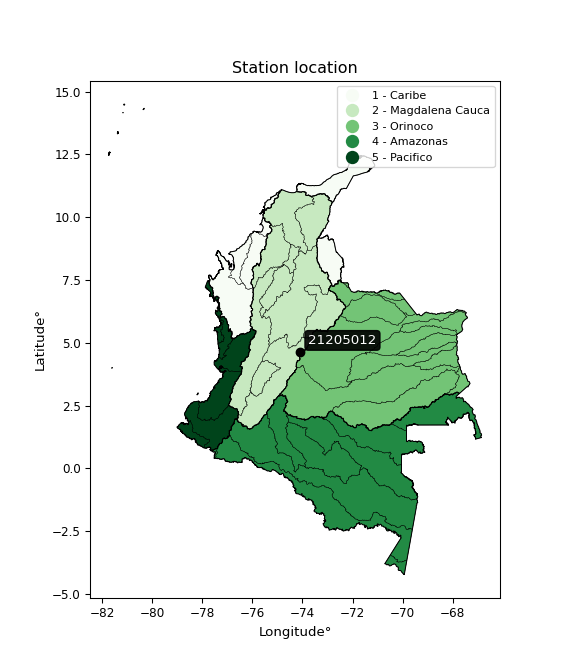

<div align="center">


</div>

# PMP Station (rain, Pmax24h): 21205012

Probable Maximum Precipitation (PMP) is the greatest amount of rainfall for a specific duration that is meteorologically possible for a given location, acting as a "worst-case" scenario for extreme storms, crucial for designing safety-critical infrastructure like bridges, river deviations, dams, spillways, and nuclear plants to prevent catastrophic failure. PMP is calculated by hydrologists using meteorological data to determine the upper limit of extreme rainfall, often leading to the Probable Maximum Flood (PMF) for flood control design, and is increasingly being studied for climate change impacts.

<div align="center">

</img>

</div>


## A. General information


### 1. General running parameters

• app_version: _v20251227_. • runtime: _2025-12-27 09:02:11.367833_. • Python version: _3.14.0_. • SciPy version: _1.16.3_. • Pandas version: _2.3.3_. • NumPy version: _2.3.5_. • Stations dataset (station_dataset_file): _dataset/pmax24h_in/automatic_colombia_2003_2024_filter.csv_. • Stations catalog (station_catalog_file): _dataset/CNE_IDEAM.xls_. • Minimum year to eval til year_max (date_min): _2003_. • Maximum year to eval since year_min (date_max): _2024_. • Creates, save and include plots into reports (create_plot): _False_. • Plot only fit distributions with Δo > Δ (plot_only_fit): _True_. • Eval low extreme values, if False, evaluates high extreme values (low_extreme): _False_. • Eval every SciPy distribution as logarithmic (pdist_logarithmic_on): _True_. • Standard deviation normalized (ddof): _1.0_. • Return periods to eval in years (Tr): _[2, 2.33, 5, 10, 15, 20, 25, 50, 75, 100, 200, 250, 500, 750, 1000]_. • Minimum data sample per station, 0 means any (minimum_sample): _5_. • Z-Score threshold to adjust a value, 0 means disable (zscore): _3.5_. • Avoid zeros, e.g. rain = 0 (avoid_zeros): _True_. • Avoid null values (avoid_nans): _True_. [:file_folder:Dataset file.](../../dataset/pmax24h_in/automatic_colombia_2003_2024_filter.csv)

> Delta Degrees of Freedom (DDOF): is a parameter used in the formulas for calculating variance and standard deviation. When ddof=0, the divisor is $N$ (the total number of observations) and this is used when your data set is the entire population. When ddof=1, the divisor is $N-1$ and this is used when your data set is a sample drawn from a larger population. Using $N-1$ provides an unbiased estimate of the population variance (known as Bessel´s correction).


### 2. Station info and location

|   id |   CODIGO | NOMBRE                          | CATEGORIA               | TECNOLOGIA                              | ESTADO   | FECHA_INSTALACION   |   FECHA_SUSPENSION |   ALTITUD |   LATITUD |   LONGITUD | DEPARTAMENTO   | MUNICIPIO   | AREA_OPERATIVA                            | ENTIDAD                                                     | AREA_HIDROGRAFICA   | ZONA_HIDROGRAFICA   | SUBZONA_HIDROGRAFICA   |   CORRIENTE | Catalogo   |
|-----:|---------:|:--------------------------------|:------------------------|:----------------------------------------|:---------|:--------------------|-------------------:|----------:|----------:|-----------:|:---------------|:------------|:------------------------------------------|:------------------------------------------------------------|:--------------------|:--------------------|:-----------------------|------------:|:-----------|
|    0 | 21205012 | UNIVERSIDAD NACIONAL [21205012] | Climatológica Principal | Automática con Telemetría, Convencional | Activa   | 19/08/2004          |                nan |      2556 |   4.63723 |   -74.0889 | Bogotá         | Bogotá, D.C | Area Operativa 11 - Cundinamarca-Amazonas | INSTITUTO DE HIDROLOGIA METEOROLOGIA Y ESTUDIOS AMBIENTALES | Magdalena Cauca     | Alto Magdalena      | Río Bogotá             |         nan | CNE_IDEAM  |

<div align="center">

Map location in: [:earth_americas:Google](http://maps.google.com/maps?q=4.63723,-74.08892) [:earth_americas:OSM](https://www.openstreetmap.org/#map=18/4.63723/-74.08892&layers=P) [:earth_americas:Bing](https://www.bing.com/maps?cp=4.63723~-74.08892&lvl=18) [:earth_americas:Apple](https://maps.apple.com/frame?center=4.63723%2C-74.08892&span=0.003%2C0.006)

</div>


<div align="center">

```geojson
{
  "type": "Feature",
  "geometry": {
    "type": "Point", 
    "coordinates": [-74.08892, 4.63723]
  }, 
  "properties": {
    "Name": "21205012"
  }
}
```

</div>


### 3. Discrete values table and plot

|               |           0 |          1 |           2 |           3 |           4 |           5 |           6 |           7 |
|:--------------|------------:|-----------:|------------:|------------:|------------:|------------:|------------:|------------:|
| Date          | 2014        | 2015       | 2016        | 2017        | 2018        | 2019        | 2021        | 2022        |
| Value         |   35.1      |   58.3     |   45.5      |   43.4      |   31.2      |   30.7      |   31.7      |   31.4      |
| Value_initial |   35.1      |   58.3     |   45.5      |   43.4      |   31.2      |   30.7      |   31.7      |   31.4      |
| count         |    8        |    8       |    8        |    8        |    8        |    8        |    8        |    8        |
| mean          |   38.4125   |   38.4125  |   38.4125   |   38.4125   |   38.4125   |   38.4125   |   38.4125   |   38.4125   |
| std           |    9.90908  |    9.90908 |    9.90908  |    9.90908  |    9.90908  |    9.90908  |    9.90908  |    9.90908  |
| zscore        |   -0.334289 |    2.007   |    0.715253 |    0.503326 |   -0.727868 |   -0.778327 |   -0.677409 |   -0.707684 |

> The initial value (value_initial) correspond to the initial obtained or null completed value, and value (value) is adjusted only when the initial value is outside the valid range definite through the Z-Score value. If Z-Score is active, values out of range or outliers are replaced with the station mean value


### 4. Active continuous probability distributions from SciPy (45 of 104 available)

[scipy.stats](https://docs.scipy.org/doc/scipy/reference/stats.html) is a Python´s powerful submodule within the SciPy library for comprehensive statistical analysis, offering over 130 probability distributions (like Normal, Poisson), functions for descriptive stats (mean, variance), hypothesis testing (t-tests, chi-square), random variable generation, and statistical tests, making it essential for data science, modeling, and research. It provides tools to explore, model, and draw conclusions from data efficiently, working seamlessly with NumPy.

<div align="center">

|   id | p_dist             |   n_parameter | fit_method   | label                                                                       | active   | ref                                                                                                        |
|-----:|:-------------------|--------------:|:-------------|:----------------------------------------------------------------------------|:---------|:-----------------------------------------------------------------------------------------------------------|
|    0 | alpha              |             3 | MLE          | Alpha                                                                       | True     | [:mortar_board:](https://docs.scipy.org/doc/scipy/reference/generated/scipy.stats.alpha.html)              |
|    1 | betaprime          |             4 | MLE          | Beta prime                                                                  | True     | [:mortar_board:](https://docs.scipy.org/doc/scipy/reference/generated/scipy.stats.betaprime.html)          |
|    2 | chi2               |             3 | MLE          | Chi²                                                                        | True     | [:mortar_board:](https://docs.scipy.org/doc/scipy/reference/generated/scipy.stats.chi2.html)               |
|    3 | crystalball        |             4 | MLE          | Crystalball                                                                 | True     | [:mortar_board:](https://docs.scipy.org/doc/scipy/reference/generated/scipy.stats.crystalball.html)        |
|    4 | erlang             |             3 | MLE          | Erlang                                                                      | True     | [:mortar_board:](https://docs.scipy.org/doc/scipy/reference/generated/scipy.stats.erlang.html)             |
|    5 | expon              |             2 | MLE          | Exponential                                                                 | True     | [:mortar_board:](https://docs.scipy.org/doc/scipy/reference/generated/scipy.stats.expon.html)              |
|    6 | exponnorm          |             3 | MLE          | Exponentially modified Normal                                               | True     | [:mortar_board:](https://docs.scipy.org/doc/scipy/reference/generated/scipy.stats.exponnorm.html)          |
|    7 | f                  |             4 | MLE          | F                                                                           | True     | [:mortar_board:](https://docs.scipy.org/doc/scipy/reference/generated/scipy.stats.f.html)                  |
|    8 | fatiguelife        |             3 | MLE          | Fatigue-life (Birnbaum-Saunders)                                            | True     | [:mortar_board:](https://docs.scipy.org/doc/scipy/reference/generated/scipy.stats.fatiguelife.html)        |
|    9 | fisk               |             3 | MLE          | Fisk                                                                        | True     | [:mortar_board:](https://docs.scipy.org/doc/scipy/reference/generated/scipy.stats.fisk.html)               |
|   10 | gamma              |             3 | MLE          | Gamma                                                                       | True     | [:mortar_board:](https://docs.scipy.org/doc/scipy/reference/generated/scipy.stats.gamma.html)              |
|   11 | genexpon           |             5 | MLE          | Generalized exponential                                                     | True     | [:mortar_board:](https://docs.scipy.org/doc/scipy/reference/generated/scipy.stats.genexpon.html)           |
|   12 | genlogistic        |             3 | MLE          | Generalized logistic                                                        | True     | [:mortar_board:](https://docs.scipy.org/doc/scipy/reference/generated/scipy.stats.genlogistic.html)        |
|   13 | gibrat             |             2 | MM           | Gibrat                                                                      | True     | [:mortar_board:](https://docs.scipy.org/doc/scipy/reference/generated/scipy.stats.gibrat.html)             |
|   14 | gompertz           |             3 | MLE          | Gompertz (or truncated Gumbel)                                              | True     | [:mortar_board:](https://docs.scipy.org/doc/scipy/reference/generated/scipy.stats.gompertz.html)           |
|   15 | gumbel_l           |             2 | MM           | Gumbel Left Skew                                                            | True     | [:mortar_board:](https://docs.scipy.org/doc/scipy/reference/generated/scipy.stats.gumbel_l.html)           |
|   16 | gumbel_r           |             2 | MM           | Gumbel Right Skew                                                           | True     | [:mortar_board:](https://docs.scipy.org/doc/scipy/reference/generated/scipy.stats.gumbel_r.html)           |
|   17 | halflogistic       |             2 | MM           | Half-logistic                                                               | True     | [:mortar_board:](https://docs.scipy.org/doc/scipy/reference/generated/scipy.stats.halflogistic.html)       |
|   18 | halfnorm           |             2 | MM           | Half Normal                                                                 | True     | [:mortar_board:](https://docs.scipy.org/doc/scipy/reference/generated/scipy.stats.halfnorm.html)           |
|   19 | hypsecant          |             2 | MM           | hyperbolic secant                                                           | True     | [:mortar_board:](https://docs.scipy.org/doc/scipy/reference/generated/scipy.stats.hypsecant.html)          |
|   20 | invgamma           |             3 | MLE          | Inverted gamma                                                              | True     | [:mortar_board:](https://docs.scipy.org/doc/scipy/reference/generated/scipy.stats.invgamma.html)           |
|   21 | invgauss           |             3 | MLE          | Inverse Gaussian                                                            | True     | [:mortar_board:](https://docs.scipy.org/doc/scipy/reference/generated/scipy.stats.invgauss.html)           |
|   22 | invweibull         |             3 | MLE          | Inverted Weibull                                                            | True     | [:mortar_board:](https://docs.scipy.org/doc/scipy/reference/generated/scipy.stats.invweibull.html)         |
|   23 | johnsonsu          |             4 | MLE          | Johnson Su                                                                  | True     | [:mortar_board:](https://docs.scipy.org/doc/scipy/reference/generated/scipy.stats.johnsonsu.html)          |
|   24 | kstwobign          |             2 | MLE          | Limiting distribution of scaled Kolmogorov-Smirnov two-sided test statistic | True     | [:mortar_board:](https://docs.scipy.org/doc/scipy/reference/generated/scipy.stats.kstwobign.html)          |
|   25 | laplace            |             2 | MM           | Laplace                                                                     | True     | [:mortar_board:](https://docs.scipy.org/doc/scipy/reference/generated/scipy.stats.laplace.html)            |
|   26 | laplace_asymmetric |             3 | MLE          | Asymmetric Laplace                                                          | True     | [:mortar_board:](https://docs.scipy.org/doc/scipy/reference/generated/scipy.stats.laplace_asymmetric.html) |
|   27 | loggamma           |             3 | MLE          | Log gamma                                                                   | True     | [:mortar_board:](https://docs.scipy.org/doc/scipy/reference/generated/scipy.stats.loggamma.html)           |
|   28 | logistic           |             2 | MM           | Logistic (or Sech-squared)                                                  | True     | [:mortar_board:](https://docs.scipy.org/doc/scipy/reference/generated/scipy.stats.logistic.html)           |
|   29 | lognorm            |             3 | MLE          | Log Normal                                                                  | True     | [:mortar_board:](https://docs.scipy.org/doc/scipy/reference/generated/scipy.stats.lognorm.html)            |
|   30 | maxwell            |             2 | MM           | Maxwell                                                                     | True     | [:mortar_board:](https://docs.scipy.org/doc/scipy/reference/generated/scipy.stats.maxwell.html)            |
|   31 | mielke             |             4 | MLE          | Mielke Beta-Kappa / Dagum                                                   | True     | [:mortar_board:](https://docs.scipy.org/doc/scipy/reference/generated/scipy.stats.mielke.html)             |
|   32 | moyal              |             2 | MM           | Moyal                                                                       | True     | [:mortar_board:](https://docs.scipy.org/doc/scipy/reference/generated/scipy.stats.moyal.html)              |
|   33 | nakagami           |             3 | MLE          | Nakagami                                                                    | True     | [:mortar_board:](https://docs.scipy.org/doc/scipy/reference/generated/scipy.stats.nakagami.html)           |
|   34 | ncf                |             5 | MLE          | Non-central F distribution                                                  | True     | [:mortar_board:](https://docs.scipy.org/doc/scipy/reference/generated/scipy.stats.ncf.html)                |
|   35 | nct                |             4 | MLE          | Non-central Student’s t                                                     | True     | [:mortar_board:](https://docs.scipy.org/doc/scipy/reference/generated/scipy.stats.nct.html)                |
|   36 | norm               |             2 | MM           | Normal                                                                      | True     | [:mortar_board:](https://docs.scipy.org/doc/scipy/reference/generated/scipy.stats.norm.html)               |
|   37 | pareto             |             3 | MLE          | Pareto                                                                      | True     | [:mortar_board:](https://docs.scipy.org/doc/scipy/reference/generated/scipy.stats.pareto.html)             |
|   38 | pearson3           |             3 | MM           | Pearson type III                                                            | True     | [:mortar_board:](https://docs.scipy.org/doc/scipy/reference/generated/scipy.stats.pearson3.html)           |
|   39 | rayleigh           |             2 | MM           | Rayleigh                                                                    | True     | [:mortar_board:](https://docs.scipy.org/doc/scipy/reference/generated/scipy.stats.rayleigh.html)           |
|   40 | rice               |             3 | MLE          | Rice                                                                        | True     | [:mortar_board:](https://docs.scipy.org/doc/scipy/reference/generated/scipy.stats.rice.html)               |
|   41 | t                  |             3 | MLE          | Student’s t                                                                 | True     | [:mortar_board:](https://docs.scipy.org/doc/scipy/reference/generated/scipy.stats.t.html)                  |
|   42 | truncnorm          |             4 | MLE          | Truncated normal                                                            | True     | [:mortar_board:](https://docs.scipy.org/doc/scipy/reference/generated/scipy.stats.truncnorm.html)          |
|   43 | wald               |             2 | MM           | Wald                                                                        | True     | [:mortar_board:](https://docs.scipy.org/doc/scipy/reference/generated/scipy.stats.wald.html)               |
|   44 | weibull_min        |             3 | MLE          | Weibull minimum                                                             | True     | [:mortar_board:](https://docs.scipy.org/doc/scipy/reference/generated/scipy.stats.weibull_min.html)        |

</div>

> **n_parameter:** # arguments & localization & scale.
>
> **Fit methods:** (MLE) maximum likelihood, (MM) L-moments.
>
>**Inactive:** foldnorm, gennorm, norminvgauss, powernorm, powerlognorm, skewnorm, genextreme, anglit, arcsine, argus, beta, bradford, burr, burr12, cauchy, cosine, halfcauchy, foldcauchy, skewcauchy, wrapcauchy, dgamma, gengamma, exponweib, exponpow, truncexpon, gausshyper, genhalflogistic, genhyperbolic, geninvgauss, halfgennorm, johnsonsb, kappa4, kappa3, ksone, kstwo, loglaplace, levy, levy_l, levy_stable, ncx2, genpareto, truncpareto, lomax, powerlaw, rdist, rel_breitwigner, recipinvgauss, semicircular, studentized_range, trapezoid, triang, truncweibull_min, tukeylambda, uniform, loguniform, vonmises, vonmises_line, weibull_max, dweibull, 


## B. Probability distributions vs. Empirical distributions

A continuous probability distribution (CPD) describes probabilities for variables that can take any value within a range (like rain any time), unlike discrete variables with specific outcomes (like temperature). It uses a Probability Density Function (PDF), a curve where the total area under it equals 1, and the probability of the variable falling within an interval (a to b) is found by calculating the area under the curve between those points. A key feature is that the probability of hitting any single exact value is zero, so probabilities are always expressed for ranges, e.g., $P(a ≤ X ≤ b)$.

<div align="center">

Distributions parameters from station values
|    |   station | p_dist                |   n |          loc |         scale | shape                  | shape1                 | shape2                 | shape3   |
|---:|----------:|:----------------------|----:|-------------:|--------------:|:-----------------------|:-----------------------|:-----------------------|:---------|
|  0 |  21205012 | alpha                 |   8 |    29.6794   |   1.99277     | 2.7626764042156887e-08 |                        |                        |          |
|  1 |  21205012 | betaprime             |   8 |     1.40526  |   5.243       | 153.2230608451057      | 22.71851612792213      |                        |          |
|  2 |  21205012 | chi2                  |   8 |    30.7      |   1.10833     | 0.9351263994060105     |                        |                        |          |
|  3 |  21205012 | crystalball           |   8 |    38.4125   |   9.26909     | 4159.064754316485      | 230.31686327054717     |                        |          |
|  4 |  21205012 | erlang                |   8 |    30.7      |   5.9613      | 0.468090892862149      |                        |                        |          |
|  5 |  21205012 | expon                 |   8 |    30.7      |   7.7125      |                        |                        |                        |          |
|  6 |  21205012 | exponnorm             |   8 |    30.693    |   0.00213769  | 3605.058227366957      |                        |                        |          |
|  7 |  21205012 | f                     |   8 |    30.477    |   1.15848     | 16.93687726644231      | 1.2199637432753905     |                        |          |
|  8 |  21205012 | fatiguelife           |   8 |    30.6199   |   1.78809     | 2.473122514989906      |                        |                        |          |
|  9 |  21205012 | fisk                  |   8 |    30.7      |   5.85652     | 0.685668034203444      |                        |                        |          |
| 10 |  21205012 | gamma                 |   8 |    30.7      |   5.98        | 0.5806850347434638     |                        |                        |          |
| 11 |  21205012 | genexpon              |   8 |    30.6999   |  11.719       | 1.5197776605525846     | 1.2872540257641301e-09 | 1.457180010943034      |          |
| 12 |  21205012 | genlogistic           |   8 |   -12.5625   |   6.06582     | 2289.23874236329       |                        |                        |          |
| 13 |  21205012 | gibrat                |   8 |    31.3413   |   4.28888     |                        |                        |                        |          |
| 14 |  21205012 | gompertz              |   8 |    30.7      |   2.98554e+10 | 3886846184.0529127     |                        |                        |          |
| 15 |  21205012 | gumbel_l              |   8 |    42.5841   |   7.22708     |                        |                        |                        |          |
| 16 |  21205012 | gumbel_r              |   8 |    34.2409   |   7.22708     |                        |                        |                        |          |
| 17 |  21205012 | halflogistic          |   8 |    27.4265   |   7.92475     |                        |                        |                        |          |
| 18 |  21205012 | halfnorm              |   8 |    26.1439   |  15.3765      |                        |                        |                        |          |
| 19 |  21205012 | hypsecant             |   8 |    38.4125   |   5.90089     |                        |                        |                        |          |
| 20 |  21205012 | invgamma              |   8 |    30.421    |   0.708599    | 0.6257337641495453     |                        |                        |          |
| 21 |  21205012 | invgauss              |   8 |    30.42     |   1.32291     | 6.041579662473697      |                        |                        |          |
| 22 |  21205012 | invweibull            |   8 |    30.5515   |   1.10612     | 0.6216979362741246     |                        |                        |          |
| 23 |  21205012 | johnsonsu             |   8 |    30.7      |   1.98697e-07 | -3.2693216445394757    | 0.2206045091446951     |                        |          |
| 24 |  21205012 | kstwobign             |   8 |    12.6593   |  29.721       |                        |                        |                        |          |
| 25 |  21205012 | laplace               |   8 |    38.4125   |   6.55424     |                        |                        |                        |          |
| 26 |  21205012 | laplace_asymmetric    |   8 |    30.7      |   0.0015788   | 0.0002047269519222408  |                        |                        |          |
| 27 |  21205012 | loggamma              |   8 | -3031.25     | 408.103       | 1848.427478191757      |                        |                        |          |
| 28 |  21205012 | logistic              |   8 |    38.4125   |   5.11032     |                        |                        |                        |          |
| 29 |  21205012 | lognorm               |   8 |    30.7      |   0.0480432   | 11.515064210036757     |                        |                        |          |
| 30 |  21205012 | maxwell               |   8 |    16.4486   |  13.7638      |                        |                        |                        |          |
| 31 |  21205012 | mielke                |   8 |    26.0633   |   1.22594     | 81.74252767749087      | 2.137808502843649      |                        |          |
| 32 |  21205012 | moyal                 |   8 |    33.1118   |   4.17256     |                        |                        |                        |          |
| 33 |  21205012 | nakagami              |   8 |    30.7      |  18.9207      | 0.22243137925970696    |                        |                        |          |
| 34 |  21205012 | ncf                   |   8 |    -1.12516  |  37.8388      | 767.230048723455       | 48.645459507206155     | 0.0017992626334020212  |          |
| 35 |  21205012 | nct                   |   8 |    -0.314671 |   0.321628    | 12.214922771931526     | 112.52227423961523     |                        |          |
| 36 |  21205012 | norm                  |   8 |    38.4125   |   9.26909     |                        |                        |                        |          |
| 37 |  21205012 | pareto                |   8 |    29.2672   |   1.4328      | 0.7725372176277304     |                        |                        |          |
| 38 |  21205012 | pearson3              |   8 |    38.4125   |   9.26909     | 1.071819176094876      |                        |                        |          |
| 39 |  21205012 | rayleigh              |   8 |    20.6802   |  14.1483      |                        |                        |                        |          |
| 40 |  21205012 | rice                  |   8 |    24.211    |  11.9917      | 0.0002675385746420708  |                        |                        |          |
| 41 |  21205012 | t                     |   8 |    38.4126   |   9.2691      | 43877889.46402722      |                        |                        |          |
| 42 |  21205012 | truncnorm             |   8 | -8733.49     | 285.482       | 30.69958223550865      | 30.796260767869278     |                        |          |
| 43 |  21205012 | wald                  |   8 |    29.1434   |   9.26909     |                        |                        |                        |          |
| 44 |  21205012 | weibull_min           |   8 |    30.7      |  15.8422      | 0.5194353429530436     |                        |                        |          |
| 45 |  21205012 | logalpha              |   8 |     2.04059  |  12.2987      | 7.932204779567741      |                        |                        |          |
| 46 |  21205012 | logbetaprime          |   8 |     0.961636 |   3.92292     | 274.30861503660583     | 403.88221298415397     |                        |          |
| 47 |  21205012 | logchi2               |   8 |     3.42426  |   0.996481    | 1.0084907490987276     |                        |                        |          |
| 48 |  21205012 | logcrystalball        |   8 |     3.62247  |   0.221193    | 7.981508078439617      | 16.311042113573514     |                        |          |
| 49 |  21205012 | logerlang             |   8 |     3.42426  |   0.1329      | 0.28246032679199945    |                        |                        |          |
| 50 |  21205012 | logexpon              |   8 |     3.42426  |   0.19821     |                        |                        |                        |          |
| 51 |  21205012 | logexponnorm          |   8 |     3.424    |   8.22834e-05 | 2384.103696732762      |                        |                        |          |
| 52 |  21205012 | logf                  |   8 |     3.41376  |   0.0401208   | 478.52979200730704     | 1.4386751575118613     |                        |          |
| 53 |  21205012 | logfatiguelife        |   8 |     3.42123  |   0.0549437   | 2.2013381346196486     |                        |                        |          |
| 54 |  21205012 | logfisk               |   8 |     3.42426  |   0.175378    | 0.7509541950406224     |                        |                        |          |
| 55 |  21205012 | loggamma              |   8 |     3.42426  |   0.131152    | 0.9092077144604109     |                        |                        |          |
| 56 |  21205012 | loggenexpon           |   8 |     3.42426  |   0.633103    | 3.194208759568422      | 5.737285175605132e-07  | 0.11634319931171345    |          |
| 57 |  21205012 | loggenlogistic        |   8 |     2.37554  |   0.152657    | 1842.2340260268438     |                        |                        |          |
| 58 |  21205012 | loggibrat             |   8 |     3.45372  |   0.102355    |                        |                        |                        |          |
| 59 |  21205012 | loggompertz           |   8 |     3.42426  |   5.85235e+09 | 28293249321.083237     |                        |                        |          |
| 60 |  21205012 | loggumbel_l           |   8 |     3.72202  |   0.172463    |                        |                        |                        |          |
| 61 |  21205012 | loggumbel_r           |   8 |     3.52292  |   0.172463    |                        |                        |                        |          |
| 62 |  21205012 | loghalflogistic       |   8 |     3.36031  |   0.189112    |                        |                        |                        |          |
| 63 |  21205012 | loghalfnorm           |   8 |     3.3297   |   0.366936    |                        |                        |                        |          |
| 64 |  21205012 | loghypsecant          |   8 |     3.62247  |   0.140816    |                        |                        |                        |          |
| 65 |  21205012 | loginvgamma           |   8 |     3.41371  |   0.0301764   | 0.8138652404523512     |                        |                        |          |
| 66 |  21205012 | loginvgauss           |   8 |     3.41466  |   0.0461523   | 4.502762674206821      |                        |                        |          |
| 67 |  21205012 | loginvweibull         |   8 |     3.41778  |   0.037908    | 0.6978881145207845     |                        |                        |          |
| 68 |  21205012 | logjohnsonsu          |   8 |     3.42426  |   5.31703e-13 | -1.948877886934767     | 0.10066691737958883    |                        |          |
| 69 |  21205012 | logkstwobign          |   8 |     2.9875   |   0.730084    |                        |                        |                        |          |
| 70 |  21205012 | loglaplace            |   8 |     3.62247  |   0.156407    |                        |                        |                        |          |
| 71 |  21205012 | loglaplace_asymmetric |   8 |     3.42426  |   6.88344e-05 | 0.0003472119619439193  |                        |                        |          |
| 72 |  21205012 | logloggamma           |   8 |   -86.304    |  11.4388      | 2595.9233071654958     |                        |                        |          |
| 73 |  21205012 | loglogistic           |   8 |     3.62247  |   0.12195     |                        |                        |                        |          |
| 74 |  21205012 | loglognorm            |   8 |     3.42426  |   0.00167058  | 11.022722516824597     |                        |                        |          |
| 75 |  21205012 | logmaxwell            |   8 |     3.09834  |   0.328452    |                        |                        |                        |          |
| 76 |  21205012 | logmielke             |   8 |     1.77486  |   0.977637    | 10325.410652448936     | 11.82723680345245      |                        |          |
| 77 |  21205012 | logmoyal              |   8 |     3.49598  |   0.0995718   |                        |                        |                        |          |
| 78 |  21205012 | lognakagami           |   8 |     3.42426  |   0.485632    | 0.17810301651043214    |                        |                        |          |
| 79 |  21205012 | logncf                |   8 |    -3.57026  |   7.19026     | 547.3606771166726      | 748.6165124455429      | 0.00011549743782603486 |          |
| 80 |  21205012 | lognct                |   8 |    -0.597757 |   0.0316181   | 192.365416252655       | 132.96918540226136     |                        |          |
| 81 |  21205012 | lognorm               |   8 |     3.62247  |   0.221193    |                        |                        |                        |          |
| 82 |  21205012 | logpareto             |   8 |     3.35244  |   0.0718189   | 1.0226417312853        |                        |                        |          |
| 83 |  21205012 | logpearson3           |   8 |     3.62247  |   0.221193    | 0.8501054956158758     |                        |                        |          |
| 84 |  21205012 | lograyleigh           |   8 |     3.19932  |   0.337629    |                        |                        |                        |          |
| 85 |  21205012 | logrice               |   8 |     3.27524  |   0.291115    | 0.0005622558872939191  |                        |                        |          |
| 86 |  21205012 | logt                  |   8 |     3.62247  |   0.221196    | 42071761.15815258      |                        |                        |          |
| 87 |  21205012 | logtruncnorm          |   8 |    -1.32893  |   1.30629     | 3.638649523114995      | 4.129649626380781      |                        |          |
| 88 |  21205012 | logwald               |   8 |     3.40128  |   0.221193    |                        |                        |                        |          |
| 89 |  21205012 | logweibull_min        |   8 |     3.42426  |   0.169546    | 0.5204641829188383     |                        |                        |          |

</div>

> **loc** (Location parameter): This shifts the distribution along the x-axis. For many common distributions, like the normal (Gaussian) distribution, loc represents the mean $μ$. For others, like the uniform distribution, it might represent the minimum value, or for the beta distribution, the left end of the support interval.
>
> **scale** (Scale parameter): This determines the width or spread of the distribution. For the normal distribution, scale represents the standard deviation $σ$. For a uniform distribution, it defines the length of the interval (from $loc$ to $loc + scale$).
>
> **shape** (Shape parameters): Refers to parameters that define the specific form of a probability distribution, distinct from its location (loc) and scale (scale). These parameters are required arguments for most distribution functions. For example, a normal (Gaussian) distribution is fully defined by its location (mean) and scale (standard deviation), so it has no specific shape parameters beyond loc and scale. However, other distributions have intrinsic properties that need specification, as Gamma distribution that takes a shape parameter, often named $a$ or $alpha$.


### 0. Cumulative distribution values - CDF (90 evaluated)

Cumulative Distribution Function (CDF), denoted as $F$<sub>$X$</sub>$(x)$, is a function that gives the probability that a random variable $X$ will take a value less than or equal to a specific value, $x$ (i.e., $(P(X≥x)$. It essentially "accumulates" probabilities from a given point up to the far right (positive infinity), providing a complete picture of the distribution´s probabilities for both discrete (like rain) and continuous (like temperature) variables, helping to find probabilities over ranges or above certain values.

<div align="center">

CDF ordered by x ascending and calculating $log(f(x))$ separately
|   id |   Station |   date |    x |   count |    mean |     std |    zscore |   Value_initial |   station |   m |     alpha |   alpha_pdf |   betaprime |   betaprime_pdf |        chi2 |    chi2_pdf |   crystalball |   crystalball_pdf |      erlang |   erlang_pdf |     expon |   expon_pdf |   exponnorm |   exponnorm_pdf |         f |      f_pdf |   fatiguelife |   fatiguelife_pdf |        fisk |    fisk_pdf |       gamma |        gamma_pdf |   genexpon |   genexpon_pdf |   genlogistic |   genlogistic_pdf |      gibrat |   gibrat_pdf |   gompertz |   gompertz_pdf |   gumbel_l |   gumbel_l_pdf |   gumbel_r |   gumbel_r_pdf |   halflogistic |   halflogistic_pdf |   halfnorm |   halfnorm_pdf |   hypsecant |   hypsecant_pdf |   invgamma |   invgamma_pdf |   invgauss |   invgauss_pdf |   invweibull |   invweibull_pdf |   johnsonsu |   johnsonsu_pdf |   kstwobign |   kstwobign_pdf |   laplace |   laplace_pdf |   laplace_asymmetric |   laplace_asymmetric_pdf |   loggamma |   loggamma_pdf |   logistic |   logistic_pdf |   lognorm |   lognorm_pdf |   maxwell |   maxwell_pdf |   mielke |   mielke_pdf |    moyal |   moyal_pdf |   nakagami |   nakagami_pdf |      ncf |    ncf_pdf |      nct |    nct_pdf |     norm |   norm_pdf |      pareto |   pareto_pdf |   pearson3 |   pearson3_pdf |   rayleigh |   rayleigh_pdf |     rice |   rice_pdf |        t |      t_pdf |   truncnorm |   truncnorm_pdf |      wald |   wald_pdf |   weibull_min |   weibull_min_pdf |   logalpha |   logalpha_pdf |   logbetaprime |   logbetaprime_pdf |     logchi2 |   logchi2_pdf |   logcrystalball |   logcrystalball_pdf |   logerlang |   logerlang_pdf |   logexpon |   logexpon_pdf |   logexponnorm |   logexponnorm_pdf |      logf |   logf_pdf |   logfatiguelife |   logfatiguelife_pdf |     logfisk |   logfisk_pdf |   loggenexpon |   loggenexpon_pdf |   loggenlogistic |   loggenlogistic_pdf |   loggibrat |   loggibrat_pdf |   loggompertz |   loggompertz_pdf |   loggumbel_l |   loggumbel_l_pdf |   loggumbel_r |   loggumbel_r_pdf |   loghalflogistic |   loghalflogistic_pdf |   loghalfnorm |   loghalfnorm_pdf |   loghypsecant |   loghypsecant_pdf |   loginvgamma |   loginvgamma_pdf |   loginvgauss |   loginvgauss_pdf |   loginvweibull |   loginvweibull_pdf |   logjohnsonsu |   logjohnsonsu_pdf |   logkstwobign |   logkstwobign_pdf |   loglaplace |   loglaplace_pdf |   loglaplace_asymmetric |   loglaplace_asymmetric_pdf |   logloggamma |   logloggamma_pdf |   loglogistic |   loglogistic_pdf |   loglognorm |   loglognorm_pdf |   logmaxwell |   logmaxwell_pdf |   logmielke |   logmielke_pdf |   logmoyal |   logmoyal_pdf |   lognakagami |   lognakagami_pdf |   logncf |   logncf_pdf |   lognct |   lognct_pdf |   logpareto |   logpareto_pdf |   logpearson3 |   logpearson3_pdf |   lograyleigh |   lograyleigh_pdf |   logrice |   logrice_pdf |     logt |   logt_pdf |   logtruncnorm |   logtruncnorm_pdf |    logwald |   logwald_pdf |   logweibull_min |   logweibull_min_pdf |
|-----:|----------:|-------:|-----:|--------:|--------:|--------:|----------:|----------------:|----------:|----:|----------:|------------:|------------:|----------------:|------------:|------------:|--------------:|------------------:|------------:|-------------:|----------:|------------:|------------:|----------------:|----------:|-----------:|--------------:|------------------:|------------:|------------:|------------:|-----------------:|-----------:|---------------:|--------------:|------------------:|------------:|-------------:|-----------:|---------------:|-----------:|---------------:|-----------:|---------------:|---------------:|-------------------:|-----------:|---------------:|------------:|----------------:|-----------:|---------------:|-----------:|---------------:|-------------:|-----------------:|------------:|----------------:|------------:|----------------:|----------:|--------------:|---------------------:|-------------------------:|-----------:|---------------:|-----------:|---------------:|----------:|--------------:|----------:|--------------:|---------:|-------------:|---------:|------------:|-----------:|---------------:|---------:|-----------:|---------:|-----------:|---------:|-----------:|------------:|-------------:|-----------:|---------------:|-----------:|---------------:|---------:|-----------:|---------:|-----------:|------------:|----------------:|----------:|-----------:|--------------:|------------------:|-----------:|---------------:|---------------:|-------------------:|------------:|--------------:|-----------------:|---------------------:|------------:|----------------:|-----------:|---------------:|---------------:|-------------------:|----------:|-----------:|-----------------:|---------------------:|------------:|--------------:|--------------:|------------------:|-----------------:|---------------------:|------------:|----------------:|--------------:|------------------:|--------------:|------------------:|--------------:|------------------:|------------------:|----------------------:|--------------:|------------------:|---------------:|-------------------:|--------------:|------------------:|--------------:|------------------:|----------------:|--------------------:|---------------:|-------------------:|---------------:|-------------------:|-------------:|-----------------:|------------------------:|----------------------------:|--------------:|------------------:|--------------:|------------------:|-------------:|-----------------:|-------------:|-----------------:|------------:|----------------:|-----------:|---------------:|--------------:|------------------:|---------:|-------------:|---------:|-------------:|------------:|----------------:|--------------:|------------------:|--------------:|------------------:|----------:|--------------:|---------:|-----------:|---------------:|-------------------:|-----------:|--------------:|-----------------:|---------------------:|
|    0 |  21205012 |   2019 | 30.7 |       8 | 38.4125 | 9.90908 | -0.778327 |            30.7 |  21205012 |   1 | 0.0508748 |  0.226898   |    0.181268 |      0.0418091  | 1.36487e-07 | 1.79626e+07 |      0.202686 |        0.0304463  | 8.43666e-08 |  1.11158e+07 | 0         |  0.12966    | 0.000903213 |      0.129571   | 0.0301271 | 0.340081   |     0.0340466 |        0.940512   | 1.94871e-08 | 400.958     | 1.61545e-09 | 264042           | 1.4181e-05 |     0.129683   |      0.16068  |        0.0484123  | 0           |  0           | 1.2095e-12 |     0.130189   |   0.175627 |    0.02203     |   0.195492 |     0.0441518  |       0.203651 |         0.0604768  |   0.233004 |     0.0496613  |    0.168257 |      0.0272045  |  0.0348503 |     0.353523   |  0.0350025 |     0.343238   |    0.0306769 |       0.447382   |  0.00173423 |   2464.89       |    0.145123 |      0.0458252  |  0.154144 |    0.0235182  |          6.82172e-08 |               0.129672   | 7.2274e-14 |    147.97      |   0.181057 |     0.0290149  |  0.185101 |      1.20718  |  0.216187 |    0.0363608  | 0.114995 |   0.111491   | 0.181841 |  0.0523548  | 7.9154e-08 |    9.91148e+06 | 0.181585 | 0.0416589  | 0.174959 | 0.0453733  | 0.202686 | 0.0304463  | 2.22045e-16 |   0.53918    |   0.207235 |     0.0458553  |   0.2218   |      0.0389529 | 0.136197 | 0.0389795  | 0.202683 | 0.030446   | 9.27555e-08 |      0.113436   | 0.0373069 | 0.0796051  |   7.43401e-09 |       1.08691e+06 |   0.169467 |       1.62231  |       0.159054 |           1.2507   | 1.44518e-08 |   1.64094e+07 |         0.185101 |             1.20718  | 9.05115e-05 |     5.75693e+10 |  0         |       5.04516  |     0.00134006 |           5.08719  | 0.0358635 |  10.0188   |        0.0339142 |            25.3031   | 1.09318e-11 |  18485.7      |   4.46402e-09 |          5.04532  |         0.147699 |             1.8495   | 0           |        0        |   1.35258e-13 |          4.83451  |      0.162978 |         0.863434  |      0.170004 |          1.74667  |          0.1675   |              2.56976  |      0.203369 |          2.10343  |       0.152799 |            1.0439  |     0.0390555 |         11.1161   |      0.035294 |         10.235    |       0.0323736 |           11.9588   |      0.0305727 |        1.00476e+10 |       0.133398 |           1.80023  |     0.1408   |         0.900213 |             1.30373e-07 |                    5.04416  |      0.188734 |          1.19673  |      0.16447  |          1.12685  |   0.00430795 |      2.58625e+12 |     0.195038 |         1.46197  |         nan |             nan |   0.15171  |       2.05563  |   3.49795e-06 |       2.80572e+09 | 0.36598  |     0.675024 | 0.182656 |     1.31407  | 2.22045e-16 |       14.2392   |      0.184756 |          1.66291  |      0.19904  |          1.58055  |  0.1228   |      1.54248  | 0.185107 |   1.20719  |    0.000173964 |           3.42576  | 0.00499281 |      1.12992  |      2.57446e-08 |          3.01722e+07 |
|    1 |  21205012 |   2018 | 31.2 |       8 | 38.4125 | 9.90908 | -0.727868 |            31.2 |  21205012 |   2 | 0.190024  |  0.291358   |    0.202689 |      0.0438375  | 0.524943    | 0.420025    |      0.218248 |        0.0317977  | 0.344693    |  0.304682    | 0.0627731 |  0.121521   | 0.0636668   |      0.121499   | 0.227063  | 0.340193   |     0.31577   |        0.288156   | 0.156141    |   0.180689  | 0.257549    |      0.28361     | 0.0627981  |     0.121541   |      0.18568  |        0.0515215  | 0           |  0           | 0.063021   |     0.121984   |   0.186953 |    0.0232837   |   0.218029 |     0.0459502  |       0.233686 |         0.059648   |   0.257711 |     0.0491592  |    0.182365 |      0.0292415  |  0.232535  |     0.339967   |  0.226387  |     0.333905   |    0.248168  |       0.331549   |  0.553668   |      0.174422   |    0.168747 |      0.048605   |  0.166364 |    0.0253826  |          0.0627791   |               0.121532   | 0.145685   |      7.6817    |   0.19602  |     0.0308388  |  0.205238 |      1.2854   |  0.234655 |    0.0374941  | 0.174268 |   0.123865   | 0.208586 |  0.0545314  | 0.155798   |    0.1386      | 0.202934 | 0.0436994  | 0.198244 | 0.0477134  | 0.218248 | 0.0317977  | 0.206459    |   0.317177   |   0.23047  |     0.0470428  |   0.241509 |      0.039861  | 0.156202 | 0.0410107  | 0.218245 | 0.0317974  | 0.05522     |      0.107497   | 0.0843215 | 0.105229   |   0.153051    |       0.146159    |   0.196638 |       1.73927  |       0.180033 |           1.34603  | 0.0992515   |   3.08119     |         0.205238 |             1.2854   | 0.596645    |     9.48311     |  0.0782735 |       4.65025  |     0.0802876  |           4.68829  | 0.225036  |  10.5925   |        0.308471  |             9.51272  | 0.142976    |      5.69574  |   0.0782759   |          4.65039  |         0.178958 |             2.0161   | 0           |        0        |   0.0751315   |          4.47129  |      0.177475 |         0.931803  |      0.199192 |          1.86355  |          0.208695 |              2.52878  |      0.237147 |          2.07768  |       0.170543 |            1.15399 |     0.248889  |         11.6266   |      0.223757 |         10.4234   |       0.23857   |           10.5407   |      0.709086  |        2.13609     |       0.163784 |           1.95676  |     0.156121 |         0.998169 |             0.0782588   |                    4.64941  |      0.208678 |          1.27209  |      0.183493 |          1.22856  |   0.581548   |      2.19331     |     0.219231 |         1.53193  |         nan |             nan |   0.18623  |       2.21078  |   0.236732    |       5.21875     | 0.376926 |     0.679982 | 0.204575 |     1.39889  | 0.18738     |        9.44616  |      0.212329 |          1.74826  |      0.225059 |          1.63903  |  0.148681 |      1.65925  | 0.205244 |   1.28541  |    0.0542904   |           3.27476  | 0.0441945  |      3.57308  |      0.254862    |          7.06205     |
|    2 |  21205012 |   2022 | 31.4 |       8 | 38.4125 | 9.90908 | -0.707684 |            31.4 |  21205012 |   3 | 0.246791  |  0.274636   |    0.211532 |      0.0445872  | 0.598216    | 0.320839    |      0.224661 |        0.0323285  | 0.399314    |  0.246348    | 0.0867647 |  0.11841    | 0.0876541   |      0.118387   | 0.289108  | 0.282079   |     0.365019  |        0.211816   | 0.189001    |   0.150141  | 0.309391    |      0.23819     | 0.0867937  |     0.118429   |      0.196098 |        0.0526487  | 8.86079e-06 |  0.000680285 | 0.087103   |     0.118849   |   0.191661 |    0.0237985   |   0.227284 |     0.0465933  |       0.24558  |         0.0592884  |   0.267522 |     0.0489452  |    0.188297 |      0.0300812  |  0.294589  |     0.282354   |  0.287763  |     0.281312   |    0.307532  |       0.265693   |  0.582839   |      0.123006   |    0.178569 |      0.0496025  |  0.171518 |    0.0261691  |          0.086773    |               0.11842    | 0.192842   |      7.09835   |   0.202261 |     0.0315736  |  0.213548 |      1.31578  |  0.242196 |    0.0379185  | 0.199287 |   0.12609    | 0.219565 |  0.0552469  | 0.180949   |    0.114968    | 0.21175  | 0.0444555  | 0.207872 | 0.048561   | 0.224661 | 0.0323285  | 0.264584    |   0.26638    |   0.23992  |     0.0474435  |   0.249514 |      0.0401901 | 0.164481 | 0.0417704  | 0.224658 | 0.0323282  | 0.0764899   |      0.10521    | 0.105943  | 0.110594   |   0.179498    |       0.120455    |   0.207888 |       1.78184  |       0.188752 |           1.38292  | 0.117288    |   2.60359     |         0.213548 |             1.31578  | 0.648966    |     7.11568     |  0.107514  |       4.50273  |     0.109762   |           4.53804  | 0.287627  |   9.02343  |        0.360992  |             7.14195  | 0.176459    |      4.84048  |   0.107517    |          4.50286  |         0.19203  |             2.07476  | 0           |        0        |   0.103265    |          4.33528  |      0.183518 |         0.959869  |      0.211232 |          1.90431  |          0.224795 |              2.51033  |      0.250388 |          2.06648  |       0.178062 |            1.19958 |     0.317235  |          9.79953  |      0.2854   |          8.90227  |       0.299752  |            8.68307  |      0.720479  |        1.50181     |       0.176462 |           2.01085  |     0.162631 |         1.03979  |             0.107494    |                    4.50195  |      0.2169   |          1.30135  |      0.191473 |          1.26947  |   0.593319   |      1.56122     |     0.229102 |         1.55751  |         nan |             nan |   0.200518 |       2.26044  |   0.266563    |       4.21022     | 0.381277 |     0.681793 | 0.213618 |     1.43125  | 0.243608    |        8.19717  |      0.223597 |          1.77803  |      0.235599 |          1.65959  |  0.15942  |      1.7017   | 0.213555 |   1.31579  |    0.0750296   |           3.21676  | 0.0690707  |      4.17342  |      0.295246    |          5.6928      |
|    3 |  21205012 |   2021 | 31.7 |       8 | 38.4125 | 9.90908 | -0.677409 |            31.7 |  21205012 |   4 | 0.324024  |  0.239458   |    0.225068 |      0.0456418  | 0.67992     | 0.231758    |      0.234477 |        0.0331125  | 0.464649    |  0.193776    | 0.121606  |  0.113892   | 0.122488    |      0.113867   | 0.363228  | 0.216075   |     0.418404  |        0.150877   | 0.229355    |   0.121193  | 0.373877    |      0.195066    | 0.12164    |     0.11391    |      0.212131 |        0.0542067  | 0.00654387  |  0.0511907   | 0.12207    |     0.114297   |   0.198918 |    0.0245844   |   0.241396 |     0.0474742  |       0.263282 |         0.05872    |   0.282155 |     0.0486106  |    0.197513 |      0.0313648  |  0.368851  |     0.216669   |  0.362455  |     0.220072   |    0.376484  |       0.199078   |  0.613267   |      0.0844369  |    0.193659 |      0.0509734  |  0.179551 |    0.0273947  |          0.121617    |               0.113902   | 0.256873   |      6.39432   |   0.211899 |     0.0326785  |  0.226272 |      1.36022  |  0.253664 |    0.038523   | 0.237324 |   0.127057   | 0.236281 |  0.0561566  | 0.212052   |    0.0942859   | 0.225248 | 0.0455216  | 0.222619 | 0.0497337  | 0.234477 | 0.0331125  | 0.33568     |   0.210955   |   0.254233 |     0.0479671  |   0.261641 |      0.0406472 | 0.177176 | 0.0428523  | 0.234474 | 0.0331123  | 0.107549    |      0.10187    | 0.139856  | 0.11483    |   0.211882    |       0.0974756   |   0.225116 |       1.84088  |       0.202159 |           1.43667  | 0.139838    |   2.17638     |         0.226272 |             1.36022  | 0.706333    |     5.14616     |  0.149319  |       4.29182  |     0.151884   |           4.32332  | 0.363847  |   7.10018  |        0.418623  |             5.18464  | 0.218187    |      3.99634  |   0.149323    |          4.29194  |         0.212142 |             2.15377  | 0.000119617 |        0.180238 |   0.143555    |          4.14049  |      0.192848 |         1.00269   |      0.229605 |          1.95891  |          0.248527 |              2.48063  |      0.269954 |          2.04877  |       0.189798 |            1.26939 |     0.399412  |          7.5969   |      0.360924 |          7.07388  |       0.372091  |            6.66206  |      0.732269  |        1.03401     |       0.195933 |           2.08283  |     0.172825 |         1.10497  |             0.149292    |                    4.29111  |      0.229479 |          1.34417  |      0.203836 |          1.33076  |   0.605656   |      1.08928     |     0.244085 |         1.59329  |         nan |             nan |   0.222317 |       2.32201  |   0.302143    |       3.35541     | 0.387772 |     0.684328 | 0.227451 |     1.47794  | 0.314342    |        6.75039  |      0.240698 |          1.81805  |      0.251515 |          1.68747  |  0.175886 |      1.76083  | 0.226278 |   1.36022  |    0.105213    |           3.1322   | 0.111468   |      4.67591  |      0.343108    |          4.48224     |
|    4 |  21205012 |   2014 | 35.1 |       8 | 38.4125 | 9.90908 | -0.334289 |            35.1 |  21205012 |   5 | 0.713151  |  0.0505771  |    0.393128 |      0.0512582  | 0.958052    | 0.0227144   |      0.360407 |        0.0403776  | 0.791882    |  0.0498131   | 0.434759  |  0.073289   | 0.43552     |      0.0732473  | 0.670096  | 0.0393141  |     0.649729  |        0.0370279  | 0.45114     |   0.0385864 | 0.733303    |      0.059354    | 0.434829   |     0.073294   |      0.412565 |        0.0602059  | 0.447508    |  0.105219    | 0.436073   |     0.073417   |   0.298846 |    0.0344439   |   0.41151  |     0.0505583  |       0.449561 |         0.050342   |   0.439742 |     0.043794   |    0.330022 |      0.0464326  |  0.67674   |     0.0393448  |  0.690748  |     0.0442349  |    0.660223  |       0.0374656  |  0.730622   |      0.0165586  |    0.381322 |      0.0565517  |  0.301633 |    0.046021   |          0.43479     |               0.0732921  | 0.678686   |      2.58245   |   0.343396 |     0.0441215  |  0.385691 |      1.72904  |  0.392932 |    0.0425009  | 0.588214 |   0.0733334  | 0.43069  |  0.0552332  | 0.409063   |    0.0409532   | 0.393231 | 0.0513461  | 0.404215 | 0.0545528  | 0.360407 | 0.0403776  | 0.661942    |   0.0447747  |   0.420538 |     0.0483016  |   0.405106 |      0.0428537 | 0.33786  | 0.0501396  | 0.360403 | 0.0403774  | 0.397636    |      0.0706656  | 0.47733   | 0.0756444  |   0.401931    |       0.036294    |   0.431793 |       2.09914  |       0.372943 |           1.85945  | 0.282756    |   1.01779     |         0.385691 |             1.72904  | 0.922419    |     0.856905    |  0.491221  |       2.56687  |     0.495456   |           2.57194  | 0.683126  |   1.40204  |        0.666236  |             1.33453  | 0.449565    |      1.38742  |   0.491232    |          2.5669   |         0.451298 |             2.35159  | 0.508208    |        3.81744  |   0.476662    |          2.53009  |      0.320764 |         1.52333   |      0.442633 |          2.09176  |          0.48018  |              2.03432  |      0.466536 |          1.79119  |       0.359513 |            2.04386 |     0.727304  |          1.3663   |      0.693678 |          1.55186  |       0.669669  |            1.33454  |      0.777459  |        0.224008    |       0.425814 |           2.26668  |     0.331519 |         2.11959  |             0.491153    |                    2.56671  |      0.386557 |          1.70131  |      0.37121  |          1.91401  |   0.65459    |      0.249668    |     0.419302 |         1.78697  |         nan |             nan |   0.464377 |       2.24305  |   0.501867    |       1.31943     | 0.458446 |     0.699257 | 0.398075 |     1.81436  | 0.659173    |        1.69395  |      0.436541 |          1.9358   |      0.431603 |          1.78948  |  0.376483 |      2.08182  | 0.385697 |   1.72903  |    0.382534    |           2.34663  | 0.521718   |      2.844    |      0.587093    |          1.41923     |
|    5 |  21205012 |   2017 | 43.4 |       8 | 38.4125 | 9.90908 |  0.503326 |            43.4 |  21205012 |   6 | 0.884522  |  0.00835737 |    0.755333 |      0.031809   | 0.999374    | 0.000305521 |      0.704739 |        0.0372394  | 0.964683    |  0.00704377  | 0.807311  |  0.024984   | 0.807732    |      0.0249489  | 0.816849  | 0.00833576 |     0.823752  |        0.0124833  | 0.629656    |   0.0125898 | 0.950541    |      0.00949807  | 0.807375   |     0.0249805  |      0.798208 |        0.0296574  | 0.849375    |  0.019389    | 0.808602   |     0.0249179  |   0.673562 |    0.0505671   |   0.754588 |     0.0294004  |       0.764861 |         0.026183   |   0.738241 |     0.027644   |    0.741757 |      0.0391182  |  0.82295   |     0.00825283 |  0.858962  |     0.00961936 |    0.804366  |       0.00847304 |  0.80193    |      0.00483473 |    0.764979 |      0.0325553  |  0.766391 |    0.0356425  |          0.807342    |               0.0249824  | 0.940003   |      0.469587  |   0.726307 |     0.0388988  |  0.748265 |      1.44192  |  0.720076 |    0.03268    | 0.875913 |   0.0142853  | 0.770696 |  0.0267083  | 0.645292   |    0.0208176   | 0.757203 | 0.0319931  | 0.769942 | 0.0302475  | 0.704739 | 0.0372394  | 0.829366    |   0.00932731 |   0.74841  |     0.0288774  |   0.724548 |      0.0312636 | 0.722051 | 0.0370902  | 0.704735 | 0.0372396  | 0.785485    |      0.0289202  | 0.818194  | 0.0205366  |   0.589965    |       0.0149512   |   0.794624 |       1.16901  |       0.751962 |           1.44402  | 0.440917    |   0.571408    |         0.748265 |             1.44192  | 0.99042     |     0.0877772   |  0.825637  |       0.879688 |     0.829002   |           0.871675 | 0.826429  |   0.333801 |        0.832751  |             0.475205 | 0.62497     |      0.508412 |   0.825647    |          0.879666 |         0.820272 |             1.06449  | 0.870686    |        0.665438 |   0.812447    |          0.906728 |      0.734003 |         2.04247   |      0.788167 |          1.08788  |          0.794831 |              0.973614 |      0.770322 |          1.05691  |       0.785885 |            1.40843 |     0.862043  |          0.300289 |      0.857441 |          0.39076  |       0.809888  |            0.337929 |      0.804895  |        0.0801969   |       0.799727 |           1.17318  |     0.805887 |         1.24108  |             0.825577    |                    0.879817 |      0.744801 |          1.43695  |      0.770918 |          1.44816  |   0.68577    |      0.0929934   |     0.758079 |         1.2535   |         nan |             nan |   0.801036 |       0.978129 |   0.695892    |       0.662904    | 0.604319 |     0.660256 | 0.757979 |     1.35356  | 0.834908    |        0.403884 |      0.774467 |          1.14535  |      0.760883 |          1.19805  |  0.764698 |      1.37497  | 0.748266 |   1.4419   |    0.754364    |           1.26096  | 0.841192   |      0.731481 |      0.765425    |          0.511342    |
|    6 |  21205012 |   2016 | 45.5 |       8 | 38.4125 | 9.90908 |  0.715253 |            45.5 |  21205012 |   7 | 0.899763  |  0.00630239 |    0.815301 |      0.0254029  | 0.999774    | 0.000109199 |      0.777756 |        0.0321302  | 0.976673    |  0.00456526  | 0.853241  |  0.0190287  | 0.853592    |      0.0189979  | 0.832411  | 0.00659479 |     0.847619  |        0.0103445  | 0.653773    |   0.0104867 | 0.96685     |      0.00626985  | 0.853297   |     0.0190251  |      0.852626 |        0.0224096  | 0.88382     |  0.0138089   | 0.854386   |     0.0189573  |   0.776202 |    0.0463573   |   0.810116 |     0.0236046  |       0.814523 |         0.0212343  |   0.791903 |     0.0234957  |    0.813947 |      0.0297647  |  0.838342  |     0.00651656 |  0.876878  |     0.00756998 |    0.82025   |       0.00675948 |  0.811191   |      0.00402927 |    0.826125 |      0.0258062  |  0.830433 |    0.0258713  |          0.853269    |               0.019027   | 0.958531   |      0.323742  |   0.800097 |     0.0312978  |  0.811292 |      1.22168  |  0.783668 |    0.0278387  | 0.901408 |   0.010277   | 0.820719 |  0.0211181  | 0.686446   |    0.0184482   | 0.817476 | 0.0255077  | 0.826394 | 0.0236789  | 0.777756 | 0.0321302  | 0.846685    |   0.00729644 |   0.803486 |     0.0236609  |   0.785342 |      0.0266155 | 0.793175 | 0.0306197  | 0.777753 | 0.0321304  | 0.839839    |      0.023066   | 0.855799  | 0.0155576  |   0.619119    |       0.0129035   |   0.844138 |       0.931359 |       0.814502 |           1.20104  | 0.466757    |   0.523724    |         0.811292 |             1.22168  | 0.993761    |     0.0561172   |  0.862622  |       0.693096 |     0.865605   |           0.685085 | 0.840665  |   0.272093 |        0.853416  |             0.402284 | 0.647206    |      0.435801 |   0.86263     |          0.693074 |         0.864694 |             0.823437 | 0.897724    |        0.490118 |   0.850751    |          0.721547 |      0.824774 |         1.76958   |      0.834439 |          0.875722 |          0.836484 |              0.793959 |      0.81647  |          0.897961 |       0.844071 |            1.06357 |     0.874779  |          0.24202  |      0.874109 |          0.318429 |       0.824362  |            0.277845 |      0.808427  |        0.0697829   |       0.849458 |           0.936715 |     0.856501 |         0.917471 |             0.862568    |                    0.693231 |      0.807776 |          1.22423  |      0.832156 |          1.14533  |   0.689877   |      0.0813612   |     0.812716 |         1.05874  |         nan |             nan |   0.842438 |       0.780831 |   0.725555    |       0.594586    | 0.63506  |     0.64028  | 0.816693 |     1.13033  | 0.852034    |        0.325223 |      0.823777 |          0.944503 |      0.813131 |          1.01374  |  0.823807 |      1.12781  | 0.811292 |   1.22167  |    0.809921    |           1.09418  | 0.871689   |      0.567697 |      0.787715    |          0.435215    |
|    7 |  21205012 |   2015 | 58.3 |       8 | 38.4125 | 9.90908 |  2.007    |            58.3 |  21205012 |   8 | 0.944491  |  0.00193636 |    0.973477 |      0.00425192 | 0.999999    | 2.43397e-07 |      0.984046 |        0.00430765 | 0.997922    |  0.000382822 | 0.972085  |  0.00361939 | 0.972188    |      0.00360887 | 0.88392   | 0.00250222 |     0.931642  |        0.00403329 | 0.743257    |   0.0047407 | 0.996848    |      0.000567777 | 0.972105   |     0.00361754 |      0.980859 |        0.00312513 | 0.966989    |  0.00273157  | 0.97249    |     0.00358147 |   0.999849 |    0.000183776 |   0.964806 |     0.00478303 |       0.960157 |         0.00492748 |   0.963495 |     0.00582668 |    0.978121 |      0.00370481 |  0.889041  |     0.00245173 |  0.934615  |     0.00269117 |    0.873814  |       0.00264077 |  0.846081   |      0.00189582 |    0.982105 |      0.00369843 |  0.975946 |    0.00367003 |          0.972095    |               0.00361848 | 0.99396    |      0.0467813 |   0.979996 |     0.00383606 |  0.977431 |      0.242452 |  0.973804 |    0.00526569 | 0.965389 |   0.00225404 | 0.961012 |  0.00466823 | 0.857345   |    0.00931666  | 0.974919 | 0.00413368 | 0.971915 | 0.00402664 | 0.984046 | 0.00430765 | 0.902158    |   0.00260348 |   0.964324 |     0.00512576 |   0.970842 |      0.0054798 | 0.982412 | 0.00416933 | 0.984046 | 0.00430776 | 1           |      0.00580415 | 0.958551  | 0.00371136 |   0.73664     |       0.00661308  |   0.968472 |       0.212642 |       0.975278 |           0.240319 | 0.57438     |   0.362982    |         0.977431 |             0.242452 | 0.999279    |     0.00612029  |  0.960666  |       0.198448 |     0.962017   |           0.193622 | 0.885788  |   0.122814 |        0.922638  |             0.189875 | 0.725856    |      0.232999 |   0.96067     |          0.198433 |         0.971746 |             0.182443 | 0.96312     |        0.131813 |   0.954976    |          0.217668 |      0.999345 |         0.0278239 |      0.957914 |          0.238818 |          0.953116 |              0.242105 |      0.955094 |          0.291037 |       0.972651 |            0.19398 |     0.914092  |          0.10454  |      0.926329 |          0.138895 |       0.871149  |            0.129456 |      0.821553  |        0.0409633   |       0.974474 |           0.206514 |     0.970587 |         0.188052 |             0.960641    |                    0.198535 |      0.97638  |          0.251423 |      0.974262 |          0.205624 |   0.705343   |      0.0487813   |     0.966023 |         0.275677 |         nan |             nan |   0.954347 |       0.228994 |   0.840516    |       0.357662    | 0.776661 |     0.493002 | 0.972101 |     0.249638 | 0.904395    |        0.137094 |      0.95985  |          0.260575 |      0.962807 |          0.282645 |  0.974914 |      0.233949 | 0.97743  |   0.242456 |    1           |           0.508823 | 0.95332    |      0.177643 |      0.864474    |          0.219811    |


</div>

An Empirical Distribution Function (EDF) is a step-function estimate of a true cumulative distribution function (CDF) based on observed sample data, representing the proportion of data points less than or equal to a given value. It is calculated by ordering your data and jumping up by $1/n$ (where $n$ is sample size) at each unique data point, allowing analysis without assuming an underlying population distribution, and it gets closer to the true CDF as the sample size grows.


### 1. Empirical - EDF California (1923)

California´s estimates the true probability distribution of water-related data (like rainfall, streamflow) using observed samples, crucial for risk assessment.

<div align="center">


$P=m/n$


</div>


**1.1. Empirical values**

<div align="center">

|                | 0                  | 1                  | 2              | 3              | 4                  | 5              | 6              | 7              |
|:---------------|:-------------------|:-------------------|:---------------|:---------------|:-------------------|:---------------|:---------------|:---------------|
| date           | 2019               | 2018               | 2022           | 2021           | 2014               | 2017           | 2016           | 2015           |
| x              | 30.7               | 31.2               | 31.4           | 31.7           | 35.1               | 43.4           | 45.5           | 58.3           |
| m              | 1                  | 2                  | 3              | 4              | 5                  | 6              | 7              | 8              |
| empirical_dist | edf_california     | edf_california     | edf_california | edf_california | edf_california     | edf_california | edf_california | edf_california |
| empirical      | 0.125              | 0.25               | 0.375          | 0.5            | 0.625              | 0.75           | 0.875          | 1.0            |
| empirical_tr   | 1.1428571428571428 | 1.3333333333333333 | 1.6            | 2.0            | 2.6666666666666665 | 4.0            | 8.0            | inf            |

</div>


**1.2. Kolmogorov-Smirnov fit test (sorted by Δ)**


<div align="center">

|                | 0                   | 1                   | 2                   | 3                   | 4                  | 5                  | 6                  | 7                   | 8                   | 9                   | 10                  | 11                  | 12                  | 13                  | 14                 | 15                  | 16                 | 17                  | 18                  | 19                 | 20                  | 21                 | 22                  | 23                  | 24                  | 25                 | 26                 | 27                 | 28                 | 29                  | 30                  | 31                 | 32                 | 33                 | 34                 | 35                 | 36                 | 37                  | 38                 | 39                  | 40                 | 41                  | 42                  | 43                 | 44                 | 45                  | 46                 | 47                  | 48                 | 49                 | 50                 | 51                 | 52                 | 53                 | 54                  | 55                  | 56                  | 57                 | 58                 | 59                  | 60                 | 61                  | 62                 | 63                 | 64                 | 65                 | 66                  | 67                  | 68                  | 69                  | 70                  | 71                 | 72                  | 73                  | 74                    | 75                  | 76                 | 77                  | 78                  | 79                  | 80                  | 81                  | 82                  | 83                 | 84                 | 85                 | 86                 | 87                 | 88                 | 89                 |
|:---------------|:--------------------|:--------------------|:--------------------|:--------------------|:-------------------|:-------------------|:-------------------|:--------------------|:--------------------|:--------------------|:--------------------|:--------------------|:--------------------|:--------------------|:-------------------|:--------------------|:-------------------|:--------------------|:--------------------|:-------------------|:--------------------|:-------------------|:--------------------|:--------------------|:--------------------|:-------------------|:-------------------|:-------------------|:-------------------|:--------------------|:--------------------|:-------------------|:-------------------|:-------------------|:-------------------|:-------------------|:-------------------|:--------------------|:-------------------|:--------------------|:-------------------|:--------------------|:--------------------|:-------------------|:-------------------|:--------------------|:-------------------|:--------------------|:-------------------|:-------------------|:-------------------|:-------------------|:-------------------|:-------------------|:--------------------|:--------------------|:--------------------|:-------------------|:-------------------|:--------------------|:-------------------|:--------------------|:-------------------|:-------------------|:-------------------|:-------------------|:--------------------|:--------------------|:--------------------|:--------------------|:--------------------|:-------------------|:--------------------|:--------------------|:----------------------|:--------------------|:-------------------|:--------------------|:--------------------|:--------------------|:--------------------|:--------------------|:--------------------|:-------------------|:-------------------|:-------------------|:-------------------|:-------------------|:-------------------|:-------------------|
| station        | 21205012            | 21205012            | 21205012            | 21205012            | 21205012           | 21205012           | 21205012           | 21205012            | 21205012            | 21205012            | 21205012            | 21205012            | 21205012            | 21205012            | 21205012           | 21205012            | 21205012           | 21205012            | 21205012            | 21205012           | 21205012            | 21205012           | 21205012            | 21205012            | 21205012            | 21205012           | 21205012           | 21205012           | 21205012           | 21205012            | 21205012            | 21205012           | 21205012           | 21205012           | 21205012           | 21205012           | 21205012           | 21205012            | 21205012           | 21205012            | 21205012           | 21205012            | 21205012            | 21205012           | 21205012           | 21205012            | 21205012           | 21205012            | 21205012           | 21205012           | 21205012           | 21205012           | 21205012           | 21205012           | 21205012            | 21205012            | 21205012            | 21205012           | 21205012           | 21205012            | 21205012           | 21205012            | 21205012           | 21205012           | 21205012           | 21205012           | 21205012            | 21205012            | 21205012            | 21205012            | 21205012            | 21205012           | 21205012            | 21205012            | 21205012              | 21205012            | 21205012           | 21205012            | 21205012            | 21205012            | 21205012            | 21205012            | 21205012            | 21205012           | 21205012           | 21205012           | 21205012           | 21205012           | 21205012           | 21205012           |
| empirical_dist | edf_california      | edf_california      | edf_california      | edf_california      | edf_california     | edf_california     | edf_california     | edf_california      | edf_california      | edf_california      | edf_california      | edf_california      | edf_california      | edf_california      | edf_california     | edf_california      | edf_california     | edf_california      | edf_california      | edf_california     | edf_california      | edf_california     | edf_california      | edf_california      | edf_california      | edf_california     | edf_california     | edf_california     | edf_california     | edf_california      | edf_california      | edf_california     | edf_california     | edf_california     | edf_california     | edf_california     | edf_california     | edf_california      | edf_california     | edf_california      | edf_california     | edf_california      | edf_california      | edf_california     | edf_california     | edf_california      | edf_california     | edf_california      | edf_california     | edf_california     | edf_california     | edf_california     | edf_california     | edf_california     | edf_california      | edf_california      | edf_california      | edf_california     | edf_california     | edf_california      | edf_california     | edf_california      | edf_california     | edf_california     | edf_california     | edf_california     | edf_california      | edf_california      | edf_california      | edf_california      | edf_california      | edf_california     | edf_california      | edf_california      | edf_california        | edf_california      | edf_california     | edf_california      | edf_california      | edf_california      | edf_california      | edf_california      | edf_california      | edf_california     | edf_california     | edf_california     | edf_california     | edf_california     | edf_california     | edf_california     |
| p_dist         | fatiguelife         | logfatiguelife      | loginvgamma         | invweibull          | loginvweibull      | invgamma           | logf               | f                   | invgauss            | loginvgauss         | logweibull_min      | pareto              | alpha               | logpareto           | lognakagami        | gamma               | erlang             | halfnorm            | loghalfnorm         | halflogistic       | rayleigh            | logncf             | loggamma            | loggamma            | pearson3            | maxwell            | lograyleigh        | loghalflogistic    | logmaxwell         | gumbel_r            | logpearson3         | mielke             | moyal              | crystalball        | norm               | t                  | loggumbel_r        | logloggamma         | fisk               | lognct              | logt               | lognorm             | lognorm             | logcrystalball     | ncf                | logalpha            | betaprime          | nct                 | logmoyal           | logfisk            | loggenlogistic     | genlogistic        | nakagami           | logistic           | weibull_min         | loglogistic         | logbetaprime        | hypsecant          | johnsonsu          | logkstwobign        | kstwobign          | loggumbel_l         | loghypsecant       | rice               | laplace            | logrice            | gumbel_l            | loglaplace          | loglognorm          | chi2                | logerlang           | logexponnorm       | loggenexpon         | logexpon            | loglaplace_asymmetric | loggompertz         | wald               | exponnorm           | gompertz            | genexpon            | laplace_asymmetric  | expon               | logwald             | truncnorm          | logtruncnorm       | logchi2            | logjohnsonsu       | gibrat             | loggibrat          | logmielke          |
| delta          | 0.09095337055819627 | 0.09108578233021256 | 0.11204273165977119 | 0.12618589733482521 | 0.1288509092614093 | 0.1311490290570385 | 0.1361525180675328 | 0.13677152138596338 | 0.13754486381322317 | 0.13907582928718187 | 0.15689165898075275 | 0.16432049459870313 | 0.17597624267905737 | 0.18565825866394303 | 0.1978570009783414 | 0.20054109398316822 | 0.2146834273569238 | 0.21784462039699715 | 0.23004557469633075 | 0.2367176310843493 | 0.23835936648821338 | 0.240979854467115  | 0.24312665770637776 | 0.24312665770637776 | 0.24576656359516796 | 0.2463364207003675 | 0.2484853352035163 | 0.2514734516946657 | 0.2559152635695383 | 0.25860358132537054 | 0.25930188211855454 | 0.2626762790032865 | 0.2637194404673704 | 0.2655226390643902 | 0.2655226435826274 | 0.2655258472931591 | 0.27039521576182   | 0.27052091442119985 | 0.2706448187942334 | 0.27254927651179706 | 0.2737215011518959 | 0.27372814739674567 | 0.27372814739674567 | 0.2737281492132085 | 0.2747515819362988 | 0.27488364017707956 | 0.2749316785216189 | 0.27738083019254356 | 0.2776831469003359 | 0.2818127947955692 | 0.2878579400024468 | 0.2878694838193106 | 0.2879484930665148 | 0.2881013773424499 | 0.28811799498144997 | 0.29616436658229106 | 0.29784138623577483 | 0.3024867722831168 | 0.3036679935716037 | 0.30406684455284627 | 0.3063406177662806 | 0.30715194555451514 | 0.3102017184338913 | 0.3228239064984339 | 0.3233673225754601 | 0.3241142066854701 | 0.32615441827187175 | 0.32717531925049426 | 0.33154809689977127 | 0.33305245294276364 | 0.34664493107694083 | 0.3481156042838147 | 0.35067696889091815 | 0.35068140543223597 | 0.35070840960368366   | 0.35644458549014757 | 0.3601437033549958 | 0.37751236649515496 | 0.37792958978469393 | 0.37835984888434765 | 0.37838307775474234 | 0.37839434733050614 | 0.38853186903261805 | 0.3924508360374191 | 0.3947866455361969 | 0.4256204486665637 | 0.4590857687236417 | 0.4934561265091624 | 0.499880382942218  | nan                |
| deltao         | 0.4472608134160001  | 0.4472608134160001  | 0.4472608134160001  | 0.4472608134160001  | 0.4472608134160001 | 0.4472608134160001 | 0.4472608134160001 | 0.4472608134160001  | 0.4472608134160001  | 0.4472608134160001  | 0.4472608134160001  | 0.4472608134160001  | 0.4472608134160001  | 0.4472608134160001  | 0.4472608134160001 | 0.4472608134160001  | 0.4472608134160001 | 0.4472608134160001  | 0.4472608134160001  | 0.4472608134160001 | 0.4472608134160001  | 0.4472608134160001 | 0.4472608134160001  | 0.4472608134160001  | 0.4472608134160001  | 0.4472608134160001 | 0.4472608134160001 | 0.4472608134160001 | 0.4472608134160001 | 0.4472608134160001  | 0.4472608134160001  | 0.4472608134160001 | 0.4472608134160001 | 0.4472608134160001 | 0.4472608134160001 | 0.4472608134160001 | 0.4472608134160001 | 0.4472608134160001  | 0.4472608134160001 | 0.4472608134160001  | 0.4472608134160001 | 0.4472608134160001  | 0.4472608134160001  | 0.4472608134160001 | 0.4472608134160001 | 0.4472608134160001  | 0.4472608134160001 | 0.4472608134160001  | 0.4472608134160001 | 0.4472608134160001 | 0.4472608134160001 | 0.4472608134160001 | 0.4472608134160001 | 0.4472608134160001 | 0.4472608134160001  | 0.4472608134160001  | 0.4472608134160001  | 0.4472608134160001 | 0.4472608134160001 | 0.4472608134160001  | 0.4472608134160001 | 0.4472608134160001  | 0.4472608134160001 | 0.4472608134160001 | 0.4472608134160001 | 0.4472608134160001 | 0.4472608134160001  | 0.4472608134160001  | 0.4472608134160001  | 0.4472608134160001  | 0.4472608134160001  | 0.4472608134160001 | 0.4472608134160001  | 0.4472608134160001  | 0.4472608134160001    | 0.4472608134160001  | 0.4472608134160001 | 0.4472608134160001  | 0.4472608134160001  | 0.4472608134160001  | 0.4472608134160001  | 0.4472608134160001  | 0.4472608134160001  | 0.4472608134160001 | 0.4472608134160001 | 0.4472608134160001 | 0.4472608134160001 | 0.4472608134160001 | 0.4472608134160001 | 0.4472608134160001 |
| eval           | Δo > Δ              | Δo > Δ              | Δo > Δ              | Δo > Δ              | Δo > Δ             | Δo > Δ             | Δo > Δ             | Δo > Δ              | Δo > Δ              | Δo > Δ              | Δo > Δ              | Δo > Δ              | Δo > Δ              | Δo > Δ              | Δo > Δ             | Δo > Δ              | Δo > Δ             | Δo > Δ              | Δo > Δ              | Δo > Δ             | Δo > Δ              | Δo > Δ             | Δo > Δ              | Δo > Δ              | Δo > Δ              | Δo > Δ             | Δo > Δ             | Δo > Δ             | Δo > Δ             | Δo > Δ              | Δo > Δ              | Δo > Δ             | Δo > Δ             | Δo > Δ             | Δo > Δ             | Δo > Δ             | Δo > Δ             | Δo > Δ              | Δo > Δ             | Δo > Δ              | Δo > Δ             | Δo > Δ              | Δo > Δ              | Δo > Δ             | Δo > Δ             | Δo > Δ              | Δo > Δ             | Δo > Δ              | Δo > Δ             | Δo > Δ             | Δo > Δ             | Δo > Δ             | Δo > Δ             | Δo > Δ             | Δo > Δ              | Δo > Δ              | Δo > Δ              | Δo > Δ             | Δo > Δ             | Δo > Δ              | Δo > Δ             | Δo > Δ              | Δo > Δ             | Δo > Δ             | Δo > Δ             | Δo > Δ             | Δo > Δ              | Δo > Δ              | Δo > Δ              | Δo > Δ              | Δo > Δ              | Δo > Δ             | Δo > Δ              | Δo > Δ              | Δo > Δ                | Δo > Δ              | Δo > Δ             | Δo > Δ              | Δo > Δ              | Δo > Δ              | Δo > Δ              | Δo > Δ              | Δo > Δ              | Δo > Δ             | Δo > Δ             | Δo > Δ             | Δo <= Δ            | Δo <= Δ            | Δo <= Δ            | Δo <= Δ            |
| fit            | 1                   | 1                   | 1                   | 1                   | 1                  | 1                  | 1                  | 1                   | 1                   | 1                   | 1                   | 1                   | 1                   | 1                   | 1                  | 1                   | 1                  | 1                   | 1                   | 1                  | 1                   | 1                  | 1                   | 1                   | 1                   | 1                  | 1                  | 1                  | 1                  | 1                   | 1                   | 1                  | 1                  | 1                  | 1                  | 1                  | 1                  | 1                   | 1                  | 1                   | 1                  | 1                   | 1                   | 1                  | 1                  | 1                   | 1                  | 1                   | 1                  | 1                  | 1                  | 1                  | 1                  | 1                  | 1                   | 1                   | 1                   | 1                  | 1                  | 1                   | 1                  | 1                   | 1                  | 1                  | 1                  | 1                  | 1                   | 1                   | 1                   | 1                   | 1                   | 1                  | 1                   | 1                   | 1                     | 1                   | 1                  | 1                   | 1                   | 1                   | 1                   | 1                   | 1                   | 1                  | 1                  | 1                  | 0                  | 0                  | 0                  | 0                  |
| n              | 8                   | 8                   | 8                   | 8                   | 8                  | 8                  | 8                  | 8                   | 8                   | 8                   | 8                   | 8                   | 8                   | 8                   | 8                  | 8                   | 8                  | 8                   | 8                   | 8                  | 8                   | 8                  | 8                   | 8                   | 8                   | 8                  | 8                  | 8                  | 8                  | 8                   | 8                   | 8                  | 8                  | 8                  | 8                  | 8                  | 8                  | 8                   | 8                  | 8                   | 8                  | 8                   | 8                   | 8                  | 8                  | 8                   | 8                  | 8                   | 8                  | 8                  | 8                  | 8                  | 8                  | 8                  | 8                   | 8                   | 8                   | 8                  | 8                  | 8                   | 8                  | 8                   | 8                  | 8                  | 8                  | 8                  | 8                   | 8                   | 8                   | 8                   | 8                   | 8                  | 8                   | 8                   | 8                     | 8                   | 8                  | 8                   | 8                   | 8                   | 8                   | 8                   | 8                   | 8                  | 8                  | 8                  | 8                  | 8                  | 8                  | 8                  |
| best_fit       | 1                   | 0                   | 0                   | 0                   | 0                  | 0                  | 0                  | 0                   | 0                   | 0                   | 0                   | 0                   | 0                   | 0                   | 0                  | 0                   | 0                  | 0                   | 0                   | 0                  | 0                   | 0                  | 0                   | 0                   | 0                   | 0                  | 0                  | 0                  | 0                  | 0                   | 0                   | 0                  | 0                  | 0                  | 0                  | 0                  | 0                  | 0                   | 0                  | 0                   | 0                  | 0                   | 0                   | 0                  | 0                  | 0                   | 0                  | 0                   | 0                  | 0                  | 0                  | 0                  | 0                  | 0                  | 0                   | 0                   | 0                   | 0                  | 0                  | 0                   | 0                  | 0                   | 0                  | 0                  | 0                  | 0                  | 0                   | 0                   | 0                   | 0                   | 0                   | 0                  | 0                   | 0                   | 0                     | 0                   | 0                  | 0                   | 0                   | 0                   | 0                   | 0                   | 0                   | 0                  | 0                  | 0                  | 0                  | 0                  | 0                  | 0                  |
| best_fit_sort  | 1                   | 2                   | 3                   | 4                   | 5                  | 6                  | 7                  | 8                   | 9                   | 10                  | 11                  | 12                  | 13                  | 14                  | 15                 | 16                  | 17                 | 18                  | 19                  | 20                 | 21                  | 22                 | 23                  | 24                  | 25                  | 26                 | 27                 | 28                 | 29                 | 30                  | 31                  | 32                 | 33                 | 34                 | 35                 | 36                 | 37                 | 38                  | 39                 | 40                  | 41                 | 42                  | 43                  | 44                 | 45                 | 46                  | 47                 | 48                  | 49                 | 50                 | 51                 | 52                 | 53                 | 54                 | 55                  | 56                  | 57                  | 58                 | 59                 | 60                  | 61                 | 62                  | 63                 | 64                 | 65                 | 66                 | 67                  | 68                  | 69                  | 70                  | 71                  | 72                 | 73                  | 74                  | 75                    | 76                  | 77                 | 78                  | 79                  | 80                  | 81                  | 82                  | 83                  | 84                 | 85                 | 86                 | 87                 | 88                 | 89                 | 90                 |

</div>


**1.3. Best fit**

<div align="center">

|   id |   station | empirical_dist   | p_dist      |     delta |   deltao | eval   |   fit |   n |   best_fit |   best_fit_sort |
|-----:|----------:|:-----------------|:------------|----------:|---------:|:-------|------:|----:|-----------:|----------------:|
|    0 |  21205012 | edf_california   | fatiguelife | 0.0909534 | 0.447261 | Δo > Δ |     1 |   8 |          1 |               1 |

</div>


### 2. Empirical - EDF Hazen (1930)

Hazen method for plotting positions is a formula used to estimate the empirical cumulative probability distribution of flood events or other hydrological data. This formula often results in biased estimations, particularly when extrapolating to extreme events (high return periods).

<div align="center">


$P=(m-0.5)/n$


</div>


**2.1. Empirical values**

<div align="center">

|                | 0                  | 1                  | 2                  | 3                  | 4                  | 5         | 6                 | 7         |
|:---------------|:-------------------|:-------------------|:-------------------|:-------------------|:-------------------|:----------|:------------------|:----------|
| date           | 2019               | 2018               | 2022               | 2021               | 2014               | 2017      | 2016              | 2015      |
| x              | 30.7               | 31.2               | 31.4               | 31.7               | 35.1               | 43.4      | 45.5              | 58.3      |
| m              | 1                  | 2                  | 3                  | 4                  | 5                  | 6         | 7                 | 8         |
| empirical_dist | edf_hazen          | edf_hazen          | edf_hazen          | edf_hazen          | edf_hazen          | edf_hazen | edf_hazen         | edf_hazen |
| empirical      | 0.0625             | 0.1875             | 0.3125             | 0.4375             | 0.5625             | 0.6875    | 0.8125            | 0.9375    |
| empirical_tr   | 1.0666666666666667 | 1.2307692307692308 | 1.4545454545454546 | 1.7777777777777777 | 2.2857142857142856 | 3.2       | 5.333333333333333 | 16.0      |

</div>


**2.2. Kolmogorov-Smirnov fit test (sorted by Δ)**


<div align="center">

|                | 0                   | 1                   | 2                   | 3                  | 4                  | 5                   | 6                  | 7                  | 8                   | 9                   | 10                 | 11                  | 12                  | 13                  | 14                  | 15                 | 16                 | 17                  | 18                  | 19                 | 20                 | 21                  | 22                  | 23                  | 24                 | 25                  | 26                  | 27                 | 28                 | 29                 | 30                 | 31                  | 32                  | 33                 | 34                  | 35                  | 36                  | 37                  | 38                  | 39                 | 40                  | 41                  | 42                  | 43                 | 44                 | 45                 | 46                 | 47                 | 48                  | 49                  | 50                  | 51                 | 52                  | 53                  | 54                  | 55                  | 56                  | 57                  | 58                  | 59                 | 60                 | 61                 | 62                 | 63                  | 64                  | 65                 | 66                 | 67                  | 68                  | 69                    | 70                  | 71                 | 72                 | 73                  | 74                  | 75                  | 76                  | 77                  | 78                  | 79                 | 80                 | 81                 | 82                 | 83                  | 84                  | 85                  | 86                 | 87                 | 88                 | 89                 |
|:---------------|:--------------------|:--------------------|:--------------------|:-------------------|:-------------------|:--------------------|:-------------------|:-------------------|:--------------------|:--------------------|:-------------------|:--------------------|:--------------------|:--------------------|:--------------------|:-------------------|:-------------------|:--------------------|:--------------------|:-------------------|:-------------------|:--------------------|:--------------------|:--------------------|:-------------------|:--------------------|:--------------------|:-------------------|:-------------------|:-------------------|:-------------------|:--------------------|:--------------------|:-------------------|:--------------------|:--------------------|:--------------------|:--------------------|:--------------------|:-------------------|:--------------------|:--------------------|:--------------------|:-------------------|:-------------------|:-------------------|:-------------------|:-------------------|:--------------------|:--------------------|:--------------------|:-------------------|:--------------------|:--------------------|:--------------------|:--------------------|:--------------------|:--------------------|:--------------------|:-------------------|:-------------------|:-------------------|:-------------------|:--------------------|:--------------------|:-------------------|:-------------------|:--------------------|:--------------------|:----------------------|:--------------------|:-------------------|:-------------------|:--------------------|:--------------------|:--------------------|:--------------------|:--------------------|:--------------------|:-------------------|:-------------------|:-------------------|:-------------------|:--------------------|:--------------------|:--------------------|:-------------------|:-------------------|:-------------------|:-------------------|
| station        | 21205012            | 21205012            | 21205012            | 21205012           | 21205012           | 21205012            | 21205012           | 21205012           | 21205012            | 21205012            | 21205012           | 21205012            | 21205012            | 21205012            | 21205012            | 21205012           | 21205012           | 21205012            | 21205012            | 21205012           | 21205012           | 21205012            | 21205012            | 21205012            | 21205012           | 21205012            | 21205012            | 21205012           | 21205012           | 21205012           | 21205012           | 21205012            | 21205012            | 21205012           | 21205012            | 21205012            | 21205012            | 21205012            | 21205012            | 21205012           | 21205012            | 21205012            | 21205012            | 21205012           | 21205012           | 21205012           | 21205012           | 21205012           | 21205012            | 21205012            | 21205012            | 21205012           | 21205012            | 21205012            | 21205012            | 21205012            | 21205012            | 21205012            | 21205012            | 21205012           | 21205012           | 21205012           | 21205012           | 21205012            | 21205012            | 21205012           | 21205012           | 21205012            | 21205012            | 21205012              | 21205012            | 21205012           | 21205012           | 21205012            | 21205012            | 21205012            | 21205012            | 21205012            | 21205012            | 21205012           | 21205012           | 21205012           | 21205012           | 21205012            | 21205012            | 21205012            | 21205012           | 21205012           | 21205012           | 21205012           |
| empirical_dist | edf_hazen           | edf_hazen           | edf_hazen           | edf_hazen          | edf_hazen          | edf_hazen           | edf_hazen          | edf_hazen          | edf_hazen           | edf_hazen           | edf_hazen          | edf_hazen           | edf_hazen           | edf_hazen           | edf_hazen           | edf_hazen          | edf_hazen          | edf_hazen           | edf_hazen           | edf_hazen          | edf_hazen          | edf_hazen           | edf_hazen           | edf_hazen           | edf_hazen          | edf_hazen           | edf_hazen           | edf_hazen          | edf_hazen          | edf_hazen          | edf_hazen          | edf_hazen           | edf_hazen           | edf_hazen          | edf_hazen           | edf_hazen           | edf_hazen           | edf_hazen           | edf_hazen           | edf_hazen          | edf_hazen           | edf_hazen           | edf_hazen           | edf_hazen          | edf_hazen          | edf_hazen          | edf_hazen          | edf_hazen          | edf_hazen           | edf_hazen           | edf_hazen           | edf_hazen          | edf_hazen           | edf_hazen           | edf_hazen           | edf_hazen           | edf_hazen           | edf_hazen           | edf_hazen           | edf_hazen          | edf_hazen          | edf_hazen          | edf_hazen          | edf_hazen           | edf_hazen           | edf_hazen          | edf_hazen          | edf_hazen           | edf_hazen           | edf_hazen             | edf_hazen           | edf_hazen          | edf_hazen          | edf_hazen           | edf_hazen           | edf_hazen           | edf_hazen           | edf_hazen           | edf_hazen           | edf_hazen          | edf_hazen          | edf_hazen          | edf_hazen          | edf_hazen           | edf_hazen           | edf_hazen           | edf_hazen          | edf_hazen          | edf_hazen          | edf_hazen          |
| p_dist         | logweibull_min      | invweibull          | loginvweibull       | f                  | lognakagami        | invgamma            | fatiguelife        | logf               | pareto              | logfatiguelife      | logpareto          | loghalfnorm         | loginvgauss         | halfnorm            | invgauss            | halflogistic       | loginvgamma        | rayleigh            | pearson3            | maxwell            | lograyleigh        | loghalflogistic     | logmaxwell          | gumbel_r            | logpearson3        | alpha               | mielke              | moyal              | crystalball        | norm               | t                  | loggumbel_r         | logloggamma         | fisk               | lognct              | logt                | lognorm             | lognorm             | logcrystalball      | ncf                | logalpha            | betaprime           | nct                 | logmoyal           | logfisk            | loggenlogistic     | genlogistic        | nakagami           | logistic            | weibull_min         | loglogistic         | logbetaprime       | hypsecant           | logkstwobign        | kstwobign           | loggumbel_l         | loghypsecant        | loggamma            | loggamma            | rice               | laplace            | logrice            | gamma              | gumbel_l            | loglaplace          | erlang             | logexponnorm       | loggenexpon         | logexpon            | loglaplace_asymmetric | loggompertz         | wald               | logncf             | exponnorm           | gompertz            | genexpon            | laplace_asymmetric  | expon               | logwald             | truncnorm          | logtruncnorm       | logchi2            | johnsonsu          | loglognorm          | chi2                | logerlang           | gibrat             | loggibrat          | logjohnsonsu       | logmielke          |
| delta          | 0.09439165898075275 | 0.11686628507937402 | 0.12238796095908888 | 0.1293489615176373 | 0.1353570009783414 | 0.13544961744188921 | 0.1362523397336899 | 0.1389285585419292 | 0.14186615420821003 | 0.14525122065551221 | 0.147407926258871  | 0.16754557469633075 | 0.16994131862282402 | 0.17050395136682972 | 0.17146207773380306 | 0.1742176310843493 | 0.1745427316597712 | 0.17585936648821338 | 0.18326656359516796 | 0.1838364207003675 | 0.1859853352035163 | 0.18897345169466567 | 0.19341526356953828 | 0.19610358132537056 | 0.1968018821185545 | 0.19702216731668365 | 0.20017627900328652 | 0.2012194404673704 | 0.2030226390643902 | 0.2030226435826274 | 0.2030258472931591 | 0.20789521576182002 | 0.20802091442119985 | 0.2081448187942334 | 0.21004927651179706 | 0.21122150115189592 | 0.21122814739674567 | 0.21122814739674567 | 0.21122814921320848 | 0.2122515819362988 | 0.21238364017707953 | 0.21243167852161893 | 0.21488083019254353 | 0.2151831469003359 | 0.2193127947955692 | 0.2253579400024468 | 0.2253694838193106 | 0.2254484930665148 | 0.22560137734244992 | 0.22561799498144997 | 0.23366436658229103 | 0.2353413862357748 | 0.23998677228311682 | 0.24156684455284627 | 0.24384061776628058 | 0.24465194555451514 | 0.24770171843389133 | 0.25250306235514064 | 0.25250306235514064 | 0.2603239064984339 | 0.2608673225754601 | 0.2616142066854701 | 0.2630410939831682 | 0.26365441827187175 | 0.26467531925049426 | 0.2771834273569238 | 0.2856156042838147 | 0.28817696889091815 | 0.28818140543223597 | 0.28820840960368366   | 0.29394458549014757 | 0.2976437033549958 | 0.303479854467115  | 0.31501236649515496 | 0.31542958978469393 | 0.31585984888434765 | 0.31588307775474234 | 0.31589434733050614 | 0.32603186903261805 | 0.3299508360374191 | 0.3322866455361969 | 0.3631204486665637 | 0.3661679935716037 | 0.39404809689977127 | 0.39555245294276364 | 0.40914493107694083 | 0.4309561265091624 | 0.437380382942218  | 0.5215857687236417 | nan                |
| deltao         | 0.4472608134160001  | 0.4472608134160001  | 0.4472608134160001  | 0.4472608134160001 | 0.4472608134160001 | 0.4472608134160001  | 0.4472608134160001 | 0.4472608134160001 | 0.4472608134160001  | 0.4472608134160001  | 0.4472608134160001 | 0.4472608134160001  | 0.4472608134160001  | 0.4472608134160001  | 0.4472608134160001  | 0.4472608134160001 | 0.4472608134160001 | 0.4472608134160001  | 0.4472608134160001  | 0.4472608134160001 | 0.4472608134160001 | 0.4472608134160001  | 0.4472608134160001  | 0.4472608134160001  | 0.4472608134160001 | 0.4472608134160001  | 0.4472608134160001  | 0.4472608134160001 | 0.4472608134160001 | 0.4472608134160001 | 0.4472608134160001 | 0.4472608134160001  | 0.4472608134160001  | 0.4472608134160001 | 0.4472608134160001  | 0.4472608134160001  | 0.4472608134160001  | 0.4472608134160001  | 0.4472608134160001  | 0.4472608134160001 | 0.4472608134160001  | 0.4472608134160001  | 0.4472608134160001  | 0.4472608134160001 | 0.4472608134160001 | 0.4472608134160001 | 0.4472608134160001 | 0.4472608134160001 | 0.4472608134160001  | 0.4472608134160001  | 0.4472608134160001  | 0.4472608134160001 | 0.4472608134160001  | 0.4472608134160001  | 0.4472608134160001  | 0.4472608134160001  | 0.4472608134160001  | 0.4472608134160001  | 0.4472608134160001  | 0.4472608134160001 | 0.4472608134160001 | 0.4472608134160001 | 0.4472608134160001 | 0.4472608134160001  | 0.4472608134160001  | 0.4472608134160001 | 0.4472608134160001 | 0.4472608134160001  | 0.4472608134160001  | 0.4472608134160001    | 0.4472608134160001  | 0.4472608134160001 | 0.4472608134160001 | 0.4472608134160001  | 0.4472608134160001  | 0.4472608134160001  | 0.4472608134160001  | 0.4472608134160001  | 0.4472608134160001  | 0.4472608134160001 | 0.4472608134160001 | 0.4472608134160001 | 0.4472608134160001 | 0.4472608134160001  | 0.4472608134160001  | 0.4472608134160001  | 0.4472608134160001 | 0.4472608134160001 | 0.4472608134160001 | 0.4472608134160001 |
| eval           | Δo > Δ              | Δo > Δ              | Δo > Δ              | Δo > Δ             | Δo > Δ             | Δo > Δ              | Δo > Δ             | Δo > Δ             | Δo > Δ              | Δo > Δ              | Δo > Δ             | Δo > Δ              | Δo > Δ              | Δo > Δ              | Δo > Δ              | Δo > Δ             | Δo > Δ             | Δo > Δ              | Δo > Δ              | Δo > Δ             | Δo > Δ             | Δo > Δ              | Δo > Δ              | Δo > Δ              | Δo > Δ             | Δo > Δ              | Δo > Δ              | Δo > Δ             | Δo > Δ             | Δo > Δ             | Δo > Δ             | Δo > Δ              | Δo > Δ              | Δo > Δ             | Δo > Δ              | Δo > Δ              | Δo > Δ              | Δo > Δ              | Δo > Δ              | Δo > Δ             | Δo > Δ              | Δo > Δ              | Δo > Δ              | Δo > Δ             | Δo > Δ             | Δo > Δ             | Δo > Δ             | Δo > Δ             | Δo > Δ              | Δo > Δ              | Δo > Δ              | Δo > Δ             | Δo > Δ              | Δo > Δ              | Δo > Δ              | Δo > Δ              | Δo > Δ              | Δo > Δ              | Δo > Δ              | Δo > Δ             | Δo > Δ             | Δo > Δ             | Δo > Δ             | Δo > Δ              | Δo > Δ              | Δo > Δ             | Δo > Δ             | Δo > Δ              | Δo > Δ              | Δo > Δ                | Δo > Δ              | Δo > Δ             | Δo > Δ             | Δo > Δ              | Δo > Δ              | Δo > Δ              | Δo > Δ              | Δo > Δ              | Δo > Δ              | Δo > Δ             | Δo > Δ             | Δo > Δ             | Δo > Δ             | Δo > Δ              | Δo > Δ              | Δo > Δ              | Δo > Δ             | Δo > Δ             | Δo <= Δ            | Δo <= Δ            |
| fit            | 1                   | 1                   | 1                   | 1                  | 1                  | 1                   | 1                  | 1                  | 1                   | 1                   | 1                  | 1                   | 1                   | 1                   | 1                   | 1                  | 1                  | 1                   | 1                   | 1                  | 1                  | 1                   | 1                   | 1                   | 1                  | 1                   | 1                   | 1                  | 1                  | 1                  | 1                  | 1                   | 1                   | 1                  | 1                   | 1                   | 1                   | 1                   | 1                   | 1                  | 1                   | 1                   | 1                   | 1                  | 1                  | 1                  | 1                  | 1                  | 1                   | 1                   | 1                   | 1                  | 1                   | 1                   | 1                   | 1                   | 1                   | 1                   | 1                   | 1                  | 1                  | 1                  | 1                  | 1                   | 1                   | 1                  | 1                  | 1                   | 1                   | 1                     | 1                   | 1                  | 1                  | 1                   | 1                   | 1                   | 1                   | 1                   | 1                   | 1                  | 1                  | 1                  | 1                  | 1                   | 1                   | 1                   | 1                  | 1                  | 0                  | 0                  |
| n              | 8                   | 8                   | 8                   | 8                  | 8                  | 8                   | 8                  | 8                  | 8                   | 8                   | 8                  | 8                   | 8                   | 8                   | 8                   | 8                  | 8                  | 8                   | 8                   | 8                  | 8                  | 8                   | 8                   | 8                   | 8                  | 8                   | 8                   | 8                  | 8                  | 8                  | 8                  | 8                   | 8                   | 8                  | 8                   | 8                   | 8                   | 8                   | 8                   | 8                  | 8                   | 8                   | 8                   | 8                  | 8                  | 8                  | 8                  | 8                  | 8                   | 8                   | 8                   | 8                  | 8                   | 8                   | 8                   | 8                   | 8                   | 8                   | 8                   | 8                  | 8                  | 8                  | 8                  | 8                   | 8                   | 8                  | 8                  | 8                   | 8                   | 8                     | 8                   | 8                  | 8                  | 8                   | 8                   | 8                   | 8                   | 8                   | 8                   | 8                  | 8                  | 8                  | 8                  | 8                   | 8                   | 8                   | 8                  | 8                  | 8                  | 8                  |
| best_fit       | 1                   | 0                   | 0                   | 0                  | 0                  | 0                   | 0                  | 0                  | 0                   | 0                   | 0                  | 0                   | 0                   | 0                   | 0                   | 0                  | 0                  | 0                   | 0                   | 0                  | 0                  | 0                   | 0                   | 0                   | 0                  | 0                   | 0                   | 0                  | 0                  | 0                  | 0                  | 0                   | 0                   | 0                  | 0                   | 0                   | 0                   | 0                   | 0                   | 0                  | 0                   | 0                   | 0                   | 0                  | 0                  | 0                  | 0                  | 0                  | 0                   | 0                   | 0                   | 0                  | 0                   | 0                   | 0                   | 0                   | 0                   | 0                   | 0                   | 0                  | 0                  | 0                  | 0                  | 0                   | 0                   | 0                  | 0                  | 0                   | 0                   | 0                     | 0                   | 0                  | 0                  | 0                   | 0                   | 0                   | 0                   | 0                   | 0                   | 0                  | 0                  | 0                  | 0                  | 0                   | 0                   | 0                   | 0                  | 0                  | 0                  | 0                  |
| best_fit_sort  | 1                   | 2                   | 3                   | 4                  | 5                  | 6                   | 7                  | 8                  | 9                   | 10                  | 11                 | 12                  | 13                  | 14                  | 15                  | 16                 | 17                 | 18                  | 19                  | 20                 | 21                 | 22                  | 23                  | 24                  | 25                 | 26                  | 27                  | 28                 | 29                 | 30                 | 31                 | 32                  | 33                  | 34                 | 35                  | 36                  | 37                  | 38                  | 39                  | 40                 | 41                  | 42                  | 43                  | 44                 | 45                 | 46                 | 47                 | 48                 | 49                  | 50                  | 51                  | 52                 | 53                  | 54                  | 55                  | 56                  | 57                  | 58                  | 59                  | 60                 | 61                 | 62                 | 63                 | 64                  | 65                  | 66                 | 67                 | 68                  | 69                  | 70                    | 71                  | 72                 | 73                 | 74                  | 75                  | 76                  | 77                  | 78                  | 79                  | 80                 | 81                 | 82                 | 83                 | 84                  | 85                  | 86                  | 87                 | 88                 | 89                 | 90                 |

</div>


**2.3. Best fit**

<div align="center">

|   id |   station | empirical_dist   | p_dist         |     delta |   deltao | eval   |   fit |   n |   best_fit |   best_fit_sort |
|-----:|----------:|:-----------------|:---------------|----------:|---------:|:-------|------:|----:|-----------:|----------------:|
|    0 |  21205012 | edf_hazen        | logweibull_min | 0.0943917 | 0.447261 | Δo > Δ |     1 |   8 |          1 |               1 |

</div>


### 3. Empirical - EDF Weibull (1939)

Weibull plotting position formula is an empirical method used to estimate the non-exceedance probability or plotting position for a set of observed data, is often recommended or widely used in practice, particularly in flood frequency analysis.

<div align="center">


$P=m/(n+1)$


</div>


**3.1. Empirical values**

<div align="center">

|                | 0                  | 1                  | 2                  | 3                  | 4                  | 5                  | 6                  | 7                  |
|:---------------|:-------------------|:-------------------|:-------------------|:-------------------|:-------------------|:-------------------|:-------------------|:-------------------|
| date           | 2019               | 2018               | 2022               | 2021               | 2014               | 2017               | 2016               | 2015               |
| x              | 30.7               | 31.2               | 31.4               | 31.7               | 35.1               | 43.4               | 45.5               | 58.3               |
| m              | 1                  | 2                  | 3                  | 4                  | 5                  | 6                  | 7                  | 8                  |
| empirical_dist | edf_weibull        | edf_weibull        | edf_weibull        | edf_weibull        | edf_weibull        | edf_weibull        | edf_weibull        | edf_weibull        |
| empirical      | 0.1111111111111111 | 0.2222222222222222 | 0.3333333333333333 | 0.4444444444444444 | 0.5555555555555556 | 0.6666666666666666 | 0.7777777777777778 | 0.8888888888888888 |
| empirical_tr   | 1.125              | 1.2857142857142856 | 1.4999999999999998 | 1.7999999999999998 | 2.25               | 2.9999999999999996 | 4.5                | 8.999999999999996  |

</div>


**3.2. Kolmogorov-Smirnov fit test (sorted by Δ)**


<div align="center">

|                | 0                   | 1                  | 2                   | 3                   | 4                   | 5                   | 6                   | 7                   | 8                   | 9                  | 10                  | 11                  | 12                  | 13                 | 14                 | 15                  | 16                 | 17                 | 18                  | 19                 | 20                  | 21                 | 22                 | 23                  | 24                  | 25                 | 26                  | 27                 | 28                 | 29                 | 30                  | 31                  | 32                  | 33                  | 34                  | 35                  | 36                 | 37                 | 38                 | 39                  | 40                  | 41                  | 42                  | 43                  | 44                  | 45                  | 46                  | 47                 | 48                  | 49                  | 50                  | 51                  | 52                  | 53                 | 54                 | 55                  | 56                  | 57                 | 58                  | 59                 | 60                 | 61                 | 62                 | 63                 | 64                 | 65                 | 66                  | 67                  | 68                 | 69                    | 70                 | 71                 | 72                 | 73                 | 74                 | 75                  | 76                  | 77                  | 78                  | 79                  | 80                  | 81                 | 82                  | 83                  | 84                 | 85                  | 86                 | 87                 | 88                 | 89                 |
|:---------------|:--------------------|:-------------------|:--------------------|:--------------------|:--------------------|:--------------------|:--------------------|:--------------------|:--------------------|:-------------------|:--------------------|:--------------------|:--------------------|:-------------------|:-------------------|:--------------------|:-------------------|:-------------------|:--------------------|:-------------------|:--------------------|:-------------------|:-------------------|:--------------------|:--------------------|:-------------------|:--------------------|:-------------------|:-------------------|:-------------------|:--------------------|:--------------------|:--------------------|:--------------------|:--------------------|:--------------------|:-------------------|:-------------------|:-------------------|:--------------------|:--------------------|:--------------------|:--------------------|:--------------------|:--------------------|:--------------------|:--------------------|:-------------------|:--------------------|:--------------------|:--------------------|:--------------------|:--------------------|:-------------------|:-------------------|:--------------------|:--------------------|:-------------------|:--------------------|:-------------------|:-------------------|:-------------------|:-------------------|:-------------------|:-------------------|:-------------------|:--------------------|:--------------------|:-------------------|:----------------------|:-------------------|:-------------------|:-------------------|:-------------------|:-------------------|:--------------------|:--------------------|:--------------------|:--------------------|:--------------------|:--------------------|:-------------------|:--------------------|:--------------------|:-------------------|:--------------------|:-------------------|:-------------------|:-------------------|:-------------------|
| station        | 21205012            | 21205012           | 21205012            | 21205012            | 21205012            | 21205012            | 21205012            | 21205012            | 21205012            | 21205012           | 21205012            | 21205012            | 21205012            | 21205012           | 21205012           | 21205012            | 21205012           | 21205012           | 21205012            | 21205012           | 21205012            | 21205012           | 21205012           | 21205012            | 21205012            | 21205012           | 21205012            | 21205012           | 21205012           | 21205012           | 21205012            | 21205012            | 21205012            | 21205012            | 21205012            | 21205012            | 21205012           | 21205012           | 21205012           | 21205012            | 21205012            | 21205012            | 21205012            | 21205012            | 21205012            | 21205012            | 21205012            | 21205012           | 21205012            | 21205012            | 21205012            | 21205012            | 21205012            | 21205012           | 21205012           | 21205012            | 21205012            | 21205012           | 21205012            | 21205012           | 21205012           | 21205012           | 21205012           | 21205012           | 21205012           | 21205012           | 21205012            | 21205012            | 21205012           | 21205012              | 21205012           | 21205012           | 21205012           | 21205012           | 21205012           | 21205012            | 21205012            | 21205012            | 21205012            | 21205012            | 21205012            | 21205012           | 21205012            | 21205012            | 21205012           | 21205012            | 21205012           | 21205012           | 21205012           | 21205012           |
| empirical_dist | edf_weibull         | edf_weibull        | edf_weibull         | edf_weibull         | edf_weibull         | edf_weibull         | edf_weibull         | edf_weibull         | edf_weibull         | edf_weibull        | edf_weibull         | edf_weibull         | edf_weibull         | edf_weibull        | edf_weibull        | edf_weibull         | edf_weibull        | edf_weibull        | edf_weibull         | edf_weibull        | edf_weibull         | edf_weibull        | edf_weibull        | edf_weibull         | edf_weibull         | edf_weibull        | edf_weibull         | edf_weibull        | edf_weibull        | edf_weibull        | edf_weibull         | edf_weibull         | edf_weibull         | edf_weibull         | edf_weibull         | edf_weibull         | edf_weibull        | edf_weibull        | edf_weibull        | edf_weibull         | edf_weibull         | edf_weibull         | edf_weibull         | edf_weibull         | edf_weibull         | edf_weibull         | edf_weibull         | edf_weibull        | edf_weibull         | edf_weibull         | edf_weibull         | edf_weibull         | edf_weibull         | edf_weibull        | edf_weibull        | edf_weibull         | edf_weibull         | edf_weibull        | edf_weibull         | edf_weibull        | edf_weibull        | edf_weibull        | edf_weibull        | edf_weibull        | edf_weibull        | edf_weibull        | edf_weibull         | edf_weibull         | edf_weibull        | edf_weibull           | edf_weibull        | edf_weibull        | edf_weibull        | edf_weibull        | edf_weibull        | edf_weibull         | edf_weibull         | edf_weibull         | edf_weibull         | edf_weibull         | edf_weibull         | edf_weibull        | edf_weibull         | edf_weibull         | edf_weibull        | edf_weibull         | edf_weibull        | edf_weibull        | edf_weibull        | edf_weibull        |
| p_dist         | logweibull_min      | invweibull         | lognakagami         | loginvweibull       | f                   | invgamma            | fatiguelife         | logf                | halfnorm            | pareto             | logfatiguelife      | logpareto           | loghalfnorm         | halflogistic       | rayleigh           | pearson3            | loginvgauss        | maxwell            | invgauss            | lograyleigh        | loginvgamma         | loghalflogistic    | logmaxwell         | gumbel_r            | logpearson3         | moyal              | mielke              | crystalball        | norm               | t                  | loggumbel_r         | logloggamma         | fisk                | lognct              | alpha               | logt                | lognorm            | lognorm            | logcrystalball     | ncf                 | logalpha            | betaprime           | nct                 | logmoyal            | logfisk             | loggenlogistic      | genlogistic         | nakagami           | logistic            | weibull_min         | loglogistic         | logbetaprime        | hypsecant           | logkstwobign       | kstwobign          | loggumbel_l         | loghypsecant        | logncf             | gumbel_l            | laplace            | rice               | logrice            | loglaplace         | loggamma           | loggamma           | gamma              | logexponnorm        | loggenexpon         | logexpon           | loglaplace_asymmetric | erlang             | loggompertz        | wald               | logchi2            | exponnorm          | gompertz            | genexpon            | laplace_asymmetric  | expon               | johnsonsu           | logwald             | truncnorm          | logtruncnorm        | loglognorm          | logerlang          | chi2                | gibrat             | loggibrat          | logjohnsonsu       | logmielke          |
| delta          | 0.11111108536651033 | 0.1376996184127074 | 0.14230144542278583 | 0.14322129429242225 | 0.15018229485097068 | 0.15628295077522258 | 0.15708567306702326 | 0.15976189187526257 | 0.16228906484144157 | 0.1626994875415434 | 0.16608455398884558 | 0.16824125959220437 | 0.17449001914077517 | 0.1811620755287937 | 0.1828038109326578 | 0.19021100803961238 | 0.1907746519561574 | 0.1907808651448119 | 0.19229541106713643 | 0.1929297796479607 | 0.19537606499310456 | 0.1959178961391101 | 0.2003597080139827 | 0.20304802576981498 | 0.20374632656299893 | 0.2081638849118148 | 0.20924601799332732 | 0.2099670835088346 | 0.2099670880270718 | 0.2099702917376035 | 0.21483966020626444 | 0.21496535886564427 | 0.21508926323867783 | 0.21699372095624148 | 0.21785550065001702 | 0.21816594559634034 | 0.2181725918411901 | 0.2181725918411901 | 0.2181725936576529 | 0.21919602638074323 | 0.21932808462152395 | 0.21937612296606335 | 0.22182527463698795 | 0.22212759134478033 | 0.22625723924001362 | 0.23230238444689122 | 0.23231392826375502 | 0.2323929375109592 | 0.23254582178689434 | 0.23256243942589439 | 0.24060881102673545 | 0.24228583068021922 | 0.24693121672756124 | 0.2485112889972907 | 0.250785062210725  | 0.25159638999895956 | 0.25464616287833575 | 0.2548687433560039 | 0.25670997382742733 | 0.2648930087246444 | 0.2672683509428783 | 0.2685586511299145 | 0.2716197636949387 | 0.273336395688474  | 0.273336395688474  | 0.2838744273165016 | 0.29256004872825914 | 0.29512141333536257 | 0.2951258498766804 | 0.2951528540481281    | 0.2980167606902572 | 0.300889029934592  | 0.3045881477994402 | 0.3145093375554525 | 0.3219568109395994 | 0.32237403422913835 | 0.32280429332879207 | 0.32282752219918676 | 0.32283879177495056 | 0.33144577134938147 | 0.33297631347706247 | 0.3368952804818635 | 0.33923108998064133 | 0.35932587467754906 | 0.3744227088547186 | 0.40249689738720806 | 0.4379005709536068 | 0.4443248273866624 | 0.4868635465014195 | nan                |
| deltao         | 0.4472608134160001  | 0.4472608134160001 | 0.4472608134160001  | 0.4472608134160001  | 0.4472608134160001  | 0.4472608134160001  | 0.4472608134160001  | 0.4472608134160001  | 0.4472608134160001  | 0.4472608134160001 | 0.4472608134160001  | 0.4472608134160001  | 0.4472608134160001  | 0.4472608134160001 | 0.4472608134160001 | 0.4472608134160001  | 0.4472608134160001 | 0.4472608134160001 | 0.4472608134160001  | 0.4472608134160001 | 0.4472608134160001  | 0.4472608134160001 | 0.4472608134160001 | 0.4472608134160001  | 0.4472608134160001  | 0.4472608134160001 | 0.4472608134160001  | 0.4472608134160001 | 0.4472608134160001 | 0.4472608134160001 | 0.4472608134160001  | 0.4472608134160001  | 0.4472608134160001  | 0.4472608134160001  | 0.4472608134160001  | 0.4472608134160001  | 0.4472608134160001 | 0.4472608134160001 | 0.4472608134160001 | 0.4472608134160001  | 0.4472608134160001  | 0.4472608134160001  | 0.4472608134160001  | 0.4472608134160001  | 0.4472608134160001  | 0.4472608134160001  | 0.4472608134160001  | 0.4472608134160001 | 0.4472608134160001  | 0.4472608134160001  | 0.4472608134160001  | 0.4472608134160001  | 0.4472608134160001  | 0.4472608134160001 | 0.4472608134160001 | 0.4472608134160001  | 0.4472608134160001  | 0.4472608134160001 | 0.4472608134160001  | 0.4472608134160001 | 0.4472608134160001 | 0.4472608134160001 | 0.4472608134160001 | 0.4472608134160001 | 0.4472608134160001 | 0.4472608134160001 | 0.4472608134160001  | 0.4472608134160001  | 0.4472608134160001 | 0.4472608134160001    | 0.4472608134160001 | 0.4472608134160001 | 0.4472608134160001 | 0.4472608134160001 | 0.4472608134160001 | 0.4472608134160001  | 0.4472608134160001  | 0.4472608134160001  | 0.4472608134160001  | 0.4472608134160001  | 0.4472608134160001  | 0.4472608134160001 | 0.4472608134160001  | 0.4472608134160001  | 0.4472608134160001 | 0.4472608134160001  | 0.4472608134160001 | 0.4472608134160001 | 0.4472608134160001 | 0.4472608134160001 |
| eval           | Δo > Δ              | Δo > Δ             | Δo > Δ              | Δo > Δ              | Δo > Δ              | Δo > Δ              | Δo > Δ              | Δo > Δ              | Δo > Δ              | Δo > Δ             | Δo > Δ              | Δo > Δ              | Δo > Δ              | Δo > Δ             | Δo > Δ             | Δo > Δ              | Δo > Δ             | Δo > Δ             | Δo > Δ              | Δo > Δ             | Δo > Δ              | Δo > Δ             | Δo > Δ             | Δo > Δ              | Δo > Δ              | Δo > Δ             | Δo > Δ              | Δo > Δ             | Δo > Δ             | Δo > Δ             | Δo > Δ              | Δo > Δ              | Δo > Δ              | Δo > Δ              | Δo > Δ              | Δo > Δ              | Δo > Δ             | Δo > Δ             | Δo > Δ             | Δo > Δ              | Δo > Δ              | Δo > Δ              | Δo > Δ              | Δo > Δ              | Δo > Δ              | Δo > Δ              | Δo > Δ              | Δo > Δ             | Δo > Δ              | Δo > Δ              | Δo > Δ              | Δo > Δ              | Δo > Δ              | Δo > Δ             | Δo > Δ             | Δo > Δ              | Δo > Δ              | Δo > Δ             | Δo > Δ              | Δo > Δ             | Δo > Δ             | Δo > Δ             | Δo > Δ             | Δo > Δ             | Δo > Δ             | Δo > Δ             | Δo > Δ              | Δo > Δ              | Δo > Δ             | Δo > Δ                | Δo > Δ             | Δo > Δ             | Δo > Δ             | Δo > Δ             | Δo > Δ             | Δo > Δ              | Δo > Δ              | Δo > Δ              | Δo > Δ              | Δo > Δ              | Δo > Δ              | Δo > Δ             | Δo > Δ              | Δo > Δ              | Δo > Δ             | Δo > Δ              | Δo > Δ             | Δo > Δ             | Δo <= Δ            | Δo <= Δ            |
| fit            | 1                   | 1                  | 1                   | 1                   | 1                   | 1                   | 1                   | 1                   | 1                   | 1                  | 1                   | 1                   | 1                   | 1                  | 1                  | 1                   | 1                  | 1                  | 1                   | 1                  | 1                   | 1                  | 1                  | 1                   | 1                   | 1                  | 1                   | 1                  | 1                  | 1                  | 1                   | 1                   | 1                   | 1                   | 1                   | 1                   | 1                  | 1                  | 1                  | 1                   | 1                   | 1                   | 1                   | 1                   | 1                   | 1                   | 1                   | 1                  | 1                   | 1                   | 1                   | 1                   | 1                   | 1                  | 1                  | 1                   | 1                   | 1                  | 1                   | 1                  | 1                  | 1                  | 1                  | 1                  | 1                  | 1                  | 1                   | 1                   | 1                  | 1                     | 1                  | 1                  | 1                  | 1                  | 1                  | 1                   | 1                   | 1                   | 1                   | 1                   | 1                   | 1                  | 1                   | 1                   | 1                  | 1                   | 1                  | 1                  | 0                  | 0                  |
| n              | 8                   | 8                  | 8                   | 8                   | 8                   | 8                   | 8                   | 8                   | 8                   | 8                  | 8                   | 8                   | 8                   | 8                  | 8                  | 8                   | 8                  | 8                  | 8                   | 8                  | 8                   | 8                  | 8                  | 8                   | 8                   | 8                  | 8                   | 8                  | 8                  | 8                  | 8                   | 8                   | 8                   | 8                   | 8                   | 8                   | 8                  | 8                  | 8                  | 8                   | 8                   | 8                   | 8                   | 8                   | 8                   | 8                   | 8                   | 8                  | 8                   | 8                   | 8                   | 8                   | 8                   | 8                  | 8                  | 8                   | 8                   | 8                  | 8                   | 8                  | 8                  | 8                  | 8                  | 8                  | 8                  | 8                  | 8                   | 8                   | 8                  | 8                     | 8                  | 8                  | 8                  | 8                  | 8                  | 8                   | 8                   | 8                   | 8                   | 8                   | 8                   | 8                  | 8                   | 8                   | 8                  | 8                   | 8                  | 8                  | 8                  | 8                  |
| best_fit       | 1                   | 0                  | 0                   | 0                   | 0                   | 0                   | 0                   | 0                   | 0                   | 0                  | 0                   | 0                   | 0                   | 0                  | 0                  | 0                   | 0                  | 0                  | 0                   | 0                  | 0                   | 0                  | 0                  | 0                   | 0                   | 0                  | 0                   | 0                  | 0                  | 0                  | 0                   | 0                   | 0                   | 0                   | 0                   | 0                   | 0                  | 0                  | 0                  | 0                   | 0                   | 0                   | 0                   | 0                   | 0                   | 0                   | 0                   | 0                  | 0                   | 0                   | 0                   | 0                   | 0                   | 0                  | 0                  | 0                   | 0                   | 0                  | 0                   | 0                  | 0                  | 0                  | 0                  | 0                  | 0                  | 0                  | 0                   | 0                   | 0                  | 0                     | 0                  | 0                  | 0                  | 0                  | 0                  | 0                   | 0                   | 0                   | 0                   | 0                   | 0                   | 0                  | 0                   | 0                   | 0                  | 0                   | 0                  | 0                  | 0                  | 0                  |
| best_fit_sort  | 1                   | 2                  | 3                   | 4                   | 5                   | 6                   | 7                   | 8                   | 9                   | 10                 | 11                  | 12                  | 13                  | 14                 | 15                 | 16                  | 17                 | 18                 | 19                  | 20                 | 21                  | 22                 | 23                 | 24                  | 25                  | 26                 | 27                  | 28                 | 29                 | 30                 | 31                  | 32                  | 33                  | 34                  | 35                  | 36                  | 37                 | 38                 | 39                 | 40                  | 41                  | 42                  | 43                  | 44                  | 45                  | 46                  | 47                  | 48                 | 49                  | 50                  | 51                  | 52                  | 53                  | 54                 | 55                 | 56                  | 57                  | 58                 | 59                  | 60                 | 61                 | 62                 | 63                 | 64                 | 65                 | 66                 | 67                  | 68                  | 69                 | 70                    | 71                 | 72                 | 73                 | 74                 | 75                 | 76                  | 77                  | 78                  | 79                  | 80                  | 81                  | 82                 | 83                  | 84                  | 85                 | 86                  | 87                 | 88                 | 89                 | 90                 |

</div>


**3.3. Best fit**

<div align="center">

|   id |   station | empirical_dist   | p_dist         |    delta |   deltao | eval   |   fit |   n |   best_fit |   best_fit_sort |
|-----:|----------:|:-----------------|:---------------|---------:|---------:|:-------|------:|----:|-----------:|----------------:|
|    0 |  21205012 | edf_weibull      | logweibull_min | 0.111111 | 0.447261 | Δo > Δ |     1 |   8 |          1 |               1 |

</div>


### 4. Empirical - EDF Beard (1943)

The Beard formula (or Beard´s plotting position formula) in hydrology is used to estimate the empirical non-exceedance probability _(P)_ of a flood event (or other extreme hydrological data point) within a given dataset.

<div align="center">


$P=(m-0.31)/(n+0.38)$


</div>


**4.1. Empirical values**

<div align="center">

|                | 0                   | 1                   | 2                  | 3                   | 4                  | 5                  | 6                  | 7                  |
|:---------------|:--------------------|:--------------------|:-------------------|:--------------------|:-------------------|:-------------------|:-------------------|:-------------------|
| date           | 2019                | 2018                | 2022               | 2021                | 2014               | 2017               | 2016               | 2015               |
| x              | 30.7                | 31.2                | 31.4               | 31.7                | 35.1               | 43.4               | 45.5               | 58.3               |
| m              | 1                   | 2                   | 3                  | 4                   | 5                  | 6                  | 7                  | 8                  |
| empirical_dist | edf_beard           | edf_beard           | edf_beard          | edf_beard           | edf_beard          | edf_beard          | edf_beard          | edf_beard          |
| empirical      | 0.08233890214797135 | 0.20167064439140808 | 0.3210023866348448 | 0.44033412887828155 | 0.5596658711217184 | 0.6789976133651551 | 0.7983293556085919 | 0.9176610978520287 |
| empirical_tr   | 1.0897269180754225  | 1.2526158445440956  | 1.4727592267135323 | 1.7867803837953091  | 2.2710027100271004 | 3.115241635687732  | 4.958579881656804  | 12.144927536231886 |

</div>


**4.2. Kolmogorov-Smirnov fit test (sorted by Δ)**


<div align="center">

|                | 0                  | 1                   | 2                  | 3                   | 4                   | 5                   | 6                   | 7                   | 8                   | 9                   | 10                  | 11                 | 12                 | 13                  | 14                  | 15                  | 16                 | 17                  | 18                 | 19                  | 20                  | 21                  | 22                  | 23                 | 24                  | 25                  | 26                  | 27                  | 28                  | 29                  | 30                  | 31                  | 32                 | 33                  | 34                 | 35                  | 36                  | 37                  | 38                  | 39                  | 40                  | 41                  | 42                  | 43                  | 44                  | 45                  | 46                  | 47                  | 48                  | 49                  | 50                  | 51                  | 52                  | 53                  | 54                  | 55                 | 56                 | 57                 | 58                  | 59                  | 60                  | 61                  | 62                 | 63                 | 64                  | 65                  | 66                  | 67                  | 68                  | 69                 | 70                    | 71                  | 72                  | 73                 | 74                 | 75                 | 76                 | 77                 | 78                 | 79                  | 80                 | 81                  | 82                 | 83                 | 84                  | 85                  | 86                 | 87                  | 88                 | 89                 |
|:---------------|:-------------------|:--------------------|:-------------------|:--------------------|:--------------------|:--------------------|:--------------------|:--------------------|:--------------------|:--------------------|:--------------------|:-------------------|:-------------------|:--------------------|:--------------------|:--------------------|:-------------------|:--------------------|:-------------------|:--------------------|:--------------------|:--------------------|:--------------------|:-------------------|:--------------------|:--------------------|:--------------------|:--------------------|:--------------------|:--------------------|:--------------------|:--------------------|:-------------------|:--------------------|:-------------------|:--------------------|:--------------------|:--------------------|:--------------------|:--------------------|:--------------------|:--------------------|:--------------------|:--------------------|:--------------------|:--------------------|:--------------------|:--------------------|:--------------------|:--------------------|:--------------------|:--------------------|:--------------------|:--------------------|:--------------------|:-------------------|:-------------------|:-------------------|:--------------------|:--------------------|:--------------------|:--------------------|:-------------------|:-------------------|:--------------------|:--------------------|:--------------------|:--------------------|:--------------------|:-------------------|:----------------------|:--------------------|:--------------------|:-------------------|:-------------------|:-------------------|:-------------------|:-------------------|:-------------------|:--------------------|:-------------------|:--------------------|:-------------------|:-------------------|:--------------------|:--------------------|:-------------------|:--------------------|:-------------------|:-------------------|
| station        | 21205012           | 21205012            | 21205012           | 21205012            | 21205012            | 21205012            | 21205012            | 21205012            | 21205012            | 21205012            | 21205012            | 21205012           | 21205012           | 21205012            | 21205012            | 21205012            | 21205012           | 21205012            | 21205012           | 21205012            | 21205012            | 21205012            | 21205012            | 21205012           | 21205012            | 21205012            | 21205012            | 21205012            | 21205012            | 21205012            | 21205012            | 21205012            | 21205012           | 21205012            | 21205012           | 21205012            | 21205012            | 21205012            | 21205012            | 21205012            | 21205012            | 21205012            | 21205012            | 21205012            | 21205012            | 21205012            | 21205012            | 21205012            | 21205012            | 21205012            | 21205012            | 21205012            | 21205012            | 21205012            | 21205012            | 21205012           | 21205012           | 21205012           | 21205012            | 21205012            | 21205012            | 21205012            | 21205012           | 21205012           | 21205012            | 21205012            | 21205012            | 21205012            | 21205012            | 21205012           | 21205012              | 21205012            | 21205012            | 21205012           | 21205012           | 21205012           | 21205012           | 21205012           | 21205012           | 21205012            | 21205012           | 21205012            | 21205012           | 21205012           | 21205012            | 21205012            | 21205012           | 21205012            | 21205012           | 21205012           |
| empirical_dist | edf_beard          | edf_beard           | edf_beard          | edf_beard           | edf_beard           | edf_beard           | edf_beard           | edf_beard           | edf_beard           | edf_beard           | edf_beard           | edf_beard          | edf_beard          | edf_beard           | edf_beard           | edf_beard           | edf_beard          | edf_beard           | edf_beard          | edf_beard           | edf_beard           | edf_beard           | edf_beard           | edf_beard          | edf_beard           | edf_beard           | edf_beard           | edf_beard           | edf_beard           | edf_beard           | edf_beard           | edf_beard           | edf_beard          | edf_beard           | edf_beard          | edf_beard           | edf_beard           | edf_beard           | edf_beard           | edf_beard           | edf_beard           | edf_beard           | edf_beard           | edf_beard           | edf_beard           | edf_beard           | edf_beard           | edf_beard           | edf_beard           | edf_beard           | edf_beard           | edf_beard           | edf_beard           | edf_beard           | edf_beard           | edf_beard          | edf_beard          | edf_beard          | edf_beard           | edf_beard           | edf_beard           | edf_beard           | edf_beard          | edf_beard          | edf_beard           | edf_beard           | edf_beard           | edf_beard           | edf_beard           | edf_beard          | edf_beard             | edf_beard           | edf_beard           | edf_beard          | edf_beard          | edf_beard          | edf_beard          | edf_beard          | edf_beard          | edf_beard           | edf_beard          | edf_beard           | edf_beard          | edf_beard          | edf_beard           | edf_beard           | edf_beard          | edf_beard           | edf_beard          | edf_beard          |
| p_dist         | logweibull_min     | invweibull          | loginvweibull      | f                   | lognakagami         | invgamma            | fatiguelife         | logf                | pareto              | logfatiguelife      | logpareto           | halfnorm           | loghalfnorm        | halflogistic        | loginvgauss         | rayleigh            | invgauss           | loginvgamma         | pearson3           | maxwell             | lograyleigh         | loghalflogistic     | logmaxwell          | gumbel_r           | logpearson3         | mielke              | moyal               | alpha               | crystalball         | norm                | t                   | loggumbel_r         | logloggamma        | fisk                | lognct             | logt                | lognorm             | lognorm             | logcrystalball      | ncf                 | logalpha            | betaprime           | nct                 | logmoyal            | logfisk             | loggenlogistic      | genlogistic         | nakagami            | logistic            | weibull_min         | loglogistic         | logbetaprime        | hypsecant           | logkstwobign        | kstwobign           | loggumbel_l        | loghypsecant       | laplace            | gumbel_l            | loggamma            | loggamma            | rice                | logrice            | loglaplace         | gamma               | logncf              | erlang              | logexponnorm        | loggenexpon         | logexpon           | loglaplace_asymmetric | loggompertz         | wald                | exponnorm          | gompertz           | genexpon           | laplace_asymmetric | expon              | logwald            | truncnorm           | logtruncnorm       | logchi2             | johnsonsu          | loglognorm         | logerlang           | chi2                | gibrat             | loggibrat           | logjohnsonsu       | logmielke          |
| delta          | 0.0972257878590343 | 0.12536867171421895 | 0.1308903475939338 | 0.13785134815248223 | 0.13819112985662296 | 0.14395200407673414 | 0.14475472636853481 | 0.14743094517677413 | 0.15036854084305495 | 0.15375360729035714 | 0.15591031289371593 | 0.1581787492752787 | 0.1703797035746123 | 0.17705175996263084 | 0.17844370525766895 | 0.17869349536649493 | 0.179964464368648  | 0.18304511829461612 | 0.1861006924734495 | 0.18667054957864904 | 0.18881946408179784 | 0.19180758057294722 | 0.19624939244781983 | 0.1989377102036521 | 0.19963601099683606 | 0.20301040788156807 | 0.20405356934565194 | 0.20552455395152858 | 0.20585676794267174 | 0.20585677246090894 | 0.20585997617144064 | 0.21072934464010157 | 0.2108550432994814 | 0.21097894767251496 | 0.2128834053900786 | 0.21405563003017747 | 0.21406227627502722 | 0.21406227627502722 | 0.21406227809149003 | 0.21508571081458036 | 0.21521776905536108 | 0.21526580739990048 | 0.21771495907082508 | 0.21801727577861746 | 0.22214692367385075 | 0.22819206888072835 | 0.22820361269759215 | 0.22828262194479634 | 0.22843550622073147 | 0.22845212385973152 | 0.23649849546057258 | 0.23817551511405635 | 0.24282090116139837 | 0.24440097343112782 | 0.24667474664456213 | 0.2474860744327967 | 0.2505358473121729 | 0.2607826931584815 | 0.26082028939359014 | 0.26100544898998557 | 0.26100544898998557 | 0.26315803537671545 | 0.2644483355637516 | 0.2675094481287758 | 0.27154348061801314 | 0.28364095231914366 | 0.28568581399176873 | 0.28844973316209627 | 0.29101109776919964 | 0.2910155343105175 | 0.2910425384819652    | 0.29677871436842906 | 0.30047783223327734 | 0.3178464953734365 | 0.3182637186629754 | 0.3186939777626292 | 0.3187172066330239 | 0.3187284762087877 | 0.3288659979108996 | 0.33278496491570064 | 0.3351207744144785 | 0.34328154651859233 | 0.3519973491801956 | 0.3798774525083632 | 0.39497428668553275 | 0.39838658182104525 | 0.4337902553874439 | 0.44021451182049953 | 0.5074151243322336 | nan                |
| deltao         | 0.4472608134160001 | 0.4472608134160001  | 0.4472608134160001 | 0.4472608134160001  | 0.4472608134160001  | 0.4472608134160001  | 0.4472608134160001  | 0.4472608134160001  | 0.4472608134160001  | 0.4472608134160001  | 0.4472608134160001  | 0.4472608134160001 | 0.4472608134160001 | 0.4472608134160001  | 0.4472608134160001  | 0.4472608134160001  | 0.4472608134160001 | 0.4472608134160001  | 0.4472608134160001 | 0.4472608134160001  | 0.4472608134160001  | 0.4472608134160001  | 0.4472608134160001  | 0.4472608134160001 | 0.4472608134160001  | 0.4472608134160001  | 0.4472608134160001  | 0.4472608134160001  | 0.4472608134160001  | 0.4472608134160001  | 0.4472608134160001  | 0.4472608134160001  | 0.4472608134160001 | 0.4472608134160001  | 0.4472608134160001 | 0.4472608134160001  | 0.4472608134160001  | 0.4472608134160001  | 0.4472608134160001  | 0.4472608134160001  | 0.4472608134160001  | 0.4472608134160001  | 0.4472608134160001  | 0.4472608134160001  | 0.4472608134160001  | 0.4472608134160001  | 0.4472608134160001  | 0.4472608134160001  | 0.4472608134160001  | 0.4472608134160001  | 0.4472608134160001  | 0.4472608134160001  | 0.4472608134160001  | 0.4472608134160001  | 0.4472608134160001  | 0.4472608134160001 | 0.4472608134160001 | 0.4472608134160001 | 0.4472608134160001  | 0.4472608134160001  | 0.4472608134160001  | 0.4472608134160001  | 0.4472608134160001 | 0.4472608134160001 | 0.4472608134160001  | 0.4472608134160001  | 0.4472608134160001  | 0.4472608134160001  | 0.4472608134160001  | 0.4472608134160001 | 0.4472608134160001    | 0.4472608134160001  | 0.4472608134160001  | 0.4472608134160001 | 0.4472608134160001 | 0.4472608134160001 | 0.4472608134160001 | 0.4472608134160001 | 0.4472608134160001 | 0.4472608134160001  | 0.4472608134160001 | 0.4472608134160001  | 0.4472608134160001 | 0.4472608134160001 | 0.4472608134160001  | 0.4472608134160001  | 0.4472608134160001 | 0.4472608134160001  | 0.4472608134160001 | 0.4472608134160001 |
| eval           | Δo > Δ             | Δo > Δ              | Δo > Δ             | Δo > Δ              | Δo > Δ              | Δo > Δ              | Δo > Δ              | Δo > Δ              | Δo > Δ              | Δo > Δ              | Δo > Δ              | Δo > Δ             | Δo > Δ             | Δo > Δ              | Δo > Δ              | Δo > Δ              | Δo > Δ             | Δo > Δ              | Δo > Δ             | Δo > Δ              | Δo > Δ              | Δo > Δ              | Δo > Δ              | Δo > Δ             | Δo > Δ              | Δo > Δ              | Δo > Δ              | Δo > Δ              | Δo > Δ              | Δo > Δ              | Δo > Δ              | Δo > Δ              | Δo > Δ             | Δo > Δ              | Δo > Δ             | Δo > Δ              | Δo > Δ              | Δo > Δ              | Δo > Δ              | Δo > Δ              | Δo > Δ              | Δo > Δ              | Δo > Δ              | Δo > Δ              | Δo > Δ              | Δo > Δ              | Δo > Δ              | Δo > Δ              | Δo > Δ              | Δo > Δ              | Δo > Δ              | Δo > Δ              | Δo > Δ              | Δo > Δ              | Δo > Δ              | Δo > Δ             | Δo > Δ             | Δo > Δ             | Δo > Δ              | Δo > Δ              | Δo > Δ              | Δo > Δ              | Δo > Δ             | Δo > Δ             | Δo > Δ              | Δo > Δ              | Δo > Δ              | Δo > Δ              | Δo > Δ              | Δo > Δ             | Δo > Δ                | Δo > Δ              | Δo > Δ              | Δo > Δ             | Δo > Δ             | Δo > Δ             | Δo > Δ             | Δo > Δ             | Δo > Δ             | Δo > Δ              | Δo > Δ             | Δo > Δ              | Δo > Δ             | Δo > Δ             | Δo > Δ              | Δo > Δ              | Δo > Δ             | Δo > Δ              | Δo <= Δ            | Δo <= Δ            |
| fit            | 1                  | 1                   | 1                  | 1                   | 1                   | 1                   | 1                   | 1                   | 1                   | 1                   | 1                   | 1                  | 1                  | 1                   | 1                   | 1                   | 1                  | 1                   | 1                  | 1                   | 1                   | 1                   | 1                   | 1                  | 1                   | 1                   | 1                   | 1                   | 1                   | 1                   | 1                   | 1                   | 1                  | 1                   | 1                  | 1                   | 1                   | 1                   | 1                   | 1                   | 1                   | 1                   | 1                   | 1                   | 1                   | 1                   | 1                   | 1                   | 1                   | 1                   | 1                   | 1                   | 1                   | 1                   | 1                   | 1                  | 1                  | 1                  | 1                   | 1                   | 1                   | 1                   | 1                  | 1                  | 1                   | 1                   | 1                   | 1                   | 1                   | 1                  | 1                     | 1                   | 1                   | 1                  | 1                  | 1                  | 1                  | 1                  | 1                  | 1                   | 1                  | 1                   | 1                  | 1                  | 1                   | 1                   | 1                  | 1                   | 0                  | 0                  |
| n              | 8                  | 8                   | 8                  | 8                   | 8                   | 8                   | 8                   | 8                   | 8                   | 8                   | 8                   | 8                  | 8                  | 8                   | 8                   | 8                   | 8                  | 8                   | 8                  | 8                   | 8                   | 8                   | 8                   | 8                  | 8                   | 8                   | 8                   | 8                   | 8                   | 8                   | 8                   | 8                   | 8                  | 8                   | 8                  | 8                   | 8                   | 8                   | 8                   | 8                   | 8                   | 8                   | 8                   | 8                   | 8                   | 8                   | 8                   | 8                   | 8                   | 8                   | 8                   | 8                   | 8                   | 8                   | 8                   | 8                  | 8                  | 8                  | 8                   | 8                   | 8                   | 8                   | 8                  | 8                  | 8                   | 8                   | 8                   | 8                   | 8                   | 8                  | 8                     | 8                   | 8                   | 8                  | 8                  | 8                  | 8                  | 8                  | 8                  | 8                   | 8                  | 8                   | 8                  | 8                  | 8                   | 8                   | 8                  | 8                   | 8                  | 8                  |
| best_fit       | 1                  | 0                   | 0                  | 0                   | 0                   | 0                   | 0                   | 0                   | 0                   | 0                   | 0                   | 0                  | 0                  | 0                   | 0                   | 0                   | 0                  | 0                   | 0                  | 0                   | 0                   | 0                   | 0                   | 0                  | 0                   | 0                   | 0                   | 0                   | 0                   | 0                   | 0                   | 0                   | 0                  | 0                   | 0                  | 0                   | 0                   | 0                   | 0                   | 0                   | 0                   | 0                   | 0                   | 0                   | 0                   | 0                   | 0                   | 0                   | 0                   | 0                   | 0                   | 0                   | 0                   | 0                   | 0                   | 0                  | 0                  | 0                  | 0                   | 0                   | 0                   | 0                   | 0                  | 0                  | 0                   | 0                   | 0                   | 0                   | 0                   | 0                  | 0                     | 0                   | 0                   | 0                  | 0                  | 0                  | 0                  | 0                  | 0                  | 0                   | 0                  | 0                   | 0                  | 0                  | 0                   | 0                   | 0                  | 0                   | 0                  | 0                  |
| best_fit_sort  | 1                  | 2                   | 3                  | 4                   | 5                   | 6                   | 7                   | 8                   | 9                   | 10                  | 11                  | 12                 | 13                 | 14                  | 15                  | 16                  | 17                 | 18                  | 19                 | 20                  | 21                  | 22                  | 23                  | 24                 | 25                  | 26                  | 27                  | 28                  | 29                  | 30                  | 31                  | 32                  | 33                 | 34                  | 35                 | 36                  | 37                  | 38                  | 39                  | 40                  | 41                  | 42                  | 43                  | 44                  | 45                  | 46                  | 47                  | 48                  | 49                  | 50                  | 51                  | 52                  | 53                  | 54                  | 55                  | 56                 | 57                 | 58                 | 59                  | 60                  | 61                  | 62                  | 63                 | 64                 | 65                  | 66                  | 67                  | 68                  | 69                  | 70                 | 71                    | 72                  | 73                  | 74                 | 75                 | 76                 | 77                 | 78                 | 79                 | 80                  | 81                 | 82                  | 83                 | 84                 | 85                  | 86                  | 87                 | 88                  | 89                 | 90                 |

</div>


**4.3. Best fit**

<div align="center">

|   id |   station | empirical_dist   | p_dist         |     delta |   deltao | eval   |   fit |   n |   best_fit |   best_fit_sort |
|-----:|----------:|:-----------------|:---------------|----------:|---------:|:-------|------:|----:|-----------:|----------------:|
|    0 |  21205012 | edf_beard        | logweibull_min | 0.0972258 | 0.447261 | Δo > Δ |     1 |   8 |          1 |               1 |

</div>


### 5. Empirical - EDF Chegodayev (1955)

The Chegodayev formula is an empirical plotting position formula used in hydrological frequency analysis to estimate the exceedance probability or return period of a specific event from a set of observed data. It is primarily used for plotting observed data points on probability paper to fit a theoretical distribution, particularly for analyzing extreme events like maximum flood flows or rainfall intensities. The constant _b_ value in the generalized plotting position formula is 0.3.

<div align="center">


$P=(m-b)/(n+1-2b)$


</div>


**5.1. Empirical values**

<div align="center">

|                | 0                   | 1                   | 2                   | 3                   | 4                  | 5                  | 6                  | 7                  |
|:---------------|:--------------------|:--------------------|:--------------------|:--------------------|:-------------------|:-------------------|:-------------------|:-------------------|
| date           | 2019                | 2018                | 2022                | 2021                | 2014               | 2017               | 2016               | 2015               |
| x              | 30.7                | 31.2                | 31.4                | 31.7                | 35.1               | 43.4               | 45.5               | 58.3               |
| m              | 1                   | 2                   | 3                   | 4                   | 5                  | 6                  | 7                  | 8                  |
| empirical_dist | edf_chegodayev      | edf_chegodayev      | edf_chegodayev      | edf_chegodayev      | edf_chegodayev     | edf_chegodayev     | edf_chegodayev     | edf_chegodayev     |
| empirical      | 0.08333333333333333 | 0.20238095238095236 | 0.32142857142857145 | 0.44047619047619047 | 0.5595238095238095 | 0.6785714285714286 | 0.7976190476190476 | 0.9166666666666666 |
| empirical_tr   | 1.090909090909091   | 1.253731343283582   | 1.4736842105263157  | 1.7872340425531914  | 2.27027027027027   | 3.1111111111111116 | 4.941176470588234  | 11.999999999999995 |

</div>


**5.2. Kolmogorov-Smirnov fit test (sorted by Δ)**


<div align="center">

|                | 0                   | 1                   | 2                   | 3                  | 4                   | 5                  | 6                   | 7                  | 8                   | 9                  | 10                 | 11                 | 12                 | 13                  | 14                  | 15                  | 16                  | 17                  | 18                  | 19                  | 20                  | 21                  | 22                  | 23                  | 24                  | 25                 | 26                  | 27                  | 28                  | 29                  | 30                  | 31                  | 32                  | 33                  | 34                  | 35                  | 36                  | 37                  | 38                  | 39                  | 40                 | 41                 | 42                 | 43                  | 44                  | 45                  | 46                  | 47                  | 48                 | 49                  | 50                 | 51                  | 52                 | 53                  | 54                  | 55                 | 56                 | 57                 | 58                  | 59                  | 60                  | 61                  | 62                  | 63                 | 64                 | 65                 | 66                 | 67                 | 68                 | 69                  | 70                    | 71                  | 72                  | 73                 | 74                 | 75                 | 76                 | 77                 | 78                 | 79                  | 80                 | 81                 | 82                  | 83                  | 84                 | 85                 | 86                  | 87                  | 88                 | 89                 |
|:---------------|:--------------------|:--------------------|:--------------------|:-------------------|:--------------------|:-------------------|:--------------------|:-------------------|:--------------------|:-------------------|:-------------------|:-------------------|:-------------------|:--------------------|:--------------------|:--------------------|:--------------------|:--------------------|:--------------------|:--------------------|:--------------------|:--------------------|:--------------------|:--------------------|:--------------------|:-------------------|:--------------------|:--------------------|:--------------------|:--------------------|:--------------------|:--------------------|:--------------------|:--------------------|:--------------------|:--------------------|:--------------------|:--------------------|:--------------------|:--------------------|:-------------------|:-------------------|:-------------------|:--------------------|:--------------------|:--------------------|:--------------------|:--------------------|:-------------------|:--------------------|:-------------------|:--------------------|:-------------------|:--------------------|:--------------------|:-------------------|:-------------------|:-------------------|:--------------------|:--------------------|:--------------------|:--------------------|:--------------------|:-------------------|:-------------------|:-------------------|:-------------------|:-------------------|:-------------------|:--------------------|:----------------------|:--------------------|:--------------------|:-------------------|:-------------------|:-------------------|:-------------------|:-------------------|:-------------------|:--------------------|:-------------------|:-------------------|:--------------------|:--------------------|:-------------------|:-------------------|:--------------------|:--------------------|:-------------------|:-------------------|
| station        | 21205012            | 21205012            | 21205012            | 21205012           | 21205012            | 21205012           | 21205012            | 21205012           | 21205012            | 21205012           | 21205012           | 21205012           | 21205012           | 21205012            | 21205012            | 21205012            | 21205012            | 21205012            | 21205012            | 21205012            | 21205012            | 21205012            | 21205012            | 21205012            | 21205012            | 21205012           | 21205012            | 21205012            | 21205012            | 21205012            | 21205012            | 21205012            | 21205012            | 21205012            | 21205012            | 21205012            | 21205012            | 21205012            | 21205012            | 21205012            | 21205012           | 21205012           | 21205012           | 21205012            | 21205012            | 21205012            | 21205012            | 21205012            | 21205012           | 21205012            | 21205012           | 21205012            | 21205012           | 21205012            | 21205012            | 21205012           | 21205012           | 21205012           | 21205012            | 21205012            | 21205012            | 21205012            | 21205012            | 21205012           | 21205012           | 21205012           | 21205012           | 21205012           | 21205012           | 21205012            | 21205012              | 21205012            | 21205012            | 21205012           | 21205012           | 21205012           | 21205012           | 21205012           | 21205012           | 21205012            | 21205012           | 21205012           | 21205012            | 21205012            | 21205012           | 21205012           | 21205012            | 21205012            | 21205012           | 21205012           |
| empirical_dist | edf_chegodayev      | edf_chegodayev      | edf_chegodayev      | edf_chegodayev     | edf_chegodayev      | edf_chegodayev     | edf_chegodayev      | edf_chegodayev     | edf_chegodayev      | edf_chegodayev     | edf_chegodayev     | edf_chegodayev     | edf_chegodayev     | edf_chegodayev      | edf_chegodayev      | edf_chegodayev      | edf_chegodayev      | edf_chegodayev      | edf_chegodayev      | edf_chegodayev      | edf_chegodayev      | edf_chegodayev      | edf_chegodayev      | edf_chegodayev      | edf_chegodayev      | edf_chegodayev     | edf_chegodayev      | edf_chegodayev      | edf_chegodayev      | edf_chegodayev      | edf_chegodayev      | edf_chegodayev      | edf_chegodayev      | edf_chegodayev      | edf_chegodayev      | edf_chegodayev      | edf_chegodayev      | edf_chegodayev      | edf_chegodayev      | edf_chegodayev      | edf_chegodayev     | edf_chegodayev     | edf_chegodayev     | edf_chegodayev      | edf_chegodayev      | edf_chegodayev      | edf_chegodayev      | edf_chegodayev      | edf_chegodayev     | edf_chegodayev      | edf_chegodayev     | edf_chegodayev      | edf_chegodayev     | edf_chegodayev      | edf_chegodayev      | edf_chegodayev     | edf_chegodayev     | edf_chegodayev     | edf_chegodayev      | edf_chegodayev      | edf_chegodayev      | edf_chegodayev      | edf_chegodayev      | edf_chegodayev     | edf_chegodayev     | edf_chegodayev     | edf_chegodayev     | edf_chegodayev     | edf_chegodayev     | edf_chegodayev      | edf_chegodayev        | edf_chegodayev      | edf_chegodayev      | edf_chegodayev     | edf_chegodayev     | edf_chegodayev     | edf_chegodayev     | edf_chegodayev     | edf_chegodayev     | edf_chegodayev      | edf_chegodayev     | edf_chegodayev     | edf_chegodayev      | edf_chegodayev      | edf_chegodayev     | edf_chegodayev     | edf_chegodayev      | edf_chegodayev      | edf_chegodayev     | edf_chegodayev     |
| p_dist         | logweibull_min      | invweibull          | loginvweibull       | f                  | lognakagami         | invgamma           | fatiguelife         | logf               | pareto              | logfatiguelife     | logpareto          | halfnorm           | loghalfnorm        | halflogistic        | rayleigh            | loginvgauss         | invgauss            | loginvgamma         | pearson3            | maxwell             | lograyleigh         | loghalflogistic     | logmaxwell          | gumbel_r            | logpearson3         | mielke             | moyal               | alpha               | crystalball         | norm                | t                   | loggumbel_r         | logloggamma         | fisk                | lognct              | logt                | lognorm             | lognorm             | logcrystalball      | ncf                 | logalpha           | betaprime          | nct                | logmoyal            | logfisk             | loggenlogistic      | genlogistic         | nakagami            | logistic           | weibull_min         | loglogistic        | logbetaprime        | hypsecant          | logkstwobign        | kstwobign           | loggumbel_l        | loghypsecant       | gumbel_l           | laplace             | loggamma            | loggamma            | rice                | logrice             | loglaplace         | gamma              | logncf             | erlang             | logexponnorm       | loggenexpon        | logexpon            | loglaplace_asymmetric | loggompertz         | wald                | exponnorm          | gompertz           | genexpon           | laplace_asymmetric | expon              | logwald            | truncnorm           | logtruncnorm       | logchi2            | johnsonsu           | loglognorm          | logerlang          | chi2               | gibrat              | loggibrat           | logjohnsonsu       | logmielke          |
| delta          | 0.09736784945694321 | 0.12579485650794542 | 0.13131653238766028 | 0.1382775329462087 | 0.13833319145453188 | 0.1443781888704606 | 0.14518091116226128 | 0.1478571299705006 | 0.15079472563678142 | 0.1541797920840836 | 0.1563364976874424 | 0.1583208108731876 | 0.1705217651725212 | 0.17719382156053975 | 0.17883555696440384 | 0.17886989005139542 | 0.18039064916237446 | 0.18347130308834259 | 0.18624275407135843 | 0.18681261117655795 | 0.18896152567970675 | 0.19194964217085614 | 0.19639145404572875 | 0.19907977180156103 | 0.19977807259474498 | 0.203152469479477  | 0.20419563094356086 | 0.20595073874525505 | 0.20599882954058066 | 0.20599883405881786 | 0.20600203776934956 | 0.21087140623801048 | 0.21099710489739032 | 0.21112100927042388 | 0.21302546698798752 | 0.21419769162808638 | 0.21420433787293613 | 0.21420433787293613 | 0.21420433968939895 | 0.21522777241248928 | 0.21535983065327   | 0.2154078689978094 | 0.217857020668734  | 0.21815933737652637 | 0.22228898527175966 | 0.22833413047863726 | 0.22834567429550107 | 0.22842468354270526 | 0.2285775678186404 | 0.22859418545764043 | 0.2366405570584815 | 0.23831757671196527 | 0.2429629627593073 | 0.24454303502903674 | 0.24681680824247104 | 0.2476281360307056 | 0.2506779089100818 | 0.2606782277956813 | 0.26092475475639043 | 0.26143163378371204 | 0.26143163378371204 | 0.26330009697462436 | 0.26459039716166055 | 0.2676515097266847 | 0.2719696654117396 | 0.2826465211337817 | 0.2861119987854952 | 0.2885917947600052 | 0.2911531593671086 | 0.29115759590842644 | 0.2911846000798741    | 0.29692077596633804 | 0.30061989383118626 | 0.3179885569713454 | 0.3184057802608844 | 0.3188360393605381 | 0.3188592682309328 | 0.3188705378066966 | 0.3290080595088085 | 0.33292702651360956 | 0.3352628360123874 | 0.3422871153332303 | 0.35128704119065135 | 0.37916714451881894 | 0.3942639786959885 | 0.3985286434189541 | 0.43393231698535284 | 0.44035657341840845 | 0.5067048163426894 | nan                |
| deltao         | 0.4472608134160001  | 0.4472608134160001  | 0.4472608134160001  | 0.4472608134160001 | 0.4472608134160001  | 0.4472608134160001 | 0.4472608134160001  | 0.4472608134160001 | 0.4472608134160001  | 0.4472608134160001 | 0.4472608134160001 | 0.4472608134160001 | 0.4472608134160001 | 0.4472608134160001  | 0.4472608134160001  | 0.4472608134160001  | 0.4472608134160001  | 0.4472608134160001  | 0.4472608134160001  | 0.4472608134160001  | 0.4472608134160001  | 0.4472608134160001  | 0.4472608134160001  | 0.4472608134160001  | 0.4472608134160001  | 0.4472608134160001 | 0.4472608134160001  | 0.4472608134160001  | 0.4472608134160001  | 0.4472608134160001  | 0.4472608134160001  | 0.4472608134160001  | 0.4472608134160001  | 0.4472608134160001  | 0.4472608134160001  | 0.4472608134160001  | 0.4472608134160001  | 0.4472608134160001  | 0.4472608134160001  | 0.4472608134160001  | 0.4472608134160001 | 0.4472608134160001 | 0.4472608134160001 | 0.4472608134160001  | 0.4472608134160001  | 0.4472608134160001  | 0.4472608134160001  | 0.4472608134160001  | 0.4472608134160001 | 0.4472608134160001  | 0.4472608134160001 | 0.4472608134160001  | 0.4472608134160001 | 0.4472608134160001  | 0.4472608134160001  | 0.4472608134160001 | 0.4472608134160001 | 0.4472608134160001 | 0.4472608134160001  | 0.4472608134160001  | 0.4472608134160001  | 0.4472608134160001  | 0.4472608134160001  | 0.4472608134160001 | 0.4472608134160001 | 0.4472608134160001 | 0.4472608134160001 | 0.4472608134160001 | 0.4472608134160001 | 0.4472608134160001  | 0.4472608134160001    | 0.4472608134160001  | 0.4472608134160001  | 0.4472608134160001 | 0.4472608134160001 | 0.4472608134160001 | 0.4472608134160001 | 0.4472608134160001 | 0.4472608134160001 | 0.4472608134160001  | 0.4472608134160001 | 0.4472608134160001 | 0.4472608134160001  | 0.4472608134160001  | 0.4472608134160001 | 0.4472608134160001 | 0.4472608134160001  | 0.4472608134160001  | 0.4472608134160001 | 0.4472608134160001 |
| eval           | Δo > Δ              | Δo > Δ              | Δo > Δ              | Δo > Δ             | Δo > Δ              | Δo > Δ             | Δo > Δ              | Δo > Δ             | Δo > Δ              | Δo > Δ             | Δo > Δ             | Δo > Δ             | Δo > Δ             | Δo > Δ              | Δo > Δ              | Δo > Δ              | Δo > Δ              | Δo > Δ              | Δo > Δ              | Δo > Δ              | Δo > Δ              | Δo > Δ              | Δo > Δ              | Δo > Δ              | Δo > Δ              | Δo > Δ             | Δo > Δ              | Δo > Δ              | Δo > Δ              | Δo > Δ              | Δo > Δ              | Δo > Δ              | Δo > Δ              | Δo > Δ              | Δo > Δ              | Δo > Δ              | Δo > Δ              | Δo > Δ              | Δo > Δ              | Δo > Δ              | Δo > Δ             | Δo > Δ             | Δo > Δ             | Δo > Δ              | Δo > Δ              | Δo > Δ              | Δo > Δ              | Δo > Δ              | Δo > Δ             | Δo > Δ              | Δo > Δ             | Δo > Δ              | Δo > Δ             | Δo > Δ              | Δo > Δ              | Δo > Δ             | Δo > Δ             | Δo > Δ             | Δo > Δ              | Δo > Δ              | Δo > Δ              | Δo > Δ              | Δo > Δ              | Δo > Δ             | Δo > Δ             | Δo > Δ             | Δo > Δ             | Δo > Δ             | Δo > Δ             | Δo > Δ              | Δo > Δ                | Δo > Δ              | Δo > Δ              | Δo > Δ             | Δo > Δ             | Δo > Δ             | Δo > Δ             | Δo > Δ             | Δo > Δ             | Δo > Δ              | Δo > Δ             | Δo > Δ             | Δo > Δ              | Δo > Δ              | Δo > Δ             | Δo > Δ             | Δo > Δ              | Δo > Δ              | Δo <= Δ            | Δo <= Δ            |
| fit            | 1                   | 1                   | 1                   | 1                  | 1                   | 1                  | 1                   | 1                  | 1                   | 1                  | 1                  | 1                  | 1                  | 1                   | 1                   | 1                   | 1                   | 1                   | 1                   | 1                   | 1                   | 1                   | 1                   | 1                   | 1                   | 1                  | 1                   | 1                   | 1                   | 1                   | 1                   | 1                   | 1                   | 1                   | 1                   | 1                   | 1                   | 1                   | 1                   | 1                   | 1                  | 1                  | 1                  | 1                   | 1                   | 1                   | 1                   | 1                   | 1                  | 1                   | 1                  | 1                   | 1                  | 1                   | 1                   | 1                  | 1                  | 1                  | 1                   | 1                   | 1                   | 1                   | 1                   | 1                  | 1                  | 1                  | 1                  | 1                  | 1                  | 1                   | 1                     | 1                   | 1                   | 1                  | 1                  | 1                  | 1                  | 1                  | 1                  | 1                   | 1                  | 1                  | 1                   | 1                   | 1                  | 1                  | 1                   | 1                   | 0                  | 0                  |
| n              | 8                   | 8                   | 8                   | 8                  | 8                   | 8                  | 8                   | 8                  | 8                   | 8                  | 8                  | 8                  | 8                  | 8                   | 8                   | 8                   | 8                   | 8                   | 8                   | 8                   | 8                   | 8                   | 8                   | 8                   | 8                   | 8                  | 8                   | 8                   | 8                   | 8                   | 8                   | 8                   | 8                   | 8                   | 8                   | 8                   | 8                   | 8                   | 8                   | 8                   | 8                  | 8                  | 8                  | 8                   | 8                   | 8                   | 8                   | 8                   | 8                  | 8                   | 8                  | 8                   | 8                  | 8                   | 8                   | 8                  | 8                  | 8                  | 8                   | 8                   | 8                   | 8                   | 8                   | 8                  | 8                  | 8                  | 8                  | 8                  | 8                  | 8                   | 8                     | 8                   | 8                   | 8                  | 8                  | 8                  | 8                  | 8                  | 8                  | 8                   | 8                  | 8                  | 8                   | 8                   | 8                  | 8                  | 8                   | 8                   | 8                  | 8                  |
| best_fit       | 1                   | 0                   | 0                   | 0                  | 0                   | 0                  | 0                   | 0                  | 0                   | 0                  | 0                  | 0                  | 0                  | 0                   | 0                   | 0                   | 0                   | 0                   | 0                   | 0                   | 0                   | 0                   | 0                   | 0                   | 0                   | 0                  | 0                   | 0                   | 0                   | 0                   | 0                   | 0                   | 0                   | 0                   | 0                   | 0                   | 0                   | 0                   | 0                   | 0                   | 0                  | 0                  | 0                  | 0                   | 0                   | 0                   | 0                   | 0                   | 0                  | 0                   | 0                  | 0                   | 0                  | 0                   | 0                   | 0                  | 0                  | 0                  | 0                   | 0                   | 0                   | 0                   | 0                   | 0                  | 0                  | 0                  | 0                  | 0                  | 0                  | 0                   | 0                     | 0                   | 0                   | 0                  | 0                  | 0                  | 0                  | 0                  | 0                  | 0                   | 0                  | 0                  | 0                   | 0                   | 0                  | 0                  | 0                   | 0                   | 0                  | 0                  |
| best_fit_sort  | 1                   | 2                   | 3                   | 4                  | 5                   | 6                  | 7                   | 8                  | 9                   | 10                 | 11                 | 12                 | 13                 | 14                  | 15                  | 16                  | 17                  | 18                  | 19                  | 20                  | 21                  | 22                  | 23                  | 24                  | 25                  | 26                 | 27                  | 28                  | 29                  | 30                  | 31                  | 32                  | 33                  | 34                  | 35                  | 36                  | 37                  | 38                  | 39                  | 40                  | 41                 | 42                 | 43                 | 44                  | 45                  | 46                  | 47                  | 48                  | 49                 | 50                  | 51                 | 52                  | 53                 | 54                  | 55                  | 56                 | 57                 | 58                 | 59                  | 60                  | 61                  | 62                  | 63                  | 64                 | 65                 | 66                 | 67                 | 68                 | 69                 | 70                  | 71                    | 72                  | 73                  | 74                 | 75                 | 76                 | 77                 | 78                 | 79                 | 80                  | 81                 | 82                 | 83                  | 84                  | 85                 | 86                 | 87                  | 88                  | 89                 | 90                 |

</div>


**5.3. Best fit**

<div align="center">

|   id |   station | empirical_dist   | p_dist         |     delta |   deltao | eval   |   fit |   n |   best_fit |   best_fit_sort |
|-----:|----------:|:-----------------|:---------------|----------:|---------:|:-------|------:|----:|-----------:|----------------:|
|    0 |  21205012 | edf_chegodayev   | logweibull_min | 0.0973678 | 0.447261 | Δo > Δ |     1 |   8 |          1 |               1 |

</div>


### 6. Empirical - EDF Blom (1958)

The Blom formula is a specific "plotting position" formula used in hydrology and statistical analysis to estimate the empirical cumulative probability (or non-exceedance probability) of a data series. It is particularly recommended for data that are approximately normally distributed. The constant _a_ is set to 0.375 (or 3/8).

<div align="center">


$P=(m-a)/(n+1-2a)$


</div>


**6.1. Empirical values**

<div align="center">

|                | 0                   | 1                   | 2                  | 3                  | 4                  | 5                  | 6                 | 7                  |
|:---------------|:--------------------|:--------------------|:-------------------|:-------------------|:-------------------|:-------------------|:------------------|:-------------------|
| date           | 2019                | 2018                | 2022               | 2021               | 2014               | 2017               | 2016              | 2015               |
| x              | 30.7                | 31.2                | 31.4               | 31.7               | 35.1               | 43.4               | 45.5              | 58.3               |
| m              | 1                   | 2                   | 3                  | 4                  | 5                  | 6                  | 7                 | 8                  |
| empirical_dist | edf_blom            | edf_blom            | edf_blom           | edf_blom           | edf_blom           | edf_blom           | edf_blom          | edf_blom           |
| empirical      | 0.07575757575757576 | 0.19696969696969696 | 0.3181818181818182 | 0.4393939393939394 | 0.5606060606060606 | 0.6818181818181818 | 0.803030303030303 | 0.9242424242424242 |
| empirical_tr   | 1.0819672131147542  | 1.2452830188679247  | 1.4666666666666666 | 1.783783783783784  | 2.275862068965517  | 3.1428571428571423 | 5.076923076923076 | 13.199999999999992 |

</div>


**6.2. Kolmogorov-Smirnov fit test (sorted by Δ)**


<div align="center">

|                | 0                   | 1                   | 2                   | 3                   | 4                  | 5                   | 6                   | 7                   | 8                   | 9                   | 10                  | 11                  | 12                  | 13                  | 14                  | 15                 | 16                  | 17                  | 18                  | 19                  | 20                  | 21                  | 22                  | 23                  | 24                 | 25                  | 26                  | 27                  | 28                  | 29                  | 30                  | 31                 | 32                  | 33                 | 34                  | 35                 | 36                  | 37                  | 38                  | 39                 | 40                  | 41                  | 42                  | 43                 | 44                 | 45                 | 46                 | 47                  | 48                 | 49                  | 50                  | 51                 | 52                  | 53                  | 54                  | 55                  | 56                  | 57                  | 58                  | 59                  | 60                 | 61                 | 62                 | 63                  | 64                  | 65                  | 66                 | 67                 | 68                  | 69                    | 70                  | 71                 | 72                 | 73                  | 74                  | 75                  | 76                  | 77                  | 78                  | 79                 | 80                  | 81                 | 82                 | 83                 | 84                 | 85                  | 86                  | 87                 | 88                 | 89                 |
|:---------------|:--------------------|:--------------------|:--------------------|:--------------------|:-------------------|:--------------------|:--------------------|:--------------------|:--------------------|:--------------------|:--------------------|:--------------------|:--------------------|:--------------------|:--------------------|:-------------------|:--------------------|:--------------------|:--------------------|:--------------------|:--------------------|:--------------------|:--------------------|:--------------------|:-------------------|:--------------------|:--------------------|:--------------------|:--------------------|:--------------------|:--------------------|:-------------------|:--------------------|:-------------------|:--------------------|:-------------------|:--------------------|:--------------------|:--------------------|:-------------------|:--------------------|:--------------------|:--------------------|:-------------------|:-------------------|:-------------------|:-------------------|:--------------------|:-------------------|:--------------------|:--------------------|:-------------------|:--------------------|:--------------------|:--------------------|:--------------------|:--------------------|:--------------------|:--------------------|:--------------------|:-------------------|:-------------------|:-------------------|:--------------------|:--------------------|:--------------------|:-------------------|:-------------------|:--------------------|:----------------------|:--------------------|:-------------------|:-------------------|:--------------------|:--------------------|:--------------------|:--------------------|:--------------------|:--------------------|:-------------------|:--------------------|:-------------------|:-------------------|:-------------------|:-------------------|:--------------------|:--------------------|:-------------------|:-------------------|:-------------------|
| station        | 21205012            | 21205012            | 21205012            | 21205012            | 21205012           | 21205012            | 21205012            | 21205012            | 21205012            | 21205012            | 21205012            | 21205012            | 21205012            | 21205012            | 21205012            | 21205012           | 21205012            | 21205012            | 21205012            | 21205012            | 21205012            | 21205012            | 21205012            | 21205012            | 21205012           | 21205012            | 21205012            | 21205012            | 21205012            | 21205012            | 21205012            | 21205012           | 21205012            | 21205012           | 21205012            | 21205012           | 21205012            | 21205012            | 21205012            | 21205012           | 21205012            | 21205012            | 21205012            | 21205012           | 21205012           | 21205012           | 21205012           | 21205012            | 21205012           | 21205012            | 21205012            | 21205012           | 21205012            | 21205012            | 21205012            | 21205012            | 21205012            | 21205012            | 21205012            | 21205012            | 21205012           | 21205012           | 21205012           | 21205012            | 21205012            | 21205012            | 21205012           | 21205012           | 21205012            | 21205012              | 21205012            | 21205012           | 21205012           | 21205012            | 21205012            | 21205012            | 21205012            | 21205012            | 21205012            | 21205012           | 21205012            | 21205012           | 21205012           | 21205012           | 21205012           | 21205012            | 21205012            | 21205012           | 21205012           | 21205012           |
| empirical_dist | edf_blom            | edf_blom            | edf_blom            | edf_blom            | edf_blom           | edf_blom            | edf_blom            | edf_blom            | edf_blom            | edf_blom            | edf_blom            | edf_blom            | edf_blom            | edf_blom            | edf_blom            | edf_blom           | edf_blom            | edf_blom            | edf_blom            | edf_blom            | edf_blom            | edf_blom            | edf_blom            | edf_blom            | edf_blom           | edf_blom            | edf_blom            | edf_blom            | edf_blom            | edf_blom            | edf_blom            | edf_blom           | edf_blom            | edf_blom           | edf_blom            | edf_blom           | edf_blom            | edf_blom            | edf_blom            | edf_blom           | edf_blom            | edf_blom            | edf_blom            | edf_blom           | edf_blom           | edf_blom           | edf_blom           | edf_blom            | edf_blom           | edf_blom            | edf_blom            | edf_blom           | edf_blom            | edf_blom            | edf_blom            | edf_blom            | edf_blom            | edf_blom            | edf_blom            | edf_blom            | edf_blom           | edf_blom           | edf_blom           | edf_blom            | edf_blom            | edf_blom            | edf_blom           | edf_blom           | edf_blom            | edf_blom              | edf_blom            | edf_blom           | edf_blom           | edf_blom            | edf_blom            | edf_blom            | edf_blom            | edf_blom            | edf_blom            | edf_blom           | edf_blom            | edf_blom           | edf_blom           | edf_blom           | edf_blom           | edf_blom            | edf_blom            | edf_blom           | edf_blom           | edf_blom           |
| p_dist         | logweibull_min      | invweibull          | loginvweibull       | f                   | lognakagami        | invgamma            | fatiguelife         | logf                | pareto              | logfatiguelife      | logpareto           | halfnorm            | loghalfnorm         | loginvgauss         | halflogistic        | invgauss           | rayleigh            | loginvgamma         | pearson3            | maxwell             | lograyleigh         | loghalflogistic     | logmaxwell          | gumbel_r            | logpearson3        | mielke              | alpha               | moyal               | crystalball         | norm                | t                   | loggumbel_r        | logloggamma         | fisk               | lognct              | logt               | lognorm             | lognorm             | logcrystalball      | ncf                | logalpha            | betaprime           | nct                 | logmoyal           | logfisk            | loggenlogistic     | genlogistic        | nakagami            | logistic           | weibull_min         | loglogistic         | logbetaprime       | hypsecant           | logkstwobign        | kstwobign           | loggumbel_l         | loghypsecant        | loggamma            | loggamma            | laplace             | gumbel_l           | rice               | logrice            | loglaplace          | gamma               | erlang              | logexponnorm       | loggenexpon        | logexpon            | loglaplace_asymmetric | logncf              | loggompertz        | wald               | exponnorm           | gompertz            | genexpon            | laplace_asymmetric  | expon               | logwald             | truncnorm          | logtruncnorm        | logchi2            | johnsonsu          | loglognorm         | chi2               | logerlang           | gibrat              | loggibrat          | logjohnsonsu       | logmielke          |
| delta          | 0.09628559837469214 | 0.12254810326119225 | 0.12806977914090711 | 0.13503077969945554 | 0.1372509403722808 | 0.14113143562370745 | 0.14193415791550812 | 0.14461037672374744 | 0.14754797239002826 | 0.15093303883733045 | 0.15308974444068923 | 0.15724637560925397 | 0.16943951409027014 | 0.17562313680464225 | 0.17611157047828868 | 0.1771438959156213 | 0.17775330588215277 | 0.18022454984158942 | 0.18516050298910736 | 0.18573036009430688 | 0.18787927459745568 | 0.19086739108860507 | 0.19530920296347767 | 0.19799752071930996 | 0.1986958215124939 | 0.20207021839722591 | 0.20270398549850188 | 0.20311337986130978 | 0.20491657845832958 | 0.20491658297656679 | 0.20491978668709848 | 0.2097891551557594 | 0.20991485381513925 | 0.2100387581881728 | 0.21194321590573645 | 0.2131154405458353 | 0.21312208679068506 | 0.21312208679068506 | 0.21312208860714787 | 0.2141455213302382 | 0.21427757957101892 | 0.21432561791555832 | 0.21677476958648292 | 0.2170770862942753 | 0.2212067341895086 | 0.2272518793963862 | 0.22726342321325   | 0.22734243246045419 | 0.2274953167363893 | 0.22751193437538936 | 0.23555830597623043 | 0.2372353256297142 | 0.24188071167705621 | 0.24346078394678566 | 0.24573455716021997 | 0.24654588494845453 | 0.24959565782783072 | 0.25818488053695887 | 0.25818488053695887 | 0.25984250367413936 | 0.2617604788779323 | 0.2622178458923733 | 0.2635081460794094 | 0.26656925864443365 | 0.26872291216498645 | 0.28286524553874204 | 0.2875095436777541 | 0.2900709082848575 | 0.29007534482617536 | 0.29010234899762305   | 0.29022227870953926 | 0.2958385248840869 | 0.2995376427489352 | 0.31690630588909435 | 0.31732352917863327 | 0.31775378827828704 | 0.31777701714868173 | 0.31778828672444553 | 0.32792580842655744 | 0.3318447754313585 | 0.33418058493013636 | 0.3498628729089879 | 0.3566982966019067 | 0.3845783999300743 | 0.3974463923367031 | 0.39967523410724387 | 0.43285006590310177 | 0.4392743223361574 | 0.5121160717539448 | nan                |
| deltao         | 0.4472608134160001  | 0.4472608134160001  | 0.4472608134160001  | 0.4472608134160001  | 0.4472608134160001 | 0.4472608134160001  | 0.4472608134160001  | 0.4472608134160001  | 0.4472608134160001  | 0.4472608134160001  | 0.4472608134160001  | 0.4472608134160001  | 0.4472608134160001  | 0.4472608134160001  | 0.4472608134160001  | 0.4472608134160001 | 0.4472608134160001  | 0.4472608134160001  | 0.4472608134160001  | 0.4472608134160001  | 0.4472608134160001  | 0.4472608134160001  | 0.4472608134160001  | 0.4472608134160001  | 0.4472608134160001 | 0.4472608134160001  | 0.4472608134160001  | 0.4472608134160001  | 0.4472608134160001  | 0.4472608134160001  | 0.4472608134160001  | 0.4472608134160001 | 0.4472608134160001  | 0.4472608134160001 | 0.4472608134160001  | 0.4472608134160001 | 0.4472608134160001  | 0.4472608134160001  | 0.4472608134160001  | 0.4472608134160001 | 0.4472608134160001  | 0.4472608134160001  | 0.4472608134160001  | 0.4472608134160001 | 0.4472608134160001 | 0.4472608134160001 | 0.4472608134160001 | 0.4472608134160001  | 0.4472608134160001 | 0.4472608134160001  | 0.4472608134160001  | 0.4472608134160001 | 0.4472608134160001  | 0.4472608134160001  | 0.4472608134160001  | 0.4472608134160001  | 0.4472608134160001  | 0.4472608134160001  | 0.4472608134160001  | 0.4472608134160001  | 0.4472608134160001 | 0.4472608134160001 | 0.4472608134160001 | 0.4472608134160001  | 0.4472608134160001  | 0.4472608134160001  | 0.4472608134160001 | 0.4472608134160001 | 0.4472608134160001  | 0.4472608134160001    | 0.4472608134160001  | 0.4472608134160001 | 0.4472608134160001 | 0.4472608134160001  | 0.4472608134160001  | 0.4472608134160001  | 0.4472608134160001  | 0.4472608134160001  | 0.4472608134160001  | 0.4472608134160001 | 0.4472608134160001  | 0.4472608134160001 | 0.4472608134160001 | 0.4472608134160001 | 0.4472608134160001 | 0.4472608134160001  | 0.4472608134160001  | 0.4472608134160001 | 0.4472608134160001 | 0.4472608134160001 |
| eval           | Δo > Δ              | Δo > Δ              | Δo > Δ              | Δo > Δ              | Δo > Δ             | Δo > Δ              | Δo > Δ              | Δo > Δ              | Δo > Δ              | Δo > Δ              | Δo > Δ              | Δo > Δ              | Δo > Δ              | Δo > Δ              | Δo > Δ              | Δo > Δ             | Δo > Δ              | Δo > Δ              | Δo > Δ              | Δo > Δ              | Δo > Δ              | Δo > Δ              | Δo > Δ              | Δo > Δ              | Δo > Δ             | Δo > Δ              | Δo > Δ              | Δo > Δ              | Δo > Δ              | Δo > Δ              | Δo > Δ              | Δo > Δ             | Δo > Δ              | Δo > Δ             | Δo > Δ              | Δo > Δ             | Δo > Δ              | Δo > Δ              | Δo > Δ              | Δo > Δ             | Δo > Δ              | Δo > Δ              | Δo > Δ              | Δo > Δ             | Δo > Δ             | Δo > Δ             | Δo > Δ             | Δo > Δ              | Δo > Δ             | Δo > Δ              | Δo > Δ              | Δo > Δ             | Δo > Δ              | Δo > Δ              | Δo > Δ              | Δo > Δ              | Δo > Δ              | Δo > Δ              | Δo > Δ              | Δo > Δ              | Δo > Δ             | Δo > Δ             | Δo > Δ             | Δo > Δ              | Δo > Δ              | Δo > Δ              | Δo > Δ             | Δo > Δ             | Δo > Δ              | Δo > Δ                | Δo > Δ              | Δo > Δ             | Δo > Δ             | Δo > Δ              | Δo > Δ              | Δo > Δ              | Δo > Δ              | Δo > Δ              | Δo > Δ              | Δo > Δ             | Δo > Δ              | Δo > Δ             | Δo > Δ             | Δo > Δ             | Δo > Δ             | Δo > Δ              | Δo > Δ              | Δo > Δ             | Δo <= Δ            | Δo <= Δ            |
| fit            | 1                   | 1                   | 1                   | 1                   | 1                  | 1                   | 1                   | 1                   | 1                   | 1                   | 1                   | 1                   | 1                   | 1                   | 1                   | 1                  | 1                   | 1                   | 1                   | 1                   | 1                   | 1                   | 1                   | 1                   | 1                  | 1                   | 1                   | 1                   | 1                   | 1                   | 1                   | 1                  | 1                   | 1                  | 1                   | 1                  | 1                   | 1                   | 1                   | 1                  | 1                   | 1                   | 1                   | 1                  | 1                  | 1                  | 1                  | 1                   | 1                  | 1                   | 1                   | 1                  | 1                   | 1                   | 1                   | 1                   | 1                   | 1                   | 1                   | 1                   | 1                  | 1                  | 1                  | 1                   | 1                   | 1                   | 1                  | 1                  | 1                   | 1                     | 1                   | 1                  | 1                  | 1                   | 1                   | 1                   | 1                   | 1                   | 1                   | 1                  | 1                   | 1                  | 1                  | 1                  | 1                  | 1                   | 1                   | 1                  | 0                  | 0                  |
| n              | 8                   | 8                   | 8                   | 8                   | 8                  | 8                   | 8                   | 8                   | 8                   | 8                   | 8                   | 8                   | 8                   | 8                   | 8                   | 8                  | 8                   | 8                   | 8                   | 8                   | 8                   | 8                   | 8                   | 8                   | 8                  | 8                   | 8                   | 8                   | 8                   | 8                   | 8                   | 8                  | 8                   | 8                  | 8                   | 8                  | 8                   | 8                   | 8                   | 8                  | 8                   | 8                   | 8                   | 8                  | 8                  | 8                  | 8                  | 8                   | 8                  | 8                   | 8                   | 8                  | 8                   | 8                   | 8                   | 8                   | 8                   | 8                   | 8                   | 8                   | 8                  | 8                  | 8                  | 8                   | 8                   | 8                   | 8                  | 8                  | 8                   | 8                     | 8                   | 8                  | 8                  | 8                   | 8                   | 8                   | 8                   | 8                   | 8                   | 8                  | 8                   | 8                  | 8                  | 8                  | 8                  | 8                   | 8                   | 8                  | 8                  | 8                  |
| best_fit       | 1                   | 0                   | 0                   | 0                   | 0                  | 0                   | 0                   | 0                   | 0                   | 0                   | 0                   | 0                   | 0                   | 0                   | 0                   | 0                  | 0                   | 0                   | 0                   | 0                   | 0                   | 0                   | 0                   | 0                   | 0                  | 0                   | 0                   | 0                   | 0                   | 0                   | 0                   | 0                  | 0                   | 0                  | 0                   | 0                  | 0                   | 0                   | 0                   | 0                  | 0                   | 0                   | 0                   | 0                  | 0                  | 0                  | 0                  | 0                   | 0                  | 0                   | 0                   | 0                  | 0                   | 0                   | 0                   | 0                   | 0                   | 0                   | 0                   | 0                   | 0                  | 0                  | 0                  | 0                   | 0                   | 0                   | 0                  | 0                  | 0                   | 0                     | 0                   | 0                  | 0                  | 0                   | 0                   | 0                   | 0                   | 0                   | 0                   | 0                  | 0                   | 0                  | 0                  | 0                  | 0                  | 0                   | 0                   | 0                  | 0                  | 0                  |
| best_fit_sort  | 1                   | 2                   | 3                   | 4                   | 5                  | 6                   | 7                   | 8                   | 9                   | 10                  | 11                  | 12                  | 13                  | 14                  | 15                  | 16                 | 17                  | 18                  | 19                  | 20                  | 21                  | 22                  | 23                  | 24                  | 25                 | 26                  | 27                  | 28                  | 29                  | 30                  | 31                  | 32                 | 33                  | 34                 | 35                  | 36                 | 37                  | 38                  | 39                  | 40                 | 41                  | 42                  | 43                  | 44                 | 45                 | 46                 | 47                 | 48                  | 49                 | 50                  | 51                  | 52                 | 53                  | 54                  | 55                  | 56                  | 57                  | 58                  | 59                  | 60                  | 61                 | 62                 | 63                 | 64                  | 65                  | 66                  | 67                 | 68                 | 69                  | 70                    | 71                  | 72                 | 73                 | 74                  | 75                  | 76                  | 77                  | 78                  | 79                  | 80                 | 81                  | 82                 | 83                 | 84                 | 85                 | 86                  | 87                  | 88                 | 89                 | 90                 |

</div>


**6.3. Best fit**

<div align="center">

|   id |   station | empirical_dist   | p_dist         |     delta |   deltao | eval   |   fit |   n |   best_fit |   best_fit_sort |
|-----:|----------:|:-----------------|:---------------|----------:|---------:|:-------|------:|----:|-----------:|----------------:|
|    0 |  21205012 | edf_blom         | logweibull_min | 0.0962856 | 0.447261 | Δo > Δ |     1 |   8 |          1 |               1 |

</div>


### 7. Empirical - EDF Tukey (1962)

In hydrology, the Tukey formula is used as a plotting position formula to estimate the empirical probability or frequency of a flood event (or other hydrological data). The formula parameter is given as _c=0.333_ (or 1/3).

<div align="center">


$P=(m-c)/(n+1-2c)$


</div>


**7.1. Empirical values**

<div align="center">

|                | 0                  | 1         | 2                  | 3                  | 4                 | 5                  | 6                 | 7                  |
|:---------------|:-------------------|:----------|:-------------------|:-------------------|:------------------|:-------------------|:------------------|:-------------------|
| date           | 2019               | 2018      | 2022               | 2021               | 2014              | 2017               | 2016              | 2015               |
| x              | 30.7               | 31.2      | 31.4               | 31.7               | 35.1              | 43.4               | 45.5              | 58.3               |
| m              | 1                  | 2         | 3                  | 4                  | 5                 | 6                  | 7                 | 8                  |
| empirical_dist | edf_tukey          | edf_tukey | edf_tukey          | edf_tukey          | edf_tukey         | edf_tukey          | edf_tukey         | edf_tukey          |
| empirical      | 0.08               | 0.2       | 0.32               | 0.44               | 0.56              | 0.68               | 0.8               | 0.92               |
| empirical_tr   | 1.0869565217391304 | 1.25      | 1.4705882352941178 | 1.7857142857142856 | 2.272727272727273 | 3.1250000000000004 | 5.000000000000001 | 12.500000000000007 |

</div>


**7.2. Kolmogorov-Smirnov fit test (sorted by Δ)**


<div align="center">

|                | 0                   | 1                   | 2                   | 3                   | 4                   | 5                   | 6                   | 7                   | 8                   | 9                   | 10                  | 11                  | 12                  | 13                 | 14                  | 15                  | 16                  | 17                  | 18                  | 19                 | 20                 | 21                  | 22                  | 23                  | 24                 | 25                  | 26                 | 27                 | 28                 | 29                 | 30                 | 31                  | 32                  | 33                 | 34                  | 35                  | 36                  | 37                  | 38                  | 39                 | 40                  | 41                  | 42                  | 43                 | 44                 | 45                 | 46                 | 47                 | 48                  | 49                  | 50                  | 51                 | 52                  | 53                  | 54                  | 55                  | 56                  | 57                 | 58                 | 59                  | 60                 | 61                 | 62                  | 63                  | 64                  | 65                  | 66                 | 67                 | 68                 | 69                 | 70                    | 71                 | 72                 | 73                  | 74                 | 75                  | 76                  | 77                  | 78                  | 79                 | 80                  | 81                 | 82                  | 83                  | 84                 | 85                 | 86                 | 87                 | 88                 | 89                 |
|:---------------|:--------------------|:--------------------|:--------------------|:--------------------|:--------------------|:--------------------|:--------------------|:--------------------|:--------------------|:--------------------|:--------------------|:--------------------|:--------------------|:-------------------|:--------------------|:--------------------|:--------------------|:--------------------|:--------------------|:-------------------|:-------------------|:--------------------|:--------------------|:--------------------|:-------------------|:--------------------|:-------------------|:-------------------|:-------------------|:-------------------|:-------------------|:--------------------|:--------------------|:-------------------|:--------------------|:--------------------|:--------------------|:--------------------|:--------------------|:-------------------|:--------------------|:--------------------|:--------------------|:-------------------|:-------------------|:-------------------|:-------------------|:-------------------|:--------------------|:--------------------|:--------------------|:-------------------|:--------------------|:--------------------|:--------------------|:--------------------|:--------------------|:-------------------|:-------------------|:--------------------|:-------------------|:-------------------|:--------------------|:--------------------|:--------------------|:--------------------|:-------------------|:-------------------|:-------------------|:-------------------|:----------------------|:-------------------|:-------------------|:--------------------|:-------------------|:--------------------|:--------------------|:--------------------|:--------------------|:-------------------|:--------------------|:-------------------|:--------------------|:--------------------|:-------------------|:-------------------|:-------------------|:-------------------|:-------------------|:-------------------|
| station        | 21205012            | 21205012            | 21205012            | 21205012            | 21205012            | 21205012            | 21205012            | 21205012            | 21205012            | 21205012            | 21205012            | 21205012            | 21205012            | 21205012           | 21205012            | 21205012            | 21205012            | 21205012            | 21205012            | 21205012           | 21205012           | 21205012            | 21205012            | 21205012            | 21205012           | 21205012            | 21205012           | 21205012           | 21205012           | 21205012           | 21205012           | 21205012            | 21205012            | 21205012           | 21205012            | 21205012            | 21205012            | 21205012            | 21205012            | 21205012           | 21205012            | 21205012            | 21205012            | 21205012           | 21205012           | 21205012           | 21205012           | 21205012           | 21205012            | 21205012            | 21205012            | 21205012           | 21205012            | 21205012            | 21205012            | 21205012            | 21205012            | 21205012           | 21205012           | 21205012            | 21205012           | 21205012           | 21205012            | 21205012            | 21205012            | 21205012            | 21205012           | 21205012           | 21205012           | 21205012           | 21205012              | 21205012           | 21205012           | 21205012            | 21205012           | 21205012            | 21205012            | 21205012            | 21205012            | 21205012           | 21205012            | 21205012           | 21205012            | 21205012            | 21205012           | 21205012           | 21205012           | 21205012           | 21205012           | 21205012           |
| empirical_dist | edf_tukey           | edf_tukey           | edf_tukey           | edf_tukey           | edf_tukey           | edf_tukey           | edf_tukey           | edf_tukey           | edf_tukey           | edf_tukey           | edf_tukey           | edf_tukey           | edf_tukey           | edf_tukey          | edf_tukey           | edf_tukey           | edf_tukey           | edf_tukey           | edf_tukey           | edf_tukey          | edf_tukey          | edf_tukey           | edf_tukey           | edf_tukey           | edf_tukey          | edf_tukey           | edf_tukey          | edf_tukey          | edf_tukey          | edf_tukey          | edf_tukey          | edf_tukey           | edf_tukey           | edf_tukey          | edf_tukey           | edf_tukey           | edf_tukey           | edf_tukey           | edf_tukey           | edf_tukey          | edf_tukey           | edf_tukey           | edf_tukey           | edf_tukey          | edf_tukey          | edf_tukey          | edf_tukey          | edf_tukey          | edf_tukey           | edf_tukey           | edf_tukey           | edf_tukey          | edf_tukey           | edf_tukey           | edf_tukey           | edf_tukey           | edf_tukey           | edf_tukey          | edf_tukey          | edf_tukey           | edf_tukey          | edf_tukey          | edf_tukey           | edf_tukey           | edf_tukey           | edf_tukey           | edf_tukey          | edf_tukey          | edf_tukey          | edf_tukey          | edf_tukey             | edf_tukey          | edf_tukey          | edf_tukey           | edf_tukey          | edf_tukey           | edf_tukey           | edf_tukey           | edf_tukey           | edf_tukey          | edf_tukey           | edf_tukey          | edf_tukey           | edf_tukey           | edf_tukey          | edf_tukey          | edf_tukey          | edf_tukey          | edf_tukey          | edf_tukey          |
| p_dist         | logweibull_min      | invweibull          | loginvweibull       | f                   | lognakagami         | invgamma            | fatiguelife         | logf                | pareto              | logfatiguelife      | logpareto           | halfnorm            | loghalfnorm         | halflogistic       | loginvgauss         | rayleigh            | invgauss            | loginvgamma         | pearson3            | maxwell            | lograyleigh        | loghalflogistic     | logmaxwell          | gumbel_r            | logpearson3        | mielke              | moyal              | alpha              | crystalball        | norm               | t                  | loggumbel_r         | logloggamma         | fisk               | lognct              | logt                | lognorm             | lognorm             | logcrystalball      | ncf                | logalpha            | betaprime           | nct                 | logmoyal           | logfisk            | loggenlogistic     | genlogistic        | nakagami           | logistic            | weibull_min         | loglogistic         | logbetaprime       | hypsecant           | logkstwobign        | kstwobign           | loggumbel_l         | loghypsecant        | loggamma           | loggamma           | laplace             | gumbel_l           | rice               | logrice             | loglaplace          | gamma               | erlang              | logncf             | logexponnorm       | loggenexpon        | logexpon           | loglaplace_asymmetric | loggompertz        | wald               | exponnorm           | gompertz           | genexpon            | laplace_asymmetric  | expon               | logwald             | truncnorm          | logtruncnorm        | logchi2            | johnsonsu           | loglognorm          | logerlang          | chi2               | gibrat             | loggibrat          | logjohnsonsu       | logmielke          |
| delta          | 0.09689165898075275 | 0.12436628507937397 | 0.12988796095908883 | 0.13684896151763726 | 0.13785700097834142 | 0.14294961744188917 | 0.14375233973368984 | 0.14642855854192915 | 0.14936615420820998 | 0.15275122065551217 | 0.15490792625887095 | 0.15784462039699715 | 0.17004557469633075 | 0.1767176310843493 | 0.17744131862282397 | 0.17835936648821338 | 0.17896207773380302 | 0.18204273165977114 | 0.18576656359516797 | 0.1863364207003675 | 0.1884853352035163 | 0.19147345169466568 | 0.19591526356953828 | 0.19860358132537057 | 0.1993018821185545 | 0.20267627900328652 | 0.2037194404673704 | 0.2045221673166836 | 0.2055226390643902 | 0.2055226435826274 | 0.2055258472931591 | 0.21039521576182002 | 0.21052091442119986 | 0.2106448187942334 | 0.21254927651179706 | 0.21372150115189592 | 0.21372814739674567 | 0.21372814739674567 | 0.21372814921320848 | 0.2147515819362988 | 0.21488364017707953 | 0.21493167852161893 | 0.21738083019254353 | 0.2176831469003359 | 0.2218127947955692 | 0.2278579400024468 | 0.2278694838193106 | 0.2279484930665148 | 0.22810137734244992 | 0.22811799498144997 | 0.23616436658229104 | 0.2378413862357748 | 0.24248677228311682 | 0.24406684455284627 | 0.24634061776628058 | 0.24715194555451514 | 0.25020171843389133 | 0.2600030623551406 | 0.2600030623551406 | 0.26044856428019997 | 0.2611544182718718 | 0.2628239064984339 | 0.26411420668547003 | 0.26717531925049426 | 0.27054109398316817 | 0.28468342735692376 | 0.285979854467115  | 0.2881156042838147 | 0.2906769688909181 | 0.290681405432236  | 0.29070840960368366   | 0.2964445854901475 | 0.3001437033549958 | 0.31751236649515496 | 0.3179295897846939 | 0.31835984888434765 | 0.31838307775474234 | 0.31839434733050614 | 0.32853186903261805 | 0.3324508360374191 | 0.33478664553619697 | 0.3456204486665637 | 0.35366799357160367 | 0.38154809689977126 | 0.3966449310769408 | 0.3980524529427636 | 0.4334561265091624 | 0.439880382942218  | 0.5090857687236416 | nan                |
| deltao         | 0.4472608134160001  | 0.4472608134160001  | 0.4472608134160001  | 0.4472608134160001  | 0.4472608134160001  | 0.4472608134160001  | 0.4472608134160001  | 0.4472608134160001  | 0.4472608134160001  | 0.4472608134160001  | 0.4472608134160001  | 0.4472608134160001  | 0.4472608134160001  | 0.4472608134160001 | 0.4472608134160001  | 0.4472608134160001  | 0.4472608134160001  | 0.4472608134160001  | 0.4472608134160001  | 0.4472608134160001 | 0.4472608134160001 | 0.4472608134160001  | 0.4472608134160001  | 0.4472608134160001  | 0.4472608134160001 | 0.4472608134160001  | 0.4472608134160001 | 0.4472608134160001 | 0.4472608134160001 | 0.4472608134160001 | 0.4472608134160001 | 0.4472608134160001  | 0.4472608134160001  | 0.4472608134160001 | 0.4472608134160001  | 0.4472608134160001  | 0.4472608134160001  | 0.4472608134160001  | 0.4472608134160001  | 0.4472608134160001 | 0.4472608134160001  | 0.4472608134160001  | 0.4472608134160001  | 0.4472608134160001 | 0.4472608134160001 | 0.4472608134160001 | 0.4472608134160001 | 0.4472608134160001 | 0.4472608134160001  | 0.4472608134160001  | 0.4472608134160001  | 0.4472608134160001 | 0.4472608134160001  | 0.4472608134160001  | 0.4472608134160001  | 0.4472608134160001  | 0.4472608134160001  | 0.4472608134160001 | 0.4472608134160001 | 0.4472608134160001  | 0.4472608134160001 | 0.4472608134160001 | 0.4472608134160001  | 0.4472608134160001  | 0.4472608134160001  | 0.4472608134160001  | 0.4472608134160001 | 0.4472608134160001 | 0.4472608134160001 | 0.4472608134160001 | 0.4472608134160001    | 0.4472608134160001 | 0.4472608134160001 | 0.4472608134160001  | 0.4472608134160001 | 0.4472608134160001  | 0.4472608134160001  | 0.4472608134160001  | 0.4472608134160001  | 0.4472608134160001 | 0.4472608134160001  | 0.4472608134160001 | 0.4472608134160001  | 0.4472608134160001  | 0.4472608134160001 | 0.4472608134160001 | 0.4472608134160001 | 0.4472608134160001 | 0.4472608134160001 | 0.4472608134160001 |
| eval           | Δo > Δ              | Δo > Δ              | Δo > Δ              | Δo > Δ              | Δo > Δ              | Δo > Δ              | Δo > Δ              | Δo > Δ              | Δo > Δ              | Δo > Δ              | Δo > Δ              | Δo > Δ              | Δo > Δ              | Δo > Δ             | Δo > Δ              | Δo > Δ              | Δo > Δ              | Δo > Δ              | Δo > Δ              | Δo > Δ             | Δo > Δ             | Δo > Δ              | Δo > Δ              | Δo > Δ              | Δo > Δ             | Δo > Δ              | Δo > Δ             | Δo > Δ             | Δo > Δ             | Δo > Δ             | Δo > Δ             | Δo > Δ              | Δo > Δ              | Δo > Δ             | Δo > Δ              | Δo > Δ              | Δo > Δ              | Δo > Δ              | Δo > Δ              | Δo > Δ             | Δo > Δ              | Δo > Δ              | Δo > Δ              | Δo > Δ             | Δo > Δ             | Δo > Δ             | Δo > Δ             | Δo > Δ             | Δo > Δ              | Δo > Δ              | Δo > Δ              | Δo > Δ             | Δo > Δ              | Δo > Δ              | Δo > Δ              | Δo > Δ              | Δo > Δ              | Δo > Δ             | Δo > Δ             | Δo > Δ              | Δo > Δ             | Δo > Δ             | Δo > Δ              | Δo > Δ              | Δo > Δ              | Δo > Δ              | Δo > Δ             | Δo > Δ             | Δo > Δ             | Δo > Δ             | Δo > Δ                | Δo > Δ             | Δo > Δ             | Δo > Δ              | Δo > Δ             | Δo > Δ              | Δo > Δ              | Δo > Δ              | Δo > Δ              | Δo > Δ             | Δo > Δ              | Δo > Δ             | Δo > Δ              | Δo > Δ              | Δo > Δ             | Δo > Δ             | Δo > Δ             | Δo > Δ             | Δo <= Δ            | Δo <= Δ            |
| fit            | 1                   | 1                   | 1                   | 1                   | 1                   | 1                   | 1                   | 1                   | 1                   | 1                   | 1                   | 1                   | 1                   | 1                  | 1                   | 1                   | 1                   | 1                   | 1                   | 1                  | 1                  | 1                   | 1                   | 1                   | 1                  | 1                   | 1                  | 1                  | 1                  | 1                  | 1                  | 1                   | 1                   | 1                  | 1                   | 1                   | 1                   | 1                   | 1                   | 1                  | 1                   | 1                   | 1                   | 1                  | 1                  | 1                  | 1                  | 1                  | 1                   | 1                   | 1                   | 1                  | 1                   | 1                   | 1                   | 1                   | 1                   | 1                  | 1                  | 1                   | 1                  | 1                  | 1                   | 1                   | 1                   | 1                   | 1                  | 1                  | 1                  | 1                  | 1                     | 1                  | 1                  | 1                   | 1                  | 1                   | 1                   | 1                   | 1                   | 1                  | 1                   | 1                  | 1                   | 1                   | 1                  | 1                  | 1                  | 1                  | 0                  | 0                  |
| n              | 8                   | 8                   | 8                   | 8                   | 8                   | 8                   | 8                   | 8                   | 8                   | 8                   | 8                   | 8                   | 8                   | 8                  | 8                   | 8                   | 8                   | 8                   | 8                   | 8                  | 8                  | 8                   | 8                   | 8                   | 8                  | 8                   | 8                  | 8                  | 8                  | 8                  | 8                  | 8                   | 8                   | 8                  | 8                   | 8                   | 8                   | 8                   | 8                   | 8                  | 8                   | 8                   | 8                   | 8                  | 8                  | 8                  | 8                  | 8                  | 8                   | 8                   | 8                   | 8                  | 8                   | 8                   | 8                   | 8                   | 8                   | 8                  | 8                  | 8                   | 8                  | 8                  | 8                   | 8                   | 8                   | 8                   | 8                  | 8                  | 8                  | 8                  | 8                     | 8                  | 8                  | 8                   | 8                  | 8                   | 8                   | 8                   | 8                   | 8                  | 8                   | 8                  | 8                   | 8                   | 8                  | 8                  | 8                  | 8                  | 8                  | 8                  |
| best_fit       | 1                   | 0                   | 0                   | 0                   | 0                   | 0                   | 0                   | 0                   | 0                   | 0                   | 0                   | 0                   | 0                   | 0                  | 0                   | 0                   | 0                   | 0                   | 0                   | 0                  | 0                  | 0                   | 0                   | 0                   | 0                  | 0                   | 0                  | 0                  | 0                  | 0                  | 0                  | 0                   | 0                   | 0                  | 0                   | 0                   | 0                   | 0                   | 0                   | 0                  | 0                   | 0                   | 0                   | 0                  | 0                  | 0                  | 0                  | 0                  | 0                   | 0                   | 0                   | 0                  | 0                   | 0                   | 0                   | 0                   | 0                   | 0                  | 0                  | 0                   | 0                  | 0                  | 0                   | 0                   | 0                   | 0                   | 0                  | 0                  | 0                  | 0                  | 0                     | 0                  | 0                  | 0                   | 0                  | 0                   | 0                   | 0                   | 0                   | 0                  | 0                   | 0                  | 0                   | 0                   | 0                  | 0                  | 0                  | 0                  | 0                  | 0                  |
| best_fit_sort  | 1                   | 2                   | 3                   | 4                   | 5                   | 6                   | 7                   | 8                   | 9                   | 10                  | 11                  | 12                  | 13                  | 14                 | 15                  | 16                  | 17                  | 18                  | 19                  | 20                 | 21                 | 22                  | 23                  | 24                  | 25                 | 26                  | 27                 | 28                 | 29                 | 30                 | 31                 | 32                  | 33                  | 34                 | 35                  | 36                  | 37                  | 38                  | 39                  | 40                 | 41                  | 42                  | 43                  | 44                 | 45                 | 46                 | 47                 | 48                 | 49                  | 50                  | 51                  | 52                 | 53                  | 54                  | 55                  | 56                  | 57                  | 58                 | 59                 | 60                  | 61                 | 62                 | 63                  | 64                  | 65                  | 66                  | 67                 | 68                 | 69                 | 70                 | 71                    | 72                 | 73                 | 74                  | 75                 | 76                  | 77                  | 78                  | 79                  | 80                 | 81                  | 82                 | 83                  | 84                  | 85                 | 86                 | 87                 | 88                 | 89                 | 90                 |

</div>


**7.3. Best fit**

<div align="center">

|   id |   station | empirical_dist   | p_dist         |     delta |   deltao | eval   |   fit |   n |   best_fit |   best_fit_sort |
|-----:|----------:|:-----------------|:---------------|----------:|---------:|:-------|------:|----:|-----------:|----------------:|
|    0 |  21205012 | edf_tukey        | logweibull_min | 0.0968917 | 0.447261 | Δo > Δ |     1 |   8 |          1 |               1 |

</div>


### 8. Empirical - EDF Gringorten (1963)

Gringorten plotting position formula is essential for estimating the probability and return periods of extreme events like floods and heavy rainfall. The constant _a=0.44_.

<div align="center">


$P=(m-a)/(n+1-2a)$


</div>


**8.1. Empirical values**

<div align="center">

|                | 0                   | 1                   | 2                  | 3                  | 4                  | 5                  | 6                  | 7                  |
|:---------------|:--------------------|:--------------------|:-------------------|:-------------------|:-------------------|:-------------------|:-------------------|:-------------------|
| date           | 2019                | 2018                | 2022               | 2021               | 2014               | 2017               | 2016               | 2015               |
| x              | 30.7                | 31.2                | 31.4               | 31.7               | 35.1               | 43.4               | 45.5               | 58.3               |
| m              | 1                   | 2                   | 3                  | 4                  | 5                  | 6                  | 7                  | 8                  |
| empirical_dist | edf_gringorten      | edf_gringorten      | edf_gringorten     | edf_gringorten     | edf_gringorten     | edf_gringorten     | edf_gringorten     | edf_gringorten     |
| empirical      | 0.06896551724137932 | 0.19211822660098524 | 0.3152709359605912 | 0.4384236453201971 | 0.5615763546798029 | 0.6847290640394089 | 0.8078817733990148 | 0.9310344827586208 |
| empirical_tr   | 1.0740740740740742  | 1.2378048780487805  | 1.460431654676259  | 1.780701754385965  | 2.2808988764044944 | 3.1718750000000004 | 5.205128205128205  | 14.500000000000018 |

</div>


**8.2. Kolmogorov-Smirnov fit test (sorted by Δ)**


<div align="center">

|                | 0                   | 1                  | 2                   | 3                  | 4                   | 5                  | 6                   | 7                   | 8                  | 9                  | 10                  | 11                  | 12                  | 13                 | 14                  | 15                 | 16                 | 17                  | 18                  | 19                 | 20                 | 21                 | 22                 | 23                  | 24                  | 25                  | 26                  | 27                 | 28                 | 29                 | 30                 | 31                  | 32                  | 33                  | 34                  | 35                  | 36                 | 37                 | 38                 | 39                  | 40                  | 41                  | 42                  | 43                  | 44                  | 45                  | 46                  | 47                 | 48                  | 49                  | 50                  | 51                  | 52                  | 53                 | 54                 | 55                  | 56                  | 57                 | 58                 | 59                 | 60                 | 61                  | 62                 | 63                 | 64                 | 65                 | 66                  | 67                 | 68                 | 69                    | 70                  | 71                  | 72                 | 73                 | 74                 | 75                  | 76                  | 77                  | 78                  | 79                 | 80                 | 81                  | 82                  | 83                  | 84                 | 85                 | 86                 | 87                 | 88                 | 89                 |
|:---------------|:--------------------|:-------------------|:--------------------|:-------------------|:--------------------|:-------------------|:--------------------|:--------------------|:-------------------|:-------------------|:--------------------|:--------------------|:--------------------|:-------------------|:--------------------|:-------------------|:-------------------|:--------------------|:--------------------|:-------------------|:-------------------|:-------------------|:-------------------|:--------------------|:--------------------|:--------------------|:--------------------|:-------------------|:-------------------|:-------------------|:-------------------|:--------------------|:--------------------|:--------------------|:--------------------|:--------------------|:-------------------|:-------------------|:-------------------|:--------------------|:--------------------|:--------------------|:--------------------|:--------------------|:--------------------|:--------------------|:--------------------|:-------------------|:--------------------|:--------------------|:--------------------|:--------------------|:--------------------|:-------------------|:-------------------|:--------------------|:--------------------|:-------------------|:-------------------|:-------------------|:-------------------|:--------------------|:-------------------|:-------------------|:-------------------|:-------------------|:--------------------|:-------------------|:-------------------|:----------------------|:--------------------|:--------------------|:-------------------|:-------------------|:-------------------|:--------------------|:--------------------|:--------------------|:--------------------|:-------------------|:-------------------|:--------------------|:--------------------|:--------------------|:-------------------|:-------------------|:-------------------|:-------------------|:-------------------|:-------------------|
| station        | 21205012            | 21205012           | 21205012            | 21205012           | 21205012            | 21205012           | 21205012            | 21205012            | 21205012           | 21205012           | 21205012            | 21205012            | 21205012            | 21205012           | 21205012            | 21205012           | 21205012           | 21205012            | 21205012            | 21205012           | 21205012           | 21205012           | 21205012           | 21205012            | 21205012            | 21205012            | 21205012            | 21205012           | 21205012           | 21205012           | 21205012           | 21205012            | 21205012            | 21205012            | 21205012            | 21205012            | 21205012           | 21205012           | 21205012           | 21205012            | 21205012            | 21205012            | 21205012            | 21205012            | 21205012            | 21205012            | 21205012            | 21205012           | 21205012            | 21205012            | 21205012            | 21205012            | 21205012            | 21205012           | 21205012           | 21205012            | 21205012            | 21205012           | 21205012           | 21205012           | 21205012           | 21205012            | 21205012           | 21205012           | 21205012           | 21205012           | 21205012            | 21205012           | 21205012           | 21205012              | 21205012            | 21205012            | 21205012           | 21205012           | 21205012           | 21205012            | 21205012            | 21205012            | 21205012            | 21205012           | 21205012           | 21205012            | 21205012            | 21205012            | 21205012           | 21205012           | 21205012           | 21205012           | 21205012           | 21205012           |
| empirical_dist | edf_gringorten      | edf_gringorten     | edf_gringorten      | edf_gringorten     | edf_gringorten      | edf_gringorten     | edf_gringorten      | edf_gringorten      | edf_gringorten     | edf_gringorten     | edf_gringorten      | edf_gringorten      | edf_gringorten      | edf_gringorten     | edf_gringorten      | edf_gringorten     | edf_gringorten     | edf_gringorten      | edf_gringorten      | edf_gringorten     | edf_gringorten     | edf_gringorten     | edf_gringorten     | edf_gringorten      | edf_gringorten      | edf_gringorten      | edf_gringorten      | edf_gringorten     | edf_gringorten     | edf_gringorten     | edf_gringorten     | edf_gringorten      | edf_gringorten      | edf_gringorten      | edf_gringorten      | edf_gringorten      | edf_gringorten     | edf_gringorten     | edf_gringorten     | edf_gringorten      | edf_gringorten      | edf_gringorten      | edf_gringorten      | edf_gringorten      | edf_gringorten      | edf_gringorten      | edf_gringorten      | edf_gringorten     | edf_gringorten      | edf_gringorten      | edf_gringorten      | edf_gringorten      | edf_gringorten      | edf_gringorten     | edf_gringorten     | edf_gringorten      | edf_gringorten      | edf_gringorten     | edf_gringorten     | edf_gringorten     | edf_gringorten     | edf_gringorten      | edf_gringorten     | edf_gringorten     | edf_gringorten     | edf_gringorten     | edf_gringorten      | edf_gringorten     | edf_gringorten     | edf_gringorten        | edf_gringorten      | edf_gringorten      | edf_gringorten     | edf_gringorten     | edf_gringorten     | edf_gringorten      | edf_gringorten      | edf_gringorten      | edf_gringorten      | edf_gringorten     | edf_gringorten     | edf_gringorten      | edf_gringorten      | edf_gringorten      | edf_gringorten     | edf_gringorten     | edf_gringorten     | edf_gringorten     | edf_gringorten     | edf_gringorten     |
| p_dist         | logweibull_min      | invweibull         | loginvweibull       | f                  | lognakagami         | invgamma           | fatiguelife         | logf                | pareto             | logfatiguelife     | logpareto           | halfnorm            | loghalfnorm         | loginvgauss        | invgauss            | halflogistic       | rayleigh           | loginvgamma         | pearson3            | maxwell            | lograyleigh        | loghalflogistic    | logmaxwell         | gumbel_r            | logpearson3         | alpha               | mielke              | moyal              | crystalball        | norm               | t                  | loggumbel_r         | logloggamma         | fisk                | lognct              | logt                | lognorm            | lognorm            | logcrystalball     | ncf                 | logalpha            | betaprime           | nct                 | logmoyal            | logfisk             | loggenlogistic      | genlogistic         | nakagami           | logistic            | weibull_min         | loglogistic         | logbetaprime        | hypsecant           | logkstwobign       | kstwobign          | loggumbel_l         | loghypsecant        | loggamma           | loggamma           | laplace            | rice               | logrice             | gumbel_l           | loglaplace         | gamma              | erlang             | logexponnorm        | loggenexpon        | logexpon           | loglaplace_asymmetric | loggompertz         | logncf              | wald               | exponnorm          | gompertz           | genexpon            | laplace_asymmetric  | expon               | logwald             | truncnorm          | logtruncnorm       | logchi2             | johnsonsu           | loglognorm          | chi2               | logerlang          | gibrat             | loggibrat          | logjohnsonsu       | logmielke          |
| delta          | 0.09531530430094987 | 0.1196372210399651 | 0.12515889691967996 | 0.1321198974782284 | 0.13628064629853853 | 0.1382205534024803 | 0.13902327569428097 | 0.14169949450252028 | 0.1446370901688011 | 0.1480221566161033 | 0.15017886221946208 | 0.16403843412545038 | 0.16846922001652787 | 0.1727122545834151 | 0.17423301369439415 | 0.1751412764045464 | 0.1767830118084105 | 0.17731366762036227 | 0.18419020891536508 | 0.1847600660205646 | 0.1869089805237134 | 0.1898970970148628 | 0.1943389088897354 | 0.19702722664556768 | 0.19772552743875163 | 0.19979310327727473 | 0.20109992432348364 | 0.2021430857875675 | 0.2039462843845873 | 0.2039462889028245 | 0.2039494926133562 | 0.20881886108201714 | 0.20894455974139697 | 0.20906846411443053 | 0.21097292183199418 | 0.21214514647209304 | 0.2121517927169428 | 0.2121517927169428 | 0.2121517945334056 | 0.21317522725649593 | 0.21330728549727665 | 0.21335532384181605 | 0.21580447551274065 | 0.21610679222053303 | 0.22023644011576632 | 0.22628158532264392 | 0.22629312913950772 | 0.2263721383867119 | 0.22652502266264704 | 0.22654164030164708 | 0.23458801190248815 | 0.23626503155597192 | 0.24091041760331394 | 0.2424904898730434 | 0.2447642630864777 | 0.24557559087471226 | 0.24862536375408845 | 0.2552739983157317 | 0.2552739983157317 | 0.259943677255263  | 0.261247551818631  | 0.26253785200566715 | 0.2627307729516747 | 0.2655989645706914 | 0.2658120299437593 | 0.2799543633175149 | 0.28653924960401184 | 0.2891006142111152 | 0.2891050507524331 | 0.2891320549238808    | 0.29486823081034463 | 0.29701433722573567 | 0.2985673486751929 | 0.3159360118153521 | 0.316353235104891  | 0.31678349420454477 | 0.31680672307493946 | 0.31681799265070326 | 0.32695551435281517 | 0.3308744813576162 | 0.3332102908563941 | 0.35665493142518445 | 0.36154976697061847 | 0.38942987029878606 | 0.3964760982629607 | 0.4045267044759556 | 0.4318797718293595 | 0.4383040282624151 | 0.5169675421226565 | nan                |
| deltao         | 0.4472608134160001  | 0.4472608134160001 | 0.4472608134160001  | 0.4472608134160001 | 0.4472608134160001  | 0.4472608134160001 | 0.4472608134160001  | 0.4472608134160001  | 0.4472608134160001 | 0.4472608134160001 | 0.4472608134160001  | 0.4472608134160001  | 0.4472608134160001  | 0.4472608134160001 | 0.4472608134160001  | 0.4472608134160001 | 0.4472608134160001 | 0.4472608134160001  | 0.4472608134160001  | 0.4472608134160001 | 0.4472608134160001 | 0.4472608134160001 | 0.4472608134160001 | 0.4472608134160001  | 0.4472608134160001  | 0.4472608134160001  | 0.4472608134160001  | 0.4472608134160001 | 0.4472608134160001 | 0.4472608134160001 | 0.4472608134160001 | 0.4472608134160001  | 0.4472608134160001  | 0.4472608134160001  | 0.4472608134160001  | 0.4472608134160001  | 0.4472608134160001 | 0.4472608134160001 | 0.4472608134160001 | 0.4472608134160001  | 0.4472608134160001  | 0.4472608134160001  | 0.4472608134160001  | 0.4472608134160001  | 0.4472608134160001  | 0.4472608134160001  | 0.4472608134160001  | 0.4472608134160001 | 0.4472608134160001  | 0.4472608134160001  | 0.4472608134160001  | 0.4472608134160001  | 0.4472608134160001  | 0.4472608134160001 | 0.4472608134160001 | 0.4472608134160001  | 0.4472608134160001  | 0.4472608134160001 | 0.4472608134160001 | 0.4472608134160001 | 0.4472608134160001 | 0.4472608134160001  | 0.4472608134160001 | 0.4472608134160001 | 0.4472608134160001 | 0.4472608134160001 | 0.4472608134160001  | 0.4472608134160001 | 0.4472608134160001 | 0.4472608134160001    | 0.4472608134160001  | 0.4472608134160001  | 0.4472608134160001 | 0.4472608134160001 | 0.4472608134160001 | 0.4472608134160001  | 0.4472608134160001  | 0.4472608134160001  | 0.4472608134160001  | 0.4472608134160001 | 0.4472608134160001 | 0.4472608134160001  | 0.4472608134160001  | 0.4472608134160001  | 0.4472608134160001 | 0.4472608134160001 | 0.4472608134160001 | 0.4472608134160001 | 0.4472608134160001 | 0.4472608134160001 |
| eval           | Δo > Δ              | Δo > Δ             | Δo > Δ              | Δo > Δ             | Δo > Δ              | Δo > Δ             | Δo > Δ              | Δo > Δ              | Δo > Δ             | Δo > Δ             | Δo > Δ              | Δo > Δ              | Δo > Δ              | Δo > Δ             | Δo > Δ              | Δo > Δ             | Δo > Δ             | Δo > Δ              | Δo > Δ              | Δo > Δ             | Δo > Δ             | Δo > Δ             | Δo > Δ             | Δo > Δ              | Δo > Δ              | Δo > Δ              | Δo > Δ              | Δo > Δ             | Δo > Δ             | Δo > Δ             | Δo > Δ             | Δo > Δ              | Δo > Δ              | Δo > Δ              | Δo > Δ              | Δo > Δ              | Δo > Δ             | Δo > Δ             | Δo > Δ             | Δo > Δ              | Δo > Δ              | Δo > Δ              | Δo > Δ              | Δo > Δ              | Δo > Δ              | Δo > Δ              | Δo > Δ              | Δo > Δ             | Δo > Δ              | Δo > Δ              | Δo > Δ              | Δo > Δ              | Δo > Δ              | Δo > Δ             | Δo > Δ             | Δo > Δ              | Δo > Δ              | Δo > Δ             | Δo > Δ             | Δo > Δ             | Δo > Δ             | Δo > Δ              | Δo > Δ             | Δo > Δ             | Δo > Δ             | Δo > Δ             | Δo > Δ              | Δo > Δ             | Δo > Δ             | Δo > Δ                | Δo > Δ              | Δo > Δ              | Δo > Δ             | Δo > Δ             | Δo > Δ             | Δo > Δ              | Δo > Δ              | Δo > Δ              | Δo > Δ              | Δo > Δ             | Δo > Δ             | Δo > Δ              | Δo > Δ              | Δo > Δ              | Δo > Δ             | Δo > Δ             | Δo > Δ             | Δo > Δ             | Δo <= Δ            | Δo <= Δ            |
| fit            | 1                   | 1                  | 1                   | 1                  | 1                   | 1                  | 1                   | 1                   | 1                  | 1                  | 1                   | 1                   | 1                   | 1                  | 1                   | 1                  | 1                  | 1                   | 1                   | 1                  | 1                  | 1                  | 1                  | 1                   | 1                   | 1                   | 1                   | 1                  | 1                  | 1                  | 1                  | 1                   | 1                   | 1                   | 1                   | 1                   | 1                  | 1                  | 1                  | 1                   | 1                   | 1                   | 1                   | 1                   | 1                   | 1                   | 1                   | 1                  | 1                   | 1                   | 1                   | 1                   | 1                   | 1                  | 1                  | 1                   | 1                   | 1                  | 1                  | 1                  | 1                  | 1                   | 1                  | 1                  | 1                  | 1                  | 1                   | 1                  | 1                  | 1                     | 1                   | 1                   | 1                  | 1                  | 1                  | 1                   | 1                   | 1                   | 1                   | 1                  | 1                  | 1                   | 1                   | 1                   | 1                  | 1                  | 1                  | 1                  | 0                  | 0                  |
| n              | 8                   | 8                  | 8                   | 8                  | 8                   | 8                  | 8                   | 8                   | 8                  | 8                  | 8                   | 8                   | 8                   | 8                  | 8                   | 8                  | 8                  | 8                   | 8                   | 8                  | 8                  | 8                  | 8                  | 8                   | 8                   | 8                   | 8                   | 8                  | 8                  | 8                  | 8                  | 8                   | 8                   | 8                   | 8                   | 8                   | 8                  | 8                  | 8                  | 8                   | 8                   | 8                   | 8                   | 8                   | 8                   | 8                   | 8                   | 8                  | 8                   | 8                   | 8                   | 8                   | 8                   | 8                  | 8                  | 8                   | 8                   | 8                  | 8                  | 8                  | 8                  | 8                   | 8                  | 8                  | 8                  | 8                  | 8                   | 8                  | 8                  | 8                     | 8                   | 8                   | 8                  | 8                  | 8                  | 8                   | 8                   | 8                   | 8                   | 8                  | 8                  | 8                   | 8                   | 8                   | 8                  | 8                  | 8                  | 8                  | 8                  | 8                  |
| best_fit       | 1                   | 0                  | 0                   | 0                  | 0                   | 0                  | 0                   | 0                   | 0                  | 0                  | 0                   | 0                   | 0                   | 0                  | 0                   | 0                  | 0                  | 0                   | 0                   | 0                  | 0                  | 0                  | 0                  | 0                   | 0                   | 0                   | 0                   | 0                  | 0                  | 0                  | 0                  | 0                   | 0                   | 0                   | 0                   | 0                   | 0                  | 0                  | 0                  | 0                   | 0                   | 0                   | 0                   | 0                   | 0                   | 0                   | 0                   | 0                  | 0                   | 0                   | 0                   | 0                   | 0                   | 0                  | 0                  | 0                   | 0                   | 0                  | 0                  | 0                  | 0                  | 0                   | 0                  | 0                  | 0                  | 0                  | 0                   | 0                  | 0                  | 0                     | 0                   | 0                   | 0                  | 0                  | 0                  | 0                   | 0                   | 0                   | 0                   | 0                  | 0                  | 0                   | 0                   | 0                   | 0                  | 0                  | 0                  | 0                  | 0                  | 0                  |
| best_fit_sort  | 1                   | 2                  | 3                   | 4                  | 5                   | 6                  | 7                   | 8                   | 9                  | 10                 | 11                  | 12                  | 13                  | 14                 | 15                  | 16                 | 17                 | 18                  | 19                  | 20                 | 21                 | 22                 | 23                 | 24                  | 25                  | 26                  | 27                  | 28                 | 29                 | 30                 | 31                 | 32                  | 33                  | 34                  | 35                  | 36                  | 37                 | 38                 | 39                 | 40                  | 41                  | 42                  | 43                  | 44                  | 45                  | 46                  | 47                  | 48                 | 49                  | 50                  | 51                  | 52                  | 53                  | 54                 | 55                 | 56                  | 57                  | 58                 | 59                 | 60                 | 61                 | 62                  | 63                 | 64                 | 65                 | 66                 | 67                  | 68                 | 69                 | 70                    | 71                  | 72                  | 73                 | 74                 | 75                 | 76                  | 77                  | 78                  | 79                  | 80                 | 81                 | 82                  | 83                  | 84                  | 85                 | 86                 | 87                 | 88                 | 89                 | 90                 |

</div>


**8.3. Best fit**

<div align="center">

|   id |   station | empirical_dist   | p_dist         |     delta |   deltao | eval   |   fit |   n |   best_fit |   best_fit_sort |
|-----:|----------:|:-----------------|:---------------|----------:|---------:|:-------|------:|----:|-----------:|----------------:|
|    0 |  21205012 | edf_gringorten   | logweibull_min | 0.0953153 | 0.447261 | Δo > Δ |     1 |   8 |          1 |               1 |

</div>


### 9. Empirical - EDF Filliben (1975)

The specific values of the constants (0.3175) (often denoted as $alpha$) and (0.365) are derived from a method proposed by James J. Filliben in a 1975 paper. This particular formula is the mean value of the $i$-th order statistic of the normal distribution and is considered a robust and effective plotting position formula for the normal probability plot correlation coefficient test for normality.

<div align="center">


$P=(m-0.3175)/(n+0.365)$


</div>


**9.1. Empirical values**

<div align="center">

|                | 0                  | 1                   | 2                  | 3                   | 4                  | 5                  | 6                  | 7                  |
|:---------------|:-------------------|:--------------------|:-------------------|:--------------------|:-------------------|:-------------------|:-------------------|:-------------------|
| date           | 2019               | 2018                | 2022               | 2021                | 2014               | 2017               | 2016               | 2015               |
| x              | 30.7               | 31.2                | 31.4               | 31.7                | 35.1               | 43.4               | 45.5               | 58.3               |
| m              | 1                  | 2                   | 3                  | 4                   | 5                  | 6                  | 7                  | 8                  |
| empirical_dist | edf_filliben       | edf_filliben        | edf_filliben       | edf_filliben        | edf_filliben       | edf_filliben       | edf_filliben       | edf_filliben       |
| empirical      | 0.0815899581589958 | 0.20113568439928273 | 0.3206814106395696 | 0.44022713687985654 | 0.5597728631201434 | 0.6793185893604303 | 0.7988643156007172 | 0.9184100418410042 |
| empirical_tr   | 1.0888382687927107 | 1.2517770295548074  | 1.4720633523977125 | 1.7864388681260008  | 2.271554650373387  | 3.118359739049394  | 4.971768202080237  | 12.256410256410254 |

</div>


**9.2. Kolmogorov-Smirnov fit test (sorted by Δ)**


<div align="center">

|                | 0                   | 1                  | 2                   | 3                   | 4                   | 5                  | 6                   | 7                   | 8                  | 9                  | 10                  | 11                  | 12                  | 13                  | 14                 | 15                  | 16                  | 17                  | 18                 | 19                  | 20                  | 21                 | 22                  | 23                 | 24                  | 25                  | 26                  | 27                  | 28                  | 29                  | 30                  | 31                  | 32                 | 33                  | 34                 | 35                  | 36                 | 37                 | 38                  | 39                  | 40                  | 41                  | 42                  | 43                  | 44                  | 45                  | 46                  | 47                  | 48                  | 49                 | 50                  | 51                  | 52                  | 53                 | 54                  | 55                  | 56                  | 57                 | 58                 | 59                 | 60                  | 61                  | 62                  | 63                 | 64                 | 65                  | 66                 | 67                  | 68                  | 69                 | 70                    | 71                  | 72                  | 73                 | 74                 | 75                 | 76                 | 77                 | 78                 | 79                  | 80                 | 81                  | 82                 | 83                 | 84                 | 85                  | 86                 | 87                 | 88                 | 89                 |
|:---------------|:--------------------|:-------------------|:--------------------|:--------------------|:--------------------|:-------------------|:--------------------|:--------------------|:-------------------|:-------------------|:--------------------|:--------------------|:--------------------|:--------------------|:-------------------|:--------------------|:--------------------|:--------------------|:-------------------|:--------------------|:--------------------|:-------------------|:--------------------|:-------------------|:--------------------|:--------------------|:--------------------|:--------------------|:--------------------|:--------------------|:--------------------|:--------------------|:-------------------|:--------------------|:-------------------|:--------------------|:-------------------|:-------------------|:--------------------|:--------------------|:--------------------|:--------------------|:--------------------|:--------------------|:--------------------|:--------------------|:--------------------|:--------------------|:--------------------|:-------------------|:--------------------|:--------------------|:--------------------|:-------------------|:--------------------|:--------------------|:--------------------|:-------------------|:-------------------|:-------------------|:--------------------|:--------------------|:--------------------|:-------------------|:-------------------|:--------------------|:-------------------|:--------------------|:--------------------|:-------------------|:----------------------|:--------------------|:--------------------|:-------------------|:-------------------|:-------------------|:-------------------|:-------------------|:-------------------|:--------------------|:-------------------|:--------------------|:-------------------|:-------------------|:-------------------|:--------------------|:-------------------|:-------------------|:-------------------|:-------------------|
| station        | 21205012            | 21205012           | 21205012            | 21205012            | 21205012            | 21205012           | 21205012            | 21205012            | 21205012           | 21205012           | 21205012            | 21205012            | 21205012            | 21205012            | 21205012           | 21205012            | 21205012            | 21205012            | 21205012           | 21205012            | 21205012            | 21205012           | 21205012            | 21205012           | 21205012            | 21205012            | 21205012            | 21205012            | 21205012            | 21205012            | 21205012            | 21205012            | 21205012           | 21205012            | 21205012           | 21205012            | 21205012           | 21205012           | 21205012            | 21205012            | 21205012            | 21205012            | 21205012            | 21205012            | 21205012            | 21205012            | 21205012            | 21205012            | 21205012            | 21205012           | 21205012            | 21205012            | 21205012            | 21205012           | 21205012            | 21205012            | 21205012            | 21205012           | 21205012           | 21205012           | 21205012            | 21205012            | 21205012            | 21205012           | 21205012           | 21205012            | 21205012           | 21205012            | 21205012            | 21205012           | 21205012              | 21205012            | 21205012            | 21205012           | 21205012           | 21205012           | 21205012           | 21205012           | 21205012           | 21205012            | 21205012           | 21205012            | 21205012           | 21205012           | 21205012           | 21205012            | 21205012           | 21205012           | 21205012           | 21205012           |
| empirical_dist | edf_filliben        | edf_filliben       | edf_filliben        | edf_filliben        | edf_filliben        | edf_filliben       | edf_filliben        | edf_filliben        | edf_filliben       | edf_filliben       | edf_filliben        | edf_filliben        | edf_filliben        | edf_filliben        | edf_filliben       | edf_filliben        | edf_filliben        | edf_filliben        | edf_filliben       | edf_filliben        | edf_filliben        | edf_filliben       | edf_filliben        | edf_filliben       | edf_filliben        | edf_filliben        | edf_filliben        | edf_filliben        | edf_filliben        | edf_filliben        | edf_filliben        | edf_filliben        | edf_filliben       | edf_filliben        | edf_filliben       | edf_filliben        | edf_filliben       | edf_filliben       | edf_filliben        | edf_filliben        | edf_filliben        | edf_filliben        | edf_filliben        | edf_filliben        | edf_filliben        | edf_filliben        | edf_filliben        | edf_filliben        | edf_filliben        | edf_filliben       | edf_filliben        | edf_filliben        | edf_filliben        | edf_filliben       | edf_filliben        | edf_filliben        | edf_filliben        | edf_filliben       | edf_filliben       | edf_filliben       | edf_filliben        | edf_filliben        | edf_filliben        | edf_filliben       | edf_filliben       | edf_filliben        | edf_filliben       | edf_filliben        | edf_filliben        | edf_filliben       | edf_filliben          | edf_filliben        | edf_filliben        | edf_filliben       | edf_filliben       | edf_filliben       | edf_filliben       | edf_filliben       | edf_filliben       | edf_filliben        | edf_filliben       | edf_filliben        | edf_filliben       | edf_filliben       | edf_filliben       | edf_filliben        | edf_filliben       | edf_filliben       | edf_filliben       | edf_filliben       |
| p_dist         | logweibull_min      | invweibull         | loginvweibull       | f                   | lognakagami         | invgamma           | fatiguelife         | logf                | pareto             | logfatiguelife     | logpareto           | halfnorm            | loghalfnorm         | halflogistic        | loginvgauss        | rayleigh            | invgauss            | loginvgamma         | pearson3           | maxwell             | lograyleigh         | loghalflogistic    | logmaxwell          | gumbel_r           | logpearson3         | mielke              | moyal               | alpha               | crystalball         | norm                | t                   | loggumbel_r         | logloggamma        | fisk                | lognct             | logt                | lognorm            | lognorm            | logcrystalball      | ncf                 | logalpha            | betaprime           | nct                 | logmoyal            | logfisk             | loggenlogistic      | genlogistic         | nakagami            | logistic            | weibull_min        | loglogistic         | logbetaprime        | hypsecant           | logkstwobign       | kstwobign           | loggumbel_l         | loghypsecant        | laplace            | loggamma           | loggamma           | gumbel_l            | rice                | logrice             | loglaplace         | gamma              | logncf              | erlang             | logexponnorm        | loggenexpon         | logexpon           | loglaplace_asymmetric | loggompertz         | wald                | exponnorm          | gompertz           | genexpon           | laplace_asymmetric | expon              | logwald            | truncnorm           | logtruncnorm       | logchi2             | johnsonsu          | loglognorm         | logerlang          | chi2                | gibrat             | loggibrat          | logjohnsonsu       | logmielke          |
| delta          | 0.09711879586060929 | 0.1250476957189437 | 0.13056937159865856 | 0.13753037215720698 | 0.13808413785819795 | 0.1436310280814589 | 0.14443375037325956 | 0.14710996918149888 | 0.1500475648477797 | 0.1534326312950819 | 0.15558933689844068 | 0.15807175727685369 | 0.17027271157618729 | 0.17694476796420583 | 0.1781227292623937 | 0.17858650336806992 | 0.17964348837337274 | 0.18272414229934086 | 0.1859937004750245 | 0.18656355758022403 | 0.18871247208337283 | 0.1917005885745222 | 0.19614240044939482 | 0.1988307182052271 | 0.19952901899841105 | 0.20290341588314306 | 0.20394657734722693 | 0.20520357795625332 | 0.20574977594424673 | 0.20574978046248393 | 0.20575298417301563 | 0.21062235264167656 | 0.2107480513010564 | 0.21087195567408995 | 0.2127764133916536 | 0.21394863803175246 | 0.2139552842766022 | 0.2139552842766022 | 0.21395528609306502 | 0.21497871881615535 | 0.21511077705693607 | 0.21515881540147547 | 0.21760796707240007 | 0.21791028378019245 | 0.22203993167542574 | 0.22808507688230334 | 0.22809662069916714 | 0.22817562994637133 | 0.22832851422230646 | 0.2283451318613065 | 0.23639150346214757 | 0.23806852311563134 | 0.24271390916297336 | 0.2442939814327028 | 0.24656775464613712 | 0.24737908243437168 | 0.25042885531374787 | 0.2606757011600565 | 0.2606844729947103 | 0.2606844729947103 | 0.26092728139201515 | 0.26305104337829044 | 0.26434134356532657 | 0.2674024561303508 | 0.2712225046227379 | 0.28438989630811917 | 0.2853648379964935 | 0.28834274116367126 | 0.29090410577077463 | 0.2909085423120925 | 0.2909355464835402    | 0.29667172237000405 | 0.30037084023485233 | 0.3177395033750115 | 0.3181567266645504 | 0.3185869857642042 | 0.3186102146345989 | 0.3186214842103627 | 0.3287590059124746 | 0.33267797291727563 | 0.3350137824160535 | 0.34403049050756784 | 0.3525323091723209 | 0.3804124125004885 | 0.3955092466776581 | 0.39827958982262024 | 0.4336832633890189 | 0.4401075198220745 | 0.507950084324359  | nan                |
| deltao         | 0.4472608134160001  | 0.4472608134160001 | 0.4472608134160001  | 0.4472608134160001  | 0.4472608134160001  | 0.4472608134160001 | 0.4472608134160001  | 0.4472608134160001  | 0.4472608134160001 | 0.4472608134160001 | 0.4472608134160001  | 0.4472608134160001  | 0.4472608134160001  | 0.4472608134160001  | 0.4472608134160001 | 0.4472608134160001  | 0.4472608134160001  | 0.4472608134160001  | 0.4472608134160001 | 0.4472608134160001  | 0.4472608134160001  | 0.4472608134160001 | 0.4472608134160001  | 0.4472608134160001 | 0.4472608134160001  | 0.4472608134160001  | 0.4472608134160001  | 0.4472608134160001  | 0.4472608134160001  | 0.4472608134160001  | 0.4472608134160001  | 0.4472608134160001  | 0.4472608134160001 | 0.4472608134160001  | 0.4472608134160001 | 0.4472608134160001  | 0.4472608134160001 | 0.4472608134160001 | 0.4472608134160001  | 0.4472608134160001  | 0.4472608134160001  | 0.4472608134160001  | 0.4472608134160001  | 0.4472608134160001  | 0.4472608134160001  | 0.4472608134160001  | 0.4472608134160001  | 0.4472608134160001  | 0.4472608134160001  | 0.4472608134160001 | 0.4472608134160001  | 0.4472608134160001  | 0.4472608134160001  | 0.4472608134160001 | 0.4472608134160001  | 0.4472608134160001  | 0.4472608134160001  | 0.4472608134160001 | 0.4472608134160001 | 0.4472608134160001 | 0.4472608134160001  | 0.4472608134160001  | 0.4472608134160001  | 0.4472608134160001 | 0.4472608134160001 | 0.4472608134160001  | 0.4472608134160001 | 0.4472608134160001  | 0.4472608134160001  | 0.4472608134160001 | 0.4472608134160001    | 0.4472608134160001  | 0.4472608134160001  | 0.4472608134160001 | 0.4472608134160001 | 0.4472608134160001 | 0.4472608134160001 | 0.4472608134160001 | 0.4472608134160001 | 0.4472608134160001  | 0.4472608134160001 | 0.4472608134160001  | 0.4472608134160001 | 0.4472608134160001 | 0.4472608134160001 | 0.4472608134160001  | 0.4472608134160001 | 0.4472608134160001 | 0.4472608134160001 | 0.4472608134160001 |
| eval           | Δo > Δ              | Δo > Δ             | Δo > Δ              | Δo > Δ              | Δo > Δ              | Δo > Δ             | Δo > Δ              | Δo > Δ              | Δo > Δ             | Δo > Δ             | Δo > Δ              | Δo > Δ              | Δo > Δ              | Δo > Δ              | Δo > Δ             | Δo > Δ              | Δo > Δ              | Δo > Δ              | Δo > Δ             | Δo > Δ              | Δo > Δ              | Δo > Δ             | Δo > Δ              | Δo > Δ             | Δo > Δ              | Δo > Δ              | Δo > Δ              | Δo > Δ              | Δo > Δ              | Δo > Δ              | Δo > Δ              | Δo > Δ              | Δo > Δ             | Δo > Δ              | Δo > Δ             | Δo > Δ              | Δo > Δ             | Δo > Δ             | Δo > Δ              | Δo > Δ              | Δo > Δ              | Δo > Δ              | Δo > Δ              | Δo > Δ              | Δo > Δ              | Δo > Δ              | Δo > Δ              | Δo > Δ              | Δo > Δ              | Δo > Δ             | Δo > Δ              | Δo > Δ              | Δo > Δ              | Δo > Δ             | Δo > Δ              | Δo > Δ              | Δo > Δ              | Δo > Δ             | Δo > Δ             | Δo > Δ             | Δo > Δ              | Δo > Δ              | Δo > Δ              | Δo > Δ             | Δo > Δ             | Δo > Δ              | Δo > Δ             | Δo > Δ              | Δo > Δ              | Δo > Δ             | Δo > Δ                | Δo > Δ              | Δo > Δ              | Δo > Δ             | Δo > Δ             | Δo > Δ             | Δo > Δ             | Δo > Δ             | Δo > Δ             | Δo > Δ              | Δo > Δ             | Δo > Δ              | Δo > Δ             | Δo > Δ             | Δo > Δ             | Δo > Δ              | Δo > Δ             | Δo > Δ             | Δo <= Δ            | Δo <= Δ            |
| fit            | 1                   | 1                  | 1                   | 1                   | 1                   | 1                  | 1                   | 1                   | 1                  | 1                  | 1                   | 1                   | 1                   | 1                   | 1                  | 1                   | 1                   | 1                   | 1                  | 1                   | 1                   | 1                  | 1                   | 1                  | 1                   | 1                   | 1                   | 1                   | 1                   | 1                   | 1                   | 1                   | 1                  | 1                   | 1                  | 1                   | 1                  | 1                  | 1                   | 1                   | 1                   | 1                   | 1                   | 1                   | 1                   | 1                   | 1                   | 1                   | 1                   | 1                  | 1                   | 1                   | 1                   | 1                  | 1                   | 1                   | 1                   | 1                  | 1                  | 1                  | 1                   | 1                   | 1                   | 1                  | 1                  | 1                   | 1                  | 1                   | 1                   | 1                  | 1                     | 1                   | 1                   | 1                  | 1                  | 1                  | 1                  | 1                  | 1                  | 1                   | 1                  | 1                   | 1                  | 1                  | 1                  | 1                   | 1                  | 1                  | 0                  | 0                  |
| n              | 8                   | 8                  | 8                   | 8                   | 8                   | 8                  | 8                   | 8                   | 8                  | 8                  | 8                   | 8                   | 8                   | 8                   | 8                  | 8                   | 8                   | 8                   | 8                  | 8                   | 8                   | 8                  | 8                   | 8                  | 8                   | 8                   | 8                   | 8                   | 8                   | 8                   | 8                   | 8                   | 8                  | 8                   | 8                  | 8                   | 8                  | 8                  | 8                   | 8                   | 8                   | 8                   | 8                   | 8                   | 8                   | 8                   | 8                   | 8                   | 8                   | 8                  | 8                   | 8                   | 8                   | 8                  | 8                   | 8                   | 8                   | 8                  | 8                  | 8                  | 8                   | 8                   | 8                   | 8                  | 8                  | 8                   | 8                  | 8                   | 8                   | 8                  | 8                     | 8                   | 8                   | 8                  | 8                  | 8                  | 8                  | 8                  | 8                  | 8                   | 8                  | 8                   | 8                  | 8                  | 8                  | 8                   | 8                  | 8                  | 8                  | 8                  |
| best_fit       | 1                   | 0                  | 0                   | 0                   | 0                   | 0                  | 0                   | 0                   | 0                  | 0                  | 0                   | 0                   | 0                   | 0                   | 0                  | 0                   | 0                   | 0                   | 0                  | 0                   | 0                   | 0                  | 0                   | 0                  | 0                   | 0                   | 0                   | 0                   | 0                   | 0                   | 0                   | 0                   | 0                  | 0                   | 0                  | 0                   | 0                  | 0                  | 0                   | 0                   | 0                   | 0                   | 0                   | 0                   | 0                   | 0                   | 0                   | 0                   | 0                   | 0                  | 0                   | 0                   | 0                   | 0                  | 0                   | 0                   | 0                   | 0                  | 0                  | 0                  | 0                   | 0                   | 0                   | 0                  | 0                  | 0                   | 0                  | 0                   | 0                   | 0                  | 0                     | 0                   | 0                   | 0                  | 0                  | 0                  | 0                  | 0                  | 0                  | 0                   | 0                  | 0                   | 0                  | 0                  | 0                  | 0                   | 0                  | 0                  | 0                  | 0                  |
| best_fit_sort  | 1                   | 2                  | 3                   | 4                   | 5                   | 6                  | 7                   | 8                   | 9                  | 10                 | 11                  | 12                  | 13                  | 14                  | 15                 | 16                  | 17                  | 18                  | 19                 | 20                  | 21                  | 22                 | 23                  | 24                 | 25                  | 26                  | 27                  | 28                  | 29                  | 30                  | 31                  | 32                  | 33                 | 34                  | 35                 | 36                  | 37                 | 38                 | 39                  | 40                  | 41                  | 42                  | 43                  | 44                  | 45                  | 46                  | 47                  | 48                  | 49                  | 50                 | 51                  | 52                  | 53                  | 54                 | 55                  | 56                  | 57                  | 58                 | 59                 | 60                 | 61                  | 62                  | 63                  | 64                 | 65                 | 66                  | 67                 | 68                  | 69                  | 70                 | 71                    | 72                  | 73                  | 74                 | 75                 | 76                 | 77                 | 78                 | 79                 | 80                  | 81                 | 82                  | 83                 | 84                 | 85                 | 86                  | 87                 | 88                 | 89                 | 90                 |

</div>


**9.3. Best fit**

<div align="center">

|   id |   station | empirical_dist   | p_dist         |     delta |   deltao | eval   |   fit |   n |   best_fit |   best_fit_sort |
|-----:|----------:|:-----------------|:---------------|----------:|---------:|:-------|------:|----:|-----------:|----------------:|
|    0 |  21205012 | edf_filliben     | logweibull_min | 0.0971188 | 0.447261 | Δo > Δ |     1 |   8 |          1 |               1 |

</div>


### 10. Empirical - EDF Jenkinson (1977)

The Jenkinson formula in hydrology is an empirical plotting position formula used to estimate the non-exceedance probability _(P)_ or return period _(T)_ of a given ordered observation within a sample. It is a widely used method in the frequency analysis of extreme events such as floods and rainfall, as it provides a distribution-free way to plot data. _a≈0.31_ and _b≈0.38_ are constants derived to approximate the median of the probability distribution for the given rank.

<div align="center">


$P=(m-a)/(n+b)$


</div>


**10.1. Empirical values**

<div align="center">

|                | 0                   | 1                   | 2                  | 3                   | 4                  | 5                  | 6                  | 7                  |
|:---------------|:--------------------|:--------------------|:-------------------|:--------------------|:-------------------|:-------------------|:-------------------|:-------------------|
| date           | 2019                | 2018                | 2022               | 2021                | 2014               | 2017               | 2016               | 2015               |
| x              | 30.7                | 31.2                | 31.4               | 31.7                | 35.1               | 43.4               | 45.5               | 58.3               |
| m              | 1                   | 2                   | 3                  | 4                   | 5                  | 6                  | 7                  | 8                  |
| empirical_dist | edf_jenkinson       | edf_jenkinson       | edf_jenkinson      | edf_jenkinson       | edf_jenkinson      | edf_jenkinson      | edf_jenkinson      | edf_jenkinson      |
| empirical      | 0.08233890214797135 | 0.20167064439140808 | 0.3210023866348448 | 0.44033412887828155 | 0.5596658711217184 | 0.6789976133651551 | 0.7983293556085919 | 0.9176610978520287 |
| empirical_tr   | 1.0897269180754225  | 1.2526158445440956  | 1.4727592267135323 | 1.7867803837953091  | 2.2710027100271004 | 3.115241635687732  | 4.958579881656804  | 12.144927536231886 |

</div>


**10.2. Kolmogorov-Smirnov fit test (sorted by Δ)**


<div align="center">

|                | 0                  | 1                   | 2                  | 3                   | 4                   | 5                   | 6                   | 7                   | 8                   | 9                   | 10                  | 11                 | 12                 | 13                  | 14                  | 15                  | 16                 | 17                  | 18                 | 19                  | 20                  | 21                  | 22                  | 23                 | 24                  | 25                  | 26                  | 27                  | 28                  | 29                  | 30                  | 31                  | 32                 | 33                  | 34                 | 35                  | 36                  | 37                  | 38                  | 39                  | 40                  | 41                  | 42                  | 43                  | 44                  | 45                  | 46                  | 47                  | 48                  | 49                  | 50                  | 51                  | 52                  | 53                  | 54                  | 55                 | 56                 | 57                 | 58                  | 59                  | 60                  | 61                  | 62                 | 63                 | 64                  | 65                  | 66                  | 67                  | 68                  | 69                 | 70                    | 71                  | 72                  | 73                 | 74                 | 75                 | 76                 | 77                 | 78                 | 79                  | 80                 | 81                  | 82                 | 83                 | 84                  | 85                  | 86                 | 87                  | 88                 | 89                 |
|:---------------|:-------------------|:--------------------|:-------------------|:--------------------|:--------------------|:--------------------|:--------------------|:--------------------|:--------------------|:--------------------|:--------------------|:-------------------|:-------------------|:--------------------|:--------------------|:--------------------|:-------------------|:--------------------|:-------------------|:--------------------|:--------------------|:--------------------|:--------------------|:-------------------|:--------------------|:--------------------|:--------------------|:--------------------|:--------------------|:--------------------|:--------------------|:--------------------|:-------------------|:--------------------|:-------------------|:--------------------|:--------------------|:--------------------|:--------------------|:--------------------|:--------------------|:--------------------|:--------------------|:--------------------|:--------------------|:--------------------|:--------------------|:--------------------|:--------------------|:--------------------|:--------------------|:--------------------|:--------------------|:--------------------|:--------------------|:-------------------|:-------------------|:-------------------|:--------------------|:--------------------|:--------------------|:--------------------|:-------------------|:-------------------|:--------------------|:--------------------|:--------------------|:--------------------|:--------------------|:-------------------|:----------------------|:--------------------|:--------------------|:-------------------|:-------------------|:-------------------|:-------------------|:-------------------|:-------------------|:--------------------|:-------------------|:--------------------|:-------------------|:-------------------|:--------------------|:--------------------|:-------------------|:--------------------|:-------------------|:-------------------|
| station        | 21205012           | 21205012            | 21205012           | 21205012            | 21205012            | 21205012            | 21205012            | 21205012            | 21205012            | 21205012            | 21205012            | 21205012           | 21205012           | 21205012            | 21205012            | 21205012            | 21205012           | 21205012            | 21205012           | 21205012            | 21205012            | 21205012            | 21205012            | 21205012           | 21205012            | 21205012            | 21205012            | 21205012            | 21205012            | 21205012            | 21205012            | 21205012            | 21205012           | 21205012            | 21205012           | 21205012            | 21205012            | 21205012            | 21205012            | 21205012            | 21205012            | 21205012            | 21205012            | 21205012            | 21205012            | 21205012            | 21205012            | 21205012            | 21205012            | 21205012            | 21205012            | 21205012            | 21205012            | 21205012            | 21205012            | 21205012           | 21205012           | 21205012           | 21205012            | 21205012            | 21205012            | 21205012            | 21205012           | 21205012           | 21205012            | 21205012            | 21205012            | 21205012            | 21205012            | 21205012           | 21205012              | 21205012            | 21205012            | 21205012           | 21205012           | 21205012           | 21205012           | 21205012           | 21205012           | 21205012            | 21205012           | 21205012            | 21205012           | 21205012           | 21205012            | 21205012            | 21205012           | 21205012            | 21205012           | 21205012           |
| empirical_dist | edf_jenkinson      | edf_jenkinson       | edf_jenkinson      | edf_jenkinson       | edf_jenkinson       | edf_jenkinson       | edf_jenkinson       | edf_jenkinson       | edf_jenkinson       | edf_jenkinson       | edf_jenkinson       | edf_jenkinson      | edf_jenkinson      | edf_jenkinson       | edf_jenkinson       | edf_jenkinson       | edf_jenkinson      | edf_jenkinson       | edf_jenkinson      | edf_jenkinson       | edf_jenkinson       | edf_jenkinson       | edf_jenkinson       | edf_jenkinson      | edf_jenkinson       | edf_jenkinson       | edf_jenkinson       | edf_jenkinson       | edf_jenkinson       | edf_jenkinson       | edf_jenkinson       | edf_jenkinson       | edf_jenkinson      | edf_jenkinson       | edf_jenkinson      | edf_jenkinson       | edf_jenkinson       | edf_jenkinson       | edf_jenkinson       | edf_jenkinson       | edf_jenkinson       | edf_jenkinson       | edf_jenkinson       | edf_jenkinson       | edf_jenkinson       | edf_jenkinson       | edf_jenkinson       | edf_jenkinson       | edf_jenkinson       | edf_jenkinson       | edf_jenkinson       | edf_jenkinson       | edf_jenkinson       | edf_jenkinson       | edf_jenkinson       | edf_jenkinson      | edf_jenkinson      | edf_jenkinson      | edf_jenkinson       | edf_jenkinson       | edf_jenkinson       | edf_jenkinson       | edf_jenkinson      | edf_jenkinson      | edf_jenkinson       | edf_jenkinson       | edf_jenkinson       | edf_jenkinson       | edf_jenkinson       | edf_jenkinson      | edf_jenkinson         | edf_jenkinson       | edf_jenkinson       | edf_jenkinson      | edf_jenkinson      | edf_jenkinson      | edf_jenkinson      | edf_jenkinson      | edf_jenkinson      | edf_jenkinson       | edf_jenkinson      | edf_jenkinson       | edf_jenkinson      | edf_jenkinson      | edf_jenkinson       | edf_jenkinson       | edf_jenkinson      | edf_jenkinson       | edf_jenkinson      | edf_jenkinson      |
| p_dist         | logweibull_min     | invweibull          | loginvweibull      | f                   | lognakagami         | invgamma            | fatiguelife         | logf                | pareto              | logfatiguelife      | logpareto           | halfnorm           | loghalfnorm        | halflogistic        | loginvgauss         | rayleigh            | invgauss           | loginvgamma         | pearson3           | maxwell             | lograyleigh         | loghalflogistic     | logmaxwell          | gumbel_r           | logpearson3         | mielke              | moyal               | alpha               | crystalball         | norm                | t                   | loggumbel_r         | logloggamma        | fisk                | lognct             | logt                | lognorm             | lognorm             | logcrystalball      | ncf                 | logalpha            | betaprime           | nct                 | logmoyal            | logfisk             | loggenlogistic      | genlogistic         | nakagami            | logistic            | weibull_min         | loglogistic         | logbetaprime        | hypsecant           | logkstwobign        | kstwobign           | loggumbel_l        | loghypsecant       | laplace            | gumbel_l            | loggamma            | loggamma            | rice                | logrice            | loglaplace         | gamma               | logncf              | erlang              | logexponnorm        | loggenexpon         | logexpon           | loglaplace_asymmetric | loggompertz         | wald                | exponnorm          | gompertz           | genexpon           | laplace_asymmetric | expon              | logwald            | truncnorm           | logtruncnorm       | logchi2             | johnsonsu          | loglognorm         | logerlang           | chi2                | gibrat             | loggibrat           | logjohnsonsu       | logmielke          |
| delta          | 0.0972257878590343 | 0.12536867171421895 | 0.1308903475939338 | 0.13785134815248223 | 0.13819112985662296 | 0.14395200407673414 | 0.14475472636853481 | 0.14743094517677413 | 0.15036854084305495 | 0.15375360729035714 | 0.15591031289371593 | 0.1581787492752787 | 0.1703797035746123 | 0.17705175996263084 | 0.17844370525766895 | 0.17869349536649493 | 0.179964464368648  | 0.18304511829461612 | 0.1861006924734495 | 0.18667054957864904 | 0.18881946408179784 | 0.19180758057294722 | 0.19624939244781983 | 0.1989377102036521 | 0.19963601099683606 | 0.20301040788156807 | 0.20405356934565194 | 0.20552455395152858 | 0.20585676794267174 | 0.20585677246090894 | 0.20585997617144064 | 0.21072934464010157 | 0.2108550432994814 | 0.21097894767251496 | 0.2128834053900786 | 0.21405563003017747 | 0.21406227627502722 | 0.21406227627502722 | 0.21406227809149003 | 0.21508571081458036 | 0.21521776905536108 | 0.21526580739990048 | 0.21771495907082508 | 0.21801727577861746 | 0.22214692367385075 | 0.22819206888072835 | 0.22820361269759215 | 0.22828262194479634 | 0.22843550622073147 | 0.22845212385973152 | 0.23649849546057258 | 0.23817551511405635 | 0.24282090116139837 | 0.24440097343112782 | 0.24667474664456213 | 0.2474860744327967 | 0.2505358473121729 | 0.2607826931584815 | 0.26082028939359014 | 0.26100544898998557 | 0.26100544898998557 | 0.26315803537671545 | 0.2644483355637516 | 0.2675094481287758 | 0.27154348061801314 | 0.28364095231914366 | 0.28568581399176873 | 0.28844973316209627 | 0.29101109776919964 | 0.2910155343105175 | 0.2910425384819652    | 0.29677871436842906 | 0.30047783223327734 | 0.3178464953734365 | 0.3182637186629754 | 0.3186939777626292 | 0.3187172066330239 | 0.3187284762087877 | 0.3288659979108996 | 0.33278496491570064 | 0.3351207744144785 | 0.34328154651859233 | 0.3519973491801956 | 0.3798774525083632 | 0.39497428668553275 | 0.39838658182104525 | 0.4337902553874439 | 0.44021451182049953 | 0.5074151243322336 | nan                |
| deltao         | 0.4472608134160001 | 0.4472608134160001  | 0.4472608134160001 | 0.4472608134160001  | 0.4472608134160001  | 0.4472608134160001  | 0.4472608134160001  | 0.4472608134160001  | 0.4472608134160001  | 0.4472608134160001  | 0.4472608134160001  | 0.4472608134160001 | 0.4472608134160001 | 0.4472608134160001  | 0.4472608134160001  | 0.4472608134160001  | 0.4472608134160001 | 0.4472608134160001  | 0.4472608134160001 | 0.4472608134160001  | 0.4472608134160001  | 0.4472608134160001  | 0.4472608134160001  | 0.4472608134160001 | 0.4472608134160001  | 0.4472608134160001  | 0.4472608134160001  | 0.4472608134160001  | 0.4472608134160001  | 0.4472608134160001  | 0.4472608134160001  | 0.4472608134160001  | 0.4472608134160001 | 0.4472608134160001  | 0.4472608134160001 | 0.4472608134160001  | 0.4472608134160001  | 0.4472608134160001  | 0.4472608134160001  | 0.4472608134160001  | 0.4472608134160001  | 0.4472608134160001  | 0.4472608134160001  | 0.4472608134160001  | 0.4472608134160001  | 0.4472608134160001  | 0.4472608134160001  | 0.4472608134160001  | 0.4472608134160001  | 0.4472608134160001  | 0.4472608134160001  | 0.4472608134160001  | 0.4472608134160001  | 0.4472608134160001  | 0.4472608134160001  | 0.4472608134160001 | 0.4472608134160001 | 0.4472608134160001 | 0.4472608134160001  | 0.4472608134160001  | 0.4472608134160001  | 0.4472608134160001  | 0.4472608134160001 | 0.4472608134160001 | 0.4472608134160001  | 0.4472608134160001  | 0.4472608134160001  | 0.4472608134160001  | 0.4472608134160001  | 0.4472608134160001 | 0.4472608134160001    | 0.4472608134160001  | 0.4472608134160001  | 0.4472608134160001 | 0.4472608134160001 | 0.4472608134160001 | 0.4472608134160001 | 0.4472608134160001 | 0.4472608134160001 | 0.4472608134160001  | 0.4472608134160001 | 0.4472608134160001  | 0.4472608134160001 | 0.4472608134160001 | 0.4472608134160001  | 0.4472608134160001  | 0.4472608134160001 | 0.4472608134160001  | 0.4472608134160001 | 0.4472608134160001 |
| eval           | Δo > Δ             | Δo > Δ              | Δo > Δ             | Δo > Δ              | Δo > Δ              | Δo > Δ              | Δo > Δ              | Δo > Δ              | Δo > Δ              | Δo > Δ              | Δo > Δ              | Δo > Δ             | Δo > Δ             | Δo > Δ              | Δo > Δ              | Δo > Δ              | Δo > Δ             | Δo > Δ              | Δo > Δ             | Δo > Δ              | Δo > Δ              | Δo > Δ              | Δo > Δ              | Δo > Δ             | Δo > Δ              | Δo > Δ              | Δo > Δ              | Δo > Δ              | Δo > Δ              | Δo > Δ              | Δo > Δ              | Δo > Δ              | Δo > Δ             | Δo > Δ              | Δo > Δ             | Δo > Δ              | Δo > Δ              | Δo > Δ              | Δo > Δ              | Δo > Δ              | Δo > Δ              | Δo > Δ              | Δo > Δ              | Δo > Δ              | Δo > Δ              | Δo > Δ              | Δo > Δ              | Δo > Δ              | Δo > Δ              | Δo > Δ              | Δo > Δ              | Δo > Δ              | Δo > Δ              | Δo > Δ              | Δo > Δ              | Δo > Δ             | Δo > Δ             | Δo > Δ             | Δo > Δ              | Δo > Δ              | Δo > Δ              | Δo > Δ              | Δo > Δ             | Δo > Δ             | Δo > Δ              | Δo > Δ              | Δo > Δ              | Δo > Δ              | Δo > Δ              | Δo > Δ             | Δo > Δ                | Δo > Δ              | Δo > Δ              | Δo > Δ             | Δo > Δ             | Δo > Δ             | Δo > Δ             | Δo > Δ             | Δo > Δ             | Δo > Δ              | Δo > Δ             | Δo > Δ              | Δo > Δ             | Δo > Δ             | Δo > Δ              | Δo > Δ              | Δo > Δ             | Δo > Δ              | Δo <= Δ            | Δo <= Δ            |
| fit            | 1                  | 1                   | 1                  | 1                   | 1                   | 1                   | 1                   | 1                   | 1                   | 1                   | 1                   | 1                  | 1                  | 1                   | 1                   | 1                   | 1                  | 1                   | 1                  | 1                   | 1                   | 1                   | 1                   | 1                  | 1                   | 1                   | 1                   | 1                   | 1                   | 1                   | 1                   | 1                   | 1                  | 1                   | 1                  | 1                   | 1                   | 1                   | 1                   | 1                   | 1                   | 1                   | 1                   | 1                   | 1                   | 1                   | 1                   | 1                   | 1                   | 1                   | 1                   | 1                   | 1                   | 1                   | 1                   | 1                  | 1                  | 1                  | 1                   | 1                   | 1                   | 1                   | 1                  | 1                  | 1                   | 1                   | 1                   | 1                   | 1                   | 1                  | 1                     | 1                   | 1                   | 1                  | 1                  | 1                  | 1                  | 1                  | 1                  | 1                   | 1                  | 1                   | 1                  | 1                  | 1                   | 1                   | 1                  | 1                   | 0                  | 0                  |
| n              | 8                  | 8                   | 8                  | 8                   | 8                   | 8                   | 8                   | 8                   | 8                   | 8                   | 8                   | 8                  | 8                  | 8                   | 8                   | 8                   | 8                  | 8                   | 8                  | 8                   | 8                   | 8                   | 8                   | 8                  | 8                   | 8                   | 8                   | 8                   | 8                   | 8                   | 8                   | 8                   | 8                  | 8                   | 8                  | 8                   | 8                   | 8                   | 8                   | 8                   | 8                   | 8                   | 8                   | 8                   | 8                   | 8                   | 8                   | 8                   | 8                   | 8                   | 8                   | 8                   | 8                   | 8                   | 8                   | 8                  | 8                  | 8                  | 8                   | 8                   | 8                   | 8                   | 8                  | 8                  | 8                   | 8                   | 8                   | 8                   | 8                   | 8                  | 8                     | 8                   | 8                   | 8                  | 8                  | 8                  | 8                  | 8                  | 8                  | 8                   | 8                  | 8                   | 8                  | 8                  | 8                   | 8                   | 8                  | 8                   | 8                  | 8                  |
| best_fit       | 1                  | 0                   | 0                  | 0                   | 0                   | 0                   | 0                   | 0                   | 0                   | 0                   | 0                   | 0                  | 0                  | 0                   | 0                   | 0                   | 0                  | 0                   | 0                  | 0                   | 0                   | 0                   | 0                   | 0                  | 0                   | 0                   | 0                   | 0                   | 0                   | 0                   | 0                   | 0                   | 0                  | 0                   | 0                  | 0                   | 0                   | 0                   | 0                   | 0                   | 0                   | 0                   | 0                   | 0                   | 0                   | 0                   | 0                   | 0                   | 0                   | 0                   | 0                   | 0                   | 0                   | 0                   | 0                   | 0                  | 0                  | 0                  | 0                   | 0                   | 0                   | 0                   | 0                  | 0                  | 0                   | 0                   | 0                   | 0                   | 0                   | 0                  | 0                     | 0                   | 0                   | 0                  | 0                  | 0                  | 0                  | 0                  | 0                  | 0                   | 0                  | 0                   | 0                  | 0                  | 0                   | 0                   | 0                  | 0                   | 0                  | 0                  |
| best_fit_sort  | 1                  | 2                   | 3                  | 4                   | 5                   | 6                   | 7                   | 8                   | 9                   | 10                  | 11                  | 12                 | 13                 | 14                  | 15                  | 16                  | 17                 | 18                  | 19                 | 20                  | 21                  | 22                  | 23                  | 24                 | 25                  | 26                  | 27                  | 28                  | 29                  | 30                  | 31                  | 32                  | 33                 | 34                  | 35                 | 36                  | 37                  | 38                  | 39                  | 40                  | 41                  | 42                  | 43                  | 44                  | 45                  | 46                  | 47                  | 48                  | 49                  | 50                  | 51                  | 52                  | 53                  | 54                  | 55                  | 56                 | 57                 | 58                 | 59                  | 60                  | 61                  | 62                  | 63                 | 64                 | 65                  | 66                  | 67                  | 68                  | 69                  | 70                 | 71                    | 72                  | 73                  | 74                 | 75                 | 76                 | 77                 | 78                 | 79                 | 80                  | 81                 | 82                  | 83                 | 84                 | 85                  | 86                  | 87                 | 88                  | 89                 | 90                 |

</div>


**10.3. Best fit**

<div align="center">

|   id |   station | empirical_dist   | p_dist         |     delta |   deltao | eval   |   fit |   n |   best_fit |   best_fit_sort |
|-----:|----------:|:-----------------|:---------------|----------:|---------:|:-------|------:|----:|-----------:|----------------:|
|    0 |  21205012 | edf_jenkinson    | logweibull_min | 0.0972258 | 0.447261 | Δo > Δ |     1 |   8 |          1 |               1 |

</div>


### 11. Empirical - EDF Cunnane (1978)

Cunnane´s work in statistical hydrology has focused on the performance and evaluation of different probability distributions (such as GEV, Gumbel, Lognormal) for flood frequency estimation. _b_ is a constant, typically set to 0.4.

<div align="center">


$P=(m-b)/(n+1-2b)$


</div>


**11.1. Empirical values**

<div align="center">

|                | 0                   | 1                   | 2                  | 3                  | 4                  | 5                  | 6                  | 7                  |
|:---------------|:--------------------|:--------------------|:-------------------|:-------------------|:-------------------|:-------------------|:-------------------|:-------------------|
| date           | 2019                | 2018                | 2022               | 2021               | 2014               | 2017               | 2016               | 2015               |
| x              | 30.7                | 31.2                | 31.4               | 31.7               | 35.1               | 43.4               | 45.5               | 58.3               |
| m              | 1                   | 2                   | 3                  | 4                  | 5                  | 6                  | 7                  | 8                  |
| empirical_dist | edf_cunnane         | edf_cunnane         | edf_cunnane        | edf_cunnane        | edf_cunnane        | edf_cunnane        | edf_cunnane        | edf_cunnane        |
| empirical      | 0.07317073170731708 | 0.19512195121951223 | 0.3170731707317074 | 0.4390243902439025 | 0.5609756097560976 | 0.6829268292682927 | 0.8048780487804879 | 0.926829268292683  |
| empirical_tr   | 1.0789473684210527  | 1.2424242424242424  | 1.4642857142857144 | 1.782608695652174  | 2.277777777777778  | 3.153846153846154  | 5.125000000000001  | 13.666666666666675 |

</div>


**11.2. Kolmogorov-Smirnov fit test (sorted by Δ)**


<div align="center">

|                | 0                   | 1                   | 2                   | 3                   | 4                  | 5                   | 6                   | 7                   | 8                  | 9                   | 10                  | 11                  | 12                  | 13                 | 14                  | 15                  | 16                  | 17                  | 18                  | 19                  | 20                  | 21                  | 22                  | 23                  | 24                 | 25                  | 26                  | 27                 | 28                 | 29                 | 30                  | 31                  | 32                  | 33                 | 34                  | 35                  | 36                  | 37                  | 38                  | 39                 | 40                  | 41                  | 42                  | 43                 | 44                 | 45                 | 46                 | 47                 | 48                  | 49                  | 50                  | 51                 | 52                  | 53                  | 54                  | 55                  | 56                  | 57                 | 58                 | 59                  | 60                 | 61                  | 62                 | 63                  | 64                 | 65                  | 66                 | 67                  | 68                  | 69                    | 70                 | 71                  | 72                 | 73                  | 74                 | 75                  | 76                  | 77                  | 78                  | 79                 | 80                 | 81                  | 82                 | 83                 | 84                  | 85                 | 86                  | 87                 | 88                 | 89                 |
|:---------------|:--------------------|:--------------------|:--------------------|:--------------------|:-------------------|:--------------------|:--------------------|:--------------------|:-------------------|:--------------------|:--------------------|:--------------------|:--------------------|:-------------------|:--------------------|:--------------------|:--------------------|:--------------------|:--------------------|:--------------------|:--------------------|:--------------------|:--------------------|:--------------------|:-------------------|:--------------------|:--------------------|:-------------------|:-------------------|:-------------------|:--------------------|:--------------------|:--------------------|:-------------------|:--------------------|:--------------------|:--------------------|:--------------------|:--------------------|:-------------------|:--------------------|:--------------------|:--------------------|:-------------------|:-------------------|:-------------------|:-------------------|:-------------------|:--------------------|:--------------------|:--------------------|:-------------------|:--------------------|:--------------------|:--------------------|:--------------------|:--------------------|:-------------------|:-------------------|:--------------------|:-------------------|:--------------------|:-------------------|:--------------------|:-------------------|:--------------------|:-------------------|:--------------------|:--------------------|:----------------------|:-------------------|:--------------------|:-------------------|:--------------------|:-------------------|:--------------------|:--------------------|:--------------------|:--------------------|:-------------------|:-------------------|:--------------------|:-------------------|:-------------------|:--------------------|:-------------------|:--------------------|:-------------------|:-------------------|:-------------------|
| station        | 21205012            | 21205012            | 21205012            | 21205012            | 21205012           | 21205012            | 21205012            | 21205012            | 21205012           | 21205012            | 21205012            | 21205012            | 21205012            | 21205012           | 21205012            | 21205012            | 21205012            | 21205012            | 21205012            | 21205012            | 21205012            | 21205012            | 21205012            | 21205012            | 21205012           | 21205012            | 21205012            | 21205012           | 21205012           | 21205012           | 21205012            | 21205012            | 21205012            | 21205012           | 21205012            | 21205012            | 21205012            | 21205012            | 21205012            | 21205012           | 21205012            | 21205012            | 21205012            | 21205012           | 21205012           | 21205012           | 21205012           | 21205012           | 21205012            | 21205012            | 21205012            | 21205012           | 21205012            | 21205012            | 21205012            | 21205012            | 21205012            | 21205012           | 21205012           | 21205012            | 21205012           | 21205012            | 21205012           | 21205012            | 21205012           | 21205012            | 21205012           | 21205012            | 21205012            | 21205012              | 21205012           | 21205012            | 21205012           | 21205012            | 21205012           | 21205012            | 21205012            | 21205012            | 21205012            | 21205012           | 21205012           | 21205012            | 21205012           | 21205012           | 21205012            | 21205012           | 21205012            | 21205012           | 21205012           | 21205012           |
| empirical_dist | edf_cunnane         | edf_cunnane         | edf_cunnane         | edf_cunnane         | edf_cunnane        | edf_cunnane         | edf_cunnane         | edf_cunnane         | edf_cunnane        | edf_cunnane         | edf_cunnane         | edf_cunnane         | edf_cunnane         | edf_cunnane        | edf_cunnane         | edf_cunnane         | edf_cunnane         | edf_cunnane         | edf_cunnane         | edf_cunnane         | edf_cunnane         | edf_cunnane         | edf_cunnane         | edf_cunnane         | edf_cunnane        | edf_cunnane         | edf_cunnane         | edf_cunnane        | edf_cunnane        | edf_cunnane        | edf_cunnane         | edf_cunnane         | edf_cunnane         | edf_cunnane        | edf_cunnane         | edf_cunnane         | edf_cunnane         | edf_cunnane         | edf_cunnane         | edf_cunnane        | edf_cunnane         | edf_cunnane         | edf_cunnane         | edf_cunnane        | edf_cunnane        | edf_cunnane        | edf_cunnane        | edf_cunnane        | edf_cunnane         | edf_cunnane         | edf_cunnane         | edf_cunnane        | edf_cunnane         | edf_cunnane         | edf_cunnane         | edf_cunnane         | edf_cunnane         | edf_cunnane        | edf_cunnane        | edf_cunnane         | edf_cunnane        | edf_cunnane         | edf_cunnane        | edf_cunnane         | edf_cunnane        | edf_cunnane         | edf_cunnane        | edf_cunnane         | edf_cunnane         | edf_cunnane           | edf_cunnane        | edf_cunnane         | edf_cunnane        | edf_cunnane         | edf_cunnane        | edf_cunnane         | edf_cunnane         | edf_cunnane         | edf_cunnane         | edf_cunnane        | edf_cunnane        | edf_cunnane         | edf_cunnane        | edf_cunnane        | edf_cunnane         | edf_cunnane        | edf_cunnane         | edf_cunnane        | edf_cunnane        | edf_cunnane        |
| p_dist         | logweibull_min      | invweibull          | loginvweibull       | f                   | lognakagami        | invgamma            | fatiguelife         | logf                | pareto             | logfatiguelife      | logpareto           | halfnorm            | loghalfnorm         | loginvgauss        | halflogistic        | invgauss            | rayleigh            | loginvgamma         | pearson3            | maxwell             | lograyleigh         | loghalflogistic     | logmaxwell          | gumbel_r            | logpearson3        | alpha               | mielke              | moyal              | crystalball        | norm               | t                   | loggumbel_r         | logloggamma         | fisk               | lognct              | logt                | lognorm             | lognorm             | logcrystalball      | ncf                | logalpha            | betaprime           | nct                 | logmoyal           | logfisk            | loggenlogistic     | genlogistic        | nakagami           | logistic            | weibull_min         | loglogistic         | logbetaprime       | hypsecant           | logkstwobign        | kstwobign           | loggumbel_l         | loghypsecant        | loggamma           | loggamma           | laplace             | rice               | gumbel_l            | logrice            | loglaplace          | gamma              | erlang              | logexponnorm       | loggenexpon         | logexpon            | loglaplace_asymmetric | logncf             | loggompertz         | wald               | exponnorm           | gompertz           | genexpon            | laplace_asymmetric  | expon               | logwald             | truncnorm          | logtruncnorm       | logchi2             | johnsonsu          | loglognorm         | chi2                | logerlang          | gibrat              | loggibrat          | logjohnsonsu       | logmielke          |
| delta          | 0.09591604922465524 | 0.12143945581108129 | 0.12696113169079615 | 0.13392213224934457 | 0.1368813912222439 | 0.14002278817359648 | 0.14082551046539715 | 0.14350172927363647 | 0.1464393249399173 | 0.14982439138721948 | 0.15198109699057827 | 0.15983321965951264 | 0.16906996494023324 | 0.1745144893545313 | 0.17574202132825179 | 0.17603524846551033 | 0.17738375673211587 | 0.17911590239147845 | 0.18479095383907046 | 0.18536081094426998 | 0.18750972544741878 | 0.19049784193856817 | 0.19493965381344078 | 0.19762797156927306 | 0.198326272362457  | 0.20159533804839092 | 0.20170066924718902 | 0.2027438307112729 | 0.2045470293082927 | 0.2045470338265299 | 0.20455023753706159 | 0.20941960600572251 | 0.20954530466510235 | 0.2096692090381359 | 0.21157366675569955 | 0.21274589139579841 | 0.21275253764064816 | 0.21275253764064816 | 0.21275253945711098 | 0.2137759721802013 | 0.21390803042098203 | 0.21395606876552142 | 0.21640522043644603 | 0.2167075371442384 | 0.2208371850394717 | 0.2268823302463493 | 0.2268938740632131 | 0.2269728833104173 | 0.22712576758635242 | 0.22714238522535246 | 0.23518875682619353 | 0.2368657764796773 | 0.24151116252701932 | 0.24309123479674877 | 0.24536500801018307 | 0.24617633579841763 | 0.24922610867779382 | 0.2570762330868479 | 0.2570762330868479 | 0.25947295452410246 | 0.2618482967423364 | 0.26213002802796936 | 0.2631385969293726 | 0.26619970949439675 | 0.2676142647148755 | 0.28175659808863107 | 0.2871399945277172 | 0.28970135913482065 | 0.28970579567613847 | 0.28973279984758615   | 0.2928091227597979 | 0.29546897573405007 | 0.2991680935988983 | 0.31653675673905746 | 0.3169539800285964 | 0.31738423912825015 | 0.31740746799864483 | 0.31741873757440864 | 0.32755625927652054 | 0.3314752262813216 | 0.3338110357800994 | 0.35244971695924665 | 0.3585460423520914 | 0.386426145680259  | 0.39707684318666603 | 0.4015229798574286 | 0.43248051675306487 | 0.4389047731861205 | 0.5139638175041294 | nan                |
| deltao         | 0.4472608134160001  | 0.4472608134160001  | 0.4472608134160001  | 0.4472608134160001  | 0.4472608134160001 | 0.4472608134160001  | 0.4472608134160001  | 0.4472608134160001  | 0.4472608134160001 | 0.4472608134160001  | 0.4472608134160001  | 0.4472608134160001  | 0.4472608134160001  | 0.4472608134160001 | 0.4472608134160001  | 0.4472608134160001  | 0.4472608134160001  | 0.4472608134160001  | 0.4472608134160001  | 0.4472608134160001  | 0.4472608134160001  | 0.4472608134160001  | 0.4472608134160001  | 0.4472608134160001  | 0.4472608134160001 | 0.4472608134160001  | 0.4472608134160001  | 0.4472608134160001 | 0.4472608134160001 | 0.4472608134160001 | 0.4472608134160001  | 0.4472608134160001  | 0.4472608134160001  | 0.4472608134160001 | 0.4472608134160001  | 0.4472608134160001  | 0.4472608134160001  | 0.4472608134160001  | 0.4472608134160001  | 0.4472608134160001 | 0.4472608134160001  | 0.4472608134160001  | 0.4472608134160001  | 0.4472608134160001 | 0.4472608134160001 | 0.4472608134160001 | 0.4472608134160001 | 0.4472608134160001 | 0.4472608134160001  | 0.4472608134160001  | 0.4472608134160001  | 0.4472608134160001 | 0.4472608134160001  | 0.4472608134160001  | 0.4472608134160001  | 0.4472608134160001  | 0.4472608134160001  | 0.4472608134160001 | 0.4472608134160001 | 0.4472608134160001  | 0.4472608134160001 | 0.4472608134160001  | 0.4472608134160001 | 0.4472608134160001  | 0.4472608134160001 | 0.4472608134160001  | 0.4472608134160001 | 0.4472608134160001  | 0.4472608134160001  | 0.4472608134160001    | 0.4472608134160001 | 0.4472608134160001  | 0.4472608134160001 | 0.4472608134160001  | 0.4472608134160001 | 0.4472608134160001  | 0.4472608134160001  | 0.4472608134160001  | 0.4472608134160001  | 0.4472608134160001 | 0.4472608134160001 | 0.4472608134160001  | 0.4472608134160001 | 0.4472608134160001 | 0.4472608134160001  | 0.4472608134160001 | 0.4472608134160001  | 0.4472608134160001 | 0.4472608134160001 | 0.4472608134160001 |
| eval           | Δo > Δ              | Δo > Δ              | Δo > Δ              | Δo > Δ              | Δo > Δ             | Δo > Δ              | Δo > Δ              | Δo > Δ              | Δo > Δ             | Δo > Δ              | Δo > Δ              | Δo > Δ              | Δo > Δ              | Δo > Δ             | Δo > Δ              | Δo > Δ              | Δo > Δ              | Δo > Δ              | Δo > Δ              | Δo > Δ              | Δo > Δ              | Δo > Δ              | Δo > Δ              | Δo > Δ              | Δo > Δ             | Δo > Δ              | Δo > Δ              | Δo > Δ             | Δo > Δ             | Δo > Δ             | Δo > Δ              | Δo > Δ              | Δo > Δ              | Δo > Δ             | Δo > Δ              | Δo > Δ              | Δo > Δ              | Δo > Δ              | Δo > Δ              | Δo > Δ             | Δo > Δ              | Δo > Δ              | Δo > Δ              | Δo > Δ             | Δo > Δ             | Δo > Δ             | Δo > Δ             | Δo > Δ             | Δo > Δ              | Δo > Δ              | Δo > Δ              | Δo > Δ             | Δo > Δ              | Δo > Δ              | Δo > Δ              | Δo > Δ              | Δo > Δ              | Δo > Δ             | Δo > Δ             | Δo > Δ              | Δo > Δ             | Δo > Δ              | Δo > Δ             | Δo > Δ              | Δo > Δ             | Δo > Δ              | Δo > Δ             | Δo > Δ              | Δo > Δ              | Δo > Δ                | Δo > Δ             | Δo > Δ              | Δo > Δ             | Δo > Δ              | Δo > Δ             | Δo > Δ              | Δo > Δ              | Δo > Δ              | Δo > Δ              | Δo > Δ             | Δo > Δ             | Δo > Δ              | Δo > Δ             | Δo > Δ             | Δo > Δ              | Δo > Δ             | Δo > Δ              | Δo > Δ             | Δo <= Δ            | Δo <= Δ            |
| fit            | 1                   | 1                   | 1                   | 1                   | 1                  | 1                   | 1                   | 1                   | 1                  | 1                   | 1                   | 1                   | 1                   | 1                  | 1                   | 1                   | 1                   | 1                   | 1                   | 1                   | 1                   | 1                   | 1                   | 1                   | 1                  | 1                   | 1                   | 1                  | 1                  | 1                  | 1                   | 1                   | 1                   | 1                  | 1                   | 1                   | 1                   | 1                   | 1                   | 1                  | 1                   | 1                   | 1                   | 1                  | 1                  | 1                  | 1                  | 1                  | 1                   | 1                   | 1                   | 1                  | 1                   | 1                   | 1                   | 1                   | 1                   | 1                  | 1                  | 1                   | 1                  | 1                   | 1                  | 1                   | 1                  | 1                   | 1                  | 1                   | 1                   | 1                     | 1                  | 1                   | 1                  | 1                   | 1                  | 1                   | 1                   | 1                   | 1                   | 1                  | 1                  | 1                   | 1                  | 1                  | 1                   | 1                  | 1                   | 1                  | 0                  | 0                  |
| n              | 8                   | 8                   | 8                   | 8                   | 8                  | 8                   | 8                   | 8                   | 8                  | 8                   | 8                   | 8                   | 8                   | 8                  | 8                   | 8                   | 8                   | 8                   | 8                   | 8                   | 8                   | 8                   | 8                   | 8                   | 8                  | 8                   | 8                   | 8                  | 8                  | 8                  | 8                   | 8                   | 8                   | 8                  | 8                   | 8                   | 8                   | 8                   | 8                   | 8                  | 8                   | 8                   | 8                   | 8                  | 8                  | 8                  | 8                  | 8                  | 8                   | 8                   | 8                   | 8                  | 8                   | 8                   | 8                   | 8                   | 8                   | 8                  | 8                  | 8                   | 8                  | 8                   | 8                  | 8                   | 8                  | 8                   | 8                  | 8                   | 8                   | 8                     | 8                  | 8                   | 8                  | 8                   | 8                  | 8                   | 8                   | 8                   | 8                   | 8                  | 8                  | 8                   | 8                  | 8                  | 8                   | 8                  | 8                   | 8                  | 8                  | 8                  |
| best_fit       | 1                   | 0                   | 0                   | 0                   | 0                  | 0                   | 0                   | 0                   | 0                  | 0                   | 0                   | 0                   | 0                   | 0                  | 0                   | 0                   | 0                   | 0                   | 0                   | 0                   | 0                   | 0                   | 0                   | 0                   | 0                  | 0                   | 0                   | 0                  | 0                  | 0                  | 0                   | 0                   | 0                   | 0                  | 0                   | 0                   | 0                   | 0                   | 0                   | 0                  | 0                   | 0                   | 0                   | 0                  | 0                  | 0                  | 0                  | 0                  | 0                   | 0                   | 0                   | 0                  | 0                   | 0                   | 0                   | 0                   | 0                   | 0                  | 0                  | 0                   | 0                  | 0                   | 0                  | 0                   | 0                  | 0                   | 0                  | 0                   | 0                   | 0                     | 0                  | 0                   | 0                  | 0                   | 0                  | 0                   | 0                   | 0                   | 0                   | 0                  | 0                  | 0                   | 0                  | 0                  | 0                   | 0                  | 0                   | 0                  | 0                  | 0                  |
| best_fit_sort  | 1                   | 2                   | 3                   | 4                   | 5                  | 6                   | 7                   | 8                   | 9                  | 10                  | 11                  | 12                  | 13                  | 14                 | 15                  | 16                  | 17                  | 18                  | 19                  | 20                  | 21                  | 22                  | 23                  | 24                  | 25                 | 26                  | 27                  | 28                 | 29                 | 30                 | 31                  | 32                  | 33                  | 34                 | 35                  | 36                  | 37                  | 38                  | 39                  | 40                 | 41                  | 42                  | 43                  | 44                 | 45                 | 46                 | 47                 | 48                 | 49                  | 50                  | 51                  | 52                 | 53                  | 54                  | 55                  | 56                  | 57                  | 58                 | 59                 | 60                  | 61                 | 62                  | 63                 | 64                  | 65                 | 66                  | 67                 | 68                  | 69                  | 70                    | 71                 | 72                  | 73                 | 74                  | 75                 | 76                  | 77                  | 78                  | 79                  | 80                 | 81                 | 82                  | 83                 | 84                 | 85                  | 86                 | 87                  | 88                 | 89                 | 90                 |

</div>


**11.3. Best fit**

<div align="center">

|   id |   station | empirical_dist   | p_dist         |    delta |   deltao | eval   |   fit |   n |   best_fit |   best_fit_sort |
|-----:|----------:|:-----------------|:---------------|---------:|---------:|:-------|------:|----:|-----------:|----------------:|
|    0 |  21205012 | edf_cunnane      | logweibull_min | 0.095916 | 0.447261 | Δo > Δ |     1 |   8 |          1 |               1 |

</div>


### 12. Empirical - EDF Adamowski (1981)

The Adamowski formula in hydrology refers to a specific plotting position formula used for estimating the non-parametric empirical distribution of hydrological events (like flood peaks) to calculate their return periods. This formula provides an alternative to traditional parametric methods (like the Gumbel or Log Pearson Type III distributions). 

<div align="center">


$P=(m-0.25)/(n+0.5)$


</div>


**12.1. Empirical values**

<div align="center">

|                | 0                   | 1                   | 2                  | 3                  | 4                  | 5                  | 6                  | 7                  |
|:---------------|:--------------------|:--------------------|:-------------------|:-------------------|:-------------------|:-------------------|:-------------------|:-------------------|
| date           | 2019                | 2018                | 2022               | 2021               | 2014               | 2017               | 2016               | 2015               |
| x              | 30.7                | 31.2                | 31.4               | 31.7               | 35.1               | 43.4               | 45.5               | 58.3               |
| m              | 1                   | 2                   | 3                  | 4                  | 5                  | 6                  | 7                  | 8                  |
| empirical_dist | edf_adamowski       | edf_adamowski       | edf_adamowski      | edf_adamowski      | edf_adamowski      | edf_adamowski      | edf_adamowski      | edf_adamowski      |
| empirical      | 0.08823529411764706 | 0.20588235294117646 | 0.3235294117647059 | 0.4411764705882353 | 0.5588235294117647 | 0.6764705882352942 | 0.7941176470588235 | 0.9117647058823529 |
| empirical_tr   | 1.096774193548387   | 1.259259259259259   | 1.4782608695652173 | 1.7894736842105263 | 2.2666666666666666 | 3.0909090909090913 | 4.857142857142856  | 11.33333333333333  |

</div>


**12.2. Kolmogorov-Smirnov fit test (sorted by Δ)**


<div align="center">

|                | 0                   | 1                   | 2                   | 3                  | 4                   | 5                   | 6                   | 7                   | 8                   | 9                   | 10                  | 11                  | 12                  | 13                  | 14                  | 15                  | 16                 | 17                  | 18                  | 19                  | 20                  | 21                  | 22                  | 23                  | 24                 | 25                 | 26                  | 27                  | 28                  | 29                  | 30                 | 31                 | 32                  | 33                 | 34                  | 35                 | 36                  | 37                  | 38                  | 39                 | 40                 | 41                 | 42                 | 43                 | 44                  | 45                  | 46                  | 47                  | 48                 | 49                  | 50                  | 51                  | 52                 | 53                  | 54                  | 55                  | 56                 | 57                  | 58                  | 59                 | 60                 | 61                 | 62                  | 63                  | 64                  | 65                  | 66                  | 67                 | 68                  | 69                  | 70                    | 71                  | 72                 | 73                  | 74                 | 75                  | 76                 | 77                 | 78                  | 79                 | 80                 | 81                 | 82                 | 83                 | 84                  | 85                 | 86                  | 87                  | 88                 | 89                 |
|:---------------|:--------------------|:--------------------|:--------------------|:-------------------|:--------------------|:--------------------|:--------------------|:--------------------|:--------------------|:--------------------|:--------------------|:--------------------|:--------------------|:--------------------|:--------------------|:--------------------|:-------------------|:--------------------|:--------------------|:--------------------|:--------------------|:--------------------|:--------------------|:--------------------|:-------------------|:-------------------|:--------------------|:--------------------|:--------------------|:--------------------|:-------------------|:-------------------|:--------------------|:-------------------|:--------------------|:-------------------|:--------------------|:--------------------|:--------------------|:-------------------|:-------------------|:-------------------|:-------------------|:-------------------|:--------------------|:--------------------|:--------------------|:--------------------|:-------------------|:--------------------|:--------------------|:--------------------|:-------------------|:--------------------|:--------------------|:--------------------|:-------------------|:--------------------|:--------------------|:-------------------|:-------------------|:-------------------|:--------------------|:--------------------|:--------------------|:--------------------|:--------------------|:-------------------|:--------------------|:--------------------|:----------------------|:--------------------|:-------------------|:--------------------|:-------------------|:--------------------|:-------------------|:-------------------|:--------------------|:-------------------|:-------------------|:-------------------|:-------------------|:-------------------|:--------------------|:-------------------|:--------------------|:--------------------|:-------------------|:-------------------|
| station        | 21205012            | 21205012            | 21205012            | 21205012           | 21205012            | 21205012            | 21205012            | 21205012            | 21205012            | 21205012            | 21205012            | 21205012            | 21205012            | 21205012            | 21205012            | 21205012            | 21205012           | 21205012            | 21205012            | 21205012            | 21205012            | 21205012            | 21205012            | 21205012            | 21205012           | 21205012           | 21205012            | 21205012            | 21205012            | 21205012            | 21205012           | 21205012           | 21205012            | 21205012           | 21205012            | 21205012           | 21205012            | 21205012            | 21205012            | 21205012           | 21205012           | 21205012           | 21205012           | 21205012           | 21205012            | 21205012            | 21205012            | 21205012            | 21205012           | 21205012            | 21205012            | 21205012            | 21205012           | 21205012            | 21205012            | 21205012            | 21205012           | 21205012            | 21205012            | 21205012           | 21205012           | 21205012           | 21205012            | 21205012            | 21205012            | 21205012            | 21205012            | 21205012           | 21205012            | 21205012            | 21205012              | 21205012            | 21205012           | 21205012            | 21205012           | 21205012            | 21205012           | 21205012           | 21205012            | 21205012           | 21205012           | 21205012           | 21205012           | 21205012           | 21205012            | 21205012           | 21205012            | 21205012            | 21205012           | 21205012           |
| empirical_dist | edf_adamowski       | edf_adamowski       | edf_adamowski       | edf_adamowski      | edf_adamowski       | edf_adamowski       | edf_adamowski       | edf_adamowski       | edf_adamowski       | edf_adamowski       | edf_adamowski       | edf_adamowski       | edf_adamowski       | edf_adamowski       | edf_adamowski       | edf_adamowski       | edf_adamowski      | edf_adamowski       | edf_adamowski       | edf_adamowski       | edf_adamowski       | edf_adamowski       | edf_adamowski       | edf_adamowski       | edf_adamowski      | edf_adamowski      | edf_adamowski       | edf_adamowski       | edf_adamowski       | edf_adamowski       | edf_adamowski      | edf_adamowski      | edf_adamowski       | edf_adamowski      | edf_adamowski       | edf_adamowski      | edf_adamowski       | edf_adamowski       | edf_adamowski       | edf_adamowski      | edf_adamowski      | edf_adamowski      | edf_adamowski      | edf_adamowski      | edf_adamowski       | edf_adamowski       | edf_adamowski       | edf_adamowski       | edf_adamowski      | edf_adamowski       | edf_adamowski       | edf_adamowski       | edf_adamowski      | edf_adamowski       | edf_adamowski       | edf_adamowski       | edf_adamowski      | edf_adamowski       | edf_adamowski       | edf_adamowski      | edf_adamowski      | edf_adamowski      | edf_adamowski       | edf_adamowski       | edf_adamowski       | edf_adamowski       | edf_adamowski       | edf_adamowski      | edf_adamowski       | edf_adamowski       | edf_adamowski         | edf_adamowski       | edf_adamowski      | edf_adamowski       | edf_adamowski      | edf_adamowski       | edf_adamowski      | edf_adamowski      | edf_adamowski       | edf_adamowski      | edf_adamowski      | edf_adamowski      | edf_adamowski      | edf_adamowski      | edf_adamowski       | edf_adamowski      | edf_adamowski       | edf_adamowski       | edf_adamowski      | edf_adamowski      |
| p_dist         | logweibull_min      | invweibull          | loginvweibull       | lognakagami        | f                   | invgamma            | fatiguelife         | logf                | pareto              | logfatiguelife      | logpareto           | halfnorm            | loghalfnorm         | halflogistic        | rayleigh            | loginvgauss         | invgauss           | loginvgamma         | pearson3            | maxwell             | lograyleigh         | loghalflogistic     | logmaxwell          | gumbel_r            | logpearson3        | mielke             | moyal               | crystalball         | norm                | t                   | alpha              | loggumbel_r        | logloggamma         | fisk               | lognct              | logt               | lognorm             | lognorm             | logcrystalball      | ncf                | logalpha           | betaprime          | nct                | logmoyal           | logfisk             | loggenlogistic      | genlogistic         | nakagami            | logistic           | weibull_min         | loglogistic         | logbetaprime        | hypsecant          | logkstwobign        | kstwobign           | loggumbel_l         | loghypsecant       | gumbel_l            | laplace             | loggamma           | loggamma           | rice               | logrice             | loglaplace          | gamma               | logncf              | erlang              | logexponnorm       | loggenexpon         | logexpon            | loglaplace_asymmetric | loggompertz         | wald               | exponnorm           | gompertz           | genexpon            | laplace_asymmetric | expon              | logwald             | truncnorm          | logtruncnorm       | logchi2            | johnsonsu          | loglognorm         | logerlang           | chi2               | gibrat              | loggibrat           | logjohnsonsu       | logmielke          |
| delta          | 0.09806812956898803 | 0.12789569684407986 | 0.13341737272379472 | 0.1390334715665767 | 0.14037837328234315 | 0.14647902920659506 | 0.14728175149839573 | 0.14995797030663505 | 0.15289556597291587 | 0.15628063242021806 | 0.15843733802357685 | 0.15902109098523243 | 0.17122204528456603 | 0.17789410167258457 | 0.17953583707644866 | 0.18097073038752987 | 0.1824914894985089 | 0.18557214342447703 | 0.18694303418340324 | 0.18751289128860277 | 0.18966180579175157 | 0.19264992228290095 | 0.19709173415777356 | 0.19978005191360584 | 0.2004783527067898 | 0.2038527495915218 | 0.20489591105560567 | 0.20669910965262547 | 0.20669911417086267 | 0.20670231788139437 | 0.2080515790813895 | 0.2115716863500553 | 0.21169738500943514 | 0.2118212893824687 | 0.21372574710003234 | 0.2148979717401312 | 0.21490461798498095 | 0.21490461798498095 | 0.21490461980144376 | 0.2159280525245341 | 0.2160601107653148 | 0.2161081491098542 | 0.2185573007807788 | 0.2188596174885712 | 0.22298926538380448 | 0.22903441059068208 | 0.22904595440754588 | 0.22912496365475007 | 0.2292778479306852 | 0.22929446556968525 | 0.23734083717052631 | 0.23901785682401008 | 0.2436632428713521 | 0.24524331514108155 | 0.24751708835451586 | 0.24832841614275042 | 0.2513781890221266 | 0.25997794768363647 | 0.26162503486843525 | 0.2635324741198465 | 0.2635324741198465 | 0.2640003770866692 | 0.26529067727370537 | 0.26835178983872954 | 0.27407050574787406 | 0.27774456034946793 | 0.28821283912162965 | 0.28929207487205   | 0.29185343947915343 | 0.29185787602047125 | 0.29188488019191894   | 0.29762105607838285 | 0.3013201739432311 | 0.31868883708339024 | 0.3191060603729292 | 0.31953631947258293 | 0.3195595483429776 | 0.3195708179187414 | 0.32970833962085333 | 0.3336273066256544 | 0.3359631161244322 | 0.3373851545489166 | 0.3477856406304272 | 0.3756657439585948 | 0.39076257813576437 | 0.3992289235309989 | 0.43463259709739765 | 0.44105685353045326 | 0.5032034157824652 | nan                |
| deltao         | 0.4472608134160001  | 0.4472608134160001  | 0.4472608134160001  | 0.4472608134160001 | 0.4472608134160001  | 0.4472608134160001  | 0.4472608134160001  | 0.4472608134160001  | 0.4472608134160001  | 0.4472608134160001  | 0.4472608134160001  | 0.4472608134160001  | 0.4472608134160001  | 0.4472608134160001  | 0.4472608134160001  | 0.4472608134160001  | 0.4472608134160001 | 0.4472608134160001  | 0.4472608134160001  | 0.4472608134160001  | 0.4472608134160001  | 0.4472608134160001  | 0.4472608134160001  | 0.4472608134160001  | 0.4472608134160001 | 0.4472608134160001 | 0.4472608134160001  | 0.4472608134160001  | 0.4472608134160001  | 0.4472608134160001  | 0.4472608134160001 | 0.4472608134160001 | 0.4472608134160001  | 0.4472608134160001 | 0.4472608134160001  | 0.4472608134160001 | 0.4472608134160001  | 0.4472608134160001  | 0.4472608134160001  | 0.4472608134160001 | 0.4472608134160001 | 0.4472608134160001 | 0.4472608134160001 | 0.4472608134160001 | 0.4472608134160001  | 0.4472608134160001  | 0.4472608134160001  | 0.4472608134160001  | 0.4472608134160001 | 0.4472608134160001  | 0.4472608134160001  | 0.4472608134160001  | 0.4472608134160001 | 0.4472608134160001  | 0.4472608134160001  | 0.4472608134160001  | 0.4472608134160001 | 0.4472608134160001  | 0.4472608134160001  | 0.4472608134160001 | 0.4472608134160001 | 0.4472608134160001 | 0.4472608134160001  | 0.4472608134160001  | 0.4472608134160001  | 0.4472608134160001  | 0.4472608134160001  | 0.4472608134160001 | 0.4472608134160001  | 0.4472608134160001  | 0.4472608134160001    | 0.4472608134160001  | 0.4472608134160001 | 0.4472608134160001  | 0.4472608134160001 | 0.4472608134160001  | 0.4472608134160001 | 0.4472608134160001 | 0.4472608134160001  | 0.4472608134160001 | 0.4472608134160001 | 0.4472608134160001 | 0.4472608134160001 | 0.4472608134160001 | 0.4472608134160001  | 0.4472608134160001 | 0.4472608134160001  | 0.4472608134160001  | 0.4472608134160001 | 0.4472608134160001 |
| eval           | Δo > Δ              | Δo > Δ              | Δo > Δ              | Δo > Δ             | Δo > Δ              | Δo > Δ              | Δo > Δ              | Δo > Δ              | Δo > Δ              | Δo > Δ              | Δo > Δ              | Δo > Δ              | Δo > Δ              | Δo > Δ              | Δo > Δ              | Δo > Δ              | Δo > Δ             | Δo > Δ              | Δo > Δ              | Δo > Δ              | Δo > Δ              | Δo > Δ              | Δo > Δ              | Δo > Δ              | Δo > Δ             | Δo > Δ             | Δo > Δ              | Δo > Δ              | Δo > Δ              | Δo > Δ              | Δo > Δ             | Δo > Δ             | Δo > Δ              | Δo > Δ             | Δo > Δ              | Δo > Δ             | Δo > Δ              | Δo > Δ              | Δo > Δ              | Δo > Δ             | Δo > Δ             | Δo > Δ             | Δo > Δ             | Δo > Δ             | Δo > Δ              | Δo > Δ              | Δo > Δ              | Δo > Δ              | Δo > Δ             | Δo > Δ              | Δo > Δ              | Δo > Δ              | Δo > Δ             | Δo > Δ              | Δo > Δ              | Δo > Δ              | Δo > Δ             | Δo > Δ              | Δo > Δ              | Δo > Δ             | Δo > Δ             | Δo > Δ             | Δo > Δ              | Δo > Δ              | Δo > Δ              | Δo > Δ              | Δo > Δ              | Δo > Δ             | Δo > Δ              | Δo > Δ              | Δo > Δ                | Δo > Δ              | Δo > Δ             | Δo > Δ              | Δo > Δ             | Δo > Δ              | Δo > Δ             | Δo > Δ             | Δo > Δ              | Δo > Δ             | Δo > Δ             | Δo > Δ             | Δo > Δ             | Δo > Δ             | Δo > Δ              | Δo > Δ             | Δo > Δ              | Δo > Δ              | Δo <= Δ            | Δo <= Δ            |
| fit            | 1                   | 1                   | 1                   | 1                  | 1                   | 1                   | 1                   | 1                   | 1                   | 1                   | 1                   | 1                   | 1                   | 1                   | 1                   | 1                   | 1                  | 1                   | 1                   | 1                   | 1                   | 1                   | 1                   | 1                   | 1                  | 1                  | 1                   | 1                   | 1                   | 1                   | 1                  | 1                  | 1                   | 1                  | 1                   | 1                  | 1                   | 1                   | 1                   | 1                  | 1                  | 1                  | 1                  | 1                  | 1                   | 1                   | 1                   | 1                   | 1                  | 1                   | 1                   | 1                   | 1                  | 1                   | 1                   | 1                   | 1                  | 1                   | 1                   | 1                  | 1                  | 1                  | 1                   | 1                   | 1                   | 1                   | 1                   | 1                  | 1                   | 1                   | 1                     | 1                   | 1                  | 1                   | 1                  | 1                   | 1                  | 1                  | 1                   | 1                  | 1                  | 1                  | 1                  | 1                  | 1                   | 1                  | 1                   | 1                   | 0                  | 0                  |
| n              | 8                   | 8                   | 8                   | 8                  | 8                   | 8                   | 8                   | 8                   | 8                   | 8                   | 8                   | 8                   | 8                   | 8                   | 8                   | 8                   | 8                  | 8                   | 8                   | 8                   | 8                   | 8                   | 8                   | 8                   | 8                  | 8                  | 8                   | 8                   | 8                   | 8                   | 8                  | 8                  | 8                   | 8                  | 8                   | 8                  | 8                   | 8                   | 8                   | 8                  | 8                  | 8                  | 8                  | 8                  | 8                   | 8                   | 8                   | 8                   | 8                  | 8                   | 8                   | 8                   | 8                  | 8                   | 8                   | 8                   | 8                  | 8                   | 8                   | 8                  | 8                  | 8                  | 8                   | 8                   | 8                   | 8                   | 8                   | 8                  | 8                   | 8                   | 8                     | 8                   | 8                  | 8                   | 8                  | 8                   | 8                  | 8                  | 8                   | 8                  | 8                  | 8                  | 8                  | 8                  | 8                   | 8                  | 8                   | 8                   | 8                  | 8                  |
| best_fit       | 1                   | 0                   | 0                   | 0                  | 0                   | 0                   | 0                   | 0                   | 0                   | 0                   | 0                   | 0                   | 0                   | 0                   | 0                   | 0                   | 0                  | 0                   | 0                   | 0                   | 0                   | 0                   | 0                   | 0                   | 0                  | 0                  | 0                   | 0                   | 0                   | 0                   | 0                  | 0                  | 0                   | 0                  | 0                   | 0                  | 0                   | 0                   | 0                   | 0                  | 0                  | 0                  | 0                  | 0                  | 0                   | 0                   | 0                   | 0                   | 0                  | 0                   | 0                   | 0                   | 0                  | 0                   | 0                   | 0                   | 0                  | 0                   | 0                   | 0                  | 0                  | 0                  | 0                   | 0                   | 0                   | 0                   | 0                   | 0                  | 0                   | 0                   | 0                     | 0                   | 0                  | 0                   | 0                  | 0                   | 0                  | 0                  | 0                   | 0                  | 0                  | 0                  | 0                  | 0                  | 0                   | 0                  | 0                   | 0                   | 0                  | 0                  |
| best_fit_sort  | 1                   | 2                   | 3                   | 4                  | 5                   | 6                   | 7                   | 8                   | 9                   | 10                  | 11                  | 12                  | 13                  | 14                  | 15                  | 16                  | 17                 | 18                  | 19                  | 20                  | 21                  | 22                  | 23                  | 24                  | 25                 | 26                 | 27                  | 28                  | 29                  | 30                  | 31                 | 32                 | 33                  | 34                 | 35                  | 36                 | 37                  | 38                  | 39                  | 40                 | 41                 | 42                 | 43                 | 44                 | 45                  | 46                  | 47                  | 48                  | 49                 | 50                  | 51                  | 52                  | 53                 | 54                  | 55                  | 56                  | 57                 | 58                  | 59                  | 60                 | 61                 | 62                 | 63                  | 64                  | 65                  | 66                  | 67                  | 68                 | 69                  | 70                  | 71                    | 72                  | 73                 | 74                  | 75                 | 76                  | 77                 | 78                 | 79                  | 80                 | 81                 | 82                 | 83                 | 84                 | 85                  | 86                 | 87                  | 88                  | 89                 | 90                 |

</div>


**12.3. Best fit**

<div align="center">

|   id |   station | empirical_dist   | p_dist         |     delta |   deltao | eval   |   fit |   n |   best_fit |   best_fit_sort |
|-----:|----------:|:-----------------|:---------------|----------:|---------:|:-------|------:|----:|-----------:|----------------:|
|    0 |  21205012 | edf_adamowski    | logweibull_min | 0.0980681 | 0.447261 | Δo > Δ |     1 |   8 |          1 |               1 |

</div>


## C. Best fit & Estimate extreme values for specific return periods - Tr


### 1. Best fit (ordered by delta Δ)

<div align="center">

|   id |   station | empirical_dist   | p_dist         |     delta |   deltao | eval   |   fit |   n |   best_fit |   best_fit_sort |
|-----:|----------:|:-----------------|:---------------|----------:|---------:|:-------|------:|----:|-----------:|----------------:|
|    0 |  21205012 | edf_california   | fatiguelife    | 0.0909534 | 0.447261 | Δo > Δ |     1 |   8 |          1 |               1 |
|    1 |  21205012 | edf_hazen        | logweibull_min | 0.0943917 | 0.447261 | Δo > Δ |     1 |   8 |          1 |               2 |
|    2 |  21205012 | edf_gringorten   | logweibull_min | 0.0953153 | 0.447261 | Δo > Δ |     1 |   8 |          1 |               3 |
|    3 |  21205012 | edf_cunnane      | logweibull_min | 0.095916  | 0.447261 | Δo > Δ |     1 |   8 |          1 |               4 |
|    4 |  21205012 | edf_blom         | logweibull_min | 0.0962856 | 0.447261 | Δo > Δ |     1 |   8 |          1 |               5 |
|    5 |  21205012 | edf_tukey        | logweibull_min | 0.0968917 | 0.447261 | Δo > Δ |     1 |   8 |          1 |               6 |
|    6 |  21205012 | edf_filliben     | logweibull_min | 0.0971188 | 0.447261 | Δo > Δ |     1 |   8 |          1 |               7 |
|    7 |  21205012 | edf_jenkinson    | logweibull_min | 0.0972258 | 0.447261 | Δo > Δ |     1 |   8 |          1 |               8 |
|    8 |  21205012 | edf_beard        | logweibull_min | 0.0972258 | 0.447261 | Δo > Δ |     1 |   8 |          1 |               9 |
|    9 |  21205012 | edf_chegodayev   | logweibull_min | 0.0973678 | 0.447261 | Δo > Δ |     1 |   8 |          1 |              10 |
|   10 |  21205012 | edf_adamowski    | logweibull_min | 0.0980681 | 0.447261 | Δo > Δ |     1 |   8 |          1 |              11 |
|   11 |  21205012 | edf_weibull      | logweibull_min | 0.111111  | 0.447261 | Δo > Δ |     1 |   8 |          1 |              12 |

</div>

:file_folder:Tables: [bestfit_21205012.csv](table/bestfit_21205012.csv) | [extreme_21205012.csv](table/extreme_21205012.csv)


### 2. Extreme values

In hydrology, a return period (or recurrence interval $Tr$) is the statistical average time between extreme events like floods or droughts of a specific magnitude, indicating how rare an event is, with a 100-year flood, for example, having a 1% chance of occurring in any given year, not that it happens exactly every century. It is a key tool for infrastructure design (like bridges or dams) and risk assessment, calculated from historical data to determine the probability of future events, although it is important to remember it is statistical average, and events can cluster or be missed.

> risk_rate: assuming the return period as the project useful life.

|   id |      tr |   prob_l |     prob_g |     alpha |   betaprime |    chi2 |   crystalball |   erlang |   expon |   exponnorm |          f |   fatiguelife |        fisk |   gamma |   genexpon |   genlogistic |   gibrat |   gompertz |   gumbel_l |   gumbel_r |   halflogistic |   halfnorm |   hypsecant |   invgamma |   invgauss |   invweibull |   johnsonsu |   kstwobign |   laplace |   laplace_asymmetric |   loggamma |   logistic |   lognorm |   maxwell |   mielke |   moyal |   nakagami |     ncf |     nct |    norm |     pareto |   pearson3 |   rayleigh |    rice |       t |   truncnorm |     wald |   weibull_min |   logalpha |   logbetaprime |          logchi2 |   logcrystalball |   logerlang |   logexpon |   logexponnorm |             logf |   logfatiguelife |           logfisk |   loggenexpon |   loggenlogistic |   loggibrat |   loggompertz |   loggumbel_l |   loggumbel_r |   loghalflogistic |   loghalfnorm |   loghypsecant |      loginvgamma |   loginvgauss |     loginvweibull |   logjohnsonsu |   logkstwobign |   loglaplace |   loglaplace_asymmetric |   logloggamma |   loglogistic |    loglognorm |   logmaxwell |   logmielke |   logmoyal |   lognakagami |   logncf |   lognct |       logpareto |   logpearson3 |   lograyleigh |   logrice |    logt |   logtruncnorm |   logwald |   logweibull_min |   station |   n |   risk_rate |
|-----:|--------:|---------:|-----------:|----------:|------------:|--------:|--------------:|---------:|--------:|------------:|-----------:|--------------:|------------:|--------:|-----------:|--------------:|---------:|-----------:|-----------:|-----------:|---------------:|-----------:|------------:|-----------:|-----------:|-------------:|------------:|------------:|----------:|---------------------:|-----------:|-----------:|----------:|----------:|---------:|--------:|-----------:|--------:|--------:|--------:|-----------:|-----------:|-----------:|--------:|--------:|------------:|---------:|--------------:|-----------:|---------------:|-----------------:|-----------------:|------------:|-----------:|---------------:|-----------------:|-----------------:|------------------:|--------------:|-----------------:|------------:|--------------:|--------------:|--------------:|------------------:|--------------:|---------------:|-----------------:|--------------:|------------------:|---------------:|---------------:|-------------:|------------------------:|--------------:|--------------:|--------------:|-------------:|------------:|-----------:|--------------:|---------:|---------:|----------------:|--------------:|--------------:|----------:|--------:|---------------:|----------:|-----------------:|----------:|----:|------------:|
|    0 |    2    | 0.5      | 0.5        |   32.6339 |     37.2133 | 31.1432 |       38.4125 |  31.8946 | 36.0459 |     36.0348 |    32.5625 |       32.408  |     36.5565 | 32.484  |    36.0448 |       36.5849 |  35.6302 |    36.0242 |    39.9353 |    36.8897 |        36.1327 |    36.5151 |     38.4125 |    32.511  |    32.5249 |      32.546  |     30.9712 |     37.2556 |   38.4125 |              36.0454 |    33.2377 |    38.4125 |   37.43   |   37.6197 |  34.0306 | 36.3981 |    37.66   | 37.2048 | 36.8941 | 38.4125 |    32.7816 |    36.7879 |    37.3386 | 38.3301 | 38.4126 |     36.6748 |  35.4078 |       38.5231 |    36.2729 |        37.5233 |     48.6607      |          37.43   |     30.9547 |    35.2213 |        35.1623 |    32.5084       |          32.3357 |     36.5851       |       35.2212 |          35.8468 |     35.0254 |       35.4328 |       38.8152 |       36.0943 |           35.4481 |       35.773  |        37.43   |     32.2126      |       32.519  |     32.5206       |   30.7021      |        36.2955 |      37.43   |                 35.2223 |       37.4495 |       37.43   |  30.7513      |      36.7286 |     35.2523 |    35.6733 |       35.0506 |  37.2497 |  37.1046 |    32.9139      |       36.2881 |       36.483  |   37.2631 | 37.4299 |        37.0492 |   34.8402 |          33.3849 |  21205012 |   8 |    0.75     |
|    1 |    2.33 | 0.570815 | 0.429185   |   33.1949 |     38.6946 | 31.3188 |       40.0666 |  32.3674 | 37.2238 |     37.2117 |    33.3039 |       33.3902 |     39.577  | 33.0729 |    37.2224 |       37.8715 |  36.4681 |    37.1972 |    41.3743 |    38.4224 |        37.7085 |    38.3003 |     39.7363 |    33.224  |    33.189  |      33.3568 |     31.309  |     38.6441 |   39.4135 |              37.2231 |    33.865  |    39.8699 |   38.937  |   39.3382 |  34.8687 | 37.849  |    40.1711 | 38.6782 | 38.3131 | 40.0666 |    33.5498 |    38.4009 |    39.0825 | 39.8081 | 40.0667 |     37.9449 |  36.4924 |       42.1779 |    37.5907 |        38.955  |     57.7339      |          38.937  |     31.1209 |    36.3038 |        36.2317 |    33.1853       |          33.1953 |     39.6723       |       36.3036 |          37.0265 |     35.7328 |       36.57   |       40.1713 |       37.4389 |           36.8065 |       37.3299 |        38.6313 |     32.7378      |       33.1681 |     33.2693       |   30.7123      |        37.5549 |      38.3348 |                 36.305  |       38.9795 |       38.7546 |  31.0689      |      38.2661 |     36.4116 |    36.9301 |       37.2519 |  41.2806 |  38.5833 |    33.6724      |       37.734  |       38.0332 |   38.6244 | 38.9369 |        38.4533 |   35.7537 |          34.7153 |  21205012 |   8 |    0.729209 |
|    2 |    5    | 0.8      | 0.2        |   37.5452 |     44.9172 | 32.3961 |       46.2136 |  35.2669 | 43.1128 |     43.0962 |    41.5993 |       41.6529 |     74.9285 | 36.4235 |    43.1103 |       43.4607 |  41.2921 |    43.0623 |    46.0233 |    45.0811 |        44.8389 |    45.8496 |     45.0461 |    41.0239 |    38.9557 |      42.8996 |     43.0082 |     44.5424 |   44.4181 |              43.1116 |    37.2471 |    45.4969 |   45.0888 |   46.102  |  39.6408 | 44.5696 |    52.981  | 44.8402 | 44.454  | 46.2136 |    40.7741 |    45.3537 |    46.064  | 45.7255 | 46.2137 |     43.916  |  42.564  |       70.3003 |    43.6022 |        44.9675 |    160.027       |          45.0888 |     32.4899 |    42.2358 |        42.0865 |    40.5915       |          40.8222 |     93.245        |       42.2354 |          42.619  |     40.0927 |       42.827  |       44.8846 |       43.8866 |           43.6337 |       44.6988 |        43.85   |     37.8416      |       38.8832 |     42.2234       |   41.054       |        43.4101 |      43.1977 |                 42.2385 |       45.2153 |       44.3242 |   1.74641e+09 |      44.9689 |     42.1979 |    43.3542 |       52.6356 |  61.2285 |  44.8524 |    40.4056      |       44.4244 |       44.9282 |   44.5912 | 45.0888 |        45.0948 |   41.3281 |          46.8666 |  21205012 |   8 |    0.67232  |
|    3 |   10    | 0.9      | 0.1        |   45.5376 |     49.7719 | 33.5426 |       50.2913 |  38.3516 | 48.4587 |     48.4379 |    66.1362 |       52.0085 |    175.023  | 39.7977 |    48.4551 |       48.0128 |  46.7908 |    48.3865 |    48.6117 |    50.5045 |        50.7604 |    51.4359 |     49.2862 |    63.42   |    49.1474 |      71.8393 |    121.12   |     49.0332 |   48.9611 |              48.4569 |    40.6635 |    49.641  |   49.6969 |   50.862  |  45.3644 | 50.421  |    63.5806 | 49.6191 | 49.454  | 50.2913 |    57.4914 |    50.8411 |    51.042  | 49.9447 | 50.2914 |     48.562  |  49.0074 |      109.612  |    48.9032 |        49.6547 |    463.314       |          49.6969 |     34.3201 |    48.4561 |        48.2166 |    66.775        |          52.6058 |    808.572        |       48.4554 |          47.7922 |     45.7149 |       49.4293 |       47.7444 |       49.9504 |           50.2563 |       51.073  |        48.5191 |     52.0254      |       50.167  |     79.112        |    2.92007e+11 |        48.473  |      48.1442 |                 48.4604 |       49.8754 |       48.9316 | inf           |      50.3783 |     48.003  |    49.8509 |       71.3349 |  80.4213 |  49.8051 |    56.5393      |       50.3188 |       50.5952 |   49.4007 | 49.697  |        50.0206 |   48.1973 |          71.2442 |  21205012 |   8 |    0.651322 |
|    4 |   15    | 0.933333 | 0.0666667  |   53.5016 |     52.4482 | 34.2567 |       52.3262 |  40.2726 | 51.5858 |     51.5626 |   100.243  |       58.7251 |    305.609  | 41.8558 |    51.5817 |       50.581  |  50.5836 |    51.5009 |    49.7839 |    53.5643 |        54.1114 |    54.343  |     51.706  |    93.9043 |    57.8309 |     112.131  |    275.299  |     51.4173 |   51.6187 |              51.5838 |    42.8196 |    51.8989 |   52.1697 |   53.3043 |  49.597  | 53.8168 |    69.2385 | 52.2439 | 52.2912 | 52.3262 |    76.9718 |    53.8519 |    53.6069 | 52.1186 | 52.3263 |     50.8272 |  53.145  |      138.533  |    52.0898 |        52.2369 |    893.807       |          52.1697 |     35.5911 |    52.5111 |        52.2084 |   122.79         |          61.9774 |  11108.5          |       52.5102 |          50.9833 |     50.0459 |       53.7537 |       49.0988 |       53.7341 |           54.4402 |       54.7419 |        51.4033 |     74.4463      |       61.5504 |    175.217        |    6.73686e+89 |        51.3966 |      51.2962 |                 52.5167 |       52.372  |       51.6405 | inf           |      53.4017 |     51.8146 |    54.0589 |       84.087  |  92.4618 |  52.5577 |    78.8096      |       53.8171 |       53.7888 |   52.0778 | 52.1698 |        52.2405 |   53.1991 |          96.9258 |  21205012 |   8 |    0.644736 |
|    5 |   20    | 0.95     | 0.05       |   61.4585 |     54.3017 | 34.7774 |       53.6588 |  41.6733 | 53.8046 |     53.7796 |   142.568  |       63.6886 |    459.855  | 43.3434 |    53.8    |       52.3792 |  53.5588 |    53.7107 |    50.5136 |    55.7068 |        56.4593 |    56.2812 |     53.4131 |   131.214  |    65.2887 |     161.973  |    500.035  |     53.0233 |   53.5042 |              53.8023 |    44.4233 |    53.4595 |   53.8554 |   54.9251 |  53.1003 | 56.2218 |    73.0363 | 54.0579 | 54.2905 | 53.6588 |    98.4958 |    55.924  |    55.3117 | 53.5635 | 53.6589 |     52.2078 |  56.2284 |      161.668  |    54.4181 |        54.0245 |   1441           |          53.8554 |     36.5727 |    55.5924 |        55.2395 |   246.065        |          69.9526 | 213547            |       55.5913 |          53.3435 |     53.7285 |       57.0494 |       49.9612 |       56.5527 |           57.5775 |       57.3333 |        53.5405 |    109.648       |       72.9693 |    441.982        |  inf           |        53.4647 |      53.657  |                 55.5989 |       54.0723 |       53.5999 | inf           |      55.5077 |     54.7525 |    57.2522 |       93.9376 | 101.437  |  54.4731 |   109.579       |       56.3433 |       56.0222 |   53.937  | 53.8555 |        53.5155 |   57.2611 |         123.973  |  21205012 |   8 |    0.641514 |
|    6 |   25    | 0.96     | 0.04       |   69.4127 |     55.7203 | 35.1879 |       54.6398 |  42.7777 | 55.5256 |     55.4993 |   192.286  |       67.6291 |    634.069  | 44.5101 |    55.5207 |       53.7643 |  56.0391 |    55.4247 |    51.0328 |    57.357  |        58.2682 |    57.7233 |     54.7342 |   174.588  |    71.8161 |     220.299  |    788.982  |     54.2262 |   54.9667 |              55.5231 |    45.7107 |    54.6534 |   55.131  |   56.1285 |  56.1499 | 58.086  |    75.8697 | 55.4441 | 55.8396 | 54.6398 |   121.679  |    57.5009 |    56.5784 | 54.6371 | 54.6399 |     53.147  |  58.6981 |      181.094  |    56.2715 |        55.3921 |   2098.45        |          55.131  |     37.3776 |    58.1064 |        57.7113 |   529.833        |          77.0055 |      5.39038e+06  |       58.1052 |          55.2357 |     57.0048 |       59.7443 |       50.584  |       58.8242 |           60.1173 |       59.3406 |        55.2554 |    165.25        |       84.4398 |   1243.97         |  inf           |        55.0682 |      55.5628 |                 58.1137 |       55.358  |       55.1489 | inf           |      57.1247 |     57.1829 |    59.8565 |      102.043  | 108.666  |  55.944  |   152.081       |       58.3336 |       57.7414 |   55.3612 | 55.1311 |        54.3454 |   60.7373 |         152.424  |  21205012 |   8 |    0.639603 |
|    7 |   50    | 0.98     | 0.02       |  109.171  |     60.0547 | 36.4932 |       57.4489 |  46.2887 | 60.8715 |     60.841  |   535.564  |       80.2607 |   1739.44   | 48.1928 |    60.8655 |       58.031  |  64.7821 |    60.7488 |    52.4422 |    62.4405 |        63.8416 |    61.9149 |     58.8302 |   467.772  |    96.087  |     618.782  |   3026.12   |     57.7587 |   59.5098 |              60.8685 |    49.9642 |    58.3009 |   58.9534 |   59.6183 |  67.8776 | 63.873  |    84.1224 | 59.6692 | 60.6765 | 57.4489 |   255.937  |    62.2607 |    60.2552 | 57.7534 | 57.449  |     55.3701 |  66.7617 |      249.621  |    62.3498 |        59.568  |   6910.78        |          58.9534 |     40.1124 |    66.6639 |        66.1172 | 56067            |         104.761  |      1.1333e+15   |       66.6623 |          61.4971 |     70.2309 |       68.9546 |       52.3143 |       66.4112 |           68.6691 |       65.5833 |        60.9291 |   1645.14        |      143.025  | 788539            |  inf           |        60.0601 |      61.9252 |                 66.6741 |       59.2062 |       60.1644 | inf           |      62.0858 |     65.7226 |    68.7206 |      129.895  | 132.759  |  60.4641 |   769.277       |       64.7212 |       63.0366 |   59.712  | 58.9536 |        56.1793 |   73.6249 |         315.786  |  21205012 |   8 |    0.63583  |
|    8 |   75    | 0.986667 | 0.0133333  |  148.924  |     62.5593 | 37.2736 |       58.9562 |  48.3881 | 63.9986 |     63.9657 |  1012.78   |       87.8634 |   3148.05   | 50.38   |    63.9921 |       60.511  |  70.6871 |    63.8633 |    53.1549 |    65.3953 |        67.0815 |    64.1966 |     61.2239 |   866.894  |   112.901  |    1165.96   |   6290.9    |     59.7022 |   62.1673 |              63.9953 |    52.6405 |    60.4076 |   61.1125 |   61.5157 |  76.6923 | 67.2571 |    88.6161 | 62.1037 | 63.5431 | 58.9562 |   412.385  |    64.966  |    62.2556 | 59.4488 | 58.9563 |     56.2477 |  71.7237 |      295.393  |    66.1736 |        61.979  |  14070.3         |          61.1125 |     41.8743 |    72.2427 |        71.5911 |     1.68669e+07  |         126.075  |      9.50884e+24  |       72.2407 |          65.4577 |     80.8595 |       74.9872 |       53.2117 |       71.2629 |           74.1889 |       69.2533 |        64.5108 |  21897.1         |      204.079  |      2.5782e+09   |  inf           |        62.997  |      65.9795 |                 72.2549 |       61.3768 |       63.2663 | inf           |      64.9616 |     71.5381 |    74.5005 |      148.142  | 148.104  |  63.0934 |  3819.26        |       68.6227 |       66.1186 |   62.221  | 61.1127 |        56.8505 |   82.88   |         513.54   |  21205012 |   8 |    0.634587 |
|    9 |  100    | 0.99     | 0.01       |  188.675  |     64.3295 | 37.8335 |       59.9756 |  49.8941 | 66.2174 |     66.1828 |  1604.99   |       93.3325 |   4796.51   | 51.9439 |    66.2104 |       62.2663 |  75.2615 |    66.073  |    53.6211 |    67.4866 |        69.3746 |    65.751  |     62.9219 |  1355.38   |   125.896  |    1838.94   |  10337.2    |     61.0338 |   64.0528 |              66.2139 |    54.6284 |    61.895  |   62.6175 |   62.8081 |  84.0319 | 69.658  |    91.6754 | 63.8213 | 65.6012 | 59.9756 |   585.245  |    66.8563 |    63.6183 | 60.6039 | 59.9757 |     56.7198 |  75.3414 |      330.392  |    69.027  |        63.6822 |  23418.2         |          62.6175 |     43.1972 |    76.4818 |        75.7475 |     1.13571e+10  |         144.04   |      1.25607e+36  |       76.4796 |          68.414  |     90.1867 |       79.5848 |       53.807  |       74.9095 |           78.3617 |       71.8704 |        67.1784 | 359088           |      267.655  |      3.04989e+13  |  inf           |        65.0917 |      69.0161 |                 76.4956 |       62.8885 |       65.5522 | inf           |      66.9962 |     76.099  |    78.8936 |      162.007  | 159.6    |  64.9593 | 18735.2         |       71.4734 |       68.3042 |   63.9904 | 62.6177 |        57.1989 |   90.3531 |         744.736  |  21205012 |   8 |    0.633968 |
|   10 |  200    | 0.995    | 0.005      |  347.677  |     68.589  | 39.2    |       62.2881 |  53.5695 | 71.5633 |     71.5245 |  4936.64   |      106.717  |  13224.2    | 55.7461 |    71.5553 |       66.486  |  87.7067 |    71.3972 |    54.6344 |    72.5142 |        74.8875 |    69.3061 |     67.0124 |  4042.61   |   160.458  |    5567.29   |  31964.8    |     64.1009 |   68.5959 |              71.5593 |    59.7402 |    65.463  |   66.17   |   65.7649 | 106.329  | 75.4426 |    98.662  | 67.9447 | 70.6622 | 62.2881 |  1392.98   |    71.3272 |    66.7365 | 63.2468 | 62.2882 |     57.4763 |  84.3529 |      423.257  |    76.4534 |        67.777  |  81057.7         |          66.17   |     46.6384 |    87.7456 |        86.7805 |     9.20962e+23  |         199.548  |      1.54031e+89  |       87.7426 |          76.0793 |    121.376  |       91.8538 |       55.124  |       84.4583 |           89.3796 |       78.2338 |        74.0667 |      1.08838e+11 |      544.888  |      9.99445e+33  |  inf           |        70.1853 |      76.919  |                 87.7637 |       66.4527 |       71.3781 | inf           |      71.8942 |     88.8506 |    90.5715 |      198.71   | 189.539  |  69.4741 |     1.00826e+07 |       78.6504 |       73.5807 |   68.2306 | 66.1704 |        57.7385 |  112.03   |        1996      |  21205012 |   8 |    0.633042 |
|   11 |  250    | 0.996    | 0.004      |  427.177  |     69.9622 | 39.6444 |       62.9948 |  54.7648 | 73.2843 |     73.2442 |  7103.88   |      111.078  |  18325.7    | 56.979  |    73.2759 |       67.8426 |  92.1721 |    73.1112 |    54.9326 |    74.1305 |        76.6598 |    70.3998 |     68.3292 |  5761.94   |   172.465  |    7964.41   |  45148.3    |     65.0501 |   70.0584 |              73.2801 |    61.4878 |    66.6084 |   67.2954 |   66.6751 | 115.181  | 77.3048 |   100.808  | 69.2712 | 72.3268 | 62.9948 |  1849.66   |    72.7446 |    67.6964 | 64.0603 | 62.9949 |     57.6353 |  87.3341 |      455.705  |    79.0306 |        69.0962 | 121334           |          67.2954 |     47.8244 |    91.7136 |        90.6636 |     1.39203e+32  |         221.908  |      4.91018e+119 |       91.7104 |          78.7216 |    135.025  |       96.1928 |       55.5176 |       87.7795 |           93.2409 |       80.3025 |        76.4311 |      1.12961e+14 |      695.725  |      1.918e+46    |  inf           |        71.841  |      79.651  |                 91.7334 |       67.5804 |       73.3561 | inf           |      73.4728 |     93.5718 |    94.6871 |      211.564  | 199.896  |  70.937  |     2.27146e+08 |       81.0602 |       75.2855 |   69.5915 | 67.2957 |        57.849  |  120.291  |        2816.53   |  21205012 |   8 |    0.632858 |
|   12 |  500    | 0.998    | 0.002      |  824.678  |     74.2462 | 41.0365 |       65.0905 |  58.509  | 78.6302 |     78.5859 | 22067.6    |      124.758  |  50454.4    | 60.8316 |    78.6208 |       72.0532 | 107.604  |    78.4353 |    55.7873 |    79.1472 |        82.1607 |    73.6607 |     72.4194 | 17383.5    |   212.13   |   24262.6    | 125762      |     67.8945 |   74.6015 |              78.6254 |    67.2551 |    70.1609 |   70.7464 |   69.391  | 149.37   | 83.0892 |   107.194  | 73.4012 | 77.6239 | 65.0905 |  4494.35   |    77.0898 |    70.5603 | 66.4877 | 65.0906 |     57.9617 |  96.8135 |      564.367  |    87.7098 |        73.2084 | 428829           |          70.7464 |     51.7621 |   105.221  |       103.869  |     7.24291e+81  |         309.633  |      6.14703e+299 |      105.216  |          87.5215 |    195.146  |      111.022  |       56.6615 |       98.943  |          106.32   |       86.801  |        84.2675 |      8.94843e+30 |     1549.57   |      4.06221e+122 |  inf           |        77.0403 |      88.7717 |                105.246  |       71.0352 |       79.846  | inf           |      78.3925 |    110.586  |   108.702  |      254.922  | 234.489  |  75.524  |     1.11297e+15 |       88.8802 |       80.6107 |   73.8156 | 70.7468 |        58.0727 |  150.825  |        8920.32   |  21205012 |   8 |    0.632489 |
|   13 |  750    | 0.998667 | 0.00133333 | 1222.18   |     76.771  | 41.8579 |       66.2546 |  60.7182 | 81.7573 |     81.7106 | 42869.7    |      132.84   |  91205.5    | 63.0992 |    81.7473 |       74.5147 | 117.81   |    81.5498 |    56.244  |    82.0799 |        85.3766 |    75.4824 |     74.8121 | 33204.3    |   236.807  |   46574.9    | 222208      |     69.4925 |   77.259  |              81.7523 |    70.8805 |    72.2364 |   72.7393 |   70.9101 | 175.146  | 86.4729 |   110.754  | 75.8293 | 80.8197 | 66.2546 |  7576.17   |    79.5959 |    72.1618 | 67.845  | 66.2547 |     58.0731 | 102.497  |      633.419  |    93.3212 |        75.6297 | 902669           |          72.7393 |     54.2509 |   114.026  |       112.469  |     5.23731e+142 |         376.976  |    inf            |      114.021  |          93.1147 |    248.966  |      120.735  |       57.2825 |      106.116  |          114.801  |       90.6576 |        89.2189 |      9.68672e+49 |     2540.49   |      1.36401e+218 |  inf           |        80.1245 |      94.5837 |                114.056  |       73.0278 |       83.9002 | inf           |      81.2864 |    122.499  |   117.844  |      282.817  | 256.539  |  78.2432 |     4.56631e+21 |       93.7043 |       83.751  |   76.2885 | 72.7398 |        58.1481 |  172.734  |       18553.7    |  21205012 |   8 |    0.632366 |
|   14 | 1000    | 0.999    | 0.001      | 1619.68   |     78.5731 | 42.4434 |       67.0562 |  62.2931 | 83.9761 |     83.9276 | 68684.6    |      138.605  | 138802      | 64.7135 |    83.9656 |       76.2608 | 125.62   |    83.7595 |    56.5515 |    84.1602 |        87.6577 |    76.7405 |     76.5096 | 52567.5    |   254.897  |   73982      | 328835      |     70.5996 |   79.1445 |              83.9708 |    73.5723 |    73.7082 |   74.144  |   71.96   | 196.634  | 88.8736 |   113.21   | 77.5599 | 83.1344 | 67.0562 | 10981.3    |    81.36   |    73.2685 | 68.783  | 67.0563 |     58.1293 | 106.585  |      684.855  |    97.5743 |        77.3569 |      1.53409e+06 |          74.144  |     56.1037 |   120.717  |       118.998  |     1.48186e+212 |         433.786  |    inf            |      120.712  |          97.2976 |    299.977  |      128.138  |       57.7043 |      111.516  |          121.223  |       93.4207 |        92.9074 |      3.59108e+70 |     3645.12   |    inf            |  inf           |        82.3333 |      98.9367 |                120.749  |       74.4311 |       86.8994 | inf           |      83.3487 |    132.004  |   124.792  |      303.804  | 273.054  |  80.1912 |     1.67136e+28 |       97.2458 |       85.9923 |   78.0456 | 74.1445 |        58.1859 |  190.436  |       32010.9    |  21205012 |   8 |    0.632305 |

<sub>**APP DISCLAIMER**: NO WARRANTY - This software is provided by [github.com/rcfdtools](https://github.com/rcfdtools) "as is", without any express or implied warranty, including warranties of merchantability, fitness for a particular purpose, or non-infringement. There is no guarantee that the software will be error-free or operate without interruption. LIMITATION OF LIABILITY - Neither the authors nor copyright holders will be liable for claims or damages arising from the software or its use. You are responsible for determining if the software is appropriate for your use and assume all associated risks, including errors, legal compliance, and data loss. NO PROFESSIONAL ADVICE - The software provides general information and does not offer professional advice. It should not replace consultation with professional advisors.</sub>