<div align="center">


</div>

# PMax24h Station (Rain): 21205012

Maximum Precipitation in 24 hours (PMax24h) is the greatest amount of rainfall for a specific duration that is meteorologically possible for a given location, acting as a "worst-case" scenario for extreme storms, crucial for designing safety-critical infrastructure like bridges, river deviations, dams, spillways, and nuclear plants to prevent catastrophic failure. The PMax24h is related with the Probable Maximum Precipitation (PMP) and it is calculated by hydrologists using meteorological data to determine the upper limit of extreme rainfall, often leading to the Probable Maximum Flood (PMF) for flood control design, and is increasingly being studied for climate change impacts. Probable Maximum Precipitation (PMP) is the theoretical upper limit of rainfall, a deterministic estimate for extreme events, while probability distributions (like GEV, Gumbel) describe the likelihood and frequency of various precipitation amounts, including rare ones, showing how often events occur, with PMP representing the extreme end of these distributions, used for critical infrastructure design to ensure safety against the worst conceivable weather, unlike standard statistical forecasts which cover typical probabilities.

The most common probability distributions in hydrology, used for analyzing floods, rainfall, and streamflow, include the Normal, Log-Normal, Gumbel, Gamma (including Log-Pearson Type III), and Generalized Extreme Value (GEV) distributions, often chosen based on the data´s skewness and whether modeling extremes or general conditions, with Gumbel and GEV popular for extreme events like floods, while the Normal distribution serves as a baseline, though often requiring transformations for skewed hydrological data. These distributions help in designing water infrastructure, managing water resources, and forecasting hydrologic events.

> Hydrological data often isn´t perfectly normal (it´s skewed), so different distributions are needed for different applications, such as: **Flood Frequency Analysis**: Using Gumbel, GEV, or Log-Pearson Type III for predicting extreme flood magnitudes and their return periods, **Rainfall Analysis**: Normal for annual totals, but Log-Normal, Weibull, or GEV for intensity or extreme daily rainfall, **Streamflow Modeling**: Gamma and Log-Normal for maximum flows, GEV for minimum flows, and Kappa for daily flows.

<div align="center">

</img>

</div>


## A. General information


### 1. General running parameters

• app_version: _v20260312_. • runtime: _2026-03-12 07:15:23.203550_. • Python version: _3.14.0_. • SciPy version: _1.16.3_. • Pandas version: _2.3.3_. • NumPy version: _2.3.5_. • Stations dataset (station_dataset_file): _dataset/pmax24h_in/automatic_colombia_2003_2025.csv_. • Stations catalog (station_catalog_file): _dataset/CNE.xls_. • Minimum year to eval til year_max (date_min): _1900_. • Maximum year to eval since year_min (date_max): _2025_. • Creates, save and include plots into reports (create_plot): _True_. • Plot only fit distributions with Δo > Δ (plot_only_fit): _True_. • Plot only simple graphs avoiding multiple CDFs and multiple Extreme values plots (plot_only_simple): _True_. • Eval low extreme values, if False, evaluates high extreme values (low_extreme): _False_. • Eval every SciPy distribution as logarithmic (pdist_logarithmic_on): _True_. • Standard deviation normalized (ddof): _1.0_. • Return periods to eval in years (Tr): _[2, 2.33, 5, 10, 15, 20, 25, 50, 75, 100, 200, 250, 500, 750, 1000]_. • Minimum data sample per station, 0 means any (minimum_sample): _5_. • Z-Score maximum threshold to adjust a value, 0 means disable (zscore_max): _3.5_. • Z-Score minimum threshold to adjust a value, 0 means disable (zscore_min): _-2.5_. • Avoid zeros, e.g. rain = 0 (avoid_zeros): _True_. • Avoid null values (avoid_nans): _True_. 

:file_folder:Table: [dataset.csv](../../dataset/pmax24h_in/automatic_colombia_2003_2025.csv)

> Delta Degrees of Freedom (DDOF): is a parameter used in the formulas for calculating variance and standard deviation. When ddof=0, the divisor is $N$ (the total number of observations) and this is used when your data set is the entire population. When ddof=1, the divisor is $N-1$ and this is used when your data set is a sample drawn from a larger population. Using $N-1$ provides an unbiased estimate of the population variance (known as Bessel´s correction).


### 2. Station info and location

|   id |   CODIGO | NOMBRE                          | CATEGORIA               | TECNOLOGIA                              | ESTADO   | FECHA_INSTALACION   |   FECHA_SUSPENSION |   ALTITUD |   LATITUD |   LONGITUD | DEPARTAMENTO   | MUNICIPIO   | AREA_OPERATIVA                            | ENTIDAD                                                     | AREA_HIDROGRAFICA   | ZONA_HIDROGRAFICA   | SUBZONA_HIDROGRAFICA   |   CORRIENTE | Catalogo   |   Version |
|-----:|---------:|:--------------------------------|:------------------------|:----------------------------------------|:---------|:--------------------|-------------------:|----------:|----------:|-----------:|:---------------|:------------|:------------------------------------------|:------------------------------------------------------------|:--------------------|:--------------------|:-----------------------|------------:|:-----------|----------:|
|    0 | 21205012 | UNIVERSIDAD NACIONAL [21205012] | Climatológica Principal | Automática con Telemetría, Convencional | Activa   | 19/08/2004          |                nan |      2556 |   4.63723 |   -74.0889 | Bogotá         | Bogotá, D.C | Area Operativa 11 - Cundinamarca-Amazonas | INSTITUTO DE HIDROLOGIA METEOROLOGIA Y ESTUDIOS AMBIENTALES | Magdalena Cauca     | Alto Magdalena      | Río Bogotá             |         nan | CNE_IDEAM  |  20251226 |

<div align="center">

Dynamic map: [:earth_americas:Google](http://maps.google.com/maps?q=4.63723,-74.08892) [:earth_americas:OSM](https://www.openstreetmap.org/#map=18/4.63723/-74.08892&layers=P) [:earth_americas:Bing](https://www.bing.com/maps?cp=4.63723~-74.08892&lvl=18) [:earth_americas:Apple](https://maps.apple.com/frame?center=4.63723%2C-74.08892&span=0.003%2C0.006)

</div>


<div align="center">

```geojson
{
  "type": "Feature",
  "geometry": {
    "type": "Point", 
    "coordinates": [-74.08892, 4.63723]
  }, 
  "properties": {
    "Name": "21205012"
  }
}
```

</div>


### 3. Discrete values table and plot

<div align="center">

|               |           0 |           1 |           2 |           3 |          4 |           5 |            6 |            7 |          8 |           9 |          10 |          11 |          12 |         13 |          14 |         15 |
|:--------------|------------:|------------:|------------:|------------:|-----------:|------------:|-------------:|-------------:|-----------:|------------:|------------:|------------:|------------:|-----------:|------------:|-----------:|
| Date          | 2010        | 2011        | 2012        | 2013        | 2014       | 2015        | 2016         | 2017         | 2018       | 2019        | 2020        | 2021        | 2022        | 2023       | 2024        | 2025       |
| Value         |   32.6      |   31.6      |   32.6      |   41.4      |   35.1     |   58.3      |   45.5       |   43.4       |   31.2     |   30.7      |   41.5      |   31.7      |   31.4      |   44.5625  |   52.8      |   31.2     |
| Value_initial |   32.6      |   31.6      |   32.6      |   41.4      |   35.1     |   58.3      |   45.5       |   43.4       |   31.2     |   30.7      |   41.5      |   31.7      |   31.4      |  142       |   52.8      |   31.2     |
| count         |   16        |   16        |   16        |   16        |   16       |   16        |   16         |   16         |   16       |   16        |   16        |   16        |   16        |   16       |   16        |   16       |
| mean          |   44.5625   |   44.5625   |   44.5625   |   44.5625   |   44.5625  |   44.5625   |   44.5625    |   44.5625    |   44.5625  |   44.5625   |   44.5625   |   44.5625   |   44.5625   |   44.5625  |   44.5625   |   44.5625  |
| std           |   27.3301   |   27.3301   |   27.3301   |   27.3301   |   27.3301  |   27.3301   |   27.3301    |   27.3301    |   27.3301  |   27.3301   |   27.3301   |   27.3301   |   27.3301   |   27.3301  |   27.3301   |   27.3301  |
| zscore        |   -0.437705 |   -0.474294 |   -0.437705 |   -0.115715 |   -0.34623 |    0.502651 |    0.0343029 |   -0.0425356 |   -0.48893 |   -0.507225 |   -0.112056 |   -0.470635 |   -0.481612 |    3.56521 |    0.301408 |   -0.48893 |


</div>


<div align="center">

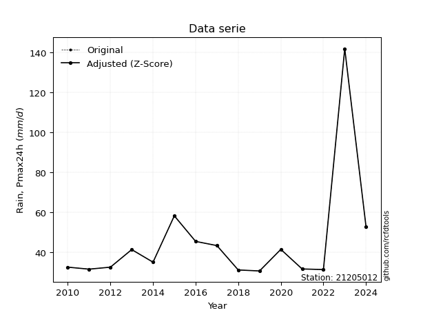</img>

</div>


> The initial value (value_initial) correspond to the initial obtained or null completed value, and value (value) is adjusted only when the initial value is outside the valid range (outlier) definite through the Z-Score value. If Z-Score is active, values out of range or outliers are replaced with the station mean value. A Z-Score (or standard score) measures how many standard deviations a data point is from the mean of a dataset, indicating its relative position; positive scores mean above the mean, negative mean below, and a score of zero is exactly at the mean, allowing for comparison of values from different distributions. It´s calculated using the formula $z=(x–μ)/σ$, where $x$ is the data point, $μ$ is the mean, and $σ$ is the standard deviation, helping identify outliers and understand probability.
>
> <sub>**Note**: In this study, "completing" (filling gaps in) and "extending" (forecasting or lengthening the historical record) rainfall data series are avoided for certain critical analyses because they introduce artificial bias and uncertainty, which can distort the statistics of rare events (extremes), alter day-to-day variability, and compromise the integrity and homogeneity of the original data. Some reasons against Completing/Extending rainfall data are: **Distortion of Extremes and Variability**: The primary issue is that most gap-filling or extension methods rely on averaging or regression with nearby stations, which inherently smooths the data. Rainfall is highly variable in space and time, with a large percentage of zero values and occasional large storms. Infilling methods often underestimate the highest values and overestimate the lowest (zero) values, which severely distorts analyses focused on flood frequency, drought severity, and intensity-duration-frequency (IDF) curves, **Loss of Data Homogeneity**: Infilled or extended data are synthetic estimates, not actual measurements. Combining these estimates with observed data can violate the assumption of data homogeneity, which requires that the data properties do not change over time. Inhomogeneity can lead to incorrect conclusions about long-term trends or changes in climate patterns, **Propagation of Errors**: Errors and biases from the original data (e.g., wind-induced undercatch, instrument errors, site changes) or the data used for imputation can propagate through the analysis, leading to unreliable hydrological models and inaccurate predictions, **Compromised Statistical Integrity**: For statistical analyses, especially those involving the frequency of events, using artificial data can introduce time bias or autocorrelation that doesn´t exist in reality, making it difficult to assess the true probability of events, **Difficulty in Validation**: It is difficult to accurately validate the quality of filled or extended data, especially for past periods where ground-truth measurements are unavailable. The reliability of imputation techniques heavily depends on the density of the surrounding station network and the complexity of the local topography.</sub>


### 4. Active continuous probability distributions from SciPy (80 of 104 available)

A Probability Density Function (PDF) describes the relative likelihood of a continuous random variable falling within a specific range, where the total area under its curve equals 1, and the area over any interval gives the actual probability for that range. Unlike discrete probabilities (like rolling a die), a PDF shows density, not direct probability for a single point (which is zero), with higher points indicating higher likelihood, often visualized as a bell curve for normal distributions.

A log of a probability density function (log-PDF) is simply the logarithm of the PDF´s value, denoted as $log(f(x))$, useful for converting multiplication of probabilities into addition, improving numerical stability with tiny numbers, and connecting to information theory concepts like entropy. Instead of dealing with very small probabilities (e.g., 0.000001), log-PDFs use negative numbers (e.g., $log(0.00001) ≈ -11.51$ that are easier for computers to handle, preventing underflow errors and simplifying complex calculations. In this study, each active probability distribution from SciPy is also evaluated in the $log$ form.

[scipy.stats](https://docs.scipy.org/doc/scipy/reference/stats.html) is a Python´s powerful submodule within the SciPy library for comprehensive statistical analysis, offering over 130 probability distributions (like Normal, Poisson, etc.), functions for descriptive stats (mean, variance), hypothesis testing (t-tests, chi-square), random variable generation, and statistical tests, making it essential for data science, modeling, and research. It provides tools to explore, model, and draw conclusions from data efficiently, working seamlessly with [NumPy](https://numpy.org/).

<div align="center">

|   id | p_dist           |   n_parameter | fit_method   | label                                                                       | active   | ref                                                                                                      |
|-----:|:-----------------|--------------:|:-------------|:----------------------------------------------------------------------------|:---------|:---------------------------------------------------------------------------------------------------------|
|    0 | alpha            |             3 | MLE          | Alpha                                                                       | True     | [:mortar_board:](https://docs.scipy.org/doc/scipy/reference/generated/scipy.stats.alpha.html)            |
|    1 | anglit           |             2 | MM           | Anglit                                                                      | True     | [:mortar_board:](https://docs.scipy.org/doc/scipy/reference/generated/scipy.stats.anglit.html)           |
|    2 | arcsine          |             2 | MM           | Arcsine                                                                     | True     | [:mortar_board:](https://docs.scipy.org/doc/scipy/reference/generated/scipy.stats.arcsine.html)          |
|    3 | argus            |             3 | MLE          | Argus                                                                       | True     | [:mortar_board:](https://docs.scipy.org/doc/scipy/reference/generated/scipy.stats.argus.html)            |
|    4 | beta             |             4 | MLE          | Beta                                                                        | True     | [:mortar_board:](https://docs.scipy.org/doc/scipy/reference/generated/scipy.stats.beta.html)             |
|    5 | betaprime        |             4 | MLE          | Beta prime                                                                  | True     | [:mortar_board:](https://docs.scipy.org/doc/scipy/reference/generated/scipy.stats.betaprime.html)        |
|    6 | bradford         |             3 | MLE          | Bradford                                                                    | True     | [:mortar_board:](https://docs.scipy.org/doc/scipy/reference/generated/scipy.stats.bradford.html)         |
|    7 | burr             |             4 | MLE          | Burr (Type III)                                                             | True     | [:mortar_board:](https://docs.scipy.org/doc/scipy/reference/generated/scipy.stats.burr.html)             |
|    8 | burr12           |             4 | MLE          | Burr (Type III) 12                                                          | True     | [:mortar_board:](https://docs.scipy.org/doc/scipy/reference/generated/scipy.stats.burr12.html)           |
|    9 | cosine           |             2 | MLE          | Cosine                                                                      | True     | [:mortar_board:](https://docs.scipy.org/doc/scipy/reference/generated/scipy.stats.cosine.html)           |
|   10 | crystalball      |             4 | MLE          | Crystalball                                                                 | True     | [:mortar_board:](https://docs.scipy.org/doc/scipy/reference/generated/scipy.stats.crystalball.html)      |
|   11 | dgamma           |             3 | MLE          | Double gamma                                                                | True     | [:mortar_board:](https://docs.scipy.org/doc/scipy/reference/generated/scipy.stats.dgamma.html)           |
|   12 | dweibull         |             3 | MLE          | Double Weibull                                                              | True     | [:mortar_board:](https://docs.scipy.org/doc/scipy/reference/generated/scipy.stats.dweibull.html)         |
|   13 | erlang           |             3 | MLE          | Erlang                                                                      | True     | [:mortar_board:](https://docs.scipy.org/doc/scipy/reference/generated/scipy.stats.erlang.html)           |
|   14 | exponnorm        |             3 | MLE          | Exponentially modified Normal                                               | True     | [:mortar_board:](https://docs.scipy.org/doc/scipy/reference/generated/scipy.stats.exponnorm.html)        |
|   15 | exponpow         |             3 | MLE          | Exponential power                                                           | True     | [:mortar_board:](https://docs.scipy.org/doc/scipy/reference/generated/scipy.stats.exponpow.html)         |
|   16 | exponweib        |             4 | MLE          | Exponentiated Weibull                                                       | True     | [:mortar_board:](https://docs.scipy.org/doc/scipy/reference/generated/scipy.stats.exponweib.html)        |
|   17 | f                |             4 | MLE          | F                                                                           | True     | [:mortar_board:](https://docs.scipy.org/doc/scipy/reference/generated/scipy.stats.f.html)                |
|   18 | fatiguelife      |             3 | MLE          | Fatigue-life (Birnbaum-Saunders)                                            | True     | [:mortar_board:](https://docs.scipy.org/doc/scipy/reference/generated/scipy.stats.fatiguelife.html)      |
|   19 | foldnorm         |             3 | MM           | Fold Normal                                                                 | True     | [:mortar_board:](https://docs.scipy.org/doc/scipy/reference/generated/scipy.stats.foldnorm.html)         |
|   20 | gamma            |             3 | MLE          | Gamma                                                                       | True     | [:mortar_board:](https://docs.scipy.org/doc/scipy/reference/generated/scipy.stats.gamma.html)            |
|   21 | gausshyper       |             6 | MLE          | Gauss hypergeometric                                                        | True     | [:mortar_board:](https://docs.scipy.org/doc/scipy/reference/generated/scipy.stats.gausshyper.html)       |
|   22 | genexpon         |             5 | MLE          | Generalized exponential                                                     | True     | [:mortar_board:](https://docs.scipy.org/doc/scipy/reference/generated/scipy.stats.genexpon.html)         |
|   23 | genextreme       |             3 | MLE          | Generalized exponential                                                     | True     | [:mortar_board:](https://docs.scipy.org/doc/scipy/reference/generated/scipy.stats.genextreme.html)       |
|   24 | gengamma         |             4 | MLE          | Generalized gamma                                                           | True     | [:mortar_board:](https://docs.scipy.org/doc/scipy/reference/generated/scipy.stats.gengamma.html)         |
|   25 | genhalflogistic  |             3 | MLE          | Generalized half-logistic                                                   | True     | [:mortar_board:](https://docs.scipy.org/doc/scipy/reference/generated/scipy.stats.genhalflogistic.html)  |
|   26 | genlogistic      |             3 | MLE          | Generalized logistic                                                        | True     | [:mortar_board:](https://docs.scipy.org/doc/scipy/reference/generated/scipy.stats.genlogistic.html)      |
|   27 | gennorm          |             3 | MLE          | Generalized Normal                                                          | True     | [:mortar_board:](https://docs.scipy.org/doc/scipy/reference/generated/scipy.stats.gennorm.html)          |
|   28 | genpareto        |             3 | MLE          | Generalized Pareto                                                          | True     | [:mortar_board:](https://docs.scipy.org/doc/scipy/reference/generated/scipy.stats.genpareto.html)        |
|   29 | gompertz         |             3 | MLE          | Gompertz (or truncated Gumbel)                                              | True     | [:mortar_board:](https://docs.scipy.org/doc/scipy/reference/generated/scipy.stats.gompertz.html)         |
|   30 | gumbel_l         |             2 | MM           | Gumbel Left Skew                                                            | True     | [:mortar_board:](https://docs.scipy.org/doc/scipy/reference/generated/scipy.stats.gumbel_l.html)         |
|   31 | gumbel_r         |             2 | MM           | Gumbel Right Skew                                                           | True     | [:mortar_board:](https://docs.scipy.org/doc/scipy/reference/generated/scipy.stats.gumbel_r.html)         |
|   32 | halfgennorm      |             3 | MLE          | Upper half of a generalized normal                                          | True     | [:mortar_board:](https://docs.scipy.org/doc/scipy/reference/generated/scipy.stats.halfgennorm.html)      |
|   33 | halflogistic     |             2 | MM           | Half-logistic                                                               | True     | [:mortar_board:](https://docs.scipy.org/doc/scipy/reference/generated/scipy.stats.halflogistic.html)     |
|   34 | halfnorm         |             2 | MM           | Half Normal                                                                 | True     | [:mortar_board:](https://docs.scipy.org/doc/scipy/reference/generated/scipy.stats.halfnorm.html)         |
|   35 | hypsecant        |             2 | MM           | hyperbolic secant                                                           | True     | [:mortar_board:](https://docs.scipy.org/doc/scipy/reference/generated/scipy.stats.hypsecant.html)        |
|   36 | invgamma         |             3 | MLE          | Inverted gamma                                                              | True     | [:mortar_board:](https://docs.scipy.org/doc/scipy/reference/generated/scipy.stats.invgamma.html)         |
|   37 | invgauss         |             3 | MLE          | Inverse Gaussian                                                            | True     | [:mortar_board:](https://docs.scipy.org/doc/scipy/reference/generated/scipy.stats.invgauss.html)         |
|   38 | invweibull       |             3 | MLE          | Inverted Weibull                                                            | True     | [:mortar_board:](https://docs.scipy.org/doc/scipy/reference/generated/scipy.stats.invweibull.html)       |
|   39 | johnsonsb        |             4 | MLE          | Johnson SB                                                                  | True     | [:mortar_board:](https://docs.scipy.org/doc/scipy/reference/generated/scipy.stats.johnsonsb.html)        |
|   40 | johnsonsu        |             4 | MLE          | Johnson Su                                                                  | True     | [:mortar_board:](https://docs.scipy.org/doc/scipy/reference/generated/scipy.stats.johnsonsu.html)        |
|   41 | kappa3           |             3 | MLE          | Kappa 3                                                                     | True     | [:mortar_board:](https://docs.scipy.org/doc/scipy/reference/generated/scipy.stats.kappa3.html)           |
|   42 | kappa4           |             4 | MLE          | Kappa 4                                                                     | True     | [:mortar_board:](https://docs.scipy.org/doc/scipy/reference/generated/scipy.stats.kappa4.html)           |
|   43 | ksone            |             3 | MLE          | Kolmogorov-Smirnov one-sided test statistic distribution                    | True     | [:mortar_board:](https://docs.scipy.org/doc/scipy/reference/generated/scipy.stats.ksone.html)            |
|   44 | kstwobign        |             2 | MLE          | Limiting distribution of scaled Kolmogorov-Smirnov two-sided test statistic | True     | [:mortar_board:](https://docs.scipy.org/doc/scipy/reference/generated/scipy.stats.kstwobign.html)        |
|   45 | laplace          |             2 | MM           | Laplace                                                                     | True     | [:mortar_board:](https://docs.scipy.org/doc/scipy/reference/generated/scipy.stats.laplace.html)          |
|   46 | levy_l           |             2 | MLE          | Left-skewed Levy                                                            | True     | [:mortar_board:](https://docs.scipy.org/doc/scipy/reference/generated/scipy.stats.levy_l.html)           |
|   47 | loggamma         |             3 | MLE          | Log gamma                                                                   | True     | [:mortar_board:](https://docs.scipy.org/doc/scipy/reference/generated/scipy.stats.loggamma.html)         |
|   48 | logistic         |             2 | MM           | Logistic (or Sech-squared)                                                  | True     | [:mortar_board:](https://docs.scipy.org/doc/scipy/reference/generated/scipy.stats.logistic.html)         |
|   49 | loglaplace       |             3 | MLE          | Log-Laplace                                                                 | True     | [:mortar_board:](https://docs.scipy.org/doc/scipy/reference/generated/scipy.stats.loglaplace.html)       |
|   50 | lomax            |             3 | MLE          | Lomax (Pareto of the second kind)                                           | True     | [:mortar_board:](https://docs.scipy.org/doc/scipy/reference/generated/scipy.stats.lomax.html)            |
|   51 | maxwell          |             2 | MM           | Maxwell                                                                     | True     | [:mortar_board:](https://docs.scipy.org/doc/scipy/reference/generated/scipy.stats.maxwell.html)          |
|   52 | mielke           |             4 | MLE          | Mielke Beta-Kappa / Dagum                                                   | True     | [:mortar_board:](https://docs.scipy.org/doc/scipy/reference/generated/scipy.stats.mielke.html)           |
|   53 | moyal            |             2 | MM           | Moyal                                                                       | True     | [:mortar_board:](https://docs.scipy.org/doc/scipy/reference/generated/scipy.stats.moyal.html)            |
|   54 | nakagami         |             3 | MLE          | Nakagami                                                                    | True     | [:mortar_board:](https://docs.scipy.org/doc/scipy/reference/generated/scipy.stats.nakagami.html)         |
|   55 | ncf              |             5 | MLE          | Non-central F distribution                                                  | True     | [:mortar_board:](https://docs.scipy.org/doc/scipy/reference/generated/scipy.stats.ncf.html)              |
|   56 | nct              |             4 | MLE          | Non-central Student’s t                                                     | True     | [:mortar_board:](https://docs.scipy.org/doc/scipy/reference/generated/scipy.stats.nct.html)              |
|   57 | norm             |             2 | MM           | Normal                                                                      | True     | [:mortar_board:](https://docs.scipy.org/doc/scipy/reference/generated/scipy.stats.norm.html)             |
|   58 | pearson3         |             3 | MM           | Pearson type III                                                            | True     | [:mortar_board:](https://docs.scipy.org/doc/scipy/reference/generated/scipy.stats.pearson3.html)         |
|   59 | powerlaw         |             3 | MLE          | Power-function                                                              | True     | [:mortar_board:](https://docs.scipy.org/doc/scipy/reference/generated/scipy.stats.powerlaw.html)         |
|   60 | rayleigh         |             2 | MM           | Rayleigh                                                                    | True     | [:mortar_board:](https://docs.scipy.org/doc/scipy/reference/generated/scipy.stats.rayleigh.html)         |
|   61 | rdist            |             3 | MLE          | R-distributed (symmetric beta)                                              | True     | [:mortar_board:](https://docs.scipy.org/doc/scipy/reference/generated/scipy.stats.rdist.html)            |
|   62 | rice             |             3 | MLE          | Rice                                                                        | True     | [:mortar_board:](https://docs.scipy.org/doc/scipy/reference/generated/scipy.stats.rice.html)             |
|   63 | semicircular     |             2 | MM           | Semicircular                                                                | True     | [:mortar_board:](https://docs.scipy.org/doc/scipy/reference/generated/scipy.stats.semicircular.html)     |
|   64 | skewnorm         |             3 | MLE          | Skew normal                                                                 | True     | [:mortar_board:](https://docs.scipy.org/doc/scipy/reference/generated/scipy.stats.skewnorm.html)         |
|   65 | t                |             3 | MLE          | Student’s t                                                                 | True     | [:mortar_board:](https://docs.scipy.org/doc/scipy/reference/generated/scipy.stats.t.html)                |
|   66 | trapezoid        |             4 | MLE          | Trapezoid                                                                   | True     | [:mortar_board:](https://docs.scipy.org/doc/scipy/reference/generated/scipy.stats.trapezoid.html)        |
|   67 | triang           |             3 | MLE          | Triangular                                                                  | True     | [:mortar_board:](https://docs.scipy.org/doc/scipy/reference/generated/scipy.stats.triang.html)           |
|   68 | truncexpon       |             3 | MLE          | Truncated exponential                                                       | True     | [:mortar_board:](https://docs.scipy.org/doc/scipy/reference/generated/scipy.stats.truncexpon.html)       |
|   69 | truncnorm        |             4 | MLE          | Truncated normal                                                            | True     | [:mortar_board:](https://docs.scipy.org/doc/scipy/reference/generated/scipy.stats.truncnorm.html)        |
|   70 | truncpareto      |             4 | MLE          | Upper truncated Pareto                                                      | True     | [:mortar_board:](https://docs.scipy.org/doc/scipy/reference/generated/scipy.stats.truncpareto.html)      |
|   71 | truncweibull_min |             5 | MLE          | Doubly truncated Weibull minimum                                            | True     | [:mortar_board:](https://docs.scipy.org/doc/scipy/reference/generated/scipy.stats.truncweibull_min.html) |
|   72 | tukeylambda      |             3 | MLE          | Tukey-Lamdba                                                                | True     | [:mortar_board:](https://docs.scipy.org/doc/scipy/reference/generated/scipy.stats.tukeylambda.html)      |
|   73 | uniform          |             2 | MLE          | Uniform                                                                     | True     | [:mortar_board:](https://docs.scipy.org/doc/scipy/reference/generated/scipy.stats.uniform.html)          |
|   74 | vonmises         |             3 | MLE          | Von Mises                                                                   | True     | [:mortar_board:](https://docs.scipy.org/doc/scipy/reference/generated/scipy.stats.vonmises.html)         |
|   75 | vonmises_line    |             3 | MLE          | Von Mises line                                                              | True     | [:mortar_board:](https://docs.scipy.org/doc/scipy/reference/generated/scipy.stats.vonmises_line.html)    |
|   76 | wald             |             2 | MM           | Wald                                                                        | True     | [:mortar_board:](https://docs.scipy.org/doc/scipy/reference/generated/scipy.stats.wald.html)             |
|   77 | weibull_max      |             3 | MLE          | Weibull maximum                                                             | True     | [:mortar_board:](https://docs.scipy.org/doc/scipy/reference/generated/scipy.stats.weibull_max.html)      |
|   78 | weibull_min      |             3 | MLE          | Weibull minimum                                                             | True     | [:mortar_board:](https://docs.scipy.org/doc/scipy/reference/generated/scipy.stats.weibull_min.html)      |
|   79 | wrapcauchy       |             3 | MLE          | Wrapped  Cauchy                                                             | True     | [:mortar_board:](https://docs.scipy.org/doc/scipy/reference/generated/scipy.stats.wrapcauchy.html)       |

</div>

> **n_parameter:** # arguments & localization & scale.
>
> **Fit methods:** (MLE) maximum likelihood, (MM) L-moments.
>
>**Inactive** (With the only purpose of prevent loops, zero divisions, infinite values, over high estimated values or horizontal trending for recurrence intervals estimations, the follow distributions were disabled.)**:** lognorm, norminvgauss, powernorm, powerlognorm, cauchy, halfcauchy, foldcauchy, skewcauchy, chi2, expon, fisk, genhyperbolic, geninvgauss, gibrat, kstwo, laplace_asymmetric, levy, levy_stable, ncx2, pareto, rel_breitwigner, recipinvgauss, studentized_range, loguniform, 


## B. Probability (PDF) vs. Empirical (EDF) distributions functions

A continuous probability distribution (CPD) describes probabilities for variables that can take any value within a range (like rain any time), unlike discrete variables with specific outcomes (like temperature). It uses a Probability Density Function (PDF), a curve where the total area under it equals 1, and the probability of the variable falling within an interval (a to b) is found by calculating the area under the curve between those points. A key feature is that the probability of hitting any single exact value is zero, so probabilities are always expressed for ranges, e.g., $P(a ≤ X ≤ b)$.

<div align="center">

Distributions parameters from station values
|     |   station | p_dist              |   n |               loc |            scale | shape                  | shape1                | shape2              | shape3             |
|----:|----------:|:--------------------|----:|------------------:|-----------------:|:-----------------------|:----------------------|:--------------------|:-------------------|
|   0 |  21205012 | alpha               |  16 |      29.4771      |      2.6366      | 1.2498735914377247e-07 |                       |                     |                    |
|   1 |  21205012 | anglit              |  16 |      38.4727      |     24.4379      |                        |                       |                     |                    |
|   2 |  21205012 | arcsine             |  16 |      26.6587      |     23.6279      |                        |                       |                     |                    |
|   3 |  21205012 | argus               |  16 |      18.1303      |     40.9592      | 5.195417757813694e-06  |                       |                     |                    |
|   4 |  21205012 | beta                |  16 |      30.7         |     30.401       | 0.5340231344359064     | 1.3600376477916456    |                     |                    |
|   5 |  21205012 | betaprime           |  16 |       5.82781     |      0.762744    | 729.1324882277586      | 17.856511434868004    |                     |                    |
|   6 |  21205012 | bradford            |  16 |      30.4164      |     27.8836      | 10.383996164140619     |                       |                     |                    |
|   7 |  21205012 | burr                |  16 |      30.0846      |      0.106818    | 0.990717945034008      | 22.793303919647656    |                     |                    |
|   8 |  21205012 | burr12              |  16 |      -7.15939     |     37.7843      | 1291.6011164194508     | 0.004468408643987507  |                     |                    |
|   9 |  21205012 | cosine              |  16 |      39.8803      |      7.39336     |                        |                       |                     |                    |
|  10 |  21205012 | crystalball         |  16 |      38.4727      |      8.35371     | 4222.573060542118      | 59.14506920883914     |                     |                    |
|  11 |  21205012 | dgamma              |  16 |      34.6262      |      4.75689     | 1.4395244546536914     |                       |                     |                    |
|  12 |  21205012 | dweibull            |  16 |      38.5794      |      8.26335     | 1.9217710526697638     |                       |                     |                    |
|  13 |  21205012 | erlang              |  16 |      30.7         |     12.0173      | 0.4993537080865932     |                       |                     |                    |
|  14 |  21205012 | exponnorm           |  16 |      30.6912      |      0.00277406  | 2798.289920510015      |                       |                     |                    |
|  15 |  21205012 | exponpow            |  16 |      30.7         |     22.4506      | 0.5013435672851572     |                       |                     |                    |
|  16 |  21205012 | exponweib           |  16 |      30.7         |      9.35148     | 0.7562207644089671     | 0.8845798316301516    |                     |                    |
|  17 |  21205012 | f                   |  16 |      30.2227      |      2.15867     | 3416.8607690325134     | 1.7153360738084404    |                     |                    |
|  18 |  21205012 | fatiguelife         |  16 |      30.4969      |      3.14056     | 1.7164009749570666     |                       |                     |                    |
|  19 |  21205012 | foldnorm            |  16 |      27.2777      |     12.4026      | 0.5180742371213192     |                       |                     |                    |
|  20 |  21205012 | gamma               |  16 |      30.7         |      6.20594     | 0.8024207541721063     |                       |                     |                    |
|  21 |  21205012 | gausshyper          |  16 |      30.7         |     28.5532      | 0.4477820879609339     | 0.7689169063000487    | 1.4227143135268516  | 0.9052818097847661 |
|  22 |  21205012 | genexpon            |  16 |      30.7         |     14.4579      | 1.8601009142137173     | 2.821740364005706e-10 | 0.9788308105958002  |                    |
|  23 |  21205012 | genextreme          |  16 |      32.309       |      2.4223      | -1.2331879330934492    |                       |                     |                    |
|  24 |  21205012 | gengamma            |  16 |      30.7         |      9.37346     | 0.7534585019062326     | 0.8751696355502664    |                     |                    |
|  25 |  21205012 | genhalflogistic     |  16 |      30.7         |      6.16963     | 7.7173916603586e-08    |                       |                     |                    |
|  26 |  21205012 | genlogistic         |  16 |      -8.25679     |      5.77586     | 1710.3764524775024     |                       |                     |                    |
|  27 |  21205012 | gennorm             |  16 |      32.6         |      1.84594e-07 | 0.12722702115888118    |                       |                     |                    |
|  28 |  21205012 | genpareto           |  16 |       0.0463586   |     80.8996      | -1.3887478610002497    |                       |                     |                    |
|  29 |  21205012 | gompertz            |  16 |      30.7         |      2.131e+09   | 316992284.2848592      |                       |                     |                    |
|  30 |  21205012 | gumbel_l            |  16 |      42.2323      |      6.51336     |                        |                       |                     |                    |
|  31 |  21205012 | gumbel_r            |  16 |      34.713       |      6.51336     |                        |                       |                     |                    |
|  32 |  21205012 | halfgennorm         |  16 |      30.7         |      0.316817    | 0.3707086599664511     |                       |                     |                    |
|  33 |  21205012 | halflogistic        |  16 |      28.5716      |      7.14213     |                        |                       |                     |                    |
|  34 |  21205012 | halfnorm            |  16 |      27.4156      |     13.8579      |                        |                       |                     |                    |
|  35 |  21205012 | hypsecant           |  16 |      38.4727      |      5.31814     |                        |                       |                     |                    |
|  36 |  21205012 | invgamma            |  16 |      30.2231      |      1.67757     | 0.8296160365958852     |                       |                     |                    |
|  37 |  21205012 | invgauss            |  16 |      30.3036      |      2.37154     | 3.4445869017136665     |                       |                     |                    |
|  38 |  21205012 | invweibull          |  16 |      30.3448      |      1.96433     | 0.8108700179183779     |                       |                     |                    |
|  39 |  21205012 | johnsonsb           |  16 |      30.7         |     27.6004      | 0.47892017776207174    | 0.11237001849863265   |                     |                    |
|  40 |  21205012 | johnsonsu           |  16 |      30.6222      |      0.00282915  | -4.7101567579607       | 0.6124787320451879    |                     |                    |
|  41 |  21205012 | kappa3              |  16 |      30.7         |     27.5859      | 5426.700473776751      |                       |                     |                    |
|  42 |  21205012 | kappa4              |  16 |      27.0801      |     33.4021      | 1.1219285273597115     | 1.0497985289640779    |                     |                    |
|  43 |  21205012 | ksone               |  16 |      27.94        |     33.12        | 1.0                    |                       |                     |                    |
|  44 |  21205012 | kstwobign           |  16 |      14.371       |     27.7339      |                        |                       |                     |                    |
|  45 |  21205012 | laplace             |  16 |      38.4727      |      5.90697     |                        |                       |                     |                    |
|  46 |  21205012 | levy_l              |  16 |      60.3398      |     12.9355      |                        |                       |                     |                    |
|  47 |  21205012 | loggamma            |  16 |   -1980.49        |    287.961       | 1109.3934100314045     |                       |                     |                    |
|  48 |  21205012 | logistic            |  16 |      38.4727      |      4.60564     |                        |                       |                     |                    |
|  49 |  21205012 | loglaplace          |  16 |      -0.0858236   |     32.6858      | 5.738541704341618      |                       |                     |                    |
|  50 |  21205012 | lomax               |  16 |      30.6999      |      8.74641     | 1.9398602982489455     |                       |                     |                    |
|  51 |  21205012 | maxwell             |  16 |      18.6779      |     12.4045      |                        |                       |                     |                    |
|  52 |  21205012 | mielke              |  16 |      22.8025      |      1.47637     | 829.143375465565       | 2.870874245500401     |                     |                    |
|  53 |  21205012 | moyal               |  16 |      33.6955      |      3.76049     |                        |                       |                     |                    |
|  54 |  21205012 | nakagami            |  16 |      30.7         |     17.3566      | 0.21325326069736583    |                       |                     |                    |
|  55 |  21205012 | ncf                 |  16 |      -0.788573    |     38.43        | 88.31496294867361      | 138.93539084500037    | 0.13137078469702007 |                    |
|  56 |  21205012 | nct                 |  16 |      -0.167292    |      0.277454    | 14.01864992632919      | 131.31118652832163    |                     |                    |
|  57 |  21205012 | norm                |  16 |      38.4727      |      8.35371     |                        |                       |                     |                    |
|  58 |  21205012 | pearson3            |  16 |      38.4727      |      8.35369     | 0.9445529150023321     |                       |                     |                    |
|  59 |  21205012 | powerlaw            |  16 |      30.7         |     27.6         | 0.24092563114021495    |                       |                     |                    |
|  60 |  21205012 | rayleigh            |  16 |      22.4915      |     12.7511      |                        |                       |                     |                    |
|  61 |  21205012 | rdist               |  16 |      38.2709      |      7.57093     | 1.2333166668952231     |                       |                     |                    |
|  62 |  21205012 | rice                |  16 |      25.3347      |     11.0088      | 0.0009034439865921616  |                       |                     |                    |
|  63 |  21205012 | semicircular        |  16 |      38.4727      |     16.7075      |                        |                       |                     |                    |
|  64 |  21205012 | skewnorm            |  16 |      30.7         |     11.4106      | 20720246.39563042      |                       |                     |                    |
|  65 |  21205012 | t                   |  16 |      38.4726      |      8.35366     | 149969.54003275506     |                       |                     |                    |
|  66 |  21205012 | trapezoid           |  16 |      27.94        |     33.12        | 1.0                    | 1.0                   |                     |                    |
|  67 |  21205012 | triang              |  16 |      30.7         |     30.5396      | 3.27545654351227e-10   |                       |                     |                    |
|  68 |  21205012 | truncexpon          |  16 |      30.6955      |     23.9697      | 1.1516429800906356     |                       |                     |                    |
|  69 |  21205012 | truncnorm           |  16 |   -7867.73        |    257.28        | 30.699803233212442     | 60.586198739528086    |                     |                    |
|  70 |  21205012 | truncpareto         |  16 |      20.8882      |      9.81182     | 1.3197806128761105     | 3.8129346052875737    |                     |                    |
|  71 |  21205012 | truncweibull_min    |  16 |      30.6443      |     45.963       | 0.7262021537470504     | 0.0012060992418722934 | 0.6016937264936129  |                    |
|  72 |  21205012 | tukeylambda         |  16 |      37.9923      |      9.81846     | 1.307792677377228      |                       |                     |                    |
|  73 |  21205012 | uniform             |  16 |      30.7         |     27.6         |                        |                       |                     |                    |
|  74 |  21205012 | vonmises            |  16 |       0.42661     |      1           | 0.6715664241384692     |                       |                     |                    |
|  75 |  21205012 | vonmises_line       |  16 |      37.0017      |      6.77945     | 1.1176278035831875     |                       |                     |                    |
|  76 |  21205012 | wald                |  16 |      30.1189      |      8.35371     |                        |                       |                     |                    |
|  77 |  21205012 | weibull_max         |  16 |      58.3         |      1.45714     | 0.3368906594165705     |                       |                     |                    |
|  78 |  21205012 | weibull_min         |  16 |      30.7         |      8.95193     | 0.5995743827046112     |                       |                     |                    |
|  79 |  21205012 | wrapcauchy          |  16 |      30.7         |      4.39268     | 0.588912029100447      |                       |                     |                    |
|  80 |  21205012 | logalpha            |  16 |       1.96576     |     14.9356      | 9.112794173995699      |                       |                     |                    |
|  81 |  21205012 | loganglit           |  16 |       3.6284      |      0.594349    |                        |                       |                     |                    |
|  82 |  21205012 | logarcsine          |  16 |       3.34108     |      0.574633    |                        |                       |                     |                    |
|  83 |  21205012 | logargus            |  16 |       3.15635     |      0.928208    | 6.005426783914323e-05  |                       |                     |                    |
|  84 |  21205012 | logbeta             |  16 |       3.42426     |      0.674436    | 0.47530905905260723    | 0.9812224255981421    |                     |                    |
|  85 |  21205012 | logbetaprime        |  16 |       2.53362     |    108.243       | 32.93346208569334      | 3254.8719367670433    |                     |                    |
|  86 |  21205012 | logbradford         |  16 |       3.42313     |      0.642471    | 25.879681789688938     |                       |                     |                    |
|  87 |  21205012 | logburr             |  16 |       3.01493     |      0.0798579   | 3.967098075868554      | 1461.1486743168293    |                     |                    |
|  88 |  21205012 | logburr12           |  16 | -473158           | 473162           | 119242458.68491095     | 0.019087668781360062  |                     |                    |
|  89 |  21205012 | logcosine           |  16 |       3.65359     |      0.172289    |                        |                       |                     |                    |
|  90 |  21205012 | logcrystalball      |  16 |       3.6284      |      0.203168    | 419.47857028302224     | 841.6557829253431     |                     |                    |
|  91 |  21205012 | logdgamma           |  16 |       3.63214     |      0.033762    | 5.446617462593945      |                       |                     |                    |
|  92 |  21205012 | logdweibull         |  16 |       3.64318     |      0.209629    | 2.3072715536095076     |                       |                     |                    |
|  93 |  21205012 | logerlang           |  16 |       3.42426     |      0.266281    | 0.5676403635314902     |                       |                     |                    |
|  94 |  21205012 | logexponnorm        |  16 |       3.42401     |      8.35346e-05 | 2426.5520115903946     |                       |                     |                    |
|  95 |  21205012 | logexponpow         |  16 |       3.42426     |      0.937411    | 0.3603527692970004     |                       |                     |                    |
|  96 |  21205012 | logexponweib        |  16 |       3.42426     |      1.30844     | 0.3357045892289713     | 1.0569227778167236    |                     |                    |
|  97 |  21205012 | logf                |  16 |       3.40616     |      0.0701383   | 554.7818699766266      | 1.9633889925661456    |                     |                    |
|  98 |  21205012 | logfatiguelife      |  16 |       3.41686     |      0.0944269   | 1.5393191663796055     |                       |                     |                    |
|  99 |  21205012 | logfoldnorm         |  16 |       3.33186     |      0.254124    | 1.0004034505000479     |                       |                     |                    |
| 100 |  21205012 | loggamma            |  16 |       3.42426     |      0.219861    | 0.7649517702033739     |                       |                     |                    |
| 101 |  21205012 | loggausshyper       |  16 |       3.42426     |      0.662306    | 0.8107215762934754     | 0.9611518930645071    | 1.3824595475824606  | 0.8519587004758369 |
| 102 |  21205012 | loggenexpon         |  16 |       3.42426     |      0.412684    | 2.021641527136319      | 4.729471597567987e-09 | 1.8860654399196146  |                    |
| 103 |  21205012 | loggenextreme       |  16 |       3.47526     |      0.0719401   | -1.0947555244655476    |                       |                     |                    |
| 104 |  21205012 | loggengamma         |  16 |       3.42426     |      1.13094     | 0.37189523878088526    | 1.0449443266497616    |                     |                    |
| 105 |  21205012 | loggenhalflogistic  |  16 |       3.35223     |      0.72703     | 1.0191384856380754     |                       |                     |                    |
| 106 |  21205012 | loggenlogistic      |  16 |       2.44716     |      0.148064    | 1549.7275483268822     |                       |                     |                    |
| 107 |  21205012 | loggennorm          |  16 |       3.48431     |      0.162454    | 0.9251032962947561     |                       |                     |                    |
| 108 |  21205012 | loggenpareto        |  16 |      -8.9695e-05  |      6.42021     | -1.5791184864392935    |                       |                     |                    |
| 109 |  21205012 | loggompertz         |  16 |       3.42426     |      0.412293    | 1.0535931581157105     |                       |                     |                    |
| 110 |  21205012 | loggumbel_l         |  16 |       3.71983     |      0.15841     |                        |                       |                     |                    |
| 111 |  21205012 | loggumbel_r         |  16 |       3.53696     |      0.15841     |                        |                       |                     |                    |
| 112 |  21205012 | loghalfgennorm      |  16 |       3.42426     |      0.0247855   | 0.4570952984195895     |                       |                     |                    |
| 113 |  21205012 | loghalflogistic     |  16 |       3.3876      |      0.173702    |                        |                       |                     |                    |
| 114 |  21205012 | loghalfnorm         |  16 |       3.35948     |      0.337035    |                        |                       |                     |                    |
| 115 |  21205012 | loghypsecant        |  16 |       3.6284      |      0.129341    |                        |                       |                     |                    |
| 116 |  21205012 | loginvgamma         |  16 |      -7.57683     |  34853.2         | 3111.744057634952      |                       |                     |                    |
| 117 |  21205012 | loginvgauss         |  16 |       3.41044     |      0.0843585   | 2.5837562886282393     |                       |                     |                    |
| 118 |  21205012 | loginvweibull       |  16 |       3.40955     |      0.0657141   | 0.9134439075765466     |                       |                     |                    |
| 119 |  21205012 | logjohnsonsb        |  16 |       3.42426     |      0.64134     | -0.364078428739213     | 0.15317048090885207   |                     |                    |
| 120 |  21205012 | logjohnsonsu        |  16 |       3.42075     |      0.000195984 | -4.634938262907715     | 0.6748689647607866    |                     |                    |
| 121 |  21205012 | logkappa3           |  16 |       3.39241     |      0.463024    | 2.2872873018827935     |                       |                     |                    |
| 122 |  21205012 | logkappa4           |  16 |       3.28523     |      0.663581    | 1.2591344704660632     | 0.8390952493752357    |                     |                    |
| 123 |  21205012 | logksone            |  16 |       3.36013     |      0.769607    | 1.0                    |                       |                     |                    |
| 124 |  21205012 | logkstwobign        |  16 |       3.02226     |      0.695021    |                        |                       |                     |                    |
| 125 |  21205012 | loglaplace          |  16 |       3.6284      |      0.143662    |                        |                       |                     |                    |
| 126 |  21205012 | loglevy_l           |  16 |       4.10867     |      0.270728    |                        |                       |                     |                    |
| 127 |  21205012 | logloggamma         |  16 |     -54.0072      |      7.9077      | 1463.7004966881873     |                       |                     |                    |
| 128 |  21205012 | loglogistic         |  16 |       3.6284      |      0.112013    |                        |                       |                     |                    |
| 129 |  21205012 | logloglaplace       |  16 |      -0.205587    |      3.6899      | 22.08334520980106      |                       |                     |                    |
| 130 |  21205012 | loglomax            |  16 |       3.42426     |      1.10823     | 6.316660859866923      |                       |                     |                    |
| 131 |  21205012 | logmaxwell          |  16 |       3.14697     |      0.301688    |                        |                       |                     |                    |
| 132 |  21205012 | logmielke           |  16 |       1.0935      |      1.69336     | 10476.912457853312     | 17.60644277709212     |                     |                    |
| 133 |  21205012 | logmoyal            |  16 |       3.51221     |      0.0914579   |                        |                       |                     |                    |
| 134 |  21205012 | lognakagami         |  16 |       3.42426     |      0.251633    | 0.18143014893105736    |                       |                     |                    |
| 135 |  21205012 | logncf              |  16 |      -3.62044     |      7.24434     | 554.5219865221146      | 664.511278681922      | 0.08150115436726979 |                    |
| 136 |  21205012 | lognct              |  16 |      -0.750001    |      0.0422138   | 252.49941906340655     | 103.40969809347564    |                     |                    |
| 137 |  21205012 | lognorm             |  16 |       3.6284      |      0.203168    |                        |                       |                     |                    |
| 138 |  21205012 | logpearson3         |  16 |       3.6284      |      0.203168    | 0.6994287260733445     |                       |                     |                    |
| 139 |  21205012 | logpowerlaw         |  16 |       3.42426     |      0.641339    | 0.26079876414855835    |                       |                     |                    |
| 140 |  21205012 | lograyleigh         |  16 |       3.23972     |      0.310116    |                        |                       |                     |                    |
| 141 |  21205012 | logrdist            |  16 |       3.79759     |      0.373327    | 1.0879704030572404     |                       |                     |                    |
| 142 |  21205012 | logrice             |  16 |       3.30043     |      0.272801    | 0.0014041990994309124  |                       |                     |                    |
| 143 |  21205012 | logsemicircular     |  16 |       3.6284      |      0.406374    |                        |                       |                     |                    |
| 144 |  21205012 | logskewnorm         |  16 |       3.42426     |      0.288017    | 61335534.84620336      |                       |                     |                    |
| 145 |  21205012 | logt                |  16 |       3.6284      |      0.203168    | 2103084643.756135      |                       |                     |                    |
| 146 |  21205012 | logtrapezoid        |  16 |       3.36013     |      0.769607    | 1.0                    | 1.0                   |                     |                    |
| 147 |  21205012 | logtriang           |  16 |       3.06673     |      0.99887     | 0.999999995620348      |                       |                     |                    |
| 148 |  21205012 | logtruncexpon       |  16 |       3.42426     |      0.617848    | 1.0380326604911065     |                       |                     |                    |
| 149 |  21205012 | logtruncnorm        |  16 |      -0.951975    |      1.22604     | 3.569395734444109      | 4.092492269857086     |                     |                    |
| 150 |  21205012 | logtruncpareto      |  16 |      -2.09715e+06 |      2.09715e+06 | 10273335.441811386     | 1.0000003058146196    |                     |                    |
| 151 |  21205012 | logtruncweibull_min |  16 |       3.42369     |      0.614401    | 0.532025501284169      | 0.0009250407898418063 | 1.044769898252122   |                    |
| 152 |  21205012 | logtukeylambda      |  16 |       3.74493     |      0.358537    | 1.1180879949509093     |                       |                     |                    |
| 153 |  21205012 | loguniform          |  16 |       3.42426     |      0.641339    |                        |                       |                     |                    |
| 154 |  21205012 | logvonmises         |  16 |      -2.65578     |      1           | 24.66984914242502      |                       |                     |                    |
| 155 |  21205012 | logvonmises_line    |  16 |       3.74672     |      0.102641    | 1.6281336674127896e-06 |                       |                     |                    |
| 156 |  21205012 | logwald             |  16 |       3.42523     |      0.203166    |                        |                       |                     |                    |
| 157 |  21205012 | logweibull_max      |  16 |       2.15133e+06 |      2.15133e+06 | 14534483.020550065     |                       |                     |                    |
| 158 |  21205012 | logweibull_min      |  16 |       3.42426     |      0.269276    | 0.7985884965537628     |                       |                     |                    |
| 159 |  21205012 | logwrapcauchy       |  16 |       3.42426     |      0.102072    | 0.5027177124725255     |                       |                     |                    |

</div>

> **loc** (Location parameter): This shifts the distribution along the x-axis. For many common distributions, like the normal (Gaussian) distribution, loc represents the mean $μ$. For others, like the uniform distribution, it might represent the minimum value, or for the beta distribution, the left end of the support interval.
>
> **scale** (Scale parameter): This determines the width or spread of the distribution. For the normal distribution, scale represents the standard deviation $σ$. For a uniform distribution, it defines the length of the interval (from $loc$ to $loc + scale$).
>
> **shape** (Shape parameters): Refers to parameters that define the specific form of a probability distribution, distinct from its location (loc) and scale (scale). These parameters are required arguments for most distribution functions. For example, a normal (Gaussian) distribution is fully defined by its location (mean) and scale (standard deviation), so it has no specific shape parameters beyond loc and scale. However, other distributions have intrinsic properties that need specification, as Gamma distribution that takes a shape parameter, often named $a$ or $alpha$.


### 0. Cumulative distribution values - CDF (160 evaluated)

Cumulative Distribution Function (CDF), denoted as $F$<sub>$X$</sub>$(x)$, is a function that gives the probability that a random variable $X$ will take a value less than or equal to a specific value, $x$ (i.e., $(P(X≥x)$. It essentially "accumulates" probabilities from a given point up to the far right (positive infinity), providing a complete picture of the distribution´s probabilities for both discrete (like rain) and continuous (like temperature) variables, helping to find probabilities over ranges or above certain values. Each station is evaluated separately ordering the $x$ values ascending, calculating the CDF and PDF values for the activated distributions and their logarithmic forms.

<div align="center">

CDF ordered by x ascending and calculating $log(f(x))$ separately
|   id |   Station |   date |       x |   count |    mean |     std |     zscore |   Value_initial |   station |   m |     alpha |   alpha_pdf |   anglit |   anglit_pdf |   arcsine |   arcsine_pdf |    argus |   argus_pdf |        beta |       beta_pdf |   betaprime |   betaprime_pdf |   bradford |   bradford_pdf |      burr |   burr_pdf |    burr12 |   burr12_pdf |   cosine |   cosine_pdf |   crystalball |   crystalball_pdf |   dgamma |   dgamma_pdf |   dweibull |   dweibull_pdf |      erlang |   erlang_pdf |   exponnorm |   exponnorm_pdf |    exponpow |   exponpow_pdf |   exponweib |   exponweib_pdf |         f |      f_pdf |   fatiguelife |   fatiguelife_pdf |   foldnorm |   foldnorm_pdf |       gamma |    gamma_pdf |   gausshyper |   gausshyper_pdf |    genexpon |   genexpon_pdf |   genextreme |   genextreme_pdf |    gengamma |   gengamma_pdf |   genhalflogistic |   genhalflogistic_pdf |   genlogistic |   genlogistic_pdf |   gennorm |   gennorm_pdf |   genpareto |   genpareto_pdf |   gompertz |   gompertz_pdf |   gumbel_l |   gumbel_l_pdf |   gumbel_r |   gumbel_r_pdf |   halfgennorm |   halfgennorm_pdf |   halflogistic |   halflogistic_pdf |   halfnorm |   halfnorm_pdf |   hypsecant |   hypsecant_pdf |   invgamma |   invgamma_pdf |   invgauss |   invgauss_pdf |   invweibull |   invweibull_pdf |   johnsonsb |   johnsonsb_pdf |   johnsonsu |   johnsonsu_pdf |      kappa3 |   kappa3_pdf |      kappa4 |   kappa4_pdf |     ksone |   ksone_pdf |   kstwobign |   kstwobign_pdf |   laplace |   laplace_pdf |   levy_l |   levy_l_pdf |    loggamma |   loggamma_pdf |   logistic |   logistic_pdf |   loglaplace |   loglaplace_pdf |       lomax |   lomax_pdf |   maxwell |   maxwell_pdf |   mielke |   mielke_pdf |    moyal |   moyal_pdf |    nakagami |   nakagami_pdf |      ncf |    ncf_pdf |      nct |    nct_pdf |     norm |   norm_pdf |   pearson3 |   pearson3_pdf |    powerlaw |   powerlaw_pdf |   rayleigh |   rayleigh_pdf |     rdist |     rdist_pdf |     rice |   rice_pdf |   semicircular |   semicircular_pdf |   skewnorm |   skewnorm_pdf |        t |      t_pdf |   trapezoid |   trapezoid_pdf |      triang |   triang_pdf |   truncexpon |   truncexpon_pdf |   truncnorm |   truncnorm_pdf |   truncpareto |   truncpareto_pdf |   truncweibull_min |   truncweibull_min_pdf |   tukeylambda |   tukeylambda_pdf |   uniform |   uniform_pdf |   vonmises |   vonmises_pdf |   vonmises_line |   vonmises_line_pdf |        wald |   wald_pdf |   weibull_max |   weibull_max_pdf |   weibull_min |   weibull_min_pdf |   wrapcauchy |   wrapcauchy_pdf |   logalpha |   logalpha_pdf |   loganglit |   loganglit_pdf |   logarcsine |   logarcsine_pdf |   logargus |   logargus_pdf |     logbeta |   logbeta_pdf |   logbetaprime |   logbetaprime_pdf |   logbradford |   logbradford_pdf |   logburr |   logburr_pdf |   logburr12 |   logburr12_pdf |   logcosine |   logcosine_pdf |   logcrystalball |   logcrystalball_pdf |   logdgamma |   logdgamma_pdf |   logdweibull |   logdweibull_pdf |   logerlang |   logerlang_pdf |   logexponnorm |   logexponnorm_pdf |   logexponpow |   logexponpow_pdf |   logexponweib |   logexponweib_pdf |      logf |   logf_pdf |   logfatiguelife |   logfatiguelife_pdf |   logfoldnorm |   logfoldnorm_pdf |   loggausshyper |   loggausshyper_pdf |   loggenexpon |   loggenexpon_pdf |   loggenextreme |   loggenextreme_pdf |   loggengamma |   loggengamma_pdf |   loggenhalflogistic |   loggenhalflogistic_pdf |   loggenlogistic |   loggenlogistic_pdf |   loggennorm |   loggennorm_pdf |   loggenpareto |   loggenpareto_pdf |   loggompertz |   loggompertz_pdf |   loggumbel_l |   loggumbel_l_pdf |   loggumbel_r |   loggumbel_r_pdf |   loghalfgennorm |   loghalfgennorm_pdf |   loghalflogistic |   loghalflogistic_pdf |   loghalfnorm |   loghalfnorm_pdf |   loghypsecant |   loghypsecant_pdf |   loginvgamma |   loginvgamma_pdf |   loginvgauss |   loginvgauss_pdf |   loginvweibull |   loginvweibull_pdf |   logjohnsonsb |   logjohnsonsb_pdf |   logjohnsonsu |   logjohnsonsu_pdf |   logkappa3 |   logkappa3_pdf |   logkappa4 |   logkappa4_pdf |   logksone |   logksone_pdf |   logkstwobign |   logkstwobign_pdf |   loglevy_l |   loglevy_l_pdf |   logloggamma |   logloggamma_pdf |   loglogistic |   loglogistic_pdf |   logloglaplace |   logloglaplace_pdf |    loglomax |   loglomax_pdf |   logmaxwell |   logmaxwell_pdf |   logmielke |   logmielke_pdf |   logmoyal |   logmoyal_pdf |   lognakagami |   lognakagami_pdf |   logncf |   logncf_pdf |   lognct |   lognct_pdf |   lognorm |   lognorm_pdf |   logpearson3 |   logpearson3_pdf |   logpowerlaw |   logpowerlaw_pdf |   lograyleigh |   lograyleigh_pdf |    logrdist |   logrdist_pdf |   logrice |   logrice_pdf |   logsemicircular |   logsemicircular_pdf |   logskewnorm |   logskewnorm_pdf |     logt |   logt_pdf |   logtrapezoid |   logtrapezoid_pdf |   logtriang |   logtriang_pdf |   logtruncexpon |   logtruncexpon_pdf |   logtruncnorm |   logtruncnorm_pdf |   logtruncpareto |   logtruncpareto_pdf |   logtruncweibull_min |   logtruncweibull_min_pdf |   logtukeylambda |   logtukeylambda_pdf |   loguniform |   loguniform_pdf |   logvonmises |   logvonmises_pdf |   logvonmises_line |   logvonmises_line_pdf |    logwald |   logwald_pdf |   logweibull_max |   logweibull_max_pdf |   logweibull_min |   logweibull_min_pdf |   logwrapcauchy |   logwrapcauchy_pdf |
|-----:|----------:|-------:|--------:|--------:|--------:|--------:|-----------:|----------------:|----------:|----:|----------:|------------:|---------:|-------------:|----------:|--------------:|---------:|------------:|------------:|---------------:|------------:|----------------:|-----------:|---------------:|----------:|-----------:|----------:|-------------:|---------:|-------------:|--------------:|------------------:|---------:|-------------:|-----------:|---------------:|------------:|-------------:|------------:|----------------:|------------:|---------------:|------------:|----------------:|----------:|-----------:|--------------:|------------------:|-----------:|---------------:|------------:|-------------:|-------------:|-----------------:|------------:|---------------:|-------------:|-----------------:|------------:|---------------:|------------------:|----------------------:|--------------:|------------------:|----------:|--------------:|------------:|----------------:|-----------:|---------------:|-----------:|---------------:|-----------:|---------------:|--------------:|------------------:|---------------:|-------------------:|-----------:|---------------:|------------:|----------------:|-----------:|---------------:|-----------:|---------------:|-------------:|-----------------:|------------:|----------------:|------------:|----------------:|------------:|-------------:|------------:|-------------:|----------:|------------:|------------:|----------------:|----------:|--------------:|---------:|-------------:|------------:|---------------:|-----------:|---------------:|-------------:|-----------------:|------------:|------------:|----------:|--------------:|---------:|-------------:|---------:|------------:|------------:|---------------:|---------:|-----------:|---------:|-----------:|---------:|-----------:|-----------:|---------------:|------------:|---------------:|-----------:|---------------:|----------:|--------------:|---------:|-----------:|---------------:|-------------------:|-----------:|---------------:|---------:|-----------:|------------:|----------------:|------------:|-------------:|-------------:|-----------------:|------------:|----------------:|--------------:|------------------:|-------------------:|-----------------------:|--------------:|------------------:|----------:|--------------:|-----------:|---------------:|----------------:|--------------------:|------------:|-----------:|--------------:|------------------:|--------------:|------------------:|-------------:|-----------------:|-----------:|---------------:|------------:|----------------:|-------------:|-----------------:|-----------:|---------------:|------------:|--------------:|---------------:|-------------------:|--------------:|------------------:|----------:|--------------:|------------:|----------------:|------------:|----------------:|-----------------:|---------------------:|------------:|----------------:|--------------:|------------------:|------------:|----------------:|---------------:|-------------------:|--------------:|------------------:|---------------:|-------------------:|----------:|-----------:|-----------------:|---------------------:|--------------:|------------------:|----------------:|--------------------:|--------------:|------------------:|----------------:|--------------------:|--------------:|------------------:|---------------------:|-------------------------:|-----------------:|---------------------:|-------------:|-----------------:|---------------:|-------------------:|--------------:|------------------:|--------------:|------------------:|--------------:|------------------:|-----------------:|---------------------:|------------------:|----------------------:|--------------:|------------------:|---------------:|-------------------:|--------------:|------------------:|--------------:|------------------:|----------------:|--------------------:|---------------:|-------------------:|---------------:|-------------------:|------------:|----------------:|------------:|----------------:|-----------:|---------------:|---------------:|-------------------:|------------:|----------------:|--------------:|------------------:|--------------:|------------------:|----------------:|--------------------:|------------:|---------------:|-------------:|-----------------:|------------:|----------------:|-----------:|---------------:|--------------:|------------------:|---------:|-------------:|---------:|-------------:|----------:|--------------:|--------------:|------------------:|--------------:|------------------:|--------------:|------------------:|------------:|---------------:|----------:|--------------:|------------------:|----------------------:|--------------:|------------------:|---------:|-----------:|---------------:|-------------------:|------------:|----------------:|----------------:|--------------------:|---------------:|-------------------:|-----------------:|---------------------:|----------------------:|--------------------------:|-----------------:|---------------------:|-------------:|-----------------:|--------------:|------------------:|-------------------:|-----------------------:|-----------:|--------------:|-----------------:|---------------------:|-----------------:|---------------------:|----------------:|--------------------:|
|    0 |  21205012 |   2019 | 30.7    |      16 | 44.5625 | 27.3301 | -0.507225  |            30.7 |  21205012 |   1 | 0.0310877 |  0.137673   | 0.202963 |    0.0329165 |  0.271436 |     0.0357775 | 0.137887 |   0.0213927 | 3.76816e-09 | 566407         |    0.147322 |      0.0414939  |  0.0412802 |      0.138488  | 0.0246368 | 0.135583   | 0.0117249 |   0.139899   | 0.151763 |   0.0284839  |      0.176071 |        0.0309771  | 0.312716 |   0.0477765  |   0.200736 |     0.0446811  | 1.98554e-08 |  2.79078e+06 |  0.00113781 |      0.128583   | 1.19795e-08 |    1.69049e+06 | 4.83913e-11 |   9111.56       | 0.0150454 | 0.125659   |     0.0160636 |        0.241169   |   0.19074  |     0.0547058  | 6.30776e-13 | 142.468      |  8.96808e-08 |      1.13884e+07 | 1.00603e-10 |     0.128656   |    0.0182828 |       0.167018   | 7.36865e-11 | 13676.6        |       7.19299e-10 |            0.0810421  |      0.133722 |        0.046554   |  0.230394 |    0.0370436  |    0.41602  |       0.0152358 | 5.3217e-11 |     0.148753   |   0.156536 |    0.0220454   |   0.156964 |     0.0446246  |   2.69646e-15 |        0.758984   |       0.147912 |         0.0684755  |   0.187346 |     0.0559814  |    0.145056 |      0.0263413  |  0.0203473 |     0.155972   |  0.0191972 |     0.164077   |    0.0182811 |       0.16701    | 0.000140304 |     1.72033e+10 |   0.0120548 |      0.246624   | 4.86174e-13 |    0.036193  | 6.01613e-15 |    1.63163   | 0.0833333 |   0.0301932 |    0.121212 |      0.0454126  |  0.134124 |    0.022706   | 0.491146 |   0.00714859 | 6.22718e-12 |   10726.4      |   0.156087 |     0.0286005  |     0.120743 |         0.84047  | 1.20097e-05 |  0.221785   |  0.184064 |    0.0377742  |      nan |          nan | 0.136418 |  0.0521225  | 1.60014e-07 |    1.92098e+07 | 0.154419 | 0.0384678  | 0.146714 | 0.0439177  | 0.176071 | 0.0309771  |   0.170246 |     0.0447685  | 0.000148459 |    1.00677e+10 |   0.187147 |     0.0410374  | 6.619e-11 | 48559.9       | 0.111978 | 0.0393125  |       0.214892 |          0.0337294 |  0         |      0.069925  | 0.176072 | 0.0309772  |  0.00694444 |      0.00503221 | 3.82956e-10 |   0.0654888  |  0.000277089 |        0.060992  |   0         |      0.119451   |   1.19541e-08 |        0.162245   |         4.3545e-05 |              0.20062   |     0.0179861 |         0.0792752 | 0         |     0.0362319 |    5.21994 |      0.188491  |        0.207523 |          0.034252   | 0.000394303 | 0.00516218 |     0.0676312 |       0.00222369  |   5.83097e-10 |    98406.6        |  1.25373e-07 |       0.140041   |   0.129743 |       1.48326  |    0.182921 |        1.30093  |     0.248475 |          1.57433 |   0.122325 |       0.893173 | 6.01508e-08 |   6.43795e+07 |       0.139228 |           1.32897  |     0.0135478 |         11.7048   |  0.107333 |      2.31981  |   0.0237045 |        3.35994  |    0.133556 |        1.14313  |         0.157507 |             1.18532  |    0.166066 |       2.11339   |      0.165566 |         1.9286    | 4.59152e-09 |     5.86894e+06 |     0.00123234 |           4.92046  |   3.00461e-06 |       2.43807e+09 |    3.24552e-06 |        2.59308e+09 | 0.0219837 |   4.57622  |        0.0162506 |             6.85443  |      0.175851 |          1.90101  |      7.1866e-13 |         1312.47     |   8.61211e-11 |          4.89877  |       0.0197816 |            4.817    |   1.15907e-06 |       1.01427e+09 |            0.0521785 |                 0.762895 |         0.121426 |             1.72795  |     0.354142 |         1.99304  |       0.689478 |           0.306612 |   2.37757e-08 |          2.55545  |      0.143381 |        0.836894   |      0.130431 |          1.67715  |      6.73442e-14 |            16.8495   |          0.105156 |              2.84667  |      0.15242  |          2.32403  |       0.129537 |           0.974102 |      0.155963 |          1.22052  |     0.0197024 |          4.9073   |       0.0197878 |            4.81766  |     0.00260978 |    14866.5         |      0.0132694 |           6.52991  |   0.0478952 |        1.50212  | 2.13267e-13 |     2789.44     |  0.0833333 |        1.29936 |       0.108473 |           1.72029  |    0.470611 |        0.300821 |      0.163151 |          1.18195  |      0.139143 |          1.06936  |        0.348022 |            2.1173   | 1.07654e-09 |       5.6998   |     0.161274 |         1.4645   |         nan |             nan |   0.105791 |       1.90744  |   3.52186e-06 |       2.87767e+09 | 0.365948 |     0.655662 | 0.15277  |     1.27552  |  0.157507 |      1.18532  |      0.150576 |          1.53862  |   0.000111273 |        6.5347e+10 |      0.162261 |          1.60748  | 1.72051e-09 |    7.52705e+06 | 0.0978985 |      1.50108  |          0.194217 |              1.35459  |     0         |          2.77027  | 0.157508 |   1.18533  |     0.00694444 |           0.216561 |    0.128118 |        0.71668  |     4.77445e-07 |            2.50603  |    2.13803e-07 |           3.53478  |        0         |             5.11993  |           6.66346e-09 |                 36.027    |      7.10543e-15 |              2.73083 |    0         |          1.55924 |       1.15816 |          1.18694  |        4.84407e-06 |                 1.5506 | 0          |      0        |         0.120674 |             1.72404  |      1.56561e-12 |          2815.38     |     6.51354e-07 |            4.71179  |
|    1 |  21205012 |   2018 | 31.2    |      16 | 44.5625 | 27.3301 | -0.48893   |            31.2 |  21205012 |   2 | 0.125945  |  0.219751   | 0.219665 |    0.0338834 |  0.288914 |     0.0341898 | 0.148773 |   0.0221497 | 0.135148    |      0.143782  |    0.168752 |      0.0441842  |  0.105275  |      0.118526  | 0.119027  | 0.214838   | 0.0834932 |   0.137894   | 0.166347 |   0.0298446  |      0.191989 |        0.0326926  | 0.337169 |   0.0499875  |   0.223637 |     0.0468594  | 0.227486    |  0.220957    |  0.0634474  |      0.120649   | 0.14791     |    0.147158    | 0.137068    |      0.176592   | 0.118018  | 0.240865   |     0.169622  |        0.270804   |   0.217977 |     0.0542288  | 0.137214    |   0.210521   |  0.19449     |      0.171993    | 0.0623028   |     0.120641   |    0.140492  |       0.261441   | 0.152289    |     0.192171   |       0.0404989   |            0.0809092  |      0.157988 |        0.0504458  |  0.251822 |    0.0498687  |    0.423657 |       0.015314  | 0.0716778  |     0.138091   |   0.167916 |    0.0234833   |   0.17998  |     0.0473872  |   0.165031    |        0.232222   |       0.18196  |         0.0676893  |   0.215211 |     0.0554686  |    0.158794 |      0.0286358  |  0.135132  |     0.254169   |  0.137297  |     0.253717   |    0.140486  |       0.261432   | 0.51207     |     0.0912707   |   0.152054  |      0.249387   | 0.0180965   |    0.036193  | 0.0263286   |    0.0469545 | 0.09843   |   0.0301932 |    0.144852 |      0.0490707  |  0.145971 |    0.0247117  | 0.494759 |   0.00730596 | 0.142547    |       6.47276  |   0.170926 |     0.0307689  |     0.135115 |         0.940504 | 0.10224     |  0.188346   |  0.203357 |    0.0393795  |      nan |          nan | 0.163476 |  0.0559905  | 0.173194    |    0.147715    | 0.174297 | 0.041022   | 0.16945  | 0.0469765  | 0.191989 | 0.0326926  |   0.193153 |     0.046812   | 0.380472    |    0.183331    |   0.208018 |     0.0424192  | 0.0858376 |     0.106714  | 0.132314 | 0.041992   |       0.231902 |          0.0343045 |  0.0349515 |      0.0698579 | 0.19199  | 0.0326927  |  0.00968846 |      0.00594384 | 0.0324763   |   0.0644166  |  0.0304572   |        0.0597329 |   0.0579787 |      0.112532   |   0.0765838   |        0.144576   |         0.0653436  |              0.103391  |     0.0557909 |         0.0730715 | 0.0181159 |     0.0362319 |    5.32844 |      0.244153  |        0.225217 |          0.0365222  | 0.01401     | 0.0548649  |     0.0687591 |       0.00228835  |   0.162491    |        0.178085   |  0.0689952   |       0.133998   |   0.154953 |       1.63628  |    0.204396 |        1.35698  |     0.272981 |          1.46491 |   0.137148 |       0.941671 | 0.167841    |   4.93959     |       0.161683 |           1.45033  |     0.160568  |          7.21455  |  0.147441 |      2.62985  |   0.0910274 |        4.34299  |    0.152698 |        1.22619  |         0.177421 |             1.27986  |    0.202407 |       2.37989   |      0.198056 |         2.08706   | 0.223961    |     7.56915     |     0.0777452  |           4.54983  |   0.229288    |       5.01535     |    0.209972    |        4.58937     | 0.130953  |   7.67934  |        0.164505  |             8.54493  |      0.206545 |          1.89869  |      0.0700505  |            3.46243  |   0.076091    |          4.52601  |       0.136165  |            8.03331  |   0.215081    |       5.12929     |            0.0646525 |                 0.781466 |         0.150976 |             1.92664  |     0.388003 |         2.20315  |       0.694455 |           0.309495 |   0.0412299   |          2.548    |      0.157497 |        0.911477   |      0.15891  |          1.84523  |      0.157633    |             7.40394  |          0.150888 |              2.81296  |      0.189779 |          2.30008  |       0.146205 |           1.09105  |      0.176481 |          1.3194   |     0.13513   |          7.83852  |       0.136174  |            8.03318  |     0.177734   |        2.53183     |      0.145315  |           7.83036  |   0.0721389 |        1.4989   | 0.0608649   |        2.98488  |  0.104325  |        1.29936 |       0.137902 |           1.9182   |    0.475547 |        0.310308 |      0.182978 |          1.27242  |      0.157334 |          1.18362  |        0.383882 |            2.32512  | 0.0873638   |       5.1271   |     0.185709 |         1.55911  |         nan |             nan |   0.138692 |       2.15811  |   0.29337     |       6.58509     | 0.376579 |     0.660285 | 0.174229 |     1.38062  |  0.177421 |      1.27986  |      0.176401 |          1.65662  |   0.382863    |        6.18059    |      0.188934 |          1.69255  | 0.0821907   |    2.78549     | 0.123365  |      1.649    |          0.216383 |              1.38891  |     0.0447315 |          2.76592  | 0.177422 |   1.27986  |     0.0108837  |           0.271113 |    0.139958 |        0.749064 |     0.0399618   |            2.44136  |    0.0557823   |           3.37208  |        0.0795263 |             4.73035  |           0.182727    |                  6.54671  |      0.0284165   |              1.68697 |    0.0251902 |          1.55924 |       1.17811 |          1.28227  |        0.0250554   |                 1.5506 | 0.00066986 |      0.313252 |         0.150167 |             1.92357  |      0.100338    |             4.70225  |     0.0748692   |            4.48392  |
|    2 |  21205012 |   2025 | 31.2    |      16 | 44.5625 | 27.3301 | -0.48893   |            31.2 |  21205012 |   3 | 0.125945  |  0.219751   | 0.219665 |    0.0338834 |  0.288914 |     0.0341898 | 0.148773 |   0.0221497 | 0.135148    |      0.143782  |    0.168752 |      0.0441842  |  0.105275  |      0.118526  | 0.119027  | 0.214838   | 0.0834932 |   0.137894   | 0.166347 |   0.0298446  |      0.191989 |        0.0326926  | 0.337169 |   0.0499875  |   0.223637 |     0.0468594  | 0.227486    |  0.220957    |  0.0634474  |      0.120649   | 0.14791     |    0.147158    | 0.137068    |      0.176592   | 0.118018  | 0.240865   |     0.169622  |        0.270804   |   0.217977 |     0.0542288  | 0.137214    |   0.210521   |  0.19449     |      0.171993    | 0.0623028   |     0.120641   |    0.140492  |       0.261441   | 0.152289    |     0.192171   |       0.0404989   |            0.0809092  |      0.157988 |        0.0504458  |  0.251822 |    0.0498687  |    0.423657 |       0.015314  | 0.0716778  |     0.138091   |   0.167916 |    0.0234833   |   0.17998  |     0.0473872  |   0.165031    |        0.232222   |       0.18196  |         0.0676893  |   0.215211 |     0.0554686  |    0.158794 |      0.0286358  |  0.135132  |     0.254169   |  0.137297  |     0.253717   |    0.140486  |       0.261432   | 0.51207     |     0.0912707   |   0.152054  |      0.249387   | 0.0180965   |    0.036193  | 0.0263286   |    0.0469545 | 0.09843   |   0.0301932 |    0.144852 |      0.0490707  |  0.145971 |    0.0247117  | 0.494759 |   0.00730596 | 0.142547    |       6.47276  |   0.170926 |     0.0307689  |     0.135115 |         0.940504 | 0.10224     |  0.188346   |  0.203357 |    0.0393795  |      nan |          nan | 0.163476 |  0.0559905  | 0.173194    |    0.147715    | 0.174297 | 0.041022   | 0.16945  | 0.0469765  | 0.191989 | 0.0326926  |   0.193153 |     0.046812   | 0.380472    |    0.183331    |   0.208018 |     0.0424192  | 0.0858376 |     0.106714  | 0.132314 | 0.041992   |       0.231902 |          0.0343045 |  0.0349515 |      0.0698579 | 0.19199  | 0.0326927  |  0.00968846 |      0.00594384 | 0.0324763   |   0.0644166  |  0.0304572   |        0.0597329 |   0.0579787 |      0.112532   |   0.0765838   |        0.144576   |         0.0653436  |              0.103391  |     0.0557909 |         0.0730715 | 0.0181159 |     0.0362319 |    5.32844 |      0.244153  |        0.225217 |          0.0365222  | 0.01401     | 0.0548649  |     0.0687591 |       0.00228835  |   0.162491    |        0.178085   |  0.0689952   |       0.133998   |   0.154953 |       1.63628  |    0.204396 |        1.35698  |     0.272981 |          1.46491 |   0.137148 |       0.941671 | 0.167841    |   4.93959     |       0.161683 |           1.45033  |     0.160568  |          7.21455  |  0.147441 |      2.62985  |   0.0910274 |        4.34299  |    0.152698 |        1.22619  |         0.177421 |             1.27986  |    0.202407 |       2.37989   |      0.198056 |         2.08706   | 0.223961    |     7.56915     |     0.0777452  |           4.54983  |   0.229288    |       5.01535     |    0.209972    |        4.58937     | 0.130953  |   7.67934  |        0.164505  |             8.54493  |      0.206545 |          1.89869  |      0.0700505  |            3.46243  |   0.076091    |          4.52601  |       0.136165  |            8.03331  |   0.215081    |       5.12929     |            0.0646525 |                 0.781466 |         0.150976 |             1.92664  |     0.388003 |         2.20315  |       0.694455 |           0.309495 |   0.0412299   |          2.548    |      0.157497 |        0.911477   |      0.15891  |          1.84523  |      0.157633    |             7.40394  |          0.150888 |              2.81296  |      0.189779 |          2.30008  |       0.146205 |           1.09105  |      0.176481 |          1.3194   |     0.13513   |          7.83852  |       0.136174  |            8.03318  |     0.177734   |        2.53183     |      0.145315  |           7.83036  |   0.0721389 |        1.4989   | 0.0608649   |        2.98488  |  0.104325  |        1.29936 |       0.137902 |           1.9182   |    0.475547 |        0.310308 |      0.182978 |          1.27242  |      0.157334 |          1.18362  |        0.383882 |            2.32512  | 0.0873638   |       5.1271   |     0.185709 |         1.55911  |         nan |             nan |   0.138692 |       2.15811  |   0.29337     |       6.58509     | 0.376579 |     0.660285 | 0.174229 |     1.38062  |  0.177421 |      1.27986  |      0.176401 |          1.65662  |   0.382863    |        6.18059    |      0.188934 |          1.69255  | 0.0821907   |    2.78549     | 0.123365  |      1.649    |          0.216383 |              1.38891  |     0.0447315 |          2.76592  | 0.177422 |   1.27986  |     0.0108837  |           0.271113 |    0.139958 |        0.749064 |     0.0399618   |            2.44136  |    0.0557823   |           3.37208  |        0.0795263 |             4.73035  |           0.182727    |                  6.54671  |      0.0284165   |              1.68697 |    0.0251902 |          1.55924 |       1.17811 |          1.28227  |        0.0250554   |                 1.5506 | 0.00066986 |      0.313252 |         0.150167 |             1.92357  |      0.100338    |             4.70225  |     0.0748692   |            4.48392  |
|    3 |  21205012 |   2022 | 31.4    |      16 | 44.5625 | 27.3301 | -0.481612  |            31.4 |  21205012 |   4 | 0.170335  |  0.222237   | 0.226479 |    0.0342544 |  0.295696 |     0.0336376 | 0.153233 |   0.0224493 | 0.161615    |      0.12262   |    0.17769  |      0.0451881  |  0.128322  |      0.112065  | 0.162026  | 0.213469   | 0.110592  |   0.133123   | 0.172369 |   0.0303786  |      0.198596 |        0.0333716  | 0.347247 |   0.0507738  |   0.233086 |     0.0476178  | 0.267639    |  0.183621    |  0.087269   |      0.11758    | 0.174815    |    0.123831    | 0.170013    |      0.154405   | 0.165832  | 0.2351     |     0.219454  |        0.228994   |   0.228802 |     0.054021   | 0.177233    |   0.190733   |  0.22561     |      0.141805    | 0.0861231   |     0.117576   |    0.191072  |       0.243023   | 0.188019    |     0.166909   |       0.0566687   |            0.0807818  |      0.168223 |        0.0518875  |  0.262541 |    0.0576928  |    0.426723 |       0.0153458 | 0.0988891  |     0.134043   |   0.172671 |    0.0240771   |   0.18956  |     0.0484001  |   0.207887    |        0.198415   |       0.195463 |         0.0673325  |   0.226283 |     0.0552447  |    0.164616 |      0.0295923  |  0.184929  |     0.242025   |  0.186591  |     0.237905   |    0.191064  |       0.243014   | 0.527466    |     0.0655523   |   0.198884  |      0.219706   | 0.0253351   |    0.036193  | 0.0355419   |    0.0452833 | 0.104469  |   0.0301932 |    0.1548   |      0.0504025  |  0.150998 |    0.0255627  | 0.496227 |   0.00737051 | 0.181678    |       5.81363  |   0.177168 |     0.0316524  |     0.14126  |         0.983281 | 0.138744    |  0.176862   |  0.211294 |    0.0399861  |      nan |          nan | 0.17481  |  0.057333   | 0.199915    |    0.121772    | 0.1826   | 0.0420047  | 0.17896  | 0.048114   | 0.198596 | 0.0333716  |   0.20259  |     0.0475461  | 0.412599    |    0.142008    |   0.216553 |     0.0429257  | 0.105841  |     0.094296  | 0.140814 | 0.0429985  |       0.238785 |          0.0345213 |  0.048917  |      0.0697936 | 0.198597 | 0.0333717  |  0.0109137  |      0.00630849 | 0.0453168   |   0.0639877  |  0.0423541   |        0.0592366 |   0.0802187 |      0.109879   |   0.104862    |        0.138275   |         0.0850329  |              0.0940864 |     0.070268  |         0.0717532 | 0.0253623 |     0.0362319 |    5.3791  |      0.261655  |        0.232612 |          0.0374308  | 0.0272317   | 0.0768217  |     0.0692194 |       0.00231501  |   0.195038    |        0.149589   |  0.095285    |       0.128678   |   0.165594 |       1.69417  |    0.213135 |        1.37805  |     0.282226 |          1.4296  |   0.143225 |       0.960587 | 0.196661    |   4.1479      |       0.1711   |           1.49714  |     0.203488  |          6.26409  |  0.16456  |      2.72594  |   0.11845   |        4.2348   |    0.160636 |        1.25834  |         0.185718 |             1.317    |    0.217918 |       2.47338   |      0.211559 |         2.13795   | 0.268302    |     6.39805     |     0.106364   |           4.40864  |   0.257864    |       4.0192      |    0.236167    |        3.69142     | 0.17964   |   7.49779  |        0.215442  |             7.42075  |      0.218674 |          1.89744  |      0.0913407  |            3.21616  |   0.104563    |          4.38653  |       0.186546  |            7.67862  |   0.244495    |       4.16325     |            0.0696699 |                 0.789001 |         0.163519 |             1.99868  |     0.402368 |         2.2939   |       0.696436 |           0.310663 |   0.0574983   |          2.54389  |      0.16342  |        0.942324   |      0.170896 |          1.90596  |      0.201791    |             6.46693  |          0.168811 |              2.79647  |      0.204442 |          2.28922  |       0.153333 |           1.14017  |      0.185036 |          1.35809  |     0.184187  |          7.46875  |       0.186554  |            7.67845  |     0.191763   |        1.92166     |      0.192993  |           7.09453  |   0.0817111 |        1.49716  | 0.0792475   |        2.78217  |  0.112628  |        1.29936 |       0.150385 |           1.98822  |    0.477542 |        0.314198 |      0.191222 |          1.30794  |      0.165046 |          1.23027  |        0.399016 |            2.41256  | 0.119454    |       4.91886  |     0.195784 |         1.5942   |         nan |             nan |   0.152761 |       2.24403  |   0.331045    |       5.32153     | 0.380803 |     0.661975 | 0.183181 |     1.42138  |  0.185718 |      1.317    |      0.187126 |          1.69995  |   0.417628    |        4.83104    |      0.199847 |          1.72294  | 0.0986655   |    2.40237     | 0.134076  |      1.7032   |          0.225298 |              1.40148  |     0.0623927 |          2.7618   | 0.185719 |   1.317    |     0.012685   |           0.292689 |    0.144785 |        0.761873 |     0.0554812   |            2.41624  |    0.0771292   |           3.30966  |        0.109284  |             4.58458  |           0.220859    |                  5.47348  |      0.0391146   |              1.66288 |    0.0351534 |          1.55924 |       1.18642 |          1.31975  |        0.0349634   |                 1.5506 | 0.0055891  |      1.31975  |         0.162692 |             1.99595  |      0.128881    |             4.25747  |     0.10292     |            4.28822  |
|    4 |  21205012 |   2011 | 31.6    |      16 | 44.5625 | 27.3301 | -0.474294  |            31.6 |  21205012 |   5 | 0.214253  |  0.215858   | 0.233366 |    0.0346161 |  0.302372 |     0.0331257 | 0.157753 |   0.022747  | 0.184674    |      0.108805  |    0.186824 |      0.0461476  |  0.150145  |      0.106272  | 0.203931  | 0.20476    | 0.136755  |   0.12854    | 0.178498 |   0.0309061  |      0.205337 |        0.0340451  | 0.357474 |   0.0514853  |   0.242679 |     0.0483032  | 0.301777    |  0.15924     |  0.110485   |      0.11459    | 0.197976    |    0.108715    | 0.199271    |      0.138969   | 0.211496  | 0.220702   |     0.261816  |        0.195998   |   0.239584 |     0.0538037  | 0.213821    |   0.175738   |  0.251922    |      0.122552    | 0.109338    |     0.114589   |    0.237447  |       0.220555   | 0.219556    |     0.149374   |       0.0728088   |            0.0806125  |      0.178738 |        0.0532566  |  0.275083 |    0.0682963  |    0.429795 |       0.0153779 | 0.125303   |     0.130114   |   0.177547 |    0.0246816   |   0.199337 |     0.0493573  |   0.245017    |        0.174054   |       0.208892 |         0.0669524  |   0.237309 |     0.0550102  |    0.170632 |      0.0305703  |  0.231523  |     0.223392   |  0.23219   |     0.217856   |    0.237437  |       0.220547   | 0.539026    |     0.0512426   |   0.240261  |      0.194836   | 0.0325737   |    0.036193  | 0.0444724   |    0.0440777 | 0.110507  |   0.0301932 |    0.165008 |      0.0516555  |  0.156198 |    0.026443   | 0.497707 |   0.00743601 | 0.216984    |       5.32816  |   0.183588 |     0.0325434  |     0.147643 |         1.02771  | 0.173046    |  0.166297   |  0.21935  |    0.0405713  |      nan |          nan | 0.186401 |  0.058555   | 0.222525    |    0.105404    | 0.191097 | 0.0429622  | 0.188692 | 0.0491982  | 0.205337 | 0.0340451  |   0.212169 |     0.0482321  | 0.438353    |    0.117345    |   0.225186 |     0.0434058  | 0.123831  |     0.0860945 | 0.149511 | 0.0439667  |       0.24571  |          0.0347308 |  0.0628676 |      0.0697079 | 0.205338 | 0.0340453  |  0.0122119  |      0.00667314 | 0.0580714   |   0.0635588  |  0.0541522   |        0.0587444 |   0.101934  |      0.107287   |   0.131919    |        0.13236    |         0.10315    |              0.0874012 |     0.0845096 |         0.0706985 | 0.0326087 |     0.0362319 |    5.43274 |      0.273709  |        0.240189 |          0.0383367  | 0.044472    | 0.094841   |     0.0696851 |       0.00234215  |   0.222945    |        0.130579   |  0.120391    |       0.122224   |   0.176529 |       1.74987  |    0.221949 |        1.39836  |     0.291201 |          1.39801 |   0.149384 |       0.979227 | 0.221291    |   3.64223     |       0.180751 |           1.54277  |     0.240864  |          5.53901  |  0.182131 |      2.80622  |   0.14495   |        4.11194  |    0.168726 |        1.28984  |         0.194196 |             1.35364  |    0.233891 |       2.55649   |      0.225273 |         2.1808    | 0.30629     |     5.61179     |     0.133922   |           4.27269  |   0.281295    |       3.40314     |    0.257725    |        3.13673     | 0.225956  |   7.06643  |        0.259455  |             6.47433  |      0.230716 |          1.896    |      0.111165   |            3.03643  |   0.131986    |          4.2522   |       0.233565  |            7.11465  |   0.268886    |       3.55959     |            0.0747035 |                 0.796598 |         0.176425 |             2.06601  |     0.417232 |         2.38901  |       0.698412 |           0.31184  |   0.0736353   |          2.53914  |      0.169502 |        0.973729   |      0.18318  |          1.96269  |      0.240528    |             5.76435  |          0.18651  |              2.77837  |      0.21894  |          2.27767  |       0.160731 |           1.19055  |      0.19378  |          1.39617  |     0.229944  |          6.93161  |       0.233572  |            7.11447  |     0.202752   |        1.56688     |      0.23583   |           6.41113  |   0.0912107 |        1.49516  | 0.0964356   |        2.63905  |  0.120878  |        1.29936 |       0.163216 |           2.05279  |    0.47955  |        0.318143 |      0.199637 |          1.34296  |      0.173006 |          1.27731  |        0.414618 |            2.50254  | 0.150054    |       4.72142  |     0.206013 |         1.62766  |         nan |             nan |   0.167258 |       2.32129  |   0.362182    |       4.53913     | 0.385011 |     0.663577 | 0.192333 |     1.46128  |  0.194196 |      1.35364  |      0.198051 |          1.74096  |   0.445547    |        4.02147    |      0.210877 |          1.75128  | 0.113082    |    2.15399     | 0.145054  |      1.75455  |          0.234235 |              1.41344  |     0.0799115 |          2.75636  | 0.194197 |   1.35364  |     0.0146114  |           0.314128 |    0.149663 |        0.7746   |     0.0707439   |            2.39154  |    0.0979489   |           3.24869  |        0.137945  |             4.44418  |           0.253244    |                  4.76962  |      0.0496137   |              1.6451  |    0.0450533 |          1.55924 |       1.19492 |          1.35674  |        0.0448085   |                 1.5506 | 0.0179597  |      2.57345  |         0.175582 |             2.06364  |      0.154827    |             3.92931  |     0.129424    |            4.05553  |
|    5 |  21205012 |   2021 | 31.7    |      16 | 44.5625 | 27.3301 | -0.470635  |            31.7 |  21205012 |   6 | 0.235589  |  0.210691   | 0.236837 |    0.0347936 |  0.305672 |     0.0328836 | 0.160035 |   0.0228952 | 0.19528     |      0.103465  |    0.191462 |      0.0466101  |  0.160637  |      0.103594  | 0.224123  | 0.198975   | 0.149497  |   0.126317   | 0.181602 |   0.0311674  |      0.208759 |        0.0343796  | 0.362639 |   0.0518083  |   0.247526 |     0.0486167  | 0.317217    |  0.149806    |  0.12187    |      0.113123   | 0.208549    |    0.102898    | 0.21285     |      0.132757   | 0.233145  | 0.21221    |     0.280719  |        0.182361   |   0.244959 |     0.0536914  | 0.231071    |   0.169366   |  0.263801    |      0.115216    | 0.120724    |     0.113124   |    0.258939  |       0.209346   | 0.234134    |     0.142329   |       0.0808651   |            0.0805121  |      0.184097 |        0.0539126  |  0.282245 |    0.0751577  |    0.431334 |       0.015394  | 0.138218   |     0.128193   |   0.180031 |    0.0249878   |   0.204295 |     0.0498145  |   0.261916    |        0.164138   |       0.215577 |         0.0667537  |   0.242804 |     0.0548891  |    0.173714 |      0.031067   |  0.253363  |     0.213395   |  0.253466  |     0.207701   |    0.258929  |       0.209338   | 0.543891    |     0.0462326   |   0.259196  |      0.184027   | 0.036193    |    0.036193  | 0.0488549   |    0.043583  | 0.113527  |   0.0301932 |    0.170203 |      0.0522518  |  0.158865 |    0.0268945  | 0.498453 |   0.00746912 | 0.233493    |       5.12558  |   0.186865 |     0.0329913  |     0.150926 |         1.05056  | 0.189425    |  0.161331   |  0.223422 |    0.0408558  |      nan |          nan | 0.192285 |  0.0591205  | 0.232747    |    0.0992101   | 0.195416 | 0.0434307  | 0.193638 | 0.0497196  | 0.208759 | 0.0343796  |   0.217008 |     0.048557   | 0.449623    |    0.108326    |   0.229539 |     0.0436358  | 0.132277  |     0.0829102 | 0.153931 | 0.0444363  |       0.249188 |          0.0348328 |  0.0698358 |      0.069657  | 0.20876  | 0.0343798  |  0.0128883  |      0.00685547 | 0.0644166   |   0.0633444  |  0.0600144   |        0.0584998 |   0.112599  |      0.106014   |   0.145014    |        0.129537   |         0.111751   |              0.08467   |     0.0915563 |         0.0702424 | 0.0362319 |     0.0362319 |    5.4603  |      0.277248  |        0.244045 |          0.038788   | 0.0543316   | 0.102164   |     0.06992   |       0.0023559   |   0.235622    |        0.123142   |  0.132438    |       0.118697   |   0.1821   |       1.77684  |    0.226383 |        1.40823  |     0.295595 |          1.38345 |   0.152492 |       0.988444 | 0.232486    |   3.44954     |       0.185661 |           1.56511  |     0.257879  |          5.23733  |  0.191052 |      2.84059  |   0.157845  |        4.05054  |    0.172826 |        1.30533  |         0.198502 |             1.37175  |    0.242028 |       2.59353   |      0.232193 |         2.19906   | 0.323521    |     5.30228     |     0.147317   |           4.2066   |   0.291673    |       3.17291     |    0.267299    |        2.92955     | 0.247884  |   6.81118  |        0.279262  |             6.07042  |      0.236706 |          1.89519  |      0.120639   |            2.96189  |   0.145317    |          4.18689  |       0.255564  |            6.80958  |   0.279764    |       3.33248     |            0.0772264 |                 0.80042  |         0.183003 |             2.09785  |     0.424857 |         2.43835  |       0.699398 |           0.312432 |   0.0816538   |          2.53652  |      0.172604 |        0.989636   |      0.189424 |          1.98951  |      0.25827     |             5.47169  |          0.195273 |              2.76874  |      0.226127 |          2.27164  |       0.164533 |           1.21619  |      0.198221 |          1.41495  |     0.251397  |          6.64757  |       0.25557   |            6.8094   |     0.207495   |        1.4394      |      0.255589  |           6.09965  |   0.095933  |        1.49405  | 0.10468     |        2.58102  |  0.124983  |        1.29936 |       0.16975  |           2.08301  |    0.480558 |        0.320136 |      0.203908 |          1.36028  |      0.177079 |          1.30094  |        0.422598 |            2.5485   | 0.164821    |       4.62653  |     0.211181 |         1.64377  |         nan |             nan |   0.174649 |       2.35663  |   0.376048    |       4.24637     | 0.387109 |     0.664344 | 0.196981 |     1.48087  |  0.198502 |      1.37175  |      0.203583 |          1.76057  |   0.45777     |        3.72452    |      0.216432 |          1.7647   | 0.119733    |    2.05857     | 0.150637  |      1.77915  |          0.23871  |              1.4192   |     0.0886154 |          2.75317  | 0.198503 |   1.37176  |     0.0156208  |           0.324797 |    0.15212  |        0.780933 |     0.0782808   |            2.37934  |    0.108166    |           3.21874  |        0.151878  |             4.37592  |           0.267873    |                  4.49753  |      0.0547996   |              1.63772 |    0.0499798 |          1.55924 |       1.19923 |          1.37504  |        0.0497077   |                 1.5506 | 0.0270128  |      3.14686  |         0.182153 |             2.09566  |      0.167022    |             3.79251  |     0.142041    |            3.9303   |
|    6 |  21205012 |   2012 | 32.6    |      16 | 44.5625 | 27.3301 | -0.437705  |            32.6 |  21205012 |   7 | 0.39852   |  0.151035   | 0.268836 |    0.0362841 |  0.3344   |     0.0310519 | 0.181234 |   0.0242065 | 0.274074    |      0.0758648 |    0.235113 |      0.0502235  |  0.244669  |      0.0844448 | 0.376978  | 0.141795   | 0.254777  |   0.108175   | 0.210684 |   0.0334332  |      0.241028 |        0.0373005  | 0.410151 |   0.0532612  |   0.292244 |     0.0504407  | 0.426644    |  0.100797    |  0.218      |      0.100739   | 0.285634    |    0.0730379   | 0.314575    |      0.0977797  | 0.390271  | 0.140921   |     0.407032  |        0.10967    |   0.292794 |     0.0525778  | 0.36364     |   0.129053   |  0.348224    |      0.0783534   | 0.216863    |     0.100756   |    0.409004  |       0.13148    | 0.342157    |     0.102843   |       0.152774    |            0.0791506  |      0.234989 |        0.0588952  |  0.499546 |   13.8714     |    0.445255 |       0.0155431 | 0.246202   |     0.11213    |   0.203796 |    0.0278589   |   0.250769 |     0.0532551  |   0.38137     |        0.108783   |       0.274773 |         0.0647216  |   0.291677 |     0.0536846  |    0.203755 |      0.0357498  |  0.408633  |     0.137361   |  0.404934  |     0.135198   |    0.408988  |       0.131476   | 0.57387     |     0.024903    |   0.392035  |      0.118989   | 0.0687667   |    0.036193  | 0.0866306   |    0.040708  | 0.1407    |   0.0301932 |    0.219354 |      0.0566921  |  0.185011 |    0.0313209  | 0.505312 |   0.00777835 | 0.357992    |       3.8937   |   0.218385 |     0.0370618  |     0.183398 |         1.2766   | 0.317059    |  0.124437   |  0.261264 |    0.0431598  |      nan |          nan | 0.247355 |  0.0628551  | 0.305938    |    0.0685315   | 0.236296 | 0.0473026  | 0.24029  | 0.0537472  | 0.241028 | 0.0373005  |   0.261854 |     0.0509375  | 0.524816    |    0.0665482   |   0.269648 |     0.045407   | 0.19835   |     0.066481  | 0.195686 | 0.0482162  |       0.280926 |          0.0356724 |  0.132246  |      0.0689623 | 0.241029 | 0.0373007  |  0.0197966  |      0.00849641 | 0.120558    |   0.0614144  |  0.111688    |        0.0563441 |   0.203067  |      0.0952173  |   0.251292    |        0.107606   |         0.180014   |              0.0689578 |     0.153354  |         0.0673797 | 0.0688406 |     0.0362319 |    5.69895 |      0.232317  |        0.280754 |          0.0427507  | 0.162509    | 0.128399   |     0.0720978 |       0.00248536  |   0.326192    |        0.0839487  |  0.224098    |       0.0852936  |   0.234944 |       1.99009  |    0.266962 |        1.4886   |     0.332787 |          1.28053 |   0.18129  |       1.06831  | 0.313396    |   2.48359     |       0.232122 |           1.74961  |     0.377522  |          3.53256  |  0.273338 |      2.99505  |   0.263949  |        3.54064  |    0.211232 |        1.43641  |         0.239103 |             1.527    |    0.317621 |       2.74841   |      0.295053 |         2.26017   | 0.445475    |     3.63856     |     0.257313   |           3.66395  |   0.362304    |       2.06118     |    0.332947    |        1.92964     | 0.40657   |   4.62362  |        0.413104  |             3.80387  |      0.289635 |          1.88516  |      0.196632   |            2.51373  |   0.25485     |          3.65032  |       0.411149  |            4.46462  |   0.35492     |       2.22006     |            0.100121  |                 0.835543 |         0.245168 |             2.32673  |     0.500001 |         2.96802  |       0.70822  |           0.317868 |   0.152269    |          2.50599  |      0.20236  |        1.13847    |      0.248019 |          2.18295  |      0.384738    |             3.76514  |          0.271422 |              2.66644  |      0.288899 |          2.21043  |       0.201913 |           1.45849  |      0.240101 |          1.57469  |     0.405318  |          4.4963   |       0.411152  |            4.46452  |     0.238298   |        0.871473    |      0.395428  |           4.08914  |   0.137592  |        1.48109  | 0.17175     |        2.25019  |  0.16136   |        1.29936 |       0.231255 |           2.29373  |    0.489777 |        0.338742 |      0.24409  |          1.50859  |      0.216475 |          1.51424  |        0.5      |            2.9924   | 0.283459    |       3.87421  |     0.259035 |         1.7697   |         nan |             nan |   0.244109 |       2.57826  |   0.471713    |       2.82558     | 0.405795 |     0.670293 | 0.240778 |     1.64482  |  0.239103 |      1.527    |      0.255064 |          1.90962  |   0.539198    |        2.34177    |      0.267302 |          1.86342  | 0.169535    |    1.57456     | 0.20322   |      1.96874  |          0.279102 |              1.46481  |     0.165156  |          2.71071  | 0.239104 |   1.52701  |     0.0260369  |           0.41933  |    0.174768 |        0.837051 |     0.143405    |            2.27393  |    0.194669    |           2.96426  |        0.266356  |             3.81513  |           0.371263    |                  3.10084  |      0.0999706   |              1.5942  |    0.0936316 |          1.55924 |       1.23995 |          1.53193  |        0.0931175   |                 1.5506 | 0.155869   |      5.27343  |         0.244278 |             2.32609  |      0.260437    |             2.96727  |     0.235958    |            2.79875  |
|    7 |  21205012 |   2010 | 32.6    |      16 | 44.5625 | 27.3301 | -0.437705  |            32.6 |  21205012 |   8 | 0.39852   |  0.151035   | 0.268836 |    0.0362841 |  0.3344   |     0.0310519 | 0.181234 |   0.0242065 | 0.274074    |      0.0758648 |    0.235113 |      0.0502235  |  0.244669  |      0.0844448 | 0.376978  | 0.141795   | 0.254777  |   0.108175   | 0.210684 |   0.0334332  |      0.241028 |        0.0373005  | 0.410151 |   0.0532612  |   0.292244 |     0.0504407  | 0.426644    |  0.100797    |  0.218      |      0.100739   | 0.285634    |    0.0730379   | 0.314575    |      0.0977797  | 0.390271  | 0.140921   |     0.407032  |        0.10967    |   0.292794 |     0.0525778  | 0.36364     |   0.129053   |  0.348224    |      0.0783534   | 0.216863    |     0.100756   |    0.409004  |       0.13148    | 0.342157    |     0.102843   |       0.152774    |            0.0791506  |      0.234989 |        0.0588952  |  0.499546 |   13.8714     |    0.445255 |       0.0155431 | 0.246202   |     0.11213    |   0.203796 |    0.0278589   |   0.250769 |     0.0532551  |   0.38137     |        0.108783   |       0.274773 |         0.0647216  |   0.291677 |     0.0536846  |    0.203755 |      0.0357498  |  0.408633  |     0.137361   |  0.404934  |     0.135198   |    0.408988  |       0.131476   | 0.57387     |     0.024903    |   0.392035  |      0.118989   | 0.0687667   |    0.036193  | 0.0866306   |    0.040708  | 0.1407    |   0.0301932 |    0.219354 |      0.0566921  |  0.185011 |    0.0313209  | 0.505312 |   0.00777835 | 0.357992    |       3.8937   |   0.218385 |     0.0370618  |     0.183398 |         1.2766   | 0.317059    |  0.124437   |  0.261264 |    0.0431598  |      nan |          nan | 0.247355 |  0.0628551  | 0.305938    |    0.0685315   | 0.236296 | 0.0473026  | 0.24029  | 0.0537472  | 0.241028 | 0.0373005  |   0.261854 |     0.0509375  | 0.524816    |    0.0665482   |   0.269648 |     0.045407   | 0.19835   |     0.066481  | 0.195686 | 0.0482162  |       0.280926 |          0.0356724 |  0.132246  |      0.0689623 | 0.241029 | 0.0373007  |  0.0197966  |      0.00849641 | 0.120558    |   0.0614144  |  0.111688    |        0.0563441 |   0.203067  |      0.0952173  |   0.251292    |        0.107606   |         0.180014   |              0.0689578 |     0.153354  |         0.0673797 | 0.0688406 |     0.0362319 |    5.69895 |      0.232317  |        0.280754 |          0.0427507  | 0.162509    | 0.128399   |     0.0720978 |       0.00248536  |   0.326192    |        0.0839487  |  0.224098    |       0.0852936  |   0.234944 |       1.99009  |    0.266962 |        1.4886   |     0.332787 |          1.28053 |   0.18129  |       1.06831  | 0.313396    |   2.48359     |       0.232122 |           1.74961  |     0.377522  |          3.53256  |  0.273338 |      2.99505  |   0.263949  |        3.54064  |    0.211232 |        1.43641  |         0.239103 |             1.527    |    0.317621 |       2.74841   |      0.295053 |         2.26017   | 0.445475    |     3.63856     |     0.257313   |           3.66395  |   0.362304    |       2.06118     |    0.332947    |        1.92964     | 0.40657   |   4.62362  |        0.413104  |             3.80387  |      0.289635 |          1.88516  |      0.196632   |            2.51373  |   0.25485     |          3.65032  |       0.411149  |            4.46462  |   0.35492     |       2.22006     |            0.100121  |                 0.835543 |         0.245168 |             2.32673  |     0.500001 |         2.96802  |       0.70822  |           0.317868 |   0.152269    |          2.50599  |      0.20236  |        1.13847    |      0.248019 |          2.18295  |      0.384738    |             3.76514  |          0.271422 |              2.66644  |      0.288899 |          2.21043  |       0.201913 |           1.45849  |      0.240101 |          1.57469  |     0.405318  |          4.4963   |       0.411152  |            4.46452  |     0.238298   |        0.871473    |      0.395428  |           4.08914  |   0.137592  |        1.48109  | 0.17175     |        2.25019  |  0.16136   |        1.29936 |       0.231255 |           2.29373  |    0.489777 |        0.338742 |      0.24409  |          1.50859  |      0.216475 |          1.51424  |        0.5      |            2.9924   | 0.283459    |       3.87421  |     0.259035 |         1.7697   |         nan |             nan |   0.244109 |       2.57826  |   0.471713    |       2.82558     | 0.405795 |     0.670293 | 0.240778 |     1.64482  |  0.239103 |      1.527    |      0.255064 |          1.90962  |   0.539198    |        2.34177    |      0.267302 |          1.86342  | 0.169535    |    1.57456     | 0.20322   |      1.96874  |          0.279102 |              1.46481  |     0.165156  |          2.71071  | 0.239104 |   1.52701  |     0.0260369  |           0.41933  |    0.174768 |        0.837051 |     0.143405    |            2.27393  |    0.194669    |           2.96426  |        0.266356  |             3.81513  |           0.371263    |                  3.10084  |      0.0999706   |              1.5942  |    0.0936316 |          1.55924 |       1.23995 |          1.53193  |        0.0931175   |                 1.5506 | 0.155869   |      5.27343  |         0.244278 |             2.32609  |      0.260437    |             2.96727  |     0.235958    |            2.79875  |
|    8 |  21205012 |   2014 | 35.1    |      16 | 44.5625 | 27.3301 | -0.34623   |            35.1 |  21205012 |   9 | 0.639141  |  0.0596092  | 0.363737 |    0.0393711 |  0.407847 |     0.0281135 | 0.24609  |   0.0276185 | 0.424515    |      0.04963   |    0.368001 |      0.0547299  |  0.41505   |      0.0557955 | 0.607963  | 0.0591164  | 0.475869  |   0.071581   | 0.301211 |   0.0387084  |      0.343205 |        0.0440186  | 0.513365 |   0.0389719  |   0.413602 |     0.0433371  | 0.608326    |  0.0537667   |  0.433318   |      0.0730013  | 0.426159    |    0.044924    | 0.501511    |      0.058344   | 0.611893  | 0.0552847  |     0.588665  |        0.0501443  |   0.41951  |     0.0485903  | 0.606867    |   0.0730736  |  0.494418    |      0.045499    | 0.432258    |     0.0730436  |    0.613705  |       0.0510968  | 0.535174    |     0.0590683  |       0.342203    |            0.0715518  |      0.390803 |        0.0635539  |  0.788909 |    0.0280759  |    0.484665 |       0.0159948 | 0.480305   |     0.0773062  |   0.284327 |    0.0367576   |   0.389722 |     0.0563831  |   0.570197    |        0.0535117  |       0.427666 |         0.057203   |   0.420771 |     0.049371   |    0.310446 |      0.0495509  |  0.622371  |     0.0529553  |  0.62206   |     0.0560735  |    0.613686  |       0.0510964  | 0.614894    |     0.0116145   |   0.589579  |      0.0531861  | 0.159249    |    0.036193  | 0.183492    |    0.0373246 | 0.216184  |   0.0301932 |    0.368498 |      0.0607395  |  0.282491 |    0.0478233  | 0.525943 |   0.00875757 | 0.579062    |       2.30419  |   0.324693 |     0.0476084  |     0.306736 |         2.13512  | 0.546387    |  0.066934   |  0.374709 |    0.0469323  |      nan |          nan | 0.406735 |  0.062387   | 0.436849    |    0.0418693   | 0.364249 | 0.0539627  | 0.382327 | 0.0582525  | 0.343205 | 0.0440186  |   0.392839 |     0.0527466  | 0.642499    |    0.0351806   |   0.386686 |     0.0475609  | 0.342529  |     0.0522068 | 0.325253 | 0.0543677  |       0.372367 |          0.0373195 |  0.300213  |      0.0649149 | 0.343207 | 0.0440188  |  0.0467353  |      0.0130546  | 0.267393    |   0.0560535  |  0.245451    |        0.0507635 |   0.408877  |      0.0706495  |   0.466481    |        0.0686938  |         0.325892   |              0.0506722 |     0.316779  |         0.0640012 | 0.15942   |     0.0362319 |    6.00846 |      0.0731924 |        0.399411 |          0.051373   | 0.443572    | 0.0904706  |     0.0788181 |       0.00290781  |   0.479627    |        0.0463188  |  0.359456    |       0.0332346  |   0.395006 |       2.26783  |    0.382989 |        1.63579  |     0.421436 |          1.14249 |   0.267529 |       1.26132  | 0.459203    |   1.63427     |       0.374853 |           2.06585  |     0.565922  |          1.90014  |  0.48365  |      2.56477  |   0.484122  |        2.48154  |    0.328206 |        1.70954  |         0.364857 |             1.84983  |    0.477482 |       1.12612   |      0.441459 |         1.49252   | 0.640876    |     1.94889     |     0.484182   |           2.54472  |   0.473846    |       1.15304     |    0.438817    |        1.11099     | 0.627095  |   1.89839  |        0.604039  |             1.80705  |      0.427006 |          1.82306  |      0.35812    |            1.93116  |   0.481146    |          2.54174  |       0.622247  |            1.81397  |   0.476979    |       1.2789      |            0.165615  |                 0.940388 |         0.42586  |             2.45457  |     0.672309 |         1.83203  |       0.732289 |           0.334118 |   0.332631    |          2.36004  |      0.302651 |        1.58685    |      0.417064 |          2.30244  |      0.583256    |             1.9387   |          0.455079 |              2.28237  |      0.444547 |          1.98965  |       0.335151 |           2.13829  |      0.369398 |          1.89418  |     0.626004  |          1.98041  |       0.622246  |            1.81395  |     0.284987   |        0.490724    |      0.600743  |           1.89592  |   0.244966  |        1.41835  | 0.321694    |        1.86417  |  0.257368  |        1.29936 |       0.408225 |           2.39905  |    0.51688  |        0.397448 |      0.367923 |          1.81783  |      0.348263 |          2.02634  |        0.677286 |            1.89347  | 0.513588    |       2.47351  |     0.397608 |         1.94075  |         nan |             nan |   0.436748 |       2.50707  |   0.627177    |       1.62665     | 0.455693 |     0.678522 | 0.374886 |     1.94765  |  0.364856 |      1.84983  |      0.404236 |          2.07175  |   0.664675    |        1.29422    |      0.409817 |          1.95441  | 0.266942    |    1.15036     | 0.36009   |      2.21648  |          0.390582 |              1.54304  |     0.358095  |          2.48635  | 0.364858 |   1.84983  |     0.0662384  |           0.66883  |    0.242089 |        0.985163 |     0.301765    |            2.01762  |    0.391346    |           2.37916  |        0.50287   |             2.65651  |           0.54419     |                  1.83063  |      0.215619    |              1.54434 |    0.208842  |          1.55924 |       1.36621 |          1.85822  |        0.207689    |                 1.5506 | 0.48557    |      3.38528  |         0.425045 |             2.45685  |      0.435901    |             1.92561  |     0.370777    |            1.17032  |
|    9 |  21205012 |   2013 | 41.4    |      16 | 44.5625 | 27.3301 | -0.115715  |            41.4 |  21205012 |  10 | 0.824986  |  0.014441   | 0.618644 |    0.0397513 |  0.579703 |     0.0278109 | 0.442669 |   0.0342437 | 0.662192    |      0.0296841 |    0.679504 |      0.0402064  |  0.669082  |      0.0300793 | 0.799645  | 0.0155775  | 0.764963  |   0.0279347  | 0.565197 |   0.0426003  |      0.63699  |        0.0449123  | 0.802844 |   0.033369   |   0.559516 |     0.0380348  | 0.818227    |  0.0203996   |  0.748305   |      0.0324239  | 0.629563    |    0.023858    | 0.743583    |      0.0251175  | 0.790692  | 0.0146726  |     0.780201  |        0.018976   |   0.683775 |     0.0346861  | 0.87249     |   0.0222143  |  0.696674    |      0.0237367   | 0.74757     |     0.0324767  |    0.781663  |       0.0141235  | 0.772839    |     0.023786   |       0.699923    |            0.0413402  |      0.729267 |        0.0398588  |  0.872715 |    0.00690396 |    0.58979  |       0.0174782 | 0.796412   |     0.0302843  |   0.585237 |    0.0560404   |   0.69893  |     0.0384379  |   0.770467    |        0.0190132  |       0.715363 |         0.0341814  |   0.687085 |     0.034603   |    0.666981 |      0.0518052  |  0.793637  |     0.0140971  |  0.812055  |     0.0163944  |    0.781645  |       0.0141239  | 0.665513    |     0.00624452  |   0.777696  |      0.0169269  | 0.387265    |    0.036193  | 0.407506    |    0.0343621 | 0.406401  |   0.0301932 |    0.701755 |      0.0414995  |  0.69539  |    0.051568   | 0.591437 |   0.0123718  | 0.822596    |       0.900433 |   0.653758 |     0.0491481  |     0.741694 |         1.79801  | 0.78775     |  0.0211727  |  0.659986 |    0.0403174  |      nan |          nan | 0.719588 |  0.0357095  | 0.630786    |    0.0235137   | 0.688601 | 0.0437118  | 0.705241 | 0.04014    | 0.63699  | 0.0449123  |   0.687555 |     0.0380553  | 0.79589     |    0.0179206   |   0.666956 |     0.0387313  | 0.655288  |     0.0520956 | 0.655198 | 0.0457061  |       0.61097  |          0.0375145 |  0.651615  |      0.0450493 | 0.636993 | 0.0449124  |  0.165162   |      0.0245411  | 0.577974    |   0.0425438  |  0.526686    |        0.0390306 |   0.721682  |      0.0332904  |   0.75042     |        0.0293258  |         0.58286    |              0.0337662 |     0.716305  |         0.0644219 | 0.387681  |     0.0362319 |    7.00969 |      0.073295  |        0.719099 |          0.0427653  | 0.777788    | 0.029079   |     0.101937  |       0.00463998  |   0.671388    |        0.0204923  |  0.469762    |       0.0105496  |   0.730611 |       1.59696  |    0.656944 |        1.59748  |     0.60713  |          1.17372 |   0.503583 |       1.56306  | 0.673903    |   1.07966     |       0.703866 |           1.70316  |     0.781403  |          0.934916 |  0.77602  |      1.10196  |   0.766826  |        1.12164  |    0.627022 |        1.77298  |         0.679757 |             1.76073  |    0.547004 |       1.71521   |      0.551471 |         1.40355   | 0.842338    |     0.740876    |     0.771542   |           1.12707  |   0.609224    |       0.60514     |    0.572132    |        0.610063    | 0.797628  |   0.560166 |        0.790925  |             0.718064 |      0.699827 |          1.41923  |      0.621237   |            1.3371   |   0.768881    |          1.1322   |       0.786783  |            0.549326 |   0.628463    |       0.679451    |            0.345422  |                 1.26219  |         0.755787 |             1.4291   |     0.866518 |         0.710933 |       0.791344 |           0.385995 |   0.674487    |          1.71795  |      0.640125 |        2.32177    |      0.734584 |          1.43036  |      0.782096    |             0.74299  |          0.74706  |              1.27201  |      0.719594 |          1.32209  |       0.715006 |           1.92062  |      0.686894 |          1.74394  |     0.812795  |          0.64548  |       0.786781  |            0.549326 |     0.350195   |        0.355541    |      0.784557  |           0.652573 |   0.45911   |        1.15371  | 0.59388     |        1.47748  |  0.471867  |        1.29936 |       0.739135 |           1.50412  |    0.598048 |        0.61064  |      0.677841 |          1.74184  |      0.699954 |          1.87495  |        0.874935 |            0.702962 | 0.778842    |       0.992705 |     0.698075 |         1.55658  |         nan |             nan |   0.752457 |       1.30903  |   0.814853    |       0.794558    | 0.566755 |     0.658471 | 0.692793 |     1.69931  |  0.679757 |      1.76073  |      0.711979 |          1.51414  |   0.819547    |        0.714795   |      0.703489 |          1.49087  | 0.432449    |    0.920343    | 0.6992    |      1.70913  |          0.647283 |              1.52329  |     0.700822  |          1.6161   | 0.679758 |   1.76073  |     0.222658   |           1.22625  |    0.432032 |        1.31607  |     0.59405     |            1.54455  |    0.700263    |           1.43674  |        0.803598  |             1.18334  |           0.763099    |                  0.993202 |      0.467228    |              1.51385 |    0.46624   |          1.55924 |       1.68209 |          1.76014  |        0.463662    |                 1.5506 | 0.80404    |      1.02592  |         0.755429 |             1.43144  |      0.662863    |             0.978966 |     0.488791    |            0.521187 |
|   10 |  21205012 |   2020 | 41.5    |      16 | 44.5625 | 27.3301 | -0.112056  |            41.5 |  21205012 |  11 | 0.826419  |  0.0142076  | 0.622615 |    0.0396705 |  0.582488 |     0.0278743 | 0.446097 |   0.0343202 | 0.665151    |      0.0295016 |    0.683507 |      0.0398472  |  0.672079  |      0.0298608 | 0.80119   | 0.0153379  | 0.767738  |   0.0275482  | 0.569454 |   0.042539   |      0.641472 |        0.0447211  | 0.806157 |   0.032886   |   0.563365 |     0.0389329  | 0.820254    |  0.0201366   |  0.751527   |      0.0320089  | 0.631939    |    0.0236715   | 0.746081    |      0.0248312  | 0.792148  | 0.0144531  |     0.782088  |        0.0187579  |   0.687232 |     0.0344444  | 0.874692    |   0.0218191  |  0.699039    |      0.0235663   | 0.750797    |     0.0320615  |    0.783065  |       0.01392    | 0.775203    |     0.0234942  |       0.704034    |            0.0408725  |      0.73323  |        0.0393877  |  0.873401 |    0.00681043 |    0.591539 |       0.0175072 | 0.799418   |     0.0298372  |   0.590846 |    0.0561378   |   0.702755 |     0.0380594  |   0.772356    |        0.0187726  |       0.718764 |         0.03384    |   0.690533 |     0.034351   |    0.672137 |      0.0513129  |  0.795037  |     0.0138877  |  0.813682  |     0.0161619  |    0.783047  |       0.0139204  | 0.666136    |     0.00621897  |   0.779377  |      0.0166987  | 0.390885    |    0.036193  | 0.410941    |    0.0343363 | 0.40942   |   0.0301932 |    0.705884 |      0.0410936  |  0.700503 |    0.0507023  | 0.592678 |   0.0124478  | 0.824755    |       0.888926 |   0.658656 |     0.0488158  |     0.745996 |         1.76807  | 0.789852    |  0.0208559  |  0.664005 |    0.0400756  |      nan |          nan | 0.723138 |  0.0352975  | 0.633129    |    0.023353    | 0.692954 | 0.0433475  | 0.709234 | 0.0397303  | 0.641472 | 0.0447211  |   0.691345 |     0.0377336  | 0.797676    |    0.0177945   |   0.670817 |     0.0384848  | 0.660511  |     0.0523652 | 0.659752 | 0.0453831  |       0.614719 |          0.0374732 |  0.656102  |      0.0446789 | 0.641474 | 0.0447212  |  0.167625   |      0.0247234  | 0.582218    |   0.0423294  |  0.530581    |        0.0388681 |   0.724991  |      0.0328949  |   0.753337    |        0.0289968  |         0.586229   |              0.0336017 |     0.722752  |         0.0645155 | 0.391304  |     0.0362319 |    7.01706 |      0.0741943 |        0.723354 |          0.0423374  | 0.780673    | 0.0286183  |     0.102403  |       0.00467957  |   0.673427    |        0.0202894  |  0.470813    |       0.0104695  |   0.734445 |       1.58111  |    0.660793 |        1.59314  |     0.609966 |          1.17744 |   0.507357 |       1.56573  | 0.676503    |   1.07525     |       0.707959 |           1.68994  |     0.78365   |          0.928026 |  0.778661 |      1.0872   |   0.769517  |        1.1087   |    0.631293 |        1.7678   |         0.683993 |             1.75087  |    0.551237 |       1.79364   |      0.55491  |         1.44788   | 0.844114    |     0.731648    |     0.774245   |           1.11374  |   0.610679    |       0.60095     |    0.573599    |        0.60617     | 0.79897   |   0.552723 |        0.792648  |             0.71046  |      0.703241 |          1.41075  |      0.624456   |            1.33129  |   0.771596    |          1.1189   |       0.7881    |            0.542239 |   0.630097    |       0.674702    |            0.348474  |                 1.26809  |         0.759214 |             1.41239  |     0.868222 |         0.701511 |       0.792277 |           0.386997 |   0.678618    |          1.70611  |      0.645725 |        2.32072    |      0.738016 |          1.41533  |      0.783879    |             0.734505 |          0.750113 |              1.25885  |      0.722772 |          1.31188  |       0.719613 |           1.89815  |      0.691088 |          1.73326  |     0.814343  |          0.637377 |       0.788098  |            0.542239 |     0.351053   |        0.355514    |      0.786122  |           0.644674 |   0.461888  |        1.14904  | 0.597439    |        1.47325  |  0.475002  |        1.29936 |       0.742746 |           1.48882  |    0.599526 |        0.615056 |      0.682032 |          1.7325   |      0.704458 |          1.85869  |        0.876619 |            0.693072 | 0.781222    |       0.980342 |     0.701817 |         1.54579  |         nan |             nan |   0.755596 |       1.29356  |   0.816761    |       0.787226    | 0.568343 |     0.657809 | 0.696879 |     1.68778  |  0.683993 |      1.75087  |      0.715616 |          1.5015   |   0.821266    |        0.710562   |      0.707073 |          1.4802   | 0.434668    |    0.919239    | 0.703307  |      1.69541  |          0.650955 |              1.52102  |     0.704704  |          1.60205  | 0.683994 |   1.75086  |     0.225627   |           1.2344   |    0.435213 |        1.32091  |     0.597769    |            1.53853  |    0.703716    |           1.42599  |        0.806436  |             1.16943  |           0.765487    |                  0.986598 |      0.47088     |              1.51377 |    0.470002  |          1.55924 |       1.68632 |          1.75001  |        0.467403    |                 1.5506 | 0.806496   |      1.01035  |         0.758862 |             1.4147   |      0.665215    |             0.970565 |     0.490047    |            0.520087 |
|   11 |  21205012 |   2017 | 43.4    |      16 | 44.5625 | 27.3301 | -0.0425356 |            43.4 |  21205012 |  12 | 0.849802  |  0.0106594  | 0.696207 |    0.0376378 |  0.636946 |     0.0296451 | 0.512551 |   0.0355628 | 0.718136    |      0.0263699 |    0.752725 |      0.0330409  |  0.725226  |      0.0262399 | 0.826603  | 0.0116632  | 0.813804  |   0.0212545  | 0.648704 |   0.0406599  |      0.722351 |        0.0401313  | 0.860459 |   0.0245545  |   0.649406 |     0.0496142  | 0.854243    |  0.0158521   |  0.805473   |      0.0250595  | 0.67381     |    0.0205187   | 0.788563    |      0.020095   | 0.81619   | 0.0110822  |     0.814205  |        0.0152287  |   0.748312 |     0.0298571  | 0.909851    |   0.0155585  |  0.741042    |      0.0207809   | 0.80484     |     0.0251086  |    0.806333  |       0.010781   | 0.815083    |     0.0187102  |       0.773601    |            0.0325417  |      0.79986  |        0.0309238  |  0.884885 |    0.00537523 |    0.625356 |       0.0181054 | 0.848801   |     0.0224912  |   0.697707 |    0.0555244   |   0.76836  |     0.0310839  |   0.804172    |        0.0149294  |       0.777135 |         0.0277271  |   0.751272 |     0.0296033  |    0.759999 |      0.0409728  |  0.818161  |     0.0106714  |  0.840734  |     0.0125428  |    0.806316  |       0.0107814  | 0.677588    |     0.00587939  |   0.807492  |      0.0131123  | 0.459651    |    0.036193  | 0.475759    |    0.0339141 | 0.466787  |   0.0301932 |    0.776738 |      0.033563   |  0.78288  |    0.0367566  | 0.6178   |   0.0140482  | 0.860185    |       0.701946 |   0.744568 |     0.0412942  |     0.814001 |         1.2947   | 0.824461    |  0.0158777  |  0.735497 |    0.0350638  |      nan |          nan | 0.783177 |  0.0281086  | 0.674814    |    0.0206183   | 0.768486 | 0.0360824  | 0.777427 | 0.0321325  | 0.722351 | 0.0401313  |   0.757234 |     0.0316468  | 0.829436    |    0.0157348   |   0.739297 |     0.0335254  | 0.767104  |     0.0613595 | 0.739825 | 0.0387816  |       0.684993 |          0.0364091 |  0.734293  |      0.0376388 | 0.722354 | 0.0401312  |  0.217891   |      0.0281876  | 0.658773    |   0.038255   |  0.601579    |        0.0359061 |   0.780904  |      0.0262132  |   0.803086    |        0.0236329  |         0.647306   |              0.0307794 |     0.847678  |         0.0674158 | 0.460145  |     0.0362319 |    7.24616 |      0.203967  |        0.795763 |          0.0338155  | 0.827733    | 0.0213541  |     0.112081  |       0.00554609  |   0.708669    |        0.0169626  |  0.489638    |       0.00951244 |   0.798653 |       1.28903  |    0.730021 |        1.4939   |     0.664629 |          1.27457 |   0.578378 |       1.60343  | 0.722945    |   1.0023      |       0.777866 |           1.42943  |     0.822589  |          0.816395 |  0.821725 |      0.84712  |   0.814169  |        0.893908 |    0.707836 |        1.64302  |         0.757797 |             1.53775  |    0.656405 |       2.71025   |      0.635558 |         2.08926   | 0.873382    |     0.582492    |     0.818981   |           0.893036 |   0.635981    |       0.53205     |    0.599244    |        0.541909    | 0.82099   |   0.43772  |        0.821584  |             0.58773  |      0.762734 |          1.24477  |      0.681776   |            1.23229  |   0.816573    |          0.898567 |       0.809775  |            0.432439 |   0.658479    |       0.596163    |            0.407816  |                 1.38582  |         0.815788 |             1.12171  |     0.896056 |         0.548605 |       0.810047 |           0.407568 |   0.749964    |          1.47959  |      0.747554 |        2.19372    |      0.795326 |          1.14976  |      0.813574    |             0.598543 |          0.801242 |              1.03053  |      0.777304 |          1.12561  |       0.795118 |           1.47691  |      0.763816 |          1.50832  |     0.83988   |          0.510343 |       0.809773  |            0.43244  |     0.367064   |        0.36205     |      0.81205   |           0.520187 |   0.511362  |        1.06091  | 0.661681    |        1.39765  |  0.533169  |        1.29936 |       0.803198 |           1.2158   |    0.629047 |        0.707253 |      0.755233 |          1.52918  |      0.780446 |          1.52974  |        0.903915 |            0.533663 | 0.820427    |       0.779897 |     0.766359 |         1.33495  |         nan |             nan |   0.807466 |       1.03191  |   0.849147    |       0.663297    | 0.597488 |     0.643782 | 0.767311 |     1.4533   |  0.757797 |      1.53775  |      0.77754  |          1.26504  |   0.851466    |        0.641431   |      0.768797 |          1.27592  | 0.475468    |    0.905717    | 0.773346  |      1.43152  |          0.717934 |              1.46774  |     0.770637  |          1.3452   | 0.757798 |   1.53774  |     0.284269   |           1.38556  |    0.496353 |        1.41064  |     0.664207    |            1.431    |    0.763292    |           1.23973  |        0.853444  |             0.939153 |           0.807125    |                  0.877678 |      0.538639    |              1.51398 |    0.539803  |          1.55924 |       1.75998 |          1.53219  |        0.536817    |                 1.5506 | 0.845991   |      0.7677   |         0.815528 |             1.12355  |      0.705422    |             0.830513 |     0.513233    |            0.523233 |
|   12 |  21205012 |   2023 | 44.5625 |      16 | 44.5625 | 27.3301 |  3.56521   |           142   |  21205012 |  13 | 0.861254  |  0.00910405 | 0.739007 |    0.0359422 |  0.672386 |     0.031443  | 0.554226 |   0.0361069 | 0.747807    |      0.0247037 |    0.788799 |      0.0290597  |  0.754652  |      0.0244276 | 0.839177  | 0.0100299  | 0.836698  |   0.0182221  | 0.69498  |   0.0388791  |      0.766999 |        0.0366126  | 0.886474 |   0.0203118  |   0.707945 |     0.0504372  | 0.871429    |  0.0137731   |  0.832528   |      0.0215741  | 0.696698    |    0.0188903   | 0.810521    |      0.0177414  | 0.828167  | 0.00958008 |     0.830889  |        0.0135222  |   0.781411 |     0.0270981  | 0.926205    |   0.0126794  |  0.764388    |      0.0194212   | 0.831951    |     0.0216206  |    0.818017  |       0.00937178 | 0.835435    |     0.0163677  |       0.808764    |            0.0280325  |      0.833095 |        0.0263374  |  0.890747 |    0.00473223 |    0.646642 |       0.0185218 | 0.872812   |     0.0189196  |   0.760721 |    0.052538    |   0.802177 |     0.0271474  |   0.82044     |        0.013114   |       0.807388 |         0.0243712  |   0.784036 |     0.0267788  |    0.803883 |      0.0345878  |  0.829702  |     0.00923688 |  0.854324  |     0.010895   |    0.818     |       0.00937214 | 0.684363    |     0.00579024  |   0.821741  |      0.0114585  | 0.501726    |    0.036193  | 0.515063    |    0.0337119 | 0.501887  |   0.0301932 |    0.813222 |      0.0292539  |  0.821668 |    0.0301902  | 0.634784 |   0.0151956  | 0.877519    |       0.611757 |   0.789557 |     0.0360768  |     0.84526  |         1.07711  | 0.841546    |  0.0135954  |  0.774343 |    0.0317504  |      nan |          nan | 0.813611 |  0.0243268  | 0.697934    |    0.0191843   | 0.807802 | 0.0315724  | 0.812245 | 0.0278267  | 0.766999 | 0.0366126  |   0.791926 |     0.0280668  | 0.847124    |    0.0147227   |   0.776428 |     0.030349   | 0.845582  |     0.0760178 | 0.782435 | 0.034517   |       0.726801 |          0.0354825 |  0.775589  |      0.03343   | 0.767001 | 0.0366124  |  0.251891   |      0.0303072  | 0.701796    |   0.0357622  |  0.642324    |        0.0342063 |   0.809354  |      0.0228127  |   0.829003    |        0.0210276  |         0.682205   |              0.0292884 |     0.928141  |         0.0716251 | 0.502264  |     0.0362319 |    7.54276 |      0.276944  |        0.83207  |          0.0286993  | 0.850549    | 0.0180134  |     0.118902  |       0.00620925  |   0.727412    |        0.0153244  |  0.500586    |       0.00937446 |   0.830537 |       1.12491  |    0.768548 |        1.41924  |     0.699473 |          1.36776 |   0.620925 |       1.61419  | 0.748949    |   0.965869    |       0.813541 |           1.26976  |     0.843437  |          0.762254 |  0.842559 |      0.732226 |   0.836357  |        0.787175 |    0.750018 |        1.54598  |         0.796544 |             1.39219  |    0.72867  |       2.69586   |      0.693309 |         2.25008   | 0.88781     |     0.510932    |     0.841112   |           0.783854 |   0.649584    |       0.497877    |    0.613136    |        0.50984     | 0.831854  |   0.385904 |        0.83632   |             0.528638 |      0.794278 |          1.14144  |      0.713659   |            1.1808   |   0.838851    |          0.78943  |       0.820529  |            0.382752 |   0.673708    |       0.55687     |            0.44546   |                 1.4635   |         0.843399 |             0.970092 |     0.909562 |         0.475128 |       0.821005 |           0.421836 |   0.787262    |          1.34223  |      0.80339  |        2.01877    |      0.823815 |          1.00791  |      0.82852     |             0.533969 |          0.826871 |              0.910425 |      0.80565  |          1.0198   |       0.831054 |           1.24574  |      0.801729 |          1.35895  |     0.852575  |          0.451851 |       0.820527  |            0.382753 |     0.376761   |        0.372566    |      0.825016  |           0.462465 |   0.53871   |        1.00826  | 0.698056    |        1.3547   |  0.567515  |        1.29936 |       0.833347 |           1.06713  |    0.648583 |        0.772417 |      0.793826 |          1.38904  |      0.818208 |          1.32792  |        0.916995 |            0.457974 | 0.839738    |       0.683604 |     0.79994  |         1.20566  |         nan |             nan |   0.832961 |       0.899742 |   0.865821    |       0.599382    | 0.614379 |     0.634024 | 0.803761 |     1.30387  |  0.796543 |      1.39219  |      0.809162 |          1.12836  |   0.867963    |        0.607475   |      0.800903 |          1.15346  | 0.499371    |    0.903534    | 0.809094  |      1.27355  |          0.756192 |              1.42558  |     0.804258  |          1.19963  | 0.796544 |   1.39219  |     0.322074   |           1.47482  |    0.534342 |        1.46363  |     0.701236    |            1.37107  |    0.794736    |           1.14068  |        0.876729  |             0.825088 |           0.829594    |                  0.823449 |      0.578676    |              1.51548 |    0.581018  |          1.55924 |       1.79855 |          1.38432  |        0.577804    |                 1.5506 | 0.864783   |      0.657607 |         0.843185 |             0.971666 |      0.726425    |             0.759953 |     0.527338    |            0.546858 |
|   13 |  21205012 |   2016 | 45.5    |      16 | 44.5625 | 27.3301 |  0.0343029 |            45.5 |  21205012 |  14 | 0.869297  |  0.00808388 | 0.771967 |    0.0343371 |  0.702783 |     0.0335182 | 0.588229 |   0.0364117 | 0.770379    |      0.0234636 |    0.81461  |      0.026033   |  0.776937  |      0.0231387 | 0.848059  | 0.00895001 | 0.85278   |   0.0161351  | 0.730629 |   0.0371287  |      0.799889 |        0.0335247  | 0.904098 |   0.0173527  |   0.754477 |     0.0484899  | 0.88365     |  0.0123288   |  0.85158    |      0.0191198  | 0.713845    |    0.0177079   | 0.82636     |      0.0160819  | 0.836669  | 0.00858458 |     0.842997  |        0.0123333  |   0.805793 |     0.0249266  | 0.937168    |   0.0107616  |  0.782142    |      0.0184744   | 0.851045    |     0.0191639  |    0.826351  |       0.00843343 | 0.849997    |     0.0147318  |       0.833478    |            0.0247433  |      0.856201 |        0.0230128  |  0.894977 |    0.00430293 |    0.664177 |       0.018892  | 0.889368   |     0.0164569  |   0.808242 |    0.048622    |   0.826234 |     0.0242131  |   0.832137    |        0.0118701  |       0.829057 |         0.0218888  |   0.808101 |     0.0245722  |    0.834038 |      0.0298121  |  0.837903  |     0.00828554 |  0.864006  |     0.00978899 |    0.826335  |       0.00843377 | 0.689781    |     0.00577742  |   0.831946  |      0.0103407  | 0.535657    |    0.036193  | 0.546602    |    0.0335761 | 0.530193  |   0.0301932 |    0.839108 |      0.0260051  |  0.847839 |    0.0257595  | 0.649508 |   0.0162322  | 0.889594    |       0.549419 |   0.821393 |     0.0318537  |     0.866136 |         0.931801 | 0.853555    |  0.0120648  |  0.802837 |    0.0290348  |      nan |          nan | 0.83512  |  0.0216079  | 0.715419    |    0.0181295   | 0.835737 | 0.0280465  | 0.83681  | 0.0246199  | 0.799889 | 0.0335247  |   0.816941 |     0.0253217  | 0.860586    |    0.0140093   |   0.803675 |     0.0277823  | 0.932209  |     0.122951  | 0.813182 | 0.0310841  |       0.75965  |          0.0345694 |  0.805384  |      0.0301524 | 0.799891 | 0.0335245  |  0.281105   |      0.0320165  | 0.73438     |   0.0337518  |  0.673773    |        0.0328942 |   0.829587  |      0.0203941  |   0.847849    |        0.019216   |         0.709141   |              0.0281904 |     1         |         0.101837  | 0.536232  |     0.0362319 |    7.77022 |      0.194434  |        0.857156 |          0.0248742  | 0.866358    | 0.0157729  |     0.125012  |       0.00684159  |   0.741227    |        0.0141714  |  0.509412    |       0.00948823 |   0.852677 |       1.0032   |    0.797413 |        1.3525   |     0.728981 |          1.4728  |   0.65456  |       1.61583  | 0.768784    |   0.939966    |       0.838678 |           1.14545  |     0.858906  |          0.724415 |  0.856969 |      0.65363  |   0.851952  |        0.712159 |    0.781316 |        1.45914  |         0.824284 |             1.27207  |    0.782693 |       2.46994   |      0.740336 |         2.24919   | 0.897923    |     0.461528    |     0.856621   |           0.70734  |   0.659693    |       0.473661    |    0.62351     |        0.487022    | 0.839519  |   0.351305 |        0.846891  |             0.487574 |      0.817183 |          1.05885  |      0.737849   |            1.14339  |   0.854477    |          0.712885 |       0.828143  |            0.34948  |   0.685006    |       0.528885    |            0.476609  |                 1.52957  |         0.862453 |             0.861894 |     0.918917 |         0.424526 |       0.829917 |           0.434499 |   0.814078    |          1.2338   |      0.843546 |        1.83209    |      0.843716 |          0.905126 |      0.839166    |             0.489549 |          0.84491  |              0.823617 |      0.826041 |          0.939443 |       0.855245 |           1.08099  |      0.82876  |          1.23752  |     0.861561  |          0.412295 |       0.828142  |            0.349481 |     0.384639   |        0.384896    |      0.834228  |           0.42329  |   0.559271  |        0.966924 | 0.725912    |        1.32125  |  0.594568  |        1.29936 |       0.854414 |           0.957841 |    0.665259 |        0.83058  |      0.82154  |          1.27271  |      0.84424  |          1.17396  |        0.92598  |            0.406284 | 0.853266    |       0.617222 |     0.823982 |         1.10411  |         nan |             nan |   0.850707 |       0.80659  |   0.877813    |       0.553111    | 0.627493 |     0.625621 | 0.829668 |     1.18493  |  0.824283 |      1.27207  |      0.831568 |          1.02469  |   0.880357    |        0.583546   |      0.823923 |          1.05821  | 0.51819     |    0.904733    | 0.834333  |      1.15152  |          0.785472 |              1.3862   |     0.828081  |          1.08967  | 0.824284 |   1.27206  |     0.353511   |           1.54512  |    0.565248 |        1.50536  |     0.729305    |            1.32564  |    0.81772     |           1.06791  |        0.89306   |             0.745087 |           0.846331    |                  0.78495  |      0.610247    |              1.51743 |    0.613481  |          1.55924 |       1.82611 |          1.26278  |        0.610087    |                 1.5506 | 0.877691   |      0.584122 |         0.862269 |             0.863276 |      0.741716    |             0.709663 |     0.539033    |            0.578762 |
|   14 |  21205012 |   2024 | 52.8    |      16 | 44.5625 | 27.3301 |  0.301408  |            52.8 |  21205012 |  15 | 0.909993  |  0.00384275 | 0.960871 |    0.0158689 |  1        |     0         | 0.849028 |   0.0330117 | 0.911405    |      0.0155094 |    0.937135 |      0.00965511 |  0.918446  |      0.0164008 | 0.89371   | 0.00436942 | 0.930407  |   0.00669872 | 0.934796 |   0.0177433  |      0.956835 |        0.010972   | 0.975416 |   0.00468741 |   0.970742 |     0.0112231  | 0.94497     |  0.00549451  |  0.942046   |      0.00746571 | 0.816768    |    0.0111224   | 0.909679    |      0.0078575  | 0.881068  | 0.00432153 |     0.908894  |        0.00650694 |   0.933189 |     0.0109963  | 0.981794    |   0.00306631 |  0.898759    |      0.0143208   | 0.941767    |     0.00749203 |    0.87052   |       0.0043591  | 0.924675    |     0.00686569 |       0.945869    |            0.00853629 |      0.95708  |        0.007269   |  0.918316 |    0.00239846 |    0.81721  |       0.0239314 | 0.962651   |     0.00555584 |   0.99369  |    0.00490761  |   0.939666 |     0.00897792 |   0.894516    |        0.00609647 |       0.934928 |         0.0088146  |   0.933012 |     0.0107557  |    0.957026 |      0.00805616 |  0.880899  |     0.00420132 |  0.914665  |     0.004896   |    0.870506  |       0.00435935 | 0.737351    |     0.00831904  |   0.886168  |      0.00532165 | 0.799866    |    0.036193  | 0.789852    |    0.0333237 | 0.750604  |   0.0301932 |    0.957012 |      0.00859082 |  0.955783 |    0.00748556 | 0.809743 |   0.0293912  | 0.946938    |       0.258961 |   0.957337 |     0.008868   |     0.952484 |         0.330749 | 0.91327     |  0.00545422 |  0.944133 |    0.0110705  |      nan |          nan | 0.937149 |  0.00833942 | 0.823302    |    0.0119045   | 0.959749 | 0.00853113 | 0.9483   | 0.00834993 | 0.956835 | 0.010972   |   0.938654 |     0.00980414 | 0.947865    |    0.0103333   |   0.940685 |     0.0110568  | 1         |     0         | 0.955493 | 0.0100863  |       0.968426 |          0.0196012 |  0.94723   |      0.0107169 | 0.956836 | 0.0109718  |  0.563406   |      0.0453263  | 0.923631    |   0.0180978  |  0.880781    |        0.024258  |   0.928892  |      0.00851766 |   0.951852    |        0.010519   |         0.889647   |              0.0217854 |     1         |         0         | 0.800725  |     0.0362319 |    8.91522 |      0.101144  |        0.964252 |          0.00813031 | 0.940276    | 0.00621009 |     0.20922   |       0.0200479   |   0.820785    |        0.0083588  |  0.609377    |       0.0242045  |   0.950301 |       0.382963 |    0.953848 |        0.706028 |     1        |          0       |   0.88376  |       1.37675  | 0.897709    |   0.805689    |       0.951601 |           0.437537 |     0.95116   |          0.534709 |  0.924385 |      0.302994 |   0.927632  |        0.348114 |    0.943453 |        0.699269 |         0.951964 |             0.49164  |    0.977011 |       0.412744  |      0.96699  |         0.640205  | 0.947184    |     0.229764    |     0.931186   |           0.339485 |   0.719933    |       0.347273    |    0.686237    |        0.366335    | 0.878887  |   0.199259 |        0.902872  |             0.287017 |      0.93257  |          0.515412 |      0.891616   |            0.94102  |   0.929796    |          0.343913 |       0.867657  |            0.202007 |   0.751753    |       0.380902    |            0.748023  |                 2.18078  |         0.947272 |             0.346552 |     0.962485 |         0.192427 |       0.904834 |           0.60818  |   0.94339     |          0.538943 |      0.99131  |        0.260336   |      0.935731 |          0.39239  |      0.894524    |             0.279969 |          0.931075 |              0.383126 |      0.92831  |          0.467584 |       0.953462 |           0.358526 |      0.952277 |          0.475388 |     0.907796  |          0.23281  |       0.867655  |            0.202008 |     0.458689   |        0.725444    |      0.882158  |           0.244212 |   0.682144  |        0.69284  | 0.903954    |        1.05889  |  0.787912  |        1.29936 |       0.950133 |           0.389889 |    0.832413 |        1.49444  |      0.950444 |          0.502544 |      0.953404 |          0.396602 |        0.966807 |            0.175693 | 0.919213    |       0.309186 |     0.939261 |         0.487509 |         nan |             nan |   0.933503 |       0.362696 |   0.939923    |       0.302549    | 0.715279 |     0.550331 | 0.948565 |     0.468664 |  0.951964 |      0.491641 |      0.937257 |          0.448279 |   0.957173    |        0.46036    |      0.93583  |          0.484943 | 0.65786     |    1.00303     | 0.949248  |      0.454243 |          0.959738 |              0.869036 |     0.940259  |          0.470797 | 0.951965 |   0.491638 |     0.620805   |           2.04757  |    0.811435 |        1.80363  |     0.904603    |            1.04192  |    0.944104    |           0.661128 |        0.971782  |             0.359451 |           0.946812    |                  0.58346  |      0.838483    |              1.5619  |    0.845494  |          1.55924 |       1.95229 |          0.483756 |        0.840814    |                 1.5506 | 0.93757    |      0.26851  |         0.947217 |             0.347027 |      0.826039    |             0.448071 |     0.678346    |            1.70097  |
|   15 |  21205012 |   2015 | 58.3    |      16 | 44.5625 | 27.3301 |  0.502651  |            58.3 |  21205012 |  16 | 0.927115  |  0.00252168 | 1        |    0         |  1        |     0         | 0.992541 |   0.0140351 | 0.980897    |      0.0094569 |    0.973258 |      0.00418579 |  1         |      0.0134499 | 0.913296  | 0.00290265 | 0.958064  |   0.00369744 | 0.992861 |   0.00439244 |      0.991189 |        0.00285598 | 0.991484 |   0.00165677 |   0.997556 |     0.00126747 | 0.967968    |  0.0031106   |  0.971465   |      0.0036759  | 0.868869    |    0.00800866  | 0.943583    |      0.00475472 | 0.900627  | 0.00292905 |     0.937938  |        0.00424371 |   0.975061 |     0.00483846 | 0.992764    |   0.00120963 |  0.979232    |      0.0171511   | 0.971302    |     0.00369223 |    0.890391  |       0.00299847 | 0.953907    |     0.00403917 |       0.977443    |            0.00361487 |      0.983215 |        0.00288157 |  0.929498 |    0.00172796 |    1        |     361.553     | 0.98352    |     0.00245152 |   0.999992 |    1.37748e-05 |   0.973607 |     0.00399816 |   0.921837    |        0.00402863 |       0.969337 |         0.00422739 |   0.974162 |     0.00480513 |    0.984702 |      0.00287549 |  0.899955  |     0.00286069 |  0.936577  |     0.00323155 |    0.890378  |       0.00299867 | 0.95739     |    23.3611      |   0.910216  |      0.0035871  | 0.998927    |    0.0360864 | 0.977283    |    0.0362513 | 0.916667  |   0.0301932 |    0.986762 |      0.00302429 |  0.982573 |    0.0029502  | 0.988206 |   0.0206716  | 0.967212    |       0.158623 |   0.986679 |     0.00285377 |     0.976161 |         0.165937 | 0.936913    |  0.00336704 |  0.98308  |    0.00399568 |      nan |          nan | 0.969727 |  0.00402327 | 0.879376    |    0.00863619  | 0.988221 | 0.00275309 | 0.978804 | 0.00343382 | 0.991189 | 0.00285598 |   0.975371 |     0.00422476 | 1           |    0.00872919  |   0.980613 |     0.00426963 | 1         |     0         | 0.988704 | 0.00307251 |       1        |          0         |  0.984429  |      0.0037513 | 0.991189 | 0.00285595 |  0.840278   |      0.0553543  | 0.990735    |   0.00630361 |  1           |        0.0192843 |   0.963212  |      0.00440963 |   1           |        0.00727405 |         1          |              0.0184984 |     1         |         0         | 1         |     0.0362319 |    9.81252 |      0.167964  |        1        |          0.00574047 | 0.965626    | 0.00334425 |     0.999985  |       7.15061e+08 |   0.859733    |        0.00598518 |  1           |       0.140041   |   0.977253 |       0.182864 |    0.997522 |        0.167285 |     1        |          0       |   0.991872 |       0.636572 | 0.974799    |   0.75721     |       0.981354 |           0.19006  |     1         |          0.455307 |  0.948307 |      0.190041 |   0.95507   |        0.216128 |    0.989113 |        0.247964 |         0.984299 |             0.193858 |    0.996574 |       0.0695446 |      0.99675  |         0.0893901 | 0.965544    |     0.147283    |     0.957794   |           0.208216 |   0.751443    |       0.291367    |    0.719714    |        0.311795    | 0.895845  |   0.147002 |        0.927157  |             0.208121 |      0.970365 |          0.265487 |      0.981004   |            0.882619 |   0.956794    |          0.211657 |       0.884938  |            0.150612 |   0.786055    |       0.314506    |            1         |                 5.48391  |         0.972641 |             0.182224 |     0.977369 |         0.114816 |       1        |      110551        |   0.980512    |          0.235933 |      0.99986  |        0.00786519 |      0.965087 |          0.216505 |      0.918132    |             0.20194  |          0.960447 |              0.223205 |      0.963837 |          0.263704 |       0.978338 |           0.167347 |      0.983771 |          0.191654 |     0.927455  |          0.168636 |       0.884936  |            0.150613 |     0.999998   |        2.83264e+08 |      0.902932  |           0.179709 |   0.743176  |        0.544068 | 0.994226    |        0.658433 |  0.916667  |        1.29936 |       0.977937 |           0.190617 |    0.98783  |        1.0022   |      0.98368  |          0.20064  |      0.980221 |          0.173083 |        0.980234 |            0.102197 | 0.944102    |       0.201814 |     0.974113 |         0.237792 |         nan |             nan |   0.961286 |       0.211481 |   0.964221    |       0.194271    | 0.766864 |     0.489928 | 0.980496 |     0.203707 |  0.984299 |      0.193859 |      0.96998  |          0.231734 |   1           |        0.406647   |      0.971163 |          0.247634 | 0.767415    |    1.25721     | 0.980428  |      0.201232 |          1        |              0        |     0.974036  |          0.232179 | 0.984299 |   0.193857 |     0.840278   |           2.38217  |    1        |        2.00226  |     0.999994    |            0.887524 |    1           |           0.476492 |        1         |             0.221221 |           1           |                  0.494306 |      1           |              2.73083 |    1         |          1.55924 |       1.98413 |          0.191642 |        0.994464    |                 1.5506 | 0.958771   |      0.168325 |         0.972618 |             0.182436 |      0.864634    |             0.337074 |     1           |            4.71179  |


</div>

An Empirical Distribution Function (EDF) is a step-function estimate of a true cumulative distribution function (CDF) based on observed sample data, representing the proportion of data points less than or equal to a given value. It is calculated by ordering your data and jumping up by $1/n$ (where $n$ is sample size) at each unique data point, allowing analysis without assuming an underlying population distribution, and it gets closer to the true CDF as the sample size grows. For the empirical probability calculations, the parameter $m$ correspond to the order number which means the position of the $x$ values in an ascending order list.

The Kolmogorov-Smirnov (K-S) test is a non-parametric statistical test used to determine if a sample data set comes from a specific theoretical distribution (one-sample) or if two different samples come from the same underlying distribution (two-sample), by comparing their cumulative distribution functions (CDFs). It calculates the maximum vertical difference (D statistic) between these functions, with a small p-value indicating a significant difference and rejection of the null hypothesis (that the data/samples match).


### 1. EDF California (1923)

California´s estimates the true probability distribution of water-related data (like rainfall, streamflow) using observed samples, crucial for risk assessment.

<div align="center">


$P=m/n$


</div>


**1.1. Empirical values**

<div align="center">

|                | 0                  | 1                  | 2                  | 3                  | 4                  | 5              | 6                  | 7              | 8                  | 9                  | 10             | 11             | 12                | 13             | 14             | 15             |
|:---------------|:-------------------|:-------------------|:-------------------|:-------------------|:-------------------|:---------------|:-------------------|:---------------|:-------------------|:-------------------|:---------------|:---------------|:------------------|:---------------|:---------------|:---------------|
| date           | 2019               | 2018               | 2025               | 2022               | 2011               | 2021           | 2012               | 2010           | 2014               | 2013               | 2020           | 2017           | 2023              | 2016           | 2024           | 2015           |
| x              | 30.7               | 31.2               | 31.2               | 31.4               | 31.6               | 31.7           | 32.6               | 32.6           | 35.1               | 41.4               | 41.5           | 43.4           | 44.5625           | 45.5           | 52.8           | 58.3           |
| m              | 1                  | 2                  | 3                  | 4                  | 5                  | 6              | 7                  | 8              | 9                  | 10                 | 11             | 12             | 13                | 14             | 15             | 16             |
| empirical_dist | edf_california     | edf_california     | edf_california     | edf_california     | edf_california     | edf_california | edf_california     | edf_california | edf_california     | edf_california     | edf_california | edf_california | edf_california    | edf_california | edf_california | edf_california |
| empirical      | 0.0625             | 0.125              | 0.1875             | 0.25               | 0.3125             | 0.375          | 0.4375             | 0.5            | 0.5625             | 0.625              | 0.6875         | 0.75           | 0.8125            | 0.875          | 0.9375         | 1.0            |
| empirical_tr   | 1.0666666666666667 | 1.1428571428571428 | 1.2307692307692308 | 1.3333333333333333 | 1.4545454545454546 | 1.6            | 1.7777777777777777 | 2.0            | 2.2857142857142856 | 2.6666666666666665 | 3.2            | 4.0            | 5.333333333333333 | 8.0            | 16.0           | inf            |

</div>


**1.2. Kolmogorov-Smirnov fit test (sorted by Δ)**


<div align="center">

|                | 0                   | 1                   | 2                   | 3                  | 4                 | 5                  | 6                   | 7                   | 8                   | 9                   | 10                  | 11                 | 12                  | 13                  | 14                  | 15                  | 16                  | 17                  | 18                 | 19                 | 20                  | 21                 | 22                 | 23                  | 24                 | 25                  | 26                 | 27                 | 28                  | 29                  | 30                  | 31                  | 32                  | 33                  | 34                  | 35                  | 36                  | 37                  | 38                  | 39                 | 40                 | 41                  | 42                  | 43                 | 44                  | 45                 | 46                  | 47                  | 48                  | 49                  | 50                 | 51                 | 52                  | 53                 | 54                  | 55                  | 56                 | 57                  | 58                  | 59                | 60                  | 61                  | 62                  | 63                  | 64                  | 65                  | 66                 | 67                  | 68                 | 69                 | 70                 | 71                  | 72                 | 73                 | 74                  | 75                 | 76                  | 77                 | 78                  | 79                 | 80                 | 81                  | 82                 | 83                  | 84                 | 85                 | 86                 | 87                 | 88                | 89               | 90                 | 91                 | 92                  | 93                  | 94                  | 95                  | 96                 | 97                 | 98                  | 99                  | 100                 | 101                | 102                | 103                 | 104                | 105                | 106                | 107               | 108                 | 109                | 110                 | 111                | 112                 | 113                 | 114                 | 115                | 116                | 117               | 118               | 119                | 120                 | 121                | 122                | 123                | 124                | 125                 | 126                | 127               | 128                | 129                | 130                | 131                | 132                | 133                 | 134                 | 135                 | 136                 | 137               | 138                 | 139                 | 140                | 141                 | 142                 | 143                 | 144                 | 145                | 146                | 147                | 148                | 149               | 150                | 151                | 152                | 153                | 154                | 155                | 156                | 157               | 158            | 159            |
|:---------------|:--------------------|:--------------------|:--------------------|:-------------------|:------------------|:-------------------|:--------------------|:--------------------|:--------------------|:--------------------|:--------------------|:-------------------|:--------------------|:--------------------|:--------------------|:--------------------|:--------------------|:--------------------|:-------------------|:-------------------|:--------------------|:-------------------|:-------------------|:--------------------|:-------------------|:--------------------|:-------------------|:-------------------|:--------------------|:--------------------|:--------------------|:--------------------|:--------------------|:--------------------|:--------------------|:--------------------|:--------------------|:--------------------|:--------------------|:-------------------|:-------------------|:--------------------|:--------------------|:-------------------|:--------------------|:-------------------|:--------------------|:--------------------|:--------------------|:--------------------|:-------------------|:-------------------|:--------------------|:-------------------|:--------------------|:--------------------|:-------------------|:--------------------|:--------------------|:------------------|:--------------------|:--------------------|:--------------------|:--------------------|:--------------------|:--------------------|:-------------------|:--------------------|:-------------------|:-------------------|:-------------------|:--------------------|:-------------------|:-------------------|:--------------------|:-------------------|:--------------------|:-------------------|:--------------------|:-------------------|:-------------------|:--------------------|:-------------------|:--------------------|:-------------------|:-------------------|:-------------------|:-------------------|:------------------|:-----------------|:-------------------|:-------------------|:--------------------|:--------------------|:--------------------|:--------------------|:-------------------|:-------------------|:--------------------|:--------------------|:--------------------|:-------------------|:-------------------|:--------------------|:-------------------|:-------------------|:-------------------|:------------------|:--------------------|:-------------------|:--------------------|:-------------------|:--------------------|:--------------------|:--------------------|:-------------------|:-------------------|:------------------|:------------------|:-------------------|:--------------------|:-------------------|:-------------------|:-------------------|:-------------------|:--------------------|:-------------------|:------------------|:-------------------|:-------------------|:-------------------|:-------------------|:-------------------|:--------------------|:--------------------|:--------------------|:--------------------|:------------------|:--------------------|:--------------------|:-------------------|:--------------------|:--------------------|:--------------------|:--------------------|:-------------------|:-------------------|:-------------------|:-------------------|:------------------|:-------------------|:-------------------|:-------------------|:-------------------|:-------------------|:-------------------|:-------------------|:------------------|:---------------|:---------------|
| station        | 21205012            | 21205012            | 21205012            | 21205012           | 21205012          | 21205012           | 21205012            | 21205012            | 21205012            | 21205012            | 21205012            | 21205012           | 21205012            | 21205012            | 21205012            | 21205012            | 21205012            | 21205012            | 21205012           | 21205012           | 21205012            | 21205012           | 21205012           | 21205012            | 21205012           | 21205012            | 21205012           | 21205012           | 21205012            | 21205012            | 21205012            | 21205012            | 21205012            | 21205012            | 21205012            | 21205012            | 21205012            | 21205012            | 21205012            | 21205012           | 21205012           | 21205012            | 21205012            | 21205012           | 21205012            | 21205012           | 21205012            | 21205012            | 21205012            | 21205012            | 21205012           | 21205012           | 21205012            | 21205012           | 21205012            | 21205012            | 21205012           | 21205012            | 21205012            | 21205012          | 21205012            | 21205012            | 21205012            | 21205012            | 21205012            | 21205012            | 21205012           | 21205012            | 21205012           | 21205012           | 21205012           | 21205012            | 21205012           | 21205012           | 21205012            | 21205012           | 21205012            | 21205012           | 21205012            | 21205012           | 21205012           | 21205012            | 21205012           | 21205012            | 21205012           | 21205012           | 21205012           | 21205012           | 21205012          | 21205012         | 21205012           | 21205012           | 21205012            | 21205012            | 21205012            | 21205012            | 21205012           | 21205012           | 21205012            | 21205012            | 21205012            | 21205012           | 21205012           | 21205012            | 21205012           | 21205012           | 21205012           | 21205012          | 21205012            | 21205012           | 21205012            | 21205012           | 21205012            | 21205012            | 21205012            | 21205012           | 21205012           | 21205012          | 21205012          | 21205012           | 21205012            | 21205012           | 21205012           | 21205012           | 21205012           | 21205012            | 21205012           | 21205012          | 21205012           | 21205012           | 21205012           | 21205012           | 21205012           | 21205012            | 21205012            | 21205012            | 21205012            | 21205012          | 21205012            | 21205012            | 21205012           | 21205012            | 21205012            | 21205012            | 21205012            | 21205012           | 21205012           | 21205012           | 21205012           | 21205012          | 21205012           | 21205012           | 21205012           | 21205012           | 21205012           | 21205012           | 21205012           | 21205012          | 21205012       | 21205012       |
| empirical_dist | edf_california      | edf_california      | edf_california      | edf_california     | edf_california    | edf_california     | edf_california      | edf_california      | edf_california      | edf_california      | edf_california      | edf_california     | edf_california      | edf_california      | edf_california      | edf_california      | edf_california      | edf_california      | edf_california     | edf_california     | edf_california      | edf_california     | edf_california     | edf_california      | edf_california     | edf_california      | edf_california     | edf_california     | edf_california      | edf_california      | edf_california      | edf_california      | edf_california      | edf_california      | edf_california      | edf_california      | edf_california      | edf_california      | edf_california      | edf_california     | edf_california     | edf_california      | edf_california      | edf_california     | edf_california      | edf_california     | edf_california      | edf_california      | edf_california      | edf_california      | edf_california     | edf_california     | edf_california      | edf_california     | edf_california      | edf_california      | edf_california     | edf_california      | edf_california      | edf_california    | edf_california      | edf_california      | edf_california      | edf_california      | edf_california      | edf_california      | edf_california     | edf_california      | edf_california     | edf_california     | edf_california     | edf_california      | edf_california     | edf_california     | edf_california      | edf_california     | edf_california      | edf_california     | edf_california      | edf_california     | edf_california     | edf_california      | edf_california     | edf_california      | edf_california     | edf_california     | edf_california     | edf_california     | edf_california    | edf_california   | edf_california     | edf_california     | edf_california      | edf_california      | edf_california      | edf_california      | edf_california     | edf_california     | edf_california      | edf_california      | edf_california      | edf_california     | edf_california     | edf_california      | edf_california     | edf_california     | edf_california     | edf_california    | edf_california      | edf_california     | edf_california      | edf_california     | edf_california      | edf_california      | edf_california      | edf_california     | edf_california     | edf_california    | edf_california    | edf_california     | edf_california      | edf_california     | edf_california     | edf_california     | edf_california     | edf_california      | edf_california     | edf_california    | edf_california     | edf_california     | edf_california     | edf_california     | edf_california     | edf_california      | edf_california      | edf_california      | edf_california      | edf_california    | edf_california      | edf_california      | edf_california     | edf_california      | edf_california      | edf_california      | edf_california      | edf_california     | edf_california     | edf_california     | edf_california     | edf_california    | edf_california     | edf_california     | edf_california     | edf_california     | edf_california     | edf_california     | edf_california     | edf_california    | edf_california | edf_california |
| p_dist         | logtruncweibull_min | halfgennorm         | gausshyper          | johnsonsu          | fatiguelife       | logbradford        | invweibull          | genextreme          | loghalfgennorm      | gengamma            | logjohnsonsu        | loginvweibull      | loggenextreme       | f                   | logfatiguelife      | invgamma            | logf                | weibull_min         | burr               | logdgamma          | exponweib           | lomax              | logarcsine         | logbeta             | invgauss           | loginvgauss         | lognakagami        | erlang             | nakagami            | loggamma            | loggamma            | alpha               | logdweibull         | foldnorm            | dweibull            | halfnorm            | arcsine             | logfoldnorm         | loghalfnorm         | loggengamma        | exponpow           | loglomax            | logerlang           | semicircular       | vonmises_line       | logsemicircular    | halflogistic        | beta                | logburr             | loghalflogistic     | rayleigh           | anglit             | lograyleigh         | loganglit          | logtruncpareto      | logburr12           | pearson3           | maxwell             | logweibull_min      | logmaxwell        | logexponnorm        | logpearson3         | loggenexpon         | burr12              | gamma               | gennorm             | logexponpow        | truncpareto         | gumbel_r           | dgamma             | loggumbel_r        | moyal               | gompertz           | loggenlogistic     | bradford            | powerlaw           | logweibull_max      | logmoyal           | logloggamma         | logpowerlaw        | t                  | crystalball         | norm               | lognct              | nct                | loginvgamma        | logt               | logcrystalball     | lognorm           | ncf              | betaprime          | genlogistic        | logalpha            | logbetaprime        | logkstwobign        | logexponweib        | kstwobign          | logistic           | exponnorm           | genexpon            | loglogistic         | logloglaplace      | logcosine          | cosine              | loggennorm         | gumbel_l           | hypsecant          | logrice           | truncnorm           | loggumbel_l        | loghypsecant        | rdist              | loggausshyper       | logncf              | rice                | logtruncnorm       | laplace            | loglaplace        | loglaplace        | logargus           | argus               | truncweibull_min   | logtriang          | logkappa4          | logskewnorm        | logwrapcauchy       | wald               | logksone          | tukeylambda        | genhalflogistic    | loggompertz        | logwald            | genpareto          | logtruncexpon       | logrdist            | ksone               | logkappa3           | wrapcauchy        | skewnorm            | triang              | johnsonsb          | truncexpon          | loggenhalflogistic  | logtukeylambda      | loguniform          | logvonmises_line   | loglevy_l          | kappa4             | levy_l             | uniform           | kappa3             | logjohnsonsb       | logtrapezoid       | trapezoid          | loggenpareto       | weibull_max        | logvonmises        | vonmises          | mielke         | logmielke      |
| delta          | 0.1380989448019353  | 0.14546719692762078 | 0.15177630536299347 | 0.1526955855385589 | 0.155200838914491 | 0.1564026633337673 | 0.15664467431651274 | 0.15666263411619752 | 0.15709634548047213 | 0.15784258034144566 | 0.15955681024547963 | 0.1617812314970587 | 0.16178300969402293 | 0.16569188523507883 | 0.16592475405757268 | 0.16863749176329912 | 0.17262795281695276 | 0.17380775974341034 | 0.1746445926638247 | 0.1823788354296894 | 0.18542487715183625 | 0.1855747245953001 | 0.1859746078154706 | 0.18660404874713266 | 0.1870545997110452 | 0.18779541136238254 | 0.1898526104013447 | 0.1932268763134749 | 0.19406239705945494 | 0.19759633173410718 | 0.19759633173410718 | 0.19998616257612456 | 0.20494701881965077 | 0.20720596397637592 | 0.20775643137249955 | 0.20832311059659914 | 0.20893564900040273 | 0.21036470249976447 | 0.21110144656948865 | 0.2139451871093382 | 0.2143660495286802 | 0.21654115263737744 | 0.21733825570270793 | 0.2190737111646992 | 0.21924618591012124 | 0.2208979065482023 | 0.22522715770429735 | 0.22592640016271875 | 0.22666215720416805 | 0.22857767957332475 | 0.2303517198881852 | 0.2311638140263268 | 0.23269778153340082 | 0.2330380230429303 | 0.23364444608233437 | 0.23605056648291928 | 0.2381463168853452 | 0.23873613389548037 | 0.23956252954089524 | 0.240965144061476 | 0.24268727586685057 | 0.24493603046544615 | 0.24515045660751167 | 0.24522328401361865 | 0.24749037536135776 | 0.24771537793065446 | 0.2485567716425584 | 0.24870821058564058 | 0.2492310236528683 | 0.2502159210758631 | 0.2519809856433216 | 0.25264463586000807 | 0.2537983778687288 | 0.2548321945385707 | 0.25533144612533043 | 0.2554715855799887 | 0.25572162468423776 | 0.2558914646978905 | 0.25590981033486326 | 0.2578626326576465 | 0.2589708601071846 | 0.25897200020536837 | 0.2589720148078769 | 0.25922157219598874 | 0.2597100872709434 | 0.2598992305149279 | 0.2608955711690324 | 0.2608967249584567 | 0.260896877849201 | 0.26370446634484 | 0.2648869317628211 | 0.2650114810986008 | 0.26505562306434166 | 0.26787848705868755 | 0.26874460650119913 | 0.28028581288912013 | 0.2806463836951687 | 0.2816145866412536 | 0.28199963019338714 | 0.28313743735464947 | 0.28352524513769606 | 0.2855220389648692 | 0.2887684593761923 | 0.28931612993300354 | 0.2916421914951859 | 0.2962037670315669 | 0.2962451943168912 | 0.296780214670599 | 0.29693342808605794 | 0.2976401318039066 | 0.29808686363906906 | 0.3016497581203983 | 0.30336805765456754 | 0.30344813820187283 | 0.30431437729653976 | 0.3053308607952659 | 0.3149887812037418 | 0.316601529338062 | 0.316601529338062 | 0.3187101471810867 | 0.31876640606995343 | 0.3199861275065935 | 0.3252318422946915 | 0.3282497858214254 | 0.3348436406496664 | 0.33596709316201556 | 0.3374912962372901 | 0.338640338550278 | 0.3466459851268766 | 0.3472255607235326 | 0.3477309828121008 | 0.3479872319612082 | 0.3535196919937611 | 0.35659478930541055 | 0.35681002639519355 | 0.35929951690821244 | 0.36240798899654647 | 0.365588040500084 | 0.36775361639161525 | 0.37944192892087375 | 0.3870704468507351 | 0.38831195065237345 | 0.39987903166201333 | 0.40002941165459305 | 0.40636840626033366 | 0.4068824840535369 | 0.4081113815296371 | 0.4133693874363238 | 0.4286456834602157 | 0.431159420289855 | 0.4312332708174421 | 0.4903605980387036 | 0.5214893162318461 | 0.5938951317416974 | 0.6269780836084322 | 0.7499881416749018 | 1.0956608107850512 | 8.812519198461146 | nan            | nan            |
| deltao         | 0.331107277296      | 0.331107277296      | 0.331107277296      | 0.331107277296     | 0.331107277296    | 0.331107277296     | 0.331107277296      | 0.331107277296      | 0.331107277296      | 0.331107277296      | 0.331107277296      | 0.331107277296     | 0.331107277296      | 0.331107277296      | 0.331107277296      | 0.331107277296      | 0.331107277296      | 0.331107277296      | 0.331107277296     | 0.331107277296     | 0.331107277296      | 0.331107277296     | 0.331107277296     | 0.331107277296      | 0.331107277296     | 0.331107277296      | 0.331107277296     | 0.331107277296     | 0.331107277296      | 0.331107277296      | 0.331107277296      | 0.331107277296      | 0.331107277296      | 0.331107277296      | 0.331107277296      | 0.331107277296      | 0.331107277296      | 0.331107277296      | 0.331107277296      | 0.331107277296     | 0.331107277296     | 0.331107277296      | 0.331107277296      | 0.331107277296     | 0.331107277296      | 0.331107277296     | 0.331107277296      | 0.331107277296      | 0.331107277296      | 0.331107277296      | 0.331107277296     | 0.331107277296     | 0.331107277296      | 0.331107277296     | 0.331107277296      | 0.331107277296      | 0.331107277296     | 0.331107277296      | 0.331107277296      | 0.331107277296    | 0.331107277296      | 0.331107277296      | 0.331107277296      | 0.331107277296      | 0.331107277296      | 0.331107277296      | 0.331107277296     | 0.331107277296      | 0.331107277296     | 0.331107277296     | 0.331107277296     | 0.331107277296      | 0.331107277296     | 0.331107277296     | 0.331107277296      | 0.331107277296     | 0.331107277296      | 0.331107277296     | 0.331107277296      | 0.331107277296     | 0.331107277296     | 0.331107277296      | 0.331107277296     | 0.331107277296      | 0.331107277296     | 0.331107277296     | 0.331107277296     | 0.331107277296     | 0.331107277296    | 0.331107277296   | 0.331107277296     | 0.331107277296     | 0.331107277296      | 0.331107277296      | 0.331107277296      | 0.331107277296      | 0.331107277296     | 0.331107277296     | 0.331107277296      | 0.331107277296      | 0.331107277296      | 0.331107277296     | 0.331107277296     | 0.331107277296      | 0.331107277296     | 0.331107277296     | 0.331107277296     | 0.331107277296    | 0.331107277296      | 0.331107277296     | 0.331107277296      | 0.331107277296     | 0.331107277296      | 0.331107277296      | 0.331107277296      | 0.331107277296     | 0.331107277296     | 0.331107277296    | 0.331107277296    | 0.331107277296     | 0.331107277296      | 0.331107277296     | 0.331107277296     | 0.331107277296     | 0.331107277296     | 0.331107277296      | 0.331107277296     | 0.331107277296    | 0.331107277296     | 0.331107277296     | 0.331107277296     | 0.331107277296     | 0.331107277296     | 0.331107277296      | 0.331107277296      | 0.331107277296      | 0.331107277296      | 0.331107277296    | 0.331107277296      | 0.331107277296      | 0.331107277296     | 0.331107277296      | 0.331107277296      | 0.331107277296      | 0.331107277296      | 0.331107277296     | 0.331107277296     | 0.331107277296     | 0.331107277296     | 0.331107277296    | 0.331107277296     | 0.331107277296     | 0.331107277296     | 0.331107277296     | 0.331107277296     | 0.331107277296     | 0.331107277296     | 0.331107277296    | 0.331107277296 | 0.331107277296 |
| eval           | Δo > Δ              | Δo > Δ              | Δo > Δ              | Δo > Δ             | Δo > Δ            | Δo > Δ             | Δo > Δ              | Δo > Δ              | Δo > Δ              | Δo > Δ              | Δo > Δ              | Δo > Δ             | Δo > Δ              | Δo > Δ              | Δo > Δ              | Δo > Δ              | Δo > Δ              | Δo > Δ              | Δo > Δ             | Δo > Δ             | Δo > Δ              | Δo > Δ             | Δo > Δ             | Δo > Δ              | Δo > Δ             | Δo > Δ              | Δo > Δ             | Δo > Δ             | Δo > Δ              | Δo > Δ              | Δo > Δ              | Δo > Δ              | Δo > Δ              | Δo > Δ              | Δo > Δ              | Δo > Δ              | Δo > Δ              | Δo > Δ              | Δo > Δ              | Δo > Δ             | Δo > Δ             | Δo > Δ              | Δo > Δ              | Δo > Δ             | Δo > Δ              | Δo > Δ             | Δo > Δ              | Δo > Δ              | Δo > Δ              | Δo > Δ              | Δo > Δ             | Δo > Δ             | Δo > Δ              | Δo > Δ             | Δo > Δ              | Δo > Δ              | Δo > Δ             | Δo > Δ              | Δo > Δ              | Δo > Δ            | Δo > Δ              | Δo > Δ              | Δo > Δ              | Δo > Δ              | Δo > Δ              | Δo > Δ              | Δo > Δ             | Δo > Δ              | Δo > Δ             | Δo > Δ             | Δo > Δ             | Δo > Δ              | Δo > Δ             | Δo > Δ             | Δo > Δ              | Δo > Δ             | Δo > Δ              | Δo > Δ             | Δo > Δ              | Δo > Δ             | Δo > Δ             | Δo > Δ              | Δo > Δ             | Δo > Δ              | Δo > Δ             | Δo > Δ             | Δo > Δ             | Δo > Δ             | Δo > Δ            | Δo > Δ           | Δo > Δ             | Δo > Δ             | Δo > Δ              | Δo > Δ              | Δo > Δ              | Δo > Δ              | Δo > Δ             | Δo > Δ             | Δo > Δ              | Δo > Δ              | Δo > Δ              | Δo > Δ             | Δo > Δ             | Δo > Δ              | Δo > Δ             | Δo > Δ             | Δo > Δ             | Δo > Δ            | Δo > Δ              | Δo > Δ             | Δo > Δ              | Δo > Δ             | Δo > Δ              | Δo > Δ              | Δo > Δ              | Δo > Δ             | Δo > Δ             | Δo > Δ            | Δo > Δ            | Δo > Δ             | Δo > Δ              | Δo > Δ             | Δo > Δ             | Δo > Δ             | Δo <= Δ            | Δo <= Δ             | Δo <= Δ            | Δo <= Δ           | Δo <= Δ            | Δo <= Δ            | Δo <= Δ            | Δo <= Δ            | Δo <= Δ            | Δo <= Δ             | Δo <= Δ             | Δo <= Δ             | Δo <= Δ             | Δo <= Δ           | Δo <= Δ             | Δo <= Δ             | Δo <= Δ            | Δo <= Δ             | Δo <= Δ             | Δo <= Δ             | Δo <= Δ             | Δo <= Δ            | Δo <= Δ            | Δo <= Δ            | Δo <= Δ            | Δo <= Δ           | Δo <= Δ            | Δo <= Δ            | Δo <= Δ            | Δo <= Δ            | Δo <= Δ            | Δo <= Δ            | Δo <= Δ            | Δo <= Δ           | Δo <= Δ        | Δo <= Δ        |
| fit            | 1                   | 1                   | 1                   | 1                  | 1                 | 1                  | 1                   | 1                   | 1                   | 1                   | 1                   | 1                  | 1                   | 1                   | 1                   | 1                   | 1                   | 1                   | 1                  | 1                  | 1                   | 1                  | 1                  | 1                   | 1                  | 1                   | 1                  | 1                  | 1                   | 1                   | 1                   | 1                   | 1                   | 1                   | 1                   | 1                   | 1                   | 1                   | 1                   | 1                  | 1                  | 1                   | 1                   | 1                  | 1                   | 1                  | 1                   | 1                   | 1                   | 1                   | 1                  | 1                  | 1                   | 1                  | 1                   | 1                   | 1                  | 1                   | 1                   | 1                 | 1                   | 1                   | 1                   | 1                   | 1                   | 1                   | 1                  | 1                   | 1                  | 1                  | 1                  | 1                   | 1                  | 1                  | 1                   | 1                  | 1                   | 1                  | 1                   | 1                  | 1                  | 1                   | 1                  | 1                   | 1                  | 1                  | 1                  | 1                  | 1                 | 1                | 1                  | 1                  | 1                   | 1                   | 1                   | 1                   | 1                  | 1                  | 1                   | 1                   | 1                   | 1                  | 1                  | 1                   | 1                  | 1                  | 1                  | 1                 | 1                   | 1                  | 1                   | 1                  | 1                   | 1                   | 1                   | 1                  | 1                  | 1                 | 1                 | 1                  | 1                   | 1                  | 1                  | 1                  | 0                  | 0                   | 0                  | 0                 | 0                  | 0                  | 0                  | 0                  | 0                  | 0                   | 0                   | 0                   | 0                   | 0                 | 0                   | 0                   | 0                  | 0                   | 0                   | 0                   | 0                   | 0                  | 0                  | 0                  | 0                  | 0                 | 0                  | 0                  | 0                  | 0                  | 0                  | 0                  | 0                  | 0                 | 0              | 0              |
| n              | 16                  | 16                  | 16                  | 16                 | 16                | 16                 | 16                  | 16                  | 16                  | 16                  | 16                  | 16                 | 16                  | 16                  | 16                  | 16                  | 16                  | 16                  | 16                 | 16                 | 16                  | 16                 | 16                 | 16                  | 16                 | 16                  | 16                 | 16                 | 16                  | 16                  | 16                  | 16                  | 16                  | 16                  | 16                  | 16                  | 16                  | 16                  | 16                  | 16                 | 16                 | 16                  | 16                  | 16                 | 16                  | 16                 | 16                  | 16                  | 16                  | 16                  | 16                 | 16                 | 16                  | 16                 | 16                  | 16                  | 16                 | 16                  | 16                  | 16                | 16                  | 16                  | 16                  | 16                  | 16                  | 16                  | 16                 | 16                  | 16                 | 16                 | 16                 | 16                  | 16                 | 16                 | 16                  | 16                 | 16                  | 16                 | 16                  | 16                 | 16                 | 16                  | 16                 | 16                  | 16                 | 16                 | 16                 | 16                 | 16                | 16               | 16                 | 16                 | 16                  | 16                  | 16                  | 16                  | 16                 | 16                 | 16                  | 16                  | 16                  | 16                 | 16                 | 16                  | 16                 | 16                 | 16                 | 16                | 16                  | 16                 | 16                  | 16                 | 16                  | 16                  | 16                  | 16                 | 16                 | 16                | 16                | 16                 | 16                  | 16                 | 16                 | 16                 | 16                 | 16                  | 16                 | 16                | 16                 | 16                 | 16                 | 16                 | 16                 | 16                  | 16                  | 16                  | 16                  | 16                | 16                  | 16                  | 16                 | 16                  | 16                  | 16                  | 16                  | 16                 | 16                 | 16                 | 16                 | 16                | 16                 | 16                 | 16                 | 16                 | 16                 | 16                 | 16                 | 16                | 16             | 16             |
| best_fit       | 1                   | 0                   | 0                   | 0                  | 0                 | 0                  | 0                   | 0                   | 0                   | 0                   | 0                   | 0                  | 0                   | 0                   | 0                   | 0                   | 0                   | 0                   | 0                  | 0                  | 0                   | 0                  | 0                  | 0                   | 0                  | 0                   | 0                  | 0                  | 0                   | 0                   | 0                   | 0                   | 0                   | 0                   | 0                   | 0                   | 0                   | 0                   | 0                   | 0                  | 0                  | 0                   | 0                   | 0                  | 0                   | 0                  | 0                   | 0                   | 0                   | 0                   | 0                  | 0                  | 0                   | 0                  | 0                   | 0                   | 0                  | 0                   | 0                   | 0                 | 0                   | 0                   | 0                   | 0                   | 0                   | 0                   | 0                  | 0                   | 0                  | 0                  | 0                  | 0                   | 0                  | 0                  | 0                   | 0                  | 0                   | 0                  | 0                   | 0                  | 0                  | 0                   | 0                  | 0                   | 0                  | 0                  | 0                  | 0                  | 0                 | 0                | 0                  | 0                  | 0                   | 0                   | 0                   | 0                   | 0                  | 0                  | 0                   | 0                   | 0                   | 0                  | 0                  | 0                   | 0                  | 0                  | 0                  | 0                 | 0                   | 0                  | 0                   | 0                  | 0                   | 0                   | 0                   | 0                  | 0                  | 0                 | 0                 | 0                  | 0                   | 0                  | 0                  | 0                  | 0                  | 0                   | 0                  | 0                 | 0                  | 0                  | 0                  | 0                  | 0                  | 0                   | 0                   | 0                   | 0                   | 0                 | 0                   | 0                   | 0                  | 0                   | 0                   | 0                   | 0                   | 0                  | 0                  | 0                  | 0                  | 0                 | 0                  | 0                  | 0                  | 0                  | 0                  | 0                  | 0                  | 0                 | 0              | 0              |
| best_fit_sort  | 1                   | 2                   | 3                   | 4                  | 5                 | 6                  | 7                   | 8                   | 9                   | 10                  | 11                  | 12                 | 13                  | 14                  | 15                  | 16                  | 17                  | 18                  | 19                 | 20                 | 21                  | 22                 | 23                 | 24                  | 25                 | 26                  | 27                 | 28                 | 29                  | 30                  | 31                  | 32                  | 33                  | 34                  | 35                  | 36                  | 37                  | 38                  | 39                  | 40                 | 41                 | 42                  | 43                  | 44                 | 45                  | 46                 | 47                  | 48                  | 49                  | 50                  | 51                 | 52                 | 53                  | 54                 | 55                  | 56                  | 57                 | 58                  | 59                  | 60                | 61                  | 62                  | 63                  | 64                  | 65                  | 66                  | 67                 | 68                  | 69                 | 70                 | 71                 | 72                  | 73                 | 74                 | 75                  | 76                 | 77                  | 78                 | 79                  | 80                 | 81                 | 82                  | 83                 | 84                  | 85                 | 86                 | 87                 | 88                 | 89                | 90               | 91                 | 92                 | 93                  | 94                  | 95                  | 96                  | 97                 | 98                 | 99                  | 100                 | 101                 | 102                | 103                | 104                 | 105                | 106                | 107                | 108               | 109                 | 110                | 111                 | 112                | 113                 | 114                 | 115                 | 116                | 117                | 118               | 119               | 120                | 121                 | 122                | 123                | 124                | 125                | 126                 | 127                | 128               | 129                | 130                | 131                | 132                | 133                | 134                 | 135                 | 136                 | 137                 | 138               | 139                 | 140                 | 141                | 142                 | 143                 | 144                 | 145                 | 146                | 147                | 148                | 149                | 150               | 151                | 152                | 153                | 154                | 155                | 156                | 157                | 158               | 159            | 160            |

</div>


**1.3. Best fit**

<div align="center">

|   id |   station | empirical_dist   | p_dist              |    delta |   deltao | eval   |   fit |   n |   best_fit |   best_fit_sort |
|-----:|----------:|:-----------------|:--------------------|---------:|---------:|:-------|------:|----:|-----------:|----------------:|
|    0 |  21205012 | edf_california   | logtruncweibull_min | 0.138099 | 0.331107 | Δo > Δ |     1 |  16 |          1 |               1 |

</div>


<div align="center">

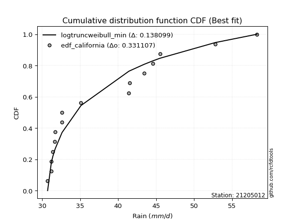</img>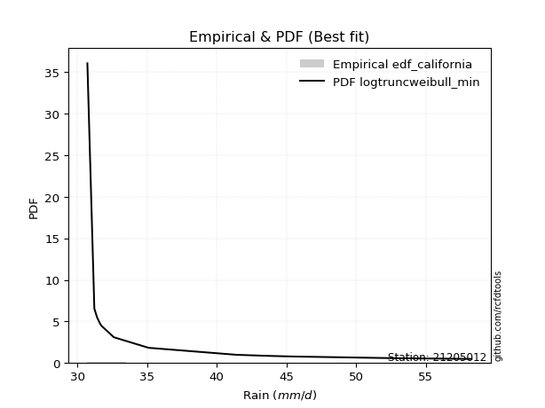</img>

</div>


### 2. EDF Hazen (1930)

Hazen method for plotting positions is a formula used to estimate the empirical cumulative probability distribution of flood events or other hydrological data. This formula often results in biased estimations, particularly when extrapolating to extreme events (high return periods).

<div align="center">


$P=(m-0.5)/n$


</div>


**2.1. Empirical values**

<div align="center">

|                | 0                 | 1                 | 2                  | 3         | 4                 | 5                  | 6                  | 7                  | 8                  | 9                  | 10                | 11                 | 12                | 13        | 14                 | 15        |
|:---------------|:------------------|:------------------|:-------------------|:----------|:------------------|:-------------------|:-------------------|:-------------------|:-------------------|:-------------------|:------------------|:-------------------|:------------------|:----------|:-------------------|:----------|
| date           | 2019              | 2018              | 2025               | 2022      | 2011              | 2021               | 2012               | 2010               | 2014               | 2013               | 2020              | 2017               | 2023              | 2016      | 2024               | 2015      |
| x              | 30.7              | 31.2              | 31.2               | 31.4      | 31.6              | 31.7               | 32.6               | 32.6               | 35.1               | 41.4               | 41.5              | 43.4               | 44.5625           | 45.5      | 52.8               | 58.3      |
| m              | 1                 | 2                 | 3                  | 4         | 5                 | 6                  | 7                  | 8                  | 9                  | 10                 | 11                | 12                 | 13                | 14        | 15                 | 16        |
| empirical_dist | edf_hazen         | edf_hazen         | edf_hazen          | edf_hazen | edf_hazen         | edf_hazen          | edf_hazen          | edf_hazen          | edf_hazen          | edf_hazen          | edf_hazen         | edf_hazen          | edf_hazen         | edf_hazen | edf_hazen          | edf_hazen |
| empirical      | 0.03125           | 0.09375           | 0.15625            | 0.21875   | 0.28125           | 0.34375            | 0.40625            | 0.46875            | 0.53125            | 0.59375            | 0.65625           | 0.71875            | 0.78125           | 0.84375   | 0.90625            | 0.96875   |
| empirical_tr   | 1.032258064516129 | 1.103448275862069 | 1.1851851851851851 | 1.28      | 1.391304347826087 | 1.5238095238095237 | 1.6842105263157894 | 1.8823529411764706 | 2.1333333333333333 | 2.4615384615384617 | 2.909090909090909 | 3.5555555555555554 | 4.571428571428571 | 6.4       | 10.666666666666666 | 32.0      |

</div>


**2.2. Kolmogorov-Smirnov fit test (sorted by Δ)**


<div align="center">

|                | 0                   | 1                   | 2                  | 3                   | 4                   | 5                   | 6                   | 7                   | 8                   | 9                   | 10                  | 11                  | 12                 | 13                  | 14                  | 15                 | 16                 | 17                 | 18                  | 19                | 20                 | 21                 | 22                  | 23                  | 24                  | 25                  | 26                 | 27                  | 28                 | 29                  | 30                  | 31                 | 32                  | 33                  | 34                  | 35                  | 36                  | 37                 | 38                  | 39                 | 40                  | 41                 | 42                  | 43                  | 44                 | 45                 | 46                  | 47                  | 48                | 49                  | 50                  | 51                  | 52                  | 53                  | 54                 | 55                 | 56                  | 57                 | 58                 | 59                  | 60                 | 61                 | 62                  | 63                  | 64                 | 65                 | 66                  | 67                 | 68                  | 69                  | 70                  | 71                  | 72                 | 73                 | 74                 | 75                  | 76                  | 77                  | 78                 | 79                  | 80                  | 81                  | 82                  | 83                  | 84                 | 85                  | 86                  | 87                 | 88                  | 89                  | 90                  | 91                  | 92                 | 93                  | 94                  | 95                  | 96                 | 97                  | 98                 | 99                 | 100               | 101                 | 102                | 103                 | 104                | 105                 | 106                 | 107                | 108                 | 109                 | 110                | 111                | 112               | 113               | 114                | 115                | 116                 | 117                | 118                | 119                | 120                | 121                | 122                 | 123                | 124               | 125                | 126                | 127                | 128                | 129                | 130                | 131                 | 132                 | 133                 | 134                 | 135               | 136                 | 137                 | 138                 | 139                 | 140                 | 141                 | 142                 | 143                | 144                | 145                | 146               | 147                | 148                | 149                | 150                | 151                | 152                | 153                | 154                | 155                | 156                | 157               | 158            | 159            |
|:---------------|:--------------------|:--------------------|:-------------------|:--------------------|:--------------------|:--------------------|:--------------------|:--------------------|:--------------------|:--------------------|:--------------------|:--------------------|:-------------------|:--------------------|:--------------------|:-------------------|:-------------------|:-------------------|:--------------------|:------------------|:-------------------|:-------------------|:--------------------|:--------------------|:--------------------|:--------------------|:-------------------|:--------------------|:-------------------|:--------------------|:--------------------|:-------------------|:--------------------|:--------------------|:--------------------|:--------------------|:--------------------|:-------------------|:--------------------|:-------------------|:--------------------|:-------------------|:--------------------|:--------------------|:-------------------|:-------------------|:--------------------|:--------------------|:------------------|:--------------------|:--------------------|:--------------------|:--------------------|:--------------------|:-------------------|:-------------------|:--------------------|:-------------------|:-------------------|:--------------------|:-------------------|:-------------------|:--------------------|:--------------------|:-------------------|:-------------------|:--------------------|:-------------------|:--------------------|:--------------------|:--------------------|:--------------------|:-------------------|:-------------------|:-------------------|:--------------------|:--------------------|:--------------------|:-------------------|:--------------------|:--------------------|:--------------------|:--------------------|:--------------------|:-------------------|:--------------------|:--------------------|:-------------------|:--------------------|:--------------------|:--------------------|:--------------------|:-------------------|:--------------------|:--------------------|:--------------------|:-------------------|:--------------------|:-------------------|:-------------------|:------------------|:--------------------|:-------------------|:--------------------|:-------------------|:--------------------|:--------------------|:-------------------|:--------------------|:--------------------|:-------------------|:-------------------|:------------------|:------------------|:-------------------|:-------------------|:--------------------|:-------------------|:-------------------|:-------------------|:-------------------|:-------------------|:--------------------|:-------------------|:------------------|:-------------------|:-------------------|:-------------------|:-------------------|:-------------------|:-------------------|:--------------------|:--------------------|:--------------------|:--------------------|:------------------|:--------------------|:--------------------|:--------------------|:--------------------|:--------------------|:--------------------|:--------------------|:-------------------|:-------------------|:-------------------|:------------------|:-------------------|:-------------------|:-------------------|:-------------------|:-------------------|:-------------------|:-------------------|:-------------------|:-------------------|:-------------------|:------------------|:---------------|:---------------|
| station        | 21205012            | 21205012            | 21205012           | 21205012            | 21205012            | 21205012            | 21205012            | 21205012            | 21205012            | 21205012            | 21205012            | 21205012            | 21205012           | 21205012            | 21205012            | 21205012           | 21205012           | 21205012           | 21205012            | 21205012          | 21205012           | 21205012           | 21205012            | 21205012            | 21205012            | 21205012            | 21205012           | 21205012            | 21205012           | 21205012            | 21205012            | 21205012           | 21205012            | 21205012            | 21205012            | 21205012            | 21205012            | 21205012           | 21205012            | 21205012           | 21205012            | 21205012           | 21205012            | 21205012            | 21205012           | 21205012           | 21205012            | 21205012            | 21205012          | 21205012            | 21205012            | 21205012            | 21205012            | 21205012            | 21205012           | 21205012           | 21205012            | 21205012           | 21205012           | 21205012            | 21205012           | 21205012           | 21205012            | 21205012            | 21205012           | 21205012           | 21205012            | 21205012           | 21205012            | 21205012            | 21205012            | 21205012            | 21205012           | 21205012           | 21205012           | 21205012            | 21205012            | 21205012            | 21205012           | 21205012            | 21205012            | 21205012            | 21205012            | 21205012            | 21205012           | 21205012            | 21205012            | 21205012           | 21205012            | 21205012            | 21205012            | 21205012            | 21205012           | 21205012            | 21205012            | 21205012            | 21205012           | 21205012            | 21205012           | 21205012           | 21205012          | 21205012            | 21205012           | 21205012            | 21205012           | 21205012            | 21205012            | 21205012           | 21205012            | 21205012            | 21205012           | 21205012           | 21205012          | 21205012          | 21205012           | 21205012           | 21205012            | 21205012           | 21205012           | 21205012           | 21205012           | 21205012           | 21205012            | 21205012           | 21205012          | 21205012           | 21205012           | 21205012           | 21205012           | 21205012           | 21205012           | 21205012            | 21205012            | 21205012            | 21205012            | 21205012          | 21205012            | 21205012            | 21205012            | 21205012            | 21205012            | 21205012            | 21205012            | 21205012           | 21205012           | 21205012           | 21205012          | 21205012           | 21205012           | 21205012           | 21205012           | 21205012           | 21205012           | 21205012           | 21205012           | 21205012           | 21205012           | 21205012          | 21205012       | 21205012       |
| empirical_dist | edf_hazen           | edf_hazen           | edf_hazen          | edf_hazen           | edf_hazen           | edf_hazen           | edf_hazen           | edf_hazen           | edf_hazen           | edf_hazen           | edf_hazen           | edf_hazen           | edf_hazen          | edf_hazen           | edf_hazen           | edf_hazen          | edf_hazen          | edf_hazen          | edf_hazen           | edf_hazen         | edf_hazen          | edf_hazen          | edf_hazen           | edf_hazen           | edf_hazen           | edf_hazen           | edf_hazen          | edf_hazen           | edf_hazen          | edf_hazen           | edf_hazen           | edf_hazen          | edf_hazen           | edf_hazen           | edf_hazen           | edf_hazen           | edf_hazen           | edf_hazen          | edf_hazen           | edf_hazen          | edf_hazen           | edf_hazen          | edf_hazen           | edf_hazen           | edf_hazen          | edf_hazen          | edf_hazen           | edf_hazen           | edf_hazen         | edf_hazen           | edf_hazen           | edf_hazen           | edf_hazen           | edf_hazen           | edf_hazen          | edf_hazen          | edf_hazen           | edf_hazen          | edf_hazen          | edf_hazen           | edf_hazen          | edf_hazen          | edf_hazen           | edf_hazen           | edf_hazen          | edf_hazen          | edf_hazen           | edf_hazen          | edf_hazen           | edf_hazen           | edf_hazen           | edf_hazen           | edf_hazen          | edf_hazen          | edf_hazen          | edf_hazen           | edf_hazen           | edf_hazen           | edf_hazen          | edf_hazen           | edf_hazen           | edf_hazen           | edf_hazen           | edf_hazen           | edf_hazen          | edf_hazen           | edf_hazen           | edf_hazen          | edf_hazen           | edf_hazen           | edf_hazen           | edf_hazen           | edf_hazen          | edf_hazen           | edf_hazen           | edf_hazen           | edf_hazen          | edf_hazen           | edf_hazen          | edf_hazen          | edf_hazen         | edf_hazen           | edf_hazen          | edf_hazen           | edf_hazen          | edf_hazen           | edf_hazen           | edf_hazen          | edf_hazen           | edf_hazen           | edf_hazen          | edf_hazen          | edf_hazen         | edf_hazen         | edf_hazen          | edf_hazen          | edf_hazen           | edf_hazen          | edf_hazen          | edf_hazen          | edf_hazen          | edf_hazen          | edf_hazen           | edf_hazen          | edf_hazen         | edf_hazen          | edf_hazen          | edf_hazen          | edf_hazen          | edf_hazen          | edf_hazen          | edf_hazen           | edf_hazen           | edf_hazen           | edf_hazen           | edf_hazen         | edf_hazen           | edf_hazen           | edf_hazen           | edf_hazen           | edf_hazen           | edf_hazen           | edf_hazen           | edf_hazen          | edf_hazen          | edf_hazen          | edf_hazen         | edf_hazen          | edf_hazen          | edf_hazen          | edf_hazen          | edf_hazen          | edf_hazen          | edf_hazen          | edf_hazen          | edf_hazen          | edf_hazen          | edf_hazen         | edf_hazen      | edf_hazen      |
| p_dist         | gausshyper          | weibull_min         | logdgamma          | exponweib           | logbeta             | nakagami            | logtruncweibull_min | logdweibull         | foldnorm            | dweibull            | halfgennorm         | halfnorm            | gengamma           | logfoldnorm         | loghalfnorm         | loggengamma        | exponpow           | johnsonsu          | loglomax            | fatiguelife       | logbradford        | semicircular       | invweibull          | genextreme          | vonmises_line       | loghalfgennorm      | logsemicircular    | logjohnsonsu        | loginvweibull      | loggenextreme       | halflogistic        | lomax              | beta                | logburr             | f                   | logfatiguelife      | loghalflogistic     | rayleigh           | invgamma            | anglit             | lograyleigh         | loganglit          | logf                | logburr12           | burr               | pearson3           | maxwell             | logweibull_min      | logmaxwell        | logtruncpareto      | logexponnorm        | logpearson3         | loggenexpon         | burr12              | logarcsine         | logexponpow        | truncpareto         | gumbel_r           | invgauss           | loginvgauss         | loggumbel_r        | lognakagami        | moyal               | gompertz            | loggenlogistic     | bradford           | logweibull_max      | erlang             | logmoyal            | logloggamma         | t                   | crystalball         | norm               | lognct             | nct                | loginvgamma         | loggamma            | loggamma            | logt               | logcrystalball      | lognorm             | alpha               | ncf                 | betaprime           | genlogistic        | logalpha            | logbetaprime        | logkstwobign       | arcsine             | logerlang           | logexponweib        | kstwobign           | logistic           | exponnorm           | genexpon            | loglogistic         | logcosine          | cosine              | gumbel_l           | hypsecant          | logrice           | truncnorm           | loggumbel_l        | loghypsecant        | rdist              | loggausshyper       | rice                | logtruncnorm       | gamma               | gennorm             | dgamma             | laplace            | loglaplace        | loglaplace        | powerlaw           | logargus           | argus               | truncweibull_min   | logpowerlaw        | logtriang          | logkappa4          | logskewnorm        | logwrapcauchy       | wald               | logksone          | tukeylambda        | genhalflogistic    | loggompertz        | logwald            | logloglaplace      | loggennorm         | logtruncexpon       | logrdist            | ksone               | logkappa3           | wrapcauchy        | logncf              | skewnorm            | triang              | truncexpon          | loggenhalflogistic  | logtukeylambda      | loguniform          | logvonmises_line   | kappa4             | genpareto          | uniform           | kappa3             | johnsonsb          | loglevy_l          | logjohnsonsb       | levy_l             | logtrapezoid       | trapezoid          | loggenpareto       | weibull_max        | logvonmises        | vonmises          | mielke         | logmielke      |
| delta          | 0.12052630536299347 | 0.14255775974341034 | 0.1511288354296894 | 0.15417487715183625 | 0.15535404874713266 | 0.16281239705945494 | 0.1693489448019353  | 0.17369701881965077 | 0.17595596397637592 | 0.17650643137249955 | 0.17671719692762078 | 0.17707311059659914 | 0.1790885503752646 | 0.17911470249976447 | 0.17985144656948865 | 0.1826951871093382 | 0.1831160495286802 | 0.1839455855385589 | 0.18529115263737744 | 0.186450838914491 | 0.1876526633337673 | 0.1878237111646992 | 0.18789467431651274 | 0.18791263411619752 | 0.18799618591012124 | 0.18834634548047213 | 0.1896479065482023 | 0.19080681024547963 | 0.1930312314970587 | 0.19303300969402293 | 0.19397715770429735 | 0.1940001790248823 | 0.19467640016271875 | 0.19541215720416805 | 0.19694188523507883 | 0.19717475405757268 | 0.19732767957332475 | 0.1991017198881852 | 0.19988749176329912 | 0.1999138140263268 | 0.20144778153340082 | 0.2017880230429303 | 0.20387795281695276 | 0.20480056648291928 | 0.2058945926638247 | 0.2068963168853452 | 0.20748613389548037 | 0.20831252954089524 | 0.209715144061476 | 0.20984811380214186 | 0.21143727586685057 | 0.21368603046544615 | 0.21390045660751167 | 0.21397328401361865 | 0.2172246078154706 | 0.2173067716425584 | 0.21745821058564058 | 0.2179810236528683 | 0.2183045997110452 | 0.21904541136238254 | 0.2207309856433216 | 0.2211026104013447 | 0.22139463586000807 | 0.22254837786872878 | 0.2235821945385707 | 0.2240814461253304 | 0.22447162468423776 | 0.2244768763134749 | 0.22464146469789048 | 0.22465981033486326 | 0.22772086010718462 | 0.22772200020536837 | 0.2277220148078769 | 0.2279715721959887 | 0.2284600872709434 | 0.22864923051492794 | 0.22884633173410718 | 0.22884633173410718 | 0.2296455711690324 | 0.22964672495845675 | 0.22964687784920101 | 0.23123616257612456 | 0.23245446634484002 | 0.23363693176282105 | 0.2337614810986008 | 0.23380562306434166 | 0.23662848705868758 | 0.2374946065011991 | 0.24018564900040273 | 0.24858825570270793 | 0.24903581288912013 | 0.24939638369516873 | 0.2503645866412536 | 0.25074963019338714 | 0.25188743735464947 | 0.25227524513769606 | 0.2575184593761923 | 0.25806612993300354 | 0.2649537670315669 | 0.2649951943168912 | 0.265530214670599 | 0.26568342808605794 | 0.2663901318039066 | 0.26683686363906906 | 0.2703997581203983 | 0.27211805765456754 | 0.27306437729653976 | 0.2740808607952659 | 0.27874037536135776 | 0.27896537793065446 | 0.2814659210758631 | 0.2837387812037418 | 0.285351529338062 | 0.285351529338062 | 0.2867215855799887 | 0.2874601471810867 | 0.28751640606995343 | 0.2887361275065935 | 0.2891126326576465 | 0.2939818422946915 | 0.2969997858214254 | 0.3035936406496664 | 0.30471709316201556 | 0.3062412962372901 | 0.307390338550278 | 0.3153959851268766 | 0.3159755607235326 | 0.3164809828121008 | 0.3167372319612082 | 0.3167720389648692 | 0.3228921914951859 | 0.32534478930541055 | 0.32556002639519355 | 0.32804951690821244 | 0.33115798899654647 | 0.334338040500084 | 0.33469813820187283 | 0.33650361639161525 | 0.34819192892087375 | 0.35706195065237345 | 0.36862903166201333 | 0.36877941165459305 | 0.37511840626033366 | 0.3756324840535369 | 0.3821193874363238 | 0.3847696919937611 | 0.399909420289855 | 0.3999832708174421 | 0.4183204468507351 | 0.4393613815296371 | 0.4591105980387036 | 0.4598956834602157 | 0.4902393162318462 | 0.5626451317416974 | 0.6582280836084322 | 0.7187381416749018 | 1.1269108107850512 | 8.843769198461146 | nan            | nan            |
| deltao         | 0.331107277296      | 0.331107277296      | 0.331107277296     | 0.331107277296      | 0.331107277296      | 0.331107277296      | 0.331107277296      | 0.331107277296      | 0.331107277296      | 0.331107277296      | 0.331107277296      | 0.331107277296      | 0.331107277296     | 0.331107277296      | 0.331107277296      | 0.331107277296     | 0.331107277296     | 0.331107277296     | 0.331107277296      | 0.331107277296    | 0.331107277296     | 0.331107277296     | 0.331107277296      | 0.331107277296      | 0.331107277296      | 0.331107277296      | 0.331107277296     | 0.331107277296      | 0.331107277296     | 0.331107277296      | 0.331107277296      | 0.331107277296     | 0.331107277296      | 0.331107277296      | 0.331107277296      | 0.331107277296      | 0.331107277296      | 0.331107277296     | 0.331107277296      | 0.331107277296     | 0.331107277296      | 0.331107277296     | 0.331107277296      | 0.331107277296      | 0.331107277296     | 0.331107277296     | 0.331107277296      | 0.331107277296      | 0.331107277296    | 0.331107277296      | 0.331107277296      | 0.331107277296      | 0.331107277296      | 0.331107277296      | 0.331107277296     | 0.331107277296     | 0.331107277296      | 0.331107277296     | 0.331107277296     | 0.331107277296      | 0.331107277296     | 0.331107277296     | 0.331107277296      | 0.331107277296      | 0.331107277296     | 0.331107277296     | 0.331107277296      | 0.331107277296     | 0.331107277296      | 0.331107277296      | 0.331107277296      | 0.331107277296      | 0.331107277296     | 0.331107277296     | 0.331107277296     | 0.331107277296      | 0.331107277296      | 0.331107277296      | 0.331107277296     | 0.331107277296      | 0.331107277296      | 0.331107277296      | 0.331107277296      | 0.331107277296      | 0.331107277296     | 0.331107277296      | 0.331107277296      | 0.331107277296     | 0.331107277296      | 0.331107277296      | 0.331107277296      | 0.331107277296      | 0.331107277296     | 0.331107277296      | 0.331107277296      | 0.331107277296      | 0.331107277296     | 0.331107277296      | 0.331107277296     | 0.331107277296     | 0.331107277296    | 0.331107277296      | 0.331107277296     | 0.331107277296      | 0.331107277296     | 0.331107277296      | 0.331107277296      | 0.331107277296     | 0.331107277296      | 0.331107277296      | 0.331107277296     | 0.331107277296     | 0.331107277296    | 0.331107277296    | 0.331107277296     | 0.331107277296     | 0.331107277296      | 0.331107277296     | 0.331107277296     | 0.331107277296     | 0.331107277296     | 0.331107277296     | 0.331107277296      | 0.331107277296     | 0.331107277296    | 0.331107277296     | 0.331107277296     | 0.331107277296     | 0.331107277296     | 0.331107277296     | 0.331107277296     | 0.331107277296      | 0.331107277296      | 0.331107277296      | 0.331107277296      | 0.331107277296    | 0.331107277296      | 0.331107277296      | 0.331107277296      | 0.331107277296      | 0.331107277296      | 0.331107277296      | 0.331107277296      | 0.331107277296     | 0.331107277296     | 0.331107277296     | 0.331107277296    | 0.331107277296     | 0.331107277296     | 0.331107277296     | 0.331107277296     | 0.331107277296     | 0.331107277296     | 0.331107277296     | 0.331107277296     | 0.331107277296     | 0.331107277296     | 0.331107277296    | 0.331107277296 | 0.331107277296 |
| eval           | Δo > Δ              | Δo > Δ              | Δo > Δ             | Δo > Δ              | Δo > Δ              | Δo > Δ              | Δo > Δ              | Δo > Δ              | Δo > Δ              | Δo > Δ              | Δo > Δ              | Δo > Δ              | Δo > Δ             | Δo > Δ              | Δo > Δ              | Δo > Δ             | Δo > Δ             | Δo > Δ             | Δo > Δ              | Δo > Δ            | Δo > Δ             | Δo > Δ             | Δo > Δ              | Δo > Δ              | Δo > Δ              | Δo > Δ              | Δo > Δ             | Δo > Δ              | Δo > Δ             | Δo > Δ              | Δo > Δ              | Δo > Δ             | Δo > Δ              | Δo > Δ              | Δo > Δ              | Δo > Δ              | Δo > Δ              | Δo > Δ             | Δo > Δ              | Δo > Δ             | Δo > Δ              | Δo > Δ             | Δo > Δ              | Δo > Δ              | Δo > Δ             | Δo > Δ             | Δo > Δ              | Δo > Δ              | Δo > Δ            | Δo > Δ              | Δo > Δ              | Δo > Δ              | Δo > Δ              | Δo > Δ              | Δo > Δ             | Δo > Δ             | Δo > Δ              | Δo > Δ             | Δo > Δ             | Δo > Δ              | Δo > Δ             | Δo > Δ             | Δo > Δ              | Δo > Δ              | Δo > Δ             | Δo > Δ             | Δo > Δ              | Δo > Δ             | Δo > Δ              | Δo > Δ              | Δo > Δ              | Δo > Δ              | Δo > Δ             | Δo > Δ             | Δo > Δ             | Δo > Δ              | Δo > Δ              | Δo > Δ              | Δo > Δ             | Δo > Δ              | Δo > Δ              | Δo > Δ              | Δo > Δ              | Δo > Δ              | Δo > Δ             | Δo > Δ              | Δo > Δ              | Δo > Δ             | Δo > Δ              | Δo > Δ              | Δo > Δ              | Δo > Δ              | Δo > Δ             | Δo > Δ              | Δo > Δ              | Δo > Δ              | Δo > Δ             | Δo > Δ              | Δo > Δ             | Δo > Δ             | Δo > Δ            | Δo > Δ              | Δo > Δ             | Δo > Δ              | Δo > Δ             | Δo > Δ              | Δo > Δ              | Δo > Δ             | Δo > Δ              | Δo > Δ              | Δo > Δ             | Δo > Δ             | Δo > Δ            | Δo > Δ            | Δo > Δ             | Δo > Δ             | Δo > Δ              | Δo > Δ             | Δo > Δ             | Δo > Δ             | Δo > Δ             | Δo > Δ             | Δo > Δ              | Δo > Δ             | Δo > Δ            | Δo > Δ             | Δo > Δ             | Δo > Δ             | Δo > Δ             | Δo > Δ             | Δo > Δ             | Δo > Δ              | Δo > Δ              | Δo > Δ              | Δo <= Δ             | Δo <= Δ           | Δo <= Δ             | Δo <= Δ             | Δo <= Δ             | Δo <= Δ             | Δo <= Δ             | Δo <= Δ             | Δo <= Δ             | Δo <= Δ            | Δo <= Δ            | Δo <= Δ            | Δo <= Δ           | Δo <= Δ            | Δo <= Δ            | Δo <= Δ            | Δo <= Δ            | Δo <= Δ            | Δo <= Δ            | Δo <= Δ            | Δo <= Δ            | Δo <= Δ            | Δo <= Δ            | Δo <= Δ           | Δo <= Δ        | Δo <= Δ        |
| fit            | 1                   | 1                   | 1                  | 1                   | 1                   | 1                   | 1                   | 1                   | 1                   | 1                   | 1                   | 1                   | 1                  | 1                   | 1                   | 1                  | 1                  | 1                  | 1                   | 1                 | 1                  | 1                  | 1                   | 1                   | 1                   | 1                   | 1                  | 1                   | 1                  | 1                   | 1                   | 1                  | 1                   | 1                   | 1                   | 1                   | 1                   | 1                  | 1                   | 1                  | 1                   | 1                  | 1                   | 1                   | 1                  | 1                  | 1                   | 1                   | 1                 | 1                   | 1                   | 1                   | 1                   | 1                   | 1                  | 1                  | 1                   | 1                  | 1                  | 1                   | 1                  | 1                  | 1                   | 1                   | 1                  | 1                  | 1                   | 1                  | 1                   | 1                   | 1                   | 1                   | 1                  | 1                  | 1                  | 1                   | 1                   | 1                   | 1                  | 1                   | 1                   | 1                   | 1                   | 1                   | 1                  | 1                   | 1                   | 1                  | 1                   | 1                   | 1                   | 1                   | 1                  | 1                   | 1                   | 1                   | 1                  | 1                   | 1                  | 1                  | 1                 | 1                   | 1                  | 1                   | 1                  | 1                   | 1                   | 1                  | 1                   | 1                   | 1                  | 1                  | 1                 | 1                 | 1                  | 1                  | 1                   | 1                  | 1                  | 1                  | 1                  | 1                  | 1                   | 1                  | 1                 | 1                  | 1                  | 1                  | 1                  | 1                  | 1                  | 1                   | 1                   | 1                   | 0                   | 0                 | 0                   | 0                   | 0                   | 0                   | 0                   | 0                   | 0                   | 0                  | 0                  | 0                  | 0                 | 0                  | 0                  | 0                  | 0                  | 0                  | 0                  | 0                  | 0                  | 0                  | 0                  | 0                 | 0              | 0              |
| n              | 16                  | 16                  | 16                 | 16                  | 16                  | 16                  | 16                  | 16                  | 16                  | 16                  | 16                  | 16                  | 16                 | 16                  | 16                  | 16                 | 16                 | 16                 | 16                  | 16                | 16                 | 16                 | 16                  | 16                  | 16                  | 16                  | 16                 | 16                  | 16                 | 16                  | 16                  | 16                 | 16                  | 16                  | 16                  | 16                  | 16                  | 16                 | 16                  | 16                 | 16                  | 16                 | 16                  | 16                  | 16                 | 16                 | 16                  | 16                  | 16                | 16                  | 16                  | 16                  | 16                  | 16                  | 16                 | 16                 | 16                  | 16                 | 16                 | 16                  | 16                 | 16                 | 16                  | 16                  | 16                 | 16                 | 16                  | 16                 | 16                  | 16                  | 16                  | 16                  | 16                 | 16                 | 16                 | 16                  | 16                  | 16                  | 16                 | 16                  | 16                  | 16                  | 16                  | 16                  | 16                 | 16                  | 16                  | 16                 | 16                  | 16                  | 16                  | 16                  | 16                 | 16                  | 16                  | 16                  | 16                 | 16                  | 16                 | 16                 | 16                | 16                  | 16                 | 16                  | 16                 | 16                  | 16                  | 16                 | 16                  | 16                  | 16                 | 16                 | 16                | 16                | 16                 | 16                 | 16                  | 16                 | 16                 | 16                 | 16                 | 16                 | 16                  | 16                 | 16                | 16                 | 16                 | 16                 | 16                 | 16                 | 16                 | 16                  | 16                  | 16                  | 16                  | 16                | 16                  | 16                  | 16                  | 16                  | 16                  | 16                  | 16                  | 16                 | 16                 | 16                 | 16                | 16                 | 16                 | 16                 | 16                 | 16                 | 16                 | 16                 | 16                 | 16                 | 16                 | 16                | 16             | 16             |
| best_fit       | 1                   | 0                   | 0                  | 0                   | 0                   | 0                   | 0                   | 0                   | 0                   | 0                   | 0                   | 0                   | 0                  | 0                   | 0                   | 0                  | 0                  | 0                  | 0                   | 0                 | 0                  | 0                  | 0                   | 0                   | 0                   | 0                   | 0                  | 0                   | 0                  | 0                   | 0                   | 0                  | 0                   | 0                   | 0                   | 0                   | 0                   | 0                  | 0                   | 0                  | 0                   | 0                  | 0                   | 0                   | 0                  | 0                  | 0                   | 0                   | 0                 | 0                   | 0                   | 0                   | 0                   | 0                   | 0                  | 0                  | 0                   | 0                  | 0                  | 0                   | 0                  | 0                  | 0                   | 0                   | 0                  | 0                  | 0                   | 0                  | 0                   | 0                   | 0                   | 0                   | 0                  | 0                  | 0                  | 0                   | 0                   | 0                   | 0                  | 0                   | 0                   | 0                   | 0                   | 0                   | 0                  | 0                   | 0                   | 0                  | 0                   | 0                   | 0                   | 0                   | 0                  | 0                   | 0                   | 0                   | 0                  | 0                   | 0                  | 0                  | 0                 | 0                   | 0                  | 0                   | 0                  | 0                   | 0                   | 0                  | 0                   | 0                   | 0                  | 0                  | 0                 | 0                 | 0                  | 0                  | 0                   | 0                  | 0                  | 0                  | 0                  | 0                  | 0                   | 0                  | 0                 | 0                  | 0                  | 0                  | 0                  | 0                  | 0                  | 0                   | 0                   | 0                   | 0                   | 0                 | 0                   | 0                   | 0                   | 0                   | 0                   | 0                   | 0                   | 0                  | 0                  | 0                  | 0                 | 0                  | 0                  | 0                  | 0                  | 0                  | 0                  | 0                  | 0                  | 0                  | 0                  | 0                 | 0              | 0              |
| best_fit_sort  | 1                   | 2                   | 3                  | 4                   | 5                   | 6                   | 7                   | 8                   | 9                   | 10                  | 11                  | 12                  | 13                 | 14                  | 15                  | 16                 | 17                 | 18                 | 19                  | 20                | 21                 | 22                 | 23                  | 24                  | 25                  | 26                  | 27                 | 28                  | 29                 | 30                  | 31                  | 32                 | 33                  | 34                  | 35                  | 36                  | 37                  | 38                 | 39                  | 40                 | 41                  | 42                 | 43                  | 44                  | 45                 | 46                 | 47                  | 48                  | 49                | 50                  | 51                  | 52                  | 53                  | 54                  | 55                 | 56                 | 57                  | 58                 | 59                 | 60                  | 61                 | 62                 | 63                  | 64                  | 65                 | 66                 | 67                  | 68                 | 69                  | 70                  | 71                  | 72                  | 73                 | 74                 | 75                 | 76                  | 77                  | 78                  | 79                 | 80                  | 81                  | 82                  | 83                  | 84                  | 85                 | 86                  | 87                  | 88                 | 89                  | 90                  | 91                  | 92                  | 93                 | 94                  | 95                  | 96                  | 97                 | 98                  | 99                 | 100                | 101               | 102                 | 103                | 104                 | 105                | 106                 | 107                 | 108                | 109                 | 110                 | 111                | 112                | 113               | 114               | 115                | 116                | 117                 | 118                | 119                | 120                | 121                | 122                | 123                 | 124                | 125               | 126                | 127                | 128                | 129                | 130                | 131                | 132                 | 133                 | 134                 | 135                 | 136               | 137                 | 138                 | 139                 | 140                 | 141                 | 142                 | 143                 | 144                | 145                | 146                | 147               | 148                | 149                | 150                | 151                | 152                | 153                | 154                | 155                | 156                | 157                | 158               | 159            | 160            |

</div>


**2.3. Best fit**

<div align="center">

|   id |   station | empirical_dist   | p_dist     |    delta |   deltao | eval   |   fit |   n |   best_fit |   best_fit_sort |
|-----:|----------:|:-----------------|:-----------|---------:|---------:|:-------|------:|----:|-----------:|----------------:|
|    0 |  21205012 | edf_hazen        | gausshyper | 0.120526 | 0.331107 | Δo > Δ |     1 |  16 |          1 |               1 |

</div>


<div align="center">

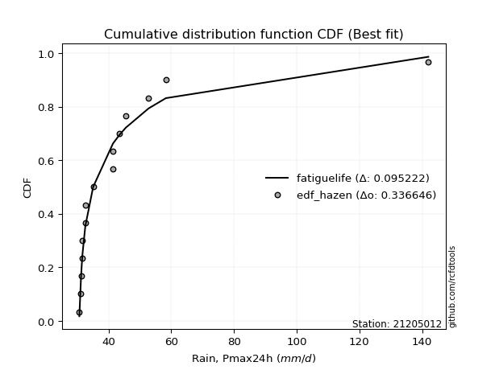</img></img>

</div>


### 3. EDF Weibull (1939)

Weibull plotting position formula is an empirical method used to estimate the non-exceedance probability or plotting position for a set of observed data, is often recommended or widely used in practice, particularly in flood frequency analysis.

<div align="center">


$P=m/(n+1)$


</div>


**3.1. Empirical values**

<div align="center">

|                | 0                    | 1                   | 2                   | 3                   | 4                   | 5                   | 6                  | 7                   | 8                  | 9                  | 10                 | 11                 | 12                 | 13                 | 14                 | 15                 |
|:---------------|:---------------------|:--------------------|:--------------------|:--------------------|:--------------------|:--------------------|:-------------------|:--------------------|:-------------------|:-------------------|:-------------------|:-------------------|:-------------------|:-------------------|:-------------------|:-------------------|
| date           | 2019                 | 2018                | 2025                | 2022                | 2011                | 2021                | 2012               | 2010                | 2014               | 2013               | 2020               | 2017               | 2023               | 2016               | 2024               | 2015               |
| x              | 30.7                 | 31.2                | 31.2                | 31.4                | 31.6                | 31.7                | 32.6               | 32.6                | 35.1               | 41.4               | 41.5               | 43.4               | 44.5625            | 45.5               | 52.8               | 58.3               |
| m              | 1                    | 2                   | 3                   | 4                   | 5                   | 6                   | 7                  | 8                   | 9                  | 10                 | 11                 | 12                 | 13                 | 14                 | 15                 | 16                 |
| empirical_dist | edf_weibull          | edf_weibull         | edf_weibull         | edf_weibull         | edf_weibull         | edf_weibull         | edf_weibull        | edf_weibull         | edf_weibull        | edf_weibull        | edf_weibull        | edf_weibull        | edf_weibull        | edf_weibull        | edf_weibull        | edf_weibull        |
| empirical      | 0.058823529411764705 | 0.11764705882352941 | 0.17647058823529413 | 0.23529411764705882 | 0.29411764705882354 | 0.35294117647058826 | 0.4117647058823529 | 0.47058823529411764 | 0.5294117647058824 | 0.5882352941176471 | 0.6470588235294118 | 0.7058823529411765 | 0.7647058823529411 | 0.8235294117647058 | 0.8823529411764706 | 0.9411764705882353 |
| empirical_tr   | 1.0625               | 1.1333333333333333  | 1.2142857142857144  | 1.3076923076923077  | 1.4166666666666667  | 1.5454545454545456  | 1.7                | 1.8888888888888888  | 2.125              | 2.428571428571429  | 2.8333333333333335 | 3.4000000000000004 | 4.249999999999999  | 5.666666666666665  | 8.499999999999998  | 16.999999999999996 |

</div>


**3.2. Kolmogorov-Smirnov fit test (sorted by Δ)**


<div align="center">

|                | 0                   | 1                   | 2                   | 3                   | 4                  | 5                  | 6                   | 7                   | 8                  | 9                   | 10                 | 11                  | 12                 | 13                 | 14                 | 15                  | 16                  | 17                 | 18                  | 19                  | 20                  | 21                  | 22                  | 23                  | 24                 | 25                 | 26                  | 27                  | 28                  | 29                | 30                  | 31                 | 32                 | 33                  | 34                  | 35                 | 36                  | 37                  | 38                  | 39                  | 40                 | 41                  | 42                  | 43                  | 44                  | 45                  | 46                  | 47                  | 48                  | 49                  | 50                  | 51                  | 52                 | 53                  | 54                 | 55                 | 56                 | 57                  | 58                  | 59                  | 60                  | 61                 | 62                  | 63                  | 64                  | 65                  | 66                  | 67                 | 68                  | 69                 | 70                  | 71                  | 72                | 73                  | 74                  | 75                  | 76                  | 77                  | 78                  | 79                 | 80                  | 81                  | 82                 | 83                 | 84                 | 85                  | 86                 | 87                  | 88                  | 89                  | 90                  | 91                  | 92                 | 93                 | 94                 | 95                  | 96                 | 97                 | 98                 | 99                 | 100                | 101                 | 102                 | 103                 | 104                | 105                | 106                | 107                 | 108                | 109                | 110                 | 111                | 112                | 113                | 114                 | 115                 | 116                 | 117                | 118                 | 119                | 120                 | 121                 | 122                | 123                 | 124                | 125               | 126                | 127                | 128                | 129                | 130                 | 131                 | 132                 | 133                 | 134                | 135                | 136                | 137                | 138                | 139                | 140                | 141                 | 142                | 143                | 144                | 145                 | 146                 | 147                 | 148                 | 149                | 150               | 151                | 152                 | 153                | 154                | 155                | 156                | 157              | 158            | 159            |
|:---------------|:--------------------|:--------------------|:--------------------|:--------------------|:-------------------|:-------------------|:--------------------|:--------------------|:-------------------|:--------------------|:-------------------|:--------------------|:-------------------|:-------------------|:-------------------|:--------------------|:--------------------|:-------------------|:--------------------|:--------------------|:--------------------|:--------------------|:--------------------|:--------------------|:-------------------|:-------------------|:--------------------|:--------------------|:--------------------|:------------------|:--------------------|:-------------------|:-------------------|:--------------------|:--------------------|:-------------------|:--------------------|:--------------------|:--------------------|:--------------------|:-------------------|:--------------------|:--------------------|:--------------------|:--------------------|:--------------------|:--------------------|:--------------------|:--------------------|:--------------------|:--------------------|:--------------------|:-------------------|:--------------------|:-------------------|:-------------------|:-------------------|:--------------------|:--------------------|:--------------------|:--------------------|:-------------------|:--------------------|:--------------------|:--------------------|:--------------------|:--------------------|:-------------------|:--------------------|:-------------------|:--------------------|:--------------------|:------------------|:--------------------|:--------------------|:--------------------|:--------------------|:--------------------|:--------------------|:-------------------|:--------------------|:--------------------|:-------------------|:-------------------|:-------------------|:--------------------|:-------------------|:--------------------|:--------------------|:--------------------|:--------------------|:--------------------|:-------------------|:-------------------|:-------------------|:--------------------|:-------------------|:-------------------|:-------------------|:-------------------|:-------------------|:--------------------|:--------------------|:--------------------|:-------------------|:-------------------|:-------------------|:--------------------|:-------------------|:-------------------|:--------------------|:-------------------|:-------------------|:-------------------|:--------------------|:--------------------|:--------------------|:-------------------|:--------------------|:-------------------|:--------------------|:--------------------|:-------------------|:--------------------|:-------------------|:------------------|:-------------------|:-------------------|:-------------------|:-------------------|:--------------------|:--------------------|:--------------------|:--------------------|:-------------------|:-------------------|:-------------------|:-------------------|:-------------------|:-------------------|:-------------------|:--------------------|:-------------------|:-------------------|:-------------------|:--------------------|:--------------------|:--------------------|:--------------------|:-------------------|:------------------|:-------------------|:--------------------|:-------------------|:-------------------|:-------------------|:-------------------|:-----------------|:---------------|:---------------|
| station        | 21205012            | 21205012            | 21205012            | 21205012            | 21205012           | 21205012           | 21205012            | 21205012            | 21205012           | 21205012            | 21205012           | 21205012            | 21205012           | 21205012           | 21205012           | 21205012            | 21205012            | 21205012           | 21205012            | 21205012            | 21205012            | 21205012            | 21205012            | 21205012            | 21205012           | 21205012           | 21205012            | 21205012            | 21205012            | 21205012          | 21205012            | 21205012           | 21205012           | 21205012            | 21205012            | 21205012           | 21205012            | 21205012            | 21205012            | 21205012            | 21205012           | 21205012            | 21205012            | 21205012            | 21205012            | 21205012            | 21205012            | 21205012            | 21205012            | 21205012            | 21205012            | 21205012            | 21205012           | 21205012            | 21205012           | 21205012           | 21205012           | 21205012            | 21205012            | 21205012            | 21205012            | 21205012           | 21205012            | 21205012            | 21205012            | 21205012            | 21205012            | 21205012           | 21205012            | 21205012           | 21205012            | 21205012            | 21205012          | 21205012            | 21205012            | 21205012            | 21205012            | 21205012            | 21205012            | 21205012           | 21205012            | 21205012            | 21205012           | 21205012           | 21205012           | 21205012            | 21205012           | 21205012            | 21205012            | 21205012            | 21205012            | 21205012            | 21205012           | 21205012           | 21205012           | 21205012            | 21205012           | 21205012           | 21205012           | 21205012           | 21205012           | 21205012            | 21205012            | 21205012            | 21205012           | 21205012           | 21205012           | 21205012            | 21205012           | 21205012           | 21205012            | 21205012           | 21205012           | 21205012           | 21205012            | 21205012            | 21205012            | 21205012           | 21205012            | 21205012           | 21205012            | 21205012            | 21205012           | 21205012            | 21205012           | 21205012          | 21205012           | 21205012           | 21205012           | 21205012           | 21205012            | 21205012            | 21205012            | 21205012            | 21205012           | 21205012           | 21205012           | 21205012           | 21205012           | 21205012           | 21205012           | 21205012            | 21205012           | 21205012           | 21205012           | 21205012            | 21205012            | 21205012            | 21205012            | 21205012           | 21205012          | 21205012           | 21205012            | 21205012           | 21205012           | 21205012           | 21205012           | 21205012         | 21205012       | 21205012       |
| empirical_dist | edf_weibull         | edf_weibull         | edf_weibull         | edf_weibull         | edf_weibull        | edf_weibull        | edf_weibull         | edf_weibull         | edf_weibull        | edf_weibull         | edf_weibull        | edf_weibull         | edf_weibull        | edf_weibull        | edf_weibull        | edf_weibull         | edf_weibull         | edf_weibull        | edf_weibull         | edf_weibull         | edf_weibull         | edf_weibull         | edf_weibull         | edf_weibull         | edf_weibull        | edf_weibull        | edf_weibull         | edf_weibull         | edf_weibull         | edf_weibull       | edf_weibull         | edf_weibull        | edf_weibull        | edf_weibull         | edf_weibull         | edf_weibull        | edf_weibull         | edf_weibull         | edf_weibull         | edf_weibull         | edf_weibull        | edf_weibull         | edf_weibull         | edf_weibull         | edf_weibull         | edf_weibull         | edf_weibull         | edf_weibull         | edf_weibull         | edf_weibull         | edf_weibull         | edf_weibull         | edf_weibull        | edf_weibull         | edf_weibull        | edf_weibull        | edf_weibull        | edf_weibull         | edf_weibull         | edf_weibull         | edf_weibull         | edf_weibull        | edf_weibull         | edf_weibull         | edf_weibull         | edf_weibull         | edf_weibull         | edf_weibull        | edf_weibull         | edf_weibull        | edf_weibull         | edf_weibull         | edf_weibull       | edf_weibull         | edf_weibull         | edf_weibull         | edf_weibull         | edf_weibull         | edf_weibull         | edf_weibull        | edf_weibull         | edf_weibull         | edf_weibull        | edf_weibull        | edf_weibull        | edf_weibull         | edf_weibull        | edf_weibull         | edf_weibull         | edf_weibull         | edf_weibull         | edf_weibull         | edf_weibull        | edf_weibull        | edf_weibull        | edf_weibull         | edf_weibull        | edf_weibull        | edf_weibull        | edf_weibull        | edf_weibull        | edf_weibull         | edf_weibull         | edf_weibull         | edf_weibull        | edf_weibull        | edf_weibull        | edf_weibull         | edf_weibull        | edf_weibull        | edf_weibull         | edf_weibull        | edf_weibull        | edf_weibull        | edf_weibull         | edf_weibull         | edf_weibull         | edf_weibull        | edf_weibull         | edf_weibull        | edf_weibull         | edf_weibull         | edf_weibull        | edf_weibull         | edf_weibull        | edf_weibull       | edf_weibull        | edf_weibull        | edf_weibull        | edf_weibull        | edf_weibull         | edf_weibull         | edf_weibull         | edf_weibull         | edf_weibull        | edf_weibull        | edf_weibull        | edf_weibull        | edf_weibull        | edf_weibull        | edf_weibull        | edf_weibull         | edf_weibull        | edf_weibull        | edf_weibull        | edf_weibull         | edf_weibull         | edf_weibull         | edf_weibull         | edf_weibull        | edf_weibull       | edf_weibull        | edf_weibull         | edf_weibull        | edf_weibull        | edf_weibull        | edf_weibull        | edf_weibull      | edf_weibull    | edf_weibull    |
| p_dist         | gausshyper          | weibull_min         | logdgamma           | loggengamma         | exponweib          | logbeta            | nakagami            | logtruncweibull_min | logdweibull        | foldnorm            | dweibull           | halfnorm            | logfoldnorm        | loghalfnorm        | halfgennorm        | gengamma            | exponpow            | johnsonsu          | logarcsine          | semicircular        | logexponpow         | vonmises_line       | loglomax            | logsemicircular     | fatiguelife        | logbradford        | invweibull          | genextreme          | loghalfgennorm      | halflogistic      | logjohnsonsu        | beta               | logburr            | loginvweibull       | loggenextreme       | loghalflogistic    | lomax               | rayleigh            | anglit              | f                   | logfatiguelife     | lograyleigh         | loganglit           | invgamma            | logburr12           | pearson3            | maxwell             | logf                | logweibull_min      | burr                | logmaxwell          | arcsine             | logexponnorm       | logtruncpareto      | logpearson3        | loggenexpon        | burr12             | truncpareto         | gumbel_r            | logexponweib        | loggumbel_r         | moyal              | invgauss            | gompertz            | loginvgauss         | loggenlogistic      | bradford            | logweibull_max     | logmoyal            | logloggamma        | lognakagami         | t                   | crystalball       | norm                | lognct              | erlang              | nct                 | loginvgamma         | logt                | logcrystalball     | lognorm             | ncf                 | loggamma           | loggamma           | betaprime          | genlogistic         | logalpha           | alpha               | logbetaprime        | logkstwobign        | kstwobign           | logistic            | exponnorm          | genexpon           | dgamma             | logerlang           | loglogistic        | logcosine          | cosine             | powerlaw           | logpowerlaw        | gumbel_l            | hypsecant           | logrice             | truncnorm          | loggumbel_l        | loghypsecant       | rdist               | loggausshyper      | rice               | logtruncnorm        | gamma              | gennorm            | logwrapcauchy      | laplace             | loglaplace          | loglaplace          | logloglaplace      | logargus            | argus              | truncweibull_min    | loggennorm          | logtriang          | logkappa4           | logrdist           | logskewnorm       | logncf             | wald               | logksone           | wrapcauchy         | tukeylambda         | genhalflogistic     | loggompertz         | logwald             | logtruncexpon      | ksone              | logkappa3          | skewnorm           | triang             | genpareto          | truncexpon         | loggenhalflogistic  | logtukeylambda     | loguniform         | logvonmises_line   | kappa4              | johnsonsb           | uniform             | kappa3              | loglevy_l          | levy_l            | logjohnsonsb       | logtrapezoid        | trapezoid          | loggenpareto       | weibull_max        | logvonmises        | vonmises         | mielke         | logmielke      |
| delta          | 0.12236454065711111 | 0.14439599503752798 | 0.15296707072380705 | 0.15512165769757347 | 0.1560131124459539 | 0.1571922840412503 | 0.16465063235357258 | 0.17486365068428822 | 0.1755352541137684 | 0.17779419927049356 | 0.1783446666666172 | 0.17891134589071678 | 0.1809529377938821 | 0.1816896818636063 | 0.1822319028099737 | 0.18460325625761753 | 0.18495428482279785 | 0.1894602914209118 | 0.18965107840370587 | 0.18966194645881684 | 0.18973324223079369 | 0.18983442120423888 | 0.19060693263219952 | 0.19148614184231993 | 0.1919655447968439 | 0.1931673692161202 | 0.19340938019886567 | 0.19342733999855044 | 0.19386105136282505 | 0.195815392998415 | 0.19632151612783255 | 0.1965146354568364 | 0.1972503924982857 | 0.19854593737941162 | 0.19854771557637585 | 0.1991659148674424 | 0.19951488490723523 | 0.20093995518230284 | 0.20175204932044444 | 0.20245659111743175 | 0.2026894599399256 | 0.20328601682751846 | 0.20362625833704795 | 0.20540219764565204 | 0.20663880177703692 | 0.20873455217946285 | 0.20932436918959801 | 0.20939265869930568 | 0.21015076483501288 | 0.21140929854617763 | 0.21155337935559365 | 0.21261211958863802 | 0.2132755111609682 | 0.21536281968449478 | 0.2155242657595638 | 0.2157386919016293 | 0.2158115193077363 | 0.21929644587975822 | 0.21981925894698595 | 0.22146228347735541 | 0.22256922093743925 | 0.2232328711541257 | 0.22381930559339813 | 0.22438661316284642 | 0.22456011724473546 | 0.22542042983268834 | 0.22591968141944804 | 0.2263098599783554 | 0.22647969999200812 | 0.2264980456289809 | 0.22661731628369763 | 0.22955909540130226 | 0.229560235499486 | 0.22956025010199455 | 0.22980980749010635 | 0.22999158219582783 | 0.23029832256506105 | 0.23048746580904558 | 0.23148380646315003 | 0.2314849602525744 | 0.23148511314331865 | 0.23429270163895766 | 0.2343610376164601 | 0.2343610376164601 | 0.2354751670569387 | 0.23559971639271843 | 0.2356438583584593 | 0.23675086845847748 | 0.23846672235280522 | 0.23933284179531675 | 0.25123461898928634 | 0.25220282193537125 | 0.2525878654875048 | 0.2537256726487671 | 0.2538923916640984 | 0.25410296158506085 | 0.2541134804318137 | 0.2593566946703099 | 0.2599043652271212 | 0.2628245267564593 | 0.2652155738341171 | 0.26679200232568456 | 0.26683342961100887 | 0.26736844996471665 | 0.2675216633801756 | 0.2682283670980242 | 0.2686750989331867 | 0.27223799341451593 | 0.2739562929486852 | 0.2749026125906574 | 0.27591909608938353 | 0.2842550812437107 | 0.2844800838130074 | 0.2844965049267214 | 0.28557701649785944 | 0.28718976463217966 | 0.28718976463217966 | 0.2891985095531045 | 0.28929838247520434 | 0.2893546413640711 | 0.29057436280071114 | 0.29531866208342117 | 0.2958200775888091 | 0.29883802111554303 | 0.3053394381598994 | 0.305431875943784 | 0.3071246087901081 | 0.3080795315314077 | 0.3092285738443956 | 0.3141174522647898 | 0.31723422042099425 | 0.31781379601765025 | 0.31831921810621844 | 0.32592840843179643 | 0.3271830245995282 | 0.3298877522023301 | 0.3329962242906641 | 0.3383418516857329 | 0.3500301642149914 | 0.3571961625819964 | 0.3589001859464911 | 0.37046726695613097 | 0.3706176469487107 | 0.3769566415544513 | 0.3774707193476545 | 0.38395762273044143 | 0.39442338802720567 | 0.40174765558397263 | 0.40182150611155976 | 0.4117878521178724 | 0.432322154048451 | 0.4388900098034094 | 0.47001872799655203 | 0.5424245435064032 | 0.6306545541966675 | 0.6985175534396076 | 1.0993372813732865 | 8.87134272787291 | nan            | nan            |
| deltao         | 0.331107277296      | 0.331107277296      | 0.331107277296      | 0.331107277296      | 0.331107277296     | 0.331107277296     | 0.331107277296      | 0.331107277296      | 0.331107277296     | 0.331107277296      | 0.331107277296     | 0.331107277296      | 0.331107277296     | 0.331107277296     | 0.331107277296     | 0.331107277296      | 0.331107277296      | 0.331107277296     | 0.331107277296      | 0.331107277296      | 0.331107277296      | 0.331107277296      | 0.331107277296      | 0.331107277296      | 0.331107277296     | 0.331107277296     | 0.331107277296      | 0.331107277296      | 0.331107277296      | 0.331107277296    | 0.331107277296      | 0.331107277296     | 0.331107277296     | 0.331107277296      | 0.331107277296      | 0.331107277296     | 0.331107277296      | 0.331107277296      | 0.331107277296      | 0.331107277296      | 0.331107277296     | 0.331107277296      | 0.331107277296      | 0.331107277296      | 0.331107277296      | 0.331107277296      | 0.331107277296      | 0.331107277296      | 0.331107277296      | 0.331107277296      | 0.331107277296      | 0.331107277296      | 0.331107277296     | 0.331107277296      | 0.331107277296     | 0.331107277296     | 0.331107277296     | 0.331107277296      | 0.331107277296      | 0.331107277296      | 0.331107277296      | 0.331107277296     | 0.331107277296      | 0.331107277296      | 0.331107277296      | 0.331107277296      | 0.331107277296      | 0.331107277296     | 0.331107277296      | 0.331107277296     | 0.331107277296      | 0.331107277296      | 0.331107277296    | 0.331107277296      | 0.331107277296      | 0.331107277296      | 0.331107277296      | 0.331107277296      | 0.331107277296      | 0.331107277296     | 0.331107277296      | 0.331107277296      | 0.331107277296     | 0.331107277296     | 0.331107277296     | 0.331107277296      | 0.331107277296     | 0.331107277296      | 0.331107277296      | 0.331107277296      | 0.331107277296      | 0.331107277296      | 0.331107277296     | 0.331107277296     | 0.331107277296     | 0.331107277296      | 0.331107277296     | 0.331107277296     | 0.331107277296     | 0.331107277296     | 0.331107277296     | 0.331107277296      | 0.331107277296      | 0.331107277296      | 0.331107277296     | 0.331107277296     | 0.331107277296     | 0.331107277296      | 0.331107277296     | 0.331107277296     | 0.331107277296      | 0.331107277296     | 0.331107277296     | 0.331107277296     | 0.331107277296      | 0.331107277296      | 0.331107277296      | 0.331107277296     | 0.331107277296      | 0.331107277296     | 0.331107277296      | 0.331107277296      | 0.331107277296     | 0.331107277296      | 0.331107277296     | 0.331107277296    | 0.331107277296     | 0.331107277296     | 0.331107277296     | 0.331107277296     | 0.331107277296      | 0.331107277296      | 0.331107277296      | 0.331107277296      | 0.331107277296     | 0.331107277296     | 0.331107277296     | 0.331107277296     | 0.331107277296     | 0.331107277296     | 0.331107277296     | 0.331107277296      | 0.331107277296     | 0.331107277296     | 0.331107277296     | 0.331107277296      | 0.331107277296      | 0.331107277296      | 0.331107277296      | 0.331107277296     | 0.331107277296    | 0.331107277296     | 0.331107277296      | 0.331107277296     | 0.331107277296     | 0.331107277296     | 0.331107277296     | 0.331107277296   | 0.331107277296 | 0.331107277296 |
| eval           | Δo > Δ              | Δo > Δ              | Δo > Δ              | Δo > Δ              | Δo > Δ             | Δo > Δ             | Δo > Δ              | Δo > Δ              | Δo > Δ             | Δo > Δ              | Δo > Δ             | Δo > Δ              | Δo > Δ             | Δo > Δ             | Δo > Δ             | Δo > Δ              | Δo > Δ              | Δo > Δ             | Δo > Δ              | Δo > Δ              | Δo > Δ              | Δo > Δ              | Δo > Δ              | Δo > Δ              | Δo > Δ             | Δo > Δ             | Δo > Δ              | Δo > Δ              | Δo > Δ              | Δo > Δ            | Δo > Δ              | Δo > Δ             | Δo > Δ             | Δo > Δ              | Δo > Δ              | Δo > Δ             | Δo > Δ              | Δo > Δ              | Δo > Δ              | Δo > Δ              | Δo > Δ             | Δo > Δ              | Δo > Δ              | Δo > Δ              | Δo > Δ              | Δo > Δ              | Δo > Δ              | Δo > Δ              | Δo > Δ              | Δo > Δ              | Δo > Δ              | Δo > Δ              | Δo > Δ             | Δo > Δ              | Δo > Δ             | Δo > Δ             | Δo > Δ             | Δo > Δ              | Δo > Δ              | Δo > Δ              | Δo > Δ              | Δo > Δ             | Δo > Δ              | Δo > Δ              | Δo > Δ              | Δo > Δ              | Δo > Δ              | Δo > Δ             | Δo > Δ              | Δo > Δ             | Δo > Δ              | Δo > Δ              | Δo > Δ            | Δo > Δ              | Δo > Δ              | Δo > Δ              | Δo > Δ              | Δo > Δ              | Δo > Δ              | Δo > Δ             | Δo > Δ              | Δo > Δ              | Δo > Δ             | Δo > Δ             | Δo > Δ             | Δo > Δ              | Δo > Δ             | Δo > Δ              | Δo > Δ              | Δo > Δ              | Δo > Δ              | Δo > Δ              | Δo > Δ             | Δo > Δ             | Δo > Δ             | Δo > Δ              | Δo > Δ             | Δo > Δ             | Δo > Δ             | Δo > Δ             | Δo > Δ             | Δo > Δ              | Δo > Δ              | Δo > Δ              | Δo > Δ             | Δo > Δ             | Δo > Δ             | Δo > Δ              | Δo > Δ             | Δo > Δ             | Δo > Δ              | Δo > Δ             | Δo > Δ             | Δo > Δ             | Δo > Δ              | Δo > Δ              | Δo > Δ              | Δo > Δ             | Δo > Δ              | Δo > Δ             | Δo > Δ              | Δo > Δ              | Δo > Δ             | Δo > Δ              | Δo > Δ             | Δo > Δ            | Δo > Δ             | Δo > Δ             | Δo > Δ             | Δo > Δ             | Δo > Δ              | Δo > Δ              | Δo > Δ              | Δo > Δ              | Δo > Δ             | Δo > Δ             | Δo <= Δ            | Δo <= Δ            | Δo <= Δ            | Δo <= Δ            | Δo <= Δ            | Δo <= Δ             | Δo <= Δ            | Δo <= Δ            | Δo <= Δ            | Δo <= Δ             | Δo <= Δ             | Δo <= Δ             | Δo <= Δ             | Δo <= Δ            | Δo <= Δ           | Δo <= Δ            | Δo <= Δ             | Δo <= Δ            | Δo <= Δ            | Δo <= Δ            | Δo <= Δ            | Δo <= Δ          | Δo <= Δ        | Δo <= Δ        |
| fit            | 1                   | 1                   | 1                   | 1                   | 1                  | 1                  | 1                   | 1                   | 1                  | 1                   | 1                  | 1                   | 1                  | 1                  | 1                  | 1                   | 1                   | 1                  | 1                   | 1                   | 1                   | 1                   | 1                   | 1                   | 1                  | 1                  | 1                   | 1                   | 1                   | 1                 | 1                   | 1                  | 1                  | 1                   | 1                   | 1                  | 1                   | 1                   | 1                   | 1                   | 1                  | 1                   | 1                   | 1                   | 1                   | 1                   | 1                   | 1                   | 1                   | 1                   | 1                   | 1                   | 1                  | 1                   | 1                  | 1                  | 1                  | 1                   | 1                   | 1                   | 1                   | 1                  | 1                   | 1                   | 1                   | 1                   | 1                   | 1                  | 1                   | 1                  | 1                   | 1                   | 1                 | 1                   | 1                   | 1                   | 1                   | 1                   | 1                   | 1                  | 1                   | 1                   | 1                  | 1                  | 1                  | 1                   | 1                  | 1                   | 1                   | 1                   | 1                   | 1                   | 1                  | 1                  | 1                  | 1                   | 1                  | 1                  | 1                  | 1                  | 1                  | 1                   | 1                   | 1                   | 1                  | 1                  | 1                  | 1                   | 1                  | 1                  | 1                   | 1                  | 1                  | 1                  | 1                   | 1                   | 1                   | 1                  | 1                   | 1                  | 1                   | 1                   | 1                  | 1                   | 1                  | 1                 | 1                  | 1                  | 1                  | 1                  | 1                   | 1                   | 1                   | 1                   | 1                  | 1                  | 0                  | 0                  | 0                  | 0                  | 0                  | 0                   | 0                  | 0                  | 0                  | 0                   | 0                   | 0                   | 0                   | 0                  | 0                 | 0                  | 0                   | 0                  | 0                  | 0                  | 0                  | 0                | 0              | 0              |
| n              | 16                  | 16                  | 16                  | 16                  | 16                 | 16                 | 16                  | 16                  | 16                 | 16                  | 16                 | 16                  | 16                 | 16                 | 16                 | 16                  | 16                  | 16                 | 16                  | 16                  | 16                  | 16                  | 16                  | 16                  | 16                 | 16                 | 16                  | 16                  | 16                  | 16                | 16                  | 16                 | 16                 | 16                  | 16                  | 16                 | 16                  | 16                  | 16                  | 16                  | 16                 | 16                  | 16                  | 16                  | 16                  | 16                  | 16                  | 16                  | 16                  | 16                  | 16                  | 16                  | 16                 | 16                  | 16                 | 16                 | 16                 | 16                  | 16                  | 16                  | 16                  | 16                 | 16                  | 16                  | 16                  | 16                  | 16                  | 16                 | 16                  | 16                 | 16                  | 16                  | 16                | 16                  | 16                  | 16                  | 16                  | 16                  | 16                  | 16                 | 16                  | 16                  | 16                 | 16                 | 16                 | 16                  | 16                 | 16                  | 16                  | 16                  | 16                  | 16                  | 16                 | 16                 | 16                 | 16                  | 16                 | 16                 | 16                 | 16                 | 16                 | 16                  | 16                  | 16                  | 16                 | 16                 | 16                 | 16                  | 16                 | 16                 | 16                  | 16                 | 16                 | 16                 | 16                  | 16                  | 16                  | 16                 | 16                  | 16                 | 16                  | 16                  | 16                 | 16                  | 16                 | 16                | 16                 | 16                 | 16                 | 16                 | 16                  | 16                  | 16                  | 16                  | 16                 | 16                 | 16                 | 16                 | 16                 | 16                 | 16                 | 16                  | 16                 | 16                 | 16                 | 16                  | 16                  | 16                  | 16                  | 16                 | 16                | 16                 | 16                  | 16                 | 16                 | 16                 | 16                 | 16               | 16             | 16             |
| best_fit       | 1                   | 0                   | 0                   | 0                   | 0                  | 0                  | 0                   | 0                   | 0                  | 0                   | 0                  | 0                   | 0                  | 0                  | 0                  | 0                   | 0                   | 0                  | 0                   | 0                   | 0                   | 0                   | 0                   | 0                   | 0                  | 0                  | 0                   | 0                   | 0                   | 0                 | 0                   | 0                  | 0                  | 0                   | 0                   | 0                  | 0                   | 0                   | 0                   | 0                   | 0                  | 0                   | 0                   | 0                   | 0                   | 0                   | 0                   | 0                   | 0                   | 0                   | 0                   | 0                   | 0                  | 0                   | 0                  | 0                  | 0                  | 0                   | 0                   | 0                   | 0                   | 0                  | 0                   | 0                   | 0                   | 0                   | 0                   | 0                  | 0                   | 0                  | 0                   | 0                   | 0                 | 0                   | 0                   | 0                   | 0                   | 0                   | 0                   | 0                  | 0                   | 0                   | 0                  | 0                  | 0                  | 0                   | 0                  | 0                   | 0                   | 0                   | 0                   | 0                   | 0                  | 0                  | 0                  | 0                   | 0                  | 0                  | 0                  | 0                  | 0                  | 0                   | 0                   | 0                   | 0                  | 0                  | 0                  | 0                   | 0                  | 0                  | 0                   | 0                  | 0                  | 0                  | 0                   | 0                   | 0                   | 0                  | 0                   | 0                  | 0                   | 0                   | 0                  | 0                   | 0                  | 0                 | 0                  | 0                  | 0                  | 0                  | 0                   | 0                   | 0                   | 0                   | 0                  | 0                  | 0                  | 0                  | 0                  | 0                  | 0                  | 0                   | 0                  | 0                  | 0                  | 0                   | 0                   | 0                   | 0                   | 0                  | 0                 | 0                  | 0                   | 0                  | 0                  | 0                  | 0                  | 0                | 0              | 0              |
| best_fit_sort  | 1                   | 2                   | 3                   | 4                   | 5                  | 6                  | 7                   | 8                   | 9                  | 10                  | 11                 | 12                  | 13                 | 14                 | 15                 | 16                  | 17                  | 18                 | 19                  | 20                  | 21                  | 22                  | 23                  | 24                  | 25                 | 26                 | 27                  | 28                  | 29                  | 30                | 31                  | 32                 | 33                 | 34                  | 35                  | 36                 | 37                  | 38                  | 39                  | 40                  | 41                 | 42                  | 43                  | 44                  | 45                  | 46                  | 47                  | 48                  | 49                  | 50                  | 51                  | 52                  | 53                 | 54                  | 55                 | 56                 | 57                 | 58                  | 59                  | 60                  | 61                  | 62                 | 63                  | 64                  | 65                  | 66                  | 67                  | 68                 | 69                  | 70                 | 71                  | 72                  | 73                | 74                  | 75                  | 76                  | 77                  | 78                  | 79                  | 80                 | 81                  | 82                  | 83                 | 84                 | 85                 | 86                  | 87                 | 88                  | 89                  | 90                  | 91                  | 92                  | 93                 | 94                 | 95                 | 96                  | 97                 | 98                 | 99                 | 100                | 101                | 102                 | 103                 | 104                 | 105                | 106                | 107                | 108                 | 109                | 110                | 111                 | 112                | 113                | 114                | 115                 | 116                 | 117                 | 118                | 119                 | 120                | 121                 | 122                 | 123                | 124                 | 125                | 126               | 127                | 128                | 129                | 130                | 131                 | 132                 | 133                 | 134                 | 135                | 136                | 137                | 138                | 139                | 140                | 141                | 142                 | 143                | 144                | 145                | 146                 | 147                 | 148                 | 149                 | 150                | 151               | 152                | 153                 | 154                | 155                | 156                | 157                | 158              | 159            | 160            |

</div>


**3.3. Best fit**

<div align="center">

|   id |   station | empirical_dist   | p_dist     |    delta |   deltao | eval   |   fit |   n |   best_fit |   best_fit_sort |
|-----:|----------:|:-----------------|:-----------|---------:|---------:|:-------|------:|----:|-----------:|----------------:|
|    0 |  21205012 | edf_weibull      | gausshyper | 0.122365 | 0.331107 | Δo > Δ |     1 |  16 |          1 |               1 |

</div>


<div align="center">

</img></img>

</div>


### 4. EDF Beard (1943)

The Beard formula (or Beard´s plotting position formula) in hydrology is used to estimate the empirical non-exceedance probability _(P)_ of a flood event (or other extreme hydrological data point) within a given dataset.

<div align="center">


$P=(m-0.31)/(n+0.38)$


</div>


**4.1. Empirical values**

<div align="center">

|                | 0                   | 1                   | 2                   | 3                   | 4                   | 5                  | 6                  | 7                   | 8                  | 9                  | 10                 | 11                 | 12                 | 13                 | 14                 | 15                 |
|:---------------|:--------------------|:--------------------|:--------------------|:--------------------|:--------------------|:-------------------|:-------------------|:--------------------|:-------------------|:-------------------|:-------------------|:-------------------|:-------------------|:-------------------|:-------------------|:-------------------|
| date           | 2019                | 2018                | 2025                | 2022                | 2011                | 2021               | 2012               | 2010                | 2014               | 2013               | 2020               | 2017               | 2023               | 2016               | 2024               | 2015               |
| x              | 30.7                | 31.2                | 31.2                | 31.4                | 31.6                | 31.7               | 32.6               | 32.6                | 35.1               | 41.4               | 41.5               | 43.4               | 44.5625            | 45.5               | 52.8               | 58.3               |
| m              | 1                   | 2                   | 3                   | 4                   | 5                   | 6                  | 7                  | 8                   | 9                  | 10                 | 11                 | 12                 | 13                 | 14                 | 15                 | 16                 |
| empirical_dist | edf_beard           | edf_beard           | edf_beard           | edf_beard           | edf_beard           | edf_beard          | edf_beard          | edf_beard           | edf_beard          | edf_beard          | edf_beard          | edf_beard          | edf_beard          | edf_beard          | edf_beard          | edf_beard          |
| empirical      | 0.04212454212454212 | 0.10317460317460318 | 0.16422466422466422 | 0.22527472527472528 | 0.28632478632478636 | 0.3473748473748474 | 0.4084249084249085 | 0.46947496947496953 | 0.5305250305250305 | 0.5915750915750916 | 0.6526251526251526 | 0.7136752136752137 | 0.7747252747252747 | 0.8357753357753358 | 0.8968253968253969 | 0.9578754578754579 |
| empirical_tr   | 1.0439770554493308  | 1.1150442477876106  | 1.1964937910883857  | 1.2907801418439715  | 1.4011976047904193  | 1.5322731524789526 | 1.690402476780186  | 1.884925201380898   | 2.130039011703511  | 2.4484304932735426 | 2.878734622144113  | 3.492537313432836  | 4.439024390243903  | 6.08921933085502   | 9.692307692307695  | 23.73913043478263  |

</div>


**4.2. Kolmogorov-Smirnov fit test (sorted by Δ)**


<div align="center">

|                | 0                 | 1                   | 2                   | 3                   | 4                   | 5                   | 6                   | 7                  | 8                  | 9                   | 10                  | 11                  | 12                 | 13                | 14                  | 15                  | 16                  | 17                 | 18                  | 19                  | 20                 | 21                  | 22                 | 23                  | 24                  | 25                  | 26                  | 27                  | 28                  | 29                  | 30                  | 31                  | 32                  | 33                  | 34                  | 35                  | 36                 | 37                  | 38                  | 39                  | 40                  | 41                  | 42                 | 43                  | 44                  | 45                  | 46                  | 47                  | 48                 | 49                  | 50                  | 51                  | 52                 | 53                  | 54                 | 55                  | 56                 | 57                  | 58                  | 59                  | 60                  | 61                 | 62                 | 63                  | 64                  | 65                  | 66                 | 67               | 68                 | 69                  | 70                  | 71                 | 72                  | 73                  | 74                  | 75                  | 76                  | 77                  | 78                  | 79                  | 80                 | 81                 | 82                  | 83                  | 84                  | 85                  | 86                 | 87                 | 88                  | 89                  | 90                 | 91                  | 92                 | 93                  | 94                  | 95                  | 96                 | 97                  | 98                  | 99                 | 100                | 101                | 102                | 103                | 104                 | 105                | 106                 | 107                 | 108                | 109                 | 110                | 111                | 112                | 113                | 114                 | 115                 | 116                 | 117                 | 118                 | 119                 | 120                 | 121                 | 122                | 123                | 124                | 125                | 126                 | 127                 | 128                 | 129                 | 130                 | 131                | 132                | 133                | 134                | 135                 | 136                 | 137                | 138                | 139               | 140                | 141                | 142                 | 143                | 144                | 145                 | 146                | 147                | 148                | 149                 | 150                 | 151                | 152               | 153                | 154                | 155                | 156               | 157               | 158            | 159            |
|:---------------|:------------------|:--------------------|:--------------------|:--------------------|:--------------------|:--------------------|:--------------------|:-------------------|:-------------------|:--------------------|:--------------------|:--------------------|:-------------------|:------------------|:--------------------|:--------------------|:--------------------|:-------------------|:--------------------|:--------------------|:-------------------|:--------------------|:-------------------|:--------------------|:--------------------|:--------------------|:--------------------|:--------------------|:--------------------|:--------------------|:--------------------|:--------------------|:--------------------|:--------------------|:--------------------|:--------------------|:-------------------|:--------------------|:--------------------|:--------------------|:--------------------|:--------------------|:-------------------|:--------------------|:--------------------|:--------------------|:--------------------|:--------------------|:-------------------|:--------------------|:--------------------|:--------------------|:-------------------|:--------------------|:-------------------|:--------------------|:-------------------|:--------------------|:--------------------|:--------------------|:--------------------|:-------------------|:-------------------|:--------------------|:--------------------|:--------------------|:-------------------|:-----------------|:-------------------|:--------------------|:--------------------|:-------------------|:--------------------|:--------------------|:--------------------|:--------------------|:--------------------|:--------------------|:--------------------|:--------------------|:-------------------|:-------------------|:--------------------|:--------------------|:--------------------|:--------------------|:-------------------|:-------------------|:--------------------|:--------------------|:-------------------|:--------------------|:-------------------|:--------------------|:--------------------|:--------------------|:-------------------|:--------------------|:--------------------|:-------------------|:-------------------|:-------------------|:-------------------|:-------------------|:--------------------|:-------------------|:--------------------|:--------------------|:-------------------|:--------------------|:-------------------|:-------------------|:-------------------|:-------------------|:--------------------|:--------------------|:--------------------|:--------------------|:--------------------|:--------------------|:--------------------|:--------------------|:-------------------|:-------------------|:-------------------|:-------------------|:--------------------|:--------------------|:--------------------|:--------------------|:--------------------|:-------------------|:-------------------|:-------------------|:-------------------|:--------------------|:--------------------|:-------------------|:-------------------|:------------------|:-------------------|:-------------------|:--------------------|:-------------------|:-------------------|:--------------------|:-------------------|:-------------------|:-------------------|:--------------------|:--------------------|:-------------------|:------------------|:-------------------|:-------------------|:-------------------|:------------------|:------------------|:---------------|:---------------|
| station        | 21205012          | 21205012            | 21205012            | 21205012            | 21205012            | 21205012            | 21205012            | 21205012           | 21205012           | 21205012            | 21205012            | 21205012            | 21205012           | 21205012          | 21205012            | 21205012            | 21205012            | 21205012           | 21205012            | 21205012            | 21205012           | 21205012            | 21205012           | 21205012            | 21205012            | 21205012            | 21205012            | 21205012            | 21205012            | 21205012            | 21205012            | 21205012            | 21205012            | 21205012            | 21205012            | 21205012            | 21205012           | 21205012            | 21205012            | 21205012            | 21205012            | 21205012            | 21205012           | 21205012            | 21205012            | 21205012            | 21205012            | 21205012            | 21205012           | 21205012            | 21205012            | 21205012            | 21205012           | 21205012            | 21205012           | 21205012            | 21205012           | 21205012            | 21205012            | 21205012            | 21205012            | 21205012           | 21205012           | 21205012            | 21205012            | 21205012            | 21205012           | 21205012         | 21205012           | 21205012            | 21205012            | 21205012           | 21205012            | 21205012            | 21205012            | 21205012            | 21205012            | 21205012            | 21205012            | 21205012            | 21205012           | 21205012           | 21205012            | 21205012            | 21205012            | 21205012            | 21205012           | 21205012           | 21205012            | 21205012            | 21205012           | 21205012            | 21205012           | 21205012            | 21205012            | 21205012            | 21205012           | 21205012            | 21205012            | 21205012           | 21205012           | 21205012           | 21205012           | 21205012           | 21205012            | 21205012           | 21205012            | 21205012            | 21205012           | 21205012            | 21205012           | 21205012           | 21205012           | 21205012           | 21205012            | 21205012            | 21205012            | 21205012            | 21205012            | 21205012            | 21205012            | 21205012            | 21205012           | 21205012           | 21205012           | 21205012           | 21205012            | 21205012            | 21205012            | 21205012            | 21205012            | 21205012           | 21205012           | 21205012           | 21205012           | 21205012            | 21205012            | 21205012           | 21205012           | 21205012          | 21205012           | 21205012           | 21205012            | 21205012           | 21205012           | 21205012            | 21205012           | 21205012           | 21205012           | 21205012            | 21205012            | 21205012           | 21205012          | 21205012           | 21205012           | 21205012           | 21205012          | 21205012          | 21205012       | 21205012       |
| empirical_dist | edf_beard         | edf_beard           | edf_beard           | edf_beard           | edf_beard           | edf_beard           | edf_beard           | edf_beard          | edf_beard          | edf_beard           | edf_beard           | edf_beard           | edf_beard          | edf_beard         | edf_beard           | edf_beard           | edf_beard           | edf_beard          | edf_beard           | edf_beard           | edf_beard          | edf_beard           | edf_beard          | edf_beard           | edf_beard           | edf_beard           | edf_beard           | edf_beard           | edf_beard           | edf_beard           | edf_beard           | edf_beard           | edf_beard           | edf_beard           | edf_beard           | edf_beard           | edf_beard          | edf_beard           | edf_beard           | edf_beard           | edf_beard           | edf_beard           | edf_beard          | edf_beard           | edf_beard           | edf_beard           | edf_beard           | edf_beard           | edf_beard          | edf_beard           | edf_beard           | edf_beard           | edf_beard          | edf_beard           | edf_beard          | edf_beard           | edf_beard          | edf_beard           | edf_beard           | edf_beard           | edf_beard           | edf_beard          | edf_beard          | edf_beard           | edf_beard           | edf_beard           | edf_beard          | edf_beard        | edf_beard          | edf_beard           | edf_beard           | edf_beard          | edf_beard           | edf_beard           | edf_beard           | edf_beard           | edf_beard           | edf_beard           | edf_beard           | edf_beard           | edf_beard          | edf_beard          | edf_beard           | edf_beard           | edf_beard           | edf_beard           | edf_beard          | edf_beard          | edf_beard           | edf_beard           | edf_beard          | edf_beard           | edf_beard          | edf_beard           | edf_beard           | edf_beard           | edf_beard          | edf_beard           | edf_beard           | edf_beard          | edf_beard          | edf_beard          | edf_beard          | edf_beard          | edf_beard           | edf_beard          | edf_beard           | edf_beard           | edf_beard          | edf_beard           | edf_beard          | edf_beard          | edf_beard          | edf_beard          | edf_beard           | edf_beard           | edf_beard           | edf_beard           | edf_beard           | edf_beard           | edf_beard           | edf_beard           | edf_beard          | edf_beard          | edf_beard          | edf_beard          | edf_beard           | edf_beard           | edf_beard           | edf_beard           | edf_beard           | edf_beard          | edf_beard          | edf_beard          | edf_beard          | edf_beard           | edf_beard           | edf_beard          | edf_beard          | edf_beard         | edf_beard          | edf_beard          | edf_beard           | edf_beard          | edf_beard          | edf_beard           | edf_beard          | edf_beard          | edf_beard          | edf_beard           | edf_beard           | edf_beard          | edf_beard         | edf_beard          | edf_beard          | edf_beard          | edf_beard         | edf_beard         | edf_beard      | edf_beard      |
| p_dist         | gausshyper        | weibull_min         | logdgamma           | exponweib           | logbeta             | nakagami            | logtruncweibull_min | loggengamma        | logdweibull        | foldnorm            | dweibull            | halfnorm            | halfgennorm        | logfoldnorm       | loghalfnorm         | gengamma            | exponpow            | johnsonsu          | loglomax            | semicircular        | fatiguelife        | vonmises_line       | logbradford        | invweibull          | genextreme          | logsemicircular     | loghalfgennorm      | logjohnsonsu        | halflogistic        | loginvweibull       | loggenextreme       | beta                | logburr             | lomax               | loghalflogistic     | f                   | logfatiguelife     | rayleigh            | anglit              | invgamma            | lograyleigh         | loganglit           | logburr12          | logf                | logarcsine          | logexponpow         | pearson3            | burr                | maxwell            | logweibull_min      | logmaxwell          | logtruncpareto      | logexponnorm       | logpearson3         | loggenexpon        | burr12              | truncpareto        | gumbel_r            | invgauss            | loginvgauss         | loggumbel_r         | moyal              | gompertz           | lognakagami         | loggenlogistic      | bradford            | logweibull_max     | logmoyal         | logloggamma        | erlang              | t                   | crystalball        | norm                | lognct              | nct                 | arcsine             | loginvgamma         | logt                | logcrystalball      | lognorm             | loggamma           | loggamma           | ncf                 | alpha               | betaprime           | genlogistic         | logalpha           | logbetaprime       | logexponweib        | logkstwobign        | kstwobign          | logerlang           | logistic           | exponnorm           | genexpon            | loglogistic         | logcosine          | cosine              | gumbel_l            | hypsecant          | logrice            | truncnorm          | loggumbel_l        | loghypsecant       | dgamma              | rdist              | loggausshyper       | rice                | logtruncnorm       | powerlaw            | logpowerlaw        | gamma              | gennorm            | laplace            | loglaplace          | loglaplace          | logargus            | argus               | truncweibull_min    | logtriang           | logwrapcauchy       | logkappa4           | logskewnorm        | logloglaplace      | wald               | logksone           | loggennorm          | tukeylambda         | genhalflogistic     | loggompertz         | logrdist            | logwald            | logncf             | logtruncexpon      | wrapcauchy         | ksone               | logkappa3           | skewnorm           | triang             | truncexpon        | loggenhalflogistic | logtukeylambda     | genpareto           | loguniform         | logvonmises_line   | kappa4              | uniform            | kappa3             | johnsonsb          | loglevy_l           | levy_l              | logjohnsonsb       | logtrapezoid      | trapezoid          | loggenpareto       | weibull_max        | logvonmises       | vonmises          | mielke         | logmielke      |
| delta          | 0.121251274837963 | 0.14328272921837987 | 0.15185380490465894 | 0.15489984662680578 | 0.15607901822210218 | 0.16353736653442447 | 0.17152385322684371 | 0.1718206449847961 | 0.1744219882946203 | 0.17668093345134545 | 0.17723140084746908 | 0.17779808007156866 | 0.1788921053525292 | 0.179839671974734 | 0.18057641604445818 | 0.18126345880017303 | 0.18384101900364974 | 0.1861204939634673 | 0.18726713517475502 | 0.18854868063966873 | 0.1886257473393994 | 0.18872115538509077 | 0.1898275717586757 | 0.19006958274142116 | 0.19008754254110594 | 0.19037287602317182 | 0.19052125390538055 | 0.19298171867038805 | 0.19470212717926688 | 0.19520613992196711 | 0.19520791811893135 | 0.19540136963768828 | 0.19613712667913757 | 0.19617508744979073 | 0.19805264904829428 | 0.19911679365998725 | 0.1993496624824811 | 0.19982668936315473 | 0.20063878350129632 | 0.20206240018820754 | 0.20217275100837034 | 0.20251299251789984 | 0.2055255359578888 | 0.20605286124186117 | 0.20635006569092848 | 0.20643222951801632 | 0.20762128636031474 | 0.20806950108873312 | 0.2082111033704499 | 0.20903749901586477 | 0.21044011353644554 | 0.21202302222705027 | 0.2121622453418201 | 0.21441099994041568 | 0.2146254260824812 | 0.21469825348858818 | 0.2181831800606101 | 0.21870599312783784 | 0.22047950813595363 | 0.22122031978729095 | 0.22145595511829114 | 0.2221196053349776 | 0.2232733473436983 | 0.22327751882625313 | 0.22430716401354023 | 0.22480641560029993 | 0.2251965941592073 | 0.22536643417286 | 0.2253847798098328 | 0.22665178473838332 | 0.22844582958215415 | 0.2284469696803379 | 0.22844698428284643 | 0.22869654167095824 | 0.22918505674591294 | 0.22931110687586062 | 0.22937419998989747 | 0.23037054064400192 | 0.23037169443342628 | 0.23037184732417054 | 0.2310212401590156 | 0.2310212401590156 | 0.23317943581980954 | 0.23341107100103298 | 0.23436190123779058 | 0.23448645057357032 | 0.2345305925393112 | 0.2373534565336571 | 0.23816127076457805 | 0.23821957597616863 | 0.2501213531701383 | 0.25076316412761634 | 0.2510895561162231 | 0.25147459966835667 | 0.25261240682961905 | 0.25300021461266553 | 0.2582434288511618 | 0.25879109940797307 | 0.26567873650653645 | 0.2657201637918608 | 0.2662551841455686 | 0.2664083975610275 | 0.2671151012788761 | 0.2675618331140386 | 0.27059137895132096 | 0.2711247275953678 | 0.27284302712953706 | 0.27378934677150935 | 0.2748058302702354 | 0.27729698240538553 | 0.2796880294830433 | 0.2809152837862662 | 0.2811402863555629 | 0.2844637506787113 | 0.28607649881303154 | 0.28607649881303154 | 0.28818511665605623 | 0.28824137554492296 | 0.28946109698156297 | 0.29470681176966107 | 0.29674242893735137 | 0.29772475529639486 | 0.3043186101246359 | 0.3058974968403271 | 0.3069662657122596 | 0.3081153080252475 | 0.31201764937064375 | 0.31612095460184614 | 0.31670053019850214 | 0.31720595228707027 | 0.31758536217052935 | 0.3203620793360556 | 0.3238235960773307 | 0.3260697587803801 | 0.3263633762754198 | 0.32877448638318196 | 0.33188295847151594 | 0.3372285858665848 | 0.3489168983958433 | 0.357786920127343 | 0.3693540011369829 | 0.3695043811295626 | 0.37389514986921896 | 0.3758433757353032 | 0.3763574535285064 | 0.38284435691129337 | 0.4006343897648245 | 0.4007082402924116 | 0.4088958436761319 | 0.42848683940509497 | 0.44902114133567356 | 0.4511359338140394 | 0.482264652007182 | 0.5546704675170333 | 0.6473535414838901 | 0.7107634774502376 | 1.116036268660509 | 8.854643740585688 | nan            | nan            |
| deltao         | 0.331107277296    | 0.331107277296      | 0.331107277296      | 0.331107277296      | 0.331107277296      | 0.331107277296      | 0.331107277296      | 0.331107277296     | 0.331107277296     | 0.331107277296      | 0.331107277296      | 0.331107277296      | 0.331107277296     | 0.331107277296    | 0.331107277296      | 0.331107277296      | 0.331107277296      | 0.331107277296     | 0.331107277296      | 0.331107277296      | 0.331107277296     | 0.331107277296      | 0.331107277296     | 0.331107277296      | 0.331107277296      | 0.331107277296      | 0.331107277296      | 0.331107277296      | 0.331107277296      | 0.331107277296      | 0.331107277296      | 0.331107277296      | 0.331107277296      | 0.331107277296      | 0.331107277296      | 0.331107277296      | 0.331107277296     | 0.331107277296      | 0.331107277296      | 0.331107277296      | 0.331107277296      | 0.331107277296      | 0.331107277296     | 0.331107277296      | 0.331107277296      | 0.331107277296      | 0.331107277296      | 0.331107277296      | 0.331107277296     | 0.331107277296      | 0.331107277296      | 0.331107277296      | 0.331107277296     | 0.331107277296      | 0.331107277296     | 0.331107277296      | 0.331107277296     | 0.331107277296      | 0.331107277296      | 0.331107277296      | 0.331107277296      | 0.331107277296     | 0.331107277296     | 0.331107277296      | 0.331107277296      | 0.331107277296      | 0.331107277296     | 0.331107277296   | 0.331107277296     | 0.331107277296      | 0.331107277296      | 0.331107277296     | 0.331107277296      | 0.331107277296      | 0.331107277296      | 0.331107277296      | 0.331107277296      | 0.331107277296      | 0.331107277296      | 0.331107277296      | 0.331107277296     | 0.331107277296     | 0.331107277296      | 0.331107277296      | 0.331107277296      | 0.331107277296      | 0.331107277296     | 0.331107277296     | 0.331107277296      | 0.331107277296      | 0.331107277296     | 0.331107277296      | 0.331107277296     | 0.331107277296      | 0.331107277296      | 0.331107277296      | 0.331107277296     | 0.331107277296      | 0.331107277296      | 0.331107277296     | 0.331107277296     | 0.331107277296     | 0.331107277296     | 0.331107277296     | 0.331107277296      | 0.331107277296     | 0.331107277296      | 0.331107277296      | 0.331107277296     | 0.331107277296      | 0.331107277296     | 0.331107277296     | 0.331107277296     | 0.331107277296     | 0.331107277296      | 0.331107277296      | 0.331107277296      | 0.331107277296      | 0.331107277296      | 0.331107277296      | 0.331107277296      | 0.331107277296      | 0.331107277296     | 0.331107277296     | 0.331107277296     | 0.331107277296     | 0.331107277296      | 0.331107277296      | 0.331107277296      | 0.331107277296      | 0.331107277296      | 0.331107277296     | 0.331107277296     | 0.331107277296     | 0.331107277296     | 0.331107277296      | 0.331107277296      | 0.331107277296     | 0.331107277296     | 0.331107277296    | 0.331107277296     | 0.331107277296     | 0.331107277296      | 0.331107277296     | 0.331107277296     | 0.331107277296      | 0.331107277296     | 0.331107277296     | 0.331107277296     | 0.331107277296      | 0.331107277296      | 0.331107277296     | 0.331107277296    | 0.331107277296     | 0.331107277296     | 0.331107277296     | 0.331107277296    | 0.331107277296    | 0.331107277296 | 0.331107277296 |
| eval           | Δo > Δ            | Δo > Δ              | Δo > Δ              | Δo > Δ              | Δo > Δ              | Δo > Δ              | Δo > Δ              | Δo > Δ             | Δo > Δ             | Δo > Δ              | Δo > Δ              | Δo > Δ              | Δo > Δ             | Δo > Δ            | Δo > Δ              | Δo > Δ              | Δo > Δ              | Δo > Δ             | Δo > Δ              | Δo > Δ              | Δo > Δ             | Δo > Δ              | Δo > Δ             | Δo > Δ              | Δo > Δ              | Δo > Δ              | Δo > Δ              | Δo > Δ              | Δo > Δ              | Δo > Δ              | Δo > Δ              | Δo > Δ              | Δo > Δ              | Δo > Δ              | Δo > Δ              | Δo > Δ              | Δo > Δ             | Δo > Δ              | Δo > Δ              | Δo > Δ              | Δo > Δ              | Δo > Δ              | Δo > Δ             | Δo > Δ              | Δo > Δ              | Δo > Δ              | Δo > Δ              | Δo > Δ              | Δo > Δ             | Δo > Δ              | Δo > Δ              | Δo > Δ              | Δo > Δ             | Δo > Δ              | Δo > Δ             | Δo > Δ              | Δo > Δ             | Δo > Δ              | Δo > Δ              | Δo > Δ              | Δo > Δ              | Δo > Δ             | Δo > Δ             | Δo > Δ              | Δo > Δ              | Δo > Δ              | Δo > Δ             | Δo > Δ           | Δo > Δ             | Δo > Δ              | Δo > Δ              | Δo > Δ             | Δo > Δ              | Δo > Δ              | Δo > Δ              | Δo > Δ              | Δo > Δ              | Δo > Δ              | Δo > Δ              | Δo > Δ              | Δo > Δ             | Δo > Δ             | Δo > Δ              | Δo > Δ              | Δo > Δ              | Δo > Δ              | Δo > Δ             | Δo > Δ             | Δo > Δ              | Δo > Δ              | Δo > Δ             | Δo > Δ              | Δo > Δ             | Δo > Δ              | Δo > Δ              | Δo > Δ              | Δo > Δ             | Δo > Δ              | Δo > Δ              | Δo > Δ             | Δo > Δ             | Δo > Δ             | Δo > Δ             | Δo > Δ             | Δo > Δ              | Δo > Δ             | Δo > Δ              | Δo > Δ              | Δo > Δ             | Δo > Δ              | Δo > Δ             | Δo > Δ             | Δo > Δ             | Δo > Δ             | Δo > Δ              | Δo > Δ              | Δo > Δ              | Δo > Δ              | Δo > Δ              | Δo > Δ              | Δo > Δ              | Δo > Δ              | Δo > Δ             | Δo > Δ             | Δo > Δ             | Δo > Δ             | Δo > Δ              | Δo > Δ              | Δo > Δ              | Δo > Δ              | Δo > Δ              | Δo > Δ             | Δo > Δ             | Δo > Δ             | Δo > Δ             | Δo > Δ              | Δo <= Δ             | Δo <= Δ            | Δo <= Δ            | Δo <= Δ           | Δo <= Δ            | Δo <= Δ            | Δo <= Δ             | Δo <= Δ            | Δo <= Δ            | Δo <= Δ             | Δo <= Δ            | Δo <= Δ            | Δo <= Δ            | Δo <= Δ             | Δo <= Δ             | Δo <= Δ            | Δo <= Δ           | Δo <= Δ            | Δo <= Δ            | Δo <= Δ            | Δo <= Δ           | Δo <= Δ           | Δo <= Δ        | Δo <= Δ        |
| fit            | 1                 | 1                   | 1                   | 1                   | 1                   | 1                   | 1                   | 1                  | 1                  | 1                   | 1                   | 1                   | 1                  | 1                 | 1                   | 1                   | 1                   | 1                  | 1                   | 1                   | 1                  | 1                   | 1                  | 1                   | 1                   | 1                   | 1                   | 1                   | 1                   | 1                   | 1                   | 1                   | 1                   | 1                   | 1                   | 1                   | 1                  | 1                   | 1                   | 1                   | 1                   | 1                   | 1                  | 1                   | 1                   | 1                   | 1                   | 1                   | 1                  | 1                   | 1                   | 1                   | 1                  | 1                   | 1                  | 1                   | 1                  | 1                   | 1                   | 1                   | 1                   | 1                  | 1                  | 1                   | 1                   | 1                   | 1                  | 1                | 1                  | 1                   | 1                   | 1                  | 1                   | 1                   | 1                   | 1                   | 1                   | 1                   | 1                   | 1                   | 1                  | 1                  | 1                   | 1                   | 1                   | 1                   | 1                  | 1                  | 1                   | 1                   | 1                  | 1                   | 1                  | 1                   | 1                   | 1                   | 1                  | 1                   | 1                   | 1                  | 1                  | 1                  | 1                  | 1                  | 1                   | 1                  | 1                   | 1                   | 1                  | 1                   | 1                  | 1                  | 1                  | 1                  | 1                   | 1                   | 1                   | 1                   | 1                   | 1                   | 1                   | 1                   | 1                  | 1                  | 1                  | 1                  | 1                   | 1                   | 1                   | 1                   | 1                   | 1                  | 1                  | 1                  | 1                  | 1                   | 0                   | 0                  | 0                  | 0                 | 0                  | 0                  | 0                   | 0                  | 0                  | 0                   | 0                  | 0                  | 0                  | 0                   | 0                   | 0                  | 0                 | 0                  | 0                  | 0                  | 0                 | 0                 | 0              | 0              |
| n              | 16                | 16                  | 16                  | 16                  | 16                  | 16                  | 16                  | 16                 | 16                 | 16                  | 16                  | 16                  | 16                 | 16                | 16                  | 16                  | 16                  | 16                 | 16                  | 16                  | 16                 | 16                  | 16                 | 16                  | 16                  | 16                  | 16                  | 16                  | 16                  | 16                  | 16                  | 16                  | 16                  | 16                  | 16                  | 16                  | 16                 | 16                  | 16                  | 16                  | 16                  | 16                  | 16                 | 16                  | 16                  | 16                  | 16                  | 16                  | 16                 | 16                  | 16                  | 16                  | 16                 | 16                  | 16                 | 16                  | 16                 | 16                  | 16                  | 16                  | 16                  | 16                 | 16                 | 16                  | 16                  | 16                  | 16                 | 16               | 16                 | 16                  | 16                  | 16                 | 16                  | 16                  | 16                  | 16                  | 16                  | 16                  | 16                  | 16                  | 16                 | 16                 | 16                  | 16                  | 16                  | 16                  | 16                 | 16                 | 16                  | 16                  | 16                 | 16                  | 16                 | 16                  | 16                  | 16                  | 16                 | 16                  | 16                  | 16                 | 16                 | 16                 | 16                 | 16                 | 16                  | 16                 | 16                  | 16                  | 16                 | 16                  | 16                 | 16                 | 16                 | 16                 | 16                  | 16                  | 16                  | 16                  | 16                  | 16                  | 16                  | 16                  | 16                 | 16                 | 16                 | 16                 | 16                  | 16                  | 16                  | 16                  | 16                  | 16                 | 16                 | 16                 | 16                 | 16                  | 16                  | 16                 | 16                 | 16                | 16                 | 16                 | 16                  | 16                 | 16                 | 16                  | 16                 | 16                 | 16                 | 16                  | 16                  | 16                 | 16                | 16                 | 16                 | 16                 | 16                | 16                | 16             | 16             |
| best_fit       | 1                 | 0                   | 0                   | 0                   | 0                   | 0                   | 0                   | 0                  | 0                  | 0                   | 0                   | 0                   | 0                  | 0                 | 0                   | 0                   | 0                   | 0                  | 0                   | 0                   | 0                  | 0                   | 0                  | 0                   | 0                   | 0                   | 0                   | 0                   | 0                   | 0                   | 0                   | 0                   | 0                   | 0                   | 0                   | 0                   | 0                  | 0                   | 0                   | 0                   | 0                   | 0                   | 0                  | 0                   | 0                   | 0                   | 0                   | 0                   | 0                  | 0                   | 0                   | 0                   | 0                  | 0                   | 0                  | 0                   | 0                  | 0                   | 0                   | 0                   | 0                   | 0                  | 0                  | 0                   | 0                   | 0                   | 0                  | 0                | 0                  | 0                   | 0                   | 0                  | 0                   | 0                   | 0                   | 0                   | 0                   | 0                   | 0                   | 0                   | 0                  | 0                  | 0                   | 0                   | 0                   | 0                   | 0                  | 0                  | 0                   | 0                   | 0                  | 0                   | 0                  | 0                   | 0                   | 0                   | 0                  | 0                   | 0                   | 0                  | 0                  | 0                  | 0                  | 0                  | 0                   | 0                  | 0                   | 0                   | 0                  | 0                   | 0                  | 0                  | 0                  | 0                  | 0                   | 0                   | 0                   | 0                   | 0                   | 0                   | 0                   | 0                   | 0                  | 0                  | 0                  | 0                  | 0                   | 0                   | 0                   | 0                   | 0                   | 0                  | 0                  | 0                  | 0                  | 0                   | 0                   | 0                  | 0                  | 0                 | 0                  | 0                  | 0                   | 0                  | 0                  | 0                   | 0                  | 0                  | 0                  | 0                   | 0                   | 0                  | 0                 | 0                  | 0                  | 0                  | 0                 | 0                 | 0              | 0              |
| best_fit_sort  | 1                 | 2                   | 3                   | 4                   | 5                   | 6                   | 7                   | 8                  | 9                  | 10                  | 11                  | 12                  | 13                 | 14                | 15                  | 16                  | 17                  | 18                 | 19                  | 20                  | 21                 | 22                  | 23                 | 24                  | 25                  | 26                  | 27                  | 28                  | 29                  | 30                  | 31                  | 32                  | 33                  | 34                  | 35                  | 36                  | 37                 | 38                  | 39                  | 40                  | 41                  | 42                  | 43                 | 44                  | 45                  | 46                  | 47                  | 48                  | 49                 | 50                  | 51                  | 52                  | 53                 | 54                  | 55                 | 56                  | 57                 | 58                  | 59                  | 60                  | 61                  | 62                 | 63                 | 64                  | 65                  | 66                  | 67                 | 68               | 69                 | 70                  | 71                  | 72                 | 73                  | 74                  | 75                  | 76                  | 77                  | 78                  | 79                  | 80                  | 81                 | 82                 | 83                  | 84                  | 85                  | 86                  | 87                 | 88                 | 89                  | 90                  | 91                 | 92                  | 93                 | 94                  | 95                  | 96                  | 97                 | 98                  | 99                  | 100                | 101                | 102                | 103                | 104                | 105                 | 106                | 107                 | 108                 | 109                | 110                 | 111                | 112                | 113                | 114                | 115                 | 116                 | 117                 | 118                 | 119                 | 120                 | 121                 | 122                 | 123                | 124                | 125                | 126                | 127                 | 128                 | 129                 | 130                 | 131                 | 132                | 133                | 134                | 135                | 136                 | 137                 | 138                | 139                | 140               | 141                | 142                | 143                 | 144                | 145                | 146                 | 147                | 148                | 149                | 150                 | 151                 | 152                | 153               | 154                | 155                | 156                | 157               | 158               | 159            | 160            |

</div>


**4.3. Best fit**

<div align="center">

|   id |   station | empirical_dist   | p_dist     |    delta |   deltao | eval   |   fit |   n |   best_fit |   best_fit_sort |
|-----:|----------:|:-----------------|:-----------|---------:|---------:|:-------|------:|----:|-----------:|----------------:|
|    0 |  21205012 | edf_beard        | gausshyper | 0.121251 | 0.331107 | Δo > Δ |     1 |  16 |          1 |               1 |

</div>


<div align="center">

</img></img>

</div>


### 5. EDF Chegodayev (1955)

The Chegodayev formula is an empirical plotting position formula used in hydrological frequency analysis to estimate the exceedance probability or return period of a specific event from a set of observed data. It is primarily used for plotting observed data points on probability paper to fit a theoretical distribution, particularly for analyzing extreme events like maximum flood flows or rainfall intensities. The constant _b_ value in the generalized plotting position formula is 0.3.

<div align="center">


$P=(m-b)/(n+1-2b)$


</div>


**5.1. Empirical values**

<div align="center">

|                | 0                    | 1                   | 2                   | 3                  | 4                   | 5                   | 6                  | 7                   | 8                  | 9                  | 10                 | 11                 | 12                 | 13                 | 14                 | 15                 |
|:---------------|:---------------------|:--------------------|:--------------------|:-------------------|:--------------------|:--------------------|:-------------------|:--------------------|:-------------------|:-------------------|:-------------------|:-------------------|:-------------------|:-------------------|:-------------------|:-------------------|
| date           | 2019                 | 2018                | 2025                | 2022               | 2011                | 2021                | 2012               | 2010                | 2014               | 2013               | 2020               | 2017               | 2023               | 2016               | 2024               | 2015               |
| x              | 30.7                 | 31.2                | 31.2                | 31.4               | 31.6                | 31.7                | 32.6               | 32.6                | 35.1               | 41.4               | 41.5               | 43.4               | 44.5625            | 45.5               | 52.8               | 58.3               |
| m              | 1                    | 2                   | 3                   | 4                  | 5                   | 6                   | 7                  | 8                   | 9                  | 10                 | 11                 | 12                 | 13                 | 14                 | 15                 | 16                 |
| empirical_dist | edf_chegodayev       | edf_chegodayev      | edf_chegodayev      | edf_chegodayev     | edf_chegodayev      | edf_chegodayev      | edf_chegodayev     | edf_chegodayev      | edf_chegodayev     | edf_chegodayev     | edf_chegodayev     | edf_chegodayev     | edf_chegodayev     | edf_chegodayev     | edf_chegodayev     | edf_chegodayev     |
| empirical      | 0.042682926829268296 | 0.10365853658536586 | 0.16463414634146345 | 0.225609756097561  | 0.28658536585365857 | 0.34756097560975613 | 0.4085365853658537 | 0.46951219512195125 | 0.5304878048780488 | 0.5914634146341463 | 0.6524390243902439 | 0.7134146341463414 | 0.774390243902439  | 0.8353658536585367 | 0.8963414634146342 | 0.9573170731707318 |
| empirical_tr   | 1.0445859872611465   | 1.1156462585034013  | 1.197080291970803   | 1.2913385826771653 | 1.4017094017094018  | 1.532710280373832   | 1.690721649484536  | 1.8850574712643677  | 2.12987012987013   | 2.4477611940298507 | 2.8771929824561404 | 3.4893617021276593 | 4.4324324324324325 | 6.074074074074077  | 9.647058823529413  | 23.42857142857147  |

</div>


**5.2. Kolmogorov-Smirnov fit test (sorted by Δ)**


<div align="center">

|                | 0                   | 1                  | 2                   | 3                  | 4                  | 5                  | 6                   | 7                   | 8                   | 9                   | 10                 | 11                  | 12                  | 13                  | 14                 | 15                 | 16                  | 17                  | 18                 | 19                  | 20                  | 21                 | 22                  | 23                  | 24                 | 25                  | 26                  | 27                  | 28                 | 29                  | 30                  | 31               | 32                 | 33                | 34                | 35                  | 36                  | 37                  | 38                  | 39                 | 40                  | 41                  | 42                  | 43                 | 44                  | 45                  | 46                  | 47                 | 48                  | 49                 | 50                  | 51                  | 52                  | 53                 | 54                  | 55                 | 56                  | 57                  | 58                 | 59                  | 60                  | 61                  | 62                  | 63                 | 64                  | 65                  | 66                | 67                  | 68                 | 69                 | 70                  | 71                  | 72                  | 73                  | 74                  | 75                  | 76                 | 77                  | 78                | 79                  | 80                  | 81                  | 82                  | 83                  | 84                 | 85                  | 86                 | 87                  | 88                  | 89                  | 90               | 91                 | 92                 | 93                 | 94                  | 95                  | 96                 | 97                 | 98                  | 99                  | 100                | 101                 | 102                 | 103                | 104                | 105                 | 106                | 107                 | 108                 | 109                | 110                | 111                 | 112                 | 113                 | 114                 | 115                 | 116                 | 117                | 118                | 119                | 120                | 121                | 122                | 123                 | 124                | 125                | 126                | 127                 | 128                 | 129                | 130               | 131                | 132                 | 133                 | 134                | 135                | 136                 | 137                | 138               | 139                | 140                 | 141                | 142                | 143                | 144                 | 145                | 146                 | 147                | 148                 | 149                 | 150                | 151                 | 152                 | 153               | 154                | 155                | 156                | 157               | 158            | 159            |
|:---------------|:--------------------|:-------------------|:--------------------|:-------------------|:-------------------|:-------------------|:--------------------|:--------------------|:--------------------|:--------------------|:-------------------|:--------------------|:--------------------|:--------------------|:-------------------|:-------------------|:--------------------|:--------------------|:-------------------|:--------------------|:--------------------|:-------------------|:--------------------|:--------------------|:-------------------|:--------------------|:--------------------|:--------------------|:-------------------|:--------------------|:--------------------|:-----------------|:-------------------|:------------------|:------------------|:--------------------|:--------------------|:--------------------|:--------------------|:-------------------|:--------------------|:--------------------|:--------------------|:-------------------|:--------------------|:--------------------|:--------------------|:-------------------|:--------------------|:-------------------|:--------------------|:--------------------|:--------------------|:-------------------|:--------------------|:-------------------|:--------------------|:--------------------|:-------------------|:--------------------|:--------------------|:--------------------|:--------------------|:-------------------|:--------------------|:--------------------|:------------------|:--------------------|:-------------------|:-------------------|:--------------------|:--------------------|:--------------------|:--------------------|:--------------------|:--------------------|:-------------------|:--------------------|:------------------|:--------------------|:--------------------|:--------------------|:--------------------|:--------------------|:-------------------|:--------------------|:-------------------|:--------------------|:--------------------|:--------------------|:-----------------|:-------------------|:-------------------|:-------------------|:--------------------|:--------------------|:-------------------|:-------------------|:--------------------|:--------------------|:-------------------|:--------------------|:--------------------|:-------------------|:-------------------|:--------------------|:-------------------|:--------------------|:--------------------|:-------------------|:-------------------|:--------------------|:--------------------|:--------------------|:--------------------|:--------------------|:--------------------|:-------------------|:-------------------|:-------------------|:-------------------|:-------------------|:-------------------|:--------------------|:-------------------|:-------------------|:-------------------|:--------------------|:--------------------|:-------------------|:------------------|:-------------------|:--------------------|:--------------------|:-------------------|:-------------------|:--------------------|:-------------------|:------------------|:-------------------|:--------------------|:-------------------|:-------------------|:-------------------|:--------------------|:-------------------|:--------------------|:-------------------|:--------------------|:--------------------|:-------------------|:--------------------|:--------------------|:------------------|:-------------------|:-------------------|:-------------------|:------------------|:---------------|:---------------|
| station        | 21205012            | 21205012           | 21205012            | 21205012           | 21205012           | 21205012           | 21205012            | 21205012            | 21205012            | 21205012            | 21205012           | 21205012            | 21205012            | 21205012            | 21205012           | 21205012           | 21205012            | 21205012            | 21205012           | 21205012            | 21205012            | 21205012           | 21205012            | 21205012            | 21205012           | 21205012            | 21205012            | 21205012            | 21205012           | 21205012            | 21205012            | 21205012         | 21205012           | 21205012          | 21205012          | 21205012            | 21205012            | 21205012            | 21205012            | 21205012           | 21205012            | 21205012            | 21205012            | 21205012           | 21205012            | 21205012            | 21205012            | 21205012           | 21205012            | 21205012           | 21205012            | 21205012            | 21205012            | 21205012           | 21205012            | 21205012           | 21205012            | 21205012            | 21205012           | 21205012            | 21205012            | 21205012            | 21205012            | 21205012           | 21205012            | 21205012            | 21205012          | 21205012            | 21205012           | 21205012           | 21205012            | 21205012            | 21205012            | 21205012            | 21205012            | 21205012            | 21205012           | 21205012            | 21205012          | 21205012            | 21205012            | 21205012            | 21205012            | 21205012            | 21205012           | 21205012            | 21205012           | 21205012            | 21205012            | 21205012            | 21205012         | 21205012           | 21205012           | 21205012           | 21205012            | 21205012            | 21205012           | 21205012           | 21205012            | 21205012            | 21205012           | 21205012            | 21205012            | 21205012           | 21205012           | 21205012            | 21205012           | 21205012            | 21205012            | 21205012           | 21205012           | 21205012            | 21205012            | 21205012            | 21205012            | 21205012            | 21205012            | 21205012           | 21205012           | 21205012           | 21205012           | 21205012           | 21205012           | 21205012            | 21205012           | 21205012           | 21205012           | 21205012            | 21205012            | 21205012           | 21205012          | 21205012           | 21205012            | 21205012            | 21205012           | 21205012           | 21205012            | 21205012           | 21205012          | 21205012           | 21205012            | 21205012           | 21205012           | 21205012           | 21205012            | 21205012           | 21205012            | 21205012           | 21205012            | 21205012            | 21205012           | 21205012            | 21205012            | 21205012          | 21205012           | 21205012           | 21205012           | 21205012          | 21205012       | 21205012       |
| empirical_dist | edf_chegodayev      | edf_chegodayev     | edf_chegodayev      | edf_chegodayev     | edf_chegodayev     | edf_chegodayev     | edf_chegodayev      | edf_chegodayev      | edf_chegodayev      | edf_chegodayev      | edf_chegodayev     | edf_chegodayev      | edf_chegodayev      | edf_chegodayev      | edf_chegodayev     | edf_chegodayev     | edf_chegodayev      | edf_chegodayev      | edf_chegodayev     | edf_chegodayev      | edf_chegodayev      | edf_chegodayev     | edf_chegodayev      | edf_chegodayev      | edf_chegodayev     | edf_chegodayev      | edf_chegodayev      | edf_chegodayev      | edf_chegodayev     | edf_chegodayev      | edf_chegodayev      | edf_chegodayev   | edf_chegodayev     | edf_chegodayev    | edf_chegodayev    | edf_chegodayev      | edf_chegodayev      | edf_chegodayev      | edf_chegodayev      | edf_chegodayev     | edf_chegodayev      | edf_chegodayev      | edf_chegodayev      | edf_chegodayev     | edf_chegodayev      | edf_chegodayev      | edf_chegodayev      | edf_chegodayev     | edf_chegodayev      | edf_chegodayev     | edf_chegodayev      | edf_chegodayev      | edf_chegodayev      | edf_chegodayev     | edf_chegodayev      | edf_chegodayev     | edf_chegodayev      | edf_chegodayev      | edf_chegodayev     | edf_chegodayev      | edf_chegodayev      | edf_chegodayev      | edf_chegodayev      | edf_chegodayev     | edf_chegodayev      | edf_chegodayev      | edf_chegodayev    | edf_chegodayev      | edf_chegodayev     | edf_chegodayev     | edf_chegodayev      | edf_chegodayev      | edf_chegodayev      | edf_chegodayev      | edf_chegodayev      | edf_chegodayev      | edf_chegodayev     | edf_chegodayev      | edf_chegodayev    | edf_chegodayev      | edf_chegodayev      | edf_chegodayev      | edf_chegodayev      | edf_chegodayev      | edf_chegodayev     | edf_chegodayev      | edf_chegodayev     | edf_chegodayev      | edf_chegodayev      | edf_chegodayev      | edf_chegodayev   | edf_chegodayev     | edf_chegodayev     | edf_chegodayev     | edf_chegodayev      | edf_chegodayev      | edf_chegodayev     | edf_chegodayev     | edf_chegodayev      | edf_chegodayev      | edf_chegodayev     | edf_chegodayev      | edf_chegodayev      | edf_chegodayev     | edf_chegodayev     | edf_chegodayev      | edf_chegodayev     | edf_chegodayev      | edf_chegodayev      | edf_chegodayev     | edf_chegodayev     | edf_chegodayev      | edf_chegodayev      | edf_chegodayev      | edf_chegodayev      | edf_chegodayev      | edf_chegodayev      | edf_chegodayev     | edf_chegodayev     | edf_chegodayev     | edf_chegodayev     | edf_chegodayev     | edf_chegodayev     | edf_chegodayev      | edf_chegodayev     | edf_chegodayev     | edf_chegodayev     | edf_chegodayev      | edf_chegodayev      | edf_chegodayev     | edf_chegodayev    | edf_chegodayev     | edf_chegodayev      | edf_chegodayev      | edf_chegodayev     | edf_chegodayev     | edf_chegodayev      | edf_chegodayev     | edf_chegodayev    | edf_chegodayev     | edf_chegodayev      | edf_chegodayev     | edf_chegodayev     | edf_chegodayev     | edf_chegodayev      | edf_chegodayev     | edf_chegodayev      | edf_chegodayev     | edf_chegodayev      | edf_chegodayev      | edf_chegodayev     | edf_chegodayev      | edf_chegodayev      | edf_chegodayev    | edf_chegodayev     | edf_chegodayev     | edf_chegodayev     | edf_chegodayev    | edf_chegodayev | edf_chegodayev |
| p_dist         | gausshyper          | weibull_min        | logdgamma           | exponweib          | logbeta            | nakagami           | loggengamma         | logtruncweibull_min | logdweibull         | foldnorm            | dweibull           | halfnorm            | halfgennorm         | logfoldnorm         | loghalfnorm        | gengamma           | exponpow            | johnsonsu           | loglomax           | semicircular        | fatiguelife         | vonmises_line      | logbradford         | invweibull          | genextreme         | logsemicircular     | loghalfgennorm      | logjohnsonsu        | halflogistic       | loginvweibull       | loggenextreme       | beta             | logburr            | lomax             | loghalflogistic   | f                   | logfatiguelife      | rayleigh            | anglit              | invgamma           | lograyleigh         | loganglit           | logburr12           | logarcsine         | logexponpow         | logf                | pearson3            | burr               | maxwell             | logweibull_min     | logmaxwell          | logtruncpareto      | logexponnorm        | logpearson3        | loggenexpon         | burr12             | truncpareto         | gumbel_r            | invgauss           | loginvgauss         | loggumbel_r         | moyal               | gompertz            | lognakagami        | loggenlogistic      | bradford            | logweibull_max    | logmoyal            | logloggamma        | erlang             | t                   | crystalball         | norm                | lognct              | arcsine             | nct                 | loginvgamma        | logt                | logcrystalball    | lognorm             | loggamma            | loggamma            | ncf                 | alpha               | betaprime          | genlogistic         | logalpha           | logbetaprime        | logexponweib        | logkstwobign        | kstwobign        | logerlang          | logistic           | exponnorm          | genexpon            | loglogistic         | logcosine          | cosine             | gumbel_l            | hypsecant           | logrice            | truncnorm           | loggumbel_l         | loghypsecant       | dgamma             | rdist               | loggausshyper      | rice                | logtruncnorm        | powerlaw           | logpowerlaw        | gamma               | gennorm             | laplace             | loglaplace          | loglaplace          | logargus            | argus              | truncweibull_min   | logtriang          | logwrapcauchy      | logkappa4          | logskewnorm        | logloglaplace       | wald               | logksone           | loggennorm         | tukeylambda         | genhalflogistic     | logrdist           | loggompertz       | logwald            | logncf              | wrapcauchy          | logtruncexpon      | ksone              | logkappa3           | skewnorm           | triang            | truncexpon         | loggenhalflogistic  | logtukeylambda     | genpareto          | loguniform         | logvonmises_line    | kappa4             | uniform             | kappa3             | johnsonsb           | loglevy_l           | levy_l             | logjohnsonsb        | logtrapezoid        | trapezoid         | loggenpareto       | weibull_max        | logvonmises        | vonmises          | mielke         | logmielke      |
| delta          | 0.12128850048494472 | 0.1433199548653616 | 0.15189103055164066 | 0.1549370722737875 | 0.1561162438690839 | 0.1635745921814062 | 0.17126226028006997 | 0.17163553016778899 | 0.17445921394160202 | 0.17671815909832717 | 0.1772686264944508 | 0.17783530571855038 | 0.17900378229347447 | 0.17987689762171571 | 0.1806136416914399 | 0.1813751357411183 | 0.18387824465063146 | 0.18623217090441258 | 0.1873788121157003 | 0.18858590628665045 | 0.18873742428034468 | 0.1887583810320725 | 0.18993924869962098 | 0.19018125968236643 | 0.1901992194820512 | 0.19041010167015354 | 0.19063293084632582 | 0.19309339561133332 | 0.1947393528262486 | 0.19531781686291239 | 0.19531959505987662 | 0.19543859528467 | 0.1961743523261193 | 0.196286764390736 | 0.198089874695276 | 0.19922847060093252 | 0.19946133942342636 | 0.19986391501013645 | 0.20067600914827805 | 0.2021740771291528 | 0.20220997665535206 | 0.20255021816488156 | 0.20556276160487053 | 0.2057916809862023 | 0.20587384481329019 | 0.20616453818280644 | 0.20765851200729646 | 0.2081811780296784 | 0.20824832901743162 | 0.2090747246628465 | 0.21047733918342726 | 0.21213469916799554 | 0.21219947098880182 | 0.2144482255873974 | 0.21466265172946292 | 0.2147354791355699 | 0.21822040570759182 | 0.21874321877481956 | 0.2205911850768989 | 0.22133199672823622 | 0.22149318076527286 | 0.22215683098195932 | 0.22331057299068002 | 0.2233891957671984 | 0.22434438966052195 | 0.22484364124728165 | 0.225233819806189 | 0.22540365981984173 | 0.2254220054568145 | 0.2267634616793286 | 0.22848305522913587 | 0.22848419532731962 | 0.22848420992982815 | 0.22873376731793996 | 0.22875272217113443 | 0.22922228239289466 | 0.2294114256368792 | 0.23040776629098364 | 0.230408920080408 | 0.23040907297115226 | 0.23113291709996087 | 0.23113291709996087 | 0.23321666146679126 | 0.23352274794197825 | 0.2343991268847723 | 0.23452367622055204 | 0.2345678181862929 | 0.23739068218063883 | 0.23760288605985191 | 0.23825680162315035 | 0.25015857881712 | 0.2508748410685616 | 0.2511267817632048 | 0.2515118253153384 | 0.25264963247660077 | 0.25303744025964725 | 0.2582806544981435 | 0.2588283250549548 | 0.26571596215351817 | 0.26575738943884253 | 0.2662924097925503 | 0.26644562320800924 | 0.26715232692585783 | 0.2675990587610203 | 0.2700329942465948 | 0.27116195324234954 | 0.2728802527765188 | 0.27382657241849107 | 0.27484305591721714 | 0.2768130489946229 | 0.2792040960722806 | 0.28102696072721145 | 0.28125196329650815 | 0.28450097632569304 | 0.28611372446001326 | 0.28611372446001326 | 0.28822234230303795 | 0.2882786011919047 | 0.2894983226285447 | 0.2947440374166428 | 0.2963329468205522 | 0.2977619809433766 | 0.3043558357716176 | 0.30533911213560094 | 0.3070034913592413 | 0.3081525336722292 | 0.3114592646659176 | 0.31615818024882786 | 0.31673775584548386 | 0.3171758800537302 | 0.317243177934052 | 0.3205482075709643 | 0.32326521137260456 | 0.32595389415862064 | 0.3261069844273618 | 0.3288117120301637 | 0.33192018411849766 | 0.3372658115135665 | 0.348954124042825 | 0.3578241457743247 | 0.36939122678396463 | 0.3695416067765443 | 0.3733367651644928 | 0.3758806013822849 | 0.37639467917548813 | 0.3828815825582751 | 0.40067161541180624 | 0.4007454659393933 | 0.40841191026536927 | 0.42792845470036883 | 0.4484627566309474 | 0.45072645169724024 | 0.48185516989038285 | 0.554260985400234 | 0.6467951567791639 | 0.7103539953334385 | 1.1154778839557828 | 8.855202125290415 | nan            | nan            |
| deltao         | 0.331107277296      | 0.331107277296     | 0.331107277296      | 0.331107277296     | 0.331107277296     | 0.331107277296     | 0.331107277296      | 0.331107277296      | 0.331107277296      | 0.331107277296      | 0.331107277296     | 0.331107277296      | 0.331107277296      | 0.331107277296      | 0.331107277296     | 0.331107277296     | 0.331107277296      | 0.331107277296      | 0.331107277296     | 0.331107277296      | 0.331107277296      | 0.331107277296     | 0.331107277296      | 0.331107277296      | 0.331107277296     | 0.331107277296      | 0.331107277296      | 0.331107277296      | 0.331107277296     | 0.331107277296      | 0.331107277296      | 0.331107277296   | 0.331107277296     | 0.331107277296    | 0.331107277296    | 0.331107277296      | 0.331107277296      | 0.331107277296      | 0.331107277296      | 0.331107277296     | 0.331107277296      | 0.331107277296      | 0.331107277296      | 0.331107277296     | 0.331107277296      | 0.331107277296      | 0.331107277296      | 0.331107277296     | 0.331107277296      | 0.331107277296     | 0.331107277296      | 0.331107277296      | 0.331107277296      | 0.331107277296     | 0.331107277296      | 0.331107277296     | 0.331107277296      | 0.331107277296      | 0.331107277296     | 0.331107277296      | 0.331107277296      | 0.331107277296      | 0.331107277296      | 0.331107277296     | 0.331107277296      | 0.331107277296      | 0.331107277296    | 0.331107277296      | 0.331107277296     | 0.331107277296     | 0.331107277296      | 0.331107277296      | 0.331107277296      | 0.331107277296      | 0.331107277296      | 0.331107277296      | 0.331107277296     | 0.331107277296      | 0.331107277296    | 0.331107277296      | 0.331107277296      | 0.331107277296      | 0.331107277296      | 0.331107277296      | 0.331107277296     | 0.331107277296      | 0.331107277296     | 0.331107277296      | 0.331107277296      | 0.331107277296      | 0.331107277296   | 0.331107277296     | 0.331107277296     | 0.331107277296     | 0.331107277296      | 0.331107277296      | 0.331107277296     | 0.331107277296     | 0.331107277296      | 0.331107277296      | 0.331107277296     | 0.331107277296      | 0.331107277296      | 0.331107277296     | 0.331107277296     | 0.331107277296      | 0.331107277296     | 0.331107277296      | 0.331107277296      | 0.331107277296     | 0.331107277296     | 0.331107277296      | 0.331107277296      | 0.331107277296      | 0.331107277296      | 0.331107277296      | 0.331107277296      | 0.331107277296     | 0.331107277296     | 0.331107277296     | 0.331107277296     | 0.331107277296     | 0.331107277296     | 0.331107277296      | 0.331107277296     | 0.331107277296     | 0.331107277296     | 0.331107277296      | 0.331107277296      | 0.331107277296     | 0.331107277296    | 0.331107277296     | 0.331107277296      | 0.331107277296      | 0.331107277296     | 0.331107277296     | 0.331107277296      | 0.331107277296     | 0.331107277296    | 0.331107277296     | 0.331107277296      | 0.331107277296     | 0.331107277296     | 0.331107277296     | 0.331107277296      | 0.331107277296     | 0.331107277296      | 0.331107277296     | 0.331107277296      | 0.331107277296      | 0.331107277296     | 0.331107277296      | 0.331107277296      | 0.331107277296    | 0.331107277296     | 0.331107277296     | 0.331107277296     | 0.331107277296    | 0.331107277296 | 0.331107277296 |
| eval           | Δo > Δ              | Δo > Δ             | Δo > Δ              | Δo > Δ             | Δo > Δ             | Δo > Δ             | Δo > Δ              | Δo > Δ              | Δo > Δ              | Δo > Δ              | Δo > Δ             | Δo > Δ              | Δo > Δ              | Δo > Δ              | Δo > Δ             | Δo > Δ             | Δo > Δ              | Δo > Δ              | Δo > Δ             | Δo > Δ              | Δo > Δ              | Δo > Δ             | Δo > Δ              | Δo > Δ              | Δo > Δ             | Δo > Δ              | Δo > Δ              | Δo > Δ              | Δo > Δ             | Δo > Δ              | Δo > Δ              | Δo > Δ           | Δo > Δ             | Δo > Δ            | Δo > Δ            | Δo > Δ              | Δo > Δ              | Δo > Δ              | Δo > Δ              | Δo > Δ             | Δo > Δ              | Δo > Δ              | Δo > Δ              | Δo > Δ             | Δo > Δ              | Δo > Δ              | Δo > Δ              | Δo > Δ             | Δo > Δ              | Δo > Δ             | Δo > Δ              | Δo > Δ              | Δo > Δ              | Δo > Δ             | Δo > Δ              | Δo > Δ             | Δo > Δ              | Δo > Δ              | Δo > Δ             | Δo > Δ              | Δo > Δ              | Δo > Δ              | Δo > Δ              | Δo > Δ             | Δo > Δ              | Δo > Δ              | Δo > Δ            | Δo > Δ              | Δo > Δ             | Δo > Δ             | Δo > Δ              | Δo > Δ              | Δo > Δ              | Δo > Δ              | Δo > Δ              | Δo > Δ              | Δo > Δ             | Δo > Δ              | Δo > Δ            | Δo > Δ              | Δo > Δ              | Δo > Δ              | Δo > Δ              | Δo > Δ              | Δo > Δ             | Δo > Δ              | Δo > Δ             | Δo > Δ              | Δo > Δ              | Δo > Δ              | Δo > Δ           | Δo > Δ             | Δo > Δ             | Δo > Δ             | Δo > Δ              | Δo > Δ              | Δo > Δ             | Δo > Δ             | Δo > Δ              | Δo > Δ              | Δo > Δ             | Δo > Δ              | Δo > Δ              | Δo > Δ             | Δo > Δ             | Δo > Δ              | Δo > Δ             | Δo > Δ              | Δo > Δ              | Δo > Δ             | Δo > Δ             | Δo > Δ              | Δo > Δ              | Δo > Δ              | Δo > Δ              | Δo > Δ              | Δo > Δ              | Δo > Δ             | Δo > Δ             | Δo > Δ             | Δo > Δ             | Δo > Δ             | Δo > Δ             | Δo > Δ              | Δo > Δ             | Δo > Δ             | Δo > Δ             | Δo > Δ              | Δo > Δ              | Δo > Δ             | Δo > Δ            | Δo > Δ             | Δo > Δ              | Δo > Δ              | Δo > Δ             | Δo > Δ             | Δo <= Δ             | Δo <= Δ            | Δo <= Δ           | Δo <= Δ            | Δo <= Δ             | Δo <= Δ            | Δo <= Δ            | Δo <= Δ            | Δo <= Δ             | Δo <= Δ            | Δo <= Δ             | Δo <= Δ            | Δo <= Δ             | Δo <= Δ             | Δo <= Δ            | Δo <= Δ             | Δo <= Δ             | Δo <= Δ           | Δo <= Δ            | Δo <= Δ            | Δo <= Δ            | Δo <= Δ           | Δo <= Δ        | Δo <= Δ        |
| fit            | 1                   | 1                  | 1                   | 1                  | 1                  | 1                  | 1                   | 1                   | 1                   | 1                   | 1                  | 1                   | 1                   | 1                   | 1                  | 1                  | 1                   | 1                   | 1                  | 1                   | 1                   | 1                  | 1                   | 1                   | 1                  | 1                   | 1                   | 1                   | 1                  | 1                   | 1                   | 1                | 1                  | 1                 | 1                 | 1                   | 1                   | 1                   | 1                   | 1                  | 1                   | 1                   | 1                   | 1                  | 1                   | 1                   | 1                   | 1                  | 1                   | 1                  | 1                   | 1                   | 1                   | 1                  | 1                   | 1                  | 1                   | 1                   | 1                  | 1                   | 1                   | 1                   | 1                   | 1                  | 1                   | 1                   | 1                 | 1                   | 1                  | 1                  | 1                   | 1                   | 1                   | 1                   | 1                   | 1                   | 1                  | 1                   | 1                 | 1                   | 1                   | 1                   | 1                   | 1                   | 1                  | 1                   | 1                  | 1                   | 1                   | 1                   | 1                | 1                  | 1                  | 1                  | 1                   | 1                   | 1                  | 1                  | 1                   | 1                   | 1                  | 1                   | 1                   | 1                  | 1                  | 1                   | 1                  | 1                   | 1                   | 1                  | 1                  | 1                   | 1                   | 1                   | 1                   | 1                   | 1                   | 1                  | 1                  | 1                  | 1                  | 1                  | 1                  | 1                   | 1                  | 1                  | 1                  | 1                   | 1                   | 1                  | 1                 | 1                  | 1                   | 1                   | 1                  | 1                  | 0                   | 0                  | 0                 | 0                  | 0                   | 0                  | 0                  | 0                  | 0                   | 0                  | 0                   | 0                  | 0                   | 0                   | 0                  | 0                   | 0                   | 0                 | 0                  | 0                  | 0                  | 0                 | 0              | 0              |
| n              | 16                  | 16                 | 16                  | 16                 | 16                 | 16                 | 16                  | 16                  | 16                  | 16                  | 16                 | 16                  | 16                  | 16                  | 16                 | 16                 | 16                  | 16                  | 16                 | 16                  | 16                  | 16                 | 16                  | 16                  | 16                 | 16                  | 16                  | 16                  | 16                 | 16                  | 16                  | 16               | 16                 | 16                | 16                | 16                  | 16                  | 16                  | 16                  | 16                 | 16                  | 16                  | 16                  | 16                 | 16                  | 16                  | 16                  | 16                 | 16                  | 16                 | 16                  | 16                  | 16                  | 16                 | 16                  | 16                 | 16                  | 16                  | 16                 | 16                  | 16                  | 16                  | 16                  | 16                 | 16                  | 16                  | 16                | 16                  | 16                 | 16                 | 16                  | 16                  | 16                  | 16                  | 16                  | 16                  | 16                 | 16                  | 16                | 16                  | 16                  | 16                  | 16                  | 16                  | 16                 | 16                  | 16                 | 16                  | 16                  | 16                  | 16               | 16                 | 16                 | 16                 | 16                  | 16                  | 16                 | 16                 | 16                  | 16                  | 16                 | 16                  | 16                  | 16                 | 16                 | 16                  | 16                 | 16                  | 16                  | 16                 | 16                 | 16                  | 16                  | 16                  | 16                  | 16                  | 16                  | 16                 | 16                 | 16                 | 16                 | 16                 | 16                 | 16                  | 16                 | 16                 | 16                 | 16                  | 16                  | 16                 | 16                | 16                 | 16                  | 16                  | 16                 | 16                 | 16                  | 16                 | 16                | 16                 | 16                  | 16                 | 16                 | 16                 | 16                  | 16                 | 16                  | 16                 | 16                  | 16                  | 16                 | 16                  | 16                  | 16                | 16                 | 16                 | 16                 | 16                | 16             | 16             |
| best_fit       | 1                   | 0                  | 0                   | 0                  | 0                  | 0                  | 0                   | 0                   | 0                   | 0                   | 0                  | 0                   | 0                   | 0                   | 0                  | 0                  | 0                   | 0                   | 0                  | 0                   | 0                   | 0                  | 0                   | 0                   | 0                  | 0                   | 0                   | 0                   | 0                  | 0                   | 0                   | 0                | 0                  | 0                 | 0                 | 0                   | 0                   | 0                   | 0                   | 0                  | 0                   | 0                   | 0                   | 0                  | 0                   | 0                   | 0                   | 0                  | 0                   | 0                  | 0                   | 0                   | 0                   | 0                  | 0                   | 0                  | 0                   | 0                   | 0                  | 0                   | 0                   | 0                   | 0                   | 0                  | 0                   | 0                   | 0                 | 0                   | 0                  | 0                  | 0                   | 0                   | 0                   | 0                   | 0                   | 0                   | 0                  | 0                   | 0                 | 0                   | 0                   | 0                   | 0                   | 0                   | 0                  | 0                   | 0                  | 0                   | 0                   | 0                   | 0                | 0                  | 0                  | 0                  | 0                   | 0                   | 0                  | 0                  | 0                   | 0                   | 0                  | 0                   | 0                   | 0                  | 0                  | 0                   | 0                  | 0                   | 0                   | 0                  | 0                  | 0                   | 0                   | 0                   | 0                   | 0                   | 0                   | 0                  | 0                  | 0                  | 0                  | 0                  | 0                  | 0                   | 0                  | 0                  | 0                  | 0                   | 0                   | 0                  | 0                 | 0                  | 0                   | 0                   | 0                  | 0                  | 0                   | 0                  | 0                 | 0                  | 0                   | 0                  | 0                  | 0                  | 0                   | 0                  | 0                   | 0                  | 0                   | 0                   | 0                  | 0                   | 0                   | 0                 | 0                  | 0                  | 0                  | 0                 | 0              | 0              |
| best_fit_sort  | 1                   | 2                  | 3                   | 4                  | 5                  | 6                  | 7                   | 8                   | 9                   | 10                  | 11                 | 12                  | 13                  | 14                  | 15                 | 16                 | 17                  | 18                  | 19                 | 20                  | 21                  | 22                 | 23                  | 24                  | 25                 | 26                  | 27                  | 28                  | 29                 | 30                  | 31                  | 32               | 33                 | 34                | 35                | 36                  | 37                  | 38                  | 39                  | 40                 | 41                  | 42                  | 43                  | 44                 | 45                  | 46                  | 47                  | 48                 | 49                  | 50                 | 51                  | 52                  | 53                  | 54                 | 55                  | 56                 | 57                  | 58                  | 59                 | 60                  | 61                  | 62                  | 63                  | 64                 | 65                  | 66                  | 67                | 68                  | 69                 | 70                 | 71                  | 72                  | 73                  | 74                  | 75                  | 76                  | 77                 | 78                  | 79                | 80                  | 81                  | 82                  | 83                  | 84                  | 85                 | 86                  | 87                 | 88                  | 89                  | 90                  | 91               | 92                 | 93                 | 94                 | 95                  | 96                  | 97                 | 98                 | 99                  | 100                 | 101                | 102                 | 103                 | 104                | 105                | 106                 | 107                | 108                 | 109                 | 110                | 111                | 112                 | 113                 | 114                 | 115                 | 116                 | 117                 | 118                | 119                | 120                | 121                | 122                | 123                | 124                 | 125                | 126                | 127                | 128                 | 129                 | 130                | 131               | 132                | 133                 | 134                 | 135                | 136                | 137                 | 138                | 139               | 140                | 141                 | 142                | 143                | 144                | 145                 | 146                | 147                 | 148                | 149                 | 150                 | 151                | 152                 | 153                 | 154               | 155                | 156                | 157                | 158               | 159            | 160            |

</div>


**5.3. Best fit**

<div align="center">

|   id |   station | empirical_dist   | p_dist     |    delta |   deltao | eval   |   fit |   n |   best_fit |   best_fit_sort |
|-----:|----------:|:-----------------|:-----------|---------:|---------:|:-------|------:|----:|-----------:|----------------:|
|    0 |  21205012 | edf_chegodayev   | gausshyper | 0.121289 | 0.331107 | Δo > Δ |     1 |  16 |          1 |               1 |

</div>


<div align="center">

</img>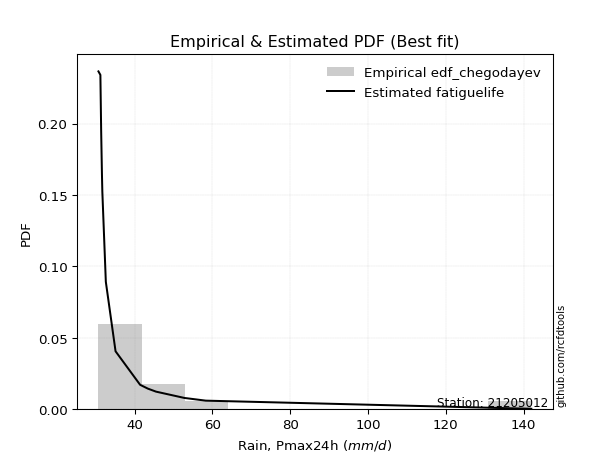</img>

</div>


### 6. EDF Blom (1958)

The Blom formula is a specific "plotting position" formula used in hydrology and statistical analysis to estimate the empirical cumulative probability (or non-exceedance probability) of a data series. It is particularly recommended for data that are approximately normally distributed. The constant _a_ is set to 0.375 (or 3/8).

<div align="center">


$P=(m-a)/(n+1-2a)$


</div>


**6.1. Empirical values**

<div align="center">

|                | 0                    | 1                  | 2                   | 3                  | 4                  | 5                   | 6                  | 7                   | 8                  | 9                  | 10                 | 11                 | 12                 | 13                 | 14                 | 15                 |
|:---------------|:---------------------|:-------------------|:--------------------|:-------------------|:-------------------|:--------------------|:-------------------|:--------------------|:-------------------|:-------------------|:-------------------|:-------------------|:-------------------|:-------------------|:-------------------|:-------------------|
| date           | 2019                 | 2018               | 2025                | 2022               | 2011               | 2021                | 2012               | 2010                | 2014               | 2013               | 2020               | 2017               | 2023               | 2016               | 2024               | 2015               |
| x              | 30.7                 | 31.2               | 31.2                | 31.4               | 31.6               | 31.7                | 32.6               | 32.6                | 35.1               | 41.4               | 41.5               | 43.4               | 44.5625            | 45.5               | 52.8               | 58.3               |
| m              | 1                    | 2                  | 3                   | 4                  | 5                  | 6                   | 7                  | 8                   | 9                  | 10                 | 11                 | 12                 | 13                 | 14                 | 15                 | 16                 |
| empirical_dist | edf_blom             | edf_blom           | edf_blom            | edf_blom           | edf_blom           | edf_blom            | edf_blom           | edf_blom            | edf_blom           | edf_blom           | edf_blom           | edf_blom           | edf_blom           | edf_blom           | edf_blom           | edf_blom           |
| empirical      | 0.038461538461538464 | 0.1                | 0.16153846153846155 | 0.2230769230769231 | 0.2846153846153846 | 0.34615384615384615 | 0.4076923076923077 | 0.46923076923076923 | 0.5307692307692308 | 0.5923076923076923 | 0.6538461538461539 | 0.7153846153846154 | 0.7769230769230769 | 0.8384615384615385 | 0.9                | 0.9615384615384616 |
| empirical_tr   | 1.04                 | 1.1111111111111112 | 1.1926605504587156  | 1.2871287128712872 | 1.3978494623655913 | 1.5294117647058822  | 1.6883116883116882 | 1.8840579710144927  | 2.1311475409836067 | 2.452830188679245  | 2.888888888888889  | 3.5135135135135136 | 4.482758620689656  | 6.190476190476192  | 10.000000000000002 | 26.000000000000018 |

</div>


**6.2. Kolmogorov-Smirnov fit test (sorted by Δ)**


<div align="center">

|                | 0                  | 1                   | 2                   | 3                   | 4                   | 5                   | 6                   | 7                | 8                   | 9                   | 10                  | 11                  | 12                  | 13                 | 14                  | 15                 | 16                  | 17                  | 18                 | 19                  | 20                  | 21                  | 22                  | 23                  | 24                 | 25                  | 26                  | 27                  | 28                  | 29                  | 30                  | 31                  | 32               | 33                  | 34                  | 35                  | 36                  | 37                  | 38                  | 39                 | 40                  | 41                  | 42                 | 43                  | 44                 | 45                  | 46                 | 47                  | 48                  | 49                  | 50                  | 51                  | 52                 | 53                  | 54                 | 55                  | 56                 | 57                  | 58                 | 59                  | 60                  | 61                 | 62                 | 63                | 64                  | 65                  | 66                | 67                 | 68                 | 69                 | 70                  | 71                 | 72                  | 73                  | 74                  | 75                  | 76                  | 77                  | 78                  | 79                  | 80                  | 81                  | 82                  | 83                  | 84                  | 85                  | 86                 | 87                 | 88                  | 89                 | 90                  | 91                 | 92                  | 93                  | 94                 | 95                 | 96                 | 97                  | 98                  | 99                  | 100                 | 101                 | 102                | 103                | 104                | 105                 | 106               | 107                 | 108                | 109                 | 110                 | 111                 | 112                 | 113               | 114                 | 115                 | 116                 | 117                 | 118                | 119                | 120                | 121                 | 122                | 123                | 124                | 125                | 126                 | 127                 | 128                 | 129              | 130                | 131               | 132                | 133                 | 134                 | 135                 | 136                | 137                | 138               | 139                | 140                 | 141                | 142                | 143                | 144                 | 145               | 146                | 147                 | 148                 | 149                 | 150                 | 151                 | 152                 | 153               | 154                | 155                | 156                | 157               | 158            | 159            |
|:---------------|:-------------------|:--------------------|:--------------------|:--------------------|:--------------------|:--------------------|:--------------------|:-----------------|:--------------------|:--------------------|:--------------------|:--------------------|:--------------------|:-------------------|:--------------------|:-------------------|:--------------------|:--------------------|:-------------------|:--------------------|:--------------------|:--------------------|:--------------------|:--------------------|:-------------------|:--------------------|:--------------------|:--------------------|:--------------------|:--------------------|:--------------------|:--------------------|:-----------------|:--------------------|:--------------------|:--------------------|:--------------------|:--------------------|:--------------------|:-------------------|:--------------------|:--------------------|:-------------------|:--------------------|:-------------------|:--------------------|:-------------------|:--------------------|:--------------------|:--------------------|:--------------------|:--------------------|:-------------------|:--------------------|:-------------------|:--------------------|:-------------------|:--------------------|:-------------------|:--------------------|:--------------------|:-------------------|:-------------------|:------------------|:--------------------|:--------------------|:------------------|:-------------------|:-------------------|:-------------------|:--------------------|:-------------------|:--------------------|:--------------------|:--------------------|:--------------------|:--------------------|:--------------------|:--------------------|:--------------------|:--------------------|:--------------------|:--------------------|:--------------------|:--------------------|:--------------------|:-------------------|:-------------------|:--------------------|:-------------------|:--------------------|:-------------------|:--------------------|:--------------------|:-------------------|:-------------------|:-------------------|:--------------------|:--------------------|:--------------------|:--------------------|:--------------------|:-------------------|:-------------------|:-------------------|:--------------------|:------------------|:--------------------|:-------------------|:--------------------|:--------------------|:--------------------|:--------------------|:------------------|:--------------------|:--------------------|:--------------------|:--------------------|:-------------------|:-------------------|:-------------------|:--------------------|:-------------------|:-------------------|:-------------------|:-------------------|:--------------------|:--------------------|:--------------------|:-----------------|:-------------------|:------------------|:-------------------|:--------------------|:--------------------|:--------------------|:-------------------|:-------------------|:------------------|:-------------------|:--------------------|:-------------------|:-------------------|:-------------------|:--------------------|:------------------|:-------------------|:--------------------|:--------------------|:--------------------|:--------------------|:--------------------|:--------------------|:------------------|:-------------------|:-------------------|:-------------------|:------------------|:---------------|:---------------|
| station        | 21205012           | 21205012            | 21205012            | 21205012            | 21205012            | 21205012            | 21205012            | 21205012         | 21205012            | 21205012            | 21205012            | 21205012            | 21205012            | 21205012           | 21205012            | 21205012           | 21205012            | 21205012            | 21205012           | 21205012            | 21205012            | 21205012            | 21205012            | 21205012            | 21205012           | 21205012            | 21205012            | 21205012            | 21205012            | 21205012            | 21205012            | 21205012            | 21205012         | 21205012            | 21205012            | 21205012            | 21205012            | 21205012            | 21205012            | 21205012           | 21205012            | 21205012            | 21205012           | 21205012            | 21205012           | 21205012            | 21205012           | 21205012            | 21205012            | 21205012            | 21205012            | 21205012            | 21205012           | 21205012            | 21205012           | 21205012            | 21205012           | 21205012            | 21205012           | 21205012            | 21205012            | 21205012           | 21205012           | 21205012          | 21205012            | 21205012            | 21205012          | 21205012           | 21205012           | 21205012           | 21205012            | 21205012           | 21205012            | 21205012            | 21205012            | 21205012            | 21205012            | 21205012            | 21205012            | 21205012            | 21205012            | 21205012            | 21205012            | 21205012            | 21205012            | 21205012            | 21205012           | 21205012           | 21205012            | 21205012           | 21205012            | 21205012           | 21205012            | 21205012            | 21205012           | 21205012           | 21205012           | 21205012            | 21205012            | 21205012            | 21205012            | 21205012            | 21205012           | 21205012           | 21205012           | 21205012            | 21205012          | 21205012            | 21205012           | 21205012            | 21205012            | 21205012            | 21205012            | 21205012          | 21205012            | 21205012            | 21205012            | 21205012            | 21205012           | 21205012           | 21205012           | 21205012            | 21205012           | 21205012           | 21205012           | 21205012           | 21205012            | 21205012            | 21205012            | 21205012         | 21205012           | 21205012          | 21205012           | 21205012            | 21205012            | 21205012            | 21205012           | 21205012           | 21205012          | 21205012           | 21205012            | 21205012           | 21205012           | 21205012           | 21205012            | 21205012          | 21205012           | 21205012            | 21205012            | 21205012            | 21205012            | 21205012            | 21205012            | 21205012          | 21205012           | 21205012           | 21205012           | 21205012          | 21205012       | 21205012       |
| empirical_dist | edf_blom           | edf_blom            | edf_blom            | edf_blom            | edf_blom            | edf_blom            | edf_blom            | edf_blom         | edf_blom            | edf_blom            | edf_blom            | edf_blom            | edf_blom            | edf_blom           | edf_blom            | edf_blom           | edf_blom            | edf_blom            | edf_blom           | edf_blom            | edf_blom            | edf_blom            | edf_blom            | edf_blom            | edf_blom           | edf_blom            | edf_blom            | edf_blom            | edf_blom            | edf_blom            | edf_blom            | edf_blom            | edf_blom         | edf_blom            | edf_blom            | edf_blom            | edf_blom            | edf_blom            | edf_blom            | edf_blom           | edf_blom            | edf_blom            | edf_blom           | edf_blom            | edf_blom           | edf_blom            | edf_blom           | edf_blom            | edf_blom            | edf_blom            | edf_blom            | edf_blom            | edf_blom           | edf_blom            | edf_blom           | edf_blom            | edf_blom           | edf_blom            | edf_blom           | edf_blom            | edf_blom            | edf_blom           | edf_blom           | edf_blom          | edf_blom            | edf_blom            | edf_blom          | edf_blom           | edf_blom           | edf_blom           | edf_blom            | edf_blom           | edf_blom            | edf_blom            | edf_blom            | edf_blom            | edf_blom            | edf_blom            | edf_blom            | edf_blom            | edf_blom            | edf_blom            | edf_blom            | edf_blom            | edf_blom            | edf_blom            | edf_blom           | edf_blom           | edf_blom            | edf_blom           | edf_blom            | edf_blom           | edf_blom            | edf_blom            | edf_blom           | edf_blom           | edf_blom           | edf_blom            | edf_blom            | edf_blom            | edf_blom            | edf_blom            | edf_blom           | edf_blom           | edf_blom           | edf_blom            | edf_blom          | edf_blom            | edf_blom           | edf_blom            | edf_blom            | edf_blom            | edf_blom            | edf_blom          | edf_blom            | edf_blom            | edf_blom            | edf_blom            | edf_blom           | edf_blom           | edf_blom           | edf_blom            | edf_blom           | edf_blom           | edf_blom           | edf_blom           | edf_blom            | edf_blom            | edf_blom            | edf_blom         | edf_blom           | edf_blom          | edf_blom           | edf_blom            | edf_blom            | edf_blom            | edf_blom           | edf_blom           | edf_blom          | edf_blom           | edf_blom            | edf_blom           | edf_blom           | edf_blom           | edf_blom            | edf_blom          | edf_blom           | edf_blom            | edf_blom            | edf_blom            | edf_blom            | edf_blom            | edf_blom            | edf_blom          | edf_blom           | edf_blom           | edf_blom           | edf_blom          | edf_blom       | edf_blom       |
| p_dist         | gausshyper         | weibull_min         | logdgamma           | exponweib           | logbeta             | nakagami            | logtruncweibull_min | logdweibull      | loggengamma         | foldnorm            | dweibull            | halfnorm            | halfgennorm         | logfoldnorm        | loghalfnorm         | gengamma           | exponpow            | johnsonsu           | loglomax           | fatiguelife         | semicircular        | vonmises_line       | logbradford         | invweibull          | genextreme         | loghalfgennorm      | logsemicircular     | logjohnsonsu        | halflogistic        | loginvweibull       | loggenextreme       | beta                | lomax            | logburr             | loghalflogistic     | f                   | logfatiguelife      | rayleigh            | anglit              | invgamma           | lograyleigh         | loganglit           | logburr12          | logf                | burr               | pearson3            | maxwell            | logweibull_min      | logarcsine          | logexponpow         | logmaxwell          | logtruncpareto      | logexponnorm       | logpearson3         | loggenexpon        | burr12              | truncpareto        | gumbel_r            | invgauss           | loginvgauss         | loggumbel_r         | moyal              | lognakagami        | gompertz          | loggenlogistic      | bradford            | logweibull_max    | logmoyal           | logloggamma        | erlang             | t                   | crystalball        | norm                | lognct              | nct                 | loginvgamma         | logt                | logcrystalball      | lognorm             | loggamma            | loggamma            | alpha               | ncf                 | arcsine             | betaprime           | genlogistic         | logalpha           | logbetaprime       | logkstwobign        | logexponweib       | kstwobign           | logerlang          | logistic            | exponnorm           | genexpon           | loglogistic        | logcosine          | cosine              | gumbel_l            | hypsecant           | logrice             | truncnorm           | loggumbel_l        | loghypsecant       | rdist              | loggausshyper       | rice              | dgamma              | logtruncnorm       | gamma               | gennorm             | powerlaw            | logpowerlaw         | laplace           | loglaplace          | loglaplace          | logargus            | argus               | truncweibull_min   | logtriang          | logkappa4          | logwrapcauchy       | logskewnorm        | wald               | logksone           | logloglaplace      | loggennorm          | tukeylambda         | genhalflogistic     | loggompertz      | logwald            | logrdist          | logtruncexpon      | logncf              | ksone               | wrapcauchy          | logkappa3          | skewnorm           | triang            | truncexpon         | loggenhalflogistic  | logtukeylambda     | loguniform         | logvonmises_line   | genpareto           | kappa4            | uniform            | kappa3              | johnsonsb           | loglevy_l           | levy_l              | logjohnsonsb        | logtrapezoid        | trapezoid         | loggenpareto       | weibull_max        | logvonmises        | vonmises          | mielke         | logmielke      |
| delta          | 0.1210070745937627 | 0.14303852897417957 | 0.15160960466045864 | 0.15465564638260548 | 0.15583481797790188 | 0.16329316629022417 | 0.17079125249424298 | 0.17417778805042 | 0.17548364864779975 | 0.17643673320714515 | 0.17698720060326878 | 0.17755387982736837 | 0.17815950461992847 | 0.1795954717305337 | 0.18033221580025788 | 0.1805308580675723 | 0.18359681875944944 | 0.18538789323086657 | 0.1865345344421543 | 0.18789314660679868 | 0.18830448039546843 | 0.18847695514089047 | 0.18909497102607498 | 0.18933698200882043 | 0.1893549418085052 | 0.18978865317277982 | 0.19012867577897152 | 0.19224911793778732 | 0.19445792693506658 | 0.19447353918936638 | 0.19447531738633062 | 0.19515716939348798 | 0.19544248671719 | 0.19589292643493728 | 0.19780844880409398 | 0.19838419292738652 | 0.19861706174988036 | 0.19958248911895443 | 0.20039458325709603 | 0.2013297994556068 | 0.20192855076417005 | 0.20226879227369954 | 0.2052813357136885 | 0.20532026050926044 | 0.2073369003561324 | 0.20737708611611444 | 0.2079669031262496 | 0.20879329877166447 | 0.21001306935393213 | 0.21009523318101997 | 0.21019591329224524 | 0.21129042149444954 | 0.2119180450976198 | 0.21416679969621538 | 0.2143812258382809 | 0.21445405324438788 | 0.2179389798164098 | 0.21846179288363754 | 0.2197469074033529 | 0.22048771905469022 | 0.22121175487409084 | 0.2218754050907773 | 0.2225449180936524 | 0.223029147099498 | 0.22406296376933993 | 0.22456221535609963 | 0.224952393915007 | 0.2251222339286597 | 0.2251405795656325 | 0.2259191840057826 | 0.22820162933795385 | 0.2282027694361376 | 0.22820278403864613 | 0.22845234142675794 | 0.22894085650171264 | 0.22912999974569717 | 0.23012634039980162 | 0.23012749418922598 | 0.23012764707997024 | 0.23028863942641487 | 0.23028863942641487 | 0.23267847026843225 | 0.23293523557560925 | 0.23297411053886427 | 0.23411770099359028 | 0.23424225032937002 | 0.2342863922951109 | 0.2371092562894568 | 0.23797537573196834 | 0.2418242744275817 | 0.24987715292593796 | 0.2500305633950156 | 0.25084535587202283 | 0.25123039942415637 | 0.2523682065854187 | 0.2527560143684653 | 0.2579992286069615 | 0.25854689916377277 | 0.26543453626233615 | 0.26547596354766045 | 0.26601098390136824 | 0.26616419731682717 | 0.2668709010346758 | 0.2673176328698383 | 0.2708805273511675 | 0.27259882688533676 | 0.273545146527309 | 0.27425438261432467 | 0.2745616300260351 | 0.28018268305366545 | 0.28040768562296214 | 0.28047158557998875 | 0.28286263265764644 | 0.284219550434511 | 0.28583229856883124 | 0.28583229856883124 | 0.28794091641185593 | 0.28799717530072266 | 0.2892168967373627 | 0.2944626115254607 | 0.2974805550521946 | 0.29942863162355404 | 0.3040744098804356 | 0.3067220654680593 | 0.3078711077810472 | 0.3095605005033307 | 0.31568065303364745 | 0.31587675435764584 | 0.31645632995430184 | 0.31696175204287 | 0.3191410781150543 | 0.320271564856732 | 0.3258255585361798 | 0.32748659974033434 | 0.32853028613898166 | 0.32904957896162246 | 0.3316387582273157 | 0.3369843856223845 | 0.348672698151643 | 0.3575427198831427 | 0.36910980089278256 | 0.3692601808853623 | 0.3755991754911029 | 0.3761132532843061 | 0.37755815353222266 | 0.382600156667093 | 0.4003901895206242 | 0.40046404004821134 | 0.41207044685073513 | 0.43214984306809867 | 0.45268414499867726 | 0.45382213650024206 | 0.48495085469338467 | 0.557356670203236 | 0.6510165451468938 | 0.7134496801364403 | 1.1196992723235126 | 8.850980736922684 | nan            | nan            |
| deltao         | 0.331107277296     | 0.331107277296      | 0.331107277296      | 0.331107277296      | 0.331107277296      | 0.331107277296      | 0.331107277296      | 0.331107277296   | 0.331107277296      | 0.331107277296      | 0.331107277296      | 0.331107277296      | 0.331107277296      | 0.331107277296     | 0.331107277296      | 0.331107277296     | 0.331107277296      | 0.331107277296      | 0.331107277296     | 0.331107277296      | 0.331107277296      | 0.331107277296      | 0.331107277296      | 0.331107277296      | 0.331107277296     | 0.331107277296      | 0.331107277296      | 0.331107277296      | 0.331107277296      | 0.331107277296      | 0.331107277296      | 0.331107277296      | 0.331107277296   | 0.331107277296      | 0.331107277296      | 0.331107277296      | 0.331107277296      | 0.331107277296      | 0.331107277296      | 0.331107277296     | 0.331107277296      | 0.331107277296      | 0.331107277296     | 0.331107277296      | 0.331107277296     | 0.331107277296      | 0.331107277296     | 0.331107277296      | 0.331107277296      | 0.331107277296      | 0.331107277296      | 0.331107277296      | 0.331107277296     | 0.331107277296      | 0.331107277296     | 0.331107277296      | 0.331107277296     | 0.331107277296      | 0.331107277296     | 0.331107277296      | 0.331107277296      | 0.331107277296     | 0.331107277296     | 0.331107277296    | 0.331107277296      | 0.331107277296      | 0.331107277296    | 0.331107277296     | 0.331107277296     | 0.331107277296     | 0.331107277296      | 0.331107277296     | 0.331107277296      | 0.331107277296      | 0.331107277296      | 0.331107277296      | 0.331107277296      | 0.331107277296      | 0.331107277296      | 0.331107277296      | 0.331107277296      | 0.331107277296      | 0.331107277296      | 0.331107277296      | 0.331107277296      | 0.331107277296      | 0.331107277296     | 0.331107277296     | 0.331107277296      | 0.331107277296     | 0.331107277296      | 0.331107277296     | 0.331107277296      | 0.331107277296      | 0.331107277296     | 0.331107277296     | 0.331107277296     | 0.331107277296      | 0.331107277296      | 0.331107277296      | 0.331107277296      | 0.331107277296      | 0.331107277296     | 0.331107277296     | 0.331107277296     | 0.331107277296      | 0.331107277296    | 0.331107277296      | 0.331107277296     | 0.331107277296      | 0.331107277296      | 0.331107277296      | 0.331107277296      | 0.331107277296    | 0.331107277296      | 0.331107277296      | 0.331107277296      | 0.331107277296      | 0.331107277296     | 0.331107277296     | 0.331107277296     | 0.331107277296      | 0.331107277296     | 0.331107277296     | 0.331107277296     | 0.331107277296     | 0.331107277296      | 0.331107277296      | 0.331107277296      | 0.331107277296   | 0.331107277296     | 0.331107277296    | 0.331107277296     | 0.331107277296      | 0.331107277296      | 0.331107277296      | 0.331107277296     | 0.331107277296     | 0.331107277296    | 0.331107277296     | 0.331107277296      | 0.331107277296     | 0.331107277296     | 0.331107277296     | 0.331107277296      | 0.331107277296    | 0.331107277296     | 0.331107277296      | 0.331107277296      | 0.331107277296      | 0.331107277296      | 0.331107277296      | 0.331107277296      | 0.331107277296    | 0.331107277296     | 0.331107277296     | 0.331107277296     | 0.331107277296    | 0.331107277296 | 0.331107277296 |
| eval           | Δo > Δ             | Δo > Δ              | Δo > Δ              | Δo > Δ              | Δo > Δ              | Δo > Δ              | Δo > Δ              | Δo > Δ           | Δo > Δ              | Δo > Δ              | Δo > Δ              | Δo > Δ              | Δo > Δ              | Δo > Δ             | Δo > Δ              | Δo > Δ             | Δo > Δ              | Δo > Δ              | Δo > Δ             | Δo > Δ              | Δo > Δ              | Δo > Δ              | Δo > Δ              | Δo > Δ              | Δo > Δ             | Δo > Δ              | Δo > Δ              | Δo > Δ              | Δo > Δ              | Δo > Δ              | Δo > Δ              | Δo > Δ              | Δo > Δ           | Δo > Δ              | Δo > Δ              | Δo > Δ              | Δo > Δ              | Δo > Δ              | Δo > Δ              | Δo > Δ             | Δo > Δ              | Δo > Δ              | Δo > Δ             | Δo > Δ              | Δo > Δ             | Δo > Δ              | Δo > Δ             | Δo > Δ              | Δo > Δ              | Δo > Δ              | Δo > Δ              | Δo > Δ              | Δo > Δ             | Δo > Δ              | Δo > Δ             | Δo > Δ              | Δo > Δ             | Δo > Δ              | Δo > Δ             | Δo > Δ              | Δo > Δ              | Δo > Δ             | Δo > Δ             | Δo > Δ            | Δo > Δ              | Δo > Δ              | Δo > Δ            | Δo > Δ             | Δo > Δ             | Δo > Δ             | Δo > Δ              | Δo > Δ             | Δo > Δ              | Δo > Δ              | Δo > Δ              | Δo > Δ              | Δo > Δ              | Δo > Δ              | Δo > Δ              | Δo > Δ              | Δo > Δ              | Δo > Δ              | Δo > Δ              | Δo > Δ              | Δo > Δ              | Δo > Δ              | Δo > Δ             | Δo > Δ             | Δo > Δ              | Δo > Δ             | Δo > Δ              | Δo > Δ             | Δo > Δ              | Δo > Δ              | Δo > Δ             | Δo > Δ             | Δo > Δ             | Δo > Δ              | Δo > Δ              | Δo > Δ              | Δo > Δ              | Δo > Δ              | Δo > Δ             | Δo > Δ             | Δo > Δ             | Δo > Δ              | Δo > Δ            | Δo > Δ              | Δo > Δ             | Δo > Δ              | Δo > Δ              | Δo > Δ              | Δo > Δ              | Δo > Δ            | Δo > Δ              | Δo > Δ              | Δo > Δ              | Δo > Δ              | Δo > Δ             | Δo > Δ             | Δo > Δ             | Δo > Δ              | Δo > Δ             | Δo > Δ             | Δo > Δ             | Δo > Δ             | Δo > Δ              | Δo > Δ              | Δo > Δ              | Δo > Δ           | Δo > Δ             | Δo > Δ            | Δo > Δ             | Δo > Δ              | Δo > Δ              | Δo > Δ              | Δo <= Δ            | Δo <= Δ            | Δo <= Δ           | Δo <= Δ            | Δo <= Δ             | Δo <= Δ            | Δo <= Δ            | Δo <= Δ            | Δo <= Δ             | Δo <= Δ           | Δo <= Δ            | Δo <= Δ             | Δo <= Δ             | Δo <= Δ             | Δo <= Δ             | Δo <= Δ             | Δo <= Δ             | Δo <= Δ           | Δo <= Δ            | Δo <= Δ            | Δo <= Δ            | Δo <= Δ           | Δo <= Δ        | Δo <= Δ        |
| fit            | 1                  | 1                   | 1                   | 1                   | 1                   | 1                   | 1                   | 1                | 1                   | 1                   | 1                   | 1                   | 1                   | 1                  | 1                   | 1                  | 1                   | 1                   | 1                  | 1                   | 1                   | 1                   | 1                   | 1                   | 1                  | 1                   | 1                   | 1                   | 1                   | 1                   | 1                   | 1                   | 1                | 1                   | 1                   | 1                   | 1                   | 1                   | 1                   | 1                  | 1                   | 1                   | 1                  | 1                   | 1                  | 1                   | 1                  | 1                   | 1                   | 1                   | 1                   | 1                   | 1                  | 1                   | 1                  | 1                   | 1                  | 1                   | 1                  | 1                   | 1                   | 1                  | 1                  | 1                 | 1                   | 1                   | 1                 | 1                  | 1                  | 1                  | 1                   | 1                  | 1                   | 1                   | 1                   | 1                   | 1                   | 1                   | 1                   | 1                   | 1                   | 1                   | 1                   | 1                   | 1                   | 1                   | 1                  | 1                  | 1                   | 1                  | 1                   | 1                  | 1                   | 1                   | 1                  | 1                  | 1                  | 1                   | 1                   | 1                   | 1                   | 1                   | 1                  | 1                  | 1                  | 1                   | 1                 | 1                   | 1                  | 1                   | 1                   | 1                   | 1                   | 1                 | 1                   | 1                   | 1                   | 1                   | 1                  | 1                  | 1                  | 1                   | 1                  | 1                  | 1                  | 1                  | 1                   | 1                   | 1                   | 1                | 1                  | 1                 | 1                  | 1                   | 1                   | 1                   | 0                  | 0                  | 0                 | 0                  | 0                   | 0                  | 0                  | 0                  | 0                   | 0                 | 0                  | 0                   | 0                   | 0                   | 0                   | 0                   | 0                   | 0                 | 0                  | 0                  | 0                  | 0                 | 0              | 0              |
| n              | 16                 | 16                  | 16                  | 16                  | 16                  | 16                  | 16                  | 16               | 16                  | 16                  | 16                  | 16                  | 16                  | 16                 | 16                  | 16                 | 16                  | 16                  | 16                 | 16                  | 16                  | 16                  | 16                  | 16                  | 16                 | 16                  | 16                  | 16                  | 16                  | 16                  | 16                  | 16                  | 16               | 16                  | 16                  | 16                  | 16                  | 16                  | 16                  | 16                 | 16                  | 16                  | 16                 | 16                  | 16                 | 16                  | 16                 | 16                  | 16                  | 16                  | 16                  | 16                  | 16                 | 16                  | 16                 | 16                  | 16                 | 16                  | 16                 | 16                  | 16                  | 16                 | 16                 | 16                | 16                  | 16                  | 16                | 16                 | 16                 | 16                 | 16                  | 16                 | 16                  | 16                  | 16                  | 16                  | 16                  | 16                  | 16                  | 16                  | 16                  | 16                  | 16                  | 16                  | 16                  | 16                  | 16                 | 16                 | 16                  | 16                 | 16                  | 16                 | 16                  | 16                  | 16                 | 16                 | 16                 | 16                  | 16                  | 16                  | 16                  | 16                  | 16                 | 16                 | 16                 | 16                  | 16                | 16                  | 16                 | 16                  | 16                  | 16                  | 16                  | 16                | 16                  | 16                  | 16                  | 16                  | 16                 | 16                 | 16                 | 16                  | 16                 | 16                 | 16                 | 16                 | 16                  | 16                  | 16                  | 16               | 16                 | 16                | 16                 | 16                  | 16                  | 16                  | 16                 | 16                 | 16                | 16                 | 16                  | 16                 | 16                 | 16                 | 16                  | 16                | 16                 | 16                  | 16                  | 16                  | 16                  | 16                  | 16                  | 16                | 16                 | 16                 | 16                 | 16                | 16             | 16             |
| best_fit       | 1                  | 0                   | 0                   | 0                   | 0                   | 0                   | 0                   | 0                | 0                   | 0                   | 0                   | 0                   | 0                   | 0                  | 0                   | 0                  | 0                   | 0                   | 0                  | 0                   | 0                   | 0                   | 0                   | 0                   | 0                  | 0                   | 0                   | 0                   | 0                   | 0                   | 0                   | 0                   | 0                | 0                   | 0                   | 0                   | 0                   | 0                   | 0                   | 0                  | 0                   | 0                   | 0                  | 0                   | 0                  | 0                   | 0                  | 0                   | 0                   | 0                   | 0                   | 0                   | 0                  | 0                   | 0                  | 0                   | 0                  | 0                   | 0                  | 0                   | 0                   | 0                  | 0                  | 0                 | 0                   | 0                   | 0                 | 0                  | 0                  | 0                  | 0                   | 0                  | 0                   | 0                   | 0                   | 0                   | 0                   | 0                   | 0                   | 0                   | 0                   | 0                   | 0                   | 0                   | 0                   | 0                   | 0                  | 0                  | 0                   | 0                  | 0                   | 0                  | 0                   | 0                   | 0                  | 0                  | 0                  | 0                   | 0                   | 0                   | 0                   | 0                   | 0                  | 0                  | 0                  | 0                   | 0                 | 0                   | 0                  | 0                   | 0                   | 0                   | 0                   | 0                 | 0                   | 0                   | 0                   | 0                   | 0                  | 0                  | 0                  | 0                   | 0                  | 0                  | 0                  | 0                  | 0                   | 0                   | 0                   | 0                | 0                  | 0                 | 0                  | 0                   | 0                   | 0                   | 0                  | 0                  | 0                 | 0                  | 0                   | 0                  | 0                  | 0                  | 0                   | 0                 | 0                  | 0                   | 0                   | 0                   | 0                   | 0                   | 0                   | 0                 | 0                  | 0                  | 0                  | 0                 | 0              | 0              |
| best_fit_sort  | 1                  | 2                   | 3                   | 4                   | 5                   | 6                   | 7                   | 8                | 9                   | 10                  | 11                  | 12                  | 13                  | 14                 | 15                  | 16                 | 17                  | 18                  | 19                 | 20                  | 21                  | 22                  | 23                  | 24                  | 25                 | 26                  | 27                  | 28                  | 29                  | 30                  | 31                  | 32                  | 33               | 34                  | 35                  | 36                  | 37                  | 38                  | 39                  | 40                 | 41                  | 42                  | 43                 | 44                  | 45                 | 46                  | 47                 | 48                  | 49                  | 50                  | 51                  | 52                  | 53                 | 54                  | 55                 | 56                  | 57                 | 58                  | 59                 | 60                  | 61                  | 62                 | 63                 | 64                | 65                  | 66                  | 67                | 68                 | 69                 | 70                 | 71                  | 72                 | 73                  | 74                  | 75                  | 76                  | 77                  | 78                  | 79                  | 80                  | 81                  | 82                  | 83                  | 84                  | 85                  | 86                  | 87                 | 88                 | 89                  | 90                 | 91                  | 92                 | 93                  | 94                  | 95                 | 96                 | 97                 | 98                  | 99                  | 100                 | 101                 | 102                 | 103                | 104                | 105                | 106                 | 107               | 108                 | 109                | 110                 | 111                 | 112                 | 113                 | 114               | 115                 | 116                 | 117                 | 118                 | 119                | 120                | 121                | 122                 | 123                | 124                | 125                | 126                | 127                 | 128                 | 129                 | 130              | 131                | 132               | 133                | 134                 | 135                 | 136                 | 137                | 138                | 139               | 140                | 141                 | 142                | 143                | 144                | 145                 | 146               | 147                | 148                 | 149                 | 150                 | 151                 | 152                 | 153                 | 154               | 155                | 156                | 157                | 158               | 159            | 160            |

</div>


**6.3. Best fit**

<div align="center">

|   id |   station | empirical_dist   | p_dist     |    delta |   deltao | eval   |   fit |   n |   best_fit |   best_fit_sort |
|-----:|----------:|:-----------------|:-----------|---------:|---------:|:-------|------:|----:|-----------:|----------------:|
|    0 |  21205012 | edf_blom         | gausshyper | 0.121007 | 0.331107 | Δo > Δ |     1 |  16 |          1 |               1 |

</div>


<div align="center">

</img>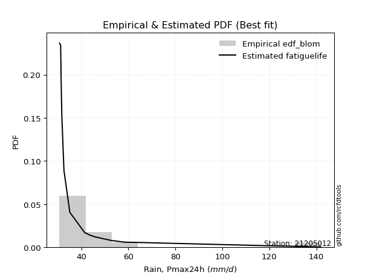</img>

</div>


### 7. EDF Tukey (1962)

In hydrology, the Tukey formula is used as a plotting position formula to estimate the empirical probability or frequency of a flood event (or other hydrological data). The formula parameter is given as _c=0.333_ (or 1/3).

<div align="center">


$P=(m-c)/(n+1-2c)$


</div>


**7.1. Empirical values**

<div align="center">

|                | 0                   | 1                   | 2                   | 3                   | 4                  | 5                  | 6                   | 7                   | 8                  | 9                  | 10                 | 11                 | 12                 | 13                 | 14                 | 15                 |
|:---------------|:--------------------|:--------------------|:--------------------|:--------------------|:-------------------|:-------------------|:--------------------|:--------------------|:-------------------|:-------------------|:-------------------|:-------------------|:-------------------|:-------------------|:-------------------|:-------------------|
| date           | 2019                | 2018                | 2025                | 2022                | 2011               | 2021               | 2012                | 2010                | 2014               | 2013               | 2020               | 2017               | 2023               | 2016               | 2024               | 2015               |
| x              | 30.7                | 31.2                | 31.2                | 31.4                | 31.6               | 31.7               | 32.6                | 32.6                | 35.1               | 41.4               | 41.5               | 43.4               | 44.5625            | 45.5               | 52.8               | 58.3               |
| m              | 1                   | 2                   | 3                   | 4                   | 5                  | 6                  | 7                   | 8                   | 9                  | 10                 | 11                 | 12                 | 13                 | 14                 | 15                 | 16                 |
| empirical_dist | edf_tukey           | edf_tukey           | edf_tukey           | edf_tukey           | edf_tukey          | edf_tukey          | edf_tukey           | edf_tukey           | edf_tukey          | edf_tukey          | edf_tukey          | edf_tukey          | edf_tukey          | edf_tukey          | edf_tukey          | edf_tukey          |
| empirical      | 0.04081632653061224 | 0.10204081632653061 | 0.16326530612244897 | 0.22448979591836735 | 0.2857142857142857 | 0.3469387755102041 | 0.40816326530612246 | 0.46938775510204084 | 0.5306122448979592 | 0.5918367346938775 | 0.6530612244897959 | 0.7142857142857143 | 0.7755102040816326 | 0.8367346938775511 | 0.8979591836734694 | 0.9591836734693877 |
| empirical_tr   | 1.0425531914893618  | 1.1136363636363635  | 1.1951219512195121  | 1.2894736842105263  | 1.4                | 1.5312499999999998 | 1.6896551724137931  | 1.8846153846153848  | 2.130434782608696  | 2.4499999999999997 | 2.88235294117647   | 3.5                | 4.454545454545454  | 6.125000000000002  | 9.799999999999999  | 24.49999999999997  |

</div>


**7.2. Kolmogorov-Smirnov fit test (sorted by Δ)**


<div align="center">

|                | 0                  | 1                   | 2                   | 3                  | 4                  | 5                   | 6                   | 7                  | 8                  | 9                   | 10                 | 11                  | 12                  | 13                 | 14                 | 15                  | 16                  | 17                  | 18                  | 19                  | 20                  | 21                  | 22                  | 23                 | 24                  | 25                 | 26                  | 27                 | 28                 | 29                  | 30                  | 31                 | 32                  | 33                  | 34                 | 35                 | 36                  | 37                  | 38                  | 39                  | 40                  | 41                  | 42                  | 43                  | 44                  | 45                  | 46                  | 47                  | 48                 | 49                  | 50                  | 51                 | 52                 | 53                | 54                 | 55                  | 56                  | 57                  | 58                  | 59                | 60                  | 61                 | 62                  | 63                 | 64                  | 65                  | 66                 | 67                  | 68                 | 69                  | 70                  | 71                 | 72                  | 73                  | 74                  | 75                  | 76                  | 77                 | 78                  | 79                 | 80                  | 81                  | 82                  | 83                  | 84                 | 85                  | 86                 | 87                  | 88                  | 89                  | 90                 | 91                 | 92                 | 93                | 94                  | 95                  | 96                 | 97                 | 98                  | 99                 | 100                | 101                 | 102                | 103                | 104                 | 105                 | 106                | 107                 | 108                 | 109                | 110                | 111                 | 112                | 113                 | 114                 | 115                 | 116                 | 117                 | 118                | 119                | 120                 | 121                | 122                | 123                | 124               | 125                | 126                 | 127                 | 128                 | 129                | 130                | 131                 | 132                | 133                | 134                 | 135                | 136                 | 137                | 138                | 139                | 140                | 141                | 142                 | 143                | 144                | 145                | 146                | 147                | 148                | 149                | 150                 | 151                 | 152                 | 153                | 154                | 155                | 156                | 157               | 158            | 159            |
|:---------------|:-------------------|:--------------------|:--------------------|:-------------------|:-------------------|:--------------------|:--------------------|:-------------------|:-------------------|:--------------------|:-------------------|:--------------------|:--------------------|:-------------------|:-------------------|:--------------------|:--------------------|:--------------------|:--------------------|:--------------------|:--------------------|:--------------------|:--------------------|:-------------------|:--------------------|:-------------------|:--------------------|:-------------------|:-------------------|:--------------------|:--------------------|:-------------------|:--------------------|:--------------------|:-------------------|:-------------------|:--------------------|:--------------------|:--------------------|:--------------------|:--------------------|:--------------------|:--------------------|:--------------------|:--------------------|:--------------------|:--------------------|:--------------------|:-------------------|:--------------------|:--------------------|:-------------------|:-------------------|:------------------|:-------------------|:--------------------|:--------------------|:--------------------|:--------------------|:------------------|:--------------------|:-------------------|:--------------------|:-------------------|:--------------------|:--------------------|:-------------------|:--------------------|:-------------------|:--------------------|:--------------------|:-------------------|:--------------------|:--------------------|:--------------------|:--------------------|:--------------------|:-------------------|:--------------------|:-------------------|:--------------------|:--------------------|:--------------------|:--------------------|:-------------------|:--------------------|:-------------------|:--------------------|:--------------------|:--------------------|:-------------------|:-------------------|:-------------------|:------------------|:--------------------|:--------------------|:-------------------|:-------------------|:--------------------|:-------------------|:-------------------|:--------------------|:-------------------|:-------------------|:--------------------|:--------------------|:-------------------|:--------------------|:--------------------|:-------------------|:-------------------|:--------------------|:-------------------|:--------------------|:--------------------|:--------------------|:--------------------|:--------------------|:-------------------|:-------------------|:--------------------|:-------------------|:-------------------|:-------------------|:------------------|:-------------------|:--------------------|:--------------------|:--------------------|:-------------------|:-------------------|:--------------------|:-------------------|:-------------------|:--------------------|:-------------------|:--------------------|:-------------------|:-------------------|:-------------------|:-------------------|:-------------------|:--------------------|:-------------------|:-------------------|:-------------------|:-------------------|:-------------------|:-------------------|:-------------------|:--------------------|:--------------------|:--------------------|:-------------------|:-------------------|:-------------------|:-------------------|:------------------|:---------------|:---------------|
| station        | 21205012           | 21205012            | 21205012            | 21205012           | 21205012           | 21205012            | 21205012            | 21205012           | 21205012           | 21205012            | 21205012           | 21205012            | 21205012            | 21205012           | 21205012           | 21205012            | 21205012            | 21205012            | 21205012            | 21205012            | 21205012            | 21205012            | 21205012            | 21205012           | 21205012            | 21205012           | 21205012            | 21205012           | 21205012           | 21205012            | 21205012            | 21205012           | 21205012            | 21205012            | 21205012           | 21205012           | 21205012            | 21205012            | 21205012            | 21205012            | 21205012            | 21205012            | 21205012            | 21205012            | 21205012            | 21205012            | 21205012            | 21205012            | 21205012           | 21205012            | 21205012            | 21205012           | 21205012           | 21205012          | 21205012           | 21205012            | 21205012            | 21205012            | 21205012            | 21205012          | 21205012            | 21205012           | 21205012            | 21205012           | 21205012            | 21205012            | 21205012           | 21205012            | 21205012           | 21205012            | 21205012            | 21205012           | 21205012            | 21205012            | 21205012            | 21205012            | 21205012            | 21205012           | 21205012            | 21205012           | 21205012            | 21205012            | 21205012            | 21205012            | 21205012           | 21205012            | 21205012           | 21205012            | 21205012            | 21205012            | 21205012           | 21205012           | 21205012           | 21205012          | 21205012            | 21205012            | 21205012           | 21205012           | 21205012            | 21205012           | 21205012           | 21205012            | 21205012           | 21205012           | 21205012            | 21205012            | 21205012           | 21205012            | 21205012            | 21205012           | 21205012           | 21205012            | 21205012           | 21205012            | 21205012            | 21205012            | 21205012            | 21205012            | 21205012           | 21205012           | 21205012            | 21205012           | 21205012           | 21205012           | 21205012          | 21205012           | 21205012            | 21205012            | 21205012            | 21205012           | 21205012           | 21205012            | 21205012           | 21205012           | 21205012            | 21205012           | 21205012            | 21205012           | 21205012           | 21205012           | 21205012           | 21205012           | 21205012            | 21205012           | 21205012           | 21205012           | 21205012           | 21205012           | 21205012           | 21205012           | 21205012            | 21205012            | 21205012            | 21205012           | 21205012           | 21205012           | 21205012           | 21205012          | 21205012       | 21205012       |
| empirical_dist | edf_tukey          | edf_tukey           | edf_tukey           | edf_tukey          | edf_tukey          | edf_tukey           | edf_tukey           | edf_tukey          | edf_tukey          | edf_tukey           | edf_tukey          | edf_tukey           | edf_tukey           | edf_tukey          | edf_tukey          | edf_tukey           | edf_tukey           | edf_tukey           | edf_tukey           | edf_tukey           | edf_tukey           | edf_tukey           | edf_tukey           | edf_tukey          | edf_tukey           | edf_tukey          | edf_tukey           | edf_tukey          | edf_tukey          | edf_tukey           | edf_tukey           | edf_tukey          | edf_tukey           | edf_tukey           | edf_tukey          | edf_tukey          | edf_tukey           | edf_tukey           | edf_tukey           | edf_tukey           | edf_tukey           | edf_tukey           | edf_tukey           | edf_tukey           | edf_tukey           | edf_tukey           | edf_tukey           | edf_tukey           | edf_tukey          | edf_tukey           | edf_tukey           | edf_tukey          | edf_tukey          | edf_tukey         | edf_tukey          | edf_tukey           | edf_tukey           | edf_tukey           | edf_tukey           | edf_tukey         | edf_tukey           | edf_tukey          | edf_tukey           | edf_tukey          | edf_tukey           | edf_tukey           | edf_tukey          | edf_tukey           | edf_tukey          | edf_tukey           | edf_tukey           | edf_tukey          | edf_tukey           | edf_tukey           | edf_tukey           | edf_tukey           | edf_tukey           | edf_tukey          | edf_tukey           | edf_tukey          | edf_tukey           | edf_tukey           | edf_tukey           | edf_tukey           | edf_tukey          | edf_tukey           | edf_tukey          | edf_tukey           | edf_tukey           | edf_tukey           | edf_tukey          | edf_tukey          | edf_tukey          | edf_tukey         | edf_tukey           | edf_tukey           | edf_tukey          | edf_tukey          | edf_tukey           | edf_tukey          | edf_tukey          | edf_tukey           | edf_tukey          | edf_tukey          | edf_tukey           | edf_tukey           | edf_tukey          | edf_tukey           | edf_tukey           | edf_tukey          | edf_tukey          | edf_tukey           | edf_tukey          | edf_tukey           | edf_tukey           | edf_tukey           | edf_tukey           | edf_tukey           | edf_tukey          | edf_tukey          | edf_tukey           | edf_tukey          | edf_tukey          | edf_tukey          | edf_tukey         | edf_tukey          | edf_tukey           | edf_tukey           | edf_tukey           | edf_tukey          | edf_tukey          | edf_tukey           | edf_tukey          | edf_tukey          | edf_tukey           | edf_tukey          | edf_tukey           | edf_tukey          | edf_tukey          | edf_tukey          | edf_tukey          | edf_tukey          | edf_tukey           | edf_tukey          | edf_tukey          | edf_tukey          | edf_tukey          | edf_tukey          | edf_tukey          | edf_tukey          | edf_tukey           | edf_tukey           | edf_tukey           | edf_tukey          | edf_tukey          | edf_tukey          | edf_tukey          | edf_tukey         | edf_tukey      | edf_tukey      |
| p_dist         | gausshyper         | weibull_min         | logdgamma           | exponweib          | logbeta            | nakagami            | logtruncweibull_min | loggengamma        | logdweibull        | foldnorm            | dweibull           | halfnorm            | halfgennorm         | logfoldnorm        | loghalfnorm        | gengamma            | exponpow            | johnsonsu           | loglomax            | fatiguelife         | semicircular        | vonmises_line       | logbradford         | invweibull         | genextreme          | loghalfgennorm     | logsemicircular     | logjohnsonsu       | halflogistic       | loginvweibull       | loggenextreme       | beta               | lomax               | logburr             | loghalflogistic    | f                  | logfatiguelife      | rayleigh            | anglit              | invgamma            | lograyleigh         | loganglit           | logburr12           | logf                | pearson3            | logarcsine          | logexponpow         | burr                | maxwell            | logweibull_min      | logmaxwell          | logtruncpareto     | logexponnorm       | logpearson3       | loggenexpon        | burr12              | truncpareto         | gumbel_r            | invgauss            | loginvgauss       | loggumbel_r         | moyal              | lognakagami         | gompertz           | loggenlogistic      | bradford            | logweibull_max     | logmoyal            | logloggamma        | erlang              | t                   | crystalball        | norm                | lognct              | nct                 | loginvgamma         | logt                | logcrystalball     | lognorm             | arcsine            | loggamma            | loggamma            | ncf                 | alpha               | betaprime          | genlogistic         | logalpha           | logbetaprime        | logkstwobign        | logexponweib        | kstwobign          | logerlang          | logistic           | exponnorm         | genexpon            | loglogistic         | logcosine          | cosine             | gumbel_l            | hypsecant          | logrice            | truncnorm           | loggumbel_l        | loghypsecant       | rdist               | dgamma              | loggausshyper      | rice                | logtruncnorm        | powerlaw           | gamma              | logpowerlaw         | gennorm            | laplace             | loglaplace          | loglaplace          | logargus            | argus               | truncweibull_min   | logtriang          | logkappa4           | logwrapcauchy      | logskewnorm        | wald               | logloglaplace     | logksone           | loggennorm          | tukeylambda         | genhalflogistic     | loggompertz        | logrdist           | logwald             | logncf             | logtruncexpon      | wrapcauchy          | ksone              | logkappa3           | skewnorm           | triang             | truncexpon         | loggenhalflogistic | logtukeylambda     | genpareto           | loguniform         | logvonmises_line   | kappa4             | uniform            | kappa3             | johnsonsb          | loglevy_l          | levy_l              | logjohnsonsb        | logtrapezoid        | trapezoid          | loggenpareto       | weibull_max        | logvonmises        | vonmises          | mielke         | logmielke      |
| delta          | 0.1211640604650343 | 0.14319551484545118 | 0.15176659053173025 | 0.1548126322538771 | 0.1559918038491735 | 0.16345015216149578 | 0.17126221010805776 | 0.1731288605787259 | 0.1743347739216916 | 0.17659371907841676 | 0.1771441864745404 | 0.17771086569863997 | 0.17863046223374324 | 0.1797524576018053 | 0.1804892016715295 | 0.18100181568138707 | 0.18375380463072105 | 0.18585885084468134 | 0.18700549205596906 | 0.18836410422061345 | 0.18846146626674004 | 0.18863394101216208 | 0.18956592863988975 | 0.1898079396226352 | 0.18982589942231998 | 0.1902596107865946 | 0.19028566165024313 | 0.1927200755516021 | 0.1946149128063382 | 0.19494449680318116 | 0.19494627500014539 | 0.1953141552647596 | 0.19591344433100477 | 0.19604991230620888 | 0.1979654346753656 | 0.1988551505412013 | 0.19908801936369513 | 0.19973947499022604 | 0.20055156912836763 | 0.20180075706942158 | 0.20208553663544165 | 0.20242577814497115 | 0.20543832158496012 | 0.20579121812307521 | 0.20753407198738605 | 0.20765828128485836 | 0.20774044511194611 | 0.20780785796994716 | 0.2081238889975212 | 0.20895028464293608 | 0.21035289916351685 | 0.2117613791082643 | 0.2120750309688914 | 0.214323785567487 | 0.2145382117095525 | 0.21461103911565949 | 0.21809596568768141 | 0.21861877875490915 | 0.22021786501716767 | 0.220958676668505 | 0.22136874074536245 | 0.2220323909620489 | 0.22301587570746717 | 0.2231861329707696 | 0.22421994964061154 | 0.22471920122737124 | 0.2251093797862786 | 0.22527921979993132 | 0.2252975654369041 | 0.22639014161959736 | 0.22835861520922546 | 0.2283597553074092 | 0.22835976990991774 | 0.22860932729802955 | 0.22909784237298425 | 0.22928698561696878 | 0.23028332627107323 | 0.2302844800604976 | 0.23028463295124185 | 0.2306193224697905 | 0.23075959704022964 | 0.23075959704022964 | 0.23309222144688085 | 0.23314942788224702 | 0.2342746868648619 | 0.23439923620064163 | 0.2344433781663825 | 0.23726624216072842 | 0.23813236160323994 | 0.23946948635850784 | 0.2500341387972096 | 0.2505015210088304 | 0.2510023417432944 | 0.251387385295428 | 0.25252519245669036 | 0.25291300023973684 | 0.2581562144782331 | 0.2587038850350444 | 0.26559152213360776 | 0.2656329494189321 | 0.2661679697726399 | 0.26632118318809883 | 0.2670278869059474 | 0.2674746187411099 | 0.27103751322243913 | 0.27189959454525087 | 0.2727558127566084 | 0.27370213239858066 | 0.27471861589730673 | 0.2784307692534581 | 0.2806536406674802 | 0.28082181633111586 | 0.2808786432367769 | 0.28437653630578263 | 0.28598928444010285 | 0.28598928444010285 | 0.28809790228312754 | 0.28815416117199427 | 0.2893738826086343 | 0.2946195973967324 | 0.29763754092346617 | 0.2977017870395666 | 0.3042313957517072 | 0.3068790513393309 | 0.307205712434257 | 0.3080280936523188 | 0.31332586496457365 | 0.31603374022891745 | 0.31661331582557345 | 0.3171187379141416 | 0.3185447202727446 | 0.31992600747141225 | 0.3251318116712606 | 0.3259825444074514 | 0.32732273437763504 | 0.3286872720102533 | 0.33179574409858725 | 0.3371413714936561 | 0.3488296840229146 | 0.3576997057544143 | 0.3692667867640542 | 0.3694171667566339 | 0.37520336546314886 | 0.3757561613623745 | 0.3762702391555777 | 0.3827571425383647 | 0.4005471753918958 | 0.4006210259194829 | 0.4100296305242045 | 0.4297950549990249 | 0.45032935692960346 | 0.45209529191625464 | 0.48322401010939725 | 0.5556298256192485 | 0.6486617570778199 | 0.7117228355524529 | 1.1173444842544389 | 8.853335524991758 | nan            | nan            |
| deltao         | 0.331107277296     | 0.331107277296      | 0.331107277296      | 0.331107277296     | 0.331107277296     | 0.331107277296      | 0.331107277296      | 0.331107277296     | 0.331107277296     | 0.331107277296      | 0.331107277296     | 0.331107277296      | 0.331107277296      | 0.331107277296     | 0.331107277296     | 0.331107277296      | 0.331107277296      | 0.331107277296      | 0.331107277296      | 0.331107277296      | 0.331107277296      | 0.331107277296      | 0.331107277296      | 0.331107277296     | 0.331107277296      | 0.331107277296     | 0.331107277296      | 0.331107277296     | 0.331107277296     | 0.331107277296      | 0.331107277296      | 0.331107277296     | 0.331107277296      | 0.331107277296      | 0.331107277296     | 0.331107277296     | 0.331107277296      | 0.331107277296      | 0.331107277296      | 0.331107277296      | 0.331107277296      | 0.331107277296      | 0.331107277296      | 0.331107277296      | 0.331107277296      | 0.331107277296      | 0.331107277296      | 0.331107277296      | 0.331107277296     | 0.331107277296      | 0.331107277296      | 0.331107277296     | 0.331107277296     | 0.331107277296    | 0.331107277296     | 0.331107277296      | 0.331107277296      | 0.331107277296      | 0.331107277296      | 0.331107277296    | 0.331107277296      | 0.331107277296     | 0.331107277296      | 0.331107277296     | 0.331107277296      | 0.331107277296      | 0.331107277296     | 0.331107277296      | 0.331107277296     | 0.331107277296      | 0.331107277296      | 0.331107277296     | 0.331107277296      | 0.331107277296      | 0.331107277296      | 0.331107277296      | 0.331107277296      | 0.331107277296     | 0.331107277296      | 0.331107277296     | 0.331107277296      | 0.331107277296      | 0.331107277296      | 0.331107277296      | 0.331107277296     | 0.331107277296      | 0.331107277296     | 0.331107277296      | 0.331107277296      | 0.331107277296      | 0.331107277296     | 0.331107277296     | 0.331107277296     | 0.331107277296    | 0.331107277296      | 0.331107277296      | 0.331107277296     | 0.331107277296     | 0.331107277296      | 0.331107277296     | 0.331107277296     | 0.331107277296      | 0.331107277296     | 0.331107277296     | 0.331107277296      | 0.331107277296      | 0.331107277296     | 0.331107277296      | 0.331107277296      | 0.331107277296     | 0.331107277296     | 0.331107277296      | 0.331107277296     | 0.331107277296      | 0.331107277296      | 0.331107277296      | 0.331107277296      | 0.331107277296      | 0.331107277296     | 0.331107277296     | 0.331107277296      | 0.331107277296     | 0.331107277296     | 0.331107277296     | 0.331107277296    | 0.331107277296     | 0.331107277296      | 0.331107277296      | 0.331107277296      | 0.331107277296     | 0.331107277296     | 0.331107277296      | 0.331107277296     | 0.331107277296     | 0.331107277296      | 0.331107277296     | 0.331107277296      | 0.331107277296     | 0.331107277296     | 0.331107277296     | 0.331107277296     | 0.331107277296     | 0.331107277296      | 0.331107277296     | 0.331107277296     | 0.331107277296     | 0.331107277296     | 0.331107277296     | 0.331107277296     | 0.331107277296     | 0.331107277296      | 0.331107277296      | 0.331107277296      | 0.331107277296     | 0.331107277296     | 0.331107277296     | 0.331107277296     | 0.331107277296    | 0.331107277296 | 0.331107277296 |
| eval           | Δo > Δ             | Δo > Δ              | Δo > Δ              | Δo > Δ             | Δo > Δ             | Δo > Δ              | Δo > Δ              | Δo > Δ             | Δo > Δ             | Δo > Δ              | Δo > Δ             | Δo > Δ              | Δo > Δ              | Δo > Δ             | Δo > Δ             | Δo > Δ              | Δo > Δ              | Δo > Δ              | Δo > Δ              | Δo > Δ              | Δo > Δ              | Δo > Δ              | Δo > Δ              | Δo > Δ             | Δo > Δ              | Δo > Δ             | Δo > Δ              | Δo > Δ             | Δo > Δ             | Δo > Δ              | Δo > Δ              | Δo > Δ             | Δo > Δ              | Δo > Δ              | Δo > Δ             | Δo > Δ             | Δo > Δ              | Δo > Δ              | Δo > Δ              | Δo > Δ              | Δo > Δ              | Δo > Δ              | Δo > Δ              | Δo > Δ              | Δo > Δ              | Δo > Δ              | Δo > Δ              | Δo > Δ              | Δo > Δ             | Δo > Δ              | Δo > Δ              | Δo > Δ             | Δo > Δ             | Δo > Δ            | Δo > Δ             | Δo > Δ              | Δo > Δ              | Δo > Δ              | Δo > Δ              | Δo > Δ            | Δo > Δ              | Δo > Δ             | Δo > Δ              | Δo > Δ             | Δo > Δ              | Δo > Δ              | Δo > Δ             | Δo > Δ              | Δo > Δ             | Δo > Δ              | Δo > Δ              | Δo > Δ             | Δo > Δ              | Δo > Δ              | Δo > Δ              | Δo > Δ              | Δo > Δ              | Δo > Δ             | Δo > Δ              | Δo > Δ             | Δo > Δ              | Δo > Δ              | Δo > Δ              | Δo > Δ              | Δo > Δ             | Δo > Δ              | Δo > Δ             | Δo > Δ              | Δo > Δ              | Δo > Δ              | Δo > Δ             | Δo > Δ             | Δo > Δ             | Δo > Δ            | Δo > Δ              | Δo > Δ              | Δo > Δ             | Δo > Δ             | Δo > Δ              | Δo > Δ             | Δo > Δ             | Δo > Δ              | Δo > Δ             | Δo > Δ             | Δo > Δ              | Δo > Δ              | Δo > Δ             | Δo > Δ              | Δo > Δ              | Δo > Δ             | Δo > Δ             | Δo > Δ              | Δo > Δ             | Δo > Δ              | Δo > Δ              | Δo > Δ              | Δo > Δ              | Δo > Δ              | Δo > Δ             | Δo > Δ             | Δo > Δ              | Δo > Δ             | Δo > Δ             | Δo > Δ             | Δo > Δ            | Δo > Δ             | Δo > Δ              | Δo > Δ              | Δo > Δ              | Δo > Δ             | Δo > Δ             | Δo > Δ              | Δo > Δ             | Δo > Δ             | Δo > Δ              | Δo > Δ             | Δo <= Δ             | Δo <= Δ            | Δo <= Δ            | Δo <= Δ            | Δo <= Δ            | Δo <= Δ            | Δo <= Δ             | Δo <= Δ            | Δo <= Δ            | Δo <= Δ            | Δo <= Δ            | Δo <= Δ            | Δo <= Δ            | Δo <= Δ            | Δo <= Δ             | Δo <= Δ             | Δo <= Δ             | Δo <= Δ            | Δo <= Δ            | Δo <= Δ            | Δo <= Δ            | Δo <= Δ           | Δo <= Δ        | Δo <= Δ        |
| fit            | 1                  | 1                   | 1                   | 1                  | 1                  | 1                   | 1                   | 1                  | 1                  | 1                   | 1                  | 1                   | 1                   | 1                  | 1                  | 1                   | 1                   | 1                   | 1                   | 1                   | 1                   | 1                   | 1                   | 1                  | 1                   | 1                  | 1                   | 1                  | 1                  | 1                   | 1                   | 1                  | 1                   | 1                   | 1                  | 1                  | 1                   | 1                   | 1                   | 1                   | 1                   | 1                   | 1                   | 1                   | 1                   | 1                   | 1                   | 1                   | 1                  | 1                   | 1                   | 1                  | 1                  | 1                 | 1                  | 1                   | 1                   | 1                   | 1                   | 1                 | 1                   | 1                  | 1                   | 1                  | 1                   | 1                   | 1                  | 1                   | 1                  | 1                   | 1                   | 1                  | 1                   | 1                   | 1                   | 1                   | 1                   | 1                  | 1                   | 1                  | 1                   | 1                   | 1                   | 1                   | 1                  | 1                   | 1                  | 1                   | 1                   | 1                   | 1                  | 1                  | 1                  | 1                 | 1                   | 1                   | 1                  | 1                  | 1                   | 1                  | 1                  | 1                   | 1                  | 1                  | 1                   | 1                   | 1                  | 1                   | 1                   | 1                  | 1                  | 1                   | 1                  | 1                   | 1                   | 1                   | 1                   | 1                   | 1                  | 1                  | 1                   | 1                  | 1                  | 1                  | 1                 | 1                  | 1                   | 1                   | 1                   | 1                  | 1                  | 1                   | 1                  | 1                  | 1                   | 1                  | 0                   | 0                  | 0                  | 0                  | 0                  | 0                  | 0                   | 0                  | 0                  | 0                  | 0                  | 0                  | 0                  | 0                  | 0                   | 0                   | 0                   | 0                  | 0                  | 0                  | 0                  | 0                 | 0              | 0              |
| n              | 16                 | 16                  | 16                  | 16                 | 16                 | 16                  | 16                  | 16                 | 16                 | 16                  | 16                 | 16                  | 16                  | 16                 | 16                 | 16                  | 16                  | 16                  | 16                  | 16                  | 16                  | 16                  | 16                  | 16                 | 16                  | 16                 | 16                  | 16                 | 16                 | 16                  | 16                  | 16                 | 16                  | 16                  | 16                 | 16                 | 16                  | 16                  | 16                  | 16                  | 16                  | 16                  | 16                  | 16                  | 16                  | 16                  | 16                  | 16                  | 16                 | 16                  | 16                  | 16                 | 16                 | 16                | 16                 | 16                  | 16                  | 16                  | 16                  | 16                | 16                  | 16                 | 16                  | 16                 | 16                  | 16                  | 16                 | 16                  | 16                 | 16                  | 16                  | 16                 | 16                  | 16                  | 16                  | 16                  | 16                  | 16                 | 16                  | 16                 | 16                  | 16                  | 16                  | 16                  | 16                 | 16                  | 16                 | 16                  | 16                  | 16                  | 16                 | 16                 | 16                 | 16                | 16                  | 16                  | 16                 | 16                 | 16                  | 16                 | 16                 | 16                  | 16                 | 16                 | 16                  | 16                  | 16                 | 16                  | 16                  | 16                 | 16                 | 16                  | 16                 | 16                  | 16                  | 16                  | 16                  | 16                  | 16                 | 16                 | 16                  | 16                 | 16                 | 16                 | 16                | 16                 | 16                  | 16                  | 16                  | 16                 | 16                 | 16                  | 16                 | 16                 | 16                  | 16                 | 16                  | 16                 | 16                 | 16                 | 16                 | 16                 | 16                  | 16                 | 16                 | 16                 | 16                 | 16                 | 16                 | 16                 | 16                  | 16                  | 16                  | 16                 | 16                 | 16                 | 16                 | 16                | 16             | 16             |
| best_fit       | 1                  | 0                   | 0                   | 0                  | 0                  | 0                   | 0                   | 0                  | 0                  | 0                   | 0                  | 0                   | 0                   | 0                  | 0                  | 0                   | 0                   | 0                   | 0                   | 0                   | 0                   | 0                   | 0                   | 0                  | 0                   | 0                  | 0                   | 0                  | 0                  | 0                   | 0                   | 0                  | 0                   | 0                   | 0                  | 0                  | 0                   | 0                   | 0                   | 0                   | 0                   | 0                   | 0                   | 0                   | 0                   | 0                   | 0                   | 0                   | 0                  | 0                   | 0                   | 0                  | 0                  | 0                 | 0                  | 0                   | 0                   | 0                   | 0                   | 0                 | 0                   | 0                  | 0                   | 0                  | 0                   | 0                   | 0                  | 0                   | 0                  | 0                   | 0                   | 0                  | 0                   | 0                   | 0                   | 0                   | 0                   | 0                  | 0                   | 0                  | 0                   | 0                   | 0                   | 0                   | 0                  | 0                   | 0                  | 0                   | 0                   | 0                   | 0                  | 0                  | 0                  | 0                 | 0                   | 0                   | 0                  | 0                  | 0                   | 0                  | 0                  | 0                   | 0                  | 0                  | 0                   | 0                   | 0                  | 0                   | 0                   | 0                  | 0                  | 0                   | 0                  | 0                   | 0                   | 0                   | 0                   | 0                   | 0                  | 0                  | 0                   | 0                  | 0                  | 0                  | 0                 | 0                  | 0                   | 0                   | 0                   | 0                  | 0                  | 0                   | 0                  | 0                  | 0                   | 0                  | 0                   | 0                  | 0                  | 0                  | 0                  | 0                  | 0                   | 0                  | 0                  | 0                  | 0                  | 0                  | 0                  | 0                  | 0                   | 0                   | 0                   | 0                  | 0                  | 0                  | 0                  | 0                 | 0              | 0              |
| best_fit_sort  | 1                  | 2                   | 3                   | 4                  | 5                  | 6                   | 7                   | 8                  | 9                  | 10                  | 11                 | 12                  | 13                  | 14                 | 15                 | 16                  | 17                  | 18                  | 19                  | 20                  | 21                  | 22                  | 23                  | 24                 | 25                  | 26                 | 27                  | 28                 | 29                 | 30                  | 31                  | 32                 | 33                  | 34                  | 35                 | 36                 | 37                  | 38                  | 39                  | 40                  | 41                  | 42                  | 43                  | 44                  | 45                  | 46                  | 47                  | 48                  | 49                 | 50                  | 51                  | 52                 | 53                 | 54                | 55                 | 56                  | 57                  | 58                  | 59                  | 60                | 61                  | 62                 | 63                  | 64                 | 65                  | 66                  | 67                 | 68                  | 69                 | 70                  | 71                  | 72                 | 73                  | 74                  | 75                  | 76                  | 77                  | 78                 | 79                  | 80                 | 81                  | 82                  | 83                  | 84                  | 85                 | 86                  | 87                 | 88                  | 89                  | 90                  | 91                 | 92                 | 93                 | 94                | 95                  | 96                  | 97                 | 98                 | 99                  | 100                | 101                | 102                 | 103                | 104                | 105                 | 106                 | 107                | 108                 | 109                 | 110                | 111                | 112                 | 113                | 114                 | 115                 | 116                 | 117                 | 118                 | 119                | 120                | 121                 | 122                | 123                | 124                | 125               | 126                | 127                 | 128                 | 129                 | 130                | 131                | 132                 | 133                | 134                | 135                 | 136                | 137                 | 138                | 139                | 140                | 141                | 142                | 143                 | 144                | 145                | 146                | 147                | 148                | 149                | 150                | 151                 | 152                 | 153                 | 154                | 155                | 156                | 157                | 158               | 159            | 160            |

</div>


**7.3. Best fit**

<div align="center">

|   id |   station | empirical_dist   | p_dist     |    delta |   deltao | eval   |   fit |   n |   best_fit |   best_fit_sort |
|-----:|----------:|:-----------------|:-----------|---------:|---------:|:-------|------:|----:|-----------:|----------------:|
|    0 |  21205012 | edf_tukey        | gausshyper | 0.121164 | 0.331107 | Δo > Δ |     1 |  16 |          1 |               1 |

</div>


<div align="center">

</img>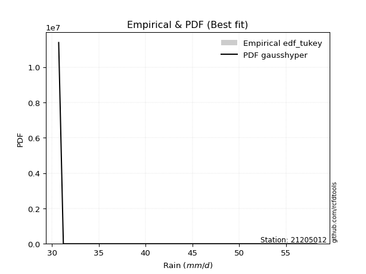</img>

</div>


### 8. EDF Gringorten (1963)

Gringorten plotting position formula is essential for estimating the probability and return periods of extreme events like floods and heavy rainfall. The constant _a=0.44_.

<div align="center">


$P=(m-a)/(n+1-2a)$


</div>


**8.1. Empirical values**

<div align="center">

|                | 0                    | 1                  | 2                  | 3                   | 4                  | 5                   | 6                  | 7                  | 8                  | 9                  | 10                 | 11                 | 12                 | 13                 | 14                 | 15                 |
|:---------------|:---------------------|:-------------------|:-------------------|:--------------------|:-------------------|:--------------------|:-------------------|:-------------------|:-------------------|:-------------------|:-------------------|:-------------------|:-------------------|:-------------------|:-------------------|:-------------------|
| date           | 2019                 | 2018               | 2025               | 2022                | 2011               | 2021                | 2012               | 2010               | 2014               | 2013               | 2020               | 2017               | 2023               | 2016               | 2024               | 2015               |
| x              | 30.7                 | 31.2               | 31.2               | 31.4                | 31.6               | 31.7                | 32.6               | 32.6               | 35.1               | 41.4               | 41.5               | 43.4               | 44.5625            | 45.5               | 52.8               | 58.3               |
| m              | 1                    | 2                  | 3                  | 4                   | 5                  | 6                   | 7                  | 8                  | 9                  | 10                 | 11                 | 12                 | 13                 | 14                 | 15                 | 16                 |
| empirical_dist | edf_gringorten       | edf_gringorten     | edf_gringorten     | edf_gringorten      | edf_gringorten     | edf_gringorten      | edf_gringorten     | edf_gringorten     | edf_gringorten     | edf_gringorten     | edf_gringorten     | edf_gringorten     | edf_gringorten     | edf_gringorten     | edf_gringorten     | edf_gringorten     |
| empirical      | 0.034739454094292806 | 0.0967741935483871 | 0.1588089330024814 | 0.22084367245657568 | 0.2828784119106699 | 0.34491315136476425 | 0.4069478908188585 | 0.4689826302729528 | 0.5310173697270472 | 0.5930521091811415 | 0.6550868486352357 | 0.71712158808933   | 0.7791563275434243 | 0.8411910669975186 | 0.9032258064516129 | 0.9652605459057072 |
| empirical_tr   | 1.0359897172236503   | 1.1071428571428572 | 1.1887905604719764 | 1.28343949044586    | 1.3944636678200693 | 1.5265151515151516  | 1.6861924686192467 | 1.8831775700934574 | 2.1322751322751325 | 2.457317073170732  | 2.899280575539568  | 3.5350877192982457 | 4.52808988764045   | 6.296874999999998  | 10.33333333333333  | 28.785714285714292 |

</div>


**8.2. Kolmogorov-Smirnov fit test (sorted by Δ)**


<div align="center">

|                | 0                   | 1                   | 2                  | 3                   | 4                   | 5                   | 6                   | 7                   | 8                  | 9                   | 10                  | 11                 | 12                 | 13                  | 14                  | 15                  | 16                | 17                 | 18                  | 19                 | 20                  | 21                  | 22                 | 23                  | 24                  | 25                  | 26                  | 27                  | 28                 | 29                  | 30                  | 31                  | 32                  | 33                  | 34                  | 35                  | 36                 | 37                  | 38                  | 39                  | 40                 | 41                 | 42                  | 43                  | 44                  | 45                | 46                  | 47                  | 48                 | 49                  | 50                  | 51                 | 52                 | 53                  | 54                  | 55                  | 56                  | 57                 | 58                  | 59                  | 60                 | 61                  | 62                  | 63                  | 64                  | 65                  | 66                  | 67                  | 68                  | 69                  | 70                 | 71                  | 72                 | 73                 | 74                 | 75                  | 76                 | 77                 | 78                  | 79                  | 80                 | 81                  | 82                 | 83                  | 84                  | 85                  | 86                  | 87                  | 88                 | 89                  | 90                  | 91                 | 92                  | 93                 | 94                 | 95                 | 96                  | 97                 | 98                 | 99                  | 100                 | 101                | 102                 | 103                 | 104                | 105                | 106                | 107                | 108                | 109                | 110                 | 111                | 112                | 113                | 114                | 115                | 116                | 117                | 118                | 119                | 120                | 121                | 122                 | 123                 | 124                 | 125                | 126                | 127                | 128                | 129                | 130                | 131                | 132                 | 133                | 134                 | 135                | 136                 | 137                 | 138                 | 139                 | 140                 | 141                 | 142                 | 143                 | 144                | 145                | 146                 | 147                 | 148               | 149                | 150                | 151                 | 152                 | 153                | 154                | 155                | 156                | 157               | 158            | 159            |
|:---------------|:--------------------|:--------------------|:-------------------|:--------------------|:--------------------|:--------------------|:--------------------|:--------------------|:-------------------|:--------------------|:--------------------|:-------------------|:-------------------|:--------------------|:--------------------|:--------------------|:------------------|:-------------------|:--------------------|:-------------------|:--------------------|:--------------------|:-------------------|:--------------------|:--------------------|:--------------------|:--------------------|:--------------------|:-------------------|:--------------------|:--------------------|:--------------------|:--------------------|:--------------------|:--------------------|:--------------------|:-------------------|:--------------------|:--------------------|:--------------------|:-------------------|:-------------------|:--------------------|:--------------------|:--------------------|:------------------|:--------------------|:--------------------|:-------------------|:--------------------|:--------------------|:-------------------|:-------------------|:--------------------|:--------------------|:--------------------|:--------------------|:-------------------|:--------------------|:--------------------|:-------------------|:--------------------|:--------------------|:--------------------|:--------------------|:--------------------|:--------------------|:--------------------|:--------------------|:--------------------|:-------------------|:--------------------|:-------------------|:-------------------|:-------------------|:--------------------|:-------------------|:-------------------|:--------------------|:--------------------|:-------------------|:--------------------|:-------------------|:--------------------|:--------------------|:--------------------|:--------------------|:--------------------|:-------------------|:--------------------|:--------------------|:-------------------|:--------------------|:-------------------|:-------------------|:-------------------|:--------------------|:-------------------|:-------------------|:--------------------|:--------------------|:-------------------|:--------------------|:--------------------|:-------------------|:-------------------|:-------------------|:-------------------|:-------------------|:-------------------|:--------------------|:-------------------|:-------------------|:-------------------|:-------------------|:-------------------|:-------------------|:-------------------|:-------------------|:-------------------|:-------------------|:-------------------|:--------------------|:--------------------|:--------------------|:-------------------|:-------------------|:-------------------|:-------------------|:-------------------|:-------------------|:-------------------|:--------------------|:-------------------|:--------------------|:-------------------|:--------------------|:--------------------|:--------------------|:--------------------|:--------------------|:--------------------|:--------------------|:--------------------|:-------------------|:-------------------|:--------------------|:--------------------|:------------------|:-------------------|:-------------------|:--------------------|:--------------------|:-------------------|:-------------------|:-------------------|:-------------------|:------------------|:---------------|:---------------|
| station        | 21205012            | 21205012            | 21205012           | 21205012            | 21205012            | 21205012            | 21205012            | 21205012            | 21205012           | 21205012            | 21205012            | 21205012           | 21205012           | 21205012            | 21205012            | 21205012            | 21205012          | 21205012           | 21205012            | 21205012           | 21205012            | 21205012            | 21205012           | 21205012            | 21205012            | 21205012            | 21205012            | 21205012            | 21205012           | 21205012            | 21205012            | 21205012            | 21205012            | 21205012            | 21205012            | 21205012            | 21205012           | 21205012            | 21205012            | 21205012            | 21205012           | 21205012           | 21205012            | 21205012            | 21205012            | 21205012          | 21205012            | 21205012            | 21205012           | 21205012            | 21205012            | 21205012           | 21205012           | 21205012            | 21205012            | 21205012            | 21205012            | 21205012           | 21205012            | 21205012            | 21205012           | 21205012            | 21205012            | 21205012            | 21205012            | 21205012            | 21205012            | 21205012            | 21205012            | 21205012            | 21205012           | 21205012            | 21205012           | 21205012           | 21205012           | 21205012            | 21205012           | 21205012           | 21205012            | 21205012            | 21205012           | 21205012            | 21205012           | 21205012            | 21205012            | 21205012            | 21205012            | 21205012            | 21205012           | 21205012            | 21205012            | 21205012           | 21205012            | 21205012           | 21205012           | 21205012           | 21205012            | 21205012           | 21205012           | 21205012            | 21205012            | 21205012           | 21205012            | 21205012            | 21205012           | 21205012           | 21205012           | 21205012           | 21205012           | 21205012           | 21205012            | 21205012           | 21205012           | 21205012           | 21205012           | 21205012           | 21205012           | 21205012           | 21205012           | 21205012           | 21205012           | 21205012           | 21205012            | 21205012            | 21205012            | 21205012           | 21205012           | 21205012           | 21205012           | 21205012           | 21205012           | 21205012           | 21205012            | 21205012           | 21205012            | 21205012           | 21205012            | 21205012            | 21205012            | 21205012            | 21205012            | 21205012            | 21205012            | 21205012            | 21205012           | 21205012           | 21205012            | 21205012            | 21205012          | 21205012           | 21205012           | 21205012            | 21205012            | 21205012           | 21205012           | 21205012           | 21205012           | 21205012          | 21205012       | 21205012       |
| empirical_dist | edf_gringorten      | edf_gringorten      | edf_gringorten     | edf_gringorten      | edf_gringorten      | edf_gringorten      | edf_gringorten      | edf_gringorten      | edf_gringorten     | edf_gringorten      | edf_gringorten      | edf_gringorten     | edf_gringorten     | edf_gringorten      | edf_gringorten      | edf_gringorten      | edf_gringorten    | edf_gringorten     | edf_gringorten      | edf_gringorten     | edf_gringorten      | edf_gringorten      | edf_gringorten     | edf_gringorten      | edf_gringorten      | edf_gringorten      | edf_gringorten      | edf_gringorten      | edf_gringorten     | edf_gringorten      | edf_gringorten      | edf_gringorten      | edf_gringorten      | edf_gringorten      | edf_gringorten      | edf_gringorten      | edf_gringorten     | edf_gringorten      | edf_gringorten      | edf_gringorten      | edf_gringorten     | edf_gringorten     | edf_gringorten      | edf_gringorten      | edf_gringorten      | edf_gringorten    | edf_gringorten      | edf_gringorten      | edf_gringorten     | edf_gringorten      | edf_gringorten      | edf_gringorten     | edf_gringorten     | edf_gringorten      | edf_gringorten      | edf_gringorten      | edf_gringorten      | edf_gringorten     | edf_gringorten      | edf_gringorten      | edf_gringorten     | edf_gringorten      | edf_gringorten      | edf_gringorten      | edf_gringorten      | edf_gringorten      | edf_gringorten      | edf_gringorten      | edf_gringorten      | edf_gringorten      | edf_gringorten     | edf_gringorten      | edf_gringorten     | edf_gringorten     | edf_gringorten     | edf_gringorten      | edf_gringorten     | edf_gringorten     | edf_gringorten      | edf_gringorten      | edf_gringorten     | edf_gringorten      | edf_gringorten     | edf_gringorten      | edf_gringorten      | edf_gringorten      | edf_gringorten      | edf_gringorten      | edf_gringorten     | edf_gringorten      | edf_gringorten      | edf_gringorten     | edf_gringorten      | edf_gringorten     | edf_gringorten     | edf_gringorten     | edf_gringorten      | edf_gringorten     | edf_gringorten     | edf_gringorten      | edf_gringorten      | edf_gringorten     | edf_gringorten      | edf_gringorten      | edf_gringorten     | edf_gringorten     | edf_gringorten     | edf_gringorten     | edf_gringorten     | edf_gringorten     | edf_gringorten      | edf_gringorten     | edf_gringorten     | edf_gringorten     | edf_gringorten     | edf_gringorten     | edf_gringorten     | edf_gringorten     | edf_gringorten     | edf_gringorten     | edf_gringorten     | edf_gringorten     | edf_gringorten      | edf_gringorten      | edf_gringorten      | edf_gringorten     | edf_gringorten     | edf_gringorten     | edf_gringorten     | edf_gringorten     | edf_gringorten     | edf_gringorten     | edf_gringorten      | edf_gringorten     | edf_gringorten      | edf_gringorten     | edf_gringorten      | edf_gringorten      | edf_gringorten      | edf_gringorten      | edf_gringorten      | edf_gringorten      | edf_gringorten      | edf_gringorten      | edf_gringorten     | edf_gringorten     | edf_gringorten      | edf_gringorten      | edf_gringorten    | edf_gringorten     | edf_gringorten     | edf_gringorten      | edf_gringorten      | edf_gringorten     | edf_gringorten     | edf_gringorten     | edf_gringorten     | edf_gringorten    | edf_gringorten | edf_gringorten |
| p_dist         | gausshyper          | weibull_min         | logdgamma          | exponweib           | logbeta             | nakagami            | logtruncweibull_min | logdweibull         | foldnorm           | dweibull            | halfnorm            | halfgennorm        | loggengamma        | logfoldnorm         | gengamma            | loghalfnorm         | exponpow          | johnsonsu          | loglomax            | fatiguelife        | semicircular        | vonmises_line       | logbradford        | invweibull          | genextreme          | loghalfgennorm      | logsemicircular     | logjohnsonsu        | loginvweibull      | loggenextreme       | halflogistic        | lomax               | beta                | logburr             | loghalflogistic     | f                   | logfatiguelife     | rayleigh            | anglit              | invgamma            | lograyleigh        | loganglit          | logf                | logburr12           | burr                | pearson3          | maxwell             | logweibull_min      | logmaxwell         | logtruncpareto      | logexponnorm        | logarcsine         | logexponpow        | logpearson3         | loggenexpon         | burr12              | truncpareto         | gumbel_r           | invgauss            | loginvgauss         | loggumbel_r        | moyal               | lognakagami         | gompertz            | loggenlogistic      | bradford            | logweibull_max      | logmoyal            | logloggamma         | erlang              | t                  | crystalball         | norm               | lognct             | nct                | loginvgamma         | loggamma           | loggamma           | logt                | logcrystalball      | lognorm            | alpha               | ncf                | betaprime           | genlogistic         | logalpha            | arcsine             | logbetaprime        | logkstwobign       | logexponweib        | logerlang           | kstwobign          | logistic            | exponnorm          | genexpon           | loglogistic        | logcosine           | cosine             | gumbel_l           | hypsecant           | logrice             | truncnorm          | loggumbel_l         | loghypsecant        | rdist              | loggausshyper      | rice               | logtruncnorm       | dgamma             | gamma              | gennorm             | powerlaw           | laplace            | loglaplace         | loglaplace         | logpowerlaw        | logargus           | argus              | truncweibull_min   | logtriang          | logkappa4          | logwrapcauchy      | logskewnorm         | wald                | logksone            | logloglaplace      | tukeylambda        | genhalflogistic    | loggompertz        | logwald            | loggennorm         | logrdist           | logtruncexpon       | ksone              | logncf              | logkappa3          | wrapcauchy          | skewnorm            | triang              | truncexpon          | loggenhalflogistic  | logtukeylambda      | loguniform          | logvonmises_line    | genpareto          | kappa4             | uniform             | kappa3              | johnsonsb         | loglevy_l          | levy_l             | logjohnsonsb        | logtrapezoid        | trapezoid          | loggenpareto       | weibull_max        | logvonmises        | vonmises          | mielke         | logmielke      |
| delta          | 0.12075893563594625 | 0.14279039001636312 | 0.1513614657026422 | 0.15440750742478904 | 0.15558667902008544 | 0.16304502733240772 | 0.1700468356207938  | 0.17392964909260356 | 0.1761885942493287 | 0.17673906164545233 | 0.17730574086955192 | 0.1774150877464793 | 0.1792057330150454 | 0.17934733277271725 | 0.17978644119412313 | 0.18008407684244143 | 0.183348679801633 | 0.1846434763574174 | 0.18579011756870512 | 0.1871487297333495 | 0.18805634143765199 | 0.18822881618307402 | 0.1883505541526258 | 0.18859256513537126 | 0.18861052493505603 | 0.18904423629933065 | 0.18988053682115508 | 0.19150470106433815 | 0.1937291223159172 | 0.19373090051288144 | 0.19420978797725014 | 0.19469806984374083 | 0.19490903043567154 | 0.19564478747712083 | 0.19756030984627754 | 0.19763977605393734 | 0.1978726448764312 | 0.19933435016113799 | 0.20014644429927958 | 0.20058538258215763 | 0.2016804118063536 | 0.2020206533158831 | 0.20457584363581127 | 0.20503319675587206 | 0.20659248348268322 | 0.207128947158298 | 0.20771876416843316 | 0.20854515981384802 | 0.2099477743344288 | 0.21054600462100037 | 0.21166990613980335 | 0.2137351537211778 | 0.2138173175482656 | 0.21391866073839894 | 0.21413308688046445 | 0.21420591428657143 | 0.21769084085859336 | 0.2182136539258211 | 0.21900249052990373 | 0.21974330218124105 | 0.2209636159162744 | 0.22162726613296085 | 0.22180050122020323 | 0.22278100814168156 | 0.22381482481152348 | 0.22431407639828319 | 0.22470425495719054 | 0.22487409497084326 | 0.22489244060781605 | 0.22517476713233342 | 0.2279534903801374 | 0.22795463047832115 | 0.2279546450808297 | 0.2282042024689415 | 0.2286927175438962 | 0.22888186078788073 | 0.2295442225529657 | 0.2295442225529657 | 0.22987820144198517 | 0.22987935523140954 | 0.2298795081221538 | 0.23193405339498308 | 0.2326870966177928 | 0.23386956203577383 | 0.23399411137155357 | 0.23403825333729444 | 0.23669619490610994 | 0.23686111733164036 | 0.2377272367741519 | 0.24554635879482734 | 0.24928614652156644 | 0.2496290139681215 | 0.25059721691420633 | 0.2509822604663399 | 0.2521200676276023 | 0.2525078754106488 | 0.25775108964914506 | 0.2582987602059563 | 0.2651863973045197 | 0.26522782458984406 | 0.26576284494355185 | 0.2659160583590108 | 0.26662276207685937 | 0.26706949391202184 | 0.2706323883933511 | 0.2723506879275203 | 0.2732970075694926 | 0.2743134910682187 | 0.2779764669815703 | 0.2794382661802163 | 0.27966326874951297 | 0.2836973920316016 | 0.2839714114766946 | 0.2855841596110148 | 0.2855841596110148 | 0.2860884391092594 | 0.2876927774540395 | 0.2877490363429062 | 0.2889687577795462 | 0.2942144725676443 | 0.2972324160943781 | 0.3021581601595341 | 0.30382627092261916 | 0.30647392651024286 | 0.30762296882323076 | 0.3132825848705764 | 0.3156286153998294 | 0.3162081909964854 | 0.3167136130850535 | 0.3179003833259724 | 0.3194027374008931 | 0.3230010933927121 | 0.32557741957836334 | 0.3282821471811652 | 0.33120868410758003 | 0.3313906192694992 | 0.33177910749760253 | 0.33673624666456803 | 0.34842455919382653 | 0.35729458092532623 | 0.36886166193496617 | 0.36901204192754583 | 0.37535103653328644 | 0.37586511432648967 | 0.3812802378994683 | 0.3823520177092766 | 0.40014205056280777 | 0.40021590109039484 | 0.415296253302348 | 0.4358719274353443 | 0.4564062293659229 | 0.45655166503622213 | 0.48768038322936474 | 0.5600861987392161 | 0.6547386295141394 | 0.7161792086724204 | 1.1234213566907583 | 8.847258652555439 | nan            | nan            |
| deltao         | 0.331107277296      | 0.331107277296      | 0.331107277296     | 0.331107277296      | 0.331107277296      | 0.331107277296      | 0.331107277296      | 0.331107277296      | 0.331107277296     | 0.331107277296      | 0.331107277296      | 0.331107277296     | 0.331107277296     | 0.331107277296      | 0.331107277296      | 0.331107277296      | 0.331107277296    | 0.331107277296     | 0.331107277296      | 0.331107277296     | 0.331107277296      | 0.331107277296      | 0.331107277296     | 0.331107277296      | 0.331107277296      | 0.331107277296      | 0.331107277296      | 0.331107277296      | 0.331107277296     | 0.331107277296      | 0.331107277296      | 0.331107277296      | 0.331107277296      | 0.331107277296      | 0.331107277296      | 0.331107277296      | 0.331107277296     | 0.331107277296      | 0.331107277296      | 0.331107277296      | 0.331107277296     | 0.331107277296     | 0.331107277296      | 0.331107277296      | 0.331107277296      | 0.331107277296    | 0.331107277296      | 0.331107277296      | 0.331107277296     | 0.331107277296      | 0.331107277296      | 0.331107277296     | 0.331107277296     | 0.331107277296      | 0.331107277296      | 0.331107277296      | 0.331107277296      | 0.331107277296     | 0.331107277296      | 0.331107277296      | 0.331107277296     | 0.331107277296      | 0.331107277296      | 0.331107277296      | 0.331107277296      | 0.331107277296      | 0.331107277296      | 0.331107277296      | 0.331107277296      | 0.331107277296      | 0.331107277296     | 0.331107277296      | 0.331107277296     | 0.331107277296     | 0.331107277296     | 0.331107277296      | 0.331107277296     | 0.331107277296     | 0.331107277296      | 0.331107277296      | 0.331107277296     | 0.331107277296      | 0.331107277296     | 0.331107277296      | 0.331107277296      | 0.331107277296      | 0.331107277296      | 0.331107277296      | 0.331107277296     | 0.331107277296      | 0.331107277296      | 0.331107277296     | 0.331107277296      | 0.331107277296     | 0.331107277296     | 0.331107277296     | 0.331107277296      | 0.331107277296     | 0.331107277296     | 0.331107277296      | 0.331107277296      | 0.331107277296     | 0.331107277296      | 0.331107277296      | 0.331107277296     | 0.331107277296     | 0.331107277296     | 0.331107277296     | 0.331107277296     | 0.331107277296     | 0.331107277296      | 0.331107277296     | 0.331107277296     | 0.331107277296     | 0.331107277296     | 0.331107277296     | 0.331107277296     | 0.331107277296     | 0.331107277296     | 0.331107277296     | 0.331107277296     | 0.331107277296     | 0.331107277296      | 0.331107277296      | 0.331107277296      | 0.331107277296     | 0.331107277296     | 0.331107277296     | 0.331107277296     | 0.331107277296     | 0.331107277296     | 0.331107277296     | 0.331107277296      | 0.331107277296     | 0.331107277296      | 0.331107277296     | 0.331107277296      | 0.331107277296      | 0.331107277296      | 0.331107277296      | 0.331107277296      | 0.331107277296      | 0.331107277296      | 0.331107277296      | 0.331107277296     | 0.331107277296     | 0.331107277296      | 0.331107277296      | 0.331107277296    | 0.331107277296     | 0.331107277296     | 0.331107277296      | 0.331107277296      | 0.331107277296     | 0.331107277296     | 0.331107277296     | 0.331107277296     | 0.331107277296    | 0.331107277296 | 0.331107277296 |
| eval           | Δo > Δ              | Δo > Δ              | Δo > Δ             | Δo > Δ              | Δo > Δ              | Δo > Δ              | Δo > Δ              | Δo > Δ              | Δo > Δ             | Δo > Δ              | Δo > Δ              | Δo > Δ             | Δo > Δ             | Δo > Δ              | Δo > Δ              | Δo > Δ              | Δo > Δ            | Δo > Δ             | Δo > Δ              | Δo > Δ             | Δo > Δ              | Δo > Δ              | Δo > Δ             | Δo > Δ              | Δo > Δ              | Δo > Δ              | Δo > Δ              | Δo > Δ              | Δo > Δ             | Δo > Δ              | Δo > Δ              | Δo > Δ              | Δo > Δ              | Δo > Δ              | Δo > Δ              | Δo > Δ              | Δo > Δ             | Δo > Δ              | Δo > Δ              | Δo > Δ              | Δo > Δ             | Δo > Δ             | Δo > Δ              | Δo > Δ              | Δo > Δ              | Δo > Δ            | Δo > Δ              | Δo > Δ              | Δo > Δ             | Δo > Δ              | Δo > Δ              | Δo > Δ             | Δo > Δ             | Δo > Δ              | Δo > Δ              | Δo > Δ              | Δo > Δ              | Δo > Δ             | Δo > Δ              | Δo > Δ              | Δo > Δ             | Δo > Δ              | Δo > Δ              | Δo > Δ              | Δo > Δ              | Δo > Δ              | Δo > Δ              | Δo > Δ              | Δo > Δ              | Δo > Δ              | Δo > Δ             | Δo > Δ              | Δo > Δ             | Δo > Δ             | Δo > Δ             | Δo > Δ              | Δo > Δ             | Δo > Δ             | Δo > Δ              | Δo > Δ              | Δo > Δ             | Δo > Δ              | Δo > Δ             | Δo > Δ              | Δo > Δ              | Δo > Δ              | Δo > Δ              | Δo > Δ              | Δo > Δ             | Δo > Δ              | Δo > Δ              | Δo > Δ             | Δo > Δ              | Δo > Δ             | Δo > Δ             | Δo > Δ             | Δo > Δ              | Δo > Δ             | Δo > Δ             | Δo > Δ              | Δo > Δ              | Δo > Δ             | Δo > Δ              | Δo > Δ              | Δo > Δ             | Δo > Δ             | Δo > Δ             | Δo > Δ             | Δo > Δ             | Δo > Δ             | Δo > Δ              | Δo > Δ             | Δo > Δ             | Δo > Δ             | Δo > Δ             | Δo > Δ             | Δo > Δ             | Δo > Δ             | Δo > Δ             | Δo > Δ             | Δo > Δ             | Δo > Δ             | Δo > Δ              | Δo > Δ              | Δo > Δ              | Δo > Δ             | Δo > Δ             | Δo > Δ             | Δo > Δ             | Δo > Δ             | Δo > Δ             | Δo > Δ             | Δo > Δ              | Δo > Δ             | Δo <= Δ             | Δo <= Δ            | Δo <= Δ             | Δo <= Δ             | Δo <= Δ             | Δo <= Δ             | Δo <= Δ             | Δo <= Δ             | Δo <= Δ             | Δo <= Δ             | Δo <= Δ            | Δo <= Δ            | Δo <= Δ             | Δo <= Δ             | Δo <= Δ           | Δo <= Δ            | Δo <= Δ            | Δo <= Δ             | Δo <= Δ             | Δo <= Δ            | Δo <= Δ            | Δo <= Δ            | Δo <= Δ            | Δo <= Δ           | Δo <= Δ        | Δo <= Δ        |
| fit            | 1                   | 1                   | 1                  | 1                   | 1                   | 1                   | 1                   | 1                   | 1                  | 1                   | 1                   | 1                  | 1                  | 1                   | 1                   | 1                   | 1                 | 1                  | 1                   | 1                  | 1                   | 1                   | 1                  | 1                   | 1                   | 1                   | 1                   | 1                   | 1                  | 1                   | 1                   | 1                   | 1                   | 1                   | 1                   | 1                   | 1                  | 1                   | 1                   | 1                   | 1                  | 1                  | 1                   | 1                   | 1                   | 1                 | 1                   | 1                   | 1                  | 1                   | 1                   | 1                  | 1                  | 1                   | 1                   | 1                   | 1                   | 1                  | 1                   | 1                   | 1                  | 1                   | 1                   | 1                   | 1                   | 1                   | 1                   | 1                   | 1                   | 1                   | 1                  | 1                   | 1                  | 1                  | 1                  | 1                   | 1                  | 1                  | 1                   | 1                   | 1                  | 1                   | 1                  | 1                   | 1                   | 1                   | 1                   | 1                   | 1                  | 1                   | 1                   | 1                  | 1                   | 1                  | 1                  | 1                  | 1                   | 1                  | 1                  | 1                   | 1                   | 1                  | 1                   | 1                   | 1                  | 1                  | 1                  | 1                  | 1                  | 1                  | 1                   | 1                  | 1                  | 1                  | 1                  | 1                  | 1                  | 1                  | 1                  | 1                  | 1                  | 1                  | 1                   | 1                   | 1                   | 1                  | 1                  | 1                  | 1                  | 1                  | 1                  | 1                  | 1                   | 1                  | 0                   | 0                  | 0                   | 0                   | 0                   | 0                   | 0                   | 0                   | 0                   | 0                   | 0                  | 0                  | 0                   | 0                   | 0                 | 0                  | 0                  | 0                   | 0                   | 0                  | 0                  | 0                  | 0                  | 0                 | 0              | 0              |
| n              | 16                  | 16                  | 16                 | 16                  | 16                  | 16                  | 16                  | 16                  | 16                 | 16                  | 16                  | 16                 | 16                 | 16                  | 16                  | 16                  | 16                | 16                 | 16                  | 16                 | 16                  | 16                  | 16                 | 16                  | 16                  | 16                  | 16                  | 16                  | 16                 | 16                  | 16                  | 16                  | 16                  | 16                  | 16                  | 16                  | 16                 | 16                  | 16                  | 16                  | 16                 | 16                 | 16                  | 16                  | 16                  | 16                | 16                  | 16                  | 16                 | 16                  | 16                  | 16                 | 16                 | 16                  | 16                  | 16                  | 16                  | 16                 | 16                  | 16                  | 16                 | 16                  | 16                  | 16                  | 16                  | 16                  | 16                  | 16                  | 16                  | 16                  | 16                 | 16                  | 16                 | 16                 | 16                 | 16                  | 16                 | 16                 | 16                  | 16                  | 16                 | 16                  | 16                 | 16                  | 16                  | 16                  | 16                  | 16                  | 16                 | 16                  | 16                  | 16                 | 16                  | 16                 | 16                 | 16                 | 16                  | 16                 | 16                 | 16                  | 16                  | 16                 | 16                  | 16                  | 16                 | 16                 | 16                 | 16                 | 16                 | 16                 | 16                  | 16                 | 16                 | 16                 | 16                 | 16                 | 16                 | 16                 | 16                 | 16                 | 16                 | 16                 | 16                  | 16                  | 16                  | 16                 | 16                 | 16                 | 16                 | 16                 | 16                 | 16                 | 16                  | 16                 | 16                  | 16                 | 16                  | 16                  | 16                  | 16                  | 16                  | 16                  | 16                  | 16                  | 16                 | 16                 | 16                  | 16                  | 16                | 16                 | 16                 | 16                  | 16                  | 16                 | 16                 | 16                 | 16                 | 16                | 16             | 16             |
| best_fit       | 1                   | 0                   | 0                  | 0                   | 0                   | 0                   | 0                   | 0                   | 0                  | 0                   | 0                   | 0                  | 0                  | 0                   | 0                   | 0                   | 0                 | 0                  | 0                   | 0                  | 0                   | 0                   | 0                  | 0                   | 0                   | 0                   | 0                   | 0                   | 0                  | 0                   | 0                   | 0                   | 0                   | 0                   | 0                   | 0                   | 0                  | 0                   | 0                   | 0                   | 0                  | 0                  | 0                   | 0                   | 0                   | 0                 | 0                   | 0                   | 0                  | 0                   | 0                   | 0                  | 0                  | 0                   | 0                   | 0                   | 0                   | 0                  | 0                   | 0                   | 0                  | 0                   | 0                   | 0                   | 0                   | 0                   | 0                   | 0                   | 0                   | 0                   | 0                  | 0                   | 0                  | 0                  | 0                  | 0                   | 0                  | 0                  | 0                   | 0                   | 0                  | 0                   | 0                  | 0                   | 0                   | 0                   | 0                   | 0                   | 0                  | 0                   | 0                   | 0                  | 0                   | 0                  | 0                  | 0                  | 0                   | 0                  | 0                  | 0                   | 0                   | 0                  | 0                   | 0                   | 0                  | 0                  | 0                  | 0                  | 0                  | 0                  | 0                   | 0                  | 0                  | 0                  | 0                  | 0                  | 0                  | 0                  | 0                  | 0                  | 0                  | 0                  | 0                   | 0                   | 0                   | 0                  | 0                  | 0                  | 0                  | 0                  | 0                  | 0                  | 0                   | 0                  | 0                   | 0                  | 0                   | 0                   | 0                   | 0                   | 0                   | 0                   | 0                   | 0                   | 0                  | 0                  | 0                   | 0                   | 0                 | 0                  | 0                  | 0                   | 0                   | 0                  | 0                  | 0                  | 0                  | 0                 | 0              | 0              |
| best_fit_sort  | 1                   | 2                   | 3                  | 4                   | 5                   | 6                   | 7                   | 8                   | 9                  | 10                  | 11                  | 12                 | 13                 | 14                  | 15                  | 16                  | 17                | 18                 | 19                  | 20                 | 21                  | 22                  | 23                 | 24                  | 25                  | 26                  | 27                  | 28                  | 29                 | 30                  | 31                  | 32                  | 33                  | 34                  | 35                  | 36                  | 37                 | 38                  | 39                  | 40                  | 41                 | 42                 | 43                  | 44                  | 45                  | 46                | 47                  | 48                  | 49                 | 50                  | 51                  | 52                 | 53                 | 54                  | 55                  | 56                  | 57                  | 58                 | 59                  | 60                  | 61                 | 62                  | 63                  | 64                  | 65                  | 66                  | 67                  | 68                  | 69                  | 70                  | 71                 | 72                  | 73                 | 74                 | 75                 | 76                  | 77                 | 78                 | 79                  | 80                  | 81                 | 82                  | 83                 | 84                  | 85                  | 86                  | 87                  | 88                  | 89                 | 90                  | 91                  | 92                 | 93                  | 94                 | 95                 | 96                 | 97                  | 98                 | 99                 | 100                 | 101                 | 102                | 103                 | 104                 | 105                | 106                | 107                | 108                | 109                | 110                | 111                 | 112                | 113                | 114                | 115                | 116                | 117                | 118                | 119                | 120                | 121                | 122                | 123                 | 124                 | 125                 | 126                | 127                | 128                | 129                | 130                | 131                | 132                | 133                 | 134                | 135                 | 136                | 137                 | 138                 | 139                 | 140                 | 141                 | 142                 | 143                 | 144                 | 145                | 146                | 147                 | 148                 | 149               | 150                | 151                | 152                 | 153                 | 154                | 155                | 156                | 157                | 158               | 159            | 160            |

</div>


**8.3. Best fit**

<div align="center">

|   id |   station | empirical_dist   | p_dist     |    delta |   deltao | eval   |   fit |   n |   best_fit |   best_fit_sort |
|-----:|----------:|:-----------------|:-----------|---------:|---------:|:-------|------:|----:|-----------:|----------------:|
|    0 |  21205012 | edf_gringorten   | gausshyper | 0.120759 | 0.331107 | Δo > Δ |     1 |  16 |          1 |               1 |

</div>


<div align="center">

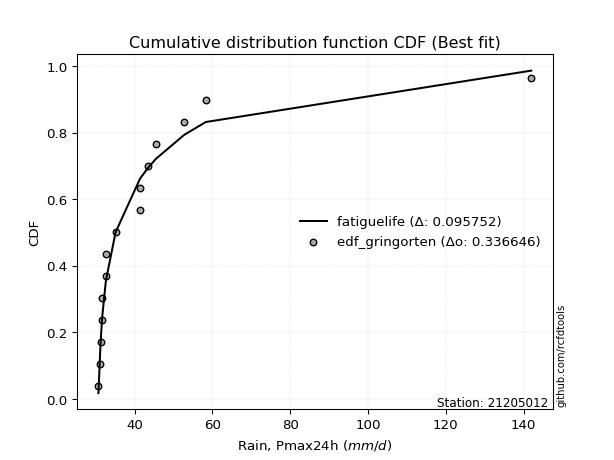</img></img>

</div>


### 9. EDF Filliben (1975)

The specific values of the constants (0.3175) (often denoted as $alpha$) and (0.365) are derived from a method proposed by James J. Filliben in a 1975 paper. This particular formula is the mean value of the $i$-th order statistic of the normal distribution and is considered a robust and effective plotting position formula for the normal probability plot correlation coefficient test for normality.

<div align="center">


$P=(m-0.3175)/(n+0.365)$


</div>


**9.1. Empirical values**

<div align="center">

|                | 0                    | 1                   | 2                  | 3                  | 4                  | 5                  | 6                   | 7                   | 8                  | 9                  | 10                 | 11                 | 12                 | 13                 | 14                 | 15                 |
|:---------------|:---------------------|:--------------------|:-------------------|:-------------------|:-------------------|:-------------------|:--------------------|:--------------------|:-------------------|:-------------------|:-------------------|:-------------------|:-------------------|:-------------------|:-------------------|:-------------------|
| date           | 2019                 | 2018                | 2025               | 2022               | 2011               | 2021               | 2012                | 2010                | 2014               | 2013               | 2020               | 2017               | 2023               | 2016               | 2024               | 2015               |
| x              | 30.7                 | 31.2                | 31.2               | 31.4               | 31.6               | 31.7               | 32.6                | 32.6                | 35.1               | 41.4               | 41.5               | 43.4               | 44.5625            | 45.5               | 52.8               | 58.3               |
| m              | 1                    | 2                   | 3                  | 4                  | 5                  | 6                  | 7                   | 8                   | 9                  | 10                 | 11                 | 12                 | 13                 | 14                 | 15                 | 16                 |
| empirical_dist | edf_filliben         | edf_filliben        | edf_filliben       | edf_filliben       | edf_filliben       | edf_filliben       | edf_filliben        | edf_filliben        | edf_filliben       | edf_filliben       | edf_filliben       | edf_filliben       | edf_filliben       | edf_filliben       | edf_filliben       | edf_filliben       |
| empirical      | 0.041704857928505965 | 0.10281087687137185 | 0.1639168958142377 | 0.2250229147571036 | 0.2861289336999695 | 0.3472349526428354 | 0.40834097158570126 | 0.46944699052856714 | 0.5305530094714329 | 0.5916590284142988 | 0.6527650473571647 | 0.7138710663000306 | 0.7749770852428964 | 0.8360831041857624 | 0.8971891231286282 | 0.9582951420714941 |
| empirical_tr   | 1.0435198469631755   | 1.1145922016005447  | 1.1960533528229491 | 1.2903607332939089 | 1.4008131821099936 | 1.531944769482799  | 1.6901626646010846  | 1.8848257990210198  | 2.1301659616010413 | 2.4489337822671158 | 2.8798944126704793 | 3.4949279231179933 | 4.443991853360489  | 6.100652376514448  | 9.72659732540862   | 23.97802197802203  |

</div>


**9.2. Kolmogorov-Smirnov fit test (sorted by Δ)**


<div align="center">

|                | 0                   | 1                   | 2                   | 3                  | 4                  | 5                   | 6                   | 7                   | 8                   | 9                   | 10                 | 11                  | 12                  | 13                 | 14                 | 15                  | 16                  | 17                  | 18                  | 19                  | 20                  | 21                  | 22                  | 23                 | 24                  | 25                  | 26                  | 27                  | 28                 | 29                  | 30                  | 31                 | 32                  | 33                 | 34                 | 35                  | 36                  | 37                  | 38                  | 39                  | 40                  | 41                  | 42                  | 43                 | 44                  | 45                  | 46                  | 47                  | 48                  | 49                  | 50                  | 51                | 52                  | 53                 | 54                 | 55                 | 56                  | 57                  | 58                  | 59                 | 60                  | 61                  | 62                  | 63                  | 64                  | 65                  | 66                 | 67                  | 68                 | 69                  | 70                  | 71                 | 72                  | 73                  | 74                  | 75                  | 76                  | 77                  | 78                 | 79                  | 80                  | 81                  | 82                  | 83                 | 84                 | 85                  | 86                 | 87                  | 88                  | 89                  | 90                 | 91                 | 92                 | 93                 | 94                  | 95                  | 96                 | 97                 | 98                  | 99                 | 100                | 101                 | 102                | 103                | 104                | 105                 | 106                | 107                 | 108                 | 109                 | 110                | 111                | 112                | 113                 | 114                 | 115                 | 116                 | 117                | 118                | 119                | 120                 | 121                | 122                | 123                 | 124                | 125                | 126                | 127                 | 128                 | 129                | 130                | 131                 | 132                 | 133                | 134                 | 135                | 136                 | 137                | 138                | 139                | 140                | 141                | 142                | 143                | 144                 | 145               | 146                 | 147                | 148                 | 149                 | 150                | 151                 | 152                 | 153                | 154                | 155                | 156                | 157               | 158            | 159            |
|:---------------|:--------------------|:--------------------|:--------------------|:-------------------|:-------------------|:--------------------|:--------------------|:--------------------|:--------------------|:--------------------|:-------------------|:--------------------|:--------------------|:-------------------|:-------------------|:--------------------|:--------------------|:--------------------|:--------------------|:--------------------|:--------------------|:--------------------|:--------------------|:-------------------|:--------------------|:--------------------|:--------------------|:--------------------|:-------------------|:--------------------|:--------------------|:-------------------|:--------------------|:-------------------|:-------------------|:--------------------|:--------------------|:--------------------|:--------------------|:--------------------|:--------------------|:--------------------|:--------------------|:-------------------|:--------------------|:--------------------|:--------------------|:--------------------|:--------------------|:--------------------|:--------------------|:------------------|:--------------------|:-------------------|:-------------------|:-------------------|:--------------------|:--------------------|:--------------------|:-------------------|:--------------------|:--------------------|:--------------------|:--------------------|:--------------------|:--------------------|:-------------------|:--------------------|:-------------------|:--------------------|:--------------------|:-------------------|:--------------------|:--------------------|:--------------------|:--------------------|:--------------------|:--------------------|:-------------------|:--------------------|:--------------------|:--------------------|:--------------------|:-------------------|:-------------------|:--------------------|:-------------------|:--------------------|:--------------------|:--------------------|:-------------------|:-------------------|:-------------------|:-------------------|:--------------------|:--------------------|:-------------------|:-------------------|:--------------------|:-------------------|:-------------------|:--------------------|:-------------------|:-------------------|:-------------------|:--------------------|:-------------------|:--------------------|:--------------------|:--------------------|:-------------------|:-------------------|:-------------------|:--------------------|:--------------------|:--------------------|:--------------------|:-------------------|:-------------------|:-------------------|:--------------------|:-------------------|:-------------------|:--------------------|:-------------------|:-------------------|:-------------------|:--------------------|:--------------------|:-------------------|:-------------------|:--------------------|:--------------------|:-------------------|:--------------------|:-------------------|:--------------------|:-------------------|:-------------------|:-------------------|:-------------------|:-------------------|:-------------------|:-------------------|:--------------------|:------------------|:--------------------|:-------------------|:--------------------|:--------------------|:-------------------|:--------------------|:--------------------|:-------------------|:-------------------|:-------------------|:-------------------|:------------------|:---------------|:---------------|
| station        | 21205012            | 21205012            | 21205012            | 21205012           | 21205012           | 21205012            | 21205012            | 21205012            | 21205012            | 21205012            | 21205012           | 21205012            | 21205012            | 21205012           | 21205012           | 21205012            | 21205012            | 21205012            | 21205012            | 21205012            | 21205012            | 21205012            | 21205012            | 21205012           | 21205012            | 21205012            | 21205012            | 21205012            | 21205012           | 21205012            | 21205012            | 21205012           | 21205012            | 21205012           | 21205012           | 21205012            | 21205012            | 21205012            | 21205012            | 21205012            | 21205012            | 21205012            | 21205012            | 21205012           | 21205012            | 21205012            | 21205012            | 21205012            | 21205012            | 21205012            | 21205012            | 21205012          | 21205012            | 21205012           | 21205012           | 21205012           | 21205012            | 21205012            | 21205012            | 21205012           | 21205012            | 21205012            | 21205012            | 21205012            | 21205012            | 21205012            | 21205012           | 21205012            | 21205012           | 21205012            | 21205012            | 21205012           | 21205012            | 21205012            | 21205012            | 21205012            | 21205012            | 21205012            | 21205012           | 21205012            | 21205012            | 21205012            | 21205012            | 21205012           | 21205012           | 21205012            | 21205012           | 21205012            | 21205012            | 21205012            | 21205012           | 21205012           | 21205012           | 21205012           | 21205012            | 21205012            | 21205012           | 21205012           | 21205012            | 21205012           | 21205012           | 21205012            | 21205012           | 21205012           | 21205012           | 21205012            | 21205012           | 21205012            | 21205012            | 21205012            | 21205012           | 21205012           | 21205012           | 21205012            | 21205012            | 21205012            | 21205012            | 21205012           | 21205012           | 21205012           | 21205012            | 21205012           | 21205012           | 21205012            | 21205012           | 21205012           | 21205012           | 21205012            | 21205012            | 21205012           | 21205012           | 21205012            | 21205012            | 21205012           | 21205012            | 21205012           | 21205012            | 21205012           | 21205012           | 21205012           | 21205012           | 21205012           | 21205012           | 21205012           | 21205012            | 21205012          | 21205012            | 21205012           | 21205012            | 21205012            | 21205012           | 21205012            | 21205012            | 21205012           | 21205012           | 21205012           | 21205012           | 21205012          | 21205012       | 21205012       |
| empirical_dist | edf_filliben        | edf_filliben        | edf_filliben        | edf_filliben       | edf_filliben       | edf_filliben        | edf_filliben        | edf_filliben        | edf_filliben        | edf_filliben        | edf_filliben       | edf_filliben        | edf_filliben        | edf_filliben       | edf_filliben       | edf_filliben        | edf_filliben        | edf_filliben        | edf_filliben        | edf_filliben        | edf_filliben        | edf_filliben        | edf_filliben        | edf_filliben       | edf_filliben        | edf_filliben        | edf_filliben        | edf_filliben        | edf_filliben       | edf_filliben        | edf_filliben        | edf_filliben       | edf_filliben        | edf_filliben       | edf_filliben       | edf_filliben        | edf_filliben        | edf_filliben        | edf_filliben        | edf_filliben        | edf_filliben        | edf_filliben        | edf_filliben        | edf_filliben       | edf_filliben        | edf_filliben        | edf_filliben        | edf_filliben        | edf_filliben        | edf_filliben        | edf_filliben        | edf_filliben      | edf_filliben        | edf_filliben       | edf_filliben       | edf_filliben       | edf_filliben        | edf_filliben        | edf_filliben        | edf_filliben       | edf_filliben        | edf_filliben        | edf_filliben        | edf_filliben        | edf_filliben        | edf_filliben        | edf_filliben       | edf_filliben        | edf_filliben       | edf_filliben        | edf_filliben        | edf_filliben       | edf_filliben        | edf_filliben        | edf_filliben        | edf_filliben        | edf_filliben        | edf_filliben        | edf_filliben       | edf_filliben        | edf_filliben        | edf_filliben        | edf_filliben        | edf_filliben       | edf_filliben       | edf_filliben        | edf_filliben       | edf_filliben        | edf_filliben        | edf_filliben        | edf_filliben       | edf_filliben       | edf_filliben       | edf_filliben       | edf_filliben        | edf_filliben        | edf_filliben       | edf_filliben       | edf_filliben        | edf_filliben       | edf_filliben       | edf_filliben        | edf_filliben       | edf_filliben       | edf_filliben       | edf_filliben        | edf_filliben       | edf_filliben        | edf_filliben        | edf_filliben        | edf_filliben       | edf_filliben       | edf_filliben       | edf_filliben        | edf_filliben        | edf_filliben        | edf_filliben        | edf_filliben       | edf_filliben       | edf_filliben       | edf_filliben        | edf_filliben       | edf_filliben       | edf_filliben        | edf_filliben       | edf_filliben       | edf_filliben       | edf_filliben        | edf_filliben        | edf_filliben       | edf_filliben       | edf_filliben        | edf_filliben        | edf_filliben       | edf_filliben        | edf_filliben       | edf_filliben        | edf_filliben       | edf_filliben       | edf_filliben       | edf_filliben       | edf_filliben       | edf_filliben       | edf_filliben       | edf_filliben        | edf_filliben      | edf_filliben        | edf_filliben       | edf_filliben        | edf_filliben        | edf_filliben       | edf_filliben        | edf_filliben        | edf_filliben       | edf_filliben       | edf_filliben       | edf_filliben       | edf_filliben      | edf_filliben   | edf_filliben   |
| p_dist         | gausshyper          | weibull_min         | logdgamma           | exponweib          | logbeta            | nakagami            | logtruncweibull_min | loggengamma         | logdweibull         | foldnorm            | dweibull           | halfnorm            | halfgennorm         | logfoldnorm        | loghalfnorm        | gengamma            | exponpow            | johnsonsu           | loglomax            | semicircular        | fatiguelife         | vonmises_line       | logbradford         | invweibull         | genextreme          | logsemicircular     | loghalfgennorm      | logjohnsonsu        | halflogistic       | loginvweibull       | loggenextreme       | beta               | lomax               | logburr            | loghalflogistic    | f                   | logfatiguelife      | rayleigh            | anglit              | invgamma            | lograyleigh         | loganglit           | logburr12           | logf               | logarcsine          | logexponpow         | pearson3            | burr                | maxwell             | logweibull_min      | logmaxwell          | logtruncpareto    | logexponnorm        | logpearson3        | loggenexpon        | burr12             | truncpareto         | gumbel_r            | invgauss            | loginvgauss        | loggumbel_r         | moyal               | lognakagami         | gompertz            | loggenlogistic      | bradford            | logweibull_max     | logmoyal            | logloggamma        | erlang              | t                   | crystalball        | norm                | lognct              | nct                 | loginvgamma         | arcsine             | logt                | logcrystalball     | lognorm             | loggamma            | loggamma            | ncf                 | alpha              | betaprime          | genlogistic         | logalpha           | logbetaprime        | logkstwobign        | logexponweib        | kstwobign          | logerlang          | logistic           | exponnorm          | genexpon            | loglogistic         | logcosine          | cosine             | gumbel_l            | hypsecant          | logrice            | truncnorm           | loggumbel_l        | loghypsecant       | dgamma             | rdist               | loggausshyper      | rice                | logtruncnorm        | powerlaw            | logpowerlaw        | gamma              | gennorm            | laplace             | loglaplace          | loglaplace          | logargus            | argus              | truncweibull_min   | logtriang          | logwrapcauchy       | logkappa4          | logskewnorm        | logloglaplace       | wald               | logksone           | loggennorm         | tukeylambda         | genhalflogistic     | loggompertz        | logrdist           | logwald             | logncf              | logtruncexpon      | wrapcauchy          | ksone              | logkappa3           | skewnorm           | triang             | truncexpon         | loggenhalflogistic | logtukeylambda     | genpareto          | loguniform         | logvonmises_line    | kappa4            | uniform             | kappa3             | johnsonsb           | loglevy_l           | levy_l             | logjohnsonsb        | logtrapezoid        | trapezoid          | loggenpareto       | weibull_max        | logvonmises        | vonmises          | mielke         | logmielke      |
| delta          | 0.12122329589156061 | 0.14325475027197748 | 0.15182582595825656 | 0.1548718676804034 | 0.1560510392756998 | 0.16350938758802208 | 0.17143991638763645 | 0.17224032918083232 | 0.17439400934821792 | 0.17665295450494306 | 0.1772034219010667 | 0.17777010112516628 | 0.17880816851332193 | 0.1798116930283316 | 0.1805484370980558 | 0.18117952196096576 | 0.18381304005724736 | 0.18603655712426004 | 0.18718319833554775 | 0.18852070169326635 | 0.18854181050019214 | 0.18869317643868838 | 0.18974363491946844 | 0.1899856459022139 | 0.19000360570189867 | 0.19034489707676944 | 0.19043731706617328 | 0.19289778183118078 | 0.1946741482328645 | 0.19512220308275985 | 0.19512398127972408 | 0.1953733906912859 | 0.19609115061058346 | 0.1961091477327352 | 0.1980246701018919 | 0.19903285682077998 | 0.19926572564327383 | 0.19979871041675235 | 0.20061080455489394 | 0.20197846334900027 | 0.20214477206196796 | 0.20248501357149745 | 0.20549755701148642 | 0.2059689244026539 | 0.20676974988696462 | 0.20685191371405254 | 0.20759330741391235 | 0.20798556424952586 | 0.20818312442404752 | 0.20900952006946238 | 0.21041213459004315 | 0.211939085387843 | 0.21213426639541771 | 0.2143830209940133 | 0.2145974471360788 | 0.2146702745421858 | 0.21815520111420772 | 0.21867801418143545 | 0.22039557129674636 | 0.2211363829480837 | 0.22142797617188875 | 0.22209162638857521 | 0.22319358198704586 | 0.22324536839729592 | 0.22427918506713784 | 0.22477843665389755 | 0.2251686152128049 | 0.22533845522645762 | 0.2253568008634304 | 0.22656784789917606 | 0.22841785063575176 | 0.2284189907339355 | 0.22841900533644405 | 0.22866856272455585 | 0.22915707779951056 | 0.22934622104349509 | 0.22973079107189676 | 0.23034256169759953 | 0.2303437154870239 | 0.23034386837776816 | 0.23093730331980833 | 0.23093730331980833 | 0.23315145687340716 | 0.2333271341618257 | 0.2343339222913882 | 0.23445847162716793 | 0.2345026135929088 | 0.23732547758725472 | 0.23819159702976625 | 0.23858095496061427 | 0.2500933742237359 | 0.2506792272884091 | 0.2510615771698207 | 0.2514466207219543 | 0.25258442788321667 | 0.25297223566626315 | 0.2582154499047594 | 0.2587631204615707 | 0.26565075756013407 | 0.2656921848454584 | 0.2662272051991662 | 0.26638041861462514 | 0.2670871223324737 | 0.2675338541676362 | 0.2710110631473571 | 0.27109674864896544 | 0.2728150481831347 | 0.27376136782510696 | 0.27477785132383303 | 0.27766070870861687 | 0.2800517557862746 | 0.2808313469470589 | 0.2810563495163556 | 0.28443577173230894 | 0.28604851986662916 | 0.28604851986662916 | 0.28815713770965384 | 0.2882133965985206 | 0.2894331180351606 | 0.2946788328232587 | 0.29705019734777793 | 0.2976967763499925 | 0.3042906311782335 | 0.30631718103636324 | 0.3069382867658572 | 0.3080873290788451 | 0.3124373335666799 | 0.31609297565544375 | 0.31667255125209975 | 0.3171779733406679 | 0.3178931305809559 | 0.32022218460404356 | 0.32424328027336685 | 0.3260417798339777 | 0.32667114468584635 | 0.3287465074367796 | 0.33185497952511356 | 0.3372006069201824 | 0.3488889194494409 | 0.3577589411809406 | 0.3693260221905805 | 0.3694764021831602 | 0.3743148340652551 | 0.3758153967889008 | 0.37632947458210403 | 0.382816377964891 | 0.40060641081842213 | 0.4006802613460092 | 0.40925956997936325 | 0.42890652360113113 | 0.4494408255317097 | 0.45144370222446595 | 0.48257242041760856 | 0.5549782359274598 | 0.6477732256799262 | 0.7110712458606642 | 1.1164559528565452 | 8.854224056389652 | nan            | nan            |
| deltao         | 0.331107277296      | 0.331107277296      | 0.331107277296      | 0.331107277296     | 0.331107277296     | 0.331107277296      | 0.331107277296      | 0.331107277296      | 0.331107277296      | 0.331107277296      | 0.331107277296     | 0.331107277296      | 0.331107277296      | 0.331107277296     | 0.331107277296     | 0.331107277296      | 0.331107277296      | 0.331107277296      | 0.331107277296      | 0.331107277296      | 0.331107277296      | 0.331107277296      | 0.331107277296      | 0.331107277296     | 0.331107277296      | 0.331107277296      | 0.331107277296      | 0.331107277296      | 0.331107277296     | 0.331107277296      | 0.331107277296      | 0.331107277296     | 0.331107277296      | 0.331107277296     | 0.331107277296     | 0.331107277296      | 0.331107277296      | 0.331107277296      | 0.331107277296      | 0.331107277296      | 0.331107277296      | 0.331107277296      | 0.331107277296      | 0.331107277296     | 0.331107277296      | 0.331107277296      | 0.331107277296      | 0.331107277296      | 0.331107277296      | 0.331107277296      | 0.331107277296      | 0.331107277296    | 0.331107277296      | 0.331107277296     | 0.331107277296     | 0.331107277296     | 0.331107277296      | 0.331107277296      | 0.331107277296      | 0.331107277296     | 0.331107277296      | 0.331107277296      | 0.331107277296      | 0.331107277296      | 0.331107277296      | 0.331107277296      | 0.331107277296     | 0.331107277296      | 0.331107277296     | 0.331107277296      | 0.331107277296      | 0.331107277296     | 0.331107277296      | 0.331107277296      | 0.331107277296      | 0.331107277296      | 0.331107277296      | 0.331107277296      | 0.331107277296     | 0.331107277296      | 0.331107277296      | 0.331107277296      | 0.331107277296      | 0.331107277296     | 0.331107277296     | 0.331107277296      | 0.331107277296     | 0.331107277296      | 0.331107277296      | 0.331107277296      | 0.331107277296     | 0.331107277296     | 0.331107277296     | 0.331107277296     | 0.331107277296      | 0.331107277296      | 0.331107277296     | 0.331107277296     | 0.331107277296      | 0.331107277296     | 0.331107277296     | 0.331107277296      | 0.331107277296     | 0.331107277296     | 0.331107277296     | 0.331107277296      | 0.331107277296     | 0.331107277296      | 0.331107277296      | 0.331107277296      | 0.331107277296     | 0.331107277296     | 0.331107277296     | 0.331107277296      | 0.331107277296      | 0.331107277296      | 0.331107277296      | 0.331107277296     | 0.331107277296     | 0.331107277296     | 0.331107277296      | 0.331107277296     | 0.331107277296     | 0.331107277296      | 0.331107277296     | 0.331107277296     | 0.331107277296     | 0.331107277296      | 0.331107277296      | 0.331107277296     | 0.331107277296     | 0.331107277296      | 0.331107277296      | 0.331107277296     | 0.331107277296      | 0.331107277296     | 0.331107277296      | 0.331107277296     | 0.331107277296     | 0.331107277296     | 0.331107277296     | 0.331107277296     | 0.331107277296     | 0.331107277296     | 0.331107277296      | 0.331107277296    | 0.331107277296      | 0.331107277296     | 0.331107277296      | 0.331107277296      | 0.331107277296     | 0.331107277296      | 0.331107277296      | 0.331107277296     | 0.331107277296     | 0.331107277296     | 0.331107277296     | 0.331107277296    | 0.331107277296 | 0.331107277296 |
| eval           | Δo > Δ              | Δo > Δ              | Δo > Δ              | Δo > Δ             | Δo > Δ             | Δo > Δ              | Δo > Δ              | Δo > Δ              | Δo > Δ              | Δo > Δ              | Δo > Δ             | Δo > Δ              | Δo > Δ              | Δo > Δ             | Δo > Δ             | Δo > Δ              | Δo > Δ              | Δo > Δ              | Δo > Δ              | Δo > Δ              | Δo > Δ              | Δo > Δ              | Δo > Δ              | Δo > Δ             | Δo > Δ              | Δo > Δ              | Δo > Δ              | Δo > Δ              | Δo > Δ             | Δo > Δ              | Δo > Δ              | Δo > Δ             | Δo > Δ              | Δo > Δ             | Δo > Δ             | Δo > Δ              | Δo > Δ              | Δo > Δ              | Δo > Δ              | Δo > Δ              | Δo > Δ              | Δo > Δ              | Δo > Δ              | Δo > Δ             | Δo > Δ              | Δo > Δ              | Δo > Δ              | Δo > Δ              | Δo > Δ              | Δo > Δ              | Δo > Δ              | Δo > Δ            | Δo > Δ              | Δo > Δ             | Δo > Δ             | Δo > Δ             | Δo > Δ              | Δo > Δ              | Δo > Δ              | Δo > Δ             | Δo > Δ              | Δo > Δ              | Δo > Δ              | Δo > Δ              | Δo > Δ              | Δo > Δ              | Δo > Δ             | Δo > Δ              | Δo > Δ             | Δo > Δ              | Δo > Δ              | Δo > Δ             | Δo > Δ              | Δo > Δ              | Δo > Δ              | Δo > Δ              | Δo > Δ              | Δo > Δ              | Δo > Δ             | Δo > Δ              | Δo > Δ              | Δo > Δ              | Δo > Δ              | Δo > Δ             | Δo > Δ             | Δo > Δ              | Δo > Δ             | Δo > Δ              | Δo > Δ              | Δo > Δ              | Δo > Δ             | Δo > Δ             | Δo > Δ             | Δo > Δ             | Δo > Δ              | Δo > Δ              | Δo > Δ             | Δo > Δ             | Δo > Δ              | Δo > Δ             | Δo > Δ             | Δo > Δ              | Δo > Δ             | Δo > Δ             | Δo > Δ             | Δo > Δ              | Δo > Δ             | Δo > Δ              | Δo > Δ              | Δo > Δ              | Δo > Δ             | Δo > Δ             | Δo > Δ             | Δo > Δ              | Δo > Δ              | Δo > Δ              | Δo > Δ              | Δo > Δ             | Δo > Δ             | Δo > Δ             | Δo > Δ              | Δo > Δ             | Δo > Δ             | Δo > Δ              | Δo > Δ             | Δo > Δ             | Δo > Δ             | Δo > Δ              | Δo > Δ              | Δo > Δ             | Δo > Δ             | Δo > Δ              | Δo > Δ              | Δo > Δ             | Δo > Δ              | Δo > Δ             | Δo <= Δ             | Δo <= Δ            | Δo <= Δ            | Δo <= Δ            | Δo <= Δ            | Δo <= Δ            | Δo <= Δ            | Δo <= Δ            | Δo <= Δ             | Δo <= Δ           | Δo <= Δ             | Δo <= Δ            | Δo <= Δ             | Δo <= Δ             | Δo <= Δ            | Δo <= Δ             | Δo <= Δ             | Δo <= Δ            | Δo <= Δ            | Δo <= Δ            | Δo <= Δ            | Δo <= Δ           | Δo <= Δ        | Δo <= Δ        |
| fit            | 1                   | 1                   | 1                   | 1                  | 1                  | 1                   | 1                   | 1                   | 1                   | 1                   | 1                  | 1                   | 1                   | 1                  | 1                  | 1                   | 1                   | 1                   | 1                   | 1                   | 1                   | 1                   | 1                   | 1                  | 1                   | 1                   | 1                   | 1                   | 1                  | 1                   | 1                   | 1                  | 1                   | 1                  | 1                  | 1                   | 1                   | 1                   | 1                   | 1                   | 1                   | 1                   | 1                   | 1                  | 1                   | 1                   | 1                   | 1                   | 1                   | 1                   | 1                   | 1                 | 1                   | 1                  | 1                  | 1                  | 1                   | 1                   | 1                   | 1                  | 1                   | 1                   | 1                   | 1                   | 1                   | 1                   | 1                  | 1                   | 1                  | 1                   | 1                   | 1                  | 1                   | 1                   | 1                   | 1                   | 1                   | 1                   | 1                  | 1                   | 1                   | 1                   | 1                   | 1                  | 1                  | 1                   | 1                  | 1                   | 1                   | 1                   | 1                  | 1                  | 1                  | 1                  | 1                   | 1                   | 1                  | 1                  | 1                   | 1                  | 1                  | 1                   | 1                  | 1                  | 1                  | 1                   | 1                  | 1                   | 1                   | 1                   | 1                  | 1                  | 1                  | 1                   | 1                   | 1                   | 1                   | 1                  | 1                  | 1                  | 1                   | 1                  | 1                  | 1                   | 1                  | 1                  | 1                  | 1                   | 1                   | 1                  | 1                  | 1                   | 1                   | 1                  | 1                   | 1                  | 0                   | 0                  | 0                  | 0                  | 0                  | 0                  | 0                  | 0                  | 0                   | 0                 | 0                   | 0                  | 0                   | 0                   | 0                  | 0                   | 0                   | 0                  | 0                  | 0                  | 0                  | 0                 | 0              | 0              |
| n              | 16                  | 16                  | 16                  | 16                 | 16                 | 16                  | 16                  | 16                  | 16                  | 16                  | 16                 | 16                  | 16                  | 16                 | 16                 | 16                  | 16                  | 16                  | 16                  | 16                  | 16                  | 16                  | 16                  | 16                 | 16                  | 16                  | 16                  | 16                  | 16                 | 16                  | 16                  | 16                 | 16                  | 16                 | 16                 | 16                  | 16                  | 16                  | 16                  | 16                  | 16                  | 16                  | 16                  | 16                 | 16                  | 16                  | 16                  | 16                  | 16                  | 16                  | 16                  | 16                | 16                  | 16                 | 16                 | 16                 | 16                  | 16                  | 16                  | 16                 | 16                  | 16                  | 16                  | 16                  | 16                  | 16                  | 16                 | 16                  | 16                 | 16                  | 16                  | 16                 | 16                  | 16                  | 16                  | 16                  | 16                  | 16                  | 16                 | 16                  | 16                  | 16                  | 16                  | 16                 | 16                 | 16                  | 16                 | 16                  | 16                  | 16                  | 16                 | 16                 | 16                 | 16                 | 16                  | 16                  | 16                 | 16                 | 16                  | 16                 | 16                 | 16                  | 16                 | 16                 | 16                 | 16                  | 16                 | 16                  | 16                  | 16                  | 16                 | 16                 | 16                 | 16                  | 16                  | 16                  | 16                  | 16                 | 16                 | 16                 | 16                  | 16                 | 16                 | 16                  | 16                 | 16                 | 16                 | 16                  | 16                  | 16                 | 16                 | 16                  | 16                  | 16                 | 16                  | 16                 | 16                  | 16                 | 16                 | 16                 | 16                 | 16                 | 16                 | 16                 | 16                  | 16                | 16                  | 16                 | 16                  | 16                  | 16                 | 16                  | 16                  | 16                 | 16                 | 16                 | 16                 | 16                | 16             | 16             |
| best_fit       | 1                   | 0                   | 0                   | 0                  | 0                  | 0                   | 0                   | 0                   | 0                   | 0                   | 0                  | 0                   | 0                   | 0                  | 0                  | 0                   | 0                   | 0                   | 0                   | 0                   | 0                   | 0                   | 0                   | 0                  | 0                   | 0                   | 0                   | 0                   | 0                  | 0                   | 0                   | 0                  | 0                   | 0                  | 0                  | 0                   | 0                   | 0                   | 0                   | 0                   | 0                   | 0                   | 0                   | 0                  | 0                   | 0                   | 0                   | 0                   | 0                   | 0                   | 0                   | 0                 | 0                   | 0                  | 0                  | 0                  | 0                   | 0                   | 0                   | 0                  | 0                   | 0                   | 0                   | 0                   | 0                   | 0                   | 0                  | 0                   | 0                  | 0                   | 0                   | 0                  | 0                   | 0                   | 0                   | 0                   | 0                   | 0                   | 0                  | 0                   | 0                   | 0                   | 0                   | 0                  | 0                  | 0                   | 0                  | 0                   | 0                   | 0                   | 0                  | 0                  | 0                  | 0                  | 0                   | 0                   | 0                  | 0                  | 0                   | 0                  | 0                  | 0                   | 0                  | 0                  | 0                  | 0                   | 0                  | 0                   | 0                   | 0                   | 0                  | 0                  | 0                  | 0                   | 0                   | 0                   | 0                   | 0                  | 0                  | 0                  | 0                   | 0                  | 0                  | 0                   | 0                  | 0                  | 0                  | 0                   | 0                   | 0                  | 0                  | 0                   | 0                   | 0                  | 0                   | 0                  | 0                   | 0                  | 0                  | 0                  | 0                  | 0                  | 0                  | 0                  | 0                   | 0                 | 0                   | 0                  | 0                   | 0                   | 0                  | 0                   | 0                   | 0                  | 0                  | 0                  | 0                  | 0                 | 0              | 0              |
| best_fit_sort  | 1                   | 2                   | 3                   | 4                  | 5                  | 6                   | 7                   | 8                   | 9                   | 10                  | 11                 | 12                  | 13                  | 14                 | 15                 | 16                  | 17                  | 18                  | 19                  | 20                  | 21                  | 22                  | 23                  | 24                 | 25                  | 26                  | 27                  | 28                  | 29                 | 30                  | 31                  | 32                 | 33                  | 34                 | 35                 | 36                  | 37                  | 38                  | 39                  | 40                  | 41                  | 42                  | 43                  | 44                 | 45                  | 46                  | 47                  | 48                  | 49                  | 50                  | 51                  | 52                | 53                  | 54                 | 55                 | 56                 | 57                  | 58                  | 59                  | 60                 | 61                  | 62                  | 63                  | 64                  | 65                  | 66                  | 67                 | 68                  | 69                 | 70                  | 71                  | 72                 | 73                  | 74                  | 75                  | 76                  | 77                  | 78                  | 79                 | 80                  | 81                  | 82                  | 83                  | 84                 | 85                 | 86                  | 87                 | 88                  | 89                  | 90                  | 91                 | 92                 | 93                 | 94                 | 95                  | 96                  | 97                 | 98                 | 99                  | 100                | 101                | 102                 | 103                | 104                | 105                | 106                 | 107                | 108                 | 109                 | 110                 | 111                | 112                | 113                | 114                 | 115                 | 116                 | 117                 | 118                | 119                | 120                | 121                 | 122                | 123                | 124                 | 125                | 126                | 127                | 128                 | 129                 | 130                | 131                | 132                 | 133                 | 134                | 135                 | 136                | 137                 | 138                | 139                | 140                | 141                | 142                | 143                | 144                | 145                 | 146               | 147                 | 148                | 149                 | 150                 | 151                | 152                 | 153                 | 154                | 155                | 156                | 157                | 158               | 159            | 160            |

</div>


**9.3. Best fit**

<div align="center">

|   id |   station | empirical_dist   | p_dist     |    delta |   deltao | eval   |   fit |   n |   best_fit |   best_fit_sort |
|-----:|----------:|:-----------------|:-----------|---------:|---------:|:-------|------:|----:|-----------:|----------------:|
|    0 |  21205012 | edf_filliben     | gausshyper | 0.121223 | 0.331107 | Δo > Δ |     1 |  16 |          1 |               1 |

</div>


<div align="center">

</img></img>

</div>


### 10. EDF Jenkinson (1977)

The Jenkinson formula in hydrology is an empirical plotting position formula used to estimate the non-exceedance probability _(P)_ or return period _(T)_ of a given ordered observation within a sample. It is a widely used method in the frequency analysis of extreme events such as floods and rainfall, as it provides a distribution-free way to plot data. _a≈0.31_ and _b≈0.38_ are constants derived to approximate the median of the probability distribution for the given rank.

<div align="center">


$P=(m-a)/(n+b)$


</div>


**10.1. Empirical values**

<div align="center">

|                | 0                   | 1                   | 2                   | 3                   | 4                   | 5                  | 6                  | 7                   | 8                  | 9                  | 10                 | 11                 | 12                 | 13                 | 14                 | 15                 |
|:---------------|:--------------------|:--------------------|:--------------------|:--------------------|:--------------------|:-------------------|:-------------------|:--------------------|:-------------------|:-------------------|:-------------------|:-------------------|:-------------------|:-------------------|:-------------------|:-------------------|
| date           | 2019                | 2018                | 2025                | 2022                | 2011                | 2021               | 2012               | 2010                | 2014               | 2013               | 2020               | 2017               | 2023               | 2016               | 2024               | 2015               |
| x              | 30.7                | 31.2                | 31.2                | 31.4                | 31.6                | 31.7               | 32.6               | 32.6                | 35.1               | 41.4               | 41.5               | 43.4               | 44.5625            | 45.5               | 52.8               | 58.3               |
| m              | 1                   | 2                   | 3                   | 4                   | 5                   | 6                  | 7                  | 8                   | 9                  | 10                 | 11                 | 12                 | 13                 | 14                 | 15                 | 16                 |
| empirical_dist | edf_jenkinson       | edf_jenkinson       | edf_jenkinson       | edf_jenkinson       | edf_jenkinson       | edf_jenkinson      | edf_jenkinson      | edf_jenkinson       | edf_jenkinson      | edf_jenkinson      | edf_jenkinson      | edf_jenkinson      | edf_jenkinson      | edf_jenkinson      | edf_jenkinson      | edf_jenkinson      |
| empirical      | 0.04212454212454212 | 0.10317460317460318 | 0.16422466422466422 | 0.22527472527472528 | 0.28632478632478636 | 0.3473748473748474 | 0.4084249084249085 | 0.46947496947496953 | 0.5305250305250305 | 0.5915750915750916 | 0.6526251526251526 | 0.7136752136752137 | 0.7747252747252747 | 0.8357753357753358 | 0.8968253968253969 | 0.9578754578754579 |
| empirical_tr   | 1.0439770554493308  | 1.1150442477876106  | 1.1964937910883857  | 1.2907801418439715  | 1.4011976047904193  | 1.5322731524789526 | 1.690402476780186  | 1.884925201380898   | 2.130039011703511  | 2.4484304932735426 | 2.878734622144113  | 3.492537313432836  | 4.439024390243903  | 6.08921933085502   | 9.692307692307695  | 23.73913043478263  |

</div>


**10.2. Kolmogorov-Smirnov fit test (sorted by Δ)**


<div align="center">

|                | 0                 | 1                   | 2                   | 3                   | 4                   | 5                   | 6                   | 7                  | 8                  | 9                   | 10                  | 11                  | 12                 | 13                | 14                  | 15                  | 16                  | 17                 | 18                  | 19                  | 20                 | 21                  | 22                 | 23                  | 24                  | 25                  | 26                  | 27                  | 28                  | 29                  | 30                  | 31                  | 32                  | 33                  | 34                  | 35                  | 36                 | 37                  | 38                  | 39                  | 40                  | 41                  | 42                 | 43                  | 44                  | 45                  | 46                  | 47                  | 48                 | 49                  | 50                  | 51                  | 52                 | 53                  | 54                 | 55                  | 56                 | 57                  | 58                  | 59                  | 60                  | 61                 | 62                 | 63                  | 64                  | 65                  | 66                 | 67               | 68                 | 69                  | 70                  | 71                 | 72                  | 73                  | 74                  | 75                  | 76                  | 77                  | 78                  | 79                  | 80                 | 81                 | 82                  | 83                  | 84                  | 85                  | 86                 | 87                 | 88                  | 89                  | 90                 | 91                  | 92                 | 93                  | 94                  | 95                  | 96                 | 97                  | 98                  | 99                 | 100                | 101                | 102                | 103                | 104                 | 105                | 106                 | 107                 | 108                | 109                 | 110                | 111                | 112                | 113                | 114                 | 115                 | 116                 | 117                 | 118                 | 119                 | 120                 | 121                 | 122                | 123                | 124                | 125                | 126                 | 127                 | 128                 | 129                 | 130                 | 131                | 132                | 133                | 134                | 135                 | 136                 | 137                | 138                | 139               | 140                | 141                | 142                 | 143                | 144                | 145                 | 146                | 147                | 148                | 149                 | 150                 | 151                | 152               | 153                | 154                | 155                | 156               | 157               | 158            | 159            |
|:---------------|:------------------|:--------------------|:--------------------|:--------------------|:--------------------|:--------------------|:--------------------|:-------------------|:-------------------|:--------------------|:--------------------|:--------------------|:-------------------|:------------------|:--------------------|:--------------------|:--------------------|:-------------------|:--------------------|:--------------------|:-------------------|:--------------------|:-------------------|:--------------------|:--------------------|:--------------------|:--------------------|:--------------------|:--------------------|:--------------------|:--------------------|:--------------------|:--------------------|:--------------------|:--------------------|:--------------------|:-------------------|:--------------------|:--------------------|:--------------------|:--------------------|:--------------------|:-------------------|:--------------------|:--------------------|:--------------------|:--------------------|:--------------------|:-------------------|:--------------------|:--------------------|:--------------------|:-------------------|:--------------------|:-------------------|:--------------------|:-------------------|:--------------------|:--------------------|:--------------------|:--------------------|:-------------------|:-------------------|:--------------------|:--------------------|:--------------------|:-------------------|:-----------------|:-------------------|:--------------------|:--------------------|:-------------------|:--------------------|:--------------------|:--------------------|:--------------------|:--------------------|:--------------------|:--------------------|:--------------------|:-------------------|:-------------------|:--------------------|:--------------------|:--------------------|:--------------------|:-------------------|:-------------------|:--------------------|:--------------------|:-------------------|:--------------------|:-------------------|:--------------------|:--------------------|:--------------------|:-------------------|:--------------------|:--------------------|:-------------------|:-------------------|:-------------------|:-------------------|:-------------------|:--------------------|:-------------------|:--------------------|:--------------------|:-------------------|:--------------------|:-------------------|:-------------------|:-------------------|:-------------------|:--------------------|:--------------------|:--------------------|:--------------------|:--------------------|:--------------------|:--------------------|:--------------------|:-------------------|:-------------------|:-------------------|:-------------------|:--------------------|:--------------------|:--------------------|:--------------------|:--------------------|:-------------------|:-------------------|:-------------------|:-------------------|:--------------------|:--------------------|:-------------------|:-------------------|:------------------|:-------------------|:-------------------|:--------------------|:-------------------|:-------------------|:--------------------|:-------------------|:-------------------|:-------------------|:--------------------|:--------------------|:-------------------|:------------------|:-------------------|:-------------------|:-------------------|:------------------|:------------------|:---------------|:---------------|
| station        | 21205012          | 21205012            | 21205012            | 21205012            | 21205012            | 21205012            | 21205012            | 21205012           | 21205012           | 21205012            | 21205012            | 21205012            | 21205012           | 21205012          | 21205012            | 21205012            | 21205012            | 21205012           | 21205012            | 21205012            | 21205012           | 21205012            | 21205012           | 21205012            | 21205012            | 21205012            | 21205012            | 21205012            | 21205012            | 21205012            | 21205012            | 21205012            | 21205012            | 21205012            | 21205012            | 21205012            | 21205012           | 21205012            | 21205012            | 21205012            | 21205012            | 21205012            | 21205012           | 21205012            | 21205012            | 21205012            | 21205012            | 21205012            | 21205012           | 21205012            | 21205012            | 21205012            | 21205012           | 21205012            | 21205012           | 21205012            | 21205012           | 21205012            | 21205012            | 21205012            | 21205012            | 21205012           | 21205012           | 21205012            | 21205012            | 21205012            | 21205012           | 21205012         | 21205012           | 21205012            | 21205012            | 21205012           | 21205012            | 21205012            | 21205012            | 21205012            | 21205012            | 21205012            | 21205012            | 21205012            | 21205012           | 21205012           | 21205012            | 21205012            | 21205012            | 21205012            | 21205012           | 21205012           | 21205012            | 21205012            | 21205012           | 21205012            | 21205012           | 21205012            | 21205012            | 21205012            | 21205012           | 21205012            | 21205012            | 21205012           | 21205012           | 21205012           | 21205012           | 21205012           | 21205012            | 21205012           | 21205012            | 21205012            | 21205012           | 21205012            | 21205012           | 21205012           | 21205012           | 21205012           | 21205012            | 21205012            | 21205012            | 21205012            | 21205012            | 21205012            | 21205012            | 21205012            | 21205012           | 21205012           | 21205012           | 21205012           | 21205012            | 21205012            | 21205012            | 21205012            | 21205012            | 21205012           | 21205012           | 21205012           | 21205012           | 21205012            | 21205012            | 21205012           | 21205012           | 21205012          | 21205012           | 21205012           | 21205012            | 21205012           | 21205012           | 21205012            | 21205012           | 21205012           | 21205012           | 21205012            | 21205012            | 21205012           | 21205012          | 21205012           | 21205012           | 21205012           | 21205012          | 21205012          | 21205012       | 21205012       |
| empirical_dist | edf_jenkinson     | edf_jenkinson       | edf_jenkinson       | edf_jenkinson       | edf_jenkinson       | edf_jenkinson       | edf_jenkinson       | edf_jenkinson      | edf_jenkinson      | edf_jenkinson       | edf_jenkinson       | edf_jenkinson       | edf_jenkinson      | edf_jenkinson     | edf_jenkinson       | edf_jenkinson       | edf_jenkinson       | edf_jenkinson      | edf_jenkinson       | edf_jenkinson       | edf_jenkinson      | edf_jenkinson       | edf_jenkinson      | edf_jenkinson       | edf_jenkinson       | edf_jenkinson       | edf_jenkinson       | edf_jenkinson       | edf_jenkinson       | edf_jenkinson       | edf_jenkinson       | edf_jenkinson       | edf_jenkinson       | edf_jenkinson       | edf_jenkinson       | edf_jenkinson       | edf_jenkinson      | edf_jenkinson       | edf_jenkinson       | edf_jenkinson       | edf_jenkinson       | edf_jenkinson       | edf_jenkinson      | edf_jenkinson       | edf_jenkinson       | edf_jenkinson       | edf_jenkinson       | edf_jenkinson       | edf_jenkinson      | edf_jenkinson       | edf_jenkinson       | edf_jenkinson       | edf_jenkinson      | edf_jenkinson       | edf_jenkinson      | edf_jenkinson       | edf_jenkinson      | edf_jenkinson       | edf_jenkinson       | edf_jenkinson       | edf_jenkinson       | edf_jenkinson      | edf_jenkinson      | edf_jenkinson       | edf_jenkinson       | edf_jenkinson       | edf_jenkinson      | edf_jenkinson    | edf_jenkinson      | edf_jenkinson       | edf_jenkinson       | edf_jenkinson      | edf_jenkinson       | edf_jenkinson       | edf_jenkinson       | edf_jenkinson       | edf_jenkinson       | edf_jenkinson       | edf_jenkinson       | edf_jenkinson       | edf_jenkinson      | edf_jenkinson      | edf_jenkinson       | edf_jenkinson       | edf_jenkinson       | edf_jenkinson       | edf_jenkinson      | edf_jenkinson      | edf_jenkinson       | edf_jenkinson       | edf_jenkinson      | edf_jenkinson       | edf_jenkinson      | edf_jenkinson       | edf_jenkinson       | edf_jenkinson       | edf_jenkinson      | edf_jenkinson       | edf_jenkinson       | edf_jenkinson      | edf_jenkinson      | edf_jenkinson      | edf_jenkinson      | edf_jenkinson      | edf_jenkinson       | edf_jenkinson      | edf_jenkinson       | edf_jenkinson       | edf_jenkinson      | edf_jenkinson       | edf_jenkinson      | edf_jenkinson      | edf_jenkinson      | edf_jenkinson      | edf_jenkinson       | edf_jenkinson       | edf_jenkinson       | edf_jenkinson       | edf_jenkinson       | edf_jenkinson       | edf_jenkinson       | edf_jenkinson       | edf_jenkinson      | edf_jenkinson      | edf_jenkinson      | edf_jenkinson      | edf_jenkinson       | edf_jenkinson       | edf_jenkinson       | edf_jenkinson       | edf_jenkinson       | edf_jenkinson      | edf_jenkinson      | edf_jenkinson      | edf_jenkinson      | edf_jenkinson       | edf_jenkinson       | edf_jenkinson      | edf_jenkinson      | edf_jenkinson     | edf_jenkinson      | edf_jenkinson      | edf_jenkinson       | edf_jenkinson      | edf_jenkinson      | edf_jenkinson       | edf_jenkinson      | edf_jenkinson      | edf_jenkinson      | edf_jenkinson       | edf_jenkinson       | edf_jenkinson      | edf_jenkinson     | edf_jenkinson      | edf_jenkinson      | edf_jenkinson      | edf_jenkinson     | edf_jenkinson     | edf_jenkinson  | edf_jenkinson  |
| p_dist         | gausshyper        | weibull_min         | logdgamma           | exponweib           | logbeta             | nakagami            | logtruncweibull_min | loggengamma        | logdweibull        | foldnorm            | dweibull            | halfnorm            | halfgennorm        | logfoldnorm       | loghalfnorm         | gengamma            | exponpow            | johnsonsu          | loglomax            | semicircular        | fatiguelife        | vonmises_line       | logbradford        | invweibull          | genextreme          | logsemicircular     | loghalfgennorm      | logjohnsonsu        | halflogistic        | loginvweibull       | loggenextreme       | beta                | logburr             | lomax               | loghalflogistic     | f                   | logfatiguelife     | rayleigh            | anglit              | invgamma            | lograyleigh         | loganglit           | logburr12          | logf                | logarcsine          | logexponpow         | pearson3            | burr                | maxwell            | logweibull_min      | logmaxwell          | logtruncpareto      | logexponnorm       | logpearson3         | loggenexpon        | burr12              | truncpareto        | gumbel_r            | invgauss            | loginvgauss         | loggumbel_r         | moyal              | gompertz           | lognakagami         | loggenlogistic      | bradford            | logweibull_max     | logmoyal         | logloggamma        | erlang              | t                   | crystalball        | norm                | lognct              | nct                 | arcsine             | loginvgamma         | logt                | logcrystalball      | lognorm             | loggamma           | loggamma           | ncf                 | alpha               | betaprime           | genlogistic         | logalpha           | logbetaprime       | logexponweib        | logkstwobign        | kstwobign          | logerlang           | logistic           | exponnorm           | genexpon            | loglogistic         | logcosine          | cosine              | gumbel_l            | hypsecant          | logrice            | truncnorm          | loggumbel_l        | loghypsecant       | dgamma              | rdist              | loggausshyper       | rice                | logtruncnorm       | powerlaw            | logpowerlaw        | gamma              | gennorm            | laplace            | loglaplace          | loglaplace          | logargus            | argus               | truncweibull_min    | logtriang           | logwrapcauchy       | logkappa4           | logskewnorm        | logloglaplace      | wald               | logksone           | loggennorm          | tukeylambda         | genhalflogistic     | loggompertz         | logrdist            | logwald            | logncf             | logtruncexpon      | wrapcauchy         | ksone               | logkappa3           | skewnorm           | triang             | truncexpon        | loggenhalflogistic | logtukeylambda     | genpareto           | loguniform         | logvonmises_line   | kappa4              | uniform            | kappa3             | johnsonsb          | loglevy_l           | levy_l              | logjohnsonsb       | logtrapezoid      | trapezoid          | loggenpareto       | weibull_max        | logvonmises       | vonmises          | mielke         | logmielke      |
| delta          | 0.121251274837963 | 0.14328272921837987 | 0.15185380490465894 | 0.15489984662680578 | 0.15607901822210218 | 0.16353736653442447 | 0.17152385322684371 | 0.1718206449847961 | 0.1744219882946203 | 0.17668093345134545 | 0.17723140084746908 | 0.17779808007156866 | 0.1788921053525292 | 0.179839671974734 | 0.18057641604445818 | 0.18126345880017303 | 0.18384101900364974 | 0.1861204939634673 | 0.18726713517475502 | 0.18854868063966873 | 0.1886257473393994 | 0.18872115538509077 | 0.1898275717586757 | 0.19006958274142116 | 0.19008754254110594 | 0.19037287602317182 | 0.19052125390538055 | 0.19298171867038805 | 0.19470212717926688 | 0.19520613992196711 | 0.19520791811893135 | 0.19540136963768828 | 0.19613712667913757 | 0.19617508744979073 | 0.19805264904829428 | 0.19911679365998725 | 0.1993496624824811 | 0.19982668936315473 | 0.20063878350129632 | 0.20206240018820754 | 0.20217275100837034 | 0.20251299251789984 | 0.2055255359578888 | 0.20605286124186117 | 0.20635006569092848 | 0.20643222951801632 | 0.20762128636031474 | 0.20806950108873312 | 0.2082111033704499 | 0.20903749901586477 | 0.21044011353644554 | 0.21202302222705027 | 0.2121622453418201 | 0.21441099994041568 | 0.2146254260824812 | 0.21469825348858818 | 0.2181831800606101 | 0.21870599312783784 | 0.22047950813595363 | 0.22122031978729095 | 0.22145595511829114 | 0.2221196053349776 | 0.2232733473436983 | 0.22327751882625313 | 0.22430716401354023 | 0.22480641560029993 | 0.2251965941592073 | 0.22536643417286 | 0.2253847798098328 | 0.22665178473838332 | 0.22844582958215415 | 0.2284469696803379 | 0.22844698428284643 | 0.22869654167095824 | 0.22918505674591294 | 0.22931110687586062 | 0.22937419998989747 | 0.23037054064400192 | 0.23037169443342628 | 0.23037184732417054 | 0.2310212401590156 | 0.2310212401590156 | 0.23317943581980954 | 0.23341107100103298 | 0.23436190123779058 | 0.23448645057357032 | 0.2345305925393112 | 0.2373534565336571 | 0.23816127076457805 | 0.23821957597616863 | 0.2501213531701383 | 0.25076316412761634 | 0.2510895561162231 | 0.25147459966835667 | 0.25261240682961905 | 0.25300021461266553 | 0.2582434288511618 | 0.25879109940797307 | 0.26567873650653645 | 0.2657201637918608 | 0.2662551841455686 | 0.2664083975610275 | 0.2671151012788761 | 0.2675618331140386 | 0.27059137895132096 | 0.2711247275953678 | 0.27284302712953706 | 0.27378934677150935 | 0.2748058302702354 | 0.27729698240538553 | 0.2796880294830433 | 0.2809152837862662 | 0.2811402863555629 | 0.2844637506787113 | 0.28607649881303154 | 0.28607649881303154 | 0.28818511665605623 | 0.28824137554492296 | 0.28946109698156297 | 0.29470681176966107 | 0.29674242893735137 | 0.29772475529639486 | 0.3043186101246359 | 0.3058974968403271 | 0.3069662657122596 | 0.3081153080252475 | 0.31201764937064375 | 0.31612095460184614 | 0.31670053019850214 | 0.31720595228707027 | 0.31758536217052935 | 0.3203620793360556 | 0.3238235960773307 | 0.3260697587803801 | 0.3263633762754198 | 0.32877448638318196 | 0.33188295847151594 | 0.3372285858665848 | 0.3489168983958433 | 0.357786920127343 | 0.3693540011369829 | 0.3695043811295626 | 0.37389514986921896 | 0.3758433757353032 | 0.3763574535285064 | 0.38284435691129337 | 0.4006343897648245 | 0.4007082402924116 | 0.4088958436761319 | 0.42848683940509497 | 0.44902114133567356 | 0.4511359338140394 | 0.482264652007182 | 0.5546704675170333 | 0.6473535414838901 | 0.7107634774502376 | 1.116036268660509 | 8.854643740585688 | nan            | nan            |
| deltao         | 0.331107277296    | 0.331107277296      | 0.331107277296      | 0.331107277296      | 0.331107277296      | 0.331107277296      | 0.331107277296      | 0.331107277296     | 0.331107277296     | 0.331107277296      | 0.331107277296      | 0.331107277296      | 0.331107277296     | 0.331107277296    | 0.331107277296      | 0.331107277296      | 0.331107277296      | 0.331107277296     | 0.331107277296      | 0.331107277296      | 0.331107277296     | 0.331107277296      | 0.331107277296     | 0.331107277296      | 0.331107277296      | 0.331107277296      | 0.331107277296      | 0.331107277296      | 0.331107277296      | 0.331107277296      | 0.331107277296      | 0.331107277296      | 0.331107277296      | 0.331107277296      | 0.331107277296      | 0.331107277296      | 0.331107277296     | 0.331107277296      | 0.331107277296      | 0.331107277296      | 0.331107277296      | 0.331107277296      | 0.331107277296     | 0.331107277296      | 0.331107277296      | 0.331107277296      | 0.331107277296      | 0.331107277296      | 0.331107277296     | 0.331107277296      | 0.331107277296      | 0.331107277296      | 0.331107277296     | 0.331107277296      | 0.331107277296     | 0.331107277296      | 0.331107277296     | 0.331107277296      | 0.331107277296      | 0.331107277296      | 0.331107277296      | 0.331107277296     | 0.331107277296     | 0.331107277296      | 0.331107277296      | 0.331107277296      | 0.331107277296     | 0.331107277296   | 0.331107277296     | 0.331107277296      | 0.331107277296      | 0.331107277296     | 0.331107277296      | 0.331107277296      | 0.331107277296      | 0.331107277296      | 0.331107277296      | 0.331107277296      | 0.331107277296      | 0.331107277296      | 0.331107277296     | 0.331107277296     | 0.331107277296      | 0.331107277296      | 0.331107277296      | 0.331107277296      | 0.331107277296     | 0.331107277296     | 0.331107277296      | 0.331107277296      | 0.331107277296     | 0.331107277296      | 0.331107277296     | 0.331107277296      | 0.331107277296      | 0.331107277296      | 0.331107277296     | 0.331107277296      | 0.331107277296      | 0.331107277296     | 0.331107277296     | 0.331107277296     | 0.331107277296     | 0.331107277296     | 0.331107277296      | 0.331107277296     | 0.331107277296      | 0.331107277296      | 0.331107277296     | 0.331107277296      | 0.331107277296     | 0.331107277296     | 0.331107277296     | 0.331107277296     | 0.331107277296      | 0.331107277296      | 0.331107277296      | 0.331107277296      | 0.331107277296      | 0.331107277296      | 0.331107277296      | 0.331107277296      | 0.331107277296     | 0.331107277296     | 0.331107277296     | 0.331107277296     | 0.331107277296      | 0.331107277296      | 0.331107277296      | 0.331107277296      | 0.331107277296      | 0.331107277296     | 0.331107277296     | 0.331107277296     | 0.331107277296     | 0.331107277296      | 0.331107277296      | 0.331107277296     | 0.331107277296     | 0.331107277296    | 0.331107277296     | 0.331107277296     | 0.331107277296      | 0.331107277296     | 0.331107277296     | 0.331107277296      | 0.331107277296     | 0.331107277296     | 0.331107277296     | 0.331107277296      | 0.331107277296      | 0.331107277296     | 0.331107277296    | 0.331107277296     | 0.331107277296     | 0.331107277296     | 0.331107277296    | 0.331107277296    | 0.331107277296 | 0.331107277296 |
| eval           | Δo > Δ            | Δo > Δ              | Δo > Δ              | Δo > Δ              | Δo > Δ              | Δo > Δ              | Δo > Δ              | Δo > Δ             | Δo > Δ             | Δo > Δ              | Δo > Δ              | Δo > Δ              | Δo > Δ             | Δo > Δ            | Δo > Δ              | Δo > Δ              | Δo > Δ              | Δo > Δ             | Δo > Δ              | Δo > Δ              | Δo > Δ             | Δo > Δ              | Δo > Δ             | Δo > Δ              | Δo > Δ              | Δo > Δ              | Δo > Δ              | Δo > Δ              | Δo > Δ              | Δo > Δ              | Δo > Δ              | Δo > Δ              | Δo > Δ              | Δo > Δ              | Δo > Δ              | Δo > Δ              | Δo > Δ             | Δo > Δ              | Δo > Δ              | Δo > Δ              | Δo > Δ              | Δo > Δ              | Δo > Δ             | Δo > Δ              | Δo > Δ              | Δo > Δ              | Δo > Δ              | Δo > Δ              | Δo > Δ             | Δo > Δ              | Δo > Δ              | Δo > Δ              | Δo > Δ             | Δo > Δ              | Δo > Δ             | Δo > Δ              | Δo > Δ             | Δo > Δ              | Δo > Δ              | Δo > Δ              | Δo > Δ              | Δo > Δ             | Δo > Δ             | Δo > Δ              | Δo > Δ              | Δo > Δ              | Δo > Δ             | Δo > Δ           | Δo > Δ             | Δo > Δ              | Δo > Δ              | Δo > Δ             | Δo > Δ              | Δo > Δ              | Δo > Δ              | Δo > Δ              | Δo > Δ              | Δo > Δ              | Δo > Δ              | Δo > Δ              | Δo > Δ             | Δo > Δ             | Δo > Δ              | Δo > Δ              | Δo > Δ              | Δo > Δ              | Δo > Δ             | Δo > Δ             | Δo > Δ              | Δo > Δ              | Δo > Δ             | Δo > Δ              | Δo > Δ             | Δo > Δ              | Δo > Δ              | Δo > Δ              | Δo > Δ             | Δo > Δ              | Δo > Δ              | Δo > Δ             | Δo > Δ             | Δo > Δ             | Δo > Δ             | Δo > Δ             | Δo > Δ              | Δo > Δ             | Δo > Δ              | Δo > Δ              | Δo > Δ             | Δo > Δ              | Δo > Δ             | Δo > Δ             | Δo > Δ             | Δo > Δ             | Δo > Δ              | Δo > Δ              | Δo > Δ              | Δo > Δ              | Δo > Δ              | Δo > Δ              | Δo > Δ              | Δo > Δ              | Δo > Δ             | Δo > Δ             | Δo > Δ             | Δo > Δ             | Δo > Δ              | Δo > Δ              | Δo > Δ              | Δo > Δ              | Δo > Δ              | Δo > Δ             | Δo > Δ             | Δo > Δ             | Δo > Δ             | Δo > Δ              | Δo <= Δ             | Δo <= Δ            | Δo <= Δ            | Δo <= Δ           | Δo <= Δ            | Δo <= Δ            | Δo <= Δ             | Δo <= Δ            | Δo <= Δ            | Δo <= Δ             | Δo <= Δ            | Δo <= Δ            | Δo <= Δ            | Δo <= Δ             | Δo <= Δ             | Δo <= Δ            | Δo <= Δ           | Δo <= Δ            | Δo <= Δ            | Δo <= Δ            | Δo <= Δ           | Δo <= Δ           | Δo <= Δ        | Δo <= Δ        |
| fit            | 1                 | 1                   | 1                   | 1                   | 1                   | 1                   | 1                   | 1                  | 1                  | 1                   | 1                   | 1                   | 1                  | 1                 | 1                   | 1                   | 1                   | 1                  | 1                   | 1                   | 1                  | 1                   | 1                  | 1                   | 1                   | 1                   | 1                   | 1                   | 1                   | 1                   | 1                   | 1                   | 1                   | 1                   | 1                   | 1                   | 1                  | 1                   | 1                   | 1                   | 1                   | 1                   | 1                  | 1                   | 1                   | 1                   | 1                   | 1                   | 1                  | 1                   | 1                   | 1                   | 1                  | 1                   | 1                  | 1                   | 1                  | 1                   | 1                   | 1                   | 1                   | 1                  | 1                  | 1                   | 1                   | 1                   | 1                  | 1                | 1                  | 1                   | 1                   | 1                  | 1                   | 1                   | 1                   | 1                   | 1                   | 1                   | 1                   | 1                   | 1                  | 1                  | 1                   | 1                   | 1                   | 1                   | 1                  | 1                  | 1                   | 1                   | 1                  | 1                   | 1                  | 1                   | 1                   | 1                   | 1                  | 1                   | 1                   | 1                  | 1                  | 1                  | 1                  | 1                  | 1                   | 1                  | 1                   | 1                   | 1                  | 1                   | 1                  | 1                  | 1                  | 1                  | 1                   | 1                   | 1                   | 1                   | 1                   | 1                   | 1                   | 1                   | 1                  | 1                  | 1                  | 1                  | 1                   | 1                   | 1                   | 1                   | 1                   | 1                  | 1                  | 1                  | 1                  | 1                   | 0                   | 0                  | 0                  | 0                 | 0                  | 0                  | 0                   | 0                  | 0                  | 0                   | 0                  | 0                  | 0                  | 0                   | 0                   | 0                  | 0                 | 0                  | 0                  | 0                  | 0                 | 0                 | 0              | 0              |
| n              | 16                | 16                  | 16                  | 16                  | 16                  | 16                  | 16                  | 16                 | 16                 | 16                  | 16                  | 16                  | 16                 | 16                | 16                  | 16                  | 16                  | 16                 | 16                  | 16                  | 16                 | 16                  | 16                 | 16                  | 16                  | 16                  | 16                  | 16                  | 16                  | 16                  | 16                  | 16                  | 16                  | 16                  | 16                  | 16                  | 16                 | 16                  | 16                  | 16                  | 16                  | 16                  | 16                 | 16                  | 16                  | 16                  | 16                  | 16                  | 16                 | 16                  | 16                  | 16                  | 16                 | 16                  | 16                 | 16                  | 16                 | 16                  | 16                  | 16                  | 16                  | 16                 | 16                 | 16                  | 16                  | 16                  | 16                 | 16               | 16                 | 16                  | 16                  | 16                 | 16                  | 16                  | 16                  | 16                  | 16                  | 16                  | 16                  | 16                  | 16                 | 16                 | 16                  | 16                  | 16                  | 16                  | 16                 | 16                 | 16                  | 16                  | 16                 | 16                  | 16                 | 16                  | 16                  | 16                  | 16                 | 16                  | 16                  | 16                 | 16                 | 16                 | 16                 | 16                 | 16                  | 16                 | 16                  | 16                  | 16                 | 16                  | 16                 | 16                 | 16                 | 16                 | 16                  | 16                  | 16                  | 16                  | 16                  | 16                  | 16                  | 16                  | 16                 | 16                 | 16                 | 16                 | 16                  | 16                  | 16                  | 16                  | 16                  | 16                 | 16                 | 16                 | 16                 | 16                  | 16                  | 16                 | 16                 | 16                | 16                 | 16                 | 16                  | 16                 | 16                 | 16                  | 16                 | 16                 | 16                 | 16                  | 16                  | 16                 | 16                | 16                 | 16                 | 16                 | 16                | 16                | 16             | 16             |
| best_fit       | 1                 | 0                   | 0                   | 0                   | 0                   | 0                   | 0                   | 0                  | 0                  | 0                   | 0                   | 0                   | 0                  | 0                 | 0                   | 0                   | 0                   | 0                  | 0                   | 0                   | 0                  | 0                   | 0                  | 0                   | 0                   | 0                   | 0                   | 0                   | 0                   | 0                   | 0                   | 0                   | 0                   | 0                   | 0                   | 0                   | 0                  | 0                   | 0                   | 0                   | 0                   | 0                   | 0                  | 0                   | 0                   | 0                   | 0                   | 0                   | 0                  | 0                   | 0                   | 0                   | 0                  | 0                   | 0                  | 0                   | 0                  | 0                   | 0                   | 0                   | 0                   | 0                  | 0                  | 0                   | 0                   | 0                   | 0                  | 0                | 0                  | 0                   | 0                   | 0                  | 0                   | 0                   | 0                   | 0                   | 0                   | 0                   | 0                   | 0                   | 0                  | 0                  | 0                   | 0                   | 0                   | 0                   | 0                  | 0                  | 0                   | 0                   | 0                  | 0                   | 0                  | 0                   | 0                   | 0                   | 0                  | 0                   | 0                   | 0                  | 0                  | 0                  | 0                  | 0                  | 0                   | 0                  | 0                   | 0                   | 0                  | 0                   | 0                  | 0                  | 0                  | 0                  | 0                   | 0                   | 0                   | 0                   | 0                   | 0                   | 0                   | 0                   | 0                  | 0                  | 0                  | 0                  | 0                   | 0                   | 0                   | 0                   | 0                   | 0                  | 0                  | 0                  | 0                  | 0                   | 0                   | 0                  | 0                  | 0                 | 0                  | 0                  | 0                   | 0                  | 0                  | 0                   | 0                  | 0                  | 0                  | 0                   | 0                   | 0                  | 0                 | 0                  | 0                  | 0                  | 0                 | 0                 | 0              | 0              |
| best_fit_sort  | 1                 | 2                   | 3                   | 4                   | 5                   | 6                   | 7                   | 8                  | 9                  | 10                  | 11                  | 12                  | 13                 | 14                | 15                  | 16                  | 17                  | 18                 | 19                  | 20                  | 21                 | 22                  | 23                 | 24                  | 25                  | 26                  | 27                  | 28                  | 29                  | 30                  | 31                  | 32                  | 33                  | 34                  | 35                  | 36                  | 37                 | 38                  | 39                  | 40                  | 41                  | 42                  | 43                 | 44                  | 45                  | 46                  | 47                  | 48                  | 49                 | 50                  | 51                  | 52                  | 53                 | 54                  | 55                 | 56                  | 57                 | 58                  | 59                  | 60                  | 61                  | 62                 | 63                 | 64                  | 65                  | 66                  | 67                 | 68               | 69                 | 70                  | 71                  | 72                 | 73                  | 74                  | 75                  | 76                  | 77                  | 78                  | 79                  | 80                  | 81                 | 82                 | 83                  | 84                  | 85                  | 86                  | 87                 | 88                 | 89                  | 90                  | 91                 | 92                  | 93                 | 94                  | 95                  | 96                  | 97                 | 98                  | 99                  | 100                | 101                | 102                | 103                | 104                | 105                 | 106                | 107                 | 108                 | 109                | 110                 | 111                | 112                | 113                | 114                | 115                 | 116                 | 117                 | 118                 | 119                 | 120                 | 121                 | 122                 | 123                | 124                | 125                | 126                | 127                 | 128                 | 129                 | 130                 | 131                 | 132                | 133                | 134                | 135                | 136                 | 137                 | 138                | 139                | 140               | 141                | 142                | 143                 | 144                | 145                | 146                 | 147                | 148                | 149                | 150                 | 151                 | 152                | 153               | 154                | 155                | 156                | 157               | 158               | 159            | 160            |

</div>


**10.3. Best fit**

<div align="center">

|   id |   station | empirical_dist   | p_dist     |    delta |   deltao | eval   |   fit |   n |   best_fit |   best_fit_sort |
|-----:|----------:|:-----------------|:-----------|---------:|---------:|:-------|------:|----:|-----------:|----------------:|
|    0 |  21205012 | edf_jenkinson    | gausshyper | 0.121251 | 0.331107 | Δo > Δ |     1 |  16 |          1 |               1 |

</div>


<div align="center">

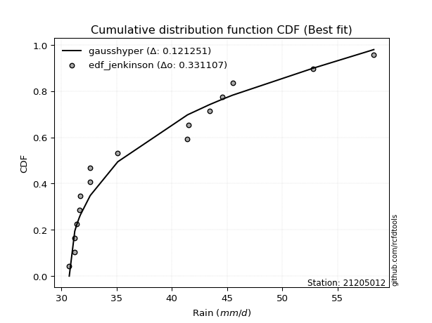</img>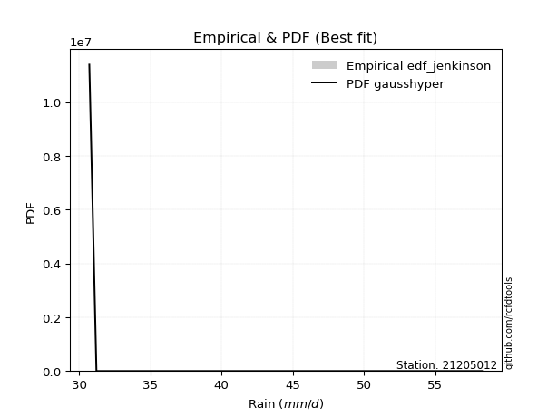</img>

</div>


### 11. EDF Cunnane (1978)

Cunnane´s work in statistical hydrology has focused on the performance and evaluation of different probability distributions (such as GEV, Gumbel, Lognormal) for flood frequency estimation. _b_ is a constant, typically set to 0.4.

<div align="center">


$P=(m-b)/(n+1-2b)$


</div>


**11.1. Empirical values**

<div align="center">

|                | 0                    | 1                   | 2                   | 3                   | 4                  | 5                  | 6                  | 7                  | 8                  | 9                  | 10                 | 11                 | 12                 | 13                 | 14                 | 15                 |
|:---------------|:---------------------|:--------------------|:--------------------|:--------------------|:-------------------|:-------------------|:-------------------|:-------------------|:-------------------|:-------------------|:-------------------|:-------------------|:-------------------|:-------------------|:-------------------|:-------------------|
| date           | 2019                 | 2018                | 2025                | 2022                | 2011               | 2021               | 2012               | 2010               | 2014               | 2013               | 2020               | 2017               | 2023               | 2016               | 2024               | 2015               |
| x              | 30.7                 | 31.2                | 31.2                | 31.4                | 31.6               | 31.7               | 32.6               | 32.6               | 35.1               | 41.4               | 41.5               | 43.4               | 44.5625            | 45.5               | 52.8               | 58.3               |
| m              | 1                    | 2                   | 3                   | 4                   | 5                  | 6                  | 7                  | 8                  | 9                  | 10                 | 11                 | 12                 | 13                 | 14                 | 15                 | 16                 |
| empirical_dist | edf_cunnane          | edf_cunnane         | edf_cunnane         | edf_cunnane         | edf_cunnane        | edf_cunnane        | edf_cunnane        | edf_cunnane        | edf_cunnane        | edf_cunnane        | edf_cunnane        | edf_cunnane        | edf_cunnane        | edf_cunnane        | edf_cunnane        | edf_cunnane        |
| empirical      | 0.037037037037037035 | 0.09876543209876544 | 0.16049382716049385 | 0.22222222222222224 | 0.2839506172839506 | 0.345679012345679  | 0.4074074074074074 | 0.4691358024691358 | 0.5308641975308642 | 0.5925925925925926 | 0.654320987654321  | 0.7160493827160493 | 0.7777777777777778 | 0.8395061728395062 | 0.9012345679012346 | 0.962962962962963  |
| empirical_tr   | 1.0384615384615383   | 1.1095890410958904  | 1.1911764705882353  | 1.2857142857142856  | 1.3965517241379308 | 1.5283018867924527 | 1.6875             | 1.8837209302325582 | 2.1315789473684212 | 2.454545454545454  | 2.8928571428571432 | 3.5217391304347823 | 4.5                | 6.2307692307692335 | 10.125             | 27.000000000000043 |

</div>


**11.2. Kolmogorov-Smirnov fit test (sorted by Δ)**


<div align="center">

|                | 0                   | 1                   | 2                  | 3                   | 4                   | 5                   | 6                   | 7                   | 8                  | 9                   | 10                 | 11                 | 12                  | 13                  | 14                  | 15                  | 16                | 17                  | 18                  | 19                  | 20                  | 21                  | 22                  | 23                  | 24                  | 25                  | 26                  | 27                  | 28                  | 29                  | 30                  | 31                  | 32                  | 33                  | 34                  | 35                  | 36                  | 37                  | 38                  | 39                  | 40                 | 41                  | 42                 | 43                  | 44                  | 45                | 46                  | 47                  | 48                 | 49                 | 50                  | 51                  | 52                  | 53                  | 54                  | 55                  | 56                  | 57                 | 58                  | 59                  | 60                  | 61                  | 62                  | 63                  | 64                  | 65                  | 66                  | 67                  | 68                  | 69                  | 70                 | 71                  | 72                  | 73                  | 74                 | 75                  | 76                  | 77                  | 78                  | 79                  | 80                 | 81                | 82                 | 83                  | 84                  | 85                  | 86                 | 87                  | 88                  | 89                  | 90                  | 91                 | 92                 | 93                 | 94                  | 95                  | 96                  | 97                 | 98                 | 99                | 100                | 101                | 102                 | 103                 | 104                 | 105                | 106                 | 107                 | 108                 | 109                | 110                | 111                | 112                 | 113                | 114                | 115                | 116                | 117                | 118                | 119                 | 120                 | 121                | 122                 | 123                 | 124                 | 125                | 126                | 127                | 128                | 129                 | 130                 | 131                | 132                 | 133                | 134                | 135                | 136                 | 137               | 138                | 139                | 140                | 141                | 142                 | 143                 | 144                 | 145                 | 146                 | 147                | 148                | 149                | 150                 | 151                | 152                | 153                | 154                | 155               | 156                | 157               | 158            | 159            |
|:---------------|:--------------------|:--------------------|:-------------------|:--------------------|:--------------------|:--------------------|:--------------------|:--------------------|:-------------------|:--------------------|:-------------------|:-------------------|:--------------------|:--------------------|:--------------------|:--------------------|:------------------|:--------------------|:--------------------|:--------------------|:--------------------|:--------------------|:--------------------|:--------------------|:--------------------|:--------------------|:--------------------|:--------------------|:--------------------|:--------------------|:--------------------|:--------------------|:--------------------|:--------------------|:--------------------|:--------------------|:--------------------|:--------------------|:--------------------|:--------------------|:-------------------|:--------------------|:-------------------|:--------------------|:--------------------|:------------------|:--------------------|:--------------------|:-------------------|:-------------------|:--------------------|:--------------------|:--------------------|:--------------------|:--------------------|:--------------------|:--------------------|:-------------------|:--------------------|:--------------------|:--------------------|:--------------------|:--------------------|:--------------------|:--------------------|:--------------------|:--------------------|:--------------------|:--------------------|:--------------------|:-------------------|:--------------------|:--------------------|:--------------------|:-------------------|:--------------------|:--------------------|:--------------------|:--------------------|:--------------------|:-------------------|:------------------|:-------------------|:--------------------|:--------------------|:--------------------|:-------------------|:--------------------|:--------------------|:--------------------|:--------------------|:-------------------|:-------------------|:-------------------|:--------------------|:--------------------|:--------------------|:-------------------|:-------------------|:------------------|:-------------------|:-------------------|:--------------------|:--------------------|:--------------------|:-------------------|:--------------------|:--------------------|:--------------------|:-------------------|:-------------------|:-------------------|:--------------------|:-------------------|:-------------------|:-------------------|:-------------------|:-------------------|:-------------------|:--------------------|:--------------------|:-------------------|:--------------------|:--------------------|:--------------------|:-------------------|:-------------------|:-------------------|:-------------------|:--------------------|:--------------------|:-------------------|:--------------------|:-------------------|:-------------------|:-------------------|:--------------------|:------------------|:-------------------|:-------------------|:-------------------|:-------------------|:--------------------|:--------------------|:--------------------|:--------------------|:--------------------|:-------------------|:-------------------|:-------------------|:--------------------|:-------------------|:-------------------|:-------------------|:-------------------|:------------------|:-------------------|:------------------|:---------------|:---------------|
| station        | 21205012            | 21205012            | 21205012           | 21205012            | 21205012            | 21205012            | 21205012            | 21205012            | 21205012           | 21205012            | 21205012           | 21205012           | 21205012            | 21205012            | 21205012            | 21205012            | 21205012          | 21205012            | 21205012            | 21205012            | 21205012            | 21205012            | 21205012            | 21205012            | 21205012            | 21205012            | 21205012            | 21205012            | 21205012            | 21205012            | 21205012            | 21205012            | 21205012            | 21205012            | 21205012            | 21205012            | 21205012            | 21205012            | 21205012            | 21205012            | 21205012           | 21205012            | 21205012           | 21205012            | 21205012            | 21205012          | 21205012            | 21205012            | 21205012           | 21205012           | 21205012            | 21205012            | 21205012            | 21205012            | 21205012            | 21205012            | 21205012            | 21205012           | 21205012            | 21205012            | 21205012            | 21205012            | 21205012            | 21205012            | 21205012            | 21205012            | 21205012            | 21205012            | 21205012            | 21205012            | 21205012           | 21205012            | 21205012            | 21205012            | 21205012           | 21205012            | 21205012            | 21205012            | 21205012            | 21205012            | 21205012           | 21205012          | 21205012           | 21205012            | 21205012            | 21205012            | 21205012           | 21205012            | 21205012            | 21205012            | 21205012            | 21205012           | 21205012           | 21205012           | 21205012            | 21205012            | 21205012            | 21205012           | 21205012           | 21205012          | 21205012           | 21205012           | 21205012            | 21205012            | 21205012            | 21205012           | 21205012            | 21205012            | 21205012            | 21205012           | 21205012           | 21205012           | 21205012            | 21205012           | 21205012           | 21205012           | 21205012           | 21205012           | 21205012           | 21205012            | 21205012            | 21205012           | 21205012            | 21205012            | 21205012            | 21205012           | 21205012           | 21205012           | 21205012           | 21205012            | 21205012            | 21205012           | 21205012            | 21205012           | 21205012           | 21205012           | 21205012            | 21205012          | 21205012           | 21205012           | 21205012           | 21205012           | 21205012            | 21205012            | 21205012            | 21205012            | 21205012            | 21205012           | 21205012           | 21205012           | 21205012            | 21205012           | 21205012           | 21205012           | 21205012           | 21205012          | 21205012           | 21205012          | 21205012       | 21205012       |
| empirical_dist | edf_cunnane         | edf_cunnane         | edf_cunnane        | edf_cunnane         | edf_cunnane         | edf_cunnane         | edf_cunnane         | edf_cunnane         | edf_cunnane        | edf_cunnane         | edf_cunnane        | edf_cunnane        | edf_cunnane         | edf_cunnane         | edf_cunnane         | edf_cunnane         | edf_cunnane       | edf_cunnane         | edf_cunnane         | edf_cunnane         | edf_cunnane         | edf_cunnane         | edf_cunnane         | edf_cunnane         | edf_cunnane         | edf_cunnane         | edf_cunnane         | edf_cunnane         | edf_cunnane         | edf_cunnane         | edf_cunnane         | edf_cunnane         | edf_cunnane         | edf_cunnane         | edf_cunnane         | edf_cunnane         | edf_cunnane         | edf_cunnane         | edf_cunnane         | edf_cunnane         | edf_cunnane        | edf_cunnane         | edf_cunnane        | edf_cunnane         | edf_cunnane         | edf_cunnane       | edf_cunnane         | edf_cunnane         | edf_cunnane        | edf_cunnane        | edf_cunnane         | edf_cunnane         | edf_cunnane         | edf_cunnane         | edf_cunnane         | edf_cunnane         | edf_cunnane         | edf_cunnane        | edf_cunnane         | edf_cunnane         | edf_cunnane         | edf_cunnane         | edf_cunnane         | edf_cunnane         | edf_cunnane         | edf_cunnane         | edf_cunnane         | edf_cunnane         | edf_cunnane         | edf_cunnane         | edf_cunnane        | edf_cunnane         | edf_cunnane         | edf_cunnane         | edf_cunnane        | edf_cunnane         | edf_cunnane         | edf_cunnane         | edf_cunnane         | edf_cunnane         | edf_cunnane        | edf_cunnane       | edf_cunnane        | edf_cunnane         | edf_cunnane         | edf_cunnane         | edf_cunnane        | edf_cunnane         | edf_cunnane         | edf_cunnane         | edf_cunnane         | edf_cunnane        | edf_cunnane        | edf_cunnane        | edf_cunnane         | edf_cunnane         | edf_cunnane         | edf_cunnane        | edf_cunnane        | edf_cunnane       | edf_cunnane        | edf_cunnane        | edf_cunnane         | edf_cunnane         | edf_cunnane         | edf_cunnane        | edf_cunnane         | edf_cunnane         | edf_cunnane         | edf_cunnane        | edf_cunnane        | edf_cunnane        | edf_cunnane         | edf_cunnane        | edf_cunnane        | edf_cunnane        | edf_cunnane        | edf_cunnane        | edf_cunnane        | edf_cunnane         | edf_cunnane         | edf_cunnane        | edf_cunnane         | edf_cunnane         | edf_cunnane         | edf_cunnane        | edf_cunnane        | edf_cunnane        | edf_cunnane        | edf_cunnane         | edf_cunnane         | edf_cunnane        | edf_cunnane         | edf_cunnane        | edf_cunnane        | edf_cunnane        | edf_cunnane         | edf_cunnane       | edf_cunnane        | edf_cunnane        | edf_cunnane        | edf_cunnane        | edf_cunnane         | edf_cunnane         | edf_cunnane         | edf_cunnane         | edf_cunnane         | edf_cunnane        | edf_cunnane        | edf_cunnane        | edf_cunnane         | edf_cunnane        | edf_cunnane        | edf_cunnane        | edf_cunnane        | edf_cunnane       | edf_cunnane        | edf_cunnane       | edf_cunnane    | edf_cunnane    |
| p_dist         | gausshyper          | weibull_min         | logdgamma          | exponweib           | logbeta             | nakagami            | logtruncweibull_min | logdweibull         | foldnorm           | dweibull            | loggengamma        | halfnorm           | halfgennorm         | logfoldnorm         | loghalfnorm         | gengamma            | exponpow          | johnsonsu           | loglomax            | fatiguelife         | semicircular        | vonmises_line       | logbradford         | invweibull          | genextreme          | loghalfgennorm      | logsemicircular     | logjohnsonsu        | loginvweibull       | loggenextreme       | halflogistic        | beta                | lomax               | logburr             | loghalflogistic     | f                   | logfatiguelife      | rayleigh            | anglit              | invgamma            | lograyleigh        | loganglit           | logf               | logburr12           | burr                | pearson3          | maxwell             | logweibull_min      | logmaxwell         | logtruncpareto     | logarcsine          | logexponpow         | logexponnorm        | logpearson3         | loggenexpon         | burr12              | truncpareto         | gumbel_r           | invgauss            | loginvgauss         | loggumbel_r         | moyal               | lognakagami         | gompertz            | loggenlogistic      | bradford            | logweibull_max      | logmoyal            | logloggamma         | erlang              | t                  | crystalball         | norm                | lognct              | nct                | loginvgamma         | loggamma            | loggamma            | logt                | logcrystalball      | lognorm            | alpha             | ncf                | betaprime           | genlogistic         | logalpha            | arcsine            | logbetaprime        | logkstwobign        | logexponweib        | logerlang           | kstwobign          | logistic           | exponnorm          | genexpon            | loglogistic         | logcosine           | cosine             | gumbel_l           | hypsecant         | logrice            | truncnorm          | loggumbel_l         | loghypsecant        | rdist               | loggausshyper      | rice                | logtruncnorm        | dgamma              | gamma              | gennorm            | powerlaw           | logpowerlaw         | laplace            | loglaplace         | loglaplace         | logargus           | argus              | truncweibull_min   | logtriang           | logkappa4           | logwrapcauchy      | logskewnorm         | wald                | logksone            | logloglaplace      | tukeylambda        | genhalflogistic    | loggompertz        | loggennorm          | logwald             | logrdist           | logtruncexpon       | ksone              | logncf             | wrapcauchy         | logkappa3           | skewnorm          | triang             | truncexpon         | loggenhalflogistic | logtukeylambda     | loguniform          | logvonmises_line    | genpareto           | kappa4              | uniform             | kappa3             | johnsonsb          | loglevy_l          | levy_l              | logjohnsonsb       | logtrapezoid       | trapezoid          | loggenpareto       | weibull_max       | logvonmises        | vonmises          | mielke         | logmielke      |
| delta          | 0.12091210783212925 | 0.14294356221254612 | 0.1515146378988252 | 0.15456067962097203 | 0.15573985121626843 | 0.16319819952859071 | 0.17050635220934274 | 0.17408282128878655 | 0.1763417664455117 | 0.17689223384163533 | 0.1769081500723012 | 0.1774589130657349 | 0.17787460433502822 | 0.17950050496890024 | 0.18023724903862443 | 0.18024595778267205 | 0.183501851997816 | 0.18510299294596633 | 0.18624963415725404 | 0.18760824632189843 | 0.18820951363383498 | 0.18838198837925701 | 0.18881007074117473 | 0.18905208172392018 | 0.18907004152360496 | 0.18950375288787957 | 0.19003370901733807 | 0.19196421765288707 | 0.19418863890446614 | 0.19419041710143037 | 0.19436296017343313 | 0.19506220263185453 | 0.19515758643228975 | 0.19579795967330382 | 0.19771348204246053 | 0.19809929264248627 | 0.19833216146498012 | 0.19948752235732098 | 0.20029961649546257 | 0.20104489917070656 | 0.2018335840025366 | 0.20217382551206609 | 0.2050353602243602 | 0.20518636895205505 | 0.20705200007123215 | 0.207282119354481 | 0.20787193636461615 | 0.20869833201003102 | 0.2101009465306118 | 0.2110055212095493 | 0.21143757077843356 | 0.21151973460552143 | 0.21182307833598635 | 0.21407183293458193 | 0.21428625907664745 | 0.21435908648275442 | 0.21784401305477635 | 0.2183668261220041 | 0.21946200711845265 | 0.22020281876978998 | 0.22111678811245739 | 0.22178043832914385 | 0.22226001780875215 | 0.22293418033786455 | 0.22396799700770648 | 0.22446724859446618 | 0.22485742715337353 | 0.22502726716702626 | 0.22504561280399904 | 0.22563428372088234 | 0.2281066625763204 | 0.22810780267450415 | 0.22810781727701268 | 0.22835737466512449 | 0.2288458897400792 | 0.22903503298406372 | 0.23000373914151462 | 0.23000373914151462 | 0.23003137363816817 | 0.23003252742759253 | 0.2300326803183368 | 0.232393569983532 | 0.2328402688139758 | 0.23402273423195682 | 0.23414728356773656 | 0.23419142553347744 | 0.2343986119633657 | 0.23701428952782336 | 0.23788040897033488 | 0.24324877585208315 | 0.24974566311011537 | 0.2497821861643045 | 0.2507503891103894 | 0.2511354326625229 | 0.25227323982378524 | 0.25266104760683183 | 0.25790426184532805 | 0.2584519324021393 | 0.2653395695007027 | 0.265380996786027 | 0.2659160171397348 | 0.2660692305551937 | 0.26677593427304236 | 0.26722266610820483 | 0.27078556058953407 | 0.2725038601237033 | 0.27345017976567554 | 0.27446666326440167 | 0.27567888403882607 | 0.2798977827687652 | 0.2801227853380619 | 0.2817061534812233 | 0.28409720055888105 | 0.2841245836728776 | 0.2857373318071978 | 0.2857373318071978 | 0.2878459496502225 | 0.2879022085390892 | 0.2891219299757293 | 0.29436764476382726 | 0.29738558829056116 | 0.3004732660015218 | 0.30397944311880215 | 0.30662709870642585 | 0.30777614101941375 | 0.3109850019278322 | 0.3157817875960124 | 0.3163613631926684 | 0.3168667852812366 | 0.31710515445814885 | 0.31866624430688717 | 0.3213161992346998 | 0.32573059177454633 | 0.3284353193773482 | 0.3289111011648358 | 0.3300942133395902 | 0.33154379146568225 | 0.336889418860751 | 0.3485777313900095 | 0.3574477531215092 | 0.3690148341311491 | 0.3691652141237288 | 0.37550420872946944 | 0.37601828652267266 | 0.37898265495672406 | 0.38250518990545956 | 0.40029522275899077 | 0.4003690732865779 | 0.4133050147519697 | 0.4335743444926001 | 0.45410864642317866 | 0.4548667708782098 | 0.4859954890713524 | 0.5584013045812037 | 0.6524410465713952 | 0.714494314514408 | 1.1211237737480142 | 8.849556235498182 | nan            | nan            |
| deltao         | 0.331107277296      | 0.331107277296      | 0.331107277296     | 0.331107277296      | 0.331107277296      | 0.331107277296      | 0.331107277296      | 0.331107277296      | 0.331107277296     | 0.331107277296      | 0.331107277296     | 0.331107277296     | 0.331107277296      | 0.331107277296      | 0.331107277296      | 0.331107277296      | 0.331107277296    | 0.331107277296      | 0.331107277296      | 0.331107277296      | 0.331107277296      | 0.331107277296      | 0.331107277296      | 0.331107277296      | 0.331107277296      | 0.331107277296      | 0.331107277296      | 0.331107277296      | 0.331107277296      | 0.331107277296      | 0.331107277296      | 0.331107277296      | 0.331107277296      | 0.331107277296      | 0.331107277296      | 0.331107277296      | 0.331107277296      | 0.331107277296      | 0.331107277296      | 0.331107277296      | 0.331107277296     | 0.331107277296      | 0.331107277296     | 0.331107277296      | 0.331107277296      | 0.331107277296    | 0.331107277296      | 0.331107277296      | 0.331107277296     | 0.331107277296     | 0.331107277296      | 0.331107277296      | 0.331107277296      | 0.331107277296      | 0.331107277296      | 0.331107277296      | 0.331107277296      | 0.331107277296     | 0.331107277296      | 0.331107277296      | 0.331107277296      | 0.331107277296      | 0.331107277296      | 0.331107277296      | 0.331107277296      | 0.331107277296      | 0.331107277296      | 0.331107277296      | 0.331107277296      | 0.331107277296      | 0.331107277296     | 0.331107277296      | 0.331107277296      | 0.331107277296      | 0.331107277296     | 0.331107277296      | 0.331107277296      | 0.331107277296      | 0.331107277296      | 0.331107277296      | 0.331107277296     | 0.331107277296    | 0.331107277296     | 0.331107277296      | 0.331107277296      | 0.331107277296      | 0.331107277296     | 0.331107277296      | 0.331107277296      | 0.331107277296      | 0.331107277296      | 0.331107277296     | 0.331107277296     | 0.331107277296     | 0.331107277296      | 0.331107277296      | 0.331107277296      | 0.331107277296     | 0.331107277296     | 0.331107277296    | 0.331107277296     | 0.331107277296     | 0.331107277296      | 0.331107277296      | 0.331107277296      | 0.331107277296     | 0.331107277296      | 0.331107277296      | 0.331107277296      | 0.331107277296     | 0.331107277296     | 0.331107277296     | 0.331107277296      | 0.331107277296     | 0.331107277296     | 0.331107277296     | 0.331107277296     | 0.331107277296     | 0.331107277296     | 0.331107277296      | 0.331107277296      | 0.331107277296     | 0.331107277296      | 0.331107277296      | 0.331107277296      | 0.331107277296     | 0.331107277296     | 0.331107277296     | 0.331107277296     | 0.331107277296      | 0.331107277296      | 0.331107277296     | 0.331107277296      | 0.331107277296     | 0.331107277296     | 0.331107277296     | 0.331107277296      | 0.331107277296    | 0.331107277296     | 0.331107277296     | 0.331107277296     | 0.331107277296     | 0.331107277296      | 0.331107277296      | 0.331107277296      | 0.331107277296      | 0.331107277296      | 0.331107277296     | 0.331107277296     | 0.331107277296     | 0.331107277296      | 0.331107277296     | 0.331107277296     | 0.331107277296     | 0.331107277296     | 0.331107277296    | 0.331107277296     | 0.331107277296    | 0.331107277296 | 0.331107277296 |
| eval           | Δo > Δ              | Δo > Δ              | Δo > Δ             | Δo > Δ              | Δo > Δ              | Δo > Δ              | Δo > Δ              | Δo > Δ              | Δo > Δ             | Δo > Δ              | Δo > Δ             | Δo > Δ             | Δo > Δ              | Δo > Δ              | Δo > Δ              | Δo > Δ              | Δo > Δ            | Δo > Δ              | Δo > Δ              | Δo > Δ              | Δo > Δ              | Δo > Δ              | Δo > Δ              | Δo > Δ              | Δo > Δ              | Δo > Δ              | Δo > Δ              | Δo > Δ              | Δo > Δ              | Δo > Δ              | Δo > Δ              | Δo > Δ              | Δo > Δ              | Δo > Δ              | Δo > Δ              | Δo > Δ              | Δo > Δ              | Δo > Δ              | Δo > Δ              | Δo > Δ              | Δo > Δ             | Δo > Δ              | Δo > Δ             | Δo > Δ              | Δo > Δ              | Δo > Δ            | Δo > Δ              | Δo > Δ              | Δo > Δ             | Δo > Δ             | Δo > Δ              | Δo > Δ              | Δo > Δ              | Δo > Δ              | Δo > Δ              | Δo > Δ              | Δo > Δ              | Δo > Δ             | Δo > Δ              | Δo > Δ              | Δo > Δ              | Δo > Δ              | Δo > Δ              | Δo > Δ              | Δo > Δ              | Δo > Δ              | Δo > Δ              | Δo > Δ              | Δo > Δ              | Δo > Δ              | Δo > Δ             | Δo > Δ              | Δo > Δ              | Δo > Δ              | Δo > Δ             | Δo > Δ              | Δo > Δ              | Δo > Δ              | Δo > Δ              | Δo > Δ              | Δo > Δ             | Δo > Δ            | Δo > Δ             | Δo > Δ              | Δo > Δ              | Δo > Δ              | Δo > Δ             | Δo > Δ              | Δo > Δ              | Δo > Δ              | Δo > Δ              | Δo > Δ             | Δo > Δ             | Δo > Δ             | Δo > Δ              | Δo > Δ              | Δo > Δ              | Δo > Δ             | Δo > Δ             | Δo > Δ            | Δo > Δ             | Δo > Δ             | Δo > Δ              | Δo > Δ              | Δo > Δ              | Δo > Δ             | Δo > Δ              | Δo > Δ              | Δo > Δ              | Δo > Δ             | Δo > Δ             | Δo > Δ             | Δo > Δ              | Δo > Δ             | Δo > Δ             | Δo > Δ             | Δo > Δ             | Δo > Δ             | Δo > Δ             | Δo > Δ              | Δo > Δ              | Δo > Δ             | Δo > Δ              | Δo > Δ              | Δo > Δ              | Δo > Δ             | Δo > Δ             | Δo > Δ             | Δo > Δ             | Δo > Δ              | Δo > Δ              | Δo > Δ             | Δo > Δ              | Δo > Δ             | Δo > Δ             | Δo > Δ             | Δo <= Δ             | Δo <= Δ           | Δo <= Δ            | Δo <= Δ            | Δo <= Δ            | Δo <= Δ            | Δo <= Δ             | Δo <= Δ             | Δo <= Δ             | Δo <= Δ             | Δo <= Δ             | Δo <= Δ            | Δo <= Δ            | Δo <= Δ            | Δo <= Δ             | Δo <= Δ            | Δo <= Δ            | Δo <= Δ            | Δo <= Δ            | Δo <= Δ           | Δo <= Δ            | Δo <= Δ           | Δo <= Δ        | Δo <= Δ        |
| fit            | 1                   | 1                   | 1                  | 1                   | 1                   | 1                   | 1                   | 1                   | 1                  | 1                   | 1                  | 1                  | 1                   | 1                   | 1                   | 1                   | 1                 | 1                   | 1                   | 1                   | 1                   | 1                   | 1                   | 1                   | 1                   | 1                   | 1                   | 1                   | 1                   | 1                   | 1                   | 1                   | 1                   | 1                   | 1                   | 1                   | 1                   | 1                   | 1                   | 1                   | 1                  | 1                   | 1                  | 1                   | 1                   | 1                 | 1                   | 1                   | 1                  | 1                  | 1                   | 1                   | 1                   | 1                   | 1                   | 1                   | 1                   | 1                  | 1                   | 1                   | 1                   | 1                   | 1                   | 1                   | 1                   | 1                   | 1                   | 1                   | 1                   | 1                   | 1                  | 1                   | 1                   | 1                   | 1                  | 1                   | 1                   | 1                   | 1                   | 1                   | 1                  | 1                 | 1                  | 1                   | 1                   | 1                   | 1                  | 1                   | 1                   | 1                   | 1                   | 1                  | 1                  | 1                  | 1                   | 1                   | 1                   | 1                  | 1                  | 1                 | 1                  | 1                  | 1                   | 1                   | 1                   | 1                  | 1                   | 1                   | 1                   | 1                  | 1                  | 1                  | 1                   | 1                  | 1                  | 1                  | 1                  | 1                  | 1                  | 1                   | 1                   | 1                  | 1                   | 1                   | 1                   | 1                  | 1                  | 1                  | 1                  | 1                   | 1                   | 1                  | 1                   | 1                  | 1                  | 1                  | 0                   | 0                 | 0                  | 0                  | 0                  | 0                  | 0                   | 0                   | 0                   | 0                   | 0                   | 0                  | 0                  | 0                  | 0                   | 0                  | 0                  | 0                  | 0                  | 0                 | 0                  | 0                 | 0              | 0              |
| n              | 16                  | 16                  | 16                 | 16                  | 16                  | 16                  | 16                  | 16                  | 16                 | 16                  | 16                 | 16                 | 16                  | 16                  | 16                  | 16                  | 16                | 16                  | 16                  | 16                  | 16                  | 16                  | 16                  | 16                  | 16                  | 16                  | 16                  | 16                  | 16                  | 16                  | 16                  | 16                  | 16                  | 16                  | 16                  | 16                  | 16                  | 16                  | 16                  | 16                  | 16                 | 16                  | 16                 | 16                  | 16                  | 16                | 16                  | 16                  | 16                 | 16                 | 16                  | 16                  | 16                  | 16                  | 16                  | 16                  | 16                  | 16                 | 16                  | 16                  | 16                  | 16                  | 16                  | 16                  | 16                  | 16                  | 16                  | 16                  | 16                  | 16                  | 16                 | 16                  | 16                  | 16                  | 16                 | 16                  | 16                  | 16                  | 16                  | 16                  | 16                 | 16                | 16                 | 16                  | 16                  | 16                  | 16                 | 16                  | 16                  | 16                  | 16                  | 16                 | 16                 | 16                 | 16                  | 16                  | 16                  | 16                 | 16                 | 16                | 16                 | 16                 | 16                  | 16                  | 16                  | 16                 | 16                  | 16                  | 16                  | 16                 | 16                 | 16                 | 16                  | 16                 | 16                 | 16                 | 16                 | 16                 | 16                 | 16                  | 16                  | 16                 | 16                  | 16                  | 16                  | 16                 | 16                 | 16                 | 16                 | 16                  | 16                  | 16                 | 16                  | 16                 | 16                 | 16                 | 16                  | 16                | 16                 | 16                 | 16                 | 16                 | 16                  | 16                  | 16                  | 16                  | 16                  | 16                 | 16                 | 16                 | 16                  | 16                 | 16                 | 16                 | 16                 | 16                | 16                 | 16                | 16             | 16             |
| best_fit       | 1                   | 0                   | 0                  | 0                   | 0                   | 0                   | 0                   | 0                   | 0                  | 0                   | 0                  | 0                  | 0                   | 0                   | 0                   | 0                   | 0                 | 0                   | 0                   | 0                   | 0                   | 0                   | 0                   | 0                   | 0                   | 0                   | 0                   | 0                   | 0                   | 0                   | 0                   | 0                   | 0                   | 0                   | 0                   | 0                   | 0                   | 0                   | 0                   | 0                   | 0                  | 0                   | 0                  | 0                   | 0                   | 0                 | 0                   | 0                   | 0                  | 0                  | 0                   | 0                   | 0                   | 0                   | 0                   | 0                   | 0                   | 0                  | 0                   | 0                   | 0                   | 0                   | 0                   | 0                   | 0                   | 0                   | 0                   | 0                   | 0                   | 0                   | 0                  | 0                   | 0                   | 0                   | 0                  | 0                   | 0                   | 0                   | 0                   | 0                   | 0                  | 0                 | 0                  | 0                   | 0                   | 0                   | 0                  | 0                   | 0                   | 0                   | 0                   | 0                  | 0                  | 0                  | 0                   | 0                   | 0                   | 0                  | 0                  | 0                 | 0                  | 0                  | 0                   | 0                   | 0                   | 0                  | 0                   | 0                   | 0                   | 0                  | 0                  | 0                  | 0                   | 0                  | 0                  | 0                  | 0                  | 0                  | 0                  | 0                   | 0                   | 0                  | 0                   | 0                   | 0                   | 0                  | 0                  | 0                  | 0                  | 0                   | 0                   | 0                  | 0                   | 0                  | 0                  | 0                  | 0                   | 0                 | 0                  | 0                  | 0                  | 0                  | 0                   | 0                   | 0                   | 0                   | 0                   | 0                  | 0                  | 0                  | 0                   | 0                  | 0                  | 0                  | 0                  | 0                 | 0                  | 0                 | 0              | 0              |
| best_fit_sort  | 1                   | 2                   | 3                  | 4                   | 5                   | 6                   | 7                   | 8                   | 9                  | 10                  | 11                 | 12                 | 13                  | 14                  | 15                  | 16                  | 17                | 18                  | 19                  | 20                  | 21                  | 22                  | 23                  | 24                  | 25                  | 26                  | 27                  | 28                  | 29                  | 30                  | 31                  | 32                  | 33                  | 34                  | 35                  | 36                  | 37                  | 38                  | 39                  | 40                  | 41                 | 42                  | 43                 | 44                  | 45                  | 46                | 47                  | 48                  | 49                 | 50                 | 51                  | 52                  | 53                  | 54                  | 55                  | 56                  | 57                  | 58                 | 59                  | 60                  | 61                  | 62                  | 63                  | 64                  | 65                  | 66                  | 67                  | 68                  | 69                  | 70                  | 71                 | 72                  | 73                  | 74                  | 75                 | 76                  | 77                  | 78                  | 79                  | 80                  | 81                 | 82                | 83                 | 84                  | 85                  | 86                  | 87                 | 88                  | 89                  | 90                  | 91                  | 92                 | 93                 | 94                 | 95                  | 96                  | 97                  | 98                 | 99                 | 100               | 101                | 102                | 103                 | 104                 | 105                 | 106                | 107                 | 108                 | 109                 | 110                | 111                | 112                | 113                 | 114                | 115                | 116                | 117                | 118                | 119                | 120                 | 121                 | 122                | 123                 | 124                 | 125                 | 126                | 127                | 128                | 129                | 130                 | 131                 | 132                | 133                 | 134                | 135                | 136                | 137                 | 138               | 139                | 140                | 141                | 142                | 143                 | 144                 | 145                 | 146                 | 147                 | 148                | 149                | 150                | 151                 | 152                | 153                | 154                | 155                | 156               | 157                | 158               | 159            | 160            |

</div>


**11.3. Best fit**

<div align="center">

|   id |   station | empirical_dist   | p_dist     |    delta |   deltao | eval   |   fit |   n |   best_fit |   best_fit_sort |
|-----:|----------:|:-----------------|:-----------|---------:|---------:|:-------|------:|----:|-----------:|----------------:|
|    0 |  21205012 | edf_cunnane      | gausshyper | 0.120912 | 0.331107 | Δo > Δ |     1 |  16 |          1 |               1 |

</div>


<div align="center">

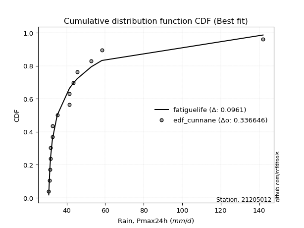</img>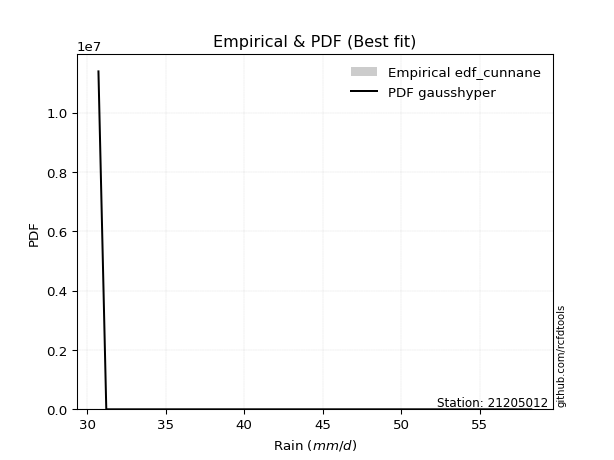</img>

</div>


### 12. EDF Adamowski (1981)

The Adamowski formula in hydrology refers to a specific plotting position formula used for estimating the non-parametric empirical distribution of hydrological events (like flood peaks) to calculate their return periods. This formula provides an alternative to traditional parametric methods (like the Gumbel or Log Pearson Type III distributions). 

<div align="center">


$P=(m-0.25)/(n+0.5)$


</div>


**12.1. Empirical values**

<div align="center">

|                | 0                    | 1                   | 2                   | 3                   | 4                  | 5                  | 6                  | 7                  | 8                  | 9                  | 10                 | 11                 | 12                 | 13                 | 14                 | 15                 |
|:---------------|:---------------------|:--------------------|:--------------------|:--------------------|:-------------------|:-------------------|:-------------------|:-------------------|:-------------------|:-------------------|:-------------------|:-------------------|:-------------------|:-------------------|:-------------------|:-------------------|
| date           | 2019                 | 2018                | 2025                | 2022                | 2011               | 2021               | 2012               | 2010               | 2014               | 2013               | 2020               | 2017               | 2023               | 2016               | 2024               | 2015               |
| x              | 30.7                 | 31.2                | 31.2                | 31.4                | 31.6               | 31.7               | 32.6               | 32.6               | 35.1               | 41.4               | 41.5               | 43.4               | 44.5625            | 45.5               | 52.8               | 58.3               |
| m              | 1                    | 2                   | 3                   | 4                   | 5                  | 6                  | 7                  | 8                  | 9                  | 10                 | 11                 | 12                 | 13                 | 14                 | 15                 | 16                 |
| empirical_dist | edf_adamowski        | edf_adamowski       | edf_adamowski       | edf_adamowski       | edf_adamowski      | edf_adamowski      | edf_adamowski      | edf_adamowski      | edf_adamowski      | edf_adamowski      | edf_adamowski      | edf_adamowski      | edf_adamowski      | edf_adamowski      | edf_adamowski      | edf_adamowski      |
| empirical      | 0.045454545454545456 | 0.10606060606060606 | 0.16666666666666666 | 0.22727272727272727 | 0.2878787878787879 | 0.3484848484848485 | 0.4090909090909091 | 0.4696969696969697 | 0.5303030303030303 | 0.5909090909090909 | 0.6515151515151515 | 0.7121212121212122 | 0.7727272727272727 | 0.8333333333333334 | 0.8939393939393939 | 0.9545454545454546 |
| empirical_tr   | 1.0476190476190477   | 1.1186440677966103  | 1.2                 | 1.2941176470588236  | 1.4042553191489362 | 1.5348837209302326 | 1.6923076923076925 | 1.885714285714286  | 2.129032258064516  | 2.4444444444444446 | 2.869565217391304  | 3.4736842105263164 | 4.3999999999999995 | 6.000000000000002  | 9.428571428571427  | 22.00000000000002  |

</div>


**12.2. Kolmogorov-Smirnov fit test (sorted by Δ)**


<div align="center">

|                | 0                   | 1                   | 2                   | 3                   | 4                   | 5                   | 6                   | 7                   | 8                  | 9                   | 10                  | 11                  | 12                  | 13                 | 14                  | 15                  | 16                  | 17                  | 18                  | 19                  | 20                  | 21                  | 22                  | 23                  | 24                 | 25                  | 26                 | 27                 | 28                  | 29                  | 30                  | 31                | 32                  | 33                  | 34                  | 35                 | 36                  | 37                  | 38                  | 39                  | 40                  | 41                  | 42                  | 43                | 44                | 45                  | 46                  | 47                 | 48                  | 49                  | 50                  | 51                 | 52                  | 53                  | 54                 | 55                  | 56                 | 57                  | 58                  | 59                  | 60                 | 61                 | 62                 | 63                  | 64                  | 65                  | 66                  | 67                 | 68                | 69                  | 70                  | 71                  | 72                 | 73                  | 74                  | 75                  | 76                  | 77                  | 78                  | 79                  | 80                  | 81                  | 82                  | 83                  | 84                  | 85                 | 86                  | 87                  | 88                 | 89                  | 90                 | 91                  | 92                | 93                  | 94                 | 95                 | 96                | 97                  | 98                  | 99                  | 100                 | 101                 | 102                 | 103                | 104                | 105               | 106                 | 107                | 108                 | 109                | 110                | 111                | 112                | 113                | 114                 | 115                 | 116                | 117                 | 118                | 119                 | 120                | 121                | 122                 | 123                | 124                | 125                | 126                | 127                | 128                 | 129                 | 130                | 131                 | 132                | 133                 | 134                | 135                 | 136                | 137                 | 138                | 139                | 140                 | 141                 | 142                 | 143                | 144                | 145                | 146                | 147                 | 148                 | 149                 | 150                 | 151                 | 152                 | 153                | 154                | 155                | 156                | 157               | 158            | 159            |
|:---------------|:--------------------|:--------------------|:--------------------|:--------------------|:--------------------|:--------------------|:--------------------|:--------------------|:-------------------|:--------------------|:--------------------|:--------------------|:--------------------|:-------------------|:--------------------|:--------------------|:--------------------|:--------------------|:--------------------|:--------------------|:--------------------|:--------------------|:--------------------|:--------------------|:-------------------|:--------------------|:-------------------|:-------------------|:--------------------|:--------------------|:--------------------|:------------------|:--------------------|:--------------------|:--------------------|:-------------------|:--------------------|:--------------------|:--------------------|:--------------------|:--------------------|:--------------------|:--------------------|:------------------|:------------------|:--------------------|:--------------------|:-------------------|:--------------------|:--------------------|:--------------------|:-------------------|:--------------------|:--------------------|:-------------------|:--------------------|:-------------------|:--------------------|:--------------------|:--------------------|:-------------------|:-------------------|:-------------------|:--------------------|:--------------------|:--------------------|:--------------------|:-------------------|:------------------|:--------------------|:--------------------|:--------------------|:-------------------|:--------------------|:--------------------|:--------------------|:--------------------|:--------------------|:--------------------|:--------------------|:--------------------|:--------------------|:--------------------|:--------------------|:--------------------|:-------------------|:--------------------|:--------------------|:-------------------|:--------------------|:-------------------|:--------------------|:------------------|:--------------------|:-------------------|:-------------------|:------------------|:--------------------|:--------------------|:--------------------|:--------------------|:--------------------|:--------------------|:-------------------|:-------------------|:------------------|:--------------------|:-------------------|:--------------------|:-------------------|:-------------------|:-------------------|:-------------------|:-------------------|:--------------------|:--------------------|:-------------------|:--------------------|:-------------------|:--------------------|:-------------------|:-------------------|:--------------------|:-------------------|:-------------------|:-------------------|:-------------------|:-------------------|:--------------------|:--------------------|:-------------------|:--------------------|:-------------------|:--------------------|:-------------------|:--------------------|:-------------------|:--------------------|:-------------------|:-------------------|:--------------------|:--------------------|:--------------------|:-------------------|:-------------------|:-------------------|:-------------------|:--------------------|:--------------------|:--------------------|:--------------------|:--------------------|:--------------------|:-------------------|:-------------------|:-------------------|:-------------------|:------------------|:---------------|:---------------|
| station        | 21205012            | 21205012            | 21205012            | 21205012            | 21205012            | 21205012            | 21205012            | 21205012            | 21205012           | 21205012            | 21205012            | 21205012            | 21205012            | 21205012           | 21205012            | 21205012            | 21205012            | 21205012            | 21205012            | 21205012            | 21205012            | 21205012            | 21205012            | 21205012            | 21205012           | 21205012            | 21205012           | 21205012           | 21205012            | 21205012            | 21205012            | 21205012          | 21205012            | 21205012            | 21205012            | 21205012           | 21205012            | 21205012            | 21205012            | 21205012            | 21205012            | 21205012            | 21205012            | 21205012          | 21205012          | 21205012            | 21205012            | 21205012           | 21205012            | 21205012            | 21205012            | 21205012           | 21205012            | 21205012            | 21205012           | 21205012            | 21205012           | 21205012            | 21205012            | 21205012            | 21205012           | 21205012           | 21205012           | 21205012            | 21205012            | 21205012            | 21205012            | 21205012           | 21205012          | 21205012            | 21205012            | 21205012            | 21205012           | 21205012            | 21205012            | 21205012            | 21205012            | 21205012            | 21205012            | 21205012            | 21205012            | 21205012            | 21205012            | 21205012            | 21205012            | 21205012           | 21205012            | 21205012            | 21205012           | 21205012            | 21205012           | 21205012            | 21205012          | 21205012            | 21205012           | 21205012           | 21205012          | 21205012            | 21205012            | 21205012            | 21205012            | 21205012            | 21205012            | 21205012           | 21205012           | 21205012          | 21205012            | 21205012           | 21205012            | 21205012           | 21205012           | 21205012           | 21205012           | 21205012           | 21205012            | 21205012            | 21205012           | 21205012            | 21205012           | 21205012            | 21205012           | 21205012           | 21205012            | 21205012           | 21205012           | 21205012           | 21205012           | 21205012           | 21205012            | 21205012            | 21205012           | 21205012            | 21205012           | 21205012            | 21205012           | 21205012            | 21205012           | 21205012            | 21205012           | 21205012           | 21205012            | 21205012            | 21205012            | 21205012           | 21205012           | 21205012           | 21205012           | 21205012            | 21205012            | 21205012            | 21205012            | 21205012            | 21205012            | 21205012           | 21205012           | 21205012           | 21205012           | 21205012          | 21205012       | 21205012       |
| empirical_dist | edf_adamowski       | edf_adamowski       | edf_adamowski       | edf_adamowski       | edf_adamowski       | edf_adamowski       | edf_adamowski       | edf_adamowski       | edf_adamowski      | edf_adamowski       | edf_adamowski       | edf_adamowski       | edf_adamowski       | edf_adamowski      | edf_adamowski       | edf_adamowski       | edf_adamowski       | edf_adamowski       | edf_adamowski       | edf_adamowski       | edf_adamowski       | edf_adamowski       | edf_adamowski       | edf_adamowski       | edf_adamowski      | edf_adamowski       | edf_adamowski      | edf_adamowski      | edf_adamowski       | edf_adamowski       | edf_adamowski       | edf_adamowski     | edf_adamowski       | edf_adamowski       | edf_adamowski       | edf_adamowski      | edf_adamowski       | edf_adamowski       | edf_adamowski       | edf_adamowski       | edf_adamowski       | edf_adamowski       | edf_adamowski       | edf_adamowski     | edf_adamowski     | edf_adamowski       | edf_adamowski       | edf_adamowski      | edf_adamowski       | edf_adamowski       | edf_adamowski       | edf_adamowski      | edf_adamowski       | edf_adamowski       | edf_adamowski      | edf_adamowski       | edf_adamowski      | edf_adamowski       | edf_adamowski       | edf_adamowski       | edf_adamowski      | edf_adamowski      | edf_adamowski      | edf_adamowski       | edf_adamowski       | edf_adamowski       | edf_adamowski       | edf_adamowski      | edf_adamowski     | edf_adamowski       | edf_adamowski       | edf_adamowski       | edf_adamowski      | edf_adamowski       | edf_adamowski       | edf_adamowski       | edf_adamowski       | edf_adamowski       | edf_adamowski       | edf_adamowski       | edf_adamowski       | edf_adamowski       | edf_adamowski       | edf_adamowski       | edf_adamowski       | edf_adamowski      | edf_adamowski       | edf_adamowski       | edf_adamowski      | edf_adamowski       | edf_adamowski      | edf_adamowski       | edf_adamowski     | edf_adamowski       | edf_adamowski      | edf_adamowski      | edf_adamowski     | edf_adamowski       | edf_adamowski       | edf_adamowski       | edf_adamowski       | edf_adamowski       | edf_adamowski       | edf_adamowski      | edf_adamowski      | edf_adamowski     | edf_adamowski       | edf_adamowski      | edf_adamowski       | edf_adamowski      | edf_adamowski      | edf_adamowski      | edf_adamowski      | edf_adamowski      | edf_adamowski       | edf_adamowski       | edf_adamowski      | edf_adamowski       | edf_adamowski      | edf_adamowski       | edf_adamowski      | edf_adamowski      | edf_adamowski       | edf_adamowski      | edf_adamowski      | edf_adamowski      | edf_adamowski      | edf_adamowski      | edf_adamowski       | edf_adamowski       | edf_adamowski      | edf_adamowski       | edf_adamowski      | edf_adamowski       | edf_adamowski      | edf_adamowski       | edf_adamowski      | edf_adamowski       | edf_adamowski      | edf_adamowski      | edf_adamowski       | edf_adamowski       | edf_adamowski       | edf_adamowski      | edf_adamowski      | edf_adamowski      | edf_adamowski      | edf_adamowski       | edf_adamowski       | edf_adamowski       | edf_adamowski       | edf_adamowski       | edf_adamowski       | edf_adamowski      | edf_adamowski      | edf_adamowski      | edf_adamowski      | edf_adamowski     | edf_adamowski  | edf_adamowski  |
| p_dist         | gausshyper          | weibull_min         | logdgamma           | exponweib           | logbeta             | nakagami            | loggengamma         | logtruncweibull_min | logdweibull        | foldnorm            | dweibull            | halfnorm            | halfgennorm         | logfoldnorm        | loghalfnorm         | gengamma            | exponpow            | johnsonsu           | loglomax            | semicircular        | vonmises_line       | fatiguelife         | logbradford         | logsemicircular     | invweibull         | genextreme          | loghalfgennorm     | logjohnsonsu       | halflogistic        | beta                | loginvweibull       | loggenextreme     | logburr             | lomax               | loghalflogistic     | f                  | logfatiguelife      | rayleigh            | anglit              | lograyleigh         | invgamma            | loganglit           | logarcsine          | logexponpow       | logburr12         | logf                | pearson3            | maxwell            | burr                | logweibull_min      | logmaxwell          | logexponnorm       | logtruncpareto      | logpearson3         | loggenexpon        | burr12              | truncpareto        | gumbel_r            | invgauss            | loggumbel_r         | loginvgauss        | moyal              | gompertz           | lognakagami         | loggenlogistic      | bradford            | logweibull_max      | logmoyal           | logloggamma       | arcsine             | erlang              | t                   | crystalball        | norm                | lognct              | nct                 | loginvgamma         | logt                | logcrystalball      | lognorm             | loggamma            | loggamma            | ncf                 | alpha               | betaprime           | genlogistic        | logalpha            | logexponweib        | logbetaprime       | logkstwobign        | kstwobign          | logistic            | logerlang         | exponnorm           | genexpon           | loglogistic        | logcosine         | cosine              | gumbel_l            | hypsecant           | logrice             | truncnorm           | dgamma              | loggumbel_l        | loghypsecant       | rdist             | loggausshyper       | rice               | powerlaw            | logtruncnorm       | logpowerlaw        | gamma              | gennorm            | laplace            | loglaplace          | loglaplace          | logargus           | argus               | truncweibull_min   | logwrapcauchy       | logtriang          | logkappa4          | logloglaplace       | logskewnorm        | wald               | logksone           | loggennorm         | logrdist           | tukeylambda         | genhalflogistic     | loggompertz        | logncf              | logwald            | wrapcauchy          | logtruncexpon      | ksone               | logkappa3          | skewnorm            | triang             | truncexpon         | loggenhalflogistic  | logtukeylambda      | genpareto           | loguniform         | logvonmises_line   | kappa4             | uniform            | kappa3              | johnsonsb           | loglevy_l           | levy_l              | logjohnsonsb        | logtrapezoid        | trapezoid          | loggenpareto       | weibull_max        | logvonmises        | vonmises          | mielke         | logmielke      |
| delta          | 0.12147327505996319 | 0.14350472944038006 | 0.15207580512665914 | 0.15512184684880598 | 0.15630101844410238 | 0.16375936675642466 | 0.16849064165479277 | 0.17218985389284436 | 0.1746439885166205 | 0.17690293367334564 | 0.17745340106946927 | 0.17802008029356886 | 0.17955810601852984 | 0.1800616721967342 | 0.18079841626645837 | 0.18192945946617367 | 0.18406301922564994 | 0.18678649462946795 | 0.18793313584075566 | 0.18877068086166893 | 0.18894315560709096 | 0.18929174800540005 | 0.19049357242467635 | 0.19059487624517202 | 0.1907355834074218 | 0.19075354320710658 | 0.1911872545713812 | 0.1936477193363887 | 0.19492412740126708 | 0.19562336985968848 | 0.19587214058796776 | 0.195873918784932 | 0.19635912690113777 | 0.19684108811579137 | 0.19827464927029448 | 0.1997827943259879 | 0.20001566314848174 | 0.20004868958515493 | 0.20086078372329652 | 0.20239475123037054 | 0.20272840085420818 | 0.20273499273990003 | 0.20302006236092512 | 0.203102226188013 | 0.205747536179889 | 0.20671886190786182 | 0.20784328658231493 | 0.2084331035924501 | 0.20873550175473377 | 0.20925949923786497 | 0.21066211375844573 | 0.2123842455638203 | 0.21268902289305092 | 0.21463300016241588 | 0.2148474263044814 | 0.21492025371058837 | 0.2184051802826103 | 0.21892799334983803 | 0.22114550880195427 | 0.22167795534029133 | 0.2218863204532916 | 0.2223416055569778 | 0.2234953475656985 | 0.22394351949225377 | 0.22452916423554042 | 0.22502841582230013 | 0.22541859438120748 | 0.2255884343948602 | 0.225606780031833 | 0.22598110354585726 | 0.22731778540438397 | 0.22866782980415434 | 0.2286689699023381 | 0.22866898450484663 | 0.22891854189295843 | 0.22940705696791314 | 0.22959620021189767 | 0.23059254086600212 | 0.23059369465542648 | 0.23059384754617074 | 0.23168724082501624 | 0.23168724082501624 | 0.23340143604180974 | 0.23407707166703362 | 0.23458390145979077 | 0.2347084507955705 | 0.23475259276131138 | 0.23483126743457472 | 0.2375754567556573 | 0.23844157619816883 | 0.2503433533921384 | 0.25131155633822333 | 0.251429164793617 | 0.25169659989035686 | 0.2528344070516192 | 0.2532222148346658 | 0.258465429073162 | 0.25901309962997326 | 0.26590073672853665 | 0.26594216401386095 | 0.26647718436756873 | 0.26663039778302766 | 0.26726137562131763 | 0.2673371015008763 | 0.2677838333360388 | 0.271346727817368 | 0.27306502735153726 | 0.2740113469935095 | 0.27441097951938265 | 0.2750278304922356 | 0.2768020265970404 | 0.2815812844522668 | 0.2818062870215635 | 0.2846857509007115 | 0.28629849903503174 | 0.28629849903503174 | 0.2884071168780564 | 0.28846337576692316 | 0.2896830972035632 | 0.29430042649534893 | 0.2949288119916612 | 0.2979467555183951 | 0.30256749351032375 | 0.3045406103466361 | 0.3071882659342598 | 0.3083373082472477 | 0.3086876460406404 | 0.3151433597285269 | 0.31634295482384633 | 0.31692253042050234 | 0.3174279525090705 | 0.32049359274732736 | 0.3214720804460567 | 0.32392137383341735 | 0.3262917590023803 | 0.32899648660518216 | 0.3321049586935162 | 0.33745058608858497 | 0.3491388986178435 | 0.3580089203493432 | 0.36957600135898305 | 0.36972638135156277 | 0.37056514653921563 | 0.3760653759573034 | 0.3765794537505066 | 0.3830663571332935 | 0.4008563899868247 | 0.40093024051441184 | 0.40600984079012903 | 0.42515683607509164 | 0.44569113800567023 | 0.44869393137203695 | 0.47982264956517956 | 0.5522284650750309 | 0.6440235381538868 | 0.7083214750082352 | 1.1127062653305058 | 8.857973743915691 | nan            | nan            |
| deltao         | 0.331107277296      | 0.331107277296      | 0.331107277296      | 0.331107277296      | 0.331107277296      | 0.331107277296      | 0.331107277296      | 0.331107277296      | 0.331107277296     | 0.331107277296      | 0.331107277296      | 0.331107277296      | 0.331107277296      | 0.331107277296     | 0.331107277296      | 0.331107277296      | 0.331107277296      | 0.331107277296      | 0.331107277296      | 0.331107277296      | 0.331107277296      | 0.331107277296      | 0.331107277296      | 0.331107277296      | 0.331107277296     | 0.331107277296      | 0.331107277296     | 0.331107277296     | 0.331107277296      | 0.331107277296      | 0.331107277296      | 0.331107277296    | 0.331107277296      | 0.331107277296      | 0.331107277296      | 0.331107277296     | 0.331107277296      | 0.331107277296      | 0.331107277296      | 0.331107277296      | 0.331107277296      | 0.331107277296      | 0.331107277296      | 0.331107277296    | 0.331107277296    | 0.331107277296      | 0.331107277296      | 0.331107277296     | 0.331107277296      | 0.331107277296      | 0.331107277296      | 0.331107277296     | 0.331107277296      | 0.331107277296      | 0.331107277296     | 0.331107277296      | 0.331107277296     | 0.331107277296      | 0.331107277296      | 0.331107277296      | 0.331107277296     | 0.331107277296     | 0.331107277296     | 0.331107277296      | 0.331107277296      | 0.331107277296      | 0.331107277296      | 0.331107277296     | 0.331107277296    | 0.331107277296      | 0.331107277296      | 0.331107277296      | 0.331107277296     | 0.331107277296      | 0.331107277296      | 0.331107277296      | 0.331107277296      | 0.331107277296      | 0.331107277296      | 0.331107277296      | 0.331107277296      | 0.331107277296      | 0.331107277296      | 0.331107277296      | 0.331107277296      | 0.331107277296     | 0.331107277296      | 0.331107277296      | 0.331107277296     | 0.331107277296      | 0.331107277296     | 0.331107277296      | 0.331107277296    | 0.331107277296      | 0.331107277296     | 0.331107277296     | 0.331107277296    | 0.331107277296      | 0.331107277296      | 0.331107277296      | 0.331107277296      | 0.331107277296      | 0.331107277296      | 0.331107277296     | 0.331107277296     | 0.331107277296    | 0.331107277296      | 0.331107277296     | 0.331107277296      | 0.331107277296     | 0.331107277296     | 0.331107277296     | 0.331107277296     | 0.331107277296     | 0.331107277296      | 0.331107277296      | 0.331107277296     | 0.331107277296      | 0.331107277296     | 0.331107277296      | 0.331107277296     | 0.331107277296     | 0.331107277296      | 0.331107277296     | 0.331107277296     | 0.331107277296     | 0.331107277296     | 0.331107277296     | 0.331107277296      | 0.331107277296      | 0.331107277296     | 0.331107277296      | 0.331107277296     | 0.331107277296      | 0.331107277296     | 0.331107277296      | 0.331107277296     | 0.331107277296      | 0.331107277296     | 0.331107277296     | 0.331107277296      | 0.331107277296      | 0.331107277296      | 0.331107277296     | 0.331107277296     | 0.331107277296     | 0.331107277296     | 0.331107277296      | 0.331107277296      | 0.331107277296      | 0.331107277296      | 0.331107277296      | 0.331107277296      | 0.331107277296     | 0.331107277296     | 0.331107277296     | 0.331107277296     | 0.331107277296    | 0.331107277296 | 0.331107277296 |
| eval           | Δo > Δ              | Δo > Δ              | Δo > Δ              | Δo > Δ              | Δo > Δ              | Δo > Δ              | Δo > Δ              | Δo > Δ              | Δo > Δ             | Δo > Δ              | Δo > Δ              | Δo > Δ              | Δo > Δ              | Δo > Δ             | Δo > Δ              | Δo > Δ              | Δo > Δ              | Δo > Δ              | Δo > Δ              | Δo > Δ              | Δo > Δ              | Δo > Δ              | Δo > Δ              | Δo > Δ              | Δo > Δ             | Δo > Δ              | Δo > Δ             | Δo > Δ             | Δo > Δ              | Δo > Δ              | Δo > Δ              | Δo > Δ            | Δo > Δ              | Δo > Δ              | Δo > Δ              | Δo > Δ             | Δo > Δ              | Δo > Δ              | Δo > Δ              | Δo > Δ              | Δo > Δ              | Δo > Δ              | Δo > Δ              | Δo > Δ            | Δo > Δ            | Δo > Δ              | Δo > Δ              | Δo > Δ             | Δo > Δ              | Δo > Δ              | Δo > Δ              | Δo > Δ             | Δo > Δ              | Δo > Δ              | Δo > Δ             | Δo > Δ              | Δo > Δ             | Δo > Δ              | Δo > Δ              | Δo > Δ              | Δo > Δ             | Δo > Δ             | Δo > Δ             | Δo > Δ              | Δo > Δ              | Δo > Δ              | Δo > Δ              | Δo > Δ             | Δo > Δ            | Δo > Δ              | Δo > Δ              | Δo > Δ              | Δo > Δ             | Δo > Δ              | Δo > Δ              | Δo > Δ              | Δo > Δ              | Δo > Δ              | Δo > Δ              | Δo > Δ              | Δo > Δ              | Δo > Δ              | Δo > Δ              | Δo > Δ              | Δo > Δ              | Δo > Δ             | Δo > Δ              | Δo > Δ              | Δo > Δ             | Δo > Δ              | Δo > Δ             | Δo > Δ              | Δo > Δ            | Δo > Δ              | Δo > Δ             | Δo > Δ             | Δo > Δ            | Δo > Δ              | Δo > Δ              | Δo > Δ              | Δo > Δ              | Δo > Δ              | Δo > Δ              | Δo > Δ             | Δo > Δ             | Δo > Δ            | Δo > Δ              | Δo > Δ             | Δo > Δ              | Δo > Δ             | Δo > Δ             | Δo > Δ             | Δo > Δ             | Δo > Δ             | Δo > Δ              | Δo > Δ              | Δo > Δ             | Δo > Δ              | Δo > Δ             | Δo > Δ              | Δo > Δ             | Δo > Δ             | Δo > Δ              | Δo > Δ             | Δo > Δ             | Δo > Δ             | Δo > Δ             | Δo > Δ             | Δo > Δ              | Δo > Δ              | Δo > Δ             | Δo > Δ              | Δo > Δ             | Δo > Δ              | Δo > Δ             | Δo > Δ              | Δo <= Δ            | Δo <= Δ             | Δo <= Δ            | Δo <= Δ            | Δo <= Δ             | Δo <= Δ             | Δo <= Δ             | Δo <= Δ            | Δo <= Δ            | Δo <= Δ            | Δo <= Δ            | Δo <= Δ             | Δo <= Δ             | Δo <= Δ             | Δo <= Δ             | Δo <= Δ             | Δo <= Δ             | Δo <= Δ            | Δo <= Δ            | Δo <= Δ            | Δo <= Δ            | Δo <= Δ           | Δo <= Δ        | Δo <= Δ        |
| fit            | 1                   | 1                   | 1                   | 1                   | 1                   | 1                   | 1                   | 1                   | 1                  | 1                   | 1                   | 1                   | 1                   | 1                  | 1                   | 1                   | 1                   | 1                   | 1                   | 1                   | 1                   | 1                   | 1                   | 1                   | 1                  | 1                   | 1                  | 1                  | 1                   | 1                   | 1                   | 1                 | 1                   | 1                   | 1                   | 1                  | 1                   | 1                   | 1                   | 1                   | 1                   | 1                   | 1                   | 1                 | 1                 | 1                   | 1                   | 1                  | 1                   | 1                   | 1                   | 1                  | 1                   | 1                   | 1                  | 1                   | 1                  | 1                   | 1                   | 1                   | 1                  | 1                  | 1                  | 1                   | 1                   | 1                   | 1                   | 1                  | 1                 | 1                   | 1                   | 1                   | 1                  | 1                   | 1                   | 1                   | 1                   | 1                   | 1                   | 1                   | 1                   | 1                   | 1                   | 1                   | 1                   | 1                  | 1                   | 1                   | 1                  | 1                   | 1                  | 1                   | 1                 | 1                   | 1                  | 1                  | 1                 | 1                   | 1                   | 1                   | 1                   | 1                   | 1                   | 1                  | 1                  | 1                 | 1                   | 1                  | 1                   | 1                  | 1                  | 1                  | 1                  | 1                  | 1                   | 1                   | 1                  | 1                   | 1                  | 1                   | 1                  | 1                  | 1                   | 1                  | 1                  | 1                  | 1                  | 1                  | 1                   | 1                   | 1                  | 1                   | 1                  | 1                   | 1                  | 1                   | 0                  | 0                   | 0                  | 0                  | 0                   | 0                   | 0                   | 0                  | 0                  | 0                  | 0                  | 0                   | 0                   | 0                   | 0                   | 0                   | 0                   | 0                  | 0                  | 0                  | 0                  | 0                 | 0              | 0              |
| n              | 16                  | 16                  | 16                  | 16                  | 16                  | 16                  | 16                  | 16                  | 16                 | 16                  | 16                  | 16                  | 16                  | 16                 | 16                  | 16                  | 16                  | 16                  | 16                  | 16                  | 16                  | 16                  | 16                  | 16                  | 16                 | 16                  | 16                 | 16                 | 16                  | 16                  | 16                  | 16                | 16                  | 16                  | 16                  | 16                 | 16                  | 16                  | 16                  | 16                  | 16                  | 16                  | 16                  | 16                | 16                | 16                  | 16                  | 16                 | 16                  | 16                  | 16                  | 16                 | 16                  | 16                  | 16                 | 16                  | 16                 | 16                  | 16                  | 16                  | 16                 | 16                 | 16                 | 16                  | 16                  | 16                  | 16                  | 16                 | 16                | 16                  | 16                  | 16                  | 16                 | 16                  | 16                  | 16                  | 16                  | 16                  | 16                  | 16                  | 16                  | 16                  | 16                  | 16                  | 16                  | 16                 | 16                  | 16                  | 16                 | 16                  | 16                 | 16                  | 16                | 16                  | 16                 | 16                 | 16                | 16                  | 16                  | 16                  | 16                  | 16                  | 16                  | 16                 | 16                 | 16                | 16                  | 16                 | 16                  | 16                 | 16                 | 16                 | 16                 | 16                 | 16                  | 16                  | 16                 | 16                  | 16                 | 16                  | 16                 | 16                 | 16                  | 16                 | 16                 | 16                 | 16                 | 16                 | 16                  | 16                  | 16                 | 16                  | 16                 | 16                  | 16                 | 16                  | 16                 | 16                  | 16                 | 16                 | 16                  | 16                  | 16                  | 16                 | 16                 | 16                 | 16                 | 16                  | 16                  | 16                  | 16                  | 16                  | 16                  | 16                 | 16                 | 16                 | 16                 | 16                | 16             | 16             |
| best_fit       | 1                   | 0                   | 0                   | 0                   | 0                   | 0                   | 0                   | 0                   | 0                  | 0                   | 0                   | 0                   | 0                   | 0                  | 0                   | 0                   | 0                   | 0                   | 0                   | 0                   | 0                   | 0                   | 0                   | 0                   | 0                  | 0                   | 0                  | 0                  | 0                   | 0                   | 0                   | 0                 | 0                   | 0                   | 0                   | 0                  | 0                   | 0                   | 0                   | 0                   | 0                   | 0                   | 0                   | 0                 | 0                 | 0                   | 0                   | 0                  | 0                   | 0                   | 0                   | 0                  | 0                   | 0                   | 0                  | 0                   | 0                  | 0                   | 0                   | 0                   | 0                  | 0                  | 0                  | 0                   | 0                   | 0                   | 0                   | 0                  | 0                 | 0                   | 0                   | 0                   | 0                  | 0                   | 0                   | 0                   | 0                   | 0                   | 0                   | 0                   | 0                   | 0                   | 0                   | 0                   | 0                   | 0                  | 0                   | 0                   | 0                  | 0                   | 0                  | 0                   | 0                 | 0                   | 0                  | 0                  | 0                 | 0                   | 0                   | 0                   | 0                   | 0                   | 0                   | 0                  | 0                  | 0                 | 0                   | 0                  | 0                   | 0                  | 0                  | 0                  | 0                  | 0                  | 0                   | 0                   | 0                  | 0                   | 0                  | 0                   | 0                  | 0                  | 0                   | 0                  | 0                  | 0                  | 0                  | 0                  | 0                   | 0                   | 0                  | 0                   | 0                  | 0                   | 0                  | 0                   | 0                  | 0                   | 0                  | 0                  | 0                   | 0                   | 0                   | 0                  | 0                  | 0                  | 0                  | 0                   | 0                   | 0                   | 0                   | 0                   | 0                   | 0                  | 0                  | 0                  | 0                  | 0                 | 0              | 0              |
| best_fit_sort  | 1                   | 2                   | 3                   | 4                   | 5                   | 6                   | 7                   | 8                   | 9                  | 10                  | 11                  | 12                  | 13                  | 14                 | 15                  | 16                  | 17                  | 18                  | 19                  | 20                  | 21                  | 22                  | 23                  | 24                  | 25                 | 26                  | 27                 | 28                 | 29                  | 30                  | 31                  | 32                | 33                  | 34                  | 35                  | 36                 | 37                  | 38                  | 39                  | 40                  | 41                  | 42                  | 43                  | 44                | 45                | 46                  | 47                  | 48                 | 49                  | 50                  | 51                  | 52                 | 53                  | 54                  | 55                 | 56                  | 57                 | 58                  | 59                  | 60                  | 61                 | 62                 | 63                 | 64                  | 65                  | 66                  | 67                  | 68                 | 69                | 70                  | 71                  | 72                  | 73                 | 74                  | 75                  | 76                  | 77                  | 78                  | 79                  | 80                  | 81                  | 82                  | 83                  | 84                  | 85                  | 86                 | 87                  | 88                  | 89                 | 90                  | 91                 | 92                  | 93                | 94                  | 95                 | 96                 | 97                | 98                  | 99                  | 100                 | 101                 | 102                 | 103                 | 104                | 105                | 106               | 107                 | 108                | 109                 | 110                | 111                | 112                | 113                | 114                | 115                 | 116                 | 117                | 118                 | 119                | 120                 | 121                | 122                | 123                 | 124                | 125                | 126                | 127                | 128                | 129                 | 130                 | 131                | 132                 | 133                | 134                 | 135                | 136                 | 137                | 138                 | 139                | 140                | 141                 | 142                 | 143                 | 144                | 145                | 146                | 147                | 148                 | 149                 | 150                 | 151                 | 152                 | 153                 | 154                | 155                | 156                | 157                | 158               | 159            | 160            |

</div>


**12.3. Best fit**

<div align="center">

|   id |   station | empirical_dist   | p_dist     |    delta |   deltao | eval   |   fit |   n |   best_fit |   best_fit_sort |
|-----:|----------:|:-----------------|:-----------|---------:|---------:|:-------|------:|----:|-----------:|----------------:|
|    0 |  21205012 | edf_adamowski    | gausshyper | 0.121473 | 0.331107 | Δo > Δ |     1 |  16 |          1 |               1 |

</div>


<div align="center">

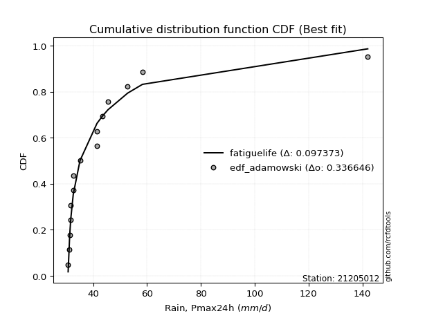</img></img>

</div>


## C. Best fit & Estimate extreme values for specific return periods - Tr

Best fit in probability distribution analysis means finding the theoretical distribution (like Normal, Poisson, Exponential, etc.) that most accurately mirrors your real-world data´s patterns (shape, center, spread) for better predictions, using methods like visual checks (Q-Q plots), goodness-of-fit tests (Kolmogorov-Smirnov, Chi-Squared), and information criteria (AIC) to score and select the simplest, most representative model.


### 1. Best fit (ordered by delta Δ)

:file_folder:Table: [bestfit_21205012.csv](table/bestfit_21205012.csv)

<div align="center">

|   id |   station | empirical_dist   | p_dist              |    delta |   deltao | eval   |   fit |   n |   best_fit |   best_fit_sort |
|-----:|----------:|:-----------------|:--------------------|---------:|---------:|:-------|------:|----:|-----------:|----------------:|
|    0 |  21205012 | edf_hazen        | gausshyper          | 0.120526 | 0.331107 | Δo > Δ |     1 |  16 |          1 |               1 |
|    1 |  21205012 | edf_gringorten   | gausshyper          | 0.120759 | 0.331107 | Δo > Δ |     1 |  16 |          1 |               2 |
|    2 |  21205012 | edf_cunnane      | gausshyper          | 0.120912 | 0.331107 | Δo > Δ |     1 |  16 |          1 |               3 |
|    3 |  21205012 | edf_blom         | gausshyper          | 0.121007 | 0.331107 | Δo > Δ |     1 |  16 |          1 |               4 |
|    4 |  21205012 | edf_tukey        | gausshyper          | 0.121164 | 0.331107 | Δo > Δ |     1 |  16 |          1 |               5 |
|    5 |  21205012 | edf_filliben     | gausshyper          | 0.121223 | 0.331107 | Δo > Δ |     1 |  16 |          1 |               6 |
|    6 |  21205012 | edf_beard        | gausshyper          | 0.121251 | 0.331107 | Δo > Δ |     1 |  16 |          1 |               7 |
|    7 |  21205012 | edf_jenkinson    | gausshyper          | 0.121251 | 0.331107 | Δo > Δ |     1 |  16 |          1 |               8 |
|    8 |  21205012 | edf_chegodayev   | gausshyper          | 0.121289 | 0.331107 | Δo > Δ |     1 |  16 |          1 |               9 |
|    9 |  21205012 | edf_adamowski    | gausshyper          | 0.121473 | 0.331107 | Δo > Δ |     1 |  16 |          1 |              10 |
|   10 |  21205012 | edf_weibull      | gausshyper          | 0.122365 | 0.331107 | Δo > Δ |     1 |  16 |          1 |              11 |
|   11 |  21205012 | edf_california   | logtruncweibull_min | 0.138099 | 0.331107 | Δo > Δ |     1 |  16 |          1 |              12 |

</div>


### 2. Extreme values and % difference analysis

In hydrology, a return period (or recurrence interval $Tr$) is the statistical average time between extreme events like floods or droughts of a specific magnitude, indicating how rare an event is, with a 100-year flood, for example, having a 1% chance of occurring in any given year, not that it happens exactly every century. It is a key tool for infrastructure design (like bridges or dams) and risk assessment, calculated from historical data to determine the probability of future events, although it is important to remember it is statistical average, and events can cluster or be missed.

The extreme value porcentage difference is evaluated as $pdiff = 1 - (ETrBf / ETr) * 100$, where _ETrBf_ correspond to the bestfit extreme value for a specific recurrence interval and _ETr_ correspond to the extreme value for one of the most used PDFsused in hydrology.

> risk_rate: assuming the return period as the project useful life.

:file_folder:Table: [extreme_21205012.csv](table/extreme_21205012.csv), all PDFs.  
:file_folder:Table: [extremepdiff_21205012.csv](table/extremepdiff_21205012.csv), % difference between bestfit and most used PDFs in Hydrology.

<div align="center">

Extreme values table for only best fit PDFs
|   id |      tr |   prob_l |     prob_g |     alpha |   anglit |   arcsine |   argus |    beta |   betaprime |   bradford |      burr |   burr12 |   cosine |   crystalball |   dgamma |   dweibull |   erlang |   exponnorm |   exponpow |   exponweib |         f |   fatiguelife |   foldnorm |   gamma |   gausshyper |   genexpon |   genextreme |   gengamma |   genhalflogistic |   genlogistic |   gennorm |   genpareto |   gompertz |   gumbel_l |   gumbel_r |   halfgennorm |   halflogistic |   halfnorm |   hypsecant |   invgamma |   invgauss |   invweibull |   johnsonsb |   johnsonsu |   kappa3 |   kappa4 |   ksone |   kstwobign |   laplace |   levy_l |   loggamma |   logistic |   loglaplace |    lomax |   maxwell |   mielke |   moyal |   nakagami |     ncf |     nct |    norm |   pearson3 |   powerlaw |   rayleigh |   rdist |    rice |   semicircular |   skewnorm |       t |   trapezoid |   triang |   truncexpon |   truncnorm |   truncpareto |   truncweibull_min |   tukeylambda |   uniform |   vonmises |   vonmises_line |    wald |   weibull_max |   weibull_min |   wrapcauchy |   logalpha |   loganglit |   logarcsine |   logargus |   logbeta |   logbetaprime |   logbradford |   logburr |   logburr12 |   logcosine |   logcrystalball |   logdgamma |   logdweibull |   logerlang |   logexponnorm |   logexponpow |   logexponweib |            logf |   logfatiguelife |   logfoldnorm |   loggausshyper |   loggenexpon |    loggenextreme |   loggengamma |   loggenhalflogistic |   loggenlogistic |   loggennorm |   loggenpareto |   loggompertz |   loggumbel_l |   loggumbel_r |   loghalfgennorm |   loghalflogistic |   loghalfnorm |   loghypsecant |   loginvgamma |   loginvgauss |    loginvweibull |   logjohnsonsb |   logjohnsonsu |   logkappa3 |   logkappa4 |   logksone |   logkstwobign |   loglevy_l |   logloggamma |   loglogistic |   logloglaplace |   loglomax |   logmaxwell |   logmielke |   logmoyal |   lognakagami |   logncf |   lognct |   lognorm |   logpearson3 |   logpowerlaw |   lograyleigh |   logrdist |   logrice |   logsemicircular |   logskewnorm |    logt |   logtrapezoid |   logtriang |   logtruncexpon |   logtruncnorm |   logtruncpareto |   logtruncweibull_min |   logtukeylambda |   loguniform |   logvonmises |   logvonmises_line |   logwald |   logweibull_max |   logweibull_min |   logwrapcauchy |   station |   n |   risk_rate |
|-----:|--------:|---------:|-----------:|----------:|---------:|----------:|--------:|--------:|------------:|-----------:|----------:|---------:|---------:|--------------:|---------:|-----------:|---------:|------------:|-----------:|------------:|----------:|--------------:|-----------:|--------:|-------------:|-----------:|-------------:|-----------:|------------------:|--------------:|----------:|------------:|-----------:|-----------:|-----------:|--------------:|---------------:|-----------:|------------:|-----------:|-----------:|-------------:|------------:|------------:|---------:|---------:|--------:|------------:|----------:|---------:|-----------:|-----------:|-------------:|---------:|----------:|---------:|--------:|-----------:|--------:|--------:|--------:|-----------:|-----------:|-----------:|--------:|--------:|---------------:|-----------:|--------:|------------:|---------:|-------------:|------------:|--------------:|-------------------:|--------------:|----------:|-----------:|----------------:|--------:|--------------:|--------------:|-------------:|-----------:|------------:|-------------:|-----------:|----------:|---------------:|--------------:|----------:|------------:|------------:|-----------------:|------------:|--------------:|------------:|---------------:|--------------:|---------------:|----------------:|-----------------:|--------------:|----------------:|--------------:|-----------------:|--------------:|---------------------:|-----------------:|-------------:|---------------:|--------------:|--------------:|--------------:|-----------------:|------------------:|--------------:|---------------:|--------------:|--------------:|-----------------:|---------------:|---------------:|------------:|------------:|-----------:|---------------:|------------:|--------------:|--------------:|----------------:|-----------:|-------------:|------------:|-----------:|--------------:|---------:|---------:|----------:|--------------:|--------------:|--------------:|-----------:|----------:|------------------:|--------------:|--------:|---------------:|------------:|----------------:|---------------:|-----------------:|----------------------:|-----------------:|-------------:|--------------:|-------------------:|----------:|-----------------:|-----------------:|----------------:|----------:|----:|------------:|
|    0 |    2    | 0.5      | 0.5        |   33.3861 |  38.4727 |   38.4727 | 43.0461 | 36.7628 |     37.5487 |    36.7912 |   33.6587 |  35.4465 |  39.8803 |       38.4727 |  34.6262 |    38.5794 |  33.4269 |     36.0718 |    36.9469 |     35.0742 |   33.5506 |       33.6374 |    36.8146 | 33.8256 |      35.2239 |    36.0876 |      33.4314 |    34.535  |           37.478  |       36.8572 |   32.6    |     36.0532 |    35.3597 |    39.845  |    37.1003 |       33.958  |        36.418  |    36.7627 |     38.4727 |    33.3914 |    33.4344 |      33.4316 |     31.0836 |     33.716  |  30.7    |  44.1162 | 44.5    |     37.3228 |   38.4727 |  31.9062 |    34.0289 |    38.4727 |      37.6524 |  34.4564 |   37.7582 |  34.8682 | 36.6572 |    36.7693 | 37.5925 | 37.1554 | 38.4727 |    37.1764 |    32.2539 |    37.5048 | 38.2709 | 38.2967 |        38.4727 |    38.3963 | 38.4726 |     51.3594 |  39.6448 |      40.7259 |     36.5006 |       35.6082 |            39.0893 |       37.9923 |   44.5    |   0.42661  |         37.0017 | 35.7647 |       57.8091 |       35.5578 |      44.5    |    36.772  |     37.6524 |      37.6524 |    41.3051 |   36.0309 |        37.2589 |       34.0222 |   35.3273 |     35.3289 |     38.6129 |          37.6524 |     37.7935 |       38.2132 |     33.1354 |        35.3223 |       35.9593 |        37.4089 |    33.3806      |          33.4913 |       36.5583 |         38.0804 |       35.3662 |     33.3715      |       35.7697 |              46.1897 |          36.1995 |      32.6    |        14.9524 |       37.8146 |       38.9304 |       36.4164 |          33.8238 |           35.8171 |       36.1186 |        37.6524 |       37.5209 |       33.4111 |     33.3715      |        55.2088 |        33.6129 |     42.9422 |     38.9419 |    42.3061 |        36.5048 |     33.5683 |       37.639  |       37.6524 |         32.6    |    34.9108 |      37.0038 |     35.8275 |    36.0261 |       32.9465 |  37.4691 |  37.3756 |   37.6524 |       36.7778 |       32.1118 |       36.7765 |    44.5935 |   37.3984 |           37.6524 |       37.2826 | 37.6524 |        49.6165 |     43.5121 |         39.0642 |        36.8675 |          35.0622 |               34.3135 |          42.3061 |      42.3061 |     0.0702443 |            42.3817 |   35.2526 |          36.2109 |          36.395  |         42.3061 |  21205012 |  16 |    0.75     |
|    1 |    2.33 | 0.570815 | 0.429185   |   34.1284 |  40.2091 |   41.0793 | 45.0209 | 38.5957 |     38.9545 |    38.4942 |   34.5248 |  36.589  |  41.532  |       39.9634 |  36.2938 |    41.6875 |  34.4476 |     37.2573 |    39.157  |     36.4171 |   34.4322 |       34.7579 |    38.4438 | 34.6303 |      37.0138 |    37.2746 |      34.3541 |    35.7379 |           38.7049 |       38.0823 |   32.6545 |     40.3047 |    36.3864 |    41.142  |    38.4816 |       35.1116 |        37.8382 |    38.3715 |     39.6657 |    34.2523 |    34.2899 |      34.3544 |     32.481  |     34.7624 |  30.7    |  46.2221 | 46.8454 |     38.6185 |   39.3748 |  39.644  |    34.976  |    39.7861 |      38.4877 |  35.4806 |   39.307  |  35.7943 | 37.9648 |    39.0587 | 38.9352 | 38.4771 | 39.9634 |    38.6436 |    33.3928 |    39.0765 | 39.7245 | 39.6536 |        40.335  |    39.7211 | 39.9633 |     52.9629 |  41.2324 |      42.5582 |     37.7781 |       36.8353 |            41.0464 |       39.115  |   46.4545 |   0.682149 |         38.3307 | 36.7422 |       58.0384 |       37.4712 |      50.812  |    37.9957 |     39.2766 |      40.1167 |    43.1956 |   37.9241 |        38.5625 |       35.1912 |   36.4103 |     36.4685 |     40.128  |          39.0426 |     41.9191 |       41.9309 |     33.9969 |        36.4329 |       39.0665 |        41.311  |    34.2055      |          34.5025 |       38.0977 |         39.9182 |       36.4861 |     34.2386      |       38.3974 |              48.2054 |          37.3545 |      33.4664 |        20.0145 |       39.1442 |       40.1779 |       37.6606 |          34.8807 |           37.0759 |       37.5599 |        38.7609 |       38.8928 |       34.2427 |     34.2386      |        57.2573 |        34.5847 |     46.0534 |     40.7646 |    44.6758 |        37.7096 |     39.4694 |       39.0522 |       38.8746 |         33.4456 |    35.9835 |      38.4242 |     36.9235 |    37.1902 |       34.0106 |  41.6564 |  38.7375 |   39.0426 |       38.1313 |       33.0816 |       38.2094 |    48.2039 |   38.6773 |           39.3972 |       38.5504 | 39.0426 |        51.5002 |     45.6682 |         40.7892 |        38.2369 |          36.0724 |               35.6344 |          44.3319 |      44.2719 |     0.0728277 |            44.3621 |   36.1007 |          37.3656 |          38.1917 |         47.8152 |  21205012 |  16 |    0.729209 |
|    2 |    5    | 0.8      | 0.2        |   39.8841 |  46.3356 |   48.0303 | 51.3553 | 46.8078 |     44.9568 |    46.5252 |   41.4229 |  42.7774 |  47.4841 |       45.5033 |  41.3153 |    46.4753 |  40.5551 |     43.1846 |    51.3578 |     43.9874 |   42.0663 |       42.5106 |    45.27   | 38.8367 |      46.4907 |    43.2096 |      42.8335 |    42.6298 |           44.2561 |       43.4045 |   35.5292 |     52.068  |    41.5195 |    45.3319 |    44.4827 |       43.1249 |        44.2644 |    45.1753 |     44.4512 |    41.8672 |    40.7015 |      42.835  |     57.2479 |     42.8476 |  30.7    |  53.1044 | 54.436  |     44.1225 |   43.8852 |  52.4637 |    40.4366 |    44.8574 |      42.9499 |  42.0052 |   45.4028 |  40.7142 | 44.0217 |    50.9445 | 44.319  | 44.1343 | 45.5033 |    44.8547 |    41.6312 |    45.3686 | 43.917  | 45.086  |        46.6904 |    45.3232 | 45.5032 |     57.5634 |  47.5819 |      49.6818 |     44.1622 |       43.2703 |            48.9398 |       42.6849 |   52.78   |   1.67854  |         43.5264 | 42.2142 |       58.283  |       50.4979 |      56.6676 |    43.4455 |     45.5873 |      47.5053 |    49.8635 |   47.0691 |        44.1012 |       42.258  |   42.3718 |     42.7421 |     46.0984 |          44.6738 |     45.8268 |       46.7595 |     39.3837 |        42.5316 |       70.7522 |        80.3352 |    41.5778      |          41.9418 |       44.7885 |         48.1518 |       42.6404 |     42.4791      |       61.0594 |              54.0334 |          42.815  |      38.3978 |        42.3274 |       44.9956 |       44.488  |       43.5786 |          42.4724 |           43.3479 |       44.3189 |        43.5452 |       44.506  |       40.6272 |     42.4792      |        58.2857 |        42.4555 |     65.7945 |     48.2237 |    53.2935 |        43.2867 |     51.616  |       44.7628 |       43.9776 |         38.1161 |    42.3455 |      44.5647 |     42.2677 |    43.0928 |       40.6594 |  62.585  |  44.435  |   44.6738 |       44.2085 |       40.3199 |       44.5277 |    59.7553 |   44.2505 |           45.9832 |       44.4058 | 44.6738 |        57.3106 |     52.4651 |         48.1097 |        44.7701 |          41.2752 |               43.0526 |          51.5094 |      51.2817 |     0.0833056 |            51.4283 |   41.2393 |          42.8251 |          50.0444 |         55.5584 |  21205012 |  16 |    0.67232  |
|    3 |   10    | 0.9      | 0.1        |   50.4588 |  49.8032 |   49.7084 | 54.4099 | 52.0813 |     49.7424 |    51.7001 |   54.3306 |  49.1498 |  51.0801 |       49.1784 |  45.2684 |    49.1646 |  46.94   |     48.5653 |    62.7136 |     51.6345 |   58.0874 |       51.504  |    50.2478 | 42.7999 |      52.8867 |    48.5972 |      61.8527 |    49.7322 |           48.8661 |       47.7391 |   46.7378 |     55.92   |    46.1793 |    47.6646 |    49.3705 |       53.7336 |        49.6011 |    50.2099 |     48.2725 |    58.3156 |    50.1307 |      61.8578 |     58.2786 |     55.6952 |  55.5667 |  56.0794 | 57.748  |     48.313  |   47.9796 |  55.5587 |    46.4157 |    48.5923 |      47.4469 |  50.6171 |   49.6927 |  46.0668 | 49.2952 |    60.879  | 48.2623 | 48.6715 | 49.1784 |    49.6639 |    48.5232 |    49.855  | 45.2028 | 48.9593 |        49.9515 |    49.4687 | 49.1783 |     59.3604 |  51.5821 |      53.6056 |     49.953  |       48.6148 |            53.2788 |       44.164  |   55.54   |   2.39039  |         47.516  | 48.0212 |       58.2982 |       66.6781 |      57.5632 |    48.0839 |     49.5988 |      49.4841 |    53.4374 |   52.9505 |        48.4822 |       48.3495 |   49.3447 |     49.3669 |     50.1278 |          48.8507 |     48.2789 |       49.4434 |     45.7075 |        48.9475 |      142.602  |       166.601  |    60.0423      |          52.2828 |       50.0237 |         53.2748 |       49.1215 |     65.463       |      101.897  |              56.2673 |          47.8468 |      43.7195 |        52.3759 |       49.4985 |       47.0849 |       49.0795 |          53.8799 |           49.3555 |       50.0917 |        47.7863 |       48.7277 |       51.1541 |     65.4637      |        58.2992 |        57.3783 |     96.1673 |     52.6039 |    57.557  |        48.0798 |     55.0701 |       48.9834 |       48.1593 |         43.0893 |    49.9836 |      49.4655 |     47.4394 |    48.9897 |       47.5288 |  82.9833 |  48.8558 |   48.8507 |       49.3632 |       47.1085 |       49.6612 |    63.2954 |   48.7084 |           49.7791 |       49.3042 | 48.8506 |        59.7544 |     55.3869 |         52.5681 |        49.707  |          45.9358 |               48.9934 |          54.9011 |      54.6784 |     0.0911113 |            54.8543 |   47.4949 |          47.8561 |          65.9864 |         57.039  |  21205012 |  16 |    0.651322 |
|    4 |   15    | 0.933333 | 0.0666667  |   60.9958 |  51.284  |   50.0284 | 55.5712 | 54.2852 |     52.4173 |    53.7243 |   67.2883 |  53.248  |  52.7181 |       51.0123 |  47.4894 |    50.4774 |  50.8903 |     51.7127 |    69.2014 |     56.3293 |   75.5432 |       57.257  |    52.8131 | 45.1543 |      55.2404 |    51.7487 |      83.4542 |    54.1469 |           51.475  |       50.1846 |   60.6595 |     56.9447 |    48.905  |    48.7211 |    52.1282 |       61.4767 |        52.6212 |    52.8299 |     50.4534 |    76.6089 |    57.3302 |      83.4639 |     58.2973 |     66.504  |  56.4877 |  57.0523 | 58.852  |     50.5377 |   50.3746 |  56.4937 |    50.3933 |    50.6272 |      50.2928 |  57.2805 |   51.8938 |  49.7642 | 52.3557 |    66.1938 | 50.351  | 51.2209 | 51.0123 |    52.2774 |    51.4273 |    52.1665 | 45.5091 | 50.9551 |        51.2232 |    51.626  | 51.0122 |     59.937  |  53.3543 |      55.0706 |     53.3384 |       51.1451 |            54.8706 |       44.6348 |   56.46   |   2.72314  |         49.7305 | 51.7503 |       58.2995 |       77.8545 |      57.8174 |    50.8029 |     51.4175 |      49.8708 |    54.8624 |   55.2301 |        50.9166 |       51.1177 |   54.5101 |     53.7085 |     52.0783 |          51.0788 |     49.5816 |       50.7637 |     50.0629 |        53.1404 |      223.538  |       261.321  |    86.979       |          60.1447 |       52.8786 |         55.2494 |       53.3602 |    103.198       |      140.577  |              56.9708 |          50.9423 |      47.2387 |        55.0981 |       51.8817 |       48.3104 |       52.484  |          63.5136 |           53.1172 |       53.3875 |        50.3892 |       51.0002 |       60.4881 |    103.2         |        58.2998 |        73.0725 |    125.403  |     54.3339 |    59.0526 |        50.8365 |     56.1583 |       51.2295 |       50.6027 |         46.3777 |    55.5608 |      52.1857 |     50.7432 |    52.7753 |       51.7115 |  95.8865 |  51.2847 |   51.0789 |       52.352  |       50.2257 |       52.5331 |    64.065  |   51.1778 |           51.3429 |       52.0633 | 51.0788 |        60.5603 |     56.3585 |         54.3106 |        51.9685 |          48.4485 |               51.6183 |          56.0514 |      55.8599 |     0.095294  |            56.0463 |   52.0036 |          50.9511 |          78.3957 |         57.4702 |  21205012 |  16 |    0.644736 |
|    5 |   20    | 0.95     | 0.05       |   71.5235 |  52.1551 |   50.1412 | 56.2086 | 55.5314 |     54.2846 |    54.7997 |   80.2848 |  56.3354 |  53.7255 |       52.2133 |  49.0395 |    51.3331 |  53.7628 |     53.9459 |    73.7042 |     59.7377 |   94.0072 |       61.492  |    54.5143 | 46.8365 |      56.406  |    53.9848 |     106.893  |    57.3742 |           53.3028 |       51.8968 |   75.4897 |     57.3911 |    50.839  |    49.3787 |    54.059  |       67.6835 |        54.7372 |    54.5767 |     51.9918 |    96.2193 |    63.1706 |     106.909  |     58.2996 |     75.9972 |  56.9482 |  57.5318 | 59.404  |     52.0363 |   52.0739 |  56.9725 |    53.4474 |    52.0337 |      52.4149 |  62.9279 |   53.3546 |  52.6973 | 54.5232 |    69.7632 | 51.7648 | 53.007  | 52.2133 |    54.0677 |    53.0073 |    53.703  | 45.6327 | 52.2816 |        51.9286 |    53.0643 | 52.2132 |     60.2214 |  54.4107 |      55.8381 |     55.7396 |       52.625  |            55.6963 |       44.8636 |   56.92   |   2.91399  |         51.2184 | 54.5291 |       58.2998 |       86.5023 |      57.9402 |    52.7586 |     52.5184 |      50.0077 |    55.6606 |   56.4333 |        52.6098 |       52.6858 |   58.8324 |     57.0185 |     53.3152 |          52.5928 |     50.4734 |       51.6295 |     53.4701 |        56.3313 |      311.014  |       361.573  |   126.284       |          66.6646 |       54.8394 |         56.2883 |       56.5876 |    165.19        |      177.845  |              57.3142 |          53.2282 |      49.9337 |        56.2462 |       53.4823 |       49.0892 |       55.0075 |          72.1815 |           55.9223 |       55.7044 |        52.3103 |       52.5525 |       69.0728 |    165.195       |        58.2999 |        89.8532 |    155.334  |     55.2783 |    59.815  |        52.782  |     56.7239 |       52.7536 |       52.3636 |         48.9023 |    60.1451 |      54.0731 |     53.2442 |    55.632  |       54.7334 | 105.551  |  52.9638 |   52.5928 |       54.4816 |       51.9922 |       54.5332 |    64.3548 |   52.888  |           52.2314 |       53.9882 | 52.5928 |        60.9619 |     56.844  |         55.2404 |        53.28   |          50.0713 |               53.0907 |          56.6263 |      56.4602 |     0.0981448 |            56.652  |   55.6397 |          53.2365 |          88.9531 |         57.6801 |  21205012 |  16 |    0.641514 |
|    6 |   25    | 0.96     | 0.04       |   82.0475 |  52.7454 |   50.1934 | 56.6197 | 56.3453 |     55.7217 |    55.4661 |   93.3115 | inf      |  54.4319 |       53.0974 |  50.2303 |    51.962  |  56.0239 |     55.6781 |    77.1349 |     62.4202 |  113.26   |       64.8479 |    55.7754 | 48.1469 |      57.0853 |    55.7192 |     131.789  |    59.926  |           54.7111 |       53.2157 |   90.6054 |     57.6333 |    52.3391 |    49.8466 |    55.5463 |       72.9148 |        56.3674 |    55.8764 |     53.1825 |   116.872  |    68.1016 |     131.81   |     58.3001 |     84.5558 |  57.2245 |  57.8164 | 59.7352 |     53.1588 |   53.392  |  57.273  |    55.9565 |    53.1096 |      54.1224 |  67.923  |   54.4391 |  55.1724 | 56.2033 |    72.4269 | 52.8295 | 54.3853 | 53.0974 |    55.4258 |    53.9982 |    54.8445 | 45.6961 | 53.2672 |        52.3862 |    54.1344 | 53.0973 |     60.3908 |  55.1317 |      56.3107 |     57.6015 |       53.5971 |            56.2016 |       44.9982 |   57.196  |   3.03631  |         52.2931 | 56.7549 |       58.2999 |       93.6059 |      58.013  |    54.2975 |     53.2779 |      50.0713 |    56.1815 |   57.1754 |        53.9094 |       53.6932 |   62.6448 |     59.7258 |     54.2002 |          53.7359 |     51.1518 |       52.2689 |     56.3055 |        58.9378 |      403.747  |       466.009  |   183.666       |          72.3237 |       56.3304 |         56.9271 |       59.2249 |    267.518       |      214.105  |              57.5174 |          55.0585 |      52.1443 |        56.8485 |       54.6783 |       49.6511 |       57.0336 |          80.2223 |           58.1841 |       57.4933 |        53.8473 |       53.7288 |       77.1335 |    267.529       |        58.3    |       107.89   |    186.585  |     55.8794 |    60.2771 |        54.2878 |     57.0818 |       53.9031 |       53.7519 |         50.9791 |    64.1221 |      55.5183 |     55.285  |    57.9522 |       57.1056 | 113.363  |  54.2472 |   53.7359 |       56.1438 |       53.1266 |       56.0685 |    64.4956 |   54.1956 |           52.816  |       55.4664 | 53.7359 |        61.2024 |     57.1352 |         55.8186 |        54.139  |          51.2191 |               54.032  |          56.97   |      56.8234 |     0.100303  |            57.0185 |   58.7346 |          55.0666 |          98.3225 |         57.8049 |  21205012 |  16 |    0.639603 |
|    7 |   50    | 0.98     | 0.02       |  134.651  |  54.1985 |   50.2633 | 57.5516 | 58.2058 |     60.1546 |    56.8486 |  158.746  | inf      |  56.2817 |       55.6291 |  53.8796 |    53.7618 |  63.1964 |     61.0587 |    87.4362 |     70.9378 |  217.79   |       75.5839 |    59.4199 | 52.2422 |      58.3446 |    61.1068 |     271.861  |    68.0902 |           59.0502 |       57.2785 |  164.741  |     58.0454 |    56.9988 |    51.1169 |    60.1278 |       91.5581 |        61.3905 |    59.654  |     56.874  |   231.237  |    85.4868 |     271.922  |     58.3004 |    119.084  |  57.777  |  58.3747 | 60.3976 |     56.4551 |   57.4864 |  57.9496 |    64.5962 |    56.397  |      59.7893 |  87.6664 |   57.5843 |  64.1601 | 61.4188 |    80.1867 | 55.9951 | 58.6585 | 55.6291 |    59.5059 |    56.08   |    58.1583 | 45.7944 | 56.1281 |        53.4315 |    57.245  | 55.6291 |     60.7271 |  56.9206 |      57.2847 |     63.3825 |       55.7657 |            57.235  |       45.2592 |   57.748  |   3.29598  |         54.9699 | 64.0222 |       58.3    |      117.787  |      58.157  |    59.2387 |     55.1944 |      50.1564 |    57.3807 |   58.7021 |        57.899  |       55.8735 |   77.8871 |     68.9831 |     56.5877 |          57.1485 |     53.2086 |       54.1152 |     66.2874 |        67.8286 |      924.357  |      1030.19   |  1215.86        |          93.8328 |       60.8324 |         58.2337 |       68.2267 |   3352.04        |      386.22   |              57.9165 |          61.1021 |      59.7392 |        57.8101 |       58.1748 |       51.2089 |       63.7562 |         115.394  |           65.7445 |       63.0258 |        58.9053 |       57.2631 |      112.871  |   3352.37        |        58.3    |       220.423  |    371.042  |     57.1937 |    61.212  |        58.9628 |     57.8959 |       57.3292 |       58.2259 |         58.1675 |    79.4196 |      59.9317 |     62.2703 |    65.7897 |       64.6246 | 139.553  |  58.1599 |   57.1486 |       61.3938 |       55.5785 |       60.7742 |    64.6964 |   58.1772 |           54.1761 |       59.9967 | 57.1485 |        61.6826 |     57.7176 |         57.0242 |        56.0539 |          54.0959 |               56.0586 |          57.6505 |      57.557  |     0.106774  |            57.7587 |   70.0895 |          61.1089 |         135.67   |         58.0528 |  21205012 |  16 |    0.63583  |
|    8 |   75    | 0.986667 | 0.0133333  |  187.247  |  54.838  |   50.2762 | 57.9212 | 58.9411 |     62.7442 |    57.3246 |  224.502  | inf      |  57.1651 |       56.9875 |  55.9872 |    54.7287 |  67.4762 |     64.2062 |    93.2152 |     76.0325 |  331.762  |       82.0358 |    61.3913 | 54.652  |      58.7121 |    64.2583 |     430.208  |    73.013  |           61.5725 |       59.6399 |  233.766  |     58.155  |    59.7246 |    51.7592 |    62.7907 |      104.196  |        64.3104 |    61.7104 |     59.0313 |   358.507  |    96.9689 |     430.317  |     58.3004 |    145.984  |  57.9612 |  58.5559 | 60.6184 |     58.2687 |   59.8815 |  58.2277 |    70.2989 |    58.2956 |      63.3754 | 102.942  |   59.2943 |  70.4901 | 64.4687 |    84.4121 | 57.7678 | 61.1705 | 56.9875 |    61.8133 |    56.8043 |    59.9611 | 45.8173 | 57.6846 |        53.8491 |    58.9382 | 56.9875 |     60.8385 |  57.7132 |      57.6184 |     66.7623 |       56.5653 |            57.5864 |       45.3429 |   57.932  |   3.38589  |         56.0256 | 68.4942 |       58.3    |      133.357  |      58.2047 |    62.2691 |     56.0596 |      50.1722 |    57.8633 |   59.2218 |        60.2162 |       56.6533 |   90.0859 |     75.0498 |     57.7646 |          59.0682 |     54.3892 |       55.1179 |     73.0396 |        73.6388 |     1511.75   |      1640.18   |  8198.72        |         109.711  |       63.3964 |         58.6742 |       74.114  |  47810.9         |      549.394  |              58.0469 |          64.9152 |      64.7421 |        58.0412 |       60.0882 |       52.0152 |       68.022  |         146.33   |           70.583  |       66.258  |        62.0784 |       59.2657 |      144.42   |  47818.5         |        58.3    |       377.516  |    614.373  |     57.6834 |    61.5269 |        61.7044 |     58.2338 |       59.2524 |       60.9776 |         62.9557 |    91.0334 |      62.4768 |     66.8772 |    70.8553 |       69.1283 | 156.345  |  60.4152 |   59.0682 |       64.5428 |       56.4541 |       63.4982 |    64.7376 |   60.4649 |           54.7292 |       62.6165 | 59.0681 |        61.8423 |     57.9118 |         57.4414 |        56.7609 |          55.301  |               56.7804 |          57.8734 |      57.8036 |     0.110436  |            58.0076 |   78.1423 |          64.9211 |         164.933  |         58.1352 |  21205012 |  16 |    0.634587 |
|    9 |  100    | 0.99     | 0.01       |  239.842  |  55.2183 |   50.2808 | 58.1276 | 59.3481 |     64.5865 |    57.5655 |  290.469  | inf      |  57.7188 |       57.9063 |  57.4731 |    55.3835 |  70.5434 |     66.4394 |    97.2087 |     79.6913 |  452.333  |       86.6742 |    62.7296 | 56.367  |      58.8794 |    66.4943 |     601.673  |    76.5642 |           63.3577 |       61.3113 |  297.936  |     58.2028 |    61.6585 |    52.1793 |    64.6755 |      113.963  |        66.377  |    63.1113 |     60.5616 |   494.957  |   105.638  |     601.838  |     58.3004 |    168.676  |  58.0533 |  58.645  | 60.7288 |     59.5113 |   61.5808 |  58.3902 |    74.6644 |    59.6361 |      66.0496 | 115.889  |   60.459  |  75.5474 | 66.6325 |    87.2887 | 58.9973 | 62.9649 | 57.9063 |    63.4213 |    57.1723 |    61.1893 | 45.8264 | 58.745  |        54.083  |    60.0917 | 57.9063 |     60.894  |  58.1856 |      57.787  |     69.1594 |       56.9813 |            57.7635 |       45.3838 |   58.024  |   3.43125  |         56.5788 | 71.7546 |       58.3    |      145.017  |      58.2286 |    64.4935 |     56.5804 |      50.1778 |    58.1345 |   59.483  |        61.8589 |       57.0539 |  100.806  |     79.6751 |     58.5148 |          60.4029 |     55.2209 |       55.8016 |     78.287  |        78.0606 |     2146.54   |      2280.74   | 55958.9         |         122.756  |       65.192  |         58.8942 |       78.5967 | 744272           |      707.238  |              58.1114 |          67.7569 |      68.5681 |        58.1356 |       61.3948 |       52.5494 |       71.2126 |         175.125  |           74.2214 |       68.5544 |        64.4324 |       60.6645 |      173.648  | 744441           |        58.3    |       588.985  |    929.655  |     57.9445 |    61.6849 |        63.6561 |     58.4322 |       60.5881 |       62.9984 |         66.6493 |   100.838  |      64.2719 |     70.4134 |    74.684  |       72.372  | 168.978  |  62.0068 |   60.4029 |       66.8187 |       56.9035 |       65.4235 |    64.7528 |   62.0748 |           55.0414 |       64.4665 | 60.4029 |        61.9222 |     58.0088 |         57.653  |        57.1293 |          55.9674 |               57.1506 |          57.9834 |      57.9273 |     0.112992  |            58.1324 |   84.591  |          67.7621 |         189.992  |         58.1764 |  21205012 |  16 |    0.633968 |
|   10 |  200    | 0.995    | 0.005      |  450.214  |  55.9367 |   50.2851 | 58.4862 | 60.0431 |     69.0594 |    57.9305 |  555.637  | inf      |  58.8446 |       59.9904 |  61.0266 |    56.8721 |  78.02   |     71.82   |   106.484  |     88.6406 |  978.601  |       98.0192 |    65.7771 | 60.5139 |      59.1006 |    71.8819 |    1377.63   |    85.2999 |           67.6497 |       65.3293 |  520.075  |     58.2629 |    66.3183 |    53.0926 |    69.2066 |      140.31   |        71.3455 |    66.3153 |     64.2482 |  1103.09   |   128.104  |    1378.07   |     58.3004 |    238.09   |  58.1915 |  58.7756 | 60.8944 |     62.3733 |   65.6752 |  58.6981 |    86.3837 |    62.8517 |      72.9653 | 156.234  |   63.1238 |  90.0101 | 71.8458 |    93.8573 | 61.8808 | 67.3473 | 59.9904 |    67.2116 |    57.7317 |    63.9995 | 45.8368 | 61.1712 |        54.4907 |    62.7299 | 59.9905 |     60.9771 |  59.0801 |      58.0421 |     74.932  |       57.627  |            58.0307 |       45.4436 |   58.162  |   3.49962  |         57.4316 | 79.8761 |       58.3    |      175.134  |      58.2643 |    70.1444 |     57.5777 |      50.1831 |    58.6089 |   59.8753 |        65.8269 |       57.6685 |  136.94   |     92.0243 |     60.0702 |          63.5435 |     57.2145 |       57.3711 |     92.6775 |        89.8361 |     5001.9    |      5036.21   |     1.30941e+08 |         161.562  |       69.4569 |         59.2216 |       90.5429 |      7.66901e+10 |     1308.48   |              58.2071 |          75.1082 |      78.8284 |        58.2449 |       64.3905 |       53.7296 |       79.5089 |         280.412  |           83.7544 |       74.1101 |        70.4763 |       63.9756 |      278.506  |      7.67303e+10 |        58.3    |      2211.11   |   3197.94   |     58.3693 |    61.9228 |        68.3894 |     58.81   |       63.7255 |       68.123  |         76.6999 |   131.628  |      68.5752 |     79.98   |    84.7798 |       80.3578 | 202.065  |  65.829  |   63.5435 |       72.4623 |       57.5926 |       70.0514 |    64.7686 |   65.9214 |           55.5899 |       68.9055 | 63.5434 |        62.0419 |     58.1544 |         57.9743 |        57.7018 |          57.0636 |               57.7179 |          58.1457 |      58.1133 |     0.119041  |            58.3201 |  103.064  |          75.1114 |         269.566  |         58.2382 |  21205012 |  16 |    0.633042 |
|   11 |  250    | 0.996    | 0.004      |  555.4    |  56.1195 |   50.2857 | 58.5701 | 60.2022 |     70.5132 |    58.004  |  688.748  | inf      |  59.1532 |       60.6273 |  62.1639 |    57.3281 |  80.4494 |     73.5522 |   109.371  |     91.5586 | 1260.71   |      101.714  |    66.7111 | 61.8528 |      59.1389 |    73.6163 |    1805.5    |    88.1618 |           69.0295 |       66.6211 |  616.706  |     58.2728 |    67.8184 |    53.3613 |    70.6633 |      149.66   |        72.9428 |    67.301  |     65.4349 |  1434.47   |   135.762  |    1806.1    |     58.3004 |    265.591  |  58.2191 |  58.8011 | 60.9275 |     63.259  |   66.9933 |  58.7783 |    90.5498 |    63.8841 |      75.3423 | 172.604  |   63.9441 |  95.4551 | 73.5241 |    95.8745 | 62.7889 | 68.7796 | 60.6273 |    68.4098 |    57.8446 |    64.8646 | 45.8384 | 61.9181 |        54.5863 |    63.5415 | 60.6274 |     60.9937 |  59.3081 |      58.0935 |     76.7895 |       57.7593 |            58.0844 |       45.4553 |   58.1896 |   3.51332  |         57.6046 | 82.5629 |       58.3    |      185.422  |      58.2714 |    72.0614 |     57.8343 |      50.1837 |    58.7205 |   59.9535 |        67.1105 |       57.7934 |  152.933  |     96.3938 |     60.5038 |          64.5354 |     57.8551 |       57.8562 |     97.8915 |        93.9928 |     6564.87   |      6493.64   |     6.53116e+09 |         176.681  |       70.8152 |         59.2863 |       94.7626 |      3.11552e+13 |     1597.75   |              58.226  |          77.6369 |      82.4732 |        58.2613 |       65.3137 |       54.0819 |       82.3762 |         330.048  |           87.0721 |       75.9082 |        72.5401 |       65.0272 |      326.741  |      3.11766e+13 |        58.3    |      3689.31   |   5184.13   |     58.4617 |    61.9704 |        69.9244 |     58.9087 |       64.715  |       69.855  |         80.3237 |   144.34   |      69.9571 |     83.4137 |    88.3118 |       82.9816 | 213.569  |  67.059  |   64.5354 |       74.3317 |       57.7326 |       71.5408 |    64.7707 |   67.1528 |           55.7193 |       70.3316 | 64.5354 |        62.0658 |     58.1835 |         58.0392 |        57.8193 |          57.2987 |               57.8331 |          58.1776 |      58.1506 |     0.120962  |            58.3578 |  110.023  |          77.6394 |         302.473  |         58.2505 |  21205012 |  16 |    0.632858 |
|   12 |  500    | 0.998    | 0.002      | 1081.33   |  56.5729 |   50.2864 | 58.7631 | 60.5598 |     75.0845 |    58.1517 | 1357.4    | inf      |  59.9745 |       62.516  |  65.6792 |    58.6836 |  88.0535 |     78.9328 |   118.05   |    100.726  | 2792.46   |      113.302  |    69.4869 | 66.0216 |      59.2067 |    79.0039 |    4208.65   |    97.1913 |           73.3121 |       70.6304 | 1018.75   |     58.2896 |    72.4781 |    54.1315 |    75.1845 |      181.488  |        77.9005 |    70.2399 |     69.1212 |  3269.59   |   160.691  |    4210.23   |     58.3004 |    370.503  |  58.2744 |  58.8511 | 60.9938 |     65.9133 |   71.0877 |  58.9852 |   104.861  |    67.0857 |      83.231  | 237.307  |   66.3919 | 115.328  | 78.7372 |   101.877  | 65.5593 | 73.3097 | 62.516  |    72.0738 |    58.0716 |    67.4457 | 45.8407 | 64.1465 |        54.8066 |    65.9613 | 62.5162 |     61.0269 |  59.8738 |      58.1965 |     82.5566 |       58.0274 |            58.192  |       45.4782 |   58.2448 |   3.54076  |         57.9518 | 91.1062 |       58.3    |      219.157  |      58.2857 |    78.363  |     58.4756 |      50.1846 |    58.9778 |   60.1094 |        71.1276 |       58.0453 |  224.824  |    111.334  |     61.6729 |          67.569  |     59.8478 |       59.3107 |    116.156  |       108.172  |    15220.7    |     14258.7    |     2.41618e+18 |         233.878  |       75.0021 |         59.4139 |      109.166  |      1.46369e+27 |     2983.32   |              58.2635 |          86.0408 |      94.9884 |        58.287  |       68.0692 |       55.1046 |       91.9511 |         567.408  |           98.2299 |       81.5323 |        79.344  |       68.2608 |      547.789  |      1.46599e+27 |        58.3    |     24844.9    |  32541.8    |     58.6602 |    62.0659 |        74.7338 |     59.1645 |       67.7363 |       75.5117 |         92.9881 |   196.415  |      74.2482 |     95.3673 |   100.249  |       91.3034 | 252.189  |  70.8898 |   67.569  |       80.3176 |       58.0148 |       76.1757 |    64.7736 |   70.9653 |           56.0186 |       74.7614 | 67.5689 |        62.1137 |     58.2418 |         58.1694 |        58.0575 |          57.7866 |               58.0653 |          58.2403 |      58.2253 |     0.126871  |            58.4331 |  135.431  |          86.0406 |         435.782  |         58.2753 |  21205012 |  16 |    0.632489 |
|   13 |  750    | 0.998667 | 0.00133333 | 1607.25   |  56.7736 |   50.2865 | 58.8406 | 60.699  |     77.8035 |    58.201  | 2029.33   | inf      |  60.3725 |       63.5652 |  67.725  |    59.4387 |  92.537  |     82.0803 |   122.937  |    106.156  | 4462.57   |      120.146  |    71.0321 | 68.4663 |      59.2258 |    82.1555 |    6922.14   |   102.564  |           75.8158 |       72.9742 | 1341.79   |     58.2941 |    75.2039 |    54.5432 |    77.8276 |      202.11   |        80.7987 |    71.8817 |     71.2775 |  5311.8    |   175.986  |    6924.91   |     58.3004 |    447.861  |  58.2928 |  58.8673 | 61.0158 |     67.4044 |   73.4828 |  59.0834 |   114.289  |    68.9562 |      88.2232 | 287.369  |   67.7609 | 129.376  | 81.7867 |   105.223  | 67.1497 | 76.0229 | 63.5652 |    74.1813 |    58.1476 |    68.889  | 45.8413 | 65.3926 |        54.8952 |    67.3132 | 63.5654 |     61.0379 |  60.1244 |      58.231  |     85.9282 |       58.1177 |            58.228  |       45.4856 |   58.2632 |   3.5499   |         58.0678 | 96.2285 |       58.3    |      240.108  |      58.2905 |    82.3191 |     58.7617 |      50.1848 |    59.0815 |   60.1609 |        73.5035 |       58.1299 |  291.154  |    121.126  |     62.2475 |          69.3153 |     61.0181 |       60.1296 |    128.465  |       117.438  |    24803.3    |     22540.9    |     1.08452e+27 |         276.005  |       77.4341 |         59.4556 |      118.586  |      3.39975e+41 |     4308.68   |              58.2759 |          91.369  |     103.231  |        58.2932 |       69.6098 |       55.6591 |       98.0561 |         798.756  |          105.404  |       84.8538 |        83.6161 |       70.1341 |      750.696  |      3.40839e+41 |        58.3    |     97814      | 126950      |     58.733  |    62.0978 |        77.5793 |     59.2862 |       69.4726 |       79.0262 |        101.521  |   239.066  |      76.762  |    103.39   |   107.967  |       96.2957 | 276.95   |  73.1431 |   69.3153 |       83.9533 |       58.1095 |       78.8971 |    64.7742 |   73.1908 |           56.1395 |       77.3565 | 69.3153 |        62.1296 |     58.2612 |         58.213  |        58.1378 |          57.9547 |               58.1433 |          58.2607 |      58.2502 |     0.130297  |            58.4582 |  153.399  |          91.367  |         542.2    |         58.2835 |  21205012 |  16 |    0.632366 |
|   14 | 1000    | 0.999    | 0.001      | 2133.18   |  56.8932 |   50.2865 | 58.8841 | 60.7755 |     79.7553 |    58.2257 | 2703.41   | inf      |  60.6236 |       64.2876 |  69.1725 |    59.9596 |  95.7318 |     84.3135 |   126.325  |    110.037  | 6229.4    |      125.028  |    72.097  | 70.2032 |      59.2343 |    84.3915 |    9859.01   |   106.414  |           77.5917 |       74.6368 | 1619.12   |     58.296  |    77.1378 |    54.8203 |    79.7025 |      217.663  |        82.8546 |    73.0156 |     72.8075 |  7501.32   |   187.12   |    9863.11   |     58.3004 |    511.131  |  58.302  |  58.8752 | 61.0269 |     68.4374 |   75.1821 |  59.1451 |   121.501  |    70.2827 |      91.9458 | 329.799  |   68.7072 | 140.615  | 83.9504 |   107.531  | 68.2667 | 77.9794 | 64.2876 |    75.6623 |    58.1856 |    69.8864 | 45.8415 | 66.2538 |        54.945  |    68.2468 | 64.2878 |     61.0434 |  60.2738 |      58.2482 |     88.3195 |       58.1631 |            58.246  |       45.4893 |   58.2724 |   3.55448  |         58.1258 | 99.9131 |       58.3    |      255.504  |      58.2929 |    85.2601 |     58.9329 |      50.1848 |    59.1399 |   60.1865 |        75.2028 |       58.1723 |  355.652  |    128.591  |     62.6128 |          70.5439 |     61.8517 |       60.698  |    138.016  |       124.49   |    35005.3    |     31165.7    |     5.52493e+35 |         310.608  |       79.1543 |         59.4762 |      125.759  |      2.33027e+56 |     5597.33   |              58.282  |          95.3473 |     109.536  |        58.2957 |       70.6741 |       56.0354 |      102.631  |        1029.6    |          110.808  |       87.2263 |        86.786  |       71.4571 |      943.578  |      2.3386e+56  |        58.3    |    294797      | 390102      |     58.7715 |    62.1137 |        79.6139 |     59.3628 |       70.6927 |       81.6173 |        108.153  |   276.999  |      78.549  |    109.612  |   113.801  |       99.8953 | 295.562  |  74.7495 |   70.5439 |       86.5969 |       58.157  |       80.8344 |    64.7744 |   74.7694 |           56.2075 |       79.2011 | 70.5438 |        62.1376 |     58.2709 |         58.2348 |        58.1782 |          58.0399 |               58.1824 |          58.2708 |      58.2626 |     0.132718  |            58.4708 |  167.78   |          95.3439 |         634.433  |         58.2876 |  21205012 |  16 |    0.632305 |


</div>


<div align="center">

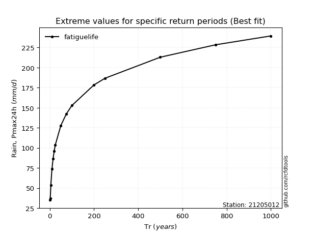</img>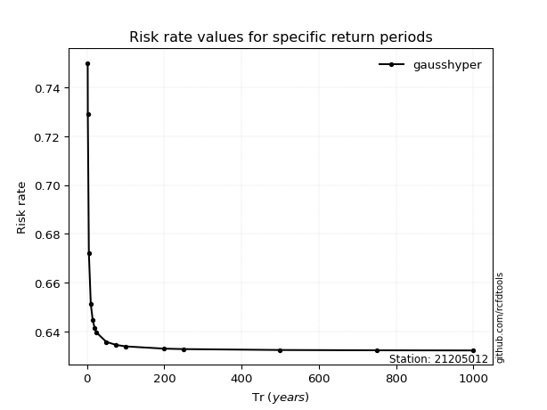</img>

</div>


<sub>**APP DISCLAIMER**: NO WARRANTY - This software is provided by [github.com/rcfdtools](https://github.com/rcfdtools) "as is", without any express or implied warranty, including warranties of merchantability, fitness for a particular purpose, or non-infringement. There is no guarantee that the software will be error-free or operate without interruption. LIMITATION OF LIABILITY - Neither the authors nor copyright holders will be liable for claims or damages arising from the software or its use. You are responsible for determining if the software is appropriate for your use and assume all associated risks, including errors, legal compliance, and data loss. NO PROFESSIONAL ADVICE - The software provides general information and does not offer professional advice. It should not replace consultation with professional advisors.</sub>