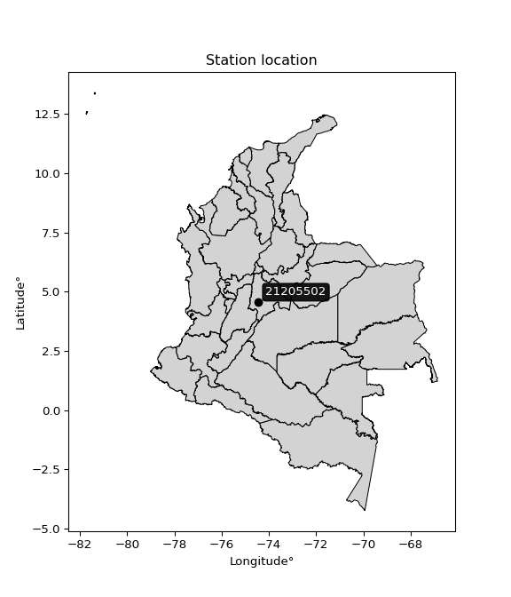

<div align="center">


</div>

# PMP Station (rain, Pmax24h): 21205502

Probable Maximum Precipitation (PMP) is the greatest amount of rainfall for a specific duration that is meteorologically possible for a given location, acting as a "worst-case" scenario for extreme storms, crucial for designing safety-critical infrastructure like bridges, river deviations, dams, spillways, and nuclear plants to prevent catastrophic failure. PMP is calculated by hydrologists using meteorological data to determine the upper limit of extreme rainfall, often leading to the Probable Maximum Flood (PMF) for flood control design, and is increasingly being studied for climate change impacts.

<div align="center">

</img>

</div>


## A. General information


### 1. General running parameters

• app_version: _v20251228_. • runtime: _2025-12-28 08:43:48.795225_. • Python version: _3.14.0_. • SciPy version: _1.16.3_. • Pandas version: _2.3.3_. • NumPy version: _2.3.5_. • Stations dataset (station_dataset_file): _dataset/pmax24h_in/automatic_colombia_2003_2024.csv_. • Stations catalog (station_catalog_file): _dataset/CNE_IDEAM.xls_. • Minimum year to eval til year_max (date_min): _1900_. • Maximum year to eval since year_min (date_max): _2024_. • Creates, save and include plots into reports (create_plot): _False_. • Plot only fit distributions with Δo > Δ (plot_only_fit): _True_. • Eval low extreme values, if False, evaluates high extreme values (low_extreme): _False_. • Eval every SciPy distribution as logarithmic (pdist_logarithmic_on): _True_. • Standard deviation normalized (ddof): _1.0_. • Return periods to eval in years (Tr): _[2, 2.33, 5, 10, 15, 20, 25, 50, 75, 100, 200, 250, 500, 750, 1000]_. • Minimum data sample per station, 0 means any (minimum_sample): _5_. • Z-Score maximum threshold to adjust a value, 0 means disable (zscore_max): _3.5_. • Z-Score minimum threshold to adjust a value, 0 means disable (zscore_min): _-2.5_. • Avoid zeros, e.g. rain = 0 (avoid_zeros): _True_. • Avoid null values (avoid_nans): _True_. [:file_folder:Dataset file.](../../dataset/pmax24h_in/automatic_colombia_2003_2024.csv)

> Delta Degrees of Freedom (DDOF): is a parameter used in the formulas for calculating variance and standard deviation. When ddof=0, the divisor is $N$ (the total number of observations) and this is used when your data set is the entire population. When ddof=1, the divisor is $N-1$ and this is used when your data set is a sample drawn from a larger population. Using $N-1$ provides an unbiased estimate of the population variance (known as Bessel´s correction).


### 2. Station info and location

|   id |   CODIGO | NOMBRE                    | CATEGORIA               | TECNOLOGIA                | ESTADO   | FECHA_INSTALACION   |   FECHA_SUSPENSION |   ALTITUD |   LATITUD |   LONGITUD | DEPARTAMENTO   | MUNICIPIO   | AREA_OPERATIVA                            | ENTIDAD                                    | AREA_HIDROGRAFICA   | ZONA_HIDROGRAFICA   | SUBZONA_HIDROGRAFICA   |   CORRIENTE | Catalogo   |
|-----:|---------:|:--------------------------|:------------------------|:--------------------------|:---------|:--------------------|-------------------:|----------:|----------:|-----------:|:---------------|:------------|:------------------------------------------|:-------------------------------------------|:--------------------|:--------------------|:-----------------------|------------:|:-----------|
|    0 | 21205502 | MISIONES - AUT [21205502] | Climatológica Principal | Automática con Telemetría | Activa   | 01/09/2013          |                nan |      1540 |     4.545 |   -74.4406 | Cundinamarca   | El Colegio  | Area Operativa 11 - Cundinamarca-Amazonas | CENTRO NACIONAL DE INVESTIGACIONES DE CAFE | Magdalena Cauca     | Alto Magdalena      | Río Bogotá             |         nan | CNE_OE     |

<div align="center">

Map location in: [:earth_americas:Google](http://maps.google.com/maps?q=4.544997222,-74.44055556) [:earth_americas:OSM](https://www.openstreetmap.org/#map=18/4.544997222/-74.44055556&layers=P) [:earth_americas:Bing](https://www.bing.com/maps?cp=4.544997222~-74.44055556&lvl=18) [:earth_americas:Apple](https://maps.apple.com/frame?center=4.544997222%2C-74.44055556&span=0.003%2C0.006)

</div>


<div align="center">

```geojson
{
  "type": "Feature",
  "geometry": {
    "type": "Point", 
    "coordinates": [-74.44055556, 4.544997222]
  }, 
  "properties": {
    "Name": "21205502"
  }
}
```

</div>


### 3. Discrete values table and plot

|               |           0 |           1 |           2 |          3 |           4 |             5 |          6 |         7 |
|:--------------|------------:|------------:|------------:|-----------:|------------:|--------------:|-----------:|----------:|
| Date          | 2016        | 2017        | 2018        | 2019       | 2020        | 2021          | 2022       | 2023      |
| Value         |   64.5      |   48.2      |   53.8      |   68.3     |   45.5      |   55.2        |   39.8     |   66.1    |
| Value_initial |   64.5      |   48.2      |   53.8      |   68.3     |   45.5      |   55.2        |   39.8     |   66.1    |
| count         |    8        |    8        |    8        |    8       |    8        |    8          |    8       |    8      |
| mean          |   55.175    |   55.175    |   55.175    |   55.175   |   55.175    |   55.175      |   55.175   |   55.175  |
| std           |   10.4137   |   10.4137   |   10.4137   |   10.4137  |   10.4137   |   10.4137     |   10.4137  |   10.4137 |
| zscore        |    0.895456 |   -0.669791 |   -0.132038 |    1.26036 |   -0.929065 |    0.00240069 |   -1.47642 |    1.0491 |

> The initial value (value_initial) correspond to the initial obtained or null completed value, and value (value) is adjusted only when the initial value is outside the valid range definite through the Z-Score value. If Z-Score is active, values out of range or outliers are replaced with the station mean value


### 4. Active continuous probability distributions from SciPy (44 of 104 available)

[scipy.stats](https://docs.scipy.org/doc/scipy/reference/stats.html) is a Python´s powerful submodule within the SciPy library for comprehensive statistical analysis, offering over 130 probability distributions (like Normal, Poisson), functions for descriptive stats (mean, variance), hypothesis testing (t-tests, chi-square), random variable generation, and statistical tests, making it essential for data science, modeling, and research. It provides tools to explore, model, and draw conclusions from data efficiently, working seamlessly with NumPy.

<div align="center">

|   id | p_dist             |   n_parameter | fit_method   | label                                                                       | active   | ref                                                                                                        |
|-----:|:-------------------|--------------:|:-------------|:----------------------------------------------------------------------------|:---------|:-----------------------------------------------------------------------------------------------------------|
|    0 | alpha              |             3 | MLE          | Alpha                                                                       | True     | [:mortar_board:](https://docs.scipy.org/doc/scipy/reference/generated/scipy.stats.alpha.html)              |
|    1 | betaprime          |             4 | MLE          | Beta prime                                                                  | True     | [:mortar_board:](https://docs.scipy.org/doc/scipy/reference/generated/scipy.stats.betaprime.html)          |
|    2 | chi2               |             3 | MLE          | Chi²                                                                        | True     | [:mortar_board:](https://docs.scipy.org/doc/scipy/reference/generated/scipy.stats.chi2.html)               |
|    3 | crystalball        |             4 | MLE          | Crystalball                                                                 | True     | [:mortar_board:](https://docs.scipy.org/doc/scipy/reference/generated/scipy.stats.crystalball.html)        |
|    4 | erlang             |             3 | MLE          | Erlang                                                                      | True     | [:mortar_board:](https://docs.scipy.org/doc/scipy/reference/generated/scipy.stats.erlang.html)             |
|    5 | expon              |             2 | MLE          | Exponential                                                                 | True     | [:mortar_board:](https://docs.scipy.org/doc/scipy/reference/generated/scipy.stats.expon.html)              |
|    6 | exponnorm          |             3 | MLE          | Exponentially modified Normal                                               | True     | [:mortar_board:](https://docs.scipy.org/doc/scipy/reference/generated/scipy.stats.exponnorm.html)          |
|    7 | f                  |             4 | MLE          | F                                                                           | True     | [:mortar_board:](https://docs.scipy.org/doc/scipy/reference/generated/scipy.stats.f.html)                  |
|    8 | fatiguelife        |             3 | MLE          | Fatigue-life (Birnbaum-Saunders)                                            | True     | [:mortar_board:](https://docs.scipy.org/doc/scipy/reference/generated/scipy.stats.fatiguelife.html)        |
|    9 | fisk               |             3 | MLE          | Fisk                                                                        | True     | [:mortar_board:](https://docs.scipy.org/doc/scipy/reference/generated/scipy.stats.fisk.html)               |
|   10 | gamma              |             3 | MLE          | Gamma                                                                       | True     | [:mortar_board:](https://docs.scipy.org/doc/scipy/reference/generated/scipy.stats.gamma.html)              |
|   11 | genexpon           |             5 | MLE          | Generalized exponential                                                     | True     | [:mortar_board:](https://docs.scipy.org/doc/scipy/reference/generated/scipy.stats.genexpon.html)           |
|   12 | genlogistic        |             3 | MLE          | Generalized logistic                                                        | True     | [:mortar_board:](https://docs.scipy.org/doc/scipy/reference/generated/scipy.stats.genlogistic.html)        |
|   13 | gibrat             |             2 | MM           | Gibrat                                                                      | True     | [:mortar_board:](https://docs.scipy.org/doc/scipy/reference/generated/scipy.stats.gibrat.html)             |
|   14 | gompertz           |             3 | MLE          | Gompertz (or truncated Gumbel)                                              | True     | [:mortar_board:](https://docs.scipy.org/doc/scipy/reference/generated/scipy.stats.gompertz.html)           |
|   15 | gumbel_l           |             2 | MM           | Gumbel Left Skew                                                            | True     | [:mortar_board:](https://docs.scipy.org/doc/scipy/reference/generated/scipy.stats.gumbel_l.html)           |
|   16 | gumbel_r           |             2 | MM           | Gumbel Right Skew                                                           | True     | [:mortar_board:](https://docs.scipy.org/doc/scipy/reference/generated/scipy.stats.gumbel_r.html)           |
|   17 | halflogistic       |             2 | MM           | Half-logistic                                                               | True     | [:mortar_board:](https://docs.scipy.org/doc/scipy/reference/generated/scipy.stats.halflogistic.html)       |
|   18 | halfnorm           |             2 | MM           | Half Normal                                                                 | True     | [:mortar_board:](https://docs.scipy.org/doc/scipy/reference/generated/scipy.stats.halfnorm.html)           |
|   19 | hypsecant          |             2 | MM           | hyperbolic secant                                                           | True     | [:mortar_board:](https://docs.scipy.org/doc/scipy/reference/generated/scipy.stats.hypsecant.html)          |
|   20 | invgamma           |             3 | MLE          | Inverted gamma                                                              | True     | [:mortar_board:](https://docs.scipy.org/doc/scipy/reference/generated/scipy.stats.invgamma.html)           |
|   21 | invgauss           |             3 | MLE          | Inverse Gaussian                                                            | True     | [:mortar_board:](https://docs.scipy.org/doc/scipy/reference/generated/scipy.stats.invgauss.html)           |
|   22 | invweibull         |             3 | MLE          | Inverted Weibull                                                            | True     | [:mortar_board:](https://docs.scipy.org/doc/scipy/reference/generated/scipy.stats.invweibull.html)         |
|   23 | johnsonsu          |             4 | MLE          | Johnson Su                                                                  | True     | [:mortar_board:](https://docs.scipy.org/doc/scipy/reference/generated/scipy.stats.johnsonsu.html)          |
|   24 | kstwobign          |             2 | MLE          | Limiting distribution of scaled Kolmogorov-Smirnov two-sided test statistic | True     | [:mortar_board:](https://docs.scipy.org/doc/scipy/reference/generated/scipy.stats.kstwobign.html)          |
|   25 | laplace            |             2 | MM           | Laplace                                                                     | True     | [:mortar_board:](https://docs.scipy.org/doc/scipy/reference/generated/scipy.stats.laplace.html)            |
|   26 | laplace_asymmetric |             3 | MLE          | Asymmetric Laplace                                                          | True     | [:mortar_board:](https://docs.scipy.org/doc/scipy/reference/generated/scipy.stats.laplace_asymmetric.html) |
|   27 | loggamma           |             3 | MLE          | Log gamma                                                                   | True     | [:mortar_board:](https://docs.scipy.org/doc/scipy/reference/generated/scipy.stats.loggamma.html)           |
|   28 | logistic           |             2 | MM           | Logistic (or Sech-squared)                                                  | True     | [:mortar_board:](https://docs.scipy.org/doc/scipy/reference/generated/scipy.stats.logistic.html)           |
|   29 | lognorm            |             3 | MLE          | Log Normal                                                                  | True     | [:mortar_board:](https://docs.scipy.org/doc/scipy/reference/generated/scipy.stats.lognorm.html)            |
|   30 | maxwell            |             2 | MM           | Maxwell                                                                     | True     | [:mortar_board:](https://docs.scipy.org/doc/scipy/reference/generated/scipy.stats.maxwell.html)            |
|   31 | mielke             |             4 | MLE          | Mielke Beta-Kappa / Dagum                                                   | True     | [:mortar_board:](https://docs.scipy.org/doc/scipy/reference/generated/scipy.stats.mielke.html)             |
|   32 | moyal              |             2 | MM           | Moyal                                                                       | True     | [:mortar_board:](https://docs.scipy.org/doc/scipy/reference/generated/scipy.stats.moyal.html)              |
|   33 | nakagami           |             3 | MLE          | Nakagami                                                                    | True     | [:mortar_board:](https://docs.scipy.org/doc/scipy/reference/generated/scipy.stats.nakagami.html)           |
|   34 | ncf                |             5 | MLE          | Non-central F distribution                                                  | True     | [:mortar_board:](https://docs.scipy.org/doc/scipy/reference/generated/scipy.stats.ncf.html)                |
|   35 | nct                |             4 | MLE          | Non-central Student’s t                                                     | True     | [:mortar_board:](https://docs.scipy.org/doc/scipy/reference/generated/scipy.stats.nct.html)                |
|   36 | norm               |             2 | MM           | Normal                                                                      | True     | [:mortar_board:](https://docs.scipy.org/doc/scipy/reference/generated/scipy.stats.norm.html)               |
|   37 | pearson3           |             3 | MM           | Pearson type III                                                            | True     | [:mortar_board:](https://docs.scipy.org/doc/scipy/reference/generated/scipy.stats.pearson3.html)           |
|   38 | rayleigh           |             2 | MM           | Rayleigh                                                                    | True     | [:mortar_board:](https://docs.scipy.org/doc/scipy/reference/generated/scipy.stats.rayleigh.html)           |
|   39 | rice               |             3 | MLE          | Rice                                                                        | True     | [:mortar_board:](https://docs.scipy.org/doc/scipy/reference/generated/scipy.stats.rice.html)               |
|   40 | t                  |             3 | MLE          | Student’s t                                                                 | True     | [:mortar_board:](https://docs.scipy.org/doc/scipy/reference/generated/scipy.stats.t.html)                  |
|   41 | truncnorm          |             4 | MLE          | Truncated normal                                                            | True     | [:mortar_board:](https://docs.scipy.org/doc/scipy/reference/generated/scipy.stats.truncnorm.html)          |
|   42 | wald               |             2 | MM           | Wald                                                                        | True     | [:mortar_board:](https://docs.scipy.org/doc/scipy/reference/generated/scipy.stats.wald.html)               |
|   43 | weibull_min        |             3 | MLE          | Weibull minimum                                                             | True     | [:mortar_board:](https://docs.scipy.org/doc/scipy/reference/generated/scipy.stats.weibull_min.html)        |

</div>

> **n_parameter:** # arguments & localization & scale.
>
> **Fit methods:** (MLE) maximum likelihood, (MM) L-moments.
>
>**Inactive:** foldnorm, gennorm, norminvgauss, powernorm, powerlognorm, skewnorm, genextreme, anglit, arcsine, argus, beta, bradford, burr, burr12, cauchy, cosine, halfcauchy, foldcauchy, skewcauchy, wrapcauchy, dgamma, gengamma, exponweib, exponpow, truncexpon, gausshyper, genhalflogistic, genhyperbolic, geninvgauss, halfgennorm, johnsonsb, kappa4, kappa3, ksone, kstwo, loglaplace, levy, levy_l, levy_stable, ncx2, pareto, genpareto, truncpareto, lomax, powerlaw, rdist, rel_breitwigner, recipinvgauss, semicircular, studentized_range, trapezoid, triang, truncweibull_min, tukeylambda, uniform, loguniform, vonmises, vonmises_line, weibull_max, dweibull, 


## B. Probability distributions vs. Empirical distributions

A continuous probability distribution (CPD) describes probabilities for variables that can take any value within a range (like rain any time), unlike discrete variables with specific outcomes (like temperature). It uses a Probability Density Function (PDF), a curve where the total area under it equals 1, and the probability of the variable falling within an interval (a to b) is found by calculating the area under the curve between those points. A key feature is that the probability of hitting any single exact value is zero, so probabilities are always expressed for ranges, e.g., $P(a ≤ X ≤ b)$.

<div align="center">

Distributions parameters from station values
|    |   station | p_dist                |   n |            loc |           scale | shape                  | shape1               | shape2                | shape3   |
|---:|----------:|:----------------------|----:|---------------:|----------------:|:-----------------------|:---------------------|:----------------------|:---------|
|  0 |  21205502 | alpha                 |   8 | -121.19        |  3166.26        | 18.023958288431103     |                      |                       |          |
|  1 |  21205502 | betaprime             |   8 |   -0.903347    |    49.989       | 68.50331646584084      | 62.164248268556534   |                       |          |
|  2 |  21205502 | chi2                  |   8 |   39.8         |     2.76145     | 0.960528841626662      |                      |                       |          |
|  3 |  21205502 | crystalball           |   8 |   55.1751      |     9.74109     | 23057.87044580392      | 134.7510874600795    |                       |          |
|  4 |  21205502 | erlang                |   8 | -287.623       |     0.27771     | 1234.4021792321955     |                      |                       |          |
|  5 |  21205502 | expon                 |   8 |   39.8         |    15.375       |                        |                      |                       |          |
|  6 |  21205502 | exponnorm             |   8 |   55.1642      |     9.74112     | 0.0011171251961930432  |                      |                       |          |
|  7 |  21205502 | f                     |   8 | -874.96        |   930.144       | 19111.699452865283     | 365786.7064309581    |                       |          |
|  8 |  21205502 | fatiguelife           |   8 |   39.8         |     1.36395e-05 | 1081.1090209210995     |                      |                       |          |
|  9 |  21205502 | fisk                  |   8 |   -2.21391e+08 |     2.21391e+08 | 36994150.61727186      |                      |                       |          |
| 10 |  21205502 | gamma                 |   8 | -291.087       |     0.274816    | 1259.9907323901657     |                      |                       |          |
| 11 |  21205502 | genexpon              |   8 |   39.8         |     2.14495     | 0.10317995423822687    | 0.039200224455286634 | 1.639263044749117     |          |
| 12 |  21205502 | genlogistic           |   8 |   27.2216      |     8.59966     | 15.404717995229221     |                      |                       |          |
| 13 |  21205502 | gibrat                |   8 |   47.7438      |     4.50726     |                        |                      |                       |          |
| 14 |  21205502 | gompertz              |   8 |   53.7999      |     1.68519     | 0.000664322263204056   |                      |                       |          |
| 15 |  21205502 | gumbel_l              |   8 |   59.559       |     7.59512     |                        |                      |                       |          |
| 16 |  21205502 | gumbel_r              |   8 |   50.791       |     7.59512     |                        |                      |                       |          |
| 17 |  21205502 | halflogistic          |   8 |   43.6295      |     8.32831     |                        |                      |                       |          |
| 18 |  21205502 | halfnorm              |   8 |   42.2816      |    16.1595      |                        |                      |                       |          |
| 19 |  21205502 | hypsecant             |   8 |   55.175       |     6.20139     |                        |                      |                       |          |
| 20 |  21205502 | invgamma              |   8 |  -73.3195      | 21683.1         | 169.9002850544145      |                      |                       |          |
| 21 |  21205502 | invgauss              |   8 |   12.2768      |   733.268       | 0.05843885973415544    |                      |                       |          |
| 22 |  21205502 | invweibull            |   8 |   -1.33221e+09 |     1.33221e+09 | 148493229.45554906     |                      |                       |          |
| 23 |  21205502 | johnsonsu             |   8 |  115.434       |     7.41986     | 17.151601118980828     | 6.173493909327515    |                       |          |
| 24 |  21205502 | kstwobign             |   8 |   19.4209      |    40.8221      |                        |                      |                       |          |
| 25 |  21205502 | laplace               |   8 |   55.175       |     6.88801     |                        |                      |                       |          |
| 26 |  21205502 | laplace_asymmetric    |   8 |   53.8         |     8.2643      | 0.9202835520535935     |                      |                       |          |
| 27 |  21205502 | loggamma              |   8 |  -74.4973      |    43.4484      | 20.274750321149018     |                      |                       |          |
| 28 |  21205502 | logistic              |   8 |   55.175       |     5.37056     |                        |                      |                       |          |
| 29 |  21205502 | lognorm               |   8 |   39.8         |     0.184761    | 11.687080628545043     |                      |                       |          |
| 30 |  21205502 | maxwell               |   8 |   32.0926      |    14.4647      |                        |                      |                       |          |
| 31 |  21205502 | mielke                |   8 |  -15.0069      |    83.4687      | 5.457359777108117      | 1946.8514545423768   |                       |          |
| 32 |  21205502 | moyal                 |   8 |   49.6044      |     4.38504     |                        |                      |                       |          |
| 33 |  21205502 | nakagami              |   8 |   45.5         |    16.0227      | 0.14767414754134073    |                      |                       |          |
| 34 |  21205502 | ncf                   |   8 |   -1.76472     |     6.77678e-05 | 0.000205104814850129   | 304.6227773312482    | 171.2532704871824     |          |
| 35 |  21205502 | nct                   |   8 | -563.984       |     9.6559      | 111210.10182379314     | 64.12191395345178    |                       |          |
| 36 |  21205502 | norm                  |   8 |   55.175       |     9.74112     |                        |                      |                       |          |
| 37 |  21205502 | pearson3              |   8 |   55.175       |     9.74113     | -0.06848329465676348   |                      |                       |          |
| 38 |  21205502 | rayleigh              |   8 |   36.5397      |    14.8688      |                        |                      |                       |          |
| 39 |  21205502 | rice                  |   8 |   35.3753      |    11.6114      | 1.2694550139203011     |                      |                       |          |
| 40 |  21205502 | t                     |   8 |   55.1749      |     9.74118     | 371491514.4109471      |                      |                       |          |
| 41 |  21205502 | truncnorm             |   8 |   55.175       |     9.74112     | -231.2915124208651     | 1044.3154471370367   |                       |          |
| 42 |  21205502 | wald                  |   8 |   45.4339      |     9.74112     |                        |                      |                       |          |
| 43 |  21205502 | weibull_min           |   8 |   33.1559      |    24.879       | 2.4749450922652665     |                      |                       |          |
| 44 |  21205502 | logalpha              |   8 |   -3.53452     |   310.131       | 41.21724023952629      |                      |                       |          |
| 45 |  21205502 | logbetaprime          |   8 |   -2.76789     |     0.808103    | 12693.85312398088      | 1518.2175399627395   |                       |          |
| 46 |  21205502 | logchi2               |   8 |    3.68387     |     0.93532     | 0.974583682837767      |                      |                       |          |
| 47 |  21205502 | logcrystalball        |   8 |    3.99436     |     0.181399    | 27.531280363428934     | 1417.2025921754785   |                       |          |
| 48 |  21205502 | logerlang             |   8 |    0.73116     |     0.0102915   | 317.0083765297509      |                      |                       |          |
| 49 |  21205502 | logexpon              |   8 |    3.68387     |     0.310498    |                        |                      |                       |          |
| 50 |  21205502 | logexponnorm          |   8 |    3.99422     |     0.1814      | 0.0008066243746605747  |                      |                       |          |
| 51 |  21205502 | logf                  |   8 |  -53.8426      |    57.8367      | 452810.46587247145     | 363164.9338681663    |                       |          |
| 52 |  21205502 | logfatiguelife        |   8 |  -19.6611      |    23.655       | 0.007640325053430874   |                      |                       |          |
| 53 |  21205502 | logfisk               |   8 |   -7.8301e+06  |     7.83011e+06 | 71028208.30066526      |                      |                       |          |
| 54 |  21205502 | loggamma              |   8 |    0.754671    |     0.0104242   | 310.68044452185393     |                      |                       |          |
| 55 |  21205502 | loggenexpon           |   8 |    3.68261     |     0.00386782  | 0.004745372869205499   | 1.5148166966612102   | 9.326067990866611e-05 |          |
| 56 |  21205502 | loggenlogistic        |   8 |    4.22391     |     6.19953e-08 | 2.6867699876079087e-07 |                      |                       |          |
| 57 |  21205502 | loggibrat             |   8 |    3.85593     |     0.0839623   |                        |                      |                       |          |
| 58 |  21205502 | loggompertz           |   8 |    3.68219     |     0.208598    | 0.19209719202877362    |                      |                       |          |
| 59 |  21205502 | loggumbel_l           |   8 |    4.076       |     0.141436    |                        |                      |                       |          |
| 60 |  21205502 | loggumbel_r           |   8 |    3.91273     |     0.141436    |                        |                      |                       |          |
| 61 |  21205502 | loghalflogistic       |   8 |    3.77939     |     0.155069    |                        |                      |                       |          |
| 62 |  21205502 | loghalfnorm           |   8 |    3.75429     |     0.300893    |                        |                      |                       |          |
| 63 |  21205502 | loghypsecant          |   8 |    3.99436     |     0.115482    |                        |                      |                       |          |
| 64 |  21205502 | loginvgamma           |   8 |    1.20124     |   634.629       | 228.32272369892843     |                      |                       |          |
| 65 |  21205502 | loginvgauss           |   8 |    2.60605     |    74.0408      | 0.018779308469191125   |                      |                       |          |
| 66 |  21205502 | loginvweibull         |   8 |   -1.07653e+07 |     1.07653e+07 | 61748901.946839064     |                      |                       |          |
| 67 |  21205502 | logjohnsonsu          |   8 |    4.2879      |     0.00209808  | 7.0293522429145785     | 1.3058916456911018   |                       |          |
| 68 |  21205502 | logkstwobign          |   8 |    3.2913      |     0.80286     |                        |                      |                       |          |
| 69 |  21205502 | loglaplace            |   8 |    3.99436     |     0.128269    |                        |                      |                       |          |
| 70 |  21205502 | loglaplace_asymmetric |   8 |    4.01096     |     0.153109    | 1.055488106393565      |                      |                       |          |
| 71 |  21205502 | logloggamma           |   8 |    4.22392     |     5.77093e-07 | 2.50659041989102e-06   |                      |                       |          |
| 72 |  21205502 | loglogistic           |   8 |    3.99436     |     0.100011    |                        |                      |                       |          |
| 73 |  21205502 | loglognorm            |   8 |    3.68387     |     0.00443036  | 11.32223486147902      |                      |                       |          |
| 74 |  21205502 | logmaxwell            |   8 |    3.56452     |     0.269362    |                        |                      |                       |          |
| 75 |  21205502 | logmielke             |   8 |    3.68387     |     0.540885    | 0.7761032371364434     | 5344.348091158041    |                       |          |
| 76 |  21205502 | logmoyal              |   8 |    3.89063     |     0.0816584   |                        |                      |                       |          |
| 77 |  21205502 | lognakagami           |   8 |  -14.1452      |    18.1408      | 2492.513431149522      |                      |                       |          |
| 78 |  21205502 | logncf                |   8 |  -33.7685      |     7.80001     | 97825.12614980023      | 128476.46217549921   | 375764.7529972532     |          |
| 79 |  21205502 | lognct                |   8 |   -4.36062     |     0.0492625   | 534.030176044218       | 169.4774418609777    |                       |          |
| 80 |  21205502 | lognorm               |   8 |    3.99436     |     0.181399    |                        |                      |                       |          |
| 81 |  21205502 | logpearson3           |   8 |    3.99436     |     0.181399    | -0.2574560032313406    |                      |                       |          |
| 82 |  21205502 | lograyleigh           |   8 |    3.64734     |     0.276888    |                        |                      |                       |          |
| 83 |  21205502 | logrice               |   8 |    3.59199     |     0.205661    | 1.614280690857406      |                      |                       |          |
| 84 |  21205502 | logt                  |   8 |    3.99436     |     0.181401    | 193904081.66686046     |                      |                       |          |
| 85 |  21205502 | logtruncnorm          |   8 |   -0.0610159   |     1.00838     | 3.710098440758088      | 4.2493045193874845   |                       |          |
| 86 |  21205502 | logwald               |   8 |    3.81299     |     0.181375    |                        |                      |                       |          |
| 87 |  21205502 | logweibull_min        |   8 |    3.05108     |     1.01764     | 6.235874888495071      |                      |                       |          |

</div>

> **loc** (Location parameter): This shifts the distribution along the x-axis. For many common distributions, like the normal (Gaussian) distribution, loc represents the mean $μ$. For others, like the uniform distribution, it might represent the minimum value, or for the beta distribution, the left end of the support interval.
>
> **scale** (Scale parameter): This determines the width or spread of the distribution. For the normal distribution, scale represents the standard deviation $σ$. For a uniform distribution, it defines the length of the interval (from $loc$ to $loc + scale$).
>
> **shape** (Shape parameters): Refers to parameters that define the specific form of a probability distribution, distinct from its location (loc) and scale (scale). These parameters are required arguments for most distribution functions. For example, a normal (Gaussian) distribution is fully defined by its location (mean) and scale (standard deviation), so it has no specific shape parameters beyond loc and scale. However, other distributions have intrinsic properties that need specification, as Gamma distribution that takes a shape parameter, often named $a$ or $alpha$.


### 0. Cumulative distribution values - CDF (88 evaluated)

Cumulative Distribution Function (CDF), denoted as $F$<sub>$X$</sub>$(x)$, is a function that gives the probability that a random variable $X$ will take a value less than or equal to a specific value, $x$ (i.e., $(P(X≥x)$. It essentially "accumulates" probabilities from a given point up to the far right (positive infinity), providing a complete picture of the distribution´s probabilities for both discrete (like rain) and continuous (like temperature) variables, helping to find probabilities over ranges or above certain values.

<div align="center">

CDF ordered by x ascending and calculating $log(f(x))$ separately
|   id |   Station |   date |    x |   count |   mean |     std |      zscore |   Value_initial |   station |   m |     alpha |   alpha_pdf |   betaprime |   betaprime_pdf |        chi2 |    chi2_pdf |   crystalball |   crystalball_pdf |    erlang |   erlang_pdf |    expon |   expon_pdf |   exponnorm |   exponnorm_pdf |         f |     f_pdf |   fatiguelife |   fatiguelife_pdf |      fisk |   fisk_pdf |     gamma |   gamma_pdf |    genexpon |   genexpon_pdf |   genlogistic |   genlogistic_pdf |    gibrat |   gibrat_pdf |    gompertz |   gompertz_pdf |   gumbel_l |   gumbel_l_pdf |   gumbel_r |   gumbel_r_pdf |   halflogistic |   halflogistic_pdf |   halfnorm |   halfnorm_pdf |   hypsecant |   hypsecant_pdf |   invgamma |   invgamma_pdf |   invgauss |   invgauss_pdf |   invweibull |   invweibull_pdf |   johnsonsu |   johnsonsu_pdf |   kstwobign |   kstwobign_pdf |   laplace |   laplace_pdf |   laplace_asymmetric |   laplace_asymmetric_pdf |   loggamma |   loggamma_pdf |   logistic |   logistic_pdf |   lognorm |   lognorm_pdf |   maxwell |   maxwell_pdf |   mielke |   mielke_pdf |     moyal |   moyal_pdf |    nakagami |   nakagami_pdf |      ncf |   ncf_pdf |       nct |   nct_pdf |      norm |   norm_pdf |   pearson3 |   pearson3_pdf |   rayleigh |   rayleigh_pdf |      rice |   rice_pdf |         t |     t_pdf |   truncnorm |   truncnorm_pdf |       wald |    wald_pdf |   weibull_min |   weibull_min_pdf |   logalpha |   logalpha_pdf |   logbetaprime |   logbetaprime_pdf |    logchi2 |   logchi2_pdf |   logcrystalball |   logcrystalball_pdf |   logerlang |   logerlang_pdf |   logexpon |   logexpon_pdf |   logexponnorm |   logexponnorm_pdf |      logf |   logf_pdf |   logfatiguelife |   logfatiguelife_pdf |   logfisk |   logfisk_pdf |   loggenexpon |   loggenexpon_pdf |   loggenlogistic |   loggenlogistic_pdf |   loggibrat |   loggibrat_pdf |   loggompertz |   loggompertz_pdf |   loggumbel_l |   loggumbel_l_pdf |   loggumbel_r |   loggumbel_r_pdf |   loghalflogistic |   loghalflogistic_pdf |   loghalfnorm |   loghalfnorm_pdf |   loghypsecant |   loghypsecant_pdf |   loginvgamma |   loginvgamma_pdf |   loginvgauss |   loginvgauss_pdf |   loginvweibull |   loginvweibull_pdf |   logjohnsonsu |   logjohnsonsu_pdf |   logkstwobign |   logkstwobign_pdf |   loglaplace |   loglaplace_pdf |   loglaplace_asymmetric |   loglaplace_asymmetric_pdf |   logloggamma |   logloggamma_pdf |   loglogistic |   loglogistic_pdf |   loglognorm |   loglognorm_pdf |   logmaxwell |   logmaxwell_pdf |   logmielke |   logmielke_pdf |    logmoyal |   logmoyal_pdf |   lognakagami |   lognakagami_pdf |    logncf |   logncf_pdf |   lognct |   lognct_pdf |   logpearson3 |   logpearson3_pdf |   lograyleigh |   lograyleigh_pdf |   logrice |   logrice_pdf |     logt |   logt_pdf |   logtruncnorm |   logtruncnorm_pdf |     logwald |   logwald_pdf |   logweibull_min |   logweibull_min_pdf |
|-----:|----------:|-------:|-----:|--------:|-------:|--------:|------------:|----------------:|----------:|----:|----------:|------------:|------------:|----------------:|------------:|------------:|--------------:|------------------:|----------:|-------------:|---------:|------------:|------------:|----------------:|----------:|----------:|--------------:|------------------:|----------:|-----------:|----------:|------------:|------------:|---------------:|--------------:|------------------:|----------:|-------------:|------------:|---------------:|-----------:|---------------:|-----------:|---------------:|---------------:|-------------------:|-----------:|---------------:|------------:|----------------:|-----------:|---------------:|-----------:|---------------:|-------------:|-----------------:|------------:|----------------:|------------:|----------------:|----------:|--------------:|---------------------:|-------------------------:|-----------:|---------------:|-----------:|---------------:|----------:|--------------:|----------:|--------------:|---------:|-------------:|----------:|------------:|------------:|---------------:|---------:|----------:|----------:|----------:|----------:|-----------:|-----------:|---------------:|-----------:|---------------:|----------:|-----------:|----------:|----------:|------------:|----------------:|-----------:|------------:|--------------:|------------------:|-----------:|---------------:|---------------:|-------------------:|-----------:|--------------:|-----------------:|---------------------:|------------:|----------------:|-----------:|---------------:|---------------:|-------------------:|----------:|-----------:|-----------------:|---------------------:|----------:|--------------:|--------------:|------------------:|-----------------:|---------------------:|------------:|----------------:|--------------:|------------------:|--------------:|------------------:|--------------:|------------------:|------------------:|----------------------:|--------------:|------------------:|---------------:|-------------------:|--------------:|------------------:|--------------:|------------------:|----------------:|--------------------:|---------------:|-------------------:|---------------:|-------------------:|-------------:|-----------------:|------------------------:|----------------------------:|--------------:|------------------:|--------------:|------------------:|-------------:|-----------------:|-------------:|-----------------:|------------:|----------------:|------------:|---------------:|--------------:|------------------:|----------:|-------------:|---------:|-------------:|--------------:|------------------:|--------------:|------------------:|----------:|--------------:|---------:|-----------:|---------------:|-------------------:|------------:|--------------:|-----------------:|---------------------:|
|    0 |  21205502 |   2022 | 39.8 |       8 | 55.175 | 10.4137 | -1.47642    |            39.8 |  21205502 |   1 | 0.0501496 |   0.0126296 |   0.0420017 |       0.0125402 | 7.96661e-08 | 5.38473e+06 |      0.05724  |         0.0117851 | 0.0557671 |    0.0118852 | 0        |   0.0650407 |    0.057241 |       0.0117852 | 0.0568007 | 0.0118277 |      0.017319 |       1.73037e+10 | 0.0708717 |  0.0110032 | 0.0557979 |   0.0118891 | 2.80074e-07 |      0.0481038 |     0.0403874 |         0.0136055 | 0         |   0          | 0           |    0           |  0.0714761 |     0.00906615 |  0.0142526 |     0.00797686 |       0        |          0         |   0        |      0         |   0.0532264 |      0.00854304 |  0.0515526 |      0.0126798 |  0.0408683 |      0.0136071 |    0.0392236 |        0.0141587 |   0.0700265 |       0.0109103 |   0.0355559 |       0.0155291 | 0.0536493 |     0.0077888 |            0.0727708 |               0.00956818 |  0.0425713 |       0.527551 |  0.0540219 |     0.00951549 | 0.0434777 |      0.508235 | 0.0369756 |     0.0135884 | 0.100694 |    0.0100265 | 0.0022242 |  0.00258889 | 0           |    0           | 0.04713  | 0.0123781 | 0.0572641 | 0.0117949 | 0.0572414 |  0.0117853 |  0.0591261 |      0.0116727 |  0.0237535 |      0.0143968 | 0.0322006 |  0.0144444 | 0.0572433 | 0.0117855 |   0.0572413 |       0.0117853 | 0          | 0           |     0.0373788 |         0.0136602 |   0.040331 |       0.516354 |      0.0429612 |           0.527475 | 2.7474e-08 |   3.01468e+07 |        0.0434777 |             0.508235 |   0.0419535 |        0.522548 |   0        |       3.22063  |      0.0434783 |           0.50824  | 0.0438988 |   0.512804 |        0.0421133 |             0.503748 | 0.0536451 |      0.460519 |    0.00155044 |          1.23685  |         0        |             0.417273 |    0        |        0        |    0.00155351 |          0.926906 |     0.0605902 |          0.415143 |    0.00645109 |          0.230041 |          0        |              0        |      0        |          0        |       0.043204 |           0.37297  |     0.0390742 |          0.534466 |     0.0359532 |          0.540477 |       0.0304182 |            0.609394 |       0.10194  |           0.384769 |      0.0294304 |           0.698732 |    0.0444304 |         0.346386 |               0.0696238 |                    0.430827 |     0.0957787 |          0.416012 |      0.042916 |          0.410698 |   0.00410172 |      2.40974e+12 |    0.0218152 |         0.527099 | 5.98876e-09 |       338.031   | 0.000390081 |      0.0321525 |     0.0432632 |          0.508368 | 0.0437174 |     0.514419 | 0.110215 |     0.768562 |     0.0502754 |          0.500376 |    0.00866489 |          0.472343 | 0.0274947 |      0.605976 | 0.043481 |   0.508261 |      0.0159853 |           4.3106   | 0           |   0           |         0.050363 |             0.483598 |
|    1 |  21205502 |   2020 | 45.5 |       8 | 55.175 | 10.4137 | -0.929065   |            45.5 |  21205502 |   2 | 0.165805  |   0.028376  |   0.163304  |       0.0303052 | 0.856595    | 0.0344078   |      0.160301 |         0.0250086 | 0.160492  |    0.0254689 | 0.309771 |   0.0448929 |    0.160302 |       0.0250086 | 0.160439  | 0.0251562 |      0.725065 |       0.0174999   | 0.165079  |  0.0230308 | 0.160552  |   0.0254755 | 0.298655    |      0.0463904 |     0.176013  |         0.0336244 | 0         |   0          | 0           |    0           |  0.145356  |     0.0176744  |  0.134395  |     0.0355131  |       0.111828 |          0.0592854 |   0.157868 |      0.0484058 |   0.131841  |      0.0206572  |  0.166454  |      0.0280459 |  0.172606  |      0.0323167 |    0.179857  |        0.0343935 |   0.16002   |       0.0213606 |   0.190935  |       0.0369416 | 0.122731  |     0.017818  |            0.153972  |               0.0202449  |  0.169988  |       1.42932  |  0.14167   |     0.0226419  | 0.16507   |      1.36881  | 0.164726  |     0.0308415 | 0.172784 |    0.0155841 | 0.110311  |  0.0405987  | 2.89368e-05 |    6.01403e+08 | 0.16194  | 0.0283193 | 0.160401  | 0.0250233 | 0.160303  |  0.0250087 |  0.16022   |      0.024449  |  0.166047  |      0.0337996 | 0.162583  |  0.0305227 | 0.160306  | 0.0250089 |   0.160303  |       0.0250087 | 1.7934e-33 | 2.01162e-30 |     0.161783  |         0.0296589 |   0.167345 |       1.43723  |      0.170025  |           1.42461  | 0.305072   |   1.05827     |        0.16507   |             1.36881  |   0.168726  |        1.4261   |   0.350185 |       2.09282  |      0.165071  |           1.36881  | 0.166196  |   1.37314  |        0.16394   |             1.37804  | 0.160287  |      1.22093  |    0.222637   |          1.9439   |         0        |             0.745313 |    0        |        0        |    0.161184   |          1.47924  |     0.148728  |          0.969163 |    0.141182   |          1.95418  |          0.122925 |              3.17565  |      0.166948 |          2.59347  |       0.135796 |           1.14055  |     0.172397  |          1.50453  |     0.173816  |          1.55319  |       0.197729  |            1.8383   |       0.172724 |           0.709999 |      0.216824  |           1.95211  |    0.126141  |         0.983413 |               0.159387  |                    0.986273 |     0.171296  |          0.744021 |      0.145999 |          1.2467   |   0.6183     |      0.251593    |    0.170595  |         1.68253  | 0.338292    |         1.96159 | 0.118101    |      2.25148   |     0.16504   |          1.37103  | 0.166766  |     1.38303  | 0.246247 |     1.25264  |     0.163945  |          1.25948  |    0.17247    |          1.839    | 0.172118  |      1.55062  | 0.165077 |   1.36883  |      0.470313  |           2.60995  | 1.53683e-09 |   6.40281e-06 |         0.157153 |             1.17215  |
|    2 |  21205502 |   2017 | 48.2 |       8 | 55.175 | 10.4137 | -0.669791   |            48.2 |  21205502 |   3 | 0.252032  |   0.0352169 |   0.255142  |       0.0373103 | 0.923256    | 0.0172511   |      0.236981 |         0.0316932 | 0.238498  |    0.0321905 | 0.420936 |   0.0376627 |    0.236983 |       0.0316932 | 0.237525  | 0.0318372 |      0.766047 |       0.0132451   | 0.2369    |  0.0302078 | 0.238579  |   0.0321987 | 0.413576    |      0.038909  |     0.27581   |         0.0396305 | 0.0109964 |   0.0634621  | 0           |    0           |  0.200782  |     0.0235838  |  0.244988  |     0.0453695  |       0.26771  |          0.0557335 |   0.285822 |      0.0461725 |   0.199893  |      0.0301564  |  0.251597  |      0.0347607 |  0.26883   |      0.0384252 |    0.280907  |        0.0397566 |   0.22581   |       0.027428  |   0.297082  |       0.0409252 | 0.181631  |     0.0263692 |            0.219594  |               0.028873   |  0.264144  |       1.82419  |  0.214376  |     0.0313597  | 0.255898  |      1.77344  | 0.256577  |     0.0367952 | 0.219267 |    0.0189318 | 0.240527  |  0.0536243  | 0.476891    |    0.051976    | 0.24806  | 0.0351837 | 0.237117  | 0.0317041 | 0.236984  |  0.0316933 |  0.235253  |      0.0310594 |  0.264713  |      0.0387805 | 0.252702  |  0.0359128 | 0.236988  | 0.0316934 |   0.236984  |       0.0316933 | 0.148544   | 0.109733    |     0.250195  |         0.0355185 |   0.262211 |       1.84013  |      0.263908  |           1.81979  | 0.359681   |   0.854011    |        0.255898  |             1.77344  |   0.262784  |        1.82418  |   0.460291 |       1.7382   |      0.2559    |           1.77344  | 0.257177  |   1.77401  |        0.255452  |             1.78733  | 0.243576  |      1.67133  |    0.337434   |          2.0161   |         0        |             0.956838 |    0.071635 |        7.03523  |    0.253872   |          1.73462  |     0.214981  |          1.34344  |    0.271884   |          2.50357  |          0.299913 |              2.93434  |      0.312591 |          2.44552  |       0.218196 |           1.7449   |     0.270941  |          1.89572  |     0.274707  |          1.92386  |       0.312076  |            2.08452  |       0.219865 |           0.936937 |      0.334854  |           2.09971  |    0.197714  |         1.54141  |               0.227704  |                    1.40902  |     0.220034  |          0.955712 |      0.233271 |          1.78837  |   0.630302   |      0.1741      |    0.278364  |         2.02688  | 0.446697    |         1.81043 | 0.2722      |      2.93574   |     0.255983  |          1.77492  | 0.25839   |     1.78604  | 0.323271 |     1.41095  |     0.247914  |          1.65179  |    0.287581   |          2.11887  | 0.271642  |      1.88555  | 0.255906 |   1.77345  |      0.605305  |           2.09134  | 0.212578    |   5.83294     |         0.235629 |             1.55382  |
|    3 |  21205502 |   2018 | 53.8 |       8 | 55.175 | 10.4137 | -0.132038   |            53.8 |  21205502 |   4 | 0.472125  |   0.0411496 |   0.483004  |       0.0415203 | 0.977151    | 0.00479906  |      0.443871 |         0.0405486 | 0.4473    |    0.0406386 | 0.597705 |   0.0261655 |    0.443872 |       0.0405484 | 0.444829  | 0.0405235 |      0.825652 |       0.00860698  | 0.441766  |  0.041208  | 0.447432  |   0.0406478 | 0.595619    |      0.0268424 |     0.504072  |         0.0392739 | 0.616154  |   0.0630611  | 4.05751e-08 |    0.000394235 |  0.37405   |     0.03861    |  0.510234  |     0.045204   |       0.544547 |          0.0422335 |   0.524028 |      0.0382987 |   0.429994  |      0.0500924  |  0.469272  |      0.0408324 |  0.495325  |      0.0400333 |    0.506524  |        0.0384026 |   0.413182  |       0.0387301 |   0.522706  |       0.0376901 | 0.40952   |     0.059454  |            0.458559  |               0.060293   |  0.49021   |       2.17399  |  0.436341  |     0.0457955  | 0.480014  |      2.19649  | 0.478247  |     0.0402884 | 0.348476 |    0.0276391 | 0.535406  |  0.0465328  | 0.661458    |    0.0227377   | 0.467797 | 0.0410518 | 0.444014  | 0.0405386 | 0.443874  |  0.0405485 |  0.439461  |      0.0403508 |  0.490219  |      0.0397996 | 0.469933  |  0.0399171 | 0.443877  | 0.0405483 |   0.443874  |       0.0405485 | 0.605275   | 0.0508617   |     0.467483  |         0.0402292 |   0.490115 |       2.18731  |      0.489749  |           2.1749   | 0.4404     |   0.638177    |        0.480014  |             2.19649  |   0.489206  |        2.17993  |   0.62119  |       1.22001  |      0.480015  |           2.19648  | 0.48081   |   2.1874   |        0.481008  |             2.20568  | 0.466023  |      2.25732  |    0.551936   |          1.8257   |         0        |             1.54069  |    0.66716  |        2.80952  |    0.467022   |          2.09864  |     0.409334  |          2.19879  |    0.549507   |          2.32619  |          0.580906 |              2.1363   |      0.557316 |          1.97497  |       0.474967 |           2.74783  |     0.500956  |          2.16382  |     0.50361   |          2.11561  |       0.537986  |            1.91298  |       0.35642  |           1.60874  |      0.556256  |           1.84555  |    0.465788  |         3.63135  |               0.449524  |                    2.78162  |     0.354672  |          1.54051  |      0.47729  |          2.49458  |   0.64532    |      0.109059    |    0.513749  |         2.13382  | 0.635194    |         1.63559 | 0.575363    |      2.33932   |     0.480033  |          2.19349  | 0.483199  |     2.19474  | 0.487497 |     1.53334  |     0.462986  |          2.17941  |    0.525164   |          2.09301  | 0.49784   |      2.1265   | 0.480022 |   2.19647  |      0.792194  |           1.35847  | 0.647329    |   2.3728      |         0.443732 |             2.1778   |
|    4 |  21205502 |   2021 | 55.2 |       8 | 55.175 | 10.4137 |  0.00240069 |            55.2 |  21205502 |   5 | 0.529367  |   0.0404881 |   0.540367  |       0.0402961 | 0.982945    | 0.00354449  |      0.501021 |         0.0409544 | 0.504463  |    0.0408826 | 0.632718 |   0.0238882 |    0.501022 |       0.0409543 | 0.501903  | 0.0408718 |      0.837162 |       0.00785389  | 0.499985  |  0.0417746 | 0.504607  |   0.040891  | 0.631505    |      0.0244604 |     0.557639  |         0.037163  | 0.692644  |   0.0471383  | 0.00086007  |    0.000904021 |  0.430679  |     0.0422251  |  0.571429  |     0.0421034  |       0.60096  |          0.038354  |   0.57596  |      0.0358703 |   0.501283  |      0.0513284  |  0.526141  |      0.0402736 |  0.55031   |      0.0384143 |    0.558831  |        0.0362468 |   0.468691  |       0.0404568 |   0.573965  |       0.0354854 | 0.501811  |     0.0723269 |            0.536718  |               0.0515895  |  0.545826  |       2.1489   |  0.501164  |     0.0465498  | 0.536453  |      2.19006  | 0.534033  |     0.0392962 | 0.388967 |    0.0302354 | 0.59727   |  0.0418051  | 0.691355    |    0.0200794   | 0.524899 | 0.0403866 | 0.501146  | 0.0409389 | 0.501024  |  0.0409543 |  0.49647   |      0.0409539 |  0.545022  |      0.0384021 | 0.525437  |  0.0392689 | 0.501027  | 0.0409541 |   0.501024  |       0.0409543 | 0.669124   | 0.0407972   |     0.523482  |         0.0396568 |   0.546028 |       2.15863  |      0.545406  |           2.15118  | 0.456342   |   0.603621    |        0.536452  |             2.19006  |   0.544984  |        2.15553  |   0.65127  |       1.12313  |      0.536453  |           2.19006  | 0.536995  |   2.17951  |        0.53764   |             2.19596  | 0.52421   |      2.26247  |    0.597712   |          1.73603  |         0        |             1.72213  |    0.730146 |        2.1322   |    0.521415   |          2.13144  |     0.468138  |          2.37423  |    0.606962   |          2.14265  |          0.633153 |              1.93178  |      0.606367 |          1.84295  |       0.545594 |           2.72812  |     0.556019  |          2.11639  |     0.557263  |          2.05556  |       0.585677  |            1.79723  |       0.400442 |           1.82227  |      0.602244  |           1.73308  |    0.560689  |         3.42492  |               0.526975  |                    3.26089  |     0.396539  |          1.72236  |      0.541396 |          2.4826   |   0.648005   |      0.10022     |    0.567691  |         2.06045  | 0.676824    |         1.60591 | 0.632197    |      2.0853    |     0.536381  |          2.18607  | 0.53954   |     2.18425  | 0.526787 |     1.52304  |     0.519498  |          2.21303  |    0.577821   |          2.00237  | 0.552071  |      2.08968  | 0.53646  |   2.19004  |      0.825365  |           1.22607  | 0.702238    |   1.92143     |         0.50073  |             2.25298  |
|    5 |  21205502 |   2016 | 64.5 |       8 | 55.175 | 10.4137 |  0.895456   |            64.5 |  21205502 |   6 | 0.834646  |   0.0228259 |   0.83481   |       0.0215426 | 0.997412    | 0.000514766 |      0.830786 |         0.0259008 | 0.830414  |    0.0254359 | 0.799412 |   0.0130463 |    0.830786 |       0.0259007 | 0.830023  | 0.0257437 |      0.893387 |       0.00463253  | 0.825484  |  0.0240722 | 0.830577  |   0.0254301 | 0.80124     |      0.0131936 |     0.818285  |         0.0189588 | 0.905422  |   0.0100539  | 0.315768    |    0.154339    |  0.852892  |     0.0371219  |  0.848336  |     0.0183714  |       0.849118 |          0.01675   |   0.830851 |      0.0191867 |   0.86074   |      0.0217468  |  0.832355  |      0.0231196 |  0.827579  |      0.02046   |    0.813527  |        0.018714  |   0.828326  |       0.0305423 |   0.825597  |       0.0188334 | 0.870872  |     0.0187468 |            0.835531  |               0.0183147  |  0.828002  |       1.34014  |  0.850219  |     0.023712   | 0.828903  |      1.40076  | 0.829631  |     0.0225066 | 0.766914 |    0.052641  | 0.854825  |  0.0163696  | 0.827557    |    0.0107233   | 0.830193 | 0.0229827 | 0.830709  | 0.0258844 | 0.830788  |  0.0259006 |  0.83059   |      0.0265023 |  0.829339  |      0.0215836 | 0.828337  |  0.0235593 | 0.830788  | 0.0259004 |   0.830788  |       0.0259006 | 0.880668   | 0.0118346   |     0.829889  |         0.0237922 |   0.828084 |       1.33277  |      0.828201  |           1.34363  | 0.537677   |   0.454906    |        0.828903  |             1.40076  |   0.828086  |        1.34382  |   0.788793 |       0.68022  |      0.828903  |           1.40076  | 0.827923  |   1.3954   |        0.829594  |             1.39214  | 0.81896   |      1.34493  |    0.816571   |          1.05864  |         0        |             3.3816   |    0.904659 |        0.545371 |    0.829259   |          1.60405  |     0.850189  |          2.01078  |    0.846999   |          0.994431 |          0.847919 |              0.906153 |      0.829474 |          1.03671  |       0.859155 |           1.18022  |     0.827825  |          1.2722   |     0.819439  |          1.23415  |       0.803308  |            1.00916  |       0.795731 |           3.05355  |      0.814593  |           1.00474  |    0.869506  |         1.01735  |               0.838294  |                    1.11476  |     0.77982   |          3.38713  |      0.848492 |          1.2854   |   0.660683   |      0.0669784   |    0.827994  |         1.21677  | 0.915604    |         1.47184 | 0.853633    |      0.886092  |     0.828146  |          1.39817  | 0.829967  |     1.38622  | 0.743491 |     1.19628  |     0.828485  |          1.53042  |    0.827769   |          1.16666  | 0.825972  |      1.31352  | 0.828906 |   1.40074  |      0.966932  |           0.64945  | 0.879821    |   0.64091     |         0.830273 |             1.68265  |
|    6 |  21205502 |   2023 | 66.1 |       8 | 55.175 | 10.4137 |  1.0491     |            66.1 |  21205502 |   7 | 0.868293  |   0.0192679 |   0.86658   |       0.0182137 | 0.998116    | 0.000372929 |      0.868969 |         0.0218358 | 0.867925  |    0.0214664 | 0.819237 |   0.0117569 |    0.868969 |       0.0218357 | 0.867991  | 0.0217262 |      0.900504 |       0.00426967  | 0.860724  |  0.0200315 | 0.868077  |   0.0214583 | 0.821267    |      0.0118642 |     0.846469  |         0.0163181 | 0.919882  |   0.00810799 | 0.625318    |    0.218412    |  0.906146  |     0.0292371  |  0.875259  |     0.015354   |       0.873827 |          0.0141941 |   0.859507 |      0.0166628 |   0.891716  |      0.0171265  |  0.866475  |      0.0195623 |  0.857917  |      0.0175041 |    0.841419  |        0.0161939 |   0.873375  |       0.0257041 |   0.853732  |       0.0163693 | 0.897638  |     0.0148609 |            0.862373  |               0.0153257  |  0.858767  |       1.17137  |  0.884345  |     0.0190443  | 0.861022  |      1.2209   | 0.862995  |     0.0192257 | 0.855006 |    0.0575299 | 0.878829  |  0.0137097  | 0.843935    |    0.00976687  | 0.86413  | 0.0194724 | 0.868869  | 0.0218249 | 0.86897   |  0.0218356 |  0.869657  |      0.0223321 |  0.861407  |      0.0185309 | 0.863284  |  0.0201407 | 0.86897   | 0.0218354 |   0.86897   |       0.0218356 | 0.89796    | 0.0098533   |     0.865148  |         0.0202979 |   0.858667 |       1.16398  |      0.859041  |           1.17408  | 0.54861    |   0.437733    |        0.861022  |             1.2209   |   0.858929  |        1.17408  |   0.80482  |       0.628603 |      0.861022  |           1.2209   | 0.859936  |   1.21769  |        0.861502  |             1.21242  | 0.849616  |      1.15901  |    0.841206   |          0.952771 |         0        |             3.76047  |    0.916892 |        0.456396 |    0.866262   |          1.41302  |     0.895386  |          1.66975  |    0.86967    |          0.85863  |          0.868689 |              0.791195 |      0.853485 |          0.92416  |       0.885439 |           0.970742 |     0.857044  |          1.1135   |     0.84788   |          1.08818  |       0.826711  |            0.902389 |       0.868914 |           2.87171  |      0.837958  |           0.903423 |    0.892198  |         0.84044  |               0.863426  |                    0.941496 |     0.867394  |          3.76751  |      0.877378 |          1.07575  |   0.662282   |      0.0636273   |    0.85601   |         1.07088  | 0.951468    |         1.45562 | 0.873841    |      0.766011  |     0.860215  |          1.21946  | 0.861746  |     1.20788  | 0.771846 |     1.11747  |     0.863579  |          1.33292  |    0.85468    |          1.03082  | 0.856215  |      1.15528  | 0.861023 |   1.22088  |      0.982061  |           0.586371 | 0.894389    |   0.550855    |         0.868783 |             1.45761  |
|    7 |  21205502 |   2019 | 68.3 |       8 | 55.175 | 10.4137 |  1.26036    |            68.3 |  21205502 |   8 | 0.905683  |   0.014825  |   0.902048  |       0.0141348 | 0.99878     | 0.000240157 |      0.911071 |         0.016523  | 0.909388  |    0.016314  | 0.843337 |   0.0101895 |    0.91107  |       0.0165229 | 0.90993   | 0.0164847 |      0.9094   |       0.0038281   | 0.899251  |  0.0151389 | 0.909519  |   0.0163039 | 0.845552    |      0.0102522 |     0.878785  |         0.0131491 | 0.935426  |   0.00613672 | 0.973316    |    0.0573901   |  0.957614  |     0.0176402  |  0.905083  |     0.0118843  |       0.901678 |          0.0112254 |   0.892624 |      0.0135075 |   0.923682  |      0.012189   |  0.904484  |      0.0150881 |  0.892342  |      0.0138817 |    0.873614  |        0.0131572 |   0.922319  |       0.0188113 |   0.886325  |       0.0133296 | 0.925625  |     0.0107978 |            0.892277  |               0.0119957  |  0.893534  |       0.954843 |  0.920113  |     0.0136867  | 0.897138  |      0.98756  | 0.900627  |     0.0150665 | 0.989404 |    0.0633653 | 0.905568  |  0.010717   | 0.864116    |    0.00860698  | 0.902024 | 0.0150738 | 0.910956  | 0.0165198 | 0.911071  |  0.0165228 |  0.912644  |      0.0168266 |  0.89785   |      0.0146746 | 0.902647  |  0.015715  | 0.911071  | 0.0165227 |   0.911071  |       0.0165228 | 0.917197   | 0.00773547  |     0.904746  |         0.0157721 |   0.893205 |       0.948414 |      0.893879  |           0.95642  | 0.562591   |   0.416564    |        0.897138  |             0.98756  |   0.893764  |        0.956338 |   0.824353 |       0.565694 |      0.897138  |           0.987558 | 0.895993  |   0.987089 |        0.897356  |             0.980161 | 0.883766  |      0.931821 |    0.870179   |          0.818569 |         0.999987 |             4.33377  |    0.93025  |        0.363879 |    0.908043   |          1.1367   |     0.941895  |          1.16899  |    0.895132   |          0.701138 |          0.892337 |              0.656917 |      0.881421 |          0.784443 |       0.913317 |           0.741375 |     0.890175  |          0.913104 |     0.880457  |          0.904408 |       0.854092  |            0.772652 |       0.951611 |           2.04932  |      0.865452  |           0.777967 |    0.916483  |         0.651106 |               0.891021  |                    0.751269 |     0.999948  |          4.34325  |      0.908479 |          0.831359 |   0.664299   |      0.0596308   |    0.888022  |         0.887082 | 0.998791    |         1.43503 | 0.896616    |      0.629474  |     0.89631   |          0.987671 | 0.897479  |     0.977225 | 0.806647 |     1.00776  |     0.902849  |          1.06688  |    0.8856     |          0.860345 | 0.89066   |      0.950841 | 0.897139 |   0.987543 |      1         |           0.511072 | 0.91076     |   0.452947    |         0.911351 |             1.1421   |


</div>

An Empirical Distribution Function (EDF) is a step-function estimate of a true cumulative distribution function (CDF) based on observed sample data, representing the proportion of data points less than or equal to a given value. It is calculated by ordering your data and jumping up by $1/n$ (where $n$ is sample size) at each unique data point, allowing analysis without assuming an underlying population distribution, and it gets closer to the true CDF as the sample size grows.


### 1. Empirical - EDF California (1923)

California´s estimates the true probability distribution of water-related data (like rainfall, streamflow) using observed samples, crucial for risk assessment.

<div align="center">


$P=m/n$


</div>


**1.1. Empirical values**

<div align="center">

|                | 0                  | 1                  | 2              | 3              | 4                  | 5              | 6              | 7              |
|:---------------|:-------------------|:-------------------|:---------------|:---------------|:-------------------|:---------------|:---------------|:---------------|
| date           | 2022               | 2020               | 2017           | 2018           | 2021               | 2016           | 2023           | 2019           |
| x              | 39.8               | 45.5               | 48.2           | 53.8           | 55.2               | 64.5           | 66.1           | 68.3           |
| m              | 1                  | 2                  | 3              | 4              | 5                  | 6              | 7              | 8              |
| empirical_dist | edf_california     | edf_california     | edf_california | edf_california | edf_california     | edf_california | edf_california | edf_california |
| empirical      | 0.125              | 0.25               | 0.375          | 0.5            | 0.625              | 0.75           | 0.875          | 1.0            |
| empirical_tr   | 1.1428571428571428 | 1.3333333333333333 | 1.6            | 2.0            | 2.6666666666666665 | 4.0            | 8.0            | inf            |

</div>


**1.2. Kolmogorov-Smirnov fit test (sorted by Δ)**


<div align="center">

|                | 0                   | 1                   | 2                   | 3                   | 4                   | 5                   | 6                   | 7                   | 8                   | 9                  | 10                  | 11                  | 12                  | 13                  | 14                  | 15                  | 16                  | 17                 | 18                  | 19                 | 20                  | 21                  | 22                  | 23                 | 24                  | 25                  | 26                  | 27                  | 28                  | 29                  | 30                  | 31                 | 32                 | 33                 | 34                  | 35                  | 36                  | 37                 | 38                  | 39                  | 40                  | 41                  | 42                  | 43                 | 44                  | 45                  | 46                  | 47                  | 48                  | 49                 | 50                  | 51                 | 52                  | 53                 | 54                 | 55                 | 56                  | 57                  | 58                    | 59                 | 60                 | 61                  | 62                 | 63                  | 64                  | 65                 | 66                  | 67                  | 68                  | 69                  | 70                  | 71                 | 72                  | 73                  | 74                  | 75                  | 76                 | 77                  | 78                 | 79                 | 80                  | 81                 | 82                 | 83                 | 84                  | 85                 | 86                 | 87                 |
|:---------------|:--------------------|:--------------------|:--------------------|:--------------------|:--------------------|:--------------------|:--------------------|:--------------------|:--------------------|:-------------------|:--------------------|:--------------------|:--------------------|:--------------------|:--------------------|:--------------------|:--------------------|:-------------------|:--------------------|:-------------------|:--------------------|:--------------------|:--------------------|:-------------------|:--------------------|:--------------------|:--------------------|:--------------------|:--------------------|:--------------------|:--------------------|:-------------------|:-------------------|:-------------------|:--------------------|:--------------------|:--------------------|:-------------------|:--------------------|:--------------------|:--------------------|:--------------------|:--------------------|:-------------------|:--------------------|:--------------------|:--------------------|:--------------------|:--------------------|:-------------------|:--------------------|:-------------------|:--------------------|:-------------------|:-------------------|:-------------------|:--------------------|:--------------------|:----------------------|:-------------------|:-------------------|:--------------------|:-------------------|:--------------------|:--------------------|:-------------------|:--------------------|:--------------------|:--------------------|:--------------------|:--------------------|:-------------------|:--------------------|:--------------------|:--------------------|:--------------------|:-------------------|:--------------------|:-------------------|:-------------------|:--------------------|:-------------------|:-------------------|:-------------------|:--------------------|:-------------------|:-------------------|:-------------------|
| station        | 21205502            | 21205502            | 21205502            | 21205502            | 21205502            | 21205502            | 21205502            | 21205502            | 21205502            | 21205502           | 21205502            | 21205502            | 21205502            | 21205502            | 21205502            | 21205502            | 21205502            | 21205502           | 21205502            | 21205502           | 21205502            | 21205502            | 21205502            | 21205502           | 21205502            | 21205502            | 21205502            | 21205502            | 21205502            | 21205502            | 21205502            | 21205502           | 21205502           | 21205502           | 21205502            | 21205502            | 21205502            | 21205502           | 21205502            | 21205502            | 21205502            | 21205502            | 21205502            | 21205502           | 21205502            | 21205502            | 21205502            | 21205502            | 21205502            | 21205502           | 21205502            | 21205502           | 21205502            | 21205502           | 21205502           | 21205502           | 21205502            | 21205502            | 21205502              | 21205502           | 21205502           | 21205502            | 21205502           | 21205502            | 21205502            | 21205502           | 21205502            | 21205502            | 21205502            | 21205502            | 21205502            | 21205502           | 21205502            | 21205502            | 21205502            | 21205502            | 21205502           | 21205502            | 21205502           | 21205502           | 21205502            | 21205502           | 21205502           | 21205502           | 21205502            | 21205502           | 21205502           | 21205502           |
| empirical_dist | edf_california      | edf_california      | edf_california      | edf_california      | edf_california      | edf_california      | edf_california      | edf_california      | edf_california      | edf_california     | edf_california      | edf_california      | edf_california      | edf_california      | edf_california      | edf_california      | edf_california      | edf_california     | edf_california      | edf_california     | edf_california      | edf_california      | edf_california      | edf_california     | edf_california      | edf_california      | edf_california      | edf_california      | edf_california      | edf_california      | edf_california      | edf_california     | edf_california     | edf_california     | edf_california      | edf_california      | edf_california      | edf_california     | edf_california      | edf_california      | edf_california      | edf_california      | edf_california      | edf_california     | edf_california      | edf_california      | edf_california      | edf_california      | edf_california      | edf_california     | edf_california      | edf_california     | edf_california      | edf_california     | edf_california     | edf_california     | edf_california      | edf_california      | edf_california        | edf_california     | edf_california     | edf_california      | edf_california     | edf_california      | edf_california      | edf_california     | edf_california      | edf_california      | edf_california      | edf_california      | edf_california      | edf_california     | edf_california      | edf_california      | edf_california      | edf_california      | edf_california     | edf_california      | edf_california     | edf_california     | edf_california      | edf_california     | edf_california     | edf_california     | edf_california      | edf_california     | edf_california     | edf_california     |
| p_dist         | invgauss            | logrice             | loginvgamma         | rayleigh            | loggamma            | loggamma            | logbetaprime        | logmaxwell          | logerlang           | logalpha           | kstwobign           | lograyleigh         | logncf              | logf                | maxwell             | loggumbel_r         | lognakagami         | logt               | logexponnorm        | logcrystalball     | lognorm             | lognorm             | loginvgauss         | logfatiguelife     | betaprime           | genlogistic         | rice                | alpha               | invgamma            | loggompertz         | weibull_min         | loghalfnorm        | halfnorm           | invweibull         | ncf                 | loghalflogistic     | logpearson3         | loggenexpon        | gumbel_r            | logfisk             | logmoyal            | logkstwobign        | gamma               | erlang             | f                   | nct                 | t                   | norm                | truncnorm           | exponnorm          | crystalball         | fisk               | halflogistic        | logweibull_min     | moyal              | pearson3           | loglogistic         | loginvweibull       | loglaplace_asymmetric | genexpon           | laplace_asymmetric | johnsonsu           | expon              | loghypsecant        | loggumbel_l         | logistic           | logmielke           | hypsecant           | logexpon            | loglaplace          | lognct              | laplace            | gumbel_l            | logjohnsonsu        | logloggamma         | mielke              | nakagami           | logwald             | wald               | logtruncnorm       | loggibrat           | gibrat             | loglognorm         | logchi2            | fatiguelife         | chi2               | gompertz           | loggenlogistic     |
| delta          | 0.10765785967634578 | 0.10933950875825904 | 0.10982497702323324 | 0.11028693680467205 | 0.11085643711067672 | 0.11085643711067672 | 0.11109241950280263 | 0.11197814337000611 | 0.11221606871051593 | 0.1127893988823302 | 0.11367482175892962 | 0.11633510658315584 | 0.11660994871291014 | 0.11782331440044636 | 0.11842291421089013 | 0.11854890845642738 | 0.11901748592898487 | 0.1190936641632141 | 0.11910048022480724 | 0.1191017773920699 | 0.11910182860034596 | 0.11910182860034596 | 0.11954255278322967 | 0.1195476657860346 | 0.11985806020343592 | 0.12121505273738853 | 0.12229789936053354 | 0.12296796236433727 | 0.12340305788923717 | 0.12344648905870986 | 0.12480456104139476 | 0.125              | 0.125              | 0.1263858096084537 | 0.12693976513261626 | 0.12707525830517652 | 0.12708565352359194 | 0.1298212569226802 | 0.13001209753906431 | 0.13142363014436598 | 0.13189852445756034 | 0.13454822292474233 | 0.13642115806235217 | 0.1365015144088669 | 0.13747500467905266 | 0.13788261002173077 | 0.13801215906668152 | 0.13801572552389568 | 0.13801573518793894 | 0.1380169627911832 | 0.13801858618351223 | 0.1380996717213064 | 0.13817243368767967 | 0.1393707288845738 | 0.13968923342863   | 0.1397474047709197 | 0.14172866973879583 | 0.14590822555372607 | 0.14729611899669814   | 0.1544480009441015 | 0.1554063970980816 | 0.15630915200942996 | 0.1566629594070521 | 0.15680373948904777 | 0.16001935206412582 | 0.1606240834799642 | 0.16560351206636104 | 0.17510679999123188 | 0.17564677303452902 | 0.17728572400000445 | 0.19335323487951062 | 0.1933686710030485 | 0.19432113353111669 | 0.22455789269456417 | 0.22846120117758867 | 0.23603278570977482 | 0.2499710631659053 | 0.24999999846316545 | 0.25               | 0.2921940842983288 | 0.30336495420972837 | 0.3640035887678894 | 0.3682998825061341 | 0.4374094202810339 | 0.47506498046419143 | 0.6065954393066214 | 0.6241399302737323 | 0.875              |
| deltao         | 0.4472608134160001  | 0.4472608134160001  | 0.4472608134160001  | 0.4472608134160001  | 0.4472608134160001  | 0.4472608134160001  | 0.4472608134160001  | 0.4472608134160001  | 0.4472608134160001  | 0.4472608134160001 | 0.4472608134160001  | 0.4472608134160001  | 0.4472608134160001  | 0.4472608134160001  | 0.4472608134160001  | 0.4472608134160001  | 0.4472608134160001  | 0.4472608134160001 | 0.4472608134160001  | 0.4472608134160001 | 0.4472608134160001  | 0.4472608134160001  | 0.4472608134160001  | 0.4472608134160001 | 0.4472608134160001  | 0.4472608134160001  | 0.4472608134160001  | 0.4472608134160001  | 0.4472608134160001  | 0.4472608134160001  | 0.4472608134160001  | 0.4472608134160001 | 0.4472608134160001 | 0.4472608134160001 | 0.4472608134160001  | 0.4472608134160001  | 0.4472608134160001  | 0.4472608134160001 | 0.4472608134160001  | 0.4472608134160001  | 0.4472608134160001  | 0.4472608134160001  | 0.4472608134160001  | 0.4472608134160001 | 0.4472608134160001  | 0.4472608134160001  | 0.4472608134160001  | 0.4472608134160001  | 0.4472608134160001  | 0.4472608134160001 | 0.4472608134160001  | 0.4472608134160001 | 0.4472608134160001  | 0.4472608134160001 | 0.4472608134160001 | 0.4472608134160001 | 0.4472608134160001  | 0.4472608134160001  | 0.4472608134160001    | 0.4472608134160001 | 0.4472608134160001 | 0.4472608134160001  | 0.4472608134160001 | 0.4472608134160001  | 0.4472608134160001  | 0.4472608134160001 | 0.4472608134160001  | 0.4472608134160001  | 0.4472608134160001  | 0.4472608134160001  | 0.4472608134160001  | 0.4472608134160001 | 0.4472608134160001  | 0.4472608134160001  | 0.4472608134160001  | 0.4472608134160001  | 0.4472608134160001 | 0.4472608134160001  | 0.4472608134160001 | 0.4472608134160001 | 0.4472608134160001  | 0.4472608134160001 | 0.4472608134160001 | 0.4472608134160001 | 0.4472608134160001  | 0.4472608134160001 | 0.4472608134160001 | 0.4472608134160001 |
| eval           | Δo > Δ              | Δo > Δ              | Δo > Δ              | Δo > Δ              | Δo > Δ              | Δo > Δ              | Δo > Δ              | Δo > Δ              | Δo > Δ              | Δo > Δ             | Δo > Δ              | Δo > Δ              | Δo > Δ              | Δo > Δ              | Δo > Δ              | Δo > Δ              | Δo > Δ              | Δo > Δ             | Δo > Δ              | Δo > Δ             | Δo > Δ              | Δo > Δ              | Δo > Δ              | Δo > Δ             | Δo > Δ              | Δo > Δ              | Δo > Δ              | Δo > Δ              | Δo > Δ              | Δo > Δ              | Δo > Δ              | Δo > Δ             | Δo > Δ             | Δo > Δ             | Δo > Δ              | Δo > Δ              | Δo > Δ              | Δo > Δ             | Δo > Δ              | Δo > Δ              | Δo > Δ              | Δo > Δ              | Δo > Δ              | Δo > Δ             | Δo > Δ              | Δo > Δ              | Δo > Δ              | Δo > Δ              | Δo > Δ              | Δo > Δ             | Δo > Δ              | Δo > Δ             | Δo > Δ              | Δo > Δ             | Δo > Δ             | Δo > Δ             | Δo > Δ              | Δo > Δ              | Δo > Δ                | Δo > Δ             | Δo > Δ             | Δo > Δ              | Δo > Δ             | Δo > Δ              | Δo > Δ              | Δo > Δ             | Δo > Δ              | Δo > Δ              | Δo > Δ              | Δo > Δ              | Δo > Δ              | Δo > Δ             | Δo > Δ              | Δo > Δ              | Δo > Δ              | Δo > Δ              | Δo > Δ             | Δo > Δ              | Δo > Δ             | Δo > Δ             | Δo > Δ              | Δo > Δ             | Δo > Δ             | Δo > Δ             | Δo <= Δ             | Δo <= Δ            | Δo <= Δ            | Δo <= Δ            |
| fit            | 1                   | 1                   | 1                   | 1                   | 1                   | 1                   | 1                   | 1                   | 1                   | 1                  | 1                   | 1                   | 1                   | 1                   | 1                   | 1                   | 1                   | 1                  | 1                   | 1                  | 1                   | 1                   | 1                   | 1                  | 1                   | 1                   | 1                   | 1                   | 1                   | 1                   | 1                   | 1                  | 1                  | 1                  | 1                   | 1                   | 1                   | 1                  | 1                   | 1                   | 1                   | 1                   | 1                   | 1                  | 1                   | 1                   | 1                   | 1                   | 1                   | 1                  | 1                   | 1                  | 1                   | 1                  | 1                  | 1                  | 1                   | 1                   | 1                     | 1                  | 1                  | 1                   | 1                  | 1                   | 1                   | 1                  | 1                   | 1                   | 1                   | 1                   | 1                   | 1                  | 1                   | 1                   | 1                   | 1                   | 1                  | 1                   | 1                  | 1                  | 1                   | 1                  | 1                  | 1                  | 0                   | 0                  | 0                  | 0                  |
| n              | 8                   | 8                   | 8                   | 8                   | 8                   | 8                   | 8                   | 8                   | 8                   | 8                  | 8                   | 8                   | 8                   | 8                   | 8                   | 8                   | 8                   | 8                  | 8                   | 8                  | 8                   | 8                   | 8                   | 8                  | 8                   | 8                   | 8                   | 8                   | 8                   | 8                   | 8                   | 8                  | 8                  | 8                  | 8                   | 8                   | 8                   | 8                  | 8                   | 8                   | 8                   | 8                   | 8                   | 8                  | 8                   | 8                   | 8                   | 8                   | 8                   | 8                  | 8                   | 8                  | 8                   | 8                  | 8                  | 8                  | 8                   | 8                   | 8                     | 8                  | 8                  | 8                   | 8                  | 8                   | 8                   | 8                  | 8                   | 8                   | 8                   | 8                   | 8                   | 8                  | 8                   | 8                   | 8                   | 8                   | 8                  | 8                   | 8                  | 8                  | 8                   | 8                  | 8                  | 8                  | 8                   | 8                  | 8                  | 8                  |
| best_fit       | 1                   | 0                   | 0                   | 0                   | 0                   | 0                   | 0                   | 0                   | 0                   | 0                  | 0                   | 0                   | 0                   | 0                   | 0                   | 0                   | 0                   | 0                  | 0                   | 0                  | 0                   | 0                   | 0                   | 0                  | 0                   | 0                   | 0                   | 0                   | 0                   | 0                   | 0                   | 0                  | 0                  | 0                  | 0                   | 0                   | 0                   | 0                  | 0                   | 0                   | 0                   | 0                   | 0                   | 0                  | 0                   | 0                   | 0                   | 0                   | 0                   | 0                  | 0                   | 0                  | 0                   | 0                  | 0                  | 0                  | 0                   | 0                   | 0                     | 0                  | 0                  | 0                   | 0                  | 0                   | 0                   | 0                  | 0                   | 0                   | 0                   | 0                   | 0                   | 0                  | 0                   | 0                   | 0                   | 0                   | 0                  | 0                   | 0                  | 0                  | 0                   | 0                  | 0                  | 0                  | 0                   | 0                  | 0                  | 0                  |
| best_fit_sort  | 1                   | 2                   | 3                   | 4                   | 5                   | 6                   | 7                   | 8                   | 9                   | 10                 | 11                  | 12                  | 13                  | 14                  | 15                  | 16                  | 17                  | 18                 | 19                  | 20                 | 21                  | 22                  | 23                  | 24                 | 25                  | 26                  | 27                  | 28                  | 29                  | 30                  | 31                  | 32                 | 33                 | 34                 | 35                  | 36                  | 37                  | 38                 | 39                  | 40                  | 41                  | 42                  | 43                  | 44                 | 45                  | 46                  | 47                  | 48                  | 49                  | 50                 | 51                  | 52                 | 53                  | 54                 | 55                 | 56                 | 57                  | 58                  | 59                    | 60                 | 61                 | 62                  | 63                 | 64                  | 65                  | 66                 | 67                  | 68                  | 69                  | 70                  | 71                  | 72                 | 73                  | 74                  | 75                  | 76                  | 77                 | 78                  | 79                 | 80                 | 81                  | 82                 | 83                 | 84                 | 85                  | 86                 | 87                 | 88                 |

</div>


**1.3. Best fit**

<div align="center">

|   id |   station | empirical_dist   | p_dist   |    delta |   deltao | eval   |   fit |   n |   best_fit |   best_fit_sort |
|-----:|----------:|:-----------------|:---------|---------:|---------:|:-------|------:|----:|-----------:|----------------:|
|    0 |  21205502 | edf_california   | invgauss | 0.107658 | 0.447261 | Δo > Δ |     1 |   8 |          1 |               1 |

</div>


### 2. Empirical - EDF Hazen (1930)

Hazen method for plotting positions is a formula used to estimate the empirical cumulative probability distribution of flood events or other hydrological data. This formula often results in biased estimations, particularly when extrapolating to extreme events (high return periods).

<div align="center">


$P=(m-0.5)/n$


</div>


**2.1. Empirical values**

<div align="center">

|                | 0                  | 1                  | 2                  | 3                  | 4                  | 5         | 6                 | 7         |
|:---------------|:-------------------|:-------------------|:-------------------|:-------------------|:-------------------|:----------|:------------------|:----------|
| date           | 2022               | 2020               | 2017               | 2018               | 2021               | 2016      | 2023              | 2019      |
| x              | 39.8               | 45.5               | 48.2               | 53.8               | 55.2               | 64.5      | 66.1              | 68.3      |
| m              | 1                  | 2                  | 3                  | 4                  | 5                  | 6         | 7                 | 8         |
| empirical_dist | edf_hazen          | edf_hazen          | edf_hazen          | edf_hazen          | edf_hazen          | edf_hazen | edf_hazen         | edf_hazen |
| empirical      | 0.0625             | 0.1875             | 0.3125             | 0.4375             | 0.5625             | 0.6875    | 0.8125            | 0.9375    |
| empirical_tr   | 1.0666666666666667 | 1.2307692307692308 | 1.4545454545454546 | 1.7777777777777777 | 2.2857142857142856 | 3.2       | 5.333333333333333 | 16.0      |

</div>


**2.2. Kolmogorov-Smirnov fit test (sorted by Δ)**


<div align="center">

|                | 0                   | 1                   | 2                   | 3                   | 4                  | 5                   | 6                  | 7                  | 8                   | 9                  | 10                  | 11                  | 12                  | 13                 | 14                  | 15                  | 16                  | 17                  | 18                 | 19                  | 20                  | 21                  | 22                  | 23                  | 24                 | 25                  | 26                  | 27                  | 28                  | 29                  | 30                  | 31                  | 32                  | 33                 | 34                  | 35                  | 36                  | 37                  | 38                  | 39                 | 40                 | 41                  | 42                  | 43                  | 44                 | 45                  | 46                  | 47                  | 48                  | 49                  | 50                  | 51                 | 52                 | 53                 | 54                    | 55                  | 56                  | 57                  | 58                  | 59                 | 60                 | 61                  | 62                  | 63                 | 64                 | 65                  | 66                  | 67                 | 68                 | 69                 | 70                 | 71                  | 72                  | 73                  | 74                  | 75                  | 76                  | 77                  | 78                  | 79                  | 80                 | 81                 | 82                 | 83                 | 84                 | 85                 | 86                 | 87                 |
|:---------------|:--------------------|:--------------------|:--------------------|:--------------------|:-------------------|:--------------------|:-------------------|:-------------------|:--------------------|:-------------------|:--------------------|:--------------------|:--------------------|:-------------------|:--------------------|:--------------------|:--------------------|:--------------------|:-------------------|:--------------------|:--------------------|:--------------------|:--------------------|:--------------------|:-------------------|:--------------------|:--------------------|:--------------------|:--------------------|:--------------------|:--------------------|:--------------------|:--------------------|:-------------------|:--------------------|:--------------------|:--------------------|:--------------------|:--------------------|:-------------------|:-------------------|:--------------------|:--------------------|:--------------------|:-------------------|:--------------------|:--------------------|:--------------------|:--------------------|:--------------------|:--------------------|:-------------------|:-------------------|:-------------------|:----------------------|:--------------------|:--------------------|:--------------------|:--------------------|:-------------------|:-------------------|:--------------------|:--------------------|:-------------------|:-------------------|:--------------------|:--------------------|:-------------------|:-------------------|:-------------------|:-------------------|:--------------------|:--------------------|:--------------------|:--------------------|:--------------------|:--------------------|:--------------------|:--------------------|:--------------------|:-------------------|:-------------------|:-------------------|:-------------------|:-------------------|:-------------------|:-------------------|:-------------------|
| station        | 21205502            | 21205502            | 21205502            | 21205502            | 21205502           | 21205502            | 21205502           | 21205502           | 21205502            | 21205502           | 21205502            | 21205502            | 21205502            | 21205502           | 21205502            | 21205502            | 21205502            | 21205502            | 21205502           | 21205502            | 21205502            | 21205502            | 21205502            | 21205502            | 21205502           | 21205502            | 21205502            | 21205502            | 21205502            | 21205502            | 21205502            | 21205502            | 21205502            | 21205502           | 21205502            | 21205502            | 21205502            | 21205502            | 21205502            | 21205502           | 21205502           | 21205502            | 21205502            | 21205502            | 21205502           | 21205502            | 21205502            | 21205502            | 21205502            | 21205502            | 21205502            | 21205502           | 21205502           | 21205502           | 21205502              | 21205502            | 21205502            | 21205502            | 21205502            | 21205502           | 21205502           | 21205502            | 21205502            | 21205502           | 21205502           | 21205502            | 21205502            | 21205502           | 21205502           | 21205502           | 21205502           | 21205502            | 21205502            | 21205502            | 21205502            | 21205502            | 21205502            | 21205502            | 21205502            | 21205502            | 21205502           | 21205502           | 21205502           | 21205502           | 21205502           | 21205502           | 21205502           | 21205502           |
| empirical_dist | edf_hazen           | edf_hazen           | edf_hazen           | edf_hazen           | edf_hazen          | edf_hazen           | edf_hazen          | edf_hazen          | edf_hazen           | edf_hazen          | edf_hazen           | edf_hazen           | edf_hazen           | edf_hazen          | edf_hazen           | edf_hazen           | edf_hazen           | edf_hazen           | edf_hazen          | edf_hazen           | edf_hazen           | edf_hazen           | edf_hazen           | edf_hazen           | edf_hazen          | edf_hazen           | edf_hazen           | edf_hazen           | edf_hazen           | edf_hazen           | edf_hazen           | edf_hazen           | edf_hazen           | edf_hazen          | edf_hazen           | edf_hazen           | edf_hazen           | edf_hazen           | edf_hazen           | edf_hazen          | edf_hazen          | edf_hazen           | edf_hazen           | edf_hazen           | edf_hazen          | edf_hazen           | edf_hazen           | edf_hazen           | edf_hazen           | edf_hazen           | edf_hazen           | edf_hazen          | edf_hazen          | edf_hazen          | edf_hazen             | edf_hazen           | edf_hazen           | edf_hazen           | edf_hazen           | edf_hazen          | edf_hazen          | edf_hazen           | edf_hazen           | edf_hazen          | edf_hazen          | edf_hazen           | edf_hazen           | edf_hazen          | edf_hazen          | edf_hazen          | edf_hazen          | edf_hazen           | edf_hazen           | edf_hazen           | edf_hazen           | edf_hazen           | edf_hazen           | edf_hazen           | edf_hazen           | edf_hazen           | edf_hazen          | edf_hazen          | edf_hazen          | edf_hazen          | edf_hazen          | edf_hazen          | edf_hazen          | edf_hazen          |
| p_dist         | loginvweibull       | invweibull          | logkstwobign        | loggenexpon         | genlogistic        | lognct              | logfisk            | loginvgauss        | fisk                | kstwobign          | logrice             | invgauss            | lograyleigh         | loginvgamma        | logf                | logmaxwell          | loggamma            | loggamma            | logalpha           | logerlang           | lognakagami         | logbetaprime        | johnsonsu           | rice                | logpearson3        | logcrystalball      | logexponnorm        | lognorm             | lognorm             | logt                | loggompertz         | rayleigh            | loghalfnorm         | logfatiguelife     | maxwell             | weibull_min         | logncf              | f                   | ncf                 | logweibull_min     | erlang             | gamma               | pearson3            | nct                 | exponnorm          | crystalball         | norm                | truncnorm           | t                   | halfnorm            | invgamma            | alpha              | betaprime          | laplace_asymmetric | loglaplace_asymmetric | genexpon            | loggumbel_r         | expon               | loghalflogistic     | gumbel_r           | loglogistic        | halflogistic        | logjohnsonsu        | loggumbel_l        | logistic           | gumbel_l            | logloggamma         | logmoyal           | moyal              | loghypsecant       | hypsecant          | mielke              | loglaplace          | laplace             | logexpon            | wald                | logwald             | nakagami            | logmielke           | loggibrat           | gibrat             | logtruncnorm       | logchi2            | loglognorm         | fatiguelife        | gompertz           | chi2               | loggenlogistic     |
| delta          | 0.11580809023578831 | 0.12602713889143435 | 0.12709256775723832 | 0.12907114322715252 | 0.1307849420908186 | 0.13085323487951062 | 0.131459751254961  | 0.1319385173156894 | 0.13798434236390822 | 0.138097312752559  | 0.13847160960041627 | 0.14007886692324278 | 0.14026879429462524 | 0.1403253296282243 | 0.14042275278376148 | 0.14049364059327618 | 0.14050237537797683 | 0.14050237537797683 | 0.1405844654542746 | 0.14058597118028238 | 0.14064634318774605 | 0.14070057239083522 | 0.14082611046959181 | 0.14083680705165047 | 0.1409845030089073 | 0.14140317935169544 | 0.14140325349558425 | 0.14140336035087198 | 0.14140336035087198 | 0.14140556769316537 | 0.14175919283429428 | 0.14183856508862902 | 0.14197373021878423 | 0.1420944766579263 | 0.14213068806266915 | 0.14238949366010656 | 0.14246685359058653 | 0.14252305039933943 | 0.14269293070218125 | 0.1427731395652041 | 0.1429142647910001 | 0.14307656135039715 | 0.14309011921506265 | 0.14320864056866367 | 0.1432863536663015 | 0.14328639869631643 | 0.14328761691149383 | 0.14328762464431466 | 0.14328802142343133 | 0.14335111877531925 | 0.14485456987507284 | 0.1471463154844368 | 0.1473102824469833 | 0.1480313249058598 | 0.1507935208575255    | 0.15811914803255234 | 0.15949926507886725 | 0.16020478962038176 | 0.16041936685208014 | 0.160836352060451  | 0.1609917370252676 | 0.16161837342033447 | 0.16205789269456417 | 0.162689246557142  | 0.162718791774209  | 0.16539199349026323 | 0.16596120117758867 | 0.1661332675625502 | 0.1673246721390106 | 0.1716547196483763 | 0.1732395430654824 | 0.17353278570977482 | 0.18200554784791656 | 0.18337170704899108 | 0.18368985622469847 | 0.19316796519342017 | 0.20982889696630402 | 0.22395826387252438 | 0.22810351206636104 | 0.24086495420972837 | 0.3015035887678894 | 0.3546940842983288 | 0.3749094202810339 | 0.4307998825061341 | 0.5375649804641914 | 0.5616399302737323 | 0.6690954393066214 | 0.8125             |
| deltao         | 0.4472608134160001  | 0.4472608134160001  | 0.4472608134160001  | 0.4472608134160001  | 0.4472608134160001 | 0.4472608134160001  | 0.4472608134160001 | 0.4472608134160001 | 0.4472608134160001  | 0.4472608134160001 | 0.4472608134160001  | 0.4472608134160001  | 0.4472608134160001  | 0.4472608134160001 | 0.4472608134160001  | 0.4472608134160001  | 0.4472608134160001  | 0.4472608134160001  | 0.4472608134160001 | 0.4472608134160001  | 0.4472608134160001  | 0.4472608134160001  | 0.4472608134160001  | 0.4472608134160001  | 0.4472608134160001 | 0.4472608134160001  | 0.4472608134160001  | 0.4472608134160001  | 0.4472608134160001  | 0.4472608134160001  | 0.4472608134160001  | 0.4472608134160001  | 0.4472608134160001  | 0.4472608134160001 | 0.4472608134160001  | 0.4472608134160001  | 0.4472608134160001  | 0.4472608134160001  | 0.4472608134160001  | 0.4472608134160001 | 0.4472608134160001 | 0.4472608134160001  | 0.4472608134160001  | 0.4472608134160001  | 0.4472608134160001 | 0.4472608134160001  | 0.4472608134160001  | 0.4472608134160001  | 0.4472608134160001  | 0.4472608134160001  | 0.4472608134160001  | 0.4472608134160001 | 0.4472608134160001 | 0.4472608134160001 | 0.4472608134160001    | 0.4472608134160001  | 0.4472608134160001  | 0.4472608134160001  | 0.4472608134160001  | 0.4472608134160001 | 0.4472608134160001 | 0.4472608134160001  | 0.4472608134160001  | 0.4472608134160001 | 0.4472608134160001 | 0.4472608134160001  | 0.4472608134160001  | 0.4472608134160001 | 0.4472608134160001 | 0.4472608134160001 | 0.4472608134160001 | 0.4472608134160001  | 0.4472608134160001  | 0.4472608134160001  | 0.4472608134160001  | 0.4472608134160001  | 0.4472608134160001  | 0.4472608134160001  | 0.4472608134160001  | 0.4472608134160001  | 0.4472608134160001 | 0.4472608134160001 | 0.4472608134160001 | 0.4472608134160001 | 0.4472608134160001 | 0.4472608134160001 | 0.4472608134160001 | 0.4472608134160001 |
| eval           | Δo > Δ              | Δo > Δ              | Δo > Δ              | Δo > Δ              | Δo > Δ             | Δo > Δ              | Δo > Δ             | Δo > Δ             | Δo > Δ              | Δo > Δ             | Δo > Δ              | Δo > Δ              | Δo > Δ              | Δo > Δ             | Δo > Δ              | Δo > Δ              | Δo > Δ              | Δo > Δ              | Δo > Δ             | Δo > Δ              | Δo > Δ              | Δo > Δ              | Δo > Δ              | Δo > Δ              | Δo > Δ             | Δo > Δ              | Δo > Δ              | Δo > Δ              | Δo > Δ              | Δo > Δ              | Δo > Δ              | Δo > Δ              | Δo > Δ              | Δo > Δ             | Δo > Δ              | Δo > Δ              | Δo > Δ              | Δo > Δ              | Δo > Δ              | Δo > Δ             | Δo > Δ             | Δo > Δ              | Δo > Δ              | Δo > Δ              | Δo > Δ             | Δo > Δ              | Δo > Δ              | Δo > Δ              | Δo > Δ              | Δo > Δ              | Δo > Δ              | Δo > Δ             | Δo > Δ             | Δo > Δ             | Δo > Δ                | Δo > Δ              | Δo > Δ              | Δo > Δ              | Δo > Δ              | Δo > Δ             | Δo > Δ             | Δo > Δ              | Δo > Δ              | Δo > Δ             | Δo > Δ             | Δo > Δ              | Δo > Δ              | Δo > Δ             | Δo > Δ             | Δo > Δ             | Δo > Δ             | Δo > Δ              | Δo > Δ              | Δo > Δ              | Δo > Δ              | Δo > Δ              | Δo > Δ              | Δo > Δ              | Δo > Δ              | Δo > Δ              | Δo > Δ             | Δo > Δ             | Δo > Δ             | Δo > Δ             | Δo <= Δ            | Δo <= Δ            | Δo <= Δ            | Δo <= Δ            |
| fit            | 1                   | 1                   | 1                   | 1                   | 1                  | 1                   | 1                  | 1                  | 1                   | 1                  | 1                   | 1                   | 1                   | 1                  | 1                   | 1                   | 1                   | 1                   | 1                  | 1                   | 1                   | 1                   | 1                   | 1                   | 1                  | 1                   | 1                   | 1                   | 1                   | 1                   | 1                   | 1                   | 1                   | 1                  | 1                   | 1                   | 1                   | 1                   | 1                   | 1                  | 1                  | 1                   | 1                   | 1                   | 1                  | 1                   | 1                   | 1                   | 1                   | 1                   | 1                   | 1                  | 1                  | 1                  | 1                     | 1                   | 1                   | 1                   | 1                   | 1                  | 1                  | 1                   | 1                   | 1                  | 1                  | 1                   | 1                   | 1                  | 1                  | 1                  | 1                  | 1                   | 1                   | 1                   | 1                   | 1                   | 1                   | 1                   | 1                   | 1                   | 1                  | 1                  | 1                  | 1                  | 0                  | 0                  | 0                  | 0                  |
| n              | 8                   | 8                   | 8                   | 8                   | 8                  | 8                   | 8                  | 8                  | 8                   | 8                  | 8                   | 8                   | 8                   | 8                  | 8                   | 8                   | 8                   | 8                   | 8                  | 8                   | 8                   | 8                   | 8                   | 8                   | 8                  | 8                   | 8                   | 8                   | 8                   | 8                   | 8                   | 8                   | 8                   | 8                  | 8                   | 8                   | 8                   | 8                   | 8                   | 8                  | 8                  | 8                   | 8                   | 8                   | 8                  | 8                   | 8                   | 8                   | 8                   | 8                   | 8                   | 8                  | 8                  | 8                  | 8                     | 8                   | 8                   | 8                   | 8                   | 8                  | 8                  | 8                   | 8                   | 8                  | 8                  | 8                   | 8                   | 8                  | 8                  | 8                  | 8                  | 8                   | 8                   | 8                   | 8                   | 8                   | 8                   | 8                   | 8                   | 8                   | 8                  | 8                  | 8                  | 8                  | 8                  | 8                  | 8                  | 8                  |
| best_fit       | 1                   | 0                   | 0                   | 0                   | 0                  | 0                   | 0                  | 0                  | 0                   | 0                  | 0                   | 0                   | 0                   | 0                  | 0                   | 0                   | 0                   | 0                   | 0                  | 0                   | 0                   | 0                   | 0                   | 0                   | 0                  | 0                   | 0                   | 0                   | 0                   | 0                   | 0                   | 0                   | 0                   | 0                  | 0                   | 0                   | 0                   | 0                   | 0                   | 0                  | 0                  | 0                   | 0                   | 0                   | 0                  | 0                   | 0                   | 0                   | 0                   | 0                   | 0                   | 0                  | 0                  | 0                  | 0                     | 0                   | 0                   | 0                   | 0                   | 0                  | 0                  | 0                   | 0                   | 0                  | 0                  | 0                   | 0                   | 0                  | 0                  | 0                  | 0                  | 0                   | 0                   | 0                   | 0                   | 0                   | 0                   | 0                   | 0                   | 0                   | 0                  | 0                  | 0                  | 0                  | 0                  | 0                  | 0                  | 0                  |
| best_fit_sort  | 1                   | 2                   | 3                   | 4                   | 5                  | 6                   | 7                  | 8                  | 9                   | 10                 | 11                  | 12                  | 13                  | 14                 | 15                  | 16                  | 17                  | 18                  | 19                 | 20                  | 21                  | 22                  | 23                  | 24                  | 25                 | 26                  | 27                  | 28                  | 29                  | 30                  | 31                  | 32                  | 33                  | 34                 | 35                  | 36                  | 37                  | 38                  | 39                  | 40                 | 41                 | 42                  | 43                  | 44                  | 45                 | 46                  | 47                  | 48                  | 49                  | 50                  | 51                  | 52                 | 53                 | 54                 | 55                    | 56                  | 57                  | 58                  | 59                  | 60                 | 61                 | 62                  | 63                  | 64                 | 65                 | 66                  | 67                  | 68                 | 69                 | 70                 | 71                 | 72                  | 73                  | 74                  | 75                  | 76                  | 77                  | 78                  | 79                  | 80                  | 81                 | 82                 | 83                 | 84                 | 85                 | 86                 | 87                 | 88                 |

</div>


**2.3. Best fit**

<div align="center">

|   id |   station | empirical_dist   | p_dist        |    delta |   deltao | eval   |   fit |   n |   best_fit |   best_fit_sort |
|-----:|----------:|:-----------------|:--------------|---------:|---------:|:-------|------:|----:|-----------:|----------------:|
|    0 |  21205502 | edf_hazen        | loginvweibull | 0.115808 | 0.447261 | Δo > Δ |     1 |   8 |          1 |               1 |

</div>


### 3. Empirical - EDF Weibull (1939)

Weibull plotting position formula is an empirical method used to estimate the non-exceedance probability or plotting position for a set of observed data, is often recommended or widely used in practice, particularly in flood frequency analysis.

<div align="center">


$P=m/(n+1)$


</div>


**3.1. Empirical values**

<div align="center">

|                | 0                  | 1                  | 2                  | 3                  | 4                  | 5                  | 6                  | 7                  |
|:---------------|:-------------------|:-------------------|:-------------------|:-------------------|:-------------------|:-------------------|:-------------------|:-------------------|
| date           | 2022               | 2020               | 2017               | 2018               | 2021               | 2016               | 2023               | 2019               |
| x              | 39.8               | 45.5               | 48.2               | 53.8               | 55.2               | 64.5               | 66.1               | 68.3               |
| m              | 1                  | 2                  | 3                  | 4                  | 5                  | 6                  | 7                  | 8                  |
| empirical_dist | edf_weibull        | edf_weibull        | edf_weibull        | edf_weibull        | edf_weibull        | edf_weibull        | edf_weibull        | edf_weibull        |
| empirical      | 0.1111111111111111 | 0.2222222222222222 | 0.3333333333333333 | 0.4444444444444444 | 0.5555555555555556 | 0.6666666666666666 | 0.7777777777777778 | 0.8888888888888888 |
| empirical_tr   | 1.125              | 1.2857142857142856 | 1.4999999999999998 | 1.7999999999999998 | 2.25               | 2.9999999999999996 | 4.5                | 8.999999999999996  |

</div>


**3.2. Kolmogorov-Smirnov fit test (sorted by Δ)**


<div align="center">

|                | 0                   | 1                   | 2                   | 3                  | 4                  | 5                   | 6                   | 7                   | 8                   | 9                   | 10                  | 11                 | 12                  | 13                  | 14                  | 15                  | 16                 | 17                  | 18                  | 19                  | 20                 | 21                 | 22                  | 23                  | 24                  | 25                 | 26                  | 27                  | 28                  | 29                 | 30                  | 31                  | 32                  | 33                  | 34                  | 35                 | 36                 | 37                  | 38                  | 39                  | 40                 | 41                 | 42                  | 43                  | 44                  | 45                  | 46                  | 47                  | 48                  | 49                 | 50                 | 51                  | 52                 | 53                  | 54                 | 55                 | 56                  | 57                  | 58                  | 59                    | 60                  | 61                  | 62                 | 63                  | 64                  | 65                  | 66                  | 67                  | 68                 | 69                  | 70                  | 71                  | 72                  | 73                  | 74                  | 75                  | 76                  | 77                 | 78                 | 79                 | 80                 | 81                  | 82                 | 83                 | 84                 | 85                 | 86                 | 87                 |
|:---------------|:--------------------|:--------------------|:--------------------|:-------------------|:-------------------|:--------------------|:--------------------|:--------------------|:--------------------|:--------------------|:--------------------|:-------------------|:--------------------|:--------------------|:--------------------|:--------------------|:-------------------|:--------------------|:--------------------|:--------------------|:-------------------|:-------------------|:--------------------|:--------------------|:--------------------|:-------------------|:--------------------|:--------------------|:--------------------|:-------------------|:--------------------|:--------------------|:--------------------|:--------------------|:--------------------|:-------------------|:-------------------|:--------------------|:--------------------|:--------------------|:-------------------|:-------------------|:--------------------|:--------------------|:--------------------|:--------------------|:--------------------|:--------------------|:--------------------|:-------------------|:-------------------|:--------------------|:-------------------|:--------------------|:-------------------|:-------------------|:--------------------|:--------------------|:--------------------|:----------------------|:--------------------|:--------------------|:-------------------|:--------------------|:--------------------|:--------------------|:--------------------|:--------------------|:-------------------|:--------------------|:--------------------|:--------------------|:--------------------|:--------------------|:--------------------|:--------------------|:--------------------|:-------------------|:-------------------|:-------------------|:-------------------|:--------------------|:-------------------|:-------------------|:-------------------|:-------------------|:-------------------|:-------------------|
| station        | 21205502            | 21205502            | 21205502            | 21205502           | 21205502           | 21205502            | 21205502            | 21205502            | 21205502            | 21205502            | 21205502            | 21205502           | 21205502            | 21205502            | 21205502            | 21205502            | 21205502           | 21205502            | 21205502            | 21205502            | 21205502           | 21205502           | 21205502            | 21205502            | 21205502            | 21205502           | 21205502            | 21205502            | 21205502            | 21205502           | 21205502            | 21205502            | 21205502            | 21205502            | 21205502            | 21205502           | 21205502           | 21205502            | 21205502            | 21205502            | 21205502           | 21205502           | 21205502            | 21205502            | 21205502            | 21205502            | 21205502            | 21205502            | 21205502            | 21205502           | 21205502           | 21205502            | 21205502           | 21205502            | 21205502           | 21205502           | 21205502            | 21205502            | 21205502            | 21205502              | 21205502            | 21205502            | 21205502           | 21205502            | 21205502            | 21205502            | 21205502            | 21205502            | 21205502           | 21205502            | 21205502            | 21205502            | 21205502            | 21205502            | 21205502            | 21205502            | 21205502            | 21205502           | 21205502           | 21205502           | 21205502           | 21205502            | 21205502           | 21205502           | 21205502           | 21205502           | 21205502           | 21205502           |
| empirical_dist | edf_weibull         | edf_weibull         | edf_weibull         | edf_weibull        | edf_weibull        | edf_weibull         | edf_weibull         | edf_weibull         | edf_weibull         | edf_weibull         | edf_weibull         | edf_weibull        | edf_weibull         | edf_weibull         | edf_weibull         | edf_weibull         | edf_weibull        | edf_weibull         | edf_weibull         | edf_weibull         | edf_weibull        | edf_weibull        | edf_weibull         | edf_weibull         | edf_weibull         | edf_weibull        | edf_weibull         | edf_weibull         | edf_weibull         | edf_weibull        | edf_weibull         | edf_weibull         | edf_weibull         | edf_weibull         | edf_weibull         | edf_weibull        | edf_weibull        | edf_weibull         | edf_weibull         | edf_weibull         | edf_weibull        | edf_weibull        | edf_weibull         | edf_weibull         | edf_weibull         | edf_weibull         | edf_weibull         | edf_weibull         | edf_weibull         | edf_weibull        | edf_weibull        | edf_weibull         | edf_weibull        | edf_weibull         | edf_weibull        | edf_weibull        | edf_weibull         | edf_weibull         | edf_weibull         | edf_weibull           | edf_weibull         | edf_weibull         | edf_weibull        | edf_weibull         | edf_weibull         | edf_weibull         | edf_weibull         | edf_weibull         | edf_weibull        | edf_weibull         | edf_weibull         | edf_weibull         | edf_weibull         | edf_weibull         | edf_weibull         | edf_weibull         | edf_weibull         | edf_weibull        | edf_weibull        | edf_weibull        | edf_weibull        | edf_weibull         | edf_weibull        | edf_weibull        | edf_weibull        | edf_weibull        | edf_weibull        | edf_weibull        |
| p_dist         | lognct              | loginvweibull       | invweibull          | logkstwobign       | loggenexpon        | genexpon            | genlogistic         | logfisk             | loginvgauss         | expon               | logjohnsonsu        | fisk               | kstwobign           | logloggamma         | logrice             | invgauss            | lograyleigh        | loginvgamma         | logf                | logmaxwell          | loggamma           | loggamma           | logalpha            | logerlang           | lognakagami         | logbetaprime       | johnsonsu           | rice                | logpearson3         | logcrystalball     | logexponnorm        | lognorm             | lognorm             | logt                | loggompertz         | rayleigh           | loghalfnorm        | logfatiguelife      | maxwell             | weibull_min         | logncf             | f                  | ncf                 | logweibull_min      | erlang              | gamma               | pearson3            | nct                 | exponnorm           | crystalball        | norm               | truncnorm           | t                  | halfnorm            | invgamma           | mielke             | alpha               | betaprime           | laplace_asymmetric  | loglaplace_asymmetric | logexpon            | loggumbel_r         | loghalflogistic    | gumbel_r            | loglogistic         | halflogistic        | loggumbel_l         | logistic            | gumbel_l           | logmoyal            | moyal               | loghypsecant        | hypsecant           | loglaplace          | laplace             | nakagami            | logwald             | wald               | logmielke          | loggibrat          | gibrat             | logchi2             | logtruncnorm       | loglognorm         | fatiguelife        | gompertz           | chi2               | loggenlogistic     |
| delta          | 0.08224212376839946 | 0.13664142356912168 | 0.14686047222476772 | 0.1479259010905717 | 0.1499044765604859 | 0.15117470358810792 | 0.15161827542415196 | 0.15229308458829438 | 0.15277185064902277 | 0.15326034517593734 | 0.15511344825011975 | 0.1588176756972416 | 0.15893064608589236 | 0.15901675673314425 | 0.15930494293374964 | 0.16091220025657615 | 0.1611021276279586 | 0.16115866296155767 | 0.16125608611709485 | 0.16132697392660955 | 0.1613357087113102 | 0.1613357087113102 | 0.16141779878760798 | 0.16141930451361575 | 0.16147967652107942 | 0.1615339057241686 | 0.16165944380292518 | 0.16167014038498384 | 0.16181783634224067 | 0.1622365126850288 | 0.16223658682891762 | 0.16223669368420535 | 0.16223669368420535 | 0.16223890102649874 | 0.16259252616762765 | 0.1626718984219624 | 0.1628070635521176 | 0.16292780999125966 | 0.16296402139600252 | 0.16322282699343993 | 0.1633001869239199 | 0.1633563837326728 | 0.16352626403551462 | 0.16360647289853747 | 0.16374759812433348 | 0.16390989468373052 | 0.16392345254839602 | 0.16404197390199704 | 0.16411968699963486 | 0.1641197320296498 | 0.1641209502448272 | 0.16412095797764803 | 0.1641213547567647 | 0.16418445210865262 | 0.1656879032084062 | 0.1665883412653304 | 0.16797964881777017 | 0.16814361578031667 | 0.16886465823919317 | 0.17162685419085888   | 0.17674541178025405 | 0.18033259841220062 | 0.1812527001854135 | 0.18166968539378436 | 0.18182507035860096 | 0.18245170675366784 | 0.18352257989047538 | 0.18355212510754237 | 0.1862253268235966 | 0.18696660089588357 | 0.18815800547234396 | 0.19248805298170968 | 0.19407287639881576 | 0.20283888118124993 | 0.20420504038232445 | 0.22219328538812752 | 0.22222222068538766 | 0.2222222222222222 | 0.2489368453996944 | 0.2616982875430617 | 0.3223369221012227 | 0.32629830916992275 | 0.3477496398538844 | 0.3960776602839119 | 0.5028427582419692 | 0.5546954858292878 | 0.6343732170843992 | 0.7777777777777778 |
| deltao         | 0.4472608134160001  | 0.4472608134160001  | 0.4472608134160001  | 0.4472608134160001 | 0.4472608134160001 | 0.4472608134160001  | 0.4472608134160001  | 0.4472608134160001  | 0.4472608134160001  | 0.4472608134160001  | 0.4472608134160001  | 0.4472608134160001 | 0.4472608134160001  | 0.4472608134160001  | 0.4472608134160001  | 0.4472608134160001  | 0.4472608134160001 | 0.4472608134160001  | 0.4472608134160001  | 0.4472608134160001  | 0.4472608134160001 | 0.4472608134160001 | 0.4472608134160001  | 0.4472608134160001  | 0.4472608134160001  | 0.4472608134160001 | 0.4472608134160001  | 0.4472608134160001  | 0.4472608134160001  | 0.4472608134160001 | 0.4472608134160001  | 0.4472608134160001  | 0.4472608134160001  | 0.4472608134160001  | 0.4472608134160001  | 0.4472608134160001 | 0.4472608134160001 | 0.4472608134160001  | 0.4472608134160001  | 0.4472608134160001  | 0.4472608134160001 | 0.4472608134160001 | 0.4472608134160001  | 0.4472608134160001  | 0.4472608134160001  | 0.4472608134160001  | 0.4472608134160001  | 0.4472608134160001  | 0.4472608134160001  | 0.4472608134160001 | 0.4472608134160001 | 0.4472608134160001  | 0.4472608134160001 | 0.4472608134160001  | 0.4472608134160001 | 0.4472608134160001 | 0.4472608134160001  | 0.4472608134160001  | 0.4472608134160001  | 0.4472608134160001    | 0.4472608134160001  | 0.4472608134160001  | 0.4472608134160001 | 0.4472608134160001  | 0.4472608134160001  | 0.4472608134160001  | 0.4472608134160001  | 0.4472608134160001  | 0.4472608134160001 | 0.4472608134160001  | 0.4472608134160001  | 0.4472608134160001  | 0.4472608134160001  | 0.4472608134160001  | 0.4472608134160001  | 0.4472608134160001  | 0.4472608134160001  | 0.4472608134160001 | 0.4472608134160001 | 0.4472608134160001 | 0.4472608134160001 | 0.4472608134160001  | 0.4472608134160001 | 0.4472608134160001 | 0.4472608134160001 | 0.4472608134160001 | 0.4472608134160001 | 0.4472608134160001 |
| eval           | Δo > Δ              | Δo > Δ              | Δo > Δ              | Δo > Δ             | Δo > Δ             | Δo > Δ              | Δo > Δ              | Δo > Δ              | Δo > Δ              | Δo > Δ              | Δo > Δ              | Δo > Δ             | Δo > Δ              | Δo > Δ              | Δo > Δ              | Δo > Δ              | Δo > Δ             | Δo > Δ              | Δo > Δ              | Δo > Δ              | Δo > Δ             | Δo > Δ             | Δo > Δ              | Δo > Δ              | Δo > Δ              | Δo > Δ             | Δo > Δ              | Δo > Δ              | Δo > Δ              | Δo > Δ             | Δo > Δ              | Δo > Δ              | Δo > Δ              | Δo > Δ              | Δo > Δ              | Δo > Δ             | Δo > Δ             | Δo > Δ              | Δo > Δ              | Δo > Δ              | Δo > Δ             | Δo > Δ             | Δo > Δ              | Δo > Δ              | Δo > Δ              | Δo > Δ              | Δo > Δ              | Δo > Δ              | Δo > Δ              | Δo > Δ             | Δo > Δ             | Δo > Δ              | Δo > Δ             | Δo > Δ              | Δo > Δ             | Δo > Δ             | Δo > Δ              | Δo > Δ              | Δo > Δ              | Δo > Δ                | Δo > Δ              | Δo > Δ              | Δo > Δ             | Δo > Δ              | Δo > Δ              | Δo > Δ              | Δo > Δ              | Δo > Δ              | Δo > Δ             | Δo > Δ              | Δo > Δ              | Δo > Δ              | Δo > Δ              | Δo > Δ              | Δo > Δ              | Δo > Δ              | Δo > Δ              | Δo > Δ             | Δo > Δ             | Δo > Δ             | Δo > Δ             | Δo > Δ              | Δo > Δ             | Δo > Δ             | Δo <= Δ            | Δo <= Δ            | Δo <= Δ            | Δo <= Δ            |
| fit            | 1                   | 1                   | 1                   | 1                  | 1                  | 1                   | 1                   | 1                   | 1                   | 1                   | 1                   | 1                  | 1                   | 1                   | 1                   | 1                   | 1                  | 1                   | 1                   | 1                   | 1                  | 1                  | 1                   | 1                   | 1                   | 1                  | 1                   | 1                   | 1                   | 1                  | 1                   | 1                   | 1                   | 1                   | 1                   | 1                  | 1                  | 1                   | 1                   | 1                   | 1                  | 1                  | 1                   | 1                   | 1                   | 1                   | 1                   | 1                   | 1                   | 1                  | 1                  | 1                   | 1                  | 1                   | 1                  | 1                  | 1                   | 1                   | 1                   | 1                     | 1                   | 1                   | 1                  | 1                   | 1                   | 1                   | 1                   | 1                   | 1                  | 1                   | 1                   | 1                   | 1                   | 1                   | 1                   | 1                   | 1                   | 1                  | 1                  | 1                  | 1                  | 1                   | 1                  | 1                  | 0                  | 0                  | 0                  | 0                  |
| n              | 8                   | 8                   | 8                   | 8                  | 8                  | 8                   | 8                   | 8                   | 8                   | 8                   | 8                   | 8                  | 8                   | 8                   | 8                   | 8                   | 8                  | 8                   | 8                   | 8                   | 8                  | 8                  | 8                   | 8                   | 8                   | 8                  | 8                   | 8                   | 8                   | 8                  | 8                   | 8                   | 8                   | 8                   | 8                   | 8                  | 8                  | 8                   | 8                   | 8                   | 8                  | 8                  | 8                   | 8                   | 8                   | 8                   | 8                   | 8                   | 8                   | 8                  | 8                  | 8                   | 8                  | 8                   | 8                  | 8                  | 8                   | 8                   | 8                   | 8                     | 8                   | 8                   | 8                  | 8                   | 8                   | 8                   | 8                   | 8                   | 8                  | 8                   | 8                   | 8                   | 8                   | 8                   | 8                   | 8                   | 8                   | 8                  | 8                  | 8                  | 8                  | 8                   | 8                  | 8                  | 8                  | 8                  | 8                  | 8                  |
| best_fit       | 1                   | 0                   | 0                   | 0                  | 0                  | 0                   | 0                   | 0                   | 0                   | 0                   | 0                   | 0                  | 0                   | 0                   | 0                   | 0                   | 0                  | 0                   | 0                   | 0                   | 0                  | 0                  | 0                   | 0                   | 0                   | 0                  | 0                   | 0                   | 0                   | 0                  | 0                   | 0                   | 0                   | 0                   | 0                   | 0                  | 0                  | 0                   | 0                   | 0                   | 0                  | 0                  | 0                   | 0                   | 0                   | 0                   | 0                   | 0                   | 0                   | 0                  | 0                  | 0                   | 0                  | 0                   | 0                  | 0                  | 0                   | 0                   | 0                   | 0                     | 0                   | 0                   | 0                  | 0                   | 0                   | 0                   | 0                   | 0                   | 0                  | 0                   | 0                   | 0                   | 0                   | 0                   | 0                   | 0                   | 0                   | 0                  | 0                  | 0                  | 0                  | 0                   | 0                  | 0                  | 0                  | 0                  | 0                  | 0                  |
| best_fit_sort  | 1                   | 2                   | 3                   | 4                  | 5                  | 6                   | 7                   | 8                   | 9                   | 10                  | 11                  | 12                 | 13                  | 14                  | 15                  | 16                  | 17                 | 18                  | 19                  | 20                  | 21                 | 22                 | 23                  | 24                  | 25                  | 26                 | 27                  | 28                  | 29                  | 30                 | 31                  | 32                  | 33                  | 34                  | 35                  | 36                 | 37                 | 38                  | 39                  | 40                  | 41                 | 42                 | 43                  | 44                  | 45                  | 46                  | 47                  | 48                  | 49                  | 50                 | 51                 | 52                  | 53                 | 54                  | 55                 | 56                 | 57                  | 58                  | 59                  | 60                    | 61                  | 62                  | 63                 | 64                  | 65                  | 66                  | 67                  | 68                  | 69                 | 70                  | 71                  | 72                  | 73                  | 74                  | 75                  | 76                  | 77                  | 78                 | 79                 | 80                 | 81                 | 82                  | 83                 | 84                 | 85                 | 86                 | 87                 | 88                 |

</div>


**3.3. Best fit**

<div align="center">

|   id |   station | empirical_dist   | p_dist   |     delta |   deltao | eval   |   fit |   n |   best_fit |   best_fit_sort |
|-----:|----------:|:-----------------|:---------|----------:|---------:|:-------|------:|----:|-----------:|----------------:|
|    0 |  21205502 | edf_weibull      | lognct   | 0.0822421 | 0.447261 | Δo > Δ |     1 |   8 |          1 |               1 |

</div>


### 4. Empirical - EDF Beard (1943)

The Beard formula (or Beard´s plotting position formula) in hydrology is used to estimate the empirical non-exceedance probability _(P)_ of a flood event (or other extreme hydrological data point) within a given dataset.

<div align="center">


$P=(m-0.31)/(n+0.38)$


</div>


**4.1. Empirical values**

<div align="center">

|                | 0                   | 1                   | 2                  | 3                   | 4                  | 5                  | 6                  | 7                  |
|:---------------|:--------------------|:--------------------|:-------------------|:--------------------|:-------------------|:-------------------|:-------------------|:-------------------|
| date           | 2022                | 2020                | 2017               | 2018                | 2021               | 2016               | 2023               | 2019               |
| x              | 39.8                | 45.5                | 48.2               | 53.8                | 55.2               | 64.5               | 66.1               | 68.3               |
| m              | 1                   | 2                   | 3                  | 4                   | 5                  | 6                  | 7                  | 8                  |
| empirical_dist | edf_beard           | edf_beard           | edf_beard          | edf_beard           | edf_beard          | edf_beard          | edf_beard          | edf_beard          |
| empirical      | 0.08233890214797135 | 0.20167064439140808 | 0.3210023866348448 | 0.44033412887828155 | 0.5596658711217184 | 0.6789976133651551 | 0.7983293556085919 | 0.9176610978520287 |
| empirical_tr   | 1.0897269180754225  | 1.2526158445440956  | 1.4727592267135323 | 1.7867803837953091  | 2.2710027100271004 | 3.115241635687732  | 4.958579881656804  | 12.144927536231886 |

</div>


**4.2. Kolmogorov-Smirnov fit test (sorted by Δ)**


<div align="center">

|                | 0                   | 1                   | 2                   | 3                   | 4                   | 5                   | 6                   | 7                   | 8                   | 9                   | 10                 | 11                 | 12                  | 13                  | 14                 | 15                 | 16                  | 17                  | 18                  | 19                 | 20                  | 21                  | 22                  | 23                 | 24                  | 25                  | 26                  | 27                 | 28                 | 29                 | 30                 | 31                  | 32                  | 33                  | 34                  | 35                  | 36                  | 37                  | 38                  | 39                  | 40                  | 41                  | 42                  | 43                 | 44                  | 45                  | 46                  | 47                 | 48                  | 49                  | 50                  | 51                 | 52                  | 53                  | 54                  | 55                 | 56                  | 57                    | 58                  | 59                  | 60                  | 61                  | 62                  | 63                 | 64                 | 65                  | 66                  | 67                  | 68                  | 69                  | 70                  | 71                  | 72                  | 73                 | 74                 | 75                  | 76                  | 77                  | 78                  | 79                  | 80                 | 81                 | 82                  | 83                 | 84                 | 85                 | 86                 | 87                 |
|:---------------|:--------------------|:--------------------|:--------------------|:--------------------|:--------------------|:--------------------|:--------------------|:--------------------|:--------------------|:--------------------|:-------------------|:-------------------|:--------------------|:--------------------|:-------------------|:-------------------|:--------------------|:--------------------|:--------------------|:-------------------|:--------------------|:--------------------|:--------------------|:-------------------|:--------------------|:--------------------|:--------------------|:-------------------|:-------------------|:-------------------|:-------------------|:--------------------|:--------------------|:--------------------|:--------------------|:--------------------|:--------------------|:--------------------|:--------------------|:--------------------|:--------------------|:--------------------|:--------------------|:-------------------|:--------------------|:--------------------|:--------------------|:-------------------|:--------------------|:--------------------|:--------------------|:-------------------|:--------------------|:--------------------|:--------------------|:-------------------|:--------------------|:----------------------|:--------------------|:--------------------|:--------------------|:--------------------|:--------------------|:-------------------|:-------------------|:--------------------|:--------------------|:--------------------|:--------------------|:--------------------|:--------------------|:--------------------|:--------------------|:-------------------|:-------------------|:--------------------|:--------------------|:--------------------|:--------------------|:--------------------|:-------------------|:-------------------|:--------------------|:-------------------|:-------------------|:-------------------|:-------------------|:-------------------|
| station        | 21205502            | 21205502            | 21205502            | 21205502            | 21205502            | 21205502            | 21205502            | 21205502            | 21205502            | 21205502            | 21205502           | 21205502           | 21205502            | 21205502            | 21205502           | 21205502           | 21205502            | 21205502            | 21205502            | 21205502           | 21205502            | 21205502            | 21205502            | 21205502           | 21205502            | 21205502            | 21205502            | 21205502           | 21205502           | 21205502           | 21205502           | 21205502            | 21205502            | 21205502            | 21205502            | 21205502            | 21205502            | 21205502            | 21205502            | 21205502            | 21205502            | 21205502            | 21205502            | 21205502           | 21205502            | 21205502            | 21205502            | 21205502           | 21205502            | 21205502            | 21205502            | 21205502           | 21205502            | 21205502            | 21205502            | 21205502           | 21205502            | 21205502              | 21205502            | 21205502            | 21205502            | 21205502            | 21205502            | 21205502           | 21205502           | 21205502            | 21205502            | 21205502            | 21205502            | 21205502            | 21205502            | 21205502            | 21205502            | 21205502           | 21205502           | 21205502            | 21205502            | 21205502            | 21205502            | 21205502            | 21205502           | 21205502           | 21205502            | 21205502           | 21205502           | 21205502           | 21205502           | 21205502           |
| empirical_dist | edf_beard           | edf_beard           | edf_beard           | edf_beard           | edf_beard           | edf_beard           | edf_beard           | edf_beard           | edf_beard           | edf_beard           | edf_beard          | edf_beard          | edf_beard           | edf_beard           | edf_beard          | edf_beard          | edf_beard           | edf_beard           | edf_beard           | edf_beard          | edf_beard           | edf_beard           | edf_beard           | edf_beard          | edf_beard           | edf_beard           | edf_beard           | edf_beard          | edf_beard          | edf_beard          | edf_beard          | edf_beard           | edf_beard           | edf_beard           | edf_beard           | edf_beard           | edf_beard           | edf_beard           | edf_beard           | edf_beard           | edf_beard           | edf_beard           | edf_beard           | edf_beard          | edf_beard           | edf_beard           | edf_beard           | edf_beard          | edf_beard           | edf_beard           | edf_beard           | edf_beard          | edf_beard           | edf_beard           | edf_beard           | edf_beard          | edf_beard           | edf_beard             | edf_beard           | edf_beard           | edf_beard           | edf_beard           | edf_beard           | edf_beard          | edf_beard          | edf_beard           | edf_beard           | edf_beard           | edf_beard           | edf_beard           | edf_beard           | edf_beard           | edf_beard           | edf_beard          | edf_beard          | edf_beard           | edf_beard           | edf_beard           | edf_beard           | edf_beard           | edf_beard          | edf_beard          | edf_beard           | edf_beard          | edf_beard          | edf_beard          | edf_beard          | edf_beard          |
| p_dist         | lognct              | loginvweibull       | invweibull          | logkstwobign        | loggenexpon         | genlogistic         | logfisk             | loginvgauss         | fisk                | kstwobign           | logrice            | invgauss           | lograyleigh         | loginvgamma         | logf               | logmaxwell         | loggamma            | loggamma            | logalpha            | logerlang          | lognakagami         | logbetaprime        | johnsonsu           | rice               | logpearson3         | logcrystalball      | logexponnorm        | lognorm            | lognorm            | logt               | loggompertz        | rayleigh            | loghalfnorm         | logfatiguelife      | maxwell             | weibull_min         | logncf              | f                   | ncf                 | logweibull_min      | erlang              | gamma               | pearson3            | nct                | exponnorm           | crystalball         | norm                | truncnorm          | t                   | halfnorm            | invgamma            | genexpon           | alpha               | betaprime           | laplace_asymmetric  | expon              | logjohnsonsu        | loglaplace_asymmetric | logloggamma         | loggumbel_r         | loghalflogistic     | gumbel_r            | loglogistic         | halflogistic       | mielke             | loggumbel_l         | logistic            | gumbel_l            | logmoyal            | moyal               | loghypsecant        | logexpon            | hypsecant           | loglaplace         | laplace            | wald                | logwald             | nakagami            | logmielke           | loggibrat           | gibrat             | logtruncnorm       | logchi2             | loglognorm         | fatiguelife        | gompertz           | chi2               | loggenlogistic     |
| delta          | 0.11101433273153927 | 0.12431047687063324 | 0.13452952552627928 | 0.13559495439208324 | 0.13757352986199745 | 0.13928732872566352 | 0.13996213788980594 | 0.14044090395053432 | 0.14648672899875315 | 0.14659969938740391 | 0.1469739962352612 | 0.1485812535580877 | 0.14877118092947017 | 0.14882771626306923 | 0.1489251394186064 | 0.1489960272281211 | 0.14900476201282176 | 0.14900476201282176 | 0.14908685208911954 | 0.1490883578151273 | 0.14914872982259098 | 0.14920295902568015 | 0.14932849710443674 | 0.1493391936864954 | 0.14948688964375223 | 0.14990556598654037 | 0.14990564013042917 | 0.1499057469857169 | 0.1499057469857169 | 0.1499079543280103 | 0.1502615794691392 | 0.15034095172347395 | 0.15047611685362916 | 0.15059686329277122 | 0.15063307469751408 | 0.15089188029495149 | 0.15096924022543146 | 0.15102543703418436 | 0.15119531733702618 | 0.15127552620004903 | 0.15141665142584504 | 0.15157894798524207 | 0.15159250584990758 | 0.1517110272035086 | 0.15178874030114642 | 0.15178878533116136 | 0.15179000354633876 | 0.1517900112791596 | 0.15179040805827626 | 0.15185350541016418 | 0.15335695650991776 | 0.1552850191542708 | 0.15564870211928172 | 0.15581266908182823 | 0.15653371154070472 | 0.1573706607421002 | 0.15922376381628256 | 0.15929590749237044   | 0.16312707229930706 | 0.16800165171371217 | 0.16892175348692506 | 0.16933873869529592 | 0.16949412366011252 | 0.1701207600551794 | 0.1706986568314932 | 0.17119163319198694 | 0.17122117840905393 | 0.17389438012510816 | 0.17463565419739513 | 0.17582705877385552 | 0.18015710628322124 | 0.18085572734641692 | 0.18174192970032732 | 0.1905079344827615 | 0.191874093683836  | 0.20167064439140808 | 0.20699476808802247 | 0.22112413499424283 | 0.23660589870120596 | 0.24936734084457318 | 0.3100059754027342 | 0.3518599554200473 | 0.35507051813306256 | 0.416629238114726  | 0.5233943360727833 | 0.5588058013954507 | 0.6549247949152133 | 0.7983293556085919 |
| deltao         | 0.4472608134160001  | 0.4472608134160001  | 0.4472608134160001  | 0.4472608134160001  | 0.4472608134160001  | 0.4472608134160001  | 0.4472608134160001  | 0.4472608134160001  | 0.4472608134160001  | 0.4472608134160001  | 0.4472608134160001 | 0.4472608134160001 | 0.4472608134160001  | 0.4472608134160001  | 0.4472608134160001 | 0.4472608134160001 | 0.4472608134160001  | 0.4472608134160001  | 0.4472608134160001  | 0.4472608134160001 | 0.4472608134160001  | 0.4472608134160001  | 0.4472608134160001  | 0.4472608134160001 | 0.4472608134160001  | 0.4472608134160001  | 0.4472608134160001  | 0.4472608134160001 | 0.4472608134160001 | 0.4472608134160001 | 0.4472608134160001 | 0.4472608134160001  | 0.4472608134160001  | 0.4472608134160001  | 0.4472608134160001  | 0.4472608134160001  | 0.4472608134160001  | 0.4472608134160001  | 0.4472608134160001  | 0.4472608134160001  | 0.4472608134160001  | 0.4472608134160001  | 0.4472608134160001  | 0.4472608134160001 | 0.4472608134160001  | 0.4472608134160001  | 0.4472608134160001  | 0.4472608134160001 | 0.4472608134160001  | 0.4472608134160001  | 0.4472608134160001  | 0.4472608134160001 | 0.4472608134160001  | 0.4472608134160001  | 0.4472608134160001  | 0.4472608134160001 | 0.4472608134160001  | 0.4472608134160001    | 0.4472608134160001  | 0.4472608134160001  | 0.4472608134160001  | 0.4472608134160001  | 0.4472608134160001  | 0.4472608134160001 | 0.4472608134160001 | 0.4472608134160001  | 0.4472608134160001  | 0.4472608134160001  | 0.4472608134160001  | 0.4472608134160001  | 0.4472608134160001  | 0.4472608134160001  | 0.4472608134160001  | 0.4472608134160001 | 0.4472608134160001 | 0.4472608134160001  | 0.4472608134160001  | 0.4472608134160001  | 0.4472608134160001  | 0.4472608134160001  | 0.4472608134160001 | 0.4472608134160001 | 0.4472608134160001  | 0.4472608134160001 | 0.4472608134160001 | 0.4472608134160001 | 0.4472608134160001 | 0.4472608134160001 |
| eval           | Δo > Δ              | Δo > Δ              | Δo > Δ              | Δo > Δ              | Δo > Δ              | Δo > Δ              | Δo > Δ              | Δo > Δ              | Δo > Δ              | Δo > Δ              | Δo > Δ             | Δo > Δ             | Δo > Δ              | Δo > Δ              | Δo > Δ             | Δo > Δ             | Δo > Δ              | Δo > Δ              | Δo > Δ              | Δo > Δ             | Δo > Δ              | Δo > Δ              | Δo > Δ              | Δo > Δ             | Δo > Δ              | Δo > Δ              | Δo > Δ              | Δo > Δ             | Δo > Δ             | Δo > Δ             | Δo > Δ             | Δo > Δ              | Δo > Δ              | Δo > Δ              | Δo > Δ              | Δo > Δ              | Δo > Δ              | Δo > Δ              | Δo > Δ              | Δo > Δ              | Δo > Δ              | Δo > Δ              | Δo > Δ              | Δo > Δ             | Δo > Δ              | Δo > Δ              | Δo > Δ              | Δo > Δ             | Δo > Δ              | Δo > Δ              | Δo > Δ              | Δo > Δ             | Δo > Δ              | Δo > Δ              | Δo > Δ              | Δo > Δ             | Δo > Δ              | Δo > Δ                | Δo > Δ              | Δo > Δ              | Δo > Δ              | Δo > Δ              | Δo > Δ              | Δo > Δ             | Δo > Δ             | Δo > Δ              | Δo > Δ              | Δo > Δ              | Δo > Δ              | Δo > Δ              | Δo > Δ              | Δo > Δ              | Δo > Δ              | Δo > Δ             | Δo > Δ             | Δo > Δ              | Δo > Δ              | Δo > Δ              | Δo > Δ              | Δo > Δ              | Δo > Δ             | Δo > Δ             | Δo > Δ              | Δo > Δ             | Δo <= Δ            | Δo <= Δ            | Δo <= Δ            | Δo <= Δ            |
| fit            | 1                   | 1                   | 1                   | 1                   | 1                   | 1                   | 1                   | 1                   | 1                   | 1                   | 1                  | 1                  | 1                   | 1                   | 1                  | 1                  | 1                   | 1                   | 1                   | 1                  | 1                   | 1                   | 1                   | 1                  | 1                   | 1                   | 1                   | 1                  | 1                  | 1                  | 1                  | 1                   | 1                   | 1                   | 1                   | 1                   | 1                   | 1                   | 1                   | 1                   | 1                   | 1                   | 1                   | 1                  | 1                   | 1                   | 1                   | 1                  | 1                   | 1                   | 1                   | 1                  | 1                   | 1                   | 1                   | 1                  | 1                   | 1                     | 1                   | 1                   | 1                   | 1                   | 1                   | 1                  | 1                  | 1                   | 1                   | 1                   | 1                   | 1                   | 1                   | 1                   | 1                   | 1                  | 1                  | 1                   | 1                   | 1                   | 1                   | 1                   | 1                  | 1                  | 1                   | 1                  | 0                  | 0                  | 0                  | 0                  |
| n              | 8                   | 8                   | 8                   | 8                   | 8                   | 8                   | 8                   | 8                   | 8                   | 8                   | 8                  | 8                  | 8                   | 8                   | 8                  | 8                  | 8                   | 8                   | 8                   | 8                  | 8                   | 8                   | 8                   | 8                  | 8                   | 8                   | 8                   | 8                  | 8                  | 8                  | 8                  | 8                   | 8                   | 8                   | 8                   | 8                   | 8                   | 8                   | 8                   | 8                   | 8                   | 8                   | 8                   | 8                  | 8                   | 8                   | 8                   | 8                  | 8                   | 8                   | 8                   | 8                  | 8                   | 8                   | 8                   | 8                  | 8                   | 8                     | 8                   | 8                   | 8                   | 8                   | 8                   | 8                  | 8                  | 8                   | 8                   | 8                   | 8                   | 8                   | 8                   | 8                   | 8                   | 8                  | 8                  | 8                   | 8                   | 8                   | 8                   | 8                   | 8                  | 8                  | 8                   | 8                  | 8                  | 8                  | 8                  | 8                  |
| best_fit       | 1                   | 0                   | 0                   | 0                   | 0                   | 0                   | 0                   | 0                   | 0                   | 0                   | 0                  | 0                  | 0                   | 0                   | 0                  | 0                  | 0                   | 0                   | 0                   | 0                  | 0                   | 0                   | 0                   | 0                  | 0                   | 0                   | 0                   | 0                  | 0                  | 0                  | 0                  | 0                   | 0                   | 0                   | 0                   | 0                   | 0                   | 0                   | 0                   | 0                   | 0                   | 0                   | 0                   | 0                  | 0                   | 0                   | 0                   | 0                  | 0                   | 0                   | 0                   | 0                  | 0                   | 0                   | 0                   | 0                  | 0                   | 0                     | 0                   | 0                   | 0                   | 0                   | 0                   | 0                  | 0                  | 0                   | 0                   | 0                   | 0                   | 0                   | 0                   | 0                   | 0                   | 0                  | 0                  | 0                   | 0                   | 0                   | 0                   | 0                   | 0                  | 0                  | 0                   | 0                  | 0                  | 0                  | 0                  | 0                  |
| best_fit_sort  | 1                   | 2                   | 3                   | 4                   | 5                   | 6                   | 7                   | 8                   | 9                   | 10                  | 11                 | 12                 | 13                  | 14                  | 15                 | 16                 | 17                  | 18                  | 19                  | 20                 | 21                  | 22                  | 23                  | 24                 | 25                  | 26                  | 27                  | 28                 | 29                 | 30                 | 31                 | 32                  | 33                  | 34                  | 35                  | 36                  | 37                  | 38                  | 39                  | 40                  | 41                  | 42                  | 43                  | 44                 | 45                  | 46                  | 47                  | 48                 | 49                  | 50                  | 51                  | 52                 | 53                  | 54                  | 55                  | 56                 | 57                  | 58                    | 59                  | 60                  | 61                  | 62                  | 63                  | 64                 | 65                 | 66                  | 67                  | 68                  | 69                  | 70                  | 71                  | 72                  | 73                  | 74                 | 75                 | 76                  | 77                  | 78                  | 79                  | 80                  | 81                 | 82                 | 83                  | 84                 | 85                 | 86                 | 87                 | 88                 |

</div>


**4.3. Best fit**

<div align="center">

|   id |   station | empirical_dist   | p_dist   |    delta |   deltao | eval   |   fit |   n |   best_fit |   best_fit_sort |
|-----:|----------:|:-----------------|:---------|---------:|---------:|:-------|------:|----:|-----------:|----------------:|
|    0 |  21205502 | edf_beard        | lognct   | 0.111014 | 0.447261 | Δo > Δ |     1 |   8 |          1 |               1 |

</div>


### 5. Empirical - EDF Chegodayev (1955)

The Chegodayev formula is an empirical plotting position formula used in hydrological frequency analysis to estimate the exceedance probability or return period of a specific event from a set of observed data. It is primarily used for plotting observed data points on probability paper to fit a theoretical distribution, particularly for analyzing extreme events like maximum flood flows or rainfall intensities. The constant _b_ value in the generalized plotting position formula is 0.3.

<div align="center">


$P=(m-b)/(n+1-2b)$


</div>


**5.1. Empirical values**

<div align="center">

|                | 0                   | 1                   | 2                   | 3                   | 4                  | 5                  | 6                  | 7                  |
|:---------------|:--------------------|:--------------------|:--------------------|:--------------------|:-------------------|:-------------------|:-------------------|:-------------------|
| date           | 2022                | 2020                | 2017                | 2018                | 2021               | 2016               | 2023               | 2019               |
| x              | 39.8                | 45.5                | 48.2                | 53.8                | 55.2               | 64.5               | 66.1               | 68.3               |
| m              | 1                   | 2                   | 3                   | 4                   | 5                  | 6                  | 7                  | 8                  |
| empirical_dist | edf_chegodayev      | edf_chegodayev      | edf_chegodayev      | edf_chegodayev      | edf_chegodayev     | edf_chegodayev     | edf_chegodayev     | edf_chegodayev     |
| empirical      | 0.08333333333333333 | 0.20238095238095236 | 0.32142857142857145 | 0.44047619047619047 | 0.5595238095238095 | 0.6785714285714286 | 0.7976190476190476 | 0.9166666666666666 |
| empirical_tr   | 1.090909090909091   | 1.253731343283582   | 1.4736842105263157  | 1.7872340425531914  | 2.27027027027027   | 3.1111111111111116 | 4.941176470588234  | 11.999999999999995 |

</div>


**5.2. Kolmogorov-Smirnov fit test (sorted by Δ)**


<div align="center">

|                | 0                   | 1                  | 2                   | 3                   | 4                   | 5                  | 6                  | 7                  | 8                   | 9                   | 10                  | 11                  | 12                  | 13                 | 14                  | 15                  | 16                  | 17                  | 18                 | 19                  | 20                  | 21                  | 22                 | 23                  | 24                 | 25                  | 26                  | 27                  | 28                  | 29                  | 30                  | 31                  | 32                  | 33                 | 34                  | 35                  | 36                  | 37                  | 38                  | 39                 | 40                 | 41                  | 42                  | 43                  | 44                 | 45                  | 46                  | 47                  | 48                  | 49                  | 50                  | 51                  | 52                 | 53                 | 54                 | 55                 | 56                 | 57                    | 58                 | 59                  | 60                  | 61                 | 62                 | 63                  | 64                  | 65                 | 66                 | 67                  | 68                 | 69                  | 70                 | 71                 | 72                 | 73                  | 74                  | 75                  | 76                  | 77                 | 78                  | 79                  | 80                  | 81                  | 82                  | 83                 | 84                 | 85                 | 86                 | 87                 |
|:---------------|:--------------------|:-------------------|:--------------------|:--------------------|:--------------------|:-------------------|:-------------------|:-------------------|:--------------------|:--------------------|:--------------------|:--------------------|:--------------------|:-------------------|:--------------------|:--------------------|:--------------------|:--------------------|:-------------------|:--------------------|:--------------------|:--------------------|:-------------------|:--------------------|:-------------------|:--------------------|:--------------------|:--------------------|:--------------------|:--------------------|:--------------------|:--------------------|:--------------------|:-------------------|:--------------------|:--------------------|:--------------------|:--------------------|:--------------------|:-------------------|:-------------------|:--------------------|:--------------------|:--------------------|:-------------------|:--------------------|:--------------------|:--------------------|:--------------------|:--------------------|:--------------------|:--------------------|:-------------------|:-------------------|:-------------------|:-------------------|:-------------------|:----------------------|:-------------------|:--------------------|:--------------------|:-------------------|:-------------------|:--------------------|:--------------------|:-------------------|:-------------------|:--------------------|:-------------------|:--------------------|:-------------------|:-------------------|:-------------------|:--------------------|:--------------------|:--------------------|:--------------------|:-------------------|:--------------------|:--------------------|:--------------------|:--------------------|:--------------------|:-------------------|:-------------------|:-------------------|:-------------------|:-------------------|
| station        | 21205502            | 21205502           | 21205502            | 21205502            | 21205502            | 21205502           | 21205502           | 21205502           | 21205502            | 21205502            | 21205502            | 21205502            | 21205502            | 21205502           | 21205502            | 21205502            | 21205502            | 21205502            | 21205502           | 21205502            | 21205502            | 21205502            | 21205502           | 21205502            | 21205502           | 21205502            | 21205502            | 21205502            | 21205502            | 21205502            | 21205502            | 21205502            | 21205502            | 21205502           | 21205502            | 21205502            | 21205502            | 21205502            | 21205502            | 21205502           | 21205502           | 21205502            | 21205502            | 21205502            | 21205502           | 21205502            | 21205502            | 21205502            | 21205502            | 21205502            | 21205502            | 21205502            | 21205502           | 21205502           | 21205502           | 21205502           | 21205502           | 21205502              | 21205502           | 21205502            | 21205502            | 21205502           | 21205502           | 21205502            | 21205502            | 21205502           | 21205502           | 21205502            | 21205502           | 21205502            | 21205502           | 21205502           | 21205502           | 21205502            | 21205502            | 21205502            | 21205502            | 21205502           | 21205502            | 21205502            | 21205502            | 21205502            | 21205502            | 21205502           | 21205502           | 21205502           | 21205502           | 21205502           |
| empirical_dist | edf_chegodayev      | edf_chegodayev     | edf_chegodayev      | edf_chegodayev      | edf_chegodayev      | edf_chegodayev     | edf_chegodayev     | edf_chegodayev     | edf_chegodayev      | edf_chegodayev      | edf_chegodayev      | edf_chegodayev      | edf_chegodayev      | edf_chegodayev     | edf_chegodayev      | edf_chegodayev      | edf_chegodayev      | edf_chegodayev      | edf_chegodayev     | edf_chegodayev      | edf_chegodayev      | edf_chegodayev      | edf_chegodayev     | edf_chegodayev      | edf_chegodayev     | edf_chegodayev      | edf_chegodayev      | edf_chegodayev      | edf_chegodayev      | edf_chegodayev      | edf_chegodayev      | edf_chegodayev      | edf_chegodayev      | edf_chegodayev     | edf_chegodayev      | edf_chegodayev      | edf_chegodayev      | edf_chegodayev      | edf_chegodayev      | edf_chegodayev     | edf_chegodayev     | edf_chegodayev      | edf_chegodayev      | edf_chegodayev      | edf_chegodayev     | edf_chegodayev      | edf_chegodayev      | edf_chegodayev      | edf_chegodayev      | edf_chegodayev      | edf_chegodayev      | edf_chegodayev      | edf_chegodayev     | edf_chegodayev     | edf_chegodayev     | edf_chegodayev     | edf_chegodayev     | edf_chegodayev        | edf_chegodayev     | edf_chegodayev      | edf_chegodayev      | edf_chegodayev     | edf_chegodayev     | edf_chegodayev      | edf_chegodayev      | edf_chegodayev     | edf_chegodayev     | edf_chegodayev      | edf_chegodayev     | edf_chegodayev      | edf_chegodayev     | edf_chegodayev     | edf_chegodayev     | edf_chegodayev      | edf_chegodayev      | edf_chegodayev      | edf_chegodayev      | edf_chegodayev     | edf_chegodayev      | edf_chegodayev      | edf_chegodayev      | edf_chegodayev      | edf_chegodayev      | edf_chegodayev     | edf_chegodayev     | edf_chegodayev     | edf_chegodayev     | edf_chegodayev     |
| p_dist         | lognct              | loginvweibull      | invweibull          | logkstwobign        | loggenexpon         | genlogistic        | logfisk            | loginvgauss        | fisk                | kstwobign           | logrice             | invgauss            | lograyleigh         | loginvgamma        | logf                | logmaxwell          | loggamma            | loggamma            | logalpha           | logerlang           | lognakagami         | logbetaprime        | johnsonsu          | rice                | logpearson3        | logcrystalball      | logexponnorm        | lognorm             | lognorm             | logt                | loggompertz         | rayleigh            | loghalfnorm         | logfatiguelife     | maxwell             | weibull_min         | logncf              | f                   | ncf                 | logweibull_min     | erlang             | gamma               | pearson3            | nct                 | exponnorm          | crystalball         | norm                | truncnorm           | t                   | halfnorm            | invgamma            | genexpon            | alpha              | betaprime          | laplace_asymmetric | expon              | logjohnsonsu       | loglaplace_asymmetric | logloggamma        | loggumbel_r         | loghalflogistic     | gumbel_r           | loglogistic        | halflogistic        | mielke              | loggumbel_l        | logistic           | gumbel_l            | logmoyal           | moyal               | loghypsecant       | logexpon           | hypsecant          | loglaplace          | laplace             | wald                | logwald             | nakagami           | logmielke           | loggibrat           | gibrat              | logtruncnorm        | logchi2             | loglognorm         | fatiguelife        | gompertz           | chi2               | loggenlogistic     |
| delta          | 0.11001990154617725 | 0.1247366616643597 | 0.13495571032000575 | 0.13602113918580971 | 0.13799971465572392 | 0.13971351351939   | 0.1403883226835324 | 0.1408670887442608 | 0.14691291379247962 | 0.14702588418113038 | 0.14740018102898766 | 0.14900743835181418 | 0.14919736572319664 | 0.1492539010567957 | 0.14935132421233288 | 0.14942221202184758 | 0.14943094680654823 | 0.14943094680654823 | 0.149513036882846  | 0.14951454260885377 | 0.14957491461631744 | 0.14962914381940662 | 0.1497546818981632 | 0.14976537848022187 | 0.1499130744374787 | 0.15033175078026684 | 0.15033182492415564 | 0.15033193177944337 | 0.15033193177944337 | 0.15033413912173677 | 0.15068776426286568 | 0.15076713651720042 | 0.15090230164735563 | 0.1510230480864977 | 0.15105925949124055 | 0.15131806508867796 | 0.15139542501915793 | 0.15145162182791083 | 0.15162150213075265 | 0.1517017109937755 | 0.1518428362195715 | 0.15200513277896854 | 0.15201869064363405 | 0.15213721199723507 | 0.1522149250948729 | 0.15221497012488783 | 0.15221618834006523 | 0.15221619607288606 | 0.15221659285200273 | 0.15227969020389065 | 0.15378314130364423 | 0.15514295755636187 | 0.1560748869130082 | 0.1562388538755547 | 0.1569598963344312 | 0.1572285991441913 | 0.1590817022183737 | 0.1597220922860969    | 0.1629850107013982 | 0.16842783650743864 | 0.16934793828065153 | 0.1697649234890224 | 0.169920308453839  | 0.17054694484890587 | 0.17055659523358435 | 0.1716178179857134 | 0.1716473632027804 | 0.17432056491883463 | 0.1750618389911216 | 0.17625324356758199 | 0.1805832910769477 | 0.180713665748508  | 0.1821681144940538 | 0.19093411927648796 | 0.19230027847756248 | 0.20238095238095236 | 0.20685270649011356 | 0.2209820733963339 | 0.23703208349493243 | 0.24979352563829982 | 0.31043216019646086 | 0.35171789382213836 | 0.35407608694770054 | 0.4159189301251818 | 0.5226840280832391 | 0.5586637397975418 | 0.6542144869256691 | 0.7976190476190476 |
| deltao         | 0.4472608134160001  | 0.4472608134160001 | 0.4472608134160001  | 0.4472608134160001  | 0.4472608134160001  | 0.4472608134160001 | 0.4472608134160001 | 0.4472608134160001 | 0.4472608134160001  | 0.4472608134160001  | 0.4472608134160001  | 0.4472608134160001  | 0.4472608134160001  | 0.4472608134160001 | 0.4472608134160001  | 0.4472608134160001  | 0.4472608134160001  | 0.4472608134160001  | 0.4472608134160001 | 0.4472608134160001  | 0.4472608134160001  | 0.4472608134160001  | 0.4472608134160001 | 0.4472608134160001  | 0.4472608134160001 | 0.4472608134160001  | 0.4472608134160001  | 0.4472608134160001  | 0.4472608134160001  | 0.4472608134160001  | 0.4472608134160001  | 0.4472608134160001  | 0.4472608134160001  | 0.4472608134160001 | 0.4472608134160001  | 0.4472608134160001  | 0.4472608134160001  | 0.4472608134160001  | 0.4472608134160001  | 0.4472608134160001 | 0.4472608134160001 | 0.4472608134160001  | 0.4472608134160001  | 0.4472608134160001  | 0.4472608134160001 | 0.4472608134160001  | 0.4472608134160001  | 0.4472608134160001  | 0.4472608134160001  | 0.4472608134160001  | 0.4472608134160001  | 0.4472608134160001  | 0.4472608134160001 | 0.4472608134160001 | 0.4472608134160001 | 0.4472608134160001 | 0.4472608134160001 | 0.4472608134160001    | 0.4472608134160001 | 0.4472608134160001  | 0.4472608134160001  | 0.4472608134160001 | 0.4472608134160001 | 0.4472608134160001  | 0.4472608134160001  | 0.4472608134160001 | 0.4472608134160001 | 0.4472608134160001  | 0.4472608134160001 | 0.4472608134160001  | 0.4472608134160001 | 0.4472608134160001 | 0.4472608134160001 | 0.4472608134160001  | 0.4472608134160001  | 0.4472608134160001  | 0.4472608134160001  | 0.4472608134160001 | 0.4472608134160001  | 0.4472608134160001  | 0.4472608134160001  | 0.4472608134160001  | 0.4472608134160001  | 0.4472608134160001 | 0.4472608134160001 | 0.4472608134160001 | 0.4472608134160001 | 0.4472608134160001 |
| eval           | Δo > Δ              | Δo > Δ             | Δo > Δ              | Δo > Δ              | Δo > Δ              | Δo > Δ             | Δo > Δ             | Δo > Δ             | Δo > Δ              | Δo > Δ              | Δo > Δ              | Δo > Δ              | Δo > Δ              | Δo > Δ             | Δo > Δ              | Δo > Δ              | Δo > Δ              | Δo > Δ              | Δo > Δ             | Δo > Δ              | Δo > Δ              | Δo > Δ              | Δo > Δ             | Δo > Δ              | Δo > Δ             | Δo > Δ              | Δo > Δ              | Δo > Δ              | Δo > Δ              | Δo > Δ              | Δo > Δ              | Δo > Δ              | Δo > Δ              | Δo > Δ             | Δo > Δ              | Δo > Δ              | Δo > Δ              | Δo > Δ              | Δo > Δ              | Δo > Δ             | Δo > Δ             | Δo > Δ              | Δo > Δ              | Δo > Δ              | Δo > Δ             | Δo > Δ              | Δo > Δ              | Δo > Δ              | Δo > Δ              | Δo > Δ              | Δo > Δ              | Δo > Δ              | Δo > Δ             | Δo > Δ             | Δo > Δ             | Δo > Δ             | Δo > Δ             | Δo > Δ                | Δo > Δ             | Δo > Δ              | Δo > Δ              | Δo > Δ             | Δo > Δ             | Δo > Δ              | Δo > Δ              | Δo > Δ             | Δo > Δ             | Δo > Δ              | Δo > Δ             | Δo > Δ              | Δo > Δ             | Δo > Δ             | Δo > Δ             | Δo > Δ              | Δo > Δ              | Δo > Δ              | Δo > Δ              | Δo > Δ             | Δo > Δ              | Δo > Δ              | Δo > Δ              | Δo > Δ              | Δo > Δ              | Δo > Δ             | Δo <= Δ            | Δo <= Δ            | Δo <= Δ            | Δo <= Δ            |
| fit            | 1                   | 1                  | 1                   | 1                   | 1                   | 1                  | 1                  | 1                  | 1                   | 1                   | 1                   | 1                   | 1                   | 1                  | 1                   | 1                   | 1                   | 1                   | 1                  | 1                   | 1                   | 1                   | 1                  | 1                   | 1                  | 1                   | 1                   | 1                   | 1                   | 1                   | 1                   | 1                   | 1                   | 1                  | 1                   | 1                   | 1                   | 1                   | 1                   | 1                  | 1                  | 1                   | 1                   | 1                   | 1                  | 1                   | 1                   | 1                   | 1                   | 1                   | 1                   | 1                   | 1                  | 1                  | 1                  | 1                  | 1                  | 1                     | 1                  | 1                   | 1                   | 1                  | 1                  | 1                   | 1                   | 1                  | 1                  | 1                   | 1                  | 1                   | 1                  | 1                  | 1                  | 1                   | 1                   | 1                   | 1                   | 1                  | 1                   | 1                   | 1                   | 1                   | 1                   | 1                  | 0                  | 0                  | 0                  | 0                  |
| n              | 8                   | 8                  | 8                   | 8                   | 8                   | 8                  | 8                  | 8                  | 8                   | 8                   | 8                   | 8                   | 8                   | 8                  | 8                   | 8                   | 8                   | 8                   | 8                  | 8                   | 8                   | 8                   | 8                  | 8                   | 8                  | 8                   | 8                   | 8                   | 8                   | 8                   | 8                   | 8                   | 8                   | 8                  | 8                   | 8                   | 8                   | 8                   | 8                   | 8                  | 8                  | 8                   | 8                   | 8                   | 8                  | 8                   | 8                   | 8                   | 8                   | 8                   | 8                   | 8                   | 8                  | 8                  | 8                  | 8                  | 8                  | 8                     | 8                  | 8                   | 8                   | 8                  | 8                  | 8                   | 8                   | 8                  | 8                  | 8                   | 8                  | 8                   | 8                  | 8                  | 8                  | 8                   | 8                   | 8                   | 8                   | 8                  | 8                   | 8                   | 8                   | 8                   | 8                   | 8                  | 8                  | 8                  | 8                  | 8                  |
| best_fit       | 1                   | 0                  | 0                   | 0                   | 0                   | 0                  | 0                  | 0                  | 0                   | 0                   | 0                   | 0                   | 0                   | 0                  | 0                   | 0                   | 0                   | 0                   | 0                  | 0                   | 0                   | 0                   | 0                  | 0                   | 0                  | 0                   | 0                   | 0                   | 0                   | 0                   | 0                   | 0                   | 0                   | 0                  | 0                   | 0                   | 0                   | 0                   | 0                   | 0                  | 0                  | 0                   | 0                   | 0                   | 0                  | 0                   | 0                   | 0                   | 0                   | 0                   | 0                   | 0                   | 0                  | 0                  | 0                  | 0                  | 0                  | 0                     | 0                  | 0                   | 0                   | 0                  | 0                  | 0                   | 0                   | 0                  | 0                  | 0                   | 0                  | 0                   | 0                  | 0                  | 0                  | 0                   | 0                   | 0                   | 0                   | 0                  | 0                   | 0                   | 0                   | 0                   | 0                   | 0                  | 0                  | 0                  | 0                  | 0                  |
| best_fit_sort  | 1                   | 2                  | 3                   | 4                   | 5                   | 6                  | 7                  | 8                  | 9                   | 10                  | 11                  | 12                  | 13                  | 14                 | 15                  | 16                  | 17                  | 18                  | 19                 | 20                  | 21                  | 22                  | 23                 | 24                  | 25                 | 26                  | 27                  | 28                  | 29                  | 30                  | 31                  | 32                  | 33                  | 34                 | 35                  | 36                  | 37                  | 38                  | 39                  | 40                 | 41                 | 42                  | 43                  | 44                  | 45                 | 46                  | 47                  | 48                  | 49                  | 50                  | 51                  | 52                  | 53                 | 54                 | 55                 | 56                 | 57                 | 58                    | 59                 | 60                  | 61                  | 62                 | 63                 | 64                  | 65                  | 66                 | 67                 | 68                  | 69                 | 70                  | 71                 | 72                 | 73                 | 74                  | 75                  | 76                  | 77                  | 78                 | 79                  | 80                  | 81                  | 82                  | 83                  | 84                 | 85                 | 86                 | 87                 | 88                 |

</div>


**5.3. Best fit**

<div align="center">

|   id |   station | empirical_dist   | p_dist   |   delta |   deltao | eval   |   fit |   n |   best_fit |   best_fit_sort |
|-----:|----------:|:-----------------|:---------|--------:|---------:|:-------|------:|----:|-----------:|----------------:|
|    0 |  21205502 | edf_chegodayev   | lognct   | 0.11002 | 0.447261 | Δo > Δ |     1 |   8 |          1 |               1 |

</div>


### 6. Empirical - EDF Blom (1958)

The Blom formula is a specific "plotting position" formula used in hydrology and statistical analysis to estimate the empirical cumulative probability (or non-exceedance probability) of a data series. It is particularly recommended for data that are approximately normally distributed. The constant _a_ is set to 0.375 (or 3/8).

<div align="center">


$P=(m-a)/(n+1-2a)$


</div>


**6.1. Empirical values**

<div align="center">

|                | 0                   | 1                   | 2                  | 3                  | 4                  | 5                  | 6                 | 7                  |
|:---------------|:--------------------|:--------------------|:-------------------|:-------------------|:-------------------|:-------------------|:------------------|:-------------------|
| date           | 2022                | 2020                | 2017               | 2018               | 2021               | 2016               | 2023              | 2019               |
| x              | 39.8                | 45.5                | 48.2               | 53.8               | 55.2               | 64.5               | 66.1              | 68.3               |
| m              | 1                   | 2                   | 3                  | 4                  | 5                  | 6                  | 7                 | 8                  |
| empirical_dist | edf_blom            | edf_blom            | edf_blom           | edf_blom           | edf_blom           | edf_blom           | edf_blom          | edf_blom           |
| empirical      | 0.07575757575757576 | 0.19696969696969696 | 0.3181818181818182 | 0.4393939393939394 | 0.5606060606060606 | 0.6818181818181818 | 0.803030303030303 | 0.9242424242424242 |
| empirical_tr   | 1.0819672131147542  | 1.2452830188679247  | 1.4666666666666666 | 1.783783783783784  | 2.275862068965517  | 3.1428571428571423 | 5.076923076923076 | 13.199999999999992 |

</div>


**6.2. Kolmogorov-Smirnov fit test (sorted by Δ)**


<div align="center">

|                | 0                   | 1                   | 2                   | 3                   | 4                   | 5                   | 6                   | 7                   | 8                   | 9                   | 10                 | 11                  | 12                  | 13                  | 14                  | 15                 | 16                  | 17                  | 18                  | 19                 | 20                  | 21                  | 22                  | 23                 | 24                  | 25                  | 26                  | 27                 | 28                 | 29                 | 30                 | 31                  | 32                  | 33                  | 34                  | 35                 | 36                  | 37                  | 38                  | 39                  | 40                  | 41                  | 42                  | 43                 | 44                  | 45                  | 46                  | 47                 | 48                  | 49                  | 50                  | 51                  | 52                  | 53                  | 54                  | 55                    | 56                  | 57                  | 58                  | 59                  | 60                  | 61                  | 62                  | 63                 | 64                  | 65                  | 66                  | 67                  | 68                  | 69                  | 70                  | 71                  | 72                  | 73                 | 74                  | 75                 | 76                  | 77                  | 78                  | 79                  | 80                 | 81                  | 82                 | 83                  | 84                 | 85                 | 86                 | 87                 |
|:---------------|:--------------------|:--------------------|:--------------------|:--------------------|:--------------------|:--------------------|:--------------------|:--------------------|:--------------------|:--------------------|:-------------------|:--------------------|:--------------------|:--------------------|:--------------------|:-------------------|:--------------------|:--------------------|:--------------------|:-------------------|:--------------------|:--------------------|:--------------------|:-------------------|:--------------------|:--------------------|:--------------------|:-------------------|:-------------------|:-------------------|:-------------------|:--------------------|:--------------------|:--------------------|:--------------------|:-------------------|:--------------------|:--------------------|:--------------------|:--------------------|:--------------------|:--------------------|:--------------------|:-------------------|:--------------------|:--------------------|:--------------------|:-------------------|:--------------------|:--------------------|:--------------------|:--------------------|:--------------------|:--------------------|:--------------------|:----------------------|:--------------------|:--------------------|:--------------------|:--------------------|:--------------------|:--------------------|:--------------------|:-------------------|:--------------------|:--------------------|:--------------------|:--------------------|:--------------------|:--------------------|:--------------------|:--------------------|:--------------------|:-------------------|:--------------------|:-------------------|:--------------------|:--------------------|:--------------------|:--------------------|:-------------------|:--------------------|:-------------------|:--------------------|:-------------------|:-------------------|:-------------------|:-------------------|
| station        | 21205502            | 21205502            | 21205502            | 21205502            | 21205502            | 21205502            | 21205502            | 21205502            | 21205502            | 21205502            | 21205502           | 21205502            | 21205502            | 21205502            | 21205502            | 21205502           | 21205502            | 21205502            | 21205502            | 21205502           | 21205502            | 21205502            | 21205502            | 21205502           | 21205502            | 21205502            | 21205502            | 21205502           | 21205502           | 21205502           | 21205502           | 21205502            | 21205502            | 21205502            | 21205502            | 21205502           | 21205502            | 21205502            | 21205502            | 21205502            | 21205502            | 21205502            | 21205502            | 21205502           | 21205502            | 21205502            | 21205502            | 21205502           | 21205502            | 21205502            | 21205502            | 21205502            | 21205502            | 21205502            | 21205502            | 21205502              | 21205502            | 21205502            | 21205502            | 21205502            | 21205502            | 21205502            | 21205502            | 21205502           | 21205502            | 21205502            | 21205502            | 21205502            | 21205502            | 21205502            | 21205502            | 21205502            | 21205502            | 21205502           | 21205502            | 21205502           | 21205502            | 21205502            | 21205502            | 21205502            | 21205502           | 21205502            | 21205502           | 21205502            | 21205502           | 21205502           | 21205502           | 21205502           |
| empirical_dist | edf_blom            | edf_blom            | edf_blom            | edf_blom            | edf_blom            | edf_blom            | edf_blom            | edf_blom            | edf_blom            | edf_blom            | edf_blom           | edf_blom            | edf_blom            | edf_blom            | edf_blom            | edf_blom           | edf_blom            | edf_blom            | edf_blom            | edf_blom           | edf_blom            | edf_blom            | edf_blom            | edf_blom           | edf_blom            | edf_blom            | edf_blom            | edf_blom           | edf_blom           | edf_blom           | edf_blom           | edf_blom            | edf_blom            | edf_blom            | edf_blom            | edf_blom           | edf_blom            | edf_blom            | edf_blom            | edf_blom            | edf_blom            | edf_blom            | edf_blom            | edf_blom           | edf_blom            | edf_blom            | edf_blom            | edf_blom           | edf_blom            | edf_blom            | edf_blom            | edf_blom            | edf_blom            | edf_blom            | edf_blom            | edf_blom              | edf_blom            | edf_blom            | edf_blom            | edf_blom            | edf_blom            | edf_blom            | edf_blom            | edf_blom           | edf_blom            | edf_blom            | edf_blom            | edf_blom            | edf_blom            | edf_blom            | edf_blom            | edf_blom            | edf_blom            | edf_blom           | edf_blom            | edf_blom           | edf_blom            | edf_blom            | edf_blom            | edf_blom            | edf_blom           | edf_blom            | edf_blom           | edf_blom            | edf_blom           | edf_blom           | edf_blom           | edf_blom           |
| p_dist         | lognct              | loginvweibull       | invweibull          | logkstwobign        | loggenexpon         | genlogistic         | logfisk             | loginvgauss         | fisk                | kstwobign           | logrice            | invgauss            | lograyleigh         | loginvgamma         | logf                | logmaxwell         | loggamma            | loggamma            | logalpha            | logerlang          | lognakagami         | logbetaprime        | johnsonsu           | rice               | logpearson3         | logcrystalball      | logexponnorm        | lognorm            | lognorm            | logt               | loggompertz        | rayleigh            | loghalfnorm         | logfatiguelife      | maxwell             | weibull_min        | logncf              | f                   | ncf                 | logweibull_min      | erlang              | gamma               | pearson3            | nct                | exponnorm           | crystalball         | norm                | truncnorm          | t                   | halfnorm            | invgamma            | alpha               | betaprime           | laplace_asymmetric  | genexpon            | loglaplace_asymmetric | expon               | logjohnsonsu        | logloggamma         | loggumbel_r         | loghalflogistic     | gumbel_r            | loglogistic         | halflogistic       | loggumbel_l         | logistic            | gumbel_l            | mielke              | logmoyal            | moyal               | loghypsecant        | hypsecant           | logexpon            | loglaplace         | laplace             | wald               | logwald             | nakagami            | logmielke           | loggibrat           | gibrat             | logtruncnorm        | logchi2            | loglognorm          | fatiguelife        | gompertz           | chi2               | loggenlogistic     |
| delta          | 0.11759565912193481 | 0.12148990841760654 | 0.13170895707325259 | 0.13277438593905655 | 0.13475296140897075 | 0.13646676027263682 | 0.13714156943677924 | 0.13762033549750763 | 0.14366616054572645 | 0.14377913093437722 | 0.1441534277822345 | 0.14576068510506102 | 0.14595061247644348 | 0.14600714781004254 | 0.14610457096557972 | 0.1461754587750944 | 0.14618419355979506 | 0.14618419355979506 | 0.14626628363609284 | 0.1462677893621006 | 0.14632816136956428 | 0.14638239057265345 | 0.14650792865141005 | 0.1465186252334687 | 0.14666632119072553 | 0.14708499753351367 | 0.14708507167740248 | 0.1470851785326902 | 0.1470851785326902 | 0.1470873858749836 | 0.1474410110161125 | 0.14752038327044725 | 0.14765554840060247 | 0.14777629483974453 | 0.14781250624448738 | 0.1480713118419248 | 0.14814867177240476 | 0.14820486858115767 | 0.14837474888399949 | 0.14845495774702233 | 0.14859608297281834 | 0.14875837953221538 | 0.14877193739688088 | 0.1488904587504819 | 0.14896817184811972 | 0.14896821687813466 | 0.14896943509331206 | 0.1489694428261329 | 0.14896983960524957 | 0.14903293695713749 | 0.15053638805689107 | 0.15282813366625503 | 0.15299210062880153 | 0.15371314308767803 | 0.15622520863861294 | 0.15647533903934374   | 0.15831085022644237 | 0.16016395330062472 | 0.16406726178364922 | 0.16518108326068548 | 0.16610118503389837 | 0.16651817024226923 | 0.16667355520708582 | 0.1673001916021527 | 0.16837106473896024 | 0.16840060995602724 | 0.17107381167208147 | 0.17163884631583537 | 0.17181508574436843 | 0.17300649032082882 | 0.17733653783019454 | 0.17892136124730063 | 0.18179591683075907 | 0.1876873660297348 | 0.18905352523080932 | 0.1988497833752384 | 0.20793495757236463 | 0.22206432447858498 | 0.23378533024817927 | 0.24654677239154654 | 0.3071854069497076 | 0.35280014490438943 | 0.3616518445234581 | 0.42133018553643714 | 0.5280952834944945 | 0.5597459908797928 | 0.6596257423369245 | 0.803030303030303  |
| deltao         | 0.4472608134160001  | 0.4472608134160001  | 0.4472608134160001  | 0.4472608134160001  | 0.4472608134160001  | 0.4472608134160001  | 0.4472608134160001  | 0.4472608134160001  | 0.4472608134160001  | 0.4472608134160001  | 0.4472608134160001 | 0.4472608134160001  | 0.4472608134160001  | 0.4472608134160001  | 0.4472608134160001  | 0.4472608134160001 | 0.4472608134160001  | 0.4472608134160001  | 0.4472608134160001  | 0.4472608134160001 | 0.4472608134160001  | 0.4472608134160001  | 0.4472608134160001  | 0.4472608134160001 | 0.4472608134160001  | 0.4472608134160001  | 0.4472608134160001  | 0.4472608134160001 | 0.4472608134160001 | 0.4472608134160001 | 0.4472608134160001 | 0.4472608134160001  | 0.4472608134160001  | 0.4472608134160001  | 0.4472608134160001  | 0.4472608134160001 | 0.4472608134160001  | 0.4472608134160001  | 0.4472608134160001  | 0.4472608134160001  | 0.4472608134160001  | 0.4472608134160001  | 0.4472608134160001  | 0.4472608134160001 | 0.4472608134160001  | 0.4472608134160001  | 0.4472608134160001  | 0.4472608134160001 | 0.4472608134160001  | 0.4472608134160001  | 0.4472608134160001  | 0.4472608134160001  | 0.4472608134160001  | 0.4472608134160001  | 0.4472608134160001  | 0.4472608134160001    | 0.4472608134160001  | 0.4472608134160001  | 0.4472608134160001  | 0.4472608134160001  | 0.4472608134160001  | 0.4472608134160001  | 0.4472608134160001  | 0.4472608134160001 | 0.4472608134160001  | 0.4472608134160001  | 0.4472608134160001  | 0.4472608134160001  | 0.4472608134160001  | 0.4472608134160001  | 0.4472608134160001  | 0.4472608134160001  | 0.4472608134160001  | 0.4472608134160001 | 0.4472608134160001  | 0.4472608134160001 | 0.4472608134160001  | 0.4472608134160001  | 0.4472608134160001  | 0.4472608134160001  | 0.4472608134160001 | 0.4472608134160001  | 0.4472608134160001 | 0.4472608134160001  | 0.4472608134160001 | 0.4472608134160001 | 0.4472608134160001 | 0.4472608134160001 |
| eval           | Δo > Δ              | Δo > Δ              | Δo > Δ              | Δo > Δ              | Δo > Δ              | Δo > Δ              | Δo > Δ              | Δo > Δ              | Δo > Δ              | Δo > Δ              | Δo > Δ             | Δo > Δ              | Δo > Δ              | Δo > Δ              | Δo > Δ              | Δo > Δ             | Δo > Δ              | Δo > Δ              | Δo > Δ              | Δo > Δ             | Δo > Δ              | Δo > Δ              | Δo > Δ              | Δo > Δ             | Δo > Δ              | Δo > Δ              | Δo > Δ              | Δo > Δ             | Δo > Δ             | Δo > Δ             | Δo > Δ             | Δo > Δ              | Δo > Δ              | Δo > Δ              | Δo > Δ              | Δo > Δ             | Δo > Δ              | Δo > Δ              | Δo > Δ              | Δo > Δ              | Δo > Δ              | Δo > Δ              | Δo > Δ              | Δo > Δ             | Δo > Δ              | Δo > Δ              | Δo > Δ              | Δo > Δ             | Δo > Δ              | Δo > Δ              | Δo > Δ              | Δo > Δ              | Δo > Δ              | Δo > Δ              | Δo > Δ              | Δo > Δ                | Δo > Δ              | Δo > Δ              | Δo > Δ              | Δo > Δ              | Δo > Δ              | Δo > Δ              | Δo > Δ              | Δo > Δ             | Δo > Δ              | Δo > Δ              | Δo > Δ              | Δo > Δ              | Δo > Δ              | Δo > Δ              | Δo > Δ              | Δo > Δ              | Δo > Δ              | Δo > Δ             | Δo > Δ              | Δo > Δ             | Δo > Δ              | Δo > Δ              | Δo > Δ              | Δo > Δ              | Δo > Δ             | Δo > Δ              | Δo > Δ             | Δo > Δ              | Δo <= Δ            | Δo <= Δ            | Δo <= Δ            | Δo <= Δ            |
| fit            | 1                   | 1                   | 1                   | 1                   | 1                   | 1                   | 1                   | 1                   | 1                   | 1                   | 1                  | 1                   | 1                   | 1                   | 1                   | 1                  | 1                   | 1                   | 1                   | 1                  | 1                   | 1                   | 1                   | 1                  | 1                   | 1                   | 1                   | 1                  | 1                  | 1                  | 1                  | 1                   | 1                   | 1                   | 1                   | 1                  | 1                   | 1                   | 1                   | 1                   | 1                   | 1                   | 1                   | 1                  | 1                   | 1                   | 1                   | 1                  | 1                   | 1                   | 1                   | 1                   | 1                   | 1                   | 1                   | 1                     | 1                   | 1                   | 1                   | 1                   | 1                   | 1                   | 1                   | 1                  | 1                   | 1                   | 1                   | 1                   | 1                   | 1                   | 1                   | 1                   | 1                   | 1                  | 1                   | 1                  | 1                   | 1                   | 1                   | 1                   | 1                  | 1                   | 1                  | 1                   | 0                  | 0                  | 0                  | 0                  |
| n              | 8                   | 8                   | 8                   | 8                   | 8                   | 8                   | 8                   | 8                   | 8                   | 8                   | 8                  | 8                   | 8                   | 8                   | 8                   | 8                  | 8                   | 8                   | 8                   | 8                  | 8                   | 8                   | 8                   | 8                  | 8                   | 8                   | 8                   | 8                  | 8                  | 8                  | 8                  | 8                   | 8                   | 8                   | 8                   | 8                  | 8                   | 8                   | 8                   | 8                   | 8                   | 8                   | 8                   | 8                  | 8                   | 8                   | 8                   | 8                  | 8                   | 8                   | 8                   | 8                   | 8                   | 8                   | 8                   | 8                     | 8                   | 8                   | 8                   | 8                   | 8                   | 8                   | 8                   | 8                  | 8                   | 8                   | 8                   | 8                   | 8                   | 8                   | 8                   | 8                   | 8                   | 8                  | 8                   | 8                  | 8                   | 8                   | 8                   | 8                   | 8                  | 8                   | 8                  | 8                   | 8                  | 8                  | 8                  | 8                  |
| best_fit       | 1                   | 0                   | 0                   | 0                   | 0                   | 0                   | 0                   | 0                   | 0                   | 0                   | 0                  | 0                   | 0                   | 0                   | 0                   | 0                  | 0                   | 0                   | 0                   | 0                  | 0                   | 0                   | 0                   | 0                  | 0                   | 0                   | 0                   | 0                  | 0                  | 0                  | 0                  | 0                   | 0                   | 0                   | 0                   | 0                  | 0                   | 0                   | 0                   | 0                   | 0                   | 0                   | 0                   | 0                  | 0                   | 0                   | 0                   | 0                  | 0                   | 0                   | 0                   | 0                   | 0                   | 0                   | 0                   | 0                     | 0                   | 0                   | 0                   | 0                   | 0                   | 0                   | 0                   | 0                  | 0                   | 0                   | 0                   | 0                   | 0                   | 0                   | 0                   | 0                   | 0                   | 0                  | 0                   | 0                  | 0                   | 0                   | 0                   | 0                   | 0                  | 0                   | 0                  | 0                   | 0                  | 0                  | 0                  | 0                  |
| best_fit_sort  | 1                   | 2                   | 3                   | 4                   | 5                   | 6                   | 7                   | 8                   | 9                   | 10                  | 11                 | 12                  | 13                  | 14                  | 15                  | 16                 | 17                  | 18                  | 19                  | 20                 | 21                  | 22                  | 23                  | 24                 | 25                  | 26                  | 27                  | 28                 | 29                 | 30                 | 31                 | 32                  | 33                  | 34                  | 35                  | 36                 | 37                  | 38                  | 39                  | 40                  | 41                  | 42                  | 43                  | 44                 | 45                  | 46                  | 47                  | 48                 | 49                  | 50                  | 51                  | 52                  | 53                  | 54                  | 55                  | 56                    | 57                  | 58                  | 59                  | 60                  | 61                  | 62                  | 63                  | 64                 | 65                  | 66                  | 67                  | 68                  | 69                  | 70                  | 71                  | 72                  | 73                  | 74                 | 75                  | 76                 | 77                  | 78                  | 79                  | 80                  | 81                 | 82                  | 83                 | 84                  | 85                 | 86                 | 87                 | 88                 |

</div>


**6.3. Best fit**

<div align="center">

|   id |   station | empirical_dist   | p_dist   |    delta |   deltao | eval   |   fit |   n |   best_fit |   best_fit_sort |
|-----:|----------:|:-----------------|:---------|---------:|---------:|:-------|------:|----:|-----------:|----------------:|
|    0 |  21205502 | edf_blom         | lognct   | 0.117596 | 0.447261 | Δo > Δ |     1 |   8 |          1 |               1 |

</div>


### 7. Empirical - EDF Tukey (1962)

In hydrology, the Tukey formula is used as a plotting position formula to estimate the empirical probability or frequency of a flood event (or other hydrological data). The formula parameter is given as _c=0.333_ (or 1/3).

<div align="center">


$P=(m-c)/(n+1-2c)$


</div>


**7.1. Empirical values**

<div align="center">

|                | 0                  | 1         | 2                  | 3                  | 4                 | 5                  | 6                 | 7                  |
|:---------------|:-------------------|:----------|:-------------------|:-------------------|:------------------|:-------------------|:------------------|:-------------------|
| date           | 2022               | 2020      | 2017               | 2018               | 2021              | 2016               | 2023              | 2019               |
| x              | 39.8               | 45.5      | 48.2               | 53.8               | 55.2              | 64.5               | 66.1              | 68.3               |
| m              | 1                  | 2         | 3                  | 4                  | 5                 | 6                  | 7                 | 8                  |
| empirical_dist | edf_tukey          | edf_tukey | edf_tukey          | edf_tukey          | edf_tukey         | edf_tukey          | edf_tukey         | edf_tukey          |
| empirical      | 0.08               | 0.2       | 0.32               | 0.44               | 0.56              | 0.68               | 0.8               | 0.92               |
| empirical_tr   | 1.0869565217391304 | 1.25      | 1.4705882352941178 | 1.7857142857142856 | 2.272727272727273 | 3.1250000000000004 | 5.000000000000001 | 12.500000000000007 |

</div>


**7.2. Kolmogorov-Smirnov fit test (sorted by Δ)**


<div align="center">

|                | 0                   | 1                   | 2                  | 3                   | 4                   | 5                   | 6                   | 7                   | 8                   | 9                   | 10                  | 11                  | 12                 | 13                  | 14                  | 15                  | 16                  | 17                  | 18                  | 19                  | 20                 | 21                  | 22                  | 23                  | 24                  | 25                 | 26                 | 27                  | 28                  | 29                  | 30                  | 31                  | 32                  | 33                  | 34                 | 35                 | 36                  | 37                  | 38                 | 39                  | 40                  | 41                 | 42                 | 43                  | 44                  | 45                  | 46                  | 47                 | 48                  | 49                 | 50                 | 51                  | 52                  | 53                  | 54                  | 55                  | 56                    | 57                  | 58                  | 59                 | 60                 | 61                  | 62                  | 63                  | 64                  | 65                  | 66                  | 67                  | 68                  | 69                  | 70                  | 71                  | 72                  | 73                 | 74                  | 75                  | 76                  | 77                  | 78                 | 79                  | 80                 | 81                 | 82                  | 83                 | 84                 | 85                 | 86                 | 87                 |
|:---------------|:--------------------|:--------------------|:-------------------|:--------------------|:--------------------|:--------------------|:--------------------|:--------------------|:--------------------|:--------------------|:--------------------|:--------------------|:-------------------|:--------------------|:--------------------|:--------------------|:--------------------|:--------------------|:--------------------|:--------------------|:-------------------|:--------------------|:--------------------|:--------------------|:--------------------|:-------------------|:-------------------|:--------------------|:--------------------|:--------------------|:--------------------|:--------------------|:--------------------|:--------------------|:-------------------|:-------------------|:--------------------|:--------------------|:-------------------|:--------------------|:--------------------|:-------------------|:-------------------|:--------------------|:--------------------|:--------------------|:--------------------|:-------------------|:--------------------|:-------------------|:-------------------|:--------------------|:--------------------|:--------------------|:--------------------|:--------------------|:----------------------|:--------------------|:--------------------|:-------------------|:-------------------|:--------------------|:--------------------|:--------------------|:--------------------|:--------------------|:--------------------|:--------------------|:--------------------|:--------------------|:--------------------|:--------------------|:--------------------|:-------------------|:--------------------|:--------------------|:--------------------|:--------------------|:-------------------|:--------------------|:-------------------|:-------------------|:--------------------|:-------------------|:-------------------|:-------------------|:-------------------|:-------------------|
| station        | 21205502            | 21205502            | 21205502           | 21205502            | 21205502            | 21205502            | 21205502            | 21205502            | 21205502            | 21205502            | 21205502            | 21205502            | 21205502           | 21205502            | 21205502            | 21205502            | 21205502            | 21205502            | 21205502            | 21205502            | 21205502           | 21205502            | 21205502            | 21205502            | 21205502            | 21205502           | 21205502           | 21205502            | 21205502            | 21205502            | 21205502            | 21205502            | 21205502            | 21205502            | 21205502           | 21205502           | 21205502            | 21205502            | 21205502           | 21205502            | 21205502            | 21205502           | 21205502           | 21205502            | 21205502            | 21205502            | 21205502            | 21205502           | 21205502            | 21205502           | 21205502           | 21205502            | 21205502            | 21205502            | 21205502            | 21205502            | 21205502              | 21205502            | 21205502            | 21205502           | 21205502           | 21205502            | 21205502            | 21205502            | 21205502            | 21205502            | 21205502            | 21205502            | 21205502            | 21205502            | 21205502            | 21205502            | 21205502            | 21205502           | 21205502            | 21205502            | 21205502            | 21205502            | 21205502           | 21205502            | 21205502           | 21205502           | 21205502            | 21205502           | 21205502           | 21205502           | 21205502           | 21205502           |
| empirical_dist | edf_tukey           | edf_tukey           | edf_tukey          | edf_tukey           | edf_tukey           | edf_tukey           | edf_tukey           | edf_tukey           | edf_tukey           | edf_tukey           | edf_tukey           | edf_tukey           | edf_tukey          | edf_tukey           | edf_tukey           | edf_tukey           | edf_tukey           | edf_tukey           | edf_tukey           | edf_tukey           | edf_tukey          | edf_tukey           | edf_tukey           | edf_tukey           | edf_tukey           | edf_tukey          | edf_tukey          | edf_tukey           | edf_tukey           | edf_tukey           | edf_tukey           | edf_tukey           | edf_tukey           | edf_tukey           | edf_tukey          | edf_tukey          | edf_tukey           | edf_tukey           | edf_tukey          | edf_tukey           | edf_tukey           | edf_tukey          | edf_tukey          | edf_tukey           | edf_tukey           | edf_tukey           | edf_tukey           | edf_tukey          | edf_tukey           | edf_tukey          | edf_tukey          | edf_tukey           | edf_tukey           | edf_tukey           | edf_tukey           | edf_tukey           | edf_tukey             | edf_tukey           | edf_tukey           | edf_tukey          | edf_tukey          | edf_tukey           | edf_tukey           | edf_tukey           | edf_tukey           | edf_tukey           | edf_tukey           | edf_tukey           | edf_tukey           | edf_tukey           | edf_tukey           | edf_tukey           | edf_tukey           | edf_tukey          | edf_tukey           | edf_tukey           | edf_tukey           | edf_tukey           | edf_tukey          | edf_tukey           | edf_tukey          | edf_tukey          | edf_tukey           | edf_tukey          | edf_tukey          | edf_tukey          | edf_tukey          | edf_tukey          |
| p_dist         | lognct              | loginvweibull       | invweibull         | logkstwobign        | loggenexpon         | genlogistic         | logfisk             | loginvgauss         | fisk                | kstwobign           | logrice             | invgauss            | lograyleigh        | loginvgamma         | logf                | logmaxwell          | loggamma            | loggamma            | logalpha            | logerlang           | lognakagami        | logbetaprime        | johnsonsu           | rice                | logpearson3         | logcrystalball     | logexponnorm       | lognorm             | lognorm             | logt                | loggompertz         | rayleigh            | loghalfnorm         | logfatiguelife      | maxwell            | weibull_min        | logncf              | f                   | ncf                | logweibull_min      | erlang              | gamma              | pearson3           | nct                 | exponnorm           | crystalball         | norm                | truncnorm          | t                   | halfnorm           | invgamma           | alpha               | betaprime           | laplace_asymmetric  | genexpon            | expon               | loglaplace_asymmetric | logjohnsonsu        | logloggamma         | loggumbel_r        | loghalflogistic    | gumbel_r            | loglogistic         | halflogistic        | loggumbel_l         | logistic            | mielke              | gumbel_l            | logmoyal            | moyal               | loghypsecant        | hypsecant           | logexpon            | loglaplace         | laplace             | wald                | logwald             | nakagami            | logmielke          | loggibrat           | gibrat             | logtruncnorm       | logchi2             | loglognorm         | fatiguelife        | gompertz           | chi2               | loggenlogistic     |
| delta          | 0.11335323487951066 | 0.12330809023578826 | 0.1335271388914343 | 0.13459256775723827 | 0.13657114322715247 | 0.13828494209081854 | 0.13895975125496096 | 0.13943851731568935 | 0.14548434236390817 | 0.14559731275255894 | 0.14597160960041622 | 0.14757886692324274 | 0.1477687942946252 | 0.14782532962822426 | 0.14792275278376144 | 0.14799364059327613 | 0.14800237537797678 | 0.14800237537797678 | 0.14808446545427456 | 0.14808597118028233 | 0.148146343187746  | 0.14820057239083517 | 0.14832611046959177 | 0.14833680705165042 | 0.14848450300890725 | 0.1489031793516954 | 0.1489032534955842 | 0.14890336035087193 | 0.14890336035087193 | 0.14890556769316532 | 0.14925919283429423 | 0.14933856508862897 | 0.14947373021878418 | 0.14959447665792625 | 0.1496306880626691 | 0.1498894936601065 | 0.14996685359058648 | 0.15002305039933939 | 0.1501929307021812 | 0.15027313956520405 | 0.15041426479100006 | 0.1505765613503971 | 0.1505901192150626 | 0.15070864056866362 | 0.15078635366630144 | 0.15078639869631638 | 0.15078761691149378 | 0.1507876246443146 | 0.15078802142343128 | 0.1508511187753192 | 0.1523545698750728 | 0.15464631548443675 | 0.15481028244698325 | 0.15553132490585975 | 0.15561914803255233 | 0.15770478962038176 | 0.15829352085752546   | 0.15955789269456422 | 0.16346120117758872 | 0.1669992650788672 | 0.1679193668520801 | 0.16833635206045094 | 0.16849173702526754 | 0.16911837342033442 | 0.17018924655714196 | 0.17021879177420896 | 0.17103278570977487 | 0.17289199349026318 | 0.17363326756255015 | 0.17482467213901054 | 0.17915471964837626 | 0.18073954306548234 | 0.18118985622469846 | 0.1895055478479165 | 0.19087170704899104 | 0.20066796519342012 | 0.20732889696630402 | 0.22145826387252437 | 0.235603512066361  | 0.24836495420972837 | 0.3090035887678894 | 0.3521940842983288 | 0.35740942028103395 | 0.4182998825061341 | 0.5250649804641914 | 0.5591399302737323 | 0.6565954393066213 | 0.8                |
| deltao         | 0.4472608134160001  | 0.4472608134160001  | 0.4472608134160001 | 0.4472608134160001  | 0.4472608134160001  | 0.4472608134160001  | 0.4472608134160001  | 0.4472608134160001  | 0.4472608134160001  | 0.4472608134160001  | 0.4472608134160001  | 0.4472608134160001  | 0.4472608134160001 | 0.4472608134160001  | 0.4472608134160001  | 0.4472608134160001  | 0.4472608134160001  | 0.4472608134160001  | 0.4472608134160001  | 0.4472608134160001  | 0.4472608134160001 | 0.4472608134160001  | 0.4472608134160001  | 0.4472608134160001  | 0.4472608134160001  | 0.4472608134160001 | 0.4472608134160001 | 0.4472608134160001  | 0.4472608134160001  | 0.4472608134160001  | 0.4472608134160001  | 0.4472608134160001  | 0.4472608134160001  | 0.4472608134160001  | 0.4472608134160001 | 0.4472608134160001 | 0.4472608134160001  | 0.4472608134160001  | 0.4472608134160001 | 0.4472608134160001  | 0.4472608134160001  | 0.4472608134160001 | 0.4472608134160001 | 0.4472608134160001  | 0.4472608134160001  | 0.4472608134160001  | 0.4472608134160001  | 0.4472608134160001 | 0.4472608134160001  | 0.4472608134160001 | 0.4472608134160001 | 0.4472608134160001  | 0.4472608134160001  | 0.4472608134160001  | 0.4472608134160001  | 0.4472608134160001  | 0.4472608134160001    | 0.4472608134160001  | 0.4472608134160001  | 0.4472608134160001 | 0.4472608134160001 | 0.4472608134160001  | 0.4472608134160001  | 0.4472608134160001  | 0.4472608134160001  | 0.4472608134160001  | 0.4472608134160001  | 0.4472608134160001  | 0.4472608134160001  | 0.4472608134160001  | 0.4472608134160001  | 0.4472608134160001  | 0.4472608134160001  | 0.4472608134160001 | 0.4472608134160001  | 0.4472608134160001  | 0.4472608134160001  | 0.4472608134160001  | 0.4472608134160001 | 0.4472608134160001  | 0.4472608134160001 | 0.4472608134160001 | 0.4472608134160001  | 0.4472608134160001 | 0.4472608134160001 | 0.4472608134160001 | 0.4472608134160001 | 0.4472608134160001 |
| eval           | Δo > Δ              | Δo > Δ              | Δo > Δ             | Δo > Δ              | Δo > Δ              | Δo > Δ              | Δo > Δ              | Δo > Δ              | Δo > Δ              | Δo > Δ              | Δo > Δ              | Δo > Δ              | Δo > Δ             | Δo > Δ              | Δo > Δ              | Δo > Δ              | Δo > Δ              | Δo > Δ              | Δo > Δ              | Δo > Δ              | Δo > Δ             | Δo > Δ              | Δo > Δ              | Δo > Δ              | Δo > Δ              | Δo > Δ             | Δo > Δ             | Δo > Δ              | Δo > Δ              | Δo > Δ              | Δo > Δ              | Δo > Δ              | Δo > Δ              | Δo > Δ              | Δo > Δ             | Δo > Δ             | Δo > Δ              | Δo > Δ              | Δo > Δ             | Δo > Δ              | Δo > Δ              | Δo > Δ             | Δo > Δ             | Δo > Δ              | Δo > Δ              | Δo > Δ              | Δo > Δ              | Δo > Δ             | Δo > Δ              | Δo > Δ             | Δo > Δ             | Δo > Δ              | Δo > Δ              | Δo > Δ              | Δo > Δ              | Δo > Δ              | Δo > Δ                | Δo > Δ              | Δo > Δ              | Δo > Δ             | Δo > Δ             | Δo > Δ              | Δo > Δ              | Δo > Δ              | Δo > Δ              | Δo > Δ              | Δo > Δ              | Δo > Δ              | Δo > Δ              | Δo > Δ              | Δo > Δ              | Δo > Δ              | Δo > Δ              | Δo > Δ             | Δo > Δ              | Δo > Δ              | Δo > Δ              | Δo > Δ              | Δo > Δ             | Δo > Δ              | Δo > Δ             | Δo > Δ             | Δo > Δ              | Δo > Δ             | Δo <= Δ            | Δo <= Δ            | Δo <= Δ            | Δo <= Δ            |
| fit            | 1                   | 1                   | 1                  | 1                   | 1                   | 1                   | 1                   | 1                   | 1                   | 1                   | 1                   | 1                   | 1                  | 1                   | 1                   | 1                   | 1                   | 1                   | 1                   | 1                   | 1                  | 1                   | 1                   | 1                   | 1                   | 1                  | 1                  | 1                   | 1                   | 1                   | 1                   | 1                   | 1                   | 1                   | 1                  | 1                  | 1                   | 1                   | 1                  | 1                   | 1                   | 1                  | 1                  | 1                   | 1                   | 1                   | 1                   | 1                  | 1                   | 1                  | 1                  | 1                   | 1                   | 1                   | 1                   | 1                   | 1                     | 1                   | 1                   | 1                  | 1                  | 1                   | 1                   | 1                   | 1                   | 1                   | 1                   | 1                   | 1                   | 1                   | 1                   | 1                   | 1                   | 1                  | 1                   | 1                   | 1                   | 1                   | 1                  | 1                   | 1                  | 1                  | 1                   | 1                  | 0                  | 0                  | 0                  | 0                  |
| n              | 8                   | 8                   | 8                  | 8                   | 8                   | 8                   | 8                   | 8                   | 8                   | 8                   | 8                   | 8                   | 8                  | 8                   | 8                   | 8                   | 8                   | 8                   | 8                   | 8                   | 8                  | 8                   | 8                   | 8                   | 8                   | 8                  | 8                  | 8                   | 8                   | 8                   | 8                   | 8                   | 8                   | 8                   | 8                  | 8                  | 8                   | 8                   | 8                  | 8                   | 8                   | 8                  | 8                  | 8                   | 8                   | 8                   | 8                   | 8                  | 8                   | 8                  | 8                  | 8                   | 8                   | 8                   | 8                   | 8                   | 8                     | 8                   | 8                   | 8                  | 8                  | 8                   | 8                   | 8                   | 8                   | 8                   | 8                   | 8                   | 8                   | 8                   | 8                   | 8                   | 8                   | 8                  | 8                   | 8                   | 8                   | 8                   | 8                  | 8                   | 8                  | 8                  | 8                   | 8                  | 8                  | 8                  | 8                  | 8                  |
| best_fit       | 1                   | 0                   | 0                  | 0                   | 0                   | 0                   | 0                   | 0                   | 0                   | 0                   | 0                   | 0                   | 0                  | 0                   | 0                   | 0                   | 0                   | 0                   | 0                   | 0                   | 0                  | 0                   | 0                   | 0                   | 0                   | 0                  | 0                  | 0                   | 0                   | 0                   | 0                   | 0                   | 0                   | 0                   | 0                  | 0                  | 0                   | 0                   | 0                  | 0                   | 0                   | 0                  | 0                  | 0                   | 0                   | 0                   | 0                   | 0                  | 0                   | 0                  | 0                  | 0                   | 0                   | 0                   | 0                   | 0                   | 0                     | 0                   | 0                   | 0                  | 0                  | 0                   | 0                   | 0                   | 0                   | 0                   | 0                   | 0                   | 0                   | 0                   | 0                   | 0                   | 0                   | 0                  | 0                   | 0                   | 0                   | 0                   | 0                  | 0                   | 0                  | 0                  | 0                   | 0                  | 0                  | 0                  | 0                  | 0                  |
| best_fit_sort  | 1                   | 2                   | 3                  | 4                   | 5                   | 6                   | 7                   | 8                   | 9                   | 10                  | 11                  | 12                  | 13                 | 14                  | 15                  | 16                  | 17                  | 18                  | 19                  | 20                  | 21                 | 22                  | 23                  | 24                  | 25                  | 26                 | 27                 | 28                  | 29                  | 30                  | 31                  | 32                  | 33                  | 34                  | 35                 | 36                 | 37                  | 38                  | 39                 | 40                  | 41                  | 42                 | 43                 | 44                  | 45                  | 46                  | 47                  | 48                 | 49                  | 50                 | 51                 | 52                  | 53                  | 54                  | 55                  | 56                  | 57                    | 58                  | 59                  | 60                 | 61                 | 62                  | 63                  | 64                  | 65                  | 66                  | 67                  | 68                  | 69                  | 70                  | 71                  | 72                  | 73                  | 74                 | 75                  | 76                  | 77                  | 78                  | 79                 | 80                  | 81                 | 82                 | 83                  | 84                 | 85                 | 86                 | 87                 | 88                 |

</div>


**7.3. Best fit**

<div align="center">

|   id |   station | empirical_dist   | p_dist   |    delta |   deltao | eval   |   fit |   n |   best_fit |   best_fit_sort |
|-----:|----------:|:-----------------|:---------|---------:|---------:|:-------|------:|----:|-----------:|----------------:|
|    0 |  21205502 | edf_tukey        | lognct   | 0.113353 | 0.447261 | Δo > Δ |     1 |   8 |          1 |               1 |

</div>


### 8. Empirical - EDF Gringorten (1963)

Gringorten plotting position formula is essential for estimating the probability and return periods of extreme events like floods and heavy rainfall. The constant _a=0.44_.

<div align="center">


$P=(m-a)/(n+1-2a)$


</div>


**8.1. Empirical values**

<div align="center">

|                | 0                   | 1                   | 2                  | 3                  | 4                  | 5                  | 6                  | 7                  |
|:---------------|:--------------------|:--------------------|:-------------------|:-------------------|:-------------------|:-------------------|:-------------------|:-------------------|
| date           | 2022                | 2020                | 2017               | 2018               | 2021               | 2016               | 2023               | 2019               |
| x              | 39.8                | 45.5                | 48.2               | 53.8               | 55.2               | 64.5               | 66.1               | 68.3               |
| m              | 1                   | 2                   | 3                  | 4                  | 5                  | 6                  | 7                  | 8                  |
| empirical_dist | edf_gringorten      | edf_gringorten      | edf_gringorten     | edf_gringorten     | edf_gringorten     | edf_gringorten     | edf_gringorten     | edf_gringorten     |
| empirical      | 0.06896551724137932 | 0.19211822660098524 | 0.3152709359605912 | 0.4384236453201971 | 0.5615763546798029 | 0.6847290640394089 | 0.8078817733990148 | 0.9310344827586208 |
| empirical_tr   | 1.0740740740740742  | 1.2378048780487805  | 1.460431654676259  | 1.780701754385965  | 2.2808988764044944 | 3.1718750000000004 | 5.205128205128205  | 14.500000000000018 |

</div>


**8.2. Kolmogorov-Smirnov fit test (sorted by Δ)**


<div align="center">

|                | 0                   | 1                   | 2                   | 3                  | 4                  | 5                   | 6                  | 7                   | 8                  | 9                   | 10                  | 11                  | 12                  | 13                  | 14                  | 15                  | 16                 | 17                 | 18                 | 19                  | 20                  | 21                 | 22                 | 23                  | 24                  | 25                  | 26                  | 27                  | 28                  | 29                  | 30                  | 31                 | 32                  | 33                  | 34                  | 35                  | 36                 | 37                  | 38                  | 39                  | 40                 | 41                  | 42                  | 43                  | 44                  | 45                 | 46                 | 47                  | 48                  | 49                  | 50                  | 51                  | 52                  | 53                  | 54                    | 55                  | 56                  | 57                 | 58                  | 59                  | 60                  | 61                  | 62                  | 63                 | 64                 | 65                  | 66                  | 67                  | 68                  | 69                  | 70                 | 71                  | 72                  | 73                  | 74                  | 75                  | 76                 | 77                  | 78                  | 79                  | 80                 | 81                 | 82                 | 83                 | 84                 | 85                 | 86                 | 87                 |
|:---------------|:--------------------|:--------------------|:--------------------|:-------------------|:-------------------|:--------------------|:-------------------|:--------------------|:-------------------|:--------------------|:--------------------|:--------------------|:--------------------|:--------------------|:--------------------|:--------------------|:-------------------|:-------------------|:-------------------|:--------------------|:--------------------|:-------------------|:-------------------|:--------------------|:--------------------|:--------------------|:--------------------|:--------------------|:--------------------|:--------------------|:--------------------|:-------------------|:--------------------|:--------------------|:--------------------|:--------------------|:-------------------|:--------------------|:--------------------|:--------------------|:-------------------|:--------------------|:--------------------|:--------------------|:--------------------|:-------------------|:-------------------|:--------------------|:--------------------|:--------------------|:--------------------|:--------------------|:--------------------|:--------------------|:----------------------|:--------------------|:--------------------|:-------------------|:--------------------|:--------------------|:--------------------|:--------------------|:--------------------|:-------------------|:-------------------|:--------------------|:--------------------|:--------------------|:--------------------|:--------------------|:-------------------|:--------------------|:--------------------|:--------------------|:--------------------|:--------------------|:-------------------|:--------------------|:--------------------|:--------------------|:-------------------|:-------------------|:-------------------|:-------------------|:-------------------|:-------------------|:-------------------|:-------------------|
| station        | 21205502            | 21205502            | 21205502            | 21205502           | 21205502           | 21205502            | 21205502           | 21205502            | 21205502           | 21205502            | 21205502            | 21205502            | 21205502            | 21205502            | 21205502            | 21205502            | 21205502           | 21205502           | 21205502           | 21205502            | 21205502            | 21205502           | 21205502           | 21205502            | 21205502            | 21205502            | 21205502            | 21205502            | 21205502            | 21205502            | 21205502            | 21205502           | 21205502            | 21205502            | 21205502            | 21205502            | 21205502           | 21205502            | 21205502            | 21205502            | 21205502           | 21205502            | 21205502            | 21205502            | 21205502            | 21205502           | 21205502           | 21205502            | 21205502            | 21205502            | 21205502            | 21205502            | 21205502            | 21205502            | 21205502              | 21205502            | 21205502            | 21205502           | 21205502            | 21205502            | 21205502            | 21205502            | 21205502            | 21205502           | 21205502           | 21205502            | 21205502            | 21205502            | 21205502            | 21205502            | 21205502           | 21205502            | 21205502            | 21205502            | 21205502            | 21205502            | 21205502           | 21205502            | 21205502            | 21205502            | 21205502           | 21205502           | 21205502           | 21205502           | 21205502           | 21205502           | 21205502           | 21205502           |
| empirical_dist | edf_gringorten      | edf_gringorten      | edf_gringorten      | edf_gringorten     | edf_gringorten     | edf_gringorten      | edf_gringorten     | edf_gringorten      | edf_gringorten     | edf_gringorten      | edf_gringorten      | edf_gringorten      | edf_gringorten      | edf_gringorten      | edf_gringorten      | edf_gringorten      | edf_gringorten     | edf_gringorten     | edf_gringorten     | edf_gringorten      | edf_gringorten      | edf_gringorten     | edf_gringorten     | edf_gringorten      | edf_gringorten      | edf_gringorten      | edf_gringorten      | edf_gringorten      | edf_gringorten      | edf_gringorten      | edf_gringorten      | edf_gringorten     | edf_gringorten      | edf_gringorten      | edf_gringorten      | edf_gringorten      | edf_gringorten     | edf_gringorten      | edf_gringorten      | edf_gringorten      | edf_gringorten     | edf_gringorten      | edf_gringorten      | edf_gringorten      | edf_gringorten      | edf_gringorten     | edf_gringorten     | edf_gringorten      | edf_gringorten      | edf_gringorten      | edf_gringorten      | edf_gringorten      | edf_gringorten      | edf_gringorten      | edf_gringorten        | edf_gringorten      | edf_gringorten      | edf_gringorten     | edf_gringorten      | edf_gringorten      | edf_gringorten      | edf_gringorten      | edf_gringorten      | edf_gringorten     | edf_gringorten     | edf_gringorten      | edf_gringorten      | edf_gringorten      | edf_gringorten      | edf_gringorten      | edf_gringorten     | edf_gringorten      | edf_gringorten      | edf_gringorten      | edf_gringorten      | edf_gringorten      | edf_gringorten     | edf_gringorten      | edf_gringorten      | edf_gringorten      | edf_gringorten     | edf_gringorten     | edf_gringorten     | edf_gringorten     | edf_gringorten     | edf_gringorten     | edf_gringorten     | edf_gringorten     |
| p_dist         | loginvweibull       | lognct              | invweibull          | logkstwobign       | loggenexpon        | genlogistic         | logfisk            | loginvgauss         | fisk               | kstwobign           | logrice             | invgauss            | lograyleigh         | loginvgamma         | logf                | logmaxwell          | loggamma           | loggamma           | logalpha           | logerlang           | lognakagami         | logbetaprime       | johnsonsu          | rice                | logpearson3         | logcrystalball      | logexponnorm        | lognorm             | lognorm             | logt                | loggompertz         | rayleigh           | loghalfnorm         | logfatiguelife      | maxwell             | weibull_min         | logncf             | f                   | ncf                 | logweibull_min      | erlang             | gamma               | pearson3            | nct                 | exponnorm           | crystalball        | norm               | truncnorm           | t                   | halfnorm            | invgamma            | alpha               | betaprime           | laplace_asymmetric  | loglaplace_asymmetric | genexpon            | expon               | logjohnsonsu       | loggumbel_r         | loghalflogistic     | gumbel_r            | loglogistic         | halflogistic        | logloggamma        | loggumbel_l        | logistic            | gumbel_l            | logmoyal            | moyal               | mielke              | loghypsecant       | hypsecant           | logexpon            | loglaplace          | laplace             | wald                | logwald            | nakagami            | logmielke           | loggibrat           | gibrat             | logtruncnorm       | logchi2            | loglognorm         | fatiguelife        | gompertz           | chi2               | loggenlogistic     |
| delta          | 0.11857902619637939 | 0.12438771763813139 | 0.12879807485202543 | 0.1298635037178294 | 0.1318420791877436 | 0.13355587805140967 | 0.1342306872155521 | 0.13470945327628048 | 0.1407552783244993 | 0.14086824871315007 | 0.14124254556100735 | 0.14284980288383387 | 0.14303973025521632 | 0.14309626558881539 | 0.14319368874435257 | 0.14326457655386726 | 0.1432733113385679 | 0.1432733113385679 | 0.1433554014148657 | 0.14335690714087346 | 0.14341727914833713 | 0.1434715083514263 | 0.1435970464301829 | 0.14360774301224155 | 0.14375543896949838 | 0.14417411531228652 | 0.14417418945617533 | 0.14417429631146306 | 0.14417429631146306 | 0.14417650365375645 | 0.14453012879488536 | 0.1446095010492201 | 0.14474466617937531 | 0.14486541261851738 | 0.14490162402326023 | 0.14516042962069764 | 0.1452377895511776 | 0.14529398635993052 | 0.14546386666277233 | 0.14554407552579518 | 0.1456852007515912 | 0.14584749731098823 | 0.14586105517565373 | 0.14597957652925475 | 0.14605728962689257 | 0.1460573346569075 | 0.1460585528720849 | 0.14605856060490574 | 0.14605895738402241 | 0.14612205473591033 | 0.14762550583566392 | 0.14991725144502788 | 0.15008121840757438 | 0.15080226086645088 | 0.1535644568181166    | 0.15719550271235522 | 0.15928114430018464 | 0.1611342473743671 | 0.16227020103945833 | 0.16319030281267122 | 0.16360728802104207 | 0.16376267298585867 | 0.16438930938092555 | 0.1650375558573916 | 0.1654601825177331 | 0.16548972773480009 | 0.16816292945085431 | 0.16890420352314128 | 0.17009560809960167 | 0.17260914038957775 | 0.1744256556089674 | 0.17601047902607347 | 0.18276621090450135 | 0.18477648380850764 | 0.18614264300958216 | 0.19593890115401125 | 0.2089052516461069 | 0.22303461855232726 | 0.23087444802695212 | 0.24363589017031956 | 0.3042745247284806 | 0.3537704389781317 | 0.3684439030396547 | 0.4261816559051489 | 0.5329467538632062 | 0.5607162849535352 | 0.6644772127056362 | 0.8078817733990148 |
| deltao         | 0.4472608134160001  | 0.4472608134160001  | 0.4472608134160001  | 0.4472608134160001 | 0.4472608134160001 | 0.4472608134160001  | 0.4472608134160001 | 0.4472608134160001  | 0.4472608134160001 | 0.4472608134160001  | 0.4472608134160001  | 0.4472608134160001  | 0.4472608134160001  | 0.4472608134160001  | 0.4472608134160001  | 0.4472608134160001  | 0.4472608134160001 | 0.4472608134160001 | 0.4472608134160001 | 0.4472608134160001  | 0.4472608134160001  | 0.4472608134160001 | 0.4472608134160001 | 0.4472608134160001  | 0.4472608134160001  | 0.4472608134160001  | 0.4472608134160001  | 0.4472608134160001  | 0.4472608134160001  | 0.4472608134160001  | 0.4472608134160001  | 0.4472608134160001 | 0.4472608134160001  | 0.4472608134160001  | 0.4472608134160001  | 0.4472608134160001  | 0.4472608134160001 | 0.4472608134160001  | 0.4472608134160001  | 0.4472608134160001  | 0.4472608134160001 | 0.4472608134160001  | 0.4472608134160001  | 0.4472608134160001  | 0.4472608134160001  | 0.4472608134160001 | 0.4472608134160001 | 0.4472608134160001  | 0.4472608134160001  | 0.4472608134160001  | 0.4472608134160001  | 0.4472608134160001  | 0.4472608134160001  | 0.4472608134160001  | 0.4472608134160001    | 0.4472608134160001  | 0.4472608134160001  | 0.4472608134160001 | 0.4472608134160001  | 0.4472608134160001  | 0.4472608134160001  | 0.4472608134160001  | 0.4472608134160001  | 0.4472608134160001 | 0.4472608134160001 | 0.4472608134160001  | 0.4472608134160001  | 0.4472608134160001  | 0.4472608134160001  | 0.4472608134160001  | 0.4472608134160001 | 0.4472608134160001  | 0.4472608134160001  | 0.4472608134160001  | 0.4472608134160001  | 0.4472608134160001  | 0.4472608134160001 | 0.4472608134160001  | 0.4472608134160001  | 0.4472608134160001  | 0.4472608134160001 | 0.4472608134160001 | 0.4472608134160001 | 0.4472608134160001 | 0.4472608134160001 | 0.4472608134160001 | 0.4472608134160001 | 0.4472608134160001 |
| eval           | Δo > Δ              | Δo > Δ              | Δo > Δ              | Δo > Δ             | Δo > Δ             | Δo > Δ              | Δo > Δ             | Δo > Δ              | Δo > Δ             | Δo > Δ              | Δo > Δ              | Δo > Δ              | Δo > Δ              | Δo > Δ              | Δo > Δ              | Δo > Δ              | Δo > Δ             | Δo > Δ             | Δo > Δ             | Δo > Δ              | Δo > Δ              | Δo > Δ             | Δo > Δ             | Δo > Δ              | Δo > Δ              | Δo > Δ              | Δo > Δ              | Δo > Δ              | Δo > Δ              | Δo > Δ              | Δo > Δ              | Δo > Δ             | Δo > Δ              | Δo > Δ              | Δo > Δ              | Δo > Δ              | Δo > Δ             | Δo > Δ              | Δo > Δ              | Δo > Δ              | Δo > Δ             | Δo > Δ              | Δo > Δ              | Δo > Δ              | Δo > Δ              | Δo > Δ             | Δo > Δ             | Δo > Δ              | Δo > Δ              | Δo > Δ              | Δo > Δ              | Δo > Δ              | Δo > Δ              | Δo > Δ              | Δo > Δ                | Δo > Δ              | Δo > Δ              | Δo > Δ             | Δo > Δ              | Δo > Δ              | Δo > Δ              | Δo > Δ              | Δo > Δ              | Δo > Δ             | Δo > Δ             | Δo > Δ              | Δo > Δ              | Δo > Δ              | Δo > Δ              | Δo > Δ              | Δo > Δ             | Δo > Δ              | Δo > Δ              | Δo > Δ              | Δo > Δ              | Δo > Δ              | Δo > Δ             | Δo > Δ              | Δo > Δ              | Δo > Δ              | Δo > Δ             | Δo > Δ             | Δo > Δ             | Δo > Δ             | Δo <= Δ            | Δo <= Δ            | Δo <= Δ            | Δo <= Δ            |
| fit            | 1                   | 1                   | 1                   | 1                  | 1                  | 1                   | 1                  | 1                   | 1                  | 1                   | 1                   | 1                   | 1                   | 1                   | 1                   | 1                   | 1                  | 1                  | 1                  | 1                   | 1                   | 1                  | 1                  | 1                   | 1                   | 1                   | 1                   | 1                   | 1                   | 1                   | 1                   | 1                  | 1                   | 1                   | 1                   | 1                   | 1                  | 1                   | 1                   | 1                   | 1                  | 1                   | 1                   | 1                   | 1                   | 1                  | 1                  | 1                   | 1                   | 1                   | 1                   | 1                   | 1                   | 1                   | 1                     | 1                   | 1                   | 1                  | 1                   | 1                   | 1                   | 1                   | 1                   | 1                  | 1                  | 1                   | 1                   | 1                   | 1                   | 1                   | 1                  | 1                   | 1                   | 1                   | 1                   | 1                   | 1                  | 1                   | 1                   | 1                   | 1                  | 1                  | 1                  | 1                  | 0                  | 0                  | 0                  | 0                  |
| n              | 8                   | 8                   | 8                   | 8                  | 8                  | 8                   | 8                  | 8                   | 8                  | 8                   | 8                   | 8                   | 8                   | 8                   | 8                   | 8                   | 8                  | 8                  | 8                  | 8                   | 8                   | 8                  | 8                  | 8                   | 8                   | 8                   | 8                   | 8                   | 8                   | 8                   | 8                   | 8                  | 8                   | 8                   | 8                   | 8                   | 8                  | 8                   | 8                   | 8                   | 8                  | 8                   | 8                   | 8                   | 8                   | 8                  | 8                  | 8                   | 8                   | 8                   | 8                   | 8                   | 8                   | 8                   | 8                     | 8                   | 8                   | 8                  | 8                   | 8                   | 8                   | 8                   | 8                   | 8                  | 8                  | 8                   | 8                   | 8                   | 8                   | 8                   | 8                  | 8                   | 8                   | 8                   | 8                   | 8                   | 8                  | 8                   | 8                   | 8                   | 8                  | 8                  | 8                  | 8                  | 8                  | 8                  | 8                  | 8                  |
| best_fit       | 1                   | 0                   | 0                   | 0                  | 0                  | 0                   | 0                  | 0                   | 0                  | 0                   | 0                   | 0                   | 0                   | 0                   | 0                   | 0                   | 0                  | 0                  | 0                  | 0                   | 0                   | 0                  | 0                  | 0                   | 0                   | 0                   | 0                   | 0                   | 0                   | 0                   | 0                   | 0                  | 0                   | 0                   | 0                   | 0                   | 0                  | 0                   | 0                   | 0                   | 0                  | 0                   | 0                   | 0                   | 0                   | 0                  | 0                  | 0                   | 0                   | 0                   | 0                   | 0                   | 0                   | 0                   | 0                     | 0                   | 0                   | 0                  | 0                   | 0                   | 0                   | 0                   | 0                   | 0                  | 0                  | 0                   | 0                   | 0                   | 0                   | 0                   | 0                  | 0                   | 0                   | 0                   | 0                   | 0                   | 0                  | 0                   | 0                   | 0                   | 0                  | 0                  | 0                  | 0                  | 0                  | 0                  | 0                  | 0                  |
| best_fit_sort  | 1                   | 2                   | 3                   | 4                  | 5                  | 6                   | 7                  | 8                   | 9                  | 10                  | 11                  | 12                  | 13                  | 14                  | 15                  | 16                  | 17                 | 18                 | 19                 | 20                  | 21                  | 22                 | 23                 | 24                  | 25                  | 26                  | 27                  | 28                  | 29                  | 30                  | 31                  | 32                 | 33                  | 34                  | 35                  | 36                  | 37                 | 38                  | 39                  | 40                  | 41                 | 42                  | 43                  | 44                  | 45                  | 46                 | 47                 | 48                  | 49                  | 50                  | 51                  | 52                  | 53                  | 54                  | 55                    | 56                  | 57                  | 58                 | 59                  | 60                  | 61                  | 62                  | 63                  | 64                 | 65                 | 66                  | 67                  | 68                  | 69                  | 70                  | 71                 | 72                  | 73                  | 74                  | 75                  | 76                  | 77                 | 78                  | 79                  | 80                  | 81                 | 82                 | 83                 | 84                 | 85                 | 86                 | 87                 | 88                 |

</div>


**8.3. Best fit**

<div align="center">

|   id |   station | empirical_dist   | p_dist        |    delta |   deltao | eval   |   fit |   n |   best_fit |   best_fit_sort |
|-----:|----------:|:-----------------|:--------------|---------:|---------:|:-------|------:|----:|-----------:|----------------:|
|    0 |  21205502 | edf_gringorten   | loginvweibull | 0.118579 | 0.447261 | Δo > Δ |     1 |   8 |          1 |               1 |

</div>


### 9. Empirical - EDF Filliben (1975)

The specific values of the constants (0.3175) (often denoted as $alpha$) and (0.365) are derived from a method proposed by James J. Filliben in a 1975 paper. This particular formula is the mean value of the $i$-th order statistic of the normal distribution and is considered a robust and effective plotting position formula for the normal probability plot correlation coefficient test for normality.

<div align="center">


$P=(m-0.3175)/(n+0.365)$


</div>


**9.1. Empirical values**

<div align="center">

|                | 0                  | 1                   | 2                  | 3                   | 4                  | 5                  | 6                  | 7                  |
|:---------------|:-------------------|:--------------------|:-------------------|:--------------------|:-------------------|:-------------------|:-------------------|:-------------------|
| date           | 2022               | 2020                | 2017               | 2018                | 2021               | 2016               | 2023               | 2019               |
| x              | 39.8               | 45.5                | 48.2               | 53.8                | 55.2               | 64.5               | 66.1               | 68.3               |
| m              | 1                  | 2                   | 3                  | 4                   | 5                  | 6                  | 7                  | 8                  |
| empirical_dist | edf_filliben       | edf_filliben        | edf_filliben       | edf_filliben        | edf_filliben       | edf_filliben       | edf_filliben       | edf_filliben       |
| empirical      | 0.0815899581589958 | 0.20113568439928273 | 0.3206814106395696 | 0.44022713687985654 | 0.5597728631201434 | 0.6793185893604303 | 0.7988643156007172 | 0.9184100418410042 |
| empirical_tr   | 1.0888382687927107 | 1.2517770295548074  | 1.4720633523977125 | 1.7864388681260008  | 2.271554650373387  | 3.118359739049394  | 4.971768202080237  | 12.256410256410254 |

</div>


**9.2. Kolmogorov-Smirnov fit test (sorted by Δ)**


<div align="center">

|                | 0                   | 1                   | 2                   | 3                  | 4                  | 5                   | 6                   | 7                   | 8                  | 9                   | 10                  | 11                  | 12                  | 13                  | 14                  | 15                  | 16                 | 17                 | 18                  | 19                  | 20                  | 21                 | 22                 | 23                  | 24                  | 25                  | 26                  | 27                  | 28                  | 29                  | 30                  | 31                 | 32                 | 33                  | 34                  | 35                  | 36                 | 37                 | 38                  | 39                  | 40                 | 41                  | 42                  | 43                  | 44                  | 45                 | 46                 | 47                  | 48                 | 49                  | 50                 | 51                  | 52                 | 53                  | 54                  | 55                  | 56                    | 57                  | 58                  | 59                  | 60                 | 61                  | 62                  | 63                  | 64                  | 65                  | 66                  | 67                 | 68                  | 69                  | 70                  | 71                  | 72                  | 73                  | 74                  | 75                  | 76                  | 77                  | 78                 | 79                  | 80                 | 81                 | 82                 | 83                  | 84                 | 85                 | 86                 | 87                 |
|:---------------|:--------------------|:--------------------|:--------------------|:-------------------|:-------------------|:--------------------|:--------------------|:--------------------|:-------------------|:--------------------|:--------------------|:--------------------|:--------------------|:--------------------|:--------------------|:--------------------|:-------------------|:-------------------|:--------------------|:--------------------|:--------------------|:-------------------|:-------------------|:--------------------|:--------------------|:--------------------|:--------------------|:--------------------|:--------------------|:--------------------|:--------------------|:-------------------|:-------------------|:--------------------|:--------------------|:--------------------|:-------------------|:-------------------|:--------------------|:--------------------|:-------------------|:--------------------|:--------------------|:--------------------|:--------------------|:-------------------|:-------------------|:--------------------|:-------------------|:--------------------|:-------------------|:--------------------|:-------------------|:--------------------|:--------------------|:--------------------|:----------------------|:--------------------|:--------------------|:--------------------|:-------------------|:--------------------|:--------------------|:--------------------|:--------------------|:--------------------|:--------------------|:-------------------|:--------------------|:--------------------|:--------------------|:--------------------|:--------------------|:--------------------|:--------------------|:--------------------|:--------------------|:--------------------|:-------------------|:--------------------|:-------------------|:-------------------|:-------------------|:--------------------|:-------------------|:-------------------|:-------------------|:-------------------|
| station        | 21205502            | 21205502            | 21205502            | 21205502           | 21205502           | 21205502            | 21205502            | 21205502            | 21205502           | 21205502            | 21205502            | 21205502            | 21205502            | 21205502            | 21205502            | 21205502            | 21205502           | 21205502           | 21205502            | 21205502            | 21205502            | 21205502           | 21205502           | 21205502            | 21205502            | 21205502            | 21205502            | 21205502            | 21205502            | 21205502            | 21205502            | 21205502           | 21205502           | 21205502            | 21205502            | 21205502            | 21205502           | 21205502           | 21205502            | 21205502            | 21205502           | 21205502            | 21205502            | 21205502            | 21205502            | 21205502           | 21205502           | 21205502            | 21205502           | 21205502            | 21205502           | 21205502            | 21205502           | 21205502            | 21205502            | 21205502            | 21205502              | 21205502            | 21205502            | 21205502            | 21205502           | 21205502            | 21205502            | 21205502            | 21205502            | 21205502            | 21205502            | 21205502           | 21205502            | 21205502            | 21205502            | 21205502            | 21205502            | 21205502            | 21205502            | 21205502            | 21205502            | 21205502            | 21205502           | 21205502            | 21205502           | 21205502           | 21205502           | 21205502            | 21205502           | 21205502           | 21205502           | 21205502           |
| empirical_dist | edf_filliben        | edf_filliben        | edf_filliben        | edf_filliben       | edf_filliben       | edf_filliben        | edf_filliben        | edf_filliben        | edf_filliben       | edf_filliben        | edf_filliben        | edf_filliben        | edf_filliben        | edf_filliben        | edf_filliben        | edf_filliben        | edf_filliben       | edf_filliben       | edf_filliben        | edf_filliben        | edf_filliben        | edf_filliben       | edf_filliben       | edf_filliben        | edf_filliben        | edf_filliben        | edf_filliben        | edf_filliben        | edf_filliben        | edf_filliben        | edf_filliben        | edf_filliben       | edf_filliben       | edf_filliben        | edf_filliben        | edf_filliben        | edf_filliben       | edf_filliben       | edf_filliben        | edf_filliben        | edf_filliben       | edf_filliben        | edf_filliben        | edf_filliben        | edf_filliben        | edf_filliben       | edf_filliben       | edf_filliben        | edf_filliben       | edf_filliben        | edf_filliben       | edf_filliben        | edf_filliben       | edf_filliben        | edf_filliben        | edf_filliben        | edf_filliben          | edf_filliben        | edf_filliben        | edf_filliben        | edf_filliben       | edf_filliben        | edf_filliben        | edf_filliben        | edf_filliben        | edf_filliben        | edf_filliben        | edf_filliben       | edf_filliben        | edf_filliben        | edf_filliben        | edf_filliben        | edf_filliben        | edf_filliben        | edf_filliben        | edf_filliben        | edf_filliben        | edf_filliben        | edf_filliben       | edf_filliben        | edf_filliben       | edf_filliben       | edf_filliben       | edf_filliben        | edf_filliben       | edf_filliben       | edf_filliben       | edf_filliben       |
| p_dist         | lognct              | loginvweibull       | invweibull          | logkstwobign       | loggenexpon        | genlogistic         | logfisk             | loginvgauss         | fisk               | kstwobign           | logrice             | invgauss            | lograyleigh         | loginvgamma         | logf                | logmaxwell          | loggamma           | loggamma           | logalpha            | logerlang           | lognakagami         | logbetaprime       | johnsonsu          | rice                | logpearson3         | logcrystalball      | logexponnorm        | lognorm             | lognorm             | logt                | loggompertz         | rayleigh           | loghalfnorm        | logfatiguelife      | maxwell             | weibull_min         | logncf             | f                  | ncf                 | logweibull_min      | erlang             | gamma               | pearson3            | nct                 | exponnorm           | crystalball        | norm               | truncnorm           | t                  | halfnorm            | invgamma           | alpha               | genexpon           | betaprime           | laplace_asymmetric  | expon               | loglaplace_asymmetric | logjohnsonsu        | logloggamma         | loggumbel_r         | loghalflogistic    | gumbel_r            | loglogistic         | halflogistic        | mielke              | loggumbel_l         | logistic            | gumbel_l           | logmoyal            | moyal               | loghypsecant        | logexpon            | hypsecant           | loglaplace          | laplace             | wald                | logwald             | nakagami            | logmielke          | loggibrat           | gibrat             | logtruncnorm       | logchi2            | loglognorm          | fatiguelife        | gompertz           | chi2               | loggenlogistic     |
| delta          | 0.11176327672051478 | 0.12398950087535798 | 0.13420854953100403 | 0.135273978396808  | 0.1372525538667222 | 0.13896635273038827 | 0.13964116189453069 | 0.14011992795525907 | 0.1461657530034779 | 0.14627872339212866 | 0.14665302023998594 | 0.14826027756281246 | 0.14845020493419492 | 0.14850674026779398 | 0.14860416342333116 | 0.14867505123284586 | 0.1486837860175465 | 0.1486837860175465 | 0.14876587609384428 | 0.14876738181985205 | 0.14882775382731572 | 0.1488819830304049 | 0.1490075211091615 | 0.14901821769122015 | 0.14916591364847698 | 0.14958458999126512 | 0.14958466413515392 | 0.14958477099044165 | 0.14958477099044165 | 0.14958697833273504 | 0.14994060347386395 | 0.1500199757281987 | 0.1501551408583539 | 0.15027588729749597 | 0.15031209870223883 | 0.15057090429967623 | 0.1506482642301562 | 0.1507044610389091 | 0.15087434134175093 | 0.15095455020477377 | 0.1510956754305698 | 0.15125797198996682 | 0.15127152985463233 | 0.15139005120823334 | 0.15146776430587117 | 0.1514678093358861 | 0.1514690275510635 | 0.15146903528388433 | 0.151469432063001  | 0.15153252941488893 | 0.1530359805146425 | 0.15532772612400647 | 0.1553920111526958 | 0.15549169308655297 | 0.15621273554542947 | 0.15747765274052522 | 0.15897493149709518   | 0.15933075581470757 | 0.16323406429773207 | 0.16768067571843692 | 0.1686007774916498 | 0.16901776270002067 | 0.16917314766483726 | 0.16979978405990415 | 0.17080564882991822 | 0.17087065719671168 | 0.17090020241377868 | 0.1735734041298329 | 0.17431467820211988 | 0.17550608277858026 | 0.17983613028794598 | 0.18096271934484193 | 0.18142095370505207 | 0.19018695848748624 | 0.19155311768856076 | 0.20134937583298984 | 0.20710176008644748 | 0.22123112699266784 | 0.2362849227059307 | 0.24904636484929799 | 0.309684999407459  | 0.3519669474184723 | 0.3558194621220381 | 0.41716419810685135 | 0.5239292960649087 | 0.5589127933938757 | 0.6554597549073387 | 0.7988643156007172 |
| deltao         | 0.4472608134160001  | 0.4472608134160001  | 0.4472608134160001  | 0.4472608134160001 | 0.4472608134160001 | 0.4472608134160001  | 0.4472608134160001  | 0.4472608134160001  | 0.4472608134160001 | 0.4472608134160001  | 0.4472608134160001  | 0.4472608134160001  | 0.4472608134160001  | 0.4472608134160001  | 0.4472608134160001  | 0.4472608134160001  | 0.4472608134160001 | 0.4472608134160001 | 0.4472608134160001  | 0.4472608134160001  | 0.4472608134160001  | 0.4472608134160001 | 0.4472608134160001 | 0.4472608134160001  | 0.4472608134160001  | 0.4472608134160001  | 0.4472608134160001  | 0.4472608134160001  | 0.4472608134160001  | 0.4472608134160001  | 0.4472608134160001  | 0.4472608134160001 | 0.4472608134160001 | 0.4472608134160001  | 0.4472608134160001  | 0.4472608134160001  | 0.4472608134160001 | 0.4472608134160001 | 0.4472608134160001  | 0.4472608134160001  | 0.4472608134160001 | 0.4472608134160001  | 0.4472608134160001  | 0.4472608134160001  | 0.4472608134160001  | 0.4472608134160001 | 0.4472608134160001 | 0.4472608134160001  | 0.4472608134160001 | 0.4472608134160001  | 0.4472608134160001 | 0.4472608134160001  | 0.4472608134160001 | 0.4472608134160001  | 0.4472608134160001  | 0.4472608134160001  | 0.4472608134160001    | 0.4472608134160001  | 0.4472608134160001  | 0.4472608134160001  | 0.4472608134160001 | 0.4472608134160001  | 0.4472608134160001  | 0.4472608134160001  | 0.4472608134160001  | 0.4472608134160001  | 0.4472608134160001  | 0.4472608134160001 | 0.4472608134160001  | 0.4472608134160001  | 0.4472608134160001  | 0.4472608134160001  | 0.4472608134160001  | 0.4472608134160001  | 0.4472608134160001  | 0.4472608134160001  | 0.4472608134160001  | 0.4472608134160001  | 0.4472608134160001 | 0.4472608134160001  | 0.4472608134160001 | 0.4472608134160001 | 0.4472608134160001 | 0.4472608134160001  | 0.4472608134160001 | 0.4472608134160001 | 0.4472608134160001 | 0.4472608134160001 |
| eval           | Δo > Δ              | Δo > Δ              | Δo > Δ              | Δo > Δ             | Δo > Δ             | Δo > Δ              | Δo > Δ              | Δo > Δ              | Δo > Δ             | Δo > Δ              | Δo > Δ              | Δo > Δ              | Δo > Δ              | Δo > Δ              | Δo > Δ              | Δo > Δ              | Δo > Δ             | Δo > Δ             | Δo > Δ              | Δo > Δ              | Δo > Δ              | Δo > Δ             | Δo > Δ             | Δo > Δ              | Δo > Δ              | Δo > Δ              | Δo > Δ              | Δo > Δ              | Δo > Δ              | Δo > Δ              | Δo > Δ              | Δo > Δ             | Δo > Δ             | Δo > Δ              | Δo > Δ              | Δo > Δ              | Δo > Δ             | Δo > Δ             | Δo > Δ              | Δo > Δ              | Δo > Δ             | Δo > Δ              | Δo > Δ              | Δo > Δ              | Δo > Δ              | Δo > Δ             | Δo > Δ             | Δo > Δ              | Δo > Δ             | Δo > Δ              | Δo > Δ             | Δo > Δ              | Δo > Δ             | Δo > Δ              | Δo > Δ              | Δo > Δ              | Δo > Δ                | Δo > Δ              | Δo > Δ              | Δo > Δ              | Δo > Δ             | Δo > Δ              | Δo > Δ              | Δo > Δ              | Δo > Δ              | Δo > Δ              | Δo > Δ              | Δo > Δ             | Δo > Δ              | Δo > Δ              | Δo > Δ              | Δo > Δ              | Δo > Δ              | Δo > Δ              | Δo > Δ              | Δo > Δ              | Δo > Δ              | Δo > Δ              | Δo > Δ             | Δo > Δ              | Δo > Δ             | Δo > Δ             | Δo > Δ             | Δo > Δ              | Δo <= Δ            | Δo <= Δ            | Δo <= Δ            | Δo <= Δ            |
| fit            | 1                   | 1                   | 1                   | 1                  | 1                  | 1                   | 1                   | 1                   | 1                  | 1                   | 1                   | 1                   | 1                   | 1                   | 1                   | 1                   | 1                  | 1                  | 1                   | 1                   | 1                   | 1                  | 1                  | 1                   | 1                   | 1                   | 1                   | 1                   | 1                   | 1                   | 1                   | 1                  | 1                  | 1                   | 1                   | 1                   | 1                  | 1                  | 1                   | 1                   | 1                  | 1                   | 1                   | 1                   | 1                   | 1                  | 1                  | 1                   | 1                  | 1                   | 1                  | 1                   | 1                  | 1                   | 1                   | 1                   | 1                     | 1                   | 1                   | 1                   | 1                  | 1                   | 1                   | 1                   | 1                   | 1                   | 1                   | 1                  | 1                   | 1                   | 1                   | 1                   | 1                   | 1                   | 1                   | 1                   | 1                   | 1                   | 1                  | 1                   | 1                  | 1                  | 1                  | 1                   | 0                  | 0                  | 0                  | 0                  |
| n              | 8                   | 8                   | 8                   | 8                  | 8                  | 8                   | 8                   | 8                   | 8                  | 8                   | 8                   | 8                   | 8                   | 8                   | 8                   | 8                   | 8                  | 8                  | 8                   | 8                   | 8                   | 8                  | 8                  | 8                   | 8                   | 8                   | 8                   | 8                   | 8                   | 8                   | 8                   | 8                  | 8                  | 8                   | 8                   | 8                   | 8                  | 8                  | 8                   | 8                   | 8                  | 8                   | 8                   | 8                   | 8                   | 8                  | 8                  | 8                   | 8                  | 8                   | 8                  | 8                   | 8                  | 8                   | 8                   | 8                   | 8                     | 8                   | 8                   | 8                   | 8                  | 8                   | 8                   | 8                   | 8                   | 8                   | 8                   | 8                  | 8                   | 8                   | 8                   | 8                   | 8                   | 8                   | 8                   | 8                   | 8                   | 8                   | 8                  | 8                   | 8                  | 8                  | 8                  | 8                   | 8                  | 8                  | 8                  | 8                  |
| best_fit       | 1                   | 0                   | 0                   | 0                  | 0                  | 0                   | 0                   | 0                   | 0                  | 0                   | 0                   | 0                   | 0                   | 0                   | 0                   | 0                   | 0                  | 0                  | 0                   | 0                   | 0                   | 0                  | 0                  | 0                   | 0                   | 0                   | 0                   | 0                   | 0                   | 0                   | 0                   | 0                  | 0                  | 0                   | 0                   | 0                   | 0                  | 0                  | 0                   | 0                   | 0                  | 0                   | 0                   | 0                   | 0                   | 0                  | 0                  | 0                   | 0                  | 0                   | 0                  | 0                   | 0                  | 0                   | 0                   | 0                   | 0                     | 0                   | 0                   | 0                   | 0                  | 0                   | 0                   | 0                   | 0                   | 0                   | 0                   | 0                  | 0                   | 0                   | 0                   | 0                   | 0                   | 0                   | 0                   | 0                   | 0                   | 0                   | 0                  | 0                   | 0                  | 0                  | 0                  | 0                   | 0                  | 0                  | 0                  | 0                  |
| best_fit_sort  | 1                   | 2                   | 3                   | 4                  | 5                  | 6                   | 7                   | 8                   | 9                  | 10                  | 11                  | 12                  | 13                  | 14                  | 15                  | 16                  | 17                 | 18                 | 19                  | 20                  | 21                  | 22                 | 23                 | 24                  | 25                  | 26                  | 27                  | 28                  | 29                  | 30                  | 31                  | 32                 | 33                 | 34                  | 35                  | 36                  | 37                 | 38                 | 39                  | 40                  | 41                 | 42                  | 43                  | 44                  | 45                  | 46                 | 47                 | 48                  | 49                 | 50                  | 51                 | 52                  | 53                 | 54                  | 55                  | 56                  | 57                    | 58                  | 59                  | 60                  | 61                 | 62                  | 63                  | 64                  | 65                  | 66                  | 67                  | 68                 | 69                  | 70                  | 71                  | 72                  | 73                  | 74                  | 75                  | 76                  | 77                  | 78                  | 79                 | 80                  | 81                 | 82                 | 83                 | 84                  | 85                 | 86                 | 87                 | 88                 |

</div>


**9.3. Best fit**

<div align="center">

|   id |   station | empirical_dist   | p_dist   |    delta |   deltao | eval   |   fit |   n |   best_fit |   best_fit_sort |
|-----:|----------:|:-----------------|:---------|---------:|---------:|:-------|------:|----:|-----------:|----------------:|
|    0 |  21205502 | edf_filliben     | lognct   | 0.111763 | 0.447261 | Δo > Δ |     1 |   8 |          1 |               1 |

</div>


### 10. Empirical - EDF Jenkinson (1977)

The Jenkinson formula in hydrology is an empirical plotting position formula used to estimate the non-exceedance probability _(P)_ or return period _(T)_ of a given ordered observation within a sample. It is a widely used method in the frequency analysis of extreme events such as floods and rainfall, as it provides a distribution-free way to plot data. _a≈0.31_ and _b≈0.38_ are constants derived to approximate the median of the probability distribution for the given rank.

<div align="center">


$P=(m-a)/(n+b)$


</div>


**10.1. Empirical values**

<div align="center">

|                | 0                   | 1                   | 2                  | 3                   | 4                  | 5                  | 6                  | 7                  |
|:---------------|:--------------------|:--------------------|:-------------------|:--------------------|:-------------------|:-------------------|:-------------------|:-------------------|
| date           | 2022                | 2020                | 2017               | 2018                | 2021               | 2016               | 2023               | 2019               |
| x              | 39.8                | 45.5                | 48.2               | 53.8                | 55.2               | 64.5               | 66.1               | 68.3               |
| m              | 1                   | 2                   | 3                  | 4                   | 5                  | 6                  | 7                  | 8                  |
| empirical_dist | edf_jenkinson       | edf_jenkinson       | edf_jenkinson      | edf_jenkinson       | edf_jenkinson      | edf_jenkinson      | edf_jenkinson      | edf_jenkinson      |
| empirical      | 0.08233890214797135 | 0.20167064439140808 | 0.3210023866348448 | 0.44033412887828155 | 0.5596658711217184 | 0.6789976133651551 | 0.7983293556085919 | 0.9176610978520287 |
| empirical_tr   | 1.0897269180754225  | 1.2526158445440956  | 1.4727592267135323 | 1.7867803837953091  | 2.2710027100271004 | 3.115241635687732  | 4.958579881656804  | 12.144927536231886 |

</div>


**10.2. Kolmogorov-Smirnov fit test (sorted by Δ)**


<div align="center">

|                | 0                   | 1                   | 2                   | 3                   | 4                   | 5                   | 6                   | 7                   | 8                   | 9                   | 10                 | 11                 | 12                  | 13                  | 14                 | 15                 | 16                  | 17                  | 18                  | 19                 | 20                  | 21                  | 22                  | 23                 | 24                  | 25                  | 26                  | 27                 | 28                 | 29                 | 30                 | 31                  | 32                  | 33                  | 34                  | 35                  | 36                  | 37                  | 38                  | 39                  | 40                  | 41                  | 42                  | 43                 | 44                  | 45                  | 46                  | 47                 | 48                  | 49                  | 50                  | 51                 | 52                  | 53                  | 54                  | 55                 | 56                  | 57                    | 58                  | 59                  | 60                  | 61                  | 62                  | 63                 | 64                 | 65                  | 66                  | 67                  | 68                  | 69                  | 70                  | 71                  | 72                  | 73                 | 74                 | 75                  | 76                  | 77                  | 78                  | 79                  | 80                 | 81                 | 82                  | 83                 | 84                 | 85                 | 86                 | 87                 |
|:---------------|:--------------------|:--------------------|:--------------------|:--------------------|:--------------------|:--------------------|:--------------------|:--------------------|:--------------------|:--------------------|:-------------------|:-------------------|:--------------------|:--------------------|:-------------------|:-------------------|:--------------------|:--------------------|:--------------------|:-------------------|:--------------------|:--------------------|:--------------------|:-------------------|:--------------------|:--------------------|:--------------------|:-------------------|:-------------------|:-------------------|:-------------------|:--------------------|:--------------------|:--------------------|:--------------------|:--------------------|:--------------------|:--------------------|:--------------------|:--------------------|:--------------------|:--------------------|:--------------------|:-------------------|:--------------------|:--------------------|:--------------------|:-------------------|:--------------------|:--------------------|:--------------------|:-------------------|:--------------------|:--------------------|:--------------------|:-------------------|:--------------------|:----------------------|:--------------------|:--------------------|:--------------------|:--------------------|:--------------------|:-------------------|:-------------------|:--------------------|:--------------------|:--------------------|:--------------------|:--------------------|:--------------------|:--------------------|:--------------------|:-------------------|:-------------------|:--------------------|:--------------------|:--------------------|:--------------------|:--------------------|:-------------------|:-------------------|:--------------------|:-------------------|:-------------------|:-------------------|:-------------------|:-------------------|
| station        | 21205502            | 21205502            | 21205502            | 21205502            | 21205502            | 21205502            | 21205502            | 21205502            | 21205502            | 21205502            | 21205502           | 21205502           | 21205502            | 21205502            | 21205502           | 21205502           | 21205502            | 21205502            | 21205502            | 21205502           | 21205502            | 21205502            | 21205502            | 21205502           | 21205502            | 21205502            | 21205502            | 21205502           | 21205502           | 21205502           | 21205502           | 21205502            | 21205502            | 21205502            | 21205502            | 21205502            | 21205502            | 21205502            | 21205502            | 21205502            | 21205502            | 21205502            | 21205502            | 21205502           | 21205502            | 21205502            | 21205502            | 21205502           | 21205502            | 21205502            | 21205502            | 21205502           | 21205502            | 21205502            | 21205502            | 21205502           | 21205502            | 21205502              | 21205502            | 21205502            | 21205502            | 21205502            | 21205502            | 21205502           | 21205502           | 21205502            | 21205502            | 21205502            | 21205502            | 21205502            | 21205502            | 21205502            | 21205502            | 21205502           | 21205502           | 21205502            | 21205502            | 21205502            | 21205502            | 21205502            | 21205502           | 21205502           | 21205502            | 21205502           | 21205502           | 21205502           | 21205502           | 21205502           |
| empirical_dist | edf_jenkinson       | edf_jenkinson       | edf_jenkinson       | edf_jenkinson       | edf_jenkinson       | edf_jenkinson       | edf_jenkinson       | edf_jenkinson       | edf_jenkinson       | edf_jenkinson       | edf_jenkinson      | edf_jenkinson      | edf_jenkinson       | edf_jenkinson       | edf_jenkinson      | edf_jenkinson      | edf_jenkinson       | edf_jenkinson       | edf_jenkinson       | edf_jenkinson      | edf_jenkinson       | edf_jenkinson       | edf_jenkinson       | edf_jenkinson      | edf_jenkinson       | edf_jenkinson       | edf_jenkinson       | edf_jenkinson      | edf_jenkinson      | edf_jenkinson      | edf_jenkinson      | edf_jenkinson       | edf_jenkinson       | edf_jenkinson       | edf_jenkinson       | edf_jenkinson       | edf_jenkinson       | edf_jenkinson       | edf_jenkinson       | edf_jenkinson       | edf_jenkinson       | edf_jenkinson       | edf_jenkinson       | edf_jenkinson      | edf_jenkinson       | edf_jenkinson       | edf_jenkinson       | edf_jenkinson      | edf_jenkinson       | edf_jenkinson       | edf_jenkinson       | edf_jenkinson      | edf_jenkinson       | edf_jenkinson       | edf_jenkinson       | edf_jenkinson      | edf_jenkinson       | edf_jenkinson         | edf_jenkinson       | edf_jenkinson       | edf_jenkinson       | edf_jenkinson       | edf_jenkinson       | edf_jenkinson      | edf_jenkinson      | edf_jenkinson       | edf_jenkinson       | edf_jenkinson       | edf_jenkinson       | edf_jenkinson       | edf_jenkinson       | edf_jenkinson       | edf_jenkinson       | edf_jenkinson      | edf_jenkinson      | edf_jenkinson       | edf_jenkinson       | edf_jenkinson       | edf_jenkinson       | edf_jenkinson       | edf_jenkinson      | edf_jenkinson      | edf_jenkinson       | edf_jenkinson      | edf_jenkinson      | edf_jenkinson      | edf_jenkinson      | edf_jenkinson      |
| p_dist         | lognct              | loginvweibull       | invweibull          | logkstwobign        | loggenexpon         | genlogistic         | logfisk             | loginvgauss         | fisk                | kstwobign           | logrice            | invgauss           | lograyleigh         | loginvgamma         | logf               | logmaxwell         | loggamma            | loggamma            | logalpha            | logerlang          | lognakagami         | logbetaprime        | johnsonsu           | rice               | logpearson3         | logcrystalball      | logexponnorm        | lognorm            | lognorm            | logt               | loggompertz        | rayleigh            | loghalfnorm         | logfatiguelife      | maxwell             | weibull_min         | logncf              | f                   | ncf                 | logweibull_min      | erlang              | gamma               | pearson3            | nct                | exponnorm           | crystalball         | norm                | truncnorm          | t                   | halfnorm            | invgamma            | genexpon           | alpha               | betaprime           | laplace_asymmetric  | expon              | logjohnsonsu        | loglaplace_asymmetric | logloggamma         | loggumbel_r         | loghalflogistic     | gumbel_r            | loglogistic         | halflogistic       | mielke             | loggumbel_l         | logistic            | gumbel_l            | logmoyal            | moyal               | loghypsecant        | logexpon            | hypsecant           | loglaplace         | laplace            | wald                | logwald             | nakagami            | logmielke           | loggibrat           | gibrat             | logtruncnorm       | logchi2             | loglognorm         | fatiguelife        | gompertz           | chi2               | loggenlogistic     |
| delta          | 0.11101433273153927 | 0.12431047687063324 | 0.13452952552627928 | 0.13559495439208324 | 0.13757352986199745 | 0.13928732872566352 | 0.13996213788980594 | 0.14044090395053432 | 0.14648672899875315 | 0.14659969938740391 | 0.1469739962352612 | 0.1485812535580877 | 0.14877118092947017 | 0.14882771626306923 | 0.1489251394186064 | 0.1489960272281211 | 0.14900476201282176 | 0.14900476201282176 | 0.14908685208911954 | 0.1490883578151273 | 0.14914872982259098 | 0.14920295902568015 | 0.14932849710443674 | 0.1493391936864954 | 0.14948688964375223 | 0.14990556598654037 | 0.14990564013042917 | 0.1499057469857169 | 0.1499057469857169 | 0.1499079543280103 | 0.1502615794691392 | 0.15034095172347395 | 0.15047611685362916 | 0.15059686329277122 | 0.15063307469751408 | 0.15089188029495149 | 0.15096924022543146 | 0.15102543703418436 | 0.15119531733702618 | 0.15127552620004903 | 0.15141665142584504 | 0.15157894798524207 | 0.15159250584990758 | 0.1517110272035086 | 0.15178874030114642 | 0.15178878533116136 | 0.15179000354633876 | 0.1517900112791596 | 0.15179040805827626 | 0.15185350541016418 | 0.15335695650991776 | 0.1552850191542708 | 0.15564870211928172 | 0.15581266908182823 | 0.15653371154070472 | 0.1573706607421002 | 0.15922376381628256 | 0.15929590749237044   | 0.16312707229930706 | 0.16800165171371217 | 0.16892175348692506 | 0.16933873869529592 | 0.16949412366011252 | 0.1701207600551794 | 0.1706986568314932 | 0.17119163319198694 | 0.17122117840905393 | 0.17389438012510816 | 0.17463565419739513 | 0.17582705877385552 | 0.18015710628322124 | 0.18085572734641692 | 0.18174192970032732 | 0.1905079344827615 | 0.191874093683836  | 0.20167064439140808 | 0.20699476808802247 | 0.22112413499424283 | 0.23660589870120596 | 0.24936734084457318 | 0.3100059754027342 | 0.3518599554200473 | 0.35507051813306256 | 0.416629238114726  | 0.5233943360727833 | 0.5588058013954507 | 0.6549247949152133 | 0.7983293556085919 |
| deltao         | 0.4472608134160001  | 0.4472608134160001  | 0.4472608134160001  | 0.4472608134160001  | 0.4472608134160001  | 0.4472608134160001  | 0.4472608134160001  | 0.4472608134160001  | 0.4472608134160001  | 0.4472608134160001  | 0.4472608134160001 | 0.4472608134160001 | 0.4472608134160001  | 0.4472608134160001  | 0.4472608134160001 | 0.4472608134160001 | 0.4472608134160001  | 0.4472608134160001  | 0.4472608134160001  | 0.4472608134160001 | 0.4472608134160001  | 0.4472608134160001  | 0.4472608134160001  | 0.4472608134160001 | 0.4472608134160001  | 0.4472608134160001  | 0.4472608134160001  | 0.4472608134160001 | 0.4472608134160001 | 0.4472608134160001 | 0.4472608134160001 | 0.4472608134160001  | 0.4472608134160001  | 0.4472608134160001  | 0.4472608134160001  | 0.4472608134160001  | 0.4472608134160001  | 0.4472608134160001  | 0.4472608134160001  | 0.4472608134160001  | 0.4472608134160001  | 0.4472608134160001  | 0.4472608134160001  | 0.4472608134160001 | 0.4472608134160001  | 0.4472608134160001  | 0.4472608134160001  | 0.4472608134160001 | 0.4472608134160001  | 0.4472608134160001  | 0.4472608134160001  | 0.4472608134160001 | 0.4472608134160001  | 0.4472608134160001  | 0.4472608134160001  | 0.4472608134160001 | 0.4472608134160001  | 0.4472608134160001    | 0.4472608134160001  | 0.4472608134160001  | 0.4472608134160001  | 0.4472608134160001  | 0.4472608134160001  | 0.4472608134160001 | 0.4472608134160001 | 0.4472608134160001  | 0.4472608134160001  | 0.4472608134160001  | 0.4472608134160001  | 0.4472608134160001  | 0.4472608134160001  | 0.4472608134160001  | 0.4472608134160001  | 0.4472608134160001 | 0.4472608134160001 | 0.4472608134160001  | 0.4472608134160001  | 0.4472608134160001  | 0.4472608134160001  | 0.4472608134160001  | 0.4472608134160001 | 0.4472608134160001 | 0.4472608134160001  | 0.4472608134160001 | 0.4472608134160001 | 0.4472608134160001 | 0.4472608134160001 | 0.4472608134160001 |
| eval           | Δo > Δ              | Δo > Δ              | Δo > Δ              | Δo > Δ              | Δo > Δ              | Δo > Δ              | Δo > Δ              | Δo > Δ              | Δo > Δ              | Δo > Δ              | Δo > Δ             | Δo > Δ             | Δo > Δ              | Δo > Δ              | Δo > Δ             | Δo > Δ             | Δo > Δ              | Δo > Δ              | Δo > Δ              | Δo > Δ             | Δo > Δ              | Δo > Δ              | Δo > Δ              | Δo > Δ             | Δo > Δ              | Δo > Δ              | Δo > Δ              | Δo > Δ             | Δo > Δ             | Δo > Δ             | Δo > Δ             | Δo > Δ              | Δo > Δ              | Δo > Δ              | Δo > Δ              | Δo > Δ              | Δo > Δ              | Δo > Δ              | Δo > Δ              | Δo > Δ              | Δo > Δ              | Δo > Δ              | Δo > Δ              | Δo > Δ             | Δo > Δ              | Δo > Δ              | Δo > Δ              | Δo > Δ             | Δo > Δ              | Δo > Δ              | Δo > Δ              | Δo > Δ             | Δo > Δ              | Δo > Δ              | Δo > Δ              | Δo > Δ             | Δo > Δ              | Δo > Δ                | Δo > Δ              | Δo > Δ              | Δo > Δ              | Δo > Δ              | Δo > Δ              | Δo > Δ             | Δo > Δ             | Δo > Δ              | Δo > Δ              | Δo > Δ              | Δo > Δ              | Δo > Δ              | Δo > Δ              | Δo > Δ              | Δo > Δ              | Δo > Δ             | Δo > Δ             | Δo > Δ              | Δo > Δ              | Δo > Δ              | Δo > Δ              | Δo > Δ              | Δo > Δ             | Δo > Δ             | Δo > Δ              | Δo > Δ             | Δo <= Δ            | Δo <= Δ            | Δo <= Δ            | Δo <= Δ            |
| fit            | 1                   | 1                   | 1                   | 1                   | 1                   | 1                   | 1                   | 1                   | 1                   | 1                   | 1                  | 1                  | 1                   | 1                   | 1                  | 1                  | 1                   | 1                   | 1                   | 1                  | 1                   | 1                   | 1                   | 1                  | 1                   | 1                   | 1                   | 1                  | 1                  | 1                  | 1                  | 1                   | 1                   | 1                   | 1                   | 1                   | 1                   | 1                   | 1                   | 1                   | 1                   | 1                   | 1                   | 1                  | 1                   | 1                   | 1                   | 1                  | 1                   | 1                   | 1                   | 1                  | 1                   | 1                   | 1                   | 1                  | 1                   | 1                     | 1                   | 1                   | 1                   | 1                   | 1                   | 1                  | 1                  | 1                   | 1                   | 1                   | 1                   | 1                   | 1                   | 1                   | 1                   | 1                  | 1                  | 1                   | 1                   | 1                   | 1                   | 1                   | 1                  | 1                  | 1                   | 1                  | 0                  | 0                  | 0                  | 0                  |
| n              | 8                   | 8                   | 8                   | 8                   | 8                   | 8                   | 8                   | 8                   | 8                   | 8                   | 8                  | 8                  | 8                   | 8                   | 8                  | 8                  | 8                   | 8                   | 8                   | 8                  | 8                   | 8                   | 8                   | 8                  | 8                   | 8                   | 8                   | 8                  | 8                  | 8                  | 8                  | 8                   | 8                   | 8                   | 8                   | 8                   | 8                   | 8                   | 8                   | 8                   | 8                   | 8                   | 8                   | 8                  | 8                   | 8                   | 8                   | 8                  | 8                   | 8                   | 8                   | 8                  | 8                   | 8                   | 8                   | 8                  | 8                   | 8                     | 8                   | 8                   | 8                   | 8                   | 8                   | 8                  | 8                  | 8                   | 8                   | 8                   | 8                   | 8                   | 8                   | 8                   | 8                   | 8                  | 8                  | 8                   | 8                   | 8                   | 8                   | 8                   | 8                  | 8                  | 8                   | 8                  | 8                  | 8                  | 8                  | 8                  |
| best_fit       | 1                   | 0                   | 0                   | 0                   | 0                   | 0                   | 0                   | 0                   | 0                   | 0                   | 0                  | 0                  | 0                   | 0                   | 0                  | 0                  | 0                   | 0                   | 0                   | 0                  | 0                   | 0                   | 0                   | 0                  | 0                   | 0                   | 0                   | 0                  | 0                  | 0                  | 0                  | 0                   | 0                   | 0                   | 0                   | 0                   | 0                   | 0                   | 0                   | 0                   | 0                   | 0                   | 0                   | 0                  | 0                   | 0                   | 0                   | 0                  | 0                   | 0                   | 0                   | 0                  | 0                   | 0                   | 0                   | 0                  | 0                   | 0                     | 0                   | 0                   | 0                   | 0                   | 0                   | 0                  | 0                  | 0                   | 0                   | 0                   | 0                   | 0                   | 0                   | 0                   | 0                   | 0                  | 0                  | 0                   | 0                   | 0                   | 0                   | 0                   | 0                  | 0                  | 0                   | 0                  | 0                  | 0                  | 0                  | 0                  |
| best_fit_sort  | 1                   | 2                   | 3                   | 4                   | 5                   | 6                   | 7                   | 8                   | 9                   | 10                  | 11                 | 12                 | 13                  | 14                  | 15                 | 16                 | 17                  | 18                  | 19                  | 20                 | 21                  | 22                  | 23                  | 24                 | 25                  | 26                  | 27                  | 28                 | 29                 | 30                 | 31                 | 32                  | 33                  | 34                  | 35                  | 36                  | 37                  | 38                  | 39                  | 40                  | 41                  | 42                  | 43                  | 44                 | 45                  | 46                  | 47                  | 48                 | 49                  | 50                  | 51                  | 52                 | 53                  | 54                  | 55                  | 56                 | 57                  | 58                    | 59                  | 60                  | 61                  | 62                  | 63                  | 64                 | 65                 | 66                  | 67                  | 68                  | 69                  | 70                  | 71                  | 72                  | 73                  | 74                 | 75                 | 76                  | 77                  | 78                  | 79                  | 80                  | 81                 | 82                 | 83                  | 84                 | 85                 | 86                 | 87                 | 88                 |

</div>


**10.3. Best fit**

<div align="center">

|   id |   station | empirical_dist   | p_dist   |    delta |   deltao | eval   |   fit |   n |   best_fit |   best_fit_sort |
|-----:|----------:|:-----------------|:---------|---------:|---------:|:-------|------:|----:|-----------:|----------------:|
|    0 |  21205502 | edf_jenkinson    | lognct   | 0.111014 | 0.447261 | Δo > Δ |     1 |   8 |          1 |               1 |

</div>


### 11. Empirical - EDF Cunnane (1978)

Cunnane´s work in statistical hydrology has focused on the performance and evaluation of different probability distributions (such as GEV, Gumbel, Lognormal) for flood frequency estimation. _b_ is a constant, typically set to 0.4.

<div align="center">


$P=(m-b)/(n+1-2b)$


</div>


**11.1. Empirical values**

<div align="center">

|                | 0                   | 1                   | 2                  | 3                  | 4                  | 5                  | 6                  | 7                  |
|:---------------|:--------------------|:--------------------|:-------------------|:-------------------|:-------------------|:-------------------|:-------------------|:-------------------|
| date           | 2022                | 2020                | 2017               | 2018               | 2021               | 2016               | 2023               | 2019               |
| x              | 39.8                | 45.5                | 48.2               | 53.8               | 55.2               | 64.5               | 66.1               | 68.3               |
| m              | 1                   | 2                   | 3                  | 4                  | 5                  | 6                  | 7                  | 8                  |
| empirical_dist | edf_cunnane         | edf_cunnane         | edf_cunnane        | edf_cunnane        | edf_cunnane        | edf_cunnane        | edf_cunnane        | edf_cunnane        |
| empirical      | 0.07317073170731708 | 0.19512195121951223 | 0.3170731707317074 | 0.4390243902439025 | 0.5609756097560976 | 0.6829268292682927 | 0.8048780487804879 | 0.926829268292683  |
| empirical_tr   | 1.0789473684210527  | 1.2424242424242424  | 1.4642857142857144 | 1.782608695652174  | 2.277777777777778  | 3.153846153846154  | 5.125000000000001  | 13.666666666666675 |

</div>


**11.2. Kolmogorov-Smirnov fit test (sorted by Δ)**


<div align="center">

|                | 0                   | 1                   | 2                   | 3                   | 4                   | 5                   | 6                   | 7                   | 8                   | 9                   | 10                  | 11                  | 12                 | 13                  | 14                  | 15                  | 16                 | 17                 | 18                  | 19                  | 20                 | 21                 | 22                  | 23                  | 24                  | 25                 | 26                 | 27                  | 28                  | 29                  | 30                  | 31                 | 32                 | 33                  | 34                  | 35                  | 36                 | 37                 | 38                  | 39                  | 40                  | 41                 | 42                  | 43                  | 44                  | 45                 | 46                 | 47                  | 48                 | 49                  | 50                 | 51                  | 52                  | 53                  | 54                    | 55                  | 56                  | 57                  | 58                 | 59                  | 60                 | 61                  | 62                  | 63                  | 64                  | 65                  | 66                 | 67                  | 68                  | 69                  | 70                  | 71                  | 72                  | 73                  | 74                  | 75                  | 76                  | 77                  | 78                 | 79                  | 80                 | 81                  | 82                 | 83                  | 84                 | 85                 | 86                 | 87                 |
|:---------------|:--------------------|:--------------------|:--------------------|:--------------------|:--------------------|:--------------------|:--------------------|:--------------------|:--------------------|:--------------------|:--------------------|:--------------------|:-------------------|:--------------------|:--------------------|:--------------------|:-------------------|:-------------------|:--------------------|:--------------------|:-------------------|:-------------------|:--------------------|:--------------------|:--------------------|:-------------------|:-------------------|:--------------------|:--------------------|:--------------------|:--------------------|:-------------------|:-------------------|:--------------------|:--------------------|:--------------------|:-------------------|:-------------------|:--------------------|:--------------------|:--------------------|:-------------------|:--------------------|:--------------------|:--------------------|:-------------------|:-------------------|:--------------------|:-------------------|:--------------------|:-------------------|:--------------------|:--------------------|:--------------------|:----------------------|:--------------------|:--------------------|:--------------------|:-------------------|:--------------------|:-------------------|:--------------------|:--------------------|:--------------------|:--------------------|:--------------------|:-------------------|:--------------------|:--------------------|:--------------------|:--------------------|:--------------------|:--------------------|:--------------------|:--------------------|:--------------------|:--------------------|:--------------------|:-------------------|:--------------------|:-------------------|:--------------------|:-------------------|:--------------------|:-------------------|:-------------------|:-------------------|:-------------------|
| station        | 21205502            | 21205502            | 21205502            | 21205502            | 21205502            | 21205502            | 21205502            | 21205502            | 21205502            | 21205502            | 21205502            | 21205502            | 21205502           | 21205502            | 21205502            | 21205502            | 21205502           | 21205502           | 21205502            | 21205502            | 21205502           | 21205502           | 21205502            | 21205502            | 21205502            | 21205502           | 21205502           | 21205502            | 21205502            | 21205502            | 21205502            | 21205502           | 21205502           | 21205502            | 21205502            | 21205502            | 21205502           | 21205502           | 21205502            | 21205502            | 21205502            | 21205502           | 21205502            | 21205502            | 21205502            | 21205502           | 21205502           | 21205502            | 21205502           | 21205502            | 21205502           | 21205502            | 21205502            | 21205502            | 21205502              | 21205502            | 21205502            | 21205502            | 21205502           | 21205502            | 21205502           | 21205502            | 21205502            | 21205502            | 21205502            | 21205502            | 21205502           | 21205502            | 21205502            | 21205502            | 21205502            | 21205502            | 21205502            | 21205502            | 21205502            | 21205502            | 21205502            | 21205502            | 21205502           | 21205502            | 21205502           | 21205502            | 21205502           | 21205502            | 21205502           | 21205502           | 21205502           | 21205502           |
| empirical_dist | edf_cunnane         | edf_cunnane         | edf_cunnane         | edf_cunnane         | edf_cunnane         | edf_cunnane         | edf_cunnane         | edf_cunnane         | edf_cunnane         | edf_cunnane         | edf_cunnane         | edf_cunnane         | edf_cunnane        | edf_cunnane         | edf_cunnane         | edf_cunnane         | edf_cunnane        | edf_cunnane        | edf_cunnane         | edf_cunnane         | edf_cunnane        | edf_cunnane        | edf_cunnane         | edf_cunnane         | edf_cunnane         | edf_cunnane        | edf_cunnane        | edf_cunnane         | edf_cunnane         | edf_cunnane         | edf_cunnane         | edf_cunnane        | edf_cunnane        | edf_cunnane         | edf_cunnane         | edf_cunnane         | edf_cunnane        | edf_cunnane        | edf_cunnane         | edf_cunnane         | edf_cunnane         | edf_cunnane        | edf_cunnane         | edf_cunnane         | edf_cunnane         | edf_cunnane        | edf_cunnane        | edf_cunnane         | edf_cunnane        | edf_cunnane         | edf_cunnane        | edf_cunnane         | edf_cunnane         | edf_cunnane         | edf_cunnane           | edf_cunnane         | edf_cunnane         | edf_cunnane         | edf_cunnane        | edf_cunnane         | edf_cunnane        | edf_cunnane         | edf_cunnane         | edf_cunnane         | edf_cunnane         | edf_cunnane         | edf_cunnane        | edf_cunnane         | edf_cunnane         | edf_cunnane         | edf_cunnane         | edf_cunnane         | edf_cunnane         | edf_cunnane         | edf_cunnane         | edf_cunnane         | edf_cunnane         | edf_cunnane         | edf_cunnane        | edf_cunnane         | edf_cunnane        | edf_cunnane         | edf_cunnane        | edf_cunnane         | edf_cunnane        | edf_cunnane        | edf_cunnane        | edf_cunnane        |
| p_dist         | lognct              | loginvweibull       | invweibull          | logkstwobign        | loggenexpon         | genlogistic         | logfisk             | loginvgauss         | fisk                | kstwobign           | logrice             | invgauss            | lograyleigh        | loginvgamma         | logf                | logmaxwell          | loggamma           | loggamma           | logalpha            | logerlang           | lognakagami        | logbetaprime       | johnsonsu           | rice                | logpearson3         | logcrystalball     | logexponnorm       | lognorm             | lognorm             | logt                | loggompertz         | rayleigh           | loghalfnorm        | logfatiguelife      | maxwell             | weibull_min         | logncf             | f                  | ncf                 | logweibull_min      | erlang              | gamma              | pearson3            | nct                 | exponnorm           | crystalball        | norm               | truncnorm           | t                  | halfnorm            | invgamma           | alpha               | betaprime           | laplace_asymmetric  | loglaplace_asymmetric | genexpon            | expon               | logjohnsonsu        | loggumbel_r        | logloggamma         | loghalflogistic    | gumbel_r            | loglogistic         | halflogistic        | loggumbel_l         | logistic            | gumbel_l           | logmoyal            | moyal               | mielke              | loghypsecant        | hypsecant           | logexpon            | loglaplace          | laplace             | wald                | logwald             | nakagami            | logmielke          | loggibrat           | gibrat             | logtruncnorm        | logchi2            | loglognorm          | fatiguelife        | gompertz           | chi2               | loggenlogistic     |
| delta          | 0.12018250317219359 | 0.12038126096749557 | 0.13060030962314162 | 0.13166573848894558 | 0.13364431395885978 | 0.13535811282252586 | 0.13603292198666828 | 0.13651168804739666 | 0.14255751309561548 | 0.14267048348426625 | 0.14304478033212353 | 0.14465203765495005 | 0.1448419650263325 | 0.14489850035993157 | 0.14499592351546875 | 0.14506681132498345 | 0.1450755461096841 | 0.1450755461096841 | 0.14515763618598188 | 0.14515914191198964 | 0.1452195139194533 | 0.1452737431225425 | 0.14539928120129908 | 0.14540997778335774 | 0.14555767374061457 | 0.1459763500834027 | 0.1459764242272915 | 0.14597653108257924 | 0.14597653108257924 | 0.14597873842487263 | 0.14633236356600154 | 0.1464117358203363 | 0.1465469009504915 | 0.14666764738963356 | 0.14670385879437642 | 0.14696266439181382 | 0.1470400243222938 | 0.1470962211310467 | 0.14726610143388852 | 0.14734631029691136 | 0.14748743552270738 | 0.1476497320821044 | 0.14766328994676992 | 0.14778181130037094 | 0.14785952439800876 | 0.1478595694280237 | 0.1478607876432011 | 0.14786079537602193 | 0.1478611921551386 | 0.14792428950702652 | 0.1494277406067801 | 0.15171948621614406 | 0.15188345317869056 | 0.15260449563756706 | 0.15536669158923277   | 0.15659475778864984 | 0.15868039937647926 | 0.16053350245066178 | 0.1640724358105745 | 0.16443681093368628 | 0.1649925375837874 | 0.16540952279215826 | 0.16556490775697486 | 0.16619154415204174 | 0.16726241728884927 | 0.16729196250591627 | 0.1699651642219705 | 0.17070643829425747 | 0.17189784287071785 | 0.17200839546587243 | 0.17622789038008357 | 0.17781271379718966 | 0.18216546598079597 | 0.18657871857962383 | 0.18794487778069835 | 0.19774113592512743 | 0.20830450672240153 | 0.22243387362862188 | 0.2326766827980683 | 0.24543812494143574 | 0.3060767594995968 | 0.35316969405442633 | 0.3642386885737169 | 0.42317793128662184 | 0.5299430292446792 | 0.5601155400298299 | 0.6614734880871092 | 0.8048780487804879 |
| deltao         | 0.4472608134160001  | 0.4472608134160001  | 0.4472608134160001  | 0.4472608134160001  | 0.4472608134160001  | 0.4472608134160001  | 0.4472608134160001  | 0.4472608134160001  | 0.4472608134160001  | 0.4472608134160001  | 0.4472608134160001  | 0.4472608134160001  | 0.4472608134160001 | 0.4472608134160001  | 0.4472608134160001  | 0.4472608134160001  | 0.4472608134160001 | 0.4472608134160001 | 0.4472608134160001  | 0.4472608134160001  | 0.4472608134160001 | 0.4472608134160001 | 0.4472608134160001  | 0.4472608134160001  | 0.4472608134160001  | 0.4472608134160001 | 0.4472608134160001 | 0.4472608134160001  | 0.4472608134160001  | 0.4472608134160001  | 0.4472608134160001  | 0.4472608134160001 | 0.4472608134160001 | 0.4472608134160001  | 0.4472608134160001  | 0.4472608134160001  | 0.4472608134160001 | 0.4472608134160001 | 0.4472608134160001  | 0.4472608134160001  | 0.4472608134160001  | 0.4472608134160001 | 0.4472608134160001  | 0.4472608134160001  | 0.4472608134160001  | 0.4472608134160001 | 0.4472608134160001 | 0.4472608134160001  | 0.4472608134160001 | 0.4472608134160001  | 0.4472608134160001 | 0.4472608134160001  | 0.4472608134160001  | 0.4472608134160001  | 0.4472608134160001    | 0.4472608134160001  | 0.4472608134160001  | 0.4472608134160001  | 0.4472608134160001 | 0.4472608134160001  | 0.4472608134160001 | 0.4472608134160001  | 0.4472608134160001  | 0.4472608134160001  | 0.4472608134160001  | 0.4472608134160001  | 0.4472608134160001 | 0.4472608134160001  | 0.4472608134160001  | 0.4472608134160001  | 0.4472608134160001  | 0.4472608134160001  | 0.4472608134160001  | 0.4472608134160001  | 0.4472608134160001  | 0.4472608134160001  | 0.4472608134160001  | 0.4472608134160001  | 0.4472608134160001 | 0.4472608134160001  | 0.4472608134160001 | 0.4472608134160001  | 0.4472608134160001 | 0.4472608134160001  | 0.4472608134160001 | 0.4472608134160001 | 0.4472608134160001 | 0.4472608134160001 |
| eval           | Δo > Δ              | Δo > Δ              | Δo > Δ              | Δo > Δ              | Δo > Δ              | Δo > Δ              | Δo > Δ              | Δo > Δ              | Δo > Δ              | Δo > Δ              | Δo > Δ              | Δo > Δ              | Δo > Δ             | Δo > Δ              | Δo > Δ              | Δo > Δ              | Δo > Δ             | Δo > Δ             | Δo > Δ              | Δo > Δ              | Δo > Δ             | Δo > Δ             | Δo > Δ              | Δo > Δ              | Δo > Δ              | Δo > Δ             | Δo > Δ             | Δo > Δ              | Δo > Δ              | Δo > Δ              | Δo > Δ              | Δo > Δ             | Δo > Δ             | Δo > Δ              | Δo > Δ              | Δo > Δ              | Δo > Δ             | Δo > Δ             | Δo > Δ              | Δo > Δ              | Δo > Δ              | Δo > Δ             | Δo > Δ              | Δo > Δ              | Δo > Δ              | Δo > Δ             | Δo > Δ             | Δo > Δ              | Δo > Δ             | Δo > Δ              | Δo > Δ             | Δo > Δ              | Δo > Δ              | Δo > Δ              | Δo > Δ                | Δo > Δ              | Δo > Δ              | Δo > Δ              | Δo > Δ             | Δo > Δ              | Δo > Δ             | Δo > Δ              | Δo > Δ              | Δo > Δ              | Δo > Δ              | Δo > Δ              | Δo > Δ             | Δo > Δ              | Δo > Δ              | Δo > Δ              | Δo > Δ              | Δo > Δ              | Δo > Δ              | Δo > Δ              | Δo > Δ              | Δo > Δ              | Δo > Δ              | Δo > Δ              | Δo > Δ             | Δo > Δ              | Δo > Δ             | Δo > Δ              | Δo > Δ             | Δo > Δ              | Δo <= Δ            | Δo <= Δ            | Δo <= Δ            | Δo <= Δ            |
| fit            | 1                   | 1                   | 1                   | 1                   | 1                   | 1                   | 1                   | 1                   | 1                   | 1                   | 1                   | 1                   | 1                  | 1                   | 1                   | 1                   | 1                  | 1                  | 1                   | 1                   | 1                  | 1                  | 1                   | 1                   | 1                   | 1                  | 1                  | 1                   | 1                   | 1                   | 1                   | 1                  | 1                  | 1                   | 1                   | 1                   | 1                  | 1                  | 1                   | 1                   | 1                   | 1                  | 1                   | 1                   | 1                   | 1                  | 1                  | 1                   | 1                  | 1                   | 1                  | 1                   | 1                   | 1                   | 1                     | 1                   | 1                   | 1                   | 1                  | 1                   | 1                  | 1                   | 1                   | 1                   | 1                   | 1                   | 1                  | 1                   | 1                   | 1                   | 1                   | 1                   | 1                   | 1                   | 1                   | 1                   | 1                   | 1                   | 1                  | 1                   | 1                  | 1                   | 1                  | 1                   | 0                  | 0                  | 0                  | 0                  |
| n              | 8                   | 8                   | 8                   | 8                   | 8                   | 8                   | 8                   | 8                   | 8                   | 8                   | 8                   | 8                   | 8                  | 8                   | 8                   | 8                   | 8                  | 8                  | 8                   | 8                   | 8                  | 8                  | 8                   | 8                   | 8                   | 8                  | 8                  | 8                   | 8                   | 8                   | 8                   | 8                  | 8                  | 8                   | 8                   | 8                   | 8                  | 8                  | 8                   | 8                   | 8                   | 8                  | 8                   | 8                   | 8                   | 8                  | 8                  | 8                   | 8                  | 8                   | 8                  | 8                   | 8                   | 8                   | 8                     | 8                   | 8                   | 8                   | 8                  | 8                   | 8                  | 8                   | 8                   | 8                   | 8                   | 8                   | 8                  | 8                   | 8                   | 8                   | 8                   | 8                   | 8                   | 8                   | 8                   | 8                   | 8                   | 8                   | 8                  | 8                   | 8                  | 8                   | 8                  | 8                   | 8                  | 8                  | 8                  | 8                  |
| best_fit       | 1                   | 0                   | 0                   | 0                   | 0                   | 0                   | 0                   | 0                   | 0                   | 0                   | 0                   | 0                   | 0                  | 0                   | 0                   | 0                   | 0                  | 0                  | 0                   | 0                   | 0                  | 0                  | 0                   | 0                   | 0                   | 0                  | 0                  | 0                   | 0                   | 0                   | 0                   | 0                  | 0                  | 0                   | 0                   | 0                   | 0                  | 0                  | 0                   | 0                   | 0                   | 0                  | 0                   | 0                   | 0                   | 0                  | 0                  | 0                   | 0                  | 0                   | 0                  | 0                   | 0                   | 0                   | 0                     | 0                   | 0                   | 0                   | 0                  | 0                   | 0                  | 0                   | 0                   | 0                   | 0                   | 0                   | 0                  | 0                   | 0                   | 0                   | 0                   | 0                   | 0                   | 0                   | 0                   | 0                   | 0                   | 0                   | 0                  | 0                   | 0                  | 0                   | 0                  | 0                   | 0                  | 0                  | 0                  | 0                  |
| best_fit_sort  | 1                   | 2                   | 3                   | 4                   | 5                   | 6                   | 7                   | 8                   | 9                   | 10                  | 11                  | 12                  | 13                 | 14                  | 15                  | 16                  | 17                 | 18                 | 19                  | 20                  | 21                 | 22                 | 23                  | 24                  | 25                  | 26                 | 27                 | 28                  | 29                  | 30                  | 31                  | 32                 | 33                 | 34                  | 35                  | 36                  | 37                 | 38                 | 39                  | 40                  | 41                  | 42                 | 43                  | 44                  | 45                  | 46                 | 47                 | 48                  | 49                 | 50                  | 51                 | 52                  | 53                  | 54                  | 55                    | 56                  | 57                  | 58                  | 59                 | 60                  | 61                 | 62                  | 63                  | 64                  | 65                  | 66                  | 67                 | 68                  | 69                  | 70                  | 71                  | 72                  | 73                  | 74                  | 75                  | 76                  | 77                  | 78                  | 79                 | 80                  | 81                 | 82                  | 83                 | 84                  | 85                 | 86                 | 87                 | 88                 |

</div>


**11.3. Best fit**

<div align="center">

|   id |   station | empirical_dist   | p_dist   |    delta |   deltao | eval   |   fit |   n |   best_fit |   best_fit_sort |
|-----:|----------:|:-----------------|:---------|---------:|---------:|:-------|------:|----:|-----------:|----------------:|
|    0 |  21205502 | edf_cunnane      | lognct   | 0.120183 | 0.447261 | Δo > Δ |     1 |   8 |          1 |               1 |

</div>


### 12. Empirical - EDF Adamowski (1981)

The Adamowski formula in hydrology refers to a specific plotting position formula used for estimating the non-parametric empirical distribution of hydrological events (like flood peaks) to calculate their return periods. This formula provides an alternative to traditional parametric methods (like the Gumbel or Log Pearson Type III distributions). 

<div align="center">


$P=(m-0.25)/(n+0.5)$


</div>


**12.1. Empirical values**

<div align="center">

|                | 0                   | 1                   | 2                  | 3                  | 4                  | 5                  | 6                  | 7                  |
|:---------------|:--------------------|:--------------------|:-------------------|:-------------------|:-------------------|:-------------------|:-------------------|:-------------------|
| date           | 2022                | 2020                | 2017               | 2018               | 2021               | 2016               | 2023               | 2019               |
| x              | 39.8                | 45.5                | 48.2               | 53.8               | 55.2               | 64.5               | 66.1               | 68.3               |
| m              | 1                   | 2                   | 3                  | 4                  | 5                  | 6                  | 7                  | 8                  |
| empirical_dist | edf_adamowski       | edf_adamowski       | edf_adamowski      | edf_adamowski      | edf_adamowski      | edf_adamowski      | edf_adamowski      | edf_adamowski      |
| empirical      | 0.08823529411764706 | 0.20588235294117646 | 0.3235294117647059 | 0.4411764705882353 | 0.5588235294117647 | 0.6764705882352942 | 0.7941176470588235 | 0.9117647058823529 |
| empirical_tr   | 1.096774193548387   | 1.259259259259259   | 1.4782608695652173 | 1.7894736842105263 | 2.2666666666666666 | 3.0909090909090913 | 4.857142857142856  | 11.33333333333333  |

</div>


**12.2. Kolmogorov-Smirnov fit test (sorted by Δ)**


<div align="center">

|                | 0                   | 1                   | 2                  | 3                   | 4                   | 5                   | 6                   | 7                   | 8                   | 9                   | 10                 | 11                  | 12                 | 13                  | 14                  | 15                  | 16                  | 17                  | 18                  | 19                  | 20                 | 21                  | 22                  | 23                 | 24                  | 25                  | 26                 | 27                  | 28                  | 29                 | 30                  | 31                  | 32                  | 33                  | 34                 | 35                 | 36                  | 37                  | 38                 | 39                  | 40                  | 41                 | 42                 | 43                 | 44                  | 45                  | 46                  | 47                 | 48                  | 49                 | 50                  | 51                  | 52                  | 53                  | 54                  | 55                  | 56                  | 57                    | 58                 | 59                  | 60                 | 61                  | 62                  | 63                  | 64                  | 65                  | 66                  | 67                  | 68                  | 69                  | 70                  | 71                  | 72                  | 73                 | 74                  | 75                  | 76                  | 77                 | 78                  | 79                  | 80                 | 81                  | 82                  | 83                  | 84                 | 85                 | 86                 | 87                 |
|:---------------|:--------------------|:--------------------|:-------------------|:--------------------|:--------------------|:--------------------|:--------------------|:--------------------|:--------------------|:--------------------|:-------------------|:--------------------|:-------------------|:--------------------|:--------------------|:--------------------|:--------------------|:--------------------|:--------------------|:--------------------|:-------------------|:--------------------|:--------------------|:-------------------|:--------------------|:--------------------|:-------------------|:--------------------|:--------------------|:-------------------|:--------------------|:--------------------|:--------------------|:--------------------|:-------------------|:-------------------|:--------------------|:--------------------|:-------------------|:--------------------|:--------------------|:-------------------|:-------------------|:-------------------|:--------------------|:--------------------|:--------------------|:-------------------|:--------------------|:-------------------|:--------------------|:--------------------|:--------------------|:--------------------|:--------------------|:--------------------|:--------------------|:----------------------|:-------------------|:--------------------|:-------------------|:--------------------|:--------------------|:--------------------|:--------------------|:--------------------|:--------------------|:--------------------|:--------------------|:--------------------|:--------------------|:--------------------|:--------------------|:-------------------|:--------------------|:--------------------|:--------------------|:-------------------|:--------------------|:--------------------|:-------------------|:--------------------|:--------------------|:--------------------|:-------------------|:-------------------|:-------------------|:-------------------|
| station        | 21205502            | 21205502            | 21205502           | 21205502            | 21205502            | 21205502            | 21205502            | 21205502            | 21205502            | 21205502            | 21205502           | 21205502            | 21205502           | 21205502            | 21205502            | 21205502            | 21205502            | 21205502            | 21205502            | 21205502            | 21205502           | 21205502            | 21205502            | 21205502           | 21205502            | 21205502            | 21205502           | 21205502            | 21205502            | 21205502           | 21205502            | 21205502            | 21205502            | 21205502            | 21205502           | 21205502           | 21205502            | 21205502            | 21205502           | 21205502            | 21205502            | 21205502           | 21205502           | 21205502           | 21205502            | 21205502            | 21205502            | 21205502           | 21205502            | 21205502           | 21205502            | 21205502            | 21205502            | 21205502            | 21205502            | 21205502            | 21205502            | 21205502              | 21205502           | 21205502            | 21205502           | 21205502            | 21205502            | 21205502            | 21205502            | 21205502            | 21205502            | 21205502            | 21205502            | 21205502            | 21205502            | 21205502            | 21205502            | 21205502           | 21205502            | 21205502            | 21205502            | 21205502           | 21205502            | 21205502            | 21205502           | 21205502            | 21205502            | 21205502            | 21205502           | 21205502           | 21205502           | 21205502           |
| empirical_dist | edf_adamowski       | edf_adamowski       | edf_adamowski      | edf_adamowski       | edf_adamowski       | edf_adamowski       | edf_adamowski       | edf_adamowski       | edf_adamowski       | edf_adamowski       | edf_adamowski      | edf_adamowski       | edf_adamowski      | edf_adamowski       | edf_adamowski       | edf_adamowski       | edf_adamowski       | edf_adamowski       | edf_adamowski       | edf_adamowski       | edf_adamowski      | edf_adamowski       | edf_adamowski       | edf_adamowski      | edf_adamowski       | edf_adamowski       | edf_adamowski      | edf_adamowski       | edf_adamowski       | edf_adamowski      | edf_adamowski       | edf_adamowski       | edf_adamowski       | edf_adamowski       | edf_adamowski      | edf_adamowski      | edf_adamowski       | edf_adamowski       | edf_adamowski      | edf_adamowski       | edf_adamowski       | edf_adamowski      | edf_adamowski      | edf_adamowski      | edf_adamowski       | edf_adamowski       | edf_adamowski       | edf_adamowski      | edf_adamowski       | edf_adamowski      | edf_adamowski       | edf_adamowski       | edf_adamowski       | edf_adamowski       | edf_adamowski       | edf_adamowski       | edf_adamowski       | edf_adamowski         | edf_adamowski      | edf_adamowski       | edf_adamowski      | edf_adamowski       | edf_adamowski       | edf_adamowski       | edf_adamowski       | edf_adamowski       | edf_adamowski       | edf_adamowski       | edf_adamowski       | edf_adamowski       | edf_adamowski       | edf_adamowski       | edf_adamowski       | edf_adamowski      | edf_adamowski       | edf_adamowski       | edf_adamowski       | edf_adamowski      | edf_adamowski       | edf_adamowski       | edf_adamowski      | edf_adamowski       | edf_adamowski       | edf_adamowski       | edf_adamowski      | edf_adamowski      | edf_adamowski      | edf_adamowski      |
| p_dist         | lognct              | loginvweibull       | invweibull         | logkstwobign        | loggenexpon         | genlogistic         | logfisk             | loginvgauss         | fisk                | kstwobign           | logrice            | invgauss            | lograyleigh        | loginvgamma         | logf                | logmaxwell          | loggamma            | loggamma            | logalpha            | logerlang           | lognakagami        | logbetaprime        | johnsonsu           | rice               | logpearson3         | logcrystalball      | logexponnorm       | lognorm             | lognorm             | logt               | loggompertz         | rayleigh            | loghalfnorm         | logfatiguelife      | maxwell            | weibull_min        | logncf              | f                   | ncf                | logweibull_min      | erlang              | gamma              | pearson3           | nct                | exponnorm           | crystalball         | norm                | truncnorm          | t                   | halfnorm           | genexpon            | invgamma            | expon               | alpha               | betaprime           | logjohnsonsu        | laplace_asymmetric  | loglaplace_asymmetric | logloggamma        | mielke              | loggumbel_r        | loghalflogistic     | gumbel_r            | loglogistic         | halflogistic        | loggumbel_l         | logistic            | gumbel_l            | logmoyal            | moyal               | logexpon            | loghypsecant        | hypsecant           | loglaplace         | laplace             | wald                | logwald             | nakagami           | logmielke           | loggibrat           | gibrat             | logchi2             | logtruncnorm        | loglognorm          | fatiguelife        | gompertz           | chi2               | loggenlogistic     |
| delta          | 0.10511794076186354 | 0.12683750200049415 | 0.1370565506561402 | 0.13812197952194416 | 0.14010055499185836 | 0.14181435385552443 | 0.14248916301966685 | 0.14296792908039524 | 0.14901375412861406 | 0.14912672451726483 | 0.1495010213651221 | 0.15110827868794863 | 0.1512982060593311 | 0.15135474139293015 | 0.15145216454846733 | 0.15152305235798202 | 0.15153178714268267 | 0.15153178714268267 | 0.15161387721898045 | 0.15161538294498822 | 0.1516757549524519 | 0.15172998415554106 | 0.15185552223429766 | 0.1518662188163563 | 0.15201391477361315 | 0.15243259111640128 | 0.1524326652602901 | 0.15243277211557782 | 0.15243277211557782 | 0.1524349794578712 | 0.15278860459900012 | 0.15286797685333486 | 0.15300314198349008 | 0.15312388842263214 | 0.153160099827375  | 0.1534189054248124 | 0.15349626535529237 | 0.15355246216404528 | 0.1537223424668871 | 0.15380255132990994 | 0.15394367655570595 | 0.154105973115103  | 0.1541195309797685 | 0.1542380523333695 | 0.15431576543100733 | 0.15431581046102227 | 0.15431702867619967 | 0.1543170364090205 | 0.15431743318813718 | 0.1543805305400251 | 0.15444267744431706 | 0.15588398163977868 | 0.15652831903214648 | 0.15817572724914264 | 0.15833969421168914 | 0.15838142210632888 | 0.15906073667056564 | 0.16182293262223135   | 0.1622847305893534 | 0.16985631512153954 | 0.1705286768435731 | 0.17144877861678598 | 0.17186576382515684 | 0.17202114878997343 | 0.17264778518504031 | 0.17371865832184785 | 0.17374820353891485 | 0.17642140525496908 | 0.17716267932725605 | 0.17835408390371643 | 0.18001338563646319 | 0.18268413141308215 | 0.18426895483018824 | 0.1930349596126224 | 0.19440111881369693 | 0.20588235294117646 | 0.20615242637806874 | 0.2202817932842891 | 0.23913292383106688 | 0.25189436597443426 | 0.3125330005325953 | 0.34917412616338683 | 0.35101761371009355 | 0.41241752956495764 | 0.5191826275230149 | 0.557963459685497  | 0.6507130863654449 | 0.7941176470588235 |
| deltao         | 0.4472608134160001  | 0.4472608134160001  | 0.4472608134160001 | 0.4472608134160001  | 0.4472608134160001  | 0.4472608134160001  | 0.4472608134160001  | 0.4472608134160001  | 0.4472608134160001  | 0.4472608134160001  | 0.4472608134160001 | 0.4472608134160001  | 0.4472608134160001 | 0.4472608134160001  | 0.4472608134160001  | 0.4472608134160001  | 0.4472608134160001  | 0.4472608134160001  | 0.4472608134160001  | 0.4472608134160001  | 0.4472608134160001 | 0.4472608134160001  | 0.4472608134160001  | 0.4472608134160001 | 0.4472608134160001  | 0.4472608134160001  | 0.4472608134160001 | 0.4472608134160001  | 0.4472608134160001  | 0.4472608134160001 | 0.4472608134160001  | 0.4472608134160001  | 0.4472608134160001  | 0.4472608134160001  | 0.4472608134160001 | 0.4472608134160001 | 0.4472608134160001  | 0.4472608134160001  | 0.4472608134160001 | 0.4472608134160001  | 0.4472608134160001  | 0.4472608134160001 | 0.4472608134160001 | 0.4472608134160001 | 0.4472608134160001  | 0.4472608134160001  | 0.4472608134160001  | 0.4472608134160001 | 0.4472608134160001  | 0.4472608134160001 | 0.4472608134160001  | 0.4472608134160001  | 0.4472608134160001  | 0.4472608134160001  | 0.4472608134160001  | 0.4472608134160001  | 0.4472608134160001  | 0.4472608134160001    | 0.4472608134160001 | 0.4472608134160001  | 0.4472608134160001 | 0.4472608134160001  | 0.4472608134160001  | 0.4472608134160001  | 0.4472608134160001  | 0.4472608134160001  | 0.4472608134160001  | 0.4472608134160001  | 0.4472608134160001  | 0.4472608134160001  | 0.4472608134160001  | 0.4472608134160001  | 0.4472608134160001  | 0.4472608134160001 | 0.4472608134160001  | 0.4472608134160001  | 0.4472608134160001  | 0.4472608134160001 | 0.4472608134160001  | 0.4472608134160001  | 0.4472608134160001 | 0.4472608134160001  | 0.4472608134160001  | 0.4472608134160001  | 0.4472608134160001 | 0.4472608134160001 | 0.4472608134160001 | 0.4472608134160001 |
| eval           | Δo > Δ              | Δo > Δ              | Δo > Δ             | Δo > Δ              | Δo > Δ              | Δo > Δ              | Δo > Δ              | Δo > Δ              | Δo > Δ              | Δo > Δ              | Δo > Δ             | Δo > Δ              | Δo > Δ             | Δo > Δ              | Δo > Δ              | Δo > Δ              | Δo > Δ              | Δo > Δ              | Δo > Δ              | Δo > Δ              | Δo > Δ             | Δo > Δ              | Δo > Δ              | Δo > Δ             | Δo > Δ              | Δo > Δ              | Δo > Δ             | Δo > Δ              | Δo > Δ              | Δo > Δ             | Δo > Δ              | Δo > Δ              | Δo > Δ              | Δo > Δ              | Δo > Δ             | Δo > Δ             | Δo > Δ              | Δo > Δ              | Δo > Δ             | Δo > Δ              | Δo > Δ              | Δo > Δ             | Δo > Δ             | Δo > Δ             | Δo > Δ              | Δo > Δ              | Δo > Δ              | Δo > Δ             | Δo > Δ              | Δo > Δ             | Δo > Δ              | Δo > Δ              | Δo > Δ              | Δo > Δ              | Δo > Δ              | Δo > Δ              | Δo > Δ              | Δo > Δ                | Δo > Δ             | Δo > Δ              | Δo > Δ             | Δo > Δ              | Δo > Δ              | Δo > Δ              | Δo > Δ              | Δo > Δ              | Δo > Δ              | Δo > Δ              | Δo > Δ              | Δo > Δ              | Δo > Δ              | Δo > Δ              | Δo > Δ              | Δo > Δ             | Δo > Δ              | Δo > Δ              | Δo > Δ              | Δo > Δ             | Δo > Δ              | Δo > Δ              | Δo > Δ             | Δo > Δ              | Δo > Δ              | Δo > Δ              | Δo <= Δ            | Δo <= Δ            | Δo <= Δ            | Δo <= Δ            |
| fit            | 1                   | 1                   | 1                  | 1                   | 1                   | 1                   | 1                   | 1                   | 1                   | 1                   | 1                  | 1                   | 1                  | 1                   | 1                   | 1                   | 1                   | 1                   | 1                   | 1                   | 1                  | 1                   | 1                   | 1                  | 1                   | 1                   | 1                  | 1                   | 1                   | 1                  | 1                   | 1                   | 1                   | 1                   | 1                  | 1                  | 1                   | 1                   | 1                  | 1                   | 1                   | 1                  | 1                  | 1                  | 1                   | 1                   | 1                   | 1                  | 1                   | 1                  | 1                   | 1                   | 1                   | 1                   | 1                   | 1                   | 1                   | 1                     | 1                  | 1                   | 1                  | 1                   | 1                   | 1                   | 1                   | 1                   | 1                   | 1                   | 1                   | 1                   | 1                   | 1                   | 1                   | 1                  | 1                   | 1                   | 1                   | 1                  | 1                   | 1                   | 1                  | 1                   | 1                   | 1                   | 0                  | 0                  | 0                  | 0                  |
| n              | 8                   | 8                   | 8                  | 8                   | 8                   | 8                   | 8                   | 8                   | 8                   | 8                   | 8                  | 8                   | 8                  | 8                   | 8                   | 8                   | 8                   | 8                   | 8                   | 8                   | 8                  | 8                   | 8                   | 8                  | 8                   | 8                   | 8                  | 8                   | 8                   | 8                  | 8                   | 8                   | 8                   | 8                   | 8                  | 8                  | 8                   | 8                   | 8                  | 8                   | 8                   | 8                  | 8                  | 8                  | 8                   | 8                   | 8                   | 8                  | 8                   | 8                  | 8                   | 8                   | 8                   | 8                   | 8                   | 8                   | 8                   | 8                     | 8                  | 8                   | 8                  | 8                   | 8                   | 8                   | 8                   | 8                   | 8                   | 8                   | 8                   | 8                   | 8                   | 8                   | 8                   | 8                  | 8                   | 8                   | 8                   | 8                  | 8                   | 8                   | 8                  | 8                   | 8                   | 8                   | 8                  | 8                  | 8                  | 8                  |
| best_fit       | 1                   | 0                   | 0                  | 0                   | 0                   | 0                   | 0                   | 0                   | 0                   | 0                   | 0                  | 0                   | 0                  | 0                   | 0                   | 0                   | 0                   | 0                   | 0                   | 0                   | 0                  | 0                   | 0                   | 0                  | 0                   | 0                   | 0                  | 0                   | 0                   | 0                  | 0                   | 0                   | 0                   | 0                   | 0                  | 0                  | 0                   | 0                   | 0                  | 0                   | 0                   | 0                  | 0                  | 0                  | 0                   | 0                   | 0                   | 0                  | 0                   | 0                  | 0                   | 0                   | 0                   | 0                   | 0                   | 0                   | 0                   | 0                     | 0                  | 0                   | 0                  | 0                   | 0                   | 0                   | 0                   | 0                   | 0                   | 0                   | 0                   | 0                   | 0                   | 0                   | 0                   | 0                  | 0                   | 0                   | 0                   | 0                  | 0                   | 0                   | 0                  | 0                   | 0                   | 0                   | 0                  | 0                  | 0                  | 0                  |
| best_fit_sort  | 1                   | 2                   | 3                  | 4                   | 5                   | 6                   | 7                   | 8                   | 9                   | 10                  | 11                 | 12                  | 13                 | 14                  | 15                  | 16                  | 17                  | 18                  | 19                  | 20                  | 21                 | 22                  | 23                  | 24                 | 25                  | 26                  | 27                 | 28                  | 29                  | 30                 | 31                  | 32                  | 33                  | 34                  | 35                 | 36                 | 37                  | 38                  | 39                 | 40                  | 41                  | 42                 | 43                 | 44                 | 45                  | 46                  | 47                  | 48                 | 49                  | 50                 | 51                  | 52                  | 53                  | 54                  | 55                  | 56                  | 57                  | 58                    | 59                 | 60                  | 61                 | 62                  | 63                  | 64                  | 65                  | 66                  | 67                  | 68                  | 69                  | 70                  | 71                  | 72                  | 73                  | 74                 | 75                  | 76                  | 77                  | 78                 | 79                  | 80                  | 81                 | 82                  | 83                  | 84                  | 85                 | 86                 | 87                 | 88                 |

</div>


**12.3. Best fit**

<div align="center">

|   id |   station | empirical_dist   | p_dist   |    delta |   deltao | eval   |   fit |   n |   best_fit |   best_fit_sort |
|-----:|----------:|:-----------------|:---------|---------:|---------:|:-------|------:|----:|-----------:|----------------:|
|    0 |  21205502 | edf_adamowski    | lognct   | 0.105118 | 0.447261 | Δo > Δ |     1 |   8 |          1 |               1 |

</div>


## C. Best fit & Estimate extreme values for specific return periods - Tr


### 1. Best fit (ordered by delta Δ)

<div align="center">

|   id |   station | empirical_dist   | p_dist        |     delta |   deltao | eval   |   fit |   n |   best_fit |   best_fit_sort |
|-----:|----------:|:-----------------|:--------------|----------:|---------:|:-------|------:|----:|-----------:|----------------:|
|    0 |  21205502 | edf_weibull      | lognct        | 0.0822421 | 0.447261 | Δo > Δ |     1 |   8 |          1 |               1 |
|    1 |  21205502 | edf_adamowski    | lognct        | 0.105118  | 0.447261 | Δo > Δ |     1 |   8 |          1 |               2 |
|    2 |  21205502 | edf_california   | invgauss      | 0.107658  | 0.447261 | Δo > Δ |     1 |   8 |          1 |               3 |
|    3 |  21205502 | edf_chegodayev   | lognct        | 0.11002   | 0.447261 | Δo > Δ |     1 |   8 |          1 |               4 |
|    4 |  21205502 | edf_jenkinson    | lognct        | 0.111014  | 0.447261 | Δo > Δ |     1 |   8 |          1 |               5 |
|    5 |  21205502 | edf_beard        | lognct        | 0.111014  | 0.447261 | Δo > Δ |     1 |   8 |          1 |               6 |
|    6 |  21205502 | edf_filliben     | lognct        | 0.111763  | 0.447261 | Δo > Δ |     1 |   8 |          1 |               7 |
|    7 |  21205502 | edf_tukey        | lognct        | 0.113353  | 0.447261 | Δo > Δ |     1 |   8 |          1 |               8 |
|    8 |  21205502 | edf_hazen        | loginvweibull | 0.115808  | 0.447261 | Δo > Δ |     1 |   8 |          1 |               9 |
|    9 |  21205502 | edf_blom         | lognct        | 0.117596  | 0.447261 | Δo > Δ |     1 |   8 |          1 |              10 |
|   10 |  21205502 | edf_gringorten   | loginvweibull | 0.118579  | 0.447261 | Δo > Δ |     1 |   8 |          1 |              11 |
|   11 |  21205502 | edf_cunnane      | lognct        | 0.120183  | 0.447261 | Δo > Δ |     1 |   8 |          1 |              12 |

</div>

:file_folder:Tables: [bestfit_21205502.csv](table/bestfit_21205502.csv) | [extreme_21205502.csv](table/extreme_21205502.csv)


### 2. Extreme values

In hydrology, a return period (or recurrence interval $Tr$) is the statistical average time between extreme events like floods or droughts of a specific magnitude, indicating how rare an event is, with a 100-year flood, for example, having a 1% chance of occurring in any given year, not that it happens exactly every century. It is a key tool for infrastructure design (like bridges or dams) and risk assessment, calculated from historical data to determine the probability of future events, although it is important to remember it is statistical average, and events can cluster or be missed.

> risk_rate: assuming the return period as the project useful life.

|   id |      tr |   prob_l |     prob_g |   alpha |   betaprime |    chi2 |   crystalball |   erlang |    expon |   exponnorm |       f |   fatiguelife |    fisk |   gamma |   genexpon |   genlogistic |   gibrat |   gompertz |   gumbel_l |   gumbel_r |   halflogistic |   halfnorm |   hypsecant |   invgamma |   invgauss |   invweibull |   johnsonsu |   kstwobign |   laplace |   laplace_asymmetric |   loggamma |   logistic |   lognorm |   maxwell |   mielke |    moyal |   nakagami |     ncf |     nct |    norm |   pearson3 |   rayleigh |    rice |       t |   truncnorm |     wald |   weibull_min |   logalpha |   logbetaprime |     logchi2 |   logcrystalball |   logerlang |   logexpon |   logexponnorm |    logf |   logfatiguelife |   logfisk |   loggenexpon |   loggenlogistic |   loggibrat |   loggompertz |   loggumbel_l |   loggumbel_r |   loghalflogistic |   loghalfnorm |   loghypsecant |   loginvgamma |   loginvgauss |   loginvweibull |   logjohnsonsu |   logkstwobign |   loglaplace |   loglaplace_asymmetric |   logloggamma |   loglogistic |    loglognorm |   logmaxwell |   logmielke |   logmoyal |   lognakagami |   logncf |   lognct |   logpearson3 |   lograyleigh |   logrice |    logt |   logtruncnorm |   logwald |   logweibull_min |   station |   n |   risk_rate |
|-----:|--------:|---------:|-----------:|--------:|------------:|--------:|--------------:|---------:|---------:|------------:|--------:|--------------:|--------:|--------:|-----------:|--------------:|---------:|-----------:|-----------:|-----------:|---------------:|-----------:|------------:|-----------:|-----------:|-------------:|------------:|------------:|----------:|---------------------:|-----------:|-----------:|----------:|----------:|---------:|---------:|-----------:|--------:|--------:|--------:|-----------:|-----------:|--------:|--------:|------------:|---------:|--------------:|-----------:|---------------:|------------:|-----------------:|------------:|-----------:|---------------:|--------:|-----------------:|----------:|--------------:|-----------------:|------------:|--------------:|--------------:|--------------:|------------------:|--------------:|---------------:|--------------:|--------------:|----------------:|---------------:|---------------:|-------------:|------------------------:|--------------:|--------------:|--------------:|-------------:|------------:|-----------:|--------------:|---------:|---------:|--------------:|--------------:|----------:|--------:|---------------:|----------:|-----------------:|----------:|----:|------------:|
|    0 |    2    | 0.5      | 0.5        | 54.4789 |     54.2106 | 40.9634 |       55.1751 |  55.0908 |  50.4571 |     55.175  | 55.1534 |       39.8    | 55.2004 | 55.0873 |    50.6024 |       53.6965 |  52.2511 |    65.514  |    56.7753 |    53.5747 |        52.7791 |    53.181  |     55.175  |    54.554  |    53.9169 |      53.6306 |     55.9674 |     53.2042 |   55.175  |              54.5151 |    54.0429 |    55.175  |   54.2913 |   54.3419 |  58.506  |  53.0581 |    48.6714 | 54.5867 | 55.172  | 55.175  |    55.2862 |    54.0464 | 54.5555 | 55.1749 |     55.175  |  52.0173 |       54.6104 |    54.0438 |        54.0542 |     59.6838 |          54.2913 |     54.0671 |    49.3574 |        54.2913 | 54.2737 |          54.265  |   54.6134 |       52.3247 |              inf |     51.4132 |       54.647  |       55.9336 |       52.6973 |           51.9227 |       52.3126 |        54.2913 |       53.7762 |       53.7083 |         52.7629 |        57.9512 |        52.2336 |      54.2913 |                 54.7332 |       58.2264 |       54.2913 |  39.9767      |      53.4555 |     39.8    |    52.1927 |       54.2916 |  54.2132 |  54.2407 |       54.7152 |       53.1622 |   53.8547 | 54.2912 |        46.0322 |   51.1914 |          55.1821 |  21205502 |   8 |    0.75     |
|    1 |    2.33 | 0.570815 | 0.429185   | 56.2356 |     55.9646 | 41.4137 |       56.9134 |  56.8347 |  52.8052 |     56.9134 | 56.8963 |       40.3077 | 56.907  | 56.8308 |    52.9032 |       55.5575 |  53.1316 |    65.8493 |    58.2877 |    55.1854 |        54.4352 |    55.0571 |     56.5662 |    56.3222 |    55.7391 |      55.5333 |     57.6751 |     55.1114 |   56.2269 |              55.8865 |    55.8493 |    56.7066 |   56.0776 |   56.1479 |  60.312  |  54.5828 |    50.4845 | 56.3518 | 56.911  | 56.9133 |    57.0206 |    55.8791 | 56.3696 | 56.9132 |     56.9133 |  53.1572 |       56.4079 |    55.8413 |        55.8595 |     69.6823 |          56.0776 |     55.8693 |    51.7543 |        56.0775 | 56.0679 |          56.0449 |   56.3576 |       54.3646 |              inf |     52.2635 |       56.4917 |       57.5313 |       54.3019 |           53.5487 |       54.1723 |        55.7162 |       55.5891 |       55.567  |         54.7503 |        59.666  |        54.23   |      55.3654 |                 55.9843 |       60.0294 |       55.8621 |  41.1523      |      55.2839 |     39.8    |    53.6959 |       56.0811 |  56.0002 |  56.8332 |       56.4954 |       55.0079 |   55.6998 | 56.0774 |        47.4355 |   52.2894 |          56.9272 |  21205502 |   8 |    0.729209 |
|    2 |    5    | 0.8      | 0.2        | 63.0835 |     62.9991 | 44.1477 |       63.3734 |  63.367  |  64.5451 |     63.3734 | 63.3934 |       51.092  | 63.4966 | 63.3611 |    64.4063 |       63.5754 |  58.2012 |    66.9327 |    63.1734 |    62.1832 |        61.9287 |    62.9908 |     62.1465 |    63.1861 |    63.2293 |      63.7992 |     63.6091 |     63.2128 |   61.4864 |              62.7435 |    63.2307 |    62.6202 |   63.2462 |   63.2561 |  65.1177 |  61.6457 |    62.1092 | 63.262  | 63.3754 | 63.3733 |    63.4041 |    63.2162 | 63.3572 | 63.3733 |     63.3733 |  59.5379 |       63.3095 |    63.2211 |        63.2254 |    177.532  |          63.2462 |     63.2306 |    65.6012 |        63.2462 | 63.2816 |          63.2109 |   63.6312 |       63.5288 |              inf |     57.4397 |       63.3776 |       63.0111 |       61.8599 |           61.5664 |       62.7963 |        61.8176 |       63.1751 |       63.5282 |         64.2904 |        64.5903 |        63.597  |      61.0624 |                 62.5418 |       64.8805 |       62.3653 |   1.15433e+28 |      63.1082 |     39.8    |    61.2438 |       63.2748 |  63.1901 |  67.8559 |       63.3616 |       63.0614 |   63.2928 | 63.246  |        54.1136 |   58.8858 |          63.3977 |  21205502 |   8 |    0.67232  |
|    3 |   10    | 0.9      | 0.1        | 67.9256 |     68.1564 | 47.0358 |       67.6588 |  67.7456 |  75.2022 |     67.6588 | 67.7208 |       65.9823 | 68.3496 | 67.7378 |    74.8485 |       70.0618 |  63.98   |    67.536  |    65.8936 |    67.8828 |        68.1517 |    68.8616 |     66.6025 |    68.0082 |    68.8691 |      70.5317 |     67.2114 |     69.381  |   66.2608 |              68.9681 |    68.775  |    66.9753 |   68.5002 |   68.2585 |  66.8658 |  67.795  |    73.0605 | 68.1668 | 67.665  | 67.6587 |    67.5852 |    68.4477 | 68.1333 | 67.6587 |     67.6587 |  66.3094 |       68.0045 |    68.8034 |        68.7483 |    474.946  |          68.5003 |     68.757  |    81.3544 |        68.5003 | 68.5818 |          68.4862 |   69.5816 |       71.1014 |              inf |     63.968  |       67.8306 |       66.2852 |       68.7866 |           69.1298 |       70.0502 |        67.166  |       69.0661 |       69.9003 |         73.2766 |        66.8428 |        71.7995 |      66.7401 |                 69.1573 |       66.664  |       67.634  | inf           |      69.2695 |     63.8215 |    68.6743 |       68.559  |  68.478  |  76.5802 |       68.1196 |       69.5141 |   68.9965 | 68.5002 |        59.1926 |   66.7986 |          67.6506 |  21205502 |   8 |    0.651322 |
|    4 |   15    | 0.933333 | 0.0666667  | 70.4383 |     70.8905 | 48.8297 |       69.7973 |  69.9441 |  81.4363 |     69.7973 | 69.8855 |       75.7209 | 70.9938 | 69.9353 |    80.9568 |       73.7129 |  67.9659 |    67.8093 |    67.1255 |    71.0984 |        71.6734 |    71.9168 |     69.1455 |    70.4993 |    71.8979 |      74.3301 |     68.9162 |     72.6555 |   69.0537 |              72.6092 |    71.7577 |    69.3482 |   71.2832 |   70.8251 |  67.4132 |  71.3638 |    79.0774 | 70.7155 | 69.8061 | 69.7973 |    69.6557 |    71.1432 | 70.5441 | 69.7973 |     69.7973 |  70.6578 |       70.3649 |    71.8211 |        71.7166 |    874.383  |          71.2832 |     71.7291 |    92.2692 |        71.2832 | 71.3936 |          71.2884 |   73.0546 |       75.3721 |              inf |     68.8985 |       69.9954 |       67.8234 |       73.0315 |           73.8147 |       74.1506 |        70.4233 |       72.3052 |       73.4696 |         78.8899 |        67.7339 |        76.5757 |      70.3029 |                 73.3469 |       67.2245 |       70.6896 | inf           |      72.6608 |     65.2839 |    73.3933 |       71.3619 |  71.2851 |  81.4288 |       70.5498 |       73.0924 |   72.0542 | 71.2832 |        61.5464 |   72.4319 |          69.7564 |  21205502 |   8 |    0.644736 |
|    5 |   20    | 0.95     | 0.05       | 72.1203 |     72.7422 | 50.1362 |       71.1977 |  71.3887 |  85.8594 |     71.1978 | 71.305  |       82.9311 | 72.8213 | 71.3792 |    85.2907 |       76.2672 |  71.0925 |    67.9794 |    67.8923 |    73.35   |        74.1408 |    73.9536 |     70.9395 |    72.1622 |    73.9618 |      76.9896 |     70.0007 |     74.8614 |   71.0352 |              75.1927 |    73.7944 |    70.9883 |   73.1667 |   72.5285 |  67.681  |  73.8913 |    83.1464 | 72.4222 | 71.2083 | 71.1977 |    71.0059 |    72.9348 | 72.1307 | 71.1977 |     71.1977 |  73.8982 |       71.9141 |    73.8878 |        73.7424 |   1363.44   |          73.1667 |     73.7582 |   100.89   |        73.1667 | 73.2983 |          73.1879 |   75.5559 |       78.3586 |              inf |     73.0306 |       71.39   |       68.7988 |       76.1587 |           77.285  |       77.017  |        72.8157 |       74.5456 |       75.9643 |         83.0743 |        68.2467 |        79.9709 |      72.9456 |                 76.4725 |       67.499  |       72.8819 | inf           |      75.0026 |     66.0334 |    76.9303 |       73.2603 |  73.1872 |  84.8013 |       72.1601 |       75.5722 |   74.1364 | 73.1667 |        62.9229 |   76.9365 |          71.1291 |  21205502 |   8 |    0.641514 |
|    6 |   25    | 0.96     | 0.04       | 73.3775 |     74.1374 | 51.1657 |       72.2287 |  72.4546 |  89.2902 |     72.2287 | 72.3509 |       88.6599 | 74.2194 | 72.4445 |    88.6524 |       78.2337 |  73.6991 |    68.1004 |    68.438  |    75.0842 |        76.0418 |    75.4692 |     72.3279 |    73.4027 |    75.5226 |      79.0381 |     70.7832 |     76.5137 |   72.5722 |              77.1965 |    75.3376 |    72.2429 |   74.5849 |   73.7931 |  67.8398 |  75.8503 |    86.1915 | 73.698  | 72.2406 | 72.2286 |    71.9969 |    74.266  | 73.3022 | 72.2287 |     72.2286 |  76.4936 |       73.0557 |    75.4571 |        75.2769 |   1934.63   |          74.5849 |     75.2954 |   108.129  |        74.5849 | 74.7335 |          74.6199 |   77.527  |       80.6572 |              inf |     76.6641 |       72.4047 |       69.5015 |       78.6584 |           80.0696 |       79.2213 |        74.7229 |       76.2586 |       77.8858 |         86.4481 |        68.5919 |        82.6123 |      75.0637 |                 78.9883 |       67.6619 |       74.6047 | inf           |      76.7898 |     66.4891 |    79.7887 |       74.6907 |  74.6208 |  87.3899 |       73.3547 |       77.469  |   75.7105 | 74.5849 |        63.8298 |   80.7459 |          72.1363 |  21205502 |   8 |    0.639603 |
|    7 |   50    | 0.98     | 0.02       | 77.0698 |     78.2892 | 54.4357 |       75.1808 |  75.5186 |  99.9474 |     75.1809 | 75.3503 |      107.04   | 78.4909 | 75.5067 |    99.0946 |       84.2885 |  82.8872 |    68.429  |    69.9192 |    80.4267 |        81.8991 |    79.8742 |     76.6325 |    77.0335 |    80.1916 |      85.3487 |     72.9523 |     81.3655 |   77.3467 |              83.4211 |    79.9729 |    76.0763 |   78.8    |   77.4607 |  68.1534 |  81.9321 |    95.0818 | 77.4449 | 75.1972 | 75.1808 |    74.8213 |    78.13   | 76.6713 | 75.1809 |     75.1808 |  84.9679 |       76.3269 |    80.1879 |        79.8836 |   5875.53   |          78.8001 |     79.9119 |   134.094  |        78.8001 | 79.0033 |          78.8841 |   83.8736 |       87.7334 |              inf |     90.9757 |       75.2534 |       71.4452 |       86.8864 |           89.2959 |       85.9932 |        80.9593 |       81.4851 |       83.8201 |         97.7269 |        69.4462 |        90.8837 |      82.0432 |                 87.3434 |       67.9839 |       80.125  | inf           |      82.2177 |     67.4141 |    89.3566 |       78.9458 |  78.888  |  95.3358 |       76.8168 |       83.2488 |   80.4191 | 78.8001 |        65.8698 |   94.5466 |          75.0048 |  21205502 |   8 |    0.63583  |
|    8 |   75    | 0.986667 | 0.0133333  | 79.1093 |     80.6166 | 56.3894 |       76.7649 |  77.1698 | 106.181  |     76.7649 | 76.9625 |      118.11   | 80.958  | 77.1569 |   105.203  |       87.8063 |  89.093  |    68.5952 |    70.6682 |    83.5319 |        85.3039 |    82.2722 |     79.1481 |    79.0308 |    82.8218 |      89.0167 |     74.0736 |     84.035  |   80.1395 |              87.0622 |    82.5988 |    78.2902 |   81.1591 |   79.4547 |  68.2571 |  85.4885 |    99.9261 | 79.5138 | 76.7838 | 76.7649 |    76.3285 |    80.2322 | 78.4866 | 76.7649 |     76.7649 |  90.1826 |       78.0819 |    82.8797 |        82.4919 |  11406.4    |          81.1591 |     82.5266 |   152.085  |        81.1592 | 81.396  |          81.2761 |   87.7733 |       91.8491 |              inf |    102.125  |       76.7469 |       72.4488 |       92.0588 |           95.1403 |       89.9198 |        84.8421 |       84.5004 |       87.2913 |        104.947  |        69.8327 |        95.7827 |      86.423  |                 92.6348 |       68.0901 |       83.4975 | inf           |      85.328  |     67.7265 |    95.475  |       81.3298 |  81.2804 |  99.9501 |       78.6981 |       86.5724 |   83.0727 | 81.1592 |        66.63   |  104.187  |          76.5344 |  21205502 |   8 |    0.634587 |
|    9 |  100    | 0.99     | 0.01       | 80.5127 |     82.2318 | 57.7903 |       77.8362 |  78.2894 | 110.604  |     77.8363 | 78.054  |      126.075  | 82.6998 | 78.2757 |   109.537  |       90.2957 |  93.9003 |    68.7039 |    71.1581 |    85.7297 |        87.7138 |    83.9057 |     80.9325 |    80.4017 |    84.6514 |      91.6128 |     74.8157 |     85.864  |   82.1211 |              89.6457 |    84.4327 |    79.8534 |   82.7946 |   80.8129 |  68.3094 |  88.0117 |   103.223  | 80.9368 | 77.857  | 77.8362 |    77.3446 |    81.6644 | 79.7171 | 77.8363 |     77.8362 |  93.9845 |       79.2682 |    84.7647 |        84.3129 |  18352.5    |          82.7946 |     84.3523 |   166.295  |        82.7947 | 83.0559 |          82.9366 |   90.6352 |       94.7661 |              inf |    111.692  |       77.7434 |       73.1128 |       95.9046 |           99.5065 |       92.6969 |        87.7087 |       86.6297 |       89.7629 |        110.377  |        70.0691 |        99.2909 |      89.6717 |                 96.5823 |       68.143  |       85.9638 | inf           |      87.5137 |     67.8835 |   100.068  |       82.9837 |  82.9407 | 103.221  |       79.9794 |       88.9124 |   84.9197 | 82.7947 |        67.0278 |  111.83   |          77.5652 |  21205502 |   8 |    0.633968 |
|   10 |  200    | 0.995    | 0.005      | 83.7701 |     86.0237 | 61.2076 |       80.2665 |  80.8374 | 121.262  |     80.2665 | 80.533  |      145.572  | 86.8781 | 80.822  |   119.979  |       96.2796 | 106.979  |    68.9401 |    72.223  |    91.0133 |        93.5075 |    87.6419 |     85.2314 |    83.5722 |    88.9559 |      97.8539 |     76.4516 |     90.0766 |   86.8955 |              95.8703 |    88.7733 |    83.603  |   86.6276 |   83.9203 |  68.393  |  94.0908 |   110.744  | 84.2374 | 80.2916 | 80.2665 |    79.6398 |    84.9414 | 82.5154 | 80.2665 |     80.2665 | 103.455  |       81.9559 |    89.2431 |        88.6214 |  58533.6    |          86.6276 |     88.6729 |   206.228  |        86.6277 | 86.9502 |          86.8356 |   97.8866 |      101.803  |              inf |    142.506  |       79.9631 |       74.5771 |      105.821  |          110.841  |       99.3752 |        95.0188 |       91.7476 |       95.7692 |        124.61   |        70.5396 |       107.868  |      98.0095 |                106.799  |       68.222  |       92.1808 | inf           |      92.727  |     68.12   |   112.062  |       86.8634 |  86.8374 | 111.118  |       82.9106 |       94.5072 |   89.2706 | 86.6277 |        67.6483 |  133.395  |          79.8924 |  21205502 |   8 |    0.633042 |
|   11 |  250    | 0.996    | 0.004      | 84.7867 |     87.219  | 62.3186 |       81.0091 |  81.6184 | 124.692  |     81.0092 | 81.2915 |      151.926  | 88.2195 | 81.6025 |   123.341  |       98.2031 | 111.672  |    69.0096 |    72.5364 |    92.7119 |        95.37   |    88.7913 |     86.6152 |    84.5583 |    90.3148 |      99.8603 |     76.9387 |     91.3803 |   88.4325 |              97.8741 |    90.1519 |    84.8068 |   87.834  |   84.8768 |  68.4122 |  96.0479 |   113.051  | 85.2665 | 81.0357 | 81.0091 |    80.3384 |    85.9502 | 83.3723 | 81.0092 |     81.0091 | 106.588  |       82.7762 |    90.6704 |        89.9893 |  85335.3    |          87.834  |     90.0448 |   221.023  |        87.8341 | 88.1769 |          88.0648 |  100.336  |      104.075  |              inf |    155.524  |       80.6304 |       75.0135 |      109.222  |          114.753  |      101.525  |        97.4993 |       93.396  |       97.723  |        129.564  |        70.6669 |       110.669  |     100.855  |                110.312  |       68.2378 |       94.2706 | inf           |      94.3935 |     68.1674 |   116.222  |       88.0854 |  88.0654 | 113.673  |       83.8128 |       96.2992 |   90.6462 | 87.8341 |        67.7761 |  141.408  |          80.6006 |  21205502 |   8 |    0.632858 |
|   12 |  500    | 0.998    | 0.002      | 87.8615 |     90.8688 | 65.7976 |       83.2115 |  83.9409 | 135.35   |     83.2116 | 83.5433 |      171.859  | 92.3797 | 83.9233 |   133.783  |      104.173  | 127.89   |    69.2089 |    73.4346 |    97.9841 |       101.151  |    92.2182 |     90.9137 |    87.5312 |    94.4666 |     106.088  |     78.349  |     95.2873 |   93.2069 |             104.099  |    94.3903 |    88.5402 |   91.5112 |   87.7311 |  68.46   | 102.127  |   119.91   | 88.3761 | 83.2425 | 83.2115 |    82.403  |    88.9599 | 85.918  | 83.2116 |     83.2115 | 116.55   |       85.2047 |    95.0739 |        94.194  | 277805      |          91.5112 |     94.2622 |   274.099  |        91.5113 | 91.9195 |          91.8177 |  108.327  |      111.167  |              inf |    210.379  |       82.5794 |       76.2788 |      120.489  |          127.794  |      108.214  |       105.625  |       98.5344 |      103.871  |        146.232  |        71.0048 |       119.508  |     110.233  |                121.98   |       68.2693 |      101.058  | inf           |      99.5466 |     68.2624 |   130.152  |       91.8133 |  91.8133 | 121.663  |       86.505  |      101.851  |   94.8566 | 91.5114 |        68.0354 |  170.227  |          82.6926 |  21205502 |   8 |    0.632489 |
|   13 |  750    | 0.998667 | 0.00133333 | 89.6095 |     92.9662 | 67.8498 |       84.435  |  85.2353 | 141.584  |     84.435  | 84.7958 |      183.636  | 94.8102 | 85.2167 |   139.891  |      107.663  | 138.615  |    69.3154 |    73.9146 |   101.066  |       104.531  |    94.1327 |     93.4282 |    89.2147 |    96.8529 |     109.729  |     79.1108 |     97.4821 |   95.9997 |             107.74   |    96.8458 |    90.7213 |   93.6201 |   89.3275 |  68.483  | 105.683  |   123.728  | 90.1416 | 84.4686 | 84.435  |    83.5451 |    90.6429 | 87.3348 | 84.4351 |     84.435  | 122.523  |       86.551  |    97.6355 |        96.6292 | 557267      |          93.6201 |     96.705  |   310.873  |        93.6202 | 94.068  |          93.974  |  113.287  |      115.345  |              inf |    256.906  |       83.6433 |       76.9637 |      127.606  |          136.094  |      112.142  |       110.688  |      101.56   |      107.531  |        156.952  |        71.1693 |       124.78   |     116.118  |                129.37   |       68.2798 |      105.247  | inf           |     102.55   |     68.2941 |   139.062  |       93.9531 |  93.9658 | 126.386  |       88.0105 |      105.093  |   97.2827 | 93.6203 |        68.123  |  190.252  |          83.8497 |  21205502 |   8 |    0.632366 |
|   14 | 1000    | 0.999    | 0.001      | 90.8302 |     94.4403 | 69.3125 |       85.2773 |  86.1282 | 146.007  |     85.2774 | 85.6588 |      192.036  | 96.5338 | 86.1089 |   144.225  |      110.139  | 146.823  |    69.3871 |    74.2377 |   103.252  |       106.928  |    95.4549 |     95.2122 |    90.3873 |    98.5296 |     112.311  |     79.6265 |     99.0026 |   97.9813 |             110.323  |    98.5799 |    92.2681 |   95.1002 |   90.4309 |  68.4981 | 108.206  |   126.358  | 91.3732 | 85.3127 | 85.2773 |    84.3294 |    91.806  | 88.3112 | 85.2774 |     85.2773 | 126.82   |       87.4767 |    99.4493 |        98.3487 | 915217      |          95.1002 |     98.43   |   339.92   |        95.1003 | 95.5768 |          95.4893 |  116.942  |      118.326  |              inf |    299.348  |       84.3681 |       77.4282 |      132.909  |          142.306  |      114.937  |       114.427  |      103.718  |      110.16   |        165.03   |        71.274  |       128.568  |     120.482  |                134.883  |       68.2851 |      108.323  | inf           |     104.679  |     68.31   |   145.752  |       95.4558 |  95.4779 | 129.764  |       89.0509 |      107.394  |   98.9903 | 95.1004 |        68.167  |  206.098  |          84.6443 |  21205502 |   8 |    0.632305 |

<sub>**APP DISCLAIMER**: NO WARRANTY - This software is provided by [github.com/rcfdtools](https://github.com/rcfdtools) "as is", without any express or implied warranty, including warranties of merchantability, fitness for a particular purpose, or non-infringement. There is no guarantee that the software will be error-free or operate without interruption. LIMITATION OF LIABILITY - Neither the authors nor copyright holders will be liable for claims or damages arising from the software or its use. You are responsible for determining if the software is appropriate for your use and assume all associated risks, including errors, legal compliance, and data loss. NO PROFESSIONAL ADVICE - The software provides general information and does not offer professional advice. It should not replace consultation with professional advisors.</sub>