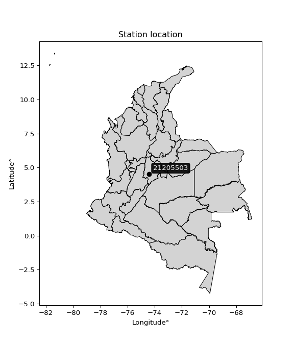

<div align="center">


</div>

# PMP Station (Rain, Pmax24h): 21205503

Probable Maximum Precipitation (PMP) is the greatest amount of rainfall for a specific duration that is meteorologically possible for a given location, acting as a "worst-case" scenario for extreme storms, crucial for designing safety-critical infrastructure like bridges, river deviations, dams, spillways, and nuclear plants to prevent catastrophic failure. PMP is calculated by hydrologists using meteorological data to determine the upper limit of extreme rainfall, often leading to the Probable Maximum Flood (PMF) for flood control design, and is increasingly being studied for climate change impacts.

<div align="center">

</img>

</div>


## A. General information


### 1. General running parameters

• app_version: _v20260103_. • runtime: _2026-01-03 07:24:50.581521_. • Python version: _3.14.0_. • SciPy version: _1.16.3_. • Pandas version: _2.3.3_. • NumPy version: _2.3.5_. • Stations dataset (station_dataset_file): _dataset/pmax24h_in/automatic_colombia_2003_2024.csv_. • Stations catalog (station_catalog_file): _dataset/CNE.xls_. • Minimum year to eval til year_max (date_min): _1900_. • Maximum year to eval since year_min (date_max): _2024_. • Creates, save and include plots into reports (create_plot): _False_. • Plot only fit distributions with Δo > Δ (plot_only_fit): _True_. • Eval low extreme values, if False, evaluates high extreme values (low_extreme): _False_. • Eval every SciPy distribution as logarithmic (pdist_logarithmic_on): _True_. • Standard deviation normalized (ddof): _1.0_. • Return periods to eval in years (Tr): _[2, 2.33, 5, 10, 15, 20, 25, 50, 75, 100, 200, 250, 500, 750, 1000]_. • Minimum data sample per station, 0 means any (minimum_sample): _5_. • Z-Score maximum threshold to adjust a value, 0 means disable (zscore_max): _3.5_. • Z-Score minimum threshold to adjust a value, 0 means disable (zscore_min): _-2.5_. • Avoid zeros, e.g. rain = 0 (avoid_zeros): _True_. • Avoid null values (avoid_nans): _True_. [:file_folder:Dataset file.](../../dataset/pmax24h_in/automatic_colombia_2003_2024.csv)

> Delta Degrees of Freedom (DDOF): is a parameter used in the formulas for calculating variance and standard deviation. When ddof=0, the divisor is $N$ (the total number of observations) and this is used when your data set is the entire population. When ddof=1, the divisor is $N-1$ and this is used when your data set is a sample drawn from a larger population. Using $N-1$ provides an unbiased estimate of the population variance (known as Bessel´s correction).


### 2. Station info and location

|   id |   CODIGO | NOMBRE                        | CATEGORIA               | TECNOLOGIA                | ESTADO   |   FECHA_INSTALACION |   FECHA_SUSPENSION |   ALTITUD |   LATITUD |   LONGITUD | DEPARTAMENTO   | MUNICIPIO   | AREA_OPERATIVA                            | ENTIDAD                                       | AREA_HIDROGRAFICA   | ZONA_HIDROGRAFICA   | SUBZONA_HIDROGRAFICA   |   CORRIENTE | Catalogo   |   Version |
|-----:|---------:|:------------------------------|:------------------------|:--------------------------|:---------|--------------------:|-------------------:|----------:|----------:|-----------:|:---------------|:------------|:------------------------------------------|:----------------------------------------------|:--------------------|:--------------------|:-----------------------|------------:|:-----------|----------:|
|    0 | 21205503 | DELIRIO EL  - AUT  [21205503] | Climatológica Principal | Automática con Telemetría | Activa   |                 nan |                nan |         2 |   4.52269 |   -74.4061 | Cundinamarca   | El Colegio  | Area Operativa 11 - Cundinamarca-Amazonas | CORPORACION AUTONOMA REGIONAL DE CUNDINAMARCA | Magdalena Cauca     | Alto Magdalena      | Río Bogotá             |         nan | CNE_OE     |  20251226 |

<div align="center">

Dynamic map: [:earth_americas:Google](http://maps.google.com/maps?q=4.522694444,-74.40608333) [:earth_americas:OSM](https://www.openstreetmap.org/#map=18/4.522694444/-74.40608333&layers=P) [:earth_americas:Bing](https://www.bing.com/maps?cp=4.522694444~-74.40608333&lvl=18) [:earth_americas:Apple](https://maps.apple.com/frame?center=4.522694444%2C-74.40608333&span=0.003%2C0.006)

</div>


<div align="center">

```geojson
{
  "type": "Feature",
  "geometry": {
    "type": "Point", 
    "coordinates": [-74.40608333, 4.522694444]
  }, 
  "properties": {
    "Name": "21205503"
  }
}
```

</div>


### 3. Discrete values table and plot

<div align="center">

|               |          0 |          1 |           2 |            3 |            4 |            5 |           6 |
|:--------------|-----------:|-----------:|------------:|-------------:|-------------:|-------------:|------------:|
| Date          | 2015       | 2016       | 2017        | 2018         | 2019         | 2020         | 2021        |
| Value         |    1.7     |   63.8     |   54        |   44.9       |   44.4       |   42.2       |   55        |
| Value_initial |    1.7     |   63.8     |   54        |   44.9       |   44.4       |   42.2       |   55        |
| count         |    7       |    7       |    7        |    7         |    7         |    7         |    7        |
| mean          |   43.7143  |   43.7143  |   43.7143   |   43.7143    |   43.7143    |   43.7143    |   43.7143   |
| std           |   20.0249  |   20.0249  |   20.0249   |   20.0249    |   20.0249    |   20.0249    |   20.0249   |
| zscore        |   -2.09811 |    1.00304 |    0.513647 |    0.0592121 |    0.0342432 |   -0.0756203 |    0.563585 |


</div>


> The initial value (value_initial) correspond to the initial obtained or null completed value, and value (value) is adjusted only when the initial value is outside the valid range definite through the Z-Score value. If Z-Score is active, values out of range or outliers are replaced with the station mean value


### 4. Active continuous probability distributions from SciPy (44 of 104 available)

A Probability Density Function (PDF) describes the relative likelihood of a continuous random variable falling within a specific range, where the total area under its curve equals 1, and the area over any interval gives the actual probability for that range. Unlike discrete probabilities (like rolling a die), a PDF shows density, not direct probability for a single point (which is zero), with higher points indicating higher likelihood, often visualized as a bell curve for normal distributions.

A log of a probability density function (log-PDF) is simply the logarithm of the PDF´s value, denoted as $log(f(x))$, useful for converting multiplication of probabilities into addition, improving numerical stability with tiny numbers, and connecting to information theory concepts like entropy. Instead of dealing with very small probabilities (e.g., 0.000001), log-PDFs use negative numbers (e.g., $log(0.00001) ≈ -11.51$ that are easier for computers to handle, preventing underflow errors and simplifying complex calculations. In this study, each active probability distribution from SciPy is also evaluated in the $log$ form.

[scipy.stats](https://docs.scipy.org/doc/scipy/reference/stats.html) is a Python´s powerful submodule within the SciPy library for comprehensive statistical analysis, offering over 130 probability distributions (like Normal, Poisson), functions for descriptive stats (mean, variance), hypothesis testing (t-tests, chi-square), random variable generation, and statistical tests, making it essential for data science, modeling, and research. It provides tools to explore, model, and draw conclusions from data efficiently, working seamlessly with NumPy.

<div align="center">

|   id | p_dist             |   n_parameter | fit_method   | label                                                                       | active   | ref                                                                                                        |
|-----:|:-------------------|--------------:|:-------------|:----------------------------------------------------------------------------|:---------|:-----------------------------------------------------------------------------------------------------------|
|    0 | alpha              |             3 | MLE          | Alpha                                                                       | True     | [:mortar_board:](https://docs.scipy.org/doc/scipy/reference/generated/scipy.stats.alpha.html)              |
|    1 | betaprime          |             4 | MLE          | Beta prime                                                                  | True     | [:mortar_board:](https://docs.scipy.org/doc/scipy/reference/generated/scipy.stats.betaprime.html)          |
|    2 | chi2               |             3 | MLE          | Chi²                                                                        | True     | [:mortar_board:](https://docs.scipy.org/doc/scipy/reference/generated/scipy.stats.chi2.html)               |
|    3 | crystalball        |             4 | MLE          | Crystalball                                                                 | True     | [:mortar_board:](https://docs.scipy.org/doc/scipy/reference/generated/scipy.stats.crystalball.html)        |
|    4 | erlang             |             3 | MLE          | Erlang                                                                      | True     | [:mortar_board:](https://docs.scipy.org/doc/scipy/reference/generated/scipy.stats.erlang.html)             |
|    5 | expon              |             2 | MLE          | Exponential                                                                 | True     | [:mortar_board:](https://docs.scipy.org/doc/scipy/reference/generated/scipy.stats.expon.html)              |
|    6 | exponnorm          |             3 | MLE          | Exponentially modified Normal                                               | True     | [:mortar_board:](https://docs.scipy.org/doc/scipy/reference/generated/scipy.stats.exponnorm.html)          |
|    7 | f                  |             4 | MLE          | F                                                                           | True     | [:mortar_board:](https://docs.scipy.org/doc/scipy/reference/generated/scipy.stats.f.html)                  |
|    8 | fatiguelife        |             3 | MLE          | Fatigue-life (Birnbaum-Saunders)                                            | True     | [:mortar_board:](https://docs.scipy.org/doc/scipy/reference/generated/scipy.stats.fatiguelife.html)        |
|    9 | fisk               |             3 | MLE          | Fisk                                                                        | True     | [:mortar_board:](https://docs.scipy.org/doc/scipy/reference/generated/scipy.stats.fisk.html)               |
|   10 | gamma              |             3 | MLE          | Gamma                                                                       | True     | [:mortar_board:](https://docs.scipy.org/doc/scipy/reference/generated/scipy.stats.gamma.html)              |
|   11 | genexpon           |             5 | MLE          | Generalized exponential                                                     | True     | [:mortar_board:](https://docs.scipy.org/doc/scipy/reference/generated/scipy.stats.genexpon.html)           |
|   12 | genlogistic        |             3 | MLE          | Generalized logistic                                                        | True     | [:mortar_board:](https://docs.scipy.org/doc/scipy/reference/generated/scipy.stats.genlogistic.html)        |
|   13 | gibrat             |             2 | MM           | Gibrat                                                                      | True     | [:mortar_board:](https://docs.scipy.org/doc/scipy/reference/generated/scipy.stats.gibrat.html)             |
|   14 | gompertz           |             3 | MLE          | Gompertz (or truncated Gumbel)                                              | True     | [:mortar_board:](https://docs.scipy.org/doc/scipy/reference/generated/scipy.stats.gompertz.html)           |
|   15 | gumbel_l           |             2 | MM           | Gumbel Left Skew                                                            | True     | [:mortar_board:](https://docs.scipy.org/doc/scipy/reference/generated/scipy.stats.gumbel_l.html)           |
|   16 | gumbel_r           |             2 | MM           | Gumbel Right Skew                                                           | True     | [:mortar_board:](https://docs.scipy.org/doc/scipy/reference/generated/scipy.stats.gumbel_r.html)           |
|   17 | halflogistic       |             2 | MM           | Half-logistic                                                               | True     | [:mortar_board:](https://docs.scipy.org/doc/scipy/reference/generated/scipy.stats.halflogistic.html)       |
|   18 | halfnorm           |             2 | MM           | Half Normal                                                                 | True     | [:mortar_board:](https://docs.scipy.org/doc/scipy/reference/generated/scipy.stats.halfnorm.html)           |
|   19 | hypsecant          |             2 | MM           | hyperbolic secant                                                           | True     | [:mortar_board:](https://docs.scipy.org/doc/scipy/reference/generated/scipy.stats.hypsecant.html)          |
|   20 | invgamma           |             3 | MLE          | Inverted gamma                                                              | True     | [:mortar_board:](https://docs.scipy.org/doc/scipy/reference/generated/scipy.stats.invgamma.html)           |
|   21 | invgauss           |             3 | MLE          | Inverse Gaussian                                                            | True     | [:mortar_board:](https://docs.scipy.org/doc/scipy/reference/generated/scipy.stats.invgauss.html)           |
|   22 | invweibull         |             3 | MLE          | Inverted Weibull                                                            | True     | [:mortar_board:](https://docs.scipy.org/doc/scipy/reference/generated/scipy.stats.invweibull.html)         |
|   23 | johnsonsu          |             4 | MLE          | Johnson Su                                                                  | True     | [:mortar_board:](https://docs.scipy.org/doc/scipy/reference/generated/scipy.stats.johnsonsu.html)          |
|   24 | kstwobign          |             2 | MLE          | Limiting distribution of scaled Kolmogorov-Smirnov two-sided test statistic | True     | [:mortar_board:](https://docs.scipy.org/doc/scipy/reference/generated/scipy.stats.kstwobign.html)          |
|   25 | laplace            |             2 | MM           | Laplace                                                                     | True     | [:mortar_board:](https://docs.scipy.org/doc/scipy/reference/generated/scipy.stats.laplace.html)            |
|   26 | laplace_asymmetric |             3 | MLE          | Asymmetric Laplace                                                          | True     | [:mortar_board:](https://docs.scipy.org/doc/scipy/reference/generated/scipy.stats.laplace_asymmetric.html) |
|   27 | loggamma           |             3 | MLE          | Log gamma                                                                   | True     | [:mortar_board:](https://docs.scipy.org/doc/scipy/reference/generated/scipy.stats.loggamma.html)           |
|   28 | logistic           |             2 | MM           | Logistic (or Sech-squared)                                                  | True     | [:mortar_board:](https://docs.scipy.org/doc/scipy/reference/generated/scipy.stats.logistic.html)           |
|   29 | lognorm            |             3 | MLE          | Log Normal                                                                  | True     | [:mortar_board:](https://docs.scipy.org/doc/scipy/reference/generated/scipy.stats.lognorm.html)            |
|   30 | maxwell            |             2 | MM           | Maxwell                                                                     | True     | [:mortar_board:](https://docs.scipy.org/doc/scipy/reference/generated/scipy.stats.maxwell.html)            |
|   31 | mielke             |             4 | MLE          | Mielke Beta-Kappa / Dagum                                                   | True     | [:mortar_board:](https://docs.scipy.org/doc/scipy/reference/generated/scipy.stats.mielke.html)             |
|   32 | moyal              |             2 | MM           | Moyal                                                                       | True     | [:mortar_board:](https://docs.scipy.org/doc/scipy/reference/generated/scipy.stats.moyal.html)              |
|   33 | nakagami           |             3 | MLE          | Nakagami                                                                    | True     | [:mortar_board:](https://docs.scipy.org/doc/scipy/reference/generated/scipy.stats.nakagami.html)           |
|   34 | ncf                |             5 | MLE          | Non-central F distribution                                                  | True     | [:mortar_board:](https://docs.scipy.org/doc/scipy/reference/generated/scipy.stats.ncf.html)                |
|   35 | nct                |             4 | MLE          | Non-central Student’s t                                                     | True     | [:mortar_board:](https://docs.scipy.org/doc/scipy/reference/generated/scipy.stats.nct.html)                |
|   36 | norm               |             2 | MM           | Normal                                                                      | True     | [:mortar_board:](https://docs.scipy.org/doc/scipy/reference/generated/scipy.stats.norm.html)               |
|   37 | pearson3           |             3 | MM           | Pearson type III                                                            | True     | [:mortar_board:](https://docs.scipy.org/doc/scipy/reference/generated/scipy.stats.pearson3.html)           |
|   38 | rayleigh           |             2 | MM           | Rayleigh                                                                    | True     | [:mortar_board:](https://docs.scipy.org/doc/scipy/reference/generated/scipy.stats.rayleigh.html)           |
|   39 | rice               |             3 | MLE          | Rice                                                                        | True     | [:mortar_board:](https://docs.scipy.org/doc/scipy/reference/generated/scipy.stats.rice.html)               |
|   40 | t                  |             3 | MLE          | Student’s t                                                                 | True     | [:mortar_board:](https://docs.scipy.org/doc/scipy/reference/generated/scipy.stats.t.html)                  |
|   41 | truncnorm          |             4 | MLE          | Truncated normal                                                            | True     | [:mortar_board:](https://docs.scipy.org/doc/scipy/reference/generated/scipy.stats.truncnorm.html)          |
|   42 | wald               |             2 | MM           | Wald                                                                        | True     | [:mortar_board:](https://docs.scipy.org/doc/scipy/reference/generated/scipy.stats.wald.html)               |
|   43 | weibull_min        |             3 | MLE          | Weibull minimum                                                             | True     | [:mortar_board:](https://docs.scipy.org/doc/scipy/reference/generated/scipy.stats.weibull_min.html)        |

</div>

> **n_parameter:** # arguments & localization & scale.
>
> **Fit methods:** (MLE) maximum likelihood, (MM) L-moments.
>
>**Inactive** (With the only purpose of prevent loops, zero divisions, infinite values, over high estimated values or horizontal trending for recurrence intervals estimations, the follow distributions were disabled.)**:** foldnorm, gennorm, norminvgauss, powernorm, powerlognorm, skewnorm, genextreme, anglit, arcsine, argus, beta, bradford, burr, burr12, cauchy, cosine, halfcauchy, foldcauchy, skewcauchy, wrapcauchy, dgamma, gengamma, exponweib, exponpow, truncexpon, gausshyper, genhalflogistic, genhyperbolic, geninvgauss, halfgennorm, johnsonsb, kappa4, kappa3, ksone, kstwo, loglaplace, levy, levy_l, levy_stable, ncx2, pareto, genpareto, truncpareto, lomax, powerlaw, rdist, rel_breitwigner, recipinvgauss, semicircular, studentized_range, trapezoid, triang, truncweibull_min, tukeylambda, uniform, loguniform, vonmises, vonmises_line, weibull_max, dweibull, 


## B. Probability distributions vs. Empirical distributions

A continuous probability distribution (CPD) describes probabilities for variables that can take any value within a range (like rain any time), unlike discrete variables with specific outcomes (like temperature). It uses a Probability Density Function (PDF), a curve where the total area under it equals 1, and the probability of the variable falling within an interval (a to b) is found by calculating the area under the curve between those points. A key feature is that the probability of hitting any single exact value is zero, so probabilities are always expressed for ranges, e.g., $P(a ≤ X ≤ b)$.

<div align="center">

Distributions parameters from station values
|    |   station | p_dist                |   n |              loc |           scale | shape                  | shape1                | shape2                | shape3   |
|---:|----------:|:----------------------|----:|-----------------:|----------------:|:-----------------------|:----------------------|:----------------------|:---------|
|  0 |  21205503 | alpha                 |   7 |   -598.568       | 13018.1         | 20.239214101346377     |                       |                       |          |
|  1 |  21205503 | betaprime             |   7 |   -639.933       | 37097.8         | 1326.1025939118656     | 71968.98199418734     |                       |          |
|  2 |  21205503 | chi2                  |   7 |      1.7         |     3.0289      | 1.3143641190378244     |                       |                       |          |
|  3 |  21205503 | crystalball           |   7 |     43.7143      |    18.5394      | 1838.0905402133465     | 4634.538227637294     |                       |          |
|  4 |  21205503 | erlang                |   7 |   -174.83        |     1.872       | 116.65287833012312     |                       |                       |          |
|  5 |  21205503 | expon                 |   7 |      1.7         |    42.0143      |                        |                       |                       |          |
|  6 |  21205503 | exponnorm             |   7 |     43.7007      |    18.5394      | 0.0007348103671297381  |                       |                       |          |
|  7 |  21205503 | f                     |   7 | -10304.2         | 10347.9         | 776575.8686385466      | 3012310.522825486     |                       |          |
|  8 |  21205503 | fatiguelife           |   7 |  -5340.51        |  5384.01        | 0.0034339751456619588  |                       |                       |          |
|  9 |  21205503 | fisk                  |   7 |     -1.87824e+09 |     1.87824e+09 | 217436072.665394       |                       |                       |          |
| 10 |  21205503 | gamma                 |   7 |   -264.873       |     1.27552     | 242.2786951699179      |                       |                       |          |
| 11 |  21205503 | genexpon              |   7 |      1.7         |     2.53072     | 0.06023424025916518    | 7.090115821913169e-10 | 9.978539706412072     |          |
| 12 |  21205503 | genlogistic           |   7 |     59.7651      |     3.27441     | 0.19340130453826482    |                       |                       |          |
| 13 |  21205503 | gibrat                |   7 |     29.571       |     8.57832     |                        |                       |                       |          |
| 14 |  21205503 | gompertz              |   7 |     42.2         |    12.3076      | 0.6939284302449891     |                       |                       |          |
| 15 |  21205503 | gumbel_l              |   7 |     52.058       |    14.4551      |                        |                       |                       |          |
| 16 |  21205503 | gumbel_r              |   7 |     35.3706      |    14.4551      |                        |                       |                       |          |
| 17 |  21205503 | halflogistic          |   7 |     21.7408      |    15.8506      |                        |                       |                       |          |
| 18 |  21205503 | halfnorm              |   7 |     19.1753      |    30.755       |                        |                       |                       |          |
| 19 |  21205503 | hypsecant             |   7 |     43.7143      |    11.8026      |                        |                       |                       |          |
| 20 |  21205503 | invgamma              |   7 |   -252.479       | 65596           | 222.8902670332593      |                       |                       |          |
| 21 |  21205503 | invgauss              |   7 |   -119.223       | 10021.2         | 0.01624339864730543    |                       |                       |          |
| 22 |  21205503 | invweibull            |   7 |      1.7         |     2.58738     | 0.05793323278917724    |                       |                       |          |
| 23 |  21205503 | johnsonsu             |   7 |     70.3421      |     0.352187    | 7.240100873281703      | 1.5074083846141209    |                       |          |
| 24 |  21205503 | kstwobign             |   7 |    -47.8282      |   104.755       |                        |                       |                       |          |
| 25 |  21205503 | laplace               |   7 |     43.7143      |    13.1093      |                        |                       |                       |          |
| 26 |  21205503 | laplace_asymmetric    |   7 |     44.9         |    12.0276      | 1.0504932081155176     |                       |                       |          |
| 27 |  21205503 | loggamma              |   7 |     62.0336      |     4.79778     | 0.276115555520338      |                       |                       |          |
| 28 |  21205503 | logistic              |   7 |     43.7143      |    10.2213      |                        |                       |                       |          |
| 29 |  21205503 | lognorm               |   7 |      1.7         |     0.161549    | 13.97124913873751      |                       |                       |          |
| 30 |  21205503 | maxwell               |   7 |     -0.216336    |    27.5294      |                        |                       |                       |          |
| 31 |  21205503 | mielke                |   7 |   -138.749       |   202.588       | 9.057620802847413      | 33096.248883719       |                       |          |
| 32 |  21205503 | moyal                 |   7 |     33.1123      |     8.34567     |                        |                       |                       |          |
| 33 |  21205503 | nakagami              |   7 | -20765.8         | 20809.6         | 313886.07560596964     |                       |                       |          |
| 34 |  21205503 | ncf                   |   7 |     -0.0663025   |     4.09333e-08 | 9.787010689397679e-09  | 154.15119143984208    | 10.343114258664748    |          |
| 35 |  21205503 | nct                   |   7 |  -1133.71        |    18.4628      | 208267.9560365866      | 63.772227083534176    |                       |          |
| 36 |  21205503 | norm                  |   7 |     43.7143      |    18.5394      |                        |                       |                       |          |
| 37 |  21205503 | pearson3              |   7 |     43.7143      |    18.5394      | -1.4243992486229335    |                       |                       |          |
| 38 |  21205503 | rayleigh              |   7 |      8.24731     |    28.2986      |                        |                       |                       |          |
| 39 |  21205503 | rice                  |   7 |  -2077.9         |    18.54        | 114.42986285142118     |                       |                       |          |
| 40 |  21205503 | t                     |   7 |     43.7906      |    18.5321      | 11.594730005563768     |                       |                       |          |
| 41 |  21205503 | truncnorm             |   7 |     59.7985      |    26.9257      | -41.976626160349895    | 0.14861092671719822   |                       |          |
| 42 |  21205503 | wald                  |   7 |     25.1749      |    18.5394      |                        |                       |                       |          |
| 43 |  21205503 | weibull_min           |   7 |      1.7         |     8.52455     | 0.29221132339372763    |                       |                       |          |
| 44 |  21205503 | logalpha              |   7 |      0.00152465  |     1.32935     | 4.534248226016126e-08  |                       |                       |          |
| 45 |  21205503 | logbetaprime          |   7 |    -30.5663      |   154.731       | 877.9890987702265      | 3997.1140356562137    |                       |          |
| 46 |  21205503 | logchi2               |   7 |    -17.0274      |     0.039555    | 517.0354672899736      |                       |                       |          |
| 47 |  21205503 | logcrystalball        |   7 |      4.15576     |     4.51452e-06 | 6.426056102801809e-06  | 117.55612291322196    |                       |          |
| 48 |  21205503 | logerlang             |   7 |    -16.9135      |     0.0777887   | 261.1448296099037      |                       |                       |          |
| 49 |  21205503 | logexpon              |   7 |      0.530628    |     2.9012      |                        |                       |                       |          |
| 50 |  21205503 | logexponnorm          |   7 |      3.43112     |     1.19215     | 0.0006007760459438298  |                       |                       |          |
| 51 |  21205503 | logf                  |   7 |  -4289.29        |  4292.72        | 55095481.32128608      | 49080406.98088691     |                       |          |
| 52 |  21205503 | logfatiguelife        |   7 |   -636.277       |   639.705       | 0.001852190392456589   |                       |                       |          |
| 53 |  21205503 | logfisk               |   7 |     -8.60864e+07 |     8.60864e+07 | 192699742.74031615     |                       |                       |          |
| 54 |  21205503 | loggamma              |   7 |    -15.8737      |     0.0833898   | 231.2799374168053      |                       |                       |          |
| 55 |  21205503 | loggenexpon           |   7 |      0.463215    |     0.0522942   | 0.004421849436810923   | 9.455484822796603     | 4.225346613055442e-05 |          |
| 56 |  21205503 | loggenlogistic        |   7 |      4.15577     |     1.03571e-06 | 1.4351338332522174e-06 |                       |                       |          |
| 57 |  21205503 | loggibrat             |   7 |      2.52238     |     0.551608    |                        |                       |                       |          |
| 58 |  21205503 | loggompertz           |   7 |      0.521105    |     0.530811    | 0.0018778047623014848  |                       |                       |          |
| 59 |  21205503 | loggumbel_l           |   7 |      3.96836     |     0.929517    |                        |                       |                       |          |
| 60 |  21205503 | loggumbel_r           |   7 |      2.8953      |     0.929517    |                        |                       |                       |          |
| 61 |  21205503 | loghalflogistic       |   7 |      2.01883     |     1.01926     |                        |                       |                       |          |
| 62 |  21205503 | loghalfnorm           |   7 |      1.85386     |     1.97768     |                        |                       |                       |          |
| 63 |  21205503 | loghypsecant          |   7 |      3.43183     |     0.758947    |                        |                       |                       |          |
| 64 |  21205503 | loginvgamma           |   7 |    -21.9897      |  9701.47        | 382.3797640460682      |                       |                       |          |
| 65 |  21205503 | loginvgauss           |   7 |    -12.5578      |  2271.63        | 0.00702602130356807    |                       |                       |          |
| 66 |  21205503 | loginvweibull         |   7 |     -2.72868e+08 |     2.72868e+08 | 176687559.31993464     |                       |                       |          |
| 67 |  21205503 | logjohnsonsu          |   7 |      4.0107      |     0.0532291   | 0.74305298712847       | 0.5146817771283689    |                       |          |
| 68 |  21205503 | logkstwobign          |   7 |     -2.84755     |     7.18597     |                        |                       |                       |          |
| 69 |  21205503 | loglaplace            |   7 |      3.43183     |     0.842979    |                        |                       |                       |          |
| 70 |  21205503 | loglaplace_asymmetric |   7 |      4.00733     |     0.30778     | 2.3032912528848044     |                       |                       |          |
| 71 |  21205503 | logloggamma           |   7 |      4.15578     |     1.7789e-06  | 2.4443909207936478e-06 |                       |                       |          |
| 72 |  21205503 | loglogistic           |   7 |      3.43183     |     0.657268    |                        |                       |                       |          |
| 73 |  21205503 | loglognorm            |   7 |      0.530628    |     0.0149384   | 13.281594402804426     |                       |                       |          |
| 74 |  21205503 | logmaxwell            |   7 |      0.606923    |     1.77025     |                        |                       |                       |          |
| 75 |  21205503 | logmielke             |   7 |     -6.3537e+07  |     6.3537e+07  | 86687502.15017447      | 10260989593.378222    |                       |          |
| 76 |  21205503 | logmoyal              |   7 |      2.75008     |     0.536657    |                        |                       |                       |          |
| 77 |  21205503 | lognakagami           |   7 |      3.74242     |     0.159799    | 0.37507897549753555    |                       |                       |          |
| 78 |  21205503 | logncf                |   7 |    -44.2742      |    47.692       | 5062.025240326887      | 6776.817704352892     | 0.013018057439502129  |          |
| 79 |  21205503 | lognct                |   7 |    -71.1895      |     1.17106     | 47690.428578005696     | 63.72006360364787     |                       |          |
| 80 |  21205503 | lognorm               |   7 |      3.43183     |     1.19215     |                        |                       |                       |          |
| 81 |  21205503 | logpearson3           |   7 |      3.43183     |     1.19215     | -1.985447422409964     |                       |                       |          |
| 82 |  21205503 | lograyleigh           |   7 |      1.1512      |     1.81968     |                        |                       |                       |          |
| 83 |  21205503 | logrice               |   7 |   -219.111       |     1.19216     | 186.66953896310608     |                       |                       |          |
| 84 |  21205503 | logt                  |   7 |      3.87801     |     0.145227    | 0.9637828262388122     |                       |                       |          |
| 85 |  21205503 | logtruncnorm          |   7 |      0.75296     |     3.53295     | -0.06293109248848275   | 179.45227621516017    |                       |          |
| 86 |  21205503 | logwald               |   7 |      2.23972     |     1.19212     |                        |                       |                       |          |
| 87 |  21205503 | logweibull_min        |   7 |     -2.699e+08   |     2.699e+08   | 515364045.00934565     |                       |                       |          |

</div>

> **loc** (Location parameter): This shifts the distribution along the x-axis. For many common distributions, like the normal (Gaussian) distribution, loc represents the mean $μ$. For others, like the uniform distribution, it might represent the minimum value, or for the beta distribution, the left end of the support interval.
>
> **scale** (Scale parameter): This determines the width or spread of the distribution. For the normal distribution, scale represents the standard deviation $σ$. For a uniform distribution, it defines the length of the interval (from $loc$ to $loc + scale$).
>
> **shape** (Shape parameters): Refers to parameters that define the specific form of a probability distribution, distinct from its location (loc) and scale (scale). These parameters are required arguments for most distribution functions. For example, a normal (Gaussian) distribution is fully defined by its location (mean) and scale (standard deviation), so it has no specific shape parameters beyond loc and scale. However, other distributions have intrinsic properties that need specification, as Gamma distribution that takes a shape parameter, often named $a$ or $alpha$.


### 0. Cumulative distribution values - CDF (88 evaluated)

Cumulative Distribution Function (CDF), denoted as $F$<sub>$X$</sub>$(x)$, is a function that gives the probability that a random variable $X$ will take a value less than or equal to a specific value, $x$ (i.e., $(P(X≥x)$. It essentially "accumulates" probabilities from a given point up to the far right (positive infinity), providing a complete picture of the distribution´s probabilities for both discrete (like rain) and continuous (like temperature) variables, helping to find probabilities over ranges or above certain values. Each station is evaluated separately ordering the $x$ values ascending, calculating the CDF and PDF values for the activated distributions and their logarithmic forms.

<div align="center">

CDF ordered by x ascending and calculating $log(f(x))$ separately
|   id |   Station |   date |    x |   count |    mean |     std |     zscore |   Value_initial |   station |   m |     alpha |   alpha_pdf |   betaprime |   betaprime_pdf |       chi2 |        chi2_pdf |   crystalball |   crystalball_pdf |    erlang |   erlang_pdf |    expon |   expon_pdf |   exponnorm |   exponnorm_pdf |         f |      f_pdf |   fatiguelife |   fatiguelife_pdf |       fisk |    fisk_pdf |    gamma |   gamma_pdf |    genexpon |   genexpon_pdf |   genlogistic |   genlogistic_pdf |   gibrat |   gibrat_pdf |    gompertz |   gompertz_pdf |   gumbel_l |   gumbel_l_pdf |    gumbel_r |   gumbel_r_pdf |   halflogistic |   halflogistic_pdf |   halfnorm |   halfnorm_pdf |   hypsecant |   hypsecant_pdf |   invgamma |   invgamma_pdf |   invgauss |   invgauss_pdf |   invweibull |   invweibull_pdf |   johnsonsu |   johnsonsu_pdf |   kstwobign |   kstwobign_pdf |   laplace |   laplace_pdf |   laplace_asymmetric |   laplace_asymmetric_pdf |   loggamma |   loggamma_pdf |   logistic |   logistic_pdf |    lognorm |   lognorm_pdf |   maxwell |   maxwell_pdf |    mielke |   mielke_pdf |       moyal |   moyal_pdf |   nakagami |   nakagami_pdf |       ncf |    ncf_pdf |       nct |    nct_pdf |      norm |   norm_pdf |   pearson3 |   pearson3_pdf |   rayleigh |   rayleigh_pdf |      rice |   rice_pdf |         t |     t_pdf |   truncnorm |   truncnorm_pdf |     wald |   wald_pdf |   weibull_min |   weibull_min_pdf |   logalpha |   logalpha_pdf |   logbetaprime |   logbetaprime_pdf |    logchi2 |   logchi2_pdf |   logcrystalball |   logcrystalball_pdf |   logerlang |   logerlang_pdf |   logexpon |   logexpon_pdf |   logexponnorm |   logexponnorm_pdf |       logf |   logf_pdf |   logfatiguelife |   logfatiguelife_pdf |     logfisk |   logfisk_pdf |   loggenexpon |   loggenexpon_pdf |   loggenlogistic |   loggenlogistic_pdf |   loggibrat |   loggibrat_pdf |   loggompertz |   loggompertz_pdf |   loggumbel_l |   loggumbel_l_pdf |   loggumbel_r |   loggumbel_r_pdf |   loghalflogistic |   loghalflogistic_pdf |   loghalfnorm |   loghalfnorm_pdf |   loghypsecant |   loghypsecant_pdf |   loginvgamma |   loginvgamma_pdf |   loginvgauss |   loginvgauss_pdf |   loginvweibull |   loginvweibull_pdf |   logjohnsonsu |   logjohnsonsu_pdf |   logkstwobign |   logkstwobign_pdf |   loglaplace |   loglaplace_pdf |   loglaplace_asymmetric |   loglaplace_asymmetric_pdf |   logloggamma |   logloggamma_pdf |   loglogistic |   loglogistic_pdf |   loglognorm |   loglognorm_pdf |   logmaxwell |   logmaxwell_pdf |   logmielke |   logmielke_pdf |    logmoyal |   logmoyal_pdf |   lognakagami |   lognakagami_pdf |    logncf |   logncf_pdf |     lognct |   lognct_pdf |   logpearson3 |   logpearson3_pdf |   lograyleigh |   lograyleigh_pdf |    logrice |   logrice_pdf |      logt |   logt_pdf |   logtruncnorm |   logtruncnorm_pdf |   logwald |   logwald_pdf |   logweibull_min |   logweibull_min_pdf |
|-----:|----------:|-------:|-----:|--------:|--------:|--------:|-----------:|----------------:|----------:|----:|----------:|------------:|------------:|----------------:|-----------:|----------------:|--------------:|------------------:|----------:|-------------:|---------:|------------:|------------:|----------------:|----------:|-----------:|--------------:|------------------:|-----------:|------------:|---------:|------------:|------------:|---------------:|--------------:|------------------:|---------:|-------------:|------------:|---------------:|-----------:|---------------:|------------:|---------------:|---------------:|-------------------:|-----------:|---------------:|------------:|----------------:|-----------:|---------------:|-----------:|---------------:|-------------:|-----------------:|------------:|----------------:|------------:|----------------:|----------:|--------------:|---------------------:|-------------------------:|-----------:|---------------:|-----------:|---------------:|-----------:|--------------:|----------:|--------------:|----------:|-------------:|------------:|------------:|-----------:|---------------:|----------:|-----------:|----------:|-----------:|----------:|-----------:|-----------:|---------------:|-----------:|---------------:|----------:|-----------:|----------:|----------:|------------:|----------------:|---------:|-----------:|--------------:|------------------:|-----------:|---------------:|---------------:|-------------------:|-----------:|--------------:|-----------------:|---------------------:|------------:|----------------:|-----------:|---------------:|---------------:|-------------------:|-----------:|-----------:|-----------------:|---------------------:|------------:|--------------:|--------------:|------------------:|-----------------:|---------------------:|------------:|----------------:|--------------:|------------------:|--------------:|------------------:|--------------:|------------------:|------------------:|----------------------:|--------------:|------------------:|---------------:|-------------------:|--------------:|------------------:|--------------:|------------------:|----------------:|--------------------:|---------------:|-------------------:|---------------:|-------------------:|-------------:|-----------------:|------------------------:|----------------------------:|--------------:|------------------:|--------------:|------------------:|-------------:|-----------------:|-------------:|-----------------:|------------:|----------------:|------------:|---------------:|--------------:|------------------:|----------:|-------------:|-----------:|-------------:|--------------:|------------------:|--------------:|------------------:|-----------:|--------------:|----------:|-----------:|---------------:|-------------------:|----------:|--------------:|-----------------:|---------------------:|
|    0 |  21205503 |   2015 |  1.7 |       7 | 43.7143 | 20.0249 | -2.09811   |             1.7 |  21205503 |   1 | 0.0738202 |  0.00505273 |   0.0121487 |      0.00173978 | 1.7531e-11 | 51886.1         |     0.0117191 |        0.00165046 | 0.0143546 |   0.00208041 | 0        |  0.0238014  |   0.0117191 |      0.00165046 | 0.0119461 | 0.00167596 |     0.0116098 |        0.00165445 | 0.00517604 | 0.000596107 | 0.01309  |  0.00187273 | 9.10506e-10 |     0.0238012  |     0.0324004 |        0.00191371 | 0        |   0          | 0           |      0         |  0.0302259 |     0.00205909 | 3.46252e-05 |    2.46026e-05 |       0        |         0          |   0        |      0         |   0.0181042 |      0.00153309 |   0.011763 |     0.00189425 |  0.0112389 |      0.0019399 |  0.000198113 |      4.40737e+11 |   0.0398374 |      0.00188613 |   0.0212605 |      0.00430886 | 0.0202812 |    0.00154708 |            0.0171767 |               0.00135947 | 0.00878282 |      0.0209108 |  0.0161356 |     0.00155315 | 0.00747511 |     0.0173206 | 8.958e-05 |     0.0001401 | 0.0362238 |   0.00233608 | 5.15818e-11 | 1.36205e-10 |  0.0118216 |     0.00166123 | 0.0129364 | 0.00471755 | 0.0117508 | 0.00165424 | 0.0117191 | 0.00165046 |  0.0341563 |     0.00217818 |   0        |      0         | 0.0117193 | 0.00165046 | 0.0215303 | 0.0020753 |   0.0276784 |      0.00258391 | 0        | 0          |   1.42527e-05 |       1.87564e+10 |  0.0119892 |      0.161348  |     0.00928274 |          0.0211371 | 0.00887647 |     0.0209115 |              nan |                  nan |  0.00866567 |       0.0207152 |   0        |      0.344685  |     0.00747496 |          0.0173203 | 0.00745354 |  0.0172969 |       0.00711871 |            0.0167686 | 0.000723517 |    0.00161838 |    0.00601405 |          0.093838 |         0        |           0.00912257 |    0        |        0        |   3.39946e-05 |        0.00360153 |     0.0244589 |         0.0259891 |   2.96043e-06 |       4.05445e-05 |          0        |              0        |      0        |          0        |      0.0139203 |          0.0183358 |    0.00830995 |         0.0204835 |    0.00987733 |         0.0241736 |       0.0152525 |           0.0413126 |      0.0387649 |           0.012422 |      0.0200686 |          0.0603848 |    0.0160066 |        0.0189882 |              0.00623859 |                  0.00880028 |      0.006865 |        0.00943319 |     0.0119615 |         0.0179811 |   0.00715316 |      1.34703e+13 |     0        |         0        |  0.00694705 |       0.0094783 | 2.61983e-15 |    1.55005e-13 |   0           |          0        | 0.0088483 |     0.020277 | 0.00756481 |    0.0175048 |     0.0321898 |         0.0271063 |      0        |          0        | 0.00747511 |     0.0173206 | 0.0153621 | 0.00441777 |    1.15915e-11 |           0.214625 |  0        |      0        |       0.00174659 |           0.00333215 |
|    1 |  21205503 |   2020 | 42.2 |       7 | 43.7143 | 20.0249 | -0.0756203 |            42.2 |  21205503 |   2 | 0.469244  |  0.0126114  |   0.473393  |      0.0210424  | 0.999546   |     7.83693e-05 |     0.467451  |        0.0214469  | 0.485748  |   0.0197954  | 0.61862  |  0.0090774  |   0.467451  |      0.0214469  | 0.467874  | 0.0213534  |     0.471923  |        0.0215295  | 0.361236   | 0.0267124   | 0.469132 |  0.0201166  | 0.618616    |     0.0090774  |     0.354028  |        0.0208131  | 0.650531 |   0.0293131  | 7.67309e-07 |      0.0563821 |  0.396867  |     0.0210967  | 0.536082    |    0.0231219   |       0.568551 |         0.0213478  |   0.54593  |      0.0196028 |   0.459272  |      0.0267491  |   0.498804 |     0.0202005  |  0.4991    |      0.0194306 |  0.426265    |      0.000519931 |   0.341431  |      0.0196564  |   0.548873  |      0.0142705  | 0.445455  |    0.03398    |            0.423673  |               0.0335319  | 0.610411   |      0.29902   |  0.46303   |     0.024325   | 0.602773   |     0.323474  | 0.501498  |     0.0209951 | 0.359476  |   0.017994   | 0.56181     | 0.0234372   |  0.46758   |     0.021411   | 0.545888  | 0.0142574  | 0.467541  | 0.0214324  | 0.467451  | 0.0214469  |  0.374994  |     0.0194381  |   0.513133 |      0.0206422 | 0.467443  | 0.0214466  | 0.466533  | 0.0209844 |   0.45913   |      0.021405   | 0.633417 | 0.0243638  |   0.793355    |       0.00235088  |  0.722322  |      0.0711554 |     0.602755   |          0.302161  | 0.606361   |     0.299298  |              nan |                  nan |  0.614459   |       0.300813  |   0.66947  |      0.113929  |     0.602771   |          0.323475  | 0.603203   |  0.323515  |       0.604487   |            0.324926  | 0.489691    |    0.559373   |    0.654267   |          0.194649 |         0        |           0.781464   |    0.786345 |        0.23862  |   0.554931    |        0.680337   |     0.543522  |         0.385121  |   0.668996    |       0.289313    |          0.688716 |              0.257868 |      0.660389 |          0.255721 |      0.626774  |          0.386583  |    0.601963   |         0.291814  |    0.615365   |         0.279949  |       0.592893  |           0.200686  |      0.325939  |           0.678069 |      0.63039   |          0.185012  |    0.654096  |        0.410336  |              0.579042   |                  0.816809   |      0.566659 |        0.778646   |     0.615987  |         0.359894  |   0.657029   |      0.00861799  |     0.629051 |         0.294586 |  0.555778   |       0.758282  | 0.691584    |    0.272589    |   9.37623e-12 |      15838.4      | 0.602345  |     0.305867 | 0.602761   |    0.322398  |     0.478289  |         0.399876  |      0.637193 |          0.283915 | 0.602773   |     0.323474  | 0.263241  | 1.15603    |    0.621531    |           0.150336 |  0.754571 |      0.230181 |       0.553094   |           0.687295   |
|    2 |  21205503 |   2019 | 44.4 |       7 | 43.7143 | 20.0249 |  0.0342432 |            44.4 |  21205503 |   3 | 0.496946  |  0.0125622  |   0.519711  |      0.0210176  | 0.999689   |     5.3524e-05  |     0.514752  |        0.0215039  | 0.52915   |   0.0196228  | 0.638076 |  0.00861431 |   0.514752  |      0.0215039  | 0.514962  | 0.0214041  |     0.519366  |        0.0215488  | 0.421817   | 0.0282339   | 0.513383 |  0.0200699  | 0.638073    |     0.00861431 |     0.402807  |        0.0235755  | 0.707929 |   0.0231603  | 0.126999    |      0.0588554 |  0.444971  |     0.0226055  | 0.585407    |    0.0216847   |       0.613664 |         0.0196654  |   0.587887 |      0.0185332 |   0.518483  |      0.0269241  |   0.542942 |     0.0198853  |  0.541484  |      0.0190654 |  0.427379    |      0.000492918 |   0.387489  |      0.022251   |   0.579672  |      0.0137222  | 0.525481  |    0.036197   |            0.504255  |               0.0399097  | 0.625506   |      0.294979  |  0.516765  |     0.0244312  | 0.619116   |     0.319611  | 0.547154  |     0.0204728 | 0.401059  |   0.0198343  | 0.611093    | 0.02136     |  0.5148    |     0.0214664  | 0.576675  | 0.0137234  | 0.514809  | 0.0214881  | 0.514752  | 0.0215039  |  0.41967   |     0.0211785  |   0.55783  |      0.0199619 | 0.514743  | 0.0215036  | 0.512837  | 0.0210561 |   0.507447  |      0.0225039  | 0.682457 | 0.0203642  |   0.798369    |       0.00220955  |  0.725893  |      0.0693774 |     0.618019   |          0.29846   | 0.621474   |     0.295412  |              nan |                  nan |  0.629641   |       0.296614  |   0.675209 |      0.111951  |     0.619114   |          0.319612  | 0.619543   |  0.319631  |       0.6209     |            0.320936  | 0.518121    |    0.558876   |    0.664082   |          0.19161  |         0        |           0.838477   |    0.798032 |        0.221591 |   0.589775    |        0.690078   |     0.563202  |         0.389227  |   0.683458    |       0.279841    |          0.701597 |              0.249083 |      0.673225 |          0.24944  |      0.646155  |          0.375969  |    0.616696   |         0.287963  |    0.629489   |         0.275866  |       0.603011  |           0.197503  |      0.364816  |           0.863951 |      0.639716  |          0.182006  |    0.674333  |        0.386329  |              0.622076   |                  0.877513   |      0.607644 |        0.834963   |     0.634105  |         0.353     |   0.657463   |      0.00847969  |     0.643881 |         0.289012 |  0.59568    |       0.812724  | 0.705162    |    0.261839    |   0.326362    |          4.68616  | 0.617796  |     0.302137 | 0.61905    |    0.318545  |     0.499044  |         0.41706   |      0.651474 |          0.278089 | 0.619116   |     0.319611  | 0.333279  | 1.61654    |    0.629125    |           0.148502 |  0.765934 |      0.21716  |       0.588308   |           0.697658   |
|    3 |  21205503 |   2018 | 44.9 |       7 | 43.7143 | 20.0249 |  0.0592121 |            44.9 |  21205503 |   4 | 0.503222  |  0.0125427  |   0.530209  |      0.0209725  | 0.999715   |     4.90873e-05 |     0.525498  |        0.0214746  | 0.538945  |   0.0195518  | 0.642358 |  0.0085124  |   0.525497  |      0.0214746  | 0.525657  | 0.0213741  |     0.530131  |        0.0215106  | 0.435994   | 0.0284672   | 0.523407 |  0.020025   | 0.642354    |     0.0085124  |     0.41476   |        0.0242388  | 0.719214 |   0.0219898  | 0.156522    |      0.0592228 |  0.456354  |     0.0229212  | 0.596162    |    0.0213323   |       0.623402 |         0.0192855  |   0.597092 |      0.0182853 |   0.531925  |      0.026834   |   0.55286  |     0.0197811  |  0.550989  |      0.0189545 |  0.427624    |      0.000487164 |   0.398769  |      0.0228695  |   0.586501  |      0.0135925  | 0.543239  |    0.0348424  |            0.52461   |               0.0415207  | 0.628804   |      0.294036  |  0.528969  |     0.0243766  | 0.62269    |     0.318688  | 0.557354  |     0.0203237 | 0.411085  |   0.0202748  | 0.621655    | 0.020886    |  0.525527  |     0.021437   | 0.583505  | 0.0135963  | 0.525546  | 0.0214586  | 0.525498  | 0.0214746  |  0.430358  |     0.0215742  |   0.567767 |      0.0197832 | 0.525488  | 0.0214744  | 0.523358  | 0.0210275 |   0.518758  |      0.0227402  | 0.692439 | 0.0195701  |   0.799466    |       0.00217949  |  0.726668  |      0.0689944 |     0.621356   |          0.297588  | 0.624777   |     0.294501  |              nan |                  nan |  0.632957   |       0.295635  |   0.67646  |      0.111519  |     0.622688   |          0.318689  | 0.623116   |  0.318704  |       0.624489   |            0.319984  | 0.524376    |    0.558281   |    0.666224   |          0.190933 |         0        |           0.851589   |    0.800494 |        0.218045 |   0.597511    |        0.6915     |     0.567565  |         0.390009  |   0.68658     |       0.277753    |          0.704375 |              0.247167 |      0.67601  |          0.248055 |      0.650352  |          0.373486  |    0.619916   |         0.287065  |    0.632573   |         0.274926  |       0.605218  |           0.196794  |      0.374778  |           0.915999 |      0.641751  |          0.181341  |    0.67863   |        0.381231  |              0.63198    |                  0.891485   |      0.617066 |        0.84791    |     0.638049  |         0.351367  |   0.657558   |      0.0084498   |     0.647111 |         0.287746 |  0.604851   |       0.825237  | 0.708081    |    0.259504    |   0.377061    |          4.37672  | 0.621175  |     0.301257 | 0.622612   |    0.317625  |     0.503736  |         0.420942  |      0.654581 |          0.276778 | 0.622689   |     0.318688  | 0.351994  | 1.72581    |    0.630785    |           0.148097 |  0.76835  |      0.214415 |       0.596129   |           0.699196   |
|    4 |  21205503 |   2017 | 54   |       7 | 43.7143 | 20.0249 |  0.513647  |            54   |  21205503 |   5 | 0.614168  |  0.0116928  |   0.71001   |      0.0178856  | 0.99994    |     1.02356e-05 |     0.710485  |        0.0184491  | 0.705352  |   0.0165292  | 0.712006 |  0.00685467 |   0.710485  |      0.0184491  | 0.709781  | 0.0183711  |     0.714729  |        0.0183353  | 0.689125   | 0.0248007   | 0.695628 |  0.0172606  | 0.712002    |     0.00685469 |     0.689907  |        0.0347708  | 0.852342 |   0.0094445  | 0.672462    |      0.048171  |  0.68139   |     0.0252106  | 0.759111    |    0.0144735   |       0.76889  |         0.0128957  |   0.742502 |      0.0136649 |   0.747766  |      0.0192037  |   0.718719 |     0.0162122  |  0.709695  |      0.0155506 |  0.431643    |      0.000401708 |   0.659329  |      0.0338156  |   0.69884   |      0.0110623  | 0.771851  |    0.0174035  |            0.785279  |               0.0187538  | 0.681468   |      0.275946  |  0.732296  |     0.0191794  | 0.679876   |     0.300019  | 0.725116  |     0.0161659 | 0.637051  |   0.0299361  | 0.774801    | 0.0131278   |  0.710205  |     0.0184225  | 0.695961  | 0.0110722  | 0.71039   | 0.0184355  | 0.710485  | 0.0184491  |  0.656733  |     0.0275933  |   0.729369 |      0.015462  | 0.710475  | 0.0184492  | 0.703922  | 0.0179047 |   0.74185   |      0.0258944  | 0.821345 | 0.0100534  |   0.817148    |       0.00173584  |  0.738845  |      0.0631034 |     0.674774   |          0.280502  | 0.677576   |     0.27693   |              nan |                  nan |  0.68586    |       0.276918  |   0.6964   |      0.104646  |     0.679875   |          0.30002   | 0.680298   |  0.299961  |       0.681869   |            0.300813  | 0.624965    |    0.524655   |    0.700408   |          0.179434 |         0        |           1.09973    |    0.83593  |        0.168638 |   0.724522    |        0.670062   |     0.640282  |         0.395677  |   0.734681    |       0.243692    |          0.747145 |              0.216713 |      0.719683 |          0.225262 |      0.715137  |          0.327208  |    0.67138    |         0.269982  |    0.681755   |         0.257504  |       0.640437  |           0.18479   |      0.704877  |           3.08956  |      0.674197  |          0.17026   |    0.741816  |        0.306275  |              0.8199     |                  1.15657    |      0.795174 |        1.09265    |     0.700081  |         0.319455  |   0.659074   |      0.00798544  |     0.69818  |         0.265222 |  0.778034   |       1.06152   | 0.752546    |    0.223013    |   0.871384    |          1.34313  | 0.675249  |     0.283909 | 0.679609   |    0.299043  |     0.58765   |         0.490155  |      0.70359  |          0.254027 | 0.679876   |     0.300019  | 0.705769  | 1.36675    |    0.657497    |           0.14137  |  0.804108 |      0.174769 |       0.724642   |           0.678098   |
|    5 |  21205503 |   2021 | 55   |       7 | 43.7143 | 20.0249 |  0.563585  |            55   |  21205503 |   6 | 0.625789  |  0.0115489  |   0.727623  |      0.0173355  | 0.99995    |     8.62188e-06 |     0.728652  |        0.0178791  | 0.72164   |   0.0160426  | 0.718779 |  0.00669345 |   0.728652  |      0.0178791  | 0.727873  | 0.0178073  |     0.732776  |        0.0177533  | 0.713368   | 0.0236711   | 0.712648 |  0.0167754  | 0.718776    |     0.00669347 |     0.72469   |        0.0347053  | 0.861405 |   0.00869303 | 0.718989    |      0.0448264 |  0.706453  |     0.0248912  | 0.773225    |    0.0137572   |       0.781476 |         0.0122802  |   0.755916 |      0.013164  |   0.766399  |      0.018063   |   0.734668 |     0.015682   |  0.725004  |      0.0150653 |  0.432041    |      0.000394102 |   0.693499  |      0.0344818  |   0.70976   |      0.0107778  | 0.788607  |    0.0161253  |            0.803237  |               0.0171853  | 0.686513   |      0.27391   |  0.751034  |     0.0182933  | 0.685362   |     0.297834  | 0.740999  |     0.0155998 | 0.66762   |   0.0312107  | 0.787573    | 0.0124217   |  0.728346  |     0.017855   | 0.70689   | 0.0107847  | 0.728544  | 0.0178665  | 0.728652  | 0.0178791  |  0.684502  |     0.0279262  |   0.744557 |      0.0149133 | 0.728642  | 0.0178792  | 0.721539  | 0.0173248 |   0.767842  |      0.0260844  | 0.831066 | 0.00939866 |   0.818864    |       0.00169665  |  0.739998  |      0.0625584 |     0.679903   |          0.278546  | 0.682639   |     0.274941  |              nan |                  nan |  0.690922   |       0.274817  |   0.698314 |      0.103987  |     0.68536    |          0.297835  | 0.685782   |  0.297768  |       0.687368   |            0.298575  | 0.634542    |    0.519092   |    0.70369    |          0.17826  |         0        |           1.12805    |    0.838987 |        0.164528 |   0.736752    |        0.662835   |     0.647541  |         0.395422  |   0.739122    |       0.240373    |          0.751095 |              0.21381  |      0.723795 |          0.223007 |      0.721095  |          0.322239  |    0.676317   |         0.268069  |    0.686462   |         0.255595  |       0.643816  |           0.183571  |      0.761301  |           2.99099  |      0.677311  |          0.169151  |    0.747376  |        0.299681  |              0.8414     |                  1.1869     |      0.815478 |        1.12055    |     0.70591   |         0.315855  |   0.65922    |      0.007942    |     0.703024 |         0.262837 |  0.797758   |       1.08843   | 0.756606    |    0.2196      |   0.894222    |          1.14937  | 0.68044   |     0.281916 | 0.685077   |    0.29687   |     0.596712  |         0.497602  |      0.70823  |          0.251668 | 0.685361   |     0.297834  | 0.729357  | 1.20687    |    0.660084    |           0.140698 |  0.807283 |      0.17134  |       0.737019   |           0.670713   |
|    6 |  21205503 |   2016 | 63.8 |       7 | 43.7143 | 20.0249 |  1.00304   |            63.8 |  21205503 |   7 | 0.720844  |  0.0099737  |   0.856119  |      0.0117352  | 0.999989   |     1.91409e-06 |     0.860686  |        0.0119656  | 0.842088  |   0.0112456  | 0.771922 |  0.00542858 |   0.860686  |      0.0119656  | 0.859554  | 0.011958   |     0.863417  |        0.0117931  | 0.873309   | 0.0128084   | 0.839003 |  0.0118096  | 0.771919    |     0.0054286  |     0.951711  |        0.0126922  | 0.916795 |   0.00447383 | 0.963826    |      0.0117958 |  0.894927  |     0.0163776  | 0.869434    |    0.00841534  |       0.868451 |         0.00775343 |   0.853212 |      0.0090544 |   0.885172  |      0.00951942 |   0.850878 |     0.010703   |  0.837831  |      0.0105613 |  0.435249    |      0.000337763 |   0.963251  |      0.0185031  |   0.793821  |      0.00836166 | 0.891967  |    0.00824095 |            0.908768  |               0.00796822 | 0.725875   |      0.256139  |  0.877082  |     0.0105475  | 0.728155   |     0.278296  | 0.855716  |     0.0104938 | 0.998289  |   0.044556   | 0.87363     | 0.00750735  |  0.860272  |     0.0119651  | 0.790848  | 0.00832974 | 0.860511  | 0.0119632  | 0.860686  | 0.0119656  |  0.920576  |     0.0225024  |   0.854396 |      0.0101006 | 0.860678  | 0.0119659  | 0.848892  | 0.0115243 |   1         |      0.0262109  | 0.894223 | 0.00539902 |   0.832459    |       0.00140843  |  0.748968  |      0.0583934 |     0.719994   |          0.261285  | 0.722181   |     0.257516  |              nan |                  nan |  0.730378   |       0.256509  |   0.713359 |      0.0988007 |     0.728154   |          0.278297  | 0.728562   |  0.278177  |       0.730241   |            0.278618  | 0.707647    |    0.463096   |    0.729435   |          0.168622 |         0.999979 |           1.38562    |    0.861165 |        0.135496 |   0.828958    |        0.56961    |     0.705761  |         0.387256  |   0.772842    |       0.214247    |          0.781133 |              0.191232 |      0.755549 |          0.20493  |      0.765896  |          0.281393  |    0.714892   |         0.251419  |    0.723201   |         0.239208  |       0.670325  |           0.173616  |      0.948689  |           0.35071  |      0.701749  |          0.160167  |    0.788159  |        0.251301  |              0.947769   |                  0.390875   |      0.999963 |        1.37405    |     0.750525  |         0.284872  |   0.660373   |      0.00760697  |     0.740565 |         0.242843 |  0.976323   |       1.25394   | 0.787228    |    0.193471    |   0.983841    |          0.234445 | 0.721005  |     0.264286 | 0.727736   |    0.277455  |     0.675245  |         0.561844  |      0.744143 |          0.232159 | 0.728155   |     0.278296  | 0.843085  | 0.466884   |    0.680562    |           0.135238 |  0.830806 |      0.146435 |       0.830227   |           0.574859   |


</div>

An Empirical Distribution Function (EDF) is a step-function estimate of a true cumulative distribution function (CDF) based on observed sample data, representing the proportion of data points less than or equal to a given value. It is calculated by ordering your data and jumping up by $1/n$ (where $n$ is sample size) at each unique data point, allowing analysis without assuming an underlying population distribution, and it gets closer to the true CDF as the sample size grows. For the empirical probability calculations, the parameter $m$ correspond to the order number which means the position of the $x$ values in an ascending order list.


### 1. Empirical - EDF California (1923)

California´s estimates the true probability distribution of water-related data (like rainfall, streamflow) using observed samples, crucial for risk assessment.

<div align="center">


$P=m/n$


</div>


**1.1. Empirical values**

<div align="center">

|                | 0                   | 1                  | 2                   | 3                  | 4                  | 5                  | 6              |
|:---------------|:--------------------|:-------------------|:--------------------|:-------------------|:-------------------|:-------------------|:---------------|
| date           | 2015                | 2020               | 2019                | 2018               | 2017               | 2021               | 2016           |
| x              | 1.7                 | 42.2               | 44.4                | 44.9               | 54.0               | 55.0               | 63.8           |
| m              | 1                   | 2                  | 3                   | 4                  | 5                  | 6                  | 7              |
| empirical_dist | edf_california      | edf_california     | edf_california      | edf_california     | edf_california     | edf_california     | edf_california |
| empirical      | 0.14285714285714285 | 0.2857142857142857 | 0.42857142857142855 | 0.5714285714285714 | 0.7142857142857143 | 0.8571428571428571 | 1.0            |
| empirical_tr   | 1.1666666666666665  | 1.4                | 1.75                | 2.333333333333333  | 3.5                | 6.999999999999997  | inf            |

</div>


**1.2. Kolmogorov-Smirnov fit test (sorted by Δ)**


<div align="center">

|                | 0                   | 1                   | 2                   | 3                   | 4                   | 5                   | 6                   | 7                   | 8                   | 9                   | 10                  | 11                  | 12                  | 13                  | 14                  | 15                  | 16                  | 17                  | 18                  | 19                  | 20                  | 21                  | 22                  | 23                  | 24                  | 25                  | 26                  | 27                  | 28                  | 29                  | 30                  | 31                  | 32                  | 33                  | 34                  | 35                  | 36                  | 37                  | 38                  | 39                  | 40                  | 41                  | 42                    | 43                  | 44                  | 45                  | 46                  | 47                  | 48                  | 49                  | 50                  | 51                  | 52                  | 53                  | 54                  | 55                  | 56                  | 57                  | 58                  | 59                  | 60                  | 61                  | 62                  | 63                  | 64                  | 65                  | 66                  | 67                  | 68                  | 69                  | 70                  | 71                  | 72                  | 73                  | 74                  | 75                  | 76                  | 77                  | 78                  | 79                  | 80                  | 81                  | 82                  | 83                  | 84                  | 85                  | 86                  | 87                  |
|:---------------|:--------------------|:--------------------|:--------------------|:--------------------|:--------------------|:--------------------|:--------------------|:--------------------|:--------------------|:--------------------|:--------------------|:--------------------|:--------------------|:--------------------|:--------------------|:--------------------|:--------------------|:--------------------|:--------------------|:--------------------|:--------------------|:--------------------|:--------------------|:--------------------|:--------------------|:--------------------|:--------------------|:--------------------|:--------------------|:--------------------|:--------------------|:--------------------|:--------------------|:--------------------|:--------------------|:--------------------|:--------------------|:--------------------|:--------------------|:--------------------|:--------------------|:--------------------|:----------------------|:--------------------|:--------------------|:--------------------|:--------------------|:--------------------|:--------------------|:--------------------|:--------------------|:--------------------|:--------------------|:--------------------|:--------------------|:--------------------|:--------------------|:--------------------|:--------------------|:--------------------|:--------------------|:--------------------|:--------------------|:--------------------|:--------------------|:--------------------|:--------------------|:--------------------|:--------------------|:--------------------|:--------------------|:--------------------|:--------------------|:--------------------|:--------------------|:--------------------|:--------------------|:--------------------|:--------------------|:--------------------|:--------------------|:--------------------|:--------------------|:--------------------|:--------------------|:--------------------|:--------------------|:--------------------|
| station        | 21205503            | 21205503            | 21205503            | 21205503            | 21205503            | 21205503            | 21205503            | 21205503            | 21205503            | 21205503            | 21205503            | 21205503            | 21205503            | 21205503            | 21205503            | 21205503            | 21205503            | 21205503            | 21205503            | 21205503            | 21205503            | 21205503            | 21205503            | 21205503            | 21205503            | 21205503            | 21205503            | 21205503            | 21205503            | 21205503            | 21205503            | 21205503            | 21205503            | 21205503            | 21205503            | 21205503            | 21205503            | 21205503            | 21205503            | 21205503            | 21205503            | 21205503            | 21205503              | 21205503            | 21205503            | 21205503            | 21205503            | 21205503            | 21205503            | 21205503            | 21205503            | 21205503            | 21205503            | 21205503            | 21205503            | 21205503            | 21205503            | 21205503            | 21205503            | 21205503            | 21205503            | 21205503            | 21205503            | 21205503            | 21205503            | 21205503            | 21205503            | 21205503            | 21205503            | 21205503            | 21205503            | 21205503            | 21205503            | 21205503            | 21205503            | 21205503            | 21205503            | 21205503            | 21205503            | 21205503            | 21205503            | 21205503            | 21205503            | 21205503            | 21205503            | 21205503            | 21205503            | 21205503            |
| empirical_dist | edf_california      | edf_california      | edf_california      | edf_california      | edf_california      | edf_california      | edf_california      | edf_california      | edf_california      | edf_california      | edf_california      | edf_california      | edf_california      | edf_california      | edf_california      | edf_california      | edf_california      | edf_california      | edf_california      | edf_california      | edf_california      | edf_california      | edf_california      | edf_california      | edf_california      | edf_california      | edf_california      | edf_california      | edf_california      | edf_california      | edf_california      | edf_california      | edf_california      | edf_california      | edf_california      | edf_california      | edf_california      | edf_california      | edf_california      | edf_california      | edf_california      | edf_california      | edf_california        | edf_california      | edf_california      | edf_california      | edf_california      | edf_california      | edf_california      | edf_california      | edf_california      | edf_california      | edf_california      | edf_california      | edf_california      | edf_california      | edf_california      | edf_california      | edf_california      | edf_california      | edf_california      | edf_california      | edf_california      | edf_california      | edf_california      | edf_california      | edf_california      | edf_california      | edf_california      | edf_california      | edf_california      | edf_california      | edf_california      | edf_california      | edf_california      | edf_california      | edf_california      | edf_california      | edf_california      | edf_california      | edf_california      | edf_california      | edf_california      | edf_california      | edf_california      | edf_california      | edf_california      | edf_california      |
| p_dist         | laplace_asymmetric  | fisk                | gumbel_l            | genlogistic         | laplace             | pearson3            | johnsonsu           | truncnorm           | hypsecant           | logistic            | t                   | rice                | exponnorm           | crystalball         | norm                | nct                 | nakagami            | f                   | gamma               | fatiguelife         | betaprime           | mielke              | logjohnsonsu        | erlang              | invgamma            | invgauss            | maxwell             | logt                | rayleigh            | gumbel_r            | ncf                 | halfnorm            | kstwobign           | logweibull_min      | loggompertz         | logmielke           | moyal               | alpha               | logloggamma         | halflogistic        | lognakagami         | logfisk             | loglaplace_asymmetric | loggumbel_l         | loginvgamma         | logncf              | logbetaprime        | lognct              | logexponnorm        | logrice             | lognorm             | lognorm             | logf                | logfatiguelife      | logchi2             | loggamma            | loggamma            | logpearson3         | logerlang           | loginvgauss         | loginvweibull       | loglogistic         | genexpon            | expon               | logtruncnorm        | loghypsecant        | logmaxwell          | logkstwobign        | wald                | lograyleigh         | gibrat              | loglaplace          | loggenexpon         | loglognorm          | loghalfnorm         | loggumbel_r         | logexpon            | loghalflogistic     | logmoyal            | gompertz            | logalpha            | logwald             | loggibrat           | weibull_min         | invweibull          | chi2                | loggenlogistic      | logcrystalball      |
| delta          | 0.1379584631136811  | 0.14377469465515913 | 0.15069000927362797 | 0.15666842474287324 | 0.15974068278885872 | 0.1726406910146181  | 0.17265948179752216 | 0.1734159796572764  | 0.17355766366973846 | 0.17731585463955013 | 0.18081891699743824 | 0.1817282256602934  | 0.18173633240332232 | 0.18173658857551078 | 0.18173659429850075 | 0.18182680208817287 | 0.18186551138245133 | 0.18216000006401623 | 0.1834179113314896  | 0.18620912553586316 | 0.18767826471808047 | 0.18952244148861241 | 0.19665070536349782 | 0.20003384342612301 | 0.21308993129399234 | 0.21338610396997676 | 0.21578362477367774 | 0.21943407815437893 | 0.22741835678723932 | 0.25036782092087817 | 0.26017419929920915 | 0.2602161994666039  | 0.26315897055000415 | 0.2673797756212356  | 0.2692166750046092  | 0.27006323338722515 | 0.2760952591999416  | 0.279155603147909   | 0.28094489834430303 | 0.28283696769864997 | 0.2857142857049095  | 0.2923533555461445  | 0.2933275835492548    | 0.2942391801309192  | 0.31624855441645916 | 0.3166306644949253  | 0.3170409409960332  | 0.3170470463777112  | 0.31705720382121183 | 0.317058411707111   | 0.3170585175958571  | 0.3170585175958571  | 0.31748854100219626 | 0.3187724695169538  | 0.32064649812727364 | 0.324696825056203   | 0.324696825056203   | 0.3247554748542699  | 0.3287444436431455  | 0.3296504755409434  | 0.3296752266364955  | 0.3302729670638531  | 0.33290184707267423 | 0.33290526116580454 | 0.33581687444338526 | 0.3410602013457009  | 0.3433368826953024  | 0.34467605829941494 | 0.3477022526900305  | 0.35147830339613884 | 0.36481715769969225 | 0.36838147623380124 | 0.36855261765047964 | 0.3713145047723142  | 0.37467454803086686 | 0.3832815609612613  | 0.3837552565095753  | 0.4030017813187139  | 0.40586955347820486 | 0.4149064912185406  | 0.4366080074550277  | 0.46885676706037327 | 0.5006306368521658  | 0.5076408991161312  | 0.5647513995602547  | 0.7138315999244587  | 0.8571428571428571  | nan                 |
| deltao         | 0.48442053926100004 | 0.48442053926100004 | 0.48442053926100004 | 0.48442053926100004 | 0.48442053926100004 | 0.48442053926100004 | 0.48442053926100004 | 0.48442053926100004 | 0.48442053926100004 | 0.48442053926100004 | 0.48442053926100004 | 0.48442053926100004 | 0.48442053926100004 | 0.48442053926100004 | 0.48442053926100004 | 0.48442053926100004 | 0.48442053926100004 | 0.48442053926100004 | 0.48442053926100004 | 0.48442053926100004 | 0.48442053926100004 | 0.48442053926100004 | 0.48442053926100004 | 0.48442053926100004 | 0.48442053926100004 | 0.48442053926100004 | 0.48442053926100004 | 0.48442053926100004 | 0.48442053926100004 | 0.48442053926100004 | 0.48442053926100004 | 0.48442053926100004 | 0.48442053926100004 | 0.48442053926100004 | 0.48442053926100004 | 0.48442053926100004 | 0.48442053926100004 | 0.48442053926100004 | 0.48442053926100004 | 0.48442053926100004 | 0.48442053926100004 | 0.48442053926100004 | 0.48442053926100004   | 0.48442053926100004 | 0.48442053926100004 | 0.48442053926100004 | 0.48442053926100004 | 0.48442053926100004 | 0.48442053926100004 | 0.48442053926100004 | 0.48442053926100004 | 0.48442053926100004 | 0.48442053926100004 | 0.48442053926100004 | 0.48442053926100004 | 0.48442053926100004 | 0.48442053926100004 | 0.48442053926100004 | 0.48442053926100004 | 0.48442053926100004 | 0.48442053926100004 | 0.48442053926100004 | 0.48442053926100004 | 0.48442053926100004 | 0.48442053926100004 | 0.48442053926100004 | 0.48442053926100004 | 0.48442053926100004 | 0.48442053926100004 | 0.48442053926100004 | 0.48442053926100004 | 0.48442053926100004 | 0.48442053926100004 | 0.48442053926100004 | 0.48442053926100004 | 0.48442053926100004 | 0.48442053926100004 | 0.48442053926100004 | 0.48442053926100004 | 0.48442053926100004 | 0.48442053926100004 | 0.48442053926100004 | 0.48442053926100004 | 0.48442053926100004 | 0.48442053926100004 | 0.48442053926100004 | 0.48442053926100004 | 0.48442053926100004 |
| eval           | Δo > Δ              | Δo > Δ              | Δo > Δ              | Δo > Δ              | Δo > Δ              | Δo > Δ              | Δo > Δ              | Δo > Δ              | Δo > Δ              | Δo > Δ              | Δo > Δ              | Δo > Δ              | Δo > Δ              | Δo > Δ              | Δo > Δ              | Δo > Δ              | Δo > Δ              | Δo > Δ              | Δo > Δ              | Δo > Δ              | Δo > Δ              | Δo > Δ              | Δo > Δ              | Δo > Δ              | Δo > Δ              | Δo > Δ              | Δo > Δ              | Δo > Δ              | Δo > Δ              | Δo > Δ              | Δo > Δ              | Δo > Δ              | Δo > Δ              | Δo > Δ              | Δo > Δ              | Δo > Δ              | Δo > Δ              | Δo > Δ              | Δo > Δ              | Δo > Δ              | Δo > Δ              | Δo > Δ              | Δo > Δ                | Δo > Δ              | Δo > Δ              | Δo > Δ              | Δo > Δ              | Δo > Δ              | Δo > Δ              | Δo > Δ              | Δo > Δ              | Δo > Δ              | Δo > Δ              | Δo > Δ              | Δo > Δ              | Δo > Δ              | Δo > Δ              | Δo > Δ              | Δo > Δ              | Δo > Δ              | Δo > Δ              | Δo > Δ              | Δo > Δ              | Δo > Δ              | Δo > Δ              | Δo > Δ              | Δo > Δ              | Δo > Δ              | Δo > Δ              | Δo > Δ              | Δo > Δ              | Δo > Δ              | Δo > Δ              | Δo > Δ              | Δo > Δ              | Δo > Δ              | Δo > Δ              | Δo > Δ              | Δo > Δ              | Δo > Δ              | Δo > Δ              | Δo > Δ              | Δo <= Δ             | Δo <= Δ             | Δo <= Δ             | Δo <= Δ             | Δo <= Δ             | Δo <= Δ             |
| fit            | 1                   | 1                   | 1                   | 1                   | 1                   | 1                   | 1                   | 1                   | 1                   | 1                   | 1                   | 1                   | 1                   | 1                   | 1                   | 1                   | 1                   | 1                   | 1                   | 1                   | 1                   | 1                   | 1                   | 1                   | 1                   | 1                   | 1                   | 1                   | 1                   | 1                   | 1                   | 1                   | 1                   | 1                   | 1                   | 1                   | 1                   | 1                   | 1                   | 1                   | 1                   | 1                   | 1                     | 1                   | 1                   | 1                   | 1                   | 1                   | 1                   | 1                   | 1                   | 1                   | 1                   | 1                   | 1                   | 1                   | 1                   | 1                   | 1                   | 1                   | 1                   | 1                   | 1                   | 1                   | 1                   | 1                   | 1                   | 1                   | 1                   | 1                   | 1                   | 1                   | 1                   | 1                   | 1                   | 1                   | 1                   | 1                   | 1                   | 1                   | 1                   | 1                   | 0                   | 0                   | 0                   | 0                   | 0                   | 0                   |
| n              | 7                   | 7                   | 7                   | 7                   | 7                   | 7                   | 7                   | 7                   | 7                   | 7                   | 7                   | 7                   | 7                   | 7                   | 7                   | 7                   | 7                   | 7                   | 7                   | 7                   | 7                   | 7                   | 7                   | 7                   | 7                   | 7                   | 7                   | 7                   | 7                   | 7                   | 7                   | 7                   | 7                   | 7                   | 7                   | 7                   | 7                   | 7                   | 7                   | 7                   | 7                   | 7                   | 7                     | 7                   | 7                   | 7                   | 7                   | 7                   | 7                   | 7                   | 7                   | 7                   | 7                   | 7                   | 7                   | 7                   | 7                   | 7                   | 7                   | 7                   | 7                   | 7                   | 7                   | 7                   | 7                   | 7                   | 7                   | 7                   | 7                   | 7                   | 7                   | 7                   | 7                   | 7                   | 7                   | 7                   | 7                   | 7                   | 7                   | 7                   | 7                   | 7                   | 7                   | 7                   | 7                   | 7                   | 7                   | 7                   |
| best_fit       | 1                   | 0                   | 0                   | 0                   | 0                   | 0                   | 0                   | 0                   | 0                   | 0                   | 0                   | 0                   | 0                   | 0                   | 0                   | 0                   | 0                   | 0                   | 0                   | 0                   | 0                   | 0                   | 0                   | 0                   | 0                   | 0                   | 0                   | 0                   | 0                   | 0                   | 0                   | 0                   | 0                   | 0                   | 0                   | 0                   | 0                   | 0                   | 0                   | 0                   | 0                   | 0                   | 0                     | 0                   | 0                   | 0                   | 0                   | 0                   | 0                   | 0                   | 0                   | 0                   | 0                   | 0                   | 0                   | 0                   | 0                   | 0                   | 0                   | 0                   | 0                   | 0                   | 0                   | 0                   | 0                   | 0                   | 0                   | 0                   | 0                   | 0                   | 0                   | 0                   | 0                   | 0                   | 0                   | 0                   | 0                   | 0                   | 0                   | 0                   | 0                   | 0                   | 0                   | 0                   | 0                   | 0                   | 0                   | 0                   |
| best_fit_sort  | 1                   | 2                   | 3                   | 4                   | 5                   | 6                   | 7                   | 8                   | 9                   | 10                  | 11                  | 12                  | 13                  | 14                  | 15                  | 16                  | 17                  | 18                  | 19                  | 20                  | 21                  | 22                  | 23                  | 24                  | 25                  | 26                  | 27                  | 28                  | 29                  | 30                  | 31                  | 32                  | 33                  | 34                  | 35                  | 36                  | 37                  | 38                  | 39                  | 40                  | 41                  | 42                  | 43                    | 44                  | 45                  | 46                  | 47                  | 48                  | 49                  | 50                  | 51                  | 52                  | 53                  | 54                  | 55                  | 56                  | 57                  | 58                  | 59                  | 60                  | 61                  | 62                  | 63                  | 64                  | 65                  | 66                  | 67                  | 68                  | 69                  | 70                  | 71                  | 72                  | 73                  | 74                  | 75                  | 76                  | 77                  | 78                  | 79                  | 80                  | 81                  | 82                  | 83                  | 84                  | 85                  | 86                  | 87                  | 88                  |

</div>


**1.3. Best fit**

<div align="center">

|   id |   station | empirical_dist   | p_dist             |    delta |   deltao | eval   |   fit |   n |   best_fit |   best_fit_sort |
|-----:|----------:|:-----------------|:-------------------|---------:|---------:|:-------|------:|----:|-----------:|----------------:|
|    0 |  21205503 | edf_california   | laplace_asymmetric | 0.137958 | 0.484421 | Δo > Δ |     1 |   7 |          1 |               1 |

</div>


### 2. Empirical - EDF Hazen (1930)

Hazen method for plotting positions is a formula used to estimate the empirical cumulative probability distribution of flood events or other hydrological data. This formula often results in biased estimations, particularly when extrapolating to extreme events (high return periods).

<div align="center">


$P=(m-0.5)/n$


</div>


**2.1. Empirical values**

<div align="center">

|                | 0                   | 1                   | 2                   | 3         | 4                  | 5                  | 6                  |
|:---------------|:--------------------|:--------------------|:--------------------|:----------|:-------------------|:-------------------|:-------------------|
| date           | 2015                | 2020                | 2019                | 2018      | 2017               | 2021               | 2016               |
| x              | 1.7                 | 42.2                | 44.4                | 44.9      | 54.0               | 55.0               | 63.8               |
| m              | 1                   | 2                   | 3                   | 4         | 5                  | 6                  | 7                  |
| empirical_dist | edf_hazen           | edf_hazen           | edf_hazen           | edf_hazen | edf_hazen          | edf_hazen          | edf_hazen          |
| empirical      | 0.07142857142857142 | 0.21428571428571427 | 0.35714285714285715 | 0.5       | 0.6428571428571429 | 0.7857142857142857 | 0.9285714285714286 |
| empirical_tr   | 1.0769230769230769  | 1.2727272727272727  | 1.5555555555555558  | 2.0       | 2.8000000000000003 | 4.666666666666666  | 14.000000000000007 |

</div>


**2.2. Kolmogorov-Smirnov fit test (sorted by Δ)**


<div align="center">

|                | 0                   | 1                   | 2                   | 3                   | 4                   | 5                   | 6                   | 7                   | 8                   | 9                   | 10                  | 11                  | 12                  | 13                  | 14                  | 15                  | 16                  | 17                  | 18                  | 19                  | 20                  | 21                  | 22                  | 23                  | 24                  | 25                  | 26                  | 27                  | 28                  | 29                  | 30                  | 31                  | 32                  | 33                  | 34                  | 35                  | 36                  | 37                  | 38                  | 39                  | 40                  | 41                  | 42                  | 43                  | 44                  | 45                    | 46                  | 47                  | 48                  | 49                  | 50                  | 51                  | 52                  | 53                  | 54                  | 55                  | 56                  | 57                  | 58                  | 59                  | 60                  | 61                  | 62                  | 63                  | 64                  | 65                  | 66                  | 67                  | 68                  | 69                  | 70                  | 71                  | 72                  | 73                  | 74                  | 75                  | 76                  | 77                  | 78                  | 79                  | 80                  | 81                  | 82                  | 83                  | 84                  | 85                  | 86                  | 87                  |
|:---------------|:--------------------|:--------------------|:--------------------|:--------------------|:--------------------|:--------------------|:--------------------|:--------------------|:--------------------|:--------------------|:--------------------|:--------------------|:--------------------|:--------------------|:--------------------|:--------------------|:--------------------|:--------------------|:--------------------|:--------------------|:--------------------|:--------------------|:--------------------|:--------------------|:--------------------|:--------------------|:--------------------|:--------------------|:--------------------|:--------------------|:--------------------|:--------------------|:--------------------|:--------------------|:--------------------|:--------------------|:--------------------|:--------------------|:--------------------|:--------------------|:--------------------|:--------------------|:--------------------|:--------------------|:--------------------|:----------------------|:--------------------|:--------------------|:--------------------|:--------------------|:--------------------|:--------------------|:--------------------|:--------------------|:--------------------|:--------------------|:--------------------|:--------------------|:--------------------|:--------------------|:--------------------|:--------------------|:--------------------|:--------------------|:--------------------|:--------------------|:--------------------|:--------------------|:--------------------|:--------------------|:--------------------|:--------------------|:--------------------|:--------------------|:--------------------|:--------------------|:--------------------|:--------------------|:--------------------|:--------------------|:--------------------|:--------------------|:--------------------|:--------------------|:--------------------|:--------------------|:--------------------|:--------------------|
| station        | 21205503            | 21205503            | 21205503            | 21205503            | 21205503            | 21205503            | 21205503            | 21205503            | 21205503            | 21205503            | 21205503            | 21205503            | 21205503            | 21205503            | 21205503            | 21205503            | 21205503            | 21205503            | 21205503            | 21205503            | 21205503            | 21205503            | 21205503            | 21205503            | 21205503            | 21205503            | 21205503            | 21205503            | 21205503            | 21205503            | 21205503            | 21205503            | 21205503            | 21205503            | 21205503            | 21205503            | 21205503            | 21205503            | 21205503            | 21205503            | 21205503            | 21205503            | 21205503            | 21205503            | 21205503            | 21205503              | 21205503            | 21205503            | 21205503            | 21205503            | 21205503            | 21205503            | 21205503            | 21205503            | 21205503            | 21205503            | 21205503            | 21205503            | 21205503            | 21205503            | 21205503            | 21205503            | 21205503            | 21205503            | 21205503            | 21205503            | 21205503            | 21205503            | 21205503            | 21205503            | 21205503            | 21205503            | 21205503            | 21205503            | 21205503            | 21205503            | 21205503            | 21205503            | 21205503            | 21205503            | 21205503            | 21205503            | 21205503            | 21205503            | 21205503            | 21205503            | 21205503            | 21205503            |
| empirical_dist | edf_hazen           | edf_hazen           | edf_hazen           | edf_hazen           | edf_hazen           | edf_hazen           | edf_hazen           | edf_hazen           | edf_hazen           | edf_hazen           | edf_hazen           | edf_hazen           | edf_hazen           | edf_hazen           | edf_hazen           | edf_hazen           | edf_hazen           | edf_hazen           | edf_hazen           | edf_hazen           | edf_hazen           | edf_hazen           | edf_hazen           | edf_hazen           | edf_hazen           | edf_hazen           | edf_hazen           | edf_hazen           | edf_hazen           | edf_hazen           | edf_hazen           | edf_hazen           | edf_hazen           | edf_hazen           | edf_hazen           | edf_hazen           | edf_hazen           | edf_hazen           | edf_hazen           | edf_hazen           | edf_hazen           | edf_hazen           | edf_hazen           | edf_hazen           | edf_hazen           | edf_hazen             | edf_hazen           | edf_hazen           | edf_hazen           | edf_hazen           | edf_hazen           | edf_hazen           | edf_hazen           | edf_hazen           | edf_hazen           | edf_hazen           | edf_hazen           | edf_hazen           | edf_hazen           | edf_hazen           | edf_hazen           | edf_hazen           | edf_hazen           | edf_hazen           | edf_hazen           | edf_hazen           | edf_hazen           | edf_hazen           | edf_hazen           | edf_hazen           | edf_hazen           | edf_hazen           | edf_hazen           | edf_hazen           | edf_hazen           | edf_hazen           | edf_hazen           | edf_hazen           | edf_hazen           | edf_hazen           | edf_hazen           | edf_hazen           | edf_hazen           | edf_hazen           | edf_hazen           | edf_hazen           | edf_hazen           | edf_hazen           |
| p_dist         | logjohnsonsu        | johnsonsu           | genlogistic         | mielke              | fisk                | logt                | pearson3            | gumbel_l            | laplace_asymmetric  | lognakagami         | laplace             | truncnorm           | hypsecant           | logistic            | t                   | rice                | exponnorm           | crystalball         | norm                | nct                 | nakagami            | f                   | gamma               | alpha               | fatiguelife         | betaprime           | logpearson3         | erlang              | logfisk             | invgamma            | invgauss            | maxwell             | rayleigh            | gumbel_r            | loggumbel_l         | ncf                 | halfnorm            | kstwobign           | logweibull_min      | loggompertz         | logmielke           | gompertz            | moyal               | logloggamma         | halflogistic        | loglaplace_asymmetric | loginvweibull       | loginvgamma         | logncf              | logbetaprime        | lognct              | logexponnorm        | logrice             | lognorm             | lognorm             | logf                | logfatiguelife      | logchi2             | loggamma            | loggamma            | logerlang           | loginvgauss         | loglogistic         | genexpon            | expon               | logtruncnorm        | loghypsecant        | logmaxwell          | logkstwobign        | wald                | lograyleigh         | gibrat              | loglaplace          | loggenexpon         | loglognorm          | loghalfnorm         | loggumbel_r         | logexpon            | loghalflogistic     | logmoyal            | invweibull          | logalpha            | logwald             | loggibrat           | weibull_min         | chi2                | loggenlogistic      | logcrystalball      |
| delta          | 0.12522213393492643 | 0.1271453775323033  | 0.13974268478468485 | 0.14519051152404724 | 0.14694995692743415 | 0.14800550672580753 | 0.1607083016273266  | 0.18258169303321073 | 0.20938703454225252 | 0.2285273276868448  | 0.23116925421743015 | 0.24484455108584782 | 0.24498623509830988 | 0.24874442606812155 | 0.25224748842600964 | 0.25315679708886485 | 0.2531649038318937  | 0.2531651600040822  | 0.25316516572707215 | 0.2532553735167443  | 0.2532940828110227  | 0.2535885714925876  | 0.25484648276006105 | 0.254957835967335   | 0.2576376969644346  | 0.25910683614665186 | 0.264003195213277   | 0.27146241485469447 | 0.2754053459642527  | 0.28451850272256374 | 0.2848146753985482  | 0.28721219620224914 | 0.2988469282158107  | 0.32179639234944957 | 0.32923641626862976 | 0.33160277072778055 | 0.3316447708951753  | 0.33458754197857554 | 0.338808347049807   | 0.3406452464331806  | 0.34149180481579655 | 0.3434779197899692  | 0.347523830628513   | 0.3523734697728744  | 0.35426553912722136 | 0.3647561549778262    | 0.3786068340224332  | 0.38767712584503056 | 0.38805923592349667 | 0.3884695124246046  | 0.3884756178062826  | 0.3884857752497832  | 0.3884869831356824  | 0.3884870890244285  | 0.3884870890244285  | 0.38891711243076765 | 0.3902010409455252  | 0.39207506955584503 | 0.3961253964847744  | 0.3961253964847744  | 0.4001730150717169  | 0.4010790469695148  | 0.4017015384924245  | 0.4043304185012456  | 0.40433383259437594 | 0.40724544587195666 | 0.4124887727742723  | 0.4147654541238738  | 0.41610462972798634 | 0.4191308241186019  | 0.42290687482471023 | 0.43624572912826365 | 0.43981004766237264 | 0.43998118907905104 | 0.4427430762008856  | 0.44610311945943826 | 0.4547101323898327  | 0.4551838279381467  | 0.4744303527472853  | 0.47729812490677626 | 0.4933228281316832  | 0.5080365788835991  | 0.5402853384889447  | 0.5720592082807372  | 0.5790694705447026  | 0.7852601713530301  | 0.7857142857142857  | nan                 |
| deltao         | 0.48442053926100004 | 0.48442053926100004 | 0.48442053926100004 | 0.48442053926100004 | 0.48442053926100004 | 0.48442053926100004 | 0.48442053926100004 | 0.48442053926100004 | 0.48442053926100004 | 0.48442053926100004 | 0.48442053926100004 | 0.48442053926100004 | 0.48442053926100004 | 0.48442053926100004 | 0.48442053926100004 | 0.48442053926100004 | 0.48442053926100004 | 0.48442053926100004 | 0.48442053926100004 | 0.48442053926100004 | 0.48442053926100004 | 0.48442053926100004 | 0.48442053926100004 | 0.48442053926100004 | 0.48442053926100004 | 0.48442053926100004 | 0.48442053926100004 | 0.48442053926100004 | 0.48442053926100004 | 0.48442053926100004 | 0.48442053926100004 | 0.48442053926100004 | 0.48442053926100004 | 0.48442053926100004 | 0.48442053926100004 | 0.48442053926100004 | 0.48442053926100004 | 0.48442053926100004 | 0.48442053926100004 | 0.48442053926100004 | 0.48442053926100004 | 0.48442053926100004 | 0.48442053926100004 | 0.48442053926100004 | 0.48442053926100004 | 0.48442053926100004   | 0.48442053926100004 | 0.48442053926100004 | 0.48442053926100004 | 0.48442053926100004 | 0.48442053926100004 | 0.48442053926100004 | 0.48442053926100004 | 0.48442053926100004 | 0.48442053926100004 | 0.48442053926100004 | 0.48442053926100004 | 0.48442053926100004 | 0.48442053926100004 | 0.48442053926100004 | 0.48442053926100004 | 0.48442053926100004 | 0.48442053926100004 | 0.48442053926100004 | 0.48442053926100004 | 0.48442053926100004 | 0.48442053926100004 | 0.48442053926100004 | 0.48442053926100004 | 0.48442053926100004 | 0.48442053926100004 | 0.48442053926100004 | 0.48442053926100004 | 0.48442053926100004 | 0.48442053926100004 | 0.48442053926100004 | 0.48442053926100004 | 0.48442053926100004 | 0.48442053926100004 | 0.48442053926100004 | 0.48442053926100004 | 0.48442053926100004 | 0.48442053926100004 | 0.48442053926100004 | 0.48442053926100004 | 0.48442053926100004 | 0.48442053926100004 | 0.48442053926100004 |
| eval           | Δo > Δ              | Δo > Δ              | Δo > Δ              | Δo > Δ              | Δo > Δ              | Δo > Δ              | Δo > Δ              | Δo > Δ              | Δo > Δ              | Δo > Δ              | Δo > Δ              | Δo > Δ              | Δo > Δ              | Δo > Δ              | Δo > Δ              | Δo > Δ              | Δo > Δ              | Δo > Δ              | Δo > Δ              | Δo > Δ              | Δo > Δ              | Δo > Δ              | Δo > Δ              | Δo > Δ              | Δo > Δ              | Δo > Δ              | Δo > Δ              | Δo > Δ              | Δo > Δ              | Δo > Δ              | Δo > Δ              | Δo > Δ              | Δo > Δ              | Δo > Δ              | Δo > Δ              | Δo > Δ              | Δo > Δ              | Δo > Δ              | Δo > Δ              | Δo > Δ              | Δo > Δ              | Δo > Δ              | Δo > Δ              | Δo > Δ              | Δo > Δ              | Δo > Δ                | Δo > Δ              | Δo > Δ              | Δo > Δ              | Δo > Δ              | Δo > Δ              | Δo > Δ              | Δo > Δ              | Δo > Δ              | Δo > Δ              | Δo > Δ              | Δo > Δ              | Δo > Δ              | Δo > Δ              | Δo > Δ              | Δo > Δ              | Δo > Δ              | Δo > Δ              | Δo > Δ              | Δo > Δ              | Δo > Δ              | Δo > Δ              | Δo > Δ              | Δo > Δ              | Δo > Δ              | Δo > Δ              | Δo > Δ              | Δo > Δ              | Δo > Δ              | Δo > Δ              | Δo > Δ              | Δo > Δ              | Δo > Δ              | Δo > Δ              | Δo > Δ              | Δo <= Δ             | Δo <= Δ             | Δo <= Δ             | Δo <= Δ             | Δo <= Δ             | Δo <= Δ             | Δo <= Δ             | Δo <= Δ             |
| fit            | 1                   | 1                   | 1                   | 1                   | 1                   | 1                   | 1                   | 1                   | 1                   | 1                   | 1                   | 1                   | 1                   | 1                   | 1                   | 1                   | 1                   | 1                   | 1                   | 1                   | 1                   | 1                   | 1                   | 1                   | 1                   | 1                   | 1                   | 1                   | 1                   | 1                   | 1                   | 1                   | 1                   | 1                   | 1                   | 1                   | 1                   | 1                   | 1                   | 1                   | 1                   | 1                   | 1                   | 1                   | 1                   | 1                     | 1                   | 1                   | 1                   | 1                   | 1                   | 1                   | 1                   | 1                   | 1                   | 1                   | 1                   | 1                   | 1                   | 1                   | 1                   | 1                   | 1                   | 1                   | 1                   | 1                   | 1                   | 1                   | 1                   | 1                   | 1                   | 1                   | 1                   | 1                   | 1                   | 1                   | 1                   | 1                   | 1                   | 1                   | 0                   | 0                   | 0                   | 0                   | 0                   | 0                   | 0                   | 0                   |
| n              | 7                   | 7                   | 7                   | 7                   | 7                   | 7                   | 7                   | 7                   | 7                   | 7                   | 7                   | 7                   | 7                   | 7                   | 7                   | 7                   | 7                   | 7                   | 7                   | 7                   | 7                   | 7                   | 7                   | 7                   | 7                   | 7                   | 7                   | 7                   | 7                   | 7                   | 7                   | 7                   | 7                   | 7                   | 7                   | 7                   | 7                   | 7                   | 7                   | 7                   | 7                   | 7                   | 7                   | 7                   | 7                   | 7                     | 7                   | 7                   | 7                   | 7                   | 7                   | 7                   | 7                   | 7                   | 7                   | 7                   | 7                   | 7                   | 7                   | 7                   | 7                   | 7                   | 7                   | 7                   | 7                   | 7                   | 7                   | 7                   | 7                   | 7                   | 7                   | 7                   | 7                   | 7                   | 7                   | 7                   | 7                   | 7                   | 7                   | 7                   | 7                   | 7                   | 7                   | 7                   | 7                   | 7                   | 7                   | 7                   |
| best_fit       | 1                   | 0                   | 0                   | 0                   | 0                   | 0                   | 0                   | 0                   | 0                   | 0                   | 0                   | 0                   | 0                   | 0                   | 0                   | 0                   | 0                   | 0                   | 0                   | 0                   | 0                   | 0                   | 0                   | 0                   | 0                   | 0                   | 0                   | 0                   | 0                   | 0                   | 0                   | 0                   | 0                   | 0                   | 0                   | 0                   | 0                   | 0                   | 0                   | 0                   | 0                   | 0                   | 0                   | 0                   | 0                   | 0                     | 0                   | 0                   | 0                   | 0                   | 0                   | 0                   | 0                   | 0                   | 0                   | 0                   | 0                   | 0                   | 0                   | 0                   | 0                   | 0                   | 0                   | 0                   | 0                   | 0                   | 0                   | 0                   | 0                   | 0                   | 0                   | 0                   | 0                   | 0                   | 0                   | 0                   | 0                   | 0                   | 0                   | 0                   | 0                   | 0                   | 0                   | 0                   | 0                   | 0                   | 0                   | 0                   |
| best_fit_sort  | 1                   | 2                   | 3                   | 4                   | 5                   | 6                   | 7                   | 8                   | 9                   | 10                  | 11                  | 12                  | 13                  | 14                  | 15                  | 16                  | 17                  | 18                  | 19                  | 20                  | 21                  | 22                  | 23                  | 24                  | 25                  | 26                  | 27                  | 28                  | 29                  | 30                  | 31                  | 32                  | 33                  | 34                  | 35                  | 36                  | 37                  | 38                  | 39                  | 40                  | 41                  | 42                  | 43                  | 44                  | 45                  | 46                    | 47                  | 48                  | 49                  | 50                  | 51                  | 52                  | 53                  | 54                  | 55                  | 56                  | 57                  | 58                  | 59                  | 60                  | 61                  | 62                  | 63                  | 64                  | 65                  | 66                  | 67                  | 68                  | 69                  | 70                  | 71                  | 72                  | 73                  | 74                  | 75                  | 76                  | 77                  | 78                  | 79                  | 80                  | 81                  | 82                  | 83                  | 84                  | 85                  | 86                  | 87                  | 88                  |

</div>


**2.3. Best fit**

<div align="center">

|   id |   station | empirical_dist   | p_dist       |    delta |   deltao | eval   |   fit |   n |   best_fit |   best_fit_sort |
|-----:|----------:|:-----------------|:-------------|---------:|---------:|:-------|------:|----:|-----------:|----------------:|
|    0 |  21205503 | edf_hazen        | logjohnsonsu | 0.125222 | 0.484421 | Δo > Δ |     1 |   7 |          1 |               1 |

</div>


### 3. Empirical - EDF Weibull (1939)

Weibull plotting position formula is an empirical method used to estimate the non-exceedance probability or plotting position for a set of observed data, is often recommended or widely used in practice, particularly in flood frequency analysis.

<div align="center">


$P=m/(n+1)$


</div>


**3.1. Empirical values**

<div align="center">

|                | 0                  | 1                  | 2           | 3           | 4                  | 5           | 6           |
|:---------------|:-------------------|:-------------------|:------------|:------------|:-------------------|:------------|:------------|
| date           | 2015               | 2020               | 2019        | 2018        | 2017               | 2021        | 2016        |
| x              | 1.7                | 42.2               | 44.4        | 44.9        | 54.0               | 55.0        | 63.8        |
| m              | 1                  | 2                  | 3           | 4           | 5                  | 6           | 7           |
| empirical_dist | edf_weibull        | edf_weibull        | edf_weibull | edf_weibull | edf_weibull        | edf_weibull | edf_weibull |
| empirical      | 0.125              | 0.25               | 0.375       | 0.5         | 0.625              | 0.75        | 0.875       |
| empirical_tr   | 1.1428571428571428 | 1.3333333333333333 | 1.6         | 2.0         | 2.6666666666666665 | 4.0         | 8.0         |

</div>


**3.2. Kolmogorov-Smirnov fit test (sorted by Δ)**


<div align="center">

|                | 0                   | 1                   | 2                   | 3                   | 4                   | 5                   | 6                   | 7                   | 8                   | 9                   | 10                  | 11                  | 12                  | 13                  | 14                  | 15                  | 16                  | 17                  | 18                  | 19                  | 20                  | 21                  | 22                  | 23                  | 24                  | 25                  | 26                  | 27                  | 28                  | 29                  | 30                  | 31                  | 32                  | 33                  | 34                  | 35                  | 36                  | 37                  | 38                  | 39                  | 40                  | 41                  | 42                  | 43                  | 44                    | 45                  | 46                  | 47                  | 48                  | 49                  | 50                  | 51                  | 52                  | 53                  | 54                  | 55                  | 56                  | 57                  | 58                  | 59                  | 60                  | 61                  | 62                  | 63                  | 64                  | 65                  | 66                  | 67                  | 68                  | 69                  | 70                  | 71                  | 72                  | 73                  | 74                  | 75                  | 76                  | 77                  | 78                  | 79                  | 80                  | 81                  | 82                  | 83                  | 84                  | 85                  | 86                  | 87                  |
|:---------------|:--------------------|:--------------------|:--------------------|:--------------------|:--------------------|:--------------------|:--------------------|:--------------------|:--------------------|:--------------------|:--------------------|:--------------------|:--------------------|:--------------------|:--------------------|:--------------------|:--------------------|:--------------------|:--------------------|:--------------------|:--------------------|:--------------------|:--------------------|:--------------------|:--------------------|:--------------------|:--------------------|:--------------------|:--------------------|:--------------------|:--------------------|:--------------------|:--------------------|:--------------------|:--------------------|:--------------------|:--------------------|:--------------------|:--------------------|:--------------------|:--------------------|:--------------------|:--------------------|:--------------------|:----------------------|:--------------------|:--------------------|:--------------------|:--------------------|:--------------------|:--------------------|:--------------------|:--------------------|:--------------------|:--------------------|:--------------------|:--------------------|:--------------------|:--------------------|:--------------------|:--------------------|:--------------------|:--------------------|:--------------------|:--------------------|:--------------------|:--------------------|:--------------------|:--------------------|:--------------------|:--------------------|:--------------------|:--------------------|:--------------------|:--------------------|:--------------------|:--------------------|:--------------------|:--------------------|:--------------------|:--------------------|:--------------------|:--------------------|:--------------------|:--------------------|:--------------------|:--------------------|:--------------------|
| station        | 21205503            | 21205503            | 21205503            | 21205503            | 21205503            | 21205503            | 21205503            | 21205503            | 21205503            | 21205503            | 21205503            | 21205503            | 21205503            | 21205503            | 21205503            | 21205503            | 21205503            | 21205503            | 21205503            | 21205503            | 21205503            | 21205503            | 21205503            | 21205503            | 21205503            | 21205503            | 21205503            | 21205503            | 21205503            | 21205503            | 21205503            | 21205503            | 21205503            | 21205503            | 21205503            | 21205503            | 21205503            | 21205503            | 21205503            | 21205503            | 21205503            | 21205503            | 21205503            | 21205503            | 21205503              | 21205503            | 21205503            | 21205503            | 21205503            | 21205503            | 21205503            | 21205503            | 21205503            | 21205503            | 21205503            | 21205503            | 21205503            | 21205503            | 21205503            | 21205503            | 21205503            | 21205503            | 21205503            | 21205503            | 21205503            | 21205503            | 21205503            | 21205503            | 21205503            | 21205503            | 21205503            | 21205503            | 21205503            | 21205503            | 21205503            | 21205503            | 21205503            | 21205503            | 21205503            | 21205503            | 21205503            | 21205503            | 21205503            | 21205503            | 21205503            | 21205503            | 21205503            | 21205503            |
| empirical_dist | edf_weibull         | edf_weibull         | edf_weibull         | edf_weibull         | edf_weibull         | edf_weibull         | edf_weibull         | edf_weibull         | edf_weibull         | edf_weibull         | edf_weibull         | edf_weibull         | edf_weibull         | edf_weibull         | edf_weibull         | edf_weibull         | edf_weibull         | edf_weibull         | edf_weibull         | edf_weibull         | edf_weibull         | edf_weibull         | edf_weibull         | edf_weibull         | edf_weibull         | edf_weibull         | edf_weibull         | edf_weibull         | edf_weibull         | edf_weibull         | edf_weibull         | edf_weibull         | edf_weibull         | edf_weibull         | edf_weibull         | edf_weibull         | edf_weibull         | edf_weibull         | edf_weibull         | edf_weibull         | edf_weibull         | edf_weibull         | edf_weibull         | edf_weibull         | edf_weibull           | edf_weibull         | edf_weibull         | edf_weibull         | edf_weibull         | edf_weibull         | edf_weibull         | edf_weibull         | edf_weibull         | edf_weibull         | edf_weibull         | edf_weibull         | edf_weibull         | edf_weibull         | edf_weibull         | edf_weibull         | edf_weibull         | edf_weibull         | edf_weibull         | edf_weibull         | edf_weibull         | edf_weibull         | edf_weibull         | edf_weibull         | edf_weibull         | edf_weibull         | edf_weibull         | edf_weibull         | edf_weibull         | edf_weibull         | edf_weibull         | edf_weibull         | edf_weibull         | edf_weibull         | edf_weibull         | edf_weibull         | edf_weibull         | edf_weibull         | edf_weibull         | edf_weibull         | edf_weibull         | edf_weibull         | edf_weibull         | edf_weibull         |
| p_dist         | johnsonsu           | genlogistic         | fisk                | mielke              | pearson3            | logjohnsonsu        | gumbel_l            | logt                | laplace_asymmetric  | laplace             | truncnorm           | hypsecant           | logistic            | t                   | rice                | exponnorm           | crystalball         | norm                | nct                 | nakagami            | f                   | gamma               | alpha               | fatiguelife         | betaprime           | logpearson3         | erlang              | logfisk             | invgamma            | invgauss            | lognakagami         | maxwell             | rayleigh            | gumbel_r            | loggumbel_l         | ncf                 | halfnorm            | kstwobign           | logweibull_min      | loggompertz         | logmielke           | moyal               | logloggamma         | halflogistic        | loglaplace_asymmetric | loginvweibull       | gompertz            | loginvgamma         | logncf              | logbetaprime        | lognct              | logexponnorm        | logrice             | lognorm             | lognorm             | logf                | logfatiguelife      | logchi2             | loggamma            | loggamma            | logerlang           | loginvgauss         | loglogistic         | genexpon            | expon               | logtruncnorm        | loghypsecant        | logmaxwell          | logkstwobign        | wald                | lograyleigh         | gibrat              | loglaplace          | loggenexpon         | loglognorm          | loghalfnorm         | loggumbel_r         | logexpon            | loghalflogistic     | invweibull          | logmoyal            | logalpha            | logwald             | loggibrat           | weibull_min         | chi2                | loggenlogistic      | logcrystalball      |
| delta          | 0.10123091036895077 | 0.10402839907039912 | 0.11982396127187744 | 0.12328910512338087 | 0.12499401591304088 | 0.12522213393492643 | 0.146867407318925   | 0.14800550672580753 | 0.1736727488279668  | 0.19545496850314442 | 0.2091302653715621  | 0.20927194938402416 | 0.21303014035383583 | 0.21653320271172394 | 0.2174425113745791  | 0.21745061811760802 | 0.21745087428979648 | 0.21745088001278645 | 0.21754108780245857 | 0.21757979709673703 | 0.21787428577830192 | 0.2191321970457753  | 0.2192435502530493  | 0.22192341125014886 | 0.22339255043236617 | 0.22828890949899128 | 0.2357481291404087  | 0.239691060249967   | 0.24880421700827804 | 0.24910038968426246 | 0.24999999999062378 | 0.25149791048796344 | 0.263132642501525   | 0.28608210663516387 | 0.29352213055434406 | 0.29588848501349485 | 0.2959304851808896  | 0.29887325626428984 | 0.3030940613355213  | 0.3049309607188949  | 0.30577751910151085 | 0.3118095449142273  | 0.3166591840585887  | 0.31855125341293566 | 0.3290418692635405    | 0.3428925483081475  | 0.3434779197899692  | 0.35196284013074486 | 0.35234495020921097 | 0.3527552267103189  | 0.3527613320919969  | 0.35277148953549753 | 0.3527726974213967  | 0.3527728033101428  | 0.3527728033101428  | 0.35320282671648195 | 0.3544867552312395  | 0.35636078384155934 | 0.3604111107704887  | 0.3604111107704887  | 0.3644587293574312  | 0.3653647612552291  | 0.3659872527781388  | 0.3686161327869599  | 0.36861954688009024 | 0.37153116015767096 | 0.3767744870599866  | 0.3790511684095881  | 0.38039034401370064 | 0.3834165384043162  | 0.38719258911042453 | 0.40053144341397795 | 0.40409576194808694 | 0.40426690336476534 | 0.4070287904865999  | 0.41038883374515256 | 0.418995846675547   | 0.419469542223861   | 0.4387160670329996  | 0.4397513995602546  | 0.44158383919249056 | 0.4723222931693134  | 0.504571052774659   | 0.5363449225664515  | 0.5433551848304169  | 0.7495458856387444  | 0.75                | nan                 |
| deltao         | 0.48442053926100004 | 0.48442053926100004 | 0.48442053926100004 | 0.48442053926100004 | 0.48442053926100004 | 0.48442053926100004 | 0.48442053926100004 | 0.48442053926100004 | 0.48442053926100004 | 0.48442053926100004 | 0.48442053926100004 | 0.48442053926100004 | 0.48442053926100004 | 0.48442053926100004 | 0.48442053926100004 | 0.48442053926100004 | 0.48442053926100004 | 0.48442053926100004 | 0.48442053926100004 | 0.48442053926100004 | 0.48442053926100004 | 0.48442053926100004 | 0.48442053926100004 | 0.48442053926100004 | 0.48442053926100004 | 0.48442053926100004 | 0.48442053926100004 | 0.48442053926100004 | 0.48442053926100004 | 0.48442053926100004 | 0.48442053926100004 | 0.48442053926100004 | 0.48442053926100004 | 0.48442053926100004 | 0.48442053926100004 | 0.48442053926100004 | 0.48442053926100004 | 0.48442053926100004 | 0.48442053926100004 | 0.48442053926100004 | 0.48442053926100004 | 0.48442053926100004 | 0.48442053926100004 | 0.48442053926100004 | 0.48442053926100004   | 0.48442053926100004 | 0.48442053926100004 | 0.48442053926100004 | 0.48442053926100004 | 0.48442053926100004 | 0.48442053926100004 | 0.48442053926100004 | 0.48442053926100004 | 0.48442053926100004 | 0.48442053926100004 | 0.48442053926100004 | 0.48442053926100004 | 0.48442053926100004 | 0.48442053926100004 | 0.48442053926100004 | 0.48442053926100004 | 0.48442053926100004 | 0.48442053926100004 | 0.48442053926100004 | 0.48442053926100004 | 0.48442053926100004 | 0.48442053926100004 | 0.48442053926100004 | 0.48442053926100004 | 0.48442053926100004 | 0.48442053926100004 | 0.48442053926100004 | 0.48442053926100004 | 0.48442053926100004 | 0.48442053926100004 | 0.48442053926100004 | 0.48442053926100004 | 0.48442053926100004 | 0.48442053926100004 | 0.48442053926100004 | 0.48442053926100004 | 0.48442053926100004 | 0.48442053926100004 | 0.48442053926100004 | 0.48442053926100004 | 0.48442053926100004 | 0.48442053926100004 | 0.48442053926100004 |
| eval           | Δo > Δ              | Δo > Δ              | Δo > Δ              | Δo > Δ              | Δo > Δ              | Δo > Δ              | Δo > Δ              | Δo > Δ              | Δo > Δ              | Δo > Δ              | Δo > Δ              | Δo > Δ              | Δo > Δ              | Δo > Δ              | Δo > Δ              | Δo > Δ              | Δo > Δ              | Δo > Δ              | Δo > Δ              | Δo > Δ              | Δo > Δ              | Δo > Δ              | Δo > Δ              | Δo > Δ              | Δo > Δ              | Δo > Δ              | Δo > Δ              | Δo > Δ              | Δo > Δ              | Δo > Δ              | Δo > Δ              | Δo > Δ              | Δo > Δ              | Δo > Δ              | Δo > Δ              | Δo > Δ              | Δo > Δ              | Δo > Δ              | Δo > Δ              | Δo > Δ              | Δo > Δ              | Δo > Δ              | Δo > Δ              | Δo > Δ              | Δo > Δ                | Δo > Δ              | Δo > Δ              | Δo > Δ              | Δo > Δ              | Δo > Δ              | Δo > Δ              | Δo > Δ              | Δo > Δ              | Δo > Δ              | Δo > Δ              | Δo > Δ              | Δo > Δ              | Δo > Δ              | Δo > Δ              | Δo > Δ              | Δo > Δ              | Δo > Δ              | Δo > Δ              | Δo > Δ              | Δo > Δ              | Δo > Δ              | Δo > Δ              | Δo > Δ              | Δo > Δ              | Δo > Δ              | Δo > Δ              | Δo > Δ              | Δo > Δ              | Δo > Δ              | Δo > Δ              | Δo > Δ              | Δo > Δ              | Δo > Δ              | Δo > Δ              | Δo > Δ              | Δo > Δ              | Δo > Δ              | Δo <= Δ             | Δo <= Δ             | Δo <= Δ             | Δo <= Δ             | Δo <= Δ             | Δo <= Δ             |
| fit            | 1                   | 1                   | 1                   | 1                   | 1                   | 1                   | 1                   | 1                   | 1                   | 1                   | 1                   | 1                   | 1                   | 1                   | 1                   | 1                   | 1                   | 1                   | 1                   | 1                   | 1                   | 1                   | 1                   | 1                   | 1                   | 1                   | 1                   | 1                   | 1                   | 1                   | 1                   | 1                   | 1                   | 1                   | 1                   | 1                   | 1                   | 1                   | 1                   | 1                   | 1                   | 1                   | 1                   | 1                   | 1                     | 1                   | 1                   | 1                   | 1                   | 1                   | 1                   | 1                   | 1                   | 1                   | 1                   | 1                   | 1                   | 1                   | 1                   | 1                   | 1                   | 1                   | 1                   | 1                   | 1                   | 1                   | 1                   | 1                   | 1                   | 1                   | 1                   | 1                   | 1                   | 1                   | 1                   | 1                   | 1                   | 1                   | 1                   | 1                   | 1                   | 1                   | 0                   | 0                   | 0                   | 0                   | 0                   | 0                   |
| n              | 7                   | 7                   | 7                   | 7                   | 7                   | 7                   | 7                   | 7                   | 7                   | 7                   | 7                   | 7                   | 7                   | 7                   | 7                   | 7                   | 7                   | 7                   | 7                   | 7                   | 7                   | 7                   | 7                   | 7                   | 7                   | 7                   | 7                   | 7                   | 7                   | 7                   | 7                   | 7                   | 7                   | 7                   | 7                   | 7                   | 7                   | 7                   | 7                   | 7                   | 7                   | 7                   | 7                   | 7                   | 7                     | 7                   | 7                   | 7                   | 7                   | 7                   | 7                   | 7                   | 7                   | 7                   | 7                   | 7                   | 7                   | 7                   | 7                   | 7                   | 7                   | 7                   | 7                   | 7                   | 7                   | 7                   | 7                   | 7                   | 7                   | 7                   | 7                   | 7                   | 7                   | 7                   | 7                   | 7                   | 7                   | 7                   | 7                   | 7                   | 7                   | 7                   | 7                   | 7                   | 7                   | 7                   | 7                   | 7                   |
| best_fit       | 1                   | 0                   | 0                   | 0                   | 0                   | 0                   | 0                   | 0                   | 0                   | 0                   | 0                   | 0                   | 0                   | 0                   | 0                   | 0                   | 0                   | 0                   | 0                   | 0                   | 0                   | 0                   | 0                   | 0                   | 0                   | 0                   | 0                   | 0                   | 0                   | 0                   | 0                   | 0                   | 0                   | 0                   | 0                   | 0                   | 0                   | 0                   | 0                   | 0                   | 0                   | 0                   | 0                   | 0                   | 0                     | 0                   | 0                   | 0                   | 0                   | 0                   | 0                   | 0                   | 0                   | 0                   | 0                   | 0                   | 0                   | 0                   | 0                   | 0                   | 0                   | 0                   | 0                   | 0                   | 0                   | 0                   | 0                   | 0                   | 0                   | 0                   | 0                   | 0                   | 0                   | 0                   | 0                   | 0                   | 0                   | 0                   | 0                   | 0                   | 0                   | 0                   | 0                   | 0                   | 0                   | 0                   | 0                   | 0                   |
| best_fit_sort  | 1                   | 2                   | 3                   | 4                   | 5                   | 6                   | 7                   | 8                   | 9                   | 10                  | 11                  | 12                  | 13                  | 14                  | 15                  | 16                  | 17                  | 18                  | 19                  | 20                  | 21                  | 22                  | 23                  | 24                  | 25                  | 26                  | 27                  | 28                  | 29                  | 30                  | 31                  | 32                  | 33                  | 34                  | 35                  | 36                  | 37                  | 38                  | 39                  | 40                  | 41                  | 42                  | 43                  | 44                  | 45                    | 46                  | 47                  | 48                  | 49                  | 50                  | 51                  | 52                  | 53                  | 54                  | 55                  | 56                  | 57                  | 58                  | 59                  | 60                  | 61                  | 62                  | 63                  | 64                  | 65                  | 66                  | 67                  | 68                  | 69                  | 70                  | 71                  | 72                  | 73                  | 74                  | 75                  | 76                  | 77                  | 78                  | 79                  | 80                  | 81                  | 82                  | 83                  | 84                  | 85                  | 86                  | 87                  | 88                  |

</div>


**3.3. Best fit**

<div align="center">

|   id |   station | empirical_dist   | p_dist    |    delta |   deltao | eval   |   fit |   n |   best_fit |   best_fit_sort |
|-----:|----------:|:-----------------|:----------|---------:|---------:|:-------|------:|----:|-----------:|----------------:|
|    0 |  21205503 | edf_weibull      | johnsonsu | 0.101231 | 0.484421 | Δo > Δ |     1 |   7 |          1 |               1 |

</div>


### 4. Empirical - EDF Beard (1943)

The Beard formula (or Beard´s plotting position formula) in hydrology is used to estimate the empirical non-exceedance probability _(P)_ of a flood event (or other extreme hydrological data point) within a given dataset.

<div align="center">


$P=(m-0.31)/(n+0.38)$


</div>


**4.1. Empirical values**

<div align="center">

|                | 0                   | 1                   | 2                   | 3         | 4                  | 5                  | 6                  |
|:---------------|:--------------------|:--------------------|:--------------------|:----------|:-------------------|:-------------------|:-------------------|
| date           | 2015                | 2020                | 2019                | 2018      | 2017               | 2021               | 2016               |
| x              | 1.7                 | 42.2                | 44.4                | 44.9      | 54.0               | 55.0               | 63.8               |
| m              | 1                   | 2                   | 3                   | 4         | 5                  | 6                  | 7                  |
| empirical_dist | edf_beard           | edf_beard           | edf_beard           | edf_beard | edf_beard          | edf_beard          | edf_beard          |
| empirical      | 0.09349593495934959 | 0.22899728997289973 | 0.36449864498644985 | 0.5       | 0.6355013550135502 | 0.7710027100271003 | 0.9065040650406505 |
| empirical_tr   | 1.1031390134529149  | 1.29701230228471    | 1.5735607675906182  | 2.0       | 2.743494423791822  | 4.366863905325444  | 10.695652173913055 |

</div>


**4.2. Kolmogorov-Smirnov fit test (sorted by Δ)**


<div align="center">

|                | 0                   | 1                   | 2                   | 3                   | 4                   | 5                   | 6                   | 7                   | 8                   | 9                   | 10                  | 11                  | 12                  | 13                  | 14                  | 15                  | 16                  | 17                  | 18                  | 19                  | 20                  | 21                  | 22                  | 23                  | 24                  | 25                  | 26                  | 27                  | 28                  | 29                  | 30                  | 31                  | 32                  | 33                  | 34                  | 35                  | 36                  | 37                  | 38                  | 39                  | 40                  | 41                  | 42                  | 43                  | 44                  | 45                    | 46                  | 47                  | 48                  | 49                  | 50                  | 51                  | 52                  | 53                  | 54                  | 55                  | 56                  | 57                  | 58                  | 59                  | 60                  | 61                  | 62                  | 63                  | 64                  | 65                  | 66                  | 67                  | 68                  | 69                  | 70                  | 71                  | 72                  | 73                  | 74                  | 75                  | 76                  | 77                  | 78                  | 79                  | 80                  | 81                  | 82                  | 83                  | 84                  | 85                  | 86                  | 87                  |
|:---------------|:--------------------|:--------------------|:--------------------|:--------------------|:--------------------|:--------------------|:--------------------|:--------------------|:--------------------|:--------------------|:--------------------|:--------------------|:--------------------|:--------------------|:--------------------|:--------------------|:--------------------|:--------------------|:--------------------|:--------------------|:--------------------|:--------------------|:--------------------|:--------------------|:--------------------|:--------------------|:--------------------|:--------------------|:--------------------|:--------------------|:--------------------|:--------------------|:--------------------|:--------------------|:--------------------|:--------------------|:--------------------|:--------------------|:--------------------|:--------------------|:--------------------|:--------------------|:--------------------|:--------------------|:--------------------|:----------------------|:--------------------|:--------------------|:--------------------|:--------------------|:--------------------|:--------------------|:--------------------|:--------------------|:--------------------|:--------------------|:--------------------|:--------------------|:--------------------|:--------------------|:--------------------|:--------------------|:--------------------|:--------------------|:--------------------|:--------------------|:--------------------|:--------------------|:--------------------|:--------------------|:--------------------|:--------------------|:--------------------|:--------------------|:--------------------|:--------------------|:--------------------|:--------------------|:--------------------|:--------------------|:--------------------|:--------------------|:--------------------|:--------------------|:--------------------|:--------------------|:--------------------|:--------------------|
| station        | 21205503            | 21205503            | 21205503            | 21205503            | 21205503            | 21205503            | 21205503            | 21205503            | 21205503            | 21205503            | 21205503            | 21205503            | 21205503            | 21205503            | 21205503            | 21205503            | 21205503            | 21205503            | 21205503            | 21205503            | 21205503            | 21205503            | 21205503            | 21205503            | 21205503            | 21205503            | 21205503            | 21205503            | 21205503            | 21205503            | 21205503            | 21205503            | 21205503            | 21205503            | 21205503            | 21205503            | 21205503            | 21205503            | 21205503            | 21205503            | 21205503            | 21205503            | 21205503            | 21205503            | 21205503            | 21205503              | 21205503            | 21205503            | 21205503            | 21205503            | 21205503            | 21205503            | 21205503            | 21205503            | 21205503            | 21205503            | 21205503            | 21205503            | 21205503            | 21205503            | 21205503            | 21205503            | 21205503            | 21205503            | 21205503            | 21205503            | 21205503            | 21205503            | 21205503            | 21205503            | 21205503            | 21205503            | 21205503            | 21205503            | 21205503            | 21205503            | 21205503            | 21205503            | 21205503            | 21205503            | 21205503            | 21205503            | 21205503            | 21205503            | 21205503            | 21205503            | 21205503            | 21205503            |
| empirical_dist | edf_beard           | edf_beard           | edf_beard           | edf_beard           | edf_beard           | edf_beard           | edf_beard           | edf_beard           | edf_beard           | edf_beard           | edf_beard           | edf_beard           | edf_beard           | edf_beard           | edf_beard           | edf_beard           | edf_beard           | edf_beard           | edf_beard           | edf_beard           | edf_beard           | edf_beard           | edf_beard           | edf_beard           | edf_beard           | edf_beard           | edf_beard           | edf_beard           | edf_beard           | edf_beard           | edf_beard           | edf_beard           | edf_beard           | edf_beard           | edf_beard           | edf_beard           | edf_beard           | edf_beard           | edf_beard           | edf_beard           | edf_beard           | edf_beard           | edf_beard           | edf_beard           | edf_beard           | edf_beard             | edf_beard           | edf_beard           | edf_beard           | edf_beard           | edf_beard           | edf_beard           | edf_beard           | edf_beard           | edf_beard           | edf_beard           | edf_beard           | edf_beard           | edf_beard           | edf_beard           | edf_beard           | edf_beard           | edf_beard           | edf_beard           | edf_beard           | edf_beard           | edf_beard           | edf_beard           | edf_beard           | edf_beard           | edf_beard           | edf_beard           | edf_beard           | edf_beard           | edf_beard           | edf_beard           | edf_beard           | edf_beard           | edf_beard           | edf_beard           | edf_beard           | edf_beard           | edf_beard           | edf_beard           | edf_beard           | edf_beard           | edf_beard           | edf_beard           |
| p_dist         | johnsonsu           | genlogistic         | logjohnsonsu        | mielke              | fisk                | pearson3            | logt                | gumbel_l            | laplace_asymmetric  | laplace             | truncnorm           | hypsecant           | logistic            | lognakagami         | t                   | rice                | exponnorm           | crystalball         | norm                | nct                 | nakagami            | f                   | gamma               | alpha               | fatiguelife         | betaprime           | logpearson3         | erlang              | logfisk             | invgamma            | invgauss            | maxwell             | rayleigh            | gumbel_r            | loggumbel_l         | ncf                 | halfnorm            | kstwobign           | logweibull_min      | loggompertz         | logmielke           | moyal               | logloggamma         | halflogistic        | gompertz            | loglaplace_asymmetric | loginvweibull       | loginvgamma         | logncf              | logbetaprime        | lognct              | logexponnorm        | logrice             | lognorm             | lognorm             | logf                | logfatiguelife      | logchi2             | loggamma            | loggamma            | logerlang           | loginvgauss         | loglogistic         | genexpon            | expon               | logtruncnorm        | loghypsecant        | logmaxwell          | logkstwobign        | wald                | lograyleigh         | gibrat              | loglaplace          | loggenexpon         | loglognorm          | loghalfnorm         | loggumbel_r         | logexpon            | loghalflogistic     | logmoyal            | invweibull          | logalpha            | logwald             | loggibrat           | weibull_min         | chi2                | loggenlogistic      | logcrystalball      |
| delta          | 0.11243380184511784 | 0.1250311090974994  | 0.12522213393492643 | 0.1304789358368618  | 0.1322383812402487  | 0.14599672594014115 | 0.14800550672580753 | 0.16787011734602528 | 0.19467545885506707 | 0.2164576785302447  | 0.23013297539866237 | 0.23027465941112443 | 0.2340328503809361  | 0.2358831155304375  | 0.2375359127388242  | 0.23844522140167937 | 0.2384533281447083  | 0.23845358431689676 | 0.23845359003988673 | 0.23854379782955884 | 0.2385825071238373  | 0.2388769958054022  | 0.24013490707287558 | 0.2402462602801496  | 0.24292612127724914 | 0.24439526045946644 | 0.24929161952609155 | 0.25675083916750896 | 0.2606937702770673  | 0.26980692703537834 | 0.2701030997113627  | 0.27250062051506374 | 0.2841353525286253  | 0.30708481666226417 | 0.31452484058144436 | 0.31689119504059515 | 0.3169331952079899  | 0.31987596629139015 | 0.3240967713626216  | 0.3259336707459952  | 0.32678022912861115 | 0.3328122549413276  | 0.33766189408568903 | 0.33955396344003597 | 0.3434779197899692  | 0.3500445792906408    | 0.36389525833524783 | 0.37296555015784516 | 0.3733476602363113  | 0.3737579367374192  | 0.3737640421190972  | 0.37377419956259783 | 0.373775407448497   | 0.3737755133372431  | 0.3737755133372431  | 0.37420553674358226 | 0.3754894652583398  | 0.37736349386865964 | 0.381413820797589   | 0.381413820797589   | 0.3854614393845315  | 0.3863674712823294  | 0.3869899628052391  | 0.38961884281406023 | 0.38962225690719055 | 0.39253387018477126 | 0.3977771970870869  | 0.4000538784366884  | 0.40139305404080095 | 0.4044192484314165  | 0.40819529913752484 | 0.42153415344107825 | 0.42509847197518724 | 0.42526961339186564 | 0.4280315005137002  | 0.43139154377225286 | 0.4399985567026473  | 0.4404722522509613  | 0.4597187770600999  | 0.46258654921959086 | 0.4712554646009051  | 0.4933250031964137  | 0.5255737628017593  | 0.5573476325935518  | 0.5643578948575172  | 0.7705485956658447  | 0.7710027100271003  | nan                 |
| deltao         | 0.48442053926100004 | 0.48442053926100004 | 0.48442053926100004 | 0.48442053926100004 | 0.48442053926100004 | 0.48442053926100004 | 0.48442053926100004 | 0.48442053926100004 | 0.48442053926100004 | 0.48442053926100004 | 0.48442053926100004 | 0.48442053926100004 | 0.48442053926100004 | 0.48442053926100004 | 0.48442053926100004 | 0.48442053926100004 | 0.48442053926100004 | 0.48442053926100004 | 0.48442053926100004 | 0.48442053926100004 | 0.48442053926100004 | 0.48442053926100004 | 0.48442053926100004 | 0.48442053926100004 | 0.48442053926100004 | 0.48442053926100004 | 0.48442053926100004 | 0.48442053926100004 | 0.48442053926100004 | 0.48442053926100004 | 0.48442053926100004 | 0.48442053926100004 | 0.48442053926100004 | 0.48442053926100004 | 0.48442053926100004 | 0.48442053926100004 | 0.48442053926100004 | 0.48442053926100004 | 0.48442053926100004 | 0.48442053926100004 | 0.48442053926100004 | 0.48442053926100004 | 0.48442053926100004 | 0.48442053926100004 | 0.48442053926100004 | 0.48442053926100004   | 0.48442053926100004 | 0.48442053926100004 | 0.48442053926100004 | 0.48442053926100004 | 0.48442053926100004 | 0.48442053926100004 | 0.48442053926100004 | 0.48442053926100004 | 0.48442053926100004 | 0.48442053926100004 | 0.48442053926100004 | 0.48442053926100004 | 0.48442053926100004 | 0.48442053926100004 | 0.48442053926100004 | 0.48442053926100004 | 0.48442053926100004 | 0.48442053926100004 | 0.48442053926100004 | 0.48442053926100004 | 0.48442053926100004 | 0.48442053926100004 | 0.48442053926100004 | 0.48442053926100004 | 0.48442053926100004 | 0.48442053926100004 | 0.48442053926100004 | 0.48442053926100004 | 0.48442053926100004 | 0.48442053926100004 | 0.48442053926100004 | 0.48442053926100004 | 0.48442053926100004 | 0.48442053926100004 | 0.48442053926100004 | 0.48442053926100004 | 0.48442053926100004 | 0.48442053926100004 | 0.48442053926100004 | 0.48442053926100004 | 0.48442053926100004 | 0.48442053926100004 |
| eval           | Δo > Δ              | Δo > Δ              | Δo > Δ              | Δo > Δ              | Δo > Δ              | Δo > Δ              | Δo > Δ              | Δo > Δ              | Δo > Δ              | Δo > Δ              | Δo > Δ              | Δo > Δ              | Δo > Δ              | Δo > Δ              | Δo > Δ              | Δo > Δ              | Δo > Δ              | Δo > Δ              | Δo > Δ              | Δo > Δ              | Δo > Δ              | Δo > Δ              | Δo > Δ              | Δo > Δ              | Δo > Δ              | Δo > Δ              | Δo > Δ              | Δo > Δ              | Δo > Δ              | Δo > Δ              | Δo > Δ              | Δo > Δ              | Δo > Δ              | Δo > Δ              | Δo > Δ              | Δo > Δ              | Δo > Δ              | Δo > Δ              | Δo > Δ              | Δo > Δ              | Δo > Δ              | Δo > Δ              | Δo > Δ              | Δo > Δ              | Δo > Δ              | Δo > Δ                | Δo > Δ              | Δo > Δ              | Δo > Δ              | Δo > Δ              | Δo > Δ              | Δo > Δ              | Δo > Δ              | Δo > Δ              | Δo > Δ              | Δo > Δ              | Δo > Δ              | Δo > Δ              | Δo > Δ              | Δo > Δ              | Δo > Δ              | Δo > Δ              | Δo > Δ              | Δo > Δ              | Δo > Δ              | Δo > Δ              | Δo > Δ              | Δo > Δ              | Δo > Δ              | Δo > Δ              | Δo > Δ              | Δo > Δ              | Δo > Δ              | Δo > Δ              | Δo > Δ              | Δo > Δ              | Δo > Δ              | Δo > Δ              | Δo > Δ              | Δo > Δ              | Δo > Δ              | Δo <= Δ             | Δo <= Δ             | Δo <= Δ             | Δo <= Δ             | Δo <= Δ             | Δo <= Δ             | Δo <= Δ             |
| fit            | 1                   | 1                   | 1                   | 1                   | 1                   | 1                   | 1                   | 1                   | 1                   | 1                   | 1                   | 1                   | 1                   | 1                   | 1                   | 1                   | 1                   | 1                   | 1                   | 1                   | 1                   | 1                   | 1                   | 1                   | 1                   | 1                   | 1                   | 1                   | 1                   | 1                   | 1                   | 1                   | 1                   | 1                   | 1                   | 1                   | 1                   | 1                   | 1                   | 1                   | 1                   | 1                   | 1                   | 1                   | 1                   | 1                     | 1                   | 1                   | 1                   | 1                   | 1                   | 1                   | 1                   | 1                   | 1                   | 1                   | 1                   | 1                   | 1                   | 1                   | 1                   | 1                   | 1                   | 1                   | 1                   | 1                   | 1                   | 1                   | 1                   | 1                   | 1                   | 1                   | 1                   | 1                   | 1                   | 1                   | 1                   | 1                   | 1                   | 1                   | 1                   | 0                   | 0                   | 0                   | 0                   | 0                   | 0                   | 0                   |
| n              | 7                   | 7                   | 7                   | 7                   | 7                   | 7                   | 7                   | 7                   | 7                   | 7                   | 7                   | 7                   | 7                   | 7                   | 7                   | 7                   | 7                   | 7                   | 7                   | 7                   | 7                   | 7                   | 7                   | 7                   | 7                   | 7                   | 7                   | 7                   | 7                   | 7                   | 7                   | 7                   | 7                   | 7                   | 7                   | 7                   | 7                   | 7                   | 7                   | 7                   | 7                   | 7                   | 7                   | 7                   | 7                   | 7                     | 7                   | 7                   | 7                   | 7                   | 7                   | 7                   | 7                   | 7                   | 7                   | 7                   | 7                   | 7                   | 7                   | 7                   | 7                   | 7                   | 7                   | 7                   | 7                   | 7                   | 7                   | 7                   | 7                   | 7                   | 7                   | 7                   | 7                   | 7                   | 7                   | 7                   | 7                   | 7                   | 7                   | 7                   | 7                   | 7                   | 7                   | 7                   | 7                   | 7                   | 7                   | 7                   |
| best_fit       | 1                   | 0                   | 0                   | 0                   | 0                   | 0                   | 0                   | 0                   | 0                   | 0                   | 0                   | 0                   | 0                   | 0                   | 0                   | 0                   | 0                   | 0                   | 0                   | 0                   | 0                   | 0                   | 0                   | 0                   | 0                   | 0                   | 0                   | 0                   | 0                   | 0                   | 0                   | 0                   | 0                   | 0                   | 0                   | 0                   | 0                   | 0                   | 0                   | 0                   | 0                   | 0                   | 0                   | 0                   | 0                   | 0                     | 0                   | 0                   | 0                   | 0                   | 0                   | 0                   | 0                   | 0                   | 0                   | 0                   | 0                   | 0                   | 0                   | 0                   | 0                   | 0                   | 0                   | 0                   | 0                   | 0                   | 0                   | 0                   | 0                   | 0                   | 0                   | 0                   | 0                   | 0                   | 0                   | 0                   | 0                   | 0                   | 0                   | 0                   | 0                   | 0                   | 0                   | 0                   | 0                   | 0                   | 0                   | 0                   |
| best_fit_sort  | 1                   | 2                   | 3                   | 4                   | 5                   | 6                   | 7                   | 8                   | 9                   | 10                  | 11                  | 12                  | 13                  | 14                  | 15                  | 16                  | 17                  | 18                  | 19                  | 20                  | 21                  | 22                  | 23                  | 24                  | 25                  | 26                  | 27                  | 28                  | 29                  | 30                  | 31                  | 32                  | 33                  | 34                  | 35                  | 36                  | 37                  | 38                  | 39                  | 40                  | 41                  | 42                  | 43                  | 44                  | 45                  | 46                    | 47                  | 48                  | 49                  | 50                  | 51                  | 52                  | 53                  | 54                  | 55                  | 56                  | 57                  | 58                  | 59                  | 60                  | 61                  | 62                  | 63                  | 64                  | 65                  | 66                  | 67                  | 68                  | 69                  | 70                  | 71                  | 72                  | 73                  | 74                  | 75                  | 76                  | 77                  | 78                  | 79                  | 80                  | 81                  | 82                  | 83                  | 84                  | 85                  | 86                  | 87                  | 88                  |

</div>


**4.3. Best fit**

<div align="center">

|   id |   station | empirical_dist   | p_dist    |    delta |   deltao | eval   |   fit |   n |   best_fit |   best_fit_sort |
|-----:|----------:|:-----------------|:----------|---------:|---------:|:-------|------:|----:|-----------:|----------------:|
|    0 |  21205503 | edf_beard        | johnsonsu | 0.112434 | 0.484421 | Δo > Δ |     1 |   7 |          1 |               1 |

</div>


### 5. Empirical - EDF Chegodayev (1955)

The Chegodayev formula is an empirical plotting position formula used in hydrological frequency analysis to estimate the exceedance probability or return period of a specific event from a set of observed data. It is primarily used for plotting observed data points on probability paper to fit a theoretical distribution, particularly for analyzing extreme events like maximum flood flows or rainfall intensities. The constant _b_ value in the generalized plotting position formula is 0.3.

<div align="center">


$P=(m-b)/(n+1-2b)$


</div>


**5.1. Empirical values**

<div align="center">

|                | 0                   | 1                   | 2                   | 3              | 4                  | 5                  | 6                  |
|:---------------|:--------------------|:--------------------|:--------------------|:---------------|:-------------------|:-------------------|:-------------------|
| date           | 2015                | 2020                | 2019                | 2018           | 2017               | 2021               | 2016               |
| x              | 1.7                 | 42.2                | 44.4                | 44.9           | 54.0               | 55.0               | 63.8               |
| m              | 1                   | 2                   | 3                   | 4              | 5                  | 6                  | 7                  |
| empirical_dist | edf_chegodayev      | edf_chegodayev      | edf_chegodayev      | edf_chegodayev | edf_chegodayev     | edf_chegodayev     | edf_chegodayev     |
| empirical      | 0.09459459459459459 | 0.22972972972972971 | 0.36486486486486486 | 0.5            | 0.6351351351351351 | 0.7702702702702703 | 0.9054054054054054 |
| empirical_tr   | 1.1044776119402986  | 1.2982456140350878  | 1.574468085106383   | 2.0            | 2.7407407407407405 | 4.352941176470589  | 10.571428571428568 |

</div>


**5.2. Kolmogorov-Smirnov fit test (sorted by Δ)**


<div align="center">

|                | 0                   | 1                   | 2                   | 3                   | 4                   | 5                   | 6                   | 7                   | 8                   | 9                   | 10                  | 11                  | 12                  | 13                  | 14                  | 15                  | 16                  | 17                  | 18                  | 19                  | 20                  | 21                  | 22                  | 23                  | 24                  | 25                  | 26                  | 27                  | 28                  | 29                  | 30                  | 31                  | 32                  | 33                  | 34                  | 35                  | 36                  | 37                  | 38                  | 39                  | 40                  | 41                  | 42                  | 43                  | 44                  | 45                    | 46                  | 47                  | 48                  | 49                  | 50                  | 51                  | 52                  | 53                  | 54                  | 55                  | 56                  | 57                  | 58                  | 59                  | 60                  | 61                  | 62                  | 63                  | 64                  | 65                  | 66                  | 67                  | 68                  | 69                  | 70                  | 71                  | 72                  | 73                  | 74                  | 75                  | 76                  | 77                  | 78                  | 79                  | 80                  | 81                  | 82                  | 83                  | 84                  | 85                  | 86                  | 87                  |
|:---------------|:--------------------|:--------------------|:--------------------|:--------------------|:--------------------|:--------------------|:--------------------|:--------------------|:--------------------|:--------------------|:--------------------|:--------------------|:--------------------|:--------------------|:--------------------|:--------------------|:--------------------|:--------------------|:--------------------|:--------------------|:--------------------|:--------------------|:--------------------|:--------------------|:--------------------|:--------------------|:--------------------|:--------------------|:--------------------|:--------------------|:--------------------|:--------------------|:--------------------|:--------------------|:--------------------|:--------------------|:--------------------|:--------------------|:--------------------|:--------------------|:--------------------|:--------------------|:--------------------|:--------------------|:--------------------|:----------------------|:--------------------|:--------------------|:--------------------|:--------------------|:--------------------|:--------------------|:--------------------|:--------------------|:--------------------|:--------------------|:--------------------|:--------------------|:--------------------|:--------------------|:--------------------|:--------------------|:--------------------|:--------------------|:--------------------|:--------------------|:--------------------|:--------------------|:--------------------|:--------------------|:--------------------|:--------------------|:--------------------|:--------------------|:--------------------|:--------------------|:--------------------|:--------------------|:--------------------|:--------------------|:--------------------|:--------------------|:--------------------|:--------------------|:--------------------|:--------------------|:--------------------|:--------------------|
| station        | 21205503            | 21205503            | 21205503            | 21205503            | 21205503            | 21205503            | 21205503            | 21205503            | 21205503            | 21205503            | 21205503            | 21205503            | 21205503            | 21205503            | 21205503            | 21205503            | 21205503            | 21205503            | 21205503            | 21205503            | 21205503            | 21205503            | 21205503            | 21205503            | 21205503            | 21205503            | 21205503            | 21205503            | 21205503            | 21205503            | 21205503            | 21205503            | 21205503            | 21205503            | 21205503            | 21205503            | 21205503            | 21205503            | 21205503            | 21205503            | 21205503            | 21205503            | 21205503            | 21205503            | 21205503            | 21205503              | 21205503            | 21205503            | 21205503            | 21205503            | 21205503            | 21205503            | 21205503            | 21205503            | 21205503            | 21205503            | 21205503            | 21205503            | 21205503            | 21205503            | 21205503            | 21205503            | 21205503            | 21205503            | 21205503            | 21205503            | 21205503            | 21205503            | 21205503            | 21205503            | 21205503            | 21205503            | 21205503            | 21205503            | 21205503            | 21205503            | 21205503            | 21205503            | 21205503            | 21205503            | 21205503            | 21205503            | 21205503            | 21205503            | 21205503            | 21205503            | 21205503            | 21205503            |
| empirical_dist | edf_chegodayev      | edf_chegodayev      | edf_chegodayev      | edf_chegodayev      | edf_chegodayev      | edf_chegodayev      | edf_chegodayev      | edf_chegodayev      | edf_chegodayev      | edf_chegodayev      | edf_chegodayev      | edf_chegodayev      | edf_chegodayev      | edf_chegodayev      | edf_chegodayev      | edf_chegodayev      | edf_chegodayev      | edf_chegodayev      | edf_chegodayev      | edf_chegodayev      | edf_chegodayev      | edf_chegodayev      | edf_chegodayev      | edf_chegodayev      | edf_chegodayev      | edf_chegodayev      | edf_chegodayev      | edf_chegodayev      | edf_chegodayev      | edf_chegodayev      | edf_chegodayev      | edf_chegodayev      | edf_chegodayev      | edf_chegodayev      | edf_chegodayev      | edf_chegodayev      | edf_chegodayev      | edf_chegodayev      | edf_chegodayev      | edf_chegodayev      | edf_chegodayev      | edf_chegodayev      | edf_chegodayev      | edf_chegodayev      | edf_chegodayev      | edf_chegodayev        | edf_chegodayev      | edf_chegodayev      | edf_chegodayev      | edf_chegodayev      | edf_chegodayev      | edf_chegodayev      | edf_chegodayev      | edf_chegodayev      | edf_chegodayev      | edf_chegodayev      | edf_chegodayev      | edf_chegodayev      | edf_chegodayev      | edf_chegodayev      | edf_chegodayev      | edf_chegodayev      | edf_chegodayev      | edf_chegodayev      | edf_chegodayev      | edf_chegodayev      | edf_chegodayev      | edf_chegodayev      | edf_chegodayev      | edf_chegodayev      | edf_chegodayev      | edf_chegodayev      | edf_chegodayev      | edf_chegodayev      | edf_chegodayev      | edf_chegodayev      | edf_chegodayev      | edf_chegodayev      | edf_chegodayev      | edf_chegodayev      | edf_chegodayev      | edf_chegodayev      | edf_chegodayev      | edf_chegodayev      | edf_chegodayev      | edf_chegodayev      | edf_chegodayev      | edf_chegodayev      |
| p_dist         | johnsonsu           | genlogistic         | logjohnsonsu        | mielke              | fisk                | pearson3            | logt                | gumbel_l            | laplace_asymmetric  | laplace             | truncnorm           | hypsecant           | logistic            | lognakagami         | t                   | rice                | exponnorm           | crystalball         | norm                | nct                 | nakagami            | f                   | gamma               | alpha               | fatiguelife         | betaprime           | logpearson3         | erlang              | logfisk             | invgamma            | invgauss            | maxwell             | rayleigh            | gumbel_r            | loggumbel_l         | ncf                 | halfnorm            | kstwobign           | logweibull_min      | loggompertz         | logmielke           | moyal               | logloggamma         | halflogistic        | gompertz            | loglaplace_asymmetric | loginvweibull       | loginvgamma         | logncf              | logbetaprime        | lognct              | logexponnorm        | logrice             | lognorm             | lognorm             | logf                | logfatiguelife      | logchi2             | loggamma            | loggamma            | logerlang           | loginvgauss         | loglogistic         | genexpon            | expon               | logtruncnorm        | loghypsecant        | logmaxwell          | logkstwobign        | wald                | lograyleigh         | gibrat              | loglaplace          | loggenexpon         | loglognorm          | loghalfnorm         | loggumbel_r         | logexpon            | loghalflogistic     | logmoyal            | invweibull          | logalpha            | logwald             | loggibrat           | weibull_min         | chi2                | loggenlogistic      | logcrystalball      |
| delta          | 0.11170136208828785 | 0.12429866934066941 | 0.12522213393492643 | 0.1297464960800318  | 0.1315059414834187  | 0.14526428618331116 | 0.14800550672580753 | 0.1671376775891953  | 0.19394301909823708 | 0.2157252387734147  | 0.22940053564183238 | 0.22954221965429444 | 0.2333004106241061  | 0.23624933540885262 | 0.23680347298199422 | 0.23771278164484938 | 0.2377208883878783  | 0.23772114456006677 | 0.23772115028305674 | 0.23781135807272885 | 0.2378500673670073  | 0.2381445560485722  | 0.2394024673160456  | 0.2395138205233196  | 0.24219368152041915 | 0.24366282070263645 | 0.24855917976926156 | 0.256018399410679   | 0.2599613305202373  | 0.2690744872785483  | 0.26937065995453274 | 0.2717681807582337  | 0.2834029127717953  | 0.30635237690543415 | 0.31379240082461435 | 0.31615875528376514 | 0.3162007554511599  | 0.31914352653456013 | 0.3233643316057916  | 0.3252012309891652  | 0.32604778937178114 | 0.3320798151844976  | 0.336929454328859   | 0.33882152368320595 | 0.3434779197899692  | 0.3493121395338108    | 0.3631628185784178  | 0.37223311040101514 | 0.37261522047948126 | 0.3730254969805892  | 0.3730316023622672  | 0.3730417598057678  | 0.373042967691667   | 0.3730430735804131  | 0.3730430735804131  | 0.37347309698675224 | 0.3747570255015098  | 0.3766310541118296  | 0.380681381040759   | 0.380681381040759   | 0.38472899962770146 | 0.3856350315254994  | 0.3862575230484091  | 0.3888864030572302  | 0.38888981715036053 | 0.39180143042794124 | 0.3970447573302569  | 0.39932143867985836 | 0.40066061428397093 | 0.4036868086745865  | 0.4074628593806948  | 0.42080171368424824 | 0.4243660322183572  | 0.4245371736350356  | 0.4272990607568702  | 0.43065910401542284 | 0.4392661169458173  | 0.4397398124941313  | 0.4589863373032699  | 0.46185410946276084 | 0.47015680496566    | 0.4925925634395837  | 0.5248413230449293  | 0.5566151928367218  | 0.5636254551006872  | 0.7698161559090146  | 0.7702702702702703  | nan                 |
| deltao         | 0.48442053926100004 | 0.48442053926100004 | 0.48442053926100004 | 0.48442053926100004 | 0.48442053926100004 | 0.48442053926100004 | 0.48442053926100004 | 0.48442053926100004 | 0.48442053926100004 | 0.48442053926100004 | 0.48442053926100004 | 0.48442053926100004 | 0.48442053926100004 | 0.48442053926100004 | 0.48442053926100004 | 0.48442053926100004 | 0.48442053926100004 | 0.48442053926100004 | 0.48442053926100004 | 0.48442053926100004 | 0.48442053926100004 | 0.48442053926100004 | 0.48442053926100004 | 0.48442053926100004 | 0.48442053926100004 | 0.48442053926100004 | 0.48442053926100004 | 0.48442053926100004 | 0.48442053926100004 | 0.48442053926100004 | 0.48442053926100004 | 0.48442053926100004 | 0.48442053926100004 | 0.48442053926100004 | 0.48442053926100004 | 0.48442053926100004 | 0.48442053926100004 | 0.48442053926100004 | 0.48442053926100004 | 0.48442053926100004 | 0.48442053926100004 | 0.48442053926100004 | 0.48442053926100004 | 0.48442053926100004 | 0.48442053926100004 | 0.48442053926100004   | 0.48442053926100004 | 0.48442053926100004 | 0.48442053926100004 | 0.48442053926100004 | 0.48442053926100004 | 0.48442053926100004 | 0.48442053926100004 | 0.48442053926100004 | 0.48442053926100004 | 0.48442053926100004 | 0.48442053926100004 | 0.48442053926100004 | 0.48442053926100004 | 0.48442053926100004 | 0.48442053926100004 | 0.48442053926100004 | 0.48442053926100004 | 0.48442053926100004 | 0.48442053926100004 | 0.48442053926100004 | 0.48442053926100004 | 0.48442053926100004 | 0.48442053926100004 | 0.48442053926100004 | 0.48442053926100004 | 0.48442053926100004 | 0.48442053926100004 | 0.48442053926100004 | 0.48442053926100004 | 0.48442053926100004 | 0.48442053926100004 | 0.48442053926100004 | 0.48442053926100004 | 0.48442053926100004 | 0.48442053926100004 | 0.48442053926100004 | 0.48442053926100004 | 0.48442053926100004 | 0.48442053926100004 | 0.48442053926100004 | 0.48442053926100004 | 0.48442053926100004 |
| eval           | Δo > Δ              | Δo > Δ              | Δo > Δ              | Δo > Δ              | Δo > Δ              | Δo > Δ              | Δo > Δ              | Δo > Δ              | Δo > Δ              | Δo > Δ              | Δo > Δ              | Δo > Δ              | Δo > Δ              | Δo > Δ              | Δo > Δ              | Δo > Δ              | Δo > Δ              | Δo > Δ              | Δo > Δ              | Δo > Δ              | Δo > Δ              | Δo > Δ              | Δo > Δ              | Δo > Δ              | Δo > Δ              | Δo > Δ              | Δo > Δ              | Δo > Δ              | Δo > Δ              | Δo > Δ              | Δo > Δ              | Δo > Δ              | Δo > Δ              | Δo > Δ              | Δo > Δ              | Δo > Δ              | Δo > Δ              | Δo > Δ              | Δo > Δ              | Δo > Δ              | Δo > Δ              | Δo > Δ              | Δo > Δ              | Δo > Δ              | Δo > Δ              | Δo > Δ                | Δo > Δ              | Δo > Δ              | Δo > Δ              | Δo > Δ              | Δo > Δ              | Δo > Δ              | Δo > Δ              | Δo > Δ              | Δo > Δ              | Δo > Δ              | Δo > Δ              | Δo > Δ              | Δo > Δ              | Δo > Δ              | Δo > Δ              | Δo > Δ              | Δo > Δ              | Δo > Δ              | Δo > Δ              | Δo > Δ              | Δo > Δ              | Δo > Δ              | Δo > Δ              | Δo > Δ              | Δo > Δ              | Δo > Δ              | Δo > Δ              | Δo > Δ              | Δo > Δ              | Δo > Δ              | Δo > Δ              | Δo > Δ              | Δo > Δ              | Δo > Δ              | Δo > Δ              | Δo <= Δ             | Δo <= Δ             | Δo <= Δ             | Δo <= Δ             | Δo <= Δ             | Δo <= Δ             | Δo <= Δ             |
| fit            | 1                   | 1                   | 1                   | 1                   | 1                   | 1                   | 1                   | 1                   | 1                   | 1                   | 1                   | 1                   | 1                   | 1                   | 1                   | 1                   | 1                   | 1                   | 1                   | 1                   | 1                   | 1                   | 1                   | 1                   | 1                   | 1                   | 1                   | 1                   | 1                   | 1                   | 1                   | 1                   | 1                   | 1                   | 1                   | 1                   | 1                   | 1                   | 1                   | 1                   | 1                   | 1                   | 1                   | 1                   | 1                   | 1                     | 1                   | 1                   | 1                   | 1                   | 1                   | 1                   | 1                   | 1                   | 1                   | 1                   | 1                   | 1                   | 1                   | 1                   | 1                   | 1                   | 1                   | 1                   | 1                   | 1                   | 1                   | 1                   | 1                   | 1                   | 1                   | 1                   | 1                   | 1                   | 1                   | 1                   | 1                   | 1                   | 1                   | 1                   | 1                   | 0                   | 0                   | 0                   | 0                   | 0                   | 0                   | 0                   |
| n              | 7                   | 7                   | 7                   | 7                   | 7                   | 7                   | 7                   | 7                   | 7                   | 7                   | 7                   | 7                   | 7                   | 7                   | 7                   | 7                   | 7                   | 7                   | 7                   | 7                   | 7                   | 7                   | 7                   | 7                   | 7                   | 7                   | 7                   | 7                   | 7                   | 7                   | 7                   | 7                   | 7                   | 7                   | 7                   | 7                   | 7                   | 7                   | 7                   | 7                   | 7                   | 7                   | 7                   | 7                   | 7                   | 7                     | 7                   | 7                   | 7                   | 7                   | 7                   | 7                   | 7                   | 7                   | 7                   | 7                   | 7                   | 7                   | 7                   | 7                   | 7                   | 7                   | 7                   | 7                   | 7                   | 7                   | 7                   | 7                   | 7                   | 7                   | 7                   | 7                   | 7                   | 7                   | 7                   | 7                   | 7                   | 7                   | 7                   | 7                   | 7                   | 7                   | 7                   | 7                   | 7                   | 7                   | 7                   | 7                   |
| best_fit       | 1                   | 0                   | 0                   | 0                   | 0                   | 0                   | 0                   | 0                   | 0                   | 0                   | 0                   | 0                   | 0                   | 0                   | 0                   | 0                   | 0                   | 0                   | 0                   | 0                   | 0                   | 0                   | 0                   | 0                   | 0                   | 0                   | 0                   | 0                   | 0                   | 0                   | 0                   | 0                   | 0                   | 0                   | 0                   | 0                   | 0                   | 0                   | 0                   | 0                   | 0                   | 0                   | 0                   | 0                   | 0                   | 0                     | 0                   | 0                   | 0                   | 0                   | 0                   | 0                   | 0                   | 0                   | 0                   | 0                   | 0                   | 0                   | 0                   | 0                   | 0                   | 0                   | 0                   | 0                   | 0                   | 0                   | 0                   | 0                   | 0                   | 0                   | 0                   | 0                   | 0                   | 0                   | 0                   | 0                   | 0                   | 0                   | 0                   | 0                   | 0                   | 0                   | 0                   | 0                   | 0                   | 0                   | 0                   | 0                   |
| best_fit_sort  | 1                   | 2                   | 3                   | 4                   | 5                   | 6                   | 7                   | 8                   | 9                   | 10                  | 11                  | 12                  | 13                  | 14                  | 15                  | 16                  | 17                  | 18                  | 19                  | 20                  | 21                  | 22                  | 23                  | 24                  | 25                  | 26                  | 27                  | 28                  | 29                  | 30                  | 31                  | 32                  | 33                  | 34                  | 35                  | 36                  | 37                  | 38                  | 39                  | 40                  | 41                  | 42                  | 43                  | 44                  | 45                  | 46                    | 47                  | 48                  | 49                  | 50                  | 51                  | 52                  | 53                  | 54                  | 55                  | 56                  | 57                  | 58                  | 59                  | 60                  | 61                  | 62                  | 63                  | 64                  | 65                  | 66                  | 67                  | 68                  | 69                  | 70                  | 71                  | 72                  | 73                  | 74                  | 75                  | 76                  | 77                  | 78                  | 79                  | 80                  | 81                  | 82                  | 83                  | 84                  | 85                  | 86                  | 87                  | 88                  |

</div>


**5.3. Best fit**

<div align="center">

|   id |   station | empirical_dist   | p_dist    |    delta |   deltao | eval   |   fit |   n |   best_fit |   best_fit_sort |
|-----:|----------:|:-----------------|:----------|---------:|---------:|:-------|------:|----:|-----------:|----------------:|
|    0 |  21205503 | edf_chegodayev   | johnsonsu | 0.111701 | 0.484421 | Δo > Δ |     1 |   7 |          1 |               1 |

</div>


### 6. Empirical - EDF Blom (1958)

The Blom formula is a specific "plotting position" formula used in hydrology and statistical analysis to estimate the empirical cumulative probability (or non-exceedance probability) of a data series. It is particularly recommended for data that are approximately normally distributed. The constant _a_ is set to 0.375 (or 3/8).

<div align="center">


$P=(m-a)/(n+1-2a)$


</div>


**6.1. Empirical values**

<div align="center">

|                | 0                   | 1                   | 2                  | 3        | 4                  | 5                  | 6                  |
|:---------------|:--------------------|:--------------------|:-------------------|:---------|:-------------------|:-------------------|:-------------------|
| date           | 2015                | 2020                | 2019               | 2018     | 2017               | 2021               | 2016               |
| x              | 1.7                 | 42.2                | 44.4               | 44.9     | 54.0               | 55.0               | 63.8               |
| m              | 1                   | 2                   | 3                  | 4        | 5                  | 6                  | 7                  |
| empirical_dist | edf_blom            | edf_blom            | edf_blom           | edf_blom | edf_blom           | edf_blom           | edf_blom           |
| empirical      | 0.08620689655172414 | 0.22413793103448276 | 0.3620689655172414 | 0.5      | 0.6379310344827587 | 0.7758620689655172 | 0.9137931034482759 |
| empirical_tr   | 1.0943396226415094  | 1.288888888888889   | 1.5675675675675675 | 2.0      | 2.7619047619047623 | 4.461538461538462  | 11.600000000000007 |

</div>


**6.2. Kolmogorov-Smirnov fit test (sorted by Δ)**


<div align="center">

|                | 0                   | 1                   | 2                   | 3                   | 4                   | 5                   | 6                   | 7                   | 8                   | 9                   | 10                  | 11                  | 12                  | 13                  | 14                  | 15                  | 16                  | 17                  | 18                  | 19                  | 20                  | 21                  | 22                  | 23                  | 24                  | 25                  | 26                  | 27                  | 28                  | 29                  | 30                  | 31                  | 32                  | 33                  | 34                  | 35                  | 36                  | 37                  | 38                  | 39                  | 40                  | 41                  | 42                  | 43                  | 44                  | 45                    | 46                  | 47                  | 48                  | 49                  | 50                  | 51                  | 52                  | 53                  | 54                  | 55                  | 56                  | 57                  | 58                  | 59                  | 60                  | 61                  | 62                  | 63                  | 64                  | 65                  | 66                  | 67                  | 68                  | 69                  | 70                  | 71                  | 72                  | 73                  | 74                  | 75                  | 76                  | 77                  | 78                  | 79                  | 80                  | 81                  | 82                  | 83                  | 84                  | 85                  | 86                  | 87                  |
|:---------------|:--------------------|:--------------------|:--------------------|:--------------------|:--------------------|:--------------------|:--------------------|:--------------------|:--------------------|:--------------------|:--------------------|:--------------------|:--------------------|:--------------------|:--------------------|:--------------------|:--------------------|:--------------------|:--------------------|:--------------------|:--------------------|:--------------------|:--------------------|:--------------------|:--------------------|:--------------------|:--------------------|:--------------------|:--------------------|:--------------------|:--------------------|:--------------------|:--------------------|:--------------------|:--------------------|:--------------------|:--------------------|:--------------------|:--------------------|:--------------------|:--------------------|:--------------------|:--------------------|:--------------------|:--------------------|:----------------------|:--------------------|:--------------------|:--------------------|:--------------------|:--------------------|:--------------------|:--------------------|:--------------------|:--------------------|:--------------------|:--------------------|:--------------------|:--------------------|:--------------------|:--------------------|:--------------------|:--------------------|:--------------------|:--------------------|:--------------------|:--------------------|:--------------------|:--------------------|:--------------------|:--------------------|:--------------------|:--------------------|:--------------------|:--------------------|:--------------------|:--------------------|:--------------------|:--------------------|:--------------------|:--------------------|:--------------------|:--------------------|:--------------------|:--------------------|:--------------------|:--------------------|:--------------------|
| station        | 21205503            | 21205503            | 21205503            | 21205503            | 21205503            | 21205503            | 21205503            | 21205503            | 21205503            | 21205503            | 21205503            | 21205503            | 21205503            | 21205503            | 21205503            | 21205503            | 21205503            | 21205503            | 21205503            | 21205503            | 21205503            | 21205503            | 21205503            | 21205503            | 21205503            | 21205503            | 21205503            | 21205503            | 21205503            | 21205503            | 21205503            | 21205503            | 21205503            | 21205503            | 21205503            | 21205503            | 21205503            | 21205503            | 21205503            | 21205503            | 21205503            | 21205503            | 21205503            | 21205503            | 21205503            | 21205503              | 21205503            | 21205503            | 21205503            | 21205503            | 21205503            | 21205503            | 21205503            | 21205503            | 21205503            | 21205503            | 21205503            | 21205503            | 21205503            | 21205503            | 21205503            | 21205503            | 21205503            | 21205503            | 21205503            | 21205503            | 21205503            | 21205503            | 21205503            | 21205503            | 21205503            | 21205503            | 21205503            | 21205503            | 21205503            | 21205503            | 21205503            | 21205503            | 21205503            | 21205503            | 21205503            | 21205503            | 21205503            | 21205503            | 21205503            | 21205503            | 21205503            | 21205503            |
| empirical_dist | edf_blom            | edf_blom            | edf_blom            | edf_blom            | edf_blom            | edf_blom            | edf_blom            | edf_blom            | edf_blom            | edf_blom            | edf_blom            | edf_blom            | edf_blom            | edf_blom            | edf_blom            | edf_blom            | edf_blom            | edf_blom            | edf_blom            | edf_blom            | edf_blom            | edf_blom            | edf_blom            | edf_blom            | edf_blom            | edf_blom            | edf_blom            | edf_blom            | edf_blom            | edf_blom            | edf_blom            | edf_blom            | edf_blom            | edf_blom            | edf_blom            | edf_blom            | edf_blom            | edf_blom            | edf_blom            | edf_blom            | edf_blom            | edf_blom            | edf_blom            | edf_blom            | edf_blom            | edf_blom              | edf_blom            | edf_blom            | edf_blom            | edf_blom            | edf_blom            | edf_blom            | edf_blom            | edf_blom            | edf_blom            | edf_blom            | edf_blom            | edf_blom            | edf_blom            | edf_blom            | edf_blom            | edf_blom            | edf_blom            | edf_blom            | edf_blom            | edf_blom            | edf_blom            | edf_blom            | edf_blom            | edf_blom            | edf_blom            | edf_blom            | edf_blom            | edf_blom            | edf_blom            | edf_blom            | edf_blom            | edf_blom            | edf_blom            | edf_blom            | edf_blom            | edf_blom            | edf_blom            | edf_blom            | edf_blom            | edf_blom            | edf_blom            | edf_blom            |
| p_dist         | johnsonsu           | logjohnsonsu        | genlogistic         | mielke              | fisk                | logt                | pearson3            | gumbel_l            | laplace_asymmetric  | laplace             | lognakagami         | truncnorm           | hypsecant           | logistic            | t                   | rice                | exponnorm           | crystalball         | norm                | nct                 | nakagami            | f                   | gamma               | alpha               | fatiguelife         | betaprime           | logpearson3         | erlang              | logfisk             | invgamma            | invgauss            | maxwell             | rayleigh            | gumbel_r            | loggumbel_l         | ncf                 | halfnorm            | kstwobign           | logweibull_min      | loggompertz         | logmielke           | moyal               | logloggamma         | gompertz            | halflogistic        | loglaplace_asymmetric | loginvweibull       | loginvgamma         | logncf              | logbetaprime        | lognct              | logexponnorm        | logrice             | lognorm             | lognorm             | logf                | logfatiguelife      | logchi2             | loggamma            | loggamma            | logerlang           | loginvgauss         | loglogistic         | genexpon            | expon               | logtruncnorm        | loghypsecant        | logmaxwell          | logkstwobign        | wald                | lograyleigh         | gibrat              | loglaplace          | loggenexpon         | loglognorm          | loghalfnorm         | loggumbel_r         | logexpon            | loghalflogistic     | logmoyal            | invweibull          | logalpha            | logwald             | loggibrat           | weibull_min         | chi2                | loggenlogistic      | logcrystalball      |
| delta          | 0.1172931607835348  | 0.12522213393492643 | 0.12989046803591636 | 0.13533829477527876 | 0.13709774017866566 | 0.14800550672580753 | 0.15085608487855812 | 0.17272947628444224 | 0.19953481779348403 | 0.22131703746866166 | 0.23345343606122904 | 0.23499233433707933 | 0.2351340183495414  | 0.23889220931935307 | 0.24239527167724118 | 0.24330458034009633 | 0.24331268708312526 | 0.24331294325531372 | 0.2433129489783037  | 0.2434031567679758  | 0.24344186606225426 | 0.24373635474381916 | 0.24499426601129254 | 0.24510561921856655 | 0.2477854802156661  | 0.2492546193978834  | 0.2541509784645085  | 0.26161019810592595 | 0.26555312921548424 | 0.2746662859737953  | 0.2749624586497797  | 0.2773599794534807  | 0.28899471146704225 | 0.3119441756006811  | 0.3193841995198613  | 0.3217505539790121  | 0.32179255414640684 | 0.3247353252298071  | 0.32895613030103854 | 0.33079302968441215 | 0.3316395880670281  | 0.33767161387974454 | 0.34252125302410596 | 0.3434779197899692  | 0.3444133223784529  | 0.35490393822905775   | 0.36875461727366476 | 0.3778249090962621  | 0.3782070191747282  | 0.37861729567583613 | 0.37862340105751413 | 0.37863355850101477 | 0.37863476638691396 | 0.37863487227566006 | 0.37863487227566006 | 0.3790648956819992  | 0.38034882419675675 | 0.3822228528070766  | 0.38627317973600594 | 0.38627317973600594 | 0.3903207983229484  | 0.39122683022074634 | 0.39184932174365605 | 0.39447820175247716 | 0.3944816158456075  | 0.3973932291231882  | 0.40263655602550386 | 0.4049132373751053  | 0.4062524129792179  | 0.40927860736983346 | 0.41305465807594177 | 0.4263935123794952  | 0.4299578309136042  | 0.4301289723302826  | 0.43289085945211714 | 0.4362509027106698  | 0.44485791564106425 | 0.44533161118937825 | 0.46457813599851683 | 0.4674459081580078  | 0.4785445030085305  | 0.49818436213483064 | 0.5304331217401762  | 0.5622069915319687  | 0.5692172537959341  | 0.7754079546042616  | 0.7758620689655172  | nan                 |
| deltao         | 0.48442053926100004 | 0.48442053926100004 | 0.48442053926100004 | 0.48442053926100004 | 0.48442053926100004 | 0.48442053926100004 | 0.48442053926100004 | 0.48442053926100004 | 0.48442053926100004 | 0.48442053926100004 | 0.48442053926100004 | 0.48442053926100004 | 0.48442053926100004 | 0.48442053926100004 | 0.48442053926100004 | 0.48442053926100004 | 0.48442053926100004 | 0.48442053926100004 | 0.48442053926100004 | 0.48442053926100004 | 0.48442053926100004 | 0.48442053926100004 | 0.48442053926100004 | 0.48442053926100004 | 0.48442053926100004 | 0.48442053926100004 | 0.48442053926100004 | 0.48442053926100004 | 0.48442053926100004 | 0.48442053926100004 | 0.48442053926100004 | 0.48442053926100004 | 0.48442053926100004 | 0.48442053926100004 | 0.48442053926100004 | 0.48442053926100004 | 0.48442053926100004 | 0.48442053926100004 | 0.48442053926100004 | 0.48442053926100004 | 0.48442053926100004 | 0.48442053926100004 | 0.48442053926100004 | 0.48442053926100004 | 0.48442053926100004 | 0.48442053926100004   | 0.48442053926100004 | 0.48442053926100004 | 0.48442053926100004 | 0.48442053926100004 | 0.48442053926100004 | 0.48442053926100004 | 0.48442053926100004 | 0.48442053926100004 | 0.48442053926100004 | 0.48442053926100004 | 0.48442053926100004 | 0.48442053926100004 | 0.48442053926100004 | 0.48442053926100004 | 0.48442053926100004 | 0.48442053926100004 | 0.48442053926100004 | 0.48442053926100004 | 0.48442053926100004 | 0.48442053926100004 | 0.48442053926100004 | 0.48442053926100004 | 0.48442053926100004 | 0.48442053926100004 | 0.48442053926100004 | 0.48442053926100004 | 0.48442053926100004 | 0.48442053926100004 | 0.48442053926100004 | 0.48442053926100004 | 0.48442053926100004 | 0.48442053926100004 | 0.48442053926100004 | 0.48442053926100004 | 0.48442053926100004 | 0.48442053926100004 | 0.48442053926100004 | 0.48442053926100004 | 0.48442053926100004 | 0.48442053926100004 | 0.48442053926100004 | 0.48442053926100004 |
| eval           | Δo > Δ              | Δo > Δ              | Δo > Δ              | Δo > Δ              | Δo > Δ              | Δo > Δ              | Δo > Δ              | Δo > Δ              | Δo > Δ              | Δo > Δ              | Δo > Δ              | Δo > Δ              | Δo > Δ              | Δo > Δ              | Δo > Δ              | Δo > Δ              | Δo > Δ              | Δo > Δ              | Δo > Δ              | Δo > Δ              | Δo > Δ              | Δo > Δ              | Δo > Δ              | Δo > Δ              | Δo > Δ              | Δo > Δ              | Δo > Δ              | Δo > Δ              | Δo > Δ              | Δo > Δ              | Δo > Δ              | Δo > Δ              | Δo > Δ              | Δo > Δ              | Δo > Δ              | Δo > Δ              | Δo > Δ              | Δo > Δ              | Δo > Δ              | Δo > Δ              | Δo > Δ              | Δo > Δ              | Δo > Δ              | Δo > Δ              | Δo > Δ              | Δo > Δ                | Δo > Δ              | Δo > Δ              | Δo > Δ              | Δo > Δ              | Δo > Δ              | Δo > Δ              | Δo > Δ              | Δo > Δ              | Δo > Δ              | Δo > Δ              | Δo > Δ              | Δo > Δ              | Δo > Δ              | Δo > Δ              | Δo > Δ              | Δo > Δ              | Δo > Δ              | Δo > Δ              | Δo > Δ              | Δo > Δ              | Δo > Δ              | Δo > Δ              | Δo > Δ              | Δo > Δ              | Δo > Δ              | Δo > Δ              | Δo > Δ              | Δo > Δ              | Δo > Δ              | Δo > Δ              | Δo > Δ              | Δo > Δ              | Δo > Δ              | Δo > Δ              | Δo > Δ              | Δo <= Δ             | Δo <= Δ             | Δo <= Δ             | Δo <= Δ             | Δo <= Δ             | Δo <= Δ             | Δo <= Δ             |
| fit            | 1                   | 1                   | 1                   | 1                   | 1                   | 1                   | 1                   | 1                   | 1                   | 1                   | 1                   | 1                   | 1                   | 1                   | 1                   | 1                   | 1                   | 1                   | 1                   | 1                   | 1                   | 1                   | 1                   | 1                   | 1                   | 1                   | 1                   | 1                   | 1                   | 1                   | 1                   | 1                   | 1                   | 1                   | 1                   | 1                   | 1                   | 1                   | 1                   | 1                   | 1                   | 1                   | 1                   | 1                   | 1                   | 1                     | 1                   | 1                   | 1                   | 1                   | 1                   | 1                   | 1                   | 1                   | 1                   | 1                   | 1                   | 1                   | 1                   | 1                   | 1                   | 1                   | 1                   | 1                   | 1                   | 1                   | 1                   | 1                   | 1                   | 1                   | 1                   | 1                   | 1                   | 1                   | 1                   | 1                   | 1                   | 1                   | 1                   | 1                   | 1                   | 0                   | 0                   | 0                   | 0                   | 0                   | 0                   | 0                   |
| n              | 7                   | 7                   | 7                   | 7                   | 7                   | 7                   | 7                   | 7                   | 7                   | 7                   | 7                   | 7                   | 7                   | 7                   | 7                   | 7                   | 7                   | 7                   | 7                   | 7                   | 7                   | 7                   | 7                   | 7                   | 7                   | 7                   | 7                   | 7                   | 7                   | 7                   | 7                   | 7                   | 7                   | 7                   | 7                   | 7                   | 7                   | 7                   | 7                   | 7                   | 7                   | 7                   | 7                   | 7                   | 7                   | 7                     | 7                   | 7                   | 7                   | 7                   | 7                   | 7                   | 7                   | 7                   | 7                   | 7                   | 7                   | 7                   | 7                   | 7                   | 7                   | 7                   | 7                   | 7                   | 7                   | 7                   | 7                   | 7                   | 7                   | 7                   | 7                   | 7                   | 7                   | 7                   | 7                   | 7                   | 7                   | 7                   | 7                   | 7                   | 7                   | 7                   | 7                   | 7                   | 7                   | 7                   | 7                   | 7                   |
| best_fit       | 1                   | 0                   | 0                   | 0                   | 0                   | 0                   | 0                   | 0                   | 0                   | 0                   | 0                   | 0                   | 0                   | 0                   | 0                   | 0                   | 0                   | 0                   | 0                   | 0                   | 0                   | 0                   | 0                   | 0                   | 0                   | 0                   | 0                   | 0                   | 0                   | 0                   | 0                   | 0                   | 0                   | 0                   | 0                   | 0                   | 0                   | 0                   | 0                   | 0                   | 0                   | 0                   | 0                   | 0                   | 0                   | 0                     | 0                   | 0                   | 0                   | 0                   | 0                   | 0                   | 0                   | 0                   | 0                   | 0                   | 0                   | 0                   | 0                   | 0                   | 0                   | 0                   | 0                   | 0                   | 0                   | 0                   | 0                   | 0                   | 0                   | 0                   | 0                   | 0                   | 0                   | 0                   | 0                   | 0                   | 0                   | 0                   | 0                   | 0                   | 0                   | 0                   | 0                   | 0                   | 0                   | 0                   | 0                   | 0                   |
| best_fit_sort  | 1                   | 2                   | 3                   | 4                   | 5                   | 6                   | 7                   | 8                   | 9                   | 10                  | 11                  | 12                  | 13                  | 14                  | 15                  | 16                  | 17                  | 18                  | 19                  | 20                  | 21                  | 22                  | 23                  | 24                  | 25                  | 26                  | 27                  | 28                  | 29                  | 30                  | 31                  | 32                  | 33                  | 34                  | 35                  | 36                  | 37                  | 38                  | 39                  | 40                  | 41                  | 42                  | 43                  | 44                  | 45                  | 46                    | 47                  | 48                  | 49                  | 50                  | 51                  | 52                  | 53                  | 54                  | 55                  | 56                  | 57                  | 58                  | 59                  | 60                  | 61                  | 62                  | 63                  | 64                  | 65                  | 66                  | 67                  | 68                  | 69                  | 70                  | 71                  | 72                  | 73                  | 74                  | 75                  | 76                  | 77                  | 78                  | 79                  | 80                  | 81                  | 82                  | 83                  | 84                  | 85                  | 86                  | 87                  | 88                  |

</div>


**6.3. Best fit**

<div align="center">

|   id |   station | empirical_dist   | p_dist    |    delta |   deltao | eval   |   fit |   n |   best_fit |   best_fit_sort |
|-----:|----------:|:-----------------|:----------|---------:|---------:|:-------|------:|----:|-----------:|----------------:|
|    0 |  21205503 | edf_blom         | johnsonsu | 0.117293 | 0.484421 | Δo > Δ |     1 |   7 |          1 |               1 |

</div>


### 7. Empirical - EDF Tukey (1962)

In hydrology, the Tukey formula is used as a plotting position formula to estimate the empirical probability or frequency of a flood event (or other hydrological data). The formula parameter is given as _c=0.333_ (or 1/3).

<div align="center">


$P=(m-c)/(n+1-2c)$


</div>


**7.1. Empirical values**

<div align="center">

|                | 0                   | 1                   | 2                   | 3         | 4                  | 5                  | 6                  |
|:---------------|:--------------------|:--------------------|:--------------------|:----------|:-------------------|:-------------------|:-------------------|
| date           | 2015                | 2020                | 2019                | 2018      | 2017               | 2021               | 2016               |
| x              | 1.7                 | 42.2                | 44.4                | 44.9      | 54.0               | 55.0               | 63.8               |
| m              | 1                   | 2                   | 3                   | 4         | 5                  | 6                  | 7                  |
| empirical_dist | edf_tukey           | edf_tukey           | edf_tukey           | edf_tukey | edf_tukey          | edf_tukey          | edf_tukey          |
| empirical      | 0.09090909090909091 | 0.22727272727272727 | 0.36363636363636365 | 0.5       | 0.6363636363636364 | 0.7727272727272727 | 0.9090909090909091 |
| empirical_tr   | 1.1                 | 1.2941176470588236  | 1.5714285714285714  | 2.0       | 2.75               | 4.3999999999999995 | 10.999999999999996 |

</div>


**7.2. Kolmogorov-Smirnov fit test (sorted by Δ)**


<div align="center">

|                | 0                   | 1                   | 2                   | 3                   | 4                   | 5                   | 6                   | 7                   | 8                   | 9                   | 10                  | 11                  | 12                  | 13                  | 14                  | 15                  | 16                  | 17                  | 18                  | 19                  | 20                  | 21                  | 22                  | 23                  | 24                  | 25                  | 26                  | 27                  | 28                  | 29                  | 30                  | 31                  | 32                  | 33                  | 34                  | 35                  | 36                  | 37                  | 38                  | 39                  | 40                  | 41                  | 42                  | 43                  | 44                  | 45                    | 46                  | 47                  | 48                  | 49                  | 50                  | 51                  | 52                  | 53                  | 54                  | 55                  | 56                  | 57                  | 58                  | 59                  | 60                  | 61                  | 62                  | 63                  | 64                  | 65                  | 66                  | 67                  | 68                  | 69                  | 70                  | 71                  | 72                  | 73                  | 74                  | 75                  | 76                  | 77                  | 78                  | 79                  | 80                  | 81                  | 82                  | 83                  | 84                  | 85                  | 86                  | 87                  |
|:---------------|:--------------------|:--------------------|:--------------------|:--------------------|:--------------------|:--------------------|:--------------------|:--------------------|:--------------------|:--------------------|:--------------------|:--------------------|:--------------------|:--------------------|:--------------------|:--------------------|:--------------------|:--------------------|:--------------------|:--------------------|:--------------------|:--------------------|:--------------------|:--------------------|:--------------------|:--------------------|:--------------------|:--------------------|:--------------------|:--------------------|:--------------------|:--------------------|:--------------------|:--------------------|:--------------------|:--------------------|:--------------------|:--------------------|:--------------------|:--------------------|:--------------------|:--------------------|:--------------------|:--------------------|:--------------------|:----------------------|:--------------------|:--------------------|:--------------------|:--------------------|:--------------------|:--------------------|:--------------------|:--------------------|:--------------------|:--------------------|:--------------------|:--------------------|:--------------------|:--------------------|:--------------------|:--------------------|:--------------------|:--------------------|:--------------------|:--------------------|:--------------------|:--------------------|:--------------------|:--------------------|:--------------------|:--------------------|:--------------------|:--------------------|:--------------------|:--------------------|:--------------------|:--------------------|:--------------------|:--------------------|:--------------------|:--------------------|:--------------------|:--------------------|:--------------------|:--------------------|:--------------------|:--------------------|
| station        | 21205503            | 21205503            | 21205503            | 21205503            | 21205503            | 21205503            | 21205503            | 21205503            | 21205503            | 21205503            | 21205503            | 21205503            | 21205503            | 21205503            | 21205503            | 21205503            | 21205503            | 21205503            | 21205503            | 21205503            | 21205503            | 21205503            | 21205503            | 21205503            | 21205503            | 21205503            | 21205503            | 21205503            | 21205503            | 21205503            | 21205503            | 21205503            | 21205503            | 21205503            | 21205503            | 21205503            | 21205503            | 21205503            | 21205503            | 21205503            | 21205503            | 21205503            | 21205503            | 21205503            | 21205503            | 21205503              | 21205503            | 21205503            | 21205503            | 21205503            | 21205503            | 21205503            | 21205503            | 21205503            | 21205503            | 21205503            | 21205503            | 21205503            | 21205503            | 21205503            | 21205503            | 21205503            | 21205503            | 21205503            | 21205503            | 21205503            | 21205503            | 21205503            | 21205503            | 21205503            | 21205503            | 21205503            | 21205503            | 21205503            | 21205503            | 21205503            | 21205503            | 21205503            | 21205503            | 21205503            | 21205503            | 21205503            | 21205503            | 21205503            | 21205503            | 21205503            | 21205503            | 21205503            |
| empirical_dist | edf_tukey           | edf_tukey           | edf_tukey           | edf_tukey           | edf_tukey           | edf_tukey           | edf_tukey           | edf_tukey           | edf_tukey           | edf_tukey           | edf_tukey           | edf_tukey           | edf_tukey           | edf_tukey           | edf_tukey           | edf_tukey           | edf_tukey           | edf_tukey           | edf_tukey           | edf_tukey           | edf_tukey           | edf_tukey           | edf_tukey           | edf_tukey           | edf_tukey           | edf_tukey           | edf_tukey           | edf_tukey           | edf_tukey           | edf_tukey           | edf_tukey           | edf_tukey           | edf_tukey           | edf_tukey           | edf_tukey           | edf_tukey           | edf_tukey           | edf_tukey           | edf_tukey           | edf_tukey           | edf_tukey           | edf_tukey           | edf_tukey           | edf_tukey           | edf_tukey           | edf_tukey             | edf_tukey           | edf_tukey           | edf_tukey           | edf_tukey           | edf_tukey           | edf_tukey           | edf_tukey           | edf_tukey           | edf_tukey           | edf_tukey           | edf_tukey           | edf_tukey           | edf_tukey           | edf_tukey           | edf_tukey           | edf_tukey           | edf_tukey           | edf_tukey           | edf_tukey           | edf_tukey           | edf_tukey           | edf_tukey           | edf_tukey           | edf_tukey           | edf_tukey           | edf_tukey           | edf_tukey           | edf_tukey           | edf_tukey           | edf_tukey           | edf_tukey           | edf_tukey           | edf_tukey           | edf_tukey           | edf_tukey           | edf_tukey           | edf_tukey           | edf_tukey           | edf_tukey           | edf_tukey           | edf_tukey           | edf_tukey           |
| p_dist         | johnsonsu           | logjohnsonsu        | genlogistic         | mielke              | fisk                | pearson3            | logt                | gumbel_l            | laplace_asymmetric  | laplace             | truncnorm           | hypsecant           | lognakagami         | logistic            | t                   | rice                | exponnorm           | crystalball         | norm                | nct                 | nakagami            | f                   | gamma               | alpha               | fatiguelife         | betaprime           | logpearson3         | erlang              | logfisk             | invgamma            | invgauss            | maxwell             | rayleigh            | gumbel_r            | loggumbel_l         | ncf                 | halfnorm            | kstwobign           | logweibull_min      | loggompertz         | logmielke           | moyal               | logloggamma         | halflogistic        | gompertz            | loglaplace_asymmetric | loginvweibull       | loginvgamma         | logncf              | logbetaprime        | lognct              | logexponnorm        | logrice             | lognorm             | lognorm             | logf                | logfatiguelife      | logchi2             | loggamma            | loggamma            | logerlang           | loginvgauss         | loglogistic         | genexpon            | expon               | logtruncnorm        | loghypsecant        | logmaxwell          | logkstwobign        | wald                | lograyleigh         | gibrat              | loglaplace          | loggenexpon         | loglognorm          | loghalfnorm         | loggumbel_r         | logexpon            | loghalflogistic     | logmoyal            | invweibull          | logalpha            | logwald             | loggibrat           | weibull_min         | chi2                | loggenlogistic      | logcrystalball      |
| delta          | 0.1141583645452903  | 0.12522213393492643 | 0.12675567179767186 | 0.13220349853703425 | 0.13396294394042116 | 0.1477212886403136  | 0.14800550672580753 | 0.16959468004619774 | 0.19640002155523953 | 0.21818224123041716 | 0.23185753809883483 | 0.2319992221112969  | 0.23502083418035136 | 0.23575741308110856 | 0.23926047543899667 | 0.24016978410185183 | 0.24017789084488075 | 0.24017814701706922 | 0.2401781527400592  | 0.2402683605297313  | 0.24030706982400976 | 0.24060155850557466 | 0.24185946977304804 | 0.24197082298032205 | 0.2446506839774216  | 0.2461198231596389  | 0.251016182226264   | 0.2584754018676815  | 0.2624183329772397  | 0.27153148973555075 | 0.2718276624115352  | 0.27422518321523615 | 0.2858599152287977  | 0.3088093793624366  | 0.31624940328161677 | 0.31861575774076756 | 0.3186577579081623  | 0.32160052899156255 | 0.325821334062794   | 0.3276582334461676  | 0.32850479182878356 | 0.3345368176415     | 0.33938645678586143 | 0.34127852614020837 | 0.3434779197899692  | 0.3517691419908132    | 0.36561982103542023 | 0.37469011285801757 | 0.3750722229364837  | 0.3754824994375916  | 0.3754886048192696  | 0.37549876226277024 | 0.3754999701486694  | 0.37550007603741553 | 0.37550007603741553 | 0.37593009944375466 | 0.3772140279585122  | 0.37908805656883204 | 0.3831383834977614  | 0.3831383834977614  | 0.3871860020847039  | 0.3880920339825018  | 0.3887145255054115  | 0.39134340551423263 | 0.39134681960736295 | 0.39425843288494367 | 0.3995017597872593  | 0.4017784411368608  | 0.40311761674097335 | 0.4061438111315889  | 0.40991986183769724 | 0.42325871614125066 | 0.42682303467535965 | 0.42699417609203805 | 0.4297560632138726  | 0.43311610647242527 | 0.4417231194028197  | 0.4421968149511337  | 0.4614433397602723  | 0.46431111191976326 | 0.47384230865116367 | 0.4950495658965861  | 0.5272983255019317  | 0.5590721952937242  | 0.5660824575576896  | 0.7722731583660171  | 0.7727272727272727  | nan                 |
| deltao         | 0.48442053926100004 | 0.48442053926100004 | 0.48442053926100004 | 0.48442053926100004 | 0.48442053926100004 | 0.48442053926100004 | 0.48442053926100004 | 0.48442053926100004 | 0.48442053926100004 | 0.48442053926100004 | 0.48442053926100004 | 0.48442053926100004 | 0.48442053926100004 | 0.48442053926100004 | 0.48442053926100004 | 0.48442053926100004 | 0.48442053926100004 | 0.48442053926100004 | 0.48442053926100004 | 0.48442053926100004 | 0.48442053926100004 | 0.48442053926100004 | 0.48442053926100004 | 0.48442053926100004 | 0.48442053926100004 | 0.48442053926100004 | 0.48442053926100004 | 0.48442053926100004 | 0.48442053926100004 | 0.48442053926100004 | 0.48442053926100004 | 0.48442053926100004 | 0.48442053926100004 | 0.48442053926100004 | 0.48442053926100004 | 0.48442053926100004 | 0.48442053926100004 | 0.48442053926100004 | 0.48442053926100004 | 0.48442053926100004 | 0.48442053926100004 | 0.48442053926100004 | 0.48442053926100004 | 0.48442053926100004 | 0.48442053926100004 | 0.48442053926100004   | 0.48442053926100004 | 0.48442053926100004 | 0.48442053926100004 | 0.48442053926100004 | 0.48442053926100004 | 0.48442053926100004 | 0.48442053926100004 | 0.48442053926100004 | 0.48442053926100004 | 0.48442053926100004 | 0.48442053926100004 | 0.48442053926100004 | 0.48442053926100004 | 0.48442053926100004 | 0.48442053926100004 | 0.48442053926100004 | 0.48442053926100004 | 0.48442053926100004 | 0.48442053926100004 | 0.48442053926100004 | 0.48442053926100004 | 0.48442053926100004 | 0.48442053926100004 | 0.48442053926100004 | 0.48442053926100004 | 0.48442053926100004 | 0.48442053926100004 | 0.48442053926100004 | 0.48442053926100004 | 0.48442053926100004 | 0.48442053926100004 | 0.48442053926100004 | 0.48442053926100004 | 0.48442053926100004 | 0.48442053926100004 | 0.48442053926100004 | 0.48442053926100004 | 0.48442053926100004 | 0.48442053926100004 | 0.48442053926100004 | 0.48442053926100004 | 0.48442053926100004 |
| eval           | Δo > Δ              | Δo > Δ              | Δo > Δ              | Δo > Δ              | Δo > Δ              | Δo > Δ              | Δo > Δ              | Δo > Δ              | Δo > Δ              | Δo > Δ              | Δo > Δ              | Δo > Δ              | Δo > Δ              | Δo > Δ              | Δo > Δ              | Δo > Δ              | Δo > Δ              | Δo > Δ              | Δo > Δ              | Δo > Δ              | Δo > Δ              | Δo > Δ              | Δo > Δ              | Δo > Δ              | Δo > Δ              | Δo > Δ              | Δo > Δ              | Δo > Δ              | Δo > Δ              | Δo > Δ              | Δo > Δ              | Δo > Δ              | Δo > Δ              | Δo > Δ              | Δo > Δ              | Δo > Δ              | Δo > Δ              | Δo > Δ              | Δo > Δ              | Δo > Δ              | Δo > Δ              | Δo > Δ              | Δo > Δ              | Δo > Δ              | Δo > Δ              | Δo > Δ                | Δo > Δ              | Δo > Δ              | Δo > Δ              | Δo > Δ              | Δo > Δ              | Δo > Δ              | Δo > Δ              | Δo > Δ              | Δo > Δ              | Δo > Δ              | Δo > Δ              | Δo > Δ              | Δo > Δ              | Δo > Δ              | Δo > Δ              | Δo > Δ              | Δo > Δ              | Δo > Δ              | Δo > Δ              | Δo > Δ              | Δo > Δ              | Δo > Δ              | Δo > Δ              | Δo > Δ              | Δo > Δ              | Δo > Δ              | Δo > Δ              | Δo > Δ              | Δo > Δ              | Δo > Δ              | Δo > Δ              | Δo > Δ              | Δo > Δ              | Δo > Δ              | Δo > Δ              | Δo <= Δ             | Δo <= Δ             | Δo <= Δ             | Δo <= Δ             | Δo <= Δ             | Δo <= Δ             | Δo <= Δ             |
| fit            | 1                   | 1                   | 1                   | 1                   | 1                   | 1                   | 1                   | 1                   | 1                   | 1                   | 1                   | 1                   | 1                   | 1                   | 1                   | 1                   | 1                   | 1                   | 1                   | 1                   | 1                   | 1                   | 1                   | 1                   | 1                   | 1                   | 1                   | 1                   | 1                   | 1                   | 1                   | 1                   | 1                   | 1                   | 1                   | 1                   | 1                   | 1                   | 1                   | 1                   | 1                   | 1                   | 1                   | 1                   | 1                   | 1                     | 1                   | 1                   | 1                   | 1                   | 1                   | 1                   | 1                   | 1                   | 1                   | 1                   | 1                   | 1                   | 1                   | 1                   | 1                   | 1                   | 1                   | 1                   | 1                   | 1                   | 1                   | 1                   | 1                   | 1                   | 1                   | 1                   | 1                   | 1                   | 1                   | 1                   | 1                   | 1                   | 1                   | 1                   | 1                   | 0                   | 0                   | 0                   | 0                   | 0                   | 0                   | 0                   |
| n              | 7                   | 7                   | 7                   | 7                   | 7                   | 7                   | 7                   | 7                   | 7                   | 7                   | 7                   | 7                   | 7                   | 7                   | 7                   | 7                   | 7                   | 7                   | 7                   | 7                   | 7                   | 7                   | 7                   | 7                   | 7                   | 7                   | 7                   | 7                   | 7                   | 7                   | 7                   | 7                   | 7                   | 7                   | 7                   | 7                   | 7                   | 7                   | 7                   | 7                   | 7                   | 7                   | 7                   | 7                   | 7                   | 7                     | 7                   | 7                   | 7                   | 7                   | 7                   | 7                   | 7                   | 7                   | 7                   | 7                   | 7                   | 7                   | 7                   | 7                   | 7                   | 7                   | 7                   | 7                   | 7                   | 7                   | 7                   | 7                   | 7                   | 7                   | 7                   | 7                   | 7                   | 7                   | 7                   | 7                   | 7                   | 7                   | 7                   | 7                   | 7                   | 7                   | 7                   | 7                   | 7                   | 7                   | 7                   | 7                   |
| best_fit       | 1                   | 0                   | 0                   | 0                   | 0                   | 0                   | 0                   | 0                   | 0                   | 0                   | 0                   | 0                   | 0                   | 0                   | 0                   | 0                   | 0                   | 0                   | 0                   | 0                   | 0                   | 0                   | 0                   | 0                   | 0                   | 0                   | 0                   | 0                   | 0                   | 0                   | 0                   | 0                   | 0                   | 0                   | 0                   | 0                   | 0                   | 0                   | 0                   | 0                   | 0                   | 0                   | 0                   | 0                   | 0                   | 0                     | 0                   | 0                   | 0                   | 0                   | 0                   | 0                   | 0                   | 0                   | 0                   | 0                   | 0                   | 0                   | 0                   | 0                   | 0                   | 0                   | 0                   | 0                   | 0                   | 0                   | 0                   | 0                   | 0                   | 0                   | 0                   | 0                   | 0                   | 0                   | 0                   | 0                   | 0                   | 0                   | 0                   | 0                   | 0                   | 0                   | 0                   | 0                   | 0                   | 0                   | 0                   | 0                   |
| best_fit_sort  | 1                   | 2                   | 3                   | 4                   | 5                   | 6                   | 7                   | 8                   | 9                   | 10                  | 11                  | 12                  | 13                  | 14                  | 15                  | 16                  | 17                  | 18                  | 19                  | 20                  | 21                  | 22                  | 23                  | 24                  | 25                  | 26                  | 27                  | 28                  | 29                  | 30                  | 31                  | 32                  | 33                  | 34                  | 35                  | 36                  | 37                  | 38                  | 39                  | 40                  | 41                  | 42                  | 43                  | 44                  | 45                  | 46                    | 47                  | 48                  | 49                  | 50                  | 51                  | 52                  | 53                  | 54                  | 55                  | 56                  | 57                  | 58                  | 59                  | 60                  | 61                  | 62                  | 63                  | 64                  | 65                  | 66                  | 67                  | 68                  | 69                  | 70                  | 71                  | 72                  | 73                  | 74                  | 75                  | 76                  | 77                  | 78                  | 79                  | 80                  | 81                  | 82                  | 83                  | 84                  | 85                  | 86                  | 87                  | 88                  |

</div>


**7.3. Best fit**

<div align="center">

|   id |   station | empirical_dist   | p_dist    |    delta |   deltao | eval   |   fit |   n |   best_fit |   best_fit_sort |
|-----:|----------:|:-----------------|:----------|---------:|---------:|:-------|------:|----:|-----------:|----------------:|
|    0 |  21205503 | edf_tukey        | johnsonsu | 0.114158 | 0.484421 | Δo > Δ |     1 |   7 |          1 |               1 |

</div>


### 8. Empirical - EDF Gringorten (1963)

Gringorten plotting position formula is essential for estimating the probability and return periods of extreme events like floods and heavy rainfall. The constant _a=0.44_.

<div align="center">


$P=(m-a)/(n+1-2a)$


</div>


**8.1. Empirical values**

<div align="center">

|                | 0                   | 1                   | 2                  | 3              | 4                  | 5                  | 6                  |
|:---------------|:--------------------|:--------------------|:-------------------|:---------------|:-------------------|:-------------------|:-------------------|
| date           | 2015                | 2020                | 2019               | 2018           | 2017               | 2021               | 2016               |
| x              | 1.7                 | 42.2                | 44.4               | 44.9           | 54.0               | 55.0               | 63.8               |
| m              | 1                   | 2                   | 3                  | 4              | 5                  | 6                  | 7                  |
| empirical_dist | edf_gringorten      | edf_gringorten      | edf_gringorten     | edf_gringorten | edf_gringorten     | edf_gringorten     | edf_gringorten     |
| empirical      | 0.07865168539325844 | 0.21910112359550563 | 0.3595505617977528 | 0.5            | 0.6404494382022471 | 0.7808988764044943 | 0.9213483146067415 |
| empirical_tr   | 1.0853658536585364  | 1.2805755395683454  | 1.5614035087719298 | 2.0            | 2.781249999999999  | 4.564102564102562  | 12.714285714285701 |

</div>


**8.2. Kolmogorov-Smirnov fit test (sorted by Δ)**


<div align="center">

|                | 0                   | 1                   | 2                   | 3                   | 4                   | 5                   | 6                   | 7                   | 8                   | 9                   | 10                  | 11                  | 12                  | 13                  | 14                  | 15                  | 16                  | 17                  | 18                  | 19                  | 20                  | 21                  | 22                  | 23                  | 24                  | 25                  | 26                  | 27                  | 28                  | 29                  | 30                  | 31                  | 32                  | 33                  | 34                  | 35                  | 36                  | 37                  | 38                  | 39                  | 40                  | 41                  | 42                  | 43                  | 44                  | 45                    | 46                  | 47                  | 48                  | 49                  | 50                  | 51                  | 52                  | 53                  | 54                  | 55                  | 56                  | 57                  | 58                  | 59                  | 60                  | 61                  | 62                  | 63                  | 64                  | 65                  | 66                  | 67                  | 68                  | 69                  | 70                  | 71                  | 72                  | 73                  | 74                  | 75                  | 76                  | 77                  | 78                  | 79                  | 80                  | 81                  | 82                  | 83                  | 84                  | 85                  | 86                  | 87                  |
|:---------------|:--------------------|:--------------------|:--------------------|:--------------------|:--------------------|:--------------------|:--------------------|:--------------------|:--------------------|:--------------------|:--------------------|:--------------------|:--------------------|:--------------------|:--------------------|:--------------------|:--------------------|:--------------------|:--------------------|:--------------------|:--------------------|:--------------------|:--------------------|:--------------------|:--------------------|:--------------------|:--------------------|:--------------------|:--------------------|:--------------------|:--------------------|:--------------------|:--------------------|:--------------------|:--------------------|:--------------------|:--------------------|:--------------------|:--------------------|:--------------------|:--------------------|:--------------------|:--------------------|:--------------------|:--------------------|:----------------------|:--------------------|:--------------------|:--------------------|:--------------------|:--------------------|:--------------------|:--------------------|:--------------------|:--------------------|:--------------------|:--------------------|:--------------------|:--------------------|:--------------------|:--------------------|:--------------------|:--------------------|:--------------------|:--------------------|:--------------------|:--------------------|:--------------------|:--------------------|:--------------------|:--------------------|:--------------------|:--------------------|:--------------------|:--------------------|:--------------------|:--------------------|:--------------------|:--------------------|:--------------------|:--------------------|:--------------------|:--------------------|:--------------------|:--------------------|:--------------------|:--------------------|:--------------------|
| station        | 21205503            | 21205503            | 21205503            | 21205503            | 21205503            | 21205503            | 21205503            | 21205503            | 21205503            | 21205503            | 21205503            | 21205503            | 21205503            | 21205503            | 21205503            | 21205503            | 21205503            | 21205503            | 21205503            | 21205503            | 21205503            | 21205503            | 21205503            | 21205503            | 21205503            | 21205503            | 21205503            | 21205503            | 21205503            | 21205503            | 21205503            | 21205503            | 21205503            | 21205503            | 21205503            | 21205503            | 21205503            | 21205503            | 21205503            | 21205503            | 21205503            | 21205503            | 21205503            | 21205503            | 21205503            | 21205503              | 21205503            | 21205503            | 21205503            | 21205503            | 21205503            | 21205503            | 21205503            | 21205503            | 21205503            | 21205503            | 21205503            | 21205503            | 21205503            | 21205503            | 21205503            | 21205503            | 21205503            | 21205503            | 21205503            | 21205503            | 21205503            | 21205503            | 21205503            | 21205503            | 21205503            | 21205503            | 21205503            | 21205503            | 21205503            | 21205503            | 21205503            | 21205503            | 21205503            | 21205503            | 21205503            | 21205503            | 21205503            | 21205503            | 21205503            | 21205503            | 21205503            | 21205503            |
| empirical_dist | edf_gringorten      | edf_gringorten      | edf_gringorten      | edf_gringorten      | edf_gringorten      | edf_gringorten      | edf_gringorten      | edf_gringorten      | edf_gringorten      | edf_gringorten      | edf_gringorten      | edf_gringorten      | edf_gringorten      | edf_gringorten      | edf_gringorten      | edf_gringorten      | edf_gringorten      | edf_gringorten      | edf_gringorten      | edf_gringorten      | edf_gringorten      | edf_gringorten      | edf_gringorten      | edf_gringorten      | edf_gringorten      | edf_gringorten      | edf_gringorten      | edf_gringorten      | edf_gringorten      | edf_gringorten      | edf_gringorten      | edf_gringorten      | edf_gringorten      | edf_gringorten      | edf_gringorten      | edf_gringorten      | edf_gringorten      | edf_gringorten      | edf_gringorten      | edf_gringorten      | edf_gringorten      | edf_gringorten      | edf_gringorten      | edf_gringorten      | edf_gringorten      | edf_gringorten        | edf_gringorten      | edf_gringorten      | edf_gringorten      | edf_gringorten      | edf_gringorten      | edf_gringorten      | edf_gringorten      | edf_gringorten      | edf_gringorten      | edf_gringorten      | edf_gringorten      | edf_gringorten      | edf_gringorten      | edf_gringorten      | edf_gringorten      | edf_gringorten      | edf_gringorten      | edf_gringorten      | edf_gringorten      | edf_gringorten      | edf_gringorten      | edf_gringorten      | edf_gringorten      | edf_gringorten      | edf_gringorten      | edf_gringorten      | edf_gringorten      | edf_gringorten      | edf_gringorten      | edf_gringorten      | edf_gringorten      | edf_gringorten      | edf_gringorten      | edf_gringorten      | edf_gringorten      | edf_gringorten      | edf_gringorten      | edf_gringorten      | edf_gringorten      | edf_gringorten      | edf_gringorten      | edf_gringorten      |
| p_dist         | johnsonsu           | logjohnsonsu        | genlogistic         | mielke              | fisk                | logt                | pearson3            | gumbel_l            | laplace_asymmetric  | laplace             | lognakagami         | truncnorm           | hypsecant           | logistic            | t                   | rice                | exponnorm           | crystalball         | norm                | nct                 | nakagami            | f                   | gamma               | alpha               | fatiguelife         | betaprime           | logpearson3         | erlang              | logfisk             | invgamma            | invgauss            | maxwell             | rayleigh            | gumbel_r            | loggumbel_l         | ncf                 | halfnorm            | kstwobign           | logweibull_min      | loggompertz         | logmielke           | moyal               | gompertz            | logloggamma         | halflogistic        | loglaplace_asymmetric | loginvweibull       | loginvgamma         | logncf              | logbetaprime        | lognct              | logexponnorm        | logrice             | lognorm             | lognorm             | logf                | logfatiguelife      | logchi2             | loggamma            | loggamma            | logerlang           | loginvgauss         | loglogistic         | genexpon            | expon               | logtruncnorm        | loghypsecant        | logmaxwell          | logkstwobign        | wald                | lograyleigh         | gibrat              | loglaplace          | loggenexpon         | loglognorm          | loghalfnorm         | loggumbel_r         | logexpon            | loghalflogistic     | logmoyal            | invweibull          | logalpha            | logwald             | loggibrat           | weibull_min         | chi2                | loggenlogistic      | logcrystalball      |
| delta          | 0.12232996822251194 | 0.12522213393492643 | 0.1349272754748935  | 0.1403751022142559  | 0.1421345476176428  | 0.14800550672580753 | 0.15589289231753525 | 0.17776628372341938 | 0.20457162523246117 | 0.2263538449076388  | 0.23093503234174062 | 0.24002914177605647 | 0.24017082578851853 | 0.2439290167583302  | 0.2474320791162183  | 0.24834138777907347 | 0.2483494945221024  | 0.24834975069429086 | 0.24834975641728083 | 0.24843996420695294 | 0.2484786735012314  | 0.2487731621827963  | 0.25003107345026965 | 0.2501424266575437  | 0.2528222876546432  | 0.25429142683686057 | 0.2591877859034857  | 0.26664700554490306 | 0.2705899366544614  | 0.27970309341277244 | 0.2799992660887568  | 0.28239678689245784 | 0.2940315189060194  | 0.31698098303965827 | 0.32442100695883846 | 0.32678736141798925 | 0.326829361585384   | 0.32977213266878425 | 0.3339929377400157  | 0.3358298371233893  | 0.33667639550600525 | 0.3427084213187217  | 0.3434779197899692  | 0.34755806046308313 | 0.34945012981743007 | 0.3599407456680349    | 0.37379142471264193 | 0.38286171653523926 | 0.3832438266137054  | 0.3836541031148133  | 0.3836602084964913  | 0.38367036593999193 | 0.3836715738258911  | 0.3836716797146372  | 0.3836716797146372  | 0.38410170312097636 | 0.3853856316357339  | 0.38725966024605374 | 0.3913099871749831  | 0.3913099871749831  | 0.3953576057619256  | 0.3962636376597235  | 0.3968861291826332  | 0.39951500919145433 | 0.39951842328458465 | 0.40243003656216536 | 0.407673363464481   | 0.4099500448140825  | 0.41128922041819505 | 0.4143154148088106  | 0.41809146551491894 | 0.43143031981847235 | 0.43499463835258134 | 0.43516577976925974 | 0.4379276668910943  | 0.44128771014964696 | 0.4498947230800414  | 0.4503684186283554  | 0.469614943437494   | 0.47248271559698496 | 0.4860997141669961  | 0.5032211695738078  | 0.5354699291791534  | 0.5672437989709459  | 0.5742540612349113  | 0.7804447620432388  | 0.7808988764044943  | nan                 |
| deltao         | 0.48442053926100004 | 0.48442053926100004 | 0.48442053926100004 | 0.48442053926100004 | 0.48442053926100004 | 0.48442053926100004 | 0.48442053926100004 | 0.48442053926100004 | 0.48442053926100004 | 0.48442053926100004 | 0.48442053926100004 | 0.48442053926100004 | 0.48442053926100004 | 0.48442053926100004 | 0.48442053926100004 | 0.48442053926100004 | 0.48442053926100004 | 0.48442053926100004 | 0.48442053926100004 | 0.48442053926100004 | 0.48442053926100004 | 0.48442053926100004 | 0.48442053926100004 | 0.48442053926100004 | 0.48442053926100004 | 0.48442053926100004 | 0.48442053926100004 | 0.48442053926100004 | 0.48442053926100004 | 0.48442053926100004 | 0.48442053926100004 | 0.48442053926100004 | 0.48442053926100004 | 0.48442053926100004 | 0.48442053926100004 | 0.48442053926100004 | 0.48442053926100004 | 0.48442053926100004 | 0.48442053926100004 | 0.48442053926100004 | 0.48442053926100004 | 0.48442053926100004 | 0.48442053926100004 | 0.48442053926100004 | 0.48442053926100004 | 0.48442053926100004   | 0.48442053926100004 | 0.48442053926100004 | 0.48442053926100004 | 0.48442053926100004 | 0.48442053926100004 | 0.48442053926100004 | 0.48442053926100004 | 0.48442053926100004 | 0.48442053926100004 | 0.48442053926100004 | 0.48442053926100004 | 0.48442053926100004 | 0.48442053926100004 | 0.48442053926100004 | 0.48442053926100004 | 0.48442053926100004 | 0.48442053926100004 | 0.48442053926100004 | 0.48442053926100004 | 0.48442053926100004 | 0.48442053926100004 | 0.48442053926100004 | 0.48442053926100004 | 0.48442053926100004 | 0.48442053926100004 | 0.48442053926100004 | 0.48442053926100004 | 0.48442053926100004 | 0.48442053926100004 | 0.48442053926100004 | 0.48442053926100004 | 0.48442053926100004 | 0.48442053926100004 | 0.48442053926100004 | 0.48442053926100004 | 0.48442053926100004 | 0.48442053926100004 | 0.48442053926100004 | 0.48442053926100004 | 0.48442053926100004 | 0.48442053926100004 | 0.48442053926100004 |
| eval           | Δo > Δ              | Δo > Δ              | Δo > Δ              | Δo > Δ              | Δo > Δ              | Δo > Δ              | Δo > Δ              | Δo > Δ              | Δo > Δ              | Δo > Δ              | Δo > Δ              | Δo > Δ              | Δo > Δ              | Δo > Δ              | Δo > Δ              | Δo > Δ              | Δo > Δ              | Δo > Δ              | Δo > Δ              | Δo > Δ              | Δo > Δ              | Δo > Δ              | Δo > Δ              | Δo > Δ              | Δo > Δ              | Δo > Δ              | Δo > Δ              | Δo > Δ              | Δo > Δ              | Δo > Δ              | Δo > Δ              | Δo > Δ              | Δo > Δ              | Δo > Δ              | Δo > Δ              | Δo > Δ              | Δo > Δ              | Δo > Δ              | Δo > Δ              | Δo > Δ              | Δo > Δ              | Δo > Δ              | Δo > Δ              | Δo > Δ              | Δo > Δ              | Δo > Δ                | Δo > Δ              | Δo > Δ              | Δo > Δ              | Δo > Δ              | Δo > Δ              | Δo > Δ              | Δo > Δ              | Δo > Δ              | Δo > Δ              | Δo > Δ              | Δo > Δ              | Δo > Δ              | Δo > Δ              | Δo > Δ              | Δo > Δ              | Δo > Δ              | Δo > Δ              | Δo > Δ              | Δo > Δ              | Δo > Δ              | Δo > Δ              | Δo > Δ              | Δo > Δ              | Δo > Δ              | Δo > Δ              | Δo > Δ              | Δo > Δ              | Δo > Δ              | Δo > Δ              | Δo > Δ              | Δo > Δ              | Δo > Δ              | Δo > Δ              | Δo > Δ              | Δo <= Δ             | Δo <= Δ             | Δo <= Δ             | Δo <= Δ             | Δo <= Δ             | Δo <= Δ             | Δo <= Δ             | Δo <= Δ             |
| fit            | 1                   | 1                   | 1                   | 1                   | 1                   | 1                   | 1                   | 1                   | 1                   | 1                   | 1                   | 1                   | 1                   | 1                   | 1                   | 1                   | 1                   | 1                   | 1                   | 1                   | 1                   | 1                   | 1                   | 1                   | 1                   | 1                   | 1                   | 1                   | 1                   | 1                   | 1                   | 1                   | 1                   | 1                   | 1                   | 1                   | 1                   | 1                   | 1                   | 1                   | 1                   | 1                   | 1                   | 1                   | 1                   | 1                     | 1                   | 1                   | 1                   | 1                   | 1                   | 1                   | 1                   | 1                   | 1                   | 1                   | 1                   | 1                   | 1                   | 1                   | 1                   | 1                   | 1                   | 1                   | 1                   | 1                   | 1                   | 1                   | 1                   | 1                   | 1                   | 1                   | 1                   | 1                   | 1                   | 1                   | 1                   | 1                   | 1                   | 1                   | 0                   | 0                   | 0                   | 0                   | 0                   | 0                   | 0                   | 0                   |
| n              | 7                   | 7                   | 7                   | 7                   | 7                   | 7                   | 7                   | 7                   | 7                   | 7                   | 7                   | 7                   | 7                   | 7                   | 7                   | 7                   | 7                   | 7                   | 7                   | 7                   | 7                   | 7                   | 7                   | 7                   | 7                   | 7                   | 7                   | 7                   | 7                   | 7                   | 7                   | 7                   | 7                   | 7                   | 7                   | 7                   | 7                   | 7                   | 7                   | 7                   | 7                   | 7                   | 7                   | 7                   | 7                   | 7                     | 7                   | 7                   | 7                   | 7                   | 7                   | 7                   | 7                   | 7                   | 7                   | 7                   | 7                   | 7                   | 7                   | 7                   | 7                   | 7                   | 7                   | 7                   | 7                   | 7                   | 7                   | 7                   | 7                   | 7                   | 7                   | 7                   | 7                   | 7                   | 7                   | 7                   | 7                   | 7                   | 7                   | 7                   | 7                   | 7                   | 7                   | 7                   | 7                   | 7                   | 7                   | 7                   |
| best_fit       | 1                   | 0                   | 0                   | 0                   | 0                   | 0                   | 0                   | 0                   | 0                   | 0                   | 0                   | 0                   | 0                   | 0                   | 0                   | 0                   | 0                   | 0                   | 0                   | 0                   | 0                   | 0                   | 0                   | 0                   | 0                   | 0                   | 0                   | 0                   | 0                   | 0                   | 0                   | 0                   | 0                   | 0                   | 0                   | 0                   | 0                   | 0                   | 0                   | 0                   | 0                   | 0                   | 0                   | 0                   | 0                   | 0                     | 0                   | 0                   | 0                   | 0                   | 0                   | 0                   | 0                   | 0                   | 0                   | 0                   | 0                   | 0                   | 0                   | 0                   | 0                   | 0                   | 0                   | 0                   | 0                   | 0                   | 0                   | 0                   | 0                   | 0                   | 0                   | 0                   | 0                   | 0                   | 0                   | 0                   | 0                   | 0                   | 0                   | 0                   | 0                   | 0                   | 0                   | 0                   | 0                   | 0                   | 0                   | 0                   |
| best_fit_sort  | 1                   | 2                   | 3                   | 4                   | 5                   | 6                   | 7                   | 8                   | 9                   | 10                  | 11                  | 12                  | 13                  | 14                  | 15                  | 16                  | 17                  | 18                  | 19                  | 20                  | 21                  | 22                  | 23                  | 24                  | 25                  | 26                  | 27                  | 28                  | 29                  | 30                  | 31                  | 32                  | 33                  | 34                  | 35                  | 36                  | 37                  | 38                  | 39                  | 40                  | 41                  | 42                  | 43                  | 44                  | 45                  | 46                    | 47                  | 48                  | 49                  | 50                  | 51                  | 52                  | 53                  | 54                  | 55                  | 56                  | 57                  | 58                  | 59                  | 60                  | 61                  | 62                  | 63                  | 64                  | 65                  | 66                  | 67                  | 68                  | 69                  | 70                  | 71                  | 72                  | 73                  | 74                  | 75                  | 76                  | 77                  | 78                  | 79                  | 80                  | 81                  | 82                  | 83                  | 84                  | 85                  | 86                  | 87                  | 88                  |

</div>


**8.3. Best fit**

<div align="center">

|   id |   station | empirical_dist   | p_dist    |   delta |   deltao | eval   |   fit |   n |   best_fit |   best_fit_sort |
|-----:|----------:|:-----------------|:----------|--------:|---------:|:-------|------:|----:|-----------:|----------------:|
|    0 |  21205503 | edf_gringorten   | johnsonsu | 0.12233 | 0.484421 | Δo > Δ |     1 |   7 |          1 |               1 |

</div>


### 9. Empirical - EDF Filliben (1975)

The specific values of the constants (0.3175) (often denoted as $alpha$) and (0.365) are derived from a method proposed by James J. Filliben in a 1975 paper. This particular formula is the mean value of the $i$-th order statistic of the normal distribution and is considered a robust and effective plotting position formula for the normal probability plot correlation coefficient test for normality.

<div align="center">


$P=(m-0.3175)/(n+0.365)$


</div>


**9.1. Empirical values**

<div align="center">

|                | 0                   | 1                   | 2                   | 3            | 4                  | 5                  | 6                  |
|:---------------|:--------------------|:--------------------|:--------------------|:-------------|:-------------------|:-------------------|:-------------------|
| date           | 2015                | 2020                | 2019                | 2018         | 2017               | 2021               | 2016               |
| x              | 1.7                 | 42.2                | 44.4                | 44.9         | 54.0               | 55.0               | 63.8               |
| m              | 1                   | 2                   | 3                   | 4            | 5                  | 6                  | 7                  |
| empirical_dist | edf_filliben        | edf_filliben        | edf_filliben        | edf_filliben | edf_filliben       | edf_filliben       | edf_filliben       |
| empirical      | 0.09266802443991853 | 0.22844534962661237 | 0.36422267481330617 | 0.5          | 0.6357773251866938 | 0.7715546503733877 | 0.9073319755600815 |
| empirical_tr   | 1.1021324354657687  | 1.2960844698636163  | 1.5728777362520021  | 2.0          | 2.7455731593662627 | 4.377414561664191  | 10.791208791208794 |

</div>


**9.2. Kolmogorov-Smirnov fit test (sorted by Δ)**


<div align="center">

|                | 0                   | 1                   | 2                   | 3                   | 4                   | 5                   | 6                   | 7                   | 8                   | 9                   | 10                  | 11                  | 12                  | 13                  | 14                  | 15                  | 16                  | 17                  | 18                  | 19                  | 20                  | 21                  | 22                  | 23                  | 24                  | 25                  | 26                  | 27                  | 28                  | 29                  | 30                  | 31                  | 32                  | 33                  | 34                  | 35                  | 36                  | 37                  | 38                  | 39                  | 40                  | 41                  | 42                  | 43                  | 44                  | 45                    | 46                  | 47                  | 48                  | 49                  | 50                  | 51                  | 52                  | 53                  | 54                  | 55                  | 56                  | 57                  | 58                  | 59                  | 60                  | 61                  | 62                  | 63                  | 64                  | 65                  | 66                  | 67                  | 68                  | 69                  | 70                  | 71                  | 72                  | 73                  | 74                  | 75                  | 76                  | 77                  | 78                  | 79                  | 80                  | 81                  | 82                  | 83                  | 84                  | 85                  | 86                  | 87                  |
|:---------------|:--------------------|:--------------------|:--------------------|:--------------------|:--------------------|:--------------------|:--------------------|:--------------------|:--------------------|:--------------------|:--------------------|:--------------------|:--------------------|:--------------------|:--------------------|:--------------------|:--------------------|:--------------------|:--------------------|:--------------------|:--------------------|:--------------------|:--------------------|:--------------------|:--------------------|:--------------------|:--------------------|:--------------------|:--------------------|:--------------------|:--------------------|:--------------------|:--------------------|:--------------------|:--------------------|:--------------------|:--------------------|:--------------------|:--------------------|:--------------------|:--------------------|:--------------------|:--------------------|:--------------------|:--------------------|:----------------------|:--------------------|:--------------------|:--------------------|:--------------------|:--------------------|:--------------------|:--------------------|:--------------------|:--------------------|:--------------------|:--------------------|:--------------------|:--------------------|:--------------------|:--------------------|:--------------------|:--------------------|:--------------------|:--------------------|:--------------------|:--------------------|:--------------------|:--------------------|:--------------------|:--------------------|:--------------------|:--------------------|:--------------------|:--------------------|:--------------------|:--------------------|:--------------------|:--------------------|:--------------------|:--------------------|:--------------------|:--------------------|:--------------------|:--------------------|:--------------------|:--------------------|:--------------------|
| station        | 21205503            | 21205503            | 21205503            | 21205503            | 21205503            | 21205503            | 21205503            | 21205503            | 21205503            | 21205503            | 21205503            | 21205503            | 21205503            | 21205503            | 21205503            | 21205503            | 21205503            | 21205503            | 21205503            | 21205503            | 21205503            | 21205503            | 21205503            | 21205503            | 21205503            | 21205503            | 21205503            | 21205503            | 21205503            | 21205503            | 21205503            | 21205503            | 21205503            | 21205503            | 21205503            | 21205503            | 21205503            | 21205503            | 21205503            | 21205503            | 21205503            | 21205503            | 21205503            | 21205503            | 21205503            | 21205503              | 21205503            | 21205503            | 21205503            | 21205503            | 21205503            | 21205503            | 21205503            | 21205503            | 21205503            | 21205503            | 21205503            | 21205503            | 21205503            | 21205503            | 21205503            | 21205503            | 21205503            | 21205503            | 21205503            | 21205503            | 21205503            | 21205503            | 21205503            | 21205503            | 21205503            | 21205503            | 21205503            | 21205503            | 21205503            | 21205503            | 21205503            | 21205503            | 21205503            | 21205503            | 21205503            | 21205503            | 21205503            | 21205503            | 21205503            | 21205503            | 21205503            | 21205503            |
| empirical_dist | edf_filliben        | edf_filliben        | edf_filliben        | edf_filliben        | edf_filliben        | edf_filliben        | edf_filliben        | edf_filliben        | edf_filliben        | edf_filliben        | edf_filliben        | edf_filliben        | edf_filliben        | edf_filliben        | edf_filliben        | edf_filliben        | edf_filliben        | edf_filliben        | edf_filliben        | edf_filliben        | edf_filliben        | edf_filliben        | edf_filliben        | edf_filliben        | edf_filliben        | edf_filliben        | edf_filliben        | edf_filliben        | edf_filliben        | edf_filliben        | edf_filliben        | edf_filliben        | edf_filliben        | edf_filliben        | edf_filliben        | edf_filliben        | edf_filliben        | edf_filliben        | edf_filliben        | edf_filliben        | edf_filliben        | edf_filliben        | edf_filliben        | edf_filliben        | edf_filliben        | edf_filliben          | edf_filliben        | edf_filliben        | edf_filliben        | edf_filliben        | edf_filliben        | edf_filliben        | edf_filliben        | edf_filliben        | edf_filliben        | edf_filliben        | edf_filliben        | edf_filliben        | edf_filliben        | edf_filliben        | edf_filliben        | edf_filliben        | edf_filliben        | edf_filliben        | edf_filliben        | edf_filliben        | edf_filliben        | edf_filliben        | edf_filliben        | edf_filliben        | edf_filliben        | edf_filliben        | edf_filliben        | edf_filliben        | edf_filliben        | edf_filliben        | edf_filliben        | edf_filliben        | edf_filliben        | edf_filliben        | edf_filliben        | edf_filliben        | edf_filliben        | edf_filliben        | edf_filliben        | edf_filliben        | edf_filliben        | edf_filliben        |
| p_dist         | johnsonsu           | logjohnsonsu        | genlogistic         | mielke              | fisk                | pearson3            | logt                | gumbel_l            | laplace_asymmetric  | laplace             | truncnorm           | hypsecant           | logistic            | lognakagami         | t                   | rice                | exponnorm           | crystalball         | norm                | nct                 | nakagami            | f                   | gamma               | alpha               | fatiguelife         | betaprime           | logpearson3         | erlang              | logfisk             | invgamma            | invgauss            | maxwell             | rayleigh            | gumbel_r            | loggumbel_l         | ncf                 | halfnorm            | kstwobign           | logweibull_min      | loggompertz         | logmielke           | moyal               | logloggamma         | halflogistic        | gompertz            | loglaplace_asymmetric | loginvweibull       | loginvgamma         | logncf              | logbetaprime        | lognct              | logexponnorm        | logrice             | lognorm             | lognorm             | logf                | logfatiguelife      | logchi2             | loggamma            | loggamma            | logerlang           | loginvgauss         | loglogistic         | genexpon            | expon               | logtruncnorm        | loghypsecant        | logmaxwell          | logkstwobign        | wald                | lograyleigh         | gibrat              | loglaplace          | loggenexpon         | loglognorm          | loghalfnorm         | loggumbel_r         | logexpon            | loghalflogistic     | logmoyal            | invweibull          | logalpha            | logwald             | loggibrat           | weibull_min         | chi2                | loggenlogistic      | logcrystalball      |
| delta          | 0.1129857421914052  | 0.12522213393492643 | 0.12558304944378676 | 0.13103087618314915 | 0.13279032158653606 | 0.14654866628642851 | 0.14800550672580753 | 0.16842205769231264 | 0.19522739920135443 | 0.21700961887653206 | 0.23068491574494973 | 0.2308265997574118  | 0.23458479072722346 | 0.23560714535729388 | 0.23808785308511157 | 0.23899716174796673 | 0.23900526849099565 | 0.23900552466318412 | 0.2390055303861741  | 0.2390957381758462  | 0.23913444747012466 | 0.23942893615168956 | 0.24068684741916294 | 0.24079820062643695 | 0.2434780616235365  | 0.2449472008057538  | 0.2498435598723789  | 0.2573027795137963  | 0.26124571062335467 | 0.2703588673816657  | 0.27065504005765006 | 0.2730525608613511  | 0.2846872928749127  | 0.30763675700855153 | 0.3150767809277317  | 0.3174431353868825  | 0.31748513555427726 | 0.3204279066376775  | 0.32464871170890897 | 0.3264856110922826  | 0.3273321694748985  | 0.33336419528761496 | 0.3382138344319764  | 0.3401059037863233  | 0.3434779197899692  | 0.35059651963692817   | 0.3644471986815352  | 0.3735174905041325  | 0.37389960058259863 | 0.37430987708370655 | 0.37431598246538456 | 0.3743261399088852  | 0.3743273477947844  | 0.3743274536835305  | 0.3743274536835305  | 0.3747574770898696  | 0.3760414056046272  | 0.377915434214947   | 0.38196576114387637 | 0.38196576114387637 | 0.38601337973081884 | 0.38691941162861676 | 0.3875419031515265  | 0.3901707831603476  | 0.3901741972534779  | 0.3930858105310586  | 0.3983291374333743  | 0.40060581878297574 | 0.4019449943870883  | 0.4049711887777039  | 0.4087472394838122  | 0.4220860937873656  | 0.4256504123214746  | 0.425821553738153   | 0.42858344085998756 | 0.4319434841185402  | 0.4405504970489347  | 0.4410241925972487  | 0.46027071740638725 | 0.4631384895658782  | 0.4720833751203361  | 0.49387694354270106 | 0.5261257031480466  | 0.5578995729398392  | 0.5649098352038046  | 0.771100536012132   | 0.7715546503733877  | nan                 |
| deltao         | 0.48442053926100004 | 0.48442053926100004 | 0.48442053926100004 | 0.48442053926100004 | 0.48442053926100004 | 0.48442053926100004 | 0.48442053926100004 | 0.48442053926100004 | 0.48442053926100004 | 0.48442053926100004 | 0.48442053926100004 | 0.48442053926100004 | 0.48442053926100004 | 0.48442053926100004 | 0.48442053926100004 | 0.48442053926100004 | 0.48442053926100004 | 0.48442053926100004 | 0.48442053926100004 | 0.48442053926100004 | 0.48442053926100004 | 0.48442053926100004 | 0.48442053926100004 | 0.48442053926100004 | 0.48442053926100004 | 0.48442053926100004 | 0.48442053926100004 | 0.48442053926100004 | 0.48442053926100004 | 0.48442053926100004 | 0.48442053926100004 | 0.48442053926100004 | 0.48442053926100004 | 0.48442053926100004 | 0.48442053926100004 | 0.48442053926100004 | 0.48442053926100004 | 0.48442053926100004 | 0.48442053926100004 | 0.48442053926100004 | 0.48442053926100004 | 0.48442053926100004 | 0.48442053926100004 | 0.48442053926100004 | 0.48442053926100004 | 0.48442053926100004   | 0.48442053926100004 | 0.48442053926100004 | 0.48442053926100004 | 0.48442053926100004 | 0.48442053926100004 | 0.48442053926100004 | 0.48442053926100004 | 0.48442053926100004 | 0.48442053926100004 | 0.48442053926100004 | 0.48442053926100004 | 0.48442053926100004 | 0.48442053926100004 | 0.48442053926100004 | 0.48442053926100004 | 0.48442053926100004 | 0.48442053926100004 | 0.48442053926100004 | 0.48442053926100004 | 0.48442053926100004 | 0.48442053926100004 | 0.48442053926100004 | 0.48442053926100004 | 0.48442053926100004 | 0.48442053926100004 | 0.48442053926100004 | 0.48442053926100004 | 0.48442053926100004 | 0.48442053926100004 | 0.48442053926100004 | 0.48442053926100004 | 0.48442053926100004 | 0.48442053926100004 | 0.48442053926100004 | 0.48442053926100004 | 0.48442053926100004 | 0.48442053926100004 | 0.48442053926100004 | 0.48442053926100004 | 0.48442053926100004 | 0.48442053926100004 | 0.48442053926100004 |
| eval           | Δo > Δ              | Δo > Δ              | Δo > Δ              | Δo > Δ              | Δo > Δ              | Δo > Δ              | Δo > Δ              | Δo > Δ              | Δo > Δ              | Δo > Δ              | Δo > Δ              | Δo > Δ              | Δo > Δ              | Δo > Δ              | Δo > Δ              | Δo > Δ              | Δo > Δ              | Δo > Δ              | Δo > Δ              | Δo > Δ              | Δo > Δ              | Δo > Δ              | Δo > Δ              | Δo > Δ              | Δo > Δ              | Δo > Δ              | Δo > Δ              | Δo > Δ              | Δo > Δ              | Δo > Δ              | Δo > Δ              | Δo > Δ              | Δo > Δ              | Δo > Δ              | Δo > Δ              | Δo > Δ              | Δo > Δ              | Δo > Δ              | Δo > Δ              | Δo > Δ              | Δo > Δ              | Δo > Δ              | Δo > Δ              | Δo > Δ              | Δo > Δ              | Δo > Δ                | Δo > Δ              | Δo > Δ              | Δo > Δ              | Δo > Δ              | Δo > Δ              | Δo > Δ              | Δo > Δ              | Δo > Δ              | Δo > Δ              | Δo > Δ              | Δo > Δ              | Δo > Δ              | Δo > Δ              | Δo > Δ              | Δo > Δ              | Δo > Δ              | Δo > Δ              | Δo > Δ              | Δo > Δ              | Δo > Δ              | Δo > Δ              | Δo > Δ              | Δo > Δ              | Δo > Δ              | Δo > Δ              | Δo > Δ              | Δo > Δ              | Δo > Δ              | Δo > Δ              | Δo > Δ              | Δo > Δ              | Δo > Δ              | Δo > Δ              | Δo > Δ              | Δo > Δ              | Δo <= Δ             | Δo <= Δ             | Δo <= Δ             | Δo <= Δ             | Δo <= Δ             | Δo <= Δ             | Δo <= Δ             |
| fit            | 1                   | 1                   | 1                   | 1                   | 1                   | 1                   | 1                   | 1                   | 1                   | 1                   | 1                   | 1                   | 1                   | 1                   | 1                   | 1                   | 1                   | 1                   | 1                   | 1                   | 1                   | 1                   | 1                   | 1                   | 1                   | 1                   | 1                   | 1                   | 1                   | 1                   | 1                   | 1                   | 1                   | 1                   | 1                   | 1                   | 1                   | 1                   | 1                   | 1                   | 1                   | 1                   | 1                   | 1                   | 1                   | 1                     | 1                   | 1                   | 1                   | 1                   | 1                   | 1                   | 1                   | 1                   | 1                   | 1                   | 1                   | 1                   | 1                   | 1                   | 1                   | 1                   | 1                   | 1                   | 1                   | 1                   | 1                   | 1                   | 1                   | 1                   | 1                   | 1                   | 1                   | 1                   | 1                   | 1                   | 1                   | 1                   | 1                   | 1                   | 1                   | 0                   | 0                   | 0                   | 0                   | 0                   | 0                   | 0                   |
| n              | 7                   | 7                   | 7                   | 7                   | 7                   | 7                   | 7                   | 7                   | 7                   | 7                   | 7                   | 7                   | 7                   | 7                   | 7                   | 7                   | 7                   | 7                   | 7                   | 7                   | 7                   | 7                   | 7                   | 7                   | 7                   | 7                   | 7                   | 7                   | 7                   | 7                   | 7                   | 7                   | 7                   | 7                   | 7                   | 7                   | 7                   | 7                   | 7                   | 7                   | 7                   | 7                   | 7                   | 7                   | 7                   | 7                     | 7                   | 7                   | 7                   | 7                   | 7                   | 7                   | 7                   | 7                   | 7                   | 7                   | 7                   | 7                   | 7                   | 7                   | 7                   | 7                   | 7                   | 7                   | 7                   | 7                   | 7                   | 7                   | 7                   | 7                   | 7                   | 7                   | 7                   | 7                   | 7                   | 7                   | 7                   | 7                   | 7                   | 7                   | 7                   | 7                   | 7                   | 7                   | 7                   | 7                   | 7                   | 7                   |
| best_fit       | 1                   | 0                   | 0                   | 0                   | 0                   | 0                   | 0                   | 0                   | 0                   | 0                   | 0                   | 0                   | 0                   | 0                   | 0                   | 0                   | 0                   | 0                   | 0                   | 0                   | 0                   | 0                   | 0                   | 0                   | 0                   | 0                   | 0                   | 0                   | 0                   | 0                   | 0                   | 0                   | 0                   | 0                   | 0                   | 0                   | 0                   | 0                   | 0                   | 0                   | 0                   | 0                   | 0                   | 0                   | 0                   | 0                     | 0                   | 0                   | 0                   | 0                   | 0                   | 0                   | 0                   | 0                   | 0                   | 0                   | 0                   | 0                   | 0                   | 0                   | 0                   | 0                   | 0                   | 0                   | 0                   | 0                   | 0                   | 0                   | 0                   | 0                   | 0                   | 0                   | 0                   | 0                   | 0                   | 0                   | 0                   | 0                   | 0                   | 0                   | 0                   | 0                   | 0                   | 0                   | 0                   | 0                   | 0                   | 0                   |
| best_fit_sort  | 1                   | 2                   | 3                   | 4                   | 5                   | 6                   | 7                   | 8                   | 9                   | 10                  | 11                  | 12                  | 13                  | 14                  | 15                  | 16                  | 17                  | 18                  | 19                  | 20                  | 21                  | 22                  | 23                  | 24                  | 25                  | 26                  | 27                  | 28                  | 29                  | 30                  | 31                  | 32                  | 33                  | 34                  | 35                  | 36                  | 37                  | 38                  | 39                  | 40                  | 41                  | 42                  | 43                  | 44                  | 45                  | 46                    | 47                  | 48                  | 49                  | 50                  | 51                  | 52                  | 53                  | 54                  | 55                  | 56                  | 57                  | 58                  | 59                  | 60                  | 61                  | 62                  | 63                  | 64                  | 65                  | 66                  | 67                  | 68                  | 69                  | 70                  | 71                  | 72                  | 73                  | 74                  | 75                  | 76                  | 77                  | 78                  | 79                  | 80                  | 81                  | 82                  | 83                  | 84                  | 85                  | 86                  | 87                  | 88                  |

</div>


**9.3. Best fit**

<div align="center">

|   id |   station | empirical_dist   | p_dist    |    delta |   deltao | eval   |   fit |   n |   best_fit |   best_fit_sort |
|-----:|----------:|:-----------------|:----------|---------:|---------:|:-------|------:|----:|-----------:|----------------:|
|    0 |  21205503 | edf_filliben     | johnsonsu | 0.112986 | 0.484421 | Δo > Δ |     1 |   7 |          1 |               1 |

</div>


### 10. Empirical - EDF Jenkinson (1977)

The Jenkinson formula in hydrology is an empirical plotting position formula used to estimate the non-exceedance probability _(P)_ or return period _(T)_ of a given ordered observation within a sample. It is a widely used method in the frequency analysis of extreme events such as floods and rainfall, as it provides a distribution-free way to plot data. _a≈0.31_ and _b≈0.38_ are constants derived to approximate the median of the probability distribution for the given rank.

<div align="center">


$P=(m-a)/(n+b)$


</div>


**10.1. Empirical values**

<div align="center">

|                | 0                   | 1                   | 2                   | 3             | 4                  | 5                  | 6                  |
|:---------------|:--------------------|:--------------------|:--------------------|:--------------|:-------------------|:-------------------|:-------------------|
| date           | 2015                | 2020                | 2019                | 2018          | 2017               | 2021               | 2016               |
| x              | 1.7                 | 42.2                | 44.4                | 44.9          | 54.0               | 55.0               | 63.8               |
| m              | 1                   | 2                   | 3                   | 4             | 5                  | 6                  | 7                  |
| empirical_dist | edf_jenkinson       | edf_jenkinson       | edf_jenkinson       | edf_jenkinson | edf_jenkinson      | edf_jenkinson      | edf_jenkinson      |
| empirical      | 0.09349593495934959 | 0.22899728997289973 | 0.36449864498644985 | 0.5           | 0.6355013550135502 | 0.7710027100271003 | 0.9065040650406505 |
| empirical_tr   | 1.1031390134529149  | 1.29701230228471    | 1.5735607675906182  | 2.0           | 2.743494423791822  | 4.366863905325444  | 10.695652173913055 |

</div>


**10.2. Kolmogorov-Smirnov fit test (sorted by Δ)**


<div align="center">

|                | 0                   | 1                   | 2                   | 3                   | 4                   | 5                   | 6                   | 7                   | 8                   | 9                   | 10                  | 11                  | 12                  | 13                  | 14                  | 15                  | 16                  | 17                  | 18                  | 19                  | 20                  | 21                  | 22                  | 23                  | 24                  | 25                  | 26                  | 27                  | 28                  | 29                  | 30                  | 31                  | 32                  | 33                  | 34                  | 35                  | 36                  | 37                  | 38                  | 39                  | 40                  | 41                  | 42                  | 43                  | 44                  | 45                    | 46                  | 47                  | 48                  | 49                  | 50                  | 51                  | 52                  | 53                  | 54                  | 55                  | 56                  | 57                  | 58                  | 59                  | 60                  | 61                  | 62                  | 63                  | 64                  | 65                  | 66                  | 67                  | 68                  | 69                  | 70                  | 71                  | 72                  | 73                  | 74                  | 75                  | 76                  | 77                  | 78                  | 79                  | 80                  | 81                  | 82                  | 83                  | 84                  | 85                  | 86                  | 87                  |
|:---------------|:--------------------|:--------------------|:--------------------|:--------------------|:--------------------|:--------------------|:--------------------|:--------------------|:--------------------|:--------------------|:--------------------|:--------------------|:--------------------|:--------------------|:--------------------|:--------------------|:--------------------|:--------------------|:--------------------|:--------------------|:--------------------|:--------------------|:--------------------|:--------------------|:--------------------|:--------------------|:--------------------|:--------------------|:--------------------|:--------------------|:--------------------|:--------------------|:--------------------|:--------------------|:--------------------|:--------------------|:--------------------|:--------------------|:--------------------|:--------------------|:--------------------|:--------------------|:--------------------|:--------------------|:--------------------|:----------------------|:--------------------|:--------------------|:--------------------|:--------------------|:--------------------|:--------------------|:--------------------|:--------------------|:--------------------|:--------------------|:--------------------|:--------------------|:--------------------|:--------------------|:--------------------|:--------------------|:--------------------|:--------------------|:--------------------|:--------------------|:--------------------|:--------------------|:--------------------|:--------------------|:--------------------|:--------------------|:--------------------|:--------------------|:--------------------|:--------------------|:--------------------|:--------------------|:--------------------|:--------------------|:--------------------|:--------------------|:--------------------|:--------------------|:--------------------|:--------------------|:--------------------|:--------------------|
| station        | 21205503            | 21205503            | 21205503            | 21205503            | 21205503            | 21205503            | 21205503            | 21205503            | 21205503            | 21205503            | 21205503            | 21205503            | 21205503            | 21205503            | 21205503            | 21205503            | 21205503            | 21205503            | 21205503            | 21205503            | 21205503            | 21205503            | 21205503            | 21205503            | 21205503            | 21205503            | 21205503            | 21205503            | 21205503            | 21205503            | 21205503            | 21205503            | 21205503            | 21205503            | 21205503            | 21205503            | 21205503            | 21205503            | 21205503            | 21205503            | 21205503            | 21205503            | 21205503            | 21205503            | 21205503            | 21205503              | 21205503            | 21205503            | 21205503            | 21205503            | 21205503            | 21205503            | 21205503            | 21205503            | 21205503            | 21205503            | 21205503            | 21205503            | 21205503            | 21205503            | 21205503            | 21205503            | 21205503            | 21205503            | 21205503            | 21205503            | 21205503            | 21205503            | 21205503            | 21205503            | 21205503            | 21205503            | 21205503            | 21205503            | 21205503            | 21205503            | 21205503            | 21205503            | 21205503            | 21205503            | 21205503            | 21205503            | 21205503            | 21205503            | 21205503            | 21205503            | 21205503            | 21205503            |
| empirical_dist | edf_jenkinson       | edf_jenkinson       | edf_jenkinson       | edf_jenkinson       | edf_jenkinson       | edf_jenkinson       | edf_jenkinson       | edf_jenkinson       | edf_jenkinson       | edf_jenkinson       | edf_jenkinson       | edf_jenkinson       | edf_jenkinson       | edf_jenkinson       | edf_jenkinson       | edf_jenkinson       | edf_jenkinson       | edf_jenkinson       | edf_jenkinson       | edf_jenkinson       | edf_jenkinson       | edf_jenkinson       | edf_jenkinson       | edf_jenkinson       | edf_jenkinson       | edf_jenkinson       | edf_jenkinson       | edf_jenkinson       | edf_jenkinson       | edf_jenkinson       | edf_jenkinson       | edf_jenkinson       | edf_jenkinson       | edf_jenkinson       | edf_jenkinson       | edf_jenkinson       | edf_jenkinson       | edf_jenkinson       | edf_jenkinson       | edf_jenkinson       | edf_jenkinson       | edf_jenkinson       | edf_jenkinson       | edf_jenkinson       | edf_jenkinson       | edf_jenkinson         | edf_jenkinson       | edf_jenkinson       | edf_jenkinson       | edf_jenkinson       | edf_jenkinson       | edf_jenkinson       | edf_jenkinson       | edf_jenkinson       | edf_jenkinson       | edf_jenkinson       | edf_jenkinson       | edf_jenkinson       | edf_jenkinson       | edf_jenkinson       | edf_jenkinson       | edf_jenkinson       | edf_jenkinson       | edf_jenkinson       | edf_jenkinson       | edf_jenkinson       | edf_jenkinson       | edf_jenkinson       | edf_jenkinson       | edf_jenkinson       | edf_jenkinson       | edf_jenkinson       | edf_jenkinson       | edf_jenkinson       | edf_jenkinson       | edf_jenkinson       | edf_jenkinson       | edf_jenkinson       | edf_jenkinson       | edf_jenkinson       | edf_jenkinson       | edf_jenkinson       | edf_jenkinson       | edf_jenkinson       | edf_jenkinson       | edf_jenkinson       | edf_jenkinson       | edf_jenkinson       |
| p_dist         | johnsonsu           | genlogistic         | logjohnsonsu        | mielke              | fisk                | pearson3            | logt                | gumbel_l            | laplace_asymmetric  | laplace             | truncnorm           | hypsecant           | logistic            | lognakagami         | t                   | rice                | exponnorm           | crystalball         | norm                | nct                 | nakagami            | f                   | gamma               | alpha               | fatiguelife         | betaprime           | logpearson3         | erlang              | logfisk             | invgamma            | invgauss            | maxwell             | rayleigh            | gumbel_r            | loggumbel_l         | ncf                 | halfnorm            | kstwobign           | logweibull_min      | loggompertz         | logmielke           | moyal               | logloggamma         | halflogistic        | gompertz            | loglaplace_asymmetric | loginvweibull       | loginvgamma         | logncf              | logbetaprime        | lognct              | logexponnorm        | logrice             | lognorm             | lognorm             | logf                | logfatiguelife      | logchi2             | loggamma            | loggamma            | logerlang           | loginvgauss         | loglogistic         | genexpon            | expon               | logtruncnorm        | loghypsecant        | logmaxwell          | logkstwobign        | wald                | lograyleigh         | gibrat              | loglaplace          | loggenexpon         | loglognorm          | loghalfnorm         | loggumbel_r         | logexpon            | loghalflogistic     | logmoyal            | invweibull          | logalpha            | logwald             | loggibrat           | weibull_min         | chi2                | loggenlogistic      | logcrystalball      |
| delta          | 0.11243380184511784 | 0.1250311090974994  | 0.12522213393492643 | 0.1304789358368618  | 0.1322383812402487  | 0.14599672594014115 | 0.14800550672580753 | 0.16787011734602528 | 0.19467545885506707 | 0.2164576785302447  | 0.23013297539866237 | 0.23027465941112443 | 0.2340328503809361  | 0.2358831155304375  | 0.2375359127388242  | 0.23844522140167937 | 0.2384533281447083  | 0.23845358431689676 | 0.23845359003988673 | 0.23854379782955884 | 0.2385825071238373  | 0.2388769958054022  | 0.24013490707287558 | 0.2402462602801496  | 0.24292612127724914 | 0.24439526045946644 | 0.24929161952609155 | 0.25675083916750896 | 0.2606937702770673  | 0.26980692703537834 | 0.2701030997113627  | 0.27250062051506374 | 0.2841353525286253  | 0.30708481666226417 | 0.31452484058144436 | 0.31689119504059515 | 0.3169331952079899  | 0.31987596629139015 | 0.3240967713626216  | 0.3259336707459952  | 0.32678022912861115 | 0.3328122549413276  | 0.33766189408568903 | 0.33955396344003597 | 0.3434779197899692  | 0.3500445792906408    | 0.36389525833524783 | 0.37296555015784516 | 0.3733476602363113  | 0.3737579367374192  | 0.3737640421190972  | 0.37377419956259783 | 0.373775407448497   | 0.3737755133372431  | 0.3737755133372431  | 0.37420553674358226 | 0.3754894652583398  | 0.37736349386865964 | 0.381413820797589   | 0.381413820797589   | 0.3854614393845315  | 0.3863674712823294  | 0.3869899628052391  | 0.38961884281406023 | 0.38962225690719055 | 0.39253387018477126 | 0.3977771970870869  | 0.4000538784366884  | 0.40139305404080095 | 0.4044192484314165  | 0.40819529913752484 | 0.42153415344107825 | 0.42509847197518724 | 0.42526961339186564 | 0.4280315005137002  | 0.43139154377225286 | 0.4399985567026473  | 0.4404722522509613  | 0.4597187770600999  | 0.46258654921959086 | 0.4712554646009051  | 0.4933250031964137  | 0.5255737628017593  | 0.5573476325935518  | 0.5643578948575172  | 0.7705485956658447  | 0.7710027100271003  | nan                 |
| deltao         | 0.48442053926100004 | 0.48442053926100004 | 0.48442053926100004 | 0.48442053926100004 | 0.48442053926100004 | 0.48442053926100004 | 0.48442053926100004 | 0.48442053926100004 | 0.48442053926100004 | 0.48442053926100004 | 0.48442053926100004 | 0.48442053926100004 | 0.48442053926100004 | 0.48442053926100004 | 0.48442053926100004 | 0.48442053926100004 | 0.48442053926100004 | 0.48442053926100004 | 0.48442053926100004 | 0.48442053926100004 | 0.48442053926100004 | 0.48442053926100004 | 0.48442053926100004 | 0.48442053926100004 | 0.48442053926100004 | 0.48442053926100004 | 0.48442053926100004 | 0.48442053926100004 | 0.48442053926100004 | 0.48442053926100004 | 0.48442053926100004 | 0.48442053926100004 | 0.48442053926100004 | 0.48442053926100004 | 0.48442053926100004 | 0.48442053926100004 | 0.48442053926100004 | 0.48442053926100004 | 0.48442053926100004 | 0.48442053926100004 | 0.48442053926100004 | 0.48442053926100004 | 0.48442053926100004 | 0.48442053926100004 | 0.48442053926100004 | 0.48442053926100004   | 0.48442053926100004 | 0.48442053926100004 | 0.48442053926100004 | 0.48442053926100004 | 0.48442053926100004 | 0.48442053926100004 | 0.48442053926100004 | 0.48442053926100004 | 0.48442053926100004 | 0.48442053926100004 | 0.48442053926100004 | 0.48442053926100004 | 0.48442053926100004 | 0.48442053926100004 | 0.48442053926100004 | 0.48442053926100004 | 0.48442053926100004 | 0.48442053926100004 | 0.48442053926100004 | 0.48442053926100004 | 0.48442053926100004 | 0.48442053926100004 | 0.48442053926100004 | 0.48442053926100004 | 0.48442053926100004 | 0.48442053926100004 | 0.48442053926100004 | 0.48442053926100004 | 0.48442053926100004 | 0.48442053926100004 | 0.48442053926100004 | 0.48442053926100004 | 0.48442053926100004 | 0.48442053926100004 | 0.48442053926100004 | 0.48442053926100004 | 0.48442053926100004 | 0.48442053926100004 | 0.48442053926100004 | 0.48442053926100004 | 0.48442053926100004 | 0.48442053926100004 |
| eval           | Δo > Δ              | Δo > Δ              | Δo > Δ              | Δo > Δ              | Δo > Δ              | Δo > Δ              | Δo > Δ              | Δo > Δ              | Δo > Δ              | Δo > Δ              | Δo > Δ              | Δo > Δ              | Δo > Δ              | Δo > Δ              | Δo > Δ              | Δo > Δ              | Δo > Δ              | Δo > Δ              | Δo > Δ              | Δo > Δ              | Δo > Δ              | Δo > Δ              | Δo > Δ              | Δo > Δ              | Δo > Δ              | Δo > Δ              | Δo > Δ              | Δo > Δ              | Δo > Δ              | Δo > Δ              | Δo > Δ              | Δo > Δ              | Δo > Δ              | Δo > Δ              | Δo > Δ              | Δo > Δ              | Δo > Δ              | Δo > Δ              | Δo > Δ              | Δo > Δ              | Δo > Δ              | Δo > Δ              | Δo > Δ              | Δo > Δ              | Δo > Δ              | Δo > Δ                | Δo > Δ              | Δo > Δ              | Δo > Δ              | Δo > Δ              | Δo > Δ              | Δo > Δ              | Δo > Δ              | Δo > Δ              | Δo > Δ              | Δo > Δ              | Δo > Δ              | Δo > Δ              | Δo > Δ              | Δo > Δ              | Δo > Δ              | Δo > Δ              | Δo > Δ              | Δo > Δ              | Δo > Δ              | Δo > Δ              | Δo > Δ              | Δo > Δ              | Δo > Δ              | Δo > Δ              | Δo > Δ              | Δo > Δ              | Δo > Δ              | Δo > Δ              | Δo > Δ              | Δo > Δ              | Δo > Δ              | Δo > Δ              | Δo > Δ              | Δo > Δ              | Δo > Δ              | Δo <= Δ             | Δo <= Δ             | Δo <= Δ             | Δo <= Δ             | Δo <= Δ             | Δo <= Δ             | Δo <= Δ             |
| fit            | 1                   | 1                   | 1                   | 1                   | 1                   | 1                   | 1                   | 1                   | 1                   | 1                   | 1                   | 1                   | 1                   | 1                   | 1                   | 1                   | 1                   | 1                   | 1                   | 1                   | 1                   | 1                   | 1                   | 1                   | 1                   | 1                   | 1                   | 1                   | 1                   | 1                   | 1                   | 1                   | 1                   | 1                   | 1                   | 1                   | 1                   | 1                   | 1                   | 1                   | 1                   | 1                   | 1                   | 1                   | 1                   | 1                     | 1                   | 1                   | 1                   | 1                   | 1                   | 1                   | 1                   | 1                   | 1                   | 1                   | 1                   | 1                   | 1                   | 1                   | 1                   | 1                   | 1                   | 1                   | 1                   | 1                   | 1                   | 1                   | 1                   | 1                   | 1                   | 1                   | 1                   | 1                   | 1                   | 1                   | 1                   | 1                   | 1                   | 1                   | 1                   | 0                   | 0                   | 0                   | 0                   | 0                   | 0                   | 0                   |
| n              | 7                   | 7                   | 7                   | 7                   | 7                   | 7                   | 7                   | 7                   | 7                   | 7                   | 7                   | 7                   | 7                   | 7                   | 7                   | 7                   | 7                   | 7                   | 7                   | 7                   | 7                   | 7                   | 7                   | 7                   | 7                   | 7                   | 7                   | 7                   | 7                   | 7                   | 7                   | 7                   | 7                   | 7                   | 7                   | 7                   | 7                   | 7                   | 7                   | 7                   | 7                   | 7                   | 7                   | 7                   | 7                   | 7                     | 7                   | 7                   | 7                   | 7                   | 7                   | 7                   | 7                   | 7                   | 7                   | 7                   | 7                   | 7                   | 7                   | 7                   | 7                   | 7                   | 7                   | 7                   | 7                   | 7                   | 7                   | 7                   | 7                   | 7                   | 7                   | 7                   | 7                   | 7                   | 7                   | 7                   | 7                   | 7                   | 7                   | 7                   | 7                   | 7                   | 7                   | 7                   | 7                   | 7                   | 7                   | 7                   |
| best_fit       | 1                   | 0                   | 0                   | 0                   | 0                   | 0                   | 0                   | 0                   | 0                   | 0                   | 0                   | 0                   | 0                   | 0                   | 0                   | 0                   | 0                   | 0                   | 0                   | 0                   | 0                   | 0                   | 0                   | 0                   | 0                   | 0                   | 0                   | 0                   | 0                   | 0                   | 0                   | 0                   | 0                   | 0                   | 0                   | 0                   | 0                   | 0                   | 0                   | 0                   | 0                   | 0                   | 0                   | 0                   | 0                   | 0                     | 0                   | 0                   | 0                   | 0                   | 0                   | 0                   | 0                   | 0                   | 0                   | 0                   | 0                   | 0                   | 0                   | 0                   | 0                   | 0                   | 0                   | 0                   | 0                   | 0                   | 0                   | 0                   | 0                   | 0                   | 0                   | 0                   | 0                   | 0                   | 0                   | 0                   | 0                   | 0                   | 0                   | 0                   | 0                   | 0                   | 0                   | 0                   | 0                   | 0                   | 0                   | 0                   |
| best_fit_sort  | 1                   | 2                   | 3                   | 4                   | 5                   | 6                   | 7                   | 8                   | 9                   | 10                  | 11                  | 12                  | 13                  | 14                  | 15                  | 16                  | 17                  | 18                  | 19                  | 20                  | 21                  | 22                  | 23                  | 24                  | 25                  | 26                  | 27                  | 28                  | 29                  | 30                  | 31                  | 32                  | 33                  | 34                  | 35                  | 36                  | 37                  | 38                  | 39                  | 40                  | 41                  | 42                  | 43                  | 44                  | 45                  | 46                    | 47                  | 48                  | 49                  | 50                  | 51                  | 52                  | 53                  | 54                  | 55                  | 56                  | 57                  | 58                  | 59                  | 60                  | 61                  | 62                  | 63                  | 64                  | 65                  | 66                  | 67                  | 68                  | 69                  | 70                  | 71                  | 72                  | 73                  | 74                  | 75                  | 76                  | 77                  | 78                  | 79                  | 80                  | 81                  | 82                  | 83                  | 84                  | 85                  | 86                  | 87                  | 88                  |

</div>


**10.3. Best fit**

<div align="center">

|   id |   station | empirical_dist   | p_dist    |    delta |   deltao | eval   |   fit |   n |   best_fit |   best_fit_sort |
|-----:|----------:|:-----------------|:----------|---------:|---------:|:-------|------:|----:|-----------:|----------------:|
|    0 |  21205503 | edf_jenkinson    | johnsonsu | 0.112434 | 0.484421 | Δo > Δ |     1 |   7 |          1 |               1 |

</div>


### 11. Empirical - EDF Cunnane (1978)

Cunnane´s work in statistical hydrology has focused on the performance and evaluation of different probability distributions (such as GEV, Gumbel, Lognormal) for flood frequency estimation. _b_ is a constant, typically set to 0.4.

<div align="center">


$P=(m-b)/(n+1-2b)$


</div>


**11.1. Empirical values**

<div align="center">

|                | 0                   | 1                   | 2                  | 3           | 4                  | 5                  | 6                  |
|:---------------|:--------------------|:--------------------|:-------------------|:------------|:-------------------|:-------------------|:-------------------|
| date           | 2015                | 2020                | 2019               | 2018        | 2017               | 2021               | 2016               |
| x              | 1.7                 | 42.2                | 44.4               | 44.9        | 54.0               | 55.0               | 63.8               |
| m              | 1                   | 2                   | 3                  | 4           | 5                  | 6                  | 7                  |
| empirical_dist | edf_cunnane         | edf_cunnane         | edf_cunnane        | edf_cunnane | edf_cunnane        | edf_cunnane        | edf_cunnane        |
| empirical      | 0.08333333333333333 | 0.22222222222222224 | 0.3611111111111111 | 0.5         | 0.6388888888888888 | 0.7777777777777777 | 0.9166666666666666 |
| empirical_tr   | 1.090909090909091   | 1.2857142857142856  | 1.565217391304348  | 2.0         | 2.7692307692307687 | 4.499999999999998  | 11.999999999999995 |

</div>


**11.2. Kolmogorov-Smirnov fit test (sorted by Δ)**


<div align="center">

|                | 0                   | 1                   | 2                   | 3                   | 4                   | 5                   | 6                   | 7                   | 8                   | 9                   | 10                  | 11                  | 12                  | 13                  | 14                  | 15                  | 16                  | 17                  | 18                  | 19                  | 20                  | 21                  | 22                  | 23                  | 24                  | 25                  | 26                  | 27                  | 28                  | 29                  | 30                  | 31                  | 32                  | 33                  | 34                  | 35                  | 36                  | 37                  | 38                  | 39                  | 40                  | 41                  | 42                  | 43                  | 44                  | 45                    | 46                  | 47                  | 48                  | 49                  | 50                  | 51                  | 52                  | 53                  | 54                  | 55                  | 56                  | 57                  | 58                  | 59                  | 60                  | 61                  | 62                  | 63                  | 64                  | 65                  | 66                  | 67                  | 68                  | 69                  | 70                  | 71                  | 72                  | 73                  | 74                  | 75                  | 76                  | 77                  | 78                  | 79                  | 80                  | 81                  | 82                  | 83                  | 84                  | 85                  | 86                  | 87                  |
|:---------------|:--------------------|:--------------------|:--------------------|:--------------------|:--------------------|:--------------------|:--------------------|:--------------------|:--------------------|:--------------------|:--------------------|:--------------------|:--------------------|:--------------------|:--------------------|:--------------------|:--------------------|:--------------------|:--------------------|:--------------------|:--------------------|:--------------------|:--------------------|:--------------------|:--------------------|:--------------------|:--------------------|:--------------------|:--------------------|:--------------------|:--------------------|:--------------------|:--------------------|:--------------------|:--------------------|:--------------------|:--------------------|:--------------------|:--------------------|:--------------------|:--------------------|:--------------------|:--------------------|:--------------------|:--------------------|:----------------------|:--------------------|:--------------------|:--------------------|:--------------------|:--------------------|:--------------------|:--------------------|:--------------------|:--------------------|:--------------------|:--------------------|:--------------------|:--------------------|:--------------------|:--------------------|:--------------------|:--------------------|:--------------------|:--------------------|:--------------------|:--------------------|:--------------------|:--------------------|:--------------------|:--------------------|:--------------------|:--------------------|:--------------------|:--------------------|:--------------------|:--------------------|:--------------------|:--------------------|:--------------------|:--------------------|:--------------------|:--------------------|:--------------------|:--------------------|:--------------------|:--------------------|:--------------------|
| station        | 21205503            | 21205503            | 21205503            | 21205503            | 21205503            | 21205503            | 21205503            | 21205503            | 21205503            | 21205503            | 21205503            | 21205503            | 21205503            | 21205503            | 21205503            | 21205503            | 21205503            | 21205503            | 21205503            | 21205503            | 21205503            | 21205503            | 21205503            | 21205503            | 21205503            | 21205503            | 21205503            | 21205503            | 21205503            | 21205503            | 21205503            | 21205503            | 21205503            | 21205503            | 21205503            | 21205503            | 21205503            | 21205503            | 21205503            | 21205503            | 21205503            | 21205503            | 21205503            | 21205503            | 21205503            | 21205503              | 21205503            | 21205503            | 21205503            | 21205503            | 21205503            | 21205503            | 21205503            | 21205503            | 21205503            | 21205503            | 21205503            | 21205503            | 21205503            | 21205503            | 21205503            | 21205503            | 21205503            | 21205503            | 21205503            | 21205503            | 21205503            | 21205503            | 21205503            | 21205503            | 21205503            | 21205503            | 21205503            | 21205503            | 21205503            | 21205503            | 21205503            | 21205503            | 21205503            | 21205503            | 21205503            | 21205503            | 21205503            | 21205503            | 21205503            | 21205503            | 21205503            | 21205503            |
| empirical_dist | edf_cunnane         | edf_cunnane         | edf_cunnane         | edf_cunnane         | edf_cunnane         | edf_cunnane         | edf_cunnane         | edf_cunnane         | edf_cunnane         | edf_cunnane         | edf_cunnane         | edf_cunnane         | edf_cunnane         | edf_cunnane         | edf_cunnane         | edf_cunnane         | edf_cunnane         | edf_cunnane         | edf_cunnane         | edf_cunnane         | edf_cunnane         | edf_cunnane         | edf_cunnane         | edf_cunnane         | edf_cunnane         | edf_cunnane         | edf_cunnane         | edf_cunnane         | edf_cunnane         | edf_cunnane         | edf_cunnane         | edf_cunnane         | edf_cunnane         | edf_cunnane         | edf_cunnane         | edf_cunnane         | edf_cunnane         | edf_cunnane         | edf_cunnane         | edf_cunnane         | edf_cunnane         | edf_cunnane         | edf_cunnane         | edf_cunnane         | edf_cunnane         | edf_cunnane           | edf_cunnane         | edf_cunnane         | edf_cunnane         | edf_cunnane         | edf_cunnane         | edf_cunnane         | edf_cunnane         | edf_cunnane         | edf_cunnane         | edf_cunnane         | edf_cunnane         | edf_cunnane         | edf_cunnane         | edf_cunnane         | edf_cunnane         | edf_cunnane         | edf_cunnane         | edf_cunnane         | edf_cunnane         | edf_cunnane         | edf_cunnane         | edf_cunnane         | edf_cunnane         | edf_cunnane         | edf_cunnane         | edf_cunnane         | edf_cunnane         | edf_cunnane         | edf_cunnane         | edf_cunnane         | edf_cunnane         | edf_cunnane         | edf_cunnane         | edf_cunnane         | edf_cunnane         | edf_cunnane         | edf_cunnane         | edf_cunnane         | edf_cunnane         | edf_cunnane         | edf_cunnane         | edf_cunnane         |
| p_dist         | johnsonsu           | logjohnsonsu        | genlogistic         | mielke              | fisk                | logt                | pearson3            | gumbel_l            | laplace_asymmetric  | laplace             | lognakagami         | truncnorm           | hypsecant           | logistic            | t                   | rice                | exponnorm           | crystalball         | norm                | nct                 | nakagami            | f                   | gamma               | alpha               | fatiguelife         | betaprime           | logpearson3         | erlang              | logfisk             | invgamma            | invgauss            | maxwell             | rayleigh            | gumbel_r            | loggumbel_l         | ncf                 | halfnorm            | kstwobign           | logweibull_min      | loggompertz         | logmielke           | moyal               | gompertz            | logloggamma         | halflogistic        | loglaplace_asymmetric | loginvweibull       | loginvgamma         | logncf              | logbetaprime        | lognct              | logexponnorm        | logrice             | lognorm             | lognorm             | logf                | logfatiguelife      | logchi2             | loggamma            | loggamma            | logerlang           | loginvgauss         | loglogistic         | genexpon            | expon               | logtruncnorm        | loghypsecant        | logmaxwell          | logkstwobign        | wald                | lograyleigh         | gibrat              | loglaplace          | loggenexpon         | loglognorm          | loghalfnorm         | loggumbel_r         | logexpon            | loghalflogistic     | logmoyal            | invweibull          | logalpha            | logwald             | loggibrat           | weibull_min         | chi2                | loggenlogistic      | logcrystalball      |
| delta          | 0.11920886959579532 | 0.12522213393492643 | 0.1318061768481769  | 0.13725400358753928 | 0.13901344899092619 | 0.14800550672580753 | 0.15277179369081864 | 0.17464518509670277 | 0.20145052660574456 | 0.22323274628092218 | 0.23249558165509887 | 0.23690804314933986 | 0.23704972716180192 | 0.2408079181316136  | 0.2443109804895017  | 0.24522028915235686 | 0.24522839589538578 | 0.24522865206757424 | 0.24522865779056421 | 0.24531886558023633 | 0.2453575748745148  | 0.2456520635560797  | 0.24690997482355306 | 0.24702132803082708 | 0.24970118902792662 | 0.25117032821014396 | 0.25606668727676907 | 0.26352590691818645 | 0.2674688380277448  | 0.27658199478605583 | 0.2768781674620402  | 0.27927568826574123 | 0.2909104202793028  | 0.31385988441294166 | 0.32129990833212185 | 0.32366626279127264 | 0.3237082629586674  | 0.32665103404206763 | 0.3308718391132991  | 0.3327087384966727  | 0.33355529687928864 | 0.3395873226920051  | 0.3434779197899692  | 0.3444369618363665  | 0.34632903119071345 | 0.3568196470413183    | 0.3706703260859253  | 0.37974061790852265 | 0.38012272798698876 | 0.3805330044880967  | 0.3805391098697747  | 0.3805492673132753  | 0.3805504751991745  | 0.3805505810879206  | 0.3805505810879206  | 0.38098060449425974 | 0.3822645330090173  | 0.3841385616193371  | 0.3881888885482665  | 0.3881888885482665  | 0.39223650713520897 | 0.3931425390330069  | 0.3937650305559166  | 0.3963939105647377  | 0.39639732465786803 | 0.39930893793544875 | 0.4045522648377644  | 0.40682894618736587 | 0.40816812179147843 | 0.411194316182094   | 0.4149703668882023  | 0.42830922119175574 | 0.43187353972586473 | 0.43204468114254313 | 0.4348065682643777  | 0.43816661152293035 | 0.4467736244533248  | 0.4472473200016388  | 0.4664938448107774  | 0.46936161697026835 | 0.48141806622692124 | 0.5001000709470912  | 0.5323488305524368  | 0.5641227003442293  | 0.5711329626081947  | 0.7773236634165221  | 0.7777777777777777  | nan                 |
| deltao         | 0.48442053926100004 | 0.48442053926100004 | 0.48442053926100004 | 0.48442053926100004 | 0.48442053926100004 | 0.48442053926100004 | 0.48442053926100004 | 0.48442053926100004 | 0.48442053926100004 | 0.48442053926100004 | 0.48442053926100004 | 0.48442053926100004 | 0.48442053926100004 | 0.48442053926100004 | 0.48442053926100004 | 0.48442053926100004 | 0.48442053926100004 | 0.48442053926100004 | 0.48442053926100004 | 0.48442053926100004 | 0.48442053926100004 | 0.48442053926100004 | 0.48442053926100004 | 0.48442053926100004 | 0.48442053926100004 | 0.48442053926100004 | 0.48442053926100004 | 0.48442053926100004 | 0.48442053926100004 | 0.48442053926100004 | 0.48442053926100004 | 0.48442053926100004 | 0.48442053926100004 | 0.48442053926100004 | 0.48442053926100004 | 0.48442053926100004 | 0.48442053926100004 | 0.48442053926100004 | 0.48442053926100004 | 0.48442053926100004 | 0.48442053926100004 | 0.48442053926100004 | 0.48442053926100004 | 0.48442053926100004 | 0.48442053926100004 | 0.48442053926100004   | 0.48442053926100004 | 0.48442053926100004 | 0.48442053926100004 | 0.48442053926100004 | 0.48442053926100004 | 0.48442053926100004 | 0.48442053926100004 | 0.48442053926100004 | 0.48442053926100004 | 0.48442053926100004 | 0.48442053926100004 | 0.48442053926100004 | 0.48442053926100004 | 0.48442053926100004 | 0.48442053926100004 | 0.48442053926100004 | 0.48442053926100004 | 0.48442053926100004 | 0.48442053926100004 | 0.48442053926100004 | 0.48442053926100004 | 0.48442053926100004 | 0.48442053926100004 | 0.48442053926100004 | 0.48442053926100004 | 0.48442053926100004 | 0.48442053926100004 | 0.48442053926100004 | 0.48442053926100004 | 0.48442053926100004 | 0.48442053926100004 | 0.48442053926100004 | 0.48442053926100004 | 0.48442053926100004 | 0.48442053926100004 | 0.48442053926100004 | 0.48442053926100004 | 0.48442053926100004 | 0.48442053926100004 | 0.48442053926100004 | 0.48442053926100004 | 0.48442053926100004 |
| eval           | Δo > Δ              | Δo > Δ              | Δo > Δ              | Δo > Δ              | Δo > Δ              | Δo > Δ              | Δo > Δ              | Δo > Δ              | Δo > Δ              | Δo > Δ              | Δo > Δ              | Δo > Δ              | Δo > Δ              | Δo > Δ              | Δo > Δ              | Δo > Δ              | Δo > Δ              | Δo > Δ              | Δo > Δ              | Δo > Δ              | Δo > Δ              | Δo > Δ              | Δo > Δ              | Δo > Δ              | Δo > Δ              | Δo > Δ              | Δo > Δ              | Δo > Δ              | Δo > Δ              | Δo > Δ              | Δo > Δ              | Δo > Δ              | Δo > Δ              | Δo > Δ              | Δo > Δ              | Δo > Δ              | Δo > Δ              | Δo > Δ              | Δo > Δ              | Δo > Δ              | Δo > Δ              | Δo > Δ              | Δo > Δ              | Δo > Δ              | Δo > Δ              | Δo > Δ                | Δo > Δ              | Δo > Δ              | Δo > Δ              | Δo > Δ              | Δo > Δ              | Δo > Δ              | Δo > Δ              | Δo > Δ              | Δo > Δ              | Δo > Δ              | Δo > Δ              | Δo > Δ              | Δo > Δ              | Δo > Δ              | Δo > Δ              | Δo > Δ              | Δo > Δ              | Δo > Δ              | Δo > Δ              | Δo > Δ              | Δo > Δ              | Δo > Δ              | Δo > Δ              | Δo > Δ              | Δo > Δ              | Δo > Δ              | Δo > Δ              | Δo > Δ              | Δo > Δ              | Δo > Δ              | Δo > Δ              | Δo > Δ              | Δo > Δ              | Δo > Δ              | Δo > Δ              | Δo <= Δ             | Δo <= Δ             | Δo <= Δ             | Δo <= Δ             | Δo <= Δ             | Δo <= Δ             | Δo <= Δ             |
| fit            | 1                   | 1                   | 1                   | 1                   | 1                   | 1                   | 1                   | 1                   | 1                   | 1                   | 1                   | 1                   | 1                   | 1                   | 1                   | 1                   | 1                   | 1                   | 1                   | 1                   | 1                   | 1                   | 1                   | 1                   | 1                   | 1                   | 1                   | 1                   | 1                   | 1                   | 1                   | 1                   | 1                   | 1                   | 1                   | 1                   | 1                   | 1                   | 1                   | 1                   | 1                   | 1                   | 1                   | 1                   | 1                   | 1                     | 1                   | 1                   | 1                   | 1                   | 1                   | 1                   | 1                   | 1                   | 1                   | 1                   | 1                   | 1                   | 1                   | 1                   | 1                   | 1                   | 1                   | 1                   | 1                   | 1                   | 1                   | 1                   | 1                   | 1                   | 1                   | 1                   | 1                   | 1                   | 1                   | 1                   | 1                   | 1                   | 1                   | 1                   | 1                   | 0                   | 0                   | 0                   | 0                   | 0                   | 0                   | 0                   |
| n              | 7                   | 7                   | 7                   | 7                   | 7                   | 7                   | 7                   | 7                   | 7                   | 7                   | 7                   | 7                   | 7                   | 7                   | 7                   | 7                   | 7                   | 7                   | 7                   | 7                   | 7                   | 7                   | 7                   | 7                   | 7                   | 7                   | 7                   | 7                   | 7                   | 7                   | 7                   | 7                   | 7                   | 7                   | 7                   | 7                   | 7                   | 7                   | 7                   | 7                   | 7                   | 7                   | 7                   | 7                   | 7                   | 7                     | 7                   | 7                   | 7                   | 7                   | 7                   | 7                   | 7                   | 7                   | 7                   | 7                   | 7                   | 7                   | 7                   | 7                   | 7                   | 7                   | 7                   | 7                   | 7                   | 7                   | 7                   | 7                   | 7                   | 7                   | 7                   | 7                   | 7                   | 7                   | 7                   | 7                   | 7                   | 7                   | 7                   | 7                   | 7                   | 7                   | 7                   | 7                   | 7                   | 7                   | 7                   | 7                   |
| best_fit       | 1                   | 0                   | 0                   | 0                   | 0                   | 0                   | 0                   | 0                   | 0                   | 0                   | 0                   | 0                   | 0                   | 0                   | 0                   | 0                   | 0                   | 0                   | 0                   | 0                   | 0                   | 0                   | 0                   | 0                   | 0                   | 0                   | 0                   | 0                   | 0                   | 0                   | 0                   | 0                   | 0                   | 0                   | 0                   | 0                   | 0                   | 0                   | 0                   | 0                   | 0                   | 0                   | 0                   | 0                   | 0                   | 0                     | 0                   | 0                   | 0                   | 0                   | 0                   | 0                   | 0                   | 0                   | 0                   | 0                   | 0                   | 0                   | 0                   | 0                   | 0                   | 0                   | 0                   | 0                   | 0                   | 0                   | 0                   | 0                   | 0                   | 0                   | 0                   | 0                   | 0                   | 0                   | 0                   | 0                   | 0                   | 0                   | 0                   | 0                   | 0                   | 0                   | 0                   | 0                   | 0                   | 0                   | 0                   | 0                   |
| best_fit_sort  | 1                   | 2                   | 3                   | 4                   | 5                   | 6                   | 7                   | 8                   | 9                   | 10                  | 11                  | 12                  | 13                  | 14                  | 15                  | 16                  | 17                  | 18                  | 19                  | 20                  | 21                  | 22                  | 23                  | 24                  | 25                  | 26                  | 27                  | 28                  | 29                  | 30                  | 31                  | 32                  | 33                  | 34                  | 35                  | 36                  | 37                  | 38                  | 39                  | 40                  | 41                  | 42                  | 43                  | 44                  | 45                  | 46                    | 47                  | 48                  | 49                  | 50                  | 51                  | 52                  | 53                  | 54                  | 55                  | 56                  | 57                  | 58                  | 59                  | 60                  | 61                  | 62                  | 63                  | 64                  | 65                  | 66                  | 67                  | 68                  | 69                  | 70                  | 71                  | 72                  | 73                  | 74                  | 75                  | 76                  | 77                  | 78                  | 79                  | 80                  | 81                  | 82                  | 83                  | 84                  | 85                  | 86                  | 87                  | 88                  |

</div>


**11.3. Best fit**

<div align="center">

|   id |   station | empirical_dist   | p_dist    |    delta |   deltao | eval   |   fit |   n |   best_fit |   best_fit_sort |
|-----:|----------:|:-----------------|:----------|---------:|---------:|:-------|------:|----:|-----------:|----------------:|
|    0 |  21205503 | edf_cunnane      | johnsonsu | 0.119209 | 0.484421 | Δo > Δ |     1 |   7 |          1 |               1 |

</div>


### 12. Empirical - EDF Adamowski (1981)

The Adamowski formula in hydrology refers to a specific plotting position formula used for estimating the non-parametric empirical distribution of hydrological events (like flood peaks) to calculate their return periods. This formula provides an alternative to traditional parametric methods (like the Gumbel or Log Pearson Type III distributions). 

<div align="center">


$P=(m-0.25)/(n+0.5)$


</div>


**12.1. Empirical values**

<div align="center">

|                | 0                  | 1                   | 2                   | 3             | 4                  | 5                  | 6                  |
|:---------------|:-------------------|:--------------------|:--------------------|:--------------|:-------------------|:-------------------|:-------------------|
| date           | 2015               | 2020                | 2019                | 2018          | 2017               | 2021               | 2016               |
| x              | 1.7                | 42.2                | 44.4                | 44.9          | 54.0               | 55.0               | 63.8               |
| m              | 1                  | 2                   | 3                   | 4             | 5                  | 6                  | 7                  |
| empirical_dist | edf_adamowski      | edf_adamowski       | edf_adamowski       | edf_adamowski | edf_adamowski      | edf_adamowski      | edf_adamowski      |
| empirical      | 0.1                | 0.23333333333333334 | 0.36666666666666664 | 0.5           | 0.6333333333333333 | 0.7666666666666667 | 0.9                |
| empirical_tr   | 1.1111111111111112 | 1.3043478260869565  | 1.5789473684210527  | 2.0           | 2.727272727272727  | 4.2857142857142865 | 10.000000000000002 |

</div>


**12.2. Kolmogorov-Smirnov fit test (sorted by Δ)**


<div align="center">

|                | 0                   | 1                   | 2                   | 3                   | 4                   | 5                   | 6                   | 7                   | 8                   | 9                   | 10                  | 11                  | 12                  | 13                  | 14                  | 15                  | 16                  | 17                  | 18                  | 19                  | 20                  | 21                  | 22                  | 23                  | 24                  | 25                  | 26                  | 27                  | 28                  | 29                  | 30                  | 31                  | 32                  | 33                  | 34                  | 35                  | 36                  | 37                  | 38                  | 39                  | 40                  | 41                  | 42                  | 43                  | 44                  | 45                    | 46                  | 47                  | 48                  | 49                  | 50                  | 51                  | 52                  | 53                  | 54                  | 55                  | 56                  | 57                  | 58                  | 59                  | 60                  | 61                  | 62                  | 63                  | 64                  | 65                  | 66                  | 67                  | 68                  | 69                  | 70                  | 71                  | 72                  | 73                  | 74                  | 75                  | 76                  | 77                  | 78                  | 79                  | 80                  | 81                  | 82                  | 83                  | 84                  | 85                  | 86                  | 87                  |
|:---------------|:--------------------|:--------------------|:--------------------|:--------------------|:--------------------|:--------------------|:--------------------|:--------------------|:--------------------|:--------------------|:--------------------|:--------------------|:--------------------|:--------------------|:--------------------|:--------------------|:--------------------|:--------------------|:--------------------|:--------------------|:--------------------|:--------------------|:--------------------|:--------------------|:--------------------|:--------------------|:--------------------|:--------------------|:--------------------|:--------------------|:--------------------|:--------------------|:--------------------|:--------------------|:--------------------|:--------------------|:--------------------|:--------------------|:--------------------|:--------------------|:--------------------|:--------------------|:--------------------|:--------------------|:--------------------|:----------------------|:--------------------|:--------------------|:--------------------|:--------------------|:--------------------|:--------------------|:--------------------|:--------------------|:--------------------|:--------------------|:--------------------|:--------------------|:--------------------|:--------------------|:--------------------|:--------------------|:--------------------|:--------------------|:--------------------|:--------------------|:--------------------|:--------------------|:--------------------|:--------------------|:--------------------|:--------------------|:--------------------|:--------------------|:--------------------|:--------------------|:--------------------|:--------------------|:--------------------|:--------------------|:--------------------|:--------------------|:--------------------|:--------------------|:--------------------|:--------------------|:--------------------|:--------------------|
| station        | 21205503            | 21205503            | 21205503            | 21205503            | 21205503            | 21205503            | 21205503            | 21205503            | 21205503            | 21205503            | 21205503            | 21205503            | 21205503            | 21205503            | 21205503            | 21205503            | 21205503            | 21205503            | 21205503            | 21205503            | 21205503            | 21205503            | 21205503            | 21205503            | 21205503            | 21205503            | 21205503            | 21205503            | 21205503            | 21205503            | 21205503            | 21205503            | 21205503            | 21205503            | 21205503            | 21205503            | 21205503            | 21205503            | 21205503            | 21205503            | 21205503            | 21205503            | 21205503            | 21205503            | 21205503            | 21205503              | 21205503            | 21205503            | 21205503            | 21205503            | 21205503            | 21205503            | 21205503            | 21205503            | 21205503            | 21205503            | 21205503            | 21205503            | 21205503            | 21205503            | 21205503            | 21205503            | 21205503            | 21205503            | 21205503            | 21205503            | 21205503            | 21205503            | 21205503            | 21205503            | 21205503            | 21205503            | 21205503            | 21205503            | 21205503            | 21205503            | 21205503            | 21205503            | 21205503            | 21205503            | 21205503            | 21205503            | 21205503            | 21205503            | 21205503            | 21205503            | 21205503            | 21205503            |
| empirical_dist | edf_adamowski       | edf_adamowski       | edf_adamowski       | edf_adamowski       | edf_adamowski       | edf_adamowski       | edf_adamowski       | edf_adamowski       | edf_adamowski       | edf_adamowski       | edf_adamowski       | edf_adamowski       | edf_adamowski       | edf_adamowski       | edf_adamowski       | edf_adamowski       | edf_adamowski       | edf_adamowski       | edf_adamowski       | edf_adamowski       | edf_adamowski       | edf_adamowski       | edf_adamowski       | edf_adamowski       | edf_adamowski       | edf_adamowski       | edf_adamowski       | edf_adamowski       | edf_adamowski       | edf_adamowski       | edf_adamowski       | edf_adamowski       | edf_adamowski       | edf_adamowski       | edf_adamowski       | edf_adamowski       | edf_adamowski       | edf_adamowski       | edf_adamowski       | edf_adamowski       | edf_adamowski       | edf_adamowski       | edf_adamowski       | edf_adamowski       | edf_adamowski       | edf_adamowski         | edf_adamowski       | edf_adamowski       | edf_adamowski       | edf_adamowski       | edf_adamowski       | edf_adamowski       | edf_adamowski       | edf_adamowski       | edf_adamowski       | edf_adamowski       | edf_adamowski       | edf_adamowski       | edf_adamowski       | edf_adamowski       | edf_adamowski       | edf_adamowski       | edf_adamowski       | edf_adamowski       | edf_adamowski       | edf_adamowski       | edf_adamowski       | edf_adamowski       | edf_adamowski       | edf_adamowski       | edf_adamowski       | edf_adamowski       | edf_adamowski       | edf_adamowski       | edf_adamowski       | edf_adamowski       | edf_adamowski       | edf_adamowski       | edf_adamowski       | edf_adamowski       | edf_adamowski       | edf_adamowski       | edf_adamowski       | edf_adamowski       | edf_adamowski       | edf_adamowski       | edf_adamowski       | edf_adamowski       |
| p_dist         | johnsonsu           | genlogistic         | logjohnsonsu        | mielke              | fisk                | pearson3            | logt                | gumbel_l            | laplace_asymmetric  | laplace             | truncnorm           | hypsecant           | logistic            | t                   | rice                | exponnorm           | crystalball         | norm                | nct                 | nakagami            | f                   | gamma               | alpha               | lognakagami         | fatiguelife         | betaprime           | logpearson3         | erlang              | logfisk             | invgamma            | invgauss            | maxwell             | rayleigh            | gumbel_r            | loggumbel_l         | ncf                 | halfnorm            | kstwobign           | logweibull_min      | loggompertz         | logmielke           | moyal               | logloggamma         | halflogistic        | gompertz            | loglaplace_asymmetric | loginvweibull       | loginvgamma         | logncf              | logbetaprime        | lognct              | logexponnorm        | logrice             | lognorm             | lognorm             | logf                | logfatiguelife      | logchi2             | loggamma            | loggamma            | logerlang           | loginvgauss         | loglogistic         | genexpon            | expon               | logtruncnorm        | loghypsecant        | logmaxwell          | logkstwobign        | wald                | lograyleigh         | gibrat              | loglaplace          | loggenexpon         | loglognorm          | loghalfnorm         | loggumbel_r         | logexpon            | loghalflogistic     | logmoyal            | invweibull          | logalpha            | logwald             | loggibrat           | weibull_min         | chi2                | loggenlogistic      | logcrystalball      |
| delta          | 0.10809775848468423 | 0.12069506573706579 | 0.12522213393492643 | 0.12614289247642818 | 0.1279023378798151  | 0.14166068257970754 | 0.14800550672580753 | 0.16353407398559167 | 0.19033941549463346 | 0.21212163516981108 | 0.22579693203822876 | 0.22593861605069082 | 0.2296968070205025  | 0.2331998693783906  | 0.23410917804124576 | 0.23411728478427468 | 0.23411754095646314 | 0.23411754667945311 | 0.23420775446912523 | 0.2342464637634037  | 0.2345409524449686  | 0.23579886371244196 | 0.23591021691971598 | 0.2380511372106544  | 0.23859007791681552 | 0.24005921709903283 | 0.24495557616565794 | 0.2524147958070754  | 0.25635772691663367 | 0.2654708836749447  | 0.2657670563509291  | 0.2681645771546301  | 0.2797993091681917  | 0.30274877330183053 | 0.3101887972210107  | 0.3125551516801615  | 0.31259715184755626 | 0.3155399229309565  | 0.31976072800218797 | 0.3215976273855616  | 0.3224441857681775  | 0.32847621158089396 | 0.3333258507252554  | 0.3352179200796023  | 0.3434779197899692  | 0.3457085359302072    | 0.3595592149748142  | 0.3686295067974115  | 0.36901161687587763 | 0.36942189337698556 | 0.36942799875866356 | 0.3694381562021642  | 0.3694393640880634  | 0.3694394699768095  | 0.3694394699768095  | 0.3698694933831486  | 0.3711534218979062  | 0.373027450508226   | 0.37707777743715537 | 0.37707777743715537 | 0.38112539602409784 | 0.38203142792189576 | 0.3826539194448055  | 0.3852827994536266  | 0.3852862135467569  | 0.3881978268243376  | 0.3934411537266533  | 0.39571783507625474 | 0.3970570106803673  | 0.4000832050709829  | 0.4038592557770912  | 0.4171981100806446  | 0.4207624286147536  | 0.420933570031432   | 0.42369545715326656 | 0.4270555004118192  | 0.4356625133422137  | 0.4361362088905277  | 0.45538273369966625 | 0.4582505058591572  | 0.46475139956025463 | 0.48898895983598006 | 0.5212377194413256  | 0.5530115892331182  | 0.5600218514970836  | 0.7662125523054111  | 0.7666666666666667  | nan                 |
| deltao         | 0.48442053926100004 | 0.48442053926100004 | 0.48442053926100004 | 0.48442053926100004 | 0.48442053926100004 | 0.48442053926100004 | 0.48442053926100004 | 0.48442053926100004 | 0.48442053926100004 | 0.48442053926100004 | 0.48442053926100004 | 0.48442053926100004 | 0.48442053926100004 | 0.48442053926100004 | 0.48442053926100004 | 0.48442053926100004 | 0.48442053926100004 | 0.48442053926100004 | 0.48442053926100004 | 0.48442053926100004 | 0.48442053926100004 | 0.48442053926100004 | 0.48442053926100004 | 0.48442053926100004 | 0.48442053926100004 | 0.48442053926100004 | 0.48442053926100004 | 0.48442053926100004 | 0.48442053926100004 | 0.48442053926100004 | 0.48442053926100004 | 0.48442053926100004 | 0.48442053926100004 | 0.48442053926100004 | 0.48442053926100004 | 0.48442053926100004 | 0.48442053926100004 | 0.48442053926100004 | 0.48442053926100004 | 0.48442053926100004 | 0.48442053926100004 | 0.48442053926100004 | 0.48442053926100004 | 0.48442053926100004 | 0.48442053926100004 | 0.48442053926100004   | 0.48442053926100004 | 0.48442053926100004 | 0.48442053926100004 | 0.48442053926100004 | 0.48442053926100004 | 0.48442053926100004 | 0.48442053926100004 | 0.48442053926100004 | 0.48442053926100004 | 0.48442053926100004 | 0.48442053926100004 | 0.48442053926100004 | 0.48442053926100004 | 0.48442053926100004 | 0.48442053926100004 | 0.48442053926100004 | 0.48442053926100004 | 0.48442053926100004 | 0.48442053926100004 | 0.48442053926100004 | 0.48442053926100004 | 0.48442053926100004 | 0.48442053926100004 | 0.48442053926100004 | 0.48442053926100004 | 0.48442053926100004 | 0.48442053926100004 | 0.48442053926100004 | 0.48442053926100004 | 0.48442053926100004 | 0.48442053926100004 | 0.48442053926100004 | 0.48442053926100004 | 0.48442053926100004 | 0.48442053926100004 | 0.48442053926100004 | 0.48442053926100004 | 0.48442053926100004 | 0.48442053926100004 | 0.48442053926100004 | 0.48442053926100004 | 0.48442053926100004 |
| eval           | Δo > Δ              | Δo > Δ              | Δo > Δ              | Δo > Δ              | Δo > Δ              | Δo > Δ              | Δo > Δ              | Δo > Δ              | Δo > Δ              | Δo > Δ              | Δo > Δ              | Δo > Δ              | Δo > Δ              | Δo > Δ              | Δo > Δ              | Δo > Δ              | Δo > Δ              | Δo > Δ              | Δo > Δ              | Δo > Δ              | Δo > Δ              | Δo > Δ              | Δo > Δ              | Δo > Δ              | Δo > Δ              | Δo > Δ              | Δo > Δ              | Δo > Δ              | Δo > Δ              | Δo > Δ              | Δo > Δ              | Δo > Δ              | Δo > Δ              | Δo > Δ              | Δo > Δ              | Δo > Δ              | Δo > Δ              | Δo > Δ              | Δo > Δ              | Δo > Δ              | Δo > Δ              | Δo > Δ              | Δo > Δ              | Δo > Δ              | Δo > Δ              | Δo > Δ                | Δo > Δ              | Δo > Δ              | Δo > Δ              | Δo > Δ              | Δo > Δ              | Δo > Δ              | Δo > Δ              | Δo > Δ              | Δo > Δ              | Δo > Δ              | Δo > Δ              | Δo > Δ              | Δo > Δ              | Δo > Δ              | Δo > Δ              | Δo > Δ              | Δo > Δ              | Δo > Δ              | Δo > Δ              | Δo > Δ              | Δo > Δ              | Δo > Δ              | Δo > Δ              | Δo > Δ              | Δo > Δ              | Δo > Δ              | Δo > Δ              | Δo > Δ              | Δo > Δ              | Δo > Δ              | Δo > Δ              | Δo > Δ              | Δo > Δ              | Δo > Δ              | Δo > Δ              | Δo <= Δ             | Δo <= Δ             | Δo <= Δ             | Δo <= Δ             | Δo <= Δ             | Δo <= Δ             | Δo <= Δ             |
| fit            | 1                   | 1                   | 1                   | 1                   | 1                   | 1                   | 1                   | 1                   | 1                   | 1                   | 1                   | 1                   | 1                   | 1                   | 1                   | 1                   | 1                   | 1                   | 1                   | 1                   | 1                   | 1                   | 1                   | 1                   | 1                   | 1                   | 1                   | 1                   | 1                   | 1                   | 1                   | 1                   | 1                   | 1                   | 1                   | 1                   | 1                   | 1                   | 1                   | 1                   | 1                   | 1                   | 1                   | 1                   | 1                   | 1                     | 1                   | 1                   | 1                   | 1                   | 1                   | 1                   | 1                   | 1                   | 1                   | 1                   | 1                   | 1                   | 1                   | 1                   | 1                   | 1                   | 1                   | 1                   | 1                   | 1                   | 1                   | 1                   | 1                   | 1                   | 1                   | 1                   | 1                   | 1                   | 1                   | 1                   | 1                   | 1                   | 1                   | 1                   | 1                   | 0                   | 0                   | 0                   | 0                   | 0                   | 0                   | 0                   |
| n              | 7                   | 7                   | 7                   | 7                   | 7                   | 7                   | 7                   | 7                   | 7                   | 7                   | 7                   | 7                   | 7                   | 7                   | 7                   | 7                   | 7                   | 7                   | 7                   | 7                   | 7                   | 7                   | 7                   | 7                   | 7                   | 7                   | 7                   | 7                   | 7                   | 7                   | 7                   | 7                   | 7                   | 7                   | 7                   | 7                   | 7                   | 7                   | 7                   | 7                   | 7                   | 7                   | 7                   | 7                   | 7                   | 7                     | 7                   | 7                   | 7                   | 7                   | 7                   | 7                   | 7                   | 7                   | 7                   | 7                   | 7                   | 7                   | 7                   | 7                   | 7                   | 7                   | 7                   | 7                   | 7                   | 7                   | 7                   | 7                   | 7                   | 7                   | 7                   | 7                   | 7                   | 7                   | 7                   | 7                   | 7                   | 7                   | 7                   | 7                   | 7                   | 7                   | 7                   | 7                   | 7                   | 7                   | 7                   | 7                   |
| best_fit       | 1                   | 0                   | 0                   | 0                   | 0                   | 0                   | 0                   | 0                   | 0                   | 0                   | 0                   | 0                   | 0                   | 0                   | 0                   | 0                   | 0                   | 0                   | 0                   | 0                   | 0                   | 0                   | 0                   | 0                   | 0                   | 0                   | 0                   | 0                   | 0                   | 0                   | 0                   | 0                   | 0                   | 0                   | 0                   | 0                   | 0                   | 0                   | 0                   | 0                   | 0                   | 0                   | 0                   | 0                   | 0                   | 0                     | 0                   | 0                   | 0                   | 0                   | 0                   | 0                   | 0                   | 0                   | 0                   | 0                   | 0                   | 0                   | 0                   | 0                   | 0                   | 0                   | 0                   | 0                   | 0                   | 0                   | 0                   | 0                   | 0                   | 0                   | 0                   | 0                   | 0                   | 0                   | 0                   | 0                   | 0                   | 0                   | 0                   | 0                   | 0                   | 0                   | 0                   | 0                   | 0                   | 0                   | 0                   | 0                   |
| best_fit_sort  | 1                   | 2                   | 3                   | 4                   | 5                   | 6                   | 7                   | 8                   | 9                   | 10                  | 11                  | 12                  | 13                  | 14                  | 15                  | 16                  | 17                  | 18                  | 19                  | 20                  | 21                  | 22                  | 23                  | 24                  | 25                  | 26                  | 27                  | 28                  | 29                  | 30                  | 31                  | 32                  | 33                  | 34                  | 35                  | 36                  | 37                  | 38                  | 39                  | 40                  | 41                  | 42                  | 43                  | 44                  | 45                  | 46                    | 47                  | 48                  | 49                  | 50                  | 51                  | 52                  | 53                  | 54                  | 55                  | 56                  | 57                  | 58                  | 59                  | 60                  | 61                  | 62                  | 63                  | 64                  | 65                  | 66                  | 67                  | 68                  | 69                  | 70                  | 71                  | 72                  | 73                  | 74                  | 75                  | 76                  | 77                  | 78                  | 79                  | 80                  | 81                  | 82                  | 83                  | 84                  | 85                  | 86                  | 87                  | 88                  |

</div>


**12.3. Best fit**

<div align="center">

|   id |   station | empirical_dist   | p_dist    |    delta |   deltao | eval   |   fit |   n |   best_fit |   best_fit_sort |
|-----:|----------:|:-----------------|:----------|---------:|---------:|:-------|------:|----:|-----------:|----------------:|
|    0 |  21205503 | edf_adamowski    | johnsonsu | 0.108098 | 0.484421 | Δo > Δ |     1 |   7 |          1 |               1 |

</div>


## C. Best fit & Estimate extreme values for specific return periods - Tr

Best fit in probability distribution analysis means finding the theoretical distribution (like Normal, Poisson, Exponential) that most accurately mirrors your real-world data´s patterns (shape, center, spread) for better predictions, using methods like visual checks (Q-Q plots), goodness-of-fit tests (Kolmogorov-Smirnov, Chi-Squared), and information criteria (AIC) to score and select the simplest, most representative model.


### 1. Best fit (ordered by delta Δ)

<div align="center">

|   id |   station | empirical_dist   | p_dist             |    delta |   deltao | eval   |   fit |   n |   best_fit |   best_fit_sort |
|-----:|----------:|:-----------------|:-------------------|---------:|---------:|:-------|------:|----:|-----------:|----------------:|
|    0 |  21205503 | edf_weibull      | johnsonsu          | 0.101231 | 0.484421 | Δo > Δ |     1 |   7 |          1 |               1 |
|    1 |  21205503 | edf_adamowski    | johnsonsu          | 0.108098 | 0.484421 | Δo > Δ |     1 |   7 |          1 |               2 |
|    2 |  21205503 | edf_chegodayev   | johnsonsu          | 0.111701 | 0.484421 | Δo > Δ |     1 |   7 |          1 |               3 |
|    3 |  21205503 | edf_jenkinson    | johnsonsu          | 0.112434 | 0.484421 | Δo > Δ |     1 |   7 |          1 |               4 |
|    4 |  21205503 | edf_beard        | johnsonsu          | 0.112434 | 0.484421 | Δo > Δ |     1 |   7 |          1 |               5 |
|    5 |  21205503 | edf_filliben     | johnsonsu          | 0.112986 | 0.484421 | Δo > Δ |     1 |   7 |          1 |               6 |
|    6 |  21205503 | edf_tukey        | johnsonsu          | 0.114158 | 0.484421 | Δo > Δ |     1 |   7 |          1 |               7 |
|    7 |  21205503 | edf_blom         | johnsonsu          | 0.117293 | 0.484421 | Δo > Δ |     1 |   7 |          1 |               8 |
|    8 |  21205503 | edf_cunnane      | johnsonsu          | 0.119209 | 0.484421 | Δo > Δ |     1 |   7 |          1 |               9 |
|    9 |  21205503 | edf_gringorten   | johnsonsu          | 0.12233  | 0.484421 | Δo > Δ |     1 |   7 |          1 |              10 |
|   10 |  21205503 | edf_hazen        | logjohnsonsu       | 0.125222 | 0.484421 | Δo > Δ |     1 |   7 |          1 |              11 |
|   11 |  21205503 | edf_california   | laplace_asymmetric | 0.137958 | 0.484421 | Δo > Δ |     1 |   7 |          1 |              12 |

</div>

:file_folder:Tables: [bestfit_21205503.csv](table/bestfit_21205503.csv) | [extreme_21205503.csv](table/extreme_21205503.csv)


### 2. Extreme values

In hydrology, a return period (or recurrence interval $Tr$) is the statistical average time between extreme events like floods or droughts of a specific magnitude, indicating how rare an event is, with a 100-year flood, for example, having a 1% chance of occurring in any given year, not that it happens exactly every century. It is a key tool for infrastructure design (like bridges or dams) and risk assessment, calculated from historical data to determine the probability of future events, although it is important to remember it is statistical average, and events can cluster or be missed.

> risk_rate: assuming the return period as the project useful life.

|   id |      tr |   prob_l |     prob_g |    alpha |   betaprime |     chi2 |   crystalball |   erlang |    expon |   exponnorm |        f |   fatiguelife |     fisk |    gamma |   genexpon |   genlogistic |   gibrat |   gompertz |   gumbel_l |   gumbel_r |   halflogistic |   halfnorm |   hypsecant |   invgamma |   invgauss |      invweibull |   johnsonsu |   kstwobign |   laplace |   laplace_asymmetric |   loggamma |   logistic |   lognorm |   maxwell |    mielke |    moyal |   nakagami |      ncf |      nct |     norm |   pearson3 |   rayleigh |     rice |        t |   truncnorm |     wald |   weibull_min |         logalpha |   logbetaprime |   logchi2 |   logcrystalball |   logerlang |         logexpon |   logexponnorm |      logf |   logfatiguelife |   logfisk |   loggenexpon |   loggenlogistic |        loggibrat |   loggompertz |   loggumbel_l |   loggumbel_r |   loghalflogistic |   loghalfnorm |   loghypsecant |   loginvgamma |   loginvgauss |   loginvweibull |   logjohnsonsu |   logkstwobign |   loglaplace |   loglaplace_asymmetric |   logloggamma |   loglogistic |   loglognorm |   logmaxwell |   logmielke |   logmoyal |   lognakagami |    logncf |    lognct |   logpearson3 |   lograyleigh |   logrice |           logt |   logtruncnorm |     logwald |   logweibull_min |   station |   n |   risk_rate |
|-----:|--------:|---------:|-----------:|---------:|------------:|---------:|--------------:|---------:|---------:|------------:|---------:|--------------:|---------:|---------:|-----------:|--------------:|---------:|-----------:|-----------:|-----------:|---------------:|-----------:|------------:|-----------:|-----------:|----------------:|------------:|------------:|----------:|---------------------:|-----------:|-----------:|----------:|----------:|----------:|---------:|-----------:|---------:|---------:|---------:|-----------:|-----------:|---------:|---------:|------------:|---------:|--------------:|-----------------:|---------------:|----------:|-----------------:|------------:|-----------------:|---------------:|----------:|-----------------:|----------:|--------------:|-----------------:|-----------------:|--------------:|--------------:|--------------:|------------------:|--------------:|---------------:|--------------:|--------------:|----------------:|---------------:|---------------:|-------------:|------------------------:|--------------:|--------------:|-------------:|-------------:|------------:|-----------:|--------------:|----------:|----------:|--------------:|--------------:|----------:|---------------:|---------------:|------------:|-----------------:|----------:|----:|------------:|
|    0 |    2    | 0.5      | 0.5        |  44.6432 |     43.4634 |  3.92819 |       43.7143 |  42.9204 |  30.8221 |     43.7143 |  43.7013 |       43.5021 |  47.1238 |  43.7339 |    30.8224 |       48.1219 |  38.1493 |    50.724  |    46.76   |    40.6686 |        39.1544 |    39.9193 |     43.7143 |    42.2592 |    42.2463 |  1448.51        |     48.8818 |     38.8643 |   43.7143 |              44.2929 |    29.5163 |    43.7143 |   30.9331 |   42.1287 | -138.749  |  39.6853 |    43.7109 |  39.0578 |  43.7111 |  43.7143 |    47.9587 |    41.5663 |  43.7147 |  43.7906 |     44.0679 |  37.7046 |       4.13191 |     7.18809      |        30.3028 |   29.8899 |                0 |     29.2167 |     12.6998      |        30.9333 |   30.8968 |          30.8267 |   42.9847 |       20.4803 |         inf      |     21.628       |       38.8707 |       37.6254 |       25.4312 |           23.0716 |       24.2348 |        30.9331 |       30.0758 |       28.4138 |         27.2942 |        49.6121 |        22.1839 |      30.9331 |                 38.03   |       38.5264 |       30.9331 |      1.72559 |      27.9347 |     39.0524 |    23.873  |       46.2938 |   30.4569 |   30.9038 |       44.5018 |       26.9426 |   30.9331 |   48.3279      |        20.0498 |     21.0185 |          39.0096 |  21205503 |   7 |    0.75     |
|    1 |    2.33 | 0.570815 | 0.429185   |  50.3649 |     46.849  |  4.5949  |       47.0227 |  46.5424 |  37.2386 |     47.0227 |  47.0253 |       46.8024 |  49.5872 |  47.2876 |    37.2389 |       50.4578 |  39.8252 |    52.0096 |    49.6383 |    43.7341 |        42.3063 |    43.4899 |     46.362  |    45.8127 |    45.9532 | 56265.3         |     51.2781 |     43.7584 |   45.7164 |              46.0707 |    37.0381 |    46.6292 |   38.2662 |   45.5658 | -138.749  |  42.5872 |    47.0251 |  43.9747 |  47.022  |  47.0227 |    50.7966 |    45.0543 |  47.0231 |  47.1721 |     47.1396 |  39.8739 |       6.50715 |    10.4508       |        38.01   |   37.5312 |                0 |     36.5881 |     19.7798      |        38.2664 |   38.2051 |          38.0863 |   48.8251 |       28.1378 |         inf      |     24.0889      |       43.193  |       45.2755 |       30.9726 |           28.2554 |       30.4899 |        36.6746 |       37.9761 |       36.1022 |         37.8713 |        51.4121 |        31.0344 |      35.1832 |                 41.7741 |       42.425  |       37.3102 |      1.99461 |      34.8444 |     43.0339 |    28.7706 |       47.2405 |   38.1074 |   38.2553 |       52.151  |       33.7169 |   38.2663 |   49.9548      |        30.4949 |     24.1647 |          43.2973 |  21205503 |   7 |    0.729209 |
|    2 |    5    | 0.8      | 0.2        |  72.5508 |     59.5307 |  8.2551  |       59.3174 |  60.3533 |  69.3194 |     59.3175 |  59.3856 |       59.085  |  59.0987 |  60.7324 |    69.32   |       57.2281 |  49.4738 |    56.9661 |    58.937  |    57.0524 |        56.568  |    58.5895 |     56.9825 |    59.5296 |    60.4838 |     4.54055e+11 |     58.0649 |     64.5476 |   55.7263 |              54.8132 |    87.4575 |    57.884  |   84.3663 |   59.0943 | -138.749  |  56.0294 |    59.343  |  64.9185 |  59.3276 |  59.3174 |    59.1129 |    59.0184 |  59.3181 |  59.9827 |     56.2283 |  52.0179 |      45.1458  |   190.316        |        89.1606 |   88.7646 |                0 |     85.6585 |    181.259       |        84.3666 |   84.2364 |          83.6265 |   79.8505 |      101.079  |         inf      |     44.7986      |       60.7385 |       82.3273 |       72.9312 |           70.6952 |       80.5088 |        72.604  |       92.6818 |       90.7543 |        157.132  |        55.7546 |       129.178  |      66.9698 |                 53.0675 |       54.2383 |       76.9376 |    inf       |      83.1646 |     55.1132 |    68.2879 |       51.6552 |   88.4142 |   84.5874 |       78.2552 |       82.759  |   84.3664 |   59.2685      |       177.93   |     52.7611 |          60.6414 |  21205503 |   7 |    0.67232  |
|    3 |   10    | 0.9      | 0.1        |  88.1247 |     68.0303 | 11.8414  |       67.4735 |  69.8231 |  98.4415 |     67.4735 |  67.5916 |       67.2483 |  66.1037 |  69.8602 |    98.4424 |       60.8217 |  60.4721 |    60.204  |    64.114  |    67.8999 |        68.4117 |    69.7628 |     65.4632 |    69.0952 |    70.8054 |     1.91717e+17 |     61.174  |     80.376  |   64.813  |              62.7493 |   156.771  |    66.1728 |  142.541  |   68.6149 |   61.4954 |  67.7328 |    67.5157 |  81.2341 |  67.4921 |  67.4735 |    62.9175 |    68.975  |  67.4742 |  68.9754 |     60.012  |  64.9054 |     149.692   | 39354.9          |       158.413  |  159.171  |                0 |    152.535  |   1354.09        |       142.542  |  142.308  |         140.983  |  114.713  |      252.571  |         inf      |     90.8667      |       73.4424 |      114.848  |      146.504  |          151.409  |      165.151  |       125.256  |      171.395  |      172.098  |        500.703  |        58.9758 |       382.597  |     120.127  |                 58.4963 |       59.0925 |      131.104  |    inf       |     153.398  |     60.0825 |   144.938  |       55.2835 |  155.727  |  143.245  |       90.2657 |      156.989  |  142.541  |   76.9725      |       651.88   |    120.84   |          73.1522 |  21205503 |   7 |    0.651322 |
|    4 |   15    | 0.933333 | 0.0666667  |  96.17   |     72.2979 | 14.0057  |       71.5435 |  74.6415 | 115.477  |     71.5435 |  71.6885 |       71.3266 |  69.9203 |  74.4779 |   115.478  |       62.5389 |  68.0581 |    61.7659 |    66.4586 |    74.02   |        75.1143 |    75.5774 |     70.3031 |    74.0146 |    76.1677 |     2.86121e+20 |     62.4175 |     88.7789 |   70.1283 |              67.3917 |   210.636  |    70.6889 |  185.184  |   73.4998 |   62.301  |  74.525  |    71.5945 |  90.1341 |  71.5669 |  71.5435 |    64.3825 |    74.1052 |  71.5443 |  73.7065 |     61.2705 |  73.1813 |     259.511   |     7.98471e+06  |       211.62   |  213.853  |                0 |    204.213  |   4390.61        |       185.184  |  184.876  |         182.989  |  139.744  |      405.172  |         inf      |    147.998       |       80.0404 |      133.536  |      217.151  |          232.988  |      240.03   |       170.987  |      234.596  |      238.911  |        962.822  |        61.6011 |       680.893  |     169.076  |                 61.7531 |       60.6773 |      175.282  |    inf       |     210.009  |     61.7056 |   224.319  |       57.2842 |  207.044  |  186.335  |       94.3632 |      218.341  |  185.184  |   99.4003      |      1279.3    |    205.742  |          79.6376 |  21205503 |   7 |    0.644736 |
|    5 |   20    | 0.95     | 0.05       | 101.542  |     75.102  | 15.5627  |       74.2089 |  77.8306 | 127.564  |     74.2089 |  74.3722 |       73.9991 |  72.5582 |  77.5246 |   127.565  |       63.6672 |  74.0089 |    62.765  |    67.918  |    78.3051 |        79.8102 |    79.4541 |     73.7175 |    77.2904 |    79.7575 |     4.77338e+22 |     63.1391 |     94.4394 |   73.8997 |              70.6855 |   255.962  |    73.8103 |  219.806  |   76.7417 |   62.6943 |  79.3353 |    74.2657 |  96.245  |  74.2355 |  74.2089 |    65.2035 |    77.515  |  74.2097 |  76.9166 |     61.9008 |  79.3484 |     365.909   |     1.61247e+09  |       256.067  |  259.845  |                0 |    247.552  |  10115.7         |       219.806  |  219.438  |         217.081  |  160.171  |      554.834  |         inf      |    216.989       |       84.4439 |      146.674  |      286.043  |          315.122  |      307.985  |       212.968  |      288.891  |      297.108  |       1521.85   |        64.0442 |      1003.96   |     215.478  |                 64.1733 |       61.464  |      214.243  |    inf       |     258.688  |     62.5121 |   305.635  |       58.6605 |  249.713  |  221.365  |       96.4333 |      271.87   |  219.806  |  128.457       |      2004.44   |    305.876  |          83.9616 |  21205503 |   7 |    0.641514 |
|    6 |   25    | 0.96     | 0.04       | 105.549  |     77.171  | 16.7806  |       76.171  |  80.1954 | 136.939  |     76.171  |  76.3481 |       75.9672 |  74.5762 |  79.779  |   136.94   |       64.507  |  78.9697 |    63.4877 |    68.9565 |    81.6058 |        83.4283 |    82.3384 |     76.3599 |    79.7298 |    82.44   |     2.45789e+24 |     63.6281 |     98.6793 |   76.8249 |              73.2404 |   295.674  |    76.1982 |  249.363  |   79.1486 |   62.9273 |  83.0638 |    76.2322 | 100.889  |  76.2    |  76.171  |    65.7435 |    80.0485 |  76.1718 |  79.344  |     62.2795 |  84.2881 |     467.422   |     3.25023e+11  |       294.799  |  300.125  |                0 |    285.43   |  19326.5         |       249.364  |  248.947  |         246.179  |  177.79   |      700.876  |         inf      |    298.521       |       87.7244 |      156.804  |      353.678  |          397.667  |      370.75   |       252.411  |      337.188  |      349.395  |       2165.31   |        66.3851 |      1342.86   |     260.073  |                 66.1156 |       61.9341 |      249.8    |    inf       |     301.988  |     62.996  |   388.443  |       59.7068 |  286.77   |  251.299  |       97.6836 |      319.971  |  249.364  |  166.249       |      2799.02   |    420.234  |          87.1808 |  21205503 |   7 |    0.639603 |
|    7 |   50    | 0.98     | 0.02       | 117.283  |     83.1182 | 20.6097  |       81.7896 |  87.0474 | 166.061  |     81.7896 |  82.008  |       81.6071 |  80.7418 |  86.2886 |   166.062  |       66.9894 |  96.4568 |    65.495  |    71.7756 |    91.7736 |        94.5759 |    90.7222 |     84.5524 |    86.8489 |    90.3121 |     4.60902e+29 |     64.8528 |    111.13   |   85.9116 |              81.1765 |   448.456  |    83.4938 |  357.884  |   86.1288 |   63.3869 |  94.6386 |    81.8637 | 114.888  |  81.8259 |  81.7896 |    67.0178 |    87.4026 |  81.7905 |  86.6449 |     63.0385 | 100.416  |     909.47    |     1.07252e+23  |       442.324  |  454.973  |                0 |    430.526  | 144378           |       357.884  |  357.292  |         352.98   |  244.562  |     1381.64   |         inf      |    919.018       |       97.287  |      187.968  |      680.083  |          814.409  |      635.647  |       427.464  |      528.335  |      560.104  |       6416.47   |        77.3485 |      3154.65   |     466.506  |                 72.532  |       62.8705 |      399.333  |    inf       |     473.069  |     63.9901 |   817.662  |       62.8568 |  427.071  |  361.385  |      100.207  |      513.436  |  357.884  |  615.647       |      7381.38   |   1185.47   |          96.5556 |  21205503 |   7 |    0.63583  |
|    8 |   75    | 0.986667 | 0.0133333  | 123.742  |     86.323  | 22.8757  |       84.8043 |  90.7733 | 183.096  |     84.8044 |  85.046  |       84.6357 |  84.3028 |  89.8147 |   183.098  |       68.3863 | 108.268  |    66.5334 |    73.2011 |    97.6835 |       101.056  |    95.286  |     89.3401 |    90.7523 |    94.6542 |     5.35185e+32 |     65.4153 |    117.98   |   91.227  |              85.8189 |   561.994  |    87.7075 |  434.445  |   89.9238 |   63.5383 | 101.407  |    84.8856 | 122.839  |  84.8449 |  84.8043 |    67.5546 |    91.4035 |  84.8053 |  90.8089 |     63.292  | 110.341  |    1273.88    |     3.52606e+34  |       550.723  |  569.938  |                0 |    537.843  | 468141           |       434.445  |  433.736  |         428.311  |  294.017  |     1999.17   |         inf      |   1964.07        |      102.513  |      206.013  |      994.503  |         1235.42   |      852.45   |       581.573  |      674.971  |      724.949  |      12064.5    |        87.804  |      5046.96   |     656.597  |                 76.5702 |       63.1815 |      523.612  |    inf       |     603.82   |     64.3616 |  1263.58   |       64.641  |  529.484  |  439.193  |      101.058  |      664.077  |  434.445  | 2335.31        |     12508      |   2244.1    |         101.673  |  21205503 |   7 |    0.634587 |
|    9 |  100    | 0.99     | 0.01       | 128.177  |     88.496  | 24.4929  |       86.8434 |  93.3129 | 195.183  |     86.8434 |  87.1011 |       86.685  |  86.817  |  92.2128 |   195.185  |       69.3627 | 117.417  |    67.2204 |    74.1336 |   101.866  |       105.643  |    98.395  |     92.7363 |    93.4262 |    97.6384 |     7.90169e+34 |     65.7629 |    122.673  |   94.9983 |              89.1127 |   655.235  |    90.6824 |  495.312  |   92.5087 |   63.6136 | 106.21   |    86.9296 | 128.395  |  86.8869 |  86.8434 |    67.8668 |    94.1293 |  86.8444 |  93.7374 |     63.4189 | 117.577  |    1588.12    |     1.15816e+46  |       639.105  |  664.292  |                0 |    625.717  |      1.07857e+06 |       495.312  |  494.514  |         488.195  |  334.843  |     2571.57   |         inf      |   3537.24        |      106.082  |      218.743  |     1301.42   |         1659.21   |     1041.1    |       723.514  |      797.862  |      864.795  |      18862.1    |        98.1408 |      6963.94   |     836.795  |                 79.571  |       63.3367 |      634.002  |    inf       |     713.011  |     64.5747 |  1720.72   |       65.8851 |  612.645  |  501.123  |      101.486  |      791.296  |  495.312  | 9007.23        |     17912.5    |   3573.67   |         105.167  |  21205503 |   7 |    0.633968 |
|   10 |  200    | 0.995    | 0.005      | 138.442  |     93.4414 | 28.4164  |       91.4686 |  99.1325 | 224.305  |     91.4686 |  91.7641 |       91.3365 |  92.848  |  97.6919 |   224.307  |       71.6835 | 142.309  |    68.7334 |    76.1603 |   111.922  |       116.669  |   105.506  |    100.918  |    99.5945 |   104.552  |     1.29638e+40 |     66.4637 |    133.484  |  104.085  |              97.0489 |   930.549  |    97.8188 |  666.878  |   98.4227 |   63.7262 | 117.779  |    91.5662 | 141.546  |  91.519  |  91.4686 |    68.4428 |   100.366  |  91.4697 | 100.76   |     63.6093 | 135.601  |    2565.02    |     1.34489e+92  |       897.345  |  942.618  |                0 |    884.103  |      8.05743e+06 |       666.878  |  665.844  |         656.984  |  457.404  |     4576.08   |         inf      |  17530.9         |      114.275  |      249.193  |     2484.54   |         3371.64   |     1644.66   |      1224.43   |     1171.69   |     1297.71   |      55229.8    |       140.714  |     14618.7    |    1501      |                 87.2932 |       63.5694 |     1003.2    |    inf       |    1042.93   |     64.9908 |  3620.92   |       68.8202 |  854.225  |  675.966  |      102.132  |     1181.71   |  666.879  |    2.2166e+06  |     40709.1    |  11388.1    |         113.18   |  21205503 |   7 |    0.633042 |
|   11 |  250    | 0.996    | 0.004      | 141.637  |     94.9572 | 29.6865  |       92.8821 | 100.927  | 233.68   |     92.8821 |  93.1894 |       92.7588 |  94.7842 |  99.3772 |   233.682  |       72.4243 | 151.24   |    69.1834 |    76.7566 |   115.155  |       120.214  |   107.693  |    103.552  |   101.509  |   106.704  |     6.15578e+41 |     66.6557 |    136.829  |  107.01   |              99.6038 |  1036.59   |   100.11   |  730.331  |  100.243  |   63.7487 | 121.504  |    92.9832 | 145.72   |  92.9346 |  92.8821 |    68.5864 |   102.286  |  92.8831 | 103.022  |     63.6475 | 141.564  |    2953.69    |     1.44866e+115 |       995.894  | 1049.72   |                0 |    983.264  |      1.5394e+07  |       730.331  |  729.215  |         719.41   |  505.579  |     5464.68   |         inf      |  31133.2         |      116.805  |      258.934  |     3058.64   |         4234.86   |     1893.07   |      1450.39   |     1319.48   |     1471.43   |      78014.2    |       163.433  |     18389.7    |    1811.65   |                 89.9353 |       63.6159 |     1162.43   |    inf       |    1172.45   |     65.107  |  4600.82   |       69.7487 |  945.954  |  740.722  |      102.263  |     1336.98   |  730.331  |    3.6329e+07  |     52399.9    |  16709.8    |         115.652  |  21205503 |   7 |    0.632858 |
|   12 |  500    | 0.998    | 0.002      | 151.276  |     99.4647 | 33.6499  |       97.0737 | 106.295  | 262.802  |     97.0737 |  97.4171 |       96.9788 | 100.789  | 104.405  |   262.805  |       74.7143 | 182.107  |    70.4847 |    78.4661 |   125.189  |       131.217  |   114.215  |    111.733  |   107.266  |   113.201  |     9.83903e+46 |     67.1717 |    146.855  |  116.097  |             107.54   |  1430.37   |   107.215  |  956.264  |  105.675  |   63.7935 | 133.074  |    97.1855 | 158.537  |  97.1329 |  97.0737 |    68.9372 |   108.014  |  97.0748 | 110.094  |     63.7237 | 160.524  |    4426.33    |     2.0989e+230  |      1358.32   | 1447.08   |                0 |   1350.15   |      1.15001e+08 |       956.263  |  954.878  |         941.705  |  689.699  |     9280.74   |         inf      | 226573           |      124.369  |      289.02   |     5831.03   |         8592.34   |     2879.48   |      2454.45   |     1883.87   |     2145.28   |     227899      |       297.633  |     36581.3    |    3249.65   |                 98.6633 |       63.7088 |     1835.69   |    inf       |    1662.65   |     65.4384 |  9681.35   |       72.5907 | 1281.55   |  971.63   |      102.525  |     1932.38   |  956.264  |    5.58184e+13 |    111202      |  56551.6    |         123.041  |  21205503 |   7 |    0.632489 |
|   13 |  750    | 0.998667 | 0.00133333 | 156.741  |    101.977  | 35.9794  |       99.4022 | 109.306  | 279.838  |     99.4022 |  99.7662 |       99.3244 | 104.297  | 107.218  |   279.84   |       76.0487 | 202.52   |    71.1866 |    79.3797 |   131.055  |       137.649  |   117.859  |    116.518  |   110.518  |   116.884  |     1.08395e+50 |     67.4268 |    152.487  |  121.412  |             112.182  |  1712.74   |   111.366  | 1110.72   |  108.714  |   63.8085 | 139.841  |    99.5201 | 165.947  |  99.4652 |  99.4022 |    69.09   |   111.217  |  99.4033 | 114.282  |     63.7491 | 171.892  |    5494.73    |   inf            |      1615.32   | 1731.68   |                0 |   1612.13   |      3.72886e+08 |      1110.72   | 1109.17   |        1093.7    |  826.906  |    12480.9    |         inf      | 841917           |      128.611  |      306.509  |     8502.76   |        12994      |     3639.75   |      3338.87   |     2301.65   |     2652.81   |     426495      |       474.287  |     53833.3    |    4573.8    |                104.156  |       63.7398 |     2397.33   |    inf       |    2021.4    |     65.6196 | 14960.2    |       74.2274 | 1518.15   | 1129.75   |      102.613  |     2374.36   | 1110.72   |    1.13752e+20 |    169281      | 117464      |         127.182  |  21205503 |   7 |    0.632366 |
|   14 | 1000    | 0.999    | 0.001      | 160.549  |    103.71   | 37.6365  |      101.005  | 111.391  | 291.924  |    101.005  | 101.384  |      100.94   | 106.785  | 109.163  |   291.927  |       76.9941 | 218.141  |    71.6614 |    79.9946 |   135.216  |       142.211  |   120.376  |    119.914  |   112.78   |   119.45   |     1.55905e+52 |     67.5905 |    156.389  |  125.184  |             115.476  |  1939.96   |   114.31   | 1231.33   |  110.814  |   63.8161 | 144.643  |   101.127  | 171.172  | 101.071  | 101.005  |    69.1803 |   113.431  | 101.007  | 117.284  |     63.7619 | 180.069  |    6355.51    |   inf            |      1820.68   | 1960.53   |                0 |   1822.4    |      8.59109e+08 |      1231.33   | 1229.66   |        1212.4    |  940.45   |    15316.9    |          63.7549 |      2.29885e+06 |      131.548  |      318.871  |    11111.2    |        17424.5    |     4279.04   |      4153.57   |     2644.76   |     3074.18   |     665236      |       703.084  |     70355.2    |    5829.05   |                108.238  |       63.7553 |     2896.95   |    inf       |    2313.66   |     65.7449 | 20372.1    |       75.3788 | 1706.51   | 1253.35   |      102.658  |     2737.56   | 1231.34   |    2.79364e+26 |    226264      | 198730      |         130.047  |  21205503 |   7 |    0.632305 |

<sub>**APP DISCLAIMER**: NO WARRANTY - This software is provided by [github.com/rcfdtools](https://github.com/rcfdtools) "as is", without any express or implied warranty, including warranties of merchantability, fitness for a particular purpose, or non-infringement. There is no guarantee that the software will be error-free or operate without interruption. LIMITATION OF LIABILITY - Neither the authors nor copyright holders will be liable for claims or damages arising from the software or its use. You are responsible for determining if the software is appropriate for your use and assume all associated risks, including errors, legal compliance, and data loss. NO PROFESSIONAL ADVICE - The software provides general information and does not offer professional advice. It should not replace consultation with professional advisors.</sub>